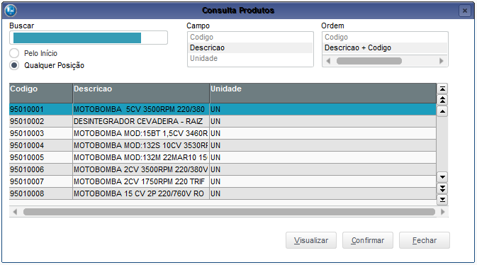
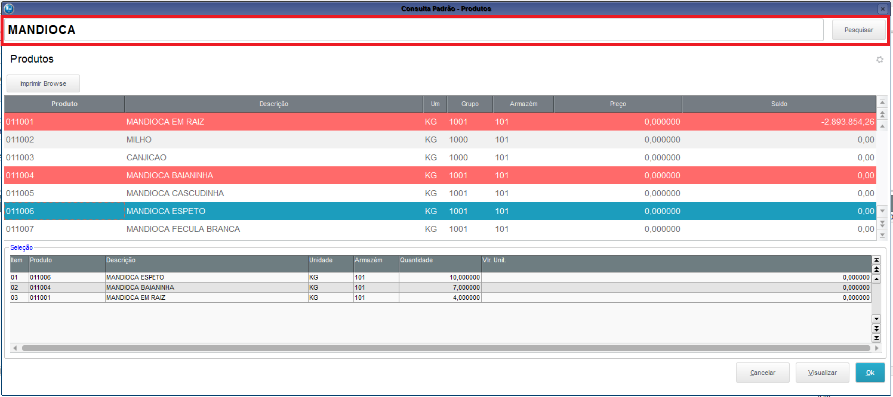
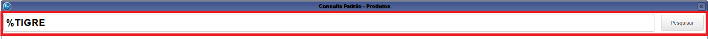
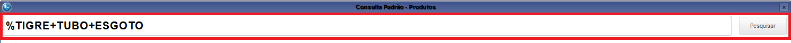
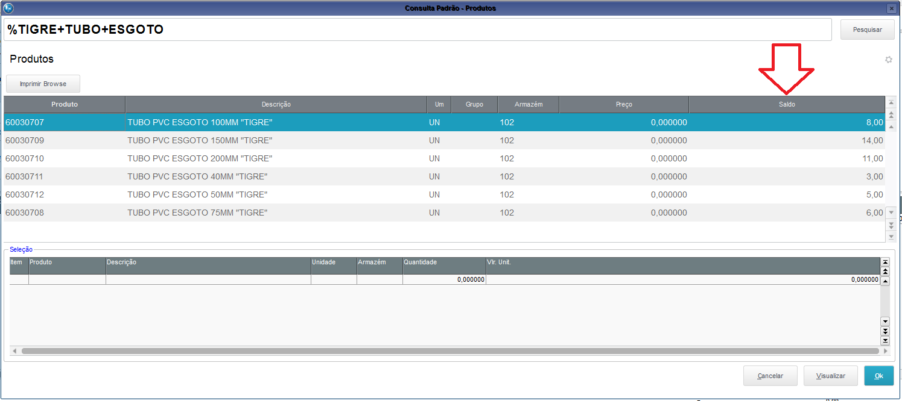
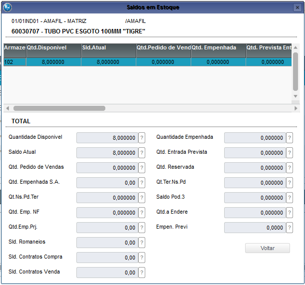
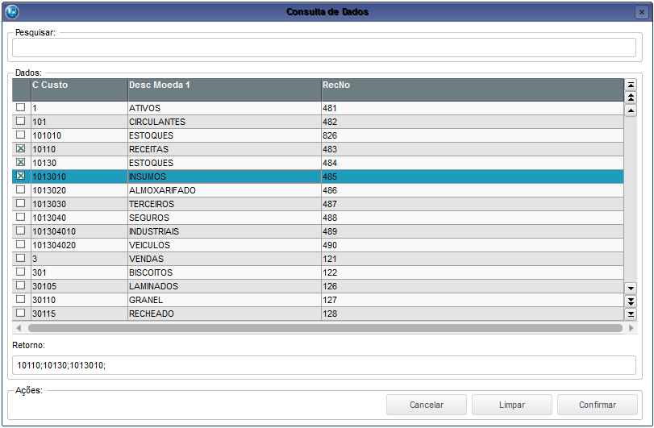
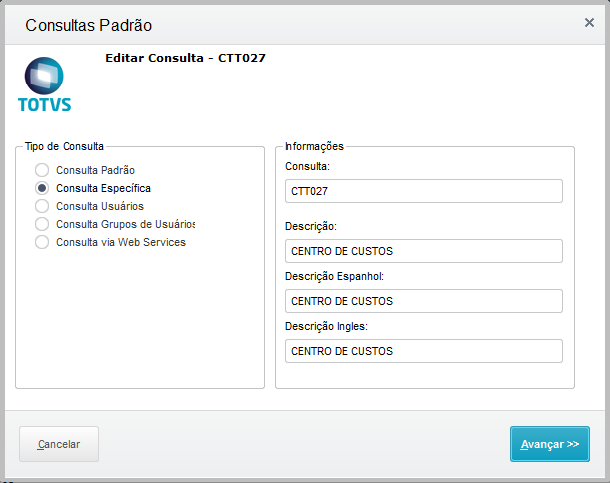
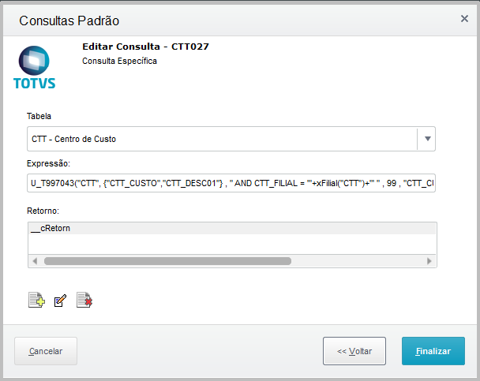

# Addon - Acelerador {.home-hero}

<!--############################################### 01 #######################################################-->

  01. Visão Geral

### 1. Visão Geral

#### Este Acelerador tem por objetivo disponibilizar outros modelos de consultas padrões para:.

<strong>Principais vantagens do produto:</strong>

- Produtos
- Fornecedores
- Clientes

!!! warning "ATENÇÃO: É necessário relacionar a novas consultas aos campos necessários – consultar Boletim Técnico."

<!--############################################### 02 #######################################################-->

  02. Menu

### 2. Menu

!!! warning "Não se Aplica" 

<!--############################################### 03 #######################################################-->

  03. Rotinas personalizadas específicas do Pacote

### 3. Rotinas personalizadas específicas do Pacote

#### Funções personalizadas contidas no pacote:

<table class="banks-table">
  <thead>
    <tr>
      <th>Rotina</th>
      <th>Descrição</th>      
    </tr>
  </thead>
  <tbody>
    <tr>
      <td>T997041</td>
      <td>Consulta Padrão Modelo 1</td>      
    </tr>
    <tr>
      <td>T997042</td>
      <td>Consulta Padrão Modelo 2</td>      
    </tr>
    <tr>
      <td>T997043</td>
      <td>Consulta Padrão com Mark</td>      
    </tr>
    <tr>
      <td>UPD997F</td>
      <td>Programa compatibilizador do Dicionário de Dados para aplicação do Acelerador.</td>      
    </tr>    
  </tbody>
</table>

<!--############################################### 04 #######################################################-->

  04. Pontos de Entradas Disponiveis para Desenvolvimento

### 4. Pontos de entrada Disponível no ADD-ON

<table class="banks-table">
  <thead>
    <tr>
      <th>Nome</th>
      <th>Descrição</th>
      <th>Programa Fonte</th>      
      <th>Sixtaxe</th>  
      <th>Exemplo</th>  
    </tr>
  </thead>
  <tbody>
    <tr>
      <td><strong>PE997042</strong></td>
      <td>Ponto de Entrada para validação ao pressionar  o botão OK, consulta padrão Produtos Modelo 2. </td>
      <td>T997042</td>      
      <td>Validação total PE997042(<lRet>) --> lRet</td>      
      <td>

  

    ADVPL
    PE997042
  

  <pre><code>
User Function PE997042()
Local lRet := .T. 
Return(lRet)
</code></pre>
  

      </td>      
    </tr>
  </tbody>
</table>

<!--############################################### 05 #######################################################-->

  05. Tabelas (SX2) 

### 5. Tabelas (SX2)

!!! warning "Não se Aplica" 

<!--############################################### 06 #######################################################-->

  06. Campos (SX3)

### 6. Campos (SX3)

!!! warning "Não se Aplica" 

<!--############################################### 07 #######################################################-->

  07. Parâmetros (SX6)

### 7. Parâmetros (SX6)

<table class="banks-table">
  <thead>
    <tr>
      <th>Nome</th>
      <th>Tipo</th>   
      <th>Descrição</th>      
      <th>Conteúdo</th>         
    </tr>
  </thead>
  <tbody>
    <tr>
      <td>MV_X997041</td>
      <td>Caracter</td>
      <td>Campos considerados para a composicao da coluna de saldo em estoque na consulta personalizada de produtos.</td>   
      <td>SB2.B2_QATU-(SB2.B2_QEMP+SB2.B2_RESERVA)</td>   
    </tr>    
    <tr>
      <td>MV_X997042</td>
      <td>Caracter</td>
      <td>Define se apresenta coluna de Saldo em Contrato de Parceria na consulta personalizada de  produtos.</td>   
      <td>.F.</td>   
    </tr>    
    <tr>
      <td>MV_X997043</td>
      <td>Caracter</td>
      <td>Armazens considerados para a composicao da coluna de saldo em estoque na consulta personalizada de  produtos.</td>   
      <td>001</td>   
    </tr>    
    <tr>
      <td>MV_X997044</td>
      <td>Numérico</td>
      <td>Numero máximo de registros apresentados junto a consulta personalizada de produtos.</td>   
      <td>50</td>   
    </tr>    
    <tr>
      <td>MV_X997045</td>
      <td>Lógico</td>
      <td>Define se deve apresentar os registros bloqueados na consulta personalizada de produtos.</td>   
      <td>.T.</td>   
    </tr>    
    <tr>
      <td>MV_X997046</td>
      <td>Lógico</td>
      <td>Determina se deve somar a quantidade em itens já existentes ou gerar novos itens atraves daconsulta personalizada de produtos.</td>   
      <td>.T.</td>   
    </tr>    
    <tr>
      <td>MV_X997047</td>
      <td>Caracter</td>
      <td>Codigo TES Inteligente considerado para carga do TES na rotina de Pedidos de Venda atraves da consulta personalizada de produtos.</td>   
      <td>01</td>   
    </tr>    
    <tr>
      <td>MV_X997048</td>
      <td>Caracter</td>
      <td>Codigo TES Inteligente considerado para carga do TES Cobranca no Ct. Parceria atraves da consulta personalizada de produtos.</td>   
      <td>01</td>   
    </tr>    
    <tr>
      <td>MV_X997049</td>
      <td>Caracter</td>
      <td>Codigo TES Inteligente considerado para carga do TES Remessa no Ct. Parceria atraves da consulta personalizada de produtos.</td>   
      <td>01</td>   
    </tr>    
  </tbody>
</table>

<!--############################################### 08 #######################################################-->

  08. Gatilhos (SX7)

### 8. Gatilhos (SX7)

!!! warning "Não se Aplica" 

<!--############################################### 09 #######################################################-->

  09. Índices (SIX)

### 9. Índices (SIX)

!!! warning "Não se Aplica" 

<!--############################################### 10 #######################################################-->

  10. Consulta Padrão (SXB)

### 10. Consulta Padrão (SXB)

<table class="banks-table">
  <thead>
    <tr>
      <th>Tipo</th>
      <th>Nome</th>
      <th>Descrição</th>
      <th>Tabela</th>
      <th>Expressao</th>
      <th>Retorno</th>
    </tr>
  </thead>
  <tbody>
    <tr>
      <td>Consulta Específica</td>
      <td>SA1041</td>
      <td>Consulta Clientes</td>
      <td>SA1</td>
      <td>U_T997041( "Consulta Clientes", "SA1", 2, "A1_NOME", "A1_NOME<>'XX'", .T.)</td>
      <td>SA1->A1_COD, SA1->A1_LOJA</td>
    </tr> 
    <tr>
      <td>Consulta Específica</td>
      <td>SA2041</td>
      <td>Consulta Fornecedores</td>
      <td>SA2</td>
      <td>U_T997041( "Consulta Fornecedores", "SA2", 2, "A2_NOME", "A2_NOME<>'XX'", .T.)</td>
      <td>SA2->A2_COD, SA2->A2_LOJA</td>
    </tr> 
    <tr>
      <td>Consulta Específica</td>
      <td>SB1041</td>
      <td>Consulta Produtos</td>
      <td>SB1</td>
      <td>U_T997041( "Consulta Produtos", "SB1", 2, "B1_DESC", "B1_TIPO<>'XX'", .T.)</td>
      <td>SB1->B1_COD</td>
    </tr> 
    <tr>
      <td>Consulta Específica</td>
      <td>SB1042</td>
      <td>Consulta Produtos</td>
      <td>SB1</td>
      <td>U_T997042()</td>
      <td>__cCodPro</td>
    </tr> 
  </tbody>
</table>

<!--############################################### 11 #######################################################-->

  11. Manual de operação

### 11. Manual de operação

#### 1. CONSULTA DE PRODUTOS Mod.1

Modelo de consulta disponível para Produtos, Fornecedores e Clientes. 

{.flow-image}

#### 2. CONSULTA DE PRODUTOS Mod.2

Disponibilizado consulta padrão personalizada referente ao cadastro de produtos. Esta nova consulta, possui funcionalidades as quais tem por objetivo disponibilizar uma maior agilidade na pesquisa, localização e seleção de produtos para movimentação junto ao ERP Protheus.

Esta nova consulta, possui funcionalidades de integração especificas com as rotinas padrões do ERP Protheus abaixo elencadas:

- Venda Direta – FATA701.PRW
- Orçamentos – MATA415.PRW
- Pedido de Venda – MATA410.PRW
- Contrato de Parceria – FATA400.PRW

Ao executar à consulta padrão personalizada de produtos à partir destas rotinas, dentre as funcionalidades presentes na mesma, também será disponibilizado recurso referente à mult-seleção de produtos, ou seja, funcionalidade que possibilita ao usuário para que esteja através da interface da própria consulta, selecionando um ou mais produtos.

Para selecionar os produtos, pode-se clicar com o mouse ou utilizar à tecla “enter”. Uma vez que o produto é selecionado, este passa a ser apresentado com o fundo vermelho, visando facilitar ao usuário. Caso seja desejado mais de uma unidade do mesmo produto, basta alterar o campo quantidade existente no grid inferior da tela.

{.flow-image}

<strong>DICA</strong>: também é possível determinar à quantidade do produto através da tecla “enter”, ou seja, a cada vez que a tecla é aciona sob um mesmo produto, o campo quantidade é incrementado.

Quando a consulta é executada a partir das rotinas descritas anteriormente, o recurso de mult-seleção é disponibilizado, logo, ao confirmar à interface, é retornado ao grid de itens da rotina pela qual a mesma foi chamada, onde todos os produtos e quantidades são atualizadas conforme selecionado na consulta.

Caso exista tabela de preços informada no cabeçalho da rotina, será apresentado o preço dos itens já na interface da consulta de produtos, bem como, será atualizado o preço dos respectivos itens na interface de venda.

Ainda em relação a carregar os itens\produtos da consulta para a rotina padrão, existem parâmetros conforme abaixo, para que seja configurado o código do TES Inteligente considerado na busca do código do Tipo de Saída (TES) considerado na comercialização dos produtos selecionados na interface da consulta.

**Pedido de Venda**
- MV_X997047

**Contrato de Parceria**
- MV_X997048
- MV_X997049

**OBSERVAÇÃO**: caso não seja localizado o TES para o item ou até mesmo o preço de venda, o item em questão será carregado como deletado no grid da rotina padrão do sistema.

Ao realizar à utilização da consulta personalizada de produção, é possível realizar filtro em torno da busca de registros específicos a serem considerados em sua execução. Para isto, basta informar o conteúdo desejado no cabeçalho da consulta.

{.flow-image}

Após informar o conteúdo da busca, basta acionar duas vezes à tecla “enter”. Havendo registros para o filtro informado, será posicionado no grid de itens, onde pode ser possível selecionar o produto desejado utilizando também a tecla “enter”. Caso não sejam encontrados registros para pesquisa informada, o foco será retornado ao filtro para que seja informado um novo conteúdo de busca\filtro.

Ainda em relação ao filtro dos produtos, pode-se utilizar o caracter coringa “%” para realizar um filtro mais refinado considerando-se do conceito de “está contido”.

{.flow-image}

Para uma pesquisa dos produtos ainda mais refinada, pode-se adicionar várias informações de filtro, para isto, utilize o caracter coringa “+” conforme exemplo abaixo.

{.flow-image}

Vale ressaltar, que ao realizar à pesquisa por uma determinada descrição, os registros localizados no cadastro de produtos que atendem ao conteúdo do filtro são apresentados de forma ordenada considerando como critério de ordenação à descrição dos mesmos e não o código.

**DICA**: através da tecla de atalho F12 é retornado o foco na interface da consulta de produtos para à edição do conteúdo de filtro\pesquisa, ou seja, estando entre os produtos por exemplo, ao acionar a tecla F12 o foco é retornado para que seja informado um novo conteúdo de pesquisa, considerando-se dos mesmos critérios descritos anteriormente.

Outra informação presente na interface da consulta padrão personalizada de cadastro de produtos, se refere à coluna de saldo em estoque.

{.flow-image}

Esta coluna se refere ao saldo disponível em estoque (SB2) dos produtos apresentados. A configuração a respeito de quais campos da tabela SB2 serão considerados para a composição da posição em estoque apresentada na interface da consulta é realizada através do parâmetro MV_X997041 o qual por default é configurado considerando-se dos campos abaixo:

- SB2.B2_QATU-(SB2.B2_QEMP+SB2.B2_RESERVA)

Outro detalhe referente à coluna de saldo em estoque dos produtos, se refere aos armazéns considerados para a composição da posição em estoque. Por padrão, são considerados todos os armazéns existentes para cada produto na tabela SB2, porém, caso devam ser considerados apenas armazéns específicos, estes poderão ser vinculados junto ao parâmetro abaixo:

- MV_X997043

Por final, está disponível na interface da consulta de produtos à tecla de atalho F4 a qual aciona à interface padrão de consulta da posição em estoque a partir do produto em que se está posicionado na interface.

{.flow-image}

Através da configuração do parâmetro MV_X997042, é possível apresentar a coluna Saldo em Contrato de Parceria. 

#### 3.CONSULTA Mod.3 com Mark

Modelo de consulta disponível para qualquer tabela do Protheus. 

Deverá ser incluída como “consulta específica”.

{.flow-image}

cAliasM, Caracter:  Alias da tabela consultada
aCamposM, Array: Campos que serão montados na grid de marcação
cFiltroM, Caracter: Filtragem da tela (SQL)
nTamanM, Numérico: Tamanho do campo de retorno
cCheckM, Caracter: Campo que será checado
lEditM, Lógico: Permite editar o retorno
cSepM, Caracter: Caracter de separação do texto
lAllFilM, Lógico: Identifica se são todas as filiais (inclusive de todas as empresas)
lRetorn: retorno se a consulta foi confirmada ou não

<table class="banks-table">
  <thead>
    <tr>
      <th>Parâmetro</th>
      <th>Tipo</th>
      <th>Descrição</th>      
    </tr>
  </thead>
  <tbody>
    <tr>
      <td>cAliasM</td>
      <td>Caracter</td>
      <td>Alias da tabela consultada</td>      
    </tr>    
    <tr>
      <td>aCamposM</td>
      <td>Array</td>
      <td>Campos que serão montados na grid de marcação</td>      
    </tr>
    <tr>
      <td>cFiltroM</td>
      <td>Caracter</td>
      <td>Filtragem da tela (SQL)</td>      
    </tr>
    <tr>
      <td>nTamanM</td>
      <td>Numérico</td>
      <td>Tamanho do campo de retorno</td>      
    </tr>
    <tr>
      <td>cCheckM</td>
      <td>Caracter</td>
      <td>Campo que será checado</td>      
    </tr>
    <tr>
      <td>lEditM</td>
      <td>Lógico</td>
      <td>Permite editar o retorno</td>      
    </tr>
    <tr>
      <td>cSepM</td>
      <td>Caracter</td>
      <td>Caracter de separação do texto</td>      
    </tr>
    <tr>
      <td>lAllFilM</td>
      <td>Lógico</td>
      <td>Identifica se são todas as filiais (inclusive de todas as empresas)</td>      
    </tr>
    <tr>
      <td>lRetorn</td>
      <td>Lógico</td>
      <td>Retorno se a consulta foi confirmada ou não</td>      
    </tr>
  </tbody>
</table>

!!! warning "IMPORTANTE: O Retorno da consulta padrão deve ser **__cRetorn**"

Exemplo de cadastramento da consulta CTT (consulta específica):

{.flow-image}

{.flow-image}

  <a href="/" class="md-button" style="text-decoration: none;">← Voltar para a Página Inicial</a>

