# Alçadas - Contas a Pagar (Título / Borderô) {.home-hero}

<!--############################################### 01 #######################################################-->

  01. Visão Geral

### 1. Visão Geral
Este ADDON tem por objetivo otimizar o processo de Controle de Alçadas para o departamento Financeiro, contemplando determinados processos no financeiro.

Esta automação utiliza o processo de Workflow via link para aprovação ou rejeição de documentos do financeiro que estão em processo de alçadas.

A Liberação de Alçadas controla título a pagar (individual) e/ou borderô de pagamento

Uma vez ativado o controle de alçadas, seja por título individual ou borderô, toda baixa de título será avaliado o Status das alçadas, sendo que somente os títulos LIBERADOS poderão ser baixados

Rotinas envolvidas na alçadas do financeiro a pagar:

- Funções Contas a Pagar (FINA750): centralizadora das rotinas de contas a pagar. 
- Inclusão manual de Contas a Pagar
- Baixa a Pagar Manual
- Baixa a Pagar Automática
- Baixa a Pagar Automática Multi-Filiais
- Borderô de Pagamento
- Manutenção de Borderô a Pagar
- Compensação a Pagar
- Compensação entre Carteiras
- Faturas a Pagar
- Aprovação/Rejeição de Documento (Título a Pagar / Borderô)
- Consulta Status de Aprovação do documento em alçadas

#### Esta rotina tem por objetivo a implantação do processo customizado para Controle de Alçadas com Workflow, contendo a integração dos processos do módulo FINANCEIRO – TÍTULOS A PAGAR / BORDERÔ A PAGAR- realizando aprovações/liberações eletrônicamente via sistema ou mobilidade (celular/e-mail/tablet/etc).

O controle de alçadas trabalha em conjunto com o controle padrão do ERP para liberação de pagamentos que deve estar ativado (ver parâmetros MV_CTLIPAG / MV_VLMINPG).

<strong>Principais vantagens do produto:</strong>

- Regra Geral: Títulos incluídos (manualmente ou via outros módulos) entram como "Pendente de liberação".

- Bloqueios e Filtros: Processos de baixa (manual/automática), compensações e envio de CNAB passam a exigir o status "Aprovado".

- Substituições de Rotinas: As rotinas padrão de Borderô (FINA240), Manutenção de Borderô (FINA590) e Liberação para Baixa (FINA580) foram desativadas.

- Novas Funções: Introdução das rotinas customizadas M001D05 e M001D06, que gerenciam o envio de Workflows para aprovação e controle de status.

- Exceções: Funções como Faturas, Cheques, Liquidação e Retorno CNAB não controlam status de alçada.

<!--############################################### 02 #######################################################-->

  02. Menu

### 2. Menu

!!! tip "Ver manual do Addon [**Alçadas - Regras**](/addon-alcadas-regras/#2-menu) na seção "2. Menu"." 

<!--############################################### 03 #######################################################-->

  03. Rotinas personalizadas específicas do Pacote

### 3. Rotinas personalizadas específicas do Pacote

#### Funções personalizadas contidas no pacote:

<table class="banks-table">
  <thead>
    <tr>
      <th>Função</th>
      <th>Descrição</th>
    </tr>
  </thead>
  <tbody>
    <tr>
      <td><strong>M001D01</strong></td>
      <td>Rotina para ENVIO do Processo de Workflow - TITULO A PAGAR (AVULSO)</td>
    </tr>
    <tr>
      <td><strong>M001D02</strong></td>
      <td>Rotina para RETORNO do Processo de Workflow - TITULO A PAGAR (AVULSO).</td>
    </tr>
    <tr>
      <td><strong>M001D03</strong></td>
      <td>RRotina para ENVIO do Processo de Workflow - BORDERO A PAGAR</td>
    </tr>
    <tr>
      <td><strong>M001D04</strong></td>
      <td>Rotina para RETORNO do Processo de Workflow - BORDERO A PAGAR</td>
    </tr>
    <tr>
      <td><strong>M001D05</strong></td>
      <td>Rotina para Geração de Borderô de Pagamento. Substituição da rotina padrão FINA240 para uso em conjunto com o parâmetro MV_CTLIPAG ativado.</td>
    </tr>
    <tr>
      <td><strong>M001D06</strong></td>
      <td>Rotina para Manutenção de Borderô (Incluir/Excluir Titulos). Substituição da rotina padrão FINA240 para uso em conjunto com o parâmetro MV_CTLIPAG ativado.</td>
    </tr>
    <tr>
      <td><strong>P001D01</strong></td>
      <td>Rotina centralizadora das chamadas dos Pontos de Entrada para integração do ADD-ON com as rotinas do módulo FINANCEIRO.</td>
    </tr>
        <tr>
      <td><strong>T001D01</strong></td>
      <td>Rotina para chamada da Tela de Consulta Alçadas - TITULO A PAGAR</td>
    </tr>
        <tr>
      <td><strong>UPD001D</strong></td>
      <td>Rotina de aplicação do ADD-ON</td>
    </tr>
        <tr>
      <td><strong>W001D01</strong></td>
      <td>Rotina para geração do Workflow para Liberação - TITULO A PAGAR (AVULSO)</td>
    </tr>
        <tr>
      <td><strong>W001D02</strong></td>
      <td>Rotina para geração do Workflow de Aviso da Aprovação/Rejeição - TITULO A PAGAR (AVULSO)</td>
    </tr>
        <tr>
      <td><strong>W001D03</strong></td>
      <td>Rotina para geração do Workflow para Liberação - TITULO A PAGAR (AVULSO)</td>
    </tr>
        <tr>
      <td><strong>W001D04</strong></td>
      <td>Rotina para geração do Workflow de Aviso da Aprovação/Rejeição - BORDERO A PAGAR</td>
    </tr>
        <tr>
      <td><strong>X001D01</strong></td>
      <td>Rotina centralizadora das Funções Genéricas do ADD-ON de Alçadas a Pagar.</td>
    </tr>
  </tbody>
</table>

<!--############################################### 04 #######################################################-->

  04. Pontos de Entradas Disponiveis para Desenvolvimento

### 4. Pontos de Entradas Disponiveis para Desenvolvimento

<table class="banks-table">
  <thead>
    <tr>
      <th>Nome</th>
      <th>Descrição</th>
      <th>Implementação</th>      
    </tr>
  </thead>
  <tbody>
    <tr>
      <td><strong>F050ALT</strong></td>
      <td>Ponto de entrada na rotina FINA050 Contas a Pagar chamado no final após a ALTERAÇÃO do título.</td>
      <td>

  

    ADVPL
    F050ALT
  

  <pre><code> 
If nOpc == 1
//ÚÄÄÄÄÄÄÄÄÄÄÄÄÄÄÄÄÄÄÄÄÄÄÄÄÄÄÄÄÄÄÄÄÄÄÄÄÄÄÄÄÄÄÄÄÄÄÄÄÄÄÄÄÄÄÄÄÄÄÄÄÄÄÄÄÄÄÄÄÄÄÄÄÄÄ
//³ Chamada específica para uso do ADD-ON de Alçadas (CONTAS A PAGAR)   ³
//ÀÄÄÄÄÄÄÄÄÄÄÄÄÄÄÄÄÄÄÄÄÄÄÄÄÄÄÄÄÄÄÄÄÄÄÄÄÄÄÄÄÄÄÄÄÄÄÄÄÄÄÄÄÄÄÄÄÄÄÄÄÄÄÄÄÄÄÄÄÄÄÄÄÄÄ
If ExistBlock("M001D01")
   U_M001D01(,,,"A") // Exclui o movimento das alçadas e Reenvia
EndIf
Endif
</code></pre>
  

      </td>      
    </tr>

    <tr>
      <td><strong>F050ROT</strong></td>
      <td>Ponto de entrada na rotina FINA050 Contas a Pagar utilizado para adicionar itens no menu da rotina.</td>
      <td>

  

    ADVPL
    F050ROT
  

  <pre><code> 
//ÚÄÄÄÄÄÄÄÄÄÄÄÄÄÄÄÄÄÄÄÄÄÄÄÄÄÄÄÄÄÄÄÄÄÄÄÄÄÄÄÄÄÄÄÄÄÄÄÄÄÄÄÄÄÄÄÄÄÄÄÄÄÄÄÄÄÄÄÄÄÄÄÄÄÄ
//³ Chamada específica para uso do ADD-ON de Alçadas (CONTAS A PAGAR)   ³
//ÀÄÄÄÄÄÄÄÄÄÄÄÄÄÄÄÄÄÄÄÄÄÄÄÄÄÄÄÄÄÄÄÄÄÄÄÄÄÄÄÄÄÄÄÄÄÄÄÄÄÄÄÄÄÄÄÄÄÄÄÄÄÄÄÄÄÄÄÄÄÄÄÄÄÄ
If ExistBlock("P001D01")
   aRet := U_P001D01("F050ROT")
EndIf
</code></pre>
  

      </td>      
    </tr>

    <tr>
      <td><strong>F080FIL</strong></td>
      <td>Ponto de entrada na rotina FINA080 Baixa Pagar Manual utilizado para montar o filtro dos titulos a pagar.</td>
      <td>

  

    ADVPL
    F080FIL
  

  <pre><code> 
//ÚÄÄÄÄÄÄÄÄÄÄÄÄÄÄÄÄÄÄÄÄÄÄÄÄÄÄÄÄÄÄÄÄÄÄÄÄÄÄÄÄÄÄÄÄÄÄÄÄÄÄÄÄÄÄÄÄÄÄÄÄÄÄÄÄÄÄÄÄÄÄÄÄÄÄ
//³ Chamada específica para uso do ADD-ON de Alçadas (CONTAS A PAGAR)   ³
//ÀÄÄÄÄÄÄÄÄÄÄÄÄÄÄÄÄÄÄÄÄÄÄÄÄÄÄÄÄÄÄÄÄÄÄÄÄÄÄÄÄÄÄÄÄÄÄÄÄÄÄÄÄÄÄÄÄÄÄÄÄÄÄÄÄÄÄÄÄÄÄÄÄÄÄ
If ExistBlock("X001D01")
   cRet := U_X001D01("RETFILTRO","A")
EndIf
</code></pre>
  

      </td>      
    </tr>

    <tr>
      <td><strong>F090FIL</strong></td>
      <td>Ponto de entrada na rotina FINA090 Baixa Pagar Automatica utilizado para montar o filtro dos titulos a pagar.</td>
      <td>

  

    ADVPL
    F090FIL
  

  <pre><code> 
//ÚÄÄÄÄÄÄÄÄÄÄÄÄÄÄÄÄÄÄÄÄÄÄÄÄÄÄÄÄÄÄÄÄÄÄÄÄÄÄÄÄÄÄÄÄÄÄÄÄÄÄÄÄÄÄÄÄÄÄÄÄÄÄÄÄÄÄÄÄÄÄÄÄÄÄ
//³ Chamada específica para uso do ADD-ON de Alçadas (CONTAS A PAGAR)   ³
//ÀÄÄÄÄÄÄÄÄÄÄÄÄÄÄÄÄÄÄÄÄÄÄÄÄÄÄÄÄÄÄÄÄÄÄÄÄÄÄÄÄÄÄÄÄÄÄÄÄÄÄÄÄÄÄÄÄÄÄÄÄÄÄÄÄÄÄÄÄÄÄÄÄÄÄ
If ExistBlock("X001D01")
   cRet := U_X001D01("RETFILTRO","A")
EndIf
</code></pre>
  

      </td>      
    </tr>

    <tr>
      <td><strong>F240BORD</strong></td>
      <td>Ponto de entrada na rotina FINA240 Bordero a Pagar chamado após a gravação do Bordero.</td>
      <td>

  

    ADVPL
    F240BORD
  

  <pre><code> 
//ÚÄÄÄÄÄÄÄÄÄÄÄÄÄÄÄÄÄÄÄÄÄÄÄÄÄÄÄÄÄÄÄÄÄÄÄÄÄÄÄÄÄÄÄÄÄÄÄÄÄÄÄÄÄÄÄÄÄÄÄÄÄÄÄÄÄÄÄÄÄÄÄÄÄÄ
//³ Chamada específica para uso do ADD-ON de Alçadas (CONTAS A PAGAR)   ³
//ÀÄÄÄÄÄÄÄÄÄÄÄÄÄÄÄÄÄÄÄÄÄÄÄÄÄÄÄÄÄÄÄÄÄÄÄÄÄÄÄÄÄÄÄÄÄÄÄÄÄÄÄÄÄÄÄÄÄÄÄÄÄÄÄÄÄÄÄÄÄÄÄÄÄÄ
If ExistBlock("M001D03")
   U_M001D03(,,,"I") // Inclui o movimento das alçadas
EndIf
</code></pre>
  

      </td>      
    </tr>

    <tr>
      <td><strong>F240BROWSE</strong></td>
      <td>Ponto de entrada na rotina FINA240 Bordero a Pagar permite efetuar filtro na abertura do Browse da rotina</td>
      <td>

  

    ADVPL
    F240BROWSE
  

  <pre><code> 
//ÚÄÄÄÄÄÄÄÄÄÄÄÄÄÄÄÄÄÄÄÄÄÄÄÄÄÄÄÄÄÄÄÄÄÄÄÄÄÄÄÄÄÄÄÄÄÄÄÄÄÄÄÄÄÄÄÄÄÄÄÄÄÄÄÄÄÄÄÄÄÄÄÄÄÄ
//³ Chamada específica para uso do ADD-ON de Alçadas (CONTAS A PAGAR)   ³
//ÀÄÄÄÄÄÄÄÄÄÄÄÄÄÄÄÄÄÄÄÄÄÄÄÄÄÄÄÄÄÄÄÄÄÄÄÄÄÄÄÄÄÄÄÄÄÄÄÄÄÄÄÄÄÄÄÄÄÄÄÄÄÄÄÄÄÄÄÄÄÄÄÄÄÄ
If ExistBlock("P001D01")
   cRet := U_P001D01("F240BROWSE")
EndIf
</code></pre>
  

      </td>      
    </tr>

    <tr>
      <td><strong>F240CAN</strong></td>
      <td>Ponto de entrada na rotina FINA240 Bordero a Pagar chamado após o cancelamento do Bordero.</td>
      <td>

  

    ADVPL
    F240CAN
  

  <pre><code> 
//ÚÄÄÄÄÄÄÄÄÄÄÄÄÄÄÄÄÄÄÄÄÄÄÄÄÄÄÄÄÄÄÄÄÄÄÄÄÄÄÄÄÄÄÄÄÄÄÄÄÄÄÄÄÄÄÄÄÄÄÄÄÄÄÄÄÄÄÄÄÄÄÄÄÄÄ
//³ Chamada específica para uso do ADD-ON de Alçadas (CONTAS A PAGAR)   ³
//ÀÄÄÄÄÄÄÄÄÄÄÄÄÄÄÄÄÄÄÄÄÄÄÄÄÄÄÄÄÄÄÄÄÄÄÄÄÄÄÄÄÄÄÄÄÄÄÄÄÄÄÄÄÄÄÄÄÄÄÄÄÄÄÄÄÄÄÄÄÄÄÄÄÄÄ
If ExistBlock("M001D03")
   U_M001D03(,,,"E") // Exclui o movimento das alçadas
EndIf
</code></pre>
  

      </td>      
    </tr>

    <tr>
      <td><strong>F240FIL</strong></td>
      <td>Ponto de entrada na rotina FINA240 Bordero a Pagar utilizado para montar o filtro dos titulos a pagar.</td>
      <td>

  

    ADVPL
    F240FIL
  

  <pre><code> 
//ÚÄÄÄÄÄÄÄÄÄÄÄÄÄÄÄÄÄÄÄÄÄÄÄÄÄÄÄÄÄÄÄÄÄÄÄÄÄÄÄÄÄÄÄÄÄÄÄÄÄÄÄÄÄÄÄÄÄÄÄÄÄÄÄÄÄÄÄÄÄÄÄÄÄÄ
//³ Chamada específica para uso do ADD-ON de Alçadas (CONTAS A PAGAR)   ³
//ÀÄÄÄÄÄÄÄÄÄÄÄÄÄÄÄÄÄÄÄÄÄÄÄÄÄÄÄÄÄÄÄÄÄÄÄÄÄÄÄÄÄÄÄÄÄÄÄÄÄÄÄÄÄÄÄÄÄÄÄÄÄÄÄÄÄÄÄÄÄÄÄÄÄÄ
If ExistBlock("X001D01")
   cRet := U_X001D01("RETFILTRO","P")
EndIf
</code></pre>
  

      </td>      
    </tr>

    <tr>
      <td><strong>F240FILTC</strong></td>
      <td>Ponto de entrada na rotina FINA240 Bordero a Pagar na chamada da geração do(s) arquivo(s) do SISPAG (FINA300), utilizado para montar o filtro dos titulos a pagar.</td>
      <td>

  

    ADVPL
    F240FILTC
  

  <pre><code> 
//ÚÄÄÄÄÄÄÄÄÄÄÄÄÄÄÄÄÄÄÄÄÄÄÄÄÄÄÄÄÄÄÄÄÄÄÄÄÄÄÄÄÄÄÄÄÄÄÄÄÄÄÄÄÄÄÄÄÄÄÄÄÄÄÄÄÄÄÄÄÄÄÄÄÄÄ
//³ Chamada específica para uso do ADD-ON de Alçadas (CONTAS A PAGAR)   ³
//ÀÄÄÄÄÄÄÄÄÄÄÄÄÄÄÄÄÄÄÄÄÄÄÄÄÄÄÄÄÄÄÄÄÄÄÄÄÄÄÄÄÄÄÄÄÄÄÄÄÄÄÄÄÄÄÄÄÄÄÄÄÄÄÄÄÄÄÄÄÄÄÄÄÄÄ
If ExistBlock("X001D01")
   cRet := U_X001D01("RETFILTRO","A")
EndIf
</code></pre>
  

      </td>      
    </tr>

    <tr>
      <td><strong>F340LEGE</strong></td>
      <td>Ponto de entrada na rotina FINA340 Compensação a Pagar para customizar a Legenda do Browse.</td>
      <td>

  

    ADVPL
    F340LEGE
  

  <pre><code> 
//ÚÄÄÄÄÄÄÄÄÄÄÄÄÄÄÄÄÄÄÄÄÄÄÄÄÄÄÄÄÄÄÄÄÄÄÄÄÄÄÄÄÄÄÄÄÄÄÄÄÄÄÄÄÄÄÄÄÄÄÄÄÄÄÄÄÄÄÄÄÄÄÄÄÄÄ
//³ Chamada específica para uso do ADD-ON de Alçadas (CONTAS A PAGAR)   ³
//ÀÄÄÄÄÄÄÄÄÄÄÄÄÄÄÄÄÄÄÄÄÄÄÄÄÄÄÄÄÄÄÄÄÄÄÄÄÄÄÄÄÄÄÄÄÄÄÄÄÄÄÄÄÄÄÄÄÄÄÄÄÄÄÄÄÄÄÄÄÄÄÄÄÄÄ
If ExistBlock("P001D01")
   aRet := U_P001D01("F340LEGE")
EndIf
</code></pre>
  

      </td>      
    </tr>

    <tr>
      <td><strong>F420FIL</strong></td>
      <td>Ponto de entrada na rotina FINA420 Remessa CNAB a Pagar utilizado para montar o filtro dos titulos a pagar.</td>
      <td>

  

    ADVPL
    F420FIL
  

  <pre><code> 
//ÚÄÄÄÄÄÄÄÄÄÄÄÄÄÄÄÄÄÄÄÄÄÄÄÄÄÄÄÄÄÄÄÄÄÄÄÄÄÄÄÄÄÄÄÄÄÄÄÄÄÄÄÄÄÄÄÄÄÄÄÄÄÄÄÄÄÄÄÄÄÄÄÄÄÄ
//³ Chamada específica para uso do ADD-ON de Alçadas (CONTAS A PAGAR)   ³
//ÀÄÄÄÄÄÄÄÄÄÄÄÄÄÄÄÄÄÄÄÄÄÄÄÄÄÄÄÄÄÄÄÄÄÄÄÄÄÄÄÄÄÄÄÄÄÄÄÄÄÄÄÄÄÄÄÄÄÄÄÄÄÄÄÄÄÄÄÄÄÄÄÄÄÄ
If ExistBlock("X001D01")
   cRet := U_X001D01("RETFILTRO","A")
EndIf
</code></pre>
  

      </td>      
    </tr>

    <tr>
      <td><strong>F580BROW</strong></td>
      <td>Ponto de entrada na rotina FINA580 Liberacao p/ Baixa Pagar executado antes da abertura do Browse da rotina.</td>
      <td>

  

    ADVPL
    F580BROW
  

  <pre><code> 
//ÚÄÄÄÄÄÄÄÄÄÄÄÄÄÄÄÄÄÄÄÄÄÄÄÄÄÄÄÄÄÄÄÄÄÄÄÄÄÄÄÄÄÄÄÄÄÄÄÄÄÄÄÄÄÄÄÄÄÄÄÄÄÄÄÄÄÄÄÄÄÄÄÄÄÄ
//³ Chamada específica para uso do ADD-ON de Alçadas (CONTAS A PAGAR)   ³
//ÀÄÄÄÄÄÄÄÄÄÄÄÄÄÄÄÄÄÄÄÄÄÄÄÄÄÄÄÄÄÄÄÄÄÄÄÄÄÄÄÄÄÄÄÄÄÄÄÄÄÄÄÄÄÄÄÄÄÄÄÄÄÄÄÄÄÄÄÄÄÄÄÄÄÄ
If ExistBlock("P001D01")
   U_P001D01("F580BROW")
EndIf
</code></pre>
  

      </td>      
    </tr>

    <tr>
      <td><strong>FA050B01</strong></td>
      <td>Ponto de entrada na rotina FINA050 Contas a Pagar chamado após confirmar a EXCLUSÃO do título.</td>
      <td>

  

    ADVPL
    FA050B01
  

  <pre><code> 
//ÚÄÄÄÄÄÄÄÄÄÄÄÄÄÄÄÄÄÄÄÄÄÄÄÄÄÄÄÄÄÄÄÄÄÄÄÄÄÄÄÄÄÄÄÄÄÄÄÄÄÄÄÄÄÄÄÄÄÄÄÄÄÄÄÄÄÄÄÄÄÄÄÄÄÄ
//³ Chamada específica para uso do ADD-ON de Alçadas (CONTAS A PAGAR)   ³
//ÀÄÄÄÄÄÄÄÄÄÄÄÄÄÄÄÄÄÄÄÄÄÄÄÄÄÄÄÄÄÄÄÄÄÄÄÄÄÄÄÄÄÄÄÄÄÄÄÄÄÄÄÄÄÄÄÄÄÄÄÄÄÄÄÄÄÄÄÄÄÄÄÄÄÄ
If ExistBlock("M001D01")
   U_M001D01(,,,"E") // Exclui o movimento das alçadas
EndIf
</code></pre>
  

      </td>      
    </tr>

    <tr>
      <td><strong>FINALEG</strong></td>
      <td>Ponto de entrada para customizar as Legendas nas rotinas do Financeiro: Pagar e Receber.</td>
      <td>

  

    ADVPL
    FINALEG
  

  <pre><code> 
//ÚÄÄÄÄÄÄÄÄÄÄÄÄÄÄÄÄÄÄÄÄÄÄÄÄÄÄÄÄÄÄÄÄÄÄÄÄÄÄÄÄÄÄÄÄÄÄÄÄÄÄÄÄÄÄÄÄÄÄÄÄÄÄÄÄÄÄÄÄÄÄÄÄÄÄ
//³ Chamada específica para uso do ADD-ON de Alçadas (CONTAS A PAGAR)   ³
//ÀÄÄÄÄÄÄÄÄÄÄÄÄÄÄÄÄÄÄÄÄÄÄÄÄÄÄÄÄÄÄÄÄÄÄÄÄÄÄÄÄÄÄÄÄÄÄÄÄÄÄÄÄÄÄÄÄÄÄÄÄÄÄÄÄÄÄÄÄÄÄÄÄÄÄ
If ExistBlock("P001D01")
   xRet := U_P001D01("FINALEG")
EndIf
</code></pre>
  

      </td>      
    </tr>

    <tr>
      <td><strong>FA590AROT</strong></td>
      <td>Ponto de entrada na rotina FINA590 Manutencao Bordero Pagar para adicionar itens no menu da rotina.</td>
      <td>

  

    ADVPL
    FA590AROT
  

  <pre><code> 
//ÚÄÄÄÄÄÄÄÄÄÄÄÄÄÄÄÄÄÄÄÄÄÄÄÄÄÄÄÄÄÄÄÄÄÄÄÄÄÄÄÄÄÄÄÄÄÄÄÄÄÄÄÄÄÄÄÄÄÄÄÄÄÄÄÄÄÄÄÄÄÄÄÄÄÄ
//³ Chamada específica para uso do ADD-ON de Alçadas (CONTAS A PAGAR)   ³
//ÀÄÄÄÄÄÄÄÄÄÄÄÄÄÄÄÄÄÄÄÄÄÄÄÄÄÄÄÄÄÄÄÄÄÄÄÄÄÄÄÄÄÄÄÄÄÄÄÄÄÄÄÄÄÄÄÄÄÄÄÄÄÄÄÄÄÄÄÄÄÄÄÄÄÄ
If ExistBlock("P001D01")
   aRet := U_P001D01("FA590AROT")
EndIf
</code></pre>
  

      </td>      
    </tr>

    <tr>
      <td><strong>FA590BOR</strong></td>
      <td>Ponto de entrada na rotina FINA590 Manutencao Bordero Pagar para validar se o Bordero pode ser alterado.</td>
      <td>

  

    ADVPL
    FA590BOR
  

  <pre><code> 
//ÚÄÄÄÄÄÄÄÄÄÄÄÄÄÄÄÄÄÄÄÄÄÄÄÄÄÄÄÄÄÄÄÄÄÄÄÄÄÄÄÄÄÄÄÄÄÄÄÄÄÄÄÄÄÄÄÄÄÄÄÄÄÄÄÄÄÄÄÄÄÄÄÄÄÄ
//³ Chamada específica para uso do ADD-ON de Alçadas (CONTAS A PAGAR)   ³
//ÀÄÄÄÄÄÄÄÄÄÄÄÄÄÄÄÄÄÄÄÄÄÄÄÄÄÄÄÄÄÄÄÄÄÄÄÄÄÄÄÄÄÄÄÄÄÄÄÄÄÄÄÄÄÄÄÄÄÄÄÄÄÄÄÄÄÄÄÄÄÄÄÄÄÄ
If ExistBlock("P001D01")
   lRet := U_P001D01("FA590BOR")
EndIf
</code></pre>
  

      </td>      
    </tr>

  </tbody>
</table>

<!--############################################### 05 #######################################################-->

  05. Tabelas (SX2) 

### 5. Tabelas (SX2)

!!! tip "Ver manual do Addon [**Alçadas - Regras**](/addon-alcadas-regras/#6-campos-sx3) na seção "6. Tabelas (SX2)"." 

<!--############################################### 06 #######################################################-->

  06. Campos (SX3)

### 6. Campos (SX3)

Campo **E2_X_IDAL**

<table class="banks-table">
  <tbody>
    <tr>
      <th>Tipo</th>
      <td>C</td>
      <th>Ordem</th>
      <td>* Próxima disponível</td>
      <th>Tamanho</th>
      <td>10</td>
      <th>Decimal</th>
      <td>0</td>
      <th>Formato</th>
      <td>@!</td>
    </tr>
    <tr>
      <th>Contexto</th>
      <td>Real</td>
      <th>Propriedade</th>
      <td>Visualizar</td>
      <th>Obrigatório</th>
      <td>N</td>
      <th>Browse</th>
      <td>N</td>
    </tr>
    <tr>
      <th>Título</th>
      <td colspan="7">ID ALCADA</td>
    </tr>
    <tr>
      <th>Descrição</th>
      <td colspan="7">IDALC</td>
    </tr>
  </tbody>
</table>
#### **Help**

Identificador do Controle de Alcadas.

#### **Configurações adicionais**
<table class="banks-table">
  <tbody>
    <tr>
      <th>F3</th>
      <td>-</td>
    </tr>
    <tr>
      <th>Modo Edição</th>
      <td>-</td>
    </tr>
    <tr>
      <th>Val. Usuário</th>
      <td>-</td>
    </tr>
    <tr>
      <th>Lista Opções</th>
      <td>-</td>
    </tr>
    <tr>
      <th>Inicializador</th>
      <td>-</td>
    </tr>
    <tr>
      <th>Ini. Browse</th>
      <td>-</td>
    </tr>
  </tbody>
</table>

Campo **E2_X_DOC**

<table class="banks-table">
  <tbody>
    <tr>
      <th>Tipo</th>
      <td>C</td>
      <th>Ordem</th>
      <td>* Próxima disponível</td>
      <th>Tamanho</th>
      <td>31</td>
      <th>Decimal</th>
      <td>0</td>
      <th>Formato</th>
      <td>@!</td>
    </tr>
    <tr>
      <th>Contexto</th>
      <td>Real</td>
      <th>Propriedade</th>
      <td>Visualizar</td>
      <th>Obrigatório</th>
      <td>N</td>
      <th>Browse</th>
      <td>N</td>
    </tr>
    <tr>
      <th>Título</th>
      <td colspan="7">Num. Doc.</td>
    </tr>
    <tr>
      <th>Descrição</th>
      <td colspan="7">Número Documento.</td>
    </tr>
  </tbody>
</table>
#### **Help**

Numero/Codigo do Documento com integracao no Controle de Alcadas.

#### **Configurações adicionais**
<table class="banks-table">
  <tbody>
    <tr>
      <th>F3</th>
      <td>-</td>
    </tr>
    <tr>
      <th>Modo Edição</th>
      <td>-</td>
    </tr>
    <tr>
      <th>Val. Usuário</th>
      <td>-</td>
    </tr>
    <tr>
      <th>Lista Opções</th>
      <td>-</td>
    </tr>
    <tr>
      <th>Inicializador</th>
      <td>-</td>
    </tr>
    <tr>
      <th>Ini. Browse</th>
      <td>-</td>
    </tr>
  </tbody>
</table>

Campo **E2_X_STS**

<table class="banks-table">
  <tbody>
    <tr>
      <th>Tipo</th>
      <td>C</td>
      <th>Ordem</th>
      <td>* Próxima disponível</td>
      <th>Tamanho</th>
      <td>1</td>
      <th>Decimal</th>
      <td>0</td>
      <th>Formato</th>
      <td>@!</td>
    </tr>
    <tr>
      <th>Contexto</th>
      <td>Real</td>
      <th>Propriedade</th>
      <td>Visualizar</td>
      <th>Obrigatório</th>
      <td>N</td>
      <th>Browse</th>
      <td>N</td>
    </tr>
    <tr>
      <th>Título</th>
      <td colspan="7">Status Aprov</td>
    </tr>
    <tr>
      <th>Descrição</th>
      <td colspan="7">Status da Aprovação</td>
    </tr>
  </tbody>
</table>
#### **Help**

Status do movimento de alçada: 
1 - Aguardando Aprovacao 
2 - Aguardando Aprov. Nivel Anterior 
3 - Aprovado 
4 - Transferido p/ outro Aprovador 
5 - Reprovado 
6 - Nivel Anterior Reprovado

#### **Configurações adicionais**
<table class="banks-table">
  <tbody>
    <tr>
      <th>F3</th>
      <td>-</td>
    </tr>
    <tr>
      <th>Modo Edição</th>
      <td>-</td>
    </tr>
    <tr>
      <th>Val. Usuário</th>
      <td>-</td>
    </tr>
    <tr>
      <th>Lista Opções</th>
      <td>-</td>
    </tr>
    <tr>
      <th>Inicializador</th>
      <td>-</td>
    </tr>
    <tr>
      <th>Ini. Browse</th>
      <td>-</td>
    </tr>
  </tbody>
</table>

Campo **E2_X_SOL**

<table class="banks-table">
  <tbody>
    <tr>
      <th>Tipo</th>
      <td>C</td>
      <th>Ordem</th>
      <td>* Próxima disponível</td>
      <th>Tamanho</th>
      <td>6</td>
      <th>Decimal</th>
      <td>0</td>
      <th>Formato</th>
      <td>@!</td>
    </tr>
    <tr>
      <th>Contexto</th>
      <td>Real</td>
      <th>Propriedade</th>
      <td>Visualizar</td>
      <th>Obrigatório</th>
      <td>N</td>
      <th>Browse</th>
      <td>N</td>
    </tr>
    <tr>
      <th>Título</th>
      <td colspan="7">Solicitante</td>
    </tr>
    <tr>
      <th>Descrição</th>
      <td colspan="7">Usuario Solicitante</td>
    </tr>
  </tbody>
</table>
#### **Help**

Codigo do Usuario Solicitante

#### **Configurações adicionais**
<table class="banks-table">
  <tbody>
    <tr>
      <th>F3</th>
      <td>-</td>
    </tr>
    <tr>
      <th>Modo Edição</th>
      <td>-</td>
    </tr>
    <tr>
      <th>Val. Usuário</th>
      <td>-</td>
    </tr>
    <tr>
      <th>Lista Opções</th>
      <td>-</td>
    </tr>
    <tr>
      <th>Inicializador</th>
      <td>-</td>
    </tr>
    <tr>
      <th>Ini. Browse</th>
      <td>-</td>
    </tr>
  </tbody>
</table>

Campo **EA_X_IDAL**

<table class="banks-table">
  <tbody>
    <tr>
      <th>Tipo</th>
      <td>C</td>
      <th>Ordem</th>
      <td>* Próxima disponível</td>
      <th>Tamanho</th>
      <td>10</td>
      <th>Decimal</th>
      <td>0</td>
      <th>Formato</th>
      <td>@!</td>
    </tr>
    <tr>
      <th>Contexto</th>
      <td>Real</td>
      <th>Propriedade</th>
      <td>Visualizar</td>
      <th>Obrigatório</th>
      <td>N</td>
      <th>Browse</th>
      <td>N</td>
    </tr>
    <tr>
      <th>Título</th>
      <td colspan="7">ID ALCADA</td>
    </tr>
    <tr>
      <th>Descrição</th>
      <td colspan="7">IDALC</td>
    </tr>
  </tbody>
</table>
#### **Help**

Identificador do Controle de Alcadas.

#### **Configurações adicionais**
<table class="banks-table">
  <tbody>
    <tr>
      <th>F3</th>
      <td>-</td>
    </tr>
    <tr>
      <th>Modo Edição</th>
      <td>-</td>
    </tr>
    <tr>
      <th>Val. Usuário</th>
      <td>-</td>
    </tr>
    <tr>
      <th>Lista Opções</th>
      <td>-</td>
    </tr>
    <tr>
      <th>Inicializador</th>
      <td>-</td>
    </tr>
    <tr>
      <th>Ini. Browse</th>
      <td>-</td>
    </tr>
  </tbody>
</table>

Campo **EA_X_DOC**

<table class="banks-table">
  <tbody>
    <tr>
      <th>Tipo</th>
      <td>C</td>
      <th>Ordem</th>
      <td>* Próxima disponível</td>
      <th>Tamanho</th>
      <td>6</td>
      <th>Decimal</th>
      <td>0</td>
      <th>Formato</th>
      <td>@!</td>
    </tr>
    <tr>
      <th>Contexto</th>
      <td>Real</td>
      <th>Propriedade</th>
      <td>Visualizar</td>
      <th>Obrigatório</th>
      <td>N</td>
      <th>Browse</th>
      <td>N</td>
    </tr>
    <tr>
      <th>Título</th>
      <td colspan="7">Num. Doc.</td>
    </tr>
    <tr>
      <th>Descrição</th>
      <td colspan="7">Número Documento.</td>
    </tr>
  </tbody>
</table>
#### **Help**

Numero/Codigo do Documento com integracao no Controle de Alcadas.

#### **Configurações adicionais**
<table class="banks-table">
  <tbody>
    <tr>
      <th>F3</th>
      <td>-</td>
    </tr>
    <tr>
      <th>Modo Edição</th>
      <td>-</td>
    </tr>
    <tr>
      <th>Val. Usuário</th>
      <td>-</td>
    </tr>
    <tr>
      <th>Lista Opções</th>
      <td>-</td>
    </tr>
    <tr>
      <th>Inicializador</th>
      <td>-</td>
    </tr>
    <tr>
      <th>Ini. Browse</th>
      <td>-</td>
    </tr>
  </tbody>
</table>

Campo **EA_X_STS**

<table class="banks-table">
  <tbody>
    <tr>
      <th>Tipo</th>
      <td>C</td>
      <th>Ordem</th>
      <td>* Próxima disponível</td>
      <th>Tamanho</th>
      <td>1</td>
      <th>Decimal</th>
      <td>0</td>
      <th>Formato</th>
      <td>@!</td>
    </tr>
    <tr>
      <th>Contexto</th>
      <td>Real</td>
      <th>Propriedade</th>
      <td>Visualizar</td>
      <th>Obrigatório</th>
      <td>N</td>
      <th>Browse</th>
      <td>N</td>
    </tr>
    <tr>
      <th>Título</th>
      <td colspan="7">Status Aprov</td>
    </tr>
    <tr>
      <th>Descrição</th>
      <td colspan="7">Status da Aprovação</td>
    </tr>
  </tbody>
</table>
#### **Help**

Status do movimento de alçada: 
1 - Aguardando Aprovacao 
2 - Aguardando Aprov. Nivel Anterior 
3 - Aprovado 
4 - Transferido p/ outro Aprovador 
5 - Reprovado 
6 - Nivel Anterior Reprovado

#### **Configurações adicionais**
<table class="banks-table">
  <tbody>
    <tr>
      <th>F3</th>
      <td>-</td>
    </tr>
    <tr>
      <th>Modo Edição</th>
      <td>-</td>
    </tr>
    <tr>
      <th>Val. Usuário</th>
      <td>-</td>
    </tr>
    <tr>
      <th>Lista Opções</th>
      <td>-</td>
    </tr>
    <tr>
      <th>Inicializador</th>
      <td>-</td>
    </tr>
    <tr>
      <th>Ini. Browse</th>
      <td>-</td>
    </tr>
  </tbody>
</table>

Campo **EA_X_SOL**

<table class="banks-table">
  <tbody>
    <tr>
      <th>Tipo</th>
      <td>C</td>
      <th>Ordem</th>
      <td>* Próxima disponível</td>
      <th>Tamanho</th>
      <td>6</td>
      <th>Decimal</th>
      <td>0</td>
      <th>Formato</th>
      <td>@!</td>
    </tr>
    <tr>
      <th>Contexto</th>
      <td>Real</td>
      <th>Propriedade</th>
      <td>Visualizar</td>
      <th>Obrigatório</th>
      <td>N</td>
      <th>Browse</th>
      <td>N</td>
    </tr>
    <tr>
      <th>Título</th>
      <td colspan="7">Solicitante</td>
    </tr>
    <tr>
      <th>Descrição</th>
      <td colspan="7">Usuario Solicitante</td>
    </tr>
  </tbody>
</table>
#### **Help**

Codigo do Usuario Solicitante

#### **Configurações adicionais**
<table class="banks-table">
  <tbody>
    <tr>
      <th>F3</th>
      <td>-</td>
    </tr>
    <tr>
      <th>Modo Edição</th>
      <td>-</td>
    </tr>
    <tr>
      <th>Val. Usuário</th>
      <td>-</td>
    </tr>
    <tr>
      <th>Lista Opções</th>
      <td>-</td>
    </tr>
    <tr>
      <th>Inicializador</th>
      <td>-</td>
    </tr>
    <tr>
      <th>Ini. Browse</th>
      <td>-</td>
    </tr>
  </tbody>
</table>

<!--############################################### 07 #######################################################-->

  07. Parâmetros (SX6)

### 7. Parâmetros (SX6)

<table class="banks-table">
  <thead>
    <tr>
      <th>Nome</th>
      <th>Tipo</th>
      <th>Descrição</th>
      <th>Conteúdo</th>
    </tr>
  </thead>
  <tbody>
    <tr>
      <td><strong>MV_CTLIPAG</strong></td>
      <td>Lógico</td>
      <td>Controla as baixas a pagar através da data de liberação preenchida, caso .T. o sistema verifica se o campo E2_DATALIB está preenchido, caso contrário não controla.</td>
      <td>.T.</td>
    </tr>
    <tr>
      <td><strong>MV_VLMINPG</strong></td>
      <td>Numérico</td>
      <td>Valor mínimo para executar a baixa do título, mesmo que o campo E2_DATALIB não esteja preenchido e o parâmetro MV_CTLIPAG seja .T.</td>
      <td>0</td>
    </tr>       
    <tr>
      <td><strong>MV_X001000</strong></td>
      <td>Logico</td>
      <td>Habilita ADD-ON de Alçadas com Link de aprovação</td>
      <td>.T.</td>
    </tr>       
    <tr>
      <td><strong>MV_X001007</strong></td>
      <td>Logico</td>
      <td>Tipo de Alcadas de Contas a Pagar: 
      1-Titulo Avulso;  2-Bordero;  3-Ambos
      </td>
      <td>.T.</td>
    </tr>       
    <tr>
      <td><strong>MV_X001008</strong></td>
      <td>Numerico</td>
      <td>Ativa controle de alcadas para Contas a Pagar</td>
      <td>3</td>
    </tr>       
  </tbody>
</table>

<!--############################################### 08 #######################################################-->

  08. Gatilhos (SX7)

### 8. Gatilhos (SX7)

!!! tip "Ver manual do Addon [**Alçadas - Regras**](/addon-alcadas-regras/#8-gatilhos-sx7) na seção "8. Gatilhos"." 

<!--############################################### 09 #######################################################-->

  09. Índices (SIX)

### 9. Índices (SIX)

<table class="banks-table">
  <thead>
    <tr>
      <th>Indice</th>
      <th>Ordem</th>
      <th>Chave</th>
      <th>Descrição</th>
      <th>NickName</th>      
    </tr>
  </thead>
  <tbody>
    <tr>
      <td><strong>SE2</strong></td>
      <td>* Próxima disponível</td>
      <td>E2_FILIAL+E2_X_IDAL</td>
      <td>ID ALCADA</td>
      <td>SE2ALC</td>      
    </tr>    
    <tr>
      <td><strong>SEA</strong></td>
      <td>* Próxima disponível</td>
      <td>EA_FILIAL+EA_X_IDAL</td>
      <td>ID ALCADA</td>
      <td>SEAALC</td>      
    </tr>  
  </tbody>
</table>

<!--############################################### 10 #######################################################-->

  10. Consulta Padrão (SXB)

### 10. Consulta Padrão (SXB)

!!! tip "Ver manual do Addon [**Alçadas - Regras**](/addon-alcadas-regras/#10-consulta-padrao-sxb) na seção "10. Consulta Padrão (SXB)"." 

<!--############################################### 11 #######################################################-->

  11. Manual de operação

### 11. Manual de operação

#### 1. Cadastro

#### 1.1 Destinatários Processos de Workflow

Esta rotina tem por objetivo cadastrar os processos de Workflow customizados para definição dos e-mails destinatários de cada processo.

Este cadastro é para uso geral podendo ser vinculado à customizações específicas que envolvem geração de Workflow.

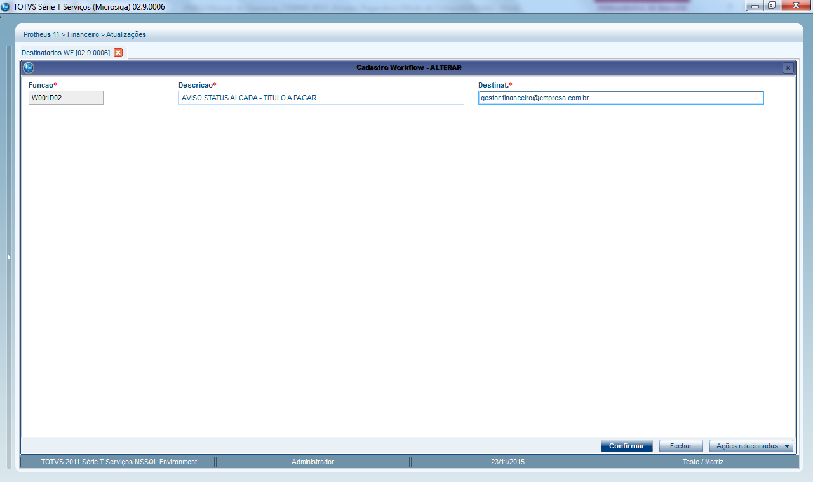{.flow-image}

<strong>FUNÇÃO:</strong> informe o nome da rotina customizada de Workflow.

<strong>DESCRIÇÃO:</strong> informe uma descrição para identificação do Workflow.

<strong>DESTINATÁRIOS:</strong> informe os e-mails dos destinatários para envio do Workflow; para informar vários e-mails separe com “;”.

No caso deste pacote de Alçadas, é necessário cadastrar os seguintes processos:

<table class="banks-table">
  <thead>
    <tr>
      <th>Função</th>
      <th>Descrição</th>
      <th>E-mails destino</th>      
    </tr>
  </thead>
  <tbody>
    <tr>
      <td>W001D02</td>
      <td>AVISO TÍTULO A PAGAR (APROVADO/REJEITADO)</td>
      <td></td>
    </tr>    
    <tr>
      <td>W001D04</td>
      <td>AVISO BORDERÔ A PAGAR (APROVADO/REJEITADO)</td>
      <td></td>
    </tr>    
  </tbody>
</table>

#### 1.2 Regras de Alçadas

Esta rotina tem por objetivo cadastrar as regras dos processos em controle de alçadas, utilizado para definir as regras de bloqueio dos documentos e os usuários aprovadores de cada processo.

OBS: os usuários envolvidos no processo (solicitantes, aprovadores) devem estar cadastrados como usuários do ERP no módulo Configurador e devem possuir e-mail.

Será apresentada tela de Browse contendo as regras já criadas.

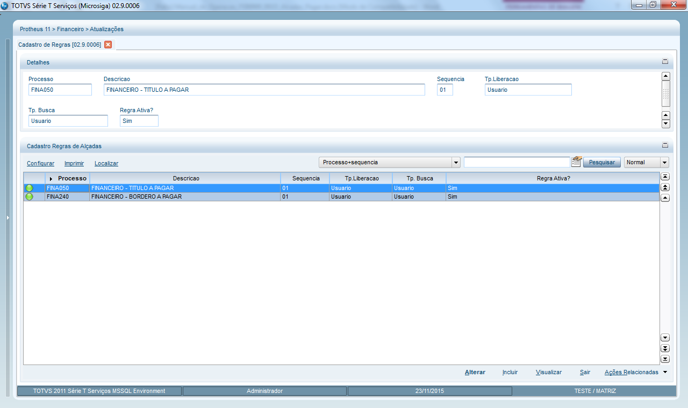{.flow-image}

Existem três tipos de liberação das regras:

#### Liberação por Nível

Utilizado para definir regras de liberação por nível de hierarquia, ou seja, uma regra pode exigir a liberação de três usuários que estão em níveis de hierarquia diferentes, por exemplo:

<table class="banks-table">
  <thead>
    <tr>
      <th>Seq.</th>
      <th>Tp. Liber.</th>
      <th>Nível</th>
      <th>Usuário</th>
      <th>Cargo/Departamento</th>
    </tr>
  </thead>
  <tbody>
    <tr>
      <td>01</td>
      <td>Nível</td>
      <td>01</td>
      <td>APROVADOR 01</td>
      <td>Gerente de T.I.</td>
    </tr>    
    <tr>
      <td>02</td>
      <td>Nível</td>
      <td>02</td>
      <td>APROVADOR 02</td>
      <td>Gerente de Compras</td>
    </tr>    
    <tr>
      <td>03</td>
      <td>Nível</td>
      <td>03</td>
      <td>APROVADOR 03</td>
      <td>Diretor 1</td>
    </tr>    
    <tr>
      <td>04</td>
      <td>Nível</td>
      <td>03</td>
      <td>APROVADOR 04</td>
      <td>Diretor 2</td>
    </tr>    
  </tbody>
</table>

O controle de alçadas vai executar a primeira regra e enviar um workflow de aprovação para os usuários aprovadores do Nível 01, neste caso usuário “APROVADOR 01”. Após o mesmo aprovar o documento, será executada a segunda regra que enviará um workflow de aprovação para os usuários do Nível 02, “APROVADOR 02”. Após este aprovar, será executada a terceira regra que enviará um workflow para os dois usuários do Nível 03. Neste caso qualquer um deles pode aprovar o documento, pois estão no mesmo nível. 
Somente após o último nível ter sido aprovado é que o documento em questão será liberado pelo controle de alçadas. 
Caso algum usuário rejeite o documento, em qualquer nível, as regras seguintes não serão executadas e o documento ficará com Status “rejeitado”. 

#### Liberação por Usuário

Utilizado para definir regras de liberação por usuário um ou mais usuários, sem considerar níveis de hierarquia. Exemplo:

<table class="banks-table">
  <thead>
    <tr>
      <th>Seq.</th>
      <th>Tp. Liber.</th>
      <th>Nível</th>
      <th>Usuário</th>
      <th>Cargo/Departamento</th>
    </tr>
  </thead>
  <tbody>
    <tr>
      <td>01</td>
      <td>Usuário</td>
      <td>-</td>
      <td>APROVADOR 01</td>
      <td>Gerente de T.I.</td>
    </tr>    
    <tr>
      <td>02</td>
      <td>Usuário</td>
      <td>-</td>
      <td>APROVADOR 02</td>
      <td>Gerente de Compras</td>
    </tr>    
    <tr>
      <td>03</td>
      <td>Usuário</td>
      <td>-</td>
      <td>APROVADOR 03</td>
      <td>Diretor 1</td>
    </tr>    
  </tbody>
</table>

O controle de alçadas vai executar sequencialmente cada regra acima e exigir a aprovação de todos os usuários definidos.

#### Liberação por Documento

Utilizado quando não há diferenciação de níveis de hierarquia e quando há vários usuários aprovadores, sendo que o documento será liberado quando qualquer um dos usuários aprovar, não exigindo a aprovação de todos.

<table class="banks-table">
  <thead>
    <tr>
      <th>Seq.</th>
      <th>Tp. Liber.</th>
      <th>Nível</th>
      <th>Usuário</th>
      <th>Cargo/Departamento</th>
    </tr>
  </thead>
  <tbody>
    <tr>
      <td>01</td>
      <td>Documento</td>
      <td>-</td>
      <td>APROVADOR 01</td>
      <td>Gerente de T.I.</td>
    </tr>    
    <tr>
      <td>02</td>
      <td>Documento</td>
      <td>-</td>
      <td>APROVADOR 02</td>
      <td>Gerente de Compras</td>
    </tr>    
    <tr>
      <td>03</td>
      <td>Documento</td>
      <td>-</td>
      <td>APROVADOR 03</td>
      <td>Diretor 1</td>
    </tr>    
  </tbody>
</table>

Principais campos da tela de cadastro:

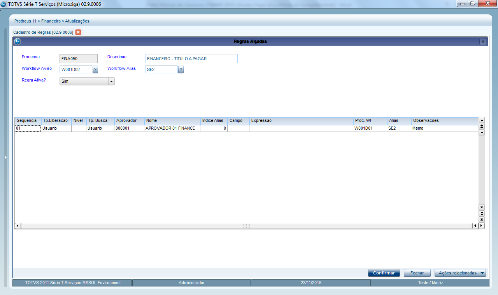{.flow-image}

<strong>PROCESSO</strong>: informe o nome do programa ao qual serão criadas as regras para alçadas, no caso deste pacote são somente as rotinas abaixo:

<table class="banks-table">
  <thead>
    <tr>
      <th>Rotina</th>
      <th>Descrição</th>      
    </tr>
  </thead>
  <tbody>
    <tr>
      <td>FINA050</td>
      <td>FINANCEIRO - TITULO A PAGAR</td>
    </tr>
    <tr>
      <td>FINA240</td>
      <td>FINANCEIRO - BORDERO A PAGAR</td>
    </tr>    
  </tbody>
</table>

<strong>DESCRIÇÃO</strong>: informe uma descrição ou nome para o processo, conforme a rotina.

<strong>WORKFLOW AVISO</strong>: informe o nome do workflow que será utilizado para o controle de alçadas enviar um e-mail de Aviso com o Status de liberação do documento (aprovado ou rejeitado).
É necessário que o mesmo esteja cadastrado na rotina “Destinatários de Workflow”.
Por padrão, o controle de alçadas sempre enviará o workflow de aviso para o usuário “solicitante” que incluiu o respectivo documento, porém é possível adicionar outros destinatários. 
Para este pacote de alçadas informe:

<table class="banks-table">
  <thead>
    <tr>
      <th>Processo</th>
      <th>Workflow</th>
    </tr>
  </thead>
  <tbody>
    <tr>
      <td>FINA050</td>
      <td>W001D02</td>
    </tr>
    <tr>
      <td>FINA240</td>
      <td>W001D04</td>
    </tr>    
  </tbody>
</table>

<strong>WORKFLOW ALIAS</strong>: informe o Alias da tabela principal do documento em alçadas, para uso pelo programa de envio do workflow de aviso.

<table class="banks-table">
  <thead>
    <tr>
      <th>Alias</th>
      <th>Tabela</th>
    </tr>
  </thead>
  <tbody>
    <tr>
      <td>SE2</td>
      <td>TITULO A PAGAR</td>
    </tr>
    <tr>
      <td>SEA</td>
      <td>BORDERO A PAGAR</td>
    </tr>    
  </tbody>
</table>

<strong>REGRA ATIVA</strong>: informe se a regra está habilitada ou não para ser utilizada pelo controle de alçadas (Sim/Não).

no Grid que segue, informe a definição das regras para o processo conforme segue abaixo:

<strong>SEQUENCIA</strong>: código automático que indica a sequencia de execução das regras.

<strong>TIPO LIBERAÇÃO</strong>: informe o tipo de liberação da regra:

- Por Nível
- Por Usuário
- Por Documento

<strong>NÍVEL</strong>: caso o tipo de liberação seja “por nível” informe o código dos níveis de liberação. Exemplo: 01, 02, 03...

<strong>TIPO BUSCA</strong>: informe como o controle de alçadas buscará e determinará o usuário aprovador que vai receber o workflow de aprovação:

- Por Entidade: será utilizada uma tabela externa que deve estar relacionada a tabela principal do documento em questão. Exemplo: tabela de Centro de Custos. Esta tabela relacionada deverá conter um campo customizado com o código do usuário aprovador/responsável.
- Por Usuário: deverá ser associado e relacionado um usuário específico para aprovação.

<strong>APROVADOR</strong>: somente se o tipo de busca for “por usuário”, informe o código do usuário do ERP que receberá o workflow para liberação do documento conforme a regra.

<strong>INDICE ALIAS</strong>: somente se o tipo de busca for “por entidade”, informe o código do índice de busca da tabela relacionada que contém o código do usuário que será utilizado.

<strong>CAMPO</strong>: somente se o tipo de busca for “por entidade”, informe o nome do campo da tabela relacionada que contém o código do usuário que será utilizado. 
Exemplo: se utilizar a tabela de Centro de Custos (CTT), esta tabela deverá conter um campo com o código do usuário responsável, exemplo: CTT_X_USR. O documento em questão deverá conter um relacionamento com a tabela CTT, por exemplo, se for Solicitação de Compras existe o campo C1_CC. Desta forma, a regra ficaria assim:

<table class="banks-table">
  <thead>
    <tr>
      <th>Tp. Busca</th>
      <th>Índice Alias</th>
      <th>Campo</th>      
    </tr>
  </thead>
  <tbody>
    <tr>
      <td>Por Entidade</td>
      <td>1</td>
      <td>CTT_X_USR</td>
    </tr>    
  </tbody>
</table>

O controle de alçadas vai buscar na tabela CTT utilizando o índice 1, o código do centro de custo na solicitação de compras pelo campo C1_CC, pegando o código do usuário que está no campo customizado CTT_X_USER.

<i>OBS: estas regras devem ser definidas e customizadas durante a implantação em cada cliente, pois é necessário criar o campo customizado e a regra de relacionamento conforme a tabela que será utilizada.</i>

<strong>EXPRESSÃO</strong>: opcionalmente, se necessário informe uma expressão ADVPL para determinar se a regra será executada ou não com base no documento em questão, a qual necessariamente deverá retornar: .T. ou .F. Pode ser utilizada uma função de usuário para efetuar um processamento sobre o documento e retornar a expressão.

Exemplo: no caso de pedido de compra, o pacote de alçadas contém uma variável pública “X001SC7TOT” que representa o valor total do pedido de compra. Com base nesta variável é possível definir faixas de valores para determinar as alçadas de aprovação:

<table class="banks-table">
  <thead>
    <tr>
      <th>Seq.</th>
      <th>Nível</th>
      <th>Usuário</th>
      <th>Expressão</th>
    </tr>
  </thead>
  <tbody>
    <tr>
      <td>01</td>
      <td>01</td>
      <td>Aprovador 01</td>
      <td>X001SC7TOT > 0</td>
    </tr>    
    <tr>
      <td>02</td>
      <td>02</td>
      <td>Aprovador 02</td>
      <td>X001SC7TOT > 5000 .AND. X001SC7TOT <= 50000</td>
    </tr>    
    <tr>
      <td>03</td>
      <td>03</td>
      <td>Aprovador 03</td>
      <td>X001SC7TOT > 50000 .AND. X001SC7TOT <= 100000</td>
    </tr>    
    <tr>
      <td>04</td>
      <td>03</td>
      <td>Aprovador 04</td>
      <td>X001SC7TOT > 50000 .AND. X001SC7TOT <= 100000</td>
    </tr>    
  </tbody>
</table>

<i>OBS: as regras 03 e 04 possuem a mesma expressão pois tem dois usuários no mesmo nível.</i>

<strong>PROC. WF</strong>: informe o nome do programa de workflow de liberação que será utilizado para o controle de alçadas enviar um e-mail contendo o link de aprovação do documento, para o usuário aprovador conforme as regras.

<strong>ALIAS</strong>: informe o Alias da tabela principal do documento em alçadas, para uso pelo programa de envio do workflow de liberação.

<strong>OBSERVAÇÕES</strong>: informe algum texto de observação para a regra em questão, opcional.

<strong><u>Transferência de aprovador</u></strong>

Nesta opção é possível efetuar a transferência de documentos que estão pendentes para aprovação de determinado usuário aprovador, e passar para outro usuário. Motivo pode ser uma ausência não prevista do aprovador, por exemplo saúde, sendo que o documento precisa ser liberado.

Será apresentada a seguinte tela:

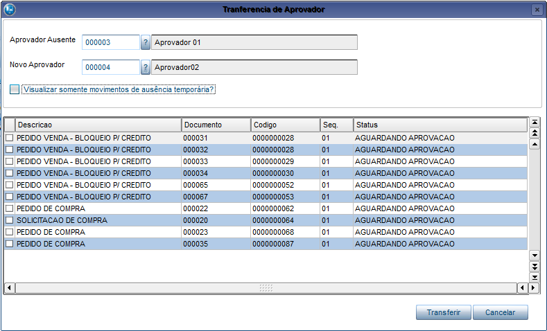{.flow-image}

<strong>APROVADOR AUSENTE</strong>: informe o código do usuário que se ausentou. Após informar, serão exibidos no Grid os documentos que estão pendentes para o aprovador.

<strong>NOVO APROVADOR</strong>: informe o código do usuário que será o novo aprovador dos documentos.

Selecione os documentos que deseja transferir e confirme a operação no botão “Transferir”

#### 1.3 Ausência Temporária

Este cadastro tem por objetivo definir um usuário aprovador substituto, de forma temporária, no caso do aprovador principal ter um período ausente, por exemplo, férias.

Toda vez que um documento é avaliado pelas regras do controle de alçadas, o sistema consultará se o aprovador definido pela regra tem um período de ausência temporária cadastrado, com base na data do documento. Em caso afirmativo, será utilizado o aprovador substituto para liberação do documento.

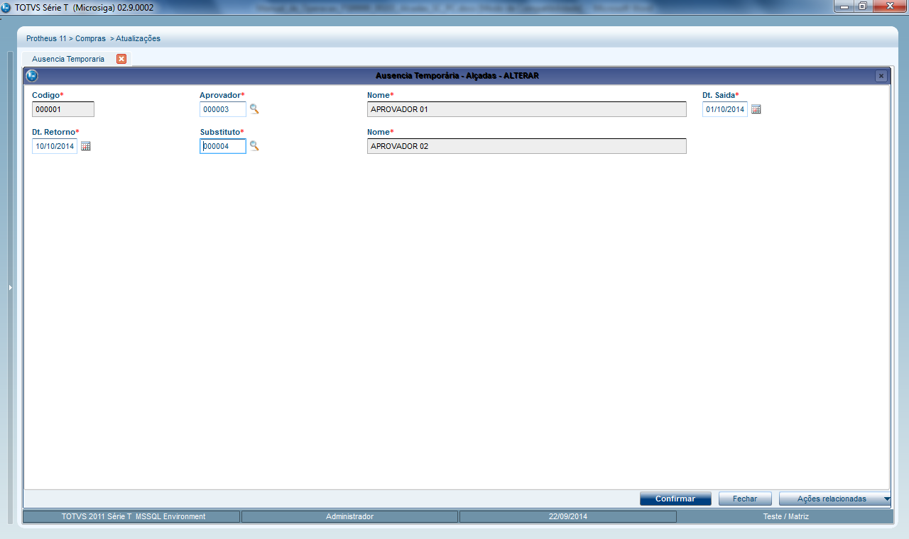{.flow-image}

<strong>APROVADOR</strong>: informe o usuário aprovador que estará ausente.

<strong>DATA SAÍDA</strong>: informe a data de saída do usuário aprovador. Tem que ser uma data futura, maior que a data atual do sistema.

<strong>DATA RETORNO</strong>: informe a data de retorno do usuário aprovador. Tem que ser uma data maior ou igual a data de saída.

<strong>SUBSTITUTO</strong>: informe o usuário aprovador que será o substituto do aprovador ausente.

#### 1.4 Verbas Aprovadores

Este cadastro tem por objetivo definir a verba disponível para aprovadores específicos e definir seus superiores no caso de transferência.

{.flow-image}

<strong>APROVADOR</strong>: informe o usuário aprovador que terá a verba a ser cadastrada.

<strong>PROCESSO</strong>: informe o nome da rotina onde será feito o controle de verba, exemplo:

<table class="banks-table">
  <thead>
    <tr>
      <th>Rotina</th>
      <th>Descrição</th>      
    </tr>
  </thead>
  <tbody>
    <tr>
      <td>MATA110</td>
      <td>SOLICITACAO DE COMPRA</td>
    </tr>
    <tr>
      <td>MATA120</td>
      <td>PEDIDO DE COMPRA</td>
    </tr>    
  </tbody>
</table>

<strong>TIPO LIMITE</strong>: informe o tipo de período limite da verba.

<strong>SUPERIOR</strong>: informe o código do superior para efeito de transferência.

<strong>VALOR VERBA</strong>: informe o valor da verba.

<strong>GRUPO VERBA</strong>: informe o código do grupo de verba. Este código será comparado com o valor trazido pelo próximo campo para fins de validação.

<strong>EXP. GRUPO</strong>: informe uma expressão ADVPL que irá trazer o código do grupo de verba.

Na imagem exemplo, o campo Grupo Verba foi preenchido com o código de um produto especifico, ou seja, esta verba será para somente este produto.

O campo Exp. Grupo então precisa trazer o campo Código do Produto do cadastro de pedidos, que por sua vez trará o código que está dentro de Grupo Verba somente quando o produto for aquele especifico.

#### 2. Aprovações (Liberação/Rejeição de Documentos)

Esta rotina tem por objetivo permitir a liberação ou rejeição de documento de forma manual, ou seja, via sistema e não Workflow. 
Serão exibidos somente os registros/documentos que estão direcionados para o usuário logado no sistema, ou seja, o aprovador. 
Na entrada da rotina é apresentada tela para selecionar o filtro de exibição dos documentos em alçadas conforme o Status: 

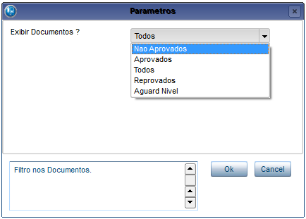{.flow-image}

Será apresentado na tela um Browse com os documentos em controle de alçadas e o respetivo Status conforme legenda:

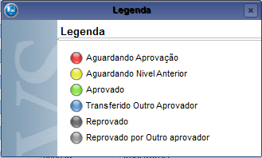{.flow-image}

Operações disponíveis:

#### Liberar

Será apresentada tela para aprovação do documento/registro posicionado, desde que esteja pendente aguardando liberação:

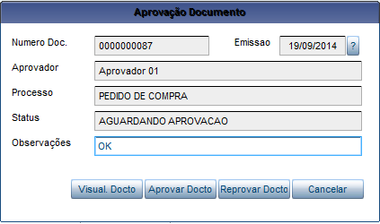{.flow-image}

Dentro desta tela é possível acionar as seguintes opções:

- Visualizar Documento: mostra tela de visualização do documento conforme a sua rotina de origem, ou seja, se for uma solicitação de compras abrirá a visualização da solicitação de compras;
- Aprovar Documento: confirma a liberação do documento em alçadas
- Reprovar Documento: rejeita a liberação do documento em alçadas.
- Cancelar: fecha a tela.

#### Cons. Aprov.

Será apresentada tela para consulta do Status dos movimentos de aprovação/rejeição do documento posicionado:

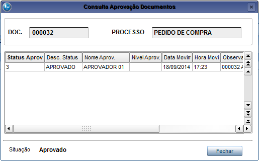{.flow-image}

#### Visualiza Doc.

Será apresentada a tela de visualização do documento conforme a sua rotina de origem, ou seja, se for uma solicitação de compras abrirá a tela de visualização da rotina solicitação de compras;

#### 3. Processos Integrados Com Alçadas - Financeiro

#### 3.1 Funções Contas a Pagar (FINA750)

Rotina padrão centralizadora das funções de Contas a Pagar do módulo Financeiro, a qual apresentará a seguinte Legenda quando o controle de alçadas estiver ativado:

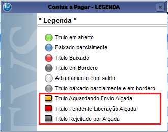{.flow-image}

#### 3.2 Inclusão Manual de Contas a Pagar (FINA050)

Todos os títulos incluídos no Contas a Pagar ficarão com Status LARANJA “Aguardando Envio Alçada” sendo necessário efetuar a liberação individual (por título) ou via Borderô. O mesmo ocorrerá se o título foi incluído por outras rotinas / módulos.

Operações:

- Inclusão: não serão avaliadas as regras das alçadas na inclusão dos títulos, somente via opção de Liberação manual ou borderô de pagamento.
- Alteração: toda vez que efetuar a alteração de um título em alçadas, todos os movimentos vinculados das alçadas serão excluídos também, sendo necessário efetuar nova liberação.
- Exclusão: serão excluídos todos os movimentos vinculados das alçadas, se houver.
- Envia WF Alçadas: Opção para liberação manual do título, a avaliação das regras de alçadas por Título (processo FINA050) somente ocorrerá quando o Título for enviado MANUALMENTE para liberação através desta opção. Será enviado um WORKFLOW para liberação caso o título não atenda as regras das alçadas e o mesmo ficará bloqueado aguardando liberação; caso contrário, se atender as regras o título ficará liberado.
- Cons. Alçadas: será apresentada tela para consulta do Status dos movimentos de aprovação/rejeição do título selecionado;

Exemplo de tela da opção “Envia WF Alçada” existente no Browse:

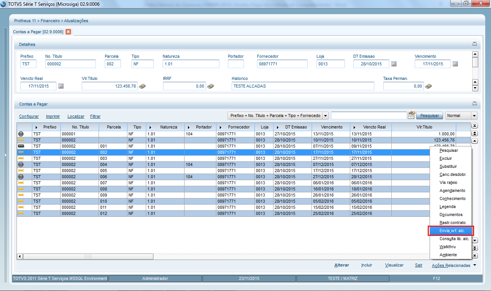{.flow-image}

Exemplo de tela da opção “Consulta Lib. Alçada” existente no Browse:

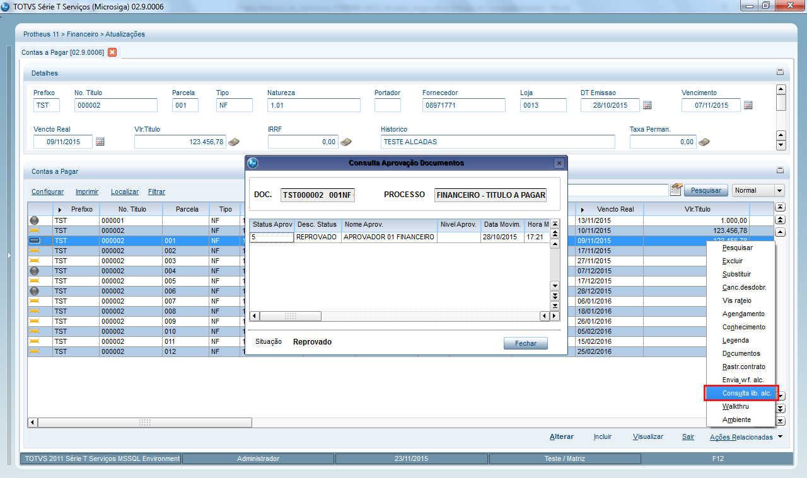{.flow-image}

#### 3.3 Baixa a Pagar Manual (FINA080)

Uma vez ativado o controle de alçadas, seja por título individual ou borderô, toda baixa de título será avaliado o Status das alçadas, sendo que somente os títulos LIBERADOS poderão ser baixados.

Operações:

- Baixar: na baixa individual, será validado o Status do título posicionado e somente deixará baixar se estiver liberado, caso contrário será exibida tela de mensagem.
- Lote: na baixa por lote, será validado também o Status dos títulos selecionados e serão exibidos somente os títulos liberados.

Exemplo de tela na baixa manual de um título não liberado:

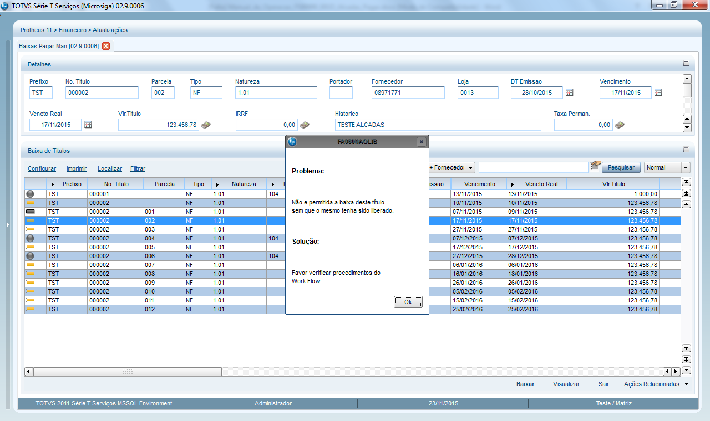{.flow-image}

#### 3.4 Baixa a Pagar Automática (FINA090)

Uma vez ativado o controle de alçadas, seja por título individual ou borderô, toda baixa de título será avaliado o Status das alçadas, sendo que somente os títulos LIBERADOS poderão ser baixados.

Na baixa automática serão exibidos somente os títulos liberados.

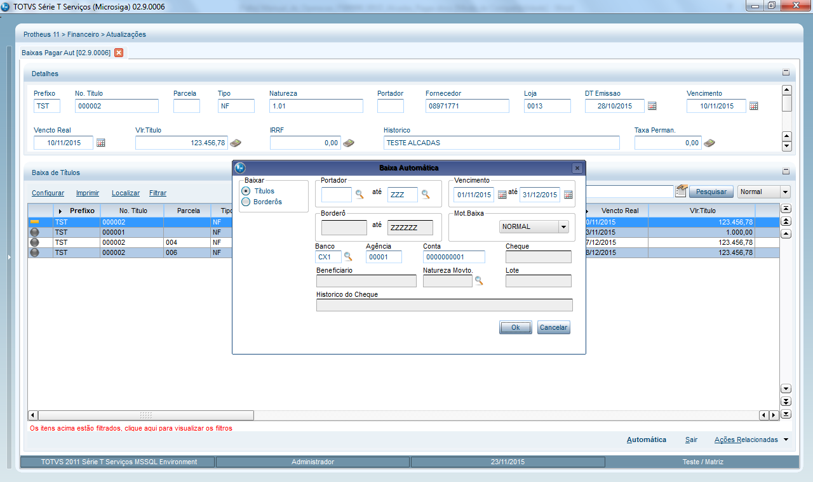{.flow-image}

#### 3.5 Baixa A Pagar Automatica Multi-Filiais (FINA091)

Uma vez ativado o controle de alçadas, seja por título individual ou borderô, toda baixa de título será avaliado o Status das alçadas, sendo que somente os títulos LIBERADOS poderão ser baixados.

Na baixa automática serão exibidos somente os títulos liberados.

#### 3.6 Borderô de Pagamento (FINA240)

Uma vez ativado o controle de alçadas, a rotina padrão de Borderô de Pagamento será desativada, sendo substituída pela rotina customizada de Borderô (M001D05).

<strong>MOTIVO:</strong> devido a ativação do parâmetro padrão MV_CTLIPAG a rotina FINA240 não permite gerar borderô para títulos não liberados; porém no conceito do ADD-ON deve ser possível gerar e enviar o borderô inteiro para liberação.

#### 3.7 Borderô de Pagamento CUSTOMIZADO (M001D05)

Rotina customizada em substituição à rotina padrão FINA240, tendo as mesmas funcionalidades da geração de borderô, porém permitindo selecionar títulos ainda não liberados para gerar e enviar o borderô para liberação.

Operações:

- Borderô: na confirmação da geração do borderô serão avaliadas as regras das alçadas por Borderô (processo FINA050), onde serão exibidos somente os títulos pendentes de liberação. Será enviado um WORKFLOW para liberação caso o borderô não atenda as regras das alçadas e o mesmo ficará bloqueado aguardando liberação; caso contrário, se atender as regras o borderô ficará liberado.
- Cancelar: serão excluídos todos os movimentos vinculados das alçadas do borderô, se houver.
- Cons. Alçadas: será apresentada tela para consulta do Status dos movimentos de aprovação/rejeição do borderô selecionado;

Exemplo de tela de geração do Borderô de Pagamento:

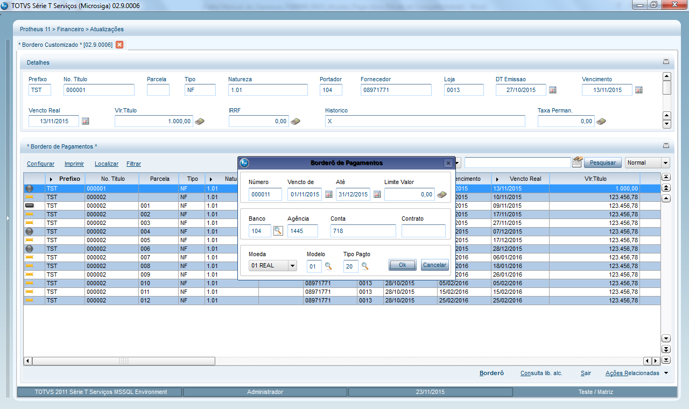{.flow-image}

#### 3.8 Manutenção de Borderô a Pagar (FINA590)

Uma vez ativado o controle de alçadas, a rotina padrão de Manutenção do Borderô será desativada, sendo substituída pela rotina customizada de Borderô (M001D06).

<strong>MOTIVO</strong>: devido a ativação do parâmetro padrão MV_CTLIPAG a rotina FINA590 não permite gerar borderô para títulos não liberados; porém no conceito do ADD-ON deve ser possível gerar e enviar o borderô inteiro para liberação.

#### 3.9 Manutenção de Borderô CUSTOMIZADO (M001D06)

Rotina customizada em substituição à rotina padrão FINA590, tendo as mesmas funcionalidades da manutenção de borderô, porém permitindo selecionar títulos ainda não liberados para gerar e enviar o borderô para liberação.

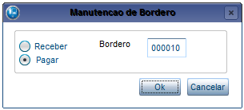{.flow-image}

No momento que informar o Número do Borderô para dar manutenção (tela acima) será validado se o mesmo já se encontra em Alçadas. Neste caso, será exibida uma mensagem de alerta e será solicitada confirmação para excluir os movimentos das alçadas do borderô. 

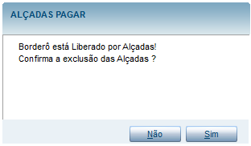{.flow-image}

Somente se confirmar a exclusão será permitido prosseguir com a manutenção do Borderô, e o mesmo deverá ser enviado novamente para liberação das alçadas (manualmente).

Operações:

- Incluir: inclusão do título posicionado no borderô existente, será permitido somente se o título estiver pendente de liberação. Não será avaliada a regra de alçadas do borderô neste momento, devendo ser disparado o processo de liberação manual na opção “Envia WF Alçada”.
- Cancelar: exclusão do título posicionado do borderô existente. Não será avaliada a regra de alçadas do borderô neste momento, devendo ser disparado o processo de liberação manual na opção “Envia WF Alçada”.
Envia WF Alçada: no caso de manutenção no borderô que já foi enviado para alçadas, será necessário disparar manualmente o processo de avaliação das regras e envio do Workflow para liberação novamente.
- Cons. Alçadas: será apresentada tela para consulta do Status dos movimentos de aprovação/rejeição do título/borderô selecionado;

#### 3.10 Compensação a Pagar (FINA340)

Uma vez ativado o controle de alçadas, seja por título individual ou borderô, toda baixa de título será avaliado o Status das alçadas, sendo que somente os títulos LIBERADOS poderão ser baixados.

Na baixa por compensação serão permitidos somente os títulos liberados, caso contrário será exibida mensagem de alerta.

#### 3.11 Compensação entre Carteiras (FINA450)

Uma vez ativado o controle de alçadas, seja por título individual ou borderô, toda baixa de título será avaliado o Status das alçadas, sendo que somente os títulos LIBERADOS poderão ser baixados.

Na baixa por compensação serão permitidos somente os títulos liberados, caso contrário será exibida mensagem de alerta.

#### 3.12 Comunicação bancária - Envio CNAB a Pagar (FINA420)

Uma vez ativado o controle de alçadas, seja por título individual ou borderô, toda baixa de título será avaliado o Status das alçadas, sendo que somente os títulos LIBERADOS poderão ser baixados.

Na geração do arquivo de REMESSA CNAB A PAGAR serão permitidos somente os títulos liberados, sendo que os títulos não liberados serão desconsiderados.

#### 3.13 Comunicação bancária - SISPAG (FINA300)

Uma vez ativado o controle de alçadas, seja por título individual ou borderô, toda baixa de título será avaliado o Status das alçadas, sendo que somente os títulos LIBERADOS poderão ser baixados.

Na geração do arquivo de REMESSA CNAB A PAGAR serão permitidos somente os títulos liberados, sendo que os títulos não liberados serão desconsiderados.

Operações:

- Gerar Arquivo: valida o Status da Alçada na geração da remessa, filtrando somente os títulos liberados.
- Receber Arquivo: valida o Status da Alçada na baixa automática via retorno, somente os títulos liberados serão baixados.

  <a href="/" class="md-button" style="text-decoration: none;">← Voltar para a Página Inicial</a>

