# Alçadas - Workflow Pedido de Compras {.home-hero}

<!--############################################### 01 #######################################################-->

  01. Visão Geral

### 1. Visão Geral
Este ADDON é uma otimização do ADDON de Regras Alçadas, permitindo uma maior automação no processo de aprovação/rejeição de solicitação de compra/pedido de compra.

O ADDON permite que ao gerar um uma solicitação de compra ou pedido de compra, estes sejam analisados por regras de aprovação e conforme os criterios da regra de aprovação e o que foi informado no pedido de compra/solicitação de compra, o aprovador seja notificado via workflow e através do próprio da liberaçãdo do documento e pelo próprio Workflow deliberar da aprovação ou não.

Esta automação utiliza o processo de Workflow via link para aprovação ou rejeição de documentos que estão em processo de alçadas.

A Liberação de Alçadas considera sempre por Documento e não por item, ou seja, no caso do documento ter e itens (solicitação de compra, pedido de compra, etc.) não terá liberação por item e sim o documento todo.

#### Sistema customizado para gestão de aprovações integradas ao módulo de Compras.

<strong>Principais vantagens do produto:</strong>

- Solicitação de Compras (MATA110) – validação das regras de alçadas;
- Gera Cotações (MATA130) – filtro para solicitações aprovadas por alçadas;
- Analisa Cotações (MATA160) – geração do pedido de compra com validação das regras de alçadas;
- Pedido de Compras (MATA120) – validação das regras de alçadas, filtro para solicitações aprovadas por alçadas;
- Documento de Entrada (MATA103) – filtro para pedidos de compra aprovados por alçadas;
- Aprovação/Rejeição de Solicitação de Compra - via Workflow;
- Aprovação/Rejeição de Pedido de Compra - via Workflow;
- Consulta Status de Aprovação da SC e PC em alçadas;

<!--############################################### 02 #######################################################-->

  02. Menu

### 2. Menu

!!! tip "Ver manual do Addon [**Alçadas - Regras**](/addon-alcadas-regras/#2-menu) na seção "2. Menu"." 

<!--############################################### 03 #######################################################-->

  03. Fluxo Operacional

### 3. Fluxo Operacional

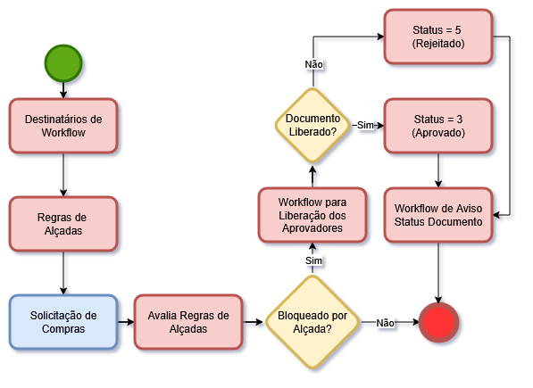{.flow-image}

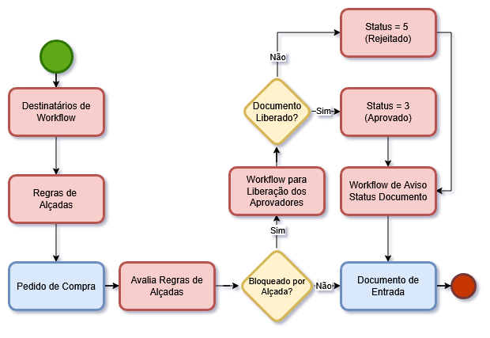{.flow-image}

<!--############################################### 04 #######################################################-->

  04. Rotinas personalizadas específicas do Pacote

### 4. Rotinas personalizadas específicas do Pacote

#### Funções personalizadas contidas no pacote:

<table class="banks-table">
  <thead>
    <tr>
      <th>Função</th>
      <th>Descrição</th>
    </tr>
  </thead>
  <tbody>
    <tr>
      <td><strong>M001C01</strong></td>
      <td>Rotina para retorno do processo de Workflow – Solicitação de Compras</td>
    </tr>
    <tr>
      <td><strong>M001C02</strong></td>
      <td>Rotina para retorno do processo de Workflow – Pedido de Compras</td>
    </tr>
    <tr>
      <td><strong>P001C01</strong></td>
      <td>Rotina centralizadora das chamadas dos Pontos de Entrada de Pedido de Compras, Analisa Cotação e Documento de Entrada</td>
    </tr>
    <tr>
      <td><strong>T001C01</strong></td>
      <td>Rotina para Tela de Consulta Alçadas na rotina Solicitação de Compras</td>
    </tr>
    <tr>
      <td><strong>T001C02</strong></td>
      <td>Rotina para Tela de Consulta Alçadas na rotina Pedido de Compras</td>
    </tr>
    <tr>
      <td><strong>UPD001C</strong></td>
      <td>Rotina de aplicação do template</td>
    </tr>
    <tr>
      <td><strong>W001C01</strong></td>
      <td>Rotina para geração do Workflow de liberação da Solicitação de Compras</td>
    </tr>
    <tr>
      <td><strong>W001C02</strong></td>
      <td>Rotina para geração do Workflow de Aviso da Aprovação/Rejeição da Solicitação de Compras</td>
    </tr>
    <tr>
      <td><strong>W001C03</strong></td>
      <td>Rotina para geração do Workflow de liberação do Pedido de Compra</td>
    </tr>
    <tr>
      <td><strong>W001C04</strong></td>
      <td>Rotina para geração do Workflow de Aviso da Aprovação/Rejeição do Pedido de Compra</td>
    </tr>
  </tbody>
</table>

<!--############################################### 05 #######################################################-->

  05. Pontos de Entradas Disponiveis para Desenvolvimento

### 5. Pontos de Entradas Disponiveis para Desenvolvimento

<table class="banks-table">
  <thead>
    <tr>
      <th>Nome</th>
      <th>Descrição</th>
      <th>Implementação</th>      
    </tr>
  </thead>
  <tbody>
    <tr>
      <td><strong>A120F4FI</strong></td>
      <td>Ponto de entrada na rotina pedido de compra para filtro na Tabela SC1 ao acionar a tecla F5 no campo C7_PRODUTO</td>
      <td>

  

    ADVPL
    A120F4FI
  

  <pre><code>  
User Function A120F4FI()
Local aArea := GetArea()
Local aRet  := {}
//ÚÄÄÄÄÄÄÄÄÄÄÄÄÄÄÄÄÄÄÄÄÄÄÄÄÄÄÄÄÄÄÄÄÄÄÄÄÄÄÄÄÄÄÄÄÄÄÄÄÄÄÄÄÄÄÄÄÄÄÄÄÄÄÄÄÄÄÄÄÄÄÄÄÄÄ
//³ Chamada específica para uso do Template de Alçadas (Bloqueio SC/PC)     ³
//ÀÄÄÄÄÄÄÄÄÄÄÄÄÄÄÄÄÄÄÄÄÄÄÄÄÄÄÄÄÄÄÄÄÄÄÄÄÄÄÄÄÄÄÄÄÄÄÄÄÄÄÄÄÄÄÄÄÄÄÄÄÄÄÄÄÄÄÄÄÄÄÄÄÄÄ
If ExistBlock("P001C02")
   aRet := U_P001C02("A120F4FI", PARAMIXB)   
EndIf
RestArea(aArea)
Return(aRet)    

</code></pre>
      </td>      
    </tr>
    <tr>
      <td><strong>A120PIDF</strong></td>
      <td>Ponto de entrada na rotina de Pedido de Compra para filtro na Tabelas SC1 ao acionar a tecla de atalho F4 nos itens</td>
      <td>

  

    ADVPL
    A120PIDF
  

  <pre><code>  
User Function A120PIDF()
Local aArea := GetArea()
Local aRet  := {}
//ÚÄÄÄÄÄÄÄÄÄÄÄÄÄÄÄÄÄÄÄÄÄÄÄÄÄÄÄÄÄÄÄÄÄÄÄÄÄÄÄÄÄÄÄÄÄÄÄÄÄÄÄÄÄÄÄÄÄÄÄÄÄÄÄÄÄÄÄÄÄÄÄÄÄÄ
//³ Chamada específica para uso do Template de Alçadas (Bloqueio SC/PC)     ³
//ÀÄÄÄÄÄÄÄÄÄÄÄÄÄÄÄÄÄÄÄÄÄÄÄÄÄÄÄÄÄÄÄÄÄÄÄÄÄÄÄÄÄÄÄÄÄÄÄÄÄÄÄÄÄÄÄÄÄÄÄÄÄÄÄÄÄÄÄÄÄÄÄÄÄÄ
If ExistBlock("P001C02")
   aRet := U_P001C02("A120PIDF", PARAMIXB)   
EndIf
RestArea(aArea)
Return(aRet)

</code></pre>
      </td>      
    </tr>
    <tr>
      <td><strong>M110STTS</strong></td>
      <td>Ponto de entrada na rotina de Solicitação de Compras após a gravação da Solicitação em inclusão, alteração, exclusão.</td>
      <td>

  

    ADVPL
    M110STTS
  

  <pre><code>  
User Function M110STTS()
Local aArea := GetArea()
//ÚÄÄÄÄÄÄÄÄÄÄÄÄÄÄÄÄÄÄÄÄÄÄÄÄÄÄÄÄÄÄÄÄÄÄÄÄÄÄÄÄÄÄÄÄÄÄÄÄÄÄÄÄÄÄÄÄÄÄÄÄÄÄÄÄÄÄÄÄÄÄÄÄÄÄ
//³ Chamada específica para uso do Template de Alçadas (Bloqueio SC/PC)     ³
//ÀÄÄÄÄÄÄÄÄÄÄÄÄÄÄÄÄÄÄÄÄÄÄÄÄÄÄÄÄÄÄÄÄÄÄÄÄÄÄÄÄÄÄÄÄÄÄÄÄÄÄÄÄÄÄÄÄÄÄÄÄÄÄÄÄÄÄÄÄÄÄÄÄÄÄ
If ExistBlock("P001C01")
   U_P001C01("M110STTS", PARAMIXB)   
EndIf
RestArea(aArea)
Return

</code></pre>
      </td>      
    </tr>
    <tr>
      <td><strong>M130FIL</strong></td>
      <td>Ponto de entrada na rotina de Geração da Cotação para adicionar Filtro sobre as solicitações de compra</td>
      <td>

  

    ADVPL
    M130FIL
  

  <pre><code>  
User Function M130FIL()
Local aArea := GetArea()
Local cRet  := ""
//ÚÄÄÄÄÄÄÄÄÄÄÄÄÄÄÄÄÄÄÄÄÄÄÄÄÄÄÄÄÄÄÄÄÄÄÄÄÄÄÄÄÄÄÄÄÄÄÄÄÄÄÄÄÄÄÄÄÄÄÄÄÄÄÄÄÄÄÄÄÄÄÄÄÄÄ
//³ Chamada específica para uso do Template de Alçadas (Bloqueio SC/PC)     ³
//ÀÄÄÄÄÄÄÄÄÄÄÄÄÄÄÄÄÄÄÄÄÄÄÄÄÄÄÄÄÄÄÄÄÄÄÄÄÄÄÄÄÄÄÄÄÄÄÄÄÄÄÄÄÄÄÄÄÄÄÄÄÄÄÄÄÄÄÄÄÄÄÄÄÄÄ
If ExistBlock("P001C01")
   cRet := U_P001C01("M130FIL", PARAMIXB)   
EndIf
RestArea(aArea)
Return(cRet)

</code></pre>
      </td>      
    </tr>
    <tr>
      <td><strong>MT131FIL</strong></td>
      <td>Ponto de entrada na rotina de Geração da Cotação para adicionar Filtro sobre as solicitações de compra.</td>
      <td>

  

    ADVPL
    MT131FIL
  

  <pre><code>  
User Function M130FIL()
Local aArea := GetArea()
Local cRet  := ""
//ÚÄÄÄÄÄÄÄÄÄÄÄÄÄÄÄÄÄÄÄÄÄÄÄÄÄÄÄÄÄÄÄÄÄÄÄÄÄÄÄÄÄÄÄÄÄÄÄÄÄÄÄÄÄÄÄÄÄÄÄÄÄÄÄÄÄÄÄÄÄÄÄÄÄÄ
//³ Chamada específica para uso do Template de Alçadas (Bloqueio SC/PC)     ³
//ÀÄÄÄÄÄÄÄÄÄÄÄÄÄÄÄÄÄÄÄÄÄÄÄÄÄÄÄÄÄÄÄÄÄÄÄÄÄÄÄÄÄÄÄÄÄÄÄÄÄÄÄÄÄÄÄÄÄÄÄÄÄÄÄÄÄÄÄÄÄÄÄÄÄÄ
If ExistBlock("P001C01")
   cRet := U_P001C01("MT131FIL", PARAMIXB)   
EndIf
RestArea(aArea)
Return(cRet)

</code></pre>
      </td>      
    </tr>
    <tr>
      <td><strong>MT103QPC</strong></td>
      <td>Ponto de entrada na rotina de Análise da Cotação para filtro na Tabelas SC7 ao acionar as teclas de atalho F4/F5</td>
      <td>

  

    ADVPL
    MT103QPC
  

  <pre><code>  
User Function MT103QPC()
Local aArea := GetArea()
Local cRet := ""
//ÚÄÄÄÄÄÄÄÄÄÄÄÄÄÄÄÄÄÄÄÄÄÄÄÄÄÄÄÄÄÄÄÄÄÄÄÄÄÄÄÄÄÄÄÄÄÄÄÄÄÄÄÄÄÄÄÄÄÄÄÄÄÄÄÄÄÄÄÄÄÄÄÄÄÄ
//³ Chamada específica para uso do Template de Alçadas (Bloqueio SC/PC)     ³
//ÀÄÄÄÄÄÄÄÄÄÄÄÄÄÄÄÄÄÄÄÄÄÄÄÄÄÄÄÄÄÄÄÄÄÄÄÄÄÄÄÄÄÄÄÄÄÄÄÄÄÄÄÄÄÄÄÄÄÄÄÄÄÄÄÄÄÄÄÄÄÄÄÄÄÄ
If ExistBlock("P001C02")
   cRet := U_P001C02("MT103QPC", PARAMIXB)   
EndIf
RestArea(aArea)
Return(cRet)

</code></pre>
      </td>      
    </tr>
    <tr>
      <td><strong>MT110COR</strong></td>
      <td>Ponto de entrada na rotina de Solicitação de Compras para manipular o Array com as regras de cores da Mbrowse</td>
      <td>

  

    ADVPL
    MT110COR
  

  <pre><code>  
User Function MT110COR()
Local aArea := GetArea()
Local aNewCores := aClone(PARAMIXB[1])
//ÚÄÄÄÄÄÄÄÄÄÄÄÄÄÄÄÄÄÄÄÄÄÄÄÄÄÄÄÄÄÄÄÄÄÄÄÄÄÄÄÄÄÄÄÄÄÄÄÄÄÄÄÄÄÄÄÄÄÄÄÄÄÄÄÄÄÄÄÄÄÄÄÄÄÄ
//³ Chamada específica para uso do Template de Alçadas (Bloqueio SC/PC)     ³
//ÀÄÄÄÄÄÄÄÄÄÄÄÄÄÄÄÄÄÄÄÄÄÄÄÄÄÄÄÄÄÄÄÄÄÄÄÄÄÄÄÄÄÄÄÄÄÄÄÄÄÄÄÄÄÄÄÄÄÄÄÄÄÄÄÄÄÄÄÄÄÄÄÄÄÄ
If ExistBlock("P001C01")
   aNewCores := U_P001C01("MT110COR", PARAMIXB)   
EndIf
RestArea(aArea)
Return(aNewCores)

</code></pre>
      </td>      
    </tr>
     <tr>
      <td><strong>MT110LEG</strong></td>
      <td>Ponto de entrada na rotina de Solicitação de Compras para adicionar legendas das cores na Dialog de legenda</td>
      <td>

  

    ADVPL
    MT110LEG
  

  <pre><code>  
User Function MT110LEG()
Local aArea := GetArea()
Local aCores := aClone(PARAMIXB[1])
//ÚÄÄÄÄÄÄÄÄÄÄÄÄÄÄÄÄÄÄÄÄÄÄÄÄÄÄÄÄÄÄÄÄÄÄÄÄÄÄÄÄÄÄÄÄÄÄÄÄÄÄÄÄÄÄÄÄÄÄÄÄÄÄÄÄÄÄÄÄÄÄÄÄÄÄ
//³ Chamada específica para uso do Template de Alçadas (Bloqueio SC/PC)     ³
//ÀÄÄÄÄÄÄÄÄÄÄÄÄÄÄÄÄÄÄÄÄÄÄÄÄÄÄÄÄÄÄÄÄÄÄÄÄÄÄÄÄÄÄÄÄÄÄÄÄÄÄÄÄÄÄÄÄÄÄÄÄÄÄÄÄÄÄÄÄÄÄÄÄÄÄ
If ExistBlock("P001C01")
   aCores := U_P001C01("MT110LEG", PARAMIXB)   
EndIf
RestArea(aArea)
Return(aCores)

</code></pre>
      </td>      
    </tr> 
    <tr>
      <td><strong>MT110ROT</strong></td>
      <td>Ponto de entrada na rotina de Solicitação de Compras para adicionar mais opções no aRotina.</td>
      <td>

  

    ADVPL
    MT110ROT
  

  <pre><code>  
User Function MT110ROT()
Local aArea := GetArea()
Local aRot := aClone(aRotina)
//ÚÄÄÄÄÄÄÄÄÄÄÄÄÄÄÄÄÄÄÄÄÄÄÄÄÄÄÄÄÄÄÄÄÄÄÄÄÄÄÄÄÄÄÄÄÄÄÄÄÄÄÄÄÄÄÄÄÄÄÄÄÄÄÄÄÄÄÄÄÄÄÄÄÄÄ
//³ Chamada específica para uso do Template de Alçadas (Bloqueio SC/PC)     ³
//ÀÄÄÄÄÄÄÄÄÄÄÄÄÄÄÄÄÄÄÄÄÄÄÄÄÄÄÄÄÄÄÄÄÄÄÄÄÄÄÄÄÄÄÄÄÄÄÄÄÄÄÄÄÄÄÄÄÄÄÄÄÄÄÄÄÄÄÄÄÄÄÄÄÄÄ
If ExistBlock("P001C01")
   aRot := U_P001C01("MT110ROT", PARAMIXB)   
EndIf
RestArea(aArea)
Return(aRot)

</code></pre>
      </td>      
    </tr>  
    <tr>
      <td><strong>MT120BRW</strong></td>
      <td>Ponto de entrada na rotina de Pedido de Compra para adicionar opções no aRotina</td>
      <td>

  

    ADVPL
    MT120BRW
  

  <pre><code>  
User Function MT120BRW()
Local aArea := GetArea()
Local aRot := aClone(aRotina)
//ÚÄÄÄÄÄÄÄÄÄÄÄÄÄÄÄÄÄÄÄÄÄÄÄÄÄÄÄÄÄÄÄÄÄÄÄÄÄÄÄÄÄÄÄÄÄÄÄÄÄÄÄÄÄÄÄÄÄÄÄÄÄÄÄÄÄÄÄÄÄÄÄÄÄÄ
//³ Chamada específica para uso do Template de Alçadas (Bloqueio SC/PC)     ³
//ÀÄÄÄÄÄÄÄÄÄÄÄÄÄÄÄÄÄÄÄÄÄÄÄÄÄÄÄÄÄÄÄÄÄÄÄÄÄÄÄÄÄÄÄÄÄÄÄÄÄÄÄÄÄÄÄÄÄÄÄÄÄÄÄÄÄÄÄÄÄÄÄÄÄÄ
If ExistBlock("P001C02")
   aRot := U_P001C02("MT120BRW", aRot)   
EndIf
RestArea(aArea)
Return(aRot)

</code></pre>
      </td>      
    </tr>  
    <tr>
      <td><strong>MT120COR</strong></td>
      <td>Ponto de entrada na rotina de Pedido de Compra para manipular o Array com as regras de cores da Mbrowse</td>
      <td>

  

    ADVPL
    MT120COR
  

  <pre><code>  
User Function MT120COR()
Local aArea := GetArea()
Local aNewCores := aClone(PARAMIXB[1])
//ÚÄÄÄÄÄÄÄÄÄÄÄÄÄÄÄÄÄÄÄÄÄÄÄÄÄÄÄÄÄÄÄÄÄÄÄÄÄÄÄÄÄÄÄÄÄÄÄÄÄÄÄÄÄÄÄÄÄÄÄÄÄÄÄÄÄÄÄÄÄÄÄÄÄÄ
//³ Chamada específica para uso do Template de Alçadas (Bloqueio SC/PC)     ³
//ÀÄÄÄÄÄÄÄÄÄÄÄÄÄÄÄÄÄÄÄÄÄÄÄÄÄÄÄÄÄÄÄÄÄÄÄÄÄÄÄÄÄÄÄÄÄÄÄÄÄÄÄÄÄÄÄÄÄÄÄÄÄÄÄÄÄÄÄÄÄÄÄÄÄÄ
If ExistBlock("P001C02")
   aNewCores := U_P001C02("MT120COR", aNewCores)   
EndIf
RestArea(aArea)
Return(aNewCores)

</code></pre>
      </td>      
    </tr>  
    <tr>
      <td><strong>MT120FIM</strong></td>
      <td>Ponto de entrada na rotina de Pedido de Compra após finalizar a gravação no final da função A120PEDIDO em inclusão, alteração, exclusão</td>
      <td>

  

    ADVPL
    MT120FIM
  

  <pre><code>  
User Function MT120FIM()
Local aArea := GetArea()
//ÚÄÄÄÄÄÄÄÄÄÄÄÄÄÄÄÄÄÄÄÄÄÄÄÄÄÄÄÄÄÄÄÄÄÄÄÄÄÄÄÄÄÄÄÄÄÄÄÄÄÄÄÄÄÄÄÄÄÄÄÄÄÄÄÄÄÄÄÄÄÄÄÄÄÄ
//³ Chamada específica para uso do Template de Alçadas (Bloqueio SC/PC)     ³
//ÀÄÄÄÄÄÄÄÄÄÄÄÄÄÄÄÄÄÄÄÄÄÄÄÄÄÄÄÄÄÄÄÄÄÄÄÄÄÄÄÄÄÄÄÄÄÄÄÄÄÄÄÄÄÄÄÄÄÄÄÄÄÄÄÄÄÄÄÄÄÄÄÄÄÄ
If ExistBlock("P001C02")
   U_P001C02("MT120FIM", PARAMIXB)   
EndIf
RestArea(aArea)
Return

</code></pre>
      </td>      
    </tr>  
    <tr>
      <td><strong>MT120LEG</strong></td>
      <td>Ponto de entrada na rotina de Pedido de Compra para adicionar legendas das cores na Dialog de legenda</td>
      <td>

  

    ADVPL
    MT120LEG
  

  <pre><code>  
User Function MT120LEG()
Local aArea := GetArea()
Local aCores := aClone(PARAMIXB[1])
//ÚÄÄÄÄÄÄÄÄÄÄÄÄÄÄÄÄÄÄÄÄÄÄÄÄÄÄÄÄÄÄÄÄÄÄÄÄÄÄÄÄÄÄÄÄÄÄÄÄÄÄÄÄÄÄÄÄÄÄÄÄÄÄÄÄÄÄÄÄÄÄÄÄÄÄ
//³ Chamada específica para uso do Template de Alçadas (Bloqueio SC/PC)     ³
//ÀÄÄÄÄÄÄÄÄÄÄÄÄÄÄÄÄÄÄÄÄÄÄÄÄÄÄÄÄÄÄÄÄÄÄÄÄÄÄÄÄÄÄÄÄÄÄÄÄÄÄÄÄÄÄÄÄÄÄÄÄÄÄÄÄÄÄÄÄÄÄÄÄÄÄ
If ExistBlock("P001C02")
   aCores := U_P001C02("MT120LEG", aCores)   
EndIf
RestArea(aArea)
Return(aCores)

</code></pre>
      </td>      
    </tr>  
    <tr>
      <td><strong>MT120SCR</strong></td>
      <td>Ponto de entrada na rotina de Pedido de Compra na montagem da tela do pedido</td>
      <td>

  

    ADVPL
    MT120SCR
  

  <pre><code>  
User Function MT120SCR()
Local aArea := GetArea()
//ÚÄÄÄÄÄÄÄÄÄÄÄÄÄÄÄÄÄÄÄÄÄÄÄÄÄÄÄÄÄÄÄÄÄÄÄÄÄÄÄÄÄÄÄÄÄÄÄÄÄÄÄÄÄÄÄÄÄÄÄÄÄÄÄÄÄÄÄÄÄÄÄÄÄÄ
//³ Chamada específica para uso do Template de Alçadas (Bloqueio SC/PC)     ³
//ÀÄÄÄÄÄÄÄÄÄÄÄÄÄÄÄÄÄÄÄÄÄÄÄÄÄÄÄÄÄÄÄÄÄÄÄÄÄÄÄÄÄÄÄÄÄÄÄÄÄÄÄÄÄÄÄÄÄÄÄÄÄÄÄÄÄÄÄÄÄÄÄÄÄÄ
If ExistBlock("P001C02")
   U_P001C02("MT120SCR", PARAMIXB)   
EndIf
RestArea(aArea)
Return

</code></pre>
      </td>      
    </tr>  
    <tr>
      <td><strong>MT160WF</strong></td>
      <td>Ponto de entrada na rotina de Análise da Cotação após a geração dos pedidos de compras</td>
      <td>

  

    ADVPL
    MT160WF
  

  <pre><code>  
User Function MT160WF()
Local aArea := GetArea()
//ÚÄÄÄÄÄÄÄÄÄÄÄÄÄÄÄÄÄÄÄÄÄÄÄÄÄÄÄÄÄÄÄÄÄÄÄÄÄÄÄÄÄÄÄÄÄÄÄÄÄÄÄÄÄÄÄÄÄÄÄÄÄÄÄÄÄÄÄÄÄÄÄÄÄÄ
//³ Chamada específica para uso do Template de Alçadas (Bloqueio SC/PC)     ³
//ÀÄÄÄÄÄÄÄÄÄÄÄÄÄÄÄÄÄÄÄÄÄÄÄÄÄÄÄÄÄÄÄÄÄÄÄÄÄÄÄÄÄÄÄÄÄÄÄÄÄÄÄÄÄÄÄÄÄÄÄÄÄÄÄÄÄÄÄÄÄÄÄÄÄÄ
If ExistBlock("P001C02")
   U_P001C02("MT160WF", PARAMIXB)   
EndIf
RestArea(aArea)
Return

</code></pre>
      </td>      
    </tr>  
    <tr>
      <td><strong>MT103FIM</strong></td>
      <td>Ponto de entrada na rotina de Nota Fiscal de Enttrada, após finalizar a gravação.</td>
      <td>

  

    ADVPL
    MT103FIM
  

  <pre><code>  
User Function MT103FIM()
Local aArea := GetArea()
//ÚÄÄÄÄÄÄÄÄÄÄÄÄÄÄÄÄÄÄÄÄÄÄÄÄÄÄÄÄÄÄÄÄÄÄÄÄÄÄÄÄÄÄÄÄÄÄÄÄÄÄÄÄÄÄÄÄÄÄÄÄÄÄÄÄÄÄÄÄÄÄÄÄÄÄ
//³ Chamada específica para uso do ADD-ON de Alçadas (Bloqueio SC/PC)       ³
//ÀÄÄÄÄÄÄÄÄÄÄÄÄÄÄÄÄÄÄÄÄÄÄÄÄÄÄÄÄÄÄÄÄÄÄÄÄÄÄÄÄÄÄÄÄÄÄÄÄÄÄÄÄÄÄÄÄÄÄÄÄÄÄÄÄÄÄÄÄÄÄÄÄÄÄ
If ExistBlock("P001C02")
    U_P001C02("MT103FIM", PARAMIXB)   
EndIf
RestArea(aArea)
Return

</code></pre>
      </td>      
    </tr>  
    <tr>
      <td><strong>MT106SC1</strong></td>
      <td>Ponto de entrada na rotina de geração de pré-requisição ao gerar uma solicitação de compras.</td>
      <td>

  

    ADVPL
    MT106SC1
  

  <pre><code>  
User Function MT106SC1 ()
Local aArea := GetArea()
//ÚÄÄÄÄÄÄÄÄÄÄÄÄÄÄÄÄÄÄÄÄÄÄÄÄÄÄÄÄÄÄÄÄÄÄÄÄÄÄÄÄÄÄÄÄÄÄÄÄÄÄÄÄÄÄÄÄÄÄÄÄÄÄÄÄÄÄÄÄÄÄÄÄÄÄ
//³ Chamada específica para uso do ADD-ON de Alçadas (Bloqueio SC/PC)       ³
//ÀÄÄÄÄÄÄÄÄÄÄÄÄÄÄÄÄÄÄÄÄÄÄÄÄÄÄÄÄÄÄÄÄÄÄÄÄÄÄÄÄÄÄÄÄÄÄÄÄÄÄÄÄÄÄÄÄÄÄÄÄÄÄÄÄÄÄÄÄÄÄÄÄÄÄ
If ExistBlock("P001C02")
    U_P001C02("MT106SC1", PARAMIXB[2])   
EndIf
RestArea(aArea)
Return

</code></pre>
      </td>      
    </tr>          
  </tbody>
</table>

<!--############################################### 06 #######################################################-->

  06. Tabelas (SX2) 

### 6. Tabelas (SX2) 

!!! tip "Ver manual do Addon [**Alçadas - Regras**](/addon-alcadas-regras/#6-campos-sx3) na seção "6. Tabelas (SX2)"." 

<!--############################################### 07 #######################################################-->

  07. Campos (SX3)

### 7. Campos (SX3)

Campo **C1_X_IDAL**

<table class="banks-table">
  <tbody>
    <tr>
      <th>Tipo</th>
      <td>C</td>
      <th>Ordem</th>
      <td>* Próxima disponível</td>
      <th>Tamanho</th>
      <td>10</td>
      <th>Decimal</th>
      <td>0</td>
      <th>Formato</th>
      <td>@!</td>
    </tr>
    <tr>
      <th>Contexto</th>
      <td>Real</td>
      <th>Propriedade</th>
      <td>Visualizar</td>
      <th>Obrigatório</th>
      <td>N</td>
      <th>Browse</th>
      <td>N</td>
    </tr>
    <tr>
      <th>Título</th>
      <td colspan="7">ID ALCADA</td>
    </tr>
    <tr>
      <th>Descrição</th>
      <td colspan="7">IDALC</td>
    </tr>
  </tbody>
</table>
#### **Help**

Identificador do Controle de Alcadas.

#### **Configurações adicionais**
<table class="banks-table">
  <tbody>
    <tr>
      <th>F3</th>
      <td>-</td>
    </tr>
    <tr>
      <th>Modo Edição</th>
      <td>-</td>
    </tr>
    <tr>
      <th>Val. Usuário</th>
      <td>-</td>
    </tr>
    <tr>
      <th>Lista Opções</th>
      <td>-</td>
    </tr>
    <tr>
      <th>Inicializador</th>
      <td>-</td>
    </tr>
    <tr>
      <th>Ini. Browse</th>
      <td>-</td>
    </tr>
  </tbody>
</table>

Campo **C1_X_DOC**

<table class="banks-table">
  <tbody>
    <tr>
      <th>Tipo</th>
      <td>C</td>
      <th>Ordem</th>
      <td>* Próxima disponível</td>
      <th>Tamanho</th>
      <td>6</td>
      <th>Decimal</th>
      <td>0</td>
      <th>Formato</th>
      <td>@!</td>
    </tr>
    <tr>
      <th>Contexto</th>
      <td>Real</td>
      <th>Propriedade</th>
      <td>Visualizar</td>
      <th>Obrigatório</th>
      <td>N</td>
      <th>Browse</th>
      <td>N</td>
    </tr>
    <tr>
      <th>Título</th>
      <td colspan="7">Num. Doc.</td>
    </tr>
    <tr>
      <th>Descrição</th>
      <td colspan="7">Número Documento.</td>
    </tr>
  </tbody>
</table>
#### **Help**

Numero/Codigo do Documento com integracao no Controle de Alcadas.

#### **Configurações adicionais**
<table class="banks-table">
  <tbody>
    <tr>
      <th>F3</th>
      <td>-</td>
    </tr>
    <tr>
      <th>Modo Edição</th>
      <td>-</td>
    </tr>
    <tr>
      <th>Val. Usuário</th>
      <td>-</td>
    </tr>
    <tr>
      <th>Lista Opções</th>
      <td>-</td>
    </tr>
    <tr>
      <th>Inicializador</th>
      <td>-</td>
    </tr>
    <tr>
      <th>Ini. Browse</th>
      <td>-</td>
    </tr>
  </tbody>
</table>

Campo **C1_X_STS**

<table class="banks-table">
  <tbody>
    <tr>
      <th>Tipo</th>
      <td>C</td>
      <th>Ordem</th>
      <td>* Próxima disponível</td>
      <th>Tamanho</th>
      <td>1</td>
      <th>Decimal</th>
      <td>0</td>
      <th>Formato</th>
      <td>@!</td>
    </tr>
    <tr>
      <th>Contexto</th>
      <td>Real</td>
      <th>Propriedade</th>
      <td>Visualizar</td>
      <th>Obrigatório</th>
      <td>N</td>
      <th>Browse</th>
      <td>N</td>
    </tr>
    <tr>
      <th>Título</th>
      <td colspan="7">Status Aprov.</td>
    </tr>
    <tr>
      <th>Descrição</th>
      <td colspan="7">Status da Aprovação</td>
    </tr>
  </tbody>
</table>
#### **Help**

Status do movimento de alçada: 
<strong>1</strong> - Aguardando Aprovacao 
<strong>2</strong> - Aguardando Aprov. Nivel Anterior 
<strong>3</strong> - Aprovado 
<strong>4</strong> - Transferido p/ outro Aprovador 
<strong>5</strong> - Reprovado 
<strong>6</strong> - Nivel Anterior Reprovado 

#### **Configurações adicionais**
<table class="banks-table">
  <tbody>
    <tr>
      <th>F3</th>
      <td>-</td>
    </tr>
    <tr>
      <th>Modo Edição</th>
      <td>-</td>
    </tr>
    <tr>
      <th>Val. Usuário</th>
      <td>-</td>
    </tr>
    <tr>
      <th>Lista Opções</th>
      <td>-</td>
    </tr>
    <tr>
      <th>Inicializador</th>
      <td>-</td>
    </tr>
    <tr>
      <th>Ini. Browse</th>
      <td>-</td>
    </tr>
  </tbody>
</table>

Campo **C1_X_SOL**

<table class="banks-table">
  <tbody>
    <tr>
      <th>Tipo</th>
      <td>C</td>
      <th>Ordem</th>
      <td>* Próxima disponível</td>
      <th>Tamanho</th>
      <td>6</td>
      <th>Decimal</th>
      <td>0</td>
      <th>Formato</th>
      <td>@!</td>
    </tr>
    <tr>
      <th>Contexto</th>
      <td>Real</td>
      <th>Propriedade</th>
      <td>Visualizar</td>
      <th>Obrigatório</th>
      <td>N</td>
      <th>Browse</th>
      <td>N</td>
    </tr>
    <tr>
      <th>Título</th>
      <td colspan="7">Solicitante</td>
    </tr>
    <tr>
      <th>Descrição</th>
      <td colspan="7">Usuario Solicitante</td>
    </tr>
  </tbody>
</table>
#### **Help**

Codigo do Usuario Solicitante

#### **Configurações adicionais**
<table class="banks-table">
  <tbody>
    <tr>
      <th>F3</th>
      <td>-</td>
    </tr>
    <tr>
      <th>Modo Edição</th>
      <td>-</td>
    </tr>
    <tr>
      <th>Val. Usuário</th>
      <td>-</td>
    </tr>
    <tr>
      <th>Lista Opções</th>
      <td>-</td>
    </tr>
    <tr>
      <th>Inicializador</th>
      <td>-</td>
    </tr>
    <tr>
      <th>Ini. Browse</th>
      <td>-</td>
    </tr>
  </tbody>
</table>

Campo **C7_X_IDAL**

<table class="banks-table">
  <tbody>
    <tr>
      <th>Tipo</th>
      <td>C</td>
      <th>Ordem</th>
      <td>* Próxima disponível</td>
      <th>Tamanho</th>
      <td>10</td>
      <th>Decimal</th>
      <td>0</td>
      <th>Formato</th>
      <td>@!</td>
    </tr>
    <tr>
      <th>Contexto</th>
      <td>Real</td>
      <th>Propriedade</th>
      <td>Visualizar</td>
      <th>Obrigatório</th>
      <td>N</td>
      <th>Browse</th>
      <td>N</td>
    </tr>
    <tr>
      <th>Título</th>
      <td colspan="7">ID ALCADA</td>
    </tr>
    <tr>
      <th>Descrição</th>
      <td colspan="7">IDALC</td>
    </tr>
  </tbody>
</table>

#### **Help**

Identificador do Controle de Alcadas.

#### **Configurações adicionais**
<table class="banks-table">
  <tbody>
    <tr>
      <th>F3</th>
      <td>-</td>
    </tr>
    <tr>
      <th>Modo Edição</th>
      <td>-</td>
    </tr>
    <tr>
      <th>Val. Usuário</th>
      <td>-</td>
    </tr>
    <tr>
      <th>Lista Opções</th>
      <td>-</td>
    </tr>
    <tr>
      <th>Inicializador</th>
      <td>-</td>
    </tr>
    <tr>
      <th>Ini. Browse</th>
      <td>-</td>
    </tr>
  </tbody>
</table>

Campo **C7_X_DOC**

<table class="banks-table">
  <tbody>
    <tr>
      <th>Tipo</th>
      <td>C</td>
      <th>Ordem</th>
      <td>* Próxima disponível</td>
      <th>Tamanho</th>
      <td>6</td>
      <th>Decimal</th>
      <td>0</td>
      <th>Formato</th>
      <td>@!</td>
    </tr>
    <tr>
      <th>Contexto</th>
      <td>Real</td>
      <th>Propriedade</th>
      <td>Alterar</td>
      <th>Obrigatório</th>
      <td>N</td>
      <th>Browse</th>
      <td>N</d>
    </tr>
    <tr>
      <th>Título</th>
      <td colspan="7">Num. Doc.</td>
    </tr>
    <tr>
      <th>Descrição</th>
      <td colspan="7">Número Documento</td>
    </tr>
  </tbody>
</table>

#### **Help**

Numero/Codigo do Documento com integracao no Controle de Alcadas.

#### **Configurações adicionais**
<table class="banks-table">
  <tbody>
    <tr>
      <th>F3</th>
      <td>-</td>
    </tr>
    <tr>
      <th>Modo Edição</th>
      <td>-</td>
    </tr>
    <tr>
      <th>Val. Usuário</th>
      <td>-</td>
    </tr>
    <tr>
      <th>Lista Opções</th>
      <td>-</td>
    </tr>
    <tr>
      <th>Inicializador</th>
      <td>-</td>
    </tr>
    <tr>
      <th>Ini. Browse</th>
      <td>-</td>
    </tr>
  </tbody>
</table>

Campo **C7_X_STS**

<table class="banks-table">
  <tbody>
    <tr>
      <th>Tipo</th>
      <td>C</td>
      <th>Ordem</th>
      <td>* Próxima disponível</td>
      <th>Tamanho</th>
      <td>1</td>
      <th>Decimal</th>
      <td>0</td>
      <th>Formato</th>
      <td>@!</td>
    </tr>
    <tr>
      <th>Contexto</th>
      <td>Real</td>
      <th>Propriedade</th>
      <td>Visualizar</td>
      <th>Obrigatório</th>
      <td>N</td>
      <th>Browse</th>
      <td>N</td>
    </tr>
    <tr>
      <th>Título</th>
      <td colspan="7">Status Aprov</td>
    </tr>
    <tr>
      <th>Descrição</th>
      <td colspan="7">Status da Aprovação</td>
    </tr>
  </tbody>
</table>

#### **Help**

Status do movimento de alçada: 
<strong>1</strong> - Aguardando Aprovacao 
<strong>2</strong> - Aguardando Aprov. Nivel Anterior 
<strong>3</strong> - Aprovado 
<strong>4</strong> - Transferido p/ outro Aprovador 
<strong>5</strong> - Reprovado 
<strong>6</strong> - Nivel Anterior Reprovado 

#### **Configurações adicionais**
<table class="banks-table">
  <tbody>
    <tr>
      <th>F3</th>
      <td>-</td>
    </tr>
    <tr>
      <th>Modo Edição</th>
      <td>-</td>
    </tr>
    <tr>
      <th>Val. Usuário</th>
      <td>-</td>
    </tr>
    <tr>
      <th>Lista Opções</th>
      <td>-</td>
    </tr>
    <tr>
      <th>Inicializador</th>
      <td>-</td>
    </tr>
    <tr>
      <th>Ini. Browse</th>
      <td>-</td>
    </tr>
  </tbody>
</table>

Campo **C7_X_SOL**

<table class="banks-table">
  <tbody>
    <tr>
      <th>Tipo</th>
      <td>C</td>
      <th>Ordem</th>
      <td>* Próxima disponível</td>
      <th>Tamanho</th>
      <td>6</td>
      <th>Decimal</th>
      <td>0</td>
      <th>Formato</th>
      <td>@!</td>
    </tr>
    <tr>
      <th>Contexto</th>
      <td>Real</td>
      <th>Propriedade</th>
      <td>Visualizar</td>
      <th>Obrigatório</th>
      <td>N</td>
      <th>Browse</th>
      <td>N</td>
    </tr>
    <tr>
      <th>Título</th>
      <td colspan="7">Solicitante</td>
    </tr>
    <tr>
      <th>Descrição</th>
      <td colspan="7">Usuario Solicitante</td>
    </tr>
  </tbody>
</table>

#### **Help**

Codigo do Usuario Solicitante  

#### **Configurações adicionais**
<table class="banks-table">
  <tbody>
    <tr>
      <th>F3</th>
      <td>-</td>
    </tr>
    <tr>
      <th>Modo Edição</th>
      <td>-</td>
    </tr>
    <tr>
      <th>Val. Usuário</th>
      <td>-</td>
    </tr>
    <tr>
      <th>Lista Opções</th>
      <td>-</td>
    </tr>
    <tr>
      <th>Inicializador</th>
      <td>-</td>
    </tr>
    <tr>
      <th>Ini. Browse</th>
      <td>-</td>
    </tr>
  </tbody>
</table>

<!--############################################### 08 #######################################################-->

  08. Parâmetros (SX6)

### 8. Parâmetros (SX6)

!!! tip "Ver manual do Addon [**Alçadas - Regras**](/addon-alcadas-regras/#7-parametros-sx6) na seção "7. Parametros"." 
    

<!--############################################### 09 #######################################################-->

  09. Gatilhos (SX7)

### 9. Gatilhos (SX7)

!!! tip "Ver manual do Addon [**Alçadas - Regras**](/addon-alcadas-regras/#8-gatilhos-sx7) na seção "8. Gatilhos"." 

<!--############################################### 10 #######################################################-->

  10. Índices (SIX)

### 10. Índices (SIX)

<table class="banks-table">
  <thead>
    <tr>
      <th>Indice</th>
      <th>Ordem</th>
      <th>Chave</th>
      <th>Descrição</th>
      <th>NickName</th>      
    </tr>
  </thead>
  <tbody>
    <tr>
      <td><strong>SC1</strong></td>
      <td>* Próxima disponível</td>
      <td>C1_FILIAL+C1_X_IDAL+C1_ITEM</td>
      <td>IDALC</td>
      <td>SC1ALC</td>      
    </tr>    
    <tr>
      <td><strong>SC7</strong></td>
      <td>* Próxima disponível</td>
      <td>C7_FILIAL+C7_X_IDAL+C7_ITEM</td>
      <td>IDALC</td>
      <td>SC7ALC</td>      
    </tr>      
  </tbody>
</table>

<!--############################################### 11 #######################################################-->

  11. Consulta Padrão (SXB)

### 11. Consulta Padrão (SXB)

!!! tip "Ver manual do Addon [**Alçadas - Regras**](/addon-alcadas-regras/#10-consulta-padrao-sxb) na seção "10. Consulta Padrão (SXB)"." 

<!--############################################### 12 #######################################################-->

  12. Manual de operação

### 12. Manual de operação

#### 1. Cadastros

#### 1.1. Destinatários Processo de Workflow

Esta rotina tem por objetivo cadastrados processos de Workflow customizados para definição dos e-mails destinatários de cada processo.

Este cadastro é para uso geral podendo ser vinculado à customizações específicas que envolvem geração de Workflow.

No caso deste pacote de Alçadas, é necessário cadastrar os seguintes processos:

<table class="banks-table">
  <thead>
    <tr>
      <th>Função</th>
      <th>Descrição</th>
      <th>E-mail Destino</th>      
    </tr>
  </thead>
  <tbody>
    <tr>
      <td>W001C02</td>
      <td>AVISO SOLICITACAO DE COMPRA (APROVADA/REJEITADA</td>
      <td>-</td>      
    </tr>
    <tr>
      <td>W001C04</td>
      <td>AVISO PEDIDO DE COMPRA (APROVADO/REJEITADO)</td>
      <td>-</td>      
    </tr>  
  </tbody>
</table>

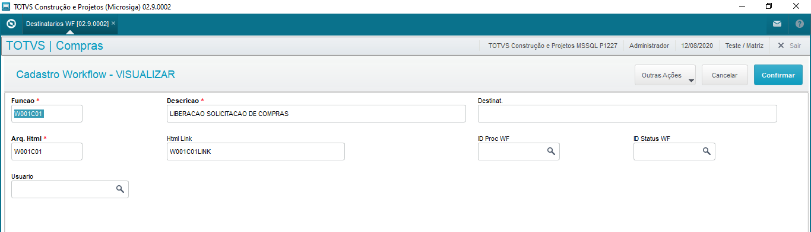{.flow-image}

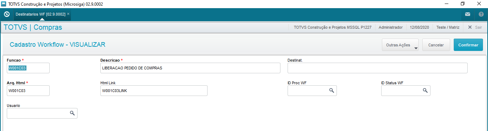{.flow-image}

<strong>FUNÇÃO</strong>: informe o nome da rotina customizada de Workflow.

<strong>DESCRIÇÃO</strong>: informe uma descrição para identificação do Workflow.

<strong>DESTINATÁRIOS</strong>: informe os e-mails dos destinatários para envio do Workflow; para informar vários e-mails separe com “;”.

#### 2. Regras de Alçadas

Esta rotina tem por objetivo cadastraras regras dos processos em controle de alçadas, utilizado para definir as regras de bloqueio dos documentos e os usuários aprovadores de cada processo.

<i>OBS: os usuários envolvidos no processo (solicitantes, aprovadores) devem estar cadastrados como usuários do ERP no módulo Configurador e devem possuir e-mail.</i>

Será apresentada tela de Browse contendo as regras já criadas.

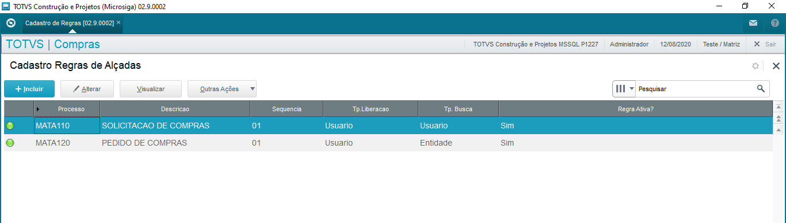{.flow-image}

#### 2.1. Liberação por Nível

Utilizado para definir regras de liberação por nível de hierarquia, ou seja, uma regra pode exigir a liberação de três usuários que estão em níveis de hierarquia diferentes, por exemplo:

<table class="banks-table">
  <thead>
    <tr>
      <th>Seq</th>
      <th>Tp. Liber.</th>
      <th>Nível</th>      
      <th>Usuário</th>      
      <th>Cargo/Departamento</th>      
    </tr>
  </thead>
  <tbody>
    <tr>
      <td>01</td>
      <td>Nível</td>
      <td>01</td>      
      <td>Aprovador 01</td>      
      <td>Gerente de T.I.</td>      
    </tr>
    <tr>
      <td>02</td>
      <td>Nível</td>
      <td>02</td>      
      <td>Aprovador 02</td>      
      <td>Gerente de Compras</td>      
    </tr>  
    <tr>
      <td>03</td>
      <td>Nível</td>
      <td>03</td>      
      <td>Aprovador 03</td>      
      <td>Diretor 1</td>      
    </tr>  
    <tr>
      <td>04</td>
      <td>Nível</td>
      <td>04</td>      
      <td>Aprovador 04</td>      
      <td>Diretor 2</td>      
    </tr>  
  </tbody>
</table>

O controle de alçadas vai executar a primeira regra e enviar um workflow de aprovação para os usuários aprovadores do Nível 01, neste caso usuário “APROVADOR 01”. Após o mesmo aprovar o documento, será executada a segunda regra que enviará um workflow de aprovação para os usuários do Nível 02, “APROVADOR 02”. Após este aprovar, será executada a terceira regra que enviará um workflow para os dois usuários do Nível 03.Neste caso qualquer um deles pode aprovar o documento, pois estão no mesmo nível. 

Somente após o último nível ter sido aprovado é que o documento em questão será liberado pelo controle de alçadas. 
Caso algum usuário rejeite o documento, em qualquer nível, as regras seguintes não serão executadas e o documento ficará com Status “rejeitado”.

#### 2.2. Liberação por Usuário

Utilizado para definir regras de liberação por usuário um ou mais usuários, sem considerar níveis de hierarquia. Exemplo:

<table class="banks-table">
  <thead>
    <tr>
      <th>Seq</th>
      <th>Tp. Liber.</th>
      <th>Nível</th>      
      <th>Usuário</th>      
      <th>Cargo/Departamento</th>      
    </tr>
  </thead>
  <tbody>
    <tr>
      <td>01</td>
      <td>Usuário</td>
      <td>-</td>      
      <td>Aprovador 01</td>      
      <td>Gerente de T.I.</td>      
    </tr>
    <tr>
      <td>02</td>
      <td>Usuário</td>
      <td>-</td>      
      <td>Aprovador 02</td>      
      <td>Gerente de Compras</td>      
    </tr>  
    <tr>
      <td>03</td>
      <td>Usuário</td>
      <td>-</td>      
      <td>Aprovador 03</td>      
      <td>Diretor 1</td>      
    </tr>      
  </tbody>
</table>

O controle de alçadas vai executar sequencialmente cada regra acima e exigir a aprovação de todos os usuários definidos.

#### 2.3. Liberação por Documento

Utilizado quando não há diferenciação de níveis de hierarquia e quando há vários usuários aprovadores, sendo que o documento será liberado quando qualquer um dos usuários aprovar, não exigindo a aprovação de todos.

<table class="banks-table">
  <thead>
    <tr>
      <th>Seq</th>
      <th>Tp. Liber.</th>
      <th>Nível</th>      
      <th>Usuário</th>      
      <th>Cargo/Departamento</th>      
    </tr>
  </thead>
  <tbody>
    <tr>
      <td>01</td>
      <td>Documento</td>
      <td>-</td>
      <td>Aprovador 01</td>
      <td>Gerente de T.I.</td>      
    </tr>
    <tr>
      <td>02</td>
      <td>Documento</td>
      <td>-</td>      
      <td>Aprovador 02</td>      
      <td>Gerente de Compras</td>      
    </tr>  
    <tr>
      <td>03</td>
      <td>Documento</td>
      <td>-</td>      
      <td>Aprovador 03</td>      
      <td>Diretor 1</td>      
    </tr>      
  </tbody>
</table>

Principais campos da tela de cadastro:

<strong>PROCESSO</strong>: informe o nome do programa ao qual serão criadas as regras para alçadas, no caso deste pacote são somente as rotinas abaixo:

<table class="banks-table">
  <thead>
    <tr>
      <th>Rotina</th>
      <th>Descrição</th>  
    </tr>
  </thead>
  <tbody>
    <tr>
      <td>MATA110</td>
      <td>SOLICITACAO DE COMPRA</td>    
    </tr>
    <tr>
      <td>MATA120</td>
      <td>PEDIDO DE COMPRA</td>  
    </tr>      
  </tbody>
</table>

<strong>DESCRIÇÃO</strong>: informe uma descrição ou nome para o processo, conforme a rotina.

<strong>WORKFLOW AVISO</strong>: informe o nome do workflow que será utilizado para o controle de alçadas enviar um e-mail de Aviso com o Status de liberação do documento (aprovado ou rejeitado). 
É necessário que o mesmo esteja cadastrado na rotina “Destinatários de Workflow”. 
Por padrão, o controle de alçadas sempre enviará o workflow de aviso para o usuário “solicitante” que incluiu o respectivo documento, porém é possível adicionar outros destinatários. 
Para este pacote de alçadas informe: 

<table class="banks-table">
  <thead>
    <tr>
      <th>Processo</th>
      <th>Workflow</th>  
      <th>Descrição</th>  
    </tr>
  </thead>
  <tbody>
    <tr>
      <td>MATA110</td>
      <td>W001C02</td>    
      <td>AVISO SOLICITACAO DE COMPRA (APROVADA/REJEITADA)</td>    
    </tr>
    <tr>
      <td>MATA120</td>
      <td>W001C04</td>  
      <td>AVISO PEDIDO DE COMPRA (APROVADO/REJEITADO)</td>    
    </tr>      
  </tbody>
</table>

<strong>WORKFLOW ALIAS</strong>: informe o Alias da tabela principal do documento em alçadas, para uso pelo programa de envio do workflow de aviso.

<table class="banks-table">
  <thead>
    <tr>
      <th>Alias</th>
      <th>Tabela</th>        
    </tr>
  </thead>
  <tbody>
    <tr>
      <td>SC1</td>
      <td>SOLICITACAO DE COMPRA</td>          
    </tr>
    <tr>
      <td>SC7</td>
      <td>PEDIDO DE COMPRA</td>        
    </tr>      
  </tbody>
</table>

<strong>REGRA ATIVA</strong>: informe se a regra está habilitada ou não para ser utilizada pelo controle de alçadas (Sim/Não).

No Grid que segue,informe a definição das regras para o processo conforme segue abaixo:

<strong>SEQUENCIA</strong>: código automático que indica a sequencia de execução das regras.

<strong>TIPO LIBERAÇÃO</strong>: informe o tipo de liberação da regra:
- Por Nível
- Por Usuário
- Por Documento

<strong>NÍVEL</strong>: caso o tipo de liberação seja “por nível” informe o código dos níveis de liberação. Exemplo: 01, 02, 03...

<strong>TIPO BUSCA</strong>: informe como o controle de alçadas buscará e determinará o usuário aprovador que vai receber o workflow de aprovação: 
<strong>Por Entidade</strong>:será utilizada uma tabela externa que deve estar relacionada a tabela principal do documento em questão. Exemplo: tabela de Centro de Custos. Esta tabela relacionada deverá conter um campo customizado com o código do usuário aprovador/responsável. 
<strong>Por Usuário</strong>: deverá ser associado e relacionado um usuário específico para aprovação. 
<strong>Personalizada</strong>: retorna o aprovador de forma personalizada. Deve ser utilizado o ponto de entrada <strong>M001REG</strong> para a regra personalizada, o retorno do ponto de entrada deve ser o código do usuário aprovador.  

<strong>APROVADOR</strong>: somente se o tipo de busca for “por usuário”, informe o código do usuário do ERP que receberá o workflow para liberação do documento conforme a regra.

<strong>INDICE ALIAS</strong>: somente se o tipo de busca for “por entidade”, informe o código do índice de busca da tabela relacionada que contém o código do usuário que será utilizado.

<strong>CAMPO</strong>: somente se o tipo de busca for “por entidade”, informe o nome do campo da tabela relacionada que contém o código do usuário que será utilizado.
Podem ser utilizadas duas entidades: 

- SBM – Grupo de Produtos
- CTT – Centro de Custos 

Exemplo: se utilizar a tabela de Centro de Custos (CTT), esta tabela deverá conter um campo com o código do usuário responsável, exemplo: CTT_X_USR. O documento em questão deverá conter um relacionamento com a tabela CTT, por exemplo, se for Solicitação de Compras existe o campo C1_CC. Desta forma, a regra ficaria assim:

<table class="banks-table">
  <thead>
    <tr>
      <th>Tp. Busca</th>
      <th>Índice Alias</th>        
      <th>Campo</th>        
    </tr>
  </thead>
  <tbody>
    <tr>
      <td>Entidade</td>
      <td>1</td>          
      <td>CTT_X_USR</td>
    </tr>    
  </tbody>
</table>

O controle de alçadas vai buscar na tabela CTT utilizando o índice 1, o código do centro de custo na solicitação de compras pelo campo C1_CC, pegando o código do usuário que está no campo customizado CTT_X_USER.

!!! warning "ATENÇÃO: Verificar parâmetro MV_X001013, que define qual entidade será utilizada para a Solicitação de Compras e para o Pedido de Compras. "

<i>OBS: estas regras devem ser definidas e customizadas durante a implantação em cada cliente, pois é necessário criar o campo customizado e a regra de relacionamento conforme a tabela que será utilizada.</i>

<strong>EXPRESSÃO</strong>: opcionalmente, se necessário informe uma expressão ADVPL para determinar se a regra será executada ou não com base no documento em questão, a qual necessariamente deverá retornar: .T. ou .F. Pode ser utilizada uma função de usuário para efetuar um processamento sobre o documento e retornar a expressão.
Exemplo: no caso de pedido de compra, o pacote de alçadas contém uma variável pública “X001SC7TOT” que representa o valor total do pedido de compra. Com base nesta variável é possível definir faixas de valores para determinar as alçadas de aprovação:

<table class="banks-table">
  <thead>
    <tr>
      <th>Seq</th>
      <th>Nível</th>        
      <th>Usuário</th>        
      <th>Expressão</th>        
    </tr>
  </thead>
  <tbody>
    <tr>
      <td>01</td>
      <td>01</td>          
      <td>Aprovador 01</td>
      <td>X001SC7TOT> 0</td>
    </tr>    
    <tr>
      <td>02</td>
      <td>02</td>          
      <td>Aprovador 02</td>
      <td>X001SC7TOT> 5000 .AND. X001SC7TOT<= 50000</td>
    </tr>    
    <tr>
      <td>03</td>
      <td>03</td>          
      <td>Aprovador 03</td>
      <td>X001SC7TOT> 50000 .AND. X001SC7TOT<= 100000</td>
    </tr>    
    <tr>
      <td>04</td>
      <td>04</td>          
      <td>Aprovador 04</td>
      <td>X001SC7TOT> 50000 .AND. X001SC7TOT<= 100000</td>
    </tr>    
  </tbody>
</table>

<i>OBS: as regras 03 e 04 possuem a mesma expressão pois tem dois usuários no mesmo nível.</i>

<strong>PROC. WF</strong>: informe o nome do programa de workflow de liberação que será utilizado para o controle de alçadas enviar um e-mail contendo o link de aprovação do documento, para o usuário aprovador conforme as regras.

<strong>ALIAS</strong>:informe o Alias da tabela principal do documento em alçadas, para uso pelo programa de envio do workflow de liberação.

<strong>OBSERVAÇÕES</strong>: informe algum texto de observação para a regra em questão, opcional.

Exemplo de Regra para <strong>Solicitação de Compras</strong>

Por Entidade:

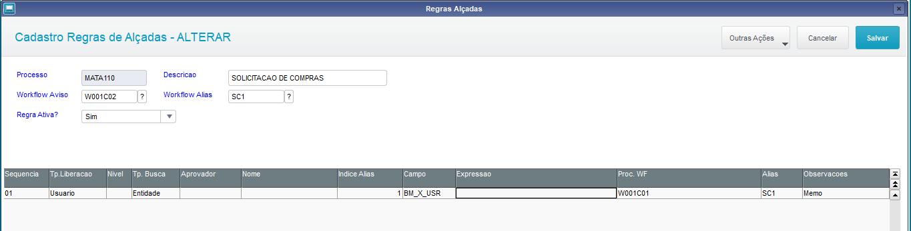{.flow-image}

Por usuário:

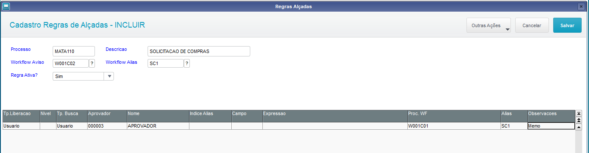{.flow-image}

Exemplo de Regra para <strong>Pedido de Compras</strong>

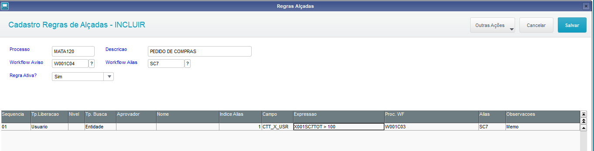{.flow-image}

<strong>Transferência de aprovador</strong>

Nesta opção é possível efetuar a transferência de documentos que estão pendentes para aprovação de determinado usuário aprovador, e passar para outro usuário. Motivo pode ser uma ausência não prevista do aprovador, por exemplo saúde, sendo que o documento precisa ser liberado.

Será apresentada a seguinte tela:

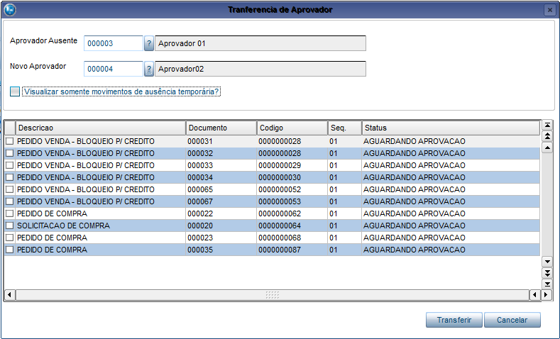{.flow-image}

<strong>APROVADOR AUSENTE</strong>: informe o código do usuário que se ausentou. Após informar, serão exibidos no Grid os documentos que estão pendentes para o aprovador.

<strong>NOVO APROVADOR</strong>: informe o código do usuário que será o novo aprovador dos documentos.

Selecione os documentos que deseja transferir e confirme a operação no botão “Transferir”

#### 2.4. AUSÊNCIA TEMPORÁRIA

Estecadastro tem por objetivo definir um usuário aprovador substituto, de forma temporária, no caso do aprovador principal ter um período ausente, por exemplo, férias.

Toda vez que um documento é avaliado pelas regras do controle de alçadas, o sistema consultará se o aprovador definido pela regra tem um período de ausência temporária cadastrado, com base na data do documento. Em caso afirmativo, será utilizado o aprovador substituto para liberação do documento.

{.flow-image}

<strong>APROVADOR</strong>: informe o usuário aprovador que estará ausente.

<strong>DATA SAÍDA</strong>: informe a data de saída do usuário aprovador. Tem que ser uma data futura, maior que a data atual do sistema.

<strong>DATA RETORNO</strong>: informe a data de retorno do usuário aprovador. Tem que ser uma data maior ou igual a data de saída.

<strong>SUBSTITUTO</strong>: informe o usuário aprovador que será o substituto do aprovador ausente.

#### 2.5. VERBAS APROVADORES

Estecadastro tem por objetivo definir a verba disponível para aprovadores específicos e definir seus superiores no caso de transferência.

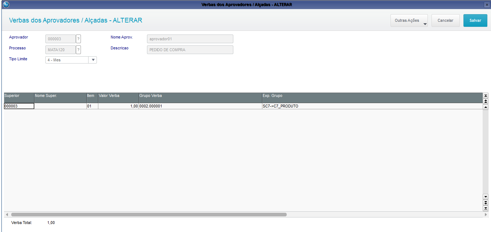{.flow-image}

<strong>APROVADOR</strong>: informe o usuário aprovador que terá a verba a ser cadastrada.

<strong>PROCESSO</strong>: informe o nome da rotina onde será feito o controle de verba:

<table class="banks-table">
  <thead>
    <tr>
      <th>Rotina</th>
      <th>Descrição</th>                
    </tr>
  </thead>
  <tbody>
    <tr>
      <td>MATA110</td>
      <td>SOLICITACAO DE COMPRA</td>                
    </tr>    
    <tr>
      <td>MATA120</td>
      <td>PEDIDO DE COMPRA</td>                
    </tr>    
  </tbody>
</table>

<strong>TIPO LIMITE</strong>: informe o tipo de período limite da verba.

<strong>SUPERIOR</strong>: informe o código do superior para efeito de transferência.

<strong>VALOR VERBA</strong>: informe o valor da verba.

<strong>GRUPO VERBA</strong>: informe o código do grupo de verba. Este código será comparado com o valor trazido pelo próximo campo para fins de validação.

<strong>EXP. GRUPO</strong>: informe uma expressão ADVPL que irá trazer o código do grupo de verba.

Na imagem exemplo, o campo Grupo Verba foi preenchido com o código de um produto especifico, ou seja, esta verba será para somente este produto.

O campo Exp. Grupo então precisa trazer o campo Código do Produto do cadastro de pedidos, que por sua vez trará o código que está dentro de Grupo Verba somente quando o produto for aquele especifico.

#### 3. APROVAÇÕES (LIBERAÇÃO/REJEIÇÃO DE DOCUMENTOS)

Esta rotina tem por objetivo permitir a liberação ou rejeição de documento de forma manual, ou seja, via sistema e não Workflow. 
Serão exibidos somente os registros/documentos que estão direcionados para o usuário logado no sistema, ou seja, o aprovador. 
Na entrada da rotina é apresentada tela para selecionar o filtro de exibição dos documentos em alçadas conforme o Status: 

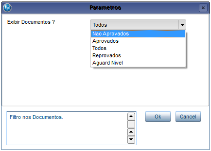{.flow-image}

Será apresentado na tela um Browse com os documentos em controle de alçadas e o respetivo Status conforme legenda:

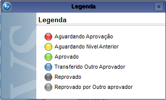{.flow-image}

#### 3.1. Liberar

Será apresentada tela para aprovação do documento/registro posicionado, desde que esteja pendente aguardando liberação:

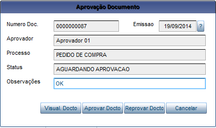{.flow-image}

Dentro desta tela é possível acionar as seguintes opções:

- Visualizar Documento: mostra tela de visualização do documento conforme a sua rotina de origem, ou seja, se for uma solicitação de compras abrirá a visualização da solicitação de compras;
- Aprovar Documento: confirma a liberação do documento em alçadas
- Reprovar Documento: rejeita a liberação do documento em alçadas.
- Cancelar: fecha a tela.

#### 3.2. Cons. Aprov.

Será apresentada tela para consulta do Status dos movimentos de aprovação/rejeição do documento posicionado:

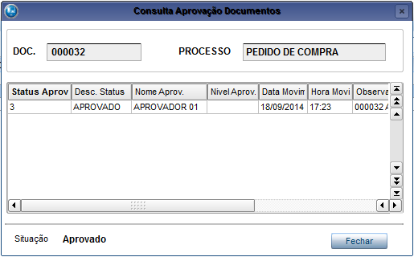{.flow-image}

#### 3.3. Visualiza Doc.

Será apresentada a tela de visualização do documento conforme a sua rotina de origem, ou seja, se for uma solicitação de compras abrirá a tela de visualização da rotina solicitação de compras;

#### 4. PROCESSOS INTEGRADOS COM AS ALÇADAS - COMPRAS

#### 4.1. SOLICITAÇÃO DE COMPRAS(MATA110)

Rotina padrão do módulo de Compras a qual foi integrada com o processo de controle de alçadas.
Para ativar/desativar a integração verifique o parâmetro: MV_X001002

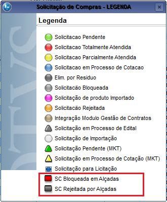{.flow-image}

Operações: 

- Inclusão: Serão avaliadas as regras das alçadas cadastradas para o processo MATA110 e executado o bloqueio do documento (SC) conforme as regras definidas. 
- Alteração: Toda vez que efetuar a alteração de um documento em alçadas, as regras serão avaliadas novamente e será gerado um novo registro no processo de alçadas (inclusão) e o registro anterior será excluído. 
- Cópia: Idem a inclusão. 
- Exclusão: Serão excluídos os movimentos vinculados das alçadas, se houver. 
- Cons. Alçadas: Será apresentada tela para consulta do Status dos movimentos de aprovação/rejeição do documento; 

#### 4.2. Gera Cotações (MATA130)

Rotina padrão do módulo de Compras a qual foi integrada com o processo de controle de alçadas.
Para ativar/desativar a integração verifique o parâmetro: MV_X001002

Serão exibidas somente as solicitações de compra que estão liberadas (aprovadas) pelo controle de alçadas.

#### 4.3. Analisa Cotações (MATA160)

Rotina padrão do módulo de Compras a qual foi integrada com o processo de controle de alçadas.
Para ativar/desativar a integração verifique o parâmetro: MV_X001003

Os pedidos de compra gerados pela rotina serão avaliados e bloqueados conforme o processo de aladas.

#### 4.4. Pedido de Compras (MATA120)

Rotina padrão do módulo de Compras a qual foi integrada com o processo de controle de alçadas.
Para ativar/desativar a integração verifique o parâmetro: MV_X001003

Legenda:

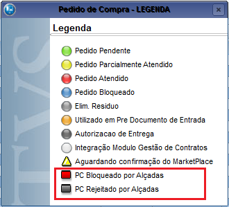{.flow-image}

<strong>Operações:</strong>

- Inclusão: Serão avaliadas as regras das alçadas cadastradas para o processo MATA120 e executado o bloqueio do documento (PC) conforme as regras definidas. 
- Alteração: Toda vez que efetuar a alteração de um documento em alçadas, as regras serão avaliadas novamente e será gerado um novo registro no processo de alçadas (inclusão) e o registro anterior será excluído. 
- Cópia: Idem a inclusão. 
- Exclusão: Serão excluídos os movimentos vinculados das alçadas, se houver. 
- Cons. Alçadas: Será apresentada tela para consulta do Status dos movimentos de aprovação/rejeição do documento; 

Caso utilize as opções de Solicitação (F4) ou Solicitação por item (F5) para buscar as Solicitações de Compras para o pedido, serão exibidas somente as solicitações de compra que estão liberadas (aprovadas) pelo controle de alçadas.

#### 4.5. Documento de Entrada (MATA103)

Rotina padrão do módulo de Compras a qual foi integrada com o processo de controle de alçadas.
Para ativar/desativar a integração verifique o parâmetro: MV_X001003

Caso utilize as opções de Pedido (F5) ou Pedido por item (F6) para buscar os Pedidos de Compras para a nota, serão exibidos somente os pedidos que estão liberados (aprovados) pelo controle de alçadas.

Após a inclusão da Nota Fiscal de Entrada relacionada relacionada a Pedidos de Compra que foram aprovados pelo controle de alçadas, e se existe controle de liberação de títulos para a carteira de Contas a Pagar (MV_CTLIPAG), será possível efetuar a liberação automática do título, através da configuração dos parâmetros MV_X001011 e MV_X001012.

  <a href="/" class="md-button" style="text-decoration: none;">← Voltar para a Página Inicial</a>

