# Alçadas - Workflow Pedido de Compras {.home-hero}

<!--############################################### 01 #######################################################-->

-   __Conteúdo em Desenvolvimento__
    
    Esta seção do manual técnico está passando por revisões de conformidade e formatação. Os modelos de dados e procedimentos operacionais estão sendo validados para garantir a precisão das instruções técnicas. O conteúdo completo estará disponível em breve.

  01. Visão Geral

### 1. Visão Geral

#### Sistema customizado para gestão de aprovações integradas ao módulo de Compras.

<strong>Principais vantagens do produto:</strong>

- Solicitação de Compras (MATA110) – validação das regras de alçadas;
- Gera Cotações (MATA130) – filtro para solicitações aprovadas por alçadas;
- Analisa Cotações (MATA160) – geração do pedido de compra com validação das regras de alçadas;
- Pedido de Compras (MATA120) – validação das regras de alçadas, filtro para solicitações aprovadas por alçadas;
- Documento de Entrada (MATA103) – filtro para pedidos de compra aprovados por alçadas;
- Aprovação/Rejeição de Solicitação de Compra - via Workflow;
- Aprovação/Rejeição de Pedido de Compra - via Workflow;
- Consulta Status de Aprovação da SC e PC em alçadas;

<!--############################################### 02 #######################################################-->

  02. Menu

### 2. Menu

!!! tip "Ver manual do Addon [**Alçadas - Regras**](/addon-alcadas-regras/#2-menu) na seção "2. Menu"." 

<!--############################################### 03 #######################################################-->

  03. Fluxo Operacional

### 3. Fluxo Operacional

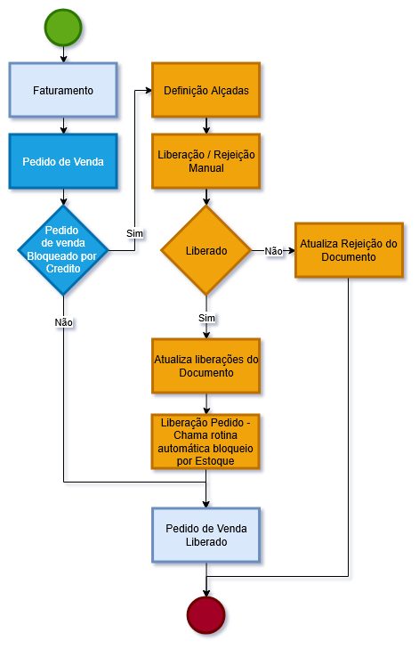{.flow-image}

<!--############################################### 04 #######################################################-->

  04. Rotinas personalizadas específicas do Pacote

### 4. Rotinas personalizadas específicas do Pacote

#### Funções personalizadas contidas no pacote:

<table class="banks-table">
  <thead>
    <tr>
      <th>Função</th>
      <th>Descrição</th>
    </tr>
  </thead>
  <tbody>
    <tr>
      <td><strong>M001C01</strong></td>
      <td>Rotina para retorno do processo de Workflow – Solicitação de Compras</td>
    </tr>
    <tr>
      <td><strong>M001C02</strong></td>
      <td>Rotina para retorno do processo de Workflow – Pedido de Compras</td>
    </tr>
    <tr>
      <td><strong>P001C01</strong></td>
      <td>Rotina centralizadora das chamadas dos Pontos de Entrada de Pedido de Compras, Analisa Cotação e Documento de Entrada</td>
    </tr>
    <tr>
      <td><strong>T001C01</strong></td>
      <td>Rotina para Tela de Consulta Alçadas na rotina Solicitação de Compras</td>
    </tr>
    <tr>
      <td><strong>T001C02</strong></td>
      <td>Rotina para Tela de Consulta Alçadas na rotina Pedido de Compras</td>
    </tr>
    <tr>
      <td><strong>UPD001C</strong></td>
      <td>Rotina de aplicação do template</td>
    </tr>
    <tr>
      <td><strong>W001C01</strong></td>
      <td>Rotina para geração do Workflow de liberação da Solicitação de Compras</td>
    </tr>
    <tr>
      <td><strong>W001C02</strong></td>
      <td>Rotina para geração do Workflow de Aviso da Aprovação/Rejeição da Solicitação de Compras</td>
    </tr>
    <tr>
      <td><strong>W001C03</strong></td>
      <td>Rotina para geração do Workflow de liberação do Pedido de Compra</td>
    </tr>
    <tr>
      <td><strong>W001C04</strong></td>
      <td>Rotina para geração do Workflow de Aviso da Aprovação/Rejeição do Pedido de Compra</td>
    </tr>
  </tbody>
</table>

<!--############################################### 05 #######################################################-->

  05. Pontos de Entradas Disponiveis para Desenvolvimento

### 5. Pontos de Entradas Disponiveis para Desenvolvimento

<table class="banks-table">
  <thead>
    <tr>
      <th>Nome</th>
      <th>Descrição</th>
      <th>Implementação</th>      
    </tr>
  </thead>
  <tbody>
    <tr>
      <td><strong>A120F4FI</strong></td>
      <td>Ponto de entrada na rotina pedido de compra para filtro na Tabela SC1 ao acionar a tecla F5 no campo C7_PRODUTO</td>
      <td>

  

    ADVPL
    A120F4FI
  

  <pre><code>  
User Function A120F4FI()
Local aArea := GetArea()
Local aRet  := {}
//ÚÄÄÄÄÄÄÄÄÄÄÄÄÄÄÄÄÄÄÄÄÄÄÄÄÄÄÄÄÄÄÄÄÄÄÄÄÄÄÄÄÄÄÄÄÄÄÄÄÄÄÄÄÄÄÄÄÄÄÄÄÄÄÄÄÄÄÄÄÄÄÄÄÄÄ
//³ Chamada específica para uso do Template de Alçadas (Bloqueio SC/PC)     ³
//ÀÄÄÄÄÄÄÄÄÄÄÄÄÄÄÄÄÄÄÄÄÄÄÄÄÄÄÄÄÄÄÄÄÄÄÄÄÄÄÄÄÄÄÄÄÄÄÄÄÄÄÄÄÄÄÄÄÄÄÄÄÄÄÄÄÄÄÄÄÄÄÄÄÄÄ
If ExistBlock("P001C02")
   aRet := U_P001C02("A120F4FI", PARAMIXB)   
EndIf
RestArea(aArea)
Return(aRet)    

</code></pre>
      </td>      
    </tr>
    <tr>
      <td><strong>A120PIDF</strong></td>
      <td>Ponto de entrada na rotina de Pedido de Compra para filtro na Tabelas SC1 ao acionar a tecla de atalho F4 nos itens</td>
      <td>

  

    ADVPL
    A120PIDF
  

  <pre><code>  
User Function A120PIDF()
Local aArea := GetArea()
Local aRet  := {}
//ÚÄÄÄÄÄÄÄÄÄÄÄÄÄÄÄÄÄÄÄÄÄÄÄÄÄÄÄÄÄÄÄÄÄÄÄÄÄÄÄÄÄÄÄÄÄÄÄÄÄÄÄÄÄÄÄÄÄÄÄÄÄÄÄÄÄÄÄÄÄÄÄÄÄÄ
//³ Chamada específica para uso do Template de Alçadas (Bloqueio SC/PC)     ³
//ÀÄÄÄÄÄÄÄÄÄÄÄÄÄÄÄÄÄÄÄÄÄÄÄÄÄÄÄÄÄÄÄÄÄÄÄÄÄÄÄÄÄÄÄÄÄÄÄÄÄÄÄÄÄÄÄÄÄÄÄÄÄÄÄÄÄÄÄÄÄÄÄÄÄÄ
If ExistBlock("P001C02")
   aRet := U_P001C02("A120PIDF", PARAMIXB)   
EndIf
RestArea(aArea)
Return(aRet)

</code></pre>
      </td>      
    </tr>
    <tr>
      <td><strong>M110STTS</strong></td>
      <td>Ponto de entrada na rotina de Solicitação de Compras após a gravação da Solicitação em inclusão, alteração, exclusão.</td>
      <td>

  

    ADVPL
    M110STTS
  

  <pre><code>  
User Function M110STTS()
Local aArea := GetArea()
//ÚÄÄÄÄÄÄÄÄÄÄÄÄÄÄÄÄÄÄÄÄÄÄÄÄÄÄÄÄÄÄÄÄÄÄÄÄÄÄÄÄÄÄÄÄÄÄÄÄÄÄÄÄÄÄÄÄÄÄÄÄÄÄÄÄÄÄÄÄÄÄÄÄÄÄ
//³ Chamada específica para uso do Template de Alçadas (Bloqueio SC/PC)     ³
//ÀÄÄÄÄÄÄÄÄÄÄÄÄÄÄÄÄÄÄÄÄÄÄÄÄÄÄÄÄÄÄÄÄÄÄÄÄÄÄÄÄÄÄÄÄÄÄÄÄÄÄÄÄÄÄÄÄÄÄÄÄÄÄÄÄÄÄÄÄÄÄÄÄÄÄ
If ExistBlock("P001C01")
   U_P001C01("M110STTS", PARAMIXB)   
EndIf
RestArea(aArea)
Return

</code></pre>
      </td>      
    </tr>
    <tr>
      <td><strong>M130FIL</strong></td>
      <td>Ponto de entrada na rotina de Geração da Cotação para adicionar Filtro sobre as solicitações de compra</td>
      <td>

  

    ADVPL
    M130FIL
  

  <pre><code>  
User Function M130FIL()
Local aArea := GetArea()
Local cRet  := ""
//ÚÄÄÄÄÄÄÄÄÄÄÄÄÄÄÄÄÄÄÄÄÄÄÄÄÄÄÄÄÄÄÄÄÄÄÄÄÄÄÄÄÄÄÄÄÄÄÄÄÄÄÄÄÄÄÄÄÄÄÄÄÄÄÄÄÄÄÄÄÄÄÄÄÄÄ
//³ Chamada específica para uso do Template de Alçadas (Bloqueio SC/PC)     ³
//ÀÄÄÄÄÄÄÄÄÄÄÄÄÄÄÄÄÄÄÄÄÄÄÄÄÄÄÄÄÄÄÄÄÄÄÄÄÄÄÄÄÄÄÄÄÄÄÄÄÄÄÄÄÄÄÄÄÄÄÄÄÄÄÄÄÄÄÄÄÄÄÄÄÄÄ
If ExistBlock("P001C01")
   cRet := U_P001C01("M130FIL", PARAMIXB)   
EndIf
RestArea(aArea)
Return(cRet)

</code></pre>
      </td>      
    </tr>
    <tr>
      <td><strong>MT131FIL</strong></td>
      <td>Ponto de entrada na rotina de Geração da Cotação para adicionar Filtro sobre as solicitações de compra.</td>
      <td>

  

    ADVPL
    MT131FIL
  

  <pre><code>  
User Function M130FIL()
Local aArea := GetArea()
Local cRet  := ""
//ÚÄÄÄÄÄÄÄÄÄÄÄÄÄÄÄÄÄÄÄÄÄÄÄÄÄÄÄÄÄÄÄÄÄÄÄÄÄÄÄÄÄÄÄÄÄÄÄÄÄÄÄÄÄÄÄÄÄÄÄÄÄÄÄÄÄÄÄÄÄÄÄÄÄÄ
//³ Chamada específica para uso do Template de Alçadas (Bloqueio SC/PC)     ³
//ÀÄÄÄÄÄÄÄÄÄÄÄÄÄÄÄÄÄÄÄÄÄÄÄÄÄÄÄÄÄÄÄÄÄÄÄÄÄÄÄÄÄÄÄÄÄÄÄÄÄÄÄÄÄÄÄÄÄÄÄÄÄÄÄÄÄÄÄÄÄÄÄÄÄÄ
If ExistBlock("P001C01")
   cRet := U_P001C01("MT131FIL", PARAMIXB)   
EndIf
RestArea(aArea)
Return(cRet)

</code></pre>
      </td>      
    </tr>
    <tr>
      <td><strong>MT103QPC</strong></td>
      <td>Ponto de entrada na rotina de Análise da Cotação para filtro na Tabelas SC7 ao acionar as teclas de atalho F4/F5</td>
      <td>

  

    ADVPL
    MT103QPC
  

  <pre><code>  
User Function MT103QPC()
Local aArea := GetArea()
Local cRet := ""
//ÚÄÄÄÄÄÄÄÄÄÄÄÄÄÄÄÄÄÄÄÄÄÄÄÄÄÄÄÄÄÄÄÄÄÄÄÄÄÄÄÄÄÄÄÄÄÄÄÄÄÄÄÄÄÄÄÄÄÄÄÄÄÄÄÄÄÄÄÄÄÄÄÄÄÄ
//³ Chamada específica para uso do Template de Alçadas (Bloqueio SC/PC)     ³
//ÀÄÄÄÄÄÄÄÄÄÄÄÄÄÄÄÄÄÄÄÄÄÄÄÄÄÄÄÄÄÄÄÄÄÄÄÄÄÄÄÄÄÄÄÄÄÄÄÄÄÄÄÄÄÄÄÄÄÄÄÄÄÄÄÄÄÄÄÄÄÄÄÄÄÄ
If ExistBlock("P001C02")
   cRet := U_P001C02("MT103QPC", PARAMIXB)   
EndIf
RestArea(aArea)
Return(cRet)

</code></pre>
      </td>      
    </tr>
    <tr>
      <td><strong>MT110COR</strong></td>
      <td>Ponto de entrada na rotina de Solicitação de Compras para manipular o Array com as regras de cores da Mbrowse</td>
      <td>

  

    ADVPL
    MT110COR
  

  <pre><code>  
User Function MT110COR()
Local aArea := GetArea()
Local aNewCores := aClone(PARAMIXB[1])
//ÚÄÄÄÄÄÄÄÄÄÄÄÄÄÄÄÄÄÄÄÄÄÄÄÄÄÄÄÄÄÄÄÄÄÄÄÄÄÄÄÄÄÄÄÄÄÄÄÄÄÄÄÄÄÄÄÄÄÄÄÄÄÄÄÄÄÄÄÄÄÄÄÄÄÄ
//³ Chamada específica para uso do Template de Alçadas (Bloqueio SC/PC)     ³
//ÀÄÄÄÄÄÄÄÄÄÄÄÄÄÄÄÄÄÄÄÄÄÄÄÄÄÄÄÄÄÄÄÄÄÄÄÄÄÄÄÄÄÄÄÄÄÄÄÄÄÄÄÄÄÄÄÄÄÄÄÄÄÄÄÄÄÄÄÄÄÄÄÄÄÄ
If ExistBlock("P001C01")
   aNewCores := U_P001C01("MT110COR", PARAMIXB)   
EndIf
RestArea(aArea)
Return(aNewCores)

</code></pre>
      </td>      
    </tr>
     <tr>
      <td><strong>MT110LEG</strong></td>
      <td>Ponto de entrada na rotina de Solicitação de Compras para adicionar legendas das cores na Dialog de legenda</td>
      <td>

  

    ADVPL
    MT110LEG
  

  <pre><code>  
User Function MT110LEG()
Local aArea := GetArea()
Local aCores := aClone(PARAMIXB[1])
//ÚÄÄÄÄÄÄÄÄÄÄÄÄÄÄÄÄÄÄÄÄÄÄÄÄÄÄÄÄÄÄÄÄÄÄÄÄÄÄÄÄÄÄÄÄÄÄÄÄÄÄÄÄÄÄÄÄÄÄÄÄÄÄÄÄÄÄÄÄÄÄÄÄÄÄ
//³ Chamada específica para uso do Template de Alçadas (Bloqueio SC/PC)     ³
//ÀÄÄÄÄÄÄÄÄÄÄÄÄÄÄÄÄÄÄÄÄÄÄÄÄÄÄÄÄÄÄÄÄÄÄÄÄÄÄÄÄÄÄÄÄÄÄÄÄÄÄÄÄÄÄÄÄÄÄÄÄÄÄÄÄÄÄÄÄÄÄÄÄÄÄ
If ExistBlock("P001C01")
   aCores := U_P001C01("MT110LEG", PARAMIXB)   
EndIf
RestArea(aArea)
Return(aCores)

</code></pre>
      </td>      
    </tr> 
    <tr>
      <td><strong>MT110ROT</strong></td>
      <td>Ponto de entrada na rotina de Solicitação de Compras para adicionar mais opções no aRotina.</td>
      <td>

  

    ADVPL
    MT110ROT
  

  <pre><code>  
User Function MT110ROT()
Local aArea := GetArea()
Local aRot := aClone(aRotina)
//ÚÄÄÄÄÄÄÄÄÄÄÄÄÄÄÄÄÄÄÄÄÄÄÄÄÄÄÄÄÄÄÄÄÄÄÄÄÄÄÄÄÄÄÄÄÄÄÄÄÄÄÄÄÄÄÄÄÄÄÄÄÄÄÄÄÄÄÄÄÄÄÄÄÄÄ
//³ Chamada específica para uso do Template de Alçadas (Bloqueio SC/PC)     ³
//ÀÄÄÄÄÄÄÄÄÄÄÄÄÄÄÄÄÄÄÄÄÄÄÄÄÄÄÄÄÄÄÄÄÄÄÄÄÄÄÄÄÄÄÄÄÄÄÄÄÄÄÄÄÄÄÄÄÄÄÄÄÄÄÄÄÄÄÄÄÄÄÄÄÄÄ
If ExistBlock("P001C01")
   aRot := U_P001C01("MT110ROT", PARAMIXB)   
EndIf
RestArea(aArea)
Return(aRot)

</code></pre>
      </td>      
    </tr>  
    <tr>
      <td><strong>MT120BRW</strong></td>
      <td>Ponto de entrada na rotina de Pedido de Compra para adicionar opções no aRotina</td>
      <td>

  

    ADVPL
    MT120BRW
  

  <pre><code>  
User Function MT120BRW()
Local aArea := GetArea()
Local aRot := aClone(aRotina)
//ÚÄÄÄÄÄÄÄÄÄÄÄÄÄÄÄÄÄÄÄÄÄÄÄÄÄÄÄÄÄÄÄÄÄÄÄÄÄÄÄÄÄÄÄÄÄÄÄÄÄÄÄÄÄÄÄÄÄÄÄÄÄÄÄÄÄÄÄÄÄÄÄÄÄÄ
//³ Chamada específica para uso do Template de Alçadas (Bloqueio SC/PC)     ³
//ÀÄÄÄÄÄÄÄÄÄÄÄÄÄÄÄÄÄÄÄÄÄÄÄÄÄÄÄÄÄÄÄÄÄÄÄÄÄÄÄÄÄÄÄÄÄÄÄÄÄÄÄÄÄÄÄÄÄÄÄÄÄÄÄÄÄÄÄÄÄÄÄÄÄÄ
If ExistBlock("P001C02")
   aRot := U_P001C02("MT120BRW", aRot)   
EndIf
RestArea(aArea)
Return(aRot)

</code></pre>
      </td>      
    </tr>  
    <tr>
      <td><strong>MT120COR</strong></td>
      <td>Ponto de entrada na rotina de Pedido de Compra para manipular o Array com as regras de cores da Mbrowse</td>
      <td>

  

    ADVPL
    MT120COR
  

  <pre><code>  
User Function MT120COR()
Local aArea := GetArea()
Local aNewCores := aClone(PARAMIXB[1])
//ÚÄÄÄÄÄÄÄÄÄÄÄÄÄÄÄÄÄÄÄÄÄÄÄÄÄÄÄÄÄÄÄÄÄÄÄÄÄÄÄÄÄÄÄÄÄÄÄÄÄÄÄÄÄÄÄÄÄÄÄÄÄÄÄÄÄÄÄÄÄÄÄÄÄÄ
//³ Chamada específica para uso do Template de Alçadas (Bloqueio SC/PC)     ³
//ÀÄÄÄÄÄÄÄÄÄÄÄÄÄÄÄÄÄÄÄÄÄÄÄÄÄÄÄÄÄÄÄÄÄÄÄÄÄÄÄÄÄÄÄÄÄÄÄÄÄÄÄÄÄÄÄÄÄÄÄÄÄÄÄÄÄÄÄÄÄÄÄÄÄÄ
If ExistBlock("P001C02")
   aNewCores := U_P001C02("MT120COR", aNewCores)   
EndIf
RestArea(aArea)
Return(aNewCores)

</code></pre>
      </td>      
    </tr>  
    <tr>
      <td><strong>MT120FIM</strong></td>
      <td>Ponto de entrada na rotina de Pedido de Compra após finalizar a gravação no final da função A120PEDIDO em inclusão, alteração, exclusão</td>
      <td>

  

    ADVPL
    MT120FIM
  

  <pre><code>  
User Function MT120FIM()
Local aArea := GetArea()
//ÚÄÄÄÄÄÄÄÄÄÄÄÄÄÄÄÄÄÄÄÄÄÄÄÄÄÄÄÄÄÄÄÄÄÄÄÄÄÄÄÄÄÄÄÄÄÄÄÄÄÄÄÄÄÄÄÄÄÄÄÄÄÄÄÄÄÄÄÄÄÄÄÄÄÄ
//³ Chamada específica para uso do Template de Alçadas (Bloqueio SC/PC)     ³
//ÀÄÄÄÄÄÄÄÄÄÄÄÄÄÄÄÄÄÄÄÄÄÄÄÄÄÄÄÄÄÄÄÄÄÄÄÄÄÄÄÄÄÄÄÄÄÄÄÄÄÄÄÄÄÄÄÄÄÄÄÄÄÄÄÄÄÄÄÄÄÄÄÄÄÄ
If ExistBlock("P001C02")
   U_P001C02("MT120FIM", PARAMIXB)   
EndIf
RestArea(aArea)
Return

</code></pre>
      </td>      
    </tr>  
    <tr>
      <td><strong>MT120LEG</strong></td>
      <td>Ponto de entrada na rotina de Pedido de Compra para adicionar legendas das cores na Dialog de legenda</td>
      <td>

  

    ADVPL
    MT120LEG
  

  <pre><code>  
User Function MT120LEG()
Local aArea := GetArea()
Local aCores := aClone(PARAMIXB[1])
//ÚÄÄÄÄÄÄÄÄÄÄÄÄÄÄÄÄÄÄÄÄÄÄÄÄÄÄÄÄÄÄÄÄÄÄÄÄÄÄÄÄÄÄÄÄÄÄÄÄÄÄÄÄÄÄÄÄÄÄÄÄÄÄÄÄÄÄÄÄÄÄÄÄÄÄ
//³ Chamada específica para uso do Template de Alçadas (Bloqueio SC/PC)     ³
//ÀÄÄÄÄÄÄÄÄÄÄÄÄÄÄÄÄÄÄÄÄÄÄÄÄÄÄÄÄÄÄÄÄÄÄÄÄÄÄÄÄÄÄÄÄÄÄÄÄÄÄÄÄÄÄÄÄÄÄÄÄÄÄÄÄÄÄÄÄÄÄÄÄÄÄ
If ExistBlock("P001C02")
   aCores := U_P001C02("MT120LEG", aCores)   
EndIf
RestArea(aArea)
Return(aCores)

</code></pre>
      </td>      
    </tr>  
    <tr>
      <td><strong>MT120SCR</strong></td>
      <td>Ponto de entrada na rotina de Pedido de Compra na montagem da tela do pedido</td>
      <td>

  

    ADVPL
    MT120SCR
  

  <pre><code>  
User Function MT120SCR()
Local aArea := GetArea()
//ÚÄÄÄÄÄÄÄÄÄÄÄÄÄÄÄÄÄÄÄÄÄÄÄÄÄÄÄÄÄÄÄÄÄÄÄÄÄÄÄÄÄÄÄÄÄÄÄÄÄÄÄÄÄÄÄÄÄÄÄÄÄÄÄÄÄÄÄÄÄÄÄÄÄÄ
//³ Chamada específica para uso do Template de Alçadas (Bloqueio SC/PC)     ³
//ÀÄÄÄÄÄÄÄÄÄÄÄÄÄÄÄÄÄÄÄÄÄÄÄÄÄÄÄÄÄÄÄÄÄÄÄÄÄÄÄÄÄÄÄÄÄÄÄÄÄÄÄÄÄÄÄÄÄÄÄÄÄÄÄÄÄÄÄÄÄÄÄÄÄÄ
If ExistBlock("P001C02")
   U_P001C02("MT120SCR", PARAMIXB)   
EndIf
RestArea(aArea)
Return

</code></pre>
      </td>      
    </tr>  
    <tr>
      <td><strong>MT160WF</strong></td>
      <td>Ponto de entrada na rotina de Análise da Cotação após a geração dos pedidos de compras</td>
      <td>

  

    ADVPL
    MT160WF
  

  <pre><code>  
User Function MT160WF()
Local aArea := GetArea()
//ÚÄÄÄÄÄÄÄÄÄÄÄÄÄÄÄÄÄÄÄÄÄÄÄÄÄÄÄÄÄÄÄÄÄÄÄÄÄÄÄÄÄÄÄÄÄÄÄÄÄÄÄÄÄÄÄÄÄÄÄÄÄÄÄÄÄÄÄÄÄÄÄÄÄÄ
//³ Chamada específica para uso do Template de Alçadas (Bloqueio SC/PC)     ³
//ÀÄÄÄÄÄÄÄÄÄÄÄÄÄÄÄÄÄÄÄÄÄÄÄÄÄÄÄÄÄÄÄÄÄÄÄÄÄÄÄÄÄÄÄÄÄÄÄÄÄÄÄÄÄÄÄÄÄÄÄÄÄÄÄÄÄÄÄÄÄÄÄÄÄÄ
If ExistBlock("P001C02")
   U_P001C02("MT160WF", PARAMIXB)   
EndIf
RestArea(aArea)
Return

</code></pre>
      </td>      
    </tr>  
    <tr>
      <td><strong>MT103FIM</strong></td>
      <td>Ponto de entrada na rotina de Nota Fiscal de Enttrada, após finalizar a gravação.</td>
      <td>

  

    ADVPL
    MT103FIM
  

  <pre><code>  
User Function MT103FIM()
Local aArea := GetArea()
//ÚÄÄÄÄÄÄÄÄÄÄÄÄÄÄÄÄÄÄÄÄÄÄÄÄÄÄÄÄÄÄÄÄÄÄÄÄÄÄÄÄÄÄÄÄÄÄÄÄÄÄÄÄÄÄÄÄÄÄÄÄÄÄÄÄÄÄÄÄÄÄÄÄÄÄ
//³ Chamada específica para uso do ADD-ON de Alçadas (Bloqueio SC/PC)       ³
//ÀÄÄÄÄÄÄÄÄÄÄÄÄÄÄÄÄÄÄÄÄÄÄÄÄÄÄÄÄÄÄÄÄÄÄÄÄÄÄÄÄÄÄÄÄÄÄÄÄÄÄÄÄÄÄÄÄÄÄÄÄÄÄÄÄÄÄÄÄÄÄÄÄÄÄ
If ExistBlock("P001C02")
    U_P001C02("MT103FIM", PARAMIXB)   
EndIf
RestArea(aArea)
Return

</code></pre>
      </td>      
    </tr>  
    <tr>
      <td><strong>MT106SC1</strong></td>
      <td>Ponto de entrada na rotina de geração de pré-requisição ao gerar uma solicitação de compras.</td>
      <td>

  

    ADVPL
    MT106SC1
  

  <pre><code>  
User Function MT106SC1 ()
Local aArea := GetArea()
//ÚÄÄÄÄÄÄÄÄÄÄÄÄÄÄÄÄÄÄÄÄÄÄÄÄÄÄÄÄÄÄÄÄÄÄÄÄÄÄÄÄÄÄÄÄÄÄÄÄÄÄÄÄÄÄÄÄÄÄÄÄÄÄÄÄÄÄÄÄÄÄÄÄÄÄ
//³ Chamada específica para uso do ADD-ON de Alçadas (Bloqueio SC/PC)       ³
//ÀÄÄÄÄÄÄÄÄÄÄÄÄÄÄÄÄÄÄÄÄÄÄÄÄÄÄÄÄÄÄÄÄÄÄÄÄÄÄÄÄÄÄÄÄÄÄÄÄÄÄÄÄÄÄÄÄÄÄÄÄÄÄÄÄÄÄÄÄÄÄÄÄÄÄ
If ExistBlock("P001C02")
    U_P001C02("MT106SC1", PARAMIXB[2])   
EndIf
RestArea(aArea)
Return

</code></pre>
      </td>      
    </tr>          
  </tbody>
</table>

<!--############################################### 06 #######################################################-->

  06. Tabelas (SX2) 

### 6. Tabelas (SX2) 

!!! tip "Ver manual do Addon [**Alçadas - Regras**](/addon-alcadas-regras/#6-campos-sx3) na seção "6. Tabelas (SX2)"." 

<!--############################################### 07 #######################################################-->

  07. Campos (SX3)

### 7. Campos (SX3)

Campo **C1_X_IDAL**

<table class="banks-table">
  <tbody>
    <tr>
      <th>Tipo</th>
      <td>C</td>
      <th>Ordem</th>
      <td>* Próxima disponível</td>
      <th>Tamanho</th>
      <td>10</td>
      <th>Decimal</th>
      <td>0</td>
      <th>Formato</th>
      <td>@!</td>
    </tr>
    <tr>
      <th>Contexto</th>
      <td>Real</td>
      <th>Propriedade</th>
      <td>Visualizar</td>
      <th>Obrigatório</th>
      <td>N</td>
      <th>Browse</th>
      <td>N</td>
    </tr>
    <tr>
      <th>Título</th>
      <td colspan="7">ID ALCADA</td>
    </tr>
    <tr>
      <th>Descrição</th>
      <td colspan="7">IDALC</td>
    </tr>
  </tbody>
</table>
#### **Help**

Identificador do Controle de Alcadas.

#### **Configurações adicionais**
<table class="banks-table">
  <tbody>
    <tr>
      <th>F3</th>
      <td>-</td>
    </tr>
    <tr>
      <th>Modo Edição</th>
      <td>-</td>
    </tr>
    <tr>
      <th>Val. Usuário</th>
      <td>-</td>
    </tr>
    <tr>
      <th>Lista Opções</th>
      <td>-</td>
    </tr>
    <tr>
      <th>Inicializador</th>
      <td>-</td>
    </tr>
    <tr>
      <th>Ini. Browse</th>
      <td>-</td>
    </tr>
  </tbody>
</table>

Campo **C1_X_DOC**

<table class="banks-table">
  <tbody>
    <tr>
      <th>Tipo</th>
      <td>C</td>
      <th>Ordem</th>
      <td>* Próxima disponível</td>
      <th>Tamanho</th>
      <td>6</td>
      <th>Decimal</th>
      <td>0</td>
      <th>Formato</th>
      <td>@!</td>
    </tr>
    <tr>
      <th>Contexto</th>
      <td>Real</td>
      <th>Propriedade</th>
      <td>Visualizar</td>
      <th>Obrigatório</th>
      <td>N</td>
      <th>Browse</th>
      <td>N</td>
    </tr>
    <tr>
      <th>Título</th>
      <td colspan="7">Num. Doc.</td>
    </tr>
    <tr>
      <th>Descrição</th>
      <td colspan="7">Número Documento.</td>
    </tr>
  </tbody>
</table>
#### **Help**

Numero/Codigo do Documento com integracao no Controle de Alcadas.

#### **Configurações adicionais**
<table class="banks-table">
  <tbody>
    <tr>
      <th>F3</th>
      <td>-</td>
    </tr>
    <tr>
      <th>Modo Edição</th>
      <td>-</td>
    </tr>
    <tr>
      <th>Val. Usuário</th>
      <td>-</td>
    </tr>
    <tr>
      <th>Lista Opções</th>
      <td>-</td>
    </tr>
    <tr>
      <th>Inicializador</th>
      <td>-</td>
    </tr>
    <tr>
      <th>Ini. Browse</th>
      <td>-</td>
    </tr>
  </tbody>
</table>

Campo **C1_X_STS**

<table class="banks-table">
  <tbody>
    <tr>
      <th>Tipo</th>
      <td>C</td>
      <th>Ordem</th>
      <td>* Próxima disponível</td>
      <th>Tamanho</th>
      <td>1</td>
      <th>Decimal</th>
      <td>0</td>
      <th>Formato</th>
      <td>@!</td>
    </tr>
    <tr>
      <th>Contexto</th>
      <td>Real</td>
      <th>Propriedade</th>
      <td>Visualizar</td>
      <th>Obrigatório</th>
      <td>N</td>
      <th>Browse</th>
      <td>N</td>
    </tr>
    <tr>
      <th>Título</th>
      <td colspan="7">Status Aprov.</td>
    </tr>
    <tr>
      <th>Descrição</th>
      <td colspan="7">Status da Aprovação</td>
    </tr>
  </tbody>
</table>
#### **Help**

Status do movimento de alçada: 
<strong>1</strong> - Aguardando Aprovacao 
<strong>2</strong> - Aguardando Aprov. Nivel Anterior 
<strong>3</strong> - Aprovado 
<strong>4</strong> - Transferido p/ outro Aprovador 
<strong>5</strong> - Reprovado 
<strong>6</strong> - Nivel Anterior Reprovado 

#### **Configurações adicionais**
<table class="banks-table">
  <tbody>
    <tr>
      <th>F3</th>
      <td>-</td>
    </tr>
    <tr>
      <th>Modo Edição</th>
      <td>-</td>
    </tr>
    <tr>
      <th>Val. Usuário</th>
      <td>-</td>
    </tr>
    <tr>
      <th>Lista Opções</th>
      <td>-</td>
    </tr>
    <tr>
      <th>Inicializador</th>
      <td>-</td>
    </tr>
    <tr>
      <th>Ini. Browse</th>
      <td>-</td>
    </tr>
  </tbody>
</table>

Campo **C1_X_SOL**

<table class="banks-table">
  <tbody>
    <tr>
      <th>Tipo</th>
      <td>C</td>
      <th>Ordem</th>
      <td>* Próxima disponível</td>
      <th>Tamanho</th>
      <td>6</td>
      <th>Decimal</th>
      <td>0</td>
      <th>Formato</th>
      <td>@!</td>
    </tr>
    <tr>
      <th>Contexto</th>
      <td>Real</td>
      <th>Propriedade</th>
      <td>Visualizar</td>
      <th>Obrigatório</th>
      <td>N</td>
      <th>Browse</th>
      <td>N</td>
    </tr>
    <tr>
      <th>Título</th>
      <td colspan="7">Solicitante</td>
    </tr>
    <tr>
      <th>Descrição</th>
      <td colspan="7">Usuario Solicitante</td>
    </tr>
  </tbody>
</table>
#### **Help**

Codigo do Usuario Solicitante

#### **Configurações adicionais**
<table class="banks-table">
  <tbody>
    <tr>
      <th>F3</th>
      <td>-</td>
    </tr>
    <tr>
      <th>Modo Edição</th>
      <td>-</td>
    </tr>
    <tr>
      <th>Val. Usuário</th>
      <td>-</td>
    </tr>
    <tr>
      <th>Lista Opções</th>
      <td>-</td>
    </tr>
    <tr>
      <th>Inicializador</th>
      <td>-</td>
    </tr>
    <tr>
      <th>Ini. Browse</th>
      <td>-</td>
    </tr>
  </tbody>
</table>

Campo **C7_X_IDAL**

<table class="banks-table">
  <tbody>
    <tr>
      <th>Tipo</th>
      <td>C</td>
      <th>Ordem</th>
      <td>* Próxima disponível</td>
      <th>Tamanho</th>
      <td>10</td>
      <th>Decimal</th>
      <td>0</td>
      <th>Formato</th>
      <td>@!</td>
    </tr>
    <tr>
      <th>Contexto</th>
      <td>Real</td>
      <th>Propriedade</th>
      <td>Visualizar</td>
      <th>Obrigatório</th>
      <td>N</td>
      <th>Browse</th>
      <td>N</td>
    </tr>
    <tr>
      <th>Título</th>
      <td colspan="7">ID ALCADA</td>
    </tr>
    <tr>
      <th>Descrição</th>
      <td colspan="7">IDALC</td>
    </tr>
  </tbody>
</table>

#### **Help**

Identificador do Controle de Alcadas.

#### **Configurações adicionais**
<table class="banks-table">
  <tbody>
    <tr>
      <th>F3</th>
      <td>-</td>
    </tr>
    <tr>
      <th>Modo Edição</th>
      <td>-</td>
    </tr>
    <tr>
      <th>Val. Usuário</th>
      <td>-</td>
    </tr>
    <tr>
      <th>Lista Opções</th>
      <td>-</td>
    </tr>
    <tr>
      <th>Inicializador</th>
      <td>-</td>
    </tr>
    <tr>
      <th>Ini. Browse</th>
      <td>-</td>
    </tr>
  </tbody>
</table>

Campo **C7_X_DOC**

<table class="banks-table">
  <tbody>
    <tr>
      <th>Tipo</th>
      <td>C</td>
      <th>Ordem</th>
      <td>* Próxima disponível</td>
      <th>Tamanho</th>
      <td>6</td>
      <th>Decimal</th>
      <td>0</td>
      <th>Formato</th>
      <td>@!</td>
    </tr>
    <tr>
      <th>Contexto</th>
      <td>Real</td>
      <th>Propriedade</th>
      <td>Alterar</td>
      <th>Obrigatório</th>
      <td>N</td>
      <th>Browse</th>
      <td>N</d>
    </tr>
    <tr>
      <th>Título</th>
      <td colspan="7">Num. Doc.</td>
    </tr>
    <tr>
      <th>Descrição</th>
      <td colspan="7">Número Documento</td>
    </tr>
  </tbody>
</table>

#### **Help**

Numero/Codigo do Documento com integracao no Controle de Alcadas.

#### **Configurações adicionais**
<table class="banks-table">
  <tbody>
    <tr>
      <th>F3</th>
      <td>-</td>
    </tr>
    <tr>
      <th>Modo Edição</th>
      <td>-</td>
    </tr>
    <tr>
      <th>Val. Usuário</th>
      <td>-</td>
    </tr>
    <tr>
      <th>Lista Opções</th>
      <td>-</td>
    </tr>
    <tr>
      <th>Inicializador</th>
      <td>-</td>
    </tr>
    <tr>
      <th>Ini. Browse</th>
      <td>-</td>
    </tr>
  </tbody>
</table>

Campo **C7_X_STS**

<table class="banks-table">
  <tbody>
    <tr>
      <th>Tipo</th>
      <td>C</td>
      <th>Ordem</th>
      <td>* Próxima disponível</td>
      <th>Tamanho</th>
      <td>1</td>
      <th>Decimal</th>
      <td>0</td>
      <th>Formato</th>
      <td>@!</td>
    </tr>
    <tr>
      <th>Contexto</th>
      <td>Real</td>
      <th>Propriedade</th>
      <td>Visualizar</td>
      <th>Obrigatório</th>
      <td>N</td>
      <th>Browse</th>
      <td>N</td>
    </tr>
    <tr>
      <th>Título</th>
      <td colspan="7">Status Aprov</td>
    </tr>
    <tr>
      <th>Descrição</th>
      <td colspan="7">Status da Aprovação</td>
    </tr>
  </tbody>
</table>

#### **Help**

Status do movimento de alçada: 
<strong>1</strong> - Aguardando Aprovacao 
<strong>2</strong> - Aguardando Aprov. Nivel Anterior 
<strong>3</strong> - Aprovado 
<strong>4</strong> - Transferido p/ outro Aprovador 
<strong>5</strong> - Reprovado 
<strong>6</strong> - Nivel Anterior Reprovado 

#### **Configurações adicionais**
<table class="banks-table">
  <tbody>
    <tr>
      <th>F3</th>
      <td>-</td>
    </tr>
    <tr>
      <th>Modo Edição</th>
      <td>-</td>
    </tr>
    <tr>
      <th>Val. Usuário</th>
      <td>-</td>
    </tr>
    <tr>
      <th>Lista Opções</th>
      <td>-</td>
    </tr>
    <tr>
      <th>Inicializador</th>
      <td>-</td>
    </tr>
    <tr>
      <th>Ini. Browse</th>
      <td>-</td>
    </tr>
  </tbody>
</table>

Campo **C7_X_SOL**

<table class="banks-table">
  <tbody>
    <tr>
      <th>Tipo</th>
      <td>C</td>
      <th>Ordem</th>
      <td>* Próxima disponível</td>
      <th>Tamanho</th>
      <td>6</td>
      <th>Decimal</th>
      <td>0</td>
      <th>Formato</th>
      <td>@!</td>
    </tr>
    <tr>
      <th>Contexto</th>
      <td>Real</td>
      <th>Propriedade</th>
      <td>Visualizar</td>
      <th>Obrigatório</th>
      <td>N</td>
      <th>Browse</th>
      <td>N</td>
    </tr>
    <tr>
      <th>Título</th>
      <td colspan="7">Solicitante</td>
    </tr>
    <tr>
      <th>Descrição</th>
      <td colspan="7">Usuario Solicitante</td>
    </tr>
  </tbody>
</table>

#### **Help**

Codigo do Usuario Solicitante  

#### **Configurações adicionais**
<table class="banks-table">
  <tbody>
    <tr>
      <th>F3</th>
      <td>-</td>
    </tr>
    <tr>
      <th>Modo Edição</th>
      <td>-</td>
    </tr>
    <tr>
      <th>Val. Usuário</th>
      <td>-</td>
    </tr>
    <tr>
      <th>Lista Opções</th>
      <td>-</td>
    </tr>
    <tr>
      <th>Inicializador</th>
      <td>-</td>
    </tr>
    <tr>
      <th>Ini. Browse</th>
      <td>-</td>
    </tr>
  </tbody>
</table>

<!--############################################### 08 #######################################################-->

  08. Parâmetros (SX6)

### 8. Parâmetros (SX6)

!!! tip "Ver manual do Addon [**Alçadas - Regras**](/addon-alcadas-regras/#7-parametros-sx6) na seção "7. Parametros"." 
    

<!--############################################### 09 #######################################################-->

  09. Gatilhos (SX7)

### 9. Gatilhos (SX7)

!!! tip "Ver manual do Addon [**Alçadas - Regras**](/addon-alcadas-regras/#8-gatilhos-sx7) na seção "8. Gatilhos"." 

<!--############################################### 10 #######################################################-->

  10. Índices (SIX)

### 10. Índices (SIX)

<table class="banks-table">
  <thead>
    <tr>
      <th>Indice</th>
      <th>Ordem</th>
      <th>Chave</th>
      <th>Descrição</th>
      <th>NickName</th>      
    </tr>
  </thead>
  <tbody>
    <tr>
      <td><strong>Z00</strong></td>
      <td>1</td>
      <td>Z00_FILIAL+Z00_PROCES</td>
      <td>Funcao</td>
      <td></td>      
    </tr>    
    <tr>
      <td><strong>Z01</strong></td>
      <td>1</td>
      <td>Z01_FILIAL+Z01_PROCES+Z01_SEQ</td>
      <td>Processo + Sequencia</td>
      <td></td>      
    </tr>  
    <tr>
      <td><strong>Z01</strong></td>
      <td>2</td>
      <td>Chave	Z01_FILIAL+Z01_PROCES+Z01_NIVEL</td>
      <td>Processo + Nivel</td>
      <td></td>      
    </tr>  
    <tr>
      <td><strong>Z01</strong></td>
      <td>3</td>
      <td>Z01_FILIAL+Z01_PROCES+Z01_STATUS</td>
      <td>Processo + Regra Ativa?</td>
      <td></td>      
    </tr>  
    <tr>
      <td><strong>Z01</strong></td>
      <td>4</td>
      <td>Chave	Z01_FILIAL+Z01_IDUSER</td>
      <td>Aprovador</td>
      <td></td>      
    </tr>  
    <tr>
      <td><strong>Z02</strong></td>
      <td>1</td>
      <td>Z02_FILIAL+Z02_COD</td>
      <td>Codigo</td>
      <td></td>      
    </tr>  
    <tr>
      <td><strong>Z02</strong></td>
      <td>2</td>
      <td>Z02_FILIAL+Z02_APROV</td>
      <td>Aprovador</td>
      <td></td>      
    </tr>  
    <tr>
      <td><strong>Z02</strong></td>
      <td>3</td>
      <td>Z02_FILIAL+Z02_SUBST</td>
      <td>Substituto</td>
      <td></td>      
    </tr>  
    <tr>
      <td><strong>ZA0</strong></td>
      <td>1</td>
      <td>ZA0_FILIAL+ZA0_COD+ZA0_SEQ+ZA0_NIVEL</td>
      <td>Codigo + Sequencia + Nivel</td>
      <td></td>      
    </tr>  
    <tr>
      <td><strong>Z03</strong></td>
      <td>2</td>
      <td>Z03_FILIAL+Z03_COD+Z03_IDUSER</td>
      <td>Codigo + Aprovador</td>
      <td></td>      
    </tr>  
    <tr>
      <td><strong>ZA0</strong></td>
      <td>3</td>
      <td>ZA0_FILIAL+ZA0_COD+ZA0_NIVEL+ZA0_SEQ</td>
      <td>Codigo + NivelAprov. + Sequencia</td>
      <td></td>      
    </tr> 
    <tr>
      <td><strong>SC5</strong></td>
      <td>Proxima Disponível</td>
      <td>C5_FILIAL+C5_X_IDAL</td>
      <td>IDALC</td>
      <td>SC5ALC</td>      
    </tr>   
  </tbody>
</table>

<!--############################################### 11 #######################################################-->

  11. Consulta Padrão (SXB)

### 11. Consulta Padrão (SXB)

<table class="banks-table">
  <thead>
    <tr>
      <th>Tipo</th>
      <th>Nome</th>
      <th>Descrição</th>
      <th>Colunas</th>
      <th>Retorno</th>      
    </tr>
  </thead>
  <tbody>
    <tr>
      <td><strong>US - Consulta Usuários</strong></td>
      <td>USRZ01</td>
      <td>UsuarioAlcadas</td>
      <td>ID, FULLNAME</td>
      <td>Nome Completo</td>      
    </tr>    
    <tr>
      <td><strong>DB</strong></td>
      <td>Z00</td>
      <td>Destinatarios WF</td>
      <td>Z00_PROCES, Z00_DESCRI, Z00_DEST</td>
      <td>Z00->Z00_PROCES</td>      
    </tr>      
  </tbody>
</table>

<!--############################################### 12 #######################################################-->

  12. Manual de operação

### 12. Manual de operação

#### 1 Inclusão
#### 1.1 Acesso à Rotina e Inclusão

<strong>Caminho</strong>: Faturamento > Atualizações > Pedidos > Pedidos de Venda. 
<strong>Ação</strong>: Clique no botão "Incluir" para iniciar a digitação do novo pedido.

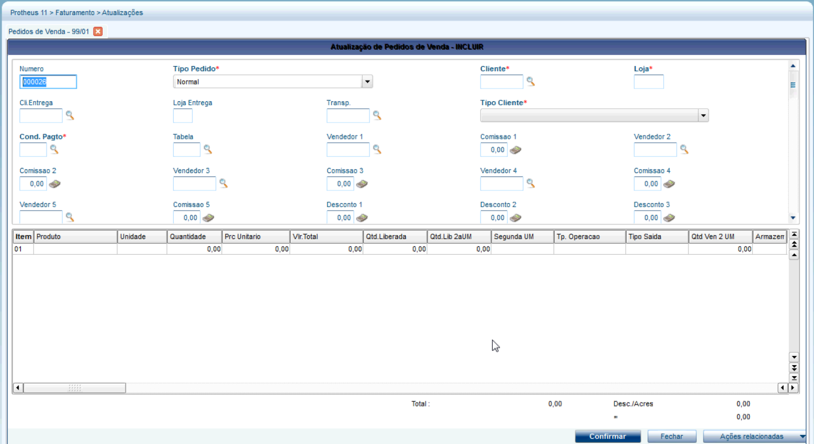{.flow-image}

#### 1.2 Preenchimento dos Dados do Pedido

<strong>Cabeçalho</strong>: Selecione o Cliente (Ex: 000002 - Cliente Risco E) e a Condição de Pagamento (Ex: 002 - 30 dias).

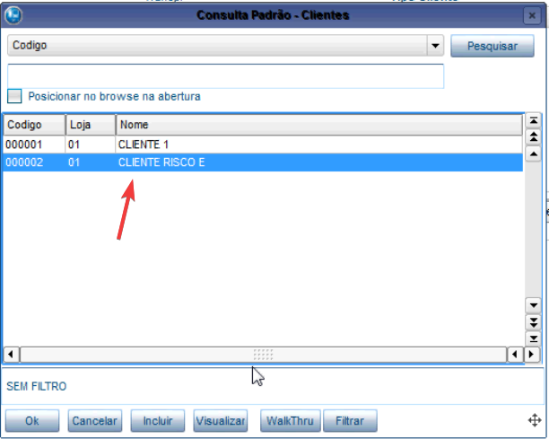{.flow-image}

<strong>Itens</strong>: Insira o produto (Ex: PRODUTO VENDA 1) e a quantidade desejada. 
<strong>Ação</strong>: Clique em "Confirmar" para salvar o registro.

#### 1.3 Solicitação de Liberação (Justificativa)

<strong>Interface</strong>: Devido às regras de negócio (neste caso, "Cliente Risco E"), o sistema não libera o pedido automaticamente e abre a janela "Observações do Solicitante". 
<strong>Ação</strong>: Digite a justificativa para a liberação (Ex: FAVOR LIBERAR ESTE PEDIDO. OBRIGADO.). 
<strong>Ação</strong>: Clique em "Ok" para concluir a gravação.

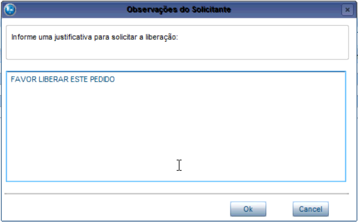{.flow-image}

#### 1.4 Verificação do Status de Bloqueio

<strong>Análise Visual</strong>: Na tela principal de Pedidos de Venda, o pedido recém-criado (Ex: 000026) aparecerá com a legenda "Traço Vermelho". 
<strong>Legenda</strong>: Ao consultar Ações Relacionadas > Legenda, confirma-se que a traço vermelho indica "Pedido de Venda com Bloqueio de Alçada". 
<strong>Resultado</strong>: O pedido está agora aguardando a análise do aprovador via workflow para prosseguir para o faturamento.

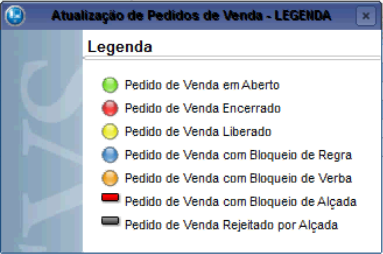{.flow-image}

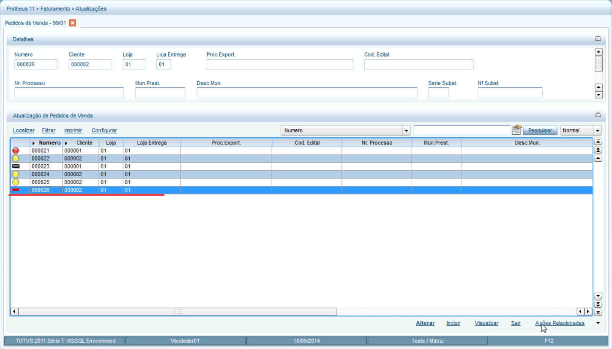{.flow-image}

#### 2. Aprovação via Workflow

#### 2.1 Consulta do Status do Pedido no ERP

<strong>Caminho</strong>: Faturamento > Atualizações > Pedidos > Pedidos de Venda. 
<strong>Ação</strong>: Selecionar o pedido desejado (Ex: Pedido 000026). 
<strong>Verificação de Legenda</strong>: Ao clicar em Ações Relacionadas > Legenda, observa-se que o pedido está com o "Traço vermelho", indicando "Pedido de Venda com Bloqueio de Alçada". 
<strong>Histórico de Aprovação</strong>: Em Ações Relacionadas > Workflow > Consultar, é possível visualizar que o documento está com o status "Aguardando Aprovação" para o usuário APROVADOR 01. 

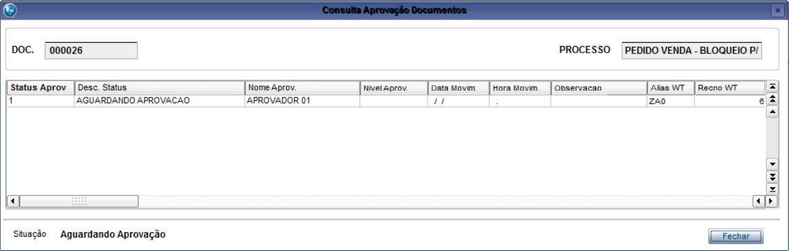{.flow-image}

#### 2.2 Recebimento e Acesso ao Workflow (E-mail)

<strong>Ação</strong>: O aprovador recebe um e-mail com o assunto: "Liberar Pedido de Venda: [Número do Pedido]". 
<strong>Interface</strong>: O corpo do e-mail contém os dados básicos do pedido e um link/botão chamado "Processo". 
<strong>Ação</strong>: Clique no link "Processo" para abrir a interface de decisão no navegador. 

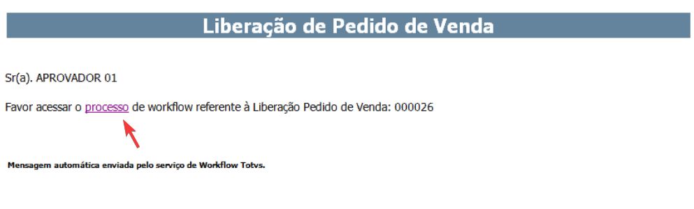{.flow-image}

#### 2.3 Execução da Aprovação/Rejeição (Web)

<strong>Interface</strong>: "Liberação de Pedido de Venda": Apresenta dados do cabeçalho (Cliente, Valor, Condição de Pagamento), itens do pedido, posição financeira do cliente e observações do solicitante.

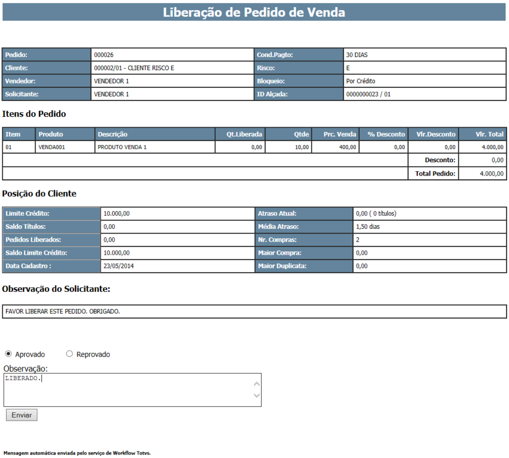{.flow-image}

<strong>Ação de Decisão</strong>: 
<strong>No final da página</strong>, selecione a opção "Aprovado" (ou "Reprovado", se aplicável). 
<strong>No campo Observação</strong>, digite a justificativa ou nota (Ex: LIBERADO). 
<strong>Clique no botão</strong> "Enviar". 

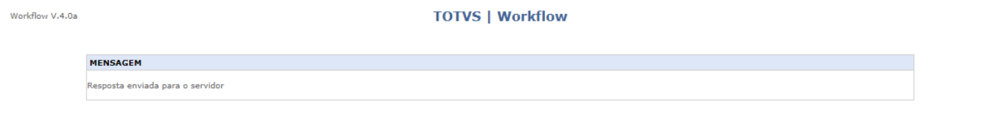{.flow-image}

<strong>Confirmação</strong>: O navegador exibirá a mensagem: "Resposta enviada para o servidor".

#### 2.4 Validação da Liberação no ERP

<strong>Ação</strong>: Retorne à tela de Pedidos de Venda no Protheus. 
<strong>Resultado</strong>: O status do pedido mudará para a cor amarelo (Círculo Amarelo), indicando "Pedido de Venda Liberado". 
<strong>Auditoria</strong>: Ao consultar novamente em Ações Relacionadas > Workflow, o status aparecerá como "APROVADO", com a data, hora e a observação digitada no passo anterior. 

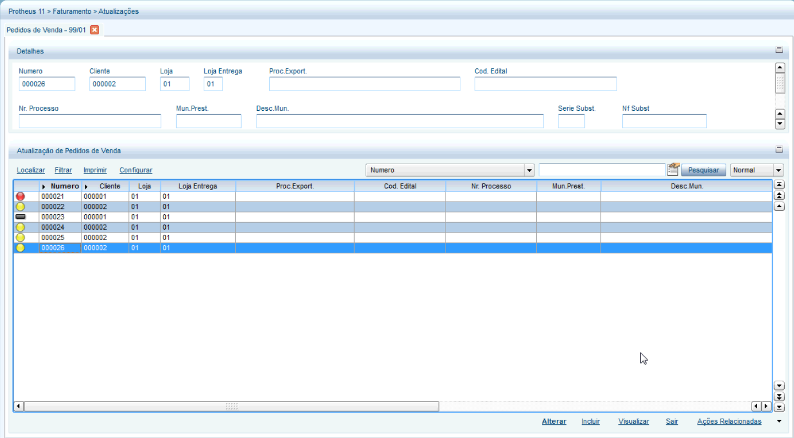{.flow-image}

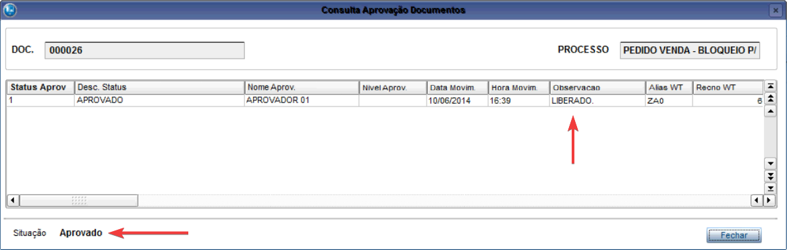{.flow-image}

  <a href="/" class="md-button" style="text-decoration: none;">← Voltar para a Página Inicial</a>

