# Alçadas - Workflow Pedido de Venda {.home-hero}

<!--############################################### 01 #######################################################-->

  01. Visão Geral

### 1. Visão Geral
No processo de faturamento, um dos pontos que envolve este ADDON é sobre o processo padrão de limite de crédito que pode ser configurado no cadastro do cliente.

Uma vez informado os dados de Risco, limite de crédito, todo pedido de venda gerado por padrão é verificado o limite de crédito do cliente da venda, uma vez não passando pelas regras de linite de crédito do cliente o pedido de venda é bloqueado por crédito.

Neste momento do bloqueio é exibido uma pequena interface solicitando que seja informada a justificativa para liberação e é disparado um Workflow para o usuário liberador para análise, aprovação/reprovação.

Este produto utiliza O ADDON 001A-Regras de Alçadas onde é parametrizada as alçadas do processo.

#### Implantação de controle de alçadas com workflow, integrado ao processo de pedido de venda com bloqueio por crédito..

<strong>Principais vantagens do produto:</strong>

- Cadastro de e-mails e regras de alçadas
- Aprovação/rejeição manual via tela
- Consulta de status e visualização do documento
- Gestão de ausências e transferência de aprovadores

<!--############################################### 02 #######################################################-->

  02. Menu

### 2. Menu

<table class="banks-table">
  <thead>
    <tr>
      <th>Menu</th>
      <th>Sub Menu</th>
      <th>Nome da Rotina</th>
      <th>Programa</th>
      <th>Módulo</th>
      <th>Tipo</th>
      <th>Tabelas</th>
    </tr>
  </thead>
  <tbody>
    <tr>
      <td>Atualizações</td>
      <td>Alçadas</td>
      <td>Cadastro de Regras</td>
      <td>FSP00102</td>
      <td>FATURAMENTO</td>
      <td>03</td>
      <td>Z01, Z02</td>
    </tr>   
      <tr>
      <td>Atualizações</td>
      <td>Alçadas</td>
      <td>Aprovacoes</td>
      <td>FSP00103</td>
      <td>FATURAMENTO</td>
      <td>03</td>
      <td>ZA0</td>
    </tr>     
      <tr>
      <td>Atualizações</td>
      <td>Alçadas</td>
      <td>Destinatarios WF</td>
      <td>FSP00104</td>
      <td>FATURAMENTO</td>
      <td>03</td>
      <td>Z00</td>
    </tr>   
      <tr>
      <td>Atualizações</td>
      <td>Alçadas</td>
      <td>Ausência Temporária</td>
      <td>FSP00105</td>
      <td>FATURAMENTO</td>
      <td>03</td>
      <td>Z02</td>
    </tr>   
  </tbody>
</table>

<!--############################################### 03 #######################################################-->

  03. Fluxo Operacional

### 3. Fluxo Operacional

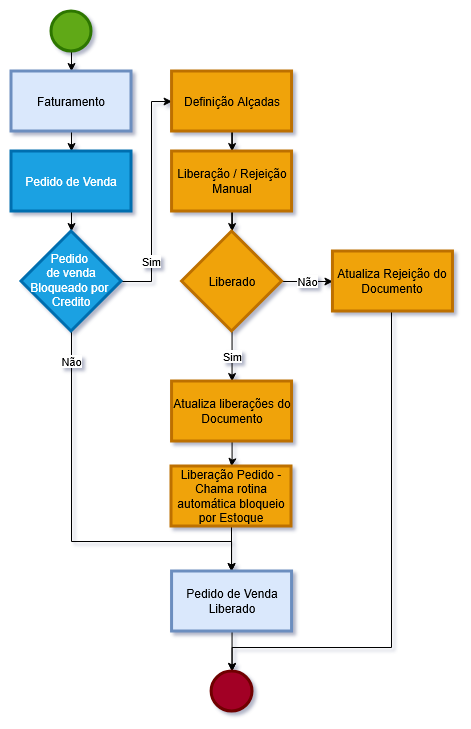{.flow-image}

<!--############################################### 04 #######################################################-->

  04. Rotinas personalizadas específicas do Pacote

### 4. Rotinas personalizadas específicas do Pacote

#### Funções personalizadas contidas no pacote:

<table class="banks-table">
  <thead>
    <tr>
      <th>Função</th>
      <th>Descrição</th>
    </tr>
  </thead>
  <tbody>
    <tr>
      <td><strong>FSP00101</strong></td>
      <td>Rotina com funções genéricas do controle de alçadas.</td>
    </tr>
    <tr>
      <td><strong>FSP00102</strong></td>
      <td>Rotina para cadastro de regra de alçadas.</td>
    </tr>
    <tr>
      <td><strong>FSP00103</strong></td>
      <td>Rotina para aprovações de alçadas.</td>
    </tr>
    <tr>
      <td><strong>FSP00104</strong></td>
      <td>Rotina para cadastro de destinatários de Workflow</td>
    </tr>
    <tr>
      <td><strong>FSP00105</strong></td>
      <td>Rotina para cadastro de ausência temporária</td>
    </tr>
    <tr>
      <td><strong>FSP00110</strong></td>
      <td>Rotina para mostrar Tela de Consulta das Alçadas chamda no Pedido de Venda</td>
    </tr>
    <tr>
      <td><strong>FSPEFAT</strong></td>
      <td>Rotina centralizadora para implementação nos Pontos deEntrada do módulo Faturamento</td>
    </tr>
    <tr>
      <td><strong>WFFAT01</strong></td>
      <td>Rotina para o envio do Processo de Workflow – Liberação Pedido de Venda</td>
    </tr>
    <tr>      <td><strong>WFFAT01R</strong></td>
      <td>Rotina para o retorno do Processo de Workflow – Liberação Pedido de Venda</td>
    </tr>
    <tr>
      <td><strong>WFFAT02</strong></td>
      <td>Rotina para o envio do Processo de Workflow – Aviso Status da Liberação Pedido de Venda</td>
    </tr>
  </tbody>
</table>

<!--############################################### 05 #######################################################-->

  05. Pontos de Entradas Disponiveis para Desenvolvimento

### 5. Pontos de Entradas Disponiveis para Desenvolvimento

<table class="banks-table">
  <thead>
    <tr>
      <th>Nome</th>
      <th>Descrição</th>
      <th>Implementação</th>      
    </tr>
  </thead>
  <tbody>
    <tr>
      <td><strong>M410STTS</strong></td>
      <td>Ponto de Entrada na Atualização do pedido de venda após aInclusão, Alteração, Exclusão e Devolução.</td>
      <td>

  

    ADVPL
    M410STTS
  

  <pre><code>  
User function M410STTS()
  U_FSPEFAT("M410STTS")
Return()      

</code></pre>
      </td>      
    </tr>
    <tr>
      <td><strong>M440STTS</strong></td>
      <td>Ponto de Entrada na Liberação Manual do pedido de venda após o fechamento da transação</td>
      <td>

  

    ADVPL
    M440STTS
  

  <pre><code>  
User function M440STTS()
  U_FSPEFAT("M440STTS")
Return()

</code></pre>
      </td>      
    </tr>
    <tr>
      <td><strong>MA410COR</strong></td>
      <td>Ponto de Entrada para alterar as Cores das legendas no Browse do Pedido de Venda.</td>
      <td>

  

    ADVPL
    MA410COR
  

  <pre><code>  
User Function MA410COR()
Local aCores := PARAMIXB[1]
  aCores := U_FSPEFAT("MA410COR", aCores)
Return(aCores)

</code></pre>
      </td>      
    </tr>
    <tr>
      <td><strong>MA410LEG</strong></td>
      <td>Ponto de Entrada para alterar as Descrições das legendas no Browse do Pedido de Venda.</td>
      <td>

  

    ADVPL
    MA410LEG
  

  <pre><code>  
User Function MA410LEG()
Local aLegenda := PARAMIXB[1]
  aLegenda := U_FSPEFAT("MA410LEG", aLegenda)
Return(aLegenda)

</code></pre>
      </td>      
    </tr>
    <tr>
      <td><strong>MA410MNU</strong></td>
      <td>Ponto de Entrada no Browse Pedido de venda para adicionar rotinas no MenuDef.</td>
      <td>

  

    ADVPL
    MA410MNU
  

  <pre><code>  
User function MA410MNU()
  U_FSPEFAT("MA410MNU")
Return()

</code></pre>
      </td>      
    </tr>
    <tr>
      <td><strong>MT450MAN</strong></td>
      <td>Ponto de Entrada na Liberação de Crédito Pedido de venda antes da liberação, para continuar ou não.</td>
      <td>

  

    ADVPL
    MT450MAN
  

  <pre><code>  
User function MT450MAN()
Local lRet := U_FSPEFAT("MT450MAN")
Return(lRet)

</code></pre>
      </td>      
    </tr>
    <tr>
      <td><strong>MTA450LIB</strong></td>
      <td>Ponto de Entrada na Liberação de Crédito Pedido de venda para validar o item na liberação manual.</td>
      <td>

  

    ADVPL
    MTA450LIB
  

  <pre><code>  
User function MTA450LIB()
// Chama a mesma função do PE MT450MAN 
Local lRet := U_FSPEFAT("MT450MAN")
Return(lRet)

</code></pre>
      </td>      
    </tr>
     <tr>
      <td><strong>MTA456P</strong></td>
      <td>Ponto de Entrada na Liberação de Crédito/Estoque do Pedido de venda na liberacao manual, para validar se continua.</td>
      <td>

  

    ADVPL
    MTA456P
  

  <pre><code>  
User function MTA456P()
// Chama a mesma função do PE MT450MAN
Local lRet := U_FSPEFAT("MT450MAN")
Return(lRet)

</code></pre>
      </td>      
    </tr>         
  </tbody>
</table>

<!--############################################### 06 #######################################################-->

  06. Tabelas (SX2) 

### 6. Tabelas (SX2)

<table class="banks-table">
  <thead>
    <tr>
      <th>Prefixo</th>
      <th>Descrição</th>
      <th>Ac. Filial</th>
      <th>Ac. Unidade</th>
      <th>Ac. Empresa</th>
    </tr>
  </thead>
  <tbody>
    <tr>
      <td><strong>Z00</strong></td>
      <td>DESTINATARIOS WF</td>
      <td>Exclusivo</td>
      <td>Exclusivo</td>
      <td>Exclusivo</td>
    </tr>
    <tr>
      <td><strong>Z01</strong></td>
      <td>REGRAS DE ALCADAS</td>
      <td>Exclusivo</td>
      <td>Exclusivo</td>
      <td>Exclusivo</td>
    </tr>
    <tr>
      <td><strong>Z02</strong></td>
      <td>ALCADAS - AUSENCIA TEMPORARIA</td>
      <td>Exclusivo</td>
      <td>Exclusivo</td>
      <td>Exclusivo</td>
    </tr>
    <tr>
      <td><strong>ZA0</strong></td>
      <td>MOVIMENTOS ALCADAS</td>
      <td>Exclusivo</td>
      <td>Exclusivo</td>
      <td>Exclusivo</td>
    </tr>
    
  </tbody>
</table>

<!--############################################### 07 #######################################################-->

  07. Campos (SX3)

### 7. Campos (SX3)

Campo **Z00_PROCES**

<table class="banks-table">
  <tbody>
    <tr>
      <th>Tipo</th>
      <td>C</td>
      <th>Ordem</th>
      <td>02</td>
      <th>Tamanho</th>
      <td>8</td>
      <th>Decimal</th>
      <td>0</td>
      <th>Formato</th>
      <td>@!</td>
    </tr>
    <tr>
      <th>Contexto</th>
      <td>Real</td>
      <th>Propriedade</th>
      <td>Alterar</td>
      <th>Obrigatório</th>
      <td>S</td>
      <th>Browse</th>
      <td>S</td>
    </tr>
    <tr>
      <th>Título</th>
      <td colspan="7">Funcao</td>
    </tr>
    <tr>
      <th>Descrição</th>
      <td colspan="7">Funcao</td>
    </tr>
  </tbody>
</table>
#### **Help**

Informe a funcao de WorkFlow.

#### **Configurações adicionais**
<table class="banks-table">
  <tbody>
    <tr>
      <th>F3</th>
      <td>-</td>
    </tr>
    <tr>
      <th>Modo Edição</th>
      <td>INCLUI</td>
    </tr>
    <tr>
      <th>Val. Usuário</th>
      <td>ExistChav("Z00")</td>
    </tr>
    <tr>
      <th>Lista Opções</th>
      <td>-</td>
    </tr>
    <tr>
      <th>Inicializador</th>
      <td>-</td>
    </tr>
    <tr>
      <th>Ini. Browse</th>
      <td>-</td>
    </tr>
  </tbody>
</table>

Campo **Z00_DESCRI**

<table class="banks-table">
  <tbody>
    <tr>
      <th>Tipo</th>
      <td>C</td>
      <th>Ordem</th>
      <td>03</td>
      <th>Tamanho</th>
      <td>100</td>
      <th>Decimal</th>
      <td>0</td>
      <th>Formato</th>
      <td>@!</td>
    </tr>
    <tr>
      <th>Contexto</th>
      <td>Real</td>
      <th>Propriedade</th>
      <td>Alterar</td>
      <th>Obrigatório</th>
      <td>S</td>
      <th>Browse</th>
      <td>S</td>
    </tr>
    <tr>
      <th>Título</th>
      <td colspan="7">Descricao</td>
    </tr>
    <tr>
      <th>Descrição</th>
      <td colspan="7">Descricao</td>
    </tr>
  </tbody>
</table>
#### **Help**

Informe a descricao da Funcao.

#### **Configurações adicionais**
<table class="banks-table">
  <tbody>
    <tr>
      <th>F3</th>
      <td>-</td>
    </tr>
    <tr>
      <th>Modo Edição</th>
      <td>-</td>
    </tr>
    <tr>
      <th>Val. Usuário</th>
      <td>-</td>
    </tr>
    <tr>
      <th>Lista Opções</th>
      <td>-</td>
    </tr>
    <tr>
      <th>Inicializador</th>
      <td>-</td>
    </tr>
    <tr>
      <th>Ini. Browse</th>
      <td>-</td>
    </tr>
  </tbody>
</table>

Campo **Z00_DEST**

<table class="banks-table">
  <tbody>
    <tr>
      <th>Tipo</th>
      <td>C</td>
      <th>Ordem</th>
      <td>04</td>
      <th>Tamanho</th>
      <td>200</td>
      <th>Decimal</th>
      <td>0</td>
      <th>Formato</th>
      <td>-</td>
    </tr>
    <tr>
      <th>Contexto</th>
      <td>Real</td>
      <th>Propriedade</th>
      <td>Alterar</td>
      <th>Obrigatório</th>
      <td>S</td>
      <th>Browse</th>
      <td>S</td>
    </tr>
    <tr>
      <th>Título</th>
      <td colspan="7">Destinat.</td>
    </tr>
    <tr>
      <th>Descrição</th>
      <td colspan="7">Destinatarios</td>
    </tr>
  </tbody>
</table>
#### **Help**

Informe os destinatarios do Workflow. Para mais de um, utilize (;).

#### **Configurações adicionais**
<table class="banks-table">
  <tbody>
    <tr>
      <th>F3</th>
      <td>-</td>
    </tr>
    <tr>
      <th>Modo Edição</th>
      <td>-</td>
    </tr>
    <tr>
      <th>Val. Usuário</th>
      <td>-</td>
    </tr>
    <tr>
      <th>Lista Opções</th>
      <td>-</td>
    </tr>
    <tr>
      <th>Inicializador</th>
      <td>-</td>
    </tr>
    <tr>
      <th>Ini. Browse</th>
      <td>-</td>
    </tr>
  </tbody>
</table>

Campo **Z00_USERGI**

<table class="banks-table">
  <tbody>
    <tr>
      <th>Tipo</th>
      <td>-</td>
      <th>Ordem</th>
      <td>05</td>
      <th>Tamanho</th>
      <td>-</td>
      <th>Decimal</th>
      <td>-</td>
      <th>Formato</th>
      <td>-</td>
    </tr>
    <tr>
      <th>Contexto</th>
      <td>-</td>
      <th>Propriedade</th>
      <td>-</td>
      <th>Obrigatório</th>
      <td>-</td>
      <th>Browse</th>
      <td>-</td>
    </tr>
    <tr>
      <th>Título</th>
      <td colspan="7">LOG de Inclusão</td>
    </tr>
    <tr>
      <th>Descrição</th>
      <td colspan="7">-</td>
    </tr>
  </tbody>
</table>
#### **Help**

-

#### **Configurações adicionais**
<table class="banks-table">
  <tbody>
    <tr>
      <th>F3</th>
      <td>-</td>
    </tr>
    <tr>
      <th>Modo Edição</th>
      <td>-</td>
    </tr>
    <tr>
      <th>Val. Usuário</th>
      <td>-</td>
    </tr>
    <tr>
      <th>Lista Opções</th>
      <td>-</td>
    </tr>
    <tr>
      <th>Inicializador</th>
      <td>-</td>
    </tr>
    <tr>
      <th>Ini. Browse</th>
      <td>-</td>
    </tr>
  </tbody>
</table>

Campo **Z00_USERGA**

<table class="banks-table">
  <tbody>
    <tr>
      <th>Tipo</th>
      <td>-</td>
      <th>Ordem</th>
      <td>06</td>
      <th>Tamanho</th>
      <td>-</td>
      <th>Decimal</th>
      <td>-</td>
      <th>Formato</th>
      <td>-</td>
    </tr>
    <tr>
      <th>Contexto</th>
      <td>-</td>
      <th>Propriedade</th>
      <td>-</td>
      <th>Obrigatório</th>
      <td>-</td>
      <th>Browse</th>
      <td>-</td>
    </tr>
    <tr>
      <th>Título</th>
      <td colspan="7">LOG de Alteração</td>
    </tr>
    <tr>
      <th>Descrição</th>
      <td colspan="7">-</td>
    </tr>
  </tbody>
</table>

#### **Help**

-

#### **Configurações adicionais**
<table class="banks-table">
  <tbody>
    <tr>
      <th>F3</th>
      <td>-</td>
    </tr>
    <tr>
      <th>Modo Edição</th>
      <td>-</td>
    </tr>
    <tr>
      <th>Val. Usuário</th>
      <td>-</td>
    </tr>
    <tr>
      <th>Lista Opções</th>
      <td>-</td>
    </tr>
    <tr>
      <th>Inicializador</th>
      <td>-</td>
    </tr>
    <tr>
      <th>Ini. Browse</th>
      <td>-</td>
    </tr>
  </tbody>
</table>

Campo **Z01_PROCES**

<table class="banks-table">
  <tbody>
    <tr>
      <th>Tipo</th>
      <td>C</td>
      <th>Ordem</th>
      <td>02</td>
      <th>Tamanho</th>
      <td>8</td>
      <th>Decimal</th>
      <td>0</td>
      <th>Formato</th>
      <td>@!</td>
    </tr>
    <tr>
      <th>Contexto</th>
      <td>Real</td>
      <th>Propriedade</th>
      <td>Alterar</td>
      <th>Obrigatório</th>
      <td>S</td>
      <th>Browse</th>
      <td>S</d>
    </tr>
    <tr>
      <th>Título</th>
      <td colspan="7">Processo</td>
    </tr>
    <tr>
      <th>Descrição</th>
      <td colspan="7">Codigo do Processo</td>
    </tr>
  </tbody>
</table>

#### **Help**

Informe o codigo do processo (nome da funcao) referente a Alçada.

#### **Configurações adicionais**
<table class="banks-table">
  <tbody>
    <tr>
      <th>F3</th>
      <td>-</td>
    </tr>
    <tr>
      <th>Modo Edição</th>
      <td>-</td>
    </tr>
    <tr>
      <th>Val. Usuário</th>
      <td>-</td>
    </tr>
    <tr>
      <th>Lista Opções</th>
      <td>-</td>
    </tr>
    <tr>
      <th>Inicializador</th>
      <td>-</td>
    </tr>
    <tr>
      <th>Ini. Browse</th>
      <td>-</td>
    </tr>
  </tbody>
</table>

Campo **Z01_DESCRI**

<table class="banks-table">
  <tbody>
    <tr>
      <th>Tipo</th>
      <td>C</td>
      <th>Ordem</th>
      <td>03</td>
      <th>Tamanho</th>
      <td>40</td>
      <th>Decimal</th>
      <td>0</td>
      <th>Formato</th>
      <td>@!</td>
    </tr>
    <tr>
      <th>Contexto</th>
      <td>Real</td>
      <th>Propriedade</th>
      <td>Alterar</td>
      <th>Obrigatório</th>
      <td>S</td>
      <th>Browse</th>
      <td>S</td>
    </tr>
    <tr>
      <th>Título</th>
      <td colspan="7">Descricao</td>
    </tr>
    <tr>
      <th>Descrição</th>
      <td colspan="7">Descricao do Processo</td>
    </tr>
  </tbody>
</table>

#### **Help**

Descricao do Processo

#### **Configurações adicionais**
<table class="banks-table">
  <tbody>
    <tr>
      <th>F3</th>
      <td>-</td>
    </tr>
    <tr>
      <th>Modo Edição</th>
      <td>-</td>
    </tr>
    <tr>
      <th>Val. Usuário</th>
      <td>-</td>
    </tr>
    <tr>
      <th>Lista Opções</th>
      <td>-</td>
    </tr>
    <tr>
      <th>Inicializador</th>
      <td>-</td>
    </tr>
    <tr>
      <th>Ini. Browse</th>
      <td>-</td>
    </tr>
  </tbody>
</table>

Campo **Z01_SEQ**

<table class="banks-table">
  <tbody>
    <tr>
      <th>Tipo</th>
      <td>C</td>
      <th>Ordem</th>
      <td>04</td>
      <th>Tamanho</th>
      <td>2</td>
      <th>Decimal</th>
      <td>0</td>
      <th>Formato</th>
      <td>99</td>
    </tr>
    <tr>
      <th>Contexto</th>
      <td>Real</td>
      <th>Propriedade</th>
      <td>Alterar</td>
      <th>Obrigatório</th>
      <td>S</td>
      <th>Browse</th>
      <td>S</td>
    </tr>
    <tr>
      <th>Título</th>
      <td colspan="7">Sequencia</td>
    </tr>
    <tr>
      <th>Descrição</th>
      <td colspan="7">Sequencia</td>
    </tr>
  </tbody>
</table>

#### **Help**

Sequencia

#### **Configurações adicionais**
<table class="banks-table">
  <tbody>
    <tr>
      <th>F3</th>
      <td>-</td>
    </tr>
    <tr>
      <th>Modo Edição</th>
      <td>-</td>
    </tr>
    <tr>
      <th>Val. Usuário</th>
      <td>-</td>
    </tr>
    <tr>
      <th>Lista Opções</th>
      <td>-</td>
    </tr>
    <tr>
      <th>Inicializador</th>
      <td>-</td>
    </tr>
    <tr>
      <th>Ini. Browse</th>
      <td>-</td>
    </tr>
  </tbody>
</table>

Campo **Z01_TPLIB**

<table class="banks-table">
  <tbody>
    <tr>
      <th>Tipo</th>
      <td>C</td>
      <th>Ordem</th>
      <td>05</td>
      <th>Tamanho</th>
      <td>1</td>
      <th>Decimal</th>
      <td>0</td>
      <th>Formato</th>
      <td>@!</td>
    </tr>
    <tr>
      <th>Contexto</th>
      <td>Real</td>
      <th>Propriedade</th>
      <td>Alterar</td>
      <th>Obrigatório</th>
      <td>S</td>
      <th>Browse</th>
      <td>S</td>
    </tr>
    <tr>
      <th>Título</th>
      <td colspan="7">Tp.Liberacao</td>
    </tr>
    <tr>
      <th>Descrição</th>
      <td colspan="7">Tipo de Liberacao</td>
    </tr>
  </tbody>
</table>

#### **Help**

Informe o tipo de liberacao que deseja para esta regra de Alcadas: 
<strong>N</strong> = Nivel - Sistema respeitara os níveis configurados, encaminhando para o proximonivel somente após aprovação do nível anterior. 
<strong>U</strong> = Usuario - A liberacao do usuário pode ocorrer individualmente, semconsiderar outros aprovadores constantes na regra. 

#### **Configurações adicionais**
<table class="banks-table">
  <tbody>
    <tr>
      <th>F3</th>
      <td>-</td>
    </tr>
    <tr>
      <th>Modo Edição</th>
      <td>-</td>
    </tr>
    <tr>
      <th>Val. Usuário</th>
      <td>-</td>
    </tr>
    <tr>
      <th>Lista Opções</th>
      <td>N=Nivel; U=Usuario; D=Documento</td>
    </tr>
    <tr>
      <th>Inicializador</th>
      <td>-</td>
    </tr>
    <tr>
      <th>Ini. Browse</th>
      <td>-</td>
    </tr>
  </tbody>
</table>

Campo **Z01_NIVEL**

<table class="banks-table">
  <tbody>
    <tr>
      <th>Tipo</th>
      <td>C</td>
      <th>Ordem</th>
      <td>06</td>
      <th>Tamanho</th>
      <td>2</td>
      <th>Decimal</th>
      <td>0</td>
      <th>Formato</th>
      <td>@!</td>
    </tr>
    <tr>
      <th>Contexto</th>
      <td>Real</td>
      <th>Propriedade</th>
      <td>Alterar</td>
      <th>Obrigatório</th>
      <td>N</td>
      <th>Browse</th>
      <td>N</td>
    </tr>
    <tr>
      <th>Título</th>
      <td colspan="7">Nivel</td>
    </tr>
    <tr>
      <th>Descrição</th>
      <td colspan="7">Nivel</td>
    </tr>
  </tbody>
</table>

#### **Help**

Informe o nivel (2digitos).

#### **Configurações adicionais**
<table class="banks-table">
  <tbody>
    <tr>
      <th>F3</th>
      <td>-</td>
    </tr>
    <tr>
      <th>Modo Edição</th>
      <td>aCols[n][2] = 'N'</td>
    </tr>
    <tr>
      <th>Val. Usuário</th>
      <td>-</td>
    </tr>
    <tr>
      <th>Lista Opções</th>
      <td>-</td>
    </tr>
    <tr>
      <th>Inicializador</th>
      <td>-</td>
    </tr>
    <tr>
      <th>Ini. Browse</th>
      <td>-</td>
    </tr>
  </tbody>
</table>

Campo **Z01_TPBUSC**

<table class="banks-table">
  <tbody>
    <tr>
      <th>Tipo</th>
      <td>C</td>
      <th>Ordem</th>
      <td>07</td>
      <th>Tamanho</th>
      <td>1</td>
      <th>Decimal</th>
      <td>0</td>
      <th>Formato</th>
      <td>@!</td>
    </tr>
    <tr>
      <th>Contexto</th>
      <td>Real</td>
      <th>Propriedade</th>
      <td>Alterar</td>
      <th>Obrigatório</th>
      <td>S</td>
      <th>Browse</th>
      <td>S</td>
    </tr>
    <tr>
      <th>Título</th>
      <td colspan="7">Tp. Busca</td>
    </tr>
    <tr>
      <th>Descrição</th>
      <td colspan="7">Tipo de Busca</td>
    </tr>
  </tbody>
</table>

#### **Help**

Informe o tipo de busca: 
<strong>E</strong> = Entidade - O usuario poderá configurar qualquer tabela do sistema para verificar o aprovador do processo. 
<strong>U</strong> = Usuario - Configuracao de usuário "fixo" como aprovador.

#### **Configurações adicionais**
<table class="banks-table">
  <tbody>
    <tr>
      <th>F3</th>
      <td>-</td>
    </tr>
    <tr>
      <th>Modo Edição</th>
      <td>-</td>
    </tr>
    <tr>
      <th>Val. Usuário</th>
      <td>-</td>
    </tr>
    <tr>
      <th>Lista Opções</th>
      <td>E=Entidade; U=Usuario</td>
    </tr>
    <tr>
      <th>Inicializador</th>
      <td>-</td>
    </tr>
    <tr>
      <th>Ini. Browse</th>
      <td>-</td>
    </tr>
  </tbody>
</table>

Campo **Z01_IDUSER**

<table class="banks-table">
  <tbody>
    <tr>
      <th>Tipo</th>
      <td>C</td>
      <th>Ordem</th>
      <td>08</td>
      <th>Tamanho</th>
      <td>6</td>
      <th>Decimal</th>
      <td>0</td>
      <th>Formato</th>
      <td>@!</td>
    </tr>
    <tr>
      <th>Contexto</th>
      <td>Real</td>
      <th>Propriedade</th>
      <td>Alterar</td>
      <th>Obrigatório</th>
      <td>N</td>
      <th>Browse</th>
      <td>N</td>
    </tr>
    <tr>
      <th>Título</th>
      <td colspan="7">Aprovador</td>
    </tr>
    <tr>
      <th>Descrição</th>
      <td colspan="7">Id do Aprovador</td>
    </tr>
  </tbody>
</table>

#### **Help**

Informe o codigo do usuario que seraresponsavel pela aprovação.

#### **Configurações adicionais**
<table class="banks-table">
  <tbody>
    <tr>
      <th>F3</th>
      <td>USRZ01 (USUARIO ALCADAS)</td>
    </tr>
    <tr>
      <th>Modo Edição</th>
      <td>aCols[n][4]='U'</td>
    </tr>
    <tr>
      <th>Val. Usuário</th>
      <td>UsrExist(M->Z01_IDUSER)</td>
    </tr>
    <tr>
      <th>Lista Opções</th>
      <td>E=Entidade; U=Usuario</td>
    </tr>
    <tr>
      <th>Inicializador</th>
      <td>-</td>
    </tr>
    <tr>
      <th>Ini. Browse</th>
      <td>-</td>
    </tr>
  </tbody>
</table>

Campo **Z01_NMUSER**

<table class="banks-table">
  <tbody>
    <tr>
      <th>Tipo</th>
      <td>C</td>
      <th>Ordem</th>
      <td>09</td>
      <th>Tamanho</th>
      <td>20</td>
      <th>Decimal</th>
      <td>0</td>
      <th>Formato</th>
      <td>@!</td>
    </tr>
    <tr>
      <th>Contexto</th>
      <td>Real</td>
      <th>Propriedade</th>
      <td>Visualizar</td>
      <th>Obrigatório</th>
      <td>N</td>
      <th>Browse</th>
      <td>N</td>
    </tr>
    <tr>
      <th>Título</th>
      <td colspan="7">Nome</td>
    </tr>
    <tr>
      <th>Descrição</th>
      <td colspan="7">Nome</td>
    </tr>
  </tbody>
</table>

#### **Help**

Nome do Aprovador.

#### **Configurações adicionais**
<table class="banks-table">
  <tbody>
    <tr>
      <th>F3</th>
      <td>USRZX1 (USUARIO ALCADAS)</td>
    </tr>
    <tr>
      <th>Modo Edição</th>
      <td>aCols[n][nPosTPB]='U'</td>
    </tr>
    <tr>
      <th>Val. Usuário</th>
      <td>UsrExist(M->ZX1_IDUSER)</td>
    </tr>
    <tr>
      <th>Lista Opções</th>
      <td>E=Entidade; U=Usuario</td>
    </tr>
    <tr>
      <th>Inicializador</th>
      <td>-</td>
    </tr>
    <tr>
      <th>Ini. Browse</th>
      <td>-</td>
    </tr>
  </tbody>
</table>

Campo **Z01_INDICE**

<table class="banks-table">
  <tbody>
    <tr>
      <th>Tipo</th>
      <td>N</td>
      <th>Ordem</th>
      <td>10</td>
      <th>Tamanho</th>
      <td>1</td>
      <th>Decimal</th>
      <td>0</td>
      <th>Formato</th>
      <td>9</td>
    </tr>
    <tr>
      <th>Contexto</th>
      <td>Real</td>
      <th>Propriedade</th>
      <td>Alterar</td>
      <th>Obrigatório</th>
      <td>N</td>
      <th>Browse</th>
      <td>N</td>
    </tr>
    <tr>
      <th>Título</th>
      <td colspan="7">Indice Alias</td>
    </tr>
    <tr>
      <th>Descrição</th>
      <td colspan="7">Indice Alias</td>
    </tr>
  </tbody>
</table>

#### **Help**

Informe o indice de busca para posicionamento no campo a verificar o aprovador do processo.

#### **Configurações adicionais**
<table class="banks-table">
  <tbody>
    <tr>
      <th>F3</th>
      <td>-</td>
    </tr>
    <tr>
      <th>Modo Edição</th>
      <td>aCols[n][4]='E'</td>
    </tr>
    <tr>
      <th>Val. Usuário</th>
      <td>-</td>
    </tr>
    <tr>
      <th>Lista Opções</th>
      <td>-</td>
    </tr>
    <tr>
      <th>Inicializador</th>
      <td>-</td>
    </tr>
    <tr>
      <th>Ini. Browse</th>
      <td>-</td>
    </tr>
  </tbody>
</table>

Campo **Z01_CAMPO**

<table class="banks-table">
  <tbody>
    <tr>
      <th>Tipo</th>
      <td>C</td>
      <th>Ordem</th>
      <td>11</td>
      <th>Tamanho</th>
      <td>10</td>
      <th>Decimal</th>
      <td>0</td>
      <th>Formato</th>
      <td>@!</td>
    </tr>
    <tr>
      <th>Contexto</th>
      <td>Real</td>
      <th>Propriedade</th>
      <td>Alterar</td>
      <th>Obrigatório</th>
      <td>N</td>
      <th>Browse</th>
      <td>N</td>
    </tr>
    <tr>
      <th>Título</th>
      <td colspan="7">Campo</td>
    </tr>
    <tr>
      <th>Descrição</th>
      <td colspan="7">Campo</td>
    </tr>
  </tbody>
</table>
#### **Help**

Informar o campo a ser verificado para selecionar o aprovador, quando selecionado o Tipo de Busca = Entidade.

#### **Configurações adicionais**
<table class="banks-table">
  <tbody>
    <tr>
      <th>F3</th>
      <td>-</td>
    </tr>
    <tr>
      <th>Modo Edição</th>
      <td>aCols[n][4]='E'</td>
    </tr>
    <tr>
      <th>Val. Usuário</th>
      <td>EXISTCPO("SX3",M->Z01_CAMPO,2)</td>
    </tr>
    <tr>
      <th>Lista Opções</th>
      <td>-</td>
    </tr>
    <tr>
      <th>Inicializador</th>
      <td>-</td>
    </tr>
    <tr>
      <th>Ini. Browse</th>
      <td>-</td>
    </tr>
  </tbody>
</table>

Campo **Z01_EXP**

<table class="banks-table">
  <tbody>
    <tr>
      <th>Tipo</th>
      <td>C</td>
      <th>Ordem</th>
      <td>12</td>
      <th>Tamanho</th>
      <td>20</td>
      <th>Decimal</th>
      <td>0</td>
      <th>Formato</th>
      <td>@!</td>
    </tr>
    <tr>
      <th>Contexto</th>
      <td>Real</td>
      <th>Propriedade</th>
      <td>Alterar</td>
      <th>Obrigatório</th>
      <td>N</td>
      <th>Browse</th>
      <td>N</td>
    </tr>
    <tr>
      <th>Título</th>
      <td colspan="7">Expressao</td>
    </tr>
    <tr>
      <th>Descrição</th>
      <td colspan="7">Expressao</td>
    </tr>
  </tbody>
</table>

#### **Help**

Podera ser utilizada para criacao de regras diferentes para um mesmo processo. (Utilizar sempre a tabela posicionada no cabecalho do processo.)

#### **Configurações adicionais**
<table class="banks-table">
  <tbody>
    <tr>
      <th>F3</th>
      <td>-</td>
    </tr>
    <tr>
      <th>Modo Edição</th>
      <td>-</td>
    </tr>
    <tr>
      <th>Val. Usuário</th>
      <td>-</td>
    </tr>
    <tr>
      <th>Lista Opções</th>
      <td>-</td>
    </tr>
    <tr>
      <th>Inicializador</th>
      <td>-</td>
    </tr>
    <tr>
      <th>Ini. Browse</th>
      <td>-</td>
    </tr>
  </tbody>
</table>

Campo **Z01_PROCWF**

<table class="banks-table">
  <tbody>
    <tr>
      <th>Tipo</th>
      <td>C</td>
      <th>Ordem</th>
      <td>13</td>
      <th>Tamanho</th>
      <td>30</td>
      <th>Decimal</th>
      <td>0</td>
      <th>Formato</th>
      <td>@!</td>
    </tr>
    <tr>
      <th>Contexto</th>
      <td>Real</td>
      <th>Propriedade</th>
      <td>Alterar</td>
      <th>Obrigatório</th>
      <td>N</td>
      <th>Browse</th>
      <td>N</td>
    </tr>
    <tr>
      <th>Título</th>
      <td colspan="7">Proc. WF</td>
    </tr>
    <tr>
      <th>Descrição</th>
      <td colspan="7">Processo WorkFlow</td>
    </tr>
  </tbody>
</table>

#### **Help**

Informe o nome do processo (rdmake) que será responsável por enviar WorkFlow para o controle de alcadas.

#### **Configurações adicionais**
<table class="banks-table">
  <tbody>
    <tr>
      <th>F3</th>
      <td>Z00</td>
    </tr>
    <tr>
      <th>Modo Edição</th>
      <td>-</td>
    </tr>
    <tr>
      <th>Val. Usuário</th>
      <td>Vazio().OR.ExistCPO("Z00")</td>
    </tr>
    <tr>
      <th>Lista Opções</th>
      <td>-</td>
    </tr>
    <tr>
      <th>Inicializador</th>
      <td>-</td>
    </tr>
    <tr>
      <th>Ini. Browse</th>
      <td>-</td>
    </tr>
  </tbody>
</table>

Campo **Z01_ALIAS**

<table class="banks-table">
  <tbody>
    <tr>
      <th>Tipo</th>
      <td>C</td>
      <th>Ordem</th>
      <td>14</td>
      <th>Tamanho</th>
      <td>3</td>
      <th>Decimal</th>
      <td>0</td>
      <th>Formato</th>
      <td>@!</td>
    </tr>
    <tr>
      <th>Contexto</th>
      <td>Real</td>
      <th>Propriedade</th>
      <td>Alterar</td>
      <th>Obrigatório</th>
      <td>N</td>
      <th>Browse</th>
      <td>N</td>
    </tr>
    <tr>
      <th>Título</th>
      <td colspan="7">Alias</td>
    </tr>
    <tr>
      <th>Descrição</th>
      <td colspan="7">Entidade (Alias)</td>
    </tr>
  </tbody>
</table>

#### **Help**

Sigla dos arquivos relacionados no processo. Ex: SA1, SB1, SD2, etc...

#### **Configurações adicionais**
<table class="banks-table">
  <tbody>
    <tr>
      <th>F3</th>
      <td>SX21 (Tabelas Sistema)</td>
    </tr>
    <tr>
      <th>Modo Edição</th>
      <td>-</td>
    </tr>
    <tr>
      <th>Val. Usuário</th>
      <td>Vazio().OR.ExistCpo("SX2")</td>
    </tr>
    <tr>
      <th>Lista Opções</th>
      <td>-</td>
    </tr>
    <tr>
      <th>Inicializador</th>
      <td>-</td>
    </tr>
    <tr>
      <th>Ini. Browse</th>
      <td>-</td>
    </tr>
  </tbody>
</table>

Campo **Z01_STATUS**

<table class="banks-table">
  <tbody>
    <tr>
      <th>Tipo</th>
      <td>C</td>
      <th>Ordem</th>
      <td>15</td>
      <th>Tamanho</th>
      <td>1</td>
      <th>Decimal</th>
      <td>0</td>
      <th>Formato</th>
      <td>@!</td>
    </tr>
    <tr>
      <th>Contexto</th>
      <td>Real</td>
      <th>Propriedade</th>
      <td>Alterar</td>
      <th>Obrigatório</th>
      <td>S</td>
      <th>Browse</th>
      <td>S</td>
    </tr>
    <tr>
      <th>Título</th>
      <td colspan="7">Regra Ativa?</td>
    </tr>
    <tr>
      <th>Descrição</th>
      <td colspan="7">Regra Ativa?</td>
    </tr>
  </tbody>
</table>

#### **Help**

Informe se a regra esta ativa <strong>S</strong>=Sim, <strong>N</strong>=Nao.

#### **Configurações adicionais**
<table class="banks-table">
  <tbody>
    <tr>
      <th>F3</th>
      <td>-</td>
    </tr>
    <tr>
      <th>Modo Edição</th>
      <td>-</td>
    </tr>
    <tr>
      <th>Val. Usuário</th>
      <td>-</td>
    </tr>
    <tr>
      <th>Lista Opções</th>
      <td>S=Sim; N=Não</td>
    </tr>
    <tr>
      <th>Inicializador</th>
      <td>"S"</td>
    </tr>
    <tr>
      <th>Ini. Browse</th>
      <td>-</td>
    </tr>
  </tbody>
</table>

Campo **Z01_WFAVIS**

<table class="banks-table">
  <tbody>
    <tr>
      <th>Tipo</th>
      <td>C</td>
      <th>Ordem</th>
      <td>16</td>
      <th>Tamanho</th>
      <td>8</td>
      <th>Decimal</th>
      <td>0</td>
      <th>Formato</th>
      <td>@!</td>
    </tr>
    <tr>
      <th>Contexto</th>
      <td>Real</td>
      <th>Propriedade</th>
      <td>Alterar</td>
      <th>Obrigatório</th>
      <td>N</td>
      <th>Browse</th>
      <td>N</td>
    </tr>
    <tr>
      <th>Título</th>
      <td colspan="7">WF Aviso</td>
    </tr>
    <tr>
      <th>Descrição</th>
      <td colspan="7">WorkFlow Aviso</td>
    </tr>
  </tbody>
</table>

#### **Help**

Informe o nome do processo (rdmake) que seraresponsavel por enviar WorkFlow de aviso da liberacao controle de alcadas.

#### **Configurações adicionais**
<table class="banks-table">
  <tbody>
    <tr>
      <th>F3</th>
      <td>Z00</td>
    </tr>
    <tr>
      <th>Modo Edição</th>
      <td>-</td>
    </tr>
    <tr>
      <th>Val. Usuário</th>
      <td>-</td>
    </tr>
    <tr>
      <th>Lista Opções</th>
      <td>-</td>
    </tr>
    <tr>
      <th>Inicializador</th>
      <td>-</td>
    </tr>
    <tr>
      <th>Ini. Browse</th>
      <td>-</td>
    </tr>
  </tbody>
</table>

Campo **Z01_WFALIA**

<table class="banks-table">
  <tbody>
    <tr>
      <th>Tipo</th>
      <td>C</td>
      <th>Ordem</th>
      <td>17</td>
      <th>Tamanho</th>
      <td>3</td>
      <th>Decimal</th>
      <td>0</td>
      <th>Formato</th>
      <td>@!</td>
    </tr>
    <tr>
      <th>Contexto</th>
      <td>Real</td>
      <th>Propriedade</th>
      <td>Alterar</td>
      <th>Obrigatório</th>
      <td>N</td>
      <th>Browse</th>
      <td>N</td>
    </tr>
    <tr>
      <th>Título</th>
      <td colspan="7">Alias WF</td>
    </tr>
    <tr>
      <th>Descrição</th>
      <td colspan="7">Alias WF</td>
    </tr>
  </tbody>
</table>

#### **Help**

#### **Configurações adicionais**
<table class="banks-table">
  <tbody>
    <tr>
      <th>F3</th>
      <td>SX21 (Tabelas Sistema)</td>
    </tr>
    <tr>
      <th>Modo Edição</th>
      <td>-</td>
    </tr>
    <tr>
      <th>Val. Usuário</th>
      <td>-</td>
    </tr>
    <tr>
      <th>Lista Opções</th>
      <td>-</td>
    </tr>
    <tr>
      <th>Inicializador</th>
      <td>-</td>
    </tr>
    <tr>
      <th>Ini. Browse</th>
      <td>-</td>
    </tr>
  </tbody>
</table>

Campo **Z01_OBS**

<table class="banks-table">
  <tbody>
    <tr>
      <th>Tipo</th>
      <td>MEMO</td>
      <th>Ordem</th>
      <td>18</td>
      <th>Tamanho</th>
      <td>-</td>
      <th>Decimal</th>
      <td>-</td>
      <th>Formato</th>
      <td>-</td>
    </tr>
    <tr>
      <th>Contexto</th>
      <td>Real</td>
      <th>Propriedade</th>
      <td>Alterar</td>
      <th>Obrigatório</th>
      <td>N</td>
      <th>Browse</th>
      <td>N</td>
    </tr>
    <tr>
      <th>Título</th>
      <td colspan="7">Observacoes</td>
    </tr>
    <tr>
      <th>Descrição</th>
      <td colspan="7">Observacoes</td>
    </tr>
  </tbody>
</table>
#### **Help**

-

#### **Configurações adicionais**
<table class="banks-table">
  <tbody>
    <tr>
      <th>F3</th>
      <td>-</td>
    </tr>
    <tr>
      <th>Modo Edição</th>
      <td>-</td>
    </tr>
    <tr>
      <th>Val. Usuário</th>
      <td>-</td>
    </tr>
    <tr>
      <th>Lista Opções</th>
      <td>-</td>
    </tr>
    <tr>
      <th>Inicializador</th>
      <td>-</td>
    </tr>
    <tr>
      <th>Ini. Browse</th>
      <td>-</td>
    </tr>
  </tbody>
</table>

Campo **Z01_USERGI**

<table class="banks-table">
  <tbody>
    <tr>
      <th>Tipo</th>
      <td>-</td>
      <th>Ordem</th>
      <td>19</td>
      <th>Tamanho</th>
      <td>-</td>
      <th>Decimal</th>
      <td>-</td>
      <th>Formato</th>
      <td>-</td>
    </tr>
    <tr>
      <th>Contexto</th>
      <td>-</td>
      <th>Propriedade</th>
      <td>-</td>
      <th>Obrigatório</th>
      <td>-</td>
      <th>Browse</th>
      <td>-</td>
    </tr>
    <tr>
      <th>Título</th>
      <td colspan="7">LOG de Inclusão</td>
    </tr>
    <tr>
      <th>Descrição</th>
      <td colspan="7">-</td>
    </tr>
  </tbody>
</table>

#### **Help**

-

#### **Configurações adicionais**
<table class="banks-table">
  <tbody>
    <tr>
      <th>F3</th>
      <td>-</td>
    </tr>
    <tr>
      <th>Modo Edição</th>
      <td>-</td>
    </tr>
    <tr>
      <th>Val. Usuário</th>
      <td>-</td>
    </tr>
    <tr>
      <th>Lista Opções</th>
      <td>-</td>
    </tr>
    <tr>
      <th>Inicializador</th>
      <td>-</td>
    </tr>
    <tr>
      <th>Ini. Browse</th>
      <td>-</td>
    </tr>
  </tbody>
</table>

Campo **Z01_USERGA**

<table class="banks-table">
  <tbody>
    <tr>
      <th>Tipo</th>
      <td>-</td>
      <th>Ordem</th>
      <td>20</td>
      <th>Tamanho</th>
      <td>-</td>
      <th>Decimal</th>
      <td>-</td>
      <th>Formato</th>
      <td>-</td>
    </tr>
    <tr>
      <th>Contexto</th>
      <td>-</td>
      <th>Propriedade</th>
      <td>-</td>
      <th>Obrigatório</th>
      <td>-</td>
      <th>Browse</th>
      <td>-</td>
    </tr>
    <tr>
      <th>Título</th>
      <td colspan="7">LOG de Alteração</td>
    </tr>
    <tr>
      <th>Descrição</th>
      <td colspan="7">-</td>
    </tr>
  </tbody>
</table>

#### **Help**

-

#### **Configurações adicionais**
<table class="banks-table">
  <tbody>
    <tr>
      <th>F3</th>
      <td>-</td>
    </tr>
    <tr>
      <th>Modo Edição</th>
      <td>-</td>
    </tr>
    <tr>
      <th>Val. Usuário</th>
      <td>-</td>
    </tr>
    <tr>
      <th>Lista Opções</th>
      <td>-</td>
    </tr>
    <tr>
      <th>Inicializador</th>
      <td>-</td>
    </tr>
    <tr>
      <th>Ini. Browse</th>
      <td>-</td>
    </tr>
  </tbody>
</table>

Campo **Z02_COD**

<table class="banks-table">
  <tbody>
    <tr>
      <th>Tipo</th>
      <td>C</td>
      <th>Ordem</th>
      <td>02</td>
      <th>Tamanho</th>
      <td>6</td>
      <th>Decimal</th>
      <td>0</td>
      <th>Formato</th>
      <td>@!</td>
    </tr>
    <tr>
      <th>Contexto</th>
      <td>Real</td>
      <th>Propriedade</th>
      <td>Visualizar</td>
      <th>Obrigatório</th>
      <td>S</td>
      <th>Browse</th>
      <td>S</td>
    </tr>
    <tr>
      <th>Título</th>
      <td colspan="7">Codigo</td>
    </tr>
    <tr>
      <th>Descrição</th>
      <td colspan="7">Codigo</td>
    </tr>
  </tbody>
</table>

#### **Help**

-

#### **Configurações adicionais**
<table class="banks-table">
  <tbody>
    <tr>
      <th>F3</th>
      <td>-</td>
    </tr>
    <tr>
      <th>Modo Edição</th>
      <td>-</td>
    </tr>
    <tr>
      <th>Val. Usuário</th>
      <td>ExistChav("Z02")</td>
    </tr>
    <tr>
      <th>Lista Opções</th>
      <td>-</td>
    </tr>
    <tr>
      <th>Inicializador</th>
      <td>GETSXENUM("Z02","Z02_COD")</td>
    </tr>
    <tr>
      <th>Ini. Browse</th>
      <td>-</td>
    </tr>
  </tbody>
</table>

Campo **Z02_APROV**

<table class="banks-table">
  <tbody>
    <tr>
      <th>Tipo</th>
      <td>C</td>
      <th>Ordem</th>
      <td>03</td>
      <th>Tamanho</th>
      <td>6</td>
      <th>Decimal</th>
      <td>0</td>
      <th>Formato</th>
      <td>@!</td>
    </tr>
    <tr>
      <th>Contexto</th>
      <td>Real</td>
      <th>Propriedade</th>
      <td>Alterar</td>
      <th>Obrigatório</th>
      <td>S</td>
      <th>Browse</th>
      <td>S</td>
    </tr>
    <tr>
      <th>Título</th>
      <td colspan="7">Aprovador</td>
    </tr>
    <tr>
      <th>Descrição</th>
      <td colspan="7">Codigo do Aprovador</td>
    </tr>
  </tbody>
</table>

#### **Help**

Codigo do Aprovador que esta sendo substituído temporariamente.

#### **Configurações adicionais**
<table class="banks-table">
  <tbody>
    <tr>
      <th>F3</th>
      <td>USR (Usuários)</td>
    </tr>
    <tr>
      <th>Modo Edição</th>
      <td>-</td>
    </tr>
    <tr>
      <th>Val. Usuário</th>
      <td>UsrExist(M->Z02_APROV) .AND. (M->Z02_APROV # M->Z02_SUBST)</td>
    </tr>
    <tr>
      <th>Lista Opções</th>
      <td>-</td>
    </tr>
    <tr>
      <th>Inicializador</th>
      <td>-</td>
    </tr>
    <tr>
      <th>Ini. Browse</th>
      <td>-</td>
    </tr>
  </tbody>
</table>

Campo **Z02_NOME**

<table class="banks-table">
  <tbody>
    <tr>
      <th>Tipo</th>
      <td>C</td>
      <th>Ordem</th>
      <td>04</td>
      <th>Tamanho</th>
      <td>40</td>
      <th>Decimal</th>
      <td>0</td>
      <th>Formato</th>
      <td>@!</td>
    </tr>
    <tr>
      <th>Contexto</th>
      <td>Real</td>
      <th>Propriedade</th>
      <td>Visualizar</td>
      <th>Obrigatório</th>
      <td>S</td>
      <th>Browse</th>
      <td>S</td>
    </tr>
    <tr>
      <th>Título</th>
      <td colspan="7">Nome</td>
    </tr>
    <tr>
      <th>Descrição</th>
      <td colspan="7">Nome do Aprovador</td>
    </tr>
  </tbody>
</table>

#### **Help**

-

#### **Configurações adicionais**
<table class="banks-table">
  <tbody>
    <tr>
      <th>F3</th>
      <td>-</td>
    </tr>
    <tr>
      <th>Modo Edição</th>
      <td>-</td>
    </tr>
    <tr>
      <th>Val. Usuário</th>
      <td>-</td>
    </tr>
    <tr>
      <th>Lista Opções</th>
      <td>-</td>
    </tr>
    <tr>
      <th>Inicializador</th>
      <td>-</td>
    </tr>
    <tr>
      <th>Ini. Browse</th>
      <td>-</td>
    </tr>
  </tbody>
</table>

Campo **Z02_DTSAID**

<table class="banks-table">
  <tbody>
    <tr>
      <th>Tipo</th>
      <td>DATA</td>
      <th>Ordem</th>
      <td>05</td>
      <th>Tamanho</th>
      <td>8</td>
      <th>Decimal</th>
      <td>0</td>
      <th>Formato</th>
      <td>-</td>
    </tr>
    <tr>
      <th>Contexto</th>
      <td>Real</td>
      <th>Propriedade</th>
      <td>Alterar</td>
      <th>Obrigatório</th>
      <td>S</td>
      <th>Browse</th>
      <td>S</td>
    </tr>
    <tr>
      <th>Título</th>
      <td colspan="7">Dt. Saida</td>
    </tr>
    <tr>
      <th>Descrição</th>
      <td colspan="7">Data Saida</td>
    </tr>
  </tbody>
</table>

#### **Help**

-

#### **Configurações adicionais**
<table class="banks-table">
  <tbody>
    <tr>
      <th>F3</th>
      <td>-</td>
    </tr>
    <tr>
      <th>Modo Edição</th>
      <td>-</td>
    </tr>
    <tr>
      <th>Val. Usuário</th>
      <td>M->Z02_DTSAID > DDATABASE</td>
    </tr>
    <tr>
      <th>Lista Opções</th>
      <td>-</td>
    </tr>
    <tr>
      <th>Inicializador</th>
      <td>-</td>
    </tr>
    <tr>
      <th>Ini. Browse</th>
      <td>-</td>
    </tr>
  </tbody>
</table>

Campo **Z02_DTRET**

<table class="banks-table">
  <tbody>
    <tr>
      <th>Tipo</th>
      <td>DATA</td>
      <th>Ordem</th>
      <td>06</td>
      <th>Tamanho</th>
      <td>8</td>
      <th>Decimal</th>
      <td>0</td>
      <th>Formato</th>
      <td>-</td>
    </tr>
    <tr>
      <th>Contexto</th>
      <td>Real</td>
      <th>Propriedade</th>
      <td>Alterar</td>
      <th>Obrigatório</th>
      <td>S</td>
      <th>Browse</th>
      <td>S</td>
    </tr>
    <tr>
      <th>Título</th>
      <td colspan="7">Dt. Retorno</td>
    </tr>
    <tr>
      <th>Descrição</th>
      <td colspan="7">Data de Retorno</td>
    </tr>
  </tbody>
</table>

#### **Help**

-

#### **Configurações adicionais**
<table class="banks-table">
  <tbody>
    <tr>
      <th>F3</th>
      <td>-</td>
    </tr>
    <tr>
      <th>Modo Edição</th>
      <td>-</td>
    </tr>
    <tr>
      <th>Val. Usuário</th>
      <td>M->Z02_DTRET >= M->Z02_DTSAID</td>
    </tr>
    <tr>
      <th>Lista Opções</th>
      <td>-</td>
    </tr>
    <tr>
      <th>Inicializador</th>
      <td>-</td>
    </tr>
    <tr>
      <th>Ini. Browse</th>
      <td>-</td>
    </tr>
  </tbody>
</table>

Campo **Z02_SUBST**

<table class="banks-table">
  <tbody>
    <tr>
      <th>Tipo</th>
      <td>C</td>
      <th>Ordem</th>
      <td>07</td>
      <th>Tamanho</th>
      <td>6</td>
      <th>Decimal</th>
      <td>0</td>
      <th>Formato</th>
      <td>@!</td>
    </tr>
    <tr>
      <th>Contexto</th>
      <td>Real</td>
      <th>Propriedade</th>
      <td>Alterar</td>
      <th>Obrigatório</th>
      <td>S</td>
      <th>Browse</th>
      <td>S</td>
    </tr>
    <tr>
      <th>Título</th>
      <td colspan="7">Substituto</td>
    </tr>
    <tr>
      <th>Descrição</th>
      <td colspan="7">Codigo Substituto</td>
    </tr>
  </tbody>
</table>

#### **Help**

-

#### **Configurações adicionais**
<table class="banks-table">
  <tbody>
    <tr>
      <th>F3</th>
      <td>USR (Usuários)</td>
    </tr>
    <tr>
      <th>Modo Edição</th>
      <td>-</td>
    </tr>
    <tr>
      <th>Val. Usuário</th>
      <td>UsrExist(M->Z02_SUBST) .AND. (M->Z02_SUBST # M->Z02_APROV)</td>
    </tr>
    <tr>
      <th>Lista Opções</th>
      <td>-</td>
    </tr>
    <tr>
      <th>Inicializador</th>
      <td>-</td>
    </tr>
    <tr>
      <th>Ini. Browse</th>
      <td>-</td>
    </tr>
  </tbody>
</table>

Campo **Z02_SUBNOM**

<table class="banks-table">
  <tbody>
    <tr>
      <th>Tipo</th>
      <td>C</td>
      <th>Ordem</th>
      <td>08</td>
      <th>Tamanho</th>
      <td>40</td>
      <th>Decimal</th>
      <td>0</td>
      <th>Formato</th>
      <td>@!</td>
    </tr>
    <tr>
      <th>Contexto</th>
      <td>Real</td>
      <th>Propriedade</th>
      <td>Visualizar</td>
      <th>Obrigatório</th>
      <td>S</td>
      <th>Browse</th>
      <td>S</td>
    </tr>
    <tr>
      <th>Título</th>
      <td colspan="7">Nome</td>
    </tr>
    <tr>
      <th>Descrição</th>
      <td colspan="7">Nome Substituto</td>
    </tr>
  </tbody>
</table>

#### **Help**

-

#### **Configurações adicionais**
<table class="banks-table">
  <tbody>
    <tr>
      <th>F3</th>
      <td>-</td>
    </tr>
    <tr>
      <th>Modo Edição</th>
      <td>-</td>
    </tr>
    <tr>
      <th>Val. Usuário</th>
      <td>-</td>
    </tr>
    <tr>
      <th>Lista Opções</th>
      <td>-</td>
    </tr>
    <tr>
      <th>Inicializador</th>
      <td>-</td>
    </tr>
    <tr>
      <th>Ini. Browse</th>
      <td>-</td>
    </tr>
  </tbody>
</table>

Campo **Z02_USERGI**

<table class="banks-table">
  <tbody>
    <tr>
      <th>Tipo</th>
      <td>-</td>
      <th>Ordem</th>
      <td>09</td>
      <th>Tamanho</th>
      <td>-</td>
      <th>Decimal</th>
      <td>-</td>
      <th>Formato</th>
      <td>-</td>
    </tr>
    <tr>
      <th>Contexto</th>
      <td>-</td>
      <th>Propriedade</th>
      <td>-</td>
      <th>Obrigatório</th>
      <td>-</td>
      <th>Browse</th>
      <td>-</td>
    </tr>
    <tr>
      <th>Título</th>
      <td colspan="7">LOG de Inclusão</td>
    </tr>
    <tr>
      <th>Descrição</th>
      <td colspan="7">-</td>
    </tr>
  </tbody>
</table>

#### **Help**

-

#### **Configurações adicionais**
<table class="banks-table">
  <tbody>
    <tr>
      <th>F3</th>
      <td>-</td>
    </tr>
    <tr>
      <th>Modo Edição</th>
      <td>-</td>
    </tr>
    <tr>
      <th>Val. Usuário</th>
      <td>-</td>
    </tr>
    <tr>
      <th>Lista Opções</th>
      <td>-</td>
    </tr>
    <tr>
      <th>Inicializador</th>
      <td>-</td>
    </tr>
    <tr>
      <th>Ini. Browse</th>
      <td>-</td>
    </tr>
  </tbody>
</table>

Campo **Z02_USERGA**

<table class="banks-table">
  <tbody>
    <tr>
      <th>Tipo</th>
      <td>-</td>
      <th>Ordem</th>
      <td>10</td>
      <th>Tamanho</th>
      <td>-</td>
      <th>Decimal</th>
      <td>-</td>
      <th>Formato</th>
      <td>-</td>
    </tr>
    <tr>
      <th>Contexto</th>
      <td>-</td>
      <th>Propriedade</th>
      <td>-</td>
      <th>Obrigatório</th>
      <td>-</td>
      <th>Browse</th>
      <td>-</td>
    </tr>
    <tr>
      <th>Título</th>
      <td colspan="7">LOG de Alteração</td>
    </tr>
    <tr>
      <th>Descrição</th>
      <td colspan="7">-</td>
    </tr>
  </tbody>
</table>

#### **Help**

-

#### **Configurações adicionais**
<table class="banks-table">
  <tbody>
    <tr>
      <th>F3</th>
      <td>-</td>
    </tr>
    <tr>
      <th>Modo Edição</th>
      <td>-</td>
    </tr>
    <tr>
      <th>Val. Usuário</th>
      <td>-</td>
    </tr>
    <tr>
      <th>Lista Opções</th>
      <td>-</td>
    </tr>
    <tr>
      <th>Inicializador</th>
      <td>-</td>
    </tr>
    <tr>
      <th>Ini. Browse</th>
      <td>-</td>
    </tr>
  </tbody>
</table>

Campo **ZA0_COD**

<table class="banks-table">
  <tbody>
    <tr>
      <th>Tipo</th>
      <td>C</td>
      <th>Ordem</th>
      <td>02</td>
      <th>Tamanho</th>
      <td>10</td>
      <th>Decimal</th>
      <td>0</td>
      <th>Formato</th>
      <td>@!</td>
    </tr>
    <tr>
      <th>Contexto</th>
      <td>Real</td>
      <th>Propriedade</th>
      <td>Alterar</td>
      <th>Obrigatório</th>
      <td>S</td>
      <th>Browse</th>
      <td>S</td>
    </tr>
    <tr>
      <th>Título</th>
      <td colspan="7">Codigo</td>
    </tr>
    <tr>
      <th>Descrição</th>
      <td colspan="7">Codigo</td>
    </tr>
  </tbody>
</table>

#### **Help**

Codigo do movimento de alçadas

#### **Configurações adicionais**
<table class="banks-table">
  <tbody>
    <tr>
      <th>F3</th>
      <td>-</td>
    </tr>
    <tr>
      <th>Modo Edição</th>
      <td>-</td>
    </tr>
    <tr>
      <th>Val. Usuário</th>
      <td>-</td>
    </tr>
    <tr>
      <th>Lista Opções</th>
      <td>-</td>
    </tr>
    <tr>
      <th>Inicializador</th>
      <td>-</td>
    </tr>
    <tr>
      <th>Ini. Browse</th>
      <td>-</td>
    </tr>
  </tbody>
</table>

Campo **ZA0_SEQ**

<table class="banks-table">
  <tbody>
    <tr>
      <th>Tipo</th>
      <td>C</td>
      <th>Ordem</th>
      <td>03</td>
      <th>Tamanho</th>
      <td>2</td>
      <th>Decimal</th>
      <td>0</td>
      <th>Formato</th>
      <td>@!</td>
    </tr>
    <tr>
      <th>Contexto</th>
      <td>Real</td>
      <th>Propriedade</th>
      <td>Alterar</td>
      <th>Obrigatório</th>
      <td>S</td>
      <th>Browse</th>
      <td>S</td>
    </tr>
    <tr>
      <th>Título</th>
      <td colspan="7">Sequencia</td>
    </tr>
    <tr>
      <th>Descrição</th>
      <td colspan="7">Sequencia</td>
    </tr>
  </tbody>
</table>

#### **Help**

Sequencia da movimentação/transferência

#### **Configurações adicionais**
<table class="banks-table">
  <tbody>
    <tr>
      <th>F3</th>
      <td>-</td>
    </tr>
    <tr>
      <th>Modo Edição</th>
      <td>-</td>
    </tr>
    <tr>
      <th>Val. Usuário</th>
      <td>-</td>
    </tr>
    <tr>
      <th>Lista Opções</th>
      <td>-</td>
    </tr>
    <tr>
      <th>Inicializador</th>
      <td>-</td>
    </tr>
    <tr>
      <th>Ini. Browse</th>
      <td>-</td>
    </tr>
  </tbody>
</table>

Campo **ZA0_DESC**

<table class="banks-table">
  <tbody>
    <tr>
      <th>Tipo</th>
      <td>C</td>
      <th>Ordem</th>
      <td>04</td>
      <th>Tamanho</th>
      <td>30</td>
      <th>Decimal</th>
      <td>0</td>
      <th>Formato</th>
      <td>@!</td>
    </tr>
    <tr>
      <th>Contexto</th>
      <td>Virtual</td>
      <th>Propriedade</th>
      <td>Visualizar</td>
      <th>Obrigatório</th>
      <td>N</td>
      <th>Browse</th>
      <td>S</td>
    </tr>
    <tr>
      <th>Título</th>
      <td colspan="7">Desc. Proc.</td>
    </tr>
    <tr>
      <th>Descrição</th>
      <td colspan="7">Descricao Processo</td>
    </tr>
  </tbody>
</table>

#### **Help**

Descrição dos processos referentes aos movimentos de alçadas

#### **Configurações adicionais**
<table class="banks-table">
  <tbody>
    <tr>
      <th>F3</th>
      <td>-</td>
    </tr>
    <tr>
      <th>Modo Edição</th>
      <td>-</td>
    </tr>
    <tr>
      <th>Val. Usuário</th>
      <td>-</td>
    </tr>
    <tr>
      <th>Lista Opções</th>
      <td>-</td>
    </tr>
    <tr>
      <th>Inicializador</th>
      <td>-</td>
    </tr>
    <tr>
      <th>Ini. Browse</th>
      <td>RetField("Z01",1,xFilial("Z01")+ZA0->ZA0_PROCES,"Z01->Z01_DESCRI")</td>
    </tr>
  </tbody>
</table>

Campo **ZA0_DOC**

<table class="banks-table">
  <tbody>
    <tr>
      <th>Tipo</th>
      <td>C</td>
      <th>Ordem</th>
      <td>05</td>
      <th>Tamanho</th>
      <td>10</td>
      <th>Decimal</th>
      <td>0</td>
      <th>Formato</th>
      <td>@!</td>
    </tr>
    <tr>
      <th>Contexto</th>
      <td>Real</td>
      <th>Propriedade</th>
      <td>Visualizar</td>
      <th>Obrigatório</th>
      <td>N</td>
      <th>Browse</th>
      <td>S</td>
    </tr>
    <tr>
      <th>Título</th>
      <td colspan="7">Num. Doc.</td>
    </tr>
    <tr>
      <th>Descrição</th>
      <td colspan="7">Numero do Documento</td>
    </tr>
  </tbody>
</table>

#### **Help**

Numero do documento que gerou o controle de alcadas.

#### **Configurações adicionais**
<table class="banks-table">
  <tbody>
    <tr>
      <th>F3</th>
      <td>-</td>
    </tr>
    <tr>
      <th>Modo Edição</th>
      <td>-</td>
    </tr>
    <tr>
      <th>Val. Usuário</th>
      <td>-</td>
    </tr>
    <tr>
      <th>Lista Opções</th>
      <td>-</td>
    </tr>
    <tr>
      <th>Inicializador</th>
      <td>-</td>
    </tr>
    <tr>
      <th>Ini. Browse</th>
      <td>-</td>
    </tr>
  </tbody>
</table>

Campo **ZA0_STATUS**

<table class="banks-table">
  <tbody>
    <tr>
      <th>Tipo</th>
      <td>C</td>
      <th>Ordem</th>
      <td>06</td>
      <th>Tamanho</th>
      <td>1</td>
      <th>Decimal</th>
      <td>0</td>
      <th>Formato</th>
      <td>@!</td>
    </tr>
    <tr>
      <th>Contexto</th>
      <td>Real</td>
      <th>Propriedade</th>
      <td>Alterar</td>
      <th>Obrigatório</th>
      <td>N</td>
      <th>Browse</th>
      <td>N</td>
    </tr>
    <tr>
      <th>Título</th>
      <td colspan="7">Status Aprov</td>
    </tr>
    <tr>
      <th>Descrição</th>
      <td colspan="7">Status Aprovacao</td>
    </tr>
  </tbody>
</table>

#### **Help**

Status do movimento: 
<strong>1</strong> - Aguardando Aprovacao 
<strong>2</strong> - Aguardando Aprov. Nivel Anterior 
<strong>3</strong> - Aprovado 
<strong>4</strong> - Transferido p/ outro Aprovador 
<strong>5</strong> - Reprovado 
<strong>6</strong> - Nivel Anterior Reprovado

#### **Configurações adicionais**
<table class="banks-table">
  <tbody>
    <tr>
      <th>F3</th>
      <td>-</td>
    </tr>
    <tr>
      <th>Modo Edição</th>
      <td>-</td>
    </tr>
    <tr>
      <th>Val. Usuário</th>
      <td>-</td>
    </tr>
    <tr>
      <th>Lista Opções</th>
      <td>-</td>
    </tr>
    <tr>
      <th>Inicializador</th>
      <td>-</td>
    </tr>
    <tr>
      <th>Ini. Browse</th>
      <td>-</td>
    </tr>
  </tbody>
</table>

Campo **ZA0_DESCRI**

<table class="banks-table">
  <tbody>
    <tr>
      <th>Tipo</th>
      <td>C</td>
      <th>Ordem</th>
      <td>07</td>
      <th>Tamanho</th>
      <td>30</td>
      <th>Decimal</th>
      <td>0</td>
      <th>Formato</th>
      <td>@!</td>
    </tr>
    <tr>
      <th>Contexto</th>
      <td>Real</td>
      <th>Propriedade</th>
      <td>Alterar</td>
      <th>Obrigatório</th>
      <td>S</td>
      <th>Browse</th>
      <td>S</td>
    </tr>
    <tr>
      <th>Título</th>
      <td colspan="7">Desc. Status</td>
    </tr>
    <tr>
      <th>Descrição</th>
      <td colspan="7">Descricao Status</td>
    </tr>
  </tbody>
</table>

#### **Help**

Descrição dos status de movimentação de transferência

#### **Configurações adicionais**
<table class="banks-table">
  <tbody>
    <tr>
      <th>F3</th>
      <td>-</td>
    </tr>
    <tr>
      <th>Modo Edição</th>
      <td>-</td>
    </tr>
    <tr>
      <th>Val. Usuário</th>
      <td>-</td>
    </tr>
    <tr>
      <th>Lista Opções</th>
      <td>-</td>
    </tr>
    <tr>
      <th>Inicializador</th>
      <td>-</td>
    </tr>
    <tr>
      <th>Ini. Browse</th>
      <td>-</td>
    </tr>
  </tbody>
</table>

Campo **ZA0_IDUSER**

<table class="banks-table">
  <tbody>
    <tr>
      <th>Tipo</th>
      <td>C</td>
      <th>Ordem</th>
      <td>08</td>
      <th>Tamanho</th>
      <td>6</td>
      <th>Decimal</th>
      <td>0</td>
      <th>Formato</th>
      <td>@!</td>
    </tr>
    <tr>
      <th>Contexto</th>
      <td>Real</td>
      <th>Propriedade</th>
      <td>Alterar</td>
      <th>Obrigatório</th>
      <td>S</td>
      <th>Browse</th>
      <td>S</td>
    </tr>
    <tr>
      <th>Título</th>
      <td colspan="7">Aprovador</td>
    </tr>
    <tr>
      <th>Descrição</th>
      <td colspan="7">Aprovador</td>
    </tr>
  </tbody>
</table>

#### **Help**

Usuario aprovador dos movimentos de transferencia

#### **Configurações adicionais**
<table class="banks-table">
  <tbody>
    <tr>
      <th>F3</th>
      <td>-</td>
    </tr>
    <tr>
      <th>Modo Edição</th>
      <td>-</td>
    </tr>
    <tr>
      <th>Val. Usuário</th>
      <td>-</td>
    </tr>
    <tr>
      <th>Lista Opções</th>
      <td>-</td>
    </tr>
    <tr>
      <th>Inicializador</th>
      <td>-</td>
    </tr>
    <tr>
      <th>Ini. Browse</th>
      <td>-</td>
    </tr>
  </tbody>
</table>

Campo **ZA0_NUSER**

<table class="banks-table">
  <tbody>
    <tr>
      <th>Tipo</th>
      <td>C</td>
      <th>Ordem</th>
      <td>09</td>
      <th>Tamanho</th>
      <td>30</td>
      <th>Decimal</th>
      <td>0</td>
      <th>Formato</th>
      <td>@!</td>
    </tr>
    <tr>
      <th>Contexto</th>
      <td>Real</td>
      <th>Propriedade</th>
      <td>Alterar</td>
      <th>Obrigatório</th>
      <td>S</td>
      <th>Browse</th>
      <td>S</td>
    </tr>
    <tr>
      <th>Título</th>
      <td colspan="7">Nome Aprov.</td>
    </tr>
    <tr>
      <th>Descrição</th>
      <td colspan="7">Nome Aprovador</td>
    </tr>
  </tbody>
</table>

#### **Help**

Nome do Usuario Aprovador dos movimentos de transferência

#### **Configurações adicionais**
<table class="banks-table">
  <tbody>
    <tr>
      <th>F3</th>
      <td>-</td>
    </tr>
    <tr>
      <th>Modo Edição</th>
      <td>-</td>
    </tr>
    <tr>
      <th>Val. Usuário</th>
      <td>-</td>
    </tr>
    <tr>
      <th>Lista Opções</th>
      <td>-</td>
    </tr>
    <tr>
      <th>Inicializador</th>
      <td>-</td>
    </tr>
    <tr>
      <th>Ini. Browse</th>
      <td>-</td>
    </tr>
  </tbody>
</table>

Campo **ZA0_NIVEL**

<table class="banks-table">
  <tbody>
    <tr>
      <th>Tipo</th>
      <td>C</td>
      <th>Ordem</th>
      <td>10</td>
      <th>Tamanho</th>
      <td>2</td>
      <th>Decimal</th>
      <td>0</td>
      <th>Formato</th>
      <td>@!</td>
    </tr>
    <tr>
      <th>Contexto</th>
      <td>Real</td>
      <th>Propriedade</th>
      <td>Alterar</td>
      <th>Obrigatório</th>
      <td>N</td>
      <th>Browse</th>
      <td>N</td>
    </tr>
    <tr>
      <th>Título</th>
      <td colspan="7">NivelAprov.</td>
    </tr>
    <tr>
      <th>Descrição</th>
      <td colspan="7">NivelAprovacao</td>
    </tr>
  </tbody>
</table>

#### **Help**

Determina o nivel de aprovaçao, o sistema usara nivel de aprovação quando houver no minimo uma regra com dois níveis

#### **Configurações adicionais**
<table class="banks-table">
  <tbody>
    <tr>
      <th>F3</th>
      <td>-</td>
    </tr>
    <tr>
      <th>Modo Edição</th>
      <td>-</td>
    </tr>
    <tr>
      <th>Val. Usuário</th>
      <td>-</td>
    </tr>
    <tr>
      <th>Lista Opções</th>
      <td>-</td>
    </tr>
    <tr>
      <th>Inicializador</th>
      <td>-</td>
    </tr>
    <tr>
      <th>Ini. Browse</th>
      <td>-</td>
    </tr>
  </tbody>
</table>

Campo **ZA0_DATAE**

<table class="banks-table">
  <tbody>
    <tr>
      <th>Tipo</th>
      <td>DATA</td>
      <th>Ordem</th>
      <td>11</td>
      <th>Tamanho</th>
      <td>8</td>
      <th>Decimal</th>
      <td>0</td>
      <th>Formato</th>
      <td>-</td>
    </tr>
    <tr>
      <th>Contexto</th>
      <td>Real</td>
      <th>Propriedade</th>
      <td>Alterar</td>
      <th>Obrigatório</th>
      <td>N</td>
      <th>Browse</th>
      <td>N</td>
    </tr>
    <tr>
      <th>Título</th>
      <td colspan="7">Data Emissao</td>
    </tr>
    <tr>
      <th>Descrição</th>
      <td colspan="7">Data Emissao</td>
    </tr>
  </tbody>
</table>

#### **Help**

Data de Emissão dos movimentos de alçadas

#### **Configurações adicionais**
<table class="banks-table">
  <tbody>
    <tr>
      <th>F3</th>
      <td>-</td>
    </tr>
    <tr>
      <th>Modo Edição</th>
      <td>-</td>
    </tr>
    <tr>
      <th>Val. Usuário</th>
      <td>-</td>
    </tr>
    <tr>
      <th>Lista Opções</th>
      <td>-</td>
    </tr>
    <tr>
      <th>Inicializador</th>
      <td>-</td>
    </tr>
    <tr>
      <th>Ini. Browse</th>
      <td>-</td>
    </tr>
  </tbody>
</table>

Campo **ZA0_DATAM**

<table class="banks-table">
  <tbody>
    <tr>
      <th>Tipo</th>
      <td>DATA</td>
      <th>Ordem</th>
      <td>12</td>
      <th>Tamanho</th>
      <td>8</td>
      <th>Decimal</th>
      <td>0</td>
      <th>Formato</th>
      <td>-</td>
    </tr>
    <tr>
      <th>Contexto</th>
      <td>Real</td>
      <th>Propriedade</th>
      <td>Alterar</td>
      <th>Obrigatório</th>
      <td>N</td>
      <th>Browse</th>
      <td>N</td>
    </tr>
    <tr>
      <th>Título</th>
      <td colspan="7">Data Movim.</td>
    </tr>
    <tr>
      <th>Descrição</th>
      <td colspan="7">Data Movimentacao</td>
    </tr>
  </tbody>
</table>

#### **Help**

Data do movimento de transferência

#### **Configurações adicionais**
<table class="banks-table">
  <tbody>
    <tr>
      <th>F3</th>
      <td>-</td>
    </tr>
    <tr>
      <th>Modo Edição</th>
      <td>-</td>
    </tr>
    <tr>
      <th>Val. Usuário</th>
      <td>-</td>
    </tr>
    <tr>
      <th>Lista Opções</th>
      <td>-</td>
    </tr>
    <tr>
      <th>Inicializador</th>
      <td>-</td>
    </tr>
    <tr>
      <th>Ini. Browse</th>
      <td>-</td>
    </tr>
  </tbody>
</table>

Campo **ZA0_HORAM**

<table class="banks-table">
  <tbody>
    <tr>
      <th>Tipo</th>
      <td>C</td>
      <th>Ordem</th>
      <td>13</td>
      <th>Tamanho</th>
      <td>5</td>
      <th>Decimal</th>
      <td>0</td>
      <th>Formato</th>
      <td>99:99</td>
    </tr>
    <tr>
      <th>Contexto</th>
      <td>Real</td>
      <th>Propriedade</th>
      <td>Alterar</td>
      <th>Obrigatório</th>
      <td>N</td>
      <th>Browse</th>
      <td>N</td>
    </tr>
    <tr>
      <th>Título</th>
      <td colspan="7">Hora Movim.</td>
    </tr>
    <tr>
      <th>Descrição</th>
      <td colspan="7">Hora Movimentacao</td>
    </tr>
  </tbody>
</table>

#### **Help**

Horário de Movimentação dos movimentos de transferência

#### **Configurações adicionais**
<table class="banks-table">
  <tbody>
    <tr>
      <th>F3</th>
      <td>-</td>
    </tr>
    <tr>
      <th>Modo Edição</th>
      <td>-</td>
    </tr>
    <tr>
      <th>Val. Usuário</th>
      <td>-</td>
    </tr>
    <tr>
      <th>Lista Opções</th>
      <td>-</td>
    </tr>
    <tr>
      <th>Inicializador</th>
      <td>-</td>
    </tr>
    <tr>
      <th>Ini. Browse</th>
      <td>-</td>
    </tr>
  </tbody>
</table>

Campo **ZA0_OBS**

<table class="banks-table">
  <tbody>
    <tr>
      <th>Tipo</th>
      <td>C</td>
      <th>Ordem</th>
      <td>14</td>
      <th>Tamanho</th>
      <td>100</td>
      <th>Decimal</th>
      <td>0</td>
      <th>Formato</th>
      <td>@!</td>
    </tr>
    <tr>
      <th>Contexto</th>
      <td>Real</td>
      <th>Propriedade</th>
      <td>Alterar</td>
      <th>Obrigatório</th>
      <td>N</td>
      <th>Browse</th>
      <td>S</td>
    </tr>
    <tr>
      <th>Título</th>
      <td colspan="7">Observacao</td>
    </tr>
    <tr>
      <th>Descrição</th>
      <td colspan="7">Observacao</td>
    </tr>
  </tbody>
</table>

#### **Help**

Campo destinado a observações referentes aos movimentos de transferências

#### **Configurações adicionais**
<table class="banks-table">
  <tbody>
    <tr>
      <th>F3</th>
      <td>-</td>
    </tr>
    <tr>
      <th>Modo Edição</th>
      <td>-</td>
    </tr>
    <tr>
      <th>Val. Usuário</th>
      <td>-</td>
    </tr>
    <tr>
      <th>Lista Opções</th>
      <td>-</td>
    </tr>
    <tr>
      <th>Inicializador</th>
      <td>-</td>
    </tr>
    <tr>
      <th>Ini. Browse</th>
      <td>-</td>
    </tr>
  </tbody>
</table>

Campo **ZA0_IDOLD**

<table class="banks-table">
  <tbody>
    <tr>
      <th>Tipo</th>
      <td>C</td>
      <th>Ordem</th>
      <td>15</td>
      <th>Tamanho</th>
      <td>6</td>
      <th>Decimal</th>
      <td>0</td>
      <th>Formato</th>
      <td>@!</td>
    </tr>
    <tr>
      <th>Contexto</th>
      <td>Real</td>
      <th>Propriedade</th>
      <td>Alterar</td>
      <th>Obrigatório</th>
      <td>N</td>
      <th>Browse</th>
      <td>N</td>
    </tr>
    <tr>
      <th>Título</th>
      <td colspan="7">Id Anterior</td>
    </tr>
    <tr>
      <th>Descrição</th>
      <td colspan="7">Id Anterior (Transf.)</td>
    </tr>
  </tbody>
</table>

#### **Help**

Usuário Aprovador anterior aos movimentos de transferências

#### **Configurações adicionais**
<table class="banks-table">
  <tbody>
    <tr>
      <th>F3</th>
      <td>-</td>
    </tr>
    <tr>
      <th>Modo Edição</th>
      <td>-</td>
    </tr>
    <tr>
      <th>Val. Usuário</th>
      <td>-</td>
    </tr>
    <tr>
      <th>Lista Opções</th>
      <td>-</td>
    </tr>
    <tr>
      <th>Inicializador</th>
      <td>-</td>
    </tr>
    <tr>
      <th>Ini. Browse</th>
      <td>-</td>
    </tr>
  </tbody>
</table>

Campo **ZA0_PROCES**

<table class="banks-table">
  <tbody>
    <tr>
      <th>Tipo</th>
      <td>C</td>
      <th>Ordem</th>
      <td>16</td>
      <th>Tamanho</th>
      <td>8</td>
      <th>Decimal</th>
      <td>0</td>
      <th>Formato</th>
      <td>@!</td>
    </tr>
    <tr>
      <th>Contexto</th>
      <td>Real</td>
      <th>Propriedade</th>
      <td>Alterar</td>
      <th>Obrigatório</th>
      <td>N</td>
      <th>Browse</th>
      <td>S</td>
    </tr>
    <tr>
      <th>Título</th>
      <td colspan="7">Cod. Regra</td>
    </tr>
    <tr>
      <th>Descrição</th>
      <td colspan="7">Codigo Regra Alcada</td>
    </tr>
  </tbody>
</table>

#### **Help**

Codigo da Regra dos movimentos alçadas/transferencias

#### **Configurações adicionais**
<table class="banks-table">
  <tbody>
    <tr>
      <th>F3</th>
      <td>-</td>
    </tr>
    <tr>
      <th>Modo Edição</th>
      <td>-</td>
    </tr>
    <tr>
      <th>Val. Usuário</th>
      <td>-</td>
    </tr>
    <tr>
      <th>Lista Opções</th>
      <td>-</td>
    </tr>
    <tr>
      <th>Inicializador</th>
      <td>-</td>
    </tr>
    <tr>
      <th>Ini. Browse</th>
      <td>-</td>
    </tr>
  </tbody>
</table>

Campo **ZA0_SOLICT**

<table class="banks-table">
  <tbody>
    <tr>
      <th>Tipo</th>
      <td>C</td>
      <th>Ordem</th>
      <td>17</td>
      <th>Tamanho</th>
      <td>6</td>
      <th>Decimal</th>
      <td>0</td>
      <th>Formato</th>
      <td>@!</td>
    </tr>
    <tr>
      <th>Contexto</th>
      <td>Real</td>
      <th>Propriedade</th>
      <td>Alterar</td>
      <th>Obrigatório</th>
      <td>N</td>
      <th>Browse</th>
      <td>N</td>
    </tr>
    <tr>
      <th>Título</th>
      <td colspan="7">Solicitante</td>
    </tr>
    <tr>
      <th>Descrição</th>
      <td colspan="7">Cod. Usuario Solicitante</td>
    </tr>
  </tbody>
</table>

#### **Help**

Codigo do Usuario solicitante referentes aos movimentos de alçadas

#### **Configurações adicionais**
<table class="banks-table">
  <tbody>
    <tr>
      <th>F3</th>
      <td>-</td>
    </tr>
    <tr>
      <th>Modo Edição</th>
      <td>-</td>
    </tr>
    <tr>
      <th>Val. Usuário</th>
      <td>-</td>
    </tr>
    <tr>
      <th>Lista Opções</th>
      <td>-</td>
    </tr>
    <tr>
      <th>Inicializador</th>
      <td>-</td>
    </tr>
    <tr>
      <th>Ini. Browse</th>
      <td>-</td>
    </tr>
  </tbody>
</table>

Campo **ZA0_CODAUS**

<table class="banks-table">
  <tbody>
    <tr>
      <th>Tipo</th>
      <td>C</td>
      <th>Ordem</th>
      <td>18</td>
      <th>Tamanho</th>
      <td>6</td>
      <th>Decimal</th>
      <td>0</td>
      <th>Formato</th>
      <td>@!</td>
    </tr>
    <tr>
      <th>Contexto</th>
      <td>Real</td>
      <th>Propriedade</th>
      <td>Visualizar</td>
      <th>Obrigatório</th>
      <td>N</td>
      <th>Browse</th>
      <td>N</td>
    </tr>
    <tr>
      <th>Título</th>
      <td colspan="7">Cod.Aus.Temp</td>
    </tr>
    <tr>
      <th>Descrição</th>
      <td colspan="7">Cod. Ausencia Temporaria</td>
    </tr>
  </tbody>
</table>

#### **Help**

-

#### **Configurações adicionais**
<table class="banks-table">
  <tbody>
    <tr>
      <th>F3</th>
      <td>-</td>
    </tr>
    <tr>
      <th>Modo Edição</th>
      <td>-</td>
    </tr>
    <tr>
      <th>Val. Usuário</th>
      <td>-</td>
    </tr>
    <tr>
      <th>Lista Opções</th>
      <td>-</td>
    </tr>
    <tr>
      <th>Inicializador</th>
      <td>-</td>
    </tr>
    <tr>
      <th>Ini. Browse</th>
      <td>-</td>
    </tr>
  </tbody>
</table>

Campo **ZA0_TPLIB**

<table class="banks-table">
  <tbody>
    <tr>
      <th>Tipo</th>
      <td>C</td>
      <th>Ordem</th>
      <td>19</td>
      <th>Tamanho</th>
      <td>1</td>
      <th>Decimal</th>
      <td>0</td>
      <th>Formato</th>
      <td>@!</td>
    </tr>
    <tr>
      <th>Contexto</th>
      <td>Real</td>
      <th>Propriedade</th>
      <td>Visualizar</td>
      <th>Obrigatório</th>
      <td>N</td>
      <th>Browse</th>
      <td>N</td>
    </tr>
    <tr>
      <th>Título</th>
      <td colspan="7">Tp.Liberacao</td>
    </tr>
    <tr>
      <th>Descrição</th>
      <td colspan="7">Tipo de Liberacao</td>
    </tr>
  </tbody>
</table>

#### **Help**

-

#### **Configurações adicionais**
<table class="banks-table">
  <tbody>
    <tr>
      <th>F3</th>
      <td>-</td>
    </tr>
    <tr>
      <th>Modo Edição</th>
      <td>-</td>
    </tr>
    <tr>
      <th>Val. Usuário</th>
      <td>-</td>
    </tr>
    <tr>
      <th>Lista Opções</th>
      <td>-</td>
    </tr>
    <tr>
      <th>Inicializador</th>
      <td>-</td>
    </tr>
    <tr>
      <th>Ini. Browse</th>
      <td>-</td>
    </tr>
  </tbody>
</table>

Campo **ZA0_LINKWF**

<table class="banks-table">
  <tbody>
    <tr>
      <th>Tipo</th>
      <td>C</td>
      <th>Ordem</th>
      <td>20</td>
      <th>Tamanho</th>
      <td>50</td>
      <th>Decimal</th>
      <td>0</td>
      <th>Formato</th>
      <td>@!</td>
    </tr>
    <tr>
      <th>Contexto</th>
      <td>Real</td>
      <th>Propriedade</th>
      <td>Visualizar</td>
      <th>Obrigatório</th>
      <td>N</td>
      <th>Browse</th>
      <td>N</td>
    </tr>
    <tr>
      <th>Título</th>
      <td colspan="7">Link Html WF</td>
    </tr>
    <tr>
      <th>Descrição</th>
      <td colspan="7">Arquivo HTML Link do WF</td>
    </tr>
  </tbody>
</table>

#### **Help**

Informe o nome do arquivo html gerado pelo processo de worfklow que será utilizado no Link WF

#### **Configurações adicionais**
<table class="banks-table">
  <tbody>
    <tr>
      <th>F3</th>
      <td>-</td>
    </tr>
    <tr>
      <th>Modo Edição</th>
      <td>-</td>
    </tr>
    <tr>
      <th>Val. Usuário</th>
      <td>-</td>
    </tr>
    <tr>
      <th>Lista Opções</th>
      <td>-</td>
    </tr>
    <tr>
      <th>Inicializador</th>
      <td>-</td>
    </tr>
    <tr>
      <th>Ini. Browse</th>
      <td>-</td>
    </tr>
  </tbody>
</table>

Campo **ZA0_ORIGAP**

<table class="banks-table">
  <tbody>
    <tr>
      <th>Tipo</th>
      <td>C</td>
      <th>Ordem</th>
      <td>21</td>
      <th>Tamanho</th>
      <td>1</td>
      <th>Decimal</th>
      <td>0</td>
      <th>Formato</th>
      <td>@!</td>
    </tr>
    <tr>
      <th>Contexto</th>
      <td>Real</td>
      <th>Propriedade</th>
      <td>Visualizar</td>
      <th>Obrigatório</th>
      <td>N</td>
      <th>Browse</th>
      <td>N</td>
    </tr>
    <tr>
      <th>Título</th>
      <td colspan="7">Origem Aprov</td>
    </tr>
    <tr>
      <th>Descrição</th>
      <td colspan="7">Origem da Aprovacao</td>
    </tr>
  </tbody>
</table>

#### **Help**

Indica a origem da Aprovação: 
<strong>1</strong> - Manual pelo Sistema/ERP 
<strong>2</strong> - Link do Workflow

#### **Configurações adicionais**
<table class="banks-table">
  <tbody>
    <tr>
      <th>F3</th>
      <td>-</td>
    </tr>
    <tr>
      <th>Modo Edição</th>
      <td>-</td>
    </tr>
    <tr>
      <th>Val. Usuário</th>
      <td>-</td>
    </tr>
    <tr>
      <th>Lista Opções</th>
      <td>1=Sistema; 2=Workflow</td>
    </tr>
    <tr>
      <th>Inicializador</th>
      <td>-</td>
    </tr>
    <tr>
      <th>Ini. Browse</th>
      <td>-</td>
    </tr>
  </tbody>
</table>

Campo **C5_X_IDAL**

<table class="banks-table">
  <tbody>
    <tr>
      <th>Tipo</th>
      <td>C</td>
      <th>Ordem</th>
      <td>Próxima Disponível</td>
      <th>Tamanho</th>
      <td>10</td>
      <th>Decimal</th>
      <td>0</td>
      <th>Formato</th>
      <td>@!</td>
    </tr>
    <tr>
      <th>Contexto</th>
      <td>Real</td>
      <th>Propriedade</th>
      <td>Visualizar</td>
      <th>Obrigatório</th>
      <td>N</td>
      <th>Browse</th>
      <td>N</td>
    </tr>
    <tr>
      <th>Título</th>
      <td colspan="7">ID ALCADA</td>
    </tr>
    <tr>
      <th>Descrição</th>
      <td colspan="7">IDALC</td>
    </tr>
  </tbody>
</table>

#### **Help**

Identificador do Controle de Alcadas.

#### **Configurações adicionais**
<table class="banks-table">
  <tbody>
    <tr>
      <th>F3</th>
      <td>-</td>
    </tr>
    <tr>
      <th>Modo Edição</th>
      <td>-</td>
    </tr>
    <tr>
      <th>Val. Usuário</th>
      <td>-</td>
    </tr>
    <tr>
      <th>Lista Opções</th>
      <td>-</td>
    </tr>
    <tr>
      <th>Inicializador</th>
      <td>-</td>
    </tr>
    <tr>
      <th>Ini. Browse</th>
      <td>-</td>
    </tr>
  </tbody>
</table>

Campo **C5_X_DOC**

<table class="banks-table">
  <tbody>
    <tr>
      <th>Tipo</th>
      <td>C</td>
      <th>Ordem</th>
      <td>Próxima Disponível</td>
      <th>Tamanho</th>
      <td>6</td>
      <th>Decimal</th>
      <td>0</td>
      <th>Formato</th>
      <td>@!</td>
    </tr>
    <tr>
      <th>Contexto</th>
      <td>Real</td>
      <th>Propriedade</th>
      <td>Visualizar</td>
      <th>Obrigatório</th>
      <td>N</td>
      <th>Browse</th>
      <td>N</td>
    </tr>
    <tr>
      <th>Título</th>
      <td colspan="7">Num. Doc.   </td>
    </tr>
    <tr>
      <th>Descrição</th>
      <td colspan="7">Número Documento.</td>
    </tr>
  </tbody>
</table>

#### **Help**

Numero/Codigo do Documento com integracao no Controle de Alcadas.

#### **Configurações adicionais**
<table class="banks-table">
  <tbody>
    <tr>
      <th>F3</th>
      <td>-</td>
    </tr>
    <tr>
      <th>Modo Edição</th>
      <td>-</td>
    </tr>
    <tr>
      <th>Val. Usuário</th>
      <td>-</td>
    </tr>
    <tr>
      <th>Lista Opções</th>
      <td>-</td>
    </tr>
    <tr>
      <th>Inicializador</th>
      <td>-</td>
    </tr>
    <tr>
      <th>Ini. Browse</th>
      <td>-</td>
    </tr>
  </tbody>
</table>

Campo **C5_X_STS**

<table class="banks-table">
  <tbody>
    <tr>
      <th>Tipo</th>
      <td>C</td>
      <th>Ordem</th>
      <td>Próxima Disponível</td>
      <th>Tamanho</th>
      <td>1</td>
      <th>Decimal</th>
      <td>0</td>
      <th>Formato</th>
      <td>@!</td>
    </tr>
    <tr>
      <th>Contexto</th>
      <td>Real</td>
      <th>Propriedade</th>
      <td>Visualizar</td>
      <th>Obrigatório</th>
      <td>N</td>
      <th>Browse</th>
      <td>N</td>
    </tr>
    <tr>
      <th>Título</th>
      <td colspan="7">Status Aprov</td>
    </tr>
    <tr>
      <th>Descrição</th>
      <td colspan="7">Status da Aprovação</td>
    </tr>
  </tbody>
</table>

#### **Help**

Status do movimento de alçada: 
<strong>1</strong> - Aguardando Aprovacao 
<strong>2</strong> - Aguardando Aprov. Nivel Anterior 
<strong>3</strong> - Aprovado 
<strong>4</strong> - Transferido p/ outro Aprovador 
<strong>5</strong> - Reprovado 
<strong>6</strong> - Nivel Anterior Reprovado

#### **Configurações adicionais**
<table class="banks-table">
  <tbody>
    <tr>
      <th>F3</th>
      <td>-</td>
    </tr>
    <tr>
      <th>Modo Edição</th>
      <td>-</td>
    </tr>
    <tr>
      <th>Val. Usuário</th>
      <td>-</td>
    </tr>
    <tr>
      <th>Lista Opções</th>
      <td>-</td>
    </tr>
    <tr>
      <th>Inicializador</th>
      <td>-</td>
    </tr>
    <tr>
      <th>Ini. Browse</th>
      <td>-</td>
    </tr>
  </tbody>
</table>

Campo **C5_X_SOL**

<table class="banks-table">
  <tbody>
    <tr>
      <th>Tipo</th>
      <td>C</td>
      <th>Ordem</th>
      <td>Próxima Disponível</td>
      <th>Tamanho</th>
      <td>6</td>
      <th>Decimal</th>
      <td>0</td>
      <th>Formato</th>
      <td>@!</td>
    </tr>
    <tr>
      <th>Contexto</th>
      <td>Real</td>
      <th>Propriedade</th>
      <td>Visualizar</td>
      <th>Obrigatório</th>
      <td>N</td>
      <th>Browse</th>
      <td>N</td>
    </tr>
    <tr>
      <th>Título</th>
      <td colspan="7">Solicitante</td>
    </tr>
    <tr>
      <th>Descrição</th>
      <td colspan="7">Usuario Solicitante</td>
    </tr>
  </tbody>
</table>

#### **Help**

Codigo do Usuario Solicitante.

#### **Configurações adicionais**
<table class="banks-table">
  <tbody>
    <tr>
      <th>F3</th>
      <td>-</td>
    </tr>
    <tr>
      <th>Modo Edição</th>
      <td>-</td>
    </tr>
    <tr>
      <th>Val. Usuário</th>
      <td>-</td>
    </tr>
    <tr>
      <th>Lista Opções</th>
      <td>-</td>
    </tr>
    <tr>
      <th>Inicializador</th>
      <td>-</td>
    </tr>
    <tr>
      <th>Ini. Browse</th>
      <td>-</td>
    </tr>
  </tbody>
</table>

Campo **C5_X_OBS**

<table class="banks-table">
  <tbody>
    <tr>
      <th>Tipo</th>
      <td>MEMO</td>
      <th>Ordem</th>
      <td>Próxima Disponível</td>
      <th>Tamanho</th>
      <td>-</td>
      <th>Decimal</th>
      <td>-</td>
      <th>Formato</th>
      <td>-</td>
    </tr>
    <tr>
      <th>Contexto</th>
      <td>Real</td>
      <th>Propriedade</th>
      <td>Visualizar</td>
      <th>Obrigatório</th>
      <td>N</td>
      <th>Browse</th>
      <td>N</td>
    </tr>
    <tr>
      <th>Título</th>
      <td colspan="7">ObsSolicit.</td>
    </tr>
    <tr>
      <th>Descrição</th>
      <td colspan="7">Observacao do Solicitante</td>
    </tr>
  </tbody>
</table>

#### **Help**

Informe a Justificativa para solicitar a liberacao do documento.

#### **Configurações adicionais**
<table class="banks-table">
  <tbody>
    <tr>
      <th>F3</th>
      <td>-</td>
    </tr>
    <tr>
      <th>Modo Edição</th>
      <td>-</td>
    </tr>
    <tr>
      <th>Val. Usuário</th>
      <td>-</td>
    </tr>
    <tr>
      <th>Lista Opções</th>
      <td>-</td>
    </tr>
    <tr>
      <th>Inicializador</th>
      <td>-</td>
    </tr>
    <tr>
      <th>Ini. Browse</th>
      <td>-</td>
    </tr>
  </tbody>
</table>

<!--############################################### 08 #######################################################-->

  08. Parâmetros (SX6)

### 8. Parâmetros (SX6)

<table class="banks-table">
  <thead>
    <tr>
      <th>Nome</th>
      <th>Tipo</th>
      <th>Descrição</th>
      <th>Conteúdo</th>
    </tr>
  </thead>
  <tbody>
    <tr>
      <td><strong>MV_XALC001</strong></td>
      <td>Caracter</td>
      <td>Habilita Controle de Alcadas customizado.  Informe: <strong>S</strong>=Habilita; <strong>N</strong>=Desabilita
</td>
      <td>S</td>
    </tr>
    <tr>
      <td><strong>MV_XALC002</strong></td>
      <td>Caracter</td>
      <td>URL do Workflow para utilizacao nos retornos de Workflow via Link. 
Ex: https://dominio.com.br 
</td>
      <td></td>
    </tr>   
    <tr>
      <td><strong>MV_XALCPV</strong></td>
      <td>Caracter</td>
      <td>Controla Alçadas no Pedido de Vendas.   Informe: <strong>S</strong>=Habilita; <strong>N</strong>=Desabilita</td>
      <td>S</td>
    </tr>   
    

<!--############################################### 09 #######################################################-->

  09. Gatilhos (SX7)

### 9. Gatilhos (SX7)

<table class="banks-table">
  <thead>
    <tr>
      <th>Campo</th>
      <th>Sequencia</th>
      <th>Contra Dom.</th>
      <th>Tipo</th>
      <th>Regra</th>
      <th>Posiciona</th>      
      <th>Condicao</th>
    </tr>
  </thead>
  <tbody>
    <tr>
      <td><strong>Z01_TPBUSC</strong></td>
      <td>001</td>
      <td>Z01_ALIAS</td>
      <td>1 = Primário</td>
      <td>-</td>
      <td>N</td>      
      <td>MM->Z01_TPBUSC='U'</td>
    </tr>
    <tr>
      <td><strong>Z01_TPBUSC</strong></td>
      <td>002</td>
      <td>Z01_INDICE</td>
      <td>1 = Primário</td>
      <td>-</td>
      <td>N</td>      
      <td>M->Z01_TPBUSC='U'</td>
    </tr>   
    <tr>
      <td><strong>Z01_TPBUSC</strong></td>
      <td>003</td>
      <td>Z01_CAMPO</td>
      <td>1 = Primário</td>
      <td>-</td>
      <td>N</td>      
      <td>M->Z01_TPBUSC='U'</td>
    </tr>   
    <tr>
      <td><strong>Z01_TPBUSC</strong></td>
      <td>004</td>
      <td>Z01_IDUSER</td>
      <td>1 = Primário</td>
      <td>-</td>
      <td>N</td>      
      <td>M->Z01_TPBUSC="E"</td>
    </tr>   
    <tr>
      <td><strong>Z01_TPBUSC</strong></td>
      <td>005</td>
      <td>Z01_NMUSER</td>
      <td>1 = Primário</td>
      <td>-</td>
      <td>N</td>      
      <td>M->Z01_TPBUSC="E"</td>
    </tr>   
    <tr>
      <td><strong>Z01_TPLIB</strong></td>
      <td>001</td>
      <td>Z01_NIVEL</td>
      <td>1 = Primário</td>
      <td>01</td>
      <td>N</td>      
      <td>M->Z01_TPLIB='D'</td>
    </tr>    
    <tr>
      <td><strong>Z02_APROV</strong></td>
      <td>001</td>
      <td>Z02_NOME</td>
      <td>1 = Primário</td>
      <td>U_FSP00101("USR",M->Z02_APROV)</td>
      <td>N</td>      
      <td>-</td>
    </tr>   
    <tr>
      <td><strong>Z02_SUBST</strong></td>
      <td>001</td>
      <td>Z02_SUBNOM</td>
      <td>1 = Primário</td>
      <td>U_FSP00101("USR",M->Z02_SUBST)</td>
      <td>N</td>      
      <td>-</td>
    </tr>   
  </tbody>
</table>

<!--############################################### 10 #######################################################-->

  10. Índices (SIX)

### 10. Índices (SIX)

<table class="banks-table">
  <thead>
    <tr>
      <th>Indice</th>
      <th>Ordem</th>
      <th>Chave</th>
      <th>Descrição</th>
      <th>NickName</th>      
    </tr>
  </thead>
  <tbody>
    <tr>
      <td><strong>Z00</strong></td>
      <td>1</td>
      <td>Z00_FILIAL+Z00_PROCES</td>
      <td>Funcao</td>
      <td></td>      
    </tr>    
    <tr>
      <td><strong>Z01</strong></td>
      <td>1</td>
      <td>Z01_FILIAL+Z01_PROCES+Z01_SEQ</td>
      <td>Processo + Sequencia</td>
      <td></td>      
    </tr>  
    <tr>
      <td><strong>Z01</strong></td>
      <td>2</td>
      <td>Chave	Z01_FILIAL+Z01_PROCES+Z01_NIVEL</td>
      <td>Processo + Nivel</td>
      <td></td>      
    </tr>  
    <tr>
      <td><strong>Z01</strong></td>
      <td>3</td>
      <td>Z01_FILIAL+Z01_PROCES+Z01_STATUS</td>
      <td>Processo + Regra Ativa?</td>
      <td></td>      
    </tr>  
    <tr>
      <td><strong>Z01</strong></td>
      <td>4</td>
      <td>Chave	Z01_FILIAL+Z01_IDUSER</td>
      <td>Aprovador</td>
      <td></td>      
    </tr>  
    <tr>
      <td><strong>Z02</strong></td>
      <td>1</td>
      <td>Z02_FILIAL+Z02_COD</td>
      <td>Codigo</td>
      <td></td>      
    </tr>  
    <tr>
      <td><strong>Z02</strong></td>
      <td>2</td>
      <td>Z02_FILIAL+Z02_APROV</td>
      <td>Aprovador</td>
      <td></td>      
    </tr>  
    <tr>
      <td><strong>Z02</strong></td>
      <td>3</td>
      <td>Z02_FILIAL+Z02_SUBST</td>
      <td>Substituto</td>
      <td></td>      
    </tr>  
    <tr>
      <td><strong>ZA0</strong></td>
      <td>1</td>
      <td>ZA0_FILIAL+ZA0_COD+ZA0_SEQ+ZA0_NIVEL</td>
      <td>Codigo + Sequencia + Nivel</td>
      <td></td>      
    </tr>  
    <tr>
      <td><strong>Z03</strong></td>
      <td>2</td>
      <td>Z03_FILIAL+Z03_COD+Z03_IDUSER</td>
      <td>Codigo + Aprovador</td>
      <td></td>      
    </tr>  
    <tr>
      <td><strong>ZA0</strong></td>
      <td>3</td>
      <td>ZA0_FILIAL+ZA0_COD+ZA0_NIVEL+ZA0_SEQ</td>
      <td>Codigo + NivelAprov. + Sequencia</td>
      <td></td>      
    </tr> 
    <tr>
      <td><strong>SC5</strong></td>
      <td>Proxima Disponível</td>
      <td>C5_FILIAL+C5_X_IDAL</td>
      <td>IDALC</td>
      <td>SC5ALC</td>      
    </tr>   
  </tbody>
</table>

<!--############################################### 11 #######################################################-->

  11. Consulta Padrão (SXB)

### 11. Consulta Padrão (SXB)

<table class="banks-table">
  <thead>
    <tr>
      <th>Tipo</th>
      <th>Nome</th>
      <th>Descrição</th>
      <th>Colunas</th>
      <th>Retorno</th>      
    </tr>
  </thead>
  <tbody>
    <tr>
      <td><strong>US - Consulta Usuários</strong></td>
      <td>USRZ01</td>
      <td>UsuarioAlcadas</td>
      <td>ID, FULLNAME</td>
      <td>Nome Completo</td>      
    </tr>    
    <tr>
      <td><strong>DB</strong></td>
      <td>Z00</td>
      <td>Destinatarios WF</td>
      <td>Z00_PROCES, Z00_DESCRI, Z00_DEST</td>
      <td>Z00->Z00_PROCES</td>      
    </tr>      
  </tbody>
</table>

<!--############################################### 12 #######################################################-->

  12. Manual de operação

### 12. Manual de operação

#### 1 Inclusão
#### 1.1 Acesso à Rotina e Inclusão

<strong>Caminho</strong>: Faturamento > Atualizações > Pedidos > Pedidos de Venda. 
<strong>Ação</strong>: Clique no botão "Incluir" para iniciar a digitação do novo pedido.

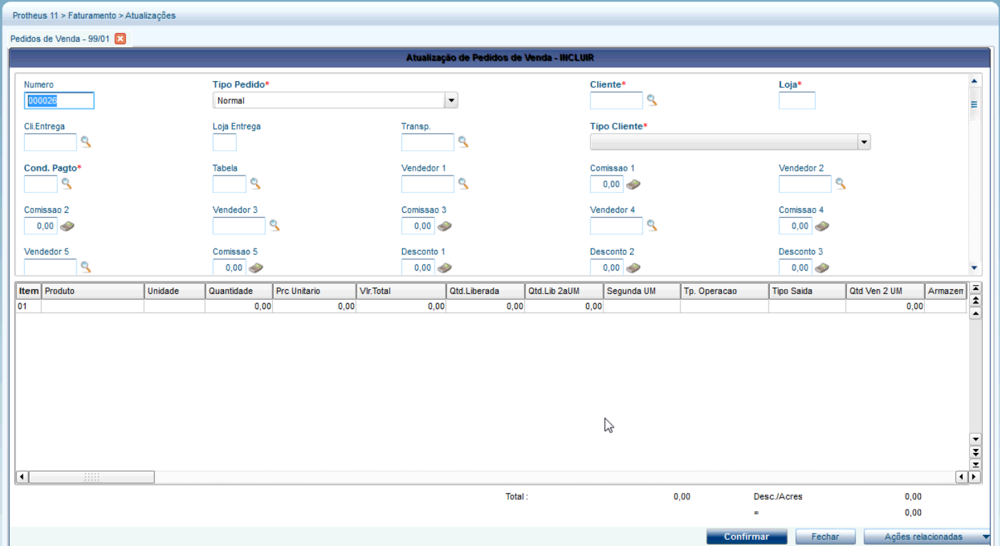{.flow-image}

#### 1.2 Preenchimento dos Dados do Pedido

<strong>Cabeçalho</strong>: Selecione o Cliente (Ex: 000002 - Cliente Risco E) e a Condição de Pagamento (Ex: 002 - 30 dias).

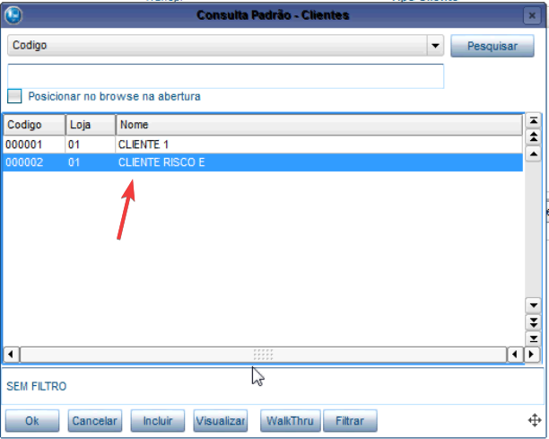{.flow-image}

<strong>Itens</strong>: Insira o produto (Ex: PRODUTO VENDA 1) e a quantidade desejada. 
<strong>Ação</strong>: Clique em "Confirmar" para salvar o registro.

#### 1.3 Solicitação de Liberação (Justificativa)

<strong>Interface</strong>: Devido às regras de negócio (neste caso, "Cliente Risco E"), o sistema não libera o pedido automaticamente e abre a janela "Observações do Solicitante". 
<strong>Ação</strong>: Digite a justificativa para a liberação (Ex: FAVOR LIBERAR ESTE PEDIDO. OBRIGADO.). 
<strong>Ação</strong>: Clique em "Ok" para concluir a gravação.

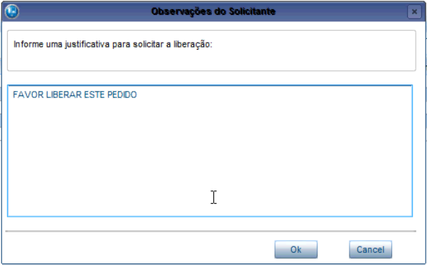{.flow-image}

#### 1.4 Verificação do Status de Bloqueio

<strong>Análise Visual</strong>: Na tela principal de Pedidos de Venda, o pedido recém-criado (Ex: 000026) aparecerá com a legenda "Traço Vermelho". 
<strong>Legenda</strong>: Ao consultar Ações Relacionadas > Legenda, confirma-se que a traço vermelho indica "Pedido de Venda com Bloqueio de Alçada". 
<strong>Resultado</strong>: O pedido está agora aguardando a análise do aprovador via workflow para prosseguir para o faturamento.

{.flow-image}

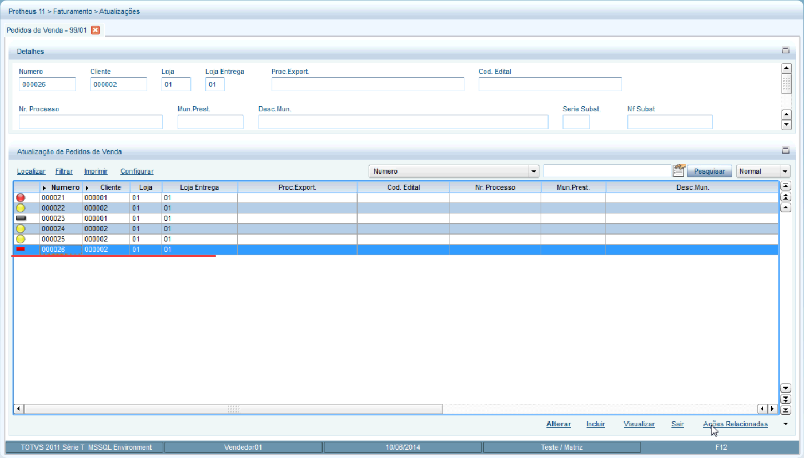{.flow-image}

#### 2. Aprovação via Workflow

#### 2.1 Consulta do Status do Pedido no ERP

<strong>Caminho</strong>: Faturamento > Atualizações > Pedidos > Pedidos de Venda. 
<strong>Ação</strong>: Selecionar o pedido desejado (Ex: Pedido 000026). 
<strong>Verificação de Legenda</strong>: Ao clicar em Ações Relacionadas > Legenda, observa-se que o pedido está com o "Traço vermelho", indicando "Pedido de Venda com Bloqueio de Alçada". 
<strong>Histórico de Aprovação</strong>: Em Ações Relacionadas > Workflow > Consultar, é possível visualizar que o documento está com o status "Aguardando Aprovação" para o usuário APROVADOR 01. 

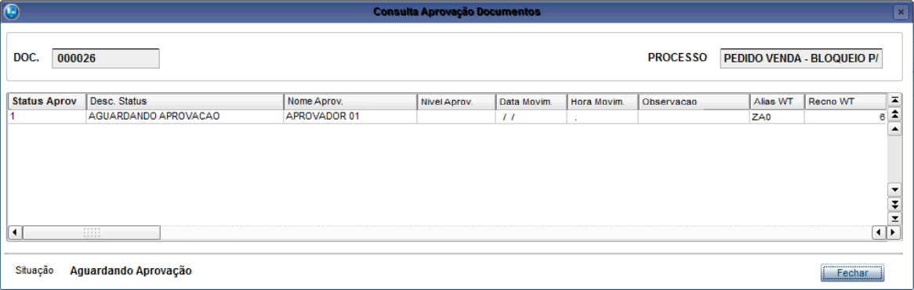{.flow-image}

#### 2.2 Recebimento e Acesso ao Workflow (E-mail)

<strong>Ação</strong>: O aprovador recebe um e-mail com o assunto: "Liberar Pedido de Venda: [Número do Pedido]". 
<strong>Interface</strong>: O corpo do e-mail contém os dados básicos do pedido e um link/botão chamado "Processo". 
<strong>Ação</strong>: Clique no link "Processo" para abrir a interface de decisão no navegador. 

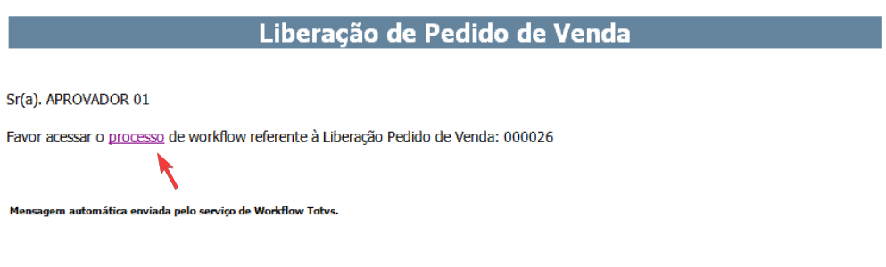{.flow-image}

#### 2.3 Execução da Aprovação/Rejeição (Web)

<strong>Interface</strong>: "Liberação de Pedido de Venda": Apresenta dados do cabeçalho (Cliente, Valor, Condição de Pagamento), itens do pedido, posição financeira do cliente e observações do solicitante.

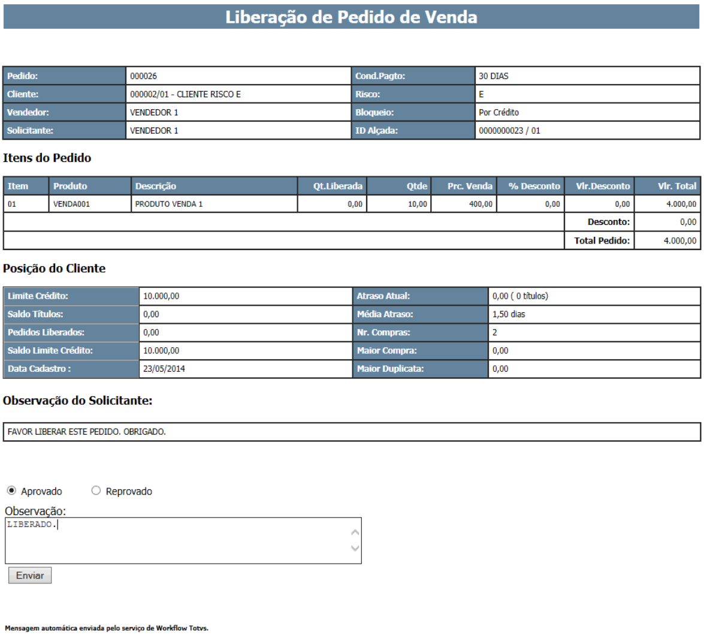{.flow-image}

<strong>Ação de Decisão</strong>: 
<strong>No final da página</strong>, selecione a opção "Aprovado" (ou "Reprovado", se aplicável). 
<strong>No campo Observação</strong>, digite a justificativa ou nota (Ex: LIBERADO). 
<strong>Clique no botão</strong> "Enviar". 

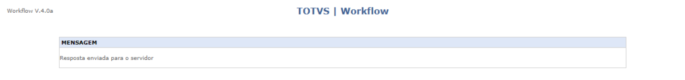{.flow-image}

<strong>Confirmação</strong>: O navegador exibirá a mensagem: "Resposta enviada para o servidor".

#### 2.4 Validação da Liberação no ERP

<strong>Ação</strong>: Retorne à tela de Pedidos de Venda no Protheus. 
<strong>Resultado</strong>: O status do pedido mudará para a cor amarelo (Círculo Amarelo), indicando "Pedido de Venda Liberado". 
<strong>Auditoria</strong>: Ao consultar novamente em Ações Relacionadas > Workflow, o status aparecerá como "APROVADO", com a data, hora e a observação digitada no passo anterior. 

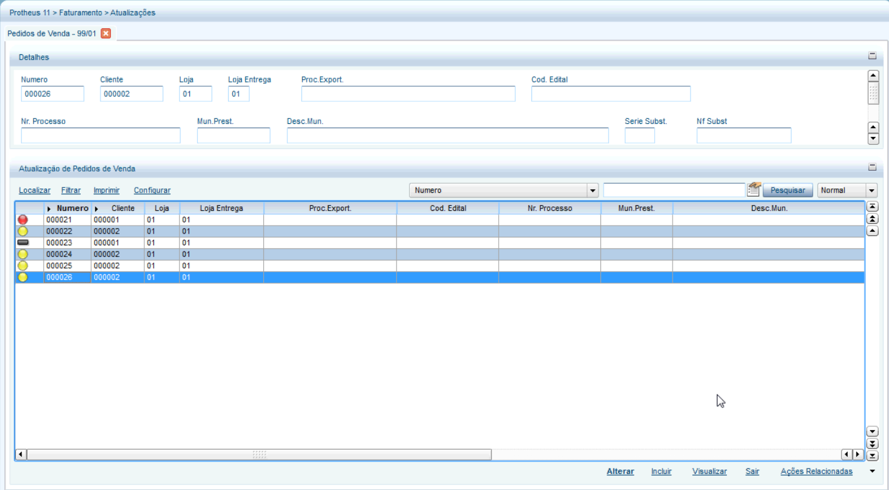{.flow-image}

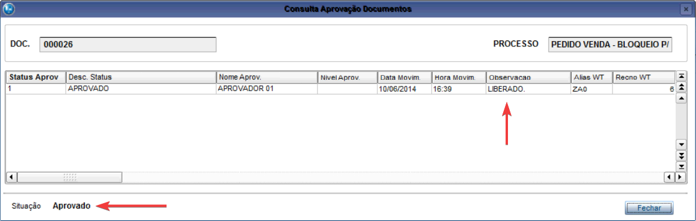{.flow-image}

  <a href="/" class="md-button" style="text-decoration: none;">← Voltar para a Página Inicial</a>

