# Alçadas - Regras {.home-hero}

<!--############################################### 01 #######################################################-->

  01. Visão Geral

### 1. Visão Geral
Este ADDON é uma opção para controle de alçadas envolvendo procesoss do compras como solicitção e pedido de compras.

O ADDON permite que ao gerar um uma solicitação de compra ou pedido de compra, estes sejam analisados por regras de aprovação e conforme os criterios da regra de aprovação e o que foi informado no pedido de compra/solicitação de compra, o aprovador seja notificado via workflow e através o status do documento.

Para a construção das regras, é disponibilizado uma interface que possibilita ao usuário configurar por diversar formas, como:

- Tipo de Liberação: Usuário, Nivel de aprovação ou Documento
- Expressão: Abre o leque de opções pois permite criar uma expressão com base de informações contidas nos documentos (solicitação/pedido de compra) aumentando ou até melhorando a forma de avaliação sobre o documento.
- Nivel: Em casos de niveis de aprovação, defini quais os niveis de aprovação da alçada.
- Aprovador: Defini que será o aprovador da regra/nivel da regra

Além das regras de alçada, para o caso dos aprovadores, é possível determinar verbas de aprovação para os aprovadores.

Disponibiliza interface que permite efetuar a transferência de documentos que estão pendentes para aprovação de determinado usuário aprovador, e passar para outro usuário.

Também pemrite definir um usuário aprovador substituto, de forma temporária, no caso do aprovador principal ter um período ausente, por exemplo, férias.

<strong>É uma opção para controle de alçadas envolvendo processos do compras como solicitção e pedido de compras.
Permite que ao gerar um uma solicitação de compra ou pedido de compra, estes sejam analisados por regras de aprovação e conforme os criterios da regra de aprovação e o que foi informado no pedido de compra/solicitação de compra, o aprovador seja notificado via workflow e através o status do documento.

Para a construção das regras, é disponibilizado uma interface que possibilita ao usuário configurar por diversar formas, como:

- Tipo de Liberação: Usuário, Nivel de aprovação ou Documento
-  Expressão: Abre o leque de opções pois permite criar uma expressão com base de informações contidas nos documentos (solicitação/pedido de compra) aumentando ou até melhorando a forma de avaliação sobre o documento.
- Nivel: Em casos de niveis de aprovação, defini quais os niveis de aprovação da alçada.
- Aprovador: Defini que será o aprovador da regra/nivel da regra

Além das regras de alçada, para o caso dos aprovadores, é possível determinar verbas de aprovação para os aprovadores.

Disponibiliza interface que permite efetuar a transferência de documentos que estão pendentes para aprovação de determinado usuário aprovador, e passar para outro usuário.

Também pemrite definir um usuário aprovador substituto, de forma temporária, no caso do aprovador principal ter um período ausente, por exemplo, férias.
</strong>

#### Implementação de controle customizado de alçadas via workflow, integrando aprovações nativas aos processos do ERP.
<strong>Principais vantagens do produto:</strong>

- Cadastro de e-mails Destinatários de Workflow;
- Cadastro de Regras de Alçadas;
- Aprovação/Rejeição Manual do documento em alçadas - via tela (aprovação via workflow somente nos pacotes específicos de integração);
- Consulta Status Aprovação dos documentos em alçadas;
- Visualização do documento original em alçadas;
- Cadastro de Ausência temporária;
- Transferência de Aprovadores;

<!--############################################### 02 #######################################################-->

  02. Menu

### 2. Menu

<table class="banks-table">
  <thead>
    <tr>
      <th>Menu</th>
      <th>Sub Menu</th>
      <th>Nome da Rotina</th>
      <th>Programa</th>
      <th>Módulo</th>
      <th>Tipo</th>
      <th>Tabelas</th>
    </tr>
  </thead>
  <tbody>
    <tr>
      <td>Atualizações</td>
      <td>Alçadas</td>
      <td>Cadastro de Regras</td>
      <td>M001A02</td>
      <td>CONFIGURADOR</td>
      <td>03</td>
      <td>ZX0, ZX2</td>
    </tr>   
      <tr>
      <td>Atualizações</td>
      <td>Alçadas</td>
      <td>Aprovações</td>
      <td>M001A03</td>
      <td>CONFIGURADOR</td>
      <td>03</td>
      <td>ZXA</td>
    </tr>     
      <tr>
      <td>Atualizações</td>
      <td>Alçadas</td>
      <td>Ausências Temporária</td>
      <td>M001A04</td>
      <td>CONFIGURADOR</td>
      <td>03</td>
      <td>ZX0</td>
    </tr>   
      <tr>
      <td>Atualizações</td>
      <td>Alçadas</td>
      <td>Verbas por Aprovador</td>
      <td>M001A05</td>
      <td>CONFIGURADOR</td>
      <td>03</td>
      <td>ZX4</td>
    </tr>   
      <tr>
      <td>Atualizações</td>
      <td>Alçadas</td>
      <td>Destinatários WF</td>
      <td>C999A01</td>
      <td>CONFIGURADOR</td>
      <td>03</td>
      <td>ZX0</td>
    </tr>   
  </tbody>
</table>

<!--############################################### 03 #######################################################-->

  03. Rotinas personalizadas específicas do Pacote

### 3. Rotinas personalizadas específicas do Pacote

#### Funções personalizadas contidas no pacote:

<table class="banks-table">
  <thead>
    <tr>
      <th>Função</th>
      <th>Descrição</th>
    </tr>
  </thead>
  <tbody>
    <tr>
      <td><strong>C999A01</strong></td>
      <td>Rotina para cadastro de destinatários de Workflow.</td>
    </tr>
    <tr>
      <td><strong>M001A01</strong></td>
      <td>RRotina com funções genéricas do controle de alçadas.</td>
    </tr>
    <tr>
      <td><strong>M001A02</strong></td>
      <td>Rotina para cadastro de regra de alçadas.</td>
    </tr>
    <tr>
      <td><strong>M001A03</strong></td>
      <td>Rotina para aprovações de alçadas.</td>
    </tr>
    <tr>
      <td><strong>M001A04</strong></td>
      <td>Rotina para cadastro de ausência temporária</td>
    </tr>
    <tr>
      <td><strong>M001A05</strong></td>
      <td>Rotina para cadastro de Verbas por Aprovador</td>
    </tr>
    <tr>
      <td><strong>UPD0A01</strong></td>
      <td>Rotina para aplicação do pacote e compatibilização dos SX’s</td>
    </tr>
  </tbody>
</table>

<!--############################################### 04 #######################################################-->

  04. Pontos de Entradas Disponiveis para Desenvolvimento

### 4. Pontos de Entradas Disponiveis para Desenvolvimento

<table class="banks-table">
  <thead>
    <tr>
      <th>P.E</th>
      <th>Descrição</th>
      <th>Parâmetros de Entrada</th>
      <th>Retorno</th>
    </tr>
  </thead>
  <tbody>
    <tr>
      <td><strong>M001AAP</strong></td>
      <td>P.E. após gerar aprovação alçada – após transação.</td>
      <td><strong>1)</strong> CÓDIGO DO PROCESSO (ZX1->ZX1_PROCES) – SINTAXE: PARAMIXB 
          <strong>Tabela Posicionada: ZX1</strong></td>
      <td>Nenhum</td>
    </tr>
    <tr>
      <td><strong>M001ARP</strong></td>
      <td>P.E. após reprovação alçada – após transação.</td>
      <td>1)</strong> CÓDIGO DO PROCESSO (ZX1->ZX1_PROCES) – SINTAXE: PARAMIXB 
      <strong>Tabela Posicionada: ZX1</strong></td>
      <td>Nenhum</td>
    </tr>
    <tr>
      <td><strong>M001TR1</strong></td>
      <td>P.E. de validação – após mensagem de confirmação da transferência do documento – processo de aprovação MANUAL – porém antes da transação.
      <strong>P.E. não se aplica no processamento via Workflow.</strong></td>
      <td><strong>1)</strong> CÓDIGO DO PROCESSO (ZXA->ZXA_PROCES) – SINTAXE: PARAMIXB[1] 
          <strong>2)</strong> CÓDIGO DO DOCUMENTO (ZXA->ZXA_DOC) – SINTAXE: PARAMIXB[2] 
          <strong>3)</strong> STATUS DOCUMENTO (ZXA->ZXA_STATUS) – SINTAXE: PARAMIXB[3] 
          <strong>4)</strong> USUARIO SUPERIOR – SINTAXE: PARAMIXB[4] 
          <strong>Tabela Posicionada: ZXA</strong></td>
      <td>.T./.F. 
      CASO .T. CONTINUA GRAVAÇÃO DA TRANSFERENCIA  
      CASO .F. CANCELA PROCESSAMENTO.</td>
    </tr>
    <tr>
      <td><strong>M1A5CPOS</strong></td>
      <td>P.E. durante a montagem da tela de Verbas por Aprovador (M001A05) para adicionar campos do cliente à tela. Deve ser utilizado em conjunto com o PE M1A5TELA.</td>
      <td>Nenhum</td>
      <td>Nenhum</td>
    </tr>
    <tr>
      <td><strong>M1A5TELA</strong></td>
      <td>P.E. durante a montagem da tela de Verbas por Aprovador (M001A05) para posicionar os campos do cabeçalho na tela modelo2. Deve ser utilizado em conjunto com o PE M1A5CPOS.</td>
      <td>Nenhum</td>
      <td>Nenhum</td>
    </tr>    
  </tbody>
</table>

<!--############################################### 05 #######################################################-->

  05. Tabelas (SX2) 

### 5. Tabelas (SX2)

<table class="banks-table">
  <thead>
    <tr>
      <th>Prefixo</th>
      <th>Descrição</th>
      <th>Ac. Filial</th>
      <th>Ac. Unidade</th>
      <th>Ac. Empresa</th>
    </tr>
  </thead>
  <tbody>
    <tr>
      <td><strong>ZX0</strong></td>
      <td>DESTINATARIOS WF</td>
      <td>Exclusivo</td>
      <td>Exclusivo</td>
      <td>Exclusivo</td>
    </tr>
    <tr>
      <td><strong>ZX1</strong></td>
      <td>REGRAS DE ALCADAS</td>
      <td>Exclusivo</td>
      <td>Exclusivo</td>
      <td>Exclusivo</td>
    </tr>
    <tr>
      <td><strong>ZX2</strong></td>
      <td>ALCADAS - AUSENCIA TEMPORARIA</td>
      <td>Exclusivo</td>
      <td>Exclusivo</td>
      <td>Exclusivo</td>
    </tr>
    <tr>
      <td><strong>ZX3</strong></td>
      <td>MOVIMENTOS ALCADAS</td>
      <td>Exclusivo</td>
      <td>Exclusivo</td>
      <td>Exclusivo</td>
    </tr>
    
  </tbody>
</table>

<!--############################################### 06 #######################################################-->

  06. Campos (SX3)

### 6. Campos (SX3)

Campo **ZX0_PROCES**

<table class="banks-table">
  <tbody>
    <tr>
      <th>Tipo</th>
      <td>C</td>
      <th>Ordem</th>
      <td>02</td>
      <th>Tamanho</th>
      <td>8</td>
      <th>Decimal</th>
      <td>0</td>
      <th>Formato</th>
      <td>@!</td>
    </tr>
    <tr>
      <th>Contexto</th>
      <td>Real</td>
      <th>Propriedade</th>
      <td>Alterar</td>
      <th>Obrigatório</th>
      <td>S</td>
      <th>Browse</th>
      <td>S</td>
    </tr>
    <tr>
      <th>Título</th>
      <td colspan="7">Funcao</td>
    </tr>
    <tr>
      <th>Descrição</th>
      <td colspan="7">Funcao</td>
    </tr>
  </tbody>
</table>
#### **Help**

Informe a funcao de WorkFlow.

#### **Configurações adicionais**
<table class="banks-table">
  <tbody>
    <tr>
      <th>F3</th>
      <td>-</td>
    </tr>
    <tr>
      <th>Modo Edição</th>
      <td>INCLUI</td>
    </tr>
    <tr>
      <th>Val. Usuário</th>
      <td>ExistChav("ZX0")</td>
    </tr>
    <tr>
      <th>Lista Opções</th>
      <td>-</td>
    </tr>
    <tr>
      <th>Inicializador</th>
      <td>-</td>
    </tr>
    <tr>
      <th>Ini. Browse</th>
      <td>-</td>
    </tr>
  </tbody>
</table>

Campo **ZX0_DESCRI**

<table class="banks-table">
  <tbody>
    <tr>
      <th>Tipo</th>
      <td>C</td>
      <th>Ordem</th>
      <td>03</td>
      <th>Tamanho</th>
      <td>100</td>
      <th>Decimal</th>
      <td>0</td>
      <th>Formato</th>
      <td>@!</td>
    </tr>
    <tr>
      <th>Contexto</th>
      <td>Real</td>
      <th>Propriedade</th>
      <td>Alterar</td>
      <th>Obrigatório</th>
      <td>S</td>
      <th>Browse</th>
      <td>S</td>
    </tr>
    <tr>
      <th>Título</th>
      <td colspan="7">Descricao</td>
    </tr>
    <tr>
      <th>Descrição</th>
      <td colspan="7">Descricao</td>
    </tr>
  </tbody>
</table>
#### **Help**

Informe a descricao da Funcao.

#### **Configurações adicionais**
<table class="banks-table">
  <tbody>
    <tr>
      <th>F3</th>
      <td>-</td>
    </tr>
    <tr>
      <th>Modo Edição</th>
      <td>-</td>
    </tr>
    <tr>
      <th>Val. Usuário</th>
      <td>-</td>
    </tr>
    <tr>
      <th>Lista Opções</th>
      <td>-</td>
    </tr>
    <tr>
      <th>Inicializador</th>
      <td>-</td>
    </tr>
    <tr>
      <th>Ini. Browse</th>
      <td>-</td>
    </tr>
  </tbody>
</table>

Campo **ZX0_DEST**

<table class="banks-table">
  <tbody>
    <tr>
      <th>Tipo</th>
      <td>C</td>
      <th>Ordem</th>
      <td>04</td>
      <th>Tamanho</th>
      <td>200</td>
      <th>Decimal</th>
      <td>0</td>
      <th>Formato</th>
      <td>-</td>
    </tr>
    <tr>
      <th>Contexto</th>
      <td>Real</td>
      <th>Propriedade</th>
      <td>Alterar</td>
      <th>Obrigatório</th>
      <td>S</td>
      <th>Browse</th>
      <td>S</td>
    </tr>
    <tr>
      <th>Título</th>
      <td colspan="7">Destinat.</td>
    </tr>
    <tr>
      <th>Descrição</th>
      <td colspan="7">Destinatarios</td>
    </tr>
  </tbody>
</table>
#### **Help**

Informe os destinatarios do Workflow. Para mais de um, utilize (;).

#### **Configurações adicionais**
<table class="banks-table">
  <tbody>
    <tr>
      <th>F3</th>
      <td>-</td>
    </tr>
    <tr>
      <th>Modo Edição</th>
      <td>-</td>
    </tr>
    <tr>
      <th>Val. Usuário</th>
      <td>-</td>
    </tr>
    <tr>
      <th>Lista Opções</th>
      <td>-</td>
    </tr>
    <tr>
      <th>Inicializador</th>
      <td>-</td>
    </tr>
    <tr>
      <th>Ini. Browse</th>
      <td>-</td>
    </tr>
  </tbody>
</table>

Campo **ZX0_USERGI**

<table class="banks-table">
  <tbody>
    <tr>
      <th>Tipo</th>
      <td>-</td>
      <th>Ordem</th>
      <td>05</td>
      <th>Tamanho</th>
      <td>-</td>
      <th>Decimal</th>
      <td>-</td>
      <th>Formato</th>
      <td>-</td>
    </tr>
    <tr>
      <th>Contexto</th>
      <td>-</td>
      <th>Propriedade</th>
      <td>-</td>
      <th>Obrigatório</th>
      <td>-</td>
      <th>Browse</th>
      <td>-</td>
    </tr>
    <tr>
      <th>Título</th>
      <td colspan="7">LOG de Inclusão</td>
    </tr>
    <tr>
      <th>Descrição</th>
      <td colspan="7">-</td>
    </tr>
  </tbody>
</table>
#### **Help**

-

#### **Configurações adicionais**
<table class="banks-table">
  <tbody>
    <tr>
      <th>F3</th>
      <td>-</td>
    </tr>
    <tr>
      <th>Modo Edição</th>
      <td>-</td>
    </tr>
    <tr>
      <th>Val. Usuário</th>
      <td>-</td>
    </tr>
    <tr>
      <th>Lista Opções</th>
      <td>-</td>
    </tr>
    <tr>
      <th>Inicializador</th>
      <td>-</td>
    </tr>
    <tr>
      <th>Ini. Browse</th>
      <td>-</td>
    </tr>
  </tbody>
</table>

Campo **ZX0_USERGA**

<table class="banks-table">
  <tbody>
    <tr>
      <th>Tipo</th>
      <td>-</td>
      <th>Ordem</th>
      <td>06</td>
      <th>Tamanho</th>
      <td>-</td>
      <th>Decimal</th>
      <td>-</td>
      <th>Formato</th>
      <td>-</td>
    </tr>
    <tr>
      <th>Contexto</th>
      <td>-</td>
      <th>Propriedade</th>
      <td>-</td>
      <th>Obrigatório</th>
      <td>-</td>
      <th>Browse</th>
      <td>-</td>
    </tr>
    <tr>
      <th>Título</th>
      <td colspan="7">LOG de Alteração</td>
    </tr>
    <tr>
      <th>Descrição</th>
      <td colspan="7">-</td>
    </tr>
  </tbody>
</table>
#### **Help**

-

#### **Configurações adicionais**
<table class="banks-table">
  <tbody>
    <tr>
      <th>F3</th>
      <td>-</td>
    </tr>
    <tr>
      <th>Modo Edição</th>
      <td>-</td>
    </tr>
    <tr>
      <th>Val. Usuário</th>
      <td>-</td>
    </tr>
    <tr>
      <th>Lista Opções</th>
      <td>-</td>
    </tr>
    <tr>
      <th>Inicializador</th>
      <td>-</td>
    </tr>
    <tr>
      <th>Ini. Browse</th>
      <td>-</td>
    </tr>
  </tbody>
</table>

Campo **ZX0_STATUS**

<table class="banks-table">
  <tbody>
    <tr>
      <th>Tipo</th>
      <td>C</td>
      <th>Ordem</th>
      <td>06</td>
      <th>Tamanho</th>
      <td>1</td>
      <th>Decimal</th>
      <td>0</td>
      <th>Formato</th>
      <td>@!</td>
    </tr>
    <tr>
      <th>Contexto</th>
      <td>Real</td>
      <th>Propriedade</th>
      <td>Alterar</td>
      <th>Obrigatório</th>
      <td>N</td>
      <th>Browse</th>
      <td>N</td>
    </tr>
    <tr>
      <th>Título</th>
      <td colspan="7">Status Aprov</td>
    </tr>
    <tr>
      <th>Descrição</th>
      <td colspan="7">Status Aprovacao</td>
    </tr>
  </tbody>
</table>
#### **Help**

Stauts do movimento: 
<strong>1</strong> - Aguardando Aprovacao 
<strong>2</strong> - Aguardando Aprov. Nivel Anterior 
<strong>3</strong> - Aprovado 
<strong>4</strong> - Transferido p/ outro Aprovador 
<strong>5</strong> - Reprovado 
<strong>6</strong> - Nivel Anterior Reprovado

#### **Configurações adicionais**
<table class="banks-table">
  <tbody>
    <tr>
      <th>F3</th>
      <td>-</td>
    </tr>
    <tr>
      <th>Modo Edição</th>
      <td>-</td>
    </tr>
    <tr>
      <th>Val. Usuário</th>
      <td>-</td>
    </tr>
    <tr>
      <th>Lista Opções</th>
      <td>-</td>
    </tr>
    <tr>
      <th>Inicializador</th>
      <td>-</td>
    </tr>
    <tr>
      <th>Ini. Browse</th>
      <td>-</td>
    </tr>
  </tbody>
</table>

Campo **ZX1_PROCES**

<table class="banks-table">
  <tbody>
    <tr>
      <th>Tipo</th>
      <td>C</td>
      <th>Ordem</th>
      <td>02</td>
      <th>Tamanho</th>
      <td>8</td>
      <th>Decimal</th>
      <td>0</td>
      <th>Formato</th>
      <td>@!</td>
    </tr>
    <tr>
      <th>Contexto</th>
      <td>Real</td>
      <th>Propriedade</th>
      <td>Alterar</td>
      <th>Obrigatório</th>
      <td>S</td>
      <th>Browse</th>
      <td>S</td>
    </tr>
    <tr>
      <th>Título</th>
      <td colspan="7">Processo</td>
    </tr>
    <tr>
      <th>Descrição</th>
      <td colspan="7">Codigo do Processo</td>
    </tr>
  </tbody>
</table>
#### **Help**

Informe o codigo do processo (nome da funcao) referente a Alçada.

#### **Configurações adicionais**
<table class="banks-table">
  <tbody>
    <tr>
      <th>F3</th>
      <td>-</td>
    </tr>
    <tr>
      <th>Modo Edição</th>
      <td>-</td>
    </tr>
    <tr>
      <th>Val. Usuário</th>
      <td>-</td>
    </tr>
    <tr>
      <th>Lista Opções</th>
      <td>-</td>
    </tr>
    <tr>
      <th>Inicializador</th>
      <td>-</td>
    </tr>
    <tr>
      <th>Ini. Browse</th>
      <td>-</td>
    </tr>
  </tbody>
</table>

Campo **ZX1_DESCRI**

<table class="banks-table">
  <tbody>
    <tr>
      <th>Tipo</th>
      <td>C</td>
      <th>Ordem</th>
      <td>03</td>
      <th>Tamanho</th>
      <td>40</td>
      <th>Decimal</th>
      <td>0</td>
      <th>Formato</th>
      <td>@!</td>
    </tr>
    <tr>
      <th>Contexto</th>
      <td>Real</td>
      <th>Propriedade</th>
      <td>Alterar</td>
      <th>Obrigatório</th>
      <td>S</td>
      <th>Browse</th>
      <td>S</td>
    </tr>
    <tr>
      <th>Título</th>
      <td colspan="7">Descricao</td>
    </tr>
    <tr>
      <th>Descrição</th>
      <td colspan="7">Descricao do Processo</td>
    </tr>
  </tbody>
</table>
#### **Help**

Descricao do Processo

#### **Configurações adicionais**
<table class="banks-table">
  <tbody>
    <tr>
      <th>F3</th>
      <td>-</td>
    </tr>
    <tr>
      <th>Modo Edição</th>
      <td>-</td>
    </tr>
    <tr>
      <th>Val. Usuário</th>
      <td>-</td>
    </tr>
    <tr>
      <th>Lista Opções</th>
      <td>-</td>
    </tr>
    <tr>
      <th>Inicializador</th>
      <td>-</td>
    </tr>
    <tr>
      <th>Ini. Browse</th>
      <td>-</td>
    </tr>
  </tbody>
</table>

Campo **ZX1_SEQ**

<table class="banks-table">
  <tbody>
    <tr>
      <th>Tipo</th>
      <td>C</td>
      <th>Ordem</th>
      <td>04</td>
      <th>Tamanho</th>
      <td>2</td>
      <th>Decimal</th>
      <td>0</td>
      <th>Formato</th>
      <td>99</td>
    </tr>
    <tr>
      <th>Contexto</th>
      <td>Real</td>
      <th>Propriedade</th>
      <td>Alterar</td>
      <th>Obrigatório</th>
      <td>S</td>
      <th>Browse</th>
      <td>S</td>
    </tr>
    <tr>
      <th>Título</th>
      <td colspan="7">Sequencia</td>
    </tr>
    <tr>
      <th>Descrição</th>
      <td colspan="7">Sequencia</td>
    </tr>
  </tbody>
</table>
#### **Help**

Sequencia

#### **Configurações adicionais**
<table class="banks-table">
  <tbody>
    <tr>
      <th>F3</th>
      <td>-</td>
    </tr>
    <tr>
      <th>Modo Edição</th>
      <td>-</td>
    </tr>
    <tr>
      <th>Val. Usuário</th>
      <td>-</td>
    </tr>
    <tr>
      <th>Lista Opções</th>
      <td>-</td>
    </tr>
    <tr>
      <th>Inicializador</th>
      <td>-</td>
    </tr>
    <tr>
      <th>Ini. Browse</th>
      <td>-</td>
    </tr>
  </tbody>
</table>

Campo **ZX1_TPLIB**

<table class="banks-table">
  <tbody>
    <tr>
      <th>Tipo</th>
      <td>C</td>
      <th>Ordem</th>
      <td>05</td>
      <th>Tamanho</th>
      <td>1</td>
      <th>Decimal</th>
      <td>0</td>
      <th>Formato</th>
      <td>@!</td>
    </tr>
    <tr>
      <th>Contexto</th>
      <td>Real</td>
      <th>Propriedade</th>
      <td>Alterar</td>
      <th>Obrigatório</th>
      <td>S</td>
      <th>Browse</th>
      <td>S</td>
    </tr>
    <tr>
      <th>Título</th>
      <td colspan="7">Tp.Liberacao</td>
    </tr>
    <tr>
      <th>Descrição</th>
      <td colspan="7">Tipo de Liberacao</td>
    </tr>
  </tbody>
</table>
#### **Help**

Help	Informe o tipo de liberacao que deseja para esta regra de Alcadas: 
<strong>N</strong> = Nivel - Sistema respeitara os níveis configurados, encaminhando para o proximonivel somente após aprovação do nível anterior. 
<strong>U</strong> = Usuario - A liberacao do usuário pode ocorrer individualmente, sem considerar outros aprovadores constantes na regra.

#### **Configurações adicionais**
<table class="banks-table">
  <tbody>
    <tr>
      <th>F3</th>
      <td>-</td>
    </tr>
    <tr>
      <th>Modo Edição</th>
      <td>-</td>
    </tr>
    <tr>
      <th>Val. Usuário</th>
      <td>-</td>
    </tr>
    <tr>
      <th>Lista Opções</th>
      <td>N=Nivel; U=Usuario; D=Documento</td>
    </tr>
    <tr>
      <th>Inicializador</th>
      <td>-</td>
    </tr>
    <tr>
      <th>Ini. Browse</th>
      <td>-</td>
    </tr>
  </tbody>
</table>

Campo **ZX1_NIVEL**

<table class="banks-table">
  <tbody>
    <tr>
      <th>Tipo</th>
      <td>C</td>
      <th>Ordem</th>
      <td>06</td>
      <th>Tamanho</th>
      <td>2</td>
      <th>Decimal</th>
      <td>0</td>
      <th>Formato</th>
      <td>@!</td>
    </tr>
    <tr>
      <th>Contexto</th>
      <td>Real</td>
      <th>Propriedade</th>
      <td>Alterar</td>
      <th>Obrigatório</th>
      <td>N</td>
      <th>Browse</th>
      <td>N</td>
    </tr>
    <tr>
      <th>Título</th>
      <td colspan="7">Nivel</td>
    </tr>
    <tr>
      <th>Descrição</th>
      <td colspan="7">Nivel</td>
    </tr>
  </tbody>
</table>
#### **Help**

Informe o nivel (2digitos).

#### **Configurações adicionais**
<table class="banks-table">
  <tbody>
    <tr>
      <th>F3</th>
      <td>-</td>
    </tr>
    <tr>
      <th>Modo Edição</th>
      <td>aCols[n][nPosTPL] = 'N'</td>
    </tr>
    <tr>
      <th>Val. Usuário</th>
      <td>-</td>
    </tr>
    <tr>
      <th>Lista Opções</th>
      <td>-</td>
    </tr>
    <tr>
      <th>Inicializador</th>
      <td>-</td>
    </tr>
    <tr>
      <th>Ini. Browse</th>
      <td>-</td>
    </tr>
  </tbody>
</table>

Campo **ZX1_TPBUSC**

<table class="banks-table">
  <tbody>
    <tr>
      <th>Tipo</th>
      <td>C</td>
      <th>Ordem</th>
      <td>07</td>
      <th>Tamanho</th>
      <td>1</td>
      <th>Decimal</th>
      <td>0</td>
      <th>Formato</th>
      <td>@!</td>
    </tr>
    <tr>
      <th>Contexto</th>
      <td>Real</td>
      <th>Propriedade</th>
      <td>Alterar</td>
      <th>Obrigatório</th>
      <td>S</td>
      <th>Browse</th>
      <td>S</td>
    </tr>
    <tr>
      <th>Título</th>
      <td colspan="7">Tp. Busca</td>
    </tr>
    <tr>
      <th>Descrição</th>
      <td colspan="7">Tipo de Busca</td>
    </tr>
  </tbody>
</table>
#### **Help**

Help	Informe o tipo de busca:
<strong>E</strong> = Entidade - O usuario poderá configurar qualquer tabela do sistema para verificar o aprovador do processo. 
<strong>U</strong> = Usuario - Configuracao de usuário "fixo" como aprovador.

#### **Configurações adicionais**
<table class="banks-table">
  <tbody>
    <tr>
      <th>F3</th>
      <td>-</td>
    </tr>
    <tr>
      <th>Modo Edição</th>
      <td>-</td>
    </tr>
    <tr>
      <th>Val. Usuário</th>
      <td>-</td>
    </tr>
    <tr>
      <th>Lista Opções</th>
      <td>E=Entidade; U=Usuario</td>
    </tr>
    <tr>
      <th>Inicializador</th>
      <td>-</td>
    </tr>
    <tr>
      <th>Ini. Browse</th>
      <td>-</td>
    </tr>
  </tbody>
</table>

Campo **ZX1_IDUSER**

<table class="banks-table">
  <tbody>
    <tr>
      <th>Tipo</th>
      <td>C</td>
      <th>Ordem</th>
      <td>08</td>
      <th>Tamanho</th>
      <td>6</td>
      <th>Decimal</th>
      <td>0</td>
      <th>Formato</th>
      <td>@!</td>
    </tr>
    <tr>
      <th>Contexto</th>
      <td>Real</td>
      <th>Propriedade</th>
      <td>Alterar</td>
      <th>Obrigatório</th>
      <td>N</td>
      <th>Browse</th>
      <td>N</td>
    </tr>
    <tr>
      <th>Título</th>
      <td colspan="7">Aprovador</td>
    </tr>
    <tr>
      <th>Descrição</th>
      <td colspan="7">Id do Aprovador</td>
    </tr>
  </tbody>
</table>
#### **Help**

Informe o codigo do usuario que seraresponsavel pela aprovação.

#### **Configurações adicionais**
<table class="banks-table">
  <tbody>
    <tr>
      <th>F3</th>
      <td>USRZX1 (USUARIO ALCADAS)</td>
    </tr>
    <tr>
      <th>Modo Edição</th>
      <td>aCols[n][nPosTPB]='U'</td>
    </tr>
    <tr>
      <th>Val. Usuário</th>
      <td>UsrExist(M->ZX1_IDUSER)</td>
    </tr>
    <tr>
      <th>Lista Opções</th>
      <td>E=Entidade; U=Usuario</td>
    </tr>
    <tr>
      <th>Inicializador</th>
      <td>-</td>
    </tr>
    <tr>
      <th>Ini. Browse</th>
      <td>-</td>
    </tr>
  </tbody>
</table>

Campo **ZX1_NMUSER**

<table class="banks-table">
  <tbody>
    <tr>
      <th>Tipo</th>
      <td>C</td>
      <th>Ordem</th>
      <td>09</td>
      <th>Tamanho</th>
      <td>20</td>
      <th>Decimal</th>
      <td>0</td>
      <th>Formato</th>
      <td>@!</td>
    </tr>
    <tr>
      <th>Contexto</th>
      <td>Real</td>
      <th>Propriedade</th>
      <td>Visualizar</td>
      <th>Obrigatório</th>
      <td>N</td>
      <th>Browse</th>
      <td>N</td>
    </tr>
    <tr>
      <th>Título</th>
      <td colspan="7">Nome</td>
    </tr>
    <tr>
      <th>Descrição</th>
      <td colspan="7">Nome</td>
    </tr>
  </tbody>
</table>
#### **Help**

Nome do Aprovador.

#### **Configurações adicionais**
<table class="banks-table">
  <tbody>
    <tr>
      <th>F3</th>
      <td>-</td>
    </tr>
    <tr>
      <th>Modo Edição</th>
      <td>-</td>
    </tr>
    <tr>
      <th>Val. Usuário</th>
      <td>-</td>
    </tr>
    <tr>
      <th>Lista Opções</th>
      <td>-</td>
    </tr>
    <tr>
      <th>Inicializador</th>
      <td>-</td>
    </tr>
    <tr>
      <th>Ini. Browse</th>
      <td>-</td>
    </tr>
  </tbody>
</table>

Campo **ZX1_INDICE**

<table class="banks-table">
  <tbody>
    <tr>
      <th>Tipo</th>
      <td>N</td>
      <th>Ordem</th>
      <td>10</td>
      <th>Tamanho</th>
      <td>1</td>
      <th>Decimal</th>
      <td>0</td>
      <th>Formato</th>
      <td>9</td>
    </tr>
    <tr>
      <th>Contexto</th>
      <td>Real</td>
      <th>Propriedade</th>
      <td>Alterar</td>
      <th>Obrigatório</th>
      <td>N</td>
      <th>Browse</th>
      <td>N</td>
    </tr>
    <tr>
      <th>Título</th>
      <td colspan="7">Indice Alias</td>
    </tr>
    <tr>
      <th>Descrição</th>
      <td colspan="7">Indice Alias</td>
    </tr>
  </tbody>
</table>
#### **Help**

Informe o indice de busca para posicionamento no campo a verificar o aprovador do processo.

#### **Configurações adicionais**
<table class="banks-table">
  <tbody>
    <tr>
      <th>F3</th>
      <td>-</td>
    </tr>
    <tr>
      <th>Modo Edição</th>
      <td>aCols[n][nPosTPB]='E'</td>
    </tr>
    <tr>
      <th>Val. Usuário</th>
      <td>-</td>
    </tr>
    <tr>
      <th>Lista Opções</th>
      <td>-</td>
    </tr>
    <tr>
      <th>Inicializador</th>
      <td>-</td>
    </tr>
    <tr>
      <th>Ini. Browse</th>
      <td>-</td>
    </tr>
  </tbody>
</table>

Campo **ZX1_CAMPO**

<table class="banks-table">
  <tbody>
    <tr>
      <th>Tipo</th>
      <td>C</td>
      <th>Ordem</th>
      <td>11</td>
      <th>Tamanho</th>
      <td>10</td>
      <th>Decimal</th>
      <td>0</td>
      <th>Formato</th>
      <td>@!</td>
    </tr>
    <tr>
      <th>Contexto</th>
      <td>Real</td>
      <th>Propriedade</th>
      <td>Alterar</td>
      <th>Obrigatório</th>
      <td>N</td>
      <th>Browse</th>
      <td>N</td>
    </tr>
    <tr>
      <th>Título</th>
      <td colspan="7">Campo</td>
    </tr>
    <tr>
      <th>Descrição</th>
      <td colspan="7">Campo</td>
    </tr>
  </tbody>
</table>
#### **Help**

Informar o campo a ser verificado para selecionar o aprovador, quando selecionado o Tipo de Busca = Entidade.

#### **Configurações adicionais**
<table class="banks-table">
  <tbody>
    <tr>
      <th>F3</th>
      <td>-</td>
    </tr>
    <tr>
      <th>Modo Edição</th>
      <td>aCols[n][nPosTPB]='E'</td>
    </tr>
    <tr>
      <th>Val. Usuário</th>
      <td>EXISTCPO("SX3",M->ZX1_CAMPO,2)</td>
    </tr>
    <tr>
      <th>Lista Opções</th>
      <td>-</td>
    </tr>
    <tr>
      <th>Inicializador</th>
      <td>-</td>
    </tr>
    <tr>
      <th>Ini. Browse</th>
      <td>-</td>
    </tr>
  </tbody>
</table>

Campo **ZX1_EXP**

<table class="banks-table">
  <tbody>
    <tr>
      <th>Tipo</th>
      <td>C</td>
      <th>Ordem</th>
      <td>12</td>
      <th>Tamanho</th>
      <td>200</td>
      <th>Decimal</th>
      <td>0</td>
      <th>Formato</th>
      <td>@!</td>
    </tr>
    <tr>
      <th>Contexto</th>
      <td>Real</td>
      <th>Propriedade</th>
      <td>Alterar</td>
      <th>Obrigatório</th>
      <td>N</td>
      <th>Browse</th>
      <td>N</td>
    </tr>
    <tr>
      <th>Título</th>
      <td colspan="7">Expressao</td>
    </tr>
    <tr>
      <th>Descrição</th>
      <td colspan="7">Expressao</td>
    </tr>
  </tbody>
</table>
#### **Help**

Podera ser utilizada para criacao de regras diferentes para um mesmo processo. (Utilizar sempre a tabela posicionada no cabecalho do processo.)

#### **Configurações adicionais**
<table class="banks-table">
  <tbody>
    <tr>
      <th>F3</th>
      <td>-</td>
    </tr>
    <tr>
      <th>Modo Edição</th>
      <td>-</td>
    </tr>
    <tr>
      <th>Val. Usuário</th>
      <td>-</td>
    </tr>
    <tr>
      <th>Lista Opções</th>
      <td>-</td>
    </tr>
    <tr>
      <th>Inicializador</th>
      <td>-</td>
    </tr>
    <tr>
      <th>Ini. Browse</th>
      <td>-</td>
    </tr>
  </tbody>
</table>

Campo **ZX1_PROCWF**

<table class="banks-table">
  <tbody>
    <tr>
      <th>Tipo</th>
      <td>C</td>
      <th>Ordem</th>
      <td>13</td>
      <th>Tamanho</th>
      <td>30</td>
      <th>Decimal</th>
      <td>0</td>
      <th>Formato</th>
      <td>@!</td>
    </tr>
    <tr>
      <th>Contexto</th>
      <td>Real</td>
      <th>Propriedade</th>
      <td>Alterar</td>
      <th>Obrigatório</th>
      <td>N</td>
      <th>Browse</th>
      <td>N</td>
    </tr>
    <tr>
      <th>Título</th>
      <td colspan="7">Proc. WF</td>
    </tr>
    <tr>
      <th>Descrição</th>
      <td colspan="7">Processo WorkFlow</td>
    </tr>
  </tbody>
</table>
#### **Help**

Help	Informe o nome do processo (rdmake) que será responsável por enviar WorkFlow para o controle de alcadas.

#### **Configurações adicionais**
<table class="banks-table">
  <tbody>
    <tr>
      <th>F3</th>
      <td>ZX0</td>
    </tr>
    <tr>
      <th>Modo Edição</th>
      <td>-</td>
    </tr>
    <tr>
      <th>Val. Usuário</th>
      <td>Vazio().OR.ExistCPO("ZX0")</td>
    </tr>
    <tr>
      <th>Lista Opções</th>
      <td>-</td>
    </tr>
    <tr>
      <th>Inicializador</th>
      <td>-</td>
    </tr>
    <tr>
      <th>Ini. Browse</th>
      <td>-</td>
    </tr>
  </tbody>
</table>

Campo **ZX1_ALIAS**

<table class="banks-table">
  <tbody>
    <tr>
      <th>Tipo</th>
      <td>C</td>
      <th>Ordem</th>
      <td>14</td>
      <th>Tamanho</th>
      <td>3</td>
      <th>Decimal</th>
      <td>0</td>
      <th>Formato</th>
      <td>@!</td>
    </tr>
    <tr>
      <th>Contexto</th>
      <td>Real</td>
      <th>Propriedade</th>
      <td>Alterar</td>
      <th>Obrigatório</th>
      <td>N</td>
      <th>Browse</th>
      <td>N</td>
    </tr>
    <tr>
      <th>Título</th>
      <td colspan="7">Alias</td>
    </tr>
    <tr>
      <th>Descrição</th>
      <td colspan="7">Entidade (Alias)</td>
    </tr>
  </tbody>
</table>
#### **Help**

Sigla dos arquivos relacionados no processo. Ex: SA1, SB1, SD2, etc...

#### **Configurações adicionais**
<table class="banks-table">
  <tbody>
    <tr>
      <th>F3</th>
      <td>SX21 (Tabelas Sistema)</td>
    </tr>
    <tr>
      <th>Modo Edição</th>
      <td>-</td>
    </tr>
    <tr>
      <th>Val. Usuário</th>
      <td>Vazio().OR.ExistCpo("SX2")</td>
    </tr>
    <tr>
      <th>Lista Opções</th>
      <td>-</td>
    </tr>
    <tr>
      <th>Inicializador</th>
      <td>-</td>
    </tr>
    <tr>
      <th>Ini. Browse</th>
      <td>-</td>
    </tr>
  </tbody>
</table>

Campo **ZX1_STATUS**

<table class="banks-table">
  <tbody>
    <tr>
      <th>Tipo</th>
      <td>C</td>
      <th>Ordem</th>
      <td>15</td>
      <th>Tamanho</th>
      <td>1</td>
      <th>Decimal</th>
      <td>0</td>
      <th>Formato</th>
      <td>@!</td>
    </tr>
    <tr>
      <th>Contexto</th>
      <td>Real</td>
      <th>Propriedade</th>
      <td>Alterar</td>
      <th>Obrigatório</th>
      <td>S</td>
      <th>Browse</th>
      <td>S</td>
    </tr>
    <tr>
      <th>Título</th>
      <td colspan="7">Regra Ativa?</td>
    </tr>
    <tr>
      <th>Descrição</th>
      <td colspan="7">Regra Ativa?</td>
    </tr>
  </tbody>
</table>
#### **Help**

Informe se a regra esta ativa S=Sim, N=Nao.

#### **Configurações adicionais**
<table class="banks-table">
  <tbody>
    <tr>
      <th>F3</th>
      <td>-</td>
    </tr>
    <tr>
      <th>Modo Edição</th>
      <td>-</td>
    </tr>
    <tr>
      <th>Val. Usuário</th>
      <td>-</td>
    </tr>
    <tr>
      <th>Lista Opções</th>
      <td>S=Sim; N=Não</td>
    </tr>
    <tr>
      <th>Inicializador</th>
      <td>S</td>
    </tr>
    <tr>
      <th>Ini. Browse</th>
      <td>-</td>
    </tr>
  </tbody>
</table>

Campo **ZX1_WFAVIS**

<table class="banks-table">
  <tbody>
    <tr>
      <th>Tipo</th>
      <td>C</td>
      <th>Ordem</th>
      <td>16</td>
      <th>Tamanho</th>
      <td>8</td>
      <th>Decimal</th>
      <td>0</td>
      <th>Formato</th>
      <td>@!</td>
    </tr>
    <tr>
      <th>Contexto</th>
      <td>Real</td>
      <th>Propriedade</th>
      <td>Alterar</td>
      <th>Obrigatório</th>
      <td>N</td>
      <th>Browse</th>
      <td>N</td>
    </tr>
    <tr>
      <th>Título</th>
      <td colspan="7">WF Aviso</td>
    </tr>
    <tr>
      <th>Descrição</th>
      <td colspan="7">WorkFlow Aviso</td>
    </tr>
  </tbody>
</table>
#### **Help**

Informe o nome do processo (rdmake) que seraresponsavel por enviar WorkFlow de aviso da liberacao controle de alcadas.

#### **Configurações adicionais**
<table class="banks-table">
  <tbody>
    <tr>
      <th>F3</th>
      <td>ZX0</td>
    </tr>
    <tr>
      <th>Modo Edição</th>
      <td>-</td>
    </tr>
    <tr>
      <th>Val. Usuário</th>
      <td>-</td>
    </tr>
    <tr>
      <th>Lista Opções</th>
      <td>-</td>
    </tr>
    <tr>
      <th>Inicializador</th>
      <td>-</td>
    </tr>
    <tr>
      <th>Ini. Browse</th>
      <td>-</td>
    </tr>
  </tbody>
</table>

Campo **ZX1_WFALIA**

<table class="banks-table">
  <tbody>
    <tr>
      <th>Tipo</th>
      <td>C</td>
      <th>Ordem</th>
      <td>17</td>
      <th>Tamanho</th>
      <td>3</td>
      <th>Decimal</th>
      <td>0</td>
      <th>Formato</th>
      <td>@!</td>
    </tr>
    <tr>
      <th>Contexto</th>
      <td>Real</td>
      <th>Propriedade</th>
      <td>Alterar</td>
      <th>Obrigatório</th>
      <td>N</td>
      <th>Browse</th>
      <td>N</td>
    </tr>
    <tr>
      <th>Título</th>
      <td colspan="7">Alias WF</td>
    </tr>
    <tr>
      <th>Descrição</th>
      <td colspan="7">Alias WF</td>
    </tr>
  </tbody>
</table>
#### **Help**

-

#### **Configurações adicionais**
<table class="banks-table">
  <tbody>
    <tr>
      <th>F3</th>
      <td>SX21 (Tabelas Sistema)</td>
    </tr>
    <tr>
      <th>Modo Edição</th>
      <td>-</td>
    </tr>
    <tr>
      <th>Val. Usuário</th>
      <td>Vazio().OR.ExistCpo("SX2")</td>
    </tr>
    <tr>
      <th>Lista Opções</th>
      <td>-</td>
    </tr>
    <tr>
      <th>Inicializador</th>
      <td>-</td>
    </tr>
    <tr>
      <th>Ini. Browse</th>
      <td>-</td>
    </tr>
  </tbody>
</table>

Campo **ZX1_OBS**

<table class="banks-table">
  <tbody>
    <tr>
      <th>Tipo</th>
      <td>MEMO</td>
      <th>Ordem</th>
      <td>18</td>
      <th>Tamanho</th>
      <td>-</td>
      <th>Decimal</th>
      <td>-</td>
      <th>Formato</th>
      <td>-</td>
    </tr>
    <tr>
      <th>Contexto</th>
      <td>Real</td>
      <th>Propriedade</th>
      <td>Alterar</td>
      <th>Obrigatório</th>
      <td>N</td>
      <th>Browse</th>
      <td>N</td>
    </tr>
    <tr>
      <th>Título</th>
      <td colspan="7">Observacoes</td>
    </tr>
    <tr>
      <th>Descrição</th>
      <td colspan="7">Observacoes</td>
    </tr>
  </tbody>
</table>
#### **Help**

-

#### **Configurações adicionais**
<table class="banks-table">
  <tbody>
    <tr>
      <th>F3</th>
      <td>-</td>
    </tr>
    <tr>
      <th>Modo Edição</th>
      <td>-</td>
    </tr>
    <tr>
      <th>Val. Usuário</th>
      <td>-</td>
    </tr>
    <tr>
      <th>Lista Opções</th>
      <td>-</td>
    </tr>
    <tr>
      <th>Inicializador</th>
      <td>-</td>
    </tr>
    <tr>
      <th>Ini. Browse</th>
      <td>-</td>
    </tr>
  </tbody>
</table>

Campo **ZX1_USERGI**

<table class="banks-table">
  <tbody>
    <tr>
      <th>Tipo</th>
      <td>-</td>
      <th>Ordem</th>
      <td>19</td>
      <th>Tamanho</th>
      <td>-</td>
      <th>Decimal</th>
      <td>-</td>
      <th>Formato</th>
      <td>-</td>
    </tr>
    <tr>
      <th>Contexto</th>
      <td>-</td>
      <th>Propriedade</th>
      <td>-</td>
      <th>Obrigatório</th>
      <td>-</td>
      <th>Browse</th>
      <td>-</td>
    </tr>
    <tr>
      <th>Título</th>
      <td colspan="7">LOG de Inclusão</td>
    </tr>
    <tr>
      <th>Descrição</th>
      <td colspan="7">-</td>
    </tr>
  </tbody>
</table>
#### **Help**

-

#### **Configurações adicionais**
<table class="banks-table">
  <tbody>
    <tr>
      <th>F3</th>
      <td>-</td>
    </tr>
    <tr>
      <th>Modo Edição</th>
      <td>-</td>
    </tr>
    <tr>
      <th>Val. Usuário</th>
      <td>-</td>
    </tr>
    <tr>
      <th>Lista Opções</th>
      <td>-</td>
    </tr>
    <tr>
      <th>Inicializador</th>
      <td>-</td>
    </tr>
    <tr>
      <th>Ini. Browse</th>
      <td>-</td>
    </tr>
  </tbody>
</table>

Campo **ZX1_USERGA**

<table class="banks-table">
  <tbody>
    <tr>
      <th>Tipo</th>
      <td>-</td>
      <th>Ordem</th>
      <td>20</td>
      <th>Tamanho</th>
      <td>-</td>
      <th>Decimal</th>
      <td>-</td>
      <th>Formato</th>
      <td>-</td>
    </tr>
    <tr>
      <th>Contexto</th>
      <td>-</td>
      <th>Propriedade</th>
      <td>-</td>
      <th>Obrigatório</th>
      <td>-</td>
      <th>Browse</th>
      <td>-</td>
    </tr>
    <tr>
      <th>Título</th>
      <td colspan="7">LOG de Alteração</td>
    </tr>
    <tr>
      <th>Descrição</th>
      <td colspan="7">-</td>
    </tr>
  </tbody>
</table>
#### **Help**

-

#### **Configurações adicionais**
<table class="banks-table">
  <tbody>
    <tr>
      <th>F3</th>
      <td>-</td>
    </tr>
    <tr>
      <th>Modo Edição</th>
      <td>-</td>
    </tr>
    <tr>
      <th>Val. Usuário</th>
      <td>-</td>
    </tr>
    <tr>
      <th>Lista Opções</th>
      <td>-</td>
    </tr>
    <tr>
      <th>Inicializador</th>
      <td>-</td>
    </tr>
    <tr>
      <th>Ini. Browse</th>
      <td>-</td>
    </tr>
  </tbody>
</table>

Campo **ZX2_COD**

<table class="banks-table">
  <tbody>
    <tr>
      <th>Tipo</th>
      <td>C</td>
      <th>Ordem</th>
      <td>02</td>
      <th>Tamanho</th>
      <td>6</td>
      <th>Decimal</th>
      <td>0</td>
      <th>Formato</th>
      <td>@!</td>
    </tr>
    <tr>
      <th>Contexto</th>
      <td>Real</td>
      <th>Propriedade</th>
      <td>Visualizar</td>
      <th>Obrigatório</th>
      <td>S</td>
      <th>Browse</th>
      <td>S</td>
    </tr>
    <tr>
      <th>Título</th>
      <td colspan="7">Codigo</td>
    </tr>
    <tr>
      <th>Descrição</th>
      <td colspan="7">Codigo</td>
    </tr>
  </tbody>
</table>
#### **Help**

-

#### **Configurações adicionais**
<table class="banks-table">
  <tbody>
    <tr>
      <th>F3</th>
      <td>-</td>
    </tr>
    <tr>
      <th>Modo Edição</th>
      <td>-</td>
    </tr>
    <tr>
      <th>Val. Usuário</th>
      <td>ExistChav("ZX2")</td>
    </tr>
    <tr>
      <th>Lista Opções</th>
      <td>-</td>
    </tr>
    <tr>
      <th>Inicializador</th>
      <td>GETSXENUM("ZX2","ZX2_COD")</td>
    </tr>
    <tr>
      <th>Ini. Browse</th>
      <td>-</td>
    </tr>
  </tbody>
</table>

Campo **ZX2_APROV**

<table class="banks-table">
  <tbody>
    <tr>
      <th>Tipo</th>
      <td>C</td>
      <th>Ordem</th>
      <td>03</td>
      <th>Tamanho</th>
      <td>6</td>
      <th>Decimal</th>
      <td>0</td>
      <th>Formato</th>
      <td>@!</td>
    </tr>
    <tr>
      <th>Contexto</th>
      <td>Real</td>
      <th>Propriedade</th>
      <td>Alterar</td>
      <th>Obrigatório</th>
      <td>S</td>
      <th>Browse</th>
      <td>S</td>
    </tr>
    <tr>
      <th>Título</th>
      <td colspan="7">Aprovador</td>
    </tr>
    <tr>
      <th>Descrição</th>
      <td colspan="7">Codigo do Aprovador</td>
    </tr>
  </tbody>
</table>
#### **Help**

Codigo do Aprovador que esta sendo substituído temporariamente.

#### **Configurações adicionais**
<table class="banks-table">
  <tbody>
    <tr>
      <th>F3</th>
      <td>USR (Usuários)</td>
    </tr>
    <tr>
      <th>Modo Edição</th>
      <td>-</td>
    </tr>
    <tr>
      <th>Val. Usuário</th>
      <td>UsrExist(M->ZX2_APROV) .AND. (M->ZX2_APROV # M->ZX2_SUBST)</td>
    </tr>
    <tr>
      <th>Lista Opções</th>
      <td>-</td>
    </tr>
    <tr>
      <th>Inicializador</th>
      <td>-</td>
    </tr>
    <tr>
      <th>Ini. Browse</th>
      <td>-</td>
    </tr>
  </tbody>
</table>

Campo **ZX2_NOME**

<table class="banks-table">
  <tbody>
    <tr>
      <th>Tipo</th>
      <td>C</td>
      <th>Ordem</th>
      <td>04</td>
      <th>Tamanho</th>
      <td>40</td>
      <th>Decimal</th>
      <td>0</td>
      <th>Formato</th>
      <td>@!</td>
    </tr>
    <tr>
      <th>Contexto</th>
      <td>Real</td>
      <th>Propriedade</th>
      <td>Visualizar</td>
      <th>Obrigatório</th>
      <td>S</td>
      <th>Browse</th>
      <td>S</td>
    </tr>
    <tr>
      <th>Título</th>
      <td colspan="7">Nome</td>
    </tr>
    <tr>
      <th>Descrição</th>
      <td colspan="7">Nome do Aprovador</td>
    </tr>
  </tbody>
</table>
#### **Help**

-

#### **Configurações adicionais**
<table class="banks-table">
  <tbody>
    <tr>
      <th>F3</th>
      <td>-</td>
    </tr>
    <tr>
      <th>Modo Edição</th>
      <td>-</td>
    </tr>
    <tr>
      <th>Val. Usuário</th>
      <td>-</td>
    </tr>
    <tr>
      <th>Lista Opções</th>
      <td>-</td>
    </tr>
    <tr>
      <th>Inicializador</th>
      <td>-</td>
    </tr>
    <tr>
      <th>Ini. Browse</th>
      <td>-</td>
    </tr>
  </tbody>
</table>

Campo **ZX2_DTSAID**

<table class="banks-table">
  <tbody>
    <tr>
      <th>Tipo</th>
      <td>DATA</td>
      <th>Ordem</th>
      <td>05</td>
      <th>Tamanho</th>
      <td>8</td>
      <th>Decimal</th>
      <td>0</td>
      <th>Formato</th>
      <td>-</td>
    </tr>
    <tr>
      <th>Contexto</th>
      <td>Real</td>
      <th>Propriedade</th>
      <td>Alterar</td>
      <th>Obrigatório</th>
      <td>S</td>
      <th>Browse</th>
      <td>S</td>
    </tr>
    <tr>
      <th>Título</th>
      <td colspan="7">Dt. Saida</td>
    </tr>
    <tr>
      <th>Descrição</th>
      <td colspan="7">Data Saida</td>
    </tr>
  </tbody>
</table>
#### **Help**

-

#### **Configurações adicionais**
<table class="banks-table">
  <tbody>
    <tr>
      <th>F3</th>
      <td>-</td>
    </tr>
    <tr>
      <th>Modo Edição</th>
      <td>-</td>
    </tr>
    <tr>
      <th>Val. Usuário</th>
      <td>M->ZX2_DTSAID > DDATABASE</td>
    </tr>
    <tr>
      <th>Lista Opções</th>
      <td>-</td>
    </tr>
    <tr>
      <th>Inicializador</th>
      <td>-</td>
    </tr>
    <tr>
      <th>Ini. Browse</th>
      <td>-</td>
    </tr>
  </tbody>
</table>

Campo **ZX2_DTRET**

<table class="banks-table">
  <tbody>
    <tr>
      <th>Tipo</th>
      <td>DATA</td>
      <th>Ordem</th>
      <td>06</td>
      <th>Tamanho</th>
      <td>8</td>
      <th>Decimal</th>
      <td>0</td>
      <th>Formato</th>
      <td>-</td>
    </tr>
    <tr>
      <th>Contexto</th>
      <td>Real</td>
      <th>Propriedade</th>
      <td>Alterar</td>
      <th>Obrigatório</th>
      <td>S</td>
      <th>Browse</th>
      <td>S</td>
    </tr>
    <tr>
      <th>Título</th>
      <td colspan="7">Dt. Retorno</td>
    </tr>
    <tr>
      <th>Descrição</th>
      <td colspan="7">Data de Retorno</td>
    </tr>
  </tbody>
</table>
#### **Help**

-

#### **Configurações adicionais**
<table class="banks-table">
  <tbody>
    <tr>
      <th>F3</th>
      <td>-</td>
    </tr>
    <tr>
      <th>Modo Edição</th>
      <td>-</td>
    </tr>
    <tr>
      <th>Val. Usuário</th>
      <td>M->ZX2_DTRET >= M->ZX2_DTSAID</td>
    </tr>
    <tr>
      <th>Lista Opções</th>
      <td>-</td>
    </tr>
    <tr>
      <th>Inicializador</th>
      <td>-</td>
    </tr>
    <tr>
      <th>Ini. Browse</th>
      <td>-</td>
    </tr>
  </tbody>
</table>

Campo **ZX2_SUBST**

<table class="banks-table">
  <tbody>
    <tr>
      <th>Tipo</th>
      <td>C</td>
      <th>Ordem</th>
      <td>07</td>
      <th>Tamanho</th>
      <td>6</td>
      <th>Decimal</th>
      <td>0</td>
      <th>Formato</th>
      <td>@!</td>
    </tr>
    <tr>
      <th>Contexto</th>
      <td>Real</td>
      <th>Propriedade</th>
      <td>Alterar</td>
      <th>Obrigatório</th>
      <td>S</td>
      <th>Browse</th>
      <td>S</td>
    </tr>
    <tr>
      <th>Título</th>
      <td colspan="7">Substituto</td>
    </tr>
    <tr>
      <th>Descrição</th>
      <td colspan="7">Codigo Substituto</td>
    </tr>
  </tbody>
</table>
#### **Help**

-

#### **Configurações adicionais**
<table class="banks-table">
  <tbody>
    <tr>
      <th>F3</th>
      <td>USR (Usuários)</td>
    </tr>
    <tr>
      <th>Modo Edição</th>
      <td>-</td>
    </tr>
    <tr>
      <th>Val. Usuário</th>
      <td>UsrExist(M->ZX2_SUBST) .AND. (M->ZX2_SUBST # M->ZX2_APROV)</td>
    </tr>
    <tr>
      <th>Lista Opções</th>
      <td>-</td>
    </tr>
    <tr>
      <th>Inicializador</th>
      <td>-</td>
    </tr>
    <tr>
      <th>Ini. Browse</th>
      <td>-</td>
    </tr>
  </tbody>
</table>

Campo **ZX2_SUBNOM**

<table class="banks-table">
  <tbody>
    <tr>
      <th>Tipo</th>
      <td>C</td>
      <th>Ordem</th>
      <td>08</td>
      <th>Tamanho</th>
      <td>40</td>
      <th>Decimal</th>
      <td>0</td>
      <th>Formato</th>
      <td>@!</td>
    </tr>
    <tr>
      <th>Contexto</th>
      <td>Real</td>
      <th>Propriedade</th>
      <td>Visualizar</td>
      <th>Obrigatório</th>
      <td>S</td>
      <th>Browse</th>
      <td>S</td>
    </tr>
    <tr>
      <th>Título</th>
      <td colspan="7">Nome</td>
    </tr>
    <tr>
      <th>Descrição</th>
      <td colspan="7">Nome Substituto</td>
    </tr>
  </tbody>
</table>
#### **Help**

-

#### **Configurações adicionais**
<table class="banks-table">
  <tbody>
    <tr>
      <th>F3</th>
      <td>-</td>
    </tr>
    <tr>
      <th>Modo Edição</th>
      <td>-</td>
    </tr>
    <tr>
      <th>Val. Usuário</th>
      <td>-</td>
    </tr>
    <tr>
      <th>Lista Opções</th>
      <td>-</td>
    </tr>
    <tr>
      <th>Inicializador</th>
      <td>-</td>
    </tr>
    <tr>
      <th>Ini. Browse</th>
      <td>-</td>
    </tr>
  </tbody>
</table>

Campo **ZX2_USERGI**

<table class="banks-table">
  <tbody>
    <tr>
      <th>Tipo</th>
      <td>-</td>
      <th>Ordem</th>
      <td>09</td>
      <th>Tamanho</th>
      <td>-</td>
      <th>Decimal</th>
      <td>-</td>
      <th>Formato</th>
      <td>-</td>
    </tr>
    <tr>
      <th>Contexto</th>
      <td>-</td>
      <th>Propriedade</th>
      <td>-</td>
      <th>Obrigatório</th>
      <td>-</td>
      <th>Browse</th>
      <td>-</td>
    </tr>
    <tr>
      <th>Título</th>
      <td colspan="7">LOG de Inclusão</td>
    </tr>
    <tr>
      <th>Descrição</th>
      <td colspan="7">-</td>
    </tr>
  </tbody>
</table>
#### **Help**

-

#### **Configurações adicionais**
<table class="banks-table">
  <tbody>
    <tr>
      <th>F3</th>
      <td>-</td>
    </tr>
    <tr>
      <th>Modo Edição</th>
      <td>-</td>
    </tr>
    <tr>
      <th>Val. Usuário</th>
      <td>-</td>
    </tr>
    <tr>
      <th>Lista Opções</th>
      <td>-</td>
    </tr>
    <tr>
      <th>Inicializador</th>
      <td>-</td>
    </tr>
    <tr>
      <th>Ini. Browse</th>
      <td>-</td>
    </tr>
  </tbody>
</table>

Campo **ZX2_USERGA**

<table class="banks-table">
  <tbody>
    <tr>
      <th>Tipo</th>
      <td>-</td>
      <th>Ordem</th>
      <td>10</td>
      <th>Tamanho</th>
      <td>-</td>
      <th>Decimal</th>
      <td>-</td>
      <th>Formato</th>
      <td>-</td>
    </tr>
    <tr>
      <th>Contexto</th>
      <td>-</td>
      <th>Propriedade</th>
      <td>-</td>
      <th>Obrigatório</th>
      <td>-</td>
      <th>Browse</th>
      <td>-</td>
    </tr>
    <tr>
      <th>Título</th>
      <td colspan="7">LOG de Alteração</td>
    </tr>
    <tr>
      <th>Descrição</th>
      <td colspan="7">-</td>
    </tr>
  </tbody>
</table>
#### **Help**

-

#### **Configurações adicionais**
<table class="banks-table">
  <tbody>
    <tr>
      <th>F3</th>
      <td>-</td>
    </tr>
    <tr>
      <th>Modo Edição</th>
      <td>-</td>
    </tr>
    <tr>
      <th>Val. Usuário</th>
      <td>-</td>
    </tr>
    <tr>
      <th>Lista Opções</th>
      <td>-</td>
    </tr>
    <tr>
      <th>Inicializador</th>
      <td>-</td>
    </tr>
    <tr>
      <th>Ini. Browse</th>
      <td>-</td>
    </tr>
  </tbody>
</table>

Campo **ZXA_COD**

<table class="banks-table">
  <tbody>
    <tr>
      <th>Tipo</th>
      <td>C</td>
      <th>Ordem</th>
      <td>02</td>
      <th>Tamanho</th>
      <td>10</td>
      <th>Decimal</th>
      <td>0</td>
      <th>Formato</th>
      <td>@!</td>
    </tr>
    <tr>
      <th>Contexto</th>
      <td>Real</td>
      <th>Propriedade</th>
      <td>Alterar</td>
      <th>Obrigatório</th>
      <td>S</td>
      <th>Browse</th>
      <td>S</td>
    </tr>
    <tr>
      <th>Título</th>
      <td colspan="7">Codigo</td>
    </tr>
    <tr>
      <th>Descrição</th>
      <td colspan="7">Codigo</td>
    </tr>
  </tbody>
</table>
#### **Help**

Codigo do movimento de alçadas

#### **Configurações adicionais**
<table class="banks-table">
  <tbody>
    <tr>
      <th>F3</th>
      <td>-</td>
    </tr>
    <tr>
      <th>Modo Edição</th>
      <td>-</td>
    </tr>
    <tr>
      <th>Val. Usuário</th>
      <td>-</td>
    </tr>
    <tr>
      <th>Lista Opções</th>
      <td>-</td>
    </tr>
    <tr>
      <th>Inicializador</th>
      <td>-</td>
    </tr>
    <tr>
      <th>Ini. Browse</th>
      <td>-</td>
    </tr>
  </tbody>
</table>

Campo **ZXA_SEQ**

<table class="banks-table">
  <tbody>
    <tr>
      <th>Tipo</th>
      <td>C</td>
      <th>Ordem</th>
      <td>03</td>
      <th>Tamanho</th>
      <td>2</td>
      <th>Decimal</th>
      <td>0</td>
      <th>Formato</th>
      <td>@!</td>
    </tr>
    <tr>
      <th>Contexto</th>
      <td>Real</td>
      <th>Propriedade</th>
      <td>Alterar</td>
      <th>Obrigatório</th>
      <td>S</td>
      <th>Browse</th>
      <td>S</td>
    </tr>
    <tr>
      <th>Título</th>
      <td colspan="7">Sequencia</td>
    </tr>
    <tr>
      <th>Descrição</th>
      <td colspan="7">Sequencia</td>
    </tr>
  </tbody>
</table>
#### **Help**

Sequencia da movimentoção/transferência

#### **Configurações adicionais**
<table class="banks-table">
  <tbody>
    <tr>
      <th>F3</th>
      <td>-</td>
    </tr>
    <tr>
      <th>Modo Edição</th>
      <td>-</td>
    </tr>
    <tr>
      <th>Val. Usuário</th>
      <td>-</td>
    </tr>
    <tr>
      <th>Lista Opções</th>
      <td>-</td>
    </tr>
    <tr>
      <th>Inicializador</th>
      <td>-</td>
    </tr>
    <tr>
      <th>Ini. Browse</th>
      <td>-</td>
    </tr>
  </tbody>
</table>

Campo **ZXA_DESC**

<table class="banks-table">
  <tbody>
    <tr>
      <th>Tipo</th>
      <td>C</td>
      <th>Ordem</th>
      <td>04</td>
      <th>Tamanho</th>
      <td>30</td>
      <th>Decimal</th>
      <td>0</td>
      <th>Formato</th>
      <td>@!</td>
    </tr>
    <tr>
      <th>Contexto</th>
      <td>Virtual</td>
      <th>Propriedade</th>
      <td>Visualizar</td>
      <th>Obrigatório</th>
      <td>N</td>
      <th>Browse</th>
      <td>S</td>
    </tr>
    <tr>
      <th>Título</th>
      <td colspan="7">Desc. Proc.</td>
    </tr>
    <tr>
      <th>Descrição</th>
      <td colspan="7">Descricao Processo</td>
    </tr>
  </tbody>
</table>
#### **Help**

Descrição dos processos referentes aos movimentos de alçadas

#### **Configurações adicionais**
<table class="banks-table">
  <tbody>
    <tr>
      <th>F3</th>
      <td>-</td>
    </tr>
    <tr>
      <th>Modo Edição</th>
      <td>-</td>
    </tr>
    <tr>
      <th>Val. Usuário</th>
      <td>-</td>
    </tr>
    <tr>
      <th>Lista Opções</th>
      <td>-</td>
    </tr>
    <tr>
      <th>Inicializador</th>
      <td>-</td>
    </tr>
    <tr>
      <th>Ini. Browse</th>
      <td>RetField("ZX1",1,xFilial("ZX1")+ZXA->ZXA_PROCES,"ZX1->ZX1_DESCRI")</td>
    </tr>
  </tbody>
</table>

Campo **ZXA_DOC**

<table class="banks-table">
  <tbody>
    <tr>
      <th>Tipo</th>
      <td>C</td>
      <th>Ordem</th>
      <td>05</td>
      <th>Tamanho</th>
      <td>10</td>
      <th>Decimal</th>
      <td>0</td>
      <th>Formato</th>
      <td>@!</td>
    </tr>
    <tr>
      <th>Contexto</th>
      <td>Real</td>
      <th>Propriedade</th>
      <td>Visualizar</td>
      <th>Obrigatório</th>
      <td>N</td>
      <th>Browse</th>
      <td>S</td>
    </tr>
    <tr>
      <th>Título</th>
      <td colspan="7">Num. Doc.</td>
    </tr>
    <tr>
      <th>Descrição</th>
      <td colspan="7">Numero do Documento</td>
    </tr>
  </tbody>
</table>
#### **Help**

Numero do documento que gerou o controle de alcadas.

#### **Configurações adicionais**
<table class="banks-table">
  <tbody>
    <tr>
      <th>F3</th>
      <td>-</td>
    </tr>
    <tr>
      <th>Modo Edição</th>
      <td>-</td>
    </tr>
    <tr>
      <th>Val. Usuário</th>
      <td>-</td>
    </tr>
    <tr>
      <th>Lista Opções</th>
      <td>-</td>
    </tr>
    <tr>
      <th>Inicializador</th>
      <td>-</td>
    </tr>
    <tr>
      <th>Ini. Browse</th>
      <td>-</td>
    </tr>
  </tbody>
</table>

Campo **ZXA_DESCRI**

<table class="banks-table">
  <tbody>
    <tr>
      <th>Tipo</th>
      <td>C</td>
      <th>Ordem</th>
      <td>07</td>
      <th>Tamanho</th>
      <td>30</td>
      <th>Decimal</th>
      <td>0</td>
      <th>Formato</th>
      <td>@!</td>
    </tr>
    <tr>
      <th>Contexto</th>
      <td>Real</td>
      <th>Propriedade</th>
      <td>Alterar</td>
      <th>Obrigatório</th>
      <td>S</td>
      <th>Browse</th>
      <td>S</td>
    </tr>
    <tr>
      <th>Título</th>
      <td colspan="7">Desc. Status</td>
    </tr>
    <tr>
      <th>Descrição</th>
      <td colspan="7">Descricao Status</td>
    </tr>
  </tbody>
</table>
#### **Help**

Descrição dos status de movimentação de transferência

#### **Configurações adicionais**
<table class="banks-table">
  <tbody>
    <tr>
      <th>F3</th>
      <td>-</td>
    </tr>
    <tr>
      <th>Modo Edição</th>
      <td>-</td>
    </tr>
    <tr>
      <th>Val. Usuário</th>
      <td>-</td>
    </tr>
    <tr>
      <th>Lista Opções</th>
      <td>-</td>
    </tr>
    <tr>
      <th>Inicializador</th>
      <td>-</td>
    </tr>
    <tr>
      <th>Ini. Browse</th>
      <td>-</td>
    </tr>
  </tbody>
</table>

Campo **ZXA_IDUSER**

<table class="banks-table">
  <tbody>
    <tr>
      <th>Tipo</th>
      <td>C</td>
      <th>Ordem</th>
      <td>08</td>
      <th>Tamanho</th>
      <td>6</td>
      <th>Decimal</th>
      <td>0</td>
      <th>Formato</th>
      <td>@!</td>
    </tr>
    <tr>
      <th>Contexto</th>
      <td>Real</td>
      <th>Propriedade</th>
      <td>Alterar</td>
      <th>Obrigatório</th>
      <td>S</td>
      <th>Browse</th>
      <td>S</td>
    </tr>
    <tr>
      <th>Título</th>
      <td colspan="7">Aprovador</td>
    </tr>
    <tr>
      <th>Descrição</th>
      <td colspan="7">Aprovador</td>
    </tr>
  </tbody>
</table>
#### **Help**

Usuario aprovador dos movimentos de transferencia

#### **Configurações adicionais**
<table class="banks-table">
  <tbody>
    <tr>
      <th>F3</th>
      <td>-</td>
    </tr>
    <tr>
      <th>Modo Edição</th>
      <td>-</td>
    </tr>
    <tr>
      <th>Val. Usuário</th>
      <td>-</td>
    </tr>
    <tr>
      <th>Lista Opções</th>
      <td>-</td>
    </tr>
    <tr>
      <th>Inicializador</th>
      <td>-</td>
    </tr>
    <tr>
      <th>Ini. Browse</th>
      <td>-</td>
    </tr>
  </tbody>
</table>

Campo **ZXA_NUSER**

<table class="banks-table">
  <tbody>
    <tr>
      <th>Tipo</th>
      <td>C</td>
      <th>Ordem</th>
      <td>09</td>
      <th>Tamanho</th>
      <td>30</td>
      <th>Decimal</th>
      <td>0</td>
      <th>Formato</th>
      <td>@!</td>
    </tr>
    <tr>
      <th>Contexto</th>
      <td>Real</td>
      <th>Propriedade</th>
      <td>Alterar</td>
      <th>Obrigatório</th>
      <td>S</td>
      <th>Browse</th>
      <td>S</td>
    </tr>
    <tr>
      <th>Título</th>
      <td colspan="7">Nome Aprov.</td>
    </tr>
    <tr>
      <th>Descrição</th>
      <td colspan="7">Nome Aprovador</td>
    </tr>
  </tbody>
</table>
#### **Help**

Nome do Usuario Aprovador dos movimentos de transferência

#### **Configurações adicionais**
<table class="banks-table">
  <tbody>
    <tr>
      <th>F3</th>
      <td>-</td>
    </tr>
    <tr>
      <th>Modo Edição</th>
      <td>-</td>
    </tr>
    <tr>
      <th>Val. Usuário</th>
      <td>-</td>
    </tr>
    <tr>
      <th>Lista Opções</th>
      <td>-</td>
    </tr>
    <tr>
      <th>Inicializador</th>
      <td>-</td>
    </tr>
    <tr>
      <th>Ini. Browse</th>
      <td>-</td>
    </tr>
  </tbody>
</table>

Campo **ZXA_NIVEL**

<table class="banks-table">
  <tbody>
    <tr>
      <th>Tipo</th>
      <td>C</td>
      <th>Ordem</th>
      <td>10</td>
      <th>Tamanho</th>
      <td>2</td>
      <th>Decimal</th>
      <td>0</td>
      <th>Formato</th>
      <td>@!</td>
    </tr>
    <tr>
      <th>Contexto</th>
      <td>Real</td>
      <th>Propriedade</th>
      <td>Alterar</td>
      <th>Obrigatório</th>
      <td>N</td>
      <th>Browse</th>
      <td>N</td>
    </tr>
    <tr>
      <th>Título</th>
      <td colspan="7">NivelAprov.</td>
    </tr>
    <tr>
      <th>Descrição</th>
      <td colspan="7">NivelAprovacao</td>
    </tr>
  </tbody>
</table>
#### **Help**

Help	Determina o nivel de aprovaçao, o sistema usara nivel de aprovação quando houver no minimo uma regra com dois níveis.

#### **Configurações adicionais**
<table class="banks-table">
  <tbody>
    <tr>
      <th>F3</th>
      <td>-</td>
    </tr>
    <tr>
      <th>Modo Edição</th>
      <td>-</td>
    </tr>
    <tr>
      <th>Val. Usuário</th>
      <td>-</td>
    </tr>
    <tr>
      <th>Lista Opções</th>
      <td>-</td>
    </tr>
    <tr>
      <th>Inicializador</th>
      <td>-</td>
    </tr>
    <tr>
      <th>Ini. Browse</th>
      <td>-</td>
    </tr>
  </tbody>
</table>

Campo **ZXA_DATAE**

<table class="banks-table">
  <tbody>
    <tr>
      <th>Tipo</th>
      <td>DATA</td>
      <th>Ordem</th>
      <td>11</td>
      <th>Tamanho</th>
      <td>8</td>
      <th>Decimal</th>
      <td>0</td>
      <th>Formato</th>
      <td>-</td>
    </tr>
    <tr>
      <th>Contexto</th>
      <td>Real</td>
      <th>Propriedade</th>
      <td>Alterar</td>
      <th>Obrigatório</th>
      <td>N</td>
      <th>Browse</th>
      <td>N</td>
    </tr>
    <tr>
      <th>Título</th>
      <td colspan="7">Data Emissao</td>
    </tr>
    <tr>
      <th>Descrição</th>
      <td colspan="7">Data Emissao</td>
    </tr>
  </tbody>
</table>
#### **Help**

Data de Emissão dos movimentos de alçadas

#### **Configurações adicionais**
<table class="banks-table">
  <tbody>
    <tr>
      <th>F3</th>
      <td>-</td>
    </tr>
    <tr>
      <th>Modo Edição</th>
      <td>-</td>
    </tr>
    <tr>
      <th>Val. Usuário</th>
      <td>-</td>
    </tr>
    <tr>
      <th>Lista Opções</th>
      <td>-</td>
    </tr>
    <tr>
      <th>Inicializador</th>
      <td>-</td>
    </tr>
    <tr>
      <th>Ini. Browse</th>
      <td>-</td>
    </tr>
  </tbody>
</table>

Campo **ZXA_DATAM**

<table class="banks-table">
  <tbody>
    <tr>
      <th>Tipo</th>
      <td>DATA</td>
      <th>Ordem</th>
      <td>12</td>
      <th>Tamanho</th>
      <td>8</td>
      <th>Decimal</th>
      <td>0</td>
      <th>Formato</th>
      <td>-</td>
    </tr>
    <tr>
      <th>Contexto</th>
      <td>Real</td>
      <th>Propriedade</th>
      <td>Alterar</td>
      <th>Obrigatório</th>
      <td>N</td>
      <th>Browse</th>
      <td>N</td>
    </tr>
    <tr>
      <th>Título</th>
      <td colspan="7">Data Movim.</td>
    </tr>
    <tr>
      <th>Descrição</th>
      <td colspan="7">Data Movimentacao</td>
    </tr>
  </tbody>
</table>
#### **Help**

Data do movimento de transferência

#### **Configurações adicionais**
<table class="banks-table">
  <tbody>
    <tr>
      <th>F3</th>
      <td>-</td>
    </tr>
    <tr>
      <th>Modo Edição</th>
      <td>-</td>
    </tr>
    <tr>
      <th>Val. Usuário</th>
      <td>-</td>
    </tr>
    <tr>
      <th>Lista Opções</th>
      <td>-</td>
    </tr>
    <tr>
      <th>Inicializador</th>
      <td>-</td>
    </tr>
    <tr>
      <th>Ini. Browse</th>
      <td>-</td>
    </tr>
  </tbody>
</table>

Campo **ZXA_HORAM**

<table class="banks-table">
  <tbody>
    <tr>
      <th>Tipo</th>
      <td>C</td>
      <th>Ordem</th>
      <td>13</td>
      <th>Tamanho</th>
      <td>5</td>
      <th>Decimal</th>
      <td>0</td>
      <th>Formato</th>
      <td>99:99</td>
    </tr>
    <tr>
      <th>Contexto</th>
      <td>Real</td>
      <th>Propriedade</th>
      <td>Alterar</td>
      <th>Obrigatório</th>
      <td>N</td>
      <th>Browse</th>
      <td>N</td>
    </tr>
    <tr>
      <th>Título</th>
      <td colspan="7">Hora Movim.</td>
    </tr>
    <tr>
      <th>Descrição</th>
      <td colspan="7">Hora Movimentacao</td>
    </tr>
  </tbody>
</table>
#### **Help**

Horário de Movimentação dos movimentos de transferência

#### **Configurações adicionais**
<table class="banks-table">
  <tbody>
    <tr>
      <th>F3</th>
      <td>-</td>
    </tr>
    <tr>
      <th>Modo Edição</th>
      <td>-</td>
    </tr>
    <tr>
      <th>Val. Usuário</th>
      <td>-</td>
    </tr>
    <tr>
      <th>Lista Opções</th>
      <td>-</td>
    </tr>
    <tr>
      <th>Inicializador</th>
      <td>-</td>
    </tr>
    <tr>
      <th>Ini. Browse</th>
      <td>-</td>
    </tr>
  </tbody>
</table>

Campo **ZXA_OBS**

<table class="banks-table">
  <tbody>
    <tr>
      <th>Tipo</th>
      <td>C</td>
      <th>Ordem</th>
      <td>14</td>
      <th>Tamanho</th>
      <td>100</td>
      <th>Decimal</th>
      <td>0</td>
      <th>Formato</th>
      <td>@!</td>
    </tr>
    <tr>
      <th>Contexto</th>
      <td>Real</td>
      <th>Propriedade</th>
      <td>Alterar</td>
      <th>Obrigatório</th>
      <td>N</td>
      <th>Browse</th>
      <td>S</td>
    </tr>
    <tr>
      <th>Título</th>
      <td colspan="7">Observacao</td>
    </tr>
    <tr>
      <th>Descrição</th>
      <td colspan="7">Observacao</td>
    </tr>
  </tbody>
</table>
#### **Help**

Help	Campo destinado a observações referentes aos movimentos de transferências

#### **Configurações adicionais**
<table class="banks-table">
  <tbody>
    <tr>
      <th>F3</th>
      <td>-</td>
    </tr>
    <tr>
      <th>Modo Edição</th>
      <td>-</td>
    </tr>
    <tr>
      <th>Val. Usuário</th>
      <td>-</td>
    </tr>
    <tr>
      <th>Lista Opções</th>
      <td>-</td>
    </tr>
    <tr>
      <th>Inicializador</th>
      <td>-</td>
    </tr>
    <tr>
      <th>Ini. Browse</th>
      <td>-</td>
    </tr>
  </tbody>
</table>

Campo **ZXA_IDOLD**

<table class="banks-table">
  <tbody>
    <tr>
      <th>Tipo</th>
      <td>C</td>
      <th>Ordem</th>
      <td>15</td>
      <th>Tamanho</th>
      <td>6</td>
      <th>Decimal</th>
      <td>0</td>
      <th>Formato</th>
      <td>@!</td>
    </tr>
    <tr>
      <th>Contexto</th>
      <td>Real</td>
      <th>Propriedade</th>
      <td>Alterar</td>
      <th>Obrigatório</th>
      <td>N</td>
      <th>Browse</th>
      <td>N</td>
    </tr>
    <tr>
      <th>Título</th>
      <td colspan="7">Id Anterior</td>
    </tr>
    <tr>
      <th>Descrição</th>
      <td colspan="7">Id Anterior (Transf.)</td>
    </tr>
  </tbody>
</table>
#### **Help**

Usuário Aprovador anterior aos movimentos de transferências

#### **Configurações adicionais**
<table class="banks-table">
  <tbody>
    <tr>
      <th>F3</th>
      <td>-</td>
    </tr>
    <tr>
      <th>Modo Edição</th>
      <td>-</td>
    </tr>
    <tr>
      <th>Val. Usuário</th>
      <td>-</td>
    </tr>
    <tr>
      <th>Lista Opções</th>
      <td>-</td>
    </tr>
    <tr>
      <th>Inicializador</th>
      <td>-</td>
    </tr>
    <tr>
      <th>Ini. Browse</th>
      <td>-</td>
    </tr>
  </tbody>
</table>

Campo **ZXA_PROCES**

<table class="banks-table">
  <tbody>
    <tr>
      <th>Tipo</th>
      <td>C</td>
      <th>Ordem</th>
      <td>16</td>
      <th>Tamanho</th>
      <td>8</td>
      <th>Decimal</th>
      <td>0</td>
      <th>Formato</th>
      <td>@!</td>
    </tr>
    <tr>
      <th>Contexto</th>
      <td>Real</td>
      <th>Propriedade</th>
      <td>Alterar</td>
      <th>Obrigatório</th>
      <td>N</td>
      <th>Browse</th>
      <td>S</td>
    </tr>
    <tr>
      <th>Título</th>
      <td colspan="7">Cod. Regra</td>
    </tr>
    <tr>
      <th>Descrição</th>
      <td colspan="7">Codigo Regra Alcada</td>
    </tr>
  </tbody>
</table>
#### **Help**

Codigo da Regra dos movimentos alçadas/transferencias

#### **Configurações adicionais**
<table class="banks-table">
  <tbody>
    <tr>
      <th>F3</th>
      <td>-</td>
    </tr>
    <tr>
      <th>Modo Edição</th>
      <td>-</td>
    </tr>
    <tr>
      <th>Val. Usuário</th>
      <td>-</td>
    </tr>
    <tr>
      <th>Lista Opções</th>
      <td>-</td>
    </tr>
    <tr>
      <th>Inicializador</th>
      <td>-</td>
    </tr>
    <tr>
      <th>Ini. Browse</th>
      <td>-</td>
    </tr>
  </tbody>
</table>

Campo **ZXA_SOLICT**

<table class="banks-table">
  <tbody>
    <tr>
      <th>Tipo</th>
      <td>C</td>
      <th>Ordem</th>
      <td>17</td>
      <th>Tamanho</th>
      <td>6</td>
      <th>Decimal</th>
      <td>0</td>
      <th>Formato</th>
      <td>@!</td>
    </tr>
    <tr>
      <th>Contexto</th>
      <td>Real</td>
      <th>Propriedade</th>
      <td>Alterar</td>
      <th>Obrigatório</th>
      <td>N</td>
      <th>Browse</th>
      <td>N</td>
    </tr>
    <tr>
      <th>Título</th>
      <td colspan="7">Solicitante</td>
    </tr>
    <tr>
      <th>Descrição</th>
      <td colspan="7">Cod. Usuario Solicitante</td>
    </tr>
  </tbody>
</table>
#### **Help**

Codigo do Usuario solicitante referentes aos movimentos de alçadas

#### **Configurações adicionais**
<table class="banks-table">
  <tbody>
    <tr>
      <th>F3</th>
      <td>-</td>
    </tr>
    <tr>
      <th>Modo Edição</th>
      <td>-</td>
    </tr>
    <tr>
      <th>Val. Usuário</th>
      <td>-</td>
    </tr>
    <tr>
      <th>Lista Opções</th>
      <td>-</td>
    </tr>
    <tr>
      <th>Inicializador</th>
      <td>-</td>
    </tr>
    <tr>
      <th>Ini. Browse</th>
      <td>-</td>
    </tr>
  </tbody>
</table>

Campo **ZXA_CODAUS**

<table class="banks-table">
  <tbody>
    <tr>
      <th>Tipo</th>
      <td>C</td>
      <th>Ordem</th>
      <td>18</td>
      <th>Tamanho</th>
      <td>6</td>
      <th>Decimal</th>
      <td>0</td>
      <th>Formato</th>
      <td>@!</td>
    </tr>
    <tr>
      <th>Contexto</th>
      <td>Real</td>
      <th>Propriedade</th>
      <td>Visualizar</td>
      <th>Obrigatório</th>
      <td>N</td>
      <th>Browse</th>
      <td>N</td>
    </tr>
    <tr>
      <th>Título</th>
      <td colspan="7">Cod.Aus.Temp</td>
    </tr>
    <tr>
      <th>Descrição</th>
      <td colspan="7">Cod. AusenciaTemporaria</td>
    </tr>
  </tbody>
</table>
#### **Help**

-

#### **Configurações adicionais**
<table class="banks-table">
  <tbody>
    <tr>
      <th>F3</th>
      <td>-</td>
    </tr>
    <tr>
      <th>Modo Edição</th>
      <td>-</td>
    </tr>
    <tr>
      <th>Val. Usuário</th>
      <td>-</td>
    </tr>
    <tr>
      <th>Lista Opções</th>
      <td>-</td>
    </tr>
    <tr>
      <th>Inicializador</th>
      <td>-</td>
    </tr>
    <tr>
      <th>Ini. Browse</th>
      <td>-</td>
    </tr>
  </tbody>
</table>

Campo **ZXA_TPLIB**

<table class="banks-table">
  <tbody>
    <tr>
      <th>Tipo</th>
      <td>C</td>
      <th>Ordem</th>
      <td>19</td>
      <th>Tamanho</th>
      <td>1</td>
      <th>Decimal</th>
      <td>0</td>
      <th>Formato</th>
      <td>@!</td>
    </tr>
    <tr>
      <th>Contexto</th>
      <td>Real</td>
      <th>Propriedade</th>
      <td>Visualizar</td>
      <th>Obrigatório</th>
      <td>N</td>
      <th>Browse</th>
      <td>N</td>
    </tr>
    <tr>
      <th>Título</th>
      <td colspan="7">Tp.Liberacao</td>
    </tr>
    <tr>
      <th>Descrição</th>
      <td colspan="7">Tipo de Liberacao</td>
    </tr>
  </tbody>
</table>
#### **Help**

-

#### **Configurações adicionais**
<table class="banks-table">
  <tbody>
    <tr>
      <th>F3</th>
      <td>-</td>
    </tr>
    <tr>
      <th>Modo Edição</th>
      <td>-</td>
    </tr>
    <tr>
      <th>Val. Usuário</th>
      <td>-</td>
    </tr>
    <tr>
      <th>Lista Opções</th>
      <td>-</td>
    </tr>
    <tr>
      <th>Inicializador</th>
      <td>-</td>
    </tr>
    <tr>
      <th>Ini. Browse</th>
      <td>-</td>
    </tr>
  </tbody>
</table>

Campo **ZXA_LINKWF**

<table class="banks-table">
  <tbody>
    <tr>
      <th>Tipo</th>
      <td>C</td>
      <th>Ordem</th>
      <td>20</td>
      <th>Tamanho</th>
      <td>50</td>
      <th>Decimal</th>
      <td>0</td>
      <th>Formato</th>
      <td>@!</td>
    </tr>
    <tr>
      <th>Contexto</th>
      <td>Real</td>
      <th>Propriedade</th>
      <td>Visualizar</td>
      <th>Obrigatório</th>
      <td>N</td>
      <th>Browse</th>
      <td>N</td>
    </tr>
    <tr>
      <th>Título</th>
      <td colspan="7">Link Html WF</td>
    </tr>
    <tr>
      <th>Descrição</th>
      <td colspan="7">Arquivo HTML Link do WF</td>
    </tr>
  </tbody>
</table>
#### **Help**

Informe o nome do arquivo html gerado pelo processo de worfklow quesera utilizado no Link WF

#### **Configurações adicionais**
<table class="banks-table">
  <tbody>
    <tr>
      <th>F3</th>
      <td>-</td>
    </tr>
    <tr>
      <th>Modo Edição</th>
      <td>-</td>
    </tr>
    <tr>
      <th>Val. Usuário</th>
      <td>-</td>
    </tr>
    <tr>
      <th>Lista Opções</th>
      <td>-</td>
    </tr>
    <tr>
      <th>Inicializador</th>
      <td>-</td>
    </tr>
    <tr>
      <th>Ini. Browse</th>
      <td>-</td>
    </tr>
  </tbody>
</table>

Campo **ZXA_ORIGAP**

<table class="banks-table">
  <tbody>
    <tr>
      <th>Tipo</th>
      <td>C</td>
      <th>Ordem</th>
      <td>21</td>
      <th>Tamanho</th>
      <td>1</td>
      <th>Decimal</th>
      <td>0</td>
      <th>Formato</th>
      <td>@!</td>
    </tr>
    <tr>
      <th>Contexto</th>
      <td>Real</td>
      <th>Propriedade</th>
      <td>Visualizar</td>
      <th>Obrigatório</th>
      <td>N</td>
      <th>Browse</th>
      <td>N</td>
    </tr>
    <tr>
      <th>Título</th>
      <td colspan="7">Origem Aprov</td>
    </tr>
    <tr>
      <th>Descrição</th>
      <td colspan="7">Origem da Aprovacao</td>
    </tr>
  </tbody>
</table>
#### **Help**

Indica a origem da Aprovação: 
<strong>1</strong> - Manual pelo Sistema/ERP 
<strong>2</strong> - Link do Workflow

#### **Configurações adicionais**
<table class="banks-table">
  <tbody>
    <tr>
      <th>F3</th>
      <td>-</td>
    </tr>
    <tr>
      <th>Modo Edição</th>
      <td>-</td>
    </tr>
    <tr>
      <th>Val. Usuário</th>
      <td>-</td>
    </tr>
    <tr>
      <th>Lista Opções</th>
      <td>1=Sistema; 2=Workflow</td>
    </tr>
    <tr>
      <th>Inicializador</th>
      <td>-</td>
    </tr>
    <tr>
      <th>Ini. Browse</th>
      <td>-</td>
    </tr>
  </tbody>
</table>

<!--############################################### 07 #######################################################-->

  07. Parâmetros (SX6)

### 7. Parâmetros (SX6)

<table class="banks-table">
  <thead>
    <tr>
      <th>Nome</th>
      <th>Tipo</th>
      <th>Descrição</th>
      <th>Conteúdo</th>
    </tr>
  </thead>
  <tbody>
    <tr>
      <td><strong>MV_X001000</strong></td>
      <td>Lógico</td>
      <td>Habilita ADD-ON de Alcadas com Link de aprovacao</td>
      <td>.T.</td>
    </tr>
    <tr>
      <td><strong>MV_X001001</strong></td>
      <td>Lógico</td>
      <td>Descrição	Ativa controle de alcadas para Pedido de Venda</td>
      <td>.F.</td>
    </tr>   
    <tr>
      <td><strong>MV_X001002</strong></td>
      <td>Lógico</td>
      <td>Descrição	Ativa controle de alcadas para Solicitação de Compras</td>
      <td>.F.</td>
    </tr>   
    <tr>
      <td><strong>MV_X001003</strong></td>
      <td>Lógico</td>
      <td>Descrição	Ativa controle de alcadas para Pedido de Compras</td>
      <td>.F.</td>
    </tr>   
    <tr>
      <td><strong>MV_X001004</strong></td>
      <td>Lógico</td>
      <td>Descrição	Valida saldo do superior antes de transferir</td>
      <td>.F.</td>
    </tr>   
    <tr>
      <td><strong>MV_X001005</strong></td>
      <td>Lógico</td>
      <td>Descrição	Controla/Analisa movimentos consumo por Verba em modo Compartilhado (Filiais)</td>
      <td>.T. (Verdadeiro para controlar em modo Compartilhado)</td>
    </tr>   
    <tr>
      <td><strong>MV_X001006</strong></td>
      <td>Lógico</td>
      <td>Gera controle de Alçadas em Pedidos de Compras originados pelo módulo Gestão de Contratos</td>
      <td>.T.</td>
    </tr>   
    <tr>
      <td><strong>MV_X001007</strong></td>
      <td>Lógico</td>
      <td>Ativa controle de alcadas para Contas a Pagar</td>
      <td>.T.</td>
    </tr>   
    <tr>
      <td><strong>MV_X001008</strong></td>
      <td>Lógico</td>
      <td>Descrição	Tipo de Alcadas de Contas a Pagar: <strong>1</strong> - Titulo Avulso; <strong>2</strong> - Bordero; <strong>3</strong> - Ambos</td>
      <td>3</td>
    </tr>   
    <tr>
      <td><strong>MV_X001009</strong></td>
      <td>Lógico</td>
      <td>Descrição	Efetua controle de alçadas por saldo de aprovador.</td>
      <td>.F.</td>
    </tr>   
    <tr>
      <td><strong>MV_X001010</strong></td>
      <td>Caracter</td>
      <td>Cores para o Workflow. Primeira posição cor de fundo da tabela, Segunda posição cor da Fonte em Hexadecimal,  Exemplo: #0C72B0;#FFFFFF</td>
      <td>#0C72B0;#FFFFFF</td>
    </tr>   
    <tr>
      <td><strong>MV_X001011</strong></td>
      <td>Númerico</td>
      <td>Ativa a liberacao de Tit. a Pagar automática se o parâmetro <strong>MV_CTLIPAG</strong> estiver habilidato. 
        <strong>1</strong> = Verifica usuario no parametro MV_X001012. 
        <strong>2</strong> = Libera para todos os usuarios.  
        <strong>3</strong> = Nao utiliza a liberação automática. 
        Observação: somente será feita a liberação do C.P., se todos os itens da nota fiscal de entrada possuam pedido de compras com aprovação de alçadas e de acordo com os parâmetros <strong>MV_CTLIPAG</strong>, <strong>MV_X001011</strong>, <strong>MV_X001012</strong>.</td>
      <td>3</td>
    </tr>   
    <tr>
      <td><strong>MV_X001012</strong></td>
      <td>Caracter</td>
      <td>De acordo com parametro MV_X001011 (1), verifica para quais aprovadores será realizada a liberação automática do Contas a Pagar.</td>
      <td>-</td>
    </tr>   
    <tr>
      <td><strong>MV_X001013</strong></td>
      <td>Caracter</td>
      <td>Na utilização de Regras por Entidade, informe qualentidade para SC/PC.  <strong>G</strong> = Grupo  <strong>C</strong> = Centro de Custo 
      Exemplo: C/C (Centro de Custo para ambos)</td>
      <td>G/G</td>
    </tr>   
    <tr>
      <td><strong>MV_WFBRWSR</strong></td>
      <td>Caracter</td>
      <td>URL da raiz Browser para WF link</td>
      <td>Ex.: http://200.195.136.59:8089/0101 </td>
    </tr>   
    <tr>
      <td><strong>MV_X_URLWS</strong></td>
      <td>Caracter</td>
      <td>URL da raiz dos webservices</td>
      <td>Ex.: http://192.168.1.121:8080/ws/  </td>
    </tr>   
  </tbody>
</table>

!!! warning "Importante:"
    Se o parâmetro MV_X_URLWS for configurado para utilização via DNS (Ex.: www.dominio.com.br) não se deve acessar o endereço via IP. Caso isso ocorra, o WebService não poderá ser acessado. Isto acontece devido à SameOriginPolicy (‘Politica de mesma origem’), implementada por segurança na maioria dos navegadores, a qual visa garantir maior segurança ao servidor, e impedir acessos não autorizados.

<!--############################################### 08 #######################################################-->

  08. Gatilhos (SX7)

### 8. Gatilhos (SX7)

<table class="banks-table">
  <thead>
    <tr>
      <th>Campo</th>
      <th>Sequencia</th>
      <th>Contra Dom.</th>
      <th>Tipo</th>
      <th>Regra</th>
      <th>Posiciona</th>      
      <th>Condicao</th>
    </tr>
  </thead>
  <tbody>
    <tr>
      <td><strong>ZX1_TPBUSC</strong></td>
      <td>001</td>
      <td>ZX1_ALIAS</td>
      <td>1 = Primário</td>
      <td>-</td>
      <td>N</td>      
      <td>M->ZX1_TPBUSC='U'</td>
    </tr>
    <tr>
      <td><strong>ZX1_TPBUSC</strong></td>
      <td>002</td>
      <td>ZX1_INDICE</td>
      <td>1 = Primário</td>
      <td>-</td>
      <td>N</td>      
      <td>M->ZX1_TPBUSC='U'</td>
    </tr>   
    <tr>
      <td><strong>ZX1_TPBUSC</strong></td>
      <td>003</td>
      <td>ZX1_CAMPO</td>
      <td>1 = Primário</td>
      <td>-</td>
      <td>N</td>      
      <td>M->ZX1_TPBUSC='U'</td>
    </tr>   
    <tr>
      <td><strong>ZX1_TPBUSC</strong></td>
      <td>004</td>
      <td>ZX1_IDUSER</td>
      <td>1 = Primário</td>
      <td>-</td>
      <td>N</td>      
      <td>M->ZX1_TPBUSC="E"</td>
    </tr>   
    <tr>
      <td><strong>ZX1_TPBUSC</strong></td>
      <td>001</td>
      <td>ZX1_NMUSER</td>
      <td>1 = Primário</td>
      <td>-</td>
      <td>N</td>      
      <td>M->ZX1_TPBUSC="E"</td>
    </tr>   
    <tr>
      <td><strong>ZX1_TPLIB</strong></td>
      <td>001</td>
      <td>ZX1_NIVEL</td>
      <td>1 = Primário</td>
      <td>01</td>
      <td>N</td>      
      <td>M->ZX1_TPLIB='D'</td>
    </tr>   
    <tr>
      <td><strong>ZX1_IDUSER</strong></td>
      <td>001</td>
      <td>ZX1_NMUSER</td>
      <td>1 = Primário</td>
      <td>U_M999B01("USERINFO", M->ZX1_IDUSER)[1][4]</td>
      <td>N</td>      
      <td>-</td>
    </tr>   
    <tr>
      <td><strong>ZX2_APROV</strong></td>
      <td>001</td>
      <td>ZX2_NOME</td>
      <td>1 = Primário</td>
      <td>U_M999B01("USERINFO", M->ZX2_APROV)[1][4]</td>
      <td>N</td>      
      <td>-</td>
    </tr>   
    <tr>
      <td><strong>ZX2_SUBST</strong></td>
      <td>001</td>
      <td>ZX2_SUBNOM</td>
      <td>1 = Primário</td>
      <td>U_M999B01("USERINFO", M->ZX2_SUBST)[1][4]</td>
      <td>N</td>      
      <td>-</td>
    </tr>   
  </tbody>
</table>

<!--############################################### 09 #######################################################-->

  09. Índices (SIX)

### 9. Índices (SIX)

<table class="banks-table">
  <thead>
    <tr>
      <th>Indice</th>
      <th>Ordem</th>
      <th>Chave</th>
      <th>Descrição</th>
      <th>NickName</th>      
    </tr>
  </thead>
  <tbody>
    <tr>
      <td><strong>ZX0</strong></td>
      <td>1</td>
      <td>ZX0_FILIAL+ZX0_PROCES</td>
      <td>Funcao</td>
      <td></td>      
    </tr>    
    <tr>
      <td><strong>ZX1</strong></td>
      <td>1</td>
      <td>ZX1_FILIAL+ZX1_PROCES+ZX1_SEQ</td>
      <td>Processo + Sequencia</td>
      <td></td>      
    </tr>  
    <tr>
      <td><strong>ZX1</strong></td>
      <td>2</td>
      <td>Chave	ZX1_FILIAL+ZX1_PROCES+ZX1_NIVEL</td>
      <td>Processo + Nivel</td>
      <td></td>      
    </tr>  
    <tr>
      <td><strong>ZX1</strong></td>
      <td>3</td>
      <td>ZX1_FILIAL+ZX1_PROCES+ZX1_STATUS</td>
      <td>Processo + Regra Ativa?</td>
      <td></td>      
    </tr>  
    <tr>
      <td><strong>ZX1</strong></td>
      <td>4</td>
      <td>Chave	ZX1_FILIAL+ZX1_IDUSER</td>
      <td>Aprovador</td>
      <td></td>      
    </tr>  
    <tr>
      <td><strong>ZX2</strong></td>
      <td>1</td>
      <td>ZX2_FILIAL+ZX2_COD</td>
      <td>Codigo</td>
      <td></td>      
    </tr>  
    <tr>
      <td><strong>ZX2</strong></td>
      <td>2</td>
      <td>ZX2_FILIAL+ZX2_APROV</td>
      <td>Aprovador</td>
      <td></td>      
    </tr>  
    <tr>
      <td><strong>ZX2</strong></td>
      <td>3</td>
      <td>ZX2_FILIAL+ZX2_SUBST</td>
      <td>Substituto</td>
      <td></td>      
    </tr>  
    <tr>
      <td><strong>ZXA</strong></td>
      <td>1</td>
      <td>ZXA_FILIAL+ZXA_COD+ZXA_SEQ+ZXA_NIVEL</td>
      <td>Codigo + Sequencia + Nivel</td>
      <td></td>      
    </tr>  
    <tr>
      <td><strong>ZXA</strong></td>
      <td>2</td>
      <td>Chave	ZXA_FILIAL+ZXA_COD+ZXA_IDUSER</td>
      <td>Codigo + Aprovador</td>
      <td></td>      
    </tr>  
    <tr>
      <td><strong>ZXA</strong></td>
      <td>3</td>
      <td>Chave	ZXA_FILIAL+ZXA_COD+ZXA_NIVEL+ZXA_SEQ</td>
      <td>Codigo + NivelAprov. + Sequencia</td>
      <td></td>      
    </tr>  
  </tbody>
</table>

<!--############################################### 10 #######################################################-->

  10. Consulta Padrão (SXB)

### 10. Consulta Padrão (SXB)

<table class="banks-table">
  <thead>
    <tr>
      <th>Tipo</th>
      <th>Nome</th>
      <th>Descrição</th>
      <th>Colunas</th>
      <th>Retorno</th>      
    </tr>
  </thead>
  <tbody>
    <tr>
      <td><strong>US - Consulta Usuários</strong></td>
      <td>USRZX1</td>
      <td>UsuarioAlcadas</td>
      <td>ID, FULLNAME</td>
      <td>Nome Completo</td>      
    </tr>    
    <tr>
      <td><strong>DB</strong></td>
      <td>ZX0</td>
      <td>Destinatarios WF</td>
      <td>ZX0_PROCES, ZX0_DESCRI, ZX0_DEST</td>
      <td>ZX0->ZX0_PROCES</td>      
    </tr>      
  </tbody>
</table>

<!--############################################### 11 #######################################################-->

  11. Pontos de Entrada Especificos

### 11. Pontos de Entrada Específicos

Nome **M001AAP**

<table class="pe-table-modern">  
  <tbody>
  <tr>
    <td>Descrição</td>
    <td>Ponto de entrada na rotina de aprovação de alçadas, após a aprovação final do documento em alçadas.</td>
  </tr>
  <tr>
    <td>Programa Fonte</td>
    <td>M001A01.PRW</td>
  </tr>  
  <tr>
    <td>Sintaxe</td>
    <td><code>M001AAP ( &lt;ParamIxB&gt; ) --> Nil</code></td>
  </tr>
  <tr>
    <td>Parâmetros</td>
    <td>ParamIxB – Tipo: Caracter – Descrição: Nome do processo da alçadas (ZX1_PROCES)</td>
  </tr>
  <tr>
    <td>Retorno</td>
    <td>Nenhum</td>
  </tr>
  <tr>
  <td>Exemplo</td>
  <td>

  

    ADVPL
    M001AAP.PRW
  

  <pre><code>
User Function M001AAP()
    Local aArea   := GetArea()
    Local cRotina := PARAMIXB
    //ÚÄÄÄÄÄÄÄÄÄÄÄÄÄÄÄÄÄÄÄÄÄÄÄÄÄÄÄÄÄÄÄÄÄÄÄÄÄÄÄÄÄÄÄÄÄÄÄÄÄÄÄÄÄÄÄÄÄÄÄÄÄÄÄÄÄÄÄÄÄÄÄÄÄÄ
    //³ Personalizações do cliente                                     ³
    //ÚÄÄÄÄÄÄÄÄÄÄÄÄÄÄÄÄÄÄÄÄÄÄÄÄÄÄÄÄÄÄÄÄÄÄÄÄÄÄÄÄÄÄÄÄÄÄÄÄÄÄÄÄÄÄÄÄÄÄÄÄÄÄÄÄÄÄÄÄÄÄÄÄÄÄ
    If cRotina == "MATA120"
        // … seu código personalizado aqui …
    EndIf
    RestArea(aArea)
Return
  </code></pre>

  </td>
  </tr>
  </tbody>
</table>

Nome **M001ARP**

<table class="pe-table-modern">  
  <tr>
    <td>Descrição</td>
    <td>Ponto de entrada na rotina de aprovação de alçadas, após a reprovação final do documento em alçadas.</td>
  </tr>
  <tr>
    <td>Programa Fonte</td>
    <td>M001A01.PRW</td>
  </tr>  
  <tr>
    <td>Sintaxe</td>
    <td><code>M001ARP ( &lt;ParamIxB&gt; ) --> Nil</code></td>
  </tr>
  <tr>
    <td>Parâmetros</td>
    <td>ParamIxB – Tipo: Caracter – Descrição: Nome do processo da alçadas (ZX1_PROCES)</td>
  </tr>
  <tr>
    <td>Retorno</td>
    <td>Nenhum</td>
  </tr>
  <tr>
  <td>Exemplo</td>
  <td>

  

    ADVPL
    M001ARP.PRW
  

  <pre><code>
User Function M001ARP()
    Local aArea   := GetArea()
    Local cRotina := PARAMIXB
    //ÚÄÄÄÄÄÄÄÄÄÄÄÄÄÄÄÄÄÄÄÄÄÄÄÄÄÄÄÄÄÄÄÄÄÄÄÄÄÄÄÄÄÄÄÄÄÄÄÄÄÄÄÄÄÄÄÄÄÄÄÄÄÄÄÄÄÄÄÄÄÄÄÄÄÄ
    //³ Personalizações do cliente                                     ³
    //ÚÄÄÄÄÄÄÄÄÄÄÄÄÄÄÄÄÄÄÄÄÄÄÄÄÄÄÄÄÄÄÄÄÄÄÄÄÄÄÄÄÄÄÄÄÄÄÄÄÄÄÄÄÄÄÄÄÄÄÄÄÄÄÄÄÄÄÄÄÄÄÄÄÄÄ
    If cRotina == "MATA120"
        …
    EndIf
    RestArea(aArea)
Return
  </code></pre>

  </td>
  </tr>
</table>

Nome **M1A5CPOS**

<table class="pe-table-modern">  
  <tr>
    <td>Descrição</td>
    <td>Ponto de entrada na rotina de M001A05 (Verbas por Aprovador) para permitir adicionar campos à tela de cadastro. OBS: Deve ser usado em conjunto com o ponto de entrada M1A5TELA.</td>
  </tr>
  <tr>
    <td>Programa Fonte</td>
    <td>M001A05.PRW</td>
  </tr>  
  <tr>
    <td>Sintaxe</td>
    <td><code>M1A5CPOS ( &lt;ParamIxB&gt; ) --> Nil</code></td>
  </tr>
  <tr>
    <td>Parâmetros</td>
    <td>Nenhum</td>
  </tr>
  <tr>
    <td>Retorno</td>
    <td>Nenhum</td>
  </tr>
  <tr>
  <td>Exemplo</td>
  <td> 
  

  

    ADVPL
    M1A5CPOS.PRW
  

  <pre><code>   
    User Function User Function M1A5CPOS()
      Local _aCabec  := {}
      Local _aGrid  := {}
      Local _aRet  := {}
    
      // Array _aCabec: array para adicionar os campos que aparecerão no cabeçalho.
      // Contém duas posições, a primeira é para definição da variável e a segunda
      // é o id do campo
    
      aAdd(_aCabec,{"cTESTE","ZX4_TESTE"})
    
      //aAdd(_aCabec,{"cTESTE3","ZX4_TESTE3"})   
      // Array _aGrid: array para adicionar os campos que aparecerão no grid.
      // contém apenas uma posição, com o id do campo
    
      aAdd(_aGrid,{"ZX4_TESTE2"})
    
      // Array _aRet: compila os dados dos arrays _aCabec e _aGrid em um só, o qual
      // será o retorno deste PE. Sempre adicionar primeiro o _aCabec e depois o _aGrid.
      // É obrigatório haver dois retornos no array _aRet, mesmo que um deles esteja em branco
    
      aAdd(_aRet,_aCabec)
      aAdd(_aRet,_aGrid)    
      
    Return ( _aRet )    
  </td>
  </tr>
</table>

Nome **M1A5TELA**

<table class="pe-table-modern">  
  <tr>
    <td>Descrição</td>
    <td>Ponto de entrada na rotina de M001A05 (Verbas por Aprovador) para permitir adicionar campos à tela de cadastro. OBS: Deve ser usado em conjunto com o ponto de entrada M1A5CPOS.</td>
  </tr>
  <tr>
    <td>Programa Fonte</td>
    <td>M001A05.PRW</td>
  </tr>  
  <tr>
    <td>Sintaxe</td>
    <td><code>M1A5TELA ( &lt;ParamIxB&gt; ) --> Nil</code></td>
  </tr>
  <tr>
    <td>Parâmetros</td>
    <td>Nenhum</td>
  </tr>
  <tr>
    <td>Retorno</td>
    <td>Nenhum</td>
  </tr>
  <tr>
  <td>Exemplo</td>
  <td>

  

    ADVPL
    M1A5TELA.PRW
  

  <pre><code>  
  User Function M1A5TELA()
  
      // Informações sobre posições dos campos:
      // Os títulos dos campos ficam nas colunas (pos. x) 010 e 150
      // As Fields ficam nas colunas (pos. x) 060 e 200
      // As linhas (pos. y) somam de 15 em 15, iniciando a partir da posição 055
      // Não esquecer de somar a variável nPixP12 na linha (pos. y)
  
      Local _nLin := 055 + nPixP12  
      @ _nLin,010 Say   Posicione("SX3",2,'ZX4_TESTE',"X3_TITULO") OF oDlg PIXEL SIZE 080,009 COLOR CLR_BLUE 
      @ _nLin,060 MsGet cTESTE Size 120,010 PIXEL OF oDlg WHEN lInclui .OR. lAltera
  
      /*
      @ _nLin,150 Say   Posicione("SX3",2,'ZX4_TESTE2',"X3_TITULO") OF oDlg PIXEL SIZE 080,009 COLOR CLR_BLUE
      @ _nLin,200 MsGet cTESTE2 Size 120,010 PIXEL OF oDlg WHEN lInclui

      _nLin += 15
      @ _nLin,010 Say   Posicione("SX3",2,'ZX4_TESTE3',"X3_TITULO") OF oDlg PIXEL SIZE 080,009 COLOR CLR_BLUE
      @ _nLin,060 MsGet cTESTE3 Size 120,010 PIXEL OF oDlg  F3 "SB1"  

      @ _nLin,150 Say   Posicione("SX3",2,'ZX4_TESTE4',"X3_TITULO") OF oDlg PIXEL SIZE 080,009 COLOR CLR_BLUE
      @ _nLin,200 MsGet cTESTE4 Size 120,010 PIXEL OF oDlg VALID (U_VALID()) 

      _nLin += 15
      */
      
  </td>
  </tr>
</table>

Nome **M001REG**

<table class="pe-table-modern">  
  <tr>
    <td>Descrição</td>
    <td>Descrição	Ponto de entrada na rotina de inclusão de movimento de alçada. Utilizado para personalizar busca de aprovador, quando a regra é do tipo PERSONALIZADA. Deve retornar o código do novo aprovador.
</td>
  </tr>
  <tr>
    <td>Programa Fonte</td>
    <td>M001A01.PRW</td>
  </tr>  
  <tr>
    <td>Sintaxe</td>
    <td><code>M001AAP ( &lt;ParamIxB&gt; ) --> cCodAp</code></td>
  </tr>
  <tr>
    <td>Parâmetros</td>
    <td>ParamIxB – Tipo: Carracter – Descrição: Código da rotina configurada na regra</td>
  </tr>
  <tr>
    <td>Retorno</td>
    <td>Nenhum</td>
  </tr>
  <tr>
  <td>Exemplo</td>
  <td>

  

    ADVPL
    M001REG.PRW
  

  <pre><code>
//ÚÄÄÄÄÄÄÄÄÄÄÄÄÄÄÄÄÄÄÄÄÄÄÄÄÄÄÄÄÄÄÄÄÄÄÄÄÄÄÄÄÄÄÄÄÄÄÄÄÄÄÄÄÄÄÄÄÄÄÄÄÄÄÄÄÄÄÄÄÄÄÄÄÄÄ
//³ Personalizações do cliente                                     ³
//ÀÄÄÄÄÄÄÄÄÄÄÄÄÄÄÄÄÄÄÄÄÄÄÄÄÄÄÄÄÄÄÄÄÄÄÄÄÄÄÄÄÄÄÄÄÄÄÄÄÄÄÄÄÄÄÄÄÄÄÄÄÄÄÄÄÄÄÄÄÄÄÄÄÄÄ
User Function M001REG()
    Local aArea      := GetArea()
    Local cRotina    := PARAMIXB
    Local cAprovador := ""
    //ÀÄÄÄÄÄÄÄÄÄÄÄÄÄÄÄÄÄÄÄÄÄÄÄÄÄÄÄÄÄÄÄÄÄÄÄÄÄÄÄÄÄÄÄÄÄÄÄÄÄÄÄÄÄÄÄÄÄÄÄÄÄÄÄÄÄÄÄÄÄÄÄÄÄÄ
    //³ Personalizações do cliente                                     ³
    //ÀÄÄÄÄÄÄÄÄÄÄÄÄÄÄÄÄÄÄÄÄÄÄÄÄÄÄÄÄÄÄÄÄÄÄÄÄÄÄÄÄÄÄÄÄÄÄÄÄÄÄÄÄÄÄÄÄÄÄÄÄÄÄÄÄÄÄÄÄÄÄÄÄÄÄ
    If cRotina == "MATA120"
        cAprovador := '000002'
    EndIf
    RestArea(aArea)
Return(cAprovador)
  </code></pre>

    
  </td>
  </tr>
</table>

Nome **M001MNU**

<table class="pe-table-modern">  
  <tr>
    <td>Descrição</td>
    <td>Ponto de entrada que permite e inclusão de funções na rotina de aprovação de alçadas. Variável aRotina é Private.
</td>
  </tr>
  <tr>
    <td>Programa Fonte</td>
    <td>M001A01.PRW</td>
  </tr>  
  <tr>
    <td>Sintaxe</td>
    <td><code>M001MNU ( &lt;ParamIxB&gt; ) --> Nil</code></td>
  </tr>
  <tr>
    <td>Parâmetros</td>
    <td>Nenhum</td>
  </tr>
  <tr>
    <td>Retorno</td>
    <td>Nenhum</td>
  </tr>
  <tr>
  <td>Exemplo</td>
  <td>

  

    ADVPL
    M001MNU.PRW
  

  <pre><code>
// Adiciona item personalizado no menu do sistema 
User Function M001MNU()
    Local aArea := GetArea()
    // Inclui a opção "&SeuMenu" chamando a função U_XXXXXXX
    AADD(aRotina, {"&SeuMenu", "U_XXXXXXX", 0, 2})
    RestArea(aArea)
Return
  </code></pre>

  </td>
  </tr>
</table>

Nome **M001INC**

<table class="pe-table-modern">  
  <tr>
    <td>Descrição</td>
    <td>Ponto de entrada para gravações adicionais após inclusão de movimentos de alçadas. Tabela de movimentos de alçadas está em edição.</td>
  </tr>
  <tr>
    <td>Programa Fonte</td>
    <td>M001A01.PRW</td>
  </tr>  
  <tr>
    <td>Sintaxe</td>
    <td><code>M001INC ( &lt;ParamIxB&gt; ) --> Nil</code></td>
  </tr>
  <tr>
    <td>Parâmetros</td>
    <td>Nenhum</td>
  </tr>
  <tr>
    <td>Retorno</td>
    <td>Nenhum</td>
  </tr>
  <tr>
  <td>Exemplo</td>
  <td>

  

    ADVPL
    M001INC.PRW
  

  <pre><code>
//Exemplo Implementação	User Function M001IND() 
User Function M001IND()()
    Local aArea :=  GetArea()
    Local cRotina  := PARAMIXB
    // ÚÄÄÄÄÄÄÄÄÄÄÄÄÄÄÄÄÄÄÄÄÄÄÄÄÄÄÄÄÄÄÄÄÄ
    // ³ Personalizações do cliente     ³
    // ÚÄÄÄÄÄÄÄÄÄÄÄÄÄÄÄÄÄÄÄÄÄÄÄÄÄÄÄÄÄÄÄÄÄ
    If cRotina == "MATA120"
        (_001T03)->&_001T03FOR := "0101"
    EndIf
    Local nI :=  0      
RestArea(aArea)
Return(aRet)
  </code></pre>

  </td>
  </tr>
</table>

<!--############################################### 12 #######################################################-->

  12. Manual de operação

### 12. Manual de operação

#### 1. Cadastro

Passo a seguir são para a inclusão de uma nova regra de alçada.

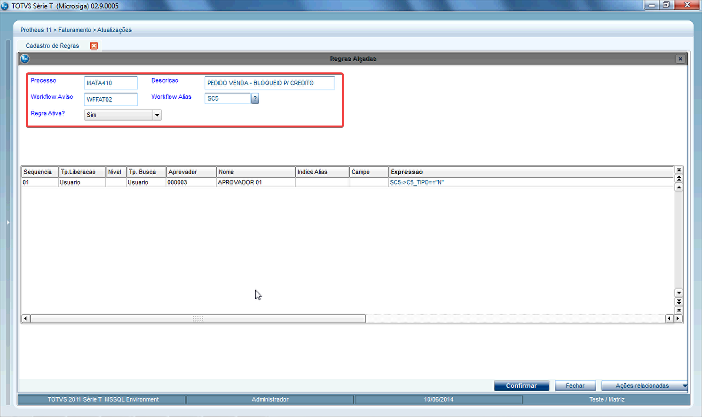{.flow-image}

- <strong>Processo:</strong> Informe o codigo do processo (nome da funcao) referente a Alçada. 
- <strong>Descrição:</strong> Descricao do Processo. 
- <strong>Worklow Aviso:</strong> Informe o nome do processo (rdmake) que será responsavel por enviar WorkFlow de aviso da liberacao controle de alcadas. 
- <strong>Worklow Alias:</strong> Sigla dos arquivos relacionados no processo. 
- <strong>Regra Ativa?:</strong> Informe se a regra esta ativa <strong>S</strong>=Sim, <strong>N</strong>=Não. 

<strong>Campos da Tabela:</strong> 

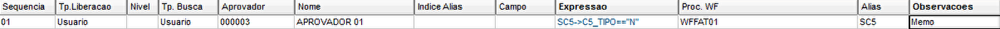{.flow-image}

- <strong>Sequencia:</strong> Sequencia 
- <strong>Tp. Liberação:</strong> Help Informe o tipo de liberacao que deseja para esta regra de Alcadas: 
  N = Nivel - Sistema respeitara os níveis configurados, encaminhando para o proximonivel somente após aprovação do nível anterior. 
  U = Usuario - A liberacao do usuário pode ocorrer individualmente, sem considerar outros aprovadores constantes na regra. 
- <strong>Nivel:</strong> Informe o nivel (2 digitos). 
- <strong>Tp. Busca:</strong> Help Informe o tipo de busca: 
  E = Entidade - O usuario poderá configurar qualquer tabela do sistema para verificar o aprovador do processo. 
  U = Usuario - Configuracao de usuário "fixo" como aprovador. 
- <strong>Aprovador:</strong> Informe o codigo do usuario que seraresponsavel pela aprovação. 
- <strong>Nome:</strong> Nome do Aprovador. 
- <strong>Indice Alias:</strong> Informe o indice de busca para posicionamento no campo a verificar o aprovador do processo. 
- <strong>Campo:</strong> Informar o campo a ser verificado para selecionar o aprovador, quando selecionado o Tipo de Busca = Entidade. 
- <strong>Expressao:</strong> Podera ser utilizada para criacao de regras diferentes para um mesmo processo. (Utilizar sempre a tabela posicionada no cabecalho do processo.) 
- <strong>Proc. WF:</strong> Help Informe o nome do processo (rdmake) que será responsável por enviar WorkFlow para o controle de alcadas. 
- <strong>Alias:</strong> Sigla dos arquivos relacionados no processo. Ex: SA1, SB1, SD2, etc... 
- <strong>Observacoes:</strong> Observação. 

<strong>Após confirmado:</strong> O sistema irá salvar a regra de alçada. 

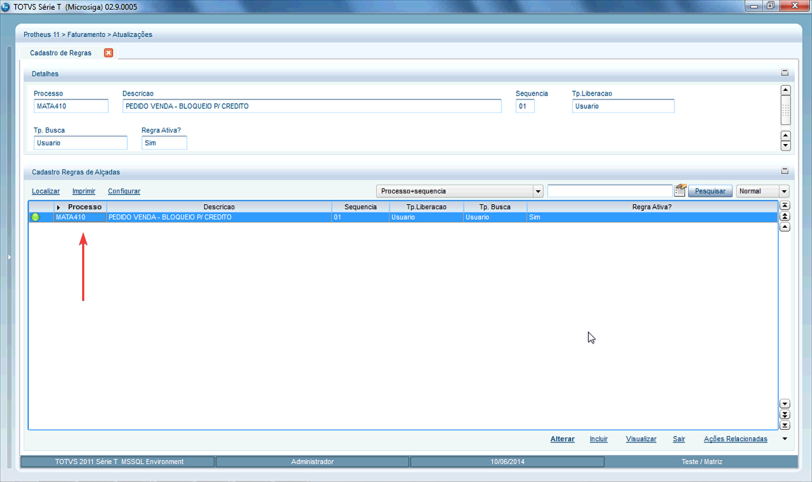{.flow-image}

#### 2. Aprovação de Documento

Para aprovar um documento, na tela inicial do protheus, no grupo de "Alçadas", clique no botão "Aprovamentos", escolha a forma de visualização do filtro e clique em "OK" assim será possivel visualizar na tela de Aprovações se há algum documento que precise de atenção.

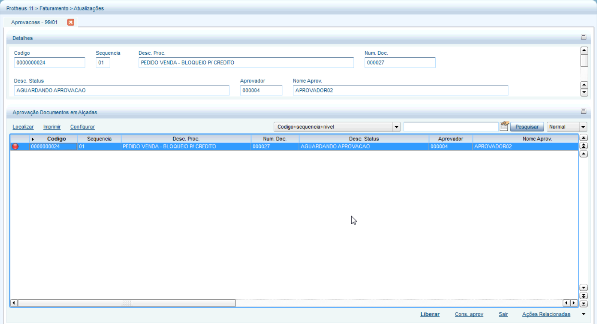{.flow-image}

A legenda de cada status pode ser acessadas em Açoes Relacionadas > Legendas:

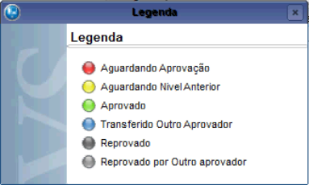{.flow-image}

Para Aprovar ou Reprovar um Documento, clicamos no botão "Liberar" no canto inferior da tela de aprovação. Nessa tela adicionamos uma "Observação" e clicamos no botão desejado (<strong>Aprovar Docto</strong> para Aprovar ou <strong>Reprovar Docto</strong> para Reprovar).

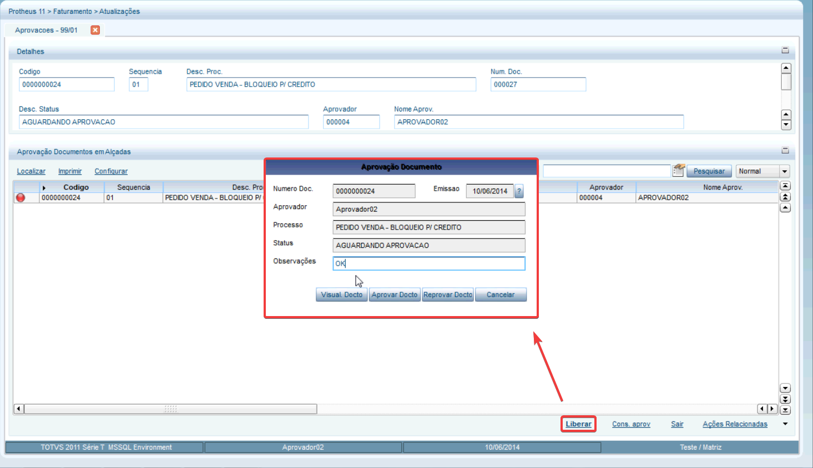{.flow-image}

- <strong>Numero Doc.:</strong> O código do documento que está sendo aprovado. 
- <strong>Emissao:</strong> A data de emissão do documento. 
- <strong>Aprovador:</strong> O nome do usuário que está realizando a aprovação. 
- <strong>Processo:</strong> O nome do processo que está sendo aprovado. 
- <strong>Status:</strong> Stauts do movimento: 
1 - Aguardando Aprovacao 
2 - Aguardando Aprov. Nivel Anterior 
3 - Aprovado 
4 - Transferido p/ outro Aprovador 
5 - Reprovado 
6 - Nivel Anterior Reprovado 
- <strong>Observações:</strong> Observações adicionadas durante a aprovação ou reprovação do documento. 

Se precisar visualizar o Documento antes de Aprovar ou Reprovar, podemos clicar sobre o botão <strong>"Visual. Docto."</strong>

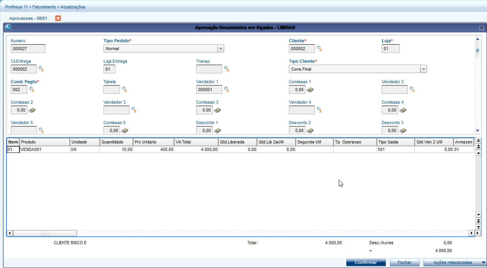{.flow-image}

<strong><u>Exemplo de email de liberação de documento.</u></strong>

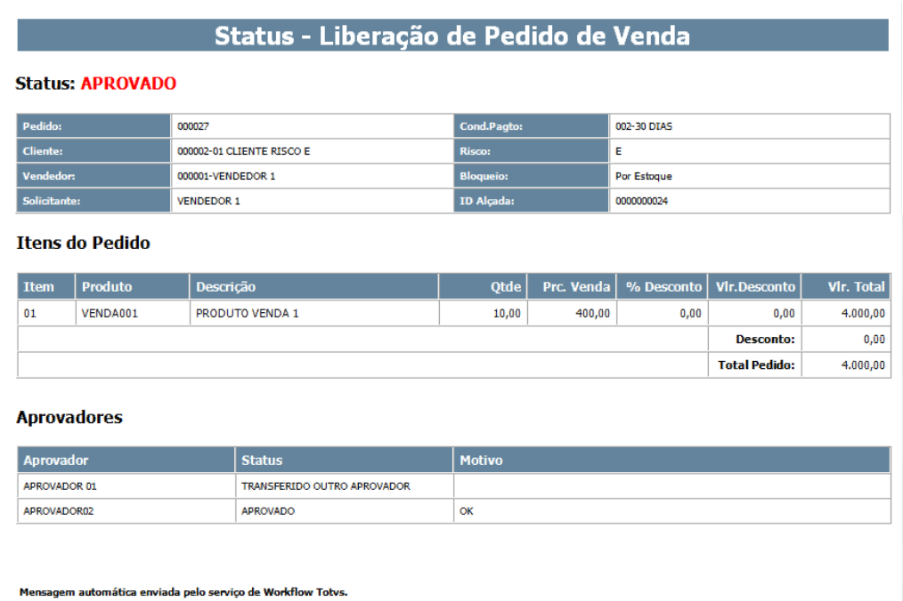{.flow-image}

#### 3. Ausencia Temporária

Quando um aprovador está ausente, é possível configurar um substituto para assumir suas responsabilidades. Isso garante que os processos de aprovação não fiquem paralisados durante férias, licenças ou ausências planejadas.

Para configurar um substituto, utilizamos a tela de Ausência Temporária, acessamos através de Incluir:

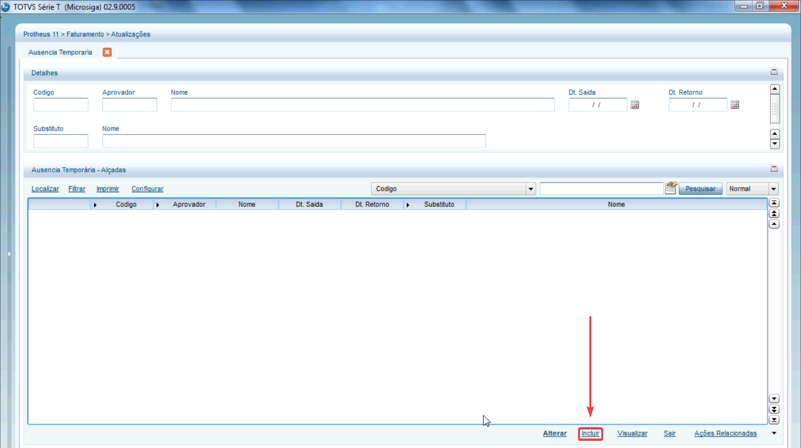{.flow-image}

Na tela de Ausência Temporária, preenchemos os campos obrigatórios:

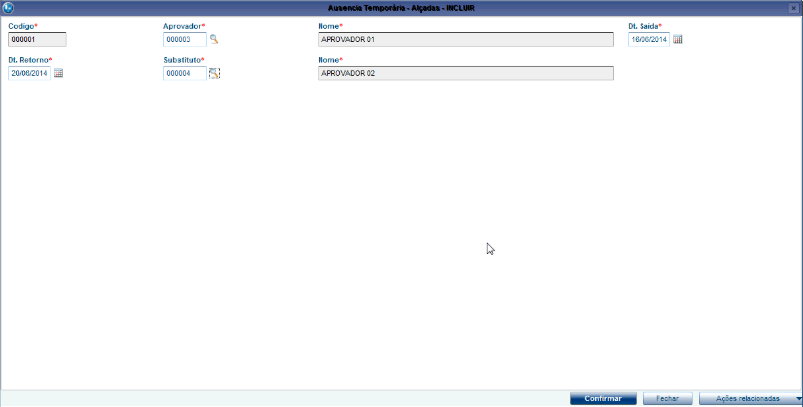{.flow-image}

- <strong>Codigo:</strong> Codigo do registro. 
- <strong>Aprovador:</strong> Codigo do Aprovador que esta sendo substituído temporariamente. 
- <strong>Nome:</strong> Nome do Aprovador que esta sendo substituído temporariamente. 
- <strong>Dt. Saida:</strong> Data de inicio da ausência. 
- <strong>Dt. Retorno:</strong> Data de Retorno. 
- <strong>Substituto:</strong> Codigo do Usuário que será substituto. 
- <strong>Nome:</strong> Nome do Usuario substituto. 

A partir desse momento, todos os documentos que estiverem aguardando aprovação do aprovador original serão automaticamente redirecionados para o substituto, garantindo a continuidade dos processos sem interrupções.

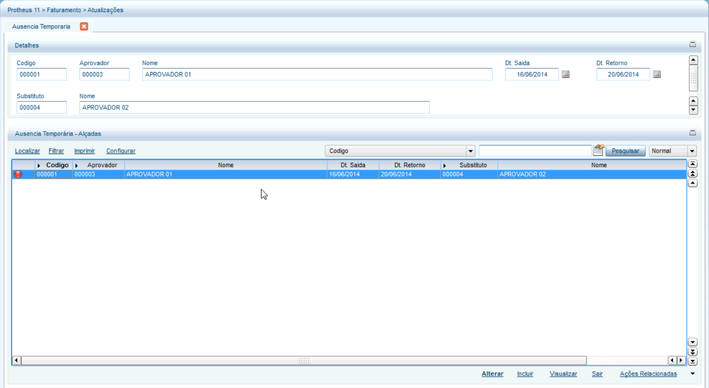{.flow-image}

#### 4. Transfêrencias

Para transferir um documento de um aprovador para outro, utilizamos a tela de Transferência, acessamos através de Ações Relacionadas > Trasnferencia:

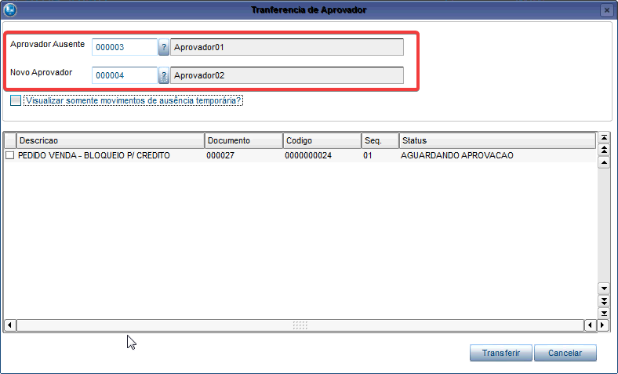{.flow-image}

- <strong>Aprovador Ausente:</strong> Codigo do aprovador que está ausente. 
- <strong>Novo Aprovador:</strong> Codigo do novo aprovador. 

Na tabela, selecionamos o documento que será transferido, clicando e marcando a caixa de seleção no começo da linha:

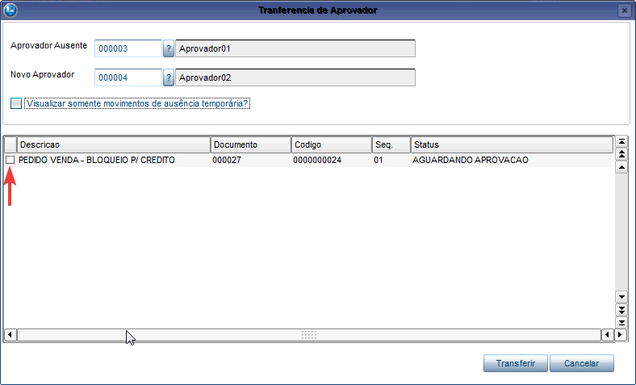{.flow-image}

Uma notificação com o documento será enviado para o aprovador através do email:

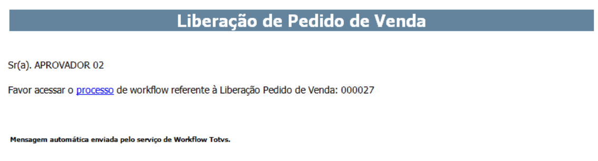{.flow-image}

Clicando em "Processo" no texto "Favor acessar o processo de workflow referente à liberação pedido de venda", visualizamos a tela de liberação de Pedido de Compra, podendo ser aprovado diretamente por ela:

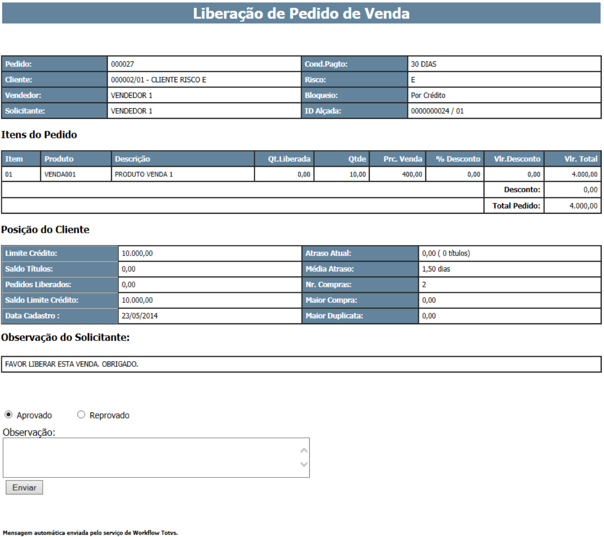{.flow-image}

- <strong>Aprovado/Reprovado:</strong> Selecione o desejado. 
- <strong>Observação:</strong> Informe uma observação. 

Pelo sistema, através do grupo de "Alçadas" podemos clicar sobre "Aprovações". Para liberar um documento pendente podemos clicar sobre o botão "Liberar" e/ou consultar as Aprovações de Documentos pelo botão "Cons. Aprov.":

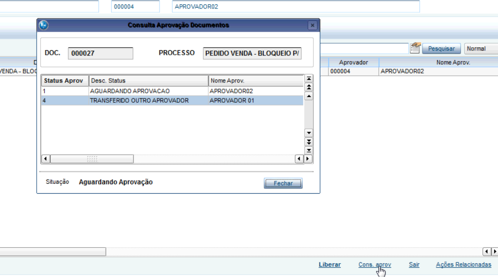{.flow-image}

  <a href="/" class="md-button" style="text-decoration: none;">← Voltar para a Página Inicial</a>

