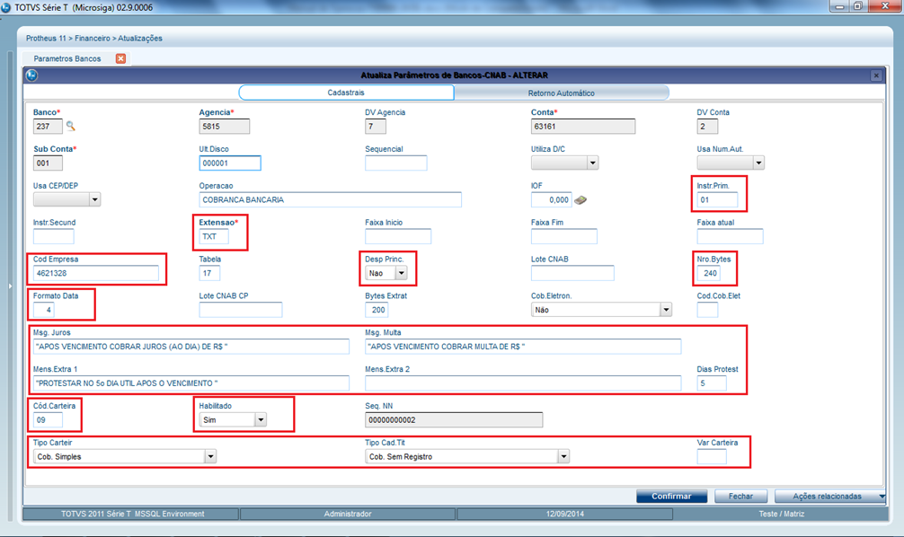
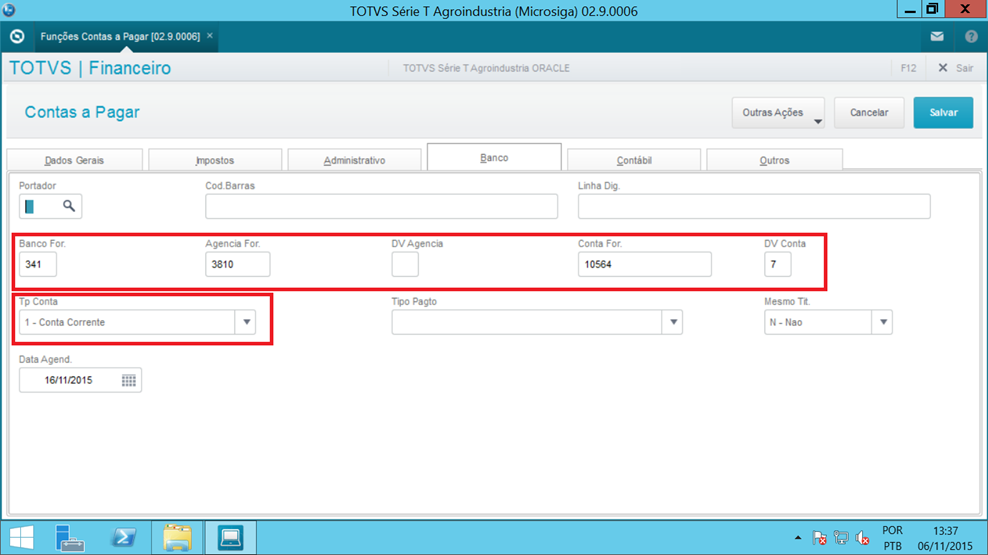
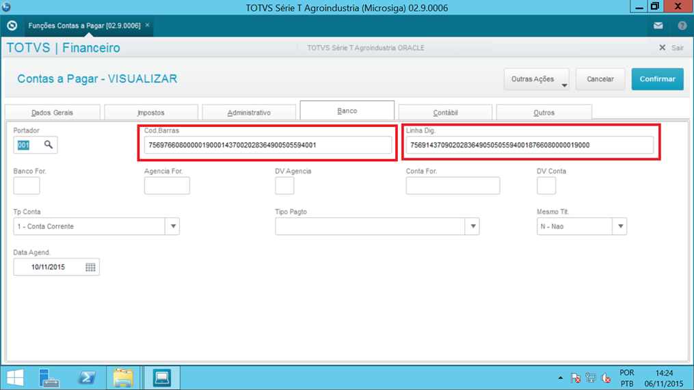
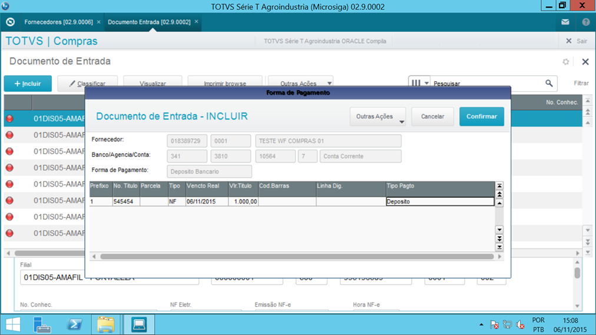
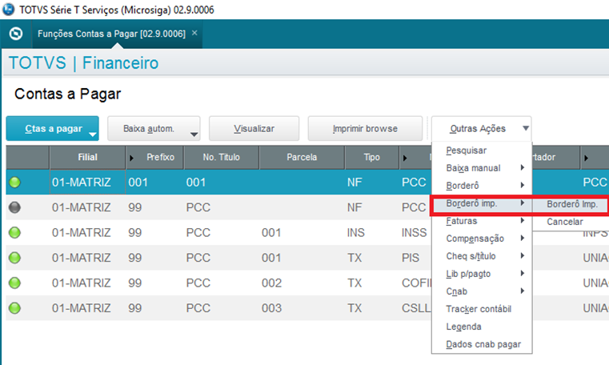
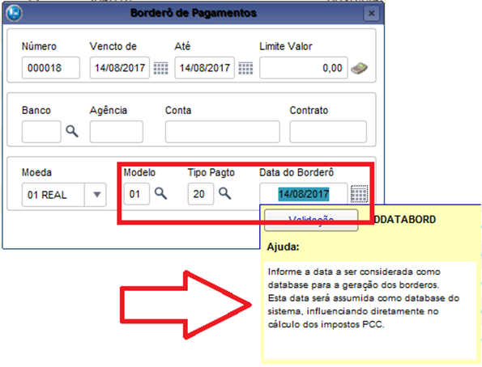
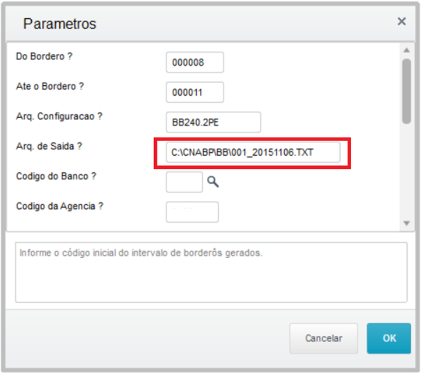

# Alçadas - Regras {.home-hero}

<!--############################################### 01 #######################################################-->

  01. Visão Geral

### 1. Visão Geral

#### Implementação de controle customizado de alçadas via workflow, integrando aprovações nativas aos processos do ERP.

<strong>Principais vantagens do produto:</strong>

- Cadastro de e-mails Destinatários de Workflow;
- Cadastro de Regras de Alçadas;
- Aprovação/Rejeição Manual do documento em alçadas - via tela (aprovação via workflow somente nos pacotes específicos de integração);
- Consulta Status Aprovação dos documentos em alçadas;
- Visualização do documento original em alçadas;
- Cadastro de Ausência temporária;
- Transferência de Aprovadores;

<!--############################################### 02 #######################################################-->

  02. Menu

### 2. Menu

<table class="banks-table">
  <thead>
    <tr>
      <th>Menu</th>
      <th>Sub Menu</th>
      <th>Nome da Rotina</th>
      <th>Programa</th>
      <th>Módulo</th>
      <th>Tipo</th>
      <th>Tabelas</th>
    </tr>
  </thead>
  <tbody>
    <tr>
      <td>Atualizações</td>
      <td>Alçadas</td>
      <td>Cadastro de Regras</td>
      <td>M001A02</td>
      <td>CONFIGURADOR</td>
      <td>03</td>
      <td>ZX0, ZX2</td>
    </tr>   
      <tr>
      <td>Atualizações</td>
      <td>Alçadas</td>
      <td>AprovaçÕes</td>
      <td>M001A03</td>
      <td>CONFIGURADOR</td>
      <td>03</td>
      <td>ZXA</td>
    </tr>     
      <tr>
      <td>Atualizações</td>
      <td>Alçadas</td>
      <td>Ausências Temporária</td>
      <td>M001A04</td>
      <td>CONFIGURADOR</td>
      <td>03</td>
      <td>ZX0</td>
    </tr>   
      <tr>
      <td>Atualizações</td>
      <td>Alçadas</td>
      <td>Verbas por Aprovador</td>
      <td>M001A05</td>
      <td>CONFIGURADOR</td>
      <td>03</td>
      <td>ZX4</td>
    </tr>   
      <tr>
      <td>Atualizações</td>
      <td>Alçadas</td>
      <td>Destinatários WF</td>
      <td>C999A01</td>
      <td>CONFIGURADOR</td>
      <td>03</td>
      <td>ZX0</td>
    </tr>   
  </tbody>
</table>

<!--############################################### 03 #######################################################-->

  03. Rotinas personalizadas específicas do Pacote

### 3. Rotinas personalizadas específicas do Pacote

#### Funções personalizadas contidas no pacote:

<table class="banks-table">
  <thead>
    <tr>
      <th>Função</th>
      <th>Descrição</th>
    </tr>
  </thead>
  <tbody>
    <tr>
      <td><strong>C999A01</strong></td>
      <td>Rotina para cadastro de destinatários de Workflow.</td>
    </tr>
    <tr>
      <td><strong>M001A01</strong></td>
      <td>RRotina com funções genéricas do controle de alçadas.</td>
    </tr>
    <tr>
      <td><strong>M001A02</strong></td>
      <td>Rotina para cadastro de regra de alçadas.</td>
    </tr>
    <tr>
      <td><strong>M001A03</strong></td>
      <td>Rotina para aprovações de alçadas.</td>
    </tr>
    <tr>
      <td><strong>M001A04</strong></td>
      <td>Rotina para cadastro de ausência temporária</td>
    </tr>
    <tr>
      <td><strong>M001A05</strong></td>
      <td>Rotina para cadastro de Verbas por Aprovador</td>
    </tr>
    <tr>
      <td><strong>UPD0A01</strong></td>
      <td>Rotina para aplicação do pacote e compatibilização dos SX’s</td>
    </tr>
  </tbody>
</table>

<!--############################################### 04 #######################################################-->

  04. Pontos de Entradas Disponiveis para Desenvolvimento

### 4. Pontos de Entradas Disponiveis para Desenvolvimento

<table class="banks-table">
  <thead>
    <tr>
      <th>P.E</th>
      <th>Descrição</th>
      <th>Parâmetros de Entrada</th>
      <th>Retorno</th>
    </tr>
  </thead>
  <tbody>
    <tr>
      <td><strong>M001AAP</strong></td>
      <td>P.E. após gerar aprovação alçada – após transação.</td>
      <td><strong>1)</strong> CÓDIGO DO PROCESSO (ZX1->ZX1_PROCES) – SINTAXE: PARAMIXB 
          <strong>Tabela Posicionada: ZX1</strong></td>
      <td>Nenhum</td>
    </tr>
    <tr>
      <td><strong>M001ARP</strong></td>
      <td>P.E. após reprovação alçada – após transação.</td>
      <td>1)</strong> CÓDIGO DO PROCESSO (ZX1->ZX1_PROCES) – SINTAXE: PARAMIXB 
      <strong>Tabela Posicionada: ZX1</strong></td>
      <td>Nenhum</td>
    </tr>
    <tr>
      <td><strong>M001TR1</strong></td>
      <td>P.E. de validação – após mensagem de confirmação da transferência do documento – processo de aprovação MANUAL – porém antes da transação.
      <strong>P.E. não se aplica no processamento via Workflow.</strong></td>
      <td><strong>1)</strong> CÓDIGO DO PROCESSO (ZXA->ZXA_PROCES) – SINTAXE: PARAMIXB[1] 
          <strong>2)</strong> CÓDIGO DO DOCUMENTO (ZXA->ZXA_DOC) – SINTAXE: PARAMIXB[2] 
          <strong>3)</strong> STATUS DOCUMENTO (ZXA->ZXA_STATUS) – SINTAXE: PARAMIXB[3] 
          <strong>4)</strong> USUARIO SUPERIOR – SINTAXE: PARAMIXB[4] 
          <strong>Tabela Posicionada: ZXA</strong></td>
      <td>.T./.F. 
      CASO .T. CONTINUA GRAVAÇÃO DA TRANSFERENCIA  
      CASO .F. CANCELA PROCESSAMENTO.</td>
    </tr>
    <tr>
      <td><strong>M1A5CPOS</strong></td>
      <td>P.E. durante a montagem da tela de Verbas por Aprovador (M001A05) para adicionar campos do cliente à tela. Deve ser utilizado em conjunto com o PE M1A5TELA.</td>
      <td>Nenhum</td>
      <td>Nenhum</td>
    </tr>
    <tr>
      <td><strong>M1A5TELA</strong></td>
      <td>P.E. durante a montagem da tela de Verbas por Aprovador (M001A05) para posicionar os campos do cabeçalho na tela modelo2. Deve ser utilizado em conjunto com o PE M1A5CPOS.</td>
      <td>Nenhum</td>
      <td>Nenhum</td>
    </tr>    
  </tbody>
</table>

<!--############################################### 05 #######################################################-->

  05. Tabelas (SX2) 

### 5. Tabelas (SX2) 

<table class="banks-table">
  <thead>
    <tr>
      <th>Prefixo</th>
      <th>Descrição</th>
      <th>Ac. Filial</th>
      <th>Ac. Unidade</th>
      <th>Ac. Empresa</th>
    </tr>
  </thead>
  <tbody>
    <tr>
      <td><strong>ZX0</strong></td>
      <td>DESTINATARIOS WF</td>
      <td>Exclusivo</td>
      <td>Exclusivo</td>
      <td>Exclusivo</td>
    </tr>
    <tr>
      <td><strong>ZX1</strong></td>
      <td>REGRAS DE ALCADAS</td>
      <td>Exclusivo</td>
      <td>Exclusivo</td>
      <td>Exclusivo</td>
    </tr>
    <tr>
      <td><strong>ZX2</strong></td>
      <td>ALCADAS - AUSENCIA TEMPORARIA</td>
      <td>Exclusivo</td>
      <td>Exclusivo</td>
      <td>Exclusivo</td>
    </tr>
    <tr>
      <td><strong>ZX3</strong></td>
      <td>MOVIMENTOS ALCADAS</td>
      <td>Exclusivo</td>
      <td>Exclusivo</td>
      <td>Exclusivo</td>
    </tr>
    
  </tbody>
</table>

<!--############################################### 06 #######################################################-->

  06. Campos (SX3)

### 6. Campos (SX3)

Campo **ZX0_PROCES**

<table class="banks-table">
  <tbody>
    <tr>
      <th>Tipo</th>
      <td>C</td>
      <th>Ordem</th>
      <td>02</td>
      <th>Tamanho</th>
      <td>8</td>
      <th>Decimal</th>
      <td>0</td>
      <th>Formato</th>
      <td>@!</td>
    </tr>
    <tr>
      <th>Contexto</th>
      <td>Real</td>
      <th>Propriedade</th>
      <td>Alterar</td>
      <th>Obrigatório</th>
      <td>S</td>
      <th>Browse</th>
      <td>S</td>
    </tr>
    <tr>
      <th>Título</th>
      <td colspan="7">Funcao</td>
    </tr>
    <tr>
      <th>Descrição</th>
      <td colspan="7">Funcao</td>
    </tr>
  </tbody>
</table>
#### **Help**

Informe a funcao de WorkFlow.

#### **Configurações adicionais**
<table class="banks-table">
  <tbody>
    <tr>
      <th>F3</th>
      <td>-</td>
    </tr>
    <tr>
      <th>Modo Edição</th>
      <td>INCLUI</td>
    </tr>
    <tr>
      <th>Val. Usuário</th>
      <td>ExistChav("ZX0")</td>
    </tr>
    <tr>
      <th>Lista Opções</th>
      <td>-</td>
    </tr>
    <tr>
      <th>Inicializador</th>
      <td>-</td>
    </tr>
    <tr>
      <th>Ini. Browse</th>
      <td>-</td>
    </tr>
  </tbody>
</table>

Campo **ZX0_DESCRI**

<table class="banks-table">
  <tbody>
    <tr>
      <th>Tipo</th>
      <td>C</td>
      <th>Ordem</th>
      <td>03</td>
      <th>Tamanho</th>
      <td>100</td>
      <th>Decimal</th>
      <td>0</td>
      <th>Formato</th>
      <td>@!</td>
    </tr>
    <tr>
      <th>Contexto</th>
      <td>Real</td>
      <th>Propriedade</th>
      <td>Alterar</td>
      <th>Obrigatório</th>
      <td>S</td>
      <th>Browse</th>
      <td>S</td>
    </tr>
    <tr>
      <th>Título</th>
      <td colspan="7">Descricao</td>
    </tr>
    <tr>
      <th>Descrição</th>
      <td colspan="7">Descricao</td>
    </tr>
  </tbody>
</table>
#### **Help**

Informe a descricao da Funcao.

#### **Configurações adicionais**
<table class="banks-table">
  <tbody>
    <tr>
      <th>F3</th>
      <td>-</td>
    </tr>
    <tr>
      <th>Modo Edição</th>
      <td>-</td>
    </tr>
    <tr>
      <th>Val. Usuário</th>
      <td>-</td>
    </tr>
    <tr>
      <th>Lista Opções</th>
      <td>-</td>
    </tr>
    <tr>
      <th>Inicializador</th>
      <td>-</td>
    </tr>
    <tr>
      <th>Ini. Browse</th>
      <td>-</td>
    </tr>
  </tbody>
</table>

Campo **ZX0_DEST**

<table class="banks-table">
  <tbody>
    <tr>
      <th>Tipo</th>
      <td>C</td>
      <th>Ordem</th>
      <td>04</td>
      <th>Tamanho</th>
      <td>200</td>
      <th>Decimal</th>
      <td>0</td>
      <th>Formato</th>
      <td>-</td>
    </tr>
    <tr>
      <th>Contexto</th>
      <td>Real</td>
      <th>Propriedade</th>
      <td>Alterar</td>
      <th>Obrigatório</th>
      <td>S</td>
      <th>Browse</th>
      <td>S</td>
    </tr>
    <tr>
      <th>Título</th>
      <td colspan="7">Destinat.</td>
    </tr>
    <tr>
      <th>Descrição</th>
      <td colspan="7">Destinatarios</td>
    </tr>
  </tbody>
</table>
#### **Help**

Informe os destinatarios do Workflow. Para mais de um, utilize (;).

#### **Configurações adicionais**
<table class="banks-table">
  <tbody>
    <tr>
      <th>F3</th>
      <td>-</td>
    </tr>
    <tr>
      <th>Modo Edição</th>
      <td>-</td>
    </tr>
    <tr>
      <th>Val. Usuário</th>
      <td>-</td>
    </tr>
    <tr>
      <th>Lista Opções</th>
      <td>-</td>
    </tr>
    <tr>
      <th>Inicializador</th>
      <td>-</td>
    </tr>
    <tr>
      <th>Ini. Browse</th>
      <td>-</td>
    </tr>
  </tbody>
</table>

Campo **ZX0_USERGI**

<table class="banks-table">
  <tbody>
    <tr>
      <th>Tipo</th>
      <td>-</td>
      <th>Ordem</th>
      <td>05</td>
      <th>Tamanho</th>
      <td>-</td>
      <th>Decimal</th>
      <td>-</td>
      <th>Formato</th>
      <td>-</td>
    </tr>
    <tr>
      <th>Contexto</th>
      <td>-</td>
      <th>Propriedade</th>
      <td>-</td>
      <th>Obrigatório</th>
      <td>-</td>
      <th>Browse</th>
      <td>-</td>
    </tr>
    <tr>
      <th>Título</th>
      <td colspan="7">LOG de Inclusão</td>
    </tr>
    <tr>
      <th>Descrição</th>
      <td colspan="7">-</td>
    </tr>
  </tbody>
</table>
#### **Help**

-

#### **Configurações adicionais**
<table class="banks-table">
  <tbody>
    <tr>
      <th>F3</th>
      <td>-</td>
    </tr>
    <tr>
      <th>Modo Edição</th>
      <td>-</td>
    </tr>
    <tr>
      <th>Val. Usuário</th>
      <td>-</td>
    </tr>
    <tr>
      <th>Lista Opções</th>
      <td>-</td>
    </tr>
    <tr>
      <th>Inicializador</th>
      <td>-</td>
    </tr>
    <tr>
      <th>Ini. Browse</th>
      <td>-</td>
    </tr>
  </tbody>
</table>

Campo **ZX0_USERGA**

<table class="banks-table">
  <tbody>
    <tr>
      <th>Tipo</th>
      <td>-</td>
      <th>Ordem</th>
      <td>06</td>
      <th>Tamanho</th>
      <td>-</td>
      <th>Decimal</th>
      <td>-</td>
      <th>Formato</th>
      <td>-</td>
    </tr>
    <tr>
      <th>Contexto</th>
      <td>-</td>
      <th>Propriedade</th>
      <td>-</td>
      <th>Obrigatório</th>
      <td>-</td>
      <th>Browse</th>
      <td>-</td>
    </tr>
    <tr>
      <th>Título</th>
      <td colspan="7">LOG de Alteração</td>
    </tr>
    <tr>
      <th>Descrição</th>
      <td colspan="7">-</td>
    </tr>
  </tbody>
</table>
#### **Help**

-

#### **Configurações adicionais**
<table class="banks-table">
  <tbody>
    <tr>
      <th>F3</th>
      <td>-</td>
    </tr>
    <tr>
      <th>Modo Edição</th>
      <td>-</td>
    </tr>
    <tr>
      <th>Val. Usuário</th>
      <td>-</td>
    </tr>
    <tr>
      <th>Lista Opções</th>
      <td>-</td>
    </tr>
    <tr>
      <th>Inicializador</th>
      <td>-</td>
    </tr>
    <tr>
      <th>Ini. Browse</th>
      <td>-</td>
    </tr>
  </tbody>
</table>

Campo **ZX1_PROCES**

<table class="banks-table">
  <tbody>
    <tr>
      <th>Tipo</th>
      <td>C</td>
      <th>Ordem</th>
      <td>02</td>
      <th>Tamanho</th>
      <td>8</td>
      <th>Decimal</th>
      <td>0</td>
      <th>Formato</th>
      <td>@!</td>
    </tr>
    <tr>
      <th>Contexto</th>
      <td>Real</td>
      <th>Propriedade</th>
      <td>Alterar</td>
      <th>Obrigatório</th>
      <td>S</td>
      <th>Browse</th>
      <td>S</td>
    </tr>
    <tr>
      <th>Título</th>
      <td colspan="7">Processo</td>
    </tr>
    <tr>
      <th>Descrição</th>
      <td colspan="7">Codigo do Processo</td>
    </tr>
  </tbody>
</table>
#### **Help**

Informe o codigo do processo (nome da funcao) referente a Alçada.

#### **Configurações adicionais**
<table class="banks-table">
  <tbody>
    <tr>
      <th>F3</th>
      <td>-</td>
    </tr>
    <tr>
      <th>Modo Edição</th>
      <td>-</td>
    </tr>
    <tr>
      <th>Val. Usuário</th>
      <td>-</td>
    </tr>
    <tr>
      <th>Lista Opções</th>
      <td>-</td>
    </tr>
    <tr>
      <th>Inicializador</th>
      <td>-</td>
    </tr>
    <tr>
      <th>Ini. Browse</th>
      <td>-</td>
    </tr>
  </tbody>
</table>

Campo **ZX1_DESCRI**

<table class="banks-table">
  <tbody>
    <tr>
      <th>Tipo</th>
      <td>C</td>
      <th>Ordem</th>
      <td>03</td>
      <th>Tamanho</th>
      <td>40</td>
      <th>Decimal</th>
      <td>0</td>
      <th>Formato</th>
      <td>@!</td>
    </tr>
    <tr>
      <th>Contexto</th>
      <td>Real</td>
      <th>Propriedade</th>
      <td>Alterar</td>
      <th>Obrigatório</th>
      <td>S</td>
      <th>Browse</th>
      <td>S</td>
    </tr>
    <tr>
      <th>Título</th>
      <td colspan="7">Descricao</td>
    </tr>
    <tr>
      <th>Descrição</th>
      <td colspan="7">Descricao do Processo</td>
    </tr>
  </tbody>
</table>
#### **Help**

Descricao do Processo

#### **Configurações adicionais**
<table class="banks-table">
  <tbody>
    <tr>
      <th>F3</th>
      <td>-</td>
    </tr>
    <tr>
      <th>Modo Edição</th>
      <td>-</td>
    </tr>
    <tr>
      <th>Val. Usuário</th>
      <td>-</td>
    </tr>
    <tr>
      <th>Lista Opções</th>
      <td>-</td>
    </tr>
    <tr>
      <th>Inicializador</th>
      <td>-</td>
    </tr>
    <tr>
      <th>Ini. Browse</th>
      <td>-</td>
    </tr>
  </tbody>
</table>

Campo **ZX1_SEQ**

<table class="banks-table">
  <tbody>
    <tr>
      <th>Tipo</th>
      <td>C</td>
      <th>Ordem</th>
      <td>04</td>
      <th>Tamanho</th>
      <td>2</td>
      <th>Decimal</th>
      <td>0</td>
      <th>Formato</th>
      <td>99</td>
    </tr>
    <tr>
      <th>Contexto</th>
      <td>Real</td>
      <th>Propriedade</th>
      <td>Alterar</td>
      <th>Obrigatório</th>
      <td>S</td>
      <th>Browse</th>
      <td>S</td>
    </tr>
    <tr>
      <th>Título</th>
      <td colspan="7">Sequencia</td>
    </tr>
    <tr>
      <th>Descrição</th>
      <td colspan="7">Sequencia</td>
    </tr>
  </tbody>
</table>
#### **Help**

Sequencia

#### **Configurações adicionais**
<table class="banks-table">
  <tbody>
    <tr>
      <th>F3</th>
      <td>-</td>
    </tr>
    <tr>
      <th>Modo Edição</th>
      <td>-</td>
    </tr>
    <tr>
      <th>Val. Usuário</th>
      <td>-</td>
    </tr>
    <tr>
      <th>Lista Opções</th>
      <td>-</td>
    </tr>
    <tr>
      <th>Inicializador</th>
      <td>-</td>
    </tr>
    <tr>
      <th>Ini. Browse</th>
      <td>-</td>
    </tr>
  </tbody>
</table>

Campo **ZX1_TPLIB**

<table class="banks-table">
  <tbody>
    <tr>
      <th>Tipo</th>
      <td>C</td>
      <th>Ordem</th>
      <td>05</td>
      <th>Tamanho</th>
      <td>1</td>
      <th>Decimal</th>
      <td>0</td>
      <th>Formato</th>
      <td>@!</td>
    </tr>
    <tr>
      <th>Contexto</th>
      <td>Real</td>
      <th>Propriedade</th>
      <td>Alterar</td>
      <th>Obrigatório</th>
      <td>S</td>
      <th>Browse</th>
      <td>S</td>
    </tr>
    <tr>
      <th>Título</th>
      <td colspan="7">Tp.Liberacao</td>
    </tr>
    <tr>
      <th>Descrição</th>
      <td colspan="7">Tipo de Liberacao</td>
    </tr>
  </tbody>
</table>
#### **Help**

Help	Informe o tipo de liberacao que deseja para esta regra de Alcadas: 
<strong>N</strong> = Nivel - Sistema respeitara os níveis configurados, encaminhando para o proximonivel somente após aprovação do nível anterior. 
<strong>U</strong> = Usuario - A liberacao do usuário pode ocorrer individualmente, sem considerar outros aprovadores constantes na regra.

#### **Configurações adicionais**
<table class="banks-table">
  <tbody>
    <tr>
      <th>F3</th>
      <td>-</td>
    </tr>
    <tr>
      <th>Modo Edição</th>
      <td>-</td>
    </tr>
    <tr>
      <th>Val. Usuário</th>
      <td>-</td>
    </tr>
    <tr>
      <th>Lista Opções</th>
      <td>N=Nivel; U=Usuario; D=Documento</td>
    </tr>
    <tr>
      <th>Inicializador</th>
      <td>-</td>
    </tr>
    <tr>
      <th>Ini. Browse</th>
      <td>-</td>
    </tr>
  </tbody>
</table>

Campo **ZX1_NIVEL**

<table class="banks-table">
  <tbody>
    <tr>
      <th>Tipo</th>
      <td>C</td>
      <th>Ordem</th>
      <td>06</td>
      <th>Tamanho</th>
      <td>2</td>
      <th>Decimal</th>
      <td>0</td>
      <th>Formato</th>
      <td>@!</td>
    </tr>
    <tr>
      <th>Contexto</th>
      <td>Real</td>
      <th>Propriedade</th>
      <td>Alterar</td>
      <th>Obrigatório</th>
      <td>N</td>
      <th>Browse</th>
      <td>N</td>
    </tr>
    <tr>
      <th>Título</th>
      <td colspan="7">Nivel</td>
    </tr>
    <tr>
      <th>Descrição</th>
      <td colspan="7">Nivel</td>
    </tr>
  </tbody>
</table>
#### **Help**

Informe o nivel (2digitos).

#### **Configurações adicionais**
<table class="banks-table">
  <tbody>
    <tr>
      <th>F3</th>
      <td>-</td>
    </tr>
    <tr>
      <th>Modo Edição</th>
      <td>aCols[n][nPosTPL] = 'N'</td>
    </tr>
    <tr>
      <th>Val. Usuário</th>
      <td>-</td>
    </tr>
    <tr>
      <th>Lista Opções</th>
      <td>-</td>
    </tr>
    <tr>
      <th>Inicializador</th>
      <td>-</td>
    </tr>
    <tr>
      <th>Ini. Browse</th>
      <td>-</td>
    </tr>
  </tbody>
</table>

Campo **ZX1_TPBUSC**

<table class="banks-table">
  <tbody>
    <tr>
      <th>Tipo</th>
      <td>C</td>
      <th>Ordem</th>
      <td>07</td>
      <th>Tamanho</th>
      <td>1</td>
      <th>Decimal</th>
      <td>0</td>
      <th>Formato</th>
      <td>@!</td>
    </tr>
    <tr>
      <th>Contexto</th>
      <td>Real</td>
      <th>Propriedade</th>
      <td>Alterar</td>
      <th>Obrigatório</th>
      <td>S</td>
      <th>Browse</th>
      <td>S</td>
    </tr>
    <tr>
      <th>Título</th>
      <td colspan="7">Tp. Busca</td>
    </tr>
    <tr>
      <th>Descrição</th>
      <td colspan="7">Tipo de Busca</td>
    </tr>
  </tbody>
</table>
#### **Help**

Help	Informe o tipo de busca:
<strong>E</strong> = Entidade - O usuario poderá configurar qualquer tabela do sistema para verificar o aprovador do processo. 
<strong>U</strong> = Usuario - Configuracao de usuário "fixo" como aprovador.

#### **Configurações adicionais**
<table class="banks-table">
  <tbody>
    <tr>
      <th>F3</th>
      <td>-</td>
    </tr>
    <tr>
      <th>Modo Edição</th>
      <td>-</td>
    </tr>
    <tr>
      <th>Val. Usuário</th>
      <td>-</td>
    </tr>
    <tr>
      <th>Lista Opções</th>
      <td>E=Entidade; U=Usuario</td>
    </tr>
    <tr>
      <th>Inicializador</th>
      <td>-</td>
    </tr>
    <tr>
      <th>Ini. Browse</th>
      <td>-</td>
    </tr>
  </tbody>
</table>

Campo **ZX1_IDUSER**

<table class="banks-table">
  <tbody>
    <tr>
      <th>Tipo</th>
      <td>C</td>
      <th>Ordem</th>
      <td>08</td>
      <th>Tamanho</th>
      <td>6</td>
      <th>Decimal</th>
      <td>0</td>
      <th>Formato</th>
      <td>@!</td>
    </tr>
    <tr>
      <th>Contexto</th>
      <td>Real</td>
      <th>Propriedade</th>
      <td>Alterar</td>
      <th>Obrigatório</th>
      <td>N</td>
      <th>Browse</th>
      <td>N</td>
    </tr>
    <tr>
      <th>Título</th>
      <td colspan="7">Aprovador</td>
    </tr>
    <tr>
      <th>Descrição</th>
      <td colspan="7">Id do Aprovador</td>
    </tr>
  </tbody>
</table>
#### **Help**

Informe o codigo do usuario que seraresponsavel pela aprovação.

#### **Configurações adicionais**
<table class="banks-table">
  <tbody>
    <tr>
      <th>F3</th>
      <td>USRZX1 (USUARIO ALCADAS)</td>
    </tr>
    <tr>
      <th>Modo Edição</th>
      <td>aCols[n][nPosTPB]='U'</td>
    </tr>
    <tr>
      <th>Val. Usuário</th>
      <td>UsrExist(M->ZX1_IDUSER)</td>
    </tr>
    <tr>
      <th>Lista Opções</th>
      <td>E=Entidade; U=Usuario</td>
    </tr>
    <tr>
      <th>Inicializador</th>
      <td>-</td>
    </tr>
    <tr>
      <th>Ini. Browse</th>
      <td>-</td>
    </tr>
  </tbody>
</table>

Campo **ZX1_NMUSER**

<table class="banks-table">
  <tbody>
    <tr>
      <th>Tipo</th>
      <td>C</td>
      <th>Ordem</th>
      <td>09</td>
      <th>Tamanho</th>
      <td>20</td>
      <th>Decimal</th>
      <td>0</td>
      <th>Formato</th>
      <td>@!</td>
    </tr>
    <tr>
      <th>Contexto</th>
      <td>Real</td>
      <th>Propriedade</th>
      <td>Visualizar</td>
      <th>Obrigatório</th>
      <td>N</td>
      <th>Browse</th>
      <td>N</td>
    </tr>
    <tr>
      <th>Título</th>
      <td colspan="7">Nome</td>
    </tr>
    <tr>
      <th>Descrição</th>
      <td colspan="7">Nome</td>
    </tr>
  </tbody>
</table>
#### **Help**

Nome do Aprovador.

#### **Configurações adicionais**
<table class="banks-table">
  <tbody>
    <tr>
      <th>F3</th>
      <td>-</td>
    </tr>
    <tr>
      <th>Modo Edição</th>
      <td>-</td>
    </tr>
    <tr>
      <th>Val. Usuário</th>
      <td>-</td>
    </tr>
    <tr>
      <th>Lista Opções</th>
      <td>-</td>
    </tr>
    <tr>
      <th>Inicializador</th>
      <td>-</td>
    </tr>
    <tr>
      <th>Ini. Browse</th>
      <td>-</td>
    </tr>
  </tbody>
</table>

Campo **ZX1_INDICE**

<table class="banks-table">
  <tbody>
    <tr>
      <th>Tipo</th>
      <td>N</td>
      <th>Ordem</th>
      <td>10</td>
      <th>Tamanho</th>
      <td>1</td>
      <th>Decimal</th>
      <td>0</td>
      <th>Formato</th>
      <td>9</td>
    </tr>
    <tr>
      <th>Contexto</th>
      <td>Real</td>
      <th>Propriedade</th>
      <td>Alterar</td>
      <th>Obrigatório</th>
      <td>N</td>
      <th>Browse</th>
      <td>N</td>
    </tr>
    <tr>
      <th>Título</th>
      <td colspan="7">Indice Alias</td>
    </tr>
    <tr>
      <th>Descrição</th>
      <td colspan="7">Indice Alias</td>
    </tr>
  </tbody>
</table>
#### **Help**

Informe o indice de busca para posicionamento no campo a verificar o aprovador do processo.

#### **Configurações adicionais**
<table class="banks-table">
  <tbody>
    <tr>
      <th>F3</th>
      <td>-</td>
    </tr>
    <tr>
      <th>Modo Edição</th>
      <td>aCols[n][nPosTPB]='E'</td>
    </tr>
    <tr>
      <th>Val. Usuário</th>
      <td>-</td>
    </tr>
    <tr>
      <th>Lista Opções</th>
      <td>-</td>
    </tr>
    <tr>
      <th>Inicializador</th>
      <td>-</td>
    </tr>
    <tr>
      <th>Ini. Browse</th>
      <td>-</td>
    </tr>
  </tbody>
</table>

Campo **ZX1_CAMPO**

<table class="banks-table">
  <tbody>
    <tr>
      <th>Tipo</th>
      <td>C</td>
      <th>Ordem</th>
      <td>11</td>
      <th>Tamanho</th>
      <td>10</td>
      <th>Decimal</th>
      <td>0</td>
      <th>Formato</th>
      <td>@!</td>
    </tr>
    <tr>
      <th>Contexto</th>
      <td>Real</td>
      <th>Propriedade</th>
      <td>Alterar</td>
      <th>Obrigatório</th>
      <td>N</td>
      <th>Browse</th>
      <td>N</td>
    </tr>
    <tr>
      <th>Título</th>
      <td colspan="7">Campo</td>
    </tr>
    <tr>
      <th>Descrição</th>
      <td colspan="7">Campo</td>
    </tr>
  </tbody>
</table>
#### **Help**

Informar o campo a ser verificado para selecionar o aprovador, quando selecionado o Tipo de Busca = Entidade.

#### **Configurações adicionais**
<table class="banks-table">
  <tbody>
    <tr>
      <th>F3</th>
      <td>-</td>
    </tr>
    <tr>
      <th>Modo Edição</th>
      <td>aCols[n][nPosTPB]='E'</td>
    </tr>
    <tr>
      <th>Val. Usuário</th>
      <td>EXISTCPO("SX3",M->ZX1_CAMPO,2)</td>
    </tr>
    <tr>
      <th>Lista Opções</th>
      <td>-</td>
    </tr>
    <tr>
      <th>Inicializador</th>
      <td>-</td>
    </tr>
    <tr>
      <th>Ini. Browse</th>
      <td>-</td>
    </tr>
  </tbody>
</table>

Campo **ZX1_EXP**

<table class="banks-table">
  <tbody>
    <tr>
      <th>Tipo</th>
      <td>C</td>
      <th>Ordem</th>
      <td>12</td>
      <th>Tamanho</th>
      <td>200</td>
      <th>Decimal</th>
      <td>0</td>
      <th>Formato</th>
      <td>@!</td>
    </tr>
    <tr>
      <th>Contexto</th>
      <td>Real</td>
      <th>Propriedade</th>
      <td>Alterar</td>
      <th>Obrigatório</th>
      <td>N</td>
      <th>Browse</th>
      <td>N</td>
    </tr>
    <tr>
      <th>Título</th>
      <td colspan="7">Expressao</td>
    </tr>
    <tr>
      <th>Descrição</th>
      <td colspan="7">Expressao</td>
    </tr>
  </tbody>
</table>
#### **Help**

Podera ser utilizada para criacao de regras diferentes para um mesmo processo. (Utilizar sempre a tabela posicionada no cabecalho do processo.)

#### **Configurações adicionais**
<table class="banks-table">
  <tbody>
    <tr>
      <th>F3</th>
      <td>-</td>
    </tr>
    <tr>
      <th>Modo Edição</th>
      <td>-</td>
    </tr>
    <tr>
      <th>Val. Usuário</th>
      <td>-</td>
    </tr>
    <tr>
      <th>Lista Opções</th>
      <td>-</td>
    </tr>
    <tr>
      <th>Inicializador</th>
      <td>-</td>
    </tr>
    <tr>
      <th>Ini. Browse</th>
      <td>-</td>
    </tr>
  </tbody>
</table>

Campo **ZX1_PROCWF**

<table class="banks-table">
  <tbody>
    <tr>
      <th>Tipo</th>
      <td>C</td>
      <th>Ordem</th>
      <td>13</td>
      <th>Tamanho</th>
      <td>30</td>
      <th>Decimal</th>
      <td>0</td>
      <th>Formato</th>
      <td>@!</td>
    </tr>
    <tr>
      <th>Contexto</th>
      <td>Real</td>
      <th>Propriedade</th>
      <td>Alterar</td>
      <th>Obrigatório</th>
      <td>N</td>
      <th>Browse</th>
      <td>N</td>
    </tr>
    <tr>
      <th>Título</th>
      <td colspan="7">Proc. WF</td>
    </tr>
    <tr>
      <th>Descrição</th>
      <td colspan="7">Processo WorkFlow</td>
    </tr>
  </tbody>
</table>
#### **Help**

Help	Informe o nome do processo (rdmake) que será responsável por enviar WorkFlow para o controle de alcadas.

#### **Configurações adicionais**
<table class="banks-table">
  <tbody>
    <tr>
      <th>F3</th>
      <td>ZX0</td>
    </tr>
    <tr>
      <th>Modo Edição</th>
      <td>-</td>
    </tr>
    <tr>
      <th>Val. Usuário</th>
      <td>Vazio().OR.ExistCPO("ZX0")</td>
    </tr>
    <tr>
      <th>Lista Opções</th>
      <td>-</td>
    </tr>
    <tr>
      <th>Inicializador</th>
      <td>-</td>
    </tr>
    <tr>
      <th>Ini. Browse</th>
      <td>-</td>
    </tr>
  </tbody>
</table>

Campo **ZX1_ALIAS**

<table class="banks-table">
  <tbody>
    <tr>
      <th>Tipo</th>
      <td>C</td>
      <th>Ordem</th>
      <td>14</td>
      <th>Tamanho</th>
      <td>3</td>
      <th>Decimal</th>
      <td>0</td>
      <th>Formato</th>
      <td>@!</td>
    </tr>
    <tr>
      <th>Contexto</th>
      <td>Real</td>
      <th>Propriedade</th>
      <td>Alterar</td>
      <th>Obrigatório</th>
      <td>N</td>
      <th>Browse</th>
      <td>N</td>
    </tr>
    <tr>
      <th>Título</th>
      <td colspan="7">Alias</td>
    </tr>
    <tr>
      <th>Descrição</th>
      <td colspan="7">Entidade (Alias)</td>
    </tr>
  </tbody>
</table>
#### **Help**

Sigla dos arquivos relacionados no processo. Ex: SA1, SB1, SD2, etc...

#### **Configurações adicionais**
<table class="banks-table">
  <tbody>
    <tr>
      <th>F3</th>
      <td>SX21 (Tabelas Sistema)</td>
    </tr>
    <tr>
      <th>Modo Edição</th>
      <td>-</td>
    </tr>
    <tr>
      <th>Val. Usuário</th>
      <td>Vazio().OR.ExistCpo("SX2")</td>
    </tr>
    <tr>
      <th>Lista Opções</th>
      <td>-</td>
    </tr>
    <tr>
      <th>Inicializador</th>
      <td>-</td>
    </tr>
    <tr>
      <th>Ini. Browse</th>
      <td>-</td>
    </tr>
  </tbody>
</table>

Campo **ZX1_STATUS**

<table class="banks-table">
  <tbody>
    <tr>
      <th>Tipo</th>
      <td>C</td>
      <th>Ordem</th>
      <td>15</td>
      <th>Tamanho</th>
      <td>1</td>
      <th>Decimal</th>
      <td>0</td>
      <th>Formato</th>
      <td>@!</td>
    </tr>
    <tr>
      <th>Contexto</th>
      <td>Real</td>
      <th>Propriedade</th>
      <td>Alterar</td>
      <th>Obrigatório</th>
      <td>S</td>
      <th>Browse</th>
      <td>S</td>
    </tr>
    <tr>
      <th>Título</th>
      <td colspan="7">Regra Ativa?</td>
    </tr>
    <tr>
      <th>Descrição</th>
      <td colspan="7">Regra Ativa?</td>
    </tr>
  </tbody>
</table>
#### **Help**

Informe se a regra esta ativa S=Sim, N=Nao.

#### **Configurações adicionais**
<table class="banks-table">
  <tbody>
    <tr>
      <th>F3</th>
      <td>-</td>
    </tr>
    <tr>
      <th>Modo Edição</th>
      <td>-</td>
    </tr>
    <tr>
      <th>Val. Usuário</th>
      <td>-</td>
    </tr>
    <tr>
      <th>Lista Opções</th>
      <td>S=Sim; N=Não</td>
    </tr>
    <tr>
      <th>Inicializador</th>
      <td>S</td>
    </tr>
    <tr>
      <th>Ini. Browse</th>
      <td>-</td>
    </tr>
  </tbody>
</table>

Campo **ZX1_WFAVIS**

<table class="banks-table">
  <tbody>
    <tr>
      <th>Tipo</th>
      <td>C</td>
      <th>Ordem</th>
      <td>16</td>
      <th>Tamanho</th>
      <td>8</td>
      <th>Decimal</th>
      <td>0</td>
      <th>Formato</th>
      <td>@!</td>
    </tr>
    <tr>
      <th>Contexto</th>
      <td>Real</td>
      <th>Propriedade</th>
      <td>Alterar</td>
      <th>Obrigatório</th>
      <td>N</td>
      <th>Browse</th>
      <td>N</td>
    </tr>
    <tr>
      <th>Título</th>
      <td colspan="7">WF Aviso</td>
    </tr>
    <tr>
      <th>Descrição</th>
      <td colspan="7">WorkFlow Aviso</td>
    </tr>
  </tbody>
</table>
#### **Help**

Informe o nome do processo (rdmake) que seraresponsavel por enviar WorkFlow de aviso da liberacao controle de alcadas.

#### **Configurações adicionais**
<table class="banks-table">
  <tbody>
    <tr>
      <th>F3</th>
      <td>ZX0</td>
    </tr>
    <tr>
      <th>Modo Edição</th>
      <td>-</td>
    </tr>
    <tr>
      <th>Val. Usuário</th>
      <td>-</td>
    </tr>
    <tr>
      <th>Lista Opções</th>
      <td>-</td>
    </tr>
    <tr>
      <th>Inicializador</th>
      <td>-</td>
    </tr>
    <tr>
      <th>Ini. Browse</th>
      <td>-</td>
    </tr>
  </tbody>
</table>

Campo **ZX1_WFALIA**

<table class="banks-table">
  <tbody>
    <tr>
      <th>Tipo</th>
      <td>C</td>
      <th>Ordem</th>
      <td>17</td>
      <th>Tamanho</th>
      <td>3</td>
      <th>Decimal</th>
      <td>0</td>
      <th>Formato</th>
      <td>@!</td>
    </tr>
    <tr>
      <th>Contexto</th>
      <td>Real</td>
      <th>Propriedade</th>
      <td>Alterar</td>
      <th>Obrigatório</th>
      <td>N</td>
      <th>Browse</th>
      <td>N</td>
    </tr>
    <tr>
      <th>Título</th>
      <td colspan="7">Alias WF</td>
    </tr>
    <tr>
      <th>Descrição</th>
      <td colspan="7">Alias WF</td>
    </tr>
  </tbody>
</table>
#### **Help**

-

#### **Configurações adicionais**
<table class="banks-table">
  <tbody>
    <tr>
      <th>F3</th>
      <td>SX21 (Tabelas Sistema)</td>
    </tr>
    <tr>
      <th>Modo Edição</th>
      <td>-</td>
    </tr>
    <tr>
      <th>Val. Usuário</th>
      <td>Vazio().OR.ExistCpo("SX2")</td>
    </tr>
    <tr>
      <th>Lista Opções</th>
      <td>-</td>
    </tr>
    <tr>
      <th>Inicializador</th>
      <td>-</td>
    </tr>
    <tr>
      <th>Ini. Browse</th>
      <td>-</td>
    </tr>
  </tbody>
</table>

Campo **ZX1_OBS**

<table class="banks-table">
  <tbody>
    <tr>
      <th>Tipo</th>
      <td>MEMO</td>
      <th>Ordem</th>
      <td>18</td>
      <th>Tamanho</th>
      <td>-</td>
      <th>Decimal</th>
      <td>-</td>
      <th>Formato</th>
      <td>-</td>
    </tr>
    <tr>
      <th>Contexto</th>
      <td>Real</td>
      <th>Propriedade</th>
      <td>Alterar</td>
      <th>Obrigatório</th>
      <td>N</td>
      <th>Browse</th>
      <td>N</td>
    </tr>
    <tr>
      <th>Título</th>
      <td colspan="7">Observacoes</td>
    </tr>
    <tr>
      <th>Descrição</th>
      <td colspan="7">Observacoes</td>
    </tr>
  </tbody>
</table>
#### **Help**

-

#### **Configurações adicionais**
<table class="banks-table">
  <tbody>
    <tr>
      <th>F3</th>
      <td>-</td>
    </tr>
    <tr>
      <th>Modo Edição</th>
      <td>-</td>
    </tr>
    <tr>
      <th>Val. Usuário</th>
      <td>-</td>
    </tr>
    <tr>
      <th>Lista Opções</th>
      <td>-</td>
    </tr>
    <tr>
      <th>Inicializador</th>
      <td>-</td>
    </tr>
    <tr>
      <th>Ini. Browse</th>
      <td>-</td>
    </tr>
  </tbody>
</table>

Campo **ZX1_USERGI**

<table class="banks-table">
  <tbody>
    <tr>
      <th>Tipo</th>
      <td>-</td>
      <th>Ordem</th>
      <td>19</td>
      <th>Tamanho</th>
      <td>-</td>
      <th>Decimal</th>
      <td>-</td>
      <th>Formato</th>
      <td>-</td>
    </tr>
    <tr>
      <th>Contexto</th>
      <td>-</td>
      <th>Propriedade</th>
      <td>-</td>
      <th>Obrigatório</th>
      <td>-</td>
      <th>Browse</th>
      <td>-</td>
    </tr>
    <tr>
      <th>Título</th>
      <td colspan="7">LOG de Inclusão</td>
    </tr>
    <tr>
      <th>Descrição</th>
      <td colspan="7">-</td>
    </tr>
  </tbody>
</table>
#### **Help**

-

#### **Configurações adicionais**
<table class="banks-table">
  <tbody>
    <tr>
      <th>F3</th>
      <td>-</td>
    </tr>
    <tr>
      <th>Modo Edição</th>
      <td>-</td>
    </tr>
    <tr>
      <th>Val. Usuário</th>
      <td>-</td>
    </tr>
    <tr>
      <th>Lista Opções</th>
      <td>-</td>
    </tr>
    <tr>
      <th>Inicializador</th>
      <td>-</td>
    </tr>
    <tr>
      <th>Ini. Browse</th>
      <td>-</td>
    </tr>
  </tbody>
</table>

Campo **ZX1_USERGA**

<table class="banks-table">
  <tbody>
    <tr>
      <th>Tipo</th>
      <td>-</td>
      <th>Ordem</th>
      <td>20</td>
      <th>Tamanho</th>
      <td>-</td>
      <th>Decimal</th>
      <td>-</td>
      <th>Formato</th>
      <td>-</td>
    </tr>
    <tr>
      <th>Contexto</th>
      <td>-</td>
      <th>Propriedade</th>
      <td>-</td>
      <th>Obrigatório</th>
      <td>-</td>
      <th>Browse</th>
      <td>-</td>
    </tr>
    <tr>
      <th>Título</th>
      <td colspan="7">LOG de Alteração</td>
    </tr>
    <tr>
      <th>Descrição</th>
      <td colspan="7">-</td>
    </tr>
  </tbody>
</table>
#### **Help**

-

#### **Configurações adicionais**
<table class="banks-table">
  <tbody>
    <tr>
      <th>F3</th>
      <td>-</td>
    </tr>
    <tr>
      <th>Modo Edição</th>
      <td>-</td>
    </tr>
    <tr>
      <th>Val. Usuário</th>
      <td>-</td>
    </tr>
    <tr>
      <th>Lista Opções</th>
      <td>-</td>
    </tr>
    <tr>
      <th>Inicializador</th>
      <td>-</td>
    </tr>
    <tr>
      <th>Ini. Browse</th>
      <td>-</td>
    </tr>
  </tbody>
</table>

Campo **ZX2_COD**

<table class="banks-table">
  <tbody>
    <tr>
      <th>Tipo</th>
      <td>C</td>
      <th>Ordem</th>
      <td>02</td>
      <th>Tamanho</th>
      <td>6</td>
      <th>Decimal</th>
      <td>0</td>
      <th>Formato</th>
      <td>@!</td>
    </tr>
    <tr>
      <th>Contexto</th>
      <td>Real</td>
      <th>Propriedade</th>
      <td>Visualizar</td>
      <th>Obrigatório</th>
      <td>S</td>
      <th>Browse</th>
      <td>S</td>
    </tr>
    <tr>
      <th>Título</th>
      <td colspan="7">Codigo</td>
    </tr>
    <tr>
      <th>Descrição</th>
      <td colspan="7">Codigo</td>
    </tr>
  </tbody>
</table>
#### **Help**

-

#### **Configurações adicionais**
<table class="banks-table">
  <tbody>
    <tr>
      <th>F3</th>
      <td>-</td>
    </tr>
    <tr>
      <th>Modo Edição</th>
      <td>-</td>
    </tr>
    <tr>
      <th>Val. Usuário</th>
      <td>ExistChav("ZX2")</td>
    </tr>
    <tr>
      <th>Lista Opções</th>
      <td>-</td>
    </tr>
    <tr>
      <th>Inicializador</th>
      <td>GETSXENUM("ZX2","ZX2_COD")</td>
    </tr>
    <tr>
      <th>Ini. Browse</th>
      <td>-</td>
    </tr>
  </tbody>
</table>

Campo **ZX2_APROV**

<table class="banks-table">
  <tbody>
    <tr>
      <th>Tipo</th>
      <td>C</td>
      <th>Ordem</th>
      <td>03</td>
      <th>Tamanho</th>
      <td>6</td>
      <th>Decimal</th>
      <td>0</td>
      <th>Formato</th>
      <td>@!</td>
    </tr>
    <tr>
      <th>Contexto</th>
      <td>Real</td>
      <th>Propriedade</th>
      <td>Alterar</td>
      <th>Obrigatório</th>
      <td>S</td>
      <th>Browse</th>
      <td>S</td>
    </tr>
    <tr>
      <th>Título</th>
      <td colspan="7">Aprovador</td>
    </tr>
    <tr>
      <th>Descrição</th>
      <td colspan="7">Codigo do Aprovador</td>
    </tr>
  </tbody>
</table>
#### **Help**

Codigo do Aprovador que esta sendo substituído temporariamente.

#### **Configurações adicionais**
<table class="banks-table">
  <tbody>
    <tr>
      <th>F3</th>
      <td>USR (Usuários)</td>
    </tr>
    <tr>
      <th>Modo Edição</th>
      <td>-</td>
    </tr>
    <tr>
      <th>Val. Usuário</th>
      <td>UsrExist(M->ZX2_APROV) .AND. (M->ZX2_APROV # M->ZX2_SUBST)</td>
    </tr>
    <tr>
      <th>Lista Opções</th>
      <td>-</td>
    </tr>
    <tr>
      <th>Inicializador</th>
      <td>-</td>
    </tr>
    <tr>
      <th>Ini. Browse</th>
      <td>-</td>
    </tr>
  </tbody>
</table>

Campo **ZX2_NOME**

<table class="banks-table">
  <tbody>
    <tr>
      <th>Tipo</th>
      <td>C</td>
      <th>Ordem</th>
      <td>04</td>
      <th>Tamanho</th>
      <td>40</td>
      <th>Decimal</th>
      <td>0</td>
      <th>Formato</th>
      <td>@!</td>
    </tr>
    <tr>
      <th>Contexto</th>
      <td>Real</td>
      <th>Propriedade</th>
      <td>Visualizar</td>
      <th>Obrigatório</th>
      <td>S</td>
      <th>Browse</th>
      <td>S</td>
    </tr>
    <tr>
      <th>Título</th>
      <td colspan="7">Nome</td>
    </tr>
    <tr>
      <th>Descrição</th>
      <td colspan="7">Nome do Aprovador</td>
    </tr>
  </tbody>
</table>
#### **Help**

-

#### **Configurações adicionais**
<table class="banks-table">
  <tbody>
    <tr>
      <th>F3</th>
      <td>-</td>
    </tr>
    <tr>
      <th>Modo Edição</th>
      <td>-</td>
    </tr>
    <tr>
      <th>Val. Usuário</th>
      <td>-</td>
    </tr>
    <tr>
      <th>Lista Opções</th>
      <td>-</td>
    </tr>
    <tr>
      <th>Inicializador</th>
      <td>-</td>
    </tr>
    <tr>
      <th>Ini. Browse</th>
      <td>-</td>
    </tr>
  </tbody>
</table>

Campo **ZX2_DTSAID**

<table class="banks-table">
  <tbody>
    <tr>
      <th>Tipo</th>
      <td>DATA</td>
      <th>Ordem</th>
      <td>05</td>
      <th>Tamanho</th>
      <td>8</td>
      <th>Decimal</th>
      <td>0</td>
      <th>Formato</th>
      <td>-</td>
    </tr>
    <tr>
      <th>Contexto</th>
      <td>Real</td>
      <th>Propriedade</th>
      <td>Alterar</td>
      <th>Obrigatório</th>
      <td>S</td>
      <th>Browse</th>
      <td>S</td>
    </tr>
    <tr>
      <th>Título</th>
      <td colspan="7">Dt. Saida</td>
    </tr>
    <tr>
      <th>Descrição</th>
      <td colspan="7">Data Saida</td>
    </tr>
  </tbody>
</table>
#### **Help**

-

#### **Configurações adicionais**
<table class="banks-table">
  <tbody>
    <tr>
      <th>F3</th>
      <td>-</td>
    </tr>
    <tr>
      <th>Modo Edição</th>
      <td>-</td>
    </tr>
    <tr>
      <th>Val. Usuário</th>
      <td>M->ZX2_DTSAID > DDATABASE</td>
    </tr>
    <tr>
      <th>Lista Opções</th>
      <td>-</td>
    </tr>
    <tr>
      <th>Inicializador</th>
      <td>-</td>
    </tr>
    <tr>
      <th>Ini. Browse</th>
      <td>-</td>
    </tr>
  </tbody>
</table>

Campo **ZX2_DTRET**

<table class="banks-table">
  <tbody>
    <tr>
      <th>Tipo</th>
      <td>DATA</td>
      <th>Ordem</th>
      <td>06</td>
      <th>Tamanho</th>
      <td>8</td>
      <th>Decimal</th>
      <td>0</td>
      <th>Formato</th>
      <td>-</td>
    </tr>
    <tr>
      <th>Contexto</th>
      <td>Real</td>
      <th>Propriedade</th>
      <td>Alterar</td>
      <th>Obrigatório</th>
      <td>S</td>
      <th>Browse</th>
      <td>S</td>
    </tr>
    <tr>
      <th>Título</th>
      <td colspan="7">Dt. Retorno</td>
    </tr>
    <tr>
      <th>Descrição</th>
      <td colspan="7">Data de Retorno</td>
    </tr>
  </tbody>
</table>
#### **Help**

-

#### **Configurações adicionais**
<table class="banks-table">
  <tbody>
    <tr>
      <th>F3</th>
      <td>-</td>
    </tr>
    <tr>
      <th>Modo Edição</th>
      <td>-</td>
    </tr>
    <tr>
      <th>Val. Usuário</th>
      <td>M->ZX2_DTRET >= M->ZX2_DTSAID</td>
    </tr>
    <tr>
      <th>Lista Opções</th>
      <td>-</td>
    </tr>
    <tr>
      <th>Inicializador</th>
      <td>-</td>
    </tr>
    <tr>
      <th>Ini. Browse</th>
      <td>-</td>
    </tr>
  </tbody>
</table>

Campo **ZX2_SUBST**

<table class="banks-table">
  <tbody>
    <tr>
      <th>Tipo</th>
      <td>C</td>
      <th>Ordem</th>
      <td>07</td>
      <th>Tamanho</th>
      <td>6</td>
      <th>Decimal</th>
      <td>0</td>
      <th>Formato</th>
      <td>@!</td>
    </tr>
    <tr>
      <th>Contexto</th>
      <td>Real</td>
      <th>Propriedade</th>
      <td>Alterar</td>
      <th>Obrigatório</th>
      <td>S</td>
      <th>Browse</th>
      <td>S</td>
    </tr>
    <tr>
      <th>Título</th>
      <td colspan="7">Substituto</td>
    </tr>
    <tr>
      <th>Descrição</th>
      <td colspan="7">Codigo Substituto</td>
    </tr>
  </tbody>
</table>
#### **Help**

-

#### **Configurações adicionais**
<table class="banks-table">
  <tbody>
    <tr>
      <th>F3</th>
      <td>USR (Usuários)</td>
    </tr>
    <tr>
      <th>Modo Edição</th>
      <td>-</td>
    </tr>
    <tr>
      <th>Val. Usuário</th>
      <td>UsrExist(M->ZX2_SUBST) .AND. (M->ZX2_SUBST # M->ZX2_APROV)</td>
    </tr>
    <tr>
      <th>Lista Opções</th>
      <td>-</td>
    </tr>
    <tr>
      <th>Inicializador</th>
      <td>-</td>
    </tr>
    <tr>
      <th>Ini. Browse</th>
      <td>-</td>
    </tr>
  </tbody>
</table>

Campo **ZX2_SUBNOM**

<table class="banks-table">
  <tbody>
    <tr>
      <th>Tipo</th>
      <td>C</td>
      <th>Ordem</th>
      <td>08</td>
      <th>Tamanho</th>
      <td>40</td>
      <th>Decimal</th>
      <td>0</td>
      <th>Formato</th>
      <td>@!</td>
    </tr>
    <tr>
      <th>Contexto</th>
      <td>Real</td>
      <th>Propriedade</th>
      <td>Visualizar</td>
      <th>Obrigatório</th>
      <td>S</td>
      <th>Browse</th>
      <td>S</td>
    </tr>
    <tr>
      <th>Título</th>
      <td colspan="7">Nome</td>
    </tr>
    <tr>
      <th>Descrição</th>
      <td colspan="7">Nome Substituto</td>
    </tr>
  </tbody>
</table>
#### **Help**

-

#### **Configurações adicionais**
<table class="banks-table">
  <tbody>
    <tr>
      <th>F3</th>
      <td>-</td>
    </tr>
    <tr>
      <th>Modo Edição</th>
      <td>-</td>
    </tr>
    <tr>
      <th>Val. Usuário</th>
      <td>-</td>
    </tr>
    <tr>
      <th>Lista Opções</th>
      <td>-</td>
    </tr>
    <tr>
      <th>Inicializador</th>
      <td>-</td>
    </tr>
    <tr>
      <th>Ini. Browse</th>
      <td>-</td>
    </tr>
  </tbody>
</table>

Campo **ZX2_USERGI**

<table class="banks-table">
  <tbody>
    <tr>
      <th>Tipo</th>
      <td>-</td>
      <th>Ordem</th>
      <td>09</td>
      <th>Tamanho</th>
      <td>-</td>
      <th>Decimal</th>
      <td>-</td>
      <th>Formato</th>
      <td>-</td>
    </tr>
    <tr>
      <th>Contexto</th>
      <td>-</td>
      <th>Propriedade</th>
      <td>-</td>
      <th>Obrigatório</th>
      <td>-</td>
      <th>Browse</th>
      <td>-</td>
    </tr>
    <tr>
      <th>Título</th>
      <td colspan="7">LOG de Inclusão</td>
    </tr>
    <tr>
      <th>Descrição</th>
      <td colspan="7">-</td>
    </tr>
  </tbody>
</table>
#### **Help**

-

#### **Configurações adicionais**
<table class="banks-table">
  <tbody>
    <tr>
      <th>F3</th>
      <td>-</td>
    </tr>
    <tr>
      <th>Modo Edição</th>
      <td>-</td>
    </tr>
    <tr>
      <th>Val. Usuário</th>
      <td>-</td>
    </tr>
    <tr>
      <th>Lista Opções</th>
      <td>-</td>
    </tr>
    <tr>
      <th>Inicializador</th>
      <td>-</td>
    </tr>
    <tr>
      <th>Ini. Browse</th>
      <td>-</td>
    </tr>
  </tbody>
</table>

Campo **ZX2_USERGA**

<table class="banks-table">
  <tbody>
    <tr>
      <th>Tipo</th>
      <td>-</td>
      <th>Ordem</th>
      <td>10</td>
      <th>Tamanho</th>
      <td>-</td>
      <th>Decimal</th>
      <td>-</td>
      <th>Formato</th>
      <td>-</td>
    </tr>
    <tr>
      <th>Contexto</th>
      <td>-</td>
      <th>Propriedade</th>
      <td>-</td>
      <th>Obrigatório</th>
      <td>-</td>
      <th>Browse</th>
      <td>-</td>
    </tr>
    <tr>
      <th>Título</th>
      <td colspan="7">LOG de Alteração</td>
    </tr>
    <tr>
      <th>Descrição</th>
      <td colspan="7">-</td>
    </tr>
  </tbody>
</table>
#### **Help**

-

#### **Configurações adicionais**
<table class="banks-table">
  <tbody>
    <tr>
      <th>F3</th>
      <td>-</td>
    </tr>
    <tr>
      <th>Modo Edição</th>
      <td>-</td>
    </tr>
    <tr>
      <th>Val. Usuário</th>
      <td>-</td>
    </tr>
    <tr>
      <th>Lista Opções</th>
      <td>-</td>
    </tr>
    <tr>
      <th>Inicializador</th>
      <td>-</td>
    </tr>
    <tr>
      <th>Ini. Browse</th>
      <td>-</td>
    </tr>
  </tbody>
</table>

Campo **ZXA_COD**

<table class="banks-table">
  <tbody>
    <tr>
      <th>Tipo</th>
      <td>C</td>
      <th>Ordem</th>
      <td>02</td>
      <th>Tamanho</th>
      <td>10</td>
      <th>Decimal</th>
      <td>0</td>
      <th>Formato</th>
      <td>@!</td>
    </tr>
    <tr>
      <th>Contexto</th>
      <td>Real</td>
      <th>Propriedade</th>
      <td>Alterar</td>
      <th>Obrigatório</th>
      <td>S</td>
      <th>Browse</th>
      <td>S</td>
    </tr>
    <tr>
      <th>Título</th>
      <td colspan="7">Codigo</td>
    </tr>
    <tr>
      <th>Descrição</th>
      <td colspan="7">Codigo</td>
    </tr>
  </tbody>
</table>
#### **Help**

Codigo do movimento de alçadas

#### **Configurações adicionais**
<table class="banks-table">
  <tbody>
    <tr>
      <th>F3</th>
      <td>-</td>
    </tr>
    <tr>
      <th>Modo Edição</th>
      <td>-</td>
    </tr>
    <tr>
      <th>Val. Usuário</th>
      <td>-</td>
    </tr>
    <tr>
      <th>Lista Opções</th>
      <td>-</td>
    </tr>
    <tr>
      <th>Inicializador</th>
      <td>-</td>
    </tr>
    <tr>
      <th>Ini. Browse</th>
      <td>-</td>
    </tr>
  </tbody>
</table>

Campo **ZXA_SEQ**

<table class="banks-table">
  <tbody>
    <tr>
      <th>Tipo</th>
      <td>C</td>
      <th>Ordem</th>
      <td>03</td>
      <th>Tamanho</th>
      <td>2</td>
      <th>Decimal</th>
      <td>0</td>
      <th>Formato</th>
      <td>@!</td>
    </tr>
    <tr>
      <th>Contexto</th>
      <td>Real</td>
      <th>Propriedade</th>
      <td>Alterar</td>
      <th>Obrigatório</th>
      <td>S</td>
      <th>Browse</th>
      <td>S</td>
    </tr>
    <tr>
      <th>Título</th>
      <td colspan="7">Sequencia</td>
    </tr>
    <tr>
      <th>Descrição</th>
      <td colspan="7">Sequencia</td>
    </tr>
  </tbody>
</table>
#### **Help**

Sequencia da movimentoção/transferência

#### **Configurações adicionais**
<table class="banks-table">
  <tbody>
    <tr>
      <th>F3</th>
      <td>-</td>
    </tr>
    <tr>
      <th>Modo Edição</th>
      <td>-</td>
    </tr>
    <tr>
      <th>Val. Usuário</th>
      <td>-</td>
    </tr>
    <tr>
      <th>Lista Opções</th>
      <td>-</td>
    </tr>
    <tr>
      <th>Inicializador</th>
      <td>-</td>
    </tr>
    <tr>
      <th>Ini. Browse</th>
      <td>-</td>
    </tr>
  </tbody>
</table>

Campo **ZXA_DESC**

<table class="banks-table">
  <tbody>
    <tr>
      <th>Tipo</th>
      <td>C</td>
      <th>Ordem</th>
      <td>04</td>
      <th>Tamanho</th>
      <td>30</td>
      <th>Decimal</th>
      <td>0</td>
      <th>Formato</th>
      <td>@!</td>
    </tr>
    <tr>
      <th>Contexto</th>
      <td>Virtual</td>
      <th>Propriedade</th>
      <td>Visualizar</td>
      <th>Obrigatório</th>
      <td>N</td>
      <th>Browse</th>
      <td>S</td>
    </tr>
    <tr>
      <th>Título</th>
      <td colspan="7">Desc. Proc.</td>
    </tr>
    <tr>
      <th>Descrição</th>
      <td colspan="7">Descricao Processo</td>
    </tr>
  </tbody>
</table>
#### **Help**

Descrição dos processos referentes aos movimentos de alçadas

#### **Configurações adicionais**
<table class="banks-table">
  <tbody>
    <tr>
      <th>F3</th>
      <td>-</td>
    </tr>
    <tr>
      <th>Modo Edição</th>
      <td>-</td>
    </tr>
    <tr>
      <th>Val. Usuário</th>
      <td>-</td>
    </tr>
    <tr>
      <th>Lista Opções</th>
      <td>-</td>
    </tr>
    <tr>
      <th>Inicializador</th>
      <td>-</td>
    </tr>
    <tr>
      <th>Ini. Browse</th>
      <td>RetField("ZX1",1,xFilial("ZX1")+ZXA->ZXA_PROCES,"ZX1->ZX1_DESCRI")</td>
    </tr>
  </tbody>
</table>

Campo **ZXA_DOC**

<table class="banks-table">
  <tbody>
    <tr>
      <th>Tipo</th>
      <td>C</td>
      <th>Ordem</th>
      <td>05</td>
      <th>Tamanho</th>
      <td>10</td>
      <th>Decimal</th>
      <td>0</td>
      <th>Formato</th>
      <td>@!</td>
    </tr>
    <tr>
      <th>Contexto</th>
      <td>Real</td>
      <th>Propriedade</th>
      <td>Visualizar</td>
      <th>Obrigatório</th>
      <td>N</td>
      <th>Browse</th>
      <td>S</td>
    </tr>
    <tr>
      <th>Título</th>
      <td colspan="7">Num. Doc.</td>
    </tr>
    <tr>
      <th>Descrição</th>
      <td colspan="7">Numero do Documento</td>
    </tr>
  </tbody>
</table>
#### **Help**

Numero do documento que gerou o controle de alcadas.

#### **Configurações adicionais**
<table class="banks-table">
  <tbody>
    <tr>
      <th>F3</th>
      <td>-</td>
    </tr>
    <tr>
      <th>Modo Edição</th>
      <td>-</td>
    </tr>
    <tr>
      <th>Val. Usuário</th>
      <td>-</td>
    </tr>
    <tr>
      <th>Lista Opções</th>
      <td>-</td>
    </tr>
    <tr>
      <th>Inicializador</th>
      <td>-</td>
    </tr>
    <tr>
      <th>Ini. Browse</th>
      <td>-</td>
    </tr>
  </tbody>
</table>

Campo **ZX0_STATUS**

<table class="banks-table">
  <tbody>
    <tr>
      <th>Tipo</th>
      <td>C</td>
      <th>Ordem</th>
      <td>06</td>
      <th>Tamanho</th>
      <td>1</td>
      <th>Decimal</th>
      <td>0</td>
      <th>Formato</th>
      <td>@!</td>
    </tr>
    <tr>
      <th>Contexto</th>
      <td>Real</td>
      <th>Propriedade</th>
      <td>Alterar</td>
      <th>Obrigatório</th>
      <td>N</td>
      <th>Browse</th>
      <td>N</td>
    </tr>
    <tr>
      <th>Título</th>
      <td colspan="7">Status Aprov</td>
    </tr>
    <tr>
      <th>Descrição</th>
      <td colspan="7">Status Aprovacao</td>
    </tr>
  </tbody>
</table>
#### **Help**

Stauts do movimento: 
<strong>1</strong> - Aguardando Aprovacao 
<strong>2</strong> - Aguardando Aprov. Nivel Anterior 
<strong>3</strong> - Aprovado 
<strong>4</strong> - Transferido p/ outro Aprovador 
<strong>5</strong> - Reprovado 
<strong>6</strong> - Nivel Anterior Reprovado

#### **Configurações adicionais**
<table class="banks-table">
  <tbody>
    <tr>
      <th>F3</th>
      <td>-</td>
    </tr>
    <tr>
      <th>Modo Edição</th>
      <td>-</td>
    </tr>
    <tr>
      <th>Val. Usuário</th>
      <td>-</td>
    </tr>
    <tr>
      <th>Lista Opções</th>
      <td>-</td>
    </tr>
    <tr>
      <th>Inicializador</th>
      <td>-</td>
    </tr>
    <tr>
      <th>Ini. Browse</th>
      <td>-</td>
    </tr>
  </tbody>
</table>

Campo **ZXA_DESCRI**

<table class="banks-table">
  <tbody>
    <tr>
      <th>Tipo</th>
      <td>C</td>
      <th>Ordem</th>
      <td>07</td>
      <th>Tamanho</th>
      <td>30</td>
      <th>Decimal</th>
      <td>0</td>
      <th>Formato</th>
      <td>@!</td>
    </tr>
    <tr>
      <th>Contexto</th>
      <td>Real</td>
      <th>Propriedade</th>
      <td>Alterar</td>
      <th>Obrigatório</th>
      <td>S</td>
      <th>Browse</th>
      <td>S</td>
    </tr>
    <tr>
      <th>Título</th>
      <td colspan="7">Desc. Status</td>
    </tr>
    <tr>
      <th>Descrição</th>
      <td colspan="7">Descricao Status</td>
    </tr>
  </tbody>
</table>
#### **Help**

Descrição dos status de movimentação de transferência

#### **Configurações adicionais**
<table class="banks-table">
  <tbody>
    <tr>
      <th>F3</th>
      <td>-</td>
    </tr>
    <tr>
      <th>Modo Edição</th>
      <td>-</td>
    </tr>
    <tr>
      <th>Val. Usuário</th>
      <td>-</td>
    </tr>
    <tr>
      <th>Lista Opções</th>
      <td>-</td>
    </tr>
    <tr>
      <th>Inicializador</th>
      <td>-</td>
    </tr>
    <tr>
      <th>Ini. Browse</th>
      <td>-</td>
    </tr>
  </tbody>
</table>

Campo **ZXA_IDUSER**

<table class="banks-table">
  <tbody>
    <tr>
      <th>Tipo</th>
      <td>C</td>
      <th>Ordem</th>
      <td>08</td>
      <th>Tamanho</th>
      <td>6</td>
      <th>Decimal</th>
      <td>0</td>
      <th>Formato</th>
      <td>@!</td>
    </tr>
    <tr>
      <th>Contexto</th>
      <td>Real</td>
      <th>Propriedade</th>
      <td>Alterar</td>
      <th>Obrigatório</th>
      <td>S</td>
      <th>Browse</th>
      <td>S</td>
    </tr>
    <tr>
      <th>Título</th>
      <td colspan="7">Aprovador</td>
    </tr>
    <tr>
      <th>Descrição</th>
      <td colspan="7">Aprovador</td>
    </tr>
  </tbody>
</table>
#### **Help**

Usuario aprovador dos movimentos de transferencia

#### **Configurações adicionais**
<table class="banks-table">
  <tbody>
    <tr>
      <th>F3</th>
      <td>-</td>
    </tr>
    <tr>
      <th>Modo Edição</th>
      <td>-</td>
    </tr>
    <tr>
      <th>Val. Usuário</th>
      <td>-</td>
    </tr>
    <tr>
      <th>Lista Opções</th>
      <td>-</td>
    </tr>
    <tr>
      <th>Inicializador</th>
      <td>-</td>
    </tr>
    <tr>
      <th>Ini. Browse</th>
      <td>-</td>
    </tr>
  </tbody>
</table>

Campo **ZXA_NUSER**

<table class="banks-table">
  <tbody>
    <tr>
      <th>Tipo</th>
      <td>C</td>
      <th>Ordem</th>
      <td>09</td>
      <th>Tamanho</th>
      <td>30</td>
      <th>Decimal</th>
      <td>0</td>
      <th>Formato</th>
      <td>@!</td>
    </tr>
    <tr>
      <th>Contexto</th>
      <td>Real</td>
      <th>Propriedade</th>
      <td>Alterar</td>
      <th>Obrigatório</th>
      <td>S</td>
      <th>Browse</th>
      <td>S</td>
    </tr>
    <tr>
      <th>Título</th>
      <td colspan="7">Nome Aprov.</td>
    </tr>
    <tr>
      <th>Descrição</th>
      <td colspan="7">Nome Aprovador</td>
    </tr>
  </tbody>
</table>
#### **Help**

Nome do Usuario Aprovador dos movimentos de transferência

#### **Configurações adicionais**
<table class="banks-table">
  <tbody>
    <tr>
      <th>F3</th>
      <td>-</td>
    </tr>
    <tr>
      <th>Modo Edição</th>
      <td>-</td>
    </tr>
    <tr>
      <th>Val. Usuário</th>
      <td>-</td>
    </tr>
    <tr>
      <th>Lista Opções</th>
      <td>-</td>
    </tr>
    <tr>
      <th>Inicializador</th>
      <td>-</td>
    </tr>
    <tr>
      <th>Ini. Browse</th>
      <td>-</td>
    </tr>
  </tbody>
</table>

Campo **ZXA_NIVEL**

<table class="banks-table">
  <tbody>
    <tr>
      <th>Tipo</th>
      <td>C</td>
      <th>Ordem</th>
      <td>10</td>
      <th>Tamanho</th>
      <td>2</td>
      <th>Decimal</th>
      <td>0</td>
      <th>Formato</th>
      <td>@!</td>
    </tr>
    <tr>
      <th>Contexto</th>
      <td>Real</td>
      <th>Propriedade</th>
      <td>Alterar</td>
      <th>Obrigatório</th>
      <td>N</td>
      <th>Browse</th>
      <td>N</td>
    </tr>
    <tr>
      <th>Título</th>
      <td colspan="7">NivelAprov.</td>
    </tr>
    <tr>
      <th>Descrição</th>
      <td colspan="7">NivelAprovacao</td>
    </tr>
  </tbody>
</table>
#### **Help**

Help	Determina o nivel de aprovaçao, o sistema usara nivel de aprovação quando houver no minimo uma regra com dois níveis.

#### **Configurações adicionais**
<table class="banks-table">
  <tbody>
    <tr>
      <th>F3</th>
      <td>-</td>
    </tr>
    <tr>
      <th>Modo Edição</th>
      <td>-</td>
    </tr>
    <tr>
      <th>Val. Usuário</th>
      <td>-</td>
    </tr>
    <tr>
      <th>Lista Opções</th>
      <td>-</td>
    </tr>
    <tr>
      <th>Inicializador</th>
      <td>-</td>
    </tr>
    <tr>
      <th>Ini. Browse</th>
      <td>-</td>
    </tr>
  </tbody>
</table>

Campo **ZXA_DATAE**

<table class="banks-table">
  <tbody>
    <tr>
      <th>Tipo</th>
      <td>DATA</td>
      <th>Ordem</th>
      <td>11</td>
      <th>Tamanho</th>
      <td>8</td>
      <th>Decimal</th>
      <td>0</td>
      <th>Formato</th>
      <td>-</td>
    </tr>
    <tr>
      <th>Contexto</th>
      <td>Real</td>
      <th>Propriedade</th>
      <td>Alterar</td>
      <th>Obrigatório</th>
      <td>N</td>
      <th>Browse</th>
      <td>N</td>
    </tr>
    <tr>
      <th>Título</th>
      <td colspan="7">Data Emissao</td>
    </tr>
    <tr>
      <th>Descrição</th>
      <td colspan="7">Data Emissao</td>
    </tr>
  </tbody>
</table>
#### **Help**

Data de Emissão dos movimentos de alçadas

#### **Configurações adicionais**
<table class="banks-table">
  <tbody>
    <tr>
      <th>F3</th>
      <td>-</td>
    </tr>
    <tr>
      <th>Modo Edição</th>
      <td>-</td>
    </tr>
    <tr>
      <th>Val. Usuário</th>
      <td>-</td>
    </tr>
    <tr>
      <th>Lista Opções</th>
      <td>-</td>
    </tr>
    <tr>
      <th>Inicializador</th>
      <td>-</td>
    </tr>
    <tr>
      <th>Ini. Browse</th>
      <td>-</td>
    </tr>
  </tbody>
</table>

Campo **ZXA_DATAM**

<table class="banks-table">
  <tbody>
    <tr>
      <th>Tipo</th>
      <td>DATA</td>
      <th>Ordem</th>
      <td>12</td>
      <th>Tamanho</th>
      <td>8</td>
      <th>Decimal</th>
      <td>0</td>
      <th>Formato</th>
      <td>-</td>
    </tr>
    <tr>
      <th>Contexto</th>
      <td>Real</td>
      <th>Propriedade</th>
      <td>Alterar</td>
      <th>Obrigatório</th>
      <td>N</td>
      <th>Browse</th>
      <td>N</td>
    </tr>
    <tr>
      <th>Título</th>
      <td colspan="7">Data Movim.</td>
    </tr>
    <tr>
      <th>Descrição</th>
      <td colspan="7">Data Movimentacao</td>
    </tr>
  </tbody>
</table>
#### **Help**

Data do movimento de transferência

#### **Configurações adicionais**
<table class="banks-table">
  <tbody>
    <tr>
      <th>F3</th>
      <td>-</td>
    </tr>
    <tr>
      <th>Modo Edição</th>
      <td>-</td>
    </tr>
    <tr>
      <th>Val. Usuário</th>
      <td>-</td>
    </tr>
    <tr>
      <th>Lista Opções</th>
      <td>-</td>
    </tr>
    <tr>
      <th>Inicializador</th>
      <td>-</td>
    </tr>
    <tr>
      <th>Ini. Browse</th>
      <td>-</td>
    </tr>
  </tbody>
</table>

Campo **ZXA_HORAM**

<table class="banks-table">
  <tbody>
    <tr>
      <th>Tipo</th>
      <td>C</td>
      <th>Ordem</th>
      <td>13</td>
      <th>Tamanho</th>
      <td>5</td>
      <th>Decimal</th>
      <td>0</td>
      <th>Formato</th>
      <td>99:99</td>
    </tr>
    <tr>
      <th>Contexto</th>
      <td>Real</td>
      <th>Propriedade</th>
      <td>Alterar</td>
      <th>Obrigatório</th>
      <td>N</td>
      <th>Browse</th>
      <td>N</td>
    </tr>
    <tr>
      <th>Título</th>
      <td colspan="7">Hora Movim.</td>
    </tr>
    <tr>
      <th>Descrição</th>
      <td colspan="7">Hora Movimentacao</td>
    </tr>
  </tbody>
</table>
#### **Help**

Horário de Movimentação dos movimentos de transferência

#### **Configurações adicionais**
<table class="banks-table">
  <tbody>
    <tr>
      <th>F3</th>
      <td>-</td>
    </tr>
    <tr>
      <th>Modo Edição</th>
      <td>-</td>
    </tr>
    <tr>
      <th>Val. Usuário</th>
      <td>-</td>
    </tr>
    <tr>
      <th>Lista Opções</th>
      <td>-</td>
    </tr>
    <tr>
      <th>Inicializador</th>
      <td>-</td>
    </tr>
    <tr>
      <th>Ini. Browse</th>
      <td>-</td>
    </tr>
  </tbody>
</table>

Campo **ZXA_OBS**

<table class="banks-table">
  <tbody>
    <tr>
      <th>Tipo</th>
      <td>C</td>
      <th>Ordem</th>
      <td>14</td>
      <th>Tamanho</th>
      <td>100</td>
      <th>Decimal</th>
      <td>0</td>
      <th>Formato</th>
      <td>@!</td>
    </tr>
    <tr>
      <th>Contexto</th>
      <td>Real</td>
      <th>Propriedade</th>
      <td>Alterar</td>
      <th>Obrigatório</th>
      <td>N</td>
      <th>Browse</th>
      <td>S</td>
    </tr>
    <tr>
      <th>Título</th>
      <td colspan="7">Observacao</td>
    </tr>
    <tr>
      <th>Descrição</th>
      <td colspan="7">Observacao</td>
    </tr>
  </tbody>
</table>
#### **Help**

Help	Campo destinado a observações referentes aos movimentos de transferências

#### **Configurações adicionais**
<table class="banks-table">
  <tbody>
    <tr>
      <th>F3</th>
      <td>-</td>
    </tr>
    <tr>
      <th>Modo Edição</th>
      <td>-</td>
    </tr>
    <tr>
      <th>Val. Usuário</th>
      <td>-</td>
    </tr>
    <tr>
      <th>Lista Opções</th>
      <td>-</td>
    </tr>
    <tr>
      <th>Inicializador</th>
      <td>-</td>
    </tr>
    <tr>
      <th>Ini. Browse</th>
      <td>-</td>
    </tr>
  </tbody>
</table>

Campo **ZXA_IDOLD**

<table class="banks-table">
  <tbody>
    <tr>
      <th>Tipo</th>
      <td>C</td>
      <th>Ordem</th>
      <td>15</td>
      <th>Tamanho</th>
      <td>6</td>
      <th>Decimal</th>
      <td>0</td>
      <th>Formato</th>
      <td>@!</td>
    </tr>
    <tr>
      <th>Contexto</th>
      <td>Real</td>
      <th>Propriedade</th>
      <td>Alterar</td>
      <th>Obrigatório</th>
      <td>N</td>
      <th>Browse</th>
      <td>N</td>
    </tr>
    <tr>
      <th>Título</th>
      <td colspan="7">Id Anterior</td>
    </tr>
    <tr>
      <th>Descrição</th>
      <td colspan="7">Id Anterior (Transf.)</td>
    </tr>
  </tbody>
</table>
#### **Help**

Usuário Aprovador anterior aos movimentos de transferências

#### **Configurações adicionais**
<table class="banks-table">
  <tbody>
    <tr>
      <th>F3</th>
      <td>-</td>
    </tr>
    <tr>
      <th>Modo Edição</th>
      <td>-</td>
    </tr>
    <tr>
      <th>Val. Usuário</th>
      <td>-</td>
    </tr>
    <tr>
      <th>Lista Opções</th>
      <td>-</td>
    </tr>
    <tr>
      <th>Inicializador</th>
      <td>-</td>
    </tr>
    <tr>
      <th>Ini. Browse</th>
      <td>-</td>
    </tr>
  </tbody>
</table>

Campo **ZXA_PROCES**

<table class="banks-table">
  <tbody>
    <tr>
      <th>Tipo</th>
      <td>C</td>
      <th>Ordem</th>
      <td>16</td>
      <th>Tamanho</th>
      <td>8</td>
      <th>Decimal</th>
      <td>0</td>
      <th>Formato</th>
      <td>@!</td>
    </tr>
    <tr>
      <th>Contexto</th>
      <td>Real</td>
      <th>Propriedade</th>
      <td>Alterar</td>
      <th>Obrigatório</th>
      <td>N</td>
      <th>Browse</th>
      <td>S</td>
    </tr>
    <tr>
      <th>Título</th>
      <td colspan="7">Cod. Regra</td>
    </tr>
    <tr>
      <th>Descrição</th>
      <td colspan="7">Codigo Regra Alcada</td>
    </tr>
  </tbody>
</table>
#### **Help**

Codigo da Regra dos movimentos alçadas/transferencias

#### **Configurações adicionais**
<table class="banks-table">
  <tbody>
    <tr>
      <th>F3</th>
      <td>-</td>
    </tr>
    <tr>
      <th>Modo Edição</th>
      <td>-</td>
    </tr>
    <tr>
      <th>Val. Usuário</th>
      <td>-</td>
    </tr>
    <tr>
      <th>Lista Opções</th>
      <td>-</td>
    </tr>
    <tr>
      <th>Inicializador</th>
      <td>-</td>
    </tr>
    <tr>
      <th>Ini. Browse</th>
      <td>-</td>
    </tr>
  </tbody>
</table>

Campo **ZXA_SOLICT**

<table class="banks-table">
  <tbody>
    <tr>
      <th>Tipo</th>
      <td>C</td>
      <th>Ordem</th>
      <td>17</td>
      <th>Tamanho</th>
      <td>6</td>
      <th>Decimal</th>
      <td>0</td>
      <th>Formato</th>
      <td>@!</td>
    </tr>
    <tr>
      <th>Contexto</th>
      <td>Real</td>
      <th>Propriedade</th>
      <td>Alterar</td>
      <th>Obrigatório</th>
      <td>N</td>
      <th>Browse</th>
      <td>N</td>
    </tr>
    <tr>
      <th>Título</th>
      <td colspan="7">Solicitante</td>
    </tr>
    <tr>
      <th>Descrição</th>
      <td colspan="7">Cod. Usuario Solicitante</td>
    </tr>
  </tbody>
</table>
#### **Help**

Codigo do Usuario solicitante referentes aos movimentos de alçadas

#### **Configurações adicionais**
<table class="banks-table">
  <tbody>
    <tr>
      <th>F3</th>
      <td>-</td>
    </tr>
    <tr>
      <th>Modo Edição</th>
      <td>-</td>
    </tr>
    <tr>
      <th>Val. Usuário</th>
      <td>-</td>
    </tr>
    <tr>
      <th>Lista Opções</th>
      <td>-</td>
    </tr>
    <tr>
      <th>Inicializador</th>
      <td>-</td>
    </tr>
    <tr>
      <th>Ini. Browse</th>
      <td>-</td>
    </tr>
  </tbody>
</table>

Campo **ZXA_CODAUS**

<table class="banks-table">
  <tbody>
    <tr>
      <th>Tipo</th>
      <td>C</td>
      <th>Ordem</th>
      <td>18</td>
      <th>Tamanho</th>
      <td>6</td>
      <th>Decimal</th>
      <td>0</td>
      <th>Formato</th>
      <td>@!</td>
    </tr>
    <tr>
      <th>Contexto</th>
      <td>Real</td>
      <th>Propriedade</th>
      <td>Visualizar</td>
      <th>Obrigatório</th>
      <td>N</td>
      <th>Browse</th>
      <td>N</td>
    </tr>
    <tr>
      <th>Título</th>
      <td colspan="7">Cod.Aus.Temp</td>
    </tr>
    <tr>
      <th>Descrição</th>
      <td colspan="7">Cod. AusenciaTemporaria</td>
    </tr>
  </tbody>
</table>
#### **Help**

-

#### **Configurações adicionais**
<table class="banks-table">
  <tbody>
    <tr>
      <th>F3</th>
      <td>-</td>
    </tr>
    <tr>
      <th>Modo Edição</th>
      <td>-</td>
    </tr>
    <tr>
      <th>Val. Usuário</th>
      <td>-</td>
    </tr>
    <tr>
      <th>Lista Opções</th>
      <td>-</td>
    </tr>
    <tr>
      <th>Inicializador</th>
      <td>-</td>
    </tr>
    <tr>
      <th>Ini. Browse</th>
      <td>-</td>
    </tr>
  </tbody>
</table>

Campo **ZXA_TPLIB**

<table class="banks-table">
  <tbody>
    <tr>
      <th>Tipo</th>
      <td>C</td>
      <th>Ordem</th>
      <td>19</td>
      <th>Tamanho</th>
      <td>1</td>
      <th>Decimal</th>
      <td>0</td>
      <th>Formato</th>
      <td>@!</td>
    </tr>
    <tr>
      <th>Contexto</th>
      <td>Real</td>
      <th>Propriedade</th>
      <td>Visualizar</td>
      <th>Obrigatório</th>
      <td>N</td>
      <th>Browse</th>
      <td>N</td>
    </tr>
    <tr>
      <th>Título</th>
      <td colspan="7">Tp.Liberacao</td>
    </tr>
    <tr>
      <th>Descrição</th>
      <td colspan="7">Tipo de Liberacao</td>
    </tr>
  </tbody>
</table>
#### **Help**

-

#### **Configurações adicionais**
<table class="banks-table">
  <tbody>
    <tr>
      <th>F3</th>
      <td>-</td>
    </tr>
    <tr>
      <th>Modo Edição</th>
      <td>-</td>
    </tr>
    <tr>
      <th>Val. Usuário</th>
      <td>-</td>
    </tr>
    <tr>
      <th>Lista Opções</th>
      <td>-</td>
    </tr>
    <tr>
      <th>Inicializador</th>
      <td>-</td>
    </tr>
    <tr>
      <th>Ini. Browse</th>
      <td>-</td>
    </tr>
  </tbody>
</table>

Campo **ZXA_LINKWF**

<table class="banks-table">
  <tbody>
    <tr>
      <th>Tipo</th>
      <td>C</td>
      <th>Ordem</th>
      <td>20</td>
      <th>Tamanho</th>
      <td>50</td>
      <th>Decimal</th>
      <td>0</td>
      <th>Formato</th>
      <td>@!</td>
    </tr>
    <tr>
      <th>Contexto</th>
      <td>Real</td>
      <th>Propriedade</th>
      <td>Visualizar</td>
      <th>Obrigatório</th>
      <td>N</td>
      <th>Browse</th>
      <td>N</td>
    </tr>
    <tr>
      <th>Título</th>
      <td colspan="7">Link Html WF</td>
    </tr>
    <tr>
      <th>Descrição</th>
      <td colspan="7">Arquivo HTML Link do WF</td>
    </tr>
  </tbody>
</table>
#### **Help**

Informe o nome do arquivo html gerado pelo processo de worfklow quesera utilizado no Link WF

#### **Configurações adicionais**
<table class="banks-table">
  <tbody>
    <tr>
      <th>F3</th>
      <td>-</td>
    </tr>
    <tr>
      <th>Modo Edição</th>
      <td>-</td>
    </tr>
    <tr>
      <th>Val. Usuário</th>
      <td>-</td>
    </tr>
    <tr>
      <th>Lista Opções</th>
      <td>-</td>
    </tr>
    <tr>
      <th>Inicializador</th>
      <td>-</td>
    </tr>
    <tr>
      <th>Ini. Browse</th>
      <td>-</td>
    </tr>
  </tbody>
</table>

Campo **ZXA_ORIGAP**

<table class="banks-table">
  <tbody>
    <tr>
      <th>Tipo</th>
      <td>C</td>
      <th>Ordem</th>
      <td>21</td>
      <th>Tamanho</th>
      <td>1</td>
      <th>Decimal</th>
      <td>0</td>
      <th>Formato</th>
      <td>@!</td>
    </tr>
    <tr>
      <th>Contexto</th>
      <td>Real</td>
      <th>Propriedade</th>
      <td>Visualizar</td>
      <th>Obrigatório</th>
      <td>N</td>
      <th>Browse</th>
      <td>N</td>
    </tr>
    <tr>
      <th>Título</th>
      <td colspan="7">Origem Aprov</td>
    </tr>
    <tr>
      <th>Descrição</th>
      <td colspan="7">Origem da Aprovacao</td>
    </tr>
  </tbody>
</table>
#### **Help**

Indica a origem da Aprovação: 
<strong>1</strong> - Manual pelo Sistema/ERP 
<strong>2</strong> - Link do Workflow

#### **Configurações adicionais**
<table class="banks-table">
  <tbody>
    <tr>
      <th>F3</th>
      <td>-</td>
    </tr>
    <tr>
      <th>Modo Edição</th>
      <td>-</td>
    </tr>
    <tr>
      <th>Val. Usuário</th>
      <td>-</td>
    </tr>
    <tr>
      <th>Lista Opções</th>
      <td>1=Sistema; 2=Workflow</td>
    </tr>
    <tr>
      <th>Inicializador</th>
      <td>-</td>
    </tr>
    <tr>
      <th>Ini. Browse</th>
      <td>-</td>
    </tr>
  </tbody>
</table>

<!--############################################### 07 #######################################################-->

  07. Parâmetros (SX6)

### 7. Parâmetros (SX6)

<table class="banks-table">
  <thead>
    <tr>
      <th>Nome</th>
      <th>Tipo</th>
      <th>Descrição</th>
      <th>Conteúdo</th>
    </tr>
  </thead>
  <tbody>
    <tr>
      <td><strong>MV_X001000</strong></td>
      <td>Lógico</td>
      <td>Habilita ADD-ON de Alcadas com Link de aprovacao</td>
      <td>.T.</td>
    </tr>
    <tr>
      <td><strong>MV_X001001</strong></td>
      <td>Lógico</td>
      <td>Descrição	Ativa controle de alcadas para Pedido de Venda</td>
      <td>.F.</td>
    </tr>   
    <tr>
      <td><strong>MV_X001002</strong></td>
      <td>Lógico</td>
      <td>Descrição	Ativa controle de alcadas para Solicitação de Compras</td>
      <td>.F.</td>
    </tr>   
    <tr>
      <td><strong>MV_X001003</strong></td>
      <td>Lógico</td>
      <td>Descrição	Ativa controle de alcadas para Pedido de Compras</td>
      <td>.F.</td>
    </tr>   
    <tr>
      <td><strong>MV_X001004</strong></td>
      <td>Lógico</td>
      <td>Descrição	Valida saldo do superior antes de transferir</td>
      <td>.F.</td>
    </tr>   
    <tr>
      <td><strong>MV_X001005</strong></td>
      <td>Lógico</td>
      <td>Descrição	Controla/Analisa movimentos consumo por Verba em modo Compartilhado (Filiais)</td>
      <td>.T. (Verdadeiro para controlar em modo Compartilhado)</td>
    </tr>   
    <tr>
      <td><strong>MV_X001006</strong></td>
      <td>Lógico</td>
      <td>Gera controle de Alçadas em Pedidos de Compras originados pelo módulo Gestão de Contratos</td>
      <td>.T.</td>
    </tr>   
    <tr>
      <td><strong>MV_X001007</strong></td>
      <td>Lógico</td>
      <td>Ativa controle de alcadas para Contas a Pagar</td>
      <td>.T.</td>
    </tr>   
    <tr>
      <td><strong>MV_X001008</strong></td>
      <td>Lógico</td>
      <td>Descrição	Tipo de Alcadas de Contas a Pagar: <strong>1</strong> - Titulo Avulso; <strong>2</strong> - Bordero; <strong>3</strong> - Ambos</td>
      <td>3</td>
    </tr>   
    <tr>
      <td><strong>MV_X001009</strong></td>
      <td>Lógico</td>
      <td>Descrição	Efetua controle de alçadas por saldo de aprovador.</td>
      <td>.F.</td>
    </tr>   
    <tr>
      <td><strong>MV_X001010</strong></td>
      <td>Caracter</td>
      <td>Cores para o Workflow. Primeira posição cor de fundo da tabela, Segunda posição cor da Fonte em Hexadecimal,  Exemplo: #0C72B0;#FFFFFF</td>
      <td>#0C72B0;#FFFFFF</td>
    </tr>   
    <tr>
      <td><strong>MV_X001011</strong></td>
      <td>Númerico</td>
      <td>Ativa a liberacao de Tit. a Pagar automática se o parâmetro <strong>MV_CTLIPAG</strong> estiver habilidato. 
        <strong>1</strong> = Verifica usuario no parametro MV_X001012. 
        <strong>2</strong> = Libera para todos os usuarios.  
        <strong>3</strong> = Nao utiliza a liberação automática. 
        Observação: somente será feita a liberação do C.P., se todos os itens da nota fiscal de entrada possuam pedido de compras com aprovação de alçadas e de acordo com os parâmetros <strong>MV_CTLIPAG</strong>, <strong>MV_X001011</strong>, <strong>MV_X001012</strong>.</td>
      <td>3</td>
    </tr>   
    <tr>
      <td><strong>MV_X001012</strong></td>
      <td>Caracter</td>
      <td>De acordo com parametro MV_X001011 (1), verifica para quais aprovadores será realizada a liberação automática do Contas a Pagar.</td>
      <td>-</td>
    </tr>   
    <tr>
      <td><strong>MV_X001013</strong></td>
      <td>Caracter</td>
      <td>Na utilização de Regras por Entidade, informe qualentidade para SC/PC.  <strong>G</strong> = Grupo  <strong>C</strong> = Centro de Custo 
      Exemplo: C/C (Centro de Custo para ambos)</td>
      <td>G/G</td>
    </tr>   
    <tr>
      <td><strong>MV_WFBRWSR</strong></td>
      <td>Caracter</td>
      <td>URL da raiz Browser para WF link</td>
      <td>Ex.: http://200.195.136.59:8089/0101 </td>
    </tr>   
    <tr>
      <td><strong>MV_X_URLWS</strong></td>
      <td>Caracter</td>
      <td>URL da raiz dos webservices</td>
      <td>Ex.: http://192.168.1.121:8080/ws/  </td>
    </tr>   
  </tbody>
</table>

!!! warning "Importante:"
    Se o parâmetro MV_X_URLWS for configurado para utilização via DNS (Ex.: www.dominio.com.br) não se deve acessar o endereço via IP. Caso isso ocorra, o WebService não poderá ser acessado. Isto acontece devido à SameOriginPolicy (‘Politica de mesma origem’), implementada por segurança na maioria dos navegadores, a qual visa garantir maior segurança ao servidor, e impedir acessos não autorizados.

<!--############################################### 08 #######################################################-->

  08. Gatilhos (SX7)

### 8. Gatilhos (SX7)

<table class="banks-table">
  <thead>
    <tr>
      <th>Campo</th>
      <th>Sequencia</th>
      <th>Contra Dom.</th>
      <th>Tipo</th>
      <th>Regra</th>
      <th>Posiciona</th>      
      <th>Condicao</th>
    </tr>
  </thead>
  <tbody>
    <tr>
      <td><strong>ZX1_TPBUSC</strong></td>
      <td>001</td>
      <td>ZX1_ALIAS</td>
      <td>1 = Primário</td>
      <td>-</td>
      <td>N</td>      
      <td>M->ZX1_TPBUSC='U'</td>
    </tr>
    <tr>
      <td><strong>ZX1_TPBUSC</strong></td>
      <td>002</td>
      <td>ZX1_INDICE</td>
      <td>1 = Primário</td>
      <td>-</td>
      <td>N</td>      
      <td>M->ZX1_TPBUSC='U'</td>
    </tr>   
    <tr>
      <td><strong>ZX1_TPBUSC</strong></td>
      <td>003</td>
      <td>ZX1_CAMPO</td>
      <td>1 = Primário</td>
      <td>-</td>
      <td>N</td>      
      <td>M->ZX1_TPBUSC='U'</td>
    </tr>   
    <tr>
      <td><strong>ZX1_TPBUSC</strong></td>
      <td>004</td>
      <td>ZX1_IDUSER</td>
      <td>1 = Primário</td>
      <td>-</td>
      <td>N</td>      
      <td>M->ZX1_TPBUSC="E"</td>
    </tr>   
    <tr>
      <td><strong>ZX1_TPBUSC</strong></td>
      <td>001</td>
      <td>ZX1_NMUSER</td>
      <td>1 = Primário</td>
      <td>-</td>
      <td>N</td>      
      <td>M->ZX1_TPBUSC="E"</td>
    </tr>   
    <tr>
      <td><strong>ZX1_TPLIB</strong></td>
      <td>001</td>
      <td>ZX1_NIVEL</td>
      <td>1 = Primário</td>
      <td>01</td>
      <td>N</td>      
      <td>M->ZX1_TPLIB='D'</td>
    </tr>   
    <tr>
      <td><strong>ZX1_IDUSER</strong></td>
      <td>001</td>
      <td>ZX1_NMUSER</td>
      <td>1 = Primário</td>
      <td>U_M999B01("USERINFO", M->ZX1_IDUSER)[1][4]</td>
      <td>N</td>      
      <td>-</td>
    </tr>   
    <tr>
      <td><strong>ZX2_APROV</strong></td>
      <td>001</td>
      <td>ZX2_NOME</td>
      <td>1 = Primário</td>
      <td>U_M999B01("USERINFO", M->ZX2_APROV)[1][4]</td>
      <td>N</td>      
      <td>-</td>
    </tr>   
    <tr>
      <td><strong>ZX2_SUBST</strong></td>
      <td>001</td>
      <td>ZX2_SUBNOM</td>
      <td>1 = Primário</td>
      <td>U_M999B01("USERINFO", M->ZX2_SUBST)[1][4]</td>
      <td>N</td>      
      <td>-</td>
    </tr>   
  </tbody>
</table>

<!--############################################### 09 #######################################################-->

  09. Índices (SIX)

### 9. Índices (SIX)

<table class="banks-table">
  <thead>
    <tr>
      <th>Indice</th>
      <th>Ordem</th>
      <th>Chave</th>
      <th>Descrição</th>
      <th>NickName</th>      
    </tr>
  </thead>
  <tbody>
    <tr>
      <td><strong>ZX0</strong></td>
      <td>1</td>
      <td>ZX0_FILIAL+ZX0_PROCES</td>
      <td>Funcao</td>
      <td></td>      
    </tr>    
    <tr>
      <td><strong>ZX1</strong></td>
      <td>1</td>
      <td>ZX1_FILIAL+ZX1_PROCES+ZX1_SEQ</td>
      <td>Processo + Sequencia</td>
      <td></td>      
    </tr>  
    <tr>
      <td><strong>ZX1</strong></td>
      <td>2</td>
      <td>Chave	ZX1_FILIAL+ZX1_PROCES+ZX1_NIVEL</td>
      <td>Processo + Nivel</td>
      <td></td>      
    </tr>  
    <tr>
      <td><strong>ZX1</strong></td>
      <td>3</td>
      <td>ZX1_FILIAL+ZX1_PROCES+ZX1_STATUS</td>
      <td>Processo + Regra Ativa?</td>
      <td></td>      
    </tr>  
    <tr>
      <td><strong>ZX1</strong></td>
      <td>4</td>
      <td>Chave	ZX1_FILIAL+ZX1_IDUSER</td>
      <td>Aprovador</td>
      <td></td>      
    </tr>  
    <tr>
      <td><strong>ZX2</strong></td>
      <td>1</td>
      <td>ZX2_FILIAL+ZX2_COD</td>
      <td>Codigo</td>
      <td></td>      
    </tr>  
    <tr>
      <td><strong>ZX2</strong></td>
      <td>2</td>
      <td>ZX2_FILIAL+ZX2_APROV</td>
      <td>Aprovador</td>
      <td></td>      
    </tr>  
    <tr>
      <td><strong>ZX2</strong></td>
      <td>3</td>
      <td>ZX2_FILIAL+ZX2_SUBST</td>
      <td>Substituto</td>
      <td></td>      
    </tr>  
    <tr>
      <td><strong>ZXA</strong></td>
      <td>1</td>
      <td>ZXA_FILIAL+ZXA_COD+ZXA_SEQ+ZXA_NIVEL</td>
      <td>Codigo + Sequencia + Nivel</td>
      <td></td>      
    </tr>  
    <tr>
      <td><strong>ZXA</strong></td>
      <td>2</td>
      <td>Chave	ZXA_FILIAL+ZXA_COD+ZXA_IDUSER</td>
      <td>Codigo + Aprovador</td>
      <td></td>      
    </tr>  
    <tr>
      <td><strong>ZXA</strong></td>
      <td>3</td>
      <td>Chave	ZXA_FILIAL+ZXA_COD+ZXA_NIVEL+ZXA_SEQ</td>
      <td>Codigo + NivelAprov. + Sequencia</td>
      <td></td>      
    </tr>  
  </tbody>
</table>

<!--############################################### 10 #######################################################-->

  10. Consulta Padrão (SXB)

### 10. Consulta Padrão (SXB)

<table class="banks-table">
  <thead>
    <tr>
      <th>Indice</th>
      <th>Ordem</th>
      <th>Chave</th>
      <th>Descrição</th>
      <th>NickName</th>      
    </tr>
  </thead>
  <tbody>
    <tr>
      <td><strong>ZX0</strong></td>
      <td>1</td>
      <td>ZX0_FILIAL+ZX0_PROCES</td>
      <td>Funcao</td>
      <td></td>      
    </tr>    
    <tr>
      <td><strong>ZX1</strong></td>
      <td>1</td>
      <td>ZX1_FILIAL+ZX1_PROCES+ZX1_SEQ</td>
      <td>Processo + Sequencia</td>
      <td></td>      
    </tr>  
    <tr>
      <td><strong>ZX1</strong></td>
      <td>2</td>
      <td>Chave	ZX1_FILIAL+ZX1_PROCES+ZX1_NIVEL</td>
      <td>Processo + Nivel</td>
      <td></td>      
    </tr>  
    <tr>
      <td><strong>ZX1</strong></td>
      <td>3</td>
      <td>ZX1_FILIAL+ZX1_PROCES+ZX1_STATUS</td>
      <td>Processo + Regra Ativa?</td>
      <td></td>      
    </tr>  
    <tr>
      <td><strong>ZX1</strong></td>
      <td>4</td>
      <td>Chave	ZX1_FILIAL+ZX1_IDUSER</td>
      <td>Aprovador</td>
      <td></td>      
    </tr>  
    <tr>
      <td><strong>ZX2</strong></td>
      <td>1</td>
      <td>ZX2_FILIAL+ZX2_COD</td>
      <td>Codigo</td>
      <td></td>      
    </tr>  
    <tr>
      <td><strong>ZX2</strong></td>
      <td>2</td>
      <td>ZX2_FILIAL+ZX2_APROV</td>
      <td>Aprovador</td>
      <td></td>      
    </tr>  
    <tr>
      <td><strong>ZX2</strong></td>
      <td>3</td>
      <td>ZX2_FILIAL+ZX2_SUBST</td>
      <td>Substituto</td>
      <td></td>      
    </tr>  
    <tr>
      <td><strong>ZXA</strong></td>
      <td>1</td>
      <td>ZXA_FILIAL+ZXA_COD+ZXA_SEQ+ZXA_NIVEL</td>
      <td>Codigo + Sequencia + Nivel</td>
      <td></td>      
    </tr>  
    <tr>
      <td><strong>ZXA</strong></td>
      <td>2</td>
      <td>Chave	ZXA_FILIAL+ZXA_COD+ZXA_IDUSER</td>
      <td>Codigo + Aprovador</td>
      <td></td>      
    </tr>  
    <tr>
      <td><strong>ZXA</strong></td>
      <td>3</td>
      <td>Chave	ZXA_FILIAL+ZXA_COD+ZXA_NIVEL+ZXA_SEQ</td>
      <td>Codigo + NivelAprov. + Sequencia</td>
      <td></td>      
    </tr>  
  </tbody>
</table>

<!--############################################### 11 #######################################################-->

  11. Campos padrões (SE2 - Contas a Pagar)

### 11. Campos padrões (SE2 - Contas a Pagar)

Campo **E2_X_TPGTO (inclusão)**

<table class="banks-table">
  <tbody>
    <tr>
      <th>Tipo</th>
      <td>Caracter</td>
      <th>Tamanho</th>
      <td>1</td>
      <th>Decimal</th>
      <td>0</td>
      <th>Formato</th>
      <td>@!</td>
    </tr>
    <tr>
      <th>Contexto</th>
      <td>Real</td>
      <th>Propriedade</th>
      <td>Alterar</td>
      <th>Obrigatório</th>
      <td>N</td>
      <th>Browse</th>
      <td>N</td>
    </tr>
    <tr>
      <th>Título</th>
      <td colspan="7">Tipo Pagto</td>
    </tr>
    <tr>
      <th>Descrição</th>
      <td colspan="7">Tipo de Pagamento Padrao</td>
    </tr>
  </tbody>
</table>

#### **Help**

Tipo de Pagamento, utilizado para CNAB a Pagar.

#### **Configurações adicionais**

<table class="banks-table">
  <tbody>
    <tr>
      <th>F3</th>
      <td></td>
    </tr>
    <tr>
      <th>Modo Edição</th>
      <td></td>
    </tr>
    <tr>
      <th>Val. Usuário</th>
      <td></td>
    </tr>
    <tr>
      <th>Lista Opções</th>
      <td>D=DOC;T=TED;O=Ordem de Pagamento;P=Chave PIX;Q=QR CODE PIX</td>
    </tr>
    <tr>
      <th>Inicializador</th>
      <td></td>
    </tr>
    <tr>
      <th>Ini. Browse</th>
      <td></td>
    </tr>
  </tbody>
</table>

Campo **E2_X_TPCTA (inclusão)**

<table class="banks-table">
  <tbody>
    <tr>
      <th>Tipo</th>
      <td>Caracter</td>
      <th>Tamanho</th>
      <td>1</td>
      <th>Decimal</th>
      <td>0</td>
      <th>Formato</th>
      <td>@!</td>
    </tr>
    <tr>
      <th>Contexto</th>
      <td>Real</td>
      <th>Propriedade</th>
      <td>Alterar</td>
      <th>Obrigatório</th>
      <td>N</td>
      <th>Browse</th>
      <td>N</td>
    </tr>
    <tr>
      <th>Título</th>
      <td colspan="7">Tipo de Conta</td>
    </tr>
    <tr>
      <th>Descrição</th>
      <td colspan="7">Tipo de Conta</td>
    </tr>
  </tbody>
</table>

#### **Help**

Tipo de Conta (Poupança/Corrente)

#### **Configurações adicionais**

<table class="banks-table">
  <tbody>
    <tr>
      <th>F3</th>
      <td></td>
    </tr>
    <tr>
      <th>Modo Edição</th>
      <td></td>
    </tr>
    <tr>
      <th>Val. Usuário</th>
      <td></td>
    </tr>
    <tr>
      <th>Lista Opções</th>
      <td>1=Conta Corrente;2=Conta Poupanca</td>
    </tr>
    <tr>
      <th>Inicializador</th>
      <td></td>
    </tr>
    <tr>
      <th>Ini. Browse</th>
      <td></td>
    </tr>
  </tbody>
</table>

Campo **E2_X_MSTIT (inclusão)**

<table class="banks-table">
  <tbody>
    <tr>
      <th>Tipo</th>
      <td>Caracter</td>
      <th>Tamanho</th>
      <td>1</td>
      <th>Decimal</th>
      <td>0</td>
      <th>Formato</th>
      <td>@!</td>
    </tr>
    <tr>
      <th>Contexto</th>
      <td>Real</td>
      <th>Propriedade</th>
      <td></td>
      <th>Obrigatório</th>
      <td>N</td>
      <th>Browse</th>
      <td>N</td>
    </tr>
    <tr>
      <th>Título</th>
      <td colspan="7">Mesmo Tit.</td>
    </tr>
    <tr>
      <th>Descrição</th>
      <td colspan="7">Mesmo Titular</td>
    </tr>
  </tbody>
</table>

#### **Help**

Informe 'S' se o titular de recebimento do titulo (Fornecedor) é uma filial, ou seja, mesmo titular. Utilizado para CNAB a Pagar, pois o mesmo possui distinção de Mod. e Forma de Pagamentos para o mesmo titular.

#### **Configurações adicionais**

<table class="banks-table">
  <tbody>
    <tr>
      <th>F3</th>
      <td>Retirar a consulta padrão</td>
    </tr>
    <tr>
      <th>Modo Edição</th>
      <td></td>
    </tr>
    <tr>
      <th>Val. Usuário</th>
      <td></td>
    </tr>
    <tr>
      <th>Lista Opções</th>
      <td>S=Sim;N=Nao</td>
    </tr>
    <tr>
      <th>Inicializador</th>
      <td></td>
    </tr>
    <tr>
      <th>Ini. Browse</th>
      <td></td>
    </tr>
  </tbody>
</table>

Campo **E2_LINDIG (alteração)**

<table class="banks-table">
  <tbody>
    <tr>
      <th>Tipo</th>
      <td></td>
      <th>Tamanho</th>
      <td>48</td>
      <th>Decimal</th>
      <td></td>
      <th>Formato</th>
      <td></td>
    </tr>
    <tr>
      <th>Contexto</th>
      <td></td>
      <th>Propriedade</th>
      <td></td>
      <th>Obrigatório</th>
      <td></td>
      <th>Browse</th>
      <td></td>
    </tr>
    <tr>
      <th>Título</th>
      <td colspan="7"></td>
    </tr>
    <tr>
      <th>Descrição</th>
      <td colspan="7"></td>
    </tr>
  </tbody>
</table>

#### **Help**

#### **Configurações adicionais**

<table class="banks-table">
  <tbody>
    <tr>
      <th>F3</th>
      <td></td>
    </tr>
    <tr>
      <th>Modo Edição</th>
      <td></td>
    </tr>
    <tr>
      <th>Val. Usuário</th>
      <td></td>
    </tr>
    <tr>
      <th>Lista Opções</th>
      <td></td>
    </tr>
    <tr>
      <th>Inicializador</th>
      <td></td>
    </tr>
    <tr>
      <th>Ini. Browse</th>
      <td></td>
    </tr>
  </tbody>
</table>

Campo **E2_FCTADV (alteração)**

<table class="banks-table">
  <tbody>
    <tr>
      <th>Tipo</th>
      <td></td>
      <th>Tamanho</th>
      <td>2</td>
      <th>Decimal</th>
      <td></td>
      <th>Formato</th>
      <td></td>
    </tr>
    <tr>
      <th>Contexto</th>
      <td></td>
      <th>Propriedade</th>
      <td></td>
      <th>Obrigatório</th>
      <td></td>
      <th>Browse</th>
      <td></td>
    </tr>
    <tr>
      <th>Título</th>
      <td colspan="7"></td>
    </tr>
    <tr>
      <th>Descrição</th>
      <td colspan="7"></td>
    </tr>
  </tbody>
</table>

#### **Help**

#### **Configurações adicionais**

<table class="banks-table">
  <tbody>
    <tr>
      <th>F3</th>
      <td></td>
    </tr>
    <tr>
      <th>Modo Edição</th>
      <td></td>
    </tr>
    <tr>
      <th>Val. Usuário</th>
      <td></td>
    </tr>
    <tr>
      <th>Lista Opções</th>
      <td></td>
    </tr>
    <tr>
      <th>Inicializador</th>
      <td></td>
    </tr>
    <tr>
      <th>Ini. Browse</th>
      <td></td>
    </tr>
  </tbody>
</table>

<!--############################################### 12 #######################################################-->

  12. Manual de operação

### 12. Manual de operação

#### 1. Parâmetros de Bancos

Neste cadastro são definidos detalhes técnicos que posteriormente serão utilizados para formatação e emissão do arquivo de remessa ao banco. 

Seu correto preenchimento é de suma importância, abaixo os principais campos que devem ser observados. 

<strong>SUB CONTA</strong>: Por convenção a Totvs Cascavel utiliza a Sub Conta = PAG para CNAB a Pagar. 

<strong>EXTENSÃO</strong>: é a extensão que será gerado o arquivo de remessa. Consultar manual técnico de cada banco.

<strong>CÓDIGO EMPRESA</strong>: informar o código de cliente da empresa junto ao banco referente ao contrato de cobrança. Fornecido pelo banco.

<strong>NR. BYTES</strong>: informe a quantidade de posições da remessa/retorno layout: 240/400/500 de acordo com cada banco.

<strong>FORMATO DATA</strong>: informar o tipo da data que o banco trabalha no arquivo de retorno. Consultar manual técnico de cada banco.  
Formato da data no retorno: 
1-ddmmaa, 2=mmddaa, 3=aammdd, 4=ddmmaaaa,5=aaaammdd,6=mmddaaaa.

<strong>DIR. REMESSA</strong>:informe o caminho (diretório) onde serão gerados os arquivos de remessa. Exemplo: D:\CNAB\REMESSA\BANCO\.  
Na hipótese de ser um caminho na rede, o mesmo deverá estar mapeado na unidade local.  
Este caminho será automaticamente sugerido na rotina de geração de remessa.  

<strong>CONF. REMESSA</strong>: informe o nome do arquivo de configuração de remessa.  
Exemplo: banco240.2PE

<strong>CONF. RETORNO</strong>: informe o nome do arquivo de configuração de retorno.  
Exemplo: banco240.2PR

#### 1.2. Ocorrências CNAB

O cadastro de ocorrências define os registros dos códigos atribuídos pelos próprios bancos a fim de identificar os resultados da leitura dos arquivos.

Devem ser cadastradas de acordo com o manual de cada banco. 

Anexo ao pacote FS99999_003B existe uma tabela pré-cadastrada (seb003b.dtc) que poderá auxiliar no cadastramento. De qualquer forma, é importante a revisão das ocorrências de acordo com o manual de cada banco. 

#### 1.3. Cadastros de Fornecedores

No cadastro de fornecedores, atentar para o preenchimento correto dos campos:

{.flow-image}

<strong>BANCO</strong>: informe o código do Banco.

<strong>COD.AGENCIA</strong>: informe o código da Agência.

<strong>CTA.CORRENTE</strong>: informe o número da conta, sem o dígito verificador.

<strong>DV CONTA</strong>: informe o dígito verificador da conta.

<strong>TP.CTA.FOR</strong>: informe o tipo de conta, Corrente ou Poupança.

<strong>TIPO PAGTO</strong>: informe o tipo de pagamento padrão para este fornecedor.  
Esta opção será sugerida durante a inclusão de Documentos de Entrada. 

<u>Depósito</u>: Utilizar para as formas de pagamento: Depósito Bancário, TED, DOC.  
O modelo será classificado automaticamente na inclusão de um título a pagar ou nota fiscal de entrada. 

<strong><u>PARÂMETROS ENVOLVIDOS:</u></strong>

<table class="banks-table">
  <thead>
    <tr>
      <th>Nome</th>
      <th>Tipo</th>
      <th>Descrição</th>
      <th>Conteúdo</th>
    </tr>
  </thead>
  <tbody>
    <tr>
      <td><strong>MV_X003B01</strong></td>
      <td>Numérico</td>      
      <td>Valor mínimo para geração de TED.</td>  
      <td>500</td>  
    </tr>
    <tr>
      <td><strong>MV_X003B02</strong></td>
      <td>Numérico</td>  
      <td>Valor máximo para geração de DOC.</td>  
      <td>4999.99</td>      
    </tr>
    <tr>
      <td><strong>MV_X003B03</strong></td>
      <td>Caracter</td>  
      <td>Data para pagamento efetivo do Titulo. 
        1=Data do Vencimento Real (E2_VENCREA) 
        2=Data da Emissão do Borderô (EA_DATABOR) 
        3=Data da geração do Arquivo (DDATABASE)
      </td>  
      <td>1</td>      
    </tr>        
  </tbody>
</table>

#### 2. Inclusão Contas a Pagar - Manual

#### 2.1. Pagamento via (DOC/TED/Depósito)

Durante a inclusão de um título a Pagar de forma Manual (FINA050), ao selecionar o Fornecedor, será sugerido automaticamente os dados bancários cadastrados no Fornecedor.

{.flow-image}

#### 2.2. Pagamento via Boleto Bancário

Durante a inclusão de um título a Pagar de forma Manual (FINA050), deve-se atentar para o preenchimento do campo referente ao código de barras ou linha digitável. 

Para utilização de Leitor de Código de Barras, atentar para sua configuração, pois o leitor pode ser configurado para retornar o código de barras efetivo (44 caracteres) ou a linha digitável (47/48 caracteres). Portanto, dependendo da configuração do leitor de Código de Barras, deve-se verificar qual campo será preenchido. 

Durante o preenchimento da Linha Digitável, o campo Código de Barras será preenchido automaticamente. 

{.flow-image}

#### 2.3 Alterando Dados do Pagamento

Após a inclusão do título, se houver a necessidade de alteração nos dados para pagamento, (banco/agência/conta/código de barras), através da rotina Funções Contas a Pagar ou Contas a Pagar -> Ações Relacionadas -> Dados CNAB Pagar as alterações poderão ser realizadas. 

<strong>PE003B02</strong> – Possibilidade de inclusão de novos campos para visualização e alteração.

#### 3. Nota Fiscal de Entrada

Durante a inclusão de uma Nota Fiscal de Entrada que possua títulos a pagar, será apresentada uma tela no qual o usuário poderá configurar/escolher de que forma se fará o pagamento ao Fornecedor, para cada uma das parcelas geradas.

{.flow-image}

Através da configuração do parâmetro <strong>MV_X003B04</strong> é possível determinar se os dados bancários (Banco/Agencia/Conta/DV/Tipo de Conta) poderão ser alterados neste momento. Importante frisar que somente estes títulos serão afetados, ou seja, esta informação não será replicada no cadastro do fornecedor. 

Através da configuração do parâmetro <strong>MV_X003B05</strong> é possível tornar obrigatória a Tela e as informações do tipo de pagamento. 

#### 4. Geração do Borderô a Pagar (FINA241)

Após os títulos incluídos, e liberados (se utilizar o controle de alçadas), o próximo passo será a geração dos borderôs de pagamento. 

É imprescindível a utilização da rotina <strong>FINA241</strong> – Borderô de Pagamentos Impostos.  
(<u><strong>não utilizar a rotina FINA240</strong></u>), para que os impostos via retenção (se configurados para geração na baixa dos títulos), <u>sejam gerados no momento da inclusão do borderô</u>. Mesmo que sua configuração esteja para geração dos títulos na emissão, poderá ser utilizada a rotina FINA241 para emissão dos borderôs de pagamentos. 

Em Funções Contas a Pagar utilizar:

{.flow-image}

{.flow-image}

Para cada Modelo de Pagamento deverá ser gerado um borderô. 

Informar o modelo e tipo de pagamento, o sistema fará automaticamente, o filtro, apresentando somente títulos classificados para a forma e modelo escolhidos. 

Os modelos atendidos pelo ADD-ON CNAB a Pagar para cada Banco estão listados no Boletim Técnico <strong>FS99999_003B</strong>. 

De forma genérica são eles:

<table class="banks-table">
  <thead>
    <tr>
      <th>Segmento</th>
    </tr>
  </thead>
  <tbody>
    <tr>
      <td><strong>Segmento A</strong> 
      - <strong>01</strong> Crédito em Conta Corrrente 
      - <strong>05</strong> Crédito em Conta Poupança 
      - <strong>10</strong> Ordem de Pagamento, sem aviso ao favorecido.
      </td>
    </tr>
    <tr>
      <td><strong>Segmento B</strong> 
      - <strong>03</strong> DOC C 
      - <strong>41</strong> TED     
      </td>
    </tr>
    <tr>
      <td><strong>Segmento J</strong> 
      - <strong>30</strong> Boletos em cobrança / no próprio banco 
      - <strong>31</strong> Boletos em cobrança / outro banco      
      </td>
    </tr>
    <tr>
      <td><strong>Segmento O</strong> 
      - <strong>13</strong> Pagamento de concessionárias (Água/Luz/Telefone)
      </td>
    </tr>     
  </tbody>
</table>

!!!warning "IMPORTANTE – Este pacote não contempla:"
    a) Segmento N: Pagamento de Tributos (DARF, GPS, DARJ, IPVA, IPTU, DPVAT, GR, etc). 
    b) Pagamento de títulos em outra moeda diferente de R$. 
    c) DDA - Débito Direto Autorizado 
    d) Segmento J-52: Pagamento de Boletos com código de Barras e valor superior a R$ 250.000,00 
    e) Exclusão de títulos enviados anteriormente

#### 5. Geração do Arquivo Remessa

Com os borderôs já incluídos, basta efetuar a geração do arquivo de remessa. 

Ao selecionar o Código do Banco nos parâmetros, o sistema fará o preenchimento dos demais campos, de acordo com o cadastro de Parâmetros de Bancos. 

{.flow-image}

Atentar para o correto preenchimento do parâmetro Arq. de Saida ?

<strong><u>Nomenclatura arquivo de cobrança:</u></strong>

A nomenclatura é sugerida automaticamente, de acordo com manual de configuração dos bancos. 
Para bancos onde não constam informações a este respeito, o padrão adotado pela Totvs/Cascavel será:

<table class="banks-table">
  <thead>
    <tr>
      <th>Banco</th>
      <th>Arquivo de Saída</th>
      <th>Exemplo</th>
    </tr>
  </thead>
  <tbody>
    <tr>
      <td><strong>104 - CAIXA ECONÔMICA FEDERAL</strong></td>
      <td><strong>ACC.AAAAAA.SIACC2.CEF</strong> 
        <strong>AAC</strong> – é fixo e identifica o sistema que irá processar o arquivo 
        <strong>AAAAAA</strong> – deve ser preenchido com o apelido do contratante na VAN. 
        <strong>SIACC2</strong> – é fixo e identifica que está sendo enviado um arquivo no padrão 240 da FEBRABAN. 
        <strong>??</strong> - variáveis alfanuméricas/Númericas 
        <strong>.Rem</strong> – Extensão do arquivo
        Ex.: 01, AB, A1 etc. </td>
      <td>-</td>
    </tr>
    <tr>
      <td><strong>237 - BRADESCO</strong></td>
      <td><strong>PGDDMMX.REM </strong> 
        <strong>PG</strong> = Fixo  
        <strong>DD</strong> = Dia da geração do arquivo 
        <strong>MM</strong> = Mês da geração do arquivo 
        <strong>X</strong> = Sequencial 
        </td>
      <td>Exemplo: <strong>PG250601.REM</strong></td>
    </tr>
    <tr>
      <td><strong>756 - SICREDI</strong></td>
      <td><strong>CCCDDMMSS.CRM </strong> (para envio do primeiro arquivo de remessa do dia)  
        <strong>CCC</strong> = Código beneficiário 
        <strong>DD</strong> = Dia da geração do arquivo 
        <strong>MM</strong> = Mês da geração do arquivo 
        <strong>SS</strong> = Sequência do arquivo. Caso, a empresa conveniada envia mais de um arquivo remessa ao dia essa posição deverá vir preenchida com a quantidade de arquivos já enviados naquela data. 
        </td>
      <td>-</td>
    </tr>    
  </tbody>
</table>

Após a geração do arquivo de remessa, basta via Internet Bankingde cada Banco, transmitir o arquivo para pagamento. 

!!!warning "ATENÇÃO aos prazos de envio, que variam de Banco para Banco."

    <a href="/documentacao-eletronica/" class="md-button" style="text-decoration: none;">← Voltar para a Página Inicial</a>

