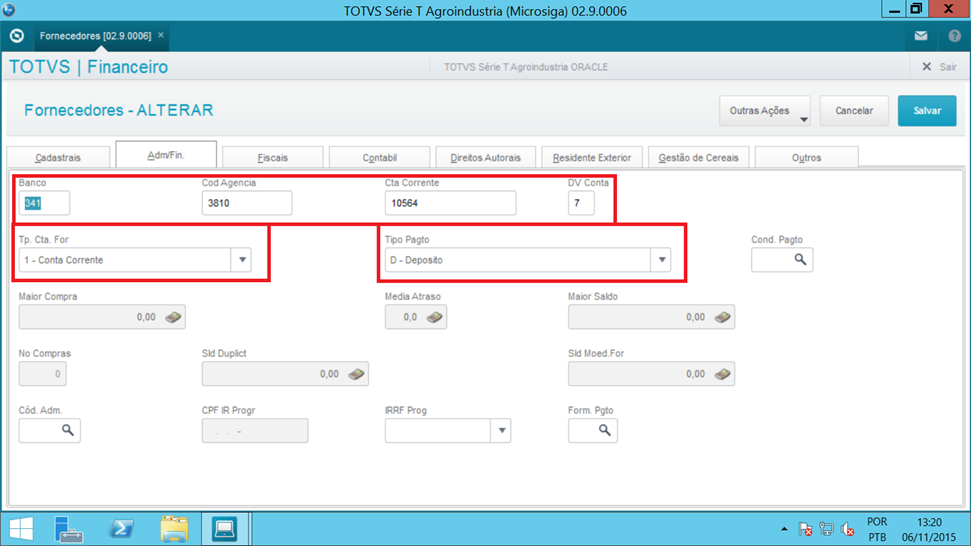
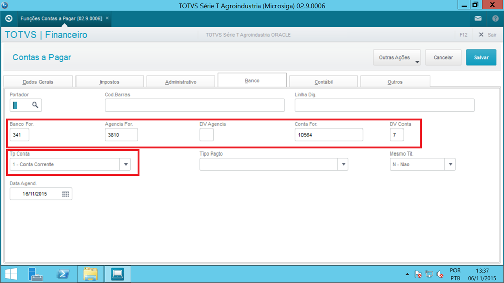
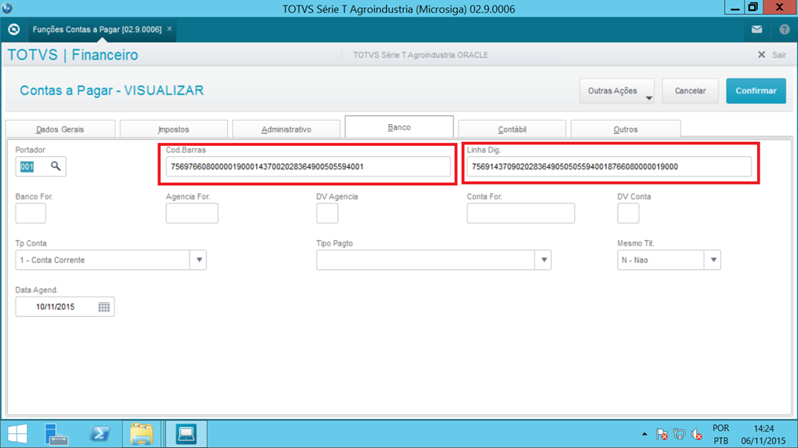
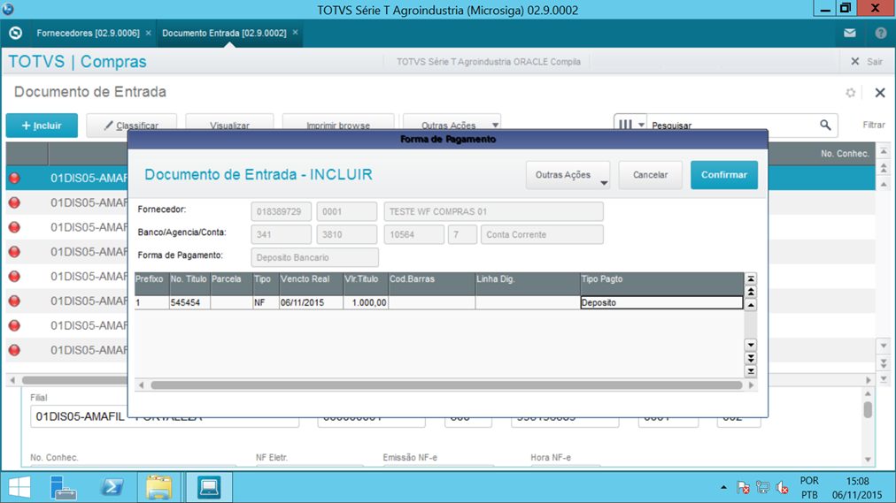
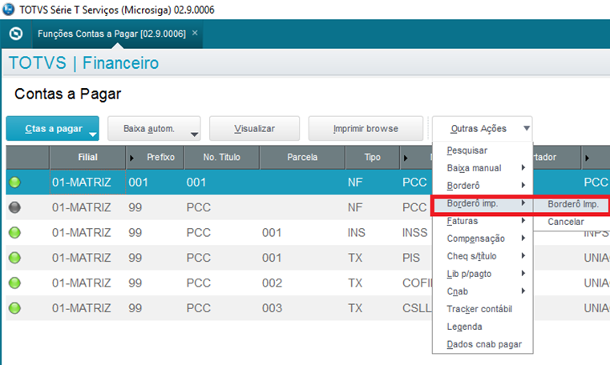
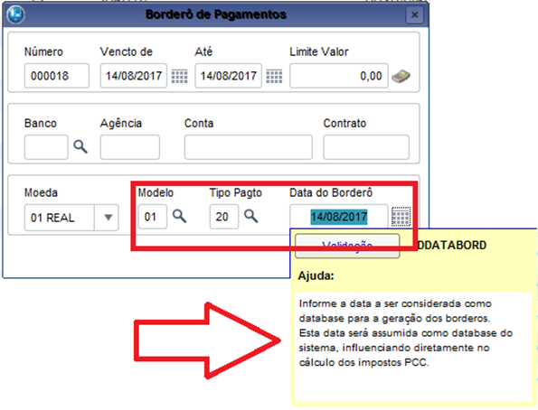
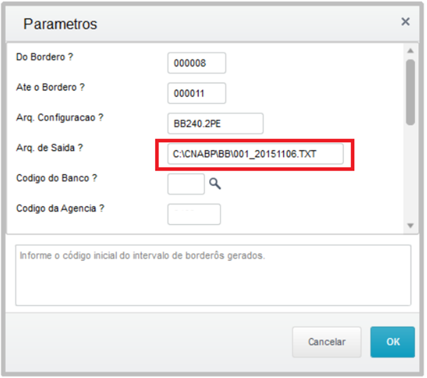

# CNAB A PAGAR {.home-hero}

  01. Visão Geral

### 1. Visão Geral
Este pacote de automação promove ao usuário uma forma ágil dentro do processso de compras (Documento de Entrada), atualizar informações nos títulos gerados no ciclo da compra, que são essenciais para o processo de comunicação bancária (CNAB) com o banco como também para a rotina dos usuários envolvidos no processo de contas a pagar.

A automação permite que no final do processo de gravação da nota, seja solicitada a confirmação dos dados de pagamento e dependendo da forma de pagamento (informado no cadastro do fornecedor), implementar as informações básicas nos títulos, onde:

- TED..........................: Dados bancários previamente informados no cadastro do fornecedor 
- Ordem Pagamento: Dados bancários previamente informados no cadastro do fornecedor
- Compensacao.......: Dados bancários previamente informados no cadastro do fornecedor
- Transf./Chave PIX.: Dados da Chave Pix (informado no cadastro do fornecedor)
- QR CODE PIX.........: Dados do QR Code (registrado em cada parcela de pagamento)
- Boleto.....................: Código de barras registrado no boleto de pagamento
- DOC........................: Dados bancários previamente informados no cadastro do fornecedor

A automação que tem como origem no ciclo de compras/documento de entrada, integrando com o Financeiro as informações coletadas.

Para o usuário do financeiro, é disponibilizado um filtro customizado no processo de montagem do borderô a pagar, para filtrar especificamente os titulos desta integração com base do Modelo e Tipo de Pagamento.

#### O Produto foi desenvolvido com o objetivo de modernizar e otimizar o processo de pagamento de títulos a pagar.

<strong>Principais vantagens do produto:</strong>

- Automatização do processo de pagamento de títulos, com geração e envio do arquivo de <strong>remessa CNAB</strong> para o banco.
- Automatização do processo de baixa dos títulos, através da importação e processamento do arquivo de <strong>retorno CNAB</strong> recebido do banco.

!!! warning "IMPORTANTE – Limitações e escopo NÃO contemplado pelo pacote:"
    a) Pagamento de tributos e contribuições no Segmento N (incluindo DARF, GPS, DARJ, IPVA, IPTU, DPVAT, GR, etc). 
    b) Pagamento de títulos em moeda diferente de Real brasileiro (R$). 
    c) DDA – Débito Direto Autorizado. 
    d) Pagamento de boletos no Segmento J-52 (boletos > R$ 250.000,00). 
    e) Alteração ou exclusão de títulos enviados anteriormente. 

  02. Bancos Contemplados

### 2. Bancos Contemplados

#### Os seguintes bancos estão contemplados neste pacote/ADD-ON:

<table class="banks-table">
  <thead>
    <tr>
      <th>Banco</th>
      <th>Layout CNAB</th>
      <th>Segmentos Suportados</th>
    </tr>
  </thead>
  <tbody>
    <tr>
      <td><strong>BRADESCO (237)</strong></td>
      <td>500 posições</td>
      <td><strong>Segmento A</strong> - Crédito em Conta Corrente - Crédito em Conta Poupança - Ordem de Pagamento, sem aviso ao favorecido. <strong>Segmento B</strong> - DOC - TED <strong>Segmento J</strong> - Boletos em cobrança / no próprio banco - Boletos em cobrança / outro banco <strong>Segmento O</strong> - Pagamento de concessionárias (Água/Luz/Telefone)</td>
      </tr>
    <tr>
      <td><strong>ITAÚ (341) SISPAG</strong></td>
      <td>240 posições</td>
      <td><strong>Segmento A</strong> - Crédito em Conta Corrente - Crédito em Conta Poupança - Ordem de Pagamento, sem aviso ao favorecido. <strong>Segmento B</strong> - DOC - TED <strong>Segmento J</strong> - Boletos em cobrança / no próprio banco - Boletos em cobrança / outro banco <strong>Segmento O</strong> - Pagamento de concessionárias (Água/Luz/Telefone)</td>
    </tr>
    <tr>
      <td><strong>CAIXA (104)</strong></td>
      <td>240 posições</td>
       <td><strong>Segmento A</strong> - Crédito em Conta Corrente - Crédito em Conta Poupança - Ordem de Pagamento, sem aviso ao favorecido. <strong>Segmento B</strong> - DOC - TED <strong>Segmento J</strong> - Boletos em cobrança / no próprio banco - Boletos em cobrança / outro banco <strong>Segmento O</strong> - Pagamento de concessionárias (Água/Luz/Telefone)</td>
    </tr>
    <tr>
      <td><strong>BANCO DO BRASIL (001)</strong></td>
      <td>240 posições</td>
       <td><strong>Segmento A</strong> - Crédito em Conta Corrente - Crédito em Conta Poupança - Ordem de Pagamento, sem aviso ao favorecido. <strong>Segmento B</strong> - DOC - TED <strong>Segmento J</strong> - Boletos em cobrança / no próprio banco - Boletos em cobrança / outro banco <strong>Segmento O</strong> - Pagamento de concessionárias (Água/Luz/Telefone)</td>
    </tr>
    <tr>
      <td><strong>SICREDI (748)</strong></td>
      <td>240 posições</td>
       <td><strong>Segmento A</strong> - Crédito em Conta Corrente - Crédito em Conta Poupança - Ordem de Pagamento, sem aviso ao favorecido. <strong>Segmento B</strong> - DOC - TED <strong>Segmento J</strong> - Boletos em cobrança / no próprio banco - Boletos em cobrança / outro banco <strong>Segmento O</strong> - Pagamento de concessionárias (Água/Luz/Telefone)</td>
    </tr>
    <tr>
      <td><strong>HSBC (399)</strong></td>
      <td>240 posições</td>
       <td><strong>Segmento A</strong> - Crédito em Conta Corrente - Crédito em Conta Poupança - Ordem de Pagamento, sem aviso ao favorecido. <strong>Segmento B</strong> - DOC - TED <strong>Segmento J</strong> - Boletos em cobrança / no próprio banco - Boletos em cobrança / outro banco <strong>Segmento O</strong> - Pagamento de concessionárias (Água/Luz/Telefone)</td>
    </tr>
    <tr>
      <td><strong>SANTANDER (033)</strong></td>
      <td>240 posições</td>
       <td><strong>Segmento A</strong> - Crédito em Conta Corrente - Crédito em Conta Poupança - Ordem de Pagamento, sem aviso ao favorecido. <strong>Segmento B</strong> - DOC - TED <strong>Segmento J</strong> - Boletos em cobrança / no próprio banco - Boletos em cobrança / outro banco <strong>Segmento O</strong> - Pagamento de concessionárias (Água/Luz/Telefone)</td>
    </tr>
    <tr>
      <td><strong>SICOOB (756)</strong></td>
      <td>240 posições</td>
       <td><strong>Segmento A</strong> - Crédito em Conta Corrente - Crédito em Conta Poupança - Ordem de Pagamento, sem aviso ao favorecido. <strong>Segmento B</strong> - DOC - TED <strong>Segmento J</strong> - Boletos em cobrança / no próprio banco - Boletos em cobrança / outro banco <strong>Segmento O</strong> - Pagamento de concessionárias (Água/Luz/Telefone)</td>
    </tr>
    <tr>
      <td><strong>SAFRA (422)</strong></td>
      <td>240 posições</td>
       <td><strong>Segmento A</strong> - Crédito em Conta Corrente - Crédito em Conta Poupança - Ordem de Pagamento, sem aviso ao favorecido. <strong>Segmento B</strong> - DOC - TED <strong>Segmento J</strong> - Boletos em cobrança / no próprio banco - Boletos em cobrança / outro banco <strong>Segmento O</strong> - Pagamento de concessionárias (Água/Luz/Telefone)</td>
    </tr>
    <tr>
      <td><strong>CRESOL (133) – Em homologação</strong></td>
      <td>240 posições</td>
       <td><strong>Segmento A</strong> - Crédito em Conta Corrente - Crédito em Conta Poupança - Ordem de Pagamento, sem aviso ao favorecido. <strong>Segmento B</strong> - DOC - TED <strong>Segmento J</strong> - Boletos em cobrança / no próprio banco - Boletos em cobrança / outro banco <strong>Segmento O</strong> - Pagamento de concessionárias (Água/Luz/Telefone)</td>
    </tr>
  </tbody>
</table>

!!! warning "OBSERVAÇÃO"
    É imprescindível antes de começar a utilizar os arquivos CNAB desses bancos, efetuar o processo de homologação junto aos respectivos bancos (em ambiente de TESTE) para ter a liberação do banco. Entrar em contato com o gerente do banco para maiores informações.

  03. Fluxo Operacional Básico

### 3. Fluxo Operacional Básico

#### Representação visual do fluxo operacional básico do produto

{.flow-image}

  04. Rotinas do Pacote

### 4. Rotinas do Pacote

#### Principais rotinas e funções incluídas no ADD-ON

<table class="banks-table">
  <thead>
    <tr>
      <th>Função</th>
      <th>Descrição</th>
    </tr>
  </thead>
  <tbody>
    <tr>
      <td><strong>M999B01/02</strong></td>
      <td>Rotinas genéricas Fábrica de Software.</td>
    </tr>
    <tr>
      <td><strong>P003B01</strong></td>
      <td>Rotina centralizadora para implementação de Pontos de Entrada.</td>
    </tr>
    <tr>
      <td><strong>X003B01</strong></td>
      <td>Rotina centralizadora de funções genéricas.</td>
    </tr>
    <tr>
      <td><strong>UPD003B</strong></td>
      <td>Programa que compatibiliza Dicionário de Dados para aplicação do ADD-ON.</td>
    </tr>
  </tbody>
</table>

  05. Parâmetros

### 5. Parâmetros

#### Parâmetros configuráveis do ADD-ON CNAB a Pagar

<table class="banks-table">
  <thead>
    <tr>
      <th>Nome</th>
      <th>Tipo</th>
      <th>Descrição</th>
      <th>Conteúdo</th>
    </tr>
  </thead>
  <tbody>
    <tr>
      <td><strong>MV_X003B00</strong></td>
      <td>Lógico</td>
      <td>Ativa utilização do ADD-ON CNAB a Pagar.</td>
      <td>.T.</td>
    </tr>
    <tr>
      <td><strong>MV_X003B01</strong></td>
      <td>Numérico</td>
      <td>Valor mínimo para geração de TED.</td>
      <td>500</td>
    </tr>
    <tr>
      <td><strong>MV_X003B02</strong></td>
      <td>Numérico</td>
      <td>Valor máximo para geração de DOC.</td>
      <td>4999.99</td>
    </tr>
    <tr>
      <td><strong>MV_X003B03</strong></td>
      <td>Caracter</td>
      <td>Data para pagamento efetivo do Titulo. 1=Data do Vencimento Real (E2_VENCREA) 2=Data da Emissão do Borderô. (EA_DATABOR) 3=Data da Emissão do Arquivo (DDATABASE)</td>
      <td>1</td>
    </tr>
    <tr>
      <td><strong>MV_X003B04</strong></td>
      <td>Lógico</td>
      <td>Permite ao usuário editar os dados bancários no final de inclusão do Documento de Entrada. Valido somente para a nota em questão.</td>
      <td>.T.</td>
    </tr>
    <tr>
      <td><strong>MV_X003B05</strong></td>
      <td>Lógico</td>
      <td>Define se os dados do Tipo de Pagamento e Tela ao final da inclusão do Documento de Entrada é obrigatória.</td>
      <td>.F.</td>
    </tr>
    <tr>
      <td><strong>MV_X003B06</strong></td>
      <td>Caracter</td>
      <td>Define a obrigatoriedade de preenchimento dos campos de Cod.Barras ou Linha.Dig/Dados Bancarios/Chave PIX/QR CODE PIX na tela de pagamentos NFE</td>
      <td>SSSS</td>
    </tr>
  </tbody>
</table>

  06. Pontos de Entrada Padrão X Compatibilização ADD-ON

### 6. Pontos de Entrada Padrão X Compatibilização ADD-ON

#### Pontos de entrada padrão utilizados no ADD-ON e exemplos de compatibilização

<table class="banks-table">
  <thead>
    <tr>
      <th>Nome</th>
      <th>Descrição</th>
      <th>Implementação</th>
    </tr>
  </thead>
  <tbody>
    <tr>
      <td><strong>F240FIL</strong></td>
      <td>Ponto de Entrada na emissão do borderô a pagar. Utilizar para filtro de Modelo e Forma de Pagamento.</td>
    <td>

  

    ADVPL
    F240FIL
  

  <pre><code>
User Function F240FIL()
Local cFiltro := ''
If ExistBlock("P003B01")
    cFiltro := U_P003B01("F240FIL")
EndIf
Return(cFiltro)
  

  </code></pre>
</td>
    </tr>
    <tr>
      <td><strong>F050ROT</strong></td>
      <td>Ponto de entrada no Contas a Pagar, para incluir função de alteração de dados referentes ao CNAB a Pagar.</td>
    <td>

  

    ADVPL
    F050ROT
  

  <pre><code>
User Function F050ROT()
Local aRot := ParamIxb
If ExistBlock("P003B01")
    AAdd(aRot, {"Dados CNAB Pagar", "U_P003B01('F050ROT')", 0, 8, , .F.})
EndIf
Return(aRot)
  

  </code></pre>
</td>
    </tr>
    <tr>
      <td><strong>FA750BRW</strong></td>
      <td>Ponto de entrada no Funções Contas a Pagar, para incluir função de alteração de dados referentes ao CNAB a Pagar.</td>
    <td>

  

    ADVPL
    FA750BRW
  

  <pre><code>
User Function FA750BRW()
Local aRot := {}
If ExistBlock("P003B01")
    aAdd(aRot, {"Dados CNAB Pagar", "U_P003B01('FA750BRW')", 0, 2})
EndIf
Return(aRot)
  

  </code></pre>
</td>
    </tr>
    <tr>
      <td><strong>FA050GRV</strong></td>
      <td>Ponto de entrada no final da rotina FINA050 - Contas a Pagar. Utilizado para gravação do campo E2_X_TPGTO.</td>
    <td>

  

    ADVPL
    FA050GRV
  

  <pre><code>
User Function FA050GRV()
If ExistBlock("P003B01")
    U_P003B01("FA050GRV")
EndIf
Return()
  

  </code></pre>
</td>
    </tr>
    <tr>
      <td><strong>F050ALT</strong></td>
      <td>Ponto de entrada no final da alteração do título a pagar.</td>
    <td>

  

    ADVPL
    F050ALT
  

  <pre><code>
User Function F050ALT()
Local aArea := GetArea()
Local nOpc := PARAMIXB[1]
If nOpc == 1
    If ExistBlock("P003B01")
        U_P003B01("F050ALT")
    EndIf
EndIf
RestArea(aArea)
Return
  

  </code></pre>
</td>
    </tr>
    <tr>
      <td><strong>F420SOMA</strong></td>
      <td>Ponto de entrada, na geração do arquivo CNAB a Pagar.</td>
    <td>

  

    ADVPL
    F420SOMA
  

  <pre><code>
User Function F420SOMA()
Local nValF420 := 0
If ExistBlock("P003B01")
    nValF420 := U_P003B01("F420SOMA")
EndIf
Return(nValF420)
  

  </code></pre>
</td>
    </tr>
    <tr>
      <td><strong>F565CTB</strong></td>
      <td>Ponto de entrada na rotina FINA565 - Liquidação a Pagar. Executado no final da função A565Grava.</td>
    <td>

  

    ADVPL
    F565CTB
  

  <pre><code>
User Function F565CTB()
If ExistBlock("P003B01")
    U_P003B01("F565CTB", , , cLiquid)
EndIf
Return
  

  </code></pre>
</td>
    </tr>
    <tr>
      <td><strong>FA050PAR</strong></td>
      <td>Ponto de entrada na rotina FINA050 - Inclusão Tit. Pagar chamado via Desdobramento. Utilizado para tratar dados após a gravação no SE2.</td>
    <td>

  

    ADVPL
    FA050PAR
  

  <pre><code>
User Function FA050PAR()
If ExistBlock("P003B01")
    U_P003B01("FA050PAR")
EndIf
Return
  

  </code></pre>
</td>
    </tr>
    <tr>
      <td><strong>FA290</strong></td>
      <td>Ponto de entrada na rotina FINA290 - Faturas a Pagar. Executado durante a gravação dos dados da fatura no SE2.</td>
    <td>

  

    ADVPL
    FA290
  

  <pre><code>
User Function FA290()
If ExistBlock("P003B01")
    U_P003B01("FA290")
EndIf
Return
  

  </code></pre>
</td>
    </tr>
    <tr>
      <td><strong>FI290COLS</strong></td>
      <td>Ponto de entrada na rotina FINA290 - Faturas a Pagar. Utilizado para incluir colunas no aHeader/aCols das faturas.</td>
    <td>

  

    ADVPL
    FI290COLS
  

  <pre><code>
User Function FI290COLS()
Local nTipo := PARAMIXB[1]
Local aRet := PARAMIXB[2]
Local nI := PARAMIXB[3]
If ExistBlock("P003B01")
    aRet := U_P003B01("FI290COLS", nTipo, aRet, nI)
EndIf
Return aRet
  

  </code></pre>
</td>
    </tr>
    <tr>
      <td><strong>MT103FIM</strong></td>
      <td>Ponto de entrada, após gravação da Nota Fiscal de Entrada para gravar Código de Barras, Modelo e Forma de Pagamento CNAB a Pagar.</td>
    <td>

  

    ADVPL
    MT103FIM
  

  <pre><code>
User Function MT103FIM()
If ExistBlock("P003B01")
    If (Inclui .OR. Altera) .AND. PARAMIXB[2] == 1 .AND. !(SF1->F1_TIPO $ 'DB')
        U_P003B01("MT103FIM", SA2->A2_X_TPGTO, xFilial("SF1") + SF1->F1_FORNECE + SF1->F1_LOJA + SF1->F1_SERIE + SF1->F1_DOC)
    EndIf
EndIf
Return()
  

  </code></pre>
</td>
    </tr>
    <tr>
      <td><strong>MT116AGR</strong></td>
      <td>Ponto de entrada, após gravação do Conhecimento de Frete.</td>
    <td>

  

    ADVPL
    MT116AGR
  

  <pre><code>
User Function MT116AGR()
If ExistBlock("P003B01")
    If Inclui
        U_P003B01("MT116AGR ", SA2->A2_X_TPGTO, xFilial("SF1") + SF1->F1_FORNECE + SF1->F1_LOJA + SF1->F1_SERIE + SF1->F1_DOC)
    EndIf
EndIf
Return()
  

  </code></pre>
</td>
    </tr>
  </tbody>
</table>

  07. Pontos de entrada específicos ADDON

### 7. Pontos de entrada específicos ADDON

<table class="banks-table">
  <thead>
    <tr>
      <th>Nome</th>
      <th>Descrição</th>
      <th>Observações</th>
    </tr>
  </thead>
  <tbody>
    <tr>
      <td><strong>PE003B01</strong></td>
      <td>Ponto de Entrada chamado no preenchimento do arquivo de remessa, permitindo alteração nos dados do Favorecido.
 Nome
 CNPJ
 Exemplo de utilização: Depósito em conta de terceiros. Incluir os campos necessários (Nome,CPNJ) no cadastro de Fornecedores.
  <strong>Programa Fonte:</strong> X003B01  </td>
    <td>

  

    ADVPL
    PE003B01
  

  <pre><code>
Modifica Nome ou CNPJ do Favorecido.
PE003B01() --> xRet

Tabela SA2 está posicionada.
  

  </code></pre>
</td>
    </tr>
    <tr>
      <td><strong>PE003B02</strong></td>
      <td>Ponto de Entrada chamado na rotina de “Dados CNAB a Pagar”. Possibilita a inclusão de novos campos na visualização e alteração.   <strong>Programa Fonte:</strong> P003B01  </td>
    <td>

  

    ADVPL
    PE003B02
  

  <pre><code>
User Function PE003B02()

Local aVetV := PARAMIXB[1]
Local aVetA := PARAMIXB[2]

aadd(aVetV,"E2_FAGEDV")
aadd(aVetV,"E2_FAVODEP")
aadd(aVetV,"E2_CGCDEP")

aadd(aVetV,"E2_FAGEDV")
aadd(aVetV,"E2_FAVODEP")
aadd(aVetV,"E2_CGCDEP")

Return({aVetV,aVetA})

Return(cRet)

  

  </code></pre>
</td>
    </tr>
    <tr>
      <td><strong>PE003B03</strong></td>
      <td>Ponto de Entrada chamado antes da Tela de dados bancários da Nota Fiscal de Entrada. Após o sistema já ter preenchido o aCols. 
Permite que o usuário altere os dados do Grid. 
  <strong>Programa Fonte:</strong> P003B01  </td>
    <td>

  

    ADVPL
    PE003B03
  

  <pre><code>
User Function PE003B03()

Local aRet    := PARAMIXB[1]
Local aHed   := PARAMIXB[2]
Local nPosPrf   := aScan(aHed, { |X| ALLTRIM(X[2]) == "E2_PREFIXO"})
Local nI       := 0   

For nI := 1 to len(aRet)
   If aRet[nI,nPosPrf] == ‘TST’
      aRet[nI,nPosXXX] := ‘xxx’
   EndIf
Next nI

Return(aRet)

  

  </code></pre>
</td>
    </tr>
  </tbody>
</table>

  08. Campos personalizados (SEE – Parâmetros de Banco)

### 8. Campos personalizados (SEE – Parâmetros de Banco)

Campo **A2_DVCTA (inclusão para P11)**

<table class="banks-table">
  <tbody>
    <tr>
      <th>Tipo</th>
      <td>C</td>
      <th>Tamanho</th>
      <td>2</td>
      <th>Decimal</th>
      <td>0</td>
      <th>Formato</th>
      <td>@!</td>
    </tr>
    <tr>
      <th>Contexto</th>
      <td>Real</td>
      <th>Propriedade</th>
      <td>Alterar</td>
      <th>Obrigatório</th>
      <td>N</td>
      <th>Browse</th>
      <td>S</td>
    </tr>
    <tr>
      <th>Título</th>
      <td colspan="7">DV Conta</td>
    </tr>
    <tr>
      <th>Descrição</th>
      <td colspan="7">Digito Verificador Conta</td>
    </tr>
  </tbody>
</table>

#### **Help**

Informe o dígito verificador da conta do Fornecedor.

#### **Configurações adicionais**

<table class="banks-table">
  <tbody>
    <tr>
      <th>F3</th>
      <td></td>
    </tr>
    <tr>
      <th>Modo Edição</th>
      <td></td>
    </tr>
    <tr>
      <th>Val. Usuário</th>
      <td></td>
    </tr>
    <tr>
      <th>Lista Opções</th>
      <td></td>
    </tr>
    <tr>
      <th>Inicializador</th>
      <td></td>
    </tr>
    <tr>
      <th>Ini. Browse</th>
      <td></td>
    </tr>
  </tbody>
</table>

Campo **A2_X_TPGTO (inclusão)**

<table class="banks-table">
  <tbody>
    <tr>
      <th>Tipo</th>
      <td>C</td>
      <th>Tamanho</th>
      <td>1</td>
      <th>Decimal</th>
      <td>0</td>
      <th>Formato</th>
      <td>@!</td>
    </tr>
    <tr>
      <th>Contexto</th>
      <td>Real</td>
      <th>Propriedade</th>
      <td>Alterar</td>
      <th>Obrigatório</th>
      <td>N</td>
      <th>Browse</th>
      <td>N</td>
    </tr>
    <tr>
      <th>Título</th>
      <td colspan="7">Tipo Pagto</td>
    </tr>
    <tr>
      <th>Descrição</th>
      <td colspan="7">Tipo de Pagamento Padrao</td>
    </tr>
  </tbody>
</table>

#### **Help**

"Informe o tipo de pagamento padrao para o Fornecedor (Deposito/Ordem de Pagamento/Boleto).

#### **Configurações adicionais**

<table class="banks-table">
  <tbody>
    <tr>
      <th>F3</th>
      <td></td>
    </tr>
    <tr>
      <th>Modo Edição</th>
      <td></td>
    </tr>
    <tr>
      <th>Val. Usuário</th>
      <td></td>
    </tr>
    <tr>
      <th>Lista Opções</th>
      <td>"D=Deposito;O=Ordem de Pagamento;B=Boleto;P=Chave PIX;Q=QR CODE PIX"</td>
    </tr>
    <tr>
      <th>Inicializador</th>
      <td></td>
    </tr>
    <tr>
      <th>Ini. Browse</th>
      <td></td>
    </tr>
  </tbody>
</table>

Campo **A2_BANCO (alteração)**

<table class="banks-table">
  <tbody>
    <tr>
      <th>Tipo</th>
      <td></td>
      <th>Tamanho</th>
      <td></td>
      <th>Decimal</th>
      <td></td>
      <th>Formato</th>
      <td></td>
    </tr>
    <tr>
      <th>Contexto</th>
      <td></td>
      <th>Propriedade</th>
      <td></td>
      <th>Obrigatório</th>
      <td></td>
      <th>Browse</th>
      <td></td>
    </tr>
    <tr>
      <th>Título</th>
      <td colspan="7"></td>
    </tr>
    <tr>
      <th>Descrição</th>
      <td colspan="7"></td>
    </tr>
  </tbody>
</table>

#### **Help**

#### **Configurações adicionais**

<table class="banks-table">
  <tbody>
    <tr>
      <th>F3</th>
      <td></td>
    </tr>
    <tr>
      <th>Modo Edição</th>
      <td></td>
    </tr>
    <tr>
      <th>Val. Usuário</th>
      <td></td>
    </tr>
    <tr>
      <th>Lista Opções</th>
      <td></td>
    </tr>
    <tr>
      <th>Inicializador</th>
      <td></td>
    </tr>
    <tr>
      <th>Ini. Browse</th>
      <td></td>
    </tr>
  </tbody>
</table>

Campo **E2_X_TPGTO (inclusão)**

<table class="banks-table">
  <tbody>
    <tr>
      <th>Tipo</th>
      <td>C</td>
      <th>Tamanho</th>
      <td>1</td>
      <th>Decimal</th>
      <td>0</td>
      <th>Formato</th>
      <td>@!</td>
    </tr>
    <tr>
      <th>Contexto</th>
      <td>Real</td>
      <th>Propriedade</th>
      <td>Alterar</td>
      <th>Obrigatório</th>
      <td>N</td>
      <th>Browse</th>
      <td>N</td>
    </tr>
    <tr>
      <th>Título</th>
      <td colspan="7">Tipo Pagto</td>
    </tr>
    <tr>
      <th>Descrição</th>
      <td colspan="7">Tipo de Pagamento Padrao</td>
    </tr>
  </tbody>
</table>

#### **Help**

Tipo de Pagamento, utilizado para CNAB a Pagar.

#### **Configurações adicionais**

<table class="banks-table">
  <tbody>
    <tr>
      <th>F3</th>
      <td></td>
    </tr>
    <tr>
      <th>Modo Edição</th>
      <td></td>
    </tr>
    <tr>
      <th>Val. Usuário</th>
      <td></td>
    </tr>
    <tr>
      <th>Lista Opções</th>
      <td>"D=DOC;T=TED;O=Ordem de Pagamento;P=Chave PIX;Q=QR CODE PIX "</td>
    </tr>
    <tr>
      <th>Inicializador</th>
      <td></td>
    </tr>
    <tr>
      <th>Ini. Browse</th>
      <td></td>
    </tr>
  </tbody>
</table>

Campo **E2_X_TPCTA (inclusão)**

<table class="banks-table">
  <tbody>
    <tr>
      <th>Tipo</th>
      <td>C</td>
      <th>Tamanho</th>
      <td>1</td>
      <th>Decimal</th>
      <td>0</td>
      <th>Formato</th>
      <td>@!</td>
    </tr>
    <tr>
      <th>Contexto</th>
      <td>Real</td>
      <th>Propriedade</th>
      <td>Alterar</td>
      <th>Obrigatório</th>
      <td>N</td>
      <th>Browse</th>
      <td>N</td>
    </tr>
    <tr>
      <th>Título</th>
      <td colspan="7">Tipo de Conta</td>
    </tr>
    <tr>
      <th>Descrição</th>
      <td colspan="7">Tipo de Conta</td>
    </tr>
  </tbody>
</table>

#### **Help**

Tipo de conta (Poupança/Corrente)

#### **Configurações adicionais**

<table class="banks-table">
  <tbody>
    <tr>
      <th>F3</th>
      <td></td>
    </tr>
    <tr>
      <th>Modo Edição</th>
      <td></td>
    </tr>
    <tr>
      <th>Val. Usuário</th>
      <td></td>
    </tr>
    <tr>
      <th>Lista Opções</th>
      <td>"1=Conta Corrente;2=Conta Poupanca"</td>
    </tr>
    <tr>
      <th>Inicializador</th>
      <td></td>
    </tr>
    <tr>
      <th>Ini. Browse</th>
      <td></td>
    </tr>
  </tbody>
</table>

Campo **E2_X_MSTIT (inclusão)**

<table class="banks-table">
  <tbody>
    <tr>
      <th>Tipo</th>
      <td>C</td>
      <th>Tamanho</th>
      <td>1</td>
      <th>Decimal</th>
      <td>0</td>
      <th>Formato</th>
      <td>@!</td>
    </tr>
    <tr>
      <th>Contexto</th>
      <td>Real</td>
      <th>Propriedade</th>
      <td>Alterar</td>
      <th>Obrigatório</th>
      <td>N</td>
      <th>Browse</th>
      <td>N</td>
    </tr>
    <tr>
      <th>Título</th>
      <td colspan="7">Mesmo Tit.</td>
    </tr>
    <tr>
      <th>Descrição</th>
      <td colspan="7">Mesmo Titular</td>
    </tr>
  </tbody>
</table>

#### **Help**

Informe 'S' se o titular de recebimento do titulo (Fornecedor) é uma filial, ou seja, mesmo titular. Utilizado para CNAB a Pagar, pois o mesmo possui distinção de Mod. e Forma de Pagamentos para o mesmo titular.

#### **Configurações adicionais**

<table class="banks-table">
  <tbody>
    <tr>
      <th>F3</th>
      <td></td>
    </tr>
    <tr>
      <th>Modo Edição</th>
      <td></td>
    </tr>
    <tr>
      <th>Val. Usuário</th>
      <td></td>
    </tr>
    <tr>
      <th>Lista Opções</th>
      <td>"S=Sim;N=Nao"</td>
    </tr>
    <tr>
      <th>Inicializador</th>
      <td></td>
    </tr>
    <tr>
      <th>Ini. Browse</th>
      <td></td>
    </tr>
  </tbody>
</table>

Campo **E2_LINDIG (alteração)**

<table class="banks-table">
  <tbody>
    <tr>
      <th>Tipo</th>
      <td></td>
      <th>Tamanho</th>
      <td>48</td>
      <th>Decimal</th>
      <td></td>
      <th>Formato</th>
      <td></td>
    </tr>
    <tr>
      <th>Contexto</th>
      <td></td>
      <th>Propriedade</th>
      <td></td>
      <th>Obrigatório</th>
      <td></td>
      <th>Browse</th>
      <td></td>
    </tr>
    <tr>
      <th>Título</th>
      <td colspan="7"></td>
    </tr>
    <tr>
      <th>Descrição</th>
      <td colspan="7"></td>
    </tr>
  </tbody>
</table>

#### **Help**

#### **Configurações adicionais**

<table class="banks-table">
  <tbody>
    <tr>
      <th>F3</th>
      <td></td>
    </tr>
    <tr>
      <th>Modo Edição</th>
      <td></td>
    </tr>
    <tr>
      <th>Val. Usuário</th>
      <td></td>
    </tr>
    <tr>
      <th>Lista Opções</th>
      <td></td>
    </tr>
    <tr>
      <th>Inicializador</th>
      <td></td>
    </tr>
    <tr>
      <th>Ini. Browse</th>
      <td></td>
    </tr>
  </tbody>
</table>

Campo **E2_FCTADV (alteração)**

<table class="banks-table">
  <tbody>
    <tr>
      <th>Tipo</th>
      <td></td>
      <th>Tamanho</th>
      <td>2</td>
      <th>Decimal</th>
      <td></td>
      <th>Formato</th>
      <td></td>
    </tr>
    <tr>
      <th>Contexto</th>
      <td></td>
      <th>Propriedade</th>
      <td></td>
      <th>Obrigatório</th>
      <td></td>
      <th>Browse</th>
      <td></td>
    </tr>
    <tr>
      <th>Título</th>
      <td colspan="7"></td>
    </tr>
    <tr>
      <th>Descrição</th>
      <td colspan="7"></td>
    </tr>
  </tbody>
</table>

#### **Help**

#### **Configurações adicionais**

<table class="banks-table">
  <tbody>
    <tr>
      <th>F3</th>
      <td></td>
    </tr>
    <tr>
      <th>Modo Edição</th>
      <td></td>
    </tr>
    <tr>
      <th>Val. Usuário</th>
      <td></td>
    </tr>
    <tr>
      <th>Lista Opções</th>
      <td></td>
    </tr>
    <tr>
      <th>Inicializador</th>
      <td></td>
    </tr>
    <tr>
      <th>Ini. Browse</th>
      <td></td>
    </tr>
  </tbody>
</table>

Campo **A6_DVCTA (alteração)**

<table class="banks-table">
  <tbody>
    <tr>
      <th>Tipo</th>
      <td></td>
      <th>Tamanho</th>
      <td>2</td>
      <th>Decimal</th>
      <td></td>
      <th>Formato</th>
      <td></td>
    </tr>
    <tr>
      <th>Contexto</th>
      <td></td>
      <th>Propriedade</th>
      <td></td>
      <th>Obrigatório</th>
      <td></td>
      <th>Browse</th>
      <td></td>
    </tr>
    <tr>
      <th>Título</th>
      <td colspan="7"></td>
    </tr>
    <tr>
      <th>Descrição</th>
      <td colspan="7"></td>
    </tr>
  </tbody>
</table>

#### **Help**

#### **Configurações adicionais**

<table class="banks-table">
  <tbody>
    <tr>
      <th>F3</th>
      <td></td>
    </tr>
    <tr>
      <th>Modo Edição</th>
      <td></td>
    </tr>
    <tr>
      <th>Val. Usuário</th>
      <td></td>
    </tr>
    <tr>
      <th>Lista Opções</th>
      <td></td>
    </tr>
    <tr>
      <th>Inicializador</th>
      <td></td>
    </tr>
    <tr>
      <th>Ini. Browse</th>
      <td></td>
    </tr>
  </tbody>
</table>

Campo **EE_DVCTA (alteração)**

<table class="banks-table">
  <tbody>
    <tr>
      <th>Tipo</th>
      <td></td>
      <th>Tamanho</th>
      <td>2</td>
      <th>Decimal</th>
      <td></td>
      <th>Formato</th>
      <td></td>
    </tr>
    <tr>
      <th>Contexto</th>
      <td></td>
      <th>Propriedade</th>
      <td></td>
      <th>Obrigatório</th>
      <td></td>
      <th>Browse</th>
      <td></td>
    </tr>
    <tr>
      <th>Título</th>
      <td colspan="7"></td>
    </tr>
    <tr>
      <th>Descrição</th>
      <td colspan="7"></td>
    </tr>
  </tbody>
</table>

#### **Help**

#### **Configurações adicionais**

<table class="banks-table">
  <tbody>
    <tr>
      <th>F3</th>
      <td></td>
    </tr>
    <tr>
      <th>Modo Edição</th>
      <td></td>
    </tr>
    <tr>
      <th>Val. Usuário</th>
      <td></td>
    </tr>
    <tr>
      <th>Lista Opções</th>
      <td></td>
    </tr>
    <tr>
      <th>Inicializador</th>
      <td></td>
    </tr>
    <tr>
      <th>Ini. Browse</th>
      <td></td>
    </tr>
  </tbody>
</table>

  09. Campos padrões (SEE - Parâmetros de Banco)

### 9. Campos padrões (SEE - Parâmetros de Banco)

#### Campos padrões do SEE - Parâmetros de Banco

<table class="banks-table">
  <thead>
    <tr>
      <th>Campo</th>
      <th>Título de</th>
      <th>Título para</th>
      <th>Descrição de</th>
      <th>Descrição para</th>
      <th>Help de</th>
      <th>Help para</th>
    </tr>
  </thead>
  <tbody>
    <tr>
      <td><strong>EE_DVCTA</strong></td>
      <td></td>
      <td></td>
      <td></td>
      <td></td>
      <td></td>
      <td></td>
    </tr>
  </tbody>
</table>

  10. Campos personalizados (SA2 - Cadastro de Fornecedores)

### 10. Campos personalizados (SA2 - Cadastro de Fornecedores)

Campo **A2_DVCTA**

<table class="banks-table">
  <tbody>
    <tr>
      <th>Tipo</th>
      <td>Caracter</td>
      <th>Tamanho</th>
      <td>2</td>
      <th>Decimal</th>
      <td>0</td>
      <th>Formato</th>
      <td>@!</td>
    </tr>
    <tr>
      <th>Contexto</th>
      <td>Real</td>
      <th>Propriedade</th>
      <td>Alterar</td>
      <th>Obrigatório</th>
      <td>N</td>
      <th>Browse</th>
      <td>S</td>
    </tr>
    <tr>
      <th>Título</th>
      <td colspan="7">DV Conta</td>
    </tr>
    <tr>
      <th>Descrição</th>
      <td colspan="7">Digito Verificador Conta</td>
    </tr>
  </tbody>
</table>

#### **Help**

informe o dígito verificador da conta do Fornecedor.

#### **Configurações adicionais**

<table class="banks-table">
  <tbody>
    <tr>
      <th>F3</th>
      <td></td>
    </tr>
    <tr>
      <th>Modo Edição</th>
      <td></td>
    </tr>
    <tr>
      <th>Val. Usuário</th>
      <td></td>
    </tr>
    <tr>
      <th>Lista Opções</th>
      <td></td>
    </tr>
    <tr>
      <th>Inicializador</th>
      <td></td>
    </tr>
    <tr>
      <th>Ini. Browse</th>
      <td></td>
    </tr>
  </tbody>
</table>

Campo **A2_X_TPGTO**

<table class="banks-table">
  <tbody>
    <tr>
      <th>Tipo</th>
      <td>Caracter</td>
      <th>Tamanho</th>
      <td>1</td>
      <th>Decimal</th>
      <td>0</td>
      <th>Formato</th>
      <td>@!</td>
    </tr>
    <tr>
      <th>Contexto</th>
      <td>Real</td>
      <th>Propriedade</th>
      <td>Alterar</td>
      <th>Obrigatório</th>
      <td>N</td>
      <th>Browse</th>
      <td>N</td>
    </tr>
    <tr>
      <th>Título</th>
      <td colspan="7">Tipo Pagto</td>
    </tr>
    <tr>
      <th>Descrição</th>
      <td colspan="7">Tipo de Pagamento Padrão</td>
    </tr>
  </tbody>
</table>

#### **Help**

Informe o tipo de pagamento padrao para o Fornecedor (Deposito/Ordem de Pagamento/Boleto).
  Para depósito em conta (corrente ou poupança), TED ou DOC - Preencher com Depósito.

#### **Configurações adicionais**

<table class="banks-table">
  <tbody>
    <tr>
      <th>F3</th>
      <td></td>
    </tr>
    <tr>
      <th>Modo Edição</th>
      <td></td>
    </tr>
    <tr>
      <th>Val. Usuário</th>
      <td></td>
    </tr>
    <tr>
      <th>Lista Opções</th>
      <td>D=Deposito;O=Ordem de Pagamento;B=Boleto;P=Chave PIX;Q=QR CODE PIX</td>
    </tr>
    <tr>
      <th>Inicializador</th>
      <td></td>
    </tr>
    <tr>
      <th>Ini. Browse</th>
      <td></td>
    </tr>
  </tbody>
</table>

Campo **A2_BANCO**

<table class="banks-table">
  <tbody>
    <tr>
      <th>Tipo</th>
      <td></td>
      <th>Tamanho</th>
      <td></td>
      <th>Decimal</th>
      <td></td>
      <th>Formato</th>
      <td></td>
    </tr>
    <tr>
      <th>Contexto</th>
      <td></td>
      <th>Propriedade</th>
      <td></td>
      <th>Obrigatório</th>
      <td></td>
      <th>Browse</th>
      <td></td>
    </tr>
    <tr>
      <th>Título</th>
      <td colspan="7"></td>
    </tr>
    <tr>
      <th>Descrição</th>
      <td colspan="7"></td>
    </tr>
  </tbody>
</table>

#### **Help**

#### **Configurações adicionais**

<table class="banks-table">
  <tbody>
    <tr>
      <th>F3</th>
      <td>Retirar a consulta padrão</td>
    </tr>
    <tr>
      <th>Modo Edição</th>
      <td></td>
    </tr>
    <tr>
      <th>Val. Usuário</th>
      <td></td>
    </tr>
    <tr>
      <th>Lista Opções</th>
      <td></td>
    </tr>
    <tr>
      <th>Inicializador</th>
      <td></td>
    </tr>
    <tr>
      <th>Ini. Browse</th>
      <td></td>
    </tr>
  </tbody>
</table>

  11. Campos padrões (SE2 - Contas a Pagar)

### 11. Campos padrões (SE2 - Contas a Pagar)

Campo **E2_X_TPGTO (inclusão)**

<table class="banks-table">
  <tbody>
    <tr>
      <th>Tipo</th>
      <td>Caracter</td>
      <th>Tamanho</th>
      <td>1</td>
      <th>Decimal</th>
      <td>0</td>
      <th>Formato</th>
      <td>@!</td>
    </tr>
    <tr>
      <th>Contexto</th>
      <td>Real</td>
      <th>Propriedade</th>
      <td>Alterar</td>
      <th>Obrigatório</th>
      <td>N</td>
      <th>Browse</th>
      <td>N</td>
    </tr>
    <tr>
      <th>Título</th>
      <td colspan="7">Tipo Pagto</td>
    </tr>
    <tr>
      <th>Descrição</th>
      <td colspan="7">Tipo de Pagamento Padrao</td>
    </tr>
  </tbody>
</table>

#### **Help**

Tipo de Pagamento, utilizado para CNAB a Pagar.

#### **Configurações adicionais**

<table class="banks-table">
  <tbody>
    <tr>
      <th>F3</th>
      <td></td>
    </tr>
    <tr>
      <th>Modo Edição</th>
      <td></td>
    </tr>
    <tr>
      <th>Val. Usuário</th>
      <td></td>
    </tr>
    <tr>
      <th>Lista Opções</th>
      <td>D=DOC;T=TED;O=Ordem de Pagamento;P=Chave PIX;Q=QR CODE PIX</td>
    </tr>
    <tr>
      <th>Inicializador</th>
      <td></td>
    </tr>
    <tr>
      <th>Ini. Browse</th>
      <td></td>
    </tr>
  </tbody>
</table>

Campo **E2_X_TPCTA (inclusão)**

<table class="banks-table">
  <tbody>
    <tr>
      <th>Tipo</th>
      <td>Caracter</td>
      <th>Tamanho</th>
      <td>1</td>
      <th>Decimal</th>
      <td>0</td>
      <th>Formato</th>
      <td>@!</td>
    </tr>
    <tr>
      <th>Contexto</th>
      <td>Real</td>
      <th>Propriedade</th>
      <td>Alterar</td>
      <th>Obrigatório</th>
      <td>N</td>
      <th>Browse</th>
      <td>N</td>
    </tr>
    <tr>
      <th>Título</th>
      <td colspan="7">Tipo de Conta</td>
    </tr>
    <tr>
      <th>Descrição</th>
      <td colspan="7">Tipo de Conta</td>
    </tr>
  </tbody>
</table>

#### **Help**

Tipo de Conta (Poupança/Corrente)

#### **Configurações adicionais**

<table class="banks-table">
  <tbody>
    <tr>
      <th>F3</th>
      <td></td>
    </tr>
    <tr>
      <th>Modo Edição</th>
      <td></td>
    </tr>
    <tr>
      <th>Val. Usuário</th>
      <td></td>
    </tr>
    <tr>
      <th>Lista Opções</th>
      <td>1=Conta Corrente;2=Conta Poupanca</td>
    </tr>
    <tr>
      <th>Inicializador</th>
      <td></td>
    </tr>
    <tr>
      <th>Ini. Browse</th>
      <td></td>
    </tr>
  </tbody>
</table>

Campo **E2_X_MSTIT (inclusão)**

<table class="banks-table">
  <tbody>
    <tr>
      <th>Tipo</th>
      <td>Caracter</td>
      <th>Tamanho</th>
      <td>1</td>
      <th>Decimal</th>
      <td>0</td>
      <th>Formato</th>
      <td>@!</td>
    </tr>
    <tr>
      <th>Contexto</th>
      <td>Real</td>
      <th>Propriedade</th>
      <td></td>
      <th>Obrigatório</th>
      <td>N</td>
      <th>Browse</th>
      <td>N</td>
    </tr>
    <tr>
      <th>Título</th>
      <td colspan="7">Mesmo Tit.</td>
    </tr>
    <tr>
      <th>Descrição</th>
      <td colspan="7">Mesmo Titular</td>
    </tr>
  </tbody>
</table>

#### **Help**

Informe 'S' se o titular de recebimento do titulo (Fornecedor) é uma filial, ou seja, mesmo titular. Utilizado para CNAB a Pagar, pois o mesmo possui distinção de Mod. e Forma de Pagamentos para o mesmo titular.

#### **Configurações adicionais**

<table class="banks-table">
  <tbody>
    <tr>
      <th>F3</th>
      <td>Retirar a consulta padrão</td>
    </tr>
    <tr>
      <th>Modo Edição</th>
      <td></td>
    </tr>
    <tr>
      <th>Val. Usuário</th>
      <td></td>
    </tr>
    <tr>
      <th>Lista Opções</th>
      <td>S=Sim;N=Nao</td>
    </tr>
    <tr>
      <th>Inicializador</th>
      <td></td>
    </tr>
    <tr>
      <th>Ini. Browse</th>
      <td></td>
    </tr>
  </tbody>
</table>

Campo **E2_LINDIG (alteração)**

<table class="banks-table">
  <tbody>
    <tr>
      <th>Tipo</th>
      <td></td>
      <th>Tamanho</th>
      <td>48</td>
      <th>Decimal</th>
      <td></td>
      <th>Formato</th>
      <td></td>
    </tr>
    <tr>
      <th>Contexto</th>
      <td></td>
      <th>Propriedade</th>
      <td></td>
      <th>Obrigatório</th>
      <td></td>
      <th>Browse</th>
      <td></td>
    </tr>
    <tr>
      <th>Título</th>
      <td colspan="7"></td>
    </tr>
    <tr>
      <th>Descrição</th>
      <td colspan="7"></td>
    </tr>
  </tbody>
</table>

#### **Help**

#### **Configurações adicionais**

<table class="banks-table">
  <tbody>
    <tr>
      <th>F3</th>
      <td></td>
    </tr>
    <tr>
      <th>Modo Edição</th>
      <td></td>
    </tr>
    <tr>
      <th>Val. Usuário</th>
      <td></td>
    </tr>
    <tr>
      <th>Lista Opções</th>
      <td></td>
    </tr>
    <tr>
      <th>Inicializador</th>
      <td></td>
    </tr>
    <tr>
      <th>Ini. Browse</th>
      <td></td>
    </tr>
  </tbody>
</table>

Campo **E2_FCTADV (alteração)**

<table class="banks-table">
  <tbody>
    <tr>
      <th>Tipo</th>
      <td></td>
      <th>Tamanho</th>
      <td>2</td>
      <th>Decimal</th>
      <td></td>
      <th>Formato</th>
      <td></td>
    </tr>
    <tr>
      <th>Contexto</th>
      <td></td>
      <th>Propriedade</th>
      <td></td>
      <th>Obrigatório</th>
      <td></td>
      <th>Browse</th>
      <td></td>
    </tr>
    <tr>
      <th>Título</th>
      <td colspan="7"></td>
    </tr>
    <tr>
      <th>Descrição</th>
      <td colspan="7"></td>
    </tr>
  </tbody>
</table>

#### **Help**

#### **Configurações adicionais**

<table class="banks-table">
  <tbody>
    <tr>
      <th>F3</th>
      <td></td>
    </tr>
    <tr>
      <th>Modo Edição</th>
      <td></td>
    </tr>
    <tr>
      <th>Val. Usuário</th>
      <td></td>
    </tr>
    <tr>
      <th>Lista Opções</th>
      <td></td>
    </tr>
    <tr>
      <th>Inicializador</th>
      <td></td>
    </tr>
    <tr>
      <th>Ini. Browse</th>
      <td></td>
    </tr>
  </tbody>
</table>

  12. Manual de operação

### 12. Manual de operação

#### 1. Parâmetros de Bancos

Neste cadastro são definidos detalhes técnicos que posteriormente serão utilizados para formatação e emissão do arquivo de remessa ao banco. 

Seu correto preenchimento é de suma importância, abaixo os principais campos que devem ser observados. 

<strong>SUB CONTA</strong>: Por convenção a Totvs Cascavel utiliza a Sub Conta = PAG para CNAB a Pagar. 

<strong>EXTENSÃO</strong>: é a extensão que será gerado o arquivo de remessa. Consultar manual técnico de cada banco.

<strong>CÓDIGO EMPRESA</strong>: informar o código de cliente da empresa junto ao banco referente ao contrato de cobrança. Fornecido pelo banco.

<strong>NR. BYTES</strong>: informe a quantidade de posições da remessa/retorno layout: 240/400/500 de acordo com cada banco.

<strong>FORMATO DATA</strong>: informar o tipo da data que o banco trabalha no arquivo de retorno. Consultar manual técnico de cada banco.  
Formato da data no retorno: 
1-ddmmaa, 2=mmddaa, 3=aammdd, 4=ddmmaaaa,5=aaaammdd,6=mmddaaaa.

<strong>DIR. REMESSA</strong>:informe o caminho (diretório) onde serão gerados os arquivos de remessa. Exemplo: D:\CNAB\REMESSA\BANCO\.  
Na hipótese de ser um caminho na rede, o mesmo deverá estar mapeado na unidade local.  
Este caminho será automaticamente sugerido na rotina de geração de remessa.  

<strong>CONF. REMESSA</strong>: informe o nome do arquivo de configuração de remessa.  
Exemplo: banco240.2PE

<strong>CONF. RETORNO</strong>: informe o nome do arquivo de configuração de retorno.  
Exemplo: banco240.2PR

#### 1.2. Ocorrências CNAB

O cadastro de ocorrências define os registros dos códigos atribuídos pelos próprios bancos a fim de identificar os resultados da leitura dos arquivos.

Devem ser cadastradas de acordo com o manual de cada banco. 

Anexo ao pacote FS99999_003B existe uma tabela pré-cadastrada (seb003b.dtc) que poderá auxiliar no cadastramento. De qualquer forma, é importante a revisão das ocorrências de acordo com o manual de cada banco. 

#### 1.3. Cadastros de Fornecedores

No cadastro de fornecedores, atentar para o preenchimento correto dos campos:

{.flow-image}

<strong>BANCO</strong>: informe o código do Banco.

<strong>COD.AGENCIA</strong>: informe o código da Agência.

<strong>CTA.CORRENTE</strong>: informe o número da conta, sem o dígito verificador.

<strong>DV CONTA</strong>: informe o dígito verificador da conta.

<strong>TP.CTA.FOR</strong>: informe o tipo de conta, Corrente ou Poupança.

<strong>TIPO PAGTO</strong>: informe o tipo de pagamento padrão para este fornecedor.  
Esta opção será sugerida durante a inclusão de Documentos de Entrada. 

<u>Depósito</u>: Utilizar para as formas de pagamento: Depósito Bancário, TED, DOC.  
O modelo será classificado automaticamente na inclusão de um título a pagar ou nota fiscal de entrada. 

<strong><u>PARÂMETROS ENVOLVIDOS:</u></strong>

<table class="banks-table">
  <thead>
    <tr>
      <th>Nome</th>
      <th>Tipo</th>
      <th>Descrição</th>
      <th>Conteúdo</th>
    </tr>
  </thead>
  <tbody>
    <tr>
      <td><strong>MV_X003B01</strong></td>
      <td>Numérico</td>      
      <td>Valor mínimo para geração de TED.</td>  
      <td>500</td>  
    </tr>
    <tr>
      <td><strong>MV_X003B02</strong></td>
      <td>Numérico</td>  
      <td>Valor máximo para geração de DOC.</td>  
      <td>4999.99</td>      
    </tr>
    <tr>
      <td><strong>MV_X003B03</strong></td>
      <td>Caracter</td>  
      <td>Data para pagamento efetivo do Titulo. 
        1=Data do Vencimento Real (E2_VENCREA) 
        2=Data da Emissão do Borderô (EA_DATABOR) 
        3=Data da geração do Arquivo (DDATABASE)
      </td>  
      <td>1</td>      
    </tr>        
  </tbody>
</table>

#### 2. Inclusão Contas a Pagar - Manual

#### 2.1. Pagamento via (DOC/TED/Depósito)

Durante a inclusão de um título a Pagar de forma Manual (FINA050), ao selecionar o Fornecedor, será sugerido automaticamente os dados bancários cadastrados no Fornecedor.

{.flow-image}

#### 2.2. Pagamento via Boleto Bancário

Durante a inclusão de um título a Pagar de forma Manual (FINA050), deve-se atentar para o preenchimento do campo referente ao código de barras ou linha digitável. 

Para utilização de Leitor de Código de Barras, atentar para sua configuração, pois o leitor pode ser configurado para retornar o código de barras efetivo (44 caracteres) ou a linha digitável (47/48 caracteres). Portanto, dependendo da configuração do leitor de Código de Barras, deve-se verificar qual campo será preenchido. 

Durante o preenchimento da Linha Digitável, o campo Código de Barras será preenchido automaticamente. 

{.flow-image}

#### 2.3 Alterando Dados do Pagamento

Após a inclusão do título, se houver a necessidade de alteração nos dados para pagamento, (banco/agência/conta/código de barras), através da rotina Funções Contas a Pagar ou Contas a Pagar -> Ações Relacionadas -> Dados CNAB Pagar as alterações poderão ser realizadas. 

<strong>PE003B02</strong> – Possibilidade de inclusão de novos campos para visualização e alteração.

#### 3. Nota Fiscal de Entrada

Durante a inclusão de uma Nota Fiscal de Entrada que possua títulos a pagar, será apresentada uma tela no qual o usuário poderá configurar/escolher de que forma se fará o pagamento ao Fornecedor, para cada uma das parcelas geradas.

{.flow-image}

Através da configuração do parâmetro <strong>MV_X003B04</strong> é possível determinar se os dados bancários (Banco/Agencia/Conta/DV/Tipo de Conta) poderão ser alterados neste momento. Importante frisar que somente estes títulos serão afetados, ou seja, esta informação não será replicada no cadastro do fornecedor. 

Através da configuração do parâmetro <strong>MV_X003B05</strong> é possível tornar obrigatória a Tela e as informações do tipo de pagamento. 

#### 4. Geração do Borderô a Pagar (FINA241)

Após os títulos incluídos, e liberados (se utilizar o controle de alçadas), o próximo passo será a geração dos borderôs de pagamento. 

É imprescindível a utilização da rotina <strong>FINA241</strong> – Borderô de Pagamentos Impostos.  
(<u><strong>não utilizar a rotina FINA240</strong></u>), para que os impostos via retenção (se configurados para geração na baixa dos títulos), <u>sejam gerados no momento da inclusão do borderô</u>. Mesmo que sua configuração esteja para geração dos títulos na emissão, poderá ser utilizada a rotina FINA241 para emissão dos borderôs de pagamentos. 

Em Funções Contas a Pagar utilizar:

{.flow-image}

{.flow-image}

Para cada Modelo de Pagamento deverá ser gerado um borderô. 

Informar o modelo e tipo de pagamento, o sistema fará automaticamente, o filtro, apresentando somente títulos classificados para a forma e modelo escolhidos. 

Os modelos atendidos pelo ADD-ON CNAB a Pagar para cada Banco estão listados no Boletim Técnico <strong>FS99999_003B</strong>. 

De forma genérica são eles:

<table class="banks-table">
  <thead>
    <tr>
      <th>Segmento</th>
    </tr>
  </thead>
  <tbody>
    <tr>
      <td><strong>Segmento A</strong> 
      - <strong>01</strong> Crédito em Conta Corrrente 
      - <strong>05</strong> Crédito em Conta Poupança 
      - <strong>10</strong> Ordem de Pagamento, sem aviso ao favorecido.
      </td>
    </tr>
    <tr>
      <td><strong>Segmento B</strong> 
      - <strong>03</strong> DOC C 
      - <strong>41</strong> TED     
      </td>
    </tr>
    <tr>
      <td><strong>Segmento J</strong> 
      - <strong>30</strong> Boletos em cobrança / no próprio banco 
      - <strong>31</strong> Boletos em cobrança / outro banco      
      </td>
    </tr>
    <tr>
      <td><strong>Segmento O</strong> 
      - <strong>13</strong> Pagamento de concessionárias (Água/Luz/Telefone)
      </td>
    </tr>     
  </tbody>
</table>

!!!warning "IMPORTANTE – Este pacote não contempla:"
    a) Segmento N: Pagamento de Tributos (DARF, GPS, DARJ, IPVA, IPTU, DPVAT, GR, etc). 
    b) Pagamento de títulos em outra moeda diferente de R$. 
    c) DDA - Débito Direto Autorizado 
    d) Segmento J-52: Pagamento de Boletos com código de Barras e valor superior a R$ 250.000,00 
    e) Exclusão de títulos enviados anteriormente

#### 5. Geração do Arquivo Remessa

Com os borderôs já incluídos, basta efetuar a geração do arquivo de remessa. 

Ao selecionar o Código do Banco nos parâmetros, o sistema fará o preenchimento dos demais campos, de acordo com o cadastro de Parâmetros de Bancos. 

{.flow-image}

Atentar para o correto preenchimento do parâmetro Arq. de Saida ?

<strong><u>Nomenclatura arquivo de cobrança:</u></strong>

A nomenclatura é sugerida automaticamente, de acordo com manual de configuração dos bancos. 
Para bancos onde não constam informações a este respeito, o padrão adotado pela Totvs/Cascavel será:

<table class="banks-table">
  <thead>
    <tr>
      <th>Banco</th>
      <th>Arquivo de Saída</th>
      <th>Exemplo</th>
    </tr>
  </thead>
  <tbody>
    <tr>
      <td><strong>104 - CAIXA ECONÔMICA FEDERAL</strong></td>
      <td><strong>ACC.AAAAAA.SIACC2.CEF</strong> 
        <strong>AAC</strong> – é fixo e identifica o sistema que irá processar o arquivo 
        <strong>AAAAAA</strong> – deve ser preenchido com o apelido do contratante na VAN. 
        <strong>SIACC2</strong> – é fixo e identifica que está sendo enviado um arquivo no padrão 240 da FEBRABAN. 
        <strong>??</strong> - variáveis alfanuméricas/Númericas 
        <strong>.Rem</strong> – Extensão do arquivo
        Ex.: 01, AB, A1 etc. </td>
      <td>-</td>
    </tr>
    <tr>
      <td><strong>237 - BRADESCO</strong></td>
      <td><strong>PGDDMMX.REM </strong> 
        <strong>PG</strong> = Fixo  
        <strong>DD</strong> = Dia da geração do arquivo 
        <strong>MM</strong> = Mês da geração do arquivo 
        <strong>X</strong> = Sequencial 
        </td>
      <td>Exemplo: <strong>PG250601.REM</strong></td>
    </tr>
    <tr>
      <td><strong>756 - SICREDI</strong></td>
      <td><strong>CCCDDMMSS.CRM </strong> (para envio do primeiro arquivo de remessa do dia)  
        <strong>CCC</strong> = Código beneficiário 
        <strong>DD</strong> = Dia da geração do arquivo 
        <strong>MM</strong> = Mês da geração do arquivo 
        <strong>SS</strong> = Sequência do arquivo. Caso, a empresa conveniada envia mais de um arquivo remessa ao dia essa posição deverá vir preenchida com a quantidade de arquivos já enviados naquela data. 
        </td>
      <td>-</td>
    </tr>    
  </tbody>
</table>

Após a geração do arquivo de remessa, basta via Internet Bankingde cada Banco, transmitir o arquivo para pagamento. 

!!!warning "ATENÇÃO aos prazos de envio, que variam de Banco para Banco."

    <a href="/" class="md-button" style="text-decoration: none;">← Voltar para a Página Inicial</a>

