# CNAB a Receber {.home-hero}

  01. Visão Geral

### 1. Visão Geral
Este pacote de automação promove ao usuário uma forma ágil dentro do processso de venda (faturamento/venda direta), gerar a emissão de boletos de recebimento, atualizando informações nos títulos gerados no ciclo da venda, que são essenciais para o processo de comunicação bancária (CNAB) com o banco e envio de forma automatizada do(s) boleto(s) para o cliente objeto da venda.

A automação já efetua as análises e preenchimento de informações nos(s) título(s) referente a:

- Portador 
- Agência
- Conta Bancária
- Nosso número
- Código de Barras
- Linha digitável

Fora do ciclo de venda, a automação disponibiliza meios para emissão de novos boletos (com base de ttítulos pré-existentes no financeiro a receber)/reimpressão de boletos (para casos de solicitação de 2ª via)

A automação não está somente para o lado do cliente que utiliza esta automação, mas também para o analista de campo, pois existem vários arquivos de configuração de bancos já homologados (que utilizam funções ágeis desenvolvidas para o addon), tais como:

- Banco do Brasil 
- Bradesco
- Caixa Econômica Federal
- Itaú
- Safra
- Sicredi
- Santander
- Sicoob
- Unipreme
#### Otimizar o Processo de emissão de boletos para cobrança

Otimizar o Processo de emissão de boletos para cobrança, nas rotinas de Pedido de Vendas (Prep. Doc. Saída), Venda Direta e Venda Assistida, permitindo sua impressão logo após o faturamento.

Esta automação utiliza o processo de Workflow via link, podendo encaminhar ao cliente um e-mail, contendo os links para impressão dos boletos bancários.

<strong>As vantagens deste Produto são:</strong>

- Automatização do Processo de Impressão do Boleto Bancário, facilitando, portanto, a entrega ao cliente no mesmo momento do faturamento da nota fiscal.
- Possibilidade de envio automático de e-mail com link dos boletos impressos.
- Transferência de arquivos CNAB junto ao Banco (remessa/retorno).

  02. Bancos Contemplados

### 2. Bancos Contemplados

#### Bancos suportados para emissão de boletos e CNAB

<table class="banks-table">
  <thead>
    <tr>
      <th>Banco</th>
      <th>Boleto</th>
      <th>CNAB 240</th>
      <th>CNAB 400</th>
      <th>Nosso Número</th>
    </tr>
  </thead>
  <tbody>
    <tr>
      <td><strong>BRADESCO (237)</strong></td>
      <td>SIM</td>
      <td>SIM</td>
      <td>SIM</td>
      <td>13 posições</td>
    </tr>
    <tr>
      <td><strong>ITAÚ (341)</strong></td>
      <td>SIM</td>
      <td>SIM</td>
      <td>NÃO</td>
      <td>11 posições</td>
    </tr>
    <tr>
      <td><strong>CAIXA (104)</strong></td>
      <td>SIM</td>
      <td>SIM</td>
      <td>NÃO</td>
      <td>17 posições</td>
    </tr>
    <tr>
      <td><strong>SICOOB (756)</strong></td>
      <td>SIM</td>
      <td>SIM</td>
      <td>NÃO</td>
      <td>7 posições (sem registro) 17 posições (com registro) (Banco do Brasil Convênio 10)</td>
    </tr>
    <tr>
      <td><strong>BANCO DO BRASIL (001)</strong></td>
      <td>SIM</td>
      <td>SIM</td>
      <td>NÃO</td>
      <td>11 posições (Convênio 4) 11 posições (Convênio 6) 17 posições (Convênio 7) 17 posições Livres</td>
    </tr>
    <tr>
      <td><strong>SICREDI (748)</strong></td>
      <td>SIM</td>
      <td>SIM</td>
      <td>NÃO</td>
      <td>8 posições</td>
    </tr>
    <tr>
      <td><strong>HSBC (399)</strong></td>
      <td>SIM</td>
      <td>SIM</td>
      <td>NÃO</td>
      <td>10 posições</td>
    </tr>
    <tr>
      <td><strong>SANTANDER (033)</strong></td>
      <td>SIM</td>
      <td>SIM</td>
      <td>NÃO</td>
      <td>12 posições</td>
    </tr>
    <tr>
      <td><strong>SAFRA (422)</strong></td>
      <td>SIM</td>
      <td>SIM</td>
      <td>NÃO</td>
      <td>11 posições – Correspondente bancário Itaú</td>
    </tr>
    <tr>
      <td><strong>UNIPRIME (099)</strong></td>
      <td>SIM</td>
      <td>SIM</td>
      <td>NÃO</td>
      <td>11 posições</td>
    </tr>
    <tr>
      <td><strong>UNIPRIME (099)</strong></td>
      <td>SIM</td>
      <td>SIM</td>
      <td>NÃO</td>
      <td>11 posições – Correspondente bancário BRADESCO</td>
    </tr>
    <tr>
      <td><strong>CITI (745)</strong></td>
      <td>SIM</td>
      <td>SIM</td>
      <td>NÃO</td>
      <td>11 posições</td>
    </tr>
    <tr>
      <td><strong>UNICRED (136)</strong></td>
      <td>SIM</td>
      <td>SIM</td>
      <td>NÃO</td>
      <td>10 posições</td>
    </tr>
    <tr>
      <td><strong>QI TECH (329)</strong></td>
      <td>SIM</td>
      <td>NÃO</td>
      <td>SIM</td>
      <td>11 posições</td>
    </tr>
  </tbody>
</table>

  03. Fluxo Operacional Básico

### 3. Fluxo Operacional Básico

#### Representação visual do fluxo operacional básico do produto

{.flow-image}

  04. Rotinas do Pacote

### 4. Rotinas do Pacote

#### Principais rotinas e funções incluídas no pacote

<table class="banks-table">
  <thead>
    <tr>
      <th>Função</th>
      <th>Descrição</th>
      <th>Chamada</th>
    </tr>
  </thead>
  <tbody>
    <tr>
      <td>M999B02</td>
      <td>Rotina genérica MarkBrowse Fábrica de Software</td>
      <td>Interna</td>
    </tr>
    <tr>
      <td>P003A01</td>
      <td>Rotina centralizadora para implementação de Pontos de Entrada</td>
      <td>Interna</td>
    </tr>
    <tr>
      <td>M003A01</td>
      <td>Geração de boletos bancários</td>
      <td>Menu/Fluxo</td>
    </tr>
    <tr>
      <td>R003A01</td>
      <td>Impressão Boleto Bancário – Layout 1</td>
      <td>Fluxo</td>
    </tr>
    <tr>
      <td>R003A02</td>
      <td>Impressão Boleto Bancário – Layout 2</td>
      <td>Fluxo</td>
    </tr>
    <tr>
      <td>R003A01</td>
      <td>Impressão Boleto Bancário – Layout 3</td>
      <td>Fluxo</td>
    </tr>
    <tr>
      <td>X003A01</td>
      <td>Rotina centralizadora de funções genéricas</td>
      <td>Interna</td>
    </tr>
  </tbody>
</table>

  05. Parâmetros

### 5. Parâmetros

#### Parâmetros configuráveis do pacote

<table class="banks-table">
  <thead>
    <tr>
      <th>Nome</th>
      <th>Tipo</th>
      <th>Descrição</th>
      <th>Conteúdo</th>
    </tr>
  </thead>
  <tbody>
    <tr>
      <td>MV_X003000</td>
      <td>Lógico</td>
      <td>Habilita ADDON de CNAB a Receber</td>
      <td>.T.</td>
    </tr>
    <tr>
      <td>MV_X003001</td>
      <td>Lógico</td>
      <td>Ativa validação de apenas um portador disponível para emissão de Boletos Bancários nas rotinas: Pedido de Venda, Venda Assistida, Venda Direta, Emissão de Boletos.</td>
      <td>.T.</td>
    </tr>
    <tr>
      <td>MV_X003002</td>
      <td>Lógico</td>
      <td>Ativa seleção de títulos para emissão de boleto bancário automaticamente, na rotina Pedido de Vendas (Prep. Doc. Saída).</td>
      <td>.T.</td>
    </tr>
    <tr>
      <td>MV_X003003</td>
      <td>Lógico</td>
      <td>Ativa seleção de títulos para emissão de boleto bancário automaticamente, na rotina de Venda Assistida.</td>
      <td>.T.</td>
    </tr>
    <tr>
      <td>MV_X003004</td>
      <td>Lógico</td>
      <td>Ativa seleção de títulos para emissão de boleto bancário automaticamente, na rotina de Venda Direta.</td>
      <td>.T.</td>
    </tr>
    <tr>
      <td>MV_X003005</td>
      <td>Lógico</td>
      <td>Ativa filtro na rotina de borderô de recebimentos somente para portador relacionado anteriormente na SE1.</td>
      <td>.T.</td>
    </tr>
    <tr>
      <td>MV_X003006</td>
      <td>Lógico</td>
      <td>Habilita o envio de e-mail ao cliente com link ou .pdf ref. boleto bancário.</td>
      <td>.T.</td>
    </tr>
    <tr>
      <td>MV_X003007</td>
      <td>Caracter</td>
      <td>Caminho onde serão armazenadas os .html referente a boletos bancários – este caminho deve estar após o diretório definido no parâmetro MV_WFDHTTP.</td>
      <td>\boletos\ (exemplo)</td>
    </tr>
    <tr>
      <td>MV_X003008</td>
      <td>Numérico</td>
      <td>% de multa a ser aplicado no boleto bancário no caso de vencimento. Se não preenchido, não será impressa a fórmula ref. ao campo EE_FORMEN2.</td>
      <td>2</td>
    </tr>
    <tr>
      <td>MV_X003009</td>
      <td>Lógico</td>
      <td>Ativa a marcação automatica no markbrowse de seleção de títulos para geração de boletos, com vencimento igual a database (a vista/entrada).</td>
      <td>.F.</td>
    </tr>
    <tr>
      <td>MV_X003010</td>
      <td>Lógico</td>
      <td>Ativa seleção de títulos para emissão de boleto bancário automaticamente, na rotina de Doc. Saída.</td>
      <td>.T.</td>
    </tr>
    <tr>
      <td>MV_X003011</td>
      <td>Numérico</td>
      <td>Ativa regra de Portador x Cliente na Emissão Boleto. 
 0=Desativa; 
 1=Ativa e nao Edita; 
 2=Ativa e Edita</td>
      <td>0</td>
    </tr>
    <tr>
      <td>MV_X003012</td>
      <td>Caracter</td>
      <td>Layout do Boleto a ser impresso.  
 1=Com Rec.Sacado (htm) 
 2=Com Rec.Sacado (pdf) 
 3=Sem Rec.Sacado (pdf) 
 4=Estilo carnê até 3 boletos por página</td>
      <td>2</td>
    </tr>
    <tr>
      <td>MV_X003013</td>
      <td>Caracter</td>
      <td>Endereço WEB (www.seusite.com.br) para impressão no Layout 3</td>
      <td></td>
    </tr>
    <tr>
      <td>MV_X003014</td>
      <td>Caracter</td>
      <td>Endereço de e-mail para impressão no Layout 3</td>
      <td></td>
    </tr>
    <tr>
      <td>MV_X003015</td>
      <td>Caracter</td>
      <td>Posições e nome de arquivo para impressão de marca d'agua no boleto bancario. Exemplo: 300,100,\web\marca.png,1800,400  
 
DEIXAR EM BRANCO SE NÃO QUISER MARCA DAGUA</td>
      <td></td>
    </tr>
    <tr>
      <td>MV_X003016</td>
      <td>Caracter</td>
      <td>Para os layouts 2,3 e 4 (impressão em .PDF).  
 Informe: 
S = Sistema gera um único preview em .pdf para impressão e encaminha 1 .pdf por Cliente via e-mail (se configurado para envio do e-mail). Se o cliente possuir 2 notas por exemplo, será encaminhado apenas 1 e-mail. 
 
N = Sistema gera um único preview em .pdf para impressão e encaminha 1 .pdf por Nota Fiscal para o Cliente (via e-mail). Se o cliente possuir 2 notas por exemplo serão encaminhados 2 e-mails</td>
      <td>S</td>
    </tr>
    <tr>
      <td>MV_X003T01</td>
      <td>Caracter</td>
      <td>Tabela 01 ADD-ON 003 - CLIENTE X PORTADORES</td>
      <td>SZ7</td>
    </tr>
    <tr>
      <td>MV_X_URLWF</td>
      <td>Caracter</td>
      <td>URL do Workflow para referencia dos Links 
 Exemplo: http://192.168.1.151:8089</td>
      <td></td>
    </tr>
    <tr>
      <td>MV_TXPER</td>
      <td>Numérico</td>
      <td>Define a taxa de permanência diária a ser gravada no Contas a Receber gerado pelo Faturamento. 
 
Parâmetro padrão protheus</td>
      <td>0.03</td>
    </tr>
    <tr>
      <td>MV_1DUP</td>
      <td>Numérico</td>
      <td>Define inicializacao da 1.parcela do titulo gerado. 
 Exemplo:  A-> para sequencia alfanumérica
 1 -> para sequencia numérica 
<strong>Não pode ser alfanumérico (A,B,..)</strong> 
Exemplo: 001 Parâmetro padrão protheus</td>
      <td></td>
    </tr>
  </tbody>
</table>

  06. Pontos de Entrada Padrão X Compatibilização ADD-ON

### 6. Pontos de Entrada Padrão X Compatibilização ADD-ON

#### Pontos de entrada padrão utilizados no ADD-ON e exemplos de compatibilização

<table class="banks-table">
  <thead>
    <tr>
      <th>Nome</th>
      <th>Descrição</th>
      <th>Implementação</th>
    </tr>
  </thead>
  <tbody>
<tr>
   <td><strong>FTVD7042</strong></td>
   <td>Ponto de Entrada na finalização da venda. Venda Direta. Faturamento.</td>
    <td>

  

    ADVPL
    FTVD7042
  

  <pre><code>
User Function FTVD7042()

If ExistBlock("P003A01")
  U_P003A01( 'FTVD7042' ,SF2->F2_DOC,SF2->F2_SERIE)
EndIf

Return(.F.)
  

  </code></pre>
  </td>
</tr>
<tr>
  <td><strong>LJ7042</strong></td>
  <td>Ponto de Entrada na finalização da venda. Venda Assisista. Controle de Lojas.</td>
    <td>

  

    ADVPL
    LJ7042
  

  <pre><code>
User Function LJ7042()

If ExistBlock("P003A01")
  U_P003A01( 'LJ7042' ,SF2->F2_DOC,SF2->F2_SERIE)
EndIf

Return(.F.)
  

  </code></pre>
  </td>
</tr>
<tr>
  <td><strong>MA030TOK</strong></td>
  <td>Ponto de Entrada para validação na inclusão/alteração de clientes.</td>
    <td>

  

    ADVPL
    MA030TOK
  

  <pre><code>
User Function MA030TOK()

Local xRet030 := .F.

If ExistBlock("P003A01")
  xRet030       := U_P003A01( 'MA030TOK' )
EndIf

Return(xRet030)
  

  </code></pre>
  </td>
</tr>
<tr>
  <td><strong>FA60FIL</strong></td>
  <td>Ponto de Entrada com inclusão de filtro para seleção de título no borderô a receber. Financeiro</td>
    <td>

  

    ADVPL
    FA60FIL
  

  <pre><code>
User Function FA60FIL()
      
Local cBanc    := PARAMIXB[1]
Local cAgec    := PARAMIXB[2]
Local cContc   := PARAMIXB[3]
Local _cFiltro := ".T."
Local lFil     := SUPERGETMV("MV_X003005", .T., .F.)
  
If ExistBlock("P003A01")
  If lFil
    _cFiltro       := " ALLTRIM(E1_PORTADO) == ALLTRIM( '"+cBanc+"' ) .AND. ALLTRIM(E1_AGEDEP) == ALLTRIM( '"+cAgec+"' ) .AND. ALLTRIM(E1_CONTA) == ALLTRIM( '"+cContc+"' ) "
  EndIf
EndIf
Return(_cFiltro)
  

  </code></pre>
  </td>
</tr>
<tr>
  <td><strong>FA60TRAN</strong></td>
  <td>Ponto de Entrada na rotina de transferência para a carteira 0. Financeiro.</td>
      <td>

  

    ADVPL
    FA60TRAN
  

  <pre><code>
User Function FA60TRAN()
      
If ExistBlock("P003A01")
  If SE1->E1_SITUACA == "0"
    U_P003A01( 'FA60TRAN' )
  EndIf
EndIf

Return()
   

  </code></pre>
  </td>
</tr>
<tr>
  <td><strong>FA60TRF</strong></td>
  <td>Ponto de Entrada na rotina de transferência para a carteira 0. Financeiro.</td>
    <td>

  

    ADVPL
    FA60TRF
  

  <pre><code>
User Function FA60TRF()

Local xRet := .T.

If ExistBlock("P003A01")
  xRet       := U_P003A01( 'FA60TRF' )
EndIf

Return(xRet)
  

  </code></pre>
  </td>
</tr>
<tr>
  <td><strong>FA60CAN1</strong></td>
  <td>Ponto de Entrada na rotina de transferência, cancelamento de borderô.</td>
    <td>

  

    ADVPL
    FA60CAN1
  

  <pre><code>
User Function FA60CAN1()
      
If ExistBlock("P003A01")
  U_P003A01( 'FA60CAN1' )
EndIf
      
Return()
  

  </code></pre>
  </td>
</tr>
<tr>
  <td><strong>FA60CAN2</strong></td>
  <td>Ponto de Entrada na rotina de transferência, cancelamento de borderô.</td>
    <td>

  

    ADVPL
    FA60CAN2
  

  <pre><code>
User Function FA60CAN2()

If ExistBlock("P003A01")
  U_P003A01( 'FA60CAN2' )
EndIf

Return()
  

  </code></pre>
  </td>
</tr>
<tr>
  <td><strong>M460NOTA</strong></td>
  <td>Ponto de Entrada na rotina de Doc. Saída, ao finalizar a geração das Notas Fiscais.</td>
    <td>

  

    ADVPL
    M460NOTA
  

  <pre><code>
User Function M460NOTA()
      
If ExistBlock("P003A01")
  U_P003A01( 'M460NOTA' )
EndIf
      
Return()
  

  </code></pre>
  </td>
</tr>
<tr>
  <td><strong>M460MARK</strong></td>
  <td>Ponto de Entrada na rotina de Doc. Saída, ao finalizar a geração das Notas Fiscais.</td>
    <td>

  

    ADVPL
    M460MARK
  

  <pre><code>
User Function M460MARK()

Local lRet   := .T.
Local cMarca := PARAMIXB[1]

If ExistBlock("P003A01")
  U_P003A01( 'M460MARK' ,cMarca)
EndIf

Return(lRet)
  

  </code></pre>
  </td>
</tr>
</tbody>
</table>

  07. Pontos de entrada específicos ADDON

### 7. Pontos de entrada específicos ADDON

<table class="banks-table">
  <thead>
    <tr>
      <th>Nome</th>
      <th>Descrição</th>
      <th>Observações</th>
    </tr>
  </thead>
  <tbody>
<tr>
  <td><strong>PE003A01</strong></td>
  <td>Ponto de Entrada chamado na inicialização da tela de seleção de títulos. Permite alterar os dados do portador sugerido.  <strong>Programa Fonte:</strong> M003A01  Geração de boletos bancários</td>
  <td>

  

    ADVPL
    PE003A01
  

  <pre><code>
User Function PE003A01()

Local aRet := PARAMIXB

/\* EXEMPLO PONTO DE ENTRADA
aRet[1]    := Space(TamSX3("EE_CODIGO")[1])
aRet[2]    := Space(TamSX3("EE_AGENCIA")[1])
aRet[3]    := Space(TamSX3("EE_DVAGE")[1])
aRet[4]    := Space(TamSX3("EE_CONTA")[1])
aRet[5]    := Space(TamSX3("EE_DVCTA")[1])
aRet[6]    := Space(TamSX3("EE_SUBCTA")[1])
\*/

Return(aRet)
  

  </code></pre>
  </td>
</tr>
<tr>
  <td><strong>PE003A02</strong></td>
  <td>Ponto de Entrada chamado durante a montagem da Query para seleção de títulos a receber para impressão dos Boletos. Permite incluir novas cláusulas a Query. Poderão ser utilizados campos das tabelas SE1 e SA1.  <strong>Programa Fonte:</strong> M003A01  Geração de boletos bancários</td>
  <td>

  

    ADVPL
    PE003A02
  

  <pre><code>
User Function PE003A02()

Local cRet := ""

/* EXEMPLO PONTO DE ENTRADA
cRet       := " AND SA1.A1_X_BOL <> 'N' "
cRet       := "AND SE1.E1_X_FPGTO = 'BOL' "
*/

Return(cRet)
  

  </code></pre>
  </td>
</tr>
<tr>
  <td><strong>PE003A03</strong></td>
  <td>Ponto de Entrada na seleção dos títulos que irão compor o GETDADOS. Permite filtrar os títulos que serão apresentados. Retorno do ponto de entrada deve ser lógico.  .T. para que o título seja incluído no GETDADOS  .F. para que o título não seja incluído no GETDADOS  <strong>Programa Fonte:</strong> M003A01  Geração de boletos bancários</td>
    <td>

  

    ADVPL
    PE003A03
  

  <pre><code>
User Function PE003A03()

Local aTit := PARAMIXB
Local lRet := .T.

/\* EXEMPLO PONTO DE ENTRADA
If ALLTRIM(aTit[2]) == 'A'
  lRet       := .F.
EndIf
\*/

Return(lRet)
  

  </code></pre>
  </td>
</tr>
<tr>
  <td><strong>PE003A04</strong></td>
  <td>Ponto de Entrada para manipular o endereço do destinatário do e-mail a ser enviado para cliente.  <strong>Programa Fonte:</strong>R003A01, R003A02, R003A03, R003A04</td>
  <td>

  

    ADVPL
    PE003A04
  

  <pre><code>
User Function PE003A04()

Local cRet := [email protected]

Return(cRet)
  

  </code></pre>
  </td>
</tr>
<tr>
  <td><strong>PE003A06</strong></td>
  <td>Ponto de Entrada para manipular bloco central da impressão do boleto bancário modelo 3. <strong>Programa Fonte:</strong>PE003A06  <strong>Parâmetro:</strong>  MV_X003012 = 3</td>
  <td>

  

    ADVPL
    PE003A06
  

  <pre><code>
User Function PE003A06()
    
Local nLinha   := PARAMIXB[2]
Local oPrn     := PARAMIXB[1]
Local aTit     := PARAMIXB[3]
Local nCol1    := 0050
Local nCol2    := 0200
Local nCol3    := 1000
Local oFont10  := TFont():New("Arial", 9, 10, .F., .F., 5, .T., 5, .T., .F.)
Local oFont14  := TFont():New("Arial", 9, 14, .F., .F., 5, .T., 5, .T., .F.)
Local oFont14n := TFont():New("Arial", 9, 14, .F., .T., 5, .T., 5, .T., .F.)

//Marca d´agua
    
oPrint:SayBitmap(nLinha+100,nCol2, "/system/TESTE.JPG",1000,1000 )
oPrn:Say(nLinha,nCol1,"Mantenha seu e-mail e teleffones sempre atualizados.", oFont10)
nLinha         := 040
oPrn:Line(nLinha,nCol1,nLinha,2300) //LinhaInteira    
nLinha         := 040
oPrn:Say(nLinha,nCol1,"Resumo dos ServiçosContratados", oFont14n)
nLinha         := 040
oPrn:Say(nLinha,nCol1,"2043292" , oFont14)
oPrn:Say(nLinha,nCol2,"XXXXXXXXXXXXX " , oFont14)
oPrn:Say(nLinha,nCol3,"139,90" , oFont14)
nLinha         := 040
oPrn:Say(nLinha,nCol2,"Subtotal:" , oFont14)
oPrn:Say(nLinha,nCol3,"139,90" , oFont14)
nLinha         := 080
    
oPrn:Lin...(truncated 3449 characters)...turn(lRet)
    
  

  </code></pre>
  </td>
</tr>
<tr>
  <td><strong>PE003A07</strong></td>
  <td>Ponto de Entrada chamado no inicio da impressão de boleto bancário.
Permite alterar os dados da empresa emitente.   <strong>Programa Fonte:</strong>R003A01, R003A02, R003A03, R003A04.</td>
    <td>

  

    ADVPL
    PE003A07
  

  <pre><code>
User Function PE003A07()

local aRet := PARAMIXB[1]
local aBco := PARAMIXB[2]

/* EXEMPLO PONTO DE ENTRADA
If aBco[1] == '237' .and. ALLTRIM(aBco[3]) == '20375'
  aRet[1]    := "Seven Fundo de Investimento”
  aRet[2]    := "Av.MadreLeônia Milito,1377"
  aRet[3]    := "Ed.Palhano Premium–29ª andar/Londrina/PR"
  aRet[4]    := "86050270"
  aRet[5]    := "43 3372-5200"
  aRet[6]    := "19388482000127"
  aRet[7]    := ""
Endif
*/

Return(aRet)
  

  </code></pre>
  </td>
</tr>
<tr>
  <td><strong>PE003A08</strong></td>
  <td>Ponto de Entrada para manipular o nome do Sacador/Avalista   <strong>Programa Fonte:</strong>R003A01, R003A02, R003A03, R003A04.</td>
  <td>

  

    ADVPL
    PE003A08
  

  <pre><code>
User Function PE003A08()

Local cRet:= ””

/\* EXEMPLO PONTO DE ENTRADA
//Altera dados do Sacador / Avalista
If PARAMIXB[2] == '237' .and. PARAMIXB[4] == '20375'
  cRet := ALLTRIM(SUBSTR(SM0->M0_NOMECOM,1,40))+" CNPJ: "+TRANSFORM(SM0->M0_CGC,"@R 99.999.999/9999-99")
Endif
\*/

Return(cRet)
  

  </code></pre>
  </td>
</tr>
<tr>
  <td><strong>PE003A09</strong></td>
  <td>Ponto de Entrada para manipular a taxa de juros e multas. Deve retornar um Array: [1] Juros diários [2] Multa   <strong>Programa Fonte:</strong>R003A01, R003A02, R003A03, R003A04.</td>
  <td>

  

    ADVPL
    PE003A09
  

  <pre><code>
User Function PE003A09()

local aBco := PARAMIXB[1]
local aRet :={PARAMIXB[2][1], PARAMIXB[2][2]}

If aBco[1] == '237' .and. ALLTRIM(aBco[3]) == 'xxxxx'
  aRet[1]    := 0.002
  aRet[2]    := 0
Endif

Return(aRet)
  

  </code></pre>
  </td>
</tr>
<tr>
  <td><strong>PE003A10</strong></td>
  <td>Ponto de Entrada para manipular layout impressão. Deve retornar uma string com modelo de impressão do layout: 
1=Com Rec.Sacado (htm) 2=Com Rec.Sacado(pdf) 3=Sem Rec.Sacado (pdf)   <strong>Programa Fonte:</strong>R003A03.</td>
  <td>

  

    ADVPL
    PE003A10
  

  <pre><code>
User Function PE003A10()

Local cRetLay := "1"
Local aDadTit := PARAMIXB

Return cRetLay
  

  </code></pre>
  </td>
</tr>
<tr>
  <td><strong>PE003A11</strong></td>
  <td>Ponto de Entrada para alterar o Assunto (Subject) do e-mail.   <strong>Programa Fonte:</strong>R003A01, R003A02, R003A03, R003A04.</td>
  <td>

  

    ADVPL
    PE003A11
  

  <pre><code>
User Function PE003A11()

cRet := paramixb[1][1]
cRet := “Novo Assunto”

Return(cRet)    
  

  </code></pre>
  </td>
</tr>
<tr>
  <td><strong>PE003A12</strong></td>
  <td>Ponto de Entrada após a impressão de cada página de boleto.    <strong>Programa Fonte:</strong>R003A01, R003A02</td>
  <td>

  

    ADVPL
    PE003A12
  

  <pre><code>
User Function PE003A12()

Local oPrn    := PARAMIXB[1]
Local aTit    := PARAMIXB[2]
Local nCol1   := 0050
Local nCol2   := 0200
Local nCol3   := 1000
Local oFont9  := TFont():New("Arial", 9, 9, .F., .F., 5, .T., 5, .T., .F.)
Local oFont9n := TFont():New("Arial", 9, 9, .F., .T., 5, .T., 5, .T., .F.)

oPrn:Say(nLin,nCol1,"Detalhes da Fatura", oFont9n)
nLin          := 040
oPrint:Line (nlin,nCol1,nlin,2300)
nLin          := 040
oPrn:Say(nLin,nCol1,"Data" , oFont9)
oPrn:Say(nLin,nCol2,"Serviço" , oFont9)
oPrn:Say(nLin,nCol3,"Código" , oFont9)
nLin          := 040

Return()
  

  </code></pre>
  </td>
</tr>
<tr>
  <td><strong>PE003A13</strong></td>
  <td>Ponto de Entrada que permite desviar o fluxo para encaminhar e-mail do boleto ou não.    <strong>Programa Fonte:</strong>R003A01, R003A02</td>
    <td>

  

    ADVPL
    PE003A13
  

  <pre><code>
User Function PE003A13()

Local aTit := PARAMIXB[1]
Local lRet := .F.

If ….
  lRet       := .F.
EndIf

Return(lRet)
  

  </code></pre>
  </td>
</tr>
<tr>
  <td><strong>PE003A14</strong></td>
  <td>Ponto de Entrada que permite o usuário alterar a nomenclatura do arquivo gerado (que posteriormente poderá ser encaminhado via e-mail).  Deve ser utilizado apenas quando o cliente gera arquivos .pdf anexos ao e-mail.  Nomenclatura padrão: Filial + Cliente + Loja + Hora + Minuto  <strong>Programa Fonte:</strong>R003A02, R003A03</td>
  <td>

  

    ADVPL
    PE003A14
  

  <pre><code>
User Function PE003A14()

cRet := paramixb[7]

If …
  cRet := “NOVANOMENCLATURA
EndIf

Return(cRet)
  

  </code></pre>
  </td>
</tr>
<tr>
  <td><strong>PE003A15</strong></td>
  <td>Ponto de Entrada para manipular variáveis do html.  Utilizado para cabeçalho ‘CAB’/itens ‘ITEM’  <strong>Programa Fonte:</strong>R003A01, R003A02, R003A03 e R003A04</td>
  <td>

  

    ADVPL
    PE003A15
  

  <pre><code>
User Function PE003A15()

local aRet     := Paramixb[1]
local cTipo    := alltrim(Paramixb[2])
local aVetLink := Paramixb[3]

If cTipo == "CAB"
  //exemplo de exclusao de campo (logototvs)
  ADEL(aRet, 1)
  ASize(aRet, 6)

  //exemplo de manipulação de conteúdo da variável email
  aRet[7][2]     := "[email protected]"

else cTipo == "ITEM"
  dbselectarea("SE1")
  SE1->(dbgoto(aVetLink[9]))
  aadd(aRet, {"IT.VENCORI", dtoc(SE1->E1_VENCORI)})
EndIf

Return(aRet)
  

  </code></pre>
  </td>
</tr>
<tr>
  <td><strong>PE003A16</strong></td>
  <td>Ponto de Entrada que permite o usuário alterar o path de geração do arquivo .pdf do Preview nos Layouts 2 e 3.  <strong>Programa Fonte:</strong>R003A02, R003A03.</td>
  <td>

  

    ADVPL
    PE003A16
  

  <pre><code>
User Function PE003A16()

cRet := paramixb
If
  cRet := “c:\temp\”
EndIf

Return(cRet)
  

  </code></pre>
  </td>
</tr>
<tr>
  <td><strong>PE003A17</strong></td>
  <td>Ponto de Entrada para manipular o valor de juros e multas. Deve retornar um Array:  [1] Valor Juros diários  [2] Valor Multa  <strong>Programa Fonte:</strong>R003A01, R003A02, R003A03 e R003A04</td>
  <td>

  

    ADVPL
    PE003A17
  

  <pre><code>
User Function PE003A17()

local aBco := PARAMIXB[1]
local aRet :={PARAMIXB[2][1], PARAMIXB[2][2]}

if aBco[1] == '237' .and. ALLTRIM(aBco[3]) == 'xxxxx'
  aRet[1]    := 100
  aRet[2]    := 200
EndIf

Return(aRet)
  

  </code></pre>
  </td>
</tr>
<tr>
  <td><strong>PE003A18</strong></td>
  <td>Ponto de Entrada para manipular a conta corrente e DV Conta Corrente. Deve retornar um Array:  [1] Conta Corrente  [2] DV Conta Corrente  <strong>Programa Fonte:</strong>X003A01 - XFUN008 – Retorno dos Dados Bancários</td>
  <td>

  

    ADVPL
    PE003A18
  

  <pre><code>
User Function PE003A18()

Local aDadosCC := PARAMIXB
Local aRet     :={aDadosCC[1], aDadosCC[2]}
Local cAux     := “”
If aDadosCC[1]== '237' .And. Empty(aDadosCC[2])
  cAux           := Alltrim( cCC )
  aRet[1]        := SubStr( cAux, 1, Len( cAux) – 1 )
  aRet[2]        := Right( cAux, 1 )
EndIf

Return(aRet)
  

  </code></pre>
  </td>
</tr>
<tr>
  <td><strong>PE003A19</strong></td>
  <td>Ponto de Entrada antes da impressão dos layouts 2 e 3. Se retornado .F. não efetua a impressão do boleto.  Os cálculos de nosso número, cod. Barras, linha digitável já estão realizados e gravados na SE1.  <strong>Programa Fonte:</strong>R003A02, R003A03</td>
  <td>

  

    ADVPL
    PE003A19
  

  <pre><code>
User Function PE003A19()

Local lRet := .T.

/* EXEMPLO PONTO DE ENTRADA
If SE1->E1_PREFIXO = "XXX’
  lRet       := .F.
EndIf

Return(lRet)
  

  </code></pre>
  </td>
</tr>
<tr>
  <td><strong>PE003A20</strong></td>
  <td>Ponto de Entrada antes da impressão dos layouts 2 e 3. Se retornado .F. não efetua a impressão do boleto.  Os cálculos de nosso número, cod. Barras, linha digitável já estão realizados e gravados na SE1.  <strong>Programa Fonte:</strong>R003A02, R003A03</td>
  <td>

  

    ADVPL
    PE003A20
  

  <pre><code>
User Function PE003A20()

Local lRet := .T.

/\* EXEMPLO PONTO DE ENTRADA
If SE1->E1_PREFIXO = "XXX’
  lRet       := .F.
EndIf

Return(lRet)
  

  </code></pre>
  </td>
  </tr>
</tbody>
</table>

  08. Campos personalizados (SEE – Parâmetros de Banco)

### 8. Campos personalizados (SEE – Parâmetros de Banco)

Campo **EE_X_HABIL**

<table class="banks-table">
  <tbody>
    <tr>
      <th>Tipo</th>
      <td>Caracter</td>
      <th>Tamanho</th>
      <td>1</td>
      <th>Decimal</th>
      <td>0</td>
      <th>Formato</th>
      <td>@!</td>
    </tr>
    <tr>
      <th>Contexto</th>
      <td>Real</td>
      <th>Propriedade</th>
      <td>Alterar</td>
      <th>Obrigatório</th>
      <td>N</td>
      <th>Browse</th>
      <td>S</td>
    </tr>
    <tr>
      <th>Título</th>
      <td colspan="7">Habilitado</td>
    </tr>
    <tr>
      <th>Descrição</th>
      <td colspan="7">Portador está habilitado?</td>
    </tr>
  </tbody>
</table>

#### **Help**

Informe se este banco/agencia/conta está habilitado para geração de boletos. Verificar configuração do parametro: MV_X003001.

#### **Configurações adicionais**

<table class="banks-table">
  <tbody>
    <tr>
      <th>F3</th>
      <td></td>
    </tr>
    <tr>
      <th>Modo Edição</th>
      <td></td>
    </tr>
    <tr>
      <th>Val. Usuário</th>
      <td>U_X003A01("VALSEE")</td>
    </tr>
    <tr>
      <th>Lista Opções</th>
      <td></td>
    </tr>
    <tr>
      <th>Inicializador</th>
      <td></td>
    </tr>
    <tr>
      <th>Ini. Browse</th>
      <td></td>
    </tr>
  </tbody>
</table>

Campo **EE_X_SEQ**

<table class="banks-table">
  <tbody>
    <tr>
      <th>Tipo</th>
      <td>Caracter</td>
      <th>Tamanho</th>
      <td>17</td>
      <th>Decimal</th>
      <td>0</td>
      <th>Formato</th>
      <td>@!</td>
    </tr>
    <tr>
      <th>Contexto</th>
      <td>Real</td>
      <th>Propriedade</th>
      <td>Alterar</td>
      <th>Obrigatório</th>
      <td>N</td>
      <th>Browse</th>
      <td>N</td>
    </tr>
    <tr>
      <th>Título</th>
      <td colspan="7">Seq.NN</td>
    </tr>
    <tr>
      <th>Descrição</th>
      <td colspan="7">Sequencia Nosso Num.</td>
    </tr>
  </tbody>
</table>

#### **Help**

Sequencia para calculo do Nosso Numero.

#### **Configurações adicionais**

<table class="banks-table">
  <tbody>
    <tr>
      <th>F3</th>
      <td></td>
    </tr>
    <tr>
      <th>Modo Edição</th>
      <td></td>
    </tr>
    <tr>
      <th>Val. Usuário</th>
      <td>U_X003A01("VALSEE")</td>
    </tr>
    <tr>
      <th>Lista Opções</th>
      <td></td>
    </tr>
    <tr>
      <th>Inicializador</th>
      <td></td>
    </tr>
    <tr>
      <th>Ini. Browse</th>
      <td></td>
    </tr>
  </tbody>
</table>

Campo **EE_X_TPCAR**

<table class="banks-table">
  <tbody>
    <tr>
      <th>Tipo</th>
      <td>Caracter</td>
      <th>Tamanho</th>
      <td>1</td>
      <th>Decimal</th>
      <td>0</td>
      <th>Formato</th>
      <td>@!</td>
    </tr>
    <tr>
      <th>Contexto</th>
      <td>Real</td>
      <th>Propriedade</th>
      <td>Alterar</td>
      <th>Obrigatório</th>
      <td>N</td>
      <th>Browse</th>
      <td>N</td>
    </tr>
    <tr>
      <th>Título</th>
      <td colspan="7">Tipo Carteira</td>
    </tr>
    <tr>
      <th>Descrição</th>
      <td colspan="7">Tipo da Carteira Cobranca</td>
    </tr>
  </tbody>
</table>

#### **Help**

-

#### **Configurações adicionais**

<table class="banks-table">
  <tbody>
    <tr>
      <th>F3</th>
      <td></td>
    </tr>
    <tr>
      <th>Modo Edição</th>
      <td>INCLUI</td>
    </tr>
    <tr>
      <th>Val. Usuário</th>
      <td></td>
    </tr>
    <tr>
      <th>Lista Opções</th>
      <td>1=Cob. Simples; 2=Cob. Vinculada; 3=Cob. Caucionada; 4=Cob. Descontada; 5=Cob. Vendor</td>
    </tr>
    <tr>
      <th>Inicializador</th>
      <td></td>
    </tr>
    <tr>
      <th>Ini. Browse</th>
      <td></td>
    </tr>
  </tbody>
</table>

Campo **EE_X_TPCAD**

<table class="banks-table">
  <tbody>
    <tr>
      <th>Tipo</th>
      <td>Caracter</td>
      <th>Tamanho</th>
      <td>1</td>
      <th>Decimal</th>
      <td>0</td>
      <th>Formato</th>
      <td>@!</td>
    </tr>
    <tr>
      <th>Contexto</th>
      <td>Real</td>
      <th>Propriedade</th>
      <td>Alterar</td>
      <th>Obrigatório</th>
      <td>N</td>
      <th>Browse</th>
      <td>N</td>
    </tr>
    <tr>
      <th>Título</th>
      <td colspan="7">Tipo Cad.Tit</td>
    </tr>
    <tr>
      <th>Descrição</th>
      <td colspan="7">Forma de cadastro Titulo</td>
    </tr>
  </tbody>
</table>

#### **Help**

-

#### **Configurações adicionais**

<table class="banks-table">
  <tbody>
    <tr>
      <th>F3</th>
      <td></td>
    </tr>
    <tr>
      <th>Modo Edição</th>
      <td></td>
    </tr>
    <tr>
      <th>Val. Usuário</th>
      <td></td>
    </tr>
    <tr>
      <th>Lista Opções</th>
      <td>1=Cob. Com Registro; 2=Cob. Sem Registro</td>
    </tr>
    <tr>
      <th>Inicializador</th>
      <td></td>
    </tr>
    <tr>
      <th>Ini. Browse</th>
      <td></td>
    </tr>
  </tbody>
</table>

Campo **EE_X_VCART**

<table class="banks-table">
  <tbody>
    <tr>
      <th>Tipo</th>
      <td>Caracter</td>
      <th>Tamanho</th>
      <td>4</td>
      <th>Decimal</th>
      <td>0</td>
      <th>Formato</th>
      <td>@!</td>
    </tr>
    <tr>
      <th>Contexto</th>
      <td>Real</td>
      <th>Propriedade</th>
      <td>Alterar</td>
      <th>Obrigatório</th>
      <td>N</td>
      <th>Browse</th>
      <td>N</td>
    </tr>
    <tr>
      <th>Título</th>
      <td colspan="7">Var Carteira</td>
    </tr>
    <tr>
      <th>Descrição</th>
      <td colspan="7">Variacao da Carteira</td>
    </tr>
  </tbody>
</table>

#### **Help**

-

#### **Configurações adicionais**

<table class="banks-table">
  <tbody>
    <tr>
      <th>F3</th>
      <td></td>
    </tr>
    <tr>
      <th>Modo Edição</th>
      <td></td>
    </tr>
    <tr>
      <th>Val. Usuário</th>
      <td></td>
    </tr>
    <tr>
      <th>Lista Opções</th>
      <td></td>
    </tr>
    <tr>
      <th>Inicializador</th>
      <td></td>
    </tr>
    <tr>
      <th>Ini. Browse</th>
      <td></td>
    </tr>
  </tbody>
</table>

Campo **EE_X_BANCO**

<table class="banks-table">
  <tbody>
    <tr>
      <th>Tipo</th>
      <td>Caracter</td>
      <th>Tamanho</th>
      <td>3</td>
      <th>Decimal</th>
      <td>0</td>
      <th>Formato</th>
      <td>@!</td>
    </tr>
    <tr>
      <th>Contexto</th>
      <td>Real</td>
      <th>Propriedade</th>
      <td>Alterar</td>
      <th>Obrigatório</th>
      <td>N</td>
      <th>Browse</th>
      <td>N</td>
    </tr>
    <tr>
      <th>Título</th>
      <td colspan="7">Bco Corresp.</td>
    </tr>
    <tr>
      <th>Descrição</th>
      <td colspan="7">Banco Correspondente</td>
    </tr>
  </tbody>
</table>

#### **Help**

Codigo do banco correspondente/vinculado para cobranca registrada. Ex: Banco SICOOB utilizada o B.BRASIL como correspondente.

#### **Configurações adicionais**

<table class="banks-table">
  <tbody>
    <tr>
      <th>F3</th>
      <td></td>
    </tr>
    <tr>
      <th>Modo Edição</th>
      <td></td>
    </tr>
    <tr>
      <th>Val. Usuário</th>
      <td></td>
    </tr>
    <tr>
      <th>Lista Opções</th>
      <td></td>
    </tr>
    <tr>
      <th>Inicializador</th>
      <td></td>
    </tr>
    <tr>
      <th>Ini. Browse</th>
      <td></td>
    </tr>
  </tbody>
</table>

Campo **EE_X_AGECO**

<table class="banks-table">
  <tbody>
    <tr>
      <th>Tipo</th>
      <td>Caracter</td>
      <th>Tamanho</th>
      <td>3</td>
      <th>Decimal</th>
      <td>0</td>
      <th>Formato</th>
      <td>@!</td>
    </tr>
    <tr>
      <th>Contexto</th>
      <td>Real</td>
      <th>Propriedade</th>
      <td>Alterar</td>
      <th>Obrigatório</th>
      <td>N</td>
      <th>Browse</th>
      <td>N</td>
    </tr>
    <tr>
      <th>Título</th>
      <td colspan="7">Age. Corresp</td>
    </tr>
    <tr>
      <th>Descrição</th>
      <td colspan="7">Agencia Correspondente</td>
    </tr>
  </tbody>
</table>

#### **Help**

Agencia do banco correspondente

#### **Configurações adicionais**

<table class="banks-table">
  <tbody>
    <tr>
      <th>F3</th>
      <td></td>
    </tr>
    <tr>
      <th>Modo Edição</th>
      <td>INCLUI</td>
    </tr>
    <tr>
      <th>Val. Usuário</th>
      <td></td>
    </tr>
    <tr>
      <th>Lista Opções</th>
      <td></td>
    </tr>
    <tr>
      <th>Inicializador</th>
      <td></td>
    </tr>
    <tr>
      <th>Ini. Browse</th>
      <td></td>
    </tr>
  </tbody>
</table>

Campo **EE_X_DVACO**

<table class="banks-table">
  <tbody>
    <tr>
      <th>Tipo</th>
      <td>Caracter</td>
      <th>Tamanho</th>
      <td>3</td>
      <th>Decimal</th>
      <td>0</td>
      <th>Formato</th>
      <td>@!</td>
    </tr>
    <tr>
      <th>Contexto</th>
      <td>Real</td>
      <th>Propriedade</th>
      <td>Alterar</td>
      <th>Obrigatório</th>
      <td>N</td>
      <th>Browse</th>
      <td>N</td>
    </tr>
    <tr>
      <th>Título</th>
      <td colspan="7">DV Ag. Corres</td>
    </tr>
    <tr>
      <th>Descrição</th>
      <td colspan="7">DV Agencia Correspondente</td>
    </tr>
  </tbody>
</table>

#### **Help**

Digito Verificador da Agencia do banco correspondente

#### **Configurações adicionais**

<table class="banks-table">
  <tbody>
    <tr>
      <th>F3</th>
      <td></td>
    </tr>
    <tr>
      <th>Modo Edição</th>
      <td></td>
    </tr>
    <tr>
      <th>Val. Usuário</th>
      <td></td>
    </tr>
    <tr>
      <th>Lista Opções</th>
      <td></td>
    </tr>
    <tr>
      <th>Inicializador</th>
      <td></td>
    </tr>
    <tr>
      <th>Ini. Browse</th>
      <td></td>
    </tr>
  </tbody>
</table>

Campo **EE_X_CTACO**

<table class="banks-table">
  <tbody>
    <tr>
      <th>Tipo</th>
      <td>Caracter</td>
      <th>Tamanho</th>
      <td>3</td>
      <th>Decimal</th>
      <td>0</td>
      <th>Formato</th>
      <td>@!</td>
    </tr>
    <tr>
      <th>Contexto</th>
      <td>Real</td>
      <th>Propriedade</th>
      <td>Alterar</td>
      <th>Obrigatório</th>
      <td>N</td>
      <th>Browse</th>
      <td>N</td>
    </tr>
    <tr>
      <th>Título</th>
      <td colspan="7">Cta Corresp.</td>
    </tr>
    <tr>
      <th>Descrição</th>
      <td colspan="7">Conta Correspondente</td>
    </tr>
  </tbody>
</table>

#### **Help**

Numero da Conta do banco correspondente

#### **Configurações adicionais**

<table class="banks-table">
  <tbody>
    <tr>
      <th>F3</th>
      <td></td>
    </tr>
    <tr>
      <th>Modo Edição</th>
      <td></td>
    </tr>
    <tr>
      <th>Val. Usuário</th>
      <td></td>
    </tr>
    <tr>
      <th>Lista Opções</th>
      <td></td>
    </tr>
    <tr>
      <th>Inicializador</th>
      <td></td>
    </tr>
    <tr>
      <th>Ini. Browse</th>
      <td></td>
    </tr>
  </tbody>
</table>

Campo **EE_X_DVCCO**

<table class="banks-table">
  <tbody>
    <tr>
      <th>Tipo</th>
      <td>Caracter</td>
      <th>Tamanho</th>
      <td>3</td>
      <th>Decimal</th>
      <td>0</td>
      <th>Formato</th>
      <td>@!</td>
    </tr>
    <tr>
      <th>Contexto</th>
      <td>Real</td>
      <th>Propriedade</th>
      <td>Alterar</td>
      <th>Obrigatório</th>
      <td>N</td>
      <th>Browse</th>
      <td>N</td>
    </tr>
    <tr>
      <th>Título</th>
      <td colspan="7">DV Cta Corre</td>
    </tr>
    <tr>
      <th>Descrição</th>
      <td colspan="7">DV Conta Corrente Correspondente</td>
    </tr>
  </tbody>
</table>

#### **Help**

Digito Verificador da Conta do banco correspondente

#### **Configurações adicionais**

<table class="banks-table">
  <tbody>
    <tr>
      <th>F3</th>
      <td></td>
    </tr>
    <tr>
      <th>Modo Edição</th>
      <td></td>
    </tr>
    <tr>
      <th>Val. Usuário</th>
      <td></td>
    </tr>
    <tr>
      <th>Lista Opções</th>
      <td></td>
    </tr>
    <tr>
      <th>Inicializador</th>
      <td></td>
    </tr>
    <tr>
      <th>Ini. Browse</th>
      <td></td>
    </tr>
  </tbody>
</table>

Campo **EE_X_DREM**

<table class="banks-table">
  <tbody>
    <tr>
      <th>Tipo</th>
      <td>Caracter</td>
      <th>Tamanho</th>
      <td>80</td>
      <th>Decimal</th>
      <td>0</td>
      <th>Formato</th>
      <td>@!</td>
    </tr>
    <tr>
      <th>Contexto</th>
      <td>Real</td>
      <th>Propriedade</th>
      <td>Alterar</td>
      <th>Obrigatório</th>
      <td>N</td>
      <th>Browse</th>
      <td>N</td>
    </tr>
    <tr>
      <th>Título</th>
      <td colspan="7">Dir. Remessa</td>
    </tr>
    <tr>
      <th>Descrição</th>
      <td colspan="7">Diretorio Remessa</td>
    </tr>
  </tbody>
</table>

#### **Help**

Informe o diretorio para remessa de arquivos via CNAB.

#### **Configurações adicionais**

<table class="banks-table">
  <tbody>
    <tr>
      <th>F3</th>
      <td></td>
    </tr>
    <tr>
      <th>Modo Edição</th>
      <td></td>
    </tr>
    <tr>
      <th>Val. Usuário</th>
      <td></td>
    </tr>
    <tr>
      <th>Lista Opções</th>
      <td></td>
    </tr>
    <tr>
      <th>Inicializador</th>
      <td></td>
    </tr>
    <tr>
      <th>Ini. Browse</th>
      <td></td>
    </tr>
  </tbody>
</table>

Campo **EE_X_DRET**

<table class="banks-table">
  <tbody>
    <tr>
      <th>Tipo</th>
      <td>Caracter</td>
      <th>Tamanho</th>
      <td>80</td>
      <th>Decimal</th>
      <td>0</td>
      <th>Formato</th>
      <td>@!</td>
    </tr>
    <tr>
      <th>Contexto</th>
      <td>Real</td>
      <th>Propriedade</th>
      <td>Alterar</td>
      <th>Obrigatório</th>
      <td>N</td>
      <th>Browse</th>
      <td>N</td>
    </tr>
    <tr>
      <th>Título</th>
      <td colspan="7">Dir. Retorno</td>
    </tr>
    <tr>
      <th>Descrição</th>
      <td colspan="7">Diretorio Retorno</td>
    </tr>
  </tbody>
</table>

#### **Help**

Informe o diretorio para retorno de arquivos via CNAB.

#### **Configurações adicionais**

<table class="banks-table">
  <tbody>
    <tr>
      <th>F3</th>
      <td></td>
    </tr>
    <tr>
      <th>Modo Edição</th>
      <td></td>
    </tr>
    <tr>
      <th>Val. Usuário</th>
      <td></td>
    </tr>
    <tr>
      <th>Lista Opções</th>
      <td></td>
    </tr>
    <tr>
      <th>Inicializador</th>
      <td></td>
    </tr>
    <tr>
      <th>Ini. Browse</th>
      <td></td>
    </tr>
  </tbody>
</table>

Campo **EE_X_CRET**

<table class="banks-table">
  <tbody>
    <tr>
      <th>Tipo</th>
      <td>Caracter</td>
      <th>Tamanho</th>
      <td>12</td>
      <th>Decimal</th>
      <td>0</td>
      <th>Formato</th>
      <td>@!</td>
    </tr>
    <tr>
      <th>Contexto</th>
      <td>Real</td>
      <th>Propriedade</th>
      <td>Alterar</td>
      <th>Obrigatório</th>
      <td>N</td>
      <th>Browse</th>
      <td>N</td>
    </tr>
    <tr>
      <th>Título</th>
      <td colspan="7">Conf. Retorno</td>
    </tr>
    <tr>
      <th>Descrição</th>
      <td colspan="7">Arq. Conf. Retorno</td>
    </tr>
  </tbody>
</table>

#### **Help**

Informe o nome do arquivo de configuração para remessa para retorno de arquivos via CNAB.

#### **Configurações adicionais**

<table class="banks-table">
  <tbody>
    <tr>
      <th>F3</th>
      <td></td>
    </tr>
    <tr>
      <th>Modo Edição</th>
      <td></td>
    </tr>
    <tr>
      <th>Val. Usuário</th>
      <td></td>
    </tr>
    <tr>
      <th>Lista Opções</th>
      <td></td>
    </tr>
    <tr>
      <th>Inicializador</th>
      <td></td>
    </tr>
    <tr>
      <th>Ini. Browse</th>
      <td></td>
    </tr>
  </tbody>
</table>

Campo **EE_X_CREM**

<table class="banks-table">
  <tbody>
    <tr>
      <th>Tipo</th>
      <td>Caracter</td>
      <th>Tamanho</th>
      <td>12</td>
      <th>Decimal</th>
      <td>0</td>
      <th>Formato</th>
      <td>@!</td>
    </tr>
    <tr>
      <th>Contexto</th>
      <td>Real</td>
      <th>Propriedade</th>
      <td>Alterar</td>
      <th>Obrigatório</th>
      <td>N</td>
      <th>Browse</th>
      <td>N</td>
    </tr>
    <tr>
      <th>Título</th>
      <td colspan="7">ConfRemessa</td>
    </tr>
    <tr>
      <th>Descrição</th>
      <td colspan="7">Arq. Conf. Remessa</td>
    </tr>
  </tbody>
</table>

#### **Help**

Informe o nome do arquivo de configuração para remessa para remessa de arquivos via CNAB.

#### **Configurações adicionais**

<table class="banks-table">
  <tbody>
    <tr>
      <th>F3</th>
      <td></td>
    </tr>
    <tr>
      <th>Modo Edição</th>
      <td></td>
    </tr>
    <tr>
      <th>Val. Usuário</th>
      <td></td>
    </tr>
    <tr>
      <th>Lista Opções</th>
      <td></td>
    </tr>
    <tr>
      <th>Inicializador</th>
      <td></td>
    </tr>
    <tr>
      <th>Ini. Browse</th>
      <td></td>
    </tr>
  </tbody>
</table>

Campo **EE_X_CNPJ**

<table class="banks-table">
  <tbody>
    <tr>
      <th>Tipo</th>
      <td>Caracter</td>
      <th>Tamanho</th>
      <td>14</td>
      <th>Decimal</th>
      <td>0</td>
      <th>Formato</th>
      <td>@!</td>
    </tr>
    <tr>
      <th>Contexto</th>
      <td>Real</td>
      <th>Propriedade</th>
      <td>Alterar</td>
      <th>Obrigatório</th>
      <td>N</td>
      <th>Browse</th>
      <td>N</td>
    </tr>
    <tr>
      <th>Título</th>
      <td colspan="7">CNPJ Sicredi</td>
    </tr>
    <tr>
      <th>Descrição</th>
      <td colspan="7">CNPJ Contr. Sicredi</td>
    </tr>
  </tbody>
</table>

#### **Help**

Informe o CNPJ que será enviado no arquivo do CNAB. Se não preenchido, será encaminhado o CNPJ da Filial em questão.

#### **Configurações adicionais**

<table class="banks-table">
  <tbody>
    <tr>
      <th>F3</th>
      <td></td>
    </tr>
    <tr>
      <th>Modo Edição</th>
      <td></td>
    </tr>
    <tr>
      <th>Val. Usuário</th>
      <td></td>
    </tr>
    <tr>
      <th>Lista Opções</th>
      <td></td>
    </tr>
    <tr>
      <th>Inicializador</th>
      <td></td>
    </tr>
    <tr>
      <th>Ini. Browse</th>
      <td></td>
    </tr>
  </tbody>
</table>

Campo **EE_X_PRINT**

<table class="banks-table">
  <tbody>
    <tr>
      <th>Tipo</th>
      <td>Caracter</td>
      <th>Tamanho</th>
      <td>1</td>
      <th>Decimal</th>
      <td>0</td>
      <th>Formato</th>
      <td>@!</td>
    </tr>
    <tr>
      <th>Contexto</th>
      <td>Real</td>
      <th>Propriedade</th>
      <td>Alterar</td>
      <th>Obrigatório</th>
      <td>N</td>
      <th>Browse</th>
      <td>N</td>
    </tr>
    <tr>
      <th>Título</th>
      <td colspan="7">Emis.Boleto</td>
    </tr>
    <tr>
      <th>Descrição</th>
      <td colspan="7">Emissao Boleto</td>
    </tr>
  </tbody>
</table>

#### **Help**

Informe quem será o emissor e distribuidor do boleto.

#### **Configurações adicionais**

<table class="banks-table">
  <tbody>
    <tr>
      <th>F3</th>
      <td></td>
    </tr>
    <tr>
      <th>Modo Edição</th>
      <td></td>
    </tr>
    <tr>
      <th>Val. Usuário</th>
      <td></td>
    </tr>
    <tr>
      <th>Lista Opções</th>
      <td>1=Banco Emite; 2=Cliente Emite</td>
    </tr>
    <tr>
      <th>Inicializador</th>
      <td>"2"</td>
    </tr>
    <tr>
      <th>Ini. Browse</th>
      <td></td>
    </tr>
  </tbody>
</table>

Campo **EE_X_BAIXA**

<table class="banks-table">
  <tbody>
    <tr>
      <th>Tipo</th>
      <td>Caracter</td>
      <th>Tamanho</th>
      <td>1</td>
      <th>Decimal</th>
      <td>0</td>
      <th>Formato</th>
      <td>@!</td>
    </tr>
    <tr>
      <th>Contexto</th>
      <td>Real</td>
      <th>Propriedade</th>
      <td>Alterar</td>
      <th>Obrigatório</th>
      <td>N</td>
      <th>Browse</th>
      <td>N</td>
    </tr>
    <tr>
      <th>Título</th>
      <td colspan="7">Baixa/Dev?</td>
    </tr>
    <tr>
      <th>Descrição</th>
      <td colspan="7">Baixa / Devolução ?</td>
    </tr>
  </tbody>
</table>

#### **Help**

Informe Sim para que o título sofra baixa e devolução se não for pago após o período informado no campo EE_X_DIAS.

#### **Configurações adicionais**

<table class="banks-table">
  <tbody>
    <tr>
      <th>F3</th>
      <td></td>
    </tr>
    <tr>
      <th>Modo Edição</th>
      <td></td>
    </tr>
    <tr>
      <th>Val. Usuário</th>
      <td></td>
    </tr>
    <tr>
      <th>Lista Opções</th>
      <td>1 = Sim; 2= Não</td>
    </tr>
    <tr>
      <th>Inicializador</th>
      <td>"2"</td>
    </tr>
    <tr>
      <th>Ini. Browse</th>
      <td></td>
    </tr>
  </tbody>
</table>

Campo **EE_X_DIAS**

<table class="banks-table">
  <tbody>
    <tr>
      <th>Tipo</th>
      <td>Caracter</td>
      <th>Tamanho</th>
      <td>1</td>
      <th>Decimal</th>
      <td>0</td>
      <th>Formato</th>
      <td>@!</td>
    </tr>
    <tr>
      <th>Contexto</th>
      <td>Real</td>
      <th>Propriedade</th>
      <td>Alterar</td>
      <th>Obrigatório</th>
      <td>N</td>
      <th>Browse</th>
      <td>N</td>
    </tr>
    <tr>
      <th>Título</th>
      <td colspan="7">Dias p/Baixa</td>
    </tr>
    <tr>
      <th>Descrição</th>
      <td colspan="7">Dias para Baixa/Devolução</td>
    </tr>
  </tbody>
</table>

#### **Help**

Informe a quantidade de dias para que os títulos em aberto sofram baixa/devolução.

#### **Configurações adicionais**

<table class="banks-table">
  <tbody>
    <tr>
      <th>F3</th>
      <td></td>
    </tr>
    <tr>
      <th>Modo Edição</th>
      <td>M->EE_X_BAIXA == ‘S’</td>
    </tr>
    <tr>
      <th>Val. Usuário</th>
      <td></td>
    </tr>
    <tr>
      <th>Lista Opções</th>
      <td>1 = Sim; 2= Não</td>
    </tr>
    <tr>
      <th>Inicializador</th>
      <td>“000”</td>
    </tr>
    <tr>
      <th>Ini. Browse</th>
      <td></td>
    </tr>
  </tbody>
</table>

  09. Campos padrões (SEE - Parâmetros de Banco)

### 9. Campos padrões (SEE - Parâmetros de Banco)

#### Campos padrões do SEE - Parâmetros de Banco

<table class="banks-table">
  <thead>
    <tr>
      <th>Campo</th>
      <th>Título de</th>
      <th>Título para</th>
      <th>Descrição de</th>
      <th>Descrição para</th>
      <th>Help de</th>
      <th>Help para</th>
    </tr>
  </thead>
  <tbody>
    <tr>
      <td>EE_FORMEN1</td>
      <td>Mensagem 1</td>
      <td>Msg. Juros</td>
      <td>Formula para Mensagem 1</td>
      <td>Mensagem Juros</td>
      <td>Formula para Mensagem 1</td>
      <td>Mensagem referente a cobranca de Juros. Sera impressa no boleto bancario.</td>
    </tr>
    <tr>
      <td>EE_FORMEN2</td>
      <td>Mensagem 2</td>
      <td>Msg. Multa</td>
      <td>Formula para Mensagem 2</td>
      <td>Mensagem Multa</td>
      <td>Formula para Mensagem 2</td>
      <td>Mensagem referente a cobranca de Multa. Sera impressa no boleto bancario.</td>
    </tr>
  </tbody>
</table>

  10. Campos personalizados (SA1 - Cadastro de Clientes)

### 10. Campos personalizados (SA1 - Cadastro de Clientes)

Campo **A1_X_MAIL**

<table class="banks-table">
  <tbody>
    <tr>
      <th>Tipo</th>
      <td>Caracter</td>
      <th>Tamanho</th>
      <td>50</td>
      <th>Decimal</th>
      <td>0</td>
      <th>Formato</th>
      <td>@!</td>
    </tr>
    <tr>
      <th>Contexto</th>
      <td>Real</td>
      <th>Propriedade</th>
      <td>Alterar</td>
      <th>Obrigatório</th>
      <td>N</td>
      <th>Browse</th>
      <td>N</td>
    </tr>
    <tr>
      <th>Título</th>
      <td colspan="7">E-mail Bol.</td>
    </tr>
    <tr>
      <th>Descrição</th>
      <td colspan="7">End. e-mail Boleto</td>
    </tr>
  </tbody>
</table>

#### **Help**

Endereco de e-mail para envioboleto bancario. Verificar configuracao do parametro: MV_X003006.

#### **Configurações adicionais**

<table class="banks-table">
  <tbody>
    <tr>
      <th>F3</th>
      <td></td>
    </tr>
    <tr>
      <th>Modo Edição</th>
      <td></td>
    </tr>
    <tr>
      <th>Val. Usuário</th>
      <td></td>
    </tr>
    <tr>
      <th>Lista Opções</th>
      <td></td>
    </tr>
    <tr>
      <th>Inicializador</th>
      <td></td>
    </tr>
    <tr>
      <th>Ini. Browse</th>
      <td></td>
    </tr>
  </tbody>
</table>

Campo **A1_X_WFB**

<table class="banks-table">
  <tbody>
    <tr>
      <th>Tipo</th>
      <td>Caracter</td>
      <th>Tamanho</th>
      <td>1</td>
      <th>Decimal</th>
      <td>0</td>
      <th>Formato</th>
      <td>@!</td>
    </tr>
    <tr>
      <th>Contexto</th>
      <td>Real</td>
      <th>Propriedade</th>
      <td>Alterar</td>
      <th>Obrigatório</th>
      <td>N</td>
      <th>Browse</th>
      <td>S</td>
    </tr>
    <tr>
      <th>Título</th>
      <td colspan="7">WF Boleto</td>
    </tr>
    <tr>
      <th>Descrição</th>
      <td colspan="7">Envia e-mail Boleto</td>
    </tr>
  </tbody>
</table>

#### **Help**

Informe 'S' para que seja enviado um e-mail ao cliente (A1_X_MAIL) com os boletos bancarios. Verificar configuracao do parametro: MV_X003006.

#### **Configurações adicionais**

<table class="banks-table">
  <tbody>
    <tr>
      <th>F3</th>
      <td></td>
    </tr>
    <tr>
      <th>Modo Edição</th>
      <td></td>
    </tr>
    <tr>
      <th>Val. Usuário</th>
      <td></td>
    </tr>
    <tr>
      <th>Lista Opções</th>
      <td>S=Sim; N=Nao</td>
    </tr>
    <tr>
      <th>Inicializador</th>
      <td></td>
    </tr>
    <tr>
      <th>Ini. Browse</th>
      <td></td>
    </tr>
  </tbody>
</table>

Campo **A1_X_EBOL**

<table class="banks-table">
  <tbody>
    <tr>
      <th>Tipo</th>
      <td>Caracter</td>
      <th>Tamanho</th>
      <td>1</td>
      <th>Decimal</th>
      <td>0</td>
      <th>Formato</th>
      <td>@!</td>
    </tr>
    <tr>
      <th>Contexto</th>
      <td>Real</td>
      <th>Propriedade</th>
      <td>Alterar</td>
      <th>Obrigatório</th>
      <td>N</td>
      <th>Browse</th>
      <td>S</td>
    </tr>
    <tr>
      <th>Título</th>
      <td colspan="7">Emite Boleto</td>
    </tr>
    <tr>
      <th>Descrição</th>
      <td colspan="7">Emite Boleto</td>
    </tr>
  </tbody>
</table>

#### **Help**

"Define se o cliente poderá ter Boleto emitido contra ele.  Se preenchido com Não, o cliente não será considerado para emissão de boletos."

#### **Configurações adicionais**

<table class="banks-table">
  <tbody>
    <tr>
      <th>F3</th>
      <td></td>
    </tr>
    <tr>
      <th>Modo Edição</th>
      <td></td>
    </tr>
    <tr>
      <th>Val. Usuário</th>
      <td></td>
    </tr>
    <tr>
      <th>Lista Opções</th>
      <td>S=Sim; N=Nao</td>
    </tr>
    <tr>
      <th>Inicializador</th>
      <td>"S"</td>
    </tr>
    <tr>
      <th>Ini. Browse</th>
      <td></td>
    </tr>
  </tbody>
</table>

  11. Campos padrões (SE1 - Contas a Receber)

### 11. Campos padrões (SE1 - Contas a Receber)

<table class="banks-table">
  <thead>
    <tr>
      <th>Campo</th>
      <th>Tamanho de</th>
      <th>Tamanho para</th>
      <th>Decimal de</th>
      <th>Decimal para</th>
    </tr>
  </thead>
  <tbody>
    <tr>
      <td>E1_NUMBCO</td>
      <td>15</td>
      <td>20</td>
      <td>0</td>
      <td>0</td>
    </tr>
    <tr>
      <td>E1_CODDIG</td>
      <td>45</td>
      <td>54</td>
      <td>0</td>
      <td>0</td>
    </tr>
  </tbody>
</table>

  12. Manual de operação

### 12. Manual de operação

#### 1. Parâmetros de banco

Neste cadastro são definidos detalhes técnicos que posteriormente serão utilizados para formatação do boleto bancário e emissão do arquivo de remessa ao banco.

Seu correto preenchimento é de suma importância, abaixo os principais campos que devem ser observados.

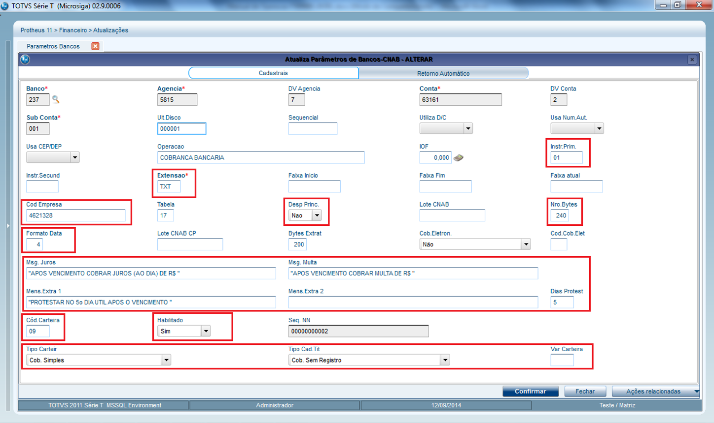{.flow-image}

- <strong>OPERAÇÃO</strong>: informe uma identificação para o cadastro, que será apresentado na tela de consulta padrão F3 de seleção do portador (exemplo: BRADESCO COBRANCA).
- <strong>INSTRUÇÃO PRIMÁRIA</strong>: informe “01” que é o código para REMESSA.
- <strong>EXTENSÃO</strong>: é a extensão que será gerado o arquivo de remessa. Consultar manual técnico de cada banco.
- <strong>CÓDIGO EMPRESA</strong>: informar o código de cliente da empresa junto ao banco referente ao contrato de cobrança. Fornecido pelo banco
- <strong>CÓDIGO TRANSMISSAO</strong>: utilizado para Santander informando o código da transmissão e para o banco CITI informando o código da conta COSMOS
- <strong>NR. BYTES</strong>: informe a quantidade de posições da remessa/retorno layout: 240 ou 400
- <strong>FORMATO DATA</strong>: informar o tipo da data que o banco trabalha no arquivo de retorno. Consultar manual técnico de cada banco Formato da data no retorno: 
    * 1-ddmmaa 
    * 2-mmddaa 
    * 3-aammdd 
    * 4-ddmmaaaa 
    * 5-aaaammdd 
    * 6-mmddaaaa
- <strong>MSG.JUROS / MSG.MULTA</strong>: informar as mensagens de instruções do boleto para juros e multa, estes campos são fórmulas em sintaxe ADVPL, na impressão de cada boleto é calculado o valor e concatenado na mensagem
- <strong>MSG.EXTRA 1 / MSG.EXTRA 2</strong>: informar as mensagens de instruções complementares para impressão no boleto, se necessário.Estes campos são fórmulas em sintaxe ADVPL
  - <strong>OBS</strong>: no campo MSG.EXTRA 2 poderá ser informado um caractere de quebra de linha CHR(13)+CHR(10) para forçar uma quebra na impressão da mensagem, diretamente na fórmula e/ou função ADVPL se utilizada (limitado a apenas uma quebra)
- <strong>DIAS PROTESTO</strong>: quando for necessário ter instrução de protesto automático na remessa, informar uma quantidade de dias para protesto. Para não protestar deixar o campo em branco
- <strong>CÓD. CARTEIRA</strong>: informe o código da carteira de cobrança contratada, fornecido pelo banco
- <strong>VARIAÇÃO CARTEIRA</strong>: específico para o Banco do Brasil informe o código da variação da carteira de cobrança contratada, fornecido pelo banco
- <strong>HABILITADO</strong>: informe “Sim” para ativar o cadastro do banco, habilitando o mesmo para ser selecionado na emissão de boletos bancários
- <strong>SEQUENCIAL NN</strong>: campo para controle do sequencial do Nosso Número, na inclusão do cadastro informe a numeração atual do Nosso Número junto ao banco, se a empresa já estiver utilizando cobrança bancária. Caso contrário, deixar em branco que será iniciado na primeira emissão de boleto
- <strong>TIPO CARTEIRA</strong>: informe o tipo da carteira de cobrança conforme contrato junto ao banco: 
    * 1=Cobrança Simples; 
    * 2=Cobrança Vinculada; 
    * 3=Cobrança Caucionada; 
    * 4=Cobrança Descontada; 
    * 5=Cobrança Vendor;

!!! tip "Obs: nem todos os bancos trabalham com todas as opções, consultar manual técnico do banco"
 

- <strong>TIPO CADASTRO TÍTULO</strong>: informe a modalidade de carteira de cobrança em relação a forma de cadastramento dos títulos:
    * 1=Cobrança Com Registro;
    * 2=Cobrança Sem Registro;

!!! tip "Obs: nem todos os bancos trabalham com todas as opções, consultar manual técnico do banco"
 

- <strong>COD. POSTO</strong>: campo de utilização exclusiva para o Banco SICREDI. Informe o código do posto de atendimento (pode ser obtido junto ao SICREDI)
- <strong>DIR. REMESSA</strong>: informe o caminho (diretório) onde serão gerados os arquivos de remessa. Exemplo: D:\CNAB\REMESSA\BANCO\. 
  Na hipótese de ser um caminho na rede, o mesmo deverá estar mapeado na unidade local. 
  Este caminho será automaticamente sugerido na rotina de geração de remessa
- <strong>DIR. RETORNO</strong>: informe o caminho (diretório) onde são gravados os arquivos de retorno de CNAB. Exemplo: D:\CNAB\RETORNO\BANCO. 
  Este campo é meramente informativo, apenas para auxílio ao usuário, pois no processamento do retorno o usuário deverá informar qual o arquivo a ser processado
- <strong>CONF. REMESSA</strong>: informe o nome do arquivo de configuração de remessa. 
  Exemplo: banco240.2RE
- <strong>CONF. RETORNO</strong>: informe o nome do arquivo de configuração de retorno. 
  Exemplo: banco240.2RR
- <strong>EMIS. BOLETO</strong>: informe quem é o responsável pela emissão e distribuição do Boleto. 
    * 1=Banco Emite
    * 2=Cliente emite     
!!! tip "Se este campo não for preenchido o padrão é 2=Cliente Emite (Beneficiário)" 
    

- <strong>BAIXA/DEV</strong>?: informe 1=Sim para que o banco após o período parametrizado no campo (DIAS P/BAIXA) efetue a baixa e devolução do título
- <strong>DIAS P/BAIXA</strong>?: informe a quantidade de dias para que títulos em aberto (não pagos) sofram baixa e devolução

<strong>PARÂMETROS RELACIONADOS</strong>

Existe a possibilidade de configurar quais portadores (banco/agencia/conta) estão habilitados para emissão de boletos bancários, sendo que somente os habilitados estarão disponíveis para seleção, para tanto é necessário verificar o parâmetro:

<strong>MV_X003001</strong> = .F. | Possibilita a habilitação de mais de um portador, ou seja, todos os portadores habilitados serão apresentados na consulta para emissão do boleto bancário.

<strong>MV_X003001</strong> = .T. | Somente um portador poderá estar ativo por vez e será selecionado automaticamente na emissão dos boletos.

Outros campos do cadastro de Parâmetros Bancários:

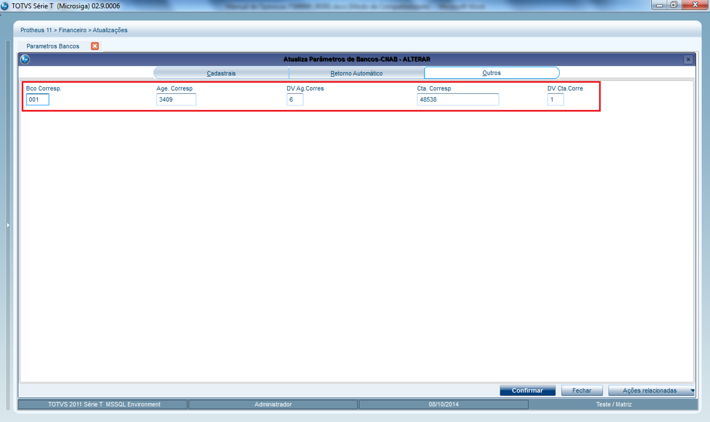{.flow-image}

- <strong>BCO CORRESP/AGE CORRESP/DV AG.CORRESP/CTA.CORRESP/DV CTA.CORRESP</strong>: Campos para informar o banco correspondente/vinculado ao banco Portador (Código do Banco, Código da Agência, Dígito Verificador da Agência, Número da Conta, DV da Conta). 
!!! tip "Opcional." 
    Exemplo de uso é o banco SICOOB que na opção de Cobrança Registrada utiliza o banco B.BRASIL como correspondente. Neste caso, na impressão dos Boletos e arquivo de remessa do CNAB devem ir algumas informações do banco correspondente ao invés do banco portador

#### 1.2. Ocorrências CNAB

O cadastro de ocorrências define os registros dos códigos atribuídos pelos próprios bancos a fim de identificar os resultados da leitura dos arquivos.

Devem ser cadastradas de acordo com o manual de cada banco.

Anexo ao pacote FS99999_003A existe uma tabela pré-cadastrada (seb003a.dtc) que poderá auxiliar no cadastramento. De qualquer forma, é importante a revisão das ocorrências de acordo com o manual de cada banco.

#### 1.3. Clientes

Na rotina de Cadastro de Clientes, é possível efetuar o relacionamento do cliente com os bancos que poderão ser utilizados para emissão do Boleto Bancário (este relacionamento é opcional). Se existir, somente os bancos relacionados ao cliente poderão ser utilizados.

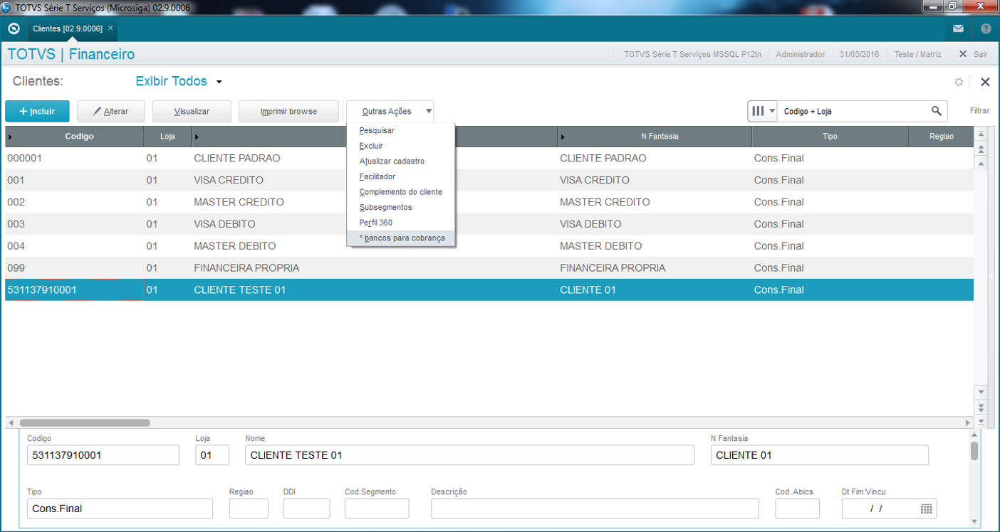{.flow-image}

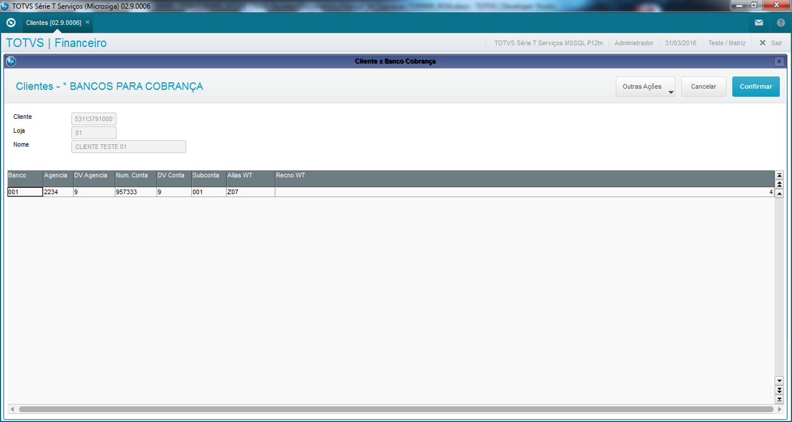{.flow-image}

Atentar para configuração do parâmetro <strong>MV_X003011</strong> (0=Desativa; 1=Ativa e não Edita; 2=Ativa e Edita)

<u>Envio de link ou .pdf para impressão do Boleto:</u>

No cadastro de clientes existem dois campos (envia ou não e-mail, e o endereço do e-mail), e deverão ser preenchidos de acordo com a necessidade de envio ou não do Workflow com os links dos boletos.

A prioridade é o campo A1_X_MAIL, se este não estiver preenchido, será encaminhado para A1_EMAIL.

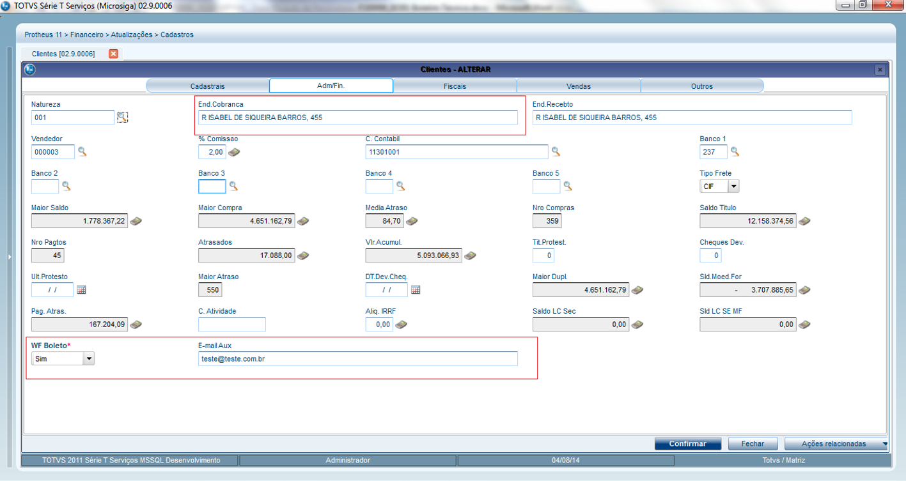{.flow-image}

Na hipótese do endereço de cobrança estar preenchido, é este endereço que será impresso no Boleto Bancário.

Ainda no Cadastro de Clientes, é possível configurar se o cliente será considerado para emissão do Boleto Bancário através do campo “Emite Boleto” – <strong>A1_X_EBOL</strong> (presente na aba Adm/Fin).

Se o campo estiver preenchido com N = Não, o cliente é desconsiderado para emissão de boleto bancário. Este procedimento deve ser utilizado para exceções, onde nunca deve ser emitido boleto ao cliente, por exemplo, um cliente que efetua pagamento via depósito bancário.

#### 2. EMISSÃO/IMPRESSÃO do Boleto Bancário

E emissão/impressão do boleto bancário poderá ser realizada nas seguintes rotinas:

#### 2.1 Pedido de Vendas (Prep. Doc. Saída)

Verificar parâmetro: <strong>MV_X003002</strong>, <strong>MV_X003009</strong>

Para todos os pedidos de vendas faturados na rotina de Prep. Doc. Saída (indiferente da forma/condição de pagamento), será apresentada a tela com possibilidade de escolha do banco (listando apenas portadores habilitados no Cadastro de Parâmetros de Bancos), e marcação dos títulos que serão gerados os boletos.

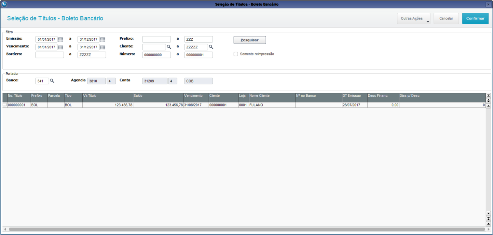{.flow-image}

De acordo com a configuração do parâmetro <strong>MV_X003009</strong>, serão marcados automaticamente os títulos com emissão/vencimento iguais, ou seja, à vista.

O boleto será impresso após a confirmação.

É possível efetuar ainda a reimpressão do boletos bancários, basta selecionar o pedido de venda em questão, em Ações Relacionadas ->Reimpressão Boleto.

<u>Ponto de Entrada disponibilizado:</u> <strong>PE003A01</strong> - Ponto de Entrada chamado na inicialização da tela de seleção de títulos.
Permite alterar os dados do portador sugerido.

#### 2.2 Venda Direta

Verificar parâmetro: <strong>MV_X003004</strong>, <strong>MV_X003009</strong>

Para todas as vendas com forma de pagamento diferente de R$, CC, CD ou CH, será apresentada a tela com possibilidade de escolha do banco (listando apenas portadores habilitados no Cadastro de Parâmetros de Bancos), e marcação dos títulos que serão gerados os boletos.

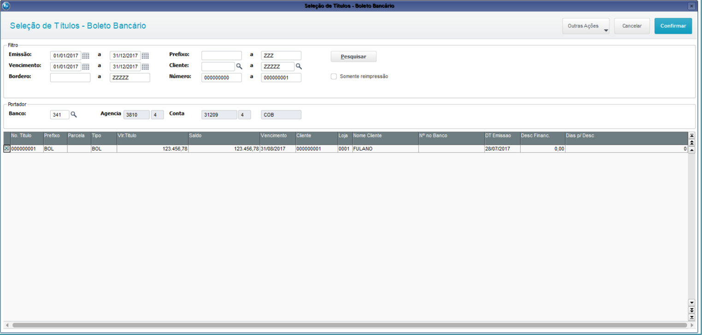{.flow-image}

De acordo com a configuração do parâmetro <strong>MV_X003009</strong>, serão marcados automaticamente os títulos com emissão/vencimento iguais, ou seja, à vista.

O boleto será impresso após a confirmação.

Para os layouts (2,3 e 4) – Impressão em .PDF, pode-se configurar o sistema para que seja gerado apenas 1 arquivo .PDF por Cliente, ou seja, se existirem várias NFs para o mesmo cliente, todos os boletos serão impressos em um único arquivo, ou, efetuar a impressão de um arquivo .PDF por Nota Fiscal, assim, se o cliente possuir mais de uma NF, serão gerados vários arquivos.

Configuração do parâmetro <strong>MV_X003016</strong>
<strong>S</strong> = Sistema gera um único preview em .pdf para impressão e encaminha 1 .pdf por Cliente via e-mail (se configurado para envio do e-mail). Se o cliente possuir 2 notas por exemplo, será encaminhado apenas 1 e-mail.
<strong>N</strong> = Sistema gera um único preview em .pdf para impressão e encaminha 1 .pdf por Nota Fiscal para o Cliente (via e-mail). Se o cliente possuir 2 notas por exemplo serão encaminhados 2 e-mails
De acordo com a configuração do parâmetro MV_X003009, serão marcados automaticamente os títulos com emissão/vencimento iguais, ou seja, à vista.

<u>Ponto de Entrada disponibilizado:</u> <strong>PE003A01</strong> - Ponto de Entrada chamado na inicialização da tela de seleção de títulos.
Permite alterar os dados do portador sugerido.

#### 2.3 Venda Assistida

Verificar parâmetro: <strong>MV_X003003</strong>, <strong>MV_X003009</strong>

Para todas as vendas com forma de pagamento diferente de R$, CC, CD ou CH, será apresentada a tela com possibilidade de escolha do banco (listando apenas portadores habilitados no Cadastro de Parâmetros de Bancos), e marcação dos títulos que serão gerados os boletos.

{.flow-image}

De acordo com a configuração do parâmetro <strong>MV_X003009</strong>, serão marcados automaticamente os títulos com emissão/vencimento iguais, ou seja, à vista.

O boleto será impresso após a confirmação.

<u>Ponto de Entrada disponibilizado:</u> <strong>PE003A01</strong> - Ponto de Entrada chamado na inicialização da tela de seleção de títulos.
Permite alterar os dados do portador sugerido.

#### 2.4 Documento de Saída

Verificar parâmetro: <strong>MV_X003010</strong>, <strong>MV_X003009</strong>

Será apresentada a tela com possibilidade de escolha do banco (listando apenas portadores habilitados no Cadastro de Parâmetros de Bancos), e marcação dos títulos que serão gerados os boletos, para todos os títulos gerados pelas notas fiscais de saídas processadas.

{.flow-image}

De acordo com a configuração do parâmetro <strong>MV_X003009</strong>, serão marcados automaticamente os títulos com emissão/vencimento iguais, ou seja, à vista.

    O boleto será impresso após a confirmação.

<u>Ponto de Entrada disponibilizado:</u> <strong>PE003A01</strong> - Ponto de Entrada chamado na inicialização da tela de seleção de títulos.
Permite alterar os dados do portador sugerido.

Para os layouts (2, 3 e 4) – Impressão em .PDF:

Configuração do parâmetro <strong>MV_X003016</strong>
<strong>S</strong> = Sistema gera um único preview em .pdf para impressão e encaminha 1 .pdf por Cliente via e-mail (se configurado para envio do e-mail). Se o cliente possuir 2 notas por exemplo, será encaminhado apenas 1 e-mail.
<strong>N</strong> = Sistema gera um único preview em .pdf para impressão e encaminha 1 .pdf por Nota Fiscal para o Cliente (via e-mail). Se o cliente possuir 2 notas por exemplo serão encaminhados 2 e-mails

#### 2.5 Emissão de Boleto (rotina personalizada)

O boleto também poderá ser emitido/reimpresso em rotina personalizada (M003A01).

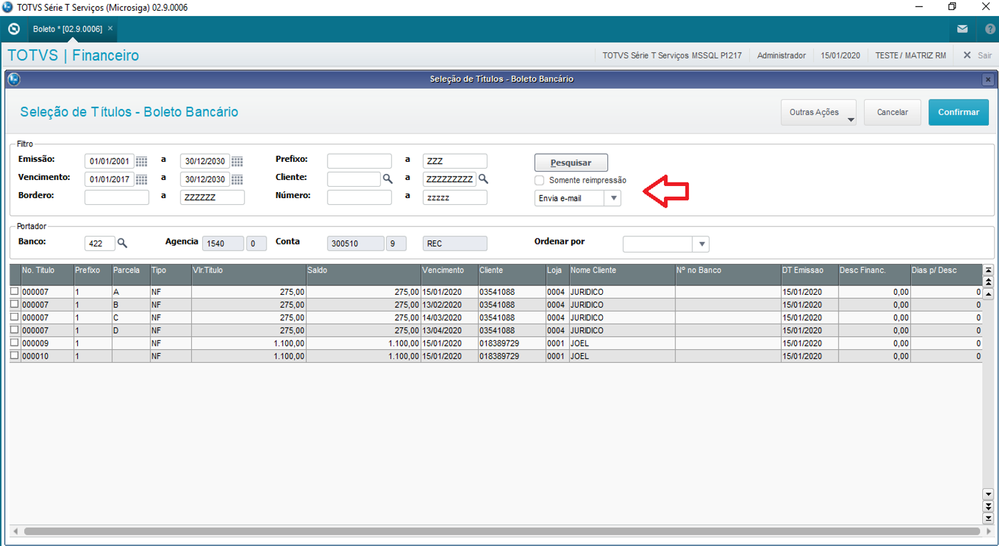{.flow-image}

Basta selecionar os títulos e confirmar.
Os boletos serão impressos após a confirmação.

Na hipótese de reimpressão de um boleto bancário, <u><strong>o nosso número nunca será recalculado</strong></u>, no entanto o código de barras e a linha digitável sempre serão recalculados.

Após a impressão do boleto, poderá ser encaminhado um e-mail ao cliente (ver item 4.3).
Na tela de impressão de forma manual, é possível o usuário escolher se o sistema deverá ou não enviar e-mail ao cliente. Se o usuário escolher “Enviar e-mail” sistema fará as verificações de acordo com o item 4.3. Se escolher “Não enviar e-mail” o boleto não será enviado.

Atentar para parâmetros:
<strong>MV_X003006</strong>: Habilita o envio de e-mail.
<strong>MV_X003012</strong>: Layout do boleto (ver item 6)

<u><strong>Para Layout Modelo 1 (envio de lista para que o cliente acesse o boleto via link)</strong></u>:

  Impressão de Boleto Cobrança  
  
  <strong>Prezado Cliente: CLIENTE TESTE BOLETO BANCARIO</strong>  
  
  Como combinamos, estamos encaminhando o link para emissão dos boletos para pagamento, abaixo:  
  
  <table class="tabela-titulos" style="margin: 10px 0;">
    <thead>
      <tr>
        <th>Link</th>
        <th class="col-titulo">Tít.Número/Parcela</th>
        <th>Vencimento</th>
        <th>Valor</th>
      </tr>
    </thead>
    <tbody>
      <tr>
        <td><a href="#">09000000000000321</a></td>
        <td>123456/001</td>
        <td>10/08/14</td>
        <td class="col-valor">155,00</td>
      </tr>
    </tbody>
  </table>
  
   
  <strong>Atenciosamente</strong> 
  TOTVS - MATRIZ 
  RUA RECIFE, 1458 - CASCAVEL - PR  
  55 45 40093689

<u><strong>Para Layout Modelos 2 e 3 (envio do boleto anexo em .PDF)</strong></u>

  Impressão de Boleto Cobrança  

<strong>Prezado Cliente: CLIENTE TESTE BOLETO BANCARIO</strong>
 
 

Como combinamos, estamos encaminhando arquivo em formato .PDF para emissão dos boletos para pagamento.  
 
<strong>Atenciosamente</strong> 
TOTVS - MATRIZ 
RUA RECIFE, 1458 - CASCAVEL - PR  
55 45 40093689

Pontos de Entrada disponibilizados:

<strong>PE003A01</strong> - Ponto de Entrada chamado na inicialização da tela de seleção de títulos.
Permite alterar os dados do portador sugerido.

<strong>PE003A04</strong> - Ponto de Entrada chamado antes do envio do e-mail ao cliente.
Permite alterar o destinatário do e-mail.

#### 3. LAYOUTS DISPONÍVEIS PARA IMPRESSÃO DO BOLETO

---

<u><strong>Layout 1: Com recibo Pagador, envio via e-mail link (formato .htm)</strong></u>

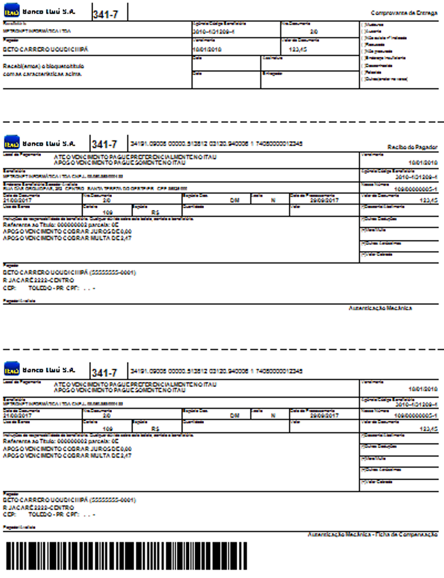{.flow-image}

---

<u><strong>Layout 2: Com recibo Pagador, envio via e-mail com anexo .PDF:</strong></u>

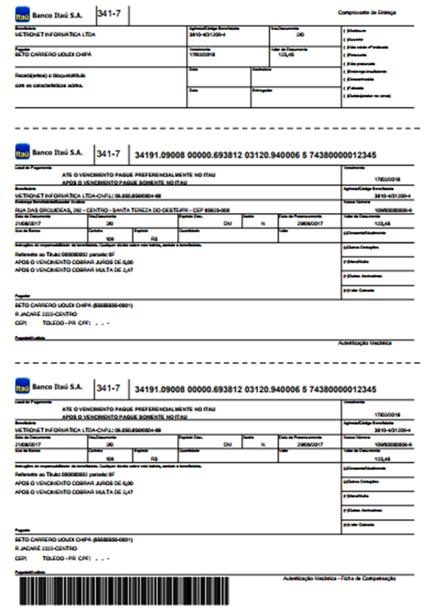{.flow-image}

<u>Ponto de Entrada disponibilizado:</u> <strong>PE003A14</strong> - Ponto de Entrada disponibilizado para que seja possível alterar a nomenclatura do arquivo .pdf gerado.

Nomenclatura padrão: Filial + Cliente + Loja + Hora + Minuto

---

<u><strong>Layout 3: Sem recibo Pagador, envio via e-mail com anexo .PDF:</strong></u>

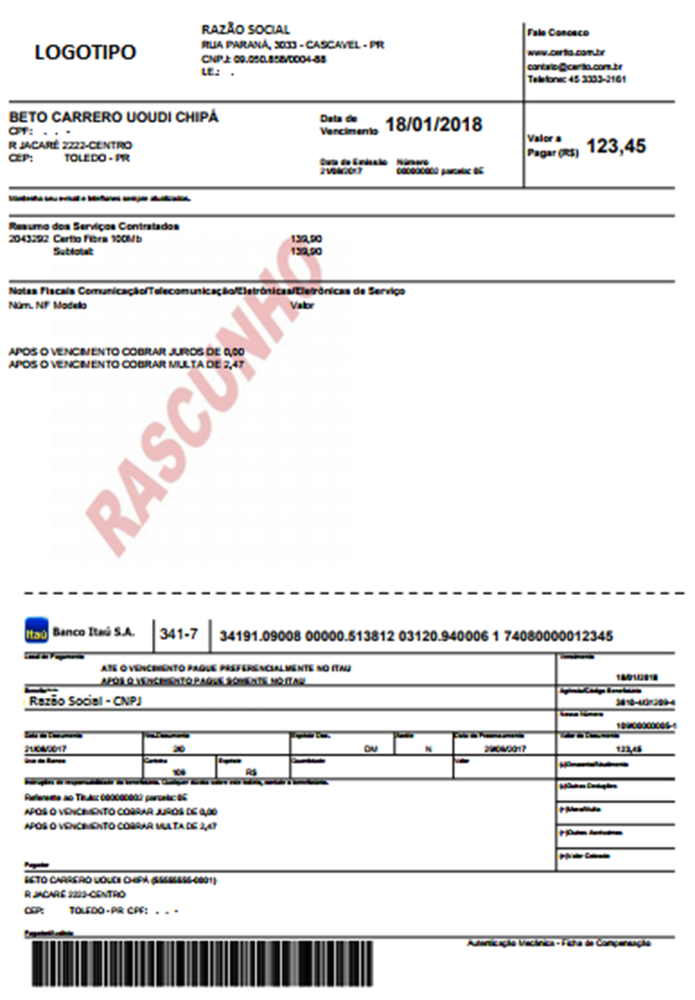{.flow-image}

<U><strong>Nota:</strong></u> Através do ponto de entrada <strong>PE003A05</strong> é possível alterar o corpo do e-mail.

<u>Ponto de Entrada disponibilizado:</u> <strong>PE003A14</strong> - Ponto de Entrada disponibilizado para que seja possível alterar a nomenclatura do arquivo .pdf gerado. 
Nomenclatura padrão: Filial + Cliente + Loja + Hora + Minuto

---

<u><strong>Layout 4: Em formado de carnê, até 3 boletos por página.</strong></u>

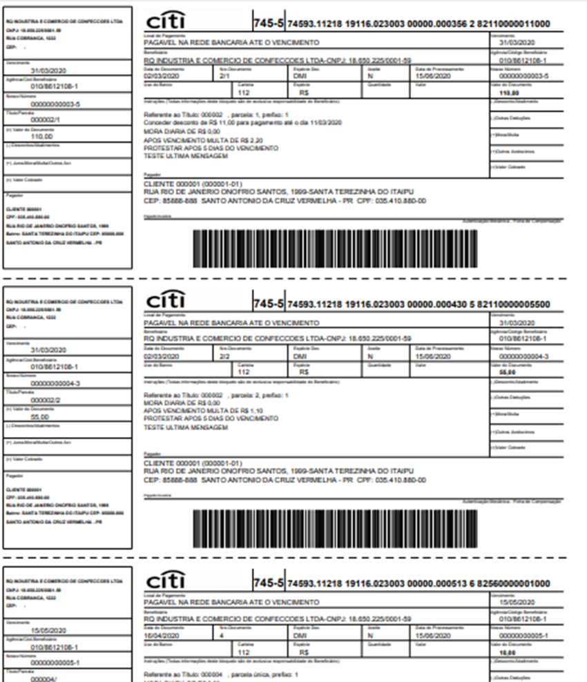{.flow-image}

<u>Ponto de Entrada disponibilizado:</u> <strong>PE003A14</strong> - Ponto de Entrada disponibilizado para que seja possível alterar a nomenclatura do arquivo .pdf gerado.  
Nomenclatura padrão: Filial + Cliente + Loja + Hora + Minuto

---

<u><strong>Impressão de Marca D’água no corpo do boleto bancário (Layout 1 e Layout 2):</strong></u>

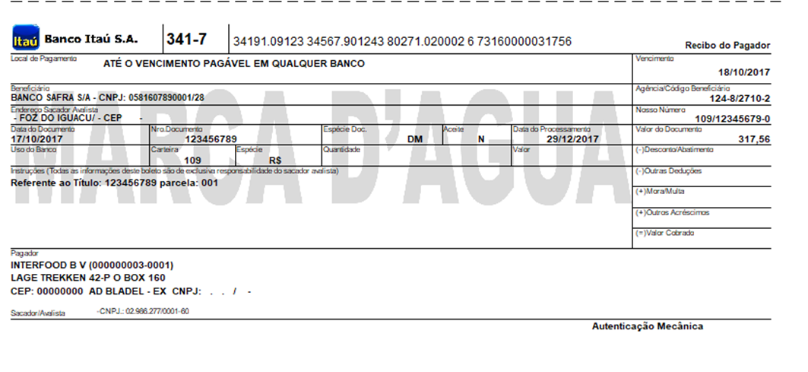{.flow-image}

Verificar parâmetro:
<strong>MV_X003015</strong> = nLinhaIni, nColunaIni, caminho+nome_arquivo, nColunaFim, nLinhaFim 
Exemplo de preenchimento: 300,100,\web\marca.png,1800,400 
Se estiver em branco não será impressa.

#### 4. Geração do Borderô a Receber

Após os boletos já impressos, se faz necessário incluir um borderô a receber, para envio do arquivo CNAB ao banco.

Verificar parâmetro:

<strong>MV_X003005</strong> = .T. | Executa filtro na rotina de borderô listando apenas títulos com o portador anteriormente relacionado na impressão do boleto.

<strong>MV_X003005</strong> = .F. | Não efetua filtro nenhum.

Após a geração do borderô basta emitir o arquivo de remessa ao banco. (Comunicação Bancária / Arquivo de Cobranças).

<strong><u>Nomenclatura arquivo de cobrança:</u></strong>

A nomenclatura é sugerida automaticamente, de acordo com manual de configuração dos bancos.
Para bancos onde não constam informações a este respeito, o padrão adotado pela Totvs/Cascavel será:

<table class="banks-table">
  <thead>
    <tr>
      <th>Banco</th>
      <th>Arquivo de Saída</th>
      <th>Exemplo</th>
    </tr>
  </thead>
  <tbody>
    <tr>
      <td><strong>237 - BRADESCO</strong></td>
      <td><strong>CBDDMM??.REM</strong> 
<strong>CB</strong> – Cobrança Bradesco 
<strong>DD</strong> – O Dia geração do arquivo 
<strong>MM</strong> – O Mês da geração do Arquivo 
<strong>??</strong> - variáveis alfanuméricas/Númericas 
<strong>.Rem</strong> – Extensão do arquivo
Ex.: 01, AB, A1 etc. </td>
      <td><strong>Exemplo:</strong> <strong>CB010501.REM </strong> ou <strong>CB0105AB.REM</strong> ou <strong> CB0105A1.REM</strong></td>
    </tr>
    <tr>
      <td><strong>756 - SICREDI</strong></td>
      <td><strong>CCCCCMDD.CRM</strong> (para envio do primeiro arquivo de remessa do dia) 
<strong>CCCCC</strong> = código beneficiário  
<strong>MDD</strong> = cód. do mês e nº do dia da data de geração do arquivo  
<strong>CRM</strong> = Indica que é o 1º arquivo remessa   

<strong>CCCCCMDD.RMX</strong> (para envio de mais de um arquivo de remessa no mesmo dia) 
<strong>CCCCC</strong> = código beneficiário  
<strong>MDD</strong> = cód. do mês e nº do dia da data de geração do arquivo  
<strong>CRM</strong> = Indica que é o 1º arquivo remessa  

<strong>RMX</strong> = Indica que o beneficiário enviou mais de um arquivo remessa na data, onde <strong>RM</strong> = Remessa e <strong>X</strong> = sequencia do arquivo remessa. Iniciará sempre em “2” (segundo arquivo remessa gerado no dia) e terá sequencia de acordo com a quantidade de arquivos remessa gerados pelo beneficiário, podendo ser “3”, “4”, “5”, “6”, “7”, “8”, “9” e “0” (décimo e último arquivo remessa que poderá ser gerado pelo beneficiário).

</td>
      <td>-</td>
    </tr>
  </tbody>
</table>

<strong>Nota:</strong> Quando se tratar de arquivo remessa para teste, a extensão deverá ser TST. 
<strong>Exemplo:</strong> CB010501.TST, o retorno será disponibilizado como CB010501.RST.

<table class="tabela-compacta">
  <thead>
    <tr>
      <th>Mês</th>
      <th>Código</th>
    </tr>
  </thead>
  <tbody>
    <tr>
      <td>Janeiro</td>
      <td>1</td>      
    </tr>
    <tr>
      <td>Fevereiro</td>
      <td>2</td>      
    </tr>
    <tr>
      <td>Março</td>
      <td>3</td>      
    </tr>
    <tr>
      <td>Abril</td>
      <td>4</td>      
    </tr>
    <tr>
      <td>Maio</td>
      <td>5</td>      
    </tr>
    <tr>
      <td>Junho</td>
      <td>6</td>      
    </tr>
    <tr>
      <td>Julho</td>
      <td>7</td>      
    </tr>
    <tr>
      <td>Agosto</td>
      <td>8</td>      
    </tr>
    <tr>
      <td>Setembro</td>
      <td>9</td>      
    </tr>
    <tr>
      <td>Outubro</td>
      <td>O (Letra)</td>      
    </tr>
    <tr>
      <td>Novembro</td>
      <td>N (Letra)</td>      
    </tr>
    <tr>
      <td>Dezembro</td>
      <td>D (Letra)</td>      
    </tr>    
  </tbody>
</table>

!!! warning "Atenção"
    É possível alterar a nomenclatura do arquivo de saída através do ponto de entrada <strong>PE003A18</strong>

#### 5. Transferência de Carteira

Ao transferir um título que já possua nosso número (boleto já impresso), para a carteira ‘0’, o nosso número será apagado, garantindo a consistência junto ao agente cobrador (padrão do sistema).

É possível realizar a transferência da carteira 1 para outras carteiras, sem passar para a carteira ‘0’, ou seja, sem perder o nosso número. Para isto a transferência não poderá ser contabilizada. Atentar para o preenchimento do terceiro parâmetro na rotina de transferência contas a receber.

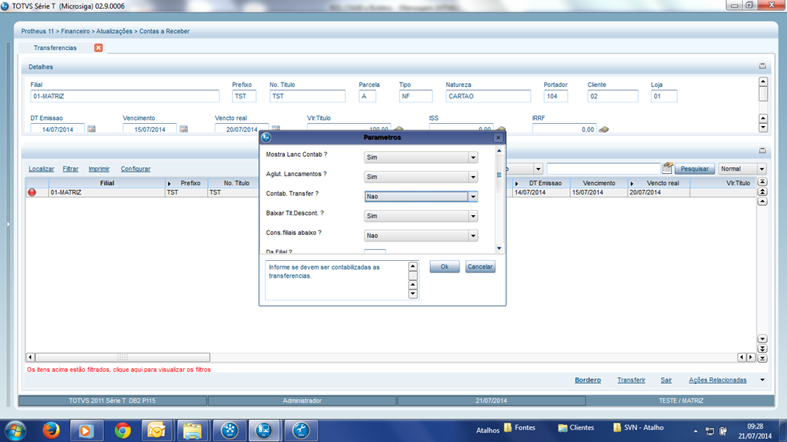{.flow-image}

Contab. Transferência = Não, permite a transferência da carteira 01 para várias outras, como por exemplo Descontada.

#### 5. Instrução de Cobrança

Após o envio do arquivo de remessa ao banco, muitas vezes se faz necessário efetuar algum tipo de alteração no título: alteração de data de vencimento, instrução para que o banco cancele o protesto, etc.  
Para isto, ao alterar um título a receber que está relacionado a um borderô, o sistema emite um aviso, solicitando ao usuário se o mesmo deseja incluir instruções de cobrança:

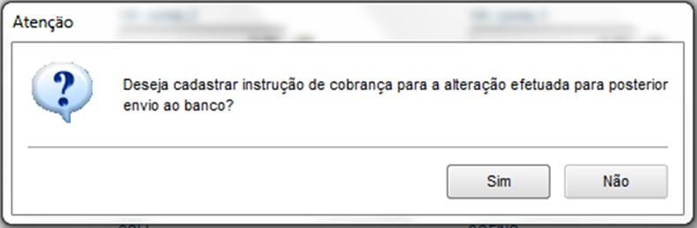{.flow-image}

Selecionar SIM se a instrução será posteriormente enviada ao banco, será apresentada a tela:

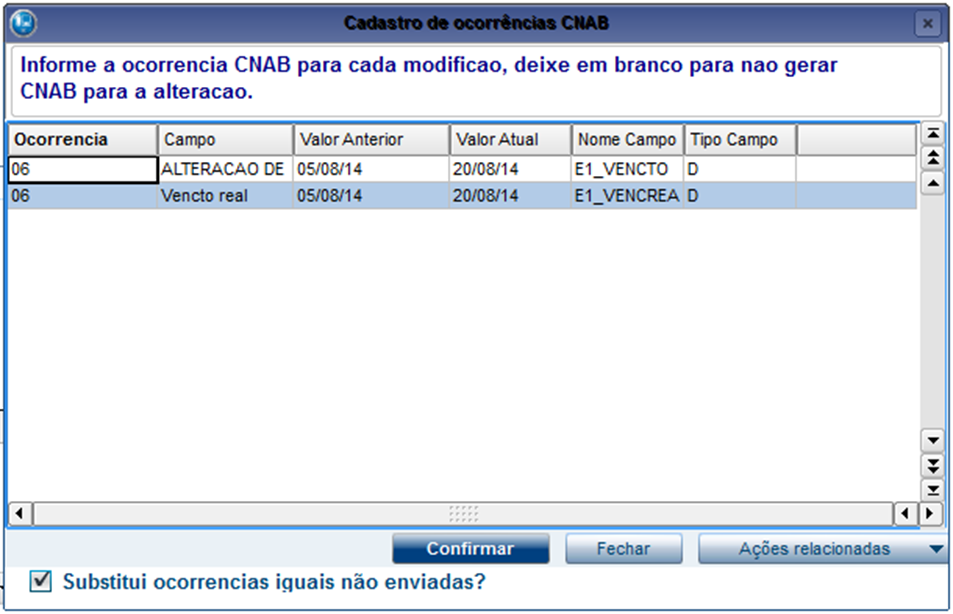{.flow-image}

Usuário deverá informar o código da ocorrência.

!!! warning "Importante"
    Deverá ser cadastrada apenas uma ocorrência por título no arquivo de instruções, pois somente a última ocorrência é gravada na tabela SE1, e é está que será enviada.

Após a alteração, basta gerar o arquivo de instruções (Comunicação Bancária / Instr. Cobrança) e enviá-lo ao banco.

    <a href="/" class="md-button" style="text-decoration: none;">← Voltar para a Página Inicial</a>

