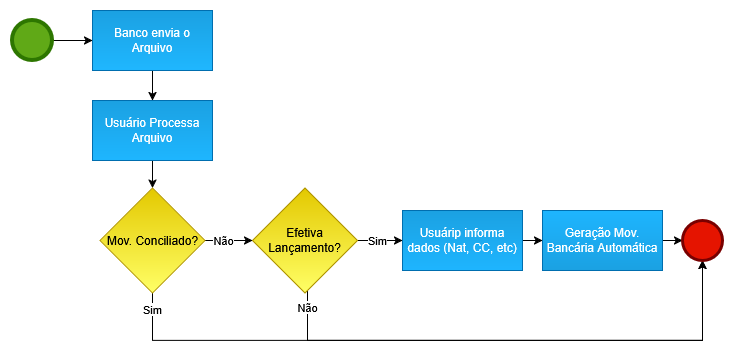
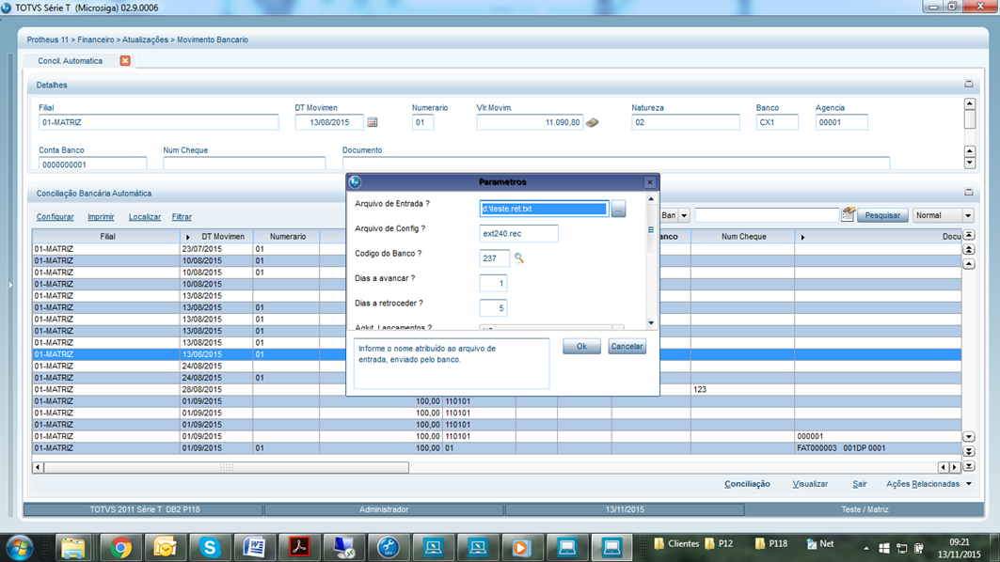
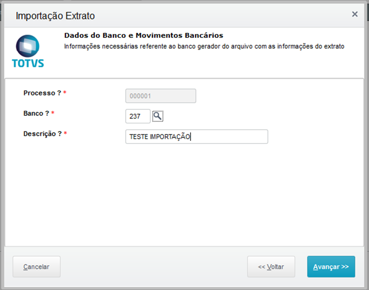
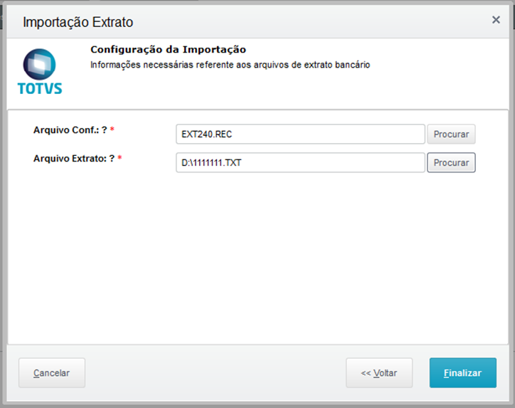

# CNAB EXTRATO BANCARIO {.home-hero}

  01. Visão Geral

### 1. Visão Geral
Este pacote de automação promove ao usuário uma forma de conciliação bancária automatizada utilizando-se do arquivo de retorno bancário para extratos para uma ou mais contas correntes.

A conciliação permite confrontar o extrato bancário com a movimentação bancária registrada no ERP.

Seu resultado final é similar à conciliação bancária, a diferença entre elas é que a reconciliação é feita através de um arquivo enviado pelo banco, informando quais títulos foram processados. A conciliação Automática atualiza o arquivo de movimentação bancária

#### Conciliação Automática de Extratos Bancários

Implementa o processamento automático de arquivos CNAB (Centro Nacional de Automação Bancária) de retorno/extrato bancário, permitindo a conciliação ágil e precisa de uma ou mais contas correntes. 
O processo importa o arquivo enviado pelo banco e compara automaticamente as movimentações registradas no extrato com as movimentações bancárias já lançadas no Protheus (tabelas relacionadas ao módulo Financeiro/SIGAFIN).

A conciliação Automática atualiza o arquivo de movimentação bancária.

<strong>Benefícios e atualizações realizadas:</strong>

- Agiliza a conferência e o controle financeiro. 
- Melhora a confiabilidade dos saldos e relatórios. 
- Facilita a identificação rápida de itens não registrados ou discrepâncias. 

  02. Bancos Contemplados

### 2. Bancos Contemplados

#### Os seguintes bancos estão contemplados neste pacote/ADD-ON:

<table class="banks-table">
  <thead>
    <tr>
      <th>Banco</th>
      <th>Layout CNAB</th>
      <th>Observações</th>
    </tr>
  </thead>
  <tbody>
    <tr>
      <td><strong>BANCO DO BRASIL (001)</strong></td>
      <td>240 posições</td>
      <td>-</td>
      </tr>
    <tr>
      <td><strong>SICREDI (748)</strong></td>
      <td>240 posições</td>
      <td>-</td>
    </tr>
    <tr>
      <td><strong>HSBC (399)</strong></td>
      <td>240 posições</td>
       <td>-</td>
    </tr>
    <tr>
      <td><strong>ITAÚ (341)</strong></td>
      <td>240 posições</td>
       <td>-</td>
    </tr>
    <tr>
      <td><strong>BRADESCO (237)</strong></td>
      <td>240 posições</td>
       <td>-</td>
    </tr>
    <tr>
      <td><strong>SANTANDER (033)</strong></td>
      <td>240 posições</td>
       <td>-</td>
    </tr>    
  </tbody>
</table>

  03. Fluxo Operacional Básico

### 3. Fluxo Operacional Básico

#### Representação visual do fluxo operacional básico do produto

{.flow-image}

  04. Rotinas do Pacote

### 4. Rotinas do Pacote

#### Principais rotinas e funções incluídas no ADD-ON

<table class="banks-table">
  <thead>
    <tr>
      <th>Função</th>
      <th>Descrição</th>
    </tr>
  </thead>
  <tbody>
    <tr>
      <td><strong>X003D01</strong></td>
      <td>Rotina centralizadora de funções genéricas.</td>
    </tr>
    <tr>
      <td><strong>UPD003D</strong></td>
      <td>Programa compatibilizador do Dicionário de Dados para aplicação do ADD-ON.</td>
    </tr>    
  </tbody>
</table>

  05. Parâmetros

### 5. Parâmetros

#### Parâmetros configuráveis do ADD-ON CNAB a Pagar

<table class="banks-table">
  <thead>
    <tr>
      <th>Nome</th>
      <th>Tipo</th>
      <th>Descrição</th>
      <th>Conteúdo</th>
    </tr>
  </thead>
  <tbody>
    <tr>
      <td><strong>MV_X003D00</strong></td>
      <td>Lógico</td>
      <td>Ativa utilização do ADD-ON CNAB Extrato.</td>
      <td>.T.</td>
    </tr>    
  </tbody>
</table>

  06. Pontos de Entrada Padrão X Compatibilização ADD-ON

### 6. Pontos de Entrada Padrão X Compatibilização ADD-ON

#### Não há Pontos de entrada padrão utilizados para este ADD-ON

  07. Pontos de entrada específicos ADDON

### 7. Pontos de entrada específicos ADDON

#### Não há pontos de entrada específicos para este ADDON

  08. Campos personalizados (SEE – Parâmetros de Banco)

### 8. Campos personalizados (SEE – Parâmetros de Banco)

Campo **EE_X_CEXT**

<table class="banks-table">
  <tbody>
    <tr>
      <th>Tipo</th>
      <td>C</td>
      <th>Tamanho</th>
      <td>12</td>
      <th>Decimal</th>
      <td>0</td>
      <th>Formato</th>
      <td>@!</td>
    </tr>
    <tr>
      <th>Contexto</th>
      <td>Real</td>
      <th>Propriedade</th>
      <td>Alterar</td>
      <th>Obrigatório</th>
      <td>N</td>
      <th>Browse</th>
      <td>S</td>
    </tr>
    <tr>
      <th>Título</th>
      <td colspan="7">Conf.Extrato</td>
    </tr>
    <tr>
      <th>Descrição</th>
      <td colspan="7">Arquivo Configuracao Extrato</td>
    </tr>
  </tbody>
</table>

#### **Help**

Informe o nome do arquivo de configuracao para Conciliação Bancária Automática.

#### **Configurações adicionais**

<table class="banks-table">
  <tbody>
    <tr>
      <th>F3</th>
      <td></td>
    </tr>
    <tr>
      <th>Modo Edição</th>
      <td></td>
    </tr>
    <tr>
      <th>Val. Usuário</th>
      <td></td>
    </tr>
    <tr>
      <th>Lista Opções</th>
      <td></td>
    </tr>
    <tr>
      <th>Inicializador</th>
      <td></td>
    </tr>
    <tr>
      <th>Ini. Browse</th>
      <td></td>
    </tr>
  </tbody>
</table>

  09. Campos padrões (SEE - Parâmetros de Banco)

### 9. Campos padrões (SEE - Parâmetros de Banco)

#### Não há campos Padrões para este ADDON.

  10. Parêmetros (SX1)

### 10. Parêmetros (SX1)

<table class="banks-table">
  <thead>
    <tr>
      <th>Grupo</th>
      <th>Ordem</th>
      <th>Tamanho</th>
      <th>Objeto</th>
      <th>Consulta Padrão</th>      
    </tr>
  </thead>
  <tbody>
    <tr>
        <td><strong>AFI470</strong></td>
        <td>1</td>
        <td>50</td>
        <td>File</td>
        <td>-</td>        
    </tr> 
    <tr>
        <td><strong>AFI470</strong></td>
        <td>3</td>
        <td>-</td>
        <td>-</td>
        <td>SEE03D</td>        
    </tr>    
  </tbody>
</table>

  11. Tabelas (SX2)

### 11. Tabelas (SX2)

<table class="banks-table">
  <thead>
    <tr>
      <th>Prefixo</th>
      <th>SEJ</th> 
    </tr>
  </thead>
  <tbody>
    <tr>
        <td><strong>Descrição</strong></td>
        <td>Ocorrências Extrato</td>      
    </tr> 
    <tr>
        <td><strong>Ac. Filial</strong></td>
        <td>Compartilhado</td>      
    </tr> 
    <tr>
        <td><strong>Ac. Unidade</strong></td>
        <td>Compartilhado</td>      
    </tr> 
    <tr>
        <td><strong>Ac. Empresa</strong></td>
        <td>Compartilhado</td>      
    </tr>     
  </tbody>
</table>

  12. Consulta Padrão (SXB)

### 12. Consulta Padrão (SXB)

<table class="banks-table">
  <thead>
    <tr>
      <th>Tipo</th>
      <th>Nome</th>
      <th>Descrição</th>
      <th>Colunas</th>
      <th>Retorno</th>
      <th>Filtro</th>
    </tr>
  </thead>
  <tbody>
    <tr>
        <td>Consulta Padrão</td>
        <td><strong>SEE03D</strong></td>
        <td>Parametros Banco</td>
        <td>EE_CODIGO, EE_AGENCIA, EE_CONTA, EE_SUBCTA</td>
        <td>EE_CODIGO, U_X003D01('ARQCONF')</td>
        <td>-</td>
    </tr>    
  </tbody>
</table>

  13. Manual de operação

### 13. Manual de operação

#### 1. Cadastros

#### 1.1. Parâmetros de Bancos

Neste cadastro são definidos detalhes técnicos que posteriormente serão utilizados para formatação e emissão do arquivo de remessa ao banco. 

Seu correto preenchimento é de suma importância, abaixo os principais campos que devem ser observados. 

<strong>Bytes Extrat</strong>: informe a quantidade de posições do arquivo de extrato (200/240) de acordo com cada banco.

#### 1.2. OCORRÊNCIAS CNAB

O cadastro de ocorrências define os registros dos códigos atribuídos pelos próprios bancos a fim de identificar os resultados da leitura dos arquivos.

Devem ser cadastradas de acordo com o manual de cada banco. 

Anexo ao pacote <strong>FS99999_003D</strong> existe uma tabela pré-cadastrada (CARGASEJ.dtc) que poderá auxiliar no cadastramento. De qualquer forma, é importante a revisão das ocorrências de acordo com o manual de cada banco. 

#### 2. CONCILIAÇÃO AUTOMÁTICA - EXTRATO BANCÁRIO

#### 2.1. Conciliação Automática - Extrato

Módulo: Financeiro
Atualizações -> Movimento Bancario -> Conciliacao Automatica

Efetuar a configuração dos parâmetros da rotina.

<strong><u>Protheus Versão 11:</u></strong>

Ao selecionar o banco, o nome do arquivo de configuração será sugerido automaticamente. De acordo com o Cadastro de Parâmetros do Banco. 

{.flow-image}

<strong><u>Protheus Versão 12:</u></strong>

Ao selecionar a opção Importar, será apresentado um Wizard para auxiliar na importação do arquivo de extrato enviado pelo banco.  
O usuário deverá atentar-se para o arquivo de configuração de acordo com o número de posições contratado junto ao banco.  
ext240.rec = extrato de 240 posições  
ext200.rec = extrato de 200 posições  

{.flow-image}

{.flow-image}

!!! warning "Atenção: Após a importação do arquivo, basta selecionar a opção CONCILIAR."

    <a href="/" class="md-button" style="text-decoration: none;">← Voltar para a Página Inicial</a>

