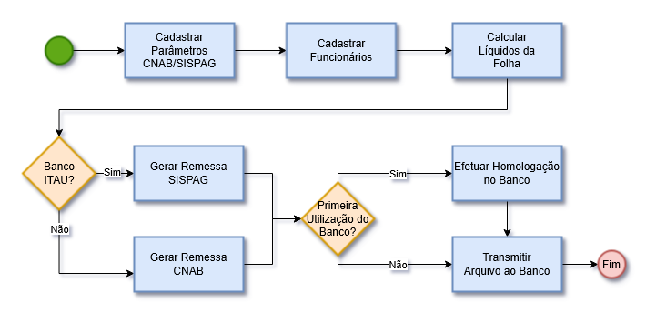
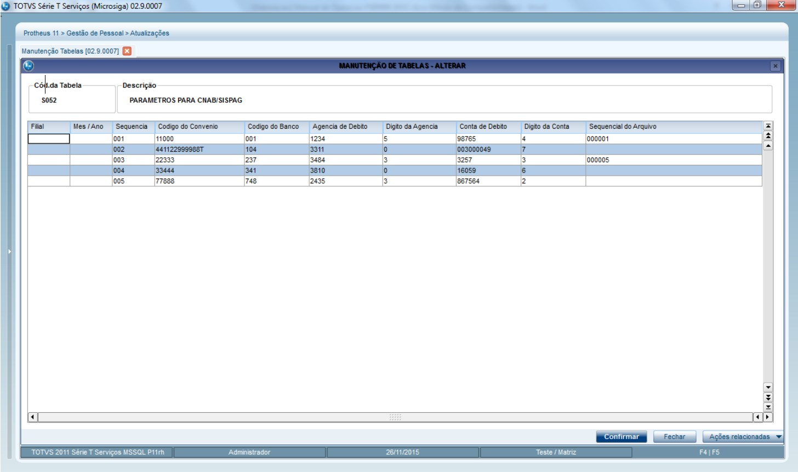
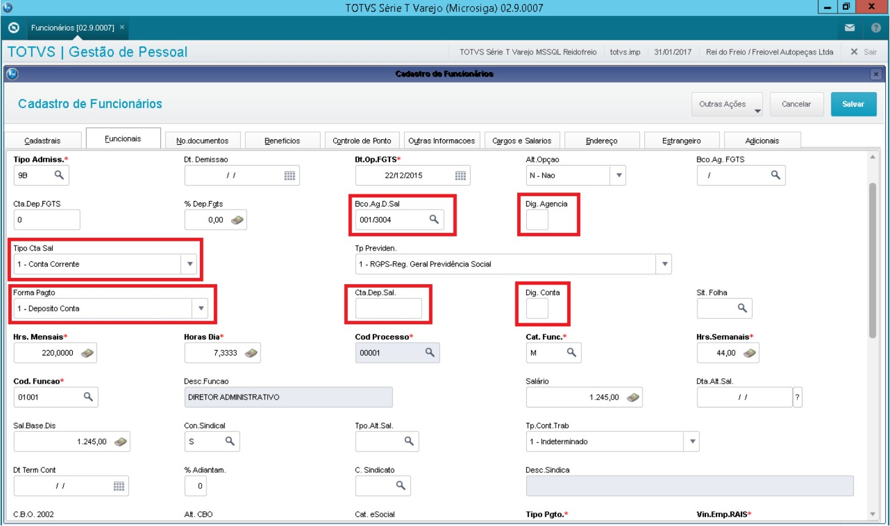
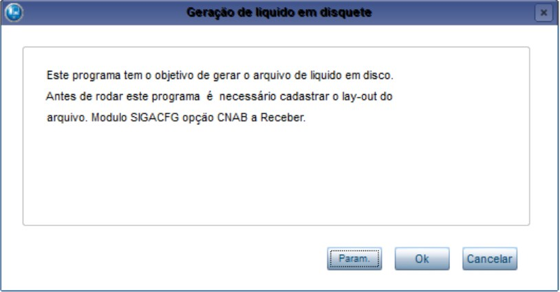
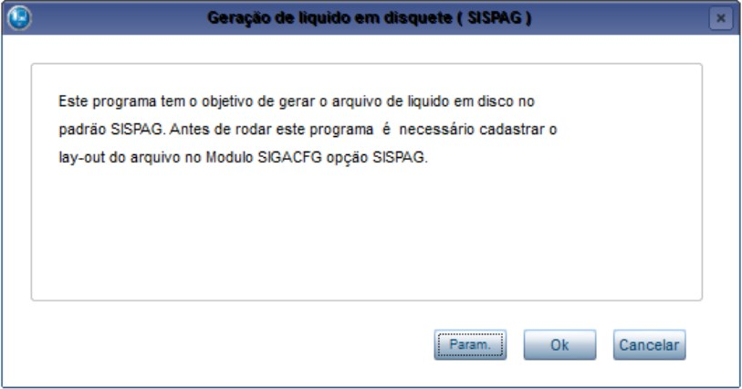
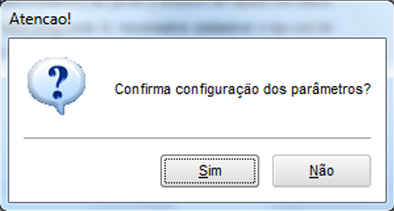
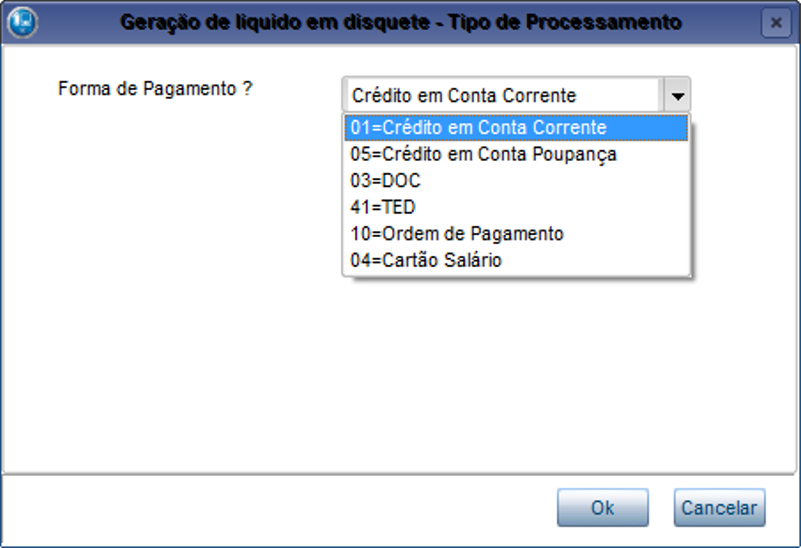
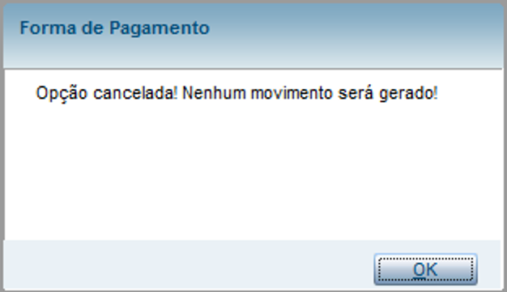

# CNAB FOLHA {.home-hero}

<div class="confluence-card" markdown="1">

<details class="custom-expand" open markdown="1">
<summary>
  <span class="summary-title"><span class="summary-number">01.</span> Visão Geral</span>
</summary>
<div class="content-body" markdown="1">

### <span style="display: none;">1. Visão Geral</span>
Este pacote de automação promove ao usuário uma forma ágil no processso de fechamento folha, permitindo na geração do arquivo de liquidos, montar filtros para a geração do arquivo e assim determinando a forma padronizada do pagamento sobre este arquivo.

Sobre os valores dos liquidos da folha, pode-se filtrar para gerar aquivo de comunicação bancária para diversas formas de pagamento.

Valores dos liquidos:

- Adiantamento<br>
- Folha
- 13º Salário
- Férias
- Extras
- Rescisão 

Os valores podem ser gerados para as seguintes formas de pagamento:

- Crédito Conta Corrente....:Dados bancários previamente informados no cadastro do funcionário<br>
- Crédito Conta Poupança.: Dados bancários previamente informados no cadastro do funcionário
- DOC..................................: Dados bancários previamente informados no cadastro do funcionário
- TED...................................: Dados bancários previamente informados no cadastro do fornecedor
- Ordem Pagamento...........: Dados bancários previamente informados no cadastro do fornecedor
- Transf./Chave PIX............: Dados da Chave Pix (informado no cadastro do funcionário)
- Cartão Salário..................: Dados bancários previamente informados no cadastro do funcionário

A automação que tem como origem no ciclo de cáclulo de folha/fechamento, integrando com o Financeiro as informações 

Para o usuário do financeiro, é disponibilizado um filtro customizado no processo do arquivo de liquidos da folha, para filtrar especificamente os titulos desta integração com base das formas citadas acima !
Este produto tem por objetivo otimizar o processo de pagamento de Funcionários.

**Principais vantagens do produto:**

- Automatização do processo de pagamento de líquidos da Folha com transferência de arquivos CNAB junto ao Banco (remessa).

Este manual tem como objetivo auxiliar na utilização das novas funcionalidades disponibilizadas pelo Pacote.

</div>
</details>


<details class="custom-expand" markdown="1">
<summary>
  <span class="summary-title"><span class="summary-number">02.</span> Bancos Contemplados</span>
</summary>
<div class="content-body" markdown="1">

### <span style="display: none;">2. Bancos Contemplados</span>

<table class="banks-table">
  <thead>
    <tr>
      <th>Banco</th>
      <th>Modelo</th>
      <th>Segmentos</th>
    </tr>
  </thead>
  <tbody>
    <tr>
      <td><strong>BRADESCO (237)</strong></td>
      <td>500 posições (PAG-FOR)<br>240 posições (FEBRABAN)</td>
      <td><strong>Segmento A</strong><br>- Crédito em Conta Corrente<br>- Crédito em Conta Poupança<br>- Ordem de Pagamento, sem aviso ao favorecido.<br><strong>Segmento B</strong><br>- DOC<br>- TED</td>
    </tr>
    <tr>
      <td><strong>ITAÚ (341) SISPAG</strong></td>
      <td>240 posições (SISPAG)<br>240 posições (FEBRABAN)</td>
      <td><strong>Segmento A</strong><br>- Crédito em Conta Corrente<br>- Crédito em Conta Poupança<br>- Ordem de Pagamento, sem aviso ao favorecido.<br><strong>Segmento B</strong><br>- DOC<br>- TED</td>
    </tr>
     <tr>
      <td><strong>CAIXA (104)</strong></td>
      <td>240 posições (SIACC)</td>
      <td><strong>Segmento A</strong><br>- Crédito em Conta Corrente<br>- Crédito em Conta Poupança<br>- Ordem de Pagamento, sem aviso ao favorecido.<br><strong>Segmento B</strong><br>- DOC<br>- TED</td>
    </tr>
     <tr>
      <td><strong>B.BRASIL (001)</strong></td>
      <td>240 posições (FEBRABAN)</td>
      <td><strong>Segmento A</strong><br>- Crédito em Conta Corrente<br>- Crédito em Conta Poupança<br>- Ordem de Pagamento, sem aviso ao favorecido.<br><strong>Segmento B</strong><br>- DOC<br>- TED</td>
    </tr>
     <tr>
      <td><strong>SICREDI (748)</strong></td>
      <td>240 posições (FEBRABAN)</td>
      <td><strong>Segmento A</strong><br>- Crédito em Conta Corrente<br>- Crédito em Conta Poupança<br>- Ordem de Pagamento, sem aviso ao favorecido.<br><strong>Segmento B</strong><br>- DOC<br>- TED</td>
    </tr>
  </tbody>
</table>
</div>
</details>


<details class="custom-expand" markdown="1">
<summary markdown="1">
  <span class="summary-title"><span class="summary-number">03.</span> Fluxo Operacional</span>
</summary>
<div class="content-body" markdown="1">

### <span style="display: none;">3. Fluxo Operacional</span>

{.flow-image}

</div>
</details>


<details class="custom-expand" markdown="1">
<summary markdown="1">
  <span class="summary-title"><span class="summary-number">04.</span> Rotinas do Pacote</span>
</summary>
<div class="content-body" markdown="1">

### <span style="display: none;">4. Rotinas do Pacote</span>

<table class="banks-table">
  <thead>
    <tr>
      <th>Função</th>
      <th>Descriçãp</th>
      <th>Chamada</th>
    </tr>
  </thead>
  <tbody>
    <tr>
      <td><strong>P003C01</strong></td>
      <td>Rotina centralizadora para implementação de Pontos de Entrada para integração do módulo x pacote.</td>
      <td>---</td>
    </tr>
    <tr>
      <td><strong>X003C01</strong></td>
      <td>Rotina centralizadora de funções genéricas do pacote.</td>
      <td>---</td>
    </tr>
     <tr>
      <td><strong>UPD003C</strong></td>
      <td> Programa compatibilizador do Dicionário de Dados para aplicação do pacote.</td>
      <td>---</td>
    </tr>
  </tbody>
</table>
</div>
</details>


<details class="custom-expand" markdown="1">
<summary markdown="1">
  <span class="summary-title"><span class="summary-number">05.</span> Parâmetros</span>
</summary>
<div class="content-body" markdown="1">

### <span style="display: none;">5. Parâmetros</span>

<table class="banks-table">
  <thead>
    <tr>
      <th>Nome</th>
      <th>Tipo</th>
      <th>Descrição</th>
      <th>Conteúdo</th>
    </tr>
  </thead>
  <tbody>
    <tr>
      <td><strong>P003C01</strong></td>
      <td>Lógico</td>
      <td>Ativa utilizacao do ADD-ON CNAB Folha Pagto</td>
      <td>.T.</td>
    </tr>
  </tbody>
</table>
</div>
</details>


<details class="custom-expand" markdown="1">
<summary markdown="1">
  <span class="summary-title"><span class="summary-number">06.</span> Pontos de Entrada Padrão X Compatibilização ADD-ON</span>
</summary>
<div class="content-body" markdown="1">

### <span style="display: none;">6. Pontos de Entrada Padrão</span>

<table class="banks-table">
  <thead>
    <tr>
      <th>Nome</th>    
      <th>Descrição</th>
      <th>Implementação</th>
    </tr>
  </thead>
  <tbody>
    <tr>
      <td><strong>GP410ARQ</strong></td>
      <td>Ponto de Entrada na geração <strong>CNAB</strong> de Líquidos de funcionários executado antes de iniciar o processamento.</td>
      <td markdown="1">
```advpl
// Chamada específica para uso do ADD-ON de CNAB FOLHA DE PAGAMENTO 
If ExistBlock("P003C01")
    U_P003C01("GP410ARQ")
EndIf
```
</td>
    </tr>
    <tr>
      <td><strong>GP410DES</strong></td>
      <td>Ponto de Entrada na geração <strong>CNAB</strong> de Líquidos de funcionários executado no processamento de cada registro/movimento para efetuar filtro.</td>
      <td markdown="1">
```advpl
// Chamada específica para uso do ADD-ON de CNAB FOLHA DE PAGAMENTO
If ExistBlock("P003C01")
    lRet := U_P003C01("GP410DES")
EndIf
```
</td>
    </tr>
    <tr>
      <td><strong>GP450ARQ</strong></td>
      <td>Ponto de Entrada na geração <strong>SISPAG</strong> de Líquidos de funcionários executado antes de iniciar o processamento.</td>
      <td markdown="1">
```advpl
//  Chamada específica para uso do ADD-ON de CNAB FOLHA DE PAGAMENTO
If ExistBlock("P003C01")
    U_P003C01("GP450ARQ")
EndIf
```
</td>
    </tr>
    <tr>
      <td><strong>GP450DES</strong></td>
      <td>Ponto de Entrada na geração <strong>SISPAG</strong> de Líquidos de funcionários executado no processamento de cada registro/movimento para efetuar filtro.</td>
      <td markdown="1">
```advpl
//  Chamada específica para uso do ADD-ON de CNAB FOLHA DE PAGAMENTO
If ExistBlock("P003C01")
    lRet := U_P003C01("GP450DES")
EndIf
```
</td>
    </tr>
  </tbody>
</table>
</div>
</details>


<details class="custom-expand" markdown="1">
<summary markdown="1">
  <span class="summary-title"><span class="summary-number">07.</span> Pontos de entrada específicos ADDON</span>
</summary>
<div class="content-body" markdown="1">

### <span style="display: none;">7. Pontos de entrada específicos ADDON</span>

<strong>Não há pontos de entrada específicos para este ADDON</strong>

</div>
</details>


<details class="custom-expand" markdown="1">
<summary markdown="1">
  <span class="summary-title"><span class="summary-number">08.</span> Campos Personalizados (SEE - Parâmetros de Banco)</span>
</summary>
<div class="content-body" markdown="1">

### <span style="display: none;">8. (SEE - Parâmetros de Banco)</span>

<strong>Não há parâmetros de banco específicos para este ADDON</strong>

</div>
</details>


<details class="custom-expand" markdown="1">
<summary markdown="1">
  <span class="summary-title"><span class="summary-number">09.</span> Campos Padrões</span>
</summary>
<div class="content-body" markdown="1">

### <span style="display: none;">9. Campos Padrões (SEE - Parâmetros de Banco)</span>

<table class="banks-table">
  <thead>
    <tr>
      <th>Campo</th>
      <th>Titulo de</th>
      <th>Titulo para</th>
      <th>Descrição de</th>
      <th>Descrição para</th>
      <th>Help de</th>
      <th>Help para</th>
    </tr>
  </thead>
  <tbody>
    <tr>
      <td><strong>EE_FORMEN1</strong></td>
      <td>---</td>
      <td>---</td>
      <td>---</td>
      <td>---</td>
      <td>---</td>
      <td>---</td>
    </tr>
    <tr>
      <td><strong>EE_FORMEN2</strong></td>
      <td>---</td>
      <td>---</td>
      <td>---</td>
      <td>---</td>
      <td>---</td>
      <td>---</td>
    </tr>
  </tbody>
</table>
</div>
</details>


<details class="custom-expand" markdown="1">
<summary markdown="1">
  <span class="summary-title"><span class="summary-number">10.</span> Campos personalizados (SA2 - Cadastro de Fornecedores)</span>
</summary>

<div class="content-body" markdown="1">

### <span style="display: none;">10. Campos personalizados (SA2 - Cadastro de Fornecedores)</span>

<details class="field-expand" markdown="1">
<summary markdown="1">
<span class="summary-title-sub"><span class="summary-number" style="color: #FF6000;">Campo</span> **RA_X_DVCTA**</span>
</summary>

<div class="content-body" markdown="1">

<table class="banks-table">
  <tbody>
    <tr>
      <th>Tipo</th><td>Caracter</td>
      <th>Tamanho</th><td>2</td>
      <th>Decimal</th><td>0</td>
      <th>Formato</th><td>@!</td>
    </tr>
    <tr>
      <th>Contexto</th><td>Real</td>
      <th>Propriedade</th><td>Alterar</td>
      <th>Obrigatório</th><td>N</td>
      <th>Browse</th><td>N</td>
    </tr>
    <tr>
      <th>Título</th><td colspan="7">DV Conta</td>
    </tr>
    <tr>
      <th>Descrição</th><td colspan="7">Digito Verificador Conta</td>
    </tr>
  </tbody>
</table>

#### <strong>Help</strong>

<div class="help-box" markdown="1">
Digito Verificador da Conta para pagamento de Salario do Funcionario.
</div>

#### <strong>Configurações adicionais</strong>

<table class="banks-table">
  <tbody>
    <tr><th>F3</th><td>---</td></tr>
    <tr><th>Modo Edição</th><td>---</td></tr>
    <tr><th>Val. Usuário</th><td>---</td></tr>
    <tr><th>Lista Opções</th><tdá>---</td></tr>
    <tr><th>Inicializador</th><td>---</td></tr>
    <tr><th>Ini. Browse</th><td>---</td></tr>
  </tbody>
</table>
</div>
</details>


<details class="field-expand" markdown="1">
<summary markdown="1">
<span class="summary-title-sub"><span class="summary-number" style="color: #FF6000;">Campo</span> **RA_X_FLCTO**</span>
</summary>

<div class="content-body" markdown="1">

<table class="banks-table">
  <tbody>
    <tr>
      <th>Tipo</th><td>Caracter</td>
      <th>Tamanho</th><td>1</td>
      <th>Decimal</th><td>0</td>
      <th>Formato</th><td>@!</td>
    </tr>
    <tr>
      <th>Contexto</th><td>Real</td>
      <th>Propriedade</th><td>Alterar</td>
      <th>Obrigatório</th><td>N</td>
      <th>Browse</th><td>N</td>
    </tr>
    <tr>
      <th>Título</th><td colspan="7">Forma Pagto</td>
    </tr>
    <tr>
      <th>Descrição</th><td colspan="7">Forma de Pagamento CNAB</td>
    </tr>
  </tbody>
</table>

#### <strong>Help</strong>

<div class="help-box" markdown="1">
Forma de pagamento de Salario via CNAB / SISPAG para filtro na geracao do arquivo.
</div>

#### <strong>Configurações adicionais</strong>

<table class="banks-table">
  <tbody>
    <tr><th>F3</th><td>---</td></tr>
    <tr><th>Modo Edição</th><td>---</td></tr>
    <tr><th>Val. Usuário</th><td>---</td></tr>
    <tr><th>Lista Opções</th><td>1=Deposito Conta;2=Ordem Pagamento;3=Cartao Salario;</td></tr>
    <tr><th>Inicializador</th><td>---</td></tr>
    <tr><th>Ini. Browse</th><td>---</td></tr>
  </tbody>
</table>
</div>
</details>


<details class="field-expand" markdown="1">
<summary markdown="1">
<span class="summary-title-sub"><span class="summary-number" style="color: #FF6000;">Campo</span> **RA_X_DVAGE**</span>
</summary>

<div class="content-body" markdown="1">

<table class="banks-table">
  <tbody>
    <tr>
      <th>Tipo</th><td>Caracter</td>
      <th>Tamanho</th><td>1</td>
      <th>Decimal</th><td>0</td>
      <th>Formato</th><td>@!</td>
    </tr>
    <tr>
      <th>Contexto</th><td>Real</td>
      <th>Propriedade</th><td>Alterar</td>
      <th>Obrigatório</th><td>N</td>
      <th>Browse</th><td>N</td>
    </tr>
    <tr>
      <th>Título</th><td colspan="7">DV Agencia</td>
    </tr>
    <tr>
      <th>Descrição</th><td colspan="7">	Digito Verificador Agencia</td>
    </tr>
  </tbody>
</table>

#### <strong>Help</strong>

<div class="help-box" markdown="1">
Digito Verificador da Agencia para pagamento de Salario do Funcionario.
</div>

#### <strong>Configurações adicionais</strong>

<table class="banks-table">
  <tbody>
    <tr><th>F3</th><td>---</td></tr>
    <tr><th>Modo Edição</th><td>---</td></tr>
    <tr><th>Val. Usuário</th><td>---</td></tr>
    <tr><th>Lista Opções</th><td>---</td></tr>
    <tr><th>Inicializador</th><td>---</td></tr>
    <tr><th>Ini. Browse</th><td>---</td></tr>
  </tbody>
</table>
</div>
</details>


</div>
</details>


<details class="custom-expand" markdown="1">
<summary markdown="1">
  <span class="summary-title"><span class="summary-number">11.</span> Campos Padrões (SE1 - Contas a Receber)</span>
</summary>
<div class="content-body" markdown="1">

### <span style="display: none;">11. Campos Padrões (SE1 - Contas a Receber)</span>

<strong>Não há campos da SE1 para este ADDON</strong>

</div>
</details>


<details class="custom-expand" markdown="1">
<summary markdown="1">
  <span class="summary-title"><span class="summary-number">12.</span> Manual de Operação</span>
</summary>
<div class="content-body" markdown="1">

### <span style="display: none;">12. Manual de Operação</span>

#### 1. Cadastros

#### 1.1 PARAMETROS PARA CNAB/SISPAG

<strong>Módulo</strong> Gestão de Pessoal

Atualizações -> Definições de Cálculo -> Manutenção de Tabelas

Localizar e Alterar a tabela <strong>S052</strong> - Parâmetros para CNAB/SISPAG

Neste cadastro são definidas as contas de cada banco da Empresa para débito dos pagamentos, assim como outras informações necessárias para a geração dos arquivos de remessa dos bancos. Lembrando que os bancos devem estar previamente cadastrados no módulo Financeiro.

Exemplo de tela (dados fictícios):

{.flow-image}

Seu correto preenchimento é de suma importância, abaixo os principais campos que devem ser observados:

- <strong style="color: #FF6000;">Filial</strong>: A parametrização pode ser diferenciada entre filiais se houver necessidade, caso contrário deverá manter o campo Filial em branco para que a tabela seja comum a todas as filiais.
- <strong style="color: #FF6000;">Mês/Ano</strong>: Deixar em branco.
- <strong style="color: #FF6000;">Sequencia</strong>: Automático
- <strong style="color: #FF6000;">Código do Convênio</strong>: informar o número do convênio da sua Empresa junto ao banco correspondente ao código do contrato do serviço de pagamento, fornecido pelo banco.
- <strong style="color: #FF6000;">Banco, Agência, DV Agência, Conta Débito, DV Conta</strong>: informe ou selecione via F3 as contas bancárias para débito do pagamento de salários (tabela SA6).
- <strong style="color: #FF6000;">Sequencial Arquivo</strong>: identificador único de cada arquivo remessa gerado, por banco. Deixar em branco se for a primeira geração onde o sistema vai numerar automaticamente a cada geração do arquivo; caso contrário, informe o último sequencial já gerado.

#### 1.2 CADASTRO DE FUNCIONARIOS

<strong>Módulo:</strong> Gestão de Pessoal

Atualizações -> Funcionário -> Funcionários.

No cadastro de funcionários, atentar para o preenchimento correto dos campos abaixo para utilização na geração do arquivo remessa:

{.flow-image}

Seu correto preenchimento é de suma importância, abaixo os principais campos que devem ser observados para geração do CNAB:

- <strong style="color: #FF6000;">Bco.Ag.D.Sal</strong>: informe o código do Banco e Agência para depósito do salário. Funcionários sem banco/agência/conta não serão gerados no arquivo CNAB/SISPAG.
- <strong style="color: #FF6000;">Dig. Agência</strong>: Dígito verificador da agência, deve ficar separado do campo acima.
- <strong style="color: #FF6000;">Sequencia</strong>: Dígito verificador da agência, deve ficar separado do campo acima.
- <strong style="color: #FF6000;">Tipo.Cta.Sal</strong>: informe o tipo da conta para depósito do salário, este campo será utilizado para filtro do funcionário na geração do arquivo CNAB/SISPAG:<br> 1 = Conta Corrente<br> 2 = Conta Poupança
- <strong style="color: #FF6000;">Forma Pagto:</strong>: informe o tipo do pagamento que será gerado no arquivo CNAB/SISPAG, este campo será utilizado para filtro do funcionário na geração:<br> 1 = Depósito (Crédito em Conta Corrente, Poupança, DOC, TED)<br> 2 = Ordem de Pagamento<br> 3 = Cartão Salário
- <strong style="color: #FF6000;">Cta.Dep.Sal</strong>: informe o número da conta, sem o dígito verificador, para depósito do salário.
- <strong style="color: #FF6000;">Díg. Conta</strong>: informe o dígito verificador da conta.

#### 2. Cálculo de Folha

Para a geração dos arquivos de remessa CNAB/SISPAG é necessário ter efetuado o cálculo e conferência dos líquidos da folha, ou seja, os valores devem estar corretos. Somente após isso deverá ser gerada a remessa para o pagamento no banco.

#### 3. Geração do Arquivo Remessa - CNAB/SISPAG

Através destas rotinas será possível gerar os arquivos de remessa dos Líquidos para os Layouts CNAB modelo 2 e SISPAG.
Podem ser gerados os seguintes valores dos Líquidos:

- Adiantamento
- Folha
- 13º Salário
- Férias
- Extras
- Rescisão

Os valores podem ser gerados para as seguintes formas de pagamento:
Crédito em Conta Corrente

- Crédito em Conta Corrente
- Crédito em Conta Poupança
- DOC (limite máximo de R$ 4.999,99)
- TED (limite máximo de R$ 500,00)
- Ordem de Pagamento
- Cartão Salário

<strong>OBS:</strong> Somente será gerado um lote por arquivo e cada lote pode conter somente uma forma de pagamento. Desta forma, para envio de pagamentos para Conta Corrente e Conta Poupança, por exemplo, será necessária a geração de dois arquivos.

#### 3.1 Geração de CNAB (GPEM410) - Protheus 11

- Módulo: Gestão de Pessoal
- Miscelânea -> Líquido -> Geração CNAB

Rotina para geração de arquivo CNAB com layout Modelo 1 (400 posições) ou Modelo 2 (240 posições).

<strong>OBS:</strong> Este ADD-ON contempla apenas layout modelo 2 (240).



Atentar para o correto preenchimento dos parâmetros da rotina.

#### 3.2 Geração de SISPAG (GPEM450) - Protheus 11

- Módulo: Gestão de Pessoal
- Miscelânea -> Líquido -> Geração SISPAG

Rotina para geração de arquivo CNAB com layout específico do SISPAG banco Itaú (240 posições).

<strong>OBS:</strong> Este ADD-ON contempla apenas layout modelo 2 (240).



Atentar para o correto preenchimento dos parâmetros da rotina.

#### 3.3 Geração de Arquivo de Líquidos (GPEM080) – PROTHEUS 12

- Módulo: Gestão de Pessoal
- Miscelânea -> Líquido -> Geração de Arquivo de Líquidos

Rotina no P12 para geração de arquivo CNAB com layout específico de CNAB ou SISPAG.

<strong>OBS:</strong> Este ADD-ON contempla apenas layout modelo 2 (240).

#### 3.4 Parâmetros das rotinas de Geração

A cada geração dos arquivos de remessa, verificar e configurar os parâmetros conforme orientações a seguir, atentando para o correto preenchimento.

<strong><u>Parâmetros para definição do Banco e Layout a gerar:</u></strong>

<table class="banks-table">
  <tbody>
    <tr><th>Parâmetro</th><th>Descrição</th></tr>
    <tr>
      <td>Arquivo de Configuração? *</td><td>Informe o nome do arquivo que contém a configuração do layout CNAB do banco a gerar, conforme o modelo 1 ou 2.</td>
    </tr>
    <tr>
      <td>Arquivo de Saída?</td><td>Informe o caminho e nome do arquivo que será gerado com os funcionários e valores para pagamento.</td>
    </tr>
    <tr>
      <td>Configuração CNAB? *</td><td>Selecione o Modelo de CNAB para gerar: <strong>Modelo 1</strong> ou <strong>Modelo 2</strong>, conforme layout configurado.<br>OBS: Este ADD-ON contempla apenas layout modelo 2 (240).</td>
    </tr>
    <tr>
      <td>Processar banco? *</td><td>Selecione para qual banco deseja efetuar a geração do arquivo remessa</td>
    </tr>
    <tr>
      <td>Data de Crédito?</td><td>Informe a Data do pagamento que será utilizada para efetuar o Crédito do CNAB</td>
    </tr>
    <tr>
      <td>Linha Vazia no final do arquivo?</td><td>Informe se deseja que o sistema gere uma linha em branco no final do arquivo magnético (padrão SIM)</td>
    </tr>
  </tbody>
</table>

<strong>Banco x Modelo x Arquivo</strong>

<table class="banks-table">
  <tbody>
    <tr><th>Banco</th><th>Layout</th><th>Configuração CNAB</th><th>Arquivo de Configuração</th><th>Arquivo de Saída (exemplo / padrão)</th></tr>  
    <tr>
      <td><strong>B.BRASIL</strong></td>
      <td>FEBRABAN</td>
      <td>Modelo 2</td>
      <td>fbb240.2pe</td>
      <td>—</td>    
    </tr>  
    <tr>
      <td><strong>CAIXA</strong></td>
      <td>FEBRABAN</td>
      <td>Modelo 2</td>
      <td>fcaix240.2pe</td>
      <td><strong>ACC.AAAAAA.SIACC2.CEF</strong><br><strong>ACC</strong> = fixo (identifica o sistema)<br><strong>AAAAAA</strong> = apelido do contratante na VAN<br><strong>SIACC2</strong> = fixo (indica padrão 240 FEBRABAN)</td>
    </tr>  
    <tr>
      <td><strong>ITAU</strong></td>
      <td>FEBRABAN</td>
      <td>Modelo 2</td>
      <td>fitau240.2pe</td>
      <td>—</td>    
    </tr>  
    <tr>
      <td><strong>ITAU</strong></td>
      <td>SISPAG</td>
      <td>—</td>
      <td>fitau240.pag</td>
      <td>—</td>    
    </tr>  
    <tr>
      <td><strong>BRADESCO</strong></td>
      <td>FEBRABAN</td>
      <td>Modelo 2</td>
      <td>fbrad240.2pe</td>
      <td><strong>PGDDMMX.REM</strong><br><strong>PG</strong> = fixo<br><strong>DD</strong> = dia da geração<br><strong>MM</strong> = mês da geração<br><strong>X</strong> = sequencial</td>    
    </tr>  
    <tr>
      <td><strong>BRADESCO</strong></td>
      <td>PAG-FOR</td>
      <td>Modelo 1</td>
      <td>fbrad500.cpe</td>
      <td>Idem (mesmo padrão acima)</td>    
    </tr>  
    <tr>
      <td><strong>SICREDI</strong></td>
      <td>FEBRABAN</td>
      <td>Modelo 2</td>
      <td>fsicr240.2pe</td>
      <td><strong>CCCDDMMSS.CRM</strong><br><strong>CCC</strong> = código beneficiário<br><strong>DD</strong> = dia da geração<br><strong>MM</strong> = mês da geração<br><strong>SS</strong> = sequência (incrementar se mais de um arquivo no dia)</td>    
    </tr>
  </tbody>
</table>

<strong><u>Parâmetros para filtrar os movimentos/funcionários a gerar:</u></strong>

<table class="banks-table">
  <tbody>
    <tr><th>Parâmetro</th><th>Descrição</th></tr>
    
    <tr>
      <td>Adiantamento?</td>
      <td>Selecione se deseja gerar os valores de Adiantamento</td>
    </tr>
    
    <tr>
      <td>Folha?</td>
      <td>Selecione se deseja gerar os valores de Folha de Pagamento</td>
    </tr>
    
    <tr>
      <td>1ª Parcela 13º Salário?</td>
      <td>Selecione se deseja gerar os valores da primeira parcela do 13º</td>
    </tr>
    
    <tr>
      <td>2ª Parcela 13º Salário?</td>
      <td>Selecione se deseja gerar os valores de segunda parcela do 13º</td>
    </tr>
    
    <tr>
      <td>Férias?</td>
      <td>Selecione se deseja gerar os valores de Férias</td>
    </tr>
    
    <tr>
      <td>Extras?</td>
      <td>Selecione se deseja gerar os valores de Extras</td>
    </tr>
    
    <tr>
      <td>Rescisão?</td>
      <td>Selecione se deseja gerar os valores de Rescisão</td>
    </tr>
    
    <tr>
      <td>Número da Semana?</td>
      <td>Informe o Número da Semana de cálculo. Esse parâmetro é utilizado somente para os Funcionários com a Categoria de Semanalista, caso selecione outros tipos de Categoria, deixar em branco.</td>
    </tr>
    
    <tr>
      <td>Filial (de/até)?</td>
      <td>Informe ou selecione o código da Filial (branco a ZZ... para todos)</td>
    </tr>
    
    <tr>
      <td>Centro de Custo (de/até)?</td>
      <td>Informe ou selecione o código do Centro de Custo (branco a ZZ... para todos)</td>
    </tr>
    
    <tr>
      <td>Banco/Agência (de/até)?</td>
      <td>Informe ou selecione o código do Banco e Agência (branco a ZZ... para todos)</td>
    </tr>
    
    <tr>
      <td>Matrícula (de/até)?</td>
      <td>Informe ou selecione o código da Matrícula do Funcionário (branco a ZZ... para todos)</td>
    </tr>
    
    <tr>
      <td>Nome (de/até)?</td>
      <td>Informe o nome do Funcionário (branco a ZZ... para todos)</td>
    </tr>
    
    <tr>
      <td>Conta Corrente (de/até)?</td>
      <td>Informe o número da conta corrente (branco a ZZ... para todos)</td>
    </tr>
    
    <tr>
      <td>Situações?</td>
      <td>Informe ou selecione as Situações dos Funcionários para filtro</td>
    </tr>
    
    <tr>
      <td>Data Pagamento (de/até)?</td>
      <td>Informe a Data Inicial/Final do Período de Pagamento</td>
    </tr>
    
    <tr>
      <td>Categorias?</td>
      <td>Informe ou selecione uma Categoria de Funcionários para filtro</td>
    </tr>
    
    <tr>
      <td>Gerar?</td>
      <td>Selecione se deseja considerar os Funcionários, Beneficiários ou Ambos</td>
    </tr>
    
    <tr>
      <td>Data de Referência?</td>
      <td>Data de referência do cálculo dos líquidos.</td>
    </tr>
    
    <tr>
      <td>Gerar Conta?</td>
      <td>Selecione qual tipo de conta deseja gerar:<br>1 - Conta Corrente; 2 - Conta Poupança</td>
    </tr>
    
    <tr>
      <td>DOC Outros Bancos?</td>
      <td>Informe se deseja gerar DOC para outros bancos (padrão SIM)</td>
    </tr>
  </tbody>
</table>

Após configurar os parâmetros será solicitada confirmação para prosseguir:



Caso confirme, será exibida uma tela para selecionar o tipo do Lote que será gerado no arquivo:



Com base na opção escolhida, a rotina vai considerar e filtrar somente os Funcionários que estão cadastrados para atender a forma selecionada (ver campos: Bco.Ag.D.Sal, Tipo.Cta.Sal, Forma Pagto).
Se confirmar, será iniciada a geração do arquivo CNAB.
Se cancelar, não será gerado nenhum movimento/funcionário no arquivo.



Verificar o arquivo remessa gerado no caminho conforme especificado em “Arquivo de Saída?”

Após a geração do arquivo de remessa, efetuar a transmissão do mesmo via Internet Banking de cada Banco, seguindo as orientações específicas do Banco. Ou enviar por e-mail para o setor responsável pela homologação em cada banco.

<i><strong>ATENÇÃO:</strong> aos prazos e horários de envio que variam de Banco para Banco.</i>

#### 4. HOMOLOGAÇÃO DOS ARQUIVOS REMESSA – PAGAMENTOS

<u>IMPRESCINDÍVEL</u> antes de começar a utilizar os arquivos CNAB dos bancos em ambiente de Produção, para assegurar o perfeito funcionamento do sistema, efetuar o processo de homologação junto aos respectivos bancos para ter a liberação de uso, conforme exigências de cada banco descritos nos seus respectivos manuais técnicos.

O processo de homologação deve ser feito da seguinte forma (por banco):

- Em ambiente de TESTE efetuar os cálculos de todos os líquidos a gerar;
- Gerar um arquivo de remessa de teste (CNAB ou SISPAG) para cada Forma de Pagamento (conforme descrito neste manual);
- Efetuar a transmissão dos arquivos de teste para o banco (a maioria dos bancos possuem validador online através dos seus portais);

Dúvidas, entrar em contato com o gerente do banco para maiores informações sobre homologação de CNAB DE PAGAMENTO.

</div>
</details>

<hr>
<div style="text-align: center; margin-top: 20px;">
    <a href="/" class="md-button" style="text-decoration: none;">← Voltar para a Página Inicial</a>
</div>
<hr>

</div>
