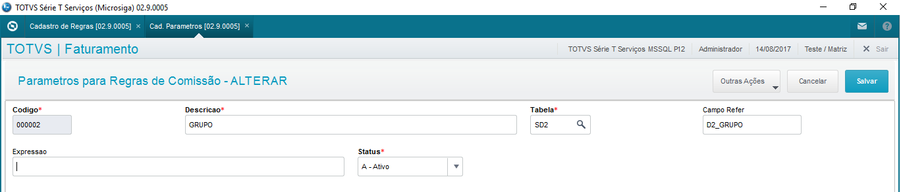
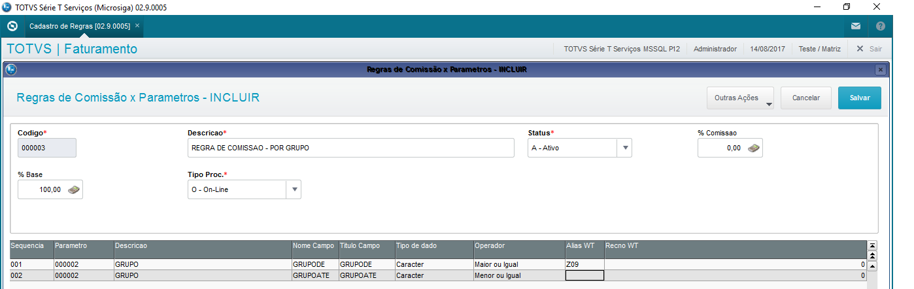
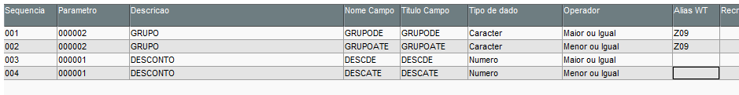
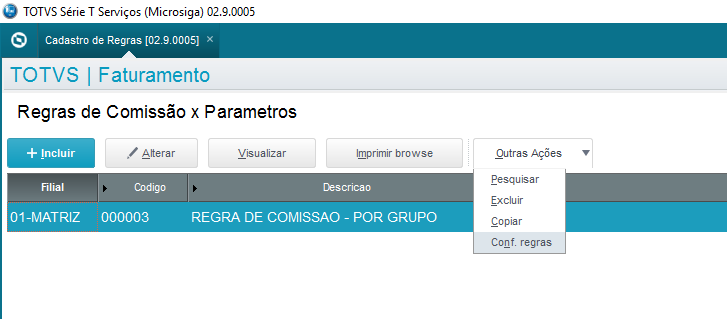
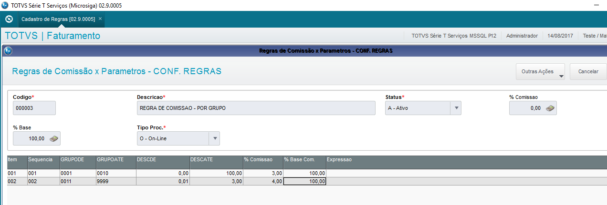
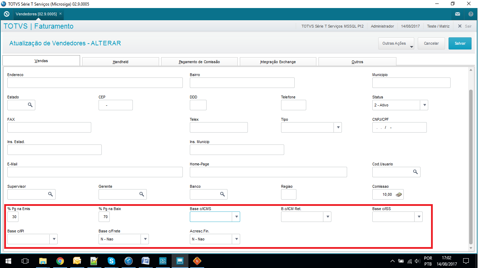
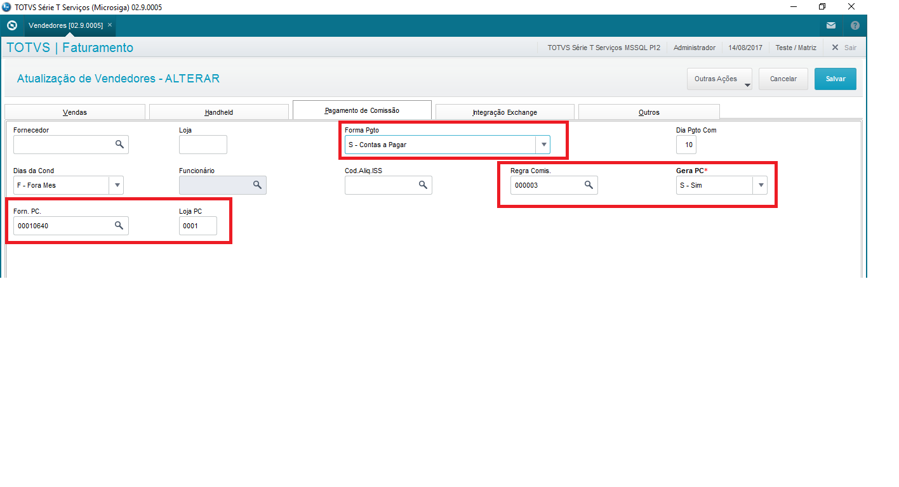

# Comissões - Faturamento {.home-hero}

<!--############################################### 01 #######################################################-->

  01. Visão Geral

### 1. Visão Geral
Este pacote de automação promove ao usuário, flexibilizar as regras para composição das comissões de venda. 

É disponibilizado um cadastro de Parâmetros de Comissões, que farão parte da composição/estrutura da regra de comissões, partindo deste principio, definimos toda estrutura de forma flexível e dinâmica.

O processo de comissão pode ser configurado de duas formas:

- On-line: a cada Nota Fiscal processada é calculada a comissão para o vendedor e o registro da comissão já é alimentada na tabela de Comissões. 
- Off-line: ao final de um determinado período é calculada a comissão para o vendedor (conforme o faturamento mensal, aplica-se um % de comissão para o vendedor. (faturamento mensal com base do que foi gerado de financeiro para as vendas do vendedor, não considerando faturas/liquidação)

A regra é vinculada ao cadastro do vendedor e a automação ocorrerá dependendo da forma de integração (on-line/off-line)

A forma de construção da regra é:
Parâmetro -> Regras -> Configuração das Regras

Parâmetros 

- 001 - Grupo de Produtos 
- 002 - Desconto

Regra 

<strong>Tipo processamento: </strong>On-line (<strong>cada Nota Fiscal processada é calculada a comissão para o vendedor</strong>) 
<strong>%Comissão: </strong> 0% (pode ser definido por item da configuração da regra)
<table class="banks-table">
  <thead>
    <tr>
      <th>Parâmetro</th>
      <th>Tipo de Dado</th>
      <th>Título</th>
      <th>Operador</th>
    </tr>
  </thead>
  <tbody>
    <tr>
      <td>Grupo Produtos</td>
      <td>Caracter</td>
      <td>Grupo de</td>
      <td>Maior ou igual</td>
    </tr>   
      <tr>
      <td>Grupo Produtos</td>
      <td>Caracter</td>
      <td>Grupo até</td>
      <td>Menor ou igual</td>
    </tr>     
      <tr>
      <td>Desconto</td>
      <td>Número</td>
      <td>Desconto de</td>
      <td>Maior ou igual</td>
      </tr> 
            <tr>
      <td>Desconto</td>
      <td>Número</td>
      <td>Desconto até</td>
      <td>Menor ou igual</td>

  </tbody>
</table>

Configuração Regra 
<table class="banks-table">
  <thead>
    <tr>
      <th>Grupo de</th>
      <th>Grupo até</th>
      <th>Desconto de</th>
      <th>Desconto até</th>
      <th>% comissão</th>
      <th>% Base Comissão </th>
    </tr>
  </thead>
  <tbody>
    <tr>
      <td>0001</td>
      <td>002</td>
      <td>0,00</td>
      <td>100,00</td>
      <td>3%</td>
      <td>100%</td>
    </tr>   
      <tr>
      <td>0003</td>
      <td>009</td>
      <td>0,01</td>
      <td>3,00</td>
      <td>2%</td>
      <td>100%</td>
    </tr>     
      <tr>
      <td>0010</td>
      <td>999</td>
      <td>0,01</td>
      <td>5,00</td>
      <td>1%</td>
      <td>100%</td>
  </tbody>
</table>

#### Implementação de lógica customizável para definição e cálculo de comissões de venda

<strong>Principais vantagens do produto:</strong>

- Flexibilização das regras de cálculo de comissão;
- Regras configuráveis sem necessidade de customização;
- Possibilidade de compor regras com múltiplos critérios;
- Suporte a processamento on-line e off-line;
- Vinculação de regras por vendedor;
- Configuração de faixas de valores e percentuais;
- Extensibilidade através de pontos de entrada;

<!--############################################### 02 #######################################################-->

  02. Menu

### 2. Menu

No “Configurador (SIGACFG)”, acesse a opção “Ambiente > Cadastros > Menus” (CFGX013) e inclua as novas opções de menu no módulo de Compras, conforme instruções a seguir:

<table class="banks-table">
  <thead>
    <tr>
      <th>Menu</th>
      <th>Sub Menu</th>
      <th>Nome da Rotina</th>
      <th>Programa</th>
      <th>Módulo</th>
      <th>Tipo</th>
    </tr>
  </thead>
  <tbody>
    <tr>
      <td>Atualizações</td>
      <td>Comissões</td>
      <td>Cadastro Parâmetros</td>
      <td>C006A01</td>
      <td>Faturamento</td>
      <td>03</td> 
    </tr>   
      <tr>
      <td>Atualizações</td>
      <td>Comissões</td>
      <td>Cadastro de Regras</td>
      <td>C006A02</td>
      <td>Faturamento</td>
      <td>03</td>
    </tr>     
      <tr>
      <td>Atualizações</td>
      <td>Comissões</td>
      <td>Processamento Off-Line</td>
      <td>M006A01</td>
      <td>Faturamento</td>
      <td>03</td>
  </tbody>
</table>

<!--############################################### 03 #######################################################-->

  03. Rotinas personalizadas específicas do Pacote

### 3. Rotinas personalizadas específicas do Pacote

<table class="banks-table">
  <thead>
    <tr>
      <th>Função</th>
      <th>Descrição</th>
    </tr>
  </thead>
  <tbody>
    <tr>
      <td><strong>C006A01</strong></td>
      <td>Rotina para cadastro de parâmetro.</td>
    </tr>
    <tr>
      <td><strong>C006A02</strong></td>
      <td>Rotina para cadastro de regras.</td>
    </tr>
    <tr>
      <td><strong>M006A01</strong></td>
      <td>Rotina de geração de comissões Off-Line.</td>
    </tr>
    <tr>
      <td><strong>R004A01</strong></td>
      <td>Relatório de Listagem XML Recebidos.</td>
    </tr>
    <tr>
      <td><strong>P006A01</strong></td>
      <td>Rotina genérica para execução de pontos de entrada.</td>
    </tr>
    <tr>
      <td><strong>UPD006A</strong></td>
      <td>Programa compatibilizador do Dicionário de Dados para aplicação do ADD-ON.</td>
    </tr>
    <tr>
      <td><strong>X006A01</strong></td>
      <td>Rotina centralizadora de funções genéricas.</td>
    </tr>
  </tbody>
</table>

<!--############################################### 04 #######################################################-->

  04. Pontos de entrada específicos ADDON

### 4. Pontos de entrada específicos ADDON

<table class="banks-table">
  <thead>
    <tr>
      <th>Nome</th>
      <th>Descrição</th>
      <th>Observações</th>
    </tr>
  </thead>
  <tbody>
  <tr>
    <td><strong>E006A01</strong></td>
    <td>
      Ponto de Entrada para manipular as bases da comissão calculadas pelo ADD-ON de Comissões.  
      <strong>Programa Fonte:</strong> X006A01  
      Modifica bases das comissões 
      PE006A01(&lt;aRet&gt;) --&gt; aRet
    </td>
    <td>

  

    ADVPL
    E006A01
  

  <pre><code>
User Function PE006A01()

Local aBases := PARAMIXB
Local nVlBase := 0

ConOut("PE PE006A01")

// EXEMPLO DO PONTO DE ENTRADA:

aBases: Vetor com as bases calculadas da Comissão
[1] Valor Base da Comissão
[2] Percentual da Comissão
[3] Valor da Comissão
[4] Percentual da Base

Return (aBases)
  

  </code></pre>
  </td>
</tr>
<tr>
  <td><strong>PE006A02</strong></td>
  <td>
    Ponto de Entrada que permite manipular o posicionamento da tabela DT0 – Tabela de Frete TMS, na função RETFRETETMS.  
    <strong>Programa Fonte:</strong> X006A01  
    Modifica posicionamento da tabela DT0 
    PE006A02(&lt;aRet&gt;) --&gt; Nil
  </td>
  <td>

  

    ADVPL
    PE006A02
  

  <pre><code>
User Function PE006A02()

Local cRet := ""

dbSelectArea("DT0")
dbSetOrder(2) // FILIAL + REGIAO ORIGEM + COD.REGIAO DESTINO
dbSeek(xFilial("DT0") + '607650' + cCdrDes)

Return

</code></pre>
  </td>
</tr>
<tr>
  <td><strong>PE006A03</strong></td>
  <td>
    Ponto de Entrada que permite manipular os dados do cabeçalho do Pedido de Compras.  
    <strong>Programa Fonte:</strong> P006A01  
    PE006A03(&lt;aCab&gt;) --&gt; aRet  

    Estrutura do PARAMIXB: 
    PARAMIXB[1][2] => Número do Pedido  
    PARAMIXB[2][2] => Data de Emissão  
    PARAMIXB[3][2] => Fornecedor  
    PARAMIXB[4][2] => Loja do Fornecedor  
    PARAMIXB[5][2] => Condição de Pagamento  
    PARAMIXB[6][2] => Contato  
    PARAMIXB[7][2] => Filial de Entrega
  </td>
  <td>

  

    ADVPL
    PE006A03
  

  <pre><code>
User Function PE006A03()

Local aRet := PARAMIXB

// Altera Filial de Entrega para 01XX01 sempre que for a empresa 01
If cEmpAnt == '01'
    aRet[7][2] := '01XX01'
EndIf

Return (aRet)

</code></pre>
  </td>
  </tr>
  </tbody>
</table>

<!--###############################################05#####################################################-->

  05. Pontos de Entrada Padrão

### 5. Pontos de Entrada Padrão

#### Pontos de entrada padrão utilizados no ADD-ON e exemplos de compatibilização

<table class="banks-table">
  <thead>
    <tr>
      <th>Nome</th>
      <th>Descrição</th>
      <th>Implementação</th>
    </tr>
  </thead>
  <tbody>
    <tr>
      <td>MT120EXC</td>
      <td>Ponto de Entrada na Exclusão do Pedido de Compras, utilizado para estornar as comissões. </td>
      <td>

  ADVPL
  MT120EXC

  <pre><code>
      User Function MT120EXC()

      /*Implemente o ponto de entrada antes da chamada do Bloco de Função do ADD-ON de COMISSÕES */

      If ExistBlock("P006A01")
      U_P006A01("MT120EXC")
      EndIf

      Return()
  </code></pre>
  </td>
</tr>
<tr>
  <td>MT120GRV</td>
  <td>Ponto de Entrada na Exclusão do Pedido de Compras, solicitando confirmação do usuário para exclusão.</td>
  <td>

  ADVPL
  MT120GRV

  <pre><code>
    User Function MT120GRV()

    Local lRet := .T.

    /*Implemente o ponto de entrada antes da chamada do Bloco de Função do ADD-ON de COMISSÕES */
    If ExistBlock("P006A01")
    lRet := U_P006A01("MT120GRV")
    EndIf

    Return(lRet)

</code></pre>
  </td>
  </tr>
  <tr>
    <td>M530FIL</td>
    <td>Ponto de Entrada durante da Atualização Pagamento da Comissão, MATA530. Geração de títulos Contas a Pagar.</td>
    <td>

  ADVPL
  M530FIL

  <pre><code>
  User Function M530FIL()
  /*Implemente o ponto de entrada antes da chamada do Bloco de Função do ADD-ON de COMISSÕES */
  If ExistBlock("P006A01")
    U_P006A01("M530FIL")
  EndIf
  Return()
  </code></pre>
  

  </td>
</tr>
<tr>
  <td>M530FIM</td>
  <td>Ponto de Entrada no final da Atualização Pagamento da comissão - MATA530. Geração do Pedido de Compras</td>
<td>

  ADVPL
  M530FIM

  <pre><code>
    User Function M530FIM()
  
    /*Implemente o ponto de entrada antes da chamada do Bloco de Função do ADD-ON de COMISSÕES */

    If ExistBlock("P006A01")
    U_P006A01("M530FIM")
    EndIf

    Return()
  </code></pre>
  

  </td>
</tr>
<tr>
  <td>MA040TOK</td>
  <td>Ponto de Entrada na inclusão/alteração do Vendedor para  validar preenchimento de campos necessários.</td>
  <td>

  ADVPL
  MA040TOK

  <pre><code>
    UserFunction MA040TOK()
      
    Local lRet := .T.

    /*Implemente o ponto de entrada antes da chamada do Bloco de Função do ADD-ON de COMISSÕES */

    If ExistBlock("P006A01")
     lRet := U_P006A01("MA040TOK")
    EndIf

    Return(lRet)
  </code></pre>
  

  </td>
</tr>
<tr>
  <td>MSE2530</td>
  <td>Ponto de Entrada durante a Atualização Pagamento da comissão - MATA530. Geração de Títulos Contas a Pagar. 
</td>
<td>

  ADVPL
  MSE2530

  <pre><code>
    User Function MSE2530()

    /*Implemente o ponto de entrada antes da chamada do Bloco de Função do ADD-ON de COMISSÕES */

    If ExistBlock("P006A01")
      U_P006A01("MSE2530")
    EndIf

    Return()
  </code></pre>
  

  </td>
</tr>
<tr>
  <td>MTASF2</td>
  <td>Ponto de Entrada na Geração da Nota de Venda após gravar a SF2 e antes de executar o cálculo das Comissões.</td>
<td>

  ADVPL
  MTASF2

  <pre><code>
    User Function MTASF2()
      
    /*Implemente o ponto de entrada antes da chamada do Bloco de Função do ADD-ON de COMISSÕES */

    If ExistBlock("P006A01")
      U_P006A01("MTASF2")	
    EndIf
      
    Return()
  </code></pre>
  

  </td>
</tr>
<tr>
  <td>F440ABAS</td>
  <td>Ponto de Entrada no Cálculo das Comissões por BAIXA na rotina FINA440 para modificar os valores calculados.</td>
<td>

  ADVPL
  F440ABAS

  <pre><code>
    User Function F440ABAS()

    Local aBases := PARAMIXB

    /*Implemente o ponto de entrada antes da chamada do Bloco de Função do ADD-ON de COMISSÕES */
    If ExistBlock("P006A01")
      aBases := U_P006A01("F440ABAS",aBases)
    Endif

    Return(aBases)
  </code></pre>
  

  </td>
</tr>
<tr>
  <td>F440BASE</td>
  <td>Ponto de Entrada no Cálculo das Comissões por BAIXA na rotina FINA440 para modificar os valores calculados.</td>
<td>

  ADVPL
  F440BASE

  <pre><code>
    User Function F440BASE()
      
    Local aBases := PARAMIXB

    /*Implemente o ponto de entrada antes da chamada do Bloco de Função do ADD-ON de COMISSÕES */
    If ExistBlock("P006A01")
      aBases := U_P006A01("F440BASE",aBases)
    Endif
      
    Return(aBases)      
  </code></pre>
  

  </td>
</tr>
<tr>
  <td>AfterLogin</td>
  <td>Ponto de Entrada na após o Login do Usuario e abertura das tabelas SXs.</td>
<td>

  ADVPL
  AfterLogin

  <pre><code>
    User Function AfterLogin()

    If ExistBlock("M999B01")
      U_M999B01("MACROSUB","006")
    Endif

    Return()
  </code></pre>
  

  </td>
</tr>
</tbody>
</table>

  06. Tabelas (SX2) 

### 6. Tabelas (SX2)

<table class="banks-table">
  <thead>
    <tr>
      <th>Prefixo</th>
      <th>Descrição</th>
      <th>Ac. Filial</th>
      <th>Ac. Unidade</th>
      <th>Ac. Empresa</th>
    </tr>
  </thead>
  <tbody>
    <tr>
      <td><strong>Z07</strong></td>
      <td>PARÂMETROS DE COMISSÃO</td>
      <td>Exclusivo</td>
      <td>Exclusivo</td>
      <td>Exclusivo</td>
    </tr>
    <tr>
      <td><strong>Z08</strong></td>
      <td>REGRAS DE COMISSÃO</td>
      <td>Exclusivo</td>
      <td>Exclusivo</td>
      <td>Exclusivo</td>
    </tr>
    <tr>
      <td><strong>Z09</strong></td>
      <td>ENTIDADES X PARÂMETROS COMISSÃO</td>
      <td>Exclusivo</td>
      <td>Exclusivo</td>
      <td>Exclusivo</td>
    </tr>
    <tr>
      <td><strong>Z10</strong></td>
      <td>CONFIGURAÇÃO DA REGRA COMISSÃO</td>
      <td>Exclusivo</td>
      <td>Exclusivo</td>
      <td>Exclusivo</td>
    </tr>
    <tr>
      <td><strong>Z11</strong></td>
      <td>CONFIGURAÇÃO X PARAMETRO X REGRA COMISSÃO </td>
      <td>Exclusivo</td>
      <td>Exclusivo</td>
      <td>Exclusivo</td>
    </tr>
    
  </tbody>
</table>

<!--############################################### 07 #######################################################-->

  07. Campos (SX3)

### 7. Campos (SX3)

Campo<strong>Z07_FILIAL</strong>

<table class="banks-table">
  <tbody>
    <tr>
      <th>Ordem</th>
      <td>01</td>
    </tr>
    <tr>
      <th>TIPO</th>
      <td>C</td>
    </tr>
    <tr>
      <th>TAMANHO</th>
      <td>2</td>
    </tr>
    <tr>
      <th>DECIMAL</th>
      <td>0</td>
    </tr>
    <tr>
      <th>FORMATO</th>
      <td>@!</td>
    </tr>
    <tr>
      <th>CONTEXTO</th>
      <td>Real</td>
    </tr>
    <tr>
      <th>PROPRIEDADE</th>
      <td>Alterar</td>
    </tr>
    <tr>
      <th>TÍTULO</th>
      <td>Filial</td>
    </tr>
    <tr>
      <th>DESCRIÇÃO</th>
      <td>Filial do Sistema</td>
    </tr>
  </tbody>
</table>
#### **Help**

Não se aplica.

#### **Configurações adicionais**
<table class="banks-table">
  <tbody>
  <tr>
      <th>Lista Opções</th>
      <td>-</td>
    </tr>
    <tr>
      <th>Inicializador</th>
      <td>-</td>
    </tr>
     <tr>
      <th>Ini. Browse</th>
      <td>-</td>
    </tr>
     <tr>
      <th>Modo Edição</th>
      <td>-</td>
    </tr>
    <tr>
      <th>Consulta F3</th>
      <td>-</td>
    </tr>
    <tr>
      <th>Val Usuário</th>
      <td>-</td>
    </tr>
    <tr>
      <th>Usado</th>
      <td>-</td>
    </tr>
     <tr>
      <th>Obrigatório</th>
      <td>-</td>
    </tr>
    <tr>
      <th>Browse</th>
      <td>-</td>
    </tr>
    </tr>
  </tbody>
</table>

Campo<strong>Z07_COD</strong>

<table class="banks-table">
  <tbody>
    <tr>
      <th>Ordem</th>
      <td>2</td>
    </tr>
    <tr>
      <th>TIPO</th>
      <td>C</td>
    </tr>
    <tr>
      <th>TAMANHO</th>
      <td>6</td>
    </tr>
    <tr>
      <th>DECIMAL</th>
      <td>0</td>
    </tr>
    <tr>
      <th>FORMATO</th>
      <td>@!</td>
    </tr>
    <tr>
      <th>CONTEXTO</th>
      <td>Real</td>
    </tr>
    <tr>
      <th>PROPRIEDADE</th>
      <td>Visualizar</td>
    </tr>
    <tr>
      <th>TÍTULO</th>
      <td>Código</td>
    </tr>
    <tr>
      <th>DESCRIÇÃO</th>
      <td>Código do Parâmetro</td>
    </tr>
  </tbody>
</table>
#### **Help**

Código do Parâmetro.

#### **Configurações adicionais**
<table class="banks-table">
  <tbody>
  <tr>
      <th>Lista Opções</th>
      <td>-</td>
    </tr>
    <tr>
      <th>Inicializador</th>
      <td>GetSXENum("Z07","Z07_COD")</td>
    </tr>
     <tr>
      <th>Ini. Browse</th>
      <td>-</td>
    </tr>
     <tr>
      <th>Modo Edição</th>
      <td>-</td>
    </tr>
    <tr>
      <th>Consulta F3</th>
      <td>-</td>
    </tr>
    <tr>
      <th>Val Usuário</th>
      <td>-</td>
    </tr>
    <tr>
      <th>Usado</th>
      <td>S</td>
    </tr>
     <tr>
      <th>Obrigatório</th>
      <td>S</td>
    </tr>
    <tr>
      <th>Browse</th>
      <td>S</td>
    </tr>
    </tr>
  </tbody>
</table>

Campo<strong>Z07_DESCR</strong>

<table class="banks-table">
  <tbody>
    <tr>
      <th>Ordem</th>
      <td>03</td>
    </tr>
    <tr>
      <th>TIPO</th>
      <td>C</td>
    </tr>
    <tr>
      <th>TAMANHO</th>
      <td>40</td>
    </tr>
    <tr>
      <th>DECIMAL</th>
      <td>0</td>
    </tr>
    <tr>
      <th>FORMATO</th>
      <td>@!</td>
    </tr>
    <tr>
      <th>CONTEXTO</th>
      <td>Real</td>
    </tr>
    <tr>
      <th>PROPRIEDADE</th>
      <td>Alterar</td>
    </tr>
    <tr>
      <th>TÍTULO</th>
      <td>Descrição</td>
    </tr>
    <tr>
      <th>DESCRIÇÃO</th>
      <td>Descrição do Parâmetro</td>
    </tr>
  </tbody>
</table>
#### **Help**

Descrição do Parâmetro.

#### **Configurações adicionais**
<table class="banks-table">
  <tbody>
  <tr>
      <th>Lista Opções</th>
      <td>-</td>
    </tr>
    <tr>
      <th>Inicializador</th>
      <td>-</td>
    </tr>
     <tr>
      <th>Ini. Browse</th>
      <td>-</td>
    </tr>
     <tr>
      <th>Modo Edição</th>
      <td>-</td>
    </tr>
    <tr>
      <th>Consulta F3</th>
      <td>-</td>
    </tr>
    <tr>
      <th>Val Usuário</th>
      <td>-</td>
    </tr>
    <tr>
      <th>Usado</th>
      <td>S</td>
    </tr>
     <tr>
      <th>Obrigatório</th>
      <td>S</td>
    </tr>
    <tr>
      <th>Browse</th>
      <td>S</td>
    </tr>
    </tr>
  </tbody>
</table>

Campo<strong>Z07_CMP</strong>

<table class="banks-table">
  <tbody>
    <tr>
      <th>Ordem</th>
      <td>04</td>
    </tr>
    <tr>
      <th>TIPO</th>
      <td>C</td>
    </tr>
    <tr>
      <th>TAMANHO</th>
      <td>10</td>
    </tr>
    <tr>
      <th>DECIMAL</th>
      <td>0</td>
    </tr>
    <tr>
      <th>FORMATO</th>
      <td>@!</td>
    </tr>
    <tr>
      <th>CONTEXTO</th>
      <td>Real</td>
    </tr>
    <tr>
      <th>PROPRIEDADE</th>
      <td>Alterar</td>
    </tr>
    <tr>
      <th>TÍTULO</th>
      <td>Campo</td>
    </tr>
    <tr>
      <th>DESCRIÇÃO</th>
      <td>Campo Referência</td>
    </tr>
  </tbody>
</table>
#### **Help**

Informe um campo referência para o parâmetro. 

#### **Configurações adicionais**
<table class="banks-table">
  <tbody>
  <tr>
      <th>Lista Opções</th>
      <td>-</td>
    </tr>
    <tr>
      <th>Inicializador</th>
      <td>-</td>
    </tr>
     <tr>
      <th>Ini. Browse</th>
      <td>-</td>
    </tr>
     <tr>
      <th>Modo Edição</th>
      <td>-</td>
    </tr>
    <tr>
      <th>Consulta F3</th>
      <td>SX2PAD</td>
    </tr>
    <tr>
      <th>Val Usuário</th>
      <td>ExistCpo('SX2')</td>
    </tr>
    <tr>
      <th>Usado</th>
      <td>S</td>
    </tr>
     <tr>
      <th>Obrigatório</th>
      <td>S</td>
    </tr>
    <tr>
      <th>Browse</th>
      <td>S</td>
    </tr>
    </tr>
  </tbody>
</table>

Campo<strong>Z07_EXP</strong>

<table class="banks-table">
  <tbody>
    <tr>
      <th>Ordem</th>
      <td>05</td>
    </tr>
    <tr>
      <th>TIPO</th>
      <td>C</td>
    </tr>
    <tr>
      <th>TAMANHO</th>
      <td>100</td>
    </tr>
    <tr>
      <th>DECIMAL</th>
      <td>0</td>
    </tr>
    <tr>
      <th>FORMATO</th>
      <td>@!</td>
    </tr>
    <tr>
      <th>CONTEXTO</th>
      <td>Real</td>
    </tr>
    <tr>
      <th>PROPRIEDADE</th>
      <td>Alterar</td>
    </tr>
    <tr>
      <th>TÍTULO</th>
      <td>Expressão</td>
    </tr>
    <tr>
      <th>DESCRIÇÃO</th>
      <td>Expressão busca campo</td>
    </tr>
  </tbody>
</table>
#### **Help**

Informe a expressão. Tem precedência sobre o campo.  

#### **Configurações adicionais**
<table class="banks-table">
  <tbody>
  <tr>
      <th>Lista Opções</th>
      <td>-</td>
    </tr>
    <tr>
      <th>Inicializador</th>
      <td>-</td>
    </tr>
     <tr>
      <th>Ini. Browse</th>
      <td>-</td>
    </tr>
     <tr>
      <th>Modo Edição</th>
      <td>-</td>
    </tr>
    <tr>
      <th>Consulta F3</th>
      <td>-</td>
    </tr>
    <tr>
      <th>Val Usuário</th>
      <td>-</td>
    </tr>
    <tr>
      <th>Usado</th>
      <td>S</td>
    </tr>
     <tr>
      <th>Obrigatório</th>
      <td>S</td>
    </tr>
    <tr>
      <th>Browse</th>
      <td>-</td>
    </tr>
    </tr>
  </tbody>
</table>

Campo<strong>Z07_STAT</strong>

<table class="banks-table">
  <tbody>
    <tr>
      <th>Ordem</th>
      <td>06</td>
    </tr>
    <tr>
      <th>TIPO</th>
      <td>C</td>
    </tr>
    <tr>
      <th>TAMANHO</th>
      <td>1</td>
    </tr>
    <tr>
      <th>DECIMAL</th>
      <td>0</td>
    </tr>
    <tr>
      <th>FORMATO</th>
      <td>@!</td>
    </tr>
    <tr>
      <th>CONTEXTO</th>
      <td>Real</td>
    </tr>
    <tr>
      <th>PROPRIEDADE</th>
      <td>Alterar</td>
    </tr>
    <tr>
      <th>TÍTULO</th>
      <td>Status</td>
    </tr>
    <tr>
      <th>DESCRIÇÃO</th>
      <td>Status Ativo/Inativo</td>
    </tr>
  </tbody>
</table>
#### **Help**

Status do Parametro Ativo/Inativo.  

#### **Configurações adicionais**
<table class="banks-table">
  <tbody>
  <tr>
      <th>Lista Opções</th>
      <td>A=Ativo;I=Inativo  </td>
    </tr>
    <tr>
      <th>Inicializador</th>
      <td>"A"</td>
    </tr>
     <tr>
      <th>Ini. Browse</th>
      <td>-</td>
    </tr>
     <tr>
      <th>Modo Edição</th>
      <td>-</td>
    </tr>
    <tr>
      <th>Consulta F3</th>
      <td>-</td>
    </tr>
    <tr>
      <th>Val Usuário</th>
      <td>-</td>
    </tr>
    <tr>
      <th>Usado</th>
      <td>S</td>
    </tr>
     <tr>
      <th>Obrigatório</th>
      <td>S</td>
    </tr>
    <tr>
      <th>Browse</th>
      <td>S</td>
    </tr>
    </tr>
  </tbody>
</table>

Campo<strong>Z08_FILIAL</strong>

<table class="banks-table">
  <tbody>
    <tr>
      <th>Ordem</th>
      <td>01</td>
    </tr>
    <tr>
      <th>TIPO</th>
      <td>C</td>
    </tr>
    <tr>
      <th>TAMANHO</th>
      <td>2</td>
    </tr>
    <tr>
      <th>DECIMAL</th>
      <td>0</td>
    </tr>
    <tr>
      <th>FORMATO</th>
      <td>@!</td>
    </tr>
    <tr>
      <th>CONTEXTO</th>
      <td>Real</td>
    </tr>
    <tr>
      <th>PROPRIEDADE</th>
      <td>Alterar</td>
    </tr>
    <tr>
      <th>TÍTULO</th>
      <td>Filial</td>
    </tr>
    <tr>
      <th>DESCRIÇÃO</th>
      <td>Filial do Sistema</td>
    </tr>
  </tbody>
</table>
#### **Help**

Não se aplica.  

#### **Configurações adicionais**
<table class="banks-table">
  <tbody>
  <tr>
      <th>Lista Opções</th>
      <td>-</td>
    </tr>
    <tr>
      <th>Inicializador</th>
      <td>-</td>
    </tr>
     <tr>
      <th>Ini. Browse</th>
      <td>-</td>
    </tr>
     <tr>
      <th>Modo Edição</th>
      <td>-</td>
    </tr>
    <tr>
      <th>Consulta F3</th>
      <td>-</td>
    </tr>
    <tr>
      <th>Val Usuário</th>
      <td>-</td>
    </tr>
    <tr>
      <th>Usado</th>
      <td>-</td>
    </tr>
     <tr>
      <th>Obrigatório</th>
      <td>-</td>
    </tr>
    <tr>
      <th>Browse</th>
      <td>-</td>
    </tr>
    </tr>
  </tbody>
</table>

Campo<strong>Z08_COD</strong>

<table class="banks-table">
  <tbody>
    <tr>
      <th>Ordem</th>
      <td>02</td>
    </tr>
    <tr>
      <th>TIPO</th>
      <td>C</td>
    </tr>
    <tr>
      <th>TAMANHO</th>
      <td>6</td>
    </tr>
    <tr>
      <th>DECIMAL</th>
      <td>0</td>
    </tr>
    <tr>
      <th>FORMATO</th>
      <td>@!</td>
    </tr>
    <tr>
      <th>CONTEXTO</th>
      <td>Real</td>
    </tr>
    <tr>
      <th>PROPRIEDADE</th>
      <td>Visualizar</td>
    </tr>
    <tr>
      <th>TÍTULO</th>
      <td>Código</td>
    </tr>
    <tr>
      <th>DESCRIÇÃO</th>
      <td>Código Regra</td>
    </tr>
  </tbody>
</table>
#### **Help**

Código da Regra.  

#### **Configurações adicionais**
<table class="banks-table">
  <tbody>
  <tr>
      <th>Lista Opções</th>
      <td>-</td>
    </tr>
    <tr>
      <th>Inicializador</th>
      <td>-</td>
    </tr>
     <tr>
      <th>Ini. Browse</th>
      <td>-</td>
    </tr>
     <tr>
      <th>Modo Edição</th>
      <td>-</td>
    </tr>
    <tr>
      <th>Consulta F3</th>
      <td>-</td>
    </tr>
    <tr>
      <th>Val Usuário</th>
      <td>GetSXENum("Z08","Z08_COD")</td>
    </tr>
    <tr>
      <th>Usado</th>
      <td>S</td>
    </tr>
     <tr>
      <th>Obrigatório</th>
      <td>S</td>
    </tr>
    <tr>
      <th>Browse</th>
      <td>S</td>
    </tr>
    </tr>
  </tbody>
</table>

Campo<strong>Z08_DESCR</strong>

<table class="banks-table">
  <tbody>
    <tr>
      <th>Ordem</th>
      <td>03</td>
    </tr>
    <tr>
      <th>TIPO</th>
      <td>C</td>
    </tr>
    <tr>
      <th>TAMANHO</th>
      <td>40</td>
    </tr>
    <tr>
      <th>DECIMAL</th>
      <td>0</td>
    </tr>
    <tr>
      <th>FORMATO</th>
      <td>@!</td>
    </tr>
    <tr>
      <th>CONTEXTO</th>
      <td>Real</td>
    </tr>
    <tr>
      <th>PROPRIEDADE</th>
      <td>Alterar</td>
    </tr>
    <tr>
      <th>TÍTULO</th>
      <td>Descrição</td>
    </tr>
    <tr>
      <th>DESCRIÇÃO</th>
      <td>Descrição da Regra</td>
    </tr>
  </tbody>
</table>
#### **Help**

Descrição da Regra.  

#### **Configurações adicionais**
<table class="banks-table">
  <tbody>
  <tr>
      <th>Lista Opções</th>
      <td>-</td>
    </tr>
    <tr>
      <th>Inicializador</th>
      <td>-</td>
    </tr>
     <tr>
      <th>Ini. Browse</th>
      <td>-</td>
    </tr>
     <tr>
      <th>Modo Edição</th>
      <td>-</td>
    </tr>
    <tr>
      <th>Consulta F3</th>
      <td>-</td>
    </tr>
    <tr>
      <th>Val Usuário</th>
      <td>-</td>
    </tr>
    <tr>
      <th>Usado</th>
      <td>S</td>
    </tr>
     <tr>
      <th>Obrigatório</th>
      <td>S</td>
    </tr>
    <tr>
      <th>Browse</th>
      <td>S</td>
    </tr>
    </tr>
  </tbody>
</table>

Campo<strong>Z08_STAT</strong>

<table class="banks-table">
  <tbody>
    <tr>
      <th>Ordem</th>
      <td>04</td>
    </tr>
    <tr>
      <th>TIPO</th>
      <td>C</td>
    </tr>
    <tr>
      <th>TAMANHO</th>
      <td>1</td>
    </tr>
    <tr>
      <th>DECIMAL</th>
      <td>0</td>
    </tr>
    <tr>
      <th>FORMATO</th>
      <td>@!</td>
    </tr>
    <tr>
      <th>CONTEXTO</th>
      <td>Real</td>
    </tr>
    <tr>
      <th>PROPRIEDADE</th>
      <td>Alterar</td>
    </tr>
    <tr>
      <th>TÍTULO</th>
      <td>Status</td>
    </tr>
    <tr>
      <th>DESCRIÇÃO</th>
      <td>Status da Regra</td>
    </tr>
  </tbody>
</table>
#### **Help**

Descrição da Regra.  

#### **Configurações adicionais**
<table class="banks-table">
  <tbody>
  <tr>
      <th>Lista Opções</th>
      <td>A=Ativo;I=Inativo</td>
    </tr>
    <tr>
      <th>Inicializador</th>
      <td>"A"</td>
    </tr>
     <tr>
      <th>Ini. Browse</th>
      <td>-</td>
    </tr>
     <tr>
      <th>Modo Edição</th>
      <td>-</td>
    </tr>
    <tr>
      <th>Consulta F3</th>
      <td>-</td>
    </tr>
    <tr>
      <th>Val Usuário</th>
      <td>-</td>
    </tr>
    <tr>
      <th>Usado</th>
      <td>S</td>
    </tr>
     <tr>
      <th>Obrigatório</th>
      <td>S</td>
    </tr>
    <tr>
      <th>Browse</th>
      <td>S</td>
    </tr>
    </tr>
  </tbody>
</table>

Campo<strong>Z08_PCOM</strong>

<table class="banks-table">
  <tbody>
    <tr>
      <th>Ordem</th>
      <td>05</td>
    </tr>
    <tr>
      <th>TIPO</th>
      <td>N</td>
    </tr>
    <tr>
      <th>TAMANHO</th>
      <td>6</td>
    </tr>
    <tr>
      <th>DECIMAL</th>
      <td>0</td>
    </tr>
    <tr>
      <th>FORMATO</th>
      <td>@E 999.99</td>
    </tr>
    <tr>
      <th>CONTEXTO</th>
      <td>Real</td>
    </tr>
    <tr>
      <th>PROPRIEDADE</th>
      <td>Alterar</td>
    </tr>
    <tr>
      <th>TÍTULO</th>
      <td>% Comissão</td>
    </tr>
    <tr>
      <th>DESCRIÇÃO</th>
      <td>% Comissão</td>
    </tr>
  </tbody>
</table>
#### **Help**

% Comissão, será aplicado se nenhuma regra for atendida.  

#### **Configurações adicionais**
<table class="banks-table">
  <tbody>
  <tr>
      <th>Lista Opções</th>
      <td>-</td>
    </tr>
    <tr>
      <th>Inicializador</th>
      <td>0</td>
    </tr>
     <tr>
      <th>Ini. Browse</th>
      <td>-</td>
    </tr>
     <tr>
      <th>Modo Edição</th>
      <td>-</td>
    </tr>
    <tr>
      <th>Consulta F3</th>
      <td>-</td>
    </tr>
    <tr>
      <th>Val Usuário</th>
      <td>-</td>
    </tr>
    <tr>
      <th>Usado</th>
      <td>S</td>
    </tr>
     <tr>
      <th>Obrigatório</th>
      <td>-</td>
    </tr>
    <tr>
      <th>Browse</th>
      <td>-</td>
    </tr>
    </tr>
  </tbody>
</table>

Campo<strong>Z08_PBAS</strong>

<table class="banks-table">
  <tbody>
    <tr>
      <th>Ordem</th>
      <td>06</td>
    </tr>
    <tr>
      <th>TIPO</th>
      <td>N</td>
    </tr>
    <tr>
      <th>TAMANHO</th>
      <td>6</td>
    </tr>
    <tr>
      <th>DECIMAL</th>
      <td>0</td>
    </tr>
    <tr>
      <th>FORMATO</th>
      <td>@E 999.99</td>
    </tr>
    <tr>
      <th>CONTEXTO</th>
      <td>Real</td>
    </tr>
    <tr>
      <th>PROPRIEDADE</th>
      <td>Alterar</td>
    </tr>
    <tr>
      <th>TÍTULO</th>
      <td>% Base</td>
    </tr>
    <tr>
      <th>DESCRIÇÃO</th>
      <td>% Base</td>
    </tr>
  </tbody>
</table>
#### **Help**

% Base da comissão. Percentual a ser aplicado sobre a base. 

#### **Configurações adicionais**
<table class="banks-table">
  <tbody>
  <tr>
      <th>Lista Opções</th>
      <td>-</td>
    </tr>
    <tr>
      <th>Inicializador</th>
      <td>100</td>
    </tr>
     <tr>
      <th>Ini. Browse</th>
      <td>-</td>
    </tr>
     <tr>
      <th>Modo Edição</th>
      <td>-</td>
    </tr>
    <tr>
      <th>Consulta F3</th>
      <td>-</td>
    </tr>
    <tr>
      <th>Val Usuário</th>
      <td>-</td>
    </tr>
    <tr>
      <th>Usado</th>
      <td>S</td>
    </tr>
     <tr>
      <th>Obrigatório</th>
      <td>-</td>
    </tr>
    <tr>
      <th>Browse</th>
      <td>-</td>
    </tr>
    </tr>
  </tbody>
</table>

Campo<strong>Z08_TIPO</strong>

<table class="banks-table">
  <tbody>
    <tr>
      <th>Ordem</th>
      <td>07</td>
    </tr>
    <tr>
      <th>TIPO</th>
      <td>C</td>
    </tr>
    <tr>
      <th>TAMANHO</th>
      <td>1</td>
    </tr>
    <tr>
      <th>DECIMAL</th>
      <td>0</td>
    </tr>
    <tr>
      <th>FORMATO</th>
      <td>@!</td>
    </tr>
    <tr>
      <th>CONTEXTO</th>
      <td>Real</td>
    </tr>
    <tr>
      <th>PROPRIEDADE</th>
      <td>Alterar</td>
    </tr>
    <tr>
      <th>TÍTULO</th>
      <td>Tipo de processamento</td>
    </tr>
    <tr>
      <th>DESCRIÇÃO</th>
      <td>Tipo de processamento</td>
    </tr>
  </tbody>
</table>
#### **Help**

Informe o tipo de processamento (on-line, off-line).  

#### **Configurações adicionais**
<table class="banks-table">
  <tbody>
  <tr>
      <th>Lista Opções</th>
      <td>O=On-Line;F=Off-Line</td>
    </tr>
    <tr>
      <th>Inicializador</th>
      <td>-</td>
    </tr>
     <tr>
      <th>Ini. Browse</th>
      <td>-</td>
    </tr>
     <tr>
      <th>Modo Edição</th>
      <td>-</td>
    </tr>
    <tr>
      <th>Consulta F3</th>
      <td>-</td>
    </tr>
    <tr>
      <th>Val Usuário</th>
      <td>-</td>
    </tr>
    <tr>
      <th>Usado</th>
      <td>S</td>
    </tr>
     <tr>
      <th>Obrigatório</th>
      <td>S</td>
    </tr>
    <tr>
      <th>Browse</th>
      <td>-</td>
    </tr>
    </tr>
  </tbody>
</table>

Campo<strong>Z09_FILIAL</strong>

<table class="banks-table">
  <tbody>
    <tr>
      <th>Ordem</th>
      <td>01</td>
    </tr>
    <tr>
      <th>TIPO</th>
      <td>C</td>
    </tr>
    <tr>
      <th>TAMANHO</th>
      <td>2</td>
    </tr>
    <tr>
      <th>DECIMAL</th>
      <td>0</td>
    </tr>
    <tr>
      <th>FORMATO</th>
      <td>@!</td>
    </tr>
    <tr>
      <th>CONTEXTO</th>
      <td>Real</td>
    </tr>
    <tr>
      <th>PROPRIEDADE</th>
      <td>Alterar</td>
    </tr>
    <tr>
      <th>TÍTULO</th>
      <td>Filial</td>
    </tr>
    <tr>
      <th>DESCRIÇÃO</th>
      <td>Filial do Sistema</td>
    </tr>
  </tbody>
</table>
#### **Help**

Não se aplica.  

#### **Configurações adicionais**
<table class="banks-table">
  <tbody>
  <tr>
      <th>Lista Opções</th>
      <td>-</td>
    </tr>
    <tr>
      <th>Inicializador</th>
      <td>-</td>
    </tr>
     <tr>
      <th>Ini. Browse</th>
      <td>-</td>
    </tr>
     <tr>
      <th>Modo Edição</th>
      <td>-</td>
    </tr>
    <tr>
      <th>Consulta F3</th>
      <td>-</td>
    </tr>
    <tr>
      <th>Val Usuário</th>
      <td>-</td>
    </tr>
    <tr>
      <th>Usado</th>
      <td>-</td>
    </tr>
     <tr>
      <th>Obrigatório</th>
      <td>-</td>
    </tr>
    <tr>
      <th>Browse</th>
      <td>-</td>
    </tr>
    </tr>
  </tbody>
</table>

Campo<strong>Z09_COD</strong>

<table class="banks-table">
  <tbody>
    <tr>
      <th>Ordem</th>
      <td>02</td>
    </tr>
    <tr>
      <th>TIPO</th>
      <td>C</td>
    </tr>
    <tr>
      <th>TAMANHO</th>
      <td>6</td>
    </tr>
    <tr>
      <th>DECIMAL</th>
      <td>0</td>
    </tr>
    <tr>
      <th>FORMATO</th>
      <td>@!</td>
    </tr>
    <tr>
      <th>CONTEXTO</th>
      <td>Real</td>
    </tr>
    <tr>
      <th>PROPRIEDADE</th>
      <td>Visualizar</td>
    </tr>
    <tr>
      <th>TÍTULO</th>
      <td>Código</td>
    </tr>
    <tr>
      <th>DESCRIÇÃO</th>
      <td>Código Regra</td>
    </tr>
  </tbody>
</table>
#### **Help**

Código da Regra.  

#### **Configurações adicionais**
<table class="banks-table">
  <tbody>
  <tr>
      <th>Lista Opções</th>
      <td>-</td>
    </tr>
    <tr>
      <th>Inicializador</th>
      <td>-</td>
    </tr>
     <tr>
      <th>Ini. Browse</th>
      <td>-</td>
    </tr>
     <tr>
      <th>Modo Edição</th>
      <td>-</td>
    </tr>
    <tr>
      <th>Consulta F3</th>
      <td>-</td>
    </tr>
    <tr>
      <th>Val Usuário</th>
      <td>-</tr>
    <tr>
      <th>Usado</th>
      <td>S</td>
    </tr>
     <tr>
      <th>Obrigatório</th>
      <td>S</td>
    </tr>
    <tr>
      <th>Browse</th>
      <td>S</td>
    </tr>
    </tr>
  </tbody>
</table>

Campo<strong>Z09_SEQ</strong>

<table class="banks-table">
  <tbody>
    <tr>
      <th>Ordem</th>
      <td>03</td>
    </tr>
    <tr>
      <th>TIPO</th>
      <td>C</td>
    </tr>
    <tr>
      <th>TAMANHO</th>
      <td>3</td>
    </tr>
    <tr>
      <th>DECIMAL</th>
      <td>0</td>
    </tr>
    <tr>
      <th>FORMATO</th>
      <td>@!</td>
    </tr>
    <tr>
      <th>CONTEXTO</th>
      <td>Real</td>
    </tr>
    <tr>
      <th>PROPRIEDADE</th>
      <td>Visualizar</td>
    </tr>
    <tr>
      <th>TÍTULO</th>
      <td>Sequência</td>
    </tr>
    <tr>
      <th>DESCRIÇÃO</th>
      <td>Sequência da Regra</td>
    </tr>
  </tbody>
</table>
#### **Help**

Sequência da Regra.  

#### **Configurações adicionais**
<table class="banks-table">
  <tbody>
  <tr>
      <th>Lista Opções</th>
      <td>-</td>
    </tr>
    <tr>
      <th>Inicializador</th>
      <td>-</td>
    </tr>
     <tr>
      <th>Ini. Browse</th>
      <td>-</td>
    </tr>
     <tr>
      <th>Modo Edição</th>
      <td>-</td>
    </tr>
    <tr>
      <th>Consulta F3</th>
      <td>-</td>
    </tr>
    <tr>
      <th>Val Usuário</th>
      <td>-</td>
    </tr>
    <tr>
      <th>Usado</th>
      <td>S</td>
    </tr>
     <tr>
      <th>Obrigatório</th>
      <td>S</td>
    </tr>
    <tr>
      <th>Browse</th>
      <td>S</td>
    </tr>
    </tr>
  </tbody>
</table>

Campo<strong>Z09_ENT</strong>

<table class="banks-table">
  <tbody>
    <tr>
      <th>Ordem</th>
      <td>04</td>
    </tr>
    <tr>
      <th>TIPO</th>
      <td>C</td>
    </tr>
    <tr>
      <th>TAMANHO</th>
      <td>6</td>
    </tr>
    <tr>
      <th>DECIMAL</th>
      <td>0</td>
    </tr>
    <tr>
      <th>FORMATO</th>
      <td>@!</td>
    </tr>
    <tr>
      <th>CONTEXTO</th>
      <td>Real</td>
    </tr>
    <tr>
      <th>PROPRIEDADE</th>
      <td>Alterar</td>
    </tr>
    <tr>
      <th>TÍTULO</th>
      <td>Parâmetro</td>
    </tr>
    <tr>
      <th>DESCRIÇÃO</th>
      <td>Parâmetro</td>
    </tr>
  </tbody>
</table>
#### **Help**

Informe o parâmetro.  

#### **Configurações adicionais**
<table class="banks-table">
  <tbody>
  <tr>
      <th>Lista Opções</th>
      <td>-</td>
    </tr>
    <tr>
      <th>Inicializador</th>
      <td>-</td>
    </tr>
     <tr>
      <th>Ini. Browse</th>
      <td>-</td>
    </tr>
     <tr>
      <th>Modo Edição</th>
      <td>-</td>
    </tr>
    <tr>
      <th>Consulta F3</th>
      <td>ZZ3</td>
    </tr>
    <tr>
      <th>Val Usuário</th>
      <td>ExistCpo('Z07',M->Z09_ENT)</td>
    </tr>
    <tr>
      <th>Usado</th>
      <td>S</td>
    </tr>
     <tr>
      <th>Obrigatório</th>
      <td>S</td>
    </tr>
    <tr>
      <th>Browse</th>
      <td>S</td>
    </tr>
    </tr>
  </tbody>
</table>

Campo<strong>Z09_DESCR</strong>

<table class="banks-table">
  <tbody>
    <tr>
      <th>Ordem</th>
      <td>06</td>
    </tr>
    <tr>
      <th>TIPO</th>
      <td>C</td>
    </tr>
    <tr>
      <th>TAMANHO</th>
      <td>40</td>
    </tr>
    <tr>
      <th>DECIMAL</th>
      <td>0</td>
    </tr>
    <tr>
      <th>FORMATO</th>
      <td>@!</td>
    </tr>
    <tr>
      <th>CONTEXTO</th>
      <td>Virtual</td>
    </tr>
    <tr>
      <th>PROPRIEDADE</th>
      <td>Visualizar</td>
    </tr>
    <tr>
      <th>TÍTULO</th>
      <td>Descrição</td>
    </tr>
    <tr>
      <th>DESCRIÇÃO</th>
      <td>Descrição do Parâmetro</td>
    </tr>
  </tbody>
</table>
#### **Help**

Descrição do Parâmetro  

#### **Configurações adicionais**
<table class="banks-table">
  <tbody>
  <tr>
      <th>Lista Opções</th>
      <td>-</td>
    </tr>
    <tr>
      <th>Inicializador</th>
      <td>-</td>
    </tr>
     <tr>
      <th>Ini. Browse</th>
      <td>POSICIONE("Z07",1,xFilial("Z07")+Z09->Z09_ENT,"Z09_DESCR")</td>
    </tr>
     <tr>
      <th>Modo Edição</th>
      <td>-</td>
    </tr>
    <tr>
      <th>Consulta F3</th>
      <td>-</td>
    </tr>
    <tr>
      <th>Val Usuário</th>
      <td>-</td>
    </tr>
    <tr>
      <th>Usado</th>
      <td>S</td>
    </tr>
     <tr>
      <th>Obrigatório</th>
      <td>-</td>
    </tr>
    <tr>
      <th>Browse</th>
      <td>S</td>
    </tr>
    </tr>
  </tbody>
</table>

Campo<strong>Z09_CAMPO</strong>

<table class="banks-table">
  <tbody>
    <tr>
      <th>Ordem</th>
      <td>06</td>
    </tr>
    <tr>
      <th>TIPO</th>
      <td>C</td>
    </tr>
    <tr>
      <th>TAMANHO</th>
      <td>10</td>
    </tr>
    <tr>
      <th>DECIMAL</th>
      <td>0</td>
    </tr>
    <tr>
      <th>FORMATO</th>
      <td>@!</td>
    </tr>
    <tr>
      <th>CONTEXTO</th>
      <td>Real</td>
    </tr>
    <tr>
      <th>PROPRIEDADE</th>
      <td>Alterar</td>
    </tr>
    <tr>
      <th>TÍTULO</th>
      <td>Nome Campo</td>
    </tr>
    <tr>
      <th>DESCRIÇÃO</th>
      <td>Nome Campo Virtual</td>
    </tr>
  </tbody>
</table>
#### **Help**

Nome do campo virtual. 

#### **Configurações adicionais**
<table class="banks-table">
  <tbody>
  <tr>
      <th>Lista Opções</th>
      <td>-</td>
    </tr>
    <tr>
      <th>Inicializador</th>
      <td>-</td>
    </tr>
     <tr>
      <th>Ini. Browse</th>
      <td>-</td>
    </tr>
     <tr>
      <th>Modo Edição</th>
      <td>-</td>
    </tr>
    <tr>
      <th>Consulta F3</th>
      <td>-</td>
    </tr>
    <tr>
      <th>Val Usuário</th>
      <td>-</td>
    </tr>
    <tr>
      <th>Usado</th>
      <td>S</td>
    </tr>
     <tr>
      <th>Obrigatório</th>
      <td>S</td>
    </tr>
    <tr>
      <th>Browse</th>
      <td>S</td>
    </tr>
    </tr>
  </tbody>
</table>

Campo<strong>Z09_TITULO</strong>

<table class="banks-table">
  <tbody>
    <tr>
      <th>Ordem</th>
      <td>07</td>
    </tr>
    <tr>
      <th>TIPO</th>
      <td>C</td>
    </tr>
    <tr>
      <th>TAMANHO</th>
      <td>12</td>
    </tr>
    <tr>
      <th>DECIMAL</th>
      <td>0</td>
    </tr>
    <tr>
      <th>FORMATO</th>
      <td>@!</td>
    </tr>
    <tr>
      <th>CONTEXTO</th>
      <td>Real</td>
    </tr>
    <tr>
      <th>PROPRIEDADE</th>
      <td>Alterar</td>
    </tr>
    <tr>
      <th>TÍTULO</th>
      <td>Título</td>
    </tr>
    <tr>
      <th>DESCRIÇÃO</th>
      <td>Título Campo</td>
    </tr>
  </tbody>
</table>
#### **Help**

Na hipótese de utilizar DE/ATE o titulo do campo dever ser diferente. 
Exemplo: XXXDE, XXXATE. 

#### **Configurações adicionais**
<table class="banks-table">
  <tbody>
  <tr>
      <th>Lista Opções</th>
      <td>-</td>
    </tr>
    <tr>
      <th>Inicializador</th>
      <td>-</td>
    </tr>
     <tr>
      <th>Ini. Browse</th>
      <td>-</td>
    </tr>
     <tr>
      <th>Modo Edição</th>
      <td>-</td>
    </tr>
    <tr>
      <th>Consulta F3</th>
      <td>-</td>
    </tr>
    <tr>
      <th>Val Usuário</th>
      <td>-</td>
    </tr>
    <tr>
      <th>Usado</th>
      <td>S</td>
    </tr>
     <tr>
      <th>Obrigatório</th>
      <td>S</td>
    </tr>
    <tr>
      <th>Browse</th>
      <td>S</td>
    </tr>
    </tr>
  </tbody>
</table>

Campo<strong>Z09_TIPO</strong>

<table class="banks-table">
  <tbody>
    <tr>
      <th>Ordem</th>
      <td>08</td>
    </tr>
    <tr>
      <th>TIPO</th>
      <td>C</td>
    </tr>
    <tr>
      <th>TAMANHO</th>
      <td>1</td>
    </tr>
    <tr>
      <th>DECIMAL</th>
      <td>0</td>
    </tr>
    <tr>
      <th>FORMATO</th>
      <td>@!</td>
    </tr>
    <tr>
      <th>CONTEXTO</th>
      <td>Real</td>
    </tr>
    <tr>
      <th>PROPRIEDADE</th>
      <td>Alterar</td>
    </tr>
    <tr>
      <th>TÍTULO</th>
      <td>Tipo</td>
    </tr>
    <tr>
      <th>DESCRIÇÃO</th>
      <td>Tipo de Dado</td>
    </tr>
  </tbody>
</table>
#### **Help**

Informe o tipo de dado do campo: caracter ou numérico.

#### **Configurações adicionais**
<table class="banks-table">
  <tbody>
  <tr>
      <th>Lista Opções</th>
      <td>C=Caracter;N=Número</td>
    </tr>
    <tr>
      <th>Inicializador</th>
      <td>-</td>
    </tr>
     <tr>
      <th>Ini. Browse</th>
      <td>-</td>
    </tr>
     <tr>
      <th>Modo Edição</th>
      <td>-</td>
    </tr>
    <tr>
      <th>Consulta F3</th>
      <td>-</td>
    </tr>
    <tr>
      <th>Val Usuário</th>
      <td>-</td>
    </tr>
    <tr>
      <th>Usado</th>
      <td>S</td>
    </tr>
     <tr>
      <th>Obrigatório</th>
      <td>S</td>
    </tr>
    <tr>
      <th>Browse</th>
      <td>S</td>
    </tr>
    </tr>
  </tbody>
</table>

Campo<strong>Z09_OPER</strong>

<table class="banks-table">
  <tbody>
    <tr>
      <th>Ordem</th>
      <td>09</td>
    </tr>
    <tr>
      <th>TIPO</th>
      <td>C</td>
    </tr>
    <tr>
      <th>TAMANHO</th>
      <td>1</td>
    </tr>
    <tr>
      <th>DECIMAL</th>
      <td>0</td>
    </tr>
    <tr>
      <th>FORMATO</th>
      <td>@!</td>
    </tr>
    <tr>
      <th>CONTEXTO</th>
      <td>Real</td>
    </tr>
    <tr>
      <th>PROPRIEDADE</th>
      <td>Alterar</td>
    </tr>
    <tr>
      <th>TÍTULO</th>
      <td>Operador</td>
    </tr>
    <tr>
      <th>DESCRIÇÃO</th>
      <td>Tipo de operador</td>
    </tr>
  </tbody>
</table>
#### **Help**

Informe o operador. 

#### **Configurações adicionais**
<table class="banks-table">
  <tbody>
  <tr>
      <th>Lista Opções</th>
      <td>1=Igual;2=Diferente;3=Maior ou Igual;4=Menor ou Igual.</td>
    </tr>
    <tr>
      <th>Inicializador</th>
      <td>-</td>
    </tr>
     <tr>
      <th>Ini. Browse</th>
      <td>-</td>
    </tr>
     <tr>
      <th>Modo Edição</th>
      <td>-</td>
    </tr>
    <tr>
      <th>Consulta F3</th>
      <td>-</td>
    </tr>
    <tr>
      <th>Val Usuário</th>
      <td>-</td>
    </tr>
    <tr>
      <th>Usado</th>
      <td>S</td>
    </tr>
     <tr>
      <th>Obrigatório</th>
      <td>S</td>
    </tr>
    <tr>
      <th>Browse</th>
      <td>S</td>
    </tr>
    </tr>
  </tbody>
</table>

Campo<strong>Z10_FILIAL</strong>

<table class="banks-table">
  <tbody>
    <tr>
      <th>Ordem</th>
      <td>01</td>
    </tr>
    <tr>
      <th>TIPO</th>
      <td>C</td>
    </tr>
    <tr>
      <th>TAMANHO</th>
      <td>2</td>
    </tr>
    <tr>
      <th>DECIMAL</th>
      <td>0</td>
    </tr>
    <tr>
      <th>FORMATO</th>
      <td>@!</td>
    </tr>
    <tr>
      <th>CONTEXTO</th>
      <td>Real</td>
    </tr>
    <tr>
      <th>PROPRIEDADE</th>
      <td>Visualizar</td>
    </tr>
    <tr>
      <th>TÍTULO</th>
      <td>Filial</td>
    </tr>
    <tr>
      <th>DESCRIÇÃO</th>
      <td>Código da Filial</td>
    </tr>
  </tbody>
</table>
#### **Help**

Código da Filial

#### **Configurações adicionais**
<table class="banks-table">
  <tbody>
  <tr>
      <th>Lista Opções</th>
      <td>-</td>
    </tr>
    <tr>
      <th>Inicializador</th>
      <td>-</td>
    </tr>
     <tr>
      <th>Ini. Browse</th>
      <td>-</td>
    </tr>
     <tr>
      <th>Modo Edição</th>
      <td>-</td>
    </tr>
    <tr>
      <th>Consulta F3</th>
      <td>-</td>
    </tr>
    <tr>
      <th>Val Usuário</th>
      <td>-</td>
    </tr>
    <tr>
      <th>Usado</th>
      <td>S</td>
    </tr>
     <tr>
      <th>Obrigatório</th>
      <td>S</td>
    </tr>
    <tr>
      <th>Browse</th>
      <td>S</td>
    </tr>
    </tr>
  </tbody>
</table>

Campo<strong>Z10_COD</strong>

<table class="banks-table">
  <tbody>
    <tr>
      <th>Ordem</th>
      <td>02</td>
    </tr>
    <tr>
      <th>TIPO</th>
      <td>C</td>
    </tr>
    <tr>
      <th>TAMANHO</th>
      <td>6</td>
    </tr>
    <tr>
      <th>DECIMAL</th>
      <td>0</td>
    </tr>
    <tr>
      <th>FORMATO</th>
      <td>@!</td>
    </tr>
    <tr>
      <th>CONTEXTO</th>
      <td>Real</td>
    </tr>
    <tr>
      <th>PROPRIEDADE</th>
      <td>Visualizar</td>
    </tr>
    <tr>
      <th>TÍTULO</th>
      <td>Código</td>
    </tr>
    <tr>
      <th>DESCRIÇÃO</th>
      <td>Código da Regra</td>
    </tr>
  </tbody>
</table>
#### **Help**

Código da Regra.

#### **Configurações adicionais**
<table class="banks-table">
  <tbody>
  <tr>
      <th>Lista Opções</th>
      <td>-</td>
    </tr>
    <tr>
      <th>Inicializador</th>
      <td>-</td>
    </tr>
     <tr>
      <th>Ini. Browse</th>
      <td>-</td>
    </tr>
     <tr>
      <th>Modo Edição</th>
      <td>-</td>
    </tr>
    <tr>
      <th>Consulta F3</th>
      <td>-</td>
    </tr>
    <tr>
      <th>Val Usuário</th>
      <td>-</td>
    </tr>
    <tr>
      <th>Usado</th>
      <td>S</td>
    </tr>
     <tr>
      <th>Obrigatório</th>
      <td>S</td>
    </tr>
    <tr>
      <th>Browse</th>
      <td>S</td>
    </tr>
    </tr>
  </tbody>
</table>

Campo<strong>Z10_SEQ</strong>

<table class="banks-table">
  <tbody>
    <tr>
      <th>Ordem</th>
      <td>03</td>
    </tr>
    <tr>
      <th>TIPO</th>
      <td>C</td>
    </tr>
    <tr>
      <th>TAMANHO</th>
      <td>3</td>
    </tr>
    <tr>
      <th>DECIMAL</th>
      <td>0</td>
    </tr>
    <tr>
      <th>FORMATO</th>
      <td>@!</td>
    </tr>
    <tr>
      <th>CONTEXTO</th>
      <td>Real</td>
    </tr>
    <tr>
      <th>PROPRIEDADE</th>
      <td>Visualizar</td>
    </tr>
    <tr>
      <th>TÍTULO</th>
      <td>Sequência</td>
    </tr>
    <tr>
      <th>DESCRIÇÃO</th>
      <td>Sequência Regra</td>
    </tr>
  </tbody>
</table>
#### **Help**

Sequência da Regra.

#### **Configurações adicionais**
<table class="banks-table">
  <tbody>
  <tr>
      <th>Lista Opções</th>
      <td>-</td>
    </tr>
    <tr>
      <th>Inicializador</th>
      <td>-</td>
    </tr>
     <tr>
      <th>Ini. Browse</th>
      <td>-</td>
    </tr>
     <tr>
      <th>Modo Edição</th>
      <td>-</td>
    </tr>
    <tr>
      <th>Consulta F3</th>
      <td>-</td>
    </tr>
    <tr>
      <th>Val Usuário</th>
      <td>-</td>
    </tr>
    <tr>
      <th>Usado</th>
      <td>S</td>
    </tr>
     <tr>
      <th>Obrigatório</th>
      <td>S</td>
    </tr>
    <tr>
      <th>Browse</th>
      <td>S</td>
    </tr>
    </tr>
  </tbody>
</table>

Campo<strong>Z10_IDREG</strong>

<table class="banks-table">
  <tbody>
    <tr>
      <th>Ordem</th>
      <td>04</td>
    </tr>
    <tr>
      <th>TIPO</th>
      <td>C</td>
    </tr>
    <tr>
      <th>TAMANHO</th>
      <td>3</td>
    </tr>
    <tr>
      <th>DECIMAL</th>
      <td>0</td>
    </tr>
    <tr>
      <th>FORMATO</th>
      <td>@!</td>
    </tr>
    <tr>
      <th>CONTEXTO</th>
      <td>Real</td>
    </tr>
    <tr>
      <th>PROPRIEDADE</th>
      <td>Visualizar</td>
    </tr>
    <tr>
      <th>TÍTULO</th>
      <td>Item</td>
    </tr>
    <tr>
      <th>DESCRIÇÃO</th>
      <td>Item da Regra</td>
    </tr>
  </tbody>
</table>
#### **Help**

Item da Regra.

#### **Configurações adicionais**
<table class="banks-table">
  <tbody>
  <tr>
      <th>Lista Opções</th>
      <td>-</td>
    </tr>
    <tr>
      <th>Inicializador</th>
      <td>-</td>
    </tr>
     <tr>
      <th>Ini. Browse</th>
      <td>-</td>
    </tr>
     <tr>
      <th>Modo Edição</th>
      <td>-</td>
    </tr>
    <tr>
      <th>Consulta F3</th>
      <td>-</td>
    </tr>
    <tr>
      <th>Val Usuário</th>
      <td>-</td>
    </tr>
    <tr>
      <th>Usado</th>
      <td>S</td>
    </tr>
     <tr>
      <th>Obrigatório</th>
      <td>S</td>
    </tr>
    <tr>
      <th>Browse</th>
      <td>S</td>
    </tr>
    </tr>
  </tbody>
</table>

Campo<strong>Z10_VALOR</strong>

<table class="banks-table">
  <tbody>
    <tr>
      <th>Ordem</th>
      <td>05</td>
    </tr>
    <tr>
      <th>TIPO</th>
      <td>N</td>
    </tr>
    <tr>
      <th>TAMANHO</th>
      <td>12</td>
    </tr>
    <tr>
      <th>DECIMAL</th>
      <td>2</td>
    </tr>
    <tr>
      <th>FORMATO</th>
      <td>@E 999,999,999.99</td>
    </tr>
    <tr>
      <th>CONTEXTO</th>
      <td>Real</td>
    </tr>
    <tr>
      <th>PROPRIEDADE</th>
      <td>Alterar</td>
    </tr>
    <tr>
      <th>TÍTULO</th>
      <td>Percentual de Retorno</td>
    </tr>
    <tr>
      <th>DESCRIÇÃO</th>
      <td>Percentual de Retorno</td>
    </tr>
  </tbody>
</table>
#### **Help**

Percentual de Retorno.

#### **Configurações adicionais**
<table class="banks-table">
  <tbody>
  <tr>
      <th>Lista Opções</th>
      <td>-</td>
    </tr>
    <tr>
      <th>Inicializador</th>
      <td>-</td>
    </tr>
     <tr>
      <th>Ini. Browse</th>
      <td>-</td>
    </tr>
     <tr>
      <th>Modo Edição</th>
      <td>-</td>
    </tr>
    <tr>
      <th>Consulta F3</th>
      <td>-</td>
    </tr>
    <tr>
      <th>Val Usuário</th>
      <td>-</td>
    </tr>
    <tr>
      <th>Usado</th>
      <td>S</td>
    </tr>
     <tr>
      <th>Obrigatório</th>
      <td>S</td>
    </tr>
    <tr>
      <th>Browse</th>
      <td>S</td>
    </tr>
    </tr>
  </tbody>
</table>

Campo<strong>Z10_EXP</strong>

<table class="banks-table">
  <tbody>
    <tr>
      <th>Ordem</th>
      <td>06</td>
    </tr>
    <tr>
      <th>TIPO</th>
      <td>C</td>
    </tr>
    <tr>
      <th>TAMANHO</th>
      <td>100</td>
    </tr>
    <tr>
      <th>DECIMAL</th>
      <td>0</td>
    </tr>
    <tr>
      <th>FORMATO</th>
      <td>@!</td>
    </tr>
    <tr>
      <th>CONTEXTO</th>
      <td>Real</td>
    </tr>
    <tr>
      <th>PROPRIEDADE</th>
      <td>Alterar</td>
    </tr>
    <tr>
      <th>TÍTULO</th>
      <td>Expressão</td>
    </tr>
    <tr>
      <th>DESCRIÇÃO</th>
      <td>Expressão de Filtro</td>
    </tr>
  </tbody>
</table>
#### **Help**

Expressão de Filtro.

#### **Configurações adicionais**
<table class="banks-table">
  <tbody>
  <tr>
      <th>Lista Opções</th>
      <td>-</td>
    </tr>
    <tr>
      <th>Inicializador</th>
      <td>-</td>
    </tr>
     <tr>
      <th>Ini. Browse</th>
      <td>-</td>
    </tr>
     <tr>
      <th>Modo Edição</th>
      <td>-</td>
    </tr>
    <tr>
      <th>Consulta F3</th>
      <td>-</td>
    </tr>
    <tr>
      <th>Val Usuário</th>
      <td>-</td>
    </tr>
    <tr>
      <th>Usado</th>
      <td>S</td>
    </tr>
     <tr>
      <th>Obrigatório</th>
      <td>S</td>
    </tr>
    <tr>
      <th>Browse</th>
      <td>S</td>
    </tr>
    </tr>
  </tbody>
</table>

Campo<strong>Z10_PCOM</strong>

<table class="banks-table">
  <tbody>
    <tr>
      <th>Ordem</th>
      <td>07</td>
    </tr>
    <tr>
      <th>TIPO</th>
      <td>N</td>
    </tr>
    <tr>
      <th>TAMANHO</th>
      <td>6</td>
    </tr>
    <tr>
      <th>DECIMAL</th>
      <td>0</td>
    </tr>
    <tr>
      <th>FORMATO</th>
      <td>@E 999.99</td>
    </tr>
    <tr>
      <th>CONTEXTO</th>
      <td>Real</td>
    </tr>
    <tr>
      <th>PROPRIEDADE</th>
      <td>Alterar</td>
    </tr>
    <tr>
      <th>TÍTULO</th>
      <td>% Comissão</td>
    </tr>
    <tr>
      <th>DESCRIÇÃO</th>
      <td>% Comissão</td>
    </tr>
  </tbody>
</table>
#### **Help**

Informe o percentual de comissão a ser aplicado para a Regra.

#### **Configurações adicionais**
<table class="banks-table">
  <tbody>
  <tr>
      <th>Lista Opções</th>
      <td>-</td>
    </tr>
    <tr>
      <th>Inicializador</th>
      <td>-</td>
    </tr>
     <tr>
      <th>Ini. Browse</th>
      <td>-</td>
    </tr>
     <tr>
      <th>Modo Edição</th>
      <td>-</td>
    </tr>
    <tr>
      <th>Consulta F3</th>
      <td>-</td>
    </tr>
    <tr>
      <th>Val Usuário</th>
      <td>-</td>
    </tr>
    <tr>
      <th>Usado</th>
      <td>S</td>
    </tr>
     <tr>
      <th>Obrigatório</th>
      <td>S</td>
    </tr>
    <tr>
      <th>Browse</th>
      <td>S</td>
    </tr>
    </tr>
  </tbody>
</table>

Campo<strong>Z10_PBAS</strong>

<table class="banks-table">
  <tbody>
    <tr>
      <th>Ordem</th>
      <td>08</td>
    </tr>
    <tr>
      <th>TIPO</th>
      <td>N</td>
    </tr>
    <tr>
      <th>TAMANHO</th>
      <td>6</td>
    </tr>
    <tr>
      <th>DECIMAL</th>
      <td>0</td>
    </tr>
    <tr>
      <th>FORMATO</th>
      <td>@E 999.99</td>
    </tr>
    <tr>
      <th>CONTEXTO</th>
      <td>Real</td>
    </tr>
    <tr>
      <th>PROPRIEDADE</th>
      <td>Alterar</td>
    </tr>
    <tr>
      <th>TÍTULO</th>
      <td>% Base Comissão</td>
    </tr>
    <tr>
      <th>DESCRIÇÃO</th>
      <td>% Base Comissão</td>
    </tr>
  </tbody>
</table>
#### **Help**

Informe o percentual Base da Comissão para esta Regra.

#### **Configurações adicionais**
<table class="banks-table">
  <tbody>
  <tr>
      <th>Lista Opções</th>
      <td>-</td>
    </tr>
    <tr>
      <th>Inicializador</th>
      <td>-</td>
    </tr>
     <tr>
      <th>Ini. Browse</th>
      <td>-</td>
    </tr>
     <tr>
      <th>Modo Edição</th>
      <td>-</td>
    </tr>
    <tr>
      <th>Consulta F3</th>
      <td>-</td>
    </tr>
    <tr>
      <th>Val Usuário</th>
      <td>-</td>
    </tr>
    <tr>
      <th>Usado</th>
      <td>S</td>
    </tr>
     <tr>
      <th>Obrigatório</th>
      <td>S</td>
    </tr>
    <tr>
      <th>Browse</th>
      <td>S</td>
    </tr>
    </tr>
  </tbody>
</table>

Campo<strong>Z11_FILIAL</strong>

<table class="banks-table">
  <tbody>
    <tr>
      <th>Ordem</th>
      <td>01</td>
    </tr>
    <tr>
      <th>TIPO</th>
      <td>C</td>
    </tr>
    <tr>
      <th>TAMANHO</th>
      <td>2</td>
    </tr>
    <tr>
      <th>DECIMAL</th>
      <td>0</td>
    </tr>
    <tr>
      <th>FORMATO</th>
      <td>@!</td>
    </tr>
    <tr>
      <th>CONTEXTO</th>
      <td>Real</td>
    </tr>
    <tr>
      <th>PROPRIEDADE</th>
      <td>Visualizar</td>
    </tr>
    <tr>
      <th>TÍTULO</th>
      <td>Código da Filial</td>
    </tr>
    <tr>
      <th>DESCRIÇÃO</th>
      <td>Código da Filial</td>
    </tr>
  </tbody>
</table>
#### **Help**

Código da Regra.

#### **Configurações adicionais**
<table class="banks-table">
  <tbody>
  <tr>
      <th>Lista Opções</th>
      <td>-</td>
    </tr>
    <tr>
      <th>Inicializador</th>
      <td>-</td>
    </tr>
     <tr>
      <th>Ini. Browse</th>
      <td>-</td>
    </tr>
     <tr>
      <th>Modo Edição</th>
      <td>-</td>
    </tr>
    <tr>
      <th>Consulta F3</th>
      <td>-</td>
    </tr>
    <tr>
      <th>Val Usuário</th>
      <td>-</td>
    </tr>
    <tr>
      <th>Usado</th>
      <td>S</td>
    </tr>
     <tr>
      <th>Obrigatório</th>
      <td>S</td>
    </tr>
    <tr>
      <th>Browse</th>
      <td>S</td>
    </tr>
    </tr>
  </tbody>
</table>

Campo<strong>Z11_COD</strong>

<table class="banks-table">
  <tbody>
    <tr>
      <th>Ordem</th>
      <td>02</td>
    </tr>
    <tr>
      <th>TIPO</th>
      <td>C</td>
    </tr>
    <tr>
      <th>TAMANHO</th>
      <td>6</td>
    </tr>
    <tr>
      <th>DECIMAL</th>
      <td>0</td>
    </tr>
    <tr>
      <th>FORMATO</th>
      <td>@!</td>
    </tr>
    <tr>
      <th>CONTEXTO</th>
      <td>Real</td>
    </tr>
    <tr>
      <th>PROPRIEDADE</th>
      <td>Visualizar</td>
    </tr>
    <tr>
      <th>TÍTULO</th>
      <td>Código</td>
    </tr>
    <tr>
      <th>DESCRIÇÃO</th>
      <td>Código da Regra</td>
    </tr>
  </tbody>
</table>
#### **Help**

Código da Regra.

#### **Configurações adicionais**
<table class="banks-table">
  <tbody>
  <tr>
      <th>Lista Opções</th>
      <td>-</td>
    </tr>
    <tr>
      <th>Inicializador</th>
      <td>-</td>
    </tr>
     <tr>
      <th>Ini. Browse</th>
      <td>-</td>
    </tr>
     <tr>
      <th>Modo Edição</th>
      <td>-</td>
    </tr>
    <tr>
      <th>Consulta F3</th>
      <td>-</td>
    </tr>
    <tr>
      <th>Val Usuário</th>
      <td>-</td>
    </tr>
    <tr>
      <th>Usado</th>
      <td>S</td>
    </tr>
     <tr>
      <th>Obrigatório</th>
      <td>S</td>
    </tr>
    <tr>
      <th>Browse</th>
      <td>S</td>
    </tr>
    </tr>
  </tbody>
</table>

Campo<strong>Z11_IDREG</strong>

<table class="banks-table">
  <tbody>
    <tr>
      <th>Ordem</th>
      <td>03</td>
    </tr>
    <tr>
      <th>TIPO</th>
      <td>C</td>
    </tr>
    <tr>
      <th>TAMANHO</th>
      <td>3</td>
    </tr>
    <tr>
      <th>DECIMAL</th>
      <td>0</td>
    </tr>
    <tr>
      <th>FORMATO</th>
      <td>@!</td>
    </tr>
    <tr>
      <th>CONTEXTO</th>
      <td>Real</td>
    </tr>
    <tr>
      <th>PROPRIEDADE</th>
      <td>Visualizar</td>
    </tr>
    <tr>
      <th>TÍTULO</th>
      <td>Item</td>
    </tr>
    <tr>
      <th>DESCRIÇÃO</th>
      <td>Item da Regra</td>
    </tr>
  </tbody>
</table>
#### **Help**

Item da Regra.

#### **Configurações adicionais**
<table class="banks-table">
  <tbody>
  <tr>
      <th>Lista Opções</th>
      <td>-</td>
    </tr>
    <tr>
      <th>Inicializador</th>
      <td>-</td>
    </tr>
     <tr>
      <th>Ini. Browse</th>
      <td>-</td>
    </tr>
     <tr>
      <th>Modo Edição</th>
      <td>-</td>
    </tr>
    <tr>
      <th>Consulta F3</th>
      <td>-</td>
    </tr>
    <tr>
      <th>Val Usuário</th>
      <td>-</td>
    </tr>
    <tr>
      <th>Usado</th>
      <td>S</td>
    </tr>
     <tr>
      <th>Obrigatório</th>
      <td>S</td>
    </tr>
    <tr>
      <th>Browse</th>
      <td>S</td>
    </tr>
    </tr>
  </tbody>
</table>

Campo<strong>Z11_CAMPO</strong>

<table class="banks-table">
  <tbody>
    <tr>
      <th>Ordem</th>
      <td>04</td>
    </tr>
    <tr>
      <th>TIPO</th>
      <td>C</td>
    </tr>
    <tr>
      <th>TAMANHO</th>
      <td>10</td>
    </tr>
    <tr>
      <th>DECIMAL</th>
      <td>0</td>
    </tr>
    <tr>
      <th>FORMATO</th>
      <td>@!</td>
    </tr>
    <tr>
      <th>CONTEXTO</th>
      <td>Real</td>
    </tr>
    <tr>
      <th>PROPRIEDADE</th>
      <td>Alterar</td>
    </tr>
    <tr>
      <th>TÍTULO</th>
      <td>Campo</td>
    </tr>
    <tr>
      <th>DESCRIÇÃO</th>
      <td>Campo Parâmetro</td>
    </tr>
  </tbody>
</table>
#### **Help**

Campo Parâmetro

#### **Configurações adicionais**
<table class="banks-table">
  <tbody>
  <tr>
      <th>Lista Opções</th>
      <td>-</td>
    </tr>
    <tr>
      <th>Inicializador</th>
      <td>-</td>
    </tr>
     <tr>
      <th>Ini. Browse</th>
      <td>-</td>
    </tr>
     <tr>
      <th>Modo Edição</th>
      <td>-</td>
    </tr>
    <tr>
      <th>Consulta F3</th>
      <td>-</td>
    </tr>
    <tr>
      <th>Val Usuário</th>
      <td>-</td>
    </tr>
    <tr>
      <th>Usado</th>
      <td>S</td>
    </tr>
     <tr>
      <th>Obrigatório</th>
      <td>S</td>
    </tr>
    <tr>
      <th>Browse</th>
      <td>S</td>
    </tr>
    </tr>
  </tbody>
</table>

Campo<strong>Z11_TIPO</strong>

<table class="banks-table">
  <tbody>
    <tr>
      <th>Ordem</th>
      <td>05</td>
    </tr>
    <tr>
      <th>TIPO</th>
      <td>C</td>
    </tr>
    <tr>
      <th>TAMANHO</th>
      <td>1</td>
    </tr>
    <tr>
      <th>DECIMAL</th>
      <td>0</td>
    </tr>
    <tr>
      <th>FORMATO</th>
      <td>@!</td>
    </tr>
    <tr>
      <th>CONTEXTO</th>
      <td>Real</td>
    </tr>
    <tr>
      <th>PROPRIEDADE</th>
      <td>Alterar</td>
    </tr>
    <tr>
      <th>TÍTULO</th>
      <td>Tipo</td>
    </tr>
    <tr>
      <th>DESCRIÇÃO</th>
      <td>Tipo de dado</td>
    </tr>
  </tbody>
</table>
#### **Help**

Tipo de Dado do campo: caracter / numérico

#### **Configurações adicionais**
<table class="banks-table">
  <tbody>
  <tr>
      <th>Lista Opções</th>
      <td>C=Caracter;N=Número</td>
    </tr>
    <tr>
      <th>Inicializador</th>
      <td>-</td>
    </tr>
     <tr>
      <th>Ini. Browse</th>
      <td>-</td>
    </tr>
     <tr>
      <th>Modo Edição</th>
      <td>-</td>
    </tr>
    <tr>
      <th>Consulta F3</th>
      <td>-</td>
    </tr>
    <tr>
      <th>Val Usuário</th>
      <td>-</td>
    </tr>
    <tr>
      <th>Usado</th>
      <td>S</td>
    </tr>
     <tr>
      <th>Obrigatório</th>
      <td>S</td>
    </tr>
    <tr>
      <th>Browse</th>
      <td>S</td>
    </tr>
    </tr>
  </tbody>
</table>

Campo<strong>Z11_CONTN</strong>

<table class="banks-table">
  <tbody>
    <tr>
      <th>Ordem</th>
      <td>06</td>
    </tr>
    <tr>
      <th>TIPO</th>
      <td>N</td>
    </tr>
    <tr>
      <th>TAMANHO</th>
      <td>15</td>
    </tr>
    <tr>
      <th>DECIMAL</th>
      <td>2</td>
    </tr>
    <tr>
      <th>FORMATO</th>
      <td>@E 999,999,999,999.99</td>
    </tr>
    <tr>
      <th>CONTEXTO</th>
      <td>Real</td>
    </tr>
    <tr>
      <th>PROPRIEDADE</th>
      <td>Alterar</td>
    </tr>
    <tr>
      <th>TÍTULO</th>
      <td>Conteúdo Numérico</td>
    </tr>
    <tr>
      <th>DESCRIÇÃO</th>
      <td>Conteúdo Numérico</td>
    </tr>
  </tbody>
</table>
#### **Help**

Conteúdo Numérico.

#### **Configurações adicionais**
<table class="banks-table">
  <tbody>
  <tr>
      <th>Lista Opções</th>
      <td>-</td>
    </tr>
    <tr>
      <th>Inicializador</th>
      <td>-</td>
    </tr>
     <tr>
      <th>Ini. Browse</th>
      <td>-</td>
    </tr>
     <tr>
      <th>Modo Edição</th>
      <td>-</td>
    </tr>
    <tr>
      <th>Consulta F3</th>
      <td>-</td>
    </tr>
    <tr>
      <th>Val Usuário</th>
      <td>-</td>
    </tr>
    <tr>
      <th>Usado</th>
      <td>S</td>
    </tr>
     <tr>
      <th>Obrigatório</th>
      <td>S</td>
    </tr>
    <tr>
      <th>Browse</th>
      <td>S</td>
    </tr>
    </tr>
  </tbody>
</table>

Campo<strong>Z11_CONTC</strong>

<table class="banks-table">
  <tbody>
    <tr>
      <th>Ordem</th>
      <td>07</td>
    </tr>
    <tr>
      <th>TIPO</th>
      <td>C</td>
    </tr>
    <tr>
      <th>TAMANHO</th>
      <td>30</td>
    </tr>
    <tr>
      <th>DECIMAL</th>
      <td>0</td>
    </tr>
    <tr>
      <th>FORMATO</th>
      <td>@!</td>
    </tr>
    <tr>
      <th>CONTEXTO</th>
      <td>Real</td>
    </tr>
    <tr>
      <th>PROPRIEDADE</th>
      <td>Alterar</td>
    </tr>
    <tr>
      <th>TÍTULO</th>
      <td>Conteúdo Caracter</td>
    </tr>
    <tr>
      <th>DESCRIÇÃO</th>
      <td>Conteúdo Caracter</td>
    </tr>
  </tbody>
</table>
#### **Help**

Conteúdo Caracter.

#### **Configurações adicionais**
<table class="banks-table">
  <tbody>
  <tr>
      <th>Lista Opções</th>
      <td>-</td>
    </tr>
    <tr>
      <th>Inicializador</th>
      <td>-</td>
    </tr>
     <tr>
      <th>Ini. Browse</th>
      <td>-</td>
    </tr>
     <tr>
      <th>Modo Edição</th>
      <td>-</td>
    </tr>
    <tr>
      <th>Consulta F3</th>
      <td>-</td>
    </tr>
    <tr>
      <th>Val Usuário</th>
      <td>-</td>
    </tr>
    <tr>
      <th>Usado</th>
      <td>S</td>
    </tr>
     <tr>
      <th>Obrigatório</th>
      <td>S</td>
    </tr>
    <tr>
      <th>Browse</th>
      <td>S</td>
    </tr>
    </tr>
  </tbody>
</table>

Campo<strong>Z11_ENT</strong>

<table class="banks-table">
  <tbody>
    <tr>
      <th>Ordem</th>
      <td>08</td>
    </tr>
    <tr>
      <th>TIPO</th>
      <td>C</td>
    </tr>
    <tr>
      <th>TAMANHO</th>
      <td>6</td>
    </tr>
    <tr>
      <th>DECIMAL</th>
      <td>0</td>
    </tr>
    <tr>
      <th>FORMATO</th>
      <td>@!</td>
    </tr>
    <tr>
      <th>CONTEXTO</th>
      <td>Real</td>
    </tr>
    <tr>
      <th>PROPRIEDADE</th>
      <td>Alterar</td>
    </tr>
    <tr>
      <th>TÍTULO</th>
      <td>Parâmetro</td>
    </tr>
    <tr>
      <th>DESCRIÇÃO</th>
      <td>Parâmetro</td>
    </tr>
  </tbody>
</table>
#### **Help**

Parâmetro.

#### **Configurações adicionais**
<table class="banks-table">
  <tbody>
  <tr>
      <th>Lista Opções</th>
      <td>-</td>
    </tr>
    <tr>
      <th>Inicializador</th>
      <td>-</td>
    </tr>
     <tr>
      <th>Ini. Browse</th>
      <td>-</td>
    </tr>
     <tr>
      <th>Modo Edição</th>
      <td>-</td>
    </tr>
    <tr>
      <th>Consulta F3</th>
      <td>-</td>
    </tr>
    <tr>
      <th>Val Usuário</th>
      <td>-</td>
    </tr>
    <tr>
      <th>Usado</th>
      <td>S</td>
    </tr>
     <tr>
      <th>Obrigatório</th>
      <td>S</td>
    </tr>
    <tr>
      <th>Browse</th>
      <td>S</td>
    </tr>
    </tr>
  </tbody>
</table>

Campo<strong>Z11_SEQ</strong>

<table class="banks-table">
  <tbody>
    <tr>
      <th>Ordem</th>
      <td>09</td>
    </tr>
    <tr>
      <th>TIPO</th>
      <td>C</td>
    </tr>
    <tr>
      <th>TAMANHO</th>
      <td>3</td>
    </tr>
    <tr>
      <th>DECIMAL</th>
      <td>0</td>
    </tr>
    <tr>
      <th>FORMATO</th>
      <td>@!</td>
    </tr>
    <tr>
      <th>CONTEXTO</th>
      <td>Real</td>
    </tr>
    <tr>
      <th>PROPRIEDADE</th>
      <td>Alterar</td>
    </tr>
    <tr>
      <th>TÍTULO</th>
      <td>Sequência</td>
    </tr>
    <tr>
      <th>DESCRIÇÃO</th>
      <td>Sequência</td>
    </tr>
  </tbody>
</table>
#### **Help**

Parâmetro.

#### **Configurações adicionais**
<table class="banks-table">
  <tbody>
  <tr>
      <th>Lista Opções</th>
      <td>-</td>
    </tr>
    <tr>
      <th>Inicializador</th>
      <td>-</td>
    </tr>
     <tr>
      <th>Ini. Browse</th>
      <td>-</td>
    </tr>
     <tr>
      <th>Modo Edição</th>
      <td>-</td>
    </tr>
    <tr>
      <th>Consulta F3</th>
      <td>-</td>
    </tr>
    <tr>
      <th>Val Usuário</th>
      <td>-</td>
    </tr>
    <tr>
      <th>Usado</th>
      <td>S</td>
    </tr>
     <tr>
      <th>Obrigatório</th>
      <td>S</td>
    </tr>
    <tr>
      <th>Browse</th>
      <td>S</td>
    </tr>
    </tr>
  </tbody>
</table>

<!--###############################################08####################################################-->

  08. Parâmetros (SX6)

### 8. Parâmetros (SX6)

<table class="banks-table">
  <thead>
    <tr>
      <th>Nome</th>
      <th>Tipo</th>
      <th>Descrição</th>
      <th>Conteúdo</th>
    </tr>
  </thead>
  <tbody>
    <tr>
      <td><strong>MV_X006000</strong></td>
      <td>Lógico</td>
      <td>Habilita ADD-ON de Comissões</td>
      <td>.T.</td>
    </tr>
    <tr>
      <td><strong>MV_X006001</strong></td>
      <td>Caracter</td>
      <td>Código do produto para geração do Pedido de Compra após o fechamento da Comissão</td>
      <td></td>
    </tr>   
    

<!--############################################### 09 #######################################################-->

  09. Manual de operação

### 9. Manual de operação

#### 1. Parâmetros (C006A01):

Neste cadastro são definidos os parâmetros que posteriormente serão utilizados para compor as regras de comissionamento. 

Para o cadastro de um parâmetro, é necessário informar um campo de referência. 

As tabelas possíveis para utilização são:

SA1 – Cadastro de Clientes  
SF2 – Cabeçalho Notas Fiscais de Saída  
SD2 – Itens da Nota Fiscal de Saída  

{.flow-image}

Através do campo “Expressão” é possível a utilização de rdmake que retorne o valor a ser considerado, sobrepondo assim o valor do campo referência. No entanto o campo referência precisa ser preenchido pois sua formatação e validações serão herdados no cadastro de regras 

- <strong>Descrição:</strong> Descrição do Parâmetro; 
- <strong>Tabela:</strong> Alias do campo referência; 
- <strong>Campo Referência:</strong> Nome do campo que irá retornar o valor, formatações e validação para as regras de comissão; 
- <strong>Expressão:</strong> Se necessário poderá ser utilizado um rdmake para retornar o valor do parâmetro.
Exemplo: Somar o total de desconto de uma Nota Fiscal. Se informado, o valor do campo de referência será sobreposto. 

- <strong>Status:</strong> Status do parâmetro (Ativo/Inativo); 

#### 2. Regras de Comissão (C006A02):

Cadastro responsável para definição dos parâmetros e valores da regra. 
Poderão ser cadastradas diversas regras de comissão, no entanto cada vendedor poderá ser vinculado a uma regra, ou seja, não é possível possuir 2 regras vinculadas ao mesmo vendedor. 

Cadastro de Regras: 

{.flow-image}

- <strong>Descrição:</strong> Descrição da Regra 
- <strong>Status:</strong> Status do parâmetro (Ativo/Inativo). 
- <strong>% Comissão</strong> Na hipótese de nenhum dos itens da regra ser atendido, será utilizado o percentual de Comissão informado no cabeçalho da regra. 
- <strong>% Base:</strong> Na hipótese de nenhum dos itens da regra ser atendido, será utilizado o percentual de Base informado no cabeçalho da regra. 
- <strong>Tipo Processamento:</strong> 

      O = On-line: a cada Nota Fiscal processada é calculada a comissão para o vendedor.   
      F = Off-line: ao final de um determinado período é calculada a comissão para o vendedor.   
Exemplo: De acordo com o faturamento mensal, aplica-se um % de comissão para o vendedor. Assim, pode-se o optar por utilizar o processamento Off-line.  

Para cada regra cadastrada, se faz necessário a definições de quais parâmetros serão utilizados. Podem ser cadastradas regras compostas por um ou mais parâmetros. 
Exemplo: Grupo de Produtos, Descontos, etc.  

{.flow-image}

**CONFIGURAÇÃO DE REGRAS:**

Após o cadastramento dos parâmetros e das Regras, basta efetuar a configuração das regras, ou seja, definir o range de valores e comissões a serem aplicadas. 
Devem ser cadastradas de acordo com o manual de cada banco. 

Esta opção encontra-se dentro do cadastro de Regras, em Outras Ações / Conf. Regras. 

{.flow-image}

Exemplo de Configuração de Regra (Grupos e Descontos):  
Grupos de 0001 a 0010 – 3% Comissão  
Grupos de 0011 a 9999, com desconto de 0,01 até 3% - 4 % Comissão

{.flow-image}

Pode-se utilizar ainda, o campo Expressão, utilizando linguagem ADVPL. Se a expressão retornar .F. essa linha da regra não será considerada. 

Neste exemplo, se o produto vendido pertencer ao grupo “AAAA” ou seja, não está na regra, o % de comissão a ser aplicado será o do cabeçalho da Regra.

**Importante**: O cálculo da comissão é gerado somente no momento do Faturamento da Nota Fiscal de Saída, ou seja, no Pedido de Vendas ainda não é possível saber qual será o % de comissão aplicado. 

Após a gravação da Nota Fiscal, são registrados nas tabelas SD2 e SF2 diversos campos personalizados, os quais guardam a memória da cálculo do processo do ADD-ON. 
 
 
 
**CADASTRO DE VENDEDORES**

Uma vez relacionada a regra ao cadastro de um vendedor, o sistema fará o comissionamento através da regra relacionada, não considerando mais o padrão do Protheus (Produto/Cliente/Vendedor). 

Se o ADD-ON estiver habilitado, no entanto o vendedor não possuir regra de comissão vinculada ao seu cadastro, permanece o comissionamento padrão do Protheus. 

A configuração de % de comissão na Baixa e % de comissão na Emissão, assim como todos os campos referente a composição da base da comissão: ICMS, ICMS RET., FRETE, IPI, ISS, ACRÉSCIMOS permanecem inalteradas, ou seja, serão utilizadas para compor as comissões, mesmo utilizando o ADD-ON. 

{.flow-image}

Na guia Pagamento de Comissão devem ser definidos:

**Forma de Pagamento**: S – Contas a Pagar; 
**Regra de Comissão**: Vincular a regra que o vendedor utilizará;  
**Gera PC**: Com a utilização do ADD-ON é possível gerar um Pedido de Compras, após o fechamento da comissão; 
Verificar parâmetro MV_X006001: Código do produto para inclusão do Pedido de Compras; 
**Fornecedor e Loja**: Fornecedor e Loja vinculados ao vendedor, para qual será gerado o Pedido de Compras. 

{.flow-image}

  <a href="/" class="md-button" style="text-decoration: none;">← Voltar para a Página Inicial</a>

