# Controle de Cultivos {.home-hero}

<!--############################################### 01 #######################################################-->

  01. Visão Geral

Através desta solução, é possível realizar o controle simplificado da gestão de cultivos em áreas agrícolas com controle dos insumos e demais itens utilizados durante o ciclo de cultivo (safra), com posterior controle do processo de colheita compondo os volumes produzidos por Fazenda, Zona e Parcela disponibilizando à composição dos custos junto ao BackOffice do ERP Totvs Microsiga Protheus. A adoção da solução de Controle de Cultivos junto ao Gestão de Cereais, destina-se à situações em que existe restrição financeira e\ou de estrutura em relação à adoção da ferramenta Totvs denominada PIMS Multicultivos.

### 1. Visão Geral

#### Principais vantagens do produto:

-   Gestão simplificada dos cultivos: 
Permite controlar todo o ciclo agrícola (safra) de forma mais simples e organizada.
-   Controle de insumos e recursos: 
Acompanha tudo que foi utilizado no cultivo (insumos, materiais, etc.), ajudando no controle e redução de desperdícios.
-   Rastreabilidade da produção: 
Registra os volumes produzidos com detalhamento por Fazenda, Zona e Parcela, facilitando análises mais precisas. 
-   Controle da colheita integrado ao processo: 
Inclui o acompanhamento da colheita dentro da gestão, garantindo visão completa do ciclo produtivo. 
-   Integração com o ERP (Totvs Protheus): 
Os dados alimentam o backoffice, permitindo composição de custos e melhor controle financeiro. 
-   Alternativa mais acessível ao PIMS Multicultivos: 
Indicado para empresas com restrições financeiras ou estruturais, oferecendo uma solução mais leve e viável.

<!--############################################### 02 #######################################################-->

  02. Menu

### 2. Menu

<table class="banks-table">
  <thead>
    <tr>
      <th>Menu</th>
      <th>Sub Menu</th>
      <th>Nome da Rotina</th>
      <th>Programa</th>
      <th>Módulo</th>
      <th>Tipo</th>
    </tr>
  </thead>
  <tbody>
    <tr>
      <td>Atualizações</td>
      <td>Cadastros de Cereais</td>
      <td>Fazendas</td>
      <td>CCESP01</td>
      <td>Compras</td>
      <td>Função de Usuário</td>
    </tr>   
    <tr>
      <td>Atualizações</td>
      <td>Cadastros de Cereais</td>
      <td>Serviços</td>
      <td>CCESP03</td>
      <td>Compras</td>
      <td>Função de Usuário</td>
    </tr>   
    <tr>
      <td>Atualizações</td>
      <td>Cadastros de Cereais</td>
      <td>Variedades</td>
      <td>CCESP04</td>
      <td>Compras</td>
      <td>Função de Usuário</td>
    </tr>   
    <tr>
      <td>Atualizações</td>
      <td>Cadastros de Cereais</td>
      <td>Estágios de Cultivo</td>
      <td>CCESP05</td>
      <td>Compras</td>
      <td>Função de Usuário</td>
    </tr>   
    <tr>
      <td>Atualizações</td>
      <td>Movimentos</td>
      <td>Baixas de Estoque</td>
      <td>CMESP01</td>
      <td>Estoque/Custos</td>
      <td>Função de Usuário</td>
    </tr>   
    <tr>
      <td>Atualizações</td>
      <td>Movimentos</td>
      <td>Apontamentos de Colheita</td>
      <td>CMESP02</td>
      <td>Compras</td>
      <td>Função de Usuário</td>
    </tr>   
    <tr>
      <td>Relatórios</td>
      <td>Apurações</td>
      <td>Detalhamento de Cultivo</td>
      <td>CRESP02</td>
      <td>Compras</td>
      <td>Função de Usuário</td>
    </tr>   
    <tr>
      <td>Relatórios</td>
      <td>Apurações</td>
      <td>Cultivo X Produtividade</td>
      <td>CRESP03</td>
      <td>Compras</td>
      <td>Função de Usuário</td>
    </tr>   
    <tr>
      <td>Relatórios</td>
      <td>Balança</td>
      <td>Mov. Diária Colheita</td>
      <td>CRESP01</td>
      <td>Compras</td>
      <td>Função de Usuário</td>
    </tr>   
  </tbody>
</table>

<!--############################################### 03 #######################################################-->

  03. Rotinas personalizadas específicas do Pacote

### 3. Rotinas personalizadas específicas do Pacote

#### Funções personalizadas contidas no pacote:

<table class="banks-table">
  <thead>
    <tr>
      <th>Função</th>
      <th>Descrição</th>
    </tr>
  </thead>
  <tbody>
    <tr>
      <td><strong>CCESP01</strong></td>
      <td>Rotina para cadastro de Fazendas.</td>
    </tr>
    <tr>
      <td><strong>CCESP03</strong></td>
      <td>Rotina para cadastro de Serviços.</td>
    </tr>
    <tr>
      <td><strong>CCESP04</strong></td>
      <td>Rotina para cadastro de Variedades.</td>
    </tr>
    <tr>
      <td><strong>CCESP05</strong></td>
      <td>Rotina para cadastro de Estágios de Cultivo.</td>
    </tr>
    <tr>
      <td><strong>CMESP01</strong></td>
      <td>Rotina para movimentos de Baixa de Estoque.</td>
    </tr>
    <tr>
      <td><strong>CMESP02</strong></td>
      <td>Rotina para movimentos de Apontamentos de Colheita.</td>
    </tr>
    <tr>
      <td><strong>CRESP02</strong></td>
      <td>Rotina para emissão de relatório de Detalhamento de Cultivo.</td>
    </tr>
    <tr>
      <td><strong>CRESP03</strong></td>
      <td>Rotina para emissão de relatório de Cultivo X Produtividade.</td>
    </tr>
    <tr>
      <td><strong>CRESP01</strong></td>
      <td>Rotina para emissão de relatório de Mov. Diária Colheita.</td>
    </tr>
  </tbody>
</table>

<!--############################################### 04 #######################################################-->

  04. Pontos de entrada necessários implementar (Não inclusos no Pacote)

### 4. Pontos de entrada necessários implementar (Não inclusos no Pacote)

Pontos de Entrada que devem ser personalizados integração com às funções de controle de alçadas:

<strong>Importante:</strong> Atentar para a pré-existência de implementações nestes pontos de entrada!

<table class="banks-table">
  <thead>
    <tr>
      <th>Nome</th>
      <th>Descrição</th>
      <th>Sintaxe</th>
    </tr>
  </thead>
  <tbody>
  <tr>
    <td><strong>MA650TOK</strong></td>
    <td>
      Ponto de entrada executado na confirmação da interface da rotina de Ordens de Produção.  
      <strong>Programa Fonte:</strong> MA650TOK  
    </td>
    <td>

  

    Implementação
    MA650TOK
  

  <pre><code>
User Function MA650TOK()

Local lRet		:= .T.
Local aArea		:= GetArea()

If !EMPTY(SC2->C2_X_CDFAZ) .AND. !EMPTY(SC2->C2_X_CDSAF)
If !ISINCALLSTACK("U_CCESP02")
	Help(NIL, NIL, OemToAnsi(STR0001), NIL, OemToAnsi(STR0002) + " " + ALLTRIM(SC2->C2_X_CDFAZ) + " " + OemToAnsi(STR0003) + " " + ALLTRIM(SC2->C2_X_CDTAL) + " " + OemToAnsi(STR0004) + " " + ALLTRIM(TRANSFORM(SC2->C2_X_CDSAF, PESQPICT("SC2", "C2_X_CDSAF"))) + ".", 1, 0, NIL, NIL, NIL, NIL, NIL, {OemToAnsi(STR0005)})
	lRet := .F.
EndIf
EndIf

RestArea(aArea)

Return lRet
</tr>
<tr>
    <td><strong>MT241TOK</strong></td>
    <td>
      Ponto de entrada executado na confirmação de inclusão de Mov. Multiplas.  
      <strong>Programa Fonte:</strong> MT241TOK  
    </td>
    <td>

  

    Implementação
    MT241TOK
  

  <pre><code>
User Function MT241TOK()

Local lRet  := .T.

If lRet
   lRet := U_CXESP04()
EndIf

Return lRet

</tr>
<tr>
    <td><strong>MT250GREST</strong></td>
    <td>
      Ponto de entrada executado na gravação do estorno de Ap. de Produção.  
      <strong>Programa Fonte:</strong> MT250GREST  
    </td>
    <td>

  

    Implementação
    MT250GREST
  

  <pre><code>
User Function MT250GREST()

Local aArea		:= GetArea()
Local lCanRom	:= GETMV("MV_XCESP07",, .F.)

dbSelectArea("SD3")
If !EMPTY(SD3->D3_X_NRROM)
	dbSelectArea("ZCB")
	ZCB->(dbSetOrder(1))
	ZCB->(dbGoTop())
If ZCB->(dbSeek(xFilial("ZCB") + SD3->D3_X_NRROM))

If lCanRom
	RECLOCK("ZCB", .F.)
	ZCB->ZCB_USRCAN := __cUserId
	ZCB->ZCB_NOMCAN := ALLTRIM(UPPER(cUserName))
	ZCB->ZCB_DTCAN  := dDataBase
	ZCB->ZCB_HRCAN  := SUBSTR(Time(), 1, 5)
	ZCB->ZCB_STATUS := "9"
	ZCB->ZCB_MOTIVO := "99"
	ZCB->ZCB_DESMOT := OemToAnsi(STR0002)
	ZCB->ZCB_OBSCAN := OemToAnsi(STR0003) + " " + ALLTRIM(SD3->D3_OP)
	ZCB->(MSUNLOCK())
		
	dbSelectArea("ZCE")
	ZCE->(dbSetOrder(1))
	ZCE->(dbGoTop())
If ZCE->(dbSeek(xFilial("ZCE") + ZCB->ZCB_NUM))
	While ZCE->(!EOF()) .AND. ZCE->ZCE_FILIAL == xFilial("ZCE") .AND. ZCE->ZCE_NUMROM == ZCB->ZCB_NUM
	RECLOCK("ZCE", .F.)
	ZCE->ZCE_OPERA := "RC"
	ZCE->(MSUNLOCK())
					
	ZCE->(dbSkip())
	End
	EndIf
	Help(NIL, NIL, OemToAnsi(STR0001), NIL, OemToAnsi(STR0004) + " " + ALLTRIM(SD3->D3_X_NRROM) + " " + OemToAnsi(STR0005), 1, 0, NIL, NIL, NIL, NIL, NIL, {OemToAnsi(STR0006)})
	Else
	RECLOCK("ZCB", .F.)
	ZCB->ZCB_STATUS := "2"
	ZCB->(MSUNLOCK())
	Help(NIL, NIL, OemToAnsi(STR0001), NIL, OemToAnsi(STR0010) + " " + ALLTRIM(SD3->D3_X_NRROM) + " " + OemToAnsi(STR0011), 1, 0, NIL, NIL, NIL, NIL, NIL, {OemToAnsi(STR0012)})
	EndIf
	Else
	lRet := .F.
  Help(NIL, NIL, OemToAnsi(STR0001), NIL, OemToAnsi(STR0007) + " " + ALLTRIM(SD3->D3_X_NRROM) + " " + OemToAnsi(STR0008), 1, 0, NIL, NIL, NIL, NIL, NIL, {OemToAnsi(STR0009)})
	EndIf
EndIf

RestArea(aArea)

Return
</tr>

<tr>
    <td><strong>MTA241MNU</strong></td>
    <td>
      Ponto de entrada para manipular as opções disponíveis no browse da rotina de Mov. Multiplo.  
      <strong>Programa Fonte:</strong> MTA241MNU  
    </td>
    <td>

  

    Implementação
    MTA241MNU
  

  <pre><code>
User Function MTA241MNU()

Local aArea     := GetArea()
Local nI        := 0

If ISINCALLSTACK("U_CMESP01") .AND. !l241Auto
  cCadastro := OemToAnsi(STR0001)
  For nI := 1 To Len(aRotina)
 If ALLTRIM(UPPER(aRotina[nI][2])) == "A241INCLUI"
  aRotina[nI][2] := "U_CMESP1INC"
  exit
  EndIf
  Next nI
EndIf

RestArea(aArea)

Return
</tr>

<tr>
    <td><strong>MTA250MNU</strong></td>
    <td>
      Ponto de entrada para manipular as opções disponíveis no browse da rotina Apontar Produção.  
      <strong>Programa Fonte:</strong> MTA250MNU  
    </td>
    <td>

  

    Implementação
    MTA250MNU
  

  <pre><code>
User Function MTA250MNU()

Local aArea     := GetArea()
Local nI        := 0

If ISINCALLSTACK("U_CMESP02") .AND. !l250Auto
  cCadastro := OemToAnsi(STR0001)
  For nI := 1 To Len(aRotina)
If ALLTRIM(UPPER(aRotina[nI][2])) == "A250INCLUI"
  aRotina[nI][2] := "U_CMESP2INC"
  exit
  EndIf
  Next nI
EndIf

RestArea(aArea)

Return
</tr>
<tr>
    <td><strong>MTA650ALT</strong></td>
    <td>
      Ponto de entrada responsável pela definição de campos que podem ser alterados na rotina de Ordens de Produção.  
      <strong>Programa Fonte:</strong> MTA650ALT  
    </td>
    <td>

  

    Implementação
    MTA650ALT
  

  <pre><code>
User Function MTA650ALT()

Local aCpoAlt   := PARAMIXB[1]
Local lEdPlan   := GETMV("MV_XCESP11",, .F.)

If lEdPlan
AADD(aCpoAlt, "C2_QUANT")
EndIf

Return aCpoAlt
</tr>

<tr>
    <td><strong>MTA650E</strong></td>
    <td>
      Ponto de entrada executado para validar à exclusão de ordens de produção.  
      <strong>Programa Fonte:</strong> MTA650E  
    </td>
    <td>

  

    Implementação
    MTA650E
  

  <pre><code>
User Function MTA650E()

Local lRet		:= .T.
Local aArea		:= GetArea()

If !EMPTY(SC2->C2_X_CDFAZ) .AND. !EMPTY(SC2->C2_X_CDSAF)
If !ISINCALLSTACK("U_CCESP02")
   Help(NIL, NIL, OemToAnsi(STR0001), NIL, OemToAnsi(STR0002) + " " + ALLTRIM(SC2->C2_X_CDFAZ) + " " + OemToAnsi(STR0003) + " " + ALLTRIM(SC2->C2_X_CDTAL) + " " + OemToAnsi(STR0004) + " " + ALLTRIM(TRANSFORM(SC2->C2_X_CDSAF, PESQPICT("SC2", "C2_X_CDSAF"))) + ".", 1, 0, NIL, NIL, NIL, NIL, NIL, {OemToAnsi(STR0005)})
   	lRet := .F.
EndIf
EndIf

RestArea(aArea)

Return lRet
</tr>

<tr>
    <td><strong>MTGRDVW</strong></td>
    <td>
      Ponto de entrada utilizado para adicionar novas informações a interface de consulta estoque no cadastro do produto.  
      <strong>Programa Fonte:</strong> MTGRDVW  
    </td>
    <td>

  

    Implementação
    MTGRDVW
  

  <pre><code>
User Function MTGRDVW()

Local nI			:= 0
Local nY			:= 0
Local aViewB2		:= PARAMIXB[1]
Local oListBox		:= PARAMIXB[2]
Local oDlg			:= PARAMIXB[3]
Local aHeader		:= oListBox:aHeaders
Local aItens		:= oListBox:aArray
Local aNewItens		:= {}
Local aNewHeader	:= {}

For nI := 1 To Len(aHeader)
If nI == 2
	AADD(aNewHeader, OemToAnsi(STR0001))
	EndIf
	AADD(aNewHeader, aHeader[nI])
  Next nI

For nI := 1 To Len(aItens)
	dbSelectArea("NNR")
	NNR->(dbSetOrder(1))
	NNR->(dbGoTop())
	NNR->(dbSeek(xFilial("NNR") + aItens[nI][1]))
	
  AADD(aNewItens, ARRAY(Len(aItens[1]) + 1))
	
	For nY := 1 To Len(aItens[nI])
	aNewItens[Len(aNewItens)][2]						:= NNR->NNR_DESCRI
	aNewItens[Len(aNewItens)][nY + IIF(nY >= 2, 1, 0)]	:= aItens[nI][nY]
  Next nY
Next nI

oListBox:aArray   := aNewItens
oListBox:aHeaders := aNewHeader
oListBox:bLine    := {|| aNewItens[oListBox:nAT]}
oListBox:nAt	  := 1
oListBox:Refresh()
</tr>

<tr>
    <td><strong>FTMSREL</strong></td>
    <td>
      Ponto de entrada o qual adiciona em vetor os relacionamentos de tabelas para a utilizacao da rotina de conhecimento.  
      <strong>Programa Fonte:</strong> FTMSREL  
    </td>
    <td>

  

    Implementação
    FTMSREL
  

  <pre><code>
User Function FTMSREL()

Local aEntidades := {}
                    
AADD(aEntidades, {"SZK", {"ZK_CODIGO"}, {|| SZK->ZK_CODIGO}})

Return aEntidades  

</tr>
</tbody>
</table>

<!--############################################### 05 #######################################################-->

  05.Pontos de entradas disponiveis para desenvolvimento

### 5. Pontos de entradas disponiveis para desenvolvimento

	Nome **GCMV1ART**

<table class="pe-table-modern">  
<tbody>
<tr>
<td>Descrição</td>
<td>Ponto de entrada executado no "Faturar" junto à rotina de Romaneios, quando não existem Rateios de Renda válidos.</td>
</tr>
<tr>
<td>Programa Fonte</td>
<td>GCMV1ART</td>
</tr>  
<tr>
<tr>
<td>Exemplo</td>
<td>

ADVPL
GCMV1ART

<pre><code>
User Function GCMV1ART()
dbSelectArea("ZCB")
If ZCB->ZCB_STATUS == "2" .AND. ZCB->ZCB_OPERAC == "CL"
    If MSGYESNO(OemToAnsi(STR0002), OemToAnsi(STR0001))
        U_CXESP02()
    EndIf
Else
    Help(NIL, NIL, OemToAnsi(STR0001), NIL, OemToAnsi(STR0003), 1, 0, NIL, NIL, NIL, NIL, NIL, {OemToAnsi(STR0004)})
EndIf

Return
</code></pre>

          
</td>          
</tr>      
</tbody>
</table>

Nome **MOV01CGR**

<table class="pe-table-modern">  
<tbody>
<tr>
<td>Descrição</td>
<td>Ponto de entrada executado na gravação de Romaneios. 
</tr>
<tr>
<td>Programa Fonte</td>
<td>MOV01CGR</td>
</tr>  
<tr>
<td>Exemplo</td>
<td>

ADVPL
MOV01CGR

<pre><code>
User Function MOV01CGR()

Local aArea := GetArea()
If ISINCALLSTACK("U_MOV001ALT") .AND. ZCB->ZCB_TPROMA == "1" .AND. ZCB->ZCB_OPERAC == "CL"
    RECLOCK("ZCB", .F.)
        ZCB->ZCB_STATUS := "2"
    ZCB->(MSUNLOCK())
EndIf

RestArea(aArea)

Return
</code></pre>

          
</td>          
</tr>      
</tbody>
</table>

Nome **MOV01CTL**

<table class="pe-table-modern">  
<tbody>
<tr>
<td>Descrição</td>
<td>Ponto de entrada executado após à informação da operação na rotina de Romaneios de Pesagem.</td>
</tr>
<tr>
<td>Programa Fonte</td>
<td>MOV01CTL</td>
</tr>  
<tr>
<td>Sintaxe</td>
</tr>
<tr>
<td>Exemplo</td>
<td>

ADVPL
MOV01CTL

<pre><code>
User Function MOV01CTL()

Local lRet		:= .T.
Local lShwTela	:= .F.

If M->ZCB_TPROMA == "1" .AND. !EMPTY(M->ZCB_OPERAC)
If ALLTRIM(M->ZCB_OPERAC) == "CL"
		lShwTela := .T.
	Else
		dbSelectArea("SZL")
		SZL->(dbSetOrder(1))
		SZL->(dbGoTop())
		SZL->(dbSeek(xFilial("SZL")))
		While SZL->(!EOF()) .AND. SZL->ZL_FILIAL == xFilial("SZL")
If ALLTRIM(SZL->ZL_OPERA) == ALLTRIM(M->ZCB_OPERAC)
				lShwTela := .T.
				exit
EndIf

			SZL->(dbSkip())
		End
EndIf
If lShwTela
		lRet := U_CXESP01()	
	EndIf
EndIf

Return lRet
</code></pre>

          
</td>          
</tr>      
</tbody>
</table>

Nome **MOV01PVD**

<table class="pe-table-modern">  
<tbody>
<tr>
<td>Descrição</td>
<td>Ponto de entrada executado antes da apresentação do Pedido de Venda no faturamento de Romaneios.  
Utilizado para complementar as informações do pedido antes da apresentação da tela ao usuário.</td>
</tr>
<tr>
<td>Programa Fonte</td>
<td>MOV01PVD</td>
</tr>  
<tr>
<td>Sintaxe</td>
</tr>
<tr>
<td>Exemplo</td>
<td>

ADVPL
MOV01PVD

<pre><code>
User Function MOV01PVD()

Local aArea		:= GetArea()
Local nI		:= 0
Local nPosArm	:= GDFieldPos("C6_LOCAL", aHeader)

If !EMPTY(ZCB->ZCB_X_ARM)
	For nI := 1 To Len(aCols)
		aCols[nI][nPosArm] := ZCB->ZCB_X_ARM
	Next nI
EndIf

RestArea(aArea)

Return
</code></pre>

          
</td>          
</tr>      
</tbody>
</table>

Nome **MOV01TOK**

<table class="pe-table-modern">  
<tbody>
<tr>
<td>Descrição</td>
<td>Ponto de entrada executado na confirmação da interface referente as principais funcionalidades da rotina de Romaneios.</td>
</tr>
<tr>
<td>Programa Fonte</td>
<td>MOV01TOK</td>
</tr>  
<tr>
<td>Sintaxe</td>
</tr>
<tr>
<td>Exemplo</td>
<td>

ADVPL
MOV01TOK

<pre><code>
User Function MOV01TOK()

Local lRet		:= .T.
Local aArea		:= GetArea()
If ISINCALLSTACK("U_MOV001ALT") .OR. ISINCALLSTACK("U_MOV001FEC")
	lRet := U_CXESP03()
EndIf

RestArea(aArea)

Return lRet

</code></pre>

          
</td>          
</tr>      
</tbody>
</table>

Nome **MOV01VFA**

<table class="pe-table-modern">  
<tbody>
<tr>
<td>Descrição</td>
<td>Ponto de entrada executado no faturamento automático dos romaneios após o fechamento.</td>
</tr>
<tr>
<td>Programa Fonte</td>
<td>MOV01VFA</td>
</tr>  
<tr>
<td>Sintaxe</td>
</tr>
<tr>
<td>Exemplo</td>
<td>

ADVPL
MOV01VFA

<pre><code>
User Function MOV01VFA()

Local lRet		:= PARAMIXB
Local lApPrd	:= GETMV("MV_XCESP06",, .F.)
If ZCB->ZCB_TPROMA == "1" .AND. ZCB->ZCB_OPERAC == "CL" .AND. ISINCALLSTACK("U_MOV001FEC")
	lRet := .F.
	dbSelectArea("SZK")
	SZK->(dbSetOrder(1))
	SZK->(dbGoTop())
	If SZK->(dbSeek(xFilial("SZK") + ZCB->ZCB_X_CFAZ))
	If SZK->ZK_ORIGEM $ "1\3" .AND. SZK->ZK_GERAPRD == "1"
        If lApPrd
				U_CXESP02()
			Else
					RECLOCK("ZCB", .F.)
					ZCB->ZCB_STATUS := "2"
				ZCB->(MSUNLOCK())
			EndIf
		Else
			RECLOCK("ZCB", .F.)
				ZCB->ZCB_STATUS := "3"
			ZCB->(MSUNLOCK())
		EndIf
	EndIf
EndIf

Return lRet
</code></pre>

          
</td>          
</tr>      
</tbody>
</table>

<!--############################################### 06 #######################################################-->

  06. Tabelas (SX2) 

### 6. Tabelas (SX2) 

<table class="banks-table">
  <thead>
    <tr>
      <th>Prefixo</th>
      <th>Descrição</th>
      <th>Ac. Filial</th>
      <th>Ac. Unidade</th>
      <th>Ac. Empresa</th>
    </tr>
  </thead>
  <tbody>
    <tr>
      <td><strong>SZK</strong></td>
      <td>FAZENDAS</td>
      <td>Exclusivo</td>
      <td>Exclusivo</td>
      <td>Exclusivo</td>
    </tr>
    <tr>
      <td><strong>SZL</strong></td>
      <td>FAZENDAS X BLOCOS</td>
      <td>Exclusivo</td>
      <td>Exclusivo</td>
      <td>Exclusivo</td>
    </tr>
    <tr>
      <td><strong>SZM</strong></td>
      <td>FAZENDAS X BLOCOS X QUADRAS</td>
      <td>Exclusivo</td>
      <td>Exclusivo</td>
      <td>Exclusivo</td>
    </tr>
    <tr>
      <td><strong>SZN</strong></td>
      <td>FAZENDAS X CULTIVOS</td>
      <td>Exclusivo</td>
      <td>Exclusivo</td>
      <td>Exclusivo</td>
    </tr>
    <tr>
      <td><strong>SZO</strong></td>
      <td>FAZENDAS X CULTIVOS X LOGS</td>
      <td>Exclusivo</td>
      <td>Exclusivo</td>
      <td>Exclusivo</td>
    </tr>

  </tbody>
</table>

<!--############################################### 07 #######################################################-->

  07. Campos (SX3)

### 7. Campos (SX3)

Campo **NN9_CODIGO**

#### **Informações Básicas**

<table class="banks-table">
  <tbody>
    <tr>
      <th>Arquivo</th>
      <td>NN9</td>
      <th>Ordem</th>
      <td>02</td>
      <th>Nível</th>
      <td>1</td>
    </tr>
    <tr>
      <th>Tipo</th>
      <td>Caracter</td>
      <th>Tamanho</th>
      <td>6</td>
      <th>Decimal</th>
      <td>0</td>
    </tr>
    <tr>
      <th>Contexto</th>
      <td>Real</td>
      <th>Propriedade</th>
      <td>-</td>
      <th>Obrigatório</th>
      <td>x</td>
    </tr>
    <tr>
      <th>Browse</th>
      <td>S</td>
      <th>Usado</th>
      <td>x       x       x       x       x       x       x       x       x       x       x       x       x       x       x x</td>
      <th>Reservado</th>
      <td>x xxxx</td>
    </tr>
  </tbody>
</table>

#### **Títulos (Multilíngue)**

<table class="banks-table">
  <tbody>
    <tr>
      <th>Título (PT)</th>
      <td>Código</td>
    </tr>
    <tr>
      <th>Título (ES)</th>
      <td>Código</td>
    </tr>
    <tr>
      <th>Título (EN)</th>
      <td>Code</td>
    </tr>
  </tbody>
</table>

#### **Descrições (Multilíngue)**

<table class="banks-table">
  <tbody>
    <tr>
      <th>Descrição (PT)</th>
      <td>Codigo do Servico</td>
    </tr>
    <tr>
      <th>Descrição (ES)</th>
      <td>Codigo del Servicio</td>
    </tr>
    <tr>
      <th>Descrição (EN)</th>
      <td>Service code</td>
    </tr>
  </tbody>
</table>

#### **Formato e Validação**

<table class="banks-table">
  <tbody>
    <tr>
      <th>Formato</th>
      <td>@!</td>
      <th>Pict. Variável</th>
      <td>-</td>
      <th>Pict. Browse</th>
      <td>-</td>
    </tr>
    <tr>
      <th>Validação</th>
      <td>ExistChav(""NN9"",M->NN9_CODIGO)</td>
      <th>Check</th>
      <td>-</td>
      <th>Trigger</th>
      <td>-</td>
    </tr>
  </tbody>
</table>

#### **Help**

Memo

#### **Configurações de Browse e Edição**

<table class="banks-table">
  <tbody>
    <tr>
      <th>F3</th>
      <td>-</td>
      <th>Modo Edição</th>
      <td>V</td>
      <th>Ini. Browse</th>
      <td>-</td>
    </tr>
  </tbody>
</table>

#### **Listas de Opções (Multilíngue)**

<table class="banks-table">
  <tbody>
    <tr>
      <th>Lista Opções (PT)</th>
      <td>-</td>
    </tr>
    <tr>
      <th>Lista Opções (ES)</th>
      <td>-</td>
    </tr>
    <tr>
      <th>Lista Opções (EN)</th>
      <td>-</td>
    </tr>
  </tbody>
</table>

#### **Configurações Avançadas**

<table class="banks-table">
  <tbody>
    <tr>
      <th>Val. Usuário</th>
      <td>-</td>
      <th>Inicializador</th>
      <td>-</td>
    </tr>
    <tr>
      <th>Relação</th>
      <td>GetSX8Num(""NN9"",""NN9_CODIGO"")</td>
      <th>Grupo SXG</th>
      <td>-</td>
    </tr>
    <tr>
      <th>Folder</th>
      <td>-</td>
      <th>PYME</th>
      <td>S</td>
    </tr>
    <tr>
      <th>Cond. SQL</th>
      <td>-</td>
      <th>Chk SQL</th>
      <td>-</td>
    </tr>
    <tr>
      <th>Idx Servidor</th>
      <td>N</td>
      <th>Ortografia</th>
      <td>N</td>
    </tr>
    <tr>
      <th>Idx Campo</th>
      <td>N</td>
      <th>Tela</th>
      <td>-</td>
    </tr>
    <tr>
      <th>Agrupamento</th>
      <td>-</td>
      <th>Posição LGT</th>
      <td>1</td>
    </tr>
    <tr>
      <th>Modal</th>
      <td>1</td>
      <th>PF L A G</th>
      <td>0</td>
    </tr>
  </tbody>
</table>

#### **Parâmetros de Sistema**

<table class="banks-table">
  <tbody>
    <tr>
      <th>PR E C N O</th>
      <td>0</td>
      <th>PM 0 E M P</th>
      <td>99</td>
    </tr>
    <tr>
      <th>ID Package</th>
      <td>000003</td>
      <th></th>
      <td>-</td>
    </tr>
  </tbody>
</table>

Campo **NN9_DESCRI**

#### **Informações Básicas**

<table class="banks-table">
  <tbody>
    <tr>
      <th>Arquivo</th>
      <td>NN9</td>
      <th>Ordem</th>
      <td>03</td>
      <th>Nível</th>
      <td>1</td>
    </tr>
    <tr>
      <th>Tipo</th>
      <td>Caracter</td>
      <th>Tamanho</th>
      <td>40</td>
      <th>Decimal</th>
      <td>0</td>
    </tr>
    <tr>
      <th>Contexto</th>
      <td>Real</td>
      <th>Propriedade</th>
      <td>-</td>
      <th>Obrigatório</th>
      <td>x</td>
    </tr>
    <tr>
      <th>Browse</th>
      <td>S</td>
      <th>Usado</th>
      <td>x       x       x       x       x       x       x       x       x       x       x       x       x       x       x x</td>
      <th>Reservado</th>
      <td>x xxxx</td>
    </tr>
  </tbody>
</table>

#### **Títulos (Multilíngue)**

<table class="banks-table">
  <tbody>
    <tr>
      <th>Título (PT)</th>
      <td>Descrição</td>
    </tr>
    <tr>
      <th>Título (ES)</th>
      <td>Descripcion</td>
    </tr>
    <tr>
      <th>Título (EN)</th>
      <td>Description</td>
    </tr>
  </tbody>
</table>

#### **Descrições (Multilíngue)**

<table class="banks-table">
  <tbody>
    <tr>
      <th>Descrição (PT)</th>
      <td>Descricao do Servico</td>
    </tr>
    <tr>
      <th>Descrição (ES)</th>
      <td>Descrip. del Servicio</td>
    </tr>
    <tr>
      <th>Descrição (EN)</th>
      <td>Description of service</td>
    </tr>
  </tbody>
</table>

#### **Formato e Validação**

<table class="banks-table">
  <tbody>
    <tr>
      <th>Formato</th>
      <td>@!</td>
      <th>Pict. Variável</th>
      <td>-</td>
      <th>Pict. Browse</th>
      <td>-</td>
    </tr>
    <tr>
      <th>Validação</th>
      <td>NaoVazio()</td>
      <th>Check</th>
      <td>-</td>
      <th>Trigger</th>
      <td>-</td>
    </tr>
  </tbody>
</table>

#### **Help**

Memo

#### **Configurações de Browse e Edição**

<table class="banks-table">
  <tbody>
    <tr>
      <th>F3</th>
      <td>-</td>
      <th>Modo Edição</th>
      <td>A</td>
      <th>Ini. Browse</th>
      <td>-</td>
    </tr>
  </tbody>
</table>

#### **Listas de Opções (Multilíngue)**

<table class="banks-table">
  <tbody>
    <tr>
      <th>Lista Opções (PT)</th>
      <td>-</td>
    </tr>
    <tr>
      <th>Lista Opções (ES)</th>
      <td>-</td>
    </tr>
    <tr>
      <th>Lista Opções (EN)</th>
      <td>-</td>
    </tr>
  </tbody>
</table>

#### **Configurações Avançadas**

<table class="banks-table">
  <tbody>
    <tr>
      <th>Val. Usuário</th>
      <td>-</td>
      <th>Inicializador</th>
      <td>-</td>
    </tr>
    <tr>
      <th>Relação</th>
      <td>-</td>
      <th>Grupo SXG</th>
      <td>-</td>
    </tr>
    <tr>
      <th>Folder</th>
      <td>-</td>
      <th>PYME</th>
      <td>S</td>
    </tr>
    <tr>
      <th>Cond. SQL</th>
      <td>-</td>
      <th>Chk SQL</th>
      <td>-</td>
    </tr>
    <tr>
      <th>Idx Servidor</th>
      <td>N</td>
      <th>Ortografia</th>
      <td>N</td>
    </tr>
    <tr>
      <th>Idx Campo</th>
      <td>N</td>
      <th>Tela</th>
      <td>-</td>
    </tr>
    <tr>
      <th>Agrupamento</th>
      <td>-</td>
      <th>Posição LGT</th>
      <td>1</td>
    </tr>
    <tr>
      <th>Modal</th>
      <td>1</td>
      <th>PF L A G</th>
      <td>0</td>
    </tr>
  </tbody>
</table>

#### **Parâmetros de Sistema**

<table class="banks-table">
  <tbody>
    <tr>
      <th>PR E C N O</th>
      <td>0</td>
      <th>PM 0 E M P</th>
      <td>99</td>
    </tr>
    <tr>
      <th>ID Package</th>
      <td>000003</td>
      <th></th>
      <td>-</td>
    </tr>
  </tbody>
</table>

Campo **B1_X_UCROM**

#### **Informações Básicas**

<table class="banks-table">
  <tbody>
    <tr>
      <th>Arquivo</th>
      <td>SB1</td>
      <th>Ordem</th>
      <td>F9</td>
      <th>Nível</th>
      <td>0</td>
    </tr>
    <tr>
      <th>Tipo</th>
      <td>Numérico</td>
      <th>Tamanho</th>
      <td>7</td>
      <th>Decimal</th>
      <td>2</td>
    </tr>
    <tr>
      <th>Contexto</th>
      <td>Real</td>
      <th>Propriedade</th>
      <td>U</td>
      <th>Obrigatório</th>
      <td>-</td>
    </tr>
    <tr>
      <th>Browse</th>
      <td>N</td>
      <th>Usado</th>
      <td>x       x       x       x       x       x       x       x       x       x       x       x       x       x       x x</td>
      <th>Reservado</th>
      <td>xxxxxx x</td>
    </tr>
  </tbody>
</table>

#### **Títulos (Multilíngue)**

<table class="banks-table">
  <tbody>
    <tr>
      <th>Título (PT)</th>
      <td>Um Romaneio</td>
    </tr>
    <tr>
      <th>Título (ES)</th>
      <td>Um Romaneo</td>
    </tr>
    <tr>
      <th>Título (EN)</th>
      <td>Um Romaneio</td>
    </tr>
  </tbody>
</table>

#### **Descrições (Multilíngue)**

<table class="banks-table">
  <tbody>
    <tr>
      <th>Descrição (PT)</th>
      <td>Unidade Medida Romaneio</td>
    </tr>
    <tr>
      <th>Descrição (ES)</th>
      <td>Unidade Medida Romaneo</td>
    </tr>
    <tr>
      <th>Descrição (EN)</th>
      <td>Unidade Medida Romaneio</td>
    </tr>
  </tbody>
</table>

#### **Formato e Validação**

<table class="banks-table">
  <tbody>
    <tr>
      <th>Formato</th>
      <td>@E 9,999.99</td>
      <th>Pict. Variável</th>
      <td>-</td>
      <th>Pict. Browse</th>
      <td>-</td>
    </tr>
    <tr>
      <th>Validação</th>
      <td>Positivo()</td>
      <th>Check</th>
      <td>-</td>
      <th>Trigger</th>
      <td>-</td>
    </tr>
  </tbody>
</table>

#### **Help**

Memo

#### **Configurações de Browse e Edição**

<table class="banks-table">
  <tbody>
    <tr>
      <th>F3</th>
      <td>-</td>
      <th>Modo Edição</th>
      <td>A</td>
      <th>Ini. Browse</th>
      <td>-</td>
    </tr>
  </tbody>
</table>

#### **Listas de Opções (Multilíngue)**

<table class="banks-table">
  <tbody>
    <tr>
      <th>Lista Opções (PT)</th>
      <td>-</td>
    </tr>
    <tr>
      <th>Lista Opções (ES)</th>
      <td>-</td>
    </tr>
    <tr>
      <th>Lista Opções (EN)</th>
      <td>-</td>
    </tr>
  </tbody>
</table>

#### **Configurações Avançadas**

<table class="banks-table">
  <tbody>
    <tr>
      <th>Val. Usuário</th>
      <td>-</td>
      <th>Inicializador</th>
      <td>-</td>
    </tr>
    <tr>
      <th>Relação</th>
      <td>-</td>
      <th>Grupo SXG</th>
      <td>-</td>
    </tr>
    <tr>
      <th>Folder</th>
      <td>9</td>
      <th>PYME</th>
      <td>-</td>
    </tr>
    <tr>
      <th>Cond. SQL</th>
      <td>-</td>
      <th>Chk SQL</th>
      <td>-</td>
    </tr>
    <tr>
      <th>Idx Servidor</th>
      <td>-</td>
      <th>Ortografia</th>
      <td>N</td>
    </tr>
    <tr>
      <th>Idx Campo</th>
      <td>N</td>
      <th>Tela</th>
      <td>-</td>
    </tr>
    <tr>
      <th>Agrupamento</th>
      <td>-</td>
      <th>Posição LGT</th>
      <td>-</td>
    </tr>
    <tr>
      <th>Modal</th>
      <td>-</td>
      <th>PF L A G</th>
      <td>0</td>
    </tr>
  </tbody>
</table>

#### **Parâmetros de Sistema**

<table class="banks-table">
  <tbody>
    <tr>
      <th>PR E C N O</th>
      <td>0</td>
      <th>PM 0 E M P</th>
      <td>99</td>
    </tr>
    <tr>
      <th>ID Package</th>
      <td>000003</td>
      <th></th>
      <td>-</td>
    </tr>
  </tbody>
</table>

Campo **B1_X_MCROM**

#### **Informações Básicas**

<table class="banks-table">
  <tbody>
    <tr>
      <th>Arquivo</th>
      <td>SB1</td>
      <th>Ordem</th>
      <td>FA</td>
      <th>Nível</th>
      <td>0</td>
    </tr>
    <tr>
      <th>Tipo</th>
      <td>Caracter</td>
      <th>Tamanho</th>
      <td>1</td>
      <th>Decimal</th>
      <td>0</td>
    </tr>
    <tr>
      <th>Contexto</th>
      <td>Real</td>
      <th>Propriedade</th>
      <td>U</td>
      <th>Obrigatório</th>
      <td>-</td>
    </tr>
    <tr>
      <th>Browse</th>
      <td>N</td>
      <th>Usado</th>
      <td>x       x       x       x       x       x       x       x       x       x       x       x       x       x       x x</td>
      <th>Reservado</th>
      <td>xxxxxx x</td>
    </tr>
  </tbody>
</table>

#### **Títulos (Multilíngue)**

<table class="banks-table">
  <tbody>
    <tr>
      <th>Título (PT)</th>
      <td>Fator Conv.</td>
    </tr>
    <tr>
      <th>Título (ES)</th>
      <td>Factor Conv.</td>
    </tr>
    <tr>
      <th>Título (EN)</th>
      <td>Fator Conv.</td>
    </tr>
  </tbody>
</table>

#### **Descrições (Multilíngue)**

<table class="banks-table">
  <tbody>
    <tr>
      <th>Descrição (PT)</th>
      <td>Fator de Conversão</td>
    </tr>
    <tr>
      <th>Descrição (ES)</th>
      <td>Factor de Conversión</td>
    </tr>
    <tr>
      <th>Descrição (EN)</th>
      <td>Fator de Conversão</td>
    </tr>
  </tbody>
</table>

#### **Formato e Validação**

<table class="banks-table">
  <tbody>
    <tr>
      <th>Formato</th>
      <td>@!</td>
      <th>Pict. Variável</th>
      <td>-</td>
      <th>Pict. Browse</th>
      <td>-</td>
    </tr>
    <tr>
      <th>Validação</th>
      <td>-</td>
      <th>Check</th>
      <td>-</td>
      <th>Trigger</th>
      <td>-</td>
    </tr>
  </tbody>
</table>

#### **Help**

Memo

#### **Configurações de Browse e Edição**

<table class="banks-table">
  <tbody>
    <tr>
      <th>F3</th>
      <td>-</td>
      <th>Modo Edição</th>
      <td>A</td>
      <th>Ini. Browse</th>
      <td>-</td>
    </tr>
  </tbody>
</table>

#### **Listas de Opções (Multilíngue)**

<table class="banks-table">
  <tbody>
    <tr>
      <th>Lista Opções (PT)</th>
      <td>1=Divisão;2=Multiplicação</td>
    </tr>
    <tr>
      <th>Lista Opções (ES)</th>
      <td>1=División2=Multiplicación</td>
    </tr>
    <tr>
      <th>Lista Opções (EN)</th>
      <td>1=Divisão;2=Multiplicação</td>
    </tr>
  </tbody>
</table>

#### **Configurações Avançadas**

<table class="banks-table">
  <tbody>
    <tr>
      <th>Val. Usuário</th>
      <td>-</td>
      <th>Inicializador</th>
      <td>-</td>
    </tr>
    <tr>
      <th>Relação</th>
      <td>""1""</td>
      <th>Grupo SXG</th>
      <td>-</td>
    </tr>
    <tr>
      <th>Folder</th>
      <td>9</td>
      <th>PYME</th>
      <td>-</td>
    </tr>
    <tr>
      <th>Cond. SQL</th>
      <td>-</td>
      <th>Chk SQL</th>
      <td>-</td>
    </tr>
    <tr>
      <th>Idx Servidor</th>
      <td>-</td>
      <th>Ortografia</th>
      <td>N</td>
    </tr>
    <tr>
      <th>Idx Campo</th>
      <td>N</td>
      <th>Tela</th>
      <td>-</td>
    </tr>
    <tr>
      <th>Agrupamento</th>
      <td>-</td>
      <th>Posição LGT</th>
      <td>-</td>
    </tr>
    <tr>
      <th>Modal</th>
      <td>-</td>
      <th>PF L A G</th>
      <td>0</td>
    </tr>
  </tbody>
</table>

#### **Parâmetros de Sistema**

<table class="banks-table">
  <tbody>
    <tr>
      <th>PR E C N O</th>
      <td>0</td>
      <th>PM 0 E M P</th>
      <td>99</td>
    </tr>
    <tr>
      <th>ID Package</th>
      <td>000003</td>
      <th></th>
      <td>-</td>
    </tr>
  </tbody>
</table>

Campo **B1_X_TPINS**

#### **Informações Básicas**

<table class="banks-table">
  <tbody>
    <tr>
      <th>Arquivo</th>
      <td>SB1</td>
      <th>Ordem</th>
      <td>FB</td>
      <th>Nível</th>
      <td>0</td>
    </tr>
    <tr>
      <th>Tipo</th>
      <td>Caracter</td>
      <th>Tamanho</th>
      <td>1</td>
      <th>Decimal</th>
      <td>0</td>
    </tr>
    <tr>
      <th>Contexto</th>
      <td>Real</td>
      <th>Propriedade</th>
      <td>U</td>
      <th>Obrigatório</th>
      <td>-</td>
    </tr>
    <tr>
      <th>Browse</th>
      <td>N</td>
      <th>Usado</th>
      <td>x       x       x       x       x       x       x       x       x       x       x       x       x       x       x x</td>
      <th>Reservado</th>
      <td>xxxxxx x</td>
    </tr>
  </tbody>
</table>

#### **Títulos (Multilíngue)**

<table class="banks-table">
  <tbody>
    <tr>
      <th>Título (PT)</th>
      <td>Tipo Insumo</td>
    </tr>
    <tr>
      <th>Título (ES)</th>
      <td>Tipo Insumo</td>
    </tr>
    <tr>
      <th>Título (EN)</th>
      <td>Tipo Insumo</td>
    </tr>
  </tbody>
</table>

#### **Descrições (Multilíngue)**

<table class="banks-table">
  <tbody>
    <tr>
      <th>Descrição (PT)</th>
      <td>Tipo de Insumo</td>
    </tr>
    <tr>
      <th>Descrição (ES)</th>
      <td>Tipo del Insumo</td>
    </tr>
    <tr>
      <th>Descrição (EN)</th>
      <td>Tipo de Insumo</td>
    </tr>
  </tbody>
</table>

#### **Formato e Validação**

<table class="banks-table">
  <tbody>
    <tr>
      <th>Formato</th>
      <td>@!</td>
      <th>Pict. Variável</th>
      <td>-</td>
      <th>Pict. Browse</th>
      <td>-</td>
    </tr>
    <tr>
      <th>Validação</th>
      <td>-</td>
      <th>Check</th>
      <td>-</td>
      <th>Trigger</th>
      <td>-</td>
    </tr>
  </tbody>
</table>

#### **Help**

Memo

#### **Configurações de Browse e Edição**

<table class="banks-table">
  <tbody>
    <tr>
      <th>F3</th>
      <td>-</td>
      <th>Modo Edição</th>
      <td>A</td>
      <th>Ini. Browse</th>
      <td>-</td>
    </tr>
  </tbody>
</table>

#### **Listas de Opções (Multilíngue)**

<table class="banks-table">
  <tbody>
    <tr>
      <th>Lista Opções (PT)</th>
      <td>1=Fertilizante;2=Herbicida</td>
    </tr>
    <tr>
      <th>Lista Opções (ES)</th>
      <td>1=Fertilizante;2=Herbicida</td>
    </tr>
    <tr>
      <th>Lista Opções (EN)</th>
      <td>1=Fertilizante;2=Herbicida</td>
    </tr>
  </tbody>
</table>

#### **Configurações Avançadas**

<table class="banks-table">
  <tbody>
    <tr>
      <th>Val. Usuário</th>
      <td>-</td>
      <th>Inicializador</th>
      <td>-</td>
    </tr>
    <tr>
      <th>Relação</th>
      <td>-</td>
      <th>Grupo SXG</th>
      <td>-</td>
    </tr>
    <tr>
      <th>Folder</th>
      <td>9</td>
      <th>PYME</th>
      <td>-</td>
    </tr>
    <tr>
      <th>Cond. SQL</th>
      <td>-</td>
      <th>Chk SQL</th>
      <td>-</td>
    </tr>
    <tr>
      <th>Idx Servidor</th>
      <td>-</td>
      <th>Ortografia</th>
      <td>N</td>
    </tr>
    <tr>
      <th>Idx Campo</th>
      <td>N</td>
      <th>Tela</th>
      <td>-</td>
    </tr>
    <tr>
      <th>Agrupamento</th>
      <td>-</td>
      <th>Posição LGT</th>
      <td>-</td>
    </tr>
    <tr>
      <th>Modal</th>
      <td>-</td>
      <th>PF L A G</th>
      <td>0</td>
    </tr>
  </tbody>
</table>

#### **Parâmetros de Sistema**

<table class="banks-table">
  <tbody>
    <tr>
      <th>PR E C N O</th>
      <td>0</td>
      <th>PM 0 E M P</th>
      <td>99</td>
    </tr>
    <tr>
      <th>ID Package</th>
      <td>000003</td>
      <th></th>
      <td>-</td>
    </tr>
  </tbody>
</table>

Campo **C2_OBS**

#### **Informações Básicas**

<table class="banks-table">
  <tbody>
    <tr>
      <th>Arquivo</th>
      <td>SC2</td>
      <th>Ordem</th>
      <td>12</td>
      <th>Nível</th>
      <td>1</td>
    </tr>
    <tr>
      <th>Tipo</th>
      <td>Caracter</td>
      <th>Tamanho</th>
      <td>50</td>
      <th>Decimal</th>
      <td>0</td>
    </tr>
    <tr>
      <th>Contexto</th>
      <td>-</td>
      <th>Propriedade</th>
      <td>-</td>
      <th>Obrigatório</th>
      <td>-</td>
    </tr>
    <tr>
      <th>Browse</th>
      <td>N</td>
      <th>Usado</th>
      <td>x       x       x       x       x       x       x       x       x       x       x       x       x       x       x x</td>
      <th>Reservado</th>
      <td>x  x x</td>
    </tr>
  </tbody>
</table>

#### **Títulos (Multilíngue)**

<table class="banks-table">
  <tbody>
    <tr>
      <th>Título (PT)</th>
      <td>Observacao</td>
    </tr>
    <tr>
      <th>Título (ES)</th>
      <td>Observacion</td>
    </tr>
    <tr>
      <th>Título (EN)</th>
      <td>Notes</td>
    </tr>
  </tbody>
</table>

#### **Descrições (Multilíngue)**

<table class="banks-table">
  <tbody>
    <tr>
      <th>Descrição (PT)</th>
      <td>Observacao</td>
    </tr>
    <tr>
      <th>Descrição (ES)</th>
      <td>Observacion</td>
    </tr>
    <tr>
      <th>Descrição (EN)</th>
      <td>Notes</td>
    </tr>
  </tbody>
</table>

#### **Formato e Validação**

<table class="banks-table">
  <tbody>
    <tr>
      <th>Formato</th>
      <td>@!</td>
      <th>Pict. Variável</th>
      <td>-</td>
      <th>Pict. Browse</th>
      <td>-</td>
    </tr>
    <tr>
      <th>Validação</th>
      <td>-</td>
      <th>Check</th>
      <td>-</td>
      <th>Trigger</th>
      <td>-</td>
    </tr>
  </tbody>
</table>

#### **Help**

Memo

#### **Configurações de Browse e Edição**

<table class="banks-table">
  <tbody>
    <tr>
      <th>F3</th>
      <td>-</td>
      <th>Modo Edição</th>
      <td>A</td>
      <th>Ini. Browse</th>
      <td>-</td>
    </tr>
  </tbody>
</table>

#### **Listas de Opções (Multilíngue)**

<table class="banks-table">
  <tbody>
    <tr>
      <th>Lista Opções (PT)</th>
      <td>-</td>
    </tr>
    <tr>
      <th>Lista Opções (ES)</th>
      <td>-</td>
    </tr>
    <tr>
      <th>Lista Opções (EN)</th>
      <td>-</td>
    </tr>
  </tbody>
</table>

#### **Configurações Avançadas**

<table class="banks-table">
  <tbody>
    <tr>
      <th>Val. Usuário</th>
      <td>-</td>
      <th>Inicializador</th>
      <td>-</td>
    </tr>
    <tr>
      <th>Relação</th>
      <td>-</td>
      <th>Grupo SXG</th>
      <td>-</td>
    </tr>
    <tr>
      <th>Folder</th>
      <td>-</td>
      <th>PYME</th>
      <td>S</td>
    </tr>
    <tr>
      <th>Cond. SQL</th>
      <td>-</td>
      <th>Chk SQL</th>
      <td>-</td>
    </tr>
    <tr>
      <th>Idx Servidor</th>
      <td>S</td>
      <th>Ortografia</th>
      <td>N</td>
    </tr>
    <tr>
      <th>Idx Campo</th>
      <td>N</td>
      <th>Tela</th>
      <td>-</td>
    </tr>
    <tr>
      <th>Agrupamento</th>
      <td>-</td>
      <th>Posição LGT</th>
      <td>1</td>
    </tr>
    <tr>
      <th>Modal</th>
      <td>2</td>
      <th>PF L A G</th>
      <td>0</td>
    </tr>
  </tbody>
</table>

#### **Parâmetros de Sistema**

<table class="banks-table">
  <tbody>
    <tr>
      <th>PR E C N O</th>
      <td>0</td>
      <th>PM 0 E M P</th>
      <td>99</td>
    </tr>
    <tr>
      <th>ID Package</th>
      <td>000003</td>
      <th></th>
      <td>-</td>
    </tr>
  </tbody>
</table>

Campo **C2_CODSAF**

#### **Informações Básicas**

<table class="banks-table">
  <tbody>
    <tr>
      <th>Arquivo</th>
      <td>SC2</td>
      <th>Ordem</th>
      <td>AH</td>
      <th>Nível</th>
      <td>1</td>
    </tr>
    <tr>
      <th>Tipo</th>
      <td>Caracter</td>
      <th>Tamanho</th>
      <td>15</td>
      <th>Decimal</th>
      <td>0</td>
    </tr>
    <tr>
      <th>Contexto</th>
      <td>Real</td>
      <th>Propriedade</th>
      <td>-</td>
      <th>Obrigatório</th>
      <td>-</td>
    </tr>
    <tr>
      <th>Browse</th>
      <td>N</td>
      <th>Usado</th>
      <td>x       x       x       x       x       x       x       x       x       x       x       x       x       x       x x</td>
      <th>Reservado</th>
      <td>x   xx x</td>
    </tr>
  </tbody>
</table>

#### **Títulos (Multilíngue)**

<table class="banks-table">
  <tbody>
    <tr>
      <th>Título (PT)</th>
      <td>Cod. Safra</td>
    </tr>
    <tr>
      <th>Título (ES)</th>
      <td>Cód. Cosecha</td>
    </tr>
    <tr>
      <th>Título (EN)</th>
      <td>Cd of Crop</td>
    </tr>
  </tbody>
</table>

#### **Descrições (Multilíngue)**

<table class="banks-table">
  <tbody>
    <tr>
      <th>Descrição (PT)</th>
      <td>Código da Safra</td>
    </tr>
    <tr>
      <th>Descrição (ES)</th>
      <td>Código de la cosecha</td>
    </tr>
    <tr>
      <th>Descrição (EN)</th>
      <td>Code of Crop</td>
    </tr>
  </tbody>
</table>

#### **Formato e Validação**

<table class="banks-table">
  <tbody>
    <tr>
      <th>Formato</th>
      <td>@!</td>
      <th>Pict. Variável</th>
      <td>-</td>
      <th>Pict. Browse</th>
      <td>-</td>
    </tr>
    <tr>
      <th>Validação</th>
      <td>Vazio() .Or. ExistCpo('NJU')</td>
      <th>Check</th>
      <td>-</td>
      <th>Trigger</th>
      <td>-</td>
    </tr>
  </tbody>
</table>

#### **Help**

Memo

#### **Configurações de Browse e Edição**

<table class="banks-table">
  <tbody>
    <tr>
      <th>F3</th>
      <td>NJU</td>
      <th>Modo Edição</th>
      <td>A</td>
      <th>Ini. Browse</th>
      <td>-</td>
    </tr>
  </tbody>
</table>

#### **Listas de Opções (Multilíngue)**

<table class="banks-table">
  <tbody>
    <tr>
      <th>Lista Opções (PT)</th>
      <td>-</td>
    </tr>
    <tr>
      <th>Lista Opções (ES)</th>
      <td>-</td>
    </tr>
    <tr>
      <th>Lista Opções (EN)</th>
      <td>-</td>
    </tr>
  </tbody>
</table>

#### **Configurações Avançadas**

<table class="banks-table">
  <tbody>
    <tr>
      <th>Val. Usuário</th>
      <td>-</td>
      <th>Inicializador</th>
      <td>-</td>
    </tr>
    <tr>
      <th>Relação</th>
      <td>-</td>
      <th>Grupo SXG</th>
      <td>130</td>
    </tr>
    <tr>
      <th>Folder</th>
      <td>-</td>
      <th>PYME</th>
      <td>S</td>
    </tr>
    <tr>
      <th>Cond. SQL</th>
      <td>-</td>
      <th>Chk SQL</th>
      <td>-</td>
    </tr>
    <tr>
      <th>Idx Servidor</th>
      <td>N</td>
      <th>Ortografia</th>
      <td>-</td>
    </tr>
    <tr>
      <th>Idx Campo</th>
      <td>N</td>
      <th>Tela</th>
      <td>-</td>
    </tr>
    <tr>
      <th>Agrupamento</th>
      <td>-</td>
      <th>Posição LGT</th>
      <td>1</td>
    </tr>
    <tr>
      <th>Modal</th>
      <td>2</td>
      <th>PF L A G</th>
      <td>0</td>
    </tr>
  </tbody>
</table>

#### **Parâmetros de Sistema**

<table class="banks-table">
  <tbody>
    <tr>
      <th>PR E C N O</th>
      <td>0</td>
      <th>PM 0 E M P</th>
      <td>99</td>
    </tr>
    <tr>
      <th>ID Package</th>
      <td>000003</td>
      <th></th>
      <td>-</td>
    </tr>
  </tbody>
</table>

Campo **C2_CODSAF**

#### **Informações Básicas**

<table class="banks-table">
  <tbody>
    <tr>
      <th>Arquivo</th>
      <td>SC2</td>
      <th>Ordem</th>
      <td>AI</td>
      <th>Nível</th>
      <td>0</td>
    </tr>
    <tr>
      <th>Tipo</th>
      <td>Caracter</td>
      <th>Tamanho</th>
      <td>2</td>
      <th>Decimal</th>
      <td>0</td>
    </tr>
    <tr>
      <th>Contexto</th>
      <td>Real</td>
      <th>Propriedade</th>
      <td>U</td>
      <th>Obrigatório</th>
      <td>-</td>
    </tr>
    <tr>
      <th>Browse</th>
      <td>N</td>
      <th>Usado</th>
      <td>x       x       x       x       x       x       x       x       x       x       x       x       x       x       x x</td>
      <th>Reservado</th>
      <td>xxxxxx x</td>
    </tr>
  </tbody>
</table>

#### **Títulos (Multilíngue)**

<table class="banks-table">
  <tbody>
    <tr>
      <th>Título (PT)</th>
      <td>Fazenda</td>
    </tr>
    <tr>
      <th>Título (ES)</th>
      <td>Hacienda</td>
    </tr>
    <tr>
      <th>Título (EN)</th>
      <td>Fazenda</td>
    </tr>
  </tbody>
</table>

#### **Descrições (Multilíngue)**

<table class="banks-table">
  <tbody>
    <tr>
      <th>Descrição (PT)</th>
      <td>Código da Fazenda</td>
    </tr>
    <tr>
      <th>Descrição (ES)</th>
      <td>Código de la Hacienda</td>
    </tr>
    <tr>
      <th>Descrição (EN)</th>
      <td>Código da Fazenda</td>
    </tr>
  </tbody>
</table>

#### **Formato e Validação**

<table class="banks-table">
  <tbody>
    <tr>
      <th>Formato</th>
      <td>@!</td>
      <th>Pict. Variável</th>
      <td>-</td>
      <th>Pict. Browse</th>
      <td>-</td>
    </tr>
    <tr>
      <th>Validação</th>
      <td>-</td>
      <th>Check</th>
      <td>-</td>
      <th>Trigger</th>
      <td>-</td>
    </tr>
  </tbody>
</table>

#### **Help**

Memo

#### **Configurações de Browse e Edição**

<table class="banks-table">
  <tbody>
    <tr>
      <th>F3</th>
      <td>SZK</td>
      <th>Modo Edição</th>
      <td>V</td>
      <th>Ini. Browse</th>
      <td>-</td>
    </tr>
  </tbody>
</table>

#### **Listas de Opções (Multilíngue)**

<table class="banks-table">
  <tbody>
    <tr>
      <th>Lista Opções (PT)</th>
      <td>-</td>
    </tr>
    <tr>
      <th>Lista Opções (ES)</th>
      <td>-</td>
    </tr>
    <tr>
      <th>Lista Opções (EN)</th>
      <td>-</td>
    </tr>
  </tbody>
</table>

#### **Configurações Avançadas**

<table class="banks-table">
  <tbody>
    <tr>
      <th>Val. Usuário</th>
      <td>-</td>
      <th>Inicializador</th>
      <td>-</td>
    </tr>
    <tr>
      <th>Relação</th>
      <td>-</td>
      <th>Grupo SXG</th>
      <td>UI1</td>
    </tr>
    <tr>
      <th>Folder</th>
      <td>-</td>
      <th>PYME</th>
      <td>-</td>
    </tr>
    <tr>
      <th>Cond. SQL</th>
      <td>-</td>
      <th>Chk SQL</th>
      <td>-</td>
    </tr>
    <tr>
      <th>Idx Servidor</th>
      <td>-</td>
      <th>Ortografia</th>
      <td>N</td>
    </tr>
    <tr>
      <th>Idx Campo</th>
      <td>N</td>
      <th>Tela</th>
      <td>-</td>
    </tr>
    <tr>
      <th>Agrupamento</th>
      <td>-</td>
      <th>Posição LGT</th>
      <td>-</td>
    </tr>
    <tr>
      <th>Modal</th>
      <td>-</td>
      <th>PF L A G</th>
      <td>0</td>
    </tr>
  </tbody>
</table>

#### **Parâmetros de Sistema**

<table class="banks-table">
  <tbody>
    <tr>
      <th>PR E C N O</th>
      <td>0</td>
      <th>PM 0 E M P</th>
      <td>99</td>
    </tr>
    <tr>
      <th>ID Package</th>
      <td>000003</td>
      <th></th>
      <td>-</td>
    </tr>
  </tbody>
</table>

Campo **C2_X_CDBLQ**

#### **Informações Básicas**

<table class="banks-table">
  <tbody>
    <tr>
      <th>Arquivo</th>
      <td>SC2</td>
      <th>Ordem</th>
      <td>AJ</td>
      <th>Nível</th>
      <td>0</td>
    </tr>
    <tr>
      <th>Tipo</th>
      <td>Caracter</td>
      <th>Tamanho</th>
      <td>5</td>
      <th>Decimal</th>
      <td>0</td>
    </tr>
    <tr>
      <th>Contexto</th>
      <td>Real</td>
      <th>Propriedade</th>
      <td>U</td>
      <th>Obrigatório</th>
      <td>-</td>
    </tr>
    <tr>
      <th>Browse</th>
      <td>N</td>
      <th>Usado</th>
      <td>x       x       x       x       x       x       x       x       x       x       x       x       x       x       x x</td>
      <th>Reservado</th>
      <td>xxxxxx x</td>
    </tr>
  </tbody>
</table>

#### **Títulos (Multilíngue)**

<table class="banks-table">
  <tbody>
    <tr>
      <th>Título (PT)</th>
      <td>Bloco\Zona</td>
    </tr>
    <tr>
      <th>Título (ES)</th>
      <td>Zona</td>
    </tr>
    <tr>
      <th>Título (EN)</th>
      <td>Bloco\Zona</td>
    </tr>
  </tbody>
</table>

#### **Descrições (Multilíngue)**

<table class="banks-table">
  <tbody>
    <tr>
      <th>Descrição (PT)</th>
      <td>Código do Bloco\Zona</td>
    </tr>
    <tr>
      <th>Descrição (ES)</th>
      <td>Código de la Zona</td>
    </tr>
    <tr>
      <th>Descrição (EN)</th>
      <td>Código do Bloco\Zona</td>
    </tr>
  </tbody>
</table>

#### **Formato e Validação**

<table class="banks-table">
  <tbody>
    <tr>
      <th>Formato</th>
      <td>@!</td>
      <th>Pict. Variável</th>
      <td>-</td>
      <th>Pict. Browse</th>
      <td>-</td>
    </tr>
    <tr>
      <th>Validação</th>
      <td>-</td>
      <th>Check</th>
      <td>-</td>
      <th>Trigger</th>
      <td>-</td>
    </tr>
  </tbody>
</table>

#### **Help**

Memo

#### **Configurações de Browse e Edição**

<table class="banks-table">
  <tbody>
    <tr>
      <th>F3</th>
      <td>SZL</td>
      <th>Modo Edição</th>
      <td>V</td>
      <th>Ini. Browse</th>
      <td>-</td>
    </tr>
  </tbody>
</table>

#### **Listas de Opções (Multilíngue)**

<table class="banks-table">
  <tbody>
    <tr>
      <th>Lista Opções (PT)</th>
      <td>-</td>
    </tr>
    <tr>
      <th>Lista Opções (ES)</th>
      <td>-</td>
    </tr>
    <tr>
      <th>Lista Opções (EN)</th>
      <td>-</td>
    </tr>
  </tbody>
</table>

#### **Configurações Avançadas**

<table class="banks-table">
  <tbody>
    <tr>
      <th>Val. Usuário</th>
      <td>-</td>
      <th>Inicializador</th>
      <td>-</td>
    </tr>
    <tr>
      <th>Relação</th>
      <td>-</td>
      <th>Grupo SXG</th>
      <td>UI2</td>
    </tr>
    <tr>
      <th>Folder</th>
      <td>-</td>
      <th>PYME</th>
      <td>-</td>
    </tr>
    <tr>
      <th>Cond. SQL</th>
      <td>-</td>
      <th>Chk SQL</th>
      <td>-</td>
    </tr>
    <tr>
      <th>Idx Servidor</th>
      <td>-</td>
      <th>Ortografia</th>
      <td>N</td>
    </tr>
    <tr>
      <th>Idx Campo</th>
      <td>N</td>
      <th>Tela</th>
      <td>-</td>
    </tr>
    <tr>
      <th>Agrupamento</th>
      <td>-</td>
      <th>Posição LGT</th>
      <td>-</td>
    </tr>
    <tr>
      <th>Modal</th>
      <td>-</td>
      <th>PF L A G</th>
      <td>0</td>
    </tr>
  </tbody>
</table>

#### **Parâmetros de Sistema**

<table class="banks-table">
  <tbody>
    <tr>
      <th>PR E C N O</th>
      <td>0</td>
      <th>PM 0 E M P</th>
      <td>99</td>
    </tr>
    <tr>
      <th>ID Package</th>
      <td>000003</td>
      <th></th>
      <td>-</td>
    </tr>
  </tbody>
</table>

Campo **C2_X_CDTAL**

#### **Informações Básicas**

<table class="banks-table">
  <tbody>
    <tr>
      <th>Arquivo</th>
      <td>SC2</td>
      <th>Ordem</th>
      <td>AK</td>
      <th>Nível</th>
      <td>0</td>
    </tr>
    <tr>
      <th>Tipo</th>
      <td>Caracter</td>
      <th>Tamanho</th>
      <td>5</td>
      <th>Decimal</th>
      <td>0</td>
    </tr>
    <tr>
      <th>Contexto</th>
      <td>Real</td>
      <th>Propriedade</th>
      <td>U</td>
      <th>Obrigatório</th>
      <td>-</td>
    </tr>
    <tr>
      <th>Browse</th>
      <td>N</td>
      <th>Usado</th>
      <td>x       x       x       x       x       x       x       x       x       x       x       x       x       x       x x</td>
      <th>Reservado</th>
      <td>xxxxxx x</td>
    </tr>
  </tbody>
</table>

#### **Títulos (Multilíngue)**

<table class="banks-table">
  <tbody>
    <tr>
      <th>Título (PT)</th>
      <td>Quad.\Talhão</td>
    </tr>
    <tr>
      <th>Título (ES)</th>
      <td>Parcela</td>
    </tr>
    <tr>
      <th>Título (EN)</th>
      <td>Quad.\Talhão</td>
    </tr>
  </tbody>
</table>

#### **Descrições (Multilíngue)**

<table class="banks-table">
  <tbody>
    <tr>
      <th>Descrição (PT)</th>
      <td>Código do Talhão</td>
    </tr>
    <tr>
      <th>Descrição (ES)</th>
      <td>Código de la Parcela</td>
    </tr>
    <tr>
      <th>Descrição (EN)</th>
      <td>Código do Talhão</td>
    </tr>
  </tbody>
</table>

#### **Formato e Validação**

<table class="banks-table">
  <tbody>
    <tr>
      <th>Formato</th>
      <td>@!</td>
      <th>Pict. Variável</th>
      <td>-</td>
      <th>Pict. Browse</th>
      <td>-</td>
    </tr>
    <tr>
      <th>Validação</th>
      <td>-</td>
      <th>Check</th>
      <td>-</td>
      <th>Trigger</th>
      <td>-</td>
    </tr>
  </tbody>
</table>

#### **Help**

Memo

#### **Configurações de Browse e Edição**

<table class="banks-table">
  <tbody>
    <tr>
      <th>F3</th>
      <td>SZM</td>
      <th>Modo Edição</th>
      <td>V</td>
      <th>Ini. Browse</th>
      <td>-</td>
    </tr>
  </tbody>
</table>

#### **Listas de Opções (Multilíngue)**

<table class="banks-table">
  <tbody>
    <tr>
      <th>Lista Opções (PT)</th>
      <td>-</td>
    </tr>
    <tr>
      <th>Lista Opções (ES)</th>
      <td>-</td>
    </tr>
    <tr>
      <th>Lista Opções (EN)</th>
      <td>-</td>
    </tr>
  </tbody>
</table>

#### **Configurações Avançadas**

<table class="banks-table">
  <tbody>
    <tr>
      <th>Val. Usuário</th>
      <td>-</td>
      <th>Inicializador</th>
      <td>-</td>
    </tr>
    <tr>
      <th>Relação</th>
      <td>-</td>
      <th>Grupo SXG</th>
      <td>UI3</td>
    </tr>
    <tr>
      <th>Folder</th>
      <td>-</td>
      <th>PYME</th>
      <td>-</td>
    </tr>
    <tr>
      <th>Cond. SQL</th>
      <td>-</td>
      <th>Chk SQL</th>
      <td>-</td>
    </tr>
    <tr>
      <th>Idx Servidor</th>
      <td>-</td>
      <th>Ortografia</th>
      <td>N</td>
    </tr>
    <tr>
      <th>Idx Campo</th>
      <td>N</td>
      <th>Tela</th>
      <td>-</td>
    </tr>
    <tr>
      <th>Agrupamento</th>
      <td>-</td>
      <th>Posição LGT</th>
      <td>-</td>
    </tr>
    <tr>
      <th>Modal</th>
      <td>-</td>
      <th>PF L A G</th>
      <td>0</td>
    </tr>
  </tbody>
</table>

#### **Parâmetros de Sistema**

<table class="banks-table">
  <tbody>
    <tr>
      <th>PR E C N O</th>
      <td>0</td>
      <th>PM 0 E M P</th>
      <td>99</td>
    </tr>
    <tr>
      <th>ID Package</th>
      <td>000003</td>
      <th></th>
      <td>-</td>
    </tr>
  </tbody>
</table>

Campo **C2_X_CDSAF**

#### **Informações Básicas**

<table class="banks-table">
  <tbody>
    <tr>
      <th>Arquivo</th>
      <td>SC2</td>
      <th>Ordem</th>
      <td>AL</td>
      <th>Nível</th>
      <td>0</td>
    </tr>
    <tr>
      <th>Tipo</th>
      <td>Caracter</td>
      <th>Tamanho</th>
      <td>9</td>
      <th>Decimal</th>
      <td>0</td>
    </tr>
    <tr>
      <th>Contexto</th>
      <td>Real</td>
      <th>Propriedade</th>
      <td>U</td>
      <th>Obrigatório</th>
      <td>-</td>
    </tr>
    <tr>
      <th>Browse</th>
      <td>N</td>
      <th>Usado</th>
      <td>x       x       x       x       x       x       x       x       x       x       x       x       x       x       x x</td>
      <th>Reservado</th>
      <td>xxxxxx x</td>
    </tr>
  </tbody>
</table>

#### **Títulos (Multilíngue)**

<table class="banks-table">
  <tbody>
    <tr>
      <th>Título (PT)</th>
      <td>Safra</td>
    </tr>
    <tr>
      <th>Título (ES)</th>
      <td>Zafra</td>
    </tr>
    <tr>
      <th>Título (EN)</th>
      <td>Safra</td>
    </tr>
  </tbody>
</table>

#### **Descrições (Multilíngue)**

<table class="banks-table">
  <tbody>
    <tr>
      <th>Descrição (PT)</th>
      <td>Código da Safra</td>
    </tr>
    <tr>
      <th>Descrição (ES)</th>
      <td>Código de la Zafra</td>
    </tr>
    <tr>
      <th>Descrição (EN)</th>
      <td>Código da Safra</td>
    </tr>
  </tbody>
</table>

#### **Formato e Validação**

<table class="banks-table">
  <tbody>
    <tr>
      <th>Formato</th>
      <td>@R 9999/9999</td>
      <th>Pict. Variável</th>
      <td>-</td>
      <th>Pict. Browse</th>
      <td>-</td>
    </tr>
    <tr>
      <th>Validação</th>
      <td>-</td>
      <th>Check</th>
      <td>-</td>
      <th>Trigger</th>
      <td>-</td>
    </tr>
  </tbody>
</table>

#### **Help**

Memo

#### **Configurações de Browse e Edição**

<table class="banks-table">
  <tbody>
    <tr>
      <th>F3</th>
      <td>ZC0</td>
      <th>Modo Edição</th>
      <td>V</td>
      <th>Ini. Browse</th>
      <td>-</td>
    </tr>
  </tbody>
</table>

#### **Listas de Opções (Multilíngue)**

<table class="banks-table">
  <tbody>
    <tr>
      <th>Lista Opções (PT)</th>
      <td>-</td>
    </tr>
    <tr>
      <th>Lista Opções (ES)</th>
      <td>-</td>
    </tr>
    <tr>
      <th>Lista Opções (EN)</th>
      <td>-</td>
    </tr>
  </tbody>
</table>

#### **Configurações Avançadas**

<table class="banks-table">
  <tbody>
    <tr>
      <th>Val. Usuário</th>
      <td>-</td>
      <th>Inicializador</th>
      <td>-</td>
    </tr>
    <tr>
      <th>Relação</th>
      <td>-</td>
      <th>Grupo SXG</th>
      <td>-</td>
    </tr>
    <tr>
      <th>Folder</th>
      <td>-</td>
      <th>PYME</th>
      <td>-</td>
    </tr>
    <tr>
      <th>Cond. SQL</th>
      <td>-</td>
      <th>Chk SQL</th>
      <td>-</td>
    </tr>
    <tr>
      <th>Idx Servidor</th>
      <td>-</td>
      <th>Ortografia</th>
      <td>N</td>
    </tr>
    <tr>
      <th>Idx Campo</th>
      <td>N</td>
      <th>Tela</th>
      <td>-</td>
    </tr>
    <tr>
      <th>Agrupamento</th>
      <td>-</td>
      <th>Posição LGT</th>
      <td>-</td>
    </tr>
    <tr>
      <th>Modal</th>
      <td>-</td>
      <th>PF L A G</th>
      <td>0</td>
    </tr>
  </tbody>
</table>

#### **Parâmetros de Sistema**

<table class="banks-table">
  <tbody>
    <tr>
      <th>PR E C N O</th>
      <td>0</td>
      <th>PM 0 E M P</th>
      <td>99</td>
    </tr>
    <tr>
      <th>ID Package</th>
      <td>000003</td>
      <th></th>
      <td>-</td>
    </tr>
  </tbody>
</table>

Campo **C2_X_NRROM**

#### **Informações Básicas**

<table class="banks-table">
  <tbody>
    <tr>
      <th>Arquivo</th>
      <td>SC2</td>
      <th>Ordem</th>
      <td>AM</td>
      <th>Nível</th>
      <td>0</td>
    </tr>
    <tr>
      <th>Tipo</th>
      <td>Caracter</td>
      <th>Tamanho</th>
      <td>15</td>
      <th>Decimal</th>
      <td>0</td>
    </tr>
    <tr>
      <th>Contexto</th>
      <td>Real</td>
      <th>Propriedade</th>
      <td>U</td>
      <th>Obrigatório</th>
      <td>-</td>
    </tr>
    <tr>
      <th>Browse</th>
      <td>N</td>
      <th>Usado</th>
      <td>x       x       x       x       x       x       x       x       x       x       x       x       x       x       x x</td>
      <th>Reservado</th>
      <td>xxxxxx x</td>
    </tr>
  </tbody>
</table>

#### **Títulos (Multilíngue)**

<table class="banks-table">
  <tbody>
    <tr>
      <th>Título (PT)</th>
      <td>Romaneio</td>
    </tr>
    <tr>
      <th>Título (ES)</th>
      <td>Romaneo</td>
    </tr>
    <tr>
      <th>Título (EN)</th>
      <td>Romaneio</td>
    </tr>
  </tbody>
</table>

#### **Descrições (Multilíngue)**

<table class="banks-table">
  <tbody>
    <tr>
      <th>Descrição (PT)</th>
      <td>Número do Romaneio</td>
    </tr>
    <tr>
      <th>Descrição (ES)</th>
      <td>Numero del Romaneo</td>
    </tr>
    <tr>
      <th>Descrição (EN)</th>
      <td>Número do Romaneio</td>
    </tr>
  </tbody>
</table>

#### **Formato e Validação**

<table class="banks-table">
  <tbody>
    <tr>
      <th>Formato</th>
      <td>@!</td>
      <th>Pict. Variável</th>
      <td>-</td>
      <th>Pict. Browse</th>
      <td>-</td>
    </tr>
    <tr>
      <th>Validação</th>
      <td>-</td>
      <th>Check</th>
      <td>-</td>
      <th>Trigger</th>
      <td>-</td>
    </tr>
  </tbody>
</table>

#### **Help**

Memo

#### **Configurações de Browse e Edição**

<table class="banks-table">
  <tbody>
    <tr>
      <th>F3</th>
      <td>ZCB</td>
      <th>Modo Edição</th>
      <td>V</td>
      <th>Ini. Browse</th>
      <td>-</td>
    </tr>
  </tbody>
</table>

#### **Listas de Opções (Multilíngue)**

<table class="banks-table">
  <tbody>
    <tr>
      <th>Lista Opções (PT)</th>
      <td>-</td>
    </tr>
    <tr>
      <th>Lista Opções (ES)</th>
      <td>-</td>
    </tr>
    <tr>
      <th>Lista Opções (EN)</th>
      <td>-</td>
    </tr>
  </tbody>
</table>

#### **Configurações Avançadas**

<table class="banks-table">
  <tbody>
    <tr>
      <th>Val. Usuário</th>
      <td>-</td>
      <th>Inicializador</th>
      <td>-</td>
    </tr>
    <tr>
      <th>Relação</th>
      <td>-</td>
      <th>Grupo SXG</th>
      <td>-</td>
    </tr>
    <tr>
      <th>Folder</th>
      <td>-</td>
      <th>PYME</th>
      <td>-</td>
    </tr>
    <tr>
      <th>Cond. SQL</th>
      <td>-</td>
      <th>Chk SQL</th>
      <td>-</td>
    </tr>
    <tr>
      <th>Idx Servidor</th>
      <td>-</td>
      <th>Ortografia</th>
      <td>N</td>
    </tr>
    <tr>
      <th>Idx Campo</th>
      <td>N</td>
      <th>Tela</th>
      <td>-</td>
    </tr>
    <tr>
      <th>Agrupamento</th>
      <td>-</td>
      <th>Posição LGT</th>
      <td>-</td>
    </tr>
    <tr>
      <th>Modal</th>
      <td>-</td>
      <th>PF L A G</th>
      <td>0</td>
    </tr>
  </tbody>
</table>

#### **Parâmetros de Sistema**

<table class="banks-table">
  <tbody>
    <tr>
      <th>PR E C N O</th>
      <td>0</td>
      <th>PM 0 E M P</th>
      <td>99</td>
    </tr>
    <tr>
      <th>ID Package</th>
      <td>000003</td>
      <th></th>
      <td>-</td>
    </tr>
  </tbody>
</table>

Campo **D3_X_CFAZ**

#### **Informações Básicas**

<table class="banks-table">
  <tbody>
    <tr>
      <th>Arquivo</th>
      <td>SD3</td>
      <th>Ordem</th>
      <td>9Z</td>
      <th>Nível</th>
      <td>0</td>
    </tr>
    <tr>
      <th>Tipo</th>
      <td>Caracter</td>
      <th>Tamanho</th>
      <td>2</td>
      <th>Decimal</th>
      <td>0</td>
    </tr>
    <tr>
      <th>Contexto</th>
      <td>Real</td>
      <th>Propriedade</th>
      <td>U</td>
      <th>Obrigatório</th>
      <td>-</td>
    </tr>
    <tr>
      <th>Browse</th>
      <td>N</td>
      <th>Usado</th>
      <td>x       x       x       x       x       x       x       x       x       x       x       x       x       x       x x</td>
      <th>Reservado</th>
      <td>xxxxxx x</td>
    </tr>
  </tbody>
</table>

#### **Títulos (Multilíngue)**

<table class="banks-table">
  <tbody>
    <tr>
      <th>Título (PT)</th>
      <td>Fazenda</td>
    </tr>
    <tr>
      <th>Título (ES)</th>
      <td>Hacienda</td>
    </tr>
    <tr>
      <th>Título (EN)</th>
      <td>Fazenda</td>
    </tr>
  </tbody>
</table>

#### **Descrições (Multilíngue)**

<table class="banks-table">
  <tbody>
    <tr>
      <th>Descrição (PT)</th>
      <td>Código da Fazenda</td>
    </tr>
    <tr>
      <th>Descrição (ES)</th>
      <td>Código de la Hacienda</td>
    </tr>
    <tr>
      <th>Descrição (EN)</th>
      <td>Código da Fazenda</td>
    </tr>
  </tbody>
</table>

#### **Formato e Validação**

<table class="banks-table">
  <tbody>
    <tr>
      <th>Formato</th>
      <td>@!</td>
      <th>Pict. Variável</th>
      <td>-</td>
      <th>Pict. Browse</th>
      <td>-</td>
    </tr>
    <tr>
      <th>Validação</th>
      <td>-</td>
      <th>Check</th>
      <td>-</td>
      <th>Trigger</th>
      <td>-</td>
    </tr>
  </tbody>
</table>

#### **Help**

Memo

#### **Configurações de Browse e Edição**

<table class="banks-table">
  <tbody>
    <tr>
      <th>F3</th>
      <td>SZK</td>
      <th>Modo Edição</th>
      <td>V</td>
      <th>Ini. Browse</th>
      <td>-</td>
    </tr>
  </tbody>
</table>

#### **Listas de Opções (Multilíngue)**

<table class="banks-table">
  <tbody>
    <tr>
      <th>Lista Opções (PT)</th>
      <td>-</td>
    </tr>
    <tr>
      <th>Lista Opções (ES)</th>
      <td>-</td>
    </tr>
    <tr>
      <th>Lista Opções (EN)</th>
      <td>-</td>
    </tr>
  </tbody>
</table>

#### **Configurações Avançadas**

<table class="banks-table">
  <tbody>
    <tr>
      <th>Val. Usuário</th>
      <td>-</td>
      <th>Inicializador</th>
      <td>-</td>
    </tr>
    <tr>
      <th>Relação</th>
      <td>-</td>
      <th>Grupo SXG</th>
      <td>UI1</td>
    </tr>
    <tr>
      <th>Folder</th>
      <td>-</td>
      <th>PYME</th>
      <td>-</td>
    </tr>
    <tr>
      <th>Cond. SQL</th>
      <td>-</td>
      <th>Chk SQL</th>
      <td>-</td>
    </tr>
    <tr>
      <th>Idx Servidor</th>
      <td>-</td>
      <th>Ortografia</th>
      <td>N</td>
    </tr>
    <tr>
      <th>Idx Campo</th>
      <td>N</td>
      <th>Tela</th>
      <td>-</td>
    </tr>
    <tr>
      <th>Agrupamento</th>
      <td>-</td>
      <th>Posição LGT</th>
      <td>-</td>
    </tr>
    <tr>
      <th>Modal</th>
      <td>-</td>
      <th>PF L A G</th>
      <td>0</td>
    </tr>
  </tbody>
</table>

#### **Parâmetros de Sistema**

<table class="banks-table">
  <tbody>
    <tr>
      <th>PR E C N O</th>
      <td>0</td>
      <th>PM 0 E M P</th>
      <td>99</td>
    </tr>
    <tr>
      <th>ID Package</th>
      <td>000003</td>
      <th></th>
      <td>-</td>
    </tr>
  </tbody>
</table>

Campo **D3_X_CBLQ**

#### **Informações Básicas**

<table class="banks-table">
  <tbody>
    <tr>
      <th>Arquivo</th>
      <td>SD3</td>
      <th>Ordem</th>
      <td>A0</td>
      <th>Nível</th>
      <td>0</td>
    </tr>
    <tr>
      <th>Tipo</th>
      <td>Caracter</td>
      <th>Tamanho</th>
      <td>5</td>
      <th>Decimal</th>
      <td>0</td>
    </tr>
    <tr>
      <th>Contexto</th>
      <td>Real</td>
      <th>Propriedade</th>
      <td>U</td>
      <th>Obrigatório</th>
      <td>-</td>
    </tr>
    <tr>
      <th>Browse</th>
      <td>N</td>
      <th>Usado</th>
      <td>x       x       x       x       x       x       x       x       x       x       x       x       x       x       x x</td>
      <th>Reservado</th>
      <td>xxxxxx x</td>
    </tr>
  </tbody>
</table>

#### **Títulos (Multilíngue)**

<table class="banks-table">
  <tbody>
    <tr>
      <th>Título (PT)</th>
      <td>Bloco\Zona</td>
    </tr>
    <tr>
      <th>Título (ES)</th>
      <td>Zona</td>
    </tr>
    <tr>
      <th>Título (EN)</th>
      <td>Bloco\Zona</td>
    </tr>
  </tbody>
</table>

#### **Descrições (Multilíngue)**

<table class="banks-table">
  <tbody>
    <tr>
      <th>Descrição (PT)</th>
      <td>Código do Bloco\Zona</td>
    </tr>
    <tr>
      <th>Descrição (ES)</th>
      <td>Código de la Zona</td>
    </tr>
    <tr>
      <th>Descrição (EN)</th>
      <td>Código do Bloco\Zona</td>
    </tr>
  </tbody>
</table>

#### **Formato e Validação**

<table class="banks-table">
  <tbody>
    <tr>
      <th>Formato</th>
      <td>@!</td>
      <th>Pict. Variável</th>
      <td>-</td>
      <th>Pict. Browse</th>
      <td>-</td>
    </tr>
    <tr>
      <th>Validação</th>
      <td>-</td>
      <th>Check</th>
      <td>-</td>
      <th>Trigger</th>
      <td>-</td>
    </tr>
  </tbody>
</table>

#### **Help**

Memo

#### **Configurações de Browse e Edição**

<table class="banks-table">
  <tbody>
    <tr>
      <th>F3</th>
      <td>SZL</td>
      <th>Modo Edição</th>
      <td>V</td>
      <th>Ini. Browse</th>
      <td>-</td>
    </tr>
  </tbody>
</table>

#### **Listas de Opções (Multilíngue)**

<table class="banks-table">
  <tbody>
    <tr>
      <th>Lista Opções (PT)</th>
      <td>-</td>
    </tr>
    <tr>
      <th>Lista Opções (ES)</th>
      <td>-</td>
    </tr>
    <tr>
      <th>Lista Opções (EN)</th>
      <td>-</td>
    </tr>
  </tbody>
</table>

#### **Configurações Avançadas**

<table class="banks-table">
  <tbody>
    <tr>
      <th>Val. Usuário</th>
      <td>-</td>
      <th>Inicializador</th>
      <td>-</td>
    </tr>
    <tr>
      <th>Relação</th>
      <td>-</td>
      <th>Grupo SXG</th>
      <td>UI2</td>
    </tr>
    <tr>
      <th>Folder</th>
      <td>-</td>
      <th>PYME</th>
      <td>-</td>
    </tr>
    <tr>
      <th>Cond. SQL</th>
      <td>-</td>
      <th>Chk SQL</th>
      <td>-</td>
    </tr>
    <tr>
      <th>Idx Servidor</th>
      <td>-</td>
      <th>Ortografia</th>
      <td>N</td>
    </tr>
    <tr>
      <th>Idx Campo</th>
      <td>N</td>
      <th>Tela</th>
      <td>-</td>
    </tr>
    <tr>
      <th>Agrupamento</th>
      <td>-</td>
      <th>Posição LGT</th>
      <td>-</td>
    </tr>
    <tr>
      <th>Modal</th>
      <td>-</td>
      <th>PF L A G</th>
      <td>0</td>
    </tr>
  </tbody>
</table>

#### **Parâmetros de Sistema**

<table class="banks-table">
  <tbody>
    <tr>
      <th>PR E C N O</th>
      <td>0</td>
      <th>PM 0 E M P</th>
      <td>99</td>
    </tr>
    <tr>
      <th>ID Package</th>
      <td>000003</td>
      <th></th>
      <td>-</td>
    </tr>
  </tbody>
</table>

Campo **D3_X_CTAL**

#### **Informações Básicas**

<table class="banks-table">
  <tbody>
    <tr>
      <th>Arquivo</th>
      <td>SD3</td>
      <th>Ordem</th>
      <td>A1</td>
      <th>Nível</th>
      <td>0</td>
    </tr>
    <tr>
      <th>Tipo</th>
      <td>Caracter</td>
      <th>Tamanho</th>
      <td>5</td>
      <th>Decimal</th>
      <td>0</td>
    </tr>
    <tr>
      <th>Contexto</th>
      <td>Real</td>
      <th>Propriedade</th>
      <td>U</td>
      <th>Obrigatório</th>
      <td>-</td>
    </tr>
    <tr>
      <th>Browse</th>
      <td>N</td>
      <th>Usado</th>
      <td>x       x       x       x       x       x       x       x       x       x       x       x       x       x       x x</td>
      <th>Reservado</th>
      <td>xxxxxx x</td>
    </tr>
  </tbody>
</table>

#### **Títulos (Multilíngue)**

<table class="banks-table">
  <tbody>
    <tr>
      <th>Título (PT)</th>
      <td>Quad.\Talhão</td>
    </tr>
    <tr>
      <th>Título (ES)</th>
      <td>Parcela</td>
    </tr>
    <tr>
      <th>Título (EN)</th>
      <td>Quad.\Talhão</td>
    </tr>
  </tbody>
</table>

#### **Descrições (Multilíngue)**

<table class="banks-table">
  <tbody>
    <tr>
      <th>Descrição (PT)</th>
      <td>Código da Quadra\Talhão</td>
    </tr>
    <tr>
      <th>Descrição (ES)</th>
      <td>Código de la Parcela</td>
    </tr>
    <tr>
      <th>Descrição (EN)</th>
      <td>Código da Quadra\Talhão</td>
    </tr>
  </tbody>
</table>

#### **Formato e Validação**

<table class="banks-table">
  <tbody>
    <tr>
      <th>Formato</th>
      <td>@!</td>
      <th>Pict. Variável</th>
      <td>-</td>
      <th>Pict. Browse</th>
      <td>-</td>
    </tr>
    <tr>
      <th>Validação</th>
      <td>-</td>
      <th>Check</th>
      <td>-</td>
      <th>Trigger</th>
      <td>-</td>
    </tr>
  </tbody>
</table>

#### **Help**

Memo

#### **Configurações de Browse e Edição**

<table class="banks-table">
  <tbody>
    <tr>
      <th>F3</th>
      <td>SZM</td>
      <th>Modo Edição</th>
      <td>V</td>
      <th>Ini. Browse</th>
      <td>-</td>
    </tr>
  </tbody>
</table>

#### **Listas de Opções (Multilíngue)**

<table class="banks-table">
  <tbody>
    <tr>
      <th>Lista Opções (PT)</th>
      <td>-</td>
    </tr>
    <tr>
      <th>Lista Opções (ES)</th>
      <td>-</td>
    </tr>
    <tr>
      <th>Lista Opções (EN)</th>
      <td>-</td>
    </tr>
  </tbody>
</table>

#### **Configurações Avançadas**

<table class="banks-table">
  <tbody>
    <tr>
      <th>Val. Usuário</th>
      <td>-</td>
      <th>Inicializador</th>
      <td>-</td>
    </tr>
    <tr>
      <th>Relação</th>
      <td>-</td>
      <th>Grupo SXG</th>
      <td>UI3</td>
    </tr>
    <tr>
      <th>Folder</th>
      <td>-</td>
      <th>PYME</th>
      <td>-</td>
    </tr>
    <tr>
      <th>Cond. SQL</th>
      <td>-</td>
      <th>Chk SQL</th>
      <td>-</td>
    </tr>
    <tr>
      <th>Idx Servidor</th>
      <td>-</td>
      <th>Ortografia</th>
      <td>N</td>
    </tr>
    <tr>
      <th>Idx Campo</th>
      <td>N</td>
      <th>Tela</th>
      <td>-</td>
    </tr>
    <tr>
      <th>Agrupamento</th>
      <td>-</td>
      <th>Posição LGT</th>
      <td>-</td>
    </tr>
    <tr>
      <th>Modal</th>
      <td>-</td>
      <th>PF L A G</th>
      <td>0</td>
    </tr>
  </tbody>
</table>

#### **Parâmetros de Sistema**

<table class="banks-table">
  <tbody>
    <tr>
      <th>PR E C N O</th>
      <td>0</td>
      <th>PM 0 E M P</th>
      <td>99</td>
    </tr>
    <tr>
      <th>ID Package</th>
      <td>000003</td>
      <th></th>
      <td>-</td>
    </tr>
  </tbody>
</table>

Campo **D3_X_CDAPL**

#### **Informações Básicas**

<table class="banks-table">
  <tbody>
    <tr>
      <th>Arquivo</th>
      <td>SD3</td>
      <th>Ordem</th>
      <td>A2</td>
      <th>Nível</th>
      <td>0</td>
    </tr>
    <tr>
      <th>Tipo</th>
      <td>Caracter</td>
      <th>Tamanho</th>
      <td>1</td>
      <th>Decimal</th>
      <td>0</td>
    </tr>
    <tr>
      <th>Contexto</th>
      <td>Real</td>
      <th>Propriedade</th>
      <td>U</td>
      <th>Obrigatório</th>
      <td>-</td>
    </tr>
    <tr>
      <th>Browse</th>
      <td>N</td>
      <th>Usado</th>
      <td>x       x       x       x       x       x       x       x       x       x       x       x       x       x       x x</td>
      <th>Reservado</th>
      <td>xxxxxx x</td>
    </tr>
  </tbody>
</table>

#### **Títulos (Multilíngue)**

<table class="banks-table">
  <tbody>
    <tr>
      <th>Título (PT)</th>
      <td>Aplicação</td>
    </tr>
    <tr>
      <th>Título (ES)</th>
      <td>Aplicación</td>
    </tr>
    <tr>
      <th>Título (EN)</th>
      <td>Aplicação</td>
    </tr>
  </tbody>
</table>

#### **Descrições (Multilíngue)**

<table class="banks-table">
  <tbody>
    <tr>
      <th>Descrição (PT)</th>
      <td>Área de Aplicação</td>
    </tr>
    <tr>
      <th>Descrição (ES)</th>
      <td>Área de Aplicación</td>
    </tr>
    <tr>
      <th>Descrição (EN)</th>
      <td>Área de Aplicação</td>
    </tr>
  </tbody>
</table>

#### **Formato e Validação**

<table class="banks-table">
  <tbody>
    <tr>
      <th>Formato</th>
      <td>@!</td>
      <th>Pict. Variável</th>
      <td>-</td>
      <th>Pict. Browse</th>
      <td>-</td>
    </tr>
    <tr>
      <th>Validação</th>
      <td>-</td>
      <th>Check</th>
      <td>-</td>
      <th>Trigger</th>
      <td>-</td>
    </tr>
  </tbody>
</table>

#### **Help**

Memo

#### **Configurações de Browse e Edição**

<table class="banks-table">
  <tbody>
    <tr>
      <th>F3</th>
      <td>-</td>
      <th>Modo Edição</th>
      <td>A</td>
      <th>Ini. Browse</th>
      <td>-</td>
    </tr>
  </tbody>
</table>

#### **Listas de Opções (Multilíngue)**

<table class="banks-table">
  <tbody>
    <tr>
      <th>Lista Opções (PT)</th>
      <td>1=Área Total;2=Área Cultivo;3=Área Semente;4=Área Reforma;5=Área Danos</td>
    </tr>
    <tr>
      <th>Lista Opções (ES)</th>
      <td>1=Área Total;2=Área Cultivo;3=Área Semilla;4=Área Reforma;5=Área Danos</td>
    </tr>
    <tr>
      <th>Lista Opções (EN)</th>
      <td>1=Área Total;2=Área Cultivo;3=Área Semente;4=Área Reforma;5=Área Danos</td>
    </tr>
  </tbody>
</table>

#### **Configurações Avançadas**

<table class="banks-table">
  <tbody>
    <tr>
      <th>Val. Usuário</th>
      <td>-</td>
      <th>Inicializador</th>
      <td>-</td>
    </tr>
    <tr>
      <th>Relação</th>
      <td>-</td>
      <th>Grupo SXG</th>
      <td>-</td>
    </tr>
    <tr>
      <th>Folder</th>
      <td>-</td>
      <th>PYME</th>
      <td>-</td>
    </tr>
    <tr>
      <th>Cond. SQL</th>
      <td>-</td>
      <th>Chk SQL</th>
      <td>-</td>
    </tr>
    <tr>
      <th>Idx Servidor</th>
      <td>-</td>
      <th>Ortografia</th>
      <td>N</td>
    </tr>
    <tr>
      <th>Idx Campo</th>
      <td>N</td>
      <th>Tela</th>
      <td>-</td>
    </tr>
    <tr>
      <th>Agrupamento</th>
      <td>-</td>
      <th>Posição LGT</th>
      <td>-</td>
    </tr>
    <tr>
      <th>Modal</th>
      <td>-</td>
      <th>PF L A G</th>
      <td>0</td>
    </tr>
  </tbody>
</table>

#### **Parâmetros de Sistema**

<table class="banks-table">
  <tbody>
    <tr>
      <th>PR E C N O</th>
      <td>0</td>
      <th>PM 0 E M P</th>
      <td>99</td>
    </tr>
    <tr>
      <th>ID Package</th>
      <td>000003</td>
      <th></th>
      <td>-</td>
    </tr>
  </tbody>
</table>

Campo **D3_X_TMAPL**

#### **Informações Básicas**

<table class="banks-table">
  <tbody>
    <tr>
      <th>Arquivo</th>
      <td>SD3</td>
      <th>Ordem</th>
      <td>A3</td>
      <th>Nível</th>
      <td>0</td>
    </tr>
    <tr>
      <th>Tipo</th>
      <td>Numérico</td>
      <th>Tamanho</th>
      <td>9</td>
      <th>Decimal</th>
      <td>2</td>
    </tr>
    <tr>
      <th>Contexto</th>
      <td>Real</td>
      <th>Propriedade</th>
      <td>U</td>
      <th>Obrigatório</th>
      <td>-</td>
    </tr>
    <tr>
      <th>Browse</th>
      <td>N</td>
      <th>Usado</th>
      <td>x       x       x       x       x       x       x       x       x       x       x       x       x       x       x x</td>
      <th>Reservado</th>
      <td>xxxxxx x</td>
    </tr>
  </tbody>
</table>

#### **Títulos (Multilíngue)**

<table class="banks-table">
  <tbody>
    <tr>
      <th>Título (PT)</th>
      <td>Área Ap.</td>
    </tr>
    <tr>
      <th>Título (ES)</th>
      <td>Área Ap.</td>
    </tr>
    <tr>
      <th>Título (EN)</th>
      <td>Área Ap.</td>
    </tr>
  </tbody>
</table>

#### **Descrições (Multilíngue)**

<table class="banks-table">
  <tbody>
    <tr>
      <th>Descrição (PT)</th>
      <td>Área Aplicação</td>
    </tr>
    <tr>
      <th>Descrição (ES)</th>
      <td>Área Aplicación</td>
    </tr>
    <tr>
      <th>Descrição (EN)</th>
      <td>Área Aplicação</td>
    </tr>
  </tbody>
</table>

#### **Formato e Validação**

<table class="banks-table">
  <tbody>
    <tr>
      <th>Formato</th>
      <td>@E 999,999.99</td>
      <th>Pict. Variável</th>
      <td>-</td>
      <th>Pict. Browse</th>
      <td>-</td>
    </tr>
    <tr>
      <th>Validação</th>
      <td>-</td>
      <th>Check</th>
      <td>-</td>
      <th>Trigger</th>
      <td>-</td>
    </tr>
  </tbody>
</table>

#### **Help**

Memo

#### **Configurações de Browse e Edição**

<table class="banks-table">
  <tbody>
    <tr>
      <th>F3</th>
      <td>-</td>
      <th>Modo Edição</th>
      <td>V</td>
      <th>Ini. Browse</th>
      <td>-</td>
    </tr>
  </tbody>
</table>

#### **Listas de Opções (Multilíngue)**

<table class="banks-table">
  <tbody>
    <tr>
      <th>Lista Opções (PT)</th>
      <td>-</td>
    </tr>
    <tr>
      <th>Lista Opções (ES)</th>
      <td>-</td>
    </tr>
    <tr>
      <th>Lista Opções (EN)</th>
      <td>-</td>
    </tr>
  </tbody>
</table>

#### **Configurações Avançadas**

<table class="banks-table">
  <tbody>
    <tr>
      <th>Val. Usuário</th>
      <td>-</td>
      <th>Inicializador</th>
      <td>-</td>
    </tr>
    <tr>
      <th>Relação</th>
      <td>-</td>
      <th>Grupo SXG</th>
      <td>-</td>
    </tr>
    <tr>
      <th>Folder</th>
      <td>-</td>
      <th>PYME</th>
      <td>-</td>
    </tr>
    <tr>
      <th>Cond. SQL</th>
      <td>-</td>
      <th>Chk SQL</th>
      <td>-</td>
    </tr>
    <tr>
      <th>Idx Servidor</th>
      <td>-</td>
      <th>Ortografia</th>
      <td>N</td>
    </tr>
    <tr>
      <th>Idx Campo</th>
      <td>N</td>
      <th>Tela</th>
      <td>-</td>
    </tr>
    <tr>
      <th>Agrupamento</th>
      <td>-</td>
      <th>Posição LGT</th>
      <td>-</td>
    </tr>
    <tr>
      <th>Modal</th>
      <td>-</td>
      <th>PF L A G</th>
      <td>0</td>
    </tr>
  </tbody>
</table>

#### **Parâmetros de Sistema**

<table class="banks-table">
  <tbody>
    <tr>
      <th>PR E C N O</th>
      <td>0</td>
      <th>PM 0 E M P</th>
      <td>99</td>
    </tr>
    <tr>
      <th>ID Package</th>
      <td>000003</td>
      <th></th>
      <td>-</td>
    </tr>
  </tbody>
</table>

Campo **D3_X_APLUN**

#### **Informações Básicas**

<table class="banks-table">
  <tbody>
    <tr>
      <th>Arquivo</th>
      <td>SD3</td>
      <th>Ordem</th>
      <td>A4</td>
      <th>Nível</th>
      <td>0</td>
    </tr>
    <tr>
      <th>Tipo</th>
      <td>Numérico</td>
      <th>Tamanho</th>
      <td>12</td>
      <th>Decimal</th>
      <td>2</td>
    </tr>
    <tr>
      <th>Contexto</th>
      <td>Real</td>
      <th>Propriedade</th>
      <td>U</td>
      <th>Obrigatório</th>
      <td>-</td>
    </tr>
    <tr>
      <th>Browse</th>
      <td>N</td>
      <th>Usado</th>
      <td>x       x       x       x       x       x       x       x       x       x       x       x       x       x       x x</td>
      <th>Reservado</th>
      <td>xxxxxx x</td>
    </tr>
  </tbody>
</table>

#### **Títulos (Multilíngue)**

<table class="banks-table">
  <tbody>
    <tr>
      <th>Título (PT)</th>
      <td>Ap. Hectare</td>
    </tr>
    <tr>
      <th>Título (ES)</th>
      <td>Ap. Hectárea</td>
    </tr>
    <tr>
      <th>Título (EN)</th>
      <td>Ap. Hectare</td>
    </tr>
  </tbody>
</table>

#### **Descrições (Multilíngue)**

<table class="banks-table">
  <tbody>
    <tr>
      <th>Descrição (PT)</th>
      <td>Aplicação por Hectare</td>
    </tr>
    <tr>
      <th>Descrição (ES)</th>
      <td>Aplicación por Hectárea</td>
    </tr>
    <tr>
      <th>Descrição (EN)</th>
      <td>Aplicação por Hectare</td>
    </tr>
  </tbody>
</table>

#### **Formato e Validação**

<table class="banks-table">
  <tbody>
    <tr>
      <th>Formato</th>
      <td>@E 999,999,999.99</td>
      <th>Pict. Variável</th>
      <td>-</td>
      <th>Pict. Browse</th>
      <td>-</td>
    </tr>
    <tr>
      <th>Validação</th>
      <td>-</td>
      <th>Check</th>
      <td>-</td>
      <th>Trigger</th>
      <td>-</td>
    </tr>
  </tbody>
</table>

#### **Help**

Memo

#### **Configurações de Browse e Edição**

<table class="banks-table">
  <tbody>
    <tr>
      <th>F3</th>
      <td>-</td>
      <th>Modo Edição</th>
      <td>V</td>
      <th>Ini. Browse</th>
      <td>-</td>
    </tr>
  </tbody>
</table>

#### **Listas de Opções (Multilíngue)**

<table class="banks-table">
  <tbody>
    <tr>
      <th>Lista Opções (PT)</th>
      <td>-</td>
    </tr>
    <tr>
      <th>Lista Opções (ES)</th>
      <td>-</td>
    </tr>
    <tr>
      <th>Lista Opções (EN)</th>
      <td>-</td>
    </tr>
  </tbody>
</table>

#### **Configurações Avançadas**

<table class="banks-table">
  <tbody>
    <tr>
      <th>Val. Usuário</th>
      <td>-</td>
      <th>Inicializador</th>
      <td>-</td>
    </tr>
    <tr>
      <th>Relação</th>
      <td>-</td>
      <th>Grupo SXG</th>
      <td>-</td>
    </tr>
    <tr>
      <th>Folder</th>
      <td>-</td>
      <th>PYME</th>
      <td>-</td>
    </tr>
    <tr>
      <th>Cond. SQL</th>
      <td>-</td>
      <th>Chk SQL</th>
      <td>-</td>
    </tr>
    <tr>
      <th>Idx Servidor</th>
      <td>-</td>
      <th>Ortografia</th>
      <td>N</td>
    </tr>
    <tr>
      <th>Idx Campo</th>
      <td>N</td>
      <th>Tela</th>
      <td>-</td>
    </tr>
    <tr>
      <th>Agrupamento</th>
      <td>-</td>
      <th>Posição LGT</th>
      <td>-</td>
    </tr>
    <tr>
      <th>Modal</th>
      <td>-</td>
      <th>PF L A G</th>
      <td>0</td>
    </tr>
  </tbody>
</table>

#### **Parâmetros de Sistema**

<table class="banks-table">
  <tbody>
    <tr>
      <th>PR E C N O</th>
      <td>0</td>
      <th>PM 0 E M P</th>
      <td>99</td>
    </tr>
    <tr>
      <th>ID Package</th>
      <td>000003</td>
      <th></th>
      <td>-</td>
    </tr>
  </tbody>
</table>

Campo **D3_X_SAFRA**

#### **Informações Básicas**

<table class="banks-table">
  <tbody>
    <tr>
      <th>Arquivo</th>
      <td>SD3</td>
      <th>Ordem</th>
      <td>A5</td>
      <th>Nível</th>
      <td>0</td>
    </tr>
    <tr>
      <th>Tipo</th>
      <td>Caracter</td>
      <th>Tamanho</th>
      <td>9</td>
      <th>Decimal</th>
      <td>0</td>
    </tr>
    <tr>
      <th>Contexto</th>
      <td>Real</td>
      <th>Propriedade</th>
      <td>U</td>
      <th>Obrigatório</th>
      <td>-</td>
    </tr>
    <tr>
      <th>Browse</th>
      <td>N</td>
      <th>Usado</th>
      <td>x       x       x       x       x       x       x       x       x       x       x       x       x       x       x x</td>
      <th>Reservado</th>
      <td>xxxxxx x</td>
    </tr>
  </tbody>
</table>

#### **Títulos (Multilíngue)**

<table class="banks-table">
  <tbody>
    <tr>
      <th>Título (PT)</th>
      <td>Safra</td>
    </tr>
    <tr>
      <th>Título (ES)</th>
      <td>Zafra</td>
    </tr>
    <tr>
      <th>Título (EN)</th>
      <td>Safra</td>
    </tr>
  </tbody>
</table>

#### **Descrições (Multilíngue)**

<table class="banks-table">
  <tbody>
    <tr>
      <th>Descrição (PT)</th>
      <td>Código da Safra</td>
    </tr>
    <tr>
      <th>Descrição (ES)</th>
      <td>Código de la Zafra</td>
    </tr>
    <tr>
      <th>Descrição (EN)</th>
      <td>Código da Safra</td>
    </tr>
  </tbody>
</table>

#### **Formato e Validação**

<table class="banks-table">
  <tbody>
    <tr>
      <th>Formato</th>
      <td>@R 9999/9999</td>
      <th>Pict. Variável</th>
      <td>-</td>
      <th>Pict. Browse</th>
      <td>-</td>
    </tr>
    <tr>
      <th>Validação</th>
      <td>-</td>
      <th>Check</th>
      <td>-</td>
      <th>Trigger</th>
      <td>-</td>
    </tr>
  </tbody>
</table>

#### **Help**

Memo

#### **Configurações de Browse e Edição**

<table class="banks-table">
  <tbody>
    <tr>
      <th>F3</th>
      <td>ZC0</td>
      <th>Modo Edição</th>
      <td>V</td>
      <th>Ini. Browse</th>
      <td>-</td>
    </tr>
  </tbody>
</table>

#### **Listas de Opções (Multilíngue)**

<table class="banks-table">
  <tbody>
    <tr>
      <th>Lista Opções (PT)</th>
      <td>-</td>
    </tr>
    <tr>
      <th>Lista Opções (ES)</th>
      <td>-</td>
    </tr>
    <tr>
      <th>Lista Opções (EN)</th>
      <td>-</td>
    </tr>
  </tbody>
</table>

#### **Configurações Avançadas**

<table class="banks-table">
  <tbody>
    <tr>
      <th>Val. Usuário</th>
      <td>-</td>
      <th>Inicializador</th>
      <td>-</td>
    </tr>
    <tr>
      <th>Relação</th>
      <td>-</td>
      <th>Grupo SXG</th>
      <td>-</td>
    </tr>
    <tr>
      <th>Folder</th>
      <td>-</td>
      <th>PYME</th>
      <td>-</td>
    </tr>
    <tr>
      <th>Cond. SQL</th>
      <td>-</td>
      <th>Chk SQL</th>
      <td>-</td>
    </tr>
    <tr>
      <th>Idx Servidor</th>
      <td>-</td>
      <th>Ortografia</th>
      <td>N</td>
    </tr>
    <tr>
      <th>Idx Campo</th>
      <td>N</td>
      <th>Tela</th>
      <td>-</td>
    </tr>
    <tr>
      <th>Agrupamento</th>
      <td>-</td>
      <th>Posição LGT</th>
      <td>-</td>
    </tr>
    <tr>
      <th>Modal</th>
      <td>-</td>
      <th>PF L A G</th>
      <td>0</td>
    </tr>
  </tbody>
</table>

#### **Parâmetros de Sistema**

<table class="banks-table">
  <tbody>
    <tr>
      <th>PR E C N O</th>
      <td>0</td>
      <th>PM 0 E M P</th>
      <td>99</td>
    </tr>
    <tr>
      <th>ID Package</th>
      <td>000003</td>
      <th></th>
      <td>-</td>
    </tr>
  </tbody>
</table>

Campo **D3_X_CODSV**

#### **Informações Básicas**

<table class="banks-table">
  <tbody>
    <tr>
      <th>Arquivo</th>
      <td>SD3</td>
      <th>Ordem</th>
      <td>A6</td>
      <th>Nível</th>
      <td>0</td>
    </tr>
    <tr>
      <th>Tipo</th>
      <td>Caracter</td>
      <th>Tamanho</th>
      <td>6</td>
      <th>Decimal</th>
      <td>0</td>
    </tr>
    <tr>
      <th>Contexto</th>
      <td>Real</td>
      <th>Propriedade</th>
      <td>U</td>
      <th>Obrigatório</th>
      <td>-</td>
    </tr>
    <tr>
      <th>Browse</th>
      <td>N</td>
      <th>Usado</th>
      <td>x       x       x       x       x       x       x       x       x       x       x       x       x       x       x x</td>
      <th>Reservado</th>
      <td>xxxxxx x</td>
    </tr>
  </tbody>
</table>

#### **Títulos (Multilíngue)**

<table class="banks-table">
  <tbody>
    <tr>
      <th>Título (PT)</th>
      <td>Serviço</td>
    </tr>
    <tr>
      <th>Título (ES)</th>
      <td>Servicio</td>
    </tr>
    <tr>
      <th>Título (EN)</th>
      <td>Serviço</td>
    </tr>
  </tbody>
</table>

#### **Descrições (Multilíngue)**

<table class="banks-table">
  <tbody>
    <tr>
      <th>Descrição (PT)</th>
      <td>Código do Serviço</td>
    </tr>
    <tr>
      <th>Descrição (ES)</th>
      <td>Codigo del Servicio</td>
    </tr>
    <tr>
      <th>Descrição (EN)</th>
      <td>Código do Serviço</td>
    </tr>
  </tbody>
</table>

#### **Formato e Validação**

<table class="banks-table">
  <tbody>
    <tr>
      <th>Formato</th>
      <td>@!</td>
      <th>Pict. Variável</th>
      <td>-</td>
      <th>Pict. Browse</th>
      <td>-</td>
    </tr>
    <tr>
      <th>Validação</th>
      <td>Vazio() .OR. ExistCpo(""NN9"")</td>
      <th>Check</th>
      <td>-</td>
      <th>Trigger</th>
      <td>-</td>
    </tr>
  </tbody>
</table>

#### **Help**

Memo

#### **Configurações de Browse e Edição**

<table class="banks-table">
  <tbody>
    <tr>
      <th>F3</th>
      <td>NN9</td>
      <th>Modo Edição</th>
      <td>A</td>
      <th>Ini. Browse</th>
      <td>-</td>
    </tr>
  </tbody>
</table>

#### **Listas de Opções (Multilíngue)**

<table class="banks-table">
  <tbody>
    <tr>
      <th>Lista Opções (PT)</th>
      <td>-</td>
    </tr>
    <tr>
      <th>Lista Opções (ES)</th>
      <td>-</td>
    </tr>
    <tr>
      <th>Lista Opções (EN)</th>
      <td>-</td>
    </tr>
  </tbody>
</table>

#### **Configurações Avançadas**

<table class="banks-table">
  <tbody>
    <tr>
      <th>Val. Usuário</th>
      <td>-</td>
      <th>Inicializador</th>
      <td>-</td>
    </tr>
    <tr>
      <th>Relação</th>
      <td>-</td>
      <th>Grupo SXG</th>
      <td>-</td>
    </tr>
    <tr>
      <th>Folder</th>
      <td>-</td>
      <th>PYME</th>
      <td>-</td>
    </tr>
    <tr>
      <th>Cond. SQL</th>
      <td>-</td>
      <th>Chk SQL</th>
      <td>-</td>
    </tr>
    <tr>
      <th>Idx Servidor</th>
      <td>-</td>
      <th>Ortografia</th>
      <td>N</td>
    </tr>
    <tr>
      <th>Idx Campo</th>
      <td>N</td>
      <th>Tela</th>
      <td>-</td>
    </tr>
    <tr>
      <th>Agrupamento</th>
      <td>-</td>
      <th>Posição LGT</th>
      <td>-</td>
    </tr>
    <tr>
      <th>Modal</th>
      <td>-</td>
      <th>PF L A G</th>
      <td>0</td>
    </tr>
  </tbody>
</table>

#### **Parâmetros de Sistema**

<table class="banks-table">
  <tbody>
    <tr>
      <th>PR E C N O</th>
      <td>0</td>
      <th>PM 0 E M P</th>
      <td>99</td>
    </tr>
    <tr>
      <th>ID Package</th>
      <td>000003</td>
      <th></th>
      <td>-</td>
    </tr>
  </tbody>
</table>

Campo **D3_X_BLAPL**

#### **Informações Básicas**

<table class="banks-table">
  <tbody>
    <tr>
      <th>Arquivo</th>
      <td>SD3</td>
      <th>Ordem</th>
      <td>A7</td>
      <th>Nível</th>
      <td>0</td>
    </tr>
    <tr>
      <th>Tipo</th>
      <td>Caracter</td>
      <th>Tamanho</th>
      <td>6</td>
      <th>Decimal</th>
      <td>0</td>
    </tr>
    <tr>
      <th>Contexto</th>
      <td>Real</td>
      <th>Propriedade</th>
      <td>U</td>
      <th>Obrigatório</th>
      <td>-</td>
    </tr>
    <tr>
      <th>Browse</th>
      <td>N</td>
      <th>Usado</th>
      <td>x       x       x       x       x       x       x       x       x       x       x       x       x       x       x x</td>
      <th>Reservado</th>
      <td>xxxxxx x</td>
    </tr>
  </tbody>
</table>

#### **Títulos (Multilíngue)**

<table class="banks-table">
  <tbody>
    <tr>
      <th>Título (PT)</th>
      <td>Boletim</td>
    </tr>
    <tr>
      <th>Título (ES)</th>
      <td>Boletín</td>
    </tr>
    <tr>
      <th>Título (EN)</th>
      <td>Boletim</td>
    </tr>
  </tbody>
</table>

#### **Descrições (Multilíngue)**

<table class="banks-table">
  <tbody>
    <tr>
      <th>Descrição (PT)</th>
      <td>Boletim de Aplicação</td>
    </tr>
    <tr>
      <th>Descrição (ES)</th>
      <td>Boletín de Aplicación</td>
    </tr>
    <tr>
      <th>Descrição (EN)</th>
      <td>Boletim de Aplicação</td>
    </tr>
  </tbody>
</table>

#### **Formato e Validação**

<table class="banks-table">
  <tbody>
    <tr>
      <th>Formato</th>
      <td>@!</td>
      <th>Pict. Variável</th>
      <td>-</td>
      <th>Pict. Browse</th>
      <td>-</td>
    </tr>
    <tr>
      <th>Validação</th>
      <td>-</td>
      <th>Check</th>
      <td>-</td>
      <th>Trigger</th>
      <td>-</td>
    </tr>
  </tbody>
</table>

#### **Help**

Memo

#### **Configurações de Browse e Edição**

<table class="banks-table">
  <tbody>
    <tr>
      <th>F3</th>
      <td>-</td>
      <th>Modo Edição</th>
      <td>A</td>
      <th>Ini. Browse</th>
      <td>-</td>
    </tr>
  </tbody>
</table>

#### **Listas de Opções (Multilíngue)**

<table class="banks-table">
  <tbody>
    <tr>
      <th>Lista Opções (PT)</th>
      <td>-</td>
    </tr>
    <tr>
      <th>Lista Opções (ES)</th>
      <td>-</td>
    </tr>
    <tr>
      <th>Lista Opções (EN)</th>
      <td>-</td>
    </tr>
  </tbody>
</table>

#### **Configurações Avançadas**

<table class="banks-table">
  <tbody>
    <tr>
      <th>Val. Usuário</th>
      <td>-</td>
      <th>Inicializador</th>
      <td>-</td>
    </tr>
    <tr>
      <th>Relação</th>
      <td>-</td>
      <th>Grupo SXG</th>
      <td>-</td>
    </tr>
    <tr>
      <th>Folder</th>
      <td>-</td>
      <th>PYME</th>
      <td>-</td>
    </tr>
    <tr>
      <th>Cond. SQL</th>
      <td>-</td>
      <th>Chk SQL</th>
      <td>-</td>
    </tr>
    <tr>
      <th>Idx Servidor</th>
      <td>-</td>
      <th>Ortografia</th>
      <td>N</td>
    </tr>
    <tr>
      <th>Idx Campo</th>
      <td>N</td>
      <th>Tela</th>
      <td>-</td>
    </tr>
    <tr>
      <th>Agrupamento</th>
      <td>-</td>
      <th>Posição LGT</th>
      <td>-</td>
    </tr>
    <tr>
      <th>Modal</th>
      <td>-</td>
      <th>PF L A G</th>
      <td>0</td>
    </tr>
  </tbody>
</table>

#### **Parâmetros de Sistema**

<table class="banks-table">
  <tbody>
    <tr>
      <th>PR E C N O</th>
      <td>0</td>
      <th>PM 0 E M P</th>
      <td>99</td>
    </tr>
    <tr>
      <th>ID Package</th>
      <td>000003</td>
      <th></th>
      <td>-</td>
    </tr>
  </tbody>
</table>

Campo **D3_X_INATR**

#### **Informações Básicas**

<table class="banks-table">
  <tbody>
    <tr>
      <th>Arquivo</th>
      <td>SD3</td>
      <th>Ordem</th>
      <td>A8</td>
      <th>Nível</th>
      <td>0</td>
    </tr>
    <tr>
      <th>Tipo</th>
      <td>Numérico</td>
      <th>Tamanho</th>
      <td>6</td>
      <th>Decimal</th>
      <td>2</td>
    </tr>
    <tr>
      <th>Contexto</th>
      <td>Real</td>
      <th>Propriedade</th>
      <td>U</td>
      <th>Obrigatório</th>
      <td>-</td>
    </tr>
    <tr>
      <th>Browse</th>
      <td>N</td>
      <th>Usado</th>
      <td>x       x       x       x       x       x       x       x       x       x       x       x       x       x       x x</td>
      <th>Reservado</th>
      <td>xxxxxx x</td>
    </tr>
  </tbody>
</table>

#### **Títulos (Multilíngue)**

<table class="banks-table">
  <tbody>
    <tr>
      <th>Título (PT)</th>
      <td>Indice ATR</td>
    </tr>
    <tr>
      <th>Título (ES)</th>
      <td>Indice ATR</td>
    </tr>
    <tr>
      <th>Título (EN)</th>
      <td>Indice ATR</td>
    </tr>
  </tbody>
</table>

#### **Descrições (Multilíngue)**

<table class="banks-table">
  <tbody>
    <tr>
      <th>Descrição (PT)</th>
      <td>Indice Açucar Total Red.</td>
    </tr>
    <tr>
      <th>Descrição (ES)</th>
      <td>Indice Azúcar Total Red.</td>
    </tr>
    <tr>
      <th>Descrição (EN)</th>
      <td>Indice Açucar Total Red.</td>
    </tr>
  </tbody>
</table>

#### **Formato e Validação**

<table class="banks-table">
  <tbody>
    <tr>
      <th>Formato</th>
      <td>@E 999.99</td>
      <th>Pict. Variável</th>
      <td>-</td>
      <th>Pict. Browse</th>
      <td>-</td>
    </tr>
    <tr>
      <th>Validação</th>
      <td>-</td>
      <th>Check</th>
      <td>-</td>
      <th>Trigger</th>
      <td>-</td>
    </tr>
  </tbody>
</table>

#### **Help**

Memo

#### **Configurações de Browse e Edição**

<table class="banks-table">
  <tbody>
    <tr>
      <th>F3</th>
      <td>-</td>
      <th>Modo Edição</th>
      <td>V</td>
      <th>Ini. Browse</th>
      <td>-</td>
    </tr>
  </tbody>
</table>

#### **Listas de Opções (Multilíngue)**

<table class="banks-table">
  <tbody>
    <tr>
      <th>Lista Opções (PT)</th>
      <td>-</td>
    </tr>
    <tr>
      <th>Lista Opções (ES)</th>
      <td>-</td>
    </tr>
    <tr>
      <th>Lista Opções (EN)</th>
      <td>-</td>
    </tr>
  </tbody>
</table>

#### **Configurações Avançadas**

<table class="banks-table">
  <tbody>
    <tr>
      <th>Val. Usuário</th>
      <td>-</td>
      <th>Inicializador</th>
      <td>-</td>
    </tr>
    <tr>
      <th>Relação</th>
      <td>-</td>
      <th>Grupo SXG</th>
      <td>-</td>
    </tr>
    <tr>
      <th>Folder</th>
      <td>-</td>
      <th>PYME</th>
      <td>-</td>
    </tr>
    <tr>
      <th>Cond. SQL</th>
      <td>-</td>
      <th>Chk SQL</th>
      <td>-</td>
    </tr>
    <tr>
      <th>Idx Servidor</th>
      <td>-</td>
      <th>Ortografia</th>
      <td>N</td>
    </tr>
    <tr>
      <th>Idx Campo</th>
      <td>N</td>
      <th>Tela</th>
      <td>-</td>
    </tr>
    <tr>
      <th>Agrupamento</th>
      <td>-</td>
      <th>Posição LGT</th>
      <td>-</td>
    </tr>
    <tr>
      <th>Modal</th>
      <td>-</td>
      <th>PF L A G</th>
      <td>0</td>
    </tr>
  </tbody>
</table>

#### **Parâmetros de Sistema**

<table class="banks-table">
  <tbody>
    <tr>
      <th>PR E C N O</th>
      <td>0</td>
      <th>PM 0 E M P</th>
      <td>99</td>
    </tr>
    <tr>
      <th>ID Package</th>
      <td>000003</td>
      <th></th>
      <td>-</td>
    </tr>
  </tbody>
</table>

Campo **D3_X_NRROM**

#### **Informações Básicas**

<table class="banks-table">
  <tbody>
    <tr>
      <th>Arquivo</th>
      <td>SD3</td>
      <th>Ordem</th>
      <td>A9</td>
      <th>Nível</th>
      <td>0</td>
    </tr>
    <tr>
      <th>Tipo</th>
      <td>Caracter</td>
      <th>Tamanho</th>
      <td>15</td>
      <th>Decimal</th>
      <td>0</td>
    </tr>
    <tr>
      <th>Contexto</th>
      <td>Real</td>
      <th>Propriedade</th>
      <td>U</td>
      <th>Obrigatório</th>
      <td>-</td>
    </tr>
    <tr>
      <th>Browse</th>
      <td>N</td>
      <th>Usado</th>
      <td>x       x       x       x       x       x       x       x       x       x       x       x       x       x       x x</td>
      <th>Reservado</th>
      <td>xxxxxx x</td>
    </tr>
  </tbody>
</table>

#### **Títulos (Multilíngue)**

<table class="banks-table">
  <tbody>
    <tr>
      <th>Título (PT)</th>
      <td>Romaneio</td>
    </tr>
    <tr>
      <th>Título (ES)</th>
      <td>Romaneo</td>
    </tr>
    <tr>
      <th>Título (EN)</th>
      <td>Romaneio</td>
    </tr>
  </tbody>
</table>

#### **Descrições (Multilíngue)**

<table class="banks-table">
  <tbody>
    <tr>
      <th>Descrição (PT)</th>
      <td>Número Romaneio</td>
    </tr>
    <tr>
      <th>Descrição (ES)</th>
      <td>Numero del Romaneo</td>
    </tr>
    <tr>
      <th>Descrição (EN)</th>
      <td>Número Romaneio</td>
    </tr>
  </tbody>
</table>

#### **Formato e Validação**

<table class="banks-table">
  <tbody>
    <tr>
      <th>Formato</th>
      <td>@!</td>
      <th>Pict. Variável</th>
      <td>-</td>
      <th>Pict. Browse</th>
      <td>-</td>
    </tr>
    <tr>
      <th>Validação</th>
      <td>-</td>
      <th>Check</th>
      <td>-</td>
      <th>Trigger</th>
      <td>-</td>
    </tr>
  </tbody>
</table>

#### **Help**

Memo

#### **Configurações de Browse e Edição**

<table class="banks-table">
  <tbody>
    <tr>
      <th>F3</th>
      <td>ZCB</td>
      <th>Modo Edição</th>
      <td>V</td>
      <th>Ini. Browse</th>
      <td>-</td>
    </tr>
  </tbody>
</table>

#### **Listas de Opções (Multilíngue)**

<table class="banks-table">
  <tbody>
    <tr>
      <th>Lista Opções (PT)</th>
      <td>-</td>
    </tr>
    <tr>
      <th>Lista Opções (ES)</th>
      <td>-</td>
    </tr>
    <tr>
      <th>Lista Opções (EN)</th>
      <td>-</td>
    </tr>
  </tbody>
</table>

#### **Configurações Avançadas**

<table class="banks-table">
  <tbody>
    <tr>
      <th>Val. Usuário</th>
      <td>-</td>
      <th>Inicializador</th>
      <td>-</td>
    </tr>
    <tr>
      <th>Relação</th>
      <td>-</td>
      <th>Grupo SXG</th>
      <td>-</td>
    </tr>
    <tr>
      <th>Folder</th>
      <td>-</td>
      <th>PYME</th>
      <td>-</td>
    </tr>
    <tr>
      <th>Cond. SQL</th>
      <td>-</td>
      <th>Chk SQL</th>
      <td>-</td>
    </tr>
    <tr>
      <th>Idx Servidor</th>
      <td>-</td>
      <th>Ortografia</th>
      <td>N</td>
    </tr>
    <tr>
      <th>Idx Campo</th>
      <td>N</td>
      <th>Tela</th>
      <td>-</td>
    </tr>
    <tr>
      <th>Agrupamento</th>
      <td>-</td>
      <th>Posição LGT</th>
      <td>-</td>
    </tr>
    <tr>
      <th>Modal</th>
      <td>-</td>
      <th>PF L A G</th>
      <td>0</td>
    </tr>
  </tbody>
</table>

#### **Parâmetros de Sistema**

<table class="banks-table">
  <tbody>
    <tr>
      <th>PR E C N O</th>
      <td>0</td>
      <th>PM 0 E M P</th>
      <td>99</td>
    </tr>
    <tr>
      <th>ID Package</th>
      <td>000003</td>
      <th></th>
      <td>-</td>
    </tr>
  </tbody>
</table>

Campo **F5_X_USAOP**

#### **Informações Básicas**

<table class="banks-table">
  <tbody>
    <tr>
      <th>Arquivo</th>
      <td>SF5</td>
      <th>Ordem</th>
      <td>20</td>
      <th>Nível</th>
      <td>0</td>
    </tr>
    <tr>
      <th>Tipo</th>
      <td>Caracter</td>
      <th>Tamanho</th>
      <td>1</td>
      <th>Decimal</th>
      <td>0</td>
    </tr>
    <tr>
      <th>Contexto</th>
      <td>Real</td>
      <th>Propriedade</th>
      <td>U</td>
      <th>Obrigatório</th>
      <td>-</td>
    </tr>
    <tr>
      <th>Browse</th>
      <td>N</td>
      <th>Usado</th>
      <td>x       x       x       x       x       x       x       x       x       x       x       x       x       x       x x</td>
      <th>Reservado</th>
      <td>xxxxxx x</td>
    </tr>
  </tbody>
</table>

#### **Títulos (Multilíngue)**

<table class="banks-table">
  <tbody>
    <tr>
      <th>Título (PT)</th>
      <td>Utiliza OP?</td>
    </tr>
    <tr>
      <th>Título (ES)</th>
      <td>Utilice OP?</td>
    </tr>
    <tr>
      <th>Título (EN)</th>
      <td>Utiliza OP?</td>
    </tr>
  </tbody>
</table>

#### **Descrições (Multilíngue)**

<table class="banks-table">
  <tbody>
    <tr>
      <th>Descrição (PT)</th>
      <td>Utiliza Ordem Produção?</td>
    </tr>
    <tr>
      <th>Descrição (ES)</th>
      <td>Utilice Orden Producción?</td>
    </tr>
    <tr>
      <th>Descrição (EN)</th>
      <td>Utiliza Ordem Produção?</td>
    </tr>
  </tbody>
</table>

#### **Formato e Validação**

<table class="banks-table">
  <tbody>
    <tr>
      <th>Formato</th>
      <td>@!</td>
      <th>Pict. Variável</th>
      <td>-</td>
      <th>Pict. Browse</th>
      <td>-</td>
    </tr>
    <tr>
      <th>Validação</th>
      <td>-</td>
      <th>Check</th>
      <td>-</td>
      <th>Trigger</th>
      <td>-</td>
    </tr>
  </tbody>
</table>

#### **Help**

Memo

#### **Configurações de Browse e Edição**

<table class="banks-table">
  <tbody>
    <tr>
      <th>F3</th>
      <td>-</td>
      <th>Modo Edição</th>
      <td>A</td>
      <th>Ini. Browse</th>
      <td>-</td>
    </tr>
  </tbody>
</table>

#### **Listas de Opções (Multilíngue)**

<table class="banks-table">
  <tbody>
    <tr>
      <th>Lista Opções (PT)</th>
      <td>1=Sim;2=Não</td>
    </tr>
    <tr>
      <th>Lista Opções (ES)</th>
      <td>1=Si;2=No</td>
    </tr>
    <tr>
      <th>Lista Opções (EN)</th>
      <td>1=Sim;2=Não</td>
    </tr>
  </tbody>
</table>

#### **Configurações Avançadas**

<table class="banks-table">
  <tbody>
    <tr>
      <th>Val. Usuário</th>
      <td>-</td>
      <th>Inicializador</th>
      <td>-</td>
    </tr>
    <tr>
      <th>Relação</th>
      <td>""2""</td>
      <th>Grupo SXG</th>
      <td>-</td>
    </tr>
    <tr>
      <th>Folder</th>
      <td>1</td>
      <th>PYME</th>
      <td>-</td>
    </tr>
    <tr>
      <th>Cond. SQL</th>
      <td>-</td>
      <th>Chk SQL</th>
      <td>-</td>
    </tr>
    <tr>
      <th>Idx Servidor</th>
      <td>-</td>
      <th>Ortografia</th>
      <td>N</td>
    </tr>
    <tr>
      <th>Idx Campo</th>
      <td>N</td>
      <th>Tela</th>
      <td>-</td>
    </tr>
    <tr>
      <th>Agrupamento</th>
      <td>-</td>
      <th>Posição LGT</th>
      <td>-</td>
    </tr>
    <tr>
      <th>Modal</th>
      <td>-</td>
      <th>PF L A G</th>
      <td>0</td>
    </tr>
  </tbody>
</table>

#### **Parâmetros de Sistema**

<table class="banks-table">
  <tbody>
    <tr>
      <th>PR E C N O</th>
      <td>0</td>
      <th>PM 0 E M P</th>
      <td>99</td>
    </tr>
    <tr>
      <th>ID Package</th>
      <td>000003</td>
      <th></th>
      <td>-</td>
    </tr>
  </tbody>
</table>

Campo **ZK_FILIAL**

#### **Informações Básicas**

<table class="banks-table">
  <tbody>
    <tr>
      <th>Arquivo</th>
      <td>SZK</td>
      <th>Ordem</th>
      <td>01</td>
      <th>Nível</th>
      <td>1</td>
    </tr>
    <tr>
      <th>Tipo</th>
      <td>Caracter</td>
      <th>Tamanho</th>
      <td>2</td>
      <th>Decimal</th>
      <td>0</td>
    </tr>
    <tr>
      <th>Contexto</th>
      <td>Real</td>
      <th>Propriedade</th>
      <td>U</td>
      <th>Obrigatório</th>
      <td>-</td>
    </tr>
    <tr>
      <th>Browse</th>
      <td>N</td>
      <th>Usado</th>
      <td>x       x       x       x       x       x       x       x       x       x       x       x       x       x       x</td>
      <th>Reservado</th>
      <td>xxxxxx x</td>
    </tr>
  </tbody>
</table>

#### **Títulos (Multilíngue)**

<table class="banks-table">
  <tbody>
    <tr>
      <th>Título (PT)</th>
      <td>Filial</td>
    </tr>
    <tr>
      <th>Título (ES)</th>
      <td>Sucursal</td>
    </tr>
    <tr>
      <th>Título (EN)</th>
      <td>Branch</td>
    </tr>
  </tbody>
</table>

#### **Descrições (Multilíngue)**

<table class="banks-table">
  <tbody>
    <tr>
      <th>Descrição (PT)</th>
      <td>Filial do Sistema</td>
    </tr>
    <tr>
      <th>Descrição (ES)</th>
      <td>Sucursal</td>
    </tr>
    <tr>
      <th>Descrição (EN)</th>
      <td>Branch of the System</td>
    </tr>
  </tbody>
</table>

#### **Formato e Validação**

<table class="banks-table">
  <tbody>
    <tr>
      <th>Formato</th>
      <td>@!</td>
      <th>Pict. Variável</th>
      <td>-</td>
      <th>Pict. Browse</th>
      <td>-</td>
    </tr>
    <tr>
      <th>Validação</th>
      <td>-</td>
      <th>Check</th>
      <td>-</td>
      <th>Trigger</th>
      <td>-</td>
    </tr>
  </tbody>
</table>

#### **Help**

Memo

#### **Configurações de Browse e Edição**

<table class="banks-table">
  <tbody>
    <tr>
      <th>F3</th>
      <td>-</td>
      <th>Modo Edição</th>
      <td>A</td>
      <th>Ini. Browse</th>
      <td>-</td>
    </tr>
  </tbody>
</table>

#### **Listas de Opções (Multilíngue)**

<table class="banks-table">
  <tbody>
    <tr>
      <th>Lista Opções (PT)</th>
      <td>-</td>
    </tr>
    <tr>
      <th>Lista Opções (ES)</th>
      <td>-</td>
    </tr>
    <tr>
      <th>Lista Opções (EN)</th>
      <td>-</td>
    </tr>
  </tbody>
</table>

#### **Configurações Avançadas**

<table class="banks-table">
  <tbody>
    <tr>
      <th>Val. Usuário</th>
      <td>-</td>
      <th>Inicializador</th>
      <td>-</td>
    </tr>
    <tr>
      <th>Relação</th>
      <td>-</td>
      <th>Grupo SXG</th>
      <td>033</td>
    </tr>
    <tr>
      <th>Folder</th>
      <td>-</td>
      <th>PYME</th>
      <td>-</td>
    </tr>
    <tr>
      <th>Cond. SQL</th>
      <td>-</td>
      <th>Chk SQL</th>
      <td>-</td>
    </tr>
    <tr>
      <th>Idx Servidor</th>
      <td>-</td>
      <th>Ortografia</th>
      <td>N</td>
    </tr>
    <tr>
      <th>Idx Campo</th>
      <td>N</td>
      <th>Tela</th>
      <td>-</td>
    </tr>
    <tr>
      <th>Agrupamento</th>
      <td>U01</td>
      <th>Posição LGT</th>
      <td>-</td>
    </tr>
    <tr>
      <th>Modal</th>
      <td>-</td>
      <th>PF L A G</th>
      <td>0</td>
    </tr>
  </tbody>
</table>

#### **Parâmetros de Sistema**

<table class="banks-table">
  <tbody>
    <tr>
      <th>PR E C N O</th>
      <td>0</td>
      <th>PM 0 E M P</th>
      <td>99</td>
    </tr>
    <tr>
      <th>ID Package</th>
      <td>000003</td>
      <th></th>
      <td>-</td>
    </tr>
  </tbody>
</table>

Campo **ZK_CODIGO**

#### **Informações Básicas**

<table class="banks-table">
  <tbody>
    <tr>
      <th>Arquivo</th>
      <td>SZK</td>
      <th>Ordem</th>
      <td>02</td>
      <th>Nível</th>
      <td>0</td>
    </tr>
    <tr>
      <th>Tipo</th>
      <td>Caracter</td>
      <th>Tamanho</th>
      <td>2</td>
      <th>Decimal</th>
      <td>0</td>
    </tr>
    <tr>
      <th>Contexto</th>
      <td>Real</td>
      <th>Propriedade</th>
      <td>U</td>
      <th>Obrigatório</th>
      <td>x</td>
    </tr>
    <tr>
      <th>Browse</th>
      <td>S</td>
      <th>Usado</th>
      <td>x       x       x       x       x       x       x       x       x       x       x       x       x       x       x x</td>
      <th>Reservado</th>
      <td>xxxxxx x</td>
    </tr>
  </tbody>
</table>

#### **Títulos (Multilíngue)**

<table class="banks-table">
  <tbody>
    <tr>
      <th>Título (PT)</th>
      <td>Fazenda</td>
    </tr>
    <tr>
      <th>Título (ES)</th>
      <td>Hacienda</td>
    </tr>
    <tr>
      <th>Título (EN)</th>
      <td>Fazenda</td>
    </tr>
  </tbody>
</table>

#### **Descrições (Multilíngue)**

<table class="banks-table">
  <tbody>
    <tr>
      <th>Descrição (PT)</th>
      <td>Código da Fazenda</td>
    </tr>
    <tr>
      <th>Descrição (ES)</th>
      <td>Código de la Hacienda</td>
    </tr>
    <tr>
      <th>Descrição (EN)</th>
      <td>Código da Fazenda</td>
    </tr>
  </tbody>
</table>

#### **Formato e Validação**

<table class="banks-table">
  <tbody>
    <tr>
      <th>Formato</th>
      <td>@!</td>
      <th>Pict. Variável</th>
      <td>-</td>
      <th>Pict. Browse</th>
      <td>-</td>
    </tr>
    <tr>
      <th>Validação</th>
      <td>-</td>
      <th>Check</th>
      <td>-</td>
      <th>Trigger</th>
      <td>-</td>
    </tr>
  </tbody>
</table>

#### **Help**

Memo

#### **Configurações de Browse e Edição**

<table class="banks-table">
  <tbody>
    <tr>
      <th>F3</th>
      <td>-</td>
      <th>Modo Edição</th>
      <td>A</td>
      <th>Ini. Browse</th>
      <td>-</td>
    </tr>
  </tbody>
</table>

#### **Listas de Opções (Multilíngue)**

<table class="banks-table">
  <tbody>
    <tr>
      <th>Lista Opções (PT)</th>
      <td>-</td>
    </tr>
    <tr>
      <th>Lista Opções (ES)</th>
      <td>-</td>
    </tr>
    <tr>
      <th>Lista Opções (EN)</th>
      <td>-</td>
    </tr>
  </tbody>
</table>

#### **Configurações Avançadas**

<table class="banks-table">
  <tbody>
    <tr>
      <th>Val. Usuário</th>
      <td>-</td>
      <th>Inicializador</th>
      <td>-</td>
    </tr>
    <tr>
      <th>Relação</th>
      <td>-</td>
      <th>Grupo SXG</th>
      <td>UI1</td>
    </tr>
    <tr>
      <th>Folder</th>
      <td>-</td>
      <th>PYME</th>
      <td>-</td>
    </tr>
    <tr>
      <th>Cond. SQL</th>
      <td>-</td>
      <th>Chk SQL</th>
      <td>-</td>
    </tr>
    <tr>
      <th>Idx Servidor</th>
      <td>-</td>
      <th>Ortografia</th>
      <td>N</td>
    </tr>
    <tr>
      <th>Idx Campo</th>
      <td>N</td>
      <th>Tela</th>
      <td>-</td>
    </tr>
    <tr>
      <th>Agrupamento</th>
      <td>U01</td>
      <th>Posição LGT</th>
      <td>-</td>
    </tr>
    <tr>
      <th>Modal</th>
      <td>-</td>
      <th>PF L A G</th>
      <td>0</td>
    </tr>
  </tbody>
</table>

#### **Parâmetros de Sistema**

<table class="banks-table">
  <tbody>
    <tr>
      <th>PR E C N O</th>
      <td>0</td>
      <th>PM 0 E M P</th>
      <td>99</td>
    </tr>
    <tr>
      <th>ID Package</th>
      <td>000003</td>
      <th></th>
      <td>-</td>
    </tr>
  </tbody>
</table>

Campo **ZK_DESC**

#### **Informações Básicas**

<table class="banks-table">
  <tbody>
    <tr>
      <th>Arquivo</th>
      <td>SZK</td>
      <th>Ordem</th>
      <td>03</td>
      <th>Nível</th>
      <td>0</td>
    </tr>
    <tr>
      <th>Tipo</th>
      <td>Caracter</td>
      <th>Tamanho</th>
      <td>30</td>
      <th>Decimal</th>
      <td>0</td>
    </tr>
    <tr>
      <th>Contexto</th>
      <td>Real</td>
      <th>Propriedade</th>
      <td>U</td>
      <th>Obrigatório</th>
      <td>x</td>
    </tr>
    <tr>
      <th>Browse</th>
      <td>S</td>
      <th>Usado</th>
      <td>x       x       x       x       x       x       x       x       x       x       x       x       x       x       x x</td>
      <th>Reservado</th>
      <td>xxxxxx x</td>
    </tr>
  </tbody>
</table>

#### **Títulos (Multilíngue)**

<table class="banks-table">
  <tbody>
    <tr>
      <th>Título (PT)</th>
      <td>Descrição</td>
    </tr>
    <tr>
      <th>Título (ES)</th>
      <td>Descripción</td>
    </tr>
    <tr>
      <th>Título (EN)</th>
      <td>Descrição</td>
    </tr>
  </tbody>
</table>

#### **Descrições (Multilíngue)**

<table class="banks-table">
  <tbody>
    <tr>
      <th>Descrição (PT)</th>
      <td>Descrição da Fazenda</td>
    </tr>
    <tr>
      <th>Descrição (ES)</th>
      <td>Descripción de la Haciend</td>
    </tr>
    <tr>
      <th>Descrição (EN)</th>
      <td>Descrição da Fazenda</td>
    </tr>
  </tbody>
</table>

#### **Formato e Validação**

<table class="banks-table">
  <tbody>
    <tr>
      <th>Formato</th>
      <td>@!</td>
      <th>Pict. Variável</th>
      <td>-</td>
      <th>Pict. Browse</th>
      <td>-</td>
    </tr>
    <tr>
      <th>Validação</th>
      <td>-</td>
      <th>Check</th>
      <td>-</td>
      <th>Trigger</th>
      <td>-</td>
    </tr>
  </tbody>
</table>

#### **Help**

Memo

#### **Configurações de Browse e Edição**

<table class="banks-table">
  <tbody>
    <tr>
      <th>F3</th>
      <td>-</td>
      <th>Modo Edição</th>
      <td>A</td>
      <th>Ini. Browse</th>
      <td>-</td>
    </tr>
  </tbody>
</table>

#### **Listas de Opções (Multilíngue)**

<table class="banks-table">
  <tbody>
    <tr>
      <th>Lista Opções (PT)</th>
      <td>-</td>
    </tr>
    <tr>
      <th>Lista Opções (ES)</th>
      <td>-</td>
    </tr>
    <tr>
      <th>Lista Opções (EN)</th>
      <td>-</td>
    </tr>
  </tbody>
</table>

#### **Configurações Avançadas**

<table class="banks-table">
  <tbody>
    <tr>
      <th>Val. Usuário</th>
      <td>-</td>
      <th>Inicializador</th>
      <td>-</td>
    </tr>
    <tr>
      <th>Relação</th>
      <td>-</td>
      <th>Grupo SXG</th>
      <td>-</td>
    </tr>
    <tr>
      <th>Folder</th>
      <td>-</td>
      <th>PYME</th>
      <td>-</td>
    </tr>
    <tr>
      <th>Cond. SQL</th>
      <td>-</td>
      <th>Chk SQL</th>
      <td>-</td>
    </tr>
    <tr>
      <th>Idx Servidor</th>
      <td>-</td>
      <th>Ortografia</th>
      <td>N</td>
    </tr>
    <tr>
      <th>Idx Campo</th>
      <td>N</td>
      <th>Tela</th>
      <td>-</td>
    </tr>
    <tr>
      <th>Agrupamento</th>
      <td>U01</td>
      <th>Posição LGT</th>
      <td>-</td>
    </tr>
    <tr>
      <th>Modal</th>
      <td>-</td>
      <th>PF L A G</th>
      <td>0</td>
    </tr>
  </tbody>
</table>

#### **Parâmetros de Sistema**

<table class="banks-table">
  <tbody>
    <tr>
      <th>PR E C N O</th>
      <td>0</td>
      <th>PM 0 E M P</th>
      <td>99</td>
    </tr>
    <tr>
      <th>ID Package</th>
      <td>000003</td>
      <th></th>
      <td>-</td>
    </tr>
  </tbody>
</table>

Campo **ZK_SETOR**

#### **Informações Básicas**

<table class="banks-table">
  <tbody>
    <tr>
      <th>Arquivo</th>
      <td>SZK</td>
      <th>Ordem</th>
      <td>04</td>
      <th>Nível</th>
      <td>0</td>
    </tr>
    <tr>
      <th>Tipo</th>
      <td>Caracter</td>
      <th>Tamanho</th>
      <td>2</td>
      <th>Decimal</th>
      <td>0</td>
    </tr>
    <tr>
      <th>Contexto</th>
      <td>Real</td>
      <th>Propriedade</th>
      <td>U</td>
      <th>Obrigatório</th>
      <td>-</td>
    </tr>
    <tr>
      <th>Browse</th>
      <td>N</td>
      <th>Usado</th>
      <td>x       x       x       x       x       x       x       x       x       x       x       x       x       x       x x</td>
      <th>Reservado</th>
      <td>xxxxxx x</td>
    </tr>
  </tbody>
</table>

#### **Títulos (Multilíngue)**

<table class="banks-table">
  <tbody>
    <tr>
      <th>Título (PT)</th>
      <td>Setor</td>
    </tr>
    <tr>
      <th>Título (ES)</th>
      <td>Sector</td>
    </tr>
    <tr>
      <th>Título (EN)</th>
      <td>Setor</td>
    </tr>
  </tbody>
</table>

#### **Descrições (Multilíngue)**

<table class="banks-table">
  <tbody>
    <tr>
      <th>Descrição (PT)</th>
      <td>Setor da Fazenda</td>
    </tr>
    <tr>
      <th>Descrição (ES)</th>
      <td>Sector de la Hacienda</td>
    </tr>
    <tr>
      <th>Descrição (EN)</th>
      <td>Setor da Fazenda</td>
    </tr>
  </tbody>
</table>

#### **Formato e Validação**

<table class="banks-table">
  <tbody>
    <tr>
      <th>Formato</th>
      <td>@!</td>
      <th>Pict. Variável</th>
      <td>-</td>
      <th>Pict. Browse</th>
      <td>-</td>
    </tr>
    <tr>
      <th>Validação</th>
      <td>-</td>
      <th>Check</th>
      <td>-</td>
      <th>Trigger</th>
      <td>-</td>
    </tr>
  </tbody>
</table>

#### **Help**

Memo

#### **Configurações de Browse e Edição**

<table class="banks-table">
  <tbody>
    <tr>
      <th>F3</th>
      <td>-</td>
      <th>Modo Edição</th>
      <td>A</td>
      <th>Ini. Browse</th>
      <td>-</td>
    </tr>
  </tbody>
</table>

#### **Listas de Opções (Multilíngue)**

<table class="banks-table">
  <tbody>
    <tr>
      <th>Lista Opções (PT)</th>
      <td>-</td>
    </tr>
    <tr>
      <th>Lista Opções (ES)</th>
      <td>-</td>
    </tr>
    <tr>
      <th>Lista Opções (EN)</th>
      <td>-</td>
    </tr>
  </tbody>
</table>

#### **Configurações Avançadas**

<table class="banks-table">
  <tbody>
    <tr>
      <th>Val. Usuário</th>
      <td>-</td>
      <th>Inicializador</th>
      <td>-</td>
    </tr>
    <tr>
      <th>Relação</th>
      <td>-</td>
      <th>Grupo SXG</th>
      <td>-</td>
    </tr>
    <tr>
      <th>Folder</th>
      <td>-</td>
      <th>PYME</th>
      <td>-</td>
    </tr>
    <tr>
      <th>Cond. SQL</th>
      <td>-</td>
      <th>Chk SQL</th>
      <td>-</td>
    </tr>
    <tr>
      <th>Idx Servidor</th>
      <td>-</td>
      <th>Ortografia</th>
      <td>N</td>
    </tr>
    <tr>
      <th>Idx Campo</th>
      <td>N</td>
      <th>Tela</th>
      <td>-</td>
    </tr>
    <tr>
      <th>Agrupamento</th>
      <td>U01</td>
      <th>Posição LGT</th>
      <td>-</td>
    </tr>
    <tr>
      <th>Modal</th>
      <td>-</td>
      <th>PF L A G</th>
      <td>0</td>
    </tr>
  </tbody>
</table>

#### **Parâmetros de Sistema**

<table class="banks-table">
  <tbody>
    <tr>
      <th>PR E C N O</th>
      <td>0</td>
      <th>PM 0 E M P</th>
      <td>99</td>
    </tr>
    <tr>
      <th>ID Package</th>
      <td>000003</td>
      <th></th>
      <td>-</td>
    </tr>
  </tbody>
</table>

Campo **ZK_ORIGEM**

#### **Informações Básicas**

<table class="banks-table">
  <tbody>
    <tr>
      <th>Arquivo</th>
      <td>SZK</td>
      <th>Ordem</th>
      <td>05</td>
      <th>Nível</th>
      <td>0</td>
    </tr>
    <tr>
      <th>Tipo</th>
      <td>Caracter</td>
      <th>Tamanho</th>
      <td>1</td>
      <th>Decimal</th>
      <td>0</td>
    </tr>
    <tr>
      <th>Contexto</th>
      <td>Real</td>
      <th>Propriedade</th>
      <td>U</td>
      <th>Obrigatório</th>
      <td>x</td>
    </tr>
    <tr>
      <th>Browse</th>
      <td>N</td>
      <th>Usado</th>
      <td>x       x       x       x       x       x       x       x       x       x       x       x       x       x       x x</td>
      <th>Reservado</th>
      <td>xxxxxx x</td>
    </tr>
  </tbody>
</table>

#### **Títulos (Multilíngue)**

<table class="banks-table">
  <tbody>
    <tr>
      <th>Título (PT)</th>
      <td>Origem</td>
    </tr>
    <tr>
      <th>Título (ES)</th>
      <td>Origen</td>
    </tr>
    <tr>
      <th>Título (EN)</th>
      <td>Origem</td>
    </tr>
  </tbody>
</table>

#### **Descrições (Multilíngue)**

<table class="banks-table">
  <tbody>
    <tr>
      <th>Descrição (PT)</th>
      <td>Origem da Fazenda</td>
    </tr>
    <tr>
      <th>Descrição (ES)</th>
      <td>Origen de la Hacienda</td>
    </tr>
    <tr>
      <th>Descrição (EN)</th>
      <td>Origem da Fazenda</td>
    </tr>
  </tbody>
</table>

#### **Formato e Validação**

<table class="banks-table">
  <tbody>
    <tr>
      <th>Formato</th>
      <td>@!</td>
      <th>Pict. Variável</th>
      <td>-</td>
      <th>Pict. Browse</th>
      <td>-</td>
    </tr>
    <tr>
      <th>Validação</th>
      <td>-</td>
      <th>Check</th>
      <td>-</td>
      <th>Trigger</th>
      <td>S</td>
    </tr>
  </tbody>
</table>

#### **Help**

Memo

#### **Configurações de Browse e Edição**

<table class="banks-table">
  <tbody>
    <tr>
      <th>F3</th>
      <td>-</td>
      <th>Modo Edição</th>
      <td>A</td>
      <th>Ini. Browse</th>
      <td>-</td>
    </tr>
  </tbody>
</table>

#### **Listas de Opções (Multilíngue)**

<table class="banks-table">
  <tbody>
    <tr>
      <th>Lista Opções (PT)</th>
      <td>1=Própria;2=Terceiros;3=Arrendada</td>
    </tr>
    <tr>
      <th>Lista Opções (ES)</th>
      <td>1=Propria;2=Terceros;3=Alquilado</td>
    </tr>
    <tr>
      <th>Lista Opções (EN)</th>
      <td>1=Própria;2=Terceiros;4=Arrendada</td>
    </tr>
  </tbody>
</table>

#### **Configurações Avançadas**

<table class="banks-table">
  <tbody>
    <tr>
      <th>Val. Usuário</th>
      <td>-</td>
      <th>Inicializador</th>
      <td>-</td>
    </tr>
    <tr>
      <th>Relação</th>
      <td>""1""</td>
      <th>Grupo SXG</th>
      <td>-</td>
    </tr>
    <tr>
      <th>Folder</th>
      <td>-</td>
      <th>PYME</th>
      <td>-</td>
    </tr>
    <tr>
      <th>Cond. SQL</th>
      <td>-</td>
      <th>Chk SQL</th>
      <td>-</td>
    </tr>
    <tr>
      <th>Idx Servidor</th>
      <td>-</td>
      <th>Ortografia</th>
      <td>N</td>
    </tr>
    <tr>
      <th>Idx Campo</th>
      <td>N</td>
      <th>Tela</th>
      <td>-</td>
    </tr>
    <tr>
      <th>Agrupamento</th>
      <td>U01</td>
      <th>Posição LGT</th>
      <td>-</td>
    </tr>
    <tr>
      <th>Modal</th>
      <td>-</td>
      <th>PF L A G</th>
      <td>0</td>
    </tr>
  </tbody>
</table>

#### **Parâmetros de Sistema**

<table class="banks-table">
  <tbody>
    <tr>
      <th>PR E C N O</th>
      <td>0</td>
      <th>PM 0 E M P</th>
      <td>99</td>
    </tr>
    <tr>
      <th>ID Package</th>
      <td>000003</td>
      <th></th>
      <td>-</td>
    </tr>
  </tbody>
</table>

Campo **ZK_GERAPRD**

#### **Informações Básicas**

<table class="banks-table">
  <tbody>
    <tr>
      <th>Arquivo</th>
      <td>SZK</td>
      <th>Ordem</th>
      <td>06</td>
      <th>Nível</th>
      <td>0</td>
    </tr>
    <tr>
      <th>Tipo</th>
      <td>Caracter</td>
      <th>Tamanho</th>
      <td>1</td>
      <th>Decimal</th>
      <td>0</td>
    </tr>
    <tr>
      <th>Contexto</th>
      <td>Real</td>
      <th>Propriedade</th>
      <td>U</td>
      <th>Obrigatório</th>
      <td>-</td>
    </tr>
    <tr>
      <th>Browse</th>
      <td>N</td>
      <th>Usado</th>
      <td>x       x       x       x       x       x       x       x       x       x       x       x       x       x       x x</td>
      <th>Reservado</th>
      <td>xxxxxx x</td>
    </tr>
  </tbody>
</table>

#### **Títulos (Multilíngue)**

<table class="banks-table">
  <tbody>
    <tr>
      <th>Título (PT)</th>
      <td>Produção</td>
    </tr>
    <tr>
      <th>Título (ES)</th>
      <td>Produção</td>
    </tr>
    <tr>
      <th>Título (EN)</th>
      <td>Produção</td>
    </tr>
  </tbody>
</table>

#### **Descrições (Multilíngue)**

<table class="banks-table">
  <tbody>
    <tr>
      <th>Descrição (PT)</th>
      <td>Gera Produção</td>
    </tr>
    <tr>
      <th>Descrição (ES)</th>
      <td>Gera Producción</td>
    </tr>
    <tr>
      <th>Descrição (EN)</th>
      <td>Gera Produção</td>
    </tr>
  </tbody>
</table>

#### **Formato e Validação**

<table class="banks-table">
  <tbody>
    <tr>
      <th>Formato</th>
      <td>@!</td>
      <th>Pict. Variável</th>
      <td>-</td>
      <th>Pict. Browse</th>
      <td>-</td>
    </tr>
    <tr>
      <th>Validação</th>
      <td>-</td>
      <th>Check</th>
      <td>-</td>
      <th>Trigger</th>
      <td>-</td>
    </tr>
  </tbody>
</table>

#### **Help**

Memo

#### **Configurações de Browse e Edição**

<table class="banks-table">
  <tbody>
    <tr>
      <th>F3</th>
      <td>-</td>
      <th>Modo Edição</th>
      <td>A</td>
      <th>Ini. Browse</th>
      <td>-</td>
    </tr>
  </tbody>
</table>

#### **Listas de Opções (Multilíngue)**

<table class="banks-table">
  <tbody>
    <tr>
      <th>Lista Opções (PT)</th>
      <td>1=Sim;2=Não</td>
    </tr>
    <tr>
      <th>Lista Opções (ES)</th>
      <td>1=Si;2=No</td>
    </tr>
    <tr>
      <th>Lista Opções (EN)</th>
      <td>1=Sim;2=Não</td>
    </tr>
  </tbody>
</table>

#### **Configurações Avançadas**

<table class="banks-table">
  <tbody>
    <tr>
      <th>Val. Usuário</th>
      <td>-</td>
      <th>Inicializador</th>
      <td>-</td>
    </tr>
    <tr>
      <th>Relação</th>
      <td>""1""</td>
      <th>Grupo SXG</th>
      <td>-</td>
    </tr>
    <tr>
      <th>Folder</th>
      <td>-</td>
      <th>PYME</th>
      <td>-</td>
    </tr>
    <tr>
      <th>Cond. SQL</th>
      <td>-</td>
      <th>Chk SQL</th>
      <td>-</td>
    </tr>
    <tr>
      <th>Idx Servidor</th>
      <td>-</td>
      <th>Ortografia</th>
      <td>N</td>
    </tr>
    <tr>
      <th>Idx Campo</th>
      <td>N</td>
      <th>Tela</th>
      <td>-</td>
    </tr>
    <tr>
      <th>Agrupamento</th>
      <td>U04</td>
      <th>Posição LGT</th>
      <td>-</td>
    </tr>
    <tr>
      <th>Modal</th>
      <td>-</td>
      <th>PF L A G</th>
      <td>0</td>
    </tr>
  </tbody>
</table>

#### **Parâmetros de Sistema**

<table class="banks-table">
  <tbody>
    <tr>
      <th>PR E C N O</th>
      <td>0</td>
      <th>PM 0 E M P</th>
      <td>99</td>
    </tr>
    <tr>
      <th>ID Package</th>
      <td>000003</td>
      <th></th>
      <td>-</td>
    </tr>
  </tbody>
</table>

Campo **ZK_OPERA**

#### **Informações Básicas**

<table class="banks-table">
  <tbody>
    <tr>
      <th>Arquivo</th>
      <td>SZK</td>
      <th>Ordem</th>
      <td>07</td>
      <th>Nível</th>
      <td>0</td>
    </tr>
    <tr>
      <th>Tipo</th>
      <td>Caracter</td>
      <th>Tamanho</th>
      <td>2</td>
      <th>Decimal</th>
      <td>0</td>
    </tr>
    <tr>
      <th>Contexto</th>
      <td>Real</td>
      <th>Propriedade</th>
      <td>U</td>
      <th>Obrigatório</th>
      <td>-</td>
    </tr>
    <tr>
      <th>Browse</th>
      <td>N</td>
      <th>Usado</th>
      <td>x       x       x       x       x       x       x       x       x       x       x       x       x       x       x x</td>
      <th>Reservado</th>
      <td>xxxxxx x</td>
    </tr>
  </tbody>
</table>

#### **Títulos (Multilíngue)**

<table class="banks-table">
  <tbody>
    <tr>
      <th>Título (PT)</th>
      <td>Operação</td>
    </tr>
    <tr>
      <th>Título (ES)</th>
      <td>Operación</td>
    </tr>
    <tr>
      <th>Título (EN)</th>
      <td>Operação</td>
    </tr>
  </tbody>
</table>

#### **Descrições (Multilíngue)**

<table class="banks-table">
  <tbody>
    <tr>
      <th>Descrição (PT)</th>
      <td>Código da Operação</td>
    </tr>
    <tr>
      <th>Descrição (ES)</th>
      <td>Código de la Operación</td>
    </tr>
    <tr>
      <th>Descrição (EN)</th>
      <td>Código da Operação</td>
    </tr>
  </tbody>
</table>

#### **Formato e Validação**

<table class="banks-table">
  <tbody>
    <tr>
      <th>Formato</th>
      <td>@!</td>
      <th>Pict. Variável</th>
      <td>-</td>
      <th>Pict. Browse</th>
      <td>-</td>
    </tr>
    <tr>
      <th>Validação</th>
      <td>Vazio() .OR. ExistCpo(""ZCT"")</td>
      <th>Check</th>
      <td>-</td>
      <th>Trigger</th>
      <td>-</td>
    </tr>
  </tbody>
</table>

#### **Help**

Memo

#### **Configurações de Browse e Edição**

<table class="banks-table">
  <tbody>
    <tr>
      <th>F3</th>
      <td>ZCT</td>
      <th>Modo Edição</th>
      <td>A</td>
      <th>Ini. Browse</th>
      <td>-</td>
    </tr>
  </tbody>
</table>

#### **Listas de Opções (Multilíngue)**

<table class="banks-table">
  <tbody>
    <tr>
      <th>Lista Opções (PT)</th>
      <td>-</td>
    </tr>
    <tr>
      <th>Lista Opções (ES)</th>
      <td>-</td>
    </tr>
    <tr>
      <th>Lista Opções (EN)</th>
      <td>-</td>
    </tr>
  </tbody>
</table>

#### **Configurações Avançadas**

<table class="banks-table">
  <tbody>
    <tr>
      <th>Val. Usuário</th>
      <td>-</td>
      <th>Inicializador</th>
      <td>M->ZK_ORIGEM==""2""</td>
    </tr>
    <tr>
      <th>Relação</th>
      <td>-</td>
      <th>Grupo SXG</th>
      <td>-</td>
    </tr>
    <tr>
      <th>Folder</th>
      <td>-</td>
      <th>PYME</th>
      <td>-</td>
    </tr>
    <tr>
      <th>Cond. SQL</th>
      <td>-</td>
      <th>Chk SQL</th>
      <td>-</td>
    </tr>
    <tr>
      <th>Idx Servidor</th>
      <td>-</td>
      <th>Ortografia</th>
      <td>N</td>
    </tr>
    <tr>
      <th>Idx Campo</th>
      <td>N</td>
      <th>Tela</th>
      <td>-</td>
    </tr>
    <tr>
      <th>Agrupamento</th>
      <td>U04</td>
      <th>Posição LGT</th>
      <td>-</td>
    </tr>
    <tr>
      <th>Modal</th>
      <td>-</td>
      <th>PF L A G</th>
      <td>0</td>
    </tr>
  </tbody>
</table>

#### **Parâmetros de Sistema**

<table class="banks-table">
  <tbody>
    <tr>
      <th>PR E C N O</th>
      <td>0</td>
      <th>PM 0 E M P</th>
      <td>99</td>
    </tr>
    <tr>
      <th>ID Package</th>
      <td>000003</td>
      <th></th>
      <td>-</td>
    </tr>
  </tbody>
</table>

Campo **ZK_FILROM**

#### **Informações Básicas**

<table class="banks-table">
  <tbody>
    <tr>
      <th>Arquivo</th>
      <td>SZK</td>
      <th>Ordem</th>
      <td>08</td>
      <th>Nível</th>
      <td>0</td>
    </tr>
    <tr>
      <th>Tipo</th>
      <td>Caracter</td>
      <th>Tamanho</th>
      <td>8</td>
      <th>Decimal</th>
      <td>0</td>
    </tr>
    <tr>
      <th>Contexto</th>
      <td>Real</td>
      <th>Propriedade</th>
      <td>U</td>
      <th>Obrigatório</th>
      <td>-</td>
    </tr>
    <tr>
      <th>Browse</th>
      <td>N</td>
      <th>Usado</th>
      <td>x       x       x       x       x       x       x       x       x       x       x       x       x       x       x</td>
      <th>Reservado</th>
      <td>xxxxxx x</td>
    </tr>
  </tbody>
</table>

#### **Títulos (Multilíngue)**

<table class="banks-table">
  <tbody>
    <tr>
      <th>Título (PT)</th>
      <td>Filial Rom.</td>
    </tr>
    <tr>
      <th>Título (ES)</th>
      <td>Sucursal Rom</td>
    </tr>
    <tr>
      <th>Título (EN)</th>
      <td>Filial Rom.</td>
    </tr>
  </tbody>
</table>

#### **Descrições (Multilíngue)**

<table class="banks-table">
  <tbody>
    <tr>
      <th>Descrição (PT)</th>
      <td>Filial Registro Romaneios</td>
    </tr>
    <tr>
      <th>Descrição (ES)</th>
      <td>Sucursal del Romaneo</td>
    </tr>
    <tr>
      <th>Descrição (EN)</th>
      <td>Filial Registro Romaneios</td>
    </tr>
  </tbody>
</table>

#### **Formato e Validação**

<table class="banks-table">
  <tbody>
    <tr>
      <th>Formato</th>
      <td>@!</td>
      <th>Pict. Variável</th>
      <td>-</td>
      <th>Pict. Browse</th>
      <td>-</td>
    </tr>
    <tr>
      <th>Validação</th>
      <td>-</td>
      <th>Check</th>
      <td>-</td>
      <th>Trigger</th>
      <td>-</td>
    </tr>
  </tbody>
</table>

#### **Help**

Memo

#### **Configurações de Browse e Edição**

<table class="banks-table">
  <tbody>
    <tr>
      <th>F3</th>
      <td>SM0</td>
      <th>Modo Edição</th>
      <td>A</td>
      <th>Ini. Browse</th>
      <td>-</td>
    </tr>
  </tbody>
</table>

#### **Listas de Opções (Multilíngue)**

<table class="banks-table">
  <tbody>
    <tr>
      <th>Lista Opções (PT)</th>
      <td>-</td>
    </tr>
    <tr>
      <th>Lista Opções (ES)</th>
      <td>-</td>
    </tr>
    <tr>
      <th>Lista Opções (EN)</th>
      <td>-</td>
    </tr>
  </tbody>
</table>

#### **Configurações Avançadas**

<table class="banks-table">
  <tbody>
    <tr>
      <th>Val. Usuário</th>
      <td>Vazio() .OR. ExistCpo(""SM0"", cEmpAnt+M->ZK_FILROM)</td>
      <th>Inicializador</th>
      <td>-</td>
    </tr>
    <tr>
      <th>Relação</th>
      <td>-</td>
      <th>Grupo SXG</th>
      <td>-</td>
    </tr>
    <tr>
      <th>Folder</th>
      <td>-</td>
      <th>PYME</th>
      <td>-</td>
    </tr>
    <tr>
      <th>Cond. SQL</th>
      <td>-</td>
      <th>Chk SQL</th>
      <td>-</td>
    </tr>
    <tr>
      <th>Idx Servidor</th>
      <td>-</td>
      <th>Ortografia</th>
      <td>N</td>
    </tr>
    <tr>
      <th>Idx Campo</th>
      <td>N</td>
      <th>Tela</th>
      <td>-</td>
    </tr>
    <tr>
      <th>Agrupamento</th>
      <td>U04</td>
      <th>Posição LGT</th>
      <td>-</td>
    </tr>
    <tr>
      <th>Modal</th>
      <td>-</td>
      <th>PF L A G</th>
      <td>0</td>
    </tr>
  </tbody>
</table>

#### **Parâmetros de Sistema**

<table class="banks-table">
  <tbody>
    <tr>
      <th>PR E C N O</th>
      <td>0</td>
      <th>PM 0 E M P</th>
      <td>99</td>
    </tr>
    <tr>
      <th>ID Package</th>
      <td>000003</td>
      <th></th>
      <td>-</td>
    </tr>
  </tbody>
</table>

Campo **ZK_NUMNFP**

#### **Informações Básicas**

<table class="banks-table">
  <tbody>
    <tr>
      <th>Arquivo</th>
      <td>SZK</td>
      <th>Ordem</th>
      <td>09</td>
      <th>Nível</th>
      <td>0</td>
    </tr>
    <tr>
      <th>Tipo</th>
      <td>Caracter</td>
      <th>Tamanho</th>
      <td>9</td>
      <th>Decimal</th>
      <td>0</td>
    </tr>
    <tr>
      <th>Contexto</th>
      <td>Virtual</td>
      <th>Propriedade</th>
      <td>U</td>
      <th>Obrigatório</th>
      <td>-</td>
    </tr>
    <tr>
      <th>Browse</th>
      <td>N</td>
      <th>Usado</th>
      <td>x       x       x       x       x       x       x       x       x       x       x       x       x       x       x</td>
      <th>Reservado</th>
      <td>xxxxxx x</td>
    </tr>
  </tbody>
</table>

#### **Títulos (Multilíngue)**

<table class="banks-table">
  <tbody>
    <tr>
      <th>Título (PT)</th>
      <td>Número Nfp</td>
    </tr>
    <tr>
      <th>Título (ES)</th>
      <td>Num. Factura</td>
    </tr>
    <tr>
      <th>Título (EN)</th>
      <td>Número Nfp</td>
    </tr>
  </tbody>
</table>

#### **Descrições (Multilíngue)**

<table class="banks-table">
  <tbody>
    <tr>
      <th>Descrição (PT)</th>
      <td>Número NF Produtor</td>
    </tr>
    <tr>
      <th>Descrição (ES)</th>
      <td>Numero de la Factura</td>
    </tr>
    <tr>
      <th>Descrição (EN)</th>
      <td>Número NF Produtor</td>
    </tr>
  </tbody>
</table>

#### **Formato e Validação**

<table class="banks-table">
  <tbody>
    <tr>
      <th>Formato</th>
      <td>@!</td>
      <th>Pict. Variável</th>
      <td>-</td>
      <th>Pict. Browse</th>
      <td>-</td>
    </tr>
    <tr>
      <th>Validação</th>
      <td>U_CESP01NFP()</td>
      <th>Check</th>
      <td>-</td>
      <th>Trigger</th>
      <td>-</td>
    </tr>
  </tbody>
</table>

#### **Help**

Memo

#### **Configurações de Browse e Edição**

<table class="banks-table">
  <tbody>
    <tr>
      <th>F3</th>
      <td>-</td>
      <th>Modo Edição</th>
      <td>A</td>
      <th>Ini. Browse</th>
      <td>-</td>
    </tr>
  </tbody>
</table>

#### **Listas de Opções (Multilíngue)**

<table class="banks-table">
  <tbody>
    <tr>
      <th>Lista Opções (PT)</th>
      <td>-</td>
    </tr>
    <tr>
      <th>Lista Opções (ES)</th>
      <td>-</td>
    </tr>
    <tr>
      <th>Lista Opções (EN)</th>
      <td>-</td>
    </tr>
  </tbody>
</table>

#### **Configurações Avançadas**

<table class="banks-table">
  <tbody>
    <tr>
      <th>Val. Usuário</th>
      <td>-</td>
      <th>Inicializador</th>
      <td>-</td>
    </tr>
    <tr>
      <th>Relação</th>
      <td>U_CESP01INF()</td>
      <th>Grupo SXG</th>
      <td>018</td>
    </tr>
    <tr>
      <th>Folder</th>
      <td>-</td>
      <th>PYME</th>
      <td>-</td>
    </tr>
    <tr>
      <th>Cond. SQL</th>
      <td>-</td>
      <th>Chk SQL</th>
      <td>-</td>
    </tr>
    <tr>
      <th>Idx Servidor</th>
      <td>-</td>
      <th>Ortografia</th>
      <td>N</td>
    </tr>
    <tr>
      <th>Idx Campo</th>
      <td>N</td>
      <th>Tela</th>
      <td>-</td>
    </tr>
    <tr>
      <th>Agrupamento</th>
      <td>U04</td>
      <th>Posição LGT</th>
      <td>-</td>
    </tr>
    <tr>
      <th>Modal</th>
      <td>-</td>
      <th>PF L A G</th>
      <td>0</td>
    </tr>
  </tbody>
</table>

#### **Parâmetros de Sistema**

<table class="banks-table">
  <tbody>
    <tr>
      <th>PR E C N O</th>
      <td>0</td>
      <th>PM 0 E M P</th>
      <td>99</td>
    </tr>
    <tr>
      <th>ID Package</th>
      <td>000003</td>
      <th></th>
      <td>-</td>
    </tr>
  </tbody>
</table>

Campo **ZK_CODFOR**

#### **Informações Básicas**

<table class="banks-table">
  <tbody>
    <tr>
      <th>Arquivo</th>
      <td>SZK</td>
      <th>Ordem</th>
      <td>10</td>
      <th>Nível</th>
      <td>0</td>
    </tr>
    <tr>
      <th>Tipo</th>
      <td>Caracter</td>
      <th>Tamanho</th>
      <td>9</td>
      <th>Decimal</th>
      <td>0</td>
    </tr>
    <tr>
      <th>Contexto</th>
      <td>Real</td>
      <th>Propriedade</th>
      <td>U</td>
      <th>Obrigatório</th>
      <td>x</td>
    </tr>
    <tr>
      <th>Browse</th>
      <td>S</td>
      <th>Usado</th>
      <td>x       x       x       x       x       x       x       x       x       x       x       x       x       x       x x</td>
      <th>Reservado</th>
      <td>xxxxxx x</td>
    </tr>
  </tbody>
</table>

#### **Títulos (Multilíngue)**

<table class="banks-table">
  <tbody>
    <tr>
      <th>Título (PT)</th>
      <td>Código</td>
    </tr>
    <tr>
      <th>Título (ES)</th>
      <td>Código</td>
    </tr>
    <tr>
      <th>Título (EN)</th>
      <td>Código</td>
    </tr>
  </tbody>
</table>

#### **Descrições (Multilíngue)**

<table class="banks-table">
  <tbody>
    <tr>
      <th>Descrição (PT)</th>
      <td>Código do Fornecedor</td>
    </tr>
    <tr>
      <th>Descrição (ES)</th>
      <td>Código del Proveedor</td>
    </tr>
    <tr>
      <th>Descrição (EN)</th>
      <td>Código do Fornecedor</td>
    </tr>
  </tbody>
</table>

#### **Formato e Validação**

<table class="banks-table">
  <tbody>
    <tr>
      <th>Formato</th>
      <td>@!</td>
      <th>Pict. Variável</th>
      <td>-</td>
      <th>Pict. Browse</th>
      <td>-</td>
    </tr>
    <tr>
      <th>Validação</th>
      <td>-</td>
      <th>Check</th>
      <td>-</td>
      <th>Trigger</th>
      <td>-</td>
    </tr>
  </tbody>
</table>

#### **Help**

Memo

#### **Configurações de Browse e Edição**

<table class="banks-table">
  <tbody>
    <tr>
      <th>F3</th>
      <td>SA2</td>
      <th>Modo Edição</th>
      <td>A</td>
      <th>Ini. Browse</th>
      <td>-</td>
    </tr>
  </tbody>
</table>

#### **Listas de Opções (Multilíngue)**

<table class="banks-table">
  <tbody>
    <tr>
      <th>Lista Opções (PT)</th>
      <td>-</td>
    </tr>
    <tr>
      <th>Lista Opções (ES)</th>
      <td>-</td>
    </tr>
    <tr>
      <th>Lista Opções (EN)</th>
      <td>-</td>
    </tr>
  </tbody>
</table>

#### **Configurações Avançadas**

<table class="banks-table">
  <tbody>
    <tr>
      <th>Val. Usuário</th>
      <td>-</td>
      <th>Inicializador</th>
      <td>-</td>
    </tr>
    <tr>
      <th>Relação</th>
      <td>-</td>
      <th>Grupo SXG</th>
      <td>001</td>
    </tr>
    <tr>
      <th>Folder</th>
      <td>-</td>
      <th>PYME</th>
      <td>-</td>
    </tr>
    <tr>
      <th>Cond. SQL</th>
      <td>-</td>
      <th>Chk SQL</th>
      <td>-</td>
    </tr>
    <tr>
      <th>Idx Servidor</th>
      <td>-</td>
      <th>Ortografia</th>
      <td>N</td>
    </tr>
    <tr>
      <th>Idx Campo</th>
      <td>N</td>
      <th>Tela</th>
      <td>-</td>
    </tr>
    <tr>
      <th>Agrupamento</th>
      <td>U02</td>
      <th>Posição LGT</th>
      <td>-</td>
    </tr>
    <tr>
      <th>Modal</th>
      <td>-</td>
      <th>PF L A G</th>
      <td>0</td>
    </tr>
  </tbody>
</table>

#### **Parâmetros de Sistema**

<table class="banks-table">
  <tbody>
    <tr>
      <th>PR E C N O</th>
      <td>0</td>
      <th>PM 0 E M P</th>
      <td>99</td>
    </tr>
    <tr>
      <th>ID Package</th>
      <td>000003</td>
      <th></th>
      <td>-</td>
    </tr>
  </tbody>
</table>

Campo **ZK_LOJFOR**

#### **Informações Básicas**

<table class="banks-table">
  <tbody>
    <tr>
      <th>Arquivo</th>
      <td>SZK</td>
      <th>Ordem</th>
      <td>11</td>
      <th>Nível</th>
      <td>0</td>
    </tr>
    <tr>
      <th>Tipo</th>
      <td>Caracter</td>
      <th>Tamanho</th>
      <td>4</td>
      <th>Decimal</th>
      <td>0</td>
    </tr>
    <tr>
      <th>Contexto</th>
      <td>Real</td>
      <th>Propriedade</th>
      <td>U</td>
      <th>Obrigatório</th>
      <td>x</td>
    </tr>
    <tr>
      <th>Browse</th>
      <td>S</td>
      <th>Usado</th>
      <td>x       x       x       x       x       x       x       x       x       x       x       x       x       x       x x</td>
      <th>Reservado</th>
      <td>xxxxxx x</td>
    </tr>
  </tbody>
</table>

#### **Títulos (Multilíngue)**

<table class="banks-table">
  <tbody>
    <tr>
      <th>Título (PT)</th>
      <td>Loja</td>
    </tr>
    <tr>
      <th>Título (ES)</th>
      <td>Tienda</td>
    </tr>
    <tr>
      <th>Título (EN)</th>
      <td>Loja</td>
    </tr>
  </tbody>
</table>

#### **Descrições (Multilíngue)**

<table class="banks-table">
  <tbody>
    <tr>
      <th>Descrição (PT)</th>
      <td>Loja do Fornecedor</td>
    </tr>
    <tr>
      <th>Descrição (ES)</th>
      <td>Tienda del Proveedor</td>
    </tr>
    <tr>
      <th>Descrição (EN)</th>
      <td>Loja do Fornecedor</td>
    </tr>
  </tbody>
</table>

#### **Formato e Validação**

<table class="banks-table">
  <tbody>
    <tr>
      <th>Formato</th>
      <td>@!</td>
      <th>Pict. Variável</th>
      <td>-</td>
      <th>Pict. Browse</th>
      <td>-</td>
    </tr>
    <tr>
      <th>Validação</th>
      <td>-</td>
      <th>Check</th>
      <td>-</td>
      <th>Trigger</th>
      <td>-</td>
    </tr>
  </tbody>
</table>

#### **Help**

Memo

#### **Configurações de Browse e Edição**

<table class="banks-table">
  <tbody>
    <tr>
      <th>F3</th>
      <td>-</td>
      <th>Modo Edição</th>
      <td>A</td>
      <th>Ini. Browse</th>
      <td>-</td>
    </tr>
  </tbody>
</table>

#### **Listas de Opções (Multilíngue)**

<table class="banks-table">
  <tbody>
    <tr>
      <th>Lista Opções (PT)</th>
      <td>-</td>
    </tr>
    <tr>
      <th>Lista Opções (ES)</th>
      <td>-</td>
    </tr>
    <tr>
      <th>Lista Opções (EN)</th>
      <td>-</td>
    </tr>
  </tbody>
</table>

#### **Configurações Avançadas**

<table class="banks-table">
  <tbody>
    <tr>
      <th>Val. Usuário</th>
      <td>-</td>
      <th>Inicializador</th>
      <td>-</td>
    </tr>
    <tr>
      <th>Relação</th>
      <td>-</td>
      <th>Grupo SXG</th>
      <td>002</td>
    </tr>
    <tr>
      <th>Folder</th>
      <td>-</td>
      <th>PYME</th>
      <td>-</td>
    </tr>
    <tr>
      <th>Cond. SQL</th>
      <td>-</td>
      <th>Chk SQL</th>
      <td>-</td>
    </tr>
    <tr>
      <th>Idx Servidor</th>
      <td>-</td>
      <th>Ortografia</th>
      <td>N</td>
    </tr>
    <tr>
      <th>Idx Campo</th>
      <td>N</td>
      <th>Tela</th>
      <td>-</td>
    </tr>
    <tr>
      <th>Agrupamento</th>
      <td>U02</td>
      <th>Posição LGT</th>
      <td>-</td>
    </tr>
    <tr>
      <th>Modal</th>
      <td>-</td>
      <th>PF L A G</th>
      <td>0</td>
    </tr>
  </tbody>
</table>

#### **Parâmetros de Sistema**

<table class="banks-table">
  <tbody>
    <tr>
      <th>PR E C N O</th>
      <td>0</td>
      <th>PM 0 E M P</th>
      <td>99</td>
    </tr>
    <tr>
      <th>ID Package</th>
      <td>000003</td>
      <th></th>
      <td>-</td>
    </tr>
  </tbody>
</table>

Campo **ZK_NOMFOR**

#### **Informações Básicas**

<table class="banks-table">
  <tbody>
    <tr>
      <th>Arquivo</th>
      <td>SZK</td>
      <th>Ordem</th>
      <td>12</td>
      <th>Nível</th>
      <td>0</td>
    </tr>
    <tr>
      <th>Tipo</th>
      <td>Caracter</td>
      <th>Tamanho</th>
      <td>50</td>
      <th>Decimal</th>
      <td>0</td>
    </tr>
    <tr>
      <th>Contexto</th>
      <td>Virtual</td>
      <th>Propriedade</th>
      <td>U</td>
      <th>Obrigatório</th>
      <td>x</td>
    </tr>
    <tr>
      <th>Browse</th>
      <td>S</td>
      <th>Usado</th>
      <td>x       x       x       x       x       x       x       x       x       x       x       x       x       x       x x</td>
      <th>Reservado</th>
      <td>xxxxxx x</td>
    </tr>
  </tbody>
</table>

#### **Títulos (Multilíngue)**

<table class="banks-table">
  <tbody>
    <tr>
      <th>Título (PT)</th>
      <td>Nome</td>
    </tr>
    <tr>
      <th>Título (ES)</th>
      <td>Nombre</td>
    </tr>
    <tr>
      <th>Título (EN)</th>
      <td>Nome</td>
    </tr>
  </tbody>
</table>

#### **Descrições (Multilíngue)**

<table class="banks-table">
  <tbody>
    <tr>
      <th>Descrição (PT)</th>
      <td>Nome do Fornecedor</td>
    </tr>
    <tr>
      <th>Descrição (ES)</th>
      <td>Nombre del Proveedor</td>
    </tr>
    <tr>
      <th>Descrição (EN)</th>
      <td>Nome do Fornecedor</td>
    </tr>
  </tbody>
</table>

#### **Formato e Validação**

<table class="banks-table">
  <tbody>
    <tr>
      <th>Formato</th>
      <td>@!</td>
      <th>Pict. Variável</th>
      <td>-</td>
      <th>Pict. Browse</th>
      <td>-</td>
    </tr>
    <tr>
      <th>Validação</th>
      <td>-</td>
      <th>Check</th>
      <td>-</td>
      <th>Trigger</th>
      <td>-</td>
    </tr>
  </tbody>
</table>

#### **Help**

Memo

#### **Configurações de Browse e Edição**

<table class="banks-table">
  <tbody>
    <tr>
      <th>F3</th>
      <td>-</td>
      <th>Modo Edição</th>
      <td>V</td>
      <th>Ini. Browse</th>
      <td>POSICIONE(""SA2"", 1, XFILIAL(""SA2"") + SZK->ZK_CODFOR + SZK->ZK_LOJFOR, ""A2_NOME"")</td>
    </tr>
  </tbody>
</table>

#### **Listas de Opções (Multilíngue)**

<table class="banks-table">
  <tbody>
    <tr>
      <th>Lista Opções (PT)</th>
      <td>-</td>
    </tr>
    <tr>
      <th>Lista Opções (ES)</th>
      <td>-</td>
    </tr>
    <tr>
      <th>Lista Opções (EN)</th>
      <td>-</td>
    </tr>
  </tbody>
</table>

#### **Configurações Avançadas**

<table class="banks-table">
  <tbody>
    <tr>
      <th>Val. Usuário</th>
      <td>-</td>
      <th>Inicializador</th>
      <td>-</td>
    </tr>
    <tr>
      <th>Relação</th>
      <td>IIF(!INCLUI, POSICIONE(""SA2"", 1, XFILIAL(""SA2"") + M->ZK_CODFOR + M->ZK_LOJFOR, ""A2_NOME""), """")</td>
      <th>Grupo SXG</th>
      <td>-</td>
    </tr>
    <tr>
      <th>Folder</th>
      <td>-</td>
      <th>PYME</th>
      <td>-</td>
    </tr>
    <tr>
      <th>Cond. SQL</th>
      <td>-</td>
      <th>Chk SQL</th>
      <td>-</td>
    </tr>
    <tr>
      <th>Idx Servidor</th>
      <td>-</td>
      <th>Ortografia</th>
      <td>N</td>
    </tr>
    <tr>
      <th>Idx Campo</th>
      <td>N</td>
      <th>Tela</th>
      <td>-</td>
    </tr>
    <tr>
      <th>Agrupamento</th>
      <td>U02</td>
      <th>Posição LGT</th>
      <td>-</td>
    </tr>
    <tr>
      <th>Modal</th>
      <td>-</td>
      <th>PF L A G</th>
      <td>0</td>
    </tr>
  </tbody>
</table>

#### **Parâmetros de Sistema**

<table class="banks-table">
  <tbody>
    <tr>
      <th>PR E C N O</th>
      <td>0</td>
      <th>PM 0 E M P</th>
      <td>99</td>
    </tr>
    <tr>
      <th>ID Package</th>
      <td>000003</td>
      <th></th>
      <td>-</td>
    </tr>
  </tbody>
</table>

Campo **ZK_AREATOT**

#### **Informações Básicas**

<table class="banks-table">
  <tbody>
    <tr>
      <th>Arquivo</th>
      <td>SZK</td>
      <th>Ordem</th>
      <td>13</td>
      <th>Nível</th>
      <td>0</td>
    </tr>
    <tr>
      <th>Tipo</th>
      <td>Numérico</td>
      <th>Tamanho</th>
      <td>16</td>
      <th>Decimal</th>
      <td>2</td>
    </tr>
    <tr>
      <th>Contexto</th>
      <td>Real</td>
      <th>Propriedade</th>
      <td>U</td>
      <th>Obrigatório</th>
      <td>x</td>
    </tr>
    <tr>
      <th>Browse</th>
      <td>S</td>
      <th>Usado</th>
      <td>x       x       x       x       x       x       x       x       x       x       x       x       x       x       x x</td>
      <th>Reservado</th>
      <td>xxxxxx x</td>
    </tr>
  </tbody>
</table>

#### **Títulos (Multilíngue)**

<table class="banks-table">
  <tbody>
    <tr>
      <th>Título (PT)</th>
      <td>Área Total</td>
    </tr>
    <tr>
      <th>Título (ES)</th>
      <td>Area Total</td>
    </tr>
    <tr>
      <th>Título (EN)</th>
      <td>Área Total</td>
    </tr>
  </tbody>
</table>

#### **Descrições (Multilíngue)**

<table class="banks-table">
  <tbody>
    <tr>
      <th>Descrição (PT)</th>
      <td>Área Total da Fazenda</td>
    </tr>
    <tr>
      <th>Descrição (ES)</th>
      <td>Area Total de la Hacienda</td>
    </tr>
    <tr>
      <th>Descrição (EN)</th>
      <td>Área Total da Fazenda</td>
    </tr>
  </tbody>
</table>

#### **Formato e Validação**

<table class="banks-table">
  <tbody>
    <tr>
      <th>Formato</th>
      <td>@E 9,999,999,999,999.99</td>
      <th>Pict. Variável</th>
      <td>-</td>
      <th>Pict. Browse</th>
      <td>-</td>
    </tr>
    <tr>
      <th>Validação</th>
      <td>-</td>
      <th>Check</th>
      <td>-</td>
      <th>Trigger</th>
      <td>-</td>
    </tr>
  </tbody>
</table>

#### **Help**

Memo

#### **Configurações de Browse e Edição**

<table class="banks-table">
  <tbody>
    <tr>
      <th>F3</th>
      <td>-</td>
      <th>Modo Edição</th>
      <td>V</td>
      <th>Ini. Browse</th>
      <td>-</td>
    </tr>
  </tbody>
</table>

#### **Listas de Opções (Multilíngue)**

<table class="banks-table">
  <tbody>
    <tr>
      <th>Lista Opções (PT)</th>
      <td>-</td>
    </tr>
    <tr>
      <th>Lista Opções (ES)</th>
      <td>-</td>
    </tr>
    <tr>
      <th>Lista Opções (EN)</th>
      <td>-</td>
    </tr>
  </tbody>
</table>

#### **Configurações Avançadas**

<table class="banks-table">
  <tbody>
    <tr>
      <th>Val. Usuário</th>
      <td>-</td>
      <th>Inicializador</th>
      <td>-</td>
    </tr>
    <tr>
      <th>Relação</th>
      <td>-</td>
      <th>Grupo SXG</th>
      <td>-</td>
    </tr>
    <tr>
      <th>Folder</th>
      <td>-</td>
      <th>PYME</th>
      <td>-</td>
    </tr>
    <tr>
      <th>Cond. SQL</th>
      <td>-</td>
      <th>Chk SQL</th>
      <td>-</td>
    </tr>
    <tr>
      <th>Idx Servidor</th>
      <td>-</td>
      <th>Ortografia</th>
      <td>N</td>
    </tr>
    <tr>
      <th>Idx Campo</th>
      <td>N</td>
      <th>Tela</th>
      <td>-</td>
    </tr>
    <tr>
      <th>Agrupamento</th>
      <td>U03</td>
      <th>Posição LGT</th>
      <td>-</td>
    </tr>
    <tr>
      <th>Modal</th>
      <td>-</td>
      <th>PF L A G</th>
      <td>0</td>
    </tr>
  </tbody>
</table>

#### **Parâmetros de Sistema**

<table class="banks-table">
  <tbody>
    <tr>
      <th>PR E C N O</th>
      <td>0</td>
      <th>PM 0 E M P</th>
      <td>99</td>
    </tr>
    <tr>
      <th>ID Package</th>
      <td>000003</td>
      <th></th>
      <td>-</td>
    </tr>
  </tbody>
</table>

Campo **ZK_USERLGI**

#### **Informações Básicas**

<table class="banks-table">
  <tbody>
    <tr>
      <th>Arquivo</th>
      <td>SZK</td>
      <th>Ordem</th>
      <td>14</td>
      <th>Nível</th>
      <td>9</td>
    </tr>
    <tr>
      <th>Tipo</th>
      <td>Caracter</td>
      <th>Tamanho</th>
      <td>17</td>
      <th>Decimal</th>
      <td>0</td>
    </tr>
    <tr>
      <th>Contexto</th>
      <td>Real</td>
      <th>Propriedade</th>
      <td>U</td>
      <th>Obrigatório</th>
      <td>-</td>
    </tr>
    <tr>
      <th>Browse</th>
      <td>N</td>
      <th>Usado</th>
      <td>x       x       x       x       x       x       x       x       x       x       x       x       x       x       x</td>
      <th>Reservado</th>
      <td>xxxxxx x</td>
    </tr>
  </tbody>
</table>

#### **Títulos (Multilíngue)**

<table class="banks-table">
  <tbody>
    <tr>
      <th>Título (PT)</th>
      <td>Log de Inclu</td>
    </tr>
    <tr>
      <th>Título (ES)</th>
      <td>Log de Inclu</td>
    </tr>
    <tr>
      <th>Título (EN)</th>
      <td>Log de Inclu</td>
    </tr>
  </tbody>
</table>

#### **Descrições (Multilíngue)**

<table class="banks-table">
  <tbody>
    <tr>
      <th>Descrição (PT)</th>
      <td>Log de Inclusao</td>
    </tr>
    <tr>
      <th>Descrição (ES)</th>
      <td>Log de Inclusao</td>
    </tr>
    <tr>
      <th>Descrição (EN)</th>
      <td>Log de Inclusao</td>
    </tr>
  </tbody>
</table>

#### **Formato e Validação**

<table class="banks-table">
  <tbody>
    <tr>
      <th>Formato</th>
      <td>-</td>
      <th>Pict. Variável</th>
      <td>-</td>
      <th>Pict. Browse</th>
      <td>-</td>
    </tr>
    <tr>
      <th>Validação</th>
      <td>-</td>
      <th>Check</th>
      <td>-</td>
      <th>Trigger</th>
      <td>-</td>
    </tr>
  </tbody>
</table>

#### **Help**

Memo

#### **Configurações de Browse e Edição**

<table class="banks-table">
  <tbody>
    <tr>
      <th>F3</th>
      <td>-</td>
      <th>Modo Edição</th>
      <td>V</td>
      <th>Ini. Browse</th>
      <td>-</td>
    </tr>
  </tbody>
</table>

#### **Listas de Opções (Multilíngue)**

<table class="banks-table">
  <tbody>
    <tr>
      <th>Lista Opções (PT)</th>
      <td>-</td>
    </tr>
    <tr>
      <th>Lista Opções (ES)</th>
      <td>-</td>
    </tr>
    <tr>
      <th>Lista Opções (EN)</th>
      <td>-</td>
    </tr>
  </tbody>
</table>

#### **Configurações Avançadas**

<table class="banks-table">
  <tbody>
    <tr>
      <th>Val. Usuário</th>
      <td>-</td>
      <th>Inicializador</th>
      <td>-</td>
    </tr>
    <tr>
      <th>Relação</th>
      <td>-</td>
      <th>Grupo SXG</th>
      <td>-</td>
    </tr>
    <tr>
      <th>Folder</th>
      <td>-</td>
      <th>PYME</th>
      <td>-</td>
    </tr>
    <tr>
      <th>Cond. SQL</th>
      <td>-</td>
      <th>Chk SQL</th>
      <td>-</td>
    </tr>
    <tr>
      <th>Idx Servidor</th>
      <td>-</td>
      <th>Ortografia</th>
      <td>N</td>
    </tr>
    <tr>
      <th>Idx Campo</th>
      <td>N</td>
      <th>Tela</th>
      <td>-</td>
    </tr>
    <tr>
      <th>Agrupamento</th>
      <td>-</td>
      <th>Posição LGT</th>
      <td>-</td>
    </tr>
    <tr>
      <th>Modal</th>
      <td>-</td>
      <th>PF L A G</th>
      <td>0</td>
    </tr>
  </tbody>
</table>

#### **Parâmetros de Sistema**

<table class="banks-table">
  <tbody>
    <tr>
      <th>PR E C N O</th>
      <td>0</td>
      <th>PM 0 E M P</th>
      <td>99</td>
    </tr>
    <tr>
      <th>ID Package</th>
      <td>000003</td>
      <th></th>
      <td>-</td>
    </tr>
  </tbody>
</table>

Campo **ZK_USERLGA**

#### **Informações Básicas**

<table class="banks-table">
  <tbody>
    <tr>
      <th>Arquivo</th>
      <td>SZK</td>
      <th>Ordem</th>
      <td>15</td>
      <th>Nível</th>
      <td>9</td>
    </tr>
    <tr>
      <th>Tipo</th>
      <td>Caracter</td>
      <th>Tamanho</th>
      <td>17</td>
      <th>Decimal</th>
      <td>0</td>
    </tr>
    <tr>
      <th>Contexto</th>
      <td>Real</td>
      <th>Propriedade</th>
      <td>U</td>
      <th>Obrigatório</th>
      <td>-</td>
    </tr>
    <tr>
      <th>Browse</th>
      <td>N</td>
      <th>Usado</th>
      <td>x       x       x       x       x       x       x       x       x       x       x       x       x       x       x</td>
      <th>Reservado</th>
      <td>xxxxxx x</td>
    </tr>
  </tbody>
</table>

#### **Títulos (Multilíngue)**

<table class="banks-table">
  <tbody>
    <tr>
      <th>Título (PT)</th>
      <td>Log de Alter</td>
    </tr>
    <tr>
      <th>Título (ES)</th>
      <td>Log de Alter</td>
    </tr>
    <tr>
      <th>Título (EN)</th>
      <td>Log de Alter</td>
    </tr>
  </tbody>
</table>

#### **Descrições (Multilíngue)**

<table class="banks-table">
  <tbody>
    <tr>
      <th>Descrição (PT)</th>
      <td>Log de Alteracao</td>
    </tr>
    <tr>
      <th>Descrição (ES)</th>
      <td>Log de Alteracao</td>
    </tr>
    <tr>
      <th>Descrição (EN)</th>
      <td>Log de Alteracao</td>
    </tr>
  </tbody>
</table>

#### **Formato e Validação**

<table class="banks-table">
  <tbody>
    <tr>
      <th>Formato</th>
      <td>-</td>
      <th>Pict. Variável</th>
      <td>-</td>
      <th>Pict. Browse</th>
      <td>-</td>
    </tr>
    <tr>
      <th>Validação</th>
      <td>-</td>
      <th>Check</th>
      <td>-</td>
      <th>Trigger</th>
      <td>-</td>
    </tr>
  </tbody>
</table>

#### **Help**

Memo

#### **Configurações de Browse e Edição**

<table class="banks-table">
  <tbody>
    <tr>
      <th>F3</th>
      <td>-</td>
      <th>Modo Edição</th>
      <td>V</td>
      <th>Ini. Browse</th>
      <td>-</td>
    </tr>
  </tbody>
</table>

#### **Listas de Opções (Multilíngue)**

<table class="banks-table">
  <tbody>
    <tr>
      <th>Lista Opções (PT)</th>
      <td>-</td>
    </tr>
    <tr>
      <th>Lista Opções (ES)</th>
      <td>-</td>
    </tr>
    <tr>
      <th>Lista Opções (EN)</th>
      <td>-</td>
    </tr>
  </tbody>
</table>

#### **Configurações Avançadas**

<table class="banks-table">
  <tbody>
    <tr>
      <th>Val. Usuário</th>
      <td>-</td>
      <th>Inicializador</th>
      <td>-</td>
    </tr>
    <tr>
      <th>Relação</th>
      <td>-</td>
      <th>Grupo SXG</th>
      <td>-</td>
    </tr>
    <tr>
      <th>Folder</th>
      <td>-</td>
      <th>PYME</th>
      <td>-</td>
    </tr>
    <tr>
      <th>Cond. SQL</th>
      <td>-</td>
      <th>Chk SQL</th>
      <td>-</td>
    </tr>
    <tr>
      <th>Idx Servidor</th>
      <td>-</td>
      <th>Ortografia</th>
      <td>N</td>
    </tr>
    <tr>
      <th>Idx Campo</th>
      <td>N</td>
      <th>Tela</th>
      <td>-</td>
    </tr>
    <tr>
      <th>Agrupamento</th>
      <td>-</td>
      <th>Posição LGT</th>
      <td>-</td>
    </tr>
    <tr>
      <th>Modal</th>
      <td>-</td>
      <th>PF L A G</th>
      <td>0</td>
    </tr>
  </tbody>
</table>

#### **Parâmetros de Sistema**

<table class="banks-table">
  <tbody>
    <tr>
      <th>PR E C N O</th>
      <td>0</td>
      <th>PM 0 E M P</th>
      <td>99</td>
    </tr>
    <tr>
      <th>ID Package</th>
      <td>000003</td>
      <th></th>
      <td>-</td>
    </tr>
  </tbody>
</table>

Campo **ZL_FILIAL**

#### **Informações Básicas**

<table class="banks-table">
  <tbody>
    <tr>
      <th>Arquivo</th>
      <td>SZL</td>
      <th>Ordem</th>
      <td>01</td>
      <th>Nível</th>
      <td>1</td>
    </tr>
    <tr>
      <th>Tipo</th>
      <td>Caracter</td>
      <th>Tamanho</th>
      <td>2</td>
      <th>Decimal</th>
      <td>0</td>
    </tr>
    <tr>
      <th>Contexto</th>
      <td>-</td>
      <th>Propriedade</th>
      <td>U</td>
      <th>Obrigatório</th>
      <td>-</td>
    </tr>
    <tr>
      <th>Browse</th>
      <td>N</td>
      <th>Usado</th>
      <td>x       x       x       x       x       x       x       x       x       x       x       x       x       x       x</td>
      <th>Reservado</th>
      <td>xxxxxx x</td>
    </tr>
  </tbody>
</table>

#### **Títulos (Multilíngue)**

<table class="banks-table">
  <tbody>
    <tr>
      <th>Título (PT)</th>
      <td>Filial</td>
    </tr>
    <tr>
      <th>Título (ES)</th>
      <td>Sucursal</td>
    </tr>
    <tr>
      <th>Título (EN)</th>
      <td>Branch</td>
    </tr>
  </tbody>
</table>

#### **Descrições (Multilíngue)**

<table class="banks-table">
  <tbody>
    <tr>
      <th>Descrição (PT)</th>
      <td>Filial do Sistema</td>
    </tr>
    <tr>
      <th>Descrição (ES)</th>
      <td>Sucursal</td>
    </tr>
    <tr>
      <th>Descrição (EN)</th>
      <td>Branch of the System</td>
    </tr>
  </tbody>
</table>

#### **Formato e Validação**

<table class="banks-table">
  <tbody>
    <tr>
      <th>Formato</th>
      <td>@!</td>
      <th>Pict. Variável</th>
      <td>-</td>
      <th>Pict. Browse</th>
      <td>-</td>
    </tr>
    <tr>
      <th>Validação</th>
      <td>-</td>
      <th>Check</th>
      <td>-</td>
      <th>Trigger</th>
      <td>-</td>
    </tr>
  </tbody>
</table>

#### **Help**

Memo

#### **Configurações de Browse e Edição**

<table class="banks-table">
  <tbody>
    <tr>
      <th>F3</th>
      <td>-</td>
      <th>Modo Edição</th>
      <td>-</td>
      <th>Ini. Browse</th>
      <td>-</td>
    </tr>
  </tbody>
</table>

#### **Listas de Opções (Multilíngue)**

<table class="banks-table">
  <tbody>
    <tr>
      <th>Lista Opções (PT)</th>
      <td>-</td>
    </tr>
    <tr>
      <th>Lista Opções (ES)</th>
      <td>-</td>
    </tr>
    <tr>
      <th>Lista Opções (EN)</th>
      <td>-</td>
    </tr>
  </tbody>
</table>

#### **Configurações Avançadas**

<table class="banks-table">
  <tbody>
    <tr>
      <th>Val. Usuário</th>
      <td>-</td>
      <th>Inicializador</th>
      <td>-</td>
    </tr>
    <tr>
      <th>Relação</th>
      <td>-</td>
      <th>Grupo SXG</th>
      <td>033</td>
    </tr>
    <tr>
      <th>Folder</th>
      <td>-</td>
      <th>PYME</th>
      <td>-</td>
    </tr>
    <tr>
      <th>Cond. SQL</th>
      <td>-</td>
      <th>Chk SQL</th>
      <td>-</td>
    </tr>
    <tr>
      <th>Idx Servidor</th>
      <td>-</td>
      <th>Ortografia</th>
      <td>-</td>
    </tr>
    <tr>
      <th>Idx Campo</th>
      <td>-</td>
      <th>Tela</th>
      <td>-</td>
    </tr>
    <tr>
      <th>Agrupamento</th>
      <td>-</td>
      <th>Posição LGT</th>
      <td>-</td>
    </tr>
    <tr>
      <th>Modal</th>
      <td>-</td>
      <th>PF L A G</th>
      <td>0</td>
    </tr>
  </tbody>
</table>

#### **Parâmetros de Sistema**

<table class="banks-table">
  <tbody>
    <tr>
      <th>PR E C N O</th>
      <td>0</td>
      <th>PM 0 E M P</th>
      <td>99</td>
    </tr>
    <tr>
      <th>ID Package</th>
      <td>000003</td>
      <th></th>
      <td>-</td>
    </tr>
  </tbody>
</table>

Campo **ZL_CODIGO**

#### **Informações Básicas**

<table class="banks-table">
  <tbody>
    <tr>
      <th>Arquivo</th>
      <td>SZL</td>
      <th>Ordem</th>
      <td>02</td>
      <th>Nível</th>
      <td>0</td>
    </tr>
    <tr>
      <th>Tipo</th>
      <td>Caracter</td>
      <th>Tamanho</th>
      <td>2</td>
      <th>Decimal</th>
      <td>0</td>
    </tr>
    <tr>
      <th>Contexto</th>
      <td>Real</td>
      <th>Propriedade</th>
      <td>U</td>
      <th>Obrigatório</th>
      <td>-</td>
    </tr>
    <tr>
      <th>Browse</th>
      <td>N</td>
      <th>Usado</th>
      <td>x       x       x       x       x       x       x       x       x       x       x       x       x       x       x</td>
      <th>Reservado</th>
      <td>xxxxxx x</td>
    </tr>
  </tbody>
</table>

#### **Títulos (Multilíngue)**

<table class="banks-table">
  <tbody>
    <tr>
      <th>Título (PT)</th>
      <td>Fazenda</td>
    </tr>
    <tr>
      <th>Título (ES)</th>
      <td>Hacienda</td>
    </tr>
    <tr>
      <th>Título (EN)</th>
      <td>Fazenda</td>
    </tr>
  </tbody>
</table>

#### **Descrições (Multilíngue)**

<table class="banks-table">
  <tbody>
    <tr>
      <th>Descrição (PT)</th>
      <td>Código da Fazenda</td>
    </tr>
    <tr>
      <th>Descrição (ES)</th>
      <td>Codigo de la Hacienda</td>
    </tr>
    <tr>
      <th>Descrição (EN)</th>
      <td>Código da Fazenda</td>
    </tr>
  </tbody>
</table>

#### **Formato e Validação**

<table class="banks-table">
  <tbody>
    <tr>
      <th>Formato</th>
      <td>@!</td>
      <th>Pict. Variável</th>
      <td>-</td>
      <th>Pict. Browse</th>
      <td>-</td>
    </tr>
    <tr>
      <th>Validação</th>
      <td>-</td>
      <th>Check</th>
      <td>-</td>
      <th>Trigger</th>
      <td>-</td>
    </tr>
  </tbody>
</table>

#### **Help**

Memo

#### **Configurações de Browse e Edição**

<table class="banks-table">
  <tbody>
    <tr>
      <th>F3</th>
      <td>-</td>
      <th>Modo Edição</th>
      <td>V</td>
      <th>Ini. Browse</th>
      <td>-</td>
    </tr>
  </tbody>
</table>

#### **Listas de Opções (Multilíngue)**

<table class="banks-table">
  <tbody>
    <tr>
      <th>Lista Opções (PT)</th>
      <td>-</td>
    </tr>
    <tr>
      <th>Lista Opções (ES)</th>
      <td>-</td>
    </tr>
    <tr>
      <th>Lista Opções (EN)</th>
      <td>-</td>
    </tr>
  </tbody>
</table>

#### **Configurações Avançadas**

<table class="banks-table">
  <tbody>
    <tr>
      <th>Val. Usuário</th>
      <td>-</td>
      <th>Inicializador</th>
      <td>-</td>
    </tr>
    <tr>
      <th>Relação</th>
      <td>-</td>
      <th>Grupo SXG</th>
      <td>UI1</td>
    </tr>
    <tr>
      <th>Folder</th>
      <td>-</td>
      <th>PYME</th>
      <td>-</td>
    </tr>
    <tr>
      <th>Cond. SQL</th>
      <td>-</td>
      <th>Chk SQL</th>
      <td>-</td>
    </tr>
    <tr>
      <th>Idx Servidor</th>
      <td>-</td>
      <th>Ortografia</th>
      <td>N</td>
    </tr>
    <tr>
      <th>Idx Campo</th>
      <td>N</td>
      <th>Tela</th>
      <td>-</td>
    </tr>
    <tr>
      <th>Agrupamento</th>
      <td>-</td>
      <th>Posição LGT</th>
      <td>-</td>
    </tr>
    <tr>
      <th>Modal</th>
      <td>-</td>
      <th>PF L A G</th>
      <td>0</td>
    </tr>
  </tbody>
</table>

#### **Parâmetros de Sistema**

<table class="banks-table">
  <tbody>
    <tr>
      <th>PR E C N O</th>
      <td>0</td>
      <th>PM 0 E M P</th>
      <td>99</td>
    </tr>
    <tr>
      <th>ID Package</th>
      <td>000003</td>
      <th></th>
      <td>-</td>
    </tr>
  </tbody>
</table>

Campo **ZL_BLOCO**

#### **Informações Básicas**

<table class="banks-table">
  <tbody>
    <tr>
      <th>Arquivo</th>
      <td>SZL</td>
      <th>Ordem</th>
      <td>03</td>
      <th>Nível</th>
      <td>0</td>
    </tr>
    <tr>
      <th>Tipo</th>
      <td>Caracter</td>
      <th>Tamanho</th>
      <td>5</td>
      <th>Decimal</th>
      <td>0</td>
    </tr>
    <tr>
      <th>Contexto</th>
      <td>Real</td>
      <th>Propriedade</th>
      <td>U</td>
      <th>Obrigatório</th>
      <td>x</td>
    </tr>
    <tr>
      <th>Browse</th>
      <td>N</td>
      <th>Usado</th>
      <td>x       x       x       x       x       x       x       x       x       x       x       x       x       x       x x</td>
      <th>Reservado</th>
      <td>xxxxxx x</td>
    </tr>
  </tbody>
</table>

#### **Títulos (Multilíngue)**

<table class="banks-table">
  <tbody>
    <tr>
      <th>Título (PT)</th>
      <td>Bloco</td>
    </tr>
    <tr>
      <th>Título (ES)</th>
      <td>Zona</td>
    </tr>
    <tr>
      <th>Título (EN)</th>
      <td>Bloco</td>
    </tr>
  </tbody>
</table>

#### **Descrições (Multilíngue)**

<table class="banks-table">
  <tbody>
    <tr>
      <th>Descrição (PT)</th>
      <td>Código do Bloco</td>
    </tr>
    <tr>
      <th>Descrição (ES)</th>
      <td>Código de la Zona</td>
    </tr>
    <tr>
      <th>Descrição (EN)</th>
      <td>Código do Bloco</td>
    </tr>
  </tbody>
</table>

#### **Formato e Validação**

<table class="banks-table">
  <tbody>
    <tr>
      <th>Formato</th>
      <td>@!</td>
      <th>Pict. Variável</th>
      <td>-</td>
      <th>Pict. Browse</th>
      <td>-</td>
    </tr>
    <tr>
      <th>Validação</th>
      <td>-</td>
      <th>Check</th>
      <td>-</td>
      <th>Trigger</th>
      <td>-</td>
    </tr>
  </tbody>
</table>

#### **Help**

Memo

#### **Configurações de Browse e Edição**

<table class="banks-table">
  <tbody>
    <tr>
      <th>F3</th>
      <td>-</td>
      <th>Modo Edição</th>
      <td>A</td>
      <th>Ini. Browse</th>
      <td>-</td>
    </tr>
  </tbody>
</table>

#### **Listas de Opções (Multilíngue)**

<table class="banks-table">
  <tbody>
    <tr>
      <th>Lista Opções (PT)</th>
      <td>-</td>
    </tr>
    <tr>
      <th>Lista Opções (ES)</th>
      <td>-</td>
    </tr>
    <tr>
      <th>Lista Opções (EN)</th>
      <td>-</td>
    </tr>
  </tbody>
</table>

#### **Configurações Avançadas**

<table class="banks-table">
  <tbody>
    <tr>
      <th>Val. Usuário</th>
      <td>-</td>
      <th>Inicializador</th>
      <td>-</td>
    </tr>
    <tr>
      <th>Relação</th>
      <td>-</td>
      <th>Grupo SXG</th>
      <td>UI2</td>
    </tr>
    <tr>
      <th>Folder</th>
      <td>-</td>
      <th>PYME</th>
      <td>-</td>
    </tr>
    <tr>
      <th>Cond. SQL</th>
      <td>-</td>
      <th>Chk SQL</th>
      <td>-</td>
    </tr>
    <tr>
      <th>Idx Servidor</th>
      <td>-</td>
      <th>Ortografia</th>
      <td>N</td>
    </tr>
    <tr>
      <th>Idx Campo</th>
      <td>N</td>
      <th>Tela</th>
      <td>-</td>
    </tr>
    <tr>
      <th>Agrupamento</th>
      <td>-</td>
      <th>Posição LGT</th>
      <td>-</td>
    </tr>
    <tr>
      <th>Modal</th>
      <td>-</td>
      <th>PF L A G</th>
      <td>0</td>
    </tr>
  </tbody>
</table>

#### **Parâmetros de Sistema**

<table class="banks-table">
  <tbody>
    <tr>
      <th>PR E C N O</th>
      <td>0</td>
      <th>PM 0 E M P</th>
      <td>99</td>
    </tr>
    <tr>
      <th>ID Package</th>
      <td>000003</td>
      <th></th>
      <td>-</td>
    </tr>
  </tbody>
</table>

Campo **ZL_DESBLQ**

#### **Informações Básicas**

<table class="banks-table">
  <tbody>
    <tr>
      <th>Arquivo</th>
      <td>SZL</td>
      <th>Ordem</th>
      <td>04</td>
      <th>Nível</th>
      <td>0</td>
    </tr>
    <tr>
      <th>Tipo</th>
      <td>Caracter</td>
      <th>Tamanho</th>
      <td>20</td>
      <th>Decimal</th>
      <td>0</td>
    </tr>
    <tr>
      <th>Contexto</th>
      <td>Real</td>
      <th>Propriedade</th>
      <td>U</td>
      <th>Obrigatório</th>
      <td>x</td>
    </tr>
    <tr>
      <th>Browse</th>
      <td>N</td>
      <th>Usado</th>
      <td>x       x       x       x       x       x       x       x       x       x       x       x       x       x       x x</td>
      <th>Reservado</th>
      <td>xxxxxx x</td>
    </tr>
  </tbody>
</table>

#### **Títulos (Multilíngue)**

<table class="banks-table">
  <tbody>
    <tr>
      <th>Título (PT)</th>
      <td>Nome</td>
    </tr>
    <tr>
      <th>Título (ES)</th>
      <td>Nombre</td>
    </tr>
    <tr>
      <th>Título (EN)</th>
      <td>Nome</td>
    </tr>
  </tbody>
</table>

#### **Descrições (Multilíngue)**

<table class="banks-table">
  <tbody>
    <tr>
      <th>Descrição (PT)</th>
      <td>Nome do Bloco</td>
    </tr>
    <tr>
      <th>Descrição (ES)</th>
      <td>Nombre de la Zona</td>
    </tr>
    <tr>
      <th>Descrição (EN)</th>
      <td>Nome do Bloco</td>
    </tr>
  </tbody>
</table>

#### **Formato e Validação**

<table class="banks-table">
  <tbody>
    <tr>
      <th>Formato</th>
      <td>@!</td>
      <th>Pict. Variável</th>
      <td>-</td>
      <th>Pict. Browse</th>
      <td>-</td>
    </tr>
    <tr>
      <th>Validação</th>
      <td>-</td>
      <th>Check</th>
      <td>-</td>
      <th>Trigger</th>
      <td>-</td>
    </tr>
  </tbody>
</table>

#### **Help**

Memo

#### **Configurações de Browse e Edição**

<table class="banks-table">
  <tbody>
    <tr>
      <th>F3</th>
      <td>-</td>
      <th>Modo Edição</th>
      <td>A</td>
      <th>Ini. Browse</th>
      <td>-</td>
    </tr>
  </tbody>
</table>

#### **Listas de Opções (Multilíngue)**

<table class="banks-table">
  <tbody>
    <tr>
      <th>Lista Opções (PT)</th>
      <td>-</td>
    </tr>
    <tr>
      <th>Lista Opções (ES)</th>
      <td>-</td>
    </tr>
    <tr>
      <th>Lista Opções (EN)</th>
      <td>-</td>
    </tr>
  </tbody>
</table>

#### **Configurações Avançadas**

<table class="banks-table">
  <tbody>
    <tr>
      <th>Val. Usuário</th>
      <td>-</td>
      <th>Inicializador</th>
      <td>-</td>
    </tr>
    <tr>
      <th>Relação</th>
      <td>-</td>
      <th>Grupo SXG</th>
      <td>-</td>
    </tr>
    <tr>
      <th>Folder</th>
      <td>-</td>
      <th>PYME</th>
      <td>-</td>
    </tr>
    <tr>
      <th>Cond. SQL</th>
      <td>-</td>
      <th>Chk SQL</th>
      <td>-</td>
    </tr>
    <tr>
      <th>Idx Servidor</th>
      <td>-</td>
      <th>Ortografia</th>
      <td>N</td>
    </tr>
    <tr>
      <th>Idx Campo</th>
      <td>N</td>
      <th>Tela</th>
      <td>-</td>
    </tr>
    <tr>
      <th>Agrupamento</th>
      <td>-</td>
      <th>Posição LGT</th>
      <td>-</td>
    </tr>
    <tr>
      <th>Modal</th>
      <td>-</td>
      <th>PF L A G</th>
      <td>0</td>
    </tr>
  </tbody>
</table>

#### **Parâmetros de Sistema**

<table class="banks-table">
  <tbody>
    <tr>
      <th>PR E C N O</th>
      <td>0</td>
      <th>PM 0 E M P</th>
      <td>99</td>
    </tr>
    <tr>
      <th>ID Package</th>
      <td>000003</td>
      <th></th>
      <td>-</td>
    </tr>
  </tbody>
</table>

Campo **ZL_AREAPLT**

#### **Informações Básicas**

<table class="banks-table">
  <tbody>
    <tr>
      <th>Arquivo</th>
      <td>SZL</td>
      <th>Ordem</th>
      <td>05</td>
      <th>Nível</th>
      <td>0</td>
    </tr>
    <tr>
      <th>Tipo</th>
      <td>Numérico</td>
      <th>Tamanho</th>
      <td>9</td>
      <th>Decimal</th>
      <td>2</td>
    </tr>
    <tr>
      <th>Contexto</th>
      <td>Real</td>
      <th>Propriedade</th>
      <td>U</td>
      <th>Obrigatório</th>
      <td>-</td>
    </tr>
    <tr>
      <th>Browse</th>
      <td>N</td>
      <th>Usado</th>
      <td>x       x       x       x       x       x       x       x       x       x       x       x       x       x       x x</td>
      <th>Reservado</th>
      <td>xxxxxx x</td>
    </tr>
  </tbody>
</table>

#### **Títulos (Multilíngue)**

<table class="banks-table">
  <tbody>
    <tr>
      <th>Título (PT)</th>
      <td>Área Plantio</td>
    </tr>
    <tr>
      <th>Título (ES)</th>
      <td>Plantación</td>
    </tr>
    <tr>
      <th>Título (EN)</th>
      <td>Área Plantio</td>
    </tr>
  </tbody>
</table>

#### **Descrições (Multilíngue)**

<table class="banks-table">
  <tbody>
    <tr>
      <th>Descrição (PT)</th>
      <td>Área de Plantio</td>
    </tr>
    <tr>
      <th>Descrição (ES)</th>
      <td>Área de Plantación</td>
    </tr>
    <tr>
      <th>Descrição (EN)</th>
      <td>Área de Plantio</td>
    </tr>
  </tbody>
</table>

#### **Formato e Validação**

<table class="banks-table">
  <tbody>
    <tr>
      <th>Formato</th>
      <td>@E 999,999.99</td>
      <th>Pict. Variável</th>
      <td>-</td>
      <th>Pict. Browse</th>
      <td>-</td>
    </tr>
    <tr>
      <th>Validação</th>
      <td>-</td>
      <th>Check</th>
      <td>-</td>
      <th>Trigger</th>
      <td>-</td>
    </tr>
  </tbody>
</table>

#### **Help**

Memo

#### **Configurações de Browse e Edição**

<table class="banks-table">
  <tbody>
    <tr>
      <th>F3</th>
      <td>-</td>
      <th>Modo Edição</th>
      <td>V</td>
      <th>Ini. Browse</th>
      <td>-</td>
    </tr>
  </tbody>
</table>

#### **Listas de Opções (Multilíngue)**

<table class="banks-table">
  <tbody>
    <tr>
      <th>Lista Opções (PT)</th>
      <td>-</td>
    </tr>
    <tr>
      <th>Lista Opções (ES)</th>
      <td>-</td>
    </tr>
    <tr>
      <th>Lista Opções (EN)</th>
      <td>-</td>
    </tr>
  </tbody>
</table>

#### **Configurações Avançadas**

<table class="banks-table">
  <tbody>
    <tr>
      <th>Val. Usuário</th>
      <td>-</td>
      <th>Inicializador</th>
      <td>-</td>
    </tr>
    <tr>
      <th>Relação</th>
      <td>-</td>
      <th>Grupo SXG</th>
      <td>-</td>
    </tr>
    <tr>
      <th>Folder</th>
      <td>-</td>
      <th>PYME</th>
      <td>-</td>
    </tr>
    <tr>
      <th>Cond. SQL</th>
      <td>-</td>
      <th>Chk SQL</th>
      <td>-</td>
    </tr>
    <tr>
      <th>Idx Servidor</th>
      <td>-</td>
      <th>Ortografia</th>
      <td>N</td>
    </tr>
    <tr>
      <th>Idx Campo</th>
      <td>N</td>
      <th>Tela</th>
      <td>-</td>
    </tr>
    <tr>
      <th>Agrupamento</th>
      <td>-</td>
      <th>Posição LGT</th>
      <td>-</td>
    </tr>
    <tr>
      <th>Modal</th>
      <td>-</td>
      <th>PF L A G</th>
      <td>0</td>
    </tr>
  </tbody>
</table>

#### **Parâmetros de Sistema**

<table class="banks-table">
  <tbody>
    <tr>
      <th>PR E C N O</th>
      <td>0</td>
      <th>PM 0 E M P</th>
      <td>99</td>
    </tr>
    <tr>
      <th>ID Package</th>
      <td>000003</td>
      <th></th>
      <td>-</td>
    </tr>
  </tbody>
</table>

Campo **ZM_FILIAL**

#### **Informações Básicas**

<table class="banks-table">
  <tbody>
    <tr>
      <th>Arquivo</th>
      <td>SZM</td>
      <th>Ordem</th>
      <td>01</td>
      <th>Nível</th>
      <td>1</td>
    </tr>
    <tr>
      <th>Tipo</th>
      <td>Caracter</td>
      <th>Tamanho</th>
      <td>2</td>
      <th>Decimal</th>
      <td>0</td>
    </tr>
    <tr>
      <th>Contexto</th>
      <td>Real</td>
      <th>Propriedade</th>
      <td>U</td>
      <th>Obrigatório</th>
      <td>-</td>
    </tr>
    <tr>
      <th>Browse</th>
      <td>N</td>
      <th>Usado</th>
      <td>x       x       x       x       x       x       x       x       x       x       x       x       x       x       x</td>
      <th>Reservado</th>
      <td>xxxxxx x</td>
    </tr>
  </tbody>
</table>

#### **Títulos (Multilíngue)**

<table class="banks-table">
  <tbody>
    <tr>
      <th>Título (PT)</th>
      <td>Filial</td>
    </tr>
    <tr>
      <th>Título (ES)</th>
      <td>Sucursal</td>
    </tr>
    <tr>
      <th>Título (EN)</th>
      <td>Branch</td>
    </tr>
  </tbody>
</table>

#### **Descrições (Multilíngue)**

<table class="banks-table">
  <tbody>
    <tr>
      <th>Descrição (PT)</th>
      <td>Filial do Sistema</td>
    </tr>
    <tr>
      <th>Descrição (ES)</th>
      <td>Sucursal</td>
    </tr>
    <tr>
      <th>Descrição (EN)</th>
      <td>Branch of the System</td>
    </tr>
  </tbody>
</table>

#### **Formato e Validação**

<table class="banks-table">
  <tbody>
    <tr>
      <th>Formato</th>
      <td>@!</td>
      <th>Pict. Variável</th>
      <td>-</td>
      <th>Pict. Browse</th>
      <td>-</td>
    </tr>
    <tr>
      <th>Validação</th>
      <td>-</td>
      <th>Check</th>
      <td>-</td>
      <th>Trigger</th>
      <td>-</td>
    </tr>
  </tbody>
</table>

#### **Help**

Memo

#### **Configurações de Browse e Edição**

<table class="banks-table">
  <tbody>
    <tr>
      <th>F3</th>
      <td>-</td>
      <th>Modo Edição</th>
      <td>A</td>
      <th>Ini. Browse</th>
      <td>-</td>
    </tr>
  </tbody>
</table>

#### **Listas de Opções (Multilíngue)**

<table class="banks-table">
  <tbody>
    <tr>
      <th>Lista Opções (PT)</th>
      <td>-</td>
    </tr>
    <tr>
      <th>Lista Opções (ES)</th>
      <td>-</td>
    </tr>
    <tr>
      <th>Lista Opções (EN)</th>
      <td>-</td>
    </tr>
  </tbody>
</table>

#### **Configurações Avançadas**

<table class="banks-table">
  <tbody>
    <tr>
      <th>Val. Usuário</th>
      <td>-</td>
      <th>Inicializador</th>
      <td>-</td>
    </tr>
    <tr>
      <th>Relação</th>
      <td>-</td>
      <th>Grupo SXG</th>
      <td>033</td>
    </tr>
    <tr>
      <th>Folder</th>
      <td>-</td>
      <th>PYME</th>
      <td>-</td>
    </tr>
    <tr>
      <th>Cond. SQL</th>
      <td>-</td>
      <th>Chk SQL</th>
      <td>-</td>
    </tr>
    <tr>
      <th>Idx Servidor</th>
      <td>-</td>
      <th>Ortografia</th>
      <td>N</td>
    </tr>
    <tr>
      <th>Idx Campo</th>
      <td>N</td>
      <th>Tela</th>
      <td>-</td>
    </tr>
    <tr>
      <th>Agrupamento</th>
      <td>-</td>
      <th>Posição LGT</th>
      <td>-</td>
    </tr>
    <tr>
      <th>Modal</th>
      <td>-</td>
      <th>PF L A G</th>
      <td>0</td>
    </tr>
  </tbody>
</table>

#### **Parâmetros de Sistema**

<table class="banks-table">
  <tbody>
    <tr>
      <th>PR E C N O</th>
      <td>0</td>
      <th>PM 0 E M P</th>
      <td>99</td>
    </tr>
    <tr>
      <th>ID Package</th>
      <td>000003</td>
      <th></th>
      <td>-</td>
    </tr>
  </tbody>
</table>

Campo **ZM_CODIGO**

#### **Informações Básicas**

<table class="banks-table">
  <tbody>
    <tr>
      <th>Arquivo</th>
      <td>SZM</td>
      <th>Ordem</th>
      <td>02</td>
      <th>Nível</th>
      <td>0</td>
    </tr>
    <tr>
      <th>Tipo</th>
      <td>Caracter</td>
      <th>Tamanho</th>
      <td>2</td>
      <th>Decimal</th>
      <td>0</td>
    </tr>
    <tr>
      <th>Contexto</th>
      <td>Real</td>
      <th>Propriedade</th>
      <td>U</td>
      <th>Obrigatório</th>
      <td>-</td>
    </tr>
    <tr>
      <th>Browse</th>
      <td>N</td>
      <th>Usado</th>
      <td>x       x       x       x       x       x       x       x       x       x       x       x       x       x       x</td>
      <th>Reservado</th>
      <td>xxxxxx x</td>
    </tr>
  </tbody>
</table>

#### **Títulos (Multilíngue)**

<table class="banks-table">
  <tbody>
    <tr>
      <th>Título (PT)</th>
      <td>Fazenda</td>
    </tr>
    <tr>
      <th>Título (ES)</th>
      <td>Hacienda</td>
    </tr>
    <tr>
      <th>Título (EN)</th>
      <td>Fazenda</td>
    </tr>
  </tbody>
</table>

#### **Descrições (Multilíngue)**

<table class="banks-table">
  <tbody>
    <tr>
      <th>Descrição (PT)</th>
      <td>Código da Fazenda</td>
    </tr>
    <tr>
      <th>Descrição (ES)</th>
      <td>Código de la Hacienda</td>
    </tr>
    <tr>
      <th>Descrição (EN)</th>
      <td>Código da Fazenda</td>
    </tr>
  </tbody>
</table>

#### **Formato e Validação**

<table class="banks-table">
  <tbody>
    <tr>
      <th>Formato</th>
      <td>@!</td>
      <th>Pict. Variável</th>
      <td>-</td>
      <th>Pict. Browse</th>
      <td>-</td>
    </tr>
    <tr>
      <th>Validação</th>
      <td>-</td>
      <th>Check</th>
      <td>-</td>
      <th>Trigger</th>
      <td>-</td>
    </tr>
  </tbody>
</table>

#### **Help**

Memo

#### **Configurações de Browse e Edição**

<table class="banks-table">
  <tbody>
    <tr>
      <th>F3</th>
      <td>-</td>
      <th>Modo Edição</th>
      <td>V</td>
      <th>Ini. Browse</th>
      <td>-</td>
    </tr>
  </tbody>
</table>

#### **Listas de Opções (Multilíngue)**

<table class="banks-table">
  <tbody>
    <tr>
      <th>Lista Opções (PT)</th>
      <td>-</td>
    </tr>
    <tr>
      <th>Lista Opções (ES)</th>
      <td>-</td>
    </tr>
    <tr>
      <th>Lista Opções (EN)</th>
      <td>-</td>
    </tr>
  </tbody>
</table>

#### **Configurações Avançadas**

<table class="banks-table">
  <tbody>
    <tr>
      <th>Val. Usuário</th>
      <td>-</td>
      <th>Inicializador</th>
      <td>-</td>
    </tr>
    <tr>
      <th>Relação</th>
      <td>-</td>
      <th>Grupo SXG</th>
      <td>UI1</td>
    </tr>
    <tr>
      <th>Folder</th>
      <td>-</td>
      <th>PYME</th>
      <td>-</td>
    </tr>
    <tr>
      <th>Cond. SQL</th>
      <td>-</td>
      <th>Chk SQL</th>
      <td>-</td>
    </tr>
    <tr>
      <th>Idx Servidor</th>
      <td>-</td>
      <th>Ortografia</th>
      <td>N</td>
    </tr>
    <tr>
      <th>Idx Campo</th>
      <td>N</td>
      <th>Tela</th>
      <td>-</td>
    </tr>
    <tr>
      <th>Agrupamento</th>
      <td>-</td>
      <th>Posição LGT</th>
      <td>-</td>
    </tr>
    <tr>
      <th>Modal</th>
      <td>-</td>
      <th>PF L A G</th>
      <td>0</td>
    </tr>
  </tbody>
</table>

#### **Parâmetros de Sistema**

<table class="banks-table">
  <tbody>
    <tr>
      <th>PR E C N O</th>
      <td>0</td>
      <th>PM 0 E M P</th>
      <td>99</td>
    </tr>
    <tr>
      <th>ID Package</th>
      <td>000003</td>
      <th></th>
      <td>-</td>
    </tr>
  </tbody>
</table>

Campo **ZM_BLOCO**

#### **Informações Básicas**

<table class="banks-table">
  <tbody>
    <tr>
      <th>Arquivo</th>
      <td>SZM</td>
      <th>Ordem</th>
      <td>03</td>
      <th>Nível</th>
      <td>0</td>
    </tr>
    <tr>
      <th>Tipo</th>
      <td>Caracter</td>
      <th>Tamanho</th>
      <td>5</td>
      <th>Decimal</th>
      <td>0</td>
    </tr>
    <tr>
      <th>Contexto</th>
      <td>Real</td>
      <th>Propriedade</th>
      <td>U</td>
      <th>Obrigatório</th>
      <td>-</td>
    </tr>
    <tr>
      <th>Browse</th>
      <td>N</td>
      <th>Usado</th>
      <td>x       x       x       x       x       x       x       x       x       x       x       x       x       x       x</td>
      <th>Reservado</th>
      <td>xxxxxx x</td>
    </tr>
  </tbody>
</table>

#### **Títulos (Multilíngue)**

<table class="banks-table">
  <tbody>
    <tr>
      <th>Título (PT)</th>
      <td>Bloco\Zona</td>
    </tr>
    <tr>
      <th>Título (ES)</th>
      <td>Zona</td>
    </tr>
    <tr>
      <th>Título (EN)</th>
      <td>Bloco\Zona</td>
    </tr>
  </tbody>
</table>

#### **Descrições (Multilíngue)**

<table class="banks-table">
  <tbody>
    <tr>
      <th>Descrição (PT)</th>
      <td>Código do Bloco\Zona</td>
    </tr>
    <tr>
      <th>Descrição (ES)</th>
      <td>Código de la Zona</td>
    </tr>
    <tr>
      <th>Descrição (EN)</th>
      <td>Código do Bloco\Zona</td>
    </tr>
  </tbody>
</table>

#### **Formato e Validação**

<table class="banks-table">
  <tbody>
    <tr>
      <th>Formato</th>
      <td>@!</td>
      <th>Pict. Variável</th>
      <td>-</td>
      <th>Pict. Browse</th>
      <td>-</td>
    </tr>
    <tr>
      <th>Validação</th>
      <td>-</td>
      <th>Check</th>
      <td>-</td>
      <th>Trigger</th>
      <td>-</td>
    </tr>
  </tbody>
</table>

#### **Help**

Memo

#### **Configurações de Browse e Edição**

<table class="banks-table">
  <tbody>
    <tr>
      <th>F3</th>
      <td>-</td>
      <th>Modo Edição</th>
      <td>A</td>
      <th>Ini. Browse</th>
      <td>-</td>
    </tr>
  </tbody>
</table>

#### **Listas de Opções (Multilíngue)**

<table class="banks-table">
  <tbody>
    <tr>
      <th>Lista Opções (PT)</th>
      <td>-</td>
    </tr>
    <tr>
      <th>Lista Opções (ES)</th>
      <td>-</td>
    </tr>
    <tr>
      <th>Lista Opções (EN)</th>
      <td>-</td>
    </tr>
  </tbody>
</table>

#### **Configurações Avançadas**

<table class="banks-table">
  <tbody>
    <tr>
      <th>Val. Usuário</th>
      <td>-</td>
      <th>Inicializador</th>
      <td>-</td>
    </tr>
    <tr>
      <th>Relação</th>
      <td>-</td>
      <th>Grupo SXG</th>
      <td>UI2</td>
    </tr>
    <tr>
      <th>Folder</th>
      <td>-</td>
      <th>PYME</th>
      <td>-</td>
    </tr>
    <tr>
      <th>Cond. SQL</th>
      <td>-</td>
      <th>Chk SQL</th>
      <td>-</td>
    </tr>
    <tr>
      <th>Idx Servidor</th>
      <td>-</td>
      <th>Ortografia</th>
      <td>N</td>
    </tr>
    <tr>
      <th>Idx Campo</th>
      <td>N</td>
      <th>Tela</th>
      <td>-</td>
    </tr>
    <tr>
      <th>Agrupamento</th>
      <td>-</td>
      <th>Posição LGT</th>
      <td>-</td>
    </tr>
    <tr>
      <th>Modal</th>
      <td>-</td>
      <th>PF L A G</th>
      <td>0</td>
    </tr>
  </tbody>
</table>

#### **Parâmetros de Sistema**

<table class="banks-table">
  <tbody>
    <tr>
      <th>PR E C N O</th>
      <td>0</td>
      <th>PM 0 E M P</th>
      <td>99</td>
    </tr>
    <tr>
      <th>ID Package</th>
      <td>000003</td>
      <th></th>
      <td>-</td>
    </tr>
  </tbody>
</table>

Campo **ZM_TALHAO**

#### **Informações Básicas**

<table class="banks-table">
  <tbody>
    <tr>
      <th>Arquivo</th>
      <td>SZM</td>
      <th>Ordem</th>
      <td>04</td>
      <th>Nível</th>
      <td>0</td>
    </tr>
    <tr>
      <th>Tipo</th>
      <td>Caracter</td>
      <th>Tamanho</th>
      <td>5</td>
      <th>Decimal</th>
      <td>0</td>
    </tr>
    <tr>
      <th>Contexto</th>
      <td>Real</td>
      <th>Propriedade</th>
      <td>U</td>
      <th>Obrigatório</th>
      <td>x</td>
    </tr>
    <tr>
      <th>Browse</th>
      <td>N</td>
      <th>Usado</th>
      <td>x       x       x       x       x       x       x       x       x       x       x       x       x       x       x x</td>
      <th>Reservado</th>
      <td>xxxxxx x</td>
    </tr>
  </tbody>
</table>

#### **Títulos (Multilíngue)**

<table class="banks-table">
  <tbody>
    <tr>
      <th>Título (PT)</th>
      <td>Talhão</td>
    </tr>
    <tr>
      <th>Título (ES)</th>
      <td>Parcela</td>
    </tr>
    <tr>
      <th>Título (EN)</th>
      <td>Talhão</td>
    </tr>
  </tbody>
</table>

#### **Descrições (Multilíngue)**

<table class="banks-table">
  <tbody>
    <tr>
      <th>Descrição (PT)</th>
      <td>Código do Talhão</td>
    </tr>
    <tr>
      <th>Descrição (ES)</th>
      <td>Codigo de la Parcela</td>
    </tr>
    <tr>
      <th>Descrição (EN)</th>
      <td>Código do Talhão</td>
    </tr>
  </tbody>
</table>

#### **Formato e Validação**

<table class="banks-table">
  <tbody>
    <tr>
      <th>Formato</th>
      <td>@!</td>
      <th>Pict. Variável</th>
      <td>-</td>
      <th>Pict. Browse</th>
      <td>-</td>
    </tr>
    <tr>
      <th>Validação</th>
      <td>-</td>
      <th>Check</th>
      <td>-</td>
      <th>Trigger</th>
      <td>-</td>
    </tr>
  </tbody>
</table>

#### **Help**

Memo

#### **Configurações de Browse e Edição**

<table class="banks-table">
  <tbody>
    <tr>
      <th>F3</th>
      <td>-</td>
      <th>Modo Edição</th>
      <td>A</td>
      <th>Ini. Browse</th>
      <td>-</td>
    </tr>
  </tbody>
</table>

#### **Listas de Opções (Multilíngue)**

<table class="banks-table">
  <tbody>
    <tr>
      <th>Lista Opções (PT)</th>
      <td>-</td>
    </tr>
    <tr>
      <th>Lista Opções (ES)</th>
      <td>-</td>
    </tr>
    <tr>
      <th>Lista Opções (EN)</th>
      <td>-</td>
    </tr>
  </tbody>
</table>

#### **Configurações Avançadas**

<table class="banks-table">
  <tbody>
    <tr>
      <th>Val. Usuário</th>
      <td>-</td>
      <th>Inicializador</th>
      <td>-</td>
    </tr>
    <tr>
      <th>Relação</th>
      <td>-</td>
      <th>Grupo SXG</th>
      <td>UI3</td>
    </tr>
    <tr>
      <th>Folder</th>
      <td>-</td>
      <th>PYME</th>
      <td>-</td>
    </tr>
    <tr>
      <th>Cond. SQL</th>
      <td>-</td>
      <th>Chk SQL</th>
      <td>-</td>
    </tr>
    <tr>
      <th>Idx Servidor</th>
      <td>-</td>
      <th>Ortografia</th>
      <td>N</td>
    </tr>
    <tr>
      <th>Idx Campo</th>
      <td>N</td>
      <th>Tela</th>
      <td>-</td>
    </tr>
    <tr>
      <th>Agrupamento</th>
      <td>-</td>
      <th>Posição LGT</th>
      <td>-</td>
    </tr>
    <tr>
      <th>Modal</th>
      <td>-</td>
      <th>PF L A G</th>
      <td>0</td>
    </tr>
  </tbody>
</table>

#### **Parâmetros de Sistema**

<table class="banks-table">
  <tbody>
    <tr>
      <th>PR E C N O</th>
      <td>0</td>
      <th>PM 0 E M P</th>
      <td>99</td>
    </tr>
    <tr>
      <th>ID Package</th>
      <td>000003</td>
      <th></th>
      <td>-</td>
    </tr>
  </tbody>
</table>

Campo **ZM_NOME**

#### **Informações Básicas**

<table class="banks-table">
  <tbody>
    <tr>
      <th>Arquivo</th>
      <td>SZM</td>
      <th>Ordem</th>
      <td>05</td>
      <th>Nível</th>
      <td>0</td>
    </tr>
    <tr>
      <th>Tipo</th>
      <td>Caracter</td>
      <th>Tamanho</th>
      <td>20</td>
      <th>Decimal</th>
      <td>0</td>
    </tr>
    <tr>
      <th>Contexto</th>
      <td>Real</td>
      <th>Propriedade</th>
      <td>U</td>
      <th>Obrigatório</th>
      <td>x</td>
    </tr>
    <tr>
      <th>Browse</th>
      <td>N</td>
      <th>Usado</th>
      <td>x       x       x       x       x       x       x       x       x       x       x       x       x       x       x x</td>
      <th>Reservado</th>
      <td>xxxxxx x</td>
    </tr>
  </tbody>
</table>

#### **Títulos (Multilíngue)**

<table class="banks-table">
  <tbody>
    <tr>
      <th>Título (PT)</th>
      <td>Descrição</td>
    </tr>
    <tr>
      <th>Título (ES)</th>
      <td>Descripción</td>
    </tr>
    <tr>
      <th>Título (EN)</th>
      <td>Descrição</td>
    </tr>
  </tbody>
</table>

#### **Descrições (Multilíngue)**

<table class="banks-table">
  <tbody>
    <tr>
      <th>Descrição (PT)</th>
      <td>Descrição do Talhão</td>
    </tr>
    <tr>
      <th>Descrição (ES)</th>
      <td>Descripción de la Parcela</td>
    </tr>
    <tr>
      <th>Descrição (EN)</th>
      <td>Descrição do Talhão</td>
    </tr>
  </tbody>
</table>

#### **Formato e Validação**

<table class="banks-table">
  <tbody>
    <tr>
      <th>Formato</th>
      <td>@!</td>
      <th>Pict. Variável</th>
      <td>-</td>
      <th>Pict. Browse</th>
      <td>-</td>
    </tr>
    <tr>
      <th>Validação</th>
      <td>-</td>
      <th>Check</th>
      <td>-</td>
      <th>Trigger</th>
      <td>-</td>
    </tr>
  </tbody>
</table>

#### **Help**

Memo

#### **Configurações de Browse e Edição**

<table class="banks-table">
  <tbody>
    <tr>
      <th>F3</th>
      <td>-</td>
      <th>Modo Edição</th>
      <td>A</td>
      <th>Ini. Browse</th>
      <td>-</td>
    </tr>
  </tbody>
</table>

#### **Listas de Opções (Multilíngue)**

<table class="banks-table">
  <tbody>
    <tr>
      <th>Lista Opções (PT)</th>
      <td>-</td>
    </tr>
    <tr>
      <th>Lista Opções (ES)</th>
      <td>-</td>
    </tr>
    <tr>
      <th>Lista Opções (EN)</th>
      <td>-</td>
    </tr>
  </tbody>
</table>

#### **Configurações Avançadas**

<table class="banks-table">
  <tbody>
    <tr>
      <th>Val. Usuário</th>
      <td>-</td>
      <th>Inicializador</th>
      <td>-</td>
    </tr>
    <tr>
      <th>Relação</th>
      <td>-</td>
      <th>Grupo SXG</th>
      <td>-</td>
    </tr>
    <tr>
      <th>Folder</th>
      <td>-</td>
      <th>PYME</th>
      <td>-</td>
    </tr>
    <tr>
      <th>Cond. SQL</th>
      <td>-</td>
      <th>Chk SQL</th>
      <td>-</td>
    </tr>
    <tr>
      <th>Idx Servidor</th>
      <td>-</td>
      <th>Ortografia</th>
      <td>N</td>
    </tr>
    <tr>
      <th>Idx Campo</th>
      <td>N</td>
      <th>Tela</th>
      <td>-</td>
    </tr>
    <tr>
      <th>Agrupamento</th>
      <td>-</td>
      <th>Posição LGT</th>
      <td>-</td>
    </tr>
    <tr>
      <th>Modal</th>
      <td>-</td>
      <th>PF L A G</th>
      <td>0</td>
    </tr>
  </tbody>
</table>

#### **Parâmetros de Sistema**

<table class="banks-table">
  <tbody>
    <tr>
      <th>PR E C N O</th>
      <td>0</td>
      <th>PM 0 E M P</th>
      <td>99</td>
    </tr>
    <tr>
      <th>ID Package</th>
      <td>000003</td>
      <th></th>
      <td>-</td>
    </tr>
  </tbody>
</table>

Campo **ZM_DETAMB**

#### **Informações Básicas**

<table class="banks-table">
  <tbody>
    <tr>
      <th>Arquivo</th>
      <td>SZM</td>
      <th>Ordem</th>
      <td>06</td>
      <th>Nível</th>
      <td>0</td>
    </tr>
    <tr>
      <th>Tipo</th>
      <td>Caracter</td>
      <th>Tamanho</th>
      <td>1</td>
      <th>Decimal</th>
      <td>0</td>
    </tr>
    <tr>
      <th>Contexto</th>
      <td>Real</td>
      <th>Propriedade</th>
      <td>U</td>
      <th>Obrigatório</th>
      <td>-</td>
    </tr>
    <tr>
      <th>Browse</th>
      <td>N</td>
      <th>Usado</th>
      <td>x       x       x       x       x       x       x       x       x       x       x       x       x       x       x x</td>
      <th>Reservado</th>
      <td>xxxxxx x</td>
    </tr>
  </tbody>
</table>

#### **Títulos (Multilíngue)**

<table class="banks-table">
  <tbody>
    <tr>
      <th>Título (PT)</th>
      <td>Ambiente</td>
    </tr>
    <tr>
      <th>Título (ES)</th>
      <td>Entorno</td>
    </tr>
    <tr>
      <th>Título (EN)</th>
      <td>Ambiente</td>
    </tr>
  </tbody>
</table>

#### **Descrições (Multilíngue)**

<table class="banks-table">
  <tbody>
    <tr>
      <th>Descrição (PT)</th>
      <td>Ambiente de Produção</td>
    </tr>
    <tr>
      <th>Descrição (ES)</th>
      <td>Entorno de Producción</td>
    </tr>
    <tr>
      <th>Descrição (EN)</th>
      <td>Ambiente de Produção</td>
    </tr>
  </tbody>
</table>

#### **Formato e Validação**

<table class="banks-table">
  <tbody>
    <tr>
      <th>Formato</th>
      <td>@!</td>
      <th>Pict. Variável</th>
      <td>-</td>
      <th>Pict. Browse</th>
      <td>-</td>
    </tr>
    <tr>
      <th>Validação</th>
      <td>-</td>
      <th>Check</th>
      <td>-</td>
      <th>Trigger</th>
      <td>-</td>
    </tr>
  </tbody>
</table>

#### **Help**

Memo

#### **Configurações de Browse e Edição**

<table class="banks-table">
  <tbody>
    <tr>
      <th>F3</th>
      <td>-</td>
      <th>Modo Edição</th>
      <td>A</td>
      <th>Ini. Browse</th>
      <td>-</td>
    </tr>
  </tbody>
</table>

#### **Listas de Opções (Multilíngue)**

<table class="banks-table">
  <tbody>
    <tr>
      <th>Lista Opções (PT)</th>
      <td>A=A;B=B;C=C;D=D;E=E</td>
    </tr>
    <tr>
      <th>Lista Opções (ES)</th>
      <td>A=A;B=B;C=C;D=D;E=E</td>
    </tr>
    <tr>
      <th>Lista Opções (EN)</th>
      <td>A=A;B=B;C=C;D=D;E=E</td>
    </tr>
  </tbody>
</table>

#### **Configurações Avançadas**

<table class="banks-table">
  <tbody>
    <tr>
      <th>Val. Usuário</th>
      <td>-</td>
      <th>Inicializador</th>
      <td>-</td>
    </tr>
    <tr>
      <th>Relação</th>
      <td>-</td>
      <th>Grupo SXG</th>
      <td>-</td>
    </tr>
    <tr>
      <th>Folder</th>
      <td>-</td>
      <th>PYME</th>
      <td>-</td>
    </tr>
    <tr>
      <th>Cond. SQL</th>
      <td>-</td>
      <th>Chk SQL</th>
      <td>-</td>
    </tr>
    <tr>
      <th>Idx Servidor</th>
      <td>-</td>
      <th>Ortografia</th>
      <td>N</td>
    </tr>
    <tr>
      <th>Idx Campo</th>
      <td>N</td>
      <th>Tela</th>
      <td>-</td>
    </tr>
    <tr>
      <th>Agrupamento</th>
      <td>-</td>
      <th>Posição LGT</th>
      <td>-</td>
    </tr>
    <tr>
      <th>Modal</th>
      <td>-</td>
      <th>PF L A G</th>
      <td>0</td>
    </tr>
  </tbody>
</table>

#### **Parâmetros de Sistema**

<table class="banks-table">
  <tbody>
    <tr>
      <th>PR E C N O</th>
      <td>0</td>
      <th>PM 0 E M P</th>
      <td>99</td>
    </tr>
    <tr>
      <th>ID Package</th>
      <td>000003</td>
      <th></th>
      <td>-</td>
    </tr>
  </tbody>
</table>

Campo **ZM_AREAPLT**

#### **Informações Básicas**

<table class="banks-table">
  <tbody>
    <tr>
      <th>Arquivo</th>
      <td>SZM</td>
      <th>Ordem</th>
      <td>07</td>
      <th>Nível</th>
      <td>0</td>
    </tr>
    <tr>
      <th>Tipo</th>
      <td>Numérico</td>
      <th>Tamanho</th>
      <td>9</td>
      <th>Decimal</th>
      <td>2</td>
    </tr>
    <tr>
      <th>Contexto</th>
      <td>Real</td>
      <th>Propriedade</th>
      <td>U</td>
      <th>Obrigatório</th>
      <td>-</td>
    </tr>
    <tr>
      <th>Browse</th>
      <td>N</td>
      <th>Usado</th>
      <td>x       x       x       x       x       x       x       x       x       x       x       x       x       x       x x</td>
      <th>Reservado</th>
      <td>xxxxxx x</td>
    </tr>
  </tbody>
</table>

#### **Títulos (Multilíngue)**

<table class="banks-table">
  <tbody>
    <tr>
      <th>Título (PT)</th>
      <td>Área Plantio</td>
    </tr>
    <tr>
      <th>Título (ES)</th>
      <td>Plantación</td>
    </tr>
    <tr>
      <th>Título (EN)</th>
      <td>Área Plantio</td>
    </tr>
  </tbody>
</table>

#### **Descrições (Multilíngue)**

<table class="banks-table">
  <tbody>
    <tr>
      <th>Descrição (PT)</th>
      <td>Área de Plantio</td>
    </tr>
    <tr>
      <th>Descrição (ES)</th>
      <td>Área de Plantación</td>
    </tr>
    <tr>
      <th>Descrição (EN)</th>
      <td>Área de Plantio</td>
    </tr>
  </tbody>
</table>

#### **Formato e Validação**

<table class="banks-table">
  <tbody>
    <tr>
      <th>Formato</th>
      <td>@E 999,999.99</td>
      <th>Pict. Variável</th>
      <td>-</td>
      <th>Pict. Browse</th>
      <td>-</td>
    </tr>
    <tr>
      <th>Validação</th>
      <td>-</td>
      <th>Check</th>
      <td>-</td>
      <th>Trigger</th>
      <td>-</td>
    </tr>
  </tbody>
</table>

#### **Help**

Memo

#### **Configurações de Browse e Edição**

<table class="banks-table">
  <tbody>
    <tr>
      <th>F3</th>
      <td>-</td>
      <th>Modo Edição</th>
      <td>A</td>
      <th>Ini. Browse</th>
      <td>-</td>
    </tr>
  </tbody>
</table>

#### **Listas de Opções (Multilíngue)**

<table class="banks-table">
  <tbody>
    <tr>
      <th>Lista Opções (PT)</th>
      <td>-</td>
    </tr>
    <tr>
      <th>Lista Opções (ES)</th>
      <td>-</td>
    </tr>
    <tr>
      <th>Lista Opções (EN)</th>
      <td>-</td>
    </tr>
  </tbody>
</table>

#### **Configurações Avançadas**

<table class="banks-table">
  <tbody>
    <tr>
      <th>Val. Usuário</th>
      <td>Positivo()</td>
      <th>Inicializador</th>
      <td>-</td>
    </tr>
    <tr>
      <th>Relação</th>
      <td>-</td>
      <th>Grupo SXG</th>
      <td>-</td>
    </tr>
    <tr>
      <th>Folder</th>
      <td>-</td>
      <th>PYME</th>
      <td>-</td>
    </tr>
    <tr>
      <th>Cond. SQL</th>
      <td>-</td>
      <th>Chk SQL</th>
      <td>-</td>
    </tr>
    <tr>
      <th>Idx Servidor</th>
      <td>-</td>
      <th>Ortografia</th>
      <td>N</td>
    </tr>
    <tr>
      <th>Idx Campo</th>
      <td>N</td>
      <th>Tela</th>
      <td>-</td>
    </tr>
    <tr>
      <th>Agrupamento</th>
      <td>-</td>
      <th>Posição LGT</th>
      <td>-</td>
    </tr>
    <tr>
      <th>Modal</th>
      <td>-</td>
      <th>PF L A G</th>
      <td>0</td>
    </tr>
  </tbody>
</table>

#### **Parâmetros de Sistema**

<table class="banks-table">
  <tbody>
    <tr>
      <th>PR E C N O</th>
      <td>0</td>
      <th>PM 0 E M P</th>
      <td>99</td>
    </tr>
    <tr>
      <th>ID Package</th>
      <td>000003</td>
      <th></th>
      <td>-</td>
    </tr>
  </tbody>
</table>

Campo **ZM_ENTCTB**

#### **Informações Básicas**

<table class="banks-table">
  <tbody>
    <tr>
      <th>Arquivo</th>
      <td>SZM</td>
      <th>Ordem</th>
      <td>08</td>
      <th>Nível</th>
      <td>0</td>
    </tr>
    <tr>
      <th>Tipo</th>
      <td>Caracter</td>
      <th>Tamanho</th>
      <td>9</td>
      <th>Decimal</th>
      <td>0</td>
    </tr>
    <tr>
      <th>Contexto</th>
      <td>Real</td>
      <th>Propriedade</th>
      <td>U</td>
      <th>Obrigatório</th>
      <td>-</td>
    </tr>
    <tr>
      <th>Browse</th>
      <td>N</td>
      <th>Usado</th>
      <td>x       x       x       x       x       x       x       x       x       x       x       x       x       x       x</td>
      <th>Reservado</th>
      <td>xxxxxx x</td>
    </tr>
  </tbody>
</table>

#### **Títulos (Multilíngue)**

<table class="banks-table">
  <tbody>
    <tr>
      <th>Título (PT)</th>
      <td>Contábil</td>
    </tr>
    <tr>
      <th>Título (ES)</th>
      <td>Contabilidad</td>
    </tr>
    <tr>
      <th>Título (EN)</th>
      <td>Contábil</td>
    </tr>
  </tbody>
</table>

#### **Descrições (Multilíngue)**

<table class="banks-table">
  <tbody>
    <tr>
      <th>Descrição (PT)</th>
      <td>Entidade Contábil</td>
    </tr>
    <tr>
      <th>Descrição (ES)</th>
      <td>Entidad Contable</td>
    </tr>
    <tr>
      <th>Descrição (EN)</th>
      <td>Entidade Contábil</td>
    </tr>
  </tbody>
</table>

#### **Formato e Validação**

<table class="banks-table">
  <tbody>
    <tr>
      <th>Formato</th>
      <td>@!</td>
      <th>Pict. Variável</th>
      <td>-</td>
      <th>Pict. Browse</th>
      <td>-</td>
    </tr>
    <tr>
      <th>Validação</th>
      <td>-</td>
      <th>Check</th>
      <td>-</td>
      <th>Trigger</th>
      <td>-</td>
    </tr>
  </tbody>
</table>

#### **Help**

Memo

#### **Configurações de Browse e Edição**

<table class="banks-table">
  <tbody>
    <tr>
      <th>F3</th>
      <td>-</td>
      <th>Modo Edição</th>
      <td>V</td>
      <th>Ini. Browse</th>
      <td>-</td>
    </tr>
  </tbody>
</table>

#### **Listas de Opções (Multilíngue)**

<table class="banks-table">
  <tbody>
    <tr>
      <th>Lista Opções (PT)</th>
      <td>-</td>
    </tr>
    <tr>
      <th>Lista Opções (ES)</th>
      <td>-</td>
    </tr>
    <tr>
      <th>Lista Opções (EN)</th>
      <td>-</td>
    </tr>
  </tbody>
</table>

#### **Configurações Avançadas**

<table class="banks-table">
  <tbody>
    <tr>
      <th>Val. Usuário</th>
      <td>-</td>
      <th>Inicializador</th>
      <td>-</td>
    </tr>
    <tr>
      <th>Relação</th>
      <td>-</td>
      <th>Grupo SXG</th>
      <td>006</td>
    </tr>
    <tr>
      <th>Folder</th>
      <td>-</td>
      <th>PYME</th>
      <td>-</td>
    </tr>
    <tr>
      <th>Cond. SQL</th>
      <td>-</td>
      <th>Chk SQL</th>
      <td>-</td>
    </tr>
    <tr>
      <th>Idx Servidor</th>
      <td>-</td>
      <th>Ortografia</th>
      <td>N</td>
    </tr>
    <tr>
      <th>Idx Campo</th>
      <td>N</td>
      <th>Tela</th>
      <td>-</td>
    </tr>
    <tr>
      <th>Agrupamento</th>
      <td>-</td>
      <th>Posição LGT</th>
      <td>-</td>
    </tr>
    <tr>
      <th>Modal</th>
      <td>-</td>
      <th>PF L A G</th>
      <td>0</td>
    </tr>
  </tbody>
</table>

#### **Parâmetros de Sistema**

<table class="banks-table">
  <tbody>
    <tr>
      <th>PR E C N O</th>
      <td>0</td>
      <th>PM 0 E M P</th>
      <td>99</td>
    </tr>
    <tr>
      <th>ID Package</th>
      <td>000003</td>
      <th></th>
      <td>-</td>
    </tr>
  </tbody>
</table>

Campo **ZM_USERLGI**

#### **Informações Básicas**

<table class="banks-table">
  <tbody>
    <tr>
      <th>Arquivo</th>
      <td>SZM</td>
      <th>Ordem</th>
      <td>09</td>
      <th>Nível</th>
      <td>9</td>
    </tr>
    <tr>
      <th>Tipo</th>
      <td>Caracter</td>
      <th>Tamanho</th>
      <td>17</td>
      <th>Decimal</th>
      <td>0</td>
    </tr>
    <tr>
      <th>Contexto</th>
      <td>Real</td>
      <th>Propriedade</th>
      <td>U</td>
      <th>Obrigatório</th>
      <td>-</td>
    </tr>
    <tr>
      <th>Browse</th>
      <td>N</td>
      <th>Usado</th>
      <td>x       x       x       x       x       x       x       x       x       x       x       x       x       x       x</td>
      <th>Reservado</th>
      <td>xxxxxx x</td>
    </tr>
  </tbody>
</table>

#### **Títulos (Multilíngue)**

<table class="banks-table">
  <tbody>
    <tr>
      <th>Título (PT)</th>
      <td>Log de Inclu</td>
    </tr>
    <tr>
      <th>Título (ES)</th>
      <td>Log de Inclu</td>
    </tr>
    <tr>
      <th>Título (EN)</th>
      <td>Log de Inclu</td>
    </tr>
  </tbody>
</table>

#### **Descrições (Multilíngue)**

<table class="banks-table">
  <tbody>
    <tr>
      <th>Descrição (PT)</th>
      <td>Log de Inclusao</td>
    </tr>
    <tr>
      <th>Descrição (ES)</th>
      <td>Log de Inclusao</td>
    </tr>
    <tr>
      <th>Descrição (EN)</th>
      <td>Log de Inclusao</td>
    </tr>
  </tbody>
</table>

#### **Formato e Validação**

<table class="banks-table">
  <tbody>
    <tr>
      <th>Formato</th>
      <td>-</td>
      <th>Pict. Variável</th>
      <td>-</td>
      <th>Pict. Browse</th>
      <td>-</td>
    </tr>
    <tr>
      <th>Validação</th>
      <td>-</td>
      <th>Check</th>
      <td>-</td>
      <th>Trigger</th>
      <td>-</td>
    </tr>
  </tbody>
</table>

#### **Help**

Memo

#### **Configurações de Browse e Edição**

<table class="banks-table">
  <tbody>
    <tr>
      <th>F3</th>
      <td>-</td>
      <th>Modo Edição</th>
      <td>V</td>
      <th>Ini. Browse</th>
      <td>-</td>
    </tr>
  </tbody>
</table>

#### **Listas de Opções (Multilíngue)**

<table class="banks-table">
  <tbody>
    <tr>
      <th>Lista Opções (PT)</th>
      <td>-</td>
    </tr>
    <tr>
      <th>Lista Opções (ES)</th>
      <td>-</td>
    </tr>
    <tr>
      <th>Lista Opções (EN)</th>
      <td>-</td>
    </tr>
  </tbody>
</table>

#### **Configurações Avançadas**

<table class="banks-table">
  <tbody>
    <tr>
      <th>Val. Usuário</th>
      <td>-</td>
      <th>Inicializador</th>
      <td>-</td>
    </tr>
    <tr>
      <th>Relação</th>
      <td>-</td>
      <th>Grupo SXG</th>
      <td>-</td>
    </tr>
    <tr>
      <th>Folder</th>
      <td>-</td>
      <th>PYME</th>
      <td>-</td>
    </tr>
    <tr>
      <th>Cond. SQL</th>
      <td>-</td>
      <th>Chk SQL</th>
      <td>-</td>
    </tr>
    <tr>
      <th>Idx Servidor</th>
      <td>-</td>
      <th>Ortografia</th>
      <td>N</td>
    </tr>
    <tr>
      <th>Idx Campo</th>
      <td>N</td>
      <th>Tela</th>
      <td>-</td>
    </tr>
    <tr>
      <th>Agrupamento</th>
      <td>-</td>
      <th>Posição LGT</th>
      <td>-</td>
    </tr>
    <tr>
      <th>Modal</th>
      <td>-</td>
      <th>PF L A G</th>
      <td>0</td>
    </tr>
  </tbody>
</table>

#### **Parâmetros de Sistema**

<table class="banks-table">
  <tbody>
    <tr>
      <th>PR E C N O</th>
      <td>0</td>
      <th>PM 0 E M P</th>
      <td>99</td>
    </tr>
    <tr>
      <th>ID Package</th>
      <td>000003</td>
      <th></th>
      <td>-</td>
    </tr>
  </tbody>
</table>

Campo **ZM_USERLGA**

#### **Informações Básicas**

<table class="banks-table">
  <tbody>
    <tr>
      <th>Arquivo</th>
      <td>SZM</td>
      <th>Ordem</th>
      <td>10</td>
      <th>Nível</th>
      <td>9</td>
    </tr>
    <tr>
      <th>Tipo</th>
      <td>Caracter</td>
      <th>Tamanho</th>
      <td>17</td>
      <th>Decimal</th>
      <td>0</td>
    </tr>
    <tr>
      <th>Contexto</th>
      <td>Real</td>
      <th>Propriedade</th>
      <td>U</td>
      <th>Obrigatório</th>
      <td>-</td>
    </tr>
    <tr>
      <th>Browse</th>
      <td>N</td>
      <th>Usado</th>
      <td>x       x       x       x       x       x       x       x       x       x       x       x       x       x       x</td>
      <th>Reservado</th>
      <td>xxxxxx x</td>
    </tr>
  </tbody>
</table>

#### **Títulos (Multilíngue)**

<table class="banks-table">
  <tbody>
    <tr>
      <th>Título (PT)</th>
      <td>Log de Alter</td>
    </tr>
    <tr>
      <th>Título (ES)</th>
      <td>Log de Alter</td>
    </tr>
    <tr>
      <th>Título (EN)</th>
      <td>Log de Alter</td>
    </tr>
  </tbody>
</table>

#### **Descrições (Multilíngue)**

<table class="banks-table">
  <tbody>
    <tr>
      <th>Descrição (PT)</th>
      <td>Log de Alteracao</td>
    </tr>
    <tr>
      <th>Descrição (ES)</th>
      <td>Log de Alteracao</td>
    </tr>
    <tr>
      <th>Descrição (EN)</th>
      <td>Log de Alteracao</td>
    </tr>
  </tbody>
</table>

#### **Formato e Validação**

<table class="banks-table">
  <tbody>
    <tr>
      <th>Formato</th>
      <td>-</td>
      <th>Pict. Variável</th>
      <td>-</td>
      <th>Pict. Browse</th>
      <td>-</td>
    </tr>
    <tr>
      <th>Validação</th>
      <td>-</td>
      <th>Check</th>
      <td>-</td>
      <th>Trigger</th>
      <td>-</td>
    </tr>
  </tbody>
</table>

#### **Help**

Memo

#### **Configurações de Browse e Edição**

<table class="banks-table">
  <tbody>
    <tr>
      <th>F3</th>
      <td>-</td>
      <th>Modo Edição</th>
      <td>V</td>
      <th>Ini. Browse</th>
      <td>-</td>
    </tr>
  </tbody>
</table>

#### **Listas de Opções (Multilíngue)**

<table class="banks-table">
  <tbody>
    <tr>
      <th>Lista Opções (PT)</th>
      <td>-</td>
    </tr>
    <tr>
      <th>Lista Opções (ES)</th>
      <td>-</td>
    </tr>
    <tr>
      <th>Lista Opções (EN)</th>
      <td>-</td>
    </tr>
  </tbody>
</table>

#### **Configurações Avançadas**

<table class="banks-table">
  <tbody>
    <tr>
      <th>Val. Usuário</th>
      <td>-</td>
      <th>Inicializador</th>
      <td>-</td>
    </tr>
    <tr>
      <th>Relação</th>
      <td>-</td>
      <th>Grupo SXG</th>
      <td>-</td>
    </tr>
    <tr>
      <th>Folder</th>
      <td>-</td>
      <th>PYME</th>
      <td>-</td>
    </tr>
    <tr>
      <th>Cond. SQL</th>
      <td>-</td>
      <th>Chk SQL</th>
      <td>-</td>
    </tr>
    <tr>
      <th>Idx Servidor</th>
      <td>-</td>
      <th>Ortografia</th>
      <td>N</td>
    </tr>
    <tr>
      <th>Idx Campo</th>
      <td>N</td>
      <th>Tela</th>
      <td>-</td>
    </tr>
    <tr>
      <th>Agrupamento</th>
      <td>-</td>
      <th>Posição LGT</th>
      <td>-</td>
    </tr>
    <tr>
      <th>Modal</th>
      <td>-</td>
      <th>PF L A G</th>
      <td>0</td>
    </tr>
  </tbody>
</table>

#### **Parâmetros de Sistema**

<table class="banks-table">
  <tbody>
    <tr>
      <th>PR E C N O</th>
      <td>0</td>
      <th>PM 0 E M P</th>
      <td>99</td>
    </tr>
    <tr>
      <th>ID Package</th>
      <td>000003</td>
      <th></th>
      <td>-</td>
    </tr>
  </tbody>
</table>

Campo **ZM_DESBLQ**

#### **Informações Básicas**

<table class="banks-table">
  <tbody>
    <tr>
      <th>Arquivo</th>
      <td>SZM</td>
      <th>Ordem</th>
      <td>10</td>
      <th>Nível</th>
      <td>0</td>
    </tr>
    <tr>
      <th>Tipo</th>
      <td>Caracter</td>
      <th>Tamanho</th>
      <td>20</td>
      <th>Decimal</th>
      <td>0</td>
    </tr>
    <tr>
      <th>Contexto</th>
      <td>Real</td>
      <th>Propriedade</th>
      <td>U</td>
      <th>Obrigatório</th>
      <td>-</td>
    </tr>
    <tr>
      <th>Browse</th>
      <td>N</td>
      <th>Usado</th>
      <td>x       x       x       x       x       x       x       x       x       x       x       x       x       x       x</td>
      <th>Reservado</th>
      <td>xxxxxx x</td>
    </tr>
  </tbody>
</table>

#### **Títulos (Multilíngue)**

<table class="banks-table">
  <tbody>
    <tr>
      <th>Título (PT)</th>
      <td>Nome</td>
    </tr>
    <tr>
      <th>Título (ES)</th>
      <td>Nombre</td>
    </tr>
    <tr>
      <th>Título (EN)</th>
      <td>Nome</td>
    </tr>
  </tbody>
</table>

#### **Descrições (Multilíngue)**

<table class="banks-table">
  <tbody>
    <tr>
      <th>Descrição (PT)</th>
      <td>Nome do Bloco\Zona</td>
    </tr>
    <tr>
      <th>Descrição (ES)</th>
      <td>Nombre de la Zona</td>
    </tr>
    <tr>
      <th>Descrição (EN)</th>
      <td>Nome do Bloco\Zona</td>
    </tr>
  </tbody>
</table>

#### **Formato e Validação**

<table class="banks-table">
  <tbody>
    <tr>
      <th>Formato</th>
      <td>@!</td>
      <th>Pict. Variável</th>
      <td>-</td>
      <th>Pict. Browse</th>
      <td>-</td>
    </tr>
    <tr>
      <th>Validação</th>
      <td>-</td>
      <th>Check</th>
      <td>-</td>
      <th>Trigger</th>
      <td>-</td>
    </tr>
  </tbody>
</table>

#### **Help**

Memo

#### **Configurações de Browse e Edição**

<table class="banks-table">
  <tbody>
    <tr>
      <th>F3</th>
      <td>-</td>
      <th>Modo Edição</th>
      <td>A</td>
      <th>Ini. Browse</th>
      <td>-</td>
    </tr>
  </tbody>
</table>

#### **Listas de Opções (Multilíngue)**

<table class="banks-table">
  <tbody>
    <tr>
      <th>Lista Opções (PT)</th>
      <td>-</td>
    </tr>
    <tr>
      <th>Lista Opções (ES)</th>
      <td>-</td>
    </tr>
    <tr>
      <th>Lista Opções (EN)</th>
      <td>-</td>
    </tr>
  </tbody>
</table>

#### **Configurações Avançadas**

<table class="banks-table">
  <tbody>
    <tr>
      <th>Val. Usuário</th>
      <td>-</td>
      <th>Inicializador</th>
      <td>-</td>
    </tr>
    <tr>
      <th>Relação</th>
      <td>-</td>
      <th>Grupo SXG</th>
      <td>-</td>
    </tr>
    <tr>
      <th>Folder</th>
      <td>-</td>
      <th>PYME</th>
      <td>-</td>
    </tr>
    <tr>
      <th>Cond. SQL</th>
      <td>-</td>
      <th>Chk SQL</th>
      <td>-</td>
    </tr>
    <tr>
      <th>Idx Servidor</th>
      <td>-</td>
      <th>Ortografia</th>
      <td>N</td>
    </tr>
    <tr>
      <th>Idx Campo</th>
      <td>N</td>
      <th>Tela</th>
      <td>-</td>
    </tr>
    <tr>
      <th>Agrupamento</th>
      <td>-</td>
      <th>Posição LGT</th>
      <td>-</td>
    </tr>
    <tr>
      <th>Modal</th>
      <td>-</td>
      <th>PF L A G</th>
      <td>0</td>
    </tr>
  </tbody>
</table>

#### **Parâmetros de Sistema**

<table class="banks-table">
  <tbody>
    <tr>
      <th>PR E C N O</th>
      <td>0</td>
      <th>PM 0 E M P</th>
      <td>99</td>
    </tr>
    <tr>
      <th>ID Package</th>
      <td>000003</td>
      <th></th>
      <td>-</td>
    </tr>
  </tbody>
</table>

Campo **ZN_FILIAL**

#### **Informações Básicas**

<table class="banks-table">
  <tbody>
    <tr>
      <th>Arquivo</th>
      <td>SZN</td>
      <th>Ordem</th>
      <td>01</td>
      <th>Nível</th>
      <td>1</td>
    </tr>
    <tr>
      <th>Tipo</th>
      <td>Caracter</td>
      <th>Tamanho</th>
      <td>2</td>
      <th>Decimal</th>
      <td>0</td>
    </tr>
    <tr>
      <th>Contexto</th>
      <td>Real</td>
      <th>Propriedade</th>
      <td>U</td>
      <th>Obrigatório</th>
      <td>-</td>
    </tr>
    <tr>
      <th>Browse</th>
      <td>N</td>
      <th>Usado</th>
      <td>x       x       x       x       x       x       x       x       x       x       x       x       x       x       x</td>
      <th>Reservado</th>
      <td>xxxxxx x</td>
    </tr>
  </tbody>
</table>

#### **Títulos (Multilíngue)**

<table class="banks-table">
  <tbody>
    <tr>
      <th>Título (PT)</th>
      <td>Filial</td>
    </tr>
    <tr>
      <th>Título (ES)</th>
      <td>Sucursal</td>
    </tr>
    <tr>
      <th>Título (EN)</th>
      <td>Branch</td>
    </tr>
  </tbody>
</table>

#### **Descrições (Multilíngue)**

<table class="banks-table">
  <tbody>
    <tr>
      <th>Descrição (PT)</th>
      <td>Filial do Sistema</td>
    </tr>
    <tr>
      <th>Descrição (ES)</th>
      <td>Sucursal</td>
    </tr>
    <tr>
      <th>Descrição (EN)</th>
      <td>Branch of the System</td>
    </tr>
  </tbody>
</table>

#### **Formato e Validação**

<table class="banks-table">
  <tbody>
    <tr>
      <th>Formato</th>
      <td>@!</td>
      <th>Pict. Variável</th>
      <td>-</td>
      <th>Pict. Browse</th>
      <td>-</td>
    </tr>
    <tr>
      <th>Validação</th>
      <td>-</td>
      <th>Check</th>
      <td>-</td>
      <th>Trigger</th>
      <td>-</td>
    </tr>
  </tbody>
</table>

#### **Help**

Memo

#### **Configurações de Browse e Edição**

<table class="banks-table">
  <tbody>
    <tr>
      <th>F3</th>
      <td>-</td>
      <th>Modo Edição</th>
      <td>A</td>
      <th>Ini. Browse</th>
      <td>-</td>
    </tr>
  </tbody>
</table>

#### **Listas de Opções (Multilíngue)**

<table class="banks-table">
  <tbody>
    <tr>
      <th>Lista Opções (PT)</th>
      <td>-</td>
    </tr>
    <tr>
      <th>Lista Opções (ES)</th>
      <td>-</td>
    </tr>
    <tr>
      <th>Lista Opções (EN)</th>
      <td>-</td>
    </tr>
  </tbody>
</table>

#### **Configurações Avançadas**

<table class="banks-table">
  <tbody>
    <tr>
      <th>Val. Usuário</th>
      <td>-</td>
      <th>Inicializador</th>
      <td>-</td>
    </tr>
    <tr>
      <th>Relação</th>
      <td>-</td>
      <th>Grupo SXG</th>
      <td>033</td>
    </tr>
    <tr>
      <th>Folder</th>
      <td>-</td>
      <th>PYME</th>
      <td>-</td>
    </tr>
    <tr>
      <th>Cond. SQL</th>
      <td>-</td>
      <th>Chk SQL</th>
      <td>-</td>
    </tr>
    <tr>
      <th>Idx Servidor</th>
      <td>-</td>
      <th>Ortografia</th>
      <td>N</td>
    </tr>
    <tr>
      <th>Idx Campo</th>
      <td>N</td>
      <th>Tela</th>
      <td>-</td>
    </tr>
    <tr>
      <th>Agrupamento</th>
      <td>U01</td>
      <th>Posição LGT</th>
      <td>-</td>
    </tr>
    <tr>
      <th>Modal</th>
      <td>-</td>
      <th>PF L A G</th>
      <td>0</td>
    </tr>
  </tbody>
</table>

#### **Parâmetros de Sistema**

<table class="banks-table">
  <tbody>
    <tr>
      <th>PR E C N O</th>
      <td>0</td>
      <th>PM 0 E M P</th>
      <td>99</td>
    </tr>
    <tr>
      <th>ID Package</th>
      <td>000003</td>
      <th></th>
      <td>-</td>
    </tr>
  </tbody>
</table>

Campo **ZN_CODIGO**

#### **Informações Básicas**

<table class="banks-table">
  <tbody>
    <tr>
      <th>Arquivo</th>
      <td>SZN</td>
      <th>Ordem</th>
      <td>02</td>
      <th>Nível</th>
      <td>0</td>
    </tr>
    <tr>
      <th>Tipo</th>
      <td>Caracter</td>
      <th>Tamanho</th>
      <td>2</td>
      <th>Decimal</th>
      <td>0</td>
    </tr>
    <tr>
      <th>Contexto</th>
      <td>Real</td>
      <th>Propriedade</th>
      <td>U</td>
      <th>Obrigatório</th>
      <td>x</td>
    </tr>
    <tr>
      <th>Browse</th>
      <td>S</td>
      <th>Usado</th>
      <td>x       x       x       x       x       x       x       x       x       x       x       x       x       x       x x</td>
      <th>Reservado</th>
      <td>xxxxxx x</td>
    </tr>
  </tbody>
</table>

#### **Títulos (Multilíngue)**

<table class="banks-table">
  <tbody>
    <tr>
      <th>Título (PT)</th>
      <td>Fazenda</td>
    </tr>
    <tr>
      <th>Título (ES)</th>
      <td>Hacienda</td>
    </tr>
    <tr>
      <th>Título (EN)</th>
      <td>Fazenda</td>
    </tr>
  </tbody>
</table>

#### **Descrições (Multilíngue)**

<table class="banks-table">
  <tbody>
    <tr>
      <th>Descrição (PT)</th>
      <td>Código da Fazenda</td>
    </tr>
    <tr>
      <th>Descrição (ES)</th>
      <td>Código de la Hacienda</td>
    </tr>
    <tr>
      <th>Descrição (EN)</th>
      <td>Código da Fazenda</td>
    </tr>
  </tbody>
</table>

#### **Formato e Validação**

<table class="banks-table">
  <tbody>
    <tr>
      <th>Formato</th>
      <td>@!</td>
      <th>Pict. Variável</th>
      <td>-</td>
      <th>Pict. Browse</th>
      <td>-</td>
    </tr>
    <tr>
      <th>Validação</th>
      <td>-</td>
      <th>Check</th>
      <td>-</td>
      <th>Trigger</th>
      <td>-</td>
    </tr>
  </tbody>
</table>

#### **Help**

Memo

#### **Configurações de Browse e Edição**

<table class="banks-table">
  <tbody>
    <tr>
      <th>F3</th>
      <td>-</td>
      <th>Modo Edição</th>
      <td>V</td>
      <th>Ini. Browse</th>
      <td>-</td>
    </tr>
  </tbody>
</table>

#### **Listas de Opções (Multilíngue)**

<table class="banks-table">
  <tbody>
    <tr>
      <th>Lista Opções (PT)</th>
      <td>-</td>
    </tr>
    <tr>
      <th>Lista Opções (ES)</th>
      <td>-</td>
    </tr>
    <tr>
      <th>Lista Opções (EN)</th>
      <td>-</td>
    </tr>
  </tbody>
</table>

#### **Configurações Avançadas**

<table class="banks-table">
  <tbody>
    <tr>
      <th>Val. Usuário</th>
      <td>-</td>
      <th>Inicializador</th>
      <td>-</td>
    </tr>
    <tr>
      <th>Relação</th>
      <td>SZK->ZK_CODIGO</td>
      <th>Grupo SXG</th>
      <td>UI1</td>
    </tr>
    <tr>
      <th>Folder</th>
      <td>-</td>
      <th>PYME</th>
      <td>-</td>
    </tr>
    <tr>
      <th>Cond. SQL</th>
      <td>-</td>
      <th>Chk SQL</th>
      <td>-</td>
    </tr>
    <tr>
      <th>Idx Servidor</th>
      <td>-</td>
      <th>Ortografia</th>
      <td>N</td>
    </tr>
    <tr>
      <th>Idx Campo</th>
      <td>N</td>
      <th>Tela</th>
      <td>-</td>
    </tr>
    <tr>
      <th>Agrupamento</th>
      <td>U01</td>
      <th>Posição LGT</th>
      <td>-</td>
    </tr>
    <tr>
      <th>Modal</th>
      <td>-</td>
      <th>PF L A G</th>
      <td>0</td>
    </tr>
  </tbody>
</table>

#### **Parâmetros de Sistema**

<table class="banks-table">
  <tbody>
    <tr>
      <th>PR E C N O</th>
      <td>0</td>
      <th>PM 0 E M P</th>
      <td>99</td>
    </tr>
    <tr>
      <th>ID Package</th>
      <td>000003</td>
      <th></th>
      <td>-</td>
    </tr>
  </tbody>
</table>

Campo **ZN_DESC**

#### **Informações Básicas**

<table class="banks-table">
  <tbody>
    <tr>
      <th>Arquivo</th>
      <td>SZN</td>
      <th>Ordem</th>
      <td>03</td>
      <th>Nível</th>
      <td>0</td>
    </tr>
    <tr>
      <th>Tipo</th>
      <td>Caracter</td>
      <th>Tamanho</th>
      <td>30</td>
      <th>Decimal</th>
      <td>0</td>
    </tr>
    <tr>
      <th>Contexto</th>
      <td>Virtual</td>
      <th>Propriedade</th>
      <td>U</td>
      <th>Obrigatório</th>
      <td>x</td>
    </tr>
    <tr>
      <th>Browse</th>
      <td>S</td>
      <th>Usado</th>
      <td>x       x       x       x       x       x       x       x       x       x       x       x       x       x       x x</td>
      <th>Reservado</th>
      <td>xxxxxx x</td>
    </tr>
  </tbody>
</table>

#### **Títulos (Multilíngue)**

<table class="banks-table">
  <tbody>
    <tr>
      <th>Título (PT)</th>
      <td>Descrição</td>
    </tr>
    <tr>
      <th>Título (ES)</th>
      <td>Descripción</td>
    </tr>
    <tr>
      <th>Título (EN)</th>
      <td>Descrição</td>
    </tr>
  </tbody>
</table>

#### **Descrições (Multilíngue)**

<table class="banks-table">
  <tbody>
    <tr>
      <th>Descrição (PT)</th>
      <td>Descrição da Fazenda</td>
    </tr>
    <tr>
      <th>Descrição (ES)</th>
      <td>Descripción del Hacienda</td>
    </tr>
    <tr>
      <th>Descrição (EN)</th>
      <td>Descrição da Fazenda</td>
    </tr>
  </tbody>
</table>

#### **Formato e Validação**

<table class="banks-table">
  <tbody>
    <tr>
      <th>Formato</th>
      <td>@!</td>
      <th>Pict. Variável</th>
      <td>-</td>
      <th>Pict. Browse</th>
      <td>-</td>
    </tr>
    <tr>
      <th>Validação</th>
      <td>-</td>
      <th>Check</th>
      <td>-</td>
      <th>Trigger</th>
      <td>-</td>
    </tr>
  </tbody>
</table>

#### **Help**

Memo

#### **Configurações de Browse e Edição**

<table class="banks-table">
  <tbody>
    <tr>
      <th>F3</th>
      <td>-</td>
      <th>Modo Edição</th>
      <td>V</td>
      <th>Ini. Browse</th>
      <td>SZK->ZK_DESC</td>
    </tr>
  </tbody>
</table>

#### **Listas de Opções (Multilíngue)**

<table class="banks-table">
  <tbody>
    <tr>
      <th>Lista Opções (PT)</th>
      <td>-</td>
    </tr>
    <tr>
      <th>Lista Opções (ES)</th>
      <td>-</td>
    </tr>
    <tr>
      <th>Lista Opções (EN)</th>
      <td>-</td>
    </tr>
  </tbody>
</table>

#### **Configurações Avançadas**

<table class="banks-table">
  <tbody>
    <tr>
      <th>Val. Usuário</th>
      <td>-</td>
      <th>Inicializador</th>
      <td>-</td>
    </tr>
    <tr>
      <th>Relação</th>
      <td>SZK->ZK_DESC</td>
      <th>Grupo SXG</th>
      <td>-</td>
    </tr>
    <tr>
      <th>Folder</th>
      <td>-</td>
      <th>PYME</th>
      <td>-</td>
    </tr>
    <tr>
      <th>Cond. SQL</th>
      <td>-</td>
      <th>Chk SQL</th>
      <td>-</td>
    </tr>
    <tr>
      <th>Idx Servidor</th>
      <td>-</td>
      <th>Ortografia</th>
      <td>N</td>
    </tr>
    <tr>
      <th>Idx Campo</th>
      <td>N</td>
      <th>Tela</th>
      <td>-</td>
    </tr>
    <tr>
      <th>Agrupamento</th>
      <td>U01</td>
      <th>Posição LGT</th>
      <td>-</td>
    </tr>
    <tr>
      <th>Modal</th>
      <td>-</td>
      <th>PF L A G</th>
      <td>0</td>
    </tr>
  </tbody>
</table>

#### **Parâmetros de Sistema**

<table class="banks-table">
  <tbody>
    <tr>
      <th>PR E C N O</th>
      <td>0</td>
      <th>PM 0 E M P</th>
      <td>99</td>
    </tr>
    <tr>
      <th>ID Package</th>
      <td>000003</td>
      <th></th>
      <td>-</td>
    </tr>
  </tbody>
</table>

Campo **ZN_SETOR**

#### **Informações Básicas**

<table class="banks-table">
  <tbody>
    <tr>
      <th>Arquivo</th>
      <td>SZN</td>
      <th>Ordem</th>
      <td>04</td>
      <th>Nível</th>
      <td>0</td>
    </tr>
    <tr>
      <th>Tipo</th>
      <td>Caracter</td>
      <th>Tamanho</th>
      <td>2</td>
      <th>Decimal</th>
      <td>0</td>
    </tr>
    <tr>
      <th>Contexto</th>
      <td>Real</td>
      <th>Propriedade</th>
      <td>U</td>
      <th>Obrigatório</th>
      <td>-</td>
    </tr>
    <tr>
      <th>Browse</th>
      <td>N</td>
      <th>Usado</th>
      <td>x       x       x       x       x       x       x       x       x       x       x       x       x       x       x</td>
      <th>Reservado</th>
      <td>xxxxxx x</td>
    </tr>
  </tbody>
</table>

#### **Títulos (Multilíngue)**

<table class="banks-table">
  <tbody>
    <tr>
      <th>Título (PT)</th>
      <td>Setor</td>
    </tr>
    <tr>
      <th>Título (ES)</th>
      <td>Sector</td>
    </tr>
    <tr>
      <th>Título (EN)</th>
      <td>Setor</td>
    </tr>
  </tbody>
</table>

#### **Descrições (Multilíngue)**

<table class="banks-table">
  <tbody>
    <tr>
      <th>Descrição (PT)</th>
      <td>Setor da Fazenda</td>
    </tr>
    <tr>
      <th>Descrição (ES)</th>
      <td>Sector de la Hacienda</td>
    </tr>
    <tr>
      <th>Descrição (EN)</th>
      <td>Setor da Fazenda</td>
    </tr>
  </tbody>
</table>

#### **Formato e Validação**

<table class="banks-table">
  <tbody>
    <tr>
      <th>Formato</th>
      <td>@!</td>
      <th>Pict. Variável</th>
      <td>-</td>
      <th>Pict. Browse</th>
      <td>-</td>
    </tr>
    <tr>
      <th>Validação</th>
      <td>-</td>
      <th>Check</th>
      <td>-</td>
      <th>Trigger</th>
      <td>-</td>
    </tr>
  </tbody>
</table>

#### **Help**

Memo

#### **Configurações de Browse e Edição**

<table class="banks-table">
  <tbody>
    <tr>
      <th>F3</th>
      <td>-</td>
      <th>Modo Edição</th>
      <td>V</td>
      <th>Ini. Browse</th>
      <td>-</td>
    </tr>
  </tbody>
</table>

#### **Listas de Opções (Multilíngue)**

<table class="banks-table">
  <tbody>
    <tr>
      <th>Lista Opções (PT)</th>
      <td>-</td>
    </tr>
    <tr>
      <th>Lista Opções (ES)</th>
      <td>-</td>
    </tr>
    <tr>
      <th>Lista Opções (EN)</th>
      <td>-</td>
    </tr>
  </tbody>
</table>

#### **Configurações Avançadas**

<table class="banks-table">
  <tbody>
    <tr>
      <th>Val. Usuário</th>
      <td>-</td>
      <th>Inicializador</th>
      <td>-</td>
    </tr>
    <tr>
      <th>Relação</th>
      <td>-</td>
      <th>Grupo SXG</th>
      <td>-</td>
    </tr>
    <tr>
      <th>Folder</th>
      <td>-</td>
      <th>PYME</th>
      <td>-</td>
    </tr>
    <tr>
      <th>Cond. SQL</th>
      <td>-</td>
      <th>Chk SQL</th>
      <td>-</td>
    </tr>
    <tr>
      <th>Idx Servidor</th>
      <td>-</td>
      <th>Ortografia</th>
      <td>N</td>
    </tr>
    <tr>
      <th>Idx Campo</th>
      <td>N</td>
      <th>Tela</th>
      <td>-</td>
    </tr>
    <tr>
      <th>Agrupamento</th>
      <td>-</td>
      <th>Posição LGT</th>
      <td>-</td>
    </tr>
    <tr>
      <th>Modal</th>
      <td>-</td>
      <th>PF L A G</th>
      <td>0</td>
    </tr>
  </tbody>
</table>

#### **Parâmetros de Sistema**

<table class="banks-table">
  <tbody>
    <tr>
      <th>PR E C N O</th>
      <td>0</td>
      <th>PM 0 E M P</th>
      <td>99</td>
    </tr>
    <tr>
      <th>ID Package</th>
      <td>000003</td>
      <th></th>
      <td>-</td>
    </tr>
  </tbody>
</table>

Campo **ZN_LAYOUT**

#### **Informações Básicas**

<table class="banks-table">
  <tbody>
    <tr>
      <th>Arquivo</th>
      <td>SZN</td>
      <th>Ordem</th>
      <td>05</td>
      <th>Nível</th>
      <td>0</td>
    </tr>
    <tr>
      <th>Tipo</th>
      <td>Caracter</td>
      <th>Tamanho</th>
      <td>1</td>
      <th>Decimal</th>
      <td>0</td>
    </tr>
    <tr>
      <th>Contexto</th>
      <td>Real</td>
      <th>Propriedade</th>
      <td>U</td>
      <th>Obrigatório</th>
      <td>-</td>
    </tr>
    <tr>
      <th>Browse</th>
      <td>S</td>
      <th>Usado</th>
      <td>x       x       x       x       x       x       x       x       x       x       x       x       x       x       x x</td>
      <th>Reservado</th>
      <td>xxxxxx x</td>
    </tr>
  </tbody>
</table>

#### **Títulos (Multilíngue)**

<table class="banks-table">
  <tbody>
    <tr>
      <th>Título (PT)</th>
      <td>Layout</td>
    </tr>
    <tr>
      <th>Título (ES)</th>
      <td>Layout</td>
    </tr>
    <tr>
      <th>Título (EN)</th>
      <td>Layout</td>
    </tr>
  </tbody>
</table>

#### **Descrições (Multilíngue)**

<table class="banks-table">
  <tbody>
    <tr>
      <th>Descrição (PT)</th>
      <td>Layout Controle de Custos</td>
    </tr>
    <tr>
      <th>Descrição (ES)</th>
      <td>Layout Control de Costos</td>
    </tr>
    <tr>
      <th>Descrição (EN)</th>
      <td>Layout Controle de Custos</td>
    </tr>
  </tbody>
</table>

#### **Formato e Validação**

<table class="banks-table">
  <tbody>
    <tr>
      <th>Formato</th>
      <td>@!</td>
      <th>Pict. Variável</th>
      <td>-</td>
      <th>Pict. Browse</th>
      <td>-</td>
    </tr>
    <tr>
      <th>Validação</th>
      <td>-</td>
      <th>Check</th>
      <td>-</td>
      <th>Trigger</th>
      <td>-</td>
    </tr>
  </tbody>
</table>

#### **Help**

Memo

#### **Configurações de Browse e Edição**

<table class="banks-table">
  <tbody>
    <tr>
      <th>F3</th>
      <td>-</td>
      <th>Modo Edição</th>
      <td>V</td>
      <th>Ini. Browse</th>
      <td>-</td>
    </tr>
  </tbody>
</table>

#### **Listas de Opções (Multilíngue)**

<table class="banks-table">
  <tbody>
    <tr>
      <th>Lista Opções (PT)</th>
      <td>1=Por Fazenda;2=Por Fazenda + Bloco\Zona;3=Por Fazenda + Bloco\Zona + Quadra\Talhão</td>
    </tr>
    <tr>
      <th>Lista Opções (ES)</th>
      <td>1=Por Hacienda;2=Por Fazenda + Zona;3=Por Fazenda + Zona + Talhão</td>
    </tr>
    <tr>
      <th>Lista Opções (EN)</th>
      <td>1=Por Fazenda;2=Por Fazenda + Bloco\Zona;3=Por Fazenda + Bloco\Zona + Quadra\Talhão</td>
    </tr>
  </tbody>
</table>

#### **Configurações Avançadas**

<table class="banks-table">
  <tbody>
    <tr>
      <th>Val. Usuário</th>
      <td>-</td>
      <th>Inicializador</th>
      <td>-</td>
    </tr>
    <tr>
      <th>Relação</th>
      <td>-</td>
      <th>Grupo SXG</th>
      <td>-</td>
    </tr>
    <tr>
      <th>Folder</th>
      <td>-</td>
      <th>PYME</th>
      <td>-</td>
    </tr>
    <tr>
      <th>Cond. SQL</th>
      <td>-</td>
      <th>Chk SQL</th>
      <td>-</td>
    </tr>
    <tr>
      <th>Idx Servidor</th>
      <td>-</td>
      <th>Ortografia</th>
      <td>N</td>
    </tr>
    <tr>
      <th>Idx Campo</th>
      <td>N</td>
      <th>Tela</th>
      <td>-</td>
    </tr>
    <tr>
      <th>Agrupamento</th>
      <td>U01</td>
      <th>Posição LGT</th>
      <td>-</td>
    </tr>
    <tr>
      <th>Modal</th>
      <td>-</td>
      <th>PF L A G</th>
      <td>0</td>
    </tr>
  </tbody>
</table>

#### **Parâmetros de Sistema**

<table class="banks-table">
  <tbody>
    <tr>
      <th>PR E C N O</th>
      <td>0</td>
      <th>PM 0 E M P</th>
      <td>99</td>
    </tr>
    <tr>
      <th>ID Package</th>
      <td>000003</td>
      <th></th>
      <td>-</td>
    </tr>
  </tbody>
</table>

Campo **ZN_SAFRA**

#### **Informações Básicas**

<table class="banks-table">
  <tbody>
    <tr>
      <th>Arquivo</th>
      <td>SZN</td>
      <th>Ordem</th>
      <td>06</td>
      <th>Nível</th>
      <td>0</td>
    </tr>
    <tr>
      <th>Tipo</th>
      <td>Caracter</td>
      <th>Tamanho</th>
      <td>9</td>
      <th>Decimal</th>
      <td>0</td>
    </tr>
    <tr>
      <th>Contexto</th>
      <td>Real</td>
      <th>Propriedade</th>
      <td>U</td>
      <th>Obrigatório</th>
      <td>x</td>
    </tr>
    <tr>
      <th>Browse</th>
      <td>S</td>
      <th>Usado</th>
      <td>x       x       x       x       x       x       x       x       x       x       x       x       x       x       x x</td>
      <th>Reservado</th>
      <td>xxxxxx x</td>
    </tr>
  </tbody>
</table>

#### **Títulos (Multilíngue)**

<table class="banks-table">
  <tbody>
    <tr>
      <th>Título (PT)</th>
      <td>Safra</td>
    </tr>
    <tr>
      <th>Título (ES)</th>
      <td>Zafra</td>
    </tr>
    <tr>
      <th>Título (EN)</th>
      <td>Safra</td>
    </tr>
  </tbody>
</table>

#### **Descrições (Multilíngue)**

<table class="banks-table">
  <tbody>
    <tr>
      <th>Descrição (PT)</th>
      <td>Código da Safra</td>
    </tr>
    <tr>
      <th>Descrição (ES)</th>
      <td>Código de la Zafra</td>
    </tr>
    <tr>
      <th>Descrição (EN)</th>
      <td>Código da Safra</td>
    </tr>
  </tbody>
</table>

#### **Formato e Validação**

<table class="banks-table">
  <tbody>
    <tr>
      <th>Formato</th>
      <td>@R 9999/9999</td>
      <th>Pict. Variável</th>
      <td>-</td>
      <th>Pict. Browse</th>
      <td>-</td>
    </tr>
    <tr>
      <th>Validação</th>
      <td>Vazio() .OR. ExistCpo(""ZC0"")</td>
      <th>Check</th>
      <td>-</td>
      <th>Trigger</th>
      <td>-</td>
    </tr>
  </tbody>
</table>

#### **Help**

Memo

#### **Configurações de Browse e Edição**

<table class="banks-table">
  <tbody>
    <tr>
      <th>F3</th>
      <td>ZC0</td>
      <th>Modo Edição</th>
      <td>A</td>
      <th>Ini. Browse</th>
      <td>-</td>
    </tr>
  </tbody>
</table>

#### **Listas de Opções (Multilíngue)**

<table class="banks-table">
  <tbody>
    <tr>
      <th>Lista Opções (PT)</th>
      <td>-</td>
    </tr>
    <tr>
      <th>Lista Opções (ES)</th>
      <td>-</td>
    </tr>
    <tr>
      <th>Lista Opções (EN)</th>
      <td>-</td>
    </tr>
  </tbody>
</table>

#### **Configurações Avançadas**

<table class="banks-table">
  <tbody>
    <tr>
      <th>Val. Usuário</th>
      <td>-</td>
      <th>Inicializador</th>
      <td>INCLUI</td>
    </tr>
    <tr>
      <th>Relação</th>
      <td>-</td>
      <th>Grupo SXG</th>
      <td>-</td>
    </tr>
    <tr>
      <th>Folder</th>
      <td>-</td>
      <th>PYME</th>
      <td>-</td>
    </tr>
    <tr>
      <th>Cond. SQL</th>
      <td>-</td>
      <th>Chk SQL</th>
      <td>-</td>
    </tr>
    <tr>
      <th>Idx Servidor</th>
      <td>-</td>
      <th>Ortografia</th>
      <td>N</td>
    </tr>
    <tr>
      <th>Idx Campo</th>
      <td>N</td>
      <th>Tela</th>
      <td>-</td>
    </tr>
    <tr>
      <th>Agrupamento</th>
      <td>U01</td>
      <th>Posição LGT</th>
      <td>-</td>
    </tr>
    <tr>
      <th>Modal</th>
      <td>-</td>
      <th>PF L A G</th>
      <td>0</td>
    </tr>
  </tbody>
</table>

#### **Parâmetros de Sistema**

<table class="banks-table">
  <tbody>
    <tr>
      <th>PR E C N O</th>
      <td>0</td>
      <th>PM 0 E M P</th>
      <td>99</td>
    </tr>
    <tr>
      <th>ID Package</th>
      <td>000003</td>
      <th></th>
      <td>-</td>
    </tr>
  </tbody>
</table>

Campo **ZN_CODCLI**

#### **Informações Básicas**

<table class="banks-table">
  <tbody>
    <tr>
      <th>Arquivo</th>
      <td>SZN</td>
      <th>Ordem</th>
      <td>07</td>
      <th>Nível</th>
      <td>0</td>
    </tr>
    <tr>
      <th>Tipo</th>
      <td>Caracter</td>
      <th>Tamanho</th>
      <td>9</td>
      <th>Decimal</th>
      <td>0</td>
    </tr>
    <tr>
      <th>Contexto</th>
      <td>Real</td>
      <th>Propriedade</th>
      <td>U</td>
      <th>Obrigatório</th>
      <td>-</td>
    </tr>
    <tr>
      <th>Browse</th>
      <td>N</td>
      <th>Usado</th>
      <td>x       x       x       x       x       x       x       x       x       x       x       x       x       x       x x</td>
      <th>Reservado</th>
      <td>xxxxxx x</td>
    </tr>
  </tbody>
</table>

#### **Títulos (Multilíngue)**

<table class="banks-table">
  <tbody>
    <tr>
      <th>Título (PT)</th>
      <td>Cliente</td>
    </tr>
    <tr>
      <th>Título (ES)</th>
      <td>Cliente</td>
    </tr>
    <tr>
      <th>Título (EN)</th>
      <td>Cliente</td>
    </tr>
  </tbody>
</table>

#### **Descrições (Multilíngue)**

<table class="banks-table">
  <tbody>
    <tr>
      <th>Descrição (PT)</th>
      <td>Código do Cliente</td>
    </tr>
    <tr>
      <th>Descrição (ES)</th>
      <td>Código del Cliente</td>
    </tr>
    <tr>
      <th>Descrição (EN)</th>
      <td>Código do Cliente</td>
    </tr>
  </tbody>
</table>

#### **Formato e Validação**

<table class="banks-table">
  <tbody>
    <tr>
      <th>Formato</th>
      <td>@!</td>
      <th>Pict. Variável</th>
      <td>-</td>
      <th>Pict. Browse</th>
      <td>-</td>
    </tr>
    <tr>
      <th>Validação</th>
      <td>-</td>
      <th>Check</th>
      <td>-</td>
      <th>Trigger</th>
      <td>-</td>
    </tr>
  </tbody>
</table>

#### **Help**

Memo

#### **Configurações de Browse e Edição**

<table class="banks-table">
  <tbody>
    <tr>
      <th>F3</th>
      <td>SA1</td>
      <th>Modo Edição</th>
      <td>A</td>
      <th>Ini. Browse</th>
      <td>-</td>
    </tr>
  </tbody>
</table>

#### **Listas de Opções (Multilíngue)**

<table class="banks-table">
  <tbody>
    <tr>
      <th>Lista Opções (PT)</th>
      <td>-</td>
    </tr>
    <tr>
      <th>Lista Opções (ES)</th>
      <td>-</td>
    </tr>
    <tr>
      <th>Lista Opções (EN)</th>
      <td>-</td>
    </tr>
  </tbody>
</table>

#### **Configurações Avançadas**

<table class="banks-table">
  <tbody>
    <tr>
      <th>Val. Usuário</th>
      <td>-</td>
      <th>Inicializador</th>
      <td>-</td>
    </tr>
    <tr>
      <th>Relação</th>
      <td>-</td>
      <th>Grupo SXG</th>
      <td>001</td>
    </tr>
    <tr>
      <th>Folder</th>
      <td>-</td>
      <th>PYME</th>
      <td>-</td>
    </tr>
    <tr>
      <th>Cond. SQL</th>
      <td>-</td>
      <th>Chk SQL</th>
      <td>-</td>
    </tr>
    <tr>
      <th>Idx Servidor</th>
      <td>-</td>
      <th>Ortografia</th>
      <td>N</td>
    </tr>
    <tr>
      <th>Idx Campo</th>
      <td>N</td>
      <th>Tela</th>
      <td>-</td>
    </tr>
    <tr>
      <th>Agrupamento</th>
      <td>U04</td>
      <th>Posição LGT</th>
      <td>-</td>
    </tr>
    <tr>
      <th>Modal</th>
      <td>-</td>
      <th>PF L A G</th>
      <td>0</td>
    </tr>
  </tbody>
</table>

#### **Parâmetros de Sistema**

<table class="banks-table">
  <tbody>
    <tr>
      <th>PR E C N O</th>
      <td>0</td>
      <th>PM 0 E M P</th>
      <td>99</td>
    </tr>
    <tr>
      <th>ID Package</th>
      <td>000003</td>
      <th></th>
      <td>-</td>
    </tr>
  </tbody>
</table>

Campo **ZN_LOJCLI**

#### **Informações Básicas**

<table class="banks-table">
  <tbody>
    <tr>
      <th>Arquivo</th>
      <td>SZN</td>
      <th>Ordem</th>
      <td>08</td>
      <th>Nível</th>
      <td>0</td>
    </tr>
    <tr>
      <th>Tipo</th>
      <td>Caracter</td>
      <th>Tamanho</th>
      <td>4</td>
      <th>Decimal</th>
      <td>0</td>
    </tr>
    <tr>
      <th>Contexto</th>
      <td>Real</td>
      <th>Propriedade</th>
      <td>U</td>
      <th>Obrigatório</th>
      <td>-</td>
    </tr>
    <tr>
      <th>Browse</th>
      <td>N</td>
      <th>Usado</th>
      <td>x       x       x       x       x       x       x       x       x       x       x       x       x       x       x x</td>
      <th>Reservado</th>
      <td>xxxxxx x</td>
    </tr>
  </tbody>
</table>

#### **Títulos (Multilíngue)**

<table class="banks-table">
  <tbody>
    <tr>
      <th>Título (PT)</th>
      <td>Loja</td>
    </tr>
    <tr>
      <th>Título (ES)</th>
      <td>Tienda</td>
    </tr>
    <tr>
      <th>Título (EN)</th>
      <td>Loja</td>
    </tr>
  </tbody>
</table>

#### **Descrições (Multilíngue)**

<table class="banks-table">
  <tbody>
    <tr>
      <th>Descrição (PT)</th>
      <td>Loja do Cliente</td>
    </tr>
    <tr>
      <th>Descrição (ES)</th>
      <td>Tienda del Cliente</td>
    </tr>
    <tr>
      <th>Descrição (EN)</th>
      <td>Loja do Cliente</td>
    </tr>
  </tbody>
</table>

#### **Formato e Validação**

<table class="banks-table">
  <tbody>
    <tr>
      <th>Formato</th>
      <td>@!</td>
      <th>Pict. Variável</th>
      <td>-</td>
      <th>Pict. Browse</th>
      <td>-</td>
    </tr>
    <tr>
      <th>Validação</th>
      <td>-</td>
      <th>Check</th>
      <td>-</td>
      <th>Trigger</th>
      <td>-</td>
    </tr>
  </tbody>
</table>

#### **Help**

Memo

#### **Configurações de Browse e Edição**

<table class="banks-table">
  <tbody>
    <tr>
      <th>F3</th>
      <td>-</td>
      <th>Modo Edição</th>
      <td>A</td>
      <th>Ini. Browse</th>
      <td>-</td>
    </tr>
  </tbody>
</table>

#### **Listas de Opções (Multilíngue)**

<table class="banks-table">
  <tbody>
    <tr>
      <th>Lista Opções (PT)</th>
      <td>-</td>
    </tr>
    <tr>
      <th>Lista Opções (ES)</th>
      <td>-</td>
    </tr>
    <tr>
      <th>Lista Opções (EN)</th>
      <td>-</td>
    </tr>
  </tbody>
</table>

#### **Configurações Avançadas**

<table class="banks-table">
  <tbody>
    <tr>
      <th>Val. Usuário</th>
      <td>-</td>
      <th>Inicializador</th>
      <td>-</td>
    </tr>
    <tr>
      <th>Relação</th>
      <td>-</td>
      <th>Grupo SXG</th>
      <td>002</td>
    </tr>
    <tr>
      <th>Folder</th>
      <td>-</td>
      <th>PYME</th>
      <td>-</td>
    </tr>
    <tr>
      <th>Cond. SQL</th>
      <td>-</td>
      <th>Chk SQL</th>
      <td>-</td>
    </tr>
    <tr>
      <th>Idx Servidor</th>
      <td>-</td>
      <th>Ortografia</th>
      <td>N</td>
    </tr>
    <tr>
      <th>Idx Campo</th>
      <td>N</td>
      <th>Tela</th>
      <td>-</td>
    </tr>
    <tr>
      <th>Agrupamento</th>
      <td>U04</td>
      <th>Posição LGT</th>
      <td>-</td>
    </tr>
    <tr>
      <th>Modal</th>
      <td>-</td>
      <th>PF L A G</th>
      <td>0</td>
    </tr>
  </tbody>
</table>

#### **Parâmetros de Sistema**

<table class="banks-table">
  <tbody>
    <tr>
      <th>PR E C N O</th>
      <td>0</td>
      <th>PM 0 E M P</th>
      <td>99</td>
    </tr>
    <tr>
      <th>ID Package</th>
      <td>000003</td>
      <th></th>
      <td>-</td>
    </tr>
  </tbody>
</table>

Campo **ZN_NOMCLI**

#### **Informações Básicas**

<table class="banks-table">
  <tbody>
    <tr>
      <th>Arquivo</th>
      <td>SZN</td>
      <th>Ordem</th>
      <td>09</td>
      <th>Nível</th>
      <td>0</td>
    </tr>
    <tr>
      <th>Tipo</th>
      <td>Caracter</td>
      <th>Tamanho</th>
      <td>50</td>
      <th>Decimal</th>
      <td>0</td>
    </tr>
    <tr>
      <th>Contexto</th>
      <td>Real</td>
      <th>Propriedade</th>
      <td>U</td>
      <th>Obrigatório</th>
      <td>-</td>
    </tr>
    <tr>
      <th>Browse</th>
      <td>N</td>
      <th>Usado</th>
      <td>x       x       x       x       x       x       x       x       x       x       x       x       x       x       x x</td>
      <th>Reservado</th>
      <td>xxxxxx x</td>
    </tr>
  </tbody>
</table>

#### **Títulos (Multilíngue)**

<table class="banks-table">
  <tbody>
    <tr>
      <th>Título (PT)</th>
      <td>Nome</td>
    </tr>
    <tr>
      <th>Título (ES)</th>
      <td>Nombre</td>
    </tr>
    <tr>
      <th>Título (EN)</th>
      <td>Nome</td>
    </tr>
  </tbody>
</table>

#### **Descrições (Multilíngue)**

<table class="banks-table">
  <tbody>
    <tr>
      <th>Descrição (PT)</th>
      <td>Nome do Cliente</td>
    </tr>
    <tr>
      <th>Descrição (ES)</th>
      <td>Nombre del Cliente</td>
    </tr>
    <tr>
      <th>Descrição (EN)</th>
      <td>Nome do Cliente</td>
    </tr>
  </tbody>
</table>

#### **Formato e Validação**

<table class="banks-table">
  <tbody>
    <tr>
      <th>Formato</th>
      <td>@!</td>
      <th>Pict. Variável</th>
      <td>-</td>
      <th>Pict. Browse</th>
      <td>-</td>
    </tr>
    <tr>
      <th>Validação</th>
      <td>-</td>
      <th>Check</th>
      <td>-</td>
      <th>Trigger</th>
      <td>-</td>
    </tr>
  </tbody>
</table>

#### **Help**

Memo

#### **Configurações de Browse e Edição**

<table class="banks-table">
  <tbody>
    <tr>
      <th>F3</th>
      <td>-</td>
      <th>Modo Edição</th>
      <td>V</td>
      <th>Ini. Browse</th>
      <td>-</td>
    </tr>
  </tbody>
</table>

#### **Listas de Opções (Multilíngue)**

<table class="banks-table">
  <tbody>
    <tr>
      <th>Lista Opções (PT)</th>
      <td>-</td>
    </tr>
    <tr>
      <th>Lista Opções (ES)</th>
      <td>-</td>
    </tr>
    <tr>
      <th>Lista Opções (EN)</th>
      <td>-</td>
    </tr>
  </tbody>
</table>

#### **Configurações Avançadas**

<table class="banks-table">
  <tbody>
    <tr>
      <th>Val. Usuário</th>
      <td>-</td>
      <th>Inicializador</th>
      <td>-</td>
    </tr>
    <tr>
      <th>Relação</th>
      <td>-</td>
      <th>Grupo SXG</th>
      <td>-</td>
    </tr>
    <tr>
      <th>Folder</th>
      <td>-</td>
      <th>PYME</th>
      <td>-</td>
    </tr>
    <tr>
      <th>Cond. SQL</th>
      <td>-</td>
      <th>Chk SQL</th>
      <td>-</td>
    </tr>
    <tr>
      <th>Idx Servidor</th>
      <td>-</td>
      <th>Ortografia</th>
      <td>N</td>
    </tr>
    <tr>
      <th>Idx Campo</th>
      <td>N</td>
      <th>Tela</th>
      <td>-</td>
    </tr>
    <tr>
      <th>Agrupamento</th>
      <td>U04</td>
      <th>Posição LGT</th>
      <td>-</td>
    </tr>
    <tr>
      <th>Modal</th>
      <td>-</td>
      <th>PF L A G</th>
      <td>0</td>
    </tr>
  </tbody>
</table>

#### **Parâmetros de Sistema**

<table class="banks-table">
  <tbody>
    <tr>
      <th>PR E C N O</th>
      <td>0</td>
      <th>PM 0 E M P</th>
      <td>99</td>
    </tr>
    <tr>
      <th>ID Package</th>
      <td>000003</td>
      <th></th>
      <td>-</td>
    </tr>
  </tbody>
</table>

Campo **ZN_DISCLI**

#### **Informações Básicas**

<table class="banks-table">
  <tbody>
    <tr>
      <th>Arquivo</th>
      <td>SZN</td>
      <th>Ordem</th>
      <td>10</td>
      <th>Nível</th>
      <td>0</td>
    </tr>
    <tr>
      <th>Tipo</th>
      <td>Numérico</td>
      <th>Tamanho</th>
      <td>6</td>
      <th>Decimal</th>
      <td>2</td>
    </tr>
    <tr>
      <th>Contexto</th>
      <td>Real</td>
      <th>Propriedade</th>
      <td>U</td>
      <th>Obrigatório</th>
      <td>-</td>
    </tr>
    <tr>
      <th>Browse</th>
      <td>N</td>
      <th>Usado</th>
      <td>x       x       x       x       x       x       x       x       x       x       x       x       x       x       x x</td>
      <th>Reservado</th>
      <td>xxxxxx x</td>
    </tr>
  </tbody>
</table>

#### **Títulos (Multilíngue)**

<table class="banks-table">
  <tbody>
    <tr>
      <th>Título (PT)</th>
      <td>Distância</td>
    </tr>
    <tr>
      <th>Título (ES)</th>
      <td>Distancia</td>
    </tr>
    <tr>
      <th>Título (EN)</th>
      <td>Distância</td>
    </tr>
  </tbody>
</table>

#### **Descrições (Multilíngue)**

<table class="banks-table">
  <tbody>
    <tr>
      <th>Descrição (PT)</th>
      <td>Distância em Km</td>
    </tr>
    <tr>
      <th>Descrição (ES)</th>
      <td>Distancia en Km</td>
    </tr>
    <tr>
      <th>Descrição (EN)</th>
      <td>Distância em Km</td>
    </tr>
  </tbody>
</table>

#### **Formato e Validação**

<table class="banks-table">
  <tbody>
    <tr>
      <th>Formato</th>
      <td>@E 999.99</td>
      <th>Pict. Variável</th>
      <td>-</td>
      <th>Pict. Browse</th>
      <td>-</td>
    </tr>
    <tr>
      <th>Validação</th>
      <td>Positivo()</td>
      <th>Check</th>
      <td>-</td>
      <th>Trigger</th>
      <td>-</td>
    </tr>
  </tbody>
</table>

#### **Help**

Memo

#### **Configurações de Browse e Edição**

<table class="banks-table">
  <tbody>
    <tr>
      <th>F3</th>
      <td>-</td>
      <th>Modo Edição</th>
      <td>A</td>
      <th>Ini. Browse</th>
      <td>-</td>
    </tr>
  </tbody>
</table>

#### **Listas de Opções (Multilíngue)**

<table class="banks-table">
  <tbody>
    <tr>
      <th>Lista Opções (PT)</th>
      <td>-</td>
    </tr>
    <tr>
      <th>Lista Opções (ES)</th>
      <td>-</td>
    </tr>
    <tr>
      <th>Lista Opções (EN)</th>
      <td>-</td>
    </tr>
  </tbody>
</table>

#### **Configurações Avançadas**

<table class="banks-table">
  <tbody>
    <tr>
      <th>Val. Usuário</th>
      <td>-</td>
      <th>Inicializador</th>
      <td>-</td>
    </tr>
    <tr>
      <th>Relação</th>
      <td>-</td>
      <th>Grupo SXG</th>
      <td>-</td>
    </tr>
    <tr>
      <th>Folder</th>
      <td>-</td>
      <th>PYME</th>
      <td>-</td>
    </tr>
    <tr>
      <th>Cond. SQL</th>
      <td>-</td>
      <th>Chk SQL</th>
      <td>-</td>
    </tr>
    <tr>
      <th>Idx Servidor</th>
      <td>-</td>
      <th>Ortografia</th>
      <td>N</td>
    </tr>
    <tr>
      <th>Idx Campo</th>
      <td>N</td>
      <th>Tela</th>
      <td>-</td>
    </tr>
    <tr>
      <th>Agrupamento</th>
      <td>U04</td>
      <th>Posição LGT</th>
      <td>-</td>
    </tr>
    <tr>
      <th>Modal</th>
      <td>-</td>
      <th>PF L A G</th>
      <td>0</td>
    </tr>
  </tbody>
</table>

#### **Parâmetros de Sistema**

<table class="banks-table">
  <tbody>
    <tr>
      <th>PR E C N O</th>
      <td>0</td>
      <th>PM 0 E M P</th>
      <td>99</td>
    </tr>
    <tr>
      <th>ID Package</th>
      <td>000003</td>
      <th></th>
      <td>-</td>
    </tr>
  </tbody>
</table>

Campo **ZN_BLOCO**

#### **Informações Básicas**

<table class="banks-table">
  <tbody>
    <tr>
      <th>Arquivo</th>
      <td>SZN</td>
      <th>Ordem</th>
      <td>11</td>
      <th>Nível</th>
      <td>0</td>
    </tr>
    <tr>
      <th>Tipo</th>
      <td>Caracter</td>
      <th>Tamanho</th>
      <td>5</td>
      <th>Decimal</th>
      <td>0</td>
    </tr>
    <tr>
      <th>Contexto</th>
      <td>Real</td>
      <th>Propriedade</th>
      <td>U</td>
      <th>Obrigatório</th>
      <td>-</td>
    </tr>
    <tr>
      <th>Browse</th>
      <td>N</td>
      <th>Usado</th>
      <td>x       x       x       x       x       x       x       x       x       x       x       x       x       x       x x</td>
      <th>Reservado</th>
      <td>xxxxxx x</td>
    </tr>
  </tbody>
</table>

#### **Títulos (Multilíngue)**

<table class="banks-table">
  <tbody>
    <tr>
      <th>Título (PT)</th>
      <td>Bloco\Zona</td>
    </tr>
    <tr>
      <th>Título (ES)</th>
      <td>Zona</td>
    </tr>
    <tr>
      <th>Título (EN)</th>
      <td>Bloco\Zona</td>
    </tr>
  </tbody>
</table>

#### **Descrições (Multilíngue)**

<table class="banks-table">
  <tbody>
    <tr>
      <th>Descrição (PT)</th>
      <td>Código do Bloco\Zona</td>
    </tr>
    <tr>
      <th>Descrição (ES)</th>
      <td>Código de la Zona</td>
    </tr>
    <tr>
      <th>Descrição (EN)</th>
      <td>Código do Bloco\Zona</td>
    </tr>
  </tbody>
</table>

#### **Formato e Validação**

<table class="banks-table">
  <tbody>
    <tr>
      <th>Formato</th>
      <td>@!</td>
      <th>Pict. Variável</th>
      <td>-</td>
      <th>Pict. Browse</th>
      <td>-</td>
    </tr>
    <tr>
      <th>Validação</th>
      <td>-</td>
      <th>Check</th>
      <td>-</td>
      <th>Trigger</th>
      <td>-</td>
    </tr>
  </tbody>
</table>

#### **Help**

Memo

#### **Configurações de Browse e Edição**

<table class="banks-table">
  <tbody>
    <tr>
      <th>F3</th>
      <td>-</td>
      <th>Modo Edição</th>
      <td>V</td>
      <th>Ini. Browse</th>
      <td>-</td>
    </tr>
  </tbody>
</table>

#### **Listas de Opções (Multilíngue)**

<table class="banks-table">
  <tbody>
    <tr>
      <th>Lista Opções (PT)</th>
      <td>-</td>
    </tr>
    <tr>
      <th>Lista Opções (ES)</th>
      <td>-</td>
    </tr>
    <tr>
      <th>Lista Opções (EN)</th>
      <td>-</td>
    </tr>
  </tbody>
</table>

#### **Configurações Avançadas**

<table class="banks-table">
  <tbody>
    <tr>
      <th>Val. Usuário</th>
      <td>-</td>
      <th>Inicializador</th>
      <td>-</td>
    </tr>
    <tr>
      <th>Relação</th>
      <td>-</td>
      <th>Grupo SXG</th>
      <td>UI2</td>
    </tr>
    <tr>
      <th>Folder</th>
      <td>-</td>
      <th>PYME</th>
      <td>-</td>
    </tr>
    <tr>
      <th>Cond. SQL</th>
      <td>-</td>
      <th>Chk SQL</th>
      <td>-</td>
    </tr>
    <tr>
      <th>Idx Servidor</th>
      <td>-</td>
      <th>Ortografia</th>
      <td>N</td>
    </tr>
    <tr>
      <th>Idx Campo</th>
      <td>N</td>
      <th>Tela</th>
      <td>-</td>
    </tr>
    <tr>
      <th>Agrupamento</th>
      <td>-</td>
      <th>Posição LGT</th>
      <td>-</td>
    </tr>
    <tr>
      <th>Modal</th>
      <td>-</td>
      <th>PF L A G</th>
      <td>0</td>
    </tr>
  </tbody>
</table>

#### **Parâmetros de Sistema**

<table class="banks-table">
  <tbody>
    <tr>
      <th>PR E C N O</th>
      <td>0</td>
      <th>PM 0 E M P</th>
      <td>99</td>
    </tr>
    <tr>
      <th>ID Package</th>
      <td>000003</td>
      <th></th>
      <td>-</td>
    </tr>
  </tbody>
</table>

Campo **ZN_DESBLQ**

#### **Informações Básicas**

<table class="banks-table">
  <tbody>
    <tr>
      <th>Arquivo</th>
      <td>SZN</td>
      <th>Ordem</th>
      <td>12</td>
      <th>Nível</th>
      <td>0</td>
    </tr>
    <tr>
      <th>Tipo</th>
      <td>Caracter</td>
      <th>Tamanho</th>
      <td>20</td>
      <th>Decimal</th>
      <td>0</td>
    </tr>
    <tr>
      <th>Contexto</th>
      <td>Real</td>
      <th>Propriedade</th>
      <td>U</td>
      <th>Obrigatório</th>
      <td>-</td>
    </tr>
    <tr>
      <th>Browse</th>
      <td>N</td>
      <th>Usado</th>
      <td>x       x       x       x       x       x       x       x       x       x       x       x       x       x       x x</td>
      <th>Reservado</th>
      <td>xxxxxx x</td>
    </tr>
  </tbody>
</table>

#### **Títulos (Multilíngue)**

<table class="banks-table">
  <tbody>
    <tr>
      <th>Título (PT)</th>
      <td>Nome</td>
    </tr>
    <tr>
      <th>Título (ES)</th>
      <td>Nombre</td>
    </tr>
    <tr>
      <th>Título (EN)</th>
      <td>Nome</td>
    </tr>
  </tbody>
</table>

#### **Descrições (Multilíngue)**

<table class="banks-table">
  <tbody>
    <tr>
      <th>Descrição (PT)</th>
      <td>Nome do Bloco\Zona</td>
    </tr>
    <tr>
      <th>Descrição (ES)</th>
      <td>Nombre de la Zona</td>
    </tr>
    <tr>
      <th>Descrição (EN)</th>
      <td>Nome do Bloco\Zona</td>
    </tr>
  </tbody>
</table>

#### **Formato e Validação**

<table class="banks-table">
  <tbody>
    <tr>
      <th>Formato</th>
      <td>@!</td>
      <th>Pict. Variável</th>
      <td>-</td>
      <th>Pict. Browse</th>
      <td>-</td>
    </tr>
    <tr>
      <th>Validação</th>
      <td>-</td>
      <th>Check</th>
      <td>-</td>
      <th>Trigger</th>
      <td>-</td>
    </tr>
  </tbody>
</table>

#### **Help**

Memo

#### **Configurações de Browse e Edição**

<table class="banks-table">
  <tbody>
    <tr>
      <th>F3</th>
      <td>-</td>
      <th>Modo Edição</th>
      <td>V</td>
      <th>Ini. Browse</th>
      <td>-</td>
    </tr>
  </tbody>
</table>

#### **Listas de Opções (Multilíngue)**

<table class="banks-table">
  <tbody>
    <tr>
      <th>Lista Opções (PT)</th>
      <td>-</td>
    </tr>
    <tr>
      <th>Lista Opções (ES)</th>
      <td>-</td>
    </tr>
    <tr>
      <th>Lista Opções (EN)</th>
      <td>-</td>
    </tr>
  </tbody>
</table>

#### **Configurações Avançadas**

<table class="banks-table">
  <tbody>
    <tr>
      <th>Val. Usuário</th>
      <td>-</td>
      <th>Inicializador</th>
      <td>-</td>
    </tr>
    <tr>
      <th>Relação</th>
      <td>-</td>
      <th>Grupo SXG</th>
      <td>-</td>
    </tr>
    <tr>
      <th>Folder</th>
      <td>-</td>
      <th>PYME</th>
      <td>-</td>
    </tr>
    <tr>
      <th>Cond. SQL</th>
      <td>-</td>
      <th>Chk SQL</th>
      <td>-</td>
    </tr>
    <tr>
      <th>Idx Servidor</th>
      <td>-</td>
      <th>Ortografia</th>
      <td>N</td>
    </tr>
    <tr>
      <th>Idx Campo</th>
      <td>N</td>
      <th>Tela</th>
      <td>-</td>
    </tr>
    <tr>
      <th>Agrupamento</th>
      <td>-</td>
      <th>Posição LGT</th>
      <td>-</td>
    </tr>
    <tr>
      <th>Modal</th>
      <td>-</td>
      <th>PF L A G</th>
      <td>0</td>
    </tr>
  </tbody>
</table>

#### **Parâmetros de Sistema**

<table class="banks-table">
  <tbody>
    <tr>
      <th>PR E C N O</th>
      <td>0</td>
      <th>PM 0 E M P</th>
      <td>99</td>
    </tr>
    <tr>
      <th>ID Package</th>
      <td>000003</td>
      <th></th>
      <td>-</td>
    </tr>
  </tbody>
</table>

Campo **ZN_AREABLQ**

#### **Informações Básicas**

<table class="banks-table">
  <tbody>
    <tr>
      <th>Arquivo</th>
      <td>SZN</td>
      <th>Ordem</th>
      <td>13</td>
      <th>Nível</th>
      <td>0</td>
    </tr>
    <tr>
      <th>Tipo</th>
      <td>Numérico</td>
      <th>Tamanho</th>
      <td>9</td>
      <th>Decimal</th>
      <td>2</td>
    </tr>
    <tr>
      <th>Contexto</th>
      <td>Real</td>
      <th>Propriedade</th>
      <td>U</td>
      <th>Obrigatório</th>
      <td>-</td>
    </tr>
    <tr>
      <th>Browse</th>
      <td>N</td>
      <th>Usado</th>
      <td>x       x       x       x       x       x       x       x       x       x       x       x       x       x       x</td>
      <th>Reservado</th>
      <td>xxxxxx x</td>
    </tr>
  </tbody>
</table>

#### **Títulos (Multilíngue)**

<table class="banks-table">
  <tbody>
    <tr>
      <th>Título (PT)</th>
      <td>Área Plantio</td>
    </tr>
    <tr>
      <th>Título (ES)</th>
      <td>Plantación</td>
    </tr>
    <tr>
      <th>Título (EN)</th>
      <td>Área Plantio</td>
    </tr>
  </tbody>
</table>

#### **Descrições (Multilíngue)**

<table class="banks-table">
  <tbody>
    <tr>
      <th>Descrição (PT)</th>
      <td>Área de Plantio</td>
    </tr>
    <tr>
      <th>Descrição (ES)</th>
      <td>Area de Plantación</td>
    </tr>
    <tr>
      <th>Descrição (EN)</th>
      <td>Área de Plantio</td>
    </tr>
  </tbody>
</table>

#### **Formato e Validação**

<table class="banks-table">
  <tbody>
    <tr>
      <th>Formato</th>
      <td>@E 999,999.99</td>
      <th>Pict. Variável</th>
      <td>-</td>
      <th>Pict. Browse</th>
      <td>-</td>
    </tr>
    <tr>
      <th>Validação</th>
      <td>-</td>
      <th>Check</th>
      <td>-</td>
      <th>Trigger</th>
      <td>-</td>
    </tr>
  </tbody>
</table>

#### **Help**

Memo

#### **Configurações de Browse e Edição**

<table class="banks-table">
  <tbody>
    <tr>
      <th>F3</th>
      <td>-</td>
      <th>Modo Edição</th>
      <td>V</td>
      <th>Ini. Browse</th>
      <td>-</td>
    </tr>
  </tbody>
</table>

#### **Listas de Opções (Multilíngue)**

<table class="banks-table">
  <tbody>
    <tr>
      <th>Lista Opções (PT)</th>
      <td>-</td>
    </tr>
    <tr>
      <th>Lista Opções (ES)</th>
      <td>-</td>
    </tr>
    <tr>
      <th>Lista Opções (EN)</th>
      <td>-</td>
    </tr>
  </tbody>
</table>

#### **Configurações Avançadas**

<table class="banks-table">
  <tbody>
    <tr>
      <th>Val. Usuário</th>
      <td>-</td>
      <th>Inicializador</th>
      <td>-</td>
    </tr>
    <tr>
      <th>Relação</th>
      <td>-</td>
      <th>Grupo SXG</th>
      <td>-</td>
    </tr>
    <tr>
      <th>Folder</th>
      <td>-</td>
      <th>PYME</th>
      <td>-</td>
    </tr>
    <tr>
      <th>Cond. SQL</th>
      <td>-</td>
      <th>Chk SQL</th>
      <td>-</td>
    </tr>
    <tr>
      <th>Idx Servidor</th>
      <td>-</td>
      <th>Ortografia</th>
      <td>N</td>
    </tr>
    <tr>
      <th>Idx Campo</th>
      <td>N</td>
      <th>Tela</th>
      <td>-</td>
    </tr>
    <tr>
      <th>Agrupamento</th>
      <td>-</td>
      <th>Posição LGT</th>
      <td>-</td>
    </tr>
    <tr>
      <th>Modal</th>
      <td>-</td>
      <th>PF L A G</th>
      <td>0</td>
    </tr>
  </tbody>
</table>

#### **Parâmetros de Sistema**

<table class="banks-table">
  <tbody>
    <tr>
      <th>PR E C N O</th>
      <td>0</td>
      <th>PM 0 E M P</th>
      <td>99</td>
    </tr>
    <tr>
      <th>ID Package</th>
      <td>000003</td>
      <th></th>
      <td>-</td>
    </tr>
  </tbody>
</table>

Campo **ZN_ITEM**

#### **Informações Básicas**

<table class="banks-table">
  <tbody>
    <tr>
      <th>Arquivo</th>
      <td>SZN</td>
      <th>Ordem</th>
      <td>14</td>
      <th>Nível</th>
      <td>0</td>
    </tr>
    <tr>
      <th>Tipo</th>
      <td>Caracter</td>
      <th>Tamanho</th>
      <td>2</td>
      <th>Decimal</th>
      <td>0</td>
    </tr>
    <tr>
      <th>Contexto</th>
      <td>Real</td>
      <th>Propriedade</th>
      <td>U</td>
      <th>Obrigatório</th>
      <td>-</td>
    </tr>
    <tr>
      <th>Browse</th>
      <td>N</td>
      <th>Usado</th>
      <td>x       x       x       x       x       x       x       x       x       x       x       x       x       x       x</td>
      <th>Reservado</th>
      <td>xxxxxx x</td>
    </tr>
  </tbody>
</table>

#### **Títulos (Multilíngue)**

<table class="banks-table">
  <tbody>
    <tr>
      <th>Título (PT)</th>
      <td>Item</td>
    </tr>
    <tr>
      <th>Título (ES)</th>
      <td>Iten</td>
    </tr>
    <tr>
      <th>Título (EN)</th>
      <td>Item</td>
    </tr>
  </tbody>
</table>

#### **Descrições (Multilíngue)**

<table class="banks-table">
  <tbody>
    <tr>
      <th>Descrição (PT)</th>
      <td>Item</td>
    </tr>
    <tr>
      <th>Descrição (ES)</th>
      <td>Iten</td>
    </tr>
    <tr>
      <th>Descrição (EN)</th>
      <td>Item</td>
    </tr>
  </tbody>
</table>

#### **Formato e Validação**

<table class="banks-table">
  <tbody>
    <tr>
      <th>Formato</th>
      <td>@!</td>
      <th>Pict. Variável</th>
      <td>-</td>
      <th>Pict. Browse</th>
      <td>-</td>
    </tr>
    <tr>
      <th>Validação</th>
      <td>-</td>
      <th>Check</th>
      <td>-</td>
      <th>Trigger</th>
      <td>-</td>
    </tr>
  </tbody>
</table>

#### **Help**

Memo

#### **Configurações de Browse e Edição**

<table class="banks-table">
  <tbody>
    <tr>
      <th>F3</th>
      <td>-</td>
      <th>Modo Edição</th>
      <td>V</td>
      <th>Ini. Browse</th>
      <td>-</td>
    </tr>
  </tbody>
</table>

#### **Listas de Opções (Multilíngue)**

<table class="banks-table">
  <tbody>
    <tr>
      <th>Lista Opções (PT)</th>
      <td>-</td>
    </tr>
    <tr>
      <th>Lista Opções (ES)</th>
      <td>-</td>
    </tr>
    <tr>
      <th>Lista Opções (EN)</th>
      <td>-</td>
    </tr>
  </tbody>
</table>

#### **Configurações Avançadas**

<table class="banks-table">
  <tbody>
    <tr>
      <th>Val. Usuário</th>
      <td>-</td>
      <th>Inicializador</th>
      <td>-</td>
    </tr>
    <tr>
      <th>Relação</th>
      <td>-</td>
      <th>Grupo SXG</th>
      <td>-</td>
    </tr>
    <tr>
      <th>Folder</th>
      <td>-</td>
      <th>PYME</th>
      <td>-</td>
    </tr>
    <tr>
      <th>Cond. SQL</th>
      <td>-</td>
      <th>Chk SQL</th>
      <td>-</td>
    </tr>
    <tr>
      <th>Idx Servidor</th>
      <td>-</td>
      <th>Ortografia</th>
      <td>N</td>
    </tr>
    <tr>
      <th>Idx Campo</th>
      <td>N</td>
      <th>Tela</th>
      <td>-</td>
    </tr>
    <tr>
      <th>Agrupamento</th>
      <td>U02</td>
      <th>Posição LGT</th>
      <td>-</td>
    </tr>
    <tr>
      <th>Modal</th>
      <td>-</td>
      <th>PF L A G</th>
      <td>0</td>
    </tr>
  </tbody>
</table>

#### **Parâmetros de Sistema**

<table class="banks-table">
  <tbody>
    <tr>
      <th>PR E C N O</th>
      <td>0</td>
      <th>PM 0 E M P</th>
      <td>99</td>
    </tr>
    <tr>
      <th>ID Package</th>
      <td>000003</td>
      <th></th>
      <td>-</td>
    </tr>
  </tbody>
</table>

Campo **ZN_TALHAO**

#### **Informações Básicas**

<table class="banks-table">
  <tbody>
    <tr>
      <th>Arquivo</th>
      <td>SZN</td>
      <th>Ordem</th>
      <td>15</td>
      <th>Nível</th>
      <td>0</td>
    </tr>
    <tr>
      <th>Tipo</th>
      <td>Caracter</td>
      <th>Tamanho</th>
      <td>5</td>
      <th>Decimal</th>
      <td>0</td>
    </tr>
    <tr>
      <th>Contexto</th>
      <td>Real</td>
      <th>Propriedade</th>
      <td>U</td>
      <th>Obrigatório</th>
      <td>x</td>
    </tr>
    <tr>
      <th>Browse</th>
      <td>N</td>
      <th>Usado</th>
      <td>x       x       x       x       x       x       x       x       x       x       x       x       x       x       x x</td>
      <th>Reservado</th>
      <td>xxxxxx x</td>
    </tr>
  </tbody>
</table>

#### **Títulos (Multilíngue)**

<table class="banks-table">
  <tbody>
    <tr>
      <th>Título (PT)</th>
      <td>Talhão</td>
    </tr>
    <tr>
      <th>Título (ES)</th>
      <td>Parcela</td>
    </tr>
    <tr>
      <th>Título (EN)</th>
      <td>Talhão</td>
    </tr>
  </tbody>
</table>

#### **Descrições (Multilíngue)**

<table class="banks-table">
  <tbody>
    <tr>
      <th>Descrição (PT)</th>
      <td>Código do Talhão</td>
    </tr>
    <tr>
      <th>Descrição (ES)</th>
      <td>Código de la Parcela</td>
    </tr>
    <tr>
      <th>Descrição (EN)</th>
      <td>Código do Talhão</td>
    </tr>
  </tbody>
</table>

#### **Formato e Validação**

<table class="banks-table">
  <tbody>
    <tr>
      <th>Formato</th>
      <td>@!</td>
      <th>Pict. Variável</th>
      <td>-</td>
      <th>Pict. Browse</th>
      <td>-</td>
    </tr>
    <tr>
      <th>Validação</th>
      <td>-</td>
      <th>Check</th>
      <td>-</td>
      <th>Trigger</th>
      <td>-</td>
    </tr>
  </tbody>
</table>

#### **Help**

Memo

#### **Configurações de Browse e Edição**

<table class="banks-table">
  <tbody>
    <tr>
      <th>F3</th>
      <td>-</td>
      <th>Modo Edição</th>
      <td>V</td>
      <th>Ini. Browse</th>
      <td>-</td>
    </tr>
  </tbody>
</table>

#### **Listas de Opções (Multilíngue)**

<table class="banks-table">
  <tbody>
    <tr>
      <th>Lista Opções (PT)</th>
      <td>-</td>
    </tr>
    <tr>
      <th>Lista Opções (ES)</th>
      <td>-</td>
    </tr>
    <tr>
      <th>Lista Opções (EN)</th>
      <td>-</td>
    </tr>
  </tbody>
</table>

#### **Configurações Avançadas**

<table class="banks-table">
  <tbody>
    <tr>
      <th>Val. Usuário</th>
      <td>-</td>
      <th>Inicializador</th>
      <td>-</td>
    </tr>
    <tr>
      <th>Relação</th>
      <td>-</td>
      <th>Grupo SXG</th>
      <td>UI3</td>
    </tr>
    <tr>
      <th>Folder</th>
      <td>-</td>
      <th>PYME</th>
      <td>-</td>
    </tr>
    <tr>
      <th>Cond. SQL</th>
      <td>-</td>
      <th>Chk SQL</th>
      <td>-</td>
    </tr>
    <tr>
      <th>Idx Servidor</th>
      <td>-</td>
      <th>Ortografia</th>
      <td>N</td>
    </tr>
    <tr>
      <th>Idx Campo</th>
      <td>N</td>
      <th>Tela</th>
      <td>-</td>
    </tr>
    <tr>
      <th>Agrupamento</th>
      <td>U02</td>
      <th>Posição LGT</th>
      <td>-</td>
    </tr>
    <tr>
      <th>Modal</th>
      <td>-</td>
      <th>PF L A G</th>
      <td>0</td>
    </tr>
  </tbody>
</table>

#### **Parâmetros de Sistema**

<table class="banks-table">
  <tbody>
    <tr>
      <th>PR E C N O</th>
      <td>0</td>
      <th>PM 0 E M P</th>
      <td>99</td>
    </tr>
    <tr>
      <th>ID Package</th>
      <td>000003</td>
      <th></th>
      <td>-</td>
    </tr>
  </tbody>
</table>

Campo **ZN_DESTAL**

#### **Informações Básicas**

<table class="banks-table">
  <tbody>
    <tr>
      <th>Arquivo</th>
      <td>SZN</td>
      <th>Ordem</th>
      <td>16</td>
      <th>Nível</th>
      <td>0</td>
    </tr>
    <tr>
      <th>Tipo</th>
      <td>Caracter</td>
      <th>Tamanho</th>
      <td>20</td>
      <th>Decimal</th>
      <td>0</td>
    </tr>
    <tr>
      <th>Contexto</th>
      <td>Real</td>
      <th>Propriedade</th>
      <td>U</td>
      <th>Obrigatório</th>
      <td>x</td>
    </tr>
    <tr>
      <th>Browse</th>
      <td>N</td>
      <th>Usado</th>
      <td>x       x       x       x       x       x       x       x       x       x       x       x       x       x       x x</td>
      <th>Reservado</th>
      <td>xxxxxx x</td>
    </tr>
  </tbody>
</table>

#### **Títulos (Multilíngue)**

<table class="banks-table">
  <tbody>
    <tr>
      <th>Título (PT)</th>
      <td>Descrição</td>
    </tr>
    <tr>
      <th>Título (ES)</th>
      <td>Descripción</td>
    </tr>
    <tr>
      <th>Título (EN)</th>
      <td>Descrição</td>
    </tr>
  </tbody>
</table>

#### **Descrições (Multilíngue)**

<table class="banks-table">
  <tbody>
    <tr>
      <th>Descrição (PT)</th>
      <td>Descrição do Talhão</td>
    </tr>
    <tr>
      <th>Descrição (ES)</th>
      <td>Descripción de la Parcela</td>
    </tr>
    <tr>
      <th>Descrição (EN)</th>
      <td>Descrição do Talhão</td>
    </tr>
  </tbody>
</table>

#### **Formato e Validação**

<table class="banks-table">
  <tbody>
    <tr>
      <th>Formato</th>
      <td>@!</td>
      <th>Pict. Variável</th>
      <td>-</td>
      <th>Pict. Browse</th>
      <td>-</td>
    </tr>
    <tr>
      <th>Validação</th>
      <td>-</td>
      <th>Check</th>
      <td>-</td>
      <th>Trigger</th>
      <td>-</td>
    </tr>
  </tbody>
</table>

#### **Help**

Memo

#### **Configurações de Browse e Edição**

<table class="banks-table">
  <tbody>
    <tr>
      <th>F3</th>
      <td>-</td>
      <th>Modo Edição</th>
      <td>V</td>
      <th>Ini. Browse</th>
      <td>-</td>
    </tr>
  </tbody>
</table>

#### **Listas de Opções (Multilíngue)**

<table class="banks-table">
  <tbody>
    <tr>
      <th>Lista Opções (PT)</th>
      <td>-</td>
    </tr>
    <tr>
      <th>Lista Opções (ES)</th>
      <td>-</td>
    </tr>
    <tr>
      <th>Lista Opções (EN)</th>
      <td>-</td>
    </tr>
  </tbody>
</table>

#### **Configurações Avançadas**

<table class="banks-table">
  <tbody>
    <tr>
      <th>Val. Usuário</th>
      <td>-</td>
      <th>Inicializador</th>
      <td>-</td>
    </tr>
    <tr>
      <th>Relação</th>
      <td>-</td>
      <th>Grupo SXG</th>
      <td>-</td>
    </tr>
    <tr>
      <th>Folder</th>
      <td>-</td>
      <th>PYME</th>
      <td>-</td>
    </tr>
    <tr>
      <th>Cond. SQL</th>
      <td>-</td>
      <th>Chk SQL</th>
      <td>-</td>
    </tr>
    <tr>
      <th>Idx Servidor</th>
      <td>-</td>
      <th>Ortografia</th>
      <td>N</td>
    </tr>
    <tr>
      <th>Idx Campo</th>
      <td>N</td>
      <th>Tela</th>
      <td>-</td>
    </tr>
    <tr>
      <th>Agrupamento</th>
      <td>U02</td>
      <th>Posição LGT</th>
      <td>-</td>
    </tr>
    <tr>
      <th>Modal</th>
      <td>-</td>
      <th>PF L A G</th>
      <td>0</td>
    </tr>
  </tbody>
</table>

#### **Parâmetros de Sistema**

<table class="banks-table">
  <tbody>
    <tr>
      <th>PR E C N O</th>
      <td>0</td>
      <th>PM 0 E M P</th>
      <td>99</td>
    </tr>
    <tr>
      <th>ID Package</th>
      <td>000003</td>
      <th></th>
      <td>-</td>
    </tr>
  </tbody>
</table>

Campo **ZN_DETAMB**

#### **Informações Básicas**

<table class="banks-table">
  <tbody>
    <tr>
      <th>Arquivo</th>
      <td>SZN</td>
      <th>Ordem</th>
      <td>17</td>
      <th>Nível</th>
      <td>0</td>
    </tr>
    <tr>
      <th>Tipo</th>
      <td>Caracter</td>
      <th>Tamanho</th>
      <td>1</td>
      <th>Decimal</th>
      <td>0</td>
    </tr>
    <tr>
      <th>Contexto</th>
      <td>Real</td>
      <th>Propriedade</th>
      <td>U</td>
      <th>Obrigatório</th>
      <td>-</td>
    </tr>
    <tr>
      <th>Browse</th>
      <td>N</td>
      <th>Usado</th>
      <td>x       x       x       x       x       x       x       x       x       x       x       x       x       x       x</td>
      <th>Reservado</th>
      <td>xxxxxx x</td>
    </tr>
  </tbody>
</table>

#### **Títulos (Multilíngue)**

<table class="banks-table">
  <tbody>
    <tr>
      <th>Título (PT)</th>
      <td>Ambiente</td>
    </tr>
    <tr>
      <th>Título (ES)</th>
      <td>Entorno</td>
    </tr>
    <tr>
      <th>Título (EN)</th>
      <td>Ambiente</td>
    </tr>
  </tbody>
</table>

#### **Descrições (Multilíngue)**

<table class="banks-table">
  <tbody>
    <tr>
      <th>Descrição (PT)</th>
      <td>Ambiente de Produção</td>
    </tr>
    <tr>
      <th>Descrição (ES)</th>
      <td>Entorno de Producción</td>
    </tr>
    <tr>
      <th>Descrição (EN)</th>
      <td>Ambiente de Produção</td>
    </tr>
  </tbody>
</table>

#### **Formato e Validação**

<table class="banks-table">
  <tbody>
    <tr>
      <th>Formato</th>
      <td>@!</td>
      <th>Pict. Variável</th>
      <td>-</td>
      <th>Pict. Browse</th>
      <td>-</td>
    </tr>
    <tr>
      <th>Validação</th>
      <td>-</td>
      <th>Check</th>
      <td>-</td>
      <th>Trigger</th>
      <td>-</td>
    </tr>
  </tbody>
</table>

#### **Help**

Memo

#### **Configurações de Browse e Edição**

<table class="banks-table">
  <tbody>
    <tr>
      <th>F3</th>
      <td>-</td>
      <th>Modo Edição</th>
      <td>V</td>
      <th>Ini. Browse</th>
      <td>-</td>
    </tr>
  </tbody>
</table>

#### **Listas de Opções (Multilíngue)**

<table class="banks-table">
  <tbody>
    <tr>
      <th>Lista Opções (PT)</th>
      <td>A=A;B=B;C=C;D=D;E=E</td>
    </tr>
    <tr>
      <th>Lista Opções (ES)</th>
      <td>A=A;B=B;C=C;D=D;E=E</td>
    </tr>
    <tr>
      <th>Lista Opções (EN)</th>
      <td>A=A;B=B;C=C;D=D;E=E</td>
    </tr>
  </tbody>
</table>

#### **Configurações Avançadas**

<table class="banks-table">
  <tbody>
    <tr>
      <th>Val. Usuário</th>
      <td>-</td>
      <th>Inicializador</th>
      <td>-</td>
    </tr>
    <tr>
      <th>Relação</th>
      <td>-</td>
      <th>Grupo SXG</th>
      <td>-</td>
    </tr>
    <tr>
      <th>Folder</th>
      <td>-</td>
      <th>PYME</th>
      <td>-</td>
    </tr>
    <tr>
      <th>Cond. SQL</th>
      <td>-</td>
      <th>Chk SQL</th>
      <td>-</td>
    </tr>
    <tr>
      <th>Idx Servidor</th>
      <td>-</td>
      <th>Ortografia</th>
      <td>N</td>
    </tr>
    <tr>
      <th>Idx Campo</th>
      <td>N</td>
      <th>Tela</th>
      <td>-</td>
    </tr>
    <tr>
      <th>Agrupamento</th>
      <td>-</td>
      <th>Posição LGT</th>
      <td>-</td>
    </tr>
    <tr>
      <th>Modal</th>
      <td>-</td>
      <th>PF L A G</th>
      <td>0</td>
    </tr>
  </tbody>
</table>

#### **Parâmetros de Sistema**

<table class="banks-table">
  <tbody>
    <tr>
      <th>PR E C N O</th>
      <td>0</td>
      <th>PM 0 E M P</th>
      <td>99</td>
    </tr>
    <tr>
      <th>ID Package</th>
      <td>000003</td>
      <th></th>
      <td>-</td>
    </tr>
  </tbody>
</table>

Campo **ZN_PRDCOL**

#### **Informações Básicas**

<table class="banks-table">
  <tbody>
    <tr>
      <th>Arquivo</th>
      <td>SZN</td>
      <th>Ordem</th>
      <td>18</td>
      <th>Nível</th>
      <td>0</td>
    </tr>
    <tr>
      <th>Tipo</th>
      <td>Caracter</td>
      <th>Tamanho</th>
      <td>15</td>
      <th>Decimal</th>
      <td>0</td>
    </tr>
    <tr>
      <th>Contexto</th>
      <td>Real</td>
      <th>Propriedade</th>
      <td>U</td>
      <th>Obrigatório</th>
      <td>-</td>
    </tr>
    <tr>
      <th>Browse</th>
      <td>N</td>
      <th>Usado</th>
      <td>x       x       x       x       x       x       x       x       x       x       x       x       x       x       x x</td>
      <th>Reservado</th>
      <td>xxxxxx x</td>
    </tr>
  </tbody>
</table>

#### **Títulos (Multilíngue)**

<table class="banks-table">
  <tbody>
    <tr>
      <th>Título (PT)</th>
      <td>Cultivo</td>
    </tr>
    <tr>
      <th>Título (ES)</th>
      <td>Cultivo</td>
    </tr>
    <tr>
      <th>Título (EN)</th>
      <td>Cultivo</td>
    </tr>
  </tbody>
</table>

#### **Descrições (Multilíngue)**

<table class="banks-table">
  <tbody>
    <tr>
      <th>Descrição (PT)</th>
      <td>Produto de Cultivo</td>
    </tr>
    <tr>
      <th>Descrição (ES)</th>
      <td>Producto de Cultivo</td>
    </tr>
    <tr>
      <th>Descrição (EN)</th>
      <td>Produto de Cultivo</td>
    </tr>
  </tbody>
</table>

#### **Formato e Validação**

<table class="banks-table">
  <tbody>
    <tr>
      <th>Formato</th>
      <td>@!</td>
      <th>Pict. Variável</th>
      <td>-</td>
      <th>Pict. Browse</th>
      <td>-</td>
    </tr>
    <tr>
      <th>Validação</th>
      <td>Vazio() .OR. ExistCpo(""SB1"")</td>
      <th>Check</th>
      <td>-</td>
      <th>Trigger</th>
      <td>S</td>
    </tr>
  </tbody>
</table>

#### **Help**

Memo

#### **Configurações de Browse e Edição**

<table class="banks-table">
  <tbody>
    <tr>
      <th>F3</th>
      <td>SB1</td>
      <th>Modo Edição</th>
      <td>A</td>
      <th>Ini. Browse</th>
      <td>-</td>
    </tr>
  </tbody>
</table>

#### **Listas de Opções (Multilíngue)**

<table class="banks-table">
  <tbody>
    <tr>
      <th>Lista Opções (PT)</th>
      <td>-</td>
    </tr>
    <tr>
      <th>Lista Opções (ES)</th>
      <td>-</td>
    </tr>
    <tr>
      <th>Lista Opções (EN)</th>
      <td>-</td>
    </tr>
  </tbody>
</table>

#### **Configurações Avançadas**

<table class="banks-table">
  <tbody>
    <tr>
      <th>Val. Usuário</th>
      <td>-</td>
      <th>Inicializador</th>
      <td>-</td>
    </tr>
    <tr>
      <th>Relação</th>
      <td>-</td>
      <th>Grupo SXG</th>
      <td>-</td>
    </tr>
    <tr>
      <th>Folder</th>
      <td>-</td>
      <th>PYME</th>
      <td>-</td>
    </tr>
    <tr>
      <th>Cond. SQL</th>
      <td>-</td>
      <th>Chk SQL</th>
      <td>-</td>
    </tr>
    <tr>
      <th>Idx Servidor</th>
      <td>-</td>
      <th>Ortografia</th>
      <td>N</td>
    </tr>
    <tr>
      <th>Idx Campo</th>
      <td>N</td>
      <th>Tela</th>
      <td>-</td>
    </tr>
    <tr>
      <th>Agrupamento</th>
      <td>U02</td>
      <th>Posição LGT</th>
      <td>-</td>
    </tr>
    <tr>
      <th>Modal</th>
      <td>-</td>
      <th>PF L A G</th>
      <td>0</td>
    </tr>
  </tbody>
</table>

#### **Parâmetros de Sistema**

<table class="banks-table">
  <tbody>
    <tr>
      <th>PR E C N O</th>
      <td>0</td>
      <th>PM 0 E M P</th>
      <td>99</td>
    </tr>
    <tr>
      <th>ID Package</th>
      <td>000003</td>
      <th></th>
      <td>-</td>
    </tr>
  </tbody>
</table>

Campo **ZN_DESCOL**

#### **Informações Básicas**

<table class="banks-table">
  <tbody>
    <tr>
      <th>Arquivo</th>
      <td>SZN</td>
      <th>Ordem</th>
      <td>19</td>
      <th>Nível</th>
      <td>0</td>
    </tr>
    <tr>
      <th>Tipo</th>
      <td>Caracter</td>
      <th>Tamanho</th>
      <td>30</td>
      <th>Decimal</th>
      <td>0</td>
    </tr>
    <tr>
      <th>Contexto</th>
      <td>Real</td>
      <th>Propriedade</th>
      <td>U</td>
      <th>Obrigatório</th>
      <td>-</td>
    </tr>
    <tr>
      <th>Browse</th>
      <td>N</td>
      <th>Usado</th>
      <td>x       x       x       x       x       x       x       x       x       x       x       x       x       x       x x</td>
      <th>Reservado</th>
      <td>xxxxxx x</td>
    </tr>
  </tbody>
</table>

#### **Títulos (Multilíngue)**

<table class="banks-table">
  <tbody>
    <tr>
      <th>Título (PT)</th>
      <td>Descrição</td>
    </tr>
    <tr>
      <th>Título (ES)</th>
      <td>Descripción</td>
    </tr>
    <tr>
      <th>Título (EN)</th>
      <td>Descrição</td>
    </tr>
  </tbody>
</table>

#### **Descrições (Multilíngue)**

<table class="banks-table">
  <tbody>
    <tr>
      <th>Descrição (PT)</th>
      <td>Descrição do Produto</td>
    </tr>
    <tr>
      <th>Descrição (ES)</th>
      <td>Descripción del Producto</td>
    </tr>
    <tr>
      <th>Descrição (EN)</th>
      <td>Descrição do Produto</td>
    </tr>
  </tbody>
</table>

#### **Formato e Validação**

<table class="banks-table">
  <tbody>
    <tr>
      <th>Formato</th>
      <td>@!</td>
      <th>Pict. Variável</th>
      <td>-</td>
      <th>Pict. Browse</th>
      <td>-</td>
    </tr>
    <tr>
      <th>Validação</th>
      <td>-</td>
      <th>Check</th>
      <td>-</td>
      <th>Trigger</th>
      <td>-</td>
    </tr>
  </tbody>
</table>

#### **Help**

Memo

#### **Configurações de Browse e Edição**

<table class="banks-table">
  <tbody>
    <tr>
      <th>F3</th>
      <td>-</td>
      <th>Modo Edição</th>
      <td>V</td>
      <th>Ini. Browse</th>
      <td>-</td>
    </tr>
  </tbody>
</table>

#### **Listas de Opções (Multilíngue)**

<table class="banks-table">
  <tbody>
    <tr>
      <th>Lista Opções (PT)</th>
      <td>-</td>
    </tr>
    <tr>
      <th>Lista Opções (ES)</th>
      <td>-</td>
    </tr>
    <tr>
      <th>Lista Opções (EN)</th>
      <td>-</td>
    </tr>
  </tbody>
</table>

#### **Configurações Avançadas**

<table class="banks-table">
  <tbody>
    <tr>
      <th>Val. Usuário</th>
      <td>-</td>
      <th>Inicializador</th>
      <td>-</td>
    </tr>
    <tr>
      <th>Relação</th>
      <td>-</td>
      <th>Grupo SXG</th>
      <td>-</td>
    </tr>
    <tr>
      <th>Folder</th>
      <td>-</td>
      <th>PYME</th>
      <td>-</td>
    </tr>
    <tr>
      <th>Cond. SQL</th>
      <td>-</td>
      <th>Chk SQL</th>
      <td>-</td>
    </tr>
    <tr>
      <th>Idx Servidor</th>
      <td>-</td>
      <th>Ortografia</th>
      <td>N</td>
    </tr>
    <tr>
      <th>Idx Campo</th>
      <td>N</td>
      <th>Tela</th>
      <td>-</td>
    </tr>
    <tr>
      <th>Agrupamento</th>
      <td>U02</td>
      <th>Posição LGT</th>
      <td>-</td>
    </tr>
    <tr>
      <th>Modal</th>
      <td>-</td>
      <th>PF L A G</th>
      <td>0</td>
    </tr>
  </tbody>
</table>

#### **Parâmetros de Sistema**

<table class="banks-table">
  <tbody>
    <tr>
      <th>PR E C N O</th>
      <td>0</td>
      <th>PM 0 E M P</th>
      <td>99</td>
    </tr>
    <tr>
      <th>ID Package</th>
      <td>000003</td>
      <th></th>
      <td>-</td>
    </tr>
  </tbody>
</table>

Campo **ZN_UM**

#### **Informações Básicas**

<table class="banks-table">
  <tbody>
    <tr>
      <th>Arquivo</th>
      <td>SZN</td>
      <th>Ordem</th>
      <td>20</td>
      <th>Nível</th>
      <td>0</td>
    </tr>
    <tr>
      <th>Tipo</th>
      <td>Caracter</td>
      <th>Tamanho</th>
      <td>2</td>
      <th>Decimal</th>
      <td>0</td>
    </tr>
    <tr>
      <th>Contexto</th>
      <td>Real</td>
      <th>Propriedade</th>
      <td>U</td>
      <th>Obrigatório</th>
      <td>-</td>
    </tr>
    <tr>
      <th>Browse</th>
      <td>N</td>
      <th>Usado</th>
      <td>x       x       x       x       x       x       x       x       x       x       x       x       x       x       x x</td>
      <th>Reservado</th>
      <td>xxxxxx x</td>
    </tr>
  </tbody>
</table>

#### **Títulos (Multilíngue)**

<table class="banks-table">
  <tbody>
    <tr>
      <th>Título (PT)</th>
      <td>Um</td>
    </tr>
    <tr>
      <th>Título (ES)</th>
      <td>Um</td>
    </tr>
    <tr>
      <th>Título (EN)</th>
      <td>Um</td>
    </tr>
  </tbody>
</table>

#### **Descrições (Multilíngue)**

<table class="banks-table">
  <tbody>
    <tr>
      <th>Descrição (PT)</th>
      <td>Unidade de Medida</td>
    </tr>
    <tr>
      <th>Descrição (ES)</th>
      <td>Unidad de Medida</td>
    </tr>
    <tr>
      <th>Descrição (EN)</th>
      <td>Unidade de Medida</td>
    </tr>
  </tbody>
</table>

#### **Formato e Validação**

<table class="banks-table">
  <tbody>
    <tr>
      <th>Formato</th>
      <td>@!</td>
      <th>Pict. Variável</th>
      <td>-</td>
      <th>Pict. Browse</th>
      <td>-</td>
    </tr>
    <tr>
      <th>Validação</th>
      <td>Vazio() .OR. ExistCpo(""SAH"")</td>
      <th>Check</th>
      <td>-</td>
      <th>Trigger</th>
      <td>-</td>
    </tr>
  </tbody>
</table>

#### **Help**

Memo

#### **Configurações de Browse e Edição**

<table class="banks-table">
  <tbody>
    <tr>
      <th>F3</th>
      <td>SAH</td>
      <th>Modo Edição</th>
      <td>V</td>
      <th>Ini. Browse</th>
      <td>-</td>
    </tr>
  </tbody>
</table>

#### **Listas de Opções (Multilíngue)**

<table class="banks-table">
  <tbody>
    <tr>
      <th>Lista Opções (PT)</th>
      <td>-</td>
    </tr>
    <tr>
      <th>Lista Opções (ES)</th>
      <td>-</td>
    </tr>
    <tr>
      <th>Lista Opções (EN)</th>
      <td>-</td>
    </tr>
  </tbody>
</table>

#### **Configurações Avançadas**

<table class="banks-table">
  <tbody>
    <tr>
      <th>Val. Usuário</th>
      <td>-</td>
      <th>Inicializador</th>
      <td>-</td>
    </tr>
    <tr>
      <th>Relação</th>
      <td>-</td>
      <th>Grupo SXG</th>
      <td>122</td>
    </tr>
    <tr>
      <th>Folder</th>
      <td>-</td>
      <th>PYME</th>
      <td>-</td>
    </tr>
    <tr>
      <th>Cond. SQL</th>
      <td>-</td>
      <th>Chk SQL</th>
      <td>-</td>
    </tr>
    <tr>
      <th>Idx Servidor</th>
      <td>-</td>
      <th>Ortografia</th>
      <td>N</td>
    </tr>
    <tr>
      <th>Idx Campo</th>
      <td>N</td>
      <th>Tela</th>
      <td>-</td>
    </tr>
    <tr>
      <th>Agrupamento</th>
      <td>U02</td>
      <th>Posição LGT</th>
      <td>-</td>
    </tr>
    <tr>
      <th>Modal</th>
      <td>-</td>
      <th>PF L A G</th>
      <td>0</td>
    </tr>
  </tbody>
</table>

#### **Parâmetros de Sistema**

<table class="banks-table">
  <tbody>
    <tr>
      <th>PR E C N O</th>
      <td>0</td>
      <th>PM 0 E M P</th>
      <td>99</td>
    </tr>
    <tr>
      <th>ID Package</th>
      <td>000003</td>
      <th></th>
      <td>-</td>
    </tr>
  </tbody>
</table>

Campo **ZN_TAMAREA**

#### **Informações Básicas**

<table class="banks-table">
  <tbody>
    <tr>
      <th>Arquivo</th>
      <td>SZN</td>
      <th>Ordem</th>
      <td>21</td>
      <th>Nível</th>
      <td>0</td>
    </tr>
    <tr>
      <th>Tipo</th>
      <td>Numérico</td>
      <th>Tamanho</th>
      <td>9</td>
      <th>Decimal</th>
      <td>2</td>
    </tr>
    <tr>
      <th>Contexto</th>
      <td>Real</td>
      <th>Propriedade</th>
      <td>U</td>
      <th>Obrigatório</th>
      <td>-</td>
    </tr>
    <tr>
      <th>Browse</th>
      <td>N</td>
      <th>Usado</th>
      <td>x       x       x       x       x       x       x       x       x       x       x       x       x       x       x x</td>
      <th>Reservado</th>
      <td>xxxxxx x</td>
    </tr>
  </tbody>
</table>

#### **Títulos (Multilíngue)**

<table class="banks-table">
  <tbody>
    <tr>
      <th>Título (PT)</th>
      <td>Tam. Área</td>
    </tr>
    <tr>
      <th>Título (ES)</th>
      <td>Tam. Parcela</td>
    </tr>
    <tr>
      <th>Título (EN)</th>
      <td>Tam. Área</td>
    </tr>
  </tbody>
</table>

#### **Descrições (Multilíngue)**

<table class="banks-table">
  <tbody>
    <tr>
      <th>Descrição (PT)</th>
      <td>Tamanho da Área</td>
    </tr>
    <tr>
      <th>Descrição (ES)</th>
      <td>Tamanho de la Parcela</td>
    </tr>
    <tr>
      <th>Descrição (EN)</th>
      <td>Tamanho da Área</td>
    </tr>
  </tbody>
</table>

#### **Formato e Validação**

<table class="banks-table">
  <tbody>
    <tr>
      <th>Formato</th>
      <td>@E 999,999.99</td>
      <th>Pict. Variável</th>
      <td>-</td>
      <th>Pict. Browse</th>
      <td>-</td>
    </tr>
    <tr>
      <th>Validação</th>
      <td>Positivo()</td>
      <th>Check</th>
      <td>-</td>
      <th>Trigger</th>
      <td>-</td>
    </tr>
  </tbody>
</table>

#### **Help**

Memo

#### **Configurações de Browse e Edição**

<table class="banks-table">
  <tbody>
    <tr>
      <th>F3</th>
      <td>-</td>
      <th>Modo Edição</th>
      <td>V</td>
      <th>Ini. Browse</th>
      <td>-</td>
    </tr>
  </tbody>
</table>

#### **Listas de Opções (Multilíngue)**

<table class="banks-table">
  <tbody>
    <tr>
      <th>Lista Opções (PT)</th>
      <td>-</td>
    </tr>
    <tr>
      <th>Lista Opções (ES)</th>
      <td>-</td>
    </tr>
    <tr>
      <th>Lista Opções (EN)</th>
      <td>-</td>
    </tr>
  </tbody>
</table>

#### **Configurações Avançadas**

<table class="banks-table">
  <tbody>
    <tr>
      <th>Val. Usuário</th>
      <td>-</td>
      <th>Inicializador</th>
      <td>-</td>
    </tr>
    <tr>
      <th>Relação</th>
      <td>-</td>
      <th>Grupo SXG</th>
      <td>-</td>
    </tr>
    <tr>
      <th>Folder</th>
      <td>-</td>
      <th>PYME</th>
      <td>-</td>
    </tr>
    <tr>
      <th>Cond. SQL</th>
      <td>-</td>
      <th>Chk SQL</th>
      <td>-</td>
    </tr>
    <tr>
      <th>Idx Servidor</th>
      <td>-</td>
      <th>Ortografia</th>
      <td>N</td>
    </tr>
    <tr>
      <th>Idx Campo</th>
      <td>N</td>
      <th>Tela</th>
      <td>-</td>
    </tr>
    <tr>
      <th>Agrupamento</th>
      <td>U02</td>
      <th>Posição LGT</th>
      <td>-</td>
    </tr>
    <tr>
      <th>Modal</th>
      <td>-</td>
      <th>PF L A G</th>
      <td>0</td>
    </tr>
  </tbody>
</table>

#### **Parâmetros de Sistema**

<table class="banks-table">
  <tbody>
    <tr>
      <th>PR E C N O</th>
      <td>0</td>
      <th>PM 0 E M P</th>
      <td>99</td>
    </tr>
    <tr>
      <th>ID Package</th>
      <td>000003</td>
      <th></th>
      <td>-</td>
    </tr>
  </tbody>
</table>

Campo **ZN_AREACUL**

#### **Informações Básicas**

<table class="banks-table">
  <tbody>
    <tr>
      <th>Arquivo</th>
      <td>SZN</td>
      <th>Ordem</th>
      <td>22</td>
      <th>Nível</th>
      <td>0</td>
    </tr>
    <tr>
      <th>Tipo</th>
      <td>Numérico</td>
      <th>Tamanho</th>
      <td>9</td>
      <th>Decimal</th>
      <td>2</td>
    </tr>
    <tr>
      <th>Contexto</th>
      <td>Real</td>
      <th>Propriedade</th>
      <td>U</td>
      <th>Obrigatório</th>
      <td>-</td>
    </tr>
    <tr>
      <th>Browse</th>
      <td>N</td>
      <th>Usado</th>
      <td>x       x       x       x       x       x       x       x       x       x       x       x       x       x       x x</td>
      <th>Reservado</th>
      <td>xxxxxx x</td>
    </tr>
  </tbody>
</table>

#### **Títulos (Multilíngue)**

<table class="banks-table">
  <tbody>
    <tr>
      <th>Título (PT)</th>
      <td>Área Cultivo</td>
    </tr>
    <tr>
      <th>Título (ES)</th>
      <td>Área Cultivo</td>
    </tr>
    <tr>
      <th>Título (EN)</th>
      <td>Área Cultivo</td>
    </tr>
  </tbody>
</table>

#### **Descrições (Multilíngue)**

<table class="banks-table">
  <tbody>
    <tr>
      <th>Descrição (PT)</th>
      <td>Área de Cultivo</td>
    </tr>
    <tr>
      <th>Descrição (ES)</th>
      <td>Área del Cultivo</td>
    </tr>
    <tr>
      <th>Descrição (EN)</th>
      <td>Área de Cultivo</td>
    </tr>
  </tbody>
</table>

#### **Formato e Validação**

<table class="banks-table">
  <tbody>
    <tr>
      <th>Formato</th>
      <td>@E 999,999.99</td>
      <th>Pict. Variável</th>
      <td>-</td>
      <th>Pict. Browse</th>
      <td>-</td>
    </tr>
    <tr>
      <th>Validação</th>
      <td>Positivo()</td>
      <th>Check</th>
      <td>-</td>
      <th>Trigger</th>
      <td>-</td>
    </tr>
  </tbody>
</table>

#### **Help**

Memo

#### **Configurações de Browse e Edição**

<table class="banks-table">
  <tbody>
    <tr>
      <th>F3</th>
      <td>-</td>
      <th>Modo Edição</th>
      <td>V</td>
      <th>Ini. Browse</th>
      <td>-</td>
    </tr>
  </tbody>
</table>

#### **Listas de Opções (Multilíngue)**

<table class="banks-table">
  <tbody>
    <tr>
      <th>Lista Opções (PT)</th>
      <td>-</td>
    </tr>
    <tr>
      <th>Lista Opções (ES)</th>
      <td>-</td>
    </tr>
    <tr>
      <th>Lista Opções (EN)</th>
      <td>-</td>
    </tr>
  </tbody>
</table>

#### **Configurações Avançadas**

<table class="banks-table">
  <tbody>
    <tr>
      <th>Val. Usuário</th>
      <td>-</td>
      <th>Inicializador</th>
      <td>-</td>
    </tr>
    <tr>
      <th>Relação</th>
      <td>-</td>
      <th>Grupo SXG</th>
      <td>-</td>
    </tr>
    <tr>
      <th>Folder</th>
      <td>-</td>
      <th>PYME</th>
      <td>-</td>
    </tr>
    <tr>
      <th>Cond. SQL</th>
      <td>-</td>
      <th>Chk SQL</th>
      <td>-</td>
    </tr>
    <tr>
      <th>Idx Servidor</th>
      <td>-</td>
      <th>Ortografia</th>
      <td>N</td>
    </tr>
    <tr>
      <th>Idx Campo</th>
      <td>N</td>
      <th>Tela</th>
      <td>-</td>
    </tr>
    <tr>
      <th>Agrupamento</th>
      <td>-</td>
      <th>Posição LGT</th>
      <td>-</td>
    </tr>
    <tr>
      <th>Modal</th>
      <td>-</td>
      <th>PF L A G</th>
      <td>0</td>
    </tr>
  </tbody>
</table>

#### **Parâmetros de Sistema**

<table class="banks-table">
  <tbody>
    <tr>
      <th>PR E C N O</th>
      <td>0</td>
      <th>PM 0 E M P</th>
      <td>99</td>
    </tr>
    <tr>
      <th>ID Package</th>
      <td>000003</td>
      <th></th>
      <td>-</td>
    </tr>
  </tbody>
</table>

Campo **ZN_AREASEM**

#### **Informações Básicas**

<table class="banks-table">
  <tbody>
    <tr>
      <th>Arquivo</th>
      <td>SZN</td>
      <th>Ordem</th>
      <td>23</td>
      <th>Nível</th>
      <td>0</td>
    </tr>
    <tr>
      <th>Tipo</th>
      <td>Numérico</td>
      <th>Tamanho</th>
      <td>9</td>
      <th>Decimal</th>
      <td>2</td>
    </tr>
    <tr>
      <th>Contexto</th>
      <td>Real</td>
      <th>Propriedade</th>
      <td>U</td>
      <th>Obrigatório</th>
      <td>-</td>
    </tr>
    <tr>
      <th>Browse</th>
      <td>N</td>
      <th>Usado</th>
      <td>x       x       x       x       x       x       x       x       x       x       x       x       x       x       x x</td>
      <th>Reservado</th>
      <td>xxxxxx x</td>
    </tr>
  </tbody>
</table>

#### **Títulos (Multilíngue)**

<table class="banks-table">
  <tbody>
    <tr>
      <th>Título (PT)</th>
      <td>Área Semente</td>
    </tr>
    <tr>
      <th>Título (ES)</th>
      <td>Área Sem.</td>
    </tr>
    <tr>
      <th>Título (EN)</th>
      <td>Área Semente</td>
    </tr>
  </tbody>
</table>

#### **Descrições (Multilíngue)**

<table class="banks-table">
  <tbody>
    <tr>
      <th>Descrição (PT)</th>
      <td>Área de Mudas</td>
    </tr>
    <tr>
      <th>Descrição (ES)</th>
      <td>Área Semillas</td>
    </tr>
    <tr>
      <th>Descrição (EN)</th>
      <td>Área de Mudas</td>
    </tr>
  </tbody>
</table>

#### **Formato e Validação**

<table class="banks-table">
  <tbody>
    <tr>
      <th>Formato</th>
      <td>@E 999,999.99</td>
      <th>Pict. Variável</th>
      <td>-</td>
      <th>Pict. Browse</th>
      <td>-</td>
    </tr>
    <tr>
      <th>Validação</th>
      <td>Positivo()</td>
      <th>Check</th>
      <td>-</td>
      <th>Trigger</th>
      <td>-</td>
    </tr>
  </tbody>
</table>

#### **Help**

Memo

#### **Configurações de Browse e Edição**

<table class="banks-table">
  <tbody>
    <tr>
      <th>F3</th>
      <td>-</td>
      <th>Modo Edição</th>
      <td>A</td>
      <th>Ini. Browse</th>
      <td>-</td>
    </tr>
  </tbody>
</table>

#### **Listas de Opções (Multilíngue)**

<table class="banks-table">
  <tbody>
    <tr>
      <th>Lista Opções (PT)</th>
      <td>-</td>
    </tr>
    <tr>
      <th>Lista Opções (ES)</th>
      <td>-</td>
    </tr>
    <tr>
      <th>Lista Opções (EN)</th>
      <td>-</td>
    </tr>
  </tbody>
</table>

#### **Configurações Avançadas**

<table class="banks-table">
  <tbody>
    <tr>
      <th>Val. Usuário</th>
      <td>-</td>
      <th>Inicializador</th>
      <td>-</td>
    </tr>
    <tr>
      <th>Relação</th>
      <td>-</td>
      <th>Grupo SXG</th>
      <td>-</td>
    </tr>
    <tr>
      <th>Folder</th>
      <td>-</td>
      <th>PYME</th>
      <td>-</td>
    </tr>
    <tr>
      <th>Cond. SQL</th>
      <td>-</td>
      <th>Chk SQL</th>
      <td>-</td>
    </tr>
    <tr>
      <th>Idx Servidor</th>
      <td>-</td>
      <th>Ortografia</th>
      <td>N</td>
    </tr>
    <tr>
      <th>Idx Campo</th>
      <td>N</td>
      <th>Tela</th>
      <td>-</td>
    </tr>
    <tr>
      <th>Agrupamento</th>
      <td>-</td>
      <th>Posição LGT</th>
      <td>-</td>
    </tr>
    <tr>
      <th>Modal</th>
      <td>-</td>
      <th>PF L A G</th>
      <td>0</td>
    </tr>
  </tbody>
</table>

#### **Parâmetros de Sistema**

<table class="banks-table">
  <tbody>
    <tr>
      <th>PR E C N O</th>
      <td>0</td>
      <th>PM 0 E M P</th>
      <td>99</td>
    </tr>
    <tr>
      <th>ID Package</th>
      <td>000003</td>
      <th></th>
      <td>-</td>
    </tr>
  </tbody>
</table>

Campo **ZN_AREAREF**

#### **Informações Básicas**

<table class="banks-table">
  <tbody>
    <tr>
      <th>Arquivo</th>
      <td>SZN</td>
      <th>Ordem</th>
      <td>24</td>
      <th>Nível</th>
      <td>0</td>
    </tr>
    <tr>
      <th>Tipo</th>
      <td>Numérico</td>
      <th>Tamanho</th>
      <td>9</td>
      <th>Decimal</th>
      <td>2</td>
    </tr>
    <tr>
      <th>Contexto</th>
      <td>Real</td>
      <th>Propriedade</th>
      <td>U</td>
      <th>Obrigatório</th>
      <td>-</td>
    </tr>
    <tr>
      <th>Browse</th>
      <td>N</td>
      <th>Usado</th>
      <td>x       x       x       x       x       x       x       x       x       x       x       x       x       x       x x</td>
      <th>Reservado</th>
      <td>xxxxxx x</td>
    </tr>
  </tbody>
</table>

#### **Títulos (Multilíngue)**

<table class="banks-table">
  <tbody>
    <tr>
      <th>Título (PT)</th>
      <td>Área Reforma</td>
    </tr>
    <tr>
      <th>Título (ES)</th>
      <td>Área Renov.</td>
    </tr>
    <tr>
      <th>Título (EN)</th>
      <td>Área Reforma</td>
    </tr>
  </tbody>
</table>

#### **Descrições (Multilíngue)**

<table class="banks-table">
  <tbody>
    <tr>
      <th>Descrição (PT)</th>
      <td>Área de Reforma</td>
    </tr>
    <tr>
      <th>Descrição (ES)</th>
      <td>Área de Renovación</td>
    </tr>
    <tr>
      <th>Descrição (EN)</th>
      <td>Área de Reforma</td>
    </tr>
  </tbody>
</table>

#### **Formato e Validação**

<table class="banks-table">
  <tbody>
    <tr>
      <th>Formato</th>
      <td>@E 999,999.99</td>
      <th>Pict. Variável</th>
      <td>-</td>
      <th>Pict. Browse</th>
      <td>-</td>
    </tr>
    <tr>
      <th>Validação</th>
      <td>Positivo()</td>
      <th>Check</th>
      <td>-</td>
      <th>Trigger</th>
      <td>-</td>
    </tr>
  </tbody>
</table>

#### **Help**

Memo

#### **Configurações de Browse e Edição**

<table class="banks-table">
  <tbody>
    <tr>
      <th>F3</th>
      <td>-</td>
      <th>Modo Edição</th>
      <td>A</td>
      <th>Ini. Browse</th>
      <td>-</td>
    </tr>
  </tbody>
</table>

#### **Listas de Opções (Multilíngue)**

<table class="banks-table">
  <tbody>
    <tr>
      <th>Lista Opções (PT)</th>
      <td>-</td>
    </tr>
    <tr>
      <th>Lista Opções (ES)</th>
      <td>-</td>
    </tr>
    <tr>
      <th>Lista Opções (EN)</th>
      <td>-</td>
    </tr>
  </tbody>
</table>

#### **Configurações Avançadas**

<table class="banks-table">
  <tbody>
    <tr>
      <th>Val. Usuário</th>
      <td>-</td>
      <th>Inicializador</th>
      <td>-</td>
    </tr>
    <tr>
      <th>Relação</th>
      <td>-</td>
      <th>Grupo SXG</th>
      <td>-</td>
    </tr>
    <tr>
      <th>Folder</th>
      <td>-</td>
      <th>PYME</th>
      <td>-</td>
    </tr>
    <tr>
      <th>Cond. SQL</th>
      <td>-</td>
      <th>Chk SQL</th>
      <td>-</td>
    </tr>
    <tr>
      <th>Idx Servidor</th>
      <td>-</td>
      <th>Ortografia</th>
      <td>N</td>
    </tr>
    <tr>
      <th>Idx Campo</th>
      <td>N</td>
      <th>Tela</th>
      <td>-</td>
    </tr>
    <tr>
      <th>Agrupamento</th>
      <td>-</td>
      <th>Posição LGT</th>
      <td>-</td>
    </tr>
    <tr>
      <th>Modal</th>
      <td>-</td>
      <th>PF L A G</th>
      <td>0</td>
    </tr>
  </tbody>
</table>

#### **Parâmetros de Sistema**

<table class="banks-table">
  <tbody>
    <tr>
      <th>PR E C N O</th>
      <td>0</td>
      <th>PM 0 E M P</th>
      <td>99</td>
    </tr>
    <tr>
      <th>ID Package</th>
      <td>000003</td>
      <th></th>
      <td>-</td>
    </tr>
  </tbody>
</table>

Campo **ZN_AREADAN**

#### **Informações Básicas**

<table class="banks-table">
  <tbody>
    <tr>
      <th>Arquivo</th>
      <td>SZN</td>
      <th>Ordem</th>
      <td>25</td>
      <th>Nível</th>
      <td>0</td>
    </tr>
    <tr>
      <th>Tipo</th>
      <td>Numérico</td>
      <th>Tamanho</th>
      <td>9</td>
      <th>Decimal</th>
      <td>2</td>
    </tr>
    <tr>
      <th>Contexto</th>
      <td>Real</td>
      <th>Propriedade</th>
      <td>U</td>
      <th>Obrigatório</th>
      <td>-</td>
    </tr>
    <tr>
      <th>Browse</th>
      <td>N</td>
      <th>Usado</th>
      <td>x       x       x       x       x       x       x       x       x       x       x       x       x       x       x x</td>
      <th>Reservado</th>
      <td>xxxxxx x</td>
    </tr>
  </tbody>
</table>

#### **Títulos (Multilíngue)**

<table class="banks-table">
  <tbody>
    <tr>
      <th>Título (PT)</th>
      <td>Área Danos</td>
    </tr>
    <tr>
      <th>Título (ES)</th>
      <td>Área Daños</td>
    </tr>
    <tr>
      <th>Título (EN)</th>
      <td>Área Danos</td>
    </tr>
  </tbody>
</table>

#### **Descrições (Multilíngue)**

<table class="banks-table">
  <tbody>
    <tr>
      <th>Descrição (PT)</th>
      <td>Área de Danos</td>
    </tr>
    <tr>
      <th>Descrição (ES)</th>
      <td>Área de Daños</td>
    </tr>
    <tr>
      <th>Descrição (EN)</th>
      <td>Área de Danos</td>
    </tr>
  </tbody>
</table>

#### **Formato e Validação**

<table class="banks-table">
  <tbody>
    <tr>
      <th>Formato</th>
      <td>@E 999,999.99</td>
      <th>Pict. Variável</th>
      <td>-</td>
      <th>Pict. Browse</th>
      <td>-</td>
    </tr>
    <tr>
      <th>Validação</th>
      <td>Positivo()</td>
      <th>Check</th>
      <td>-</td>
      <th>Trigger</th>
      <td>-</td>
    </tr>
  </tbody>
</table>

#### **Help**

Memo

#### **Configurações de Browse e Edição**

<table class="banks-table">
  <tbody>
    <tr>
      <th>F3</th>
      <td>-</td>
      <th>Modo Edição</th>
      <td>A</td>
      <th>Ini. Browse</th>
      <td>-</td>
    </tr>
  </tbody>
</table>

#### **Listas de Opções (Multilíngue)**

<table class="banks-table">
  <tbody>
    <tr>
      <th>Lista Opções (PT)</th>
      <td>-</td>
    </tr>
    <tr>
      <th>Lista Opções (ES)</th>
      <td>-</td>
    </tr>
    <tr>
      <th>Lista Opções (EN)</th>
      <td>-</td>
    </tr>
  </tbody>
</table>

#### **Configurações Avançadas**

<table class="banks-table">
  <tbody>
    <tr>
      <th>Val. Usuário</th>
      <td>-</td>
      <th>Inicializador</th>
      <td>-</td>
    </tr>
    <tr>
      <th>Relação</th>
      <td>-</td>
      <th>Grupo SXG</th>
      <td>-</td>
    </tr>
    <tr>
      <th>Folder</th>
      <td>-</td>
      <th>PYME</th>
      <td>-</td>
    </tr>
    <tr>
      <th>Cond. SQL</th>
      <td>-</td>
      <th>Chk SQL</th>
      <td>-</td>
    </tr>
    <tr>
      <th>Idx Servidor</th>
      <td>-</td>
      <th>Ortografia</th>
      <td>N</td>
    </tr>
    <tr>
      <th>Idx Campo</th>
      <td>N</td>
      <th>Tela</th>
      <td>-</td>
    </tr>
    <tr>
      <th>Agrupamento</th>
      <td>-</td>
      <th>Posição LGT</th>
      <td>-</td>
    </tr>
    <tr>
      <th>Modal</th>
      <td>-</td>
      <th>PF L A G</th>
      <td>0</td>
    </tr>
  </tbody>
</table>

#### **Parâmetros de Sistema**

<table class="banks-table">
  <tbody>
    <tr>
      <th>PR E C N O</th>
      <td>0</td>
      <th>PM 0 E M P</th>
      <td>99</td>
    </tr>
    <tr>
      <th>ID Package</th>
      <td>000003</td>
      <th></th>
      <td>-</td>
    </tr>
  </tbody>
</table>

Campo **ZN_FRACAO**

#### **Informações Básicas**

<table class="banks-table">
  <tbody>
    <tr>
      <th>Arquivo</th>
      <td>SZN</td>
      <th>Ordem</th>
      <td>26</td>
      <th>Nível</th>
      <td>0</td>
    </tr>
    <tr>
      <th>Tipo</th>
      <td>Numérico</td>
      <th>Tamanho</th>
      <td>9</td>
      <th>Decimal</th>
      <td>2</td>
    </tr>
    <tr>
      <th>Contexto</th>
      <td>Real</td>
      <th>Propriedade</th>
      <td>U</td>
      <th>Obrigatório</th>
      <td>-</td>
    </tr>
    <tr>
      <th>Browse</th>
      <td>N</td>
      <th>Usado</th>
      <td>x       x       x       x       x       x       x       x       x       x       x       x       x       x       x x</td>
      <th>Reservado</th>
      <td>xxxxxx x</td>
    </tr>
  </tbody>
</table>

#### **Títulos (Multilíngue)**

<table class="banks-table">
  <tbody>
    <tr>
      <th>Título (PT)</th>
      <td>Fração</td>
    </tr>
    <tr>
      <th>Título (ES)</th>
      <td>Fracción</td>
    </tr>
    <tr>
      <th>Título (EN)</th>
      <td>Fração</td>
    </tr>
  </tbody>
</table>

#### **Descrições (Multilíngue)**

<table class="banks-table">
  <tbody>
    <tr>
      <th>Descrição (PT)</th>
      <td>Fração de Produção</td>
    </tr>
    <tr>
      <th>Descrição (ES)</th>
      <td>Fracción de Producción</td>
    </tr>
    <tr>
      <th>Descrição (EN)</th>
      <td>Fração de Produção</td>
    </tr>
  </tbody>
</table>

#### **Formato e Validação**

<table class="banks-table">
  <tbody>
    <tr>
      <th>Formato</th>
      <td>@E 999,999.99</td>
      <th>Pict. Variável</th>
      <td>-</td>
      <th>Pict. Browse</th>
      <td>-</td>
    </tr>
    <tr>
      <th>Validação</th>
      <td>Positivo()</td>
      <th>Check</th>
      <td>-</td>
      <th>Trigger</th>
      <td>-</td>
    </tr>
  </tbody>
</table>

#### **Help**

Memo

#### **Configurações de Browse e Edição**

<table class="banks-table">
  <tbody>
    <tr>
      <th>F3</th>
      <td>-</td>
      <th>Modo Edição</th>
      <td>A</td>
      <th>Ini. Browse</th>
      <td>-</td>
    </tr>
  </tbody>
</table>

#### **Listas de Opções (Multilíngue)**

<table class="banks-table">
  <tbody>
    <tr>
      <th>Lista Opções (PT)</th>
      <td>-</td>
    </tr>
    <tr>
      <th>Lista Opções (ES)</th>
      <td>-</td>
    </tr>
    <tr>
      <th>Lista Opções (EN)</th>
      <td>-</td>
    </tr>
  </tbody>
</table>

#### **Configurações Avançadas**

<table class="banks-table">
  <tbody>
    <tr>
      <th>Val. Usuário</th>
      <td>-</td>
      <th>Inicializador</th>
      <td>-</td>
    </tr>
    <tr>
      <th>Relação</th>
      <td>-</td>
      <th>Grupo SXG</th>
      <td>-</td>
    </tr>
    <tr>
      <th>Folder</th>
      <td>-</td>
      <th>PYME</th>
      <td>-</td>
    </tr>
    <tr>
      <th>Cond. SQL</th>
      <td>-</td>
      <th>Chk SQL</th>
      <td>-</td>
    </tr>
    <tr>
      <th>Idx Servidor</th>
      <td>-</td>
      <th>Ortografia</th>
      <td>N</td>
    </tr>
    <tr>
      <th>Idx Campo</th>
      <td>N</td>
      <th>Tela</th>
      <td>-</td>
    </tr>
    <tr>
      <th>Agrupamento</th>
      <td>U02</td>
      <th>Posição LGT</th>
      <td>-</td>
    </tr>
    <tr>
      <th>Modal</th>
      <td>-</td>
      <th>PF L A G</th>
      <td>0</td>
    </tr>
  </tbody>
</table>

#### **Parâmetros de Sistema**

<table class="banks-table">
  <tbody>
    <tr>
      <th>PR E C N O</th>
      <td>0</td>
      <th>PM 0 E M P</th>
      <td>99</td>
    </tr>
    <tr>
      <th>ID Package</th>
      <td>000003</td>
      <th></th>
      <td>-</td>
    </tr>
  </tbody>
</table>

Campo **ZN_QTDAREA**

#### **Informações Básicas**

<table class="banks-table">
  <tbody>
    <tr>
      <th>Arquivo</th>
      <td>SZN</td>
      <th>Ordem</th>
      <td>27</td>
      <th>Nível</th>
      <td>0</td>
    </tr>
    <tr>
      <th>Tipo</th>
      <td>Numérico</td>
      <th>Tamanho</th>
      <td>15</td>
      <th>Decimal</th>
      <td>2</td>
    </tr>
    <tr>
      <th>Contexto</th>
      <td>Real</td>
      <th>Propriedade</th>
      <td>U</td>
      <th>Obrigatório</th>
      <td>-</td>
    </tr>
    <tr>
      <th>Browse</th>
      <td>N</td>
      <th>Usado</th>
      <td>x       x       x       x       x       x       x       x       x       x       x       x       x       x       x x</td>
      <th>Reservado</th>
      <td>xxxxxx x</td>
    </tr>
  </tbody>
</table>

#### **Títulos (Multilíngue)**

<table class="banks-table">
  <tbody>
    <tr>
      <th>Título (PT)</th>
      <td>Qtd Prevista</td>
    </tr>
    <tr>
      <th>Título (ES)</th>
      <td>Ctd Prevista</td>
    </tr>
    <tr>
      <th>Título (EN)</th>
      <td>Qtd Prevista</td>
    </tr>
  </tbody>
</table>

#### **Descrições (Multilíngue)**

<table class="banks-table">
  <tbody>
    <tr>
      <th>Descrição (PT)</th>
      <td>Qtd. Colheita Prevista</td>
    </tr>
    <tr>
      <th>Descrição (ES)</th>
      <td>Ctd. Cosecha Prevista</td>
    </tr>
    <tr>
      <th>Descrição (EN)</th>
      <td>Qtd. Colheita Prevista</td>
    </tr>
  </tbody>
</table>

#### **Formato e Validação**

<table class="banks-table">
  <tbody>
    <tr>
      <th>Formato</th>
      <td>@E 999,999,999,999.99</td>
      <th>Pict. Variável</th>
      <td>-</td>
      <th>Pict. Browse</th>
      <td>-</td>
    </tr>
    <tr>
      <th>Validação</th>
      <td>Positivo()</td>
      <th>Check</th>
      <td>-</td>
      <th>Trigger</th>
      <td>-</td>
    </tr>
  </tbody>
</table>

#### **Help**

Memo

#### **Configurações de Browse e Edição**

<table class="banks-table">
  <tbody>
    <tr>
      <th>F3</th>
      <td>-</td>
      <th>Modo Edição</th>
      <td>A</td>
      <th>Ini. Browse</th>
      <td>-</td>
    </tr>
  </tbody>
</table>

#### **Listas de Opções (Multilíngue)**

<table class="banks-table">
  <tbody>
    <tr>
      <th>Lista Opções (PT)</th>
      <td>-</td>
    </tr>
    <tr>
      <th>Lista Opções (ES)</th>
      <td>-</td>
    </tr>
    <tr>
      <th>Lista Opções (EN)</th>
      <td>-</td>
    </tr>
  </tbody>
</table>

#### **Configurações Avançadas**

<table class="banks-table">
  <tbody>
    <tr>
      <th>Val. Usuário</th>
      <td>-</td>
      <th>Inicializador</th>
      <td>-</td>
    </tr>
    <tr>
      <th>Relação</th>
      <td>-</td>
      <th>Grupo SXG</th>
      <td>-</td>
    </tr>
    <tr>
      <th>Folder</th>
      <td>-</td>
      <th>PYME</th>
      <td>-</td>
    </tr>
    <tr>
      <th>Cond. SQL</th>
      <td>-</td>
      <th>Chk SQL</th>
      <td>-</td>
    </tr>
    <tr>
      <th>Idx Servidor</th>
      <td>-</td>
      <th>Ortografia</th>
      <td>N</td>
    </tr>
    <tr>
      <th>Idx Campo</th>
      <td>N</td>
      <th>Tela</th>
      <td>-</td>
    </tr>
    <tr>
      <th>Agrupamento</th>
      <td>U02</td>
      <th>Posição LGT</th>
      <td>-</td>
    </tr>
    <tr>
      <th>Modal</th>
      <td>-</td>
      <th>PF L A G</th>
      <td>0</td>
    </tr>
  </tbody>
</table>

#### **Parâmetros de Sistema**

<table class="banks-table">
  <tbody>
    <tr>
      <th>PR E C N O</th>
      <td>0</td>
      <th>PM 0 E M P</th>
      <td>99</td>
    </tr>
    <tr>
      <th>ID Package</th>
      <td>000003</td>
      <th></th>
      <td>-</td>
    </tr>
  </tbody>
</table>

Campo **ZN_ORDPROD**

#### **Informações Básicas**

<table class="banks-table">
  <tbody>
    <tr>
      <th>Arquivo</th>
      <td>SZN</td>
      <th>Ordem</th>
      <td>28</td>
      <th>Nível</th>
      <td>0</td>
    </tr>
    <tr>
      <th>Tipo</th>
      <td>Caracter</td>
      <th>Tamanho</th>
      <td>6</td>
      <th>Decimal</th>
      <td>0</td>
    </tr>
    <tr>
      <th>Contexto</th>
      <td>Real</td>
      <th>Propriedade</th>
      <td>U</td>
      <th>Obrigatório</th>
      <td>-</td>
    </tr>
    <tr>
      <th>Browse</th>
      <td>N</td>
      <th>Usado</th>
      <td>x       x       x       x       x       x       x       x       x       x       x       x       x       x       x x</td>
      <th>Reservado</th>
      <td>xxxxxx x</td>
    </tr>
  </tbody>
</table>

#### **Títulos (Multilíngue)**

<table class="banks-table">
  <tbody>
    <tr>
      <th>Título (PT)</th>
      <td>Ord. Prod.</td>
    </tr>
    <tr>
      <th>Título (ES)</th>
      <td>Ord. Prod.</td>
    </tr>
    <tr>
      <th>Título (EN)</th>
      <td>Ord. Prod.</td>
    </tr>
  </tbody>
</table>

#### **Descrições (Multilíngue)**

<table class="banks-table">
  <tbody>
    <tr>
      <th>Descrição (PT)</th>
      <td>Ordem de Produção</td>
    </tr>
    <tr>
      <th>Descrição (ES)</th>
      <td>Orden de Produción</td>
    </tr>
    <tr>
      <th>Descrição (EN)</th>
      <td>Ordem de Produção</td>
    </tr>
  </tbody>
</table>

#### **Formato e Validação**

<table class="banks-table">
  <tbody>
    <tr>
      <th>Formato</th>
      <td>@!</td>
      <th>Pict. Variável</th>
      <td>-</td>
      <th>Pict. Browse</th>
      <td>-</td>
    </tr>
    <tr>
      <th>Validação</th>
      <td>-</td>
      <th>Check</th>
      <td>-</td>
      <th>Trigger</th>
      <td>-</td>
    </tr>
  </tbody>
</table>

#### **Help**

Memo

#### **Configurações de Browse e Edição**

<table class="banks-table">
  <tbody>
    <tr>
      <th>F3</th>
      <td>-</td>
      <th>Modo Edição</th>
      <td>V</td>
      <th>Ini. Browse</th>
      <td>-</td>
    </tr>
  </tbody>
</table>

#### **Listas de Opções (Multilíngue)**

<table class="banks-table">
  <tbody>
    <tr>
      <th>Lista Opções (PT)</th>
      <td>-</td>
    </tr>
    <tr>
      <th>Lista Opções (ES)</th>
      <td>-</td>
    </tr>
    <tr>
      <th>Lista Opções (EN)</th>
      <td>-</td>
    </tr>
  </tbody>
</table>

#### **Configurações Avançadas**

<table class="banks-table">
  <tbody>
    <tr>
      <th>Val. Usuário</th>
      <td>-</td>
      <th>Inicializador</th>
      <td>-</td>
    </tr>
    <tr>
      <th>Relação</th>
      <td>-</td>
      <th>Grupo SXG</th>
      <td>-</td>
    </tr>
    <tr>
      <th>Folder</th>
      <td>-</td>
      <th>PYME</th>
      <td>-</td>
    </tr>
    <tr>
      <th>Cond. SQL</th>
      <td>-</td>
      <th>Chk SQL</th>
      <td>-</td>
    </tr>
    <tr>
      <th>Idx Servidor</th>
      <td>-</td>
      <th>Ortografia</th>
      <td>N</td>
    </tr>
    <tr>
      <th>Idx Campo</th>
      <td>N</td>
      <th>Tela</th>
      <td>-</td>
    </tr>
    <tr>
      <th>Agrupamento</th>
      <td>U02</td>
      <th>Posição LGT</th>
      <td>-</td>
    </tr>
    <tr>
      <th>Modal</th>
      <td>-</td>
      <th>PF L A G</th>
      <td>0</td>
    </tr>
  </tbody>
</table>

#### **Parâmetros de Sistema**

<table class="banks-table">
  <tbody>
    <tr>
      <th>PR E C N O</th>
      <td>0</td>
      <th>PM 0 E M P</th>
      <td>99</td>
    </tr>
    <tr>
      <th>ID Package</th>
      <td>000003</td>
      <th></th>
      <td>-</td>
    </tr>
  </tbody>
</table>

Campo **ZN_AREATOT**

#### **Informações Básicas**

<table class="banks-table">
  <tbody>
    <tr>
      <th>Arquivo</th>
      <td>SZN</td>
      <th>Ordem</th>
      <td>29</td>
      <th>Nível</th>
      <td>0</td>
    </tr>
    <tr>
      <th>Tipo</th>
      <td>Numérico</td>
      <th>Tamanho</th>
      <td>16</td>
      <th>Decimal</th>
      <td>2</td>
    </tr>
    <tr>
      <th>Contexto</th>
      <td>Real</td>
      <th>Propriedade</th>
      <td>U</td>
      <th>Obrigatório</th>
      <td>x</td>
    </tr>
    <tr>
      <th>Browse</th>
      <td>S</td>
      <th>Usado</th>
      <td>x       x       x       x       x       x       x       x       x       x       x       x       x       x       x x</td>
      <th>Reservado</th>
      <td>xxxxxx x</td>
    </tr>
  </tbody>
</table>

#### **Títulos (Multilíngue)**

<table class="banks-table">
  <tbody>
    <tr>
      <th>Título (PT)</th>
      <td>Área Plantio</td>
    </tr>
    <tr>
      <th>Título (ES)</th>
      <td>Area Plantio</td>
    </tr>
    <tr>
      <th>Título (EN)</th>
      <td>Área Plantio</td>
    </tr>
  </tbody>
</table>

#### **Descrições (Multilíngue)**

<table class="banks-table">
  <tbody>
    <tr>
      <th>Descrição (PT)</th>
      <td>Área Total de Plantio</td>
    </tr>
    <tr>
      <th>Descrição (ES)</th>
      <td>Area Total de Plantación</td>
    </tr>
    <tr>
      <th>Descrição (EN)</th>
      <td>Área Total de Plantio</td>
    </tr>
  </tbody>
</table>

#### **Formato e Validação**

<table class="banks-table">
  <tbody>
    <tr>
      <th>Formato</th>
      <td>@E 9,999,999,999,999.99</td>
      <th>Pict. Variável</th>
      <td>-</td>
      <th>Pict. Browse</th>
      <td>-</td>
    </tr>
    <tr>
      <th>Validação</th>
      <td>-</td>
      <th>Check</th>
      <td>-</td>
      <th>Trigger</th>
      <td>-</td>
    </tr>
  </tbody>
</table>

#### **Help**

Memo

#### **Configurações de Browse e Edição**

<table class="banks-table">
  <tbody>
    <tr>
      <th>F3</th>
      <td>-</td>
      <th>Modo Edição</th>
      <td>V</td>
      <th>Ini. Browse</th>
      <td>-</td>
    </tr>
  </tbody>
</table>

#### **Listas de Opções (Multilíngue)**

<table class="banks-table">
  <tbody>
    <tr>
      <th>Lista Opções (PT)</th>
      <td>-</td>
    </tr>
    <tr>
      <th>Lista Opções (ES)</th>
      <td>-</td>
    </tr>
    <tr>
      <th>Lista Opções (EN)</th>
      <td>-</td>
    </tr>
  </tbody>
</table>

#### **Configurações Avançadas**

<table class="banks-table">
  <tbody>
    <tr>
      <th>Val. Usuário</th>
      <td>-</td>
      <th>Inicializador</th>
      <td>-</td>
    </tr>
    <tr>
      <th>Relação</th>
      <td>-</td>
      <th>Grupo SXG</th>
      <td>-</td>
    </tr>
    <tr>
      <th>Folder</th>
      <td>-</td>
      <th>PYME</th>
      <td>-</td>
    </tr>
    <tr>
      <th>Cond. SQL</th>
      <td>-</td>
      <th>Chk SQL</th>
      <td>-</td>
    </tr>
    <tr>
      <th>Idx Servidor</th>
      <td>-</td>
      <th>Ortografia</th>
      <td>N</td>
    </tr>
    <tr>
      <th>Idx Campo</th>
      <td>N</td>
      <th>Tela</th>
      <td>-</td>
    </tr>
    <tr>
      <th>Agrupamento</th>
      <td>U03</td>
      <th>Posição LGT</th>
      <td>-</td>
    </tr>
    <tr>
      <th>Modal</th>
      <td>-</td>
      <th>PF L A G</th>
      <td>0</td>
    </tr>
  </tbody>
</table>

#### **Parâmetros de Sistema**

<table class="banks-table">
  <tbody>
    <tr>
      <th>PR E C N O</th>
      <td>0</td>
      <th>PM 0 E M P</th>
      <td>99</td>
    </tr>
    <tr>
      <th>ID Package</th>
      <td>000003</td>
      <th></th>
      <td>-</td>
    </tr>
  </tbody>
</table>

Campo **ZN_DTPLA**

#### **Informações Básicas**

<table class="banks-table">
  <tbody>
    <tr>
      <th>Arquivo</th>
      <td>SZN</td>
      <th>Ordem</th>
      <td>30</td>
      <th>Nível</th>
      <td>0</td>
    </tr>
    <tr>
      <th>Tipo</th>
      <td>Data</td>
      <th>Tamanho</th>
      <td>8</td>
      <th>Decimal</th>
      <td>0</td>
    </tr>
    <tr>
      <th>Contexto</th>
      <td>Real</td>
      <th>Propriedade</th>
      <td>U</td>
      <th>Obrigatório</th>
      <td>-</td>
    </tr>
    <tr>
      <th>Browse</th>
      <td>N</td>
      <th>Usado</th>
      <td>x       x       x       x       x       x       x       x       x       x       x       x       x       x       x x</td>
      <th>Reservado</th>
      <td>xxxxxx x</td>
    </tr>
  </tbody>
</table>

#### **Títulos (Multilíngue)**

<table class="banks-table">
  <tbody>
    <tr>
      <th>Título (PT)</th>
      <td>Dt. Plantio</td>
    </tr>
    <tr>
      <th>Título (ES)</th>
      <td>Fc. Plantio</td>
    </tr>
    <tr>
      <th>Título (EN)</th>
      <td>Dt. Plantio</td>
    </tr>
  </tbody>
</table>

#### **Descrições (Multilíngue)**

<table class="banks-table">
  <tbody>
    <tr>
      <th>Descrição (PT)</th>
      <td>Data do Plantio</td>
    </tr>
    <tr>
      <th>Descrição (ES)</th>
      <td>Fecha del Plantio</td>
    </tr>
    <tr>
      <th>Descrição (EN)</th>
      <td>Data do Plantio</td>
    </tr>
  </tbody>
</table>

#### **Formato e Validação**

<table class="banks-table">
  <tbody>
    <tr>
      <th>Formato</th>
      <td>-</td>
      <th>Pict. Variável</th>
      <td>-</td>
      <th>Pict. Browse</th>
      <td>-</td>
    </tr>
    <tr>
      <th>Validação</th>
      <td>-</td>
      <th>Check</th>
      <td>-</td>
      <th>Trigger</th>
      <td>-</td>
    </tr>
  </tbody>
</table>

#### **Help**

Memo

#### **Configurações de Browse e Edição**

<table class="banks-table">
  <tbody>
    <tr>
      <th>F3</th>
      <td>-</td>
      <th>Modo Edição</th>
      <td>A</td>
      <th>Ini. Browse</th>
      <td>-</td>
    </tr>
  </tbody>
</table>

#### **Listas de Opções (Multilíngue)**

<table class="banks-table">
  <tbody>
    <tr>
      <th>Lista Opções (PT)</th>
      <td>-</td>
    </tr>
    <tr>
      <th>Lista Opções (ES)</th>
      <td>-</td>
    </tr>
    <tr>
      <th>Lista Opções (EN)</th>
      <td>-</td>
    </tr>
  </tbody>
</table>

#### **Configurações Avançadas**

<table class="banks-table">
  <tbody>
    <tr>
      <th>Val. Usuário</th>
      <td>-</td>
      <th>Inicializador</th>
      <td>-</td>
    </tr>
    <tr>
      <th>Relação</th>
      <td>-</td>
      <th>Grupo SXG</th>
      <td>-</td>
    </tr>
    <tr>
      <th>Folder</th>
      <td>-</td>
      <th>PYME</th>
      <td>-</td>
    </tr>
    <tr>
      <th>Cond. SQL</th>
      <td>-</td>
      <th>Chk SQL</th>
      <td>-</td>
    </tr>
    <tr>
      <th>Idx Servidor</th>
      <td>-</td>
      <th>Ortografia</th>
      <td>N</td>
    </tr>
    <tr>
      <th>Idx Campo</th>
      <td>N</td>
      <th>Tela</th>
      <td>-</td>
    </tr>
    <tr>
      <th>Agrupamento</th>
      <td>-</td>
      <th>Posição LGT</th>
      <td>-</td>
    </tr>
    <tr>
      <th>Modal</th>
      <td>-</td>
      <th>PF L A G</th>
      <td>0</td>
    </tr>
  </tbody>
</table>

#### **Parâmetros de Sistema**

<table class="banks-table">
  <tbody>
    <tr>
      <th>PR E C N O</th>
      <td>0</td>
      <th>PM 0 E M P</th>
      <td>99</td>
    </tr>
    <tr>
      <th>ID Package</th>
      <td>000003</td>
      <th></th>
      <td>-</td>
    </tr>
  </tbody>
</table>

Campo **ZN_CODVAR**

#### **Informações Básicas**

<table class="banks-table">
  <tbody>
    <tr>
      <th>Arquivo</th>
      <td>SZN</td>
      <th>Ordem</th>
      <td>31</td>
      <th>Nível</th>
      <td>0</td>
    </tr>
    <tr>
      <th>Tipo</th>
      <td>Caracter</td>
      <th>Tamanho</th>
      <td>6</td>
      <th>Decimal</th>
      <td>0</td>
    </tr>
    <tr>
      <th>Contexto</th>
      <td>Real</td>
      <th>Propriedade</th>
      <td>U</td>
      <th>Obrigatório</th>
      <td>-</td>
    </tr>
    <tr>
      <th>Browse</th>
      <td>N</td>
      <th>Usado</th>
      <td>x       x       x       x       x       x       x       x       x       x       x       x       x       x       x x</td>
      <th>Reservado</th>
      <td>xxxxxx x</td>
    </tr>
  </tbody>
</table>

#### **Títulos (Multilíngue)**

<table class="banks-table">
  <tbody>
    <tr>
      <th>Título (PT)</th>
      <td>Variedade</td>
    </tr>
    <tr>
      <th>Título (ES)</th>
      <td>Variedad</td>
    </tr>
    <tr>
      <th>Título (EN)</th>
      <td>Variedade</td>
    </tr>
  </tbody>
</table>

#### **Descrições (Multilíngue)**

<table class="banks-table">
  <tbody>
    <tr>
      <th>Descrição (PT)</th>
      <td>Variedade</td>
    </tr>
    <tr>
      <th>Descrição (ES)</th>
      <td>Variedad</td>
    </tr>
    <tr>
      <th>Descrição (EN)</th>
      <td>Variedade</td>
    </tr>
  </tbody>
</table>

#### **Formato e Validação**

<table class="banks-table">
  <tbody>
    <tr>
      <th>Formato</th>
      <td>@!</td>
      <th>Pict. Variável</th>
      <td>-</td>
      <th>Pict. Browse</th>
      <td>-</td>
    </tr>
    <tr>
      <th>Validação</th>
      <td>-</td>
      <th>Check</th>
      <td>-</td>
      <th>Trigger</th>
      <td>-</td>
    </tr>
  </tbody>
</table>

#### **Help**

Memo

#### **Configurações de Browse e Edição**

<table class="banks-table">
  <tbody>
    <tr>
      <th>F3</th>
      <td>ZDKC1</td>
      <th>Modo Edição</th>
      <td>A</td>
      <th>Ini. Browse</th>
      <td>-</td>
    </tr>
  </tbody>
</table>

#### **Listas de Opções (Multilíngue)**

<table class="banks-table">
  <tbody>
    <tr>
      <th>Lista Opções (PT)</th>
      <td>-</td>
    </tr>
    <tr>
      <th>Lista Opções (ES)</th>
      <td>-</td>
    </tr>
    <tr>
      <th>Lista Opções (EN)</th>
      <td>-</td>
    </tr>
  </tbody>
</table>

#### **Configurações Avançadas**

<table class="banks-table">
  <tbody>
    <tr>
      <th>Val. Usuário</th>
      <td>-</td>
      <th>Inicializador</th>
      <td>-</td>
    </tr>
    <tr>
      <th>Relação</th>
      <td>-</td>
      <th>Grupo SXG</th>
      <td>-</td>
    </tr>
    <tr>
      <th>Folder</th>
      <td>-</td>
      <th>PYME</th>
      <td>-</td>
    </tr>
    <tr>
      <th>Cond. SQL</th>
      <td>-</td>
      <th>Chk SQL</th>
      <td>-</td>
    </tr>
    <tr>
      <th>Idx Servidor</th>
      <td>-</td>
      <th>Ortografia</th>
      <td>N</td>
    </tr>
    <tr>
      <th>Idx Campo</th>
      <td>N</td>
      <th>Tela</th>
      <td>-</td>
    </tr>
    <tr>
      <th>Agrupamento</th>
      <td>-</td>
      <th>Posição LGT</th>
      <td>-</td>
    </tr>
    <tr>
      <th>Modal</th>
      <td>-</td>
      <th>PF L A G</th>
      <td>0</td>
    </tr>
  </tbody>
</table>

#### **Parâmetros de Sistema**

<table class="banks-table">
  <tbody>
    <tr>
      <th>PR E C N O</th>
      <td>0</td>
      <th>PM 0 E M P</th>
      <td>99</td>
    </tr>
    <tr>
      <th>ID Package</th>
      <td>000003</td>
      <th></th>
      <td>-</td>
    </tr>
  </tbody>
</table>

Campo **ZN_DESVAR**

#### **Informações Básicas**

<table class="banks-table">
  <tbody>
    <tr>
      <th>Arquivo</th>
      <td>SZN</td>
      <th>Ordem</th>
      <td>32</td>
      <th>Nível</th>
      <td>0</td>
    </tr>
    <tr>
      <th>Tipo</th>
      <td>Caracter</td>
      <th>Tamanho</th>
      <td>20</td>
      <th>Decimal</th>
      <td>0</td>
    </tr>
    <tr>
      <th>Contexto</th>
      <td>Real</td>
      <th>Propriedade</th>
      <td>U</td>
      <th>Obrigatório</th>
      <td>-</td>
    </tr>
    <tr>
      <th>Browse</th>
      <td>N</td>
      <th>Usado</th>
      <td>x       x       x       x       x       x       x       x       x       x       x       x       x       x       x x</td>
      <th>Reservado</th>
      <td>xxxxxx x</td>
    </tr>
  </tbody>
</table>

#### **Títulos (Multilíngue)**

<table class="banks-table">
  <tbody>
    <tr>
      <th>Título (PT)</th>
      <td>Descrição</td>
    </tr>
    <tr>
      <th>Título (ES)</th>
      <td>Descripción</td>
    </tr>
    <tr>
      <th>Título (EN)</th>
      <td>Descrição</td>
    </tr>
  </tbody>
</table>

#### **Descrições (Multilíngue)**

<table class="banks-table">
  <tbody>
    <tr>
      <th>Descrição (PT)</th>
      <td>Descrição da Variedade</td>
    </tr>
    <tr>
      <th>Descrição (ES)</th>
      <td>Descripción Variedad</td>
    </tr>
    <tr>
      <th>Descrição (EN)</th>
      <td>Descrição da Variedade</td>
    </tr>
  </tbody>
</table>

#### **Formato e Validação**

<table class="banks-table">
  <tbody>
    <tr>
      <th>Formato</th>
      <td>@!</td>
      <th>Pict. Variável</th>
      <td>-</td>
      <th>Pict. Browse</th>
      <td>-</td>
    </tr>
    <tr>
      <th>Validação</th>
      <td>-</td>
      <th>Check</th>
      <td>-</td>
      <th>Trigger</th>
      <td>-</td>
    </tr>
  </tbody>
</table>

#### **Help**

Memo

#### **Configurações de Browse e Edição**

<table class="banks-table">
  <tbody>
    <tr>
      <th>F3</th>
      <td>-</td>
      <th>Modo Edição</th>
      <td>V</td>
      <th>Ini. Browse</th>
      <td>-</td>
    </tr>
  </tbody>
</table>

#### **Listas de Opções (Multilíngue)**

<table class="banks-table">
  <tbody>
    <tr>
      <th>Lista Opções (PT)</th>
      <td>-</td>
    </tr>
    <tr>
      <th>Lista Opções (ES)</th>
      <td>-</td>
    </tr>
    <tr>
      <th>Lista Opções (EN)</th>
      <td>-</td>
    </tr>
  </tbody>
</table>

#### **Configurações Avançadas**

<table class="banks-table">
  <tbody>
    <tr>
      <th>Val. Usuário</th>
      <td>-</td>
      <th>Inicializador</th>
      <td>-</td>
    </tr>
    <tr>
      <th>Relação</th>
      <td>-</td>
      <th>Grupo SXG</th>
      <td>-</td>
    </tr>
    <tr>
      <th>Folder</th>
      <td>-</td>
      <th>PYME</th>
      <td>-</td>
    </tr>
    <tr>
      <th>Cond. SQL</th>
      <td>-</td>
      <th>Chk SQL</th>
      <td>-</td>
    </tr>
    <tr>
      <th>Idx Servidor</th>
      <td>-</td>
      <th>Ortografia</th>
      <td>N</td>
    </tr>
    <tr>
      <th>Idx Campo</th>
      <td>N</td>
      <th>Tela</th>
      <td>-</td>
    </tr>
    <tr>
      <th>Agrupamento</th>
      <td>-</td>
      <th>Posição LGT</th>
      <td>-</td>
    </tr>
    <tr>
      <th>Modal</th>
      <td>-</td>
      <th>PF L A G</th>
      <td>0</td>
    </tr>
  </tbody>
</table>

#### **Parâmetros de Sistema**

<table class="banks-table">
  <tbody>
    <tr>
      <th>PR E C N O</th>
      <td>0</td>
      <th>PM 0 E M P</th>
      <td>99</td>
    </tr>
    <tr>
      <th>ID Package</th>
      <td>000003</td>
      <th></th>
      <td>-</td>
    </tr>
  </tbody>
</table>

Campo **ZN_ESPLIN**

#### **Informações Básicas**

<table class="banks-table">
  <tbody>
    <tr>
      <th>Arquivo</th>
      <td>SZN</td>
      <th>Ordem</th>
      <td>33</td>
      <th>Nível</th>
      <td>0</td>
    </tr>
    <tr>
      <th>Tipo</th>
      <td>Numérico</td>
      <th>Tamanho</th>
      <td>6</td>
      <th>Decimal</th>
      <td>2</td>
    </tr>
    <tr>
      <th>Contexto</th>
      <td>Real</td>
      <th>Propriedade</th>
      <td>U</td>
      <th>Obrigatório</th>
      <td>-</td>
    </tr>
    <tr>
      <th>Browse</th>
      <td>N</td>
      <th>Usado</th>
      <td>x       x       x       x       x       x       x       x       x       x       x       x       x       x       x x</td>
      <th>Reservado</th>
      <td>xxxxxx x</td>
    </tr>
  </tbody>
</table>

#### **Títulos (Multilíngue)**

<table class="banks-table">
  <tbody>
    <tr>
      <th>Título (PT)</th>
      <td>Espaçamento</td>
    </tr>
    <tr>
      <th>Título (ES)</th>
      <td>Espacio</td>
    </tr>
    <tr>
      <th>Título (EN)</th>
      <td>Espaçamento</td>
    </tr>
  </tbody>
</table>

#### **Descrições (Multilíngue)**

<table class="banks-table">
  <tbody>
    <tr>
      <th>Descrição (PT)</th>
      <td>Espaçamento do Plantio</td>
    </tr>
    <tr>
      <th>Descrição (ES)</th>
      <td>Distancia de Plantación</td>
    </tr>
    <tr>
      <th>Descrição (EN)</th>
      <td>Espaçamento do Plantio</td>
    </tr>
  </tbody>
</table>

#### **Formato e Validação**

<table class="banks-table">
  <tbody>
    <tr>
      <th>Formato</th>
      <td>@E 999.99</td>
      <th>Pict. Variável</th>
      <td>-</td>
      <th>Pict. Browse</th>
      <td>-</td>
    </tr>
    <tr>
      <th>Validação</th>
      <td>Positivo()</td>
      <th>Check</th>
      <td>-</td>
      <th>Trigger</th>
      <td>-</td>
    </tr>
  </tbody>
</table>

#### **Help**

Memo

#### **Configurações de Browse e Edição**

<table class="banks-table">
  <tbody>
    <tr>
      <th>F3</th>
      <td>-</td>
      <th>Modo Edição</th>
      <td>A</td>
      <th>Ini. Browse</th>
      <td>-</td>
    </tr>
  </tbody>
</table>

#### **Listas de Opções (Multilíngue)**

<table class="banks-table">
  <tbody>
    <tr>
      <th>Lista Opções (PT)</th>
      <td>-</td>
    </tr>
    <tr>
      <th>Lista Opções (ES)</th>
      <td>-</td>
    </tr>
    <tr>
      <th>Lista Opções (EN)</th>
      <td>-</td>
    </tr>
  </tbody>
</table>

#### **Configurações Avançadas**

<table class="banks-table">
  <tbody>
    <tr>
      <th>Val. Usuário</th>
      <td>-</td>
      <th>Inicializador</th>
      <td>-</td>
    </tr>
    <tr>
      <th>Relação</th>
      <td>-</td>
      <th>Grupo SXG</th>
      <td>-</td>
    </tr>
    <tr>
      <th>Folder</th>
      <td>-</td>
      <th>PYME</th>
      <td>-</td>
    </tr>
    <tr>
      <th>Cond. SQL</th>
      <td>-</td>
      <th>Chk SQL</th>
      <td>-</td>
    </tr>
    <tr>
      <th>Idx Servidor</th>
      <td>-</td>
      <th>Ortografia</th>
      <td>N</td>
    </tr>
    <tr>
      <th>Idx Campo</th>
      <td>N</td>
      <th>Tela</th>
      <td>-</td>
    </tr>
    <tr>
      <th>Agrupamento</th>
      <td>-</td>
      <th>Posição LGT</th>
      <td>-</td>
    </tr>
    <tr>
      <th>Modal</th>
      <td>-</td>
      <th>PF L A G</th>
      <td>0</td>
    </tr>
  </tbody>
</table>

#### **Parâmetros de Sistema**

<table class="banks-table">
  <tbody>
    <tr>
      <th>PR E C N O</th>
      <td>0</td>
      <th>PM 0 E M P</th>
      <td>99</td>
    </tr>
    <tr>
      <th>ID Package</th>
      <td>000003</td>
      <th></th>
      <td>-</td>
    </tr>
  </tbody>
</table>

Campo **ZN_CODEST**

#### **Informações Básicas**

<table class="banks-table">
  <tbody>
    <tr>
      <th>Arquivo</th>
      <td>SZN</td>
      <th>Ordem</th>
      <td>34</td>
      <th>Nível</th>
      <td>0</td>
    </tr>
    <tr>
      <th>Tipo</th>
      <td>Caracter</td>
      <th>Tamanho</th>
      <td>6</td>
      <th>Decimal</th>
      <td>0</td>
    </tr>
    <tr>
      <th>Contexto</th>
      <td>Real</td>
      <th>Propriedade</th>
      <td>U</td>
      <th>Obrigatório</th>
      <td>-</td>
    </tr>
    <tr>
      <th>Browse</th>
      <td>N</td>
      <th>Usado</th>
      <td>x       x       x       x       x       x       x       x       x       x       x       x       x       x       x x</td>
      <th>Reservado</th>
      <td>xxxxxx x</td>
    </tr>
  </tbody>
</table>

#### **Títulos (Multilíngue)**

<table class="banks-table">
  <tbody>
    <tr>
      <th>Título (PT)</th>
      <td>Estágio</td>
    </tr>
    <tr>
      <th>Título (ES)</th>
      <td>Fase</td>
    </tr>
    <tr>
      <th>Título (EN)</th>
      <td>Estágio</td>
    </tr>
  </tbody>
</table>

#### **Descrições (Multilíngue)**

<table class="banks-table">
  <tbody>
    <tr>
      <th>Descrição (PT)</th>
      <td>Estágio de Cultivo</td>
    </tr>
    <tr>
      <th>Descrição (ES)</th>
      <td>Fase del Cultivo</td>
    </tr>
    <tr>
      <th>Descrição (EN)</th>
      <td>Estágio de Cultivo</td>
    </tr>
  </tbody>
</table>

#### **Formato e Validação**

<table class="banks-table">
  <tbody>
    <tr>
      <th>Formato</th>
      <td>@!</td>
      <th>Pict. Variável</th>
      <td>-</td>
      <th>Pict. Browse</th>
      <td>-</td>
    </tr>
    <tr>
      <th>Validação</th>
      <td>-</td>
      <th>Check</th>
      <td>-</td>
      <th>Trigger</th>
      <td>-</td>
    </tr>
  </tbody>
</table>

#### **Help**

Memo

#### **Configurações de Browse e Edição**

<table class="banks-table">
  <tbody>
    <tr>
      <th>F3</th>
      <td>ZDKC2</td>
      <th>Modo Edição</th>
      <td>A</td>
      <th>Ini. Browse</th>
      <td>-</td>
    </tr>
  </tbody>
</table>

#### **Listas de Opções (Multilíngue)**

<table class="banks-table">
  <tbody>
    <tr>
      <th>Lista Opções (PT)</th>
      <td>-</td>
    </tr>
    <tr>
      <th>Lista Opções (ES)</th>
      <td>-</td>
    </tr>
    <tr>
      <th>Lista Opções (EN)</th>
      <td>-</td>
    </tr>
  </tbody>
</table>

#### **Configurações Avançadas**

<table class="banks-table">
  <tbody>
    <tr>
      <th>Val. Usuário</th>
      <td>-</td>
      <th>Inicializador</th>
      <td>-</td>
    </tr>
    <tr>
      <th>Relação</th>
      <td>-</td>
      <th>Grupo SXG</th>
      <td>-</td>
    </tr>
    <tr>
      <th>Folder</th>
      <td>-</td>
      <th>PYME</th>
      <td>-</td>
    </tr>
    <tr>
      <th>Cond. SQL</th>
      <td>-</td>
      <th>Chk SQL</th>
      <td>-</td>
    </tr>
    <tr>
      <th>Idx Servidor</th>
      <td>-</td>
      <th>Ortografia</th>
      <td>N</td>
    </tr>
    <tr>
      <th>Idx Campo</th>
      <td>N</td>
      <th>Tela</th>
      <td>-</td>
    </tr>
    <tr>
      <th>Agrupamento</th>
      <td>-</td>
      <th>Posição LGT</th>
      <td>-</td>
    </tr>
    <tr>
      <th>Modal</th>
      <td>-</td>
      <th>PF L A G</th>
      <td>0</td>
    </tr>
  </tbody>
</table>

#### **Parâmetros de Sistema**

<table class="banks-table">
  <tbody>
    <tr>
      <th>PR E C N O</th>
      <td>0</td>
      <th>PM 0 E M P</th>
      <td>99</td>
    </tr>
    <tr>
      <th>ID Package</th>
      <td>000003</td>
      <th></th>
      <td>-</td>
    </tr>
  </tbody>
</table>

Campo **ZN_DESEST**

#### **Informações Básicas**

<table class="banks-table">
  <tbody>
    <tr>
      <th>Arquivo</th>
      <td>SZN</td>
      <th>Ordem</th>
      <td>35</td>
      <th>Nível</th>
      <td>0</td>
    </tr>
    <tr>
      <th>Tipo</th>
      <td>Caracter</td>
      <th>Tamanho</th>
      <td>20</td>
      <th>Decimal</th>
      <td>0</td>
    </tr>
    <tr>
      <th>Contexto</th>
      <td>Real</td>
      <th>Propriedade</th>
      <td>U</td>
      <th>Obrigatório</th>
      <td>-</td>
    </tr>
    <tr>
      <th>Browse</th>
      <td>N</td>
      <th>Usado</th>
      <td>x       x       x       x       x       x       x       x       x       x       x       x       x       x       x x</td>
      <th>Reservado</th>
      <td>xxxxxx x</td>
    </tr>
  </tbody>
</table>

#### **Títulos (Multilíngue)**

<table class="banks-table">
  <tbody>
    <tr>
      <th>Título (PT)</th>
      <td>Descrição</td>
    </tr>
    <tr>
      <th>Título (ES)</th>
      <td>Descripción</td>
    </tr>
    <tr>
      <th>Título (EN)</th>
      <td>Descrição</td>
    </tr>
  </tbody>
</table>

#### **Descrições (Multilíngue)**

<table class="banks-table">
  <tbody>
    <tr>
      <th>Descrição (PT)</th>
      <td>Descrição do Estágio</td>
    </tr>
    <tr>
      <th>Descrição (ES)</th>
      <td>Descripción del Estagio</td>
    </tr>
    <tr>
      <th>Descrição (EN)</th>
      <td>Descrição do Estágio</td>
    </tr>
  </tbody>
</table>

#### **Formato e Validação**

<table class="banks-table">
  <tbody>
    <tr>
      <th>Formato</th>
      <td>@!</td>
      <th>Pict. Variável</th>
      <td>-</td>
      <th>Pict. Browse</th>
      <td>-</td>
    </tr>
    <tr>
      <th>Validação</th>
      <td>-</td>
      <th>Check</th>
      <td>-</td>
      <th>Trigger</th>
      <td>-</td>
    </tr>
  </tbody>
</table>

#### **Help**

Memo

#### **Configurações de Browse e Edição**

<table class="banks-table">
  <tbody>
    <tr>
      <th>F3</th>
      <td>-</td>
      <th>Modo Edição</th>
      <td>V</td>
      <th>Ini. Browse</th>
      <td>-</td>
    </tr>
  </tbody>
</table>

#### **Listas de Opções (Multilíngue)**

<table class="banks-table">
  <tbody>
    <tr>
      <th>Lista Opções (PT)</th>
      <td>-</td>
    </tr>
    <tr>
      <th>Lista Opções (ES)</th>
      <td>-</td>
    </tr>
    <tr>
      <th>Lista Opções (EN)</th>
      <td>-</td>
    </tr>
  </tbody>
</table>

#### **Configurações Avançadas**

<table class="banks-table">
  <tbody>
    <tr>
      <th>Val. Usuário</th>
      <td>-</td>
      <th>Inicializador</th>
      <td>-</td>
    </tr>
    <tr>
      <th>Relação</th>
      <td>-</td>
      <th>Grupo SXG</th>
      <td>-</td>
    </tr>
    <tr>
      <th>Folder</th>
      <td>-</td>
      <th>PYME</th>
      <td>-</td>
    </tr>
    <tr>
      <th>Cond. SQL</th>
      <td>-</td>
      <th>Chk SQL</th>
      <td>-</td>
    </tr>
    <tr>
      <th>Idx Servidor</th>
      <td>-</td>
      <th>Ortografia</th>
      <td>N</td>
    </tr>
    <tr>
      <th>Idx Campo</th>
      <td>N</td>
      <th>Tela</th>
      <td>-</td>
    </tr>
    <tr>
      <th>Agrupamento</th>
      <td>-</td>
      <th>Posição LGT</th>
      <td>-</td>
    </tr>
    <tr>
      <th>Modal</th>
      <td>-</td>
      <th>PF L A G</th>
      <td>0</td>
    </tr>
  </tbody>
</table>

#### **Parâmetros de Sistema**

<table class="banks-table">
  <tbody>
    <tr>
      <th>PR E C N O</th>
      <td>0</td>
      <th>PM 0 E M P</th>
      <td>99</td>
    </tr>
    <tr>
      <th>ID Package</th>
      <td>000003</td>
      <th></th>
      <td>-</td>
    </tr>
  </tbody>
</table>

Campo **ZN_CODSRV**

#### **Informações Básicas**

<table class="banks-table">
  <tbody>
    <tr>
      <th>Arquivo</th>
      <td>SZN</td>
      <th>Ordem</th>
      <td>36</td>
      <th>Nível</th>
      <td>0</td>
    </tr>
    <tr>
      <th>Tipo</th>
      <td>Caracter</td>
      <th>Tamanho</th>
      <td>6</td>
      <th>Decimal</th>
      <td>0</td>
    </tr>
    <tr>
      <th>Contexto</th>
      <td>Real</td>
      <th>Propriedade</th>
      <td>U</td>
      <th>Obrigatório</th>
      <td>-</td>
    </tr>
    <tr>
      <th>Browse</th>
      <td>N</td>
      <th>Usado</th>
      <td>x       x       x       x       x       x       x       x       x       x       x       x       x       x       x x</td>
      <th>Reservado</th>
      <td>xxxxxx x</td>
    </tr>
  </tbody>
</table>

#### **Títulos (Multilíngue)**

<table class="banks-table">
  <tbody>
    <tr>
      <th>Título (PT)</th>
      <td>Serviço</td>
    </tr>
    <tr>
      <th>Título (ES)</th>
      <td>Servicio</td>
    </tr>
    <tr>
      <th>Título (EN)</th>
      <td>Serviço</td>
    </tr>
  </tbody>
</table>

#### **Descrições (Multilíngue)**

<table class="banks-table">
  <tbody>
    <tr>
      <th>Descrição (PT)</th>
      <td>Serviço\Situação Atual</td>
    </tr>
    <tr>
      <th>Descrição (ES)</th>
      <td>Servicio\Situación Actual</td>
    </tr>
    <tr>
      <th>Descrição (EN)</th>
      <td>Serviço\Situação</td>
    </tr>
  </tbody>
</table>

#### **Formato e Validação**

<table class="banks-table">
  <tbody>
    <tr>
      <th>Formato</th>
      <td>@!</td>
      <th>Pict. Variável</th>
      <td>-</td>
      <th>Pict. Browse</th>
      <td>-</td>
    </tr>
    <tr>
      <th>Validação</th>
      <td>Vazio() .Or. ExistCpo(""NN9"")</td>
      <th>Check</th>
      <td>-</td>
      <th>Trigger</th>
      <td>-</td>
    </tr>
  </tbody>
</table>

#### **Help**

Memo

#### **Configurações de Browse e Edição**

<table class="banks-table">
  <tbody>
    <tr>
      <th>F3</th>
      <td>NN9</td>
      <th>Modo Edição</th>
      <td>A</td>
      <th>Ini. Browse</th>
      <td>-</td>
    </tr>
  </tbody>
</table>

#### **Listas de Opções (Multilíngue)**

<table class="banks-table">
  <tbody>
    <tr>
      <th>Lista Opções (PT)</th>
      <td>-</td>
    </tr>
    <tr>
      <th>Lista Opções (ES)</th>
      <td>-</td>
    </tr>
    <tr>
      <th>Lista Opções (EN)</th>
      <td>-</td>
    </tr>
  </tbody>
</table>

#### **Configurações Avançadas**

<table class="banks-table">
  <tbody>
    <tr>
      <th>Val. Usuário</th>
      <td>-</td>
      <th>Inicializador</th>
      <td>-</td>
    </tr>
    <tr>
      <th>Relação</th>
      <td>-</td>
      <th>Grupo SXG</th>
      <td>-</td>
    </tr>
    <tr>
      <th>Folder</th>
      <td>-</td>
      <th>PYME</th>
      <td>-</td>
    </tr>
    <tr>
      <th>Cond. SQL</th>
      <td>-</td>
      <th>Chk SQL</th>
      <td>-</td>
    </tr>
    <tr>
      <th>Idx Servidor</th>
      <td>-</td>
      <th>Ortografia</th>
      <td>N</td>
    </tr>
    <tr>
      <th>Idx Campo</th>
      <td>N</td>
      <th>Tela</th>
      <td>-</td>
    </tr>
    <tr>
      <th>Agrupamento</th>
      <td>-</td>
      <th>Posição LGT</th>
      <td>-</td>
    </tr>
    <tr>
      <th>Modal</th>
      <td>-</td>
      <th>PF L A G</th>
      <td>0</td>
    </tr>
  </tbody>
</table>

#### **Parâmetros de Sistema**

<table class="banks-table">
  <tbody>
    <tr>
      <th>PR E C N O</th>
      <td>0</td>
      <th>PM 0 E M P</th>
      <td>99</td>
    </tr>
    <tr>
      <th>ID Package</th>
      <td>000003</td>
      <th></th>
      <td>-</td>
    </tr>
  </tbody>
</table>

Campo **ZN_DESSRV**

#### **Informações Básicas**

<table class="banks-table">
  <tbody>
    <tr>
      <th>Arquivo</th>
      <td>SZN</td>
      <th>Ordem</th>
      <td>37</td>
      <th>Nível</th>
      <td>0</td>
    </tr>
    <tr>
      <th>Tipo</th>
      <td>Caracter</td>
      <th>Tamanho</th>
      <td>20</td>
      <th>Decimal</th>
      <td>0</td>
    </tr>
    <tr>
      <th>Contexto</th>
      <td>Real</td>
      <th>Propriedade</th>
      <td>U</td>
      <th>Obrigatório</th>
      <td>-</td>
    </tr>
    <tr>
      <th>Browse</th>
      <td>N</td>
      <th>Usado</th>
      <td>x       x       x       x       x       x       x       x       x       x       x       x       x       x       x x</td>
      <th>Reservado</th>
      <td>xxxxxx x</td>
    </tr>
  </tbody>
</table>

#### **Títulos (Multilíngue)**

<table class="banks-table">
  <tbody>
    <tr>
      <th>Título (PT)</th>
      <td>Descrição</td>
    </tr>
    <tr>
      <th>Título (ES)</th>
      <td>Descripción</td>
    </tr>
    <tr>
      <th>Título (EN)</th>
      <td>Descrição</td>
    </tr>
  </tbody>
</table>

#### **Descrições (Multilíngue)**

<table class="banks-table">
  <tbody>
    <tr>
      <th>Descrição (PT)</th>
      <td>Descrição do Serviço</td>
    </tr>
    <tr>
      <th>Descrição (ES)</th>
      <td>Descripción del Servicio</td>
    </tr>
    <tr>
      <th>Descrição (EN)</th>
      <td>Descrição do Serviço</td>
    </tr>
  </tbody>
</table>

#### **Formato e Validação**

<table class="banks-table">
  <tbody>
    <tr>
      <th>Formato</th>
      <td>@!</td>
      <th>Pict. Variável</th>
      <td>-</td>
      <th>Pict. Browse</th>
      <td>-</td>
    </tr>
    <tr>
      <th>Validação</th>
      <td>-</td>
      <th>Check</th>
      <td>-</td>
      <th>Trigger</th>
      <td>-</td>
    </tr>
  </tbody>
</table>

#### **Help**

Memo

#### **Configurações de Browse e Edição**

<table class="banks-table">
  <tbody>
    <tr>
      <th>F3</th>
      <td>-</td>
      <th>Modo Edição</th>
      <td>V</td>
      <th>Ini. Browse</th>
      <td>-</td>
    </tr>
  </tbody>
</table>

#### **Listas de Opções (Multilíngue)**

<table class="banks-table">
  <tbody>
    <tr>
      <th>Lista Opções (PT)</th>
      <td>-</td>
    </tr>
    <tr>
      <th>Lista Opções (ES)</th>
      <td>-</td>
    </tr>
    <tr>
      <th>Lista Opções (EN)</th>
      <td>-</td>
    </tr>
  </tbody>
</table>

#### **Configurações Avançadas**

<table class="banks-table">
  <tbody>
    <tr>
      <th>Val. Usuário</th>
      <td>-</td>
      <th>Inicializador</th>
      <td>-</td>
    </tr>
    <tr>
      <th>Relação</th>
      <td>-</td>
      <th>Grupo SXG</th>
      <td>-</td>
    </tr>
    <tr>
      <th>Folder</th>
      <td>-</td>
      <th>PYME</th>
      <td>-</td>
    </tr>
    <tr>
      <th>Cond. SQL</th>
      <td>-</td>
      <th>Chk SQL</th>
      <td>-</td>
    </tr>
    <tr>
      <th>Idx Servidor</th>
      <td>-</td>
      <th>Ortografia</th>
      <td>N</td>
    </tr>
    <tr>
      <th>Idx Campo</th>
      <td>N</td>
      <th>Tela</th>
      <td>-</td>
    </tr>
    <tr>
      <th>Agrupamento</th>
      <td>-</td>
      <th>Posição LGT</th>
      <td>-</td>
    </tr>
    <tr>
      <th>Modal</th>
      <td>-</td>
      <th>PF L A G</th>
      <td>0</td>
    </tr>
  </tbody>
</table>

#### **Parâmetros de Sistema**

<table class="banks-table">
  <tbody>
    <tr>
      <th>PR E C N O</th>
      <td>0</td>
      <th>PM 0 E M P</th>
      <td>99</td>
    </tr>
    <tr>
      <th>ID Package</th>
      <td>000003</td>
      <th></th>
      <td>-</td>
    </tr>
  </tbody>
</table>

Campo **ZN_DTFEC**

#### **Informações Básicas**

<table class="banks-table">
  <tbody>
    <tr>
      <th>Arquivo</th>
      <td>SZN</td>
      <th>Ordem</th>
      <td>38</td>
      <th>Nível</th>
      <td>0</td>
    </tr>
    <tr>
      <th>Tipo</th>
      <td>Data</td>
      <th>Tamanho</th>
      <td>8</td>
      <th>Decimal</th>
      <td>0</td>
    </tr>
    <tr>
      <th>Contexto</th>
      <td>Real</td>
      <th>Propriedade</th>
      <td>U</td>
      <th>Obrigatório</th>
      <td>-</td>
    </tr>
    <tr>
      <th>Browse</th>
      <td>N</td>
      <th>Usado</th>
      <td>x       x       x       x       x       x       x       x       x       x       x       x       x       x       x x</td>
      <th>Reservado</th>
      <td>xxxxxx x</td>
    </tr>
  </tbody>
</table>

#### **Títulos (Multilíngue)**

<table class="banks-table">
  <tbody>
    <tr>
      <th>Título (PT)</th>
      <td>Dt. Término</td>
    </tr>
    <tr>
      <th>Título (ES)</th>
      <td>Fc. Termino</td>
    </tr>
    <tr>
      <th>Título (EN)</th>
      <td>Dt. Término</td>
    </tr>
  </tbody>
</table>

#### **Descrições (Multilíngue)**

<table class="banks-table">
  <tbody>
    <tr>
      <th>Descrição (PT)</th>
      <td>Data de Finalização</td>
    </tr>
    <tr>
      <th>Descrição (ES)</th>
      <td>Fecha de Finalización</td>
    </tr>
    <tr>
      <th>Descrição (EN)</th>
      <td>Data de Finalização</td>
    </tr>
  </tbody>
</table>

#### **Formato e Validação**

<table class="banks-table">
  <tbody>
    <tr>
      <th>Formato</th>
      <td>-</td>
      <th>Pict. Variável</th>
      <td>-</td>
      <th>Pict. Browse</th>
      <td>-</td>
    </tr>
    <tr>
      <th>Validação</th>
      <td>-</td>
      <th>Check</th>
      <td>-</td>
      <th>Trigger</th>
      <td>-</td>
    </tr>
  </tbody>
</table>

#### **Help**

Memo

#### **Configurações de Browse e Edição**

<table class="banks-table">
  <tbody>
    <tr>
      <th>F3</th>
      <td>-</td>
      <th>Modo Edição</th>
      <td>A</td>
      <th>Ini. Browse</th>
      <td>-</td>
    </tr>
  </tbody>
</table>

#### **Listas de Opções (Multilíngue)**

<table class="banks-table">
  <tbody>
    <tr>
      <th>Lista Opções (PT)</th>
      <td>-</td>
    </tr>
    <tr>
      <th>Lista Opções (ES)</th>
      <td>-</td>
    </tr>
    <tr>
      <th>Lista Opções (EN)</th>
      <td>-</td>
    </tr>
  </tbody>
</table>

#### **Configurações Avançadas**

<table class="banks-table">
  <tbody>
    <tr>
      <th>Val. Usuário</th>
      <td>-</td>
      <th>Inicializador</th>
      <td>-</td>
    </tr>
    <tr>
      <th>Relação</th>
      <td>-</td>
      <th>Grupo SXG</th>
      <td>-</td>
    </tr>
    <tr>
      <th>Folder</th>
      <td>-</td>
      <th>PYME</th>
      <td>-</td>
    </tr>
    <tr>
      <th>Cond. SQL</th>
      <td>-</td>
      <th>Chk SQL</th>
      <td>-</td>
    </tr>
    <tr>
      <th>Idx Servidor</th>
      <td>-</td>
      <th>Ortografia</th>
      <td>N</td>
    </tr>
    <tr>
      <th>Idx Campo</th>
      <td>N</td>
      <th>Tela</th>
      <td>-</td>
    </tr>
    <tr>
      <th>Agrupamento</th>
      <td>-</td>
      <th>Posição LGT</th>
      <td>-</td>
    </tr>
    <tr>
      <th>Modal</th>
      <td>-</td>
      <th>PF L A G</th>
      <td>0</td>
    </tr>
  </tbody>
</table>

#### **Parâmetros de Sistema**

<table class="banks-table">
  <tbody>
    <tr>
      <th>PR E C N O</th>
      <td>0</td>
      <th>PM 0 E M P</th>
      <td>99</td>
    </tr>
    <tr>
      <th>ID Package</th>
      <td>000003</td>
      <th></th>
      <td>-</td>
    </tr>
  </tbody>
</table>

Campo **ZN_DTSEM**

#### **Informações Básicas**

<table class="banks-table">
  <tbody>
    <tr>
      <th>Arquivo</th>
      <td>SZN</td>
      <th>Ordem</th>
      <td>39</td>
      <th>Nível</th>
      <td>0</td>
    </tr>
    <tr>
      <th>Tipo</th>
      <td>Data</td>
      <th>Tamanho</th>
      <td>8</td>
      <th>Decimal</th>
      <td>0</td>
    </tr>
    <tr>
      <th>Contexto</th>
      <td>Real</td>
      <th>Propriedade</th>
      <td>U</td>
      <th>Obrigatório</th>
      <td>-</td>
    </tr>
    <tr>
      <th>Browse</th>
      <td>N</td>
      <th>Usado</th>
      <td>x       x       x       x       x       x       x       x       x       x       x       x       x       x       x x</td>
      <th>Reservado</th>
      <td>xxxxxx x</td>
    </tr>
  </tbody>
</table>

#### **Títulos (Multilíngue)**

<table class="banks-table">
  <tbody>
    <tr>
      <th>Título (PT)</th>
      <td>Dt. Sementes</td>
    </tr>
    <tr>
      <th>Título (ES)</th>
      <td>Fc. Semilla</td>
    </tr>
    <tr>
      <th>Título (EN)</th>
      <td>Dt. Sementes</td>
    </tr>
  </tbody>
</table>

#### **Descrições (Multilíngue)**

<table class="banks-table">
  <tbody>
    <tr>
      <th>Descrição (PT)</th>
      <td>Data de Colheita Sementes</td>
    </tr>
    <tr>
      <th>Descrição (ES)</th>
      <td>Fecha de Cosecha Semilla</td>
    </tr>
    <tr>
      <th>Descrição (EN)</th>
      <td>Data de Colheita Sementes</td>
    </tr>
  </tbody>
</table>

#### **Formato e Validação**

<table class="banks-table">
  <tbody>
    <tr>
      <th>Formato</th>
      <td>-</td>
      <th>Pict. Variável</th>
      <td>-</td>
      <th>Pict. Browse</th>
      <td>-</td>
    </tr>
    <tr>
      <th>Validação</th>
      <td>-</td>
      <th>Check</th>
      <td>-</td>
      <th>Trigger</th>
      <td>-</td>
    </tr>
  </tbody>
</table>

#### **Help**

Memo

#### **Configurações de Browse e Edição**

<table class="banks-table">
  <tbody>
    <tr>
      <th>F3</th>
      <td>-</td>
      <th>Modo Edição</th>
      <td>A</td>
      <th>Ini. Browse</th>
      <td>-</td>
    </tr>
  </tbody>
</table>

#### **Listas de Opções (Multilíngue)**

<table class="banks-table">
  <tbody>
    <tr>
      <th>Lista Opções (PT)</th>
      <td>-</td>
    </tr>
    <tr>
      <th>Lista Opções (ES)</th>
      <td>-</td>
    </tr>
    <tr>
      <th>Lista Opções (EN)</th>
      <td>-</td>
    </tr>
  </tbody>
</table>

#### **Configurações Avançadas**

<table class="banks-table">
  <tbody>
    <tr>
      <th>Val. Usuário</th>
      <td>-</td>
      <th>Inicializador</th>
      <td>-</td>
    </tr>
    <tr>
      <th>Relação</th>
      <td>-</td>
      <th>Grupo SXG</th>
      <td>-</td>
    </tr>
    <tr>
      <th>Folder</th>
      <td>-</td>
      <th>PYME</th>
      <td>-</td>
    </tr>
    <tr>
      <th>Cond. SQL</th>
      <td>-</td>
      <th>Chk SQL</th>
      <td>-</td>
    </tr>
    <tr>
      <th>Idx Servidor</th>
      <td>-</td>
      <th>Ortografia</th>
      <td>N</td>
    </tr>
    <tr>
      <th>Idx Campo</th>
      <td>N</td>
      <th>Tela</th>
      <td>-</td>
    </tr>
    <tr>
      <th>Agrupamento</th>
      <td>-</td>
      <th>Posição LGT</th>
      <td>-</td>
    </tr>
    <tr>
      <th>Modal</th>
      <td>-</td>
      <th>PF L A G</th>
      <td>0</td>
    </tr>
  </tbody>
</table>

#### **Parâmetros de Sistema**

<table class="banks-table">
  <tbody>
    <tr>
      <th>PR E C N O</th>
      <td>0</td>
      <th>PM 0 E M P</th>
      <td>99</td>
    </tr>
    <tr>
      <th>ID Package</th>
      <td>000003</td>
      <th></th>
      <td>-</td>
    </tr>
  </tbody>
</table>

Campo **ZN_QTSEM**

#### **Informações Básicas**

<table class="banks-table">
  <tbody>
    <tr>
      <th>Arquivo</th>
      <td>SZN</td>
      <th>Ordem</th>
      <td>40</td>
      <th>Nível</th>
      <td>0</td>
    </tr>
    <tr>
      <th>Tipo</th>
      <td>Numérico</td>
      <th>Tamanho</th>
      <td>12</td>
      <th>Decimal</th>
      <td>2</td>
    </tr>
    <tr>
      <th>Contexto</th>
      <td>Real</td>
      <th>Propriedade</th>
      <td>U</td>
      <th>Obrigatório</th>
      <td>-</td>
    </tr>
    <tr>
      <th>Browse</th>
      <td>N</td>
      <th>Usado</th>
      <td>x       x       x       x       x       x       x       x       x       x       x       x       x       x       x x</td>
      <th>Reservado</th>
      <td>xxxxxx x</td>
    </tr>
  </tbody>
</table>

#### **Títulos (Multilíngue)**

<table class="banks-table">
  <tbody>
    <tr>
      <th>Título (PT)</th>
      <td>Qt. Sementes</td>
    </tr>
    <tr>
      <th>Título (ES)</th>
      <td>Ctd. Semilla</td>
    </tr>
    <tr>
      <th>Título (EN)</th>
      <td>Qt. Sementes</td>
    </tr>
  </tbody>
</table>

#### **Descrições (Multilíngue)**

<table class="banks-table">
  <tbody>
    <tr>
      <th>Descrição (PT)</th>
      <td>Quantidade de Sementes</td>
    </tr>
    <tr>
      <th>Descrição (ES)</th>
      <td>Cantidad de Semillas</td>
    </tr>
    <tr>
      <th>Descrição (EN)</th>
      <td>Quantidade de Sementes</td>
    </tr>
  </tbody>
</table>

#### **Formato e Validação**

<table class="banks-table">
  <tbody>
    <tr>
      <th>Formato</th>
      <td>@E 999,999,999.99</td>
      <th>Pict. Variável</th>
      <td>-</td>
      <th>Pict. Browse</th>
      <td>-</td>
    </tr>
    <tr>
      <th>Validação</th>
      <td>Positivo()</td>
      <th>Check</th>
      <td>-</td>
      <th>Trigger</th>
      <td>-</td>
    </tr>
  </tbody>
</table>

#### **Help**

Memo

#### **Configurações de Browse e Edição**

<table class="banks-table">
  <tbody>
    <tr>
      <th>F3</th>
      <td>-</td>
      <th>Modo Edição</th>
      <td>A</td>
      <th>Ini. Browse</th>
      <td>-</td>
    </tr>
  </tbody>
</table>

#### **Listas de Opções (Multilíngue)**

<table class="banks-table">
  <tbody>
    <tr>
      <th>Lista Opções (PT)</th>
      <td>-</td>
    </tr>
    <tr>
      <th>Lista Opções (ES)</th>
      <td>-</td>
    </tr>
    <tr>
      <th>Lista Opções (EN)</th>
      <td>-</td>
    </tr>
  </tbody>
</table>

#### **Configurações Avançadas**

<table class="banks-table">
  <tbody>
    <tr>
      <th>Val. Usuário</th>
      <td>-</td>
      <th>Inicializador</th>
      <td>-</td>
    </tr>
    <tr>
      <th>Relação</th>
      <td>-</td>
      <th>Grupo SXG</th>
      <td>-</td>
    </tr>
    <tr>
      <th>Folder</th>
      <td>-</td>
      <th>PYME</th>
      <td>-</td>
    </tr>
    <tr>
      <th>Cond. SQL</th>
      <td>-</td>
      <th>Chk SQL</th>
      <td>-</td>
    </tr>
    <tr>
      <th>Idx Servidor</th>
      <td>-</td>
      <th>Ortografia</th>
      <td>N</td>
    </tr>
    <tr>
      <th>Idx Campo</th>
      <td>N</td>
      <th>Tela</th>
      <td>-</td>
    </tr>
    <tr>
      <th>Agrupamento</th>
      <td>-</td>
      <th>Posição LGT</th>
      <td>-</td>
    </tr>
    <tr>
      <th>Modal</th>
      <td>-</td>
      <th>PF L A G</th>
      <td>0</td>
    </tr>
  </tbody>
</table>

#### **Parâmetros de Sistema**

<table class="banks-table">
  <tbody>
    <tr>
      <th>PR E C N O</th>
      <td>0</td>
      <th>PM 0 E M P</th>
      <td>99</td>
    </tr>
    <tr>
      <th>ID Package</th>
      <td>000003</td>
      <th></th>
      <td>-</td>
    </tr>
  </tbody>
</table>

Campo **ZN_DTCOL**

#### **Informações Básicas**

<table class="banks-table">
  <tbody>
    <tr>
      <th>Arquivo</th>
      <td>SZN</td>
      <th>Ordem</th>
      <td>41</td>
      <th>Nível</th>
      <td>0</td>
    </tr>
    <tr>
      <th>Tipo</th>
      <td>Data</td>
      <th>Tamanho</th>
      <td>8</td>
      <th>Decimal</th>
      <td>0</td>
    </tr>
    <tr>
      <th>Contexto</th>
      <td>Real</td>
      <th>Propriedade</th>
      <td>U</td>
      <th>Obrigatório</th>
      <td>-</td>
    </tr>
    <tr>
      <th>Browse</th>
      <td>N</td>
      <th>Usado</th>
      <td>x       x       x       x       x       x       x       x       x       x       x       x       x       x       x x</td>
      <th>Reservado</th>
      <td>xxxxxx x</td>
    </tr>
  </tbody>
</table>

#### **Títulos (Multilíngue)**

<table class="banks-table">
  <tbody>
    <tr>
      <th>Título (PT)</th>
      <td>Dt. Colheita</td>
    </tr>
    <tr>
      <th>Título (ES)</th>
      <td>Fc. Cosecha</td>
    </tr>
    <tr>
      <th>Título (EN)</th>
      <td>Dt. Colheita</td>
    </tr>
  </tbody>
</table>

#### **Descrições (Multilíngue)**

<table class="banks-table">
  <tbody>
    <tr>
      <th>Descrição (PT)</th>
      <td>Data de Colheita</td>
    </tr>
    <tr>
      <th>Descrição (ES)</th>
      <td>Fecha de la Cosecha</td>
    </tr>
    <tr>
      <th>Descrição (EN)</th>
      <td>Data de Colheita</td>
    </tr>
  </tbody>
</table>

#### **Formato e Validação**

<table class="banks-table">
  <tbody>
    <tr>
      <th>Formato</th>
      <td>-</td>
      <th>Pict. Variável</th>
      <td>-</td>
      <th>Pict. Browse</th>
      <td>-</td>
    </tr>
    <tr>
      <th>Validação</th>
      <td>-</td>
      <th>Check</th>
      <td>-</td>
      <th>Trigger</th>
      <td>-</td>
    </tr>
  </tbody>
</table>

#### **Help**

Memo

#### **Configurações de Browse e Edição**

<table class="banks-table">
  <tbody>
    <tr>
      <th>F3</th>
      <td>-</td>
      <th>Modo Edição</th>
      <td>A</td>
      <th>Ini. Browse</th>
      <td>-</td>
    </tr>
  </tbody>
</table>

#### **Listas de Opções (Multilíngue)**

<table class="banks-table">
  <tbody>
    <tr>
      <th>Lista Opções (PT)</th>
      <td>-</td>
    </tr>
    <tr>
      <th>Lista Opções (ES)</th>
      <td>-</td>
    </tr>
    <tr>
      <th>Lista Opções (EN)</th>
      <td>-</td>
    </tr>
  </tbody>
</table>

#### **Configurações Avançadas**

<table class="banks-table">
  <tbody>
    <tr>
      <th>Val. Usuário</th>
      <td>-</td>
      <th>Inicializador</th>
      <td>-</td>
    </tr>
    <tr>
      <th>Relação</th>
      <td>-</td>
      <th>Grupo SXG</th>
      <td>-</td>
    </tr>
    <tr>
      <th>Folder</th>
      <td>-</td>
      <th>PYME</th>
      <td>-</td>
    </tr>
    <tr>
      <th>Cond. SQL</th>
      <td>-</td>
      <th>Chk SQL</th>
      <td>-</td>
    </tr>
    <tr>
      <th>Idx Servidor</th>
      <td>-</td>
      <th>Ortografia</th>
      <td>N</td>
    </tr>
    <tr>
      <th>Idx Campo</th>
      <td>N</td>
      <th>Tela</th>
      <td>-</td>
    </tr>
    <tr>
      <th>Agrupamento</th>
      <td>-</td>
      <th>Posição LGT</th>
      <td>-</td>
    </tr>
    <tr>
      <th>Modal</th>
      <td>-</td>
      <th>PF L A G</th>
      <td>0</td>
    </tr>
  </tbody>
</table>

#### **Parâmetros de Sistema**

<table class="banks-table">
  <tbody>
    <tr>
      <th>PR E C N O</th>
      <td>0</td>
      <th>PM 0 E M P</th>
      <td>99</td>
    </tr>
    <tr>
      <th>ID Package</th>
      <td>000003</td>
      <th></th>
      <td>-</td>
    </tr>
  </tbody>
</table>

Campo **ZN_USERLGI**

#### **Informações Básicas**

<table class="banks-table">
  <tbody>
    <tr>
      <th>Arquivo</th>
      <td>SZN</td>
      <th>Ordem</th>
      <td>42</td>
      <th>Nível</th>
      <td>9</td>
    </tr>
    <tr>
      <th>Tipo</th>
      <td>Caracter</td>
      <th>Tamanho</th>
      <td>17</td>
      <th>Decimal</th>
      <td>0</td>
    </tr>
    <tr>
      <th>Contexto</th>
      <td>Real</td>
      <th>Propriedade</th>
      <td>U</td>
      <th>Obrigatório</th>
      <td>-</td>
    </tr>
    <tr>
      <th>Browse</th>
      <td>N</td>
      <th>Usado</th>
      <td>x       x       x       x       x       x       x       x       x       x       x       x       x       x       x</td>
      <th>Reservado</th>
      <td>xxxxxx x</td>
    </tr>
  </tbody>
</table>

#### **Títulos (Multilíngue)**

<table class="banks-table">
  <tbody>
    <tr>
      <th>Título (PT)</th>
      <td>Log de Inclu</td>
    </tr>
    <tr>
      <th>Título (ES)</th>
      <td>Log de Inclu</td>
    </tr>
    <tr>
      <th>Título (EN)</th>
      <td>Log de Inclu</td>
    </tr>
  </tbody>
</table>

#### **Descrições (Multilíngue)**

<table class="banks-table">
  <tbody>
    <tr>
      <th>Descrição (PT)</th>
      <td>Log de Inclusao</td>
    </tr>
    <tr>
      <th>Descrição (ES)</th>
      <td>Log de Inclusao</td>
    </tr>
    <tr>
      <th>Descrição (EN)</th>
      <td>Log de Inclusao</td>
    </tr>
  </tbody>
</table>

#### **Formato e Validação**

<table class="banks-table">
  <tbody>
    <tr>
      <th>Formato</th>
      <td>-</td>
      <th>Pict. Variável</th>
      <td>-</td>
      <th>Pict. Browse</th>
      <td>-</td>
    </tr>
    <tr>
      <th>Validação</th>
      <td>-</td>
      <th>Check</th>
      <td>-</td>
      <th>Trigger</th>
      <td>-</td>
    </tr>
  </tbody>
</table>

#### **Help**

Memo

#### **Configurações de Browse e Edição**

<table class="banks-table">
  <tbody>
    <tr>
      <th>F3</th>
      <td>-</td>
      <th>Modo Edição</th>
      <td>V</td>
      <th>Ini. Browse</th>
      <td>-</td>
    </tr>
  </tbody>
</table>

#### **Listas de Opções (Multilíngue)**

<table class="banks-table">
  <tbody>
    <tr>
      <th>Lista Opções (PT)</th>
      <td>-</td>
    </tr>
    <tr>
      <th>Lista Opções (ES)</th>
      <td>-</td>
    </tr>
    <tr>
      <th>Lista Opções (EN)</th>
      <td>-</td>
    </tr>
  </tbody>
</table>

#### **Configurações Avançadas**

<table class="banks-table">
  <tbody>
    <tr>
      <th>Val. Usuário</th>
      <td>-</td>
      <th>Inicializador</th>
      <td>-</td>
    </tr>
    <tr>
      <th>Relação</th>
      <td>-</td>
      <th>Grupo SXG</th>
      <td>-</td>
    </tr>
    <tr>
      <th>Folder</th>
      <td>-</td>
      <th>PYME</th>
      <td>-</td>
    </tr>
    <tr>
      <th>Cond. SQL</th>
      <td>-</td>
      <th>Chk SQL</th>
      <td>-</td>
    </tr>
    <tr>
      <th>Idx Servidor</th>
      <td>-</td>
      <th>Ortografia</th>
      <td>N</td>
    </tr>
    <tr>
      <th>Idx Campo</th>
      <td>N</td>
      <th>Tela</th>
      <td>-</td>
    </tr>
    <tr>
      <th>Agrupamento</th>
      <td>-</td>
      <th>Posição LGT</th>
      <td>-</td>
    </tr>
    <tr>
      <th>Modal</th>
      <td>-</td>
      <th>PF L A G</th>
      <td>0</td>
    </tr>
  </tbody>
</table>

#### **Parâmetros de Sistema**

<table class="banks-table">
  <tbody>
    <tr>
      <th>PR E C N O</th>
      <td>0</td>
      <th>PM 0 E M P</th>
      <td>99</td>
    </tr>
    <tr>
      <th>ID Package</th>
      <td>000003</td>
      <th></th>
      <td>-</td>
    </tr>
  </tbody>
</table>

Campo **ZN_USERLGA**

#### **Informações Básicas**

<table class="banks-table">
  <tbody>
    <tr>
      <th>Arquivo</th>
      <td>SZN</td>
      <th>Ordem</th>
      <td>43</td>
      <th>Nível</th>
      <td>9</td>
    </tr>
    <tr>
      <th>Tipo</th>
      <td>Caracter</td>
      <th>Tamanho</th>
      <td>17</td>
      <th>Decimal</th>
      <td>0</td>
    </tr>
    <tr>
      <th>Contexto</th>
      <td>Real</td>
      <th>Propriedade</th>
      <td>U</td>
      <th>Obrigatório</th>
      <td>-</td>
    </tr>
    <tr>
      <th>Browse</th>
      <td>N</td>
      <th>Usado</th>
      <td>x       x       x       x       x       x       x       x       x       x       x       x       x       x       x</td>
      <th>Reservado</th>
      <td>xxxxxx x</td>
    </tr>
  </tbody>
</table>

#### **Títulos (Multilíngue)**

<table class="banks-table">
  <tbody>
    <tr>
      <th>Título (PT)</th>
      <td>Log de Alter</td>
    </tr>
    <tr>
      <th>Título (ES)</th>
      <td>Log de Alter</td>
    </tr>
    <tr>
      <th>Título (EN)</th>
      <td>Log de Alter</td>
    </tr>
  </tbody>
</table>

#### **Descrições (Multilíngue)**

<table class="banks-table">
  <tbody>
    <tr>
      <th>Descrição (PT)</th>
      <td>Log de Alteracao</td>
    </tr>
    <tr>
      <th>Descrição (ES)</th>
      <td>Log de Alteracao</td>
    </tr>
    <tr>
      <th>Descrição (EN)</th>
      <td>Log de Alteracao</td>
    </tr>
  </tbody>
</table>

#### **Formato e Validação**

<table class="banks-table">
  <tbody>
    <tr>
      <th>Formato</th>
      <td>-</td>
      <th>Pict. Variável</th>
      <td>-</td>
      <th>Pict. Browse</th>
      <td>-</td>
    </tr>
    <tr>
      <th>Validação</th>
      <td>-</td>
      <th>Check</th>
      <td>-</td>
      <th>Trigger</th>
      <td>-</td>
    </tr>
  </tbody>
</table>

#### **Help**

Memo

#### **Configurações de Browse e Edição**

<table class="banks-table">
  <tbody>
    <tr>
      <th>F3</th>
      <td>-</td>
      <th>Modo Edição</th>
      <td>V</td>
      <th>Ini. Browse</th>
      <td>-</td>
    </tr>
  </tbody>
</table>

#### **Listas de Opções (Multilíngue)**

<table class="banks-table">
  <tbody>
    <tr>
      <th>Lista Opções (PT)</th>
      <td>-</td>
    </tr>
    <tr>
      <th>Lista Opções (ES)</th>
      <td>-</td>
    </tr>
    <tr>
      <th>Lista Opções (EN)</th>
      <td>-</td>
    </tr>
  </tbody>
</table>

#### **Configurações Avançadas**

<table class="banks-table">
  <tbody>
    <tr>
      <th>Val. Usuário</th>
      <td>-</td>
      <th>Inicializador</th>
      <td>-</td>
    </tr>
    <tr>
      <th>Relação</th>
      <td>-</td>
      <th>Grupo SXG</th>
      <td>-</td>
    </tr>
    <tr>
      <th>Folder</th>
      <td>-</td>
      <th>PYME</th>
      <td>-</td>
    </tr>
    <tr>
      <th>Cond. SQL</th>
      <td>-</td>
      <th>Chk SQL</th>
      <td>-</td>
    </tr>
    <tr>
      <th>Idx Servidor</th>
      <td>-</td>
      <th>Ortografia</th>
      <td>N</td>
    </tr>
    <tr>
      <th>Idx Campo</th>
      <td>N</td>
      <th>Tela</th>
      <td>-</td>
    </tr>
    <tr>
      <th>Agrupamento</th>
      <td>-</td>
      <th>Posição LGT</th>
      <td>-</td>
    </tr>
    <tr>
      <th>Modal</th>
      <td>-</td>
      <th>PF L A G</th>
      <td>0</td>
    </tr>
  </tbody>
</table>

#### **Parâmetros de Sistema**

<table class="banks-table">
  <tbody>
    <tr>
      <th>PR E C N O</th>
      <td>0</td>
      <th>PM 0 E M P</th>
      <td>99</td>
    </tr>
    <tr>
      <th>ID Package</th>
      <td>000003</td>
      <th></th>
      <td>-</td>
    </tr>
  </tbody>
</table>

Campo **ZN_MESCIC**

#### **Informações Básicas**

<table class="banks-table">
  <tbody>
    <tr>
      <th>Arquivo</th>
      <td>SZN</td>
      <th>Ordem</th>
      <td>44</td>
      <th>Nível</th>
      <td>0</td>
    </tr>
    <tr>
      <th>Tipo</th>
      <td>Numérico</td>
      <th>Tamanho</th>
      <td>6</td>
      <th>Decimal</th>
      <td>2</td>
    </tr>
    <tr>
      <th>Contexto</th>
      <td>Real</td>
      <th>Propriedade</th>
      <td>U</td>
      <th>Obrigatório</th>
      <td>-</td>
    </tr>
    <tr>
      <th>Browse</th>
      <td>N</td>
      <th>Usado</th>
      <td>x       x       x       x       x       x       x       x       x       x       x       x       x       x       x x</td>
      <th>Reservado</th>
      <td>xxxxxx x</td>
    </tr>
  </tbody>
</table>

#### **Títulos (Multilíngue)**

<table class="banks-table">
  <tbody>
    <tr>
      <th>Título (PT)</th>
      <td>Ciclo</td>
    </tr>
    <tr>
      <th>Título (ES)</th>
      <td>Ciclo</td>
    </tr>
    <tr>
      <th>Título (EN)</th>
      <td>Ciclo</td>
    </tr>
  </tbody>
</table>

#### **Descrições (Multilíngue)**

<table class="banks-table">
  <tbody>
    <tr>
      <th>Descrição (PT)</th>
      <td>Ciclo em Meses</td>
    </tr>
    <tr>
      <th>Descrição (ES)</th>
      <td>Meses del Ciclo</td>
    </tr>
    <tr>
      <th>Descrição (EN)</th>
      <td>Ciclo em Meses</td>
    </tr>
  </tbody>
</table>

#### **Formato e Validação**

<table class="banks-table">
  <tbody>
    <tr>
      <th>Formato</th>
      <td>@E 999.99</td>
      <th>Pict. Variável</th>
      <td>-</td>
      <th>Pict. Browse</th>
      <td>-</td>
    </tr>
    <tr>
      <th>Validação</th>
      <td>-</td>
      <th>Check</th>
      <td>-</td>
      <th>Trigger</th>
      <td>-</td>
    </tr>
  </tbody>
</table>

#### **Help**

Memo

#### **Configurações de Browse e Edição**

<table class="banks-table">
  <tbody>
    <tr>
      <th>F3</th>
      <td>-</td>
      <th>Modo Edição</th>
      <td>V</td>
      <th>Ini. Browse</th>
      <td>-</td>
    </tr>
  </tbody>
</table>

#### **Listas de Opções (Multilíngue)**

<table class="banks-table">
  <tbody>
    <tr>
      <th>Lista Opções (PT)</th>
      <td>-</td>
    </tr>
    <tr>
      <th>Lista Opções (ES)</th>
      <td>-</td>
    </tr>
    <tr>
      <th>Lista Opções (EN)</th>
      <td>-</td>
    </tr>
  </tbody>
</table>

#### **Configurações Avançadas**

<table class="banks-table">
  <tbody>
    <tr>
      <th>Val. Usuário</th>
      <td>-</td>
      <th>Inicializador</th>
      <td>-</td>
    </tr>
    <tr>
      <th>Relação</th>
      <td>-</td>
      <th>Grupo SXG</th>
      <td>-</td>
    </tr>
    <tr>
      <th>Folder</th>
      <td>-</td>
      <th>PYME</th>
      <td>-</td>
    </tr>
    <tr>
      <th>Cond. SQL</th>
      <td>-</td>
      <th>Chk SQL</th>
      <td>-</td>
    </tr>
    <tr>
      <th>Idx Servidor</th>
      <td>-</td>
      <th>Ortografia</th>
      <td>N</td>
    </tr>
    <tr>
      <th>Idx Campo</th>
      <td>N</td>
      <th>Tela</th>
      <td>-</td>
    </tr>
    <tr>
      <th>Agrupamento</th>
      <td>-</td>
      <th>Posição LGT</th>
      <td>-</td>
    </tr>
    <tr>
      <th>Modal</th>
      <td>-</td>
      <th>PF L A G</th>
      <td>0</td>
    </tr>
  </tbody>
</table>

#### **Parâmetros de Sistema**

<table class="banks-table">
  <tbody>
    <tr>
      <th>PR E C N O</th>
      <td>0</td>
      <th>PM 0 E M P</th>
      <td>99</td>
    </tr>
    <tr>
      <th>ID Package</th>
      <td>000003</td>
      <th></th>
      <td>-</td>
    </tr>
  </tbody>
</table>

Campo **ZN_DTADU**

#### **Informações Básicas**

<table class="banks-table">
  <tbody>
    <tr>
      <th>Arquivo</th>
      <td>SZN</td>
      <th>Ordem</th>
      <td>45</td>
      <th>Nível</th>
      <td>0</td>
    </tr>
    <tr>
      <th>Tipo</th>
      <td>Data</td>
      <th>Tamanho</th>
      <td>8</td>
      <th>Decimal</th>
      <td>0</td>
    </tr>
    <tr>
      <th>Contexto</th>
      <td>Real</td>
      <th>Propriedade</th>
      <td>U</td>
      <th>Obrigatório</th>
      <td>-</td>
    </tr>
    <tr>
      <th>Browse</th>
      <td>N</td>
      <th>Usado</th>
      <td>x       x       x       x       x       x       x       x       x       x       x       x       x       x       x x</td>
      <th>Reservado</th>
      <td>xxxxxx x</td>
    </tr>
  </tbody>
</table>

#### **Títulos (Multilíngue)**

<table class="banks-table">
  <tbody>
    <tr>
      <th>Título (PT)</th>
      <td>Dt. Adubação</td>
    </tr>
    <tr>
      <th>Título (ES)</th>
      <td>Fc. Fert.</td>
    </tr>
    <tr>
      <th>Título (EN)</th>
      <td>Dt. Adubação</td>
    </tr>
  </tbody>
</table>

#### **Descrições (Multilíngue)**

<table class="banks-table">
  <tbody>
    <tr>
      <th>Descrição (PT)</th>
      <td>Data Adubação</td>
    </tr>
    <tr>
      <th>Descrição (ES)</th>
      <td>Fecha Fertilización</td>
    </tr>
    <tr>
      <th>Descrição (EN)</th>
      <td>Data Adubação</td>
    </tr>
  </tbody>
</table>

#### **Formato e Validação**

<table class="banks-table">
  <tbody>
    <tr>
      <th>Formato</th>
      <td>-</td>
      <th>Pict. Variável</th>
      <td>-</td>
      <th>Pict. Browse</th>
      <td>-</td>
    </tr>
    <tr>
      <th>Validação</th>
      <td>-</td>
      <th>Check</th>
      <td>-</td>
      <th>Trigger</th>
      <td>-</td>
    </tr>
  </tbody>
</table>

#### **Help**

Memo

#### **Configurações de Browse e Edição**

<table class="banks-table">
  <tbody>
    <tr>
      <th>F3</th>
      <td>-</td>
      <th>Modo Edição</th>
      <td>V</td>
      <th>Ini. Browse</th>
      <td>-</td>
    </tr>
  </tbody>
</table>

#### **Listas de Opções (Multilíngue)**

<table class="banks-table">
  <tbody>
    <tr>
      <th>Lista Opções (PT)</th>
      <td>-</td>
    </tr>
    <tr>
      <th>Lista Opções (ES)</th>
      <td>-</td>
    </tr>
    <tr>
      <th>Lista Opções (EN)</th>
      <td>-</td>
    </tr>
  </tbody>
</table>

#### **Configurações Avançadas**

<table class="banks-table">
  <tbody>
    <tr>
      <th>Val. Usuário</th>
      <td>-</td>
      <th>Inicializador</th>
      <td>-</td>
    </tr>
    <tr>
      <th>Relação</th>
      <td>-</td>
      <th>Grupo SXG</th>
      <td>-</td>
    </tr>
    <tr>
      <th>Folder</th>
      <td>-</td>
      <th>PYME</th>
      <td>-</td>
    </tr>
    <tr>
      <th>Cond. SQL</th>
      <td>-</td>
      <th>Chk SQL</th>
      <td>-</td>
    </tr>
    <tr>
      <th>Idx Servidor</th>
      <td>-</td>
      <th>Ortografia</th>
      <td>N</td>
    </tr>
    <tr>
      <th>Idx Campo</th>
      <td>N</td>
      <th>Tela</th>
      <td>-</td>
    </tr>
    <tr>
      <th>Agrupamento</th>
      <td>-</td>
      <th>Posição LGT</th>
      <td>-</td>
    </tr>
    <tr>
      <th>Modal</th>
      <td>-</td>
      <th>PF L A G</th>
      <td>0</td>
    </tr>
  </tbody>
</table>

#### **Parâmetros de Sistema**

<table class="banks-table">
  <tbody>
    <tr>
      <th>PR E C N O</th>
      <td>0</td>
      <th>PM 0 E M P</th>
      <td>99</td>
    </tr>
    <tr>
      <th>ID Package</th>
      <td>000003</td>
      <th></th>
      <td>-</td>
    </tr>
  </tbody>
</table>

Campo **ZN_DIACUL**

#### **Informações Básicas**

<table class="banks-table">
  <tbody>
    <tr>
      <th>Arquivo</th>
      <td>SZN</td>
      <th>Ordem</th>
      <td>46</td>
      <th>Nível</th>
      <td>0</td>
    </tr>
    <tr>
      <th>Tipo</th>
      <td>Numérico</td>
      <th>Tamanho</th>
      <td>5</td>
      <th>Decimal</th>
      <td>0</td>
    </tr>
    <tr>
      <th>Contexto</th>
      <td>Real</td>
      <th>Propriedade</th>
      <td>U</td>
      <th>Obrigatório</th>
      <td>-</td>
    </tr>
    <tr>
      <th>Browse</th>
      <td>N</td>
      <th>Usado</th>
      <td>x       x       x       x       x       x       x       x       x       x       x       x       x       x       x x</td>
      <th>Reservado</th>
      <td>xxxxxx x</td>
    </tr>
  </tbody>
</table>

#### **Títulos (Multilíngue)**

<table class="banks-table">
  <tbody>
    <tr>
      <th>Título (PT)</th>
      <td>Dias Cultivo</td>
    </tr>
    <tr>
      <th>Título (ES)</th>
      <td>Días Cultivo</td>
    </tr>
    <tr>
      <th>Título (EN)</th>
      <td>Dias Cultivo</td>
    </tr>
  </tbody>
</table>

#### **Descrições (Multilíngue)**

<table class="banks-table">
  <tbody>
    <tr>
      <th>Descrição (PT)</th>
      <td>Dias de Cultivo</td>
    </tr>
    <tr>
      <th>Descrição (ES)</th>
      <td>Días de Cultivo</td>
    </tr>
    <tr>
      <th>Descrição (EN)</th>
      <td>Dias de Cultivo</td>
    </tr>
  </tbody>
</table>

#### **Formato e Validação**

<table class="banks-table">
  <tbody>
    <tr>
      <th>Formato</th>
      <td>@E 99999</td>
      <th>Pict. Variável</th>
      <td>-</td>
      <th>Pict. Browse</th>
      <td>-</td>
    </tr>
    <tr>
      <th>Validação</th>
      <td>-</td>
      <th>Check</th>
      <td>-</td>
      <th>Trigger</th>
      <td>-</td>
    </tr>
  </tbody>
</table>

#### **Help**

Memo

#### **Configurações de Browse e Edição**

<table class="banks-table">
  <tbody>
    <tr>
      <th>F3</th>
      <td>-</td>
      <th>Modo Edição</th>
      <td>V</td>
      <th>Ini. Browse</th>
      <td>-</td>
    </tr>
  </tbody>
</table>

#### **Listas de Opções (Multilíngue)**

<table class="banks-table">
  <tbody>
    <tr>
      <th>Lista Opções (PT)</th>
      <td>-</td>
    </tr>
    <tr>
      <th>Lista Opções (ES)</th>
      <td>-</td>
    </tr>
    <tr>
      <th>Lista Opções (EN)</th>
      <td>-</td>
    </tr>
  </tbody>
</table>

#### **Configurações Avançadas**

<table class="banks-table">
  <tbody>
    <tr>
      <th>Val. Usuário</th>
      <td>-</td>
      <th>Inicializador</th>
      <td>-</td>
    </tr>
    <tr>
      <th>Relação</th>
      <td>-</td>
      <th>Grupo SXG</th>
      <td>-</td>
    </tr>
    <tr>
      <th>Folder</th>
      <td>-</td>
      <th>PYME</th>
      <td>-</td>
    </tr>
    <tr>
      <th>Cond. SQL</th>
      <td>-</td>
      <th>Chk SQL</th>
      <td>-</td>
    </tr>
    <tr>
      <th>Idx Servidor</th>
      <td>-</td>
      <th>Ortografia</th>
      <td>N</td>
    </tr>
    <tr>
      <th>Idx Campo</th>
      <td>N</td>
      <th>Tela</th>
      <td>-</td>
    </tr>
    <tr>
      <th>Agrupamento</th>
      <td>-</td>
      <th>Posição LGT</th>
      <td>-</td>
    </tr>
    <tr>
      <th>Modal</th>
      <td>-</td>
      <th>PF L A G</th>
      <td>0</td>
    </tr>
  </tbody>
</table>

#### **Parâmetros de Sistema**

<table class="banks-table">
  <tbody>
    <tr>
      <th>PR E C N O</th>
      <td>0</td>
      <th>PM 0 E M P</th>
      <td>99</td>
    </tr>
    <tr>
      <th>ID Package</th>
      <td>000003</td>
      <th></th>
      <td>-</td>
    </tr>
  </tbody>
</table>

Campo **ZN_DTHER**

#### **Informações Básicas**

<table class="banks-table">
  <tbody>
    <tr>
      <th>Arquivo</th>
      <td>SZN</td>
      <th>Ordem</th>
      <td>47</td>
      <th>Nível</th>
      <td>0</td>
    </tr>
    <tr>
      <th>Tipo</th>
      <td>Data</td>
      <th>Tamanho</th>
      <td>8</td>
      <th>Decimal</th>
      <td>0</td>
    </tr>
    <tr>
      <th>Contexto</th>
      <td>Real</td>
      <th>Propriedade</th>
      <td>U</td>
      <th>Obrigatório</th>
      <td>-</td>
    </tr>
    <tr>
      <th>Browse</th>
      <td>N</td>
      <th>Usado</th>
      <td>x       x       x       x       x       x       x       x       x       x       x       x       x       x       x x</td>
      <th>Reservado</th>
      <td>xxxxxx x</td>
    </tr>
  </tbody>
</table>

#### **Títulos (Multilíngue)**

<table class="banks-table">
  <tbody>
    <tr>
      <th>Título (PT)</th>
      <td>Dt. Herb.</td>
    </tr>
    <tr>
      <th>Título (ES)</th>
      <td>Fc. Herb.</td>
    </tr>
    <tr>
      <th>Título (EN)</th>
      <td>Dt. Herb.</td>
    </tr>
  </tbody>
</table>

#### **Descrições (Multilíngue)**

<table class="banks-table">
  <tbody>
    <tr>
      <th>Descrição (PT)</th>
      <td>Data Herbicida</td>
    </tr>
    <tr>
      <th>Descrição (ES)</th>
      <td>Fecha Herbicida</td>
    </tr>
    <tr>
      <th>Descrição (EN)</th>
      <td>Data Herbicida</td>
    </tr>
  </tbody>
</table>

#### **Formato e Validação**

<table class="banks-table">
  <tbody>
    <tr>
      <th>Formato</th>
      <td>-</td>
      <th>Pict. Variável</th>
      <td>-</td>
      <th>Pict. Browse</th>
      <td>-</td>
    </tr>
    <tr>
      <th>Validação</th>
      <td>-</td>
      <th>Check</th>
      <td>-</td>
      <th>Trigger</th>
      <td>-</td>
    </tr>
  </tbody>
</table>

#### **Help**

Memo

#### **Configurações de Browse e Edição**

<table class="banks-table">
  <tbody>
    <tr>
      <th>F3</th>
      <td>-</td>
      <th>Modo Edição</th>
      <td>V</td>
      <th>Ini. Browse</th>
      <td>-</td>
    </tr>
  </tbody>
</table>

#### **Listas de Opções (Multilíngue)**

<table class="banks-table">
  <tbody>
    <tr>
      <th>Lista Opções (PT)</th>
      <td>-</td>
    </tr>
    <tr>
      <th>Lista Opções (ES)</th>
      <td>-</td>
    </tr>
    <tr>
      <th>Lista Opções (EN)</th>
      <td>-</td>
    </tr>
  </tbody>
</table>

#### **Configurações Avançadas**

<table class="banks-table">
  <tbody>
    <tr>
      <th>Val. Usuário</th>
      <td>-</td>
      <th>Inicializador</th>
      <td>-</td>
    </tr>
    <tr>
      <th>Relação</th>
      <td>-</td>
      <th>Grupo SXG</th>
      <td>-</td>
    </tr>
    <tr>
      <th>Folder</th>
      <td>-</td>
      <th>PYME</th>
      <td>-</td>
    </tr>
    <tr>
      <th>Cond. SQL</th>
      <td>-</td>
      <th>Chk SQL</th>
      <td>-</td>
    </tr>
    <tr>
      <th>Idx Servidor</th>
      <td>-</td>
      <th>Ortografia</th>
      <td>N</td>
    </tr>
    <tr>
      <th>Idx Campo</th>
      <td>N</td>
      <th>Tela</th>
      <td>-</td>
    </tr>
    <tr>
      <th>Agrupamento</th>
      <td>-</td>
      <th>Posição LGT</th>
      <td>-</td>
    </tr>
    <tr>
      <th>Modal</th>
      <td>-</td>
      <th>PF L A G</th>
      <td>0</td>
    </tr>
  </tbody>
</table>

#### **Parâmetros de Sistema**

<table class="banks-table">
  <tbody>
    <tr>
      <th>PR E C N O</th>
      <td>0</td>
      <th>PM 0 E M P</th>
      <td>99</td>
    </tr>
    <tr>
      <th>ID Package</th>
      <td>000003</td>
      <th></th>
      <td>-</td>
    </tr>
  </tbody>
</table>

Campo **ZN_DIAHER**

#### **Informações Básicas**

<table class="banks-table">
  <tbody>
    <tr>
      <th>Arquivo</th>
      <td>SZN</td>
      <th>Ordem</th>
      <td>48</td>
      <th>Nível</th>
      <td>0</td>
    </tr>
    <tr>
      <th>Tipo</th>
      <td>Numérico</td>
      <th>Tamanho</th>
      <td>5</td>
      <th>Decimal</th>
      <td>0</td>
    </tr>
    <tr>
      <th>Contexto</th>
      <td>Real</td>
      <th>Propriedade</th>
      <td>U</td>
      <th>Obrigatório</th>
      <td>-</td>
    </tr>
    <tr>
      <th>Browse</th>
      <td>N</td>
      <th>Usado</th>
      <td>x       x       x       x       x       x       x       x       x       x       x       x       x       x       x x</td>
      <th>Reservado</th>
      <td>xxxxxx x</td>
    </tr>
  </tbody>
</table>

#### **Títulos (Multilíngue)**

<table class="banks-table">
  <tbody>
    <tr>
      <th>Título (PT)</th>
      <td>Dias Herb.</td>
    </tr>
    <tr>
      <th>Título (ES)</th>
      <td>Días Herb.</td>
    </tr>
    <tr>
      <th>Título (EN)</th>
      <td>Dias Herb.</td>
    </tr>
  </tbody>
</table>

#### **Descrições (Multilíngue)**

<table class="banks-table">
  <tbody>
    <tr>
      <th>Descrição (PT)</th>
      <td>Dias de Herbicida</td>
    </tr>
    <tr>
      <th>Descrição (ES)</th>
      <td>Días de Herbicida</td>
    </tr>
    <tr>
      <th>Descrição (EN)</th>
      <td>Dias de Herbicida</td>
    </tr>
  </tbody>
</table>

#### **Formato e Validação**

<table class="banks-table">
  <tbody>
    <tr>
      <th>Formato</th>
      <td>@E 99999</td>
      <th>Pict. Variável</th>
      <td>-</td>
      <th>Pict. Browse</th>
      <td>-</td>
    </tr>
    <tr>
      <th>Validação</th>
      <td>-</td>
      <th>Check</th>
      <td>-</td>
      <th>Trigger</th>
      <td>-</td>
    </tr>
  </tbody>
</table>

#### **Help**

Memo

#### **Configurações de Browse e Edição**

<table class="banks-table">
  <tbody>
    <tr>
      <th>F3</th>
      <td>-</td>
      <th>Modo Edição</th>
      <td>V</td>
      <th>Ini. Browse</th>
      <td>-</td>
    </tr>
  </tbody>
</table>

#### **Listas de Opções (Multilíngue)**

<table class="banks-table">
  <tbody>
    <tr>
      <th>Lista Opções (PT)</th>
      <td>-</td>
    </tr>
    <tr>
      <th>Lista Opções (ES)</th>
      <td>-</td>
    </tr>
    <tr>
      <th>Lista Opções (EN)</th>
      <td>-</td>
    </tr>
  </tbody>
</table>

#### **Configurações Avançadas**

<table class="banks-table">
  <tbody>
    <tr>
      <th>Val. Usuário</th>
      <td>-</td>
      <th>Inicializador</th>
      <td>-</td>
    </tr>
    <tr>
      <th>Relação</th>
      <td>-</td>
      <th>Grupo SXG</th>
      <td>-</td>
    </tr>
    <tr>
      <th>Folder</th>
      <td>-</td>
      <th>PYME</th>
      <td>-</td>
    </tr>
    <tr>
      <th>Cond. SQL</th>
      <td>-</td>
      <th>Chk SQL</th>
      <td>-</td>
    </tr>
    <tr>
      <th>Idx Servidor</th>
      <td>-</td>
      <th>Ortografia</th>
      <td>N</td>
    </tr>
    <tr>
      <th>Idx Campo</th>
      <td>N</td>
      <th>Tela</th>
      <td>-</td>
    </tr>
    <tr>
      <th>Agrupamento</th>
      <td>-</td>
      <th>Posição LGT</th>
      <td>-</td>
    </tr>
    <tr>
      <th>Modal</th>
      <td>-</td>
      <th>PF L A G</th>
      <td>0</td>
    </tr>
  </tbody>
</table>

#### **Parâmetros de Sistema**

<table class="banks-table">
  <tbody>
    <tr>
      <th>PR E C N O</th>
      <td>0</td>
      <th>PM 0 E M P</th>
      <td>99</td>
    </tr>
    <tr>
      <th>ID Package</th>
      <td>000003</td>
      <th></th>
      <td>-</td>
    </tr>
  </tbody>
</table>

Campo **ZN_STATUS**

#### **Informações Básicas**

<table class="banks-table">
  <tbody>
    <tr>
      <th>Arquivo</th>
      <td>SZN</td>
      <th>Ordem</th>
      <td>49</td>
      <th>Nível</th>
      <td>0</td>
    </tr>
    <tr>
      <th>Tipo</th>
      <td>Caracter</td>
      <th>Tamanho</th>
      <td>1</td>
      <th>Decimal</th>
      <td>0</td>
    </tr>
    <tr>
      <th>Contexto</th>
      <td>Real</td>
      <th>Propriedade</th>
      <td>U</td>
      <th>Obrigatório</th>
      <td>-</td>
    </tr>
    <tr>
      <th>Browse</th>
      <td>N</td>
      <th>Usado</th>
      <td>x       x       x       x       x       x       x       x       x       x       x       x       x       x       x x</td>
      <th>Reservado</th>
      <td>xxxxxx x</td>
    </tr>
  </tbody>
</table>

#### **Títulos (Multilíngue)**

<table class="banks-table">
  <tbody>
    <tr>
      <th>Título (PT)</th>
      <td>Status</td>
    </tr>
    <tr>
      <th>Título (ES)</th>
      <td>Status</td>
    </tr>
    <tr>
      <th>Título (EN)</th>
      <td>Status</td>
    </tr>
  </tbody>
</table>

#### **Descrições (Multilíngue)**

<table class="banks-table">
  <tbody>
    <tr>
      <th>Descrição (PT)</th>
      <td>Status Talhão\Safra</td>
    </tr>
    <tr>
      <th>Descrição (ES)</th>
      <td>Status Parcela\Zafra</td>
    </tr>
    <tr>
      <th>Descrição (EN)</th>
      <td>Status Talhão\Safra</td>
    </tr>
  </tbody>
</table>

#### **Formato e Validação**

<table class="banks-table">
  <tbody>
    <tr>
      <th>Formato</th>
      <td>@!</td>
      <th>Pict. Variável</th>
      <td>-</td>
      <th>Pict. Browse</th>
      <td>-</td>
    </tr>
    <tr>
      <th>Validação</th>
      <td>-</td>
      <th>Check</th>
      <td>-</td>
      <th>Trigger</th>
      <td>-</td>
    </tr>
  </tbody>
</table>

#### **Help**

Memo

#### **Configurações de Browse e Edição**

<table class="banks-table">
  <tbody>
    <tr>
      <th>F3</th>
      <td>-</td>
      <th>Modo Edição</th>
      <td>A</td>
      <th>Ini. Browse</th>
      <td>-</td>
    </tr>
  </tbody>
</table>

#### **Listas de Opções (Multilíngue)**

<table class="banks-table">
  <tbody>
    <tr>
      <th>Lista Opções (PT)</th>
      <td>1=Planejado;2=Em Execução;3=Finalizado</td>
    </tr>
    <tr>
      <th>Lista Opções (ES)</th>
      <td>1=Planeado;2=En Ejecución;3=Finalizado</td>
    </tr>
    <tr>
      <th>Lista Opções (EN)</th>
      <td>1=Planejado;2=Em Execução;3=Finalizado</td>
    </tr>
  </tbody>
</table>

#### **Configurações Avançadas**

<table class="banks-table">
  <tbody>
    <tr>
      <th>Val. Usuário</th>
      <td>-</td>
      <th>Inicializador</th>
      <td>-</td>
    </tr>
    <tr>
      <th>Relação</th>
      <td>""1""</td>
      <th>Grupo SXG</th>
      <td>-</td>
    </tr>
    <tr>
      <th>Folder</th>
      <td>-</td>
      <th>PYME</th>
      <td>-</td>
    </tr>
    <tr>
      <th>Cond. SQL</th>
      <td>-</td>
      <th>Chk SQL</th>
      <td>-</td>
    </tr>
    <tr>
      <th>Idx Servidor</th>
      <td>-</td>
      <th>Ortografia</th>
      <td>N</td>
    </tr>
    <tr>
      <th>Idx Campo</th>
      <td>N</td>
      <th>Tela</th>
      <td>-</td>
    </tr>
    <tr>
      <th>Agrupamento</th>
      <td>U02</td>
      <th>Posição LGT</th>
      <td>-</td>
    </tr>
    <tr>
      <th>Modal</th>
      <td>-</td>
      <th>PF L A G</th>
      <td>0</td>
    </tr>
  </tbody>
</table>

#### **Parâmetros de Sistema**

<table class="banks-table">
  <tbody>
    <tr>
      <th>PR E C N O</th>
      <td>0</td>
      <th>PM 0 E M P</th>
      <td>99</td>
    </tr>
    <tr>
      <th>ID Package</th>
      <td>000003</td>
      <th></th>
      <td>-</td>
    </tr>
  </tbody>
</table>

Campo **ZO_FILIAL**

#### **Informações Básicas**

<table class="banks-table">
  <tbody>
    <tr>
      <th>Arquivo</th>
      <td>SZO</td>
      <th>Ordem</th>
      <td>01</td>
      <th>Nível</th>
      <td>1</td>
    </tr>
    <tr>
      <th>Tipo</th>
      <td>Caracter</td>
      <th>Tamanho</th>
      <td>2</td>
      <th>Decimal</th>
      <td>0</td>
    </tr>
    <tr>
      <th>Contexto</th>
      <td>-</td>
      <th>Propriedade</th>
      <td>U</td>
      <th>Obrigatório</th>
      <td>-</td>
    </tr>
    <tr>
      <th>Browse</th>
      <td>N</td>
      <th>Usado</th>
      <td>x       x       x       x       x       x       x       x       x       x       x       x       x       x       x</td>
      <th>Reservado</th>
      <td>xxxxxx x</td>
    </tr>
  </tbody>
</table>

#### **Títulos (Multilíngue)**

<table class="banks-table">
  <tbody>
    <tr>
      <th>Título (PT)</th>
      <td>Filial</td>
    </tr>
    <tr>
      <th>Título (ES)</th>
      <td>Sucursal</td>
    </tr>
    <tr>
      <th>Título (EN)</th>
      <td>Branch</td>
    </tr>
  </tbody>
</table>

#### **Descrições (Multilíngue)**

<table class="banks-table">
  <tbody>
    <tr>
      <th>Descrição (PT)</th>
      <td>Filial do Sistema</td>
    </tr>
    <tr>
      <th>Descrição (ES)</th>
      <td>Sucursal</td>
    </tr>
    <tr>
      <th>Descrição (EN)</th>
      <td>Branch of the System</td>
    </tr>
  </tbody>
</table>

#### **Formato e Validação**

<table class="banks-table">
  <tbody>
    <tr>
      <th>Formato</th>
      <td>@!</td>
      <th>Pict. Variável</th>
      <td>-</td>
      <th>Pict. Browse</th>
      <td>-</td>
    </tr>
    <tr>
      <th>Validação</th>
      <td>-</td>
      <th>Check</th>
      <td>-</td>
      <th>Trigger</th>
      <td>-</td>
    </tr>
  </tbody>
</table>

#### **Help**

Memo

#### **Configurações de Browse e Edição**

<table class="banks-table">
  <tbody>
    <tr>
      <th>F3</th>
      <td>-</td>
      <th>Modo Edição</th>
      <td>-</td>
      <th>Ini. Browse</th>
      <td>-</td>
    </tr>
  </tbody>
</table>

#### **Listas de Opções (Multilíngue)**

<table class="banks-table">
  <tbody>
    <tr>
      <th>Lista Opções (PT)</th>
      <td>-</td>
    </tr>
    <tr>
      <th>Lista Opções (ES)</th>
      <td>-</td>
    </tr>
    <tr>
      <th>Lista Opções (EN)</th>
      <td>-</td>
    </tr>
  </tbody>
</table>

#### **Configurações Avançadas**

<table class="banks-table">
  <tbody>
    <tr>
      <th>Val. Usuário</th>
      <td>-</td>
      <th>Inicializador</th>
      <td>-</td>
    </tr>
    <tr>
      <th>Relação</th>
      <td>-</td>
      <th>Grupo SXG</th>
      <td>033</td>
    </tr>
    <tr>
      <th>Folder</th>
      <td>-</td>
      <th>PYME</th>
      <td>-</td>
    </tr>
    <tr>
      <th>Cond. SQL</th>
      <td>-</td>
      <th>Chk SQL</th>
      <td>-</td>
    </tr>
    <tr>
      <th>Idx Servidor</th>
      <td>-</td>
      <th>Ortografia</th>
      <td>-</td>
    </tr>
    <tr>
      <th>Idx Campo</th>
      <td>-</td>
      <th>Tela</th>
      <td>-</td>
    </tr>
    <tr>
      <th>Agrupamento</th>
      <td>-</td>
      <th>Posição LGT</th>
      <td>-</td>
    </tr>
    <tr>
      <th>Modal</th>
      <td>-</td>
      <th>PF L A G</th>
      <td>0</td>
    </tr>
  </tbody>
</table>

#### **Parâmetros de Sistema**

<table class="banks-table">
  <tbody>
    <tr>
      <th>PR E C N O</th>
      <td>0</td>
      <th>PM 0 E M P</th>
      <td>99</td>
    </tr>
    <tr>
      <th>ID Package</th>
      <td>000003</td>
      <th></th>
      <td>-</td>
    </tr>
  </tbody>
</table>

Campo **ZO_CODIGO**

#### **Informações Básicas**

<table class="banks-table">
  <tbody>
    <tr>
      <th>Arquivo</th>
      <td>SZO</td>
      <th>Ordem</th>
      <td>02</td>
      <th>Nível</th>
      <td>0</td>
    </tr>
    <tr>
      <th>Tipo</th>
      <td>Caracter</td>
      <th>Tamanho</th>
      <td>2</td>
      <th>Decimal</th>
      <td>0</td>
    </tr>
    <tr>
      <th>Contexto</th>
      <td>Real</td>
      <th>Propriedade</th>
      <td>U</td>
      <th>Obrigatório</th>
      <td>x</td>
    </tr>
    <tr>
      <th>Browse</th>
      <td>S</td>
      <th>Usado</th>
      <td>x       x       x       x       x       x       x       x       x       x       x       x       x       x       x x</td>
      <th>Reservado</th>
      <td>xxxxxx x</td>
    </tr>
  </tbody>
</table>

#### **Títulos (Multilíngue)**

<table class="banks-table">
  <tbody>
    <tr>
      <th>Título (PT)</th>
      <td>Fazenda</td>
    </tr>
    <tr>
      <th>Título (ES)</th>
      <td>Hacienda</td>
    </tr>
    <tr>
      <th>Título (EN)</th>
      <td>Fazenda</td>
    </tr>
  </tbody>
</table>

#### **Descrições (Multilíngue)**

<table class="banks-table">
  <tbody>
    <tr>
      <th>Descrição (PT)</th>
      <td>Código da Fazenda</td>
    </tr>
    <tr>
      <th>Descrição (ES)</th>
      <td>Código de la Hacienda</td>
    </tr>
    <tr>
      <th>Descrição (EN)</th>
      <td>Código da Fazenda</td>
    </tr>
  </tbody>
</table>

#### **Formato e Validação**

<table class="banks-table">
  <tbody>
    <tr>
      <th>Formato</th>
      <td>@!</td>
      <th>Pict. Variável</th>
      <td>-</td>
      <th>Pict. Browse</th>
      <td>-</td>
    </tr>
    <tr>
      <th>Validação</th>
      <td>-</td>
      <th>Check</th>
      <td>-</td>
      <th>Trigger</th>
      <td>-</td>
    </tr>
  </tbody>
</table>

#### **Help**

Memo

#### **Configurações de Browse e Edição**

<table class="banks-table">
  <tbody>
    <tr>
      <th>F3</th>
      <td>-</td>
      <th>Modo Edição</th>
      <td>V</td>
      <th>Ini. Browse</th>
      <td>-</td>
    </tr>
  </tbody>
</table>

#### **Listas de Opções (Multilíngue)**

<table class="banks-table">
  <tbody>
    <tr>
      <th>Lista Opções (PT)</th>
      <td>-</td>
    </tr>
    <tr>
      <th>Lista Opções (ES)</th>
      <td>-</td>
    </tr>
    <tr>
      <th>Lista Opções (EN)</th>
      <td>-</td>
    </tr>
  </tbody>
</table>

#### **Configurações Avançadas**

<table class="banks-table">
  <tbody>
    <tr>
      <th>Val. Usuário</th>
      <td>-</td>
      <th>Inicializador</th>
      <td>-</td>
    </tr>
    <tr>
      <th>Relação</th>
      <td>-</td>
      <th>Grupo SXG</th>
      <td>UI1</td>
    </tr>
    <tr>
      <th>Folder</th>
      <td>-</td>
      <th>PYME</th>
      <td>-</td>
    </tr>
    <tr>
      <th>Cond. SQL</th>
      <td>-</td>
      <th>Chk SQL</th>
      <td>-</td>
    </tr>
    <tr>
      <th>Idx Servidor</th>
      <td>-</td>
      <th>Ortografia</th>
      <td>N</td>
    </tr>
    <tr>
      <th>Idx Campo</th>
      <td>N</td>
      <th>Tela</th>
      <td>-</td>
    </tr>
    <tr>
      <th>Agrupamento</th>
      <td>U01</td>
      <th>Posição LGT</th>
      <td>-</td>
    </tr>
    <tr>
      <th>Modal</th>
      <td>-</td>
      <th>PF L A G</th>
      <td>0</td>
    </tr>
  </tbody>
</table>

#### **Parâmetros de Sistema**

<table class="banks-table">
  <tbody>
    <tr>
      <th>PR E C N O</th>
      <td>0</td>
      <th>PM 0 E M P</th>
      <td>99</td>
    </tr>
    <tr>
      <th>ID Package</th>
      <td>000003</td>
      <th></th>
      <td>-</td>
    </tr>
  </tbody>
</table>

Campo **ZO_DESC**

#### **Informações Básicas**

<table class="banks-table">
  <tbody>
    <tr>
      <th>Arquivo</th>
      <td>SZO</td>
      <th>Ordem</th>
      <td>03</td>
      <th>Nível</th>
      <td>0</td>
    </tr>
    <tr>
      <th>Tipo</th>
      <td>Caracter</td>
      <th>Tamanho</th>
      <td>30</td>
      <th>Decimal</th>
      <td>0</td>
    </tr>
    <tr>
      <th>Contexto</th>
      <td>Virtual</td>
      <th>Propriedade</th>
      <td>U</td>
      <th>Obrigatório</th>
      <td>x</td>
    </tr>
    <tr>
      <th>Browse</th>
      <td>S</td>
      <th>Usado</th>
      <td>x       x       x       x       x       x       x       x       x       x       x       x       x       x       x x</td>
      <th>Reservado</th>
      <td>xxxxxx x</td>
    </tr>
  </tbody>
</table>

#### **Títulos (Multilíngue)**

<table class="banks-table">
  <tbody>
    <tr>
      <th>Título (PT)</th>
      <td>Descrição</td>
    </tr>
    <tr>
      <th>Título (ES)</th>
      <td>Descripción</td>
    </tr>
    <tr>
      <th>Título (EN)</th>
      <td>Descrição</td>
    </tr>
  </tbody>
</table>

#### **Descrições (Multilíngue)**

<table class="banks-table">
  <tbody>
    <tr>
      <th>Descrição (PT)</th>
      <td>Descrição da Fazenda</td>
    </tr>
    <tr>
      <th>Descrição (ES)</th>
      <td>Descripción del Hacienda</td>
    </tr>
    <tr>
      <th>Descrição (EN)</th>
      <td>Descrição da Fazenda</td>
    </tr>
  </tbody>
</table>

#### **Formato e Validação**

<table class="banks-table">
  <tbody>
    <tr>
      <th>Formato</th>
      <td>@!</td>
      <th>Pict. Variável</th>
      <td>-</td>
      <th>Pict. Browse</th>
      <td>-</td>
    </tr>
    <tr>
      <th>Validação</th>
      <td>-</td>
      <th>Check</th>
      <td>-</td>
      <th>Trigger</th>
      <td>-</td>
    </tr>
  </tbody>
</table>

#### **Help**

Memo

#### **Configurações de Browse e Edição**

<table class="banks-table">
  <tbody>
    <tr>
      <th>F3</th>
      <td>-</td>
      <th>Modo Edição</th>
      <td>V</td>
      <th>Ini. Browse</th>
      <td>SZL->ZL_DESC</td>
    </tr>
  </tbody>
</table>

#### **Listas de Opções (Multilíngue)**

<table class="banks-table">
  <tbody>
    <tr>
      <th>Lista Opções (PT)</th>
      <td>-</td>
    </tr>
    <tr>
      <th>Lista Opções (ES)</th>
      <td>-</td>
    </tr>
    <tr>
      <th>Lista Opções (EN)</th>
      <td>-</td>
    </tr>
  </tbody>
</table>

#### **Configurações Avançadas**

<table class="banks-table">
  <tbody>
    <tr>
      <th>Val. Usuário</th>
      <td>-</td>
      <th>Inicializador</th>
      <td>-</td>
    </tr>
    <tr>
      <th>Relação</th>
      <td>-</td>
      <th>Grupo SXG</th>
      <td>-</td>
    </tr>
    <tr>
      <th>Folder</th>
      <td>-</td>
      <th>PYME</th>
      <td>-</td>
    </tr>
    <tr>
      <th>Cond. SQL</th>
      <td>-</td>
      <th>Chk SQL</th>
      <td>-</td>
    </tr>
    <tr>
      <th>Idx Servidor</th>
      <td>-</td>
      <th>Ortografia</th>
      <td>N</td>
    </tr>
    <tr>
      <th>Idx Campo</th>
      <td>N</td>
      <th>Tela</th>
      <td>-</td>
    </tr>
    <tr>
      <th>Agrupamento</th>
      <td>U01</td>
      <th>Posição LGT</th>
      <td>-</td>
    </tr>
    <tr>
      <th>Modal</th>
      <td>-</td>
      <th>PF L A G</th>
      <td>0</td>
    </tr>
  </tbody>
</table>

#### **Parâmetros de Sistema**

<table class="banks-table">
  <tbody>
    <tr>
      <th>PR E C N O</th>
      <td>0</td>
      <th>PM 0 E M P</th>
      <td>99</td>
    </tr>
    <tr>
      <th>ID Package</th>
      <td>000003</td>
      <th></th>
      <td>-</td>
    </tr>
  </tbody>
</table>

Campo **ZO_SAFRA**

#### **Informações Básicas**

<table class="banks-table">
  <tbody>
    <tr>
      <th>Arquivo</th>
      <td>SZO</td>
      <th>Ordem</th>
      <td>04</td>
      <th>Nível</th>
      <td>0</td>
    </tr>
    <tr>
      <th>Tipo</th>
      <td>Caracter</td>
      <th>Tamanho</th>
      <td>9</td>
      <th>Decimal</th>
      <td>0</td>
    </tr>
    <tr>
      <th>Contexto</th>
      <td>Real</td>
      <th>Propriedade</th>
      <td>U</td>
      <th>Obrigatório</th>
      <td>x</td>
    </tr>
    <tr>
      <th>Browse</th>
      <td>S</td>
      <th>Usado</th>
      <td>x       x       x       x       x       x       x       x       x       x       x       x       x       x       x x</td>
      <th>Reservado</th>
      <td>xxxxxx x</td>
    </tr>
  </tbody>
</table>

#### **Títulos (Multilíngue)**

<table class="banks-table">
  <tbody>
    <tr>
      <th>Título (PT)</th>
      <td>Safra</td>
    </tr>
    <tr>
      <th>Título (ES)</th>
      <td>Zafra</td>
    </tr>
    <tr>
      <th>Título (EN)</th>
      <td>Safra</td>
    </tr>
  </tbody>
</table>

#### **Descrições (Multilíngue)**

<table class="banks-table">
  <tbody>
    <tr>
      <th>Descrição (PT)</th>
      <td>Código da Safra</td>
    </tr>
    <tr>
      <th>Descrição (ES)</th>
      <td>Código de la Zafra</td>
    </tr>
    <tr>
      <th>Descrição (EN)</th>
      <td>Código da Safra</td>
    </tr>
  </tbody>
</table>

#### **Formato e Validação**

<table class="banks-table">
  <tbody>
    <tr>
      <th>Formato</th>
      <td>@R 9999/9999</td>
      <th>Pict. Variável</th>
      <td>-</td>
      <th>Pict. Browse</th>
      <td>-</td>
    </tr>
    <tr>
      <th>Validação</th>
      <td>-</td>
      <th>Check</th>
      <td>-</td>
      <th>Trigger</th>
      <td>-</td>
    </tr>
  </tbody>
</table>

#### **Help**

Memo

#### **Configurações de Browse e Edição**

<table class="banks-table">
  <tbody>
    <tr>
      <th>F3</th>
      <td>ZC0</td>
      <th>Modo Edição</th>
      <td>V</td>
      <th>Ini. Browse</th>
      <td>-</td>
    </tr>
  </tbody>
</table>

#### **Listas de Opções (Multilíngue)**

<table class="banks-table">
  <tbody>
    <tr>
      <th>Lista Opções (PT)</th>
      <td>-</td>
    </tr>
    <tr>
      <th>Lista Opções (ES)</th>
      <td>-</td>
    </tr>
    <tr>
      <th>Lista Opções (EN)</th>
      <td>-</td>
    </tr>
  </tbody>
</table>

#### **Configurações Avançadas**

<table class="banks-table">
  <tbody>
    <tr>
      <th>Val. Usuário</th>
      <td>Vazio() .OR. ExistCpo(""ZC0"")</td>
      <th>Inicializador</th>
      <td>INCLUI</td>
    </tr>
    <tr>
      <th>Relação</th>
      <td>-</td>
      <th>Grupo SXG</th>
      <td>-</td>
    </tr>
    <tr>
      <th>Folder</th>
      <td>-</td>
      <th>PYME</th>
      <td>-</td>
    </tr>
    <tr>
      <th>Cond. SQL</th>
      <td>-</td>
      <th>Chk SQL</th>
      <td>-</td>
    </tr>
    <tr>
      <th>Idx Servidor</th>
      <td>-</td>
      <th>Ortografia</th>
      <td>N</td>
    </tr>
    <tr>
      <th>Idx Campo</th>
      <td>N</td>
      <th>Tela</th>
      <td>-</td>
    </tr>
    <tr>
      <th>Agrupamento</th>
      <td>U01</td>
      <th>Posição LGT</th>
      <td>-</td>
    </tr>
    <tr>
      <th>Modal</th>
      <td>-</td>
      <th>PF L A G</th>
      <td>0</td>
    </tr>
  </tbody>
</table>

#### **Parâmetros de Sistema**

<table class="banks-table">
  <tbody>
    <tr>
      <th>PR E C N O</th>
      <td>0</td>
      <th>PM 0 E M P</th>
      <td>99</td>
    </tr>
    <tr>
      <th>ID Package</th>
      <td>000003</td>
      <th></th>
      <td>-</td>
    </tr>
  </tbody>
</table>

Campo **ZO_ITEM**

#### **Informações Básicas**

<table class="banks-table">
  <tbody>
    <tr>
      <th>Arquivo</th>
      <td>SZO</td>
      <th>Ordem</th>
      <td>05</td>
      <th>Nível</th>
      <td>0</td>
    </tr>
    <tr>
      <th>Tipo</th>
      <td>Caracter</td>
      <th>Tamanho</th>
      <td>2</td>
      <th>Decimal</th>
      <td>0</td>
    </tr>
    <tr>
      <th>Contexto</th>
      <td>Real</td>
      <th>Propriedade</th>
      <td>U</td>
      <th>Obrigatório</th>
      <td>-</td>
    </tr>
    <tr>
      <th>Browse</th>
      <td>N</td>
      <th>Usado</th>
      <td>x       x       x       x       x       x       x       x       x       x       x       x       x       x       x</td>
      <th>Reservado</th>
      <td>xxxxxx x</td>
    </tr>
  </tbody>
</table>

#### **Títulos (Multilíngue)**

<table class="banks-table">
  <tbody>
    <tr>
      <th>Título (PT)</th>
      <td>Item</td>
    </tr>
    <tr>
      <th>Título (ES)</th>
      <td>Iten</td>
    </tr>
    <tr>
      <th>Título (EN)</th>
      <td>Item</td>
    </tr>
  </tbody>
</table>

#### **Descrições (Multilíngue)**

<table class="banks-table">
  <tbody>
    <tr>
      <th>Descrição (PT)</th>
      <td>Item</td>
    </tr>
    <tr>
      <th>Descrição (ES)</th>
      <td>Iten</td>
    </tr>
    <tr>
      <th>Descrição (EN)</th>
      <td>Item</td>
    </tr>
  </tbody>
</table>

#### **Formato e Validação**

<table class="banks-table">
  <tbody>
    <tr>
      <th>Formato</th>
      <td>@!</td>
      <th>Pict. Variável</th>
      <td>-</td>
      <th>Pict. Browse</th>
      <td>-</td>
    </tr>
    <tr>
      <th>Validação</th>
      <td>-</td>
      <th>Check</th>
      <td>-</td>
      <th>Trigger</th>
      <td>-</td>
    </tr>
  </tbody>
</table>

#### **Help**

Memo

#### **Configurações de Browse e Edição**

<table class="banks-table">
  <tbody>
    <tr>
      <th>F3</th>
      <td>-</td>
      <th>Modo Edição</th>
      <td>V</td>
      <th>Ini. Browse</th>
      <td>-</td>
    </tr>
  </tbody>
</table>

#### **Listas de Opções (Multilíngue)**

<table class="banks-table">
  <tbody>
    <tr>
      <th>Lista Opções (PT)</th>
      <td>-</td>
    </tr>
    <tr>
      <th>Lista Opções (ES)</th>
      <td>-</td>
    </tr>
    <tr>
      <th>Lista Opções (EN)</th>
      <td>-</td>
    </tr>
  </tbody>
</table>

#### **Configurações Avançadas**

<table class="banks-table">
  <tbody>
    <tr>
      <th>Val. Usuário</th>
      <td>-</td>
      <th>Inicializador</th>
      <td>-</td>
    </tr>
    <tr>
      <th>Relação</th>
      <td>-</td>
      <th>Grupo SXG</th>
      <td>-</td>
    </tr>
    <tr>
      <th>Folder</th>
      <td>-</td>
      <th>PYME</th>
      <td>-</td>
    </tr>
    <tr>
      <th>Cond. SQL</th>
      <td>-</td>
      <th>Chk SQL</th>
      <td>-</td>
    </tr>
    <tr>
      <th>Idx Servidor</th>
      <td>-</td>
      <th>Ortografia</th>
      <td>N</td>
    </tr>
    <tr>
      <th>Idx Campo</th>
      <td>N</td>
      <th>Tela</th>
      <td>-</td>
    </tr>
    <tr>
      <th>Agrupamento</th>
      <td>U02</td>
      <th>Posição LGT</th>
      <td>-</td>
    </tr>
    <tr>
      <th>Modal</th>
      <td>-</td>
      <th>PF L A G</th>
      <td>0</td>
    </tr>
  </tbody>
</table>

#### **Parâmetros de Sistema**

<table class="banks-table">
  <tbody>
    <tr>
      <th>PR E C N O</th>
      <td>0</td>
      <th>PM 0 E M P</th>
      <td>99</td>
    </tr>
    <tr>
      <th>ID Package</th>
      <td>000003</td>
      <th></th>
      <td>-</td>
    </tr>
  </tbody>
</table>

Campo **ZO_BLOCO**

#### **Informações Básicas**

<table class="banks-table">
  <tbody>
    <tr>
      <th>Arquivo</th>
      <td>SZO</td>
      <th>Ordem</th>
      <td>06</td>
      <th>Nível</th>
      <td>0</td>
    </tr>
    <tr>
      <th>Tipo</th>
      <td>Caracter</td>
      <th>Tamanho</th>
      <td>5</td>
      <th>Decimal</th>
      <td>0</td>
    </tr>
    <tr>
      <th>Contexto</th>
      <td>Real</td>
      <th>Propriedade</th>
      <td>U</td>
      <th>Obrigatório</th>
      <td>x</td>
    </tr>
    <tr>
      <th>Browse</th>
      <td>N</td>
      <th>Usado</th>
      <td>x       x       x       x       x       x       x       x       x       x       x       x       x       x       x x</td>
      <th>Reservado</th>
      <td>xxxxxx x</td>
    </tr>
  </tbody>
</table>

#### **Títulos (Multilíngue)**

<table class="banks-table">
  <tbody>
    <tr>
      <th>Título (PT)</th>
      <td>Bloco\Zona</td>
    </tr>
    <tr>
      <th>Título (ES)</th>
      <td>Zona</td>
    </tr>
    <tr>
      <th>Título (EN)</th>
      <td>Bloco\Zona</td>
    </tr>
  </tbody>
</table>

#### **Descrições (Multilíngue)**

<table class="banks-table">
  <tbody>
    <tr>
      <th>Descrição (PT)</th>
      <td>Código do Bloco\Zona</td>
    </tr>
    <tr>
      <th>Descrição (ES)</th>
      <td>Código de la Zona</td>
    </tr>
    <tr>
      <th>Descrição (EN)</th>
      <td>Código do Bloco\Zona</td>
    </tr>
  </tbody>
</table>

#### **Formato e Validação**

<table class="banks-table">
  <tbody>
    <tr>
      <th>Formato</th>
      <td>@!</td>
      <th>Pict. Variável</th>
      <td>-</td>
      <th>Pict. Browse</th>
      <td>-</td>
    </tr>
    <tr>
      <th>Validação</th>
      <td>-</td>
      <th>Check</th>
      <td>-</td>
      <th>Trigger</th>
      <td>-</td>
    </tr>
  </tbody>
</table>

#### **Help**

Memo

#### **Configurações de Browse e Edição**

<table class="banks-table">
  <tbody>
    <tr>
      <th>F3</th>
      <td>-</td>
      <th>Modo Edição</th>
      <td>V</td>
      <th>Ini. Browse</th>
      <td>-</td>
    </tr>
  </tbody>
</table>

#### **Listas de Opções (Multilíngue)**

<table class="banks-table">
  <tbody>
    <tr>
      <th>Lista Opções (PT)</th>
      <td>-</td>
    </tr>
    <tr>
      <th>Lista Opções (ES)</th>
      <td>-</td>
    </tr>
    <tr>
      <th>Lista Opções (EN)</th>
      <td>-</td>
    </tr>
  </tbody>
</table>

#### **Configurações Avançadas**

<table class="banks-table">
  <tbody>
    <tr>
      <th>Val. Usuário</th>
      <td>-</td>
      <th>Inicializador</th>
      <td>-</td>
    </tr>
    <tr>
      <th>Relação</th>
      <td>-</td>
      <th>Grupo SXG</th>
      <td>UI2</td>
    </tr>
    <tr>
      <th>Folder</th>
      <td>-</td>
      <th>PYME</th>
      <td>-</td>
    </tr>
    <tr>
      <th>Cond. SQL</th>
      <td>-</td>
      <th>Chk SQL</th>
      <td>-</td>
    </tr>
    <tr>
      <th>Idx Servidor</th>
      <td>-</td>
      <th>Ortografia</th>
      <td>N</td>
    </tr>
    <tr>
      <th>Idx Campo</th>
      <td>N</td>
      <th>Tela</th>
      <td>-</td>
    </tr>
    <tr>
      <th>Agrupamento</th>
      <td>-</td>
      <th>Posição LGT</th>
      <td>-</td>
    </tr>
    <tr>
      <th>Modal</th>
      <td>-</td>
      <th>PF L A G</th>
      <td>0</td>
    </tr>
  </tbody>
</table>

#### **Parâmetros de Sistema**

<table class="banks-table">
  <tbody>
    <tr>
      <th>PR E C N O</th>
      <td>0</td>
      <th>PM 0 E M P</th>
      <td>99</td>
    </tr>
    <tr>
      <th>ID Package</th>
      <td>000003</td>
      <th></th>
      <td>-</td>
    </tr>
  </tbody>
</table>

Campo **ZO_DESBLQ**

#### **Informações Básicas**

<table class="banks-table">
  <tbody>
    <tr>
      <th>Arquivo</th>
      <td>SZO</td>
      <th>Ordem</th>
      <td>07</td>
      <th>Nível</th>
      <td>0</td>
    </tr>
    <tr>
      <th>Tipo</th>
      <td>Caracter</td>
      <th>Tamanho</th>
      <td>20</td>
      <th>Decimal</th>
      <td>0</td>
    </tr>
    <tr>
      <th>Contexto</th>
      <td>Real</td>
      <th>Propriedade</th>
      <td>U</td>
      <th>Obrigatório</th>
      <td>x</td>
    </tr>
    <tr>
      <th>Browse</th>
      <td>N</td>
      <th>Usado</th>
      <td>x       x       x       x       x       x       x       x       x       x       x       x       x       x       x x</td>
      <th>Reservado</th>
      <td>xxxxxx x</td>
    </tr>
  </tbody>
</table>

#### **Títulos (Multilíngue)**

<table class="banks-table">
  <tbody>
    <tr>
      <th>Título (PT)</th>
      <td>Descrição</td>
    </tr>
    <tr>
      <th>Título (ES)</th>
      <td>Descripción</td>
    </tr>
    <tr>
      <th>Título (EN)</th>
      <td>Descrição</td>
    </tr>
  </tbody>
</table>

#### **Descrições (Multilíngue)**

<table class="banks-table">
  <tbody>
    <tr>
      <th>Descrição (PT)</th>
      <td>Descrição Bloco\Zona</td>
    </tr>
    <tr>
      <th>Descrição (ES)</th>
      <td>Descripción de la Zona</td>
    </tr>
    <tr>
      <th>Descrição (EN)</th>
      <td>Descrição Bloco\Zona</td>
    </tr>
  </tbody>
</table>

#### **Formato e Validação**

<table class="banks-table">
  <tbody>
    <tr>
      <th>Formato</th>
      <td>@!</td>
      <th>Pict. Variável</th>
      <td>-</td>
      <th>Pict. Browse</th>
      <td>-</td>
    </tr>
    <tr>
      <th>Validação</th>
      <td>-</td>
      <th>Check</th>
      <td>-</td>
      <th>Trigger</th>
      <td>-</td>
    </tr>
  </tbody>
</table>

#### **Help**

Memo

#### **Configurações de Browse e Edição**

<table class="banks-table">
  <tbody>
    <tr>
      <th>F3</th>
      <td>-</td>
      <th>Modo Edição</th>
      <td>V</td>
      <th>Ini. Browse</th>
      <td>-</td>
    </tr>
  </tbody>
</table>

#### **Listas de Opções (Multilíngue)**

<table class="banks-table">
  <tbody>
    <tr>
      <th>Lista Opções (PT)</th>
      <td>-</td>
    </tr>
    <tr>
      <th>Lista Opções (ES)</th>
      <td>-</td>
    </tr>
    <tr>
      <th>Lista Opções (EN)</th>
      <td>-</td>
    </tr>
  </tbody>
</table>

#### **Configurações Avançadas**

<table class="banks-table">
  <tbody>
    <tr>
      <th>Val. Usuário</th>
      <td>-</td>
      <th>Inicializador</th>
      <td>-</td>
    </tr>
    <tr>
      <th>Relação</th>
      <td>-</td>
      <th>Grupo SXG</th>
      <td>-</td>
    </tr>
    <tr>
      <th>Folder</th>
      <td>-</td>
      <th>PYME</th>
      <td>-</td>
    </tr>
    <tr>
      <th>Cond. SQL</th>
      <td>-</td>
      <th>Chk SQL</th>
      <td>-</td>
    </tr>
    <tr>
      <th>Idx Servidor</th>
      <td>-</td>
      <th>Ortografia</th>
      <td>N</td>
    </tr>
    <tr>
      <th>Idx Campo</th>
      <td>N</td>
      <th>Tela</th>
      <td>-</td>
    </tr>
    <tr>
      <th>Agrupamento</th>
      <td>-</td>
      <th>Posição LGT</th>
      <td>-</td>
    </tr>
    <tr>
      <th>Modal</th>
      <td>-</td>
      <th>PF L A G</th>
      <td>0</td>
    </tr>
  </tbody>
</table>

#### **Parâmetros de Sistema**

<table class="banks-table">
  <tbody>
    <tr>
      <th>PR E C N O</th>
      <td>0</td>
      <th>PM 0 E M P</th>
      <td>99</td>
    </tr>
    <tr>
      <th>ID Package</th>
      <td>000003</td>
      <th></th>
      <td>-</td>
    </tr>
  </tbody>
</table>

Campo **ZO_TALHAO**

#### **Informações Básicas**

<table class="banks-table">
  <tbody>
    <tr>
      <th>Arquivo</th>
      <td>SZO</td>
      <th>Ordem</th>
      <td>08</td>
      <th>Nível</th>
      <td>0</td>
    </tr>
    <tr>
      <th>Tipo</th>
      <td>Caracter</td>
      <th>Tamanho</th>
      <td>5</td>
      <th>Decimal</th>
      <td>0</td>
    </tr>
    <tr>
      <th>Contexto</th>
      <td>Real</td>
      <th>Propriedade</th>
      <td>U</td>
      <th>Obrigatório</th>
      <td>x</td>
    </tr>
    <tr>
      <th>Browse</th>
      <td>N</td>
      <th>Usado</th>
      <td>x       x       x       x       x       x       x       x       x       x       x       x       x       x       x x</td>
      <th>Reservado</th>
      <td>xxxxxx x</td>
    </tr>
  </tbody>
</table>

#### **Títulos (Multilíngue)**

<table class="banks-table">
  <tbody>
    <tr>
      <th>Título (PT)</th>
      <td>Quadr\Talhão</td>
    </tr>
    <tr>
      <th>Título (ES)</th>
      <td>Parcela</td>
    </tr>
    <tr>
      <th>Título (EN)</th>
      <td>Quadr\Talhão</td>
    </tr>
  </tbody>
</table>

#### **Descrições (Multilíngue)**

<table class="banks-table">
  <tbody>
    <tr>
      <th>Descrição (PT)</th>
      <td>Código da Quadra\Talhão</td>
    </tr>
    <tr>
      <th>Descrição (ES)</th>
      <td>Código de la Parcela</td>
    </tr>
    <tr>
      <th>Descrição (EN)</th>
      <td>Código da Quadra\Talhão</td>
    </tr>
  </tbody>
</table>

#### **Formato e Validação**

<table class="banks-table">
  <tbody>
    <tr>
      <th>Formato</th>
      <td>@!</td>
      <th>Pict. Variável</th>
      <td>-</td>
      <th>Pict. Browse</th>
      <td>-</td>
    </tr>
    <tr>
      <th>Validação</th>
      <td>-</td>
      <th>Check</th>
      <td>-</td>
      <th>Trigger</th>
      <td>-</td>
    </tr>
  </tbody>
</table>

#### **Help**

Memo

#### **Configurações de Browse e Edição**

<table class="banks-table">
  <tbody>
    <tr>
      <th>F3</th>
      <td>-</td>
      <th>Modo Edição</th>
      <td>V</td>
      <th>Ini. Browse</th>
      <td>-</td>
    </tr>
  </tbody>
</table>

#### **Listas de Opções (Multilíngue)**

<table class="banks-table">
  <tbody>
    <tr>
      <th>Lista Opções (PT)</th>
      <td>-</td>
    </tr>
    <tr>
      <th>Lista Opções (ES)</th>
      <td>-</td>
    </tr>
    <tr>
      <th>Lista Opções (EN)</th>
      <td>-</td>
    </tr>
  </tbody>
</table>

#### **Configurações Avançadas**

<table class="banks-table">
  <tbody>
    <tr>
      <th>Val. Usuário</th>
      <td>-</td>
      <th>Inicializador</th>
      <td>-</td>
    </tr>
    <tr>
      <th>Relação</th>
      <td>-</td>
      <th>Grupo SXG</th>
      <td>UI3</td>
    </tr>
    <tr>
      <th>Folder</th>
      <td>-</td>
      <th>PYME</th>
      <td>-</td>
    </tr>
    <tr>
      <th>Cond. SQL</th>
      <td>-</td>
      <th>Chk SQL</th>
      <td>-</td>
    </tr>
    <tr>
      <th>Idx Servidor</th>
      <td>-</td>
      <th>Ortografia</th>
      <td>N</td>
    </tr>
    <tr>
      <th>Idx Campo</th>
      <td>N</td>
      <th>Tela</th>
      <td>-</td>
    </tr>
    <tr>
      <th>Agrupamento</th>
      <td>U02</td>
      <th>Posição LGT</th>
      <td>-</td>
    </tr>
    <tr>
      <th>Modal</th>
      <td>-</td>
      <th>PF L A G</th>
      <td>0</td>
    </tr>
  </tbody>
</table>

#### **Parâmetros de Sistema**

<table class="banks-table">
  <tbody>
    <tr>
      <th>PR E C N O</th>
      <td>0</td>
      <th>PM 0 E M P</th>
      <td>99</td>
    </tr>
    <tr>
      <th>ID Package</th>
      <td>000003</td>
      <th></th>
      <td>-</td>
    </tr>
  </tbody>
</table>

Campo **ZO_DESTAL**

#### **Informações Básicas**

<table class="banks-table">
  <tbody>
    <tr>
      <th>Arquivo</th>
      <td>SZO</td>
      <th>Ordem</th>
      <td>09</td>
      <th>Nível</th>
      <td>0</td>
    </tr>
    <tr>
      <th>Tipo</th>
      <td>Caracter</td>
      <th>Tamanho</th>
      <td>20</td>
      <th>Decimal</th>
      <td>0</td>
    </tr>
    <tr>
      <th>Contexto</th>
      <td>Real</td>
      <th>Propriedade</th>
      <td>U</td>
      <th>Obrigatório</th>
      <td>x</td>
    </tr>
    <tr>
      <th>Browse</th>
      <td>N</td>
      <th>Usado</th>
      <td>x       x       x       x       x       x       x       x       x       x       x       x       x       x       x x</td>
      <th>Reservado</th>
      <td>xxxxxx x</td>
    </tr>
  </tbody>
</table>

#### **Títulos (Multilíngue)**

<table class="banks-table">
  <tbody>
    <tr>
      <th>Título (PT)</th>
      <td>Descrição</td>
    </tr>
    <tr>
      <th>Título (ES)</th>
      <td>Descripción</td>
    </tr>
    <tr>
      <th>Título (EN)</th>
      <td>Descrição</td>
    </tr>
  </tbody>
</table>

#### **Descrições (Multilíngue)**

<table class="banks-table">
  <tbody>
    <tr>
      <th>Descrição (PT)</th>
      <td>Descrição Quadra\Talhão</td>
    </tr>
    <tr>
      <th>Descrição (ES)</th>
      <td>Descripción de la Parcela</td>
    </tr>
    <tr>
      <th>Descrição (EN)</th>
      <td>Descrição Quadra\Talhão</td>
    </tr>
  </tbody>
</table>

#### **Formato e Validação**

<table class="banks-table">
  <tbody>
    <tr>
      <th>Formato</th>
      <td>@!</td>
      <th>Pict. Variável</th>
      <td>-</td>
      <th>Pict. Browse</th>
      <td>-</td>
    </tr>
    <tr>
      <th>Validação</th>
      <td>-</td>
      <th>Check</th>
      <td>-</td>
      <th>Trigger</th>
      <td>-</td>
    </tr>
  </tbody>
</table>

#### **Help**

Memo

#### **Configurações de Browse e Edição**

<table class="banks-table">
  <tbody>
    <tr>
      <th>F3</th>
      <td>-</td>
      <th>Modo Edição</th>
      <td>V</td>
      <th>Ini. Browse</th>
      <td>-</td>
    </tr>
  </tbody>
</table>

#### **Listas de Opções (Multilíngue)**

<table class="banks-table">
  <tbody>
    <tr>
      <th>Lista Opções (PT)</th>
      <td>-</td>
    </tr>
    <tr>
      <th>Lista Opções (ES)</th>
      <td>-</td>
    </tr>
    <tr>
      <th>Lista Opções (EN)</th>
      <td>-</td>
    </tr>
  </tbody>
</table>

#### **Configurações Avançadas**

<table class="banks-table">
  <tbody>
    <tr>
      <th>Val. Usuário</th>
      <td>-</td>
      <th>Inicializador</th>
      <td>-</td>
    </tr>
    <tr>
      <th>Relação</th>
      <td>-</td>
      <th>Grupo SXG</th>
      <td>-</td>
    </tr>
    <tr>
      <th>Folder</th>
      <td>-</td>
      <th>PYME</th>
      <td>-</td>
    </tr>
    <tr>
      <th>Cond. SQL</th>
      <td>-</td>
      <th>Chk SQL</th>
      <td>-</td>
    </tr>
    <tr>
      <th>Idx Servidor</th>
      <td>-</td>
      <th>Ortografia</th>
      <td>N</td>
    </tr>
    <tr>
      <th>Idx Campo</th>
      <td>N</td>
      <th>Tela</th>
      <td>-</td>
    </tr>
    <tr>
      <th>Agrupamento</th>
      <td>U02</td>
      <th>Posição LGT</th>
      <td>-</td>
    </tr>
    <tr>
      <th>Modal</th>
      <td>-</td>
      <th>PF L A G</th>
      <td>0</td>
    </tr>
  </tbody>
</table>

#### **Parâmetros de Sistema**

<table class="banks-table">
  <tbody>
    <tr>
      <th>PR E C N O</th>
      <td>0</td>
      <th>PM 0 E M P</th>
      <td>99</td>
    </tr>
    <tr>
      <th>ID Package</th>
      <td>000003</td>
      <th></th>
      <td>-</td>
    </tr>
  </tbody>
</table>

Campo **ZO_SEQ**

#### **Informações Básicas**

<table class="banks-table">
  <tbody>
    <tr>
      <th>Arquivo</th>
      <td>SZO</td>
      <th>Ordem</th>
      <td>10</td>
      <th>Nível</th>
      <td>0</td>
    </tr>
    <tr>
      <th>Tipo</th>
      <td>Caracter</td>
      <th>Tamanho</th>
      <td>3</td>
      <th>Decimal</th>
      <td>0</td>
    </tr>
    <tr>
      <th>Contexto</th>
      <td>Real</td>
      <th>Propriedade</th>
      <td>U</td>
      <th>Obrigatório</th>
      <td>-</td>
    </tr>
    <tr>
      <th>Browse</th>
      <td>N</td>
      <th>Usado</th>
      <td>x       x       x       x       x       x       x       x       x       x       x       x       x       x       x x</td>
      <th>Reservado</th>
      <td>xxxxxx x</td>
    </tr>
  </tbody>
</table>

#### **Títulos (Multilíngue)**

<table class="banks-table">
  <tbody>
    <tr>
      <th>Título (PT)</th>
      <td>Seq.</td>
    </tr>
    <tr>
      <th>Título (ES)</th>
      <td>Sec.</td>
    </tr>
    <tr>
      <th>Título (EN)</th>
      <td>Seq.</td>
    </tr>
  </tbody>
</table>

#### **Descrições (Multilíngue)**

<table class="banks-table">
  <tbody>
    <tr>
      <th>Descrição (PT)</th>
      <td>Sequência do Log</td>
    </tr>
    <tr>
      <th>Descrição (ES)</th>
      <td>Secuencia del Log</td>
    </tr>
    <tr>
      <th>Descrição (EN)</th>
      <td>Sequência do Log</td>
    </tr>
  </tbody>
</table>

#### **Formato e Validação**

<table class="banks-table">
  <tbody>
    <tr>
      <th>Formato</th>
      <td>@!</td>
      <th>Pict. Variável</th>
      <td>-</td>
      <th>Pict. Browse</th>
      <td>-</td>
    </tr>
    <tr>
      <th>Validação</th>
      <td>-</td>
      <th>Check</th>
      <td>-</td>
      <th>Trigger</th>
      <td>-</td>
    </tr>
  </tbody>
</table>

#### **Help**

Memo

#### **Configurações de Browse e Edição**

<table class="banks-table">
  <tbody>
    <tr>
      <th>F3</th>
      <td>-</td>
      <th>Modo Edição</th>
      <td>V</td>
      <th>Ini. Browse</th>
      <td>-</td>
    </tr>
  </tbody>
</table>

#### **Listas de Opções (Multilíngue)**

<table class="banks-table">
  <tbody>
    <tr>
      <th>Lista Opções (PT)</th>
      <td>-</td>
    </tr>
    <tr>
      <th>Lista Opções (ES)</th>
      <td>-</td>
    </tr>
    <tr>
      <th>Lista Opções (EN)</th>
      <td>-</td>
    </tr>
  </tbody>
</table>

#### **Configurações Avançadas**

<table class="banks-table">
  <tbody>
    <tr>
      <th>Val. Usuário</th>
      <td>-</td>
      <th>Inicializador</th>
      <td>-</td>
    </tr>
    <tr>
      <th>Relação</th>
      <td>-</td>
      <th>Grupo SXG</th>
      <td>-</td>
    </tr>
    <tr>
      <th>Folder</th>
      <td>-</td>
      <th>PYME</th>
      <td>-</td>
    </tr>
    <tr>
      <th>Cond. SQL</th>
      <td>-</td>
      <th>Chk SQL</th>
      <td>-</td>
    </tr>
    <tr>
      <th>Idx Servidor</th>
      <td>-</td>
      <th>Ortografia</th>
      <td>N</td>
    </tr>
    <tr>
      <th>Idx Campo</th>
      <td>N</td>
      <th>Tela</th>
      <td>-</td>
    </tr>
    <tr>
      <th>Agrupamento</th>
      <td>-</td>
      <th>Posição LGT</th>
      <td>-</td>
    </tr>
    <tr>
      <th>Modal</th>
      <td>-</td>
      <th>PF L A G</th>
      <td>0</td>
    </tr>
  </tbody>
</table>

#### **Parâmetros de Sistema**

<table class="banks-table">
  <tbody>
    <tr>
      <th>PR E C N O</th>
      <td>0</td>
      <th>PM 0 E M P</th>
      <td>99</td>
    </tr>
    <tr>
      <th>ID Package</th>
      <td>000003</td>
      <th></th>
      <td>-</td>
    </tr>
  </tbody>
</table>

Campo **ZO_PRDCOL**

#### **Informações Básicas**

<table class="banks-table">
  <tbody>
    <tr>
      <th>Arquivo</th>
      <td>SZO</td>
      <th>Ordem</th>
      <td>11</td>
      <th>Nível</th>
      <td>0</td>
    </tr>
    <tr>
      <th>Tipo</th>
      <td>Caracter</td>
      <th>Tamanho</th>
      <td>15</td>
      <th>Decimal</th>
      <td>0</td>
    </tr>
    <tr>
      <th>Contexto</th>
      <td>Real</td>
      <th>Propriedade</th>
      <td>U</td>
      <th>Obrigatório</th>
      <td>-</td>
    </tr>
    <tr>
      <th>Browse</th>
      <td>N</td>
      <th>Usado</th>
      <td>x       x       x       x       x       x       x       x       x       x       x       x       x       x       x x</td>
      <th>Reservado</th>
      <td>xxxxxx x</td>
    </tr>
  </tbody>
</table>

#### **Títulos (Multilíngue)**

<table class="banks-table">
  <tbody>
    <tr>
      <th>Título (PT)</th>
      <td>Cultivo</td>
    </tr>
    <tr>
      <th>Título (ES)</th>
      <td>Cultivo</td>
    </tr>
    <tr>
      <th>Título (EN)</th>
      <td>Cultivo</td>
    </tr>
  </tbody>
</table>

#### **Descrições (Multilíngue)**

<table class="banks-table">
  <tbody>
    <tr>
      <th>Descrição (PT)</th>
      <td>Produto de Cultivo</td>
    </tr>
    <tr>
      <th>Descrição (ES)</th>
      <td>Producto de Cultivo</td>
    </tr>
    <tr>
      <th>Descrição (EN)</th>
      <td>Produto de Cultivo</td>
    </tr>
  </tbody>
</table>

#### **Formato e Validação**

<table class="banks-table">
  <tbody>
    <tr>
      <th>Formato</th>
      <td>@!</td>
      <th>Pict. Variável</th>
      <td>-</td>
      <th>Pict. Browse</th>
      <td>-</td>
    </tr>
    <tr>
      <th>Validação</th>
      <td>-</td>
      <th>Check</th>
      <td>-</td>
      <th>Trigger</th>
      <td>S</td>
    </tr>
  </tbody>
</table>

#### **Help**

Memo

#### **Configurações de Browse e Edição**

<table class="banks-table">
  <tbody>
    <tr>
      <th>F3</th>
      <td>SB1</td>
      <th>Modo Edição</th>
      <td>V</td>
      <th>Ini. Browse</th>
      <td>-</td>
    </tr>
  </tbody>
</table>

#### **Listas de Opções (Multilíngue)**

<table class="banks-table">
  <tbody>
    <tr>
      <th>Lista Opções (PT)</th>
      <td>-</td>
    </tr>
    <tr>
      <th>Lista Opções (ES)</th>
      <td>-</td>
    </tr>
    <tr>
      <th>Lista Opções (EN)</th>
      <td>-</td>
    </tr>
  </tbody>
</table>

#### **Configurações Avançadas**

<table class="banks-table">
  <tbody>
    <tr>
      <th>Val. Usuário</th>
      <td>Vazio() .OR. ExistCpo(""SB1"")</td>
      <th>Inicializador</th>
      <td>-</td>
    </tr>
    <tr>
      <th>Relação</th>
      <td>-</td>
      <th>Grupo SXG</th>
      <td>-</td>
    </tr>
    <tr>
      <th>Folder</th>
      <td>-</td>
      <th>PYME</th>
      <td>-</td>
    </tr>
    <tr>
      <th>Cond. SQL</th>
      <td>-</td>
      <th>Chk SQL</th>
      <td>-</td>
    </tr>
    <tr>
      <th>Idx Servidor</th>
      <td>-</td>
      <th>Ortografia</th>
      <td>N</td>
    </tr>
    <tr>
      <th>Idx Campo</th>
      <td>N</td>
      <th>Tela</th>
      <td>-</td>
    </tr>
    <tr>
      <th>Agrupamento</th>
      <td>U02</td>
      <th>Posição LGT</th>
      <td>-</td>
    </tr>
    <tr>
      <th>Modal</th>
      <td>-</td>
      <th>PF L A G</th>
      <td>0</td>
    </tr>
  </tbody>
</table>

#### **Parâmetros de Sistema**

<table class="banks-table">
  <tbody>
    <tr>
      <th>PR E C N O</th>
      <td>0</td>
      <th>PM 0 E M P</th>
      <td>99</td>
    </tr>
    <tr>
      <th>ID Package</th>
      <td>000003</td>
      <th></th>
      <td>-</td>
    </tr>
  </tbody>
</table>

Campo **ZO_DESCOL**

#### **Informações Básicas**

<table class="banks-table">
  <tbody>
    <tr>
      <th>Arquivo</th>
      <td>SZO</td>
      <th>Ordem</th>
      <td>12</td>
      <th>Nível</th>
      <td>0</td>
    </tr>
    <tr>
      <th>Tipo</th>
      <td>Caracter</td>
      <th>Tamanho</th>
      <td>30</td>
      <th>Decimal</th>
      <td>0</td>
    </tr>
    <tr>
      <th>Contexto</th>
      <td>Real</td>
      <th>Propriedade</th>
      <td>U</td>
      <th>Obrigatório</th>
      <td>-</td>
    </tr>
    <tr>
      <th>Browse</th>
      <td>N</td>
      <th>Usado</th>
      <td>x       x       x       x       x       x       x       x       x       x       x       x       x       x       x x</td>
      <th>Reservado</th>
      <td>xxxxxx x</td>
    </tr>
  </tbody>
</table>

#### **Títulos (Multilíngue)**

<table class="banks-table">
  <tbody>
    <tr>
      <th>Título (PT)</th>
      <td>Descrição</td>
    </tr>
    <tr>
      <th>Título (ES)</th>
      <td>Descripción</td>
    </tr>
    <tr>
      <th>Título (EN)</th>
      <td>Descrição</td>
    </tr>
  </tbody>
</table>

#### **Descrições (Multilíngue)**

<table class="banks-table">
  <tbody>
    <tr>
      <th>Descrição (PT)</th>
      <td>Descrição do Produto</td>
    </tr>
    <tr>
      <th>Descrição (ES)</th>
      <td>Descripción del Producto</td>
    </tr>
    <tr>
      <th>Descrição (EN)</th>
      <td>Descrição do Produto</td>
    </tr>
  </tbody>
</table>

#### **Formato e Validação**

<table class="banks-table">
  <tbody>
    <tr>
      <th>Formato</th>
      <td>@!</td>
      <th>Pict. Variável</th>
      <td>-</td>
      <th>Pict. Browse</th>
      <td>-</td>
    </tr>
    <tr>
      <th>Validação</th>
      <td>-</td>
      <th>Check</th>
      <td>-</td>
      <th>Trigger</th>
      <td>-</td>
    </tr>
  </tbody>
</table>

#### **Help**

Memo

#### **Configurações de Browse e Edição**

<table class="banks-table">
  <tbody>
    <tr>
      <th>F3</th>
      <td>-</td>
      <th>Modo Edição</th>
      <td>V</td>
      <th>Ini. Browse</th>
      <td>-</td>
    </tr>
  </tbody>
</table>

#### **Listas de Opções (Multilíngue)**

<table class="banks-table">
  <tbody>
    <tr>
      <th>Lista Opções (PT)</th>
      <td>-</td>
    </tr>
    <tr>
      <th>Lista Opções (ES)</th>
      <td>-</td>
    </tr>
    <tr>
      <th>Lista Opções (EN)</th>
      <td>-</td>
    </tr>
  </tbody>
</table>

#### **Configurações Avançadas**

<table class="banks-table">
  <tbody>
    <tr>
      <th>Val. Usuário</th>
      <td>-</td>
      <th>Inicializador</th>
      <td>-</td>
    </tr>
    <tr>
      <th>Relação</th>
      <td>-</td>
      <th>Grupo SXG</th>
      <td>-</td>
    </tr>
    <tr>
      <th>Folder</th>
      <td>-</td>
      <th>PYME</th>
      <td>-</td>
    </tr>
    <tr>
      <th>Cond. SQL</th>
      <td>-</td>
      <th>Chk SQL</th>
      <td>-</td>
    </tr>
    <tr>
      <th>Idx Servidor</th>
      <td>-</td>
      <th>Ortografia</th>
      <td>N</td>
    </tr>
    <tr>
      <th>Idx Campo</th>
      <td>N</td>
      <th>Tela</th>
      <td>-</td>
    </tr>
    <tr>
      <th>Agrupamento</th>
      <td>U02</td>
      <th>Posição LGT</th>
      <td>-</td>
    </tr>
    <tr>
      <th>Modal</th>
      <td>-</td>
      <th>PF L A G</th>
      <td>0</td>
    </tr>
  </tbody>
</table>

#### **Parâmetros de Sistema**

<table class="banks-table">
  <tbody>
    <tr>
      <th>PR E C N O</th>
      <td>0</td>
      <th>PM 0 E M P</th>
      <td>99</td>
    </tr>
    <tr>
      <th>ID Package</th>
      <td>000003</td>
      <th></th>
      <td>-</td>
    </tr>
  </tbody>
</table>

Campo **ZO_UM**

#### **Informações Básicas**

<table class="banks-table">
  <tbody>
    <tr>
      <th>Arquivo</th>
      <td>SZO</td>
      <th>Ordem</th>
      <td>13</td>
      <th>Nível</th>
      <td>0</td>
    </tr>
    <tr>
      <th>Tipo</th>
      <td>Caracter</td>
      <th>Tamanho</th>
      <td>2</td>
      <th>Decimal</th>
      <td>0</td>
    </tr>
    <tr>
      <th>Contexto</th>
      <td>Real</td>
      <th>Propriedade</th>
      <td>U</td>
      <th>Obrigatório</th>
      <td>-</td>
    </tr>
    <tr>
      <th>Browse</th>
      <td>N</td>
      <th>Usado</th>
      <td>x       x       x       x       x       x       x       x       x       x       x       x       x       x       x x</td>
      <th>Reservado</th>
      <td>xxxxxx x</td>
    </tr>
  </tbody>
</table>

#### **Títulos (Multilíngue)**

<table class="banks-table">
  <tbody>
    <tr>
      <th>Título (PT)</th>
      <td>Um</td>
    </tr>
    <tr>
      <th>Título (ES)</th>
      <td>Um</td>
    </tr>
    <tr>
      <th>Título (EN)</th>
      <td>Um</td>
    </tr>
  </tbody>
</table>

#### **Descrições (Multilíngue)**

<table class="banks-table">
  <tbody>
    <tr>
      <th>Descrição (PT)</th>
      <td>Unidade de Medida</td>
    </tr>
    <tr>
      <th>Descrição (ES)</th>
      <td>Unidad de Medida</td>
    </tr>
    <tr>
      <th>Descrição (EN)</th>
      <td>Unidade de Medida</td>
    </tr>
  </tbody>
</table>

#### **Formato e Validação**

<table class="banks-table">
  <tbody>
    <tr>
      <th>Formato</th>
      <td>@!</td>
      <th>Pict. Variável</th>
      <td>-</td>
      <th>Pict. Browse</th>
      <td>-</td>
    </tr>
    <tr>
      <th>Validação</th>
      <td>Vazio() .OR. ExistCpo(""SAH"")</td>
      <th>Check</th>
      <td>-</td>
      <th>Trigger</th>
      <td>-</td>
    </tr>
  </tbody>
</table>

#### **Help**

Memo

#### **Configurações de Browse e Edição**

<table class="banks-table">
  <tbody>
    <tr>
      <th>F3</th>
      <td>SAH</td>
      <th>Modo Edição</th>
      <td>V</td>
      <th>Ini. Browse</th>
      <td>-</td>
    </tr>
  </tbody>
</table>

#### **Listas de Opções (Multilíngue)**

<table class="banks-table">
  <tbody>
    <tr>
      <th>Lista Opções (PT)</th>
      <td>-</td>
    </tr>
    <tr>
      <th>Lista Opções (ES)</th>
      <td>-</td>
    </tr>
    <tr>
      <th>Lista Opções (EN)</th>
      <td>-</td>
    </tr>
  </tbody>
</table>

#### **Configurações Avançadas**

<table class="banks-table">
  <tbody>
    <tr>
      <th>Val. Usuário</th>
      <td>-</td>
      <th>Inicializador</th>
      <td>-</td>
    </tr>
    <tr>
      <th>Relação</th>
      <td>-</td>
      <th>Grupo SXG</th>
      <td>122</td>
    </tr>
    <tr>
      <th>Folder</th>
      <td>-</td>
      <th>PYME</th>
      <td>-</td>
    </tr>
    <tr>
      <th>Cond. SQL</th>
      <td>-</td>
      <th>Chk SQL</th>
      <td>-</td>
    </tr>
    <tr>
      <th>Idx Servidor</th>
      <td>-</td>
      <th>Ortografia</th>
      <td>N</td>
    </tr>
    <tr>
      <th>Idx Campo</th>
      <td>N</td>
      <th>Tela</th>
      <td>-</td>
    </tr>
    <tr>
      <th>Agrupamento</th>
      <td>-</td>
      <th>Posição LGT</th>
      <td>-</td>
    </tr>
    <tr>
      <th>Modal</th>
      <td>-</td>
      <th>PF L A G</th>
      <td>0</td>
    </tr>
  </tbody>
</table>

#### **Parâmetros de Sistema**

<table class="banks-table">
  <tbody>
    <tr>
      <th>PR E C N O</th>
      <td>0</td>
      <th>PM 0 E M P</th>
      <td>99</td>
    </tr>
    <tr>
      <th>ID Package</th>
      <td>000003</td>
      <th></th>
      <td>-</td>
    </tr>
  </tbody>
</table>

Campo **ZO_TAMAREA**

#### **Informações Básicas**

<table class="banks-table">
  <tbody>
    <tr>
      <th>Arquivo</th>
      <td>SZO</td>
      <th>Ordem</th>
      <td>14</td>
      <th>Nível</th>
      <td>0</td>
    </tr>
    <tr>
      <th>Tipo</th>
      <td>Numérico</td>
      <th>Tamanho</th>
      <td>9</td>
      <th>Decimal</th>
      <td>2</td>
    </tr>
    <tr>
      <th>Contexto</th>
      <td>Real</td>
      <th>Propriedade</th>
      <td>U</td>
      <th>Obrigatório</th>
      <td>-</td>
    </tr>
    <tr>
      <th>Browse</th>
      <td>N</td>
      <th>Usado</th>
      <td>x       x       x       x       x       x       x       x       x       x       x       x       x       x       x x</td>
      <th>Reservado</th>
      <td>xxxxxx x</td>
    </tr>
  </tbody>
</table>

#### **Títulos (Multilíngue)**

<table class="banks-table">
  <tbody>
    <tr>
      <th>Título (PT)</th>
      <td>Tam. Área</td>
    </tr>
    <tr>
      <th>Título (ES)</th>
      <td>Tam. Parcela</td>
    </tr>
    <tr>
      <th>Título (EN)</th>
      <td>Tam. Área</td>
    </tr>
  </tbody>
</table>

#### **Descrições (Multilíngue)**

<table class="banks-table">
  <tbody>
    <tr>
      <th>Descrição (PT)</th>
      <td>Tamanho da Área</td>
    </tr>
    <tr>
      <th>Descrição (ES)</th>
      <td>Tamanho de la Parcela</td>
    </tr>
    <tr>
      <th>Descrição (EN)</th>
      <td>Tamanho da Área</td>
    </tr>
  </tbody>
</table>

#### **Formato e Validação**

<table class="banks-table">
  <tbody>
    <tr>
      <th>Formato</th>
      <td>@E 999,999.99</td>
      <th>Pict. Variável</th>
      <td>-</td>
      <th>Pict. Browse</th>
      <td>-</td>
    </tr>
    <tr>
      <th>Validação</th>
      <td>Positivo()</td>
      <th>Check</th>
      <td>-</td>
      <th>Trigger</th>
      <td>-</td>
    </tr>
  </tbody>
</table>

#### **Help**

Memo

#### **Configurações de Browse e Edição**

<table class="banks-table">
  <tbody>
    <tr>
      <th>F3</th>
      <td>-</td>
      <th>Modo Edição</th>
      <td>V</td>
      <th>Ini. Browse</th>
      <td>-</td>
    </tr>
  </tbody>
</table>

#### **Listas de Opções (Multilíngue)**

<table class="banks-table">
  <tbody>
    <tr>
      <th>Lista Opções (PT)</th>
      <td>-</td>
    </tr>
    <tr>
      <th>Lista Opções (ES)</th>
      <td>-</td>
    </tr>
    <tr>
      <th>Lista Opções (EN)</th>
      <td>-</td>
    </tr>
  </tbody>
</table>

#### **Configurações Avançadas**

<table class="banks-table">
  <tbody>
    <tr>
      <th>Val. Usuário</th>
      <td>-</td>
      <th>Inicializador</th>
      <td>-</td>
    </tr>
    <tr>
      <th>Relação</th>
      <td>-</td>
      <th>Grupo SXG</th>
      <td>-</td>
    </tr>
    <tr>
      <th>Folder</th>
      <td>-</td>
      <th>PYME</th>
      <td>-</td>
    </tr>
    <tr>
      <th>Cond. SQL</th>
      <td>-</td>
      <th>Chk SQL</th>
      <td>-</td>
    </tr>
    <tr>
      <th>Idx Servidor</th>
      <td>-</td>
      <th>Ortografia</th>
      <td>N</td>
    </tr>
    <tr>
      <th>Idx Campo</th>
      <td>N</td>
      <th>Tela</th>
      <td>-</td>
    </tr>
    <tr>
      <th>Agrupamento</th>
      <td>U02</td>
      <th>Posição LGT</th>
      <td>-</td>
    </tr>
    <tr>
      <th>Modal</th>
      <td>-</td>
      <th>PF L A G</th>
      <td>0</td>
    </tr>
  </tbody>
</table>

#### **Parâmetros de Sistema**

<table class="banks-table">
  <tbody>
    <tr>
      <th>PR E C N O</th>
      <td>0</td>
      <th>PM 0 E M P</th>
      <td>99</td>
    </tr>
    <tr>
      <th>ID Package</th>
      <td>000003</td>
      <th></th>
      <td>-</td>
    </tr>
  </tbody>
</table>

Campo **ZO_FRACAO**

#### **Informações Básicas**

<table class="banks-table">
  <tbody>
    <tr>
      <th>Arquivo</th>
      <td>SZO</td>
      <th>Ordem</th>
      <td>15</td>
      <th>Nível</th>
      <td>0</td>
    </tr>
    <tr>
      <th>Tipo</th>
      <td>Numérico</td>
      <th>Tamanho</th>
      <td>9</td>
      <th>Decimal</th>
      <td>2</td>
    </tr>
    <tr>
      <th>Contexto</th>
      <td>Real</td>
      <th>Propriedade</th>
      <td>U</td>
      <th>Obrigatório</th>
      <td>-</td>
    </tr>
    <tr>
      <th>Browse</th>
      <td>N</td>
      <th>Usado</th>
      <td>x       x       x       x       x       x       x       x       x       x       x       x       x       x       x x</td>
      <th>Reservado</th>
      <td>xxxxxx x</td>
    </tr>
  </tbody>
</table>

#### **Títulos (Multilíngue)**

<table class="banks-table">
  <tbody>
    <tr>
      <th>Título (PT)</th>
      <td>Fração</td>
    </tr>
    <tr>
      <th>Título (ES)</th>
      <td>Fracción</td>
    </tr>
    <tr>
      <th>Título (EN)</th>
      <td>Fração</td>
    </tr>
  </tbody>
</table>

#### **Descrições (Multilíngue)**

<table class="banks-table">
  <tbody>
    <tr>
      <th>Descrição (PT)</th>
      <td>Fração de Produção</td>
    </tr>
    <tr>
      <th>Descrição (ES)</th>
      <td>Fracción de Producción</td>
    </tr>
    <tr>
      <th>Descrição (EN)</th>
      <td>Fração de Produção</td>
    </tr>
  </tbody>
</table>

#### **Formato e Validação**

<table class="banks-table">
  <tbody>
    <tr>
      <th>Formato</th>
      <td>@E 999,999.99</td>
      <th>Pict. Variável</th>
      <td>-</td>
      <th>Pict. Browse</th>
      <td>-</td>
    </tr>
    <tr>
      <th>Validação</th>
      <td>-</td>
      <th>Check</th>
      <td>-</td>
      <th>Trigger</th>
      <td>-</td>
    </tr>
  </tbody>
</table>

#### **Help**

Memo

#### **Configurações de Browse e Edição**

<table class="banks-table">
  <tbody>
    <tr>
      <th>F3</th>
      <td>-</td>
      <th>Modo Edição</th>
      <td>V</td>
      <th>Ini. Browse</th>
      <td>-</td>
    </tr>
  </tbody>
</table>

#### **Listas de Opções (Multilíngue)**

<table class="banks-table">
  <tbody>
    <tr>
      <th>Lista Opções (PT)</th>
      <td>-</td>
    </tr>
    <tr>
      <th>Lista Opções (ES)</th>
      <td>-</td>
    </tr>
    <tr>
      <th>Lista Opções (EN)</th>
      <td>-</td>
    </tr>
  </tbody>
</table>

#### **Configurações Avançadas**

<table class="banks-table">
  <tbody>
    <tr>
      <th>Val. Usuário</th>
      <td>-</td>
      <th>Inicializador</th>
      <td>-</td>
    </tr>
    <tr>
      <th>Relação</th>
      <td>-</td>
      <th>Grupo SXG</th>
      <td>-</td>
    </tr>
    <tr>
      <th>Folder</th>
      <td>-</td>
      <th>PYME</th>
      <td>-</td>
    </tr>
    <tr>
      <th>Cond. SQL</th>
      <td>-</td>
      <th>Chk SQL</th>
      <td>-</td>
    </tr>
    <tr>
      <th>Idx Servidor</th>
      <td>-</td>
      <th>Ortografia</th>
      <td>N</td>
    </tr>
    <tr>
      <th>Idx Campo</th>
      <td>N</td>
      <th>Tela</th>
      <td>-</td>
    </tr>
    <tr>
      <th>Agrupamento</th>
      <td>U02</td>
      <th>Posição LGT</th>
      <td>-</td>
    </tr>
    <tr>
      <th>Modal</th>
      <td>-</td>
      <th>PF L A G</th>
      <td>0</td>
    </tr>
  </tbody>
</table>

#### **Parâmetros de Sistema**

<table class="banks-table">
  <tbody>
    <tr>
      <th>PR E C N O</th>
      <td>0</td>
      <th>PM 0 E M P</th>
      <td>99</td>
    </tr>
    <tr>
      <th>ID Package</th>
      <td>000003</td>
      <th></th>
      <td>-</td>
    </tr>
  </tbody>
</table>

Campo **ZO_QTDAREA**

#### **Informações Básicas**

<table class="banks-table">
  <tbody>
    <tr>
      <th>Arquivo</th>
      <td>SZO</td>
      <th>Ordem</th>
      <td>16</td>
      <th>Nível</th>
      <td>0</td>
    </tr>
    <tr>
      <th>Tipo</th>
      <td>Numérico</td>
      <th>Tamanho</th>
      <td>15</td>
      <th>Decimal</th>
      <td>2</td>
    </tr>
    <tr>
      <th>Contexto</th>
      <td>Real</td>
      <th>Propriedade</th>
      <td>U</td>
      <th>Obrigatório</th>
      <td>-</td>
    </tr>
    <tr>
      <th>Browse</th>
      <td>N</td>
      <th>Usado</th>
      <td>x       x       x       x       x       x       x       x       x       x       x       x       x       x       x x</td>
      <th>Reservado</th>
      <td>xxxxxx x</td>
    </tr>
  </tbody>
</table>

#### **Títulos (Multilíngue)**

<table class="banks-table">
  <tbody>
    <tr>
      <th>Título (PT)</th>
      <td>Qtd Prevista</td>
    </tr>
    <tr>
      <th>Título (ES)</th>
      <td>Ctd Prevista</td>
    </tr>
    <tr>
      <th>Título (EN)</th>
      <td>Qtd Prevista</td>
    </tr>
  </tbody>
</table>

#### **Descrições (Multilíngue)**

<table class="banks-table">
  <tbody>
    <tr>
      <th>Descrição (PT)</th>
      <td>Qtd. Colheita Prevista</td>
    </tr>
    <tr>
      <th>Descrição (ES)</th>
      <td>Ctd. Cosecha Prevista</td>
    </tr>
    <tr>
      <th>Descrição (EN)</th>
      <td>Qtd. Colheita Prevista</td>
    </tr>
  </tbody>
</table>

#### **Formato e Validação**

<table class="banks-table">
  <tbody>
    <tr>
      <th>Formato</th>
      <td>@E 999,999,999,999.99</td>
      <th>Pict. Variável</th>
      <td>-</td>
      <th>Pict. Browse</th>
      <td>-</td>
    </tr>
    <tr>
      <th>Validação</th>
      <td>Positivo()</td>
      <th>Check</th>
      <td>-</td>
      <th>Trigger</th>
      <td>-</td>
    </tr>
  </tbody>
</table>

#### **Help**

Memo

#### **Configurações de Browse e Edição**

<table class="banks-table">
  <tbody>
    <tr>
      <th>F3</th>
      <td>-</td>
      <th>Modo Edição</th>
      <td>V</td>
      <th>Ini. Browse</th>
      <td>-</td>
    </tr>
  </tbody>
</table>

#### **Listas de Opções (Multilíngue)**

<table class="banks-table">
  <tbody>
    <tr>
      <th>Lista Opções (PT)</th>
      <td>-</td>
    </tr>
    <tr>
      <th>Lista Opções (ES)</th>
      <td>-</td>
    </tr>
    <tr>
      <th>Lista Opções (EN)</th>
      <td>-</td>
    </tr>
  </tbody>
</table>

#### **Configurações Avançadas**

<table class="banks-table">
  <tbody>
    <tr>
      <th>Val. Usuário</th>
      <td>-</td>
      <th>Inicializador</th>
      <td>-</td>
    </tr>
    <tr>
      <th>Relação</th>
      <td>-</td>
      <th>Grupo SXG</th>
      <td>-</td>
    </tr>
    <tr>
      <th>Folder</th>
      <td>-</td>
      <th>PYME</th>
      <td>-</td>
    </tr>
    <tr>
      <th>Cond. SQL</th>
      <td>-</td>
      <th>Chk SQL</th>
      <td>-</td>
    </tr>
    <tr>
      <th>Idx Servidor</th>
      <td>-</td>
      <th>Ortografia</th>
      <td>N</td>
    </tr>
    <tr>
      <th>Idx Campo</th>
      <td>N</td>
      <th>Tela</th>
      <td>-</td>
    </tr>
    <tr>
      <th>Agrupamento</th>
      <td>U02</td>
      <th>Posição LGT</th>
      <td>-</td>
    </tr>
    <tr>
      <th>Modal</th>
      <td>-</td>
      <th>PF L A G</th>
      <td>0</td>
    </tr>
  </tbody>
</table>

#### **Parâmetros de Sistema**

<table class="banks-table">
  <tbody>
    <tr>
      <th>PR E C N O</th>
      <td>0</td>
      <th>PM 0 E M P</th>
      <td>99</td>
    </tr>
    <tr>
      <th>ID Package</th>
      <td>000003</td>
      <th></th>
      <td>-</td>
    </tr>
  </tbody>
</table>

Campo **ZO_ORDPROD**

#### **Informações Básicas**

<table class="banks-table">
  <tbody>
    <tr>
      <th>Arquivo</th>
      <td>SZO</td>
      <th>Ordem</th>
      <td>17</td>
      <th>Nível</th>
      <td>0</td>
    </tr>
    <tr>
      <th>Tipo</th>
      <td>Caracter</td>
      <th>Tamanho</th>
      <td>6</td>
      <th>Decimal</th>
      <td>0</td>
    </tr>
    <tr>
      <th>Contexto</th>
      <td>Real</td>
      <th>Propriedade</th>
      <td>U</td>
      <th>Obrigatório</th>
      <td>-</td>
    </tr>
    <tr>
      <th>Browse</th>
      <td>N</td>
      <th>Usado</th>
      <td>x       x       x       x       x       x       x       x       x       x       x       x       x       x       x x</td>
      <th>Reservado</th>
      <td>xxxxxx x</td>
    </tr>
  </tbody>
</table>

#### **Títulos (Multilíngue)**

<table class="banks-table">
  <tbody>
    <tr>
      <th>Título (PT)</th>
      <td>Ord. Prod.</td>
    </tr>
    <tr>
      <th>Título (ES)</th>
      <td>Ord. Prod.</td>
    </tr>
    <tr>
      <th>Título (EN)</th>
      <td>Ord. Prod.</td>
    </tr>
  </tbody>
</table>

#### **Descrições (Multilíngue)**

<table class="banks-table">
  <tbody>
    <tr>
      <th>Descrição (PT)</th>
      <td>Ordem de Produção</td>
    </tr>
    <tr>
      <th>Descrição (ES)</th>
      <td>Orden de Produción</td>
    </tr>
    <tr>
      <th>Descrição (EN)</th>
      <td>Ordem de Produção</td>
    </tr>
  </tbody>
</table>

#### **Formato e Validação**

<table class="banks-table">
  <tbody>
    <tr>
      <th>Formato</th>
      <td>@!</td>
      <th>Pict. Variável</th>
      <td>-</td>
      <th>Pict. Browse</th>
      <td>-</td>
    </tr>
    <tr>
      <th>Validação</th>
      <td>-</td>
      <th>Check</th>
      <td>-</td>
      <th>Trigger</th>
      <td>-</td>
    </tr>
  </tbody>
</table>

#### **Help**

Memo

#### **Configurações de Browse e Edição**

<table class="banks-table">
  <tbody>
    <tr>
      <th>F3</th>
      <td>-</td>
      <th>Modo Edição</th>
      <td>V</td>
      <th>Ini. Browse</th>
      <td>-</td>
    </tr>
  </tbody>
</table>

#### **Listas de Opções (Multilíngue)**

<table class="banks-table">
  <tbody>
    <tr>
      <th>Lista Opções (PT)</th>
      <td>-</td>
    </tr>
    <tr>
      <th>Lista Opções (ES)</th>
      <td>-</td>
    </tr>
    <tr>
      <th>Lista Opções (EN)</th>
      <td>-</td>
    </tr>
  </tbody>
</table>

#### **Configurações Avançadas**

<table class="banks-table">
  <tbody>
    <tr>
      <th>Val. Usuário</th>
      <td>-</td>
      <th>Inicializador</th>
      <td>-</td>
    </tr>
    <tr>
      <th>Relação</th>
      <td>-</td>
      <th>Grupo SXG</th>
      <td>-</td>
    </tr>
    <tr>
      <th>Folder</th>
      <td>-</td>
      <th>PYME</th>
      <td>-</td>
    </tr>
    <tr>
      <th>Cond. SQL</th>
      <td>-</td>
      <th>Chk SQL</th>
      <td>-</td>
    </tr>
    <tr>
      <th>Idx Servidor</th>
      <td>-</td>
      <th>Ortografia</th>
      <td>N</td>
    </tr>
    <tr>
      <th>Idx Campo</th>
      <td>N</td>
      <th>Tela</th>
      <td>-</td>
    </tr>
    <tr>
      <th>Agrupamento</th>
      <td>U02</td>
      <th>Posição LGT</th>
      <td>-</td>
    </tr>
    <tr>
      <th>Modal</th>
      <td>-</td>
      <th>PF L A G</th>
      <td>0</td>
    </tr>
  </tbody>
</table>

#### **Parâmetros de Sistema**

<table class="banks-table">
  <tbody>
    <tr>
      <th>PR E C N O</th>
      <td>0</td>
      <th>PM 0 E M P</th>
      <td>99</td>
    </tr>
    <tr>
      <th>ID Package</th>
      <td>000003</td>
      <th></th>
      <td>-</td>
    </tr>
  </tbody>
</table>

Campo **ZO_AREATOT**

#### **Informações Básicas**

<table class="banks-table">
  <tbody>
    <tr>
      <th>Arquivo</th>
      <td>SZO</td>
      <th>Ordem</th>
      <td>18</td>
      <th>Nível</th>
      <td>0</td>
    </tr>
    <tr>
      <th>Tipo</th>
      <td>Numérico</td>
      <th>Tamanho</th>
      <td>16</td>
      <th>Decimal</th>
      <td>2</td>
    </tr>
    <tr>
      <th>Contexto</th>
      <td>Real</td>
      <th>Propriedade</th>
      <td>U</td>
      <th>Obrigatório</th>
      <td>x</td>
    </tr>
    <tr>
      <th>Browse</th>
      <td>S</td>
      <th>Usado</th>
      <td>x       x       x       x       x       x       x       x       x       x       x       x       x       x       x x</td>
      <th>Reservado</th>
      <td>xxxxxx x</td>
    </tr>
  </tbody>
</table>

#### **Títulos (Multilíngue)**

<table class="banks-table">
  <tbody>
    <tr>
      <th>Título (PT)</th>
      <td>Área Plantio</td>
    </tr>
    <tr>
      <th>Título (ES)</th>
      <td>Area Plantio</td>
    </tr>
    <tr>
      <th>Título (EN)</th>
      <td>Área Plantio</td>
    </tr>
  </tbody>
</table>

#### **Descrições (Multilíngue)**

<table class="banks-table">
  <tbody>
    <tr>
      <th>Descrição (PT)</th>
      <td>Área Total de Plantio</td>
    </tr>
    <tr>
      <th>Descrição (ES)</th>
      <td>Area Total de Plantación</td>
    </tr>
    <tr>
      <th>Descrição (EN)</th>
      <td>Área Total de Plantio</td>
    </tr>
  </tbody>
</table>

#### **Formato e Validação**

<table class="banks-table">
  <tbody>
    <tr>
      <th>Formato</th>
      <td>@E 9,999,999,999,999.99</td>
      <th>Pict. Variável</th>
      <td>-</td>
      <th>Pict. Browse</th>
      <td>-</td>
    </tr>
    <tr>
      <th>Validação</th>
      <td>-</td>
      <th>Check</th>
      <td>-</td>
      <th>Trigger</th>
      <td>-</td>
    </tr>
  </tbody>
</table>

#### **Help**

Memo

#### **Configurações de Browse e Edição**

<table class="banks-table">
  <tbody>
    <tr>
      <th>F3</th>
      <td>-</td>
      <th>Modo Edição</th>
      <td>V</td>
      <th>Ini. Browse</th>
      <td>-</td>
    </tr>
  </tbody>
</table>

#### **Listas de Opções (Multilíngue)**

<table class="banks-table">
  <tbody>
    <tr>
      <th>Lista Opções (PT)</th>
      <td>-</td>
    </tr>
    <tr>
      <th>Lista Opções (ES)</th>
      <td>-</td>
    </tr>
    <tr>
      <th>Lista Opções (EN)</th>
      <td>-</td>
    </tr>
  </tbody>
</table>

#### **Configurações Avançadas**

<table class="banks-table">
  <tbody>
    <tr>
      <th>Val. Usuário</th>
      <td>-</td>
      <th>Inicializador</th>
      <td>-</td>
    </tr>
    <tr>
      <th>Relação</th>
      <td>-</td>
      <th>Grupo SXG</th>
      <td>-</td>
    </tr>
    <tr>
      <th>Folder</th>
      <td>-</td>
      <th>PYME</th>
      <td>-</td>
    </tr>
    <tr>
      <th>Cond. SQL</th>
      <td>-</td>
      <th>Chk SQL</th>
      <td>-</td>
    </tr>
    <tr>
      <th>Idx Servidor</th>
      <td>-</td>
      <th>Ortografia</th>
      <td>N</td>
    </tr>
    <tr>
      <th>Idx Campo</th>
      <td>N</td>
      <th>Tela</th>
      <td>-</td>
    </tr>
    <tr>
      <th>Agrupamento</th>
      <td>U03</td>
      <th>Posição LGT</th>
      <td>-</td>
    </tr>
    <tr>
      <th>Modal</th>
      <td>-</td>
      <th>PF L A G</th>
      <td>0</td>
    </tr>
  </tbody>
</table>

#### **Parâmetros de Sistema**

<table class="banks-table">
  <tbody>
    <tr>
      <th>PR E C N O</th>
      <td>0</td>
      <th>PM 0 E M P</th>
      <td>99</td>
    </tr>
    <tr>
      <th>ID Package</th>
      <td>000003</td>
      <th></th>
      <td>-</td>
    </tr>
  </tbody>
</table>

Campo **ZO_AREACUL**

#### **Informações Básicas**

<table class="banks-table">
  <tbody>
    <tr>
      <th>Arquivo</th>
      <td>SZO</td>
      <th>Ordem</th>
      <td>19</td>
      <th>Nível</th>
      <td>0</td>
    </tr>
    <tr>
      <th>Tipo</th>
      <td>Numérico</td>
      <th>Tamanho</th>
      <td>9</td>
      <th>Decimal</th>
      <td>2</td>
    </tr>
    <tr>
      <th>Contexto</th>
      <td>Real</td>
      <th>Propriedade</th>
      <td>U</td>
      <th>Obrigatório</th>
      <td>-</td>
    </tr>
    <tr>
      <th>Browse</th>
      <td>N</td>
      <th>Usado</th>
      <td>x       x       x       x       x       x       x       x       x       x       x       x       x       x       x x</td>
      <th>Reservado</th>
      <td>xxxxxx x</td>
    </tr>
  </tbody>
</table>

#### **Títulos (Multilíngue)**

<table class="banks-table">
  <tbody>
    <tr>
      <th>Título (PT)</th>
      <td>Área Cultivo</td>
    </tr>
    <tr>
      <th>Título (ES)</th>
      <td>Área Cultivo</td>
    </tr>
    <tr>
      <th>Título (EN)</th>
      <td>Área Cultivo</td>
    </tr>
  </tbody>
</table>

#### **Descrições (Multilíngue)**

<table class="banks-table">
  <tbody>
    <tr>
      <th>Descrição (PT)</th>
      <td>Área de Cultivo</td>
    </tr>
    <tr>
      <th>Descrição (ES)</th>
      <td>Área del Cultivo</td>
    </tr>
    <tr>
      <th>Descrição (EN)</th>
      <td>Área de Cultivo</td>
    </tr>
  </tbody>
</table>

#### **Formato e Validação**

<table class="banks-table">
  <tbody>
    <tr>
      <th>Formato</th>
      <td>@E 999,999.99</td>
      <th>Pict. Variável</th>
      <td>-</td>
      <th>Pict. Browse</th>
      <td>-</td>
    </tr>
    <tr>
      <th>Validação</th>
      <td>Positivo()</td>
      <th>Check</th>
      <td>-</td>
      <th>Trigger</th>
      <td>-</td>
    </tr>
  </tbody>
</table>

#### **Help**

Memo

#### **Configurações de Browse e Edição**

<table class="banks-table">
  <tbody>
    <tr>
      <th>F3</th>
      <td>-</td>
      <th>Modo Edição</th>
      <td>V</td>
      <th>Ini. Browse</th>
      <td>-</td>
    </tr>
  </tbody>
</table>

#### **Listas de Opções (Multilíngue)**

<table class="banks-table">
  <tbody>
    <tr>
      <th>Lista Opções (PT)</th>
      <td>-</td>
    </tr>
    <tr>
      <th>Lista Opções (ES)</th>
      <td>-</td>
    </tr>
    <tr>
      <th>Lista Opções (EN)</th>
      <td>-</td>
    </tr>
  </tbody>
</table>

#### **Configurações Avançadas**

<table class="banks-table">
  <tbody>
    <tr>
      <th>Val. Usuário</th>
      <td>-</td>
      <th>Inicializador</th>
      <td>-</td>
    </tr>
    <tr>
      <th>Relação</th>
      <td>-</td>
      <th>Grupo SXG</th>
      <td>-</td>
    </tr>
    <tr>
      <th>Folder</th>
      <td>-</td>
      <th>PYME</th>
      <td>-</td>
    </tr>
    <tr>
      <th>Cond. SQL</th>
      <td>-</td>
      <th>Chk SQL</th>
      <td>-</td>
    </tr>
    <tr>
      <th>Idx Servidor</th>
      <td>-</td>
      <th>Ortografia</th>
      <td>N</td>
    </tr>
    <tr>
      <th>Idx Campo</th>
      <td>N</td>
      <th>Tela</th>
      <td>-</td>
    </tr>
    <tr>
      <th>Agrupamento</th>
      <td>-</td>
      <th>Posição LGT</th>
      <td>-</td>
    </tr>
    <tr>
      <th>Modal</th>
      <td>-</td>
      <th>PF L A G</th>
      <td>0</td>
    </tr>
  </tbody>
</table>

#### **Parâmetros de Sistema**

<table class="banks-table">
  <tbody>
    <tr>
      <th>PR E C N O</th>
      <td>0</td>
      <th>PM 0 E M P</th>
      <td>99</td>
    </tr>
    <tr>
      <th>ID Package</th>
      <td>000003</td>
      <th></th>
      <td>-</td>
    </tr>
  </tbody>
</table>

Campo **ZO_AREASEM**

#### **Informações Básicas**

<table class="banks-table">
  <tbody>
    <tr>
      <th>Arquivo</th>
      <td>SZO</td>
      <th>Ordem</th>
      <td>20</td>
      <th>Nível</th>
      <td>0</td>
    </tr>
    <tr>
      <th>Tipo</th>
      <td>Numérico</td>
      <th>Tamanho</th>
      <td>9</td>
      <th>Decimal</th>
      <td>2</td>
    </tr>
    <tr>
      <th>Contexto</th>
      <td>Real</td>
      <th>Propriedade</th>
      <td>U</td>
      <th>Obrigatório</th>
      <td>-</td>
    </tr>
    <tr>
      <th>Browse</th>
      <td>N</td>
      <th>Usado</th>
      <td>x       x       x       x       x       x       x       x       x       x       x       x       x       x       x x</td>
      <th>Reservado</th>
      <td>xxxxxx x</td>
    </tr>
  </tbody>
</table>

#### **Títulos (Multilíngue)**

<table class="banks-table">
  <tbody>
    <tr>
      <th>Título (PT)</th>
      <td>Área Semente</td>
    </tr>
    <tr>
      <th>Título (ES)</th>
      <td>Área Sem.</td>
    </tr>
    <tr>
      <th>Título (EN)</th>
      <td>Área Semente</td>
    </tr>
  </tbody>
</table>

#### **Descrições (Multilíngue)**

<table class="banks-table">
  <tbody>
    <tr>
      <th>Descrição (PT)</th>
      <td>Área de Mudas</td>
    </tr>
    <tr>
      <th>Descrição (ES)</th>
      <td>Área Semillas</td>
    </tr>
    <tr>
      <th>Descrição (EN)</th>
      <td>Área de Mudas</td>
    </tr>
  </tbody>
</table>

#### **Formato e Validação**

<table class="banks-table">
  <tbody>
    <tr>
      <th>Formato</th>
      <td>@E 999,999.99</td>
      <th>Pict. Variável</th>
      <td>-</td>
      <th>Pict. Browse</th>
      <td>-</td>
    </tr>
    <tr>
      <th>Validação</th>
      <td>Positivo()</td>
      <th>Check</th>
      <td>-</td>
      <th>Trigger</th>
      <td>-</td>
    </tr>
  </tbody>
</table>

#### **Help**

Memo

#### **Configurações de Browse e Edição**

<table class="banks-table">
  <tbody>
    <tr>
      <th>F3</th>
      <td>-</td>
      <th>Modo Edição</th>
      <td>A</td>
      <th>Ini. Browse</th>
      <td>-</td>
    </tr>
  </tbody>
</table>

#### **Listas de Opções (Multilíngue)**

<table class="banks-table">
  <tbody>
    <tr>
      <th>Lista Opções (PT)</th>
      <td>-</td>
    </tr>
    <tr>
      <th>Lista Opções (ES)</th>
      <td>-</td>
    </tr>
    <tr>
      <th>Lista Opções (EN)</th>
      <td>-</td>
    </tr>
  </tbody>
</table>

#### **Configurações Avançadas**

<table class="banks-table">
  <tbody>
    <tr>
      <th>Val. Usuário</th>
      <td>-</td>
      <th>Inicializador</th>
      <td>-</td>
    </tr>
    <tr>
      <th>Relação</th>
      <td>-</td>
      <th>Grupo SXG</th>
      <td>-</td>
    </tr>
    <tr>
      <th>Folder</th>
      <td>-</td>
      <th>PYME</th>
      <td>-</td>
    </tr>
    <tr>
      <th>Cond. SQL</th>
      <td>-</td>
      <th>Chk SQL</th>
      <td>-</td>
    </tr>
    <tr>
      <th>Idx Servidor</th>
      <td>-</td>
      <th>Ortografia</th>
      <td>N</td>
    </tr>
    <tr>
      <th>Idx Campo</th>
      <td>N</td>
      <th>Tela</th>
      <td>-</td>
    </tr>
    <tr>
      <th>Agrupamento</th>
      <td>-</td>
      <th>Posição LGT</th>
      <td>-</td>
    </tr>
    <tr>
      <th>Modal</th>
      <td>-</td>
      <th>PF L A G</th>
      <td>0</td>
    </tr>
  </tbody>
</table>

#### **Parâmetros de Sistema**

<table class="banks-table">
  <tbody>
    <tr>
      <th>PR E C N O</th>
      <td>0</td>
      <th>PM 0 E M P</th>
      <td>99</td>
    </tr>
    <tr>
      <th>ID Package</th>
      <td>000003</td>
      <th></th>
      <td>-</td>
    </tr>
  </tbody>
</table>

Campo **ZO_AREAREF**

#### **Informações Básicas**

<table class="banks-table">
  <tbody>
    <tr>
      <th>Arquivo</th>
      <td>SZO</td>
      <th>Ordem</th>
      <td>21</td>
      <th>Nível</th>
      <td>0</td>
    </tr>
    <tr>
      <th>Tipo</th>
      <td>Numérico</td>
      <th>Tamanho</th>
      <td>9</td>
      <th>Decimal</th>
      <td>2</td>
    </tr>
    <tr>
      <th>Contexto</th>
      <td>Real</td>
      <th>Propriedade</th>
      <td>U</td>
      <th>Obrigatório</th>
      <td>-</td>
    </tr>
    <tr>
      <th>Browse</th>
      <td>N</td>
      <th>Usado</th>
      <td>x       x       x       x       x       x       x       x       x       x       x       x       x       x       x x</td>
      <th>Reservado</th>
      <td>xxxxxx x</td>
    </tr>
  </tbody>
</table>

#### **Títulos (Multilíngue)**

<table class="banks-table">
  <tbody>
    <tr>
      <th>Título (PT)</th>
      <td>Área Reforma</td>
    </tr>
    <tr>
      <th>Título (ES)</th>
      <td>Área Renov.</td>
    </tr>
    <tr>
      <th>Título (EN)</th>
      <td>Área Reforma</td>
    </tr>
  </tbody>
</table>

#### **Descrições (Multilíngue)**

<table class="banks-table">
  <tbody>
    <tr>
      <th>Descrição (PT)</th>
      <td>Área de Reforma</td>
    </tr>
    <tr>
      <th>Descrição (ES)</th>
      <td>Área de Renovación</td>
    </tr>
    <tr>
      <th>Descrição (EN)</th>
      <td>Área de Reforma</td>
    </tr>
  </tbody>
</table>

#### **Formato e Validação**

<table class="banks-table">
  <tbody>
    <tr>
      <th>Formato</th>
      <td>@E 999,999.99</td>
      <th>Pict. Variável</th>
      <td>-</td>
      <th>Pict. Browse</th>
      <td>-</td>
    </tr>
    <tr>
      <th>Validação</th>
      <td>Positivo()</td>
      <th>Check</th>
      <td>-</td>
      <th>Trigger</th>
      <td>-</td>
    </tr>
  </tbody>
</table>

#### **Help**

Memo

#### **Configurações de Browse e Edição**

<table class="banks-table">
  <tbody>
    <tr>
      <th>F3</th>
      <td>-</td>
      <th>Modo Edição</th>
      <td>A</td>
      <th>Ini. Browse</th>
      <td>-</td>
    </tr>
  </tbody>
</table>

#### **Listas de Opções (Multilíngue)**

<table class="banks-table">
  <tbody>
    <tr>
      <th>Lista Opções (PT)</th>
      <td>-</td>
    </tr>
    <tr>
      <th>Lista Opções (ES)</th>
      <td>-</td>
    </tr>
    <tr>
      <th>Lista Opções (EN)</th>
      <td>-</td>
    </tr>
  </tbody>
</table>

#### **Configurações Avançadas**

<table class="banks-table">
  <tbody>
    <tr>
      <th>Val. Usuário</th>
      <td>-</td>
      <th>Inicializador</th>
      <td>-</td>
    </tr>
    <tr>
      <th>Relação</th>
      <td>-</td>
      <th>Grupo SXG</th>
      <td>-</td>
    </tr>
    <tr>
      <th>Folder</th>
      <td>-</td>
      <th>PYME</th>
      <td>-</td>
    </tr>
    <tr>
      <th>Cond. SQL</th>
      <td>-</td>
      <th>Chk SQL</th>
      <td>-</td>
    </tr>
    <tr>
      <th>Idx Servidor</th>
      <td>-</td>
      <th>Ortografia</th>
      <td>N</td>
    </tr>
    <tr>
      <th>Idx Campo</th>
      <td>N</td>
      <th>Tela</th>
      <td>-</td>
    </tr>
    <tr>
      <th>Agrupamento</th>
      <td>-</td>
      <th>Posição LGT</th>
      <td>-</td>
    </tr>
    <tr>
      <th>Modal</th>
      <td>-</td>
      <th>PF L A G</th>
      <td>0</td>
    </tr>
  </tbody>
</table>

#### **Parâmetros de Sistema**

<table class="banks-table">
  <tbody>
    <tr>
      <th>PR E C N O</th>
      <td>0</td>
      <th>PM 0 E M P</th>
      <td>99</td>
    </tr>
    <tr>
      <th>ID Package</th>
      <td>000003</td>
      <th></th>
      <td>-</td>
    </tr>
  </tbody>
</table>

Campo **ZO_AREADAN**

#### **Informações Básicas**

<table class="banks-table">
  <tbody>
    <tr>
      <th>Arquivo</th>
      <td>SZO</td>
      <th>Ordem</th>
      <td>22</td>
      <th>Nível</th>
      <td>0</td>
    </tr>
    <tr>
      <th>Tipo</th>
      <td>Numérico</td>
      <th>Tamanho</th>
      <td>9</td>
      <th>Decimal</th>
      <td>2</td>
    </tr>
    <tr>
      <th>Contexto</th>
      <td>Real</td>
      <th>Propriedade</th>
      <td>U</td>
      <th>Obrigatório</th>
      <td>-</td>
    </tr>
    <tr>
      <th>Browse</th>
      <td>N</td>
      <th>Usado</th>
      <td>x       x       x       x       x       x       x       x       x       x       x       x       x       x       x x</td>
      <th>Reservado</th>
      <td>xxxxxx x</td>
    </tr>
  </tbody>
</table>

#### **Títulos (Multilíngue)**

<table class="banks-table">
  <tbody>
    <tr>
      <th>Título (PT)</th>
      <td>Área Danos</td>
    </tr>
    <tr>
      <th>Título (ES)</th>
      <td>Área Daños</td>
    </tr>
    <tr>
      <th>Título (EN)</th>
      <td>Área Danos</td>
    </tr>
  </tbody>
</table>

#### **Descrições (Multilíngue)**

<table class="banks-table">
  <tbody>
    <tr>
      <th>Descrição (PT)</th>
      <td>Área de Danos</td>
    </tr>
    <tr>
      <th>Descrição (ES)</th>
      <td>Área de Daños</td>
    </tr>
    <tr>
      <th>Descrição (EN)</th>
      <td>Área de Danos</td>
    </tr>
  </tbody>
</table>

#### **Formato e Validação**

<table class="banks-table">
  <tbody>
    <tr>
      <th>Formato</th>
      <td>@E 999,999.99</td>
      <th>Pict. Variável</th>
      <td>-</td>
      <th>Pict. Browse</th>
      <td>-</td>
    </tr>
    <tr>
      <th>Validação</th>
      <td>Positivo()</td>
      <th>Check</th>
      <td>-</td>
      <th>Trigger</th>
      <td>-</td>
    </tr>
  </tbody>
</table>

#### **Help**

Memo

#### **Configurações de Browse e Edição**

<table class="banks-table">
  <tbody>
    <tr>
      <th>F3</th>
      <td>-</td>
      <th>Modo Edição</th>
      <td>A</td>
      <th>Ini. Browse</th>
      <td>-</td>
    </tr>
  </tbody>
</table>

#### **Listas de Opções (Multilíngue)**

<table class="banks-table">
  <tbody>
    <tr>
      <th>Lista Opções (PT)</th>
      <td>-</td>
    </tr>
    <tr>
      <th>Lista Opções (ES)</th>
      <td>-</td>
    </tr>
    <tr>
      <th>Lista Opções (EN)</th>
      <td>-</td>
    </tr>
  </tbody>
</table>

#### **Configurações Avançadas**

<table class="banks-table">
  <tbody>
    <tr>
      <th>Val. Usuário</th>
      <td>-</td>
      <th>Inicializador</th>
      <td>-</td>
    </tr>
    <tr>
      <th>Relação</th>
      <td>-</td>
      <th>Grupo SXG</th>
      <td>-</td>
    </tr>
    <tr>
      <th>Folder</th>
      <td>-</td>
      <th>PYME</th>
      <td>-</td>
    </tr>
    <tr>
      <th>Cond. SQL</th>
      <td>-</td>
      <th>Chk SQL</th>
      <td>-</td>
    </tr>
    <tr>
      <th>Idx Servidor</th>
      <td>-</td>
      <th>Ortografia</th>
      <td>N</td>
    </tr>
    <tr>
      <th>Idx Campo</th>
      <td>N</td>
      <th>Tela</th>
      <td>-</td>
    </tr>
    <tr>
      <th>Agrupamento</th>
      <td>-</td>
      <th>Posição LGT</th>
      <td>-</td>
    </tr>
    <tr>
      <th>Modal</th>
      <td>-</td>
      <th>PF L A G</th>
      <td>0</td>
    </tr>
  </tbody>
</table>

#### **Parâmetros de Sistema**

<table class="banks-table">
  <tbody>
    <tr>
      <th>PR E C N O</th>
      <td>0</td>
      <th>PM 0 E M P</th>
      <td>99</td>
    </tr>
    <tr>
      <th>ID Package</th>
      <td>000003</td>
      <th></th>
      <td>-</td>
    </tr>
  </tbody>
</table>

Campo **ZO_DTPLA**

#### **Informações Básicas**

<table class="banks-table">
  <tbody>
    <tr>
      <th>Arquivo</th>
      <td>SZO</td>
      <th>Ordem</th>
      <td>23</td>
      <th>Nível</th>
      <td>0</td>
    </tr>
    <tr>
      <th>Tipo</th>
      <td>Data</td>
      <th>Tamanho</th>
      <td>8</td>
      <th>Decimal</th>
      <td>0</td>
    </tr>
    <tr>
      <th>Contexto</th>
      <td>Real</td>
      <th>Propriedade</th>
      <td>U</td>
      <th>Obrigatório</th>
      <td>-</td>
    </tr>
    <tr>
      <th>Browse</th>
      <td>N</td>
      <th>Usado</th>
      <td>x       x       x       x       x       x       x       x       x       x       x       x       x       x       x x</td>
      <th>Reservado</th>
      <td>xxxxxx x</td>
    </tr>
  </tbody>
</table>

#### **Títulos (Multilíngue)**

<table class="banks-table">
  <tbody>
    <tr>
      <th>Título (PT)</th>
      <td>Dt. Plantio</td>
    </tr>
    <tr>
      <th>Título (ES)</th>
      <td>Fc. Plantio</td>
    </tr>
    <tr>
      <th>Título (EN)</th>
      <td>Dt. Plantio</td>
    </tr>
  </tbody>
</table>

#### **Descrições (Multilíngue)**

<table class="banks-table">
  <tbody>
    <tr>
      <th>Descrição (PT)</th>
      <td>Data do Plantio</td>
    </tr>
    <tr>
      <th>Descrição (ES)</th>
      <td>Fecha del Plantio</td>
    </tr>
    <tr>
      <th>Descrição (EN)</th>
      <td>Data do Plantio</td>
    </tr>
  </tbody>
</table>

#### **Formato e Validação**

<table class="banks-table">
  <tbody>
    <tr>
      <th>Formato</th>
      <td>-</td>
      <th>Pict. Variável</th>
      <td>-</td>
      <th>Pict. Browse</th>
      <td>-</td>
    </tr>
    <tr>
      <th>Validação</th>
      <td>-</td>
      <th>Check</th>
      <td>-</td>
      <th>Trigger</th>
      <td>-</td>
    </tr>
  </tbody>
</table>

#### **Help**

Memo

#### **Configurações de Browse e Edição**

<table class="banks-table">
  <tbody>
    <tr>
      <th>F3</th>
      <td>-</td>
      <th>Modo Edição</th>
      <td>A</td>
      <th>Ini. Browse</th>
      <td>-</td>
    </tr>
  </tbody>
</table>

#### **Listas de Opções (Multilíngue)**

<table class="banks-table">
  <tbody>
    <tr>
      <th>Lista Opções (PT)</th>
      <td>-</td>
    </tr>
    <tr>
      <th>Lista Opções (ES)</th>
      <td>-</td>
    </tr>
    <tr>
      <th>Lista Opções (EN)</th>
      <td>-</td>
    </tr>
  </tbody>
</table>

#### **Configurações Avançadas**

<table class="banks-table">
  <tbody>
    <tr>
      <th>Val. Usuário</th>
      <td>-</td>
      <th>Inicializador</th>
      <td>-</td>
    </tr>
    <tr>
      <th>Relação</th>
      <td>-</td>
      <th>Grupo SXG</th>
      <td>-</td>
    </tr>
    <tr>
      <th>Folder</th>
      <td>-</td>
      <th>PYME</th>
      <td>-</td>
    </tr>
    <tr>
      <th>Cond. SQL</th>
      <td>-</td>
      <th>Chk SQL</th>
      <td>-</td>
    </tr>
    <tr>
      <th>Idx Servidor</th>
      <td>-</td>
      <th>Ortografia</th>
      <td>N</td>
    </tr>
    <tr>
      <th>Idx Campo</th>
      <td>N</td>
      <th>Tela</th>
      <td>-</td>
    </tr>
    <tr>
      <th>Agrupamento</th>
      <td>-</td>
      <th>Posição LGT</th>
      <td>-</td>
    </tr>
    <tr>
      <th>Modal</th>
      <td>-</td>
      <th>PF L A G</th>
      <td>0</td>
    </tr>
  </tbody>
</table>

#### **Parâmetros de Sistema**

<table class="banks-table">
  <tbody>
    <tr>
      <th>PR E C N O</th>
      <td>0</td>
      <th>PM 0 E M P</th>
      <td>99</td>
    </tr>
    <tr>
      <th>ID Package</th>
      <td>000003</td>
      <th></th>
      <td>-</td>
    </tr>
  </tbody>
</table>

Campo **ZO_CODVAR**

#### **Informações Básicas**

<table class="banks-table">
  <tbody>
    <tr>
      <th>Arquivo</th>
      <td>SZO</td>
      <th>Ordem</th>
      <td>24</td>
      <th>Nível</th>
      <td>0</td>
    </tr>
    <tr>
      <th>Tipo</th>
      <td>Caracter</td>
      <th>Tamanho</th>
      <td>6</td>
      <th>Decimal</th>
      <td>0</td>
    </tr>
    <tr>
      <th>Contexto</th>
      <td>Real</td>
      <th>Propriedade</th>
      <td>U</td>
      <th>Obrigatório</th>
      <td>-</td>
    </tr>
    <tr>
      <th>Browse</th>
      <td>N</td>
      <th>Usado</th>
      <td>x       x       x       x       x       x       x       x       x       x       x       x       x       x       x x</td>
      <th>Reservado</th>
      <td>xxxxxx x</td>
    </tr>
  </tbody>
</table>

#### **Títulos (Multilíngue)**

<table class="banks-table">
  <tbody>
    <tr>
      <th>Título (PT)</th>
      <td>Variedade</td>
    </tr>
    <tr>
      <th>Título (ES)</th>
      <td>Variedad</td>
    </tr>
    <tr>
      <th>Título (EN)</th>
      <td>Variedade</td>
    </tr>
  </tbody>
</table>

#### **Descrições (Multilíngue)**

<table class="banks-table">
  <tbody>
    <tr>
      <th>Descrição (PT)</th>
      <td>Variedade</td>
    </tr>
    <tr>
      <th>Descrição (ES)</th>
      <td>Variedad</td>
    </tr>
    <tr>
      <th>Descrição (EN)</th>
      <td>Variedade</td>
    </tr>
  </tbody>
</table>

#### **Formato e Validação**

<table class="banks-table">
  <tbody>
    <tr>
      <th>Formato</th>
      <td>@!</td>
      <th>Pict. Variável</th>
      <td>-</td>
      <th>Pict. Browse</th>
      <td>-</td>
    </tr>
    <tr>
      <th>Validação</th>
      <td>-</td>
      <th>Check</th>
      <td>-</td>
      <th>Trigger</th>
      <td>-</td>
    </tr>
  </tbody>
</table>

#### **Help**

Memo

#### **Configurações de Browse e Edição**

<table class="banks-table">
  <tbody>
    <tr>
      <th>F3</th>
      <td>-</td>
      <th>Modo Edição</th>
      <td>A</td>
      <th>Ini. Browse</th>
      <td>-</td>
    </tr>
  </tbody>
</table>

#### **Listas de Opções (Multilíngue)**

<table class="banks-table">
  <tbody>
    <tr>
      <th>Lista Opções (PT)</th>
      <td>#U_GCCBXZDK(""C1"")</td>
    </tr>
    <tr>
      <th>Lista Opções (ES)</th>
      <td>#U_GCCBXZDK(""C1"")</td>
    </tr>
    <tr>
      <th>Lista Opções (EN)</th>
      <td>#U_GCCBXZDK(""C1"")</td>
    </tr>
  </tbody>
</table>

#### **Configurações Avançadas**

<table class="banks-table">
  <tbody>
    <tr>
      <th>Val. Usuário</th>
      <td>-</td>
      <th>Inicializador</th>
      <td>-</td>
    </tr>
    <tr>
      <th>Relação</th>
      <td>-</td>
      <th>Grupo SXG</th>
      <td>-</td>
    </tr>
    <tr>
      <th>Folder</th>
      <td>-</td>
      <th>PYME</th>
      <td>-</td>
    </tr>
    <tr>
      <th>Cond. SQL</th>
      <td>-</td>
      <th>Chk SQL</th>
      <td>-</td>
    </tr>
    <tr>
      <th>Idx Servidor</th>
      <td>-</td>
      <th>Ortografia</th>
      <td>N</td>
    </tr>
    <tr>
      <th>Idx Campo</th>
      <td>N</td>
      <th>Tela</th>
      <td>-</td>
    </tr>
    <tr>
      <th>Agrupamento</th>
      <td>-</td>
      <th>Posição LGT</th>
      <td>-</td>
    </tr>
    <tr>
      <th>Modal</th>
      <td>-</td>
      <th>PF L A G</th>
      <td>0</td>
    </tr>
  </tbody>
</table>

#### **Parâmetros de Sistema**

<table class="banks-table">
  <tbody>
    <tr>
      <th>PR E C N O</th>
      <td>0</td>
      <th>PM 0 E M P</th>
      <td>99</td>
    </tr>
    <tr>
      <th>ID Package</th>
      <td>000003</td>
      <th></th>
      <td>-</td>
    </tr>
  </tbody>
</table>

Campo **ZO_ESPLIN**

#### **Informações Básicas**

<table class="banks-table">
  <tbody>
    <tr>
      <th>Arquivo</th>
      <td>SZO</td>
      <th>Ordem</th>
      <td>25</td>
      <th>Nível</th>
      <td>0</td>
    </tr>
    <tr>
      <th>Tipo</th>
      <td>Numérico</td>
      <th>Tamanho</th>
      <td>6</td>
      <th>Decimal</th>
      <td>2</td>
    </tr>
    <tr>
      <th>Contexto</th>
      <td>Real</td>
      <th>Propriedade</th>
      <td>U</td>
      <th>Obrigatório</th>
      <td>-</td>
    </tr>
    <tr>
      <th>Browse</th>
      <td>N</td>
      <th>Usado</th>
      <td>x       x       x       x       x       x       x       x       x       x       x       x       x       x       x x</td>
      <th>Reservado</th>
      <td>xxxxxx x</td>
    </tr>
  </tbody>
</table>

#### **Títulos (Multilíngue)**

<table class="banks-table">
  <tbody>
    <tr>
      <th>Título (PT)</th>
      <td>Espaçamento</td>
    </tr>
    <tr>
      <th>Título (ES)</th>
      <td>Espacio</td>
    </tr>
    <tr>
      <th>Título (EN)</th>
      <td>Espaçamento</td>
    </tr>
  </tbody>
</table>

#### **Descrições (Multilíngue)**

<table class="banks-table">
  <tbody>
    <tr>
      <th>Descrição (PT)</th>
      <td>Espaçamento do Plantio</td>
    </tr>
    <tr>
      <th>Descrição (ES)</th>
      <td>Distancia de Plantación</td>
    </tr>
    <tr>
      <th>Descrição (EN)</th>
      <td>Espaçamento do Plantio</td>
    </tr>
  </tbody>
</table>

#### **Formato e Validação**

<table class="banks-table">
  <tbody>
    <tr>
      <th>Formato</th>
      <td>@E 999.99</td>
      <th>Pict. Variável</th>
      <td>-</td>
      <th>Pict. Browse</th>
      <td>-</td>
    </tr>
    <tr>
      <th>Validação</th>
      <td>Positivo()</td>
      <th>Check</th>
      <td>-</td>
      <th>Trigger</th>
      <td>-</td>
    </tr>
  </tbody>
</table>

#### **Help**

Memo

#### **Configurações de Browse e Edição**

<table class="banks-table">
  <tbody>
    <tr>
      <th>F3</th>
      <td>-</td>
      <th>Modo Edição</th>
      <td>A</td>
      <th>Ini. Browse</th>
      <td>-</td>
    </tr>
  </tbody>
</table>

#### **Listas de Opções (Multilíngue)**

<table class="banks-table">
  <tbody>
    <tr>
      <th>Lista Opções (PT)</th>
      <td>-</td>
    </tr>
    <tr>
      <th>Lista Opções (ES)</th>
      <td>-</td>
    </tr>
    <tr>
      <th>Lista Opções (EN)</th>
      <td>-</td>
    </tr>
  </tbody>
</table>

#### **Configurações Avançadas**

<table class="banks-table">
  <tbody>
    <tr>
      <th>Val. Usuário</th>
      <td>-</td>
      <th>Inicializador</th>
      <td>-</td>
    </tr>
    <tr>
      <th>Relação</th>
      <td>-</td>
      <th>Grupo SXG</th>
      <td>-</td>
    </tr>
    <tr>
      <th>Folder</th>
      <td>-</td>
      <th>PYME</th>
      <td>-</td>
    </tr>
    <tr>
      <th>Cond. SQL</th>
      <td>-</td>
      <th>Chk SQL</th>
      <td>-</td>
    </tr>
    <tr>
      <th>Idx Servidor</th>
      <td>-</td>
      <th>Ortografia</th>
      <td>N</td>
    </tr>
    <tr>
      <th>Idx Campo</th>
      <td>N</td>
      <th>Tela</th>
      <td>-</td>
    </tr>
    <tr>
      <th>Agrupamento</th>
      <td>-</td>
      <th>Posição LGT</th>
      <td>-</td>
    </tr>
    <tr>
      <th>Modal</th>
      <td>-</td>
      <th>PF L A G</th>
      <td>0</td>
    </tr>
  </tbody>
</table>

#### **Parâmetros de Sistema**

<table class="banks-table">
  <tbody>
    <tr>
      <th>PR E C N O</th>
      <td>0</td>
      <th>PM 0 E M P</th>
      <td>99</td>
    </tr>
    <tr>
      <th>ID Package</th>
      <td>000003</td>
      <th></th>
      <td>-</td>
    </tr>
  </tbody>
</table>

Campo **ZO_CODEST**

#### **Informações Básicas**

<table class="banks-table">
  <tbody>
    <tr>
      <th>Arquivo</th>
      <td>SZO</td>
      <th>Ordem</th>
      <td>26</td>
      <th>Nível</th>
      <td>0</td>
    </tr>
    <tr>
      <th>Tipo</th>
      <td>Caracter</td>
      <th>Tamanho</th>
      <td>6</td>
      <th>Decimal</th>
      <td>0</td>
    </tr>
    <tr>
      <th>Contexto</th>
      <td>Real</td>
      <th>Propriedade</th>
      <td>U</td>
      <th>Obrigatório</th>
      <td>-</td>
    </tr>
    <tr>
      <th>Browse</th>
      <td>N</td>
      <th>Usado</th>
      <td>x       x       x       x       x       x       x       x       x       x       x       x       x       x       x x</td>
      <th>Reservado</th>
      <td>xxxxxx x</td>
    </tr>
  </tbody>
</table>

#### **Títulos (Multilíngue)**

<table class="banks-table">
  <tbody>
    <tr>
      <th>Título (PT)</th>
      <td>Estágio</td>
    </tr>
    <tr>
      <th>Título (ES)</th>
      <td>Fase</td>
    </tr>
    <tr>
      <th>Título (EN)</th>
      <td>Estágio</td>
    </tr>
  </tbody>
</table>

#### **Descrições (Multilíngue)**

<table class="banks-table">
  <tbody>
    <tr>
      <th>Descrição (PT)</th>
      <td>Estágio de Cultivo</td>
    </tr>
    <tr>
      <th>Descrição (ES)</th>
      <td>Fase del Cultivo</td>
    </tr>
    <tr>
      <th>Descrição (EN)</th>
      <td>Estágio de Cultivo</td>
    </tr>
  </tbody>
</table>

#### **Formato e Validação**

<table class="banks-table">
  <tbody>
    <tr>
      <th>Formato</th>
      <td>@!</td>
      <th>Pict. Variável</th>
      <td>-</td>
      <th>Pict. Browse</th>
      <td>-</td>
    </tr>
    <tr>
      <th>Validação</th>
      <td>-</td>
      <th>Check</th>
      <td>-</td>
      <th>Trigger</th>
      <td>-</td>
    </tr>
  </tbody>
</table>

#### **Help**

Memo

#### **Configurações de Browse e Edição**

<table class="banks-table">
  <tbody>
    <tr>
      <th>F3</th>
      <td>-</td>
      <th>Modo Edição</th>
      <td>A</td>
      <th>Ini. Browse</th>
      <td>-</td>
    </tr>
  </tbody>
</table>

#### **Listas de Opções (Multilíngue)**

<table class="banks-table">
  <tbody>
    <tr>
      <th>Lista Opções (PT)</th>
      <td>#U_GCCBXZDK(""C2"")</td>
    </tr>
    <tr>
      <th>Lista Opções (ES)</th>
      <td>#U_GCCBXZDK(""C2"")</td>
    </tr>
    <tr>
      <th>Lista Opções (EN)</th>
      <td>#U_GCCBXZDK(""C2"")</td>
    </tr>
  </tbody>
</table>

#### **Configurações Avançadas**

<table class="banks-table">
  <tbody>
    <tr>
      <th>Val. Usuário</th>
      <td>-</td>
      <th>Inicializador</th>
      <td>-</td>
    </tr>
    <tr>
      <th>Relação</th>
      <td>-</td>
      <th>Grupo SXG</th>
      <td>-</td>
    </tr>
    <tr>
      <th>Folder</th>
      <td>-</td>
      <th>PYME</th>
      <td>-</td>
    </tr>
    <tr>
      <th>Cond. SQL</th>
      <td>-</td>
      <th>Chk SQL</th>
      <td>-</td>
    </tr>
    <tr>
      <th>Idx Servidor</th>
      <td>-</td>
      <th>Ortografia</th>
      <td>N</td>
    </tr>
    <tr>
      <th>Idx Campo</th>
      <td>N</td>
      <th>Tela</th>
      <td>-</td>
    </tr>
    <tr>
      <th>Agrupamento</th>
      <td>-</td>
      <th>Posição LGT</th>
      <td>-</td>
    </tr>
    <tr>
      <th>Modal</th>
      <td>-</td>
      <th>PF L A G</th>
      <td>0</td>
    </tr>
  </tbody>
</table>

#### **Parâmetros de Sistema**

<table class="banks-table">
  <tbody>
    <tr>
      <th>PR E C N O</th>
      <td>0</td>
      <th>PM 0 E M P</th>
      <td>99</td>
    </tr>
    <tr>
      <th>ID Package</th>
      <td>000003</td>
      <th></th>
      <td>-</td>
    </tr>
  </tbody>
</table>

Campo **ZO_CODSRV**

#### **Informações Básicas**

<table class="banks-table">
  <tbody>
    <tr>
      <th>Arquivo</th>
      <td>SZO</td>
      <th>Ordem</th>
      <td>27</td>
      <th>Nível</th>
      <td>0</td>
    </tr>
    <tr>
      <th>Tipo</th>
      <td>Caracter</td>
      <th>Tamanho</th>
      <td>6</td>
      <th>Decimal</th>
      <td>0</td>
    </tr>
    <tr>
      <th>Contexto</th>
      <td>Real</td>
      <th>Propriedade</th>
      <td>U</td>
      <th>Obrigatório</th>
      <td>-</td>
    </tr>
    <tr>
      <th>Browse</th>
      <td>N</td>
      <th>Usado</th>
      <td>x       x       x       x       x       x       x       x       x       x       x       x       x       x       x x</td>
      <th>Reservado</th>
      <td>xxxxxx x</td>
    </tr>
  </tbody>
</table>

#### **Títulos (Multilíngue)**

<table class="banks-table">
  <tbody>
    <tr>
      <th>Título (PT)</th>
      <td>Serviço</td>
    </tr>
    <tr>
      <th>Título (ES)</th>
      <td>Servicio</td>
    </tr>
    <tr>
      <th>Título (EN)</th>
      <td>Serviço</td>
    </tr>
  </tbody>
</table>

#### **Descrições (Multilíngue)**

<table class="banks-table">
  <tbody>
    <tr>
      <th>Descrição (PT)</th>
      <td>Serviço\Situação Atual</td>
    </tr>
    <tr>
      <th>Descrição (ES)</th>
      <td>Servicio\Situación Actual</td>
    </tr>
    <tr>
      <th>Descrição (EN)</th>
      <td>Serviço\Situação</td>
    </tr>
  </tbody>
</table>

#### **Formato e Validação**

<table class="banks-table">
  <tbody>
    <tr>
      <th>Formato</th>
      <td>@!</td>
      <th>Pict. Variável</th>
      <td>-</td>
      <th>Pict. Browse</th>
      <td>-</td>
    </tr>
    <tr>
      <th>Validação</th>
      <td>Vazio() .Or. ExistCpo(""NN9"")</td>
      <th>Check</th>
      <td>-</td>
      <th>Trigger</th>
      <td>-</td>
    </tr>
  </tbody>
</table>

#### **Help**

Memo

#### **Configurações de Browse e Edição**

<table class="banks-table">
  <tbody>
    <tr>
      <th>F3</th>
      <td>NN9</td>
      <th>Modo Edição</th>
      <td>A</td>
      <th>Ini. Browse</th>
      <td>-</td>
    </tr>
  </tbody>
</table>

#### **Listas de Opções (Multilíngue)**

<table class="banks-table">
  <tbody>
    <tr>
      <th>Lista Opções (PT)</th>
      <td>-</td>
    </tr>
    <tr>
      <th>Lista Opções (ES)</th>
      <td>-</td>
    </tr>
    <tr>
      <th>Lista Opções (EN)</th>
      <td>-</td>
    </tr>
  </tbody>
</table>

#### **Configurações Avançadas**

<table class="banks-table">
  <tbody>
    <tr>
      <th>Val. Usuário</th>
      <td>-</td>
      <th>Inicializador</th>
      <td>-</td>
    </tr>
    <tr>
      <th>Relação</th>
      <td>-</td>
      <th>Grupo SXG</th>
      <td>-</td>
    </tr>
    <tr>
      <th>Folder</th>
      <td>-</td>
      <th>PYME</th>
      <td>-</td>
    </tr>
    <tr>
      <th>Cond. SQL</th>
      <td>-</td>
      <th>Chk SQL</th>
      <td>-</td>
    </tr>
    <tr>
      <th>Idx Servidor</th>
      <td>-</td>
      <th>Ortografia</th>
      <td>N</td>
    </tr>
    <tr>
      <th>Idx Campo</th>
      <td>N</td>
      <th>Tela</th>
      <td>-</td>
    </tr>
    <tr>
      <th>Agrupamento</th>
      <td>-</td>
      <th>Posição LGT</th>
      <td>-</td>
    </tr>
    <tr>
      <th>Modal</th>
      <td>-</td>
      <th>PF L A G</th>
      <td>0</td>
    </tr>
  </tbody>
</table>

#### **Parâmetros de Sistema**

<table class="banks-table">
  <tbody>
    <tr>
      <th>PR E C N O</th>
      <td>0</td>
      <th>PM 0 E M P</th>
      <td>99</td>
    </tr>
    <tr>
      <th>ID Package</th>
      <td>000003</td>
      <th></th>
      <td>-</td>
    </tr>
  </tbody>
</table>

Campo **ZO_DTFEC**

#### **Informações Básicas**

<table class="banks-table">
  <tbody>
    <tr>
      <th>Arquivo</th>
      <td>SZO</td>
      <th>Ordem</th>
      <td>28</td>
      <th>Nível</th>
      <td>0</td>
    </tr>
    <tr>
      <th>Tipo</th>
      <td>Data</td>
      <th>Tamanho</th>
      <td>8</td>
      <th>Decimal</th>
      <td>0</td>
    </tr>
    <tr>
      <th>Contexto</th>
      <td>Real</td>
      <th>Propriedade</th>
      <td>U</td>
      <th>Obrigatório</th>
      <td>-</td>
    </tr>
    <tr>
      <th>Browse</th>
      <td>N</td>
      <th>Usado</th>
      <td>x       x       x       x       x       x       x       x       x       x       x       x       x       x       x x</td>
      <th>Reservado</th>
      <td>xxxxxx x</td>
    </tr>
  </tbody>
</table>

#### **Títulos (Multilíngue)**

<table class="banks-table">
  <tbody>
    <tr>
      <th>Título (PT)</th>
      <td>Dt. Término</td>
    </tr>
    <tr>
      <th>Título (ES)</th>
      <td>Fc. Termino</td>
    </tr>
    <tr>
      <th>Título (EN)</th>
      <td>Dt. Término</td>
    </tr>
  </tbody>
</table>

#### **Descrições (Multilíngue)**

<table class="banks-table">
  <tbody>
    <tr>
      <th>Descrição (PT)</th>
      <td>Data de Finalização</td>
    </tr>
    <tr>
      <th>Descrição (ES)</th>
      <td>Fecha de Finalización</td>
    </tr>
    <tr>
      <th>Descrição (EN)</th>
      <td>Data de Finalização</td>
    </tr>
  </tbody>
</table>

#### **Formato e Validação**

<table class="banks-table">
  <tbody>
    <tr>
      <th>Formato</th>
      <td>-</td>
      <th>Pict. Variável</th>
      <td>-</td>
      <th>Pict. Browse</th>
      <td>-</td>
    </tr>
    <tr>
      <th>Validação</th>
      <td>-</td>
      <th>Check</th>
      <td>-</td>
      <th>Trigger</th>
      <td>-</td>
    </tr>
  </tbody>
</table>

#### **Help**

Memo

#### **Configurações de Browse e Edição**

<table class="banks-table">
  <tbody>
    <tr>
      <th>F3</th>
      <td>-</td>
      <th>Modo Edição</th>
      <td>A</td>
      <th>Ini. Browse</th>
      <td>-</td>
    </tr>
  </tbody>
</table>

#### **Listas de Opções (Multilíngue)**

<table class="banks-table">
  <tbody>
    <tr>
      <th>Lista Opções (PT)</th>
      <td>-</td>
    </tr>
    <tr>
      <th>Lista Opções (ES)</th>
      <td>-</td>
    </tr>
    <tr>
      <th>Lista Opções (EN)</th>
      <td>-</td>
    </tr>
  </tbody>
</table>

#### **Configurações Avançadas**

<table class="banks-table">
  <tbody>
    <tr>
      <th>Val. Usuário</th>
      <td>-</td>
      <th>Inicializador</th>
      <td>-</td>
    </tr>
    <tr>
      <th>Relação</th>
      <td>-</td>
      <th>Grupo SXG</th>
      <td>-</td>
    </tr>
    <tr>
      <th>Folder</th>
      <td>-</td>
      <th>PYME</th>
      <td>-</td>
    </tr>
    <tr>
      <th>Cond. SQL</th>
      <td>-</td>
      <th>Chk SQL</th>
      <td>-</td>
    </tr>
    <tr>
      <th>Idx Servidor</th>
      <td>-</td>
      <th>Ortografia</th>
      <td>N</td>
    </tr>
    <tr>
      <th>Idx Campo</th>
      <td>N</td>
      <th>Tela</th>
      <td>-</td>
    </tr>
    <tr>
      <th>Agrupamento</th>
      <td>-</td>
      <th>Posição LGT</th>
      <td>-</td>
    </tr>
    <tr>
      <th>Modal</th>
      <td>-</td>
      <th>PF L A G</th>
      <td>0</td>
    </tr>
  </tbody>
</table>

#### **Parâmetros de Sistema**

<table class="banks-table">
  <tbody>
    <tr>
      <th>PR E C N O</th>
      <td>0</td>
      <th>PM 0 E M P</th>
      <td>99</td>
    </tr>
    <tr>
      <th>ID Package</th>
      <td>000003</td>
      <th></th>
      <td>-</td>
    </tr>
  </tbody>
</table>

Campo **ZO_DTSEM**

#### **Informações Básicas**

<table class="banks-table">
  <tbody>
    <tr>
      <th>Arquivo</th>
      <td>SZO</td>
      <th>Ordem</th>
      <td>29</td>
      <th>Nível</th>
      <td>0</td>
    </tr>
    <tr>
      <th>Tipo</th>
      <td>Data</td>
      <th>Tamanho</th>
      <td>8</td>
      <th>Decimal</th>
      <td>0</td>
    </tr>
    <tr>
      <th>Contexto</th>
      <td>Real</td>
      <th>Propriedade</th>
      <td>U</td>
      <th>Obrigatório</th>
      <td>-</td>
    </tr>
    <tr>
      <th>Browse</th>
      <td>N</td>
      <th>Usado</th>
      <td>x       x       x       x       x       x       x       x       x       x       x       x       x       x       x x</td>
      <th>Reservado</th>
      <td>xxxxxx x</td>
    </tr>
  </tbody>
</table>

#### **Títulos (Multilíngue)**

<table class="banks-table">
  <tbody>
    <tr>
      <th>Título (PT)</th>
      <td>Dt. Sementes</td>
    </tr>
    <tr>
      <th>Título (ES)</th>
      <td>Fc. Semilla</td>
    </tr>
    <tr>
      <th>Título (EN)</th>
      <td>Dt. Sementes</td>
    </tr>
  </tbody>
</table>

#### **Descrições (Multilíngue)**

<table class="banks-table">
  <tbody>
    <tr>
      <th>Descrição (PT)</th>
      <td>Data de Colheita Sementes</td>
    </tr>
    <tr>
      <th>Descrição (ES)</th>
      <td>Fecha de Cosecha Semilla</td>
    </tr>
    <tr>
      <th>Descrição (EN)</th>
      <td>Data de Colheita Sementes</td>
    </tr>
  </tbody>
</table>

#### **Formato e Validação**

<table class="banks-table">
  <tbody>
    <tr>
      <th>Formato</th>
      <td>-</td>
      <th>Pict. Variável</th>
      <td>-</td>
      <th>Pict. Browse</th>
      <td>-</td>
    </tr>
    <tr>
      <th>Validação</th>
      <td>-</td>
      <th>Check</th>
      <td>-</td>
      <th>Trigger</th>
      <td>-</td>
    </tr>
  </tbody>
</table>

#### **Help**

Memo

#### **Configurações de Browse e Edição**

<table class="banks-table">
  <tbody>
    <tr>
      <th>F3</th>
      <td>-</td>
      <th>Modo Edição</th>
      <td>A</td>
      <th>Ini. Browse</th>
      <td>-</td>
    </tr>
  </tbody>
</table>

#### **Listas de Opções (Multilíngue)**

<table class="banks-table">
  <tbody>
    <tr>
      <th>Lista Opções (PT)</th>
      <td>-</td>
    </tr>
    <tr>
      <th>Lista Opções (ES)</th>
      <td>-</td>
    </tr>
    <tr>
      <th>Lista Opções (EN)</th>
      <td>-</td>
    </tr>
  </tbody>
</table>

#### **Configurações Avançadas**

<table class="banks-table">
  <tbody>
    <tr>
      <th>Val. Usuário</th>
      <td>-</td>
      <th>Inicializador</th>
      <td>-</td>
    </tr>
    <tr>
      <th>Relação</th>
      <td>-</td>
      <th>Grupo SXG</th>
      <td>-</td>
    </tr>
    <tr>
      <th>Folder</th>
      <td>-</td>
      <th>PYME</th>
      <td>-</td>
    </tr>
    <tr>
      <th>Cond. SQL</th>
      <td>-</td>
      <th>Chk SQL</th>
      <td>-</td>
    </tr>
    <tr>
      <th>Idx Servidor</th>
      <td>-</td>
      <th>Ortografia</th>
      <td>N</td>
    </tr>
    <tr>
      <th>Idx Campo</th>
      <td>N</td>
      <th>Tela</th>
      <td>-</td>
    </tr>
    <tr>
      <th>Agrupamento</th>
      <td>-</td>
      <th>Posição LGT</th>
      <td>-</td>
    </tr>
    <tr>
      <th>Modal</th>
      <td>-</td>
      <th>PF L A G</th>
      <td>0</td>
    </tr>
  </tbody>
</table>

#### **Parâmetros de Sistema**

<table class="banks-table">
  <tbody>
    <tr>
      <th>PR E C N O</th>
      <td>0</td>
      <th>PM 0 E M P</th>
      <td>99</td>
    </tr>
    <tr>
      <th>ID Package</th>
      <td>000003</td>
      <th></th>
      <td>-</td>
    </tr>
  </tbody>
</table>

Campo **ZO_QTSEM**

#### **Informações Básicas**

<table class="banks-table">
  <tbody>
    <tr>
      <th>Arquivo</th>
      <td>SZO</td>
      <th>Ordem</th>
      <td>30</td>
      <th>Nível</th>
      <td>0</td>
    </tr>
    <tr>
      <th>Tipo</th>
      <td>Numérico</td>
      <th>Tamanho</th>
      <td>12</td>
      <th>Decimal</th>
      <td>2</td>
    </tr>
    <tr>
      <th>Contexto</th>
      <td>Real</td>
      <th>Propriedade</th>
      <td>U</td>
      <th>Obrigatório</th>
      <td>-</td>
    </tr>
    <tr>
      <th>Browse</th>
      <td>N</td>
      <th>Usado</th>
      <td>x       x       x       x       x       x       x       x       x       x       x       x       x       x       x x</td>
      <th>Reservado</th>
      <td>xxxxxx x</td>
    </tr>
  </tbody>
</table>

#### **Títulos (Multilíngue)**

<table class="banks-table">
  <tbody>
    <tr>
      <th>Título (PT)</th>
      <td>Qt. Sementes</td>
    </tr>
    <tr>
      <th>Título (ES)</th>
      <td>Ctd. Semilla</td>
    </tr>
    <tr>
      <th>Título (EN)</th>
      <td>Qt. Sementes</td>
    </tr>
  </tbody>
</table>

#### **Descrições (Multilíngue)**

<table class="banks-table">
  <tbody>
    <tr>
      <th>Descrição (PT)</th>
      <td>Quantidade de Sementes</td>
    </tr>
    <tr>
      <th>Descrição (ES)</th>
      <td>Cantidad de Semillas</td>
    </tr>
    <tr>
      <th>Descrição (EN)</th>
      <td>Quantidade de Sementes</td>
    </tr>
  </tbody>
</table>

#### **Formato e Validação**

<table class="banks-table">
  <tbody>
    <tr>
      <th>Formato</th>
      <td>@E 999,999,999.99</td>
      <th>Pict. Variável</th>
      <td>-</td>
      <th>Pict. Browse</th>
      <td>-</td>
    </tr>
    <tr>
      <th>Validação</th>
      <td>Positivo()</td>
      <th>Check</th>
      <td>-</td>
      <th>Trigger</th>
      <td>-</td>
    </tr>
  </tbody>
</table>

#### **Help**

Memo

#### **Configurações de Browse e Edição**

<table class="banks-table">
  <tbody>
    <tr>
      <th>F3</th>
      <td>-</td>
      <th>Modo Edição</th>
      <td>A</td>
      <th>Ini. Browse</th>
      <td>-</td>
    </tr>
  </tbody>
</table>

#### **Listas de Opções (Multilíngue)**

<table class="banks-table">
  <tbody>
    <tr>
      <th>Lista Opções (PT)</th>
      <td>-</td>
    </tr>
    <tr>
      <th>Lista Opções (ES)</th>
      <td>-</td>
    </tr>
    <tr>
      <th>Lista Opções (EN)</th>
      <td>-</td>
    </tr>
  </tbody>
</table>

#### **Configurações Avançadas**

<table class="banks-table">
  <tbody>
    <tr>
      <th>Val. Usuário</th>
      <td>-</td>
      <th>Inicializador</th>
      <td>-</td>
    </tr>
    <tr>
      <th>Relação</th>
      <td>-</td>
      <th>Grupo SXG</th>
      <td>-</td>
    </tr>
    <tr>
      <th>Folder</th>
      <td>-</td>
      <th>PYME</th>
      <td>-</td>
    </tr>
    <tr>
      <th>Cond. SQL</th>
      <td>-</td>
      <th>Chk SQL</th>
      <td>-</td>
    </tr>
    <tr>
      <th>Idx Servidor</th>
      <td>-</td>
      <th>Ortografia</th>
      <td>N</td>
    </tr>
    <tr>
      <th>Idx Campo</th>
      <td>N</td>
      <th>Tela</th>
      <td>-</td>
    </tr>
    <tr>
      <th>Agrupamento</th>
      <td>-</td>
      <th>Posição LGT</th>
      <td>-</td>
    </tr>
    <tr>
      <th>Modal</th>
      <td>-</td>
      <th>PF L A G</th>
      <td>0</td>
    </tr>
  </tbody>
</table>

#### **Parâmetros de Sistema**

<table class="banks-table">
  <tbody>
    <tr>
      <th>PR E C N O</th>
      <td>0</td>
      <th>PM 0 E M P</th>
      <td>99</td>
    </tr>
    <tr>
      <th>ID Package</th>
      <td>000003</td>
      <th></th>
      <td>-</td>
    </tr>
  </tbody>
</table>

Campo **ZO_DTCOL**

#### **Informações Básicas**

<table class="banks-table">
  <tbody>
    <tr>
      <th>Arquivo</th>
      <td>SZO</td>
      <th>Ordem</th>
      <td>31</td>
      <th>Nível</th>
      <td>0</td>
    </tr>
    <tr>
      <th>Tipo</th>
      <td>Data</td>
      <th>Tamanho</th>
      <td>8</td>
      <th>Decimal</th>
      <td>0</td>
    </tr>
    <tr>
      <th>Contexto</th>
      <td>Real</td>
      <th>Propriedade</th>
      <td>U</td>
      <th>Obrigatório</th>
      <td>-</td>
    </tr>
    <tr>
      <th>Browse</th>
      <td>N</td>
      <th>Usado</th>
      <td>x       x       x       x       x       x       x       x       x       x       x       x       x       x       x x</td>
      <th>Reservado</th>
      <td>xxxxxx x</td>
    </tr>
  </tbody>
</table>

#### **Títulos (Multilíngue)**

<table class="banks-table">
  <tbody>
    <tr>
      <th>Título (PT)</th>
      <td>Dt. Colheita</td>
    </tr>
    <tr>
      <th>Título (ES)</th>
      <td>Fc. Cosecha</td>
    </tr>
    <tr>
      <th>Título (EN)</th>
      <td>Dt. Colheita</td>
    </tr>
  </tbody>
</table>

#### **Descrições (Multilíngue)**

<table class="banks-table">
  <tbody>
    <tr>
      <th>Descrição (PT)</th>
      <td>Data de Colheita</td>
    </tr>
    <tr>
      <th>Descrição (ES)</th>
      <td>Fecha de la Cosecha</td>
    </tr>
    <tr>
      <th>Descrição (EN)</th>
      <td>Data de Colheita</td>
    </tr>
  </tbody>
</table>

#### **Formato e Validação**

<table class="banks-table">
  <tbody>
    <tr>
      <th>Formato</th>
      <td>-</td>
      <th>Pict. Variável</th>
      <td>-</td>
      <th>Pict. Browse</th>
      <td>-</td>
    </tr>
    <tr>
      <th>Validação</th>
      <td>-</td>
      <th>Check</th>
      <td>-</td>
      <th>Trigger</th>
      <td>-</td>
    </tr>
  </tbody>
</table>

#### **Help**

Memo

#### **Configurações de Browse e Edição**

<table class="banks-table">
  <tbody>
    <tr>
      <th>F3</th>
      <td>-</td>
      <th>Modo Edição</th>
      <td>A</td>
      <th>Ini. Browse</th>
      <td>-</td>
    </tr>
  </tbody>
</table>

#### **Listas de Opções (Multilíngue)**

<table class="banks-table">
  <tbody>
    <tr>
      <th>Lista Opções (PT)</th>
      <td>-</td>
    </tr>
    <tr>
      <th>Lista Opções (ES)</th>
      <td>-</td>
    </tr>
    <tr>
      <th>Lista Opções (EN)</th>
      <td>-</td>
    </tr>
  </tbody>
</table>

#### **Configurações Avançadas**

<table class="banks-table">
  <tbody>
    <tr>
      <th>Val. Usuário</th>
      <td>-</td>
      <th>Inicializador</th>
      <td>-</td>
    </tr>
    <tr>
      <th>Relação</th>
      <td>-</td>
      <th>Grupo SXG</th>
      <td>-</td>
    </tr>
    <tr>
      <th>Folder</th>
      <td>-</td>
      <th>PYME</th>
      <td>-</td>
    </tr>
    <tr>
      <th>Cond. SQL</th>
      <td>-</td>
      <th>Chk SQL</th>
      <td>-</td>
    </tr>
    <tr>
      <th>Idx Servidor</th>
      <td>-</td>
      <th>Ortografia</th>
      <td>N</td>
    </tr>
    <tr>
      <th>Idx Campo</th>
      <td>N</td>
      <th>Tela</th>
      <td>-</td>
    </tr>
    <tr>
      <th>Agrupamento</th>
      <td>-</td>
      <th>Posição LGT</th>
      <td>-</td>
    </tr>
    <tr>
      <th>Modal</th>
      <td>-</td>
      <th>PF L A G</th>
      <td>0</td>
    </tr>
  </tbody>
</table>

#### **Parâmetros de Sistema**

<table class="banks-table">
  <tbody>
    <tr>
      <th>PR E C N O</th>
      <td>0</td>
      <th>PM 0 E M P</th>
      <td>99</td>
    </tr>
    <tr>
      <th>ID Package</th>
      <td>000003</td>
      <th></th>
      <td>-</td>
    </tr>
  </tbody>
</table>

Campo **ZO_STATUS**

#### **Informações Básicas**

<table class="banks-table">
  <tbody>
    <tr>
      <th>Arquivo</th>
      <td>SZO</td>
      <th>Ordem</th>
      <td>32</td>
      <th>Nível</th>
      <td>0</td>
    </tr>
    <tr>
      <th>Tipo</th>
      <td>Caracter</td>
      <th>Tamanho</th>
      <td>1</td>
      <th>Decimal</th>
      <td>0</td>
    </tr>
    <tr>
      <th>Contexto</th>
      <td>Real</td>
      <th>Propriedade</th>
      <td>U</td>
      <th>Obrigatório</th>
      <td>-</td>
    </tr>
    <tr>
      <th>Browse</th>
      <td>N</td>
      <th>Usado</th>
      <td>x       x       x       x       x       x       x       x       x       x       x       x       x       x       x x</td>
      <th>Reservado</th>
      <td>xxxxxx x</td>
    </tr>
  </tbody>
</table>

#### **Títulos (Multilíngue)**

<table class="banks-table">
  <tbody>
    <tr>
      <th>Título (PT)</th>
      <td>Status</td>
    </tr>
    <tr>
      <th>Título (ES)</th>
      <td>Status</td>
    </tr>
    <tr>
      <th>Título (EN)</th>
      <td>Status</td>
    </tr>
  </tbody>
</table>

#### **Descrições (Multilíngue)**

<table class="banks-table">
  <tbody>
    <tr>
      <th>Descrição (PT)</th>
      <td>Status Talhão\Safra</td>
    </tr>
    <tr>
      <th>Descrição (ES)</th>
      <td>Status Parcela\Zafra</td>
    </tr>
    <tr>
      <th>Descrição (EN)</th>
      <td>Status Talhão\Safra</td>
    </tr>
  </tbody>
</table>

#### **Formato e Validação**

<table class="banks-table">
  <tbody>
    <tr>
      <th>Formato</th>
      <td>@!</td>
      <th>Pict. Variável</th>
      <td>-</td>
      <th>Pict. Browse</th>
      <td>-</td>
    </tr>
    <tr>
      <th>Validação</th>
      <td>-</td>
      <th>Check</th>
      <td>-</td>
      <th>Trigger</th>
      <td>-</td>
    </tr>
  </tbody>
</table>

#### **Help**

Memo

#### **Configurações de Browse e Edição**

<table class="banks-table">
  <tbody>
    <tr>
      <th>F3</th>
      <td>-</td>
      <th>Modo Edição</th>
      <td>V</td>
      <th>Ini. Browse</th>
      <td>-</td>
    </tr>
  </tbody>
</table>

#### **Listas de Opções (Multilíngue)**

<table class="banks-table">
  <tbody>
    <tr>
      <th>Lista Opções (PT)</th>
      <td>1=Planejado;2=Em Execução;3=Finalizado</td>
    </tr>
    <tr>
      <th>Lista Opções (ES)</th>
      <td>1=Planeado;2=En Ejecución;3=Finalizado</td>
    </tr>
    <tr>
      <th>Lista Opções (EN)</th>
      <td>1=Planejado;2=Em Execução;3=Finalizado</td>
    </tr>
  </tbody>
</table>

#### **Configurações Avançadas**

<table class="banks-table">
  <tbody>
    <tr>
      <th>Val. Usuário</th>
      <td>-</td>
      <th>Inicializador</th>
      <td>-</td>
    </tr>
    <tr>
      <th>Relação</th>
      <td>""1""</td>
      <th>Grupo SXG</th>
      <td>-</td>
    </tr>
    <tr>
      <th>Folder</th>
      <td>-</td>
      <th>PYME</th>
      <td>-</td>
    </tr>
    <tr>
      <th>Cond. SQL</th>
      <td>-</td>
      <th>Chk SQL</th>
      <td>-</td>
    </tr>
    <tr>
      <th>Idx Servidor</th>
      <td>-</td>
      <th>Ortografia</th>
      <td>N</td>
    </tr>
    <tr>
      <th>Idx Campo</th>
      <td>N</td>
      <th>Tela</th>
      <td>-</td>
    </tr>
    <tr>
      <th>Agrupamento</th>
      <td>U01</td>
      <th>Posição LGT</th>
      <td>-</td>
    </tr>
    <tr>
      <th>Modal</th>
      <td>-</td>
      <th>PF L A G</th>
      <td>0</td>
    </tr>
  </tbody>
</table>

#### **Parâmetros de Sistema**

<table class="banks-table">
  <tbody>
    <tr>
      <th>PR E C N O</th>
      <td>0</td>
      <th>PM 0 E M P</th>
      <td>99</td>
    </tr>
    <tr>
      <th>ID Package</th>
      <td>000003</td>
      <th></th>
      <td>-</td>
    </tr>
  </tbody>
</table>

Campo **ZO_DATA**

#### **Informações Básicas**

<table class="banks-table">
  <tbody>
    <tr>
      <th>Arquivo</th>
      <td>SZO</td>
      <th>Ordem</th>
      <td>33</td>
      <th>Nível</th>
      <td>0</td>
    </tr>
    <tr>
      <th>Tipo</th>
      <td>Data</td>
      <th>Tamanho</th>
      <td>8</td>
      <th>Decimal</th>
      <td>0</td>
    </tr>
    <tr>
      <th>Contexto</th>
      <td>Real</td>
      <th>Propriedade</th>
      <td>U</td>
      <th>Obrigatório</th>
      <td>-</td>
    </tr>
    <tr>
      <th>Browse</th>
      <td>N</td>
      <th>Usado</th>
      <td>x       x       x       x       x       x       x       x       x       x       x       x       x       x       x x</td>
      <th>Reservado</th>
      <td>xxxxxx x</td>
    </tr>
  </tbody>
</table>

#### **Títulos (Multilíngue)**

<table class="banks-table">
  <tbody>
    <tr>
      <th>Título (PT)</th>
      <td>Data</td>
    </tr>
    <tr>
      <th>Título (ES)</th>
      <td>Fecha</td>
    </tr>
    <tr>
      <th>Título (EN)</th>
      <td>Data</td>
    </tr>
  </tbody>
</table>

#### **Descrições (Multilíngue)**

<table class="banks-table">
  <tbody>
    <tr>
      <th>Descrição (PT)</th>
      <td>Data do Log</td>
    </tr>
    <tr>
      <th>Descrição (ES)</th>
      <td>Fecha del Log</td>
    </tr>
    <tr>
      <th>Descrição (EN)</th>
      <td>Data do Log</td>
    </tr>
  </tbody>
</table>

#### **Formato e Validação**

<table class="banks-table">
  <tbody>
    <tr>
      <th>Formato</th>
      <td>-</td>
      <th>Pict. Variável</th>
      <td>-</td>
      <th>Pict. Browse</th>
      <td>-</td>
    </tr>
    <tr>
      <th>Validação</th>
      <td>-</td>
      <th>Check</th>
      <td>-</td>
      <th>Trigger</th>
      <td>-</td>
    </tr>
  </tbody>
</table>

#### **Help**

Memo

#### **Configurações de Browse e Edição**

<table class="banks-table">
  <tbody>
    <tr>
      <th>F3</th>
      <td>-</td>
      <th>Modo Edição</th>
      <td>V</td>
      <th>Ini. Browse</th>
      <td>-</td>
    </tr>
  </tbody>
</table>

#### **Listas de Opções (Multilíngue)**

<table class="banks-table">
  <tbody>
    <tr>
      <th>Lista Opções (PT)</th>
      <td>-</td>
    </tr>
    <tr>
      <th>Lista Opções (ES)</th>
      <td>-</td>
    </tr>
    <tr>
      <th>Lista Opções (EN)</th>
      <td>-</td>
    </tr>
  </tbody>
</table>

#### **Configurações Avançadas**

<table class="banks-table">
  <tbody>
    <tr>
      <th>Val. Usuário</th>
      <td>-</td>
      <th>Inicializador</th>
      <td>-</td>
    </tr>
    <tr>
      <th>Relação</th>
      <td>-</td>
      <th>Grupo SXG</th>
      <td>-</td>
    </tr>
    <tr>
      <th>Folder</th>
      <td>-</td>
      <th>PYME</th>
      <td>-</td>
    </tr>
    <tr>
      <th>Cond. SQL</th>
      <td>-</td>
      <th>Chk SQL</th>
      <td>-</td>
    </tr>
    <tr>
      <th>Idx Servidor</th>
      <td>-</td>
      <th>Ortografia</th>
      <td>N</td>
    </tr>
    <tr>
      <th>Idx Campo</th>
      <td>N</td>
      <th>Tela</th>
      <td>-</td>
    </tr>
    <tr>
      <th>Agrupamento</th>
      <td>-</td>
      <th>Posição LGT</th>
      <td>-</td>
    </tr>
    <tr>
      <th>Modal</th>
      <td>-</td>
      <th>PF L A G</th>
      <td>0</td>
    </tr>
  </tbody>
</table>

#### **Parâmetros de Sistema**

<table class="banks-table">
  <tbody>
    <tr>
      <th>PR E C N O</th>
      <td>0</td>
      <th>PM 0 E M P</th>
      <td>99</td>
    </tr>
    <tr>
      <th>ID Package</th>
      <td>000003</td>
      <th></th>
      <td>-</td>
    </tr>
  </tbody>
</table>

Campo **ZO_HORA**

#### **Informações Básicas**

<table class="banks-table">
  <tbody>
    <tr>
      <th>Arquivo</th>
      <td>SZO</td>
      <th>Ordem</th>
      <td>34</td>
      <th>Nível</th>
      <td>0</td>
    </tr>
    <tr>
      <th>Tipo</th>
      <td>Caracter</td>
      <th>Tamanho</th>
      <td>8</td>
      <th>Decimal</th>
      <td>0</td>
    </tr>
    <tr>
      <th>Contexto</th>
      <td>Real</td>
      <th>Propriedade</th>
      <td>U</td>
      <th>Obrigatório</th>
      <td>-</td>
    </tr>
    <tr>
      <th>Browse</th>
      <td>N</td>
      <th>Usado</th>
      <td>x       x       x       x       x       x       x       x       x       x       x       x       x       x       x x</td>
      <th>Reservado</th>
      <td>xxxxxx x</td>
    </tr>
  </tbody>
</table>

#### **Títulos (Multilíngue)**

<table class="banks-table">
  <tbody>
    <tr>
      <th>Título (PT)</th>
      <td>Hora</td>
    </tr>
    <tr>
      <th>Título (ES)</th>
      <td>Tiempo</td>
    </tr>
    <tr>
      <th>Título (EN)</th>
      <td>Hora</td>
    </tr>
  </tbody>
</table>

#### **Descrições (Multilíngue)**

<table class="banks-table">
  <tbody>
    <tr>
      <th>Descrição (PT)</th>
      <td>Horário do Log</td>
    </tr>
    <tr>
      <th>Descrição (ES)</th>
      <td>Tiempo del Log</td>
    </tr>
    <tr>
      <th>Descrição (EN)</th>
      <td>Horário do Log</td>
    </tr>
  </tbody>
</table>

#### **Formato e Validação**

<table class="banks-table">
  <tbody>
    <tr>
      <th>Formato</th>
      <td>@!</td>
      <th>Pict. Variável</th>
      <td>-</td>
      <th>Pict. Browse</th>
      <td>-</td>
    </tr>
    <tr>
      <th>Validação</th>
      <td>-</td>
      <th>Check</th>
      <td>-</td>
      <th>Trigger</th>
      <td>-</td>
    </tr>
  </tbody>
</table>

#### **Help**

Memo

#### **Configurações de Browse e Edição**

<table class="banks-table">
  <tbody>
    <tr>
      <th>F3</th>
      <td>-</td>
      <th>Modo Edição</th>
      <td>V</td>
      <th>Ini. Browse</th>
      <td>-</td>
    </tr>
  </tbody>
</table>

#### **Listas de Opções (Multilíngue)**

<table class="banks-table">
  <tbody>
    <tr>
      <th>Lista Opções (PT)</th>
      <td>-</td>
    </tr>
    <tr>
      <th>Lista Opções (ES)</th>
      <td>-</td>
    </tr>
    <tr>
      <th>Lista Opções (EN)</th>
      <td>-</td>
    </tr>
  </tbody>
</table>

#### **Configurações Avançadas**

<table class="banks-table">
  <tbody>
    <tr>
      <th>Val. Usuário</th>
      <td>-</td>
      <th>Inicializador</th>
      <td>-</td>
    </tr>
    <tr>
      <th>Relação</th>
      <td>-</td>
      <th>Grupo SXG</th>
      <td>-</td>
    </tr>
    <tr>
      <th>Folder</th>
      <td>-</td>
      <th>PYME</th>
      <td>-</td>
    </tr>
    <tr>
      <th>Cond. SQL</th>
      <td>-</td>
      <th>Chk SQL</th>
      <td>-</td>
    </tr>
    <tr>
      <th>Idx Servidor</th>
      <td>-</td>
      <th>Ortografia</th>
      <td>N</td>
    </tr>
    <tr>
      <th>Idx Campo</th>
      <td>N</td>
      <th>Tela</th>
      <td>-</td>
    </tr>
    <tr>
      <th>Agrupamento</th>
      <td>-</td>
      <th>Posição LGT</th>
      <td>-</td>
    </tr>
    <tr>
      <th>Modal</th>
      <td>-</td>
      <th>PF L A G</th>
      <td>0</td>
    </tr>
  </tbody>
</table>

#### **Parâmetros de Sistema**

<table class="banks-table">
  <tbody>
    <tr>
      <th>PR E C N O</th>
      <td>0</td>
      <th>PM 0 E M P</th>
      <td>99</td>
    </tr>
    <tr>
      <th>ID Package</th>
      <td>000003</td>
      <th></th>
      <td>-</td>
    </tr>
  </tbody>
</table>

Campo **ZO_CODUSR**

#### **Informações Básicas**

<table class="banks-table">
  <tbody>
    <tr>
      <th>Arquivo</th>
      <td>SZO</td>
      <th>Ordem</th>
      <td>35</td>
      <th>Nível</th>
      <td>0</td>
    </tr>
    <tr>
      <th>Tipo</th>
      <td>Caracter</td>
      <th>Tamanho</th>
      <td>6</td>
      <th>Decimal</th>
      <td>0</td>
    </tr>
    <tr>
      <th>Contexto</th>
      <td>Real</td>
      <th>Propriedade</th>
      <td>U</td>
      <th>Obrigatório</th>
      <td>-</td>
    </tr>
    <tr>
      <th>Browse</th>
      <td>N</td>
      <th>Usado</th>
      <td>x       x       x       x       x       x       x       x       x       x       x       x       x       x       x x</td>
      <th>Reservado</th>
      <td>xxxxxx x</td>
    </tr>
  </tbody>
</table>

#### **Títulos (Multilíngue)**

<table class="banks-table">
  <tbody>
    <tr>
      <th>Título (PT)</th>
      <td>Usuário</td>
    </tr>
    <tr>
      <th>Título (ES)</th>
      <td>Usuario</td>
    </tr>
    <tr>
      <th>Título (EN)</th>
      <td>Usuário</td>
    </tr>
  </tbody>
</table>

#### **Descrições (Multilíngue)**

<table class="banks-table">
  <tbody>
    <tr>
      <th>Descrição (PT)</th>
      <td>Código do Usuário</td>
    </tr>
    <tr>
      <th>Descrição (ES)</th>
      <td>Codido del Usuario</td>
    </tr>
    <tr>
      <th>Descrição (EN)</th>
      <td>Código do Usuário</td>
    </tr>
  </tbody>
</table>

#### **Formato e Validação**

<table class="banks-table">
  <tbody>
    <tr>
      <th>Formato</th>
      <td>@!</td>
      <th>Pict. Variável</th>
      <td>-</td>
      <th>Pict. Browse</th>
      <td>-</td>
    </tr>
    <tr>
      <th>Validação</th>
      <td>-</td>
      <th>Check</th>
      <td>-</td>
      <th>Trigger</th>
      <td>-</td>
    </tr>
  </tbody>
</table>

#### **Help**

Memo

#### **Configurações de Browse e Edição**

<table class="banks-table">
  <tbody>
    <tr>
      <th>F3</th>
      <td>-</td>
      <th>Modo Edição</th>
      <td>V</td>
      <th>Ini. Browse</th>
      <td>-</td>
    </tr>
  </tbody>
</table>

#### **Listas de Opções (Multilíngue)**

<table class="banks-table">
  <tbody>
    <tr>
      <th>Lista Opções (PT)</th>
      <td>-</td>
    </tr>
    <tr>
      <th>Lista Opções (ES)</th>
      <td>-</td>
    </tr>
    <tr>
      <th>Lista Opções (EN)</th>
      <td>-</td>
    </tr>
  </tbody>
</table>

#### **Configurações Avançadas**

<table class="banks-table">
  <tbody>
    <tr>
      <th>Val. Usuário</th>
      <td>-</td>
      <th>Inicializador</th>
      <td>-</td>
    </tr>
    <tr>
      <th>Relação</th>
      <td>-</td>
      <th>Grupo SXG</th>
      <td>-</td>
    </tr>
    <tr>
      <th>Folder</th>
      <td>-</td>
      <th>PYME</th>
      <td>-</td>
    </tr>
    <tr>
      <th>Cond. SQL</th>
      <td>-</td>
      <th>Chk SQL</th>
      <td>-</td>
    </tr>
    <tr>
      <th>Idx Servidor</th>
      <td>-</td>
      <th>Ortografia</th>
      <td>N</td>
    </tr>
    <tr>
      <th>Idx Campo</th>
      <td>N</td>
      <th>Tela</th>
      <td>-</td>
    </tr>
    <tr>
      <th>Agrupamento</th>
      <td>-</td>
      <th>Posição LGT</th>
      <td>-</td>
    </tr>
    <tr>
      <th>Modal</th>
      <td>-</td>
      <th>PF L A G</th>
      <td>0</td>
    </tr>
  </tbody>
</table>

#### **Parâmetros de Sistema**

<table class="banks-table">
  <tbody>
    <tr>
      <th>PR E C N O</th>
      <td>0</td>
      <th>PM 0 E M P</th>
      <td>99</td>
    </tr>
    <tr>
      <th>ID Package</th>
      <td>000003</td>
      <th></th>
      <td>-</td>
    </tr>
  </tbody>
</table>

Campo **ZO_NOMUSR**

#### **Informações Básicas**

<table class="banks-table">
  <tbody>
    <tr>
      <th>Arquivo</th>
      <td>SZO</td>
      <th>Ordem</th>
      <td>36</td>
      <th>Nível</th>
      <td>0</td>
    </tr>
    <tr>
      <th>Tipo</th>
      <td>Caracter</td>
      <th>Tamanho</th>
      <td>20</td>
      <th>Decimal</th>
      <td>0</td>
    </tr>
    <tr>
      <th>Contexto</th>
      <td>Real</td>
      <th>Propriedade</th>
      <td>U</td>
      <th>Obrigatório</th>
      <td>-</td>
    </tr>
    <tr>
      <th>Browse</th>
      <td>N</td>
      <th>Usado</th>
      <td>x       x       x       x       x       x       x       x       x       x       x       x       x       x       x x</td>
      <th>Reservado</th>
      <td>xxxxxx x</td>
    </tr>
  </tbody>
</table>

#### **Títulos (Multilíngue)**

<table class="banks-table">
  <tbody>
    <tr>
      <th>Título (PT)</th>
      <td>Nome</td>
    </tr>
    <tr>
      <th>Título (ES)</th>
      <td>Nombre</td>
    </tr>
    <tr>
      <th>Título (EN)</th>
      <td>Nome</td>
    </tr>
  </tbody>
</table>

#### **Descrições (Multilíngue)**

<table class="banks-table">
  <tbody>
    <tr>
      <th>Descrição (PT)</th>
      <td>Nome do Usuário</td>
    </tr>
    <tr>
      <th>Descrição (ES)</th>
      <td>Nombre del Usuario</td>
    </tr>
    <tr>
      <th>Descrição (EN)</th>
      <td>Nome do Usuário</td>
    </tr>
  </tbody>
</table>

#### **Formato e Validação**

<table class="banks-table">
  <tbody>
    <tr>
      <th>Formato</th>
      <td>@!</td>
      <th>Pict. Variável</th>
      <td>-</td>
      <th>Pict. Browse</th>
      <td>-</td>
    </tr>
    <tr>
      <th>Validação</th>
      <td>-</td>
      <th>Check</th>
      <td>-</td>
      <th>Trigger</th>
      <td>-</td>
    </tr>
  </tbody>
</table>

#### **Help**

Memo

#### **Configurações de Browse e Edição**

<table class="banks-table">
  <tbody>
    <tr>
      <th>F3</th>
      <td>-</td>
      <th>Modo Edição</th>
      <td>V</td>
      <th>Ini. Browse</th>
      <td>-</td>
    </tr>
  </tbody>
</table>

#### **Listas de Opções (Multilíngue)**

<table class="banks-table">
  <tbody>
    <tr>
      <th>Lista Opções (PT)</th>
      <td>-</td>
    </tr>
    <tr>
      <th>Lista Opções (ES)</th>
      <td>-</td>
    </tr>
    <tr>
      <th>Lista Opções (EN)</th>
      <td>-</td>
    </tr>
  </tbody>
</table>

#### **Configurações Avançadas**

<table class="banks-table">
  <tbody>
    <tr>
      <th>Val. Usuário</th>
      <td>-</td>
      <th>Inicializador</th>
      <td>-</td>
    </tr>
    <tr>
      <th>Relação</th>
      <td>-</td>
      <th>Grupo SXG</th>
      <td>-</td>
    </tr>
    <tr>
      <th>Folder</th>
      <td>-</td>
      <th>PYME</th>
      <td>-</td>
    </tr>
    <tr>
      <th>Cond. SQL</th>
      <td>-</td>
      <th>Chk SQL</th>
      <td>-</td>
    </tr>
    <tr>
      <th>Idx Servidor</th>
      <td>-</td>
      <th>Ortografia</th>
      <td>N</td>
    </tr>
    <tr>
      <th>Idx Campo</th>
      <td>N</td>
      <th>Tela</th>
      <td>-</td>
    </tr>
    <tr>
      <th>Agrupamento</th>
      <td>-</td>
      <th>Posição LGT</th>
      <td>-</td>
    </tr>
    <tr>
      <th>Modal</th>
      <td>-</td>
      <th>PF L A G</th>
      <td>0</td>
    </tr>
  </tbody>
</table>

#### **Parâmetros de Sistema**

<table class="banks-table">
  <tbody>
    <tr>
      <th>PR E C N O</th>
      <td>0</td>
      <th>PM 0 E M P</th>
      <td>99</td>
    </tr>
    <tr>
      <th>ID Package</th>
      <td>000003</td>
      <th></th>
      <td>-</td>
    </tr>
  </tbody>
</table>

Campo **ZO_USERLGI**

#### **Informações Básicas**

<table class="banks-table">
  <tbody>
    <tr>
      <th>Arquivo</th>
      <td>SZO</td>
      <th>Ordem</th>
      <td>37</td>
      <th>Nível</th>
      <td>9</td>
    </tr>
    <tr>
      <th>Tipo</th>
      <td>Caracter</td>
      <th>Tamanho</th>
      <td>17</td>
      <th>Decimal</th>
      <td>0</td>
    </tr>
    <tr>
      <th>Contexto</th>
      <td>Real</td>
      <th>Propriedade</th>
      <td>U</td>
      <th>Obrigatório</th>
      <td>-</td>
    </tr>
    <tr>
      <th>Browse</th>
      <td>N</td>
      <th>Usado</th>
      <td>x       x       x       x       x       x       x       x       x       x       x       x       x       x       x</td>
      <th>Reservado</th>
      <td>xxxxxx x</td>
    </tr>
  </tbody>
</table>

#### **Títulos (Multilíngue)**

<table class="banks-table">
  <tbody>
    <tr>
      <th>Título (PT)</th>
      <td>Log de Inclu</td>
    </tr>
    <tr>
      <th>Título (ES)</th>
      <td>Log de Inclu</td>
    </tr>
    <tr>
      <th>Título (EN)</th>
      <td>Log de Inclu</td>
    </tr>
  </tbody>
</table>

#### **Descrições (Multilíngue)**

<table class="banks-table">
  <tbody>
    <tr>
      <th>Descrição (PT)</th>
      <td>Log de Inclusao</td>
    </tr>
    <tr>
      <th>Descrição (ES)</th>
      <td>Log de Inclusao</td>
    </tr>
    <tr>
      <th>Descrição (EN)</th>
      <td>Log de Inclusao</td>
    </tr>
  </tbody>
</table>

#### **Formato e Validação**

<table class="banks-table">
  <tbody>
    <tr>
      <th>Formato</th>
      <td>-</td>
      <th>Pict. Variável</th>
      <td>-</td>
      <th>Pict. Browse</th>
      <td>-</td>
    </tr>
    <tr>
      <th>Validação</th>
      <td>-</td>
      <th>Check</th>
      <td>-</td>
      <th>Trigger</th>
      <td>-</td>
    </tr>
  </tbody>
</table>

#### **Help**

Memo

#### **Configurações de Browse e Edição**

<table class="banks-table">
  <tbody>
    <tr>
      <th>F3</th>
      <td>-</td>
      <th>Modo Edição</th>
      <td>V</td>
      <th>Ini. Browse</th>
      <td>-</td>
    </tr>
  </tbody>
</table>

#### **Listas de Opções (Multilíngue)**

<table class="banks-table">
  <tbody>
    <tr>
      <th>Lista Opções (PT)</th>
      <td>-</td>
    </tr>
    <tr>
      <th>Lista Opções (ES)</th>
      <td>-</td>
    </tr>
    <tr>
      <th>Lista Opções (EN)</th>
      <td>-</td>
    </tr>
  </tbody>
</table>

#### **Configurações Avançadas**

<table class="banks-table">
  <tbody>
    <tr>
      <th>Val. Usuário</th>
      <td>-</td>
      <th>Inicializador</th>
      <td>-</td>
    </tr>
    <tr>
      <th>Relação</th>
      <td>-</td>
      <th>Grupo SXG</th>
      <td>-</td>
    </tr>
    <tr>
      <th>Folder</th>
      <td>-</td>
      <th>PYME</th>
      <td>-</td>
    </tr>
    <tr>
      <th>Cond. SQL</th>
      <td>-</td>
      <th>Chk SQL</th>
      <td>-</td>
    </tr>
    <tr>
      <th>Idx Servidor</th>
      <td>-</td>
      <th>Ortografia</th>
      <td>N</td>
    </tr>
    <tr>
      <th>Idx Campo</th>
      <td>N</td>
      <th>Tela</th>
      <td>-</td>
    </tr>
    <tr>
      <th>Agrupamento</th>
      <td>-</td>
      <th>Posição LGT</th>
      <td>-</td>
    </tr>
    <tr>
      <th>Modal</th>
      <td>-</td>
      <th>PF L A G</th>
      <td>0</td>
    </tr>
  </tbody>
</table>

#### **Parâmetros de Sistema**

<table class="banks-table">
  <tbody>
    <tr>
      <th>PR E C N O</th>
      <td>0</td>
      <th>PM 0 E M P</th>
      <td>99</td>
    </tr>
    <tr>
      <th>ID Package</th>
      <td>000003</td>
      <th></th>
      <td>-</td>
    </tr>
  </tbody>
</table>

Campo **ZO_USERLGA**

#### **Informações Básicas**

<table class="banks-table">
  <tbody>
    <tr>
      <th>Arquivo</th>
      <td>SZO</td>
      <th>Ordem</th>
      <td>38</td>
      <th>Nível</th>
      <td>9</td>
    </tr>
    <tr>
      <th>Tipo</th>
      <td>Caracter</td>
      <th>Tamanho</th>
      <td>17</td>
      <th>Decimal</th>
      <td>0</td>
    </tr>
    <tr>
      <th>Contexto</th>
      <td>Real</td>
      <th>Propriedade</th>
      <td>U</td>
      <th>Obrigatório</th>
      <td>-</td>
    </tr>
    <tr>
      <th>Browse</th>
      <td>N</td>
      <th>Usado</th>
      <td>x       x       x       x       x       x       x       x       x       x       x       x       x       x       x</td>
      <th>Reservado</th>
      <td>xxxxxx x</td>
    </tr>
  </tbody>
</table>

#### **Títulos (Multilíngue)**

<table class="banks-table">
  <tbody>
    <tr>
      <th>Título (PT)</th>
      <td>Log de Alter</td>
    </tr>
    <tr>
      <th>Título (ES)</th>
      <td>Log de Alter</td>
    </tr>
    <tr>
      <th>Título (EN)</th>
      <td>Log de Alter</td>
    </tr>
  </tbody>
</table>

#### **Descrições (Multilíngue)**

<table class="banks-table">
  <tbody>
    <tr>
      <th>Descrição (PT)</th>
      <td>Log de Alteracao</td>
    </tr>
    <tr>
      <th>Descrição (ES)</th>
      <td>Log de Alteracao</td>
    </tr>
    <tr>
      <th>Descrição (EN)</th>
      <td>Log de Alteracao</td>
    </tr>
  </tbody>
</table>

#### **Formato e Validação**

<table class="banks-table">
  <tbody>
    <tr>
      <th>Formato</th>
      <td>-</td>
      <th>Pict. Variável</th>
      <td>-</td>
      <th>Pict. Browse</th>
      <td>-</td>
    </tr>
    <tr>
      <th>Validação</th>
      <td>-</td>
      <th>Check</th>
      <td>-</td>
      <th>Trigger</th>
      <td>-</td>
    </tr>
  </tbody>
</table>

#### **Help**

Memo

#### **Configurações de Browse e Edição**

<table class="banks-table">
  <tbody>
    <tr>
      <th>F3</th>
      <td>-</td>
      <th>Modo Edição</th>
      <td>V</td>
      <th>Ini. Browse</th>
      <td>-</td>
    </tr>
  </tbody>
</table>

#### **Listas de Opções (Multilíngue)**

<table class="banks-table">
  <tbody>
    <tr>
      <th>Lista Opções (PT)</th>
      <td>-</td>
    </tr>
    <tr>
      <th>Lista Opções (ES)</th>
      <td>-</td>
    </tr>
    <tr>
      <th>Lista Opções (EN)</th>
      <td>-</td>
    </tr>
  </tbody>
</table>

#### **Configurações Avançadas**

<table class="banks-table">
  <tbody>
    <tr>
      <th>Val. Usuário</th>
      <td>-</td>
      <th>Inicializador</th>
      <td>-</td>
    </tr>
    <tr>
      <th>Relação</th>
      <td>-</td>
      <th>Grupo SXG</th>
      <td>-</td>
    </tr>
    <tr>
      <th>Folder</th>
      <td>-</td>
      <th>PYME</th>
      <td>-</td>
    </tr>
    <tr>
      <th>Cond. SQL</th>
      <td>-</td>
      <th>Chk SQL</th>
      <td>-</td>
    </tr>
    <tr>
      <th>Idx Servidor</th>
      <td>-</td>
      <th>Ortografia</th>
      <td>N</td>
    </tr>
    <tr>
      <th>Idx Campo</th>
      <td>N</td>
      <th>Tela</th>
      <td>-</td>
    </tr>
    <tr>
      <th>Agrupamento</th>
      <td>-</td>
      <th>Posição LGT</th>
      <td>-</td>
    </tr>
    <tr>
      <th>Modal</th>
      <td>-</td>
      <th>PF L A G</th>
      <td>0</td>
    </tr>
  </tbody>
</table>

#### **Parâmetros de Sistema**

<table class="banks-table">
  <tbody>
    <tr>
      <th>PR E C N O</th>
      <td>0</td>
      <th>PM 0 E M P</th>
      <td>99</td>
    </tr>
    <tr>
      <th>ID Package</th>
      <td>000003</td>
      <th></th>
      <td>-</td>
    </tr>
  </tbody>
</table>

Campo **ZCB_X_CFAZ**

#### **Informações Básicas**

<table class="banks-table">
  <tbody>
    <tr>
      <th>Arquivo</th>
      <td>ZCB</td>
      <th>Ordem</th>
      <td>BB</td>
      <th>Nível</th>
      <td>0</td>
    </tr>
    <tr>
      <th>Tipo</th>
      <td>Caracter</td>
      <th>Tamanho</th>
      <td>2</td>
      <th>Decimal</th>
      <td>0</td>
    </tr>
    <tr>
      <th>Contexto</th>
      <td>Real</td>
      <th>Propriedade</th>
      <td>U</td>
      <th>Obrigatório</th>
      <td>-</td>
    </tr>
    <tr>
      <th>Browse</th>
      <td>N</td>
      <th>Usado</th>
      <td>x       x       x       x       x       x       x       x       x       x       x       x       x       x       x x</td>
      <th>Reservado</th>
      <td>xxxxxx x</td>
    </tr>
  </tbody>
</table>

#### **Títulos (Multilíngue)**

<table class="banks-table">
  <tbody>
    <tr>
      <th>Título (PT)</th>
      <td>Fazenda</td>
    </tr>
    <tr>
      <th>Título (ES)</th>
      <td>Hacienda</td>
    </tr>
    <tr>
      <th>Título (EN)</th>
      <td>Fazenda</td>
    </tr>
  </tbody>
</table>

#### **Descrições (Multilíngue)**

<table class="banks-table">
  <tbody>
    <tr>
      <th>Descrição (PT)</th>
      <td>Código da Fazenda</td>
    </tr>
    <tr>
      <th>Descrição (ES)</th>
      <td>Código de la Hacienda</td>
    </tr>
    <tr>
      <th>Descrição (EN)</th>
      <td>Código da Fazenda</td>
    </tr>
  </tbody>
</table>

#### **Formato e Validação**

<table class="banks-table">
  <tbody>
    <tr>
      <th>Formato</th>
      <td>@!</td>
      <th>Pict. Variável</th>
      <td>-</td>
      <th>Pict. Browse</th>
      <td>-</td>
    </tr>
    <tr>
      <th>Validação</th>
      <td>-</td>
      <th>Check</th>
      <td>-</td>
      <th>Trigger</th>
      <td>-</td>
    </tr>
  </tbody>
</table>

#### **Help**

Memo

#### **Configurações de Browse e Edição**

<table class="banks-table">
  <tbody>
    <tr>
      <th>F3</th>
      <td>SZK</td>
      <th>Modo Edição</th>
      <td>A</td>
      <th>Ini. Browse</th>
      <td>-</td>
    </tr>
  </tbody>
</table>

#### **Listas de Opções (Multilíngue)**

<table class="banks-table">
  <tbody>
    <tr>
      <th>Lista Opções (PT)</th>
      <td>-</td>
    </tr>
    <tr>
      <th>Lista Opções (ES)</th>
      <td>-</td>
    </tr>
    <tr>
      <th>Lista Opções (EN)</th>
      <td>-</td>
    </tr>
  </tbody>
</table>

#### **Configurações Avançadas**

<table class="banks-table">
  <tbody>
    <tr>
      <th>Val. Usuário</th>
      <td>-</td>
      <th>Inicializador</th>
      <td>-</td>
    </tr>
    <tr>
      <th>Relação</th>
      <td>-</td>
      <th>Grupo SXG</th>
      <td>UI1</td>
    </tr>
    <tr>
      <th>Folder</th>
      <td>2</td>
      <th>PYME</th>
      <td>-</td>
    </tr>
    <tr>
      <th>Cond. SQL</th>
      <td>-</td>
      <th>Chk SQL</th>
      <td>-</td>
    </tr>
    <tr>
      <th>Idx Servidor</th>
      <td>-</td>
      <th>Ortografia</th>
      <td>N</td>
    </tr>
    <tr>
      <th>Idx Campo</th>
      <td>N</td>
      <th>Tela</th>
      <td>-</td>
    </tr>
    <tr>
      <th>Agrupamento</th>
      <td>-</td>
      <th>Posição LGT</th>
      <td>-</td>
    </tr>
    <tr>
      <th>Modal</th>
      <td>-</td>
      <th>PF L A G</th>
      <td>0</td>
    </tr>
  </tbody>
</table>

#### **Parâmetros de Sistema**

<table class="banks-table">
  <tbody>
    <tr>
      <th>PR E C N O</th>
      <td>0</td>
      <th>PM 0 E M P</th>
      <td>99</td>
    </tr>
    <tr>
      <th>ID Package</th>
      <td>000003</td>
      <th></th>
      <td>-</td>
    </tr>
  </tbody>
</table>

Campo **ZCB_X_CBLQ**

#### **Informações Básicas**

<table class="banks-table">
  <tbody>
    <tr>
      <th>Arquivo</th>
      <td>ZCB</td>
      <th>Ordem</th>
      <td>BC</td>
      <th>Nível</th>
      <td>0</td>
    </tr>
    <tr>
      <th>Tipo</th>
      <td>Caracter</td>
      <th>Tamanho</th>
      <td>5</td>
      <th>Decimal</th>
      <td>0</td>
    </tr>
    <tr>
      <th>Contexto</th>
      <td>Real</td>
      <th>Propriedade</th>
      <td>U</td>
      <th>Obrigatório</th>
      <td>-</td>
    </tr>
    <tr>
      <th>Browse</th>
      <td>N</td>
      <th>Usado</th>
      <td>x       x       x       x       x       x       x       x       x       x       x       x       x       x       x x</td>
      <th>Reservado</th>
      <td>xxxxxx x</td>
    </tr>
  </tbody>
</table>

#### **Títulos (Multilíngue)**

<table class="banks-table">
  <tbody>
    <tr>
      <th>Título (PT)</th>
      <td>Bloco\Zona</td>
    </tr>
    <tr>
      <th>Título (ES)</th>
      <td>Zona</td>
    </tr>
    <tr>
      <th>Título (EN)</th>
      <td>Bloco\Zona</td>
    </tr>
  </tbody>
</table>

#### **Descrições (Multilíngue)**

<table class="banks-table">
  <tbody>
    <tr>
      <th>Descrição (PT)</th>
      <td>Código do Bloco\Zona</td>
    </tr>
    <tr>
      <th>Descrição (ES)</th>
      <td>Código de la Zona</td>
    </tr>
    <tr>
      <th>Descrição (EN)</th>
      <td>Código do Bloco\Zona</td>
    </tr>
  </tbody>
</table>

#### **Formato e Validação**

<table class="banks-table">
  <tbody>
    <tr>
      <th>Formato</th>
      <td>@!</td>
      <th>Pict. Variável</th>
      <td>-</td>
      <th>Pict. Browse</th>
      <td>-</td>
    </tr>
    <tr>
      <th>Validação</th>
      <td>-</td>
      <th>Check</th>
      <td>-</td>
      <th>Trigger</th>
      <td>-</td>
    </tr>
  </tbody>
</table>

#### **Help**

Memo

#### **Configurações de Browse e Edição**

<table class="banks-table">
  <tbody>
    <tr>
      <th>F3</th>
      <td>SZL</td>
      <th>Modo Edição</th>
      <td>A</td>
      <th>Ini. Browse</th>
      <td>-</td>
    </tr>
  </tbody>
</table>

#### **Listas de Opções (Multilíngue)**

<table class="banks-table">
  <tbody>
    <tr>
      <th>Lista Opções (PT)</th>
      <td>-</td>
    </tr>
    <tr>
      <th>Lista Opções (ES)</th>
      <td>-</td>
    </tr>
    <tr>
      <th>Lista Opções (EN)</th>
      <td>-</td>
    </tr>
  </tbody>
</table>

#### **Configurações Avançadas**

<table class="banks-table">
  <tbody>
    <tr>
      <th>Val. Usuário</th>
      <td>-</td>
      <th>Inicializador</th>
      <td>-</td>
    </tr>
    <tr>
      <th>Relação</th>
      <td>-</td>
      <th>Grupo SXG</th>
      <td>UI2</td>
    </tr>
    <tr>
      <th>Folder</th>
      <td>2</td>
      <th>PYME</th>
      <td>-</td>
    </tr>
    <tr>
      <th>Cond. SQL</th>
      <td>-</td>
      <th>Chk SQL</th>
      <td>-</td>
    </tr>
    <tr>
      <th>Idx Servidor</th>
      <td>-</td>
      <th>Ortografia</th>
      <td>N</td>
    </tr>
    <tr>
      <th>Idx Campo</th>
      <td>N</td>
      <th>Tela</th>
      <td>-</td>
    </tr>
    <tr>
      <th>Agrupamento</th>
      <td>-</td>
      <th>Posição LGT</th>
      <td>-</td>
    </tr>
    <tr>
      <th>Modal</th>
      <td>-</td>
      <th>PF L A G</th>
      <td>0</td>
    </tr>
  </tbody>
</table>

#### **Parâmetros de Sistema**

<table class="banks-table">
  <tbody>
    <tr>
      <th>PR E C N O</th>
      <td>0</td>
      <th>PM 0 E M P</th>
      <td>99</td>
    </tr>
    <tr>
      <th>ID Package</th>
      <td>000003</td>
      <th></th>
      <td>-</td>
    </tr>
  </tbody>
</table>

Campo **ZCB_X_CTAL**

#### **Informações Básicas**

<table class="banks-table">
  <tbody>
    <tr>
      <th>Arquivo</th>
      <td>ZCB</td>
      <th>Ordem</th>
      <td>BD</td>
      <th>Nível</th>
      <td>0</td>
    </tr>
    <tr>
      <th>Tipo</th>
      <td>Caracter</td>
      <th>Tamanho</th>
      <td>5</td>
      <th>Decimal</th>
      <td>0</td>
    </tr>
    <tr>
      <th>Contexto</th>
      <td>Real</td>
      <th>Propriedade</th>
      <td>U</td>
      <th>Obrigatório</th>
      <td>-</td>
    </tr>
    <tr>
      <th>Browse</th>
      <td>N</td>
      <th>Usado</th>
      <td>x       x       x       x       x       x       x       x       x       x       x       x       x       x       x x</td>
      <th>Reservado</th>
      <td>xxxxxx x</td>
    </tr>
  </tbody>
</table>

#### **Títulos (Multilíngue)**

<table class="banks-table">
  <tbody>
    <tr>
      <th>Título (PT)</th>
      <td>Quad.\Talhão</td>
    </tr>
    <tr>
      <th>Título (ES)</th>
      <td>Parcela</td>
    </tr>
    <tr>
      <th>Título (EN)</th>
      <td>Quad.\Talhão</td>
    </tr>
  </tbody>
</table>

#### **Descrições (Multilíngue)**

<table class="banks-table">
  <tbody>
    <tr>
      <th>Descrição (PT)</th>
      <td>Código da Quadra\Talhão</td>
    </tr>
    <tr>
      <th>Descrição (ES)</th>
      <td>Código de la Parcela</td>
    </tr>
    <tr>
      <th>Descrição (EN)</th>
      <td>Código da Quadra\Talhão</td>
    </tr>
  </tbody>
</table>

#### **Formato e Validação**

<table class="banks-table">
  <tbody>
    <tr>
      <th>Formato</th>
      <td>@!</td>
      <th>Pict. Variável</th>
      <td>-</td>
      <th>Pict. Browse</th>
      <td>-</td>
    </tr>
    <tr>
      <th>Validação</th>
      <td>-</td>
      <th>Check</th>
      <td>-</td>
      <th>Trigger</th>
      <td>-</td>
    </tr>
  </tbody>
</table>

#### **Help**

Memo

#### **Configurações de Browse e Edição**

<table class="banks-table">
  <tbody>
    <tr>
      <th>F3</th>
      <td>SZM</td>
      <th>Modo Edição</th>
      <td>A</td>
      <th>Ini. Browse</th>
      <td>-</td>
    </tr>
  </tbody>
</table>

#### **Listas de Opções (Multilíngue)**

<table class="banks-table">
  <tbody>
    <tr>
      <th>Lista Opções (PT)</th>
      <td>-</td>
    </tr>
    <tr>
      <th>Lista Opções (ES)</th>
      <td>-</td>
    </tr>
    <tr>
      <th>Lista Opções (EN)</th>
      <td>-</td>
    </tr>
  </tbody>
</table>

#### **Configurações Avançadas**

<table class="banks-table">
  <tbody>
    <tr>
      <th>Val. Usuário</th>
      <td>-</td>
      <th>Inicializador</th>
      <td>-</td>
    </tr>
    <tr>
      <th>Relação</th>
      <td>-</td>
      <th>Grupo SXG</th>
      <td>UI3</td>
    </tr>
    <tr>
      <th>Folder</th>
      <td>2</td>
      <th>PYME</th>
      <td>-</td>
    </tr>
    <tr>
      <th>Cond. SQL</th>
      <td>-</td>
      <th>Chk SQL</th>
      <td>-</td>
    </tr>
    <tr>
      <th>Idx Servidor</th>
      <td>-</td>
      <th>Ortografia</th>
      <td>N</td>
    </tr>
    <tr>
      <th>Idx Campo</th>
      <td>N</td>
      <th>Tela</th>
      <td>-</td>
    </tr>
    <tr>
      <th>Agrupamento</th>
      <td>-</td>
      <th>Posição LGT</th>
      <td>-</td>
    </tr>
    <tr>
      <th>Modal</th>
      <td>-</td>
      <th>PF L A G</th>
      <td>0</td>
    </tr>
  </tbody>
</table>

#### **Parâmetros de Sistema**

<table class="banks-table">
  <tbody>
    <tr>
      <th>PR E C N O</th>
      <td>0</td>
      <th>PM 0 E M P</th>
      <td>99</td>
    </tr>
    <tr>
      <th>ID Package</th>
      <td>000003</td>
      <th></th>
      <td>-</td>
    </tr>
  </tbody>
</table>

Campo **ZCB_X_OP**

#### **Informações Básicas**

<table class="banks-table">
  <tbody>
    <tr>
      <th>Arquivo</th>
      <td>ZCB</td>
      <th>Ordem</th>
      <td>BE</td>
      <th>Nível</th>
      <td>0</td>
    </tr>
    <tr>
      <th>Tipo</th>
      <td>Caracter</td>
      <th>Tamanho</th>
      <td>14</td>
      <th>Decimal</th>
      <td>0</td>
    </tr>
    <tr>
      <th>Contexto</th>
      <td>Real</td>
      <th>Propriedade</th>
      <td>U</td>
      <th>Obrigatório</th>
      <td>-</td>
    </tr>
    <tr>
      <th>Browse</th>
      <td>N</td>
      <th>Usado</th>
      <td>x       x       x       x       x       x       x       x       x       x       x       x       x       x       x x</td>
      <th>Reservado</th>
      <td>xxxxxx x</td>
    </tr>
  </tbody>
</table>

#### **Títulos (Multilíngue)**

<table class="banks-table">
  <tbody>
    <tr>
      <th>Título (PT)</th>
      <td>Ord. Prod.</td>
    </tr>
    <tr>
      <th>Título (ES)</th>
      <td>Ord. Prod.</td>
    </tr>
    <tr>
      <th>Título (EN)</th>
      <td>Ord. Prod.</td>
    </tr>
  </tbody>
</table>

#### **Descrições (Multilíngue)**

<table class="banks-table">
  <tbody>
    <tr>
      <th>Descrição (PT)</th>
      <td>Ordem de Produção</td>
    </tr>
    <tr>
      <th>Descrição (ES)</th>
      <td>Orden de Producción</td>
    </tr>
    <tr>
      <th>Descrição (EN)</th>
      <td>Ordem de Produção</td>
    </tr>
  </tbody>
</table>

#### **Formato e Validação**

<table class="banks-table">
  <tbody>
    <tr>
      <th>Formato</th>
      <td>@!</td>
      <th>Pict. Variável</th>
      <td>-</td>
      <th>Pict. Browse</th>
      <td>-</td>
    </tr>
    <tr>
      <th>Validação</th>
      <td>-</td>
      <th>Check</th>
      <td>-</td>
      <th>Trigger</th>
      <td>-</td>
    </tr>
  </tbody>
</table>

#### **Help**

Memo

#### **Configurações de Browse e Edição**

<table class="banks-table">
  <tbody>
    <tr>
      <th>F3</th>
      <td>-</td>
      <th>Modo Edição</th>
      <td>V</td>
      <th>Ini. Browse</th>
      <td>-</td>
    </tr>
  </tbody>
</table>

#### **Listas de Opções (Multilíngue)**

<table class="banks-table">
  <tbody>
    <tr>
      <th>Lista Opções (PT)</th>
      <td>-</td>
    </tr>
    <tr>
      <th>Lista Opções (ES)</th>
      <td>-</td>
    </tr>
    <tr>
      <th>Lista Opções (EN)</th>
      <td>-</td>
    </tr>
  </tbody>
</table>

#### **Configurações Avançadas**

<table class="banks-table">
  <tbody>
    <tr>
      <th>Val. Usuário</th>
      <td>-</td>
      <th>Inicializador</th>
      <td>-</td>
    </tr>
    <tr>
      <th>Relação</th>
      <td>-</td>
      <th>Grupo SXG</th>
      <td>-</td>
    </tr>
    <tr>
      <th>Folder</th>
      <td>2</td>
      <th>PYME</th>
      <td>-</td>
    </tr>
    <tr>
      <th>Cond. SQL</th>
      <td>-</td>
      <th>Chk SQL</th>
      <td>-</td>
    </tr>
    <tr>
      <th>Idx Servidor</th>
      <td>-</td>
      <th>Ortografia</th>
      <td>N</td>
    </tr>
    <tr>
      <th>Idx Campo</th>
      <td>N</td>
      <th>Tela</th>
      <td>-</td>
    </tr>
    <tr>
      <th>Agrupamento</th>
      <td>-</td>
      <th>Posição LGT</th>
      <td>-</td>
    </tr>
    <tr>
      <th>Modal</th>
      <td>-</td>
      <th>PF L A G</th>
      <td>0</td>
    </tr>
  </tbody>
</table>

#### **Parâmetros de Sistema**

<table class="banks-table">
  <tbody>
    <tr>
      <th>PR E C N O</th>
      <td>0</td>
      <th>PM 0 E M P</th>
      <td>99</td>
    </tr>
    <tr>
      <th>ID Package</th>
      <td>000003</td>
      <th></th>
      <td>-</td>
    </tr>
  </tbody>
</table>

Campo **ZCB_X_ARM**

#### **Informações Básicas**

<table class="banks-table">
  <tbody>
    <tr>
      <th>Arquivo</th>
      <td>ZCB</td>
      <th>Ordem</th>
      <td>BF</td>
      <th>Nível</th>
      <td>0</td>
    </tr>
    <tr>
      <th>Tipo</th>
      <td>Caracter</td>
      <th>Tamanho</th>
      <td>3</td>
      <th>Decimal</th>
      <td>0</td>
    </tr>
    <tr>
      <th>Contexto</th>
      <td>Real</td>
      <th>Propriedade</th>
      <td>U</td>
      <th>Obrigatório</th>
      <td>-</td>
    </tr>
    <tr>
      <th>Browse</th>
      <td>N</td>
      <th>Usado</th>
      <td>x       x       x       x       x       x       x       x       x       x       x       x       x       x       x x</td>
      <th>Reservado</th>
      <td>xxxxxx x</td>
    </tr>
  </tbody>
</table>

#### **Títulos (Multilíngue)**

<table class="banks-table">
  <tbody>
    <tr>
      <th>Título (PT)</th>
      <td>Armazém</td>
    </tr>
    <tr>
      <th>Título (ES)</th>
      <td>Deposito</td>
    </tr>
    <tr>
      <th>Título (EN)</th>
      <td>Armazém</td>
    </tr>
  </tbody>
</table>

#### **Descrições (Multilíngue)**

<table class="banks-table">
  <tbody>
    <tr>
      <th>Descrição (PT)</th>
      <td>Armazém Saída Estoque</td>
    </tr>
    <tr>
      <th>Descrição (ES)</th>
      <td>Deposito Salida Stock</td>
    </tr>
    <tr>
      <th>Descrição (EN)</th>
      <td>Armazém Saída Estoque</td>
    </tr>
  </tbody>
</table>

#### **Formato e Validação**

<table class="banks-table">
  <tbody>
    <tr>
      <th>Formato</th>
      <td>@!</td>
      <th>Pict. Variável</th>
      <td>-</td>
      <th>Pict. Browse</th>
      <td>-</td>
    </tr>
    <tr>
      <th>Validação</th>
      <td>-</td>
      <th>Check</th>
      <td>-</td>
      <th>Trigger</th>
      <td>-</td>
    </tr>
  </tbody>
</table>

#### **Help**

Memo

#### **Configurações de Browse e Edição**

<table class="banks-table">
  <tbody>
    <tr>
      <th>F3</th>
      <td>NNR</td>
      <th>Modo Edição</th>
      <td>V</td>
      <th>Ini. Browse</th>
      <td>-</td>
    </tr>
  </tbody>
</table>

#### **Listas de Opções (Multilíngue)**

<table class="banks-table">
  <tbody>
    <tr>
      <th>Lista Opções (PT)</th>
      <td>-</td>
    </tr>
    <tr>
      <th>Lista Opções (ES)</th>
      <td>-</td>
    </tr>
    <tr>
      <th>Lista Opções (EN)</th>
      <td>-</td>
    </tr>
  </tbody>
</table>

#### **Configurações Avançadas**

<table class="banks-table">
  <tbody>
    <tr>
      <th>Val. Usuário</th>
      <td>-</td>
      <th>Inicializador</th>
      <td>-</td>
    </tr>
    <tr>
      <th>Relação</th>
      <td>-</td>
      <th>Grupo SXG</th>
      <td>024</td>
    </tr>
    <tr>
      <th>Folder</th>
      <td>-</td>
      <th>PYME</th>
      <td>-</td>
    </tr>
    <tr>
      <th>Cond. SQL</th>
      <td>-</td>
      <th>Chk SQL</th>
      <td>-</td>
    </tr>
    <tr>
      <th>Idx Servidor</th>
      <td>-</td>
      <th>Ortografia</th>
      <td>N</td>
    </tr>
    <tr>
      <th>Idx Campo</th>
      <td>N</td>
      <th>Tela</th>
      <td>-</td>
    </tr>
    <tr>
      <th>Agrupamento</th>
      <td>-</td>
      <th>Posição LGT</th>
      <td>-</td>
    </tr>
    <tr>
      <th>Modal</th>
      <td>-</td>
      <th>PF L A G</th>
      <td>0</td>
    </tr>
  </tbody>
</table>

#### **Parâmetros de Sistema**

<table class="banks-table">
  <tbody>
    <tr>
      <th>PR E C N O</th>
      <td>0</td>
      <th>PM 0 E M P</th>
      <td>99</td>
    </tr>
    <tr>
      <th>ID Package</th>
      <td>000003</td>
      <th></th>
      <td>-</td>
    </tr>
  </tbody>
</table>

Campo **ZCU_SZK001**

#### **Informações Básicas**

<table class="banks-table">
  <tbody>
    <tr>
      <th>Arquivo</th>
      <td>ZCU</td>
      <th>Ordem</th>
      <td>AT</td>
      <th>Nível</th>
      <td>0</td>
    </tr>
    <tr>
      <th>Tipo</th>
      <td>Caracter</td>
      <th>Tamanho</th>
      <td>1</td>
      <th>Decimal</th>
      <td>0</td>
    </tr>
    <tr>
      <th>Contexto</th>
      <td>Real</td>
      <th>Propriedade</th>
      <td>U</td>
      <th>Obrigatório</th>
      <td>-</td>
    </tr>
    <tr>
      <th>Browse</th>
      <td>N</td>
      <th>Usado</th>
      <td>x       x       x       x       x       x       x       x       x       x       x       x       x       x       x x</td>
      <th>Reservado</th>
      <td>xxxxxx x</td>
    </tr>
  </tbody>
</table>

#### **Títulos (Multilíngue)**

<table class="banks-table">
  <tbody>
    <tr>
      <th>Título (PT)</th>
      <td>Incluir</td>
    </tr>
    <tr>
      <th>Título (ES)</th>
      <td>Incluir</td>
    </tr>
    <tr>
      <th>Título (EN)</th>
      <td>Incluir</td>
    </tr>
  </tbody>
</table>

#### **Descrições (Multilíngue)**

<table class="banks-table">
  <tbody>
    <tr>
      <th>Descrição (PT)</th>
      <td>Incluir Fazendas</td>
    </tr>
    <tr>
      <th>Descrição (ES)</th>
      <td>Incluir Haciendas</td>
    </tr>
    <tr>
      <th>Descrição (EN)</th>
      <td>Incluir Fazendas</td>
    </tr>
  </tbody>
</table>

#### **Formato e Validação**

<table class="banks-table">
  <tbody>
    <tr>
      <th>Formato</th>
      <td>@!</td>
      <th>Pict. Variável</th>
      <td>-</td>
      <th>Pict. Browse</th>
      <td>-</td>
    </tr>
    <tr>
      <th>Validação</th>
      <td>-</td>
      <th>Check</th>
      <td>-</td>
      <th>Trigger</th>
      <td>-</td>
    </tr>
  </tbody>
</table>

#### **Help**

Memo

#### **Configurações de Browse e Edição**

<table class="banks-table">
  <tbody>
    <tr>
      <th>F3</th>
      <td>-</td>
      <th>Modo Edição</th>
      <td>A</td>
      <th>Ini. Browse</th>
      <td>-</td>
    </tr>
  </tbody>
</table>

#### **Listas de Opções (Multilíngue)**

<table class="banks-table">
  <tbody>
    <tr>
      <th>Lista Opções (PT)</th>
      <td>1=Sim;2=Não</td>
    </tr>
    <tr>
      <th>Lista Opções (ES)</th>
      <td>1=Si;2=No</td>
    </tr>
    <tr>
      <th>Lista Opções (EN)</th>
      <td>1=Sim;2=Não</td>
    </tr>
  </tbody>
</table>

#### **Configurações Avançadas**

<table class="banks-table">
  <tbody>
    <tr>
      <th>Val. Usuário</th>
      <td>-</td>
      <th>Inicializador</th>
      <td>-</td>
    </tr>
    <tr>
      <th>Relação</th>
      <td>""2""</td>
      <th>Grupo SXG</th>
      <td>-</td>
    </tr>
    <tr>
      <th>Folder</th>
      <td>2</td>
      <th>PYME</th>
      <td>-</td>
    </tr>
    <tr>
      <th>Cond. SQL</th>
      <td>-</td>
      <th>Chk SQL</th>
      <td>-</td>
    </tr>
    <tr>
      <th>Idx Servidor</th>
      <td>-</td>
      <th>Ortografia</th>
      <td>N</td>
    </tr>
    <tr>
      <th>Idx Campo</th>
      <td>N</td>
      <th>Tela</th>
      <td>-</td>
    </tr>
    <tr>
      <th>Agrupamento</th>
      <td>B10</td>
      <th>Posição LGT</th>
      <td>-</td>
    </tr>
    <tr>
      <th>Modal</th>
      <td>-</td>
      <th>PF L A G</th>
      <td>0</td>
    </tr>
  </tbody>
</table>

#### **Parâmetros de Sistema**

<table class="banks-table">
  <tbody>
    <tr>
      <th>PR E C N O</th>
      <td>0</td>
      <th>PM 0 E M P</th>
      <td>99</td>
    </tr>
    <tr>
      <th>ID Package</th>
      <td>000003</td>
      <th></th>
      <td>-</td>
    </tr>
  </tbody>
</table>

Campo **ZCU_SZK002**

#### **Informações Básicas**

<table class="banks-table">
  <tbody>
    <tr>
      <th>Arquivo</th>
      <td>ZCU</td>
      <th>Ordem</th>
      <td>AU</td>
      <th>Nível</th>
      <td>0</td>
    </tr>
    <tr>
      <th>Tipo</th>
      <td>Caracter</td>
      <th>Tamanho</th>
      <td>1</td>
      <th>Decimal</th>
      <td>0</td>
    </tr>
    <tr>
      <th>Contexto</th>
      <td>Real</td>
      <th>Propriedade</th>
      <td>U</td>
      <th>Obrigatório</th>
      <td>-</td>
    </tr>
    <tr>
      <th>Browse</th>
      <td>N</td>
      <th>Usado</th>
      <td>x       x       x       x       x       x       x       x       x       x       x       x       x       x       x x</td>
      <th>Reservado</th>
      <td>xxxxxx x</td>
    </tr>
  </tbody>
</table>

#### **Títulos (Multilíngue)**

<table class="banks-table">
  <tbody>
    <tr>
      <th>Título (PT)</th>
      <td>Alterar</td>
    </tr>
    <tr>
      <th>Título (ES)</th>
      <td>Modificar</td>
    </tr>
    <tr>
      <th>Título (EN)</th>
      <td>Alterar</td>
    </tr>
  </tbody>
</table>

#### **Descrições (Multilíngue)**

<table class="banks-table">
  <tbody>
    <tr>
      <th>Descrição (PT)</th>
      <td>Alterar Fazendas</td>
    </tr>
    <tr>
      <th>Descrição (ES)</th>
      <td>Modificar Haciendas</td>
    </tr>
    <tr>
      <th>Descrição (EN)</th>
      <td>Alterar Fazendas</td>
    </tr>
  </tbody>
</table>

#### **Formato e Validação**

<table class="banks-table">
  <tbody>
    <tr>
      <th>Formato</th>
      <td>@!</td>
      <th>Pict. Variável</th>
      <td>-</td>
      <th>Pict. Browse</th>
      <td>-</td>
    </tr>
    <tr>
      <th>Validação</th>
      <td>-</td>
      <th>Check</th>
      <td>-</td>
      <th>Trigger</th>
      <td>-</td>
    </tr>
  </tbody>
</table>

#### **Help**

Memo

#### **Configurações de Browse e Edição**

<table class="banks-table">
  <tbody>
    <tr>
      <th>F3</th>
      <td>-</td>
      <th>Modo Edição</th>
      <td>A</td>
      <th>Ini. Browse</th>
      <td>-</td>
    </tr>
  </tbody>
</table>

#### **Listas de Opções (Multilíngue)**

<table class="banks-table">
  <tbody>
    <tr>
      <th>Lista Opções (PT)</th>
      <td>1=Sim;2=Não</td>
    </tr>
    <tr>
      <th>Lista Opções (ES)</th>
      <td>1=Si;2=No</td>
    </tr>
    <tr>
      <th>Lista Opções (EN)</th>
      <td>1=Sim;2=Não</td>
    </tr>
  </tbody>
</table>

#### **Configurações Avançadas**

<table class="banks-table">
  <tbody>
    <tr>
      <th>Val. Usuário</th>
      <td>-</td>
      <th>Inicializador</th>
      <td>-</td>
    </tr>
    <tr>
      <th>Relação</th>
      <td>""2""</td>
      <th>Grupo SXG</th>
      <td>-</td>
    </tr>
    <tr>
      <th>Folder</th>
      <td>2</td>
      <th>PYME</th>
      <td>-</td>
    </tr>
    <tr>
      <th>Cond. SQL</th>
      <td>-</td>
      <th>Chk SQL</th>
      <td>-</td>
    </tr>
    <tr>
      <th>Idx Servidor</th>
      <td>-</td>
      <th>Ortografia</th>
      <td>N</td>
    </tr>
    <tr>
      <th>Idx Campo</th>
      <td>N</td>
      <th>Tela</th>
      <td>-</td>
    </tr>
    <tr>
      <th>Agrupamento</th>
      <td>B10</td>
      <th>Posição LGT</th>
      <td>-</td>
    </tr>
    <tr>
      <th>Modal</th>
      <td>-</td>
      <th>PF L A G</th>
      <td>0</td>
    </tr>
  </tbody>
</table>

#### **Parâmetros de Sistema**

<table class="banks-table">
  <tbody>
    <tr>
      <th>PR E C N O</th>
      <td>0</td>
      <th>PM 0 E M P</th>
      <td>99</td>
    </tr>
    <tr>
      <th>ID Package</th>
      <td>000003</td>
      <th></th>
      <td>-</td>
    </tr>
  </tbody>
</table>

Campo **ZCU_SZK003**

#### **Informações Básicas**

<table class="banks-table">
  <tbody>
    <tr>
      <th>Arquivo</th>
      <td>ZCU</td>
      <th>Ordem</th>
      <td>AV</td>
      <th>Nível</th>
      <td>0</td>
    </tr>
    <tr>
      <th>Tipo</th>
      <td>Caracter</td>
      <th>Tamanho</th>
      <td>1</td>
      <th>Decimal</th>
      <td>0</td>
    </tr>
    <tr>
      <th>Contexto</th>
      <td>Real</td>
      <th>Propriedade</th>
      <td>U</td>
      <th>Obrigatório</th>
      <td>-</td>
    </tr>
    <tr>
      <th>Browse</th>
      <td>N</td>
      <th>Usado</th>
      <td>x       x       x       x       x       x       x       x       x       x       x       x       x       x       x x</td>
      <th>Reservado</th>
      <td>xxxxxx x</td>
    </tr>
  </tbody>
</table>

#### **Títulos (Multilíngue)**

<table class="banks-table">
  <tbody>
    <tr>
      <th>Título (PT)</th>
      <td>Excluir</td>
    </tr>
    <tr>
      <th>Título (ES)</th>
      <td>Borrar</td>
    </tr>
    <tr>
      <th>Título (EN)</th>
      <td>Excluir</td>
    </tr>
  </tbody>
</table>

#### **Descrições (Multilíngue)**

<table class="banks-table">
  <tbody>
    <tr>
      <th>Descrição (PT)</th>
      <td>Excluir Fazendas</td>
    </tr>
    <tr>
      <th>Descrição (ES)</th>
      <td>Borras Haciendas</td>
    </tr>
    <tr>
      <th>Descrição (EN)</th>
      <td>Excluir Fazendas</td>
    </tr>
  </tbody>
</table>

#### **Formato e Validação**

<table class="banks-table">
  <tbody>
    <tr>
      <th>Formato</th>
      <td>@!</td>
      <th>Pict. Variável</th>
      <td>-</td>
      <th>Pict. Browse</th>
      <td>-</td>
    </tr>
    <tr>
      <th>Validação</th>
      <td>-</td>
      <th>Check</th>
      <td>-</td>
      <th>Trigger</th>
      <td>-</td>
    </tr>
  </tbody>
</table>

#### **Help**

Memo

#### **Configurações de Browse e Edição**

<table class="banks-table">
  <tbody>
    <tr>
      <th>F3</th>
      <td>-</td>
      <th>Modo Edição</th>
      <td>A</td>
      <th>Ini. Browse</th>
      <td>-</td>
    </tr>
  </tbody>
</table>

#### **Listas de Opções (Multilíngue)**

<table class="banks-table">
  <tbody>
    <tr>
      <th>Lista Opções (PT)</th>
      <td>1=Sim;2=Não</td>
    </tr>
    <tr>
      <th>Lista Opções (ES)</th>
      <td>1=Si;2=No</td>
    </tr>
    <tr>
      <th>Lista Opções (EN)</th>
      <td>1=Sim;2=Não</td>
    </tr>
  </tbody>
</table>

#### **Configurações Avançadas**

<table class="banks-table">
  <tbody>
    <tr>
      <th>Val. Usuário</th>
      <td>-</td>
      <th>Inicializador</th>
      <td>-</td>
    </tr>
    <tr>
      <th>Relação</th>
      <td>""2""</td>
      <th>Grupo SXG</th>
      <td>-</td>
    </tr>
    <tr>
      <th>Folder</th>
      <td>2</td>
      <th>PYME</th>
      <td>-</td>
    </tr>
    <tr>
      <th>Cond. SQL</th>
      <td>-</td>
      <th>Chk SQL</th>
      <td>-</td>
    </tr>
    <tr>
      <th>Idx Servidor</th>
      <td>-</td>
      <th>Ortografia</th>
      <td>N</td>
    </tr>
    <tr>
      <th>Idx Campo</th>
      <td>N</td>
      <th>Tela</th>
      <td>-</td>
    </tr>
    <tr>
      <th>Agrupamento</th>
      <td>B10</td>
      <th>Posição LGT</th>
      <td>-</td>
    </tr>
    <tr>
      <th>Modal</th>
      <td>-</td>
      <th>PF L A G</th>
      <td>0</td>
    </tr>
  </tbody>
</table>

#### **Parâmetros de Sistema**

<table class="banks-table">
  <tbody>
    <tr>
      <th>PR E C N O</th>
      <td>0</td>
      <th>PM 0 E M P</th>
      <td>99</td>
    </tr>
    <tr>
      <th>ID Package</th>
      <td>000003</td>
      <th></th>
      <td>-</td>
    </tr>
  </tbody>
</table>

Campo **ZCU_SZN001**

#### **Informações Básicas**

<table class="banks-table">
  <tbody>
    <tr>
      <th>Arquivo</th>
      <td>ZCU</td>
      <th>Ordem</th>
      <td>AW</td>
      <th>Nível</th>
      <td>0</td>
    </tr>
    <tr>
      <th>Tipo</th>
      <td>Caracter</td>
      <th>Tamanho</th>
      <td>1</td>
      <th>Decimal</th>
      <td>0</td>
    </tr>
    <tr>
      <th>Contexto</th>
      <td>Real</td>
      <th>Propriedade</th>
      <td>U</td>
      <th>Obrigatório</th>
      <td>-</td>
    </tr>
    <tr>
      <th>Browse</th>
      <td>N</td>
      <th>Usado</th>
      <td>x       x       x       x       x       x       x       x       x       x       x       x       x       x       x x</td>
      <th>Reservado</th>
      <td>xxxxxx x</td>
    </tr>
  </tbody>
</table>

#### **Títulos (Multilíngue)**

<table class="banks-table">
  <tbody>
    <tr>
      <th>Título (PT)</th>
      <td>Incluir</td>
    </tr>
    <tr>
      <th>Título (ES)</th>
      <td>Incluir</td>
    </tr>
    <tr>
      <th>Título (EN)</th>
      <td>Incluir</td>
    </tr>
  </tbody>
</table>

#### **Descrições (Multilíngue)**

<table class="banks-table">
  <tbody>
    <tr>
      <th>Descrição (PT)</th>
      <td>Incluir Cultivos</td>
    </tr>
    <tr>
      <th>Descrição (ES)</th>
      <td>Incluir Cultivos</td>
    </tr>
    <tr>
      <th>Descrição (EN)</th>
      <td>Incluir Cultivos</td>
    </tr>
  </tbody>
</table>

#### **Formato e Validação**

<table class="banks-table">
  <tbody>
    <tr>
      <th>Formato</th>
      <td>@!</td>
      <th>Pict. Variável</th>
      <td>-</td>
      <th>Pict. Browse</th>
      <td>-</td>
    </tr>
    <tr>
      <th>Validação</th>
      <td>-</td>
      <th>Check</th>
      <td>-</td>
      <th>Trigger</th>
      <td>-</td>
    </tr>
  </tbody>
</table>

#### **Help**

Memo

#### **Configurações de Browse e Edição**

<table class="banks-table">
  <tbody>
    <tr>
      <th>F3</th>
      <td>-</td>
      <th>Modo Edição</th>
      <td>A</td>
      <th>Ini. Browse</th>
      <td>-</td>
    </tr>
  </tbody>
</table>

#### **Listas de Opções (Multilíngue)**

<table class="banks-table">
  <tbody>
    <tr>
      <th>Lista Opções (PT)</th>
      <td>1=Sim;2=Não</td>
    </tr>
    <tr>
      <th>Lista Opções (ES)</th>
      <td>1=Si;2=No</td>
    </tr>
    <tr>
      <th>Lista Opções (EN)</th>
      <td>1=Sim;2=Não</td>
    </tr>
  </tbody>
</table>

#### **Configurações Avançadas**

<table class="banks-table">
  <tbody>
    <tr>
      <th>Val. Usuário</th>
      <td>-</td>
      <th>Inicializador</th>
      <td>-</td>
    </tr>
    <tr>
      <th>Relação</th>
      <td>""2""</td>
      <th>Grupo SXG</th>
      <td>-</td>
    </tr>
    <tr>
      <th>Folder</th>
      <td>2</td>
      <th>PYME</th>
      <td>-</td>
    </tr>
    <tr>
      <th>Cond. SQL</th>
      <td>-</td>
      <th>Chk SQL</th>
      <td>-</td>
    </tr>
    <tr>
      <th>Idx Servidor</th>
      <td>-</td>
      <th>Ortografia</th>
      <td>N</td>
    </tr>
    <tr>
      <th>Idx Campo</th>
      <td>N</td>
      <th>Tela</th>
      <td>-</td>
    </tr>
    <tr>
      <th>Agrupamento</th>
      <td>B11</td>
      <th>Posição LGT</th>
      <td>-</td>
    </tr>
    <tr>
      <th>Modal</th>
      <td>-</td>
      <th>PF L A G</th>
      <td>0</td>
    </tr>
  </tbody>
</table>

#### **Parâmetros de Sistema**

<table class="banks-table">
  <tbody>
    <tr>
      <th>PR E C N O</th>
      <td>0</td>
      <th>PM 0 E M P</th>
      <td>99</td>
    </tr>
    <tr>
      <th>ID Package</th>
      <td>000003</td>
      <th></th>
      <td>-</td>
    </tr>
  </tbody>
</table>

Campo **ZCU_SZN002**

#### **Informações Básicas**

<table class="banks-table">
  <tbody>
    <tr>
      <th>Arquivo</th>
      <td>ZCU</td>
      <th>Ordem</th>
      <td>AX</td>
      <th>Nível</th>
      <td>0</td>
    </tr>
    <tr>
      <th>Tipo</th>
      <td>Caracter</td>
      <th>Tamanho</th>
      <td>1</td>
      <th>Decimal</th>
      <td>0</td>
    </tr>
    <tr>
      <th>Contexto</th>
      <td>Real</td>
      <th>Propriedade</th>
      <td>U</td>
      <th>Obrigatório</th>
      <td>-</td>
    </tr>
    <tr>
      <th>Browse</th>
      <td>N</td>
      <th>Usado</th>
      <td>x       x       x       x       x       x       x       x       x       x       x       x       x       x       x x</td>
      <th>Reservado</th>
      <td>xxxxxx x</td>
    </tr>
  </tbody>
</table>

#### **Títulos (Multilíngue)**

<table class="banks-table">
  <tbody>
    <tr>
      <th>Título (PT)</th>
      <td>Alterar</td>
    </tr>
    <tr>
      <th>Título (ES)</th>
      <td>Modificar</td>
    </tr>
    <tr>
      <th>Título (EN)</th>
      <td>Alterar</td>
    </tr>
  </tbody>
</table>

#### **Descrições (Multilíngue)**

<table class="banks-table">
  <tbody>
    <tr>
      <th>Descrição (PT)</th>
      <td>Alterar Cultivos</td>
    </tr>
    <tr>
      <th>Descrição (ES)</th>
      <td>Modificar Cultivos</td>
    </tr>
    <tr>
      <th>Descrição (EN)</th>
      <td>Alterar Cultivos</td>
    </tr>
  </tbody>
</table>

#### **Formato e Validação**

<table class="banks-table">
  <tbody>
    <tr>
      <th>Formato</th>
      <td>@!</td>
      <th>Pict. Variável</th>
      <td>-</td>
      <th>Pict. Browse</th>
      <td>-</td>
    </tr>
    <tr>
      <th>Validação</th>
      <td>-</td>
      <th>Check</th>
      <td>-</td>
      <th>Trigger</th>
      <td>-</td>
    </tr>
  </tbody>
</table>

#### **Help**

Memo

#### **Configurações de Browse e Edição**

<table class="banks-table">
  <tbody>
    <tr>
      <th>F3</th>
      <td>-</td>
      <th>Modo Edição</th>
      <td>A</td>
      <th>Ini. Browse</th>
      <td>-</td>
    </tr>
  </tbody>
</table>

#### **Listas de Opções (Multilíngue)**

<table class="banks-table">
  <tbody>
    <tr>
      <th>Lista Opções (PT)</th>
      <td>1=Sim;2=Não</td>
    </tr>
    <tr>
      <th>Lista Opções (ES)</th>
      <td>1=Si;2=No</td>
    </tr>
    <tr>
      <th>Lista Opções (EN)</th>
      <td>1=Sim;2=Não</td>
    </tr>
  </tbody>
</table>

#### **Configurações Avançadas**

<table class="banks-table">
  <tbody>
    <tr>
      <th>Val. Usuário</th>
      <td>-</td>
      <th>Inicializador</th>
      <td>-</td>
    </tr>
    <tr>
      <th>Relação</th>
      <td>""2""</td>
      <th>Grupo SXG</th>
      <td>-</td>
    </tr>
    <tr>
      <th>Folder</th>
      <td>2</td>
      <th>PYME</th>
      <td>-</td>
    </tr>
    <tr>
      <th>Cond. SQL</th>
      <td>-</td>
      <th>Chk SQL</th>
      <td>-</td>
    </tr>
    <tr>
      <th>Idx Servidor</th>
      <td>-</td>
      <th>Ortografia</th>
      <td>N</td>
    </tr>
    <tr>
      <th>Idx Campo</th>
      <td>N</td>
      <th>Tela</th>
      <td>-</td>
    </tr>
    <tr>
      <th>Agrupamento</th>
      <td>B11</td>
      <th>Posição LGT</th>
      <td>-</td>
    </tr>
    <tr>
      <th>Modal</th>
      <td>-</td>
      <th>PF L A G</th>
      <td>0</td>
    </tr>
  </tbody>
</table>

#### **Parâmetros de Sistema**

<table class="banks-table">
  <tbody>
    <tr>
      <th>PR E C N O</th>
      <td>0</td>
      <th>PM 0 E M P</th>
      <td>99</td>
    </tr>
    <tr>
      <th>ID Package</th>
      <td>000003</td>
      <th></th>
      <td>-</td>
    </tr>
  </tbody>
</table>

Campo **ZO_ORDPROD**

#### **Informações Básicas**

<table class="banks-table">
  <tbody>
    <tr>
      <th>Arquivo</th>
      <td>SZO</td>
      <th>Ordem</th>
      <td>17</td>
      <th>Nível</th>
      <td>0</td>
    </tr>
    <tr>
      <th>Tipo</th>
      <td>Caracter</td>
      <th>Tamanho</th>
      <td>6</td>
      <th>Decimal</th>
      <td>0</td>
    </tr>
    <tr>
      <th>Contexto</th>
      <td>Real</td>
      <th>Propriedade</th>
      <td>U</td>
      <th>Obrigatório</th>
      <td>-</td>
    </tr>
    <tr>
      <th>Browse</th>
      <td>N</td>
      <th>Usado</th>
      <td>x       x       x       x       x       x       x       x       x       x       x       x       x       x       x x</td>
      <th>Reservado</th>
      <td>xxxxxx x</td>
    </tr>
  </tbody>
</table>

#### **Títulos (Multilíngue)**

<table class="banks-table">
  <tbody>
    <tr>
      <th>Título (PT)</th>
      <td>Ord. Prod.</td>
    </tr>
    <tr>
      <th>Título (ES)</th>
      <td>Ord. Prod.</td>
    </tr>
    <tr>
      <th>Título (EN)</th>
      <td>Ord. Prod.</td>
    </tr>
  </tbody>
</table>

#### **Descrições (Multilíngue)**

<table class="banks-table">
  <tbody>
    <tr>
      <th>Descrição (PT)</th>
      <td>Ordem de Produção</td>
    </tr>
    <tr>
      <th>Descrição (ES)</th>
      <td>Orden de Produción</td>
    </tr>
    <tr>
      <th>Descrição (EN)</th>
      <td>Ordem de Produção</td>
    </tr>
  </tbody>
</table>

#### **Formato e Validação**

<table class="banks-table">
  <tbody>
    <tr>
      <th>Formato</th>
      <td>@!</td>
      <th>Pict. Variável</th>
      <td>-</td>
      <th>Pict. Browse</th>
      <td>-</td>
    </tr>
    <tr>
      <th>Validação</th>
      <td>-</td>
      <th>Check</th>
      <td>-</td>
      <th>Trigger</th>
      <td>-</td>
    </tr>
  </tbody>
</table>

#### **Help**

Memo

#### **Configurações de Browse e Edição**

<table class="banks-table">
  <tbody>
    <tr>
      <th>F3</th>
      <td>-</td>
      <th>Modo Edição</th>
      <td>V</td>
      <th>Ini. Browse</th>
      <td>-</td>
    </tr>
  </tbody>
</table>

#### **Listas de Opções (Multilíngue)**

<table class="banks-table">
  <tbody>
    <tr>
      <th>Lista Opções (PT)</th>
      <td>-</td>
    </tr>
    <tr>
      <th>Lista Opções (ES)</th>
      <td>-</td>
    </tr>
    <tr>
      <th>Lista Opções (EN)</th>
      <td>-</td>
    </tr>
  </tbody>
</table>

#### **Configurações Avançadas**

<table class="banks-table">
  <tbody>
    <tr>
      <th>Val. Usuário</th>
      <td>-</td>
      <th>Inicializador</th>
      <td>-</td>
    </tr>
    <tr>
      <th>Relação</th>
      <td>-</td>
      <th>Grupo SXG</th>
      <td>-</td>
    </tr>
    <tr>
      <th>Folder</th>
      <td>-</td>
      <th>PYME</th>
      <td>-</td>
    </tr>
    <tr>
      <th>Cond. SQL</th>
      <td>-</td>
      <th>Chk SQL</th>
      <td>-</td>
    </tr>
    <tr>
      <th>Idx Servidor</th>
      <td>-</td>
      <th>Ortografia</th>
      <td>N</td>
    </tr>
    <tr>
      <th>Idx Campo</th>
      <td>N</td>
      <th>Tela</th>
      <td>-</td>
    </tr>
    <tr>
      <th>Agrupamento</th>
      <td>U02</td>
      <th>Posição LGT</th>
      <td>-</td>
    </tr>
    <tr>
      <th>Modal</th>
      <td>-</td>
      <th>PF L A G</th>
      <td>0</td>
    </tr>
  </tbody>
</table>

#### **Parâmetros de Sistema**

<table class="banks-table">
  <tbody>
    <tr>
      <th>PR E C N O</th>
      <td>0</td>
      <th>PM 0 E M P</th>
      <td>99</td>
    </tr>
    <tr>
      <th>ID Package</th>
      <td>000003</td>
      <th></th>
      <td>-</td>
    </tr>
  </tbody>
</table>

Campo **ZO_AREATOT**

#### **Informações Básicas**

<table class="banks-table">
  <tbody>
    <tr>
      <th>Arquivo</th>
      <td>SZO</td>
      <th>Ordem</th>
      <td>18</td>
      <th>Nível</th>
      <td>0</td>
    </tr>
    <tr>
      <th>Tipo</th>
      <td>Numérico</td>
      <th>Tamanho</th>
      <td>16</td>
      <th>Decimal</th>
      <td>2</td>
    </tr>
    <tr>
      <th>Contexto</th>
      <td>Real</td>
      <th>Propriedade</th>
      <td>U</td>
      <th>Obrigatório</th>
      <td>x</td>
    </tr>
    <tr>
      <th>Browse</th>
      <td>S</td>
      <th>Usado</th>
      <td>x       x       x       x       x       x       x       x       x       x       x       x       x       x       x x</td>
      <th>Reservado</th>
      <td>xxxxxx x</td>
    </tr>
  </tbody>
</table>

#### **Títulos (Multilíngue)**

<table class="banks-table">
  <tbody>
    <tr>
      <th>Título (PT)</th>
      <td>Área Plantio</td>
    </tr>
    <tr>
      <th>Título (ES)</th>
      <td>Area Plantio</td>
    </tr>
    <tr>
      <th>Título (EN)</th>
      <td>Área Plantio</td>
    </tr>
  </tbody>
</table>

#### **Descrições (Multilíngue)**

<table class="banks-table">
  <tbody>
    <tr>
      <th>Descrição (PT)</th>
      <td>Área Total de Plantio</td>
    </tr>
    <tr>
      <th>Descrição (ES)</th>
      <td>Area Total de Plantación</td>
    </tr>
    <tr>
      <th>Descrição (EN)</th>
      <td>Área Total de Plantio</td>
    </tr>
  </tbody>
</table>

#### **Formato e Validação**

<table class="banks-table">
  <tbody>
    <tr>
      <th>Formato</th>
      <td>@E 9,999,999,999,999.99</td>
      <th>Pict. Variável</th>
      <td>-</td>
      <th>Pict. Browse</th>
      <td>-</td>
    </tr>
    <tr>
      <th>Validação</th>
      <td>-</td>
      <th>Check</th>
      <td>-</td>
      <th>Trigger</th>
      <td>-</td>
    </tr>
  </tbody>
</table>

#### **Help**

Memo

#### **Configurações de Browse e Edição**

<table class="banks-table">
  <tbody>
    <tr>
      <th>F3</th>
      <td>-</td>
      <th>Modo Edição</th>
      <td>V</td>
      <th>Ini. Browse</th>
      <td>-</td>
    </tr>
  </tbody>
</table>

#### **Listas de Opções (Multilíngue)**

<table class="banks-table">
  <tbody>
    <tr>
      <th>Lista Opções (PT)</th>
      <td>-</td>
    </tr>
    <tr>
      <th>Lista Opções (ES)</th>
      <td>-</td>
    </tr>
    <tr>
      <th>Lista Opções (EN)</th>
      <td>-</td>
    </tr>
  </tbody>
</table>

#### **Configurações Avançadas**

<table class="banks-table">
  <tbody>
    <tr>
      <th>Val. Usuário</th>
      <td>-</td>
      <th>Inicializador</th>
      <td>-</td>
    </tr>
    <tr>
      <th>Relação</th>
      <td>-</td>
      <th>Grupo SXG</th>
      <td>-</td>
    </tr>
    <tr>
      <th>Folder</th>
      <td>-</td>
      <th>PYME</th>
      <td>-</td>
    </tr>
    <tr>
      <th>Cond. SQL</th>
      <td>-</td>
      <th>Chk SQL</th>
      <td>-</td>
    </tr>
    <tr>
      <th>Idx Servidor</th>
      <td>-</td>
      <th>Ortografia</th>
      <td>N</td>
    </tr>
    <tr>
      <th>Idx Campo</th>
      <td>N</td>
      <th>Tela</th>
      <td>-</td>
    </tr>
    <tr>
      <th>Agrupamento</th>
      <td>U03</td>
      <th>Posição LGT</th>
      <td>-</td>
    </tr>
    <tr>
      <th>Modal</th>
      <td>-</td>
      <th>PF L A G</th>
      <td>0</td>
    </tr>
  </tbody>
</table>

#### **Parâmetros de Sistema**

<table class="banks-table">
  <tbody>
    <tr>
      <th>PR E C N O</th>
      <td>0</td>
      <th>PM 0 E M P</th>
      <td>99</td>
    </tr>
    <tr>
      <th>ID Package</th>
      <td>000003</td>
      <th></th>
      <td>-</td>
    </tr>
  </tbody>
</table>

Campo **ZO_AREACUL**

#### **Informações Básicas**

<table class="banks-table">
  <tbody>
    <tr>
      <th>Arquivo</th>
      <td>SZO</td>
      <th>Ordem</th>
      <td>19</td>
      <th>Nível</th>
      <td>0</td>
    </tr>
    <tr>
      <th>Tipo</th>
      <td>Numérico</td>
      <th>Tamanho</th>
      <td>9</td>
      <th>Decimal</th>
      <td>2</td>
    </tr>
    <tr>
      <th>Contexto</th>
      <td>Real</td>
      <th>Propriedade</th>
      <td>U</td>
      <th>Obrigatório</th>
      <td>-</td>
    </tr>
    <tr>
      <th>Browse</th>
      <td>N</td>
      <th>Usado</th>
      <td>x       x       x       x       x       x       x       x       x       x       x       x       x       x       x x</td>
      <th>Reservado</th>
      <td>xxxxxx x</td>
    </tr>
  </tbody>
</table>

#### **Títulos (Multilíngue)**

<table class="banks-table">
  <tbody>
    <tr>
      <th>Título (PT)</th>
      <td>Área Cultivo</td>
    </tr>
    <tr>
      <th>Título (ES)</th>
      <td>Área Cultivo</td>
    </tr>
    <tr>
      <th>Título (EN)</th>
      <td>Área Cultivo</td>
    </tr>
  </tbody>
</table>

#### **Descrições (Multilíngue)**

<table class="banks-table">
  <tbody>
    <tr>
      <th>Descrição (PT)</th>
      <td>Área de Cultivo</td>
    </tr>
    <tr>
      <th>Descrição (ES)</th>
      <td>Área del Cultivo</td>
    </tr>
    <tr>
      <th>Descrição (EN)</th>
      <td>Área de Cultivo</td>
    </tr>
  </tbody>
</table>

#### **Formato e Validação**

<table class="banks-table">
  <tbody>
    <tr>
      <th>Formato</th>
      <td>@E 999,999.99</td>
      <th>Pict. Variável</th>
      <td>-</td>
      <th>Pict. Browse</th>
      <td>-</td>
    </tr>
    <tr>
      <th>Validação</th>
      <td>Positivo()</td>
      <th>Check</th>
      <td>-</td>
      <th>Trigger</th>
      <td>-</td>
    </tr>
  </tbody>
</table>

#### **Help**

Memo

#### **Configurações de Browse e Edição**

<table class="banks-table">
  <tbody>
    <tr>
      <th>F3</th>
      <td>-</td>
      <th>Modo Edição</th>
      <td>V</td>
      <th>Ini. Browse</th>
      <td>-</td>
    </tr>
  </tbody>
</table>

#### **Listas de Opções (Multilíngue)**

<table class="banks-table">
  <tbody>
    <tr>
      <th>Lista Opções (PT)</th>
      <td>-</td>
    </tr>
    <tr>
      <th>Lista Opções (ES)</th>
      <td>-</td>
    </tr>
    <tr>
      <th>Lista Opções (EN)</th>
      <td>-</td>
    </tr>
  </tbody>
</table>

#### **Configurações Avançadas**

<table class="banks-table">
  <tbody>
    <tr>
      <th>Val. Usuário</th>
      <td>-</td>
      <th>Inicializador</th>
      <td>-</td>
    </tr>
    <tr>
      <th>Relação</th>
      <td>-</td>
      <th>Grupo SXG</th>
      <td>-</td>
    </tr>
    <tr>
      <th>Folder</th>
      <td>-</td>
      <th>PYME</th>
      <td>-</td>
    </tr>
    <tr>
      <th>Cond. SQL</th>
      <td>-</td>
      <th>Chk SQL</th>
      <td>-</td>
    </tr>
    <tr>
      <th>Idx Servidor</th>
      <td>-</td>
      <th>Ortografia</th>
      <td>N</td>
    </tr>
    <tr>
      <th>Idx Campo</th>
      <td>N</td>
      <th>Tela</th>
      <td>-</td>
    </tr>
    <tr>
      <th>Agrupamento</th>
      <td>-</td>
      <th>Posição LGT</th>
      <td>-</td>
    </tr>
    <tr>
      <th>Modal</th>
      <td>-</td>
      <th>PF L A G</th>
      <td>0</td>
    </tr>
  </tbody>
</table>

#### **Parâmetros de Sistema**

<table class="banks-table">
  <tbody>
    <tr>
      <th>PR E C N O</th>
      <td>0</td>
      <th>PM 0 E M P</th>
      <td>99</td>
    </tr>
    <tr>
      <th>ID Package</th>
      <td>000003</td>
      <th></th>
      <td>-</td>
    </tr>
  </tbody>
</table>

Campo **ZO_AREASEM**

#### **Informações Básicas**

<table class="banks-table">
  <tbody>
    <tr>
      <th>Arquivo</th>
      <td>SZO</td>
      <th>Ordem</th>
      <td>20</td>
      <th>Nível</th>
      <td>0</td>
    </tr>
    <tr>
      <th>Tipo</th>
      <td>Numérico</td>
      <th>Tamanho</th>
      <td>9</td>
      <th>Decimal</th>
      <td>2</td>
    </tr>
    <tr>
      <th>Contexto</th>
      <td>Real</td>
      <th>Propriedade</th>
      <td>U</td>
      <th>Obrigatório</th>
      <td>-</td>
    </tr>
    <tr>
      <th>Browse</th>
      <td>N</td>
      <th>Usado</th>
      <td>x       x       x       x       x       x       x       x       x       x       x       x       x       x       x x</td>
      <th>Reservado</th>
      <td>xxxxxx x</td>
    </tr>
  </tbody>
</table>

#### **Títulos (Multilíngue)**

<table class="banks-table">
  <tbody>
    <tr>
      <th>Título (PT)</th>
      <td>Área Semente</td>
    </tr>
    <tr>
      <th>Título (ES)</th>
      <td>Área Sem.</td>
    </tr>
    <tr>
      <th>Título (EN)</th>
      <td>Área Semente</td>
    </tr>
  </tbody>
</table>

#### **Descrições (Multilíngue)**

<table class="banks-table">
  <tbody>
    <tr>
      <th>Descrição (PT)</th>
      <td>Área de Mudas</td>
    </tr>
    <tr>
      <th>Descrição (ES)</th>
      <td>Área Semillas</td>
    </tr>
    <tr>
      <th>Descrição (EN)</th>
      <td>Área de Mudas</td>
    </tr>
  </tbody>
</table>

#### **Formato e Validação**

<table class="banks-table">
  <tbody>
    <tr>
      <th>Formato</th>
      <td>@E 999,999.99</td>
      <th>Pict. Variável</th>
      <td>-</td>
      <th>Pict. Browse</th>
      <td>-</td>
    </tr>
    <tr>
      <th>Validação</th>
      <td>Positivo()</td>
      <th>Check</th>
      <td>-</td>
      <th>Trigger</th>
      <td>-</td>
    </tr>
  </tbody>
</table>

#### **Help**

Memo

#### **Configurações de Browse e Edição**

<table class="banks-table">
  <tbody>
    <tr>
      <th>F3</th>
      <td>-</td>
      <th>Modo Edição</th>
      <td>A</td>
      <th>Ini. Browse</th>
      <td>-</td>
    </tr>
  </tbody>
</table>

#### **Listas de Opções (Multilíngue)**

<table class="banks-table">
  <tbody>
    <tr>
      <th>Lista Opções (PT)</th>
      <td>-</td>
    </tr>
    <tr>
      <th>Lista Opções (ES)</th>
      <td>-</td>
    </tr>
    <tr>
      <th>Lista Opções (EN)</th>
      <td>-</td>
    </tr>
  </tbody>
</table>

#### **Configurações Avançadas**

<table class="banks-table">
  <tbody>
    <tr>
      <th>Val. Usuário</th>
      <td>-</td>
      <th>Inicializador</th>
      <td>-</td>
    </tr>
    <tr>
      <th>Relação</th>
      <td>-</td>
      <th>Grupo SXG</th>
      <td>-</td>
    </tr>
    <tr>
      <th>Folder</th>
      <td>-</td>
      <th>PYME</th>
      <td>-</td>
    </tr>
    <tr>
      <th>Cond. SQL</th>
      <td>-</td>
      <th>Chk SQL</th>
      <td>-</td>
    </tr>
    <tr>
      <th>Idx Servidor</th>
      <td>-</td>
      <th>Ortografia</th>
      <td>N</td>
    </tr>
    <tr>
      <th>Idx Campo</th>
      <td>N</td>
      <th>Tela</th>
      <td>-</td>
    </tr>
    <tr>
      <th>Agrupamento</th>
      <td>-</td>
      <th>Posição LGT</th>
      <td>-</td>
    </tr>
    <tr>
      <th>Modal</th>
      <td>-</td>
      <th>PF L A G</th>
      <td>0</td>
    </tr>
  </tbody>
</table>

#### **Parâmetros de Sistema**

<table class="banks-table">
  <tbody>
    <tr>
      <th>PR E C N O</th>
      <td>0</td>
      <th>PM 0 E M P</th>
      <td>99</td>
    </tr>
    <tr>
      <th>ID Package</th>
      <td>000003</td>
      <th></th>
      <td>-</td>
    </tr>
  </tbody>
</table>

Campo **ZO_AREAREF**

#### **Informações Básicas**

<table class="banks-table">
  <tbody>
    <tr>
      <th>Arquivo</th>
      <td>SZO</td>
      <th>Ordem</th>
      <td>21</td>
      <th>Nível</th>
      <td>0</td>
    </tr>
    <tr>
      <th>Tipo</th>
      <td>Numérico</td>
      <th>Tamanho</th>
      <td>9</td>
      <th>Decimal</th>
      <td>2</td>
    </tr>
    <tr>
      <th>Contexto</th>
      <td>Real</td>
      <th>Propriedade</th>
      <td>U</td>
      <th>Obrigatório</th>
      <td>-</td>
    </tr>
    <tr>
      <th>Browse</th>
      <td>N</td>
      <th>Usado</th>
      <td>x       x       x       x       x       x       x       x       x       x       x       x       x       x       x x</td>
      <th>Reservado</th>
      <td>xxxxxx x</td>
    </tr>
  </tbody>
</table>

#### **Títulos (Multilíngue)**

<table class="banks-table">
  <tbody>
    <tr>
      <th>Título (PT)</th>
      <td>Área Reforma</td>
    </tr>
    <tr>
      <th>Título (ES)</th>
      <td>Área Renov.</td>
    </tr>
    <tr>
      <th>Título (EN)</th>
      <td>Área Reforma</td>
    </tr>
  </tbody>
</table>

#### **Descrições (Multilíngue)**

<table class="banks-table">
  <tbody>
    <tr>
      <th>Descrição (PT)</th>
      <td>Área de Reforma</td>
    </tr>
    <tr>
      <th>Descrição (ES)</th>
      <td>Área de Renovación</td>
    </tr>
    <tr>
      <th>Descrição (EN)</th>
      <td>Área de Reforma</td>
    </tr>
  </tbody>
</table>

#### **Formato e Validação**

<table class="banks-table">
  <tbody>
    <tr>
      <th>Formato</th>
      <td>@E 999,999.99</td>
      <th>Pict. Variável</th>
      <td>-</td>
      <th>Pict. Browse</th>
      <td>-</td>
    </tr>
    <tr>
      <th>Validação</th>
      <td>Positivo()</td>
      <th>Check</th>
      <td>-</td>
      <th>Trigger</th>
      <td>-</td>
    </tr>
  </tbody>
</table>

#### **Help**

Memo

#### **Configurações de Browse e Edição**

<table class="banks-table">
  <tbody>
    <tr>
      <th>F3</th>
      <td>-</td>
      <th>Modo Edição</th>
      <td>A</td>
      <th>Ini. Browse</th>
      <td>-</td>
    </tr>
  </tbody>
</table>

#### **Listas de Opções (Multilíngue)**

<table class="banks-table">
  <tbody>
    <tr>
      <th>Lista Opções (PT)</th>
      <td>-</td>
    </tr>
    <tr>
      <th>Lista Opções (ES)</th>
      <td>-</td>
    </tr>
    <tr>
      <th>Lista Opções (EN)</th>
      <td>-</td>
    </tr>
  </tbody>
</table>

#### **Configurações Avançadas**

<table class="banks-table">
  <tbody>
    <tr>
      <th>Val. Usuário</th>
      <td>-</td>
      <th>Inicializador</th>
      <td>-</td>
    </tr>
    <tr>
      <th>Relação</th>
      <td>-</td>
      <th>Grupo SXG</th>
      <td>-</td>
    </tr>
    <tr>
      <th>Folder</th>
      <td>-</td>
      <th>PYME</th>
      <td>-</td>
    </tr>
    <tr>
      <th>Cond. SQL</th>
      <td>-</td>
      <th>Chk SQL</th>
      <td>-</td>
    </tr>
    <tr>
      <th>Idx Servidor</th>
      <td>-</td>
      <th>Ortografia</th>
      <td>N</td>
    </tr>
    <tr>
      <th>Idx Campo</th>
      <td>N</td>
      <th>Tela</th>
      <td>-</td>
    </tr>
    <tr>
      <th>Agrupamento</th>
      <td>-</td>
      <th>Posição LGT</th>
      <td>-</td>
    </tr>
    <tr>
      <th>Modal</th>
      <td>-</td>
      <th>PF L A G</th>
      <td>0</td>
    </tr>
  </tbody>
</table>

#### **Parâmetros de Sistema**

<table class="banks-table">
  <tbody>
    <tr>
      <th>PR E C N O</th>
      <td>0</td>
      <th>PM 0 E M P</th>
      <td>99</td>
    </tr>
    <tr>
      <th>ID Package</th>
      <td>000003</td>
      <th></th>
      <td>-</td>
    </tr>
  </tbody>
</table>

Campo **ZO_AREADAN**

#### **Informações Básicas**

<table class="banks-table">
  <tbody>
    <tr>
      <th>Arquivo</th>
      <td>SZO</td>
      <th>Ordem</th>
      <td>22</td>
      <th>Nível</th>
      <td>0</td>
    </tr>
    <tr>
      <th>Tipo</th>
      <td>Numérico</td>
      <th>Tamanho</th>
      <td>9</td>
      <th>Decimal</th>
      <td>2</td>
    </tr>
    <tr>
      <th>Contexto</th>
      <td>Real</td>
      <th>Propriedade</th>
      <td>U</td>
      <th>Obrigatório</th>
      <td>-</td>
    </tr>
    <tr>
      <th>Browse</th>
      <td>N</td>
      <th>Usado</th>
      <td>x       x       x       x       x       x       x       x       x       x       x       x       x       x       x x</td>
      <th>Reservado</th>
      <td>xxxxxx x</td>
    </tr>
  </tbody>
</table>

#### **Títulos (Multilíngue)**

<table class="banks-table">
  <tbody>
    <tr>
      <th>Título (PT)</th>
      <td>Área Danos</td>
    </tr>
    <tr>
      <th>Título (ES)</th>
      <td>Área Daños</td>
    </tr>
    <tr>
      <th>Título (EN)</th>
      <td>Área Danos</td>
    </tr>
  </tbody>
</table>

#### **Descrições (Multilíngue)**

<table class="banks-table">
  <tbody>
    <tr>
      <th>Descrição (PT)</th>
      <td>Área de Danos</td>
    </tr>
    <tr>
      <th>Descrição (ES)</th>
      <td>Área de Daños</td>
    </tr>
    <tr>
      <th>Descrição (EN)</th>
      <td>Área de Danos</td>
    </tr>
  </tbody>
</table>

#### **Formato e Validação**

<table class="banks-table">
  <tbody>
    <tr>
      <th>Formato</th>
      <td>@E 999,999.99</td>
      <th>Pict. Variável</th>
      <td>-</td>
      <th>Pict. Browse</th>
      <td>-</td>
    </tr>
    <tr>
      <th>Validação</th>
      <td>Positivo()</td>
      <th>Check</th>
      <td>-</td>
      <th>Trigger</th>
      <td>-</td>
    </tr>
  </tbody>
</table>

#### **Help**

Memo

#### **Configurações de Browse e Edição**

<table class="banks-table">
  <tbody>
    <tr>
      <th>F3</th>
      <td>-</td>
      <th>Modo Edição</th>
      <td>A</td>
      <th>Ini. Browse</th>
      <td>-</td>
    </tr>
  </tbody>
</table>

#### **Listas de Opções (Multilíngue)**

<table class="banks-table">
  <tbody>
    <tr>
      <th>Lista Opções (PT)</th>
      <td>-</td>
    </tr>
    <tr>
      <th>Lista Opções (ES)</th>
      <td>-</td>
    </tr>
    <tr>
      <th>Lista Opções (EN)</th>
      <td>-</td>
    </tr>
  </tbody>
</table>

#### **Configurações Avançadas**

<table class="banks-table">
  <tbody>
    <tr>
      <th>Val. Usuário</th>
      <td>-</td>
      <th>Inicializador</th>
      <td>-</td>
    </tr>
    <tr>
      <th>Relação</th>
      <td>-</td>
      <th>Grupo SXG</th>
      <td>-</td>
    </tr>
    <tr>
      <th>Folder</th>
      <td>-</td>
      <th>PYME</th>
      <td>-</td>
    </tr>
    <tr>
      <th>Cond. SQL</th>
      <td>-</td>
      <th>Chk SQL</th>
      <td>-</td>
    </tr>
    <tr>
      <th>Idx Servidor</th>
      <td>-</td>
      <th>Ortografia</th>
      <td>N</td>
    </tr>
    <tr>
      <th>Idx Campo</th>
      <td>N</td>
      <th>Tela</th>
      <td>-</td>
    </tr>
    <tr>
      <th>Agrupamento</th>
      <td>-</td>
      <th>Posição LGT</th>
      <td>-</td>
    </tr>
    <tr>
      <th>Modal</th>
      <td>-</td>
      <th>PF L A G</th>
      <td>0</td>
    </tr>
  </tbody>
</table>

#### **Parâmetros de Sistema**

<table class="banks-table">
  <tbody>
    <tr>
      <th>PR E C N O</th>
      <td>0</td>
      <th>PM 0 E M P</th>
      <td>99</td>
    </tr>
    <tr>
      <th>ID Package</th>
      <td>000003</td>
      <th></th>
      <td>-</td>
    </tr>
  </tbody>
</table>

Campo **ZO_DTPLA**

#### **Informações Básicas**

<table class="banks-table">
  <tbody>
    <tr>
      <th>Arquivo</th>
      <td>SZO</td>
      <th>Ordem</th>
      <td>23</td>
      <th>Nível</th>
      <td>0</td>
    </tr>
    <tr>
      <th>Tipo</th>
      <td>Data</td>
      <th>Tamanho</th>
      <td>8</td>
      <th>Decimal</th>
      <td>0</td>
    </tr>
    <tr>
      <th>Contexto</th>
      <td>Real</td>
      <th>Propriedade</th>
      <td>U</td>
      <th>Obrigatório</th>
      <td>-</td>
    </tr>
    <tr>
      <th>Browse</th>
      <td>N</td>
      <th>Usado</th>
      <td>x       x       x       x       x       x       x       x       x       x       x       x       x       x       x x</td>
      <th>Reservado</th>
      <td>xxxxxx x</td>
    </tr>
  </tbody>
</table>

#### **Títulos (Multilíngue)**

<table class="banks-table">
  <tbody>
    <tr>
      <th>Título (PT)</th>
      <td>Dt. Plantio</td>
    </tr>
    <tr>
      <th>Título (ES)</th>
      <td>Fc. Plantio</td>
    </tr>
    <tr>
      <th>Título (EN)</th>
      <td>Dt. Plantio</td>
    </tr>
  </tbody>
</table>

#### **Descrições (Multilíngue)**

<table class="banks-table">
  <tbody>
    <tr>
      <th>Descrição (PT)</th>
      <td>Data do Plantio</td>
    </tr>
    <tr>
      <th>Descrição (ES)</th>
      <td>Fecha del Plantio</td>
    </tr>
    <tr>
      <th>Descrição (EN)</th>
      <td>Data do Plantio</td>
    </tr>
  </tbody>
</table>

#### **Formato e Validação**

<table class="banks-table">
  <tbody>
    <tr>
      <th>Formato</th>
      <td>-</td>
      <th>Pict. Variável</th>
      <td>-</td>
      <th>Pict. Browse</th>
      <td>-</td>
    </tr>
    <tr>
      <th>Validação</th>
      <td>-</td>
      <th>Check</th>
      <td>-</td>
      <th>Trigger</th>
      <td>-</td>
    </tr>
  </tbody>
</table>

#### **Help**

Memo

#### **Configurações de Browse e Edição**

<table class="banks-table">
  <tbody>
    <tr>
      <th>F3</th>
      <td>-</td>
      <th>Modo Edição</th>
      <td>A</td>
      <th>Ini. Browse</th>
      <td>-</td>
    </tr>
  </tbody>
</table>

#### **Listas de Opções (Multilíngue)**

<table class="banks-table">
  <tbody>
    <tr>
      <th>Lista Opções (PT)</th>
      <td>-</td>
    </tr>
    <tr>
      <th>Lista Opções (ES)</th>
      <td>-</td>
    </tr>
    <tr>
      <th>Lista Opções (EN)</th>
      <td>-</td>
    </tr>
  </tbody>
</table>

#### **Configurações Avançadas**

<table class="banks-table">
  <tbody>
    <tr>
      <th>Val. Usuário</th>
      <td>-</td>
      <th>Inicializador</th>
      <td>-</td>
    </tr>
    <tr>
      <th>Relação</th>
      <td>-</td>
      <th>Grupo SXG</th>
      <td>-</td>
    </tr>
    <tr>
      <th>Folder</th>
      <td>-</td>
      <th>PYME</th>
      <td>-</td>
    </tr>
    <tr>
      <th>Cond. SQL</th>
      <td>-</td>
      <th>Chk SQL</th>
      <td>-</td>
    </tr>
    <tr>
      <th>Idx Servidor</th>
      <td>-</td>
      <th>Ortografia</th>
      <td>N</td>
    </tr>
    <tr>
      <th>Idx Campo</th>
      <td>N</td>
      <th>Tela</th>
      <td>-</td>
    </tr>
    <tr>
      <th>Agrupamento</th>
      <td>-</td>
      <th>Posição LGT</th>
      <td>-</td>
    </tr>
    <tr>
      <th>Modal</th>
      <td>-</td>
      <th>PF L A G</th>
      <td>0</td>
    </tr>
  </tbody>
</table>

#### **Parâmetros de Sistema**

<table class="banks-table">
  <tbody>
    <tr>
      <th>PR E C N O</th>
      <td>0</td>
      <th>PM 0 E M P</th>
      <td>99</td>
    </tr>
    <tr>
      <th>ID Package</th>
      <td>000003</td>
      <th></th>
      <td>-</td>
    </tr>
  </tbody>
</table>

Campo **ZO_CODVAR**

#### **Informações Básicas**

<table class="banks-table">
  <tbody>
    <tr>
      <th>Arquivo</th>
      <td>SZO</td>
      <th>Ordem</th>
      <td>24</td>
      <th>Nível</th>
      <td>0</td>
    </tr>
    <tr>
      <th>Tipo</th>
      <td>Caracter</td>
      <th>Tamanho</th>
      <td>6</td>
      <th>Decimal</th>
      <td>0</td>
    </tr>
    <tr>
      <th>Contexto</th>
      <td>Real</td>
      <th>Propriedade</th>
      <td>U</td>
      <th>Obrigatório</th>
      <td>-</td>
    </tr>
    <tr>
      <th>Browse</th>
      <td>N</td>
      <th>Usado</th>
      <td>x       x       x       x       x       x       x       x       x       x       x       x       x       x       x x</td>
      <th>Reservado</th>
      <td>xxxxxx x</td>
    </tr>
  </tbody>
</table>

#### **Títulos (Multilíngue)**

<table class="banks-table">
  <tbody>
    <tr>
      <th>Título (PT)</th>
      <td>Variedade</td>
    </tr>
    <tr>
      <th>Título (ES)</th>
      <td>Variedad</td>
    </tr>
    <tr>
      <th>Título (EN)</th>
      <td>Variedade</td>
    </tr>
  </tbody>
</table>

#### **Descrições (Multilíngue)**

<table class="banks-table">
  <tbody>
    <tr>
      <th>Descrição (PT)</th>
      <td>Variedade</td>
    </tr>
    <tr>
      <th>Descrição (ES)</th>
      <td>Variedad</td>
    </tr>
    <tr>
      <th>Descrição (EN)</th>
      <td>Variedade</td>
    </tr>
  </tbody>
</table>

#### **Formato e Validação**

<table class="banks-table">
  <tbody>
    <tr>
      <th>Formato</th>
      <td>@!</td>
      <th>Pict. Variável</th>
      <td>-</td>
      <th>Pict. Browse</th>
      <td>-</td>
    </tr>
    <tr>
      <th>Validação</th>
      <td>-</td>
      <th>Check</th>
      <td>-</td>
      <th>Trigger</th>
      <td>-</td>
    </tr>
  </tbody>
</table>

#### **Help**

Memo

#### **Configurações de Browse e Edição**

<table class="banks-table">
  <tbody>
    <tr>
      <th>F3</th>
      <td>-</td>
      <th>Modo Edição</th>
      <td>A</td>
      <th>Ini. Browse</th>
      <td>-</td>
    </tr>
  </tbody>
</table>

#### **Listas de Opções (Multilíngue)**

<table class="banks-table">
  <tbody>
    <tr>
      <th>Lista Opções (PT)</th>
      <td>#U_GCCBXZDK(""C1"")</td>
    </tr>
    <tr>
      <th>Lista Opções (ES)</th>
      <td>#U_GCCBXZDK(""C1"")</td>
    </tr>
    <tr>
      <th>Lista Opções (EN)</th>
      <td>#U_GCCBXZDK(""C1"")</td>
    </tr>
  </tbody>
</table>

#### **Configurações Avançadas**

<table class="banks-table">
  <tbody>
    <tr>
      <th>Val. Usuário</th>
      <td>-</td>
      <th>Inicializador</th>
      <td>-</td>
    </tr>
    <tr>
      <th>Relação</th>
      <td>-</td>
      <th>Grupo SXG</th>
      <td>-</td>
    </tr>
    <tr>
      <th>Folder</th>
      <td>-</td>
      <th>PYME</th>
      <td>-</td>
    </tr>
    <tr>
      <th>Cond. SQL</th>
      <td>-</td>
      <th>Chk SQL</th>
      <td>-</td>
    </tr>
    <tr>
      <th>Idx Servidor</th>
      <td>-</td>
      <th>Ortografia</th>
      <td>N</td>
    </tr>
    <tr>
      <th>Idx Campo</th>
      <td>N</td>
      <th>Tela</th>
      <td>-</td>
    </tr>
    <tr>
      <th>Agrupamento</th>
      <td>-</td>
      <th>Posição LGT</th>
      <td>-</td>
    </tr>
    <tr>
      <th>Modal</th>
      <td>-</td>
      <th>PF L A G</th>
      <td>0</td>
    </tr>
  </tbody>
</table>

#### **Parâmetros de Sistema**

<table class="banks-table">
  <tbody>
    <tr>
      <th>PR E C N O</th>
      <td>0</td>
      <th>PM 0 E M P</th>
      <td>99</td>
    </tr>
    <tr>
      <th>ID Package</th>
      <td>000003</td>
      <th></th>
      <td>-</td>
    </tr>
  </tbody>
</table>

Campo **ZO_ESPLIN**

#### **Informações Básicas**

<table class="banks-table">
  <tbody>
    <tr>
      <th>Arquivo</th>
      <td>SZO</td>
      <th>Ordem</th>
      <td>25</td>
      <th>Nível</th>
      <td>0</td>
    </tr>
    <tr>
      <th>Tipo</th>
      <td>Numérico</td>
      <th>Tamanho</th>
      <td>6</td>
      <th>Decimal</th>
      <td>2</td>
    </tr>
    <tr>
      <th>Contexto</th>
      <td>Real</td>
      <th>Propriedade</th>
      <td>U</td>
      <th>Obrigatório</th>
      <td>-</td>
    </tr>
    <tr>
      <th>Browse</th>
      <td>N</td>
      <th>Usado</th>
      <td>x       x       x       x       x       x       x       x       x       x       x       x       x       x       x x</td>
      <th>Reservado</th>
      <td>xxxxxx x</td>
    </tr>
  </tbody>
</table>

#### **Títulos (Multilíngue)**

<table class="banks-table">
  <tbody>
    <tr>
      <th>Título (PT)</th>
      <td>Espaçamento</td>
    </tr>
    <tr>
      <th>Título (ES)</th>
      <td>Espacio</td>
    </tr>
    <tr>
      <th>Título (EN)</th>
      <td>Espaçamento</td>
    </tr>
  </tbody>
</table>

#### **Descrições (Multilíngue)**

<table class="banks-table">
  <tbody>
    <tr>
      <th>Descrição (PT)</th>
      <td>Espaçamento do Plantio</td>
    </tr>
    <tr>
      <th>Descrição (ES)</th>
      <td>Distancia de Plantación</td>
    </tr>
    <tr>
      <th>Descrição (EN)</th>
      <td>Espaçamento do Plantio</td>
    </tr>
  </tbody>
</table>

#### **Formato e Validação**

<table class="banks-table">
  <tbody>
    <tr>
      <th>Formato</th>
      <td>@E 999.99</td>
      <th>Pict. Variável</th>
      <td>-</td>
      <th>Pict. Browse</th>
      <td>-</td>
    </tr>
    <tr>
      <th>Validação</th>
      <td>Positivo()</td>
      <th>Check</th>
      <td>-</td>
      <th>Trigger</th>
      <td>-</td>
    </tr>
  </tbody>
</table>

#### **Help**

Memo

#### **Configurações de Browse e Edição**

<table class="banks-table">
  <tbody>
    <tr>
      <th>F3</th>
      <td>-</td>
      <th>Modo Edição</th>
      <td>A</td>
      <th>Ini. Browse</th>
      <td>-</td>
    </tr>
  </tbody>
</table>

#### **Listas de Opções (Multilíngue)**

<table class="banks-table">
  <tbody>
    <tr>
      <th>Lista Opções (PT)</th>
      <td>-</td>
    </tr>
    <tr>
      <th>Lista Opções (ES)</th>
      <td>-</td>
    </tr>
    <tr>
      <th>Lista Opções (EN)</th>
      <td>-</td>
    </tr>
  </tbody>
</table>

#### **Configurações Avançadas**

<table class="banks-table">
  <tbody>
    <tr>
      <th>Val. Usuário</th>
      <td>-</td>
      <th>Inicializador</th>
      <td>-</td>
    </tr>
    <tr>
      <th>Relação</th>
      <td>-</td>
      <th>Grupo SXG</th>
      <td>-</td>
    </tr>
    <tr>
      <th>Folder</th>
      <td>-</td>
      <th>PYME</th>
      <td>-</td>
    </tr>
    <tr>
      <th>Cond. SQL</th>
      <td>-</td>
      <th>Chk SQL</th>
      <td>-</td>
    </tr>
    <tr>
      <th>Idx Servidor</th>
      <td>-</td>
      <th>Ortografia</th>
      <td>N</td>
    </tr>
    <tr>
      <th>Idx Campo</th>
      <td>N</td>
      <th>Tela</th>
      <td>-</td>
    </tr>
    <tr>
      <th>Agrupamento</th>
      <td>-</td>
      <th>Posição LGT</th>
      <td>-</td>
    </tr>
    <tr>
      <th>Modal</th>
      <td>-</td>
      <th>PF L A G</th>
      <td>0</td>
    </tr>
  </tbody>
</table>

#### **Parâmetros de Sistema**

<table class="banks-table">
  <tbody>
    <tr>
      <th>PR E C N O</th>
      <td>0</td>
      <th>PM 0 E M P</th>
      <td>99</td>
    </tr>
    <tr>
      <th>ID Package</th>
      <td>000003</td>
      <th></th>
      <td>-</td>
    </tr>
  </tbody>
</table>

Campo **ZO_CODEST**

#### **Informações Básicas**

<table class="banks-table">
  <tbody>
    <tr>
      <th>Arquivo</th>
      <td>SZO</td>
      <th>Ordem</th>
      <td>26</td>
      <th>Nível</th>
      <td>0</td>
    </tr>
    <tr>
      <th>Tipo</th>
      <td>Caracter</td>
      <th>Tamanho</th>
      <td>6</td>
      <th>Decimal</th>
      <td>0</td>
    </tr>
    <tr>
      <th>Contexto</th>
      <td>Real</td>
      <th>Propriedade</th>
      <td>U</td>
      <th>Obrigatório</th>
      <td>-</td>
    </tr>
    <tr>
      <th>Browse</th>
      <td>N</td>
      <th>Usado</th>
      <td>x       x       x       x       x       x       x       x       x       x       x       x       x       x       x x</td>
      <th>Reservado</th>
      <td>xxxxxx x</td>
    </tr>
  </tbody>
</table>

#### **Títulos (Multilíngue)**

<table class="banks-table">
  <tbody>
    <tr>
      <th>Título (PT)</th>
      <td>Estágio</td>
    </tr>
    <tr>
      <th>Título (ES)</th>
      <td>Fase</td>
    </tr>
    <tr>
      <th>Título (EN)</th>
      <td>Estágio</td>
    </tr>
  </tbody>
</table>

#### **Descrições (Multilíngue)**

<table class="banks-table">
  <tbody>
    <tr>
      <th>Descrição (PT)</th>
      <td>Estágio de Cultivo</td>
    </tr>
    <tr>
      <th>Descrição (ES)</th>
      <td>Fase del Cultivo</td>
    </tr>
    <tr>
      <th>Descrição (EN)</th>
      <td>Estágio de Cultivo</td>
    </tr>
  </tbody>
</table>

#### **Formato e Validação**

<table class="banks-table">
  <tbody>
    <tr>
      <th>Formato</th>
      <td>@!</td>
      <th>Pict. Variável</th>
      <td>-</td>
      <th>Pict. Browse</th>
      <td>-</td>
    </tr>
    <tr>
      <th>Validação</th>
      <td>-</td>
      <th>Check</th>
      <td>-</td>
      <th>Trigger</th>
      <td>-</td>
    </tr>
  </tbody>
</table>

#### **Help**

Memo

#### **Configurações de Browse e Edição**

<table class="banks-table">
  <tbody>
    <tr>
      <th>F3</th>
      <td>-</td>
      <th>Modo Edição</th>
      <td>A</td>
      <th>Ini. Browse</th>
      <td>-</td>
    </tr>
  </tbody>
</table>

#### **Listas de Opções (Multilíngue)**

<table class="banks-table">
  <tbody>
    <tr>
      <th>Lista Opções (PT)</th>
      <td>#U_GCCBXZDK(""C2"")</td>
    </tr>
    <tr>
      <th>Lista Opções (ES)</th>
      <td>#U_GCCBXZDK(""C2"")</td>
    </tr>
    <tr>
      <th>Lista Opções (EN)</th>
      <td>#U_GCCBXZDK(""C2"")</td>
    </tr>
  </tbody>
</table>

#### **Configurações Avançadas**

<table class="banks-table">
  <tbody>
    <tr>
      <th>Val. Usuário</th>
      <td>-</td>
      <th>Inicializador</th>
      <td>-</td>
    </tr>
    <tr>
      <th>Relação</th>
      <td>-</td>
      <th>Grupo SXG</th>
      <td>-</td>
    </tr>
    <tr>
      <th>Folder</th>
      <td>-</td>
      <th>PYME</th>
      <td>-</td>
    </tr>
    <tr>
      <th>Cond. SQL</th>
      <td>-</td>
      <th>Chk SQL</th>
      <td>-</td>
    </tr>
    <tr>
      <th>Idx Servidor</th>
      <td>-</td>
      <th>Ortografia</th>
      <td>N</td>
    </tr>
    <tr>
      <th>Idx Campo</th>
      <td>N</td>
      <th>Tela</th>
      <td>-</td>
    </tr>
    <tr>
      <th>Agrupamento</th>
      <td>-</td>
      <th>Posição LGT</th>
      <td>-</td>
    </tr>
    <tr>
      <th>Modal</th>
      <td>-</td>
      <th>PF L A G</th>
      <td>0</td>
    </tr>
  </tbody>
</table>

#### **Parâmetros de Sistema**

<table class="banks-table">
  <tbody>
    <tr>
      <th>PR E C N O</th>
      <td>0</td>
      <th>PM 0 E M P</th>
      <td>99</td>
    </tr>
    <tr>
      <th>ID Package</th>
      <td>000003</td>
      <th></th>
      <td>-</td>
    </tr>
  </tbody>
</table>

Campo **ZO_CODSRV**

#### **Informações Básicas**

<table class="banks-table">
  <tbody>
    <tr>
      <th>Arquivo</th>
      <td>SZO</td>
      <th>Ordem</th>
      <td>27</td>
      <th>Nível</th>
      <td>0</td>
    </tr>
    <tr>
      <th>Tipo</th>
      <td>Caracter</td>
      <th>Tamanho</th>
      <td>6</td>
      <th>Decimal</th>
      <td>0</td>
    </tr>
    <tr>
      <th>Contexto</th>
      <td>Real</td>
      <th>Propriedade</th>
      <td>U</td>
      <th>Obrigatório</th>
      <td>-</td>
    </tr>
    <tr>
      <th>Browse</th>
      <td>N</td>
      <th>Usado</th>
      <td>x       x       x       x       x       x       x       x       x       x       x       x       x       x       x x</td>
      <th>Reservado</th>
      <td>xxxxxx x</td>
    </tr>
  </tbody>
</table>

#### **Títulos (Multilíngue)**

<table class="banks-table">
  <tbody>
    <tr>
      <th>Título (PT)</th>
      <td>Serviço</td>
    </tr>
    <tr>
      <th>Título (ES)</th>
      <td>Servicio</td>
    </tr>
    <tr>
      <th>Título (EN)</th>
      <td>Serviço</td>
    </tr>
  </tbody>
</table>

#### **Descrições (Multilíngue)**

<table class="banks-table">
  <tbody>
    <tr>
      <th>Descrição (PT)</th>
      <td>Serviço\Situação Atual</td>
    </tr>
    <tr>
      <th>Descrição (ES)</th>
      <td>Servicio\Situación Actual</td>
    </tr>
    <tr>
      <th>Descrição (EN)</th>
      <td>Serviço\Situação</td>
    </tr>
  </tbody>
</table>

#### **Formato e Validação**

<table class="banks-table">
  <tbody>
    <tr>
      <th>Formato</th>
      <td>@!</td>
      <th>Pict. Variável</th>
      <td>-</td>
      <th>Pict. Browse</th>
      <td>-</td>
    </tr>
    <tr>
      <th>Validação</th>
      <td>Vazio() .Or. ExistCpo(""NN9"")</td>
      <th>Check</th>
      <td>-</td>
      <th>Trigger</th>
      <td>-</td>
    </tr>
  </tbody>
</table>

#### **Help**

Memo

#### **Configurações de Browse e Edição**

<table class="banks-table">
  <tbody>
    <tr>
      <th>F3</th>
      <td>NN9</td>
      <th>Modo Edição</th>
      <td>A</td>
      <th>Ini. Browse</th>
      <td>-</td>
    </tr>
  </tbody>
</table>

#### **Listas de Opções (Multilíngue)**

<table class="banks-table">
  <tbody>
    <tr>
      <th>Lista Opções (PT)</th>
      <td>-</td>
    </tr>
    <tr>
      <th>Lista Opções (ES)</th>
      <td>-</td>
    </tr>
    <tr>
      <th>Lista Opções (EN)</th>
      <td>-</td>
    </tr>
  </tbody>
</table>

#### **Configurações Avançadas**

<table class="banks-table">
  <tbody>
    <tr>
      <th>Val. Usuário</th>
      <td>-</td>
      <th>Inicializador</th>
      <td>-</td>
    </tr>
    <tr>
      <th>Relação</th>
      <td>-</td>
      <th>Grupo SXG</th>
      <td>-</td>
    </tr>
    <tr>
      <th>Folder</th>
      <td>-</td>
      <th>PYME</th>
      <td>-</td>
    </tr>
    <tr>
      <th>Cond. SQL</th>
      <td>-</td>
      <th>Chk SQL</th>
      <td>-</td>
    </tr>
    <tr>
      <th>Idx Servidor</th>
      <td>-</td>
      <th>Ortografia</th>
      <td>N</td>
    </tr>
    <tr>
      <th>Idx Campo</th>
      <td>N</td>
      <th>Tela</th>
      <td>-</td>
    </tr>
    <tr>
      <th>Agrupamento</th>
      <td>-</td>
      <th>Posição LGT</th>
      <td>-</td>
    </tr>
    <tr>
      <th>Modal</th>
      <td>-</td>
      <th>PF L A G</th>
      <td>0</td>
    </tr>
  </tbody>
</table>

#### **Parâmetros de Sistema**

<table class="banks-table">
  <tbody>
    <tr>
      <th>PR E C N O</th>
      <td>0</td>
      <th>PM 0 E M P</th>
      <td>99</td>
    </tr>
    <tr>
      <th>ID Package</th>
      <td>000003</td>
      <th></th>
      <td>-</td>
    </tr>
  </tbody>
</table>

Campo **ZO_DTFEC**

#### **Informações Básicas**

<table class="banks-table">
  <tbody>
    <tr>
      <th>Arquivo</th>
      <td>SZO</td>
      <th>Ordem</th>
      <td>28</td>
      <th>Nível</th>
      <td>0</td>
    </tr>
    <tr>
      <th>Tipo</th>
      <td>Data</td>
      <th>Tamanho</th>
      <td>8</td>
      <th>Decimal</th>
      <td>0</td>
    </tr>
    <tr>
      <th>Contexto</th>
      <td>Real</td>
      <th>Propriedade</th>
      <td>U</td>
      <th>Obrigatório</th>
      <td>-</td>
    </tr>
    <tr>
      <th>Browse</th>
      <td>N</td>
      <th>Usado</th>
      <td>x       x       x       x       x       x       x       x       x       x       x       x       x       x       x x</td>
      <th>Reservado</th>
      <td>xxxxxx x</td>
    </tr>
  </tbody>
</table>

#### **Títulos (Multilíngue)**

<table class="banks-table">
  <tbody>
    <tr>
      <th>Título (PT)</th>
      <td>Dt. Término</td>
    </tr>
    <tr>
      <th>Título (ES)</th>
      <td>Fc. Termino</td>
    </tr>
    <tr>
      <th>Título (EN)</th>
      <td>Dt. Término</td>
    </tr>
  </tbody>
</table>

#### **Descrições (Multilíngue)**

<table class="banks-table">
  <tbody>
    <tr>
      <th>Descrição (PT)</th>
      <td>Data de Finalização</td>
    </tr>
    <tr>
      <th>Descrição (ES)</th>
      <td>Fecha de Finalización</td>
    </tr>
    <tr>
      <th>Descrição (EN)</th>
      <td>Data de Finalização</td>
    </tr>
  </tbody>
</table>

#### **Formato e Validação**

<table class="banks-table">
  <tbody>
    <tr>
      <th>Formato</th>
      <td>-</td>
      <th>Pict. Variável</th>
      <td>-</td>
      <th>Pict. Browse</th>
      <td>-</td>
    </tr>
    <tr>
      <th>Validação</th>
      <td>-</td>
      <th>Check</th>
      <td>-</td>
      <th>Trigger</th>
      <td>-</td>
    </tr>
  </tbody>
</table>

#### **Help**

Memo

#### **Configurações de Browse e Edição**

<table class="banks-table">
  <tbody>
    <tr>
      <th>F3</th>
      <td>-</td>
      <th>Modo Edição</th>
      <td>A</td>
      <th>Ini. Browse</th>
      <td>-</td>
    </tr>
  </tbody>
</table>

#### **Listas de Opções (Multilíngue)**

<table class="banks-table">
  <tbody>
    <tr>
      <th>Lista Opções (PT)</th>
      <td>-</td>
    </tr>
    <tr>
      <th>Lista Opções (ES)</th>
      <td>-</td>
    </tr>
    <tr>
      <th>Lista Opções (EN)</th>
      <td>-</td>
    </tr>
  </tbody>
</table>

#### **Configurações Avançadas**

<table class="banks-table">
  <tbody>
    <tr>
      <th>Val. Usuário</th>
      <td>-</td>
      <th>Inicializador</th>
      <td>-</td>
    </tr>
    <tr>
      <th>Relação</th>
      <td>-</td>
      <th>Grupo SXG</th>
      <td>-</td>
    </tr>
    <tr>
      <th>Folder</th>
      <td>-</td>
      <th>PYME</th>
      <td>-</td>
    </tr>
    <tr>
      <th>Cond. SQL</th>
      <td>-</td>
      <th>Chk SQL</th>
      <td>-</td>
    </tr>
    <tr>
      <th>Idx Servidor</th>
      <td>-</td>
      <th>Ortografia</th>
      <td>N</td>
    </tr>
    <tr>
      <th>Idx Campo</th>
      <td>N</td>
      <th>Tela</th>
      <td>-</td>
    </tr>
    <tr>
      <th>Agrupamento</th>
      <td>-</td>
      <th>Posição LGT</th>
      <td>-</td>
    </tr>
    <tr>
      <th>Modal</th>
      <td>-</td>
      <th>PF L A G</th>
      <td>0</td>
    </tr>
  </tbody>
</table>

#### **Parâmetros de Sistema**

<table class="banks-table">
  <tbody>
    <tr>
      <th>PR E C N O</th>
      <td>0</td>
      <th>PM 0 E M P</th>
      <td>99</td>
    </tr>
    <tr>
      <th>ID Package</th>
      <td>000003</td>
      <th></th>
      <td>-</td>
    </tr>
  </tbody>
</table>

Campo **ZO_DTSEM**

#### **Informações Básicas**

<table class="banks-table">
  <tbody>
    <tr>
      <th>Arquivo</th>
      <td>SZO</td>
      <th>Ordem</th>
      <td>29</td>
      <th>Nível</th>
      <td>0</td>
    </tr>
    <tr>
      <th>Tipo</th>
      <td>Data</td>
      <th>Tamanho</th>
      <td>8</td>
      <th>Decimal</th>
      <td>0</td>
    </tr>
    <tr>
      <th>Contexto</th>
      <td>Real</td>
      <th>Propriedade</th>
      <td>U</td>
      <th>Obrigatório</th>
      <td>-</td>
    </tr>
    <tr>
      <th>Browse</th>
      <td>N</td>
      <th>Usado</th>
      <td>x       x       x       x       x       x       x       x       x       x       x       x       x       x       x x</td>
      <th>Reservado</th>
      <td>xxxxxx x</td>
    </tr>
  </tbody>
</table>

#### **Títulos (Multilíngue)**

<table class="banks-table">
  <tbody>
    <tr>
      <th>Título (PT)</th>
      <td>Dt. Sementes</td>
    </tr>
    <tr>
      <th>Título (ES)</th>
      <td>Fc. Semilla</td>
    </tr>
    <tr>
      <th>Título (EN)</th>
      <td>Dt. Sementes</td>
    </tr>
  </tbody>
</table>

#### **Descrições (Multilíngue)**

<table class="banks-table">
  <tbody>
    <tr>
      <th>Descrição (PT)</th>
      <td>Data de Colheita Sementes</td>
    </tr>
    <tr>
      <th>Descrição (ES)</th>
      <td>Fecha de Cosecha Semilla</td>
    </tr>
    <tr>
      <th>Descrição (EN)</th>
      <td>Data de Colheita Sementes</td>
    </tr>
  </tbody>
</table>

#### **Formato e Validação**

<table class="banks-table">
  <tbody>
    <tr>
      <th>Formato</th>
      <td>-</td>
      <th>Pict. Variável</th>
      <td>-</td>
      <th>Pict. Browse</th>
      <td>-</td>
    </tr>
    <tr>
      <th>Validação</th>
      <td>-</td>
      <th>Check</th>
      <td>-</td>
      <th>Trigger</th>
      <td>-</td>
    </tr>
  </tbody>
</table>

#### **Help**

Memo

#### **Configurações de Browse e Edição**

<table class="banks-table">
  <tbody>
    <tr>
      <th>F3</th>
      <td>-</td>
      <th>Modo Edição</th>
      <td>A</td>
      <th>Ini. Browse</th>
      <td>-</td>
    </tr>
  </tbody>
</table>

#### **Listas de Opções (Multilíngue)**

<table class="banks-table">
  <tbody>
    <tr>
      <th>Lista Opções (PT)</th>
      <td>-</td>
    </tr>
    <tr>
      <th>Lista Opções (ES)</th>
      <td>-</td>
    </tr>
    <tr>
      <th>Lista Opções (EN)</th>
      <td>-</td>
    </tr>
  </tbody>
</table>

#### **Configurações Avançadas**

<table class="banks-table">
  <tbody>
    <tr>
      <th>Val. Usuário</th>
      <td>-</td>
      <th>Inicializador</th>
      <td>-</td>
    </tr>
    <tr>
      <th>Relação</th>
      <td>-</td>
      <th>Grupo SXG</th>
      <td>-</td>
    </tr>
    <tr>
      <th>Folder</th>
      <td>-</td>
      <th>PYME</th>
      <td>-</td>
    </tr>
    <tr>
      <th>Cond. SQL</th>
      <td>-</td>
      <th>Chk SQL</th>
      <td>-</td>
    </tr>
    <tr>
      <th>Idx Servidor</th>
      <td>-</td>
      <th>Ortografia</th>
      <td>N</td>
    </tr>
    <tr>
      <th>Idx Campo</th>
      <td>N</td>
      <th>Tela</th>
      <td>-</td>
    </tr>
    <tr>
      <th>Agrupamento</th>
      <td>-</td>
      <th>Posição LGT</th>
      <td>-</td>
    </tr>
    <tr>
      <th>Modal</th>
      <td>-</td>
      <th>PF L A G</th>
      <td>0</td>
    </tr>
  </tbody>
</table>

#### **Parâmetros de Sistema**

<table class="banks-table">
  <tbody>
    <tr>
      <th>PR E C N O</th>
      <td>0</td>
      <th>PM 0 E M P</th>
      <td>99</td>
    </tr>
    <tr>
      <th>ID Package</th>
      <td>000003</td>
      <th></th>
      <td>-</td>
    </tr>
  </tbody>
</table>

Campo **ZO_QTSEM**

#### **Informações Básicas**

<table class="banks-table">
  <tbody>
    <tr>
      <th>Arquivo</th>
      <td>SZO</td>
      <th>Ordem</th>
      <td>30</td>
      <th>Nível</th>
      <td>0</td>
    </tr>
    <tr>
      <th>Tipo</th>
      <td>Numérico</td>
      <th>Tamanho</th>
      <td>12</td>
      <th>Decimal</th>
      <td>2</td>
    </tr>
    <tr>
      <th>Contexto</th>
      <td>Real</td>
      <th>Propriedade</th>
      <td>U</td>
      <th>Obrigatório</th>
      <td>-</td>
    </tr>
    <tr>
      <th>Browse</th>
      <td>N</td>
      <th>Usado</th>
      <td>x       x       x       x       x       x       x       x       x       x       x       x       x       x       x x</td>
      <th>Reservado</th>
      <td>xxxxxx x</td>
    </tr>
  </tbody>
</table>

#### **Títulos (Multilíngue)**

<table class="banks-table">
  <tbody>
    <tr>
      <th>Título (PT)</th>
      <td>Qt. Sementes</td>
    </tr>
    <tr>
      <th>Título (ES)</th>
      <td>Ctd. Semilla</td>
    </tr>
    <tr>
      <th>Título (EN)</th>
      <td>Qt. Sementes</td>
    </tr>
  </tbody>
</table>

#### **Descrições (Multilíngue)**

<table class="banks-table">
  <tbody>
    <tr>
      <th>Descrição (PT)</th>
      <td>Quantidade de Sementes</td>
    </tr>
    <tr>
      <th>Descrição (ES)</th>
      <td>Cantidad de Semillas</td>
    </tr>
    <tr>
      <th>Descrição (EN)</th>
      <td>Quantidade de Sementes</td>
    </tr>
  </tbody>
</table>

#### **Formato e Validação**

<table class="banks-table">
  <tbody>
    <tr>
      <th>Formato</th>
      <td>@E 999,999,999.99</td>
      <th>Pict. Variável</th>
      <td>-</td>
      <th>Pict. Browse</th>
      <td>-</td>
    </tr>
    <tr>
      <th>Validação</th>
      <td>Positivo()</td>
      <th>Check</th>
      <td>-</td>
      <th>Trigger</th>
      <td>-</td>
    </tr>
  </tbody>
</table>

#### **Help**

Memo

#### **Configurações de Browse e Edição**

<table class="banks-table">
  <tbody>
    <tr>
      <th>F3</th>
      <td>-</td>
      <th>Modo Edição</th>
      <td>A</td>
      <th>Ini. Browse</th>
      <td>-</td>
    </tr>
  </tbody>
</table>

#### **Listas de Opções (Multilíngue)**

<table class="banks-table">
  <tbody>
    <tr>
      <th>Lista Opções (PT)</th>
      <td>-</td>
    </tr>
    <tr>
      <th>Lista Opções (ES)</th>
      <td>-</td>
    </tr>
    <tr>
      <th>Lista Opções (EN)</th>
      <td>-</td>
    </tr>
  </tbody>
</table>

#### **Configurações Avançadas**

<table class="banks-table">
  <tbody>
    <tr>
      <th>Val. Usuário</th>
      <td>-</td>
      <th>Inicializador</th>
      <td>-</td>
    </tr>
    <tr>
      <th>Relação</th>
      <td>-</td>
      <th>Grupo SXG</th>
      <td>-</td>
    </tr>
    <tr>
      <th>Folder</th>
      <td>-</td>
      <th>PYME</th>
      <td>-</td>
    </tr>
    <tr>
      <th>Cond. SQL</th>
      <td>-</td>
      <th>Chk SQL</th>
      <td>-</td>
    </tr>
    <tr>
      <th>Idx Servidor</th>
      <td>-</td>
      <th>Ortografia</th>
      <td>N</td>
    </tr>
    <tr>
      <th>Idx Campo</th>
      <td>N</td>
      <th>Tela</th>
      <td>-</td>
    </tr>
    <tr>
      <th>Agrupamento</th>
      <td>-</td>
      <th>Posição LGT</th>
      <td>-</td>
    </tr>
    <tr>
      <th>Modal</th>
      <td>-</td>
      <th>PF L A G</th>
      <td>0</td>
    </tr>
  </tbody>
</table>

#### **Parâmetros de Sistema**

<table class="banks-table">
  <tbody>
    <tr>
      <th>PR E C N O</th>
      <td>0</td>
      <th>PM 0 E M P</th>
      <td>99</td>
    </tr>
    <tr>
      <th>ID Package</th>
      <td>000003</td>
      <th></th>
      <td>-</td>
    </tr>
  </tbody>
</table>

Campo **ZO_DTCOL**

#### **Informações Básicas**

<table class="banks-table">
  <tbody>
    <tr>
      <th>Arquivo</th>
      <td>SZO</td>
      <th>Ordem</th>
      <td>31</td>
      <th>Nível</th>
      <td>0</td>
    </tr>
    <tr>
      <th>Tipo</th>
      <td>Data</td>
      <th>Tamanho</th>
      <td>8</td>
      <th>Decimal</th>
      <td>0</td>
    </tr>
    <tr>
      <th>Contexto</th>
      <td>Real</td>
      <th>Propriedade</th>
      <td>U</td>
      <th>Obrigatório</th>
      <td>-</td>
    </tr>
    <tr>
      <th>Browse</th>
      <td>N</td>
      <th>Usado</th>
      <td>x       x       x       x       x       x       x       x       x       x       x       x       x       x       x x</td>
      <th>Reservado</th>
      <td>xxxxxx x</td>
    </tr>
  </tbody>
</table>

#### **Títulos (Multilíngue)**

<table class="banks-table">
  <tbody>
    <tr>
      <th>Título (PT)</th>
      <td>Dt. Colheita</td>
    </tr>
    <tr>
      <th>Título (ES)</th>
      <td>Fc. Cosecha</td>
    </tr>
    <tr>
      <th>Título (EN)</th>
      <td>Dt. Colheita</td>
    </tr>
  </tbody>
</table>

#### **Descrições (Multilíngue)**

<table class="banks-table">
  <tbody>
    <tr>
      <th>Descrição (PT)</th>
      <td>Data de Colheita</td>
    </tr>
    <tr>
      <th>Descrição (ES)</th>
      <td>Fecha de la Cosecha</td>
    </tr>
    <tr>
      <th>Descrição (EN)</th>
      <td>Data de Colheita</td>
    </tr>
  </tbody>
</table>

#### **Formato e Validação**

<table class="banks-table">
  <tbody>
    <tr>
      <th>Formato</th>
      <td>-</td>
      <th>Pict. Variável</th>
      <td>-</td>
      <th>Pict. Browse</th>
      <td>-</td>
    </tr>
    <tr>
      <th>Validação</th>
      <td>-</td>
      <th>Check</th>
      <td>-</td>
      <th>Trigger</th>
      <td>-</td>
    </tr>
  </tbody>
</table>

#### **Help**

Memo

#### **Configurações de Browse e Edição**

<table class="banks-table">
  <tbody>
    <tr>
      <th>F3</th>
      <td>-</td>
      <th>Modo Edição</th>
      <td>A</td>
      <th>Ini. Browse</th>
      <td>-</td>
    </tr>
  </tbody>
</table>

#### **Listas de Opções (Multilíngue)**

<table class="banks-table">
  <tbody>
    <tr>
      <th>Lista Opções (PT)</th>
      <td>-</td>
    </tr>
    <tr>
      <th>Lista Opções (ES)</th>
      <td>-</td>
    </tr>
    <tr>
      <th>Lista Opções (EN)</th>
      <td>-</td>
    </tr>
  </tbody>
</table>

#### **Configurações Avançadas**

<table class="banks-table">
  <tbody>
    <tr>
      <th>Val. Usuário</th>
      <td>-</td>
      <th>Inicializador</th>
      <td>-</td>
    </tr>
    <tr>
      <th>Relação</th>
      <td>-</td>
      <th>Grupo SXG</th>
      <td>-</td>
    </tr>
    <tr>
      <th>Folder</th>
      <td>-</td>
      <th>PYME</th>
      <td>-</td>
    </tr>
    <tr>
      <th>Cond. SQL</th>
      <td>-</td>
      <th>Chk SQL</th>
      <td>-</td>
    </tr>
    <tr>
      <th>Idx Servidor</th>
      <td>-</td>
      <th>Ortografia</th>
      <td>N</td>
    </tr>
    <tr>
      <th>Idx Campo</th>
      <td>N</td>
      <th>Tela</th>
      <td>-</td>
    </tr>
    <tr>
      <th>Agrupamento</th>
      <td>-</td>
      <th>Posição LGT</th>
      <td>-</td>
    </tr>
    <tr>
      <th>Modal</th>
      <td>-</td>
      <th>PF L A G</th>
      <td>0</td>
    </tr>
  </tbody>
</table>

#### **Parâmetros de Sistema**

<table class="banks-table">
  <tbody>
    <tr>
      <th>PR E C N O</th>
      <td>0</td>
      <th>PM 0 E M P</th>
      <td>99</td>
    </tr>
    <tr>
      <th>ID Package</th>
      <td>000003</td>
      <th></th>
      <td>-</td>
    </tr>
  </tbody>
</table>

Campo **ZO_STATUS**

#### **Informações Básicas**

<table class="banks-table">
  <tbody>
    <tr>
      <th>Arquivo</th>
      <td>SZO</td>
      <th>Ordem</th>
      <td>32</td>
      <th>Nível</th>
      <td>0</td>
    </tr>
    <tr>
      <th>Tipo</th>
      <td>Caracter</td>
      <th>Tamanho</th>
      <td>1</td>
      <th>Decimal</th>
      <td>0</td>
    </tr>
    <tr>
      <th>Contexto</th>
      <td>Real</td>
      <th>Propriedade</th>
      <td>U</td>
      <th>Obrigatório</th>
      <td>-</td>
    </tr>
    <tr>
      <th>Browse</th>
      <td>N</td>
      <th>Usado</th>
      <td>x       x       x       x       x       x       x       x       x       x       x       x       x       x       x x</td>
      <th>Reservado</th>
      <td>xxxxxx x</td>
    </tr>
  </tbody>
</table>

#### **Títulos (Multilíngue)**

<table class="banks-table">
  <tbody>
    <tr>
      <th>Título (PT)</th>
      <td>Status</td>
    </tr>
    <tr>
      <th>Título (ES)</th>
      <td>Status</td>
    </tr>
    <tr>
      <th>Título (EN)</th>
      <td>Status</td>
    </tr>
  </tbody>
</table>

#### **Descrições (Multilíngue)**

<table class="banks-table">
  <tbody>
    <tr>
      <th>Descrição (PT)</th>
      <td>Status Talhão\Safra</td>
    </tr>
    <tr>
      <th>Descrição (ES)</th>
      <td>Status Parcela\Zafra</td>
    </tr>
    <tr>
      <th>Descrição (EN)</th>
      <td>Status Talhão\Safra</td>
    </tr>
  </tbody>
</table>

#### **Formato e Validação**

<table class="banks-table">
  <tbody>
    <tr>
      <th>Formato</th>
      <td>@!</td>
      <th>Pict. Variável</th>
      <td>-</td>
      <th>Pict. Browse</th>
      <td>-</td>
    </tr>
    <tr>
      <th>Validação</th>
      <td>-</td>
      <th>Check</th>
      <td>-</td>
      <th>Trigger</th>
      <td>-</td>
    </tr>
  </tbody>
</table>

#### **Help**

Memo

#### **Configurações de Browse e Edição**

<table class="banks-table">
  <tbody>
    <tr>
      <th>F3</th>
      <td>-</td>
      <th>Modo Edição</th>
      <td>V</td>
      <th>Ini. Browse</th>
      <td>-</td>
    </tr>
  </tbody>
</table>

#### **Listas de Opções (Multilíngue)**

<table class="banks-table">
  <tbody>
    <tr>
      <th>Lista Opções (PT)</th>
      <td>1=Planejado;2=Em Execução;3=Finalizado</td>
    </tr>
    <tr>
      <th>Lista Opções (ES)</th>
      <td>1=Planeado;2=En Ejecución;3=Finalizado</td>
    </tr>
    <tr>
      <th>Lista Opções (EN)</th>
      <td>1=Planejado;2=Em Execução;3=Finalizado</td>
    </tr>
  </tbody>
</table>

#### **Configurações Avançadas**

<table class="banks-table">
  <tbody>
    <tr>
      <th>Val. Usuário</th>
      <td>-</td>
      <th>Inicializador</th>
      <td>-</td>
    </tr>
    <tr>
      <th>Relação</th>
      <td>""1""</td>
      <th>Grupo SXG</th>
      <td>-</td>
    </tr>
    <tr>
      <th>Folder</th>
      <td>-</td>
      <th>PYME</th>
      <td>-</td>
    </tr>
    <tr>
      <th>Cond. SQL</th>
      <td>-</td>
      <th>Chk SQL</th>
      <td>-</td>
    </tr>
    <tr>
      <th>Idx Servidor</th>
      <td>-</td>
      <th>Ortografia</th>
      <td>N</td>
    </tr>
    <tr>
      <th>Idx Campo</th>
      <td>N</td>
      <th>Tela</th>
      <td>-</td>
    </tr>
    <tr>
      <th>Agrupamento</th>
      <td>U01</td>
      <th>Posição LGT</th>
      <td>-</td>
    </tr>
    <tr>
      <th>Modal</th>
      <td>-</td>
      <th>PF L A G</th>
      <td>0</td>
    </tr>
  </tbody>
</table>

#### **Parâmetros de Sistema**

<table class="banks-table">
  <tbody>
    <tr>
      <th>PR E C N O</th>
      <td>0</td>
      <th>PM 0 E M P</th>
      <td>99</td>
    </tr>
    <tr>
      <th>ID Package</th>
      <td>000003</td>
      <th></th>
      <td>-</td>
    </tr>
  </tbody>
</table>

Campo **ZO_DATA**

#### **Informações Básicas**

<table class="banks-table">
  <tbody>
    <tr>
      <th>Arquivo</th>
      <td>SZO</td>
      <th>Ordem</th>
      <td>33</td>
      <th>Nível</th>
      <td>0</td>
    </tr>
    <tr>
      <th>Tipo</th>
      <td>Data</td>
      <th>Tamanho</th>
      <td>8</td>
      <th>Decimal</th>
      <td>0</td>
    </tr>
    <tr>
      <th>Contexto</th>
      <td>Real</td>
      <th>Propriedade</th>
      <td>U</td>
      <th>Obrigatório</th>
      <td>-</td>
    </tr>
    <tr>
      <th>Browse</th>
      <td>N</td>
      <th>Usado</th>
      <td>x       x       x       x       x       x       x       x       x       x       x       x       x       x       x x</td>
      <th>Reservado</th>
      <td>xxxxxx x</td>
    </tr>
  </tbody>
</table>

#### **Títulos (Multilíngue)**

<table class="banks-table">
  <tbody>
    <tr>
      <th>Título (PT)</th>
      <td>Data</td>
    </tr>
    <tr>
      <th>Título (ES)</th>
      <td>Fecha</td>
    </tr>
    <tr>
      <th>Título (EN)</th>
      <td>Data</td>
    </tr>
  </tbody>
</table>

#### **Descrições (Multilíngue)**

<table class="banks-table">
  <tbody>
    <tr>
      <th>Descrição (PT)</th>
      <td>Data do Log</td>
    </tr>
    <tr>
      <th>Descrição (ES)</th>
      <td>Fecha del Log</td>
    </tr>
    <tr>
      <th>Descrição (EN)</th>
      <td>Data do Log</td>
    </tr>
  </tbody>
</table>

#### **Formato e Validação**

<table class="banks-table">
  <tbody>
    <tr>
      <th>Formato</th>
      <td>-</td>
      <th>Pict. Variável</th>
      <td>-</td>
      <th>Pict. Browse</th>
      <td>-</td>
    </tr>
    <tr>
      <th>Validação</th>
      <td>-</td>
      <th>Check</th>
      <td>-</td>
      <th>Trigger</th>
      <td>-</td>
    </tr>
  </tbody>
</table>

#### **Help**

Memo

#### **Configurações de Browse e Edição**

<table class="banks-table">
  <tbody>
    <tr>
      <th>F3</th>
      <td>-</td>
      <th>Modo Edição</th>
      <td>V</td>
      <th>Ini. Browse</th>
      <td>-</td>
    </tr>
  </tbody>
</table>

#### **Listas de Opções (Multilíngue)**

<table class="banks-table">
  <tbody>
    <tr>
      <th>Lista Opções (PT)</th>
      <td>-</td>
    </tr>
    <tr>
      <th>Lista Opções (ES)</th>
      <td>-</td>
    </tr>
    <tr>
      <th>Lista Opções (EN)</th>
      <td>-</td>
    </tr>
  </tbody>
</table>

#### **Configurações Avançadas**

<table class="banks-table">
  <tbody>
    <tr>
      <th>Val. Usuário</th>
      <td>-</td>
      <th>Inicializador</th>
      <td>-</td>
    </tr>
    <tr>
      <th>Relação</th>
      <td>-</td>
      <th>Grupo SXG</th>
      <td>-</td>
    </tr>
    <tr>
      <th>Folder</th>
      <td>-</td>
      <th>PYME</th>
      <td>-</td>
    </tr>
    <tr>
      <th>Cond. SQL</th>
      <td>-</td>
      <th>Chk SQL</th>
      <td>-</td>
    </tr>
    <tr>
      <th>Idx Servidor</th>
      <td>-</td>
      <th>Ortografia</th>
      <td>N</td>
    </tr>
    <tr>
      <th>Idx Campo</th>
      <td>N</td>
      <th>Tela</th>
      <td>-</td>
    </tr>
    <tr>
      <th>Agrupamento</th>
      <td>-</td>
      <th>Posição LGT</th>
      <td>-</td>
    </tr>
    <tr>
      <th>Modal</th>
      <td>-</td>
      <th>PF L A G</th>
      <td>0</td>
    </tr>
  </tbody>
</table>

#### **Parâmetros de Sistema**

<table class="banks-table">
  <tbody>
    <tr>
      <th>PR E C N O</th>
      <td>0</td>
      <th>PM 0 E M P</th>
      <td>99</td>
    </tr>
    <tr>
      <th>ID Package</th>
      <td>000003</td>
      <th></th>
      <td>-</td>
    </tr>
  </tbody>
</table>

Campo **ZO_HORA**

#### **Informações Básicas**

<table class="banks-table">
  <tbody>
    <tr>
      <th>Arquivo</th>
      <td>SZO</td>
      <th>Ordem</th>
      <td>34</td>
      <th>Nível</th>
      <td>0</td>
    </tr>
    <tr>
      <th>Tipo</th>
      <td>Caracter</td>
      <th>Tamanho</th>
      <td>8</td>
      <th>Decimal</th>
      <td>0</td>
    </tr>
    <tr>
      <th>Contexto</th>
      <td>Real</td>
      <th>Propriedade</th>
      <td>U</td>
      <th>Obrigatório</th>
      <td>-</td>
    </tr>
    <tr>
      <th>Browse</th>
      <td>N</td>
      <th>Usado</th>
      <td>x       x       x       x       x       x       x       x       x       x       x       x       x       x       x x</td>
      <th>Reservado</th>
      <td>xxxxxx x</td>
    </tr>
  </tbody>
</table>

#### **Títulos (Multilíngue)**

<table class="banks-table">
  <tbody>
    <tr>
      <th>Título (PT)</th>
      <td>Hora</td>
    </tr>
    <tr>
      <th>Título (ES)</th>
      <td>Tiempo</td>
    </tr>
    <tr>
      <th>Título (EN)</th>
      <td>Hora</td>
    </tr>
  </tbody>
</table>

#### **Descrições (Multilíngue)**

<table class="banks-table">
  <tbody>
    <tr>
      <th>Descrição (PT)</th>
      <td>Horário do Log</td>
    </tr>
    <tr>
      <th>Descrição (ES)</th>
      <td>Tiempo del Log</td>
    </tr>
    <tr>
      <th>Descrição (EN)</th>
      <td>Horário do Log</td>
    </tr>
  </tbody>
</table>

#### **Formato e Validação**

<table class="banks-table">
  <tbody>
    <tr>
      <th>Formato</th>
      <td>@!</td>
      <th>Pict. Variável</th>
      <td>-</td>
      <th>Pict. Browse</th>
      <td>-</td>
    </tr>
    <tr>
      <th>Validação</th>
      <td>-</td>
      <th>Check</th>
      <td>-</td>
      <th>Trigger</th>
      <td>-</td>
    </tr>
  </tbody>
</table>

#### **Help**

Memo

#### **Configurações de Browse e Edição**

<table class="banks-table">
  <tbody>
    <tr>
      <th>F3</th>
      <td>-</td>
      <th>Modo Edição</th>
      <td>V</td>
      <th>Ini. Browse</th>
      <td>-</td>
    </tr>
  </tbody>
</table>

#### **Listas de Opções (Multilíngue)**

<table class="banks-table">
  <tbody>
    <tr>
      <th>Lista Opções (PT)</th>
      <td>-</td>
    </tr>
    <tr>
      <th>Lista Opções (ES)</th>
      <td>-</td>
    </tr>
    <tr>
      <th>Lista Opções (EN)</th>
      <td>-</td>
    </tr>
  </tbody>
</table>

#### **Configurações Avançadas**

<table class="banks-table">
  <tbody>
    <tr>
      <th>Val. Usuário</th>
      <td>-</td>
      <th>Inicializador</th>
      <td>-</td>
    </tr>
    <tr>
      <th>Relação</th>
      <td>-</td>
      <th>Grupo SXG</th>
      <td>-</td>
    </tr>
    <tr>
      <th>Folder</th>
      <td>-</td>
      <th>PYME</th>
      <td>-</td>
    </tr>
    <tr>
      <th>Cond. SQL</th>
      <td>-</td>
      <th>Chk SQL</th>
      <td>-</td>
    </tr>
    <tr>
      <th>Idx Servidor</th>
      <td>-</td>
      <th>Ortografia</th>
      <td>N</td>
    </tr>
    <tr>
      <th>Idx Campo</th>
      <td>N</td>
      <th>Tela</th>
      <td>-</td>
    </tr>
    <tr>
      <th>Agrupamento</th>
      <td>-</td>
      <th>Posição LGT</th>
      <td>-</td>
    </tr>
    <tr>
      <th>Modal</th>
      <td>-</td>
      <th>PF L A G</th>
      <td>0</td>
    </tr>
  </tbody>
</table>

#### **Parâmetros de Sistema**

<table class="banks-table">
  <tbody>
    <tr>
      <th>PR E C N O</th>
      <td>0</td>
      <th>PM 0 E M P</th>
      <td>99</td>
    </tr>
    <tr>
      <th>ID Package</th>
      <td>000003</td>
      <th></th>
      <td>-</td>
    </tr>
  </tbody>
</table>

Campo **ZO_CODUSR**

#### **Informações Básicas**

<table class="banks-table">
  <tbody>
    <tr>
      <th>Arquivo</th>
      <td>SZO</td>
      <th>Ordem</th>
      <td>35</td>
      <th>Nível</th>
      <td>0</td>
    </tr>
    <tr>
      <th>Tipo</th>
      <td>Caracter</td>
      <th>Tamanho</th>
      <td>6</td>
      <th>Decimal</th>
      <td>0</td>
    </tr>
    <tr>
      <th>Contexto</th>
      <td>Real</td>
      <th>Propriedade</th>
      <td>U</td>
      <th>Obrigatório</th>
      <td>-</td>
    </tr>
    <tr>
      <th>Browse</th>
      <td>N</td>
      <th>Usado</th>
      <td>x       x       x       x       x       x       x       x       x       x       x       x       x       x       x x</td>
      <th>Reservado</th>
      <td>xxxxxx x</td>
    </tr>
  </tbody>
</table>

#### **Títulos (Multilíngue)**

<table class="banks-table">
  <tbody>
    <tr>
      <th>Título (PT)</th>
      <td>Usuário</td>
    </tr>
    <tr>
      <th>Título (ES)</th>
      <td>Usuario</td>
    </tr>
    <tr>
      <th>Título (EN)</th>
      <td>Usuário</td>
    </tr>
  </tbody>
</table>

#### **Descrições (Multilíngue)**

<table class="banks-table">
  <tbody>
    <tr>
      <th>Descrição (PT)</th>
      <td>Código do Usuário</td>
    </tr>
    <tr>
      <th>Descrição (ES)</th>
      <td>Codido del Usuario</td>
    </tr>
    <tr>
      <th>Descrição (EN)</th>
      <td>Código do Usuário</td>
    </tr>
  </tbody>
</table>

#### **Formato e Validação**

<table class="banks-table">
  <tbody>
    <tr>
      <th>Formato</th>
      <td>@!</td>
      <th>Pict. Variável</th>
      <td>-</td>
      <th>Pict. Browse</th>
      <td>-</td>
    </tr>
    <tr>
      <th>Validação</th>
      <td>-</td>
      <th>Check</th>
      <td>-</td>
      <th>Trigger</th>
      <td>-</td>
    </tr>
  </tbody>
</table>

#### **Help**

Memo

#### **Configurações de Browse e Edição**

<table class="banks-table">
  <tbody>
    <tr>
      <th>F3</th>
      <td>-</td>
      <th>Modo Edição</th>
      <td>V</td>
      <th>Ini. Browse</th>
      <td>-</td>
    </tr>
  </tbody>
</table>

#### **Listas de Opções (Multilíngue)**

<table class="banks-table">
  <tbody>
    <tr>
      <th>Lista Opções (PT)</th>
      <td>-</td>
    </tr>
    <tr>
      <th>Lista Opções (ES)</th>
      <td>-</td>
    </tr>
    <tr>
      <th>Lista Opções (EN)</th>
      <td>-</td>
    </tr>
  </tbody>
</table>

#### **Configurações Avançadas**

<table class="banks-table">
  <tbody>
    <tr>
      <th>Val. Usuário</th>
      <td>-</td>
      <th>Inicializador</th>
      <td>-</td>
    </tr>
    <tr>
      <th>Relação</th>
      <td>-</td>
      <th>Grupo SXG</th>
      <td>-</td>
    </tr>
    <tr>
      <th>Folder</th>
      <td>-</td>
      <th>PYME</th>
      <td>-</td>
    </tr>
    <tr>
      <th>Cond. SQL</th>
      <td>-</td>
      <th>Chk SQL</th>
      <td>-</td>
    </tr>
    <tr>
      <th>Idx Servidor</th>
      <td>-</td>
      <th>Ortografia</th>
      <td>N</td>
    </tr>
    <tr>
      <th>Idx Campo</th>
      <td>N</td>
      <th>Tela</th>
      <td>-</td>
    </tr>
    <tr>
      <th>Agrupamento</th>
      <td>-</td>
      <th>Posição LGT</th>
      <td>-</td>
    </tr>
    <tr>
      <th>Modal</th>
      <td>-</td>
      <th>PF L A G</th>
      <td>0</td>
    </tr>
  </tbody>
</table>

#### **Parâmetros de Sistema**

<table class="banks-table">
  <tbody>
    <tr>
      <th>PR E C N O</th>
      <td>0</td>
      <th>PM 0 E M P</th>
      <td>99</td>
    </tr>
    <tr>
      <th>ID Package</th>
      <td>000003</td>
      <th></th>
      <td>-</td>
    </tr>
  </tbody>
</table>

Campo **ZO_NOMUSR**

#### **Informações Básicas**

<table class="banks-table">
  <tbody>
    <tr>
      <th>Arquivo</th>
      <td>SZO</td>
      <th>Ordem</th>
      <td>36</td>
      <th>Nível</th>
      <td>0</td>
    </tr>
    <tr>
      <th>Tipo</th>
      <td>Caracter</td>
      <th>Tamanho</th>
      <td>20</td>
      <th>Decimal</th>
      <td>0</td>
    </tr>
    <tr>
      <th>Contexto</th>
      <td>Real</td>
      <th>Propriedade</th>
      <td>U</td>
      <th>Obrigatório</th>
      <td>-</td>
    </tr>
    <tr>
      <th>Browse</th>
      <td>N</td>
      <th>Usado</th>
      <td>x       x       x       x       x       x       x       x       x       x       x       x       x       x       x x</td>
      <th>Reservado</th>
      <td>xxxxxx x</td>
    </tr>
  </tbody>
</table>

#### **Títulos (Multilíngue)**

<table class="banks-table">
  <tbody>
    <tr>
      <th>Título (PT)</th>
      <td>Nome</td>
    </tr>
    <tr>
      <th>Título (ES)</th>
      <td>Nombre</td>
    </tr>
    <tr>
      <th>Título (EN)</th>
      <td>Nome</td>
    </tr>
  </tbody>
</table>

#### **Descrições (Multilíngue)**

<table class="banks-table">
  <tbody>
    <tr>
      <th>Descrição (PT)</th>
      <td>Nome do Usuário</td>
    </tr>
    <tr>
      <th>Descrição (ES)</th>
      <td>Nombre del Usuario</td>
    </tr>
    <tr>
      <th>Descrição (EN)</th>
      <td>Nome do Usuário</td>
    </tr>
  </tbody>
</table>

#### **Formato e Validação**

<table class="banks-table">
  <tbody>
    <tr>
      <th>Formato</th>
      <td>@!</td>
      <th>Pict. Variável</th>
      <td>-</td>
      <th>Pict. Browse</th>
      <td>-</td>
    </tr>
    <tr>
      <th>Validação</th>
      <td>-</td>
      <th>Check</th>
      <td>-</td>
      <th>Trigger</th>
      <td>-</td>
    </tr>
  </tbody>
</table>

#### **Help**

Memo

#### **Configurações de Browse e Edição**

<table class="banks-table">
  <tbody>
    <tr>
      <th>F3</th>
      <td>-</td>
      <th>Modo Edição</th>
      <td>V</td>
      <th>Ini. Browse</th>
      <td>-</td>
    </tr>
  </tbody>
</table>

#### **Listas de Opções (Multilíngue)**

<table class="banks-table">
  <tbody>
    <tr>
      <th>Lista Opções (PT)</th>
      <td>-</td>
    </tr>
    <tr>
      <th>Lista Opções (ES)</th>
      <td>-</td>
    </tr>
    <tr>
      <th>Lista Opções (EN)</th>
      <td>-</td>
    </tr>
  </tbody>
</table>

#### **Configurações Avançadas**

<table class="banks-table">
  <tbody>
    <tr>
      <th>Val. Usuário</th>
      <td>-</td>
      <th>Inicializador</th>
      <td>-</td>
    </tr>
    <tr>
      <th>Relação</th>
      <td>-</td>
      <th>Grupo SXG</th>
      <td>-</td>
    </tr>
    <tr>
      <th>Folder</th>
      <td>-</td>
      <th>PYME</th>
      <td>-</td>
    </tr>
    <tr>
      <th>Cond. SQL</th>
      <td>-</td>
      <th>Chk SQL</th>
      <td>-</td>
    </tr>
    <tr>
      <th>Idx Servidor</th>
      <td>-</td>
      <th>Ortografia</th>
      <td>N</td>
    </tr>
    <tr>
      <th>Idx Campo</th>
      <td>N</td>
      <th>Tela</th>
      <td>-</td>
    </tr>
    <tr>
      <th>Agrupamento</th>
      <td>-</td>
      <th>Posição LGT</th>
      <td>-</td>
    </tr>
    <tr>
      <th>Modal</th>
      <td>-</td>
      <th>PF L A G</th>
      <td>0</td>
    </tr>
  </tbody>
</table>

#### **Parâmetros de Sistema**

<table class="banks-table">
  <tbody>
    <tr>
      <th>PR E C N O</th>
      <td>0</td>
      <th>PM 0 E M P</th>
      <td>99</td>
    </tr>
    <tr>
      <th>ID Package</th>
      <td>000003</td>
      <th></th>
      <td>-</td>
    </tr>
  </tbody>
</table>

Campo **ZO_USERLGI**

#### **Informações Básicas**

<table class="banks-table">
  <tbody>
    <tr>
      <th>Arquivo</th>
      <td>SZO</td>
      <th>Ordem</th>
      <td>37</td>
      <th>Nível</th>
      <td>9</td>
    </tr>
    <tr>
      <th>Tipo</th>
      <td>Caracter</td>
      <th>Tamanho</th>
      <td>17</td>
      <th>Decimal</th>
      <td>0</td>
    </tr>
    <tr>
      <th>Contexto</th>
      <td>Real</td>
      <th>Propriedade</th>
      <td>U</td>
      <th>Obrigatório</th>
      <td>-</td>
    </tr>
    <tr>
      <th>Browse</th>
      <td>N</td>
      <th>Usado</th>
      <td>x       x       x       x       x       x       x       x       x       x       x       x       x       x       x</td>
      <th>Reservado</th>
      <td>xxxxxx x</td>
    </tr>
  </tbody>
</table>

#### **Títulos (Multilíngue)**

<table class="banks-table">
  <tbody>
    <tr>
      <th>Título (PT)</th>
      <td>Log de Inclu</td>
    </tr>
    <tr>
      <th>Título (ES)</th>
      <td>Log de Inclu</td>
    </tr>
    <tr>
      <th>Título (EN)</th>
      <td>Log de Inclu</td>
    </tr>
  </tbody>
</table>

#### **Descrições (Multilíngue)**

<table class="banks-table">
  <tbody>
    <tr>
      <th>Descrição (PT)</th>
      <td>Log de Inclusao</td>
    </tr>
    <tr>
      <th>Descrição (ES)</th>
      <td>Log de Inclusao</td>
    </tr>
    <tr>
      <th>Descrição (EN)</th>
      <td>Log de Inclusao</td>
    </tr>
  </tbody>
</table>

#### **Formato e Validação**

<table class="banks-table">
  <tbody>
    <tr>
      <th>Formato</th>
      <td>-</td>
      <th>Pict. Variável</th>
      <td>-</td>
      <th>Pict. Browse</th>
      <td>-</td>
    </tr>
    <tr>
      <th>Validação</th>
      <td>-</td>
      <th>Check</th>
      <td>-</td>
      <th>Trigger</th>
      <td>-</td>
    </tr>
  </tbody>
</table>

#### **Help**

Memo

#### **Configurações de Browse e Edição**

<table class="banks-table">
  <tbody>
    <tr>
      <th>F3</th>
      <td>-</td>
      <th>Modo Edição</th>
      <td>V</td>
      <th>Ini. Browse</th>
      <td>-</td>
    </tr>
  </tbody>
</table>

#### **Listas de Opções (Multilíngue)**

<table class="banks-table">
  <tbody>
    <tr>
      <th>Lista Opções (PT)</th>
      <td>-</td>
    </tr>
    <tr>
      <th>Lista Opções (ES)</th>
      <td>-</td>
    </tr>
    <tr>
      <th>Lista Opções (EN)</th>
      <td>-</td>
    </tr>
  </tbody>
</table>

#### **Configurações Avançadas**

<table class="banks-table">
  <tbody>
    <tr>
      <th>Val. Usuário</th>
      <td>-</td>
      <th>Inicializador</th>
      <td>-</td>
    </tr>
    <tr>
      <th>Relação</th>
      <td>-</td>
      <th>Grupo SXG</th>
      <td>-</td>
    </tr>
    <tr>
      <th>Folder</th>
      <td>-</td>
      <th>PYME</th>
      <td>-</td>
    </tr>
    <tr>
      <th>Cond. SQL</th>
      <td>-</td>
      <th>Chk SQL</th>
      <td>-</td>
    </tr>
    <tr>
      <th>Idx Servidor</th>
      <td>-</td>
      <th>Ortografia</th>
      <td>N</td>
    </tr>
    <tr>
      <th>Idx Campo</th>
      <td>N</td>
      <th>Tela</th>
      <td>-</td>
    </tr>
    <tr>
      <th>Agrupamento</th>
      <td>-</td>
      <th>Posição LGT</th>
      <td>-</td>
    </tr>
    <tr>
      <th>Modal</th>
      <td>-</td>
      <th>PF L A G</th>
      <td>0</td>
    </tr>
  </tbody>
</table>

#### **Parâmetros de Sistema**

<table class="banks-table">
  <tbody>
    <tr>
      <th>PR E C N O</th>
      <td>0</td>
      <th>PM 0 E M P</th>
      <td>99</td>
    </tr>
    <tr>
      <th>ID Package</th>
      <td>000003</td>
      <th></th>
      <td>-</td>
    </tr>
  </tbody>
</table>

Campo **ZO_USERLGA**

#### **Informações Básicas**

<table class="banks-table">
  <tbody>
    <tr>
      <th>Arquivo</th>
      <td>SZO</td>
      <th>Ordem</th>
      <td>38</td>
      <th>Nível</th>
      <td>9</td>
    </tr>
    <tr>
      <th>Tipo</th>
      <td>Caracter</td>
      <th>Tamanho</th>
      <td>17</td>
      <th>Decimal</th>
      <td>0</td>
    </tr>
    <tr>
      <th>Contexto</th>
      <td>Real</td>
      <th>Propriedade</th>
      <td>U</td>
      <th>Obrigatório</th>
      <td>-</td>
    </tr>
    <tr>
      <th>Browse</th>
      <td>N</td>
      <th>Usado</th>
      <td>x       x       x       x       x       x       x       x       x       x       x       x       x       x       x</td>
      <th>Reservado</th>
      <td>xxxxxx x</td>
    </tr>
  </tbody>
</table>

#### **Títulos (Multilíngue)**

<table class="banks-table">
  <tbody>
    <tr>
      <th>Título (PT)</th>
      <td>Log de Alter</td>
    </tr>
    <tr>
      <th>Título (ES)</th>
      <td>Log de Alter</td>
    </tr>
    <tr>
      <th>Título (EN)</th>
      <td>Log de Alter</td>
    </tr>
  </tbody>
</table>

#### **Descrições (Multilíngue)**

<table class="banks-table">
  <tbody>
    <tr>
      <th>Descrição (PT)</th>
      <td>Log de Alteracao</td>
    </tr>
    <tr>
      <th>Descrição (ES)</th>
      <td>Log de Alteracao</td>
    </tr>
    <tr>
      <th>Descrição (EN)</th>
      <td>Log de Alteracao</td>
    </tr>
  </tbody>
</table>

#### **Formato e Validação**

<table class="banks-table">
  <tbody>
    <tr>
      <th>Formato</th>
      <td>-</td>
      <th>Pict. Variável</th>
      <td>-</td>
      <th>Pict. Browse</th>
      <td>-</td>
    </tr>
    <tr>
      <th>Validação</th>
      <td>-</td>
      <th>Check</th>
      <td>-</td>
      <th>Trigger</th>
      <td>-</td>
    </tr>
  </tbody>
</table>

#### **Help**

Memo

#### **Configurações de Browse e Edição**

<table class="banks-table">
  <tbody>
    <tr>
      <th>F3</th>
      <td>-</td>
      <th>Modo Edição</th>
      <td>V</td>
      <th>Ini. Browse</th>
      <td>-</td>
    </tr>
  </tbody>
</table>

#### **Listas de Opções (Multilíngue)**

<table class="banks-table">
  <tbody>
    <tr>
      <th>Lista Opções (PT)</th>
      <td>-</td>
    </tr>
    <tr>
      <th>Lista Opções (ES)</th>
      <td>-</td>
    </tr>
    <tr>
      <th>Lista Opções (EN)</th>
      <td>-</td>
    </tr>
  </tbody>
</table>

#### **Configurações Avançadas**

<table class="banks-table">
  <tbody>
    <tr>
      <th>Val. Usuário</th>
      <td>-</td>
      <th>Inicializador</th>
      <td>-</td>
    </tr>
    <tr>
      <th>Relação</th>
      <td>-</td>
      <th>Grupo SXG</th>
      <td>-</td>
    </tr>
    <tr>
      <th>Folder</th>
      <td>-</td>
      <th>PYME</th>
      <td>-</td>
    </tr>
    <tr>
      <th>Cond. SQL</th>
      <td>-</td>
      <th>Chk SQL</th>
      <td>-</td>
    </tr>
    <tr>
      <th>Idx Servidor</th>
      <td>-</td>
      <th>Ortografia</th>
      <td>N</td>
    </tr>
    <tr>
      <th>Idx Campo</th>
      <td>N</td>
      <th>Tela</th>
      <td>-</td>
    </tr>
    <tr>
      <th>Agrupamento</th>
      <td>-</td>
      <th>Posição LGT</th>
      <td>-</td>
    </tr>
    <tr>
      <th>Modal</th>
      <td>-</td>
      <th>PF L A G</th>
      <td>0</td>
    </tr>
  </tbody>
</table>

#### **Parâmetros de Sistema**

<table class="banks-table">
  <tbody>
    <tr>
      <th>PR E C N O</th>
      <td>0</td>
      <th>PM 0 E M P</th>
      <td>99</td>
    </tr>
    <tr>
      <th>ID Package</th>
      <td>000003</td>
      <th></th>
      <td>-</td>
    </tr>
  </tbody>
</table>

Campo **ZCB_X_CFAZ**

#### **Informações Básicas**

<table class="banks-table">
  <tbody>
    <tr>
      <th>Arquivo</th>
      <td>ZCB</td>
      <th>Ordem</th>
      <td>BB</td>
      <th>Nível</th>
      <td>0</td>
    </tr>
    <tr>
      <th>Tipo</th>
      <td>Caracter</td>
      <th>Tamanho</th>
      <td>2</td>
      <th>Decimal</th>
      <td>0</td>
    </tr>
    <tr>
      <th>Contexto</th>
      <td>Real</td>
      <th>Propriedade</th>
      <td>U</td>
      <th>Obrigatório</th>
      <td>-</td>
    </tr>
    <tr>
      <th>Browse</th>
      <td>N</td>
      <th>Usado</th>
      <td>x       x       x       x       x       x       x       x       x       x       x       x       x       x       x x</td>
      <th>Reservado</th>
      <td>xxxxxx x</td>
    </tr>
  </tbody>
</table>

#### **Títulos (Multilíngue)**

<table class="banks-table">
  <tbody>
    <tr>
      <th>Título (PT)</th>
      <td>Fazenda</td>
    </tr>
    <tr>
      <th>Título (ES)</th>
      <td>Hacienda</td>
    </tr>
    <tr>
      <th>Título (EN)</th>
      <td>Fazenda</td>
    </tr>
  </tbody>
</table>

#### **Descrições (Multilíngue)**

<table class="banks-table">
  <tbody>
    <tr>
      <th>Descrição (PT)</th>
      <td>Código da Fazenda</td>
    </tr>
    <tr>
      <th>Descrição (ES)</th>
      <td>Código de la Hacienda</td>
    </tr>
    <tr>
      <th>Descrição (EN)</th>
      <td>Código da Fazenda</td>
    </tr>
  </tbody>
</table>

#### **Formato e Validação**

<table class="banks-table">
  <tbody>
    <tr>
      <th>Formato</th>
      <td>@!</td>
      <th>Pict. Variável</th>
      <td>-</td>
      <th>Pict. Browse</th>
      <td>-</td>
    </tr>
    <tr>
      <th>Validação</th>
      <td>-</td>
      <th>Check</th>
      <td>-</td>
      <th>Trigger</th>
      <td>-</td>
    </tr>
  </tbody>
</table>

#### **Help**

Memo

#### **Configurações de Browse e Edição**

<table class="banks-table">
  <tbody>
    <tr>
      <th>F3</th>
      <td>SZK</td>
      <th>Modo Edição</th>
      <td>A</td>
      <th>Ini. Browse</th>
      <td>-</td>
    </tr>
  </tbody>
</table>

#### **Listas de Opções (Multilíngue)**

<table class="banks-table">
  <tbody>
    <tr>
      <th>Lista Opções (PT)</th>
      <td>-</td>
    </tr>
    <tr>
      <th>Lista Opções (ES)</th>
      <td>-</td>
    </tr>
    <tr>
      <th>Lista Opções (EN)</th>
      <td>-</td>
    </tr>
  </tbody>
</table>

#### **Configurações Avançadas**

<table class="banks-table">
  <tbody>
    <tr>
      <th>Val. Usuário</th>
      <td>-</td>
      <th>Inicializador</th>
      <td>-</td>
    </tr>
    <tr>
      <th>Relação</th>
      <td>-</td>
      <th>Grupo SXG</th>
      <td>UI1</td>
    </tr>
    <tr>
      <th>Folder</th>
      <td>2</td>
      <th>PYME</th>
      <td>-</td>
    </tr>
    <tr>
      <th>Cond. SQL</th>
      <td>-</td>
      <th>Chk SQL</th>
      <td>-</td>
    </tr>
    <tr>
      <th>Idx Servidor</th>
      <td>-</td>
      <th>Ortografia</th>
      <td>N</td>
    </tr>
    <tr>
      <th>Idx Campo</th>
      <td>N</td>
      <th>Tela</th>
      <td>-</td>
    </tr>
    <tr>
      <th>Agrupamento</th>
      <td>-</td>
      <th>Posição LGT</th>
      <td>-</td>
    </tr>
    <tr>
      <th>Modal</th>
      <td>-</td>
      <th>PF L A G</th>
      <td>0</td>
    </tr>
  </tbody>
</table>

#### **Parâmetros de Sistema**

<table class="banks-table">
  <tbody>
    <tr>
      <th>PR E C N O</th>
      <td>0</td>
      <th>PM 0 E M P</th>
      <td>99</td>
    </tr>
    <tr>
      <th>ID Package</th>
      <td>000003</td>
      <th></th>
      <td>-</td>
    </tr>
  </tbody>
</table>

Campo **ZCB_X_CBLQ**

#### **Informações Básicas**

<table class="banks-table">
  <tbody>
    <tr>
      <th>Arquivo</th>
      <td>ZCB</td>
      <th>Ordem</th>
      <td>BC</td>
      <th>Nível</th>
      <td>0</td>
    </tr>
    <tr>
      <th>Tipo</th>
      <td>Caracter</td>
      <th>Tamanho</th>
      <td>5</td>
      <th>Decimal</th>
      <td>0</td>
    </tr>
    <tr>
      <th>Contexto</th>
      <td>Real</td>
      <th>Propriedade</th>
      <td>U</td>
      <th>Obrigatório</th>
      <td>-</td>
    </tr>
    <tr>
      <th>Browse</th>
      <td>N</td>
      <th>Usado</th>
      <td>x       x       x       x       x       x       x       x       x       x       x       x       x       x       x x</td>
      <th>Reservado</th>
      <td>xxxxxx x</td>
    </tr>
  </tbody>
</table>

#### **Títulos (Multilíngue)**

<table class="banks-table">
  <tbody>
    <tr>
      <th>Título (PT)</th>
      <td>Bloco\Zona</td>
    </tr>
    <tr>
      <th>Título (ES)</th>
      <td>Zona</td>
    </tr>
    <tr>
      <th>Título (EN)</th>
      <td>Bloco\Zona</td>
    </tr>
  </tbody>
</table>

#### **Descrições (Multilíngue)**

<table class="banks-table">
  <tbody>
    <tr>
      <th>Descrição (PT)</th>
      <td>Código do Bloco\Zona</td>
    </tr>
    <tr>
      <th>Descrição (ES)</th>
      <td>Código de la Zona</td>
    </tr>
    <tr>
      <th>Descrição (EN)</th>
      <td>Código do Bloco\Zona</td>
    </tr>
  </tbody>
</table>

#### **Formato e Validação**

<table class="banks-table">
  <tbody>
    <tr>
      <th>Formato</th>
      <td>@!</td>
      <th>Pict. Variável</th>
      <td>-</td>
      <th>Pict. Browse</th>
      <td>-</td>
    </tr>
    <tr>
      <th>Validação</th>
      <td>-</td>
      <th>Check</th>
      <td>-</td>
      <th>Trigger</th>
      <td>-</td>
    </tr>
  </tbody>
</table>

#### **Help**

Memo

#### **Configurações de Browse e Edição**

<table class="banks-table">
  <tbody>
    <tr>
      <th>F3</th>
      <td>SZL</td>
      <th>Modo Edição</th>
      <td>A</td>
      <th>Ini. Browse</th>
      <td>-</td>
    </tr>
  </tbody>
</table>

#### **Listas de Opções (Multilíngue)**

<table class="banks-table">
  <tbody>
    <tr>
      <th>Lista Opções (PT)</th>
      <td>-</td>
    </tr>
    <tr>
      <th>Lista Opções (ES)</th>
      <td>-</td>
    </tr>
    <tr>
      <th>Lista Opções (EN)</th>
      <td>-</td>
    </tr>
  </tbody>
</table>

#### **Configurações Avançadas**

<table class="banks-table">
  <tbody>
    <tr>
      <th>Val. Usuário</th>
      <td>-</td>
      <th>Inicializador</th>
      <td>-</td>
    </tr>
    <tr>
      <th>Relação</th>
      <td>-</td>
      <th>Grupo SXG</th>
      <td>UI2</td>
    </tr>
    <tr>
      <th>Folder</th>
      <td>2</td>
      <th>PYME</th>
      <td>-</td>
    </tr>
    <tr>
      <th>Cond. SQL</th>
      <td>-</td>
      <th>Chk SQL</th>
      <td>-</td>
    </tr>
    <tr>
      <th>Idx Servidor</th>
      <td>-</td>
      <th>Ortografia</th>
      <td>N</td>
    </tr>
    <tr>
      <th>Idx Campo</th>
      <td>N</td>
      <th>Tela</th>
      <td>-</td>
    </tr>
    <tr>
      <th>Agrupamento</th>
      <td>-</td>
      <th>Posição LGT</th>
      <td>-</td>
    </tr>
    <tr>
      <th>Modal</th>
      <td>-</td>
      <th>PF L A G</th>
      <td>0</td>
    </tr>
  </tbody>
</table>

#### **Parâmetros de Sistema**

<table class="banks-table">
  <tbody>
    <tr>
      <th>PR E C N O</th>
      <td>0</td>
      <th>PM 0 E M P</th>
      <td>99</td>
    </tr>
    <tr>
      <th>ID Package</th>
      <td>000003</td>
      <th></th>
      <td>-</td>
    </tr>
  </tbody>
</table>

Campo **ZCB_X_CTAL**

#### **Informações Básicas**

<table class="banks-table">
  <tbody>
    <tr>
      <th>Arquivo</th>
      <td>ZCB</td>
      <th>Ordem</th>
      <td>BD</td>
      <th>Nível</th>
      <td>0</td>
    </tr>
    <tr>
      <th>Tipo</th>
      <td>Caracter</td>
      <th>Tamanho</th>
      <td>5</td>
      <th>Decimal</th>
      <td>0</td>
    </tr>
    <tr>
      <th>Contexto</th>
      <td>Real</td>
      <th>Propriedade</th>
      <td>U</td>
      <th>Obrigatório</th>
      <td>-</td>
    </tr>
    <tr>
      <th>Browse</th>
      <td>N</td>
      <th>Usado</th>
      <td>x       x       x       x       x       x       x       x       x       x       x       x       x       x       x x</td>
      <th>Reservado</th>
      <td>xxxxxx x</td>
    </tr>
  </tbody>
</table>

#### **Títulos (Multilíngue)**

<table class="banks-table">
  <tbody>
    <tr>
      <th>Título (PT)</th>
      <td>Quad.\Talhão</td>
    </tr>
    <tr>
      <th>Título (ES)</th>
      <td>Parcela</td>
    </tr>
    <tr>
      <th>Título (EN)</th>
      <td>Quad.\Talhão</td>
    </tr>
  </tbody>
</table>

#### **Descrições (Multilíngue)**

<table class="banks-table">
  <tbody>
    <tr>
      <th>Descrição (PT)</th>
      <td>Código da Quadra\Talhão</td>
    </tr>
    <tr>
      <th>Descrição (ES)</th>
      <td>Código de la Parcela</td>
    </tr>
    <tr>
      <th>Descrição (EN)</th>
      <td>Código da Quadra\Talhão</td>
    </tr>
  </tbody>
</table>

#### **Formato e Validação**

<table class="banks-table">
  <tbody>
    <tr>
      <th>Formato</th>
      <td>@!</td>
      <th>Pict. Variável</th>
      <td>-</td>
      <th>Pict. Browse</th>
      <td>-</td>
    </tr>
    <tr>
      <th>Validação</th>
      <td>-</td>
      <th>Check</th>
      <td>-</td>
      <th>Trigger</th>
      <td>-</td>
    </tr>
  </tbody>
</table>

#### **Help**

Memo

#### **Configurações de Browse e Edição**

<table class="banks-table">
  <tbody>
    <tr>
      <th>F3</th>
      <td>SZM</td>
      <th>Modo Edição</th>
      <td>A</td>
      <th>Ini. Browse</th>
      <td>-</td>
    </tr>
  </tbody>
</table>

#### **Listas de Opções (Multilíngue)**

<table class="banks-table">
  <tbody>
    <tr>
      <th>Lista Opções (PT)</th>
      <td>-</td>
    </tr>
    <tr>
      <th>Lista Opções (ES)</th>
      <td>-</td>
    </tr>
    <tr>
      <th>Lista Opções (EN)</th>
      <td>-</td>
    </tr>
  </tbody>
</table>

#### **Configurações Avançadas**

<table class="banks-table">
  <tbody>
    <tr>
      <th>Val. Usuário</th>
      <td>-</td>
      <th>Inicializador</th>
      <td>-</td>
    </tr>
    <tr>
      <th>Relação</th>
      <td>-</td>
      <th>Grupo SXG</th>
      <td>UI3</td>
    </tr>
    <tr>
      <th>Folder</th>
      <td>2</td>
      <th>PYME</th>
      <td>-</td>
    </tr>
    <tr>
      <th>Cond. SQL</th>
      <td>-</td>
      <th>Chk SQL</th>
      <td>-</td>
    </tr>
    <tr>
      <th>Idx Servidor</th>
      <td>-</td>
      <th>Ortografia</th>
      <td>N</td>
    </tr>
    <tr>
      <th>Idx Campo</th>
      <td>N</td>
      <th>Tela</th>
      <td>-</td>
    </tr>
    <tr>
      <th>Agrupamento</th>
      <td>-</td>
      <th>Posição LGT</th>
      <td>-</td>
    </tr>
    <tr>
      <th>Modal</th>
      <td>-</td>
      <th>PF L A G</th>
      <td>0</td>
    </tr>
  </tbody>
</table>

#### **Parâmetros de Sistema**

<table class="banks-table">
  <tbody>
    <tr>
      <th>PR E C N O</th>
      <td>0</td>
      <th>PM 0 E M P</th>
      <td>99</td>
    </tr>
    <tr>
      <th>ID Package</th>
      <td>000003</td>
      <th></th>
      <td>-</td>
    </tr>
  </tbody>
</table>

Campo **ZCB_X_OP**

#### **Informações Básicas**

<table class="banks-table">
  <tbody>
    <tr>
      <th>Arquivo</th>
      <td>ZCB</td>
      <th>Ordem</th>
      <td>BE</td>
      <th>Nível</th>
      <td>0</td>
    </tr>
    <tr>
      <th>Tipo</th>
      <td>Caracter</td>
      <th>Tamanho</th>
      <td>14</td>
      <th>Decimal</th>
      <td>0</td>
    </tr>
    <tr>
      <th>Contexto</th>
      <td>Real</td>
      <th>Propriedade</th>
      <td>U</td>
      <th>Obrigatório</th>
      <td>-</td>
    </tr>
    <tr>
      <th>Browse</th>
      <td>N</td>
      <th>Usado</th>
      <td>x       x       x       x       x       x       x       x       x       x       x       x       x       x       x x</td>
      <th>Reservado</th>
      <td>xxxxxx x</td>
    </tr>
  </tbody>
</table>

#### **Títulos (Multilíngue)**

<table class="banks-table">
  <tbody>
    <tr>
      <th>Título (PT)</th>
      <td>Ord. Prod.</td>
    </tr>
    <tr>
      <th>Título (ES)</th>
      <td>Ord. Prod.</td>
    </tr>
    <tr>
      <th>Título (EN)</th>
      <td>Ord. Prod.</td>
    </tr>
  </tbody>
</table>

#### **Descrições (Multilíngue)**

<table class="banks-table">
  <tbody>
    <tr>
      <th>Descrição (PT)</th>
      <td>Ordem de Produção</td>
    </tr>
    <tr>
      <th>Descrição (ES)</th>
      <td>Orden de Producción</td>
    </tr>
    <tr>
      <th>Descrição (EN)</th>
      <td>Ordem de Produção</td>
    </tr>
  </tbody>
</table>

#### **Formato e Validação**

<table class="banks-table">
  <tbody>
    <tr>
      <th>Formato</th>
      <td>@!</td>
      <th>Pict. Variável</th>
      <td>-</td>
      <th>Pict. Browse</th>
      <td>-</td>
    </tr>
    <tr>
      <th>Validação</th>
      <td>-</td>
      <th>Check</th>
      <td>-</td>
      <th>Trigger</th>
      <td>-</td>
    </tr>
  </tbody>
</table>

#### **Help**

Memo

#### **Configurações de Browse e Edição**

<table class="banks-table">
  <tbody>
    <tr>
      <th>F3</th>
      <td>-</td>
      <th>Modo Edição</th>
      <td>V</td>
      <th>Ini. Browse</th>
      <td>-</td>
    </tr>
  </tbody>
</table>

#### **Listas de Opções (Multilíngue)**

<table class="banks-table">
  <tbody>
    <tr>
      <th>Lista Opções (PT)</th>
      <td>-</td>
    </tr>
    <tr>
      <th>Lista Opções (ES)</th>
      <td>-</td>
    </tr>
    <tr>
      <th>Lista Opções (EN)</th>
      <td>-</td>
    </tr>
  </tbody>
</table>

#### **Configurações Avançadas**

<table class="banks-table">
  <tbody>
    <tr>
      <th>Val. Usuário</th>
      <td>-</td>
      <th>Inicializador</th>
      <td>-</td>
    </tr>
    <tr>
      <th>Relação</th>
      <td>-</td>
      <th>Grupo SXG</th>
      <td>-</td>
    </tr>
    <tr>
      <th>Folder</th>
      <td>2</td>
      <th>PYME</th>
      <td>-</td>
    </tr>
    <tr>
      <th>Cond. SQL</th>
      <td>-</td>
      <th>Chk SQL</th>
      <td>-</td>
    </tr>
    <tr>
      <th>Idx Servidor</th>
      <td>-</td>
      <th>Ortografia</th>
      <td>N</td>
    </tr>
    <tr>
      <th>Idx Campo</th>
      <td>N</td>
      <th>Tela</th>
      <td>-</td>
    </tr>
    <tr>
      <th>Agrupamento</th>
      <td>-</td>
      <th>Posição LGT</th>
      <td>-</td>
    </tr>
    <tr>
      <th>Modal</th>
      <td>-</td>
      <th>PF L A G</th>
      <td>0</td>
    </tr>
  </tbody>
</table>

#### **Parâmetros de Sistema**

<table class="banks-table">
  <tbody>
    <tr>
      <th>PR E C N O</th>
      <td>0</td>
      <th>PM 0 E M P</th>
      <td>99</td>
    </tr>
    <tr>
      <th>ID Package</th>
      <td>000003</td>
      <th></th>
      <td>-</td>
    </tr>
  </tbody>
</table>

Campo **ZCB_X_ARM**

#### **Informações Básicas**

<table class="banks-table">
  <tbody>
    <tr>
      <th>Arquivo</th>
      <td>ZCB</td>
      <th>Ordem</th>
      <td>BF</td>
      <th>Nível</th>
      <td>0</td>
    </tr>
    <tr>
      <th>Tipo</th>
      <td>Caracter</td>
      <th>Tamanho</th>
      <td>3</td>
      <th>Decimal</th>
      <td>0</td>
    </tr>
    <tr>
      <th>Contexto</th>
      <td>Real</td>
      <th>Propriedade</th>
      <td>U</td>
      <th>Obrigatório</th>
      <td>-</td>
    </tr>
    <tr>
      <th>Browse</th>
      <td>N</td>
      <th>Usado</th>
      <td>x       x       x       x       x       x       x       x       x       x       x       x       x       x       x x</td>
      <th>Reservado</th>
      <td>xxxxxx x</td>
    </tr>
  </tbody>
</table>

#### **Títulos (Multilíngue)**

<table class="banks-table">
  <tbody>
    <tr>
      <th>Título (PT)</th>
      <td>Armazém</td>
    </tr>
    <tr>
      <th>Título (ES)</th>
      <td>Deposito</td>
    </tr>
    <tr>
      <th>Título (EN)</th>
      <td>Armazém</td>
    </tr>
  </tbody>
</table>

#### **Descrições (Multilíngue)**

<table class="banks-table">
  <tbody>
    <tr>
      <th>Descrição (PT)</th>
      <td>Armazém Saída Estoque</td>
    </tr>
    <tr>
      <th>Descrição (ES)</th>
      <td>Deposito Salida Stock</td>
    </tr>
    <tr>
      <th>Descrição (EN)</th>
      <td>Armazém Saída Estoque</td>
    </tr>
  </tbody>
</table>

#### **Formato e Validação**

<table class="banks-table">
  <tbody>
    <tr>
      <th>Formato</th>
      <td>@!</td>
      <th>Pict. Variável</th>
      <td>-</td>
      <th>Pict. Browse</th>
      <td>-</td>
    </tr>
    <tr>
      <th>Validação</th>
      <td>-</td>
      <th>Check</th>
      <td>-</td>
      <th>Trigger</th>
      <td>-</td>
    </tr>
  </tbody>
</table>

#### **Help**

Memo

#### **Configurações de Browse e Edição**

<table class="banks-table">
  <tbody>
    <tr>
      <th>F3</th>
      <td>NNR</td>
      <th>Modo Edição</th>
      <td>V</td>
      <th>Ini. Browse</th>
      <td>-</td>
    </tr>
  </tbody>
</table>

#### **Listas de Opções (Multilíngue)**

<table class="banks-table">
  <tbody>
    <tr>
      <th>Lista Opções (PT)</th>
      <td>-</td>
    </tr>
    <tr>
      <th>Lista Opções (ES)</th>
      <td>-</td>
    </tr>
    <tr>
      <th>Lista Opções (EN)</th>
      <td>-</td>
    </tr>
  </tbody>
</table>

#### **Configurações Avançadas**

<table class="banks-table">
  <tbody>
    <tr>
      <th>Val. Usuário</th>
      <td>-</td>
      <th>Inicializador</th>
      <td>-</td>
    </tr>
    <tr>
      <th>Relação</th>
      <td>-</td>
      <th>Grupo SXG</th>
      <td>024</td>
    </tr>
    <tr>
      <th>Folder</th>
      <td>-</td>
      <th>PYME</th>
      <td>-</td>
    </tr>
    <tr>
      <th>Cond. SQL</th>
      <td>-</td>
      <th>Chk SQL</th>
      <td>-</td>
    </tr>
    <tr>
      <th>Idx Servidor</th>
      <td>-</td>
      <th>Ortografia</th>
      <td>N</td>
    </tr>
    <tr>
      <th>Idx Campo</th>
      <td>N</td>
      <th>Tela</th>
      <td>-</td>
    </tr>
    <tr>
      <th>Agrupamento</th>
      <td>-</td>
      <th>Posição LGT</th>
      <td>-</td>
    </tr>
    <tr>
      <th>Modal</th>
      <td>-</td>
      <th>PF L A G</th>
      <td>0</td>
    </tr>
  </tbody>
</table>

#### **Parâmetros de Sistema**

<table class="banks-table">
  <tbody>
    <tr>
      <th>PR E C N O</th>
      <td>0</td>
      <th>PM 0 E M P</th>
      <td>99</td>
    </tr>
    <tr>
      <th>ID Package</th>
      <td>000003</td>
      <th></th>
      <td>-</td>
    </tr>
  </tbody>
</table>

Campo **ZCU_SZK001**

#### **Informações Básicas**

<table class="banks-table">
  <tbody>
    <tr>
      <th>Arquivo</th>
      <td>ZCU</td>
      <th>Ordem</th>
      <td>AT</td>
      <th>Nível</th>
      <td>0</td>
    </tr>
    <tr>
      <th>Tipo</th>
      <td>Caracter</td>
      <th>Tamanho</th>
      <td>1</td>
      <th>Decimal</th>
      <td>0</td>
    </tr>
    <tr>
      <th>Contexto</th>
      <td>Real</td>
      <th>Propriedade</th>
      <td>U</td>
      <th>Obrigatório</th>
      <td>-</td>
    </tr>
    <tr>
      <th>Browse</th>
      <td>N</td>
      <th>Usado</th>
      <td>x       x       x       x       x       x       x       x       x       x       x       x       x       x       x x</td>
      <th>Reservado</th>
      <td>xxxxxx x</td>
    </tr>
  </tbody>
</table>

#### **Títulos (Multilíngue)**

<table class="banks-table">
  <tbody>
    <tr>
      <th>Título (PT)</th>
      <td>Incluir</td>
    </tr>
    <tr>
      <th>Título (ES)</th>
      <td>Incluir</td>
    </tr>
    <tr>
      <th>Título (EN)</th>
      <td>Incluir</td>
    </tr>
  </tbody>
</table>

#### **Descrições (Multilíngue)**

<table class="banks-table">
  <tbody>
    <tr>
      <th>Descrição (PT)</th>
      <td>Incluir Fazendas</td>
    </tr>
    <tr>
      <th>Descrição (ES)</th>
      <td>Incluir Haciendas</td>
    </tr>
    <tr>
      <th>Descrição (EN)</th>
      <td>Incluir Fazendas</td>
    </tr>
  </tbody>
</table>

#### **Formato e Validação**

<table class="banks-table">
  <tbody>
    <tr>
      <th>Formato</th>
      <td>@!</td>
      <th>Pict. Variável</th>
      <td>-</td>
      <th>Pict. Browse</th>
      <td>-</td>
    </tr>
    <tr>
      <th>Validação</th>
      <td>-</td>
      <th>Check</th>
      <td>-</td>
      <th>Trigger</th>
      <td>-</td>
    </tr>
  </tbody>
</table>

#### **Help**

Memo

#### **Configurações de Browse e Edição**

<table class="banks-table">
  <tbody>
    <tr>
      <th>F3</th>
      <td>-</td>
      <th>Modo Edição</th>
      <td>A</td>
      <th>Ini. Browse</th>
      <td>-</td>
    </tr>
  </tbody>
</table>

#### **Listas de Opções (Multilíngue)**

<table class="banks-table">
  <tbody>
    <tr>
      <th>Lista Opções (PT)</th>
      <td>1=Sim;2=Não</td>
    </tr>
    <tr>
      <th>Lista Opções (ES)</th>
      <td>1=Si;2=No</td>
    </tr>
    <tr>
      <th>Lista Opções (EN)</th>
      <td>1=Sim;2=Não</td>
    </tr>
  </tbody>
</table>

#### **Configurações Avançadas**

<table class="banks-table">
  <tbody>
    <tr>
      <th>Val. Usuário</th>
      <td>-</td>
      <th>Inicializador</th>
      <td>-</td>
    </tr>
    <tr>
      <th>Relação</th>
      <td>""2""</td>
      <th>Grupo SXG</th>
      <td>-</td>
    </tr>
    <tr>
      <th>Folder</th>
      <td>2</td>
      <th>PYME</th>
      <td>-</td>
    </tr>
    <tr>
      <th>Cond. SQL</th>
      <td>-</td>
      <th>Chk SQL</th>
      <td>-</td>
    </tr>
    <tr>
      <th>Idx Servidor</th>
      <td>-</td>
      <th>Ortografia</th>
      <td>N</td>
    </tr>
    <tr>
      <th>Idx Campo</th>
      <td>N</td>
      <th>Tela</th>
      <td>-</td>
    </tr>
    <tr>
      <th>Agrupamento</th>
      <td>B10</td>
      <th>Posição LGT</th>
      <td>-</td>
    </tr>
    <tr>
      <th>Modal</th>
      <td>-</td>
      <th>PF L A G</th>
      <td>0</td>
    </tr>
  </tbody>
</table>

#### **Parâmetros de Sistema**

<table class="banks-table">
  <tbody>
    <tr>
      <th>PR E C N O</th>
      <td>0</td>
      <th>PM 0 E M P</th>
      <td>99</td>
    </tr>
    <tr>
      <th>ID Package</th>
      <td>000003</td>
      <th></th>
      <td>-</td>
    </tr>
  </tbody>
</table>

Campo **ZCU_SZK002**

#### **Informações Básicas**

<table class="banks-table">
  <tbody>
    <tr>
      <th>Arquivo</th>
      <td>ZCU</td>
      <th>Ordem</th>
      <td>AU</td>
      <th>Nível</th>
      <td>0</td>
    </tr>
    <tr>
      <th>Tipo</th>
      <td>Caracter</td>
      <th>Tamanho</th>
      <td>1</td>
      <th>Decimal</th>
      <td>0</td>
    </tr>
    <tr>
      <th>Contexto</th>
      <td>Real</td>
      <th>Propriedade</th>
      <td>U</td>
      <th>Obrigatório</th>
      <td>-</td>
    </tr>
    <tr>
      <th>Browse</th>
      <td>N</td>
      <th>Usado</th>
      <td>x       x       x       x       x       x       x       x       x       x       x       x       x       x       x x</td>
      <th>Reservado</th>
      <td>xxxxxx x</td>
    </tr>
  </tbody>
</table>

#### **Títulos (Multilíngue)**

<table class="banks-table">
  <tbody>
    <tr>
      <th>Título (PT)</th>
      <td>Alterar</td>
    </tr>
    <tr>
      <th>Título (ES)</th>
      <td>Modificar</td>
    </tr>
    <tr>
      <th>Título (EN)</th>
      <td>Alterar</td>
    </tr>
  </tbody>
</table>

#### **Descrições (Multilíngue)**

<table class="banks-table">
  <tbody>
    <tr>
      <th>Descrição (PT)</th>
      <td>Alterar Fazendas</td>
    </tr>
    <tr>
      <th>Descrição (ES)</th>
      <td>Modificar Haciendas</td>
    </tr>
    <tr>
      <th>Descrição (EN)</th>
      <td>Alterar Fazendas</td>
    </tr>
  </tbody>
</table>

#### **Formato e Validação**

<table class="banks-table">
  <tbody>
    <tr>
      <th>Formato</th>
      <td>@!</td>
      <th>Pict. Variável</th>
      <td>-</td>
      <th>Pict. Browse</th>
      <td>-</td>
    </tr>
    <tr>
      <th>Validação</th>
      <td>-</td>
      <th>Check</th>
      <td>-</td>
      <th>Trigger</th>
      <td>-</td>
    </tr>
  </tbody>
</table>

#### **Help**

Memo

#### **Configurações de Browse e Edição**

<table class="banks-table">
  <tbody>
    <tr>
      <th>F3</th>
      <td>-</td>
      <th>Modo Edição</th>
      <td>A</td>
      <th>Ini. Browse</th>
      <td>-</td>
    </tr>
  </tbody>
</table>

#### **Listas de Opções (Multilíngue)**

<table class="banks-table">
  <tbody>
    <tr>
      <th>Lista Opções (PT)</th>
      <td>1=Sim;2=Não</td>
    </tr>
    <tr>
      <th>Lista Opções (ES)</th>
      <td>1=Si;2=No</td>
    </tr>
    <tr>
      <th>Lista Opções (EN)</th>
      <td>1=Sim;2=Não</td>
    </tr>
  </tbody>
</table>

#### **Configurações Avançadas**

<table class="banks-table">
  <tbody>
    <tr>
      <th>Val. Usuário</th>
      <td>-</td>
      <th>Inicializador</th>
      <td>-</td>
    </tr>
    <tr>
      <th>Relação</th>
      <td>""2""</td>
      <th>Grupo SXG</th>
      <td>-</td>
    </tr>
    <tr>
      <th>Folder</th>
      <td>2</td>
      <th>PYME</th>
      <td>-</td>
    </tr>
    <tr>
      <th>Cond. SQL</th>
      <td>-</td>
      <th>Chk SQL</th>
      <td>-</td>
    </tr>
    <tr>
      <th>Idx Servidor</th>
      <td>-</td>
      <th>Ortografia</th>
      <td>N</td>
    </tr>
    <tr>
      <th>Idx Campo</th>
      <td>N</td>
      <th>Tela</th>
      <td>-</td>
    </tr>
    <tr>
      <th>Agrupamento</th>
      <td>B10</td>
      <th>Posição LGT</th>
      <td>-</td>
    </tr>
    <tr>
      <th>Modal</th>
      <td>-</td>
      <th>PF L A G</th>
      <td>0</td>
    </tr>
  </tbody>
</table>

#### **Parâmetros de Sistema**

<table class="banks-table">
  <tbody>
    <tr>
      <th>PR E C N O</th>
      <td>0</td>
      <th>PM 0 E M P</th>
      <td>99</td>
    </tr>
    <tr>
      <th>ID Package</th>
      <td>000003</td>
      <th></th>
      <td>-</td>
    </tr>
  </tbody>
</table>

Campo **ZCU_SZK003**

#### **Informações Básicas**

<table class="banks-table">
  <tbody>
    <tr>
      <th>Arquivo</th>
      <td>ZCU</td>
      <th>Ordem</th>
      <td>AV</td>
      <th>Nível</th>
      <td>0</td>
    </tr>
    <tr>
      <th>Tipo</th>
      <td>Caracter</td>
      <th>Tamanho</th>
      <td>1</td>
      <th>Decimal</th>
      <td>0</td>
    </tr>
    <tr>
      <th>Contexto</th>
      <td>Real</td>
      <th>Propriedade</th>
      <td>U</td>
      <th>Obrigatório</th>
      <td>-</td>
    </tr>
    <tr>
      <th>Browse</th>
      <td>N</td>
      <th>Usado</th>
      <td>x       x       x       x       x       x       x       x       x       x       x       x       x       x       x x</td>
      <th>Reservado</th>
      <td>xxxxxx x</td>
    </tr>
  </tbody>
</table>

#### **Títulos (Multilíngue)**

<table class="banks-table">
  <tbody>
    <tr>
      <th>Título (PT)</th>
      <td>Excluir</td>
    </tr>
    <tr>
      <th>Título (ES)</th>
      <td>Borrar</td>
    </tr>
    <tr>
      <th>Título (EN)</th>
      <td>Excluir</td>
    </tr>
  </tbody>
</table>

#### **Descrições (Multilíngue)**

<table class="banks-table">
  <tbody>
    <tr>
      <th>Descrição (PT)</th>
      <td>Excluir Fazendas</td>
    </tr>
    <tr>
      <th>Descrição (ES)</th>
      <td>Borras Haciendas</td>
    </tr>
    <tr>
      <th>Descrição (EN)</th>
      <td>Excluir Fazendas</td>
    </tr>
  </tbody>
</table>

#### **Formato e Validação**

<table class="banks-table">
  <tbody>
    <tr>
      <th>Formato</th>
      <td>@!</td>
      <th>Pict. Variável</th>
      <td>-</td>
      <th>Pict. Browse</th>
      <td>-</td>
    </tr>
    <tr>
      <th>Validação</th>
      <td>-</td>
      <th>Check</th>
      <td>-</td>
      <th>Trigger</th>
      <td>-</td>
    </tr>
  </tbody>
</table>

#### **Help**

Memo

#### **Configurações de Browse e Edição**

<table class="banks-table">
  <tbody>
    <tr>
      <th>F3</th>
      <td>-</td>
      <th>Modo Edição</th>
      <td>A</td>
      <th>Ini. Browse</th>
      <td>-</td>
    </tr>
  </tbody>
</table>

#### **Listas de Opções (Multilíngue)**

<table class="banks-table">
  <tbody>
    <tr>
      <th>Lista Opções (PT)</th>
      <td>1=Sim;2=Não</td>
    </tr>
    <tr>
      <th>Lista Opções (ES)</th>
      <td>1=Si;2=No</td>
    </tr>
    <tr>
      <th>Lista Opções (EN)</th>
      <td>1=Sim;2=Não</td>
    </tr>
  </tbody>
</table>

#### **Configurações Avançadas**

<table class="banks-table">
  <tbody>
    <tr>
      <th>Val. Usuário</th>
      <td>-</td>
      <th>Inicializador</th>
      <td>-</td>
    </tr>
    <tr>
      <th>Relação</th>
      <td>""2""</td>
      <th>Grupo SXG</th>
      <td>-</td>
    </tr>
    <tr>
      <th>Folder</th>
      <td>2</td>
      <th>PYME</th>
      <td>-</td>
    </tr>
    <tr>
      <th>Cond. SQL</th>
      <td>-</td>
      <th>Chk SQL</th>
      <td>-</td>
    </tr>
    <tr>
      <th>Idx Servidor</th>
      <td>-</td>
      <th>Ortografia</th>
      <td>N</td>
    </tr>
    <tr>
      <th>Idx Campo</th>
      <td>N</td>
      <th>Tela</th>
      <td>-</td>
    </tr>
    <tr>
      <th>Agrupamento</th>
      <td>B10</td>
      <th>Posição LGT</th>
      <td>-</td>
    </tr>
    <tr>
      <th>Modal</th>
      <td>-</td>
      <th>PF L A G</th>
      <td>0</td>
    </tr>
  </tbody>
</table>

#### **Parâmetros de Sistema**

<table class="banks-table">
  <tbody>
    <tr>
      <th>PR E C N O</th>
      <td>0</td>
      <th>PM 0 E M P</th>
      <td>99</td>
    </tr>
    <tr>
      <th>ID Package</th>
      <td>000003</td>
      <th></th>
      <td>-</td>
    </tr>
  </tbody>
</table>

Campo **ZCU_SZN001**

#### **Informações Básicas**

<table class="banks-table">
  <tbody>
    <tr>
      <th>Arquivo</th>
      <td>ZCU</td>
      <th>Ordem</th>
      <td>AW</td>
      <th>Nível</th>
      <td>0</td>
    </tr>
    <tr>
      <th>Tipo</th>
      <td>Caracter</td>
      <th>Tamanho</th>
      <td>1</td>
      <th>Decimal</th>
      <td>0</td>
    </tr>
    <tr>
      <th>Contexto</th>
      <td>Real</td>
      <th>Propriedade</th>
      <td>U</td>
      <th>Obrigatório</th>
      <td>-</td>
    </tr>
    <tr>
      <th>Browse</th>
      <td>N</td>
      <th>Usado</th>
      <td>x       x       x       x       x       x       x       x       x       x       x       x       x       x       x x</td>
      <th>Reservado</th>
      <td>xxxxxx x</td>
    </tr>
  </tbody>
</table>

#### **Títulos (Multilíngue)**

<table class="banks-table">
  <tbody>
    <tr>
      <th>Título (PT)</th>
      <td>Incluir</td>
    </tr>
    <tr>
      <th>Título (ES)</th>
      <td>Incluir</td>
    </tr>
    <tr>
      <th>Título (EN)</th>
      <td>Incluir</td>
    </tr>
  </tbody>
</table>

#### **Descrições (Multilíngue)**

<table class="banks-table">
  <tbody>
    <tr>
      <th>Descrição (PT)</th>
      <td>Incluir Cultivos</td>
    </tr>
    <tr>
      <th>Descrição (ES)</th>
      <td>Incluir Cultivos</td>
    </tr>
    <tr>
      <th>Descrição (EN)</th>
      <td>Incluir Cultivos</td>
    </tr>
  </tbody>
</table>

#### **Formato e Validação**

<table class="banks-table">
  <tbody>
    <tr>
      <th>Formato</th>
      <td>@!</td>
      <th>Pict. Variável</th>
      <td>-</td>
      <th>Pict. Browse</th>
      <td>-</td>
    </tr>
    <tr>
      <th>Validação</th>
      <td>-</td>
      <th>Check</th>
      <td>-</td>
      <th>Trigger</th>
      <td>-</td>
    </tr>
  </tbody>
</table>

#### **Help**

Memo

#### **Configurações de Browse e Edição**

<table class="banks-table">
  <tbody>
    <tr>
      <th>F3</th>
      <td>-</td>
      <th>Modo Edição</th>
      <td>A</td>
      <th>Ini. Browse</th>
      <td>-</td>
    </tr>
  </tbody>
</table>

#### **Listas de Opções (Multilíngue)**

<table class="banks-table">
  <tbody>
    <tr>
      <th>Lista Opções (PT)</th>
      <td>1=Sim;2=Não</td>
    </tr>
    <tr>
      <th>Lista Opções (ES)</th>
      <td>1=Si;2=No</td>
    </tr>
    <tr>
      <th>Lista Opções (EN)</th>
      <td>1=Sim;2=Não</td>
    </tr>
  </tbody>
</table>

#### **Configurações Avançadas**

<table class="banks-table">
  <tbody>
    <tr>
      <th>Val. Usuário</th>
      <td>-</td>
      <th>Inicializador</th>
      <td>-</td>
    </tr>
    <tr>
      <th>Relação</th>
      <td>""2""</td>
      <th>Grupo SXG</th>
      <td>-</td>
    </tr>
    <tr>
      <th>Folder</th>
      <td>2</td>
      <th>PYME</th>
      <td>-</td>
    </tr>
    <tr>
      <th>Cond. SQL</th>
      <td>-</td>
      <th>Chk SQL</th>
      <td>-</td>
    </tr>
    <tr>
      <th>Idx Servidor</th>
      <td>-</td>
      <th>Ortografia</th>
      <td>N</td>
    </tr>
    <tr>
      <th>Idx Campo</th>
      <td>N</td>
      <th>Tela</th>
      <td>-</td>
    </tr>
    <tr>
      <th>Agrupamento</th>
      <td>B11</td>
      <th>Posição LGT</th>
      <td>-</td>
    </tr>
    <tr>
      <th>Modal</th>
      <td>-</td>
      <th>PF L A G</th>
      <td>0</td>
    </tr>
  </tbody>
</table>

#### **Parâmetros de Sistema**

<table class="banks-table">
  <tbody>
    <tr>
      <th>PR E C N O</th>
      <td>0</td>
      <th>PM 0 E M P</th>
      <td>99</td>
    </tr>
    <tr>
      <th>ID Package</th>
      <td>000003</td>
      <th></th>
      <td>-</td>
    </tr>
  </tbody>
</table>

Campo **ZCU_SZN002**

#### **Informações Básicas**

<table class="banks-table">
  <tbody>
    <tr>
      <th>Arquivo</th>
      <td>ZCU</td>
      <th>Ordem</th>
      <td>AX</td>
      <th>Nível</th>
      <td>0</td>
    </tr>
    <tr>
      <th>Tipo</th>
      <td>Caracter</td>
      <th>Tamanho</th>
      <td>1</td>
      <th>Decimal</th>
      <td>0</td>
    </tr>
    <tr>
      <th>Contexto</th>
      <td>Real</td>
      <th>Propriedade</th>
      <td>U</td>
      <th>Obrigatório</th>
      <td>-</td>
    </tr>
    <tr>
      <th>Browse</th>
      <td>N</td>
      <th>Usado</th>
      <td>x       x       x       x       x       x       x       x       x       x       x       x       x       x       x x</td>
      <th>Reservado</th>
      <td>xxxxxx x</td>
    </tr>
  </tbody>
</table>

#### **Títulos (Multilíngue)**

<table class="banks-table">
  <tbody>
    <tr>
      <th>Título (PT)</th>
      <td>Alterar</td>
    </tr>
    <tr>
      <th>Título (ES)</th>
      <td>Modificar</td>
    </tr>
    <tr>
      <th>Título (EN)</th>
      <td>Alterar</td>
    </tr>
  </tbody>
</table>

#### **Descrições (Multilíngue)**

<table class="banks-table">
  <tbody>
    <tr>
      <th>Descrição (PT)</th>
      <td>Alterar Cultivos</td>
    </tr>
    <tr>
      <th>Descrição (ES)</th>
      <td>Modificar Cultivos</td>
    </tr>
    <tr>
      <th>Descrição (EN)</th>
      <td>Alterar Cultivos</td>
    </tr>
  </tbody>
</table>

#### **Formato e Validação**

<table class="banks-table">
  <tbody>
    <tr>
      <th>Formato</th>
      <td>@!</td>
      <th>Pict. Variável</th>
      <td>-</td>
      <th>Pict. Browse</th>
      <td>-</td>
    </tr>
    <tr>
      <th>Validação</th>
      <td>-</td>
      <th>Check</th>
      <td>-</td>
      <th>Trigger</th>
      <td>-</td>
    </tr>
  </tbody>
</table>

#### **Help**

Memo

#### **Configurações de Browse e Edição**

<table class="banks-table">
  <tbody>
    <tr>
      <th>F3</th>
      <td>-</td>
      <th>Modo Edição</th>
      <td>A</td>
      <th>Ini. Browse</th>
      <td>-</td>
    </tr>
  </tbody>
</table>

#### **Listas de Opções (Multilíngue)**

<table class="banks-table">
  <tbody>
    <tr>
      <th>Lista Opções (PT)</th>
      <td>1=Sim;2=Não</td>
    </tr>
    <tr>
      <th>Lista Opções (ES)</th>
      <td>1=Si;2=No</td>
    </tr>
    <tr>
      <th>Lista Opções (EN)</th>
      <td>1=Sim;2=Não</td>
    </tr>
  </tbody>
</table>

#### **Configurações Avançadas**

<table class="banks-table">
  <tbody>
    <tr>
      <th>Val. Usuário</th>
      <td>-</td>
      <th>Inicializador</th>
      <td>-</td>
    </tr>
    <tr>
      <th>Relação</th>
      <td>""2""</td>
      <th>Grupo SXG</th>
      <td>-</td>
    </tr>
    <tr>
      <th>Folder</th>
      <td>2</td>
      <th>PYME</th>
      <td>-</td>
    </tr>
    <tr>
      <th>Cond. SQL</th>
      <td>-</td>
      <th>Chk SQL</th>
      <td>-</td>
    </tr>
    <tr>
      <th>Idx Servidor</th>
      <td>-</td>
      <th>Ortografia</th>
      <td>N</td>
    </tr>
    <tr>
      <th>Idx Campo</th>
      <td>N</td>
      <th>Tela</th>
      <td>-</td>
    </tr>
    <tr>
      <th>Agrupamento</th>
      <td>B11</td>
      <th>Posição LGT</th>
      <td>-</td>
    </tr>
    <tr>
      <th>Modal</th>
      <td>-</td>
      <th>PF L A G</th>
      <td>0</td>
    </tr>
  </tbody>
</table>

#### **Parâmetros de Sistema**

<table class="banks-table">
  <tbody>
    <tr>
      <th>PR E C N O</th>
      <td>0</td>
      <th>PM 0 E M P</th>
      <td>99</td>
    </tr>
    <tr>
      <th>ID Package</th>
      <td>000003</td>
      <th></th>
      <td>-</td>
    </tr>
  </tbody>
</table>

Campo **ZCU_SZN003**

#### **Informações Básicas**

<table class="banks-table">
  <tbody>
    <tr>
      <th>Arquivo</th>
      <td>ZCU</td>
      <th>Ordem</th>
      <td>AY</td>
      <th>Nível</th>
      <td>0</td>
    </tr>
    <tr>
      <th>Tipo</th>
      <td>Caracter</td>
      <th>Tamanho</th>
      <td>1</td>
      <th>Decimal</th>
      <td>0</td>
    </tr>
    <tr>
      <th>Contexto</th>
      <td>Real</td>
      <th>Propriedade</th>
      <td>U</td>
      <th>Obrigatório</th>
      <td>-</td>
    </tr>
    <tr>
      <th>Browse</th>
      <td>N</td>
      <th>Usado</th>
      <td>x       x       x       x       x       x       x       x       x       x       x       x       x       x       x x</td>
      <th>Reservado</th>
      <td>xxxxxx x</td>
    </tr>
  </tbody>
</table>

#### **Títulos (Multilíngue)**

<table class="banks-table">
  <tbody>
    <tr>
      <th>Título (PT)</th>
      <td>Excluir</td>
    </tr>
    <tr>
      <th>Título (ES)</th>
      <td>Borrar</td>
    </tr>
    <tr>
      <th>Título (EN)</th>
      <td>Excluir</td>
    </tr>
  </tbody>
</table>

#### **Descrições (Multilíngue)**

<table class="banks-table">
  <tbody>
    <tr>
      <th>Descrição (PT)</th>
      <td>Excluir Cultivos</td>
    </tr>
    <tr>
      <th>Descrição (ES)</th>
      <td>Borrar Cultivos</td>
    </tr>
    <tr>
      <th>Descrição (EN)</th>
      <td>Excluir Cultivos</td>
    </tr>
  </tbody>
</table>

#### **Formato e Validação**

<table class="banks-table">
  <tbody>
    <tr>
      <th>Formato</th>
      <td>@!</td>
      <th>Pict. Variável</th>
      <td>-</td>
      <th>Pict. Browse</th>
      <td>-</td>
    </tr>
    <tr>
      <th>Validação</th>
      <td>-</td>
      <th>Check</th>
      <td>-</td>
      <th>Trigger</th>
      <td>-</td>
    </tr>
  </tbody>
</table>

#### **Help**

Memo

#### **Configurações de Browse e Edição**

<table class="banks-table">
  <tbody>
    <tr>
      <th>F3</th>
      <td>-</td>
      <th>Modo Edição</th>
      <td>A</td>
      <th>Ini. Browse</th>
      <td>-</td>
    </tr>
  </tbody>
</table>

#### **Listas de Opções (Multilíngue)**

<table class="banks-table">
  <tbody>
    <tr>
      <th>Lista Opções (PT)</th>
      <td>1=Sim;2=Não</td>
    </tr>
    <tr>
      <th>Lista Opções (ES)</th>
      <td>1=Si;2=No</td>
    </tr>
    <tr>
      <th>Lista Opções (EN)</th>
      <td>1=Sim;2=Não</td>
    </tr>
  </tbody>
</table>

#### **Configurações Avançadas**

<table class="banks-table">
  <tbody>
    <tr>
      <th>Val. Usuário</th>
      <td>-</td>
      <th>Inicializador</th>
      <td>-</td>
    </tr>
    <tr>
      <th>Relação</th>
      <td>""2""</td>
      <th>Grupo SXG</th>
      <td>-</td>
    </tr>
    <tr>
      <th>Folder</th>
      <td>2</td>
      <th>PYME</th>
      <td>-</td>
    </tr>
    <tr>
      <th>Cond. SQL</th>
      <td>-</td>
      <th>Chk SQL</th>
      <td>-</td>
    </tr>
    <tr>
      <th>Idx Servidor</th>
      <td>-</td>
      <th>Ortografia</th>
      <td>N</td>
    </tr>
    <tr>
      <th>Idx Campo</th>
      <td>N</td>
      <th>Tela</th>
      <td>-</td>
    </tr>
    <tr>
      <th>Agrupamento</th>
      <td>B11</td>
      <th>Posição LGT</th>
      <td>-</td>
    </tr>
    <tr>
      <th>Modal</th>
      <td>-</td>
      <th>PF L A G</th>
      <td>0</td>
    </tr>
  </tbody>
</table>

#### **Parâmetros de Sistema**

<table class="banks-table">
  <tbody>
    <tr>
      <th>PR E C N O</th>
      <td>0</td>
      <th>PM 0 E M P</th>
      <td>99</td>
    </tr>
    <tr>
      <th>ID Package</th>
      <td>000003</td>
      <th></th>
      <td>-</td>
    </tr>
  </tbody>
</table>

Campo **ZCU_NN9001**

#### **Informações Básicas**

<table class="banks-table">
  <tbody>
    <tr>
      <th>Arquivo</th>
      <td>ZCU</td>
      <th>Ordem</th>
      <td>AZ</td>
      <th>Nível</th>
      <td>0</td>
    </tr>
    <tr>
      <th>Tipo</th>
      <td>Caracter</td>
      <th>Tamanho</th>
      <td>1</td>
      <th>Decimal</th>
      <td>0</td>
    </tr>
    <tr>
      <th>Contexto</th>
      <td>Real</td>
      <th>Propriedade</th>
      <td>U</td>
      <th>Obrigatório</th>
      <td>-</td>
    </tr>
    <tr>
      <th>Browse</th>
      <td>N</td>
      <th>Usado</th>
      <td>x       x       x       x       x       x       x       x       x       x       x       x       x       x       x x</td>
      <th>Reservado</th>
      <td>xxxxxx x</td>
    </tr>
  </tbody>
</table>

#### **Títulos (Multilíngue)**

<table class="banks-table">
  <tbody>
    <tr>
      <th>Título (PT)</th>
      <td>Incluir</td>
    </tr>
    <tr>
      <th>Título (ES)</th>
      <td>Incluir</td>
    </tr>
    <tr>
      <th>Título (EN)</th>
      <td>Incluir</td>
    </tr>
  </tbody>
</table>

#### **Descrições (Multilíngue)**

<table class="banks-table">
  <tbody>
    <tr>
      <th>Descrição (PT)</th>
      <td>Incluir Serviços</td>
    </tr>
    <tr>
      <th>Descrição (ES)</th>
      <td>Incluir Servicios</td>
    </tr>
    <tr>
      <th>Descrição (EN)</th>
      <td>Incluir Serviços</td>
    </tr>
  </tbody>
</table>

#### **Formato e Validação**

<table class="banks-table">
  <tbody>
    <tr>
      <th>Formato</th>
      <td>@!</td>
      <th>Pict. Variável</th>
      <td>-</td>
      <th>Pict. Browse</th>
      <td>-</td>
    </tr>
    <tr>
      <th>Validação</th>
      <td>-</td>
      <th>Check</th>
      <td>-</td>
      <th>Trigger</th>
      <td>-</td>
    </tr>
  </tbody>
</table>

#### **Help**

Memo

#### **Configurações de Browse e Edição**

<table class="banks-table">
  <tbody>
    <tr>
      <th>F3</th>
      <td>-</td>
      <th>Modo Edição</th>
      <td>A</td>
      <th>Ini. Browse</th>
      <td>-</td>
    </tr>
  </tbody>
</table>

#### **Listas de Opções (Multilíngue)**

<table class="banks-table">
  <tbody>
    <tr>
      <th>Lista Opções (PT)</th>
      <td>1=Sim;2=Não</td>
    </tr>
    <tr>
      <th>Lista Opções (ES)</th>
      <td>1=Si;2=No</td>
    </tr>
    <tr>
      <th>Lista Opções (EN)</th>
      <td>1=Sim;2=Não</td>
    </tr>
  </tbody>
</table>

#### **Configurações Avançadas**

<table class="banks-table">
  <tbody>
    <tr>
      <th>Val. Usuário</th>
      <td>-</td>
      <th>Inicializador</th>
      <td>-</td>
    </tr>
    <tr>
      <th>Relação</th>
      <td>""2""</td>
      <th>Grupo SXG</th>
      <td>-</td>
    </tr>
    <tr>
      <th>Folder</th>
      <td>2</td>
      <th>PYME</th>
      <td>-</td>
    </tr>
    <tr>
      <th>Cond. SQL</th>
      <td>-</td>
      <th>Chk SQL</th>
      <td>-</td>
    </tr>
    <tr>
      <th>Idx Servidor</th>
      <td>-</td>
      <th>Ortografia</th>
      <td>N</td>
    </tr>
    <tr>
      <th>Idx Campo</th>
      <td>N</td>
      <th>Tela</th>
      <td>-</td>
    </tr>
    <tr>
      <th>Agrupamento</th>
      <td>B12</td>
      <th>Posição LGT</th>
      <td>-</td>
    </tr>
    <tr>
      <th>Modal</th>
      <td>-</td>
      <th>PF L A G</th>
      <td>0</td>
    </tr>
  </tbody>
</table>

#### **Parâmetros de Sistema**

<table class="banks-table">
  <tbody>
    <tr>
      <th>PR E C N O</th>
      <td>0</td>
      <th>PM 0 E M P</th>
      <td>99</td>
    </tr>
    <tr>
      <th>ID Package</th>
      <td>000003</td>
      <th></th>
      <td>-</td>
    </tr>
  </tbody>
</table>

Campo **ZCU_NN9002**

#### **Informações Básicas**

<table class="banks-table">
  <tbody>
    <tr>
      <th>Arquivo</th>
      <td>ZCU</td>
      <th>Ordem</th>
      <td>B0</td>
      <th>Nível</th>
      <td>0</td>
    </tr>
    <tr>
      <th>Tipo</th>
      <td>Caracter</td>
      <th>Tamanho</th>
      <td>1</td>
      <th>Decimal</th>
      <td>0</td>
    </tr>
    <tr>
      <th>Contexto</th>
      <td>Real</td>
      <th>Propriedade</th>
      <td>U</td>
      <th>Obrigatório</th>
      <td>-</td>
    </tr>
    <tr>
      <th>Browse</th>
      <td>N</td>
      <th>Usado</th>
      <td>x       x       x       x       x       x       x       x       x       x       x       x       x       x       x x</td>
      <th>Reservado</th>
      <td>xxxxxx x</td>
    </tr>
  </tbody>
</table>

#### **Títulos (Multilíngue)**

<table class="banks-table">
  <tbody>
    <tr>
      <th>Título (PT)</th>
      <td>Alterar</td>
    </tr>
    <tr>
      <th>Título (ES)</th>
      <td>Modificar</td>
    </tr>
    <tr>
      <th>Título (EN)</th>
      <td>Alterar</td>
    </tr>
  </tbody>
</table>

#### **Descrições (Multilíngue)**

<table class="banks-table">
  <tbody>
    <tr>
      <th>Descrição (PT)</th>
      <td>Alterar Serviços</td>
    </tr>
    <tr>
      <th>Descrição (ES)</th>
      <td>Modificar Servicios</td>
    </tr>
    <tr>
      <th>Descrição (EN)</th>
      <td>Alterar Serviços</td>
    </tr>
  </tbody>
</table>

#### **Formato e Validação**

<table class="banks-table">
  <tbody>
    <tr>
      <th>Formato</th>
      <td>@!</td>
      <th>Pict. Variável</th>
      <td>-</td>
      <th>Pict. Browse</th>
      <td>-</td>
    </tr>
    <tr>
      <th>Validação</th>
      <td>-</td>
      <th>Check</th>
      <td>-</td>
      <th>Trigger</th>
      <td>-</td>
    </tr>
  </tbody>
</table>

#### **Help**

Memo

#### **Configurações de Browse e Edição**

<table class="banks-table">
  <tbody>
    <tr>
      <th>F3</th>
      <td>-</td>
      <th>Modo Edição</th>
      <td>A</td>
      <th>Ini. Browse</th>
      <td>-</td>
    </tr>
  </tbody>
</table>

#### **Listas de Opções (Multilíngue)**

<table class="banks-table">
  <tbody>
    <tr>
      <th>Lista Opções (PT)</th>
      <td>1=Sim;2=Não</td>
    </tr>
    <tr>
      <th>Lista Opções (ES)</th>
      <td>1=Si;2=No</td>
    </tr>
    <tr>
      <th>Lista Opções (EN)</th>
      <td>1=Sim;2=Não</td>
    </tr>
  </tbody>
</table>

#### **Configurações Avançadas**

<table class="banks-table">
  <tbody>
    <tr>
      <th>Val. Usuário</th>
      <td>-</td>
      <th>Inicializador</th>
      <td>-</td>
    </tr>
    <tr>
      <th>Relação</th>
      <td>""2""</td>
      <th>Grupo SXG</th>
      <td>-</td>
    </tr>
    <tr>
      <th>Folder</th>
      <td>2</td>
      <th>PYME</th>
      <td>-</td>
    </tr>
    <tr>
      <th>Cond. SQL</th>
      <td>-</td>
      <th>Chk SQL</th>
      <td>-</td>
    </tr>
    <tr>
      <th>Idx Servidor</th>
      <td>-</td>
      <th>Ortografia</th>
      <td>N</td>
    </tr>
    <tr>
      <th>Idx Campo</th>
      <td>N</td>
      <th>Tela</th>
      <td>-</td>
    </tr>
    <tr>
      <th>Agrupamento</th>
      <td>B12</td>
      <th>Posição LGT</th>
      <td>-</td>
    </tr>
    <tr>
      <th>Modal</th>
      <td>-</td>
      <th>PF L A G</th>
      <td>0</td>
    </tr>
  </tbody>
</table>

#### **Parâmetros de Sistema**

<table class="banks-table">
  <tbody>
    <tr>
      <th>PR E C N O</th>
      <td>0</td>
      <th>PM 0 E M P</th>
      <td>99</td>
    </tr>
    <tr>
      <th>ID Package</th>
      <td>000003</td>
      <th></th>
      <td>-</td>
    </tr>
  </tbody>
</table>

Campo **ZCU_NN9003**

#### **Informações Básicas**

<table class="banks-table">
  <tbody>
    <tr>
      <th>Arquivo</th>
      <td>ZCU</td>
      <th>Ordem</th>
      <td>B1</td>
      <th>Nível</th>
      <td>0</td>
    </tr>
    <tr>
      <th>Tipo</th>
      <td>Caracter</td>
      <th>Tamanho</th>
      <td>1</td>
      <th>Decimal</th>
      <td>0</td>
    </tr>
    <tr>
      <th>Contexto</th>
      <td>Real</td>
      <th>Propriedade</th>
      <td>U</td>
      <th>Obrigatório</th>
      <td>-</td>
    </tr>
    <tr>
      <th>Browse</th>
      <td>N</td>
      <th>Usado</th>
      <td>x       x       x       x       x       x       x       x       x       x       x       x       x       x       x x</td>
      <th>Reservado</th>
      <td>xxxxxx x</td>
    </tr>
  </tbody>
</table>

#### **Títulos (Multilíngue)**

<table class="banks-table">
  <tbody>
    <tr>
      <th>Título (PT)</th>
      <td>Excluir</td>
    </tr>
    <tr>
      <th>Título (ES)</th>
      <td>Borrar</td>
    </tr>
    <tr>
      <th>Título (EN)</th>
      <td>Excluir</td>
    </tr>
  </tbody>
</table>

#### **Descrições (Multilíngue)**

<table class="banks-table">
  <tbody>
    <tr>
      <th>Descrição (PT)</th>
      <td>Excluir Serviços</td>
    </tr>
    <tr>
      <th>Descrição (ES)</th>
      <td>Borrar Servicios</td>
    </tr>
    <tr>
      <th>Descrição (EN)</th>
      <td>Excluir Serviços</td>
    </tr>
  </tbody>
</table>

#### **Formato e Validação**

<table class="banks-table">
  <tbody>
    <tr>
      <th>Formato</th>
      <td>@!</td>
      <th>Pict. Variável</th>
      <td>-</td>
      <th>Pict. Browse</th>
      <td>-</td>
    </tr>
    <tr>
      <th>Validação</th>
      <td>-</td>
      <th>Check</th>
      <td>-</td>
      <th>Trigger</th>
      <td>-</td>
    </tr>
  </tbody>
</table>

#### **Help**

Memo

#### **Configurações de Browse e Edição**

<table class="banks-table">
  <tbody>
    <tr>
      <th>F3</th>
      <td>-</td>
      <th>Modo Edição</th>
      <td>A</td>
      <th>Ini. Browse</th>
      <td>-</td>
    </tr>
  </tbody>
</table>

#### **Listas de Opções (Multilíngue)**

<table class="banks-table">
  <tbody>
    <tr>
      <th>Lista Opções (PT)</th>
      <td>1=Sim;2=Não</td>
    </tr>
    <tr>
      <th>Lista Opções (ES)</th>
      <td>1=Si;2=No</td>
    </tr>
    <tr>
      <th>Lista Opções (EN)</th>
      <td>1=Sim;2=Não</td>
    </tr>
  </tbody>
</table>

#### **Configurações Avançadas**

<table class="banks-table">
  <tbody>
    <tr>
      <th>Val. Usuário</th>
      <td>-</td>
      <th>Inicializador</th>
      <td>-</td>
    </tr>
    <tr>
      <th>Relação</th>
      <td>""2""</td>
      <th>Grupo SXG</th>
      <td>-</td>
    </tr>
    <tr>
      <th>Folder</th>
      <td>2</td>
      <th>PYME</th>
      <td>-</td>
    </tr>
    <tr>
      <th>Cond. SQL</th>
      <td>-</td>
      <th>Chk SQL</th>
      <td>-</td>
    </tr>
    <tr>
      <th>Idx Servidor</th>
      <td>-</td>
      <th>Ortografia</th>
      <td>N</td>
    </tr>
    <tr>
      <th>Idx Campo</th>
      <td>N</td>
      <th>Tela</th>
      <td>-</td>
    </tr>
    <tr>
      <th>Agrupamento</th>
      <td>B12</td>
      <th>Posição LGT</th>
      <td>-</td>
    </tr>
    <tr>
      <th>Modal</th>
      <td>-</td>
      <th>PF L A G</th>
      <td>0</td>
    </tr>
  </tbody>
</table>

#### **Parâmetros de Sistema**

<table class="banks-table">
  <tbody>
    <tr>
      <th>PR E C N O</th>
      <td>0</td>
      <th>PM 0 E M P</th>
      <td>99</td>
    </tr>
    <tr>
      <th>ID Package</th>
      <td>000003</td>
      <th></th>
      <td>-</td>
    </tr>
  </tbody>
</table>

Campo **ZCU_SD3BE1**

#### **Informações Básicas**

<table class="banks-table">
  <tbody>
    <tr>
      <th>Arquivo</th>
      <td>ZCU</td>
      <th>Ordem</th>
      <td>B2</td>
      <th>Nível</th>
      <td>0</td>
    </tr>
    <tr>
      <th>Tipo</th>
      <td>Caracter</td>
      <th>Tamanho</th>
      <td>1</td>
      <th>Decimal</th>
      <td>0</td>
    </tr>
    <tr>
      <th>Contexto</th>
      <td>Real</td>
      <th>Propriedade</th>
      <td>U</td>
      <th>Obrigatório</th>
      <td>-</td>
    </tr>
    <tr>
      <th>Browse</th>
      <td>N</td>
      <th>Usado</th>
      <td>x       x       x       x       x       x       x       x       x       x       x       x       x       x       x x</td>
      <th>Reservado</th>
      <td>xxxxxx x</td>
    </tr>
  </tbody>
</table>

#### **Títulos (Multilíngue)**

<table class="banks-table">
  <tbody>
    <tr>
      <th>Título (PT)</th>
      <td>Incluir</td>
    </tr>
    <tr>
      <th>Título (ES)</th>
      <td>Incluir</td>
    </tr>
    <tr>
      <th>Título (EN)</th>
      <td>Incluir</td>
    </tr>
  </tbody>
</table>

#### **Descrições (Multilíngue)**

<table class="banks-table">
  <tbody>
    <tr>
      <th>Descrição (PT)</th>
      <td>Incluir Baixas Estoque</td>
    </tr>
    <tr>
      <th>Descrição (ES)</th>
      <td>Incluir Bajas del Stock</td>
    </tr>
    <tr>
      <th>Descrição (EN)</th>
      <td>Incluir Baixas Estoque</td>
    </tr>
  </tbody>
</table>

#### **Formato e Validação**

<table class="banks-table">
  <tbody>
    <tr>
      <th>Formato</th>
      <td>@!</td>
      <th>Pict. Variável</th>
      <td>-</td>
      <th>Pict. Browse</th>
      <td>-</td>
    </tr>
    <tr>
      <th>Validação</th>
      <td>-</td>
      <th>Check</th>
      <td>-</td>
      <th>Trigger</th>
      <td>-</td>
    </tr>
  </tbody>
</table>

#### **Help**

Memo

#### **Configurações de Browse e Edição**

<table class="banks-table">
  <tbody>
    <tr>
      <th>F3</th>
      <td>-</td>
      <th>Modo Edição</th>
      <td>A</td>
      <th>Ini. Browse</th>
      <td>-</td>
    </tr>
  </tbody>
</table>

#### **Listas de Opções (Multilíngue)**

<table class="banks-table">
  <tbody>
    <tr>
      <th>Lista Opções (PT)</th>
      <td>1=Sim;2=Não</td>
    </tr>
    <tr>
      <th>Lista Opções (ES)</th>
      <td>1=Si;2=No</td>
    </tr>
    <tr>
      <th>Lista Opções (EN)</th>
      <td>1=Sim;2=Não</td>
    </tr>
  </tbody>
</table>

#### **Configurações Avançadas**

<table class="banks-table">
  <tbody>
    <tr>
      <th>Val. Usuário</th>
      <td>-</td>
      <th>Inicializador</th>
      <td>-</td>
    </tr>
    <tr>
      <th>Relação</th>
      <td>""2""</td>
      <th>Grupo SXG</th>
      <td>-</td>
    </tr>
    <tr>
      <th>Folder</th>
      <td>8</td>
      <th>PYME</th>
      <td>-</td>
    </tr>
    <tr>
      <th>Cond. SQL</th>
      <td>-</td>
      <th>Chk SQL</th>
      <td>-</td>
    </tr>
    <tr>
      <th>Idx Servidor</th>
      <td>-</td>
      <th>Ortografia</th>
      <td>N</td>
    </tr>
    <tr>
      <th>Idx Campo</th>
      <td>N</td>
      <th>Tela</th>
      <td>-</td>
    </tr>
    <tr>
      <th>Agrupamento</th>
      <td>G06</td>
      <th>Posição LGT</th>
      <td>-</td>
    </tr>
    <tr>
      <th>Modal</th>
      <td>-</td>
      <th>PF L A G</th>
      <td>0</td>
    </tr>
  </tbody>
</table>

#### **Parâmetros de Sistema**

<table class="banks-table">
  <tbody>
    <tr>
      <th>PR E C N O</th>
      <td>0</td>
      <th>PM 0 E M P</th>
      <td>99</td>
    </tr>
    <tr>
      <th>ID Package</th>
      <td>000003</td>
      <th></th>
      <td>-</td>
    </tr>
  </tbody>
</table>

Campo **ZCU_SD3AC1**

#### **Informações Básicas**

<table class="banks-table">
  <tbody>
    <tr>
      <th>Arquivo</th>
      <td>ZCU</td>
      <th>Ordem</th>
      <td>B3</td>
      <th>Nível</th>
      <td>0</td>
    </tr>
    <tr>
      <th>Tipo</th>
      <td>Caracter</td>
      <th>Tamanho</th>
      <td>1</td>
      <th>Decimal</th>
      <td>0</td>
    </tr>
    <tr>
      <th>Contexto</th>
      <td>Real</td>
      <th>Propriedade</th>
      <td>U</td>
      <th>Obrigatório</th>
      <td>-</td>
    </tr>
    <tr>
      <th>Browse</th>
      <td>N</td>
      <th>Usado</th>
      <td>x       x       x       x       x       x       x       x       x       x       x       x       x       x       x x</td>
      <th>Reservado</th>
      <td>xxxxxx x</td>
    </tr>
  </tbody>
</table>

#### **Títulos (Multilíngue)**

<table class="banks-table">
  <tbody>
    <tr>
      <th>Título (PT)</th>
      <td>Incluir</td>
    </tr>
    <tr>
      <th>Título (ES)</th>
      <td>Incluir</td>
    </tr>
    <tr>
      <th>Título (EN)</th>
      <td>Incluir</td>
    </tr>
  </tbody>
</table>

#### **Descrições (Multilíngue)**

<table class="banks-table">
  <tbody>
    <tr>
      <th>Descrição (PT)</th>
      <td>Incluir Ap. Colheita</td>
    </tr>
    <tr>
      <th>Descrição (ES)</th>
      <td>Incluir Ap. Cosecha</td>
    </tr>
    <tr>
      <th>Descrição (EN)</th>
      <td>Incluir Ap. Colheita</td>
    </tr>
  </tbody>
</table>

#### **Formato e Validação**

<table class="banks-table">
  <tbody>
    <tr>
      <th>Formato</th>
      <td>@!</td>
      <th>Pict. Variável</th>
      <td>-</td>
      <th>Pict. Browse</th>
      <td>-</td>
    </tr>
    <tr>
      <th>Validação</th>
      <td>-</td>
      <th>Check</th>
      <td>-</td>
      <th>Trigger</th>
      <td>-</td>
    </tr>
  </tbody>
</table>

#### **Help**

Memo

#### **Configurações de Browse e Edição**

<table class="banks-table">
  <tbody>
    <tr>
      <th>F3</th>
      <td>-</td>
      <th>Modo Edição</th>
      <td>A</td>
      <th>Ini. Browse</th>
      <td>-</td>
    </tr>
  </tbody>
</table>

#### **Listas de Opções (Multilíngue)**

<table class="banks-table">
  <tbody>
    <tr>
      <th>Lista Opções (PT)</th>
      <td>1=Sim;2=Não</td>
    </tr>
    <tr>
      <th>Lista Opções (ES)</th>
      <td>1=Si;2=No</td>
    </tr>
    <tr>
      <th>Lista Opções (EN)</th>
      <td>1=Sim;2=Não</td>
    </tr>
  </tbody>
</table>

#### **Configurações Avançadas**

<table class="banks-table">
  <tbody>
    <tr>
      <th>Val. Usuário</th>
      <td>-</td>
      <th>Inicializador</th>
      <td>-</td>
    </tr>
    <tr>
      <th>Relação</th>
      <td>-</td>
      <th>Grupo SXG</th>
      <td>-</td>
    </tr>
    <tr>
      <th>Folder</th>
      <td>8</td>
      <th>PYME</th>
      <td>-</td>
    </tr>
    <tr>
      <th>Cond. SQL</th>
      <td>-</td>
      <th>Chk SQL</th>
      <td>-</td>
    </tr>
    <tr>
      <th>Idx Servidor</th>
      <td>-</td>
      <th>Ortografia</th>
      <td>N</td>
    </tr>
    <tr>
      <th>Idx Campo</th>
      <td>N</td>
      <th>Tela</th>
      <td>-</td>
    </tr>
    <tr>
      <th>Agrupamento</th>
      <td>G07</td>
      <th>Posição LGT</th>
      <td>-</td>
    </tr>
    <tr>
      <th>Modal</th>
      <td>-</td>
      <th>PF L A G</th>
      <td>0</td>
    </tr>
  </tbody>
</table>

#### **Parâmetros de Sistema**

<table class="banks-table">
  <tbody>
    <tr>
      <th>PR E C N O</th>
      <td>0</td>
      <th>PM 0 E M P</th>
      <td>99</td>
    </tr>
    <tr>
      <th>ID Package</th>
      <td>000003</td>
      <th></th>
      <td>-</td>
    </tr>
  </tbody>
</table>

</tbody>
</table>

<!--############################################### 08 #######################################################-->

  08.Criação no arquivo SIX - Índices

### 8. Criação no arquivo SIX - Índices

<table class="banks-table">
  <thead>
    <tr>
      <th>Indice</th>
      <th>Ordem</th>
      <th>Chave</th>
      <th>Descrição</th>
      <th>NickName</th>
    </tr>
  </thead>
  <tbody>
    <tr>
      <td><strong>SZK</strong></td>
      <td>1</td>
      <td>ZK_FILIAL+ZK_CODIGO</td>
      <td>Fazenda</td>
      <td>SZK01</td>
      <tr>
      <td><strong>SZK</strong></td>
      <td>2</td>
      <td>ZK_FILIAL+ZK_DESC</td>
      <td>Descricao</td>
      <td>SZK02</td>
      </tr>
   <tr>
      <td><strong>SZL</strong></td>
      <td>1</td>
      <td>ZL_FILIAL+ZL_CODIGO+ZL_BLOCO</td>
      <td>Fazenda+Bloco</td>
      <td>SZL01</td>
    </tr>
    <tr>
      <td><strong>SZM</strong></td>
      <td>1</td>
      <td>ZM_FILIAL+ZM_CODIGO+ZM_BLOCO+ZM_TALHAO</td>
      <td>Fazenda+Bloco\Zona+Talhão</td>
      <td>SZM01</td>
    </tr>
    <tr>
      <td><strong>SZN</strong></td>
      <td>1</td>
      <td>ZN_FILIAL+ZN_CODIGO+ZN_SAFRA+ZN_BLOCO+ZN_TALHAO</td>
      <td>Fazenda+Safra+Bloco\Zona+Talhão</td>
      <td>SZN01</td>
    </tr>
    <tr>
      <td><strong>SZO</strong></td>
      <td>1</td>
      <td>ZO_FILIAL+ZO_CODIGO+ZO_BLOCO+ZO_TALHAO+ZO_SAFRA+ZO_SEQ</td>
      <td>Fazenda+Bloco\Zona+Quadr\Talhão+Safra+Seq.</td>
      <td>SZO01</td>
    </tr>
</tbody>
</thead>
</table>

<!--############################################### 09 #######################################################-->

  09. Parâmetros (SX6)

### 9. Parâmetros (SX6)

<table class="banks-table">
  <thead>
    <tr>
      <th>Nome</th>
      <th>Tipo</th>
      <th>Descrição</th>
      <th>Conteúdo</th>
    </tr>
  </thead>
  <tbody>
    <tr>
      <td><strong>MV_XCESP00</strong></td>
      <td>C</td>
      <td>Caractere inicial de composição da identificação.</td>
      <td>F</td>
    </tr>
    <tr>
      <td><strong>MV_XCESP01</strong></td>
      <td>C</td>
      <td>Tipo de movimentacao utilizado para entrada.</td>
      <td>001</td>
    </tr>   
    <tr>
      <td><strong>MV_XCESP02</strong></td>
      <td>C</td>
      <td>Tipo de movimentação utilizado para requisição.</td>
      <td>501</td>
    </tr>   
    <tr>
      <td><strong>MV_XCESP03</strong></td>
      <td>C</td>
      <td>Identificação inicial para composição de Centro.</td>
      <td>SAF</td>
    </tr>   
    <tr>
      <td><strong>MV_XCESP04</strong></td>
      <td>C</td>
      <td>Identificação de Grupo\Produtos para composição.</td>
      <td>CPA</td>
    </tr>   
    <tr>
      <td><strong>MV_XCESP05</strong></td>
      <td>C</td>
      <td>Conta Contábil para vinculo ao Produto utilizado.</td>
      <td>-</td>
    </tr>   
    <tr>
      <td><strong>MV_XCESP06</strong></td>
      <td>L</td>
      <td>Executa apontamento de produção.</td>
      <td>.F.</td>
    </tr>   
    <tr>
      <td><strong>MV_XCESP07</strong></td>
      <td>L</td>
      <td>Deve cancelar Romaneio quando é estornado.</td>
      <td>.F.</td>
    </tr>   
    <tr>
      <td><strong>MV_XCESP08</strong></td>
      <td>C</td>
      <td>Entidade contábil auxiliar referente à Fazendas.</td>
      <td>05</td>
    </tr>   
    <tr>
      <td><strong>MV_XCESP09</strong></td>
      <td>C</td>
      <td>Entidade contábil auxiliar referente à Safras.</td>
      <td>06</td>
    </tr>   
    <tr>
      <td><strong>MV_XCESP10</strong></td>
      <td>C</td>
      <td>Tipo de movimentação utilizado para apontamento.</td>
 <td>010</td>
    </tr>   
    <tr>
      <td><strong>MV_XCESP11</strong></td>
      <td>L</td>
      <td>Permite modificar denifições de plantio.</td>
      <td>.T.</td>
    </tr>   
    <tr>
      <td><strong>MV_XCESP12</strong></td>
      <td>C</td>
      <td>Tipo de movimentação utilizado na rotina de Baixa.</td>
      <td>501</td>
    </tr>   
    <tr>
      <td><strong>MV_XCESP13</strong></td>
      <td>C</td>
      <td>Código do serviço vinculado aos apontamentos.</td>
      <td>-</td>
    </tr>   
    <tr>
      <td><strong>MV_XCESP14</strong></td>
      <td>C</td>
      <td>Determina se haverá incidência de produção</td>
      <td>1</td>    
    </tr>   
    </tr>   
    <tr>
      <td><strong>MV_XCESP15</strong></td>
      <td>L</td>
      <td>Utiliza cadastro de Serviços nas baixas de estoque</td>
      <td>.T.</td>    
    </tr>   
    <tr>
      <td><strong>MV_XCESP16</strong></td>
      <td>N</td>
      <td>Define o layout fixo (1, 2 ou 3).</td>
      <td>3</td>    
    </tr>   
     <tr>
      <td><strong>MV_XCESP17</strong></td>
      <td>L</td>
      <td>Utiliza tela de escolha do local de estoque.</td>
      <td>.F.</td>    
    </tr>       
  </tbody>
</table>

<!--############################################### 10 #######################################################-->

  10. Pastas (SXA)

### 10.  Pastas (SXA)

<table class="banks-table">
  <thead>
    <tr>
      <th>Alias</th>
      <th>Ordem</th>
      <th>Descrição</th>
      <th>Agrupamento</th>
      <th>Tipo</th>
    </tr>
  </thead>
  <tbody>
    <tr>
      <td><strong>SZK</strong></td>
      <td>1</td>
      <td>Cadastrais</td>
      <td>U01</td>
      <td>2</td>
    </tr>
    <tr>
      <td><strong>SZK</strong></td>
      <td>2</td>
      <td>Fornecedor</td>
      <td>U02</td>
      <td>2</td>
    </tr>
    <tr>
      <td><strong>SZK</strong></td>
      <td>3</td>
      <td>Área Total</td>
      <td>U03</td>
      <td>2</td>
    </tr>
    <tr>
      <td><strong>SZK</strong></td>
      <td>4</td>
      <td>Controle</td>
      <td>U04</td>
      <td>2</td>
    </tr>
    <tr>
      <td><strong>SZN</strong></td>
      <td>1</td>
      <td>Definição de Plantio</td>
      <td>U01</td>
      <td>2 </td>
    </tr>
    <tr>
      <td><strong>SZN</strong></td>
      <td>2</td>
      <td>Cultivo</td>
      <td>UO2</td>
      <td>2</td>
    </tr>
    <tr>
      <td><strong>SZN</strong></td>
      <td>3</td>
      <td>Área Total</td>
      <td>UO3</td>
      <td>2</td>
    </tr>
    <tr>
      <td><strong>SZN</strong></td>
      <td>4</td>
      <td>Cliente</td>
      <td>UO3</td>
      <td>2</td>
    </tr>
    <tr>
      <td><strong>ZCB</strong></td>
      <td>2</td>
      <td>Cliente/ Fornecedor</td>
      <td>-</td>
      <td>-</td>
    </tr>
    <tr>
      <td><strong>ZCU</strong></td>
      <td>2</td>
      <td>Ca&dastros Cereais</td>
      <td>-</td>
      <td>-</td>
    </tr>
    <tr>
      <td><strong>ZCU</strong></td>
      <td>8</td>
      <td>&Movimentos</td>
      <td>-</td>
      <td>-</td>
    </tr>
    <tr>
      <td><strong>ZCU</strong></td>
      <td>X</td>
      <td>Fazendas</td>
      <td>B10</td>
      <td>2</td>
    </tr>
    <tr>
      <td><strong>ZCU</strong></td>
      <td>Y</td>
      <td>Cultivos</td>
      <td>B11</td>
      <td>2</td>
    </tr>
    <tr>
      <td><strong>ZCU</strong></td>
      <td>Z</td>
      <td>Serviços</td>
      <td>B12</td>
      <td>2</td>
    </tr>
    <tr>
      <td><strong>ZCU</strong></td>
      <td>Z</td>
      <td>Baixas do Estoque</td>
      <td>G06</td>
      <td>2</td>
    </tr>
    <tr>
      <td><strong>ZCU</strong></td>
      <td>Z</td>
      <td>Apontamento de Colheita</td>
      <td>G07</td>
      <td>2</td>
    </tr>
  </tbody>
</table>

<!--############################################### 11 #######################################################-->

  11. Perguntas Relatórios

### 11.  Perguntas Relatórios

<table class="banks-table">
   <thead>
      <tr>
         <th>Grupo</th>
         <th>Ordem</th>
         <th>Pergunta</th>
         <th>Tipo</th>
         <th>Tamanho</th>
         <th>Decimal</th>
         <th>Validação</th>
      </tr>
   </thead>
   <tbody>
      <tr>
         <td><strong>CMESP001CM</strong></td>
         <td>1.0</td>
         <td>Fazenda De ?</td>
         <td>C</td>
         <td>2</td>
         <td>0</td>
         <td>-</td>
      </tr>
      <tr>
         <td><strong>CMESP001CM</strong></td>
         <td>2.0</td>
         <td>Fazenda Até ?</td>
         <td>C</td>
         <td>2</td>
         <td>0</td>
         <td>-</td>
      </tr>
      <tr>
         <td><strong>CMESP001CM</strong></td>
         <td>3.0</td>
         <td>Bloco\Zona De ?</td>
         <td>C</td>
         <td>5</td>
         <td>0</td>
         <td>-</td>
      </tr>
      <tr>
         <td><strong>CMESP001CM</strong></td>
         <td>4.0</td>
         <td>Bloco\Zona Até ?</td>
         <td>C</td>
         <td>5</td>
         <td>0</td>
         <td>-</td>
      </tr>
      <tr>
         <td><strong>CMESP001CM</strong></td>
         <td>5.0</td>
         <td>Talhão\Quadra De ?</td>
         <td>C</td>
         <td>5</td>
         <td>0</td>
         <td>-</td>
      </tr>
      <tr>
         <td><strong>CMESP001CM</strong></td>
         <td>6.0</td>
         <td>Talhão\Quadra Até ?</td>
         <td>C</td>
         <td>5</td>
         <td>0</td>
         <td>-</td>
      </tr>
      <tr>
         <td><strong>CMESP001CM</strong></td>
         <td>7.0</td>
         <td>Safra De ?</td>
         <td>C</td>
         <td>9</td>
         <td>0</td>
         <td>-</td>
      </tr>
      <tr>
         <td><strong>CMESP001CM</strong></td>
         <td>8.0</td>
         <td>Safra Até ?</td>
         <td>C</td>
         <td>9</td>
         <td>0</td>
         <td>-</td>
      </tr>
      <tr>
         <td><strong>CMESP001CM</strong></td>
         <td>9.0</td>
         <td>Produto ?</td>
         <td>C</td>
         <td>15</td>
         <td>0</td>
         <td>-</td>
      </tr>
      <tr>
         <td><strong>CMESP001CM</strong></td>
         <td>10.0</td>
         <td>Local ?</td>
         <td>C</td>
         <td>6</td>
         <td>0</td>
         <td>-</td>
      </tr>
      <tr>
         <td><strong>CMESP001CM</strong></td>
         <td>11.0</td>
         <td>Serviço ?</td>
         <td>C</td>
         <td>6</td>
         <td>0</td>
         <td>-</td>
      </tr>
      <tr>
         <td><strong>CMESP001CM</strong></td>
         <td>12.0</td>
         <td>Métrica ?</td>
         <td>N</td>
         <td>1</td>
         <td>0</td>
         <td>-</td>
      </tr>
      <tr>
         <td><strong>CRESP001CR</strong></td>
         <td>1.0</td>
         <td>Filial De ?</td>
         <td>C</td>
         <td>2</td>
         <td>0</td>
         <td>-</td>
      </tr>
      <tr>
         <td><strong>CRESP001CR</strong></td>
         <td>2.0</td>
         <td>Filial Até ?</td>
         <td>C</td>
         <td>2</td>
         <td>0</td>
         <td>-</td>
      </tr>
      <tr>
         <td><strong>CRESP001CR</strong></td>
         <td>3.0</td>
         <td>Produto De ?</td>
         <td>C</td>
         <td>15</td>
         <td>0</td>
         <td>-</td>
      </tr>
      <tr>
         <td><strong>CRESP001CR</strong></td>
         <td>4.0</td>
         <td>Produto Até ?</td>
         <td>C</td>
         <td>15</td>
         <td>0</td>
         <td>-</td>
      </tr>
      <tr>
         <td><strong>CRESP001CR</strong></td>
         <td>5.0</td>
         <td>Grupo De ?</td>
         <td>C</td>
         <td>4</td>
         <td>0</td>
         <td>-</td>
      </tr>
      <tr>
         <td><strong>CRESP001CR</strong></td>
         <td>6.0</td>
         <td>Grupo Até ?</td>
         <td>C</td>
         <td>4</td>
         <td>0</td>
         <td>-</td>
      </tr>
      <tr>
         <td><strong>CRESP001CR</strong></td>
         <td>7.0</td>
         <td>Fornecedor De ?</td>
         <td>C</td>
         <td>9</td>
         <td>0</td>
         <td>-</td>
      </tr>
      <tr>
         <td><strong>CRESP001CR</strong></td>
         <td>8.0</td>
         <td>Fornecedor Até ?</td>
         <td>C</td>
         <td>9</td>
         <td>0</td>
         <td>-</td>
      </tr>
      <tr>
         <td><strong>CRESP001CR</strong></td>
         <td>9.0</td>
         <td>Loja De ?</td>
         <td>C</td>
         <td>4</td>
         <td>0</td>
         <td>-</td>
      </tr>
      <tr>
         <td><strong>CRESP001CR</strong></td>
         <td>10.0</td>
         <td>Loja Até ?</td>
         <td>C</td>
         <td>4</td>
         <td>0</td>
         <td>-</td>
      </tr>
      <tr>
         <td><strong>CRESP001CR</strong></td>
         <td>11.0</td>
         <td>Parceria De ?</td>
         <td>C</td>
         <td>6</td>
         <td>0</td>
         <td>-</td>
      </tr>
      <tr>
         <td><strong>CRESP001CR</strong></td>
         <td>12.0</td>
         <td>Parceria Até ?</td>
         <td>C</td>
         <td>6</td>
         <td>0</td>
         <td>-</td>
      </tr>
      <tr>
         <td><strong>CRESP001CR</strong></td>
         <td>13.0</td>
         <td>Safra De ?</td>
         <td>C</td>
         <td>9</td>
         <td>0</td>
         <td>-</td>
      </tr>
      <tr>
         <td><strong>CRESP001CR</strong></td>
         <td>14.0</td>
         <td>Safra Até ?</td>
         <td>C</td>
         <td>9</td>
         <td>0</td>
         <td>-</td>
      </tr>
      <tr>
         <td><strong>CRESP001CR</strong></td>
         <td>15.0</td>
         <td>Data De ?</td>
         <td>D</td>
         <td>8</td>
         <td>0</td>
         <td>-</td>
      </tr>
      <tr>
         <td><strong>CRESP001CR</strong></td>
         <td>16.0</td>
         <td>Data Até ?</td>
         <td>D</td>
         <td>8</td>
         <td>0</td>
         <td>-</td>
      </tr>
      <tr>
         <td><strong>CRESP001CR</strong></td>
         <td>17.0</td>
         <td>Operação De ?</td>
         <td>C</td>
         <td>2</td>
         <td>0</td>
         <td>-</td>
      </tr>
      <tr>
         <td><strong>CRESP001CR</strong></td>
         <td>18.0</td>
         <td>Operação Até ?</td>
         <td>C</td>
         <td>2</td>
         <td>0</td>
         <td>-</td>
      </tr>
      <tr>
         <td><strong>CRESP001CR</strong></td>
         <td>19.0</td>
         <td>Ct. Compra De ?</td>
         <td>C</td>
         <td>13</td>
         <td>0</td>
         <td>-</td>
      </tr>
      <tr>
         <td><strong>CRESP001CR</strong></td>
         <td>20.0</td>
         <td>Ct. Compra Até ?</td>
         <td>C</td>
         <td>13</td>
         <td>0</td>
         <td>-</td>
      </tr>
      <tr>
         <td><strong>CRESP001CR</strong></td>
         <td>21.0</td>
         <td>Ct. Serviço De ?</td>
         <td>C</td>
         <td>13</td>
         <td>0</td>
         <td>-</td>
      </tr>
      <tr>
         <td><strong>CRESP001CR</strong></td>
         <td>22.0</td>
         <td>Ct. Serviço Até ?</td>
         <td>C</td>
         <td>13</td>
         <td>0</td>
         <td>-</td>
      </tr>
      <tr>
         <td><strong>CRESP001CR</strong></td>
         <td>23.0</td>
         <td>Placa De ?</td>
         <td>C</td>
         <td>13</td>
         <td>0</td>
         <td>-</td>
      </tr>
      <tr>
         <td><strong>CRESP001CR</strong></td>
         <td>24.0</td>
         <td>Placa Até ?</td>
         <td>C</td>
         <td>13</td>
         <td>0</td>
         <td>-</td>
      </tr>
      <tr>
         <td><strong>CRESP001CR</strong></td>
         <td>25.0</td>
         <td>Fazenda De ?</td>
         <td>C</td>
         <td>2</td>
         <td>0</td>
         <td>-</td>
      </tr>
      <tr>
         <td><strong>CRESP001CR</strong></td>
         <td>26.0</td>
         <td>Fazenda Até ?</td>
         <td>C</td>
         <td>2</td>
         <td>0</td>
         <td>-</td>
      </tr>
      <tr>
         <td><strong>CRESP001CR</strong></td>
         <td>27.0</td>
         <td>Bloco\Zona De ?</td>
         <td>C</td>
         <td>5</td>
         <td>0</td>
         <td>-</td>
      </tr>
      <tr>
         <td><strong>CRESP001CR</strong></td>
         <td>28.0</td>
         <td>Bloco\Zona Até ?</td>
         <td>C</td>
         <td>5</td>
         <td>0</td>
         <td>-</td>
      </tr>
      <tr>
         <td><strong>CRESP001CR</strong></td>
         <td>29.0</td>
         <td>Quadra\Talhão De ?</td>
         <td>C</td>
         <td>5</td>
         <td>0</td>
         <td>-</td>
      </tr>
      <tr>
         <td><strong>CRESP001CR</strong></td>
         <td>30.0</td>
         <td>Quadra\Talhão Até ?</td>
         <td>C</td>
         <td>5</td>
         <td>0</td>
         <td>-</td>
      </tr>
      <tr>
         <td><strong>CRESP001CR</strong></td>
         <td>31.0</td>
         <td>Romaneios ?</td>
         <td>N</td>
         <td>1</td>
         <td>0</td>
         <td>-</td>
      </tr>
      <tr>
         <td><strong>CRESP001CR</strong></td>
         <td>32.0</td>
         <td>Listar Análises ?</td>
         <td>N</td>
         <td>1</td>
         <td>0</td>
         <td>-</td>
      </tr>
      <tr>
         <td><strong>CRESP002CR</strong></td>
         <td>1.0</td>
         <td>Produto De ?</td>
         <td>C</td>
         <td>15</td>
         <td>0</td>
         <td>-</td>
      </tr>
      <tr>
         <td><strong>CRESP002CR</strong></td>
         <td>2.0</td>
         <td>Produto Até ?</td>
         <td>C</td>
         <td>15</td>
         <td>0</td>
         <td>-</td>
      </tr>
      <tr>
         <td><strong>CRESP002CR</strong></td>
         <td>3.0</td>
         <td>Grupo De ?</td>
         <td>C</td>
         <td>4</td>
         <td>0</td>
         <td>-</td>
      </tr>
      <tr>
         <td><strong>CRESP002CR</strong></td>
         <td>4.0</td>
         <td>Grupo Até ?</td>
         <td>C</td>
         <td>4</td>
         <td>0</td>
         <td>-</td>
      </tr>
      <tr>
         <td><strong>CRESP002CR</strong></td>
         <td>5.0</td>
         <td>Fazenda De ?</td>
         <td>C</td>
         <td>2</td>
         <td>0</td>
         <td>-</td>
      </tr>
      <tr>
         <td><strong>CRESP002CR</strong></td>
         <td>6.0</td>
         <td>Fazenda Até ?</td>
         <td>C</td>
         <td>2</td>
         <td>0</td>
         <td>-</td>
      </tr>
      <tr>
         <td><strong>CRESP002CR</strong></td>
         <td>7.0</td>
         <td>Bloco\Zona De ?</td>
         <td>C</td>
         <td>5</td>
         <td>0</td>
         <td>-</td>
      </tr>
      <tr>
         <td><strong>CRESP002CR</strong></td>
         <td>8.0</td>
         <td>Bloco\Zona Até ?</td>
         <td>C</td>
         <td>5</td>
         <td>0</td>
         <td>-</td>
      </tr>
      <tr>
         <td><strong>CRESP002CR</strong></td>
         <td>9.0</td>
         <td>Quadra\Talhão De ?</td>
         <td>C</td>
         <td>5</td>
         <td>0</td>
         <td>-</td>
      </tr>
      <tr>
         <td><strong>CRESP002CR</strong></td>
         <td>10.0</td>
         <td>Quadra\Talhão Até ?</td>
         <td>C</td>
         <td>5</td>
         <td>0</td>
         <td>-</td>
      </tr>
      <tr>
         <td><strong>CRESP002CR</strong></td>
         <td>11.0</td>
         <td>Safra De ?</td>
         <td>C</td>
         <td>9</td>
         <td>0</td>
         <td>-</td>
      </tr>
      <tr>
         <td><strong>CRESP002CR</strong></td>
         <td>12.0</td>
         <td>Safra Até ?</td>
         <td>C</td>
         <td>9</td>
         <td>0</td>
         <td>-</td>
      </tr>
      <tr>
         <td><strong>CRESP002CR</strong></td>
         <td>13.0</td>
         <td>Listar Fazendas ?</td>
         <td>C</td>
         <td>3</td>
         <td>0</td>
         <td>U_XESP0101("ZK_ORIGEM", 3)</td>
      </tr>
      <tr>
         <td><strong>CRESP002CR</strong></td>
         <td>14.0</td>
         <td>Ordem Produção De ?</td>
         <td>C</td>
         <td>6</td>
         <td>0</td>
         <td>-</td>
      </tr>
      <tr>
         <td><strong>CRESP002CR</strong></td>
         <td>15.0</td>
         <td>Ordem Produção Até ?</td>
         <td>C</td>
         <td>6</td>
         <td>0</td>
         <td>-</td>
      </tr>
      <tr>
         <td><strong>CRESP002CR</strong></td>
         <td>16.0</td>
         <td>Data Emissão De ?</td>
         <td>D</td>
         <td>10</td>
         <td>0</td>
         <td>-</td>
      </tr>
      <tr>
         <td><strong>CRESP002CR</strong></td>
         <td>17.0</td>
         <td>Data Emissão Até ?</td>
         <td>D</td>
         <td>10</td>
         <td>0</td>
         <td>-</td>
      </tr>
      <tr>
         <td><strong>CRESP002CR</strong></td>
         <td>18.0</td>
         <td>Serviço De ?</td>
         <td>C</td>
         <td>6</td>
         <td>0</td>
         <td>-</td>
      </tr>
      <tr>
         <td><strong>CRESP002CR</strong></td>
         <td>19.0</td>
         <td>Serviço Até ?</td>
         <td>C</td>
         <td>6</td>
         <td>0</td>
         <td>-</td>
      </tr>
      <tr>
         <td><strong>CRESP002CR</strong></td>
         <td>20.0</td>
         <td>Data Movimentos De ?</td>
         <td>D</td>
         <td>10</td>
         <td>0</td>
         <td>-</td>
      </tr>
      <tr>
         <td><strong>CRESP002CR</strong></td>
         <td>21.0</td>
         <td>Data Movimentos Até ?</td>
         <td>D</td>
         <td>10</td>
         <td>0</td>
         <td>-</td>
      </tr>
      <tr>
         <td><strong>CRESP002CR</strong></td>
         <td>22.0</td>
         <td>Listar Ordens de Produção ?</td>
         <td>C</td>
         <td>3</td>
         <td>0</td>
         <td>U_XESP0101("ZN_STATUS", 3)</td>
      </tr>
      <tr>
         <td><strong>CRESP003CR</strong></td>
         <td>1.0</td>
         <td>Fazenda De ?</td>
         <td>C</td>
         <td>2</td>
         <td>0</td>
         <td>-</td>
      </tr>
      <tr>
         <td><strong>CRESP003CR</strong></td>
         <td>2.0</td>
         <td>Fazenda Até ?</td>
         <td>C</td>
         <td>2</td>
         <td>0</td>
         <td>-</td>
      </tr>
      <tr>
         <td><strong>CRESP003CR</strong></td>
         <td>3.0</td>
         <td>Bloco\Zona De ?</td>
         <td>C</td>
         <td>5</td>
         <td>0</td>
         <td>-</td>
      </tr>
      <tr>
         <td><strong>CRESP003CR</strong></td>
         <td>4.0</td>
         <td>Bloco\Zona Até ?</td>
         <td>C</td>
         <td>5</td>
         <td>0</td>
         <td>-</td>
      </tr>
      <tr>
         <td><strong>CRESP003CR</strong></td>
         <td>5.0</td>
         <td>Talhão\Quadra De ?</td>
         <td>C</td>
         <td>5</td>
         <td>0</td>
         <td>-</td>
      </tr>
      <tr>
         <td><strong>CRESP003CR</strong></td>
         <td>6.0</td>
         <td>Talhão\Quadra Até ?</td>
         <td>C</td>
         <td>5</td>
         <td>0</td>
         <td>-</td>
      </tr>
      <tr>
         <td><strong>CRESP003CR</strong></td>
         <td>7.0</td>
         <td>Safra De ?</td>
         <td>C</td>
         <td>9</td>
         <td>0</td>
         <td>-</td>
      </tr>
      <tr>
         <td><strong>CRESP003CR</strong></td>
         <td>8.0</td>
         <td>Safra Até ?</td>
         <td>C</td>
         <td>9</td>
         <td>0</td>
         <td>-</td>
      </tr>
      <tr>
         <td><strong>CRESP003CR</strong></td>
         <td>9.0</td>
         <td>Listar Mov. Produção ?</td>
         <td>N</td>
         <td>1</td>
         <td>0</td>
         <td>-</td>
      </tr>
   </tbody>
</table>

<!--############################################### 12 #######################################################-->

  12. Gatilhos

### 12.  Gatilhos

<table class="banks-table">
   <thead>
      <tr>
         <th>Campo</th>
         <th>Sequencia</th>
         <th>Regra</th>
         <th>Dominio</th>
         <th>Tipo</th>
         <th>SEEK</th>
         <th>Alias</th>
         <th>Ordem</th>
         <th>Chave</th>
         <th>Propriedade</th>
      </tr>
   </thead>
   <tbody>
      <tr>
         <td><strong>ZK_ORIGEM</strong></td>
         <td>001</td>
         <td>CRIAVAR("ZK_OPERA")</td>
         <td>ZK_OPERA</td>
         <td>P</td>
         <td>N</td>
         <td>-</td>
         <td>0</td>
         <td>-</td>
         <td>U</td>
      </tr>
<tr>
         <td><strong>ZN_PRDCOL</strong></td>
         <td>001</td>
         <td>SB1->B1_DESC</td>
         <td>ZN_DESCOL</td>
         <td>P</td>
         <td>S</td>
         <td>SB1</td>
         <td>1</td>
         <td></td>
         <td>xFilial("SB1") + M->ZN_PRDCOL</td>
      </tr>
   </tbody>
</table>

<!--############################################### 13 #######################################################-->

  13. Consultas Padrões

### 13.  Consultas Padrões

<table class="banks-table">
   <thead>
      <tr>
         <th>XB_ALIAS</th>
         <th>XB_TIPO</th>
         <th>XB_SEQ</th>
         <th>XB_COLUNA</th>
         <th>XB_DESCRI</th>
         <th>XB_DESCSPA</th>
         <th>XB_DESCENG</th>
         <th>XB_CONTEM</th>
       </tr>
   </thead>
   <tbody>
      <tr>
         <td><strong>SC2CL</strong></td>
         <td>1</td>
         <td>01</td>
         <td>DB</td>
         <td>Ord. Prod. - Safras</td>
         <td>Ord. Prod. - Zafras</td>
         <td>Ord. Prod. - Safras</td>
         <td>SC2</td>
      </tr>
      <tr>
         <td><strong>SC2CL</strong></td>
         <td>2</td>
         <td>01</td>
         <td>01</td>
         <td>Numero da Op + Item</td>
         <td>Nro.ord.prod + Item</td>
         <td>P.o. No. + Item + Se</td>
         <td>-</td>
      </tr>
      <tr>
         <td><strong>SC2CL</strong></td>
         <td>4</td>
         <td>01</td>
         <td>01</td>
         <td>Fazenda</td>
         <td>Hacienda</td>
         <td>Fazenda</td>
         <td>C2_X_CDFAZ</td>
      </tr>
      <tr>
         <td><strong>SC2CL</strong></td>
         <td>4</td>
         <td>01</td>
         <td>02</td>
         <td>Talhão</td>
         <td>Parcela</td>
         <td>Talhão</td>
         <td>C2_X_CDTAL</td>
      </tr>
      <tr>
         <td><strong>SC2CL</strong></td>
         <td>4</td>
         <td>01</td>
         <td>03</td>
         <td>Safra</td>
         <td>Zafra</td>
         <td>Safra</td>
         <td>C2_X_CDSAF</td>
      </tr>
      <tr>
         <td><strong>SC2CL</strong></td>
         <td>4</td>
         <td>01</td>
         <td>04</td>
         <td>Numero da OP</td>
         <td>Nro.Ord.Prod</td>
         <td>P.O. No.</td>
         <td>C2_NUM</td>
      </tr>
      <tr>
         <td><strong>SC2CL</strong></td>
         <td>4</td>
         <td>01</td>
         <td>05</td>
         <td>Produto</td>
         <td>Producto</td>
         <td>Product</td>
         <td>C2_PRODUTO</td>
      </tr>
      <tr>
         <td><strong>SC2CL</strong></td>
         <td>5</td>
         <td>01</td>
         <td>-</td>
         <td>-</td>
         <td>-</td>
         <td>-</td>
         <td>SC2->C2_NUM+SC2->C2_ITEM+SC2->C2_SEQUEN</td>
      </tr>
      <tr>
         <td><strong>SZK</strong></td>
         <td>1</td>
         <td>01</td>
         <td>DB</td>
         <td>Fazendas</td>
         <td>Haciendas</td>
         <td>Fazendas</td>
         <td>SZK</td>
      </tr>
      <tr>
         <td><strong>SZK</strong></td>
         <td>2</td>
         <td>01</td>
         <td>01</td>
         <td>Fazenda</td>
         <td>Fazenda</td>
         <td>Fazenda</td>
         <td>SZK01</td>
      </tr>
      <tr>
         <td><strong>SZK</strong></td>
         <td>2</td>
         <td>02</td>
         <td>02</td>
         <td>Descrição</td>
         <td>Descrição</td>
         <td>Descrição</td>
         <td>SZK02</td>
      </tr>
      <tr>
         <td><strong>SZK</strong></td>
         <td>4</td>
         <td>01</td>
         <td>01</td>
         <td>Fazenda</td>
         <td>Fazenda</td>
         <td>Fazenda</td>
         <td>ZK_CODIGO</td>
      </tr>
      <tr>
         <td><strong>SZK</strong></td>
         <td>4</td>
         <td>01</td>
         <td>02</td>
         <td>Descrição</td>
         <td>Descrição</td>
         <td>Descrição</td>
         <td>ZK_DESC</td>
      </tr>
      <tr>
         <td><strong>SZK</strong></td>
         <td>4</td>
         <td>02</td>
         <td>01</td>
         <td>Descrição</td>
         <td>Descrição</td>
         <td>Descrição</td>
         <td>ZK_DESC</td>
      </tr>
      <tr>
         <td><strong>SZK</strong></td>
         <td>4</td>
         <td>02</td>
         <td>02</td>
         <td>Fazenda</td>
         <td>Fazenda</td>
         <td>Fazenda</td>
         <td>ZK_CODIGO</td>
      </tr>
      <tr>
         <td><strong>SZK</strong></td>
         <td>5</td>
         <td>01</td>
         <td>-</td>
         <td>-</td>
         <td>-</td>
         <td>-</td>
         <td>SZK->ZK_CODIGO</td>
      </tr>
      <tr>
         <td><strong>SZK</strong></td>
         <td>6</td>
         <td>01</td>
         <td>-</td>
         <td>-</td>
         <td>-</td>
         <td>-</td>
         <td>IIF(ISINCALLSTACK("U_GCMOV001"), IIF(M->ZCB_OPERAC == "CL", EMPTY(SZK->ZK_OPERA), M->ZCB_OPERAC == SZK->ZK_OPERA), .T.)</td>
      </tr>
      <tr>
         <td><strong>SZKEST</strong></td>
         <td>1</td>
         <td>01</td>
         <td>DB</td>
         <td>Fazendas</td>
         <td>Haciendas</td>
         <td>Fazendas</td>
         <td>SZK</td>
      </tr>
      <tr>
         <td><strong>SZKEST</strong></td>
         <td>2</td>
         <td>01</td>
         <td>01</td>
         <td>Fazenda</td>
         <td>Fazenda</td>
         <td>Fazenda</td>
         <td>SZK01</td>
      </tr>
      <tr>
         <td><strong>SZKEST</strong></td>
         <td>2</td>
         <td>02</td>
         <td>02</td>
         <td>Descrição</td>
         <td>Descrição</td>
         <td>Descrição</td>
         <td>SZK02</td>
      </tr>
      <tr>
         <td><strong>SZKEST</strong></td>
         <td>4</td>
         <td>01</td>
         <td>01</td>
         <td>Fazenda</td>
         <td>Fazenda</td>
         <td>Fazenda</td>
         <td>ZK_CODIGO</td>
      </tr>
      <tr>
         <td><strong>SZKEST</strong></td>
         <td>4</td>
         <td>01</td>
         <td>02</td>
         <td>Descrição</td>
         <td>Descrição</td>
         <td>Descrição</td>
         <td>ZK_DESC</td>
      </tr>
      <tr>
         <td><strong>SZKEST</strong></td>
         <td>4</td>
         <td>02</td>
         <td>01</td>
         <td>Descrição</td>
         <td>Descrição</td>
         <td>Descrição</td>
         <td>ZK_DESC</td>
      </tr>
      <tr>
         <td><strong>SZKEST</strong></td>
         <td>4</td>
         <td>02</td>
         <td>02</td>
         <td>Fazenda</td>
         <td>Fazenda</td>
         <td>Fazenda</td>
         <td>ZK_CODIGO</td>
      </tr>
      <tr>
         <td><strong>SZKEST</strong></td>
         <td>5</td>
         <td>01</td>
         <td>-</td>
         <td>-</td>
         <td>-</td>
         <td>-</td>
         <td>SZK->ZK_CODIGO</td>
      </tr>
      <tr>
         <td><strong>SZKEST</strong></td>
         <td>6</td>
         <td>01</td>
         <td>-</td>
         <td>-</td>
         <td>-</td>
         <td>-</td>
         <td>SZK->ZK_ORIGEM != "2"</td>
      </tr>
      <tr>
         <td><strong>SZKREL</strong></td>
         <td>1</td>
         <td>01</td>
         <td>DB</td>
         <td>Fazendas</td>
         <td>Haciendas</td>
         <td>Fazendas</td>
         <td>SZK</td>
      </tr>
      <tr>
         <td><strong>SZKREL</strong></td>
         <td>2</td>
         <td>01</td>
         <td>01</td>
         <td>Fazenda</td>
         <td>Fazenda</td>
         <td>Fazenda</td>
         <td>SZK01</td>
      </tr>
      <tr>
         <td><strong>SZKREL</strong></td>
         <td>2</td>
         <td>02</td>
         <td>02</td>
         <td>Descrição</td>
         <td>Descrição</td>
         <td>Descrição</td>
         <td>SZK02</td>
      </tr>
      <tr>
         <td><strong>SZKREL</strong></td>
         <td>4</td>
         <td>01</td>
         <td>01</td>
         <td>Fazenda</td>
         <td>Fazenda</td>
         <td>Fazenda</td>
         <td>ZK_CODIGO</td>
      </tr>
      <tr>
         <td><strong>SZKREL</strong></td>
         <td>4</td>
         <td>01</td>
         <td>02</td>
         <td>Descrição</td>
         <td>Descrição</td>
         <td>Descrição</td>
         <td>ZK_DESC</td>
      </tr>
      <tr>
         <td><strong>SZKREL</strong></td>
         <td>4</td>
         <td>01</td>
         <td>03</td>
         <td>Filial Rom.</td>
         <td>Filial Rom.</td>
         <td>Filial Rom.</td>
         <td>ZK_FILROM</td>
      </tr>
      <tr>
         <td><strong>SZKREL</strong></td>
         <td>4</td>
         <td>02</td>
         <td>01</td>
         <td>Descrição</td>
         <td>Descrição</td>
         <td>Descrição</td>
         <td>ZK_DESC</td>
      </tr>
      <tr>
         <td><strong>SZKREL</strong></td>
         <td>4</td>
         <td>02</td>
         <td>02</td>
         <td>Fazenda</td>
         <td>Fazenda</td>
         <td>Fazenda</td>
         <td>ZK_CODIGO</td>
      </tr>
      <tr>
         <td><strong>SZKREL</strong></td>
         <td>4</td>
         <td>02</td>
         <td>03</td>
         <td>Filial Rom.</td>
         <td>Filial Rom.</td>
         <td>Filial Rom.</td>
         <td>ZK_FILROM</td>
      </tr>
      <tr>
         <td><strong>SZKREL</strong></td>
         <td>5</td>
         <td>01</td>
         <td>-</td>
         <td>-</td>
         <td>-</td>
         <td>-</td>
         <td>SZK->ZK_CODIGO</td>
      </tr>
      <tr>
         <td><strong>SZL</strong></td>
         <td>1</td>
         <td>01</td>
         <td>DB</td>
         <td>Fazendas - Zonas</td>
         <td>Haciendas - Zonas</td>
         <td>Fazendas - Zonas</td>
         <td>SZL</td>
      </tr>
      <tr>
         <td><strong>SZL</strong></td>
         <td>2</td>
         <td>01</td>
         <td>01</td>
         <td>Fazenda+bloco</td>
         <td>Hacienda+zona</td>
         <td>Fazenda+zona</td>
         <td>SZL01</td>
      </tr>
      <tr>
         <td><strong>SZL</strong></td>
         <td>4</td>
         <td>01</td>
         <td>01</td>
         <td>Bloco</td>
         <td>Zona</td>
         <td>Bloco</td>
         <td>ZL_BLOCO</td>
      </tr>
      <tr>
         <td><strong>SZL</strong></td>
         <td>4</td>
         <td>01</td>
         <td>02</td>
         <td>Nome</td>
         <td>Nombre</td>
         <td>Nome</td>
         <td>ZL_DESBLQ</td>
      </tr>
      <tr>
         <td><strong>SZL</strong></td>
         <td>5</td>
         <td>01</td>
         <td>-</td>
         <td>-</td>
         <td>-</td>
         <td>-</td>
         <td>SZL->ZL_BLOCO</td>
      </tr>
      <tr>
         <td><strong>SZL</strong></td>
         <td>6</td>
         <td>01</td>
         <td>-</td>
         <td>-</td>
         <td>-</td>
         <td>-</td>
         <td>IIF(ISINCALLSTACK("U_GCMOV001"), SZL->ZL_CODIGO==M->ZCB_X_CBLQ, .T.)</td>
      </tr>
      <tr>
         <td><strong>SZLEST</strong></td>
         <td>1</td>
         <td>01</td>
         <td>RE</td>
         <td>Blocos X Romaneios</td>
         <td>Zonas X Romaneos</td>
         <td>Blocos X Romaneios</td>
         <td>SZN</td>
      </tr>
      <tr>
         <td><strong>SZLEST</strong></td>
         <td>2</td>
         <td>01</td>
         <td>01</td>
         <td>-</td>
         <td>-</td>
         <td>-</td>
         <td>U_CESP2BLQ()</td>
      </tr>
      <tr>
         <td><strong>SZLEST</strong></td>
         <td>5</td>
         <td>01</td>
         <td>-</td>
         <td>-</td>
         <td>-</td>
         <td>-</td>
         <td>__cCodSZN</td>
      </tr>
      <tr>
         <td><strong>SZLREL</strong></td>
         <td>1</td>
         <td>01</td>
         <td>DB</td>
         <td>Zonas</td>
         <td>Zonas</td>
         <td>Zonas</td>
         <td>SZL</td>
      </tr>
      <tr>
         <td><strong>SZLREL</strong></td>
         <td>2</td>
         <td>01</td>
         <td>01</td>
         <td>Fazenda+bloco</td>
         <td>Hacienda+zona</td>
         <td>Fazenda+zona</td>
         <td>SZL01</td>
      </tr>
      <tr>
         <td><strong>SZLREL</strong></td>
         <td>4</td>
         <td>01</td>
         <td>01</td>
         <td>Fazenda</td>
         <td>Hacienda</td>
         <td>Fazenda</td>
         <td>ZL_CODIGO</td>
      </tr>
      <tr>
         <td><strong>SZLREL</strong></td>
         <td>4</td>
         <td>01</td>
         <td>02</td>
         <td>Bloco</td>
         <td>Zona</td>
         <td>Bloco</td>
         <td>ZL_BLOCO</td>
      </tr>
      <tr>
         <td><strong>SZLREL</strong></td>
         <td>4</td>
         <td>01</td>
         <td>03</td>
         <td>Nome</td>
         <td>Nombre</td>
         <td>Nome</td>
         <td>ZL_DESBLQ</td>
      </tr>
      <tr>
         <td><strong>SZLREL</strong></td>
         <td>5</td>
         <td>01</td>
         <td>-</td>
         <td>-</td>
         <td>-</td>
         <td>-</td>
         <td>SZL->ZL_BLOCO</td>
      </tr>
      <tr>
         <td><strong>SZM</strong></td>
         <td>1</td>
         <td>01</td>
         <td>DB</td>
         <td>Fazendas - Talhões</td>
         <td>Haciendas - Parcelas</td>
         <td>Fazendas - Talhões</td>
         <td>SZM</td>
      </tr>
      <tr>
         <td><strong>SZM</strong></td>
         <td>2</td>
         <td>01</td>
         <td>01</td>
         <td>Fazenda+talhão</td>
         <td>Fazenda+talhão</td>
         <td>Fazenda+talhão</td>
         <td>SZM01</td>
      </tr>
      <tr>
         <td><strong>SZM</strong></td>
         <td>4</td>
         <td>01</td>
         <td>01</td>
         <td>Talhão</td>
         <td>Talhão</td>
         <td>Talhão</td>
         <td>ZM_TALHAO</td>
      </tr>
      <tr>
         <td><strong>SZM</strong></td>
         <td>4</td>
         <td>01</td>
         <td>02</td>
         <td>Nome</td>
         <td>Nome</td>
         <td>Nome</td>
         <td>ZM_NOME</td>
      </tr>
      <tr>
         <td><strong>SZM</strong></td>
         <td>5</td>
         <td>01</td>
         <td>-</td>
         <td>-</td>
         <td>-</td>
         <td>-</td>
         <td>SZM->ZM_TALHAO</td>
      </tr>
      <tr>
         <td><strong>SZM</strong></td>
         <td>6</td>
         <td>01</td>
         <td>-</td>
         <td>-</td>
         <td>-</td>
         <td>-</td>
         <td>IIF(ISINCALLSTACK("U_GCMOV001"), SZM->ZM_CODIGO==M->ZCB_X_CFAZ, .T.)</td>
      </tr>
      <tr>
         <td><strong>SZMREL</strong></td>
         <td>1</td>
         <td>01</td>
         <td>DB</td>
         <td>Talhões</td>
         <td>Haciendas - Parcelas</td>
         <td>Talhões</td>
         <td>SZM</td>
      </tr>
      <tr>
         <td><strong>SZMREL</strong></td>
         <td>2</td>
         <td>01</td>
         <td>01</td>
         <td>Fazenda+talhão</td>
         <td>Fazenda+talhão</td>
         <td>Fazenda+talhão</td>
         <td>SZM01</td>
      </tr>
      <tr>
         <td><strong>SZMREL</strong></td>
         <td>4</td>
         <td>01</td>
         <td>01</td>
         <td>Fazenda</td>
         <td>Fazenda</td>
         <td>Fazenda</td>
         <td>ZM_CODIGO</td>
      </tr>
      <tr>
         <td><strong>SZMREL</strong></td>
         <td>4</td>
         <td>01</td>
         <td>02</td>
         <td>Talhão</td>
         <td>Talhão</td>
         <td>Talhão</td>
         <td>ZM_TALHAO</td>
      </tr>
      <tr>
         <td><strong>SZMREL</strong></td>
         <td>4</td>
         <td>01</td>
         <td>03</td>
         <td>Nome</td>
         <td>Nome</td>
         <td>Nome</td>
         <td>ZM_NOME</td>
      </tr>
      <tr>
         <td><strong>SZMREL</strong></td>
         <td>4</td>
         <td>01</td>
         <td>04</td>
         <td>Área Plantio</td>
         <td>Área Plantio</td>
         <td>Área Plantio</td>
         <td>ZM_AREAPLT</td>
      </tr>
      <tr>
         <td><strong>SZMREL</strong></td>
         <td>5</td>
         <td>01</td>
         <td>-</td>
         <td>-</td>
         <td>-</td>
         <td>-</td>
         <td>SZM->ZM_TALHAO</td>
      </tr>
      <tr>
         <td><strong>SZN</strong></td>
         <td>1</td>
         <td>01</td>
         <td>DB</td>
         <td>Fazendas X Plantios</td>
         <td>Haciend X Plantación</td>
         <td>Fazendas X Plantios</td>
         <td>SZN</td>
      </tr>
      <tr>
         <td><strong>SZN</strong></td>
         <td>2</td>
         <td>01</td>
         <td>01</td>
         <td>Fazenda+safra+talhão</td>
         <td>Fazenda+safra+talhão</td>
         <td>Fazenda+safra+talhão</td>
         <td>SZN01</td>
      </tr>
      <tr>
         <td><strong>SZN</strong></td>
         <td>4</td>
         <td>01</td>
         <td>01</td>
         <td>Talhão</td>
         <td>Talhão</td>
         <td>Talhão</td>
         <td>ZN_TALHAO</td>
      </tr>
      <tr>
         <td><strong>SZN</strong></td>
         <td>4</td>
         <td>01</td>
         <td>02</td>
         <td>Colheita</td>
         <td>Colheita</td>
         <td>Colheita</td>
         <td>ZN_PRDCOL</td>
      </tr>
      <tr>
         <td><strong>SZN</strong></td>
         <td>4</td>
         <td>01</td>
         <td>03</td>
         <td>Descrição</td>
         <td>Descripción</td>
         <td>Descrição</td>
         <td>ZN_DESCOL</td>
      </tr>
      <tr>
         <td><strong>SZN</strong></td>
         <td>5</td>
         <td>01</td>
         <td>-</td>
         <td>-</td>
         <td>-</td>
         <td>-</td>
         <td>SZN->ZN_TALHAO</td>
      </tr>
      <tr>
         <td><strong>SZN</strong></td>
         <td>6</td>
         <td>01</td>
         <td>-</td>
         <td>-</td>
         <td>-</td>
         <td>-</td>
         <td>SZN->ZN_CODIGO==M->ZCB_X_CFAZ .AND. SZN->ZN_SAFRA==M->ZCB_SAFRA .AND. IIF(ALLTRIM(M->ZCB_OPERAC) == "CL", !EMPTY(SZN->ZN_ORDPROD), !EMPTY(SZN->ZN_PRDCOL))</td>
      </tr>
      <tr>
         <td><strong>SZNCOL</strong></td>
         <td>1</td>
         <td>01</td>
         <td>RE</td>
         <td>Faz. X Ap. Colheita</td>
         <td>Hac. X Ap. Cosecha</td>
         <td>Faz. X Ap. Colheita</td>
         <td>SZN</td>
      </tr>
      <tr>
         <td><strong>SZNCOL</strong></td>
         <td>2</td>
         <td>01</td>
         <td>01</td>
         <td>-</td>
         <td>-</td>
         <td>-</td>
         <td>U_CESP2PRD()</td>
      </tr>
      <tr>
         <td><strong>SZNCOL</strong></td>
         <td>5</td>
         <td>01</td>
         <td>-</td>
         <td>-</td>
         <td>-</td>
         <td>-</td>
         <td>__cCodFaz</td>
      </tr>
      <tr>
         <td><strong>SZNCOL</strong></td>
         <td>5</td>
         <td>02</td>
         <td>-</td>
         <td>-</td>
         <td>-</td>
         <td>-</td>
         <td>__cCodSaf</td>
      </tr>
      <tr>
         <td><strong>SZNEST</strong></td>
         <td>1</td>
         <td>01</td>
         <td>RE</td>
         <td>Talhões X Romaneios</td>
         <td>Parcelas X Romaneos</td>
         <td>Talhões X Romaneios</td>
         <td>SZN</td>
      </tr>
      <tr>
         <td><strong>SZNEST</strong></td>
         <td>2</td>
         <td>01</td>
         <td>01</td>
         <td>-</td>
         <td>-</td>
         <td>-</td>
         <td>U_CESP2ROM()</td>
      </tr>
      <tr>
         <td><strong>SZNEST</strong></td>
         <td>5</td>
         <td>01</td>
         <td>-</td>
         <td>-</td>
         <td>-</td>
         <td>-</td>
         <td>__cCodSZN</td>
      </tr>
      <tr>
         <td><strong>SZNROM</strong></td>
         <td>1</td>
         <td>01</td>
         <td>RE</td>
         <td>Talhões X Romaneios</td>
         <td>Parcelas X Romaneos</td>
         <td>Talhões X Romaneios</td>
         <td>SZN</td>
      </tr>
      <tr>
         <td><strong>SZNROM</strong></td>
         <td>2</td>
         <td>01</td>
         <td>01</td>
         <td>-</td>
         <td>-</td>
         <td>-</td>
         <td>U_CESP2ROM()</td>
      </tr>
      <tr>
         <td><strong>SZNROM</strong></td>
         <td>5</td>
         <td>01</td>
         <td>-</td>
         <td>-</td>
         <td>-</td>
         <td>-</td>
         <td>__cCodSZN</td>
      </tr>
      <tr>
         <td><strong>ZDKC1</strong></td>
         <td>1</td>
         <td>01</td>
         <td>RE</td>
         <td>Variedades</td>
         <td>Variedad</td>
         <td>Variedades</td>
         <td>ZDK</td>
      </tr>
      <tr>
         <td><strong>ZDKC1</strong></td>
         <td>2</td>
         <td>01</td>
         <td>01</td>
         <td>-</td>
         <td>-</td>
         <td>-</td>
         <td>U_GCCPZDK("C1")</td>
      </tr>
      <tr>
         <td><strong>ZDKC1</strong></td>
         <td>5</td>
         <td>01</td>
         <td>-</td>
         <td>-</td>
         <td>-</td>
         <td>-</td>
         <td>__cNumZDK</td>
      </tr>
      <tr>
         <td><strong>ZDKC2</strong></td>
         <td>1</td>
         <td>01</td>
         <td>RE</td>
         <td>Estágios de Corte</td>
         <td>Estagio del Corte</td>
         <td>Estágios de Corte</td>
         <td>ZDK</td>
      </tr>
      <tr>
         <td><strong>ZDKC2</strong></td>
         <td>2</td>
         <td>01</td>
         <td>01</td>
         <td>-</td>
         <td>-</td>
         <td>-</td>
         <td>U_GCCPZDK("C2")</td>
      </tr>
      <tr>
         <td><strong>ZDKC2</strong></td>
         <td>5</td>
         <td>01</td>
         <td>-</td>
         <td>-</td>
         <td>-</td>
         <td>-</td>
         <td>__cNumZDK</td>
      </tr>
   </tbody>
</table>

<!--############################################### 14 #######################################################-->

  14. Manual de operação

### 14. Manual de operação

Realizado à implementação de conjunto de rotinas e validações personalizadas, as quais aplicam-se à utilização junto com o Addon Gestão de Cereais. Estas regras, disponibilizam processo para controle\composição de custos diretos\indiretos referentes ao cultivo de cereais diretamente no ERP Protheus. Na sequência deste documento, serão apresentadas as informações referentes as implementações realizadas.

#### 1. AMBIENTE

Para que seja possível utilizar as rotinas\processos demonstrados neste documento, deve-se previamente, realizar as atividades de atualização do ambiente do ERP Protheus conforme apresentado à seguir: 

* <strong>1.</strong>Adicionar os includes abaixo no projeto de personalização do cliente.
   * <strong>a)</strong> \INCLUDES\
      *  GCMV1ART.CH
      *  MA650TOK.CH 
      *  MT250GREST.CH
      *  MTA241MNU.CH
      *  MTA250MNU.CH
      *  MTA650E.CH
      *  MTGRDVW.CH

* <strong>2.</strong>Realizar à compatibilização dos pontos de entrada abaixo com o projeto de customizações do cliente.
   * <strong>a)</strong> \RDMAKES\SIGAESP\PE\
      *  GCMV1ART.PRW
      *  GCMV1ART_ES.TRES 
      *  GCMV1ART_PT-BR.TRES
      *  MOV01CGR.PRW
      *  MOV01CTL.PRW
      *  MOV01PVD.PRW
      *  MOV01TOK.PRW
      * MOV01VFA.PRW
* <strong>b)</strong> \RDMAKES\SIGAEST\PE\
      *  MA650TOK.PRW
      * MA650TOK_ES.TRES
      * MA650TOK_PT-BR.TRES
      * MT241TOK.PRW
      * MT250GREST.PRW
      * MT250GREST_ES.TRES
      * MT250GREST_PT-BR.TRES
      * MTA241MNU.PRW
      * MTA241MNU_ES.TRES
      * MTA241MNU_PT-BR.TRES
      * MTA250MNU.PRW
      * MTA250MNU_ES.TRES
      * MTA250MNU_PT-BR.TRES
      * MTA650ALT.PRW
      * MTA650E.PRW
      * MTA650E_ES.TRES
      * MTA650E_PT-BR.TRES
      * MTGRDVW.PRW
      * MTGRDVW_ES.TRES
      * MTGRDVW_PT-BR.TRES
* <strong>c)</strong> \RDMAKES\SIGAGEN\PE\
      * FTMSREL.PRW

* <strong>3.</strong> Através da ferramenta de desenvolvimento (Ex: VSCode), deve-se recompilar todos os rdmakes mencionados anteriormente, após à execução das atividades de compatibilização e adição ao projeto de customizações do cliente.  

* <strong>4.</strong> Através da ferramenta de desenvolvimento (Ex: VSCode), deve-se aplicar o patch de atualização disponibilizado com o pacote de atualização.

* <strong>5.</strong> Realizar à atualização do dicionário de dados através da execução do compatibilizador UPDDISTR.
    * <strong>a)</strong> Devem ser utilizados os artefatos disponibilizados junto com o pacote de atualização, atualizando os mesmos no diretório \SYSTEMLOAD\ do ambiente do ERP Protheus.

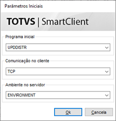{.flow-image}

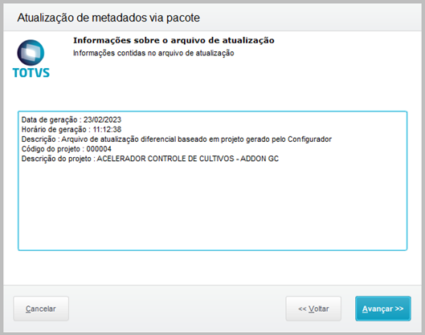{.flow-image}

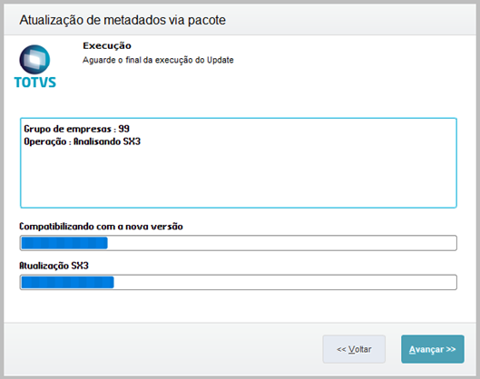{.flow-image}

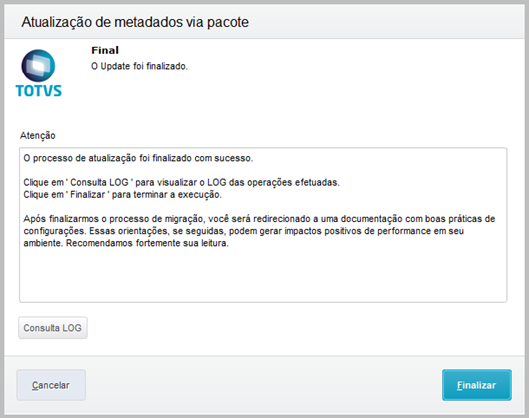{.flow-image}

<strong>Atenção</strong>: As rotinas disponibilizadas, estão suportadas para os idiomas Espanhol e Português do ERP Protheus.

#### 2. CONFIGURADOR

Através do ambiente Configurador (SIGACFG), deve-se adicionar as rotinas abaixo no menu do Addon GC:

#### 2.1 AMBIENTE\CADASTROS\MENUS 

  * \ATUALIZAÇÕES\CADASTROS CEREAIS\FAZENDAS 

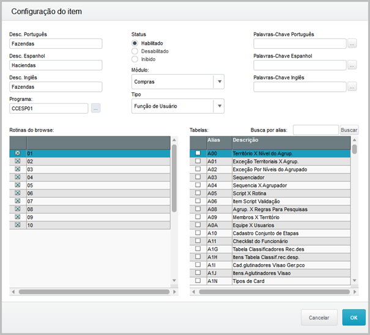{.flow-image}

  *	\ATUALIZAÇÕES\CADASTROS CEREAIS\SERVIÇOS

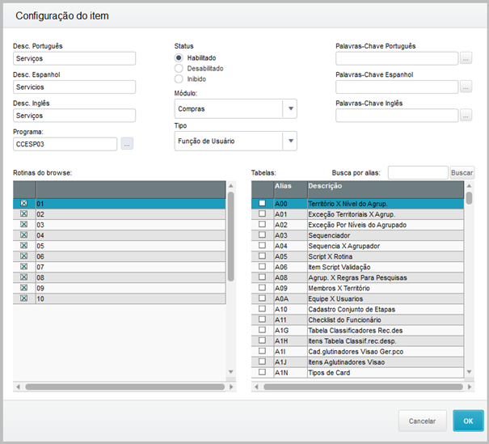{.flow-image}

  *	\ATUALIZAÇÕES\CADASTROS CEREAIS\VARIEDADES

{.flow-image}

  *	\ATUALIZAÇÕES\CADASTROS CEREAIS\ESTÁGIOS DE CULTIVO 

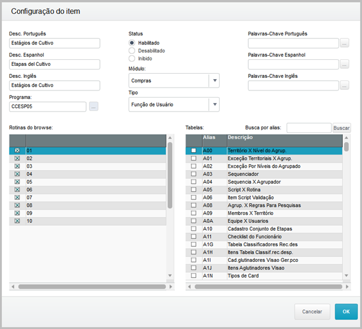{.flow-image}

  *	\ATUALIZAÇÕES\MOVIMENTOS\BAIXAS DE ESTOQUE 

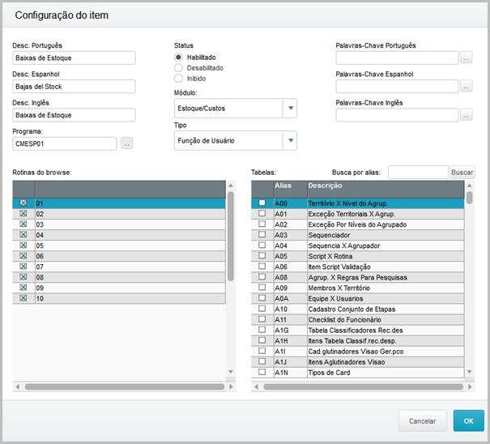{.flow-image}

  *	\ATUALIZAÇÕES\MOVIMENTOS\APONTAMENTOS DE COLHEITA

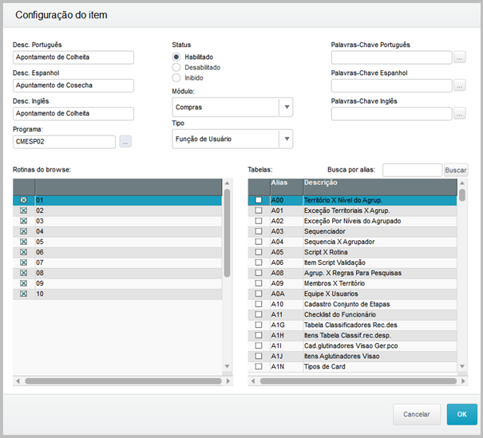{.flow-image}   

  *	\RELATÓRIOS\APURAÇÕES\DETALHAMENTO DE CULTIVO 

{.flow-image}  

  *	\RELATÓRIOS\APURAÇÕES\CULTIVO X PRODUTIVIDADE

{.flow-image}  

  *	\RELATÓRIOS\BALANÇA\MOV. DIÁRIA COLHEITA

{.flow-image}  

#### 2.2 AMBIENTE\CADASTROS\PARÂMETROS

* <strong>MV_XCESP00</strong>: 
    * Caractere inicial de composição da identificação da Fazenda em Armazéns e Série Fiscal. 
    * Ex: F ou H.

* <strong>MV_XCESP01</strong>: 
    * Tipo de movimentação (SF5) utilizado para entrada das ocorrências de subproduto nos romaneios referentes a recebimento de cereais referente a colheita (CL).
    * EX: 001.

* <strong>MV_XCESP02</strong>: 
    * Tipo de movimentação (SF5) utilizado para requisição do custo de produção (custos indiretos) nos romaneios referentes à recebimento de cereais referente à colheita (CL).
    * EX: 501.

* <strong>MV_XCESP03</strong> 
    * Identificação inicial para composição de Centro de Custos para composição de custos indiretos. 
        *	Se deixar o parâmetro em branco, não será gerado Centro de Custos.
    * EX: SAF.

* <strong>MV_XCESP04</strong> 
    * Identificação de Grupo\Produtos para composição de Entidade Contábil de custos indiretos. 
        * Se deixar o parâmetro em branco, não serão gerados o Grupo\Produto para custos indiretos.  
    * EX: CPA.

* <strong>MV_XCESP05</strong> 
    * Conta Contábil para vínculo ao Produto utilizado na composição dos custos indiretos de cultivo. 
        * Se deixar o parâmetro em branco, não será vinculado Conta Contábil ao Produto correspondente à composição dos custos indiretos. 

* <strong>MV_XCESP06</strong> 
    *	Executa apontamento de produção referente há recebimento de colheita ao fechar o Romaneio. 
      * EX: .F. 

* <strong>MV_XCESP07</strong> 
    * Deve cancelar o Romaneio quando é estornado o Ap. de Produção de Recebimento de Colheita. 
      * EX: .F. 

* <strong>MV_XCESP08</strong> 
    * Entidade contábil auxiliar referente à Fazendas. 
      * EX: 05. 

* <strong>MV_XCESP09</strong> 
    * Entidade contábil auxiliar referente à Safras. . 
      * EX: 06. 

* <strong>MV_XCESP10</strong> 
    * Tipo de movimentação utilizado para apontamento de produção referente há colheita. 
        * Se não for parametrizado, irá utilizar conforme definido em MV_TMPAD. 
    * EX: 020. 

* <strong>MV_XCESP11</strong> 
    * Permite modificar definições de plantio que tenham Ordem de Produção. 
      * Permite modificar a “quantidade estimada” caso não seja inferior à quantidade já produzida.
      *	Permite modificar o “produto de cultivo” caso não exista apontamento de produção na OP. 

* <strong>MV_XCESP12</strong> 
    * Tipo de movimentação utilizado na rotina de Baixa de Estoque. 
      * EX:501. 

* <strong>MV_XCESP13</strong> 
    * Código do serviço vinculado aos apontamentos de produção gerados pela rotina de Romaneios. 
      * EX: 000005. 

* <strong>MV_XCESP14</strong> 
    * Determina se haverá incidência de produção à partir dos Romaneios vinculados ao cadastro da Fazenda. 
      * EX:.F. 

* <strong>MV_XCESP15</strong> 
    * Utiliza cadastro de Serviços nas baixas de estoque sob definições de cultivo das Fazendas. 
      * EX:.T. 

* <strong>MV_XCESP16</strong> 
    * Define o layout fixo (1, 2 ou 3) aplicado à funcionalidade Cultivos na rotina de Fazendas. 
      * EX: 0. 

* <strong>MV_XCESP17</strong> 
    *	Utiliza tela de escolha do local de estoque ao fechar Romaneios que não sejam Venda Direta (GA). 
      * EX: .F. 

#### 3. ADDON GESTÃO DE CEREAIS
Na sequência deste documento, serão listadas as informações referentes à utilização do processo personalizado junto ao Addon Gestão de Cereais. 

#### 3.1 ATUALIZAÇÕES\CADASTROS CEREAIS\USUÁRIOS X PERMISSÕES

Disponibilizado, novos campos de controle de permissões dos usuários, junto à rotina de Usuários X Permissões – GCCAD013.PRW.

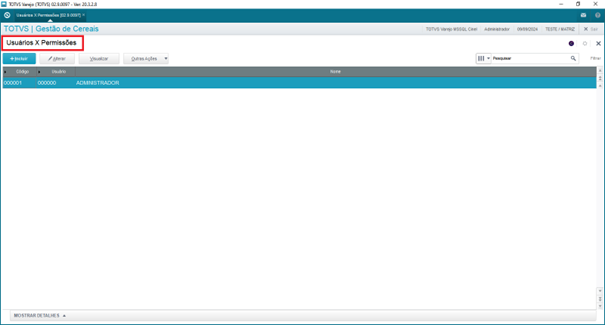{.flow-image} 

Existem campos de controle de permissão, junto à sessão “Cadastros Cereais”.

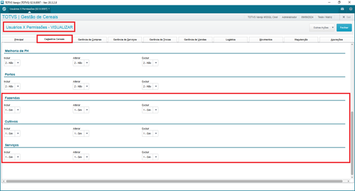{.flow-image} 

Também se encontram disponíveis, novos campos junto à sessão de “Movimentos”.

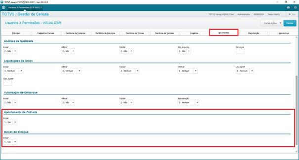{.flow-image} 

#### 3.2 ATUALIZAÇÕES\CADASTROS CEREAIS\FAZENDAS

Disponibilizado, rotina personalizada denominada Fazendas. Ao acessar à rotina, é apresentado o browse e suas funcionalidades.

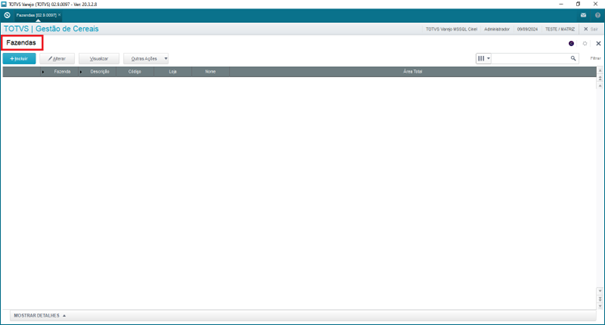{.flow-image} 

Através da funcionalidade “Incluir”, é disponibilizado interface para definição das informações do cabeçalho referente à identificação da Fazenda e abaixo, grids para composição dos Blocos\Zonas e Talhões\Quadras conforme exemplo.

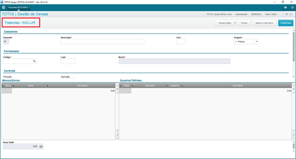{.flow-image} 

No cabeçalho, além da descrição da Fazenda, deve-se informar sua “origem” e “setor”, bem como, o cadastro de Fornecedor que será utilizado para registro dos Romaneios de pesagem referente à colheita na respectiva fazenda.

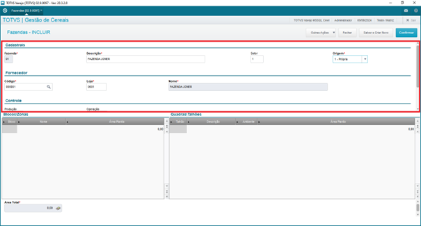{.flow-image} 

No grid presente na interface, devem ser vinculadas as informações referentes à cada um dos Blocos\Zonas e para estes, seus respectivos Talhões\Quadras os quais compõe à Fazenda.

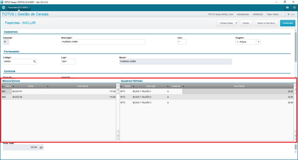{.flow-image} 

Referente à “Origem” da Fazenda: 

* <strong>PRÓPRIA</strong> 
    * Fazenda própria, sob à qual é possível compor custos de cultivo por safra e pesagens. 
* <strong>TERCEIROS</strong> 
    * Fazenda de terceiros, não se aplica à composição de custos de cultivo, apenas pesagens. 
* <strong>ARRENDADA</strong> 
    * Fazenda de terceiros, sob à qual é possível compor custos de cultivo por safra e pesagens. 
Após à definição das informações com relação ao cadastro da Fazenda, basta confirmar à inclusão.

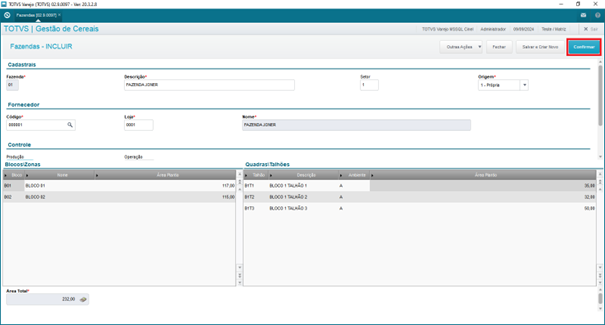{.flow-image} 

Ao retornar ao browse da rotina, será apresentado registro referente ao cadastro que foi adicionado.

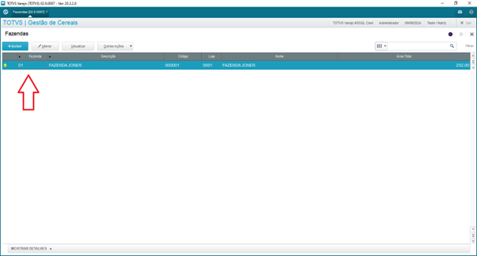{.flow-image} 

Quando é realizado à inclusão\alteração do cadastro de Fazendas, também são gerados registros vinculados à mesma em rotinas padrões do ERP Protheus.  

Ao “Visualizar” ou “Alterar” o cadastro de Fazendas, encontra-se disponível em “Outras Ações”, à opção denominada “Conhecimento”.

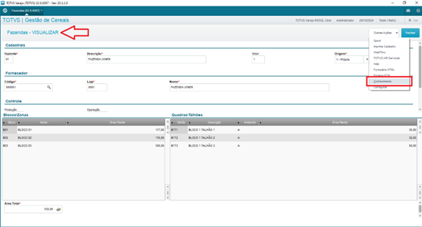{.flow-image} 

Trata-se da funcionalidade padrão do ERP Protheus, denominada “Banco de Conhecimento”.

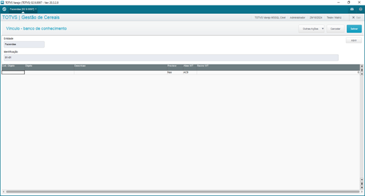{.flow-image} 

Este recurso, permite que sejam vinculados ao cadastro da Fazenda manipulado, arquivos de qualquer extensão, onde posteriormente, qualquer usuário com acesso à rotina, poderá acessar estes arquivos, realizando o download dos mesmos e\ou adicionado novos arquivos.

<strong>LOCAIS DE ESTOQUE (ESTOQUE\CUSTOS)</strong> 

Os registros gerados na rotina de Locais de Estoque (NNR), tem o código composto pelo caractere de identificação de Fazenda (MV_XCESP00) + Código da Fazenda.

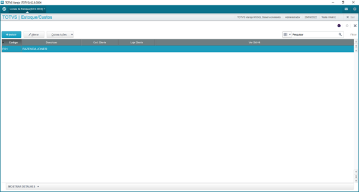{.flow-image} 

<strong>CLASSE DE VALOR \ ENTIDADE CONTABIL AUXILIAR (CONTABILIDADE GERENCIAL)</strong> 

Os registros gerados na rotina de Classe de Valor (CTH) ou Entidade Contábil Auxiliar (CT0), tem o código composto pelo caractere de identificação da Fazenda (MV_XCESP00) + Código da Fazenda. Neste caso, são criados registros de Classe de Valor para cada uma das Parcelas\Talhões vinculados à estrutura da Fazenda manipulada.

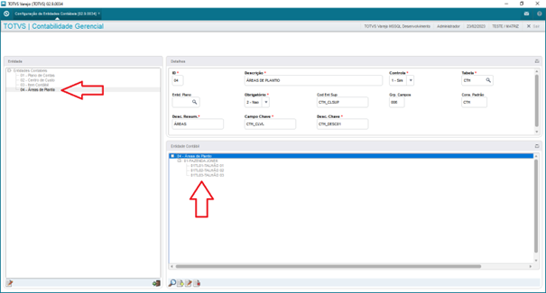{.flow-image} 

Além das opções padrões de manipulação de cadastros de Fazendas, encontra-se disponível na rotina, em “Outras Ações” à funcionalidade denominada “Cultivos”.

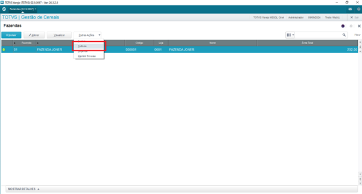{.flow-image} 

Ao acionar esta funcionalidade, é disponibilizado um novo browse com o histórico de todas as definições de cultivo existentes para o cadastro da Fazenda posicionado anteriormente.

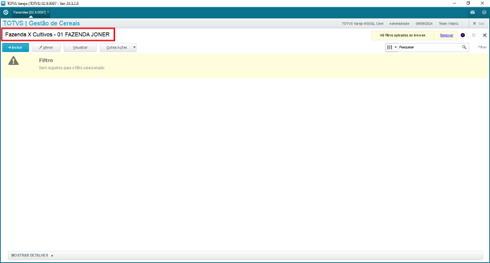{.flow-image} 

Esta funcionalidade, disponibiliza regras para que seja realizado à definição de quais produtos (cereais) serão cultivados na safra em cada um dos Blocos\Zonas e seus Talhões\Quadras da Fazenda. Através da realização deste planejamento de cultivo\plantio, serão geradas Ordens de Produção (SC2) junto ao módulo de Estoque\Custos, para baixa do estoque que será utilizado durante o ciclo de cultivo em cada uma das áreas da Fazenda, compondo assim, os custos diretos de cultivo.
 
Ao acionar à funcionalidade “Incluir”, caso o parâmetro MV_XCESP016 esteja configurado como “0”, será disponibilizado interface para que seja escolhido qual o layout de tela que será utilizado para registro da definição de cultivo.

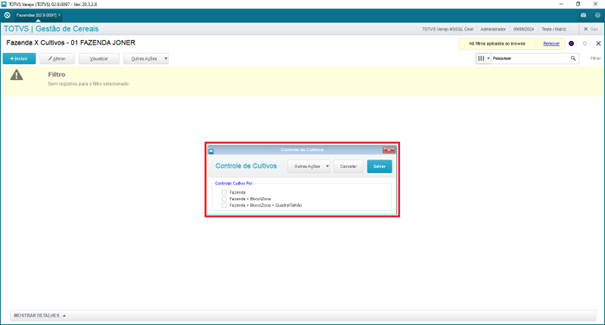{.flow-image} 

Abaixo, são apresentadas maiores informações à respeito de cada uma das opções disponíveis: 

* <strong>FAZENDA:</strong>
    * Ao utilizar esta opção, será possível definir um único produto e ordem de produção, aplicado de modo total à Fazenda para à safra de referência. 
    * Para sempre utilizar este layout, basta configurar o parâmetro <strong>MV_XCESP016 = 1</strong>. 

* <strong>FAZENDA + BLOCO\ZONA:</strong>
    * Nesta modalidade, à definição do produto cultivado, será por Bloco\Zona. Portanto, se à Fazenda possui por exemplo, 3 Blocos\Zonas, cada um destes, poderá ter um produto distinto, sendo gerado uma ordem de produção para cada Bloco\Zona que tiver produto de cultivo definido para à safra de referência. 
    * Para sempre utilizar este layout, basta configurar o parâmetro <strong>MV_XCESP016 = 2</strong>. 

* <strong>FAZENDA + BLOCO\ZONA + QUADRA\TALHÃO</strong>
    * Por final, ao utilizar esta opção, será possível definir o produto e será gerado ordem de produção individual, para
  cada Quadra\Talhão de cada um dos Blocos\Zonas da Fazenda para à safra de referência.  
    * Para sempre utilizar este layout, basta configurar o parâmetro <strong>MV_XCESP016 = 3</strong>.

Após à definição do layout de controle do cultivo, será disponibilizado à interface para registro das definições aplicadas ao cultivo, conforme as características detalhadas anteriormente. Para fins de exemplo, neste documento, está sendo aplicado definição de cultivo com layout por FAZENDA (MV_XCESP016 = 1).

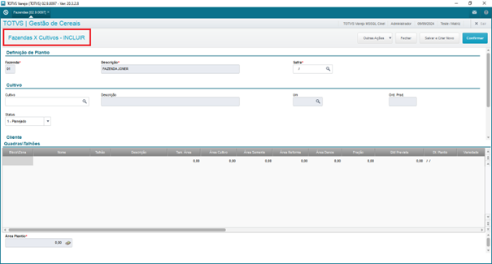{.flow-image} 

Junto ao cabeçalho, deve-se informar à Safra referente ao cultivo e também, o cadastro do Produto que será cultivado na área.

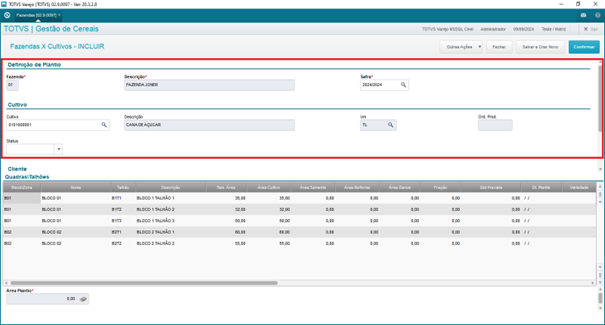{.flow-image} 

No grid presente na base inferior da tela, serão disponibilizadas as informações referentes há todas as definições de Blocos\Zonas com seus respectivos Talhões\Quadras, conforme as definições atuais do cadastro da Fazenda.

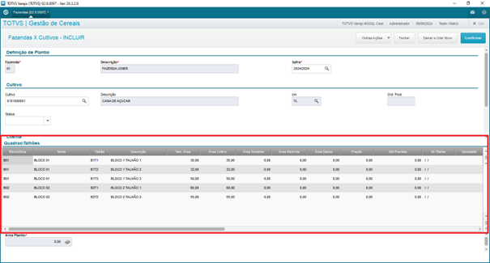{.flow-image} 

Por padrão, à definição do “Tam. Área” de cada Talhão\Quadra, será sugerido como “Área Cultivo”. No entanto, conforme necessário, é possível editar os campos “Área Semente”, “Área Reforma” e “Área Danos” de modo que, o tamanho de área (hectare) informado nestes campos, será subtraído do campo “Área Cultivo”.

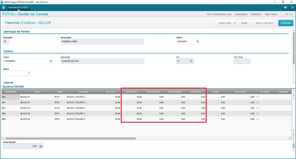{.flow-image}

Através do campo “Fração”, deve-se informar no Bloco\Zona e Talhão\Quadra, à quantidade de produção estimada por hectare. Assim, o campo “Qtd. Prevista” será automaticamente calculado considerando o campo “Área Cultivo”.

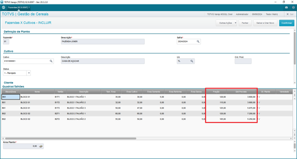{.flow-image}

Junto ao grid da tela, encontram-se disponíveis outros campos informativos e de controle do cultivo.

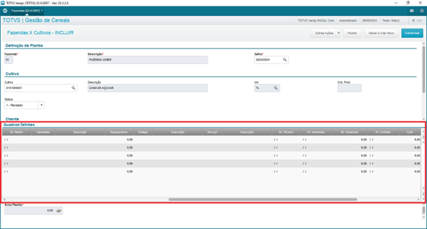{.flow-image}

Após finalizar as definições do Cultivo, basta confirmar à interface.

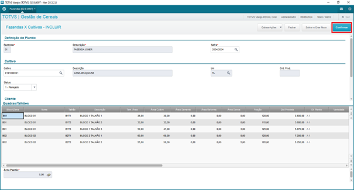{.flow-image}

Assim, ocorrerá a gravação das definições de cultivo, neste momento, também serão executadas as regras referentes a geração de ordem de produção para controle\composição dos custos de cultivo, conforme às regras de definição do layout utilizado, conforme mencionado anteriormente.

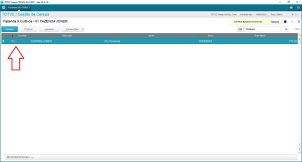{.flow-image}

<strong>ATENÇÃO:</strong> A Fazenda, Bloco\Zona, Talhão\Quadra e Safra, somente serão disponibilizados para movimentação, caso o status seja modificado para “Em Execução”.

<strong>IMPRIMIR \ DETALHAMENTO DE CULTIVO:</strong>

Junto ao browse da funcionalidade de “Plantios” na rotina de Fazendas, existe em “Outras Ações” a funcionalidade “Imprimir\Det. Cultivo”. Trata-se de relatório para apresentação das movimentações de estoque\produção\colheita, vinculadas as definições de plantio posicionada no browse.

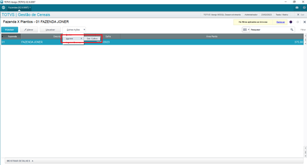{.flow-image}

O relatório, será gerado considerando todos os talhões com definição de cultivo conforme o registro posicionado no browse no ato da execução. Portanto, não existem parâmetros para definição no relatório quando a sua execução é realizada pela funcionalidade de “Plantios”.

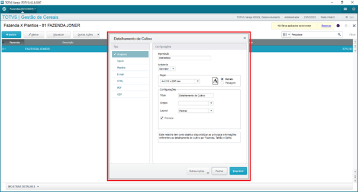{.flow-image}

<strong>ORDENS DE PRODUÇÃO (ESTOQUE\CUSTOS)</strong>

Através da rotina padrão de Ordens de Produção, é possível consultar os detalhes à respeito de cada um dos registros gerados devido à inclusão do Planejamento de Cultivo\Plantio mencionado anteriormente.

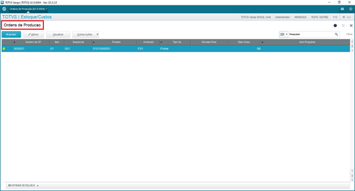{.flow-image}

Ao visualizar uma destas Ordens de Produção, é possível identificar informações correspondentes ao planejamento de Cultivo vinculado.

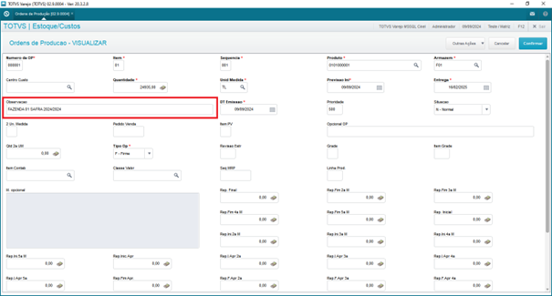{.flow-image}

Visando manter à integridade do processo, não é permito que sejam realizadas alterações\exclusões das Ordens de Produção geradas pelo Planejamento de Cultivo\Plantio. Ao tentar realizar alguma destas ações, será apresentado mensagem alertando à respeito.

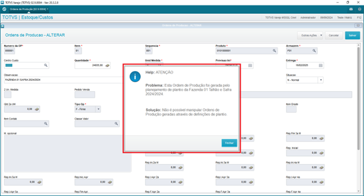{.flow-image}

Caso seja necessário alterar o produto\quantidade ou até mesmo excluir as Ordens de Produção, deve-se utilizar as funcionalidades “Alterar” e\ou “Excluir” disponíveis junto ao browse do recurso de “Cultivos” na rotina de Fazendas.

#### 3.3	ATUALIZAÇÕES\CADASTROS CEREAIS\SERVIÇOS

Disponibilizado, rotina personalizada denominada Serviços. Ao acessar à rotina, é apresentado o browse e suas funcionalidades.

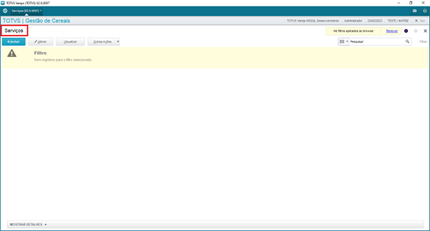{.flow-image}

Através das funcionalidades disponíveis no browse, deve-se realizar à composição do cadastro de todos os tipos de serviços que podem ser utilizados durante o ciclo de cultivo de cada safra.

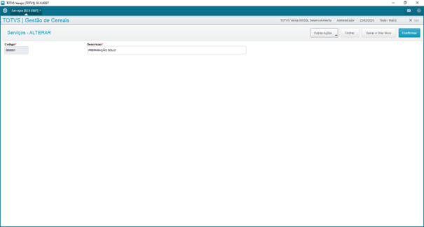{.flow-image}

O cadastro de Serviços, será aplicado à realização das Baixas de Estoque referente ao vínculo de insumos e custos indiretos no ciclo de cultivo.

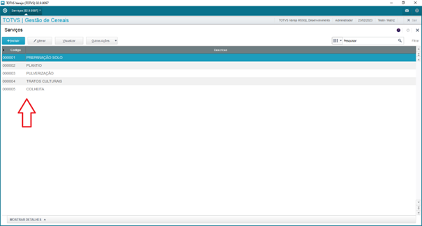{.flow-image}

#### 3.4	ATUALIZAÇÕES\CADASTROS CEREAIS\VARIEDADES

Disponibilizado, rotina personalizada denominada Variedades. Ao acessar à rotina, é apresentado o browse e suas funcionalidades.

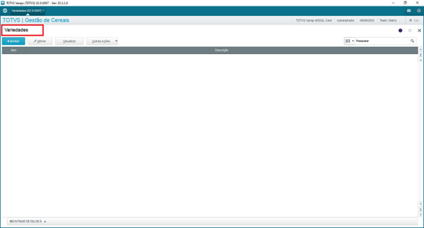{.flow-image}

Através das funcionalidades disponíveis no browse, deve-se realizar à composição do cadastro de todas as variedades que podem ser utilizados durante o ciclo de cultivo de cada safra.

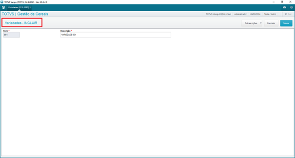{.flow-image}

O cadastro de Variedades, é aplicado à funcionalidade de “Cultivos” presente na rotina de “Fazendas”.

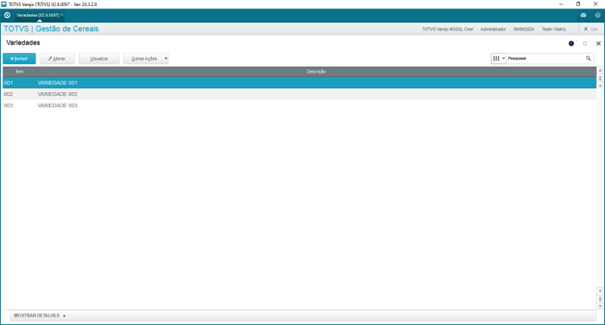{.flow-image}

#### 3.5 ATUALIZAÇÕES\CADASTROS CEREAIS\ESTÁGIOS DE CULTIVO

Disponibilizado, rotina personalizada denominada Estágios de Cultivo. Ao acessar à rotina, é apresentado o browse e suas funcionalidades.

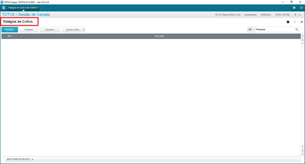{.flow-image}

Através das funcionalidades disponíveis no browse, deve-se realizar à composição do cadastro de todos os estágios de cultivo, que podem ser utilizados durante o ciclo de cultivo de cada safra.

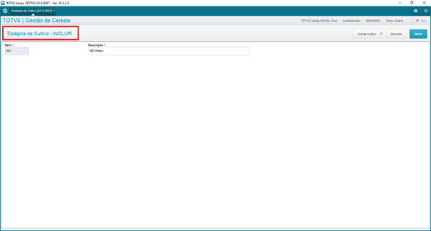{.flow-image}

O cadastro de Estágios de Cultivo, é aplicado à funcionalidade de “Cultivos” presente na rotina de “Fazendas”.

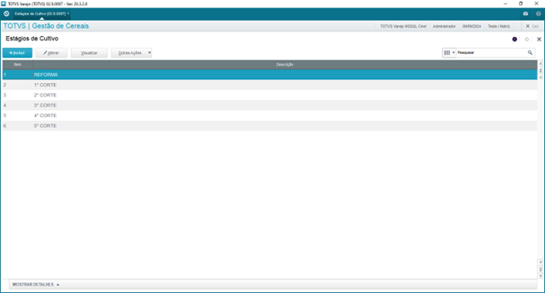{.flow-image}

#### 3.6 ATUALIZAÇÕES\MOVIMENTOS\BAIXAS DE ESTOQUE

Disponibilizado, rotina personalizada denominada Baixas de Estoque. Ao acessar à rotina, é apresentado o browse e suas funcionalidades.

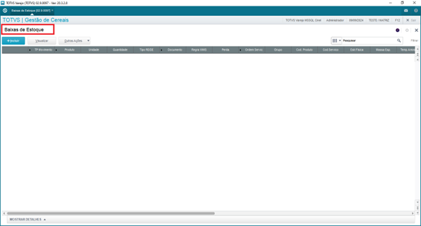{.flow-image}

<strong>INCLUIR - MANUALMENTE</strong>

Ao acionar à funcionalidade “Incluir”, será disponibilizado interface para definição dos movimentos de baixa de estoque a serem realizados pelo usuário.

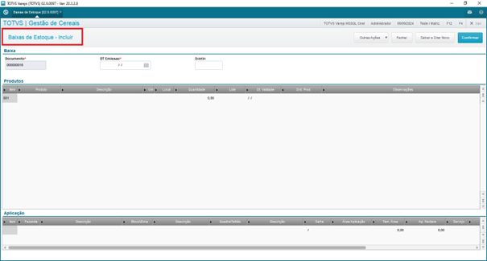{.flow-image}

No cabeçalho, deve ser informado à data utilizada para realização da baixa de estoque dos produtos e caso exista, o número do boletim de aplicação.

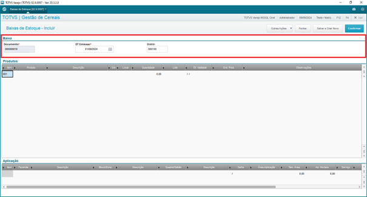{.flow-image}

Junto ao grid central, deve-se informar à relação de produtos, local de estoque e suas respectivas quantidades, conforme à baixa necessária dos mesmos junto ao estoque.

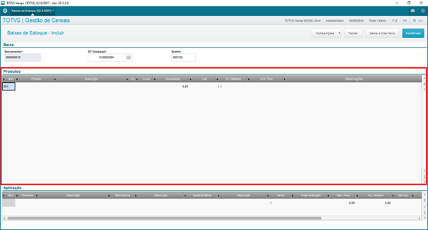{.flow-image}

Ao informar o código do produto no grid central, será disponibilizado interface para definição das informações correspondentes à “aplicação” do respectivo produto.

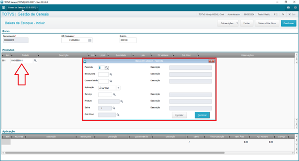{.flow-image}

Junto à interface secundária, deve-se determinar à “Fazenda” e a partir desta, devem ser informadas outras características envolvidas na aplicação do insumo que está sendo baixado. Vale ressaltar, que somente serão disponibilizadas para o processo, as definições de cultivo que estejam com status “Em Execução”.

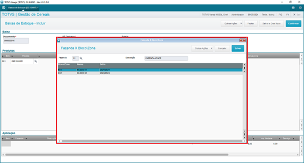{.flow-image}

A partir da definição de Fazenda, Bloco\Zona e Talhão\Quadra, basta na sequência, que seja informado o código de identificação do Serviço vinculado à baixa do estoque do produto manipulado.

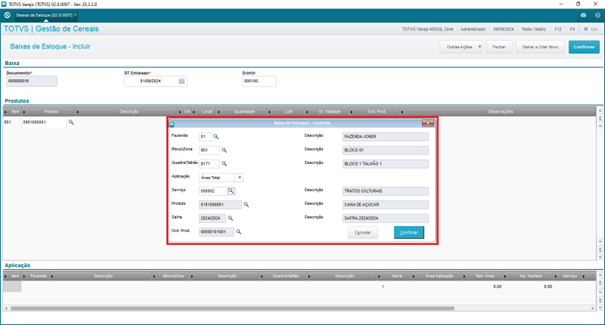{.flow-image}

Após informar os dados solicitados, o foco é direcionado ao botão “Confirmar”, para que seja retornado ao grid principal, para definição da quantidade do produto.

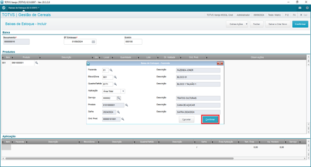{.flow-image}

Retornando ao grid principal de Produtos, deve-se informar os demais dados referentes à baixa do produto, tais como: local de estoque, quantidade e lote (caso exista).

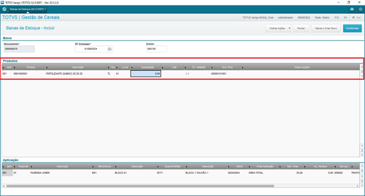{.flow-image}

A partir do item posicionado no grid de Produtos, será apresentado no grid inferior – Aplicação, as informações correspondentes à Fazenda, Bloco\Zona, Talhão\Quadra, Safra e Serviço vinculados à baixa do respectivo produto.

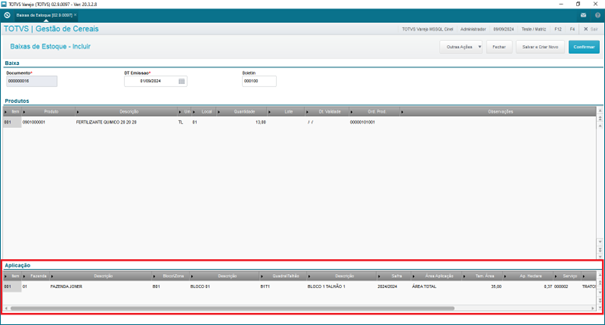{.flow-image}

Desta forma, deve-se realizar à definição de todos os produtos correspondentes à realização da baixa de estoque na data informada. Após finalizar à definição dos produtos, basta confirmar à interface.

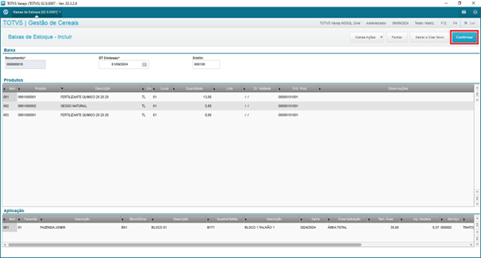{.flow-image}

Ao confirmar à interface, ocorrerá à geração dos movimentos de baixa de estoque dos produtos conforme as definições da tela. Ao finalizar à movimentação, será apresentado mensagem à respeito, sendo retornado para o browse.

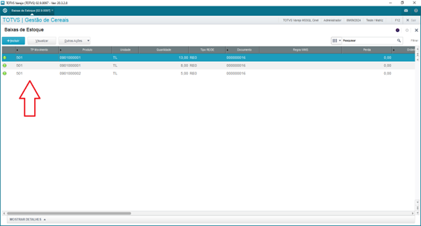{.flow-image}

<strong>INCLUIR – BAIXA AUTOMATICA</strong>

Junto à funcionalidade “Incluir” na rotina de Baixas de Estoque, existe funcionalidade denominada “Baixa Automática”. Esta funcionalidade, está disponível em “Outras Ações”.

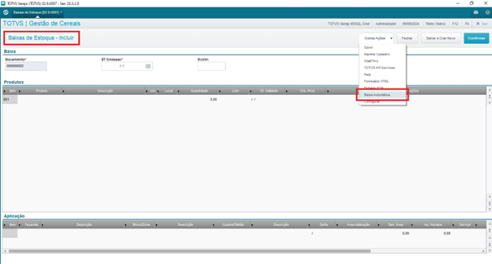{.flow-image}

Esta funcionalidade, tem por objetivo automatizar à composição do grid de Produtos da tela, à partir dos parâmetros disponibilizados para sua execução.

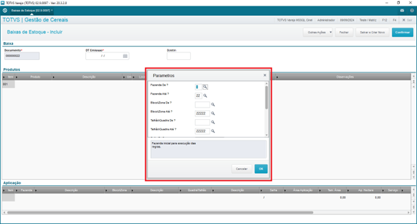{.flow-image}

A partir dos parâmetros informados, será atualizado o grid de Produtos da interface.

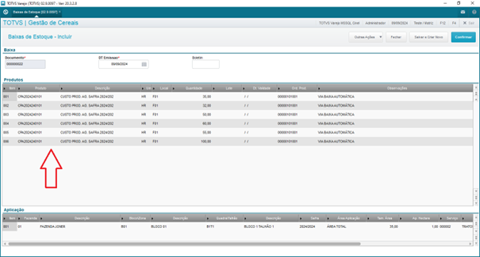{.flow-image}

A funcionalidade de Baixa Automática, foi implementada principalmente para situações em que seja necessário realizar à baixa de estoque referente à produtos vinculados à composição\rateio de custos indiretos.

<strong>ESTORNAR</strong>

Caso seja necessário excluir alguma baixa de estoque realizada de forma divergente, deve-se posicionar no browse sob um dos registros desejados e em seguida, executar à funcionalidade “Estornar” presente em “Outras Ações”.

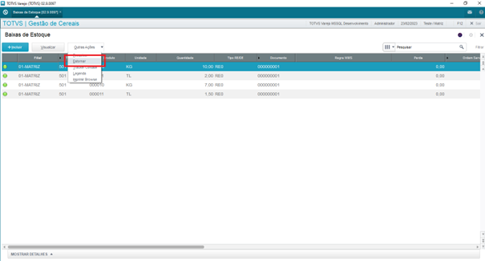{.flow-image}

Em seguida, será apresentado à tela com os movimentos vinculados à baixa de estoque do item posicionado, para que seja realizado o estorno, basta confirmar à tela.

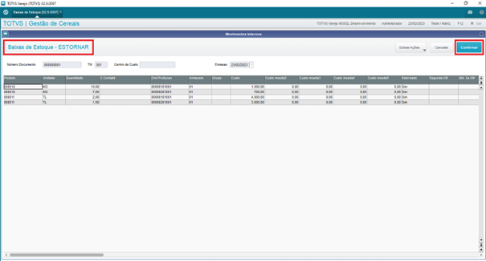{.flow-image}

#### 3.7 ATUALIZAÇÕES\MOVIMENTOS\APONTAMENTO DE COLHEITA

Caso não seja adotado à realização de pesagem das cargas obtidas na colheita, deve-se adotar à utilização da rotina Apontamento de Colheita – CMESP02.PRW para que seja realizado o registro da produção obtida. 

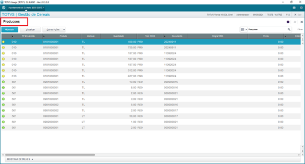{.flow-image}

<strong>INCLUIR</strong>

Através da funcionalidade “Incluir”, será disponibilizado interface específica, para auxiliar na realização do apontamento de colheita.

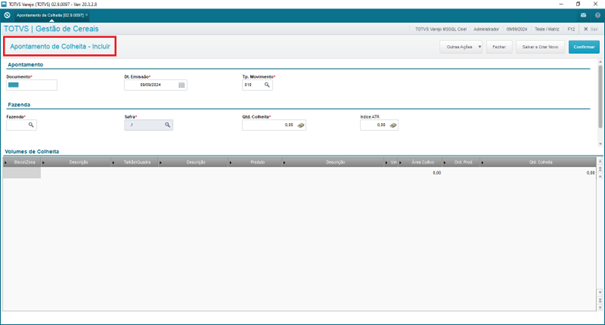{.flow-image}

No cabeçalho, devem ser informados primeiramente, o campo de identificação do número do documento referente ao apontamento realizado. Em seguida, deve-se informar à Fazenda\Safra.

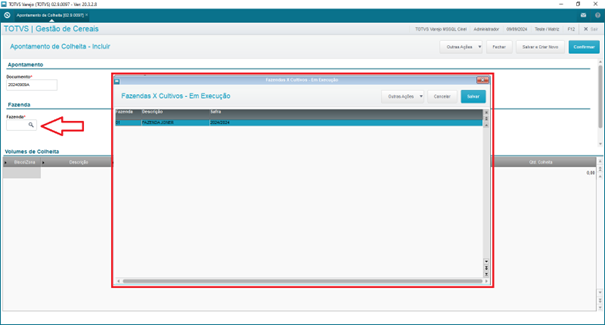{.flow-image}

Em seguida, deve-se informar o volume\quantidade total da colheita na respectiva Fazenda\Safra.

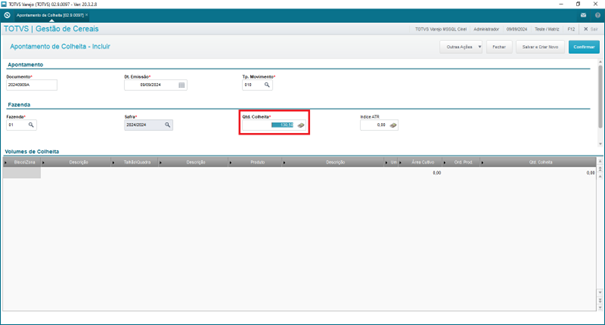{.flow-image}

Após informar à Fazenda, Safra e Qtd. Colheita, será apresentado tela com os Blocos\Zonas da respectiva Fazenda conforme as definições de cultivo da Safra informada. Portanto, deve-se selecionar os Blocos\Zonas os quais serão considerados para realização do apontamento de colheita.

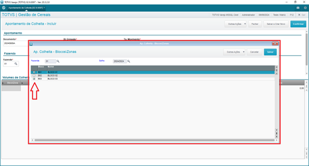{.flow-image}

Confirmando à tela, será realizado à carga no grid principal da tela, dos Blocos\Zonas selecionados e seus respectivos Talhões\Quadras, sendo que, o valor informado no campo “Qtd. Colheita”, será rateado entre os registros do grid, de forma proporcional ao “Tam. Área” de cada Talhão\Quadra.

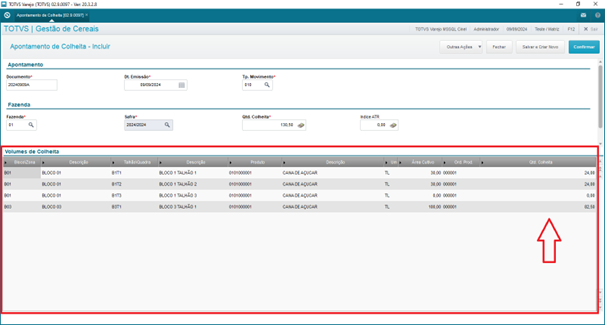{.flow-image}

Caso seja necessário, é possível realizar ajustes no campo “Qtd. Colheita” no grid de itens. A partir das alterações realizadas neste campo, será atualizado o campo de “Qtd. Colheita” presente no cabeçalho da tela de inclusão do apontamento de colheita.

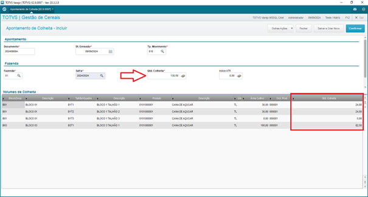{.flow-image}

Finalizando a realização do apontamento de colheita, basta realizar à confirmação da tela.

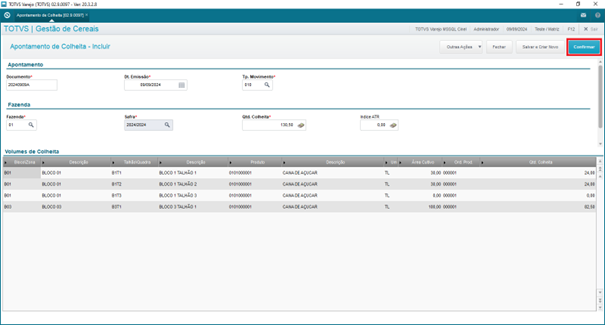{.flow-image}

Assim, serão executadas as regras de inclusão dos apontamentos de produção, nas ordens de produção vinculadas à cada Bloco\Zona e Talhão\Quadra, considerados na inclusão do apontamento de colheita.

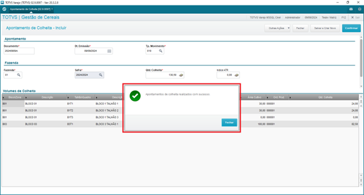{.flow-image}

Será então, retornado ao browse da rotina, onde poderão ser identificados\visualizados os registros de produção gerados pela ação de inclusão.

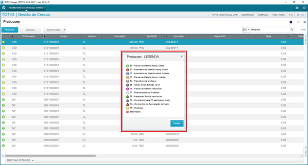{.flow-image}

<strong>ESTORNAR</strong>

Caso seja necessário, reverter um apontamento de colheita, deve-se utilizar à funcionalidade “Estornar” presente no browse da rotina em “Outras Ações”.

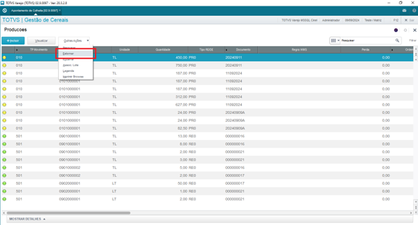{.flow-image}

Será então, realizado à apresentação de tela com informações do apontamento de colheita posicionado no browse quando foi executado à funcionalidade “Estornar”. Para que o apontamento seja estornado, deve-se confirmar à tela.

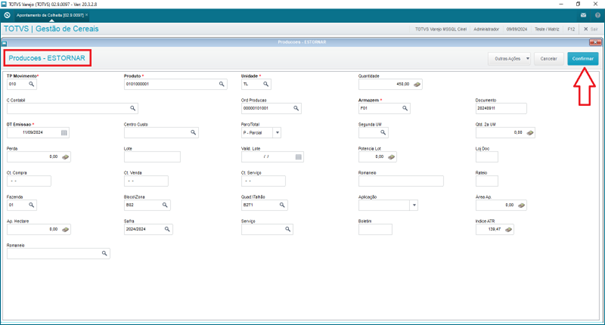{.flow-image}

Ao realizar o estorno do registro, será modificado à legenda do mesmo junto ao browse da rotina de Apontamento de Colheita.

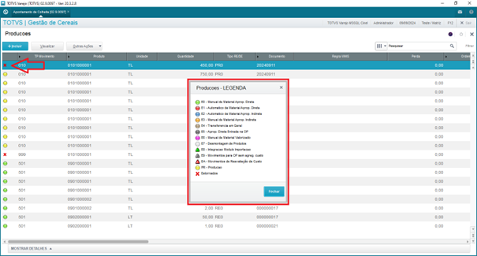{.flow-image}

#### 3.8	ATUALIZAÇÕES\MOVIMENTOS\ROMANEIOS

Passado o período referente ao ciclo de cultivo das áreas de plantio, é chegado o momento da colheita. Para que seja realizado o registro das cargas obtidas na colheita, será utilizada à rotina de Romaneios – GCMOV001.PRW presente no Addon Gestão de Cereais.

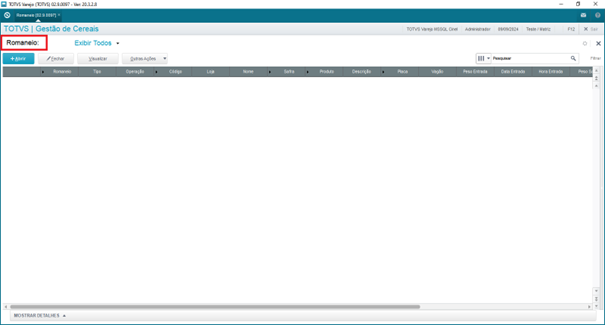{.flow-image}

Através da funcionalidade “Abrir”, será iniciado o registro referente ao recebimento de uma carga originada do processo de colheita.

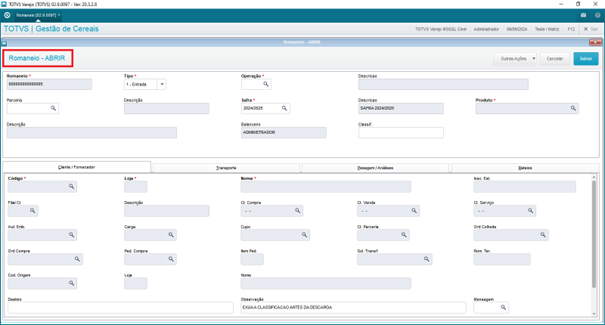{.flow-image}

Para registro destas cargas, deve-se utilizar Romaneios de Entrada com à Op. Cereais – CL Recebimento de Colheita. Ao informar à operação, será disponibilizado interface secundária, para identificação da Fazenda, Parcela e Placa do Veículo referentes à carga.

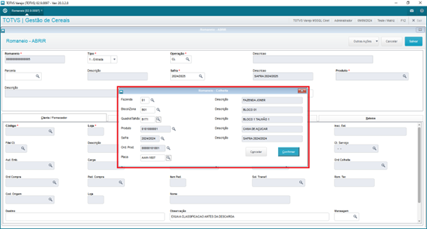{.flow-image}

Ao confirmar à interface, será carregado o Fornecedor\Loja vinculado ao cadastro da Fazenda. Caso não exista, será verificado à existência de cadastro de Fornecedor (SA2) com o mesmo CPF\CNPJ correspondente à Empresa\Filial do ERP Protheus em que está ocorrendo o registro do Romaneio. Caso não exista nenhum cadastro de Fornecedor que atenda à este critério, será apresentado mensagem impedindo o registro do Romaneio.

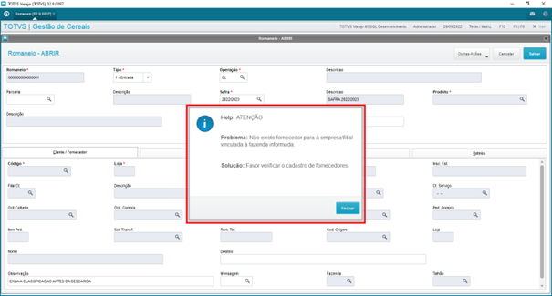{.flow-image}

Portanto, é necessário que seja realizado à inclusão de cadastro de Fornecedor com o mesmo CPF\CNPJ vinculado à Empresa\Filial na qual será registrado o Romaneio. Este Fornecedor, será automaticamente vinculado aos Romaneios gerados correspondentes à operação CL – Recebimento de Colheita.
 
Uma vez que os pontos mencionados anteriormente estejam válidos, deve-se proceder com o registro das demais informações pertinentes à abertura do Romaneio correspondente à carga gerada do processo de colheita.

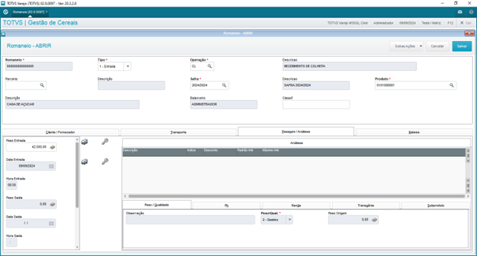{.flow-image}

Finalizando à definição das informações, será confirmado à interface gravando, portanto, a abertura do Romaneio referente à carga recebida.

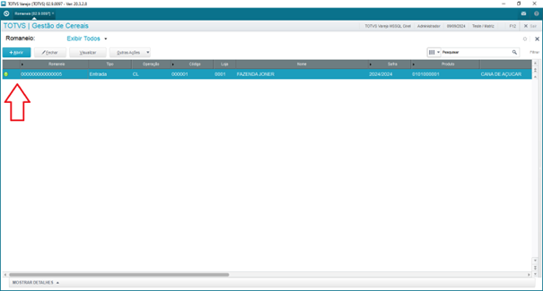{.flow-image}

Após realizar o processo de descarga do veículo, este retorna para balança para que seja realizado uma nova pesagem (tara). Neste caso, deve-se posicionar sob o Romaneio e utilizar à funcionalidade “Fechar” presente no browse.

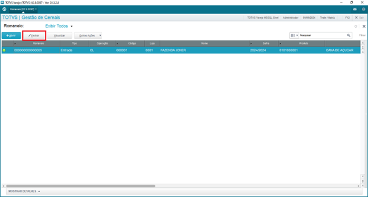{.flow-image}

Deve-se proceder com o registro da pesagem de saída do veículo e em seguida, confirmar à interface da funcionalidade de encerramento do registro do Romaneio.

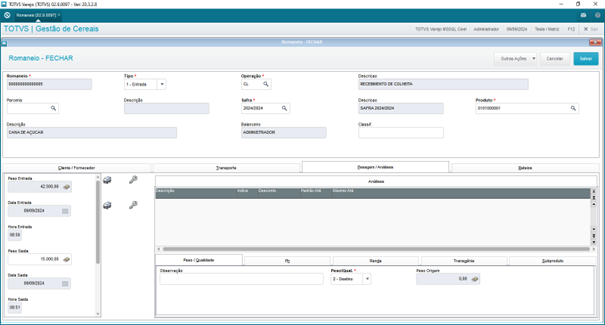{.flow-image}

Teremos então, à finalização do registro da pesagem da carga de cereais obtida do processo de colheita. Caso o parâmetro MV_XCESP06 esteja habilitado (.T.), ao realizar o encerramento do Romaneio referente à operação CL – Recebimento de Colheita, será automaticamente executado as regras referentes ao Apontamento de Produção sob à Ordem de Produção vinculada à Fazenda\Talhão\Safra registrados no Romaneio. Uma vez que o parâmetro esteja desativado (.F.), o Romaneio ficará apenas “Fechado”, estando pendente de execução deste apontamento.

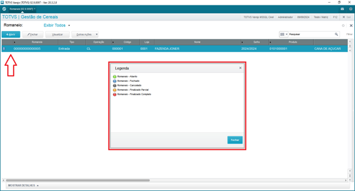{.flow-image}

Para que o Apontamento de Produção referente aos Romaneios de colheita (CL) seja realizado posteriormente ao seu encerramento (Fechar), deve-se posicionar sob o Romaneio e acionar à funcionalidade “Faturar”, presente no browse em “Outras Ações”.

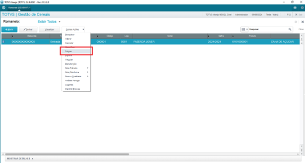{.flow-image}

Será apresentado mensagem ao usuário, para que confirme à realização do Apontamento de Produção conforme descrito anteriormente. Deve-se portanto, confirmar à mensagem e aguardar o processamento.

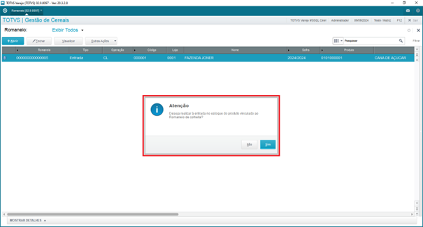{.flow-image}

<strong>DICA:</strong> para correta execução das regras automáticas de Apontamento de Produção, deve-se através da rotina de Tipos de Movimentação (Estoque\Custos), realizar à inclusão de cadastro de Tipo de Movimentação de Produção, com o código “010”. Este, será utilizado automaticamente para execução dos respectivos apontamentos conforme abordado anteriormente.
 

Quando é finalizado à execução das regras de Apontamento de Produção, o Romaneio tem o seu status atualizado, indicando que está finalizado\faturado.

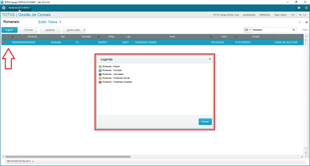{.flow-image}

A partir da configuração dos parâmetros: MV_XCESP02, MV_XCESP03, MV_XCESP04 e MV_XCESP05, quando é realizado o primeiro Apontamento de Produção para à Safra, serão criados:

  * <strong>CENTRO DE CUSTOS</strong>
      *	Utilizado para apropriação dos custos indiretos referentes à Safra;

* <strong>GRUPO DE PRODUTOS</strong>
      *	Referente à organização dos produtos para apuração de custos indiretos;

* <strong>PRODUTO</strong>
      * Utilizado para apropriação dos custos indiretos referentes à Safra;

Caso as regras acima estejam ativas, será necessário disponibilizar através da rotina padrão de Tipos de Movimentos (Estoque\Custos), cadastro de Tipo de Movimento de Requisição, que será utilizado para inclusão de Mov. Interno Múltiplo automático no ato da geração do Apontamento de Produção apresentado anteriormente, referente ao consumo\apropriação do Produto correspondente aos “custos indiretos” para à respectiva Safra.
 			
O Tipo de Movimentação de Requisição em questão, deve ter o seu código vinculado ao parâmetro MV_XCESP02 no ambiente Configurador (SIGACFG).
 
Ainda referente aos “custos indiretos”, é necessário prover as demais regras junto ao ERP Protheus, envolvendo outros módulos, para que seja realizado à composição destes custos nas entidades contábeis criadas e após isto, através do processo de Recálculo do Custo Médio – MATA330.PRW presente no módulo de Estoque\Custos, ocorrerá o recalculo\distribuição dos custos indiretos em cada uma das Ordens de Produção conforme os Apontamentos de Produção realizados.
 

#### 3.9	RELATÓRIOS\APURAÇÕES\DETALHAMENTO DE CULTIVO

Disponibilizado relatório denominado Detalhamento de Cultivo – CRESP02.PRW. 

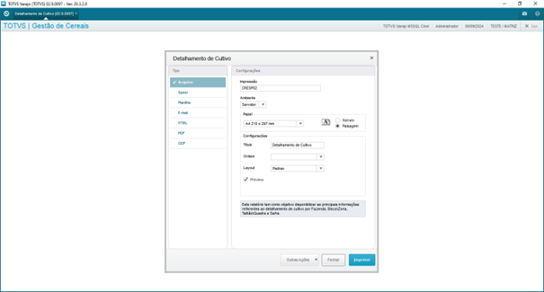{.flow-image}

Este relatório, tem por objetivo apresentar as principais informações vinculadas à baixa de produtos (insumos\mão de obra\etc) e registro de produção (romaneios de colheita) realizados sob as definições de cultivo.

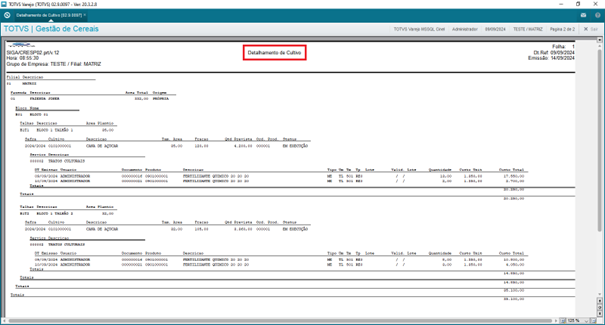{.flow-image}

#### 3.10	RELATÓRIOS\APURAÇÕES\CULTIVO X PRODUTIVIDADE

Disponibilizado relatório denominado Cultivo X Produtivo – CRESP03.PRW. 

{.flow-image}

Este relatório, tem por objetivo apresentar as principais informações vinculadas aos registros de colheita\produção, realizados sob as definições de cultivo\safra das fazendas.

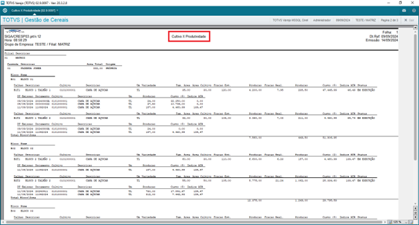{.flow-image}

#### 3.11	RELATÓRIOS\BALANÇA\MOV. DIÁRIA COLHEITA

Disponibilizado relatório denominado Mov. Diária Colheita – CRESP01.PRW. 

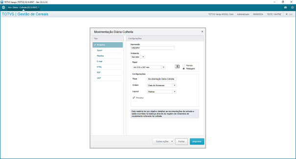{.flow-image}

Este relatório, tem por objetivo apresentar as principais informações vinculadas aos registros de colheita\produção através da pesagem das cargas de grãos, realizadas durante o ciclo de cultivo da fazenda.

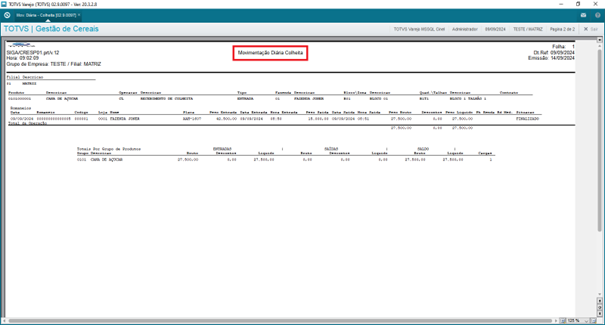{.flow-image}

#### 4. ESTOQUE\CUSTOS

#### 4.1	ATUALIZAÇÕES\CADASTROS\MOVIMENTAÇÕES\INTERNAS

Para que seja possível realizar o apontamento do consumo de estoque em cada uma das áreas de plantio em que os insumos foram utilizados, é necessário que seja previamente cadastro um “Tipo de Movimentação” do Tipo = Requisição.

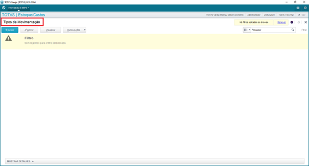{.flow-image}

Além dos campos padrões, encontra-se disponível campo de controle referente a “obrigatoriedade” de vínculo do número da Ordem de Produção ao Mov. Interno de estoque quando utilizado o Tipo de Movimentação em questão. A seguir, é apresentado um exemplo a respeito do cadastro de Tipo de Movimentação de Requisição para apontamento da utilização dos insumos no ciclo de cultivo.

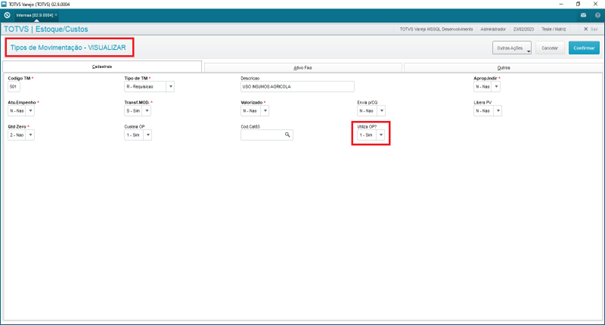{.flow-image}

#### 4.2	ATUALIZAÇÕES\MOVIMENTAÇÕES\INTERNAS\MOV. MULTIPLA

Após a execução do processo de inclusão\definição do Planejamento de Cultivo\Plantio para cada um dos cadastros de Fazendas necessários, é possível realizar a “baixa de estoque” referente aos insumos utilizados no ciclo de cultivo em cada uma das respectivas áreas. Para isto, deve-se utilizar à rotina de Mov. Multipla – MATA241.PRW disponível no módulo de Estoque\Custos.

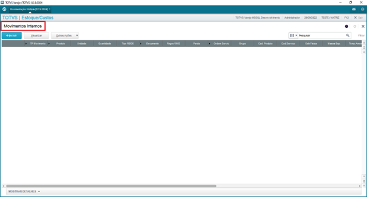{.flow-image}

Ao realizar a inclusão do Mov. Interno de baixa do estoque referente aos produtos\insumos utilizados no cultivo, deve-se informar um Tipo de Movimentação de Requisição e, o número da Ordem de Produção referente à cada Fazenda\Talhão em que foi utilizado o produto.

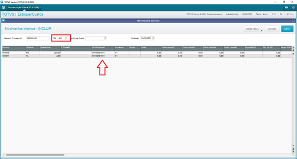{.flow-image}

Ao confirmar à inclusão do Mov. Interno Múltiplo, caso um ou mais itens não tenham à Ordem de Produção informada, será apresentado mensagem alertando à respeito, sendo necessário ajustar as informações.

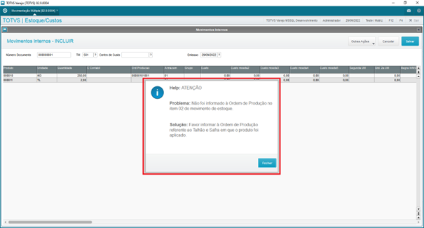{.flow-image}

Após realizar à definição correta das informações referentes à baixa do estoque dos insumos direcionando para as Ordens de Produção de cada uma das Fazendas\Talhões em que foram utilizados, será confirmado à interface e assim, gerado à baixa do estoque.

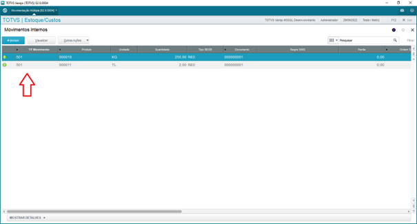{.flow-image}

A inclusão de Mov. Internos Múltiplos referentes ao consumo dos produtos\insumos utilizados, ocorrerá durante todo o ciclo de cultivo da safra. O ideal, é que conforme os produtos forem utilizados\consumidos, sejam realizados os devidos apontamentos.

A rotina de Baixas de Estoque, foi implementada com o objetivo de ser um “facilitador” com interface mais amigável, internamente, à rotina realiza à inclusão\manipulação de Mov. Internos Múltiplos.

#### 4.3	ATUALIZAÇÕES\MOVIMENTAÇÕES\PRODUÇÃO\APONTAR PROD.

Conforme apresentado nos tópicos anteriores, à partir do registro das cargas de cereais originadas no processo de colheita das áreas de cultivo junto à rotina de Romaneios, serão gerados de forma automática os movimentos de Apontamento de Produção. No entanto, estes podem ser consultados e até mesmo “estornados” através da rotina padrão Apontar Produção – MATA250.PRW disponível no módulo de Estoque\Custos.

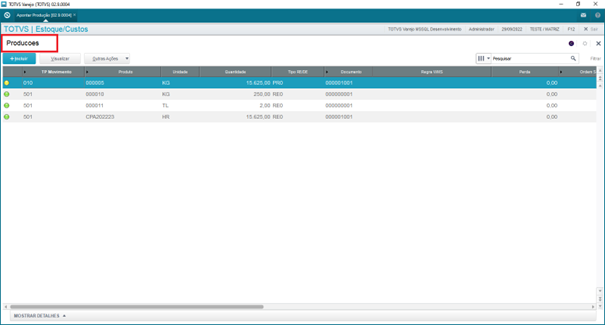{.flow-image}

Caso seja desejado “estornar” o Apontamento de Produção, deve-se posicionar sob o registro desejado e acionar à funcionalidade disponível em “Outras Ações”.

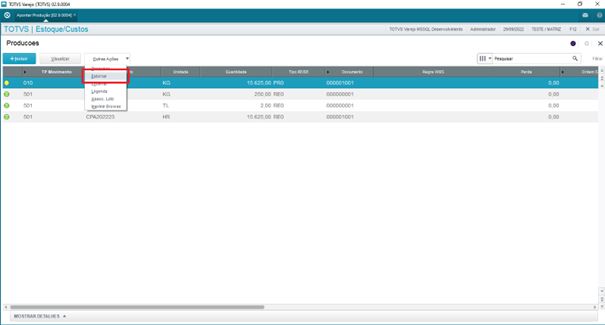{.flow-image}

Será disponibilizado à interface com as informações do apontamento. Entre estas, é possível identificar o número do Romaneio, correspondente à geração do apontamento que será estornado.

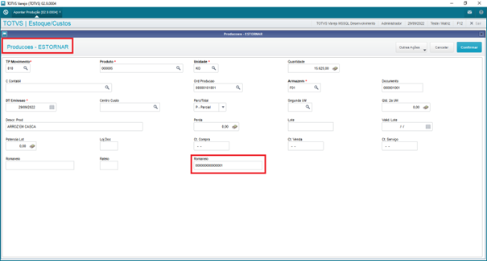{.flow-image}

Confirmando à realização do estorno, será retornado ao browse, onde é possível observar o estorno realizado no Apontamento de Produção. Antes disto, será realizado atualização do Romaneio vinculado ao movimento de produção que foi estornado, sendo apresentado mensagem de advertência ao usuário.

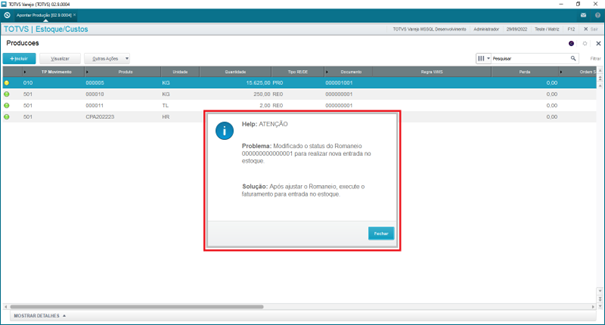{.flow-image}

A atualização realizada sob o Romaneio ocorrerá de acordo com à configuração do parâmetro MV_XCESP07. Caso o parâmetro esteja ativado (.T.), será realizado de forma automática, o “cancelamento” do Romaneio. Aqui, caso seja necessário deve-se gerar o registro de um “novo” Romaneio referente há carga de cereais. Agora, caso o parâmetro esteja desativado (.F.), apenas será retornado o status do Romaneio para “fechado”, possibilitando que sejam realizados ajustes\alterações no Romaneio (caso necessário) e em seguida, novo Apontamento de Produção através da funcionalidade “Faturar” presente no browse da rotina de Romaneios conforme abordado em tópicos anteriores.

#### 4.4	CONSULTAS\CADASTROS\KARDEX DIÁRIO

Através da rotina de Kardex Diário – MATC030.PRX presente no módulo de Estoque\Custos, é possível realizar o acompanhamento das movimentações de entrada no estoque dos produtos referentes aos cereais obtidos no processo de colheita abordado anteriormente.

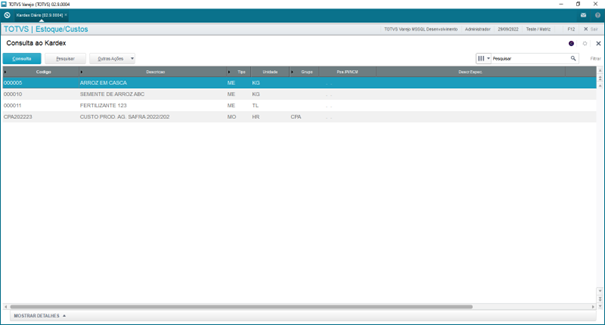{.flow-image}

Para execução da consulta, deve-se considerar como parâmetro o Armazém\Local de Estoque (NNR) correspondente ao cadastro da Fazenda (SZL) desejado. Ex: F01.

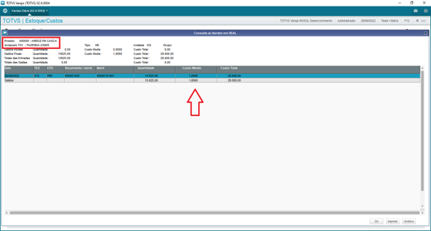{.flow-image}

#### 4.5	RELATÓRIOS\PRODUÇÃO\DETALHAMENTO DE OP

A partir das regras abordadas nos tópicos anteriores desta documentação, é possível realizar à consulta de forma individual de cada uma das Ordens de Produção, com seus respectivos insumos\produtos utilizados no ciclo de cultivo bem como, os registros de cada uma das cargas de cereais obtidas no processo de colheita, compondo desta forma, por cada “Ordem de Produção” o custo do cereal cultivado. Estas informações, são disponibilizadas pelo Rel. Detalhamento de Ordem Produção – MATR860.PRX.

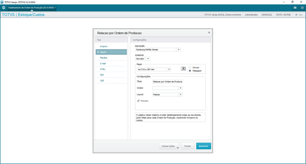{.flow-image}

O relatório, irá apresentar também os “custos indiretos”, desde que as regras envolvidas em sua composição e apropriação tenham sido configuradas e executadas de forma prévia à emissão do relatório.

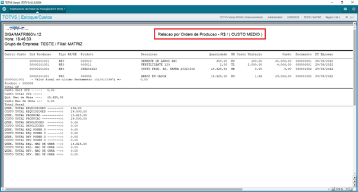{.flow-image}

