# Controle de Cultivos {.home-hero}

<!--############################################### 01 #######################################################-->

  01. Visão Geral

Através desta solução, é possível realizar o controle simplificado da gestão de cultivos em áreas agrícolas com controle dos insumos e demais itens utilizados durante o ciclo de cultivo (safra), com posterior controle do processo de colheita compondo os volumes produzidos por Fazenda, Zona e Parcela disponibilizando à composição dos custos junto ao BackOffice do ERP Totvs Microsiga Protheus. A adoção da solução de Controle de Cultivos junto ao Gestão de Cereais, destina-se à situações em que existe restrição financeira e\ou de estrutura em relação à adoção da ferramenta Totvs denominada PIMS Multicultivos.

### 1. Visão Geral

#### Principais vantagens do produto:

-   Gestão simplificada dos cultivos: 
Permite controlar todo o ciclo agrícola (safra) de forma mais simples e organizada.
-   Controle de insumos e recursos: 
Acompanha tudo que foi utilizado no cultivo (insumos, materiais, etc.), ajudando no controle e redução de desperdícios.
-   Rastreabilidade da produção: 
Registra os volumes produzidos com detalhamento por Fazenda, Zona e Parcela, facilitando análises mais precisas. 
-   Controle da colheita integrado ao processo: 
Inclui o acompanhamento da colheita dentro da gestão, garantindo visão completa do ciclo produtivo. 
-   Integração com o ERP (Totvs Protheus): 
Os dados alimentam o backoffice, permitindo composição de custos e melhor controle financeiro. 
-   Alternativa mais acessível ao PIMS Multicultivos: 
Indicado para empresas com restrições financeiras ou estruturais, oferecendo uma solução mais leve e viável.

<!--############################################### 02 #######################################################-->

  02. Menu

### 2. Menu

<table class="banks-table">
  <thead>
    <tr>
      <th>Menu</th>
      <th>Sub Menu</th>
      <th>Nome da Rotina</th>
      <th>Programa</th>
      <th>Módulo</th>
      <th>Tipo</th>
    </tr>
  </thead>
  <tbody>
    <tr>
      <td>Atualizações</td>
      <td>ADD-ON de XML \ Cadastros</td>
      <td>Contas de E-mail</td>
      <td>C004A01</td>
      <td>Compras</td>
      <td>03</td>
    </tr>   
  </tbody>
</table>

<!--############################################### 03 #######################################################-->

  03. Rotinas personalizadas específicas do Pacote

### 3. Rotinas personalizadas específicas do Pacote

#### Funções personalizadas contidas no pacote:

<table class="banks-table">
  <thead>
    <tr>
      <th>Função</th>
      <th>Descrição</th>
    </tr>
  </thead>
  <tbody>
    <tr>
      <td><strong>C004A01</strong></td>
      <td>Rotina para cadastro de contas de e-mails.</td>
    </tr>
  </tbody>
</table>

<!--############################################### 04 #######################################################-->

  04. Pontos de entrada necessários implementar (Não inclusos no Pacote)

### 4. Pontos de entrada necessários implementar (Não inclusos no Pacote)

Pontos de Entrada que devem ser personalizados integração com às funções de controle de alçadas:

<strong>Importante:</strong> Atentar para a pré-existência de implementações nestes pontos de entrada!

<table class="banks-table">
  <thead>
    <tr>
      <th>Nome</th>
      <th>Descrição</th>
      <th>Sintaxe</th>
    </tr>
  </thead>
  <tbody>
  <tr>
    <td><strong>MA103OPC</strong></td>
    <td>
      Ponto de entrada utilizado para disponibilizar novos itens no aRotina documento de entrada.  
      <strong>Programa Fonte:</strong> MA103OPC  
    </td>
    <td>

  

    Implementação
    MA103OPC
  

  <pre><code>
User Function MA103OPC()

Local aArea    := GetArea()
Local aBotoes := {}
     
If ExistBlock("P004A01")
   aBotoes := U_P004A01("MA103OPC", aBotoes)                  
EndIf

RestArea(aArea)

Return aBotoes
  </tbody>
</table>

<!--############################################### 05 #######################################################-->

  05. Pontos de Entradas Disponiveis para Desenvolvimento

### 5. Pontos de Entradas Disponiveis para Desenvolvimento  

<table class="banks-table">
  <thead>
    <tr>
      <th>P.E</th>
      <th>Descrição</th>
      <th>Parâmetros de Entrada</th>
      <th>Retorno</th>
    </tr>
  </thead>
  <tbody>
    <tr>
      <td><strong>PE004A01</strong></td>
      <td>Ponto de entrada na  na tela de Processamento de XML Recebidos – na sessão de geração do documento fiscal na análise dos itens/produtos do documento fiscal – validação no click AVANÇAR. Esta chamada é realizada após todas validações do ADD-ON referente aos itens/produtos.</td>
      <td><strong>1)</strong>Vetor aHeader dos itens do documento 
      <strong>2)</strong>Vetor aCols dos itens do documento</td>
          <td>Booleano (.T./.F.) valida avanço do processo.</td>
    </tr>
  </tbody>
</table>

<!--############################################### 06 #######################################################-->

  06. Tabelas (SX2) 

### 6. Tabelas (SX2) 

<table class="banks-table">
  <thead>
    <tr>
      <th>Prefixo</th>
      <th>Descrição</th>
      <th>Ac. Filial</th>
      <th>Ac. Unidade</th>
      <th>Ac. Empresa</th>
    </tr>
  </thead>
  <tbody>
    <tr>
      <td><strong>SZK</strong></td>
      <td>FAZENDAS</td>
      <td>Exclusivo</td>
      <td>Exclusivo</td>
      <td>Exclusivo</td>
    </tr>
    <tr>
      <td><strong>SZL</strong></td>
      <td>FAZENDAS X BLOCOS</td>
      <td>Exclusivo</td>
      <td>Exclusivo</td>
      <td>Exclusivo</td>
    </tr>
    <tr>
      <td><strong>SZM</strong></td>
      <td>FAZENDAS X BLOCOS X QUADRAS</td>
      <td>Exclusivo</td>
      <td>Exclusivo</td>
      <td>Exclusivo</td>
    </tr>
    <tr>
      <td><strong>SZN</strong></td>
      <td>FAZENDAS X CULTIVOS</td>
      <td>Exclusivo</td>
      <td>Exclusivo</td>
      <td>Exclusivo</td>
    </tr>
    <tr>
      <td><strong>SZO</strong></td>
      <td>FAZENDAS X CULTIVOS X LOGS</td>
      <td>Exclusivo</td>
      <td>Exclusivo</td>
      <td>Exclusivo</td>
    </tr>

  </tbody>
</table>

<!--############################################### 07 #######################################################-->

  07. Campos (SX3)

### 7. Campos (SX3)

Campo **NN9_CODIGO**

#### **Informações Básicas**

<table class="banks-table">
  <tbody>
    <tr>
      <th>Arquivo</th>
      <td>NN9</td>
      <th>Ordem</th>
      <td>02</td>
      <th>Nível</th>
      <td>1</td>
    </tr>
    <tr>
      <th>Tipo</th>
      <td>Caracter</td>
      <th>Tamanho</th>
      <td>6</td>
      <th>Decimal</th>
      <td>0</td>
    </tr>
    <tr>
      <th>Contexto</th>
      <td>Real</td>
      <th>Propriedade</th>
      <td>-</td>
      <th>Obrigatório</th>
      <td>x</td>
    </tr>
    <tr>
      <th>Browse</th>
      <td>S</td>
      <th>Usado</th>
      <td>x       x       x       x       x       x       x       x       x       x       x       x       x       x       x x</td>
      <th>Reservado</th>
      <td>x xxxx</td>
    </tr>
  </tbody>
</table>

#### **Títulos (Multilíngue)**

<table class="banks-table">
  <tbody>
    <tr>
      <th>Título (PT)</th>
      <td>Código</td>
    </tr>
    <tr>
      <th>Título (ES)</th>
      <td>Código</td>
    </tr>
    <tr>
      <th>Título (EN)</th>
      <td>Code</td>
    </tr>
  </tbody>
</table>

#### **Descrições (Multilíngue)**

<table class="banks-table">
  <tbody>
    <tr>
      <th>Descrição (PT)</th>
      <td>Codigo do Servico</td>
    </tr>
    <tr>
      <th>Descrição (ES)</th>
      <td>Codigo del Servicio</td>
    </tr>
    <tr>
      <th>Descrição (EN)</th>
      <td>Service code</td>
    </tr>
  </tbody>
</table>

#### **Formato e Validação**

<table class="banks-table">
  <tbody>
    <tr>
      <th>Formato</th>
      <td>@!</td>
      <th>Pict. Variável</th>
      <td>-</td>
      <th>Pict. Browse</th>
      <td>-</td>
    </tr>
    <tr>
      <th>Validação</th>
      <td>ExistChav(""NN9"",M->NN9_CODIGO)</td>
      <th>Check</th>
      <td>-</td>
      <th>Trigger</th>
      <td>-</td>
    </tr>
  </tbody>
</table>

#### **Help**

Memo

#### **Configurações de Browse e Edição**

<table class="banks-table">
  <tbody>
    <tr>
      <th>F3</th>
      <td>-</td>
      <th>Modo Edição</th>
      <td>V</td>
      <th>Ini. Browse</th>
      <td>-</td>
    </tr>
  </tbody>
</table>

#### **Listas de Opções (Multilíngue)**

<table class="banks-table">
  <tbody>
    <tr>
      <th>Lista Opções (PT)</th>
      <td>-</td>
    </tr>
    <tr>
      <th>Lista Opções (ES)</th>
      <td>-</td>
    </tr>
    <tr>
      <th>Lista Opções (EN)</th>
      <td>-</td>
    </tr>
  </tbody>
</table>

#### **Configurações Avançadas**

<table class="banks-table">
  <tbody>
    <tr>
      <th>Val. Usuário</th>
      <td>-</td>
      <th>Inicializador</th>
      <td>-</td>
    </tr>
    <tr>
      <th>Relação</th>
      <td>GetSX8Num(""NN9"",""NN9_CODIGO"")</td>
      <th>Grupo SXG</th>
      <td>-</td>
    </tr>
    <tr>
      <th>Folder</th>
      <td>-</td>
      <th>PYME</th>
      <td>S</td>
    </tr>
    <tr>
      <th>Cond. SQL</th>
      <td>-</td>
      <th>Chk SQL</th>
      <td>-</td>
    </tr>
    <tr>
      <th>Idx Servidor</th>
      <td>N</td>
      <th>Ortografia</th>
      <td>N</td>
    </tr>
    <tr>
      <th>Idx Campo</th>
      <td>N</td>
      <th>Tela</th>
      <td>-</td>
    </tr>
    <tr>
      <th>Agrupamento</th>
      <td>-</td>
      <th>Posição LGT</th>
      <td>1</td>
    </tr>
    <tr>
      <th>Modal</th>
      <td>1</td>
      <th>PF L A G</th>
      <td>0</td>
    </tr>
  </tbody>
</table>

#### **Parâmetros de Sistema**

<table class="banks-table">
  <tbody>
    <tr>
      <th>PR E C N O</th>
      <td>0</td>
      <th>PM 0 E M P</th>
      <td>99</td>
    </tr>
    <tr>
      <th>ID Package</th>
      <td>000003</td>
      <th></th>
      <td>-</td>
    </tr>
  </tbody>
</table>

Campo **NN9_DESCRI**

#### **Informações Básicas**

<table class="banks-table">
  <tbody>
    <tr>
      <th>Arquivo</th>
      <td>NN9</td>
      <th>Ordem</th>
      <td>03</td>
      <th>Nível</th>
      <td>1</td>
    </tr>
    <tr>
      <th>Tipo</th>
      <td>Caracter</td>
      <th>Tamanho</th>
      <td>40</td>
      <th>Decimal</th>
      <td>0</td>
    </tr>
    <tr>
      <th>Contexto</th>
      <td>Real</td>
      <th>Propriedade</th>
      <td>-</td>
      <th>Obrigatório</th>
      <td>x</td>
    </tr>
    <tr>
      <th>Browse</th>
      <td>S</td>
      <th>Usado</th>
      <td>x       x       x       x       x       x       x       x       x       x       x       x       x       x       x x</td>
      <th>Reservado</th>
      <td>x xxxx</td>
    </tr>
  </tbody>
</table>

#### **Títulos (Multilíngue)**

<table class="banks-table">
  <tbody>
    <tr>
      <th>Título (PT)</th>
      <td>Descrição</td>
    </tr>
    <tr>
      <th>Título (ES)</th>
      <td>Descripcion</td>
    </tr>
    <tr>
      <th>Título (EN)</th>
      <td>Description</td>
    </tr>
  </tbody>
</table>

#### **Descrições (Multilíngue)**

<table class="banks-table">
  <tbody>
    <tr>
      <th>Descrição (PT)</th>
      <td>Descricao do Servico</td>
    </tr>
    <tr>
      <th>Descrição (ES)</th>
      <td>Descrip. del Servicio</td>
    </tr>
    <tr>
      <th>Descrição (EN)</th>
      <td>Description of service</td>
    </tr>
  </tbody>
</table>

#### **Formato e Validação**

<table class="banks-table">
  <tbody>
    <tr>
      <th>Formato</th>
      <td>@!</td>
      <th>Pict. Variável</th>
      <td>-</td>
      <th>Pict. Browse</th>
      <td>-</td>
    </tr>
    <tr>
      <th>Validação</th>
      <td>NaoVazio()</td>
      <th>Check</th>
      <td>-</td>
      <th>Trigger</th>
      <td>-</td>
    </tr>
  </tbody>
</table>

#### **Help**

Memo

#### **Configurações de Browse e Edição**

<table class="banks-table">
  <tbody>
    <tr>
      <th>F3</th>
      <td>-</td>
      <th>Modo Edição</th>
      <td>A</td>
      <th>Ini. Browse</th>
      <td>-</td>
    </tr>
  </tbody>
</table>

#### **Listas de Opções (Multilíngue)**

<table class="banks-table">
  <tbody>
    <tr>
      <th>Lista Opções (PT)</th>
      <td>-</td>
    </tr>
    <tr>
      <th>Lista Opções (ES)</th>
      <td>-</td>
    </tr>
    <tr>
      <th>Lista Opções (EN)</th>
      <td>-</td>
    </tr>
  </tbody>
</table>

#### **Configurações Avançadas**

<table class="banks-table">
  <tbody>
    <tr>
      <th>Val. Usuário</th>
      <td>-</td>
      <th>Inicializador</th>
      <td>-</td>
    </tr>
    <tr>
      <th>Relação</th>
      <td>-</td>
      <th>Grupo SXG</th>
      <td>-</td>
    </tr>
    <tr>
      <th>Folder</th>
      <td>-</td>
      <th>PYME</th>
      <td>S</td>
    </tr>
    <tr>
      <th>Cond. SQL</th>
      <td>-</td>
      <th>Chk SQL</th>
      <td>-</td>
    </tr>
    <tr>
      <th>Idx Servidor</th>
      <td>N</td>
      <th>Ortografia</th>
      <td>N</td>
    </tr>
    <tr>
      <th>Idx Campo</th>
      <td>N</td>
      <th>Tela</th>
      <td>-</td>
    </tr>
    <tr>
      <th>Agrupamento</th>
      <td>-</td>
      <th>Posição LGT</th>
      <td>1</td>
    </tr>
    <tr>
      <th>Modal</th>
      <td>1</td>
      <th>PF L A G</th>
      <td>0</td>
    </tr>
  </tbody>
</table>

#### **Parâmetros de Sistema**

<table class="banks-table">
  <tbody>
    <tr>
      <th>PR E C N O</th>
      <td>0</td>
      <th>PM 0 E M P</th>
      <td>99</td>
    </tr>
    <tr>
      <th>ID Package</th>
      <td>000003</td>
      <th></th>
      <td>-</td>
    </tr>
  </tbody>
</table>

Campo **B1_X_UCROM**

#### **Informações Básicas**

<table class="banks-table">
  <tbody>
    <tr>
      <th>Arquivo</th>
      <td>SB1</td>
      <th>Ordem</th>
      <td>F9</td>
      <th>Nível</th>
      <td>0</td>
    </tr>
    <tr>
      <th>Tipo</th>
      <td>Numérico</td>
      <th>Tamanho</th>
      <td>7</td>
      <th>Decimal</th>
      <td>2</td>
    </tr>
    <tr>
      <th>Contexto</th>
      <td>Real</td>
      <th>Propriedade</th>
      <td>U</td>
      <th>Obrigatório</th>
      <td>-</td>
    </tr>
    <tr>
      <th>Browse</th>
      <td>N</td>
      <th>Usado</th>
      <td>x       x       x       x       x       x       x       x       x       x       x       x       x       x       x x</td>
      <th>Reservado</th>
      <td>xxxxxx x</td>
    </tr>
  </tbody>
</table>

#### **Títulos (Multilíngue)**

<table class="banks-table">
  <tbody>
    <tr>
      <th>Título (PT)</th>
      <td>Um Romaneio</td>
    </tr>
    <tr>
      <th>Título (ES)</th>
      <td>Um Romaneo</td>
    </tr>
    <tr>
      <th>Título (EN)</th>
      <td>Um Romaneio</td>
    </tr>
  </tbody>
</table>

#### **Descrições (Multilíngue)**

<table class="banks-table">
  <tbody>
    <tr>
      <th>Descrição (PT)</th>
      <td>Unidade Medida Romaneio</td>
    </tr>
    <tr>
      <th>Descrição (ES)</th>
      <td>Unidade Medida Romaneo</td>
    </tr>
    <tr>
      <th>Descrição (EN)</th>
      <td>Unidade Medida Romaneio</td>
    </tr>
  </tbody>
</table>

#### **Formato e Validação**

<table class="banks-table">
  <tbody>
    <tr>
      <th>Formato</th>
      <td>@E 9,999.99</td>
      <th>Pict. Variável</th>
      <td>-</td>
      <th>Pict. Browse</th>
      <td>-</td>
    </tr>
    <tr>
      <th>Validação</th>
      <td>Positivo()</td>
      <th>Check</th>
      <td>-</td>
      <th>Trigger</th>
      <td>-</td>
    </tr>
  </tbody>
</table>

#### **Help**

Memo

#### **Configurações de Browse e Edição**

<table class="banks-table">
  <tbody>
    <tr>
      <th>F3</th>
      <td>-</td>
      <th>Modo Edição</th>
      <td>A</td>
      <th>Ini. Browse</th>
      <td>-</td>
    </tr>
  </tbody>
</table>

#### **Listas de Opções (Multilíngue)**

<table class="banks-table">
  <tbody>
    <tr>
      <th>Lista Opções (PT)</th>
      <td>-</td>
    </tr>
    <tr>
      <th>Lista Opções (ES)</th>
      <td>-</td>
    </tr>
    <tr>
      <th>Lista Opções (EN)</th>
      <td>-</td>
    </tr>
  </tbody>
</table>

#### **Configurações Avançadas**

<table class="banks-table">
  <tbody>
    <tr>
      <th>Val. Usuário</th>
      <td>-</td>
      <th>Inicializador</th>
      <td>-</td>
    </tr>
    <tr>
      <th>Relação</th>
      <td>-</td>
      <th>Grupo SXG</th>
      <td>-</td>
    </tr>
    <tr>
      <th>Folder</th>
      <td>9</td>
      <th>PYME</th>
      <td>-</td>
    </tr>
    <tr>
      <th>Cond. SQL</th>
      <td>-</td>
      <th>Chk SQL</th>
      <td>-</td>
    </tr>
    <tr>
      <th>Idx Servidor</th>
      <td>-</td>
      <th>Ortografia</th>
      <td>N</td>
    </tr>
    <tr>
      <th>Idx Campo</th>
      <td>N</td>
      <th>Tela</th>
      <td>-</td>
    </tr>
    <tr>
      <th>Agrupamento</th>
      <td>-</td>
      <th>Posição LGT</th>
      <td>-</td>
    </tr>
    <tr>
      <th>Modal</th>
      <td>-</td>
      <th>PF L A G</th>
      <td>0</td>
    </tr>
  </tbody>
</table>

#### **Parâmetros de Sistema**

<table class="banks-table">
  <tbody>
    <tr>
      <th>PR E C N O</th>
      <td>0</td>
      <th>PM 0 E M P</th>
      <td>99</td>
    </tr>
    <tr>
      <th>ID Package</th>
      <td>000003</td>
      <th></th>
      <td>-</td>
    </tr>
  </tbody>
</table>

Campo **B1_X_MCROM**

#### **Informações Básicas**

<table class="banks-table">
  <tbody>
    <tr>
      <th>Arquivo</th>
      <td>SB1</td>
      <th>Ordem</th>
      <td>FA</td>
      <th>Nível</th>
      <td>0</td>
    </tr>
    <tr>
      <th>Tipo</th>
      <td>Caracter</td>
      <th>Tamanho</th>
      <td>1</td>
      <th>Decimal</th>
      <td>0</td>
    </tr>
    <tr>
      <th>Contexto</th>
      <td>Real</td>
      <th>Propriedade</th>
      <td>U</td>
      <th>Obrigatório</th>
      <td>-</td>
    </tr>
    <tr>
      <th>Browse</th>
      <td>N</td>
      <th>Usado</th>
      <td>x       x       x       x       x       x       x       x       x       x       x       x       x       x       x x</td>
      <th>Reservado</th>
      <td>xxxxxx x</td>
    </tr>
  </tbody>
</table>

#### **Títulos (Multilíngue)**

<table class="banks-table">
  <tbody>
    <tr>
      <th>Título (PT)</th>
      <td>Fator Conv.</td>
    </tr>
    <tr>
      <th>Título (ES)</th>
      <td>Factor Conv.</td>
    </tr>
    <tr>
      <th>Título (EN)</th>
      <td>Fator Conv.</td>
    </tr>
  </tbody>
</table>

#### **Descrições (Multilíngue)**

<table class="banks-table">
  <tbody>
    <tr>
      <th>Descrição (PT)</th>
      <td>Fator de Conversão</td>
    </tr>
    <tr>
      <th>Descrição (ES)</th>
      <td>Factor de Conversión</td>
    </tr>
    <tr>
      <th>Descrição (EN)</th>
      <td>Fator de Conversão</td>
    </tr>
  </tbody>
</table>

#### **Formato e Validação**

<table class="banks-table">
  <tbody>
    <tr>
      <th>Formato</th>
      <td>@!</td>
      <th>Pict. Variável</th>
      <td>-</td>
      <th>Pict. Browse</th>
      <td>-</td>
    </tr>
    <tr>
      <th>Validação</th>
      <td>-</td>
      <th>Check</th>
      <td>-</td>
      <th>Trigger</th>
      <td>-</td>
    </tr>
  </tbody>
</table>

#### **Help**

Memo

#### **Configurações de Browse e Edição**

<table class="banks-table">
  <tbody>
    <tr>
      <th>F3</th>
      <td>-</td>
      <th>Modo Edição</th>
      <td>A</td>
      <th>Ini. Browse</th>
      <td>-</td>
    </tr>
  </tbody>
</table>

#### **Listas de Opções (Multilíngue)**

<table class="banks-table">
  <tbody>
    <tr>
      <th>Lista Opções (PT)</th>
      <td>1=Divisão;2=Multiplicação</td>
    </tr>
    <tr>
      <th>Lista Opções (ES)</th>
      <td>1=División2=Multiplicación</td>
    </tr>
    <tr>
      <th>Lista Opções (EN)</th>
      <td>1=Divisão;2=Multiplicação</td>
    </tr>
  </tbody>
</table>

#### **Configurações Avançadas**

<table class="banks-table">
  <tbody>
    <tr>
      <th>Val. Usuário</th>
      <td>-</td>
      <th>Inicializador</th>
      <td>-</td>
    </tr>
    <tr>
      <th>Relação</th>
      <td>""1""</td>
      <th>Grupo SXG</th>
      <td>-</td>
    </tr>
    <tr>
      <th>Folder</th>
      <td>9</td>
      <th>PYME</th>
      <td>-</td>
    </tr>
    <tr>
      <th>Cond. SQL</th>
      <td>-</td>
      <th>Chk SQL</th>
      <td>-</td>
    </tr>
    <tr>
      <th>Idx Servidor</th>
      <td>-</td>
      <th>Ortografia</th>
      <td>N</td>
    </tr>
    <tr>
      <th>Idx Campo</th>
      <td>N</td>
      <th>Tela</th>
      <td>-</td>
    </tr>
    <tr>
      <th>Agrupamento</th>
      <td>-</td>
      <th>Posição LGT</th>
      <td>-</td>
    </tr>
    <tr>
      <th>Modal</th>
      <td>-</td>
      <th>PF L A G</th>
      <td>0</td>
    </tr>
  </tbody>
</table>

#### **Parâmetros de Sistema**

<table class="banks-table">
  <tbody>
    <tr>
      <th>PR E C N O</th>
      <td>0</td>
      <th>PM 0 E M P</th>
      <td>99</td>
    </tr>
    <tr>
      <th>ID Package</th>
      <td>000003</td>
      <th></th>
      <td>-</td>
    </tr>
  </tbody>
</table>

Campo **B1_X_TPINS**

#### **Informações Básicas**

<table class="banks-table">
  <tbody>
    <tr>
      <th>Arquivo</th>
      <td>SB1</td>
      <th>Ordem</th>
      <td>FB</td>
      <th>Nível</th>
      <td>0</td>
    </tr>
    <tr>
      <th>Tipo</th>
      <td>Caracter</td>
      <th>Tamanho</th>
      <td>1</td>
      <th>Decimal</th>
      <td>0</td>
    </tr>
    <tr>
      <th>Contexto</th>
      <td>Real</td>
      <th>Propriedade</th>
      <td>U</td>
      <th>Obrigatório</th>
      <td>-</td>
    </tr>
    <tr>
      <th>Browse</th>
      <td>N</td>
      <th>Usado</th>
      <td>x       x       x       x       x       x       x       x       x       x       x       x       x       x       x x</td>
      <th>Reservado</th>
      <td>xxxxxx x</td>
    </tr>
  </tbody>
</table>

#### **Títulos (Multilíngue)**

<table class="banks-table">
  <tbody>
    <tr>
      <th>Título (PT)</th>
      <td>Tipo Insumo</td>
    </tr>
    <tr>
      <th>Título (ES)</th>
      <td>Tipo Insumo</td>
    </tr>
    <tr>
      <th>Título (EN)</th>
      <td>Tipo Insumo</td>
    </tr>
  </tbody>
</table>

#### **Descrições (Multilíngue)**

<table class="banks-table">
  <tbody>
    <tr>
      <th>Descrição (PT)</th>
      <td>Tipo de Insumo</td>
    </tr>
    <tr>
      <th>Descrição (ES)</th>
      <td>Tipo del Insumo</td>
    </tr>
    <tr>
      <th>Descrição (EN)</th>
      <td>Tipo de Insumo</td>
    </tr>
  </tbody>
</table>

#### **Formato e Validação**

<table class="banks-table">
  <tbody>
    <tr>
      <th>Formato</th>
      <td>@!</td>
      <th>Pict. Variável</th>
      <td>-</td>
      <th>Pict. Browse</th>
      <td>-</td>
    </tr>
    <tr>
      <th>Validação</th>
      <td>-</td>
      <th>Check</th>
      <td>-</td>
      <th>Trigger</th>
      <td>-</td>
    </tr>
  </tbody>
</table>

#### **Help**

Memo

#### **Configurações de Browse e Edição**

<table class="banks-table">
  <tbody>
    <tr>
      <th>F3</th>
      <td>-</td>
      <th>Modo Edição</th>
      <td>A</td>
      <th>Ini. Browse</th>
      <td>-</td>
    </tr>
  </tbody>
</table>

#### **Listas de Opções (Multilíngue)**

<table class="banks-table">
  <tbody>
    <tr>
      <th>Lista Opções (PT)</th>
      <td>1=Fertilizante;2=Herbicida</td>
    </tr>
    <tr>
      <th>Lista Opções (ES)</th>
      <td>1=Fertilizante;2=Herbicida</td>
    </tr>
    <tr>
      <th>Lista Opções (EN)</th>
      <td>1=Fertilizante;2=Herbicida</td>
    </tr>
  </tbody>
</table>

#### **Configurações Avançadas**

<table class="banks-table">
  <tbody>
    <tr>
      <th>Val. Usuário</th>
      <td>-</td>
      <th>Inicializador</th>
      <td>-</td>
    </tr>
    <tr>
      <th>Relação</th>
      <td>-</td>
      <th>Grupo SXG</th>
      <td>-</td>
    </tr>
    <tr>
      <th>Folder</th>
      <td>9</td>
      <th>PYME</th>
      <td>-</td>
    </tr>
    <tr>
      <th>Cond. SQL</th>
      <td>-</td>
      <th>Chk SQL</th>
      <td>-</td>
    </tr>
    <tr>
      <th>Idx Servidor</th>
      <td>-</td>
      <th>Ortografia</th>
      <td>N</td>
    </tr>
    <tr>
      <th>Idx Campo</th>
      <td>N</td>
      <th>Tela</th>
      <td>-</td>
    </tr>
    <tr>
      <th>Agrupamento</th>
      <td>-</td>
      <th>Posição LGT</th>
      <td>-</td>
    </tr>
    <tr>
      <th>Modal</th>
      <td>-</td>
      <th>PF L A G</th>
      <td>0</td>
    </tr>
  </tbody>
</table>

#### **Parâmetros de Sistema**

<table class="banks-table">
  <tbody>
    <tr>
      <th>PR E C N O</th>
      <td>0</td>
      <th>PM 0 E M P</th>
      <td>99</td>
    </tr>
    <tr>
      <th>ID Package</th>
      <td>000003</td>
      <th></th>
      <td>-</td>
    </tr>
  </tbody>
</table>

Campo **C2_OBS**

#### **Informações Básicas**

<table class="banks-table">
  <tbody>
    <tr>
      <th>Arquivo</th>
      <td>SC2</td>
      <th>Ordem</th>
      <td>12</td>
      <th>Nível</th>
      <td>1</td>
    </tr>
    <tr>
      <th>Tipo</th>
      <td>Caracter</td>
      <th>Tamanho</th>
      <td>50</td>
      <th>Decimal</th>
      <td>0</td>
    </tr>
    <tr>
      <th>Contexto</th>
      <td>-</td>
      <th>Propriedade</th>
      <td>-</td>
      <th>Obrigatório</th>
      <td>-</td>
    </tr>
    <tr>
      <th>Browse</th>
      <td>N</td>
      <th>Usado</th>
      <td>x       x       x       x       x       x       x       x       x       x       x       x       x       x       x x</td>
      <th>Reservado</th>
      <td>x  x x</td>
    </tr>
  </tbody>
</table>

#### **Títulos (Multilíngue)**

<table class="banks-table">
  <tbody>
    <tr>
      <th>Título (PT)</th>
      <td>Observacao</td>
    </tr>
    <tr>
      <th>Título (ES)</th>
      <td>Observacion</td>
    </tr>
    <tr>
      <th>Título (EN)</th>
      <td>Notes</td>
    </tr>
  </tbody>
</table>

#### **Descrições (Multilíngue)**

<table class="banks-table">
  <tbody>
    <tr>
      <th>Descrição (PT)</th>
      <td>Observacao</td>
    </tr>
    <tr>
      <th>Descrição (ES)</th>
      <td>Observacion</td>
    </tr>
    <tr>
      <th>Descrição (EN)</th>
      <td>Notes</td>
    </tr>
  </tbody>
</table>

#### **Formato e Validação**

<table class="banks-table">
  <tbody>
    <tr>
      <th>Formato</th>
      <td>@!</td>
      <th>Pict. Variável</th>
      <td>-</td>
      <th>Pict. Browse</th>
      <td>-</td>
    </tr>
    <tr>
      <th>Validação</th>
      <td>-</td>
      <th>Check</th>
      <td>-</td>
      <th>Trigger</th>
      <td>-</td>
    </tr>
  </tbody>
</table>

#### **Help**

Memo

#### **Configurações de Browse e Edição**

<table class="banks-table">
  <tbody>
    <tr>
      <th>F3</th>
      <td>-</td>
      <th>Modo Edição</th>
      <td>A</td>
      <th>Ini. Browse</th>
      <td>-</td>
    </tr>
  </tbody>
</table>

#### **Listas de Opções (Multilíngue)**

<table class="banks-table">
  <tbody>
    <tr>
      <th>Lista Opções (PT)</th>
      <td>-</td>
    </tr>
    <tr>
      <th>Lista Opções (ES)</th>
      <td>-</td>
    </tr>
    <tr>
      <th>Lista Opções (EN)</th>
      <td>-</td>
    </tr>
  </tbody>
</table>

#### **Configurações Avançadas**

<table class="banks-table">
  <tbody>
    <tr>
      <th>Val. Usuário</th>
      <td>-</td>
      <th>Inicializador</th>
      <td>-</td>
    </tr>
    <tr>
      <th>Relação</th>
      <td>-</td>
      <th>Grupo SXG</th>
      <td>-</td>
    </tr>
    <tr>
      <th>Folder</th>
      <td>-</td>
      <th>PYME</th>
      <td>S</td>
    </tr>
    <tr>
      <th>Cond. SQL</th>
      <td>-</td>
      <th>Chk SQL</th>
      <td>-</td>
    </tr>
    <tr>
      <th>Idx Servidor</th>
      <td>S</td>
      <th>Ortografia</th>
      <td>N</td>
    </tr>
    <tr>
      <th>Idx Campo</th>
      <td>N</td>
      <th>Tela</th>
      <td>-</td>
    </tr>
    <tr>
      <th>Agrupamento</th>
      <td>-</td>
      <th>Posição LGT</th>
      <td>1</td>
    </tr>
    <tr>
      <th>Modal</th>
      <td>2</td>
      <th>PF L A G</th>
      <td>0</td>
    </tr>
  </tbody>
</table>

#### **Parâmetros de Sistema**

<table class="banks-table">
  <tbody>
    <tr>
      <th>PR E C N O</th>
      <td>0</td>
      <th>PM 0 E M P</th>
      <td>99</td>
    </tr>
    <tr>
      <th>ID Package</th>
      <td>000003</td>
      <th></th>
      <td>-</td>
    </tr>
  </tbody>
</table>

Campo **C2_CODSAF**

#### **Informações Básicas**

<table class="banks-table">
  <tbody>
    <tr>
      <th>Arquivo</th>
      <td>SC2</td>
      <th>Ordem</th>
      <td>AH</td>
      <th>Nível</th>
      <td>1</td>
    </tr>
    <tr>
      <th>Tipo</th>
      <td>Caracter</td>
      <th>Tamanho</th>
      <td>15</td>
      <th>Decimal</th>
      <td>0</td>
    </tr>
    <tr>
      <th>Contexto</th>
      <td>Real</td>
      <th>Propriedade</th>
      <td>-</td>
      <th>Obrigatório</th>
      <td>-</td>
    </tr>
    <tr>
      <th>Browse</th>
      <td>N</td>
      <th>Usado</th>
      <td>x       x       x       x       x       x       x       x       x       x       x       x       x       x       x x</td>
      <th>Reservado</th>
      <td>x   xx x</td>
    </tr>
  </tbody>
</table>

#### **Títulos (Multilíngue)**

<table class="banks-table">
  <tbody>
    <tr>
      <th>Título (PT)</th>
      <td>Cod. Safra</td>
    </tr>
    <tr>
      <th>Título (ES)</th>
      <td>Cód. Cosecha</td>
    </tr>
    <tr>
      <th>Título (EN)</th>
      <td>Cd of Crop</td>
    </tr>
  </tbody>
</table>

#### **Descrições (Multilíngue)**

<table class="banks-table">
  <tbody>
    <tr>
      <th>Descrição (PT)</th>
      <td>Código da Safra</td>
    </tr>
    <tr>
      <th>Descrição (ES)</th>
      <td>Código de la cosecha</td>
    </tr>
    <tr>
      <th>Descrição (EN)</th>
      <td>Code of Crop</td>
    </tr>
  </tbody>
</table>

#### **Formato e Validação**

<table class="banks-table">
  <tbody>
    <tr>
      <th>Formato</th>
      <td>@!</td>
      <th>Pict. Variável</th>
      <td>-</td>
      <th>Pict. Browse</th>
      <td>-</td>
    </tr>
    <tr>
      <th>Validação</th>
      <td>Vazio() .Or. ExistCpo('NJU')</td>
      <th>Check</th>
      <td>-</td>
      <th>Trigger</th>
      <td>-</td>
    </tr>
  </tbody>
</table>

#### **Help**

Memo

#### **Configurações de Browse e Edição**

<table class="banks-table">
  <tbody>
    <tr>
      <th>F3</th>
      <td>NJU</td>
      <th>Modo Edição</th>
      <td>A</td>
      <th>Ini. Browse</th>
      <td>-</td>
    </tr>
  </tbody>
</table>

#### **Listas de Opções (Multilíngue)**

<table class="banks-table">
  <tbody>
    <tr>
      <th>Lista Opções (PT)</th>
      <td>-</td>
    </tr>
    <tr>
      <th>Lista Opções (ES)</th>
      <td>-</td>
    </tr>
    <tr>
      <th>Lista Opções (EN)</th>
      <td>-</td>
    </tr>
  </tbody>
</table>

#### **Configurações Avançadas**

<table class="banks-table">
  <tbody>
    <tr>
      <th>Val. Usuário</th>
      <td>-</td>
      <th>Inicializador</th>
      <td>-</td>
    </tr>
    <tr>
      <th>Relação</th>
      <td>-</td>
      <th>Grupo SXG</th>
      <td>130</td>
    </tr>
    <tr>
      <th>Folder</th>
      <td>-</td>
      <th>PYME</th>
      <td>S</td>
    </tr>
    <tr>
      <th>Cond. SQL</th>
      <td>-</td>
      <th>Chk SQL</th>
      <td>-</td>
    </tr>
    <tr>
      <th>Idx Servidor</th>
      <td>N</td>
      <th>Ortografia</th>
      <td>-</td>
    </tr>
    <tr>
      <th>Idx Campo</th>
      <td>N</td>
      <th>Tela</th>
      <td>-</td>
    </tr>
    <tr>
      <th>Agrupamento</th>
      <td>-</td>
      <th>Posição LGT</th>
      <td>1</td>
    </tr>
    <tr>
      <th>Modal</th>
      <td>2</td>
      <th>PF L A G</th>
      <td>0</td>
    </tr>
  </tbody>
</table>

#### **Parâmetros de Sistema**

<table class="banks-table">
  <tbody>
    <tr>
      <th>PR E C N O</th>
      <td>0</td>
      <th>PM 0 E M P</th>
      <td>99</td>
    </tr>
    <tr>
      <th>ID Package</th>
      <td>000003</td>
      <th></th>
      <td>-</td>
    </tr>
  </tbody>
</table>

Campo **C2_CODSAF**

#### **Informações Básicas**

<table class="banks-table">
  <tbody>
    <tr>
      <th>Arquivo</th>
      <td>SC2</td>
      <th>Ordem</th>
      <td>AI</td>
      <th>Nível</th>
      <td>0</td>
    </tr>
    <tr>
      <th>Tipo</th>
      <td>Caracter</td>
      <th>Tamanho</th>
      <td>2</td>
      <th>Decimal</th>
      <td>0</td>
    </tr>
    <tr>
      <th>Contexto</th>
      <td>Real</td>
      <th>Propriedade</th>
      <td>U</td>
      <th>Obrigatório</th>
      <td>-</td>
    </tr>
    <tr>
      <th>Browse</th>
      <td>N</td>
      <th>Usado</th>
      <td>x       x       x       x       x       x       x       x       x       x       x       x       x       x       x x</td>
      <th>Reservado</th>
      <td>xxxxxx x</td>
    </tr>
  </tbody>
</table>

#### **Títulos (Multilíngue)**

<table class="banks-table">
  <tbody>
    <tr>
      <th>Título (PT)</th>
      <td>Fazenda</td>
    </tr>
    <tr>
      <th>Título (ES)</th>
      <td>Hacienda</td>
    </tr>
    <tr>
      <th>Título (EN)</th>
      <td>Fazenda</td>
    </tr>
  </tbody>
</table>

#### **Descrições (Multilíngue)**

<table class="banks-table">
  <tbody>
    <tr>
      <th>Descrição (PT)</th>
      <td>Código da Fazenda</td>
    </tr>
    <tr>
      <th>Descrição (ES)</th>
      <td>Código de la Hacienda</td>
    </tr>
    <tr>
      <th>Descrição (EN)</th>
      <td>Código da Fazenda</td>
    </tr>
  </tbody>
</table>

#### **Formato e Validação**

<table class="banks-table">
  <tbody>
    <tr>
      <th>Formato</th>
      <td>@!</td>
      <th>Pict. Variável</th>
      <td>-</td>
      <th>Pict. Browse</th>
      <td>-</td>
    </tr>
    <tr>
      <th>Validação</th>
      <td>-</td>
      <th>Check</th>
      <td>-</td>
      <th>Trigger</th>
      <td>-</td>
    </tr>
  </tbody>
</table>

#### **Help**

Memo

#### **Configurações de Browse e Edição**

<table class="banks-table">
  <tbody>
    <tr>
      <th>F3</th>
      <td>SZK</td>
      <th>Modo Edição</th>
      <td>V</td>
      <th>Ini. Browse</th>
      <td>-</td>
    </tr>
  </tbody>
</table>

#### **Listas de Opções (Multilíngue)**

<table class="banks-table">
  <tbody>
    <tr>
      <th>Lista Opções (PT)</th>
      <td>-</td>
    </tr>
    <tr>
      <th>Lista Opções (ES)</th>
      <td>-</td>
    </tr>
    <tr>
      <th>Lista Opções (EN)</th>
      <td>-</td>
    </tr>
  </tbody>
</table>

#### **Configurações Avançadas**

<table class="banks-table">
  <tbody>
    <tr>
      <th>Val. Usuário</th>
      <td>-</td>
      <th>Inicializador</th>
      <td>-</td>
    </tr>
    <tr>
      <th>Relação</th>
      <td>-</td>
      <th>Grupo SXG</th>
      <td>UI1</td>
    </tr>
    <tr>
      <th>Folder</th>
      <td>-</td>
      <th>PYME</th>
      <td>-</td>
    </tr>
    <tr>
      <th>Cond. SQL</th>
      <td>-</td>
      <th>Chk SQL</th>
      <td>-</td>
    </tr>
    <tr>
      <th>Idx Servidor</th>
      <td>-</td>
      <th>Ortografia</th>
      <td>N</td>
    </tr>
    <tr>
      <th>Idx Campo</th>
      <td>N</td>
      <th>Tela</th>
      <td>-</td>
    </tr>
    <tr>
      <th>Agrupamento</th>
      <td>-</td>
      <th>Posição LGT</th>
      <td>-</td>
    </tr>
    <tr>
      <th>Modal</th>
      <td>-</td>
      <th>PF L A G</th>
      <td>0</td>
    </tr>
  </tbody>
</table>

#### **Parâmetros de Sistema**

<table class="banks-table">
  <tbody>
    <tr>
      <th>PR E C N O</th>
      <td>0</td>
      <th>PM 0 E M P</th>
      <td>99</td>
    </tr>
    <tr>
      <th>ID Package</th>
      <td>000003</td>
      <th></th>
      <td>-</td>
    </tr>
  </tbody>
</table>

Campo **C2_X_CDBLQ**

#### **Informações Básicas**

<table class="banks-table">
  <tbody>
    <tr>
      <th>Arquivo</th>
      <td>SC2</td>
      <th>Ordem</th>
      <td>AJ</td>
      <th>Nível</th>
      <td>0</td>
    </tr>
    <tr>
      <th>Tipo</th>
      <td>Caracter</td>
      <th>Tamanho</th>
      <td>5</td>
      <th>Decimal</th>
      <td>0</td>
    </tr>
    <tr>
      <th>Contexto</th>
      <td>Real</td>
      <th>Propriedade</th>
      <td>U</td>
      <th>Obrigatório</th>
      <td>-</td>
    </tr>
    <tr>
      <th>Browse</th>
      <td>N</td>
      <th>Usado</th>
      <td>x       x       x       x       x       x       x       x       x       x       x       x       x       x       x x</td>
      <th>Reservado</th>
      <td>xxxxxx x</td>
    </tr>
  </tbody>
</table>

#### **Títulos (Multilíngue)**

<table class="banks-table">
  <tbody>
    <tr>
      <th>Título (PT)</th>
      <td>Bloco\Zona</td>
    </tr>
    <tr>
      <th>Título (ES)</th>
      <td>Zona</td>
    </tr>
    <tr>
      <th>Título (EN)</th>
      <td>Bloco\Zona</td>
    </tr>
  </tbody>
</table>

#### **Descrições (Multilíngue)**

<table class="banks-table">
  <tbody>
    <tr>
      <th>Descrição (PT)</th>
      <td>Código do Bloco\Zona</td>
    </tr>
    <tr>
      <th>Descrição (ES)</th>
      <td>Código de la Zona</td>
    </tr>
    <tr>
      <th>Descrição (EN)</th>
      <td>Código do Bloco\Zona</td>
    </tr>
  </tbody>
</table>

#### **Formato e Validação**

<table class="banks-table">
  <tbody>
    <tr>
      <th>Formato</th>
      <td>@!</td>
      <th>Pict. Variável</th>
      <td>-</td>
      <th>Pict. Browse</th>
      <td>-</td>
    </tr>
    <tr>
      <th>Validação</th>
      <td>-</td>
      <th>Check</th>
      <td>-</td>
      <th>Trigger</th>
      <td>-</td>
    </tr>
  </tbody>
</table>

#### **Help**

Memo

#### **Configurações de Browse e Edição**

<table class="banks-table">
  <tbody>
    <tr>
      <th>F3</th>
      <td>SZL</td>
      <th>Modo Edição</th>
      <td>V</td>
      <th>Ini. Browse</th>
      <td>-</td>
    </tr>
  </tbody>
</table>

#### **Listas de Opções (Multilíngue)**

<table class="banks-table">
  <tbody>
    <tr>
      <th>Lista Opções (PT)</th>
      <td>-</td>
    </tr>
    <tr>
      <th>Lista Opções (ES)</th>
      <td>-</td>
    </tr>
    <tr>
      <th>Lista Opções (EN)</th>
      <td>-</td>
    </tr>
  </tbody>
</table>

#### **Configurações Avançadas**

<table class="banks-table">
  <tbody>
    <tr>
      <th>Val. Usuário</th>
      <td>-</td>
      <th>Inicializador</th>
      <td>-</td>
    </tr>
    <tr>
      <th>Relação</th>
      <td>-</td>
      <th>Grupo SXG</th>
      <td>UI2</td>
    </tr>
    <tr>
      <th>Folder</th>
      <td>-</td>
      <th>PYME</th>
      <td>-</td>
    </tr>
    <tr>
      <th>Cond. SQL</th>
      <td>-</td>
      <th>Chk SQL</th>
      <td>-</td>
    </tr>
    <tr>
      <th>Idx Servidor</th>
      <td>-</td>
      <th>Ortografia</th>
      <td>N</td>
    </tr>
    <tr>
      <th>Idx Campo</th>
      <td>N</td>
      <th>Tela</th>
      <td>-</td>
    </tr>
    <tr>
      <th>Agrupamento</th>
      <td>-</td>
      <th>Posição LGT</th>
      <td>-</td>
    </tr>
    <tr>
      <th>Modal</th>
      <td>-</td>
      <th>PF L A G</th>
      <td>0</td>
    </tr>
  </tbody>
</table>

#### **Parâmetros de Sistema**

<table class="banks-table">
  <tbody>
    <tr>
      <th>PR E C N O</th>
      <td>0</td>
      <th>PM 0 E M P</th>
      <td>99</td>
    </tr>
    <tr>
      <th>ID Package</th>
      <td>000003</td>
      <th></th>
      <td>-</td>
    </tr>
  </tbody>
</table>

Campo **C2_X_CDTAL**

#### **Informações Básicas**

<table class="banks-table">
  <tbody>
    <tr>
      <th>Arquivo</th>
      <td>SC2</td>
      <th>Ordem</th>
      <td>AK</td>
      <th>Nível</th>
      <td>0</td>
    </tr>
    <tr>
      <th>Tipo</th>
      <td>Caracter</td>
      <th>Tamanho</th>
      <td>5</td>
      <th>Decimal</th>
      <td>0</td>
    </tr>
    <tr>
      <th>Contexto</th>
      <td>Real</td>
      <th>Propriedade</th>
      <td>U</td>
      <th>Obrigatório</th>
      <td>-</td>
    </tr>
    <tr>
      <th>Browse</th>
      <td>N</td>
      <th>Usado</th>
      <td>x       x       x       x       x       x       x       x       x       x       x       x       x       x       x x</td>
      <th>Reservado</th>
      <td>xxxxxx x</td>
    </tr>
  </tbody>
</table>

#### **Títulos (Multilíngue)**

<table class="banks-table">
  <tbody>
    <tr>
      <th>Título (PT)</th>
      <td>Quad.\Talhão</td>
    </tr>
    <tr>
      <th>Título (ES)</th>
      <td>Parcela</td>
    </tr>
    <tr>
      <th>Título (EN)</th>
      <td>Quad.\Talhão</td>
    </tr>
  </tbody>
</table>

#### **Descrições (Multilíngue)**

<table class="banks-table">
  <tbody>
    <tr>
      <th>Descrição (PT)</th>
      <td>Código do Talhão</td>
    </tr>
    <tr>
      <th>Descrição (ES)</th>
      <td>Código de la Parcela</td>
    </tr>
    <tr>
      <th>Descrição (EN)</th>
      <td>Código do Talhão</td>
    </tr>
  </tbody>
</table>

#### **Formato e Validação**

<table class="banks-table">
  <tbody>
    <tr>
      <th>Formato</th>
      <td>@!</td>
      <th>Pict. Variável</th>
      <td>-</td>
      <th>Pict. Browse</th>
      <td>-</td>
    </tr>
    <tr>
      <th>Validação</th>
      <td>-</td>
      <th>Check</th>
      <td>-</td>
      <th>Trigger</th>
      <td>-</td>
    </tr>
  </tbody>
</table>

#### **Help**

Memo

#### **Configurações de Browse e Edição**

<table class="banks-table">
  <tbody>
    <tr>
      <th>F3</th>
      <td>SZM</td>
      <th>Modo Edição</th>
      <td>V</td>
      <th>Ini. Browse</th>
      <td>-</td>
    </tr>
  </tbody>
</table>

#### **Listas de Opções (Multilíngue)**

<table class="banks-table">
  <tbody>
    <tr>
      <th>Lista Opções (PT)</th>
      <td>-</td>
    </tr>
    <tr>
      <th>Lista Opções (ES)</th>
      <td>-</td>
    </tr>
    <tr>
      <th>Lista Opções (EN)</th>
      <td>-</td>
    </tr>
  </tbody>
</table>

#### **Configurações Avançadas**

<table class="banks-table">
  <tbody>
    <tr>
      <th>Val. Usuário</th>
      <td>-</td>
      <th>Inicializador</th>
      <td>-</td>
    </tr>
    <tr>
      <th>Relação</th>
      <td>-</td>
      <th>Grupo SXG</th>
      <td>UI3</td>
    </tr>
    <tr>
      <th>Folder</th>
      <td>-</td>
      <th>PYME</th>
      <td>-</td>
    </tr>
    <tr>
      <th>Cond. SQL</th>
      <td>-</td>
      <th>Chk SQL</th>
      <td>-</td>
    </tr>
    <tr>
      <th>Idx Servidor</th>
      <td>-</td>
      <th>Ortografia</th>
      <td>N</td>
    </tr>
    <tr>
      <th>Idx Campo</th>
      <td>N</td>
      <th>Tela</th>
      <td>-</td>
    </tr>
    <tr>
      <th>Agrupamento</th>
      <td>-</td>
      <th>Posição LGT</th>
      <td>-</td>
    </tr>
    <tr>
      <th>Modal</th>
      <td>-</td>
      <th>PF L A G</th>
      <td>0</td>
    </tr>
  </tbody>
</table>

#### **Parâmetros de Sistema**

<table class="banks-table">
  <tbody>
    <tr>
      <th>PR E C N O</th>
      <td>0</td>
      <th>PM 0 E M P</th>
      <td>99</td>
    </tr>
    <tr>
      <th>ID Package</th>
      <td>000003</td>
      <th></th>
      <td>-</td>
    </tr>
  </tbody>
</table>

Campo **C2_X_CDSAF**

#### **Informações Básicas**

<table class="banks-table">
  <tbody>
    <tr>
      <th>Arquivo</th>
      <td>SC2</td>
      <th>Ordem</th>
      <td>AL</td>
      <th>Nível</th>
      <td>0</td>
    </tr>
    <tr>
      <th>Tipo</th>
      <td>Caracter</td>
      <th>Tamanho</th>
      <td>9</td>
      <th>Decimal</th>
      <td>0</td>
    </tr>
    <tr>
      <th>Contexto</th>
      <td>Real</td>
      <th>Propriedade</th>
      <td>U</td>
      <th>Obrigatório</th>
      <td>-</td>
    </tr>
    <tr>
      <th>Browse</th>
      <td>N</td>
      <th>Usado</th>
      <td>x       x       x       x       x       x       x       x       x       x       x       x       x       x       x x</td>
      <th>Reservado</th>
      <td>xxxxxx x</td>
    </tr>
  </tbody>
</table>

#### **Títulos (Multilíngue)**

<table class="banks-table">
  <tbody>
    <tr>
      <th>Título (PT)</th>
      <td>Safra</td>
    </tr>
    <tr>
      <th>Título (ES)</th>
      <td>Zafra</td>
    </tr>
    <tr>
      <th>Título (EN)</th>
      <td>Safra</td>
    </tr>
  </tbody>
</table>

#### **Descrições (Multilíngue)**

<table class="banks-table">
  <tbody>
    <tr>
      <th>Descrição (PT)</th>
      <td>Código da Safra</td>
    </tr>
    <tr>
      <th>Descrição (ES)</th>
      <td>Código de la Zafra</td>
    </tr>
    <tr>
      <th>Descrição (EN)</th>
      <td>Código da Safra</td>
    </tr>
  </tbody>
</table>

#### **Formato e Validação**

<table class="banks-table">
  <tbody>
    <tr>
      <th>Formato</th>
      <td>@R 9999/9999</td>
      <th>Pict. Variável</th>
      <td>-</td>
      <th>Pict. Browse</th>
      <td>-</td>
    </tr>
    <tr>
      <th>Validação</th>
      <td>-</td>
      <th>Check</th>
      <td>-</td>
      <th>Trigger</th>
      <td>-</td>
    </tr>
  </tbody>
</table>

#### **Help**

Memo

#### **Configurações de Browse e Edição**

<table class="banks-table">
  <tbody>
    <tr>
      <th>F3</th>
      <td>ZC0</td>
      <th>Modo Edição</th>
      <td>V</td>
      <th>Ini. Browse</th>
      <td>-</td>
    </tr>
  </tbody>
</table>

#### **Listas de Opções (Multilíngue)**

<table class="banks-table">
  <tbody>
    <tr>
      <th>Lista Opções (PT)</th>
      <td>-</td>
    </tr>
    <tr>
      <th>Lista Opções (ES)</th>
      <td>-</td>
    </tr>
    <tr>
      <th>Lista Opções (EN)</th>
      <td>-</td>
    </tr>
  </tbody>
</table>

#### **Configurações Avançadas**

<table class="banks-table">
  <tbody>
    <tr>
      <th>Val. Usuário</th>
      <td>-</td>
      <th>Inicializador</th>
      <td>-</td>
    </tr>
    <tr>
      <th>Relação</th>
      <td>-</td>
      <th>Grupo SXG</th>
      <td>-</td>
    </tr>
    <tr>
      <th>Folder</th>
      <td>-</td>
      <th>PYME</th>
      <td>-</td>
    </tr>
    <tr>
      <th>Cond. SQL</th>
      <td>-</td>
      <th>Chk SQL</th>
      <td>-</td>
    </tr>
    <tr>
      <th>Idx Servidor</th>
      <td>-</td>
      <th>Ortografia</th>
      <td>N</td>
    </tr>
    <tr>
      <th>Idx Campo</th>
      <td>N</td>
      <th>Tela</th>
      <td>-</td>
    </tr>
    <tr>
      <th>Agrupamento</th>
      <td>-</td>
      <th>Posição LGT</th>
      <td>-</td>
    </tr>
    <tr>
      <th>Modal</th>
      <td>-</td>
      <th>PF L A G</th>
      <td>0</td>
    </tr>
  </tbody>
</table>

#### **Parâmetros de Sistema**

<table class="banks-table">
  <tbody>
    <tr>
      <th>PR E C N O</th>
      <td>0</td>
      <th>PM 0 E M P</th>
      <td>99</td>
    </tr>
    <tr>
      <th>ID Package</th>
      <td>000003</td>
      <th></th>
      <td>-</td>
    </tr>
  </tbody>
</table>

Campo **C2_X_NRROM**

#### **Informações Básicas**

<table class="banks-table">
  <tbody>
    <tr>
      <th>Arquivo</th>
      <td>SC2</td>
      <th>Ordem</th>
      <td>AM</td>
      <th>Nível</th>
      <td>0</td>
    </tr>
    <tr>
      <th>Tipo</th>
      <td>Caracter</td>
      <th>Tamanho</th>
      <td>15</td>
      <th>Decimal</th>
      <td>0</td>
    </tr>
    <tr>
      <th>Contexto</th>
      <td>Real</td>
      <th>Propriedade</th>
      <td>U</td>
      <th>Obrigatório</th>
      <td>-</td>
    </tr>
    <tr>
      <th>Browse</th>
      <td>N</td>
      <th>Usado</th>
      <td>x       x       x       x       x       x       x       x       x       x       x       x       x       x       x x</td>
      <th>Reservado</th>
      <td>xxxxxx x</td>
    </tr>
  </tbody>
</table>

#### **Títulos (Multilíngue)**

<table class="banks-table">
  <tbody>
    <tr>
      <th>Título (PT)</th>
      <td>Romaneio</td>
    </tr>
    <tr>
      <th>Título (ES)</th>
      <td>Romaneo</td>
    </tr>
    <tr>
      <th>Título (EN)</th>
      <td>Romaneio</td>
    </tr>
  </tbody>
</table>

#### **Descrições (Multilíngue)**

<table class="banks-table">
  <tbody>
    <tr>
      <th>Descrição (PT)</th>
      <td>Número do Romaneio</td>
    </tr>
    <tr>
      <th>Descrição (ES)</th>
      <td>Numero del Romaneo</td>
    </tr>
    <tr>
      <th>Descrição (EN)</th>
      <td>Número do Romaneio</td>
    </tr>
  </tbody>
</table>

#### **Formato e Validação**

<table class="banks-table">
  <tbody>
    <tr>
      <th>Formato</th>
      <td>@!</td>
      <th>Pict. Variável</th>
      <td>-</td>
      <th>Pict. Browse</th>
      <td>-</td>
    </tr>
    <tr>
      <th>Validação</th>
      <td>-</td>
      <th>Check</th>
      <td>-</td>
      <th>Trigger</th>
      <td>-</td>
    </tr>
  </tbody>
</table>

#### **Help**

Memo

#### **Configurações de Browse e Edição**

<table class="banks-table">
  <tbody>
    <tr>
      <th>F3</th>
      <td>ZCB</td>
      <th>Modo Edição</th>
      <td>V</td>
      <th>Ini. Browse</th>
      <td>-</td>
    </tr>
  </tbody>
</table>

#### **Listas de Opções (Multilíngue)**

<table class="banks-table">
  <tbody>
    <tr>
      <th>Lista Opções (PT)</th>
      <td>-</td>
    </tr>
    <tr>
      <th>Lista Opções (ES)</th>
      <td>-</td>
    </tr>
    <tr>
      <th>Lista Opções (EN)</th>
      <td>-</td>
    </tr>
  </tbody>
</table>

#### **Configurações Avançadas**

<table class="banks-table">
  <tbody>
    <tr>
      <th>Val. Usuário</th>
      <td>-</td>
      <th>Inicializador</th>
      <td>-</td>
    </tr>
    <tr>
      <th>Relação</th>
      <td>-</td>
      <th>Grupo SXG</th>
      <td>-</td>
    </tr>
    <tr>
      <th>Folder</th>
      <td>-</td>
      <th>PYME</th>
      <td>-</td>
    </tr>
    <tr>
      <th>Cond. SQL</th>
      <td>-</td>
      <th>Chk SQL</th>
      <td>-</td>
    </tr>
    <tr>
      <th>Idx Servidor</th>
      <td>-</td>
      <th>Ortografia</th>
      <td>N</td>
    </tr>
    <tr>
      <th>Idx Campo</th>
      <td>N</td>
      <th>Tela</th>
      <td>-</td>
    </tr>
    <tr>
      <th>Agrupamento</th>
      <td>-</td>
      <th>Posição LGT</th>
      <td>-</td>
    </tr>
    <tr>
      <th>Modal</th>
      <td>-</td>
      <th>PF L A G</th>
      <td>0</td>
    </tr>
  </tbody>
</table>

#### **Parâmetros de Sistema**

<table class="banks-table">
  <tbody>
    <tr>
      <th>PR E C N O</th>
      <td>0</td>
      <th>PM 0 E M P</th>
      <td>99</td>
    </tr>
    <tr>
      <th>ID Package</th>
      <td>000003</td>
      <th></th>
      <td>-</td>
    </tr>
  </tbody>
</table>

Campo **D3_X_CFAZ**

#### **Informações Básicas**

<table class="banks-table">
  <tbody>
    <tr>
      <th>Arquivo</th>
      <td>SD3</td>
      <th>Ordem</th>
      <td>9Z</td>
      <th>Nível</th>
      <td>0</td>
    </tr>
    <tr>
      <th>Tipo</th>
      <td>Caracter</td>
      <th>Tamanho</th>
      <td>2</td>
      <th>Decimal</th>
      <td>0</td>
    </tr>
    <tr>
      <th>Contexto</th>
      <td>Real</td>
      <th>Propriedade</th>
      <td>U</td>
      <th>Obrigatório</th>
      <td>-</td>
    </tr>
    <tr>
      <th>Browse</th>
      <td>N</td>
      <th>Usado</th>
      <td>x       x       x       x       x       x       x       x       x       x       x       x       x       x       x x</td>
      <th>Reservado</th>
      <td>xxxxxx x</td>
    </tr>
  </tbody>
</table>

#### **Títulos (Multilíngue)**

<table class="banks-table">
  <tbody>
    <tr>
      <th>Título (PT)</th>
      <td>Fazenda</td>
    </tr>
    <tr>
      <th>Título (ES)</th>
      <td>Hacienda</td>
    </tr>
    <tr>
      <th>Título (EN)</th>
      <td>Fazenda</td>
    </tr>
  </tbody>
</table>

#### **Descrições (Multilíngue)**

<table class="banks-table">
  <tbody>
    <tr>
      <th>Descrição (PT)</th>
      <td>Código da Fazenda</td>
    </tr>
    <tr>
      <th>Descrição (ES)</th>
      <td>Código de la Hacienda</td>
    </tr>
    <tr>
      <th>Descrição (EN)</th>
      <td>Código da Fazenda</td>
    </tr>
  </tbody>
</table>

#### **Formato e Validação**

<table class="banks-table">
  <tbody>
    <tr>
      <th>Formato</th>
      <td>@!</td>
      <th>Pict. Variável</th>
      <td>-</td>
      <th>Pict. Browse</th>
      <td>-</td>
    </tr>
    <tr>
      <th>Validação</th>
      <td>-</td>
      <th>Check</th>
      <td>-</td>
      <th>Trigger</th>
      <td>-</td>
    </tr>
  </tbody>
</table>

#### **Help**

Memo

#### **Configurações de Browse e Edição**

<table class="banks-table">
  <tbody>
    <tr>
      <th>F3</th>
      <td>SZK</td>
      <th>Modo Edição</th>
      <td>V</td>
      <th>Ini. Browse</th>
      <td>-</td>
    </tr>
  </tbody>
</table>

#### **Listas de Opções (Multilíngue)**

<table class="banks-table">
  <tbody>
    <tr>
      <th>Lista Opções (PT)</th>
      <td>-</td>
    </tr>
    <tr>
      <th>Lista Opções (ES)</th>
      <td>-</td>
    </tr>
    <tr>
      <th>Lista Opções (EN)</th>
      <td>-</td>
    </tr>
  </tbody>
</table>

#### **Configurações Avançadas**

<table class="banks-table">
  <tbody>
    <tr>
      <th>Val. Usuário</th>
      <td>-</td>
      <th>Inicializador</th>
      <td>-</td>
    </tr>
    <tr>
      <th>Relação</th>
      <td>-</td>
      <th>Grupo SXG</th>
      <td>UI1</td>
    </tr>
    <tr>
      <th>Folder</th>
      <td>-</td>
      <th>PYME</th>
      <td>-</td>
    </tr>
    <tr>
      <th>Cond. SQL</th>
      <td>-</td>
      <th>Chk SQL</th>
      <td>-</td>
    </tr>
    <tr>
      <th>Idx Servidor</th>
      <td>-</td>
      <th>Ortografia</th>
      <td>N</td>
    </tr>
    <tr>
      <th>Idx Campo</th>
      <td>N</td>
      <th>Tela</th>
      <td>-</td>
    </tr>
    <tr>
      <th>Agrupamento</th>
      <td>-</td>
      <th>Posição LGT</th>
      <td>-</td>
    </tr>
    <tr>
      <th>Modal</th>
      <td>-</td>
      <th>PF L A G</th>
      <td>0</td>
    </tr>
  </tbody>
</table>

#### **Parâmetros de Sistema**

<table class="banks-table">
  <tbody>
    <tr>
      <th>PR E C N O</th>
      <td>0</td>
      <th>PM 0 E M P</th>
      <td>99</td>
    </tr>
    <tr>
      <th>ID Package</th>
      <td>000003</td>
      <th></th>
      <td>-</td>
    </tr>
  </tbody>
</table>

Campo **D3_X_CBLQ**

#### **Informações Básicas**

<table class="banks-table">
  <tbody>
    <tr>
      <th>Arquivo</th>
      <td>SD3</td>
      <th>Ordem</th>
      <td>A0</td>
      <th>Nível</th>
      <td>0</td>
    </tr>
    <tr>
      <th>Tipo</th>
      <td>Caracter</td>
      <th>Tamanho</th>
      <td>5</td>
      <th>Decimal</th>
      <td>0</td>
    </tr>
    <tr>
      <th>Contexto</th>
      <td>Real</td>
      <th>Propriedade</th>
      <td>U</td>
      <th>Obrigatório</th>
      <td>-</td>
    </tr>
    <tr>
      <th>Browse</th>
      <td>N</td>
      <th>Usado</th>
      <td>x       x       x       x       x       x       x       x       x       x       x       x       x       x       x x</td>
      <th>Reservado</th>
      <td>xxxxxx x</td>
    </tr>
  </tbody>
</table>

#### **Títulos (Multilíngue)**

<table class="banks-table">
  <tbody>
    <tr>
      <th>Título (PT)</th>
      <td>Bloco\Zona</td>
    </tr>
    <tr>
      <th>Título (ES)</th>
      <td>Zona</td>
    </tr>
    <tr>
      <th>Título (EN)</th>
      <td>Bloco\Zona</td>
    </tr>
  </tbody>
</table>

#### **Descrições (Multilíngue)**

<table class="banks-table">
  <tbody>
    <tr>
      <th>Descrição (PT)</th>
      <td>Código do Bloco\Zona</td>
    </tr>
    <tr>
      <th>Descrição (ES)</th>
      <td>Código de la Zona</td>
    </tr>
    <tr>
      <th>Descrição (EN)</th>
      <td>Código do Bloco\Zona</td>
    </tr>
  </tbody>
</table>

#### **Formato e Validação**

<table class="banks-table">
  <tbody>
    <tr>
      <th>Formato</th>
      <td>@!</td>
      <th>Pict. Variável</th>
      <td>-</td>
      <th>Pict. Browse</th>
      <td>-</td>
    </tr>
    <tr>
      <th>Validação</th>
      <td>-</td>
      <th>Check</th>
      <td>-</td>
      <th>Trigger</th>
      <td>-</td>
    </tr>
  </tbody>
</table>

#### **Help**

Memo

#### **Configurações de Browse e Edição**

<table class="banks-table">
  <tbody>
    <tr>
      <th>F3</th>
      <td>SZL</td>
      <th>Modo Edição</th>
      <td>V</td>
      <th>Ini. Browse</th>
      <td>-</td>
    </tr>
  </tbody>
</table>

#### **Listas de Opções (Multilíngue)**

<table class="banks-table">
  <tbody>
    <tr>
      <th>Lista Opções (PT)</th>
      <td>-</td>
    </tr>
    <tr>
      <th>Lista Opções (ES)</th>
      <td>-</td>
    </tr>
    <tr>
      <th>Lista Opções (EN)</th>
      <td>-</td>
    </tr>
  </tbody>
</table>

#### **Configurações Avançadas**

<table class="banks-table">
  <tbody>
    <tr>
      <th>Val. Usuário</th>
      <td>-</td>
      <th>Inicializador</th>
      <td>-</td>
    </tr>
    <tr>
      <th>Relação</th>
      <td>-</td>
      <th>Grupo SXG</th>
      <td>UI2</td>
    </tr>
    <tr>
      <th>Folder</th>
      <td>-</td>
      <th>PYME</th>
      <td>-</td>
    </tr>
    <tr>
      <th>Cond. SQL</th>
      <td>-</td>
      <th>Chk SQL</th>
      <td>-</td>
    </tr>
    <tr>
      <th>Idx Servidor</th>
      <td>-</td>
      <th>Ortografia</th>
      <td>N</td>
    </tr>
    <tr>
      <th>Idx Campo</th>
      <td>N</td>
      <th>Tela</th>
      <td>-</td>
    </tr>
    <tr>
      <th>Agrupamento</th>
      <td>-</td>
      <th>Posição LGT</th>
      <td>-</td>
    </tr>
    <tr>
      <th>Modal</th>
      <td>-</td>
      <th>PF L A G</th>
      <td>0</td>
    </tr>
  </tbody>
</table>

#### **Parâmetros de Sistema**

<table class="banks-table">
  <tbody>
    <tr>
      <th>PR E C N O</th>
      <td>0</td>
      <th>PM 0 E M P</th>
      <td>99</td>
    </tr>
    <tr>
      <th>ID Package</th>
      <td>000003</td>
      <th></th>
      <td>-</td>
    </tr>
  </tbody>
</table>

Campo **D3_X_CTAL**

#### **Informações Básicas**

<table class="banks-table">
  <tbody>
    <tr>
      <th>Arquivo</th>
      <td>SD3</td>
      <th>Ordem</th>
      <td>A1</td>
      <th>Nível</th>
      <td>0</td>
    </tr>
    <tr>
      <th>Tipo</th>
      <td>Caracter</td>
      <th>Tamanho</th>
      <td>5</td>
      <th>Decimal</th>
      <td>0</td>
    </tr>
    <tr>
      <th>Contexto</th>
      <td>Real</td>
      <th>Propriedade</th>
      <td>U</td>
      <th>Obrigatório</th>
      <td>-</td>
    </tr>
    <tr>
      <th>Browse</th>
      <td>N</td>
      <th>Usado</th>
      <td>x       x       x       x       x       x       x       x       x       x       x       x       x       x       x x</td>
      <th>Reservado</th>
      <td>xxxxxx x</td>
    </tr>
  </tbody>
</table>

#### **Títulos (Multilíngue)**

<table class="banks-table">
  <tbody>
    <tr>
      <th>Título (PT)</th>
      <td>Quad.\Talhão</td>
    </tr>
    <tr>
      <th>Título (ES)</th>
      <td>Parcela</td>
    </tr>
    <tr>
      <th>Título (EN)</th>
      <td>Quad.\Talhão</td>
    </tr>
  </tbody>
</table>

#### **Descrições (Multilíngue)**

<table class="banks-table">
  <tbody>
    <tr>
      <th>Descrição (PT)</th>
      <td>Código da Quadra\Talhão</td>
    </tr>
    <tr>
      <th>Descrição (ES)</th>
      <td>Código de la Parcela</td>
    </tr>
    <tr>
      <th>Descrição (EN)</th>
      <td>Código da Quadra\Talhão</td>
    </tr>
  </tbody>
</table>

#### **Formato e Validação**

<table class="banks-table">
  <tbody>
    <tr>
      <th>Formato</th>
      <td>@!</td>
      <th>Pict. Variável</th>
      <td>-</td>
      <th>Pict. Browse</th>
      <td>-</td>
    </tr>
    <tr>
      <th>Validação</th>
      <td>-</td>
      <th>Check</th>
      <td>-</td>
      <th>Trigger</th>
      <td>-</td>
    </tr>
  </tbody>
</table>

#### **Help**

Memo

#### **Configurações de Browse e Edição**

<table class="banks-table">
  <tbody>
    <tr>
      <th>F3</th>
      <td>SZM</td>
      <th>Modo Edição</th>
      <td>V</td>
      <th>Ini. Browse</th>
      <td>-</td>
    </tr>
  </tbody>
</table>

#### **Listas de Opções (Multilíngue)**

<table class="banks-table">
  <tbody>
    <tr>
      <th>Lista Opções (PT)</th>
      <td>-</td>
    </tr>
    <tr>
      <th>Lista Opções (ES)</th>
      <td>-</td>
    </tr>
    <tr>
      <th>Lista Opções (EN)</th>
      <td>-</td>
    </tr>
  </tbody>
</table>

#### **Configurações Avançadas**

<table class="banks-table">
  <tbody>
    <tr>
      <th>Val. Usuário</th>
      <td>-</td>
      <th>Inicializador</th>
      <td>-</td>
    </tr>
    <tr>
      <th>Relação</th>
      <td>-</td>
      <th>Grupo SXG</th>
      <td>UI3</td>
    </tr>
    <tr>
      <th>Folder</th>
      <td>-</td>
      <th>PYME</th>
      <td>-</td>
    </tr>
    <tr>
      <th>Cond. SQL</th>
      <td>-</td>
      <th>Chk SQL</th>
      <td>-</td>
    </tr>
    <tr>
      <th>Idx Servidor</th>
      <td>-</td>
      <th>Ortografia</th>
      <td>N</td>
    </tr>
    <tr>
      <th>Idx Campo</th>
      <td>N</td>
      <th>Tela</th>
      <td>-</td>
    </tr>
    <tr>
      <th>Agrupamento</th>
      <td>-</td>
      <th>Posição LGT</th>
      <td>-</td>
    </tr>
    <tr>
      <th>Modal</th>
      <td>-</td>
      <th>PF L A G</th>
      <td>0</td>
    </tr>
  </tbody>
</table>

#### **Parâmetros de Sistema**

<table class="banks-table">
  <tbody>
    <tr>
      <th>PR E C N O</th>
      <td>0</td>
      <th>PM 0 E M P</th>
      <td>99</td>
    </tr>
    <tr>
      <th>ID Package</th>
      <td>000003</td>
      <th></th>
      <td>-</td>
    </tr>
  </tbody>
</table>

Campo **D3_X_CDAPL**

#### **Informações Básicas**

<table class="banks-table">
  <tbody>
    <tr>
      <th>Arquivo</th>
      <td>SD3</td>
      <th>Ordem</th>
      <td>A2</td>
      <th>Nível</th>
      <td>0</td>
    </tr>
    <tr>
      <th>Tipo</th>
      <td>Caracter</td>
      <th>Tamanho</th>
      <td>1</td>
      <th>Decimal</th>
      <td>0</td>
    </tr>
    <tr>
      <th>Contexto</th>
      <td>Real</td>
      <th>Propriedade</th>
      <td>U</td>
      <th>Obrigatório</th>
      <td>-</td>
    </tr>
    <tr>
      <th>Browse</th>
      <td>N</td>
      <th>Usado</th>
      <td>x       x       x       x       x       x       x       x       x       x       x       x       x       x       x x</td>
      <th>Reservado</th>
      <td>xxxxxx x</td>
    </tr>
  </tbody>
</table>

#### **Títulos (Multilíngue)**

<table class="banks-table">
  <tbody>
    <tr>
      <th>Título (PT)</th>
      <td>Aplicação</td>
    </tr>
    <tr>
      <th>Título (ES)</th>
      <td>Aplicación</td>
    </tr>
    <tr>
      <th>Título (EN)</th>
      <td>Aplicação</td>
    </tr>
  </tbody>
</table>

#### **Descrições (Multilíngue)**

<table class="banks-table">
  <tbody>
    <tr>
      <th>Descrição (PT)</th>
      <td>Área de Aplicação</td>
    </tr>
    <tr>
      <th>Descrição (ES)</th>
      <td>Área de Aplicación</td>
    </tr>
    <tr>
      <th>Descrição (EN)</th>
      <td>Área de Aplicação</td>
    </tr>
  </tbody>
</table>

#### **Formato e Validação**

<table class="banks-table">
  <tbody>
    <tr>
      <th>Formato</th>
      <td>@!</td>
      <th>Pict. Variável</th>
      <td>-</td>
      <th>Pict. Browse</th>
      <td>-</td>
    </tr>
    <tr>
      <th>Validação</th>
      <td>-</td>
      <th>Check</th>
      <td>-</td>
      <th>Trigger</th>
      <td>-</td>
    </tr>
  </tbody>
</table>

#### **Help**

Memo

#### **Configurações de Browse e Edição**

<table class="banks-table">
  <tbody>
    <tr>
      <th>F3</th>
      <td>-</td>
      <th>Modo Edição</th>
      <td>A</td>
      <th>Ini. Browse</th>
      <td>-</td>
    </tr>
  </tbody>
</table>

#### **Listas de Opções (Multilíngue)**

<table class="banks-table">
  <tbody>
    <tr>
      <th>Lista Opções (PT)</th>
      <td>1=Área Total;2=Área Cultivo;3=Área Semente;4=Área Reforma;5=Área Danos</td>
    </tr>
    <tr>
      <th>Lista Opções (ES)</th>
      <td>1=Área Total;2=Área Cultivo;3=Área Semilla;4=Área Reforma;5=Área Danos</td>
    </tr>
    <tr>
      <th>Lista Opções (EN)</th>
      <td>1=Área Total;2=Área Cultivo;3=Área Semente;4=Área Reforma;5=Área Danos</td>
    </tr>
  </tbody>
</table>

#### **Configurações Avançadas**

<table class="banks-table">
  <tbody>
    <tr>
      <th>Val. Usuário</th>
      <td>-</td>
      <th>Inicializador</th>
      <td>-</td>
    </tr>
    <tr>
      <th>Relação</th>
      <td>-</td>
      <th>Grupo SXG</th>
      <td>-</td>
    </tr>
    <tr>
      <th>Folder</th>
      <td>-</td>
      <th>PYME</th>
      <td>-</td>
    </tr>
    <tr>
      <th>Cond. SQL</th>
      <td>-</td>
      <th>Chk SQL</th>
      <td>-</td>
    </tr>
    <tr>
      <th>Idx Servidor</th>
      <td>-</td>
      <th>Ortografia</th>
      <td>N</td>
    </tr>
    <tr>
      <th>Idx Campo</th>
      <td>N</td>
      <th>Tela</th>
      <td>-</td>
    </tr>
    <tr>
      <th>Agrupamento</th>
      <td>-</td>
      <th>Posição LGT</th>
      <td>-</td>
    </tr>
    <tr>
      <th>Modal</th>
      <td>-</td>
      <th>PF L A G</th>
      <td>0</td>
    </tr>
  </tbody>
</table>

#### **Parâmetros de Sistema**

<table class="banks-table">
  <tbody>
    <tr>
      <th>PR E C N O</th>
      <td>0</td>
      <th>PM 0 E M P</th>
      <td>99</td>
    </tr>
    <tr>
      <th>ID Package</th>
      <td>000003</td>
      <th></th>
      <td>-</td>
    </tr>
  </tbody>
</table>

Campo **D3_X_TMAPL**

#### **Informações Básicas**

<table class="banks-table">
  <tbody>
    <tr>
      <th>Arquivo</th>
      <td>SD3</td>
      <th>Ordem</th>
      <td>A3</td>
      <th>Nível</th>
      <td>0</td>
    </tr>
    <tr>
      <th>Tipo</th>
      <td>Numérico</td>
      <th>Tamanho</th>
      <td>9</td>
      <th>Decimal</th>
      <td>2</td>
    </tr>
    <tr>
      <th>Contexto</th>
      <td>Real</td>
      <th>Propriedade</th>
      <td>U</td>
      <th>Obrigatório</th>
      <td>-</td>
    </tr>
    <tr>
      <th>Browse</th>
      <td>N</td>
      <th>Usado</th>
      <td>x       x       x       x       x       x       x       x       x       x       x       x       x       x       x x</td>
      <th>Reservado</th>
      <td>xxxxxx x</td>
    </tr>
  </tbody>
</table>

#### **Títulos (Multilíngue)**

<table class="banks-table">
  <tbody>
    <tr>
      <th>Título (PT)</th>
      <td>Área Ap.</td>
    </tr>
    <tr>
      <th>Título (ES)</th>
      <td>Área Ap.</td>
    </tr>
    <tr>
      <th>Título (EN)</th>
      <td>Área Ap.</td>
    </tr>
  </tbody>
</table>

#### **Descrições (Multilíngue)**

<table class="banks-table">
  <tbody>
    <tr>
      <th>Descrição (PT)</th>
      <td>Área Aplicação</td>
    </tr>
    <tr>
      <th>Descrição (ES)</th>
      <td>Área Aplicación</td>
    </tr>
    <tr>
      <th>Descrição (EN)</th>
      <td>Área Aplicação</td>
    </tr>
  </tbody>
</table>

#### **Formato e Validação**

<table class="banks-table">
  <tbody>
    <tr>
      <th>Formato</th>
      <td>@E 999,999.99</td>
      <th>Pict. Variável</th>
      <td>-</td>
      <th>Pict. Browse</th>
      <td>-</td>
    </tr>
    <tr>
      <th>Validação</th>
      <td>-</td>
      <th>Check</th>
      <td>-</td>
      <th>Trigger</th>
      <td>-</td>
    </tr>
  </tbody>
</table>

#### **Help**

Memo

#### **Configurações de Browse e Edição**

<table class="banks-table">
  <tbody>
    <tr>
      <th>F3</th>
      <td>-</td>
      <th>Modo Edição</th>
      <td>V</td>
      <th>Ini. Browse</th>
      <td>-</td>
    </tr>
  </tbody>
</table>

#### **Listas de Opções (Multilíngue)**

<table class="banks-table">
  <tbody>
    <tr>
      <th>Lista Opções (PT)</th>
      <td>-</td>
    </tr>
    <tr>
      <th>Lista Opções (ES)</th>
      <td>-</td>
    </tr>
    <tr>
      <th>Lista Opções (EN)</th>
      <td>-</td>
    </tr>
  </tbody>
</table>

#### **Configurações Avançadas**

<table class="banks-table">
  <tbody>
    <tr>
      <th>Val. Usuário</th>
      <td>-</td>
      <th>Inicializador</th>
      <td>-</td>
    </tr>
    <tr>
      <th>Relação</th>
      <td>-</td>
      <th>Grupo SXG</th>
      <td>-</td>
    </tr>
    <tr>
      <th>Folder</th>
      <td>-</td>
      <th>PYME</th>
      <td>-</td>
    </tr>
    <tr>
      <th>Cond. SQL</th>
      <td>-</td>
      <th>Chk SQL</th>
      <td>-</td>
    </tr>
    <tr>
      <th>Idx Servidor</th>
      <td>-</td>
      <th>Ortografia</th>
      <td>N</td>
    </tr>
    <tr>
      <th>Idx Campo</th>
      <td>N</td>
      <th>Tela</th>
      <td>-</td>
    </tr>
    <tr>
      <th>Agrupamento</th>
      <td>-</td>
      <th>Posição LGT</th>
      <td>-</td>
    </tr>
    <tr>
      <th>Modal</th>
      <td>-</td>
      <th>PF L A G</th>
      <td>0</td>
    </tr>
  </tbody>
</table>

#### **Parâmetros de Sistema**

<table class="banks-table">
  <tbody>
    <tr>
      <th>PR E C N O</th>
      <td>0</td>
      <th>PM 0 E M P</th>
      <td>99</td>
    </tr>
    <tr>
      <th>ID Package</th>
      <td>000003</td>
      <th></th>
      <td>-</td>
    </tr>
  </tbody>
</table>

Campo **D3_X_APLUN**

#### **Informações Básicas**

<table class="banks-table">
  <tbody>
    <tr>
      <th>Arquivo</th>
      <td>SD3</td>
      <th>Ordem</th>
      <td>A4</td>
      <th>Nível</th>
      <td>0</td>
    </tr>
    <tr>
      <th>Tipo</th>
      <td>Numérico</td>
      <th>Tamanho</th>
      <td>12</td>
      <th>Decimal</th>
      <td>2</td>
    </tr>
    <tr>
      <th>Contexto</th>
      <td>Real</td>
      <th>Propriedade</th>
      <td>U</td>
      <th>Obrigatório</th>
      <td>-</td>
    </tr>
    <tr>
      <th>Browse</th>
      <td>N</td>
      <th>Usado</th>
      <td>x       x       x       x       x       x       x       x       x       x       x       x       x       x       x x</td>
      <th>Reservado</th>
      <td>xxxxxx x</td>
    </tr>
  </tbody>
</table>

#### **Títulos (Multilíngue)**

<table class="banks-table">
  <tbody>
    <tr>
      <th>Título (PT)</th>
      <td>Ap. Hectare</td>
    </tr>
    <tr>
      <th>Título (ES)</th>
      <td>Ap. Hectárea</td>
    </tr>
    <tr>
      <th>Título (EN)</th>
      <td>Ap. Hectare</td>
    </tr>
  </tbody>
</table>

#### **Descrições (Multilíngue)**

<table class="banks-table">
  <tbody>
    <tr>
      <th>Descrição (PT)</th>
      <td>Aplicação por Hectare</td>
    </tr>
    <tr>
      <th>Descrição (ES)</th>
      <td>Aplicación por Hectárea</td>
    </tr>
    <tr>
      <th>Descrição (EN)</th>
      <td>Aplicação por Hectare</td>
    </tr>
  </tbody>
</table>

#### **Formato e Validação**

<table class="banks-table">
  <tbody>
    <tr>
      <th>Formato</th>
      <td>@E 999,999,999.99</td>
      <th>Pict. Variável</th>
      <td>-</td>
      <th>Pict. Browse</th>
      <td>-</td>
    </tr>
    <tr>
      <th>Validação</th>
      <td>-</td>
      <th>Check</th>
      <td>-</td>
      <th>Trigger</th>
      <td>-</td>
    </tr>
  </tbody>
</table>

#### **Help**

Memo

#### **Configurações de Browse e Edição**

<table class="banks-table">
  <tbody>
    <tr>
      <th>F3</th>
      <td>-</td>
      <th>Modo Edição</th>
      <td>V</td>
      <th>Ini. Browse</th>
      <td>-</td>
    </tr>
  </tbody>
</table>

#### **Listas de Opções (Multilíngue)**

<table class="banks-table">
  <tbody>
    <tr>
      <th>Lista Opções (PT)</th>
      <td>-</td>
    </tr>
    <tr>
      <th>Lista Opções (ES)</th>
      <td>-</td>
    </tr>
    <tr>
      <th>Lista Opções (EN)</th>
      <td>-</td>
    </tr>
  </tbody>
</table>

#### **Configurações Avançadas**

<table class="banks-table">
  <tbody>
    <tr>
      <th>Val. Usuário</th>
      <td>-</td>
      <th>Inicializador</th>
      <td>-</td>
    </tr>
    <tr>
      <th>Relação</th>
      <td>-</td>
      <th>Grupo SXG</th>
      <td>-</td>
    </tr>
    <tr>
      <th>Folder</th>
      <td>-</td>
      <th>PYME</th>
      <td>-</td>
    </tr>
    <tr>
      <th>Cond. SQL</th>
      <td>-</td>
      <th>Chk SQL</th>
      <td>-</td>
    </tr>
    <tr>
      <th>Idx Servidor</th>
      <td>-</td>
      <th>Ortografia</th>
      <td>N</td>
    </tr>
    <tr>
      <th>Idx Campo</th>
      <td>N</td>
      <th>Tela</th>
      <td>-</td>
    </tr>
    <tr>
      <th>Agrupamento</th>
      <td>-</td>
      <th>Posição LGT</th>
      <td>-</td>
    </tr>
    <tr>
      <th>Modal</th>
      <td>-</td>
      <th>PF L A G</th>
      <td>0</td>
    </tr>
  </tbody>
</table>

#### **Parâmetros de Sistema**

<table class="banks-table">
  <tbody>
    <tr>
      <th>PR E C N O</th>
      <td>0</td>
      <th>PM 0 E M P</th>
      <td>99</td>
    </tr>
    <tr>
      <th>ID Package</th>
      <td>000003</td>
      <th></th>
      <td>-</td>
    </tr>
  </tbody>
</table>

Campo **D3_X_SAFRA**

#### **Informações Básicas**

<table class="banks-table">
  <tbody>
    <tr>
      <th>Arquivo</th>
      <td>SD3</td>
      <th>Ordem</th>
      <td>A5</td>
      <th>Nível</th>
      <td>0</td>
    </tr>
    <tr>
      <th>Tipo</th>
      <td>Caracter</td>
      <th>Tamanho</th>
      <td>9</td>
      <th>Decimal</th>
      <td>0</td>
    </tr>
    <tr>
      <th>Contexto</th>
      <td>Real</td>
      <th>Propriedade</th>
      <td>U</td>
      <th>Obrigatório</th>
      <td>-</td>
    </tr>
    <tr>
      <th>Browse</th>
      <td>N</td>
      <th>Usado</th>
      <td>x       x       x       x       x       x       x       x       x       x       x       x       x       x       x x</td>
      <th>Reservado</th>
      <td>xxxxxx x</td>
    </tr>
  </tbody>
</table>

#### **Títulos (Multilíngue)**

<table class="banks-table">
  <tbody>
    <tr>
      <th>Título (PT)</th>
      <td>Safra</td>
    </tr>
    <tr>
      <th>Título (ES)</th>
      <td>Zafra</td>
    </tr>
    <tr>
      <th>Título (EN)</th>
      <td>Safra</td>
    </tr>
  </tbody>
</table>

#### **Descrições (Multilíngue)**

<table class="banks-table">
  <tbody>
    <tr>
      <th>Descrição (PT)</th>
      <td>Código da Safra</td>
    </tr>
    <tr>
      <th>Descrição (ES)</th>
      <td>Código de la Zafra</td>
    </tr>
    <tr>
      <th>Descrição (EN)</th>
      <td>Código da Safra</td>
    </tr>
  </tbody>
</table>

#### **Formato e Validação**

<table class="banks-table">
  <tbody>
    <tr>
      <th>Formato</th>
      <td>@R 9999/9999</td>
      <th>Pict. Variável</th>
      <td>-</td>
      <th>Pict. Browse</th>
      <td>-</td>
    </tr>
    <tr>
      <th>Validação</th>
      <td>-</td>
      <th>Check</th>
      <td>-</td>
      <th>Trigger</th>
      <td>-</td>
    </tr>
  </tbody>
</table>

#### **Help**

Memo

#### **Configurações de Browse e Edição**

<table class="banks-table">
  <tbody>
    <tr>
      <th>F3</th>
      <td>ZC0</td>
      <th>Modo Edição</th>
      <td>V</td>
      <th>Ini. Browse</th>
      <td>-</td>
    </tr>
  </tbody>
</table>

#### **Listas de Opções (Multilíngue)**

<table class="banks-table">
  <tbody>
    <tr>
      <th>Lista Opções (PT)</th>
      <td>-</td>
    </tr>
    <tr>
      <th>Lista Opções (ES)</th>
      <td>-</td>
    </tr>
    <tr>
      <th>Lista Opções (EN)</th>
      <td>-</td>
    </tr>
  </tbody>
</table>

#### **Configurações Avançadas**

<table class="banks-table">
  <tbody>
    <tr>
      <th>Val. Usuário</th>
      <td>-</td>
      <th>Inicializador</th>
      <td>-</td>
    </tr>
    <tr>
      <th>Relação</th>
      <td>-</td>
      <th>Grupo SXG</th>
      <td>-</td>
    </tr>
    <tr>
      <th>Folder</th>
      <td>-</td>
      <th>PYME</th>
      <td>-</td>
    </tr>
    <tr>
      <th>Cond. SQL</th>
      <td>-</td>
      <th>Chk SQL</th>
      <td>-</td>
    </tr>
    <tr>
      <th>Idx Servidor</th>
      <td>-</td>
      <th>Ortografia</th>
      <td>N</td>
    </tr>
    <tr>
      <th>Idx Campo</th>
      <td>N</td>
      <th>Tela</th>
      <td>-</td>
    </tr>
    <tr>
      <th>Agrupamento</th>
      <td>-</td>
      <th>Posição LGT</th>
      <td>-</td>
    </tr>
    <tr>
      <th>Modal</th>
      <td>-</td>
      <th>PF L A G</th>
      <td>0</td>
    </tr>
  </tbody>
</table>

#### **Parâmetros de Sistema**

<table class="banks-table">
  <tbody>
    <tr>
      <th>PR E C N O</th>
      <td>0</td>
      <th>PM 0 E M P</th>
      <td>99</td>
    </tr>
    <tr>
      <th>ID Package</th>
      <td>000003</td>
      <th></th>
      <td>-</td>
    </tr>
  </tbody>
</table>

Campo **D3_X_CODSV**

#### **Informações Básicas**

<table class="banks-table">
  <tbody>
    <tr>
      <th>Arquivo</th>
      <td>SD3</td>
      <th>Ordem</th>
      <td>A6</td>
      <th>Nível</th>
      <td>0</td>
    </tr>
    <tr>
      <th>Tipo</th>
      <td>Caracter</td>
      <th>Tamanho</th>
      <td>6</td>
      <th>Decimal</th>
      <td>0</td>
    </tr>
    <tr>
      <th>Contexto</th>
      <td>Real</td>
      <th>Propriedade</th>
      <td>U</td>
      <th>Obrigatório</th>
      <td>-</td>
    </tr>
    <tr>
      <th>Browse</th>
      <td>N</td>
      <th>Usado</th>
      <td>x       x       x       x       x       x       x       x       x       x       x       x       x       x       x x</td>
      <th>Reservado</th>
      <td>xxxxxx x</td>
    </tr>
  </tbody>
</table>

#### **Títulos (Multilíngue)**

<table class="banks-table">
  <tbody>
    <tr>
      <th>Título (PT)</th>
      <td>Serviço</td>
    </tr>
    <tr>
      <th>Título (ES)</th>
      <td>Servicio</td>
    </tr>
    <tr>
      <th>Título (EN)</th>
      <td>Serviço</td>
    </tr>
  </tbody>
</table>

#### **Descrições (Multilíngue)**

<table class="banks-table">
  <tbody>
    <tr>
      <th>Descrição (PT)</th>
      <td>Código do Serviço</td>
    </tr>
    <tr>
      <th>Descrição (ES)</th>
      <td>Codigo del Servicio</td>
    </tr>
    <tr>
      <th>Descrição (EN)</th>
      <td>Código do Serviço</td>
    </tr>
  </tbody>
</table>

#### **Formato e Validação**

<table class="banks-table">
  <tbody>
    <tr>
      <th>Formato</th>
      <td>@!</td>
      <th>Pict. Variável</th>
      <td>-</td>
      <th>Pict. Browse</th>
      <td>-</td>
    </tr>
    <tr>
      <th>Validação</th>
      <td>Vazio() .OR. ExistCpo(""NN9"")</td>
      <th>Check</th>
      <td>-</td>
      <th>Trigger</th>
      <td>-</td>
    </tr>
  </tbody>
</table>

#### **Help**

Memo

#### **Configurações de Browse e Edição**

<table class="banks-table">
  <tbody>
    <tr>
      <th>F3</th>
      <td>NN9</td>
      <th>Modo Edição</th>
      <td>A</td>
      <th>Ini. Browse</th>
      <td>-</td>
    </tr>
  </tbody>
</table>

#### **Listas de Opções (Multilíngue)**

<table class="banks-table">
  <tbody>
    <tr>
      <th>Lista Opções (PT)</th>
      <td>-</td>
    </tr>
    <tr>
      <th>Lista Opções (ES)</th>
      <td>-</td>
    </tr>
    <tr>
      <th>Lista Opções (EN)</th>
      <td>-</td>
    </tr>
  </tbody>
</table>

#### **Configurações Avançadas**

<table class="banks-table">
  <tbody>
    <tr>
      <th>Val. Usuário</th>
      <td>-</td>
      <th>Inicializador</th>
      <td>-</td>
    </tr>
    <tr>
      <th>Relação</th>
      <td>-</td>
      <th>Grupo SXG</th>
      <td>-</td>
    </tr>
    <tr>
      <th>Folder</th>
      <td>-</td>
      <th>PYME</th>
      <td>-</td>
    </tr>
    <tr>
      <th>Cond. SQL</th>
      <td>-</td>
      <th>Chk SQL</th>
      <td>-</td>
    </tr>
    <tr>
      <th>Idx Servidor</th>
      <td>-</td>
      <th>Ortografia</th>
      <td>N</td>
    </tr>
    <tr>
      <th>Idx Campo</th>
      <td>N</td>
      <th>Tela</th>
      <td>-</td>
    </tr>
    <tr>
      <th>Agrupamento</th>
      <td>-</td>
      <th>Posição LGT</th>
      <td>-</td>
    </tr>
    <tr>
      <th>Modal</th>
      <td>-</td>
      <th>PF L A G</th>
      <td>0</td>
    </tr>
  </tbody>
</table>

#### **Parâmetros de Sistema**

<table class="banks-table">
  <tbody>
    <tr>
      <th>PR E C N O</th>
      <td>0</td>
      <th>PM 0 E M P</th>
      <td>99</td>
    </tr>
    <tr>
      <th>ID Package</th>
      <td>000003</td>
      <th></th>
      <td>-</td>
    </tr>
  </tbody>
</table>

Campo **D3_X_BLAPL**

#### **Informações Básicas**

<table class="banks-table">
  <tbody>
    <tr>
      <th>Arquivo</th>
      <td>SD3</td>
      <th>Ordem</th>
      <td>A7</td>
      <th>Nível</th>
      <td>0</td>
    </tr>
    <tr>
      <th>Tipo</th>
      <td>Caracter</td>
      <th>Tamanho</th>
      <td>6</td>
      <th>Decimal</th>
      <td>0</td>
    </tr>
    <tr>
      <th>Contexto</th>
      <td>Real</td>
      <th>Propriedade</th>
      <td>U</td>
      <th>Obrigatório</th>
      <td>-</td>
    </tr>
    <tr>
      <th>Browse</th>
      <td>N</td>
      <th>Usado</th>
      <td>x       x       x       x       x       x       x       x       x       x       x       x       x       x       x x</td>
      <th>Reservado</th>
      <td>xxxxxx x</td>
    </tr>
  </tbody>
</table>

#### **Títulos (Multilíngue)**

<table class="banks-table">
  <tbody>
    <tr>
      <th>Título (PT)</th>
      <td>Boletim</td>
    </tr>
    <tr>
      <th>Título (ES)</th>
      <td>Boletín</td>
    </tr>
    <tr>
      <th>Título (EN)</th>
      <td>Boletim</td>
    </tr>
  </tbody>
</table>

#### **Descrições (Multilíngue)**

<table class="banks-table">
  <tbody>
    <tr>
      <th>Descrição (PT)</th>
      <td>Boletim de Aplicação</td>
    </tr>
    <tr>
      <th>Descrição (ES)</th>
      <td>Boletín de Aplicación</td>
    </tr>
    <tr>
      <th>Descrição (EN)</th>
      <td>Boletim de Aplicação</td>
    </tr>
  </tbody>
</table>

#### **Formato e Validação**

<table class="banks-table">
  <tbody>
    <tr>
      <th>Formato</th>
      <td>@!</td>
      <th>Pict. Variável</th>
      <td>-</td>
      <th>Pict. Browse</th>
      <td>-</td>
    </tr>
    <tr>
      <th>Validação</th>
      <td>-</td>
      <th>Check</th>
      <td>-</td>
      <th>Trigger</th>
      <td>-</td>
    </tr>
  </tbody>
</table>

#### **Help**

Memo

#### **Configurações de Browse e Edição**

<table class="banks-table">
  <tbody>
    <tr>
      <th>F3</th>
      <td>-</td>
      <th>Modo Edição</th>
      <td>A</td>
      <th>Ini. Browse</th>
      <td>-</td>
    </tr>
  </tbody>
</table>

#### **Listas de Opções (Multilíngue)**

<table class="banks-table">
  <tbody>
    <tr>
      <th>Lista Opções (PT)</th>
      <td>-</td>
    </tr>
    <tr>
      <th>Lista Opções (ES)</th>
      <td>-</td>
    </tr>
    <tr>
      <th>Lista Opções (EN)</th>
      <td>-</td>
    </tr>
  </tbody>
</table>

#### **Configurações Avançadas**

<table class="banks-table">
  <tbody>
    <tr>
      <th>Val. Usuário</th>
      <td>-</td>
      <th>Inicializador</th>
      <td>-</td>
    </tr>
    <tr>
      <th>Relação</th>
      <td>-</td>
      <th>Grupo SXG</th>
      <td>-</td>
    </tr>
    <tr>
      <th>Folder</th>
      <td>-</td>
      <th>PYME</th>
      <td>-</td>
    </tr>
    <tr>
      <th>Cond. SQL</th>
      <td>-</td>
      <th>Chk SQL</th>
      <td>-</td>
    </tr>
    <tr>
      <th>Idx Servidor</th>
      <td>-</td>
      <th>Ortografia</th>
      <td>N</td>
    </tr>
    <tr>
      <th>Idx Campo</th>
      <td>N</td>
      <th>Tela</th>
      <td>-</td>
    </tr>
    <tr>
      <th>Agrupamento</th>
      <td>-</td>
      <th>Posição LGT</th>
      <td>-</td>
    </tr>
    <tr>
      <th>Modal</th>
      <td>-</td>
      <th>PF L A G</th>
      <td>0</td>
    </tr>
  </tbody>
</table>

#### **Parâmetros de Sistema**

<table class="banks-table">
  <tbody>
    <tr>
      <th>PR E C N O</th>
      <td>0</td>
      <th>PM 0 E M P</th>
      <td>99</td>
    </tr>
    <tr>
      <th>ID Package</th>
      <td>000003</td>
      <th></th>
      <td>-</td>
    </tr>
  </tbody>
</table>

Campo **D3_X_INATR**

#### **Informações Básicas**

<table class="banks-table">
  <tbody>
    <tr>
      <th>Arquivo</th>
      <td>SD3</td>
      <th>Ordem</th>
      <td>A8</td>
      <th>Nível</th>
      <td>0</td>
    </tr>
    <tr>
      <th>Tipo</th>
      <td>Numérico</td>
      <th>Tamanho</th>
      <td>6</td>
      <th>Decimal</th>
      <td>2</td>
    </tr>
    <tr>
      <th>Contexto</th>
      <td>Real</td>
      <th>Propriedade</th>
      <td>U</td>
      <th>Obrigatório</th>
      <td>-</td>
    </tr>
    <tr>
      <th>Browse</th>
      <td>N</td>
      <th>Usado</th>
      <td>x       x       x       x       x       x       x       x       x       x       x       x       x       x       x x</td>
      <th>Reservado</th>
      <td>xxxxxx x</td>
    </tr>
  </tbody>
</table>

#### **Títulos (Multilíngue)**

<table class="banks-table">
  <tbody>
    <tr>
      <th>Título (PT)</th>
      <td>Indice ATR</td>
    </tr>
    <tr>
      <th>Título (ES)</th>
      <td>Indice ATR</td>
    </tr>
    <tr>
      <th>Título (EN)</th>
      <td>Indice ATR</td>
    </tr>
  </tbody>
</table>

#### **Descrições (Multilíngue)**

<table class="banks-table">
  <tbody>
    <tr>
      <th>Descrição (PT)</th>
      <td>Indice Açucar Total Red.</td>
    </tr>
    <tr>
      <th>Descrição (ES)</th>
      <td>Indice Azúcar Total Red.</td>
    </tr>
    <tr>
      <th>Descrição (EN)</th>
      <td>Indice Açucar Total Red.</td>
    </tr>
  </tbody>
</table>

#### **Formato e Validação**

<table class="banks-table">
  <tbody>
    <tr>
      <th>Formato</th>
      <td>@E 999.99</td>
      <th>Pict. Variável</th>
      <td>-</td>
      <th>Pict. Browse</th>
      <td>-</td>
    </tr>
    <tr>
      <th>Validação</th>
      <td>-</td>
      <th>Check</th>
      <td>-</td>
      <th>Trigger</th>
      <td>-</td>
    </tr>
  </tbody>
</table>

#### **Help**

Memo

#### **Configurações de Browse e Edição**

<table class="banks-table">
  <tbody>
    <tr>
      <th>F3</th>
      <td>-</td>
      <th>Modo Edição</th>
      <td>V</td>
      <th>Ini. Browse</th>
      <td>-</td>
    </tr>
  </tbody>
</table>

#### **Listas de Opções (Multilíngue)**

<table class="banks-table">
  <tbody>
    <tr>
      <th>Lista Opções (PT)</th>
      <td>-</td>
    </tr>
    <tr>
      <th>Lista Opções (ES)</th>
      <td>-</td>
    </tr>
    <tr>
      <th>Lista Opções (EN)</th>
      <td>-</td>
    </tr>
  </tbody>
</table>

#### **Configurações Avançadas**

<table class="banks-table">
  <tbody>
    <tr>
      <th>Val. Usuário</th>
      <td>-</td>
      <th>Inicializador</th>
      <td>-</td>
    </tr>
    <tr>
      <th>Relação</th>
      <td>-</td>
      <th>Grupo SXG</th>
      <td>-</td>
    </tr>
    <tr>
      <th>Folder</th>
      <td>-</td>
      <th>PYME</th>
      <td>-</td>
    </tr>
    <tr>
      <th>Cond. SQL</th>
      <td>-</td>
      <th>Chk SQL</th>
      <td>-</td>
    </tr>
    <tr>
      <th>Idx Servidor</th>
      <td>-</td>
      <th>Ortografia</th>
      <td>N</td>
    </tr>
    <tr>
      <th>Idx Campo</th>
      <td>N</td>
      <th>Tela</th>
      <td>-</td>
    </tr>
    <tr>
      <th>Agrupamento</th>
      <td>-</td>
      <th>Posição LGT</th>
      <td>-</td>
    </tr>
    <tr>
      <th>Modal</th>
      <td>-</td>
      <th>PF L A G</th>
      <td>0</td>
    </tr>
  </tbody>
</table>

#### **Parâmetros de Sistema**

<table class="banks-table">
  <tbody>
    <tr>
      <th>PR E C N O</th>
      <td>0</td>
      <th>PM 0 E M P</th>
      <td>99</td>
    </tr>
    <tr>
      <th>ID Package</th>
      <td>000003</td>
      <th></th>
      <td>-</td>
    </tr>
  </tbody>
</table>

Campo **D3_X_NRROM**

#### **Informações Básicas**

<table class="banks-table">
  <tbody>
    <tr>
      <th>Arquivo</th>
      <td>SD3</td>
      <th>Ordem</th>
      <td>A9</td>
      <th>Nível</th>
      <td>0</td>
    </tr>
    <tr>
      <th>Tipo</th>
      <td>Caracter</td>
      <th>Tamanho</th>
      <td>15</td>
      <th>Decimal</th>
      <td>0</td>
    </tr>
    <tr>
      <th>Contexto</th>
      <td>Real</td>
      <th>Propriedade</th>
      <td>U</td>
      <th>Obrigatório</th>
      <td>-</td>
    </tr>
    <tr>
      <th>Browse</th>
      <td>N</td>
      <th>Usado</th>
      <td>x       x       x       x       x       x       x       x       x       x       x       x       x       x       x x</td>
      <th>Reservado</th>
      <td>xxxxxx x</td>
    </tr>
  </tbody>
</table>

#### **Títulos (Multilíngue)**

<table class="banks-table">
  <tbody>
    <tr>
      <th>Título (PT)</th>
      <td>Romaneio</td>
    </tr>
    <tr>
      <th>Título (ES)</th>
      <td>Romaneo</td>
    </tr>
    <tr>
      <th>Título (EN)</th>
      <td>Romaneio</td>
    </tr>
  </tbody>
</table>

#### **Descrições (Multilíngue)**

<table class="banks-table">
  <tbody>
    <tr>
      <th>Descrição (PT)</th>
      <td>Número Romaneio</td>
    </tr>
    <tr>
      <th>Descrição (ES)</th>
      <td>Numero del Romaneo</td>
    </tr>
    <tr>
      <th>Descrição (EN)</th>
      <td>Número Romaneio</td>
    </tr>
  </tbody>
</table>

#### **Formato e Validação**

<table class="banks-table">
  <tbody>
    <tr>
      <th>Formato</th>
      <td>@!</td>
      <th>Pict. Variável</th>
      <td>-</td>
      <th>Pict. Browse</th>
      <td>-</td>
    </tr>
    <tr>
      <th>Validação</th>
      <td>-</td>
      <th>Check</th>
      <td>-</td>
      <th>Trigger</th>
      <td>-</td>
    </tr>
  </tbody>
</table>

#### **Help**

Memo

#### **Configurações de Browse e Edição**

<table class="banks-table">
  <tbody>
    <tr>
      <th>F3</th>
      <td>ZCB</td>
      <th>Modo Edição</th>
      <td>V</td>
      <th>Ini. Browse</th>
      <td>-</td>
    </tr>
  </tbody>
</table>

#### **Listas de Opções (Multilíngue)**

<table class="banks-table">
  <tbody>
    <tr>
      <th>Lista Opções (PT)</th>
      <td>-</td>
    </tr>
    <tr>
      <th>Lista Opções (ES)</th>
      <td>-</td>
    </tr>
    <tr>
      <th>Lista Opções (EN)</th>
      <td>-</td>
    </tr>
  </tbody>
</table>

#### **Configurações Avançadas**

<table class="banks-table">
  <tbody>
    <tr>
      <th>Val. Usuário</th>
      <td>-</td>
      <th>Inicializador</th>
      <td>-</td>
    </tr>
    <tr>
      <th>Relação</th>
      <td>-</td>
      <th>Grupo SXG</th>
      <td>-</td>
    </tr>
    <tr>
      <th>Folder</th>
      <td>-</td>
      <th>PYME</th>
      <td>-</td>
    </tr>
    <tr>
      <th>Cond. SQL</th>
      <td>-</td>
      <th>Chk SQL</th>
      <td>-</td>
    </tr>
    <tr>
      <th>Idx Servidor</th>
      <td>-</td>
      <th>Ortografia</th>
      <td>N</td>
    </tr>
    <tr>
      <th>Idx Campo</th>
      <td>N</td>
      <th>Tela</th>
      <td>-</td>
    </tr>
    <tr>
      <th>Agrupamento</th>
      <td>-</td>
      <th>Posição LGT</th>
      <td>-</td>
    </tr>
    <tr>
      <th>Modal</th>
      <td>-</td>
      <th>PF L A G</th>
      <td>0</td>
    </tr>
  </tbody>
</table>

#### **Parâmetros de Sistema**

<table class="banks-table">
  <tbody>
    <tr>
      <th>PR E C N O</th>
      <td>0</td>
      <th>PM 0 E M P</th>
      <td>99</td>
    </tr>
    <tr>
      <th>ID Package</th>
      <td>000003</td>
      <th></th>
      <td>-</td>
    </tr>
  </tbody>
</table>

Campo **F5_X_USAOP**

#### **Informações Básicas**

<table class="banks-table">
  <tbody>
    <tr>
      <th>Arquivo</th>
      <td>SF5</td>
      <th>Ordem</th>
      <td>20</td>
      <th>Nível</th>
      <td>0</td>
    </tr>
    <tr>
      <th>Tipo</th>
      <td>Caracter</td>
      <th>Tamanho</th>
      <td>1</td>
      <th>Decimal</th>
      <td>0</td>
    </tr>
    <tr>
      <th>Contexto</th>
      <td>Real</td>
      <th>Propriedade</th>
      <td>U</td>
      <th>Obrigatório</th>
      <td>-</td>
    </tr>
    <tr>
      <th>Browse</th>
      <td>N</td>
      <th>Usado</th>
      <td>x       x       x       x       x       x       x       x       x       x       x       x       x       x       x x</td>
      <th>Reservado</th>
      <td>xxxxxx x</td>
    </tr>
  </tbody>
</table>

#### **Títulos (Multilíngue)**

<table class="banks-table">
  <tbody>
    <tr>
      <th>Título (PT)</th>
      <td>Utiliza OP?</td>
    </tr>
    <tr>
      <th>Título (ES)</th>
      <td>Utilice OP?</td>
    </tr>
    <tr>
      <th>Título (EN)</th>
      <td>Utiliza OP?</td>
    </tr>
  </tbody>
</table>

#### **Descrições (Multilíngue)**

<table class="banks-table">
  <tbody>
    <tr>
      <th>Descrição (PT)</th>
      <td>Utiliza Ordem Produção?</td>
    </tr>
    <tr>
      <th>Descrição (ES)</th>
      <td>Utilice Orden Producción?</td>
    </tr>
    <tr>
      <th>Descrição (EN)</th>
      <td>Utiliza Ordem Produção?</td>
    </tr>
  </tbody>
</table>

#### **Formato e Validação**

<table class="banks-table">
  <tbody>
    <tr>
      <th>Formato</th>
      <td>@!</td>
      <th>Pict. Variável</th>
      <td>-</td>
      <th>Pict. Browse</th>
      <td>-</td>
    </tr>
    <tr>
      <th>Validação</th>
      <td>-</td>
      <th>Check</th>
      <td>-</td>
      <th>Trigger</th>
      <td>-</td>
    </tr>
  </tbody>
</table>

#### **Help**

Memo

#### **Configurações de Browse e Edição**

<table class="banks-table">
  <tbody>
    <tr>
      <th>F3</th>
      <td>-</td>
      <th>Modo Edição</th>
      <td>A</td>
      <th>Ini. Browse</th>
      <td>-</td>
    </tr>
  </tbody>
</table>

#### **Listas de Opções (Multilíngue)**

<table class="banks-table">
  <tbody>
    <tr>
      <th>Lista Opções (PT)</th>
      <td>1=Sim;2=Não</td>
    </tr>
    <tr>
      <th>Lista Opções (ES)</th>
      <td>1=Si;2=No</td>
    </tr>
    <tr>
      <th>Lista Opções (EN)</th>
      <td>1=Sim;2=Não</td>
    </tr>
  </tbody>
</table>

#### **Configurações Avançadas**

<table class="banks-table">
  <tbody>
    <tr>
      <th>Val. Usuário</th>
      <td>-</td>
      <th>Inicializador</th>
      <td>-</td>
    </tr>
    <tr>
      <th>Relação</th>
      <td>""2""</td>
      <th>Grupo SXG</th>
      <td>-</td>
    </tr>
    <tr>
      <th>Folder</th>
      <td>1</td>
      <th>PYME</th>
      <td>-</td>
    </tr>
    <tr>
      <th>Cond. SQL</th>
      <td>-</td>
      <th>Chk SQL</th>
      <td>-</td>
    </tr>
    <tr>
      <th>Idx Servidor</th>
      <td>-</td>
      <th>Ortografia</th>
      <td>N</td>
    </tr>
    <tr>
      <th>Idx Campo</th>
      <td>N</td>
      <th>Tela</th>
      <td>-</td>
    </tr>
    <tr>
      <th>Agrupamento</th>
      <td>-</td>
      <th>Posição LGT</th>
      <td>-</td>
    </tr>
    <tr>
      <th>Modal</th>
      <td>-</td>
      <th>PF L A G</th>
      <td>0</td>
    </tr>
  </tbody>
</table>

#### **Parâmetros de Sistema**

<table class="banks-table">
  <tbody>
    <tr>
      <th>PR E C N O</th>
      <td>0</td>
      <th>PM 0 E M P</th>
      <td>99</td>
    </tr>
    <tr>
      <th>ID Package</th>
      <td>000003</td>
      <th></th>
      <td>-</td>
    </tr>
  </tbody>
</table>

Campo **ZK_FILIAL**

#### **Informações Básicas**

<table class="banks-table">
  <tbody>
    <tr>
      <th>Arquivo</th>
      <td>SZK</td>
      <th>Ordem</th>
      <td>01</td>
      <th>Nível</th>
      <td>1</td>
    </tr>
    <tr>
      <th>Tipo</th>
      <td>Caracter</td>
      <th>Tamanho</th>
      <td>2</td>
      <th>Decimal</th>
      <td>0</td>
    </tr>
    <tr>
      <th>Contexto</th>
      <td>Real</td>
      <th>Propriedade</th>
      <td>U</td>
      <th>Obrigatório</th>
      <td>-</td>
    </tr>
    <tr>
      <th>Browse</th>
      <td>N</td>
      <th>Usado</th>
      <td>x       x       x       x       x       x       x       x       x       x       x       x       x       x       x</td>
      <th>Reservado</th>
      <td>xxxxxx x</td>
    </tr>
  </tbody>
</table>

#### **Títulos (Multilíngue)**

<table class="banks-table">
  <tbody>
    <tr>
      <th>Título (PT)</th>
      <td>Filial</td>
    </tr>
    <tr>
      <th>Título (ES)</th>
      <td>Sucursal</td>
    </tr>
    <tr>
      <th>Título (EN)</th>
      <td>Branch</td>
    </tr>
  </tbody>
</table>

#### **Descrições (Multilíngue)**

<table class="banks-table">
  <tbody>
    <tr>
      <th>Descrição (PT)</th>
      <td>Filial do Sistema</td>
    </tr>
    <tr>
      <th>Descrição (ES)</th>
      <td>Sucursal</td>
    </tr>
    <tr>
      <th>Descrição (EN)</th>
      <td>Branch of the System</td>
    </tr>
  </tbody>
</table>

#### **Formato e Validação**

<table class="banks-table">
  <tbody>
    <tr>
      <th>Formato</th>
      <td>@!</td>
      <th>Pict. Variável</th>
      <td>-</td>
      <th>Pict. Browse</th>
      <td>-</td>
    </tr>
    <tr>
      <th>Validação</th>
      <td>-</td>
      <th>Check</th>
      <td>-</td>
      <th>Trigger</th>
      <td>-</td>
    </tr>
  </tbody>
</table>

#### **Help**

Memo

#### **Configurações de Browse e Edição**

<table class="banks-table">
  <tbody>
    <tr>
      <th>F3</th>
      <td>-</td>
      <th>Modo Edição</th>
      <td>A</td>
      <th>Ini. Browse</th>
      <td>-</td>
    </tr>
  </tbody>
</table>

#### **Listas de Opções (Multilíngue)**

<table class="banks-table">
  <tbody>
    <tr>
      <th>Lista Opções (PT)</th>
      <td>-</td>
    </tr>
    <tr>
      <th>Lista Opções (ES)</th>
      <td>-</td>
    </tr>
    <tr>
      <th>Lista Opções (EN)</th>
      <td>-</td>
    </tr>
  </tbody>
</table>

#### **Configurações Avançadas**

<table class="banks-table">
  <tbody>
    <tr>
      <th>Val. Usuário</th>
      <td>-</td>
      <th>Inicializador</th>
      <td>-</td>
    </tr>
    <tr>
      <th>Relação</th>
      <td>-</td>
      <th>Grupo SXG</th>
      <td>033</td>
    </tr>
    <tr>
      <th>Folder</th>
      <td>-</td>
      <th>PYME</th>
      <td>-</td>
    </tr>
    <tr>
      <th>Cond. SQL</th>
      <td>-</td>
      <th>Chk SQL</th>
      <td>-</td>
    </tr>
    <tr>
      <th>Idx Servidor</th>
      <td>-</td>
      <th>Ortografia</th>
      <td>N</td>
    </tr>
    <tr>
      <th>Idx Campo</th>
      <td>N</td>
      <th>Tela</th>
      <td>-</td>
    </tr>
    <tr>
      <th>Agrupamento</th>
      <td>U01</td>
      <th>Posição LGT</th>
      <td>-</td>
    </tr>
    <tr>
      <th>Modal</th>
      <td>-</td>
      <th>PF L A G</th>
      <td>0</td>
    </tr>
  </tbody>
</table>

#### **Parâmetros de Sistema**

<table class="banks-table">
  <tbody>
    <tr>
      <th>PR E C N O</th>
      <td>0</td>
      <th>PM 0 E M P</th>
      <td>99</td>
    </tr>
    <tr>
      <th>ID Package</th>
      <td>000003</td>
      <th></th>
      <td>-</td>
    </tr>
  </tbody>
</table>

Campo **ZK_CODIGO**

#### **Informações Básicas**

<table class="banks-table">
  <tbody>
    <tr>
      <th>Arquivo</th>
      <td>SZK</td>
      <th>Ordem</th>
      <td>02</td>
      <th>Nível</th>
      <td>0</td>
    </tr>
    <tr>
      <th>Tipo</th>
      <td>Caracter</td>
      <th>Tamanho</th>
      <td>2</td>
      <th>Decimal</th>
      <td>0</td>
    </tr>
    <tr>
      <th>Contexto</th>
      <td>Real</td>
      <th>Propriedade</th>
      <td>U</td>
      <th>Obrigatório</th>
      <td>x</td>
    </tr>
    <tr>
      <th>Browse</th>
      <td>S</td>
      <th>Usado</th>
      <td>x       x       x       x       x       x       x       x       x       x       x       x       x       x       x x</td>
      <th>Reservado</th>
      <td>xxxxxx x</td>
    </tr>
  </tbody>
</table>

#### **Títulos (Multilíngue)**

<table class="banks-table">
  <tbody>
    <tr>
      <th>Título (PT)</th>
      <td>Fazenda</td>
    </tr>
    <tr>
      <th>Título (ES)</th>
      <td>Hacienda</td>
    </tr>
    <tr>
      <th>Título (EN)</th>
      <td>Fazenda</td>
    </tr>
  </tbody>
</table>

#### **Descrições (Multilíngue)**

<table class="banks-table">
  <tbody>
    <tr>
      <th>Descrição (PT)</th>
      <td>Código da Fazenda</td>
    </tr>
    <tr>
      <th>Descrição (ES)</th>
      <td>Código de la Hacienda</td>
    </tr>
    <tr>
      <th>Descrição (EN)</th>
      <td>Código da Fazenda</td>
    </tr>
  </tbody>
</table>

#### **Formato e Validação**

<table class="banks-table">
  <tbody>
    <tr>
      <th>Formato</th>
      <td>@!</td>
      <th>Pict. Variável</th>
      <td>-</td>
      <th>Pict. Browse</th>
      <td>-</td>
    </tr>
    <tr>
      <th>Validação</th>
      <td>-</td>
      <th>Check</th>
      <td>-</td>
      <th>Trigger</th>
      <td>-</td>
    </tr>
  </tbody>
</table>

#### **Help**

Memo

#### **Configurações de Browse e Edição**

<table class="banks-table">
  <tbody>
    <tr>
      <th>F3</th>
      <td>-</td>
      <th>Modo Edição</th>
      <td>A</td>
      <th>Ini. Browse</th>
      <td>-</td>
    </tr>
  </tbody>
</table>

#### **Listas de Opções (Multilíngue)**

<table class="banks-table">
  <tbody>
    <tr>
      <th>Lista Opções (PT)</th>
      <td>-</td>
    </tr>
    <tr>
      <th>Lista Opções (ES)</th>
      <td>-</td>
    </tr>
    <tr>
      <th>Lista Opções (EN)</th>
      <td>-</td>
    </tr>
  </tbody>
</table>

#### **Configurações Avançadas**

<table class="banks-table">
  <tbody>
    <tr>
      <th>Val. Usuário</th>
      <td>-</td>
      <th>Inicializador</th>
      <td>-</td>
    </tr>
    <tr>
      <th>Relação</th>
      <td>-</td>
      <th>Grupo SXG</th>
      <td>UI1</td>
    </tr>
    <tr>
      <th>Folder</th>
      <td>-</td>
      <th>PYME</th>
      <td>-</td>
    </tr>
    <tr>
      <th>Cond. SQL</th>
      <td>-</td>
      <th>Chk SQL</th>
      <td>-</td>
    </tr>
    <tr>
      <th>Idx Servidor</th>
      <td>-</td>
      <th>Ortografia</th>
      <td>N</td>
    </tr>
    <tr>
      <th>Idx Campo</th>
      <td>N</td>
      <th>Tela</th>
      <td>-</td>
    </tr>
    <tr>
      <th>Agrupamento</th>
      <td>U01</td>
      <th>Posição LGT</th>
      <td>-</td>
    </tr>
    <tr>
      <th>Modal</th>
      <td>-</td>
      <th>PF L A G</th>
      <td>0</td>
    </tr>
  </tbody>
</table>

#### **Parâmetros de Sistema**

<table class="banks-table">
  <tbody>
    <tr>
      <th>PR E C N O</th>
      <td>0</td>
      <th>PM 0 E M P</th>
      <td>99</td>
    </tr>
    <tr>
      <th>ID Package</th>
      <td>000003</td>
      <th></th>
      <td>-</td>
    </tr>
  </tbody>
</table>

Campo **ZK_DESC**

#### **Informações Básicas**

<table class="banks-table">
  <tbody>
    <tr>
      <th>Arquivo</th>
      <td>SZK</td>
      <th>Ordem</th>
      <td>03</td>
      <th>Nível</th>
      <td>0</td>
    </tr>
    <tr>
      <th>Tipo</th>
      <td>Caracter</td>
      <th>Tamanho</th>
      <td>30</td>
      <th>Decimal</th>
      <td>0</td>
    </tr>
    <tr>
      <th>Contexto</th>
      <td>Real</td>
      <th>Propriedade</th>
      <td>U</td>
      <th>Obrigatório</th>
      <td>x</td>
    </tr>
    <tr>
      <th>Browse</th>
      <td>S</td>
      <th>Usado</th>
      <td>x       x       x       x       x       x       x       x       x       x       x       x       x       x       x x</td>
      <th>Reservado</th>
      <td>xxxxxx x</td>
    </tr>
  </tbody>
</table>

#### **Títulos (Multilíngue)**

<table class="banks-table">
  <tbody>
    <tr>
      <th>Título (PT)</th>
      <td>Descrição</td>
    </tr>
    <tr>
      <th>Título (ES)</th>
      <td>Descripción</td>
    </tr>
    <tr>
      <th>Título (EN)</th>
      <td>Descrição</td>
    </tr>
  </tbody>
</table>

#### **Descrições (Multilíngue)**

<table class="banks-table">
  <tbody>
    <tr>
      <th>Descrição (PT)</th>
      <td>Descrição da Fazenda</td>
    </tr>
    <tr>
      <th>Descrição (ES)</th>
      <td>Descripción de la Haciend</td>
    </tr>
    <tr>
      <th>Descrição (EN)</th>
      <td>Descrição da Fazenda</td>
    </tr>
  </tbody>
</table>

#### **Formato e Validação**

<table class="banks-table">
  <tbody>
    <tr>
      <th>Formato</th>
      <td>@!</td>
      <th>Pict. Variável</th>
      <td>-</td>
      <th>Pict. Browse</th>
      <td>-</td>
    </tr>
    <tr>
      <th>Validação</th>
      <td>-</td>
      <th>Check</th>
      <td>-</td>
      <th>Trigger</th>
      <td>-</td>
    </tr>
  </tbody>
</table>

#### **Help**

Memo

#### **Configurações de Browse e Edição**

<table class="banks-table">
  <tbody>
    <tr>
      <th>F3</th>
      <td>-</td>
      <th>Modo Edição</th>
      <td>A</td>
      <th>Ini. Browse</th>
      <td>-</td>
    </tr>
  </tbody>
</table>

#### **Listas de Opções (Multilíngue)**

<table class="banks-table">
  <tbody>
    <tr>
      <th>Lista Opções (PT)</th>
      <td>-</td>
    </tr>
    <tr>
      <th>Lista Opções (ES)</th>
      <td>-</td>
    </tr>
    <tr>
      <th>Lista Opções (EN)</th>
      <td>-</td>
    </tr>
  </tbody>
</table>

#### **Configurações Avançadas**

<table class="banks-table">
  <tbody>
    <tr>
      <th>Val. Usuário</th>
      <td>-</td>
      <th>Inicializador</th>
      <td>-</td>
    </tr>
    <tr>
      <th>Relação</th>
      <td>-</td>
      <th>Grupo SXG</th>
      <td>-</td>
    </tr>
    <tr>
      <th>Folder</th>
      <td>-</td>
      <th>PYME</th>
      <td>-</td>
    </tr>
    <tr>
      <th>Cond. SQL</th>
      <td>-</td>
      <th>Chk SQL</th>
      <td>-</td>
    </tr>
    <tr>
      <th>Idx Servidor</th>
      <td>-</td>
      <th>Ortografia</th>
      <td>N</td>
    </tr>
    <tr>
      <th>Idx Campo</th>
      <td>N</td>
      <th>Tela</th>
      <td>-</td>
    </tr>
    <tr>
      <th>Agrupamento</th>
      <td>U01</td>
      <th>Posição LGT</th>
      <td>-</td>
    </tr>
    <tr>
      <th>Modal</th>
      <td>-</td>
      <th>PF L A G</th>
      <td>0</td>
    </tr>
  </tbody>
</table>

#### **Parâmetros de Sistema**

<table class="banks-table">
  <tbody>
    <tr>
      <th>PR E C N O</th>
      <td>0</td>
      <th>PM 0 E M P</th>
      <td>99</td>
    </tr>
    <tr>
      <th>ID Package</th>
      <td>000003</td>
      <th></th>
      <td>-</td>
    </tr>
  </tbody>
</table>

Campo **ZK_SETOR**

#### **Informações Básicas**

<table class="banks-table">
  <tbody>
    <tr>
      <th>Arquivo</th>
      <td>SZK</td>
      <th>Ordem</th>
      <td>04</td>
      <th>Nível</th>
      <td>0</td>
    </tr>
    <tr>
      <th>Tipo</th>
      <td>Caracter</td>
      <th>Tamanho</th>
      <td>2</td>
      <th>Decimal</th>
      <td>0</td>
    </tr>
    <tr>
      <th>Contexto</th>
      <td>Real</td>
      <th>Propriedade</th>
      <td>U</td>
      <th>Obrigatório</th>
      <td>-</td>
    </tr>
    <tr>
      <th>Browse</th>
      <td>N</td>
      <th>Usado</th>
      <td>x       x       x       x       x       x       x       x       x       x       x       x       x       x       x x</td>
      <th>Reservado</th>
      <td>xxxxxx x</td>
    </tr>
  </tbody>
</table>

#### **Títulos (Multilíngue)**

<table class="banks-table">
  <tbody>
    <tr>
      <th>Título (PT)</th>
      <td>Setor</td>
    </tr>
    <tr>
      <th>Título (ES)</th>
      <td>Sector</td>
    </tr>
    <tr>
      <th>Título (EN)</th>
      <td>Setor</td>
    </tr>
  </tbody>
</table>

#### **Descrições (Multilíngue)**

<table class="banks-table">
  <tbody>
    <tr>
      <th>Descrição (PT)</th>
      <td>Setor da Fazenda</td>
    </tr>
    <tr>
      <th>Descrição (ES)</th>
      <td>Sector de la Hacienda</td>
    </tr>
    <tr>
      <th>Descrição (EN)</th>
      <td>Setor da Fazenda</td>
    </tr>
  </tbody>
</table>

#### **Formato e Validação**

<table class="banks-table">
  <tbody>
    <tr>
      <th>Formato</th>
      <td>@!</td>
      <th>Pict. Variável</th>
      <td>-</td>
      <th>Pict. Browse</th>
      <td>-</td>
    </tr>
    <tr>
      <th>Validação</th>
      <td>-</td>
      <th>Check</th>
      <td>-</td>
      <th>Trigger</th>
      <td>-</td>
    </tr>
  </tbody>
</table>

#### **Help**

Memo

#### **Configurações de Browse e Edição**

<table class="banks-table">
  <tbody>
    <tr>
      <th>F3</th>
      <td>-</td>
      <th>Modo Edição</th>
      <td>A</td>
      <th>Ini. Browse</th>
      <td>-</td>
    </tr>
  </tbody>
</table>

#### **Listas de Opções (Multilíngue)**

<table class="banks-table">
  <tbody>
    <tr>
      <th>Lista Opções (PT)</th>
      <td>-</td>
    </tr>
    <tr>
      <th>Lista Opções (ES)</th>
      <td>-</td>
    </tr>
    <tr>
      <th>Lista Opções (EN)</th>
      <td>-</td>
    </tr>
  </tbody>
</table>

#### **Configurações Avançadas**

<table class="banks-table">
  <tbody>
    <tr>
      <th>Val. Usuário</th>
      <td>-</td>
      <th>Inicializador</th>
      <td>-</td>
    </tr>
    <tr>
      <th>Relação</th>
      <td>-</td>
      <th>Grupo SXG</th>
      <td>-</td>
    </tr>
    <tr>
      <th>Folder</th>
      <td>-</td>
      <th>PYME</th>
      <td>-</td>
    </tr>
    <tr>
      <th>Cond. SQL</th>
      <td>-</td>
      <th>Chk SQL</th>
      <td>-</td>
    </tr>
    <tr>
      <th>Idx Servidor</th>
      <td>-</td>
      <th>Ortografia</th>
      <td>N</td>
    </tr>
    <tr>
      <th>Idx Campo</th>
      <td>N</td>
      <th>Tela</th>
      <td>-</td>
    </tr>
    <tr>
      <th>Agrupamento</th>
      <td>U01</td>
      <th>Posição LGT</th>
      <td>-</td>
    </tr>
    <tr>
      <th>Modal</th>
      <td>-</td>
      <th>PF L A G</th>
      <td>0</td>
    </tr>
  </tbody>
</table>

#### **Parâmetros de Sistema**

<table class="banks-table">
  <tbody>
    <tr>
      <th>PR E C N O</th>
      <td>0</td>
      <th>PM 0 E M P</th>
      <td>99</td>
    </tr>
    <tr>
      <th>ID Package</th>
      <td>000003</td>
      <th></th>
      <td>-</td>
    </tr>
  </tbody>
</table>

Campo **ZK_ORIGEM**

#### **Informações Básicas**

<table class="banks-table">
  <tbody>
    <tr>
      <th>Arquivo</th>
      <td>SZK</td>
      <th>Ordem</th>
      <td>05</td>
      <th>Nível</th>
      <td>0</td>
    </tr>
    <tr>
      <th>Tipo</th>
      <td>Caracter</td>
      <th>Tamanho</th>
      <td>1</td>
      <th>Decimal</th>
      <td>0</td>
    </tr>
    <tr>
      <th>Contexto</th>
      <td>Real</td>
      <th>Propriedade</th>
      <td>U</td>
      <th>Obrigatório</th>
      <td>x</td>
    </tr>
    <tr>
      <th>Browse</th>
      <td>N</td>
      <th>Usado</th>
      <td>x       x       x       x       x       x       x       x       x       x       x       x       x       x       x x</td>
      <th>Reservado</th>
      <td>xxxxxx x</td>
    </tr>
  </tbody>
</table>

#### **Títulos (Multilíngue)**

<table class="banks-table">
  <tbody>
    <tr>
      <th>Título (PT)</th>
      <td>Origem</td>
    </tr>
    <tr>
      <th>Título (ES)</th>
      <td>Origen</td>
    </tr>
    <tr>
      <th>Título (EN)</th>
      <td>Origem</td>
    </tr>
  </tbody>
</table>

#### **Descrições (Multilíngue)**

<table class="banks-table">
  <tbody>
    <tr>
      <th>Descrição (PT)</th>
      <td>Origem da Fazenda</td>
    </tr>
    <tr>
      <th>Descrição (ES)</th>
      <td>Origen de la Hacienda</td>
    </tr>
    <tr>
      <th>Descrição (EN)</th>
      <td>Origem da Fazenda</td>
    </tr>
  </tbody>
</table>

#### **Formato e Validação**

<table class="banks-table">
  <tbody>
    <tr>
      <th>Formato</th>
      <td>@!</td>
      <th>Pict. Variável</th>
      <td>-</td>
      <th>Pict. Browse</th>
      <td>-</td>
    </tr>
    <tr>
      <th>Validação</th>
      <td>-</td>
      <th>Check</th>
      <td>-</td>
      <th>Trigger</th>
      <td>S</td>
    </tr>
  </tbody>
</table>

#### **Help**

Memo

#### **Configurações de Browse e Edição**

<table class="banks-table">
  <tbody>
    <tr>
      <th>F3</th>
      <td>-</td>
      <th>Modo Edição</th>
      <td>A</td>
      <th>Ini. Browse</th>
      <td>-</td>
    </tr>
  </tbody>
</table>

#### **Listas de Opções (Multilíngue)**

<table class="banks-table">
  <tbody>
    <tr>
      <th>Lista Opções (PT)</th>
      <td>1=Própria;2=Terceiros;3=Arrendada</td>
    </tr>
    <tr>
      <th>Lista Opções (ES)</th>
      <td>1=Propria;2=Terceros;3=Alquilado</td>
    </tr>
    <tr>
      <th>Lista Opções (EN)</th>
      <td>1=Própria;2=Terceiros;4=Arrendada</td>
    </tr>
  </tbody>
</table>

#### **Configurações Avançadas**

<table class="banks-table">
  <tbody>
    <tr>
      <th>Val. Usuário</th>
      <td>-</td>
      <th>Inicializador</th>
      <td>-</td>
    </tr>
    <tr>
      <th>Relação</th>
      <td>""1""</td>
      <th>Grupo SXG</th>
      <td>-</td>
    </tr>
    <tr>
      <th>Folder</th>
      <td>-</td>
      <th>PYME</th>
      <td>-</td>
    </tr>
    <tr>
      <th>Cond. SQL</th>
      <td>-</td>
      <th>Chk SQL</th>
      <td>-</td>
    </tr>
    <tr>
      <th>Idx Servidor</th>
      <td>-</td>
      <th>Ortografia</th>
      <td>N</td>
    </tr>
    <tr>
      <th>Idx Campo</th>
      <td>N</td>
      <th>Tela</th>
      <td>-</td>
    </tr>
    <tr>
      <th>Agrupamento</th>
      <td>U01</td>
      <th>Posição LGT</th>
      <td>-</td>
    </tr>
    <tr>
      <th>Modal</th>
      <td>-</td>
      <th>PF L A G</th>
      <td>0</td>
    </tr>
  </tbody>
</table>

#### **Parâmetros de Sistema**

<table class="banks-table">
  <tbody>
    <tr>
      <th>PR E C N O</th>
      <td>0</td>
      <th>PM 0 E M P</th>
      <td>99</td>
    </tr>
    <tr>
      <th>ID Package</th>
      <td>000003</td>
      <th></th>
      <td>-</td>
    </tr>
  </tbody>
</table>

Campo **ZK_GERAPRD**

#### **Informações Básicas**

<table class="banks-table">
  <tbody>
    <tr>
      <th>Arquivo</th>
      <td>SZK</td>
      <th>Ordem</th>
      <td>06</td>
      <th>Nível</th>
      <td>0</td>
    </tr>
    <tr>
      <th>Tipo</th>
      <td>Caracter</td>
      <th>Tamanho</th>
      <td>1</td>
      <th>Decimal</th>
      <td>0</td>
    </tr>
    <tr>
      <th>Contexto</th>
      <td>Real</td>
      <th>Propriedade</th>
      <td>U</td>
      <th>Obrigatório</th>
      <td>-</td>
    </tr>
    <tr>
      <th>Browse</th>
      <td>N</td>
      <th>Usado</th>
      <td>x       x       x       x       x       x       x       x       x       x       x       x       x       x       x x</td>
      <th>Reservado</th>
      <td>xxxxxx x</td>
    </tr>
  </tbody>
</table>

#### **Títulos (Multilíngue)**

<table class="banks-table">
  <tbody>
    <tr>
      <th>Título (PT)</th>
      <td>Produção</td>
    </tr>
    <tr>
      <th>Título (ES)</th>
      <td>Produção</td>
    </tr>
    <tr>
      <th>Título (EN)</th>
      <td>Produção</td>
    </tr>
  </tbody>
</table>

#### **Descrições (Multilíngue)**

<table class="banks-table">
  <tbody>
    <tr>
      <th>Descrição (PT)</th>
      <td>Gera Produção</td>
    </tr>
    <tr>
      <th>Descrição (ES)</th>
      <td>Gera Producción</td>
    </tr>
    <tr>
      <th>Descrição (EN)</th>
      <td>Gera Produção</td>
    </tr>
  </tbody>
</table>

#### **Formato e Validação**

<table class="banks-table">
  <tbody>
    <tr>
      <th>Formato</th>
      <td>@!</td>
      <th>Pict. Variável</th>
      <td>-</td>
      <th>Pict. Browse</th>
      <td>-</td>
    </tr>
    <tr>
      <th>Validação</th>
      <td>-</td>
      <th>Check</th>
      <td>-</td>
      <th>Trigger</th>
      <td>-</td>
    </tr>
  </tbody>
</table>

#### **Help**

Memo

#### **Configurações de Browse e Edição**

<table class="banks-table">
  <tbody>
    <tr>
      <th>F3</th>
      <td>-</td>
      <th>Modo Edição</th>
      <td>A</td>
      <th>Ini. Browse</th>
      <td>-</td>
    </tr>
  </tbody>
</table>

#### **Listas de Opções (Multilíngue)**

<table class="banks-table">
  <tbody>
    <tr>
      <th>Lista Opções (PT)</th>
      <td>1=Sim;2=Não</td>
    </tr>
    <tr>
      <th>Lista Opções (ES)</th>
      <td>1=Si;2=No</td>
    </tr>
    <tr>
      <th>Lista Opções (EN)</th>
      <td>1=Sim;2=Não</td>
    </tr>
  </tbody>
</table>

#### **Configurações Avançadas**

<table class="banks-table">
  <tbody>
    <tr>
      <th>Val. Usuário</th>
      <td>-</td>
      <th>Inicializador</th>
      <td>-</td>
    </tr>
    <tr>
      <th>Relação</th>
      <td>""1""</td>
      <th>Grupo SXG</th>
      <td>-</td>
    </tr>
    <tr>
      <th>Folder</th>
      <td>-</td>
      <th>PYME</th>
      <td>-</td>
    </tr>
    <tr>
      <th>Cond. SQL</th>
      <td>-</td>
      <th>Chk SQL</th>
      <td>-</td>
    </tr>
    <tr>
      <th>Idx Servidor</th>
      <td>-</td>
      <th>Ortografia</th>
      <td>N</td>
    </tr>
    <tr>
      <th>Idx Campo</th>
      <td>N</td>
      <th>Tela</th>
      <td>-</td>
    </tr>
    <tr>
      <th>Agrupamento</th>
      <td>U04</td>
      <th>Posição LGT</th>
      <td>-</td>
    </tr>
    <tr>
      <th>Modal</th>
      <td>-</td>
      <th>PF L A G</th>
      <td>0</td>
    </tr>
  </tbody>
</table>

#### **Parâmetros de Sistema**

<table class="banks-table">
  <tbody>
    <tr>
      <th>PR E C N O</th>
      <td>0</td>
      <th>PM 0 E M P</th>
      <td>99</td>
    </tr>
    <tr>
      <th>ID Package</th>
      <td>000003</td>
      <th></th>
      <td>-</td>
    </tr>
  </tbody>
</table>

Campo **ZK_OPERA**

#### **Informações Básicas**

<table class="banks-table">
  <tbody>
    <tr>
      <th>Arquivo</th>
      <td>SZK</td>
      <th>Ordem</th>
      <td>07</td>
      <th>Nível</th>
      <td>0</td>
    </tr>
    <tr>
      <th>Tipo</th>
      <td>Caracter</td>
      <th>Tamanho</th>
      <td>2</td>
      <th>Decimal</th>
      <td>0</td>
    </tr>
    <tr>
      <th>Contexto</th>
      <td>Real</td>
      <th>Propriedade</th>
      <td>U</td>
      <th>Obrigatório</th>
      <td>-</td>
    </tr>
    <tr>
      <th>Browse</th>
      <td>N</td>
      <th>Usado</th>
      <td>x       x       x       x       x       x       x       x       x       x       x       x       x       x       x x</td>
      <th>Reservado</th>
      <td>xxxxxx x</td>
    </tr>
  </tbody>
</table>

#### **Títulos (Multilíngue)**

<table class="banks-table">
  <tbody>
    <tr>
      <th>Título (PT)</th>
      <td>Operação</td>
    </tr>
    <tr>
      <th>Título (ES)</th>
      <td>Operación</td>
    </tr>
    <tr>
      <th>Título (EN)</th>
      <td>Operação</td>
    </tr>
  </tbody>
</table>

#### **Descrições (Multilíngue)**

<table class="banks-table">
  <tbody>
    <tr>
      <th>Descrição (PT)</th>
      <td>Código da Operação</td>
    </tr>
    <tr>
      <th>Descrição (ES)</th>
      <td>Código de la Operación</td>
    </tr>
    <tr>
      <th>Descrição (EN)</th>
      <td>Código da Operação</td>
    </tr>
  </tbody>
</table>

#### **Formato e Validação**

<table class="banks-table">
  <tbody>
    <tr>
      <th>Formato</th>
      <td>@!</td>
      <th>Pict. Variável</th>
      <td>-</td>
      <th>Pict. Browse</th>
      <td>-</td>
    </tr>
    <tr>
      <th>Validação</th>
      <td>Vazio() .OR. ExistCpo(""ZCT"")</td>
      <th>Check</th>
      <td>-</td>
      <th>Trigger</th>
      <td>-</td>
    </tr>
  </tbody>
</table>

#### **Help**

Memo

#### **Configurações de Browse e Edição**

<table class="banks-table">
  <tbody>
    <tr>
      <th>F3</th>
      <td>ZCT</td>
      <th>Modo Edição</th>
      <td>A</td>
      <th>Ini. Browse</th>
      <td>-</td>
    </tr>
  </tbody>
</table>

#### **Listas de Opções (Multilíngue)**

<table class="banks-table">
  <tbody>
    <tr>
      <th>Lista Opções (PT)</th>
      <td>-</td>
    </tr>
    <tr>
      <th>Lista Opções (ES)</th>
      <td>-</td>
    </tr>
    <tr>
      <th>Lista Opções (EN)</th>
      <td>-</td>
    </tr>
  </tbody>
</table>

#### **Configurações Avançadas**

<table class="banks-table">
  <tbody>
    <tr>
      <th>Val. Usuário</th>
      <td>-</td>
      <th>Inicializador</th>
      <td>M->ZK_ORIGEM==""2""</td>
    </tr>
    <tr>
      <th>Relação</th>
      <td>-</td>
      <th>Grupo SXG</th>
      <td>-</td>
    </tr>
    <tr>
      <th>Folder</th>
      <td>-</td>
      <th>PYME</th>
      <td>-</td>
    </tr>
    <tr>
      <th>Cond. SQL</th>
      <td>-</td>
      <th>Chk SQL</th>
      <td>-</td>
    </tr>
    <tr>
      <th>Idx Servidor</th>
      <td>-</td>
      <th>Ortografia</th>
      <td>N</td>
    </tr>
    <tr>
      <th>Idx Campo</th>
      <td>N</td>
      <th>Tela</th>
      <td>-</td>
    </tr>
    <tr>
      <th>Agrupamento</th>
      <td>U04</td>
      <th>Posição LGT</th>
      <td>-</td>
    </tr>
    <tr>
      <th>Modal</th>
      <td>-</td>
      <th>PF L A G</th>
      <td>0</td>
    </tr>
  </tbody>
</table>

#### **Parâmetros de Sistema**

<table class="banks-table">
  <tbody>
    <tr>
      <th>PR E C N O</th>
      <td>0</td>
      <th>PM 0 E M P</th>
      <td>99</td>
    </tr>
    <tr>
      <th>ID Package</th>
      <td>000003</td>
      <th></th>
      <td>-</td>
    </tr>
  </tbody>
</table>

Campo **ZK_FILROM**

#### **Informações Básicas**

<table class="banks-table">
  <tbody>
    <tr>
      <th>Arquivo</th>
      <td>SZK</td>
      <th>Ordem</th>
      <td>08</td>
      <th>Nível</th>
      <td>0</td>
    </tr>
    <tr>
      <th>Tipo</th>
      <td>Caracter</td>
      <th>Tamanho</th>
      <td>8</td>
      <th>Decimal</th>
      <td>0</td>
    </tr>
    <tr>
      <th>Contexto</th>
      <td>Real</td>
      <th>Propriedade</th>
      <td>U</td>
      <th>Obrigatório</th>
      <td>-</td>
    </tr>
    <tr>
      <th>Browse</th>
      <td>N</td>
      <th>Usado</th>
      <td>x       x       x       x       x       x       x       x       x       x       x       x       x       x       x</td>
      <th>Reservado</th>
      <td>xxxxxx x</td>
    </tr>
  </tbody>
</table>

#### **Títulos (Multilíngue)**

<table class="banks-table">
  <tbody>
    <tr>
      <th>Título (PT)</th>
      <td>Filial Rom.</td>
    </tr>
    <tr>
      <th>Título (ES)</th>
      <td>Sucursal Rom</td>
    </tr>
    <tr>
      <th>Título (EN)</th>
      <td>Filial Rom.</td>
    </tr>
  </tbody>
</table>

#### **Descrições (Multilíngue)**

<table class="banks-table">
  <tbody>
    <tr>
      <th>Descrição (PT)</th>
      <td>Filial Registro Romaneios</td>
    </tr>
    <tr>
      <th>Descrição (ES)</th>
      <td>Sucursal del Romaneo</td>
    </tr>
    <tr>
      <th>Descrição (EN)</th>
      <td>Filial Registro Romaneios</td>
    </tr>
  </tbody>
</table>

#### **Formato e Validação**

<table class="banks-table">
  <tbody>
    <tr>
      <th>Formato</th>
      <td>@!</td>
      <th>Pict. Variável</th>
      <td>-</td>
      <th>Pict. Browse</th>
      <td>-</td>
    </tr>
    <tr>
      <th>Validação</th>
      <td>-</td>
      <th>Check</th>
      <td>-</td>
      <th>Trigger</th>
      <td>-</td>
    </tr>
  </tbody>
</table>

#### **Help**

Memo

#### **Configurações de Browse e Edição**

<table class="banks-table">
  <tbody>
    <tr>
      <th>F3</th>
      <td>SM0</td>
      <th>Modo Edição</th>
      <td>A</td>
      <th>Ini. Browse</th>
      <td>-</td>
    </tr>
  </tbody>
</table>

#### **Listas de Opções (Multilíngue)**

<table class="banks-table">
  <tbody>
    <tr>
      <th>Lista Opções (PT)</th>
      <td>-</td>
    </tr>
    <tr>
      <th>Lista Opções (ES)</th>
      <td>-</td>
    </tr>
    <tr>
      <th>Lista Opções (EN)</th>
      <td>-</td>
    </tr>
  </tbody>
</table>

#### **Configurações Avançadas**

<table class="banks-table">
  <tbody>
    <tr>
      <th>Val. Usuário</th>
      <td>Vazio() .OR. ExistCpo(""SM0"", cEmpAnt+M->ZK_FILROM)</td>
      <th>Inicializador</th>
      <td>-</td>
    </tr>
    <tr>
      <th>Relação</th>
      <td>-</td>
      <th>Grupo SXG</th>
      <td>-</td>
    </tr>
    <tr>
      <th>Folder</th>
      <td>-</td>
      <th>PYME</th>
      <td>-</td>
    </tr>
    <tr>
      <th>Cond. SQL</th>
      <td>-</td>
      <th>Chk SQL</th>
      <td>-</td>
    </tr>
    <tr>
      <th>Idx Servidor</th>
      <td>-</td>
      <th>Ortografia</th>
      <td>N</td>
    </tr>
    <tr>
      <th>Idx Campo</th>
      <td>N</td>
      <th>Tela</th>
      <td>-</td>
    </tr>
    <tr>
      <th>Agrupamento</th>
      <td>U04</td>
      <th>Posição LGT</th>
      <td>-</td>
    </tr>
    <tr>
      <th>Modal</th>
      <td>-</td>
      <th>PF L A G</th>
      <td>0</td>
    </tr>
  </tbody>
</table>

#### **Parâmetros de Sistema**

<table class="banks-table">
  <tbody>
    <tr>
      <th>PR E C N O</th>
      <td>0</td>
      <th>PM 0 E M P</th>
      <td>99</td>
    </tr>
    <tr>
      <th>ID Package</th>
      <td>000003</td>
      <th></th>
      <td>-</td>
    </tr>
  </tbody>
</table>

Campo **ZK_NUMNFP**

#### **Informações Básicas**

<table class="banks-table">
  <tbody>
    <tr>
      <th>Arquivo</th>
      <td>SZK</td>
      <th>Ordem</th>
      <td>09</td>
      <th>Nível</th>
      <td>0</td>
    </tr>
    <tr>
      <th>Tipo</th>
      <td>Caracter</td>
      <th>Tamanho</th>
      <td>9</td>
      <th>Decimal</th>
      <td>0</td>
    </tr>
    <tr>
      <th>Contexto</th>
      <td>Virtual</td>
      <th>Propriedade</th>
      <td>U</td>
      <th>Obrigatório</th>
      <td>-</td>
    </tr>
    <tr>
      <th>Browse</th>
      <td>N</td>
      <th>Usado</th>
      <td>x       x       x       x       x       x       x       x       x       x       x       x       x       x       x</td>
      <th>Reservado</th>
      <td>xxxxxx x</td>
    </tr>
  </tbody>
</table>

#### **Títulos (Multilíngue)**

<table class="banks-table">
  <tbody>
    <tr>
      <th>Título (PT)</th>
      <td>Número Nfp</td>
    </tr>
    <tr>
      <th>Título (ES)</th>
      <td>Num. Factura</td>
    </tr>
    <tr>
      <th>Título (EN)</th>
      <td>Número Nfp</td>
    </tr>
  </tbody>
</table>

#### **Descrições (Multilíngue)**

<table class="banks-table">
  <tbody>
    <tr>
      <th>Descrição (PT)</th>
      <td>Número NF Produtor</td>
    </tr>
    <tr>
      <th>Descrição (ES)</th>
      <td>Numero de la Factura</td>
    </tr>
    <tr>
      <th>Descrição (EN)</th>
      <td>Número NF Produtor</td>
    </tr>
  </tbody>
</table>

#### **Formato e Validação**

<table class="banks-table">
  <tbody>
    <tr>
      <th>Formato</th>
      <td>@!</td>
      <th>Pict. Variável</th>
      <td>-</td>
      <th>Pict. Browse</th>
      <td>-</td>
    </tr>
    <tr>
      <th>Validação</th>
      <td>U_CESP01NFP()</td>
      <th>Check</th>
      <td>-</td>
      <th>Trigger</th>
      <td>-</td>
    </tr>
  </tbody>
</table>

#### **Help**

Memo

#### **Configurações de Browse e Edição**

<table class="banks-table">
  <tbody>
    <tr>
      <th>F3</th>
      <td>-</td>
      <th>Modo Edição</th>
      <td>A</td>
      <th>Ini. Browse</th>
      <td>-</td>
    </tr>
  </tbody>
</table>

#### **Listas de Opções (Multilíngue)**

<table class="banks-table">
  <tbody>
    <tr>
      <th>Lista Opções (PT)</th>
      <td>-</td>
    </tr>
    <tr>
      <th>Lista Opções (ES)</th>
      <td>-</td>
    </tr>
    <tr>
      <th>Lista Opções (EN)</th>
      <td>-</td>
    </tr>
  </tbody>
</table>

#### **Configurações Avançadas**

<table class="banks-table">
  <tbody>
    <tr>
      <th>Val. Usuário</th>
      <td>-</td>
      <th>Inicializador</th>
      <td>-</td>
    </tr>
    <tr>
      <th>Relação</th>
      <td>U_CESP01INF()</td>
      <th>Grupo SXG</th>
      <td>018</td>
    </tr>
    <tr>
      <th>Folder</th>
      <td>-</td>
      <th>PYME</th>
      <td>-</td>
    </tr>
    <tr>
      <th>Cond. SQL</th>
      <td>-</td>
      <th>Chk SQL</th>
      <td>-</td>
    </tr>
    <tr>
      <th>Idx Servidor</th>
      <td>-</td>
      <th>Ortografia</th>
      <td>N</td>
    </tr>
    <tr>
      <th>Idx Campo</th>
      <td>N</td>
      <th>Tela</th>
      <td>-</td>
    </tr>
    <tr>
      <th>Agrupamento</th>
      <td>U04</td>
      <th>Posição LGT</th>
      <td>-</td>
    </tr>
    <tr>
      <th>Modal</th>
      <td>-</td>
      <th>PF L A G</th>
      <td>0</td>
    </tr>
  </tbody>
</table>

#### **Parâmetros de Sistema**

<table class="banks-table">
  <tbody>
    <tr>
      <th>PR E C N O</th>
      <td>0</td>
      <th>PM 0 E M P</th>
      <td>99</td>
    </tr>
    <tr>
      <th>ID Package</th>
      <td>000003</td>
      <th></th>
      <td>-</td>
    </tr>
  </tbody>
</table>

Campo **ZK_CODFOR**

#### **Informações Básicas**

<table class="banks-table">
  <tbody>
    <tr>
      <th>Arquivo</th>
      <td>SZK</td>
      <th>Ordem</th>
      <td>10</td>
      <th>Nível</th>
      <td>0</td>
    </tr>
    <tr>
      <th>Tipo</th>
      <td>Caracter</td>
      <th>Tamanho</th>
      <td>9</td>
      <th>Decimal</th>
      <td>0</td>
    </tr>
    <tr>
      <th>Contexto</th>
      <td>Real</td>
      <th>Propriedade</th>
      <td>U</td>
      <th>Obrigatório</th>
      <td>x</td>
    </tr>
    <tr>
      <th>Browse</th>
      <td>S</td>
      <th>Usado</th>
      <td>x       x       x       x       x       x       x       x       x       x       x       x       x       x       x x</td>
      <th>Reservado</th>
      <td>xxxxxx x</td>
    </tr>
  </tbody>
</table>

#### **Títulos (Multilíngue)**

<table class="banks-table">
  <tbody>
    <tr>
      <th>Título (PT)</th>
      <td>Código</td>
    </tr>
    <tr>
      <th>Título (ES)</th>
      <td>Código</td>
    </tr>
    <tr>
      <th>Título (EN)</th>
      <td>Código</td>
    </tr>
  </tbody>
</table>

#### **Descrições (Multilíngue)**

<table class="banks-table">
  <tbody>
    <tr>
      <th>Descrição (PT)</th>
      <td>Código do Fornecedor</td>
    </tr>
    <tr>
      <th>Descrição (ES)</th>
      <td>Código del Proveedor</td>
    </tr>
    <tr>
      <th>Descrição (EN)</th>
      <td>Código do Fornecedor</td>
    </tr>
  </tbody>
</table>

#### **Formato e Validação**

<table class="banks-table">
  <tbody>
    <tr>
      <th>Formato</th>
      <td>@!</td>
      <th>Pict. Variável</th>
      <td>-</td>
      <th>Pict. Browse</th>
      <td>-</td>
    </tr>
    <tr>
      <th>Validação</th>
      <td>-</td>
      <th>Check</th>
      <td>-</td>
      <th>Trigger</th>
      <td>-</td>
    </tr>
  </tbody>
</table>

#### **Help**

Memo

#### **Configurações de Browse e Edição**

<table class="banks-table">
  <tbody>
    <tr>
      <th>F3</th>
      <td>SA2</td>
      <th>Modo Edição</th>
      <td>A</td>
      <th>Ini. Browse</th>
      <td>-</td>
    </tr>
  </tbody>
</table>

#### **Listas de Opções (Multilíngue)**

<table class="banks-table">
  <tbody>
    <tr>
      <th>Lista Opções (PT)</th>
      <td>-</td>
    </tr>
    <tr>
      <th>Lista Opções (ES)</th>
      <td>-</td>
    </tr>
    <tr>
      <th>Lista Opções (EN)</th>
      <td>-</td>
    </tr>
  </tbody>
</table>

#### **Configurações Avançadas**

<table class="banks-table">
  <tbody>
    <tr>
      <th>Val. Usuário</th>
      <td>-</td>
      <th>Inicializador</th>
      <td>-</td>
    </tr>
    <tr>
      <th>Relação</th>
      <td>-</td>
      <th>Grupo SXG</th>
      <td>001</td>
    </tr>
    <tr>
      <th>Folder</th>
      <td>-</td>
      <th>PYME</th>
      <td>-</td>
    </tr>
    <tr>
      <th>Cond. SQL</th>
      <td>-</td>
      <th>Chk SQL</th>
      <td>-</td>
    </tr>
    <tr>
      <th>Idx Servidor</th>
      <td>-</td>
      <th>Ortografia</th>
      <td>N</td>
    </tr>
    <tr>
      <th>Idx Campo</th>
      <td>N</td>
      <th>Tela</th>
      <td>-</td>
    </tr>
    <tr>
      <th>Agrupamento</th>
      <td>U02</td>
      <th>Posição LGT</th>
      <td>-</td>
    </tr>
    <tr>
      <th>Modal</th>
      <td>-</td>
      <th>PF L A G</th>
      <td>0</td>
    </tr>
  </tbody>
</table>

#### **Parâmetros de Sistema**

<table class="banks-table">
  <tbody>
    <tr>
      <th>PR E C N O</th>
      <td>0</td>
      <th>PM 0 E M P</th>
      <td>99</td>
    </tr>
    <tr>
      <th>ID Package</th>
      <td>000003</td>
      <th></th>
      <td>-</td>
    </tr>
  </tbody>
</table>

Campo **ZK_LOJFOR**

#### **Informações Básicas**

<table class="banks-table">
  <tbody>
    <tr>
      <th>Arquivo</th>
      <td>SZK</td>
      <th>Ordem</th>
      <td>11</td>
      <th>Nível</th>
      <td>0</td>
    </tr>
    <tr>
      <th>Tipo</th>
      <td>Caracter</td>
      <th>Tamanho</th>
      <td>4</td>
      <th>Decimal</th>
      <td>0</td>
    </tr>
    <tr>
      <th>Contexto</th>
      <td>Real</td>
      <th>Propriedade</th>
      <td>U</td>
      <th>Obrigatório</th>
      <td>x</td>
    </tr>
    <tr>
      <th>Browse</th>
      <td>S</td>
      <th>Usado</th>
      <td>x       x       x       x       x       x       x       x       x       x       x       x       x       x       x x</td>
      <th>Reservado</th>
      <td>xxxxxx x</td>
    </tr>
  </tbody>
</table>

#### **Títulos (Multilíngue)**

<table class="banks-table">
  <tbody>
    <tr>
      <th>Título (PT)</th>
      <td>Loja</td>
    </tr>
    <tr>
      <th>Título (ES)</th>
      <td>Tienda</td>
    </tr>
    <tr>
      <th>Título (EN)</th>
      <td>Loja</td>
    </tr>
  </tbody>
</table>

#### **Descrições (Multilíngue)**

<table class="banks-table">
  <tbody>
    <tr>
      <th>Descrição (PT)</th>
      <td>Loja do Fornecedor</td>
    </tr>
    <tr>
      <th>Descrição (ES)</th>
      <td>Tienda del Proveedor</td>
    </tr>
    <tr>
      <th>Descrição (EN)</th>
      <td>Loja do Fornecedor</td>
    </tr>
  </tbody>
</table>

#### **Formato e Validação**

<table class="banks-table">
  <tbody>
    <tr>
      <th>Formato</th>
      <td>@!</td>
      <th>Pict. Variável</th>
      <td>-</td>
      <th>Pict. Browse</th>
      <td>-</td>
    </tr>
    <tr>
      <th>Validação</th>
      <td>-</td>
      <th>Check</th>
      <td>-</td>
      <th>Trigger</th>
      <td>-</td>
    </tr>
  </tbody>
</table>

#### **Help**

Memo

#### **Configurações de Browse e Edição**

<table class="banks-table">
  <tbody>
    <tr>
      <th>F3</th>
      <td>-</td>
      <th>Modo Edição</th>
      <td>A</td>
      <th>Ini. Browse</th>
      <td>-</td>
    </tr>
  </tbody>
</table>

#### **Listas de Opções (Multilíngue)**

<table class="banks-table">
  <tbody>
    <tr>
      <th>Lista Opções (PT)</th>
      <td>-</td>
    </tr>
    <tr>
      <th>Lista Opções (ES)</th>
      <td>-</td>
    </tr>
    <tr>
      <th>Lista Opções (EN)</th>
      <td>-</td>
    </tr>
  </tbody>
</table>

#### **Configurações Avançadas**

<table class="banks-table">
  <tbody>
    <tr>
      <th>Val. Usuário</th>
      <td>-</td>
      <th>Inicializador</th>
      <td>-</td>
    </tr>
    <tr>
      <th>Relação</th>
      <td>-</td>
      <th>Grupo SXG</th>
      <td>002</td>
    </tr>
    <tr>
      <th>Folder</th>
      <td>-</td>
      <th>PYME</th>
      <td>-</td>
    </tr>
    <tr>
      <th>Cond. SQL</th>
      <td>-</td>
      <th>Chk SQL</th>
      <td>-</td>
    </tr>
    <tr>
      <th>Idx Servidor</th>
      <td>-</td>
      <th>Ortografia</th>
      <td>N</td>
    </tr>
    <tr>
      <th>Idx Campo</th>
      <td>N</td>
      <th>Tela</th>
      <td>-</td>
    </tr>
    <tr>
      <th>Agrupamento</th>
      <td>U02</td>
      <th>Posição LGT</th>
      <td>-</td>
    </tr>
    <tr>
      <th>Modal</th>
      <td>-</td>
      <th>PF L A G</th>
      <td>0</td>
    </tr>
  </tbody>
</table>

#### **Parâmetros de Sistema**

<table class="banks-table">
  <tbody>
    <tr>
      <th>PR E C N O</th>
      <td>0</td>
      <th>PM 0 E M P</th>
      <td>99</td>
    </tr>
    <tr>
      <th>ID Package</th>
      <td>000003</td>
      <th></th>
      <td>-</td>
    </tr>
  </tbody>
</table>

Campo **ZK_NOMFOR**

#### **Informações Básicas**

<table class="banks-table">
  <tbody>
    <tr>
      <th>Arquivo</th>
      <td>SZK</td>
      <th>Ordem</th>
      <td>12</td>
      <th>Nível</th>
      <td>0</td>
    </tr>
    <tr>
      <th>Tipo</th>
      <td>Caracter</td>
      <th>Tamanho</th>
      <td>50</td>
      <th>Decimal</th>
      <td>0</td>
    </tr>
    <tr>
      <th>Contexto</th>
      <td>Virtual</td>
      <th>Propriedade</th>
      <td>U</td>
      <th>Obrigatório</th>
      <td>x</td>
    </tr>
    <tr>
      <th>Browse</th>
      <td>S</td>
      <th>Usado</th>
      <td>x       x       x       x       x       x       x       x       x       x       x       x       x       x       x x</td>
      <th>Reservado</th>
      <td>xxxxxx x</td>
    </tr>
  </tbody>
</table>

#### **Títulos (Multilíngue)**

<table class="banks-table">
  <tbody>
    <tr>
      <th>Título (PT)</th>
      <td>Nome</td>
    </tr>
    <tr>
      <th>Título (ES)</th>
      <td>Nombre</td>
    </tr>
    <tr>
      <th>Título (EN)</th>
      <td>Nome</td>
    </tr>
  </tbody>
</table>

#### **Descrições (Multilíngue)**

<table class="banks-table">
  <tbody>
    <tr>
      <th>Descrição (PT)</th>
      <td>Nome do Fornecedor</td>
    </tr>
    <tr>
      <th>Descrição (ES)</th>
      <td>Nombre del Proveedor</td>
    </tr>
    <tr>
      <th>Descrição (EN)</th>
      <td>Nome do Fornecedor</td>
    </tr>
  </tbody>
</table>

#### **Formato e Validação**

<table class="banks-table">
  <tbody>
    <tr>
      <th>Formato</th>
      <td>@!</td>
      <th>Pict. Variável</th>
      <td>-</td>
      <th>Pict. Browse</th>
      <td>-</td>
    </tr>
    <tr>
      <th>Validação</th>
      <td>-</td>
      <th>Check</th>
      <td>-</td>
      <th>Trigger</th>
      <td>-</td>
    </tr>
  </tbody>
</table>

#### **Help**

Memo

#### **Configurações de Browse e Edição**

<table class="banks-table">
  <tbody>
    <tr>
      <th>F3</th>
      <td>-</td>
      <th>Modo Edição</th>
      <td>V</td>
      <th>Ini. Browse</th>
      <td>POSICIONE(""SA2"", 1, XFILIAL(""SA2"") + SZK->ZK_CODFOR + SZK->ZK_LOJFOR, ""A2_NOME"")</td>
    </tr>
  </tbody>
</table>

#### **Listas de Opções (Multilíngue)**

<table class="banks-table">
  <tbody>
    <tr>
      <th>Lista Opções (PT)</th>
      <td>-</td>
    </tr>
    <tr>
      <th>Lista Opções (ES)</th>
      <td>-</td>
    </tr>
    <tr>
      <th>Lista Opções (EN)</th>
      <td>-</td>
    </tr>
  </tbody>
</table>

#### **Configurações Avançadas**

<table class="banks-table">
  <tbody>
    <tr>
      <th>Val. Usuário</th>
      <td>-</td>
      <th>Inicializador</th>
      <td>-</td>
    </tr>
    <tr>
      <th>Relação</th>
      <td>IIF(!INCLUI, POSICIONE(""SA2"", 1, XFILIAL(""SA2"") + M->ZK_CODFOR + M->ZK_LOJFOR, ""A2_NOME""), """")</td>
      <th>Grupo SXG</th>
      <td>-</td>
    </tr>
    <tr>
      <th>Folder</th>
      <td>-</td>
      <th>PYME</th>
      <td>-</td>
    </tr>
    <tr>
      <th>Cond. SQL</th>
      <td>-</td>
      <th>Chk SQL</th>
      <td>-</td>
    </tr>
    <tr>
      <th>Idx Servidor</th>
      <td>-</td>
      <th>Ortografia</th>
      <td>N</td>
    </tr>
    <tr>
      <th>Idx Campo</th>
      <td>N</td>
      <th>Tela</th>
      <td>-</td>
    </tr>
    <tr>
      <th>Agrupamento</th>
      <td>U02</td>
      <th>Posição LGT</th>
      <td>-</td>
    </tr>
    <tr>
      <th>Modal</th>
      <td>-</td>
      <th>PF L A G</th>
      <td>0</td>
    </tr>
  </tbody>
</table>

#### **Parâmetros de Sistema**

<table class="banks-table">
  <tbody>
    <tr>
      <th>PR E C N O</th>
      <td>0</td>
      <th>PM 0 E M P</th>
      <td>99</td>
    </tr>
    <tr>
      <th>ID Package</th>
      <td>000003</td>
      <th></th>
      <td>-</td>
    </tr>
  </tbody>
</table>

Campo **ZK_AREATOT**

#### **Informações Básicas**

<table class="banks-table">
  <tbody>
    <tr>
      <th>Arquivo</th>
      <td>SZK</td>
      <th>Ordem</th>
      <td>13</td>
      <th>Nível</th>
      <td>0</td>
    </tr>
    <tr>
      <th>Tipo</th>
      <td>Numérico</td>
      <th>Tamanho</th>
      <td>16</td>
      <th>Decimal</th>
      <td>2</td>
    </tr>
    <tr>
      <th>Contexto</th>
      <td>Real</td>
      <th>Propriedade</th>
      <td>U</td>
      <th>Obrigatório</th>
      <td>x</td>
    </tr>
    <tr>
      <th>Browse</th>
      <td>S</td>
      <th>Usado</th>
      <td>x       x       x       x       x       x       x       x       x       x       x       x       x       x       x x</td>
      <th>Reservado</th>
      <td>xxxxxx x</td>
    </tr>
  </tbody>
</table>

#### **Títulos (Multilíngue)**

<table class="banks-table">
  <tbody>
    <tr>
      <th>Título (PT)</th>
      <td>Área Total</td>
    </tr>
    <tr>
      <th>Título (ES)</th>
      <td>Area Total</td>
    </tr>
    <tr>
      <th>Título (EN)</th>
      <td>Área Total</td>
    </tr>
  </tbody>
</table>

#### **Descrições (Multilíngue)**

<table class="banks-table">
  <tbody>
    <tr>
      <th>Descrição (PT)</th>
      <td>Área Total da Fazenda</td>
    </tr>
    <tr>
      <th>Descrição (ES)</th>
      <td>Area Total de la Hacienda</td>
    </tr>
    <tr>
      <th>Descrição (EN)</th>
      <td>Área Total da Fazenda</td>
    </tr>
  </tbody>
</table>

#### **Formato e Validação**

<table class="banks-table">
  <tbody>
    <tr>
      <th>Formato</th>
      <td>@E 9,999,999,999,999.99</td>
      <th>Pict. Variável</th>
      <td>-</td>
      <th>Pict. Browse</th>
      <td>-</td>
    </tr>
    <tr>
      <th>Validação</th>
      <td>-</td>
      <th>Check</th>
      <td>-</td>
      <th>Trigger</th>
      <td>-</td>
    </tr>
  </tbody>
</table>

#### **Help**

Memo

#### **Configurações de Browse e Edição**

<table class="banks-table">
  <tbody>
    <tr>
      <th>F3</th>
      <td>-</td>
      <th>Modo Edição</th>
      <td>V</td>
      <th>Ini. Browse</th>
      <td>-</td>
    </tr>
  </tbody>
</table>

#### **Listas de Opções (Multilíngue)**

<table class="banks-table">
  <tbody>
    <tr>
      <th>Lista Opções (PT)</th>
      <td>-</td>
    </tr>
    <tr>
      <th>Lista Opções (ES)</th>
      <td>-</td>
    </tr>
    <tr>
      <th>Lista Opções (EN)</th>
      <td>-</td>
    </tr>
  </tbody>
</table>

#### **Configurações Avançadas**

<table class="banks-table">
  <tbody>
    <tr>
      <th>Val. Usuário</th>
      <td>-</td>
      <th>Inicializador</th>
      <td>-</td>
    </tr>
    <tr>
      <th>Relação</th>
      <td>-</td>
      <th>Grupo SXG</th>
      <td>-</td>
    </tr>
    <tr>
      <th>Folder</th>
      <td>-</td>
      <th>PYME</th>
      <td>-</td>
    </tr>
    <tr>
      <th>Cond. SQL</th>
      <td>-</td>
      <th>Chk SQL</th>
      <td>-</td>
    </tr>
    <tr>
      <th>Idx Servidor</th>
      <td>-</td>
      <th>Ortografia</th>
      <td>N</td>
    </tr>
    <tr>
      <th>Idx Campo</th>
      <td>N</td>
      <th>Tela</th>
      <td>-</td>
    </tr>
    <tr>
      <th>Agrupamento</th>
      <td>U03</td>
      <th>Posição LGT</th>
      <td>-</td>
    </tr>
    <tr>
      <th>Modal</th>
      <td>-</td>
      <th>PF L A G</th>
      <td>0</td>
    </tr>
  </tbody>
</table>

#### **Parâmetros de Sistema**

<table class="banks-table">
  <tbody>
    <tr>
      <th>PR E C N O</th>
      <td>0</td>
      <th>PM 0 E M P</th>
      <td>99</td>
    </tr>
    <tr>
      <th>ID Package</th>
      <td>000003</td>
      <th></th>
      <td>-</td>
    </tr>
  </tbody>
</table>

Campo **ZK_USERLGI**

#### **Informações Básicas**

<table class="banks-table">
  <tbody>
    <tr>
      <th>Arquivo</th>
      <td>SZK</td>
      <th>Ordem</th>
      <td>14</td>
      <th>Nível</th>
      <td>9</td>
    </tr>
    <tr>
      <th>Tipo</th>
      <td>Caracter</td>
      <th>Tamanho</th>
      <td>17</td>
      <th>Decimal</th>
      <td>0</td>
    </tr>
    <tr>
      <th>Contexto</th>
      <td>Real</td>
      <th>Propriedade</th>
      <td>U</td>
      <th>Obrigatório</th>
      <td>-</td>
    </tr>
    <tr>
      <th>Browse</th>
      <td>N</td>
      <th>Usado</th>
      <td>x       x       x       x       x       x       x       x       x       x       x       x       x       x       x</td>
      <th>Reservado</th>
      <td>xxxxxx x</td>
    </tr>
  </tbody>
</table>

#### **Títulos (Multilíngue)**

<table class="banks-table">
  <tbody>
    <tr>
      <th>Título (PT)</th>
      <td>Log de Inclu</td>
    </tr>
    <tr>
      <th>Título (ES)</th>
      <td>Log de Inclu</td>
    </tr>
    <tr>
      <th>Título (EN)</th>
      <td>Log de Inclu</td>
    </tr>
  </tbody>
</table>

#### **Descrições (Multilíngue)**

<table class="banks-table">
  <tbody>
    <tr>
      <th>Descrição (PT)</th>
      <td>Log de Inclusao</td>
    </tr>
    <tr>
      <th>Descrição (ES)</th>
      <td>Log de Inclusao</td>
    </tr>
    <tr>
      <th>Descrição (EN)</th>
      <td>Log de Inclusao</td>
    </tr>
  </tbody>
</table>

#### **Formato e Validação**

<table class="banks-table">
  <tbody>
    <tr>
      <th>Formato</th>
      <td>-</td>
      <th>Pict. Variável</th>
      <td>-</td>
      <th>Pict. Browse</th>
      <td>-</td>
    </tr>
    <tr>
      <th>Validação</th>
      <td>-</td>
      <th>Check</th>
      <td>-</td>
      <th>Trigger</th>
      <td>-</td>
    </tr>
  </tbody>
</table>

#### **Help**

Memo

#### **Configurações de Browse e Edição**

<table class="banks-table">
  <tbody>
    <tr>
      <th>F3</th>
      <td>-</td>
      <th>Modo Edição</th>
      <td>V</td>
      <th>Ini. Browse</th>
      <td>-</td>
    </tr>
  </tbody>
</table>

#### **Listas de Opções (Multilíngue)**

<table class="banks-table">
  <tbody>
    <tr>
      <th>Lista Opções (PT)</th>
      <td>-</td>
    </tr>
    <tr>
      <th>Lista Opções (ES)</th>
      <td>-</td>
    </tr>
    <tr>
      <th>Lista Opções (EN)</th>
      <td>-</td>
    </tr>
  </tbody>
</table>

#### **Configurações Avançadas**

<table class="banks-table">
  <tbody>
    <tr>
      <th>Val. Usuário</th>
      <td>-</td>
      <th>Inicializador</th>
      <td>-</td>
    </tr>
    <tr>
      <th>Relação</th>
      <td>-</td>
      <th>Grupo SXG</th>
      <td>-</td>
    </tr>
    <tr>
      <th>Folder</th>
      <td>-</td>
      <th>PYME</th>
      <td>-</td>
    </tr>
    <tr>
      <th>Cond. SQL</th>
      <td>-</td>
      <th>Chk SQL</th>
      <td>-</td>
    </tr>
    <tr>
      <th>Idx Servidor</th>
      <td>-</td>
      <th>Ortografia</th>
      <td>N</td>
    </tr>
    <tr>
      <th>Idx Campo</th>
      <td>N</td>
      <th>Tela</th>
      <td>-</td>
    </tr>
    <tr>
      <th>Agrupamento</th>
      <td>-</td>
      <th>Posição LGT</th>
      <td>-</td>
    </tr>
    <tr>
      <th>Modal</th>
      <td>-</td>
      <th>PF L A G</th>
      <td>0</td>
    </tr>
  </tbody>
</table>

#### **Parâmetros de Sistema**

<table class="banks-table">
  <tbody>
    <tr>
      <th>PR E C N O</th>
      <td>0</td>
      <th>PM 0 E M P</th>
      <td>99</td>
    </tr>
    <tr>
      <th>ID Package</th>
      <td>000003</td>
      <th></th>
      <td>-</td>
    </tr>
  </tbody>
</table>

Campo **ZK_USERLGA**

#### **Informações Básicas**

<table class="banks-table">
  <tbody>
    <tr>
      <th>Arquivo</th>
      <td>SZK</td>
      <th>Ordem</th>
      <td>15</td>
      <th>Nível</th>
      <td>9</td>
    </tr>
    <tr>
      <th>Tipo</th>
      <td>Caracter</td>
      <th>Tamanho</th>
      <td>17</td>
      <th>Decimal</th>
      <td>0</td>
    </tr>
    <tr>
      <th>Contexto</th>
      <td>Real</td>
      <th>Propriedade</th>
      <td>U</td>
      <th>Obrigatório</th>
      <td>-</td>
    </tr>
    <tr>
      <th>Browse</th>
      <td>N</td>
      <th>Usado</th>
      <td>x       x       x       x       x       x       x       x       x       x       x       x       x       x       x</td>
      <th>Reservado</th>
      <td>xxxxxx x</td>
    </tr>
  </tbody>
</table>

#### **Títulos (Multilíngue)**

<table class="banks-table">
  <tbody>
    <tr>
      <th>Título (PT)</th>
      <td>Log de Alter</td>
    </tr>
    <tr>
      <th>Título (ES)</th>
      <td>Log de Alter</td>
    </tr>
    <tr>
      <th>Título (EN)</th>
      <td>Log de Alter</td>
    </tr>
  </tbody>
</table>

#### **Descrições (Multilíngue)**

<table class="banks-table">
  <tbody>
    <tr>
      <th>Descrição (PT)</th>
      <td>Log de Alteracao</td>
    </tr>
    <tr>
      <th>Descrição (ES)</th>
      <td>Log de Alteracao</td>
    </tr>
    <tr>
      <th>Descrição (EN)</th>
      <td>Log de Alteracao</td>
    </tr>
  </tbody>
</table>

#### **Formato e Validação**

<table class="banks-table">
  <tbody>
    <tr>
      <th>Formato</th>
      <td>-</td>
      <th>Pict. Variável</th>
      <td>-</td>
      <th>Pict. Browse</th>
      <td>-</td>
    </tr>
    <tr>
      <th>Validação</th>
      <td>-</td>
      <th>Check</th>
      <td>-</td>
      <th>Trigger</th>
      <td>-</td>
    </tr>
  </tbody>
</table>

#### **Help**

Memo

#### **Configurações de Browse e Edição**

<table class="banks-table">
  <tbody>
    <tr>
      <th>F3</th>
      <td>-</td>
      <th>Modo Edição</th>
      <td>V</td>
      <th>Ini. Browse</th>
      <td>-</td>
    </tr>
  </tbody>
</table>

#### **Listas de Opções (Multilíngue)**

<table class="banks-table">
  <tbody>
    <tr>
      <th>Lista Opções (PT)</th>
      <td>-</td>
    </tr>
    <tr>
      <th>Lista Opções (ES)</th>
      <td>-</td>
    </tr>
    <tr>
      <th>Lista Opções (EN)</th>
      <td>-</td>
    </tr>
  </tbody>
</table>

#### **Configurações Avançadas**

<table class="banks-table">
  <tbody>
    <tr>
      <th>Val. Usuário</th>
      <td>-</td>
      <th>Inicializador</th>
      <td>-</td>
    </tr>
    <tr>
      <th>Relação</th>
      <td>-</td>
      <th>Grupo SXG</th>
      <td>-</td>
    </tr>
    <tr>
      <th>Folder</th>
      <td>-</td>
      <th>PYME</th>
      <td>-</td>
    </tr>
    <tr>
      <th>Cond. SQL</th>
      <td>-</td>
      <th>Chk SQL</th>
      <td>-</td>
    </tr>
    <tr>
      <th>Idx Servidor</th>
      <td>-</td>
      <th>Ortografia</th>
      <td>N</td>
    </tr>
    <tr>
      <th>Idx Campo</th>
      <td>N</td>
      <th>Tela</th>
      <td>-</td>
    </tr>
    <tr>
      <th>Agrupamento</th>
      <td>-</td>
      <th>Posição LGT</th>
      <td>-</td>
    </tr>
    <tr>
      <th>Modal</th>
      <td>-</td>
      <th>PF L A G</th>
      <td>0</td>
    </tr>
  </tbody>
</table>

#### **Parâmetros de Sistema**

<table class="banks-table">
  <tbody>
    <tr>
      <th>PR E C N O</th>
      <td>0</td>
      <th>PM 0 E M P</th>
      <td>99</td>
    </tr>
    <tr>
      <th>ID Package</th>
      <td>000003</td>
      <th></th>
      <td>-</td>
    </tr>
  </tbody>
</table>

Campo **ZL_FILIAL**

#### **Informações Básicas**

<table class="banks-table">
  <tbody>
    <tr>
      <th>Arquivo</th>
      <td>SZL</td>
      <th>Ordem</th>
      <td>01</td>
      <th>Nível</th>
      <td>1</td>
    </tr>
    <tr>
      <th>Tipo</th>
      <td>Caracter</td>
      <th>Tamanho</th>
      <td>2</td>
      <th>Decimal</th>
      <td>0</td>
    </tr>
    <tr>
      <th>Contexto</th>
      <td>-</td>
      <th>Propriedade</th>
      <td>U</td>
      <th>Obrigatório</th>
      <td>-</td>
    </tr>
    <tr>
      <th>Browse</th>
      <td>N</td>
      <th>Usado</th>
      <td>x       x       x       x       x       x       x       x       x       x       x       x       x       x       x</td>
      <th>Reservado</th>
      <td>xxxxxx x</td>
    </tr>
  </tbody>
</table>

#### **Títulos (Multilíngue)**

<table class="banks-table">
  <tbody>
    <tr>
      <th>Título (PT)</th>
      <td>Filial</td>
    </tr>
    <tr>
      <th>Título (ES)</th>
      <td>Sucursal</td>
    </tr>
    <tr>
      <th>Título (EN)</th>
      <td>Branch</td>
    </tr>
  </tbody>
</table>

#### **Descrições (Multilíngue)**

<table class="banks-table">
  <tbody>
    <tr>
      <th>Descrição (PT)</th>
      <td>Filial do Sistema</td>
    </tr>
    <tr>
      <th>Descrição (ES)</th>
      <td>Sucursal</td>
    </tr>
    <tr>
      <th>Descrição (EN)</th>
      <td>Branch of the System</td>
    </tr>
  </tbody>
</table>

#### **Formato e Validação**

<table class="banks-table">
  <tbody>
    <tr>
      <th>Formato</th>
      <td>@!</td>
      <th>Pict. Variável</th>
      <td>-</td>
      <th>Pict. Browse</th>
      <td>-</td>
    </tr>
    <tr>
      <th>Validação</th>
      <td>-</td>
      <th>Check</th>
      <td>-</td>
      <th>Trigger</th>
      <td>-</td>
    </tr>
  </tbody>
</table>

#### **Help**

Memo

#### **Configurações de Browse e Edição**

<table class="banks-table">
  <tbody>
    <tr>
      <th>F3</th>
      <td>-</td>
      <th>Modo Edição</th>
      <td>-</td>
      <th>Ini. Browse</th>
      <td>-</td>
    </tr>
  </tbody>
</table>

#### **Listas de Opções (Multilíngue)**

<table class="banks-table">
  <tbody>
    <tr>
      <th>Lista Opções (PT)</th>
      <td>-</td>
    </tr>
    <tr>
      <th>Lista Opções (ES)</th>
      <td>-</td>
    </tr>
    <tr>
      <th>Lista Opções (EN)</th>
      <td>-</td>
    </tr>
  </tbody>
</table>

#### **Configurações Avançadas**

<table class="banks-table">
  <tbody>
    <tr>
      <th>Val. Usuário</th>
      <td>-</td>
      <th>Inicializador</th>
      <td>-</td>
    </tr>
    <tr>
      <th>Relação</th>
      <td>-</td>
      <th>Grupo SXG</th>
      <td>033</td>
    </tr>
    <tr>
      <th>Folder</th>
      <td>-</td>
      <th>PYME</th>
      <td>-</td>
    </tr>
    <tr>
      <th>Cond. SQL</th>
      <td>-</td>
      <th>Chk SQL</th>
      <td>-</td>
    </tr>
    <tr>
      <th>Idx Servidor</th>
      <td>-</td>
      <th>Ortografia</th>
      <td>-</td>
    </tr>
    <tr>
      <th>Idx Campo</th>
      <td>-</td>
      <th>Tela</th>
      <td>-</td>
    </tr>
    <tr>
      <th>Agrupamento</th>
      <td>-</td>
      <th>Posição LGT</th>
      <td>-</td>
    </tr>
    <tr>
      <th>Modal</th>
      <td>-</td>
      <th>PF L A G</th>
      <td>0</td>
    </tr>
  </tbody>
</table>

#### **Parâmetros de Sistema**

<table class="banks-table">
  <tbody>
    <tr>
      <th>PR E C N O</th>
      <td>0</td>
      <th>PM 0 E M P</th>
      <td>99</td>
    </tr>
    <tr>
      <th>ID Package</th>
      <td>000003</td>
      <th></th>
      <td>-</td>
    </tr>
  </tbody>
</table>

Campo **ZL_CODIGO**

#### **Informações Básicas**

<table class="banks-table">
  <tbody>
    <tr>
      <th>Arquivo</th>
      <td>SZL</td>
      <th>Ordem</th>
      <td>02</td>
      <th>Nível</th>
      <td>0</td>
    </tr>
    <tr>
      <th>Tipo</th>
      <td>Caracter</td>
      <th>Tamanho</th>
      <td>2</td>
      <th>Decimal</th>
      <td>0</td>
    </tr>
    <tr>
      <th>Contexto</th>
      <td>Real</td>
      <th>Propriedade</th>
      <td>U</td>
      <th>Obrigatório</th>
      <td>-</td>
    </tr>
    <tr>
      <th>Browse</th>
      <td>N</td>
      <th>Usado</th>
      <td>x       x       x       x       x       x       x       x       x       x       x       x       x       x       x</td>
      <th>Reservado</th>
      <td>xxxxxx x</td>
    </tr>
  </tbody>
</table>

#### **Títulos (Multilíngue)**

<table class="banks-table">
  <tbody>
    <tr>
      <th>Título (PT)</th>
      <td>Fazenda</td>
    </tr>
    <tr>
      <th>Título (ES)</th>
      <td>Hacienda</td>
    </tr>
    <tr>
      <th>Título (EN)</th>
      <td>Fazenda</td>
    </tr>
  </tbody>
</table>

#### **Descrições (Multilíngue)**

<table class="banks-table">
  <tbody>
    <tr>
      <th>Descrição (PT)</th>
      <td>Código da Fazenda</td>
    </tr>
    <tr>
      <th>Descrição (ES)</th>
      <td>Codigo de la Hacienda</td>
    </tr>
    <tr>
      <th>Descrição (EN)</th>
      <td>Código da Fazenda</td>
    </tr>
  </tbody>
</table>

#### **Formato e Validação**

<table class="banks-table">
  <tbody>
    <tr>
      <th>Formato</th>
      <td>@!</td>
      <th>Pict. Variável</th>
      <td>-</td>
      <th>Pict. Browse</th>
      <td>-</td>
    </tr>
    <tr>
      <th>Validação</th>
      <td>-</td>
      <th>Check</th>
      <td>-</td>
      <th>Trigger</th>
      <td>-</td>
    </tr>
  </tbody>
</table>

#### **Help**

Memo

#### **Configurações de Browse e Edição**

<table class="banks-table">
  <tbody>
    <tr>
      <th>F3</th>
      <td>-</td>
      <th>Modo Edição</th>
      <td>V</td>
      <th>Ini. Browse</th>
      <td>-</td>
    </tr>
  </tbody>
</table>

#### **Listas de Opções (Multilíngue)**

<table class="banks-table">
  <tbody>
    <tr>
      <th>Lista Opções (PT)</th>
      <td>-</td>
    </tr>
    <tr>
      <th>Lista Opções (ES)</th>
      <td>-</td>
    </tr>
    <tr>
      <th>Lista Opções (EN)</th>
      <td>-</td>
    </tr>
  </tbody>
</table>

#### **Configurações Avançadas**

<table class="banks-table">
  <tbody>
    <tr>
      <th>Val. Usuário</th>
      <td>-</td>
      <th>Inicializador</th>
      <td>-</td>
    </tr>
    <tr>
      <th>Relação</th>
      <td>-</td>
      <th>Grupo SXG</th>
      <td>UI1</td>
    </tr>
    <tr>
      <th>Folder</th>
      <td>-</td>
      <th>PYME</th>
      <td>-</td>
    </tr>
    <tr>
      <th>Cond. SQL</th>
      <td>-</td>
      <th>Chk SQL</th>
      <td>-</td>
    </tr>
    <tr>
      <th>Idx Servidor</th>
      <td>-</td>
      <th>Ortografia</th>
      <td>N</td>
    </tr>
    <tr>
      <th>Idx Campo</th>
      <td>N</td>
      <th>Tela</th>
      <td>-</td>
    </tr>
    <tr>
      <th>Agrupamento</th>
      <td>-</td>
      <th>Posição LGT</th>
      <td>-</td>
    </tr>
    <tr>
      <th>Modal</th>
      <td>-</td>
      <th>PF L A G</th>
      <td>0</td>
    </tr>
  </tbody>
</table>

#### **Parâmetros de Sistema**

<table class="banks-table">
  <tbody>
    <tr>
      <th>PR E C N O</th>
      <td>0</td>
      <th>PM 0 E M P</th>
      <td>99</td>
    </tr>
    <tr>
      <th>ID Package</th>
      <td>000003</td>
      <th></th>
      <td>-</td>
    </tr>
  </tbody>
</table>

Campo **ZL_BLOCO**

#### **Informações Básicas**

<table class="banks-table">
  <tbody>
    <tr>
      <th>Arquivo</th>
      <td>SZL</td>
      <th>Ordem</th>
      <td>03</td>
      <th>Nível</th>
      <td>0</td>
    </tr>
    <tr>
      <th>Tipo</th>
      <td>Caracter</td>
      <th>Tamanho</th>
      <td>5</td>
      <th>Decimal</th>
      <td>0</td>
    </tr>
    <tr>
      <th>Contexto</th>
      <td>Real</td>
      <th>Propriedade</th>
      <td>U</td>
      <th>Obrigatório</th>
      <td>x</td>
    </tr>
    <tr>
      <th>Browse</th>
      <td>N</td>
      <th>Usado</th>
      <td>x       x       x       x       x       x       x       x       x       x       x       x       x       x       x x</td>
      <th>Reservado</th>
      <td>xxxxxx x</td>
    </tr>
  </tbody>
</table>

#### **Títulos (Multilíngue)**

<table class="banks-table">
  <tbody>
    <tr>
      <th>Título (PT)</th>
      <td>Bloco</td>
    </tr>
    <tr>
      <th>Título (ES)</th>
      <td>Zona</td>
    </tr>
    <tr>
      <th>Título (EN)</th>
      <td>Bloco</td>
    </tr>
  </tbody>
</table>

#### **Descrições (Multilíngue)**

<table class="banks-table">
  <tbody>
    <tr>
      <th>Descrição (PT)</th>
      <td>Código do Bloco</td>
    </tr>
    <tr>
      <th>Descrição (ES)</th>
      <td>Código de la Zona</td>
    </tr>
    <tr>
      <th>Descrição (EN)</th>
      <td>Código do Bloco</td>
    </tr>
  </tbody>
</table>

#### **Formato e Validação**

<table class="banks-table">
  <tbody>
    <tr>
      <th>Formato</th>
      <td>@!</td>
      <th>Pict. Variável</th>
      <td>-</td>
      <th>Pict. Browse</th>
      <td>-</td>
    </tr>
    <tr>
      <th>Validação</th>
      <td>-</td>
      <th>Check</th>
      <td>-</td>
      <th>Trigger</th>
      <td>-</td>
    </tr>
  </tbody>
</table>

#### **Help**

Memo

#### **Configurações de Browse e Edição**

<table class="banks-table">
  <tbody>
    <tr>
      <th>F3</th>
      <td>-</td>
      <th>Modo Edição</th>
      <td>A</td>
      <th>Ini. Browse</th>
      <td>-</td>
    </tr>
  </tbody>
</table>

#### **Listas de Opções (Multilíngue)**

<table class="banks-table">
  <tbody>
    <tr>
      <th>Lista Opções (PT)</th>
      <td>-</td>
    </tr>
    <tr>
      <th>Lista Opções (ES)</th>
      <td>-</td>
    </tr>
    <tr>
      <th>Lista Opções (EN)</th>
      <td>-</td>
    </tr>
  </tbody>
</table>

#### **Configurações Avançadas**

<table class="banks-table">
  <tbody>
    <tr>
      <th>Val. Usuário</th>
      <td>-</td>
      <th>Inicializador</th>
      <td>-</td>
    </tr>
    <tr>
      <th>Relação</th>
      <td>-</td>
      <th>Grupo SXG</th>
      <td>UI2</td>
    </tr>
    <tr>
      <th>Folder</th>
      <td>-</td>
      <th>PYME</th>
      <td>-</td>
    </tr>
    <tr>
      <th>Cond. SQL</th>
      <td>-</td>
      <th>Chk SQL</th>
      <td>-</td>
    </tr>
    <tr>
      <th>Idx Servidor</th>
      <td>-</td>
      <th>Ortografia</th>
      <td>N</td>
    </tr>
    <tr>
      <th>Idx Campo</th>
      <td>N</td>
      <th>Tela</th>
      <td>-</td>
    </tr>
    <tr>
      <th>Agrupamento</th>
      <td>-</td>
      <th>Posição LGT</th>
      <td>-</td>
    </tr>
    <tr>
      <th>Modal</th>
      <td>-</td>
      <th>PF L A G</th>
      <td>0</td>
    </tr>
  </tbody>
</table>

#### **Parâmetros de Sistema**

<table class="banks-table">
  <tbody>
    <tr>
      <th>PR E C N O</th>
      <td>0</td>
      <th>PM 0 E M P</th>
      <td>99</td>
    </tr>
    <tr>
      <th>ID Package</th>
      <td>000003</td>
      <th></th>
      <td>-</td>
    </tr>
  </tbody>
</table>

Campo **ZL_DESBLQ**

#### **Informações Básicas**

<table class="banks-table">
  <tbody>
    <tr>
      <th>Arquivo</th>
      <td>SZL</td>
      <th>Ordem</th>
      <td>04</td>
      <th>Nível</th>
      <td>0</td>
    </tr>
    <tr>
      <th>Tipo</th>
      <td>Caracter</td>
      <th>Tamanho</th>
      <td>20</td>
      <th>Decimal</th>
      <td>0</td>
    </tr>
    <tr>
      <th>Contexto</th>
      <td>Real</td>
      <th>Propriedade</th>
      <td>U</td>
      <th>Obrigatório</th>
      <td>x</td>
    </tr>
    <tr>
      <th>Browse</th>
      <td>N</td>
      <th>Usado</th>
      <td>x       x       x       x       x       x       x       x       x       x       x       x       x       x       x x</td>
      <th>Reservado</th>
      <td>xxxxxx x</td>
    </tr>
  </tbody>
</table>

#### **Títulos (Multilíngue)**

<table class="banks-table">
  <tbody>
    <tr>
      <th>Título (PT)</th>
      <td>Nome</td>
    </tr>
    <tr>
      <th>Título (ES)</th>
      <td>Nombre</td>
    </tr>
    <tr>
      <th>Título (EN)</th>
      <td>Nome</td>
    </tr>
  </tbody>
</table>

#### **Descrições (Multilíngue)**

<table class="banks-table">
  <tbody>
    <tr>
      <th>Descrição (PT)</th>
      <td>Nome do Bloco</td>
    </tr>
    <tr>
      <th>Descrição (ES)</th>
      <td>Nombre de la Zona</td>
    </tr>
    <tr>
      <th>Descrição (EN)</th>
      <td>Nome do Bloco</td>
    </tr>
  </tbody>
</table>

#### **Formato e Validação**

<table class="banks-table">
  <tbody>
    <tr>
      <th>Formato</th>
      <td>@!</td>
      <th>Pict. Variável</th>
      <td>-</td>
      <th>Pict. Browse</th>
      <td>-</td>
    </tr>
    <tr>
      <th>Validação</th>
      <td>-</td>
      <th>Check</th>
      <td>-</td>
      <th>Trigger</th>
      <td>-</td>
    </tr>
  </tbody>
</table>

#### **Help**

Memo

#### **Configurações de Browse e Edição**

<table class="banks-table">
  <tbody>
    <tr>
      <th>F3</th>
      <td>-</td>
      <th>Modo Edição</th>
      <td>A</td>
      <th>Ini. Browse</th>
      <td>-</td>
    </tr>
  </tbody>
</table>

#### **Listas de Opções (Multilíngue)**

<table class="banks-table">
  <tbody>
    <tr>
      <th>Lista Opções (PT)</th>
      <td>-</td>
    </tr>
    <tr>
      <th>Lista Opções (ES)</th>
      <td>-</td>
    </tr>
    <tr>
      <th>Lista Opções (EN)</th>
      <td>-</td>
    </tr>
  </tbody>
</table>

#### **Configurações Avançadas**

<table class="banks-table">
  <tbody>
    <tr>
      <th>Val. Usuário</th>
      <td>-</td>
      <th>Inicializador</th>
      <td>-</td>
    </tr>
    <tr>
      <th>Relação</th>
      <td>-</td>
      <th>Grupo SXG</th>
      <td>-</td>
    </tr>
    <tr>
      <th>Folder</th>
      <td>-</td>
      <th>PYME</th>
      <td>-</td>
    </tr>
    <tr>
      <th>Cond. SQL</th>
      <td>-</td>
      <th>Chk SQL</th>
      <td>-</td>
    </tr>
    <tr>
      <th>Idx Servidor</th>
      <td>-</td>
      <th>Ortografia</th>
      <td>N</td>
    </tr>
    <tr>
      <th>Idx Campo</th>
      <td>N</td>
      <th>Tela</th>
      <td>-</td>
    </tr>
    <tr>
      <th>Agrupamento</th>
      <td>-</td>
      <th>Posição LGT</th>
      <td>-</td>
    </tr>
    <tr>
      <th>Modal</th>
      <td>-</td>
      <th>PF L A G</th>
      <td>0</td>
    </tr>
  </tbody>
</table>

#### **Parâmetros de Sistema**

<table class="banks-table">
  <tbody>
    <tr>
      <th>PR E C N O</th>
      <td>0</td>
      <th>PM 0 E M P</th>
      <td>99</td>
    </tr>
    <tr>
      <th>ID Package</th>
      <td>000003</td>
      <th></th>
      <td>-</td>
    </tr>
  </tbody>
</table>

Campo **ZL_AREAPLT**

#### **Informações Básicas**

<table class="banks-table">
  <tbody>
    <tr>
      <th>Arquivo</th>
      <td>SZL</td>
      <th>Ordem</th>
      <td>05</td>
      <th>Nível</th>
      <td>0</td>
    </tr>
    <tr>
      <th>Tipo</th>
      <td>Numérico</td>
      <th>Tamanho</th>
      <td>9</td>
      <th>Decimal</th>
      <td>2</td>
    </tr>
    <tr>
      <th>Contexto</th>
      <td>Real</td>
      <th>Propriedade</th>
      <td>U</td>
      <th>Obrigatório</th>
      <td>-</td>
    </tr>
    <tr>
      <th>Browse</th>
      <td>N</td>
      <th>Usado</th>
      <td>x       x       x       x       x       x       x       x       x       x       x       x       x       x       x x</td>
      <th>Reservado</th>
      <td>xxxxxx x</td>
    </tr>
  </tbody>
</table>

#### **Títulos (Multilíngue)**

<table class="banks-table">
  <tbody>
    <tr>
      <th>Título (PT)</th>
      <td>Área Plantio</td>
    </tr>
    <tr>
      <th>Título (ES)</th>
      <td>Plantación</td>
    </tr>
    <tr>
      <th>Título (EN)</th>
      <td>Área Plantio</td>
    </tr>
  </tbody>
</table>

#### **Descrições (Multilíngue)**

<table class="banks-table">
  <tbody>
    <tr>
      <th>Descrição (PT)</th>
      <td>Área de Plantio</td>
    </tr>
    <tr>
      <th>Descrição (ES)</th>
      <td>Área de Plantación</td>
    </tr>
    <tr>
      <th>Descrição (EN)</th>
      <td>Área de Plantio</td>
    </tr>
  </tbody>
</table>

#### **Formato e Validação**

<table class="banks-table">
  <tbody>
    <tr>
      <th>Formato</th>
      <td>@E 999,999.99</td>
      <th>Pict. Variável</th>
      <td>-</td>
      <th>Pict. Browse</th>
      <td>-</td>
    </tr>
    <tr>
      <th>Validação</th>
      <td>-</td>
      <th>Check</th>
      <td>-</td>
      <th>Trigger</th>
      <td>-</td>
    </tr>
  </tbody>
</table>

#### **Help**

Memo

#### **Configurações de Browse e Edição**

<table class="banks-table">
  <tbody>
    <tr>
      <th>F3</th>
      <td>-</td>
      <th>Modo Edição</th>
      <td>V</td>
      <th>Ini. Browse</th>
      <td>-</td>
    </tr>
  </tbody>
</table>

#### **Listas de Opções (Multilíngue)**

<table class="banks-table">
  <tbody>
    <tr>
      <th>Lista Opções (PT)</th>
      <td>-</td>
    </tr>
    <tr>
      <th>Lista Opções (ES)</th>
      <td>-</td>
    </tr>
    <tr>
      <th>Lista Opções (EN)</th>
      <td>-</td>
    </tr>
  </tbody>
</table>

#### **Configurações Avançadas**

<table class="banks-table">
  <tbody>
    <tr>
      <th>Val. Usuário</th>
      <td>-</td>
      <th>Inicializador</th>
      <td>-</td>
    </tr>
    <tr>
      <th>Relação</th>
      <td>-</td>
      <th>Grupo SXG</th>
      <td>-</td>
    </tr>
    <tr>
      <th>Folder</th>
      <td>-</td>
      <th>PYME</th>
      <td>-</td>
    </tr>
    <tr>
      <th>Cond. SQL</th>
      <td>-</td>
      <th>Chk SQL</th>
      <td>-</td>
    </tr>
    <tr>
      <th>Idx Servidor</th>
      <td>-</td>
      <th>Ortografia</th>
      <td>N</td>
    </tr>
    <tr>
      <th>Idx Campo</th>
      <td>N</td>
      <th>Tela</th>
      <td>-</td>
    </tr>
    <tr>
      <th>Agrupamento</th>
      <td>-</td>
      <th>Posição LGT</th>
      <td>-</td>
    </tr>
    <tr>
      <th>Modal</th>
      <td>-</td>
      <th>PF L A G</th>
      <td>0</td>
    </tr>
  </tbody>
</table>

#### **Parâmetros de Sistema**

<table class="banks-table">
  <tbody>
    <tr>
      <th>PR E C N O</th>
      <td>0</td>
      <th>PM 0 E M P</th>
      <td>99</td>
    </tr>
    <tr>
      <th>ID Package</th>
      <td>000003</td>
      <th></th>
      <td>-</td>
    </tr>
  </tbody>
</table>

Campo **ZM_FILIAL**

#### **Informações Básicas**

<table class="banks-table">
  <tbody>
    <tr>
      <th>Arquivo</th>
      <td>SZM</td>
      <th>Ordem</th>
      <td>01</td>
      <th>Nível</th>
      <td>1</td>
    </tr>
    <tr>
      <th>Tipo</th>
      <td>Caracter</td>
      <th>Tamanho</th>
      <td>2</td>
      <th>Decimal</th>
      <td>0</td>
    </tr>
    <tr>
      <th>Contexto</th>
      <td>Real</td>
      <th>Propriedade</th>
      <td>U</td>
      <th>Obrigatório</th>
      <td>-</td>
    </tr>
    <tr>
      <th>Browse</th>
      <td>N</td>
      <th>Usado</th>
      <td>x       x       x       x       x       x       x       x       x       x       x       x       x       x       x</td>
      <th>Reservado</th>
      <td>xxxxxx x</td>
    </tr>
  </tbody>
</table>

#### **Títulos (Multilíngue)**

<table class="banks-table">
  <tbody>
    <tr>
      <th>Título (PT)</th>
      <td>Filial</td>
    </tr>
    <tr>
      <th>Título (ES)</th>
      <td>Sucursal</td>
    </tr>
    <tr>
      <th>Título (EN)</th>
      <td>Branch</td>
    </tr>
  </tbody>
</table>

#### **Descrições (Multilíngue)**

<table class="banks-table">
  <tbody>
    <tr>
      <th>Descrição (PT)</th>
      <td>Filial do Sistema</td>
    </tr>
    <tr>
      <th>Descrição (ES)</th>
      <td>Sucursal</td>
    </tr>
    <tr>
      <th>Descrição (EN)</th>
      <td>Branch of the System</td>
    </tr>
  </tbody>
</table>

#### **Formato e Validação**

<table class="banks-table">
  <tbody>
    <tr>
      <th>Formato</th>
      <td>@!</td>
      <th>Pict. Variável</th>
      <td>-</td>
      <th>Pict. Browse</th>
      <td>-</td>
    </tr>
    <tr>
      <th>Validação</th>
      <td>-</td>
      <th>Check</th>
      <td>-</td>
      <th>Trigger</th>
      <td>-</td>
    </tr>
  </tbody>
</table>

#### **Help**

Memo

#### **Configurações de Browse e Edição**

<table class="banks-table">
  <tbody>
    <tr>
      <th>F3</th>
      <td>-</td>
      <th>Modo Edição</th>
      <td>A</td>
      <th>Ini. Browse</th>
      <td>-</td>
    </tr>
  </tbody>
</table>

#### **Listas de Opções (Multilíngue)**

<table class="banks-table">
  <tbody>
    <tr>
      <th>Lista Opções (PT)</th>
      <td>-</td>
    </tr>
    <tr>
      <th>Lista Opções (ES)</th>
      <td>-</td>
    </tr>
    <tr>
      <th>Lista Opções (EN)</th>
      <td>-</td>
    </tr>
  </tbody>
</table>

#### **Configurações Avançadas**

<table class="banks-table">
  <tbody>
    <tr>
      <th>Val. Usuário</th>
      <td>-</td>
      <th>Inicializador</th>
      <td>-</td>
    </tr>
    <tr>
      <th>Relação</th>
      <td>-</td>
      <th>Grupo SXG</th>
      <td>033</td>
    </tr>
    <tr>
      <th>Folder</th>
      <td>-</td>
      <th>PYME</th>
      <td>-</td>
    </tr>
    <tr>
      <th>Cond. SQL</th>
      <td>-</td>
      <th>Chk SQL</th>
      <td>-</td>
    </tr>
    <tr>
      <th>Idx Servidor</th>
      <td>-</td>
      <th>Ortografia</th>
      <td>N</td>
    </tr>
    <tr>
      <th>Idx Campo</th>
      <td>N</td>
      <th>Tela</th>
      <td>-</td>
    </tr>
    <tr>
      <th>Agrupamento</th>
      <td>-</td>
      <th>Posição LGT</th>
      <td>-</td>
    </tr>
    <tr>
      <th>Modal</th>
      <td>-</td>
      <th>PF L A G</th>
      <td>0</td>
    </tr>
  </tbody>
</table>

#### **Parâmetros de Sistema**

<table class="banks-table">
  <tbody>
    <tr>
      <th>PR E C N O</th>
      <td>0</td>
      <th>PM 0 E M P</th>
      <td>99</td>
    </tr>
    <tr>
      <th>ID Package</th>
      <td>000003</td>
      <th></th>
      <td>-</td>
    </tr>
  </tbody>
</table>

Campo **ZM_CODIGO**

#### **Informações Básicas**

<table class="banks-table">
  <tbody>
    <tr>
      <th>Arquivo</th>
      <td>SZM</td>
      <th>Ordem</th>
      <td>02</td>
      <th>Nível</th>
      <td>0</td>
    </tr>
    <tr>
      <th>Tipo</th>
      <td>Caracter</td>
      <th>Tamanho</th>
      <td>2</td>
      <th>Decimal</th>
      <td>0</td>
    </tr>
    <tr>
      <th>Contexto</th>
      <td>Real</td>
      <th>Propriedade</th>
      <td>U</td>
      <th>Obrigatório</th>
      <td>-</td>
    </tr>
    <tr>
      <th>Browse</th>
      <td>N</td>
      <th>Usado</th>
      <td>x       x       x       x       x       x       x       x       x       x       x       x       x       x       x</td>
      <th>Reservado</th>
      <td>xxxxxx x</td>
    </tr>
  </tbody>
</table>

#### **Títulos (Multilíngue)**

<table class="banks-table">
  <tbody>
    <tr>
      <th>Título (PT)</th>
      <td>Fazenda</td>
    </tr>
    <tr>
      <th>Título (ES)</th>
      <td>Hacienda</td>
    </tr>
    <tr>
      <th>Título (EN)</th>
      <td>Fazenda</td>
    </tr>
  </tbody>
</table>

#### **Descrições (Multilíngue)**

<table class="banks-table">
  <tbody>
    <tr>
      <th>Descrição (PT)</th>
      <td>Código da Fazenda</td>
    </tr>
    <tr>
      <th>Descrição (ES)</th>
      <td>Código de la Hacienda</td>
    </tr>
    <tr>
      <th>Descrição (EN)</th>
      <td>Código da Fazenda</td>
    </tr>
  </tbody>
</table>

#### **Formato e Validação**

<table class="banks-table">
  <tbody>
    <tr>
      <th>Formato</th>
      <td>@!</td>
      <th>Pict. Variável</th>
      <td>-</td>
      <th>Pict. Browse</th>
      <td>-</td>
    </tr>
    <tr>
      <th>Validação</th>
      <td>-</td>
      <th>Check</th>
      <td>-</td>
      <th>Trigger</th>
      <td>-</td>
    </tr>
  </tbody>
</table>

#### **Help**

Memo

#### **Configurações de Browse e Edição**

<table class="banks-table">
  <tbody>
    <tr>
      <th>F3</th>
      <td>-</td>
      <th>Modo Edição</th>
      <td>V</td>
      <th>Ini. Browse</th>
      <td>-</td>
    </tr>
  </tbody>
</table>

#### **Listas de Opções (Multilíngue)**

<table class="banks-table">
  <tbody>
    <tr>
      <th>Lista Opções (PT)</th>
      <td>-</td>
    </tr>
    <tr>
      <th>Lista Opções (ES)</th>
      <td>-</td>
    </tr>
    <tr>
      <th>Lista Opções (EN)</th>
      <td>-</td>
    </tr>
  </tbody>
</table>

#### **Configurações Avançadas**

<table class="banks-table">
  <tbody>
    <tr>
      <th>Val. Usuário</th>
      <td>-</td>
      <th>Inicializador</th>
      <td>-</td>
    </tr>
    <tr>
      <th>Relação</th>
      <td>-</td>
      <th>Grupo SXG</th>
      <td>UI1</td>
    </tr>
    <tr>
      <th>Folder</th>
      <td>-</td>
      <th>PYME</th>
      <td>-</td>
    </tr>
    <tr>
      <th>Cond. SQL</th>
      <td>-</td>
      <th>Chk SQL</th>
      <td>-</td>
    </tr>
    <tr>
      <th>Idx Servidor</th>
      <td>-</td>
      <th>Ortografia</th>
      <td>N</td>
    </tr>
    <tr>
      <th>Idx Campo</th>
      <td>N</td>
      <th>Tela</th>
      <td>-</td>
    </tr>
    <tr>
      <th>Agrupamento</th>
      <td>-</td>
      <th>Posição LGT</th>
      <td>-</td>
    </tr>
    <tr>
      <th>Modal</th>
      <td>-</td>
      <th>PF L A G</th>
      <td>0</td>
    </tr>
  </tbody>
</table>

#### **Parâmetros de Sistema**

<table class="banks-table">
  <tbody>
    <tr>
      <th>PR E C N O</th>
      <td>0</td>
      <th>PM 0 E M P</th>
      <td>99</td>
    </tr>
    <tr>
      <th>ID Package</th>
      <td>000003</td>
      <th></th>
      <td>-</td>
    </tr>
  </tbody>
</table>

Campo **ZM_BLOCO**

#### **Informações Básicas**

<table class="banks-table">
  <tbody>
    <tr>
      <th>Arquivo</th>
      <td>SZM</td>
      <th>Ordem</th>
      <td>03</td>
      <th>Nível</th>
      <td>0</td>
    </tr>
    <tr>
      <th>Tipo</th>
      <td>Caracter</td>
      <th>Tamanho</th>
      <td>5</td>
      <th>Decimal</th>
      <td>0</td>
    </tr>
    <tr>
      <th>Contexto</th>
      <td>Real</td>
      <th>Propriedade</th>
      <td>U</td>
      <th>Obrigatório</th>
      <td>-</td>
    </tr>
    <tr>
      <th>Browse</th>
      <td>N</td>
      <th>Usado</th>
      <td>x       x       x       x       x       x       x       x       x       x       x       x       x       x       x</td>
      <th>Reservado</th>
      <td>xxxxxx x</td>
    </tr>
  </tbody>
</table>

#### **Títulos (Multilíngue)**

<table class="banks-table">
  <tbody>
    <tr>
      <th>Título (PT)</th>
      <td>Bloco\Zona</td>
    </tr>
    <tr>
      <th>Título (ES)</th>
      <td>Zona</td>
    </tr>
    <tr>
      <th>Título (EN)</th>
      <td>Bloco\Zona</td>
    </tr>
  </tbody>
</table>

#### **Descrições (Multilíngue)**

<table class="banks-table">
  <tbody>
    <tr>
      <th>Descrição (PT)</th>
      <td>Código do Bloco\Zona</td>
    </tr>
    <tr>
      <th>Descrição (ES)</th>
      <td>Código de la Zona</td>
    </tr>
    <tr>
      <th>Descrição (EN)</th>
      <td>Código do Bloco\Zona</td>
    </tr>
  </tbody>
</table>

#### **Formato e Validação**

<table class="banks-table">
  <tbody>
    <tr>
      <th>Formato</th>
      <td>@!</td>
      <th>Pict. Variável</th>
      <td>-</td>
      <th>Pict. Browse</th>
      <td>-</td>
    </tr>
    <tr>
      <th>Validação</th>
      <td>-</td>
      <th>Check</th>
      <td>-</td>
      <th>Trigger</th>
      <td>-</td>
    </tr>
  </tbody>
</table>

#### **Help**

Memo

#### **Configurações de Browse e Edição**

<table class="banks-table">
  <tbody>
    <tr>
      <th>F3</th>
      <td>-</td>
      <th>Modo Edição</th>
      <td>A</td>
      <th>Ini. Browse</th>
      <td>-</td>
    </tr>
  </tbody>
</table>

#### **Listas de Opções (Multilíngue)**

<table class="banks-table">
  <tbody>
    <tr>
      <th>Lista Opções (PT)</th>
      <td>-</td>
    </tr>
    <tr>
      <th>Lista Opções (ES)</th>
      <td>-</td>
    </tr>
    <tr>
      <th>Lista Opções (EN)</th>
      <td>-</td>
    </tr>
  </tbody>
</table>

#### **Configurações Avançadas**

<table class="banks-table">
  <tbody>
    <tr>
      <th>Val. Usuário</th>
      <td>-</td>
      <th>Inicializador</th>
      <td>-</td>
    </tr>
    <tr>
      <th>Relação</th>
      <td>-</td>
      <th>Grupo SXG</th>
      <td>UI2</td>
    </tr>
    <tr>
      <th>Folder</th>
      <td>-</td>
      <th>PYME</th>
      <td>-</td>
    </tr>
    <tr>
      <th>Cond. SQL</th>
      <td>-</td>
      <th>Chk SQL</th>
      <td>-</td>
    </tr>
    <tr>
      <th>Idx Servidor</th>
      <td>-</td>
      <th>Ortografia</th>
      <td>N</td>
    </tr>
    <tr>
      <th>Idx Campo</th>
      <td>N</td>
      <th>Tela</th>
      <td>-</td>
    </tr>
    <tr>
      <th>Agrupamento</th>
      <td>-</td>
      <th>Posição LGT</th>
      <td>-</td>
    </tr>
    <tr>
      <th>Modal</th>
      <td>-</td>
      <th>PF L A G</th>
      <td>0</td>
    </tr>
  </tbody>
</table>

#### **Parâmetros de Sistema**

<table class="banks-table">
  <tbody>
    <tr>
      <th>PR E C N O</th>
      <td>0</td>
      <th>PM 0 E M P</th>
      <td>99</td>
    </tr>
    <tr>
      <th>ID Package</th>
      <td>000003</td>
      <th></th>
      <td>-</td>
    </tr>
  </tbody>
</table>

Campo **ZM_TALHAO**

#### **Informações Básicas**

<table class="banks-table">
  <tbody>
    <tr>
      <th>Arquivo</th>
      <td>SZM</td>
      <th>Ordem</th>
      <td>04</td>
      <th>Nível</th>
      <td>0</td>
    </tr>
    <tr>
      <th>Tipo</th>
      <td>Caracter</td>
      <th>Tamanho</th>
      <td>5</td>
      <th>Decimal</th>
      <td>0</td>
    </tr>
    <tr>
      <th>Contexto</th>
      <td>Real</td>
      <th>Propriedade</th>
      <td>U</td>
      <th>Obrigatório</th>
      <td>x</td>
    </tr>
    <tr>
      <th>Browse</th>
      <td>N</td>
      <th>Usado</th>
      <td>x       x       x       x       x       x       x       x       x       x       x       x       x       x       x x</td>
      <th>Reservado</th>
      <td>xxxxxx x</td>
    </tr>
  </tbody>
</table>

#### **Títulos (Multilíngue)**

<table class="banks-table">
  <tbody>
    <tr>
      <th>Título (PT)</th>
      <td>Talhão</td>
    </tr>
    <tr>
      <th>Título (ES)</th>
      <td>Parcela</td>
    </tr>
    <tr>
      <th>Título (EN)</th>
      <td>Talhão</td>
    </tr>
  </tbody>
</table>

#### **Descrições (Multilíngue)**

<table class="banks-table">
  <tbody>
    <tr>
      <th>Descrição (PT)</th>
      <td>Código do Talhão</td>
    </tr>
    <tr>
      <th>Descrição (ES)</th>
      <td>Codigo de la Parcela</td>
    </tr>
    <tr>
      <th>Descrição (EN)</th>
      <td>Código do Talhão</td>
    </tr>
  </tbody>
</table>

#### **Formato e Validação**

<table class="banks-table">
  <tbody>
    <tr>
      <th>Formato</th>
      <td>@!</td>
      <th>Pict. Variável</th>
      <td>-</td>
      <th>Pict. Browse</th>
      <td>-</td>
    </tr>
    <tr>
      <th>Validação</th>
      <td>-</td>
      <th>Check</th>
      <td>-</td>
      <th>Trigger</th>
      <td>-</td>
    </tr>
  </tbody>
</table>

#### **Help**

Memo

#### **Configurações de Browse e Edição**

<table class="banks-table">
  <tbody>
    <tr>
      <th>F3</th>
      <td>-</td>
      <th>Modo Edição</th>
      <td>A</td>
      <th>Ini. Browse</th>
      <td>-</td>
    </tr>
  </tbody>
</table>

#### **Listas de Opções (Multilíngue)**

<table class="banks-table">
  <tbody>
    <tr>
      <th>Lista Opções (PT)</th>
      <td>-</td>
    </tr>
    <tr>
      <th>Lista Opções (ES)</th>
      <td>-</td>
    </tr>
    <tr>
      <th>Lista Opções (EN)</th>
      <td>-</td>
    </tr>
  </tbody>
</table>

#### **Configurações Avançadas**

<table class="banks-table">
  <tbody>
    <tr>
      <th>Val. Usuário</th>
      <td>-</td>
      <th>Inicializador</th>
      <td>-</td>
    </tr>
    <tr>
      <th>Relação</th>
      <td>-</td>
      <th>Grupo SXG</th>
      <td>UI3</td>
    </tr>
    <tr>
      <th>Folder</th>
      <td>-</td>
      <th>PYME</th>
      <td>-</td>
    </tr>
    <tr>
      <th>Cond. SQL</th>
      <td>-</td>
      <th>Chk SQL</th>
      <td>-</td>
    </tr>
    <tr>
      <th>Idx Servidor</th>
      <td>-</td>
      <th>Ortografia</th>
      <td>N</td>
    </tr>
    <tr>
      <th>Idx Campo</th>
      <td>N</td>
      <th>Tela</th>
      <td>-</td>
    </tr>
    <tr>
      <th>Agrupamento</th>
      <td>-</td>
      <th>Posição LGT</th>
      <td>-</td>
    </tr>
    <tr>
      <th>Modal</th>
      <td>-</td>
      <th>PF L A G</th>
      <td>0</td>
    </tr>
  </tbody>
</table>

#### **Parâmetros de Sistema**

<table class="banks-table">
  <tbody>
    <tr>
      <th>PR E C N O</th>
      <td>0</td>
      <th>PM 0 E M P</th>
      <td>99</td>
    </tr>
    <tr>
      <th>ID Package</th>
      <td>000003</td>
      <th></th>
      <td>-</td>
    </tr>
  </tbody>
</table>

Campo **ZM_NOME**

#### **Informações Básicas**

<table class="banks-table">
  <tbody>
    <tr>
      <th>Arquivo</th>
      <td>SZM</td>
      <th>Ordem</th>
      <td>05</td>
      <th>Nível</th>
      <td>0</td>
    </tr>
    <tr>
      <th>Tipo</th>
      <td>Caracter</td>
      <th>Tamanho</th>
      <td>20</td>
      <th>Decimal</th>
      <td>0</td>
    </tr>
    <tr>
      <th>Contexto</th>
      <td>Real</td>
      <th>Propriedade</th>
      <td>U</td>
      <th>Obrigatório</th>
      <td>x</td>
    </tr>
    <tr>
      <th>Browse</th>
      <td>N</td>
      <th>Usado</th>
      <td>x       x       x       x       x       x       x       x       x       x       x       x       x       x       x x</td>
      <th>Reservado</th>
      <td>xxxxxx x</td>
    </tr>
  </tbody>
</table>

#### **Títulos (Multilíngue)**

<table class="banks-table">
  <tbody>
    <tr>
      <th>Título (PT)</th>
      <td>Descrição</td>
    </tr>
    <tr>
      <th>Título (ES)</th>
      <td>Descripción</td>
    </tr>
    <tr>
      <th>Título (EN)</th>
      <td>Descrição</td>
    </tr>
  </tbody>
</table>

#### **Descrições (Multilíngue)**

<table class="banks-table">
  <tbody>
    <tr>
      <th>Descrição (PT)</th>
      <td>Descrição do Talhão</td>
    </tr>
    <tr>
      <th>Descrição (ES)</th>
      <td>Descripción de la Parcela</td>
    </tr>
    <tr>
      <th>Descrição (EN)</th>
      <td>Descrição do Talhão</td>
    </tr>
  </tbody>
</table>

#### **Formato e Validação**

<table class="banks-table">
  <tbody>
    <tr>
      <th>Formato</th>
      <td>@!</td>
      <th>Pict. Variável</th>
      <td>-</td>
      <th>Pict. Browse</th>
      <td>-</td>
    </tr>
    <tr>
      <th>Validação</th>
      <td>-</td>
      <th>Check</th>
      <td>-</td>
      <th>Trigger</th>
      <td>-</td>
    </tr>
  </tbody>
</table>

#### **Help**

Memo

#### **Configurações de Browse e Edição**

<table class="banks-table">
  <tbody>
    <tr>
      <th>F3</th>
      <td>-</td>
      <th>Modo Edição</th>
      <td>A</td>
      <th>Ini. Browse</th>
      <td>-</td>
    </tr>
  </tbody>
</table>

#### **Listas de Opções (Multilíngue)**

<table class="banks-table">
  <tbody>
    <tr>
      <th>Lista Opções (PT)</th>
      <td>-</td>
    </tr>
    <tr>
      <th>Lista Opções (ES)</th>
      <td>-</td>
    </tr>
    <tr>
      <th>Lista Opções (EN)</th>
      <td>-</td>
    </tr>
  </tbody>
</table>

#### **Configurações Avançadas**

<table class="banks-table">
  <tbody>
    <tr>
      <th>Val. Usuário</th>
      <td>-</td>
      <th>Inicializador</th>
      <td>-</td>
    </tr>
    <tr>
      <th>Relação</th>
      <td>-</td>
      <th>Grupo SXG</th>
      <td>-</td>
    </tr>
    <tr>
      <th>Folder</th>
      <td>-</td>
      <th>PYME</th>
      <td>-</td>
    </tr>
    <tr>
      <th>Cond. SQL</th>
      <td>-</td>
      <th>Chk SQL</th>
      <td>-</td>
    </tr>
    <tr>
      <th>Idx Servidor</th>
      <td>-</td>
      <th>Ortografia</th>
      <td>N</td>
    </tr>
    <tr>
      <th>Idx Campo</th>
      <td>N</td>
      <th>Tela</th>
      <td>-</td>
    </tr>
    <tr>
      <th>Agrupamento</th>
      <td>-</td>
      <th>Posição LGT</th>
      <td>-</td>
    </tr>
    <tr>
      <th>Modal</th>
      <td>-</td>
      <th>PF L A G</th>
      <td>0</td>
    </tr>
  </tbody>
</table>

#### **Parâmetros de Sistema**

<table class="banks-table">
  <tbody>
    <tr>
      <th>PR E C N O</th>
      <td>0</td>
      <th>PM 0 E M P</th>
      <td>99</td>
    </tr>
    <tr>
      <th>ID Package</th>
      <td>000003</td>
      <th></th>
      <td>-</td>
    </tr>
  </tbody>
</table>

Campo **ZM_DETAMB**

#### **Informações Básicas**

<table class="banks-table">
  <tbody>
    <tr>
      <th>Arquivo</th>
      <td>SZM</td>
      <th>Ordem</th>
      <td>06</td>
      <th>Nível</th>
      <td>0</td>
    </tr>
    <tr>
      <th>Tipo</th>
      <td>Caracter</td>
      <th>Tamanho</th>
      <td>1</td>
      <th>Decimal</th>
      <td>0</td>
    </tr>
    <tr>
      <th>Contexto</th>
      <td>Real</td>
      <th>Propriedade</th>
      <td>U</td>
      <th>Obrigatório</th>
      <td>-</td>
    </tr>
    <tr>
      <th>Browse</th>
      <td>N</td>
      <th>Usado</th>
      <td>x       x       x       x       x       x       x       x       x       x       x       x       x       x       x x</td>
      <th>Reservado</th>
      <td>xxxxxx x</td>
    </tr>
  </tbody>
</table>

#### **Títulos (Multilíngue)**

<table class="banks-table">
  <tbody>
    <tr>
      <th>Título (PT)</th>
      <td>Ambiente</td>
    </tr>
    <tr>
      <th>Título (ES)</th>
      <td>Entorno</td>
    </tr>
    <tr>
      <th>Título (EN)</th>
      <td>Ambiente</td>
    </tr>
  </tbody>
</table>

#### **Descrições (Multilíngue)**

<table class="banks-table">
  <tbody>
    <tr>
      <th>Descrição (PT)</th>
      <td>Ambiente de Produção</td>
    </tr>
    <tr>
      <th>Descrição (ES)</th>
      <td>Entorno de Producción</td>
    </tr>
    <tr>
      <th>Descrição (EN)</th>
      <td>Ambiente de Produção</td>
    </tr>
  </tbody>
</table>

#### **Formato e Validação**

<table class="banks-table">
  <tbody>
    <tr>
      <th>Formato</th>
      <td>@!</td>
      <th>Pict. Variável</th>
      <td>-</td>
      <th>Pict. Browse</th>
      <td>-</td>
    </tr>
    <tr>
      <th>Validação</th>
      <td>-</td>
      <th>Check</th>
      <td>-</td>
      <th>Trigger</th>
      <td>-</td>
    </tr>
  </tbody>
</table>

#### **Help**

Memo

#### **Configurações de Browse e Edição**

<table class="banks-table">
  <tbody>
    <tr>
      <th>F3</th>
      <td>-</td>
      <th>Modo Edição</th>
      <td>A</td>
      <th>Ini. Browse</th>
      <td>-</td>
    </tr>
  </tbody>
</table>

#### **Listas de Opções (Multilíngue)**

<table class="banks-table">
  <tbody>
    <tr>
      <th>Lista Opções (PT)</th>
      <td>A=A;B=B;C=C;D=D;E=E</td>
    </tr>
    <tr>
      <th>Lista Opções (ES)</th>
      <td>A=A;B=B;C=C;D=D;E=E</td>
    </tr>
    <tr>
      <th>Lista Opções (EN)</th>
      <td>A=A;B=B;C=C;D=D;E=E</td>
    </tr>
  </tbody>
</table>

#### **Configurações Avançadas**

<table class="banks-table">
  <tbody>
    <tr>
      <th>Val. Usuário</th>
      <td>-</td>
      <th>Inicializador</th>
      <td>-</td>
    </tr>
    <tr>
      <th>Relação</th>
      <td>-</td>
      <th>Grupo SXG</th>
      <td>-</td>
    </tr>
    <tr>
      <th>Folder</th>
      <td>-</td>
      <th>PYME</th>
      <td>-</td>
    </tr>
    <tr>
      <th>Cond. SQL</th>
      <td>-</td>
      <th>Chk SQL</th>
      <td>-</td>
    </tr>
    <tr>
      <th>Idx Servidor</th>
      <td>-</td>
      <th>Ortografia</th>
      <td>N</td>
    </tr>
    <tr>
      <th>Idx Campo</th>
      <td>N</td>
      <th>Tela</th>
      <td>-</td>
    </tr>
    <tr>
      <th>Agrupamento</th>
      <td>-</td>
      <th>Posição LGT</th>
      <td>-</td>
    </tr>
    <tr>
      <th>Modal</th>
      <td>-</td>
      <th>PF L A G</th>
      <td>0</td>
    </tr>
  </tbody>
</table>

#### **Parâmetros de Sistema**

<table class="banks-table">
  <tbody>
    <tr>
      <th>PR E C N O</th>
      <td>0</td>
      <th>PM 0 E M P</th>
      <td>99</td>
    </tr>
    <tr>
      <th>ID Package</th>
      <td>000003</td>
      <th></th>
      <td>-</td>
    </tr>
  </tbody>
</table>

Campo **ZM_AREAPLT**

#### **Informações Básicas**

<table class="banks-table">
  <tbody>
    <tr>
      <th>Arquivo</th>
      <td>SZM</td>
      <th>Ordem</th>
      <td>07</td>
      <th>Nível</th>
      <td>0</td>
    </tr>
    <tr>
      <th>Tipo</th>
      <td>Numérico</td>
      <th>Tamanho</th>
      <td>9</td>
      <th>Decimal</th>
      <td>2</td>
    </tr>
    <tr>
      <th>Contexto</th>
      <td>Real</td>
      <th>Propriedade</th>
      <td>U</td>
      <th>Obrigatório</th>
      <td>-</td>
    </tr>
    <tr>
      <th>Browse</th>
      <td>N</td>
      <th>Usado</th>
      <td>x       x       x       x       x       x       x       x       x       x       x       x       x       x       x x</td>
      <th>Reservado</th>
      <td>xxxxxx x</td>
    </tr>
  </tbody>
</table>

#### **Títulos (Multilíngue)**

<table class="banks-table">
  <tbody>
    <tr>
      <th>Título (PT)</th>
      <td>Área Plantio</td>
    </tr>
    <tr>
      <th>Título (ES)</th>
      <td>Plantación</td>
    </tr>
    <tr>
      <th>Título (EN)</th>
      <td>Área Plantio</td>
    </tr>
  </tbody>
</table>

#### **Descrições (Multilíngue)**

<table class="banks-table">
  <tbody>
    <tr>
      <th>Descrição (PT)</th>
      <td>Área de Plantio</td>
    </tr>
    <tr>
      <th>Descrição (ES)</th>
      <td>Área de Plantación</td>
    </tr>
    <tr>
      <th>Descrição (EN)</th>
      <td>Área de Plantio</td>
    </tr>
  </tbody>
</table>

#### **Formato e Validação**

<table class="banks-table">
  <tbody>
    <tr>
      <th>Formato</th>
      <td>@E 999,999.99</td>
      <th>Pict. Variável</th>
      <td>-</td>
      <th>Pict. Browse</th>
      <td>-</td>
    </tr>
    <tr>
      <th>Validação</th>
      <td>-</td>
      <th>Check</th>
      <td>-</td>
      <th>Trigger</th>
      <td>-</td>
    </tr>
  </tbody>
</table>

#### **Help**

Memo

#### **Configurações de Browse e Edição**

<table class="banks-table">
  <tbody>
    <tr>
      <th>F3</th>
      <td>-</td>
      <th>Modo Edição</th>
      <td>A</td>
      <th>Ini. Browse</th>
      <td>-</td>
    </tr>
  </tbody>
</table>

#### **Listas de Opções (Multilíngue)**

<table class="banks-table">
  <tbody>
    <tr>
      <th>Lista Opções (PT)</th>
      <td>-</td>
    </tr>
    <tr>
      <th>Lista Opções (ES)</th>
      <td>-</td>
    </tr>
    <tr>
      <th>Lista Opções (EN)</th>
      <td>-</td>
    </tr>
  </tbody>
</table>

#### **Configurações Avançadas**

<table class="banks-table">
  <tbody>
    <tr>
      <th>Val. Usuário</th>
      <td>Positivo()</td>
      <th>Inicializador</th>
      <td>-</td>
    </tr>
    <tr>
      <th>Relação</th>
      <td>-</td>
      <th>Grupo SXG</th>
      <td>-</td>
    </tr>
    <tr>
      <th>Folder</th>
      <td>-</td>
      <th>PYME</th>
      <td>-</td>
    </tr>
    <tr>
      <th>Cond. SQL</th>
      <td>-</td>
      <th>Chk SQL</th>
      <td>-</td>
    </tr>
    <tr>
      <th>Idx Servidor</th>
      <td>-</td>
      <th>Ortografia</th>
      <td>N</td>
    </tr>
    <tr>
      <th>Idx Campo</th>
      <td>N</td>
      <th>Tela</th>
      <td>-</td>
    </tr>
    <tr>
      <th>Agrupamento</th>
      <td>-</td>
      <th>Posição LGT</th>
      <td>-</td>
    </tr>
    <tr>
      <th>Modal</th>
      <td>-</td>
      <th>PF L A G</th>
      <td>0</td>
    </tr>
  </tbody>
</table>

#### **Parâmetros de Sistema**

<table class="banks-table">
  <tbody>
    <tr>
      <th>PR E C N O</th>
      <td>0</td>
      <th>PM 0 E M P</th>
      <td>99</td>
    </tr>
    <tr>
      <th>ID Package</th>
      <td>000003</td>
      <th></th>
      <td>-</td>
    </tr>
  </tbody>
</table>

Campo **ZM_ENTCTB**

#### **Informações Básicas**

<table class="banks-table">
  <tbody>
    <tr>
      <th>Arquivo</th>
      <td>SZM</td>
      <th>Ordem</th>
      <td>08</td>
      <th>Nível</th>
      <td>0</td>
    </tr>
    <tr>
      <th>Tipo</th>
      <td>Caracter</td>
      <th>Tamanho</th>
      <td>9</td>
      <th>Decimal</th>
      <td>0</td>
    </tr>
    <tr>
      <th>Contexto</th>
      <td>Real</td>
      <th>Propriedade</th>
      <td>U</td>
      <th>Obrigatório</th>
      <td>-</td>
    </tr>
    <tr>
      <th>Browse</th>
      <td>N</td>
      <th>Usado</th>
      <td>x       x       x       x       x       x       x       x       x       x       x       x       x       x       x</td>
      <th>Reservado</th>
      <td>xxxxxx x</td>
    </tr>
  </tbody>
</table>

#### **Títulos (Multilíngue)**

<table class="banks-table">
  <tbody>
    <tr>
      <th>Título (PT)</th>
      <td>Contábil</td>
    </tr>
    <tr>
      <th>Título (ES)</th>
      <td>Contabilidad</td>
    </tr>
    <tr>
      <th>Título (EN)</th>
      <td>Contábil</td>
    </tr>
  </tbody>
</table>

#### **Descrições (Multilíngue)**

<table class="banks-table">
  <tbody>
    <tr>
      <th>Descrição (PT)</th>
      <td>Entidade Contábil</td>
    </tr>
    <tr>
      <th>Descrição (ES)</th>
      <td>Entidad Contable</td>
    </tr>
    <tr>
      <th>Descrição (EN)</th>
      <td>Entidade Contábil</td>
    </tr>
  </tbody>
</table>

#### **Formato e Validação**

<table class="banks-table">
  <tbody>
    <tr>
      <th>Formato</th>
      <td>@!</td>
      <th>Pict. Variável</th>
      <td>-</td>
      <th>Pict. Browse</th>
      <td>-</td>
    </tr>
    <tr>
      <th>Validação</th>
      <td>-</td>
      <th>Check</th>
      <td>-</td>
      <th>Trigger</th>
      <td>-</td>
    </tr>
  </tbody>
</table>

#### **Help**

Memo

#### **Configurações de Browse e Edição**

<table class="banks-table">
  <tbody>
    <tr>
      <th>F3</th>
      <td>-</td>
      <th>Modo Edição</th>
      <td>V</td>
      <th>Ini. Browse</th>
      <td>-</td>
    </tr>
  </tbody>
</table>

#### **Listas de Opções (Multilíngue)**

<table class="banks-table">
  <tbody>
    <tr>
      <th>Lista Opções (PT)</th>
      <td>-</td>
    </tr>
    <tr>
      <th>Lista Opções (ES)</th>
      <td>-</td>
    </tr>
    <tr>
      <th>Lista Opções (EN)</th>
      <td>-</td>
    </tr>
  </tbody>
</table>

#### **Configurações Avançadas**

<table class="banks-table">
  <tbody>
    <tr>
      <th>Val. Usuário</th>
      <td>-</td>
      <th>Inicializador</th>
      <td>-</td>
    </tr>
    <tr>
      <th>Relação</th>
      <td>-</td>
      <th>Grupo SXG</th>
      <td>006</td>
    </tr>
    <tr>
      <th>Folder</th>
      <td>-</td>
      <th>PYME</th>
      <td>-</td>
    </tr>
    <tr>
      <th>Cond. SQL</th>
      <td>-</td>
      <th>Chk SQL</th>
      <td>-</td>
    </tr>
    <tr>
      <th>Idx Servidor</th>
      <td>-</td>
      <th>Ortografia</th>
      <td>N</td>
    </tr>
    <tr>
      <th>Idx Campo</th>
      <td>N</td>
      <th>Tela</th>
      <td>-</td>
    </tr>
    <tr>
      <th>Agrupamento</th>
      <td>-</td>
      <th>Posição LGT</th>
      <td>-</td>
    </tr>
    <tr>
      <th>Modal</th>
      <td>-</td>
      <th>PF L A G</th>
      <td>0</td>
    </tr>
  </tbody>
</table>

#### **Parâmetros de Sistema**

<table class="banks-table">
  <tbody>
    <tr>
      <th>PR E C N O</th>
      <td>0</td>
      <th>PM 0 E M P</th>
      <td>99</td>
    </tr>
    <tr>
      <th>ID Package</th>
      <td>000003</td>
      <th></th>
      <td>-</td>
    </tr>
  </tbody>
</table>

Campo **ZM_USERLGI**

#### **Informações Básicas**

<table class="banks-table">
  <tbody>
    <tr>
      <th>Arquivo</th>
      <td>SZM</td>
      <th>Ordem</th>
      <td>09</td>
      <th>Nível</th>
      <td>9</td>
    </tr>
    <tr>
      <th>Tipo</th>
      <td>Caracter</td>
      <th>Tamanho</th>
      <td>17</td>
      <th>Decimal</th>
      <td>0</td>
    </tr>
    <tr>
      <th>Contexto</th>
      <td>Real</td>
      <th>Propriedade</th>
      <td>U</td>
      <th>Obrigatório</th>
      <td>-</td>
    </tr>
    <tr>
      <th>Browse</th>
      <td>N</td>
      <th>Usado</th>
      <td>x       x       x       x       x       x       x       x       x       x       x       x       x       x       x</td>
      <th>Reservado</th>
      <td>xxxxxx x</td>
    </tr>
  </tbody>
</table>

#### **Títulos (Multilíngue)**

<table class="banks-table">
  <tbody>
    <tr>
      <th>Título (PT)</th>
      <td>Log de Inclu</td>
    </tr>
    <tr>
      <th>Título (ES)</th>
      <td>Log de Inclu</td>
    </tr>
    <tr>
      <th>Título (EN)</th>
      <td>Log de Inclu</td>
    </tr>
  </tbody>
</table>

#### **Descrições (Multilíngue)**

<table class="banks-table">
  <tbody>
    <tr>
      <th>Descrição (PT)</th>
      <td>Log de Inclusao</td>
    </tr>
    <tr>
      <th>Descrição (ES)</th>
      <td>Log de Inclusao</td>
    </tr>
    <tr>
      <th>Descrição (EN)</th>
      <td>Log de Inclusao</td>
    </tr>
  </tbody>
</table>

#### **Formato e Validação**

<table class="banks-table">
  <tbody>
    <tr>
      <th>Formato</th>
      <td>-</td>
      <th>Pict. Variável</th>
      <td>-</td>
      <th>Pict. Browse</th>
      <td>-</td>
    </tr>
    <tr>
      <th>Validação</th>
      <td>-</td>
      <th>Check</th>
      <td>-</td>
      <th>Trigger</th>
      <td>-</td>
    </tr>
  </tbody>
</table>

#### **Help**

Memo

#### **Configurações de Browse e Edição**

<table class="banks-table">
  <tbody>
    <tr>
      <th>F3</th>
      <td>-</td>
      <th>Modo Edição</th>
      <td>V</td>
      <th>Ini. Browse</th>
      <td>-</td>
    </tr>
  </tbody>
</table>

#### **Listas de Opções (Multilíngue)**

<table class="banks-table">
  <tbody>
    <tr>
      <th>Lista Opções (PT)</th>
      <td>-</td>
    </tr>
    <tr>
      <th>Lista Opções (ES)</th>
      <td>-</td>
    </tr>
    <tr>
      <th>Lista Opções (EN)</th>
      <td>-</td>
    </tr>
  </tbody>
</table>

#### **Configurações Avançadas**

<table class="banks-table">
  <tbody>
    <tr>
      <th>Val. Usuário</th>
      <td>-</td>
      <th>Inicializador</th>
      <td>-</td>
    </tr>
    <tr>
      <th>Relação</th>
      <td>-</td>
      <th>Grupo SXG</th>
      <td>-</td>
    </tr>
    <tr>
      <th>Folder</th>
      <td>-</td>
      <th>PYME</th>
      <td>-</td>
    </tr>
    <tr>
      <th>Cond. SQL</th>
      <td>-</td>
      <th>Chk SQL</th>
      <td>-</td>
    </tr>
    <tr>
      <th>Idx Servidor</th>
      <td>-</td>
      <th>Ortografia</th>
      <td>N</td>
    </tr>
    <tr>
      <th>Idx Campo</th>
      <td>N</td>
      <th>Tela</th>
      <td>-</td>
    </tr>
    <tr>
      <th>Agrupamento</th>
      <td>-</td>
      <th>Posição LGT</th>
      <td>-</td>
    </tr>
    <tr>
      <th>Modal</th>
      <td>-</td>
      <th>PF L A G</th>
      <td>0</td>
    </tr>
  </tbody>
</table>

#### **Parâmetros de Sistema**

<table class="banks-table">
  <tbody>
    <tr>
      <th>PR E C N O</th>
      <td>0</td>
      <th>PM 0 E M P</th>
      <td>99</td>
    </tr>
    <tr>
      <th>ID Package</th>
      <td>000003</td>
      <th></th>
      <td>-</td>
    </tr>
  </tbody>
</table>

Campo **ZM_USERLGA**

#### **Informações Básicas**

<table class="banks-table">
  <tbody>
    <tr>
      <th>Arquivo</th>
      <td>SZM</td>
      <th>Ordem</th>
      <td>10</td>
      <th>Nível</th>
      <td>9</td>
    </tr>
    <tr>
      <th>Tipo</th>
      <td>Caracter</td>
      <th>Tamanho</th>
      <td>17</td>
      <th>Decimal</th>
      <td>0</td>
    </tr>
    <tr>
      <th>Contexto</th>
      <td>Real</td>
      <th>Propriedade</th>
      <td>U</td>
      <th>Obrigatório</th>
      <td>-</td>
    </tr>
    <tr>
      <th>Browse</th>
      <td>N</td>
      <th>Usado</th>
      <td>x       x       x       x       x       x       x       x       x       x       x       x       x       x       x</td>
      <th>Reservado</th>
      <td>xxxxxx x</td>
    </tr>
  </tbody>
</table>

#### **Títulos (Multilíngue)**

<table class="banks-table">
  <tbody>
    <tr>
      <th>Título (PT)</th>
      <td>Log de Alter</td>
    </tr>
    <tr>
      <th>Título (ES)</th>
      <td>Log de Alter</td>
    </tr>
    <tr>
      <th>Título (EN)</th>
      <td>Log de Alter</td>
    </tr>
  </tbody>
</table>

#### **Descrições (Multilíngue)**

<table class="banks-table">
  <tbody>
    <tr>
      <th>Descrição (PT)</th>
      <td>Log de Alteracao</td>
    </tr>
    <tr>
      <th>Descrição (ES)</th>
      <td>Log de Alteracao</td>
    </tr>
    <tr>
      <th>Descrição (EN)</th>
      <td>Log de Alteracao</td>
    </tr>
  </tbody>
</table>

#### **Formato e Validação**

<table class="banks-table">
  <tbody>
    <tr>
      <th>Formato</th>
      <td>-</td>
      <th>Pict. Variável</th>
      <td>-</td>
      <th>Pict. Browse</th>
      <td>-</td>
    </tr>
    <tr>
      <th>Validação</th>
      <td>-</td>
      <th>Check</th>
      <td>-</td>
      <th>Trigger</th>
      <td>-</td>
    </tr>
  </tbody>
</table>

#### **Help**

Memo

#### **Configurações de Browse e Edição**

<table class="banks-table">
  <tbody>
    <tr>
      <th>F3</th>
      <td>-</td>
      <th>Modo Edição</th>
      <td>V</td>
      <th>Ini. Browse</th>
      <td>-</td>
    </tr>
  </tbody>
</table>

#### **Listas de Opções (Multilíngue)**

<table class="banks-table">
  <tbody>
    <tr>
      <th>Lista Opções (PT)</th>
      <td>-</td>
    </tr>
    <tr>
      <th>Lista Opções (ES)</th>
      <td>-</td>
    </tr>
    <tr>
      <th>Lista Opções (EN)</th>
      <td>-</td>
    </tr>
  </tbody>
</table>

#### **Configurações Avançadas**

<table class="banks-table">
  <tbody>
    <tr>
      <th>Val. Usuário</th>
      <td>-</td>
      <th>Inicializador</th>
      <td>-</td>
    </tr>
    <tr>
      <th>Relação</th>
      <td>-</td>
      <th>Grupo SXG</th>
      <td>-</td>
    </tr>
    <tr>
      <th>Folder</th>
      <td>-</td>
      <th>PYME</th>
      <td>-</td>
    </tr>
    <tr>
      <th>Cond. SQL</th>
      <td>-</td>
      <th>Chk SQL</th>
      <td>-</td>
    </tr>
    <tr>
      <th>Idx Servidor</th>
      <td>-</td>
      <th>Ortografia</th>
      <td>N</td>
    </tr>
    <tr>
      <th>Idx Campo</th>
      <td>N</td>
      <th>Tela</th>
      <td>-</td>
    </tr>
    <tr>
      <th>Agrupamento</th>
      <td>-</td>
      <th>Posição LGT</th>
      <td>-</td>
    </tr>
    <tr>
      <th>Modal</th>
      <td>-</td>
      <th>PF L A G</th>
      <td>0</td>
    </tr>
  </tbody>
</table>

#### **Parâmetros de Sistema**

<table class="banks-table">
  <tbody>
    <tr>
      <th>PR E C N O</th>
      <td>0</td>
      <th>PM 0 E M P</th>
      <td>99</td>
    </tr>
    <tr>
      <th>ID Package</th>
      <td>000003</td>
      <th></th>
      <td>-</td>
    </tr>
  </tbody>
</table>

Campo **ZM_DESBLQ**

#### **Informações Básicas**

<table class="banks-table">
  <tbody>
    <tr>
      <th>Arquivo</th>
      <td>SZM</td>
      <th>Ordem</th>
      <td>10</td>
      <th>Nível</th>
      <td>0</td>
    </tr>
    <tr>
      <th>Tipo</th>
      <td>Caracter</td>
      <th>Tamanho</th>
      <td>20</td>
      <th>Decimal</th>
      <td>0</td>
    </tr>
    <tr>
      <th>Contexto</th>
      <td>Real</td>
      <th>Propriedade</th>
      <td>U</td>
      <th>Obrigatório</th>
      <td>-</td>
    </tr>
    <tr>
      <th>Browse</th>
      <td>N</td>
      <th>Usado</th>
      <td>x       x       x       x       x       x       x       x       x       x       x       x       x       x       x</td>
      <th>Reservado</th>
      <td>xxxxxx x</td>
    </tr>
  </tbody>
</table>

#### **Títulos (Multilíngue)**

<table class="banks-table">
  <tbody>
    <tr>
      <th>Título (PT)</th>
      <td>Nome</td>
    </tr>
    <tr>
      <th>Título (ES)</th>
      <td>Nombre</td>
    </tr>
    <tr>
      <th>Título (EN)</th>
      <td>Nome</td>
    </tr>
  </tbody>
</table>

#### **Descrições (Multilíngue)**

<table class="banks-table">
  <tbody>
    <tr>
      <th>Descrição (PT)</th>
      <td>Nome do Bloco\Zona</td>
    </tr>
    <tr>
      <th>Descrição (ES)</th>
      <td>Nombre de la Zona</td>
    </tr>
    <tr>
      <th>Descrição (EN)</th>
      <td>Nome do Bloco\Zona</td>
    </tr>
  </tbody>
</table>

#### **Formato e Validação**

<table class="banks-table">
  <tbody>
    <tr>
      <th>Formato</th>
      <td>@!</td>
      <th>Pict. Variável</th>
      <td>-</td>
      <th>Pict. Browse</th>
      <td>-</td>
    </tr>
    <tr>
      <th>Validação</th>
      <td>-</td>
      <th>Check</th>
      <td>-</td>
      <th>Trigger</th>
      <td>-</td>
    </tr>
  </tbody>
</table>

#### **Help**

Memo

#### **Configurações de Browse e Edição**

<table class="banks-table">
  <tbody>
    <tr>
      <th>F3</th>
      <td>-</td>
      <th>Modo Edição</th>
      <td>A</td>
      <th>Ini. Browse</th>
      <td>-</td>
    </tr>
  </tbody>
</table>

#### **Listas de Opções (Multilíngue)**

<table class="banks-table">
  <tbody>
    <tr>
      <th>Lista Opções (PT)</th>
      <td>-</td>
    </tr>
    <tr>
      <th>Lista Opções (ES)</th>
      <td>-</td>
    </tr>
    <tr>
      <th>Lista Opções (EN)</th>
      <td>-</td>
    </tr>
  </tbody>
</table>

#### **Configurações Avançadas**

<table class="banks-table">
  <tbody>
    <tr>
      <th>Val. Usuário</th>
      <td>-</td>
      <th>Inicializador</th>
      <td>-</td>
    </tr>
    <tr>
      <th>Relação</th>
      <td>-</td>
      <th>Grupo SXG</th>
      <td>-</td>
    </tr>
    <tr>
      <th>Folder</th>
      <td>-</td>
      <th>PYME</th>
      <td>-</td>
    </tr>
    <tr>
      <th>Cond. SQL</th>
      <td>-</td>
      <th>Chk SQL</th>
      <td>-</td>
    </tr>
    <tr>
      <th>Idx Servidor</th>
      <td>-</td>
      <th>Ortografia</th>
      <td>N</td>
    </tr>
    <tr>
      <th>Idx Campo</th>
      <td>N</td>
      <th>Tela</th>
      <td>-</td>
    </tr>
    <tr>
      <th>Agrupamento</th>
      <td>-</td>
      <th>Posição LGT</th>
      <td>-</td>
    </tr>
    <tr>
      <th>Modal</th>
      <td>-</td>
      <th>PF L A G</th>
      <td>0</td>
    </tr>
  </tbody>
</table>

#### **Parâmetros de Sistema**

<table class="banks-table">
  <tbody>
    <tr>
      <th>PR E C N O</th>
      <td>0</td>
      <th>PM 0 E M P</th>
      <td>99</td>
    </tr>
    <tr>
      <th>ID Package</th>
      <td>000003</td>
      <th></th>
      <td>-</td>
    </tr>
  </tbody>
</table>

Campo **ZN_FILIAL**

#### **Informações Básicas**

<table class="banks-table">
  <tbody>
    <tr>
      <th>Arquivo</th>
      <td>SZN</td>
      <th>Ordem</th>
      <td>01</td>
      <th>Nível</th>
      <td>1</td>
    </tr>
    <tr>
      <th>Tipo</th>
      <td>Caracter</td>
      <th>Tamanho</th>
      <td>2</td>
      <th>Decimal</th>
      <td>0</td>
    </tr>
    <tr>
      <th>Contexto</th>
      <td>Real</td>
      <th>Propriedade</th>
      <td>U</td>
      <th>Obrigatório</th>
      <td>-</td>
    </tr>
    <tr>
      <th>Browse</th>
      <td>N</td>
      <th>Usado</th>
      <td>x       x       x       x       x       x       x       x       x       x       x       x       x       x       x</td>
      <th>Reservado</th>
      <td>xxxxxx x</td>
    </tr>
  </tbody>
</table>

#### **Títulos (Multilíngue)**

<table class="banks-table">
  <tbody>
    <tr>
      <th>Título (PT)</th>
      <td>Filial</td>
    </tr>
    <tr>
      <th>Título (ES)</th>
      <td>Sucursal</td>
    </tr>
    <tr>
      <th>Título (EN)</th>
      <td>Branch</td>
    </tr>
  </tbody>
</table>

#### **Descrições (Multilíngue)**

<table class="banks-table">
  <tbody>
    <tr>
      <th>Descrição (PT)</th>
      <td>Filial do Sistema</td>
    </tr>
    <tr>
      <th>Descrição (ES)</th>
      <td>Sucursal</td>
    </tr>
    <tr>
      <th>Descrição (EN)</th>
      <td>Branch of the System</td>
    </tr>
  </tbody>
</table>

#### **Formato e Validação**

<table class="banks-table">
  <tbody>
    <tr>
      <th>Formato</th>
      <td>@!</td>
      <th>Pict. Variável</th>
      <td>-</td>
      <th>Pict. Browse</th>
      <td>-</td>
    </tr>
    <tr>
      <th>Validação</th>
      <td>-</td>
      <th>Check</th>
      <td>-</td>
      <th>Trigger</th>
      <td>-</td>
    </tr>
  </tbody>
</table>

#### **Help**

Memo

#### **Configurações de Browse e Edição**

<table class="banks-table">
  <tbody>
    <tr>
      <th>F3</th>
      <td>-</td>
      <th>Modo Edição</th>
      <td>A</td>
      <th>Ini. Browse</th>
      <td>-</td>
    </tr>
  </tbody>
</table>

#### **Listas de Opções (Multilíngue)**

<table class="banks-table">
  <tbody>
    <tr>
      <th>Lista Opções (PT)</th>
      <td>-</td>
    </tr>
    <tr>
      <th>Lista Opções (ES)</th>
      <td>-</td>
    </tr>
    <tr>
      <th>Lista Opções (EN)</th>
      <td>-</td>
    </tr>
  </tbody>
</table>

#### **Configurações Avançadas**

<table class="banks-table">
  <tbody>
    <tr>
      <th>Val. Usuário</th>
      <td>-</td>
      <th>Inicializador</th>
      <td>-</td>
    </tr>
    <tr>
      <th>Relação</th>
      <td>-</td>
      <th>Grupo SXG</th>
      <td>033</td>
    </tr>
    <tr>
      <th>Folder</th>
      <td>-</td>
      <th>PYME</th>
      <td>-</td>
    </tr>
    <tr>
      <th>Cond. SQL</th>
      <td>-</td>
      <th>Chk SQL</th>
      <td>-</td>
    </tr>
    <tr>
      <th>Idx Servidor</th>
      <td>-</td>
      <th>Ortografia</th>
      <td>N</td>
    </tr>
    <tr>
      <th>Idx Campo</th>
      <td>N</td>
      <th>Tela</th>
      <td>-</td>
    </tr>
    <tr>
      <th>Agrupamento</th>
      <td>U01</td>
      <th>Posição LGT</th>
      <td>-</td>
    </tr>
    <tr>
      <th>Modal</th>
      <td>-</td>
      <th>PF L A G</th>
      <td>0</td>
    </tr>
  </tbody>
</table>

#### **Parâmetros de Sistema**

<table class="banks-table">
  <tbody>
    <tr>
      <th>PR E C N O</th>
      <td>0</td>
      <th>PM 0 E M P</th>
      <td>99</td>
    </tr>
    <tr>
      <th>ID Package</th>
      <td>000003</td>
      <th></th>
      <td>-</td>
    </tr>
  </tbody>
</table>

Campo **ZN_CODIGO**

#### **Informações Básicas**

<table class="banks-table">
  <tbody>
    <tr>
      <th>Arquivo</th>
      <td>SZN</td>
      <th>Ordem</th>
      <td>02</td>
      <th>Nível</th>
      <td>0</td>
    </tr>
    <tr>
      <th>Tipo</th>
      <td>Caracter</td>
      <th>Tamanho</th>
      <td>2</td>
      <th>Decimal</th>
      <td>0</td>
    </tr>
    <tr>
      <th>Contexto</th>
      <td>Real</td>
      <th>Propriedade</th>
      <td>U</td>
      <th>Obrigatório</th>
      <td>x</td>
    </tr>
    <tr>
      <th>Browse</th>
      <td>S</td>
      <th>Usado</th>
      <td>x       x       x       x       x       x       x       x       x       x       x       x       x       x       x x</td>
      <th>Reservado</th>
      <td>xxxxxx x</td>
    </tr>
  </tbody>
</table>

#### **Títulos (Multilíngue)**

<table class="banks-table">
  <tbody>
    <tr>
      <th>Título (PT)</th>
      <td>Fazenda</td>
    </tr>
    <tr>
      <th>Título (ES)</th>
      <td>Hacienda</td>
    </tr>
    <tr>
      <th>Título (EN)</th>
      <td>Fazenda</td>
    </tr>
  </tbody>
</table>

#### **Descrições (Multilíngue)**

<table class="banks-table">
  <tbody>
    <tr>
      <th>Descrição (PT)</th>
      <td>Código da Fazenda</td>
    </tr>
    <tr>
      <th>Descrição (ES)</th>
      <td>Código de la Hacienda</td>
    </tr>
    <tr>
      <th>Descrição (EN)</th>
      <td>Código da Fazenda</td>
    </tr>
  </tbody>
</table>

#### **Formato e Validação**

<table class="banks-table">
  <tbody>
    <tr>
      <th>Formato</th>
      <td>@!</td>
      <th>Pict. Variável</th>
      <td>-</td>
      <th>Pict. Browse</th>
      <td>-</td>
    </tr>
    <tr>
      <th>Validação</th>
      <td>-</td>
      <th>Check</th>
      <td>-</td>
      <th>Trigger</th>
      <td>-</td>
    </tr>
  </tbody>
</table>

#### **Help**

Memo

#### **Configurações de Browse e Edição**

<table class="banks-table">
  <tbody>
    <tr>
      <th>F3</th>
      <td>-</td>
      <th>Modo Edição</th>
      <td>V</td>
      <th>Ini. Browse</th>
      <td>-</td>
    </tr>
  </tbody>
</table>

#### **Listas de Opções (Multilíngue)**

<table class="banks-table">
  <tbody>
    <tr>
      <th>Lista Opções (PT)</th>
      <td>-</td>
    </tr>
    <tr>
      <th>Lista Opções (ES)</th>
      <td>-</td>
    </tr>
    <tr>
      <th>Lista Opções (EN)</th>
      <td>-</td>
    </tr>
  </tbody>
</table>

#### **Configurações Avançadas**

<table class="banks-table">
  <tbody>
    <tr>
      <th>Val. Usuário</th>
      <td>-</td>
      <th>Inicializador</th>
      <td>-</td>
    </tr>
    <tr>
      <th>Relação</th>
      <td>SZK->ZK_CODIGO</td>
      <th>Grupo SXG</th>
      <td>UI1</td>
    </tr>
    <tr>
      <th>Folder</th>
      <td>-</td>
      <th>PYME</th>
      <td>-</td>
    </tr>
    <tr>
      <th>Cond. SQL</th>
      <td>-</td>
      <th>Chk SQL</th>
      <td>-</td>
    </tr>
    <tr>
      <th>Idx Servidor</th>
      <td>-</td>
      <th>Ortografia</th>
      <td>N</td>
    </tr>
    <tr>
      <th>Idx Campo</th>
      <td>N</td>
      <th>Tela</th>
      <td>-</td>
    </tr>
    <tr>
      <th>Agrupamento</th>
      <td>U01</td>
      <th>Posição LGT</th>
      <td>-</td>
    </tr>
    <tr>
      <th>Modal</th>
      <td>-</td>
      <th>PF L A G</th>
      <td>0</td>
    </tr>
  </tbody>
</table>

#### **Parâmetros de Sistema**

<table class="banks-table">
  <tbody>
    <tr>
      <th>PR E C N O</th>
      <td>0</td>
      <th>PM 0 E M P</th>
      <td>99</td>
    </tr>
    <tr>
      <th>ID Package</th>
      <td>000003</td>
      <th></th>
      <td>-</td>
    </tr>
  </tbody>
</table>

Campo **ZN_DESC**

#### **Informações Básicas**

<table class="banks-table">
  <tbody>
    <tr>
      <th>Arquivo</th>
      <td>SZN</td>
      <th>Ordem</th>
      <td>03</td>
      <th>Nível</th>
      <td>0</td>
    </tr>
    <tr>
      <th>Tipo</th>
      <td>Caracter</td>
      <th>Tamanho</th>
      <td>30</td>
      <th>Decimal</th>
      <td>0</td>
    </tr>
    <tr>
      <th>Contexto</th>
      <td>Virtual</td>
      <th>Propriedade</th>
      <td>U</td>
      <th>Obrigatório</th>
      <td>x</td>
    </tr>
    <tr>
      <th>Browse</th>
      <td>S</td>
      <th>Usado</th>
      <td>x       x       x       x       x       x       x       x       x       x       x       x       x       x       x x</td>
      <th>Reservado</th>
      <td>xxxxxx x</td>
    </tr>
  </tbody>
</table>

#### **Títulos (Multilíngue)**

<table class="banks-table">
  <tbody>
    <tr>
      <th>Título (PT)</th>
      <td>Descrição</td>
    </tr>
    <tr>
      <th>Título (ES)</th>
      <td>Descripción</td>
    </tr>
    <tr>
      <th>Título (EN)</th>
      <td>Descrição</td>
    </tr>
  </tbody>
</table>

#### **Descrições (Multilíngue)**

<table class="banks-table">
  <tbody>
    <tr>
      <th>Descrição (PT)</th>
      <td>Descrição da Fazenda</td>
    </tr>
    <tr>
      <th>Descrição (ES)</th>
      <td>Descripción del Hacienda</td>
    </tr>
    <tr>
      <th>Descrição (EN)</th>
      <td>Descrição da Fazenda</td>
    </tr>
  </tbody>
</table>

#### **Formato e Validação**

<table class="banks-table">
  <tbody>
    <tr>
      <th>Formato</th>
      <td>@!</td>
      <th>Pict. Variável</th>
      <td>-</td>
      <th>Pict. Browse</th>
      <td>-</td>
    </tr>
    <tr>
      <th>Validação</th>
      <td>-</td>
      <th>Check</th>
      <td>-</td>
      <th>Trigger</th>
      <td>-</td>
    </tr>
  </tbody>
</table>

#### **Help**

Memo

#### **Configurações de Browse e Edição**

<table class="banks-table">
  <tbody>
    <tr>
      <th>F3</th>
      <td>-</td>
      <th>Modo Edição</th>
      <td>V</td>
      <th>Ini. Browse</th>
      <td>SZK->ZK_DESC</td>
    </tr>
  </tbody>
</table>

#### **Listas de Opções (Multilíngue)**

<table class="banks-table">
  <tbody>
    <tr>
      <th>Lista Opções (PT)</th>
      <td>-</td>
    </tr>
    <tr>
      <th>Lista Opções (ES)</th>
      <td>-</td>
    </tr>
    <tr>
      <th>Lista Opções (EN)</th>
      <td>-</td>
    </tr>
  </tbody>
</table>

#### **Configurações Avançadas**

<table class="banks-table">
  <tbody>
    <tr>
      <th>Val. Usuário</th>
      <td>-</td>
      <th>Inicializador</th>
      <td>-</td>
    </tr>
    <tr>
      <th>Relação</th>
      <td>SZK->ZK_DESC</td>
      <th>Grupo SXG</th>
      <td>-</td>
    </tr>
    <tr>
      <th>Folder</th>
      <td>-</td>
      <th>PYME</th>
      <td>-</td>
    </tr>
    <tr>
      <th>Cond. SQL</th>
      <td>-</td>
      <th>Chk SQL</th>
      <td>-</td>
    </tr>
    <tr>
      <th>Idx Servidor</th>
      <td>-</td>
      <th>Ortografia</th>
      <td>N</td>
    </tr>
    <tr>
      <th>Idx Campo</th>
      <td>N</td>
      <th>Tela</th>
      <td>-</td>
    </tr>
    <tr>
      <th>Agrupamento</th>
      <td>U01</td>
      <th>Posição LGT</th>
      <td>-</td>
    </tr>
    <tr>
      <th>Modal</th>
      <td>-</td>
      <th>PF L A G</th>
      <td>0</td>
    </tr>
  </tbody>
</table>

#### **Parâmetros de Sistema**

<table class="banks-table">
  <tbody>
    <tr>
      <th>PR E C N O</th>
      <td>0</td>
      <th>PM 0 E M P</th>
      <td>99</td>
    </tr>
    <tr>
      <th>ID Package</th>
      <td>000003</td>
      <th></th>
      <td>-</td>
    </tr>
  </tbody>
</table>

Campo **ZN_SETOR**

#### **Informações Básicas**

<table class="banks-table">
  <tbody>
    <tr>
      <th>Arquivo</th>
      <td>SZN</td>
      <th>Ordem</th>
      <td>04</td>
      <th>Nível</th>
      <td>0</td>
    </tr>
    <tr>
      <th>Tipo</th>
      <td>Caracter</td>
      <th>Tamanho</th>
      <td>2</td>
      <th>Decimal</th>
      <td>0</td>
    </tr>
    <tr>
      <th>Contexto</th>
      <td>Real</td>
      <th>Propriedade</th>
      <td>U</td>
      <th>Obrigatório</th>
      <td>-</td>
    </tr>
    <tr>
      <th>Browse</th>
      <td>N</td>
      <th>Usado</th>
      <td>x       x       x       x       x       x       x       x       x       x       x       x       x       x       x</td>
      <th>Reservado</th>
      <td>xxxxxx x</td>
    </tr>
  </tbody>
</table>

#### **Títulos (Multilíngue)**

<table class="banks-table">
  <tbody>
    <tr>
      <th>Título (PT)</th>
      <td>Setor</td>
    </tr>
    <tr>
      <th>Título (ES)</th>
      <td>Sector</td>
    </tr>
    <tr>
      <th>Título (EN)</th>
      <td>Setor</td>
    </tr>
  </tbody>
</table>

#### **Descrições (Multilíngue)**

<table class="banks-table">
  <tbody>
    <tr>
      <th>Descrição (PT)</th>
      <td>Setor da Fazenda</td>
    </tr>
    <tr>
      <th>Descrição (ES)</th>
      <td>Sector de la Hacienda</td>
    </tr>
    <tr>
      <th>Descrição (EN)</th>
      <td>Setor da Fazenda</td>
    </tr>
  </tbody>
</table>

#### **Formato e Validação**

<table class="banks-table">
  <tbody>
    <tr>
      <th>Formato</th>
      <td>@!</td>
      <th>Pict. Variável</th>
      <td>-</td>
      <th>Pict. Browse</th>
      <td>-</td>
    </tr>
    <tr>
      <th>Validação</th>
      <td>-</td>
      <th>Check</th>
      <td>-</td>
      <th>Trigger</th>
      <td>-</td>
    </tr>
  </tbody>
</table>

#### **Help**

Memo

#### **Configurações de Browse e Edição**

<table class="banks-table">
  <tbody>
    <tr>
      <th>F3</th>
      <td>-</td>
      <th>Modo Edição</th>
      <td>V</td>
      <th>Ini. Browse</th>
      <td>-</td>
    </tr>
  </tbody>
</table>

#### **Listas de Opções (Multilíngue)**

<table class="banks-table">
  <tbody>
    <tr>
      <th>Lista Opções (PT)</th>
      <td>-</td>
    </tr>
    <tr>
      <th>Lista Opções (ES)</th>
      <td>-</td>
    </tr>
    <tr>
      <th>Lista Opções (EN)</th>
      <td>-</td>
    </tr>
  </tbody>
</table>

#### **Configurações Avançadas**

<table class="banks-table">
  <tbody>
    <tr>
      <th>Val. Usuário</th>
      <td>-</td>
      <th>Inicializador</th>
      <td>-</td>
    </tr>
    <tr>
      <th>Relação</th>
      <td>-</td>
      <th>Grupo SXG</th>
      <td>-</td>
    </tr>
    <tr>
      <th>Folder</th>
      <td>-</td>
      <th>PYME</th>
      <td>-</td>
    </tr>
    <tr>
      <th>Cond. SQL</th>
      <td>-</td>
      <th>Chk SQL</th>
      <td>-</td>
    </tr>
    <tr>
      <th>Idx Servidor</th>
      <td>-</td>
      <th>Ortografia</th>
      <td>N</td>
    </tr>
    <tr>
      <th>Idx Campo</th>
      <td>N</td>
      <th>Tela</th>
      <td>-</td>
    </tr>
    <tr>
      <th>Agrupamento</th>
      <td>-</td>
      <th>Posição LGT</th>
      <td>-</td>
    </tr>
    <tr>
      <th>Modal</th>
      <td>-</td>
      <th>PF L A G</th>
      <td>0</td>
    </tr>
  </tbody>
</table>

#### **Parâmetros de Sistema**

<table class="banks-table">
  <tbody>
    <tr>
      <th>PR E C N O</th>
      <td>0</td>
      <th>PM 0 E M P</th>
      <td>99</td>
    </tr>
    <tr>
      <th>ID Package</th>
      <td>000003</td>
      <th></th>
      <td>-</td>
    </tr>
  </tbody>
</table>

Campo **ZN_LAYOUT**

#### **Informações Básicas**

<table class="banks-table">
  <tbody>
    <tr>
      <th>Arquivo</th>
      <td>SZN</td>
      <th>Ordem</th>
      <td>05</td>
      <th>Nível</th>
      <td>0</td>
    </tr>
    <tr>
      <th>Tipo</th>
      <td>Caracter</td>
      <th>Tamanho</th>
      <td>1</td>
      <th>Decimal</th>
      <td>0</td>
    </tr>
    <tr>
      <th>Contexto</th>
      <td>Real</td>
      <th>Propriedade</th>
      <td>U</td>
      <th>Obrigatório</th>
      <td>-</td>
    </tr>
    <tr>
      <th>Browse</th>
      <td>S</td>
      <th>Usado</th>
      <td>x       x       x       x       x       x       x       x       x       x       x       x       x       x       x x</td>
      <th>Reservado</th>
      <td>xxxxxx x</td>
    </tr>
  </tbody>
</table>

#### **Títulos (Multilíngue)**

<table class="banks-table">
  <tbody>
    <tr>
      <th>Título (PT)</th>
      <td>Layout</td>
    </tr>
    <tr>
      <th>Título (ES)</th>
      <td>Layout</td>
    </tr>
    <tr>
      <th>Título (EN)</th>
      <td>Layout</td>
    </tr>
  </tbody>
</table>

#### **Descrições (Multilíngue)**

<table class="banks-table">
  <tbody>
    <tr>
      <th>Descrição (PT)</th>
      <td>Layout Controle de Custos</td>
    </tr>
    <tr>
      <th>Descrição (ES)</th>
      <td>Layout Control de Costos</td>
    </tr>
    <tr>
      <th>Descrição (EN)</th>
      <td>Layout Controle de Custos</td>
    </tr>
  </tbody>
</table>

#### **Formato e Validação**

<table class="banks-table">
  <tbody>
    <tr>
      <th>Formato</th>
      <td>@!</td>
      <th>Pict. Variável</th>
      <td>-</td>
      <th>Pict. Browse</th>
      <td>-</td>
    </tr>
    <tr>
      <th>Validação</th>
      <td>-</td>
      <th>Check</th>
      <td>-</td>
      <th>Trigger</th>
      <td>-</td>
    </tr>
  </tbody>
</table>

#### **Help**

Memo

#### **Configurações de Browse e Edição**

<table class="banks-table">
  <tbody>
    <tr>
      <th>F3</th>
      <td>-</td>
      <th>Modo Edição</th>
      <td>V</td>
      <th>Ini. Browse</th>
      <td>-</td>
    </tr>
  </tbody>
</table>

#### **Listas de Opções (Multilíngue)**

<table class="banks-table">
  <tbody>
    <tr>
      <th>Lista Opções (PT)</th>
      <td>1=Por Fazenda;2=Por Fazenda + Bloco\Zona;3=Por Fazenda + Bloco\Zona + Quadra\Talhão</td>
    </tr>
    <tr>
      <th>Lista Opções (ES)</th>
      <td>1=Por Hacienda;2=Por Fazenda + Zona;3=Por Fazenda + Zona + Talhão</td>
    </tr>
    <tr>
      <th>Lista Opções (EN)</th>
      <td>1=Por Fazenda;2=Por Fazenda + Bloco\Zona;3=Por Fazenda + Bloco\Zona + Quadra\Talhão</td>
    </tr>
  </tbody>
</table>

#### **Configurações Avançadas**

<table class="banks-table">
  <tbody>
    <tr>
      <th>Val. Usuário</th>
      <td>-</td>
      <th>Inicializador</th>
      <td>-</td>
    </tr>
    <tr>
      <th>Relação</th>
      <td>-</td>
      <th>Grupo SXG</th>
      <td>-</td>
    </tr>
    <tr>
      <th>Folder</th>
      <td>-</td>
      <th>PYME</th>
      <td>-</td>
    </tr>
    <tr>
      <th>Cond. SQL</th>
      <td>-</td>
      <th>Chk SQL</th>
      <td>-</td>
    </tr>
    <tr>
      <th>Idx Servidor</th>
      <td>-</td>
      <th>Ortografia</th>
      <td>N</td>
    </tr>
    <tr>
      <th>Idx Campo</th>
      <td>N</td>
      <th>Tela</th>
      <td>-</td>
    </tr>
    <tr>
      <th>Agrupamento</th>
      <td>U01</td>
      <th>Posição LGT</th>
      <td>-</td>
    </tr>
    <tr>
      <th>Modal</th>
      <td>-</td>
      <th>PF L A G</th>
      <td>0</td>
    </tr>
  </tbody>
</table>

#### **Parâmetros de Sistema**

<table class="banks-table">
  <tbody>
    <tr>
      <th>PR E C N O</th>
      <td>0</td>
      <th>PM 0 E M P</th>
      <td>99</td>
    </tr>
    <tr>
      <th>ID Package</th>
      <td>000003</td>
      <th></th>
      <td>-</td>
    </tr>
  </tbody>
</table>

Campo **ZN_SAFRA**

#### **Informações Básicas**

<table class="banks-table">
  <tbody>
    <tr>
      <th>Arquivo</th>
      <td>SZN</td>
      <th>Ordem</th>
      <td>06</td>
      <th>Nível</th>
      <td>0</td>
    </tr>
    <tr>
      <th>Tipo</th>
      <td>Caracter</td>
      <th>Tamanho</th>
      <td>9</td>
      <th>Decimal</th>
      <td>0</td>
    </tr>
    <tr>
      <th>Contexto</th>
      <td>Real</td>
      <th>Propriedade</th>
      <td>U</td>
      <th>Obrigatório</th>
      <td>x</td>
    </tr>
    <tr>
      <th>Browse</th>
      <td>S</td>
      <th>Usado</th>
      <td>x       x       x       x       x       x       x       x       x       x       x       x       x       x       x x</td>
      <th>Reservado</th>
      <td>xxxxxx x</td>
    </tr>
  </tbody>
</table>

#### **Títulos (Multilíngue)**

<table class="banks-table">
  <tbody>
    <tr>
      <th>Título (PT)</th>
      <td>Safra</td>
    </tr>
    <tr>
      <th>Título (ES)</th>
      <td>Zafra</td>
    </tr>
    <tr>
      <th>Título (EN)</th>
      <td>Safra</td>
    </tr>
  </tbody>
</table>

#### **Descrições (Multilíngue)**

<table class="banks-table">
  <tbody>
    <tr>
      <th>Descrição (PT)</th>
      <td>Código da Safra</td>
    </tr>
    <tr>
      <th>Descrição (ES)</th>
      <td>Código de la Zafra</td>
    </tr>
    <tr>
      <th>Descrição (EN)</th>
      <td>Código da Safra</td>
    </tr>
  </tbody>
</table>

#### **Formato e Validação**

<table class="banks-table">
  <tbody>
    <tr>
      <th>Formato</th>
      <td>@R 9999/9999</td>
      <th>Pict. Variável</th>
      <td>-</td>
      <th>Pict. Browse</th>
      <td>-</td>
    </tr>
    <tr>
      <th>Validação</th>
      <td>Vazio() .OR. ExistCpo(""ZC0"")</td>
      <th>Check</th>
      <td>-</td>
      <th>Trigger</th>
      <td>-</td>
    </tr>
  </tbody>
</table>

#### **Help**

Memo

#### **Configurações de Browse e Edição**

<table class="banks-table">
  <tbody>
    <tr>
      <th>F3</th>
      <td>ZC0</td>
      <th>Modo Edição</th>
      <td>A</td>
      <th>Ini. Browse</th>
      <td>-</td>
    </tr>
  </tbody>
</table>

#### **Listas de Opções (Multilíngue)**

<table class="banks-table">
  <tbody>
    <tr>
      <th>Lista Opções (PT)</th>
      <td>-</td>
    </tr>
    <tr>
      <th>Lista Opções (ES)</th>
      <td>-</td>
    </tr>
    <tr>
      <th>Lista Opções (EN)</th>
      <td>-</td>
    </tr>
  </tbody>
</table>

#### **Configurações Avançadas**

<table class="banks-table">
  <tbody>
    <tr>
      <th>Val. Usuário</th>
      <td>-</td>
      <th>Inicializador</th>
      <td>INCLUI</td>
    </tr>
    <tr>
      <th>Relação</th>
      <td>-</td>
      <th>Grupo SXG</th>
      <td>-</td>
    </tr>
    <tr>
      <th>Folder</th>
      <td>-</td>
      <th>PYME</th>
      <td>-</td>
    </tr>
    <tr>
      <th>Cond. SQL</th>
      <td>-</td>
      <th>Chk SQL</th>
      <td>-</td>
    </tr>
    <tr>
      <th>Idx Servidor</th>
      <td>-</td>
      <th>Ortografia</th>
      <td>N</td>
    </tr>
    <tr>
      <th>Idx Campo</th>
      <td>N</td>
      <th>Tela</th>
      <td>-</td>
    </tr>
    <tr>
      <th>Agrupamento</th>
      <td>U01</td>
      <th>Posição LGT</th>
      <td>-</td>
    </tr>
    <tr>
      <th>Modal</th>
      <td>-</td>
      <th>PF L A G</th>
      <td>0</td>
    </tr>
  </tbody>
</table>

#### **Parâmetros de Sistema**

<table class="banks-table">
  <tbody>
    <tr>
      <th>PR E C N O</th>
      <td>0</td>
      <th>PM 0 E M P</th>
      <td>99</td>
    </tr>
    <tr>
      <th>ID Package</th>
      <td>000003</td>
      <th></th>
      <td>-</td>
    </tr>
  </tbody>
</table>

Campo **ZN_CODCLI**

#### **Informações Básicas**

<table class="banks-table">
  <tbody>
    <tr>
      <th>Arquivo</th>
      <td>SZN</td>
      <th>Ordem</th>
      <td>07</td>
      <th>Nível</th>
      <td>0</td>
    </tr>
    <tr>
      <th>Tipo</th>
      <td>Caracter</td>
      <th>Tamanho</th>
      <td>9</td>
      <th>Decimal</th>
      <td>0</td>
    </tr>
    <tr>
      <th>Contexto</th>
      <td>Real</td>
      <th>Propriedade</th>
      <td>U</td>
      <th>Obrigatório</th>
      <td>-</td>
    </tr>
    <tr>
      <th>Browse</th>
      <td>N</td>
      <th>Usado</th>
      <td>x       x       x       x       x       x       x       x       x       x       x       x       x       x       x x</td>
      <th>Reservado</th>
      <td>xxxxxx x</td>
    </tr>
  </tbody>
</table>

#### **Títulos (Multilíngue)**

<table class="banks-table">
  <tbody>
    <tr>
      <th>Título (PT)</th>
      <td>Cliente</td>
    </tr>
    <tr>
      <th>Título (ES)</th>
      <td>Cliente</td>
    </tr>
    <tr>
      <th>Título (EN)</th>
      <td>Cliente</td>
    </tr>
  </tbody>
</table>

#### **Descrições (Multilíngue)**

<table class="banks-table">
  <tbody>
    <tr>
      <th>Descrição (PT)</th>
      <td>Código do Cliente</td>
    </tr>
    <tr>
      <th>Descrição (ES)</th>
      <td>Código del Cliente</td>
    </tr>
    <tr>
      <th>Descrição (EN)</th>
      <td>Código do Cliente</td>
    </tr>
  </tbody>
</table>

#### **Formato e Validação**

<table class="banks-table">
  <tbody>
    <tr>
      <th>Formato</th>
      <td>@!</td>
      <th>Pict. Variável</th>
      <td>-</td>
      <th>Pict. Browse</th>
      <td>-</td>
    </tr>
    <tr>
      <th>Validação</th>
      <td>-</td>
      <th>Check</th>
      <td>-</td>
      <th>Trigger</th>
      <td>-</td>
    </tr>
  </tbody>
</table>

#### **Help**

Memo

#### **Configurações de Browse e Edição**

<table class="banks-table">
  <tbody>
    <tr>
      <th>F3</th>
      <td>SA1</td>
      <th>Modo Edição</th>
      <td>A</td>
      <th>Ini. Browse</th>
      <td>-</td>
    </tr>
  </tbody>
</table>

#### **Listas de Opções (Multilíngue)**

<table class="banks-table">
  <tbody>
    <tr>
      <th>Lista Opções (PT)</th>
      <td>-</td>
    </tr>
    <tr>
      <th>Lista Opções (ES)</th>
      <td>-</td>
    </tr>
    <tr>
      <th>Lista Opções (EN)</th>
      <td>-</td>
    </tr>
  </tbody>
</table>

#### **Configurações Avançadas**

<table class="banks-table">
  <tbody>
    <tr>
      <th>Val. Usuário</th>
      <td>-</td>
      <th>Inicializador</th>
      <td>-</td>
    </tr>
    <tr>
      <th>Relação</th>
      <td>-</td>
      <th>Grupo SXG</th>
      <td>001</td>
    </tr>
    <tr>
      <th>Folder</th>
      <td>-</td>
      <th>PYME</th>
      <td>-</td>
    </tr>
    <tr>
      <th>Cond. SQL</th>
      <td>-</td>
      <th>Chk SQL</th>
      <td>-</td>
    </tr>
    <tr>
      <th>Idx Servidor</th>
      <td>-</td>
      <th>Ortografia</th>
      <td>N</td>
    </tr>
    <tr>
      <th>Idx Campo</th>
      <td>N</td>
      <th>Tela</th>
      <td>-</td>
    </tr>
    <tr>
      <th>Agrupamento</th>
      <td>U04</td>
      <th>Posição LGT</th>
      <td>-</td>
    </tr>
    <tr>
      <th>Modal</th>
      <td>-</td>
      <th>PF L A G</th>
      <td>0</td>
    </tr>
  </tbody>
</table>

#### **Parâmetros de Sistema**

<table class="banks-table">
  <tbody>
    <tr>
      <th>PR E C N O</th>
      <td>0</td>
      <th>PM 0 E M P</th>
      <td>99</td>
    </tr>
    <tr>
      <th>ID Package</th>
      <td>000003</td>
      <th></th>
      <td>-</td>
    </tr>
  </tbody>
</table>

Campo **ZN_LOJCLI**

#### **Informações Básicas**

<table class="banks-table">
  <tbody>
    <tr>
      <th>Arquivo</th>
      <td>SZN</td>
      <th>Ordem</th>
      <td>08</td>
      <th>Nível</th>
      <td>0</td>
    </tr>
    <tr>
      <th>Tipo</th>
      <td>Caracter</td>
      <th>Tamanho</th>
      <td>4</td>
      <th>Decimal</th>
      <td>0</td>
    </tr>
    <tr>
      <th>Contexto</th>
      <td>Real</td>
      <th>Propriedade</th>
      <td>U</td>
      <th>Obrigatório</th>
      <td>-</td>
    </tr>
    <tr>
      <th>Browse</th>
      <td>N</td>
      <th>Usado</th>
      <td>x       x       x       x       x       x       x       x       x       x       x       x       x       x       x x</td>
      <th>Reservado</th>
      <td>xxxxxx x</td>
    </tr>
  </tbody>
</table>

#### **Títulos (Multilíngue)**

<table class="banks-table">
  <tbody>
    <tr>
      <th>Título (PT)</th>
      <td>Loja</td>
    </tr>
    <tr>
      <th>Título (ES)</th>
      <td>Tienda</td>
    </tr>
    <tr>
      <th>Título (EN)</th>
      <td>Loja</td>
    </tr>
  </tbody>
</table>

#### **Descrições (Multilíngue)**

<table class="banks-table">
  <tbody>
    <tr>
      <th>Descrição (PT)</th>
      <td>Loja do Cliente</td>
    </tr>
    <tr>
      <th>Descrição (ES)</th>
      <td>Tienda del Cliente</td>
    </tr>
    <tr>
      <th>Descrição (EN)</th>
      <td>Loja do Cliente</td>
    </tr>
  </tbody>
</table>

#### **Formato e Validação**

<table class="banks-table">
  <tbody>
    <tr>
      <th>Formato</th>
      <td>@!</td>
      <th>Pict. Variável</th>
      <td>-</td>
      <th>Pict. Browse</th>
      <td>-</td>
    </tr>
    <tr>
      <th>Validação</th>
      <td>-</td>
      <th>Check</th>
      <td>-</td>
      <th>Trigger</th>
      <td>-</td>
    </tr>
  </tbody>
</table>

#### **Help**

Memo

#### **Configurações de Browse e Edição**

<table class="banks-table">
  <tbody>
    <tr>
      <th>F3</th>
      <td>-</td>
      <th>Modo Edição</th>
      <td>A</td>
      <th>Ini. Browse</th>
      <td>-</td>
    </tr>
  </tbody>
</table>

#### **Listas de Opções (Multilíngue)**

<table class="banks-table">
  <tbody>
    <tr>
      <th>Lista Opções (PT)</th>
      <td>-</td>
    </tr>
    <tr>
      <th>Lista Opções (ES)</th>
      <td>-</td>
    </tr>
    <tr>
      <th>Lista Opções (EN)</th>
      <td>-</td>
    </tr>
  </tbody>
</table>

#### **Configurações Avançadas**

<table class="banks-table">
  <tbody>
    <tr>
      <th>Val. Usuário</th>
      <td>-</td>
      <th>Inicializador</th>
      <td>-</td>
    </tr>
    <tr>
      <th>Relação</th>
      <td>-</td>
      <th>Grupo SXG</th>
      <td>002</td>
    </tr>
    <tr>
      <th>Folder</th>
      <td>-</td>
      <th>PYME</th>
      <td>-</td>
    </tr>
    <tr>
      <th>Cond. SQL</th>
      <td>-</td>
      <th>Chk SQL</th>
      <td>-</td>
    </tr>
    <tr>
      <th>Idx Servidor</th>
      <td>-</td>
      <th>Ortografia</th>
      <td>N</td>
    </tr>
    <tr>
      <th>Idx Campo</th>
      <td>N</td>
      <th>Tela</th>
      <td>-</td>
    </tr>
    <tr>
      <th>Agrupamento</th>
      <td>U04</td>
      <th>Posição LGT</th>
      <td>-</td>
    </tr>
    <tr>
      <th>Modal</th>
      <td>-</td>
      <th>PF L A G</th>
      <td>0</td>
    </tr>
  </tbody>
</table>

#### **Parâmetros de Sistema**

<table class="banks-table">
  <tbody>
    <tr>
      <th>PR E C N O</th>
      <td>0</td>
      <th>PM 0 E M P</th>
      <td>99</td>
    </tr>
    <tr>
      <th>ID Package</th>
      <td>000003</td>
      <th></th>
      <td>-</td>
    </tr>
  </tbody>
</table>

Campo **ZN_NOMCLI**

#### **Informações Básicas**

<table class="banks-table">
  <tbody>
    <tr>
      <th>Arquivo</th>
      <td>SZN</td>
      <th>Ordem</th>
      <td>09</td>
      <th>Nível</th>
      <td>0</td>
    </tr>
    <tr>
      <th>Tipo</th>
      <td>Caracter</td>
      <th>Tamanho</th>
      <td>50</td>
      <th>Decimal</th>
      <td>0</td>
    </tr>
    <tr>
      <th>Contexto</th>
      <td>Real</td>
      <th>Propriedade</th>
      <td>U</td>
      <th>Obrigatório</th>
      <td>-</td>
    </tr>
    <tr>
      <th>Browse</th>
      <td>N</td>
      <th>Usado</th>
      <td>x       x       x       x       x       x       x       x       x       x       x       x       x       x       x x</td>
      <th>Reservado</th>
      <td>xxxxxx x</td>
    </tr>
  </tbody>
</table>

#### **Títulos (Multilíngue)**

<table class="banks-table">
  <tbody>
    <tr>
      <th>Título (PT)</th>
      <td>Nome</td>
    </tr>
    <tr>
      <th>Título (ES)</th>
      <td>Nombre</td>
    </tr>
    <tr>
      <th>Título (EN)</th>
      <td>Nome</td>
    </tr>
  </tbody>
</table>

#### **Descrições (Multilíngue)**

<table class="banks-table">
  <tbody>
    <tr>
      <th>Descrição (PT)</th>
      <td>Nome do Cliente</td>
    </tr>
    <tr>
      <th>Descrição (ES)</th>
      <td>Nombre del Cliente</td>
    </tr>
    <tr>
      <th>Descrição (EN)</th>
      <td>Nome do Cliente</td>
    </tr>
  </tbody>
</table>

#### **Formato e Validação**

<table class="banks-table">
  <tbody>
    <tr>
      <th>Formato</th>
      <td>@!</td>
      <th>Pict. Variável</th>
      <td>-</td>
      <th>Pict. Browse</th>
      <td>-</td>
    </tr>
    <tr>
      <th>Validação</th>
      <td>-</td>
      <th>Check</th>
      <td>-</td>
      <th>Trigger</th>
      <td>-</td>
    </tr>
  </tbody>
</table>

#### **Help**

Memo

#### **Configurações de Browse e Edição**

<table class="banks-table">
  <tbody>
    <tr>
      <th>F3</th>
      <td>-</td>
      <th>Modo Edição</th>
      <td>V</td>
      <th>Ini. Browse</th>
      <td>-</td>
    </tr>
  </tbody>
</table>

#### **Listas de Opções (Multilíngue)**

<table class="banks-table">
  <tbody>
    <tr>
      <th>Lista Opções (PT)</th>
      <td>-</td>
    </tr>
    <tr>
      <th>Lista Opções (ES)</th>
      <td>-</td>
    </tr>
    <tr>
      <th>Lista Opções (EN)</th>
      <td>-</td>
    </tr>
  </tbody>
</table>

#### **Configurações Avançadas**

<table class="banks-table">
  <tbody>
    <tr>
      <th>Val. Usuário</th>
      <td>-</td>
      <th>Inicializador</th>
      <td>-</td>
    </tr>
    <tr>
      <th>Relação</th>
      <td>-</td>
      <th>Grupo SXG</th>
      <td>-</td>
    </tr>
    <tr>
      <th>Folder</th>
      <td>-</td>
      <th>PYME</th>
      <td>-</td>
    </tr>
    <tr>
      <th>Cond. SQL</th>
      <td>-</td>
      <th>Chk SQL</th>
      <td>-</td>
    </tr>
    <tr>
      <th>Idx Servidor</th>
      <td>-</td>
      <th>Ortografia</th>
      <td>N</td>
    </tr>
    <tr>
      <th>Idx Campo</th>
      <td>N</td>
      <th>Tela</th>
      <td>-</td>
    </tr>
    <tr>
      <th>Agrupamento</th>
      <td>U04</td>
      <th>Posição LGT</th>
      <td>-</td>
    </tr>
    <tr>
      <th>Modal</th>
      <td>-</td>
      <th>PF L A G</th>
      <td>0</td>
    </tr>
  </tbody>
</table>

#### **Parâmetros de Sistema**

<table class="banks-table">
  <tbody>
    <tr>
      <th>PR E C N O</th>
      <td>0</td>
      <th>PM 0 E M P</th>
      <td>99</td>
    </tr>
    <tr>
      <th>ID Package</th>
      <td>000003</td>
      <th></th>
      <td>-</td>
    </tr>
  </tbody>
</table>

Campo **ZN_DISCLI**

#### **Informações Básicas**

<table class="banks-table">
  <tbody>
    <tr>
      <th>Arquivo</th>
      <td>SZN</td>
      <th>Ordem</th>
      <td>10</td>
      <th>Nível</th>
      <td>0</td>
    </tr>
    <tr>
      <th>Tipo</th>
      <td>Numérico</td>
      <th>Tamanho</th>
      <td>6</td>
      <th>Decimal</th>
      <td>2</td>
    </tr>
    <tr>
      <th>Contexto</th>
      <td>Real</td>
      <th>Propriedade</th>
      <td>U</td>
      <th>Obrigatório</th>
      <td>-</td>
    </tr>
    <tr>
      <th>Browse</th>
      <td>N</td>
      <th>Usado</th>
      <td>x       x       x       x       x       x       x       x       x       x       x       x       x       x       x x</td>
      <th>Reservado</th>
      <td>xxxxxx x</td>
    </tr>
  </tbody>
</table>

#### **Títulos (Multilíngue)**

<table class="banks-table">
  <tbody>
    <tr>
      <th>Título (PT)</th>
      <td>Distância</td>
    </tr>
    <tr>
      <th>Título (ES)</th>
      <td>Distancia</td>
    </tr>
    <tr>
      <th>Título (EN)</th>
      <td>Distância</td>
    </tr>
  </tbody>
</table>

#### **Descrições (Multilíngue)**

<table class="banks-table">
  <tbody>
    <tr>
      <th>Descrição (PT)</th>
      <td>Distância em Km</td>
    </tr>
    <tr>
      <th>Descrição (ES)</th>
      <td>Distancia en Km</td>
    </tr>
    <tr>
      <th>Descrição (EN)</th>
      <td>Distância em Km</td>
    </tr>
  </tbody>
</table>

#### **Formato e Validação**

<table class="banks-table">
  <tbody>
    <tr>
      <th>Formato</th>
      <td>@E 999.99</td>
      <th>Pict. Variável</th>
      <td>-</td>
      <th>Pict. Browse</th>
      <td>-</td>
    </tr>
    <tr>
      <th>Validação</th>
      <td>Positivo()</td>
      <th>Check</th>
      <td>-</td>
      <th>Trigger</th>
      <td>-</td>
    </tr>
  </tbody>
</table>

#### **Help**

Memo

#### **Configurações de Browse e Edição**

<table class="banks-table">
  <tbody>
    <tr>
      <th>F3</th>
      <td>-</td>
      <th>Modo Edição</th>
      <td>A</td>
      <th>Ini. Browse</th>
      <td>-</td>
    </tr>
  </tbody>
</table>

#### **Listas de Opções (Multilíngue)**

<table class="banks-table">
  <tbody>
    <tr>
      <th>Lista Opções (PT)</th>
      <td>-</td>
    </tr>
    <tr>
      <th>Lista Opções (ES)</th>
      <td>-</td>
    </tr>
    <tr>
      <th>Lista Opções (EN)</th>
      <td>-</td>
    </tr>
  </tbody>
</table>

#### **Configurações Avançadas**

<table class="banks-table">
  <tbody>
    <tr>
      <th>Val. Usuário</th>
      <td>-</td>
      <th>Inicializador</th>
      <td>-</td>
    </tr>
    <tr>
      <th>Relação</th>
      <td>-</td>
      <th>Grupo SXG</th>
      <td>-</td>
    </tr>
    <tr>
      <th>Folder</th>
      <td>-</td>
      <th>PYME</th>
      <td>-</td>
    </tr>
    <tr>
      <th>Cond. SQL</th>
      <td>-</td>
      <th>Chk SQL</th>
      <td>-</td>
    </tr>
    <tr>
      <th>Idx Servidor</th>
      <td>-</td>
      <th>Ortografia</th>
      <td>N</td>
    </tr>
    <tr>
      <th>Idx Campo</th>
      <td>N</td>
      <th>Tela</th>
      <td>-</td>
    </tr>
    <tr>
      <th>Agrupamento</th>
      <td>U04</td>
      <th>Posição LGT</th>
      <td>-</td>
    </tr>
    <tr>
      <th>Modal</th>
      <td>-</td>
      <th>PF L A G</th>
      <td>0</td>
    </tr>
  </tbody>
</table>

#### **Parâmetros de Sistema**

<table class="banks-table">
  <tbody>
    <tr>
      <th>PR E C N O</th>
      <td>0</td>
      <th>PM 0 E M P</th>
      <td>99</td>
    </tr>
    <tr>
      <th>ID Package</th>
      <td>000003</td>
      <th></th>
      <td>-</td>
    </tr>
  </tbody>
</table>

Campo **ZN_BLOCO**

#### **Informações Básicas**

<table class="banks-table">
  <tbody>
    <tr>
      <th>Arquivo</th>
      <td>SZN</td>
      <th>Ordem</th>
      <td>11</td>
      <th>Nível</th>
      <td>0</td>
    </tr>
    <tr>
      <th>Tipo</th>
      <td>Caracter</td>
      <th>Tamanho</th>
      <td>5</td>
      <th>Decimal</th>
      <td>0</td>
    </tr>
    <tr>
      <th>Contexto</th>
      <td>Real</td>
      <th>Propriedade</th>
      <td>U</td>
      <th>Obrigatório</th>
      <td>-</td>
    </tr>
    <tr>
      <th>Browse</th>
      <td>N</td>
      <th>Usado</th>
      <td>x       x       x       x       x       x       x       x       x       x       x       x       x       x       x x</td>
      <th>Reservado</th>
      <td>xxxxxx x</td>
    </tr>
  </tbody>
</table>

#### **Títulos (Multilíngue)**

<table class="banks-table">
  <tbody>
    <tr>
      <th>Título (PT)</th>
      <td>Bloco\Zona</td>
    </tr>
    <tr>
      <th>Título (ES)</th>
      <td>Zona</td>
    </tr>
    <tr>
      <th>Título (EN)</th>
      <td>Bloco\Zona</td>
    </tr>
  </tbody>
</table>

#### **Descrições (Multilíngue)**

<table class="banks-table">
  <tbody>
    <tr>
      <th>Descrição (PT)</th>
      <td>Código do Bloco\Zona</td>
    </tr>
    <tr>
      <th>Descrição (ES)</th>
      <td>Código de la Zona</td>
    </tr>
    <tr>
      <th>Descrição (EN)</th>
      <td>Código do Bloco\Zona</td>
    </tr>
  </tbody>
</table>

#### **Formato e Validação**

<table class="banks-table">
  <tbody>
    <tr>
      <th>Formato</th>
      <td>@!</td>
      <th>Pict. Variável</th>
      <td>-</td>
      <th>Pict. Browse</th>
      <td>-</td>
    </tr>
    <tr>
      <th>Validação</th>
      <td>-</td>
      <th>Check</th>
      <td>-</td>
      <th>Trigger</th>
      <td>-</td>
    </tr>
  </tbody>
</table>

#### **Help**

Memo

#### **Configurações de Browse e Edição**

<table class="banks-table">
  <tbody>
    <tr>
      <th>F3</th>
      <td>-</td>
      <th>Modo Edição</th>
      <td>V</td>
      <th>Ini. Browse</th>
      <td>-</td>
    </tr>
  </tbody>
</table>

#### **Listas de Opções (Multilíngue)**

<table class="banks-table">
  <tbody>
    <tr>
      <th>Lista Opções (PT)</th>
      <td>-</td>
    </tr>
    <tr>
      <th>Lista Opções (ES)</th>
      <td>-</td>
    </tr>
    <tr>
      <th>Lista Opções (EN)</th>
      <td>-</td>
    </tr>
  </tbody>
</table>

#### **Configurações Avançadas**

<table class="banks-table">
  <tbody>
    <tr>
      <th>Val. Usuário</th>
      <td>-</td>
      <th>Inicializador</th>
      <td>-</td>
    </tr>
    <tr>
      <th>Relação</th>
      <td>-</td>
      <th>Grupo SXG</th>
      <td>UI2</td>
    </tr>
    <tr>
      <th>Folder</th>
      <td>-</td>
      <th>PYME</th>
      <td>-</td>
    </tr>
    <tr>
      <th>Cond. SQL</th>
      <td>-</td>
      <th>Chk SQL</th>
      <td>-</td>
    </tr>
    <tr>
      <th>Idx Servidor</th>
      <td>-</td>
      <th>Ortografia</th>
      <td>N</td>
    </tr>
    <tr>
      <th>Idx Campo</th>
      <td>N</td>
      <th>Tela</th>
      <td>-</td>
    </tr>
    <tr>
      <th>Agrupamento</th>
      <td>-</td>
      <th>Posição LGT</th>
      <td>-</td>
    </tr>
    <tr>
      <th>Modal</th>
      <td>-</td>
      <th>PF L A G</th>
      <td>0</td>
    </tr>
  </tbody>
</table>

#### **Parâmetros de Sistema**

<table class="banks-table">
  <tbody>
    <tr>
      <th>PR E C N O</th>
      <td>0</td>
      <th>PM 0 E M P</th>
      <td>99</td>
    </tr>
    <tr>
      <th>ID Package</th>
      <td>000003</td>
      <th></th>
      <td>-</td>
    </tr>
  </tbody>
</table>

Campo **ZN_DESBLQ**

#### **Informações Básicas**

<table class="banks-table">
  <tbody>
    <tr>
      <th>Arquivo</th>
      <td>SZN</td>
      <th>Ordem</th>
      <td>12</td>
      <th>Nível</th>
      <td>0</td>
    </tr>
    <tr>
      <th>Tipo</th>
      <td>Caracter</td>
      <th>Tamanho</th>
      <td>20</td>
      <th>Decimal</th>
      <td>0</td>
    </tr>
    <tr>
      <th>Contexto</th>
      <td>Real</td>
      <th>Propriedade</th>
      <td>U</td>
      <th>Obrigatório</th>
      <td>-</td>
    </tr>
    <tr>
      <th>Browse</th>
      <td>N</td>
      <th>Usado</th>
      <td>x       x       x       x       x       x       x       x       x       x       x       x       x       x       x x</td>
      <th>Reservado</th>
      <td>xxxxxx x</td>
    </tr>
  </tbody>
</table>

#### **Títulos (Multilíngue)**

<table class="banks-table">
  <tbody>
    <tr>
      <th>Título (PT)</th>
      <td>Nome</td>
    </tr>
    <tr>
      <th>Título (ES)</th>
      <td>Nombre</td>
    </tr>
    <tr>
      <th>Título (EN)</th>
      <td>Nome</td>
    </tr>
  </tbody>
</table>

#### **Descrições (Multilíngue)**

<table class="banks-table">
  <tbody>
    <tr>
      <th>Descrição (PT)</th>
      <td>Nome do Bloco\Zona</td>
    </tr>
    <tr>
      <th>Descrição (ES)</th>
      <td>Nombre de la Zona</td>
    </tr>
    <tr>
      <th>Descrição (EN)</th>
      <td>Nome do Bloco\Zona</td>
    </tr>
  </tbody>
</table>

#### **Formato e Validação**

<table class="banks-table">
  <tbody>
    <tr>
      <th>Formato</th>
      <td>@!</td>
      <th>Pict. Variável</th>
      <td>-</td>
      <th>Pict. Browse</th>
      <td>-</td>
    </tr>
    <tr>
      <th>Validação</th>
      <td>-</td>
      <th>Check</th>
      <td>-</td>
      <th>Trigger</th>
      <td>-</td>
    </tr>
  </tbody>
</table>

#### **Help**

Memo

#### **Configurações de Browse e Edição**

<table class="banks-table">
  <tbody>
    <tr>
      <th>F3</th>
      <td>-</td>
      <th>Modo Edição</th>
      <td>V</td>
      <th>Ini. Browse</th>
      <td>-</td>
    </tr>
  </tbody>
</table>

#### **Listas de Opções (Multilíngue)**

<table class="banks-table">
  <tbody>
    <tr>
      <th>Lista Opções (PT)</th>
      <td>-</td>
    </tr>
    <tr>
      <th>Lista Opções (ES)</th>
      <td>-</td>
    </tr>
    <tr>
      <th>Lista Opções (EN)</th>
      <td>-</td>
    </tr>
  </tbody>
</table>

#### **Configurações Avançadas**

<table class="banks-table">
  <tbody>
    <tr>
      <th>Val. Usuário</th>
      <td>-</td>
      <th>Inicializador</th>
      <td>-</td>
    </tr>
    <tr>
      <th>Relação</th>
      <td>-</td>
      <th>Grupo SXG</th>
      <td>-</td>
    </tr>
    <tr>
      <th>Folder</th>
      <td>-</td>
      <th>PYME</th>
      <td>-</td>
    </tr>
    <tr>
      <th>Cond. SQL</th>
      <td>-</td>
      <th>Chk SQL</th>
      <td>-</td>
    </tr>
    <tr>
      <th>Idx Servidor</th>
      <td>-</td>
      <th>Ortografia</th>
      <td>N</td>
    </tr>
    <tr>
      <th>Idx Campo</th>
      <td>N</td>
      <th>Tela</th>
      <td>-</td>
    </tr>
    <tr>
      <th>Agrupamento</th>
      <td>-</td>
      <th>Posição LGT</th>
      <td>-</td>
    </tr>
    <tr>
      <th>Modal</th>
      <td>-</td>
      <th>PF L A G</th>
      <td>0</td>
    </tr>
  </tbody>
</table>

#### **Parâmetros de Sistema**

<table class="banks-table">
  <tbody>
    <tr>
      <th>PR E C N O</th>
      <td>0</td>
      <th>PM 0 E M P</th>
      <td>99</td>
    </tr>
    <tr>
      <th>ID Package</th>
      <td>000003</td>
      <th></th>
      <td>-</td>
    </tr>
  </tbody>
</table>

Campo **ZN_AREABLQ**

#### **Informações Básicas**

<table class="banks-table">
  <tbody>
    <tr>
      <th>Arquivo</th>
      <td>SZN</td>
      <th>Ordem</th>
      <td>13</td>
      <th>Nível</th>
      <td>0</td>
    </tr>
    <tr>
      <th>Tipo</th>
      <td>Numérico</td>
      <th>Tamanho</th>
      <td>9</td>
      <th>Decimal</th>
      <td>2</td>
    </tr>
    <tr>
      <th>Contexto</th>
      <td>Real</td>
      <th>Propriedade</th>
      <td>U</td>
      <th>Obrigatório</th>
      <td>-</td>
    </tr>
    <tr>
      <th>Browse</th>
      <td>N</td>
      <th>Usado</th>
      <td>x       x       x       x       x       x       x       x       x       x       x       x       x       x       x</td>
      <th>Reservado</th>
      <td>xxxxxx x</td>
    </tr>
  </tbody>
</table>

#### **Títulos (Multilíngue)**

<table class="banks-table">
  <tbody>
    <tr>
      <th>Título (PT)</th>
      <td>Área Plantio</td>
    </tr>
    <tr>
      <th>Título (ES)</th>
      <td>Plantación</td>
    </tr>
    <tr>
      <th>Título (EN)</th>
      <td>Área Plantio</td>
    </tr>
  </tbody>
</table>

#### **Descrições (Multilíngue)**

<table class="banks-table">
  <tbody>
    <tr>
      <th>Descrição (PT)</th>
      <td>Área de Plantio</td>
    </tr>
    <tr>
      <th>Descrição (ES)</th>
      <td>Area de Plantación</td>
    </tr>
    <tr>
      <th>Descrição (EN)</th>
      <td>Área de Plantio</td>
    </tr>
  </tbody>
</table>

#### **Formato e Validação**

<table class="banks-table">
  <tbody>
    <tr>
      <th>Formato</th>
      <td>@E 999,999.99</td>
      <th>Pict. Variável</th>
      <td>-</td>
      <th>Pict. Browse</th>
      <td>-</td>
    </tr>
    <tr>
      <th>Validação</th>
      <td>-</td>
      <th>Check</th>
      <td>-</td>
      <th>Trigger</th>
      <td>-</td>
    </tr>
  </tbody>
</table>

#### **Help**

Memo

#### **Configurações de Browse e Edição**

<table class="banks-table">
  <tbody>
    <tr>
      <th>F3</th>
      <td>-</td>
      <th>Modo Edição</th>
      <td>V</td>
      <th>Ini. Browse</th>
      <td>-</td>
    </tr>
  </tbody>
</table>

#### **Listas de Opções (Multilíngue)**

<table class="banks-table">
  <tbody>
    <tr>
      <th>Lista Opções (PT)</th>
      <td>-</td>
    </tr>
    <tr>
      <th>Lista Opções (ES)</th>
      <td>-</td>
    </tr>
    <tr>
      <th>Lista Opções (EN)</th>
      <td>-</td>
    </tr>
  </tbody>
</table>

#### **Configurações Avançadas**

<table class="banks-table">
  <tbody>
    <tr>
      <th>Val. Usuário</th>
      <td>-</td>
      <th>Inicializador</th>
      <td>-</td>
    </tr>
    <tr>
      <th>Relação</th>
      <td>-</td>
      <th>Grupo SXG</th>
      <td>-</td>
    </tr>
    <tr>
      <th>Folder</th>
      <td>-</td>
      <th>PYME</th>
      <td>-</td>
    </tr>
    <tr>
      <th>Cond. SQL</th>
      <td>-</td>
      <th>Chk SQL</th>
      <td>-</td>
    </tr>
    <tr>
      <th>Idx Servidor</th>
      <td>-</td>
      <th>Ortografia</th>
      <td>N</td>
    </tr>
    <tr>
      <th>Idx Campo</th>
      <td>N</td>
      <th>Tela</th>
      <td>-</td>
    </tr>
    <tr>
      <th>Agrupamento</th>
      <td>-</td>
      <th>Posição LGT</th>
      <td>-</td>
    </tr>
    <tr>
      <th>Modal</th>
      <td>-</td>
      <th>PF L A G</th>
      <td>0</td>
    </tr>
  </tbody>
</table>

#### **Parâmetros de Sistema**

<table class="banks-table">
  <tbody>
    <tr>
      <th>PR E C N O</th>
      <td>0</td>
      <th>PM 0 E M P</th>
      <td>99</td>
    </tr>
    <tr>
      <th>ID Package</th>
      <td>000003</td>
      <th></th>
      <td>-</td>
    </tr>
  </tbody>
</table>

Campo **ZN_ITEM**

#### **Informações Básicas**

<table class="banks-table">
  <tbody>
    <tr>
      <th>Arquivo</th>
      <td>SZN</td>
      <th>Ordem</th>
      <td>14</td>
      <th>Nível</th>
      <td>0</td>
    </tr>
    <tr>
      <th>Tipo</th>
      <td>Caracter</td>
      <th>Tamanho</th>
      <td>2</td>
      <th>Decimal</th>
      <td>0</td>
    </tr>
    <tr>
      <th>Contexto</th>
      <td>Real</td>
      <th>Propriedade</th>
      <td>U</td>
      <th>Obrigatório</th>
      <td>-</td>
    </tr>
    <tr>
      <th>Browse</th>
      <td>N</td>
      <th>Usado</th>
      <td>x       x       x       x       x       x       x       x       x       x       x       x       x       x       x</td>
      <th>Reservado</th>
      <td>xxxxxx x</td>
    </tr>
  </tbody>
</table>

#### **Títulos (Multilíngue)**

<table class="banks-table">
  <tbody>
    <tr>
      <th>Título (PT)</th>
      <td>Item</td>
    </tr>
    <tr>
      <th>Título (ES)</th>
      <td>Iten</td>
    </tr>
    <tr>
      <th>Título (EN)</th>
      <td>Item</td>
    </tr>
  </tbody>
</table>

#### **Descrições (Multilíngue)**

<table class="banks-table">
  <tbody>
    <tr>
      <th>Descrição (PT)</th>
      <td>Item</td>
    </tr>
    <tr>
      <th>Descrição (ES)</th>
      <td>Iten</td>
    </tr>
    <tr>
      <th>Descrição (EN)</th>
      <td>Item</td>
    </tr>
  </tbody>
</table>

#### **Formato e Validação**

<table class="banks-table">
  <tbody>
    <tr>
      <th>Formato</th>
      <td>@!</td>
      <th>Pict. Variável</th>
      <td>-</td>
      <th>Pict. Browse</th>
      <td>-</td>
    </tr>
    <tr>
      <th>Validação</th>
      <td>-</td>
      <th>Check</th>
      <td>-</td>
      <th>Trigger</th>
      <td>-</td>
    </tr>
  </tbody>
</table>

#### **Help**

Memo

#### **Configurações de Browse e Edição**

<table class="banks-table">
  <tbody>
    <tr>
      <th>F3</th>
      <td>-</td>
      <th>Modo Edição</th>
      <td>V</td>
      <th>Ini. Browse</th>
      <td>-</td>
    </tr>
  </tbody>
</table>

#### **Listas de Opções (Multilíngue)**

<table class="banks-table">
  <tbody>
    <tr>
      <th>Lista Opções (PT)</th>
      <td>-</td>
    </tr>
    <tr>
      <th>Lista Opções (ES)</th>
      <td>-</td>
    </tr>
    <tr>
      <th>Lista Opções (EN)</th>
      <td>-</td>
    </tr>
  </tbody>
</table>

#### **Configurações Avançadas**

<table class="banks-table">
  <tbody>
    <tr>
      <th>Val. Usuário</th>
      <td>-</td>
      <th>Inicializador</th>
      <td>-</td>
    </tr>
    <tr>
      <th>Relação</th>
      <td>-</td>
      <th>Grupo SXG</th>
      <td>-</td>
    </tr>
    <tr>
      <th>Folder</th>
      <td>-</td>
      <th>PYME</th>
      <td>-</td>
    </tr>
    <tr>
      <th>Cond. SQL</th>
      <td>-</td>
      <th>Chk SQL</th>
      <td>-</td>
    </tr>
    <tr>
      <th>Idx Servidor</th>
      <td>-</td>
      <th>Ortografia</th>
      <td>N</td>
    </tr>
    <tr>
      <th>Idx Campo</th>
      <td>N</td>
      <th>Tela</th>
      <td>-</td>
    </tr>
    <tr>
      <th>Agrupamento</th>
      <td>U02</td>
      <th>Posição LGT</th>
      <td>-</td>
    </tr>
    <tr>
      <th>Modal</th>
      <td>-</td>
      <th>PF L A G</th>
      <td>0</td>
    </tr>
  </tbody>
</table>

#### **Parâmetros de Sistema**

<table class="banks-table">
  <tbody>
    <tr>
      <th>PR E C N O</th>
      <td>0</td>
      <th>PM 0 E M P</th>
      <td>99</td>
    </tr>
    <tr>
      <th>ID Package</th>
      <td>000003</td>
      <th></th>
      <td>-</td>
    </tr>
  </tbody>
</table>

Campo **ZN_TALHAO**

#### **Informações Básicas**

<table class="banks-table">
  <tbody>
    <tr>
      <th>Arquivo</th>
      <td>SZN</td>
      <th>Ordem</th>
      <td>15</td>
      <th>Nível</th>
      <td>0</td>
    </tr>
    <tr>
      <th>Tipo</th>
      <td>Caracter</td>
      <th>Tamanho</th>
      <td>5</td>
      <th>Decimal</th>
      <td>0</td>
    </tr>
    <tr>
      <th>Contexto</th>
      <td>Real</td>
      <th>Propriedade</th>
      <td>U</td>
      <th>Obrigatório</th>
      <td>x</td>
    </tr>
    <tr>
      <th>Browse</th>
      <td>N</td>
      <th>Usado</th>
      <td>x       x       x       x       x       x       x       x       x       x       x       x       x       x       x x</td>
      <th>Reservado</th>
      <td>xxxxxx x</td>
    </tr>
  </tbody>
</table>

#### **Títulos (Multilíngue)**

<table class="banks-table">
  <tbody>
    <tr>
      <th>Título (PT)</th>
      <td>Talhão</td>
    </tr>
    <tr>
      <th>Título (ES)</th>
      <td>Parcela</td>
    </tr>
    <tr>
      <th>Título (EN)</th>
      <td>Talhão</td>
    </tr>
  </tbody>
</table>

#### **Descrições (Multilíngue)**

<table class="banks-table">
  <tbody>
    <tr>
      <th>Descrição (PT)</th>
      <td>Código do Talhão</td>
    </tr>
    <tr>
      <th>Descrição (ES)</th>
      <td>Código de la Parcela</td>
    </tr>
    <tr>
      <th>Descrição (EN)</th>
      <td>Código do Talhão</td>
    </tr>
  </tbody>
</table>

#### **Formato e Validação**

<table class="banks-table">
  <tbody>
    <tr>
      <th>Formato</th>
      <td>@!</td>
      <th>Pict. Variável</th>
      <td>-</td>
      <th>Pict. Browse</th>
      <td>-</td>
    </tr>
    <tr>
      <th>Validação</th>
      <td>-</td>
      <th>Check</th>
      <td>-</td>
      <th>Trigger</th>
      <td>-</td>
    </tr>
  </tbody>
</table>

#### **Help**

Memo

#### **Configurações de Browse e Edição**

<table class="banks-table">
  <tbody>
    <tr>
      <th>F3</th>
      <td>-</td>
      <th>Modo Edição</th>
      <td>V</td>
      <th>Ini. Browse</th>
      <td>-</td>
    </tr>
  </tbody>
</table>

#### **Listas de Opções (Multilíngue)**

<table class="banks-table">
  <tbody>
    <tr>
      <th>Lista Opções (PT)</th>
      <td>-</td>
    </tr>
    <tr>
      <th>Lista Opções (ES)</th>
      <td>-</td>
    </tr>
    <tr>
      <th>Lista Opções (EN)</th>
      <td>-</td>
    </tr>
  </tbody>
</table>

#### **Configurações Avançadas**

<table class="banks-table">
  <tbody>
    <tr>
      <th>Val. Usuário</th>
      <td>-</td>
      <th>Inicializador</th>
      <td>-</td>
    </tr>
    <tr>
      <th>Relação</th>
      <td>-</td>
      <th>Grupo SXG</th>
      <td>UI3</td>
    </tr>
    <tr>
      <th>Folder</th>
      <td>-</td>
      <th>PYME</th>
      <td>-</td>
    </tr>
    <tr>
      <th>Cond. SQL</th>
      <td>-</td>
      <th>Chk SQL</th>
      <td>-</td>
    </tr>
    <tr>
      <th>Idx Servidor</th>
      <td>-</td>
      <th>Ortografia</th>
      <td>N</td>
    </tr>
    <tr>
      <th>Idx Campo</th>
      <td>N</td>
      <th>Tela</th>
      <td>-</td>
    </tr>
    <tr>
      <th>Agrupamento</th>
      <td>U02</td>
      <th>Posição LGT</th>
      <td>-</td>
    </tr>
    <tr>
      <th>Modal</th>
      <td>-</td>
      <th>PF L A G</th>
      <td>0</td>
    </tr>
  </tbody>
</table>

#### **Parâmetros de Sistema**

<table class="banks-table">
  <tbody>
    <tr>
      <th>PR E C N O</th>
      <td>0</td>
      <th>PM 0 E M P</th>
      <td>99</td>
    </tr>
    <tr>
      <th>ID Package</th>
      <td>000003</td>
      <th></th>
      <td>-</td>
    </tr>
  </tbody>
</table>

Campo **ZN_DESTAL**

#### **Informações Básicas**

<table class="banks-table">
  <tbody>
    <tr>
      <th>Arquivo</th>
      <td>SZN</td>
      <th>Ordem</th>
      <td>16</td>
      <th>Nível</th>
      <td>0</td>
    </tr>
    <tr>
      <th>Tipo</th>
      <td>Caracter</td>
      <th>Tamanho</th>
      <td>20</td>
      <th>Decimal</th>
      <td>0</td>
    </tr>
    <tr>
      <th>Contexto</th>
      <td>Real</td>
      <th>Propriedade</th>
      <td>U</td>
      <th>Obrigatório</th>
      <td>x</td>
    </tr>
    <tr>
      <th>Browse</th>
      <td>N</td>
      <th>Usado</th>
      <td>x       x       x       x       x       x       x       x       x       x       x       x       x       x       x x</td>
      <th>Reservado</th>
      <td>xxxxxx x</td>
    </tr>
  </tbody>
</table>

#### **Títulos (Multilíngue)**

<table class="banks-table">
  <tbody>
    <tr>
      <th>Título (PT)</th>
      <td>Descrição</td>
    </tr>
    <tr>
      <th>Título (ES)</th>
      <td>Descripción</td>
    </tr>
    <tr>
      <th>Título (EN)</th>
      <td>Descrição</td>
    </tr>
  </tbody>
</table>

#### **Descrições (Multilíngue)**

<table class="banks-table">
  <tbody>
    <tr>
      <th>Descrição (PT)</th>
      <td>Descrição do Talhão</td>
    </tr>
    <tr>
      <th>Descrição (ES)</th>
      <td>Descripción de la Parcela</td>
    </tr>
    <tr>
      <th>Descrição (EN)</th>
      <td>Descrição do Talhão</td>
    </tr>
  </tbody>
</table>

#### **Formato e Validação**

<table class="banks-table">
  <tbody>
    <tr>
      <th>Formato</th>
      <td>@!</td>
      <th>Pict. Variável</th>
      <td>-</td>
      <th>Pict. Browse</th>
      <td>-</td>
    </tr>
    <tr>
      <th>Validação</th>
      <td>-</td>
      <th>Check</th>
      <td>-</td>
      <th>Trigger</th>
      <td>-</td>
    </tr>
  </tbody>
</table>

#### **Help**

Memo

#### **Configurações de Browse e Edição**

<table class="banks-table">
  <tbody>
    <tr>
      <th>F3</th>
      <td>-</td>
      <th>Modo Edição</th>
      <td>V</td>
      <th>Ini. Browse</th>
      <td>-</td>
    </tr>
  </tbody>
</table>

#### **Listas de Opções (Multilíngue)**

<table class="banks-table">
  <tbody>
    <tr>
      <th>Lista Opções (PT)</th>
      <td>-</td>
    </tr>
    <tr>
      <th>Lista Opções (ES)</th>
      <td>-</td>
    </tr>
    <tr>
      <th>Lista Opções (EN)</th>
      <td>-</td>
    </tr>
  </tbody>
</table>

#### **Configurações Avançadas**

<table class="banks-table">
  <tbody>
    <tr>
      <th>Val. Usuário</th>
      <td>-</td>
      <th>Inicializador</th>
      <td>-</td>
    </tr>
    <tr>
      <th>Relação</th>
      <td>-</td>
      <th>Grupo SXG</th>
      <td>-</td>
    </tr>
    <tr>
      <th>Folder</th>
      <td>-</td>
      <th>PYME</th>
      <td>-</td>
    </tr>
    <tr>
      <th>Cond. SQL</th>
      <td>-</td>
      <th>Chk SQL</th>
      <td>-</td>
    </tr>
    <tr>
      <th>Idx Servidor</th>
      <td>-</td>
      <th>Ortografia</th>
      <td>N</td>
    </tr>
    <tr>
      <th>Idx Campo</th>
      <td>N</td>
      <th>Tela</th>
      <td>-</td>
    </tr>
    <tr>
      <th>Agrupamento</th>
      <td>U02</td>
      <th>Posição LGT</th>
      <td>-</td>
    </tr>
    <tr>
      <th>Modal</th>
      <td>-</td>
      <th>PF L A G</th>
      <td>0</td>
    </tr>
  </tbody>
</table>

#### **Parâmetros de Sistema**

<table class="banks-table">
  <tbody>
    <tr>
      <th>PR E C N O</th>
      <td>0</td>
      <th>PM 0 E M P</th>
      <td>99</td>
    </tr>
    <tr>
      <th>ID Package</th>
      <td>000003</td>
      <th></th>
      <td>-</td>
    </tr>
  </tbody>
</table>

Campo **ZN_DETAMB**

#### **Informações Básicas**

<table class="banks-table">
  <tbody>
    <tr>
      <th>Arquivo</th>
      <td>SZN</td>
      <th>Ordem</th>
      <td>17</td>
      <th>Nível</th>
      <td>0</td>
    </tr>
    <tr>
      <th>Tipo</th>
      <td>Caracter</td>
      <th>Tamanho</th>
      <td>1</td>
      <th>Decimal</th>
      <td>0</td>
    </tr>
    <tr>
      <th>Contexto</th>
      <td>Real</td>
      <th>Propriedade</th>
      <td>U</td>
      <th>Obrigatório</th>
      <td>-</td>
    </tr>
    <tr>
      <th>Browse</th>
      <td>N</td>
      <th>Usado</th>
      <td>x       x       x       x       x       x       x       x       x       x       x       x       x       x       x</td>
      <th>Reservado</th>
      <td>xxxxxx x</td>
    </tr>
  </tbody>
</table>

#### **Títulos (Multilíngue)**

<table class="banks-table">
  <tbody>
    <tr>
      <th>Título (PT)</th>
      <td>Ambiente</td>
    </tr>
    <tr>
      <th>Título (ES)</th>
      <td>Entorno</td>
    </tr>
    <tr>
      <th>Título (EN)</th>
      <td>Ambiente</td>
    </tr>
  </tbody>
</table>

#### **Descrições (Multilíngue)**

<table class="banks-table">
  <tbody>
    <tr>
      <th>Descrição (PT)</th>
      <td>Ambiente de Produção</td>
    </tr>
    <tr>
      <th>Descrição (ES)</th>
      <td>Entorno de Producción</td>
    </tr>
    <tr>
      <th>Descrição (EN)</th>
      <td>Ambiente de Produção</td>
    </tr>
  </tbody>
</table>

#### **Formato e Validação**

<table class="banks-table">
  <tbody>
    <tr>
      <th>Formato</th>
      <td>@!</td>
      <th>Pict. Variável</th>
      <td>-</td>
      <th>Pict. Browse</th>
      <td>-</td>
    </tr>
    <tr>
      <th>Validação</th>
      <td>-</td>
      <th>Check</th>
      <td>-</td>
      <th>Trigger</th>
      <td>-</td>
    </tr>
  </tbody>
</table>

#### **Help**

Memo

#### **Configurações de Browse e Edição**

<table class="banks-table">
  <tbody>
    <tr>
      <th>F3</th>
      <td>-</td>
      <th>Modo Edição</th>
      <td>V</td>
      <th>Ini. Browse</th>
      <td>-</td>
    </tr>
  </tbody>
</table>

#### **Listas de Opções (Multilíngue)**

<table class="banks-table">
  <tbody>
    <tr>
      <th>Lista Opções (PT)</th>
      <td>A=A;B=B;C=C;D=D;E=E</td>
    </tr>
    <tr>
      <th>Lista Opções (ES)</th>
      <td>A=A;B=B;C=C;D=D;E=E</td>
    </tr>
    <tr>
      <th>Lista Opções (EN)</th>
      <td>A=A;B=B;C=C;D=D;E=E</td>
    </tr>
  </tbody>
</table>

#### **Configurações Avançadas**

<table class="banks-table">
  <tbody>
    <tr>
      <th>Val. Usuário</th>
      <td>-</td>
      <th>Inicializador</th>
      <td>-</td>
    </tr>
    <tr>
      <th>Relação</th>
      <td>-</td>
      <th>Grupo SXG</th>
      <td>-</td>
    </tr>
    <tr>
      <th>Folder</th>
      <td>-</td>
      <th>PYME</th>
      <td>-</td>
    </tr>
    <tr>
      <th>Cond. SQL</th>
      <td>-</td>
      <th>Chk SQL</th>
      <td>-</td>
    </tr>
    <tr>
      <th>Idx Servidor</th>
      <td>-</td>
      <th>Ortografia</th>
      <td>N</td>
    </tr>
    <tr>
      <th>Idx Campo</th>
      <td>N</td>
      <th>Tela</th>
      <td>-</td>
    </tr>
    <tr>
      <th>Agrupamento</th>
      <td>-</td>
      <th>Posição LGT</th>
      <td>-</td>
    </tr>
    <tr>
      <th>Modal</th>
      <td>-</td>
      <th>PF L A G</th>
      <td>0</td>
    </tr>
  </tbody>
</table>

#### **Parâmetros de Sistema**

<table class="banks-table">
  <tbody>
    <tr>
      <th>PR E C N O</th>
      <td>0</td>
      <th>PM 0 E M P</th>
      <td>99</td>
    </tr>
    <tr>
      <th>ID Package</th>
      <td>000003</td>
      <th></th>
      <td>-</td>
    </tr>
  </tbody>
</table>

Campo **ZN_PRDCOL**

#### **Informações Básicas**

<table class="banks-table">
  <tbody>
    <tr>
      <th>Arquivo</th>
      <td>SZN</td>
      <th>Ordem</th>
      <td>18</td>
      <th>Nível</th>
      <td>0</td>
    </tr>
    <tr>
      <th>Tipo</th>
      <td>Caracter</td>
      <th>Tamanho</th>
      <td>15</td>
      <th>Decimal</th>
      <td>0</td>
    </tr>
    <tr>
      <th>Contexto</th>
      <td>Real</td>
      <th>Propriedade</th>
      <td>U</td>
      <th>Obrigatório</th>
      <td>-</td>
    </tr>
    <tr>
      <th>Browse</th>
      <td>N</td>
      <th>Usado</th>
      <td>x       x       x       x       x       x       x       x       x       x       x       x       x       x       x x</td>
      <th>Reservado</th>
      <td>xxxxxx x</td>
    </tr>
  </tbody>
</table>

#### **Títulos (Multilíngue)**

<table class="banks-table">
  <tbody>
    <tr>
      <th>Título (PT)</th>
      <td>Cultivo</td>
    </tr>
    <tr>
      <th>Título (ES)</th>
      <td>Cultivo</td>
    </tr>
    <tr>
      <th>Título (EN)</th>
      <td>Cultivo</td>
    </tr>
  </tbody>
</table>

#### **Descrições (Multilíngue)**

<table class="banks-table">
  <tbody>
    <tr>
      <th>Descrição (PT)</th>
      <td>Produto de Cultivo</td>
    </tr>
    <tr>
      <th>Descrição (ES)</th>
      <td>Producto de Cultivo</td>
    </tr>
    <tr>
      <th>Descrição (EN)</th>
      <td>Produto de Cultivo</td>
    </tr>
  </tbody>
</table>

#### **Formato e Validação**

<table class="banks-table">
  <tbody>
    <tr>
      <th>Formato</th>
      <td>@!</td>
      <th>Pict. Variável</th>
      <td>-</td>
      <th>Pict. Browse</th>
      <td>-</td>
    </tr>
    <tr>
      <th>Validação</th>
      <td>Vazio() .OR. ExistCpo(""SB1"")</td>
      <th>Check</th>
      <td>-</td>
      <th>Trigger</th>
      <td>S</td>
    </tr>
  </tbody>
</table>

#### **Help**

Memo

#### **Configurações de Browse e Edição**

<table class="banks-table">
  <tbody>
    <tr>
      <th>F3</th>
      <td>SB1</td>
      <th>Modo Edição</th>
      <td>A</td>
      <th>Ini. Browse</th>
      <td>-</td>
    </tr>
  </tbody>
</table>

#### **Listas de Opções (Multilíngue)**

<table class="banks-table">
  <tbody>
    <tr>
      <th>Lista Opções (PT)</th>
      <td>-</td>
    </tr>
    <tr>
      <th>Lista Opções (ES)</th>
      <td>-</td>
    </tr>
    <tr>
      <th>Lista Opções (EN)</th>
      <td>-</td>
    </tr>
  </tbody>
</table>

#### **Configurações Avançadas**

<table class="banks-table">
  <tbody>
    <tr>
      <th>Val. Usuário</th>
      <td>-</td>
      <th>Inicializador</th>
      <td>-</td>
    </tr>
    <tr>
      <th>Relação</th>
      <td>-</td>
      <th>Grupo SXG</th>
      <td>-</td>
    </tr>
    <tr>
      <th>Folder</th>
      <td>-</td>
      <th>PYME</th>
      <td>-</td>
    </tr>
    <tr>
      <th>Cond. SQL</th>
      <td>-</td>
      <th>Chk SQL</th>
      <td>-</td>
    </tr>
    <tr>
      <th>Idx Servidor</th>
      <td>-</td>
      <th>Ortografia</th>
      <td>N</td>
    </tr>
    <tr>
      <th>Idx Campo</th>
      <td>N</td>
      <th>Tela</th>
      <td>-</td>
    </tr>
    <tr>
      <th>Agrupamento</th>
      <td>U02</td>
      <th>Posição LGT</th>
      <td>-</td>
    </tr>
    <tr>
      <th>Modal</th>
      <td>-</td>
      <th>PF L A G</th>
      <td>0</td>
    </tr>
  </tbody>
</table>

#### **Parâmetros de Sistema**

<table class="banks-table">
  <tbody>
    <tr>
      <th>PR E C N O</th>
      <td>0</td>
      <th>PM 0 E M P</th>
      <td>99</td>
    </tr>
    <tr>
      <th>ID Package</th>
      <td>000003</td>
      <th></th>
      <td>-</td>
    </tr>
  </tbody>
</table>

Campo **ZN_DESCOL**

#### **Informações Básicas**

<table class="banks-table">
  <tbody>
    <tr>
      <th>Arquivo</th>
      <td>SZN</td>
      <th>Ordem</th>
      <td>19</td>
      <th>Nível</th>
      <td>0</td>
    </tr>
    <tr>
      <th>Tipo</th>
      <td>Caracter</td>
      <th>Tamanho</th>
      <td>30</td>
      <th>Decimal</th>
      <td>0</td>
    </tr>
    <tr>
      <th>Contexto</th>
      <td>Real</td>
      <th>Propriedade</th>
      <td>U</td>
      <th>Obrigatório</th>
      <td>-</td>
    </tr>
    <tr>
      <th>Browse</th>
      <td>N</td>
      <th>Usado</th>
      <td>x       x       x       x       x       x       x       x       x       x       x       x       x       x       x x</td>
      <th>Reservado</th>
      <td>xxxxxx x</td>
    </tr>
  </tbody>
</table>

#### **Títulos (Multilíngue)**

<table class="banks-table">
  <tbody>
    <tr>
      <th>Título (PT)</th>
      <td>Descrição</td>
    </tr>
    <tr>
      <th>Título (ES)</th>
      <td>Descripción</td>
    </tr>
    <tr>
      <th>Título (EN)</th>
      <td>Descrição</td>
    </tr>
  </tbody>
</table>

#### **Descrições (Multilíngue)**

<table class="banks-table">
  <tbody>
    <tr>
      <th>Descrição (PT)</th>
      <td>Descrição do Produto</td>
    </tr>
    <tr>
      <th>Descrição (ES)</th>
      <td>Descripción del Producto</td>
    </tr>
    <tr>
      <th>Descrição (EN)</th>
      <td>Descrição do Produto</td>
    </tr>
  </tbody>
</table>

#### **Formato e Validação**

<table class="banks-table">
  <tbody>
    <tr>
      <th>Formato</th>
      <td>@!</td>
      <th>Pict. Variável</th>
      <td>-</td>
      <th>Pict. Browse</th>
      <td>-</td>
    </tr>
    <tr>
      <th>Validação</th>
      <td>-</td>
      <th>Check</th>
      <td>-</td>
      <th>Trigger</th>
      <td>-</td>
    </tr>
  </tbody>
</table>

#### **Help**

Memo

#### **Configurações de Browse e Edição**

<table class="banks-table">
  <tbody>
    <tr>
      <th>F3</th>
      <td>-</td>
      <th>Modo Edição</th>
      <td>V</td>
      <th>Ini. Browse</th>
      <td>-</td>
    </tr>
  </tbody>
</table>

#### **Listas de Opções (Multilíngue)**

<table class="banks-table">
  <tbody>
    <tr>
      <th>Lista Opções (PT)</th>
      <td>-</td>
    </tr>
    <tr>
      <th>Lista Opções (ES)</th>
      <td>-</td>
    </tr>
    <tr>
      <th>Lista Opções (EN)</th>
      <td>-</td>
    </tr>
  </tbody>
</table>

#### **Configurações Avançadas**

<table class="banks-table">
  <tbody>
    <tr>
      <th>Val. Usuário</th>
      <td>-</td>
      <th>Inicializador</th>
      <td>-</td>
    </tr>
    <tr>
      <th>Relação</th>
      <td>-</td>
      <th>Grupo SXG</th>
      <td>-</td>
    </tr>
    <tr>
      <th>Folder</th>
      <td>-</td>
      <th>PYME</th>
      <td>-</td>
    </tr>
    <tr>
      <th>Cond. SQL</th>
      <td>-</td>
      <th>Chk SQL</th>
      <td>-</td>
    </tr>
    <tr>
      <th>Idx Servidor</th>
      <td>-</td>
      <th>Ortografia</th>
      <td>N</td>
    </tr>
    <tr>
      <th>Idx Campo</th>
      <td>N</td>
      <th>Tela</th>
      <td>-</td>
    </tr>
    <tr>
      <th>Agrupamento</th>
      <td>U02</td>
      <th>Posição LGT</th>
      <td>-</td>
    </tr>
    <tr>
      <th>Modal</th>
      <td>-</td>
      <th>PF L A G</th>
      <td>0</td>
    </tr>
  </tbody>
</table>

#### **Parâmetros de Sistema**

<table class="banks-table">
  <tbody>
    <tr>
      <th>PR E C N O</th>
      <td>0</td>
      <th>PM 0 E M P</th>
      <td>99</td>
    </tr>
    <tr>
      <th>ID Package</th>
      <td>000003</td>
      <th></th>
      <td>-</td>
    </tr>
  </tbody>
</table>

Campo **ZN_UM**

#### **Informações Básicas**

<table class="banks-table">
  <tbody>
    <tr>
      <th>Arquivo</th>
      <td>SZN</td>
      <th>Ordem</th>
      <td>20</td>
      <th>Nível</th>
      <td>0</td>
    </tr>
    <tr>
      <th>Tipo</th>
      <td>Caracter</td>
      <th>Tamanho</th>
      <td>2</td>
      <th>Decimal</th>
      <td>0</td>
    </tr>
    <tr>
      <th>Contexto</th>
      <td>Real</td>
      <th>Propriedade</th>
      <td>U</td>
      <th>Obrigatório</th>
      <td>-</td>
    </tr>
    <tr>
      <th>Browse</th>
      <td>N</td>
      <th>Usado</th>
      <td>x       x       x       x       x       x       x       x       x       x       x       x       x       x       x x</td>
      <th>Reservado</th>
      <td>xxxxxx x</td>
    </tr>
  </tbody>
</table>

#### **Títulos (Multilíngue)**

<table class="banks-table">
  <tbody>
    <tr>
      <th>Título (PT)</th>
      <td>Um</td>
    </tr>
    <tr>
      <th>Título (ES)</th>
      <td>Um</td>
    </tr>
    <tr>
      <th>Título (EN)</th>
      <td>Um</td>
    </tr>
  </tbody>
</table>

#### **Descrições (Multilíngue)**

<table class="banks-table">
  <tbody>
    <tr>
      <th>Descrição (PT)</th>
      <td>Unidade de Medida</td>
    </tr>
    <tr>
      <th>Descrição (ES)</th>
      <td>Unidad de Medida</td>
    </tr>
    <tr>
      <th>Descrição (EN)</th>
      <td>Unidade de Medida</td>
    </tr>
  </tbody>
</table>

#### **Formato e Validação**

<table class="banks-table">
  <tbody>
    <tr>
      <th>Formato</th>
      <td>@!</td>
      <th>Pict. Variável</th>
      <td>-</td>
      <th>Pict. Browse</th>
      <td>-</td>
    </tr>
    <tr>
      <th>Validação</th>
      <td>Vazio() .OR. ExistCpo(""SAH"")</td>
      <th>Check</th>
      <td>-</td>
      <th>Trigger</th>
      <td>-</td>
    </tr>
  </tbody>
</table>

#### **Help**

Memo

#### **Configurações de Browse e Edição**

<table class="banks-table">
  <tbody>
    <tr>
      <th>F3</th>
      <td>SAH</td>
      <th>Modo Edição</th>
      <td>V</td>
      <th>Ini. Browse</th>
      <td>-</td>
    </tr>
  </tbody>
</table>

#### **Listas de Opções (Multilíngue)**

<table class="banks-table">
  <tbody>
    <tr>
      <th>Lista Opções (PT)</th>
      <td>-</td>
    </tr>
    <tr>
      <th>Lista Opções (ES)</th>
      <td>-</td>
    </tr>
    <tr>
      <th>Lista Opções (EN)</th>
      <td>-</td>
    </tr>
  </tbody>
</table>

#### **Configurações Avançadas**

<table class="banks-table">
  <tbody>
    <tr>
      <th>Val. Usuário</th>
      <td>-</td>
      <th>Inicializador</th>
      <td>-</td>
    </tr>
    <tr>
      <th>Relação</th>
      <td>-</td>
      <th>Grupo SXG</th>
      <td>122</td>
    </tr>
    <tr>
      <th>Folder</th>
      <td>-</td>
      <th>PYME</th>
      <td>-</td>
    </tr>
    <tr>
      <th>Cond. SQL</th>
      <td>-</td>
      <th>Chk SQL</th>
      <td>-</td>
    </tr>
    <tr>
      <th>Idx Servidor</th>
      <td>-</td>
      <th>Ortografia</th>
      <td>N</td>
    </tr>
    <tr>
      <th>Idx Campo</th>
      <td>N</td>
      <th>Tela</th>
      <td>-</td>
    </tr>
    <tr>
      <th>Agrupamento</th>
      <td>U02</td>
      <th>Posição LGT</th>
      <td>-</td>
    </tr>
    <tr>
      <th>Modal</th>
      <td>-</td>
      <th>PF L A G</th>
      <td>0</td>
    </tr>
  </tbody>
</table>

#### **Parâmetros de Sistema**

<table class="banks-table">
  <tbody>
    <tr>
      <th>PR E C N O</th>
      <td>0</td>
      <th>PM 0 E M P</th>
      <td>99</td>
    </tr>
    <tr>
      <th>ID Package</th>
      <td>000003</td>
      <th></th>
      <td>-</td>
    </tr>
  </tbody>
</table>

Campo **ZN_TAMAREA**

#### **Informações Básicas**

<table class="banks-table">
  <tbody>
    <tr>
      <th>Arquivo</th>
      <td>SZN</td>
      <th>Ordem</th>
      <td>21</td>
      <th>Nível</th>
      <td>0</td>
    </tr>
    <tr>
      <th>Tipo</th>
      <td>Numérico</td>
      <th>Tamanho</th>
      <td>9</td>
      <th>Decimal</th>
      <td>2</td>
    </tr>
    <tr>
      <th>Contexto</th>
      <td>Real</td>
      <th>Propriedade</th>
      <td>U</td>
      <th>Obrigatório</th>
      <td>-</td>
    </tr>
    <tr>
      <th>Browse</th>
      <td>N</td>
      <th>Usado</th>
      <td>x       x       x       x       x       x       x       x       x       x       x       x       x       x       x x</td>
      <th>Reservado</th>
      <td>xxxxxx x</td>
    </tr>
  </tbody>
</table>

#### **Títulos (Multilíngue)**

<table class="banks-table">
  <tbody>
    <tr>
      <th>Título (PT)</th>
      <td>Tam. Área</td>
    </tr>
    <tr>
      <th>Título (ES)</th>
      <td>Tam. Parcela</td>
    </tr>
    <tr>
      <th>Título (EN)</th>
      <td>Tam. Área</td>
    </tr>
  </tbody>
</table>

#### **Descrições (Multilíngue)**

<table class="banks-table">
  <tbody>
    <tr>
      <th>Descrição (PT)</th>
      <td>Tamanho da Área</td>
    </tr>
    <tr>
      <th>Descrição (ES)</th>
      <td>Tamanho de la Parcela</td>
    </tr>
    <tr>
      <th>Descrição (EN)</th>
      <td>Tamanho da Área</td>
    </tr>
  </tbody>
</table>

#### **Formato e Validação**

<table class="banks-table">
  <tbody>
    <tr>
      <th>Formato</th>
      <td>@E 999,999.99</td>
      <th>Pict. Variável</th>
      <td>-</td>
      <th>Pict. Browse</th>
      <td>-</td>
    </tr>
    <tr>
      <th>Validação</th>
      <td>Positivo()</td>
      <th>Check</th>
      <td>-</td>
      <th>Trigger</th>
      <td>-</td>
    </tr>
  </tbody>
</table>

#### **Help**

Memo

#### **Configurações de Browse e Edição**

<table class="banks-table">
  <tbody>
    <tr>
      <th>F3</th>
      <td>-</td>
      <th>Modo Edição</th>
      <td>V</td>
      <th>Ini. Browse</th>
      <td>-</td>
    </tr>
  </tbody>
</table>

#### **Listas de Opções (Multilíngue)**

<table class="banks-table">
  <tbody>
    <tr>
      <th>Lista Opções (PT)</th>
      <td>-</td>
    </tr>
    <tr>
      <th>Lista Opções (ES)</th>
      <td>-</td>
    </tr>
    <tr>
      <th>Lista Opções (EN)</th>
      <td>-</td>
    </tr>
  </tbody>
</table>

#### **Configurações Avançadas**

<table class="banks-table">
  <tbody>
    <tr>
      <th>Val. Usuário</th>
      <td>-</td>
      <th>Inicializador</th>
      <td>-</td>
    </tr>
    <tr>
      <th>Relação</th>
      <td>-</td>
      <th>Grupo SXG</th>
      <td>-</td>
    </tr>
    <tr>
      <th>Folder</th>
      <td>-</td>
      <th>PYME</th>
      <td>-</td>
    </tr>
    <tr>
      <th>Cond. SQL</th>
      <td>-</td>
      <th>Chk SQL</th>
      <td>-</td>
    </tr>
    <tr>
      <th>Idx Servidor</th>
      <td>-</td>
      <th>Ortografia</th>
      <td>N</td>
    </tr>
    <tr>
      <th>Idx Campo</th>
      <td>N</td>
      <th>Tela</th>
      <td>-</td>
    </tr>
    <tr>
      <th>Agrupamento</th>
      <td>U02</td>
      <th>Posição LGT</th>
      <td>-</td>
    </tr>
    <tr>
      <th>Modal</th>
      <td>-</td>
      <th>PF L A G</th>
      <td>0</td>
    </tr>
  </tbody>
</table>

#### **Parâmetros de Sistema**

<table class="banks-table">
  <tbody>
    <tr>
      <th>PR E C N O</th>
      <td>0</td>
      <th>PM 0 E M P</th>
      <td>99</td>
    </tr>
    <tr>
      <th>ID Package</th>
      <td>000003</td>
      <th></th>
      <td>-</td>
    </tr>
  </tbody>
</table>

Campo **ZN_AREACUL**

#### **Informações Básicas**

<table class="banks-table">
  <tbody>
    <tr>
      <th>Arquivo</th>
      <td>SZN</td>
      <th>Ordem</th>
      <td>22</td>
      <th>Nível</th>
      <td>0</td>
    </tr>
    <tr>
      <th>Tipo</th>
      <td>Numérico</td>
      <th>Tamanho</th>
      <td>9</td>
      <th>Decimal</th>
      <td>2</td>
    </tr>
    <tr>
      <th>Contexto</th>
      <td>Real</td>
      <th>Propriedade</th>
      <td>U</td>
      <th>Obrigatório</th>
      <td>-</td>
    </tr>
    <tr>
      <th>Browse</th>
      <td>N</td>
      <th>Usado</th>
      <td>x       x       x       x       x       x       x       x       x       x       x       x       x       x       x x</td>
      <th>Reservado</th>
      <td>xxxxxx x</td>
    </tr>
  </tbody>
</table>

#### **Títulos (Multilíngue)**

<table class="banks-table">
  <tbody>
    <tr>
      <th>Título (PT)</th>
      <td>Área Cultivo</td>
    </tr>
    <tr>
      <th>Título (ES)</th>
      <td>Área Cultivo</td>
    </tr>
    <tr>
      <th>Título (EN)</th>
      <td>Área Cultivo</td>
    </tr>
  </tbody>
</table>

#### **Descrições (Multilíngue)**

<table class="banks-table">
  <tbody>
    <tr>
      <th>Descrição (PT)</th>
      <td>Área de Cultivo</td>
    </tr>
    <tr>
      <th>Descrição (ES)</th>
      <td>Área del Cultivo</td>
    </tr>
    <tr>
      <th>Descrição (EN)</th>
      <td>Área de Cultivo</td>
    </tr>
  </tbody>
</table>

#### **Formato e Validação**

<table class="banks-table">
  <tbody>
    <tr>
      <th>Formato</th>
      <td>@E 999,999.99</td>
      <th>Pict. Variável</th>
      <td>-</td>
      <th>Pict. Browse</th>
      <td>-</td>
    </tr>
    <tr>
      <th>Validação</th>
      <td>Positivo()</td>
      <th>Check</th>
      <td>-</td>
      <th>Trigger</th>
      <td>-</td>
    </tr>
  </tbody>
</table>

#### **Help**

Memo

#### **Configurações de Browse e Edição**

<table class="banks-table">
  <tbody>
    <tr>
      <th>F3</th>
      <td>-</td>
      <th>Modo Edição</th>
      <td>V</td>
      <th>Ini. Browse</th>
      <td>-</td>
    </tr>
  </tbody>
</table>

#### **Listas de Opções (Multilíngue)**

<table class="banks-table">
  <tbody>
    <tr>
      <th>Lista Opções (PT)</th>
      <td>-</td>
    </tr>
    <tr>
      <th>Lista Opções (ES)</th>
      <td>-</td>
    </tr>
    <tr>
      <th>Lista Opções (EN)</th>
      <td>-</td>
    </tr>
  </tbody>
</table>

#### **Configurações Avançadas**

<table class="banks-table">
  <tbody>
    <tr>
      <th>Val. Usuário</th>
      <td>-</td>
      <th>Inicializador</th>
      <td>-</td>
    </tr>
    <tr>
      <th>Relação</th>
      <td>-</td>
      <th>Grupo SXG</th>
      <td>-</td>
    </tr>
    <tr>
      <th>Folder</th>
      <td>-</td>
      <th>PYME</th>
      <td>-</td>
    </tr>
    <tr>
      <th>Cond. SQL</th>
      <td>-</td>
      <th>Chk SQL</th>
      <td>-</td>
    </tr>
    <tr>
      <th>Idx Servidor</th>
      <td>-</td>
      <th>Ortografia</th>
      <td>N</td>
    </tr>
    <tr>
      <th>Idx Campo</th>
      <td>N</td>
      <th>Tela</th>
      <td>-</td>
    </tr>
    <tr>
      <th>Agrupamento</th>
      <td>-</td>
      <th>Posição LGT</th>
      <td>-</td>
    </tr>
    <tr>
      <th>Modal</th>
      <td>-</td>
      <th>PF L A G</th>
      <td>0</td>
    </tr>
  </tbody>
</table>

#### **Parâmetros de Sistema**

<table class="banks-table">
  <tbody>
    <tr>
      <th>PR E C N O</th>
      <td>0</td>
      <th>PM 0 E M P</th>
      <td>99</td>
    </tr>
    <tr>
      <th>ID Package</th>
      <td>000003</td>
      <th></th>
      <td>-</td>
    </tr>
  </tbody>
</table>

Campo **ZN_AREASEM**

#### **Informações Básicas**

<table class="banks-table">
  <tbody>
    <tr>
      <th>Arquivo</th>
      <td>SZN</td>
      <th>Ordem</th>
      <td>23</td>
      <th>Nível</th>
      <td>0</td>
    </tr>
    <tr>
      <th>Tipo</th>
      <td>Numérico</td>
      <th>Tamanho</th>
      <td>9</td>
      <th>Decimal</th>
      <td>2</td>
    </tr>
    <tr>
      <th>Contexto</th>
      <td>Real</td>
      <th>Propriedade</th>
      <td>U</td>
      <th>Obrigatório</th>
      <td>-</td>
    </tr>
    <tr>
      <th>Browse</th>
      <td>N</td>
      <th>Usado</th>
      <td>x       x       x       x       x       x       x       x       x       x       x       x       x       x       x x</td>
      <th>Reservado</th>
      <td>xxxxxx x</td>
    </tr>
  </tbody>
</table>

#### **Títulos (Multilíngue)**

<table class="banks-table">
  <tbody>
    <tr>
      <th>Título (PT)</th>
      <td>Área Semente</td>
    </tr>
    <tr>
      <th>Título (ES)</th>
      <td>Área Sem.</td>
    </tr>
    <tr>
      <th>Título (EN)</th>
      <td>Área Semente</td>
    </tr>
  </tbody>
</table>

#### **Descrições (Multilíngue)**

<table class="banks-table">
  <tbody>
    <tr>
      <th>Descrição (PT)</th>
      <td>Área de Mudas</td>
    </tr>
    <tr>
      <th>Descrição (ES)</th>
      <td>Área Semillas</td>
    </tr>
    <tr>
      <th>Descrição (EN)</th>
      <td>Área de Mudas</td>
    </tr>
  </tbody>
</table>

#### **Formato e Validação**

<table class="banks-table">
  <tbody>
    <tr>
      <th>Formato</th>
      <td>@E 999,999.99</td>
      <th>Pict. Variável</th>
      <td>-</td>
      <th>Pict. Browse</th>
      <td>-</td>
    </tr>
    <tr>
      <th>Validação</th>
      <td>Positivo()</td>
      <th>Check</th>
      <td>-</td>
      <th>Trigger</th>
      <td>-</td>
    </tr>
  </tbody>
</table>

#### **Help**

Memo

#### **Configurações de Browse e Edição**

<table class="banks-table">
  <tbody>
    <tr>
      <th>F3</th>
      <td>-</td>
      <th>Modo Edição</th>
      <td>A</td>
      <th>Ini. Browse</th>
      <td>-</td>
    </tr>
  </tbody>
</table>

#### **Listas de Opções (Multilíngue)**

<table class="banks-table">
  <tbody>
    <tr>
      <th>Lista Opções (PT)</th>
      <td>-</td>
    </tr>
    <tr>
      <th>Lista Opções (ES)</th>
      <td>-</td>
    </tr>
    <tr>
      <th>Lista Opções (EN)</th>
      <td>-</td>
    </tr>
  </tbody>
</table>

#### **Configurações Avançadas**

<table class="banks-table">
  <tbody>
    <tr>
      <th>Val. Usuário</th>
      <td>-</td>
      <th>Inicializador</th>
      <td>-</td>
    </tr>
    <tr>
      <th>Relação</th>
      <td>-</td>
      <th>Grupo SXG</th>
      <td>-</td>
    </tr>
    <tr>
      <th>Folder</th>
      <td>-</td>
      <th>PYME</th>
      <td>-</td>
    </tr>
    <tr>
      <th>Cond. SQL</th>
      <td>-</td>
      <th>Chk SQL</th>
      <td>-</td>
    </tr>
    <tr>
      <th>Idx Servidor</th>
      <td>-</td>
      <th>Ortografia</th>
      <td>N</td>
    </tr>
    <tr>
      <th>Idx Campo</th>
      <td>N</td>
      <th>Tela</th>
      <td>-</td>
    </tr>
    <tr>
      <th>Agrupamento</th>
      <td>-</td>
      <th>Posição LGT</th>
      <td>-</td>
    </tr>
    <tr>
      <th>Modal</th>
      <td>-</td>
      <th>PF L A G</th>
      <td>0</td>
    </tr>
  </tbody>
</table>

#### **Parâmetros de Sistema**

<table class="banks-table">
  <tbody>
    <tr>
      <th>PR E C N O</th>
      <td>0</td>
      <th>PM 0 E M P</th>
      <td>99</td>
    </tr>
    <tr>
      <th>ID Package</th>
      <td>000003</td>
      <th></th>
      <td>-</td>
    </tr>
  </tbody>
</table>

Campo **ZN_AREAREF**

#### **Informações Básicas**

<table class="banks-table">
  <tbody>
    <tr>
      <th>Arquivo</th>
      <td>SZN</td>
      <th>Ordem</th>
      <td>24</td>
      <th>Nível</th>
      <td>0</td>
    </tr>
    <tr>
      <th>Tipo</th>
      <td>Numérico</td>
      <th>Tamanho</th>
      <td>9</td>
      <th>Decimal</th>
      <td>2</td>
    </tr>
    <tr>
      <th>Contexto</th>
      <td>Real</td>
      <th>Propriedade</th>
      <td>U</td>
      <th>Obrigatório</th>
      <td>-</td>
    </tr>
    <tr>
      <th>Browse</th>
      <td>N</td>
      <th>Usado</th>
      <td>x       x       x       x       x       x       x       x       x       x       x       x       x       x       x x</td>
      <th>Reservado</th>
      <td>xxxxxx x</td>
    </tr>
  </tbody>
</table>

#### **Títulos (Multilíngue)**

<table class="banks-table">
  <tbody>
    <tr>
      <th>Título (PT)</th>
      <td>Área Reforma</td>
    </tr>
    <tr>
      <th>Título (ES)</th>
      <td>Área Renov.</td>
    </tr>
    <tr>
      <th>Título (EN)</th>
      <td>Área Reforma</td>
    </tr>
  </tbody>
</table>

#### **Descrições (Multilíngue)**

<table class="banks-table">
  <tbody>
    <tr>
      <th>Descrição (PT)</th>
      <td>Área de Reforma</td>
    </tr>
    <tr>
      <th>Descrição (ES)</th>
      <td>Área de Renovación</td>
    </tr>
    <tr>
      <th>Descrição (EN)</th>
      <td>Área de Reforma</td>
    </tr>
  </tbody>
</table>

#### **Formato e Validação**

<table class="banks-table">
  <tbody>
    <tr>
      <th>Formato</th>
      <td>@E 999,999.99</td>
      <th>Pict. Variável</th>
      <td>-</td>
      <th>Pict. Browse</th>
      <td>-</td>
    </tr>
    <tr>
      <th>Validação</th>
      <td>Positivo()</td>
      <th>Check</th>
      <td>-</td>
      <th>Trigger</th>
      <td>-</td>
    </tr>
  </tbody>
</table>

#### **Help**

Memo

#### **Configurações de Browse e Edição**

<table class="banks-table">
  <tbody>
    <tr>
      <th>F3</th>
      <td>-</td>
      <th>Modo Edição</th>
      <td>A</td>
      <th>Ini. Browse</th>
      <td>-</td>
    </tr>
  </tbody>
</table>

#### **Listas de Opções (Multilíngue)**

<table class="banks-table">
  <tbody>
    <tr>
      <th>Lista Opções (PT)</th>
      <td>-</td>
    </tr>
    <tr>
      <th>Lista Opções (ES)</th>
      <td>-</td>
    </tr>
    <tr>
      <th>Lista Opções (EN)</th>
      <td>-</td>
    </tr>
  </tbody>
</table>

#### **Configurações Avançadas**

<table class="banks-table">
  <tbody>
    <tr>
      <th>Val. Usuário</th>
      <td>-</td>
      <th>Inicializador</th>
      <td>-</td>
    </tr>
    <tr>
      <th>Relação</th>
      <td>-</td>
      <th>Grupo SXG</th>
      <td>-</td>
    </tr>
    <tr>
      <th>Folder</th>
      <td>-</td>
      <th>PYME</th>
      <td>-</td>
    </tr>
    <tr>
      <th>Cond. SQL</th>
      <td>-</td>
      <th>Chk SQL</th>
      <td>-</td>
    </tr>
    <tr>
      <th>Idx Servidor</th>
      <td>-</td>
      <th>Ortografia</th>
      <td>N</td>
    </tr>
    <tr>
      <th>Idx Campo</th>
      <td>N</td>
      <th>Tela</th>
      <td>-</td>
    </tr>
    <tr>
      <th>Agrupamento</th>
      <td>-</td>
      <th>Posição LGT</th>
      <td>-</td>
    </tr>
    <tr>
      <th>Modal</th>
      <td>-</td>
      <th>PF L A G</th>
      <td>0</td>
    </tr>
  </tbody>
</table>

#### **Parâmetros de Sistema**

<table class="banks-table">
  <tbody>
    <tr>
      <th>PR E C N O</th>
      <td>0</td>
      <th>PM 0 E M P</th>
      <td>99</td>
    </tr>
    <tr>
      <th>ID Package</th>
      <td>000003</td>
      <th></th>
      <td>-</td>
    </tr>
  </tbody>
</table>

Campo **ZN_AREADAN**

#### **Informações Básicas**

<table class="banks-table">
  <tbody>
    <tr>
      <th>Arquivo</th>
      <td>SZN</td>
      <th>Ordem</th>
      <td>25</td>
      <th>Nível</th>
      <td>0</td>
    </tr>
    <tr>
      <th>Tipo</th>
      <td>Numérico</td>
      <th>Tamanho</th>
      <td>9</td>
      <th>Decimal</th>
      <td>2</td>
    </tr>
    <tr>
      <th>Contexto</th>
      <td>Real</td>
      <th>Propriedade</th>
      <td>U</td>
      <th>Obrigatório</th>
      <td>-</td>
    </tr>
    <tr>
      <th>Browse</th>
      <td>N</td>
      <th>Usado</th>
      <td>x       x       x       x       x       x       x       x       x       x       x       x       x       x       x x</td>
      <th>Reservado</th>
      <td>xxxxxx x</td>
    </tr>
  </tbody>
</table>

#### **Títulos (Multilíngue)**

<table class="banks-table">
  <tbody>
    <tr>
      <th>Título (PT)</th>
      <td>Área Danos</td>
    </tr>
    <tr>
      <th>Título (ES)</th>
      <td>Área Daños</td>
    </tr>
    <tr>
      <th>Título (EN)</th>
      <td>Área Danos</td>
    </tr>
  </tbody>
</table>

#### **Descrições (Multilíngue)**

<table class="banks-table">
  <tbody>
    <tr>
      <th>Descrição (PT)</th>
      <td>Área de Danos</td>
    </tr>
    <tr>
      <th>Descrição (ES)</th>
      <td>Área de Daños</td>
    </tr>
    <tr>
      <th>Descrição (EN)</th>
      <td>Área de Danos</td>
    </tr>
  </tbody>
</table>

#### **Formato e Validação**

<table class="banks-table">
  <tbody>
    <tr>
      <th>Formato</th>
      <td>@E 999,999.99</td>
      <th>Pict. Variável</th>
      <td>-</td>
      <th>Pict. Browse</th>
      <td>-</td>
    </tr>
    <tr>
      <th>Validação</th>
      <td>Positivo()</td>
      <th>Check</th>
      <td>-</td>
      <th>Trigger</th>
      <td>-</td>
    </tr>
  </tbody>
</table>

#### **Help**

Memo

#### **Configurações de Browse e Edição**

<table class="banks-table">
  <tbody>
    <tr>
      <th>F3</th>
      <td>-</td>
      <th>Modo Edição</th>
      <td>A</td>
      <th>Ini. Browse</th>
      <td>-</td>
    </tr>
  </tbody>
</table>

#### **Listas de Opções (Multilíngue)**

<table class="banks-table">
  <tbody>
    <tr>
      <th>Lista Opções (PT)</th>
      <td>-</td>
    </tr>
    <tr>
      <th>Lista Opções (ES)</th>
      <td>-</td>
    </tr>
    <tr>
      <th>Lista Opções (EN)</th>
      <td>-</td>
    </tr>
  </tbody>
</table>

#### **Configurações Avançadas**

<table class="banks-table">
  <tbody>
    <tr>
      <th>Val. Usuário</th>
      <td>-</td>
      <th>Inicializador</th>
      <td>-</td>
    </tr>
    <tr>
      <th>Relação</th>
      <td>-</td>
      <th>Grupo SXG</th>
      <td>-</td>
    </tr>
    <tr>
      <th>Folder</th>
      <td>-</td>
      <th>PYME</th>
      <td>-</td>
    </tr>
    <tr>
      <th>Cond. SQL</th>
      <td>-</td>
      <th>Chk SQL</th>
      <td>-</td>
    </tr>
    <tr>
      <th>Idx Servidor</th>
      <td>-</td>
      <th>Ortografia</th>
      <td>N</td>
    </tr>
    <tr>
      <th>Idx Campo</th>
      <td>N</td>
      <th>Tela</th>
      <td>-</td>
    </tr>
    <tr>
      <th>Agrupamento</th>
      <td>-</td>
      <th>Posição LGT</th>
      <td>-</td>
    </tr>
    <tr>
      <th>Modal</th>
      <td>-</td>
      <th>PF L A G</th>
      <td>0</td>
    </tr>
  </tbody>
</table>

#### **Parâmetros de Sistema**

<table class="banks-table">
  <tbody>
    <tr>
      <th>PR E C N O</th>
      <td>0</td>
      <th>PM 0 E M P</th>
      <td>99</td>
    </tr>
    <tr>
      <th>ID Package</th>
      <td>000003</td>
      <th></th>
      <td>-</td>
    </tr>
  </tbody>
</table>

Campo **ZN_FRACAO**

#### **Informações Básicas**

<table class="banks-table">
  <tbody>
    <tr>
      <th>Arquivo</th>
      <td>SZN</td>
      <th>Ordem</th>
      <td>26</td>
      <th>Nível</th>
      <td>0</td>
    </tr>
    <tr>
      <th>Tipo</th>
      <td>Numérico</td>
      <th>Tamanho</th>
      <td>9</td>
      <th>Decimal</th>
      <td>2</td>
    </tr>
    <tr>
      <th>Contexto</th>
      <td>Real</td>
      <th>Propriedade</th>
      <td>U</td>
      <th>Obrigatório</th>
      <td>-</td>
    </tr>
    <tr>
      <th>Browse</th>
      <td>N</td>
      <th>Usado</th>
      <td>x       x       x       x       x       x       x       x       x       x       x       x       x       x       x x</td>
      <th>Reservado</th>
      <td>xxxxxx x</td>
    </tr>
  </tbody>
</table>

#### **Títulos (Multilíngue)**

<table class="banks-table">
  <tbody>
    <tr>
      <th>Título (PT)</th>
      <td>Fração</td>
    </tr>
    <tr>
      <th>Título (ES)</th>
      <td>Fracción</td>
    </tr>
    <tr>
      <th>Título (EN)</th>
      <td>Fração</td>
    </tr>
  </tbody>
</table>

#### **Descrições (Multilíngue)**

<table class="banks-table">
  <tbody>
    <tr>
      <th>Descrição (PT)</th>
      <td>Fração de Produção</td>
    </tr>
    <tr>
      <th>Descrição (ES)</th>
      <td>Fracción de Producción</td>
    </tr>
    <tr>
      <th>Descrição (EN)</th>
      <td>Fração de Produção</td>
    </tr>
  </tbody>
</table>

#### **Formato e Validação**

<table class="banks-table">
  <tbody>
    <tr>
      <th>Formato</th>
      <td>@E 999,999.99</td>
      <th>Pict. Variável</th>
      <td>-</td>
      <th>Pict. Browse</th>
      <td>-</td>
    </tr>
    <tr>
      <th>Validação</th>
      <td>Positivo()</td>
      <th>Check</th>
      <td>-</td>
      <th>Trigger</th>
      <td>-</td>
    </tr>
  </tbody>
</table>

#### **Help**

Memo

#### **Configurações de Browse e Edição**

<table class="banks-table">
  <tbody>
    <tr>
      <th>F3</th>
      <td>-</td>
      <th>Modo Edição</th>
      <td>A</td>
      <th>Ini. Browse</th>
      <td>-</td>
    </tr>
  </tbody>
</table>

#### **Listas de Opções (Multilíngue)**

<table class="banks-table">
  <tbody>
    <tr>
      <th>Lista Opções (PT)</th>
      <td>-</td>
    </tr>
    <tr>
      <th>Lista Opções (ES)</th>
      <td>-</td>
    </tr>
    <tr>
      <th>Lista Opções (EN)</th>
      <td>-</td>
    </tr>
  </tbody>
</table>

#### **Configurações Avançadas**

<table class="banks-table">
  <tbody>
    <tr>
      <th>Val. Usuário</th>
      <td>-</td>
      <th>Inicializador</th>
      <td>-</td>
    </tr>
    <tr>
      <th>Relação</th>
      <td>-</td>
      <th>Grupo SXG</th>
      <td>-</td>
    </tr>
    <tr>
      <th>Folder</th>
      <td>-</td>
      <th>PYME</th>
      <td>-</td>
    </tr>
    <tr>
      <th>Cond. SQL</th>
      <td>-</td>
      <th>Chk SQL</th>
      <td>-</td>
    </tr>
    <tr>
      <th>Idx Servidor</th>
      <td>-</td>
      <th>Ortografia</th>
      <td>N</td>
    </tr>
    <tr>
      <th>Idx Campo</th>
      <td>N</td>
      <th>Tela</th>
      <td>-</td>
    </tr>
    <tr>
      <th>Agrupamento</th>
      <td>U02</td>
      <th>Posição LGT</th>
      <td>-</td>
    </tr>
    <tr>
      <th>Modal</th>
      <td>-</td>
      <th>PF L A G</th>
      <td>0</td>
    </tr>
  </tbody>
</table>

#### **Parâmetros de Sistema**

<table class="banks-table">
  <tbody>
    <tr>
      <th>PR E C N O</th>
      <td>0</td>
      <th>PM 0 E M P</th>
      <td>99</td>
    </tr>
    <tr>
      <th>ID Package</th>
      <td>000003</td>
      <th></th>
      <td>-</td>
    </tr>
  </tbody>
</table>

Campo **ZN_QTDAREA**

#### **Informações Básicas**

<table class="banks-table">
  <tbody>
    <tr>
      <th>Arquivo</th>
      <td>SZN</td>
      <th>Ordem</th>
      <td>27</td>
      <th>Nível</th>
      <td>0</td>
    </tr>
    <tr>
      <th>Tipo</th>
      <td>Numérico</td>
      <th>Tamanho</th>
      <td>15</td>
      <th>Decimal</th>
      <td>2</td>
    </tr>
    <tr>
      <th>Contexto</th>
      <td>Real</td>
      <th>Propriedade</th>
      <td>U</td>
      <th>Obrigatório</th>
      <td>-</td>
    </tr>
    <tr>
      <th>Browse</th>
      <td>N</td>
      <th>Usado</th>
      <td>x       x       x       x       x       x       x       x       x       x       x       x       x       x       x x</td>
      <th>Reservado</th>
      <td>xxxxxx x</td>
    </tr>
  </tbody>
</table>

#### **Títulos (Multilíngue)**

<table class="banks-table">
  <tbody>
    <tr>
      <th>Título (PT)</th>
      <td>Qtd Prevista</td>
    </tr>
    <tr>
      <th>Título (ES)</th>
      <td>Ctd Prevista</td>
    </tr>
    <tr>
      <th>Título (EN)</th>
      <td>Qtd Prevista</td>
    </tr>
  </tbody>
</table>

#### **Descrições (Multilíngue)**

<table class="banks-table">
  <tbody>
    <tr>
      <th>Descrição (PT)</th>
      <td>Qtd. Colheita Prevista</td>
    </tr>
    <tr>
      <th>Descrição (ES)</th>
      <td>Ctd. Cosecha Prevista</td>
    </tr>
    <tr>
      <th>Descrição (EN)</th>
      <td>Qtd. Colheita Prevista</td>
    </tr>
  </tbody>
</table>

#### **Formato e Validação**

<table class="banks-table">
  <tbody>
    <tr>
      <th>Formato</th>
      <td>@E 999,999,999,999.99</td>
      <th>Pict. Variável</th>
      <td>-</td>
      <th>Pict. Browse</th>
      <td>-</td>
    </tr>
    <tr>
      <th>Validação</th>
      <td>Positivo()</td>
      <th>Check</th>
      <td>-</td>
      <th>Trigger</th>
      <td>-</td>
    </tr>
  </tbody>
</table>

#### **Help**

Memo

#### **Configurações de Browse e Edição**

<table class="banks-table">
  <tbody>
    <tr>
      <th>F3</th>
      <td>-</td>
      <th>Modo Edição</th>
      <td>A</td>
      <th>Ini. Browse</th>
      <td>-</td>
    </tr>
  </tbody>
</table>

#### **Listas de Opções (Multilíngue)**

<table class="banks-table">
  <tbody>
    <tr>
      <th>Lista Opções (PT)</th>
      <td>-</td>
    </tr>
    <tr>
      <th>Lista Opções (ES)</th>
      <td>-</td>
    </tr>
    <tr>
      <th>Lista Opções (EN)</th>
      <td>-</td>
    </tr>
  </tbody>
</table>

#### **Configurações Avançadas**

<table class="banks-table">
  <tbody>
    <tr>
      <th>Val. Usuário</th>
      <td>-</td>
      <th>Inicializador</th>
      <td>-</td>
    </tr>
    <tr>
      <th>Relação</th>
      <td>-</td>
      <th>Grupo SXG</th>
      <td>-</td>
    </tr>
    <tr>
      <th>Folder</th>
      <td>-</td>
      <th>PYME</th>
      <td>-</td>
    </tr>
    <tr>
      <th>Cond. SQL</th>
      <td>-</td>
      <th>Chk SQL</th>
      <td>-</td>
    </tr>
    <tr>
      <th>Idx Servidor</th>
      <td>-</td>
      <th>Ortografia</th>
      <td>N</td>
    </tr>
    <tr>
      <th>Idx Campo</th>
      <td>N</td>
      <th>Tela</th>
      <td>-</td>
    </tr>
    <tr>
      <th>Agrupamento</th>
      <td>U02</td>
      <th>Posição LGT</th>
      <td>-</td>
    </tr>
    <tr>
      <th>Modal</th>
      <td>-</td>
      <th>PF L A G</th>
      <td>0</td>
    </tr>
  </tbody>
</table>

#### **Parâmetros de Sistema**

<table class="banks-table">
  <tbody>
    <tr>
      <th>PR E C N O</th>
      <td>0</td>
      <th>PM 0 E M P</th>
      <td>99</td>
    </tr>
    <tr>
      <th>ID Package</th>
      <td>000003</td>
      <th></th>
      <td>-</td>
    </tr>
  </tbody>
</table>

Campo **ZN_ORDPROD**

#### **Informações Básicas**

<table class="banks-table">
  <tbody>
    <tr>
      <th>Arquivo</th>
      <td>SZN</td>
      <th>Ordem</th>
      <td>28</td>
      <th>Nível</th>
      <td>0</td>
    </tr>
    <tr>
      <th>Tipo</th>
      <td>Caracter</td>
      <th>Tamanho</th>
      <td>6</td>
      <th>Decimal</th>
      <td>0</td>
    </tr>
    <tr>
      <th>Contexto</th>
      <td>Real</td>
      <th>Propriedade</th>
      <td>U</td>
      <th>Obrigatório</th>
      <td>-</td>
    </tr>
    <tr>
      <th>Browse</th>
      <td>N</td>
      <th>Usado</th>
      <td>x       x       x       x       x       x       x       x       x       x       x       x       x       x       x x</td>
      <th>Reservado</th>
      <td>xxxxxx x</td>
    </tr>
  </tbody>
</table>

#### **Títulos (Multilíngue)**

<table class="banks-table">
  <tbody>
    <tr>
      <th>Título (PT)</th>
      <td>Ord. Prod.</td>
    </tr>
    <tr>
      <th>Título (ES)</th>
      <td>Ord. Prod.</td>
    </tr>
    <tr>
      <th>Título (EN)</th>
      <td>Ord. Prod.</td>
    </tr>
  </tbody>
</table>

#### **Descrições (Multilíngue)**

<table class="banks-table">
  <tbody>
    <tr>
      <th>Descrição (PT)</th>
      <td>Ordem de Produção</td>
    </tr>
    <tr>
      <th>Descrição (ES)</th>
      <td>Orden de Produción</td>
    </tr>
    <tr>
      <th>Descrição (EN)</th>
      <td>Ordem de Produção</td>
    </tr>
  </tbody>
</table>

#### **Formato e Validação**

<table class="banks-table">
  <tbody>
    <tr>
      <th>Formato</th>
      <td>@!</td>
      <th>Pict. Variável</th>
      <td>-</td>
      <th>Pict. Browse</th>
      <td>-</td>
    </tr>
    <tr>
      <th>Validação</th>
      <td>-</td>
      <th>Check</th>
      <td>-</td>
      <th>Trigger</th>
      <td>-</td>
    </tr>
  </tbody>
</table>

#### **Help**

Memo

#### **Configurações de Browse e Edição**

<table class="banks-table">
  <tbody>
    <tr>
      <th>F3</th>
      <td>-</td>
      <th>Modo Edição</th>
      <td>V</td>
      <th>Ini. Browse</th>
      <td>-</td>
    </tr>
  </tbody>
</table>

#### **Listas de Opções (Multilíngue)**

<table class="banks-table">
  <tbody>
    <tr>
      <th>Lista Opções (PT)</th>
      <td>-</td>
    </tr>
    <tr>
      <th>Lista Opções (ES)</th>
      <td>-</td>
    </tr>
    <tr>
      <th>Lista Opções (EN)</th>
      <td>-</td>
    </tr>
  </tbody>
</table>

#### **Configurações Avançadas**

<table class="banks-table">
  <tbody>
    <tr>
      <th>Val. Usuário</th>
      <td>-</td>
      <th>Inicializador</th>
      <td>-</td>
    </tr>
    <tr>
      <th>Relação</th>
      <td>-</td>
      <th>Grupo SXG</th>
      <td>-</td>
    </tr>
    <tr>
      <th>Folder</th>
      <td>-</td>
      <th>PYME</th>
      <td>-</td>
    </tr>
    <tr>
      <th>Cond. SQL</th>
      <td>-</td>
      <th>Chk SQL</th>
      <td>-</td>
    </tr>
    <tr>
      <th>Idx Servidor</th>
      <td>-</td>
      <th>Ortografia</th>
      <td>N</td>
    </tr>
    <tr>
      <th>Idx Campo</th>
      <td>N</td>
      <th>Tela</th>
      <td>-</td>
    </tr>
    <tr>
      <th>Agrupamento</th>
      <td>U02</td>
      <th>Posição LGT</th>
      <td>-</td>
    </tr>
    <tr>
      <th>Modal</th>
      <td>-</td>
      <th>PF L A G</th>
      <td>0</td>
    </tr>
  </tbody>
</table>

#### **Parâmetros de Sistema**

<table class="banks-table">
  <tbody>
    <tr>
      <th>PR E C N O</th>
      <td>0</td>
      <th>PM 0 E M P</th>
      <td>99</td>
    </tr>
    <tr>
      <th>ID Package</th>
      <td>000003</td>
      <th></th>
      <td>-</td>
    </tr>
  </tbody>
</table>

Campo **ZN_AREATOT**

#### **Informações Básicas**

<table class="banks-table">
  <tbody>
    <tr>
      <th>Arquivo</th>
      <td>SZN</td>
      <th>Ordem</th>
      <td>29</td>
      <th>Nível</th>
      <td>0</td>
    </tr>
    <tr>
      <th>Tipo</th>
      <td>Numérico</td>
      <th>Tamanho</th>
      <td>16</td>
      <th>Decimal</th>
      <td>2</td>
    </tr>
    <tr>
      <th>Contexto</th>
      <td>Real</td>
      <th>Propriedade</th>
      <td>U</td>
      <th>Obrigatório</th>
      <td>x</td>
    </tr>
    <tr>
      <th>Browse</th>
      <td>S</td>
      <th>Usado</th>
      <td>x       x       x       x       x       x       x       x       x       x       x       x       x       x       x x</td>
      <th>Reservado</th>
      <td>xxxxxx x</td>
    </tr>
  </tbody>
</table>

#### **Títulos (Multilíngue)**

<table class="banks-table">
  <tbody>
    <tr>
      <th>Título (PT)</th>
      <td>Área Plantio</td>
    </tr>
    <tr>
      <th>Título (ES)</th>
      <td>Area Plantio</td>
    </tr>
    <tr>
      <th>Título (EN)</th>
      <td>Área Plantio</td>
    </tr>
  </tbody>
</table>

#### **Descrições (Multilíngue)**

<table class="banks-table">
  <tbody>
    <tr>
      <th>Descrição (PT)</th>
      <td>Área Total de Plantio</td>
    </tr>
    <tr>
      <th>Descrição (ES)</th>
      <td>Area Total de Plantación</td>
    </tr>
    <tr>
      <th>Descrição (EN)</th>
      <td>Área Total de Plantio</td>
    </tr>
  </tbody>
</table>

#### **Formato e Validação**

<table class="banks-table">
  <tbody>
    <tr>
      <th>Formato</th>
      <td>@E 9,999,999,999,999.99</td>
      <th>Pict. Variável</th>
      <td>-</td>
      <th>Pict. Browse</th>
      <td>-</td>
    </tr>
    <tr>
      <th>Validação</th>
      <td>-</td>
      <th>Check</th>
      <td>-</td>
      <th>Trigger</th>
      <td>-</td>
    </tr>
  </tbody>
</table>

#### **Help**

Memo

#### **Configurações de Browse e Edição**

<table class="banks-table">
  <tbody>
    <tr>
      <th>F3</th>
      <td>-</td>
      <th>Modo Edição</th>
      <td>V</td>
      <th>Ini. Browse</th>
      <td>-</td>
    </tr>
  </tbody>
</table>

#### **Listas de Opções (Multilíngue)**

<table class="banks-table">
  <tbody>
    <tr>
      <th>Lista Opções (PT)</th>
      <td>-</td>
    </tr>
    <tr>
      <th>Lista Opções (ES)</th>
      <td>-</td>
    </tr>
    <tr>
      <th>Lista Opções (EN)</th>
      <td>-</td>
    </tr>
  </tbody>
</table>

#### **Configurações Avançadas**

<table class="banks-table">
  <tbody>
    <tr>
      <th>Val. Usuário</th>
      <td>-</td>
      <th>Inicializador</th>
      <td>-</td>
    </tr>
    <tr>
      <th>Relação</th>
      <td>-</td>
      <th>Grupo SXG</th>
      <td>-</td>
    </tr>
    <tr>
      <th>Folder</th>
      <td>-</td>
      <th>PYME</th>
      <td>-</td>
    </tr>
    <tr>
      <th>Cond. SQL</th>
      <td>-</td>
      <th>Chk SQL</th>
      <td>-</td>
    </tr>
    <tr>
      <th>Idx Servidor</th>
      <td>-</td>
      <th>Ortografia</th>
      <td>N</td>
    </tr>
    <tr>
      <th>Idx Campo</th>
      <td>N</td>
      <th>Tela</th>
      <td>-</td>
    </tr>
    <tr>
      <th>Agrupamento</th>
      <td>U03</td>
      <th>Posição LGT</th>
      <td>-</td>
    </tr>
    <tr>
      <th>Modal</th>
      <td>-</td>
      <th>PF L A G</th>
      <td>0</td>
    </tr>
  </tbody>
</table>

#### **Parâmetros de Sistema**

<table class="banks-table">
  <tbody>
    <tr>
      <th>PR E C N O</th>
      <td>0</td>
      <th>PM 0 E M P</th>
      <td>99</td>
    </tr>
    <tr>
      <th>ID Package</th>
      <td>000003</td>
      <th></th>
      <td>-</td>
    </tr>
  </tbody>
</table>

Campo **ZN_DTPLA**

#### **Informações Básicas**

<table class="banks-table">
  <tbody>
    <tr>
      <th>Arquivo</th>
      <td>SZN</td>
      <th>Ordem</th>
      <td>30</td>
      <th>Nível</th>
      <td>0</td>
    </tr>
    <tr>
      <th>Tipo</th>
      <td>Data</td>
      <th>Tamanho</th>
      <td>8</td>
      <th>Decimal</th>
      <td>0</td>
    </tr>
    <tr>
      <th>Contexto</th>
      <td>Real</td>
      <th>Propriedade</th>
      <td>U</td>
      <th>Obrigatório</th>
      <td>-</td>
    </tr>
    <tr>
      <th>Browse</th>
      <td>N</td>
      <th>Usado</th>
      <td>x       x       x       x       x       x       x       x       x       x       x       x       x       x       x x</td>
      <th>Reservado</th>
      <td>xxxxxx x</td>
    </tr>
  </tbody>
</table>

#### **Títulos (Multilíngue)**

<table class="banks-table">
  <tbody>
    <tr>
      <th>Título (PT)</th>
      <td>Dt. Plantio</td>
    </tr>
    <tr>
      <th>Título (ES)</th>
      <td>Fc. Plantio</td>
    </tr>
    <tr>
      <th>Título (EN)</th>
      <td>Dt. Plantio</td>
    </tr>
  </tbody>
</table>

#### **Descrições (Multilíngue)**

<table class="banks-table">
  <tbody>
    <tr>
      <th>Descrição (PT)</th>
      <td>Data do Plantio</td>
    </tr>
    <tr>
      <th>Descrição (ES)</th>
      <td>Fecha del Plantio</td>
    </tr>
    <tr>
      <th>Descrição (EN)</th>
      <td>Data do Plantio</td>
    </tr>
  </tbody>
</table>

#### **Formato e Validação**

<table class="banks-table">
  <tbody>
    <tr>
      <th>Formato</th>
      <td>-</td>
      <th>Pict. Variável</th>
      <td>-</td>
      <th>Pict. Browse</th>
      <td>-</td>
    </tr>
    <tr>
      <th>Validação</th>
      <td>-</td>
      <th>Check</th>
      <td>-</td>
      <th>Trigger</th>
      <td>-</td>
    </tr>
  </tbody>
</table>

#### **Help**

Memo

#### **Configurações de Browse e Edição**

<table class="banks-table">
  <tbody>
    <tr>
      <th>F3</th>
      <td>-</td>
      <th>Modo Edição</th>
      <td>A</td>
      <th>Ini. Browse</th>
      <td>-</td>
    </tr>
  </tbody>
</table>

#### **Listas de Opções (Multilíngue)**

<table class="banks-table">
  <tbody>
    <tr>
      <th>Lista Opções (PT)</th>
      <td>-</td>
    </tr>
    <tr>
      <th>Lista Opções (ES)</th>
      <td>-</td>
    </tr>
    <tr>
      <th>Lista Opções (EN)</th>
      <td>-</td>
    </tr>
  </tbody>
</table>

#### **Configurações Avançadas**

<table class="banks-table">
  <tbody>
    <tr>
      <th>Val. Usuário</th>
      <td>-</td>
      <th>Inicializador</th>
      <td>-</td>
    </tr>
    <tr>
      <th>Relação</th>
      <td>-</td>
      <th>Grupo SXG</th>
      <td>-</td>
    </tr>
    <tr>
      <th>Folder</th>
      <td>-</td>
      <th>PYME</th>
      <td>-</td>
    </tr>
    <tr>
      <th>Cond. SQL</th>
      <td>-</td>
      <th>Chk SQL</th>
      <td>-</td>
    </tr>
    <tr>
      <th>Idx Servidor</th>
      <td>-</td>
      <th>Ortografia</th>
      <td>N</td>
    </tr>
    <tr>
      <th>Idx Campo</th>
      <td>N</td>
      <th>Tela</th>
      <td>-</td>
    </tr>
    <tr>
      <th>Agrupamento</th>
      <td>-</td>
      <th>Posição LGT</th>
      <td>-</td>
    </tr>
    <tr>
      <th>Modal</th>
      <td>-</td>
      <th>PF L A G</th>
      <td>0</td>
    </tr>
  </tbody>
</table>

#### **Parâmetros de Sistema**

<table class="banks-table">
  <tbody>
    <tr>
      <th>PR E C N O</th>
      <td>0</td>
      <th>PM 0 E M P</th>
      <td>99</td>
    </tr>
    <tr>
      <th>ID Package</th>
      <td>000003</td>
      <th></th>
      <td>-</td>
    </tr>
  </tbody>
</table>

Campo **ZN_CODVAR**

#### **Informações Básicas**

<table class="banks-table">
  <tbody>
    <tr>
      <th>Arquivo</th>
      <td>SZN</td>
      <th>Ordem</th>
      <td>31</td>
      <th>Nível</th>
      <td>0</td>
    </tr>
    <tr>
      <th>Tipo</th>
      <td>Caracter</td>
      <th>Tamanho</th>
      <td>6</td>
      <th>Decimal</th>
      <td>0</td>
    </tr>
    <tr>
      <th>Contexto</th>
      <td>Real</td>
      <th>Propriedade</th>
      <td>U</td>
      <th>Obrigatório</th>
      <td>-</td>
    </tr>
    <tr>
      <th>Browse</th>
      <td>N</td>
      <th>Usado</th>
      <td>x       x       x       x       x       x       x       x       x       x       x       x       x       x       x x</td>
      <th>Reservado</th>
      <td>xxxxxx x</td>
    </tr>
  </tbody>
</table>

#### **Títulos (Multilíngue)**

<table class="banks-table">
  <tbody>
    <tr>
      <th>Título (PT)</th>
      <td>Variedade</td>
    </tr>
    <tr>
      <th>Título (ES)</th>
      <td>Variedad</td>
    </tr>
    <tr>
      <th>Título (EN)</th>
      <td>Variedade</td>
    </tr>
  </tbody>
</table>

#### **Descrições (Multilíngue)**

<table class="banks-table">
  <tbody>
    <tr>
      <th>Descrição (PT)</th>
      <td>Variedade</td>
    </tr>
    <tr>
      <th>Descrição (ES)</th>
      <td>Variedad</td>
    </tr>
    <tr>
      <th>Descrição (EN)</th>
      <td>Variedade</td>
    </tr>
  </tbody>
</table>

#### **Formato e Validação**

<table class="banks-table">
  <tbody>
    <tr>
      <th>Formato</th>
      <td>@!</td>
      <th>Pict. Variável</th>
      <td>-</td>
      <th>Pict. Browse</th>
      <td>-</td>
    </tr>
    <tr>
      <th>Validação</th>
      <td>-</td>
      <th>Check</th>
      <td>-</td>
      <th>Trigger</th>
      <td>-</td>
    </tr>
  </tbody>
</table>

#### **Help**

Memo

#### **Configurações de Browse e Edição**

<table class="banks-table">
  <tbody>
    <tr>
      <th>F3</th>
      <td>ZDKC1</td>
      <th>Modo Edição</th>
      <td>A</td>
      <th>Ini. Browse</th>
      <td>-</td>
    </tr>
  </tbody>
</table>

#### **Listas de Opções (Multilíngue)**

<table class="banks-table">
  <tbody>
    <tr>
      <th>Lista Opções (PT)</th>
      <td>-</td>
    </tr>
    <tr>
      <th>Lista Opções (ES)</th>
      <td>-</td>
    </tr>
    <tr>
      <th>Lista Opções (EN)</th>
      <td>-</td>
    </tr>
  </tbody>
</table>

#### **Configurações Avançadas**

<table class="banks-table">
  <tbody>
    <tr>
      <th>Val. Usuário</th>
      <td>-</td>
      <th>Inicializador</th>
      <td>-</td>
    </tr>
    <tr>
      <th>Relação</th>
      <td>-</td>
      <th>Grupo SXG</th>
      <td>-</td>
    </tr>
    <tr>
      <th>Folder</th>
      <td>-</td>
      <th>PYME</th>
      <td>-</td>
    </tr>
    <tr>
      <th>Cond. SQL</th>
      <td>-</td>
      <th>Chk SQL</th>
      <td>-</td>
    </tr>
    <tr>
      <th>Idx Servidor</th>
      <td>-</td>
      <th>Ortografia</th>
      <td>N</td>
    </tr>
    <tr>
      <th>Idx Campo</th>
      <td>N</td>
      <th>Tela</th>
      <td>-</td>
    </tr>
    <tr>
      <th>Agrupamento</th>
      <td>-</td>
      <th>Posição LGT</th>
      <td>-</td>
    </tr>
    <tr>
      <th>Modal</th>
      <td>-</td>
      <th>PF L A G</th>
      <td>0</td>
    </tr>
  </tbody>
</table>

#### **Parâmetros de Sistema**

<table class="banks-table">
  <tbody>
    <tr>
      <th>PR E C N O</th>
      <td>0</td>
      <th>PM 0 E M P</th>
      <td>99</td>
    </tr>
    <tr>
      <th>ID Package</th>
      <td>000003</td>
      <th></th>
      <td>-</td>
    </tr>
  </tbody>
</table>

Campo **ZN_DESVAR**

#### **Informações Básicas**

<table class="banks-table">
  <tbody>
    <tr>
      <th>Arquivo</th>
      <td>SZN</td>
      <th>Ordem</th>
      <td>32</td>
      <th>Nível</th>
      <td>0</td>
    </tr>
    <tr>
      <th>Tipo</th>
      <td>Caracter</td>
      <th>Tamanho</th>
      <td>20</td>
      <th>Decimal</th>
      <td>0</td>
    </tr>
    <tr>
      <th>Contexto</th>
      <td>Real</td>
      <th>Propriedade</th>
      <td>U</td>
      <th>Obrigatório</th>
      <td>-</td>
    </tr>
    <tr>
      <th>Browse</th>
      <td>N</td>
      <th>Usado</th>
      <td>x       x       x       x       x       x       x       x       x       x       x       x       x       x       x x</td>
      <th>Reservado</th>
      <td>xxxxxx x</td>
    </tr>
  </tbody>
</table>

#### **Títulos (Multilíngue)**

<table class="banks-table">
  <tbody>
    <tr>
      <th>Título (PT)</th>
      <td>Descrição</td>
    </tr>
    <tr>
      <th>Título (ES)</th>
      <td>Descripción</td>
    </tr>
    <tr>
      <th>Título (EN)</th>
      <td>Descrição</td>
    </tr>
  </tbody>
</table>

#### **Descrições (Multilíngue)**

<table class="banks-table">
  <tbody>
    <tr>
      <th>Descrição (PT)</th>
      <td>Descrição da Variedade</td>
    </tr>
    <tr>
      <th>Descrição (ES)</th>
      <td>Descripción Variedad</td>
    </tr>
    <tr>
      <th>Descrição (EN)</th>
      <td>Descrição da Variedade</td>
    </tr>
  </tbody>
</table>

#### **Formato e Validação**

<table class="banks-table">
  <tbody>
    <tr>
      <th>Formato</th>
      <td>@!</td>
      <th>Pict. Variável</th>
      <td>-</td>
      <th>Pict. Browse</th>
      <td>-</td>
    </tr>
    <tr>
      <th>Validação</th>
      <td>-</td>
      <th>Check</th>
      <td>-</td>
      <th>Trigger</th>
      <td>-</td>
    </tr>
  </tbody>
</table>

#### **Help**

Memo

#### **Configurações de Browse e Edição**

<table class="banks-table">
  <tbody>
    <tr>
      <th>F3</th>
      <td>-</td>
      <th>Modo Edição</th>
      <td>V</td>
      <th>Ini. Browse</th>
      <td>-</td>
    </tr>
  </tbody>
</table>

#### **Listas de Opções (Multilíngue)**

<table class="banks-table">
  <tbody>
    <tr>
      <th>Lista Opções (PT)</th>
      <td>-</td>
    </tr>
    <tr>
      <th>Lista Opções (ES)</th>
      <td>-</td>
    </tr>
    <tr>
      <th>Lista Opções (EN)</th>
      <td>-</td>
    </tr>
  </tbody>
</table>

#### **Configurações Avançadas**

<table class="banks-table">
  <tbody>
    <tr>
      <th>Val. Usuário</th>
      <td>-</td>
      <th>Inicializador</th>
      <td>-</td>
    </tr>
    <tr>
      <th>Relação</th>
      <td>-</td>
      <th>Grupo SXG</th>
      <td>-</td>
    </tr>
    <tr>
      <th>Folder</th>
      <td>-</td>
      <th>PYME</th>
      <td>-</td>
    </tr>
    <tr>
      <th>Cond. SQL</th>
      <td>-</td>
      <th>Chk SQL</th>
      <td>-</td>
    </tr>
    <tr>
      <th>Idx Servidor</th>
      <td>-</td>
      <th>Ortografia</th>
      <td>N</td>
    </tr>
    <tr>
      <th>Idx Campo</th>
      <td>N</td>
      <th>Tela</th>
      <td>-</td>
    </tr>
    <tr>
      <th>Agrupamento</th>
      <td>-</td>
      <th>Posição LGT</th>
      <td>-</td>
    </tr>
    <tr>
      <th>Modal</th>
      <td>-</td>
      <th>PF L A G</th>
      <td>0</td>
    </tr>
  </tbody>
</table>

#### **Parâmetros de Sistema**

<table class="banks-table">
  <tbody>
    <tr>
      <th>PR E C N O</th>
      <td>0</td>
      <th>PM 0 E M P</th>
      <td>99</td>
    </tr>
    <tr>
      <th>ID Package</th>
      <td>000003</td>
      <th></th>
      <td>-</td>
    </tr>
  </tbody>
</table>

Campo **ZN_ESPLIN**

#### **Informações Básicas**

<table class="banks-table">
  <tbody>
    <tr>
      <th>Arquivo</th>
      <td>SZN</td>
      <th>Ordem</th>
      <td>33</td>
      <th>Nível</th>
      <td>0</td>
    </tr>
    <tr>
      <th>Tipo</th>
      <td>Numérico</td>
      <th>Tamanho</th>
      <td>6</td>
      <th>Decimal</th>
      <td>2</td>
    </tr>
    <tr>
      <th>Contexto</th>
      <td>Real</td>
      <th>Propriedade</th>
      <td>U</td>
      <th>Obrigatório</th>
      <td>-</td>
    </tr>
    <tr>
      <th>Browse</th>
      <td>N</td>
      <th>Usado</th>
      <td>x       x       x       x       x       x       x       x       x       x       x       x       x       x       x x</td>
      <th>Reservado</th>
      <td>xxxxxx x</td>
    </tr>
  </tbody>
</table>

#### **Títulos (Multilíngue)**

<table class="banks-table">
  <tbody>
    <tr>
      <th>Título (PT)</th>
      <td>Espaçamento</td>
    </tr>
    <tr>
      <th>Título (ES)</th>
      <td>Espacio</td>
    </tr>
    <tr>
      <th>Título (EN)</th>
      <td>Espaçamento</td>
    </tr>
  </tbody>
</table>

#### **Descrições (Multilíngue)**

<table class="banks-table">
  <tbody>
    <tr>
      <th>Descrição (PT)</th>
      <td>Espaçamento do Plantio</td>
    </tr>
    <tr>
      <th>Descrição (ES)</th>
      <td>Distancia de Plantación</td>
    </tr>
    <tr>
      <th>Descrição (EN)</th>
      <td>Espaçamento do Plantio</td>
    </tr>
  </tbody>
</table>

#### **Formato e Validação**

<table class="banks-table">
  <tbody>
    <tr>
      <th>Formato</th>
      <td>@E 999.99</td>
      <th>Pict. Variável</th>
      <td>-</td>
      <th>Pict. Browse</th>
      <td>-</td>
    </tr>
    <tr>
      <th>Validação</th>
      <td>Positivo()</td>
      <th>Check</th>
      <td>-</td>
      <th>Trigger</th>
      <td>-</td>
    </tr>
  </tbody>
</table>

#### **Help**

Memo

#### **Configurações de Browse e Edição**

<table class="banks-table">
  <tbody>
    <tr>
      <th>F3</th>
      <td>-</td>
      <th>Modo Edição</th>
      <td>A</td>
      <th>Ini. Browse</th>
      <td>-</td>
    </tr>
  </tbody>
</table>

#### **Listas de Opções (Multilíngue)**

<table class="banks-table">
  <tbody>
    <tr>
      <th>Lista Opções (PT)</th>
      <td>-</td>
    </tr>
    <tr>
      <th>Lista Opções (ES)</th>
      <td>-</td>
    </tr>
    <tr>
      <th>Lista Opções (EN)</th>
      <td>-</td>
    </tr>
  </tbody>
</table>

#### **Configurações Avançadas**

<table class="banks-table">
  <tbody>
    <tr>
      <th>Val. Usuário</th>
      <td>-</td>
      <th>Inicializador</th>
      <td>-</td>
    </tr>
    <tr>
      <th>Relação</th>
      <td>-</td>
      <th>Grupo SXG</th>
      <td>-</td>
    </tr>
    <tr>
      <th>Folder</th>
      <td>-</td>
      <th>PYME</th>
      <td>-</td>
    </tr>
    <tr>
      <th>Cond. SQL</th>
      <td>-</td>
      <th>Chk SQL</th>
      <td>-</td>
    </tr>
    <tr>
      <th>Idx Servidor</th>
      <td>-</td>
      <th>Ortografia</th>
      <td>N</td>
    </tr>
    <tr>
      <th>Idx Campo</th>
      <td>N</td>
      <th>Tela</th>
      <td>-</td>
    </tr>
    <tr>
      <th>Agrupamento</th>
      <td>-</td>
      <th>Posição LGT</th>
      <td>-</td>
    </tr>
    <tr>
      <th>Modal</th>
      <td>-</td>
      <th>PF L A G</th>
      <td>0</td>
    </tr>
  </tbody>
</table>

#### **Parâmetros de Sistema**

<table class="banks-table">
  <tbody>
    <tr>
      <th>PR E C N O</th>
      <td>0</td>
      <th>PM 0 E M P</th>
      <td>99</td>
    </tr>
    <tr>
      <th>ID Package</th>
      <td>000003</td>
      <th></th>
      <td>-</td>
    </tr>
  </tbody>
</table>

Campo **ZN_CODEST**

#### **Informações Básicas**

<table class="banks-table">
  <tbody>
    <tr>
      <th>Arquivo</th>
      <td>SZN</td>
      <th>Ordem</th>
      <td>34</td>
      <th>Nível</th>
      <td>0</td>
    </tr>
    <tr>
      <th>Tipo</th>
      <td>Caracter</td>
      <th>Tamanho</th>
      <td>6</td>
      <th>Decimal</th>
      <td>0</td>
    </tr>
    <tr>
      <th>Contexto</th>
      <td>Real</td>
      <th>Propriedade</th>
      <td>U</td>
      <th>Obrigatório</th>
      <td>-</td>
    </tr>
    <tr>
      <th>Browse</th>
      <td>N</td>
      <th>Usado</th>
      <td>x       x       x       x       x       x       x       x       x       x       x       x       x       x       x x</td>
      <th>Reservado</th>
      <td>xxxxxx x</td>
    </tr>
  </tbody>
</table>

#### **Títulos (Multilíngue)**

<table class="banks-table">
  <tbody>
    <tr>
      <th>Título (PT)</th>
      <td>Estágio</td>
    </tr>
    <tr>
      <th>Título (ES)</th>
      <td>Fase</td>
    </tr>
    <tr>
      <th>Título (EN)</th>
      <td>Estágio</td>
    </tr>
  </tbody>
</table>

#### **Descrições (Multilíngue)**

<table class="banks-table">
  <tbody>
    <tr>
      <th>Descrição (PT)</th>
      <td>Estágio de Cultivo</td>
    </tr>
    <tr>
      <th>Descrição (ES)</th>
      <td>Fase del Cultivo</td>
    </tr>
    <tr>
      <th>Descrição (EN)</th>
      <td>Estágio de Cultivo</td>
    </tr>
  </tbody>
</table>

#### **Formato e Validação**

<table class="banks-table">
  <tbody>
    <tr>
      <th>Formato</th>
      <td>@!</td>
      <th>Pict. Variável</th>
      <td>-</td>
      <th>Pict. Browse</th>
      <td>-</td>
    </tr>
    <tr>
      <th>Validação</th>
      <td>-</td>
      <th>Check</th>
      <td>-</td>
      <th>Trigger</th>
      <td>-</td>
    </tr>
  </tbody>
</table>

#### **Help**

Memo

#### **Configurações de Browse e Edição**

<table class="banks-table">
  <tbody>
    <tr>
      <th>F3</th>
      <td>ZDKC2</td>
      <th>Modo Edição</th>
      <td>A</td>
      <th>Ini. Browse</th>
      <td>-</td>
    </tr>
  </tbody>
</table>

#### **Listas de Opções (Multilíngue)**

<table class="banks-table">
  <tbody>
    <tr>
      <th>Lista Opções (PT)</th>
      <td>-</td>
    </tr>
    <tr>
      <th>Lista Opções (ES)</th>
      <td>-</td>
    </tr>
    <tr>
      <th>Lista Opções (EN)</th>
      <td>-</td>
    </tr>
  </tbody>
</table>

#### **Configurações Avançadas**

<table class="banks-table">
  <tbody>
    <tr>
      <th>Val. Usuário</th>
      <td>-</td>
      <th>Inicializador</th>
      <td>-</td>
    </tr>
    <tr>
      <th>Relação</th>
      <td>-</td>
      <th>Grupo SXG</th>
      <td>-</td>
    </tr>
    <tr>
      <th>Folder</th>
      <td>-</td>
      <th>PYME</th>
      <td>-</td>
    </tr>
    <tr>
      <th>Cond. SQL</th>
      <td>-</td>
      <th>Chk SQL</th>
      <td>-</td>
    </tr>
    <tr>
      <th>Idx Servidor</th>
      <td>-</td>
      <th>Ortografia</th>
      <td>N</td>
    </tr>
    <tr>
      <th>Idx Campo</th>
      <td>N</td>
      <th>Tela</th>
      <td>-</td>
    </tr>
    <tr>
      <th>Agrupamento</th>
      <td>-</td>
      <th>Posição LGT</th>
      <td>-</td>
    </tr>
    <tr>
      <th>Modal</th>
      <td>-</td>
      <th>PF L A G</th>
      <td>0</td>
    </tr>
  </tbody>
</table>

#### **Parâmetros de Sistema**

<table class="banks-table">
  <tbody>
    <tr>
      <th>PR E C N O</th>
      <td>0</td>
      <th>PM 0 E M P</th>
      <td>99</td>
    </tr>
    <tr>
      <th>ID Package</th>
      <td>000003</td>
      <th></th>
      <td>-</td>
    </tr>
  </tbody>
</table>

Campo **ZN_DESEST**

#### **Informações Básicas**

<table class="banks-table">
  <tbody>
    <tr>
      <th>Arquivo</th>
      <td>SZN</td>
      <th>Ordem</th>
      <td>35</td>
      <th>Nível</th>
      <td>0</td>
    </tr>
    <tr>
      <th>Tipo</th>
      <td>Caracter</td>
      <th>Tamanho</th>
      <td>20</td>
      <th>Decimal</th>
      <td>0</td>
    </tr>
    <tr>
      <th>Contexto</th>
      <td>Real</td>
      <th>Propriedade</th>
      <td>U</td>
      <th>Obrigatório</th>
      <td>-</td>
    </tr>
    <tr>
      <th>Browse</th>
      <td>N</td>
      <th>Usado</th>
      <td>x       x       x       x       x       x       x       x       x       x       x       x       x       x       x x</td>
      <th>Reservado</th>
      <td>xxxxxx x</td>
    </tr>
  </tbody>
</table>

#### **Títulos (Multilíngue)**

<table class="banks-table">
  <tbody>
    <tr>
      <th>Título (PT)</th>
      <td>Descrição</td>
    </tr>
    <tr>
      <th>Título (ES)</th>
      <td>Descripción</td>
    </tr>
    <tr>
      <th>Título (EN)</th>
      <td>Descrição</td>
    </tr>
  </tbody>
</table>

#### **Descrições (Multilíngue)**

<table class="banks-table">
  <tbody>
    <tr>
      <th>Descrição (PT)</th>
      <td>Descrição do Estágio</td>
    </tr>
    <tr>
      <th>Descrição (ES)</th>
      <td>Descripción del Estagio</td>
    </tr>
    <tr>
      <th>Descrição (EN)</th>
      <td>Descrição do Estágio</td>
    </tr>
  </tbody>
</table>

#### **Formato e Validação**

<table class="banks-table">
  <tbody>
    <tr>
      <th>Formato</th>
      <td>@!</td>
      <th>Pict. Variável</th>
      <td>-</td>
      <th>Pict. Browse</th>
      <td>-</td>
    </tr>
    <tr>
      <th>Validação</th>
      <td>-</td>
      <th>Check</th>
      <td>-</td>
      <th>Trigger</th>
      <td>-</td>
    </tr>
  </tbody>
</table>

#### **Help**

Memo

#### **Configurações de Browse e Edição**

<table class="banks-table">
  <tbody>
    <tr>
      <th>F3</th>
      <td>-</td>
      <th>Modo Edição</th>
      <td>V</td>
      <th>Ini. Browse</th>
      <td>-</td>
    </tr>
  </tbody>
</table>

#### **Listas de Opções (Multilíngue)**

<table class="banks-table">
  <tbody>
    <tr>
      <th>Lista Opções (PT)</th>
      <td>-</td>
    </tr>
    <tr>
      <th>Lista Opções (ES)</th>
      <td>-</td>
    </tr>
    <tr>
      <th>Lista Opções (EN)</th>
      <td>-</td>
    </tr>
  </tbody>
</table>

#### **Configurações Avançadas**

<table class="banks-table">
  <tbody>
    <tr>
      <th>Val. Usuário</th>
      <td>-</td>
      <th>Inicializador</th>
      <td>-</td>
    </tr>
    <tr>
      <th>Relação</th>
      <td>-</td>
      <th>Grupo SXG</th>
      <td>-</td>
    </tr>
    <tr>
      <th>Folder</th>
      <td>-</td>
      <th>PYME</th>
      <td>-</td>
    </tr>
    <tr>
      <th>Cond. SQL</th>
      <td>-</td>
      <th>Chk SQL</th>
      <td>-</td>
    </tr>
    <tr>
      <th>Idx Servidor</th>
      <td>-</td>
      <th>Ortografia</th>
      <td>N</td>
    </tr>
    <tr>
      <th>Idx Campo</th>
      <td>N</td>
      <th>Tela</th>
      <td>-</td>
    </tr>
    <tr>
      <th>Agrupamento</th>
      <td>-</td>
      <th>Posição LGT</th>
      <td>-</td>
    </tr>
    <tr>
      <th>Modal</th>
      <td>-</td>
      <th>PF L A G</th>
      <td>0</td>
    </tr>
  </tbody>
</table>

#### **Parâmetros de Sistema**

<table class="banks-table">
  <tbody>
    <tr>
      <th>PR E C N O</th>
      <td>0</td>
      <th>PM 0 E M P</th>
      <td>99</td>
    </tr>
    <tr>
      <th>ID Package</th>
      <td>000003</td>
      <th></th>
      <td>-</td>
    </tr>
  </tbody>
</table>

Campo **ZN_CODSRV**

#### **Informações Básicas**

<table class="banks-table">
  <tbody>
    <tr>
      <th>Arquivo</th>
      <td>SZN</td>
      <th>Ordem</th>
      <td>36</td>
      <th>Nível</th>
      <td>0</td>
    </tr>
    <tr>
      <th>Tipo</th>
      <td>Caracter</td>
      <th>Tamanho</th>
      <td>6</td>
      <th>Decimal</th>
      <td>0</td>
    </tr>
    <tr>
      <th>Contexto</th>
      <td>Real</td>
      <th>Propriedade</th>
      <td>U</td>
      <th>Obrigatório</th>
      <td>-</td>
    </tr>
    <tr>
      <th>Browse</th>
      <td>N</td>
      <th>Usado</th>
      <td>x       x       x       x       x       x       x       x       x       x       x       x       x       x       x x</td>
      <th>Reservado</th>
      <td>xxxxxx x</td>
    </tr>
  </tbody>
</table>

#### **Títulos (Multilíngue)**

<table class="banks-table">
  <tbody>
    <tr>
      <th>Título (PT)</th>
      <td>Serviço</td>
    </tr>
    <tr>
      <th>Título (ES)</th>
      <td>Servicio</td>
    </tr>
    <tr>
      <th>Título (EN)</th>
      <td>Serviço</td>
    </tr>
  </tbody>
</table>

#### **Descrições (Multilíngue)**

<table class="banks-table">
  <tbody>
    <tr>
      <th>Descrição (PT)</th>
      <td>Serviço\Situação Atual</td>
    </tr>
    <tr>
      <th>Descrição (ES)</th>
      <td>Servicio\Situación Actual</td>
    </tr>
    <tr>
      <th>Descrição (EN)</th>
      <td>Serviço\Situação</td>
    </tr>
  </tbody>
</table>

#### **Formato e Validação**

<table class="banks-table">
  <tbody>
    <tr>
      <th>Formato</th>
      <td>@!</td>
      <th>Pict. Variável</th>
      <td>-</td>
      <th>Pict. Browse</th>
      <td>-</td>
    </tr>
    <tr>
      <th>Validação</th>
      <td>Vazio() .Or. ExistCpo(""NN9"")</td>
      <th>Check</th>
      <td>-</td>
      <th>Trigger</th>
      <td>-</td>
    </tr>
  </tbody>
</table>

#### **Help**

Memo

#### **Configurações de Browse e Edição**

<table class="banks-table">
  <tbody>
    <tr>
      <th>F3</th>
      <td>NN9</td>
      <th>Modo Edição</th>
      <td>A</td>
      <th>Ini. Browse</th>
      <td>-</td>
    </tr>
  </tbody>
</table>

#### **Listas de Opções (Multilíngue)**

<table class="banks-table">
  <tbody>
    <tr>
      <th>Lista Opções (PT)</th>
      <td>-</td>
    </tr>
    <tr>
      <th>Lista Opções (ES)</th>
      <td>-</td>
    </tr>
    <tr>
      <th>Lista Opções (EN)</th>
      <td>-</td>
    </tr>
  </tbody>
</table>

#### **Configurações Avançadas**

<table class="banks-table">
  <tbody>
    <tr>
      <th>Val. Usuário</th>
      <td>-</td>
      <th>Inicializador</th>
      <td>-</td>
    </tr>
    <tr>
      <th>Relação</th>
      <td>-</td>
      <th>Grupo SXG</th>
      <td>-</td>
    </tr>
    <tr>
      <th>Folder</th>
      <td>-</td>
      <th>PYME</th>
      <td>-</td>
    </tr>
    <tr>
      <th>Cond. SQL</th>
      <td>-</td>
      <th>Chk SQL</th>
      <td>-</td>
    </tr>
    <tr>
      <th>Idx Servidor</th>
      <td>-</td>
      <th>Ortografia</th>
      <td>N</td>
    </tr>
    <tr>
      <th>Idx Campo</th>
      <td>N</td>
      <th>Tela</th>
      <td>-</td>
    </tr>
    <tr>
      <th>Agrupamento</th>
      <td>-</td>
      <th>Posição LGT</th>
      <td>-</td>
    </tr>
    <tr>
      <th>Modal</th>
      <td>-</td>
      <th>PF L A G</th>
      <td>0</td>
    </tr>
  </tbody>
</table>

#### **Parâmetros de Sistema**

<table class="banks-table">
  <tbody>
    <tr>
      <th>PR E C N O</th>
      <td>0</td>
      <th>PM 0 E M P</th>
      <td>99</td>
    </tr>
    <tr>
      <th>ID Package</th>
      <td>000003</td>
      <th></th>
      <td>-</td>
    </tr>
  </tbody>
</table>

Campo **ZN_DESSRV**

#### **Informações Básicas**

<table class="banks-table">
  <tbody>
    <tr>
      <th>Arquivo</th>
      <td>SZN</td>
      <th>Ordem</th>
      <td>37</td>
      <th>Nível</th>
      <td>0</td>
    </tr>
    <tr>
      <th>Tipo</th>
      <td>Caracter</td>
      <th>Tamanho</th>
      <td>20</td>
      <th>Decimal</th>
      <td>0</td>
    </tr>
    <tr>
      <th>Contexto</th>
      <td>Real</td>
      <th>Propriedade</th>
      <td>U</td>
      <th>Obrigatório</th>
      <td>-</td>
    </tr>
    <tr>
      <th>Browse</th>
      <td>N</td>
      <th>Usado</th>
      <td>x       x       x       x       x       x       x       x       x       x       x       x       x       x       x x</td>
      <th>Reservado</th>
      <td>xxxxxx x</td>
    </tr>
  </tbody>
</table>

#### **Títulos (Multilíngue)**

<table class="banks-table">
  <tbody>
    <tr>
      <th>Título (PT)</th>
      <td>Descrição</td>
    </tr>
    <tr>
      <th>Título (ES)</th>
      <td>Descripción</td>
    </tr>
    <tr>
      <th>Título (EN)</th>
      <td>Descrição</td>
    </tr>
  </tbody>
</table>

#### **Descrições (Multilíngue)**

<table class="banks-table">
  <tbody>
    <tr>
      <th>Descrição (PT)</th>
      <td>Descrição do Serviço</td>
    </tr>
    <tr>
      <th>Descrição (ES)</th>
      <td>Descripción del Servicio</td>
    </tr>
    <tr>
      <th>Descrição (EN)</th>
      <td>Descrição do Serviço</td>
    </tr>
  </tbody>
</table>

#### **Formato e Validação**

<table class="banks-table">
  <tbody>
    <tr>
      <th>Formato</th>
      <td>@!</td>
      <th>Pict. Variável</th>
      <td>-</td>
      <th>Pict. Browse</th>
      <td>-</td>
    </tr>
    <tr>
      <th>Validação</th>
      <td>-</td>
      <th>Check</th>
      <td>-</td>
      <th>Trigger</th>
      <td>-</td>
    </tr>
  </tbody>
</table>

#### **Help**

Memo

#### **Configurações de Browse e Edição**

<table class="banks-table">
  <tbody>
    <tr>
      <th>F3</th>
      <td>-</td>
      <th>Modo Edição</th>
      <td>V</td>
      <th>Ini. Browse</th>
      <td>-</td>
    </tr>
  </tbody>
</table>

#### **Listas de Opções (Multilíngue)**

<table class="banks-table">
  <tbody>
    <tr>
      <th>Lista Opções (PT)</th>
      <td>-</td>
    </tr>
    <tr>
      <th>Lista Opções (ES)</th>
      <td>-</td>
    </tr>
    <tr>
      <th>Lista Opções (EN)</th>
      <td>-</td>
    </tr>
  </tbody>
</table>

#### **Configurações Avançadas**

<table class="banks-table">
  <tbody>
    <tr>
      <th>Val. Usuário</th>
      <td>-</td>
      <th>Inicializador</th>
      <td>-</td>
    </tr>
    <tr>
      <th>Relação</th>
      <td>-</td>
      <th>Grupo SXG</th>
      <td>-</td>
    </tr>
    <tr>
      <th>Folder</th>
      <td>-</td>
      <th>PYME</th>
      <td>-</td>
    </tr>
    <tr>
      <th>Cond. SQL</th>
      <td>-</td>
      <th>Chk SQL</th>
      <td>-</td>
    </tr>
    <tr>
      <th>Idx Servidor</th>
      <td>-</td>
      <th>Ortografia</th>
      <td>N</td>
    </tr>
    <tr>
      <th>Idx Campo</th>
      <td>N</td>
      <th>Tela</th>
      <td>-</td>
    </tr>
    <tr>
      <th>Agrupamento</th>
      <td>-</td>
      <th>Posição LGT</th>
      <td>-</td>
    </tr>
    <tr>
      <th>Modal</th>
      <td>-</td>
      <th>PF L A G</th>
      <td>0</td>
    </tr>
  </tbody>
</table>

#### **Parâmetros de Sistema**

<table class="banks-table">
  <tbody>
    <tr>
      <th>PR E C N O</th>
      <td>0</td>
      <th>PM 0 E M P</th>
      <td>99</td>
    </tr>
    <tr>
      <th>ID Package</th>
      <td>000003</td>
      <th></th>
      <td>-</td>
    </tr>
  </tbody>
</table>

Campo **ZN_DTFEC**

#### **Informações Básicas**

<table class="banks-table">
  <tbody>
    <tr>
      <th>Arquivo</th>
      <td>SZN</td>
      <th>Ordem</th>
      <td>38</td>
      <th>Nível</th>
      <td>0</td>
    </tr>
    <tr>
      <th>Tipo</th>
      <td>Data</td>
      <th>Tamanho</th>
      <td>8</td>
      <th>Decimal</th>
      <td>0</td>
    </tr>
    <tr>
      <th>Contexto</th>
      <td>Real</td>
      <th>Propriedade</th>
      <td>U</td>
      <th>Obrigatório</th>
      <td>-</td>
    </tr>
    <tr>
      <th>Browse</th>
      <td>N</td>
      <th>Usado</th>
      <td>x       x       x       x       x       x       x       x       x       x       x       x       x       x       x x</td>
      <th>Reservado</th>
      <td>xxxxxx x</td>
    </tr>
  </tbody>
</table>

#### **Títulos (Multilíngue)**

<table class="banks-table">
  <tbody>
    <tr>
      <th>Título (PT)</th>
      <td>Dt. Término</td>
    </tr>
    <tr>
      <th>Título (ES)</th>
      <td>Fc. Termino</td>
    </tr>
    <tr>
      <th>Título (EN)</th>
      <td>Dt. Término</td>
    </tr>
  </tbody>
</table>

#### **Descrições (Multilíngue)**

<table class="banks-table">
  <tbody>
    <tr>
      <th>Descrição (PT)</th>
      <td>Data de Finalização</td>
    </tr>
    <tr>
      <th>Descrição (ES)</th>
      <td>Fecha de Finalización</td>
    </tr>
    <tr>
      <th>Descrição (EN)</th>
      <td>Data de Finalização</td>
    </tr>
  </tbody>
</table>

#### **Formato e Validação**

<table class="banks-table">
  <tbody>
    <tr>
      <th>Formato</th>
      <td>-</td>
      <th>Pict. Variável</th>
      <td>-</td>
      <th>Pict. Browse</th>
      <td>-</td>
    </tr>
    <tr>
      <th>Validação</th>
      <td>-</td>
      <th>Check</th>
      <td>-</td>
      <th>Trigger</th>
      <td>-</td>
    </tr>
  </tbody>
</table>

#### **Help**

Memo

#### **Configurações de Browse e Edição**

<table class="banks-table">
  <tbody>
    <tr>
      <th>F3</th>
      <td>-</td>
      <th>Modo Edição</th>
      <td>A</td>
      <th>Ini. Browse</th>
      <td>-</td>
    </tr>
  </tbody>
</table>

#### **Listas de Opções (Multilíngue)**

<table class="banks-table">
  <tbody>
    <tr>
      <th>Lista Opções (PT)</th>
      <td>-</td>
    </tr>
    <tr>
      <th>Lista Opções (ES)</th>
      <td>-</td>
    </tr>
    <tr>
      <th>Lista Opções (EN)</th>
      <td>-</td>
    </tr>
  </tbody>
</table>

#### **Configurações Avançadas**

<table class="banks-table">
  <tbody>
    <tr>
      <th>Val. Usuário</th>
      <td>-</td>
      <th>Inicializador</th>
      <td>-</td>
    </tr>
    <tr>
      <th>Relação</th>
      <td>-</td>
      <th>Grupo SXG</th>
      <td>-</td>
    </tr>
    <tr>
      <th>Folder</th>
      <td>-</td>
      <th>PYME</th>
      <td>-</td>
    </tr>
    <tr>
      <th>Cond. SQL</th>
      <td>-</td>
      <th>Chk SQL</th>
      <td>-</td>
    </tr>
    <tr>
      <th>Idx Servidor</th>
      <td>-</td>
      <th>Ortografia</th>
      <td>N</td>
    </tr>
    <tr>
      <th>Idx Campo</th>
      <td>N</td>
      <th>Tela</th>
      <td>-</td>
    </tr>
    <tr>
      <th>Agrupamento</th>
      <td>-</td>
      <th>Posição LGT</th>
      <td>-</td>
    </tr>
    <tr>
      <th>Modal</th>
      <td>-</td>
      <th>PF L A G</th>
      <td>0</td>
    </tr>
  </tbody>
</table>

#### **Parâmetros de Sistema**

<table class="banks-table">
  <tbody>
    <tr>
      <th>PR E C N O</th>
      <td>0</td>
      <th>PM 0 E M P</th>
      <td>99</td>
    </tr>
    <tr>
      <th>ID Package</th>
      <td>000003</td>
      <th></th>
      <td>-</td>
    </tr>
  </tbody>
</table>

Campo **ZN_DTSEM**

#### **Informações Básicas**

<table class="banks-table">
  <tbody>
    <tr>
      <th>Arquivo</th>
      <td>SZN</td>
      <th>Ordem</th>
      <td>39</td>
      <th>Nível</th>
      <td>0</td>
    </tr>
    <tr>
      <th>Tipo</th>
      <td>Data</td>
      <th>Tamanho</th>
      <td>8</td>
      <th>Decimal</th>
      <td>0</td>
    </tr>
    <tr>
      <th>Contexto</th>
      <td>Real</td>
      <th>Propriedade</th>
      <td>U</td>
      <th>Obrigatório</th>
      <td>-</td>
    </tr>
    <tr>
      <th>Browse</th>
      <td>N</td>
      <th>Usado</th>
      <td>x       x       x       x       x       x       x       x       x       x       x       x       x       x       x x</td>
      <th>Reservado</th>
      <td>xxxxxx x</td>
    </tr>
  </tbody>
</table>

#### **Títulos (Multilíngue)**

<table class="banks-table">
  <tbody>
    <tr>
      <th>Título (PT)</th>
      <td>Dt. Sementes</td>
    </tr>
    <tr>
      <th>Título (ES)</th>
      <td>Fc. Semilla</td>
    </tr>
    <tr>
      <th>Título (EN)</th>
      <td>Dt. Sementes</td>
    </tr>
  </tbody>
</table>

#### **Descrições (Multilíngue)**

<table class="banks-table">
  <tbody>
    <tr>
      <th>Descrição (PT)</th>
      <td>Data de Colheita Sementes</td>
    </tr>
    <tr>
      <th>Descrição (ES)</th>
      <td>Fecha de Cosecha Semilla</td>
    </tr>
    <tr>
      <th>Descrição (EN)</th>
      <td>Data de Colheita Sementes</td>
    </tr>
  </tbody>
</table>

#### **Formato e Validação**

<table class="banks-table">
  <tbody>
    <tr>
      <th>Formato</th>
      <td>-</td>
      <th>Pict. Variável</th>
      <td>-</td>
      <th>Pict. Browse</th>
      <td>-</td>
    </tr>
    <tr>
      <th>Validação</th>
      <td>-</td>
      <th>Check</th>
      <td>-</td>
      <th>Trigger</th>
      <td>-</td>
    </tr>
  </tbody>
</table>

#### **Help**

Memo

#### **Configurações de Browse e Edição**

<table class="banks-table">
  <tbody>
    <tr>
      <th>F3</th>
      <td>-</td>
      <th>Modo Edição</th>
      <td>A</td>
      <th>Ini. Browse</th>
      <td>-</td>
    </tr>
  </tbody>
</table>

#### **Listas de Opções (Multilíngue)**

<table class="banks-table">
  <tbody>
    <tr>
      <th>Lista Opções (PT)</th>
      <td>-</td>
    </tr>
    <tr>
      <th>Lista Opções (ES)</th>
      <td>-</td>
    </tr>
    <tr>
      <th>Lista Opções (EN)</th>
      <td>-</td>
    </tr>
  </tbody>
</table>

#### **Configurações Avançadas**

<table class="banks-table">
  <tbody>
    <tr>
      <th>Val. Usuário</th>
      <td>-</td>
      <th>Inicializador</th>
      <td>-</td>
    </tr>
    <tr>
      <th>Relação</th>
      <td>-</td>
      <th>Grupo SXG</th>
      <td>-</td>
    </tr>
    <tr>
      <th>Folder</th>
      <td>-</td>
      <th>PYME</th>
      <td>-</td>
    </tr>
    <tr>
      <th>Cond. SQL</th>
      <td>-</td>
      <th>Chk SQL</th>
      <td>-</td>
    </tr>
    <tr>
      <th>Idx Servidor</th>
      <td>-</td>
      <th>Ortografia</th>
      <td>N</td>
    </tr>
    <tr>
      <th>Idx Campo</th>
      <td>N</td>
      <th>Tela</th>
      <td>-</td>
    </tr>
    <tr>
      <th>Agrupamento</th>
      <td>-</td>
      <th>Posição LGT</th>
      <td>-</td>
    </tr>
    <tr>
      <th>Modal</th>
      <td>-</td>
      <th>PF L A G</th>
      <td>0</td>
    </tr>
  </tbody>
</table>

#### **Parâmetros de Sistema**

<table class="banks-table">
  <tbody>
    <tr>
      <th>PR E C N O</th>
      <td>0</td>
      <th>PM 0 E M P</th>
      <td>99</td>
    </tr>
    <tr>
      <th>ID Package</th>
      <td>000003</td>
      <th></th>
      <td>-</td>
    </tr>
  </tbody>
</table>

Campo **ZN_QTSEM**

#### **Informações Básicas**

<table class="banks-table">
  <tbody>
    <tr>
      <th>Arquivo</th>
      <td>SZN</td>
      <th>Ordem</th>
      <td>40</td>
      <th>Nível</th>
      <td>0</td>
    </tr>
    <tr>
      <th>Tipo</th>
      <td>Numérico</td>
      <th>Tamanho</th>
      <td>12</td>
      <th>Decimal</th>
      <td>2</td>
    </tr>
    <tr>
      <th>Contexto</th>
      <td>Real</td>
      <th>Propriedade</th>
      <td>U</td>
      <th>Obrigatório</th>
      <td>-</td>
    </tr>
    <tr>
      <th>Browse</th>
      <td>N</td>
      <th>Usado</th>
      <td>x       x       x       x       x       x       x       x       x       x       x       x       x       x       x x</td>
      <th>Reservado</th>
      <td>xxxxxx x</td>
    </tr>
  </tbody>
</table>

#### **Títulos (Multilíngue)**

<table class="banks-table">
  <tbody>
    <tr>
      <th>Título (PT)</th>
      <td>Qt. Sementes</td>
    </tr>
    <tr>
      <th>Título (ES)</th>
      <td>Ctd. Semilla</td>
    </tr>
    <tr>
      <th>Título (EN)</th>
      <td>Qt. Sementes</td>
    </tr>
  </tbody>
</table>

#### **Descrições (Multilíngue)**

<table class="banks-table">
  <tbody>
    <tr>
      <th>Descrição (PT)</th>
      <td>Quantidade de Sementes</td>
    </tr>
    <tr>
      <th>Descrição (ES)</th>
      <td>Cantidad de Semillas</td>
    </tr>
    <tr>
      <th>Descrição (EN)</th>
      <td>Quantidade de Sementes</td>
    </tr>
  </tbody>
</table>

#### **Formato e Validação**

<table class="banks-table">
  <tbody>
    <tr>
      <th>Formato</th>
      <td>@E 999,999,999.99</td>
      <th>Pict. Variável</th>
      <td>-</td>
      <th>Pict. Browse</th>
      <td>-</td>
    </tr>
    <tr>
      <th>Validação</th>
      <td>Positivo()</td>
      <th>Check</th>
      <td>-</td>
      <th>Trigger</th>
      <td>-</td>
    </tr>
  </tbody>
</table>

#### **Help**

Memo

#### **Configurações de Browse e Edição**

<table class="banks-table">
  <tbody>
    <tr>
      <th>F3</th>
      <td>-</td>
      <th>Modo Edição</th>
      <td>A</td>
      <th>Ini. Browse</th>
      <td>-</td>
    </tr>
  </tbody>
</table>

#### **Listas de Opções (Multilíngue)**

<table class="banks-table">
  <tbody>
    <tr>
      <th>Lista Opções (PT)</th>
      <td>-</td>
    </tr>
    <tr>
      <th>Lista Opções (ES)</th>
      <td>-</td>
    </tr>
    <tr>
      <th>Lista Opções (EN)</th>
      <td>-</td>
    </tr>
  </tbody>
</table>

#### **Configurações Avançadas**

<table class="banks-table">
  <tbody>
    <tr>
      <th>Val. Usuário</th>
      <td>-</td>
      <th>Inicializador</th>
      <td>-</td>
    </tr>
    <tr>
      <th>Relação</th>
      <td>-</td>
      <th>Grupo SXG</th>
      <td>-</td>
    </tr>
    <tr>
      <th>Folder</th>
      <td>-</td>
      <th>PYME</th>
      <td>-</td>
    </tr>
    <tr>
      <th>Cond. SQL</th>
      <td>-</td>
      <th>Chk SQL</th>
      <td>-</td>
    </tr>
    <tr>
      <th>Idx Servidor</th>
      <td>-</td>
      <th>Ortografia</th>
      <td>N</td>
    </tr>
    <tr>
      <th>Idx Campo</th>
      <td>N</td>
      <th>Tela</th>
      <td>-</td>
    </tr>
    <tr>
      <th>Agrupamento</th>
      <td>-</td>
      <th>Posição LGT</th>
      <td>-</td>
    </tr>
    <tr>
      <th>Modal</th>
      <td>-</td>
      <th>PF L A G</th>
      <td>0</td>
    </tr>
  </tbody>
</table>

#### **Parâmetros de Sistema**

<table class="banks-table">
  <tbody>
    <tr>
      <th>PR E C N O</th>
      <td>0</td>
      <th>PM 0 E M P</th>
      <td>99</td>
    </tr>
    <tr>
      <th>ID Package</th>
      <td>000003</td>
      <th></th>
      <td>-</td>
    </tr>
  </tbody>
</table>

Campo **ZN_DTCOL**

#### **Informações Básicas**

<table class="banks-table">
  <tbody>
    <tr>
      <th>Arquivo</th>
      <td>SZN</td>
      <th>Ordem</th>
      <td>41</td>
      <th>Nível</th>
      <td>0</td>
    </tr>
    <tr>
      <th>Tipo</th>
      <td>Data</td>
      <th>Tamanho</th>
      <td>8</td>
      <th>Decimal</th>
      <td>0</td>
    </tr>
    <tr>
      <th>Contexto</th>
      <td>Real</td>
      <th>Propriedade</th>
      <td>U</td>
      <th>Obrigatório</th>
      <td>-</td>
    </tr>
    <tr>
      <th>Browse</th>
      <td>N</td>
      <th>Usado</th>
      <td>x       x       x       x       x       x       x       x       x       x       x       x       x       x       x x</td>
      <th>Reservado</th>
      <td>xxxxxx x</td>
    </tr>
  </tbody>
</table>

#### **Títulos (Multilíngue)**

<table class="banks-table">
  <tbody>
    <tr>
      <th>Título (PT)</th>
      <td>Dt. Colheita</td>
    </tr>
    <tr>
      <th>Título (ES)</th>
      <td>Fc. Cosecha</td>
    </tr>
    <tr>
      <th>Título (EN)</th>
      <td>Dt. Colheita</td>
    </tr>
  </tbody>
</table>

#### **Descrições (Multilíngue)**

<table class="banks-table">
  <tbody>
    <tr>
      <th>Descrição (PT)</th>
      <td>Data de Colheita</td>
    </tr>
    <tr>
      <th>Descrição (ES)</th>
      <td>Fecha de la Cosecha</td>
    </tr>
    <tr>
      <th>Descrição (EN)</th>
      <td>Data de Colheita</td>
    </tr>
  </tbody>
</table>

#### **Formato e Validação**

<table class="banks-table">
  <tbody>
    <tr>
      <th>Formato</th>
      <td>-</td>
      <th>Pict. Variável</th>
      <td>-</td>
      <th>Pict. Browse</th>
      <td>-</td>
    </tr>
    <tr>
      <th>Validação</th>
      <td>-</td>
      <th>Check</th>
      <td>-</td>
      <th>Trigger</th>
      <td>-</td>
    </tr>
  </tbody>
</table>

#### **Help**

Memo

#### **Configurações de Browse e Edição**

<table class="banks-table">
  <tbody>
    <tr>
      <th>F3</th>
      <td>-</td>
      <th>Modo Edição</th>
      <td>A</td>
      <th>Ini. Browse</th>
      <td>-</td>
    </tr>
  </tbody>
</table>

#### **Listas de Opções (Multilíngue)**

<table class="banks-table">
  <tbody>
    <tr>
      <th>Lista Opções (PT)</th>
      <td>-</td>
    </tr>
    <tr>
      <th>Lista Opções (ES)</th>
      <td>-</td>
    </tr>
    <tr>
      <th>Lista Opções (EN)</th>
      <td>-</td>
    </tr>
  </tbody>
</table>

#### **Configurações Avançadas**

<table class="banks-table">
  <tbody>
    <tr>
      <th>Val. Usuário</th>
      <td>-</td>
      <th>Inicializador</th>
      <td>-</td>
    </tr>
    <tr>
      <th>Relação</th>
      <td>-</td>
      <th>Grupo SXG</th>
      <td>-</td>
    </tr>
    <tr>
      <th>Folder</th>
      <td>-</td>
      <th>PYME</th>
      <td>-</td>
    </tr>
    <tr>
      <th>Cond. SQL</th>
      <td>-</td>
      <th>Chk SQL</th>
      <td>-</td>
    </tr>
    <tr>
      <th>Idx Servidor</th>
      <td>-</td>
      <th>Ortografia</th>
      <td>N</td>
    </tr>
    <tr>
      <th>Idx Campo</th>
      <td>N</td>
      <th>Tela</th>
      <td>-</td>
    </tr>
    <tr>
      <th>Agrupamento</th>
      <td>-</td>
      <th>Posição LGT</th>
      <td>-</td>
    </tr>
    <tr>
      <th>Modal</th>
      <td>-</td>
      <th>PF L A G</th>
      <td>0</td>
    </tr>
  </tbody>
</table>

#### **Parâmetros de Sistema**

<table class="banks-table">
  <tbody>
    <tr>
      <th>PR E C N O</th>
      <td>0</td>
      <th>PM 0 E M P</th>
      <td>99</td>
    </tr>
    <tr>
      <th>ID Package</th>
      <td>000003</td>
      <th></th>
      <td>-</td>
    </tr>
  </tbody>
</table>

Campo **ZN_USERLGI**

#### **Informações Básicas**

<table class="banks-table">
  <tbody>
    <tr>
      <th>Arquivo</th>
      <td>SZN</td>
      <th>Ordem</th>
      <td>42</td>
      <th>Nível</th>
      <td>9</td>
    </tr>
    <tr>
      <th>Tipo</th>
      <td>Caracter</td>
      <th>Tamanho</th>
      <td>17</td>
      <th>Decimal</th>
      <td>0</td>
    </tr>
    <tr>
      <th>Contexto</th>
      <td>Real</td>
      <th>Propriedade</th>
      <td>U</td>
      <th>Obrigatório</th>
      <td>-</td>
    </tr>
    <tr>
      <th>Browse</th>
      <td>N</td>
      <th>Usado</th>
      <td>x       x       x       x       x       x       x       x       x       x       x       x       x       x       x</td>
      <th>Reservado</th>
      <td>xxxxxx x</td>
    </tr>
  </tbody>
</table>

#### **Títulos (Multilíngue)**

<table class="banks-table">
  <tbody>
    <tr>
      <th>Título (PT)</th>
      <td>Log de Inclu</td>
    </tr>
    <tr>
      <th>Título (ES)</th>
      <td>Log de Inclu</td>
    </tr>
    <tr>
      <th>Título (EN)</th>
      <td>Log de Inclu</td>
    </tr>
  </tbody>
</table>

#### **Descrições (Multilíngue)**

<table class="banks-table">
  <tbody>
    <tr>
      <th>Descrição (PT)</th>
      <td>Log de Inclusao</td>
    </tr>
    <tr>
      <th>Descrição (ES)</th>
      <td>Log de Inclusao</td>
    </tr>
    <tr>
      <th>Descrição (EN)</th>
      <td>Log de Inclusao</td>
    </tr>
  </tbody>
</table>

#### **Formato e Validação**

<table class="banks-table">
  <tbody>
    <tr>
      <th>Formato</th>
      <td>-</td>
      <th>Pict. Variável</th>
      <td>-</td>
      <th>Pict. Browse</th>
      <td>-</td>
    </tr>
    <tr>
      <th>Validação</th>
      <td>-</td>
      <th>Check</th>
      <td>-</td>
      <th>Trigger</th>
      <td>-</td>
    </tr>
  </tbody>
</table>

#### **Help**

Memo

#### **Configurações de Browse e Edição**

<table class="banks-table">
  <tbody>
    <tr>
      <th>F3</th>
      <td>-</td>
      <th>Modo Edição</th>
      <td>V</td>
      <th>Ini. Browse</th>
      <td>-</td>
    </tr>
  </tbody>
</table>

#### **Listas de Opções (Multilíngue)**

<table class="banks-table">
  <tbody>
    <tr>
      <th>Lista Opções (PT)</th>
      <td>-</td>
    </tr>
    <tr>
      <th>Lista Opções (ES)</th>
      <td>-</td>
    </tr>
    <tr>
      <th>Lista Opções (EN)</th>
      <td>-</td>
    </tr>
  </tbody>
</table>

#### **Configurações Avançadas**

<table class="banks-table">
  <tbody>
    <tr>
      <th>Val. Usuário</th>
      <td>-</td>
      <th>Inicializador</th>
      <td>-</td>
    </tr>
    <tr>
      <th>Relação</th>
      <td>-</td>
      <th>Grupo SXG</th>
      <td>-</td>
    </tr>
    <tr>
      <th>Folder</th>
      <td>-</td>
      <th>PYME</th>
      <td>-</td>
    </tr>
    <tr>
      <th>Cond. SQL</th>
      <td>-</td>
      <th>Chk SQL</th>
      <td>-</td>
    </tr>
    <tr>
      <th>Idx Servidor</th>
      <td>-</td>
      <th>Ortografia</th>
      <td>N</td>
    </tr>
    <tr>
      <th>Idx Campo</th>
      <td>N</td>
      <th>Tela</th>
      <td>-</td>
    </tr>
    <tr>
      <th>Agrupamento</th>
      <td>-</td>
      <th>Posição LGT</th>
      <td>-</td>
    </tr>
    <tr>
      <th>Modal</th>
      <td>-</td>
      <th>PF L A G</th>
      <td>0</td>
    </tr>
  </tbody>
</table>

#### **Parâmetros de Sistema**

<table class="banks-table">
  <tbody>
    <tr>
      <th>PR E C N O</th>
      <td>0</td>
      <th>PM 0 E M P</th>
      <td>99</td>
    </tr>
    <tr>
      <th>ID Package</th>
      <td>000003</td>
      <th></th>
      <td>-</td>
    </tr>
  </tbody>
</table>

Campo **ZN_USERLGA**

#### **Informações Básicas**

<table class="banks-table">
  <tbody>
    <tr>
      <th>Arquivo</th>
      <td>SZN</td>
      <th>Ordem</th>
      <td>43</td>
      <th>Nível</th>
      <td>9</td>
    </tr>
    <tr>
      <th>Tipo</th>
      <td>Caracter</td>
      <th>Tamanho</th>
      <td>17</td>
      <th>Decimal</th>
      <td>0</td>
    </tr>
    <tr>
      <th>Contexto</th>
      <td>Real</td>
      <th>Propriedade</th>
      <td>U</td>
      <th>Obrigatório</th>
      <td>-</td>
    </tr>
    <tr>
      <th>Browse</th>
      <td>N</td>
      <th>Usado</th>
      <td>x       x       x       x       x       x       x       x       x       x       x       x       x       x       x</td>
      <th>Reservado</th>
      <td>xxxxxx x</td>
    </tr>
  </tbody>
</table>

#### **Títulos (Multilíngue)**

<table class="banks-table">
  <tbody>
    <tr>
      <th>Título (PT)</th>
      <td>Log de Alter</td>
    </tr>
    <tr>
      <th>Título (ES)</th>
      <td>Log de Alter</td>
    </tr>
    <tr>
      <th>Título (EN)</th>
      <td>Log de Alter</td>
    </tr>
  </tbody>
</table>

#### **Descrições (Multilíngue)**

<table class="banks-table">
  <tbody>
    <tr>
      <th>Descrição (PT)</th>
      <td>Log de Alteracao</td>
    </tr>
    <tr>
      <th>Descrição (ES)</th>
      <td>Log de Alteracao</td>
    </tr>
    <tr>
      <th>Descrição (EN)</th>
      <td>Log de Alteracao</td>
    </tr>
  </tbody>
</table>

#### **Formato e Validação**

<table class="banks-table">
  <tbody>
    <tr>
      <th>Formato</th>
      <td>-</td>
      <th>Pict. Variável</th>
      <td>-</td>
      <th>Pict. Browse</th>
      <td>-</td>
    </tr>
    <tr>
      <th>Validação</th>
      <td>-</td>
      <th>Check</th>
      <td>-</td>
      <th>Trigger</th>
      <td>-</td>
    </tr>
  </tbody>
</table>

#### **Help**

Memo

#### **Configurações de Browse e Edição**

<table class="banks-table">
  <tbody>
    <tr>
      <th>F3</th>
      <td>-</td>
      <th>Modo Edição</th>
      <td>V</td>
      <th>Ini. Browse</th>
      <td>-</td>
    </tr>
  </tbody>
</table>

#### **Listas de Opções (Multilíngue)**

<table class="banks-table">
  <tbody>
    <tr>
      <th>Lista Opções (PT)</th>
      <td>-</td>
    </tr>
    <tr>
      <th>Lista Opções (ES)</th>
      <td>-</td>
    </tr>
    <tr>
      <th>Lista Opções (EN)</th>
      <td>-</td>
    </tr>
  </tbody>
</table>

#### **Configurações Avançadas**

<table class="banks-table">
  <tbody>
    <tr>
      <th>Val. Usuário</th>
      <td>-</td>
      <th>Inicializador</th>
      <td>-</td>
    </tr>
    <tr>
      <th>Relação</th>
      <td>-</td>
      <th>Grupo SXG</th>
      <td>-</td>
    </tr>
    <tr>
      <th>Folder</th>
      <td>-</td>
      <th>PYME</th>
      <td>-</td>
    </tr>
    <tr>
      <th>Cond. SQL</th>
      <td>-</td>
      <th>Chk SQL</th>
      <td>-</td>
    </tr>
    <tr>
      <th>Idx Servidor</th>
      <td>-</td>
      <th>Ortografia</th>
      <td>N</td>
    </tr>
    <tr>
      <th>Idx Campo</th>
      <td>N</td>
      <th>Tela</th>
      <td>-</td>
    </tr>
    <tr>
      <th>Agrupamento</th>
      <td>-</td>
      <th>Posição LGT</th>
      <td>-</td>
    </tr>
    <tr>
      <th>Modal</th>
      <td>-</td>
      <th>PF L A G</th>
      <td>0</td>
    </tr>
  </tbody>
</table>

#### **Parâmetros de Sistema**

<table class="banks-table">
  <tbody>
    <tr>
      <th>PR E C N O</th>
      <td>0</td>
      <th>PM 0 E M P</th>
      <td>99</td>
    </tr>
    <tr>
      <th>ID Package</th>
      <td>000003</td>
      <th></th>
      <td>-</td>
    </tr>
  </tbody>
</table>

Campo **ZN_MESCIC**

#### **Informações Básicas**

<table class="banks-table">
  <tbody>
    <tr>
      <th>Arquivo</th>
      <td>SZN</td>
      <th>Ordem</th>
      <td>44</td>
      <th>Nível</th>
      <td>0</td>
    </tr>
    <tr>
      <th>Tipo</th>
      <td>Numérico</td>
      <th>Tamanho</th>
      <td>6</td>
      <th>Decimal</th>
      <td>2</td>
    </tr>
    <tr>
      <th>Contexto</th>
      <td>Real</td>
      <th>Propriedade</th>
      <td>U</td>
      <th>Obrigatório</th>
      <td>-</td>
    </tr>
    <tr>
      <th>Browse</th>
      <td>N</td>
      <th>Usado</th>
      <td>x       x       x       x       x       x       x       x       x       x       x       x       x       x       x x</td>
      <th>Reservado</th>
      <td>xxxxxx x</td>
    </tr>
  </tbody>
</table>

#### **Títulos (Multilíngue)**

<table class="banks-table">
  <tbody>
    <tr>
      <th>Título (PT)</th>
      <td>Ciclo</td>
    </tr>
    <tr>
      <th>Título (ES)</th>
      <td>Ciclo</td>
    </tr>
    <tr>
      <th>Título (EN)</th>
      <td>Ciclo</td>
    </tr>
  </tbody>
</table>

#### **Descrições (Multilíngue)**

<table class="banks-table">
  <tbody>
    <tr>
      <th>Descrição (PT)</th>
      <td>Ciclo em Meses</td>
    </tr>
    <tr>
      <th>Descrição (ES)</th>
      <td>Meses del Ciclo</td>
    </tr>
    <tr>
      <th>Descrição (EN)</th>
      <td>Ciclo em Meses</td>
    </tr>
  </tbody>
</table>

#### **Formato e Validação**

<table class="banks-table">
  <tbody>
    <tr>
      <th>Formato</th>
      <td>@E 999.99</td>
      <th>Pict. Variável</th>
      <td>-</td>
      <th>Pict. Browse</th>
      <td>-</td>
    </tr>
    <tr>
      <th>Validação</th>
      <td>-</td>
      <th>Check</th>
      <td>-</td>
      <th>Trigger</th>
      <td>-</td>
    </tr>
  </tbody>
</table>

#### **Help**

Memo

#### **Configurações de Browse e Edição**

<table class="banks-table">
  <tbody>
    <tr>
      <th>F3</th>
      <td>-</td>
      <th>Modo Edição</th>
      <td>V</td>
      <th>Ini. Browse</th>
      <td>-</td>
    </tr>
  </tbody>
</table>

#### **Listas de Opções (Multilíngue)**

<table class="banks-table">
  <tbody>
    <tr>
      <th>Lista Opções (PT)</th>
      <td>-</td>
    </tr>
    <tr>
      <th>Lista Opções (ES)</th>
      <td>-</td>
    </tr>
    <tr>
      <th>Lista Opções (EN)</th>
      <td>-</td>
    </tr>
  </tbody>
</table>

#### **Configurações Avançadas**

<table class="banks-table">
  <tbody>
    <tr>
      <th>Val. Usuário</th>
      <td>-</td>
      <th>Inicializador</th>
      <td>-</td>
    </tr>
    <tr>
      <th>Relação</th>
      <td>-</td>
      <th>Grupo SXG</th>
      <td>-</td>
    </tr>
    <tr>
      <th>Folder</th>
      <td>-</td>
      <th>PYME</th>
      <td>-</td>
    </tr>
    <tr>
      <th>Cond. SQL</th>
      <td>-</td>
      <th>Chk SQL</th>
      <td>-</td>
    </tr>
    <tr>
      <th>Idx Servidor</th>
      <td>-</td>
      <th>Ortografia</th>
      <td>N</td>
    </tr>
    <tr>
      <th>Idx Campo</th>
      <td>N</td>
      <th>Tela</th>
      <td>-</td>
    </tr>
    <tr>
      <th>Agrupamento</th>
      <td>-</td>
      <th>Posição LGT</th>
      <td>-</td>
    </tr>
    <tr>
      <th>Modal</th>
      <td>-</td>
      <th>PF L A G</th>
      <td>0</td>
    </tr>
  </tbody>
</table>

#### **Parâmetros de Sistema**

<table class="banks-table">
  <tbody>
    <tr>
      <th>PR E C N O</th>
      <td>0</td>
      <th>PM 0 E M P</th>
      <td>99</td>
    </tr>
    <tr>
      <th>ID Package</th>
      <td>000003</td>
      <th></th>
      <td>-</td>
    </tr>
  </tbody>
</table>

Campo **ZN_DTADU**

#### **Informações Básicas**

<table class="banks-table">
  <tbody>
    <tr>
      <th>Arquivo</th>
      <td>SZN</td>
      <th>Ordem</th>
      <td>45</td>
      <th>Nível</th>
      <td>0</td>
    </tr>
    <tr>
      <th>Tipo</th>
      <td>Data</td>
      <th>Tamanho</th>
      <td>8</td>
      <th>Decimal</th>
      <td>0</td>
    </tr>
    <tr>
      <th>Contexto</th>
      <td>Real</td>
      <th>Propriedade</th>
      <td>U</td>
      <th>Obrigatório</th>
      <td>-</td>
    </tr>
    <tr>
      <th>Browse</th>
      <td>N</td>
      <th>Usado</th>
      <td>x       x       x       x       x       x       x       x       x       x       x       x       x       x       x x</td>
      <th>Reservado</th>
      <td>xxxxxx x</td>
    </tr>
  </tbody>
</table>

#### **Títulos (Multilíngue)**

<table class="banks-table">
  <tbody>
    <tr>
      <th>Título (PT)</th>
      <td>Dt. Adubação</td>
    </tr>
    <tr>
      <th>Título (ES)</th>
      <td>Fc. Fert.</td>
    </tr>
    <tr>
      <th>Título (EN)</th>
      <td>Dt. Adubação</td>
    </tr>
  </tbody>
</table>

#### **Descrições (Multilíngue)**

<table class="banks-table">
  <tbody>
    <tr>
      <th>Descrição (PT)</th>
      <td>Data Adubação</td>
    </tr>
    <tr>
      <th>Descrição (ES)</th>
      <td>Fecha Fertilización</td>
    </tr>
    <tr>
      <th>Descrição (EN)</th>
      <td>Data Adubação</td>
    </tr>
  </tbody>
</table>

#### **Formato e Validação**

<table class="banks-table">
  <tbody>
    <tr>
      <th>Formato</th>
      <td>-</td>
      <th>Pict. Variável</th>
      <td>-</td>
      <th>Pict. Browse</th>
      <td>-</td>
    </tr>
    <tr>
      <th>Validação</th>
      <td>-</td>
      <th>Check</th>
      <td>-</td>
      <th>Trigger</th>
      <td>-</td>
    </tr>
  </tbody>
</table>

#### **Help**

Memo

#### **Configurações de Browse e Edição**

<table class="banks-table">
  <tbody>
    <tr>
      <th>F3</th>
      <td>-</td>
      <th>Modo Edição</th>
      <td>V</td>
      <th>Ini. Browse</th>
      <td>-</td>
    </tr>
  </tbody>
</table>

#### **Listas de Opções (Multilíngue)**

<table class="banks-table">
  <tbody>
    <tr>
      <th>Lista Opções (PT)</th>
      <td>-</td>
    </tr>
    <tr>
      <th>Lista Opções (ES)</th>
      <td>-</td>
    </tr>
    <tr>
      <th>Lista Opções (EN)</th>
      <td>-</td>
    </tr>
  </tbody>
</table>

#### **Configurações Avançadas**

<table class="banks-table">
  <tbody>
    <tr>
      <th>Val. Usuário</th>
      <td>-</td>
      <th>Inicializador</th>
      <td>-</td>
    </tr>
    <tr>
      <th>Relação</th>
      <td>-</td>
      <th>Grupo SXG</th>
      <td>-</td>
    </tr>
    <tr>
      <th>Folder</th>
      <td>-</td>
      <th>PYME</th>
      <td>-</td>
    </tr>
    <tr>
      <th>Cond. SQL</th>
      <td>-</td>
      <th>Chk SQL</th>
      <td>-</td>
    </tr>
    <tr>
      <th>Idx Servidor</th>
      <td>-</td>
      <th>Ortografia</th>
      <td>N</td>
    </tr>
    <tr>
      <th>Idx Campo</th>
      <td>N</td>
      <th>Tela</th>
      <td>-</td>
    </tr>
    <tr>
      <th>Agrupamento</th>
      <td>-</td>
      <th>Posição LGT</th>
      <td>-</td>
    </tr>
    <tr>
      <th>Modal</th>
      <td>-</td>
      <th>PF L A G</th>
      <td>0</td>
    </tr>
  </tbody>
</table>

#### **Parâmetros de Sistema**

<table class="banks-table">
  <tbody>
    <tr>
      <th>PR E C N O</th>
      <td>0</td>
      <th>PM 0 E M P</th>
      <td>99</td>
    </tr>
    <tr>
      <th>ID Package</th>
      <td>000003</td>
      <th></th>
      <td>-</td>
    </tr>
  </tbody>
</table>

Campo **ZN_DIACUL**

#### **Informações Básicas**

<table class="banks-table">
  <tbody>
    <tr>
      <th>Arquivo</th>
      <td>SZN</td>
      <th>Ordem</th>
      <td>46</td>
      <th>Nível</th>
      <td>0</td>
    </tr>
    <tr>
      <th>Tipo</th>
      <td>Numérico</td>
      <th>Tamanho</th>
      <td>5</td>
      <th>Decimal</th>
      <td>0</td>
    </tr>
    <tr>
      <th>Contexto</th>
      <td>Real</td>
      <th>Propriedade</th>
      <td>U</td>
      <th>Obrigatório</th>
      <td>-</td>
    </tr>
    <tr>
      <th>Browse</th>
      <td>N</td>
      <th>Usado</th>
      <td>x       x       x       x       x       x       x       x       x       x       x       x       x       x       x x</td>
      <th>Reservado</th>
      <td>xxxxxx x</td>
    </tr>
  </tbody>
</table>

#### **Títulos (Multilíngue)**

<table class="banks-table">
  <tbody>
    <tr>
      <th>Título (PT)</th>
      <td>Dias Cultivo</td>
    </tr>
    <tr>
      <th>Título (ES)</th>
      <td>Días Cultivo</td>
    </tr>
    <tr>
      <th>Título (EN)</th>
      <td>Dias Cultivo</td>
    </tr>
  </tbody>
</table>

#### **Descrições (Multilíngue)**

<table class="banks-table">
  <tbody>
    <tr>
      <th>Descrição (PT)</th>
      <td>Dias de Cultivo</td>
    </tr>
    <tr>
      <th>Descrição (ES)</th>
      <td>Días de Cultivo</td>
    </tr>
    <tr>
      <th>Descrição (EN)</th>
      <td>Dias de Cultivo</td>
    </tr>
  </tbody>
</table>

#### **Formato e Validação**

<table class="banks-table">
  <tbody>
    <tr>
      <th>Formato</th>
      <td>@E 99999</td>
      <th>Pict. Variável</th>
      <td>-</td>
      <th>Pict. Browse</th>
      <td>-</td>
    </tr>
    <tr>
      <th>Validação</th>
      <td>-</td>
      <th>Check</th>
      <td>-</td>
      <th>Trigger</th>
      <td>-</td>
    </tr>
  </tbody>
</table>

#### **Help**

Memo

#### **Configurações de Browse e Edição**

<table class="banks-table">
  <tbody>
    <tr>
      <th>F3</th>
      <td>-</td>
      <th>Modo Edição</th>
      <td>V</td>
      <th>Ini. Browse</th>
      <td>-</td>
    </tr>
  </tbody>
</table>

#### **Listas de Opções (Multilíngue)**

<table class="banks-table">
  <tbody>
    <tr>
      <th>Lista Opções (PT)</th>
      <td>-</td>
    </tr>
    <tr>
      <th>Lista Opções (ES)</th>
      <td>-</td>
    </tr>
    <tr>
      <th>Lista Opções (EN)</th>
      <td>-</td>
    </tr>
  </tbody>
</table>

#### **Configurações Avançadas**

<table class="banks-table">
  <tbody>
    <tr>
      <th>Val. Usuário</th>
      <td>-</td>
      <th>Inicializador</th>
      <td>-</td>
    </tr>
    <tr>
      <th>Relação</th>
      <td>-</td>
      <th>Grupo SXG</th>
      <td>-</td>
    </tr>
    <tr>
      <th>Folder</th>
      <td>-</td>
      <th>PYME</th>
      <td>-</td>
    </tr>
    <tr>
      <th>Cond. SQL</th>
      <td>-</td>
      <th>Chk SQL</th>
      <td>-</td>
    </tr>
    <tr>
      <th>Idx Servidor</th>
      <td>-</td>
      <th>Ortografia</th>
      <td>N</td>
    </tr>
    <tr>
      <th>Idx Campo</th>
      <td>N</td>
      <th>Tela</th>
      <td>-</td>
    </tr>
    <tr>
      <th>Agrupamento</th>
      <td>-</td>
      <th>Posição LGT</th>
      <td>-</td>
    </tr>
    <tr>
      <th>Modal</th>
      <td>-</td>
      <th>PF L A G</th>
      <td>0</td>
    </tr>
  </tbody>
</table>

#### **Parâmetros de Sistema**

<table class="banks-table">
  <tbody>
    <tr>
      <th>PR E C N O</th>
      <td>0</td>
      <th>PM 0 E M P</th>
      <td>99</td>
    </tr>
    <tr>
      <th>ID Package</th>
      <td>000003</td>
      <th></th>
      <td>-</td>
    </tr>
  </tbody>
</table>

Campo **ZN_DTHER**

#### **Informações Básicas**

<table class="banks-table">
  <tbody>
    <tr>
      <th>Arquivo</th>
      <td>SZN</td>
      <th>Ordem</th>
      <td>47</td>
      <th>Nível</th>
      <td>0</td>
    </tr>
    <tr>
      <th>Tipo</th>
      <td>Data</td>
      <th>Tamanho</th>
      <td>8</td>
      <th>Decimal</th>
      <td>0</td>
    </tr>
    <tr>
      <th>Contexto</th>
      <td>Real</td>
      <th>Propriedade</th>
      <td>U</td>
      <th>Obrigatório</th>
      <td>-</td>
    </tr>
    <tr>
      <th>Browse</th>
      <td>N</td>
      <th>Usado</th>
      <td>x       x       x       x       x       x       x       x       x       x       x       x       x       x       x x</td>
      <th>Reservado</th>
      <td>xxxxxx x</td>
    </tr>
  </tbody>
</table>

#### **Títulos (Multilíngue)**

<table class="banks-table">
  <tbody>
    <tr>
      <th>Título (PT)</th>
      <td>Dt. Herb.</td>
    </tr>
    <tr>
      <th>Título (ES)</th>
      <td>Fc. Herb.</td>
    </tr>
    <tr>
      <th>Título (EN)</th>
      <td>Dt. Herb.</td>
    </tr>
  </tbody>
</table>

#### **Descrições (Multilíngue)**

<table class="banks-table">
  <tbody>
    <tr>
      <th>Descrição (PT)</th>
      <td>Data Herbicida</td>
    </tr>
    <tr>
      <th>Descrição (ES)</th>
      <td>Fecha Herbicida</td>
    </tr>
    <tr>
      <th>Descrição (EN)</th>
      <td>Data Herbicida</td>
    </tr>
  </tbody>
</table>

#### **Formato e Validação**

<table class="banks-table">
  <tbody>
    <tr>
      <th>Formato</th>
      <td>-</td>
      <th>Pict. Variável</th>
      <td>-</td>
      <th>Pict. Browse</th>
      <td>-</td>
    </tr>
    <tr>
      <th>Validação</th>
      <td>-</td>
      <th>Check</th>
      <td>-</td>
      <th>Trigger</th>
      <td>-</td>
    </tr>
  </tbody>
</table>

#### **Help**

Memo

#### **Configurações de Browse e Edição**

<table class="banks-table">
  <tbody>
    <tr>
      <th>F3</th>
      <td>-</td>
      <th>Modo Edição</th>
      <td>V</td>
      <th>Ini. Browse</th>
      <td>-</td>
    </tr>
  </tbody>
</table>

#### **Listas de Opções (Multilíngue)**

<table class="banks-table">
  <tbody>
    <tr>
      <th>Lista Opções (PT)</th>
      <td>-</td>
    </tr>
    <tr>
      <th>Lista Opções (ES)</th>
      <td>-</td>
    </tr>
    <tr>
      <th>Lista Opções (EN)</th>
      <td>-</td>
    </tr>
  </tbody>
</table>

#### **Configurações Avançadas**

<table class="banks-table">
  <tbody>
    <tr>
      <th>Val. Usuário</th>
      <td>-</td>
      <th>Inicializador</th>
      <td>-</td>
    </tr>
    <tr>
      <th>Relação</th>
      <td>-</td>
      <th>Grupo SXG</th>
      <td>-</td>
    </tr>
    <tr>
      <th>Folder</th>
      <td>-</td>
      <th>PYME</th>
      <td>-</td>
    </tr>
    <tr>
      <th>Cond. SQL</th>
      <td>-</td>
      <th>Chk SQL</th>
      <td>-</td>
    </tr>
    <tr>
      <th>Idx Servidor</th>
      <td>-</td>
      <th>Ortografia</th>
      <td>N</td>
    </tr>
    <tr>
      <th>Idx Campo</th>
      <td>N</td>
      <th>Tela</th>
      <td>-</td>
    </tr>
    <tr>
      <th>Agrupamento</th>
      <td>-</td>
      <th>Posição LGT</th>
      <td>-</td>
    </tr>
    <tr>
      <th>Modal</th>
      <td>-</td>
      <th>PF L A G</th>
      <td>0</td>
    </tr>
  </tbody>
</table>

#### **Parâmetros de Sistema**

<table class="banks-table">
  <tbody>
    <tr>
      <th>PR E C N O</th>
      <td>0</td>
      <th>PM 0 E M P</th>
      <td>99</td>
    </tr>
    <tr>
      <th>ID Package</th>
      <td>000003</td>
      <th></th>
      <td>-</td>
    </tr>
  </tbody>
</table>

Campo **ZN_DIAHER**

#### **Informações Básicas**

<table class="banks-table">
  <tbody>
    <tr>
      <th>Arquivo</th>
      <td>SZN</td>
      <th>Ordem</th>
      <td>48</td>
      <th>Nível</th>
      <td>0</td>
    </tr>
    <tr>
      <th>Tipo</th>
      <td>Numérico</td>
      <th>Tamanho</th>
      <td>5</td>
      <th>Decimal</th>
      <td>0</td>
    </tr>
    <tr>
      <th>Contexto</th>
      <td>Real</td>
      <th>Propriedade</th>
      <td>U</td>
      <th>Obrigatório</th>
      <td>-</td>
    </tr>
    <tr>
      <th>Browse</th>
      <td>N</td>
      <th>Usado</th>
      <td>x       x       x       x       x       x       x       x       x       x       x       x       x       x       x x</td>
      <th>Reservado</th>
      <td>xxxxxx x</td>
    </tr>
  </tbody>
</table>

#### **Títulos (Multilíngue)**

<table class="banks-table">
  <tbody>
    <tr>
      <th>Título (PT)</th>
      <td>Dias Herb.</td>
    </tr>
    <tr>
      <th>Título (ES)</th>
      <td>Días Herb.</td>
    </tr>
    <tr>
      <th>Título (EN)</th>
      <td>Dias Herb.</td>
    </tr>
  </tbody>
</table>

#### **Descrições (Multilíngue)**

<table class="banks-table">
  <tbody>
    <tr>
      <th>Descrição (PT)</th>
      <td>Dias de Herbicida</td>
    </tr>
    <tr>
      <th>Descrição (ES)</th>
      <td>Días de Herbicida</td>
    </tr>
    <tr>
      <th>Descrição (EN)</th>
      <td>Dias de Herbicida</td>
    </tr>
  </tbody>
</table>

#### **Formato e Validação**

<table class="banks-table">
  <tbody>
    <tr>
      <th>Formato</th>
      <td>@E 99999</td>
      <th>Pict. Variável</th>
      <td>-</td>
      <th>Pict. Browse</th>
      <td>-</td>
    </tr>
    <tr>
      <th>Validação</th>
      <td>-</td>
      <th>Check</th>
      <td>-</td>
      <th>Trigger</th>
      <td>-</td>
    </tr>
  </tbody>
</table>

#### **Help**

Memo

#### **Configurações de Browse e Edição**

<table class="banks-table">
  <tbody>
    <tr>
      <th>F3</th>
      <td>-</td>
      <th>Modo Edição</th>
      <td>V</td>
      <th>Ini. Browse</th>
      <td>-</td>
    </tr>
  </tbody>
</table>

#### **Listas de Opções (Multilíngue)**

<table class="banks-table">
  <tbody>
    <tr>
      <th>Lista Opções (PT)</th>
      <td>-</td>
    </tr>
    <tr>
      <th>Lista Opções (ES)</th>
      <td>-</td>
    </tr>
    <tr>
      <th>Lista Opções (EN)</th>
      <td>-</td>
    </tr>
  </tbody>
</table>

#### **Configurações Avançadas**

<table class="banks-table">
  <tbody>
    <tr>
      <th>Val. Usuário</th>
      <td>-</td>
      <th>Inicializador</th>
      <td>-</td>
    </tr>
    <tr>
      <th>Relação</th>
      <td>-</td>
      <th>Grupo SXG</th>
      <td>-</td>
    </tr>
    <tr>
      <th>Folder</th>
      <td>-</td>
      <th>PYME</th>
      <td>-</td>
    </tr>
    <tr>
      <th>Cond. SQL</th>
      <td>-</td>
      <th>Chk SQL</th>
      <td>-</td>
    </tr>
    <tr>
      <th>Idx Servidor</th>
      <td>-</td>
      <th>Ortografia</th>
      <td>N</td>
    </tr>
    <tr>
      <th>Idx Campo</th>
      <td>N</td>
      <th>Tela</th>
      <td>-</td>
    </tr>
    <tr>
      <th>Agrupamento</th>
      <td>-</td>
      <th>Posição LGT</th>
      <td>-</td>
    </tr>
    <tr>
      <th>Modal</th>
      <td>-</td>
      <th>PF L A G</th>
      <td>0</td>
    </tr>
  </tbody>
</table>

#### **Parâmetros de Sistema**

<table class="banks-table">
  <tbody>
    <tr>
      <th>PR E C N O</th>
      <td>0</td>
      <th>PM 0 E M P</th>
      <td>99</td>
    </tr>
    <tr>
      <th>ID Package</th>
      <td>000003</td>
      <th></th>
      <td>-</td>
    </tr>
  </tbody>
</table>

Campo **ZN_STATUS**

#### **Informações Básicas**

<table class="banks-table">
  <tbody>
    <tr>
      <th>Arquivo</th>
      <td>SZN</td>
      <th>Ordem</th>
      <td>49</td>
      <th>Nível</th>
      <td>0</td>
    </tr>
    <tr>
      <th>Tipo</th>
      <td>Caracter</td>
      <th>Tamanho</th>
      <td>1</td>
      <th>Decimal</th>
      <td>0</td>
    </tr>
    <tr>
      <th>Contexto</th>
      <td>Real</td>
      <th>Propriedade</th>
      <td>U</td>
      <th>Obrigatório</th>
      <td>-</td>
    </tr>
    <tr>
      <th>Browse</th>
      <td>N</td>
      <th>Usado</th>
      <td>x       x       x       x       x       x       x       x       x       x       x       x       x       x       x x</td>
      <th>Reservado</th>
      <td>xxxxxx x</td>
    </tr>
  </tbody>
</table>

#### **Títulos (Multilíngue)**

<table class="banks-table">
  <tbody>
    <tr>
      <th>Título (PT)</th>
      <td>Status</td>
    </tr>
    <tr>
      <th>Título (ES)</th>
      <td>Status</td>
    </tr>
    <tr>
      <th>Título (EN)</th>
      <td>Status</td>
    </tr>
  </tbody>
</table>

#### **Descrições (Multilíngue)**

<table class="banks-table">
  <tbody>
    <tr>
      <th>Descrição (PT)</th>
      <td>Status Talhão\Safra</td>
    </tr>
    <tr>
      <th>Descrição (ES)</th>
      <td>Status Parcela\Zafra</td>
    </tr>
    <tr>
      <th>Descrição (EN)</th>
      <td>Status Talhão\Safra</td>
    </tr>
  </tbody>
</table>

#### **Formato e Validação**

<table class="banks-table">
  <tbody>
    <tr>
      <th>Formato</th>
      <td>@!</td>
      <th>Pict. Variável</th>
      <td>-</td>
      <th>Pict. Browse</th>
      <td>-</td>
    </tr>
    <tr>
      <th>Validação</th>
      <td>-</td>
      <th>Check</th>
      <td>-</td>
      <th>Trigger</th>
      <td>-</td>
    </tr>
  </tbody>
</table>

#### **Help**

Memo

#### **Configurações de Browse e Edição**

<table class="banks-table">
  <tbody>
    <tr>
      <th>F3</th>
      <td>-</td>
      <th>Modo Edição</th>
      <td>A</td>
      <th>Ini. Browse</th>
      <td>-</td>
    </tr>
  </tbody>
</table>

#### **Listas de Opções (Multilíngue)**

<table class="banks-table">
  <tbody>
    <tr>
      <th>Lista Opções (PT)</th>
      <td>1=Planejado;2=Em Execução;3=Finalizado</td>
    </tr>
    <tr>
      <th>Lista Opções (ES)</th>
      <td>1=Planeado;2=En Ejecución;3=Finalizado</td>
    </tr>
    <tr>
      <th>Lista Opções (EN)</th>
      <td>1=Planejado;2=Em Execução;3=Finalizado</td>
    </tr>
  </tbody>
</table>

#### **Configurações Avançadas**

<table class="banks-table">
  <tbody>
    <tr>
      <th>Val. Usuário</th>
      <td>-</td>
      <th>Inicializador</th>
      <td>-</td>
    </tr>
    <tr>
      <th>Relação</th>
      <td>""1""</td>
      <th>Grupo SXG</th>
      <td>-</td>
    </tr>
    <tr>
      <th>Folder</th>
      <td>-</td>
      <th>PYME</th>
      <td>-</td>
    </tr>
    <tr>
      <th>Cond. SQL</th>
      <td>-</td>
      <th>Chk SQL</th>
      <td>-</td>
    </tr>
    <tr>
      <th>Idx Servidor</th>
      <td>-</td>
      <th>Ortografia</th>
      <td>N</td>
    </tr>
    <tr>
      <th>Idx Campo</th>
      <td>N</td>
      <th>Tela</th>
      <td>-</td>
    </tr>
    <tr>
      <th>Agrupamento</th>
      <td>U02</td>
      <th>Posição LGT</th>
      <td>-</td>
    </tr>
    <tr>
      <th>Modal</th>
      <td>-</td>
      <th>PF L A G</th>
      <td>0</td>
    </tr>
  </tbody>
</table>

#### **Parâmetros de Sistema**

<table class="banks-table">
  <tbody>
    <tr>
      <th>PR E C N O</th>
      <td>0</td>
      <th>PM 0 E M P</th>
      <td>99</td>
    </tr>
    <tr>
      <th>ID Package</th>
      <td>000003</td>
      <th></th>
      <td>-</td>
    </tr>
  </tbody>
</table>

Campo **ZO_FILIAL**

#### **Informações Básicas**

<table class="banks-table">
  <tbody>
    <tr>
      <th>Arquivo</th>
      <td>SZO</td>
      <th>Ordem</th>
      <td>01</td>
      <th>Nível</th>
      <td>1</td>
    </tr>
    <tr>
      <th>Tipo</th>
      <td>Caracter</td>
      <th>Tamanho</th>
      <td>2</td>
      <th>Decimal</th>
      <td>0</td>
    </tr>
    <tr>
      <th>Contexto</th>
      <td>-</td>
      <th>Propriedade</th>
      <td>U</td>
      <th>Obrigatório</th>
      <td>-</td>
    </tr>
    <tr>
      <th>Browse</th>
      <td>N</td>
      <th>Usado</th>
      <td>x       x       x       x       x       x       x       x       x       x       x       x       x       x       x</td>
      <th>Reservado</th>
      <td>xxxxxx x</td>
    </tr>
  </tbody>
</table>

#### **Títulos (Multilíngue)**

<table class="banks-table">
  <tbody>
    <tr>
      <th>Título (PT)</th>
      <td>Filial</td>
    </tr>
    <tr>
      <th>Título (ES)</th>
      <td>Sucursal</td>
    </tr>
    <tr>
      <th>Título (EN)</th>
      <td>Branch</td>
    </tr>
  </tbody>
</table>

#### **Descrições (Multilíngue)**

<table class="banks-table">
  <tbody>
    <tr>
      <th>Descrição (PT)</th>
      <td>Filial do Sistema</td>
    </tr>
    <tr>
      <th>Descrição (ES)</th>
      <td>Sucursal</td>
    </tr>
    <tr>
      <th>Descrição (EN)</th>
      <td>Branch of the System</td>
    </tr>
  </tbody>
</table>

#### **Formato e Validação**

<table class="banks-table">
  <tbody>
    <tr>
      <th>Formato</th>
      <td>@!</td>
      <th>Pict. Variável</th>
      <td>-</td>
      <th>Pict. Browse</th>
      <td>-</td>
    </tr>
    <tr>
      <th>Validação</th>
      <td>-</td>
      <th>Check</th>
      <td>-</td>
      <th>Trigger</th>
      <td>-</td>
    </tr>
  </tbody>
</table>

#### **Help**

Memo

#### **Configurações de Browse e Edição**

<table class="banks-table">
  <tbody>
    <tr>
      <th>F3</th>
      <td>-</td>
      <th>Modo Edição</th>
      <td>-</td>
      <th>Ini. Browse</th>
      <td>-</td>
    </tr>
  </tbody>
</table>

#### **Listas de Opções (Multilíngue)**

<table class="banks-table">
  <tbody>
    <tr>
      <th>Lista Opções (PT)</th>
      <td>-</td>
    </tr>
    <tr>
      <th>Lista Opções (ES)</th>
      <td>-</td>
    </tr>
    <tr>
      <th>Lista Opções (EN)</th>
      <td>-</td>
    </tr>
  </tbody>
</table>

#### **Configurações Avançadas**

<table class="banks-table">
  <tbody>
    <tr>
      <th>Val. Usuário</th>
      <td>-</td>
      <th>Inicializador</th>
      <td>-</td>
    </tr>
    <tr>
      <th>Relação</th>
      <td>-</td>
      <th>Grupo SXG</th>
      <td>033</td>
    </tr>
    <tr>
      <th>Folder</th>
      <td>-</td>
      <th>PYME</th>
      <td>-</td>
    </tr>
    <tr>
      <th>Cond. SQL</th>
      <td>-</td>
      <th>Chk SQL</th>
      <td>-</td>
    </tr>
    <tr>
      <th>Idx Servidor</th>
      <td>-</td>
      <th>Ortografia</th>
      <td>-</td>
    </tr>
    <tr>
      <th>Idx Campo</th>
      <td>-</td>
      <th>Tela</th>
      <td>-</td>
    </tr>
    <tr>
      <th>Agrupamento</th>
      <td>-</td>
      <th>Posição LGT</th>
      <td>-</td>
    </tr>
    <tr>
      <th>Modal</th>
      <td>-</td>
      <th>PF L A G</th>
      <td>0</td>
    </tr>
  </tbody>
</table>

#### **Parâmetros de Sistema**

<table class="banks-table">
  <tbody>
    <tr>
      <th>PR E C N O</th>
      <td>0</td>
      <th>PM 0 E M P</th>
      <td>99</td>
    </tr>
    <tr>
      <th>ID Package</th>
      <td>000003</td>
      <th></th>
      <td>-</td>
    </tr>
  </tbody>
</table>

Campo **ZO_CODIGO**

#### **Informações Básicas**

<table class="banks-table">
  <tbody>
    <tr>
      <th>Arquivo</th>
      <td>SZO</td>
      <th>Ordem</th>
      <td>02</td>
      <th>Nível</th>
      <td>0</td>
    </tr>
    <tr>
      <th>Tipo</th>
      <td>Caracter</td>
      <th>Tamanho</th>
      <td>2</td>
      <th>Decimal</th>
      <td>0</td>
    </tr>
    <tr>
      <th>Contexto</th>
      <td>Real</td>
      <th>Propriedade</th>
      <td>U</td>
      <th>Obrigatório</th>
      <td>x</td>
    </tr>
    <tr>
      <th>Browse</th>
      <td>S</td>
      <th>Usado</th>
      <td>x       x       x       x       x       x       x       x       x       x       x       x       x       x       x x</td>
      <th>Reservado</th>
      <td>xxxxxx x</td>
    </tr>
  </tbody>
</table>

#### **Títulos (Multilíngue)**

<table class="banks-table">
  <tbody>
    <tr>
      <th>Título (PT)</th>
      <td>Fazenda</td>
    </tr>
    <tr>
      <th>Título (ES)</th>
      <td>Hacienda</td>
    </tr>
    <tr>
      <th>Título (EN)</th>
      <td>Fazenda</td>
    </tr>
  </tbody>
</table>

#### **Descrições (Multilíngue)**

<table class="banks-table">
  <tbody>
    <tr>
      <th>Descrição (PT)</th>
      <td>Código da Fazenda</td>
    </tr>
    <tr>
      <th>Descrição (ES)</th>
      <td>Código de la Hacienda</td>
    </tr>
    <tr>
      <th>Descrição (EN)</th>
      <td>Código da Fazenda</td>
    </tr>
  </tbody>
</table>

#### **Formato e Validação**

<table class="banks-table">
  <tbody>
    <tr>
      <th>Formato</th>
      <td>@!</td>
      <th>Pict. Variável</th>
      <td>-</td>
      <th>Pict. Browse</th>
      <td>-</td>
    </tr>
    <tr>
      <th>Validação</th>
      <td>-</td>
      <th>Check</th>
      <td>-</td>
      <th>Trigger</th>
      <td>-</td>
    </tr>
  </tbody>
</table>

#### **Help**

Memo

#### **Configurações de Browse e Edição**

<table class="banks-table">
  <tbody>
    <tr>
      <th>F3</th>
      <td>-</td>
      <th>Modo Edição</th>
      <td>V</td>
      <th>Ini. Browse</th>
      <td>-</td>
    </tr>
  </tbody>
</table>

#### **Listas de Opções (Multilíngue)**

<table class="banks-table">
  <tbody>
    <tr>
      <th>Lista Opções (PT)</th>
      <td>-</td>
    </tr>
    <tr>
      <th>Lista Opções (ES)</th>
      <td>-</td>
    </tr>
    <tr>
      <th>Lista Opções (EN)</th>
      <td>-</td>
    </tr>
  </tbody>
</table>

#### **Configurações Avançadas**

<table class="banks-table">
  <tbody>
    <tr>
      <th>Val. Usuário</th>
      <td>-</td>
      <th>Inicializador</th>
      <td>-</td>
    </tr>
    <tr>
      <th>Relação</th>
      <td>-</td>
      <th>Grupo SXG</th>
      <td>UI1</td>
    </tr>
    <tr>
      <th>Folder</th>
      <td>-</td>
      <th>PYME</th>
      <td>-</td>
    </tr>
    <tr>
      <th>Cond. SQL</th>
      <td>-</td>
      <th>Chk SQL</th>
      <td>-</td>
    </tr>
    <tr>
      <th>Idx Servidor</th>
      <td>-</td>
      <th>Ortografia</th>
      <td>N</td>
    </tr>
    <tr>
      <th>Idx Campo</th>
      <td>N</td>
      <th>Tela</th>
      <td>-</td>
    </tr>
    <tr>
      <th>Agrupamento</th>
      <td>U01</td>
      <th>Posição LGT</th>
      <td>-</td>
    </tr>
    <tr>
      <th>Modal</th>
      <td>-</td>
      <th>PF L A G</th>
      <td>0</td>
    </tr>
  </tbody>
</table>

#### **Parâmetros de Sistema**

<table class="banks-table">
  <tbody>
    <tr>
      <th>PR E C N O</th>
      <td>0</td>
      <th>PM 0 E M P</th>
      <td>99</td>
    </tr>
    <tr>
      <th>ID Package</th>
      <td>000003</td>
      <th></th>
      <td>-</td>
    </tr>
  </tbody>
</table>

Campo **ZO_DESC**

#### **Informações Básicas**

<table class="banks-table">
  <tbody>
    <tr>
      <th>Arquivo</th>
      <td>SZO</td>
      <th>Ordem</th>
      <td>03</td>
      <th>Nível</th>
      <td>0</td>
    </tr>
    <tr>
      <th>Tipo</th>
      <td>Caracter</td>
      <th>Tamanho</th>
      <td>30</td>
      <th>Decimal</th>
      <td>0</td>
    </tr>
    <tr>
      <th>Contexto</th>
      <td>Virtual</td>
      <th>Propriedade</th>
      <td>U</td>
      <th>Obrigatório</th>
      <td>x</td>
    </tr>
    <tr>
      <th>Browse</th>
      <td>S</td>
      <th>Usado</th>
      <td>x       x       x       x       x       x       x       x       x       x       x       x       x       x       x x</td>
      <th>Reservado</th>
      <td>xxxxxx x</td>
    </tr>
  </tbody>
</table>

#### **Títulos (Multilíngue)**

<table class="banks-table">
  <tbody>
    <tr>
      <th>Título (PT)</th>
      <td>Descrição</td>
    </tr>
    <tr>
      <th>Título (ES)</th>
      <td>Descripción</td>
    </tr>
    <tr>
      <th>Título (EN)</th>
      <td>Descrição</td>
    </tr>
  </tbody>
</table>

#### **Descrições (Multilíngue)**

<table class="banks-table">
  <tbody>
    <tr>
      <th>Descrição (PT)</th>
      <td>Descrição da Fazenda</td>
    </tr>
    <tr>
      <th>Descrição (ES)</th>
      <td>Descripción del Hacienda</td>
    </tr>
    <tr>
      <th>Descrição (EN)</th>
      <td>Descrição da Fazenda</td>
    </tr>
  </tbody>
</table>

#### **Formato e Validação**

<table class="banks-table">
  <tbody>
    <tr>
      <th>Formato</th>
      <td>@!</td>
      <th>Pict. Variável</th>
      <td>-</td>
      <th>Pict. Browse</th>
      <td>-</td>
    </tr>
    <tr>
      <th>Validação</th>
      <td>-</td>
      <th>Check</th>
      <td>-</td>
      <th>Trigger</th>
      <td>-</td>
    </tr>
  </tbody>
</table>

#### **Help**

Memo

#### **Configurações de Browse e Edição**

<table class="banks-table">
  <tbody>
    <tr>
      <th>F3</th>
      <td>-</td>
      <th>Modo Edição</th>
      <td>V</td>
      <th>Ini. Browse</th>
      <td>SZL->ZL_DESC</td>
    </tr>
  </tbody>
</table>

#### **Listas de Opções (Multilíngue)**

<table class="banks-table">
  <tbody>
    <tr>
      <th>Lista Opções (PT)</th>
      <td>-</td>
    </tr>
    <tr>
      <th>Lista Opções (ES)</th>
      <td>-</td>
    </tr>
    <tr>
      <th>Lista Opções (EN)</th>
      <td>-</td>
    </tr>
  </tbody>
</table>

#### **Configurações Avançadas**

<table class="banks-table">
  <tbody>
    <tr>
      <th>Val. Usuário</th>
      <td>-</td>
      <th>Inicializador</th>
      <td>-</td>
    </tr>
    <tr>
      <th>Relação</th>
      <td>-</td>
      <th>Grupo SXG</th>
      <td>-</td>
    </tr>
    <tr>
      <th>Folder</th>
      <td>-</td>
      <th>PYME</th>
      <td>-</td>
    </tr>
    <tr>
      <th>Cond. SQL</th>
      <td>-</td>
      <th>Chk SQL</th>
      <td>-</td>
    </tr>
    <tr>
      <th>Idx Servidor</th>
      <td>-</td>
      <th>Ortografia</th>
      <td>N</td>
    </tr>
    <tr>
      <th>Idx Campo</th>
      <td>N</td>
      <th>Tela</th>
      <td>-</td>
    </tr>
    <tr>
      <th>Agrupamento</th>
      <td>U01</td>
      <th>Posição LGT</th>
      <td>-</td>
    </tr>
    <tr>
      <th>Modal</th>
      <td>-</td>
      <th>PF L A G</th>
      <td>0</td>
    </tr>
  </tbody>
</table>

#### **Parâmetros de Sistema**

<table class="banks-table">
  <tbody>
    <tr>
      <th>PR E C N O</th>
      <td>0</td>
      <th>PM 0 E M P</th>
      <td>99</td>
    </tr>
    <tr>
      <th>ID Package</th>
      <td>000003</td>
      <th></th>
      <td>-</td>
    </tr>
  </tbody>
</table>

Campo **ZO_SAFRA**

#### **Informações Básicas**

<table class="banks-table">
  <tbody>
    <tr>
      <th>Arquivo</th>
      <td>SZO</td>
      <th>Ordem</th>
      <td>04</td>
      <th>Nível</th>
      <td>0</td>
    </tr>
    <tr>
      <th>Tipo</th>
      <td>Caracter</td>
      <th>Tamanho</th>
      <td>9</td>
      <th>Decimal</th>
      <td>0</td>
    </tr>
    <tr>
      <th>Contexto</th>
      <td>Real</td>
      <th>Propriedade</th>
      <td>U</td>
      <th>Obrigatório</th>
      <td>x</td>
    </tr>
    <tr>
      <th>Browse</th>
      <td>S</td>
      <th>Usado</th>
      <td>x       x       x       x       x       x       x       x       x       x       x       x       x       x       x x</td>
      <th>Reservado</th>
      <td>xxxxxx x</td>
    </tr>
  </tbody>
</table>

#### **Títulos (Multilíngue)**

<table class="banks-table">
  <tbody>
    <tr>
      <th>Título (PT)</th>
      <td>Safra</td>
    </tr>
    <tr>
      <th>Título (ES)</th>
      <td>Zafra</td>
    </tr>
    <tr>
      <th>Título (EN)</th>
      <td>Safra</td>
    </tr>
  </tbody>
</table>

#### **Descrições (Multilíngue)**

<table class="banks-table">
  <tbody>
    <tr>
      <th>Descrição (PT)</th>
      <td>Código da Safra</td>
    </tr>
    <tr>
      <th>Descrição (ES)</th>
      <td>Código de la Zafra</td>
    </tr>
    <tr>
      <th>Descrição (EN)</th>
      <td>Código da Safra</td>
    </tr>
  </tbody>
</table>

#### **Formato e Validação**

<table class="banks-table">
  <tbody>
    <tr>
      <th>Formato</th>
      <td>@R 9999/9999</td>
      <th>Pict. Variável</th>
      <td>-</td>
      <th>Pict. Browse</th>
      <td>-</td>
    </tr>
    <tr>
      <th>Validação</th>
      <td>-</td>
      <th>Check</th>
      <td>-</td>
      <th>Trigger</th>
      <td>-</td>
    </tr>
  </tbody>
</table>

#### **Help**

Memo

#### **Configurações de Browse e Edição**

<table class="banks-table">
  <tbody>
    <tr>
      <th>F3</th>
      <td>ZC0</td>
      <th>Modo Edição</th>
      <td>V</td>
      <th>Ini. Browse</th>
      <td>-</td>
    </tr>
  </tbody>
</table>

#### **Listas de Opções (Multilíngue)**

<table class="banks-table">
  <tbody>
    <tr>
      <th>Lista Opções (PT)</th>
      <td>-</td>
    </tr>
    <tr>
      <th>Lista Opções (ES)</th>
      <td>-</td>
    </tr>
    <tr>
      <th>Lista Opções (EN)</th>
      <td>-</td>
    </tr>
  </tbody>
</table>

#### **Configurações Avançadas**

<table class="banks-table">
  <tbody>
    <tr>
      <th>Val. Usuário</th>
      <td>Vazio() .OR. ExistCpo(""ZC0"")</td>
      <th>Inicializador</th>
      <td>INCLUI</td>
    </tr>
    <tr>
      <th>Relação</th>
      <td>-</td>
      <th>Grupo SXG</th>
      <td>-</td>
    </tr>
    <tr>
      <th>Folder</th>
      <td>-</td>
      <th>PYME</th>
      <td>-</td>
    </tr>
    <tr>
      <th>Cond. SQL</th>
      <td>-</td>
      <th>Chk SQL</th>
      <td>-</td>
    </tr>
    <tr>
      <th>Idx Servidor</th>
      <td>-</td>
      <th>Ortografia</th>
      <td>N</td>
    </tr>
    <tr>
      <th>Idx Campo</th>
      <td>N</td>
      <th>Tela</th>
      <td>-</td>
    </tr>
    <tr>
      <th>Agrupamento</th>
      <td>U01</td>
      <th>Posição LGT</th>
      <td>-</td>
    </tr>
    <tr>
      <th>Modal</th>
      <td>-</td>
      <th>PF L A G</th>
      <td>0</td>
    </tr>
  </tbody>
</table>

#### **Parâmetros de Sistema**

<table class="banks-table">
  <tbody>
    <tr>
      <th>PR E C N O</th>
      <td>0</td>
      <th>PM 0 E M P</th>
      <td>99</td>
    </tr>
    <tr>
      <th>ID Package</th>
      <td>000003</td>
      <th></th>
      <td>-</td>
    </tr>
  </tbody>
</table>

Campo **ZO_ITEM**

#### **Informações Básicas**

<table class="banks-table">
  <tbody>
    <tr>
      <th>Arquivo</th>
      <td>SZO</td>
      <th>Ordem</th>
      <td>05</td>
      <th>Nível</th>
      <td>0</td>
    </tr>
    <tr>
      <th>Tipo</th>
      <td>Caracter</td>
      <th>Tamanho</th>
      <td>2</td>
      <th>Decimal</th>
      <td>0</td>
    </tr>
    <tr>
      <th>Contexto</th>
      <td>Real</td>
      <th>Propriedade</th>
      <td>U</td>
      <th>Obrigatório</th>
      <td>-</td>
    </tr>
    <tr>
      <th>Browse</th>
      <td>N</td>
      <th>Usado</th>
      <td>x       x       x       x       x       x       x       x       x       x       x       x       x       x       x</td>
      <th>Reservado</th>
      <td>xxxxxx x</td>
    </tr>
  </tbody>
</table>

#### **Títulos (Multilíngue)**

<table class="banks-table">
  <tbody>
    <tr>
      <th>Título (PT)</th>
      <td>Item</td>
    </tr>
    <tr>
      <th>Título (ES)</th>
      <td>Iten</td>
    </tr>
    <tr>
      <th>Título (EN)</th>
      <td>Item</td>
    </tr>
  </tbody>
</table>

#### **Descrições (Multilíngue)**

<table class="banks-table">
  <tbody>
    <tr>
      <th>Descrição (PT)</th>
      <td>Item</td>
    </tr>
    <tr>
      <th>Descrição (ES)</th>
      <td>Iten</td>
    </tr>
    <tr>
      <th>Descrição (EN)</th>
      <td>Item</td>
    </tr>
  </tbody>
</table>

#### **Formato e Validação**

<table class="banks-table">
  <tbody>
    <tr>
      <th>Formato</th>
      <td>@!</td>
      <th>Pict. Variável</th>
      <td>-</td>
      <th>Pict. Browse</th>
      <td>-</td>
    </tr>
    <tr>
      <th>Validação</th>
      <td>-</td>
      <th>Check</th>
      <td>-</td>
      <th>Trigger</th>
      <td>-</td>
    </tr>
  </tbody>
</table>

#### **Help**

Memo

#### **Configurações de Browse e Edição**

<table class="banks-table">
  <tbody>
    <tr>
      <th>F3</th>
      <td>-</td>
      <th>Modo Edição</th>
      <td>V</td>
      <th>Ini. Browse</th>
      <td>-</td>
    </tr>
  </tbody>
</table>

#### **Listas de Opções (Multilíngue)**

<table class="banks-table">
  <tbody>
    <tr>
      <th>Lista Opções (PT)</th>
      <td>-</td>
    </tr>
    <tr>
      <th>Lista Opções (ES)</th>
      <td>-</td>
    </tr>
    <tr>
      <th>Lista Opções (EN)</th>
      <td>-</td>
    </tr>
  </tbody>
</table>

#### **Configurações Avançadas**

<table class="banks-table">
  <tbody>
    <tr>
      <th>Val. Usuário</th>
      <td>-</td>
      <th>Inicializador</th>
      <td>-</td>
    </tr>
    <tr>
      <th>Relação</th>
      <td>-</td>
      <th>Grupo SXG</th>
      <td>-</td>
    </tr>
    <tr>
      <th>Folder</th>
      <td>-</td>
      <th>PYME</th>
      <td>-</td>
    </tr>
    <tr>
      <th>Cond. SQL</th>
      <td>-</td>
      <th>Chk SQL</th>
      <td>-</td>
    </tr>
    <tr>
      <th>Idx Servidor</th>
      <td>-</td>
      <th>Ortografia</th>
      <td>N</td>
    </tr>
    <tr>
      <th>Idx Campo</th>
      <td>N</td>
      <th>Tela</th>
      <td>-</td>
    </tr>
    <tr>
      <th>Agrupamento</th>
      <td>U02</td>
      <th>Posição LGT</th>
      <td>-</td>
    </tr>
    <tr>
      <th>Modal</th>
      <td>-</td>
      <th>PF L A G</th>
      <td>0</td>
    </tr>
  </tbody>
</table>

#### **Parâmetros de Sistema**

<table class="banks-table">
  <tbody>
    <tr>
      <th>PR E C N O</th>
      <td>0</td>
      <th>PM 0 E M P</th>
      <td>99</td>
    </tr>
    <tr>
      <th>ID Package</th>
      <td>000003</td>
      <th></th>
      <td>-</td>
    </tr>
  </tbody>
</table>

Campo **ZO_BLOCO**

#### **Informações Básicas**

<table class="banks-table">
  <tbody>
    <tr>
      <th>Arquivo</th>
      <td>SZO</td>
      <th>Ordem</th>
      <td>06</td>
      <th>Nível</th>
      <td>0</td>
    </tr>
    <tr>
      <th>Tipo</th>
      <td>Caracter</td>
      <th>Tamanho</th>
      <td>5</td>
      <th>Decimal</th>
      <td>0</td>
    </tr>
    <tr>
      <th>Contexto</th>
      <td>Real</td>
      <th>Propriedade</th>
      <td>U</td>
      <th>Obrigatório</th>
      <td>x</td>
    </tr>
    <tr>
      <th>Browse</th>
      <td>N</td>
      <th>Usado</th>
      <td>x       x       x       x       x       x       x       x       x       x       x       x       x       x       x x</td>
      <th>Reservado</th>
      <td>xxxxxx x</td>
    </tr>
  </tbody>
</table>

#### **Títulos (Multilíngue)**

<table class="banks-table">
  <tbody>
    <tr>
      <th>Título (PT)</th>
      <td>Bloco\Zona</td>
    </tr>
    <tr>
      <th>Título (ES)</th>
      <td>Zona</td>
    </tr>
    <tr>
      <th>Título (EN)</th>
      <td>Bloco\Zona</td>
    </tr>
  </tbody>
</table>

#### **Descrições (Multilíngue)**

<table class="banks-table">
  <tbody>
    <tr>
      <th>Descrição (PT)</th>
      <td>Código do Bloco\Zona</td>
    </tr>
    <tr>
      <th>Descrição (ES)</th>
      <td>Código de la Zona</td>
    </tr>
    <tr>
      <th>Descrição (EN)</th>
      <td>Código do Bloco\Zona</td>
    </tr>
  </tbody>
</table>

#### **Formato e Validação**

<table class="banks-table">
  <tbody>
    <tr>
      <th>Formato</th>
      <td>@!</td>
      <th>Pict. Variável</th>
      <td>-</td>
      <th>Pict. Browse</th>
      <td>-</td>
    </tr>
    <tr>
      <th>Validação</th>
      <td>-</td>
      <th>Check</th>
      <td>-</td>
      <th>Trigger</th>
      <td>-</td>
    </tr>
  </tbody>
</table>

#### **Help**

Memo

#### **Configurações de Browse e Edição**

<table class="banks-table">
  <tbody>
    <tr>
      <th>F3</th>
      <td>-</td>
      <th>Modo Edição</th>
      <td>V</td>
      <th>Ini. Browse</th>
      <td>-</td>
    </tr>
  </tbody>
</table>

#### **Listas de Opções (Multilíngue)**

<table class="banks-table">
  <tbody>
    <tr>
      <th>Lista Opções (PT)</th>
      <td>-</td>
    </tr>
    <tr>
      <th>Lista Opções (ES)</th>
      <td>-</td>
    </tr>
    <tr>
      <th>Lista Opções (EN)</th>
      <td>-</td>
    </tr>
  </tbody>
</table>

#### **Configurações Avançadas**

<table class="banks-table">
  <tbody>
    <tr>
      <th>Val. Usuário</th>
      <td>-</td>
      <th>Inicializador</th>
      <td>-</td>
    </tr>
    <tr>
      <th>Relação</th>
      <td>-</td>
      <th>Grupo SXG</th>
      <td>UI2</td>
    </tr>
    <tr>
      <th>Folder</th>
      <td>-</td>
      <th>PYME</th>
      <td>-</td>
    </tr>
    <tr>
      <th>Cond. SQL</th>
      <td>-</td>
      <th>Chk SQL</th>
      <td>-</td>
    </tr>
    <tr>
      <th>Idx Servidor</th>
      <td>-</td>
      <th>Ortografia</th>
      <td>N</td>
    </tr>
    <tr>
      <th>Idx Campo</th>
      <td>N</td>
      <th>Tela</th>
      <td>-</td>
    </tr>
    <tr>
      <th>Agrupamento</th>
      <td>-</td>
      <th>Posição LGT</th>
      <td>-</td>
    </tr>
    <tr>
      <th>Modal</th>
      <td>-</td>
      <th>PF L A G</th>
      <td>0</td>
    </tr>
  </tbody>
</table>

#### **Parâmetros de Sistema**

<table class="banks-table">
  <tbody>
    <tr>
      <th>PR E C N O</th>
      <td>0</td>
      <th>PM 0 E M P</th>
      <td>99</td>
    </tr>
    <tr>
      <th>ID Package</th>
      <td>000003</td>
      <th></th>
      <td>-</td>
    </tr>
  </tbody>
</table>

Campo **ZO_DESBLQ**

#### **Informações Básicas**

<table class="banks-table">
  <tbody>
    <tr>
      <th>Arquivo</th>
      <td>SZO</td>
      <th>Ordem</th>
      <td>07</td>
      <th>Nível</th>
      <td>0</td>
    </tr>
    <tr>
      <th>Tipo</th>
      <td>Caracter</td>
      <th>Tamanho</th>
      <td>20</td>
      <th>Decimal</th>
      <td>0</td>
    </tr>
    <tr>
      <th>Contexto</th>
      <td>Real</td>
      <th>Propriedade</th>
      <td>U</td>
      <th>Obrigatório</th>
      <td>x</td>
    </tr>
    <tr>
      <th>Browse</th>
      <td>N</td>
      <th>Usado</th>
      <td>x       x       x       x       x       x       x       x       x       x       x       x       x       x       x x</td>
      <th>Reservado</th>
      <td>xxxxxx x</td>
    </tr>
  </tbody>
</table>

#### **Títulos (Multilíngue)**

<table class="banks-table">
  <tbody>
    <tr>
      <th>Título (PT)</th>
      <td>Descrição</td>
    </tr>
    <tr>
      <th>Título (ES)</th>
      <td>Descripción</td>
    </tr>
    <tr>
      <th>Título (EN)</th>
      <td>Descrição</td>
    </tr>
  </tbody>
</table>

#### **Descrições (Multilíngue)**

<table class="banks-table">
  <tbody>
    <tr>
      <th>Descrição (PT)</th>
      <td>Descrição Bloco\Zona</td>
    </tr>
    <tr>
      <th>Descrição (ES)</th>
      <td>Descripción de la Zona</td>
    </tr>
    <tr>
      <th>Descrição (EN)</th>
      <td>Descrição Bloco\Zona</td>
    </tr>
  </tbody>
</table>

#### **Formato e Validação**

<table class="banks-table">
  <tbody>
    <tr>
      <th>Formato</th>
      <td>@!</td>
      <th>Pict. Variável</th>
      <td>-</td>
      <th>Pict. Browse</th>
      <td>-</td>
    </tr>
    <tr>
      <th>Validação</th>
      <td>-</td>
      <th>Check</th>
      <td>-</td>
      <th>Trigger</th>
      <td>-</td>
    </tr>
  </tbody>
</table>

#### **Help**

Memo

#### **Configurações de Browse e Edição**

<table class="banks-table">
  <tbody>
    <tr>
      <th>F3</th>
      <td>-</td>
      <th>Modo Edição</th>
      <td>V</td>
      <th>Ini. Browse</th>
      <td>-</td>
    </tr>
  </tbody>
</table>

#### **Listas de Opções (Multilíngue)**

<table class="banks-table">
  <tbody>
    <tr>
      <th>Lista Opções (PT)</th>
      <td>-</td>
    </tr>
    <tr>
      <th>Lista Opções (ES)</th>
      <td>-</td>
    </tr>
    <tr>
      <th>Lista Opções (EN)</th>
      <td>-</td>
    </tr>
  </tbody>
</table>

#### **Configurações Avançadas**

<table class="banks-table">
  <tbody>
    <tr>
      <th>Val. Usuário</th>
      <td>-</td>
      <th>Inicializador</th>
      <td>-</td>
    </tr>
    <tr>
      <th>Relação</th>
      <td>-</td>
      <th>Grupo SXG</th>
      <td>-</td>
    </tr>
    <tr>
      <th>Folder</th>
      <td>-</td>
      <th>PYME</th>
      <td>-</td>
    </tr>
    <tr>
      <th>Cond. SQL</th>
      <td>-</td>
      <th>Chk SQL</th>
      <td>-</td>
    </tr>
    <tr>
      <th>Idx Servidor</th>
      <td>-</td>
      <th>Ortografia</th>
      <td>N</td>
    </tr>
    <tr>
      <th>Idx Campo</th>
      <td>N</td>
      <th>Tela</th>
      <td>-</td>
    </tr>
    <tr>
      <th>Agrupamento</th>
      <td>-</td>
      <th>Posição LGT</th>
      <td>-</td>
    </tr>
    <tr>
      <th>Modal</th>
      <td>-</td>
      <th>PF L A G</th>
      <td>0</td>
    </tr>
  </tbody>
</table>

#### **Parâmetros de Sistema**

<table class="banks-table">
  <tbody>
    <tr>
      <th>PR E C N O</th>
      <td>0</td>
      <th>PM 0 E M P</th>
      <td>99</td>
    </tr>
    <tr>
      <th>ID Package</th>
      <td>000003</td>
      <th></th>
      <td>-</td>
    </tr>
  </tbody>
</table>

Campo **ZO_TALHAO**

#### **Informações Básicas**

<table class="banks-table">
  <tbody>
    <tr>
      <th>Arquivo</th>
      <td>SZO</td>
      <th>Ordem</th>
      <td>08</td>
      <th>Nível</th>
      <td>0</td>
    </tr>
    <tr>
      <th>Tipo</th>
      <td>Caracter</td>
      <th>Tamanho</th>
      <td>5</td>
      <th>Decimal</th>
      <td>0</td>
    </tr>
    <tr>
      <th>Contexto</th>
      <td>Real</td>
      <th>Propriedade</th>
      <td>U</td>
      <th>Obrigatório</th>
      <td>x</td>
    </tr>
    <tr>
      <th>Browse</th>
      <td>N</td>
      <th>Usado</th>
      <td>x       x       x       x       x       x       x       x       x       x       x       x       x       x       x x</td>
      <th>Reservado</th>
      <td>xxxxxx x</td>
    </tr>
  </tbody>
</table>

#### **Títulos (Multilíngue)**

<table class="banks-table">
  <tbody>
    <tr>
      <th>Título (PT)</th>
      <td>Quadr\Talhão</td>
    </tr>
    <tr>
      <th>Título (ES)</th>
      <td>Parcela</td>
    </tr>
    <tr>
      <th>Título (EN)</th>
      <td>Quadr\Talhão</td>
    </tr>
  </tbody>
</table>

#### **Descrições (Multilíngue)**

<table class="banks-table">
  <tbody>
    <tr>
      <th>Descrição (PT)</th>
      <td>Código da Quadra\Talhão</td>
    </tr>
    <tr>
      <th>Descrição (ES)</th>
      <td>Código de la Parcela</td>
    </tr>
    <tr>
      <th>Descrição (EN)</th>
      <td>Código da Quadra\Talhão</td>
    </tr>
  </tbody>
</table>

#### **Formato e Validação**

<table class="banks-table">
  <tbody>
    <tr>
      <th>Formato</th>
      <td>@!</td>
      <th>Pict. Variável</th>
      <td>-</td>
      <th>Pict. Browse</th>
      <td>-</td>
    </tr>
    <tr>
      <th>Validação</th>
      <td>-</td>
      <th>Check</th>
      <td>-</td>
      <th>Trigger</th>
      <td>-</td>
    </tr>
  </tbody>
</table>

#### **Help**

Memo

#### **Configurações de Browse e Edição**

<table class="banks-table">
  <tbody>
    <tr>
      <th>F3</th>
      <td>-</td>
      <th>Modo Edição</th>
      <td>V</td>
      <th>Ini. Browse</th>
      <td>-</td>
    </tr>
  </tbody>
</table>

#### **Listas de Opções (Multilíngue)**

<table class="banks-table">
  <tbody>
    <tr>
      <th>Lista Opções (PT)</th>
      <td>-</td>
    </tr>
    <tr>
      <th>Lista Opções (ES)</th>
      <td>-</td>
    </tr>
    <tr>
      <th>Lista Opções (EN)</th>
      <td>-</td>
    </tr>
  </tbody>
</table>

#### **Configurações Avançadas**

<table class="banks-table">
  <tbody>
    <tr>
      <th>Val. Usuário</th>
      <td>-</td>
      <th>Inicializador</th>
      <td>-</td>
    </tr>
    <tr>
      <th>Relação</th>
      <td>-</td>
      <th>Grupo SXG</th>
      <td>UI3</td>
    </tr>
    <tr>
      <th>Folder</th>
      <td>-</td>
      <th>PYME</th>
      <td>-</td>
    </tr>
    <tr>
      <th>Cond. SQL</th>
      <td>-</td>
      <th>Chk SQL</th>
      <td>-</td>
    </tr>
    <tr>
      <th>Idx Servidor</th>
      <td>-</td>
      <th>Ortografia</th>
      <td>N</td>
    </tr>
    <tr>
      <th>Idx Campo</th>
      <td>N</td>
      <th>Tela</th>
      <td>-</td>
    </tr>
    <tr>
      <th>Agrupamento</th>
      <td>U02</td>
      <th>Posição LGT</th>
      <td>-</td>
    </tr>
    <tr>
      <th>Modal</th>
      <td>-</td>
      <th>PF L A G</th>
      <td>0</td>
    </tr>
  </tbody>
</table>

#### **Parâmetros de Sistema**

<table class="banks-table">
  <tbody>
    <tr>
      <th>PR E C N O</th>
      <td>0</td>
      <th>PM 0 E M P</th>
      <td>99</td>
    </tr>
    <tr>
      <th>ID Package</th>
      <td>000003</td>
      <th></th>
      <td>-</td>
    </tr>
  </tbody>
</table>

Campo **ZO_DESTAL**

#### **Informações Básicas**

<table class="banks-table">
  <tbody>
    <tr>
      <th>Arquivo</th>
      <td>SZO</td>
      <th>Ordem</th>
      <td>09</td>
      <th>Nível</th>
      <td>0</td>
    </tr>
    <tr>
      <th>Tipo</th>
      <td>Caracter</td>
      <th>Tamanho</th>
      <td>20</td>
      <th>Decimal</th>
      <td>0</td>
    </tr>
    <tr>
      <th>Contexto</th>
      <td>Real</td>
      <th>Propriedade</th>
      <td>U</td>
      <th>Obrigatório</th>
      <td>x</td>
    </tr>
    <tr>
      <th>Browse</th>
      <td>N</td>
      <th>Usado</th>
      <td>x       x       x       x       x       x       x       x       x       x       x       x       x       x       x x</td>
      <th>Reservado</th>
      <td>xxxxxx x</td>
    </tr>
  </tbody>
</table>

#### **Títulos (Multilíngue)**

<table class="banks-table">
  <tbody>
    <tr>
      <th>Título (PT)</th>
      <td>Descrição</td>
    </tr>
    <tr>
      <th>Título (ES)</th>
      <td>Descripción</td>
    </tr>
    <tr>
      <th>Título (EN)</th>
      <td>Descrição</td>
    </tr>
  </tbody>
</table>

#### **Descrições (Multilíngue)**

<table class="banks-table">
  <tbody>
    <tr>
      <th>Descrição (PT)</th>
      <td>Descrição Quadra\Talhão</td>
    </tr>
    <tr>
      <th>Descrição (ES)</th>
      <td>Descripción de la Parcela</td>
    </tr>
    <tr>
      <th>Descrição (EN)</th>
      <td>Descrição Quadra\Talhão</td>
    </tr>
  </tbody>
</table>

#### **Formato e Validação**

<table class="banks-table">
  <tbody>
    <tr>
      <th>Formato</th>
      <td>@!</td>
      <th>Pict. Variável</th>
      <td>-</td>
      <th>Pict. Browse</th>
      <td>-</td>
    </tr>
    <tr>
      <th>Validação</th>
      <td>-</td>
      <th>Check</th>
      <td>-</td>
      <th>Trigger</th>
      <td>-</td>
    </tr>
  </tbody>
</table>

#### **Help**

Memo

#### **Configurações de Browse e Edição**

<table class="banks-table">
  <tbody>
    <tr>
      <th>F3</th>
      <td>-</td>
      <th>Modo Edição</th>
      <td>V</td>
      <th>Ini. Browse</th>
      <td>-</td>
    </tr>
  </tbody>
</table>

#### **Listas de Opções (Multilíngue)**

<table class="banks-table">
  <tbody>
    <tr>
      <th>Lista Opções (PT)</th>
      <td>-</td>
    </tr>
    <tr>
      <th>Lista Opções (ES)</th>
      <td>-</td>
    </tr>
    <tr>
      <th>Lista Opções (EN)</th>
      <td>-</td>
    </tr>
  </tbody>
</table>

#### **Configurações Avançadas**

<table class="banks-table">
  <tbody>
    <tr>
      <th>Val. Usuário</th>
      <td>-</td>
      <th>Inicializador</th>
      <td>-</td>
    </tr>
    <tr>
      <th>Relação</th>
      <td>-</td>
      <th>Grupo SXG</th>
      <td>-</td>
    </tr>
    <tr>
      <th>Folder</th>
      <td>-</td>
      <th>PYME</th>
      <td>-</td>
    </tr>
    <tr>
      <th>Cond. SQL</th>
      <td>-</td>
      <th>Chk SQL</th>
      <td>-</td>
    </tr>
    <tr>
      <th>Idx Servidor</th>
      <td>-</td>
      <th>Ortografia</th>
      <td>N</td>
    </tr>
    <tr>
      <th>Idx Campo</th>
      <td>N</td>
      <th>Tela</th>
      <td>-</td>
    </tr>
    <tr>
      <th>Agrupamento</th>
      <td>U02</td>
      <th>Posição LGT</th>
      <td>-</td>
    </tr>
    <tr>
      <th>Modal</th>
      <td>-</td>
      <th>PF L A G</th>
      <td>0</td>
    </tr>
  </tbody>
</table>

#### **Parâmetros de Sistema**

<table class="banks-table">
  <tbody>
    <tr>
      <th>PR E C N O</th>
      <td>0</td>
      <th>PM 0 E M P</th>
      <td>99</td>
    </tr>
    <tr>
      <th>ID Package</th>
      <td>000003</td>
      <th></th>
      <td>-</td>
    </tr>
  </tbody>
</table>

Campo **ZO_SEQ**

#### **Informações Básicas**

<table class="banks-table">
  <tbody>
    <tr>
      <th>Arquivo</th>
      <td>SZO</td>
      <th>Ordem</th>
      <td>10</td>
      <th>Nível</th>
      <td>0</td>
    </tr>
    <tr>
      <th>Tipo</th>
      <td>Caracter</td>
      <th>Tamanho</th>
      <td>3</td>
      <th>Decimal</th>
      <td>0</td>
    </tr>
    <tr>
      <th>Contexto</th>
      <td>Real</td>
      <th>Propriedade</th>
      <td>U</td>
      <th>Obrigatório</th>
      <td>-</td>
    </tr>
    <tr>
      <th>Browse</th>
      <td>N</td>
      <th>Usado</th>
      <td>x       x       x       x       x       x       x       x       x       x       x       x       x       x       x x</td>
      <th>Reservado</th>
      <td>xxxxxx x</td>
    </tr>
  </tbody>
</table>

#### **Títulos (Multilíngue)**

<table class="banks-table">
  <tbody>
    <tr>
      <th>Título (PT)</th>
      <td>Seq.</td>
    </tr>
    <tr>
      <th>Título (ES)</th>
      <td>Sec.</td>
    </tr>
    <tr>
      <th>Título (EN)</th>
      <td>Seq.</td>
    </tr>
  </tbody>
</table>

#### **Descrições (Multilíngue)**

<table class="banks-table">
  <tbody>
    <tr>
      <th>Descrição (PT)</th>
      <td>Sequência do Log</td>
    </tr>
    <tr>
      <th>Descrição (ES)</th>
      <td>Secuencia del Log</td>
    </tr>
    <tr>
      <th>Descrição (EN)</th>
      <td>Sequência do Log</td>
    </tr>
  </tbody>
</table>

#### **Formato e Validação**

<table class="banks-table">
  <tbody>
    <tr>
      <th>Formato</th>
      <td>@!</td>
      <th>Pict. Variável</th>
      <td>-</td>
      <th>Pict. Browse</th>
      <td>-</td>
    </tr>
    <tr>
      <th>Validação</th>
      <td>-</td>
      <th>Check</th>
      <td>-</td>
      <th>Trigger</th>
      <td>-</td>
    </tr>
  </tbody>
</table>

#### **Help**

Memo

#### **Configurações de Browse e Edição**

<table class="banks-table">
  <tbody>
    <tr>
      <th>F3</th>
      <td>-</td>
      <th>Modo Edição</th>
      <td>V</td>
      <th>Ini. Browse</th>
      <td>-</td>
    </tr>
  </tbody>
</table>

#### **Listas de Opções (Multilíngue)**

<table class="banks-table">
  <tbody>
    <tr>
      <th>Lista Opções (PT)</th>
      <td>-</td>
    </tr>
    <tr>
      <th>Lista Opções (ES)</th>
      <td>-</td>
    </tr>
    <tr>
      <th>Lista Opções (EN)</th>
      <td>-</td>
    </tr>
  </tbody>
</table>

#### **Configurações Avançadas**

<table class="banks-table">
  <tbody>
    <tr>
      <th>Val. Usuário</th>
      <td>-</td>
      <th>Inicializador</th>
      <td>-</td>
    </tr>
    <tr>
      <th>Relação</th>
      <td>-</td>
      <th>Grupo SXG</th>
      <td>-</td>
    </tr>
    <tr>
      <th>Folder</th>
      <td>-</td>
      <th>PYME</th>
      <td>-</td>
    </tr>
    <tr>
      <th>Cond. SQL</th>
      <td>-</td>
      <th>Chk SQL</th>
      <td>-</td>
    </tr>
    <tr>
      <th>Idx Servidor</th>
      <td>-</td>
      <th>Ortografia</th>
      <td>N</td>
    </tr>
    <tr>
      <th>Idx Campo</th>
      <td>N</td>
      <th>Tela</th>
      <td>-</td>
    </tr>
    <tr>
      <th>Agrupamento</th>
      <td>-</td>
      <th>Posição LGT</th>
      <td>-</td>
    </tr>
    <tr>
      <th>Modal</th>
      <td>-</td>
      <th>PF L A G</th>
      <td>0</td>
    </tr>
  </tbody>
</table>

#### **Parâmetros de Sistema**

<table class="banks-table">
  <tbody>
    <tr>
      <th>PR E C N O</th>
      <td>0</td>
      <th>PM 0 E M P</th>
      <td>99</td>
    </tr>
    <tr>
      <th>ID Package</th>
      <td>000003</td>
      <th></th>
      <td>-</td>
    </tr>
  </tbody>
</table>

Campo **ZO_PRDCOL**

#### **Informações Básicas**

<table class="banks-table">
  <tbody>
    <tr>
      <th>Arquivo</th>
      <td>SZO</td>
      <th>Ordem</th>
      <td>11</td>
      <th>Nível</th>
      <td>0</td>
    </tr>
    <tr>
      <th>Tipo</th>
      <td>Caracter</td>
      <th>Tamanho</th>
      <td>15</td>
      <th>Decimal</th>
      <td>0</td>
    </tr>
    <tr>
      <th>Contexto</th>
      <td>Real</td>
      <th>Propriedade</th>
      <td>U</td>
      <th>Obrigatório</th>
      <td>-</td>
    </tr>
    <tr>
      <th>Browse</th>
      <td>N</td>
      <th>Usado</th>
      <td>x       x       x       x       x       x       x       x       x       x       x       x       x       x       x x</td>
      <th>Reservado</th>
      <td>xxxxxx x</td>
    </tr>
  </tbody>
</table>

#### **Títulos (Multilíngue)**

<table class="banks-table">
  <tbody>
    <tr>
      <th>Título (PT)</th>
      <td>Cultivo</td>
    </tr>
    <tr>
      <th>Título (ES)</th>
      <td>Cultivo</td>
    </tr>
    <tr>
      <th>Título (EN)</th>
      <td>Cultivo</td>
    </tr>
  </tbody>
</table>

#### **Descrições (Multilíngue)**

<table class="banks-table">
  <tbody>
    <tr>
      <th>Descrição (PT)</th>
      <td>Produto de Cultivo</td>
    </tr>
    <tr>
      <th>Descrição (ES)</th>
      <td>Producto de Cultivo</td>
    </tr>
    <tr>
      <th>Descrição (EN)</th>
      <td>Produto de Cultivo</td>
    </tr>
  </tbody>
</table>

#### **Formato e Validação**

<table class="banks-table">
  <tbody>
    <tr>
      <th>Formato</th>
      <td>@!</td>
      <th>Pict. Variável</th>
      <td>-</td>
      <th>Pict. Browse</th>
      <td>-</td>
    </tr>
    <tr>
      <th>Validação</th>
      <td>-</td>
      <th>Check</th>
      <td>-</td>
      <th>Trigger</th>
      <td>S</td>
    </tr>
  </tbody>
</table>

#### **Help**

Memo

#### **Configurações de Browse e Edição**

<table class="banks-table">
  <tbody>
    <tr>
      <th>F3</th>
      <td>SB1</td>
      <th>Modo Edição</th>
      <td>V</td>
      <th>Ini. Browse</th>
      <td>-</td>
    </tr>
  </tbody>
</table>

#### **Listas de Opções (Multilíngue)**

<table class="banks-table">
  <tbody>
    <tr>
      <th>Lista Opções (PT)</th>
      <td>-</td>
    </tr>
    <tr>
      <th>Lista Opções (ES)</th>
      <td>-</td>
    </tr>
    <tr>
      <th>Lista Opções (EN)</th>
      <td>-</td>
    </tr>
  </tbody>
</table>

#### **Configurações Avançadas**

<table class="banks-table">
  <tbody>
    <tr>
      <th>Val. Usuário</th>
      <td>Vazio() .OR. ExistCpo(""SB1"")</td>
      <th>Inicializador</th>
      <td>-</td>
    </tr>
    <tr>
      <th>Relação</th>
      <td>-</td>
      <th>Grupo SXG</th>
      <td>-</td>
    </tr>
    <tr>
      <th>Folder</th>
      <td>-</td>
      <th>PYME</th>
      <td>-</td>
    </tr>
    <tr>
      <th>Cond. SQL</th>
      <td>-</td>
      <th>Chk SQL</th>
      <td>-</td>
    </tr>
    <tr>
      <th>Idx Servidor</th>
      <td>-</td>
      <th>Ortografia</th>
      <td>N</td>
    </tr>
    <tr>
      <th>Idx Campo</th>
      <td>N</td>
      <th>Tela</th>
      <td>-</td>
    </tr>
    <tr>
      <th>Agrupamento</th>
      <td>U02</td>
      <th>Posição LGT</th>
      <td>-</td>
    </tr>
    <tr>
      <th>Modal</th>
      <td>-</td>
      <th>PF L A G</th>
      <td>0</td>
    </tr>
  </tbody>
</table>

#### **Parâmetros de Sistema**

<table class="banks-table">
  <tbody>
    <tr>
      <th>PR E C N O</th>
      <td>0</td>
      <th>PM 0 E M P</th>
      <td>99</td>
    </tr>
    <tr>
      <th>ID Package</th>
      <td>000003</td>
      <th></th>
      <td>-</td>
    </tr>
  </tbody>
</table>

Campo **ZO_DESCOL**

#### **Informações Básicas**

<table class="banks-table">
  <tbody>
    <tr>
      <th>Arquivo</th>
      <td>SZO</td>
      <th>Ordem</th>
      <td>12</td>
      <th>Nível</th>
      <td>0</td>
    </tr>
    <tr>
      <th>Tipo</th>
      <td>Caracter</td>
      <th>Tamanho</th>
      <td>30</td>
      <th>Decimal</th>
      <td>0</td>
    </tr>
    <tr>
      <th>Contexto</th>
      <td>Real</td>
      <th>Propriedade</th>
      <td>U</td>
      <th>Obrigatório</th>
      <td>-</td>
    </tr>
    <tr>
      <th>Browse</th>
      <td>N</td>
      <th>Usado</th>
      <td>x       x       x       x       x       x       x       x       x       x       x       x       x       x       x x</td>
      <th>Reservado</th>
      <td>xxxxxx x</td>
    </tr>
  </tbody>
</table>

#### **Títulos (Multilíngue)**

<table class="banks-table">
  <tbody>
    <tr>
      <th>Título (PT)</th>
      <td>Descrição</td>
    </tr>
    <tr>
      <th>Título (ES)</th>
      <td>Descripción</td>
    </tr>
    <tr>
      <th>Título (EN)</th>
      <td>Descrição</td>
    </tr>
  </tbody>
</table>

#### **Descrições (Multilíngue)**

<table class="banks-table">
  <tbody>
    <tr>
      <th>Descrição (PT)</th>
      <td>Descrição do Produto</td>
    </tr>
    <tr>
      <th>Descrição (ES)</th>
      <td>Descripción del Producto</td>
    </tr>
    <tr>
      <th>Descrição (EN)</th>
      <td>Descrição do Produto</td>
    </tr>
  </tbody>
</table>

#### **Formato e Validação**

<table class="banks-table">
  <tbody>
    <tr>
      <th>Formato</th>
      <td>@!</td>
      <th>Pict. Variável</th>
      <td>-</td>
      <th>Pict. Browse</th>
      <td>-</td>
    </tr>
    <tr>
      <th>Validação</th>
      <td>-</td>
      <th>Check</th>
      <td>-</td>
      <th>Trigger</th>
      <td>-</td>
    </tr>
  </tbody>
</table>

#### **Help**

Memo

#### **Configurações de Browse e Edição**

<table class="banks-table">
  <tbody>
    <tr>
      <th>F3</th>
      <td>-</td>
      <th>Modo Edição</th>
      <td>V</td>
      <th>Ini. Browse</th>
      <td>-</td>
    </tr>
  </tbody>
</table>

#### **Listas de Opções (Multilíngue)**

<table class="banks-table">
  <tbody>
    <tr>
      <th>Lista Opções (PT)</th>
      <td>-</td>
    </tr>
    <tr>
      <th>Lista Opções (ES)</th>
      <td>-</td>
    </tr>
    <tr>
      <th>Lista Opções (EN)</th>
      <td>-</td>
    </tr>
  </tbody>
</table>

#### **Configurações Avançadas**

<table class="banks-table">
  <tbody>
    <tr>
      <th>Val. Usuário</th>
      <td>-</td>
      <th>Inicializador</th>
      <td>-</td>
    </tr>
    <tr>
      <th>Relação</th>
      <td>-</td>
      <th>Grupo SXG</th>
      <td>-</td>
    </tr>
    <tr>
      <th>Folder</th>
      <td>-</td>
      <th>PYME</th>
      <td>-</td>
    </tr>
    <tr>
      <th>Cond. SQL</th>
      <td>-</td>
      <th>Chk SQL</th>
      <td>-</td>
    </tr>
    <tr>
      <th>Idx Servidor</th>
      <td>-</td>
      <th>Ortografia</th>
      <td>N</td>
    </tr>
    <tr>
      <th>Idx Campo</th>
      <td>N</td>
      <th>Tela</th>
      <td>-</td>
    </tr>
    <tr>
      <th>Agrupamento</th>
      <td>U02</td>
      <th>Posição LGT</th>
      <td>-</td>
    </tr>
    <tr>
      <th>Modal</th>
      <td>-</td>
      <th>PF L A G</th>
      <td>0</td>
    </tr>
  </tbody>
</table>

#### **Parâmetros de Sistema**

<table class="banks-table">
  <tbody>
    <tr>
      <th>PR E C N O</th>
      <td>0</td>
      <th>PM 0 E M P</th>
      <td>99</td>
    </tr>
    <tr>
      <th>ID Package</th>
      <td>000003</td>
      <th></th>
      <td>-</td>
    </tr>
  </tbody>
</table>

Campo **ZO_UM**

#### **Informações Básicas**

<table class="banks-table">
  <tbody>
    <tr>
      <th>Arquivo</th>
      <td>SZO</td>
      <th>Ordem</th>
      <td>13</td>
      <th>Nível</th>
      <td>0</td>
    </tr>
    <tr>
      <th>Tipo</th>
      <td>Caracter</td>
      <th>Tamanho</th>
      <td>2</td>
      <th>Decimal</th>
      <td>0</td>
    </tr>
    <tr>
      <th>Contexto</th>
      <td>Real</td>
      <th>Propriedade</th>
      <td>U</td>
      <th>Obrigatório</th>
      <td>-</td>
    </tr>
    <tr>
      <th>Browse</th>
      <td>N</td>
      <th>Usado</th>
      <td>x       x       x       x       x       x       x       x       x       x       x       x       x       x       x x</td>
      <th>Reservado</th>
      <td>xxxxxx x</td>
    </tr>
  </tbody>
</table>

#### **Títulos (Multilíngue)**

<table class="banks-table">
  <tbody>
    <tr>
      <th>Título (PT)</th>
      <td>Um</td>
    </tr>
    <tr>
      <th>Título (ES)</th>
      <td>Um</td>
    </tr>
    <tr>
      <th>Título (EN)</th>
      <td>Um</td>
    </tr>
  </tbody>
</table>

#### **Descrições (Multilíngue)**

<table class="banks-table">
  <tbody>
    <tr>
      <th>Descrição (PT)</th>
      <td>Unidade de Medida</td>
    </tr>
    <tr>
      <th>Descrição (ES)</th>
      <td>Unidad de Medida</td>
    </tr>
    <tr>
      <th>Descrição (EN)</th>
      <td>Unidade de Medida</td>
    </tr>
  </tbody>
</table>

#### **Formato e Validação**

<table class="banks-table">
  <tbody>
    <tr>
      <th>Formato</th>
      <td>@!</td>
      <th>Pict. Variável</th>
      <td>-</td>
      <th>Pict. Browse</th>
      <td>-</td>
    </tr>
    <tr>
      <th>Validação</th>
      <td>Vazio() .OR. ExistCpo(""SAH"")</td>
      <th>Check</th>
      <td>-</td>
      <th>Trigger</th>
      <td>-</td>
    </tr>
  </tbody>
</table>

#### **Help**

Memo

#### **Configurações de Browse e Edição**

<table class="banks-table">
  <tbody>
    <tr>
      <th>F3</th>
      <td>SAH</td>
      <th>Modo Edição</th>
      <td>V</td>
      <th>Ini. Browse</th>
      <td>-</td>
    </tr>
  </tbody>
</table>

#### **Listas de Opções (Multilíngue)**

<table class="banks-table">
  <tbody>
    <tr>
      <th>Lista Opções (PT)</th>
      <td>-</td>
    </tr>
    <tr>
      <th>Lista Opções (ES)</th>
      <td>-</td>
    </tr>
    <tr>
      <th>Lista Opções (EN)</th>
      <td>-</td>
    </tr>
  </tbody>
</table>

#### **Configurações Avançadas**

<table class="banks-table">
  <tbody>
    <tr>
      <th>Val. Usuário</th>
      <td>-</td>
      <th>Inicializador</th>
      <td>-</td>
    </tr>
    <tr>
      <th>Relação</th>
      <td>-</td>
      <th>Grupo SXG</th>
      <td>122</td>
    </tr>
    <tr>
      <th>Folder</th>
      <td>-</td>
      <th>PYME</th>
      <td>-</td>
    </tr>
    <tr>
      <th>Cond. SQL</th>
      <td>-</td>
      <th>Chk SQL</th>
      <td>-</td>
    </tr>
    <tr>
      <th>Idx Servidor</th>
      <td>-</td>
      <th>Ortografia</th>
      <td>N</td>
    </tr>
    <tr>
      <th>Idx Campo</th>
      <td>N</td>
      <th>Tela</th>
      <td>-</td>
    </tr>
    <tr>
      <th>Agrupamento</th>
      <td>-</td>
      <th>Posição LGT</th>
      <td>-</td>
    </tr>
    <tr>
      <th>Modal</th>
      <td>-</td>
      <th>PF L A G</th>
      <td>0</td>
    </tr>
  </tbody>
</table>

#### **Parâmetros de Sistema**

<table class="banks-table">
  <tbody>
    <tr>
      <th>PR E C N O</th>
      <td>0</td>
      <th>PM 0 E M P</th>
      <td>99</td>
    </tr>
    <tr>
      <th>ID Package</th>
      <td>000003</td>
      <th></th>
      <td>-</td>
    </tr>
  </tbody>
</table>

Campo **ZO_TAMAREA**

#### **Informações Básicas**

<table class="banks-table">
  <tbody>
    <tr>
      <th>Arquivo</th>
      <td>SZO</td>
      <th>Ordem</th>
      <td>14</td>
      <th>Nível</th>
      <td>0</td>
    </tr>
    <tr>
      <th>Tipo</th>
      <td>Numérico</td>
      <th>Tamanho</th>
      <td>9</td>
      <th>Decimal</th>
      <td>2</td>
    </tr>
    <tr>
      <th>Contexto</th>
      <td>Real</td>
      <th>Propriedade</th>
      <td>U</td>
      <th>Obrigatório</th>
      <td>-</td>
    </tr>
    <tr>
      <th>Browse</th>
      <td>N</td>
      <th>Usado</th>
      <td>x       x       x       x       x       x       x       x       x       x       x       x       x       x       x x</td>
      <th>Reservado</th>
      <td>xxxxxx x</td>
    </tr>
  </tbody>
</table>

#### **Títulos (Multilíngue)**

<table class="banks-table">
  <tbody>
    <tr>
      <th>Título (PT)</th>
      <td>Tam. Área</td>
    </tr>
    <tr>
      <th>Título (ES)</th>
      <td>Tam. Parcela</td>
    </tr>
    <tr>
      <th>Título (EN)</th>
      <td>Tam. Área</td>
    </tr>
  </tbody>
</table>

#### **Descrições (Multilíngue)**

<table class="banks-table">
  <tbody>
    <tr>
      <th>Descrição (PT)</th>
      <td>Tamanho da Área</td>
    </tr>
    <tr>
      <th>Descrição (ES)</th>
      <td>Tamanho de la Parcela</td>
    </tr>
    <tr>
      <th>Descrição (EN)</th>
      <td>Tamanho da Área</td>
    </tr>
  </tbody>
</table>

#### **Formato e Validação**

<table class="banks-table">
  <tbody>
    <tr>
      <th>Formato</th>
      <td>@E 999,999.99</td>
      <th>Pict. Variável</th>
      <td>-</td>
      <th>Pict. Browse</th>
      <td>-</td>
    </tr>
    <tr>
      <th>Validação</th>
      <td>Positivo()</td>
      <th>Check</th>
      <td>-</td>
      <th>Trigger</th>
      <td>-</td>
    </tr>
  </tbody>
</table>

#### **Help**

Memo

#### **Configurações de Browse e Edição**

<table class="banks-table">
  <tbody>
    <tr>
      <th>F3</th>
      <td>-</td>
      <th>Modo Edição</th>
      <td>V</td>
      <th>Ini. Browse</th>
      <td>-</td>
    </tr>
  </tbody>
</table>

#### **Listas de Opções (Multilíngue)**

<table class="banks-table">
  <tbody>
    <tr>
      <th>Lista Opções (PT)</th>
      <td>-</td>
    </tr>
    <tr>
      <th>Lista Opções (ES)</th>
      <td>-</td>
    </tr>
    <tr>
      <th>Lista Opções (EN)</th>
      <td>-</td>
    </tr>
  </tbody>
</table>

#### **Configurações Avançadas**

<table class="banks-table">
  <tbody>
    <tr>
      <th>Val. Usuário</th>
      <td>-</td>
      <th>Inicializador</th>
      <td>-</td>
    </tr>
    <tr>
      <th>Relação</th>
      <td>-</td>
      <th>Grupo SXG</th>
      <td>-</td>
    </tr>
    <tr>
      <th>Folder</th>
      <td>-</td>
      <th>PYME</th>
      <td>-</td>
    </tr>
    <tr>
      <th>Cond. SQL</th>
      <td>-</td>
      <th>Chk SQL</th>
      <td>-</td>
    </tr>
    <tr>
      <th>Idx Servidor</th>
      <td>-</td>
      <th>Ortografia</th>
      <td>N</td>
    </tr>
    <tr>
      <th>Idx Campo</th>
      <td>N</td>
      <th>Tela</th>
      <td>-</td>
    </tr>
    <tr>
      <th>Agrupamento</th>
      <td>U02</td>
      <th>Posição LGT</th>
      <td>-</td>
    </tr>
    <tr>
      <th>Modal</th>
      <td>-</td>
      <th>PF L A G</th>
      <td>0</td>
    </tr>
  </tbody>
</table>

#### **Parâmetros de Sistema**

<table class="banks-table">
  <tbody>
    <tr>
      <th>PR E C N O</th>
      <td>0</td>
      <th>PM 0 E M P</th>
      <td>99</td>
    </tr>
    <tr>
      <th>ID Package</th>
      <td>000003</td>
      <th></th>
      <td>-</td>
    </tr>
  </tbody>
</table>

Campo **ZO_FRACAO**

#### **Informações Básicas**

<table class="banks-table">
  <tbody>
    <tr>
      <th>Arquivo</th>
      <td>SZO</td>
      <th>Ordem</th>
      <td>15</td>
      <th>Nível</th>
      <td>0</td>
    </tr>
    <tr>
      <th>Tipo</th>
      <td>Numérico</td>
      <th>Tamanho</th>
      <td>9</td>
      <th>Decimal</th>
      <td>2</td>
    </tr>
    <tr>
      <th>Contexto</th>
      <td>Real</td>
      <th>Propriedade</th>
      <td>U</td>
      <th>Obrigatório</th>
      <td>-</td>
    </tr>
    <tr>
      <th>Browse</th>
      <td>N</td>
      <th>Usado</th>
      <td>x       x       x       x       x       x       x       x       x       x       x       x       x       x       x x</td>
      <th>Reservado</th>
      <td>xxxxxx x</td>
    </tr>
  </tbody>
</table>

#### **Títulos (Multilíngue)**

<table class="banks-table">
  <tbody>
    <tr>
      <th>Título (PT)</th>
      <td>Fração</td>
    </tr>
    <tr>
      <th>Título (ES)</th>
      <td>Fracción</td>
    </tr>
    <tr>
      <th>Título (EN)</th>
      <td>Fração</td>
    </tr>
  </tbody>
</table>

#### **Descrições (Multilíngue)**

<table class="banks-table">
  <tbody>
    <tr>
      <th>Descrição (PT)</th>
      <td>Fração de Produção</td>
    </tr>
    <tr>
      <th>Descrição (ES)</th>
      <td>Fracción de Producción</td>
    </tr>
    <tr>
      <th>Descrição (EN)</th>
      <td>Fração de Produção</td>
    </tr>
  </tbody>
</table>

#### **Formato e Validação**

<table class="banks-table">
  <tbody>
    <tr>
      <th>Formato</th>
      <td>@E 999,999.99</td>
      <th>Pict. Variável</th>
      <td>-</td>
      <th>Pict. Browse</th>
      <td>-</td>
    </tr>
    <tr>
      <th>Validação</th>
      <td>-</td>
      <th>Check</th>
      <td>-</td>
      <th>Trigger</th>
      <td>-</td>
    </tr>
  </tbody>
</table>

#### **Help**

Memo

#### **Configurações de Browse e Edição**

<table class="banks-table">
  <tbody>
    <tr>
      <th>F3</th>
      <td>-</td>
      <th>Modo Edição</th>
      <td>V</td>
      <th>Ini. Browse</th>
      <td>-</td>
    </tr>
  </tbody>
</table>

#### **Listas de Opções (Multilíngue)**

<table class="banks-table">
  <tbody>
    <tr>
      <th>Lista Opções (PT)</th>
      <td>-</td>
    </tr>
    <tr>
      <th>Lista Opções (ES)</th>
      <td>-</td>
    </tr>
    <tr>
      <th>Lista Opções (EN)</th>
      <td>-</td>
    </tr>
  </tbody>
</table>

#### **Configurações Avançadas**

<table class="banks-table">
  <tbody>
    <tr>
      <th>Val. Usuário</th>
      <td>-</td>
      <th>Inicializador</th>
      <td>-</td>
    </tr>
    <tr>
      <th>Relação</th>
      <td>-</td>
      <th>Grupo SXG</th>
      <td>-</td>
    </tr>
    <tr>
      <th>Folder</th>
      <td>-</td>
      <th>PYME</th>
      <td>-</td>
    </tr>
    <tr>
      <th>Cond. SQL</th>
      <td>-</td>
      <th>Chk SQL</th>
      <td>-</td>
    </tr>
    <tr>
      <th>Idx Servidor</th>
      <td>-</td>
      <th>Ortografia</th>
      <td>N</td>
    </tr>
    <tr>
      <th>Idx Campo</th>
      <td>N</td>
      <th>Tela</th>
      <td>-</td>
    </tr>
    <tr>
      <th>Agrupamento</th>
      <td>U02</td>
      <th>Posição LGT</th>
      <td>-</td>
    </tr>
    <tr>
      <th>Modal</th>
      <td>-</td>
      <th>PF L A G</th>
      <td>0</td>
    </tr>
  </tbody>
</table>

#### **Parâmetros de Sistema**

<table class="banks-table">
  <tbody>
    <tr>
      <th>PR E C N O</th>
      <td>0</td>
      <th>PM 0 E M P</th>
      <td>99</td>
    </tr>
    <tr>
      <th>ID Package</th>
      <td>000003</td>
      <th></th>
      <td>-</td>
    </tr>
  </tbody>
</table>

Campo **ZO_QTDAREA**

#### **Informações Básicas**

<table class="banks-table">
  <tbody>
    <tr>
      <th>Arquivo</th>
      <td>SZO</td>
      <th>Ordem</th>
      <td>16</td>
      <th>Nível</th>
      <td>0</td>
    </tr>
    <tr>
      <th>Tipo</th>
      <td>Numérico</td>
      <th>Tamanho</th>
      <td>15</td>
      <th>Decimal</th>
      <td>2</td>
    </tr>
    <tr>
      <th>Contexto</th>
      <td>Real</td>
      <th>Propriedade</th>
      <td>U</td>
      <th>Obrigatório</th>
      <td>-</td>
    </tr>
    <tr>
      <th>Browse</th>
      <td>N</td>
      <th>Usado</th>
      <td>x       x       x       x       x       x       x       x       x       x       x       x       x       x       x x</td>
      <th>Reservado</th>
      <td>xxxxxx x</td>
    </tr>
  </tbody>
</table>

#### **Títulos (Multilíngue)**

<table class="banks-table">
  <tbody>
    <tr>
      <th>Título (PT)</th>
      <td>Qtd Prevista</td>
    </tr>
    <tr>
      <th>Título (ES)</th>
      <td>Ctd Prevista</td>
    </tr>
    <tr>
      <th>Título (EN)</th>
      <td>Qtd Prevista</td>
    </tr>
  </tbody>
</table>

#### **Descrições (Multilíngue)**

<table class="banks-table">
  <tbody>
    <tr>
      <th>Descrição (PT)</th>
      <td>Qtd. Colheita Prevista</td>
    </tr>
    <tr>
      <th>Descrição (ES)</th>
      <td>Ctd. Cosecha Prevista</td>
    </tr>
    <tr>
      <th>Descrição (EN)</th>
      <td>Qtd. Colheita Prevista</td>
    </tr>
  </tbody>
</table>

#### **Formato e Validação**

<table class="banks-table">
  <tbody>
    <tr>
      <th>Formato</th>
      <td>@E 999,999,999,999.99</td>
      <th>Pict. Variável</th>
      <td>-</td>
      <th>Pict. Browse</th>
      <td>-</td>
    </tr>
    <tr>
      <th>Validação</th>
      <td>Positivo()</td>
      <th>Check</th>
      <td>-</td>
      <th>Trigger</th>
      <td>-</td>
    </tr>
  </tbody>
</table>

#### **Help**

Memo

#### **Configurações de Browse e Edição**

<table class="banks-table">
  <tbody>
    <tr>
      <th>F3</th>
      <td>-</td>
      <th>Modo Edição</th>
      <td>V</td>
      <th>Ini. Browse</th>
      <td>-</td>
    </tr>
  </tbody>
</table>

#### **Listas de Opções (Multilíngue)**

<table class="banks-table">
  <tbody>
    <tr>
      <th>Lista Opções (PT)</th>
      <td>-</td>
    </tr>
    <tr>
      <th>Lista Opções (ES)</th>
      <td>-</td>
    </tr>
    <tr>
      <th>Lista Opções (EN)</th>
      <td>-</td>
    </tr>
  </tbody>
</table>

#### **Configurações Avançadas**

<table class="banks-table">
  <tbody>
    <tr>
      <th>Val. Usuário</th>
      <td>-</td>
      <th>Inicializador</th>
      <td>-</td>
    </tr>
    <tr>
      <th>Relação</th>
      <td>-</td>
      <th>Grupo SXG</th>
      <td>-</td>
    </tr>
    <tr>
      <th>Folder</th>
      <td>-</td>
      <th>PYME</th>
      <td>-</td>
    </tr>
    <tr>
      <th>Cond. SQL</th>
      <td>-</td>
      <th>Chk SQL</th>
      <td>-</td>
    </tr>
    <tr>
      <th>Idx Servidor</th>
      <td>-</td>
      <th>Ortografia</th>
      <td>N</td>
    </tr>
    <tr>
      <th>Idx Campo</th>
      <td>N</td>
      <th>Tela</th>
      <td>-</td>
    </tr>
    <tr>
      <th>Agrupamento</th>
      <td>U02</td>
      <th>Posição LGT</th>
      <td>-</td>
    </tr>
    <tr>
      <th>Modal</th>
      <td>-</td>
      <th>PF L A G</th>
      <td>0</td>
    </tr>
  </tbody>
</table>

#### **Parâmetros de Sistema**

<table class="banks-table">
  <tbody>
    <tr>
      <th>PR E C N O</th>
      <td>0</td>
      <th>PM 0 E M P</th>
      <td>99</td>
    </tr>
    <tr>
      <th>ID Package</th>
      <td>000003</td>
      <th></th>
      <td>-</td>
    </tr>
  </tbody>
</table>

Campo **ZO_ORDPROD**

#### **Informações Básicas**

<table class="banks-table">
  <tbody>
    <tr>
      <th>Arquivo</th>
      <td>SZO</td>
      <th>Ordem</th>
      <td>17</td>
      <th>Nível</th>
      <td>0</td>
    </tr>
    <tr>
      <th>Tipo</th>
      <td>Caracter</td>
      <th>Tamanho</th>
      <td>6</td>
      <th>Decimal</th>
      <td>0</td>
    </tr>
    <tr>
      <th>Contexto</th>
      <td>Real</td>
      <th>Propriedade</th>
      <td>U</td>
      <th>Obrigatório</th>
      <td>-</td>
    </tr>
    <tr>
      <th>Browse</th>
      <td>N</td>
      <th>Usado</th>
      <td>x       x       x       x       x       x       x       x       x       x       x       x       x       x       x x</td>
      <th>Reservado</th>
      <td>xxxxxx x</td>
    </tr>
  </tbody>
</table>

#### **Títulos (Multilíngue)**

<table class="banks-table">
  <tbody>
    <tr>
      <th>Título (PT)</th>
      <td>Ord. Prod.</td>
    </tr>
    <tr>
      <th>Título (ES)</th>
      <td>Ord. Prod.</td>
    </tr>
    <tr>
      <th>Título (EN)</th>
      <td>Ord. Prod.</td>
    </tr>
  </tbody>
</table>

#### **Descrições (Multilíngue)**

<table class="banks-table">
  <tbody>
    <tr>
      <th>Descrição (PT)</th>
      <td>Ordem de Produção</td>
    </tr>
    <tr>
      <th>Descrição (ES)</th>
      <td>Orden de Produción</td>
    </tr>
    <tr>
      <th>Descrição (EN)</th>
      <td>Ordem de Produção</td>
    </tr>
  </tbody>
</table>

#### **Formato e Validação**

<table class="banks-table">
  <tbody>
    <tr>
      <th>Formato</th>
      <td>@!</td>
      <th>Pict. Variável</th>
      <td>-</td>
      <th>Pict. Browse</th>
      <td>-</td>
    </tr>
    <tr>
      <th>Validação</th>
      <td>-</td>
      <th>Check</th>
      <td>-</td>
      <th>Trigger</th>
      <td>-</td>
    </tr>
  </tbody>
</table>

#### **Help**

Memo

#### **Configurações de Browse e Edição**

<table class="banks-table">
  <tbody>
    <tr>
      <th>F3</th>
      <td>-</td>
      <th>Modo Edição</th>
      <td>V</td>
      <th>Ini. Browse</th>
      <td>-</td>
    </tr>
  </tbody>
</table>

#### **Listas de Opções (Multilíngue)**

<table class="banks-table">
  <tbody>
    <tr>
      <th>Lista Opções (PT)</th>
      <td>-</td>
    </tr>
    <tr>
      <th>Lista Opções (ES)</th>
      <td>-</td>
    </tr>
    <tr>
      <th>Lista Opções (EN)</th>
      <td>-</td>
    </tr>
  </tbody>
</table>

#### **Configurações Avançadas**

<table class="banks-table">
  <tbody>
    <tr>
      <th>Val. Usuário</th>
      <td>-</td>
      <th>Inicializador</th>
      <td>-</td>
    </tr>
    <tr>
      <th>Relação</th>
      <td>-</td>
      <th>Grupo SXG</th>
      <td>-</td>
    </tr>
    <tr>
      <th>Folder</th>
      <td>-</td>
      <th>PYME</th>
      <td>-</td>
    </tr>
    <tr>
      <th>Cond. SQL</th>
      <td>-</td>
      <th>Chk SQL</th>
      <td>-</td>
    </tr>
    <tr>
      <th>Idx Servidor</th>
      <td>-</td>
      <th>Ortografia</th>
      <td>N</td>
    </tr>
    <tr>
      <th>Idx Campo</th>
      <td>N</td>
      <th>Tela</th>
      <td>-</td>
    </tr>
    <tr>
      <th>Agrupamento</th>
      <td>U02</td>
      <th>Posição LGT</th>
      <td>-</td>
    </tr>
    <tr>
      <th>Modal</th>
      <td>-</td>
      <th>PF L A G</th>
      <td>0</td>
    </tr>
  </tbody>
</table>

#### **Parâmetros de Sistema**

<table class="banks-table">
  <tbody>
    <tr>
      <th>PR E C N O</th>
      <td>0</td>
      <th>PM 0 E M P</th>
      <td>99</td>
    </tr>
    <tr>
      <th>ID Package</th>
      <td>000003</td>
      <th></th>
      <td>-</td>
    </tr>
  </tbody>
</table>

Campo **ZO_AREATOT**

#### **Informações Básicas**

<table class="banks-table">
  <tbody>
    <tr>
      <th>Arquivo</th>
      <td>SZO</td>
      <th>Ordem</th>
      <td>18</td>
      <th>Nível</th>
      <td>0</td>
    </tr>
    <tr>
      <th>Tipo</th>
      <td>Numérico</td>
      <th>Tamanho</th>
      <td>16</td>
      <th>Decimal</th>
      <td>2</td>
    </tr>
    <tr>
      <th>Contexto</th>
      <td>Real</td>
      <th>Propriedade</th>
      <td>U</td>
      <th>Obrigatório</th>
      <td>x</td>
    </tr>
    <tr>
      <th>Browse</th>
      <td>S</td>
      <th>Usado</th>
      <td>x       x       x       x       x       x       x       x       x       x       x       x       x       x       x x</td>
      <th>Reservado</th>
      <td>xxxxxx x</td>
    </tr>
  </tbody>
</table>

#### **Títulos (Multilíngue)**

<table class="banks-table">
  <tbody>
    <tr>
      <th>Título (PT)</th>
      <td>Área Plantio</td>
    </tr>
    <tr>
      <th>Título (ES)</th>
      <td>Area Plantio</td>
    </tr>
    <tr>
      <th>Título (EN)</th>
      <td>Área Plantio</td>
    </tr>
  </tbody>
</table>

#### **Descrições (Multilíngue)**

<table class="banks-table">
  <tbody>
    <tr>
      <th>Descrição (PT)</th>
      <td>Área Total de Plantio</td>
    </tr>
    <tr>
      <th>Descrição (ES)</th>
      <td>Area Total de Plantación</td>
    </tr>
    <tr>
      <th>Descrição (EN)</th>
      <td>Área Total de Plantio</td>
    </tr>
  </tbody>
</table>

#### **Formato e Validação**

<table class="banks-table">
  <tbody>
    <tr>
      <th>Formato</th>
      <td>@E 9,999,999,999,999.99</td>
      <th>Pict. Variável</th>
      <td>-</td>
      <th>Pict. Browse</th>
      <td>-</td>
    </tr>
    <tr>
      <th>Validação</th>
      <td>-</td>
      <th>Check</th>
      <td>-</td>
      <th>Trigger</th>
      <td>-</td>
    </tr>
  </tbody>
</table>

#### **Help**

Memo

#### **Configurações de Browse e Edição**

<table class="banks-table">
  <tbody>
    <tr>
      <th>F3</th>
      <td>-</td>
      <th>Modo Edição</th>
      <td>V</td>
      <th>Ini. Browse</th>
      <td>-</td>
    </tr>
  </tbody>
</table>

#### **Listas de Opções (Multilíngue)**

<table class="banks-table">
  <tbody>
    <tr>
      <th>Lista Opções (PT)</th>
      <td>-</td>
    </tr>
    <tr>
      <th>Lista Opções (ES)</th>
      <td>-</td>
    </tr>
    <tr>
      <th>Lista Opções (EN)</th>
      <td>-</td>
    </tr>
  </tbody>
</table>

#### **Configurações Avançadas**

<table class="banks-table">
  <tbody>
    <tr>
      <th>Val. Usuário</th>
      <td>-</td>
      <th>Inicializador</th>
      <td>-</td>
    </tr>
    <tr>
      <th>Relação</th>
      <td>-</td>
      <th>Grupo SXG</th>
      <td>-</td>
    </tr>
    <tr>
      <th>Folder</th>
      <td>-</td>
      <th>PYME</th>
      <td>-</td>
    </tr>
    <tr>
      <th>Cond. SQL</th>
      <td>-</td>
      <th>Chk SQL</th>
      <td>-</td>
    </tr>
    <tr>
      <th>Idx Servidor</th>
      <td>-</td>
      <th>Ortografia</th>
      <td>N</td>
    </tr>
    <tr>
      <th>Idx Campo</th>
      <td>N</td>
      <th>Tela</th>
      <td>-</td>
    </tr>
    <tr>
      <th>Agrupamento</th>
      <td>U03</td>
      <th>Posição LGT</th>
      <td>-</td>
    </tr>
    <tr>
      <th>Modal</th>
      <td>-</td>
      <th>PF L A G</th>
      <td>0</td>
    </tr>
  </tbody>
</table>

#### **Parâmetros de Sistema**

<table class="banks-table">
  <tbody>
    <tr>
      <th>PR E C N O</th>
      <td>0</td>
      <th>PM 0 E M P</th>
      <td>99</td>
    </tr>
    <tr>
      <th>ID Package</th>
      <td>000003</td>
      <th></th>
      <td>-</td>
    </tr>
  </tbody>
</table>

Campo **ZO_AREACUL**

#### **Informações Básicas**

<table class="banks-table">
  <tbody>
    <tr>
      <th>Arquivo</th>
      <td>SZO</td>
      <th>Ordem</th>
      <td>19</td>
      <th>Nível</th>
      <td>0</td>
    </tr>
    <tr>
      <th>Tipo</th>
      <td>Numérico</td>
      <th>Tamanho</th>
      <td>9</td>
      <th>Decimal</th>
      <td>2</td>
    </tr>
    <tr>
      <th>Contexto</th>
      <td>Real</td>
      <th>Propriedade</th>
      <td>U</td>
      <th>Obrigatório</th>
      <td>-</td>
    </tr>
    <tr>
      <th>Browse</th>
      <td>N</td>
      <th>Usado</th>
      <td>x       x       x       x       x       x       x       x       x       x       x       x       x       x       x x</td>
      <th>Reservado</th>
      <td>xxxxxx x</td>
    </tr>
  </tbody>
</table>

#### **Títulos (Multilíngue)**

<table class="banks-table">
  <tbody>
    <tr>
      <th>Título (PT)</th>
      <td>Área Cultivo</td>
    </tr>
    <tr>
      <th>Título (ES)</th>
      <td>Área Cultivo</td>
    </tr>
    <tr>
      <th>Título (EN)</th>
      <td>Área Cultivo</td>
    </tr>
  </tbody>
</table>

#### **Descrições (Multilíngue)**

<table class="banks-table">
  <tbody>
    <tr>
      <th>Descrição (PT)</th>
      <td>Área de Cultivo</td>
    </tr>
    <tr>
      <th>Descrição (ES)</th>
      <td>Área del Cultivo</td>
    </tr>
    <tr>
      <th>Descrição (EN)</th>
      <td>Área de Cultivo</td>
    </tr>
  </tbody>
</table>

#### **Formato e Validação**

<table class="banks-table">
  <tbody>
    <tr>
      <th>Formato</th>
      <td>@E 999,999.99</td>
      <th>Pict. Variável</th>
      <td>-</td>
      <th>Pict. Browse</th>
      <td>-</td>
    </tr>
    <tr>
      <th>Validação</th>
      <td>Positivo()</td>
      <th>Check</th>
      <td>-</td>
      <th>Trigger</th>
      <td>-</td>
    </tr>
  </tbody>
</table>

#### **Help**

Memo

#### **Configurações de Browse e Edição**

<table class="banks-table">
  <tbody>
    <tr>
      <th>F3</th>
      <td>-</td>
      <th>Modo Edição</th>
      <td>V</td>
      <th>Ini. Browse</th>
      <td>-</td>
    </tr>
  </tbody>
</table>

#### **Listas de Opções (Multilíngue)**

<table class="banks-table">
  <tbody>
    <tr>
      <th>Lista Opções (PT)</th>
      <td>-</td>
    </tr>
    <tr>
      <th>Lista Opções (ES)</th>
      <td>-</td>
    </tr>
    <tr>
      <th>Lista Opções (EN)</th>
      <td>-</td>
    </tr>
  </tbody>
</table>

#### **Configurações Avançadas**

<table class="banks-table">
  <tbody>
    <tr>
      <th>Val. Usuário</th>
      <td>-</td>
      <th>Inicializador</th>
      <td>-</td>
    </tr>
    <tr>
      <th>Relação</th>
      <td>-</td>
      <th>Grupo SXG</th>
      <td>-</td>
    </tr>
    <tr>
      <th>Folder</th>
      <td>-</td>
      <th>PYME</th>
      <td>-</td>
    </tr>
    <tr>
      <th>Cond. SQL</th>
      <td>-</td>
      <th>Chk SQL</th>
      <td>-</td>
    </tr>
    <tr>
      <th>Idx Servidor</th>
      <td>-</td>
      <th>Ortografia</th>
      <td>N</td>
    </tr>
    <tr>
      <th>Idx Campo</th>
      <td>N</td>
      <th>Tela</th>
      <td>-</td>
    </tr>
    <tr>
      <th>Agrupamento</th>
      <td>-</td>
      <th>Posição LGT</th>
      <td>-</td>
    </tr>
    <tr>
      <th>Modal</th>
      <td>-</td>
      <th>PF L A G</th>
      <td>0</td>
    </tr>
  </tbody>
</table>

#### **Parâmetros de Sistema**

<table class="banks-table">
  <tbody>
    <tr>
      <th>PR E C N O</th>
      <td>0</td>
      <th>PM 0 E M P</th>
      <td>99</td>
    </tr>
    <tr>
      <th>ID Package</th>
      <td>000003</td>
      <th></th>
      <td>-</td>
    </tr>
  </tbody>
</table>

Campo **ZO_AREASEM**

#### **Informações Básicas**

<table class="banks-table">
  <tbody>
    <tr>
      <th>Arquivo</th>
      <td>SZO</td>
      <th>Ordem</th>
      <td>20</td>
      <th>Nível</th>
      <td>0</td>
    </tr>
    <tr>
      <th>Tipo</th>
      <td>Numérico</td>
      <th>Tamanho</th>
      <td>9</td>
      <th>Decimal</th>
      <td>2</td>
    </tr>
    <tr>
      <th>Contexto</th>
      <td>Real</td>
      <th>Propriedade</th>
      <td>U</td>
      <th>Obrigatório</th>
      <td>-</td>
    </tr>
    <tr>
      <th>Browse</th>
      <td>N</td>
      <th>Usado</th>
      <td>x       x       x       x       x       x       x       x       x       x       x       x       x       x       x x</td>
      <th>Reservado</th>
      <td>xxxxxx x</td>
    </tr>
  </tbody>
</table>

#### **Títulos (Multilíngue)**

<table class="banks-table">
  <tbody>
    <tr>
      <th>Título (PT)</th>
      <td>Área Semente</td>
    </tr>
    <tr>
      <th>Título (ES)</th>
      <td>Área Sem.</td>
    </tr>
    <tr>
      <th>Título (EN)</th>
      <td>Área Semente</td>
    </tr>
  </tbody>
</table>

#### **Descrições (Multilíngue)**

<table class="banks-table">
  <tbody>
    <tr>
      <th>Descrição (PT)</th>
      <td>Área de Mudas</td>
    </tr>
    <tr>
      <th>Descrição (ES)</th>
      <td>Área Semillas</td>
    </tr>
    <tr>
      <th>Descrição (EN)</th>
      <td>Área de Mudas</td>
    </tr>
  </tbody>
</table>

#### **Formato e Validação**

<table class="banks-table">
  <tbody>
    <tr>
      <th>Formato</th>
      <td>@E 999,999.99</td>
      <th>Pict. Variável</th>
      <td>-</td>
      <th>Pict. Browse</th>
      <td>-</td>
    </tr>
    <tr>
      <th>Validação</th>
      <td>Positivo()</td>
      <th>Check</th>
      <td>-</td>
      <th>Trigger</th>
      <td>-</td>
    </tr>
  </tbody>
</table>

#### **Help**

Memo

#### **Configurações de Browse e Edição**

<table class="banks-table">
  <tbody>
    <tr>
      <th>F3</th>
      <td>-</td>
      <th>Modo Edição</th>
      <td>A</td>
      <th>Ini. Browse</th>
      <td>-</td>
    </tr>
  </tbody>
</table>

#### **Listas de Opções (Multilíngue)**

<table class="banks-table">
  <tbody>
    <tr>
      <th>Lista Opções (PT)</th>
      <td>-</td>
    </tr>
    <tr>
      <th>Lista Opções (ES)</th>
      <td>-</td>
    </tr>
    <tr>
      <th>Lista Opções (EN)</th>
      <td>-</td>
    </tr>
  </tbody>
</table>

#### **Configurações Avançadas**

<table class="banks-table">
  <tbody>
    <tr>
      <th>Val. Usuário</th>
      <td>-</td>
      <th>Inicializador</th>
      <td>-</td>
    </tr>
    <tr>
      <th>Relação</th>
      <td>-</td>
      <th>Grupo SXG</th>
      <td>-</td>
    </tr>
    <tr>
      <th>Folder</th>
      <td>-</td>
      <th>PYME</th>
      <td>-</td>
    </tr>
    <tr>
      <th>Cond. SQL</th>
      <td>-</td>
      <th>Chk SQL</th>
      <td>-</td>
    </tr>
    <tr>
      <th>Idx Servidor</th>
      <td>-</td>
      <th>Ortografia</th>
      <td>N</td>
    </tr>
    <tr>
      <th>Idx Campo</th>
      <td>N</td>
      <th>Tela</th>
      <td>-</td>
    </tr>
    <tr>
      <th>Agrupamento</th>
      <td>-</td>
      <th>Posição LGT</th>
      <td>-</td>
    </tr>
    <tr>
      <th>Modal</th>
      <td>-</td>
      <th>PF L A G</th>
      <td>0</td>
    </tr>
  </tbody>
</table>

#### **Parâmetros de Sistema**

<table class="banks-table">
  <tbody>
    <tr>
      <th>PR E C N O</th>
      <td>0</td>
      <th>PM 0 E M P</th>
      <td>99</td>
    </tr>
    <tr>
      <th>ID Package</th>
      <td>000003</td>
      <th></th>
      <td>-</td>
    </tr>
  </tbody>
</table>

Campo **ZO_AREAREF**

#### **Informações Básicas**

<table class="banks-table">
  <tbody>
    <tr>
      <th>Arquivo</th>
      <td>SZO</td>
      <th>Ordem</th>
      <td>21</td>
      <th>Nível</th>
      <td>0</td>
    </tr>
    <tr>
      <th>Tipo</th>
      <td>Numérico</td>
      <th>Tamanho</th>
      <td>9</td>
      <th>Decimal</th>
      <td>2</td>
    </tr>
    <tr>
      <th>Contexto</th>
      <td>Real</td>
      <th>Propriedade</th>
      <td>U</td>
      <th>Obrigatório</th>
      <td>-</td>
    </tr>
    <tr>
      <th>Browse</th>
      <td>N</td>
      <th>Usado</th>
      <td>x       x       x       x       x       x       x       x       x       x       x       x       x       x       x x</td>
      <th>Reservado</th>
      <td>xxxxxx x</td>
    </tr>
  </tbody>
</table>

#### **Títulos (Multilíngue)**

<table class="banks-table">
  <tbody>
    <tr>
      <th>Título (PT)</th>
      <td>Área Reforma</td>
    </tr>
    <tr>
      <th>Título (ES)</th>
      <td>Área Renov.</td>
    </tr>
    <tr>
      <th>Título (EN)</th>
      <td>Área Reforma</td>
    </tr>
  </tbody>
</table>

#### **Descrições (Multilíngue)**

<table class="banks-table">
  <tbody>
    <tr>
      <th>Descrição (PT)</th>
      <td>Área de Reforma</td>
    </tr>
    <tr>
      <th>Descrição (ES)</th>
      <td>Área de Renovación</td>
    </tr>
    <tr>
      <th>Descrição (EN)</th>
      <td>Área de Reforma</td>
    </tr>
  </tbody>
</table>

#### **Formato e Validação**

<table class="banks-table">
  <tbody>
    <tr>
      <th>Formato</th>
      <td>@E 999,999.99</td>
      <th>Pict. Variável</th>
      <td>-</td>
      <th>Pict. Browse</th>
      <td>-</td>
    </tr>
    <tr>
      <th>Validação</th>
      <td>Positivo()</td>
      <th>Check</th>
      <td>-</td>
      <th>Trigger</th>
      <td>-</td>
    </tr>
  </tbody>
</table>

#### **Help**

Memo

#### **Configurações de Browse e Edição**

<table class="banks-table">
  <tbody>
    <tr>
      <th>F3</th>
      <td>-</td>
      <th>Modo Edição</th>
      <td>A</td>
      <th>Ini. Browse</th>
      <td>-</td>
    </tr>
  </tbody>
</table>

#### **Listas de Opções (Multilíngue)**

<table class="banks-table">
  <tbody>
    <tr>
      <th>Lista Opções (PT)</th>
      <td>-</td>
    </tr>
    <tr>
      <th>Lista Opções (ES)</th>
      <td>-</td>
    </tr>
    <tr>
      <th>Lista Opções (EN)</th>
      <td>-</td>
    </tr>
  </tbody>
</table>

#### **Configurações Avançadas**

<table class="banks-table">
  <tbody>
    <tr>
      <th>Val. Usuário</th>
      <td>-</td>
      <th>Inicializador</th>
      <td>-</td>
    </tr>
    <tr>
      <th>Relação</th>
      <td>-</td>
      <th>Grupo SXG</th>
      <td>-</td>
    </tr>
    <tr>
      <th>Folder</th>
      <td>-</td>
      <th>PYME</th>
      <td>-</td>
    </tr>
    <tr>
      <th>Cond. SQL</th>
      <td>-</td>
      <th>Chk SQL</th>
      <td>-</td>
    </tr>
    <tr>
      <th>Idx Servidor</th>
      <td>-</td>
      <th>Ortografia</th>
      <td>N</td>
    </tr>
    <tr>
      <th>Idx Campo</th>
      <td>N</td>
      <th>Tela</th>
      <td>-</td>
    </tr>
    <tr>
      <th>Agrupamento</th>
      <td>-</td>
      <th>Posição LGT</th>
      <td>-</td>
    </tr>
    <tr>
      <th>Modal</th>
      <td>-</td>
      <th>PF L A G</th>
      <td>0</td>
    </tr>
  </tbody>
</table>

#### **Parâmetros de Sistema**

<table class="banks-table">
  <tbody>
    <tr>
      <th>PR E C N O</th>
      <td>0</td>
      <th>PM 0 E M P</th>
      <td>99</td>
    </tr>
    <tr>
      <th>ID Package</th>
      <td>000003</td>
      <th></th>
      <td>-</td>
    </tr>
  </tbody>
</table>

Campo **ZO_AREADAN**

#### **Informações Básicas**

<table class="banks-table">
  <tbody>
    <tr>
      <th>Arquivo</th>
      <td>SZO</td>
      <th>Ordem</th>
      <td>22</td>
      <th>Nível</th>
      <td>0</td>
    </tr>
    <tr>
      <th>Tipo</th>
      <td>Numérico</td>
      <th>Tamanho</th>
      <td>9</td>
      <th>Decimal</th>
      <td>2</td>
    </tr>
    <tr>
      <th>Contexto</th>
      <td>Real</td>
      <th>Propriedade</th>
      <td>U</td>
      <th>Obrigatório</th>
      <td>-</td>
    </tr>
    <tr>
      <th>Browse</th>
      <td>N</td>
      <th>Usado</th>
      <td>x       x       x       x       x       x       x       x       x       x       x       x       x       x       x x</td>
      <th>Reservado</th>
      <td>xxxxxx x</td>
    </tr>
  </tbody>
</table>

#### **Títulos (Multilíngue)**

<table class="banks-table">
  <tbody>
    <tr>
      <th>Título (PT)</th>
      <td>Área Danos</td>
    </tr>
    <tr>
      <th>Título (ES)</th>
      <td>Área Daños</td>
    </tr>
    <tr>
      <th>Título (EN)</th>
      <td>Área Danos</td>
    </tr>
  </tbody>
</table>

#### **Descrições (Multilíngue)**

<table class="banks-table">
  <tbody>
    <tr>
      <th>Descrição (PT)</th>
      <td>Área de Danos</td>
    </tr>
    <tr>
      <th>Descrição (ES)</th>
      <td>Área de Daños</td>
    </tr>
    <tr>
      <th>Descrição (EN)</th>
      <td>Área de Danos</td>
    </tr>
  </tbody>
</table>

#### **Formato e Validação**

<table class="banks-table">
  <tbody>
    <tr>
      <th>Formato</th>
      <td>@E 999,999.99</td>
      <th>Pict. Variável</th>
      <td>-</td>
      <th>Pict. Browse</th>
      <td>-</td>
    </tr>
    <tr>
      <th>Validação</th>
      <td>Positivo()</td>
      <th>Check</th>
      <td>-</td>
      <th>Trigger</th>
      <td>-</td>
    </tr>
  </tbody>
</table>

#### **Help**

Memo

#### **Configurações de Browse e Edição**

<table class="banks-table">
  <tbody>
    <tr>
      <th>F3</th>
      <td>-</td>
      <th>Modo Edição</th>
      <td>A</td>
      <th>Ini. Browse</th>
      <td>-</td>
    </tr>
  </tbody>
</table>

#### **Listas de Opções (Multilíngue)**

<table class="banks-table">
  <tbody>
    <tr>
      <th>Lista Opções (PT)</th>
      <td>-</td>
    </tr>
    <tr>
      <th>Lista Opções (ES)</th>
      <td>-</td>
    </tr>
    <tr>
      <th>Lista Opções (EN)</th>
      <td>-</td>
    </tr>
  </tbody>
</table>

#### **Configurações Avançadas**

<table class="banks-table">
  <tbody>
    <tr>
      <th>Val. Usuário</th>
      <td>-</td>
      <th>Inicializador</th>
      <td>-</td>
    </tr>
    <tr>
      <th>Relação</th>
      <td>-</td>
      <th>Grupo SXG</th>
      <td>-</td>
    </tr>
    <tr>
      <th>Folder</th>
      <td>-</td>
      <th>PYME</th>
      <td>-</td>
    </tr>
    <tr>
      <th>Cond. SQL</th>
      <td>-</td>
      <th>Chk SQL</th>
      <td>-</td>
    </tr>
    <tr>
      <th>Idx Servidor</th>
      <td>-</td>
      <th>Ortografia</th>
      <td>N</td>
    </tr>
    <tr>
      <th>Idx Campo</th>
      <td>N</td>
      <th>Tela</th>
      <td>-</td>
    </tr>
    <tr>
      <th>Agrupamento</th>
      <td>-</td>
      <th>Posição LGT</th>
      <td>-</td>
    </tr>
    <tr>
      <th>Modal</th>
      <td>-</td>
      <th>PF L A G</th>
      <td>0</td>
    </tr>
  </tbody>
</table>

#### **Parâmetros de Sistema**

<table class="banks-table">
  <tbody>
    <tr>
      <th>PR E C N O</th>
      <td>0</td>
      <th>PM 0 E M P</th>
      <td>99</td>
    </tr>
    <tr>
      <th>ID Package</th>
      <td>000003</td>
      <th></th>
      <td>-</td>
    </tr>
  </tbody>
</table>

Campo **ZO_DTPLA**

#### **Informações Básicas**

<table class="banks-table">
  <tbody>
    <tr>
      <th>Arquivo</th>
      <td>SZO</td>
      <th>Ordem</th>
      <td>23</td>
      <th>Nível</th>
      <td>0</td>
    </tr>
    <tr>
      <th>Tipo</th>
      <td>Data</td>
      <th>Tamanho</th>
      <td>8</td>
      <th>Decimal</th>
      <td>0</td>
    </tr>
    <tr>
      <th>Contexto</th>
      <td>Real</td>
      <th>Propriedade</th>
      <td>U</td>
      <th>Obrigatório</th>
      <td>-</td>
    </tr>
    <tr>
      <th>Browse</th>
      <td>N</td>
      <th>Usado</th>
      <td>x       x       x       x       x       x       x       x       x       x       x       x       x       x       x x</td>
      <th>Reservado</th>
      <td>xxxxxx x</td>
    </tr>
  </tbody>
</table>

#### **Títulos (Multilíngue)**

<table class="banks-table">
  <tbody>
    <tr>
      <th>Título (PT)</th>
      <td>Dt. Plantio</td>
    </tr>
    <tr>
      <th>Título (ES)</th>
      <td>Fc. Plantio</td>
    </tr>
    <tr>
      <th>Título (EN)</th>
      <td>Dt. Plantio</td>
    </tr>
  </tbody>
</table>

#### **Descrições (Multilíngue)**

<table class="banks-table">
  <tbody>
    <tr>
      <th>Descrição (PT)</th>
      <td>Data do Plantio</td>
    </tr>
    <tr>
      <th>Descrição (ES)</th>
      <td>Fecha del Plantio</td>
    </tr>
    <tr>
      <th>Descrição (EN)</th>
      <td>Data do Plantio</td>
    </tr>
  </tbody>
</table>

#### **Formato e Validação**

<table class="banks-table">
  <tbody>
    <tr>
      <th>Formato</th>
      <td>-</td>
      <th>Pict. Variável</th>
      <td>-</td>
      <th>Pict. Browse</th>
      <td>-</td>
    </tr>
    <tr>
      <th>Validação</th>
      <td>-</td>
      <th>Check</th>
      <td>-</td>
      <th>Trigger</th>
      <td>-</td>
    </tr>
  </tbody>
</table>

#### **Help**

Memo

#### **Configurações de Browse e Edição**

<table class="banks-table">
  <tbody>
    <tr>
      <th>F3</th>
      <td>-</td>
      <th>Modo Edição</th>
      <td>A</td>
      <th>Ini. Browse</th>
      <td>-</td>
    </tr>
  </tbody>
</table>

#### **Listas de Opções (Multilíngue)**

<table class="banks-table">
  <tbody>
    <tr>
      <th>Lista Opções (PT)</th>
      <td>-</td>
    </tr>
    <tr>
      <th>Lista Opções (ES)</th>
      <td>-</td>
    </tr>
    <tr>
      <th>Lista Opções (EN)</th>
      <td>-</td>
    </tr>
  </tbody>
</table>

#### **Configurações Avançadas**

<table class="banks-table">
  <tbody>
    <tr>
      <th>Val. Usuário</th>
      <td>-</td>
      <th>Inicializador</th>
      <td>-</td>
    </tr>
    <tr>
      <th>Relação</th>
      <td>-</td>
      <th>Grupo SXG</th>
      <td>-</td>
    </tr>
    <tr>
      <th>Folder</th>
      <td>-</td>
      <th>PYME</th>
      <td>-</td>
    </tr>
    <tr>
      <th>Cond. SQL</th>
      <td>-</td>
      <th>Chk SQL</th>
      <td>-</td>
    </tr>
    <tr>
      <th>Idx Servidor</th>
      <td>-</td>
      <th>Ortografia</th>
      <td>N</td>
    </tr>
    <tr>
      <th>Idx Campo</th>
      <td>N</td>
      <th>Tela</th>
      <td>-</td>
    </tr>
    <tr>
      <th>Agrupamento</th>
      <td>-</td>
      <th>Posição LGT</th>
      <td>-</td>
    </tr>
    <tr>
      <th>Modal</th>
      <td>-</td>
      <th>PF L A G</th>
      <td>0</td>
    </tr>
  </tbody>
</table>

#### **Parâmetros de Sistema**

<table class="banks-table">
  <tbody>
    <tr>
      <th>PR E C N O</th>
      <td>0</td>
      <th>PM 0 E M P</th>
      <td>99</td>
    </tr>
    <tr>
      <th>ID Package</th>
      <td>000003</td>
      <th></th>
      <td>-</td>
    </tr>
  </tbody>
</table>

Campo **ZO_CODVAR**

#### **Informações Básicas**

<table class="banks-table">
  <tbody>
    <tr>
      <th>Arquivo</th>
      <td>SZO</td>
      <th>Ordem</th>
      <td>24</td>
      <th>Nível</th>
      <td>0</td>
    </tr>
    <tr>
      <th>Tipo</th>
      <td>Caracter</td>
      <th>Tamanho</th>
      <td>6</td>
      <th>Decimal</th>
      <td>0</td>
    </tr>
    <tr>
      <th>Contexto</th>
      <td>Real</td>
      <th>Propriedade</th>
      <td>U</td>
      <th>Obrigatório</th>
      <td>-</td>
    </tr>
    <tr>
      <th>Browse</th>
      <td>N</td>
      <th>Usado</th>
      <td>x       x       x       x       x       x       x       x       x       x       x       x       x       x       x x</td>
      <th>Reservado</th>
      <td>xxxxxx x</td>
    </tr>
  </tbody>
</table>

#### **Títulos (Multilíngue)**

<table class="banks-table">
  <tbody>
    <tr>
      <th>Título (PT)</th>
      <td>Variedade</td>
    </tr>
    <tr>
      <th>Título (ES)</th>
      <td>Variedad</td>
    </tr>
    <tr>
      <th>Título (EN)</th>
      <td>Variedade</td>
    </tr>
  </tbody>
</table>

#### **Descrições (Multilíngue)**

<table class="banks-table">
  <tbody>
    <tr>
      <th>Descrição (PT)</th>
      <td>Variedade</td>
    </tr>
    <tr>
      <th>Descrição (ES)</th>
      <td>Variedad</td>
    </tr>
    <tr>
      <th>Descrição (EN)</th>
      <td>Variedade</td>
    </tr>
  </tbody>
</table>

#### **Formato e Validação**

<table class="banks-table">
  <tbody>
    <tr>
      <th>Formato</th>
      <td>@!</td>
      <th>Pict. Variável</th>
      <td>-</td>
      <th>Pict. Browse</th>
      <td>-</td>
    </tr>
    <tr>
      <th>Validação</th>
      <td>-</td>
      <th>Check</th>
      <td>-</td>
      <th>Trigger</th>
      <td>-</td>
    </tr>
  </tbody>
</table>

#### **Help**

Memo

#### **Configurações de Browse e Edição**

<table class="banks-table">
  <tbody>
    <tr>
      <th>F3</th>
      <td>-</td>
      <th>Modo Edição</th>
      <td>A</td>
      <th>Ini. Browse</th>
      <td>-</td>
    </tr>
  </tbody>
</table>

#### **Listas de Opções (Multilíngue)**

<table class="banks-table">
  <tbody>
    <tr>
      <th>Lista Opções (PT)</th>
      <td>#U_GCCBXZDK(""C1"")</td>
    </tr>
    <tr>
      <th>Lista Opções (ES)</th>
      <td>#U_GCCBXZDK(""C1"")</td>
    </tr>
    <tr>
      <th>Lista Opções (EN)</th>
      <td>#U_GCCBXZDK(""C1"")</td>
    </tr>
  </tbody>
</table>

#### **Configurações Avançadas**

<table class="banks-table">
  <tbody>
    <tr>
      <th>Val. Usuário</th>
      <td>-</td>
      <th>Inicializador</th>
      <td>-</td>
    </tr>
    <tr>
      <th>Relação</th>
      <td>-</td>
      <th>Grupo SXG</th>
      <td>-</td>
    </tr>
    <tr>
      <th>Folder</th>
      <td>-</td>
      <th>PYME</th>
      <td>-</td>
    </tr>
    <tr>
      <th>Cond. SQL</th>
      <td>-</td>
      <th>Chk SQL</th>
      <td>-</td>
    </tr>
    <tr>
      <th>Idx Servidor</th>
      <td>-</td>
      <th>Ortografia</th>
      <td>N</td>
    </tr>
    <tr>
      <th>Idx Campo</th>
      <td>N</td>
      <th>Tela</th>
      <td>-</td>
    </tr>
    <tr>
      <th>Agrupamento</th>
      <td>-</td>
      <th>Posição LGT</th>
      <td>-</td>
    </tr>
    <tr>
      <th>Modal</th>
      <td>-</td>
      <th>PF L A G</th>
      <td>0</td>
    </tr>
  </tbody>
</table>

#### **Parâmetros de Sistema**

<table class="banks-table">
  <tbody>
    <tr>
      <th>PR E C N O</th>
      <td>0</td>
      <th>PM 0 E M P</th>
      <td>99</td>
    </tr>
    <tr>
      <th>ID Package</th>
      <td>000003</td>
      <th></th>
      <td>-</td>
    </tr>
  </tbody>
</table>

Campo **ZO_ESPLIN**

#### **Informações Básicas**

<table class="banks-table">
  <tbody>
    <tr>
      <th>Arquivo</th>
      <td>SZO</td>
      <th>Ordem</th>
      <td>25</td>
      <th>Nível</th>
      <td>0</td>
    </tr>
    <tr>
      <th>Tipo</th>
      <td>Numérico</td>
      <th>Tamanho</th>
      <td>6</td>
      <th>Decimal</th>
      <td>2</td>
    </tr>
    <tr>
      <th>Contexto</th>
      <td>Real</td>
      <th>Propriedade</th>
      <td>U</td>
      <th>Obrigatório</th>
      <td>-</td>
    </tr>
    <tr>
      <th>Browse</th>
      <td>N</td>
      <th>Usado</th>
      <td>x       x       x       x       x       x       x       x       x       x       x       x       x       x       x x</td>
      <th>Reservado</th>
      <td>xxxxxx x</td>
    </tr>
  </tbody>
</table>

#### **Títulos (Multilíngue)**

<table class="banks-table">
  <tbody>
    <tr>
      <th>Título (PT)</th>
      <td>Espaçamento</td>
    </tr>
    <tr>
      <th>Título (ES)</th>
      <td>Espacio</td>
    </tr>
    <tr>
      <th>Título (EN)</th>
      <td>Espaçamento</td>
    </tr>
  </tbody>
</table>

#### **Descrições (Multilíngue)**

<table class="banks-table">
  <tbody>
    <tr>
      <th>Descrição (PT)</th>
      <td>Espaçamento do Plantio</td>
    </tr>
    <tr>
      <th>Descrição (ES)</th>
      <td>Distancia de Plantación</td>
    </tr>
    <tr>
      <th>Descrição (EN)</th>
      <td>Espaçamento do Plantio</td>
    </tr>
  </tbody>
</table>

#### **Formato e Validação**

<table class="banks-table">
  <tbody>
    <tr>
      <th>Formato</th>
      <td>@E 999.99</td>
      <th>Pict. Variável</th>
      <td>-</td>
      <th>Pict. Browse</th>
      <td>-</td>
    </tr>
    <tr>
      <th>Validação</th>
      <td>Positivo()</td>
      <th>Check</th>
      <td>-</td>
      <th>Trigger</th>
      <td>-</td>
    </tr>
  </tbody>
</table>

#### **Help**

Memo

#### **Configurações de Browse e Edição**

<table class="banks-table">
  <tbody>
    <tr>
      <th>F3</th>
      <td>-</td>
      <th>Modo Edição</th>
      <td>A</td>
      <th>Ini. Browse</th>
      <td>-</td>
    </tr>
  </tbody>
</table>

#### **Listas de Opções (Multilíngue)**

<table class="banks-table">
  <tbody>
    <tr>
      <th>Lista Opções (PT)</th>
      <td>-</td>
    </tr>
    <tr>
      <th>Lista Opções (ES)</th>
      <td>-</td>
    </tr>
    <tr>
      <th>Lista Opções (EN)</th>
      <td>-</td>
    </tr>
  </tbody>
</table>

#### **Configurações Avançadas**

<table class="banks-table">
  <tbody>
    <tr>
      <th>Val. Usuário</th>
      <td>-</td>
      <th>Inicializador</th>
      <td>-</td>
    </tr>
    <tr>
      <th>Relação</th>
      <td>-</td>
      <th>Grupo SXG</th>
      <td>-</td>
    </tr>
    <tr>
      <th>Folder</th>
      <td>-</td>
      <th>PYME</th>
      <td>-</td>
    </tr>
    <tr>
      <th>Cond. SQL</th>
      <td>-</td>
      <th>Chk SQL</th>
      <td>-</td>
    </tr>
    <tr>
      <th>Idx Servidor</th>
      <td>-</td>
      <th>Ortografia</th>
      <td>N</td>
    </tr>
    <tr>
      <th>Idx Campo</th>
      <td>N</td>
      <th>Tela</th>
      <td>-</td>
    </tr>
    <tr>
      <th>Agrupamento</th>
      <td>-</td>
      <th>Posição LGT</th>
      <td>-</td>
    </tr>
    <tr>
      <th>Modal</th>
      <td>-</td>
      <th>PF L A G</th>
      <td>0</td>
    </tr>
  </tbody>
</table>

#### **Parâmetros de Sistema**

<table class="banks-table">
  <tbody>
    <tr>
      <th>PR E C N O</th>
      <td>0</td>
      <th>PM 0 E M P</th>
      <td>99</td>
    </tr>
    <tr>
      <th>ID Package</th>
      <td>000003</td>
      <th></th>
      <td>-</td>
    </tr>
  </tbody>
</table>

Campo **ZO_CODEST**

#### **Informações Básicas**

<table class="banks-table">
  <tbody>
    <tr>
      <th>Arquivo</th>
      <td>SZO</td>
      <th>Ordem</th>
      <td>26</td>
      <th>Nível</th>
      <td>0</td>
    </tr>
    <tr>
      <th>Tipo</th>
      <td>Caracter</td>
      <th>Tamanho</th>
      <td>6</td>
      <th>Decimal</th>
      <td>0</td>
    </tr>
    <tr>
      <th>Contexto</th>
      <td>Real</td>
      <th>Propriedade</th>
      <td>U</td>
      <th>Obrigatório</th>
      <td>-</td>
    </tr>
    <tr>
      <th>Browse</th>
      <td>N</td>
      <th>Usado</th>
      <td>x       x       x       x       x       x       x       x       x       x       x       x       x       x       x x</td>
      <th>Reservado</th>
      <td>xxxxxx x</td>
    </tr>
  </tbody>
</table>

#### **Títulos (Multilíngue)**

<table class="banks-table">
  <tbody>
    <tr>
      <th>Título (PT)</th>
      <td>Estágio</td>
    </tr>
    <tr>
      <th>Título (ES)</th>
      <td>Fase</td>
    </tr>
    <tr>
      <th>Título (EN)</th>
      <td>Estágio</td>
    </tr>
  </tbody>
</table>

#### **Descrições (Multilíngue)**

<table class="banks-table">
  <tbody>
    <tr>
      <th>Descrição (PT)</th>
      <td>Estágio de Cultivo</td>
    </tr>
    <tr>
      <th>Descrição (ES)</th>
      <td>Fase del Cultivo</td>
    </tr>
    <tr>
      <th>Descrição (EN)</th>
      <td>Estágio de Cultivo</td>
    </tr>
  </tbody>
</table>

#### **Formato e Validação**

<table class="banks-table">
  <tbody>
    <tr>
      <th>Formato</th>
      <td>@!</td>
      <th>Pict. Variável</th>
      <td>-</td>
      <th>Pict. Browse</th>
      <td>-</td>
    </tr>
    <tr>
      <th>Validação</th>
      <td>-</td>
      <th>Check</th>
      <td>-</td>
      <th>Trigger</th>
      <td>-</td>
    </tr>
  </tbody>
</table>

#### **Help**

Memo

#### **Configurações de Browse e Edição**

<table class="banks-table">
  <tbody>
    <tr>
      <th>F3</th>
      <td>-</td>
      <th>Modo Edição</th>
      <td>A</td>
      <th>Ini. Browse</th>
      <td>-</td>
    </tr>
  </tbody>
</table>

#### **Listas de Opções (Multilíngue)**

<table class="banks-table">
  <tbody>
    <tr>
      <th>Lista Opções (PT)</th>
      <td>#U_GCCBXZDK(""C2"")</td>
    </tr>
    <tr>
      <th>Lista Opções (ES)</th>
      <td>#U_GCCBXZDK(""C2"")</td>
    </tr>
    <tr>
      <th>Lista Opções (EN)</th>
      <td>#U_GCCBXZDK(""C2"")</td>
    </tr>
  </tbody>
</table>

#### **Configurações Avançadas**

<table class="banks-table">
  <tbody>
    <tr>
      <th>Val. Usuário</th>
      <td>-</td>
      <th>Inicializador</th>
      <td>-</td>
    </tr>
    <tr>
      <th>Relação</th>
      <td>-</td>
      <th>Grupo SXG</th>
      <td>-</td>
    </tr>
    <tr>
      <th>Folder</th>
      <td>-</td>
      <th>PYME</th>
      <td>-</td>
    </tr>
    <tr>
      <th>Cond. SQL</th>
      <td>-</td>
      <th>Chk SQL</th>
      <td>-</td>
    </tr>
    <tr>
      <th>Idx Servidor</th>
      <td>-</td>
      <th>Ortografia</th>
      <td>N</td>
    </tr>
    <tr>
      <th>Idx Campo</th>
      <td>N</td>
      <th>Tela</th>
      <td>-</td>
    </tr>
    <tr>
      <th>Agrupamento</th>
      <td>-</td>
      <th>Posição LGT</th>
      <td>-</td>
    </tr>
    <tr>
      <th>Modal</th>
      <td>-</td>
      <th>PF L A G</th>
      <td>0</td>
    </tr>
  </tbody>
</table>

#### **Parâmetros de Sistema**

<table class="banks-table">
  <tbody>
    <tr>
      <th>PR E C N O</th>
      <td>0</td>
      <th>PM 0 E M P</th>
      <td>99</td>
    </tr>
    <tr>
      <th>ID Package</th>
      <td>000003</td>
      <th></th>
      <td>-</td>
    </tr>
  </tbody>
</table>

Campo **ZO_CODSRV**

#### **Informações Básicas**

<table class="banks-table">
  <tbody>
    <tr>
      <th>Arquivo</th>
      <td>SZO</td>
      <th>Ordem</th>
      <td>27</td>
      <th>Nível</th>
      <td>0</td>
    </tr>
    <tr>
      <th>Tipo</th>
      <td>Caracter</td>
      <th>Tamanho</th>
      <td>6</td>
      <th>Decimal</th>
      <td>0</td>
    </tr>
    <tr>
      <th>Contexto</th>
      <td>Real</td>
      <th>Propriedade</th>
      <td>U</td>
      <th>Obrigatório</th>
      <td>-</td>
    </tr>
    <tr>
      <th>Browse</th>
      <td>N</td>
      <th>Usado</th>
      <td>x       x       x       x       x       x       x       x       x       x       x       x       x       x       x x</td>
      <th>Reservado</th>
      <td>xxxxxx x</td>
    </tr>
  </tbody>
</table>

#### **Títulos (Multilíngue)**

<table class="banks-table">
  <tbody>
    <tr>
      <th>Título (PT)</th>
      <td>Serviço</td>
    </tr>
    <tr>
      <th>Título (ES)</th>
      <td>Servicio</td>
    </tr>
    <tr>
      <th>Título (EN)</th>
      <td>Serviço</td>
    </tr>
  </tbody>
</table>

#### **Descrições (Multilíngue)**

<table class="banks-table">
  <tbody>
    <tr>
      <th>Descrição (PT)</th>
      <td>Serviço\Situação Atual</td>
    </tr>
    <tr>
      <th>Descrição (ES)</th>
      <td>Servicio\Situación Actual</td>
    </tr>
    <tr>
      <th>Descrição (EN)</th>
      <td>Serviço\Situação</td>
    </tr>
  </tbody>
</table>

#### **Formato e Validação**

<table class="banks-table">
  <tbody>
    <tr>
      <th>Formato</th>
      <td>@!</td>
      <th>Pict. Variável</th>
      <td>-</td>
      <th>Pict. Browse</th>
      <td>-</td>
    </tr>
    <tr>
      <th>Validação</th>
      <td>Vazio() .Or. ExistCpo(""NN9"")</td>
      <th>Check</th>
      <td>-</td>
      <th>Trigger</th>
      <td>-</td>
    </tr>
  </tbody>
</table>

#### **Help**

Memo

#### **Configurações de Browse e Edição**

<table class="banks-table">
  <tbody>
    <tr>
      <th>F3</th>
      <td>NN9</td>
      <th>Modo Edição</th>
      <td>A</td>
      <th>Ini. Browse</th>
      <td>-</td>
    </tr>
  </tbody>
</table>

#### **Listas de Opções (Multilíngue)**

<table class="banks-table">
  <tbody>
    <tr>
      <th>Lista Opções (PT)</th>
      <td>-</td>
    </tr>
    <tr>
      <th>Lista Opções (ES)</th>
      <td>-</td>
    </tr>
    <tr>
      <th>Lista Opções (EN)</th>
      <td>-</td>
    </tr>
  </tbody>
</table>

#### **Configurações Avançadas**

<table class="banks-table">
  <tbody>
    <tr>
      <th>Val. Usuário</th>
      <td>-</td>
      <th>Inicializador</th>
      <td>-</td>
    </tr>
    <tr>
      <th>Relação</th>
      <td>-</td>
      <th>Grupo SXG</th>
      <td>-</td>
    </tr>
    <tr>
      <th>Folder</th>
      <td>-</td>
      <th>PYME</th>
      <td>-</td>
    </tr>
    <tr>
      <th>Cond. SQL</th>
      <td>-</td>
      <th>Chk SQL</th>
      <td>-</td>
    </tr>
    <tr>
      <th>Idx Servidor</th>
      <td>-</td>
      <th>Ortografia</th>
      <td>N</td>
    </tr>
    <tr>
      <th>Idx Campo</th>
      <td>N</td>
      <th>Tela</th>
      <td>-</td>
    </tr>
    <tr>
      <th>Agrupamento</th>
      <td>-</td>
      <th>Posição LGT</th>
      <td>-</td>
    </tr>
    <tr>
      <th>Modal</th>
      <td>-</td>
      <th>PF L A G</th>
      <td>0</td>
    </tr>
  </tbody>
</table>

#### **Parâmetros de Sistema**

<table class="banks-table">
  <tbody>
    <tr>
      <th>PR E C N O</th>
      <td>0</td>
      <th>PM 0 E M P</th>
      <td>99</td>
    </tr>
    <tr>
      <th>ID Package</th>
      <td>000003</td>
      <th></th>
      <td>-</td>
    </tr>
  </tbody>
</table>

Campo **ZO_DTFEC**

#### **Informações Básicas**

<table class="banks-table">
  <tbody>
    <tr>
      <th>Arquivo</th>
      <td>SZO</td>
      <th>Ordem</th>
      <td>28</td>
      <th>Nível</th>
      <td>0</td>
    </tr>
    <tr>
      <th>Tipo</th>
      <td>Data</td>
      <th>Tamanho</th>
      <td>8</td>
      <th>Decimal</th>
      <td>0</td>
    </tr>
    <tr>
      <th>Contexto</th>
      <td>Real</td>
      <th>Propriedade</th>
      <td>U</td>
      <th>Obrigatório</th>
      <td>-</td>
    </tr>
    <tr>
      <th>Browse</th>
      <td>N</td>
      <th>Usado</th>
      <td>x       x       x       x       x       x       x       x       x       x       x       x       x       x       x x</td>
      <th>Reservado</th>
      <td>xxxxxx x</td>
    </tr>
  </tbody>
</table>

#### **Títulos (Multilíngue)**

<table class="banks-table">
  <tbody>
    <tr>
      <th>Título (PT)</th>
      <td>Dt. Término</td>
    </tr>
    <tr>
      <th>Título (ES)</th>
      <td>Fc. Termino</td>
    </tr>
    <tr>
      <th>Título (EN)</th>
      <td>Dt. Término</td>
    </tr>
  </tbody>
</table>

#### **Descrições (Multilíngue)**

<table class="banks-table">
  <tbody>
    <tr>
      <th>Descrição (PT)</th>
      <td>Data de Finalização</td>
    </tr>
    <tr>
      <th>Descrição (ES)</th>
      <td>Fecha de Finalización</td>
    </tr>
    <tr>
      <th>Descrição (EN)</th>
      <td>Data de Finalização</td>
    </tr>
  </tbody>
</table>

#### **Formato e Validação**

<table class="banks-table">
  <tbody>
    <tr>
      <th>Formato</th>
      <td>-</td>
      <th>Pict. Variável</th>
      <td>-</td>
      <th>Pict. Browse</th>
      <td>-</td>
    </tr>
    <tr>
      <th>Validação</th>
      <td>-</td>
      <th>Check</th>
      <td>-</td>
      <th>Trigger</th>
      <td>-</td>
    </tr>
  </tbody>
</table>

#### **Help**

Memo

#### **Configurações de Browse e Edição**

<table class="banks-table">
  <tbody>
    <tr>
      <th>F3</th>
      <td>-</td>
      <th>Modo Edição</th>
      <td>A</td>
      <th>Ini. Browse</th>
      <td>-</td>
    </tr>
  </tbody>
</table>

#### **Listas de Opções (Multilíngue)**

<table class="banks-table">
  <tbody>
    <tr>
      <th>Lista Opções (PT)</th>
      <td>-</td>
    </tr>
    <tr>
      <th>Lista Opções (ES)</th>
      <td>-</td>
    </tr>
    <tr>
      <th>Lista Opções (EN)</th>
      <td>-</td>
    </tr>
  </tbody>
</table>

#### **Configurações Avançadas**

<table class="banks-table">
  <tbody>
    <tr>
      <th>Val. Usuário</th>
      <td>-</td>
      <th>Inicializador</th>
      <td>-</td>
    </tr>
    <tr>
      <th>Relação</th>
      <td>-</td>
      <th>Grupo SXG</th>
      <td>-</td>
    </tr>
    <tr>
      <th>Folder</th>
      <td>-</td>
      <th>PYME</th>
      <td>-</td>
    </tr>
    <tr>
      <th>Cond. SQL</th>
      <td>-</td>
      <th>Chk SQL</th>
      <td>-</td>
    </tr>
    <tr>
      <th>Idx Servidor</th>
      <td>-</td>
      <th>Ortografia</th>
      <td>N</td>
    </tr>
    <tr>
      <th>Idx Campo</th>
      <td>N</td>
      <th>Tela</th>
      <td>-</td>
    </tr>
    <tr>
      <th>Agrupamento</th>
      <td>-</td>
      <th>Posição LGT</th>
      <td>-</td>
    </tr>
    <tr>
      <th>Modal</th>
      <td>-</td>
      <th>PF L A G</th>
      <td>0</td>
    </tr>
  </tbody>
</table>

#### **Parâmetros de Sistema**

<table class="banks-table">
  <tbody>
    <tr>
      <th>PR E C N O</th>
      <td>0</td>
      <th>PM 0 E M P</th>
      <td>99</td>
    </tr>
    <tr>
      <th>ID Package</th>
      <td>000003</td>
      <th></th>
      <td>-</td>
    </tr>
  </tbody>
</table>

Campo **ZO_DTSEM**

#### **Informações Básicas**

<table class="banks-table">
  <tbody>
    <tr>
      <th>Arquivo</th>
      <td>SZO</td>
      <th>Ordem</th>
      <td>29</td>
      <th>Nível</th>
      <td>0</td>
    </tr>
    <tr>
      <th>Tipo</th>
      <td>Data</td>
      <th>Tamanho</th>
      <td>8</td>
      <th>Decimal</th>
      <td>0</td>
    </tr>
    <tr>
      <th>Contexto</th>
      <td>Real</td>
      <th>Propriedade</th>
      <td>U</td>
      <th>Obrigatório</th>
      <td>-</td>
    </tr>
    <tr>
      <th>Browse</th>
      <td>N</td>
      <th>Usado</th>
      <td>x       x       x       x       x       x       x       x       x       x       x       x       x       x       x x</td>
      <th>Reservado</th>
      <td>xxxxxx x</td>
    </tr>
  </tbody>
</table>

#### **Títulos (Multilíngue)**

<table class="banks-table">
  <tbody>
    <tr>
      <th>Título (PT)</th>
      <td>Dt. Sementes</td>
    </tr>
    <tr>
      <th>Título (ES)</th>
      <td>Fc. Semilla</td>
    </tr>
    <tr>
      <th>Título (EN)</th>
      <td>Dt. Sementes</td>
    </tr>
  </tbody>
</table>

#### **Descrições (Multilíngue)**

<table class="banks-table">
  <tbody>
    <tr>
      <th>Descrição (PT)</th>
      <td>Data de Colheita Sementes</td>
    </tr>
    <tr>
      <th>Descrição (ES)</th>
      <td>Fecha de Cosecha Semilla</td>
    </tr>
    <tr>
      <th>Descrição (EN)</th>
      <td>Data de Colheita Sementes</td>
    </tr>
  </tbody>
</table>

#### **Formato e Validação**

<table class="banks-table">
  <tbody>
    <tr>
      <th>Formato</th>
      <td>-</td>
      <th>Pict. Variável</th>
      <td>-</td>
      <th>Pict. Browse</th>
      <td>-</td>
    </tr>
    <tr>
      <th>Validação</th>
      <td>-</td>
      <th>Check</th>
      <td>-</td>
      <th>Trigger</th>
      <td>-</td>
    </tr>
  </tbody>
</table>

#### **Help**

Memo

#### **Configurações de Browse e Edição**

<table class="banks-table">
  <tbody>
    <tr>
      <th>F3</th>
      <td>-</td>
      <th>Modo Edição</th>
      <td>A</td>
      <th>Ini. Browse</th>
      <td>-</td>
    </tr>
  </tbody>
</table>

#### **Listas de Opções (Multilíngue)**

<table class="banks-table">
  <tbody>
    <tr>
      <th>Lista Opções (PT)</th>
      <td>-</td>
    </tr>
    <tr>
      <th>Lista Opções (ES)</th>
      <td>-</td>
    </tr>
    <tr>
      <th>Lista Opções (EN)</th>
      <td>-</td>
    </tr>
  </tbody>
</table>

#### **Configurações Avançadas**

<table class="banks-table">
  <tbody>
    <tr>
      <th>Val. Usuário</th>
      <td>-</td>
      <th>Inicializador</th>
      <td>-</td>
    </tr>
    <tr>
      <th>Relação</th>
      <td>-</td>
      <th>Grupo SXG</th>
      <td>-</td>
    </tr>
    <tr>
      <th>Folder</th>
      <td>-</td>
      <th>PYME</th>
      <td>-</td>
    </tr>
    <tr>
      <th>Cond. SQL</th>
      <td>-</td>
      <th>Chk SQL</th>
      <td>-</td>
    </tr>
    <tr>
      <th>Idx Servidor</th>
      <td>-</td>
      <th>Ortografia</th>
      <td>N</td>
    </tr>
    <tr>
      <th>Idx Campo</th>
      <td>N</td>
      <th>Tela</th>
      <td>-</td>
    </tr>
    <tr>
      <th>Agrupamento</th>
      <td>-</td>
      <th>Posição LGT</th>
      <td>-</td>
    </tr>
    <tr>
      <th>Modal</th>
      <td>-</td>
      <th>PF L A G</th>
      <td>0</td>
    </tr>
  </tbody>
</table>

#### **Parâmetros de Sistema**

<table class="banks-table">
  <tbody>
    <tr>
      <th>PR E C N O</th>
      <td>0</td>
      <th>PM 0 E M P</th>
      <td>99</td>
    </tr>
    <tr>
      <th>ID Package</th>
      <td>000003</td>
      <th></th>
      <td>-</td>
    </tr>
  </tbody>
</table>

Campo **ZO_QTSEM**

#### **Informações Básicas**

<table class="banks-table">
  <tbody>
    <tr>
      <th>Arquivo</th>
      <td>SZO</td>
      <th>Ordem</th>
      <td>30</td>
      <th>Nível</th>
      <td>0</td>
    </tr>
    <tr>
      <th>Tipo</th>
      <td>Numérico</td>
      <th>Tamanho</th>
      <td>12</td>
      <th>Decimal</th>
      <td>2</td>
    </tr>
    <tr>
      <th>Contexto</th>
      <td>Real</td>
      <th>Propriedade</th>
      <td>U</td>
      <th>Obrigatório</th>
      <td>-</td>
    </tr>
    <tr>
      <th>Browse</th>
      <td>N</td>
      <th>Usado</th>
      <td>x       x       x       x       x       x       x       x       x       x       x       x       x       x       x x</td>
      <th>Reservado</th>
      <td>xxxxxx x</td>
    </tr>
  </tbody>
</table>

#### **Títulos (Multilíngue)**

<table class="banks-table">
  <tbody>
    <tr>
      <th>Título (PT)</th>
      <td>Qt. Sementes</td>
    </tr>
    <tr>
      <th>Título (ES)</th>
      <td>Ctd. Semilla</td>
    </tr>
    <tr>
      <th>Título (EN)</th>
      <td>Qt. Sementes</td>
    </tr>
  </tbody>
</table>

#### **Descrições (Multilíngue)**

<table class="banks-table">
  <tbody>
    <tr>
      <th>Descrição (PT)</th>
      <td>Quantidade de Sementes</td>
    </tr>
    <tr>
      <th>Descrição (ES)</th>
      <td>Cantidad de Semillas</td>
    </tr>
    <tr>
      <th>Descrição (EN)</th>
      <td>Quantidade de Sementes</td>
    </tr>
  </tbody>
</table>

#### **Formato e Validação**

<table class="banks-table">
  <tbody>
    <tr>
      <th>Formato</th>
      <td>@E 999,999,999.99</td>
      <th>Pict. Variável</th>
      <td>-</td>
      <th>Pict. Browse</th>
      <td>-</td>
    </tr>
    <tr>
      <th>Validação</th>
      <td>Positivo()</td>
      <th>Check</th>
      <td>-</td>
      <th>Trigger</th>
      <td>-</td>
    </tr>
  </tbody>
</table>

#### **Help**

Memo

#### **Configurações de Browse e Edição**

<table class="banks-table">
  <tbody>
    <tr>
      <th>F3</th>
      <td>-</td>
      <th>Modo Edição</th>
      <td>A</td>
      <th>Ini. Browse</th>
      <td>-</td>
    </tr>
  </tbody>
</table>

#### **Listas de Opções (Multilíngue)**

<table class="banks-table">
  <tbody>
    <tr>
      <th>Lista Opções (PT)</th>
      <td>-</td>
    </tr>
    <tr>
      <th>Lista Opções (ES)</th>
      <td>-</td>
    </tr>
    <tr>
      <th>Lista Opções (EN)</th>
      <td>-</td>
    </tr>
  </tbody>
</table>

#### **Configurações Avançadas**

<table class="banks-table">
  <tbody>
    <tr>
      <th>Val. Usuário</th>
      <td>-</td>
      <th>Inicializador</th>
      <td>-</td>
    </tr>
    <tr>
      <th>Relação</th>
      <td>-</td>
      <th>Grupo SXG</th>
      <td>-</td>
    </tr>
    <tr>
      <th>Folder</th>
      <td>-</td>
      <th>PYME</th>
      <td>-</td>
    </tr>
    <tr>
      <th>Cond. SQL</th>
      <td>-</td>
      <th>Chk SQL</th>
      <td>-</td>
    </tr>
    <tr>
      <th>Idx Servidor</th>
      <td>-</td>
      <th>Ortografia</th>
      <td>N</td>
    </tr>
    <tr>
      <th>Idx Campo</th>
      <td>N</td>
      <th>Tela</th>
      <td>-</td>
    </tr>
    <tr>
      <th>Agrupamento</th>
      <td>-</td>
      <th>Posição LGT</th>
      <td>-</td>
    </tr>
    <tr>
      <th>Modal</th>
      <td>-</td>
      <th>PF L A G</th>
      <td>0</td>
    </tr>
  </tbody>
</table>

#### **Parâmetros de Sistema**

<table class="banks-table">
  <tbody>
    <tr>
      <th>PR E C N O</th>
      <td>0</td>
      <th>PM 0 E M P</th>
      <td>99</td>
    </tr>
    <tr>
      <th>ID Package</th>
      <td>000003</td>
      <th></th>
      <td>-</td>
    </tr>
  </tbody>
</table>

Campo **ZO_DTCOL**

#### **Informações Básicas**

<table class="banks-table">
  <tbody>
    <tr>
      <th>Arquivo</th>
      <td>SZO</td>
      <th>Ordem</th>
      <td>31</td>
      <th>Nível</th>
      <td>0</td>
    </tr>
    <tr>
      <th>Tipo</th>
      <td>Data</td>
      <th>Tamanho</th>
      <td>8</td>
      <th>Decimal</th>
      <td>0</td>
    </tr>
    <tr>
      <th>Contexto</th>
      <td>Real</td>
      <th>Propriedade</th>
      <td>U</td>
      <th>Obrigatório</th>
      <td>-</td>
    </tr>
    <tr>
      <th>Browse</th>
      <td>N</td>
      <th>Usado</th>
      <td>x       x       x       x       x       x       x       x       x       x       x       x       x       x       x x</td>
      <th>Reservado</th>
      <td>xxxxxx x</td>
    </tr>
  </tbody>
</table>

#### **Títulos (Multilíngue)**

<table class="banks-table">
  <tbody>
    <tr>
      <th>Título (PT)</th>
      <td>Dt. Colheita</td>
    </tr>
    <tr>
      <th>Título (ES)</th>
      <td>Fc. Cosecha</td>
    </tr>
    <tr>
      <th>Título (EN)</th>
      <td>Dt. Colheita</td>
    </tr>
  </tbody>
</table>

#### **Descrições (Multilíngue)**

<table class="banks-table">
  <tbody>
    <tr>
      <th>Descrição (PT)</th>
      <td>Data de Colheita</td>
    </tr>
    <tr>
      <th>Descrição (ES)</th>
      <td>Fecha de la Cosecha</td>
    </tr>
    <tr>
      <th>Descrição (EN)</th>
      <td>Data de Colheita</td>
    </tr>
  </tbody>
</table>

#### **Formato e Validação**

<table class="banks-table">
  <tbody>
    <tr>
      <th>Formato</th>
      <td>-</td>
      <th>Pict. Variável</th>
      <td>-</td>
      <th>Pict. Browse</th>
      <td>-</td>
    </tr>
    <tr>
      <th>Validação</th>
      <td>-</td>
      <th>Check</th>
      <td>-</td>
      <th>Trigger</th>
      <td>-</td>
    </tr>
  </tbody>
</table>

#### **Help**

Memo

#### **Configurações de Browse e Edição**

<table class="banks-table">
  <tbody>
    <tr>
      <th>F3</th>
      <td>-</td>
      <th>Modo Edição</th>
      <td>A</td>
      <th>Ini. Browse</th>
      <td>-</td>
    </tr>
  </tbody>
</table>

#### **Listas de Opções (Multilíngue)**

<table class="banks-table">
  <tbody>
    <tr>
      <th>Lista Opções (PT)</th>
      <td>-</td>
    </tr>
    <tr>
      <th>Lista Opções (ES)</th>
      <td>-</td>
    </tr>
    <tr>
      <th>Lista Opções (EN)</th>
      <td>-</td>
    </tr>
  </tbody>
</table>

#### **Configurações Avançadas**

<table class="banks-table">
  <tbody>
    <tr>
      <th>Val. Usuário</th>
      <td>-</td>
      <th>Inicializador</th>
      <td>-</td>
    </tr>
    <tr>
      <th>Relação</th>
      <td>-</td>
      <th>Grupo SXG</th>
      <td>-</td>
    </tr>
    <tr>
      <th>Folder</th>
      <td>-</td>
      <th>PYME</th>
      <td>-</td>
    </tr>
    <tr>
      <th>Cond. SQL</th>
      <td>-</td>
      <th>Chk SQL</th>
      <td>-</td>
    </tr>
    <tr>
      <th>Idx Servidor</th>
      <td>-</td>
      <th>Ortografia</th>
      <td>N</td>
    </tr>
    <tr>
      <th>Idx Campo</th>
      <td>N</td>
      <th>Tela</th>
      <td>-</td>
    </tr>
    <tr>
      <th>Agrupamento</th>
      <td>-</td>
      <th>Posição LGT</th>
      <td>-</td>
    </tr>
    <tr>
      <th>Modal</th>
      <td>-</td>
      <th>PF L A G</th>
      <td>0</td>
    </tr>
  </tbody>
</table>

#### **Parâmetros de Sistema**

<table class="banks-table">
  <tbody>
    <tr>
      <th>PR E C N O</th>
      <td>0</td>
      <th>PM 0 E M P</th>
      <td>99</td>
    </tr>
    <tr>
      <th>ID Package</th>
      <td>000003</td>
      <th></th>
      <td>-</td>
    </tr>
  </tbody>
</table>

Campo **ZO_STATUS**

#### **Informações Básicas**

<table class="banks-table">
  <tbody>
    <tr>
      <th>Arquivo</th>
      <td>SZO</td>
      <th>Ordem</th>
      <td>32</td>
      <th>Nível</th>
      <td>0</td>
    </tr>
    <tr>
      <th>Tipo</th>
      <td>Caracter</td>
      <th>Tamanho</th>
      <td>1</td>
      <th>Decimal</th>
      <td>0</td>
    </tr>
    <tr>
      <th>Contexto</th>
      <td>Real</td>
      <th>Propriedade</th>
      <td>U</td>
      <th>Obrigatório</th>
      <td>-</td>
    </tr>
    <tr>
      <th>Browse</th>
      <td>N</td>
      <th>Usado</th>
      <td>x       x       x       x       x       x       x       x       x       x       x       x       x       x       x x</td>
      <th>Reservado</th>
      <td>xxxxxx x</td>
    </tr>
  </tbody>
</table>

#### **Títulos (Multilíngue)**

<table class="banks-table">
  <tbody>
    <tr>
      <th>Título (PT)</th>
      <td>Status</td>
    </tr>
    <tr>
      <th>Título (ES)</th>
      <td>Status</td>
    </tr>
    <tr>
      <th>Título (EN)</th>
      <td>Status</td>
    </tr>
  </tbody>
</table>

#### **Descrições (Multilíngue)**

<table class="banks-table">
  <tbody>
    <tr>
      <th>Descrição (PT)</th>
      <td>Status Talhão\Safra</td>
    </tr>
    <tr>
      <th>Descrição (ES)</th>
      <td>Status Parcela\Zafra</td>
    </tr>
    <tr>
      <th>Descrição (EN)</th>
      <td>Status Talhão\Safra</td>
    </tr>
  </tbody>
</table>

#### **Formato e Validação**

<table class="banks-table">
  <tbody>
    <tr>
      <th>Formato</th>
      <td>@!</td>
      <th>Pict. Variável</th>
      <td>-</td>
      <th>Pict. Browse</th>
      <td>-</td>
    </tr>
    <tr>
      <th>Validação</th>
      <td>-</td>
      <th>Check</th>
      <td>-</td>
      <th>Trigger</th>
      <td>-</td>
    </tr>
  </tbody>
</table>

#### **Help**

Memo

#### **Configurações de Browse e Edição**

<table class="banks-table">
  <tbody>
    <tr>
      <th>F3</th>
      <td>-</td>
      <th>Modo Edição</th>
      <td>V</td>
      <th>Ini. Browse</th>
      <td>-</td>
    </tr>
  </tbody>
</table>

#### **Listas de Opções (Multilíngue)**

<table class="banks-table">
  <tbody>
    <tr>
      <th>Lista Opções (PT)</th>
      <td>1=Planejado;2=Em Execução;3=Finalizado</td>
    </tr>
    <tr>
      <th>Lista Opções (ES)</th>
      <td>1=Planeado;2=En Ejecución;3=Finalizado</td>
    </tr>
    <tr>
      <th>Lista Opções (EN)</th>
      <td>1=Planejado;2=Em Execução;3=Finalizado</td>
    </tr>
  </tbody>
</table>

#### **Configurações Avançadas**

<table class="banks-table">
  <tbody>
    <tr>
      <th>Val. Usuário</th>
      <td>-</td>
      <th>Inicializador</th>
      <td>-</td>
    </tr>
    <tr>
      <th>Relação</th>
      <td>""1""</td>
      <th>Grupo SXG</th>
      <td>-</td>
    </tr>
    <tr>
      <th>Folder</th>
      <td>-</td>
      <th>PYME</th>
      <td>-</td>
    </tr>
    <tr>
      <th>Cond. SQL</th>
      <td>-</td>
      <th>Chk SQL</th>
      <td>-</td>
    </tr>
    <tr>
      <th>Idx Servidor</th>
      <td>-</td>
      <th>Ortografia</th>
      <td>N</td>
    </tr>
    <tr>
      <th>Idx Campo</th>
      <td>N</td>
      <th>Tela</th>
      <td>-</td>
    </tr>
    <tr>
      <th>Agrupamento</th>
      <td>U01</td>
      <th>Posição LGT</th>
      <td>-</td>
    </tr>
    <tr>
      <th>Modal</th>
      <td>-</td>
      <th>PF L A G</th>
      <td>0</td>
    </tr>
  </tbody>
</table>

#### **Parâmetros de Sistema**

<table class="banks-table">
  <tbody>
    <tr>
      <th>PR E C N O</th>
      <td>0</td>
      <th>PM 0 E M P</th>
      <td>99</td>
    </tr>
    <tr>
      <th>ID Package</th>
      <td>000003</td>
      <th></th>
      <td>-</td>
    </tr>
  </tbody>
</table>

Campo **ZO_DATA**

#### **Informações Básicas**

<table class="banks-table">
  <tbody>
    <tr>
      <th>Arquivo</th>
      <td>SZO</td>
      <th>Ordem</th>
      <td>33</td>
      <th>Nível</th>
      <td>0</td>
    </tr>
    <tr>
      <th>Tipo</th>
      <td>Data</td>
      <th>Tamanho</th>
      <td>8</td>
      <th>Decimal</th>
      <td>0</td>
    </tr>
    <tr>
      <th>Contexto</th>
      <td>Real</td>
      <th>Propriedade</th>
      <td>U</td>
      <th>Obrigatório</th>
      <td>-</td>
    </tr>
    <tr>
      <th>Browse</th>
      <td>N</td>
      <th>Usado</th>
      <td>x       x       x       x       x       x       x       x       x       x       x       x       x       x       x x</td>
      <th>Reservado</th>
      <td>xxxxxx x</td>
    </tr>
  </tbody>
</table>

#### **Títulos (Multilíngue)**

<table class="banks-table">
  <tbody>
    <tr>
      <th>Título (PT)</th>
      <td>Data</td>
    </tr>
    <tr>
      <th>Título (ES)</th>
      <td>Fecha</td>
    </tr>
    <tr>
      <th>Título (EN)</th>
      <td>Data</td>
    </tr>
  </tbody>
</table>

#### **Descrições (Multilíngue)**

<table class="banks-table">
  <tbody>
    <tr>
      <th>Descrição (PT)</th>
      <td>Data do Log</td>
    </tr>
    <tr>
      <th>Descrição (ES)</th>
      <td>Fecha del Log</td>
    </tr>
    <tr>
      <th>Descrição (EN)</th>
      <td>Data do Log</td>
    </tr>
  </tbody>
</table>

#### **Formato e Validação**

<table class="banks-table">
  <tbody>
    <tr>
      <th>Formato</th>
      <td>-</td>
      <th>Pict. Variável</th>
      <td>-</td>
      <th>Pict. Browse</th>
      <td>-</td>
    </tr>
    <tr>
      <th>Validação</th>
      <td>-</td>
      <th>Check</th>
      <td>-</td>
      <th>Trigger</th>
      <td>-</td>
    </tr>
  </tbody>
</table>

#### **Help**

Memo

#### **Configurações de Browse e Edição**

<table class="banks-table">
  <tbody>
    <tr>
      <th>F3</th>
      <td>-</td>
      <th>Modo Edição</th>
      <td>V</td>
      <th>Ini. Browse</th>
      <td>-</td>
    </tr>
  </tbody>
</table>

#### **Listas de Opções (Multilíngue)**

<table class="banks-table">
  <tbody>
    <tr>
      <th>Lista Opções (PT)</th>
      <td>-</td>
    </tr>
    <tr>
      <th>Lista Opções (ES)</th>
      <td>-</td>
    </tr>
    <tr>
      <th>Lista Opções (EN)</th>
      <td>-</td>
    </tr>
  </tbody>
</table>

#### **Configurações Avançadas**

<table class="banks-table">
  <tbody>
    <tr>
      <th>Val. Usuário</th>
      <td>-</td>
      <th>Inicializador</th>
      <td>-</td>
    </tr>
    <tr>
      <th>Relação</th>
      <td>-</td>
      <th>Grupo SXG</th>
      <td>-</td>
    </tr>
    <tr>
      <th>Folder</th>
      <td>-</td>
      <th>PYME</th>
      <td>-</td>
    </tr>
    <tr>
      <th>Cond. SQL</th>
      <td>-</td>
      <th>Chk SQL</th>
      <td>-</td>
    </tr>
    <tr>
      <th>Idx Servidor</th>
      <td>-</td>
      <th>Ortografia</th>
      <td>N</td>
    </tr>
    <tr>
      <th>Idx Campo</th>
      <td>N</td>
      <th>Tela</th>
      <td>-</td>
    </tr>
    <tr>
      <th>Agrupamento</th>
      <td>-</td>
      <th>Posição LGT</th>
      <td>-</td>
    </tr>
    <tr>
      <th>Modal</th>
      <td>-</td>
      <th>PF L A G</th>
      <td>0</td>
    </tr>
  </tbody>
</table>

#### **Parâmetros de Sistema**

<table class="banks-table">
  <tbody>
    <tr>
      <th>PR E C N O</th>
      <td>0</td>
      <th>PM 0 E M P</th>
      <td>99</td>
    </tr>
    <tr>
      <th>ID Package</th>
      <td>000003</td>
      <th></th>
      <td>-</td>
    </tr>
  </tbody>
</table>

Campo **ZO_HORA**

#### **Informações Básicas**

<table class="banks-table">
  <tbody>
    <tr>
      <th>Arquivo</th>
      <td>SZO</td>
      <th>Ordem</th>
      <td>34</td>
      <th>Nível</th>
      <td>0</td>
    </tr>
    <tr>
      <th>Tipo</th>
      <td>Caracter</td>
      <th>Tamanho</th>
      <td>8</td>
      <th>Decimal</th>
      <td>0</td>
    </tr>
    <tr>
      <th>Contexto</th>
      <td>Real</td>
      <th>Propriedade</th>
      <td>U</td>
      <th>Obrigatório</th>
      <td>-</td>
    </tr>
    <tr>
      <th>Browse</th>
      <td>N</td>
      <th>Usado</th>
      <td>x       x       x       x       x       x       x       x       x       x       x       x       x       x       x x</td>
      <th>Reservado</th>
      <td>xxxxxx x</td>
    </tr>
  </tbody>
</table>

#### **Títulos (Multilíngue)**

<table class="banks-table">
  <tbody>
    <tr>
      <th>Título (PT)</th>
      <td>Hora</td>
    </tr>
    <tr>
      <th>Título (ES)</th>
      <td>Tiempo</td>
    </tr>
    <tr>
      <th>Título (EN)</th>
      <td>Hora</td>
    </tr>
  </tbody>
</table>

#### **Descrições (Multilíngue)**

<table class="banks-table">
  <tbody>
    <tr>
      <th>Descrição (PT)</th>
      <td>Horário do Log</td>
    </tr>
    <tr>
      <th>Descrição (ES)</th>
      <td>Tiempo del Log</td>
    </tr>
    <tr>
      <th>Descrição (EN)</th>
      <td>Horário do Log</td>
    </tr>
  </tbody>
</table>

#### **Formato e Validação**

<table class="banks-table">
  <tbody>
    <tr>
      <th>Formato</th>
      <td>@!</td>
      <th>Pict. Variável</th>
      <td>-</td>
      <th>Pict. Browse</th>
      <td>-</td>
    </tr>
    <tr>
      <th>Validação</th>
      <td>-</td>
      <th>Check</th>
      <td>-</td>
      <th>Trigger</th>
      <td>-</td>
    </tr>
  </tbody>
</table>

#### **Help**

Memo

#### **Configurações de Browse e Edição**

<table class="banks-table">
  <tbody>
    <tr>
      <th>F3</th>
      <td>-</td>
      <th>Modo Edição</th>
      <td>V</td>
      <th>Ini. Browse</th>
      <td>-</td>
    </tr>
  </tbody>
</table>

#### **Listas de Opções (Multilíngue)**

<table class="banks-table">
  <tbody>
    <tr>
      <th>Lista Opções (PT)</th>
      <td>-</td>
    </tr>
    <tr>
      <th>Lista Opções (ES)</th>
      <td>-</td>
    </tr>
    <tr>
      <th>Lista Opções (EN)</th>
      <td>-</td>
    </tr>
  </tbody>
</table>

#### **Configurações Avançadas**

<table class="banks-table">
  <tbody>
    <tr>
      <th>Val. Usuário</th>
      <td>-</td>
      <th>Inicializador</th>
      <td>-</td>
    </tr>
    <tr>
      <th>Relação</th>
      <td>-</td>
      <th>Grupo SXG</th>
      <td>-</td>
    </tr>
    <tr>
      <th>Folder</th>
      <td>-</td>
      <th>PYME</th>
      <td>-</td>
    </tr>
    <tr>
      <th>Cond. SQL</th>
      <td>-</td>
      <th>Chk SQL</th>
      <td>-</td>
    </tr>
    <tr>
      <th>Idx Servidor</th>
      <td>-</td>
      <th>Ortografia</th>
      <td>N</td>
    </tr>
    <tr>
      <th>Idx Campo</th>
      <td>N</td>
      <th>Tela</th>
      <td>-</td>
    </tr>
    <tr>
      <th>Agrupamento</th>
      <td>-</td>
      <th>Posição LGT</th>
      <td>-</td>
    </tr>
    <tr>
      <th>Modal</th>
      <td>-</td>
      <th>PF L A G</th>
      <td>0</td>
    </tr>
  </tbody>
</table>

#### **Parâmetros de Sistema**

<table class="banks-table">
  <tbody>
    <tr>
      <th>PR E C N O</th>
      <td>0</td>
      <th>PM 0 E M P</th>
      <td>99</td>
    </tr>
    <tr>
      <th>ID Package</th>
      <td>000003</td>
      <th></th>
      <td>-</td>
    </tr>
  </tbody>
</table>

Campo **ZO_CODUSR**

#### **Informações Básicas**

<table class="banks-table">
  <tbody>
    <tr>
      <th>Arquivo</th>
      <td>SZO</td>
      <th>Ordem</th>
      <td>35</td>
      <th>Nível</th>
      <td>0</td>
    </tr>
    <tr>
      <th>Tipo</th>
      <td>Caracter</td>
      <th>Tamanho</th>
      <td>6</td>
      <th>Decimal</th>
      <td>0</td>
    </tr>
    <tr>
      <th>Contexto</th>
      <td>Real</td>
      <th>Propriedade</th>
      <td>U</td>
      <th>Obrigatório</th>
      <td>-</td>
    </tr>
    <tr>
      <th>Browse</th>
      <td>N</td>
      <th>Usado</th>
      <td>x       x       x       x       x       x       x       x       x       x       x       x       x       x       x x</td>
      <th>Reservado</th>
      <td>xxxxxx x</td>
    </tr>
  </tbody>
</table>

#### **Títulos (Multilíngue)**

<table class="banks-table">
  <tbody>
    <tr>
      <th>Título (PT)</th>
      <td>Usuário</td>
    </tr>
    <tr>
      <th>Título (ES)</th>
      <td>Usuario</td>
    </tr>
    <tr>
      <th>Título (EN)</th>
      <td>Usuário</td>
    </tr>
  </tbody>
</table>

#### **Descrições (Multilíngue)**

<table class="banks-table">
  <tbody>
    <tr>
      <th>Descrição (PT)</th>
      <td>Código do Usuário</td>
    </tr>
    <tr>
      <th>Descrição (ES)</th>
      <td>Codido del Usuario</td>
    </tr>
    <tr>
      <th>Descrição (EN)</th>
      <td>Código do Usuário</td>
    </tr>
  </tbody>
</table>

#### **Formato e Validação**

<table class="banks-table">
  <tbody>
    <tr>
      <th>Formato</th>
      <td>@!</td>
      <th>Pict. Variável</th>
      <td>-</td>
      <th>Pict. Browse</th>
      <td>-</td>
    </tr>
    <tr>
      <th>Validação</th>
      <td>-</td>
      <th>Check</th>
      <td>-</td>
      <th>Trigger</th>
      <td>-</td>
    </tr>
  </tbody>
</table>

#### **Help**

Memo

#### **Configurações de Browse e Edição**

<table class="banks-table">
  <tbody>
    <tr>
      <th>F3</th>
      <td>-</td>
      <th>Modo Edição</th>
      <td>V</td>
      <th>Ini. Browse</th>
      <td>-</td>
    </tr>
  </tbody>
</table>

#### **Listas de Opções (Multilíngue)**

<table class="banks-table">
  <tbody>
    <tr>
      <th>Lista Opções (PT)</th>
      <td>-</td>
    </tr>
    <tr>
      <th>Lista Opções (ES)</th>
      <td>-</td>
    </tr>
    <tr>
      <th>Lista Opções (EN)</th>
      <td>-</td>
    </tr>
  </tbody>
</table>

#### **Configurações Avançadas**

<table class="banks-table">
  <tbody>
    <tr>
      <th>Val. Usuário</th>
      <td>-</td>
      <th>Inicializador</th>
      <td>-</td>
    </tr>
    <tr>
      <th>Relação</th>
      <td>-</td>
      <th>Grupo SXG</th>
      <td>-</td>
    </tr>
    <tr>
      <th>Folder</th>
      <td>-</td>
      <th>PYME</th>
      <td>-</td>
    </tr>
    <tr>
      <th>Cond. SQL</th>
      <td>-</td>
      <th>Chk SQL</th>
      <td>-</td>
    </tr>
    <tr>
      <th>Idx Servidor</th>
      <td>-</td>
      <th>Ortografia</th>
      <td>N</td>
    </tr>
    <tr>
      <th>Idx Campo</th>
      <td>N</td>
      <th>Tela</th>
      <td>-</td>
    </tr>
    <tr>
      <th>Agrupamento</th>
      <td>-</td>
      <th>Posição LGT</th>
      <td>-</td>
    </tr>
    <tr>
      <th>Modal</th>
      <td>-</td>
      <th>PF L A G</th>
      <td>0</td>
    </tr>
  </tbody>
</table>

#### **Parâmetros de Sistema**

<table class="banks-table">
  <tbody>
    <tr>
      <th>PR E C N O</th>
      <td>0</td>
      <th>PM 0 E M P</th>
      <td>99</td>
    </tr>
    <tr>
      <th>ID Package</th>
      <td>000003</td>
      <th></th>
      <td>-</td>
    </tr>
  </tbody>
</table>

Campo **ZO_NOMUSR**

#### **Informações Básicas**

<table class="banks-table">
  <tbody>
    <tr>
      <th>Arquivo</th>
      <td>SZO</td>
      <th>Ordem</th>
      <td>36</td>
      <th>Nível</th>
      <td>0</td>
    </tr>
    <tr>
      <th>Tipo</th>
      <td>Caracter</td>
      <th>Tamanho</th>
      <td>20</td>
      <th>Decimal</th>
      <td>0</td>
    </tr>
    <tr>
      <th>Contexto</th>
      <td>Real</td>
      <th>Propriedade</th>
      <td>U</td>
      <th>Obrigatório</th>
      <td>-</td>
    </tr>
    <tr>
      <th>Browse</th>
      <td>N</td>
      <th>Usado</th>
      <td>x       x       x       x       x       x       x       x       x       x       x       x       x       x       x x</td>
      <th>Reservado</th>
      <td>xxxxxx x</td>
    </tr>
  </tbody>
</table>

#### **Títulos (Multilíngue)**

<table class="banks-table">
  <tbody>
    <tr>
      <th>Título (PT)</th>
      <td>Nome</td>
    </tr>
    <tr>
      <th>Título (ES)</th>
      <td>Nombre</td>
    </tr>
    <tr>
      <th>Título (EN)</th>
      <td>Nome</td>
    </tr>
  </tbody>
</table>

#### **Descrições (Multilíngue)**

<table class="banks-table">
  <tbody>
    <tr>
      <th>Descrição (PT)</th>
      <td>Nome do Usuário</td>
    </tr>
    <tr>
      <th>Descrição (ES)</th>
      <td>Nombre del Usuario</td>
    </tr>
    <tr>
      <th>Descrição (EN)</th>
      <td>Nome do Usuário</td>
    </tr>
  </tbody>
</table>

#### **Formato e Validação**

<table class="banks-table">
  <tbody>
    <tr>
      <th>Formato</th>
      <td>@!</td>
      <th>Pict. Variável</th>
      <td>-</td>
      <th>Pict. Browse</th>
      <td>-</td>
    </tr>
    <tr>
      <th>Validação</th>
      <td>-</td>
      <th>Check</th>
      <td>-</td>
      <th>Trigger</th>
      <td>-</td>
    </tr>
  </tbody>
</table>

#### **Help**

Memo

#### **Configurações de Browse e Edição**

<table class="banks-table">
  <tbody>
    <tr>
      <th>F3</th>
      <td>-</td>
      <th>Modo Edição</th>
      <td>V</td>
      <th>Ini. Browse</th>
      <td>-</td>
    </tr>
  </tbody>
</table>

#### **Listas de Opções (Multilíngue)**

<table class="banks-table">
  <tbody>
    <tr>
      <th>Lista Opções (PT)</th>
      <td>-</td>
    </tr>
    <tr>
      <th>Lista Opções (ES)</th>
      <td>-</td>
    </tr>
    <tr>
      <th>Lista Opções (EN)</th>
      <td>-</td>
    </tr>
  </tbody>
</table>

#### **Configurações Avançadas**

<table class="banks-table">
  <tbody>
    <tr>
      <th>Val. Usuário</th>
      <td>-</td>
      <th>Inicializador</th>
      <td>-</td>
    </tr>
    <tr>
      <th>Relação</th>
      <td>-</td>
      <th>Grupo SXG</th>
      <td>-</td>
    </tr>
    <tr>
      <th>Folder</th>
      <td>-</td>
      <th>PYME</th>
      <td>-</td>
    </tr>
    <tr>
      <th>Cond. SQL</th>
      <td>-</td>
      <th>Chk SQL</th>
      <td>-</td>
    </tr>
    <tr>
      <th>Idx Servidor</th>
      <td>-</td>
      <th>Ortografia</th>
      <td>N</td>
    </tr>
    <tr>
      <th>Idx Campo</th>
      <td>N</td>
      <th>Tela</th>
      <td>-</td>
    </tr>
    <tr>
      <th>Agrupamento</th>
      <td>-</td>
      <th>Posição LGT</th>
      <td>-</td>
    </tr>
    <tr>
      <th>Modal</th>
      <td>-</td>
      <th>PF L A G</th>
      <td>0</td>
    </tr>
  </tbody>
</table>

#### **Parâmetros de Sistema**

<table class="banks-table">
  <tbody>
    <tr>
      <th>PR E C N O</th>
      <td>0</td>
      <th>PM 0 E M P</th>
      <td>99</td>
    </tr>
    <tr>
      <th>ID Package</th>
      <td>000003</td>
      <th></th>
      <td>-</td>
    </tr>
  </tbody>
</table>

Campo **ZO_USERLGI**

#### **Informações Básicas**

<table class="banks-table">
  <tbody>
    <tr>
      <th>Arquivo</th>
      <td>SZO</td>
      <th>Ordem</th>
      <td>37</td>
      <th>Nível</th>
      <td>9</td>
    </tr>
    <tr>
      <th>Tipo</th>
      <td>Caracter</td>
      <th>Tamanho</th>
      <td>17</td>
      <th>Decimal</th>
      <td>0</td>
    </tr>
    <tr>
      <th>Contexto</th>
      <td>Real</td>
      <th>Propriedade</th>
      <td>U</td>
      <th>Obrigatório</th>
      <td>-</td>
    </tr>
    <tr>
      <th>Browse</th>
      <td>N</td>
      <th>Usado</th>
      <td>x       x       x       x       x       x       x       x       x       x       x       x       x       x       x</td>
      <th>Reservado</th>
      <td>xxxxxx x</td>
    </tr>
  </tbody>
</table>

#### **Títulos (Multilíngue)**

<table class="banks-table">
  <tbody>
    <tr>
      <th>Título (PT)</th>
      <td>Log de Inclu</td>
    </tr>
    <tr>
      <th>Título (ES)</th>
      <td>Log de Inclu</td>
    </tr>
    <tr>
      <th>Título (EN)</th>
      <td>Log de Inclu</td>
    </tr>
  </tbody>
</table>

#### **Descrições (Multilíngue)**

<table class="banks-table">
  <tbody>
    <tr>
      <th>Descrição (PT)</th>
      <td>Log de Inclusao</td>
    </tr>
    <tr>
      <th>Descrição (ES)</th>
      <td>Log de Inclusao</td>
    </tr>
    <tr>
      <th>Descrição (EN)</th>
      <td>Log de Inclusao</td>
    </tr>
  </tbody>
</table>

#### **Formato e Validação**

<table class="banks-table">
  <tbody>
    <tr>
      <th>Formato</th>
      <td>-</td>
      <th>Pict. Variável</th>
      <td>-</td>
      <th>Pict. Browse</th>
      <td>-</td>
    </tr>
    <tr>
      <th>Validação</th>
      <td>-</td>
      <th>Check</th>
      <td>-</td>
      <th>Trigger</th>
      <td>-</td>
    </tr>
  </tbody>
</table>

#### **Help**

Memo

#### **Configurações de Browse e Edição**

<table class="banks-table">
  <tbody>
    <tr>
      <th>F3</th>
      <td>-</td>
      <th>Modo Edição</th>
      <td>V</td>
      <th>Ini. Browse</th>
      <td>-</td>
    </tr>
  </tbody>
</table>

#### **Listas de Opções (Multilíngue)**

<table class="banks-table">
  <tbody>
    <tr>
      <th>Lista Opções (PT)</th>
      <td>-</td>
    </tr>
    <tr>
      <th>Lista Opções (ES)</th>
      <td>-</td>
    </tr>
    <tr>
      <th>Lista Opções (EN)</th>
      <td>-</td>
    </tr>
  </tbody>
</table>

#### **Configurações Avançadas**

<table class="banks-table">
  <tbody>
    <tr>
      <th>Val. Usuário</th>
      <td>-</td>
      <th>Inicializador</th>
      <td>-</td>
    </tr>
    <tr>
      <th>Relação</th>
      <td>-</td>
      <th>Grupo SXG</th>
      <td>-</td>
    </tr>
    <tr>
      <th>Folder</th>
      <td>-</td>
      <th>PYME</th>
      <td>-</td>
    </tr>
    <tr>
      <th>Cond. SQL</th>
      <td>-</td>
      <th>Chk SQL</th>
      <td>-</td>
    </tr>
    <tr>
      <th>Idx Servidor</th>
      <td>-</td>
      <th>Ortografia</th>
      <td>N</td>
    </tr>
    <tr>
      <th>Idx Campo</th>
      <td>N</td>
      <th>Tela</th>
      <td>-</td>
    </tr>
    <tr>
      <th>Agrupamento</th>
      <td>-</td>
      <th>Posição LGT</th>
      <td>-</td>
    </tr>
    <tr>
      <th>Modal</th>
      <td>-</td>
      <th>PF L A G</th>
      <td>0</td>
    </tr>
  </tbody>
</table>

#### **Parâmetros de Sistema**

<table class="banks-table">
  <tbody>
    <tr>
      <th>PR E C N O</th>
      <td>0</td>
      <th>PM 0 E M P</th>
      <td>99</td>
    </tr>
    <tr>
      <th>ID Package</th>
      <td>000003</td>
      <th></th>
      <td>-</td>
    </tr>
  </tbody>
</table>

Campo **ZO_USERLGA**

#### **Informações Básicas**

<table class="banks-table">
  <tbody>
    <tr>
      <th>Arquivo</th>
      <td>SZO</td>
      <th>Ordem</th>
      <td>38</td>
      <th>Nível</th>
      <td>9</td>
    </tr>
    <tr>
      <th>Tipo</th>
      <td>Caracter</td>
      <th>Tamanho</th>
      <td>17</td>
      <th>Decimal</th>
      <td>0</td>
    </tr>
    <tr>
      <th>Contexto</th>
      <td>Real</td>
      <th>Propriedade</th>
      <td>U</td>
      <th>Obrigatório</th>
      <td>-</td>
    </tr>
    <tr>
      <th>Browse</th>
      <td>N</td>
      <th>Usado</th>
      <td>x       x       x       x       x       x       x       x       x       x       x       x       x       x       x</td>
      <th>Reservado</th>
      <td>xxxxxx x</td>
    </tr>
  </tbody>
</table>

#### **Títulos (Multilíngue)**

<table class="banks-table">
  <tbody>
    <tr>
      <th>Título (PT)</th>
      <td>Log de Alter</td>
    </tr>
    <tr>
      <th>Título (ES)</th>
      <td>Log de Alter</td>
    </tr>
    <tr>
      <th>Título (EN)</th>
      <td>Log de Alter</td>
    </tr>
  </tbody>
</table>

#### **Descrições (Multilíngue)**

<table class="banks-table">
  <tbody>
    <tr>
      <th>Descrição (PT)</th>
      <td>Log de Alteracao</td>
    </tr>
    <tr>
      <th>Descrição (ES)</th>
      <td>Log de Alteracao</td>
    </tr>
    <tr>
      <th>Descrição (EN)</th>
      <td>Log de Alteracao</td>
    </tr>
  </tbody>
</table>

#### **Formato e Validação**

<table class="banks-table">
  <tbody>
    <tr>
      <th>Formato</th>
      <td>-</td>
      <th>Pict. Variável</th>
      <td>-</td>
      <th>Pict. Browse</th>
      <td>-</td>
    </tr>
    <tr>
      <th>Validação</th>
      <td>-</td>
      <th>Check</th>
      <td>-</td>
      <th>Trigger</th>
      <td>-</td>
    </tr>
  </tbody>
</table>

#### **Help**

Memo

#### **Configurações de Browse e Edição**

<table class="banks-table">
  <tbody>
    <tr>
      <th>F3</th>
      <td>-</td>
      <th>Modo Edição</th>
      <td>V</td>
      <th>Ini. Browse</th>
      <td>-</td>
    </tr>
  </tbody>
</table>

#### **Listas de Opções (Multilíngue)**

<table class="banks-table">
  <tbody>
    <tr>
      <th>Lista Opções (PT)</th>
      <td>-</td>
    </tr>
    <tr>
      <th>Lista Opções (ES)</th>
      <td>-</td>
    </tr>
    <tr>
      <th>Lista Opções (EN)</th>
      <td>-</td>
    </tr>
  </tbody>
</table>

#### **Configurações Avançadas**

<table class="banks-table">
  <tbody>
    <tr>
      <th>Val. Usuário</th>
      <td>-</td>
      <th>Inicializador</th>
      <td>-</td>
    </tr>
    <tr>
      <th>Relação</th>
      <td>-</td>
      <th>Grupo SXG</th>
      <td>-</td>
    </tr>
    <tr>
      <th>Folder</th>
      <td>-</td>
      <th>PYME</th>
      <td>-</td>
    </tr>
    <tr>
      <th>Cond. SQL</th>
      <td>-</td>
      <th>Chk SQL</th>
      <td>-</td>
    </tr>
    <tr>
      <th>Idx Servidor</th>
      <td>-</td>
      <th>Ortografia</th>
      <td>N</td>
    </tr>
    <tr>
      <th>Idx Campo</th>
      <td>N</td>
      <th>Tela</th>
      <td>-</td>
    </tr>
    <tr>
      <th>Agrupamento</th>
      <td>-</td>
      <th>Posição LGT</th>
      <td>-</td>
    </tr>
    <tr>
      <th>Modal</th>
      <td>-</td>
      <th>PF L A G</th>
      <td>0</td>
    </tr>
  </tbody>
</table>

#### **Parâmetros de Sistema**

<table class="banks-table">
  <tbody>
    <tr>
      <th>PR E C N O</th>
      <td>0</td>
      <th>PM 0 E M P</th>
      <td>99</td>
    </tr>
    <tr>
      <th>ID Package</th>
      <td>000003</td>
      <th></th>
      <td>-</td>
    </tr>
  </tbody>
</table>

Campo **ZCB_X_CFAZ**

#### **Informações Básicas**

<table class="banks-table">
  <tbody>
    <tr>
      <th>Arquivo</th>
      <td>ZCB</td>
      <th>Ordem</th>
      <td>BB</td>
      <th>Nível</th>
      <td>0</td>
    </tr>
    <tr>
      <th>Tipo</th>
      <td>Caracter</td>
      <th>Tamanho</th>
      <td>2</td>
      <th>Decimal</th>
      <td>0</td>
    </tr>
    <tr>
      <th>Contexto</th>
      <td>Real</td>
      <th>Propriedade</th>
      <td>U</td>
      <th>Obrigatório</th>
      <td>-</td>
    </tr>
    <tr>
      <th>Browse</th>
      <td>N</td>
      <th>Usado</th>
      <td>x       x       x       x       x       x       x       x       x       x       x       x       x       x       x x</td>
      <th>Reservado</th>
      <td>xxxxxx x</td>
    </tr>
  </tbody>
</table>

#### **Títulos (Multilíngue)**

<table class="banks-table">
  <tbody>
    <tr>
      <th>Título (PT)</th>
      <td>Fazenda</td>
    </tr>
    <tr>
      <th>Título (ES)</th>
      <td>Hacienda</td>
    </tr>
    <tr>
      <th>Título (EN)</th>
      <td>Fazenda</td>
    </tr>
  </tbody>
</table>

#### **Descrições (Multilíngue)**

<table class="banks-table">
  <tbody>
    <tr>
      <th>Descrição (PT)</th>
      <td>Código da Fazenda</td>
    </tr>
    <tr>
      <th>Descrição (ES)</th>
      <td>Código de la Hacienda</td>
    </tr>
    <tr>
      <th>Descrição (EN)</th>
      <td>Código da Fazenda</td>
    </tr>
  </tbody>
</table>

#### **Formato e Validação**

<table class="banks-table">
  <tbody>
    <tr>
      <th>Formato</th>
      <td>@!</td>
      <th>Pict. Variável</th>
      <td>-</td>
      <th>Pict. Browse</th>
      <td>-</td>
    </tr>
    <tr>
      <th>Validação</th>
      <td>-</td>
      <th>Check</th>
      <td>-</td>
      <th>Trigger</th>
      <td>-</td>
    </tr>
  </tbody>
</table>

#### **Help**

Memo

#### **Configurações de Browse e Edição**

<table class="banks-table">
  <tbody>
    <tr>
      <th>F3</th>
      <td>SZK</td>
      <th>Modo Edição</th>
      <td>A</td>
      <th>Ini. Browse</th>
      <td>-</td>
    </tr>
  </tbody>
</table>

#### **Listas de Opções (Multilíngue)**

<table class="banks-table">
  <tbody>
    <tr>
      <th>Lista Opções (PT)</th>
      <td>-</td>
    </tr>
    <tr>
      <th>Lista Opções (ES)</th>
      <td>-</td>
    </tr>
    <tr>
      <th>Lista Opções (EN)</th>
      <td>-</td>
    </tr>
  </tbody>
</table>

#### **Configurações Avançadas**

<table class="banks-table">
  <tbody>
    <tr>
      <th>Val. Usuário</th>
      <td>-</td>
      <th>Inicializador</th>
      <td>-</td>
    </tr>
    <tr>
      <th>Relação</th>
      <td>-</td>
      <th>Grupo SXG</th>
      <td>UI1</td>
    </tr>
    <tr>
      <th>Folder</th>
      <td>2</td>
      <th>PYME</th>
      <td>-</td>
    </tr>
    <tr>
      <th>Cond. SQL</th>
      <td>-</td>
      <th>Chk SQL</th>
      <td>-</td>
    </tr>
    <tr>
      <th>Idx Servidor</th>
      <td>-</td>
      <th>Ortografia</th>
      <td>N</td>
    </tr>
    <tr>
      <th>Idx Campo</th>
      <td>N</td>
      <th>Tela</th>
      <td>-</td>
    </tr>
    <tr>
      <th>Agrupamento</th>
      <td>-</td>
      <th>Posição LGT</th>
      <td>-</td>
    </tr>
    <tr>
      <th>Modal</th>
      <td>-</td>
      <th>PF L A G</th>
      <td>0</td>
    </tr>
  </tbody>
</table>

#### **Parâmetros de Sistema**

<table class="banks-table">
  <tbody>
    <tr>
      <th>PR E C N O</th>
      <td>0</td>
      <th>PM 0 E M P</th>
      <td>99</td>
    </tr>
    <tr>
      <th>ID Package</th>
      <td>000003</td>
      <th></th>
      <td>-</td>
    </tr>
  </tbody>
</table>

Campo **ZCB_X_CBLQ**

#### **Informações Básicas**

<table class="banks-table">
  <tbody>
    <tr>
      <th>Arquivo</th>
      <td>ZCB</td>
      <th>Ordem</th>
      <td>BC</td>
      <th>Nível</th>
      <td>0</td>
    </tr>
    <tr>
      <th>Tipo</th>
      <td>Caracter</td>
      <th>Tamanho</th>
      <td>5</td>
      <th>Decimal</th>
      <td>0</td>
    </tr>
    <tr>
      <th>Contexto</th>
      <td>Real</td>
      <th>Propriedade</th>
      <td>U</td>
      <th>Obrigatório</th>
      <td>-</td>
    </tr>
    <tr>
      <th>Browse</th>
      <td>N</td>
      <th>Usado</th>
      <td>x       x       x       x       x       x       x       x       x       x       x       x       x       x       x x</td>
      <th>Reservado</th>
      <td>xxxxxx x</td>
    </tr>
  </tbody>
</table>

#### **Títulos (Multilíngue)**

<table class="banks-table">
  <tbody>
    <tr>
      <th>Título (PT)</th>
      <td>Bloco\Zona</td>
    </tr>
    <tr>
      <th>Título (ES)</th>
      <td>Zona</td>
    </tr>
    <tr>
      <th>Título (EN)</th>
      <td>Bloco\Zona</td>
    </tr>
  </tbody>
</table>

#### **Descrições (Multilíngue)**

<table class="banks-table">
  <tbody>
    <tr>
      <th>Descrição (PT)</th>
      <td>Código do Bloco\Zona</td>
    </tr>
    <tr>
      <th>Descrição (ES)</th>
      <td>Código de la Zona</td>
    </tr>
    <tr>
      <th>Descrição (EN)</th>
      <td>Código do Bloco\Zona</td>
    </tr>
  </tbody>
</table>

#### **Formato e Validação**

<table class="banks-table">
  <tbody>
    <tr>
      <th>Formato</th>
      <td>@!</td>
      <th>Pict. Variável</th>
      <td>-</td>
      <th>Pict. Browse</th>
      <td>-</td>
    </tr>
    <tr>
      <th>Validação</th>
      <td>-</td>
      <th>Check</th>
      <td>-</td>
      <th>Trigger</th>
      <td>-</td>
    </tr>
  </tbody>
</table>

#### **Help**

Memo

#### **Configurações de Browse e Edição**

<table class="banks-table">
  <tbody>
    <tr>
      <th>F3</th>
      <td>SZL</td>
      <th>Modo Edição</th>
      <td>A</td>
      <th>Ini. Browse</th>
      <td>-</td>
    </tr>
  </tbody>
</table>

#### **Listas de Opções (Multilíngue)**

<table class="banks-table">
  <tbody>
    <tr>
      <th>Lista Opções (PT)</th>
      <td>-</td>
    </tr>
    <tr>
      <th>Lista Opções (ES)</th>
      <td>-</td>
    </tr>
    <tr>
      <th>Lista Opções (EN)</th>
      <td>-</td>
    </tr>
  </tbody>
</table>

#### **Configurações Avançadas**

<table class="banks-table">
  <tbody>
    <tr>
      <th>Val. Usuário</th>
      <td>-</td>
      <th>Inicializador</th>
      <td>-</td>
    </tr>
    <tr>
      <th>Relação</th>
      <td>-</td>
      <th>Grupo SXG</th>
      <td>UI2</td>
    </tr>
    <tr>
      <th>Folder</th>
      <td>2</td>
      <th>PYME</th>
      <td>-</td>
    </tr>
    <tr>
      <th>Cond. SQL</th>
      <td>-</td>
      <th>Chk SQL</th>
      <td>-</td>
    </tr>
    <tr>
      <th>Idx Servidor</th>
      <td>-</td>
      <th>Ortografia</th>
      <td>N</td>
    </tr>
    <tr>
      <th>Idx Campo</th>
      <td>N</td>
      <th>Tela</th>
      <td>-</td>
    </tr>
    <tr>
      <th>Agrupamento</th>
      <td>-</td>
      <th>Posição LGT</th>
      <td>-</td>
    </tr>
    <tr>
      <th>Modal</th>
      <td>-</td>
      <th>PF L A G</th>
      <td>0</td>
    </tr>
  </tbody>
</table>

#### **Parâmetros de Sistema**

<table class="banks-table">
  <tbody>
    <tr>
      <th>PR E C N O</th>
      <td>0</td>
      <th>PM 0 E M P</th>
      <td>99</td>
    </tr>
    <tr>
      <th>ID Package</th>
      <td>000003</td>
      <th></th>
      <td>-</td>
    </tr>
  </tbody>
</table>

Campo **ZCB_X_CTAL**

#### **Informações Básicas**

<table class="banks-table">
  <tbody>
    <tr>
      <th>Arquivo</th>
      <td>ZCB</td>
      <th>Ordem</th>
      <td>BD</td>
      <th>Nível</th>
      <td>0</td>
    </tr>
    <tr>
      <th>Tipo</th>
      <td>Caracter</td>
      <th>Tamanho</th>
      <td>5</td>
      <th>Decimal</th>
      <td>0</td>
    </tr>
    <tr>
      <th>Contexto</th>
      <td>Real</td>
      <th>Propriedade</th>
      <td>U</td>
      <th>Obrigatório</th>
      <td>-</td>
    </tr>
    <tr>
      <th>Browse</th>
      <td>N</td>
      <th>Usado</th>
      <td>x       x       x       x       x       x       x       x       x       x       x       x       x       x       x x</td>
      <th>Reservado</th>
      <td>xxxxxx x</td>
    </tr>
  </tbody>
</table>

#### **Títulos (Multilíngue)**

<table class="banks-table">
  <tbody>
    <tr>
      <th>Título (PT)</th>
      <td>Quad.\Talhão</td>
    </tr>
    <tr>
      <th>Título (ES)</th>
      <td>Parcela</td>
    </tr>
    <tr>
      <th>Título (EN)</th>
      <td>Quad.\Talhão</td>
    </tr>
  </tbody>
</table>

#### **Descrições (Multilíngue)**

<table class="banks-table">
  <tbody>
    <tr>
      <th>Descrição (PT)</th>
      <td>Código da Quadra\Talhão</td>
    </tr>
    <tr>
      <th>Descrição (ES)</th>
      <td>Código de la Parcela</td>
    </tr>
    <tr>
      <th>Descrição (EN)</th>
      <td>Código da Quadra\Talhão</td>
    </tr>
  </tbody>
</table>

#### **Formato e Validação**

<table class="banks-table">
  <tbody>
    <tr>
      <th>Formato</th>
      <td>@!</td>
      <th>Pict. Variável</th>
      <td>-</td>
      <th>Pict. Browse</th>
      <td>-</td>
    </tr>
    <tr>
      <th>Validação</th>
      <td>-</td>
      <th>Check</th>
      <td>-</td>
      <th>Trigger</th>
      <td>-</td>
    </tr>
  </tbody>
</table>

#### **Help**

Memo

#### **Configurações de Browse e Edição**

<table class="banks-table">
  <tbody>
    <tr>
      <th>F3</th>
      <td>SZM</td>
      <th>Modo Edição</th>
      <td>A</td>
      <th>Ini. Browse</th>
      <td>-</td>
    </tr>
  </tbody>
</table>

#### **Listas de Opções (Multilíngue)**

<table class="banks-table">
  <tbody>
    <tr>
      <th>Lista Opções (PT)</th>
      <td>-</td>
    </tr>
    <tr>
      <th>Lista Opções (ES)</th>
      <td>-</td>
    </tr>
    <tr>
      <th>Lista Opções (EN)</th>
      <td>-</td>
    </tr>
  </tbody>
</table>

#### **Configurações Avançadas**

<table class="banks-table">
  <tbody>
    <tr>
      <th>Val. Usuário</th>
      <td>-</td>
      <th>Inicializador</th>
      <td>-</td>
    </tr>
    <tr>
      <th>Relação</th>
      <td>-</td>
      <th>Grupo SXG</th>
      <td>UI3</td>
    </tr>
    <tr>
      <th>Folder</th>
      <td>2</td>
      <th>PYME</th>
      <td>-</td>
    </tr>
    <tr>
      <th>Cond. SQL</th>
      <td>-</td>
      <th>Chk SQL</th>
      <td>-</td>
    </tr>
    <tr>
      <th>Idx Servidor</th>
      <td>-</td>
      <th>Ortografia</th>
      <td>N</td>
    </tr>
    <tr>
      <th>Idx Campo</th>
      <td>N</td>
      <th>Tela</th>
      <td>-</td>
    </tr>
    <tr>
      <th>Agrupamento</th>
      <td>-</td>
      <th>Posição LGT</th>
      <td>-</td>
    </tr>
    <tr>
      <th>Modal</th>
      <td>-</td>
      <th>PF L A G</th>
      <td>0</td>
    </tr>
  </tbody>
</table>

#### **Parâmetros de Sistema**

<table class="banks-table">
  <tbody>
    <tr>
      <th>PR E C N O</th>
      <td>0</td>
      <th>PM 0 E M P</th>
      <td>99</td>
    </tr>
    <tr>
      <th>ID Package</th>
      <td>000003</td>
      <th></th>
      <td>-</td>
    </tr>
  </tbody>
</table>

Campo **ZCB_X_OP**

#### **Informações Básicas**

<table class="banks-table">
  <tbody>
    <tr>
      <th>Arquivo</th>
      <td>ZCB</td>
      <th>Ordem</th>
      <td>BE</td>
      <th>Nível</th>
      <td>0</td>
    </tr>
    <tr>
      <th>Tipo</th>
      <td>Caracter</td>
      <th>Tamanho</th>
      <td>14</td>
      <th>Decimal</th>
      <td>0</td>
    </tr>
    <tr>
      <th>Contexto</th>
      <td>Real</td>
      <th>Propriedade</th>
      <td>U</td>
      <th>Obrigatório</th>
      <td>-</td>
    </tr>
    <tr>
      <th>Browse</th>
      <td>N</td>
      <th>Usado</th>
      <td>x       x       x       x       x       x       x       x       x       x       x       x       x       x       x x</td>
      <th>Reservado</th>
      <td>xxxxxx x</td>
    </tr>
  </tbody>
</table>

#### **Títulos (Multilíngue)**

<table class="banks-table">
  <tbody>
    <tr>
      <th>Título (PT)</th>
      <td>Ord. Prod.</td>
    </tr>
    <tr>
      <th>Título (ES)</th>
      <td>Ord. Prod.</td>
    </tr>
    <tr>
      <th>Título (EN)</th>
      <td>Ord. Prod.</td>
    </tr>
  </tbody>
</table>

#### **Descrições (Multilíngue)**

<table class="banks-table">
  <tbody>
    <tr>
      <th>Descrição (PT)</th>
      <td>Ordem de Produção</td>
    </tr>
    <tr>
      <th>Descrição (ES)</th>
      <td>Orden de Producción</td>
    </tr>
    <tr>
      <th>Descrição (EN)</th>
      <td>Ordem de Produção</td>
    </tr>
  </tbody>
</table>

#### **Formato e Validação**

<table class="banks-table">
  <tbody>
    <tr>
      <th>Formato</th>
      <td>@!</td>
      <th>Pict. Variável</th>
      <td>-</td>
      <th>Pict. Browse</th>
      <td>-</td>
    </tr>
    <tr>
      <th>Validação</th>
      <td>-</td>
      <th>Check</th>
      <td>-</td>
      <th>Trigger</th>
      <td>-</td>
    </tr>
  </tbody>
</table>

#### **Help**

Memo

#### **Configurações de Browse e Edição**

<table class="banks-table">
  <tbody>
    <tr>
      <th>F3</th>
      <td>-</td>
      <th>Modo Edição</th>
      <td>V</td>
      <th>Ini. Browse</th>
      <td>-</td>
    </tr>
  </tbody>
</table>

#### **Listas de Opções (Multilíngue)**

<table class="banks-table">
  <tbody>
    <tr>
      <th>Lista Opções (PT)</th>
      <td>-</td>
    </tr>
    <tr>
      <th>Lista Opções (ES)</th>
      <td>-</td>
    </tr>
    <tr>
      <th>Lista Opções (EN)</th>
      <td>-</td>
    </tr>
  </tbody>
</table>

#### **Configurações Avançadas**

<table class="banks-table">
  <tbody>
    <tr>
      <th>Val. Usuário</th>
      <td>-</td>
      <th>Inicializador</th>
      <td>-</td>
    </tr>
    <tr>
      <th>Relação</th>
      <td>-</td>
      <th>Grupo SXG</th>
      <td>-</td>
    </tr>
    <tr>
      <th>Folder</th>
      <td>2</td>
      <th>PYME</th>
      <td>-</td>
    </tr>
    <tr>
      <th>Cond. SQL</th>
      <td>-</td>
      <th>Chk SQL</th>
      <td>-</td>
    </tr>
    <tr>
      <th>Idx Servidor</th>
      <td>-</td>
      <th>Ortografia</th>
      <td>N</td>
    </tr>
    <tr>
      <th>Idx Campo</th>
      <td>N</td>
      <th>Tela</th>
      <td>-</td>
    </tr>
    <tr>
      <th>Agrupamento</th>
      <td>-</td>
      <th>Posição LGT</th>
      <td>-</td>
    </tr>
    <tr>
      <th>Modal</th>
      <td>-</td>
      <th>PF L A G</th>
      <td>0</td>
    </tr>
  </tbody>
</table>

#### **Parâmetros de Sistema**

<table class="banks-table">
  <tbody>
    <tr>
      <th>PR E C N O</th>
      <td>0</td>
      <th>PM 0 E M P</th>
      <td>99</td>
    </tr>
    <tr>
      <th>ID Package</th>
      <td>000003</td>
      <th></th>
      <td>-</td>
    </tr>
  </tbody>
</table>

Campo **ZCB_X_ARM**

#### **Informações Básicas**

<table class="banks-table">
  <tbody>
    <tr>
      <th>Arquivo</th>
      <td>ZCB</td>
      <th>Ordem</th>
      <td>BF</td>
      <th>Nível</th>
      <td>0</td>
    </tr>
    <tr>
      <th>Tipo</th>
      <td>Caracter</td>
      <th>Tamanho</th>
      <td>3</td>
      <th>Decimal</th>
      <td>0</td>
    </tr>
    <tr>
      <th>Contexto</th>
      <td>Real</td>
      <th>Propriedade</th>
      <td>U</td>
      <th>Obrigatório</th>
      <td>-</td>
    </tr>
    <tr>
      <th>Browse</th>
      <td>N</td>
      <th>Usado</th>
      <td>x       x       x       x       x       x       x       x       x       x       x       x       x       x       x x</td>
      <th>Reservado</th>
      <td>xxxxxx x</td>
    </tr>
  </tbody>
</table>

#### **Títulos (Multilíngue)**

<table class="banks-table">
  <tbody>
    <tr>
      <th>Título (PT)</th>
      <td>Armazém</td>
    </tr>
    <tr>
      <th>Título (ES)</th>
      <td>Deposito</td>
    </tr>
    <tr>
      <th>Título (EN)</th>
      <td>Armazém</td>
    </tr>
  </tbody>
</table>

#### **Descrições (Multilíngue)**

<table class="banks-table">
  <tbody>
    <tr>
      <th>Descrição (PT)</th>
      <td>Armazém Saída Estoque</td>
    </tr>
    <tr>
      <th>Descrição (ES)</th>
      <td>Deposito Salida Stock</td>
    </tr>
    <tr>
      <th>Descrição (EN)</th>
      <td>Armazém Saída Estoque</td>
    </tr>
  </tbody>
</table>

#### **Formato e Validação**

<table class="banks-table">
  <tbody>
    <tr>
      <th>Formato</th>
      <td>@!</td>
      <th>Pict. Variável</th>
      <td>-</td>
      <th>Pict. Browse</th>
      <td>-</td>
    </tr>
    <tr>
      <th>Validação</th>
      <td>-</td>
      <th>Check</th>
      <td>-</td>
      <th>Trigger</th>
      <td>-</td>
    </tr>
  </tbody>
</table>

#### **Help**

Memo

#### **Configurações de Browse e Edição**

<table class="banks-table">
  <tbody>
    <tr>
      <th>F3</th>
      <td>NNR</td>
      <th>Modo Edição</th>
      <td>V</td>
      <th>Ini. Browse</th>
      <td>-</td>
    </tr>
  </tbody>
</table>

#### **Listas de Opções (Multilíngue)**

<table class="banks-table">
  <tbody>
    <tr>
      <th>Lista Opções (PT)</th>
      <td>-</td>
    </tr>
    <tr>
      <th>Lista Opções (ES)</th>
      <td>-</td>
    </tr>
    <tr>
      <th>Lista Opções (EN)</th>
      <td>-</td>
    </tr>
  </tbody>
</table>

#### **Configurações Avançadas**

<table class="banks-table">
  <tbody>
    <tr>
      <th>Val. Usuário</th>
      <td>-</td>
      <th>Inicializador</th>
      <td>-</td>
    </tr>
    <tr>
      <th>Relação</th>
      <td>-</td>
      <th>Grupo SXG</th>
      <td>024</td>
    </tr>
    <tr>
      <th>Folder</th>
      <td>-</td>
      <th>PYME</th>
      <td>-</td>
    </tr>
    <tr>
      <th>Cond. SQL</th>
      <td>-</td>
      <th>Chk SQL</th>
      <td>-</td>
    </tr>
    <tr>
      <th>Idx Servidor</th>
      <td>-</td>
      <th>Ortografia</th>
      <td>N</td>
    </tr>
    <tr>
      <th>Idx Campo</th>
      <td>N</td>
      <th>Tela</th>
      <td>-</td>
    </tr>
    <tr>
      <th>Agrupamento</th>
      <td>-</td>
      <th>Posição LGT</th>
      <td>-</td>
    </tr>
    <tr>
      <th>Modal</th>
      <td>-</td>
      <th>PF L A G</th>
      <td>0</td>
    </tr>
  </tbody>
</table>

#### **Parâmetros de Sistema**

<table class="banks-table">
  <tbody>
    <tr>
      <th>PR E C N O</th>
      <td>0</td>
      <th>PM 0 E M P</th>
      <td>99</td>
    </tr>
    <tr>
      <th>ID Package</th>
      <td>000003</td>
      <th></th>
      <td>-</td>
    </tr>
  </tbody>
</table>

Campo **ZCU_SZK001**

#### **Informações Básicas**

<table class="banks-table">
  <tbody>
    <tr>
      <th>Arquivo</th>
      <td>ZCU</td>
      <th>Ordem</th>
      <td>AT</td>
      <th>Nível</th>
      <td>0</td>
    </tr>
    <tr>
      <th>Tipo</th>
      <td>Caracter</td>
      <th>Tamanho</th>
      <td>1</td>
      <th>Decimal</th>
      <td>0</td>
    </tr>
    <tr>
      <th>Contexto</th>
      <td>Real</td>
      <th>Propriedade</th>
      <td>U</td>
      <th>Obrigatório</th>
      <td>-</td>
    </tr>
    <tr>
      <th>Browse</th>
      <td>N</td>
      <th>Usado</th>
      <td>x       x       x       x       x       x       x       x       x       x       x       x       x       x       x x</td>
      <th>Reservado</th>
      <td>xxxxxx x</td>
    </tr>
  </tbody>
</table>

#### **Títulos (Multilíngue)**

<table class="banks-table">
  <tbody>
    <tr>
      <th>Título (PT)</th>
      <td>Incluir</td>
    </tr>
    <tr>
      <th>Título (ES)</th>
      <td>Incluir</td>
    </tr>
    <tr>
      <th>Título (EN)</th>
      <td>Incluir</td>
    </tr>
  </tbody>
</table>

#### **Descrições (Multilíngue)**

<table class="banks-table">
  <tbody>
    <tr>
      <th>Descrição (PT)</th>
      <td>Incluir Fazendas</td>
    </tr>
    <tr>
      <th>Descrição (ES)</th>
      <td>Incluir Haciendas</td>
    </tr>
    <tr>
      <th>Descrição (EN)</th>
      <td>Incluir Fazendas</td>
    </tr>
  </tbody>
</table>

#### **Formato e Validação**

<table class="banks-table">
  <tbody>
    <tr>
      <th>Formato</th>
      <td>@!</td>
      <th>Pict. Variável</th>
      <td>-</td>
      <th>Pict. Browse</th>
      <td>-</td>
    </tr>
    <tr>
      <th>Validação</th>
      <td>-</td>
      <th>Check</th>
      <td>-</td>
      <th>Trigger</th>
      <td>-</td>
    </tr>
  </tbody>
</table>

#### **Help**

Memo

#### **Configurações de Browse e Edição**

<table class="banks-table">
  <tbody>
    <tr>
      <th>F3</th>
      <td>-</td>
      <th>Modo Edição</th>
      <td>A</td>
      <th>Ini. Browse</th>
      <td>-</td>
    </tr>
  </tbody>
</table>

#### **Listas de Opções (Multilíngue)**

<table class="banks-table">
  <tbody>
    <tr>
      <th>Lista Opções (PT)</th>
      <td>1=Sim;2=Não</td>
    </tr>
    <tr>
      <th>Lista Opções (ES)</th>
      <td>1=Si;2=No</td>
    </tr>
    <tr>
      <th>Lista Opções (EN)</th>
      <td>1=Sim;2=Não</td>
    </tr>
  </tbody>
</table>

#### **Configurações Avançadas**

<table class="banks-table">
  <tbody>
    <tr>
      <th>Val. Usuário</th>
      <td>-</td>
      <th>Inicializador</th>
      <td>-</td>
    </tr>
    <tr>
      <th>Relação</th>
      <td>""2""</td>
      <th>Grupo SXG</th>
      <td>-</td>
    </tr>
    <tr>
      <th>Folder</th>
      <td>2</td>
      <th>PYME</th>
      <td>-</td>
    </tr>
    <tr>
      <th>Cond. SQL</th>
      <td>-</td>
      <th>Chk SQL</th>
      <td>-</td>
    </tr>
    <tr>
      <th>Idx Servidor</th>
      <td>-</td>
      <th>Ortografia</th>
      <td>N</td>
    </tr>
    <tr>
      <th>Idx Campo</th>
      <td>N</td>
      <th>Tela</th>
      <td>-</td>
    </tr>
    <tr>
      <th>Agrupamento</th>
      <td>B10</td>
      <th>Posição LGT</th>
      <td>-</td>
    </tr>
    <tr>
      <th>Modal</th>
      <td>-</td>
      <th>PF L A G</th>
      <td>0</td>
    </tr>
  </tbody>
</table>

#### **Parâmetros de Sistema**

<table class="banks-table">
  <tbody>
    <tr>
      <th>PR E C N O</th>
      <td>0</td>
      <th>PM 0 E M P</th>
      <td>99</td>
    </tr>
    <tr>
      <th>ID Package</th>
      <td>000003</td>
      <th></th>
      <td>-</td>
    </tr>
  </tbody>
</table>

Campo **ZCU_SZK002**

#### **Informações Básicas**

<table class="banks-table">
  <tbody>
    <tr>
      <th>Arquivo</th>
      <td>ZCU</td>
      <th>Ordem</th>
      <td>AU</td>
      <th>Nível</th>
      <td>0</td>
    </tr>
    <tr>
      <th>Tipo</th>
      <td>Caracter</td>
      <th>Tamanho</th>
      <td>1</td>
      <th>Decimal</th>
      <td>0</td>
    </tr>
    <tr>
      <th>Contexto</th>
      <td>Real</td>
      <th>Propriedade</th>
      <td>U</td>
      <th>Obrigatório</th>
      <td>-</td>
    </tr>
    <tr>
      <th>Browse</th>
      <td>N</td>
      <th>Usado</th>
      <td>x       x       x       x       x       x       x       x       x       x       x       x       x       x       x x</td>
      <th>Reservado</th>
      <td>xxxxxx x</td>
    </tr>
  </tbody>
</table>

#### **Títulos (Multilíngue)**

<table class="banks-table">
  <tbody>
    <tr>
      <th>Título (PT)</th>
      <td>Alterar</td>
    </tr>
    <tr>
      <th>Título (ES)</th>
      <td>Modificar</td>
    </tr>
    <tr>
      <th>Título (EN)</th>
      <td>Alterar</td>
    </tr>
  </tbody>
</table>

#### **Descrições (Multilíngue)**

<table class="banks-table">
  <tbody>
    <tr>
      <th>Descrição (PT)</th>
      <td>Alterar Fazendas</td>
    </tr>
    <tr>
      <th>Descrição (ES)</th>
      <td>Modificar Haciendas</td>
    </tr>
    <tr>
      <th>Descrição (EN)</th>
      <td>Alterar Fazendas</td>
    </tr>
  </tbody>
</table>

#### **Formato e Validação**

<table class="banks-table">
  <tbody>
    <tr>
      <th>Formato</th>
      <td>@!</td>
      <th>Pict. Variável</th>
      <td>-</td>
      <th>Pict. Browse</th>
      <td>-</td>
    </tr>
    <tr>
      <th>Validação</th>
      <td>-</td>
      <th>Check</th>
      <td>-</td>
      <th>Trigger</th>
      <td>-</td>
    </tr>
  </tbody>
</table>

#### **Help**

Memo

#### **Configurações de Browse e Edição**

<table class="banks-table">
  <tbody>
    <tr>
      <th>F3</th>
      <td>-</td>
      <th>Modo Edição</th>
      <td>A</td>
      <th>Ini. Browse</th>
      <td>-</td>
    </tr>
  </tbody>
</table>

#### **Listas de Opções (Multilíngue)**

<table class="banks-table">
  <tbody>
    <tr>
      <th>Lista Opções (PT)</th>
      <td>1=Sim;2=Não</td>
    </tr>
    <tr>
      <th>Lista Opções (ES)</th>
      <td>1=Si;2=No</td>
    </tr>
    <tr>
      <th>Lista Opções (EN)</th>
      <td>1=Sim;2=Não</td>
    </tr>
  </tbody>
</table>

#### **Configurações Avançadas**

<table class="banks-table">
  <tbody>
    <tr>
      <th>Val. Usuário</th>
      <td>-</td>
      <th>Inicializador</th>
      <td>-</td>
    </tr>
    <tr>
      <th>Relação</th>
      <td>""2""</td>
      <th>Grupo SXG</th>
      <td>-</td>
    </tr>
    <tr>
      <th>Folder</th>
      <td>2</td>
      <th>PYME</th>
      <td>-</td>
    </tr>
    <tr>
      <th>Cond. SQL</th>
      <td>-</td>
      <th>Chk SQL</th>
      <td>-</td>
    </tr>
    <tr>
      <th>Idx Servidor</th>
      <td>-</td>
      <th>Ortografia</th>
      <td>N</td>
    </tr>
    <tr>
      <th>Idx Campo</th>
      <td>N</td>
      <th>Tela</th>
      <td>-</td>
    </tr>
    <tr>
      <th>Agrupamento</th>
      <td>B10</td>
      <th>Posição LGT</th>
      <td>-</td>
    </tr>
    <tr>
      <th>Modal</th>
      <td>-</td>
      <th>PF L A G</th>
      <td>0</td>
    </tr>
  </tbody>
</table>

#### **Parâmetros de Sistema**

<table class="banks-table">
  <tbody>
    <tr>
      <th>PR E C N O</th>
      <td>0</td>
      <th>PM 0 E M P</th>
      <td>99</td>
    </tr>
    <tr>
      <th>ID Package</th>
      <td>000003</td>
      <th></th>
      <td>-</td>
    </tr>
  </tbody>
</table>

Campo **ZCU_SZK003**

#### **Informações Básicas**

<table class="banks-table">
  <tbody>
    <tr>
      <th>Arquivo</th>
      <td>ZCU</td>
      <th>Ordem</th>
      <td>AV</td>
      <th>Nível</th>
      <td>0</td>
    </tr>
    <tr>
      <th>Tipo</th>
      <td>Caracter</td>
      <th>Tamanho</th>
      <td>1</td>
      <th>Decimal</th>
      <td>0</td>
    </tr>
    <tr>
      <th>Contexto</th>
      <td>Real</td>
      <th>Propriedade</th>
      <td>U</td>
      <th>Obrigatório</th>
      <td>-</td>
    </tr>
    <tr>
      <th>Browse</th>
      <td>N</td>
      <th>Usado</th>
      <td>x       x       x       x       x       x       x       x       x       x       x       x       x       x       x x</td>
      <th>Reservado</th>
      <td>xxxxxx x</td>
    </tr>
  </tbody>
</table>

#### **Títulos (Multilíngue)**

<table class="banks-table">
  <tbody>
    <tr>
      <th>Título (PT)</th>
      <td>Excluir</td>
    </tr>
    <tr>
      <th>Título (ES)</th>
      <td>Borrar</td>
    </tr>
    <tr>
      <th>Título (EN)</th>
      <td>Excluir</td>
    </tr>
  </tbody>
</table>

#### **Descrições (Multilíngue)**

<table class="banks-table">
  <tbody>
    <tr>
      <th>Descrição (PT)</th>
      <td>Excluir Fazendas</td>
    </tr>
    <tr>
      <th>Descrição (ES)</th>
      <td>Borras Haciendas</td>
    </tr>
    <tr>
      <th>Descrição (EN)</th>
      <td>Excluir Fazendas</td>
    </tr>
  </tbody>
</table>

#### **Formato e Validação**

<table class="banks-table">
  <tbody>
    <tr>
      <th>Formato</th>
      <td>@!</td>
      <th>Pict. Variável</th>
      <td>-</td>
      <th>Pict. Browse</th>
      <td>-</td>
    </tr>
    <tr>
      <th>Validação</th>
      <td>-</td>
      <th>Check</th>
      <td>-</td>
      <th>Trigger</th>
      <td>-</td>
    </tr>
  </tbody>
</table>

#### **Help**

Memo

#### **Configurações de Browse e Edição**

<table class="banks-table">
  <tbody>
    <tr>
      <th>F3</th>
      <td>-</td>
      <th>Modo Edição</th>
      <td>A</td>
      <th>Ini. Browse</th>
      <td>-</td>
    </tr>
  </tbody>
</table>

#### **Listas de Opções (Multilíngue)**

<table class="banks-table">
  <tbody>
    <tr>
      <th>Lista Opções (PT)</th>
      <td>1=Sim;2=Não</td>
    </tr>
    <tr>
      <th>Lista Opções (ES)</th>
      <td>1=Si;2=No</td>
    </tr>
    <tr>
      <th>Lista Opções (EN)</th>
      <td>1=Sim;2=Não</td>
    </tr>
  </tbody>
</table>

#### **Configurações Avançadas**

<table class="banks-table">
  <tbody>
    <tr>
      <th>Val. Usuário</th>
      <td>-</td>
      <th>Inicializador</th>
      <td>-</td>
    </tr>
    <tr>
      <th>Relação</th>
      <td>""2""</td>
      <th>Grupo SXG</th>
      <td>-</td>
    </tr>
    <tr>
      <th>Folder</th>
      <td>2</td>
      <th>PYME</th>
      <td>-</td>
    </tr>
    <tr>
      <th>Cond. SQL</th>
      <td>-</td>
      <th>Chk SQL</th>
      <td>-</td>
    </tr>
    <tr>
      <th>Idx Servidor</th>
      <td>-</td>
      <th>Ortografia</th>
      <td>N</td>
    </tr>
    <tr>
      <th>Idx Campo</th>
      <td>N</td>
      <th>Tela</th>
      <td>-</td>
    </tr>
    <tr>
      <th>Agrupamento</th>
      <td>B10</td>
      <th>Posição LGT</th>
      <td>-</td>
    </tr>
    <tr>
      <th>Modal</th>
      <td>-</td>
      <th>PF L A G</th>
      <td>0</td>
    </tr>
  </tbody>
</table>

#### **Parâmetros de Sistema**

<table class="banks-table">
  <tbody>
    <tr>
      <th>PR E C N O</th>
      <td>0</td>
      <th>PM 0 E M P</th>
      <td>99</td>
    </tr>
    <tr>
      <th>ID Package</th>
      <td>000003</td>
      <th></th>
      <td>-</td>
    </tr>
  </tbody>
</table>

Campo **ZCU_SZN001**

#### **Informações Básicas**

<table class="banks-table">
  <tbody>
    <tr>
      <th>Arquivo</th>
      <td>ZCU</td>
      <th>Ordem</th>
      <td>AW</td>
      <th>Nível</th>
      <td>0</td>
    </tr>
    <tr>
      <th>Tipo</th>
      <td>Caracter</td>
      <th>Tamanho</th>
      <td>1</td>
      <th>Decimal</th>
      <td>0</td>
    </tr>
    <tr>
      <th>Contexto</th>
      <td>Real</td>
      <th>Propriedade</th>
      <td>U</td>
      <th>Obrigatório</th>
      <td>-</td>
    </tr>
    <tr>
      <th>Browse</th>
      <td>N</td>
      <th>Usado</th>
      <td>x       x       x       x       x       x       x       x       x       x       x       x       x       x       x x</td>
      <th>Reservado</th>
      <td>xxxxxx x</td>
    </tr>
  </tbody>
</table>

#### **Títulos (Multilíngue)**

<table class="banks-table">
  <tbody>
    <tr>
      <th>Título (PT)</th>
      <td>Incluir</td>
    </tr>
    <tr>
      <th>Título (ES)</th>
      <td>Incluir</td>
    </tr>
    <tr>
      <th>Título (EN)</th>
      <td>Incluir</td>
    </tr>
  </tbody>
</table>

#### **Descrições (Multilíngue)**

<table class="banks-table">
  <tbody>
    <tr>
      <th>Descrição (PT)</th>
      <td>Incluir Cultivos</td>
    </tr>
    <tr>
      <th>Descrição (ES)</th>
      <td>Incluir Cultivos</td>
    </tr>
    <tr>
      <th>Descrição (EN)</th>
      <td>Incluir Cultivos</td>
    </tr>
  </tbody>
</table>

#### **Formato e Validação**

<table class="banks-table">
  <tbody>
    <tr>
      <th>Formato</th>
      <td>@!</td>
      <th>Pict. Variável</th>
      <td>-</td>
      <th>Pict. Browse</th>
      <td>-</td>
    </tr>
    <tr>
      <th>Validação</th>
      <td>-</td>
      <th>Check</th>
      <td>-</td>
      <th>Trigger</th>
      <td>-</td>
    </tr>
  </tbody>
</table>

#### **Help**

Memo

#### **Configurações de Browse e Edição**

<table class="banks-table">
  <tbody>
    <tr>
      <th>F3</th>
      <td>-</td>
      <th>Modo Edição</th>
      <td>A</td>
      <th>Ini. Browse</th>
      <td>-</td>
    </tr>
  </tbody>
</table>

#### **Listas de Opções (Multilíngue)**

<table class="banks-table">
  <tbody>
    <tr>
      <th>Lista Opções (PT)</th>
      <td>1=Sim;2=Não</td>
    </tr>
    <tr>
      <th>Lista Opções (ES)</th>
      <td>1=Si;2=No</td>
    </tr>
    <tr>
      <th>Lista Opções (EN)</th>
      <td>1=Sim;2=Não</td>
    </tr>
  </tbody>
</table>

#### **Configurações Avançadas**

<table class="banks-table">
  <tbody>
    <tr>
      <th>Val. Usuário</th>
      <td>-</td>
      <th>Inicializador</th>
      <td>-</td>
    </tr>
    <tr>
      <th>Relação</th>
      <td>""2""</td>
      <th>Grupo SXG</th>
      <td>-</td>
    </tr>
    <tr>
      <th>Folder</th>
      <td>2</td>
      <th>PYME</th>
      <td>-</td>
    </tr>
    <tr>
      <th>Cond. SQL</th>
      <td>-</td>
      <th>Chk SQL</th>
      <td>-</td>
    </tr>
    <tr>
      <th>Idx Servidor</th>
      <td>-</td>
      <th>Ortografia</th>
      <td>N</td>
    </tr>
    <tr>
      <th>Idx Campo</th>
      <td>N</td>
      <th>Tela</th>
      <td>-</td>
    </tr>
    <tr>
      <th>Agrupamento</th>
      <td>B11</td>
      <th>Posição LGT</th>
      <td>-</td>
    </tr>
    <tr>
      <th>Modal</th>
      <td>-</td>
      <th>PF L A G</th>
      <td>0</td>
    </tr>
  </tbody>
</table>

#### **Parâmetros de Sistema**

<table class="banks-table">
  <tbody>
    <tr>
      <th>PR E C N O</th>
      <td>0</td>
      <th>PM 0 E M P</th>
      <td>99</td>
    </tr>
    <tr>
      <th>ID Package</th>
      <td>000003</td>
      <th></th>
      <td>-</td>
    </tr>
  </tbody>
</table>

Campo **ZCU_SZN002**

#### **Informações Básicas**

<table class="banks-table">
  <tbody>
    <tr>
      <th>Arquivo</th>
      <td>ZCU</td>
      <th>Ordem</th>
      <td>AX</td>
      <th>Nível</th>
      <td>0</td>
    </tr>
    <tr>
      <th>Tipo</th>
      <td>Caracter</td>
      <th>Tamanho</th>
      <td>1</td>
      <th>Decimal</th>
      <td>0</td>
    </tr>
    <tr>
      <th>Contexto</th>
      <td>Real</td>
      <th>Propriedade</th>
      <td>U</td>
      <th>Obrigatório</th>
      <td>-</td>
    </tr>
    <tr>
      <th>Browse</th>
      <td>N</td>
      <th>Usado</th>
      <td>x       x       x       x       x       x       x       x       x       x       x       x       x       x       x x</td>
      <th>Reservado</th>
      <td>xxxxxx x</td>
    </tr>
  </tbody>
</table>

#### **Títulos (Multilíngue)**

<table class="banks-table">
  <tbody>
    <tr>
      <th>Título (PT)</th>
      <td>Alterar</td>
    </tr>
    <tr>
      <th>Título (ES)</th>
      <td>Modificar</td>
    </tr>
    <tr>
      <th>Título (EN)</th>
      <td>Alterar</td>
    </tr>
  </tbody>
</table>

#### **Descrições (Multilíngue)**

<table class="banks-table">
  <tbody>
    <tr>
      <th>Descrição (PT)</th>
      <td>Alterar Cultivos</td>
    </tr>
    <tr>
      <th>Descrição (ES)</th>
      <td>Modificar Cultivos</td>
    </tr>
    <tr>
      <th>Descrição (EN)</th>
      <td>Alterar Cultivos</td>
    </tr>
  </tbody>
</table>

#### **Formato e Validação**

<table class="banks-table">
  <tbody>
    <tr>
      <th>Formato</th>
      <td>@!</td>
      <th>Pict. Variável</th>
      <td>-</td>
      <th>Pict. Browse</th>
      <td>-</td>
    </tr>
    <tr>
      <th>Validação</th>
      <td>-</td>
      <th>Check</th>
      <td>-</td>
      <th>Trigger</th>
      <td>-</td>
    </tr>
  </tbody>
</table>

#### **Help**

Memo

#### **Configurações de Browse e Edição**

<table class="banks-table">
  <tbody>
    <tr>
      <th>F3</th>
      <td>-</td>
      <th>Modo Edição</th>
      <td>A</td>
      <th>Ini. Browse</th>
      <td>-</td>
    </tr>
  </tbody>
</table>

#### **Listas de Opções (Multilíngue)**

<table class="banks-table">
  <tbody>
    <tr>
      <th>Lista Opções (PT)</th>
      <td>1=Sim;2=Não</td>
    </tr>
    <tr>
      <th>Lista Opções (ES)</th>
      <td>1=Si;2=No</td>
    </tr>
    <tr>
      <th>Lista Opções (EN)</th>
      <td>1=Sim;2=Não</td>
    </tr>
  </tbody>
</table>

#### **Configurações Avançadas**

<table class="banks-table">
  <tbody>
    <tr>
      <th>Val. Usuário</th>
      <td>-</td>
      <th>Inicializador</th>
      <td>-</td>
    </tr>
    <tr>
      <th>Relação</th>
      <td>""2""</td>
      <th>Grupo SXG</th>
      <td>-</td>
    </tr>
    <tr>
      <th>Folder</th>
      <td>2</td>
      <th>PYME</th>
      <td>-</td>
    </tr>
    <tr>
      <th>Cond. SQL</th>
      <td>-</td>
      <th>Chk SQL</th>
      <td>-</td>
    </tr>
    <tr>
      <th>Idx Servidor</th>
      <td>-</td>
      <th>Ortografia</th>
      <td>N</td>
    </tr>
    <tr>
      <th>Idx Campo</th>
      <td>N</td>
      <th>Tela</th>
      <td>-</td>
    </tr>
    <tr>
      <th>Agrupamento</th>
      <td>B11</td>
      <th>Posição LGT</th>
      <td>-</td>
    </tr>
    <tr>
      <th>Modal</th>
      <td>-</td>
      <th>PF L A G</th>
      <td>0</td>
    </tr>
  </tbody>
</table>

#### **Parâmetros de Sistema**

<table class="banks-table">
  <tbody>
    <tr>
      <th>PR E C N O</th>
      <td>0</td>
      <th>PM 0 E M P</th>
      <td>99</td>
    </tr>
    <tr>
      <th>ID Package</th>
      <td>000003</td>
      <th></th>
      <td>-</td>
    </tr>
  </tbody>
</table>

Campo **ZO_ORDPROD**

#### **Informações Básicas**

<table class="banks-table">
  <tbody>
    <tr>
      <th>Arquivo</th>
      <td>SZO</td>
      <th>Ordem</th>
      <td>17</td>
      <th>Nível</th>
      <td>0</td>
    </tr>
    <tr>
      <th>Tipo</th>
      <td>Caracter</td>
      <th>Tamanho</th>
      <td>6</td>
      <th>Decimal</th>
      <td>0</td>
    </tr>
    <tr>
      <th>Contexto</th>
      <td>Real</td>
      <th>Propriedade</th>
      <td>U</td>
      <th>Obrigatório</th>
      <td>-</td>
    </tr>
    <tr>
      <th>Browse</th>
      <td>N</td>
      <th>Usado</th>
      <td>x       x       x       x       x       x       x       x       x       x       x       x       x       x       x x</td>
      <th>Reservado</th>
      <td>xxxxxx x</td>
    </tr>
  </tbody>
</table>

#### **Títulos (Multilíngue)**

<table class="banks-table">
  <tbody>
    <tr>
      <th>Título (PT)</th>
      <td>Ord. Prod.</td>
    </tr>
    <tr>
      <th>Título (ES)</th>
      <td>Ord. Prod.</td>
    </tr>
    <tr>
      <th>Título (EN)</th>
      <td>Ord. Prod.</td>
    </tr>
  </tbody>
</table>

#### **Descrições (Multilíngue)**

<table class="banks-table">
  <tbody>
    <tr>
      <th>Descrição (PT)</th>
      <td>Ordem de Produção</td>
    </tr>
    <tr>
      <th>Descrição (ES)</th>
      <td>Orden de Produción</td>
    </tr>
    <tr>
      <th>Descrição (EN)</th>
      <td>Ordem de Produção</td>
    </tr>
  </tbody>
</table>

#### **Formato e Validação**

<table class="banks-table">
  <tbody>
    <tr>
      <th>Formato</th>
      <td>@!</td>
      <th>Pict. Variável</th>
      <td>-</td>
      <th>Pict. Browse</th>
      <td>-</td>
    </tr>
    <tr>
      <th>Validação</th>
      <td>-</td>
      <th>Check</th>
      <td>-</td>
      <th>Trigger</th>
      <td>-</td>
    </tr>
  </tbody>
</table>

#### **Help**

Memo

#### **Configurações de Browse e Edição**

<table class="banks-table">
  <tbody>
    <tr>
      <th>F3</th>
      <td>-</td>
      <th>Modo Edição</th>
      <td>V</td>
      <th>Ini. Browse</th>
      <td>-</td>
    </tr>
  </tbody>
</table>

#### **Listas de Opções (Multilíngue)**

<table class="banks-table">
  <tbody>
    <tr>
      <th>Lista Opções (PT)</th>
      <td>-</td>
    </tr>
    <tr>
      <th>Lista Opções (ES)</th>
      <td>-</td>
    </tr>
    <tr>
      <th>Lista Opções (EN)</th>
      <td>-</td>
    </tr>
  </tbody>
</table>

#### **Configurações Avançadas**

<table class="banks-table">
  <tbody>
    <tr>
      <th>Val. Usuário</th>
      <td>-</td>
      <th>Inicializador</th>
      <td>-</td>
    </tr>
    <tr>
      <th>Relação</th>
      <td>-</td>
      <th>Grupo SXG</th>
      <td>-</td>
    </tr>
    <tr>
      <th>Folder</th>
      <td>-</td>
      <th>PYME</th>
      <td>-</td>
    </tr>
    <tr>
      <th>Cond. SQL</th>
      <td>-</td>
      <th>Chk SQL</th>
      <td>-</td>
    </tr>
    <tr>
      <th>Idx Servidor</th>
      <td>-</td>
      <th>Ortografia</th>
      <td>N</td>
    </tr>
    <tr>
      <th>Idx Campo</th>
      <td>N</td>
      <th>Tela</th>
      <td>-</td>
    </tr>
    <tr>
      <th>Agrupamento</th>
      <td>U02</td>
      <th>Posição LGT</th>
      <td>-</td>
    </tr>
    <tr>
      <th>Modal</th>
      <td>-</td>
      <th>PF L A G</th>
      <td>0</td>
    </tr>
  </tbody>
</table>

#### **Parâmetros de Sistema**

<table class="banks-table">
  <tbody>
    <tr>
      <th>PR E C N O</th>
      <td>0</td>
      <th>PM 0 E M P</th>
      <td>99</td>
    </tr>
    <tr>
      <th>ID Package</th>
      <td>000003</td>
      <th></th>
      <td>-</td>
    </tr>
  </tbody>
</table>

Campo **ZO_AREATOT**

#### **Informações Básicas**

<table class="banks-table">
  <tbody>
    <tr>
      <th>Arquivo</th>
      <td>SZO</td>
      <th>Ordem</th>
      <td>18</td>
      <th>Nível</th>
      <td>0</td>
    </tr>
    <tr>
      <th>Tipo</th>
      <td>Numérico</td>
      <th>Tamanho</th>
      <td>16</td>
      <th>Decimal</th>
      <td>2</td>
    </tr>
    <tr>
      <th>Contexto</th>
      <td>Real</td>
      <th>Propriedade</th>
      <td>U</td>
      <th>Obrigatório</th>
      <td>x</td>
    </tr>
    <tr>
      <th>Browse</th>
      <td>S</td>
      <th>Usado</th>
      <td>x       x       x       x       x       x       x       x       x       x       x       x       x       x       x x</td>
      <th>Reservado</th>
      <td>xxxxxx x</td>
    </tr>
  </tbody>
</table>

#### **Títulos (Multilíngue)**

<table class="banks-table">
  <tbody>
    <tr>
      <th>Título (PT)</th>
      <td>Área Plantio</td>
    </tr>
    <tr>
      <th>Título (ES)</th>
      <td>Area Plantio</td>
    </tr>
    <tr>
      <th>Título (EN)</th>
      <td>Área Plantio</td>
    </tr>
  </tbody>
</table>

#### **Descrições (Multilíngue)**

<table class="banks-table">
  <tbody>
    <tr>
      <th>Descrição (PT)</th>
      <td>Área Total de Plantio</td>
    </tr>
    <tr>
      <th>Descrição (ES)</th>
      <td>Area Total de Plantación</td>
    </tr>
    <tr>
      <th>Descrição (EN)</th>
      <td>Área Total de Plantio</td>
    </tr>
  </tbody>
</table>

#### **Formato e Validação**

<table class="banks-table">
  <tbody>
    <tr>
      <th>Formato</th>
      <td>@E 9,999,999,999,999.99</td>
      <th>Pict. Variável</th>
      <td>-</td>
      <th>Pict. Browse</th>
      <td>-</td>
    </tr>
    <tr>
      <th>Validação</th>
      <td>-</td>
      <th>Check</th>
      <td>-</td>
      <th>Trigger</th>
      <td>-</td>
    </tr>
  </tbody>
</table>

#### **Help**

Memo

#### **Configurações de Browse e Edição**

<table class="banks-table">
  <tbody>
    <tr>
      <th>F3</th>
      <td>-</td>
      <th>Modo Edição</th>
      <td>V</td>
      <th>Ini. Browse</th>
      <td>-</td>
    </tr>
  </tbody>
</table>

#### **Listas de Opções (Multilíngue)**

<table class="banks-table">
  <tbody>
    <tr>
      <th>Lista Opções (PT)</th>
      <td>-</td>
    </tr>
    <tr>
      <th>Lista Opções (ES)</th>
      <td>-</td>
    </tr>
    <tr>
      <th>Lista Opções (EN)</th>
      <td>-</td>
    </tr>
  </tbody>
</table>

#### **Configurações Avançadas**

<table class="banks-table">
  <tbody>
    <tr>
      <th>Val. Usuário</th>
      <td>-</td>
      <th>Inicializador</th>
      <td>-</td>
    </tr>
    <tr>
      <th>Relação</th>
      <td>-</td>
      <th>Grupo SXG</th>
      <td>-</td>
    </tr>
    <tr>
      <th>Folder</th>
      <td>-</td>
      <th>PYME</th>
      <td>-</td>
    </tr>
    <tr>
      <th>Cond. SQL</th>
      <td>-</td>
      <th>Chk SQL</th>
      <td>-</td>
    </tr>
    <tr>
      <th>Idx Servidor</th>
      <td>-</td>
      <th>Ortografia</th>
      <td>N</td>
    </tr>
    <tr>
      <th>Idx Campo</th>
      <td>N</td>
      <th>Tela</th>
      <td>-</td>
    </tr>
    <tr>
      <th>Agrupamento</th>
      <td>U03</td>
      <th>Posição LGT</th>
      <td>-</td>
    </tr>
    <tr>
      <th>Modal</th>
      <td>-</td>
      <th>PF L A G</th>
      <td>0</td>
    </tr>
  </tbody>
</table>

#### **Parâmetros de Sistema**

<table class="banks-table">
  <tbody>
    <tr>
      <th>PR E C N O</th>
      <td>0</td>
      <th>PM 0 E M P</th>
      <td>99</td>
    </tr>
    <tr>
      <th>ID Package</th>
      <td>000003</td>
      <th></th>
      <td>-</td>
    </tr>
  </tbody>
</table>

Campo **ZO_AREACUL**

#### **Informações Básicas**

<table class="banks-table">
  <tbody>
    <tr>
      <th>Arquivo</th>
      <td>SZO</td>
      <th>Ordem</th>
      <td>19</td>
      <th>Nível</th>
      <td>0</td>
    </tr>
    <tr>
      <th>Tipo</th>
      <td>Numérico</td>
      <th>Tamanho</th>
      <td>9</td>
      <th>Decimal</th>
      <td>2</td>
    </tr>
    <tr>
      <th>Contexto</th>
      <td>Real</td>
      <th>Propriedade</th>
      <td>U</td>
      <th>Obrigatório</th>
      <td>-</td>
    </tr>
    <tr>
      <th>Browse</th>
      <td>N</td>
      <th>Usado</th>
      <td>x       x       x       x       x       x       x       x       x       x       x       x       x       x       x x</td>
      <th>Reservado</th>
      <td>xxxxxx x</td>
    </tr>
  </tbody>
</table>

#### **Títulos (Multilíngue)**

<table class="banks-table">
  <tbody>
    <tr>
      <th>Título (PT)</th>
      <td>Área Cultivo</td>
    </tr>
    <tr>
      <th>Título (ES)</th>
      <td>Área Cultivo</td>
    </tr>
    <tr>
      <th>Título (EN)</th>
      <td>Área Cultivo</td>
    </tr>
  </tbody>
</table>

#### **Descrições (Multilíngue)**

<table class="banks-table">
  <tbody>
    <tr>
      <th>Descrição (PT)</th>
      <td>Área de Cultivo</td>
    </tr>
    <tr>
      <th>Descrição (ES)</th>
      <td>Área del Cultivo</td>
    </tr>
    <tr>
      <th>Descrição (EN)</th>
      <td>Área de Cultivo</td>
    </tr>
  </tbody>
</table>

#### **Formato e Validação**

<table class="banks-table">
  <tbody>
    <tr>
      <th>Formato</th>
      <td>@E 999,999.99</td>
      <th>Pict. Variável</th>
      <td>-</td>
      <th>Pict. Browse</th>
      <td>-</td>
    </tr>
    <tr>
      <th>Validação</th>
      <td>Positivo()</td>
      <th>Check</th>
      <td>-</td>
      <th>Trigger</th>
      <td>-</td>
    </tr>
  </tbody>
</table>

#### **Help**

Memo

#### **Configurações de Browse e Edição**

<table class="banks-table">
  <tbody>
    <tr>
      <th>F3</th>
      <td>-</td>
      <th>Modo Edição</th>
      <td>V</td>
      <th>Ini. Browse</th>
      <td>-</td>
    </tr>
  </tbody>
</table>

#### **Listas de Opções (Multilíngue)**

<table class="banks-table">
  <tbody>
    <tr>
      <th>Lista Opções (PT)</th>
      <td>-</td>
    </tr>
    <tr>
      <th>Lista Opções (ES)</th>
      <td>-</td>
    </tr>
    <tr>
      <th>Lista Opções (EN)</th>
      <td>-</td>
    </tr>
  </tbody>
</table>

#### **Configurações Avançadas**

<table class="banks-table">
  <tbody>
    <tr>
      <th>Val. Usuário</th>
      <td>-</td>
      <th>Inicializador</th>
      <td>-</td>
    </tr>
    <tr>
      <th>Relação</th>
      <td>-</td>
      <th>Grupo SXG</th>
      <td>-</td>
    </tr>
    <tr>
      <th>Folder</th>
      <td>-</td>
      <th>PYME</th>
      <td>-</td>
    </tr>
    <tr>
      <th>Cond. SQL</th>
      <td>-</td>
      <th>Chk SQL</th>
      <td>-</td>
    </tr>
    <tr>
      <th>Idx Servidor</th>
      <td>-</td>
      <th>Ortografia</th>
      <td>N</td>
    </tr>
    <tr>
      <th>Idx Campo</th>
      <td>N</td>
      <th>Tela</th>
      <td>-</td>
    </tr>
    <tr>
      <th>Agrupamento</th>
      <td>-</td>
      <th>Posição LGT</th>
      <td>-</td>
    </tr>
    <tr>
      <th>Modal</th>
      <td>-</td>
      <th>PF L A G</th>
      <td>0</td>
    </tr>
  </tbody>
</table>

#### **Parâmetros de Sistema**

<table class="banks-table">
  <tbody>
    <tr>
      <th>PR E C N O</th>
      <td>0</td>
      <th>PM 0 E M P</th>
      <td>99</td>
    </tr>
    <tr>
      <th>ID Package</th>
      <td>000003</td>
      <th></th>
      <td>-</td>
    </tr>
  </tbody>
</table>

Campo **ZO_AREASEM**

#### **Informações Básicas**

<table class="banks-table">
  <tbody>
    <tr>
      <th>Arquivo</th>
      <td>SZO</td>
      <th>Ordem</th>
      <td>20</td>
      <th>Nível</th>
      <td>0</td>
    </tr>
    <tr>
      <th>Tipo</th>
      <td>Numérico</td>
      <th>Tamanho</th>
      <td>9</td>
      <th>Decimal</th>
      <td>2</td>
    </tr>
    <tr>
      <th>Contexto</th>
      <td>Real</td>
      <th>Propriedade</th>
      <td>U</td>
      <th>Obrigatório</th>
      <td>-</td>
    </tr>
    <tr>
      <th>Browse</th>
      <td>N</td>
      <th>Usado</th>
      <td>x       x       x       x       x       x       x       x       x       x       x       x       x       x       x x</td>
      <th>Reservado</th>
      <td>xxxxxx x</td>
    </tr>
  </tbody>
</table>

#### **Títulos (Multilíngue)**

<table class="banks-table">
  <tbody>
    <tr>
      <th>Título (PT)</th>
      <td>Área Semente</td>
    </tr>
    <tr>
      <th>Título (ES)</th>
      <td>Área Sem.</td>
    </tr>
    <tr>
      <th>Título (EN)</th>
      <td>Área Semente</td>
    </tr>
  </tbody>
</table>

#### **Descrições (Multilíngue)**

<table class="banks-table">
  <tbody>
    <tr>
      <th>Descrição (PT)</th>
      <td>Área de Mudas</td>
    </tr>
    <tr>
      <th>Descrição (ES)</th>
      <td>Área Semillas</td>
    </tr>
    <tr>
      <th>Descrição (EN)</th>
      <td>Área de Mudas</td>
    </tr>
  </tbody>
</table>

#### **Formato e Validação**

<table class="banks-table">
  <tbody>
    <tr>
      <th>Formato</th>
      <td>@E 999,999.99</td>
      <th>Pict. Variável</th>
      <td>-</td>
      <th>Pict. Browse</th>
      <td>-</td>
    </tr>
    <tr>
      <th>Validação</th>
      <td>Positivo()</td>
      <th>Check</th>
      <td>-</td>
      <th>Trigger</th>
      <td>-</td>
    </tr>
  </tbody>
</table>

#### **Help**

Memo

#### **Configurações de Browse e Edição**

<table class="banks-table">
  <tbody>
    <tr>
      <th>F3</th>
      <td>-</td>
      <th>Modo Edição</th>
      <td>A</td>
      <th>Ini. Browse</th>
      <td>-</td>
    </tr>
  </tbody>
</table>

#### **Listas de Opções (Multilíngue)**

<table class="banks-table">
  <tbody>
    <tr>
      <th>Lista Opções (PT)</th>
      <td>-</td>
    </tr>
    <tr>
      <th>Lista Opções (ES)</th>
      <td>-</td>
    </tr>
    <tr>
      <th>Lista Opções (EN)</th>
      <td>-</td>
    </tr>
  </tbody>
</table>

#### **Configurações Avançadas**

<table class="banks-table">
  <tbody>
    <tr>
      <th>Val. Usuário</th>
      <td>-</td>
      <th>Inicializador</th>
      <td>-</td>
    </tr>
    <tr>
      <th>Relação</th>
      <td>-</td>
      <th>Grupo SXG</th>
      <td>-</td>
    </tr>
    <tr>
      <th>Folder</th>
      <td>-</td>
      <th>PYME</th>
      <td>-</td>
    </tr>
    <tr>
      <th>Cond. SQL</th>
      <td>-</td>
      <th>Chk SQL</th>
      <td>-</td>
    </tr>
    <tr>
      <th>Idx Servidor</th>
      <td>-</td>
      <th>Ortografia</th>
      <td>N</td>
    </tr>
    <tr>
      <th>Idx Campo</th>
      <td>N</td>
      <th>Tela</th>
      <td>-</td>
    </tr>
    <tr>
      <th>Agrupamento</th>
      <td>-</td>
      <th>Posição LGT</th>
      <td>-</td>
    </tr>
    <tr>
      <th>Modal</th>
      <td>-</td>
      <th>PF L A G</th>
      <td>0</td>
    </tr>
  </tbody>
</table>

#### **Parâmetros de Sistema**

<table class="banks-table">
  <tbody>
    <tr>
      <th>PR E C N O</th>
      <td>0</td>
      <th>PM 0 E M P</th>
      <td>99</td>
    </tr>
    <tr>
      <th>ID Package</th>
      <td>000003</td>
      <th></th>
      <td>-</td>
    </tr>
  </tbody>
</table>

Campo **ZO_AREAREF**

#### **Informações Básicas**

<table class="banks-table">
  <tbody>
    <tr>
      <th>Arquivo</th>
      <td>SZO</td>
      <th>Ordem</th>
      <td>21</td>
      <th>Nível</th>
      <td>0</td>
    </tr>
    <tr>
      <th>Tipo</th>
      <td>Numérico</td>
      <th>Tamanho</th>
      <td>9</td>
      <th>Decimal</th>
      <td>2</td>
    </tr>
    <tr>
      <th>Contexto</th>
      <td>Real</td>
      <th>Propriedade</th>
      <td>U</td>
      <th>Obrigatório</th>
      <td>-</td>
    </tr>
    <tr>
      <th>Browse</th>
      <td>N</td>
      <th>Usado</th>
      <td>x       x       x       x       x       x       x       x       x       x       x       x       x       x       x x</td>
      <th>Reservado</th>
      <td>xxxxxx x</td>
    </tr>
  </tbody>
</table>

#### **Títulos (Multilíngue)**

<table class="banks-table">
  <tbody>
    <tr>
      <th>Título (PT)</th>
      <td>Área Reforma</td>
    </tr>
    <tr>
      <th>Título (ES)</th>
      <td>Área Renov.</td>
    </tr>
    <tr>
      <th>Título (EN)</th>
      <td>Área Reforma</td>
    </tr>
  </tbody>
</table>

#### **Descrições (Multilíngue)**

<table class="banks-table">
  <tbody>
    <tr>
      <th>Descrição (PT)</th>
      <td>Área de Reforma</td>
    </tr>
    <tr>
      <th>Descrição (ES)</th>
      <td>Área de Renovación</td>
    </tr>
    <tr>
      <th>Descrição (EN)</th>
      <td>Área de Reforma</td>
    </tr>
  </tbody>
</table>

#### **Formato e Validação**

<table class="banks-table">
  <tbody>
    <tr>
      <th>Formato</th>
      <td>@E 999,999.99</td>
      <th>Pict. Variável</th>
      <td>-</td>
      <th>Pict. Browse</th>
      <td>-</td>
    </tr>
    <tr>
      <th>Validação</th>
      <td>Positivo()</td>
      <th>Check</th>
      <td>-</td>
      <th>Trigger</th>
      <td>-</td>
    </tr>
  </tbody>
</table>

#### **Help**

Memo

#### **Configurações de Browse e Edição**

<table class="banks-table">
  <tbody>
    <tr>
      <th>F3</th>
      <td>-</td>
      <th>Modo Edição</th>
      <td>A</td>
      <th>Ini. Browse</th>
      <td>-</td>
    </tr>
  </tbody>
</table>

#### **Listas de Opções (Multilíngue)**

<table class="banks-table">
  <tbody>
    <tr>
      <th>Lista Opções (PT)</th>
      <td>-</td>
    </tr>
    <tr>
      <th>Lista Opções (ES)</th>
      <td>-</td>
    </tr>
    <tr>
      <th>Lista Opções (EN)</th>
      <td>-</td>
    </tr>
  </tbody>
</table>

#### **Configurações Avançadas**

<table class="banks-table">
  <tbody>
    <tr>
      <th>Val. Usuário</th>
      <td>-</td>
      <th>Inicializador</th>
      <td>-</td>
    </tr>
    <tr>
      <th>Relação</th>
      <td>-</td>
      <th>Grupo SXG</th>
      <td>-</td>
    </tr>
    <tr>
      <th>Folder</th>
      <td>-</td>
      <th>PYME</th>
      <td>-</td>
    </tr>
    <tr>
      <th>Cond. SQL</th>
      <td>-</td>
      <th>Chk SQL</th>
      <td>-</td>
    </tr>
    <tr>
      <th>Idx Servidor</th>
      <td>-</td>
      <th>Ortografia</th>
      <td>N</td>
    </tr>
    <tr>
      <th>Idx Campo</th>
      <td>N</td>
      <th>Tela</th>
      <td>-</td>
    </tr>
    <tr>
      <th>Agrupamento</th>
      <td>-</td>
      <th>Posição LGT</th>
      <td>-</td>
    </tr>
    <tr>
      <th>Modal</th>
      <td>-</td>
      <th>PF L A G</th>
      <td>0</td>
    </tr>
  </tbody>
</table>

#### **Parâmetros de Sistema**

<table class="banks-table">
  <tbody>
    <tr>
      <th>PR E C N O</th>
      <td>0</td>
      <th>PM 0 E M P</th>
      <td>99</td>
    </tr>
    <tr>
      <th>ID Package</th>
      <td>000003</td>
      <th></th>
      <td>-</td>
    </tr>
  </tbody>
</table>

Campo **ZO_AREADAN**

#### **Informações Básicas**

<table class="banks-table">
  <tbody>
    <tr>
      <th>Arquivo</th>
      <td>SZO</td>
      <th>Ordem</th>
      <td>22</td>
      <th>Nível</th>
      <td>0</td>
    </tr>
    <tr>
      <th>Tipo</th>
      <td>Numérico</td>
      <th>Tamanho</th>
      <td>9</td>
      <th>Decimal</th>
      <td>2</td>
    </tr>
    <tr>
      <th>Contexto</th>
      <td>Real</td>
      <th>Propriedade</th>
      <td>U</td>
      <th>Obrigatório</th>
      <td>-</td>
    </tr>
    <tr>
      <th>Browse</th>
      <td>N</td>
      <th>Usado</th>
      <td>x       x       x       x       x       x       x       x       x       x       x       x       x       x       x x</td>
      <th>Reservado</th>
      <td>xxxxxx x</td>
    </tr>
  </tbody>
</table>

#### **Títulos (Multilíngue)**

<table class="banks-table">
  <tbody>
    <tr>
      <th>Título (PT)</th>
      <td>Área Danos</td>
    </tr>
    <tr>
      <th>Título (ES)</th>
      <td>Área Daños</td>
    </tr>
    <tr>
      <th>Título (EN)</th>
      <td>Área Danos</td>
    </tr>
  </tbody>
</table>

#### **Descrições (Multilíngue)**

<table class="banks-table">
  <tbody>
    <tr>
      <th>Descrição (PT)</th>
      <td>Área de Danos</td>
    </tr>
    <tr>
      <th>Descrição (ES)</th>
      <td>Área de Daños</td>
    </tr>
    <tr>
      <th>Descrição (EN)</th>
      <td>Área de Danos</td>
    </tr>
  </tbody>
</table>

#### **Formato e Validação**

<table class="banks-table">
  <tbody>
    <tr>
      <th>Formato</th>
      <td>@E 999,999.99</td>
      <th>Pict. Variável</th>
      <td>-</td>
      <th>Pict. Browse</th>
      <td>-</td>
    </tr>
    <tr>
      <th>Validação</th>
      <td>Positivo()</td>
      <th>Check</th>
      <td>-</td>
      <th>Trigger</th>
      <td>-</td>
    </tr>
  </tbody>
</table>

#### **Help**

Memo

#### **Configurações de Browse e Edição**

<table class="banks-table">
  <tbody>
    <tr>
      <th>F3</th>
      <td>-</td>
      <th>Modo Edição</th>
      <td>A</td>
      <th>Ini. Browse</th>
      <td>-</td>
    </tr>
  </tbody>
</table>

#### **Listas de Opções (Multilíngue)**

<table class="banks-table">
  <tbody>
    <tr>
      <th>Lista Opções (PT)</th>
      <td>-</td>
    </tr>
    <tr>
      <th>Lista Opções (ES)</th>
      <td>-</td>
    </tr>
    <tr>
      <th>Lista Opções (EN)</th>
      <td>-</td>
    </tr>
  </tbody>
</table>

#### **Configurações Avançadas**

<table class="banks-table">
  <tbody>
    <tr>
      <th>Val. Usuário</th>
      <td>-</td>
      <th>Inicializador</th>
      <td>-</td>
    </tr>
    <tr>
      <th>Relação</th>
      <td>-</td>
      <th>Grupo SXG</th>
      <td>-</td>
    </tr>
    <tr>
      <th>Folder</th>
      <td>-</td>
      <th>PYME</th>
      <td>-</td>
    </tr>
    <tr>
      <th>Cond. SQL</th>
      <td>-</td>
      <th>Chk SQL</th>
      <td>-</td>
    </tr>
    <tr>
      <th>Idx Servidor</th>
      <td>-</td>
      <th>Ortografia</th>
      <td>N</td>
    </tr>
    <tr>
      <th>Idx Campo</th>
      <td>N</td>
      <th>Tela</th>
      <td>-</td>
    </tr>
    <tr>
      <th>Agrupamento</th>
      <td>-</td>
      <th>Posição LGT</th>
      <td>-</td>
    </tr>
    <tr>
      <th>Modal</th>
      <td>-</td>
      <th>PF L A G</th>
      <td>0</td>
    </tr>
  </tbody>
</table>

#### **Parâmetros de Sistema**

<table class="banks-table">
  <tbody>
    <tr>
      <th>PR E C N O</th>
      <td>0</td>
      <th>PM 0 E M P</th>
      <td>99</td>
    </tr>
    <tr>
      <th>ID Package</th>
      <td>000003</td>
      <th></th>
      <td>-</td>
    </tr>
  </tbody>
</table>

Campo **ZO_DTPLA**

#### **Informações Básicas**

<table class="banks-table">
  <tbody>
    <tr>
      <th>Arquivo</th>
      <td>SZO</td>
      <th>Ordem</th>
      <td>23</td>
      <th>Nível</th>
      <td>0</td>
    </tr>
    <tr>
      <th>Tipo</th>
      <td>Data</td>
      <th>Tamanho</th>
      <td>8</td>
      <th>Decimal</th>
      <td>0</td>
    </tr>
    <tr>
      <th>Contexto</th>
      <td>Real</td>
      <th>Propriedade</th>
      <td>U</td>
      <th>Obrigatório</th>
      <td>-</td>
    </tr>
    <tr>
      <th>Browse</th>
      <td>N</td>
      <th>Usado</th>
      <td>x       x       x       x       x       x       x       x       x       x       x       x       x       x       x x</td>
      <th>Reservado</th>
      <td>xxxxxx x</td>
    </tr>
  </tbody>
</table>

#### **Títulos (Multilíngue)**

<table class="banks-table">
  <tbody>
    <tr>
      <th>Título (PT)</th>
      <td>Dt. Plantio</td>
    </tr>
    <tr>
      <th>Título (ES)</th>
      <td>Fc. Plantio</td>
    </tr>
    <tr>
      <th>Título (EN)</th>
      <td>Dt. Plantio</td>
    </tr>
  </tbody>
</table>

#### **Descrições (Multilíngue)**

<table class="banks-table">
  <tbody>
    <tr>
      <th>Descrição (PT)</th>
      <td>Data do Plantio</td>
    </tr>
    <tr>
      <th>Descrição (ES)</th>
      <td>Fecha del Plantio</td>
    </tr>
    <tr>
      <th>Descrição (EN)</th>
      <td>Data do Plantio</td>
    </tr>
  </tbody>
</table>

#### **Formato e Validação**

<table class="banks-table">
  <tbody>
    <tr>
      <th>Formato</th>
      <td>-</td>
      <th>Pict. Variável</th>
      <td>-</td>
      <th>Pict. Browse</th>
      <td>-</td>
    </tr>
    <tr>
      <th>Validação</th>
      <td>-</td>
      <th>Check</th>
      <td>-</td>
      <th>Trigger</th>
      <td>-</td>
    </tr>
  </tbody>
</table>

#### **Help**

Memo

#### **Configurações de Browse e Edição**

<table class="banks-table">
  <tbody>
    <tr>
      <th>F3</th>
      <td>-</td>
      <th>Modo Edição</th>
      <td>A</td>
      <th>Ini. Browse</th>
      <td>-</td>
    </tr>
  </tbody>
</table>

#### **Listas de Opções (Multilíngue)**

<table class="banks-table">
  <tbody>
    <tr>
      <th>Lista Opções (PT)</th>
      <td>-</td>
    </tr>
    <tr>
      <th>Lista Opções (ES)</th>
      <td>-</td>
    </tr>
    <tr>
      <th>Lista Opções (EN)</th>
      <td>-</td>
    </tr>
  </tbody>
</table>

#### **Configurações Avançadas**

<table class="banks-table">
  <tbody>
    <tr>
      <th>Val. Usuário</th>
      <td>-</td>
      <th>Inicializador</th>
      <td>-</td>
    </tr>
    <tr>
      <th>Relação</th>
      <td>-</td>
      <th>Grupo SXG</th>
      <td>-</td>
    </tr>
    <tr>
      <th>Folder</th>
      <td>-</td>
      <th>PYME</th>
      <td>-</td>
    </tr>
    <tr>
      <th>Cond. SQL</th>
      <td>-</td>
      <th>Chk SQL</th>
      <td>-</td>
    </tr>
    <tr>
      <th>Idx Servidor</th>
      <td>-</td>
      <th>Ortografia</th>
      <td>N</td>
    </tr>
    <tr>
      <th>Idx Campo</th>
      <td>N</td>
      <th>Tela</th>
      <td>-</td>
    </tr>
    <tr>
      <th>Agrupamento</th>
      <td>-</td>
      <th>Posição LGT</th>
      <td>-</td>
    </tr>
    <tr>
      <th>Modal</th>
      <td>-</td>
      <th>PF L A G</th>
      <td>0</td>
    </tr>
  </tbody>
</table>

#### **Parâmetros de Sistema**

<table class="banks-table">
  <tbody>
    <tr>
      <th>PR E C N O</th>
      <td>0</td>
      <th>PM 0 E M P</th>
      <td>99</td>
    </tr>
    <tr>
      <th>ID Package</th>
      <td>000003</td>
      <th></th>
      <td>-</td>
    </tr>
  </tbody>
</table>

Campo **ZO_CODVAR**

#### **Informações Básicas**

<table class="banks-table">
  <tbody>
    <tr>
      <th>Arquivo</th>
      <td>SZO</td>
      <th>Ordem</th>
      <td>24</td>
      <th>Nível</th>
      <td>0</td>
    </tr>
    <tr>
      <th>Tipo</th>
      <td>Caracter</td>
      <th>Tamanho</th>
      <td>6</td>
      <th>Decimal</th>
      <td>0</td>
    </tr>
    <tr>
      <th>Contexto</th>
      <td>Real</td>
      <th>Propriedade</th>
      <td>U</td>
      <th>Obrigatório</th>
      <td>-</td>
    </tr>
    <tr>
      <th>Browse</th>
      <td>N</td>
      <th>Usado</th>
      <td>x       x       x       x       x       x       x       x       x       x       x       x       x       x       x x</td>
      <th>Reservado</th>
      <td>xxxxxx x</td>
    </tr>
  </tbody>
</table>

#### **Títulos (Multilíngue)**

<table class="banks-table">
  <tbody>
    <tr>
      <th>Título (PT)</th>
      <td>Variedade</td>
    </tr>
    <tr>
      <th>Título (ES)</th>
      <td>Variedad</td>
    </tr>
    <tr>
      <th>Título (EN)</th>
      <td>Variedade</td>
    </tr>
  </tbody>
</table>

#### **Descrições (Multilíngue)**

<table class="banks-table">
  <tbody>
    <tr>
      <th>Descrição (PT)</th>
      <td>Variedade</td>
    </tr>
    <tr>
      <th>Descrição (ES)</th>
      <td>Variedad</td>
    </tr>
    <tr>
      <th>Descrição (EN)</th>
      <td>Variedade</td>
    </tr>
  </tbody>
</table>

#### **Formato e Validação**

<table class="banks-table">
  <tbody>
    <tr>
      <th>Formato</th>
      <td>@!</td>
      <th>Pict. Variável</th>
      <td>-</td>
      <th>Pict. Browse</th>
      <td>-</td>
    </tr>
    <tr>
      <th>Validação</th>
      <td>-</td>
      <th>Check</th>
      <td>-</td>
      <th>Trigger</th>
      <td>-</td>
    </tr>
  </tbody>
</table>

#### **Help**

Memo

#### **Configurações de Browse e Edição**

<table class="banks-table">
  <tbody>
    <tr>
      <th>F3</th>
      <td>-</td>
      <th>Modo Edição</th>
      <td>A</td>
      <th>Ini. Browse</th>
      <td>-</td>
    </tr>
  </tbody>
</table>

#### **Listas de Opções (Multilíngue)**

<table class="banks-table">
  <tbody>
    <tr>
      <th>Lista Opções (PT)</th>
      <td>#U_GCCBXZDK(""C1"")</td>
    </tr>
    <tr>
      <th>Lista Opções (ES)</th>
      <td>#U_GCCBXZDK(""C1"")</td>
    </tr>
    <tr>
      <th>Lista Opções (EN)</th>
      <td>#U_GCCBXZDK(""C1"")</td>
    </tr>
  </tbody>
</table>

#### **Configurações Avançadas**

<table class="banks-table">
  <tbody>
    <tr>
      <th>Val. Usuário</th>
      <td>-</td>
      <th>Inicializador</th>
      <td>-</td>
    </tr>
    <tr>
      <th>Relação</th>
      <td>-</td>
      <th>Grupo SXG</th>
      <td>-</td>
    </tr>
    <tr>
      <th>Folder</th>
      <td>-</td>
      <th>PYME</th>
      <td>-</td>
    </tr>
    <tr>
      <th>Cond. SQL</th>
      <td>-</td>
      <th>Chk SQL</th>
      <td>-</td>
    </tr>
    <tr>
      <th>Idx Servidor</th>
      <td>-</td>
      <th>Ortografia</th>
      <td>N</td>
    </tr>
    <tr>
      <th>Idx Campo</th>
      <td>N</td>
      <th>Tela</th>
      <td>-</td>
    </tr>
    <tr>
      <th>Agrupamento</th>
      <td>-</td>
      <th>Posição LGT</th>
      <td>-</td>
    </tr>
    <tr>
      <th>Modal</th>
      <td>-</td>
      <th>PF L A G</th>
      <td>0</td>
    </tr>
  </tbody>
</table>

#### **Parâmetros de Sistema**

<table class="banks-table">
  <tbody>
    <tr>
      <th>PR E C N O</th>
      <td>0</td>
      <th>PM 0 E M P</th>
      <td>99</td>
    </tr>
    <tr>
      <th>ID Package</th>
      <td>000003</td>
      <th></th>
      <td>-</td>
    </tr>
  </tbody>
</table>

Campo **ZO_ESPLIN**

#### **Informações Básicas**

<table class="banks-table">
  <tbody>
    <tr>
      <th>Arquivo</th>
      <td>SZO</td>
      <th>Ordem</th>
      <td>25</td>
      <th>Nível</th>
      <td>0</td>
    </tr>
    <tr>
      <th>Tipo</th>
      <td>Numérico</td>
      <th>Tamanho</th>
      <td>6</td>
      <th>Decimal</th>
      <td>2</td>
    </tr>
    <tr>
      <th>Contexto</th>
      <td>Real</td>
      <th>Propriedade</th>
      <td>U</td>
      <th>Obrigatório</th>
      <td>-</td>
    </tr>
    <tr>
      <th>Browse</th>
      <td>N</td>
      <th>Usado</th>
      <td>x       x       x       x       x       x       x       x       x       x       x       x       x       x       x x</td>
      <th>Reservado</th>
      <td>xxxxxx x</td>
    </tr>
  </tbody>
</table>

#### **Títulos (Multilíngue)**

<table class="banks-table">
  <tbody>
    <tr>
      <th>Título (PT)</th>
      <td>Espaçamento</td>
    </tr>
    <tr>
      <th>Título (ES)</th>
      <td>Espacio</td>
    </tr>
    <tr>
      <th>Título (EN)</th>
      <td>Espaçamento</td>
    </tr>
  </tbody>
</table>

#### **Descrições (Multilíngue)**

<table class="banks-table">
  <tbody>
    <tr>
      <th>Descrição (PT)</th>
      <td>Espaçamento do Plantio</td>
    </tr>
    <tr>
      <th>Descrição (ES)</th>
      <td>Distancia de Plantación</td>
    </tr>
    <tr>
      <th>Descrição (EN)</th>
      <td>Espaçamento do Plantio</td>
    </tr>
  </tbody>
</table>

#### **Formato e Validação**

<table class="banks-table">
  <tbody>
    <tr>
      <th>Formato</th>
      <td>@E 999.99</td>
      <th>Pict. Variável</th>
      <td>-</td>
      <th>Pict. Browse</th>
      <td>-</td>
    </tr>
    <tr>
      <th>Validação</th>
      <td>Positivo()</td>
      <th>Check</th>
      <td>-</td>
      <th>Trigger</th>
      <td>-</td>
    </tr>
  </tbody>
</table>

#### **Help**

Memo

#### **Configurações de Browse e Edição**

<table class="banks-table">
  <tbody>
    <tr>
      <th>F3</th>
      <td>-</td>
      <th>Modo Edição</th>
      <td>A</td>
      <th>Ini. Browse</th>
      <td>-</td>
    </tr>
  </tbody>
</table>

#### **Listas de Opções (Multilíngue)**

<table class="banks-table">
  <tbody>
    <tr>
      <th>Lista Opções (PT)</th>
      <td>-</td>
    </tr>
    <tr>
      <th>Lista Opções (ES)</th>
      <td>-</td>
    </tr>
    <tr>
      <th>Lista Opções (EN)</th>
      <td>-</td>
    </tr>
  </tbody>
</table>

#### **Configurações Avançadas**

<table class="banks-table">
  <tbody>
    <tr>
      <th>Val. Usuário</th>
      <td>-</td>
      <th>Inicializador</th>
      <td>-</td>
    </tr>
    <tr>
      <th>Relação</th>
      <td>-</td>
      <th>Grupo SXG</th>
      <td>-</td>
    </tr>
    <tr>
      <th>Folder</th>
      <td>-</td>
      <th>PYME</th>
      <td>-</td>
    </tr>
    <tr>
      <th>Cond. SQL</th>
      <td>-</td>
      <th>Chk SQL</th>
      <td>-</td>
    </tr>
    <tr>
      <th>Idx Servidor</th>
      <td>-</td>
      <th>Ortografia</th>
      <td>N</td>
    </tr>
    <tr>
      <th>Idx Campo</th>
      <td>N</td>
      <th>Tela</th>
      <td>-</td>
    </tr>
    <tr>
      <th>Agrupamento</th>
      <td>-</td>
      <th>Posição LGT</th>
      <td>-</td>
    </tr>
    <tr>
      <th>Modal</th>
      <td>-</td>
      <th>PF L A G</th>
      <td>0</td>
    </tr>
  </tbody>
</table>

#### **Parâmetros de Sistema**

<table class="banks-table">
  <tbody>
    <tr>
      <th>PR E C N O</th>
      <td>0</td>
      <th>PM 0 E M P</th>
      <td>99</td>
    </tr>
    <tr>
      <th>ID Package</th>
      <td>000003</td>
      <th></th>
      <td>-</td>
    </tr>
  </tbody>
</table>

Campo **ZO_CODEST**

#### **Informações Básicas**

<table class="banks-table">
  <tbody>
    <tr>
      <th>Arquivo</th>
      <td>SZO</td>
      <th>Ordem</th>
      <td>26</td>
      <th>Nível</th>
      <td>0</td>
    </tr>
    <tr>
      <th>Tipo</th>
      <td>Caracter</td>
      <th>Tamanho</th>
      <td>6</td>
      <th>Decimal</th>
      <td>0</td>
    </tr>
    <tr>
      <th>Contexto</th>
      <td>Real</td>
      <th>Propriedade</th>
      <td>U</td>
      <th>Obrigatório</th>
      <td>-</td>
    </tr>
    <tr>
      <th>Browse</th>
      <td>N</td>
      <th>Usado</th>
      <td>x       x       x       x       x       x       x       x       x       x       x       x       x       x       x x</td>
      <th>Reservado</th>
      <td>xxxxxx x</td>
    </tr>
  </tbody>
</table>

#### **Títulos (Multilíngue)**

<table class="banks-table">
  <tbody>
    <tr>
      <th>Título (PT)</th>
      <td>Estágio</td>
    </tr>
    <tr>
      <th>Título (ES)</th>
      <td>Fase</td>
    </tr>
    <tr>
      <th>Título (EN)</th>
      <td>Estágio</td>
    </tr>
  </tbody>
</table>

#### **Descrições (Multilíngue)**

<table class="banks-table">
  <tbody>
    <tr>
      <th>Descrição (PT)</th>
      <td>Estágio de Cultivo</td>
    </tr>
    <tr>
      <th>Descrição (ES)</th>
      <td>Fase del Cultivo</td>
    </tr>
    <tr>
      <th>Descrição (EN)</th>
      <td>Estágio de Cultivo</td>
    </tr>
  </tbody>
</table>

#### **Formato e Validação**

<table class="banks-table">
  <tbody>
    <tr>
      <th>Formato</th>
      <td>@!</td>
      <th>Pict. Variável</th>
      <td>-</td>
      <th>Pict. Browse</th>
      <td>-</td>
    </tr>
    <tr>
      <th>Validação</th>
      <td>-</td>
      <th>Check</th>
      <td>-</td>
      <th>Trigger</th>
      <td>-</td>
    </tr>
  </tbody>
</table>

#### **Help**

Memo

#### **Configurações de Browse e Edição**

<table class="banks-table">
  <tbody>
    <tr>
      <th>F3</th>
      <td>-</td>
      <th>Modo Edição</th>
      <td>A</td>
      <th>Ini. Browse</th>
      <td>-</td>
    </tr>
  </tbody>
</table>

#### **Listas de Opções (Multilíngue)**

<table class="banks-table">
  <tbody>
    <tr>
      <th>Lista Opções (PT)</th>
      <td>#U_GCCBXZDK(""C2"")</td>
    </tr>
    <tr>
      <th>Lista Opções (ES)</th>
      <td>#U_GCCBXZDK(""C2"")</td>
    </tr>
    <tr>
      <th>Lista Opções (EN)</th>
      <td>#U_GCCBXZDK(""C2"")</td>
    </tr>
  </tbody>
</table>

#### **Configurações Avançadas**

<table class="banks-table">
  <tbody>
    <tr>
      <th>Val. Usuário</th>
      <td>-</td>
      <th>Inicializador</th>
      <td>-</td>
    </tr>
    <tr>
      <th>Relação</th>
      <td>-</td>
      <th>Grupo SXG</th>
      <td>-</td>
    </tr>
    <tr>
      <th>Folder</th>
      <td>-</td>
      <th>PYME</th>
      <td>-</td>
    </tr>
    <tr>
      <th>Cond. SQL</th>
      <td>-</td>
      <th>Chk SQL</th>
      <td>-</td>
    </tr>
    <tr>
      <th>Idx Servidor</th>
      <td>-</td>
      <th>Ortografia</th>
      <td>N</td>
    </tr>
    <tr>
      <th>Idx Campo</th>
      <td>N</td>
      <th>Tela</th>
      <td>-</td>
    </tr>
    <tr>
      <th>Agrupamento</th>
      <td>-</td>
      <th>Posição LGT</th>
      <td>-</td>
    </tr>
    <tr>
      <th>Modal</th>
      <td>-</td>
      <th>PF L A G</th>
      <td>0</td>
    </tr>
  </tbody>
</table>

#### **Parâmetros de Sistema**

<table class="banks-table">
  <tbody>
    <tr>
      <th>PR E C N O</th>
      <td>0</td>
      <th>PM 0 E M P</th>
      <td>99</td>
    </tr>
    <tr>
      <th>ID Package</th>
      <td>000003</td>
      <th></th>
      <td>-</td>
    </tr>
  </tbody>
</table>

Campo **ZO_CODSRV**

#### **Informações Básicas**

<table class="banks-table">
  <tbody>
    <tr>
      <th>Arquivo</th>
      <td>SZO</td>
      <th>Ordem</th>
      <td>27</td>
      <th>Nível</th>
      <td>0</td>
    </tr>
    <tr>
      <th>Tipo</th>
      <td>Caracter</td>
      <th>Tamanho</th>
      <td>6</td>
      <th>Decimal</th>
      <td>0</td>
    </tr>
    <tr>
      <th>Contexto</th>
      <td>Real</td>
      <th>Propriedade</th>
      <td>U</td>
      <th>Obrigatório</th>
      <td>-</td>
    </tr>
    <tr>
      <th>Browse</th>
      <td>N</td>
      <th>Usado</th>
      <td>x       x       x       x       x       x       x       x       x       x       x       x       x       x       x x</td>
      <th>Reservado</th>
      <td>xxxxxx x</td>
    </tr>
  </tbody>
</table>

#### **Títulos (Multilíngue)**

<table class="banks-table">
  <tbody>
    <tr>
      <th>Título (PT)</th>
      <td>Serviço</td>
    </tr>
    <tr>
      <th>Título (ES)</th>
      <td>Servicio</td>
    </tr>
    <tr>
      <th>Título (EN)</th>
      <td>Serviço</td>
    </tr>
  </tbody>
</table>

#### **Descrições (Multilíngue)**

<table class="banks-table">
  <tbody>
    <tr>
      <th>Descrição (PT)</th>
      <td>Serviço\Situação Atual</td>
    </tr>
    <tr>
      <th>Descrição (ES)</th>
      <td>Servicio\Situación Actual</td>
    </tr>
    <tr>
      <th>Descrição (EN)</th>
      <td>Serviço\Situação</td>
    </tr>
  </tbody>
</table>

#### **Formato e Validação**

<table class="banks-table">
  <tbody>
    <tr>
      <th>Formato</th>
      <td>@!</td>
      <th>Pict. Variável</th>
      <td>-</td>
      <th>Pict. Browse</th>
      <td>-</td>
    </tr>
    <tr>
      <th>Validação</th>
      <td>Vazio() .Or. ExistCpo(""NN9"")</td>
      <th>Check</th>
      <td>-</td>
      <th>Trigger</th>
      <td>-</td>
    </tr>
  </tbody>
</table>

#### **Help**

Memo

#### **Configurações de Browse e Edição**

<table class="banks-table">
  <tbody>
    <tr>
      <th>F3</th>
      <td>NN9</td>
      <th>Modo Edição</th>
      <td>A</td>
      <th>Ini. Browse</th>
      <td>-</td>
    </tr>
  </tbody>
</table>

#### **Listas de Opções (Multilíngue)**

<table class="banks-table">
  <tbody>
    <tr>
      <th>Lista Opções (PT)</th>
      <td>-</td>
    </tr>
    <tr>
      <th>Lista Opções (ES)</th>
      <td>-</td>
    </tr>
    <tr>
      <th>Lista Opções (EN)</th>
      <td>-</td>
    </tr>
  </tbody>
</table>

#### **Configurações Avançadas**

<table class="banks-table">
  <tbody>
    <tr>
      <th>Val. Usuário</th>
      <td>-</td>
      <th>Inicializador</th>
      <td>-</td>
    </tr>
    <tr>
      <th>Relação</th>
      <td>-</td>
      <th>Grupo SXG</th>
      <td>-</td>
    </tr>
    <tr>
      <th>Folder</th>
      <td>-</td>
      <th>PYME</th>
      <td>-</td>
    </tr>
    <tr>
      <th>Cond. SQL</th>
      <td>-</td>
      <th>Chk SQL</th>
      <td>-</td>
    </tr>
    <tr>
      <th>Idx Servidor</th>
      <td>-</td>
      <th>Ortografia</th>
      <td>N</td>
    </tr>
    <tr>
      <th>Idx Campo</th>
      <td>N</td>
      <th>Tela</th>
      <td>-</td>
    </tr>
    <tr>
      <th>Agrupamento</th>
      <td>-</td>
      <th>Posição LGT</th>
      <td>-</td>
    </tr>
    <tr>
      <th>Modal</th>
      <td>-</td>
      <th>PF L A G</th>
      <td>0</td>
    </tr>
  </tbody>
</table>

#### **Parâmetros de Sistema**

<table class="banks-table">
  <tbody>
    <tr>
      <th>PR E C N O</th>
      <td>0</td>
      <th>PM 0 E M P</th>
      <td>99</td>
    </tr>
    <tr>
      <th>ID Package</th>
      <td>000003</td>
      <th></th>
      <td>-</td>
    </tr>
  </tbody>
</table>

Campo **ZO_DTFEC**

#### **Informações Básicas**

<table class="banks-table">
  <tbody>
    <tr>
      <th>Arquivo</th>
      <td>SZO</td>
      <th>Ordem</th>
      <td>28</td>
      <th>Nível</th>
      <td>0</td>
    </tr>
    <tr>
      <th>Tipo</th>
      <td>Data</td>
      <th>Tamanho</th>
      <td>8</td>
      <th>Decimal</th>
      <td>0</td>
    </tr>
    <tr>
      <th>Contexto</th>
      <td>Real</td>
      <th>Propriedade</th>
      <td>U</td>
      <th>Obrigatório</th>
      <td>-</td>
    </tr>
    <tr>
      <th>Browse</th>
      <td>N</td>
      <th>Usado</th>
      <td>x       x       x       x       x       x       x       x       x       x       x       x       x       x       x x</td>
      <th>Reservado</th>
      <td>xxxxxx x</td>
    </tr>
  </tbody>
</table>

#### **Títulos (Multilíngue)**

<table class="banks-table">
  <tbody>
    <tr>
      <th>Título (PT)</th>
      <td>Dt. Término</td>
    </tr>
    <tr>
      <th>Título (ES)</th>
      <td>Fc. Termino</td>
    </tr>
    <tr>
      <th>Título (EN)</th>
      <td>Dt. Término</td>
    </tr>
  </tbody>
</table>

#### **Descrições (Multilíngue)**

<table class="banks-table">
  <tbody>
    <tr>
      <th>Descrição (PT)</th>
      <td>Data de Finalização</td>
    </tr>
    <tr>
      <th>Descrição (ES)</th>
      <td>Fecha de Finalización</td>
    </tr>
    <tr>
      <th>Descrição (EN)</th>
      <td>Data de Finalização</td>
    </tr>
  </tbody>
</table>

#### **Formato e Validação**

<table class="banks-table">
  <tbody>
    <tr>
      <th>Formato</th>
      <td>-</td>
      <th>Pict. Variável</th>
      <td>-</td>
      <th>Pict. Browse</th>
      <td>-</td>
    </tr>
    <tr>
      <th>Validação</th>
      <td>-</td>
      <th>Check</th>
      <td>-</td>
      <th>Trigger</th>
      <td>-</td>
    </tr>
  </tbody>
</table>

#### **Help**

Memo

#### **Configurações de Browse e Edição**

<table class="banks-table">
  <tbody>
    <tr>
      <th>F3</th>
      <td>-</td>
      <th>Modo Edição</th>
      <td>A</td>
      <th>Ini. Browse</th>
      <td>-</td>
    </tr>
  </tbody>
</table>

#### **Listas de Opções (Multilíngue)**

<table class="banks-table">
  <tbody>
    <tr>
      <th>Lista Opções (PT)</th>
      <td>-</td>
    </tr>
    <tr>
      <th>Lista Opções (ES)</th>
      <td>-</td>
    </tr>
    <tr>
      <th>Lista Opções (EN)</th>
      <td>-</td>
    </tr>
  </tbody>
</table>

#### **Configurações Avançadas**

<table class="banks-table">
  <tbody>
    <tr>
      <th>Val. Usuário</th>
      <td>-</td>
      <th>Inicializador</th>
      <td>-</td>
    </tr>
    <tr>
      <th>Relação</th>
      <td>-</td>
      <th>Grupo SXG</th>
      <td>-</td>
    </tr>
    <tr>
      <th>Folder</th>
      <td>-</td>
      <th>PYME</th>
      <td>-</td>
    </tr>
    <tr>
      <th>Cond. SQL</th>
      <td>-</td>
      <th>Chk SQL</th>
      <td>-</td>
    </tr>
    <tr>
      <th>Idx Servidor</th>
      <td>-</td>
      <th>Ortografia</th>
      <td>N</td>
    </tr>
    <tr>
      <th>Idx Campo</th>
      <td>N</td>
      <th>Tela</th>
      <td>-</td>
    </tr>
    <tr>
      <th>Agrupamento</th>
      <td>-</td>
      <th>Posição LGT</th>
      <td>-</td>
    </tr>
    <tr>
      <th>Modal</th>
      <td>-</td>
      <th>PF L A G</th>
      <td>0</td>
    </tr>
  </tbody>
</table>

#### **Parâmetros de Sistema**

<table class="banks-table">
  <tbody>
    <tr>
      <th>PR E C N O</th>
      <td>0</td>
      <th>PM 0 E M P</th>
      <td>99</td>
    </tr>
    <tr>
      <th>ID Package</th>
      <td>000003</td>
      <th></th>
      <td>-</td>
    </tr>
  </tbody>
</table>

Campo **ZO_DTSEM**

#### **Informações Básicas**

<table class="banks-table">
  <tbody>
    <tr>
      <th>Arquivo</th>
      <td>SZO</td>
      <th>Ordem</th>
      <td>29</td>
      <th>Nível</th>
      <td>0</td>
    </tr>
    <tr>
      <th>Tipo</th>
      <td>Data</td>
      <th>Tamanho</th>
      <td>8</td>
      <th>Decimal</th>
      <td>0</td>
    </tr>
    <tr>
      <th>Contexto</th>
      <td>Real</td>
      <th>Propriedade</th>
      <td>U</td>
      <th>Obrigatório</th>
      <td>-</td>
    </tr>
    <tr>
      <th>Browse</th>
      <td>N</td>
      <th>Usado</th>
      <td>x       x       x       x       x       x       x       x       x       x       x       x       x       x       x x</td>
      <th>Reservado</th>
      <td>xxxxxx x</td>
    </tr>
  </tbody>
</table>

#### **Títulos (Multilíngue)**

<table class="banks-table">
  <tbody>
    <tr>
      <th>Título (PT)</th>
      <td>Dt. Sementes</td>
    </tr>
    <tr>
      <th>Título (ES)</th>
      <td>Fc. Semilla</td>
    </tr>
    <tr>
      <th>Título (EN)</th>
      <td>Dt. Sementes</td>
    </tr>
  </tbody>
</table>

#### **Descrições (Multilíngue)**

<table class="banks-table">
  <tbody>
    <tr>
      <th>Descrição (PT)</th>
      <td>Data de Colheita Sementes</td>
    </tr>
    <tr>
      <th>Descrição (ES)</th>
      <td>Fecha de Cosecha Semilla</td>
    </tr>
    <tr>
      <th>Descrição (EN)</th>
      <td>Data de Colheita Sementes</td>
    </tr>
  </tbody>
</table>

#### **Formato e Validação**

<table class="banks-table">
  <tbody>
    <tr>
      <th>Formato</th>
      <td>-</td>
      <th>Pict. Variável</th>
      <td>-</td>
      <th>Pict. Browse</th>
      <td>-</td>
    </tr>
    <tr>
      <th>Validação</th>
      <td>-</td>
      <th>Check</th>
      <td>-</td>
      <th>Trigger</th>
      <td>-</td>
    </tr>
  </tbody>
</table>

#### **Help**

Memo

#### **Configurações de Browse e Edição**

<table class="banks-table">
  <tbody>
    <tr>
      <th>F3</th>
      <td>-</td>
      <th>Modo Edição</th>
      <td>A</td>
      <th>Ini. Browse</th>
      <td>-</td>
    </tr>
  </tbody>
</table>

#### **Listas de Opções (Multilíngue)**

<table class="banks-table">
  <tbody>
    <tr>
      <th>Lista Opções (PT)</th>
      <td>-</td>
    </tr>
    <tr>
      <th>Lista Opções (ES)</th>
      <td>-</td>
    </tr>
    <tr>
      <th>Lista Opções (EN)</th>
      <td>-</td>
    </tr>
  </tbody>
</table>

#### **Configurações Avançadas**

<table class="banks-table">
  <tbody>
    <tr>
      <th>Val. Usuário</th>
      <td>-</td>
      <th>Inicializador</th>
      <td>-</td>
    </tr>
    <tr>
      <th>Relação</th>
      <td>-</td>
      <th>Grupo SXG</th>
      <td>-</td>
    </tr>
    <tr>
      <th>Folder</th>
      <td>-</td>
      <th>PYME</th>
      <td>-</td>
    </tr>
    <tr>
      <th>Cond. SQL</th>
      <td>-</td>
      <th>Chk SQL</th>
      <td>-</td>
    </tr>
    <tr>
      <th>Idx Servidor</th>
      <td>-</td>
      <th>Ortografia</th>
      <td>N</td>
    </tr>
    <tr>
      <th>Idx Campo</th>
      <td>N</td>
      <th>Tela</th>
      <td>-</td>
    </tr>
    <tr>
      <th>Agrupamento</th>
      <td>-</td>
      <th>Posição LGT</th>
      <td>-</td>
    </tr>
    <tr>
      <th>Modal</th>
      <td>-</td>
      <th>PF L A G</th>
      <td>0</td>
    </tr>
  </tbody>
</table>

#### **Parâmetros de Sistema**

<table class="banks-table">
  <tbody>
    <tr>
      <th>PR E C N O</th>
      <td>0</td>
      <th>PM 0 E M P</th>
      <td>99</td>
    </tr>
    <tr>
      <th>ID Package</th>
      <td>000003</td>
      <th></th>
      <td>-</td>
    </tr>
  </tbody>
</table>

Campo **ZO_QTSEM**

#### **Informações Básicas**

<table class="banks-table">
  <tbody>
    <tr>
      <th>Arquivo</th>
      <td>SZO</td>
      <th>Ordem</th>
      <td>30</td>
      <th>Nível</th>
      <td>0</td>
    </tr>
    <tr>
      <th>Tipo</th>
      <td>Numérico</td>
      <th>Tamanho</th>
      <td>12</td>
      <th>Decimal</th>
      <td>2</td>
    </tr>
    <tr>
      <th>Contexto</th>
      <td>Real</td>
      <th>Propriedade</th>
      <td>U</td>
      <th>Obrigatório</th>
      <td>-</td>
    </tr>
    <tr>
      <th>Browse</th>
      <td>N</td>
      <th>Usado</th>
      <td>x       x       x       x       x       x       x       x       x       x       x       x       x       x       x x</td>
      <th>Reservado</th>
      <td>xxxxxx x</td>
    </tr>
  </tbody>
</table>

#### **Títulos (Multilíngue)**

<table class="banks-table">
  <tbody>
    <tr>
      <th>Título (PT)</th>
      <td>Qt. Sementes</td>
    </tr>
    <tr>
      <th>Título (ES)</th>
      <td>Ctd. Semilla</td>
    </tr>
    <tr>
      <th>Título (EN)</th>
      <td>Qt. Sementes</td>
    </tr>
  </tbody>
</table>

#### **Descrições (Multilíngue)**

<table class="banks-table">
  <tbody>
    <tr>
      <th>Descrição (PT)</th>
      <td>Quantidade de Sementes</td>
    </tr>
    <tr>
      <th>Descrição (ES)</th>
      <td>Cantidad de Semillas</td>
    </tr>
    <tr>
      <th>Descrição (EN)</th>
      <td>Quantidade de Sementes</td>
    </tr>
  </tbody>
</table>

#### **Formato e Validação**

<table class="banks-table">
  <tbody>
    <tr>
      <th>Formato</th>
      <td>@E 999,999,999.99</td>
      <th>Pict. Variável</th>
      <td>-</td>
      <th>Pict. Browse</th>
      <td>-</td>
    </tr>
    <tr>
      <th>Validação</th>
      <td>Positivo()</td>
      <th>Check</th>
      <td>-</td>
      <th>Trigger</th>
      <td>-</td>
    </tr>
  </tbody>
</table>

#### **Help**

Memo

#### **Configurações de Browse e Edição**

<table class="banks-table">
  <tbody>
    <tr>
      <th>F3</th>
      <td>-</td>
      <th>Modo Edição</th>
      <td>A</td>
      <th>Ini. Browse</th>
      <td>-</td>
    </tr>
  </tbody>
</table>

#### **Listas de Opções (Multilíngue)**

<table class="banks-table">
  <tbody>
    <tr>
      <th>Lista Opções (PT)</th>
      <td>-</td>
    </tr>
    <tr>
      <th>Lista Opções (ES)</th>
      <td>-</td>
    </tr>
    <tr>
      <th>Lista Opções (EN)</th>
      <td>-</td>
    </tr>
  </tbody>
</table>

#### **Configurações Avançadas**

<table class="banks-table">
  <tbody>
    <tr>
      <th>Val. Usuário</th>
      <td>-</td>
      <th>Inicializador</th>
      <td>-</td>
    </tr>
    <tr>
      <th>Relação</th>
      <td>-</td>
      <th>Grupo SXG</th>
      <td>-</td>
    </tr>
    <tr>
      <th>Folder</th>
      <td>-</td>
      <th>PYME</th>
      <td>-</td>
    </tr>
    <tr>
      <th>Cond. SQL</th>
      <td>-</td>
      <th>Chk SQL</th>
      <td>-</td>
    </tr>
    <tr>
      <th>Idx Servidor</th>
      <td>-</td>
      <th>Ortografia</th>
      <td>N</td>
    </tr>
    <tr>
      <th>Idx Campo</th>
      <td>N</td>
      <th>Tela</th>
      <td>-</td>
    </tr>
    <tr>
      <th>Agrupamento</th>
      <td>-</td>
      <th>Posição LGT</th>
      <td>-</td>
    </tr>
    <tr>
      <th>Modal</th>
      <td>-</td>
      <th>PF L A G</th>
      <td>0</td>
    </tr>
  </tbody>
</table>

#### **Parâmetros de Sistema**

<table class="banks-table">
  <tbody>
    <tr>
      <th>PR E C N O</th>
      <td>0</td>
      <th>PM 0 E M P</th>
      <td>99</td>
    </tr>
    <tr>
      <th>ID Package</th>
      <td>000003</td>
      <th></th>
      <td>-</td>
    </tr>
  </tbody>
</table>

Campo **ZO_DTCOL**

#### **Informações Básicas**

<table class="banks-table">
  <tbody>
    <tr>
      <th>Arquivo</th>
      <td>SZO</td>
      <th>Ordem</th>
      <td>31</td>
      <th>Nível</th>
      <td>0</td>
    </tr>
    <tr>
      <th>Tipo</th>
      <td>Data</td>
      <th>Tamanho</th>
      <td>8</td>
      <th>Decimal</th>
      <td>0</td>
    </tr>
    <tr>
      <th>Contexto</th>
      <td>Real</td>
      <th>Propriedade</th>
      <td>U</td>
      <th>Obrigatório</th>
      <td>-</td>
    </tr>
    <tr>
      <th>Browse</th>
      <td>N</td>
      <th>Usado</th>
      <td>x       x       x       x       x       x       x       x       x       x       x       x       x       x       x x</td>
      <th>Reservado</th>
      <td>xxxxxx x</td>
    </tr>
  </tbody>
</table>

#### **Títulos (Multilíngue)**

<table class="banks-table">
  <tbody>
    <tr>
      <th>Título (PT)</th>
      <td>Dt. Colheita</td>
    </tr>
    <tr>
      <th>Título (ES)</th>
      <td>Fc. Cosecha</td>
    </tr>
    <tr>
      <th>Título (EN)</th>
      <td>Dt. Colheita</td>
    </tr>
  </tbody>
</table>

#### **Descrições (Multilíngue)**

<table class="banks-table">
  <tbody>
    <tr>
      <th>Descrição (PT)</th>
      <td>Data de Colheita</td>
    </tr>
    <tr>
      <th>Descrição (ES)</th>
      <td>Fecha de la Cosecha</td>
    </tr>
    <tr>
      <th>Descrição (EN)</th>
      <td>Data de Colheita</td>
    </tr>
  </tbody>
</table>

#### **Formato e Validação**

<table class="banks-table">
  <tbody>
    <tr>
      <th>Formato</th>
      <td>-</td>
      <th>Pict. Variável</th>
      <td>-</td>
      <th>Pict. Browse</th>
      <td>-</td>
    </tr>
    <tr>
      <th>Validação</th>
      <td>-</td>
      <th>Check</th>
      <td>-</td>
      <th>Trigger</th>
      <td>-</td>
    </tr>
  </tbody>
</table>

#### **Help**

Memo

#### **Configurações de Browse e Edição**

<table class="banks-table">
  <tbody>
    <tr>
      <th>F3</th>
      <td>-</td>
      <th>Modo Edição</th>
      <td>A</td>
      <th>Ini. Browse</th>
      <td>-</td>
    </tr>
  </tbody>
</table>

#### **Listas de Opções (Multilíngue)**

<table class="banks-table">
  <tbody>
    <tr>
      <th>Lista Opções (PT)</th>
      <td>-</td>
    </tr>
    <tr>
      <th>Lista Opções (ES)</th>
      <td>-</td>
    </tr>
    <tr>
      <th>Lista Opções (EN)</th>
      <td>-</td>
    </tr>
  </tbody>
</table>

#### **Configurações Avançadas**

<table class="banks-table">
  <tbody>
    <tr>
      <th>Val. Usuário</th>
      <td>-</td>
      <th>Inicializador</th>
      <td>-</td>
    </tr>
    <tr>
      <th>Relação</th>
      <td>-</td>
      <th>Grupo SXG</th>
      <td>-</td>
    </tr>
    <tr>
      <th>Folder</th>
      <td>-</td>
      <th>PYME</th>
      <td>-</td>
    </tr>
    <tr>
      <th>Cond. SQL</th>
      <td>-</td>
      <th>Chk SQL</th>
      <td>-</td>
    </tr>
    <tr>
      <th>Idx Servidor</th>
      <td>-</td>
      <th>Ortografia</th>
      <td>N</td>
    </tr>
    <tr>
      <th>Idx Campo</th>
      <td>N</td>
      <th>Tela</th>
      <td>-</td>
    </tr>
    <tr>
      <th>Agrupamento</th>
      <td>-</td>
      <th>Posição LGT</th>
      <td>-</td>
    </tr>
    <tr>
      <th>Modal</th>
      <td>-</td>
      <th>PF L A G</th>
      <td>0</td>
    </tr>
  </tbody>
</table>

#### **Parâmetros de Sistema**

<table class="banks-table">
  <tbody>
    <tr>
      <th>PR E C N O</th>
      <td>0</td>
      <th>PM 0 E M P</th>
      <td>99</td>
    </tr>
    <tr>
      <th>ID Package</th>
      <td>000003</td>
      <th></th>
      <td>-</td>
    </tr>
  </tbody>
</table>

Campo **ZO_STATUS**

#### **Informações Básicas**

<table class="banks-table">
  <tbody>
    <tr>
      <th>Arquivo</th>
      <td>SZO</td>
      <th>Ordem</th>
      <td>32</td>
      <th>Nível</th>
      <td>0</td>
    </tr>
    <tr>
      <th>Tipo</th>
      <td>Caracter</td>
      <th>Tamanho</th>
      <td>1</td>
      <th>Decimal</th>
      <td>0</td>
    </tr>
    <tr>
      <th>Contexto</th>
      <td>Real</td>
      <th>Propriedade</th>
      <td>U</td>
      <th>Obrigatório</th>
      <td>-</td>
    </tr>
    <tr>
      <th>Browse</th>
      <td>N</td>
      <th>Usado</th>
      <td>x       x       x       x       x       x       x       x       x       x       x       x       x       x       x x</td>
      <th>Reservado</th>
      <td>xxxxxx x</td>
    </tr>
  </tbody>
</table>

#### **Títulos (Multilíngue)**

<table class="banks-table">
  <tbody>
    <tr>
      <th>Título (PT)</th>
      <td>Status</td>
    </tr>
    <tr>
      <th>Título (ES)</th>
      <td>Status</td>
    </tr>
    <tr>
      <th>Título (EN)</th>
      <td>Status</td>
    </tr>
  </tbody>
</table>

#### **Descrições (Multilíngue)**

<table class="banks-table">
  <tbody>
    <tr>
      <th>Descrição (PT)</th>
      <td>Status Talhão\Safra</td>
    </tr>
    <tr>
      <th>Descrição (ES)</th>
      <td>Status Parcela\Zafra</td>
    </tr>
    <tr>
      <th>Descrição (EN)</th>
      <td>Status Talhão\Safra</td>
    </tr>
  </tbody>
</table>

#### **Formato e Validação**

<table class="banks-table">
  <tbody>
    <tr>
      <th>Formato</th>
      <td>@!</td>
      <th>Pict. Variável</th>
      <td>-</td>
      <th>Pict. Browse</th>
      <td>-</td>
    </tr>
    <tr>
      <th>Validação</th>
      <td>-</td>
      <th>Check</th>
      <td>-</td>
      <th>Trigger</th>
      <td>-</td>
    </tr>
  </tbody>
</table>

#### **Help**

Memo

#### **Configurações de Browse e Edição**

<table class="banks-table">
  <tbody>
    <tr>
      <th>F3</th>
      <td>-</td>
      <th>Modo Edição</th>
      <td>V</td>
      <th>Ini. Browse</th>
      <td>-</td>
    </tr>
  </tbody>
</table>

#### **Listas de Opções (Multilíngue)**

<table class="banks-table">
  <tbody>
    <tr>
      <th>Lista Opções (PT)</th>
      <td>1=Planejado;2=Em Execução;3=Finalizado</td>
    </tr>
    <tr>
      <th>Lista Opções (ES)</th>
      <td>1=Planeado;2=En Ejecución;3=Finalizado</td>
    </tr>
    <tr>
      <th>Lista Opções (EN)</th>
      <td>1=Planejado;2=Em Execução;3=Finalizado</td>
    </tr>
  </tbody>
</table>

#### **Configurações Avançadas**

<table class="banks-table">
  <tbody>
    <tr>
      <th>Val. Usuário</th>
      <td>-</td>
      <th>Inicializador</th>
      <td>-</td>
    </tr>
    <tr>
      <th>Relação</th>
      <td>""1""</td>
      <th>Grupo SXG</th>
      <td>-</td>
    </tr>
    <tr>
      <th>Folder</th>
      <td>-</td>
      <th>PYME</th>
      <td>-</td>
    </tr>
    <tr>
      <th>Cond. SQL</th>
      <td>-</td>
      <th>Chk SQL</th>
      <td>-</td>
    </tr>
    <tr>
      <th>Idx Servidor</th>
      <td>-</td>
      <th>Ortografia</th>
      <td>N</td>
    </tr>
    <tr>
      <th>Idx Campo</th>
      <td>N</td>
      <th>Tela</th>
      <td>-</td>
    </tr>
    <tr>
      <th>Agrupamento</th>
      <td>U01</td>
      <th>Posição LGT</th>
      <td>-</td>
    </tr>
    <tr>
      <th>Modal</th>
      <td>-</td>
      <th>PF L A G</th>
      <td>0</td>
    </tr>
  </tbody>
</table>

#### **Parâmetros de Sistema**

<table class="banks-table">
  <tbody>
    <tr>
      <th>PR E C N O</th>
      <td>0</td>
      <th>PM 0 E M P</th>
      <td>99</td>
    </tr>
    <tr>
      <th>ID Package</th>
      <td>000003</td>
      <th></th>
      <td>-</td>
    </tr>
  </tbody>
</table>

Campo **ZO_DATA**

#### **Informações Básicas**

<table class="banks-table">
  <tbody>
    <tr>
      <th>Arquivo</th>
      <td>SZO</td>
      <th>Ordem</th>
      <td>33</td>
      <th>Nível</th>
      <td>0</td>
    </tr>
    <tr>
      <th>Tipo</th>
      <td>Data</td>
      <th>Tamanho</th>
      <td>8</td>
      <th>Decimal</th>
      <td>0</td>
    </tr>
    <tr>
      <th>Contexto</th>
      <td>Real</td>
      <th>Propriedade</th>
      <td>U</td>
      <th>Obrigatório</th>
      <td>-</td>
    </tr>
    <tr>
      <th>Browse</th>
      <td>N</td>
      <th>Usado</th>
      <td>x       x       x       x       x       x       x       x       x       x       x       x       x       x       x x</td>
      <th>Reservado</th>
      <td>xxxxxx x</td>
    </tr>
  </tbody>
</table>

#### **Títulos (Multilíngue)**

<table class="banks-table">
  <tbody>
    <tr>
      <th>Título (PT)</th>
      <td>Data</td>
    </tr>
    <tr>
      <th>Título (ES)</th>
      <td>Fecha</td>
    </tr>
    <tr>
      <th>Título (EN)</th>
      <td>Data</td>
    </tr>
  </tbody>
</table>

#### **Descrições (Multilíngue)**

<table class="banks-table">
  <tbody>
    <tr>
      <th>Descrição (PT)</th>
      <td>Data do Log</td>
    </tr>
    <tr>
      <th>Descrição (ES)</th>
      <td>Fecha del Log</td>
    </tr>
    <tr>
      <th>Descrição (EN)</th>
      <td>Data do Log</td>
    </tr>
  </tbody>
</table>

#### **Formato e Validação**

<table class="banks-table">
  <tbody>
    <tr>
      <th>Formato</th>
      <td>-</td>
      <th>Pict. Variável</th>
      <td>-</td>
      <th>Pict. Browse</th>
      <td>-</td>
    </tr>
    <tr>
      <th>Validação</th>
      <td>-</td>
      <th>Check</th>
      <td>-</td>
      <th>Trigger</th>
      <td>-</td>
    </tr>
  </tbody>
</table>

#### **Help**

Memo

#### **Configurações de Browse e Edição**

<table class="banks-table">
  <tbody>
    <tr>
      <th>F3</th>
      <td>-</td>
      <th>Modo Edição</th>
      <td>V</td>
      <th>Ini. Browse</th>
      <td>-</td>
    </tr>
  </tbody>
</table>

#### **Listas de Opções (Multilíngue)**

<table class="banks-table">
  <tbody>
    <tr>
      <th>Lista Opções (PT)</th>
      <td>-</td>
    </tr>
    <tr>
      <th>Lista Opções (ES)</th>
      <td>-</td>
    </tr>
    <tr>
      <th>Lista Opções (EN)</th>
      <td>-</td>
    </tr>
  </tbody>
</table>

#### **Configurações Avançadas**

<table class="banks-table">
  <tbody>
    <tr>
      <th>Val. Usuário</th>
      <td>-</td>
      <th>Inicializador</th>
      <td>-</td>
    </tr>
    <tr>
      <th>Relação</th>
      <td>-</td>
      <th>Grupo SXG</th>
      <td>-</td>
    </tr>
    <tr>
      <th>Folder</th>
      <td>-</td>
      <th>PYME</th>
      <td>-</td>
    </tr>
    <tr>
      <th>Cond. SQL</th>
      <td>-</td>
      <th>Chk SQL</th>
      <td>-</td>
    </tr>
    <tr>
      <th>Idx Servidor</th>
      <td>-</td>
      <th>Ortografia</th>
      <td>N</td>
    </tr>
    <tr>
      <th>Idx Campo</th>
      <td>N</td>
      <th>Tela</th>
      <td>-</td>
    </tr>
    <tr>
      <th>Agrupamento</th>
      <td>-</td>
      <th>Posição LGT</th>
      <td>-</td>
    </tr>
    <tr>
      <th>Modal</th>
      <td>-</td>
      <th>PF L A G</th>
      <td>0</td>
    </tr>
  </tbody>
</table>

#### **Parâmetros de Sistema**

<table class="banks-table">
  <tbody>
    <tr>
      <th>PR E C N O</th>
      <td>0</td>
      <th>PM 0 E M P</th>
      <td>99</td>
    </tr>
    <tr>
      <th>ID Package</th>
      <td>000003</td>
      <th></th>
      <td>-</td>
    </tr>
  </tbody>
</table>

Campo **ZO_HORA**

#### **Informações Básicas**

<table class="banks-table">
  <tbody>
    <tr>
      <th>Arquivo</th>
      <td>SZO</td>
      <th>Ordem</th>
      <td>34</td>
      <th>Nível</th>
      <td>0</td>
    </tr>
    <tr>
      <th>Tipo</th>
      <td>Caracter</td>
      <th>Tamanho</th>
      <td>8</td>
      <th>Decimal</th>
      <td>0</td>
    </tr>
    <tr>
      <th>Contexto</th>
      <td>Real</td>
      <th>Propriedade</th>
      <td>U</td>
      <th>Obrigatório</th>
      <td>-</td>
    </tr>
    <tr>
      <th>Browse</th>
      <td>N</td>
      <th>Usado</th>
      <td>x       x       x       x       x       x       x       x       x       x       x       x       x       x       x x</td>
      <th>Reservado</th>
      <td>xxxxxx x</td>
    </tr>
  </tbody>
</table>

#### **Títulos (Multilíngue)**

<table class="banks-table">
  <tbody>
    <tr>
      <th>Título (PT)</th>
      <td>Hora</td>
    </tr>
    <tr>
      <th>Título (ES)</th>
      <td>Tiempo</td>
    </tr>
    <tr>
      <th>Título (EN)</th>
      <td>Hora</td>
    </tr>
  </tbody>
</table>

#### **Descrições (Multilíngue)**

<table class="banks-table">
  <tbody>
    <tr>
      <th>Descrição (PT)</th>
      <td>Horário do Log</td>
    </tr>
    <tr>
      <th>Descrição (ES)</th>
      <td>Tiempo del Log</td>
    </tr>
    <tr>
      <th>Descrição (EN)</th>
      <td>Horário do Log</td>
    </tr>
  </tbody>
</table>

#### **Formato e Validação**

<table class="banks-table">
  <tbody>
    <tr>
      <th>Formato</th>
      <td>@!</td>
      <th>Pict. Variável</th>
      <td>-</td>
      <th>Pict. Browse</th>
      <td>-</td>
    </tr>
    <tr>
      <th>Validação</th>
      <td>-</td>
      <th>Check</th>
      <td>-</td>
      <th>Trigger</th>
      <td>-</td>
    </tr>
  </tbody>
</table>

#### **Help**

Memo

#### **Configurações de Browse e Edição**

<table class="banks-table">
  <tbody>
    <tr>
      <th>F3</th>
      <td>-</td>
      <th>Modo Edição</th>
      <td>V</td>
      <th>Ini. Browse</th>
      <td>-</td>
    </tr>
  </tbody>
</table>

#### **Listas de Opções (Multilíngue)**

<table class="banks-table">
  <tbody>
    <tr>
      <th>Lista Opções (PT)</th>
      <td>-</td>
    </tr>
    <tr>
      <th>Lista Opções (ES)</th>
      <td>-</td>
    </tr>
    <tr>
      <th>Lista Opções (EN)</th>
      <td>-</td>
    </tr>
  </tbody>
</table>

#### **Configurações Avançadas**

<table class="banks-table">
  <tbody>
    <tr>
      <th>Val. Usuário</th>
      <td>-</td>
      <th>Inicializador</th>
      <td>-</td>
    </tr>
    <tr>
      <th>Relação</th>
      <td>-</td>
      <th>Grupo SXG</th>
      <td>-</td>
    </tr>
    <tr>
      <th>Folder</th>
      <td>-</td>
      <th>PYME</th>
      <td>-</td>
    </tr>
    <tr>
      <th>Cond. SQL</th>
      <td>-</td>
      <th>Chk SQL</th>
      <td>-</td>
    </tr>
    <tr>
      <th>Idx Servidor</th>
      <td>-</td>
      <th>Ortografia</th>
      <td>N</td>
    </tr>
    <tr>
      <th>Idx Campo</th>
      <td>N</td>
      <th>Tela</th>
      <td>-</td>
    </tr>
    <tr>
      <th>Agrupamento</th>
      <td>-</td>
      <th>Posição LGT</th>
      <td>-</td>
    </tr>
    <tr>
      <th>Modal</th>
      <td>-</td>
      <th>PF L A G</th>
      <td>0</td>
    </tr>
  </tbody>
</table>

#### **Parâmetros de Sistema**

<table class="banks-table">
  <tbody>
    <tr>
      <th>PR E C N O</th>
      <td>0</td>
      <th>PM 0 E M P</th>
      <td>99</td>
    </tr>
    <tr>
      <th>ID Package</th>
      <td>000003</td>
      <th></th>
      <td>-</td>
    </tr>
  </tbody>
</table>

Campo **ZO_CODUSR**

#### **Informações Básicas**

<table class="banks-table">
  <tbody>
    <tr>
      <th>Arquivo</th>
      <td>SZO</td>
      <th>Ordem</th>
      <td>35</td>
      <th>Nível</th>
      <td>0</td>
    </tr>
    <tr>
      <th>Tipo</th>
      <td>Caracter</td>
      <th>Tamanho</th>
      <td>6</td>
      <th>Decimal</th>
      <td>0</td>
    </tr>
    <tr>
      <th>Contexto</th>
      <td>Real</td>
      <th>Propriedade</th>
      <td>U</td>
      <th>Obrigatório</th>
      <td>-</td>
    </tr>
    <tr>
      <th>Browse</th>
      <td>N</td>
      <th>Usado</th>
      <td>x       x       x       x       x       x       x       x       x       x       x       x       x       x       x x</td>
      <th>Reservado</th>
      <td>xxxxxx x</td>
    </tr>
  </tbody>
</table>

#### **Títulos (Multilíngue)**

<table class="banks-table">
  <tbody>
    <tr>
      <th>Título (PT)</th>
      <td>Usuário</td>
    </tr>
    <tr>
      <th>Título (ES)</th>
      <td>Usuario</td>
    </tr>
    <tr>
      <th>Título (EN)</th>
      <td>Usuário</td>
    </tr>
  </tbody>
</table>

#### **Descrições (Multilíngue)**

<table class="banks-table">
  <tbody>
    <tr>
      <th>Descrição (PT)</th>
      <td>Código do Usuário</td>
    </tr>
    <tr>
      <th>Descrição (ES)</th>
      <td>Codido del Usuario</td>
    </tr>
    <tr>
      <th>Descrição (EN)</th>
      <td>Código do Usuário</td>
    </tr>
  </tbody>
</table>

#### **Formato e Validação**

<table class="banks-table">
  <tbody>
    <tr>
      <th>Formato</th>
      <td>@!</td>
      <th>Pict. Variável</th>
      <td>-</td>
      <th>Pict. Browse</th>
      <td>-</td>
    </tr>
    <tr>
      <th>Validação</th>
      <td>-</td>
      <th>Check</th>
      <td>-</td>
      <th>Trigger</th>
      <td>-</td>
    </tr>
  </tbody>
</table>

#### **Help**

Memo

#### **Configurações de Browse e Edição**

<table class="banks-table">
  <tbody>
    <tr>
      <th>F3</th>
      <td>-</td>
      <th>Modo Edição</th>
      <td>V</td>
      <th>Ini. Browse</th>
      <td>-</td>
    </tr>
  </tbody>
</table>

#### **Listas de Opções (Multilíngue)**

<table class="banks-table">
  <tbody>
    <tr>
      <th>Lista Opções (PT)</th>
      <td>-</td>
    </tr>
    <tr>
      <th>Lista Opções (ES)</th>
      <td>-</td>
    </tr>
    <tr>
      <th>Lista Opções (EN)</th>
      <td>-</td>
    </tr>
  </tbody>
</table>

#### **Configurações Avançadas**

<table class="banks-table">
  <tbody>
    <tr>
      <th>Val. Usuário</th>
      <td>-</td>
      <th>Inicializador</th>
      <td>-</td>
    </tr>
    <tr>
      <th>Relação</th>
      <td>-</td>
      <th>Grupo SXG</th>
      <td>-</td>
    </tr>
    <tr>
      <th>Folder</th>
      <td>-</td>
      <th>PYME</th>
      <td>-</td>
    </tr>
    <tr>
      <th>Cond. SQL</th>
      <td>-</td>
      <th>Chk SQL</th>
      <td>-</td>
    </tr>
    <tr>
      <th>Idx Servidor</th>
      <td>-</td>
      <th>Ortografia</th>
      <td>N</td>
    </tr>
    <tr>
      <th>Idx Campo</th>
      <td>N</td>
      <th>Tela</th>
      <td>-</td>
    </tr>
    <tr>
      <th>Agrupamento</th>
      <td>-</td>
      <th>Posição LGT</th>
      <td>-</td>
    </tr>
    <tr>
      <th>Modal</th>
      <td>-</td>
      <th>PF L A G</th>
      <td>0</td>
    </tr>
  </tbody>
</table>

#### **Parâmetros de Sistema**

<table class="banks-table">
  <tbody>
    <tr>
      <th>PR E C N O</th>
      <td>0</td>
      <th>PM 0 E M P</th>
      <td>99</td>
    </tr>
    <tr>
      <th>ID Package</th>
      <td>000003</td>
      <th></th>
      <td>-</td>
    </tr>
  </tbody>
</table>

Campo **ZO_NOMUSR**

#### **Informações Básicas**

<table class="banks-table">
  <tbody>
    <tr>
      <th>Arquivo</th>
      <td>SZO</td>
      <th>Ordem</th>
      <td>36</td>
      <th>Nível</th>
      <td>0</td>
    </tr>
    <tr>
      <th>Tipo</th>
      <td>Caracter</td>
      <th>Tamanho</th>
      <td>20</td>
      <th>Decimal</th>
      <td>0</td>
    </tr>
    <tr>
      <th>Contexto</th>
      <td>Real</td>
      <th>Propriedade</th>
      <td>U</td>
      <th>Obrigatório</th>
      <td>-</td>
    </tr>
    <tr>
      <th>Browse</th>
      <td>N</td>
      <th>Usado</th>
      <td>x       x       x       x       x       x       x       x       x       x       x       x       x       x       x x</td>
      <th>Reservado</th>
      <td>xxxxxx x</td>
    </tr>
  </tbody>
</table>

#### **Títulos (Multilíngue)**

<table class="banks-table">
  <tbody>
    <tr>
      <th>Título (PT)</th>
      <td>Nome</td>
    </tr>
    <tr>
      <th>Título (ES)</th>
      <td>Nombre</td>
    </tr>
    <tr>
      <th>Título (EN)</th>
      <td>Nome</td>
    </tr>
  </tbody>
</table>

#### **Descrições (Multilíngue)**

<table class="banks-table">
  <tbody>
    <tr>
      <th>Descrição (PT)</th>
      <td>Nome do Usuário</td>
    </tr>
    <tr>
      <th>Descrição (ES)</th>
      <td>Nombre del Usuario</td>
    </tr>
    <tr>
      <th>Descrição (EN)</th>
      <td>Nome do Usuário</td>
    </tr>
  </tbody>
</table>

#### **Formato e Validação**

<table class="banks-table">
  <tbody>
    <tr>
      <th>Formato</th>
      <td>@!</td>
      <th>Pict. Variável</th>
      <td>-</td>
      <th>Pict. Browse</th>
      <td>-</td>
    </tr>
    <tr>
      <th>Validação</th>
      <td>-</td>
      <th>Check</th>
      <td>-</td>
      <th>Trigger</th>
      <td>-</td>
    </tr>
  </tbody>
</table>

#### **Help**

Memo

#### **Configurações de Browse e Edição**

<table class="banks-table">
  <tbody>
    <tr>
      <th>F3</th>
      <td>-</td>
      <th>Modo Edição</th>
      <td>V</td>
      <th>Ini. Browse</th>
      <td>-</td>
    </tr>
  </tbody>
</table>

#### **Listas de Opções (Multilíngue)**

<table class="banks-table">
  <tbody>
    <tr>
      <th>Lista Opções (PT)</th>
      <td>-</td>
    </tr>
    <tr>
      <th>Lista Opções (ES)</th>
      <td>-</td>
    </tr>
    <tr>
      <th>Lista Opções (EN)</th>
      <td>-</td>
    </tr>
  </tbody>
</table>

#### **Configurações Avançadas**

<table class="banks-table">
  <tbody>
    <tr>
      <th>Val. Usuário</th>
      <td>-</td>
      <th>Inicializador</th>
      <td>-</td>
    </tr>
    <tr>
      <th>Relação</th>
      <td>-</td>
      <th>Grupo SXG</th>
      <td>-</td>
    </tr>
    <tr>
      <th>Folder</th>
      <td>-</td>
      <th>PYME</th>
      <td>-</td>
    </tr>
    <tr>
      <th>Cond. SQL</th>
      <td>-</td>
      <th>Chk SQL</th>
      <td>-</td>
    </tr>
    <tr>
      <th>Idx Servidor</th>
      <td>-</td>
      <th>Ortografia</th>
      <td>N</td>
    </tr>
    <tr>
      <th>Idx Campo</th>
      <td>N</td>
      <th>Tela</th>
      <td>-</td>
    </tr>
    <tr>
      <th>Agrupamento</th>
      <td>-</td>
      <th>Posição LGT</th>
      <td>-</td>
    </tr>
    <tr>
      <th>Modal</th>
      <td>-</td>
      <th>PF L A G</th>
      <td>0</td>
    </tr>
  </tbody>
</table>

#### **Parâmetros de Sistema**

<table class="banks-table">
  <tbody>
    <tr>
      <th>PR E C N O</th>
      <td>0</td>
      <th>PM 0 E M P</th>
      <td>99</td>
    </tr>
    <tr>
      <th>ID Package</th>
      <td>000003</td>
      <th></th>
      <td>-</td>
    </tr>
  </tbody>
</table>

Campo **ZO_USERLGI**

#### **Informações Básicas**

<table class="banks-table">
  <tbody>
    <tr>
      <th>Arquivo</th>
      <td>SZO</td>
      <th>Ordem</th>
      <td>37</td>
      <th>Nível</th>
      <td>9</td>
    </tr>
    <tr>
      <th>Tipo</th>
      <td>Caracter</td>
      <th>Tamanho</th>
      <td>17</td>
      <th>Decimal</th>
      <td>0</td>
    </tr>
    <tr>
      <th>Contexto</th>
      <td>Real</td>
      <th>Propriedade</th>
      <td>U</td>
      <th>Obrigatório</th>
      <td>-</td>
    </tr>
    <tr>
      <th>Browse</th>
      <td>N</td>
      <th>Usado</th>
      <td>x       x       x       x       x       x       x       x       x       x       x       x       x       x       x</td>
      <th>Reservado</th>
      <td>xxxxxx x</td>
    </tr>
  </tbody>
</table>

#### **Títulos (Multilíngue)**

<table class="banks-table">
  <tbody>
    <tr>
      <th>Título (PT)</th>
      <td>Log de Inclu</td>
    </tr>
    <tr>
      <th>Título (ES)</th>
      <td>Log de Inclu</td>
    </tr>
    <tr>
      <th>Título (EN)</th>
      <td>Log de Inclu</td>
    </tr>
  </tbody>
</table>

#### **Descrições (Multilíngue)**

<table class="banks-table">
  <tbody>
    <tr>
      <th>Descrição (PT)</th>
      <td>Log de Inclusao</td>
    </tr>
    <tr>
      <th>Descrição (ES)</th>
      <td>Log de Inclusao</td>
    </tr>
    <tr>
      <th>Descrição (EN)</th>
      <td>Log de Inclusao</td>
    </tr>
  </tbody>
</table>

#### **Formato e Validação**

<table class="banks-table">
  <tbody>
    <tr>
      <th>Formato</th>
      <td>-</td>
      <th>Pict. Variável</th>
      <td>-</td>
      <th>Pict. Browse</th>
      <td>-</td>
    </tr>
    <tr>
      <th>Validação</th>
      <td>-</td>
      <th>Check</th>
      <td>-</td>
      <th>Trigger</th>
      <td>-</td>
    </tr>
  </tbody>
</table>

#### **Help**

Memo

#### **Configurações de Browse e Edição**

<table class="banks-table">
  <tbody>
    <tr>
      <th>F3</th>
      <td>-</td>
      <th>Modo Edição</th>
      <td>V</td>
      <th>Ini. Browse</th>
      <td>-</td>
    </tr>
  </tbody>
</table>

#### **Listas de Opções (Multilíngue)**

<table class="banks-table">
  <tbody>
    <tr>
      <th>Lista Opções (PT)</th>
      <td>-</td>
    </tr>
    <tr>
      <th>Lista Opções (ES)</th>
      <td>-</td>
    </tr>
    <tr>
      <th>Lista Opções (EN)</th>
      <td>-</td>
    </tr>
  </tbody>
</table>

#### **Configurações Avançadas**

<table class="banks-table">
  <tbody>
    <tr>
      <th>Val. Usuário</th>
      <td>-</td>
      <th>Inicializador</th>
      <td>-</td>
    </tr>
    <tr>
      <th>Relação</th>
      <td>-</td>
      <th>Grupo SXG</th>
      <td>-</td>
    </tr>
    <tr>
      <th>Folder</th>
      <td>-</td>
      <th>PYME</th>
      <td>-</td>
    </tr>
    <tr>
      <th>Cond. SQL</th>
      <td>-</td>
      <th>Chk SQL</th>
      <td>-</td>
    </tr>
    <tr>
      <th>Idx Servidor</th>
      <td>-</td>
      <th>Ortografia</th>
      <td>N</td>
    </tr>
    <tr>
      <th>Idx Campo</th>
      <td>N</td>
      <th>Tela</th>
      <td>-</td>
    </tr>
    <tr>
      <th>Agrupamento</th>
      <td>-</td>
      <th>Posição LGT</th>
      <td>-</td>
    </tr>
    <tr>
      <th>Modal</th>
      <td>-</td>
      <th>PF L A G</th>
      <td>0</td>
    </tr>
  </tbody>
</table>

#### **Parâmetros de Sistema**

<table class="banks-table">
  <tbody>
    <tr>
      <th>PR E C N O</th>
      <td>0</td>
      <th>PM 0 E M P</th>
      <td>99</td>
    </tr>
    <tr>
      <th>ID Package</th>
      <td>000003</td>
      <th></th>
      <td>-</td>
    </tr>
  </tbody>
</table>

Campo **ZO_USERLGA**

#### **Informações Básicas**

<table class="banks-table">
  <tbody>
    <tr>
      <th>Arquivo</th>
      <td>SZO</td>
      <th>Ordem</th>
      <td>38</td>
      <th>Nível</th>
      <td>9</td>
    </tr>
    <tr>
      <th>Tipo</th>
      <td>Caracter</td>
      <th>Tamanho</th>
      <td>17</td>
      <th>Decimal</th>
      <td>0</td>
    </tr>
    <tr>
      <th>Contexto</th>
      <td>Real</td>
      <th>Propriedade</th>
      <td>U</td>
      <th>Obrigatório</th>
      <td>-</td>
    </tr>
    <tr>
      <th>Browse</th>
      <td>N</td>
      <th>Usado</th>
      <td>x       x       x       x       x       x       x       x       x       x       x       x       x       x       x</td>
      <th>Reservado</th>
      <td>xxxxxx x</td>
    </tr>
  </tbody>
</table>

#### **Títulos (Multilíngue)**

<table class="banks-table">
  <tbody>
    <tr>
      <th>Título (PT)</th>
      <td>Log de Alter</td>
    </tr>
    <tr>
      <th>Título (ES)</th>
      <td>Log de Alter</td>
    </tr>
    <tr>
      <th>Título (EN)</th>
      <td>Log de Alter</td>
    </tr>
  </tbody>
</table>

#### **Descrições (Multilíngue)**

<table class="banks-table">
  <tbody>
    <tr>
      <th>Descrição (PT)</th>
      <td>Log de Alteracao</td>
    </tr>
    <tr>
      <th>Descrição (ES)</th>
      <td>Log de Alteracao</td>
    </tr>
    <tr>
      <th>Descrição (EN)</th>
      <td>Log de Alteracao</td>
    </tr>
  </tbody>
</table>

#### **Formato e Validação**

<table class="banks-table">
  <tbody>
    <tr>
      <th>Formato</th>
      <td>-</td>
      <th>Pict. Variável</th>
      <td>-</td>
      <th>Pict. Browse</th>
      <td>-</td>
    </tr>
    <tr>
      <th>Validação</th>
      <td>-</td>
      <th>Check</th>
      <td>-</td>
      <th>Trigger</th>
      <td>-</td>
    </tr>
  </tbody>
</table>

#### **Help**

Memo

#### **Configurações de Browse e Edição**

<table class="banks-table">
  <tbody>
    <tr>
      <th>F3</th>
      <td>-</td>
      <th>Modo Edição</th>
      <td>V</td>
      <th>Ini. Browse</th>
      <td>-</td>
    </tr>
  </tbody>
</table>

#### **Listas de Opções (Multilíngue)**

<table class="banks-table">
  <tbody>
    <tr>
      <th>Lista Opções (PT)</th>
      <td>-</td>
    </tr>
    <tr>
      <th>Lista Opções (ES)</th>
      <td>-</td>
    </tr>
    <tr>
      <th>Lista Opções (EN)</th>
      <td>-</td>
    </tr>
  </tbody>
</table>

#### **Configurações Avançadas**

<table class="banks-table">
  <tbody>
    <tr>
      <th>Val. Usuário</th>
      <td>-</td>
      <th>Inicializador</th>
      <td>-</td>
    </tr>
    <tr>
      <th>Relação</th>
      <td>-</td>
      <th>Grupo SXG</th>
      <td>-</td>
    </tr>
    <tr>
      <th>Folder</th>
      <td>-</td>
      <th>PYME</th>
      <td>-</td>
    </tr>
    <tr>
      <th>Cond. SQL</th>
      <td>-</td>
      <th>Chk SQL</th>
      <td>-</td>
    </tr>
    <tr>
      <th>Idx Servidor</th>
      <td>-</td>
      <th>Ortografia</th>
      <td>N</td>
    </tr>
    <tr>
      <th>Idx Campo</th>
      <td>N</td>
      <th>Tela</th>
      <td>-</td>
    </tr>
    <tr>
      <th>Agrupamento</th>
      <td>-</td>
      <th>Posição LGT</th>
      <td>-</td>
    </tr>
    <tr>
      <th>Modal</th>
      <td>-</td>
      <th>PF L A G</th>
      <td>0</td>
    </tr>
  </tbody>
</table>

#### **Parâmetros de Sistema**

<table class="banks-table">
  <tbody>
    <tr>
      <th>PR E C N O</th>
      <td>0</td>
      <th>PM 0 E M P</th>
      <td>99</td>
    </tr>
    <tr>
      <th>ID Package</th>
      <td>000003</td>
      <th></th>
      <td>-</td>
    </tr>
  </tbody>
</table>

Campo **ZCB_X_CFAZ**

#### **Informações Básicas**

<table class="banks-table">
  <tbody>
    <tr>
      <th>Arquivo</th>
      <td>ZCB</td>
      <th>Ordem</th>
      <td>BB</td>
      <th>Nível</th>
      <td>0</td>
    </tr>
    <tr>
      <th>Tipo</th>
      <td>Caracter</td>
      <th>Tamanho</th>
      <td>2</td>
      <th>Decimal</th>
      <td>0</td>
    </tr>
    <tr>
      <th>Contexto</th>
      <td>Real</td>
      <th>Propriedade</th>
      <td>U</td>
      <th>Obrigatório</th>
      <td>-</td>
    </tr>
    <tr>
      <th>Browse</th>
      <td>N</td>
      <th>Usado</th>
      <td>x       x       x       x       x       x       x       x       x       x       x       x       x       x       x x</td>
      <th>Reservado</th>
      <td>xxxxxx x</td>
    </tr>
  </tbody>
</table>

#### **Títulos (Multilíngue)**

<table class="banks-table">
  <tbody>
    <tr>
      <th>Título (PT)</th>
      <td>Fazenda</td>
    </tr>
    <tr>
      <th>Título (ES)</th>
      <td>Hacienda</td>
    </tr>
    <tr>
      <th>Título (EN)</th>
      <td>Fazenda</td>
    </tr>
  </tbody>
</table>

#### **Descrições (Multilíngue)**

<table class="banks-table">
  <tbody>
    <tr>
      <th>Descrição (PT)</th>
      <td>Código da Fazenda</td>
    </tr>
    <tr>
      <th>Descrição (ES)</th>
      <td>Código de la Hacienda</td>
    </tr>
    <tr>
      <th>Descrição (EN)</th>
      <td>Código da Fazenda</td>
    </tr>
  </tbody>
</table>

#### **Formato e Validação**

<table class="banks-table">
  <tbody>
    <tr>
      <th>Formato</th>
      <td>@!</td>
      <th>Pict. Variável</th>
      <td>-</td>
      <th>Pict. Browse</th>
      <td>-</td>
    </tr>
    <tr>
      <th>Validação</th>
      <td>-</td>
      <th>Check</th>
      <td>-</td>
      <th>Trigger</th>
      <td>-</td>
    </tr>
  </tbody>
</table>

#### **Help**

Memo

#### **Configurações de Browse e Edição**

<table class="banks-table">
  <tbody>
    <tr>
      <th>F3</th>
      <td>SZK</td>
      <th>Modo Edição</th>
      <td>A</td>
      <th>Ini. Browse</th>
      <td>-</td>
    </tr>
  </tbody>
</table>

#### **Listas de Opções (Multilíngue)**

<table class="banks-table">
  <tbody>
    <tr>
      <th>Lista Opções (PT)</th>
      <td>-</td>
    </tr>
    <tr>
      <th>Lista Opções (ES)</th>
      <td>-</td>
    </tr>
    <tr>
      <th>Lista Opções (EN)</th>
      <td>-</td>
    </tr>
  </tbody>
</table>

#### **Configurações Avançadas**

<table class="banks-table">
  <tbody>
    <tr>
      <th>Val. Usuário</th>
      <td>-</td>
      <th>Inicializador</th>
      <td>-</td>
    </tr>
    <tr>
      <th>Relação</th>
      <td>-</td>
      <th>Grupo SXG</th>
      <td>UI1</td>
    </tr>
    <tr>
      <th>Folder</th>
      <td>2</td>
      <th>PYME</th>
      <td>-</td>
    </tr>
    <tr>
      <th>Cond. SQL</th>
      <td>-</td>
      <th>Chk SQL</th>
      <td>-</td>
    </tr>
    <tr>
      <th>Idx Servidor</th>
      <td>-</td>
      <th>Ortografia</th>
      <td>N</td>
    </tr>
    <tr>
      <th>Idx Campo</th>
      <td>N</td>
      <th>Tela</th>
      <td>-</td>
    </tr>
    <tr>
      <th>Agrupamento</th>
      <td>-</td>
      <th>Posição LGT</th>
      <td>-</td>
    </tr>
    <tr>
      <th>Modal</th>
      <td>-</td>
      <th>PF L A G</th>
      <td>0</td>
    </tr>
  </tbody>
</table>

#### **Parâmetros de Sistema**

<table class="banks-table">
  <tbody>
    <tr>
      <th>PR E C N O</th>
      <td>0</td>
      <th>PM 0 E M P</th>
      <td>99</td>
    </tr>
    <tr>
      <th>ID Package</th>
      <td>000003</td>
      <th></th>
      <td>-</td>
    </tr>
  </tbody>
</table>

Campo **ZCB_X_CBLQ**

#### **Informações Básicas**

<table class="banks-table">
  <tbody>
    <tr>
      <th>Arquivo</th>
      <td>ZCB</td>
      <th>Ordem</th>
      <td>BC</td>
      <th>Nível</th>
      <td>0</td>
    </tr>
    <tr>
      <th>Tipo</th>
      <td>Caracter</td>
      <th>Tamanho</th>
      <td>5</td>
      <th>Decimal</th>
      <td>0</td>
    </tr>
    <tr>
      <th>Contexto</th>
      <td>Real</td>
      <th>Propriedade</th>
      <td>U</td>
      <th>Obrigatório</th>
      <td>-</td>
    </tr>
    <tr>
      <th>Browse</th>
      <td>N</td>
      <th>Usado</th>
      <td>x       x       x       x       x       x       x       x       x       x       x       x       x       x       x x</td>
      <th>Reservado</th>
      <td>xxxxxx x</td>
    </tr>
  </tbody>
</table>

#### **Títulos (Multilíngue)**

<table class="banks-table">
  <tbody>
    <tr>
      <th>Título (PT)</th>
      <td>Bloco\Zona</td>
    </tr>
    <tr>
      <th>Título (ES)</th>
      <td>Zona</td>
    </tr>
    <tr>
      <th>Título (EN)</th>
      <td>Bloco\Zona</td>
    </tr>
  </tbody>
</table>

#### **Descrições (Multilíngue)**

<table class="banks-table">
  <tbody>
    <tr>
      <th>Descrição (PT)</th>
      <td>Código do Bloco\Zona</td>
    </tr>
    <tr>
      <th>Descrição (ES)</th>
      <td>Código de la Zona</td>
    </tr>
    <tr>
      <th>Descrição (EN)</th>
      <td>Código do Bloco\Zona</td>
    </tr>
  </tbody>
</table>

#### **Formato e Validação**

<table class="banks-table">
  <tbody>
    <tr>
      <th>Formato</th>
      <td>@!</td>
      <th>Pict. Variável</th>
      <td>-</td>
      <th>Pict. Browse</th>
      <td>-</td>
    </tr>
    <tr>
      <th>Validação</th>
      <td>-</td>
      <th>Check</th>
      <td>-</td>
      <th>Trigger</th>
      <td>-</td>
    </tr>
  </tbody>
</table>

#### **Help**

Memo

#### **Configurações de Browse e Edição**

<table class="banks-table">
  <tbody>
    <tr>
      <th>F3</th>
      <td>SZL</td>
      <th>Modo Edição</th>
      <td>A</td>
      <th>Ini. Browse</th>
      <td>-</td>
    </tr>
  </tbody>
</table>

#### **Listas de Opções (Multilíngue)**

<table class="banks-table">
  <tbody>
    <tr>
      <th>Lista Opções (PT)</th>
      <td>-</td>
    </tr>
    <tr>
      <th>Lista Opções (ES)</th>
      <td>-</td>
    </tr>
    <tr>
      <th>Lista Opções (EN)</th>
      <td>-</td>
    </tr>
  </tbody>
</table>

#### **Configurações Avançadas**

<table class="banks-table">
  <tbody>
    <tr>
      <th>Val. Usuário</th>
      <td>-</td>
      <th>Inicializador</th>
      <td>-</td>
    </tr>
    <tr>
      <th>Relação</th>
      <td>-</td>
      <th>Grupo SXG</th>
      <td>UI2</td>
    </tr>
    <tr>
      <th>Folder</th>
      <td>2</td>
      <th>PYME</th>
      <td>-</td>
    </tr>
    <tr>
      <th>Cond. SQL</th>
      <td>-</td>
      <th>Chk SQL</th>
      <td>-</td>
    </tr>
    <tr>
      <th>Idx Servidor</th>
      <td>-</td>
      <th>Ortografia</th>
      <td>N</td>
    </tr>
    <tr>
      <th>Idx Campo</th>
      <td>N</td>
      <th>Tela</th>
      <td>-</td>
    </tr>
    <tr>
      <th>Agrupamento</th>
      <td>-</td>
      <th>Posição LGT</th>
      <td>-</td>
    </tr>
    <tr>
      <th>Modal</th>
      <td>-</td>
      <th>PF L A G</th>
      <td>0</td>
    </tr>
  </tbody>
</table>

#### **Parâmetros de Sistema**

<table class="banks-table">
  <tbody>
    <tr>
      <th>PR E C N O</th>
      <td>0</td>
      <th>PM 0 E M P</th>
      <td>99</td>
    </tr>
    <tr>
      <th>ID Package</th>
      <td>000003</td>
      <th></th>
      <td>-</td>
    </tr>
  </tbody>
</table>

Campo **ZCB_X_CTAL**

#### **Informações Básicas**

<table class="banks-table">
  <tbody>
    <tr>
      <th>Arquivo</th>
      <td>ZCB</td>
      <th>Ordem</th>
      <td>BD</td>
      <th>Nível</th>
      <td>0</td>
    </tr>
    <tr>
      <th>Tipo</th>
      <td>Caracter</td>
      <th>Tamanho</th>
      <td>5</td>
      <th>Decimal</th>
      <td>0</td>
    </tr>
    <tr>
      <th>Contexto</th>
      <td>Real</td>
      <th>Propriedade</th>
      <td>U</td>
      <th>Obrigatório</th>
      <td>-</td>
    </tr>
    <tr>
      <th>Browse</th>
      <td>N</td>
      <th>Usado</th>
      <td>x       x       x       x       x       x       x       x       x       x       x       x       x       x       x x</td>
      <th>Reservado</th>
      <td>xxxxxx x</td>
    </tr>
  </tbody>
</table>

#### **Títulos (Multilíngue)**

<table class="banks-table">
  <tbody>
    <tr>
      <th>Título (PT)</th>
      <td>Quad.\Talhão</td>
    </tr>
    <tr>
      <th>Título (ES)</th>
      <td>Parcela</td>
    </tr>
    <tr>
      <th>Título (EN)</th>
      <td>Quad.\Talhão</td>
    </tr>
  </tbody>
</table>

#### **Descrições (Multilíngue)**

<table class="banks-table">
  <tbody>
    <tr>
      <th>Descrição (PT)</th>
      <td>Código da Quadra\Talhão</td>
    </tr>
    <tr>
      <th>Descrição (ES)</th>
      <td>Código de la Parcela</td>
    </tr>
    <tr>
      <th>Descrição (EN)</th>
      <td>Código da Quadra\Talhão</td>
    </tr>
  </tbody>
</table>

#### **Formato e Validação**

<table class="banks-table">
  <tbody>
    <tr>
      <th>Formato</th>
      <td>@!</td>
      <th>Pict. Variável</th>
      <td>-</td>
      <th>Pict. Browse</th>
      <td>-</td>
    </tr>
    <tr>
      <th>Validação</th>
      <td>-</td>
      <th>Check</th>
      <td>-</td>
      <th>Trigger</th>
      <td>-</td>
    </tr>
  </tbody>
</table>

#### **Help**

Memo

#### **Configurações de Browse e Edição**

<table class="banks-table">
  <tbody>
    <tr>
      <th>F3</th>
      <td>SZM</td>
      <th>Modo Edição</th>
      <td>A</td>
      <th>Ini. Browse</th>
      <td>-</td>
    </tr>
  </tbody>
</table>

#### **Listas de Opções (Multilíngue)**

<table class="banks-table">
  <tbody>
    <tr>
      <th>Lista Opções (PT)</th>
      <td>-</td>
    </tr>
    <tr>
      <th>Lista Opções (ES)</th>
      <td>-</td>
    </tr>
    <tr>
      <th>Lista Opções (EN)</th>
      <td>-</td>
    </tr>
  </tbody>
</table>

#### **Configurações Avançadas**

<table class="banks-table">
  <tbody>
    <tr>
      <th>Val. Usuário</th>
      <td>-</td>
      <th>Inicializador</th>
      <td>-</td>
    </tr>
    <tr>
      <th>Relação</th>
      <td>-</td>
      <th>Grupo SXG</th>
      <td>UI3</td>
    </tr>
    <tr>
      <th>Folder</th>
      <td>2</td>
      <th>PYME</th>
      <td>-</td>
    </tr>
    <tr>
      <th>Cond. SQL</th>
      <td>-</td>
      <th>Chk SQL</th>
      <td>-</td>
    </tr>
    <tr>
      <th>Idx Servidor</th>
      <td>-</td>
      <th>Ortografia</th>
      <td>N</td>
    </tr>
    <tr>
      <th>Idx Campo</th>
      <td>N</td>
      <th>Tela</th>
      <td>-</td>
    </tr>
    <tr>
      <th>Agrupamento</th>
      <td>-</td>
      <th>Posição LGT</th>
      <td>-</td>
    </tr>
    <tr>
      <th>Modal</th>
      <td>-</td>
      <th>PF L A G</th>
      <td>0</td>
    </tr>
  </tbody>
</table>

#### **Parâmetros de Sistema**

<table class="banks-table">
  <tbody>
    <tr>
      <th>PR E C N O</th>
      <td>0</td>
      <th>PM 0 E M P</th>
      <td>99</td>
    </tr>
    <tr>
      <th>ID Package</th>
      <td>000003</td>
      <th></th>
      <td>-</td>
    </tr>
  </tbody>
</table>

Campo **ZCB_X_OP**

#### **Informações Básicas**

<table class="banks-table">
  <tbody>
    <tr>
      <th>Arquivo</th>
      <td>ZCB</td>
      <th>Ordem</th>
      <td>BE</td>
      <th>Nível</th>
      <td>0</td>
    </tr>
    <tr>
      <th>Tipo</th>
      <td>Caracter</td>
      <th>Tamanho</th>
      <td>14</td>
      <th>Decimal</th>
      <td>0</td>
    </tr>
    <tr>
      <th>Contexto</th>
      <td>Real</td>
      <th>Propriedade</th>
      <td>U</td>
      <th>Obrigatório</th>
      <td>-</td>
    </tr>
    <tr>
      <th>Browse</th>
      <td>N</td>
      <th>Usado</th>
      <td>x       x       x       x       x       x       x       x       x       x       x       x       x       x       x x</td>
      <th>Reservado</th>
      <td>xxxxxx x</td>
    </tr>
  </tbody>
</table>

#### **Títulos (Multilíngue)**

<table class="banks-table">
  <tbody>
    <tr>
      <th>Título (PT)</th>
      <td>Ord. Prod.</td>
    </tr>
    <tr>
      <th>Título (ES)</th>
      <td>Ord. Prod.</td>
    </tr>
    <tr>
      <th>Título (EN)</th>
      <td>Ord. Prod.</td>
    </tr>
  </tbody>
</table>

#### **Descrições (Multilíngue)**

<table class="banks-table">
  <tbody>
    <tr>
      <th>Descrição (PT)</th>
      <td>Ordem de Produção</td>
    </tr>
    <tr>
      <th>Descrição (ES)</th>
      <td>Orden de Producción</td>
    </tr>
    <tr>
      <th>Descrição (EN)</th>
      <td>Ordem de Produção</td>
    </tr>
  </tbody>
</table>

#### **Formato e Validação**

<table class="banks-table">
  <tbody>
    <tr>
      <th>Formato</th>
      <td>@!</td>
      <th>Pict. Variável</th>
      <td>-</td>
      <th>Pict. Browse</th>
      <td>-</td>
    </tr>
    <tr>
      <th>Validação</th>
      <td>-</td>
      <th>Check</th>
      <td>-</td>
      <th>Trigger</th>
      <td>-</td>
    </tr>
  </tbody>
</table>

#### **Help**

Memo

#### **Configurações de Browse e Edição**

<table class="banks-table">
  <tbody>
    <tr>
      <th>F3</th>
      <td>-</td>
      <th>Modo Edição</th>
      <td>V</td>
      <th>Ini. Browse</th>
      <td>-</td>
    </tr>
  </tbody>
</table>

#### **Listas de Opções (Multilíngue)**

<table class="banks-table">
  <tbody>
    <tr>
      <th>Lista Opções (PT)</th>
      <td>-</td>
    </tr>
    <tr>
      <th>Lista Opções (ES)</th>
      <td>-</td>
    </tr>
    <tr>
      <th>Lista Opções (EN)</th>
      <td>-</td>
    </tr>
  </tbody>
</table>

#### **Configurações Avançadas**

<table class="banks-table">
  <tbody>
    <tr>
      <th>Val. Usuário</th>
      <td>-</td>
      <th>Inicializador</th>
      <td>-</td>
    </tr>
    <tr>
      <th>Relação</th>
      <td>-</td>
      <th>Grupo SXG</th>
      <td>-</td>
    </tr>
    <tr>
      <th>Folder</th>
      <td>2</td>
      <th>PYME</th>
      <td>-</td>
    </tr>
    <tr>
      <th>Cond. SQL</th>
      <td>-</td>
      <th>Chk SQL</th>
      <td>-</td>
    </tr>
    <tr>
      <th>Idx Servidor</th>
      <td>-</td>
      <th>Ortografia</th>
      <td>N</td>
    </tr>
    <tr>
      <th>Idx Campo</th>
      <td>N</td>
      <th>Tela</th>
      <td>-</td>
    </tr>
    <tr>
      <th>Agrupamento</th>
      <td>-</td>
      <th>Posição LGT</th>
      <td>-</td>
    </tr>
    <tr>
      <th>Modal</th>
      <td>-</td>
      <th>PF L A G</th>
      <td>0</td>
    </tr>
  </tbody>
</table>

#### **Parâmetros de Sistema**

<table class="banks-table">
  <tbody>
    <tr>
      <th>PR E C N O</th>
      <td>0</td>
      <th>PM 0 E M P</th>
      <td>99</td>
    </tr>
    <tr>
      <th>ID Package</th>
      <td>000003</td>
      <th></th>
      <td>-</td>
    </tr>
  </tbody>
</table>

Campo **ZCB_X_ARM**

#### **Informações Básicas**

<table class="banks-table">
  <tbody>
    <tr>
      <th>Arquivo</th>
      <td>ZCB</td>
      <th>Ordem</th>
      <td>BF</td>
      <th>Nível</th>
      <td>0</td>
    </tr>
    <tr>
      <th>Tipo</th>
      <td>Caracter</td>
      <th>Tamanho</th>
      <td>3</td>
      <th>Decimal</th>
      <td>0</td>
    </tr>
    <tr>
      <th>Contexto</th>
      <td>Real</td>
      <th>Propriedade</th>
      <td>U</td>
      <th>Obrigatório</th>
      <td>-</td>
    </tr>
    <tr>
      <th>Browse</th>
      <td>N</td>
      <th>Usado</th>
      <td>x       x       x       x       x       x       x       x       x       x       x       x       x       x       x x</td>
      <th>Reservado</th>
      <td>xxxxxx x</td>
    </tr>
  </tbody>
</table>

#### **Títulos (Multilíngue)**

<table class="banks-table">
  <tbody>
    <tr>
      <th>Título (PT)</th>
      <td>Armazém</td>
    </tr>
    <tr>
      <th>Título (ES)</th>
      <td>Deposito</td>
    </tr>
    <tr>
      <th>Título (EN)</th>
      <td>Armazém</td>
    </tr>
  </tbody>
</table>

#### **Descrições (Multilíngue)**

<table class="banks-table">
  <tbody>
    <tr>
      <th>Descrição (PT)</th>
      <td>Armazém Saída Estoque</td>
    </tr>
    <tr>
      <th>Descrição (ES)</th>
      <td>Deposito Salida Stock</td>
    </tr>
    <tr>
      <th>Descrição (EN)</th>
      <td>Armazém Saída Estoque</td>
    </tr>
  </tbody>
</table>

#### **Formato e Validação**

<table class="banks-table">
  <tbody>
    <tr>
      <th>Formato</th>
      <td>@!</td>
      <th>Pict. Variável</th>
      <td>-</td>
      <th>Pict. Browse</th>
      <td>-</td>
    </tr>
    <tr>
      <th>Validação</th>
      <td>-</td>
      <th>Check</th>
      <td>-</td>
      <th>Trigger</th>
      <td>-</td>
    </tr>
  </tbody>
</table>

#### **Help**

Memo

#### **Configurações de Browse e Edição**

<table class="banks-table">
  <tbody>
    <tr>
      <th>F3</th>
      <td>NNR</td>
      <th>Modo Edição</th>
      <td>V</td>
      <th>Ini. Browse</th>
      <td>-</td>
    </tr>
  </tbody>
</table>

#### **Listas de Opções (Multilíngue)**

<table class="banks-table">
  <tbody>
    <tr>
      <th>Lista Opções (PT)</th>
      <td>-</td>
    </tr>
    <tr>
      <th>Lista Opções (ES)</th>
      <td>-</td>
    </tr>
    <tr>
      <th>Lista Opções (EN)</th>
      <td>-</td>
    </tr>
  </tbody>
</table>

#### **Configurações Avançadas**

<table class="banks-table">
  <tbody>
    <tr>
      <th>Val. Usuário</th>
      <td>-</td>
      <th>Inicializador</th>
      <td>-</td>
    </tr>
    <tr>
      <th>Relação</th>
      <td>-</td>
      <th>Grupo SXG</th>
      <td>024</td>
    </tr>
    <tr>
      <th>Folder</th>
      <td>-</td>
      <th>PYME</th>
      <td>-</td>
    </tr>
    <tr>
      <th>Cond. SQL</th>
      <td>-</td>
      <th>Chk SQL</th>
      <td>-</td>
    </tr>
    <tr>
      <th>Idx Servidor</th>
      <td>-</td>
      <th>Ortografia</th>
      <td>N</td>
    </tr>
    <tr>
      <th>Idx Campo</th>
      <td>N</td>
      <th>Tela</th>
      <td>-</td>
    </tr>
    <tr>
      <th>Agrupamento</th>
      <td>-</td>
      <th>Posição LGT</th>
      <td>-</td>
    </tr>
    <tr>
      <th>Modal</th>
      <td>-</td>
      <th>PF L A G</th>
      <td>0</td>
    </tr>
  </tbody>
</table>

#### **Parâmetros de Sistema**

<table class="banks-table">
  <tbody>
    <tr>
      <th>PR E C N O</th>
      <td>0</td>
      <th>PM 0 E M P</th>
      <td>99</td>
    </tr>
    <tr>
      <th>ID Package</th>
      <td>000003</td>
      <th></th>
      <td>-</td>
    </tr>
  </tbody>
</table>

Campo **ZCU_SZK001**

#### **Informações Básicas**

<table class="banks-table">
  <tbody>
    <tr>
      <th>Arquivo</th>
      <td>ZCU</td>
      <th>Ordem</th>
      <td>AT</td>
      <th>Nível</th>
      <td>0</td>
    </tr>
    <tr>
      <th>Tipo</th>
      <td>Caracter</td>
      <th>Tamanho</th>
      <td>1</td>
      <th>Decimal</th>
      <td>0</td>
    </tr>
    <tr>
      <th>Contexto</th>
      <td>Real</td>
      <th>Propriedade</th>
      <td>U</td>
      <th>Obrigatório</th>
      <td>-</td>
    </tr>
    <tr>
      <th>Browse</th>
      <td>N</td>
      <th>Usado</th>
      <td>x       x       x       x       x       x       x       x       x       x       x       x       x       x       x x</td>
      <th>Reservado</th>
      <td>xxxxxx x</td>
    </tr>
  </tbody>
</table>

#### **Títulos (Multilíngue)**

<table class="banks-table">
  <tbody>
    <tr>
      <th>Título (PT)</th>
      <td>Incluir</td>
    </tr>
    <tr>
      <th>Título (ES)</th>
      <td>Incluir</td>
    </tr>
    <tr>
      <th>Título (EN)</th>
      <td>Incluir</td>
    </tr>
  </tbody>
</table>

#### **Descrições (Multilíngue)**

<table class="banks-table">
  <tbody>
    <tr>
      <th>Descrição (PT)</th>
      <td>Incluir Fazendas</td>
    </tr>
    <tr>
      <th>Descrição (ES)</th>
      <td>Incluir Haciendas</td>
    </tr>
    <tr>
      <th>Descrição (EN)</th>
      <td>Incluir Fazendas</td>
    </tr>
  </tbody>
</table>

#### **Formato e Validação**

<table class="banks-table">
  <tbody>
    <tr>
      <th>Formato</th>
      <td>@!</td>
      <th>Pict. Variável</th>
      <td>-</td>
      <th>Pict. Browse</th>
      <td>-</td>
    </tr>
    <tr>
      <th>Validação</th>
      <td>-</td>
      <th>Check</th>
      <td>-</td>
      <th>Trigger</th>
      <td>-</td>
    </tr>
  </tbody>
</table>

#### **Help**

Memo

#### **Configurações de Browse e Edição**

<table class="banks-table">
  <tbody>
    <tr>
      <th>F3</th>
      <td>-</td>
      <th>Modo Edição</th>
      <td>A</td>
      <th>Ini. Browse</th>
      <td>-</td>
    </tr>
  </tbody>
</table>

#### **Listas de Opções (Multilíngue)**

<table class="banks-table">
  <tbody>
    <tr>
      <th>Lista Opções (PT)</th>
      <td>1=Sim;2=Não</td>
    </tr>
    <tr>
      <th>Lista Opções (ES)</th>
      <td>1=Si;2=No</td>
    </tr>
    <tr>
      <th>Lista Opções (EN)</th>
      <td>1=Sim;2=Não</td>
    </tr>
  </tbody>
</table>

#### **Configurações Avançadas**

<table class="banks-table">
  <tbody>
    <tr>
      <th>Val. Usuário</th>
      <td>-</td>
      <th>Inicializador</th>
      <td>-</td>
    </tr>
    <tr>
      <th>Relação</th>
      <td>""2""</td>
      <th>Grupo SXG</th>
      <td>-</td>
    </tr>
    <tr>
      <th>Folder</th>
      <td>2</td>
      <th>PYME</th>
      <td>-</td>
    </tr>
    <tr>
      <th>Cond. SQL</th>
      <td>-</td>
      <th>Chk SQL</th>
      <td>-</td>
    </tr>
    <tr>
      <th>Idx Servidor</th>
      <td>-</td>
      <th>Ortografia</th>
      <td>N</td>
    </tr>
    <tr>
      <th>Idx Campo</th>
      <td>N</td>
      <th>Tela</th>
      <td>-</td>
    </tr>
    <tr>
      <th>Agrupamento</th>
      <td>B10</td>
      <th>Posição LGT</th>
      <td>-</td>
    </tr>
    <tr>
      <th>Modal</th>
      <td>-</td>
      <th>PF L A G</th>
      <td>0</td>
    </tr>
  </tbody>
</table>

#### **Parâmetros de Sistema**

<table class="banks-table">
  <tbody>
    <tr>
      <th>PR E C N O</th>
      <td>0</td>
      <th>PM 0 E M P</th>
      <td>99</td>
    </tr>
    <tr>
      <th>ID Package</th>
      <td>000003</td>
      <th></th>
      <td>-</td>
    </tr>
  </tbody>
</table>

Campo **ZCU_SZK002**

#### **Informações Básicas**

<table class="banks-table">
  <tbody>
    <tr>
      <th>Arquivo</th>
      <td>ZCU</td>
      <th>Ordem</th>
      <td>AU</td>
      <th>Nível</th>
      <td>0</td>
    </tr>
    <tr>
      <th>Tipo</th>
      <td>Caracter</td>
      <th>Tamanho</th>
      <td>1</td>
      <th>Decimal</th>
      <td>0</td>
    </tr>
    <tr>
      <th>Contexto</th>
      <td>Real</td>
      <th>Propriedade</th>
      <td>U</td>
      <th>Obrigatório</th>
      <td>-</td>
    </tr>
    <tr>
      <th>Browse</th>
      <td>N</td>
      <th>Usado</th>
      <td>x       x       x       x       x       x       x       x       x       x       x       x       x       x       x x</td>
      <th>Reservado</th>
      <td>xxxxxx x</td>
    </tr>
  </tbody>
</table>

#### **Títulos (Multilíngue)**

<table class="banks-table">
  <tbody>
    <tr>
      <th>Título (PT)</th>
      <td>Alterar</td>
    </tr>
    <tr>
      <th>Título (ES)</th>
      <td>Modificar</td>
    </tr>
    <tr>
      <th>Título (EN)</th>
      <td>Alterar</td>
    </tr>
  </tbody>
</table>

#### **Descrições (Multilíngue)**

<table class="banks-table">
  <tbody>
    <tr>
      <th>Descrição (PT)</th>
      <td>Alterar Fazendas</td>
    </tr>
    <tr>
      <th>Descrição (ES)</th>
      <td>Modificar Haciendas</td>
    </tr>
    <tr>
      <th>Descrição (EN)</th>
      <td>Alterar Fazendas</td>
    </tr>
  </tbody>
</table>

#### **Formato e Validação**

<table class="banks-table">
  <tbody>
    <tr>
      <th>Formato</th>
      <td>@!</td>
      <th>Pict. Variável</th>
      <td>-</td>
      <th>Pict. Browse</th>
      <td>-</td>
    </tr>
    <tr>
      <th>Validação</th>
      <td>-</td>
      <th>Check</th>
      <td>-</td>
      <th>Trigger</th>
      <td>-</td>
    </tr>
  </tbody>
</table>

#### **Help**

Memo

#### **Configurações de Browse e Edição**

<table class="banks-table">
  <tbody>
    <tr>
      <th>F3</th>
      <td>-</td>
      <th>Modo Edição</th>
      <td>A</td>
      <th>Ini. Browse</th>
      <td>-</td>
    </tr>
  </tbody>
</table>

#### **Listas de Opções (Multilíngue)**

<table class="banks-table">
  <tbody>
    <tr>
      <th>Lista Opções (PT)</th>
      <td>1=Sim;2=Não</td>
    </tr>
    <tr>
      <th>Lista Opções (ES)</th>
      <td>1=Si;2=No</td>
    </tr>
    <tr>
      <th>Lista Opções (EN)</th>
      <td>1=Sim;2=Não</td>
    </tr>
  </tbody>
</table>

#### **Configurações Avançadas**

<table class="banks-table">
  <tbody>
    <tr>
      <th>Val. Usuário</th>
      <td>-</td>
      <th>Inicializador</th>
      <td>-</td>
    </tr>
    <tr>
      <th>Relação</th>
      <td>""2""</td>
      <th>Grupo SXG</th>
      <td>-</td>
    </tr>
    <tr>
      <th>Folder</th>
      <td>2</td>
      <th>PYME</th>
      <td>-</td>
    </tr>
    <tr>
      <th>Cond. SQL</th>
      <td>-</td>
      <th>Chk SQL</th>
      <td>-</td>
    </tr>
    <tr>
      <th>Idx Servidor</th>
      <td>-</td>
      <th>Ortografia</th>
      <td>N</td>
    </tr>
    <tr>
      <th>Idx Campo</th>
      <td>N</td>
      <th>Tela</th>
      <td>-</td>
    </tr>
    <tr>
      <th>Agrupamento</th>
      <td>B10</td>
      <th>Posição LGT</th>
      <td>-</td>
    </tr>
    <tr>
      <th>Modal</th>
      <td>-</td>
      <th>PF L A G</th>
      <td>0</td>
    </tr>
  </tbody>
</table>

#### **Parâmetros de Sistema**

<table class="banks-table">
  <tbody>
    <tr>
      <th>PR E C N O</th>
      <td>0</td>
      <th>PM 0 E M P</th>
      <td>99</td>
    </tr>
    <tr>
      <th>ID Package</th>
      <td>000003</td>
      <th></th>
      <td>-</td>
    </tr>
  </tbody>
</table>

Campo **ZCU_SZK003**

#### **Informações Básicas**

<table class="banks-table">
  <tbody>
    <tr>
      <th>Arquivo</th>
      <td>ZCU</td>
      <th>Ordem</th>
      <td>AV</td>
      <th>Nível</th>
      <td>0</td>
    </tr>
    <tr>
      <th>Tipo</th>
      <td>Caracter</td>
      <th>Tamanho</th>
      <td>1</td>
      <th>Decimal</th>
      <td>0</td>
    </tr>
    <tr>
      <th>Contexto</th>
      <td>Real</td>
      <th>Propriedade</th>
      <td>U</td>
      <th>Obrigatório</th>
      <td>-</td>
    </tr>
    <tr>
      <th>Browse</th>
      <td>N</td>
      <th>Usado</th>
      <td>x       x       x       x       x       x       x       x       x       x       x       x       x       x       x x</td>
      <th>Reservado</th>
      <td>xxxxxx x</td>
    </tr>
  </tbody>
</table>

#### **Títulos (Multilíngue)**

<table class="banks-table">
  <tbody>
    <tr>
      <th>Título (PT)</th>
      <td>Excluir</td>
    </tr>
    <tr>
      <th>Título (ES)</th>
      <td>Borrar</td>
    </tr>
    <tr>
      <th>Título (EN)</th>
      <td>Excluir</td>
    </tr>
  </tbody>
</table>

#### **Descrições (Multilíngue)**

<table class="banks-table">
  <tbody>
    <tr>
      <th>Descrição (PT)</th>
      <td>Excluir Fazendas</td>
    </tr>
    <tr>
      <th>Descrição (ES)</th>
      <td>Borras Haciendas</td>
    </tr>
    <tr>
      <th>Descrição (EN)</th>
      <td>Excluir Fazendas</td>
    </tr>
  </tbody>
</table>

#### **Formato e Validação**

<table class="banks-table">
  <tbody>
    <tr>
      <th>Formato</th>
      <td>@!</td>
      <th>Pict. Variável</th>
      <td>-</td>
      <th>Pict. Browse</th>
      <td>-</td>
    </tr>
    <tr>
      <th>Validação</th>
      <td>-</td>
      <th>Check</th>
      <td>-</td>
      <th>Trigger</th>
      <td>-</td>
    </tr>
  </tbody>
</table>

#### **Help**

Memo

#### **Configurações de Browse e Edição**

<table class="banks-table">
  <tbody>
    <tr>
      <th>F3</th>
      <td>-</td>
      <th>Modo Edição</th>
      <td>A</td>
      <th>Ini. Browse</th>
      <td>-</td>
    </tr>
  </tbody>
</table>

#### **Listas de Opções (Multilíngue)**

<table class="banks-table">
  <tbody>
    <tr>
      <th>Lista Opções (PT)</th>
      <td>1=Sim;2=Não</td>
    </tr>
    <tr>
      <th>Lista Opções (ES)</th>
      <td>1=Si;2=No</td>
    </tr>
    <tr>
      <th>Lista Opções (EN)</th>
      <td>1=Sim;2=Não</td>
    </tr>
  </tbody>
</table>

#### **Configurações Avançadas**

<table class="banks-table">
  <tbody>
    <tr>
      <th>Val. Usuário</th>
      <td>-</td>
      <th>Inicializador</th>
      <td>-</td>
    </tr>
    <tr>
      <th>Relação</th>
      <td>""2""</td>
      <th>Grupo SXG</th>
      <td>-</td>
    </tr>
    <tr>
      <th>Folder</th>
      <td>2</td>
      <th>PYME</th>
      <td>-</td>
    </tr>
    <tr>
      <th>Cond. SQL</th>
      <td>-</td>
      <th>Chk SQL</th>
      <td>-</td>
    </tr>
    <tr>
      <th>Idx Servidor</th>
      <td>-</td>
      <th>Ortografia</th>
      <td>N</td>
    </tr>
    <tr>
      <th>Idx Campo</th>
      <td>N</td>
      <th>Tela</th>
      <td>-</td>
    </tr>
    <tr>
      <th>Agrupamento</th>
      <td>B10</td>
      <th>Posição LGT</th>
      <td>-</td>
    </tr>
    <tr>
      <th>Modal</th>
      <td>-</td>
      <th>PF L A G</th>
      <td>0</td>
    </tr>
  </tbody>
</table>

#### **Parâmetros de Sistema**

<table class="banks-table">
  <tbody>
    <tr>
      <th>PR E C N O</th>
      <td>0</td>
      <th>PM 0 E M P</th>
      <td>99</td>
    </tr>
    <tr>
      <th>ID Package</th>
      <td>000003</td>
      <th></th>
      <td>-</td>
    </tr>
  </tbody>
</table>

Campo **ZCU_SZN001**

#### **Informações Básicas**

<table class="banks-table">
  <tbody>
    <tr>
      <th>Arquivo</th>
      <td>ZCU</td>
      <th>Ordem</th>
      <td>AW</td>
      <th>Nível</th>
      <td>0</td>
    </tr>
    <tr>
      <th>Tipo</th>
      <td>Caracter</td>
      <th>Tamanho</th>
      <td>1</td>
      <th>Decimal</th>
      <td>0</td>
    </tr>
    <tr>
      <th>Contexto</th>
      <td>Real</td>
      <th>Propriedade</th>
      <td>U</td>
      <th>Obrigatório</th>
      <td>-</td>
    </tr>
    <tr>
      <th>Browse</th>
      <td>N</td>
      <th>Usado</th>
      <td>x       x       x       x       x       x       x       x       x       x       x       x       x       x       x x</td>
      <th>Reservado</th>
      <td>xxxxxx x</td>
    </tr>
  </tbody>
</table>

#### **Títulos (Multilíngue)**

<table class="banks-table">
  <tbody>
    <tr>
      <th>Título (PT)</th>
      <td>Incluir</td>
    </tr>
    <tr>
      <th>Título (ES)</th>
      <td>Incluir</td>
    </tr>
    <tr>
      <th>Título (EN)</th>
      <td>Incluir</td>
    </tr>
  </tbody>
</table>

#### **Descrições (Multilíngue)**

<table class="banks-table">
  <tbody>
    <tr>
      <th>Descrição (PT)</th>
      <td>Incluir Cultivos</td>
    </tr>
    <tr>
      <th>Descrição (ES)</th>
      <td>Incluir Cultivos</td>
    </tr>
    <tr>
      <th>Descrição (EN)</th>
      <td>Incluir Cultivos</td>
    </tr>
  </tbody>
</table>

#### **Formato e Validação**

<table class="banks-table">
  <tbody>
    <tr>
      <th>Formato</th>
      <td>@!</td>
      <th>Pict. Variável</th>
      <td>-</td>
      <th>Pict. Browse</th>
      <td>-</td>
    </tr>
    <tr>
      <th>Validação</th>
      <td>-</td>
      <th>Check</th>
      <td>-</td>
      <th>Trigger</th>
      <td>-</td>
    </tr>
  </tbody>
</table>

#### **Help**

Memo

#### **Configurações de Browse e Edição**

<table class="banks-table">
  <tbody>
    <tr>
      <th>F3</th>
      <td>-</td>
      <th>Modo Edição</th>
      <td>A</td>
      <th>Ini. Browse</th>
      <td>-</td>
    </tr>
  </tbody>
</table>

#### **Listas de Opções (Multilíngue)**

<table class="banks-table">
  <tbody>
    <tr>
      <th>Lista Opções (PT)</th>
      <td>1=Sim;2=Não</td>
    </tr>
    <tr>
      <th>Lista Opções (ES)</th>
      <td>1=Si;2=No</td>
    </tr>
    <tr>
      <th>Lista Opções (EN)</th>
      <td>1=Sim;2=Não</td>
    </tr>
  </tbody>
</table>

#### **Configurações Avançadas**

<table class="banks-table">
  <tbody>
    <tr>
      <th>Val. Usuário</th>
      <td>-</td>
      <th>Inicializador</th>
      <td>-</td>
    </tr>
    <tr>
      <th>Relação</th>
      <td>""2""</td>
      <th>Grupo SXG</th>
      <td>-</td>
    </tr>
    <tr>
      <th>Folder</th>
      <td>2</td>
      <th>PYME</th>
      <td>-</td>
    </tr>
    <tr>
      <th>Cond. SQL</th>
      <td>-</td>
      <th>Chk SQL</th>
      <td>-</td>
    </tr>
    <tr>
      <th>Idx Servidor</th>
      <td>-</td>
      <th>Ortografia</th>
      <td>N</td>
    </tr>
    <tr>
      <th>Idx Campo</th>
      <td>N</td>
      <th>Tela</th>
      <td>-</td>
    </tr>
    <tr>
      <th>Agrupamento</th>
      <td>B11</td>
      <th>Posição LGT</th>
      <td>-</td>
    </tr>
    <tr>
      <th>Modal</th>
      <td>-</td>
      <th>PF L A G</th>
      <td>0</td>
    </tr>
  </tbody>
</table>

#### **Parâmetros de Sistema**

<table class="banks-table">
  <tbody>
    <tr>
      <th>PR E C N O</th>
      <td>0</td>
      <th>PM 0 E M P</th>
      <td>99</td>
    </tr>
    <tr>
      <th>ID Package</th>
      <td>000003</td>
      <th></th>
      <td>-</td>
    </tr>
  </tbody>
</table>

Campo **ZCU_SZN002**

#### **Informações Básicas**

<table class="banks-table">
  <tbody>
    <tr>
      <th>Arquivo</th>
      <td>ZCU</td>
      <th>Ordem</th>
      <td>AX</td>
      <th>Nível</th>
      <td>0</td>
    </tr>
    <tr>
      <th>Tipo</th>
      <td>Caracter</td>
      <th>Tamanho</th>
      <td>1</td>
      <th>Decimal</th>
      <td>0</td>
    </tr>
    <tr>
      <th>Contexto</th>
      <td>Real</td>
      <th>Propriedade</th>
      <td>U</td>
      <th>Obrigatório</th>
      <td>-</td>
    </tr>
    <tr>
      <th>Browse</th>
      <td>N</td>
      <th>Usado</th>
      <td>x       x       x       x       x       x       x       x       x       x       x       x       x       x       x x</td>
      <th>Reservado</th>
      <td>xxxxxx x</td>
    </tr>
  </tbody>
</table>

#### **Títulos (Multilíngue)**

<table class="banks-table">
  <tbody>
    <tr>
      <th>Título (PT)</th>
      <td>Alterar</td>
    </tr>
    <tr>
      <th>Título (ES)</th>
      <td>Modificar</td>
    </tr>
    <tr>
      <th>Título (EN)</th>
      <td>Alterar</td>
    </tr>
  </tbody>
</table>

#### **Descrições (Multilíngue)**

<table class="banks-table">
  <tbody>
    <tr>
      <th>Descrição (PT)</th>
      <td>Alterar Cultivos</td>
    </tr>
    <tr>
      <th>Descrição (ES)</th>
      <td>Modificar Cultivos</td>
    </tr>
    <tr>
      <th>Descrição (EN)</th>
      <td>Alterar Cultivos</td>
    </tr>
  </tbody>
</table>

#### **Formato e Validação**

<table class="banks-table">
  <tbody>
    <tr>
      <th>Formato</th>
      <td>@!</td>
      <th>Pict. Variável</th>
      <td>-</td>
      <th>Pict. Browse</th>
      <td>-</td>
    </tr>
    <tr>
      <th>Validação</th>
      <td>-</td>
      <th>Check</th>
      <td>-</td>
      <th>Trigger</th>
      <td>-</td>
    </tr>
  </tbody>
</table>

#### **Help**

Memo

#### **Configurações de Browse e Edição**

<table class="banks-table">
  <tbody>
    <tr>
      <th>F3</th>
      <td>-</td>
      <th>Modo Edição</th>
      <td>A</td>
      <th>Ini. Browse</th>
      <td>-</td>
    </tr>
  </tbody>
</table>

#### **Listas de Opções (Multilíngue)**

<table class="banks-table">
  <tbody>
    <tr>
      <th>Lista Opções (PT)</th>
      <td>1=Sim;2=Não</td>
    </tr>
    <tr>
      <th>Lista Opções (ES)</th>
      <td>1=Si;2=No</td>
    </tr>
    <tr>
      <th>Lista Opções (EN)</th>
      <td>1=Sim;2=Não</td>
    </tr>
  </tbody>
</table>

#### **Configurações Avançadas**

<table class="banks-table">
  <tbody>
    <tr>
      <th>Val. Usuário</th>
      <td>-</td>
      <th>Inicializador</th>
      <td>-</td>
    </tr>
    <tr>
      <th>Relação</th>
      <td>""2""</td>
      <th>Grupo SXG</th>
      <td>-</td>
    </tr>
    <tr>
      <th>Folder</th>
      <td>2</td>
      <th>PYME</th>
      <td>-</td>
    </tr>
    <tr>
      <th>Cond. SQL</th>
      <td>-</td>
      <th>Chk SQL</th>
      <td>-</td>
    </tr>
    <tr>
      <th>Idx Servidor</th>
      <td>-</td>
      <th>Ortografia</th>
      <td>N</td>
    </tr>
    <tr>
      <th>Idx Campo</th>
      <td>N</td>
      <th>Tela</th>
      <td>-</td>
    </tr>
    <tr>
      <th>Agrupamento</th>
      <td>B11</td>
      <th>Posição LGT</th>
      <td>-</td>
    </tr>
    <tr>
      <th>Modal</th>
      <td>-</td>
      <th>PF L A G</th>
      <td>0</td>
    </tr>
  </tbody>
</table>

#### **Parâmetros de Sistema**

<table class="banks-table">
  <tbody>
    <tr>
      <th>PR E C N O</th>
      <td>0</td>
      <th>PM 0 E M P</th>
      <td>99</td>
    </tr>
    <tr>
      <th>ID Package</th>
      <td>000003</td>
      <th></th>
      <td>-</td>
    </tr>
  </tbody>
</table>

Campo **ZCU_SZN003**

#### **Informações Básicas**

<table class="banks-table">
  <tbody>
    <tr>
      <th>Arquivo</th>
      <td>ZCU</td>
      <th>Ordem</th>
      <td>AY</td>
      <th>Nível</th>
      <td>0</td>
    </tr>
    <tr>
      <th>Tipo</th>
      <td>Caracter</td>
      <th>Tamanho</th>
      <td>1</td>
      <th>Decimal</th>
      <td>0</td>
    </tr>
    <tr>
      <th>Contexto</th>
      <td>Real</td>
      <th>Propriedade</th>
      <td>U</td>
      <th>Obrigatório</th>
      <td>-</td>
    </tr>
    <tr>
      <th>Browse</th>
      <td>N</td>
      <th>Usado</th>
      <td>x       x       x       x       x       x       x       x       x       x       x       x       x       x       x x</td>
      <th>Reservado</th>
      <td>xxxxxx x</td>
    </tr>
  </tbody>
</table>

#### **Títulos (Multilíngue)**

<table class="banks-table">
  <tbody>
    <tr>
      <th>Título (PT)</th>
      <td>Excluir</td>
    </tr>
    <tr>
      <th>Título (ES)</th>
      <td>Borrar</td>
    </tr>
    <tr>
      <th>Título (EN)</th>
      <td>Excluir</td>
    </tr>
  </tbody>
</table>

#### **Descrições (Multilíngue)**

<table class="banks-table">
  <tbody>
    <tr>
      <th>Descrição (PT)</th>
      <td>Excluir Cultivos</td>
    </tr>
    <tr>
      <th>Descrição (ES)</th>
      <td>Borrar Cultivos</td>
    </tr>
    <tr>
      <th>Descrição (EN)</th>
      <td>Excluir Cultivos</td>
    </tr>
  </tbody>
</table>

#### **Formato e Validação**

<table class="banks-table">
  <tbody>
    <tr>
      <th>Formato</th>
      <td>@!</td>
      <th>Pict. Variável</th>
      <td>-</td>
      <th>Pict. Browse</th>
      <td>-</td>
    </tr>
    <tr>
      <th>Validação</th>
      <td>-</td>
      <th>Check</th>
      <td>-</td>
      <th>Trigger</th>
      <td>-</td>
    </tr>
  </tbody>
</table>

#### **Help**

Memo

#### **Configurações de Browse e Edição**

<table class="banks-table">
  <tbody>
    <tr>
      <th>F3</th>
      <td>-</td>
      <th>Modo Edição</th>
      <td>A</td>
      <th>Ini. Browse</th>
      <td>-</td>
    </tr>
  </tbody>
</table>

#### **Listas de Opções (Multilíngue)**

<table class="banks-table">
  <tbody>
    <tr>
      <th>Lista Opções (PT)</th>
      <td>1=Sim;2=Não</td>
    </tr>
    <tr>
      <th>Lista Opções (ES)</th>
      <td>1=Si;2=No</td>
    </tr>
    <tr>
      <th>Lista Opções (EN)</th>
      <td>1=Sim;2=Não</td>
    </tr>
  </tbody>
</table>

#### **Configurações Avançadas**

<table class="banks-table">
  <tbody>
    <tr>
      <th>Val. Usuário</th>
      <td>-</td>
      <th>Inicializador</th>
      <td>-</td>
    </tr>
    <tr>
      <th>Relação</th>
      <td>""2""</td>
      <th>Grupo SXG</th>
      <td>-</td>
    </tr>
    <tr>
      <th>Folder</th>
      <td>2</td>
      <th>PYME</th>
      <td>-</td>
    </tr>
    <tr>
      <th>Cond. SQL</th>
      <td>-</td>
      <th>Chk SQL</th>
      <td>-</td>
    </tr>
    <tr>
      <th>Idx Servidor</th>
      <td>-</td>
      <th>Ortografia</th>
      <td>N</td>
    </tr>
    <tr>
      <th>Idx Campo</th>
      <td>N</td>
      <th>Tela</th>
      <td>-</td>
    </tr>
    <tr>
      <th>Agrupamento</th>
      <td>B11</td>
      <th>Posição LGT</th>
      <td>-</td>
    </tr>
    <tr>
      <th>Modal</th>
      <td>-</td>
      <th>PF L A G</th>
      <td>0</td>
    </tr>
  </tbody>
</table>

#### **Parâmetros de Sistema**

<table class="banks-table">
  <tbody>
    <tr>
      <th>PR E C N O</th>
      <td>0</td>
      <th>PM 0 E M P</th>
      <td>99</td>
    </tr>
    <tr>
      <th>ID Package</th>
      <td>000003</td>
      <th></th>
      <td>-</td>
    </tr>
  </tbody>
</table>

Campo **ZCU_NN9001**

#### **Informações Básicas**

<table class="banks-table">
  <tbody>
    <tr>
      <th>Arquivo</th>
      <td>ZCU</td>
      <th>Ordem</th>
      <td>AZ</td>
      <th>Nível</th>
      <td>0</td>
    </tr>
    <tr>
      <th>Tipo</th>
      <td>Caracter</td>
      <th>Tamanho</th>
      <td>1</td>
      <th>Decimal</th>
      <td>0</td>
    </tr>
    <tr>
      <th>Contexto</th>
      <td>Real</td>
      <th>Propriedade</th>
      <td>U</td>
      <th>Obrigatório</th>
      <td>-</td>
    </tr>
    <tr>
      <th>Browse</th>
      <td>N</td>
      <th>Usado</th>
      <td>x       x       x       x       x       x       x       x       x       x       x       x       x       x       x x</td>
      <th>Reservado</th>
      <td>xxxxxx x</td>
    </tr>
  </tbody>
</table>

#### **Títulos (Multilíngue)**

<table class="banks-table">
  <tbody>
    <tr>
      <th>Título (PT)</th>
      <td>Incluir</td>
    </tr>
    <tr>
      <th>Título (ES)</th>
      <td>Incluir</td>
    </tr>
    <tr>
      <th>Título (EN)</th>
      <td>Incluir</td>
    </tr>
  </tbody>
</table>

#### **Descrições (Multilíngue)**

<table class="banks-table">
  <tbody>
    <tr>
      <th>Descrição (PT)</th>
      <td>Incluir Serviços</td>
    </tr>
    <tr>
      <th>Descrição (ES)</th>
      <td>Incluir Servicios</td>
    </tr>
    <tr>
      <th>Descrição (EN)</th>
      <td>Incluir Serviços</td>
    </tr>
  </tbody>
</table>

#### **Formato e Validação**

<table class="banks-table">
  <tbody>
    <tr>
      <th>Formato</th>
      <td>@!</td>
      <th>Pict. Variável</th>
      <td>-</td>
      <th>Pict. Browse</th>
      <td>-</td>
    </tr>
    <tr>
      <th>Validação</th>
      <td>-</td>
      <th>Check</th>
      <td>-</td>
      <th>Trigger</th>
      <td>-</td>
    </tr>
  </tbody>
</table>

#### **Help**

Memo

#### **Configurações de Browse e Edição**

<table class="banks-table">
  <tbody>
    <tr>
      <th>F3</th>
      <td>-</td>
      <th>Modo Edição</th>
      <td>A</td>
      <th>Ini. Browse</th>
      <td>-</td>
    </tr>
  </tbody>
</table>

#### **Listas de Opções (Multilíngue)**

<table class="banks-table">
  <tbody>
    <tr>
      <th>Lista Opções (PT)</th>
      <td>1=Sim;2=Não</td>
    </tr>
    <tr>
      <th>Lista Opções (ES)</th>
      <td>1=Si;2=No</td>
    </tr>
    <tr>
      <th>Lista Opções (EN)</th>
      <td>1=Sim;2=Não</td>
    </tr>
  </tbody>
</table>

#### **Configurações Avançadas**

<table class="banks-table">
  <tbody>
    <tr>
      <th>Val. Usuário</th>
      <td>-</td>
      <th>Inicializador</th>
      <td>-</td>
    </tr>
    <tr>
      <th>Relação</th>
      <td>""2""</td>
      <th>Grupo SXG</th>
      <td>-</td>
    </tr>
    <tr>
      <th>Folder</th>
      <td>2</td>
      <th>PYME</th>
      <td>-</td>
    </tr>
    <tr>
      <th>Cond. SQL</th>
      <td>-</td>
      <th>Chk SQL</th>
      <td>-</td>
    </tr>
    <tr>
      <th>Idx Servidor</th>
      <td>-</td>
      <th>Ortografia</th>
      <td>N</td>
    </tr>
    <tr>
      <th>Idx Campo</th>
      <td>N</td>
      <th>Tela</th>
      <td>-</td>
    </tr>
    <tr>
      <th>Agrupamento</th>
      <td>B12</td>
      <th>Posição LGT</th>
      <td>-</td>
    </tr>
    <tr>
      <th>Modal</th>
      <td>-</td>
      <th>PF L A G</th>
      <td>0</td>
    </tr>
  </tbody>
</table>

#### **Parâmetros de Sistema**

<table class="banks-table">
  <tbody>
    <tr>
      <th>PR E C N O</th>
      <td>0</td>
      <th>PM 0 E M P</th>
      <td>99</td>
    </tr>
    <tr>
      <th>ID Package</th>
      <td>000003</td>
      <th></th>
      <td>-</td>
    </tr>
  </tbody>
</table>

Campo **ZCU_NN9002**

#### **Informações Básicas**

<table class="banks-table">
  <tbody>
    <tr>
      <th>Arquivo</th>
      <td>ZCU</td>
      <th>Ordem</th>
      <td>B0</td>
      <th>Nível</th>
      <td>0</td>
    </tr>
    <tr>
      <th>Tipo</th>
      <td>Caracter</td>
      <th>Tamanho</th>
      <td>1</td>
      <th>Decimal</th>
      <td>0</td>
    </tr>
    <tr>
      <th>Contexto</th>
      <td>Real</td>
      <th>Propriedade</th>
      <td>U</td>
      <th>Obrigatório</th>
      <td>-</td>
    </tr>
    <tr>
      <th>Browse</th>
      <td>N</td>
      <th>Usado</th>
      <td>x       x       x       x       x       x       x       x       x       x       x       x       x       x       x x</td>
      <th>Reservado</th>
      <td>xxxxxx x</td>
    </tr>
  </tbody>
</table>

#### **Títulos (Multilíngue)**

<table class="banks-table">
  <tbody>
    <tr>
      <th>Título (PT)</th>
      <td>Alterar</td>
    </tr>
    <tr>
      <th>Título (ES)</th>
      <td>Modificar</td>
    </tr>
    <tr>
      <th>Título (EN)</th>
      <td>Alterar</td>
    </tr>
  </tbody>
</table>

#### **Descrições (Multilíngue)**

<table class="banks-table">
  <tbody>
    <tr>
      <th>Descrição (PT)</th>
      <td>Alterar Serviços</td>
    </tr>
    <tr>
      <th>Descrição (ES)</th>
      <td>Modificar Servicios</td>
    </tr>
    <tr>
      <th>Descrição (EN)</th>
      <td>Alterar Serviços</td>
    </tr>
  </tbody>
</table>

#### **Formato e Validação**

<table class="banks-table">
  <tbody>
    <tr>
      <th>Formato</th>
      <td>@!</td>
      <th>Pict. Variável</th>
      <td>-</td>
      <th>Pict. Browse</th>
      <td>-</td>
    </tr>
    <tr>
      <th>Validação</th>
      <td>-</td>
      <th>Check</th>
      <td>-</td>
      <th>Trigger</th>
      <td>-</td>
    </tr>
  </tbody>
</table>

#### **Help**

Memo

#### **Configurações de Browse e Edição**

<table class="banks-table">
  <tbody>
    <tr>
      <th>F3</th>
      <td>-</td>
      <th>Modo Edição</th>
      <td>A</td>
      <th>Ini. Browse</th>
      <td>-</td>
    </tr>
  </tbody>
</table>

#### **Listas de Opções (Multilíngue)**

<table class="banks-table">
  <tbody>
    <tr>
      <th>Lista Opções (PT)</th>
      <td>1=Sim;2=Não</td>
    </tr>
    <tr>
      <th>Lista Opções (ES)</th>
      <td>1=Si;2=No</td>
    </tr>
    <tr>
      <th>Lista Opções (EN)</th>
      <td>1=Sim;2=Não</td>
    </tr>
  </tbody>
</table>

#### **Configurações Avançadas**

<table class="banks-table">
  <tbody>
    <tr>
      <th>Val. Usuário</th>
      <td>-</td>
      <th>Inicializador</th>
      <td>-</td>
    </tr>
    <tr>
      <th>Relação</th>
      <td>""2""</td>
      <th>Grupo SXG</th>
      <td>-</td>
    </tr>
    <tr>
      <th>Folder</th>
      <td>2</td>
      <th>PYME</th>
      <td>-</td>
    </tr>
    <tr>
      <th>Cond. SQL</th>
      <td>-</td>
      <th>Chk SQL</th>
      <td>-</td>
    </tr>
    <tr>
      <th>Idx Servidor</th>
      <td>-</td>
      <th>Ortografia</th>
      <td>N</td>
    </tr>
    <tr>
      <th>Idx Campo</th>
      <td>N</td>
      <th>Tela</th>
      <td>-</td>
    </tr>
    <tr>
      <th>Agrupamento</th>
      <td>B12</td>
      <th>Posição LGT</th>
      <td>-</td>
    </tr>
    <tr>
      <th>Modal</th>
      <td>-</td>
      <th>PF L A G</th>
      <td>0</td>
    </tr>
  </tbody>
</table>

#### **Parâmetros de Sistema**

<table class="banks-table">
  <tbody>
    <tr>
      <th>PR E C N O</th>
      <td>0</td>
      <th>PM 0 E M P</th>
      <td>99</td>
    </tr>
    <tr>
      <th>ID Package</th>
      <td>000003</td>
      <th></th>
      <td>-</td>
    </tr>
  </tbody>
</table>

Campo **ZCU_NN9003**

#### **Informações Básicas**

<table class="banks-table">
  <tbody>
    <tr>
      <th>Arquivo</th>
      <td>ZCU</td>
      <th>Ordem</th>
      <td>B1</td>
      <th>Nível</th>
      <td>0</td>
    </tr>
    <tr>
      <th>Tipo</th>
      <td>Caracter</td>
      <th>Tamanho</th>
      <td>1</td>
      <th>Decimal</th>
      <td>0</td>
    </tr>
    <tr>
      <th>Contexto</th>
      <td>Real</td>
      <th>Propriedade</th>
      <td>U</td>
      <th>Obrigatório</th>
      <td>-</td>
    </tr>
    <tr>
      <th>Browse</th>
      <td>N</td>
      <th>Usado</th>
      <td>x       x       x       x       x       x       x       x       x       x       x       x       x       x       x x</td>
      <th>Reservado</th>
      <td>xxxxxx x</td>
    </tr>
  </tbody>
</table>

#### **Títulos (Multilíngue)**

<table class="banks-table">
  <tbody>
    <tr>
      <th>Título (PT)</th>
      <td>Excluir</td>
    </tr>
    <tr>
      <th>Título (ES)</th>
      <td>Borrar</td>
    </tr>
    <tr>
      <th>Título (EN)</th>
      <td>Excluir</td>
    </tr>
  </tbody>
</table>

#### **Descrições (Multilíngue)**

<table class="banks-table">
  <tbody>
    <tr>
      <th>Descrição (PT)</th>
      <td>Excluir Serviços</td>
    </tr>
    <tr>
      <th>Descrição (ES)</th>
      <td>Borrar Servicios</td>
    </tr>
    <tr>
      <th>Descrição (EN)</th>
      <td>Excluir Serviços</td>
    </tr>
  </tbody>
</table>

#### **Formato e Validação**

<table class="banks-table">
  <tbody>
    <tr>
      <th>Formato</th>
      <td>@!</td>
      <th>Pict. Variável</th>
      <td>-</td>
      <th>Pict. Browse</th>
      <td>-</td>
    </tr>
    <tr>
      <th>Validação</th>
      <td>-</td>
      <th>Check</th>
      <td>-</td>
      <th>Trigger</th>
      <td>-</td>
    </tr>
  </tbody>
</table>

#### **Help**

Memo

#### **Configurações de Browse e Edição**

<table class="banks-table">
  <tbody>
    <tr>
      <th>F3</th>
      <td>-</td>
      <th>Modo Edição</th>
      <td>A</td>
      <th>Ini. Browse</th>
      <td>-</td>
    </tr>
  </tbody>
</table>

#### **Listas de Opções (Multilíngue)**

<table class="banks-table">
  <tbody>
    <tr>
      <th>Lista Opções (PT)</th>
      <td>1=Sim;2=Não</td>
    </tr>
    <tr>
      <th>Lista Opções (ES)</th>
      <td>1=Si;2=No</td>
    </tr>
    <tr>
      <th>Lista Opções (EN)</th>
      <td>1=Sim;2=Não</td>
    </tr>
  </tbody>
</table>

#### **Configurações Avançadas**

<table class="banks-table">
  <tbody>
    <tr>
      <th>Val. Usuário</th>
      <td>-</td>
      <th>Inicializador</th>
      <td>-</td>
    </tr>
    <tr>
      <th>Relação</th>
      <td>""2""</td>
      <th>Grupo SXG</th>
      <td>-</td>
    </tr>
    <tr>
      <th>Folder</th>
      <td>2</td>
      <th>PYME</th>
      <td>-</td>
    </tr>
    <tr>
      <th>Cond. SQL</th>
      <td>-</td>
      <th>Chk SQL</th>
      <td>-</td>
    </tr>
    <tr>
      <th>Idx Servidor</th>
      <td>-</td>
      <th>Ortografia</th>
      <td>N</td>
    </tr>
    <tr>
      <th>Idx Campo</th>
      <td>N</td>
      <th>Tela</th>
      <td>-</td>
    </tr>
    <tr>
      <th>Agrupamento</th>
      <td>B12</td>
      <th>Posição LGT</th>
      <td>-</td>
    </tr>
    <tr>
      <th>Modal</th>
      <td>-</td>
      <th>PF L A G</th>
      <td>0</td>
    </tr>
  </tbody>
</table>

#### **Parâmetros de Sistema**

<table class="banks-table">
  <tbody>
    <tr>
      <th>PR E C N O</th>
      <td>0</td>
      <th>PM 0 E M P</th>
      <td>99</td>
    </tr>
    <tr>
      <th>ID Package</th>
      <td>000003</td>
      <th></th>
      <td>-</td>
    </tr>
  </tbody>
</table>

Campo **ZCU_SD3BE1**

#### **Informações Básicas**

<table class="banks-table">
  <tbody>
    <tr>
      <th>Arquivo</th>
      <td>ZCU</td>
      <th>Ordem</th>
      <td>B2</td>
      <th>Nível</th>
      <td>0</td>
    </tr>
    <tr>
      <th>Tipo</th>
      <td>Caracter</td>
      <th>Tamanho</th>
      <td>1</td>
      <th>Decimal</th>
      <td>0</td>
    </tr>
    <tr>
      <th>Contexto</th>
      <td>Real</td>
      <th>Propriedade</th>
      <td>U</td>
      <th>Obrigatório</th>
      <td>-</td>
    </tr>
    <tr>
      <th>Browse</th>
      <td>N</td>
      <th>Usado</th>
      <td>x       x       x       x       x       x       x       x       x       x       x       x       x       x       x x</td>
      <th>Reservado</th>
      <td>xxxxxx x</td>
    </tr>
  </tbody>
</table>

#### **Títulos (Multilíngue)**

<table class="banks-table">
  <tbody>
    <tr>
      <th>Título (PT)</th>
      <td>Incluir</td>
    </tr>
    <tr>
      <th>Título (ES)</th>
      <td>Incluir</td>
    </tr>
    <tr>
      <th>Título (EN)</th>
      <td>Incluir</td>
    </tr>
  </tbody>
</table>

#### **Descrições (Multilíngue)**

<table class="banks-table">
  <tbody>
    <tr>
      <th>Descrição (PT)</th>
      <td>Incluir Baixas Estoque</td>
    </tr>
    <tr>
      <th>Descrição (ES)</th>
      <td>Incluir Bajas del Stock</td>
    </tr>
    <tr>
      <th>Descrição (EN)</th>
      <td>Incluir Baixas Estoque</td>
    </tr>
  </tbody>
</table>

#### **Formato e Validação**

<table class="banks-table">
  <tbody>
    <tr>
      <th>Formato</th>
      <td>@!</td>
      <th>Pict. Variável</th>
      <td>-</td>
      <th>Pict. Browse</th>
      <td>-</td>
    </tr>
    <tr>
      <th>Validação</th>
      <td>-</td>
      <th>Check</th>
      <td>-</td>
      <th>Trigger</th>
      <td>-</td>
    </tr>
  </tbody>
</table>

#### **Help**

Memo

#### **Configurações de Browse e Edição**

<table class="banks-table">
  <tbody>
    <tr>
      <th>F3</th>
      <td>-</td>
      <th>Modo Edição</th>
      <td>A</td>
      <th>Ini. Browse</th>
      <td>-</td>
    </tr>
  </tbody>
</table>

#### **Listas de Opções (Multilíngue)**

<table class="banks-table">
  <tbody>
    <tr>
      <th>Lista Opções (PT)</th>
      <td>1=Sim;2=Não</td>
    </tr>
    <tr>
      <th>Lista Opções (ES)</th>
      <td>1=Si;2=No</td>
    </tr>
    <tr>
      <th>Lista Opções (EN)</th>
      <td>1=Sim;2=Não</td>
    </tr>
  </tbody>
</table>

#### **Configurações Avançadas**

<table class="banks-table">
  <tbody>
    <tr>
      <th>Val. Usuário</th>
      <td>-</td>
      <th>Inicializador</th>
      <td>-</td>
    </tr>
    <tr>
      <th>Relação</th>
      <td>""2""</td>
      <th>Grupo SXG</th>
      <td>-</td>
    </tr>
    <tr>
      <th>Folder</th>
      <td>8</td>
      <th>PYME</th>
      <td>-</td>
    </tr>
    <tr>
      <th>Cond. SQL</th>
      <td>-</td>
      <th>Chk SQL</th>
      <td>-</td>
    </tr>
    <tr>
      <th>Idx Servidor</th>
      <td>-</td>
      <th>Ortografia</th>
      <td>N</td>
    </tr>
    <tr>
      <th>Idx Campo</th>
      <td>N</td>
      <th>Tela</th>
      <td>-</td>
    </tr>
    <tr>
      <th>Agrupamento</th>
      <td>G06</td>
      <th>Posição LGT</th>
      <td>-</td>
    </tr>
    <tr>
      <th>Modal</th>
      <td>-</td>
      <th>PF L A G</th>
      <td>0</td>
    </tr>
  </tbody>
</table>

#### **Parâmetros de Sistema**

<table class="banks-table">
  <tbody>
    <tr>
      <th>PR E C N O</th>
      <td>0</td>
      <th>PM 0 E M P</th>
      <td>99</td>
    </tr>
    <tr>
      <th>ID Package</th>
      <td>000003</td>
      <th></th>
      <td>-</td>
    </tr>
  </tbody>
</table>

Campo **ZCU_SD3AC1**

#### **Informações Básicas**

<table class="banks-table">
  <tbody>
    <tr>
      <th>Arquivo</th>
      <td>ZCU</td>
      <th>Ordem</th>
      <td>B3</td>
      <th>Nível</th>
      <td>0</td>
    </tr>
    <tr>
      <th>Tipo</th>
      <td>Caracter</td>
      <th>Tamanho</th>
      <td>1</td>
      <th>Decimal</th>
      <td>0</td>
    </tr>
    <tr>
      <th>Contexto</th>
      <td>Real</td>
      <th>Propriedade</th>
      <td>U</td>
      <th>Obrigatório</th>
      <td>-</td>
    </tr>
    <tr>
      <th>Browse</th>
      <td>N</td>
      <th>Usado</th>
      <td>x       x       x       x       x       x       x       x       x       x       x       x       x       x       x x</td>
      <th>Reservado</th>
      <td>xxxxxx x</td>
    </tr>
  </tbody>
</table>

#### **Títulos (Multilíngue)**

<table class="banks-table">
  <tbody>
    <tr>
      <th>Título (PT)</th>
      <td>Incluir</td>
    </tr>
    <tr>
      <th>Título (ES)</th>
      <td>Incluir</td>
    </tr>
    <tr>
      <th>Título (EN)</th>
      <td>Incluir</td>
    </tr>
  </tbody>
</table>

#### **Descrições (Multilíngue)**

<table class="banks-table">
  <tbody>
    <tr>
      <th>Descrição (PT)</th>
      <td>Incluir Ap. Colheita</td>
    </tr>
    <tr>
      <th>Descrição (ES)</th>
      <td>Incluir Ap. Cosecha</td>
    </tr>
    <tr>
      <th>Descrição (EN)</th>
      <td>Incluir Ap. Colheita</td>
    </tr>
  </tbody>
</table>

#### **Formato e Validação**

<table class="banks-table">
  <tbody>
    <tr>
      <th>Formato</th>
      <td>@!</td>
      <th>Pict. Variável</th>
      <td>-</td>
      <th>Pict. Browse</th>
      <td>-</td>
    </tr>
    <tr>
      <th>Validação</th>
      <td>-</td>
      <th>Check</th>
      <td>-</td>
      <th>Trigger</th>
      <td>-</td>
    </tr>
  </tbody>
</table>

#### **Help**

Memo

#### **Configurações de Browse e Edição**

<table class="banks-table">
  <tbody>
    <tr>
      <th>F3</th>
      <td>-</td>
      <th>Modo Edição</th>
      <td>A</td>
      <th>Ini. Browse</th>
      <td>-</td>
    </tr>
  </tbody>
</table>

#### **Listas de Opções (Multilíngue)**

<table class="banks-table">
  <tbody>
    <tr>
      <th>Lista Opções (PT)</th>
      <td>1=Sim;2=Não</td>
    </tr>
    <tr>
      <th>Lista Opções (ES)</th>
      <td>1=Si;2=No</td>
    </tr>
    <tr>
      <th>Lista Opções (EN)</th>
      <td>1=Sim;2=Não</td>
    </tr>
  </tbody>
</table>

#### **Configurações Avançadas**

<table class="banks-table">
  <tbody>
    <tr>
      <th>Val. Usuário</th>
      <td>-</td>
      <th>Inicializador</th>
      <td>-</td>
    </tr>
    <tr>
      <th>Relação</th>
      <td>-</td>
      <th>Grupo SXG</th>
      <td>-</td>
    </tr>
    <tr>
      <th>Folder</th>
      <td>8</td>
      <th>PYME</th>
      <td>-</td>
    </tr>
    <tr>
      <th>Cond. SQL</th>
      <td>-</td>
      <th>Chk SQL</th>
      <td>-</td>
    </tr>
    <tr>
      <th>Idx Servidor</th>
      <td>-</td>
      <th>Ortografia</th>
      <td>N</td>
    </tr>
    <tr>
      <th>Idx Campo</th>
      <td>N</td>
      <th>Tela</th>
      <td>-</td>
    </tr>
    <tr>
      <th>Agrupamento</th>
      <td>G07</td>
      <th>Posição LGT</th>
      <td>-</td>
    </tr>
    <tr>
      <th>Modal</th>
      <td>-</td>
      <th>PF L A G</th>
      <td>0</td>
    </tr>
  </tbody>
</table>

#### **Parâmetros de Sistema**

<table class="banks-table">
  <tbody>
    <tr>
      <th>PR E C N O</th>
      <td>0</td>
      <th>PM 0 E M P</th>
      <td>99</td>
    </tr>
    <tr>
      <th>ID Package</th>
      <td>000003</td>
      <th></th>
      <td>-</td>
    </tr>
  </tbody>
</table>

</tbody>
</table>

<!--############################################### 08 #######################################################-->

  08.Criação no arquivo SIX - Índices

### 8. Criação no arquivo SIX - Índices

<table class="banks-table">
  <thead>
    <tr>
      <th>Indice</th>
      <th>Ordem</th>
      <th>Chave</th>
      <th>Descrição</th>
      <th>NickName</th>
    </tr>
  </thead>
  <tbody>
    <tr>
      <td><strong>SZK</strong></td>
      <td>1</td>
      <td>ZK_FILIAL+ZK_CODIGO</td>
      <td>Fazenda</td>
      <td>SZK01</td>
      <tr>
      <td><strong>SZK</strong></td>
      <td>2</td>
      <td>ZK_FILIAL+ZK_DESC</td>
      <td>Descricao</td>
      <td>SZK02</td>
      </tr>
   <tr>
      <td><strong>SZL</strong></td>
      <td>1</td>
      <td>ZL_FILIAL+ZL_CODIGO+ZL_BLOCO</td>
      <td>Fazenda+Bloco</td>
      <td>SZL01</td>
    </tr>
    <tr>
      <td><strong>SZM</strong></td>
      <td>1</td>
      <td>ZM_FILIAL+ZM_CODIGO+ZM_BLOCO+ZM_TALHAO</td>
      <td>Fazenda+Bloco\Zona+Talhão</td>
      <td>SZM01</td>
    </tr>
    <tr>
      <td><strong>SZN</strong></td>
      <td>1</td>
      <td>ZN_FILIAL+ZN_CODIGO+ZN_SAFRA+ZN_BLOCO+ZN_TALHAO</td>
      <td>Fazenda+Safra+Bloco\Zona+Talhão</td>
      <td>SZN01</td>
    </tr>
    <tr>
      <td><strong>SZO</strong></td>
      <td>1</td>
      <td>ZO_FILIAL+ZO_CODIGO+ZO_BLOCO+ZO_TALHAO+ZO_SAFRA+ZO_SEQ</td>
      <td>Fazenda+Bloco\Zona+Quadr\Talhão+Safra+Seq.</td>
      <td>SZO01</td>
    </tr>
</tbody>
</thead>
</table>

<!--############################################### 09 #######################################################-->

  09. Parâmetros (SX6)

### 9. Parâmetros (SX6)

<table class="banks-table">
  <thead>
    <tr>
      <th>Nome</th>
      <th>Tipo</th>
      <th>Descrição</th>
      <th>Conteúdo</th>
    </tr>
  </thead>
  <tbody>
    <tr>
      <td><strong>MV_XCESP00</strong></td>
      <td>C</td>
      <td>Caractere inicial de composição da identificação.</td>
      <td>F</td>
    </tr>
    <tr>
      <td><strong>MV_XCESP01</strong></td>
      <td>C</td>
      <td>Tipo de movimentacao utilizado para entrada.</td>
      <td>001</td>
    </tr>   
    <tr>
      <td><strong>MV_XCESP02</strong></td>
      <td>C</td>
      <td>Tipo de movimentação utilizado para requisição.</td>
      <td>501</td>
    </tr>   
    <tr>
      <td><strong>MV_XCESP03</strong></td>
      <td>C</td>
      <td>Identificação inicial para composição de Centro.</td>
      <td>SAF</td>
    </tr>   
    <tr>
      <td><strong>MV_XCESP04</strong></td>
      <td>C</td>
      <td>Identificação de Grupo\Produtos para composição.</td>
      <td>CPA</td>
    </tr>   
    <tr>
      <td><strong>MV_XCESP05</strong></td>
      <td>C</td>
      <td>Conta Contábil para vinculo ao Produto utilizado.</td>
      <td>-</td>
    </tr>   
    <tr>
      <td><strong>MV_XCESP06</strong></td>
      <td>L</td>
      <td>Executa apontamento de produção.</td>
      <td>.F.</td>
    </tr>   
    <tr>
      <td><strong>MV_XCESP07</strong></td>
      <td>L</td>
      <td>Deve cancelar Romaneio quando é estornado.</td>
      <td>.F.</td>
    </tr>   
    <tr>
      <td><strong>MV_XCESP08</strong></td>
      <td>C</td>
      <td>Entidade contábil auxiliar referente à Fazendas.</td>
      <td>05</td>
    </tr>   
    <tr>
      <td><strong>MV_XCESP09</strong></td>
      <td>C</td>
      <td>Entidade contábil auxiliar referente à Safras.</td>
      <td>06</td>
    </tr>   
    <tr>
      <td><strong>MV_XCESP10</strong></td>
      <td>C</td>
      <td>Tipo de movimentação utilizado para apontamento.</td>
 <td>010</td>
    </tr>   
    <tr>
      <td><strong>MV_XCESP11</strong></td>
      <td>L</td>
      <td>Permite modificar denifições de plantio.</td>
      <td>.T.</td>
    </tr>   
    <tr>
      <td><strong>MV_XCESP12</strong></td>
      <td>C</td>
      <td>Tipo de movimentação utilizado na rotina de Baixa.</td>
      <td>501</td>
    </tr>   
    <tr>
      <td><strong>MV_XCESP13</strong></td>
      <td>C</td>
      <td>Código do serviço vinculado aos apontamentos.</td>
      <td>-</td>
    </tr>   
    <tr>
      <td><strong>MV_XCESP14</strong></td>
      <td>C</td>
      <td>Determina se haverá incidência de produção</td>
      <td>1</td>    
    </tr>   
    </tr>   
    <tr>
      <td><strong>MV_XCESP15</strong></td>
      <td>L</td>
      <td>Utiliza cadastro de Serviços nas baixas de estoque</td>
      <td>.T.</td>    
    </tr>   
    <tr>
      <td><strong>MV_XCESP16</strong></td>
      <td>N</td>
      <td>Define o layout fixo (1, 2 ou 3).</td>
      <td>3</td>    
    </tr>   
     <tr>
      <td><strong>MV_XCESP17</strong></td>
      <td>L</td>
      <td>Utiliza tela de escolha do local de estoque.</td>
      <td>.F.</td>    
    </tr>       
  </tbody>
</table>

<!--############################################### 10 #######################################################-->

  10. Pastas (SXA)

### 10.  Pastas (SXA)

<table class="banks-table">
  <thead>
    <tr>
      <th>Alias</th>
      <th>Ordem</th>
      <th>Descrição</th>
      <th>Agrupamento</th>
      <th>Tipo</th>
    </tr>
  </thead>
  <tbody>
    <tr>
      <td><strong>SZK</strong></td>
      <td>1</td>
      <td>Cadastrais</td>
      <td>U01</td>
      <td>2</td>
    </tr>
    <tr>
      <td><strong>SZK</strong></td>
      <td>2</td>
      <td>Fornecedor</td>
      <td>U02</td>
      <td>2</td>
    </tr>
    <tr>
      <td><strong>SZK</strong></td>
      <td>3</td>
      <td>Área Total</td>
      <td>U03</td>
      <td>2</td>
    </tr>
    <tr>
      <td><strong>SZK</strong></td>
      <td>4</td>
      <td>Controle</td>
      <td>U04</td>
      <td>2</td>
    </tr>
    <tr>
      <td><strong>SZN</strong></td>
      <td>1</td>
      <td>Definição de Plantio</td>
      <td>U01</td>
      <td>2 </td>
    </tr>
    <tr>
      <td><strong>SZN</strong></td>
      <td>2</td>
      <td>Cultivo</td>
      <td>UO2</td>
      <td>2</td>
    </tr>
    <tr>
      <td><strong>SZN</strong></td>
      <td>3</td>
      <td>Área Total</td>
      <td>UO3</td>
      <td>2</td>
    </tr>
    <tr>
      <td><strong>SZN</strong></td>
      <td>4</td>
      <td>Cliente</td>
      <td>UO3</td>
      <td>2</td>
    </tr>
    <tr>
      <td><strong>ZCB</strong></td>
      <td>2</td>
      <td>Cliente/ Fornecedor</td>
      <td>-</td>
      <td>-</td>
    </tr>
    <tr>
      <td><strong>ZCU</strong></td>
      <td>2</td>
      <td>Ca&dastros Cereais</td>
      <td>-</td>
      <td>-</td>
    </tr>
    <tr>
      <td><strong>ZCU</strong></td>
      <td>8</td>
      <td>&Movimentos</td>
      <td>-</td>
      <td>-</td>
    </tr>
    <tr>
      <td><strong>ZCU</strong></td>
      <td>X</td>
      <td>Fazendas</td>
      <td>B10</td>
      <td>2</td>
    </tr>
    <tr>
      <td><strong>ZCU</strong></td>
      <td>Y</td>
      <td>Cultivos</td>
      <td>B11</td>
      <td>2</td>
    </tr>
    <tr>
      <td><strong>ZCU</strong></td>
      <td>Z</td>
      <td>Serviços</td>
      <td>B12</td>
      <td>2</td>
    </tr>
    <tr>
      <td><strong>ZCU</strong></td>
      <td>Z</td>
      <td>Baixas do Estoque</td>
      <td>G06</td>
      <td>2</td>
    </tr>
    <tr>
      <td><strong>ZCU</strong></td>
      <td>Z</td>
      <td>Apontamento de Colheita</td>
      <td>G07</td>
      <td>2</td>
    </tr>
  </tbody>
</table>

<!--############################################### 11 #######################################################-->

  11. Perguntas Relatórios

### 11.  Perguntas Relatórios

<table class="banks-table">
   <thead>
      <tr>
         <th>Grupo</th>
         <th>Ordem</th>
         <th>Pergunta</th>
         <th>Tipo</th>
         <th>Tamanho</th>
         <th>Decimal</th>
         <th>Validação</th>
      </tr>
   </thead>
   <tbody>
      <tr>
         <td><strong>CMESP001CM</strong></td>
         <td>1.0</td>
         <td>Fazenda De ?</td>
         <td>C</td>
         <td>2</td>
         <td>0</td>
         <td>-</td>
      </tr>
      <tr>
         <td><strong>CMESP001CM</strong></td>
         <td>2.0</td>
         <td>Fazenda Até ?</td>
         <td>C</td>
         <td>2</td>
         <td>0</td>
         <td>-</td>
      </tr>
      <tr>
         <td><strong>CMESP001CM</strong></td>
         <td>3.0</td>
         <td>Bloco\Zona De ?</td>
         <td>C</td>
         <td>5</td>
         <td>0</td>
         <td>-</td>
      </tr>
      <tr>
         <td><strong>CMESP001CM</strong></td>
         <td>4.0</td>
         <td>Bloco\Zona Até ?</td>
         <td>C</td>
         <td>5</td>
         <td>0</td>
         <td>-</td>
      </tr>
      <tr>
         <td><strong>CMESP001CM</strong></td>
         <td>5.0</td>
         <td>Talhão\Quadra De ?</td>
         <td>C</td>
         <td>5</td>
         <td>0</td>
         <td>-</td>
      </tr>
      <tr>
         <td><strong>CMESP001CM</strong></td>
         <td>6.0</td>
         <td>Talhão\Quadra Até ?</td>
         <td>C</td>
         <td>5</td>
         <td>0</td>
         <td>-</td>
      </tr>
      <tr>
         <td><strong>CMESP001CM</strong></td>
         <td>7.0</td>
         <td>Safra De ?</td>
         <td>C</td>
         <td>9</td>
         <td>0</td>
         <td>-</td>
      </tr>
      <tr>
         <td><strong>CMESP001CM</strong></td>
         <td>8.0</td>
         <td>Safra Até ?</td>
         <td>C</td>
         <td>9</td>
         <td>0</td>
         <td>-</td>
      </tr>
      <tr>
         <td><strong>CMESP001CM</strong></td>
         <td>9.0</td>
         <td>Produto ?</td>
         <td>C</td>
         <td>15</td>
         <td>0</td>
         <td>-</td>
      </tr>
      <tr>
         <td><strong>CMESP001CM</strong></td>
         <td>10.0</td>
         <td>Local ?</td>
         <td>C</td>
         <td>6</td>
         <td>0</td>
         <td>-</td>
      </tr>
      <tr>
         <td><strong>CMESP001CM</strong></td>
         <td>11.0</td>
         <td>Serviço ?</td>
         <td>C</td>
         <td>6</td>
         <td>0</td>
         <td>-</td>
      </tr>
      <tr>
         <td><strong>CMESP001CM</strong></td>
         <td>12.0</td>
         <td>Métrica ?</td>
         <td>N</td>
         <td>1</td>
         <td>0</td>
         <td>-</td>
      </tr>
      <tr>
         <td><strong>CRESP001CR</strong></td>
         <td>1.0</td>
         <td>Filial De ?</td>
         <td>C</td>
         <td>2</td>
         <td>0</td>
         <td>-</td>
      </tr>
      <tr>
         <td><strong>CRESP001CR</strong></td>
         <td>2.0</td>
         <td>Filial Até ?</td>
         <td>C</td>
         <td>2</td>
         <td>0</td>
         <td>-</td>
      </tr>
      <tr>
         <td><strong>CRESP001CR</strong></td>
         <td>3.0</td>
         <td>Produto De ?</td>
         <td>C</td>
         <td>15</td>
         <td>0</td>
         <td>-</td>
      </tr>
      <tr>
         <td><strong>CRESP001CR</strong></td>
         <td>4.0</td>
         <td>Produto Até ?</td>
         <td>C</td>
         <td>15</td>
         <td>0</td>
         <td>-</td>
      </tr>
      <tr>
         <td><strong>CRESP001CR</strong></td>
         <td>5.0</td>
         <td>Grupo De ?</td>
         <td>C</td>
         <td>4</td>
         <td>0</td>
         <td>-</td>
      </tr>
      <tr>
         <td><strong>CRESP001CR</strong></td>
         <td>6.0</td>
         <td>Grupo Até ?</td>
         <td>C</td>
         <td>4</td>
         <td>0</td>
         <td>-</td>
      </tr>
      <tr>
         <td><strong>CRESP001CR</strong></td>
         <td>7.0</td>
         <td>Fornecedor De ?</td>
         <td>C</td>
         <td>9</td>
         <td>0</td>
         <td>-</td>
      </tr>
      <tr>
         <td><strong>CRESP001CR</strong></td>
         <td>8.0</td>
         <td>Fornecedor Até ?</td>
         <td>C</td>
         <td>9</td>
         <td>0</td>
         <td>-</td>
      </tr>
      <tr>
         <td><strong>CRESP001CR</strong></td>
         <td>9.0</td>
         <td>Loja De ?</td>
         <td>C</td>
         <td>4</td>
         <td>0</td>
         <td>-</td>
      </tr>
      <tr>
         <td><strong>CRESP001CR</strong></td>
         <td>10.0</td>
         <td>Loja Até ?</td>
         <td>C</td>
         <td>4</td>
         <td>0</td>
         <td>-</td>
      </tr>
      <tr>
         <td><strong>CRESP001CR</strong></td>
         <td>11.0</td>
         <td>Parceria De ?</td>
         <td>C</td>
         <td>6</td>
         <td>0</td>
         <td>-</td>
      </tr>
      <tr>
         <td><strong>CRESP001CR</strong></td>
         <td>12.0</td>
         <td>Parceria Até ?</td>
         <td>C</td>
         <td>6</td>
         <td>0</td>
         <td>-</td>
      </tr>
      <tr>
         <td><strong>CRESP001CR</strong></td>
         <td>13.0</td>
         <td>Safra De ?</td>
         <td>C</td>
         <td>9</td>
         <td>0</td>
         <td>-</td>
      </tr>
      <tr>
         <td><strong>CRESP001CR</strong></td>
         <td>14.0</td>
         <td>Safra Até ?</td>
         <td>C</td>
         <td>9</td>
         <td>0</td>
         <td>-</td>
      </tr>
      <tr>
         <td><strong>CRESP001CR</strong></td>
         <td>15.0</td>
         <td>Data De ?</td>
         <td>D</td>
         <td>8</td>
         <td>0</td>
         <td>-</td>
      </tr>
      <tr>
         <td><strong>CRESP001CR</strong></td>
         <td>16.0</td>
         <td>Data Até ?</td>
         <td>D</td>
         <td>8</td>
         <td>0</td>
         <td>-</td>
      </tr>
      <tr>
         <td><strong>CRESP001CR</strong></td>
         <td>17.0</td>
         <td>Operação De ?</td>
         <td>C</td>
         <td>2</td>
         <td>0</td>
         <td>-</td>
      </tr>
      <tr>
         <td><strong>CRESP001CR</strong></td>
         <td>18.0</td>
         <td>Operação Até ?</td>
         <td>C</td>
         <td>2</td>
         <td>0</td>
         <td>-</td>
      </tr>
      <tr>
         <td><strong>CRESP001CR</strong></td>
         <td>19.0</td>
         <td>Ct. Compra De ?</td>
         <td>C</td>
         <td>13</td>
         <td>0</td>
         <td>-</td>
      </tr>
      <tr>
         <td><strong>CRESP001CR</strong></td>
         <td>20.0</td>
         <td>Ct. Compra Até ?</td>
         <td>C</td>
         <td>13</td>
         <td>0</td>
         <td>-</td>
      </tr>
      <tr>
         <td><strong>CRESP001CR</strong></td>
         <td>21.0</td>
         <td>Ct. Serviço De ?</td>
         <td>C</td>
         <td>13</td>
         <td>0</td>
         <td>-</td>
      </tr>
      <tr>
         <td><strong>CRESP001CR</strong></td>
         <td>22.0</td>
         <td>Ct. Serviço Até ?</td>
         <td>C</td>
         <td>13</td>
         <td>0</td>
         <td>-</td>
      </tr>
      <tr>
         <td><strong>CRESP001CR</strong></td>
         <td>23.0</td>
         <td>Placa De ?</td>
         <td>C</td>
         <td>13</td>
         <td>0</td>
         <td>-</td>
      </tr>
      <tr>
         <td><strong>CRESP001CR</strong></td>
         <td>24.0</td>
         <td>Placa Até ?</td>
         <td>C</td>
         <td>13</td>
         <td>0</td>
         <td>-</td>
      </tr>
      <tr>
         <td><strong>CRESP001CR</strong></td>
         <td>25.0</td>
         <td>Fazenda De ?</td>
         <td>C</td>
         <td>2</td>
         <td>0</td>
         <td>-</td>
      </tr>
      <tr>
         <td><strong>CRESP001CR</strong></td>
         <td>26.0</td>
         <td>Fazenda Até ?</td>
         <td>C</td>
         <td>2</td>
         <td>0</td>
         <td>-</td>
      </tr>
      <tr>
         <td><strong>CRESP001CR</strong></td>
         <td>27.0</td>
         <td>Bloco\Zona De ?</td>
         <td>C</td>
         <td>5</td>
         <td>0</td>
         <td>-</td>
      </tr>
      <tr>
         <td><strong>CRESP001CR</strong></td>
         <td>28.0</td>
         <td>Bloco\Zona Até ?</td>
         <td>C</td>
         <td>5</td>
         <td>0</td>
         <td>-</td>
      </tr>
      <tr>
         <td><strong>CRESP001CR</strong></td>
         <td>29.0</td>
         <td>Quadra\Talhão De ?</td>
         <td>C</td>
         <td>5</td>
         <td>0</td>
         <td>-</td>
      </tr>
      <tr>
         <td><strong>CRESP001CR</strong></td>
         <td>30.0</td>
         <td>Quadra\Talhão Até ?</td>
         <td>C</td>
         <td>5</td>
         <td>0</td>
         <td>-</td>
      </tr>
      <tr>
         <td><strong>CRESP001CR</strong></td>
         <td>31.0</td>
         <td>Romaneios ?</td>
         <td>N</td>
         <td>1</td>
         <td>0</td>
         <td>-</td>
      </tr>
      <tr>
         <td><strong>CRESP001CR</strong></td>
         <td>32.0</td>
         <td>Listar Análises ?</td>
         <td>N</td>
         <td>1</td>
         <td>0</td>
         <td>-</td>
      </tr>
      <tr>
         <td><strong>CRESP002CR</strong></td>
         <td>1.0</td>
         <td>Produto De ?</td>
         <td>C</td>
         <td>15</td>
         <td>0</td>
         <td>-</td>
      </tr>
      <tr>
         <td><strong>CRESP002CR</strong></td>
         <td>2.0</td>
         <td>Produto Até ?</td>
         <td>C</td>
         <td>15</td>
         <td>0</td>
         <td>-</td>
      </tr>
      <tr>
         <td><strong>CRESP002CR</strong></td>
         <td>3.0</td>
         <td>Grupo De ?</td>
         <td>C</td>
         <td>4</td>
         <td>0</td>
         <td>-</td>
      </tr>
      <tr>
         <td><strong>CRESP002CR</strong></td>
         <td>4.0</td>
         <td>Grupo Até ?</td>
         <td>C</td>
         <td>4</td>
         <td>0</td>
         <td>-</td>
      </tr>
      <tr>
         <td><strong>CRESP002CR</strong></td>
         <td>5.0</td>
         <td>Fazenda De ?</td>
         <td>C</td>
         <td>2</td>
         <td>0</td>
         <td>-</td>
      </tr>
      <tr>
         <td><strong>CRESP002CR</strong></td>
         <td>6.0</td>
         <td>Fazenda Até ?</td>
         <td>C</td>
         <td>2</td>
         <td>0</td>
         <td>-</td>
      </tr>
      <tr>
         <td><strong>CRESP002CR</strong></td>
         <td>7.0</td>
         <td>Bloco\Zona De ?</td>
         <td>C</td>
         <td>5</td>
         <td>0</td>
         <td>-</td>
      </tr>
      <tr>
         <td><strong>CRESP002CR</strong></td>
         <td>8.0</td>
         <td>Bloco\Zona Até ?</td>
         <td>C</td>
         <td>5</td>
         <td>0</td>
         <td>-</td>
      </tr>
      <tr>
         <td><strong>CRESP002CR</strong></td>
         <td>9.0</td>
         <td>Quadra\Talhão De ?</td>
         <td>C</td>
         <td>5</td>
         <td>0</td>
         <td>-</td>
      </tr>
      <tr>
         <td><strong>CRESP002CR</strong></td>
         <td>10.0</td>
         <td>Quadra\Talhão Até ?</td>
         <td>C</td>
         <td>5</td>
         <td>0</td>
         <td>-</td>
      </tr>
      <tr>
         <td><strong>CRESP002CR</strong></td>
         <td>11.0</td>
         <td>Safra De ?</td>
         <td>C</td>
         <td>9</td>
         <td>0</td>
         <td>-</td>
      </tr>
      <tr>
         <td><strong>CRESP002CR</strong></td>
         <td>12.0</td>
         <td>Safra Até ?</td>
         <td>C</td>
         <td>9</td>
         <td>0</td>
         <td>-</td>
      </tr>
      <tr>
         <td><strong>CRESP002CR</strong></td>
         <td>13.0</td>
         <td>Listar Fazendas ?</td>
         <td>C</td>
         <td>3</td>
         <td>0</td>
         <td>U_XESP0101("ZK_ORIGEM", 3)</td>
      </tr>
      <tr>
         <td><strong>CRESP002CR</strong></td>
         <td>14.0</td>
         <td>Ordem Produção De ?</td>
         <td>C</td>
         <td>6</td>
         <td>0</td>
         <td>-</td>
      </tr>
      <tr>
         <td><strong>CRESP002CR</strong></td>
         <td>15.0</td>
         <td>Ordem Produção Até ?</td>
         <td>C</td>
         <td>6</td>
         <td>0</td>
         <td>-</td>
      </tr>
      <tr>
         <td><strong>CRESP002CR</strong></td>
         <td>16.0</td>
         <td>Data Emissão De ?</td>
         <td>D</td>
         <td>10</td>
         <td>0</td>
         <td>-</td>
      </tr>
      <tr>
         <td><strong>CRESP002CR</strong></td>
         <td>17.0</td>
         <td>Data Emissão Até ?</td>
         <td>D</td>
         <td>10</td>
         <td>0</td>
         <td>-</td>
      </tr>
      <tr>
         <td><strong>CRESP002CR</strong></td>
         <td>18.0</td>
         <td>Serviço De ?</td>
         <td>C</td>
         <td>6</td>
         <td>0</td>
         <td>-</td>
      </tr>
      <tr>
         <td><strong>CRESP002CR</strong></td>
         <td>19.0</td>
         <td>Serviço Até ?</td>
         <td>C</td>
         <td>6</td>
         <td>0</td>
         <td>-</td>
      </tr>
      <tr>
         <td><strong>CRESP002CR</strong></td>
         <td>20.0</td>
         <td>Data Movimentos De ?</td>
         <td>D</td>
         <td>10</td>
         <td>0</td>
         <td>-</td>
      </tr>
      <tr>
         <td><strong>CRESP002CR</strong></td>
         <td>21.0</td>
         <td>Data Movimentos Até ?</td>
         <td>D</td>
         <td>10</td>
         <td>0</td>
         <td>-</td>
      </tr>
      <tr>
         <td><strong>CRESP002CR</strong></td>
         <td>22.0</td>
         <td>Listar Ordens de Produção ?</td>
         <td>C</td>
         <td>3</td>
         <td>0</td>
         <td>U_XESP0101("ZN_STATUS", 3)</td>
      </tr>
      <tr>
         <td><strong>CRESP003CR</strong></td>
         <td>1.0</td>
         <td>Fazenda De ?</td>
         <td>C</td>
         <td>2</td>
         <td>0</td>
         <td>-</td>
      </tr>
      <tr>
         <td><strong>CRESP003CR</strong></td>
         <td>2.0</td>
         <td>Fazenda Até ?</td>
         <td>C</td>
         <td>2</td>
         <td>0</td>
         <td>-</td>
      </tr>
      <tr>
         <td><strong>CRESP003CR</strong></td>
         <td>3.0</td>
         <td>Bloco\Zona De ?</td>
         <td>C</td>
         <td>5</td>
         <td>0</td>
         <td>-</td>
      </tr>
      <tr>
         <td><strong>CRESP003CR</strong></td>
         <td>4.0</td>
         <td>Bloco\Zona Até ?</td>
         <td>C</td>
         <td>5</td>
         <td>0</td>
         <td>-</td>
      </tr>
      <tr>
         <td><strong>CRESP003CR</strong></td>
         <td>5.0</td>
         <td>Talhão\Quadra De ?</td>
         <td>C</td>
         <td>5</td>
         <td>0</td>
         <td>-</td>
      </tr>
      <tr>
         <td><strong>CRESP003CR</strong></td>
         <td>6.0</td>
         <td>Talhão\Quadra Até ?</td>
         <td>C</td>
         <td>5</td>
         <td>0</td>
         <td>-</td>
      </tr>
      <tr>
         <td><strong>CRESP003CR</strong></td>
         <td>7.0</td>
         <td>Safra De ?</td>
         <td>C</td>
         <td>9</td>
         <td>0</td>
         <td>-</td>
      </tr>
      <tr>
         <td><strong>CRESP003CR</strong></td>
         <td>8.0</td>
         <td>Safra Até ?</td>
         <td>C</td>
         <td>9</td>
         <td>0</td>
         <td>-</td>
      </tr>
      <tr>
         <td><strong>CRESP003CR</strong></td>
         <td>9.0</td>
         <td>Listar Mov. Produção ?</td>
         <td>N</td>
         <td>1</td>
         <td>0</td>
         <td>-</td>
      </tr>
   </tbody>
</table>

<!--############################################### 12 #######################################################-->

  12. Gatilhos

### 12.  Gatilhos

<table class="banks-table">
   <thead>
      <tr>
         <th>Campo</th>
         <th>Sequencia</th>
         <th>Regra</th>
         <th>Dominio</th>
         <th>Tipo</th>
         <th>SEEK</th>
         <th>Alias</th>
         <th>Ordem</th>
         <th>Chave</th>
         <th>Propriedade</th>
      </tr>
   </thead>
   <tbody>
      <tr>
         <td><strong>ZK_ORIGEM</strong></td>
         <td>001</td>
         <td>CRIAVAR("ZK_OPERA")</td>
         <td>ZK_OPERA</td>
         <td>P</td>
         <td>N</td>
         <td>-</td>
         <td>0</td>
         <td>-</td>
         <td>U</td>
      </tr>
<tr>
         <td><strong>ZN_PRDCOL</strong></td>
         <td>001</td>
         <td>SB1->B1_DESC</td>
         <td>ZN_DESCOL</td>
         <td>P</td>
         <td>S</td>
         <td>SB1</td>
         <td>1</td>
         <td></td>
         <td>xFilial("SB1") + M->ZN_PRDCOL</td>
      </tr>
   </tbody>
</table>

<!--############################################### 13 #######################################################-->

  13. Consultas Padrões

### 13.  Consultas Padrões

<table class="banks-table">
   <thead>
      <tr>
         <th>XB_ALIAS</th>
         <th>XB_TIPO</th>
         <th>XB_SEQ</th>
         <th>XB_COLUNA</th>
         <th>XB_DESCRI</th>
         <th>XB_DESCSPA</th>
         <th>XB_DESCENG</th>
         <th>XB_CONTEM</th>
       </tr>
   </thead>
   <tbody>
      <tr>
         <td><strong>SC2CL</strong></td>
         <td>1</td>
         <td>01</td>
         <td>DB</td>
         <td>Ord. Prod. - Safras</td>
         <td>Ord. Prod. - Zafras</td>
         <td>Ord. Prod. - Safras</td>
         <td>SC2</td>
      </tr>
      <tr>
         <td><strong>SC2CL</strong></td>
         <td>2</td>
         <td>01</td>
         <td>01</td>
         <td>Numero da Op + Item</td>
         <td>Nro.ord.prod + Item</td>
         <td>P.o. No. + Item + Se</td>
         <td>-</td>
      </tr>
      <tr>
         <td><strong>SC2CL</strong></td>
         <td>4</td>
         <td>01</td>
         <td>01</td>
         <td>Fazenda</td>
         <td>Hacienda</td>
         <td>Fazenda</td>
         <td>C2_X_CDFAZ</td>
      </tr>
      <tr>
         <td><strong>SC2CL</strong></td>
         <td>4</td>
         <td>01</td>
         <td>02</td>
         <td>Talhão</td>
         <td>Parcela</td>
         <td>Talhão</td>
         <td>C2_X_CDTAL</td>
      </tr>
      <tr>
         <td><strong>SC2CL</strong></td>
         <td>4</td>
         <td>01</td>
         <td>03</td>
         <td>Safra</td>
         <td>Zafra</td>
         <td>Safra</td>
         <td>C2_X_CDSAF</td>
      </tr>
      <tr>
         <td><strong>SC2CL</strong></td>
         <td>4</td>
         <td>01</td>
         <td>04</td>
         <td>Numero da OP</td>
         <td>Nro.Ord.Prod</td>
         <td>P.O. No.</td>
         <td>C2_NUM</td>
      </tr>
      <tr>
         <td><strong>SC2CL</strong></td>
         <td>4</td>
         <td>01</td>
         <td>05</td>
         <td>Produto</td>
         <td>Producto</td>
         <td>Product</td>
         <td>C2_PRODUTO</td>
      </tr>
      <tr>
         <td><strong>SC2CL</strong></td>
         <td>5</td>
         <td>01</td>
         <td>-</td>
         <td>-</td>
         <td>-</td>
         <td>-</td>
         <td>SC2->C2_NUM+SC2->C2_ITEM+SC2->C2_SEQUEN</td>
      </tr>
      <tr>
         <td><strong>SZK</strong></td>
         <td>1</td>
         <td>01</td>
         <td>DB</td>
         <td>Fazendas</td>
         <td>Haciendas</td>
         <td>Fazendas</td>
         <td>SZK</td>
      </tr>
      <tr>
         <td><strong>SZK</strong></td>
         <td>2</td>
         <td>01</td>
         <td>01</td>
         <td>Fazenda</td>
         <td>Fazenda</td>
         <td>Fazenda</td>
         <td>SZK01</td>
      </tr>
      <tr>
         <td><strong>SZK</strong></td>
         <td>2</td>
         <td>02</td>
         <td>02</td>
         <td>Descrição</td>
         <td>Descrição</td>
         <td>Descrição</td>
         <td>SZK02</td>
      </tr>
      <tr>
         <td><strong>SZK</strong></td>
         <td>4</td>
         <td>01</td>
         <td>01</td>
         <td>Fazenda</td>
         <td>Fazenda</td>
         <td>Fazenda</td>
         <td>ZK_CODIGO</td>
      </tr>
      <tr>
         <td><strong>SZK</strong></td>
         <td>4</td>
         <td>01</td>
         <td>02</td>
         <td>Descrição</td>
         <td>Descrição</td>
         <td>Descrição</td>
         <td>ZK_DESC</td>
      </tr>
      <tr>
         <td><strong>SZK</strong></td>
         <td>4</td>
         <td>02</td>
         <td>01</td>
         <td>Descrição</td>
         <td>Descrição</td>
         <td>Descrição</td>
         <td>ZK_DESC</td>
      </tr>
      <tr>
         <td><strong>SZK</strong></td>
         <td>4</td>
         <td>02</td>
         <td>02</td>
         <td>Fazenda</td>
         <td>Fazenda</td>
         <td>Fazenda</td>
         <td>ZK_CODIGO</td>
      </tr>
      <tr>
         <td><strong>SZK</strong></td>
         <td>5</td>
         <td>01</td>
         <td>-</td>
         <td>-</td>
         <td>-</td>
         <td>-</td>
         <td>SZK->ZK_CODIGO</td>
      </tr>
      <tr>
         <td><strong>SZK</strong></td>
         <td>6</td>
         <td>01</td>
         <td>-</td>
         <td>-</td>
         <td>-</td>
         <td>-</td>
         <td>IIF(ISINCALLSTACK("U_GCMOV001"), IIF(M->ZCB_OPERAC == "CL", EMPTY(SZK->ZK_OPERA), M->ZCB_OPERAC == SZK->ZK_OPERA), .T.)</td>
      </tr>
      <tr>
         <td><strong>SZKEST</strong></td>
         <td>1</td>
         <td>01</td>
         <td>DB</td>
         <td>Fazendas</td>
         <td>Haciendas</td>
         <td>Fazendas</td>
         <td>SZK</td>
      </tr>
      <tr>
         <td><strong>SZKEST</strong></td>
         <td>2</td>
         <td>01</td>
         <td>01</td>
         <td>Fazenda</td>
         <td>Fazenda</td>
         <td>Fazenda</td>
         <td>SZK01</td>
      </tr>
      <tr>
         <td><strong>SZKEST</strong></td>
         <td>2</td>
         <td>02</td>
         <td>02</td>
         <td>Descrição</td>
         <td>Descrição</td>
         <td>Descrição</td>
         <td>SZK02</td>
      </tr>
      <tr>
         <td><strong>SZKEST</strong></td>
         <td>4</td>
         <td>01</td>
         <td>01</td>
         <td>Fazenda</td>
         <td>Fazenda</td>
         <td>Fazenda</td>
         <td>ZK_CODIGO</td>
      </tr>
      <tr>
         <td><strong>SZKEST</strong></td>
         <td>4</td>
         <td>01</td>
         <td>02</td>
         <td>Descrição</td>
         <td>Descrição</td>
         <td>Descrição</td>
         <td>ZK_DESC</td>
      </tr>
      <tr>
         <td><strong>SZKEST</strong></td>
         <td>4</td>
         <td>02</td>
         <td>01</td>
         <td>Descrição</td>
         <td>Descrição</td>
         <td>Descrição</td>
         <td>ZK_DESC</td>
      </tr>
      <tr>
         <td><strong>SZKEST</strong></td>
         <td>4</td>
         <td>02</td>
         <td>02</td>
         <td>Fazenda</td>
         <td>Fazenda</td>
         <td>Fazenda</td>
         <td>ZK_CODIGO</td>
      </tr>
      <tr>
         <td><strong>SZKEST</strong></td>
         <td>5</td>
         <td>01</td>
         <td>-</td>
         <td>-</td>
         <td>-</td>
         <td>-</td>
         <td>SZK->ZK_CODIGO</td>
      </tr>
      <tr>
         <td><strong>SZKEST</strong></td>
         <td>6</td>
         <td>01</td>
         <td>-</td>
         <td>-</td>
         <td>-</td>
         <td>-</td>
         <td>SZK->ZK_ORIGEM != "2"</td>
      </tr>
      <tr>
         <td><strong>SZKREL</strong></td>
         <td>1</td>
         <td>01</td>
         <td>DB</td>
         <td>Fazendas</td>
         <td>Haciendas</td>
         <td>Fazendas</td>
         <td>SZK</td>
      </tr>
      <tr>
         <td><strong>SZKREL</strong></td>
         <td>2</td>
         <td>01</td>
         <td>01</td>
         <td>Fazenda</td>
         <td>Fazenda</td>
         <td>Fazenda</td>
         <td>SZK01</td>
      </tr>
      <tr>
         <td><strong>SZKREL</strong></td>
         <td>2</td>
         <td>02</td>
         <td>02</td>
         <td>Descrição</td>
         <td>Descrição</td>
         <td>Descrição</td>
         <td>SZK02</td>
      </tr>
      <tr>
         <td><strong>SZKREL</strong></td>
         <td>4</td>
         <td>01</td>
         <td>01</td>
         <td>Fazenda</td>
         <td>Fazenda</td>
         <td>Fazenda</td>
         <td>ZK_CODIGO</td>
      </tr>
      <tr>
         <td><strong>SZKREL</strong></td>
         <td>4</td>
         <td>01</td>
         <td>02</td>
         <td>Descrição</td>
         <td>Descrição</td>
         <td>Descrição</td>
         <td>ZK_DESC</td>
      </tr>
      <tr>
         <td><strong>SZKREL</strong></td>
         <td>4</td>
         <td>01</td>
         <td>03</td>
         <td>Filial Rom.</td>
         <td>Filial Rom.</td>
         <td>Filial Rom.</td>
         <td>ZK_FILROM</td>
      </tr>
      <tr>
         <td><strong>SZKREL</strong></td>
         <td>4</td>
         <td>02</td>
         <td>01</td>
         <td>Descrição</td>
         <td>Descrição</td>
         <td>Descrição</td>
         <td>ZK_DESC</td>
      </tr>
      <tr>
         <td><strong>SZKREL</strong></td>
         <td>4</td>
         <td>02</td>
         <td>02</td>
         <td>Fazenda</td>
         <td>Fazenda</td>
         <td>Fazenda</td>
         <td>ZK_CODIGO</td>
      </tr>
      <tr>
         <td><strong>SZKREL</strong></td>
         <td>4</td>
         <td>02</td>
         <td>03</td>
         <td>Filial Rom.</td>
         <td>Filial Rom.</td>
         <td>Filial Rom.</td>
         <td>ZK_FILROM</td>
      </tr>
      <tr>
         <td><strong>SZKREL</strong></td>
         <td>5</td>
         <td>01</td>
         <td>-</td>
         <td>-</td>
         <td>-</td>
         <td>-</td>
         <td>SZK->ZK_CODIGO</td>
      </tr>
      <tr>
         <td><strong>SZL</strong></td>
         <td>1</td>
         <td>01</td>
         <td>DB</td>
         <td>Fazendas - Zonas</td>
         <td>Haciendas - Zonas</td>
         <td>Fazendas - Zonas</td>
         <td>SZL</td>
      </tr>
      <tr>
         <td><strong>SZL</strong></td>
         <td>2</td>
         <td>01</td>
         <td>01</td>
         <td>Fazenda+bloco</td>
         <td>Hacienda+zona</td>
         <td>Fazenda+zona</td>
         <td>SZL01</td>
      </tr>
      <tr>
         <td><strong>SZL</strong></td>
         <td>4</td>
         <td>01</td>
         <td>01</td>
         <td>Bloco</td>
         <td>Zona</td>
         <td>Bloco</td>
         <td>ZL_BLOCO</td>
      </tr>
      <tr>
         <td><strong>SZL</strong></td>
         <td>4</td>
         <td>01</td>
         <td>02</td>
         <td>Nome</td>
         <td>Nombre</td>
         <td>Nome</td>
         <td>ZL_DESBLQ</td>
      </tr>
      <tr>
         <td><strong>SZL</strong></td>
         <td>5</td>
         <td>01</td>
         <td>-</td>
         <td>-</td>
         <td>-</td>
         <td>-</td>
         <td>SZL->ZL_BLOCO</td>
      </tr>
      <tr>
         <td><strong>SZL</strong></td>
         <td>6</td>
         <td>01</td>
         <td>-</td>
         <td>-</td>
         <td>-</td>
         <td>-</td>
         <td>IIF(ISINCALLSTACK("U_GCMOV001"), SZL->ZL_CODIGO==M->ZCB_X_CBLQ, .T.)</td>
      </tr>
      <tr>
         <td><strong>SZLEST</strong></td>
         <td>1</td>
         <td>01</td>
         <td>RE</td>
         <td>Blocos X Romaneios</td>
         <td>Zonas X Romaneos</td>
         <td>Blocos X Romaneios</td>
         <td>SZN</td>
      </tr>
      <tr>
         <td><strong>SZLEST</strong></td>
         <td>2</td>
         <td>01</td>
         <td>01</td>
         <td>-</td>
         <td>-</td>
         <td>-</td>
         <td>U_CESP2BLQ()</td>
      </tr>
      <tr>
         <td><strong>SZLEST</strong></td>
         <td>5</td>
         <td>01</td>
         <td>-</td>
         <td>-</td>
         <td>-</td>
         <td>-</td>
         <td>__cCodSZN</td>
      </tr>
      <tr>
         <td><strong>SZLREL</strong></td>
         <td>1</td>
         <td>01</td>
         <td>DB</td>
         <td>Zonas</td>
         <td>Zonas</td>
         <td>Zonas</td>
         <td>SZL</td>
      </tr>
      <tr>
         <td><strong>SZLREL</strong></td>
         <td>2</td>
         <td>01</td>
         <td>01</td>
         <td>Fazenda+bloco</td>
         <td>Hacienda+zona</td>
         <td>Fazenda+zona</td>
         <td>SZL01</td>
      </tr>
      <tr>
         <td><strong>SZLREL</strong></td>
         <td>4</td>
         <td>01</td>
         <td>01</td>
         <td>Fazenda</td>
         <td>Hacienda</td>
         <td>Fazenda</td>
         <td>ZL_CODIGO</td>
      </tr>
      <tr>
         <td><strong>SZLREL</strong></td>
         <td>4</td>
         <td>01</td>
         <td>02</td>
         <td>Bloco</td>
         <td>Zona</td>
         <td>Bloco</td>
         <td>ZL_BLOCO</td>
      </tr>
      <tr>
         <td><strong>SZLREL</strong></td>
         <td>4</td>
         <td>01</td>
         <td>03</td>
         <td>Nome</td>
         <td>Nombre</td>
         <td>Nome</td>
         <td>ZL_DESBLQ</td>
      </tr>
      <tr>
         <td><strong>SZLREL</strong></td>
         <td>5</td>
         <td>01</td>
         <td>-</td>
         <td>-</td>
         <td>-</td>
         <td>-</td>
         <td>SZL->ZL_BLOCO</td>
      </tr>
      <tr>
         <td><strong>SZM</strong></td>
         <td>1</td>
         <td>01</td>
         <td>DB</td>
         <td>Fazendas - Talhões</td>
         <td>Haciendas - Parcelas</td>
         <td>Fazendas - Talhões</td>
         <td>SZM</td>
      </tr>
      <tr>
         <td><strong>SZM</strong></td>
         <td>2</td>
         <td>01</td>
         <td>01</td>
         <td>Fazenda+talhão</td>
         <td>Fazenda+talhão</td>
         <td>Fazenda+talhão</td>
         <td>SZM01</td>
      </tr>
      <tr>
         <td><strong>SZM</strong></td>
         <td>4</td>
         <td>01</td>
         <td>01</td>
         <td>Talhão</td>
         <td>Talhão</td>
         <td>Talhão</td>
         <td>ZM_TALHAO</td>
      </tr>
      <tr>
         <td><strong>SZM</strong></td>
         <td>4</td>
         <td>01</td>
         <td>02</td>
         <td>Nome</td>
         <td>Nome</td>
         <td>Nome</td>
         <td>ZM_NOME</td>
      </tr>
      <tr>
         <td><strong>SZM</strong></td>
         <td>5</td>
         <td>01</td>
         <td>-</td>
         <td>-</td>
         <td>-</td>
         <td>-</td>
         <td>SZM->ZM_TALHAO</td>
      </tr>
      <tr>
         <td><strong>SZM</strong></td>
         <td>6</td>
         <td>01</td>
         <td>-</td>
         <td>-</td>
         <td>-</td>
         <td>-</td>
         <td>IIF(ISINCALLSTACK("U_GCMOV001"), SZM->ZM_CODIGO==M->ZCB_X_CFAZ, .T.)</td>
      </tr>
      <tr>
         <td><strong>SZMREL</strong></td>
         <td>1</td>
         <td>01</td>
         <td>DB</td>
         <td>Talhões</td>
         <td>Haciendas - Parcelas</td>
         <td>Talhões</td>
         <td>SZM</td>
      </tr>
      <tr>
         <td><strong>SZMREL</strong></td>
         <td>2</td>
         <td>01</td>
         <td>01</td>
         <td>Fazenda+talhão</td>
         <td>Fazenda+talhão</td>
         <td>Fazenda+talhão</td>
         <td>SZM01</td>
      </tr>
      <tr>
         <td><strong>SZMREL</strong></td>
         <td>4</td>
         <td>01</td>
         <td>01</td>
         <td>Fazenda</td>
         <td>Fazenda</td>
         <td>Fazenda</td>
         <td>ZM_CODIGO</td>
      </tr>
      <tr>
         <td><strong>SZMREL</strong></td>
         <td>4</td>
         <td>01</td>
         <td>02</td>
         <td>Talhão</td>
         <td>Talhão</td>
         <td>Talhão</td>
         <td>ZM_TALHAO</td>
      </tr>
      <tr>
         <td><strong>SZMREL</strong></td>
         <td>4</td>
         <td>01</td>
         <td>03</td>
         <td>Nome</td>
         <td>Nome</td>
         <td>Nome</td>
         <td>ZM_NOME</td>
      </tr>
      <tr>
         <td><strong>SZMREL</strong></td>
         <td>4</td>
         <td>01</td>
         <td>04</td>
         <td>Área Plantio</td>
         <td>Área Plantio</td>
         <td>Área Plantio</td>
         <td>ZM_AREAPLT</td>
      </tr>
      <tr>
         <td><strong>SZMREL</strong></td>
         <td>5</td>
         <td>01</td>
         <td>-</td>
         <td>-</td>
         <td>-</td>
         <td>-</td>
         <td>SZM->ZM_TALHAO</td>
      </tr>
      <tr>
         <td><strong>SZN</strong></td>
         <td>1</td>
         <td>01</td>
         <td>DB</td>
         <td>Fazendas X Plantios</td>
         <td>Haciend X Plantación</td>
         <td>Fazendas X Plantios</td>
         <td>SZN</td>
      </tr>
      <tr>
         <td><strong>SZN</strong></td>
         <td>2</td>
         <td>01</td>
         <td>01</td>
         <td>Fazenda+safra+talhão</td>
         <td>Fazenda+safra+talhão</td>
         <td>Fazenda+safra+talhão</td>
         <td>SZN01</td>
      </tr>
      <tr>
         <td><strong>SZN</strong></td>
         <td>4</td>
         <td>01</td>
         <td>01</td>
         <td>Talhão</td>
         <td>Talhão</td>
         <td>Talhão</td>
         <td>ZN_TALHAO</td>
      </tr>
      <tr>
         <td><strong>SZN</strong></td>
         <td>4</td>
         <td>01</td>
         <td>02</td>
         <td>Colheita</td>
         <td>Colheita</td>
         <td>Colheita</td>
         <td>ZN_PRDCOL</td>
      </tr>
      <tr>
         <td><strong>SZN</strong></td>
         <td>4</td>
         <td>01</td>
         <td>03</td>
         <td>Descrição</td>
         <td>Descripción</td>
         <td>Descrição</td>
         <td>ZN_DESCOL</td>
      </tr>
      <tr>
         <td><strong>SZN</strong></td>
         <td>5</td>
         <td>01</td>
         <td>-</td>
         <td>-</td>
         <td>-</td>
         <td>-</td>
         <td>SZN->ZN_TALHAO</td>
      </tr>
      <tr>
         <td><strong>SZN</strong></td>
         <td>6</td>
         <td>01</td>
         <td>-</td>
         <td>-</td>
         <td>-</td>
         <td>-</td>
         <td>SZN->ZN_CODIGO==M->ZCB_X_CFAZ .AND. SZN->ZN_SAFRA==M->ZCB_SAFRA .AND. IIF(ALLTRIM(M->ZCB_OPERAC) == "CL", !EMPTY(SZN->ZN_ORDPROD), !EMPTY(SZN->ZN_PRDCOL))</td>
      </tr>
      <tr>
         <td><strong>SZNCOL</strong></td>
         <td>1</td>
         <td>01</td>
         <td>RE</td>
         <td>Faz. X Ap. Colheita</td>
         <td>Hac. X Ap. Cosecha</td>
         <td>Faz. X Ap. Colheita</td>
         <td>SZN</td>
      </tr>
      <tr>
         <td><strong>SZNCOL</strong></td>
         <td>2</td>
         <td>01</td>
         <td>01</td>
         <td>-</td>
         <td>-</td>
         <td>-</td>
         <td>U_CESP2PRD()</td>
      </tr>
      <tr>
         <td><strong>SZNCOL</strong></td>
         <td>5</td>
         <td>01</td>
         <td>-</td>
         <td>-</td>
         <td>-</td>
         <td>-</td>
         <td>__cCodFaz</td>
      </tr>
      <tr>
         <td><strong>SZNCOL</strong></td>
         <td>5</td>
         <td>02</td>
         <td>-</td>
         <td>-</td>
         <td>-</td>
         <td>-</td>
         <td>__cCodSaf</td>
      </tr>
      <tr>
         <td><strong>SZNEST</strong></td>
         <td>1</td>
         <td>01</td>
         <td>RE</td>
         <td>Talhões X Romaneios</td>
         <td>Parcelas X Romaneos</td>
         <td>Talhões X Romaneios</td>
         <td>SZN</td>
      </tr>
      <tr>
         <td><strong>SZNEST</strong></td>
         <td>2</td>
         <td>01</td>
         <td>01</td>
         <td>-</td>
         <td>-</td>
         <td>-</td>
         <td>U_CESP2ROM()</td>
      </tr>
      <tr>
         <td><strong>SZNEST</strong></td>
         <td>5</td>
         <td>01</td>
         <td>-</td>
         <td>-</td>
         <td>-</td>
         <td>-</td>
         <td>__cCodSZN</td>
      </tr>
      <tr>
         <td><strong>SZNROM</strong></td>
         <td>1</td>
         <td>01</td>
         <td>RE</td>
         <td>Talhões X Romaneios</td>
         <td>Parcelas X Romaneos</td>
         <td>Talhões X Romaneios</td>
         <td>SZN</td>
      </tr>
      <tr>
         <td><strong>SZNROM</strong></td>
         <td>2</td>
         <td>01</td>
         <td>01</td>
         <td>-</td>
         <td>-</td>
         <td>-</td>
         <td>U_CESP2ROM()</td>
      </tr>
      <tr>
         <td><strong>SZNROM</strong></td>
         <td>5</td>
         <td>01</td>
         <td>-</td>
         <td>-</td>
         <td>-</td>
         <td>-</td>
         <td>__cCodSZN</td>
      </tr>
      <tr>
         <td><strong>ZDKC1</strong></td>
         <td>1</td>
         <td>01</td>
         <td>RE</td>
         <td>Variedades</td>
         <td>Variedad</td>
         <td>Variedades</td>
         <td>ZDK</td>
      </tr>
      <tr>
         <td><strong>ZDKC1</strong></td>
         <td>2</td>
         <td>01</td>
         <td>01</td>
         <td>-</td>
         <td>-</td>
         <td>-</td>
         <td>U_GCCPZDK("C1")</td>
      </tr>
      <tr>
         <td><strong>ZDKC1</strong></td>
         <td>5</td>
         <td>01</td>
         <td>-</td>
         <td>-</td>
         <td>-</td>
         <td>-</td>
         <td>__cNumZDK</td>
      </tr>
      <tr>
         <td><strong>ZDKC2</strong></td>
         <td>1</td>
         <td>01</td>
         <td>RE</td>
         <td>Estágios de Corte</td>
         <td>Estagio del Corte</td>
         <td>Estágios de Corte</td>
         <td>ZDK</td>
      </tr>
      <tr>
         <td><strong>ZDKC2</strong></td>
         <td>2</td>
         <td>01</td>
         <td>01</td>
         <td>-</td>
         <td>-</td>
         <td>-</td>
         <td>U_GCCPZDK("C2")</td>
      </tr>
      <tr>
         <td><strong>ZDKC2</strong></td>
         <td>5</td>
         <td>01</td>
         <td>-</td>
         <td>-</td>
         <td>-</td>
         <td>-</td>
         <td>__cNumZDK</td>
      </tr>
   </tbody>
</table>

<!--############################################### 10 #######################################################-->

  10. Manual de operação

### 10. Manual de operação

Este ADDON tem por objetivo efetuar o gerenciamento em torno dos arquivos XML emitidos por terceiros pertinentes a documentos fiscais do tipo: 
•	Notas Fiscais Eletrônicas - NFe 
•	Conhecimento de Transporte Eletrônico - CTe 

A partir da importação dos arquivos XML para uma tabela do banco de dados do ERP Protheus, posteriormente, estes arquivos XML podem ser utilizados no processo de lançamento dos documentos fiscais abaixo junto ao ERP: 
•	Documento de Entrada 
•	Conhecimento de Transporte 

Vale ressaltar, que não é realizado nenhum tipo de validação em torno dos totais\tributos do documento fiscal lançado no ERP Protheus em relação as informações presentes no XML, ou seja, as informações do XML são utilizadas apenas com o objetivo de agilizar o lançamento dos documentos fiscais no ERP, ou seja, caberá ao usuário efetuar a validação dos totais\tributos do documento fiscal que está sendo lançado.

Processos deste Pacote: 
<strong>1)</strong>	Cadastro de Contas de E-mails; 
<strong>2)</strong>	Cadastro de Usuários X Permissões; 
<strong>3)</strong>	Cadastro de Tags; 
<strong>4)</strong>	Movimentação de XML Terceiros; 
<strong>5)</strong>	Relatório de XML Terceiros; 

Este manual tem como objetivo auxiliar na utilização das novas funcionalidades disponibilizadas pelo Pacote no módulo de COMPRAS.

<strong>OBSERVAÇÃO:</strong> Antes de utilizar as rotinas do ADDON XML Terceiros, certifique-se que foram efetuados os procedimentos de aplicação do ADDON junto ao ambiente conforme boletim técnico que acompanha o pacote do ADDON.

#### 1. CADASTRO CONTAS DE E-MAILS

Esta rotina tem por objetivo o cadastro das contas de e-mail utilizadas pela empresa\filiais para recebimento de arquivos XML emitidos por terceiros contra  empresa\filial.
 
As contas de e-mail cadastradas através desta rotina, poderão ser posteriormente utilizadas para sincronização\download dos arquivos de XML recebidos através de e-mail.
 
Para cadastrar a conta de e-mail em questão, deverá ter de posse os dados técnicos em torno da comunicação\conexão junto a conta de e-mail.

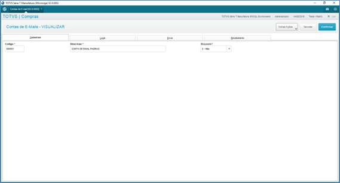{.flow-image}

As definições técnicas a respeito da configuração das contas de e-mail que serão integradas com o addon XML Terceiros para o recebimento de arquivos XML estão organizadas em pastas conforme a sua aplicação\finalidade. 
Abaixo, seguem informações especificas em torno de alguns dos campos presentes junto ao cadastro de contas de e-mail:

* <strong>Bloqueado (Z04_MSBLQL)</strong>: 
    * Determina se a conta de e-mail está bloqueada. 
    * Contas de e-mail definidas como bloqueadas não serão disponibilizadas para integração com a rotina de XML Recebidos.

* <strong>Utiliza SSL (Z04_SSL)</strong>: 
    * Determina se a conta de e-mail utiliza autenticação do tipo SSL.

* <strong>Utiliza TLS (Z04_TLS)</strong>: 
    * Determina se a conta de e-mail utiliza autenticação do tipo TLS.

* <strong>Recebimento (Z04_RECBTO)</strong> 
    * <strong>I – Imap</strong>:  
        * Determina que o protocolo de recebimento de e-mails para a conta é IMAP. 
        * Deve-se considerar os campos abaixo para configuração deste protocolo:
            * <strong>Pop (Z04_IMAP)</strong>
                * Endereço do servidor IMAP.
            * <strong>Porta (Z04_PIMAP)</strong>
                * Porta de comunicação do servidor IMAP.
        * Ao utilizar contas de e-mail com protocolo de recebimento IMAP, certifique-se que foram adicionadas as configurações abaixo junto ao arquivo de configuração do server do ERP Protheus (appserver.ini):  
          <strong>[MAIL]</strong> 
          authLogin=1 
          protocol=IMAP 
          authNTLM=1 
          authPlain=0 
          ExtendSMTP=1 
          SSLVersion=2 
          TLSVersion=3  
          <strong>[SSLConfigure]</strong> 
          SSL2=2 
      * <strong>P – Pop</strong>:  
        * Determina que o protocolo de recebimento de e-mails para a conta é POP.
        * Deve-se considerar os campos abaixo para configuração deste protocolo:
            * <strong>Pop (Z04_POP)</strong>
                * Endereço do servidor POP.
            * <strong>Porta (Z04_PPOP)</strong>
                * Porta de comunicação do servidor POP.
        * Ao utilizar contas de e-mail com protocolo de recebimento POP, certifique-se que foram adicionadas as configurações abaixo junto ao arquivo de configuração do server do ERP Protheus (appserver.ini):  
            <strong>[MAIL]</strong> 
            protocol=POP

* <strong>Importação (Z04_TPIMP)</strong> 
  * <strong>1 – Filial Logada</strong>:  
    * Nesta configuração, somente serão importados os arquivos XML cujo o CNPJ do destinatário seja igual  empresa\filial logada. 
  * <strong>2 – Todas as Filiais</strong>:  
    * A partir desta configuração, serão importados os arquivos XML vinculados  e-mails da conta onde o CNPJ do destinatário seja igual ao CNPJ de qualquer empresa\filial do ERP Protheus.

* <strong>Processados (Z04_EPROC)</strong> 
  * <strong>1 – Excluir</strong>:  
    * Caso tenha sido importado um ou mais XML a partir do e-mail processado, será realizado a exclusão do e-mail junto a conta de e-mail processada. 
  * <strong>2 – Manter</strong>:  
    * Caso tenha sido importado um ou mais XML a partir do e-mail processado, será mantido o e-mail junto a conta de e-mail processada. 
        * Ao utilizar esta opção, vale ressaltar que em nova integração com a conta de e-mail, os e-mails já lidos serão novamente avaliados, logo, este cenário poderá afetar no tempo de processamento da integração com a conta de e-mail.

* <strong>Ignorados (Z04_EIGNOR)</strong> 
  * <strong>1 – Excluir</strong>:  
    * Caso não tenha sido importado nenhum XML a partir do e-mail processado, será realizado a exclusão do e-mail junto a conta de e-mail processada. 
  * <strong>2 – Manter</strong>:  
    * Caso não tenha sido importado nenhum XML a partir do e-mail processado, será mantido o e-mail junto a conta de e-mail processada. 
        * Ao utilizar esta opção, vale ressaltar que em nova integração com a conta de e-mail, os e-mails já lidos serão novamente avaliados, logo, este cenário poderá afetar no tempo de processamento da integração com a conta de e-mail.

#### 2. CADASTRO USUÁRIOS X PERMISSÕES
A rotina de Usuários X Permissões foi desenvolvida com o objetivo de efetuar o controle em torno das permissões que os usuários do ERP Protheus terão em relação aos recursos presentes nas rotinas do ADDON XML de Terceiros.
 
Não será possível aos usuários, utilizar os recursos do ADDON caso não possua registro de definição de permissões.
 
Para cadastrar as permissões, é necessário inicialmente vincular o cadastro do usuário do ERP Protheus o qual foi previamente definido através do ambiente Configurador.

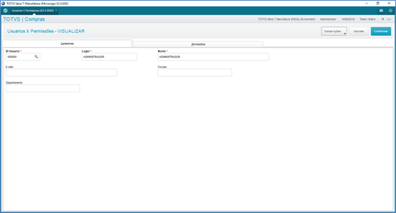{.flow-image}

Posteriormente, definem-se as permissões para o usuário em questão em relação aos recursos existentes no ADDON XML de Terceiros. 
Para cada um dos recursos existentes nas rotinas do ADDON, existem campos específicos no cadastro de Usuários X Permissões conforme exemplo abaixo.

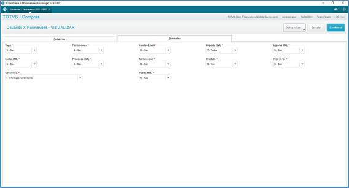{.flow-image}

Ao realizar o cadastramento das permissões, verifique o help dos campos para obter demais informações sobre a permissão em questão. 
<strong>DICA:</strong> não é necessário realizar a inclusão do cadastro de Usuários X Permissões para o usuário ADMINISTRADOR do ERP Protheus, afinal, o mesmo possui acesso total a todos os recursos do ADDON de modo padrão.
 

#### 3. CADASTRO DE TAGS
A rotina de Cadastro de Tags está presente no ADDON XML de Terceiros com o objetivo de flexibilizar a evolução do ADDON em relação a alterações na estrutura dos arquivos XML pertinentes aos documentos fiscais abaixo:
 

* <strong>NF-e</strong> 
* <strong>CT-e</strong> 

Por padrão, o ADDON XML de Terceiros já contempla uma carga de tags pré-definidas as quais são de utilização exclusiva do próprio ADDON. As definições de tags são utilizadas no recurso de processamento dos arquivos XML recebidos, ou seja, na funcionalidade a qual através do XML possibilita um assistente para maior agilidade na inclusão dos documentos fiscais no ambiente.

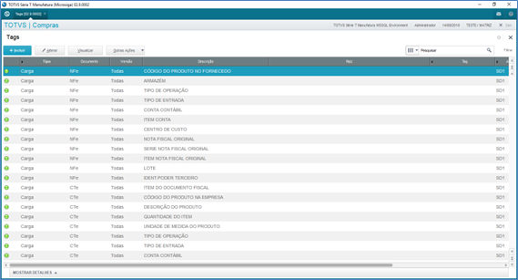{.flow-image}

Junto ao cadastro de tags são definidas as tags presentes no XML que está sendo processado bem como qual a tabela\campo do ERP Protheus no qual o conteúdo será direcionado quando do processamento do XML - inclusão do documento fiscal de entrada \ conhecimento de frete. 

Não é possível alterar as tags padrões do ADDON, porém, caso seja necessário efetuar tratamento de algum campo personalizado existente por exemplo na tabela SD1 (Itens Doc. Entrada) durante o processamento do XML, poderá ser incluído uma tag personalizada, ou seja, especifica da empresa\filial. 

<strong>OBSERVAÇÃO:</strong> Caso seja de interesse, considerar que o valor do ICMS e ICMS ST presentes no XML seja considerado para o Documento de Entrada no processamento do XML, deve-se apendar ao cadastro de tags, tags personalizadas para este processo as quais estão disponíveis junto ao pacote deste Addon. Além disto, é necessário que seja ativado o parâmetro <strong>MV_X004014</strong> (.T.). Com isto, ao processar o XML gerando Documento de Entrada, desde que o TES esteja parametrizado para calcular ICMS, serão replicados os valores do ICMS e ICMS ST presentes nos itens do XML do documento fiscal, para os itens na rotina de Documento de Entrada.

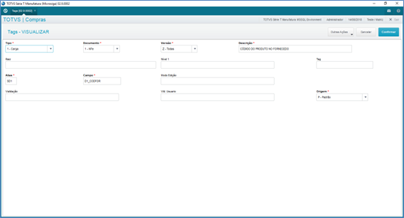{.flow-image}

Ao realizar a inclusão de tags especificas\próprias, observe com atenção o help dos campos. Além disto, poderá estar verificando a partir das próprias tags padrões do ADDON como os campos devem ser preenchidos. 
 

* <strong>Vld. Usuário (Z06_VLDUSR)</strong> 
  * Este campo existente no Cadastro de Tags pode ser utilizado para que sejam vinculadas regras personalizadas do cliente as quais serão executadas quando da edição do referido campo\tag na interface (wizard) de processamento do XML Terceiros. 
  * O seu retorno deve ser do tipo lógico (.T. \ .F.) o qual irá determinar se o conteúdo manipulado será aceito ou não.
 
 
<strong>OBSERVAÇÃO:</strong> as definições de tags padrão do ADDON poderão sofrer alterações em atualizações futuras, desta forma, particularidades da empresa\filial devem ser tratadas através de tags personalizadas\especificas. As tags da NF-e contemplavalidação para notas emitidas por fornecedorsendo CNPJ ou CPF.
 

#### 4. ROTINA XML RECEBIDOS
Através da rotina de XML Recebidos, é realizado toda a gestão em torno do recebimento\processamento do XML de Terceiros emitidos para a empresa\filial. 
Inicialmente, ao acessar a rotina é apresentado o browse com as funcionalidades disponíveis bem como, o browse com as principais informações de cada XML Terceiros previamente importado.

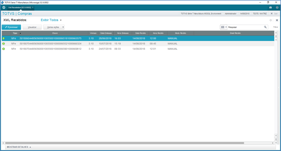{.flow-image}

Na parte superior do browse, são disponibilizados filtros pré-configurados com base nos possíveis status em que os XML Terceiros podem assumir:

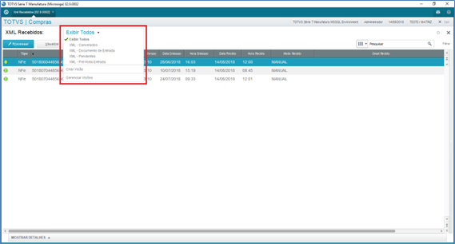{.flow-image}

Na sequência, serão abordados os recursos presentes na rotina de XML Recebidos.

#### 4.1. IMPORTAR
Ações Relacionadas\Importar
    
* <strong>MANUAL</strong>: através desta opção, será apresentado interface para que seja apontado arquivo de XML Terceiros o qual deverá ser importado para o ADDON.

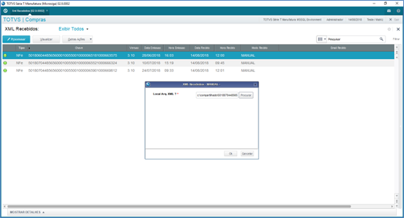{.flow-image}

 Ao confirmar a interface, serão executadas as regras de análise\importação do XML para o ADDON XML de Terceiros. Caso seja importado o XML com sucesso, será apresentado mensagem em torno da importação: 

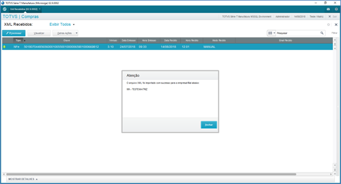{.flow-image}

Consequentemente, será disponibilizado no Browse, registro do XML o qual foi importado.

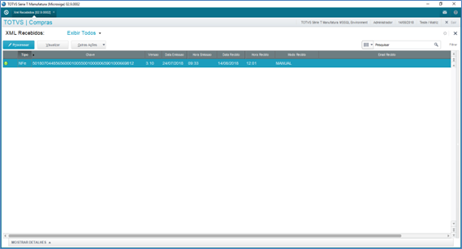{.flow-image}

<strong>E-MAIL:</strong> ao utilizar esta opção, será efetuado verificação em torno da existência de contas de e-mail junto a empresa\filial logada. 
Caso existam contas cadastradas, ocorrerá a comunicação com a conta de e-mail sendo verificado a existência de e-mails com XML de Terceiros.

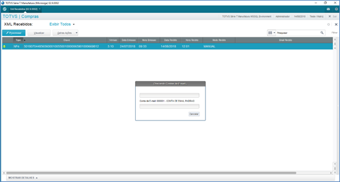{.flow-image}

Havendo e-mails válidos, ou seja, com XML de NFe\CTe, estes serão importados, sendo consequentemente disponibilizados no browse da rotina de XML Recebidos.
 
<strong>DICA:</strong> independentemente de efetuar a importação do XML de forma manual ou automática, quando um XML é importado ao ADDON de XML Terceiros, o arquivo .XML considerado na importação (arquivo original) é copiado para a pasta PROTHEUS_DATA do ambiente do ERP Protheus.
 

Neste processo, é criado uma pasta denominada \XMLS\ junto ao PROTHEUS_DATA. Posteriormente, abaixo desta pasta, são declaradas subpastas com o CNPJ\CPF do emissor do XML que foi importado sendo vinculado a esta pasta os arquivos originais. 
Com este recurso, posteriormente caso seja necessário, é possível consultar os arquivos originais. Basta solicitar ao departamento de TI. 
Além das regras acima elencadas, caso o ambiente do ERP Protheus utilize-se do módulo de Gestão de Frete Embarcador - SIGAGFE, será analisado a configuração do parâmetro MV_XMLDIR. 
Através deste parâmetro, é determinado diretório (dentro do Protheus_Data) no qual o SIGAGFE estará realizando a leitura de arquivos XML pertinentes a CTe (Conhecimento de Transporte Eletrônico). Em resumo, caso o parâmetro <strong>MV_XMLDIR</strong> esteja preenchido e o diretório informado no mesmo exista abaixo do Protheus_Data, ocorrerá a cópia do arquivo XML dos CTe os quais foram importados tanto de forma manual como automática também para esta pasta. 
O sistema pode verificar se as Notas Fiscais de Entrada referenciadas no Cte já foram informadas em outro Cte. Para tanto, é verificada a tabela SF8 - Amarracao NF OrigINAL x NF Importação ou Frete. 
Na hipótese do parâmetro <strong>MV_X004015</strong> configurado como <strong>N</strong>=Não, e alguma das notas referenciadas no .xml já estiver sido referenciada em outro CTe, não será possível efetuar a importação para futuro pocessamento do arquivo.
 
 
<strong>DICA:</strong> Ao realizar a importação de um XML Terceiros, caso já exista documento de entrada\conhecimento de frete com a chave do documento fiscal presente no XML em questão, o mesmo já será automaticamente vinculado ao documento fiscal existente no ERP Protheus, ou seja, o status do registro do XML junto ao ADDON ficará como Documento Entrada.
 

#### 4.2. EXPORTAR
Ações Relacionadas\Exportar 
Utilizando-se deste recurso, é possível realizar a exportação dos XML Terceiros existentes no ADDON de XML para arquivos. 

Para isto, deve-se parametrizar os parâmetros visando que sejam exportados os XML existentes no ADDON conforme as regras de filtro definidas.

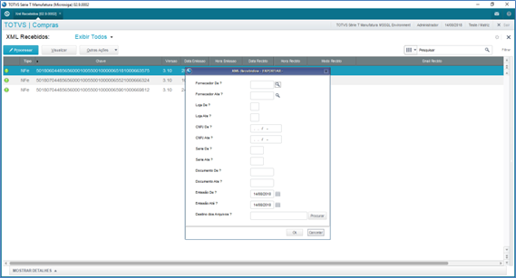{.flow-image}

Ao efetuar a exportação dos XML existentes, estes serão salvos na unidade C:\ do terminal que está sendo utilizado. O nome dos arquivos será composto pela chave do documento fiscal referente ao XML em questão.

Este recurso cria os arquivos\exporta as informações a partir do que está salvo na tabela de XML Recebidos, ou seja, não se trata de cópia dos arquivos originais utilizados quando os arquivos foram importados para o ADDON.

#### 4.3. EXCLUIR

* Ações Relacionadas\Excluir 
Esta funcionalidade tem por objetivo possibilitar a exclusão do registro de um XML de Terceiros o qual foi anteriormente importado. 
Para isto, basta posicionar sobre o registro desejado e acionar a opção de exclusão.

{.flow-image}

Ao confirmar a tela, o registro em questão será excluído da base de dados do ADDON XML de Terceiros.

<strong>DICA:</strong> Não é possível efetuar a exclusão de um registro de XML Terceiros o qual já tenha sido processado, ou seja, que possua documento fiscal de entrada ou conhecimento de frete vinculado ao mesmo.

#### 4.4. VISUALIZAR

Através desta funcionalidade, é possível realizar a visualização das informações presentes em um registro de XML Terceiros o qual existe na base de dados do ADDON XML Terceiros.

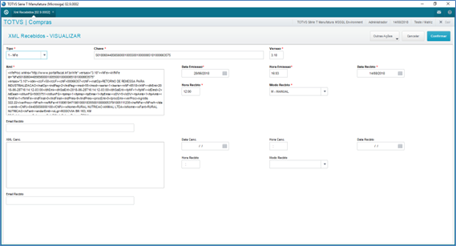{.flow-image}

Ao visualizar um registro de XML terceiros, são apresentados os campos pertinentes as informações do registro de XML em questão. 
Inicialmente, são apresentados campos com as informações pertinentes ao tipo do documento, chave de localização e versão do mesmo. 

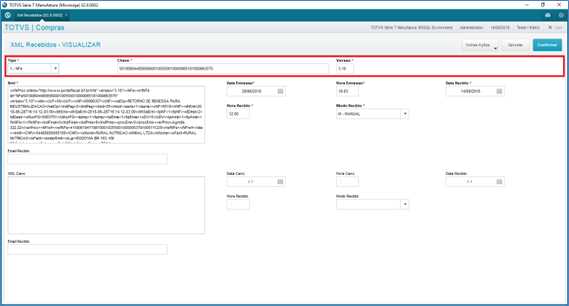{.flow-image}

Posteriormente, são apresentados campos pertinentes as informações do XML de autorização do documento fiscal, data e hora de emissão do mesmo bem como data, hora e modo pelo qual o XML foi recebido.
 
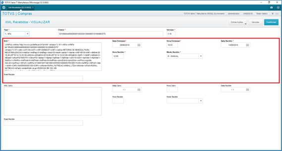{.flow-image}

Finalizando os campos presentes na interface, são apresentados campos iguais aos descritos anteriormente, porém, referente ao XML de cancelamento do documento fiscal - caso o mesmo exista.
 
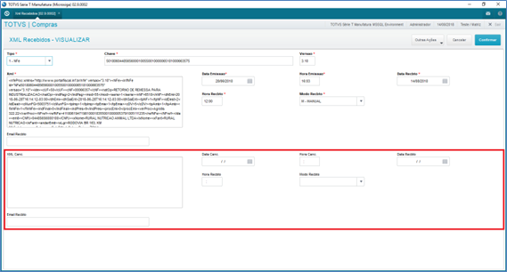{.flow-image}

<strong>DICA:</strong> Conforme descrito acima, quando existe para um determinado documento fiscal (NF-e \ CT-e) tanto o XML de Autorização como também o XML de Cancelamento, ambos os XML ficam gravados no mesmo registro junto a rotina de XML Recebidos.

#### 4.5. PROCESSAR

A funcionalidade "processar" existente na rotina de XML Recebidos se refere a utilização do XML previamente importado ao ADDON para auxiliar\agilizar no lançamento do documento fiscal. 
Ao acionar esta funcionalidade, será disponibilizado interface para que seja informado a chave do documento fiscal o qual deseja-se processar (NF-e \ CT-e).

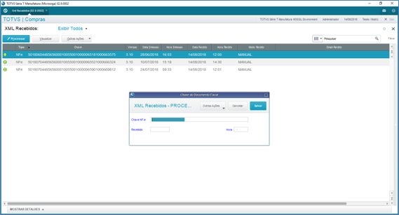{.flow-image}

Ao informar a chave do documento fiscal, será verificado os itens abaixo:  

* Existência de registro de XML Terceiros no ADDON referente a chave em questão. 
* Havendo o registro do XML Terceiros, se o mesmo está pendente, ou seja, sem documento fiscal lançado no ERP Protheus. 
* Caso no cadastro de Usuários X Permissões esteja determinado que deverá ocorrer a validação do XML no Sefaz, será verificado se o documento se encontra autorizado no Sefaz.
    * Nesta validação, é considerado a utilização do Totvs Sped Service (TSS) conforme configuração do ambiente, ou seja, se estiver configurado a NFe para HOMOLOGAÇÃO a validação da chave será realizada no mesmo ambiente.  

Uma vez que os itens acima estejam válidos, será possibilitado o processamento do XML.

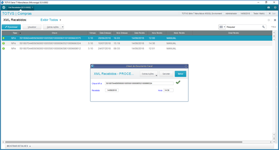{.flow-image}

Em caso de inconsistência, será apresentada mensagem ao operador reportando o fato ocorrido.

Ao confirmar a interface inicial, ocorrerá o carregamento das informações presentes no XML Terceiros para uma interface auxiliar para definição de algumas informações obrigatórias antes da geração do documento fiscal.

Na primeira tela, são apresentados no cabeçalho informações do documento fiscal e na parte inferior, informações sobre o cadastro do cliente\fornecedor vinculado ao documento fiscal.
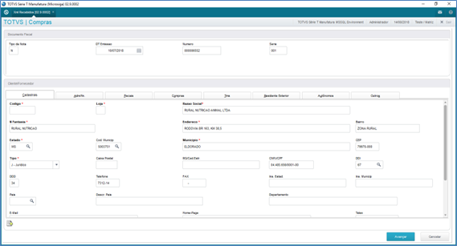{.flow-image}

Caso o cliente\fornecedor presente no documento não tenha seu cadastro localizado na empresa\filial, somente poderá ser possível avançar a tela após o cadastramento do mesmo.

* A busca em torno do cadastro do cliente\fornecedor ocorre através da informação do CNPJ \ CPF existente no XML do documento fiscal o qual está sendo processado. 

Se o usuário logado possuir permissão para inclusão de cliente\fornecedor (Cadastro Usuários X Permissões), será disponibilizado botão para inclusão do cadastro na parte inferior esquerda da interface.

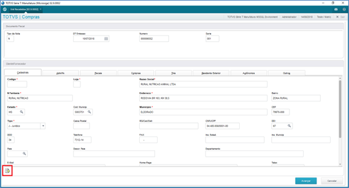{.flow-image}

Ao acionar este botão, será carregado a tela padrão de inclusão do cadastro de cliente\fornecedor.

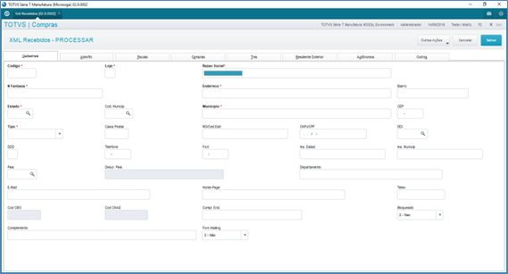{.flow-image}

Para auxiliar no cadastramento do cliente\fornecedor, pode-se utilizar as informações básicas do mesmo cujo as quais estão presentes no arquivo de XML Terceiros que esta sendo processado. 
Para isto, basta pressionar a tecla de atalho F2.

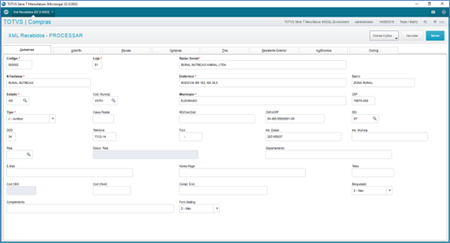{.flow-image}

Ao confirmar o cadastro, o cliente\fornecedor será vinculado a tela de processamento do XML Terceiros conforme exemplo abaixo.

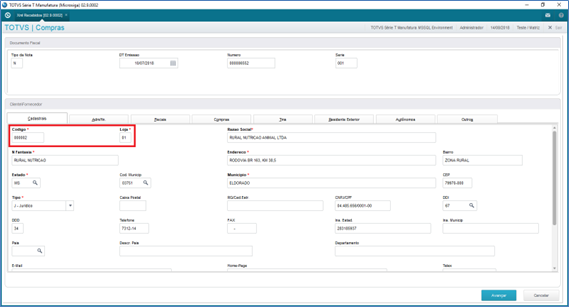{.flow-image}

<strong>DICA:</strong> Através da configuração do parâmetro <strong>MV_X004006</strong>, poderá ser parametrizado a funcionalidade de processamento de XML Terceiros para que o número e\ou série do documento fiscal o qual está sendo processado, tenha zeros adicionados a esquerda.
 

Ao avançar a interface, será apresentada uma nova tela com os itens do documento fiscal.

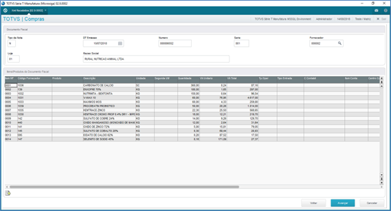{.flow-image}

Por padrão, é necessário que sejam definidos nesta tela o conteúdo dos campos abaixo listados:

*	Produtos
    * Esta relação será necessária ao menos uma vez. Posteriormente, caso esteja definido no cadastro de Usuários X Permissão para o usuário logado que deva ser salvo a definição de Produtos X Fornecedores, em novos processamentos, será automaticamente carregado o PRODUTO (código interno do ERP) a partir desta amarração. Não localizando o produto na amarração de Produtos X Fornecedores, irá buscar o produto pelo código de barras existente no XML.
    * Caso o produto não esteja cadastrado no ambiente e o usuário possua permissão para incluir produtos (Cadastro Usuários X Permissões), poderá efetuar tal processo estando posicionado no item do documento clicando no atalho específico.  

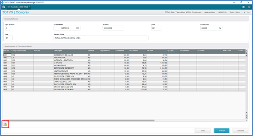{.flow-image}

* Será apresentado a interface de inclusão do produto. Para agilizar no processo, pode-se utilizar a tecla de atalho F2 onde serão atualizados alguns campos a partir de informações presentes no próprio XML que está sendo processado.
* Ao confirmar a inclusão do produto, o mesmo é automaticamente vinculado ao item, caso necessário, poderá ser alterado para outro produto já incluso.

<strong>DICAS:</strong> 

* Através da configuração do parâmetro MV_X004008, poderá ser parametrizado a funcionalidade de processamento de XML Terceiros para que esteja sugerindo a conta contábil e\ou centro de custos vinculado ao cadastro do produto para o respectivo item junto ao grid de itens da interface de processamento do XML.
* No cadastro de Produtos X Fornecedores, se o campo Unidade (A5_UNID) estiver preenchido, no momento do processamento do XML, o sistema verifica qual das unidades do produto Protheus (Primária ou Secundária) é utilizada pelo Fornecedor, efetuando automaticamente o preenchimento no GRID. 
Exemplo:
Produto ABC – Unidade Primária PC, Unidade Secundária CX
Fornecedor efetua o fornecimento sempre em CX. No Cadastro de Produtos x Fornecedor, foi informado campo Unidade = CX. 
No momento do processamento do XML, identificamos que a unidade é CX, o campo a ser preenchido automaticamente pelo sistema será o da unidade Secundária, efetuando os cálculos para a primeira unidade. 

<strong>TES:</strong> 

* O TES é necessário para que seja posteriormente gerado o Documento de Entrada ou Conhecimento de Frete.
* Quando se trata do processamento do XML de NF-e, é possível replicar uma mesma TES a todos os itens do documento fiscal, neste momento será apresentado mensagem ao usuário em torno da execução deste processo ou não.
*	Referente ao processamento de XML de CT-e, sempre será replicado o TES informado\alterado em qualquer item para todos os demais itens do documento. Isto ocorre, pois a rotina padrão de Conhecimento de Frete permite o lançamento do conhecimento com um único Tes.

<strong>PEDIDO DE COMPRA:</strong> 

*	Junto aos itens da interface de processamento, existem campos para vinculo de pedidos de compra.
*	Neste caso, ao dar "enter" sob o campo, será apresentado interface com os pedidos de compra para o fornecedor\produto em questão que possuem saldo.
*	Se necessário, poderá ser selecionado itens de pedidos diferentes para atender a quantidade do item da nota. Neste caso, o item na tela de processamento ficará com o pedido "999999" vinculado. Posteriormente, ao gerar a Pré-Nota\Documento de Entrada, será "quebrado" o item do documento em mais de um item sendo vinculado a cada item os respectivos pedidos de compra conforme a quantidade\valor unitário definidos.
*	Caso a nota fiscal de entrada tenha vindo de uma loja do fornecedor diferente daquela do pedido de compra, será possível fazer o vínculo do pedido normalmente, desde que o parâmetro “Quanto ao PC”, na rotina Documento de Entrada, acessado via tecla F12, seja definido como “Fornecedor”;

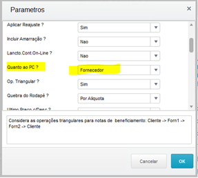{.flow-image}

<strong>DICA:</strong> Através da utilização do parâmetro MV_X004009, poderá ser ativado parametrização onde havendo um único pedido de compra vinculado aos itens do documento fiscal que está sendo processado, será sugerido a condição de pagamento vinculada ao pedido de compra em questão, como sendo a condição de pagamento para a inclusão do documento fiscal em campo específico existente na última sessão da funcionalidade de processamento XML Terceiros presente na aba Duplicatas.

*	Caso o item do pedido de compra selecionado contenha os campos das entidades contábeis preenchidos (Centro de Custo, Conta Contábil, Item Contábil, Classe de Valor), estes campos serão vinculados ao item do documento fiscal em questão.  
<strong>OBS:</strong> Isso somente se houver um único pedido de compra vinculado.

*	 Atentar ao preenchimento do parâmetro MV_X004013 que define se o valor unitário para a Pré-Nota ou Documento de entrada será considerado pelo Pedido de Compras ou pelo XML.
 

<strong>Gestão de Cereais:</strong> 

  *	Quando a empresa\filial utiliza-se também do ADDON de Gestão de Cereais, serão adicionadas novas tags ao ADDON de XML Terceiros de modo que ocorrerá a obrigatoriedade na informação de outros campos específicos do ADDON de gestão de cereais conforme a configuração do produto vinculado aos itens em questão.

Após a definição das informações dos itens conforme observações acima, ao avançar a interface será apresentado a tela final de processamento do XML. Nesta interface, na parte inferior existe a aba "duplicatas" onde deverá ser informado a condição de pagamento e a natureza financeira.
 
<strong>DICA:</strong> Através da parametrização do parâmetro <strong>MV_X004007</strong>, poderá ser parametrizado a funcionalidade de processamento de XML Terceiros para que seja sugerido a natureza financeira vinculada ao cadastro do cliente\fornecedor vinculado ao XML Terceiros que esta sendo processada. 

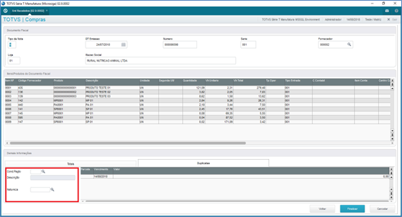{.flow-image}

Caso no cadastro de Usuários X Permissões esteja definido que o usuário gera apenas Pré-Nota (Processamento XML NFe), não será obrigatório informar estes campos, bem como o TES nos itens, pois a Pré-Nota não se utiliza destas informações. Já no caso de geração de documento de entrada ou conhecimento de frete (Processamento XML CTe), é obrigatório a informação destes campos.
 

<strong>DICA:</strong> Caso esteja definido que a informação de natureza é obrigatória no documento de entrada, a mesma também será obrigatória na tela de processamento do XML.
 
Uma vez que todas as informações foram definidas, ao acionar a opção "Finalizar" existente na interface, será aplicado validações finais gerais. Após isto, estando tudo correto, ocorrerá a inclusão do documento fiscal: 

*	Processamento XML NF-e: será gerado (Pré-Nota \ Documento de Entrada) conforme definido no cadastro de Usuários X Permissões para o usuário logado. Caso esteja definido como INFORMADO NO MOMENTO, será questionado ao usuário qual o tipo de documento deseja gerar. Ao confirmar, será apresentado a tela de inclusão com todas as informações onde o usuário poderá checar\complementar antes de confirmar a inclusão.
*	Processamento XML CT-e: independente do Cadastro de Usuários X Permissões, quando se trata de processamento de CTe sob documentos de compra vinculados, será utilizado a inclusão de Conhecimento de Frete, não sendo apresentado a interface ao usuário (Rotina automática não disponibiliza este recurso). Caso seja conhecimento de frete onde as notas fiscais referenciadas não sejam documentos de entrada (frete não entra no custo do produto), será tratado como inclusão de documento de entrada do tipo normal referente a despesa com frete. Neste caso, é apresentado a interface do documento ao usuário antes de confirmar a inclusão.

Após gerar o documento fiscal, o registro do XML tem o seu status atualizado conforme situações apresentadas na legenda.

<strong>OBSERVAÇÃO:</strong> Caso seja de interesse, considerar que o valor do ICMS e ICMS ST presentes no XML seja considerado para o Documento de Entrada no processamento do XML, deve-se apendar ao cadastro de tags, tags personalizadas para este processo as quais estão disponíveis junto ao pacote deste Addon. Além disto, é necessário que seja ativado o parâmetro MV_X004014 (.T.). Com isto, ao processar o XML gerando Documento de Entrada, desde que o TES esteja parametrizado para calcular ICMS, serão replicados os valores do ICMS e ICMS ST presentes nos itens do XML do documento fiscal, para os itens na rotina de Documento de Entrada.

#### 4.6. LEGENDA
Ações Relacionadas\Legenda  
Através da funcionalidade de legenda, é possível identificar os status vinculados aos registros existentes no browse da rotina de XML Terceiros.

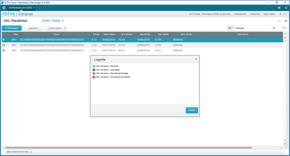{.flow-image}

Os status existentes para os XML existentes na rotina estão condicionados a situação do mesmo perante ao ADDON.

<strong>DICA:</strong> Conforme já descrito no recurso de exclusão dos registros de XML, não é possível excluir um registro de XML Terceiros o qual já possua documento fiscal, ou seja, caso o status seja referente a Pré-Nota ou Documento de Entrada (Documento Entrada \ Conhecimento de Transporte).

#### 5. RELATÓRIO LISTAGEM XML RECEBIDOS

Através deste relatório, é possível emitir a relação de XML Terceiros importados\existentes junto ao ADDON XML Terceiros.

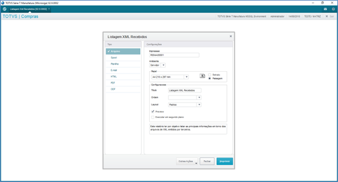{.flow-image}

Este relatório tem por objetivo permitir um controle\relação em torno dos XML a partir do status do mesmo e até para verificar os XML que ainda não possuem documento fiscal vinculado, ou seja, cujo o documento fiscal ainda não foi dado entrada junto ao ERP Protheus.

{.flow-image}

<strong>DICA:</strong> O relatório de Listagem XML Recebidos foi desenvolvimento utilizando o componente TReport, desta forma, é possível efetuar personalizações em torno do layout do mesmo visando atender necessidades especificas.

