

# ADD-ON DE LEITE {.home-hero}

<!--############################################### 01 #######################################################-->

  01. Visão Geral

### 1. Visão Geral
Este produto tem como objetivo forneceder uma gestão completa do Ciclo de Compra/Beneficiamento do Leite em laticínios, onde dentre os seus processos, permite variados controles como:

- Coleta de Leite 
- Recebimento do Leite
- Análises Laboratoriais
- Conta Corrente produtor / fechamento produtor
- Tabelas de Preço
- Vazão de veículo
- Notificações gerais ao produtor via Workflkow
- Análises de Exames Rebanho
- Vacinação Rebanho;
- Fabricação de queijos
- Fabricação de soro

O ciclo da gestão do addon inicia na coleta do leite no produtor, que segue para o registro do recebimento desta coleta no ERP.

A partir do recebimento, outros sub-processos são efetuados tais como: registro motorista/produtor, análise laboratorial do leite e consequentemente, movimen-
tações na conta corrente do produtor.

O produto já está adequado a Normativa 62 do MAPA (% Gordura, % Proteina, % Lactose, % Solidos, % ESD, % CSS, % CBT).

- Ciclo de Cotação:
    - Geração e envio automático de cotações aos fornecedores.
    - Cadastro de e-mails de fornecedores (quando necessário).
    - Atualização automática via workflow e manual dos preços.
    - Análise e geração do pedido de compra.

- Comunicações Automáticas:
    - Envio de cotações aos fornecedores com link de acesso.
    - Notificação ao comprador sobre cotações enviadas/finalizadas.
    - Envio do pedido de compra ao fornecedor.

- Gestão e Controle:
    - Verificação automática de cotações vencidas (schedule).
    - Reenvios manuais de cotações e pedidos.
    - Suporte a múltiplos destinatários de workflow.

- Funcionalidades de Apoio:
    - Cadastro integrado de e-mails de fornecedores.
    - Atualizações manuais e automáticas.
    - Interface para análise comparativa de cotações.

O sistema automatiza todo o fluxo desde a cotação até o pedido de compra, com comunicação integrada entre compradores e fornecedores.

<!--############################################### 02 #######################################################-->

  02. Procedimentos para a implementação do Addon

### 2. Procedimentos para a implementação do Addon

#### Importante:

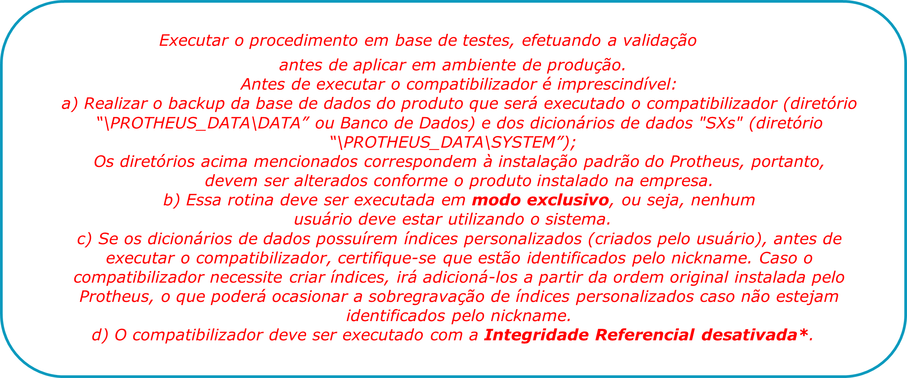{.flow-image}

<strong>PRÉ-REQUISITOS:</strong>
 
Este pacote requer as seguintes configurações no Servidor ERP Protheus: 
<strong>1.	</strong>Configuração do serviço de Workflow e conta de e-mail de workflow no módulo Configurador; 
<strong>2.	</strong>Configuração do serviço HTTP no .INI do Servidor Protheus;

<strong>Exemplo:</strong>

<strong>[HTTP]</strong> 
enable=1 
port=8089 
PATH=C:\P11\Protheus_Data\web 

;---------------------------------------- 
<strong>;	JOB WORKFLOW VIA LINK </strong>
<strong>;---------------------------------------- 
[192.168.1.151:8089]</strong> 
ENABLE=1 
PORT=8089 
PATH=C:\P11\Protheus_Data\web 
ENVIRONMENT=desenvolvimento 
RESPONSEJOB=JOB_WF_LINK 
 
<strong>[JOB_WF_LINK]</strong> 
TYPE=WEB 
SIGAWEB=WF 
ENVIRONMENT=desenvolvimento 
INSTANCES=3,5 
INSTANCENAME=WF 
ONSTART=STARTWEBEX 
ONCONNECT=CONNECTWEBEX 
ONEXIT=FINISHWEBEX 
PREPAREIN=01,01 

<strong>3.	</strong>Redirecionamento do DNS para acesso ao link do workflow (https://dominio.com.br) na porta HTTP configurada; 
<strong>4.	</strong>Liberação de Firewall para a porta HTTP do Servidor Protheus; 
<strong>5.	</strong>Copiar MENU sigaesp1.xnu para past de menus; 

<strong>COMPATIBILIZADOR:</strong>

Baixar e descompactar o pacote de instalação do ADD-ON (F007A); 
<strong>1.	</strong>Copiar a pasta \FSW999\UPD007\A\DADOS  para o rootpath (protheus_data); 
<strong>2.	</strong>Aplicar o patch contido na pasta \FSW999\UPD007\A\PATCH (tttp110_007A); 
<strong>3.	</strong>Ajustar arquivo SX2LAT.DTC nome das tabelas conforme dicionário. 
<strong>4.	</strong>Ajustar arquivo SX3LAT.DTC grupo de campos 001, 002, e 033 conforme tamanho no dicionário. 
<strong>5.	</strong>Executar o compatibilizador U_UPD007A através do remote: 

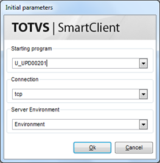{.flow-image}
</tbody>
</table>

<!--############################################### 03 #######################################################-->

  03. Arquivos do Workflow

### 3. Arquivos do Workflow

Copiar os seguintes arquivos do Pacote para a pasta de trabalho do Workflow (protheus_data\workflow), configurado através do parâmetro MV_WFDIR:

<table class="banks-table">
  <thead>
    <tr>
      <th>Arquivo</th>
      <th>Descrição</th>
    </tr>
  </thead>
  <tbody>
    <tr>
      <td><strong>ltcad014.htm</strong></td>
      <td>Diferença entre Plataforma e Coletas uMov.me.</td>
    </tr>
    <tr>
      <td><strong>ltcad015.htm</strong></td>
      <td>Abertura/Fechamento de Plataforma</td>
    </tr>
  </tbody>
</table>

Copiar os seguintes arquivos do Pacote para a pasta WEB (protheus_data\web), configurada através do parâmetro MV_WFDHTTP:

<table class="banks-table">
  <thead>
    <tr>
      <th>Arquivo</th>
      <th>Descrição</th>
    </tr>
  </thead>
  <tbody>
    <tr>
      <td><strong>logototvs.png</strong></td>
      <td>Imagem logotipo da TOTVS.</td>
    </tr>
    <tr>
      <td><strong>lgmidEEFF.png</strong></td>
      <td>Imagem logotipo da Empresa EE (Empresa = 01) FF (Filial = 01).  Tamanho padrão para a imagem 110 x 110 Pixels.</td>
    </tr>
  </tbody>
</table>

<!--############################################### 04 #######################################################-->

  04.Pontos de entrada específicos

### 04. Pontos de entrada específicos

Implementar os seguintes pontos de entrada com chamada à rotina específica do Pacote:

<table class="banks-table">
  <thead>
    <tr>
      <th>Nome</th>
      <th>Chamada</th>
    </tr>
  </thead>
  <tbody>
    <tr>
      <td><strong>MA120BUT</strong></td>
      <td>Local aBotoes := U_P002A01("MA120BUT").</td>
    </tr>
    <tr>
      <td><strong>MA150BUT</strong></td>
      <td>Local aBotoes := U_P002A01("MA150BUT").</td>
    </tr>
    <tr>
      <td><strong>MT120FIM</strong></td>
      <td>U_P002A01("MT120FIM",PARAMIXB).</td>
    </tr>
    <tr>
      <td><strong>MT130WF</strong></td>
      <td>U_P002A01("MT130WF",PARAMIXB).</td>
    </tr>
    <tr>
      <td><strong>MT150GET</strong></td>
      <td>U_P002A01("MT150GET").</td>
    </tr>
    <tr>
      <td><strong>MT150GRV</strong></td>
      <td>FU_P002A01("MT150GRV", PARAMIXB).</td>
    </tr>
    <tr>
      <td><strong>MT160WF</strong></td>
      <td>U_P002A01("MT160WF",PARAMIXB).</td>
    </tr>
    <tr>
  </tbody>
</table>

<!--############################################### 05 #######################################################-->

  05. Rotinas personalizadas específicas do Pacote

### 5. Rotinas personalizadas específicas do Pacote

#### Funções personalizadas contidas no pacote:

O pacote disponibilizará as seguintes rotinas/funções personalizadas no ambiente aplicado:

<table class="banks-table">
  <thead>
    <tr>
      <th>Função</th>
      <th>Descrição</th>
    </tr>
  </thead>
  <tbody>
    <tr>
      <td><strong>M002A01</strong></td>
      <td>Função responsável pelo retorno do Workflow de Cotação.</td>
    </tr>
    <tr>
      <td><strong>M002A02</strong></td>
      <td>Função JOB responsável pela verificação das Cotações de Compra vencidas sem retorno do Fornecedor.</td>
    </tr>
    <tr>
      <td><strong>P002A01</strong></td>
      <td>Rotina centralizadora para implementação de Pontos de Entrada do módulo de Compras.</td>
    </tr>
    <tr>
      <td><strong>W002A01</strong></td>
      <td>Função responsável pelo envio do Workflow aos Fornecedores (LINK COTACAO).</td>
    </tr>
    <tr>
      <td><strong>W002A02</strong></td>
      <td>Função responsável pela geração do Workflow da Cotação de Compra (formulário HTML).</td>
    </tr>
    <tr>
      <td><strong>W002A03</strong></td>
      <td>Função responsável pelo envio do Workflow de Confirmação ao usuário Comprador informando que a Cotação foi enviada para os Fornecedores.</td>
    </tr>
    <tr>
      <td><strong>W002A04</strong></td>
      <td>Função responsável pelo envio do Workflow de Aviso ao usuário Comprador que as Cotações já foram atualizadas.</td>
    </tr>
    <tr>
      <td><strong>W002A05</strong></td>
      <td>Função responsável pelo envio do Workflow de Aviso ao usuário Comprador informando que existem Cotações Vencidas em aberto sem proposta.</td>
    </tr>
    <tr>
      <td><strong>W002A06</strong></td>
      <td>Função responsável pela geração do Workflow do Pedido de Compra e envio ao Fornecedor.</td>
    </tr>
    <tr>
      <td><strong>X002A01</strong></td>
      <td>Rotina centralizadora de Funções Genéricas do ADD-ON:
CADMAIL: Tela para cadastrar E-MAIL do Fornecedor.</td>
    </tr>
    <tr>
      <td><strong>UPD00201</strong></td>
      <td>Programa compatibilizador do Dicionário de Dados para aplicação do ADD-ON.</td>
    </tr>
    </tr>
  </tbody>
</table>

<!--############################################### 06 #######################################################-->

  06. Campos (SX3)

### 6. Campos (SX3)

No “Configurador (SIGACFG)”, opção “Ambiente/Base de Dados/Dicionário/Base de Dados” (CFGX031), serão criados os seguintes campos:

Campo **A2_X_WFC**

<table class="banks-table">
  <tbody>
    <tr>
      <th>Tipo</th>
      <td>C</td>
      <th>Ordem</th>
      <td>-</td>
      <th>Tamanho</th>
      <td>1</td>
      <th>Decimal</th>
      <td>0</td>
      <th>Formato</th>
      <td>@!</td>
    </tr>
    <tr>
      <th>Contexto</th>
      <td>Real</td>
      <th>Propriedade</th>
      <td>Alterar</td>
      <th>Obrigatório</th>
      <td>N</td>
      <th>Browse</th>
      <td>N</td>
    </tr>
    <tr>
      <th>Título</th>
      <td colspan="7">Envia Cotac.</td>
    </tr>
    <tr>
      <th>Descrição</th>
      <td colspan="7">Envia Cotação de Compra?</td>
    </tr>
  </tbody>
</table>
#### **Help**

Indica se o fornecedor pode receber cotacao de precos via workflow? (S=Sim, N=Não).

#### **Configurações adicionais**
<table class="banks-table">
  <tbody>
    <tr>
      <th>F3</th>
      <td>-</td>
    </tr>
    <tr>
      <th>Modo Edição</th>
      <td>-</td>
    </tr>
    <tr>
      <th>Val. Usuário</th>
      <td>-</td>
    </tr>
    <tr>
      <th>Lista Opções</th>
      <td>S=Sim;N=Não</td>
    </tr>
    <tr>
      <th>Inicializador</th>
      <td>S</td>
    </tr>
    <tr>
      <th>Ini. Browse</th>
      <td>-</td>
    </tr>
  </tbody>
</table>

Campo **C8_X_TP**

<table class="banks-table">
  <tbody>
    <tr>
      <th>Tipo</th>
      <td>C</td>
      <th>Ordem</th>
      <td>-</td>
      <th>Tamanho</th>
      <td>1</td>
      <th>Decimal</th>
      <td>0</td>
      <th>Formato</th>
      <td>@!</td>
    </tr>
    <tr>
      <th>Contexto</th>
      <td>Real</td>
      <th>Propriedade</th>
      <td>Visualizar</td>
      <th>Obrigatório</th>
      <td>N</td>
      <th>Browse</th>
      <td>N</td>
    </tr>
    <tr>
      <th>Título</th>
      <td colspan="7">Tipo Atual.</td>
    </tr>
    <tr>
      <th>Descrição</th>
      <td colspan="7">Tipo da atualização</td>
    </tr>
  </tbody>
</table>
#### **Help**

Tipo de atualização da cotação: 1=SISTEMA; 2=WORKFLOW.

#### **Configurações adicionais**
<table class="banks-table">
  <tbody>
    <tr>
      <th>F3</th>
      <td>-</td>
    </tr>
    <tr>
      <th>Modo Edição</th>
      <td>-</td>
    </tr>
    <tr>
      <th>Val. Usuário</th>
      <td>-</td>
    </tr>
    <tr>
      <th>Lista Opções</th>
      <td>-</td>
    </tr>
    <tr>
      <th>Inicializador</th>
      <td>-</td>
    </tr>
    <tr>
      <th>Ini. Browse</th>
      <td>-</td>
    </tr>
  </tbody>
</table>

Campo **C8_X_IDUSR**

<table class="banks-table">
  <tbody>
    <tr>
      <th>Tipo</th>
      <td>C</td>
      <th>Ordem</th>
      <td>-</td>
      <th>Tamanho</th>
      <td>6</td>
      <th>Decimal</th>
      <td>0</td>
      <th>Formato</th>
      <td>@!</td>
    </tr>
    <tr>
      <th>Contexto</th>
      <td>Real</td>
      <th>Propriedade</th>
      <td>Visualizar</td>
      <th>Obrigatório</th>
      <td>N</td>
      <th>Browse</th>
      <td>N</td>
    </tr>
    <tr>
      <th>Título</th>
      <td colspan="7">ID User</td>
    </tr>
    <tr>
      <th>Descrição</th>
      <td colspan="7">ID do usuario da cotação</td>
    </tr>
  </tbody>
</table>
#### **Help**

Código do usuario comprador que gerou a cotação de compra.

#### **Configurações adicionais**
<table class="banks-table">
  <tbody>
    <tr>
      <th>F3</th>
      <td>-</td>
    </tr>
    <tr>
      <th>Modo Edição</th>
      <td>-</td>
    </tr>
    <tr>
      <th>Val. Usuário</th>
      <td>-</td>
    </tr>
    <tr>
      <th>Lista Opções</th>
      <td>-</td>
    </tr>
    <tr>
      <th>Inicializador</th>
      <td>-</td>
    </tr>
    <tr>
      <th>Ini. Browse</th>
      <td>-</td>
    </tr>
  </tbody>
</table>

Campo **C8_X_MAIL**

<table class="banks-table">
  <tbody>
    <tr>
      <th>Tipo</th>
      <td>C</td>
      <th>Ordem</th>
      <td>-</td>
      <th>Tamanho</th>
      <td>60</td>
      <th>Decimal</th>
      <td>0</td>
      <th>Formato</th>
      <td>@!</td>
    </tr>
    <tr>
      <th>Contexto</th>
      <td>Real</td>
      <th>Propriedade</th>
      <td>Visualizar</td>
      <th>Obrigatório</th>
      <td>N</td>
      <th>Browse</th>
      <td>N</td>
    <tr>
      <th>Título</th>
      <td colspan="7">E-mail Cotac</td>
    </tr>
    <tr>
      <th>Descrição</th>
      <td colspan="7">E-mail de envio da Cotac.</td>
    </tr>
  </tbody>
</table>
#### **Help**

E-mail para quem foi enviada a cotação de compra.

#### **Configurações adicionais**
<table class="banks-table">
  <tbody>
    <tr>
      <th>F3</th>
      <td>-</td>
    </tr>
    <tr>
      <th>Modo Edição</th>
      <td>-</td>
    </tr>
    <tr>
      <th>Val. Usuário</th>
      <td>-</td>
    </tr>
    <tr>
      <th>Lista Opções</th>
      <td>-</td>
    </tr>
    <tr>
      <th>Inicializador</th>
      <td>-</td>
    </tr>
    <tr>
      <th>Ini. Browse</th>
      <td>-</td>
    </tr>
  </tbody>
</table>

Campo **C8_X_WFV**

<table class="banks-table">
  <tbody>
    <tr>
      <th>Tipo</th>
      <td>C</td>
      <th>Ordem</th>
      <td>-</td>
      <th>Tamanho</th>
      <td>1</td>
      <th>Decimal</th>
      <td>0</td>
      <th>Formato</th>
      <td>@!</td>
    </tr>
    <tr>
      <th>Contexto</th>
      <td>Real</td>
      <th>Propriedade</th>
      <td>Visualizar</td>
      <th>Obrigatório</th>
      <td>N</td>
      <th>Browse</th>
      <td>N</td>
    </tr>
    <tr>
      <th>Título</th>
      <td colspan="7">WF Aviso?</td>
    </tr>
    <tr>
      <th>Descrição</th>
      <td colspan="7">WF Aviso foi enviado?</td>
    </tr>
  </tbody>
</table>
#### **Help**

Indica se foi enviado workflow de aviso de cotações vencidas em aberto para o usuário comprador (S=Sim, N=Não).

#### **Configurações adicionais**
<table class="banks-table">
  <tbody>
    <tr>
      <th>F3</th>
      <td>-</td>
    </tr>
    <tr>
      <th>Modo Edição</th>
      <td>-</td>
    </tr>
    <tr>
      <th>Val. Usuário</th>
      <td>-</td>
    </tr>
    <tr>
      <th>Lista Opções</th>
      <td>-</td>
    </tr>
    <tr>
      <th>Inicializador</th>
      <td>-</td>
    </tr>
    <tr>
      <th>Ini. Browse</th>
      <td>-</td>
    </tr>
  </tbody>
</table>

Campo **C8_X_OBSF**

<table class="banks-table">
  <tbody>
    <tr>
      <th>Tipo</th>
      <td>C</td>
      <th>Ordem</th>
      <td>-</td>
      <th>Tamanho</th>
      <td>50</td>
      <th>Decimal</th>
      <td>0</td>
      <th>Formato</th>
      <td>@!</td>
    </tr>
    <tr>
      <th>Contexto</th>
      <td>Real</td>
      <th>Propriedade</th>
      <td>Alterar</td>
      <th>Obrigatório</th>
      <td>N</td>
      <th>Browse</th>
      <td>N</td>
    </tr>
    <tr>
      <th>Título</th>
      <td colspan="7">Obs. Fornec.</td>
    </tr>
    <tr>
      <th>Descrição</th>
      <td colspan="7">Observações do Fornecedor</td>
    </tr>
  </tbody>
</table>
#### **Help**

Observações do Fornecedor na atualização 
via workflow da cotação

#### **Configurações adicionais**
<table class="banks-table">
  <tbody>
    <tr>
      <th>F3</th>
      <td>-</td>
    </tr>
    <tr>
      <th>Modo Edição</th>
      <td>-</td>
    </tr>
    <tr>
      <th>Val. Usuário</th>
      <td>-</td>
    </tr>
    <tr>
      <th>Lista Opções</th>
      <td>-</td>
    </tr>
    <tr>
      <th>Inicializador</th>
      <td>-</td>
    </tr>
    <tr>
      <th>Ini. Browse</th>
      <td>-</td>
    </tr>
  </tbody>
</table>

Campo **E4_X_WFC**

<table class="banks-table">
  <tbody>
    <tr>
      <th>Tipo</th>
      <td>C</td>
      <th>Ordem</th>
      <td>-</td>
      <th>Tamanho</th>
      <td>1</td>
      <th>Decimal</th>
      <td>0</td>
      <th>Formato</th>
      <td>@!</td>
    </tr>
    <tr>
      <th>Contexto</th>
      <td>Real</td>
      <th>Propriedade</th>
      <td>Alterar</td>
      <th>Obrigatório</th>
      <td>N</td>
      <th>Browse</th>
      <td>N</td>
    </tr>
    <tr>
      <th>Título</th>
      <td colspan="7">Envia Cotac.</td>
    </tr>
    <tr>
      <th>Descrição</th>
      <td colspan="7">Envia na Cotação Compra?</td>
    </tr>
  </tbody>
</table>
#### **Help**

Indica se enviará a condição de pagamento no workflow de cotação de compra para o fornecedor (S/N).

#### **Configurações adicionais**
<table class="banks-table">
  <tbody>
    <tr>
      <th>F3</th>
      <td>-</td>
    </tr>
    <tr>
      <th>Modo Edição</th>
      <td>-</td>
    </tr>
    <tr>
      <th>Val. Usuário</th>
      <td>-</td>
    </tr>
    <tr>
      <th>Lista Opções</th>
      <td>S=Sim;N=Não</td>
    </tr>
    <tr>
      <th>Inicializador</th>
      <td>-</td>
    </tr>
    <tr>
      <th>Ini. Browse</th>
      <td>-</td>
    </tr>
  </tbody>
</table>

<!--############################################### 07 #######################################################-->

  07. Parâmetros (SX6)

### 7. Parâmetros (SX6)

No “Configurador (SIGACFG)”, opção “Ambiente/Cadastros/Parâmetros” (CFGX017), configurar os seguintes parâmetros:

<table class="banks-table">
  <thead>
    <tr>
      <th>Nome</th>
      <th>Tipo</th>
      <th>Descrição</th>
      <th>Conteúdo</th>
    </tr>
  </thead>
  <tbody>
    <tr>
      <td><strong>MV_X002000</strong></td>
      <td>Lógico</td>
      <td>Habilita ADD-ON de cotação via Workflow Compras.</td>
      <td>.T.</td>
    </tr>
    <tr>
      <td><strong>MV_WFBRWSR</strong></td>
      <td>Caracter</td>
      <td>IP ou nome do servidor HTTP. EX: http://localhost:8080/web.</td>
      <td>-</td>
    </tr>   
    <tr>
      <td><strong>MV_WFDHTTP</strong></td>
      <td>Caracter</td>
      <td>Diretório do servidor HTTP. EX: \web.</td>
      <td>-</td>
    </tr>      
  </tbody>
</table>

<!--############################################### 08 #######################################################-->

  08. Manual de operação

### 8. Manual de operação

Este ADDON tem por objetivo realizar os processos para controle de entrada de leite em Laticínios, abaixo pontos que são abordados:

- Coleta leite do Produtor
- Análise laboratorial
- Movimentação estoque de entrada de leite
- Pagamento Produtores
- Pagamento Transportadores
- Emissão Nota Fiscal Produtores
- Normativa 62

#### 1.	FLUXO DO PROCESSO:

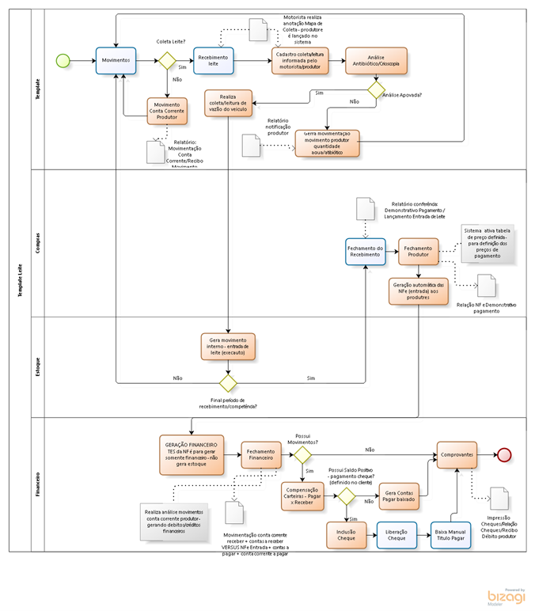{.flow-image}

#### 2.	PRINCIPAIS CADASTROS

- <strong>FORNECEDOR</strong>  
Cadastrar os fornecedores, campos específicos abaixo:

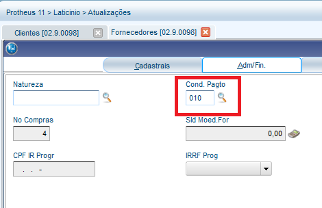{.flow-image}

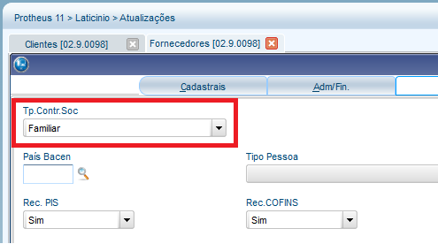{.flow-image}

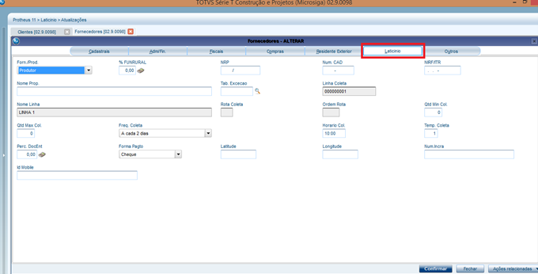{.flow-image}

- <strong>CLIENTES</strong>  
Amarração Cliente x Fornecedor para geração contas a receber

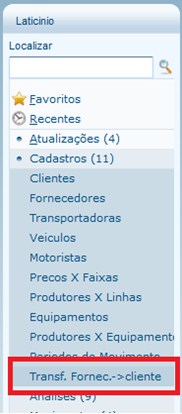{.flow-image}

- <strong>TRANSPORTADORAS</strong>: 
Devem ser cadastrados transportadores interno/externo, sistema não gera movimento para pagamento, somente gera relatório auxiliar de movimentos. Se tiver adiantamentos deve-se ser informado Fornecedor no cadastro para sistema identificar movimentação no financeiro em aberto.
- <strong>VEÍCULO</strong>: 
Cadastro Padrão
- <strong>MOTORISTA:</strong> 
Cadastro Padrão
- <strong>TES:</strong> 
<strong>1)</strong> Cadastrar as TES, analisando pontos abaixo (pré-definida já); 
<strong>1)</strong> Uma TES que não movimente estoque/duplicata SIM/Contribuição Social=SIM;
- <strong>TIPO MOVIMENTAÇÃO ESTOQUE</strong>: 
<strong>2)</strong> 001 – Entrada – pré-definida já; 
<strong>3)</strong> 501 – Saída – pré-definida já;
- <strong>NATUREZA FINANCEIRA:</strong> 
<strong>4)</strong> TÍTULO PAGAR – pré-definida já; 
<strong>5)</strong> TÍTULO RECEBER – pré-definida já; 
<strong>6)</strong> CHEQUE SOBRE-TÍTULO A PAGAR – pré-definida já; 

#### 2.1 CADASTROS ESPECIFICOS ADD-ON

- <strong>LINHA (PRODUTORES X LINHA):</strong> <strong>Um</strong> Transportador x <strong>N</strong> Linhas, podendo no movimento gerar para outro transportador.

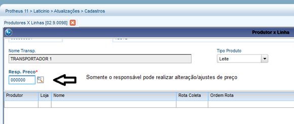{.flow-image}

- <strong>Problemas:</strong> 
  - Produtor troca de linha – deve ser deletado da linha origem e incluído na linha destino – sistema no fechamento do produtor vai gerar uma NF da linha origem (se houver movimento) e outra NF na destino.

<strong>TABELA DE PREÇO (Preços x Faixa):</strong> Pode-se definir preços por faixa de coleta ou exceções por Produtor.

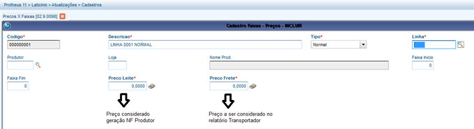{.flow-image}

Atualização de Preço definida:

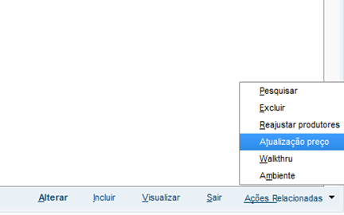{.flow-image}

Atualização de preço automatizada por exceções:

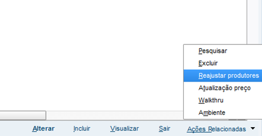{.flow-image}

- Cadastro de equipamentos: somente informativo.
-	Produtores x Equipamentos: somente informativo.
-	Período de Movimento: Valida lançamento de conta corrente e coleta produtor– após fechamento financeiro sistema encerra período de movimentação = FECHADO.

<strong>RELATÓRIOS:</strong> 
<strong>1)</strong> PRODUTORES X EQUIPAMENTOS (informativo); 
<strong>2)</strong> PLANILHA PARA COLETA DE LEITE (relatório para o transportador alimentar as quantidades na coleta com produtor); 
<strong>3)</strong> Análises Normativa 62; 
<strong>4)</strong> Resultado Análise (n62) ; 

#### 3. NORMATIVA 62

Em Atualizações -> Analises -> Normativa 62 
Informa os dados por produtor do retorno das análises da CONFEPAR, essas informações são disponibilizadas pela CONFEPAR. 

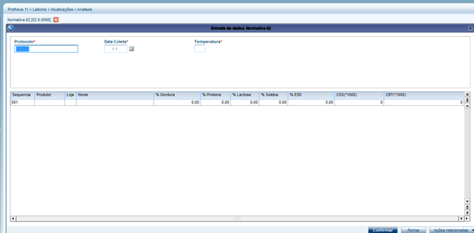{.flow-image}

Processo de importação do CSV (Deve-se enviar o coletor de leite por produtor tendo impresso no coletor o Nome do Produtor e o código do Protheus deste produtor (Fornecedor)): 

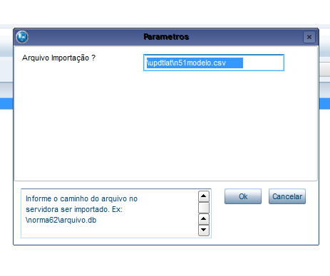{.flow-image}

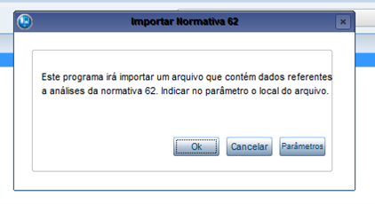{.flow-image}

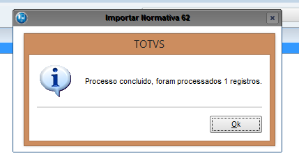{.flow-image}

<strong>Relatórios:</strong> 
Relatórios -> Análise -> Análises Normativa 62. 
Relatórios -> Análise -> Resultado Análise (n62) – utilizado para entregar ao produtor. 

#### 4. ANÁLISE INTERNA

Em Atualizações -> Analises -> Coletas a Campo. 
Inclusão dos resultados das análises internas.  
<strong>Pré-requisito:</strong> tem que ser lançada coleta de leite dos produtores antes de cadastrar Coletas a Campo.

#### 5.	ANÁLISE EXAMES REBANHO

Processo para atender as normas do ministério da saúde, meramente informativo. 
Em Atualizações -> Análises -> Exames Rebanho. 
Relatório: Em Relatórios -> Análises -> Relação Exames Rebanho. 

#### 6.	ANÁLISE F/Q Produto Final

Análise pós-produção para controle de qualidade informativo. 
Em Atualizações -> Análises -> F/Q Produto Final. 
Relatório: Em Relatórios -> Análises -> Análise F/Q Produto Final. 

#### 7.	FABRICAÇÃO DE QUEIJO

Análise pós-produção para controle de qualidade informativo. 
Em Atualizações -> Análises -> Fabricação Queijo. 
Relatório: Em Relatórios -> Análises -> Análise Fab. Queijos. 

#### 8.	CONTROLE DE VISITAS

Controle de visitas de técnicos aos produtores. 
Em Atualizações -> Análises -> Controle de Visitas. 
Relatório: Em Relatórios -> Análises -> Relatório de Visitas. 

#### 9. CONTROLE DE VACINAÇÃO

Controle de vacinação dos produtores. 
Em Atualizações -> Análises -> Controle de Vacinação. 
Relatório: Em Relatórios -> Análises -> Controle de Vacinação. 

#### 10. MOVIMENTOS DE LEITE
#### 10.1	Movimento Transportadores (Coleta)

Quando transportador chegar na instituição, o mesmo vem com o relatório de Coleta alimentado com as coletas dos produtores, neste momento geramos a inclusão do sistema. Podendo ser coletado LEITE ou SORO. 
Em Atualizações -> Movimentos -> Mov. Transportador. 

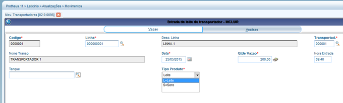{.flow-image}

Quando coletado Leite, sistema já gera movimentação interna (Estoque) da entrada do leite. 
Quando coletado Soro, sistema não gera Entrada de Estoque / pois haverá recebimento de Nota Fiscal de Entrada – pois é recebido de Empresas e não de produtores. 

<strong>Observações:</strong> 
<strong>1)</strong> Quando existe duas coletas ao mesmo produtor no dia, tem que gerar dois movimentos no sistema; 
<strong>2)</strong> Neste momento o sistema gera movimento no Estoque – caso houver produto infectado, deve ser informado quantidade que está em boa qualidade; 

Aba análises é meramente informativo. 

Processo de análise das entradas:

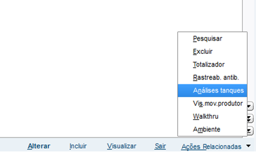{.flow-image}

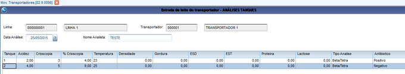{.flow-image}

Processo realiza análise por tanque do veículo e não transportador – somente informativo.

<strong>Processo de Produto infectado:</strong> 
Deve ser lançado no movimento do produtor a quantidade Zerada de Leite no produtor que gerou contaminação e os produtores do mesmo tanque – quando contamina toda carga colocar uma quantidade simbólica. 
Na inclusão do movimento transportador, tem que ser informado somente a quantidade dos tanques não contaminados, quando for caminho que tenha somente 1 tanque, a carga está completamente contaminada desta forma lança quantidade 1, comente para gerar movimento no sistema e gera-se amarração de contaminação, no processo abaixo:

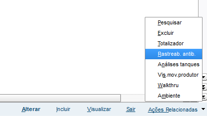{.flow-image}

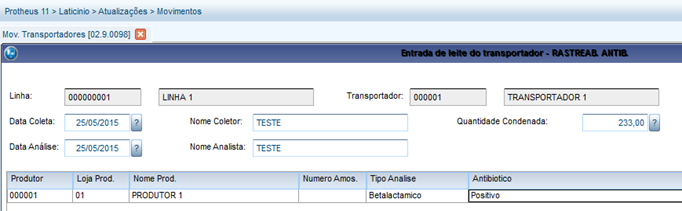{.flow-image}

<strong>Observações:</strong> Sistema não gera o controle financeiro de pagamento dos produtores que tinham coleta no tanque, porém que o leite está em boa qualidade (contas a pagar) e contrapartida geração do recebimento financeiro (contas a receber) referente ao originador da contaminação – esse processo é controlado fora do sistema/manualmente.
 
<strong>Relatório:</strong> Em Relatórios -> Análises -> Controle de Vacinação 
           Em Relatórios -> Análises -> Demonstrativo Pagto Transp. 

#### 11.	MOVIMENTO PRODUTOR (COLETA)

Em Atualizações -> Movimentos -> Movimento Produtor

<strong>Pré-requisito:</strong>  Deve ser cadastrado Períodos de Movimentos para poder cadastrar Movimento Produtor. Abaixo tela de cadastro:

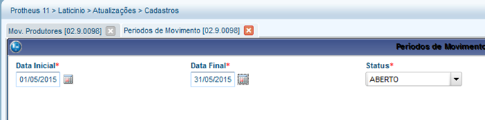{.flow-image}

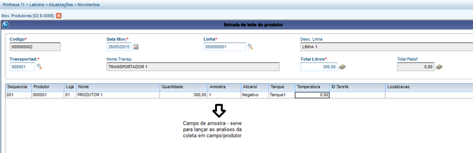{.flow-image}

Após cadastro do Movimento Produtores, conseguimos lançar Análise de Coletas a Campo, como imagem abaixo:

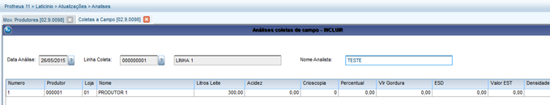{.flow-image}

Em Ações Relacionadas -> Atualizar
Será apresentada a tela abaixo.

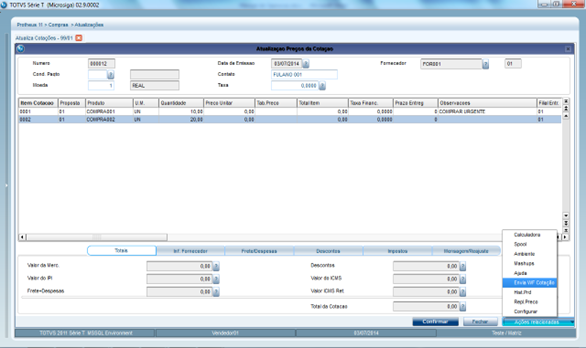{.flow-image}

<strong>Relatório:</strong>
Em Relatórios -> Movimentos -> Relação Pagamento Prod.

#### 12.	ROMANEIO BALANÇA

Em Atualizações -> Movimentos -> Romaneio Balança  

Controle portaria de veículo de transporte, gerando pesagem dos veículos, entrada e saída.
Abaixo tela de movimento:

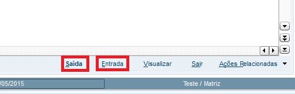{.flow-image}

Exemplo movimento de Entrada com pesagem:

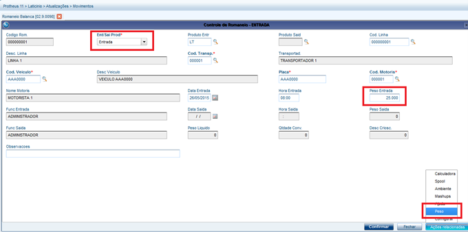{.flow-image}

Exemplo movimento de Saida com pesagem referente a entrada anterior: 
- Quando realizamos a saída referente a uma entrada anterior – caso não gerar os movimentos auxiliares serão gerados os alertas abaixo:

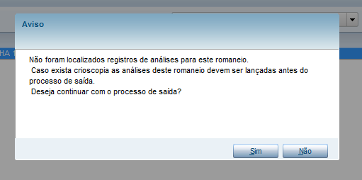{.flow-image}

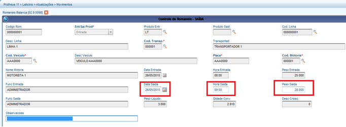{.flow-image}

- Saída de queijo:

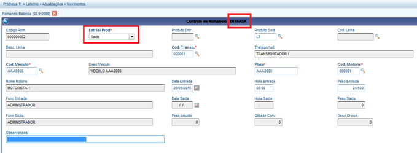{.flow-image}

<strong>Observações:</strong> 
<strong>1)</strong> Quando gerado uma ENTRADA de LEITE (somente Leite), sistema gera movimento do transportador, consequentemente movimenta estoque com esta mercadoria. 
<strong>2)</strong> Quando houver contaminação total do caminhão deve estornar a entrada do caminhão – quando contaminação for em somente um tanque (quando houver mais de um tanque) faz lançamento normal – pois o veículo vai ainda estar abastecido do Leite contaminado. 

Processo gera análise de tanque como segue abaixo:

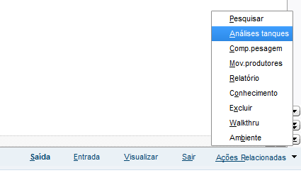{.flow-image}

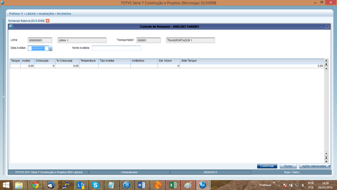{.flow-image}

Processos complementares da rotina:  
<strong>1)</strong> Movimento Produtores:

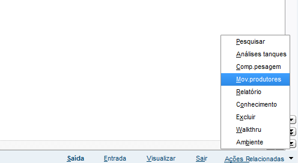{.flow-image}

#### 13.	CONTA CORRENTE

Em Atualizações -> Movimentos -> Conta Corrente

É gerado movimentos a pagar/receber dos produtores e transportadores (adiantamentos/vales/etc.) 

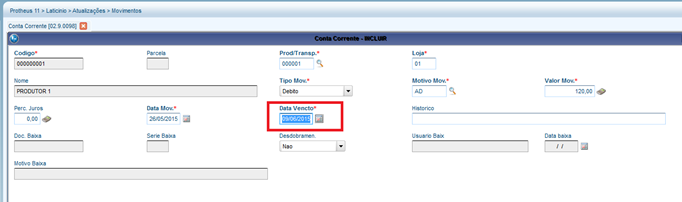{.flow-image}

<strong>Observações:</strong> Data de vencimento é calculado pela condição pagamento definida no produtor. 

<strong>Relatório:</strong> Em Relatórios -> Movimentos -> Demonstrativo Pagto Prod. 

  - Analisar parâmetro Vencimento de / Vencimento Até – pois irá analisar Contas a Receber/Pagar deste período
  - GERAR O RELATÓRIO ANTES DO FECHAMENTO PRODUTOR – pois com fechamento considera valores errados referente ao título a pagar da nf de entrada.

#### 14.	FECHAMENTO PRODUTOR

Em Atualizações -> Fechamento -> Produtores 

Geração do Fechamento Produtor, no qual considera todos os movimentos de entrada de leite para geração das Notas Fiscais de Entrada. 
Abaixo parâmetro específico a ser analisado:

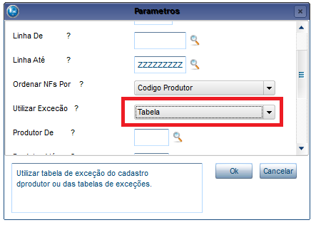{.flow-image}

  -	Este parâmetro deve sempre ser definido como Tabela – será revisto essa opção para deixar fico.

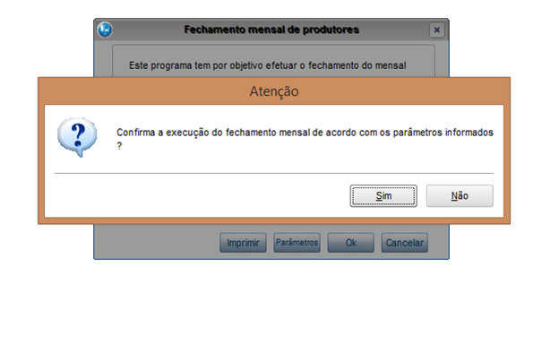{.flow-image}

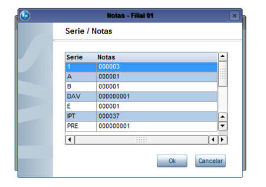{.flow-image}

  - Neste momento seleciona-se a série da Nf-e a ser gerada – todas as Nf-e geradas neste fechamento (processo) será considerada essa série e irá incrementar a numeração automaticamente/sequencialmente.
  - Deve existir sempre movimento no dia primeiro – pois se fazer fechamento e rodar novamente e não tiver lançamento no dia primeiro sistema realiza novo fechamento gerando duplicidade. (DEVE SER CORRIGIDO).
   
Será gerado Nf-e entrada para gerar financeiro a Pagar aos produtores.
 
<strong>ESTORNO FECHAMENTO PRODUTOR:</strong> 
<strong>1)</strong> Excluir Nf-e referente ao fechamento – sistema habilita automaticamente os movimentos de entrada de leite para novo fechamento.

#### 15.	FECHAMENTO FINANCEIRO

Em Atualizações -> Fechamento -> Financeiro 
 
Geração do Fechamento Financeiro, no qual considera todos os movimentos contas a Receber/Pagar (Financeiro) Produtor + Conta Corrente Pagar/Receber (ADD-ON) Produtor.
 
Parâmetros específicos cheque:

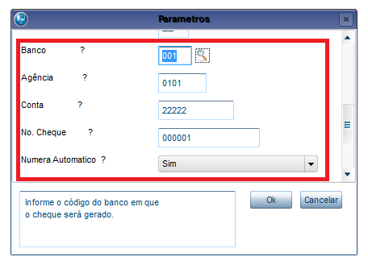{.flow-image}

- Caso produtor estiver definido no cadastro de fornecedor para receber em cheques, o fechamento vai considerar esses parâmetros para gerar os cheques ao banco definido – considerando numeração informada e tendo opção de numerar automaticamente/sequencial – caso não automático sistema gera tela para informar numeração de cada cheque. 
- Caso cliente utilize mais de um banco para pagamento de cheque – deve ser criado condições de pagamento para separar produtores do Banco X e produtores do Banco Y, vinculando Condição pagamento específica – desta forma os últimos dois parâmetros da rotina são de Condição de Pagamento – podendo tratar essa opção de geração de cheques. 
- <strong>Os parâmetros de data devem ser sempre referentes ao mês sequente do mês de movimento – pois todos os movimentos de Conta Corrente devem ser movimentados com VENCIMENTO no mês seguinte – assim como o financeiro do Fechamento Produtor é gerado para o mês seguinte dos movimentos.</strong> 
- Após geração fechamento – caso tenha pagamento de produtor com Cheques ir à rotina padrão: FINANCEIRO/RELATORIO/CONTAS A PAGAR/IMPRESSAO DE CHEQUES;

- <strong>ESTORNO FECHAMENTO FINANCEIRO:</strong>
<strong>1)</strong> Estorno Cheque (Manual). 
<strong>2)</strong> Estorno compensações (Manual). 
<strong>3)</strong> Estorno Títulos (Manual). 
<strong>4)</strong> Alterar via SDU ZLB. 
<strong>5)</strong> Realizar novo fechamento. 

#### 16.	RELATÓRIOS FECHAMENTO
- <strong>1)</strong> Relatório Conta Corrente. 
- <strong>2)</strong> Relatório Lançamento Entradas Leite (Conferência dos recebimentos). 
- <strong>3)</strong> Demonstrativo Pagamento Produtor. 
- <strong>4)</strong> Fechamento Produtor. 
- <strong>5)</strong> Fechamento Financeiro. 
- <strong>6)</strong> Geração dos Cheques/Depósitos. 
- <strong>7)</strong> Pagamento Depósito (Extrato Financeiro de títulos a pagar a produtores por linha). 
- <strong>8)</strong>	Demonstrativo Pagamento Transportador. 
- <strong>9)</strong> Relação pagamentos Transportador. 
- <strong>10)</strong> Mapas de Entrega (Demonstrar movimentos pro Transportador caso necessário). 

