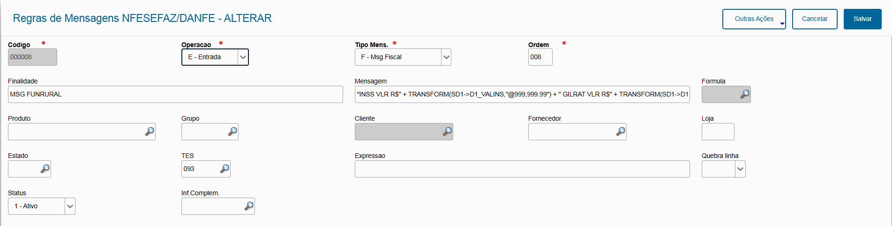

# Addon - Mensagens DANFE {.home-hero}

<!--############################################### 01 #######################################################-->

  01. Visão Geral

### 1. Visão Geral
Dentro do processo de transmissão da nota de entrada (Compas) ou de saída (Faturamento) devido a diversas características da operação, seja necessário regis-trar mensagens para o produto (informação adicional), cliente ou fiscal.

Como essas mensagens podem ser recorrentes dentro das operações da empresa, podem ocorrer diveras situações para estas mensagens que dependem mais do setor fiscal do que do faturamento, o addon permite criar uma padronização para utilização de forma autônoma dessas mensagens.

As regras de mensagens construidas no addon, permitem que dentro do processo do transmissão das notas (entrada/saída), complemente o arquivo XML que será enviado para a SEFAZ com as mensagens que entraram em conformidade dentro de alguma regra que está vinculada a uma TES.

Exemplos típicos que podem ser parametrizados

- Reducao de base de calculo prevista no item 15 do Anexo VI do RICMS/2017
- Isencao prevista no item 118 do Anexo V do RICMS/2017
- Suspensao prevista na Subsecao II da Secao II, do Capitulo I do Anexo VIII do RICMS/2017
- ATENCAO: CONFIRA A MERCADORIA NA PRESENCA DO MOTORISTA, NAO ACEITAMOS DEVOLUCOES/RECLAMACOES POSTERIORES
- ATO CONCESSORIO DRAWBACK 20220001081"

#### Este poacote de automação tem por objetivo disponibilizar configurações/regras que envolvem TES x Mensagens.

<strong>Principais vantagens do produto:</strong>

- Configurações de mensagens para operações de compra/devolução
- Configurações de mensagens para operações de venda/devolução

<!--############################################### 02 #######################################################-->

  02. Menu

### 2. Menu

<table class="banks-table">
  <thead>
    <tr>
      <th>Menu</th>
      <th>Sub Menu</th>
      <th>Nome da Rotina</th>
      <th>Programa</th>
      <th>Módulo</th>
      <th>Tipo</th>
      <th>Tabelas</th>
    </tr>
  </thead>
  <tbody>
    <tr>
      <td>Atualizações</td>
      <td>* ESPECIFICOS</td>
      <td>Mensagens DANFE</td>
      <td>C010A01</td>
      <td>Faturamento</td>
      <td>03 (Função de Usuário)</td>
      <td>SZ0</td>
    </tr>         
  </tbody>
</table>

<!--############################################### 03 #######################################################-->

  03. Rotinas personalizadas específicas do Pacote

### 3. Rotinas personalizadas específicas do Pacote

#### Funções personalizadas contidas no pacote:

<table class="banks-table">
  <thead>
    <tr>
      <th>Rotina</th>
      <th>Descrição</th>      
    </tr>
  </thead>
  <tbody>
    <tr>
      <td>C010A01</td>
      <td>Rotina para Cadastro das Regras de Mensagens DANFE</td>      
    </tr>
    <tr>
      <td>X010A01</td>
      <td>Rotina centralizadora de funções genéricas do pacote.</td>      
    </tr>
    <tr>
      <td>UPD010A</td>
      <td>Programa compatibilizador do Dicionário de Dados para aplicação do pacote</td>      
    </tr>
  </tbody>
</table>

<!--############################################### 04 #######################################################-->

  04. Pontos de Entradas Disponiveis para Desenvolvimento

### 4. Pontos de entrada Disponível no ADD-ON

<table class="banks-table">
  <thead>
    <tr>
      <th>Nome</th>
      <th>Descrição</th>
      <th>Programa Fonte</th>      
      <th>Sixtaxe</th>  
      <th>Exemplo</th>  
    </tr>
  </thead>
  <tbody>
    <tr>
      <td><strong>X010A01</strong></td>
      <td>Ponto de Entrada narotina NFESEFAZ antes damontagem e envio do XML da NFe ao Sefaz. Utilizado para efetuar a chamada das regras de validação das mensagens cadastradas do pacote. </td>
      <td>X010A01</td>      
      <td>aRetorno := U_X010A01("NFESEFAZ")</td>      
      <td>

  

    ADVPL
    X010A01
  

  <pre><code>
If ExistBlock("X010A01")
  aRetorno := U_X010A01("NFESEFAZ")
Endif
</code></pre>
  

      </td>      
    </tr>
  </tbody>
</table>

<!--############################################### 05 #######################################################-->

  05. Tabelas (SX2) 

### 5. Tabelas (SX2)

### 5. Tabelas (SX2) 

<table class="banks-table">
  <thead>
    <tr>
      <th>Prefixo</th>
      <th>Descrição</th>
      <th>Ac. Filial</th>
      <th>Ac. Unidade</th>
      <th>Ac. Empresa</th>
    </tr>
  </thead>
  <tbody>
    <tr>
      <td><strong>SZ0</strong></td>
      <td>CADASTRO DE MENSAGENS NFESEFAZ/DANFE</td>
      <td>Exclusivo</td>
      <td>Exclusivo</td>
      <td>Exclusivo</td>
    </tr>
   
  </tbody>
</table>

<!--############################################### 06 #######################################################-->

  06. Campos (SX3)

### 6. Campos (SX3)

Campo **Z0_CODIGO**

<table class="banks-table">
  <tbody>
    <tr>
      <th>Tipo</th>
      <td>C</td>
      <th>Ordem</th>
      <td>02</td>
      <th>Tamanho</th>
      <td>6</td>
      <th>Decimal</th>
      <td>0</td>
      <th>Formato</th>
      <td>@!</td>
    </tr>
    <tr>
      <th>Contexto</th>
      <td>Real</td>
      <th>Propriedade</th>
      <td>Visualizar</td>
      <th>Obrigatório</th>
      <td>S</td>
      <th>Browse</th>
      <td>S</td>
    </tr>
    <tr>
      <th>Título</th>
      <td colspan="7">Codigo</td>
    </tr>
    <tr>
      <th>Descrição</th>
      <td colspan="7">Codigo da Mensagem</td>
    </tr>
  </tbody>
</table>
#### **Help**

Codigo sequencial identificador de uma regra de mensagem.

#### **Configurações adicionais**
<table class="banks-table">
  <tbody>
    <tr>
      <th>F3</th>
      <td>-</td>
    </tr>
    <tr>
      <th>Modo Edição</th>
      <td>-</td>
    </tr>
    <tr>
      <th>Val. Usuário</th>
      <td></td>
    </tr>
    <tr>
      <th>Lista Opções</th>
      <td>-</td>
    </tr>
    <tr>
      <th>Inicializador</th>
      <td>GETSX8NUM(_010T01,_010T01COD)</td>
    </tr>
    <tr>
      <th>Ini. Browse</th>
      <td>-</td>
    </tr>
  </tbody>
</table>

Campo **Z0_OPER**

<table class="banks-table">
  <tbody>
    <tr>
      <th>Tipo</th>
      <td>C</td>
      <th>Ordem</th>
      <td>03</td>
      <th>Tamanho</th>
      <td>1</td>
      <th>Decimal</th>
      <td>0</td>
      <th>Formato</th>
      <td>@!</td>
    </tr>
    <tr>
      <th>Contexto</th>
      <td>Real</td>
      <th>Propriedade</th>
      <td>Alterar</td>
      <th>Obrigatório</th>
      <td>S</td>
      <th>Browse</th>
      <td>S</td>
    </tr>
    <tr>
      <th>Título</th>
      <td colspan="7">Operacao</td>
    </tr>
    <tr>
      <th>Descrição</th>
      <td colspan="7">Operacao da Nota</td>
    </tr>
  </tbody>
</table>
#### **Help**

Defina a operação da nota a qual se aplicará a regra.

#### **Configurações adicionais**
<table class="banks-table">
  <tbody>
    <tr>
      <th>F3</th>
      <td>-</td>
    </tr>
    <tr>
      <th>Modo Edição</th>
      <td>-</td>
    </tr>
    <tr>
      <th>Val. Usuário</th>
      <td>-</td>
    </tr>
    <tr>
      <th>Lista Opções</th>
      <td>S=Saida;E=Entrada</td>
    </tr>
    <tr>
      <th>Inicializador</th>
      <td>-</td>
    </tr>
    <tr>
      <th>Ini. Browse</th>
      <td>-</td>
    </tr>
  </tbody>
</table>

Campo **Z0_ORDEM**

<table class="banks-table">
  <tbody>
    <tr>
      <th>Tipo</th>
      <td>C</td>
      <th>Ordem</th>
      <td>04</td>
      <th>Tamanho</th>
      <td>3</td>
      <th>Decimal</th>
      <td>0</td>
      <th>Formato</th>
      <td>@!</td>
    </tr>
    <tr>
      <th>Contexto</th>
      <td>Real</td>
      <th>Propriedade</th>
      <td>Alterar</td>
      <th>Obrigatório</th>
      <td>S</td>
      <th>Browse</th>
      <td>S</td>
    </tr>
    <tr>
      <th>Título</th>
      <td colspan="7">Ordem</td>
    </tr>
    <tr>
      <th>Descrição</th>
      <td colspan="7">Sequencia das mensagens</td>
    </tr>
  </tbody>
</table>
#### **Help**

Defina a ordem sequencial para as mensagens.

#### **Configurações adicionais**
<table class="banks-table">
  <tbody>
    <tr>
      <th>F3</th>
      <td>-</td>
    </tr>
    <tr>
      <th>Modo Edição</th>
      <td>ALTERA</td>
    </tr>
    <tr>
      <th>Val. Usuário</th>
      <td>-</td>
    </tr>
    <tr>
      <th>Lista Opções</th>
      <td>-</td>
    </tr>
    <tr>
      <th>Inicializador</th>
      <td>SUBSTR(M->&_010T01COD,4,3)</td>
    </tr>
    <tr>
      <th>Ini. Browse</th>
      <td>-</td>
    </tr>
  </tbody>
</table>

Campo **Z0_TIPO**

<table class="banks-table">
  <tbody>
    <tr>
      <th>Tipo</th>
      <td>C</td>
      <th>Ordem</th>
      <td>05</td>
      <th>Tamanho</th>
      <td>1</td>
      <th>Decimal</th>
      <td>0</td>
      <th>Formato</th>
      <td>@!</td>
    </tr>
    <tr>
      <th>Contexto</th>
      <td>Real</td>
      <th>Propriedade</th>
      <td>Alterar</td>
      <th>Obrigatório</th>
      <td>-</td>
      <th>Browse</th>
      <td>-</td>
    </tr>
    <tr>
      <th>Título</th>
      <td colspan="7">Tipo Mens.</td>
    </tr>
    <tr>
      <th>Descrição</th>
      <td colspan="7">Tipo de Mensagem</td>
    </tr>
  </tbody>
</table>
#### **Help**

Defina qual retorno se aplicará a regra de mensagem: informações adicionais do produto; mensagem fiscal; mensagem de cliente

#### **Configurações adicionais**
<table class="banks-table">
  <tbody>
    <tr>
      <th>F3</th>
      <td>-</td>
    </tr>
    <tr>
      <th>Modo Edição</th>
      <td>-</td>
    </tr>
    <tr>
      <th>Val. Usuário</th>
      <td>-</td>
    </tr>
    <tr>
      <th>Lista Opções</th>
      <td>C=Cliente;F=Fiscal;P=Produto</td>
    </tr>
    <tr>
      <th>Inicializador</th>
      <td>-</td>
    </tr>
    <tr>
      <th>Ini. Browse</th>
      <td>-</td>
    </tr>
  </tbody>
</table>

Campo **Z0_INFCOMP**

<table class="banks-table">
  <tbody>
    <tr>
      <th>Tipo</th>
      <td>C</td>
      <th>Ordem</th>
      <td>06</td>
      <th>Tamanho</th>
      <td>6</td>
      <th>Decimal</th>
      <td>0</td>
      <th>Formato</th>
      <td>-</td>
    </tr>
    <tr>
      <th>Contexto</th>
      <td>Real</td>
      <th>Propriedade</th>
      <td>Alterar</td>
      <th>Obrigatório</th>
      <td>N</td>
      <th>Browse</th>
      <td>-</td>
    </tr>
    <tr>
      <th>Título</th>
      <td colspan="7">Inf.Complem.</td>
    </tr>
    <tr>
      <th>Descrição</th>
      <td colspan="7">Inf.Complementar</td>
    </tr>
  </tbody>
</table>

#### **Help**

Informações complementares

#### **Configurações adicionais**
<table class="banks-table">
  <tbody>
    <tr>
      <th>F3</th>
      <td>CCE</td>
    </tr>
    <tr>
      <th>Modo Edição</th>
      <td>-</td>
    </tr>
    <tr>
      <th>Val. Usuário</th>
      <td>ExistCPO(“CCE”)</td>
    </tr>
    <tr>
      <th>Lista Opções</th>
      <td>-</td>
    </tr>
    <tr>
      <th>Inicializador</th>
      <td>-</td>
    </tr>
    <tr>
      <th>Ini. Browse</th>
      <td>-</td>
    </tr>
  </tbody>
</table>

Campo **Z0_MSG**

<table class="banks-table">
  <tbody>
    <tr>
      <th>Tipo</th>
      <td>C</td>
      <th>Ordem</th>
      <td>07</td>
      <th>Tamanho</th>
      <td>200</td>
      <th>Decimal</th>
      <td>0</td>
      <th>Formato</th>
      <td>@!</td>
    </tr>
    <tr>
      <th>Contexto</th>
      <td>Real</td>
      <th>Propriedade</th>
      <td>Alterar</td>
      <th>Obrigatório</th>
      <td>S</td>
      <th>Browse</th>
      <td>S</d>
    </tr>
    <tr>
      <th>Título</th>
      <td colspan="7">Mensagem</td>
    </tr>
    <tr>
      <th>Descrição</th>
      <td colspan="7">Mensagem de retorno</td>
    </tr>
  </tbody>
</table>

#### **Help**

Informe o texto ou a composição da mensagem que será retornada, utilizando sintaxe ADVPL.

#### **Configurações adicionais**
<table class="banks-table">
  <tbody>
    <tr>
      <th>F3</th>
      <td>-</td>
    </tr>
    <tr>
      <th>Modo Edição</th>
      <td>Empty(M->&_010T01FRM)</td>
    </tr>
    <tr>
      <th>Val. Usuário</th>
      <td>-</td>
    </tr>
    <tr>
      <th>Lista Opções</th>
      <td>-</td>
    </tr>
    <tr>
      <th>Inicializador</th>
      <td>-</td>
    </tr>
    <tr>
      <th>Ini. Browse</th>
      <td>-</td>
    </tr>
  </tbody>
</table>

Campo **Z0_GRUPO**

<table class="banks-table">
  <tbody>
    <tr>
      <th>Tipo</th>
      <td>C</td>
      <th>Ordem</th>
      <td>10</td>
      <th>Tamanho</th>
      <td>4</td>
      <th>Decimal</th>
      <td>0</td>
      <th>Formato</th>
      <td>@!</td>
    </tr>
    <tr>
      <th>Contexto</th>
      <td>Real</td>
      <th>Propriedade</th>
      <td>Alterar</td>
      <th>Obrigatório</th>
      <td>N</td>
      <th>Browse</th>
      <td>S</td>
    </tr>
    <tr>
      <th>Título</th>
      <td colspan="7">Grupo</td>
    </tr>
    <tr>
      <th>Descrição</th>
      <td colspan="7">Grupo de Produtos</td>
    </tr>
  </tbody>
</table>

#### **Help**

Informe o código do Grupo que se aplicará a mensagem (opcional)

#### **Configurações adicionais**
<table class="banks-table">
  <tbody>
    <tr>
      <th>F3</th>
      <td>SBM</td>
    </tr>
    <tr>
      <th>Modo Edição</th>
      <td>-</td>
    </tr>
    <tr>
      <th>Val. Usuário</th>
      <td>Vazio().OR.ExistCpo("SBM")</td>
    </tr>
    <tr>
      <th>Lista Opções</th>
      <td>-</td>
    </tr>
    <tr>
      <th>Inicializador</th>
      <td>-</td>
    </tr>
    <tr>
      <th>Ini. Browse</th>
      <td>-</td>
    </tr>
  </tbody>
</table>

Campo **Z0_CLIENT**

<table class="banks-table">
  <tbody>
    <tr>
      <th>Tipo</th>
      <td>C</td>
      <th>Ordem</th>
      <td>11</td>
      <th>Tamanho</th>
      <td>9</td>
      <th>Decimal</th>
      <td>0</td>
      <th>Formato</th>
      <td>@!</td>
    </tr>
    <tr>
      <th>Contexto</th>
      <td>Real</td>
      <th>Propriedade</th>
      <td>Alterar</td>
      <th>Obrigatório</th>
      <td>N</td>
      <th>Browse</th>
      <td>S</td>
    </tr>
    <tr>
      <th>Título</th>
      <td colspan="7">Cliente</td>
    </tr>
    <tr>
      <th>Descrição</th>
      <td colspan="7">Codigo do Cliente</td>
    </tr>
  </tbody>
</table>

#### **Help**

Informe o código do Cliente que se aplicará a mensagem (opcional)

#### **Configurações adicionais**
<table class="banks-table">
  <tbody>
    <tr>
      <th>F3</th>
      <td>SA1</td>
    </tr>
    <tr>
      <th>Modo Edição</th>
      <td>M->&_010T01OPE == "S"</td>
    </tr>
    <tr>
      <th>Val. Usuário</th>
      <td>Vazio().OR.ExistCpo("SA1")</td>
    </tr>
    <tr>
      <th>Lista Opções</th>
      <td>-</td>
    </tr>
    <tr>
      <th>Inicializador</th>
      <td>-</td>
    </tr>
    <tr>
      <th>Ini. Browse</th>
      <td>-</td>
    </tr>
  </tbody>
</table>

Campo **Z0_FORNEC**

<table class="banks-table">
  <tbody>
    <tr>
      <th>Tipo</th>
      <td>C</td>
      <th>Ordem</th>
      <td>12</td>
      <th>Tamanho</th>
      <td>9</td>
      <th>Decimal</th>
      <td>0</td>
      <th>Formato</th>
      <td>@!</td>
    </tr>
    <tr>
      <th>Contexto</th>
      <td>Real</td>
      <th>Propriedade</th>
      <td>Alterar</td>
      <th>Obrigatório</th>
      <td>N</td>
      <th>Browse</th>
      <td>S</td>
    </tr>
    <tr>
      <th>Título</th>
      <td colspan="7">Fornecedor</td>
    </tr>
    <tr>
      <th>Descrição</th>
      <td colspan="7">Codigo do Fornecedor/td>
    </tr>
  </tbody>
</table>

#### **Help**

Informe o código do Fornecedor que se aplicará a mensagem (opcional)

#### **Configurações adicionais**
<table class="banks-table">
  <tbody>
    <tr>
      <th>F3</th>
      <td>SA2</td>
    </tr>
    <tr>
      <th>Modo Edição</th>
      <td>M->&_010T01OPE == "E"</td>
    </tr>
    <tr>
      <th>Val. Usuário</th>
      <td>Vazio().OR.ExistCpo("SA2")</td>
    </tr>
    <tr>
      <th>Lista Opções</th>
      <td>N=Nivel; U=Usuario; D=Documento</td>
    </tr>
    <tr>
      <th>Inicializador</th>
      <td>-</td>
    </tr>
    <tr>
      <th>Ini. Browse</th>
      <td>-</td>
    </tr>
  </tbody>
</table>

Campo **Z0_LOJA**

<table class="banks-table">
  <tbody>
    <tr>
      <th>Tipo</th>
      <td>C</td>
      <th>Ordem</th>
      <td>14</td>
      <th>Tamanho</th>
      <td>2</td>
      <th>Decimal</th>
      <td>0</td>
      <th>Formato</th>
      <td>@!</td>
    </tr>
    <tr>
      <th>Contexto</th>
      <td>Real</td>
      <th>Propriedade</th>
      <td>Alterar</td>
      <th>Obrigatório</th>
      <td>N</td>
      <th>Browse</th>
      <td>S</td>
    </tr>
    <tr>
      <th>Título</th>
      <td colspan="7">Estado</td>
    </tr>
    <tr>
      <th>Descrição</th>
      <td colspan="7">Unidade da Federacao</td>
    </tr>
  </tbody>
</table>

#### **Help**

Informe o Estado do Cliente/Fornecedor que se aplicará a mensagem (opcional)

#### **Configurações adicionais**
<table class="banks-table">
  <tbody>
    <tr>
      <th>F3</th>
      <td>12</td>
    </tr>
    <tr>
      <th>Modo Edição</th>
      <td>-</td>
    </tr>
    <tr>
      <th>Val. Usuário</th>
      <td>Vazio().OR.ExistCpo("SX5","12"+M->&_010T01UF)</td>
    </tr>
    <tr>
      <th>Lista Opções</th>
      <td>-</td>
    </tr>
    <tr>
      <th>Inicializador</th>
      <td>-</td>
    </tr>
    <tr>
      <th>Ini. Browse</th>
      <td>-</td>
    </tr>
  </tbody>
</table>

Campo **Z0_UF**

<table class="banks-table">
  <tbody>
    <tr>
      <th>Tipo</th>
      <td>C</td>
      <th>Ordem</th>
      <td>14</td>
      <th>Tamanho</th>
      <td>2</td>
      <th>Decimal</th>
      <td>0</td>
      <th>Formato</th>
      <td>@!</td>
    </tr>
    <tr>
      <th>Contexto</th>
      <td>Real</td>
      <th>Propriedade</th>
      <td>Alterar</td>
      <th>Obrigatório</th>
      <td>N</td>
      <th>Browse</th>
      <td>S</td>
    </tr>
    <tr>
      <th>Título</th>
      <td colspan="7">Estado</td>
    </tr>
    <tr>
      <th>Descrição</th>
      <td colspan="7">Unidade da Federacao</td>
    </tr>
  </tbody>
</table>

#### **Help**

Unidade da Federacao

#### **Configurações adicionais**
<table class="banks-table">
  <tbody>
    <tr>
      <th>F3</th>
      <td>12</td>
    </tr>
    <tr>
      <th>Modo Edição</th>
      <td>-</td>
    </tr>
    <tr>
      <th>Val. Usuário</th>
      <td>Vazio().OR.ExistCpo("SX5","12"+M->&_010T01UF)</td>
    </tr>
    <tr>
      <th>Lista Opções</th>
      <td>-</td>
    </tr>
    <tr>
      <th>Inicializador</th>
      <td>-</td>
    </tr>
    <tr>
      <th>Ini. Browse</th>
      <td>-</td>
    </tr>
  </tbody>
</table>

Campo **Z0_TES**

<table class="banks-table">
  <tbody>
    <tr>
      <th>Tipo</th>
      <td>C</td>
      <th>Ordem</th>
      <td>15</td>
      <th>Tamanho</th>
      <td>3</td>
      <th>Decimal</th>
      <td>0</td>
      <th>Formato</th>
      <td>@!</td>
    </tr>
    <tr>
      <th>Contexto</th>
      <td>Real</td>
      <th>Propriedade</th>
      <td>Alterar</td>
      <th>Obrigatório</th>
      <td>N</td>
      <th>Browse</th>
      <td>S</td>
    </tr>
    <tr>
      <th>Título</th>
      <td colspan="7">TES</td>
    </tr>
    <tr>
      <th>Descrição</th>
      <td colspan="7">Tipo de Entrada / Saida</td>
    </tr>
  </tbody>
</table>

#### **Help**

Informe o TES do item que se aplicará a mensagem (opcional)

#### **Configurações adicionais**
<table class="banks-table">
  <tbody>
    <tr>
      <th>F3</th>
      <td>SF4</td>
    </tr>
    <tr>
      <th>Modo Edição</th>
      <td>-</td>
    </tr>
    <tr>
      <th>Val. Usuário</th>
      <td>Vazio().OR.ExistCpo("SF4")</td>
    </tr>
    <tr>
      <th>Lista Opções</th>
      <td>-</td>
    </tr>
    <tr>
      <th>Inicializador</th>
      <td>-</td>
    </tr>
    <tr>
      <th>Ini. Browse</th>
      <td>-</td>
    </tr>
  </tbody>
</table>

Campo **Z0_EXPRES**

<table class="banks-table">
  <tbody>
    <tr>
      <th>Tipo</th>
      <td>C</td>
      <th>Ordem</th>
      <td>16</td>
      <th>Tamanho</th>
      <td>3</td>
      <th>Decimal</th>
      <td>0</td>
      <th>Formato</th>
      <td>@!</td>
    </tr>
    <tr>
      <th>Contexto</th>
      <td>Real</td>
      <th>Propriedade</th>
      <td>Alterar</td>
      <th>Obrigatório</th>
      <td>N</td>
      <th>Browse</th>
      <td>S</td>
    </tr>
    <tr>
      <th>Título</th>
      <td colspan="7">Expressao</td>
    </tr>
    <tr>
      <th>Descrição</th>
      <td colspan="7">Expressao condicional</td>
    </tr>
  </tbody>
</table>

#### **Help**

Informe uma expressão condicional para que a mensagem seja retornada (opcional), utilizando sintaxe ADVPL. Deve retornar .T./.F.

#### **Configurações adicionais**
<table class="banks-table">
  <tbody>
    <tr>
      <th>F3</th>
      <td>-</td>
    </tr>
    <tr>
      <th>Modo Edição</th>
      <td>-</td>
    </tr>
    <tr>
      <th>Val. Usuário</th>
      <td>-</td>
    </tr>
    <tr>
      <th>Lista Opções</th>
      <td>-</td>
    </tr>
    <tr>
      <th>Inicializador</th>
      <td>-</td>
    </tr>
    <tr>
      <th>Ini. Browse</th>
      <td>-</td>
    </tr>
  </tbody>
</table>

Campo **Z0_STATUS**

<table class="banks-table">
  <tbody>
    <tr>
      <th>Tipo</th>
      <td>C</td>
      <th>Ordem</th>
      <td>17</td>
      <th>Tamanho</th>
      <td>1</td>
      <th>Decimal</th>
      <td>0</td>
      <th>Formato</th>
      <td>@!</td>
    </tr>
    <tr>
      <th>Contexto</th>
      <td>Real</td>
      <th>Propriedade</th>
      <td>Alterar</td>
      <th>Obrigatório</th>
      <td>N</td>
      <th>Browse</th>
      <td>S</td>
    </tr>
    <tr>
      <th>Título</th>
      <td colspan="7">Status da Regra</td>
    </tr>
    <tr>
      <th>Descrição</th>
      <td colspan="7">Status da Regra</td>
    </tr>
  </tbody>
</table>

#### **Help**

Status da Regra

#### **Configurações adicionais**
<table class="banks-table">
  <tbody>
    <tr>
      <th>F3</th>
      <td>-</td>
    </tr>
    <tr>
      <th>Modo Edição</th>
      <td>-</td>
    </tr>
    <tr>
      <th>Val. Usuário</th>
      <td>-</td>
    </tr>
    <tr>
      <th>Lista Opções</th>
      <td>1=Ativo;2=Inativo</td>
    </tr>
    <tr>
      <th>Inicializador</th>
      <td>"1"</td>
    </tr>
    <tr>
      <th>Ini. Browse</th>
      <td>-</td>
    </tr>
  </tbody>
</table>

<!--############################################### 07 #######################################################-->

  07. Parâmetros (SX6)

### 7. Parâmetros (SX6)

<table class="banks-table">
  <thead>
    <tr>
      <th>Nome</th>
      <th>Tipo</th>   
      <th>Descrição</th>      
      <th>Conteúdo</th>         
    </tr>
  </thead>
  <tbody>
    <tr>
      <td>MV_X010T01</td>
      <td>Caracter</td>
      <td>Tabela macro-substituição utilizada. Informar qual tabela foi definida na aplicação do ADD-ON.</td>   
      <td>SZ0</td>   
    </tr>    
    <tr>
      <td>MV_X010000</td>
      <td>Lógico</td>
      <td>Ativa utilizacao do Template Mensagens NFESEFAZ.</td>   
      <td>.T.</td>   
    </tr>    
    <tr>
      <td>MV_X010001</td>
      <td>Caracter</td>
      <td>Caractere padrao para tratar a quebra de linha a  ser tratado nos fontes DANFEII.PRW / DANFEIII.PRW.</td>   
      <td>#</td>   
    </tr>      
  </tbody>
</table>

<!--############################################### 08 #######################################################-->

  08. Gatilhos (SX7)

### 8. Gatilhos (SX7)

<table class="banks-table">
  <thead>
    <tr>
      <th>Campo</th>
      <th>Sequencia</th>
      <th>Contra Dom.</th>
      <th>Tipo</th>
      <th>Regra</th>
      <th>Posiciona</th>      
      <th>Condicao</th>
    </tr>
  </thead>
  <tbody>
    <tr>
      <td><strong>Z0_INFCOMP</strong></td>
      <td>001</td>
      <td>Z0_MSG</td>
      <td>1 = Primário</td>
      <td>'"'+ALLTRIM(CCE->CCE_DESCR)+'"'</td>
      <td>S</td>      
      <td>xFilial("CCE")+M->Z0_INFCOMP</td>
    </tr>
    <tr>
      <td><strong>Z0_TIPO</strong></td>
      <td>001</td>
      <td>Z0_INFCOMP</td>
      <td>1 = Primário</td>
      <td>""</td>
      <td>N</td>      
      <td>M->Z0_TIPO <> "F"</td>
    </tr>   
  </tbody>
</table>

<!--############################################### 09 #######################################################-->

  09. Índices (SIX)

### 9. Índices (SIX)

<table class="banks-table">
  <thead>
    <tr>
      <th>Indice</th>
      <th>Ordem</th>
      <th>Chave</th>
      <th>Descrição</th>
      <th>NickName</th>      
    </tr>
  </thead>
  <tbody>
    <tr>
      <td><strong>SZ0</strong></td>
      <td>1</td>
      <td>Z0_FILIAL+Z0_OPER+Z0_TIPO+Z0_ORDEM</td>
      <td>-</td>
      <td>-</td>      
    </tr>    
    <tr>
      <td><strong>SZ0</strong></td>
      <td>2</td>
      <td>Z0_FILIAL+Z0_CODIGO</td>
      <td>-</td>
      <td>-</td>      
    </tr>  
  </tbody>
</table>

<!--############################################### 10 #######################################################-->

  10. Consulta Padrão (SXB)

### 10. Consulta Padrão (SXB)

!!! warning "Não se Aplica" 

<!--############################################### 11 #######################################################-->

  11. Manual de operação

### 11. Manual de operação

#### 1. Cadastro
Regras Mensagens DANFE

-	Módulo: Faturamento 
-	Atualizações ->Cadastros ->* Mensagens DANFE

Efetue o cadastro das mensagens e suas regras e condições para impressão no DANFE / XML.

{.flow-image}

Seu correto preenchimento é de suma importância, abaixo os campos que devem ser observados

<strong>Código:</strong> Numeração sequencial automática.

<strong>Operação da Nota:</strong> informe para qual operação de nota a mensagem se aplicará:

-	E=Entrada 
-	S=Saída

<strong>Tipo de Mensagem:</strong> informe o tipo de mensagem que está sendo definida:

-	1-Descrição do Produto: mensagem complementar que saíra na descrição do produto/item no DANFE e na tag <infAdProd>do XML. 
-	2-Mensagem Fiscal: mensagem Fiscal que sairá nos dados adicionais no DANFE (informações complementares) e na tag <infAdFisco>do XML.
-	3-Mensagem Cliente: mensagem de Cliente que sairá nos dados adicionais no DANFE (informações complementares) e na tag <infCpl>do XML.

<strong>Ordem:</strong> ordem/sequencia para impressão da mensagem, campo disponibilizado na alteração do cadastro.

<strong>Fórmula:</strong> informe o código da fórmula que definirá a composição da mensagem, caso já tenha cadastrado, obrigatório SE não informar o campo Mensagem abaixo.

<strong>Mensagem:</strong> informe a composição da mensagem em sintaxe ADVPL, obrigatório caso não informe o campo Fórmula acima.

<strong>Produto:</strong> opcional, informe um código de produto caso a mensagem deva ser considerada apenas para tal produto na nota.

<strong>Grupo de Produto:</strong> opcional, informe um código de grupo caso a mensagem deva ser considerada apenas para produtos de tal grupo na nota.

<strong>Cliente/Fornecedor/Loja:</strong> opcional, informe um código de Cliente ou Fornecedor, conforme o tipo da operação (Entrada/Saída), caso a mensagem deva ser considerada apenas para estes códigos na nota.

<strong>Estado:</strong> opcional, informe um código de Estado/UF caso a mensagem deva ser considerada apenas para cliente/fornecedor de tal código.

<strong>TES:</strong> opcional, informe um código de TES caso a mensagem deva ser considerada apenas para tal código nos itens da nota.

<strong>Expressão:</strong> opcional, informe uma expressão condicional para impressão da mensagem, em sintaxe ADVPL, deve retornar .T. / .F.

<strong>Status:</strong> informe se o cadastro da regra de mensagem está Ativo ou Inativo, onde somente as mensagens ativas serão impressas.

<strong>Finalidade:</strong> informe uma breve descrição da finalidade da mensagem.

#### 2. PROCESSO

- Efetuar o faturamento do pedido e geração da nota fiscal. 
- Efetuar a transmissão da nota eletrônica SEFAZ.
- Efetuar a impressão do DANFE.

  <a href="/" class="md-button" style="text-decoration: none;">← Voltar para a Página Inicial</a>

