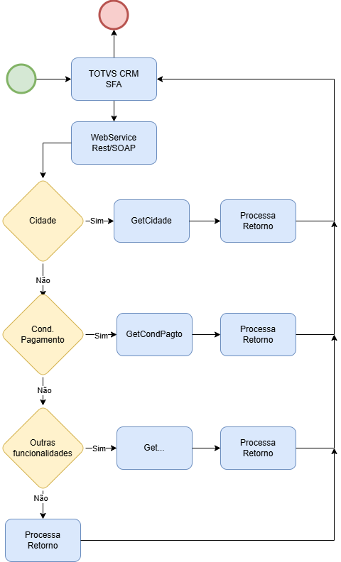

# Plugin Integração TOTVS CRM {.home-hero}

<!--############################################### 01 #######################################################-->

  01. Visão Geral

### 1. Visão Geral
Webservice para integração entre o ERP Protheus x TOTVS CRM

A plataforma de SFA da TOTVS CRM tem a característca que os dados/grupo de informações necessários para efetuar a integração com o Protheus é parametrizado diretamente na plataforma da TOTVS CRM.

A plataforma da TOTVS CRM consome um WebService onde é disponibilizado uma rotina genérica que dá acesso a diversas informações.

A chamada para o consumo do WebService é feita pelo lado da plataforma da TOTVS CRM

#### Este ADD-ON tem por objetivo permitir a integração da Plataforma de SFA da TOTVS CRM com o Protheus, permitindo a troca de informações entre as plataformas. 

<strong>Disponibiliza função genérica de busca de dados na base do cliente para que a plataforma da TOTVS CRM tenha possibilidade de ter acesso a várias informações como:</strong>

- Consultar Cidade
- Consultar Condicao Pagamento
- Consultar Cliente
- Consultar Cliente x Contato
- Consultar Estoque
- Consultar Filial
- Consultar Grupo Produto
- Consultar Nota Fiscal
- Consultar Nota Fiscal x Produto
- Consultar Pais
- Consultar Pedido
- Consultar Pedido x Produto
- Consultar Produto
- Consultar Tabela Preco
- Consultar Tabela Preco x Produto
- Consultar Titulo Receber
- Consultar Unidade Federativa
- Consultar Unidade Medida
- Consultar Vendedor
- Consultar Vendedor Cliente
- Consultar Tipo Cliente
- Consultar Tipo Nota Fiscal
- Consultar Tipo Frete Pedido
- Consultar Tipo Operacao x Item Pedido
- Consultar Tipo Titulo
- Consultar TES
- Consultar Metas Vendas
- Consultar Nota Fiscal Devolução
- Consultar Nota Fiscal Devolução x Produto
- Consultar Categoria Produto
- Consultar Categoria Produto x Produtos ou Grupos 
- Consultar Veiculo Oficina
- Consultar Ordem Servico Oficina
- Consultar Contrato Parceria
- Consultar Transportadora
- Consultar Regra Negocio
- Consultar Documento Carga GFE
- Consultar Emitente GFE
- Consultar Frete GFE

<!--############################################### 02 #######################################################-->

  02. Menu

### 2. Menu

!!! warning "A plataforma da TOTVS CRM consome um WebService onde é disponibilizado uma rotina genérica que dá acesso a diversas informações."

<!--############################################### 03 #######################################################-->

  03. Fluxo Operacional

### 3. Fluxo Operacional

{.flow-image}

<!--############################################### 04 #######################################################-->

  04. Rotinas personalizadas específicas do Pacote

### 4. Rotinas personalizadas específicas do Pacote

#### Funções personalizadas contidas no pacote:

<table class="banks-table">
  <thead>
    <tr>
      <th>Função</th>
      <th>Descrição</th>
    </tr>
  </thead>
  <tbody>
    <tr>
      <td><strong>C011A01</strong></td>
      <td>Rotina Automática para INCLUSÃO de Contratos de Parceria.</td>
    </tr>
    <tr>
      <td><strong>M011A01</strong></td>
      <td>Rotina para reprocessar Pedidos B2B que nao geraram financeiro.</td>
    </tr>
    <tr>
      <td><strong>P011A01</strong></td>
      <td>Rotina centralizadora para implementação de Pontos de Entrada do ADD-ON de Integração SFA TOTVS CRM</td>
    </tr>
    <tr>
      <td><strong>S011A01</strong></td>
      <td>WebService para integração com sistema Força de Vendas x Protheus - Exportação de Cadastros</td>
    </tr>
    <tr>
      <td><strong>S011A02</strong></td>
      <td>WebService para integração com sistema Força de Vendas x Protheus - Importação de: Pedido Venda / Pedidi Venda Exportação / Contrato de Parceria / Cliente / Contato / </td>
    </tr>
    <tr>
      <td><strong>S011A03</strong></td>
      <td>WebService para integração com sistema Força de Vendas x Protheus - GetImposto / Consulta Genérica</td>
    </tr>
    <tr>
      <td><strong>S011A04</strong></td>
      <td>WebService para integração com sistema Força de Vendas x Protheus - Incluir Orçamento</td>
    </tr>
    <tr>
      <td><strong>S011A05</strong></td>
      <td>WebService REST para integração com sistema Força de Vendas x Protheus - Incluir Pedido de Venda</td>
    </tr>
    <tr><td><strong>S011A06</strong></td>
      <td>WebService REST para integração com sistema Força de Vendas x Protheus - Consulta XML</td>
    </tr>    
    <tr><td><strong>UPD011AT</strong></td>
      <td>Compatibilizar Triggers especificas</td>
    </tr>    
    <tr><td><strong>X011A01</strong></td>
      <td>Rotina centralizadora das funções customizadas referente ao</td>
    </tr>    
    <tr><td><strong>UPD011A</strong></td>
      <td>Programa compatibilizador do Dicionário de Dados para aplicação do ADD-ON.</td>
    </tr>    
  </tbody>
</table>

<!--############################################### 05 #######################################################-->

  05.Pontos de entradas disponiveis para desenvolvimento

### 5. Pontos de entradas disponiveis para desenvolvimento

Nome **PES011A1**

<table class="pe-table-modern">  
<tbody>
<tr>
<td>Descrição</td>
<td><strong>Webservice de exportação dos cadastros</strong> 
Ponto de entrada para filtro de dados chamado em todos os métodos que retornam dados de cadastros do ERP.
</tr>
<tr>
<td>Programa Fonte</td>
<td>TODOS</td>
</tr>  
<tr>
<tr>
<td>Parâmetros</td>
<td>cMetodo: nome do método que está sendo executado, exemplo: “GetProduto”</td>
</tr>  
<tr>
<td>Retorno</td>
<td>cExp: expressão de filtro em sintaxe SQL que será inserido na cláusula WHERE para filtro dos dados.</td>
</tr>  
<td>
</td>
</tr>
<tr>
<td>Exemplo</td>
<td>

ADVPL
PES011A1

<pre><code>
User Function PES011A1()

Local cMetodo := Upper( PARAMIXB[1] )
Local cRet := ""

Do Case
Case cMetodo == "GETCIDADE"
   cRet := "CC2_EST IN ('PR','SP')"
Case cMetodo == "GETPRODUTO"
   cRet := "B1_TIPO <> 'GG' "
EndCase

Return(cRet)
</code></pre>

          
</td>          
</tr>      
</tbody>
</table>

Nome **PES011A3**

<table class="pe-table-modern">  
<tbody>
<tr>
<td>Descrição</td>
<td><strong>Webservice de exportação dos cadastros</strong> 
Ponto de entrada para filtro de dados chamado em todos os métodos que retornam dados de cadastros do ERP.
</tr>
<tr>
<td>Programa Fonte</td>
<td>TODOS</td>
</tr>  
<tr>
<tr>
<td>Parâmetros</td>
<td>cMetodo: nome do método que está sendo executado, exemplo: “GetProduto”</td>
</tr>  
<tr>
<td>Retorno</td>
<td>Array: deve retornar um array bi-dimensional no formato CAMPO e CONTEUDO.</td>
</tr>  
<td>
</td>
</tr>
<tr>
<td>Exemplo</td>
<td>

ADVPL
PES011A3

<pre><code>
User Function PES011A3()

Local aRet := {}
Local cMetodo := PARAMIXB[1]

If Upper(Alltrim(cMetodo)) == "GETPEDIDO"
	aAdd( aRet, { "C5_X_CPO1", Alltrim(SC5->C5_X_CPO1) } )
	aAdd( aRet, { "C5_X_CPO2", SC5->C5_X_CPO2 } )
	aAdd( aRet, { "C5_X_CPO3", dDatabase } )
Endif

Return(aRet)
</code></pre>

          
</td>          
</tr>      
</tbody>
</table>

Nome **PES011A4**

<table class="pe-table-modern">  
<tbody>
<tr>
<td>Descrição</td>
<td><strong>Webservice de exportação dos cadastros</strong> 
Ponto de entrada para alterar e manipular os dados retornados pelos métodos. 
OBS: inicialmente atende somente o método GETTIPOPEDIDO.
</tr>
<tr>
<td>Programa Fonte</td>
<td>TODOS</td>
</tr>  
<tr>
<tr>
<td>Parâmetros</td>
<td>PARAMIXB[1]: nome do método que está sendo executado, exemplo: “GetProduto” 
PARAMIXB[2]: referência ao array aDADOS já populado pelo método.
</td>
</tr>  
<tr>
<td>Retorno</td>
<td>Array: deve retornar um array bi-dimensional no formato cCODIGO, cCONTEUDO.</td>
</tr>  
<td>
</td>
</tr>
<tr>
<td>Exemplo</td>
<td>

ADVPL
PES011A4

<pre><code>
User Function PES011A4()

Local cMetodo := PARAMIXB[1]
Local aDados  := PARAMIXB[2]

Do Case
Case Upper(Alltrim(cMetodo)) == "GETTIPOPEDIDO"
   
   aDados := {} // Limpa os dados padroes para adicionar os específicos
   aAdd( aDados, { "VC", "VENDA"       } )
   aAdd( aDados, { "BO", "BONIFICACAO" } )
EndCase

Return(aDados)
</code></pre>

          
</td>          
</tr>      
</tbody>
</table>

Nome **PES011A6**

<table class="pe-table-modern">  
<tbody>
<tr>
<td>Descrição</td>
<td><strong>Webservice de exportação dos cadastros</strong> 
Ponto de entrada para alterar as TAGs do XML antes de exportar, executado para cada registro posicionado. 
A tabela do método já está posicionada no registro, não desposicionar. 
O conteúdo das TAGs do objeto XML pode ser alterado diretamente.
 
</tr>
<tr>
<td>Programa Fonte</td>
<td>TODOS</td>
</tr>  
<tr>
<tr>
<td>Parâmetros</td>
<td>PARAMIXB[1]: Nome do método que chamou o PE, exemplo: “GetCliente” 
PARAMIXB[2]: Objeto XML do registro posicionado
</td>
</tr>  
<tr>
<td>Retorno</td>
<td>Nil</td>
</tr>  
<td>
</td>
</tr>
<tr>
<td>Exemplo</td>
<td>

ADVPL
PES011A6

<pre><code>
User Function PES011A6()

Local cMetodo := PARAMIXB[1] // Nome do método que chamou o PE
Local oXML    := PARAMIXB[2] // Objeto XML do registro posicionado

If Upper(Alltrim(cMetodo)) == "GETCLIENTE"
   If SA1->A1_X_ATIVO == "N"
      oXML:A1_MSBLQL := "1"
   Endif
Endif

Return
</code></pre>

          
</td>          
</tr>      
</tbody>
</table>

Nome **PES011A2**

<table class="pe-table-modern">  
<tbody>
<tr>
<td>Descrição</td>
<td><strong>Webservice de Inclusão do Pedido</strong> 
Ponto de entrada chamado em três locais distintos do método/rotina de inclusão do pedido de venda, utilizando os seguintes identificadores:

- VLDANTES: início da rotina para validar se continua ou não. 
- ACABEC: após preencher o vetor aCabec (cabeçalho do pedido) para tratamento complementar sobre os campos do vetor.
- AITEM: após preencher o vetor aItem (itens do pedido) para tratamento complementar sobre os campos do vetor, disparado para cada item.
 
</tr>
<tr>
<td>Programa Fonte</td>
<td>TODOS</td>
</tr>  
<tr>
<tr>
<td>Parâmetros</td>
<td>
PARAMIXB[1]: identificador do local que está chamando o ponto de entrada, sendo: "VLDANTES", "ACABEC", "AITEM", "APOSPEDIDO". 
 
<strong>"VLDANTES":</strong> 
<ul>
  <li>PARAMIXB[2]: ponteiro para a estrutura de entrada (INPedido)</li>
  <li>PARAMIXB[3]: ponteiro para o vetor de mensagens (aMsg), sendo:</li>
  <ol>
    <li>aMsg[1]: Tipo da mensagem;</li>
    <li>aMsg[2]: Código do campo ou validação que gerou o erro;</li>
    <li>aMsg[3]: Mensagem detalhada do erro;</li>
  </ol>
</ul>

<strong>"ACABEC"</strong> 
PARAMIXB[2]: ponteiro para a estrutura vetor do cabeçalho (aCabec) 
<strong>"AITEM"</strong>  
PARAMIXB[2]: ponteiro para a estrutura vetor dos itnes (aItem) 
<strong>"APOSPEDIDO":</strong>
PARAMIXB[2]: número do pedido incluído (C5_NUM)
</td>
</tr>  
<tr>
<td>Retorno</td>
<td>Nil</td>
</tr>  
<td>
</td>
</tr>
<tr>
<td>Exemplo</td>
<td>

ADVPL
PES011A2

<pre><code>
User Function PES011A2()

Local cOrigem := Upper( PARAMIXB[1] )
Local INPedido := nil
Local aCabec := nil
Local aItem := nil
Local aMsg := nil

Do Case
Case cOrigem == "VLDANTES"
   INPedido := PARAMIXB[2]
   aMsg     := PARAMIXB[3]

   // Executa regras de validação e retorna mensagem em caso de erro
   // Exemplo:
   // If INPedido:C5_VEND1 == "999999"
   //    aAdd(aMsg,{"P","Vendedor","Vendedor inválido: 999999 "})
   // Endif

Case cOrigem == "ACABEC"
   aCabec   := PARAMIXB[2]

   // Adiciona campos específicos do cliente no cabeçalho do pedido
   // Exemplo:
   // aAdd(aCabec, {"C5_X_CAMPO", "TESTE CABEC" ,NIL} )

Case cOrigem == "AITEM"
   aItem    := PARAMIXB[2]

   // Adiciona campos específicos do cliente no Item do Pedido
   // Exemplo:
   // aAdd(aItem, {"C6_X_CAMPO", "TESTE ITEM"   ,NIL} )

Case cOrigem == "APOSPEDIDO"
   cNumPed  := PARAMIXB[2]

   // Complemento após inclusão do Pedido
   // Exemplo:
   // dbSelectArea("SC5")
   // RecLock("SC5",.F.)
   // C5_X_CPO01 := "ABC"
   // msUnlock()

EndCase

Return
</code></pre>

          
</td>          
</tr>      
</tbody>
</table>

Nome **PES011A5**

<table class="pe-table-modern">  
<tbody>
<tr>
<td>Descrição</td>
<td><strong>Webservice de Inclusão do Pedido</strong> 
Ponto de entrada para alterar a situação do Pedido. 
OBS: inicialmente atende somente o método GETPEDIDO.
</tr>
<tr>
<td>Programa Fonte</td>
<td>TODOS</td>
</tr>  
<tr>
<tr>
<td>Parâmetros</td>
<td>PARAMIXB[1]: nome do método que está sendo executado, exemplo: “GetPedido” 
PARAMIXB[2]: situação atual do Pedido
</td>
</tr>  
<tr>
<td>Retorno</td>
<td>Caracter: deve retornar a nova situação do Pedido</td>
</tr>  
<td>
</td>
</tr>
<tr>
<td>Exemplo</td>
<td>

ADVPL
PES011A5

<pre><code>
User Function PES011A5()

Local cMetodo := PARAMIXB[1]
Local cRet    := PARAMIXB[2]

If Upper(Alltrim(cMetodo)) == "GETPEDIDO"
   Do Case
      Case Alltrim(SC5->C5_NOTA) <> "" .and. ! SC5->(Deleted()) // FATURADO
         cRet := "PF"
		
      Case SC5->(Deleted()) // CANCELADO
         cRet := "PC"
			
      Case Alltrim(SC5->C5_NOTA) == "" .and. ! SC5->(Deleted()) // ABERTO
         cRet := "PA"	
   End Case
Endif

Return(cRet)
</code></pre>

          
</td>          
</tr>      
</tbody>
</table>

Nome **PES011A7**

<table class="pe-table-modern">  
<tbody>
<tr>
<td>Descrição</td>
<td><Strong>Webservice de Inclusão de Vendas – Venda Assistida</Strong> 
Ponto de entrada chamado em três locais distintos do método/rotina de inclusão do pedido de venda, utilizando os seguintes identificadores: 
<ul>
  <li>VLDANTES: início da rotina para validar se continua ou não.</li>
  <li>ACABEC: após preencher o vetor aCabec (cabeçalho do pedido) para tratamento complementar sobre os campos do vetor.</li>
  <li>AITEM: após preencher o vetor aItem (itens do pedido) para tratamento complementar sobre os campos do vetor, disparado para cada item.</li>
  <li>AFORMA: após preencher o vetor aForma (formas de pagamentos da venda) para tratamento complementar sobre os campos do vetor, disparado para forma de pagamento considerada.</li>
</ul>
</tr>
<tr>
<td>Programa Fonte</td>
<td>TODOS</td>
</tr>  
<tr>
<tr>
<td>Parâmetros</td>
<td>PARAMIXB[1]: identificador do local que está chamando o ponto de entrada, sendo: "VLDANTES", "ACABEC", "AITEM", ”AFORMA”, "APOSVENDA". 
 
<strong>Se for "VLDANTES": </strong>
<ul>
  <li>PARAMIXB[2]: ponteiro para a estrutura de entrada (INVENDAASSISTIDA)</li>
  <li>PARAMIXB[3]: ponteiro para o vetor de mensagens (aMsg), sendo:</li>
  <ol>
      <li>aMsg[1]: Tipo da mensagem;</li>
      <li>aMsg[2]: Código do campo ou validação que gerou o erro;</li>
      <li>aMsg[3]: Mensagem detalhada do erro;</li>
  </ol>
</ul>
<strong>Se for "ACABEC": </strong>
<ul>
  <li>PARAMIXB[2]: ponteiro para a estrutura vetor do cabeçalho (aCabec)</li>
</ul>
<strong>Se for "AITEM": </strong>
<ul>
  <li>PARAMIXB[2]: ponteiro para a estrutura vetor dos itens (aItem)</li>
</ul>
<strong>Se for "AFORMA": </strong>
<ul>
  <li>PARAMIXB[2]: ponteiro para a estrutura vetor das formas de pagamento (aForma)</li>
 </ul>
<strong>Se for "APOSVENDA": </strong>
<ul>
  <li>PARAMIXB[2]: número da Venda/Orçamento (L1_NUM/LQ_NUM)</li>
 </ul>
</td>
</tr>  
<tr>
<td>Retorno</td>
<td>Nil</td>
</tr>  
<td>
</td>
</tr>
<tr>
<td>Exemplo</td>
<td>

ADVPL
PES011A7

<pre><code>
User Function PES011A7()

Local cOrigem := Upper( PARAMIXB[1] )
Local INVenda := nil
Local aCabec := nil
Local aItem := nil
Local aForma := nil
Local aMsg := nil

Do Case
Case cOrigem == "VLDANTES"
   INVenda := PARAMIXB[2]
   aMsg     := PARAMIXB[3]

   // Executa regras de validação e retorna mensagem em caso de erro
   // Exemplo:
   // If INVenda:LQ_NUM == "999999"
   //    aAdd(aMsg,{"P","Vendedor","Vendedor inválido: 999999 "})
   // Endif

Case cOrigem == "ACABEC"
   aCabec   := PARAMIXB[2]

   // Adiciona campos específicos do cliente no cabeçalho do pedido
   // Exemplo:
   // aAdd(aCabec, {"LQ_X_CAMPO", "TESTE CABEC" ,NIL} )

Case cOrigem == "AITEM"
   aItem    := PARAMIXB[2]

   // Adiciona campos específicos do cliente no Item da Venda
   // Exemplo:
   // aAdd(aItem, {"LQ_X_CAMPO", "TESTE ITEM"   ,NIL} )

Case cOrigem == "APOSVENDA"
   cNumVen  := PARAMIXB[2]

   // Complemento após inclusão da Venda
   // Exemplo:
   // dbSelectArea("SL1")
   // RecLock("SL1",.F.)
   // L1_X_CPO01 := "ABC"
   // msUnlock()

EndCase

Return
</code></pre>

          
</td>          
</tr>      
</tbody>
</table>

<!--############################################### 06 #######################################################-->

  06. Pontos de entradas padrões

### 2. Pontos de entradas padrões

!!! warning "Não se aplica."

<!--############################################### 07 #######################################################-->

  07. Campos (SX3)

### 7. Campos (SX3)

Campo **B1_X_SIM3G**

<strong>SB1 - CADASTRO DE PRODUTOS</strong>
<table class="banks-table">
  <tbody>
    <tr>
      <th>Tipo</th>
      <td>C</td>
      <th>Ordem</th>
      <td>[última]</td>
      <th>Tamanho</th>
      <td>1</td>
      <th>Decimal</th>
      <td>0</td>
      <th>Formato</th>
      <td>@!</td>
    </tr>
    <tr>
      <th>Contexto</th>
      <td>Real</td>
      <th>Propriedade</th>
      <td>Alterar</td>
      <th>Obrigatório</th>
      <td>N</td>
      <th>Browse</th>
      <td>N</td>
    </tr>
    <tr>
      <th>Título</th>
      <td colspan="7">Integ. SIM3G?</td>
    </tr>
    <tr>
      <th>Descrição</th>
      <td colspan="7">Integração com SIM3G?</td>
    </tr>
  </tbody>
</table>
#### **Help**

Define se o cadastro será disponibilizado na integração com SIM3G.

#### **Configurações adicionais**
<table class="banks-table">
  <tbody>
    <tr>
      <th>F3</th>
      <td>-</td>
    </tr>
    <tr>
      <th>Modo Edição</th>
      <td>-</td>
    </tr>
    <tr>
      <th>Val. Usuário</th>
      <td>-</td>
    </tr>
    <tr>
      <th>Lista Opções</th>
      <td>S=Sim;N=Não;</td>
    </tr>
    <tr>
      <th>Inicializador</th>
      <td>"S"</td>
    </tr>
    <tr>
      <th>Ini. Browse</th>
      <td>-</td>
    </tr>
  </tbody>
</table>

Campo **BM_X_SIM3G**

<strong>SB1 - CADASTRO DE PRODUTOS</strong>
<table class="banks-table">
  <tbody>
    <tr>
      <th>Tipo</th>
      <td>C</td>
      <th>Ordem</th>
      <td>[última]</td>
      <th>Tamanho</th>
      <td>1</td>
      <th>Decimal</th>
      <td>0</td>
      <th>Formato</th>
      <td>@!</td>
    </tr>
    <tr>
      <th>Contexto</th>
      <td>Real</td>
      <th>Propriedade</th>
      <td>Alterar</td>
      <th>Obrigatório</th>
      <td>N</td>
      <th>Browse</th>
      <td>N</td>
    </tr>
    <tr>
      <th>Título</th>
      <td colspan="7">Integ. SIM3G?</td>
    </tr>
    <tr>
      <th>Descrição</th>
      <td colspan="7">Integração com SIM3G?</td>
    </tr>
  </tbody>
</table>
#### **Help**

Define se o cadastro será disponibilizado na integração com SIM3G.

#### **Configurações adicionais**
<table class="banks-table">
  <tbody>
    <tr>
      <th>F3</th>
      <td>-</td>
    </tr>
    <tr>
      <th>Modo Edição</th>
      <td>-</td>
    </tr>
    <tr>
      <th>Val. Usuário</th>
      <td>-</td>
    </tr>
    <tr>
      <th>Lista Opções</th>
      <td>S=Sim;N=Não;</td>
    </tr>
    <tr>
      <th>Inicializador</th>
      <td>-</td>
    </tr>
    <tr>
      <th>Ini. Browse</th>
      <td>"S"</td>
    </tr>
  </tbody>
</table>

Campo **A1_X_SIM3G**

<strong>SA1 - CADASTRO DE CLIENTES</strong>
<table class="banks-table">
  <tbody>
    <tr>
      <th>Tipo</th>
      <td>C</td>
      <th>Ordem</th>
      <td>[última]</td>
      <th>Tamanho</th>
      <td>1</td>
      <th>Decimal</th>
      <td>0</td>
      <th>Formato</th>
      <td>-</td>
    </tr>
    <tr>
      <th>Contexto</th>
      <td>Real</td>
      <th>Propriedade</th>
      <td>Alterar</td>
      <th>Obrigatório</th>
      <td>N</td>
      <th>Browse</th>
      <td>N</td>
    </tr>
    <tr>
      <th>Título</th>
      <td colspan="7">Integ. SIM3G?</td>
    </tr>
    <tr>
      <th>Descrição</th>
      <td colspan="7">Integração com SIM3G?</td>
    </tr>
  </tbody>
</table>
#### **Help**

Define se o cadastro será disponibilizado na integração com SIM3G.

#### **Configurações adicionais**
<table class="banks-table">
  <tbody>
    <tr>
      <th>F3</th>
      <td>-</td>
    </tr>
    <tr>
      <th>Modo Edição</th>
      <td>-</td>
    </tr>
    <tr>
      <th>Val. Usuário</th>
      <td>-</td>
    </tr>
    <tr>
      <th>Lista Opções</th>
      <td>S=Sim;N=Não;</td>
    </tr>
    <tr>
      <th>Inicializador</th>
      <td>-</td>
    </tr>
    <tr>
      <th>Ini. Browse</th>
      <td>-</td>
    </tr>
  </tbody>
</table>

Campo **A3_X_SIM3G**

<strong>SA3 - CADASTRO DE VENDEDORES</strong>
<table class="banks-table">
  <tbody>
    <tr>
      <th>Tipo</th>
      <td>c</td>
      <th>Ordem</th>
      <td>[última]</td>
      <th>Tamanho</th>
      <td>1</td>
      <th>Decimal</th>
      <td>0</td>
      <th>Formato</th>
      <td>@!</td>
    </tr>
    <tr>
      <th>Contexto</th>
      <td>R</td>
      <th>Propriedade</th>
      <td>A</td>
      <th>Obrigatório</th>
      <td>N</td>
      <th>Browse</th>
      <td>N</td>
    </tr>
    <tr>
      <th>Título</th>
      <td colspan="7">Integ. SIM3G?</td>
    </tr>
    <tr>
      <th>Descrição</th>
      <td colspan="7">Integração com SIM3G?</td>
    </tr>
  </tbody>
</table>
#### **Help**

Define se o cadastro será disponibilizado na integração com SIM3G.

#### **Configurações adicionais**
<table class="banks-table">
  <tbody>
    <tr>
      <th>F3</th>
      <td>-</td>
    </tr>
    <tr>
      <th>Modo Edição</th>
      <td>-</td>
    </tr>
    <tr>
      <th>Val. Usuário</th>
      <td>-</td>
    </tr>
    <tr>
      <th>Lista Opções</th>
      <td>S=Sim;N=Não;</td>
    </tr>
    <tr>
      <th>Inicializador</th>
      <td>"S"</td>
    </tr>
    <tr>
      <th>Ini. Browse</th>
      <td>-</td>
    </tr>
  </tbody>
</table>

Campo **E4_X_SIM3G**

<strong>SE4 - CONDIÇÕES DE PAGAMENTO</strong>
<table class="banks-table">
  <tbody>
    <tr>
      <th>Tipo</th>
      <td>C</td>
      <th>Ordem</th>
      <td>[última]</td>
      <th>Tamanho</th>
      <td>1</td>
      <th>Decimal</th>
      <td>0</td>
      <th>Formato</th>
      <td>@!</td>
    </tr>
    <tr>
      <th>Contexto</th>
      <td>R</td>
      <th>Propriedade</th>
      <td>A</td>
      <th>Obrigatório</th>
      <td>N</td>
      <th>Browse</th>
      <td>N</td>
    </tr>
    <tr>
      <th>Título</th>
      <td colspan="7">Integ. SIM3G?</td>
    </tr>
    <tr>
      <th>Descrição</th>
      <td colspan="7">Integração com SIM3G?</td>
    </tr>
  </tbody>
</table>

#### **Help**

Define se o cadastro será disponibilizado na integração com SIM3G

#### **Configurações adicionais**
<table class="banks-table">
  <tbody>
    <tr>
      <th>F3</th>
      <td>-</td>
    </tr>
    <tr>
      <th>Modo Edição</th>
      <td>-</td>
    </tr>
    <tr>
      <th>Val. Usuário</th>
      <td>-</td>
    </tr>
    <tr>
      <th>Lista Opções</th>
      <td>S=Sim;N=Não;</td>
    </tr>
    <tr>
      <th>Inicializador</th>
      <td>"S"</td>
    </tr>
    <tr>
      <th>Ini. Browse</th>
      <td>-</td>
    </tr>
  </tbody>
</table>

Campo **DA0_X_SIM3**

<strong>DA0 - TABELA DE PREÇOS</strong>
<table class="banks-table">
  <tbody>
    <tr>
      <th>Tipo</th>
      <td>C</td>
      <th>Ordem</th>
      <td>[última]</td>
      <th>Tamanho</th>
      <td>1</td>
      <th>Decimal</th>
      <td>0</td>
      <th>Formato</th>
      <td>@!</td>
    </tr>
    <tr>
      <th>Contexto</th>
      <td>Real</td>
      <th>Propriedade</th>
      <td>Alterar</td>
      <th>Obrigatório</th>
      <td>N</td>
      <th>Browse</th>
      <td>N</d>
    </tr>
    <tr>
      <th>Título</th>
      <td colspan="7">Integ. SIM3G?</td>
    </tr>
    <tr>
      <th>Descrição</th>
      <td colspan="7">Integração com SIM3G?</td>
    </tr>
  </tbody>
</table>

#### **Help**

Define se o cadastro será disponibilizado na integração com SIM3G

#### **Configurações adicionais**
<table class="banks-table">
  <tbody>
    <tr>
      <th>F3</th>
      <td>-</td>
    </tr>
    <tr>
      <th>Modo Edição</th>
      <td>-</td>
    </tr>
    <tr>
      <th>Val. Usuário</th>
      <td>-</td>
    </tr>
    <tr>
      <th>Lista Opções</th>
      <td>S=Sim;N=Não;</td>
    </tr>
    <tr>
      <th>Inicializador</th>
      <td>"S"</td>
    </tr>
    <tr>
      <th>Ini. Browse</th>
      <td>-</td>
    </tr>
  </tbody>
</table>

Campo **DA1_X_SIM3**

<strong>DA1 - ITEM TABELA DE PREÇOS</strong>
<table class="banks-table">
  <tbody>
    <tr>
      <th>Tipo</th>
      <td>C</td>
      <th>Ordem</th>
      <td>[última]</td>
      <th>Tamanho</th>
      <td>1</td>
      <th>Decimal</th>
      <td>0</td>
      <th>Formato</th>
      <td>@!</td>
    </tr>
    <tr>
      <th>Contexto</th>
      <td>Real</td>
      <th>Propriedade</th>
      <td>Alterar</td>
      <th>Obrigatório</th>
      <td>N</td>
      <th>Browse</th>
      <td>N</td>
    </tr>
    <tr>
      <th>Título</th>
      <td colspan="7">Integ. SIM3G?</td>
    </tr>
    <tr>
      <th>Descrição</th>
      <td colspan="7">Integração com SIM3G?</td>
    </tr>
  </tbody>
</table>

#### **Help**

Define se o cadastro será disponibilizado na integração com SIM3G

#### **Configurações adicionais**
<table class="banks-table">
  <tbody>
    <tr>
      <th>F3</th>
      <td>-</td>
    </tr>
    <tr>
      <th>Modo Edição</th>
      <td>-</td>
    </tr>
    <tr>
      <th>Val. Usuário</th>
      <td>-</td>
    </tr>
    <tr>
      <th>Lista Opções</th>
      <td>S=Sim;N=Não;</td>
    </tr>
    <tr>
      <th>Inicializador</th>
      <td>"S"</td>
    </tr>
    <tr>
      <th>Ini. Browse</th>
      <td>-</td>
    </tr>
  </tbody>
</table>

Campo **NNR_X_SIM3**

<strong>NNR – LOCAIS/ARMAZÉNS DE ESTOQUE</strong>
<table class="banks-table">
  <tbody>
    <tr>
      <th>Tipo</th>
      <td>C</td>
      <th>Ordem</th>
      <td>[última]</td>
      <th>Tamanho</th>
      <td>1</td>
      <th>Decimal</th>
      <td>0</td>
      <th>Formato</th>
      <td>@!</td>
    </tr>
    <tr>
      <th>Contexto</th>
      <td>Real</td>
      <th>Propriedade</th>
      <td>Alterar</td>
      <th>Obrigatório</th>
      <td>N</td>
      <th>Browse</th>
      <td>N</td>
    </tr>
    <tr>
      <th>Título</th>
      <td colspan="7">Integ. SIM3G?</td>
    </tr>
    <tr>
      <th>Descrição</th>
      <td colspan="7">Integração com SIM3G?</td>
    </tr>
  </tbody>
</table>

#### **Help**

Define se o cadastro será disponibilizado na integração com SIM3G

#### **Configurações adicionais**
<table class="banks-table">
  <tbody>
    <tr>
      <th>F3</th>
      <td>-</td>
    </tr>
    <tr>
      <th>Modo Edição</th>
      <td>-</td>
    </tr>
    <tr>
      <th>Val. Usuário</th>
      <td>-</td>
    </tr>
    <tr>
      <th>Lista Opções</th>
      <td>S=Sim;N=Não;</td>
    </tr>
    <tr>
      <th>Inicializador</th>
      <td>"S"</td>
    </tr>
    <tr>
      <th>Ini. Browse</th>
      <td>-</td>
    </tr>
  </tbody>
</table>

Campo **A4_X_SIM3G**

<strong>SA4 - CADASTRO DE TRANSPORTADORA</strong>
<table class="banks-table">
  <tbody>
    <tr>
      <th>Tipo</th>
      <td>C</td>
      <th>Ordem</th>
      <td>[última]</td>
      <th>Tamanho</th>
      <td>1</td>
      <th>Decimal</th>
      <td>0</td>
      <th>Formato</th>
      <td>@!</td>
    </tr>
    <tr>
      <th>Contexto</th>
      <td>Real</td>
      <th>Propriedade</th>
      <td>Alterar</td>
      <th>Obrigatório</th>
      <td>N</td>
      <th>Browse</th>
      <td>N</td>
    </tr>
    <tr>
      <th>Título</th>
      <td colspan="7">Integ. SIM3G?</td>
    </tr>
    <tr>
      <th>Descrição</th>
      <td colspan="7">Integração com SIM3G?</td>
    </tr>
  </tbody>
</table>

#### **Help**

Define se o cadastro será disponibilizado na integração com SIM3G

#### **Configurações adicionais**
<table class="banks-table">
  <tbody>
    <tr>
      <th>F3</th>
      <td>-</td>
    </tr>
    <tr>
      <th>Modo Edição</th>
      <td>-</td>
    </tr>
    <tr>
      <th>Val. Usuário</th>
      <td>-</td>
    </tr>
    <tr>
      <th>Lista Opções</th>
      <td>S=Sim;N=Não;</td>
    </tr>
    <tr>
      <th>Inicializador</th>
      <td>"S"</td>
    </tr>
    <tr>
      <th>Ini. Browse</th>
      <td>-</td>
    </tr>
  </tbody>
</table>

Campo **C5_X_PVSIM**

<strong>SC5 - PEDIDOS DE VENDA</strong>
<table class="banks-table">
  <tbody>
    <tr>
      <th>Tipo</th>
      <td>C</td>
      <th>Ordem</th>
      <td>[última]</td>
      <th>Tamanho</th>
      <td>6</td>
      <th>Decimal</th>
      <td>0</td>
      <th>Formato</th>
      <td>@!</td>
    </tr>
    <tr>
      <th>Contexto</th>
      <td>Real</td>
      <th>Propriedade</th>
      <td>Visualizar</td>
      <th>Obrigatório</th>
      <td>N</td>
      <th>Browse</th>
      <td>N</td>
    </tr>
    <tr>
      <th>Título</th>
      <td colspan="7">Ped. SIM3G</td>
    </tr>
    <tr>
      <th>Descrição</th>
      <td colspan="7">Numero do Pedido no SIM3G</td>
    </tr>
  </tbody>
</table>

#### **Help**

ID do pedido de venda importado do SIM3G

#### **Configurações adicionais**
<table class="banks-table">
  <tbody>
    <tr>
      <th>F3</th>
      <td>-</td>
    </tr>
    <tr>
      <th>Modo Edição</th>
      <td>.F.</td>
    </tr>
    <tr>
      <th>Val. Usuário</th>
      <td>-</td>
    </tr>
    <tr>
      <th>Lista Opções</th>
      <td>-</td>
    </tr>
    <tr>
      <th>Inicializador</th>
      <td>-</td>
    </tr>
    <tr>
      <th>Ini. Browse</th>
      <td>-</td>
    </tr>
  </tbody>
</table>

Campo **C5_X_PVSIM**

<strong>SC5 - PEDIDOS DE VENDA</strong>
<table class="banks-table">
  <tbody>
    <tr>
      <th>Tipo</th>
      <td>C</td>
      <th>Ordem</th>
      <td>[última]</td>
      <th>Tamanho</th>
      <td>6</td>
      <th>Decimal</th>
      <td>0</td>
      <th>Formato</th>
      <td>@!</td>
    </tr>
    <tr>
      <th>Contexto</th>
      <td>Real</td>
      <th>Propriedade</th>
      <td>Visualizar</td>
      <th>Obrigatório</th>
      <td>N</td>
      <th>Browse</th>
      <td>N</td>
    </tr>
    <tr>
      <th>Título</th>
      <td colspan="7">Ped. SIM3G</td>
    </tr>
    <tr>
      <th>Descrição</th>
      <td colspan="7">Numero do Pedido no SIM3G</td>
    </tr>
  </tbody>
</table>

#### **Help**

ID do pedido de venda importado do SIM3G

#### **Configurações adicionais**
<table class="banks-table">
  <tbody>
    <tr>
      <th>F3</th>
      <td>-</td>
    </tr>
    <tr>
      <th>Modo Edição</th>
      <td>.F.</td>
    </tr>
    <tr>
      <th>Val. Usuário</th>
      <td>-</td>
    </tr>
    <tr>
      <th>Lista Opções</th>
      <td>-</td>
    </tr>
    <tr>
      <th>Inicializador</th>
      <td>-</td>
    </tr>
    <tr>
      <th>Ini. Browse</th>
      <td>-</td>
    </tr>
  </tbody>
</table>

Campo **L1_X_PVSIM**

<strong>SL1 – VENDA ASSISTIDA</strong>
<table class="banks-table">
  <tbody>
    <tr>
      <th>Tipo</th>
      <td>C</td>
      <th>Ordem</th>
      <td>[última]</td>
      <th>Tamanho</th>
      <td>6</td>
      <th>Decimal</th>
      <td>0</td>
      <th>Formato</th>
      <td>@!</td>
    </tr>
    <tr>
      <th>Contexto</th>
      <td>Real</td>
      <th>Propriedade</th>
      <td>Visualizar</td>
      <th>Obrigatório</th>
      <td>N</td>
      <th>Browse</th>
      <td>N</td>
    </tr>
    <tr>
      <th>Título</th>
      <td colspan="7">Ped. SIM3G</td>
    </tr>
    <tr>
      <th>Descrição</th>
      <td colspan="7">Numero do Pedido no SIM3G</td>
    </tr>
  </tbody>
</table>

#### **Help**

ID do pedido de venda importado do SIM3G.

#### **Configurações adicionais**
<table class="banks-table">
  <tbody>
    <tr>
      <th>F3</th>
      <td>-</td>
    </tr>
    <tr>
      <th>Modo Edição</th>
      <td>.F.</td>
    </tr>
    <tr>
      <th>Val. Usuário</th>
      <td>-</td>
    </tr>
    <tr>
      <th>Lista Opções</th>
      <td>-</td>
    </tr>
    <tr>
      <th>Inicializador</th>
      <td>-</td>
    </tr>
    <tr>
      <th>Ini. Browse</th>
      <td>-</td>
    </tr>
  </tbody>
</table>

Campo **LQ_X_PVSIM**

<strong>SLQ – VENDA ASSISTIDA</strong>
<table class="banks-table">
  <tbody>
    <tr>
      <th>Tipo</th>
      <td>C</td>
      <th>Ordem</th>
      <td>[última]</td>
      <th>Tamanho</th>
      <td>6</td>
      <th>Decimal</th>
      <td>0</td>
      <th>Formato</th>
      <td>@!</td>
    </tr>
    <tr>
      <th>Contexto</th>
      <td>Real</td>
      <th>Propriedade</th>
      <td>Visualizar</td>
      <th>Obrigatório</th>
      <td>N</td>
      <th>Browse</th>
      <td>N</td>
    </tr>
    <tr>
      <th>Título</th>
      <td colspan="7">Ped. SIM3G</td>
    </tr>
    <tr>
      <th>Descrição</th>
      <td colspan="7">Numero do Pedido no SIM3G</td>
    </tr>
  </tbody>
</table>

#### **Help**

ID do pedido de venda importado do SIM3G.

#### **Configurações adicionais**
<table class="banks-table">
  <tbody>
    <tr>
      <th>F3</th>
      <td>-</td>
    </tr>
    <tr>
      <th>Modo Edição</th>
      <td>.F.</td>
    </tr>
    <tr>
      <th>Val. Usuário</th>
      <td>-</td>
    </tr>
    <tr>
      <th>Lista Opções</th>
      <td>-</td>
    </tr>
    <tr>
      <th>Inicializador</th>
      <td>-</td>
    </tr>
    <tr>
      <th>Ini. Browse</th>
      <td>-</td>
    </tr>
  </tbody>
</table>

Campo **ADA_X_NSIM**

<strong>ADA - CONTRATOS DE PARCERIA</strong>
<table class="banks-table">
  <tbody>
    <tr>
      <th>Tipo</th>
      <td>N</td>
      <th>Ordem</th>
      <td>[última]</td>
      <th>Tamanho</th>
      <td>6</td>
      <th>Decimal</th>
      <td>0</td>
      <th>Formato</th>
      <td>@!</td>
    </tr>
    <tr>
      <th>Contexto</th>
      <td>Real</td>
      <th>Propriedade</th>
      <td>Visualizar</td>
      <th>Obrigatório</th>
      <td>N</td>
      <th>Browse</th>
      <td>N</td>
    </tr>
    <tr>
      <th>Título</th>
      <td colspan="7">Num. SIM3G</td>
    </tr>
    <tr>
      <th>Descrição</th>
      <td colspan="7">Numero do Contrato no SIM3G</td>
    </tr>
  </tbody>
</table>

#### **Help**

ID do contrato importado do SIM3G.

#### **Configurações adicionais**
<table class="banks-table">
  <tbody>
    <tr>
      <th>F3</th>
      <td>-</td>
    </tr>
    <tr>
      <th>Modo Edição</th>
      <td>.F.</td>
    </tr>
    <tr>
      <th>Val. Usuário</th>
      <td>-</td>
    </tr>
    <tr>
      <th>Lista Opções</th>
      <td>-</td>
    </tr>
    <tr>
      <th>Inicializador</th>
      <td>-</td>
    </tr>
    <tr>
      <th>Ini. Browse</th>
      <td>-</td>
    </tr>
  </tbody>
</table>

<!--############################################### 08 #######################################################-->

  08. Parâmetros (SX6)

### 8. Parâmetros (SX6)
!!! warning "Não se aplica."
   

<!--############################################### 09 #######################################################-->

  09. Gatilhos (SX7)

### 9. Gatilhos (SX7)
!!! warning "Não se aplica."

<!--############################################### 10 #######################################################-->

  10. Índices (SIX)

### 10. Índices (SIX)
<table class="banks-table">
  <thead>
    <tr>
      <th>Indice</th>
      <th>Ordem</th>
      <th>Chave</th>
      <th>Descrição</th>
      <th>NickName</th>      
    </tr>
  </thead>
  <tbody>
    <tr>
      <td><strong>SC5</strong></td>
      <td>[próxima disponível]</td>
      <td>C5_FILIAL+C5_X_PVSIM</td>
      <td>Ped. SIM3G</td>
      <td>SC5PVSIM3G</td>      
    </tr>    
    <tr>
      <td><strong>ADA</strong></td>
      <td>[próxima disponível]</td>
      <td>ADA_FILIAL+ADA_X_NSIM</td>
      <td>Num. SIM3G</td>
      <td>ADANRSIM3G</td>      
    </tr>  
    <tr>
      <td><strong>SL1</strong></td>
      <td>[próxima disponível]</td>
      <td>L1_FILIAL+L1_X_PVSIM</td>
      <td>Ped. SIM3G</td>
      <td>SL1PVSIM3G</td>      
    </tr>  
    <tr>
      <td><strong>SLQ</strong></td>
      <td>[próxima disponível]</td>
      <td>LQ_FILIAL+LQ_X_PVSIM</td>
      <td>Ped. SIM3G</td>
      <td>SL1PVSIM3G</td>      
    </tr>  
  </tbody>
</table>

<!--############################################### 11 #######################################################-->

  11. Consulta Padrão (SXB)

### 11. Consulta Padrão (SXB)
!!! warning "Não se aplica."

<!--############################################### 12 #######################################################-->

  12. Manual de operação

### 12. Manual de operação

#### 1. Aplicação patch

Aplicar as especificações de dicionário descritas no manual e aplicar o patch no Webservice de processaento do TOTVS CRM

  <a href="/" class="md-button" style="text-decoration: none;">← Voltar para a Página Inicial</a>

