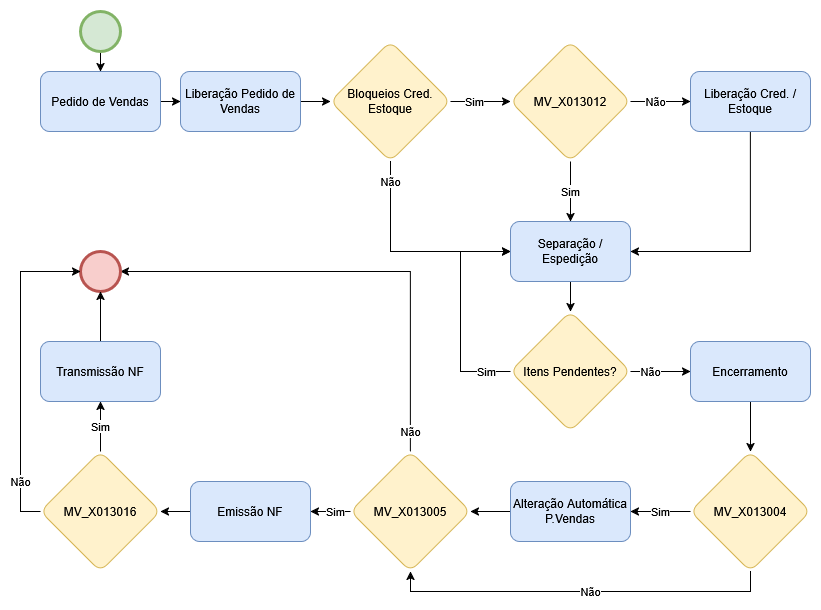
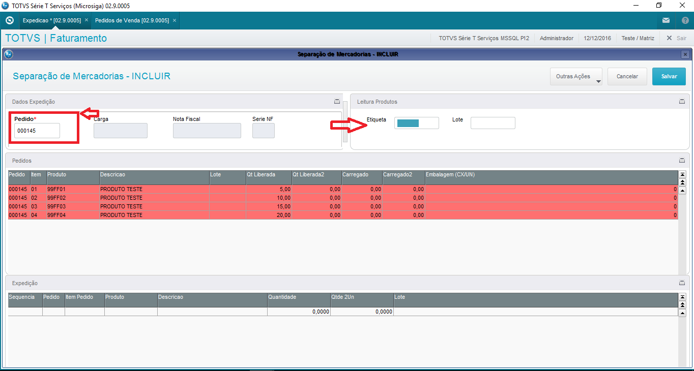
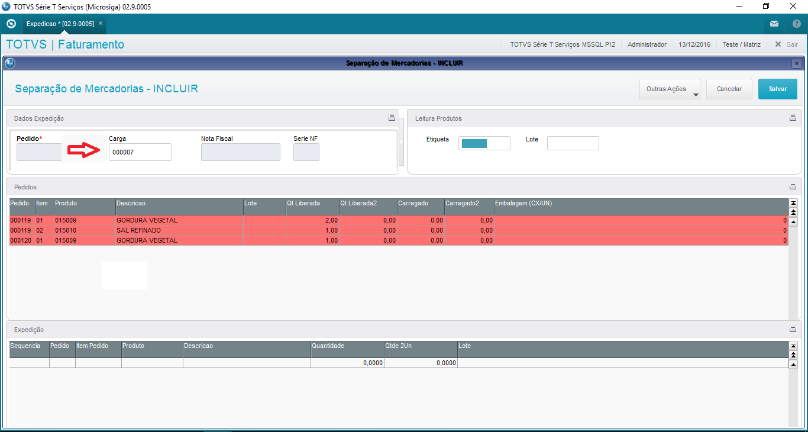
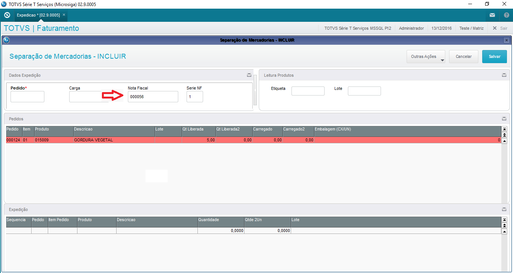
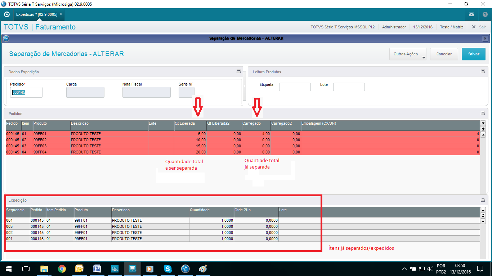
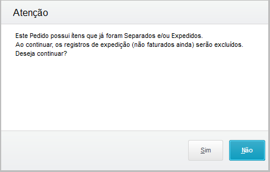
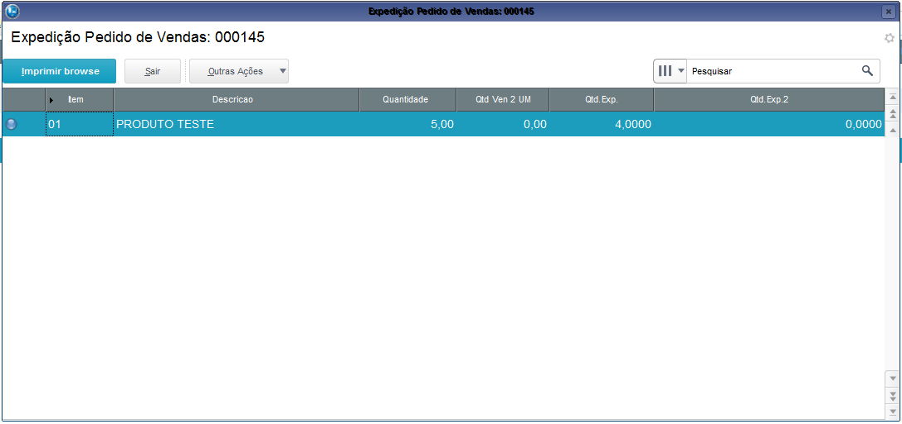
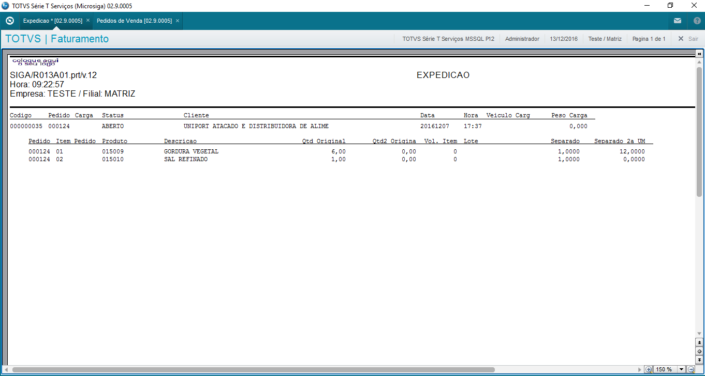

# Addon - Rotina de Expedição - Faturamento {.home-hero}

!!! warning "Esta seção do manual técnico está passando por revisões de conformidade e formatação. Os modelos de dados e procedimentos operacionais estão sendo validados para garantir a precisão das instruções técnicas. O conteúdo completo estará disponível em breve."

<!--############################################### 01 #######################################################-->

  01. Visão Geral

### 1. Visão Geral

#### Este ADD-ON tem por objetivo aperfeiçoar o Processo de Expedição de mercadorias, permitindo controlar a quantidade de produtos expedidos/separados. 

<strong>A expedição poderá ser realizada de três formas</strong>

- Por Pedido de Vendas
- Por Nota Fiscal
- Por Carga (OMS – Gestão de Distribuição)

<!--############################################### 02 #######################################################-->

  02. Menu

### 2. Menu

<table class="banks-table">
  <thead>
    <tr>
      <th>Menu</th>
      <th>Sub Menu</th>
      <th>Nome da Rotina</th>
      <th>Programa</th>
      <th>Módulo</th>
      <th>Tipo</th>
      <th>Tabelas</th>
    </tr>
  </thead>
  <tbody>
    <tr>
      <td>Atualizações</td>
      <td>Faturamento</td>
      <td>Expedição *</td>
      <td>M013A01</td>
      <td>Faturamento</td>
      <td>03 (Função de Usuário)</td>
      <td>Selecionar as tabelas informadas nos parâmetros: MV_X013T01 / MV_X013T02 / MV_X013T03</td>
    </tr>         
  </tbody>
</table>

<!--############################################### 03 #######################################################-->

  03. Fluxo Operacional

### 3. Fluxo Operacional

{.flow-image}

<!--############################################### 04 #######################################################-->

  04. Rotinas personalizadas específicas do Pacote

### 4. Rotinas personalizadas específicas do Pacote

#### Funções personalizadas contidas no pacote:

<table class="banks-table">
  <thead>
    <tr>
      <th>Função</th>
      <th>Descrição</th>
    </tr>
  </thead>
  <tbody>
    <tr>
      <td><strong>M999B02</strong></td>
      <td>Rotina com funções genéricas do controle de alçadas.</td>
    </tr>
    <tr>
      <td><strong>P013A01</strong></td>
      <td>Rotina centralizadora para implementação de Pontos de Entrada.</td>
    </tr>
    <tr>
      <td><strong>M013A01</strong></td>
      <td>Rotina de Expedição</td>
    </tr>
    <tr>
      <td><strong>T013A01</strong></td>
      <td>Consulta Expedição</td>
    </tr>
    <tr>
      <td><strong>R013A01</strong></td>
      <td>Relatório Expedição</td>
    </tr>
    <tr>
      <td><strong>R013A02</strong></td>
      <td>Relatório Resumo Expedição</td>
    </tr>
    <tr>
      <td><strong>R013A03</strong></td>
      <td>Relatório Pré-separação</td>
    </tr>
    <tr>
      <td><strong>R013A04</strong></td>
      <td>Relatório de volumes</td>
    </tr>
    <tr><td><strong>UPD013A</strong></td>
      <td>Programa compatibilizador do Dicionário de Dados para aplicação do ADD-ON.</td>
    </tr>    
  </tbody>
</table>

<!--############################################### 05 #######################################################-->

  05.Pontos de entradas disponiveis para desenvolvimento

### 5. Pontos de entradas disponiveis para desenvolvimento

	Nome **PE013A01**

<table class="pe-table-modern">  
<tbody>
<tr>
<td>Descrição</td>
<td>Ponto de Entrada que permite a manipulação da quantidade a ser expedida. 
Executado logo após a leitura ou informação do código do produto.  
Não é invocado para produtos pesáveis (código da etiqueta iniciada em ‘2’)</td>
</tr>
<tr>
<td>Programa Fonte</td>
<td>M013A01</td>
</tr>  
<tr>
<td>Sintaxe</td>
<td>
<code>
Modifica a quantidade a ser expedida 
PARAMIXB[1][1] = Código atual do produto 
PARAMIXB[1][2] = Leitura efetuado no Get
</code>
</td>
</tr>
<tr>
<td>Exemplo</td>
<td>

ADVPL
PE013A01

<pre><code>
User Function PE013A01()

Local cCodPro := PARAMIXB
Local nQtde  := 1

If cCodPro = ‘XXXXX’ 
   nQtde := 2
EndIf

Return(nQtde)
</code></pre>

          
</td>          
</tr>      
</tbody>
</table>

Nome **PE013A02**

<table class="pe-table-modern">  
<tbody>
<tr>
<td>Descrição</td>
<td>Ponto de Entrada chamado após a leitura da etiqueta.  
Permite a manipulação do código do produto. 
PARAMIXB[1][1] = Código atual do produto 
PARAMIXB[1][2] = Leitura efetuado no Get</td>
</tr>
<tr>
<td>Programa Fonte</td>
<td>M013A01</td>
</tr>  
<tr>
<td>Sintaxe</td>
<td>
<code>
PE013A02(PARAMIXB) --> cCodPro
</code>
</td>
</tr>
<tr>
<td>Exemplo</td>
<td>

ADVPL
PE013A02

<pre><code>
User Function PE013A02()

Local cCodPro := PARAMIXB[1][1]
Local cLeitura := PARAMIXB[1][2]

If substr(cLeitura,1,1) == ‘2’
   cCodPro := “XXXXX”
Endif

Return(cCodPro)
</code></pre>

          
</td>          
</tr>      
</tbody>
</table>

Nome **PE013A03**

<table class="pe-table-modern">  
<tbody>
<tr>
<td>Descrição</td>
<td>Ponto de Entrada antes do Faturamento do Pedido de Vendas.  
Permite manipular dados do Pedido de Vendas.  
PARAMIXB[1] = Número do Pedido de Vendas 
PARAMIXB[2] = Número do Volume</td>
</tr>
<tr>
<td>Programa Fonte</td>
<td>M013A01</td>
</tr>  
<tr>
<td>Sintaxe</td>
<td>
<code>
Alteração no Pedido de Vendas, antes do seu faturamento.  
PE013A03(PARAMIXB) --> lRet continua o faturamento.
</code>
</td>
</tr>
<tr>
<td>Exemplo</td>
<td>

ADVPL
PE013A03

<pre><code>
User Function PE013A03()

Local cPedido := PARAMIXB[1]
Local nVolume := PARAMIXB[2] 

dbselectarea("SC5")
SC5->(dbsetorder(1))
SC5->(dbgotop())
if dbseek(xFilial("SC5")+ cPedido )
   reclock(“SC5”,.F.)
   SC5->C5_X_OBS := “TESTE”
   SC5->(msunlock())
endif

Return(lRet)
</code></pre>

          
</td>          
</tr>      
</tbody>
</table>

Nome **PE013A04**

<table class="pe-table-modern">  
<tbody>
<tr>
<td>Descrição</td>
<td>Ponto de Entrada quer permite a inclusão de novas opções no menu da rotina de Expedição.</td>
</tr>
<tr>
<td>Programa Fonte</td>
<td>M013A01</td>
</tr>  
<tr>
<td>Sintaxe</td>
<td>
<code>
Inclusão de menu 
PE013A04() --> nil
</code>
</td>
</tr>
<tr>
<td>Exemplo</td>
<td>

ADVPL
PE013A04

<pre><code>
User Function PE013A04()
aadd( aRotina,{"Exemplo menu" , "U_TESTE()", 0 , 1 ,0,NIL} ) 

Return()
</code></pre>

          
</td>          
</tr>      
</tbody>
</table>

Nome **PE013A06**

<table class="pe-table-modern">  
<tbody>
<tr>
<td>Descrição</td>
<td>Ponto de Entrada que permite alterar o código a ser impresso na coluna (código) no Relatório R013A04 – Volumes.  
PARAMIXB – Código do Produto</td>
</tr>
<tr>
<td>Programa Fonte</td>
<td>R013A04</td>
</tr>  
<tr>
<td>Sintaxe</td>
<td>
<code>
Manipula código a ser impresso 
PE013A06(PARAMIXB) --> cCodigo
</code>
</td>
</tr>
<tr>
<td>Exemplo</td>
<td>

ADVPL
PE013A06

<pre><code>
User Function PE013A06()

Local cCodigo := PARAMIXB

dbSelectArea( "SB1" )
SB1->( dbSetOrder( 1 ) )
SB1->( dbGoTop() )
If dbSeek( xFilial("SB1")+ cCodigo )
   cCodigo := SB1->B1_CODBAR
Endif

Return(cCodigo)
</code></pre>

          
</td>          
</tr>      
</tbody>
</table>

Nome **PE013A07**

<table class="pe-table-modern">  
<tbody>
<tr>
<td>Descrição</td>
<td>Ponto de Entrada após o fechamento do Volume. Permite por exemplo, criar um relatório personalizado de Volumes, impressão de uma etiqueta, etc.  
Se existir, não faz a chamada do relatório padrão R013A04 
PARAMIXB = Número do Volume que está sendo fechado</td>
</tr>
<tr>
<td>Programa Fonte</td>
<td>M013A01</td>
</tr>  
<tr>
<td>Sintaxe</td>
<td>
<code>
Permite execução de novo relatório no fechamento do volume 
PE013A07(PARAMIXB) --> nil
</code>
</td>
</tr>
<tr>
<td>Exemplo</td>
<td>

ADVPL
PE013A07

<pre><code>
User Function PE013A07()

Local nVolume := PARAMIXB[1]

U_RELTESTE(nVolume)

Return()
</code></pre>

          
</td>          
</tr>      
</tbody>
</table>

Nome **PE013A08**

<table class="pe-table-modern">  
<tbody>
<tr>
<td>Descrição</td>
<td>Ponto de Entrada após emissão do relatório de Fechamento de Volumes Expedição R013A04. 
PARAMIXB = Número do Volume que está sendo fechado</td>
</tr>
<tr>
<td>Programa Fonte</td>
<td>M013A01</td>
</tr>  
<tr>
<td>Sintaxe</td>
<td>
<code>
PE013A08(PARAMIXB) --> nil
</code>
</td>
</tr>
<tr>
<td>Exemplo</td>
<td>

ADVPL
PE013A08

<pre><code>
User Function PE013A08()

Local nVolume := PARAMIXB[1]

U_CRFAT01(nVolume) 

Return()
</code></pre>

          
</td>          
</tr>      
</tbody>
</table>

Nome **PE013A09**

<table class="pe-table-modern">  
<tbody>
<tr>
<td>Descrição</td>
<td>Ponto de Entrada na rotina RETNUMVL responsável por efetuar o controle da numeração de volumes.  
PARAMIXB[1] = Código do Carregamento 
PARAMIXB[2] = Tipo: 
LAST = Último volume calculado (chamada na alteração) 
LAST_ANT = antes de atualizar o Grid de Carregamentos 
LAST_DEP = depois de atualizar o Grid de Carregamentos 
NEXT = Próximmo volume calculado 
PARAMIXB[3] = Número do Volume Atual 
PARAMIXB[4] = Objeto Get Dados 1 
PARAMIXB[5] = Objeto Get Dados 2</td>
</tr>
<tr>
<td>Programa Fonte</td>
<td>M013A01</td>
</tr>  
<tr>
<td>Sintaxe</td>
<td>
<code>
Permite execução de rotinas após emissão do relatório 
PE013A09(PARAMIXB) --> nRet (volume)
</code>
</td>
</tr>
<tr>
<td>Exemplo</td>
<td>

ADVPL
PE013A09

<pre><code>
User Function PE013A09()

local cCod     := PARAMIXB[1]
local cTpRet   := PARAMIXB[2]
local nRet     := PARAMIXB[3]
local oGetAux1 := PARAMIXB[4]
local oGetAux2 := PARAMIXB[5]

if nRet == 1
  nRet := 2
endif

Return(nRet)
</code></pre>

          
</td>          
</tr>      
</tbody>
</table>

Nome **PE013A10**

<table class="pe-table-modern">  
<tbody>
<tr>
<td>Descrição</td>
<td>Ponto de Entrada após as validações do sistema na leitura da etiqueta. Permite validações personalizadas do cliente.  
PARAMIXB[1] = posição atual do GetDados1 
PARAMIXB[2] = Objeto Get Dados 1 
PARAMIXB[3] = Objeto Get Dados 2</td>
</tr>
<tr>
<td>Programa Fonte</td>
<td>M013A01</td>
</tr>  
<tr>
<td>Sintaxe</td>
<td>
<code>
PE013A10(PARAMIXB) --> lRet
</code>
</td>
</tr>
<tr>
<td>Exemplo</td>
<td>

ADVPL
PE013A10

<pre><code>
User Function PE013A10()

local nPosAux  := PARAMIXB[1] //Posição Atual que será atualizada no Grid1
local oGetAux1 := PARAMIXB[2]  
local oGetAux2 := PARAMIXB[3]
local lRet     := .T.

/* VALIDAÇÕES ADIDIONAIS*/

Return(lRet)
</code></pre>

          
</td>          
</tr>      
</tbody>
</table>

Nome **PE013A11**

<table class="pe-table-modern">  
<tbody>
<tr>
<td>Descrição</td>
<td>Ponto de Entrada quer permite a alteração das cores do Grid.  
PARAMIXB[1] = cOpc  
cOpc: 
- PENDENTE 
- CARREGADOMAIOR 
- CARREGADOK  
Retorno : nColor exemplo RGB( 64, 224, 208 ) - VERDE</td>
</tr>
<tr>
<td>Programa Fonte</td>
<td>M013A01</td>
</tr>  
<tr>
<td>Sintaxe</td>
<td>
<code>
PE013A11(cOpc) --> nColor
</code>
</td>
</tr>
<tr>
<td>Exemplo</td>
<td>

ADVPL
PE013A11

<pre><code>
User Function PE013A11()

Local nColorRet := RGB( 255, 255, 255 ) //Branco
Local cType   := PARAMIXB

Do Case
    Case cType =="PENDENTE"
        nColorRet := RGB( 255, 106, 106 ) //Vermelho
    Case cType =="CARREGADOMAIOR"
        nColorRet := RGB( 100,149,237 ) //CornflowerBlue
    Case cType =="CARREGADOOK"
        nColorRet := RGB( 64,224,208 ) //Verde
EndCase

return nColorRet
</code></pre>

          
</td>          
</tr>      
</tbody>
</table>

Nome **PE013A12**

<table class="pe-table-modern">  
<tbody>
<tr>
<td>Descrição</td>
<td>Ponto de Entrada que permite a alteração na posição dos campos no GRID1.   
Opção no PARAMIXB[2] = CAB 
PARAMIXB[1] = aCmpBrw1  
PARAMIXB[2] = CAB  
Opção no PARAMIXB[2] = ACOLS 
PARAMIXB[1] = aCmpBrw1  
PARAMIXB[2] = ACOLS 
PARAMIXB[3] = cAliasQry (query com os registros do primeiro grid) 
PARAMIXB[4] = cAliasQry1 (query com os registro do segundo grid)  
Retorno: 
Para CAB – deve retornar um Array com a posição dos campos 
Para ACOLS - Null  
Observação: Neste exemplo o A1_NOME ficou na primeira posição do GRID1.</td>
</tr>
<tr>
<td>Programa Fonte</td>
<td>M013A01</td>
</tr>  
<tr>
<td>Sintaxe</td>
<td>
<code>
PE013A12() --> xRet
</code>
</td>
</tr>
<tr>
<td>Exemplo</td>
<td>

ADVPL
PE013A12

<pre><code>
User Function PE013A10()

Local xRetBrw 
Local xControle := PARAMIXB[1]
Local cValid   := PARAMIXB[2]
Local xAlias
Local i
//Private aCmpBrw1 := {"C9_PEDIDO","C9_ITEM", "C9_PRODUTO", "C6_DESCRI", "C9_LOTECTL", "C9_QTDLIB", "C9_QTDLIB2", "TMP_CQTD", "TMP_CQTD2", "TMP_QTDCX", "A1_NOME", "C9_CLIENTE", "C9_LOJA" } 

If cValid == "CAB"
    xRetBrw := {}
    AADD(xRetBrw,"A1_NOME")
    For i := 1 To Len(xControle)
        If xControle[i] <> "A1_NOME"
            AADD(xRetBrw,xControle[i])
        Endif
    Next i
elseif cValid == "ACOLS"
    xAlias1  := PARAMIXB[3]
    xAlias2  := PARAMIXB[4]
    AADD(oGetDad1:aCols,{&(xAlias1+"->A1_NOME"),;
                        &(xAlias1+"->C9_PEDIDO"),;
                        &(xAlias1+"->C9_ITEM"),;
                        &(xAlias1+"->C9_PRODUTO"),;
                        &(xAlias1+"->C6_DESCRI"),;
                        &(xAlias1+"->C9_LOTECTL"),;
                        &(xAlias1+"->C9_QTDLIB") - &(xAlias2+"->TOTCAR"),;
                        &(xAlias1+"->C9_QTDLIB2")- &(xAlias2+"->TOTCAR2"),; 
                        0,; //Carregado
                        0,; //Carregado2
                        0,; //Embalagem                        
                        &(xAlias1+"->C9_CLIENTE"),;
                        &(xAlias1+"->C9_LOJA"),; 
                        .F.})
Endif
    
return xRetBrw
</code></pre>

          
</td>          
</tr>      
</tbody>
</table>

Nome **PE013A13**

<table class="pe-table-modern">  
<tbody>
<tr>
<td>Descrição</td>
<td>Ponto de Entrada na Alteração e Visualização da Expedição, após o cálculo e atualização dos GRIDS em relação a quantidade já expedida.  
PARAMIXB[1] = Objeto Get Dados 1 
PARAMIXB[2] = Objeto Get Dados 2</td>
</tr>
<tr>
<td>Programa Fonte</td>
<td>M013A01</td>
</tr>  
<tr>
<td>Sintaxe</td>
<td>
<code>
PE013A13() --> Nenhum
</code>
</td>
</tr>
<tr>
<td>Exemplo</td>
<td>

ADVPL
PE013A13

<pre><code>
User Function PE013A13()

local oGetAux1 := PARAMIXB[2]  
local oGetAux2 := PARAMIXB[3]

/* Manipulações oGetDad1, oGetDad2 */

Return()
</code></pre>

          
</td>          
</tr>      
</tbody>
</table>

<!--############################################### 06 #######################################################-->

  06.Pontos de entradas padrões

### 6. Pontos de entradas padrões

<table class="banks-table">
  <thead>
    <tr>
      <th>Nome</th>
      <th>Descrição</th>
      <th>Implementação</th>      
    </tr>
  </thead>
  <tbody>
    <tr>
      <td><strong>M410STTS</strong></td>
      <td>Ponto de Entrada na inclusão/alteração do Pedido de Vendas. 
Faturamento</td>
      <td>

  

    ADVPL
    M410STTS
  

  <pre><code>  
User Function M410STTS()

If ExistBlock("P013A01")
    U_P013A01("M410STTS")
EndIf

Return()
</code></pre>
      </td>      
    </tr>
    <tr>
      <td><strong>M460FIM</strong></td>
      <td>Ponto de Entrada no final da emissão da Nota Fiscal de Saída. 
Faturamento</td>
      <td>

  

    ADVPL
    M460FIM
  

  <pre><code>  
User Function M460FIM()

If ExistBlock("P013A01")
    U_P013A01("M460FIM")
EndIf

Return()
</code></pre>
      </td>      
    </tr>
    <tr>
      <td><strong>MA410MNU</strong></td>
      <td>Ponto de Entrada para inclusão de opções de menu no Pedido de Vendas. 
Faturamento. </td>
      <td>

  

    ADVPL
    MA410MNU
  

  <pre><code>  
User Function MA410MNU()

If ExistBlock("P013A01")
    U_P013A01("MA410MNU")
EndIf

Return()
</code></pre>
      </td>      
    </tr>
    <tr>
      <td><strong>MS520VLD</strong></td>
      <td>Ponto de Entrada na exclusão da Nota Fiscal de Saída.</td>
      <td>

  

    ADVPL
    MS520VLD
  

  <pre><code>  
User Function MS520VLD()

Local lRet := .T.
If ExistBlock("P013A01")
     U_P013A01('MS520VLD')
EndIf

Return(lRet)
</code></pre>
      </td>      
    </tr>
    <tr>
      <td><strong>MT410ACE</strong></td>
      <td>Ponto de Entrada executado antes da apresentação da Tela do Pedido de Vendas. Faturamento.</td>
      <td>

  

    ADVPL
    MT410ACE
  

  <pre><code>  
User Function MT410ACE()

Local lRet := .T.

If ExistBlock("P013A01")
     U_P013A01(MT410ACE)
EndIf

Return(lRet)
</code></pre>
      </td>      
    </tr>
    <tr>
      <td><strong>MT410TOK</strong></td>
      <td>Ponto de Entrada usado para validação total do pedido de venda.</td>
      <td>

  

    ADVPL
    MT410TOK
  

  <pre><code>  
User Function MT410TOK()

Local lRet   := .T.

If ExistBlock("P013A01")
    lRet := U_P013A01("MT410TOK", PARAMIXB)
EndIf

Return lRet
</code></pre>
      </td>      
    </tr>
    <tr>
      <td><strong>M410PVNF</strong></td>
      <td>Ponto de Entrada executado durante o faturamento do pedido de venda através da rotina MATA410.</td>
      <td>

  

    ADVPL
    M410PVNF
  

  <pre><code>  
User Function M410PVNF()

Local lRet := .T.

If ExistBlock("P013A01")
     lRet := U_P013A01("M410PVNF", PARAMIXB)
EndIf

Return(lRet)
</code></pre>
      </td>      
    </tr>
    <tr>
      <td><strong>SF2520E</strong></td>
      <td>Ponto de Entrada executado durante a exclusão de notas de saída</td>
      <td>

  

    ADVPL
    SF2520E
  

  <pre><code>  
User Function SF2520E()

If ExistBlock("P013A01")
    U_P013A01("SF2520E")
EndIf

Return()
</code></pre>
      </td>      
    </tr>
  </tbody>
</table>

<!--############################################### 07 #######################################################-->

  07. Tabelas (SX2) 

### 7. Tabelas (SX2)

<table class="banks-table">
  <thead>
    <tr>
      <th>Prefixo</th>
      <th>Descrição</th>
      <th>Ac. Filial</th>
      <th>Ac. Unidade</th>
      <th>Ac. Empresa</th>
    </tr>
  </thead>
  <tbody>
    <tr>
      <td><strong>ZA2</strong></td>
      <td>EXPEDIÇÃO</td>
      <td>Exclusivo</td>
      <td>Exclusivo</td>
      <td>Exclusivo</td>
    </tr>
    <tr>
      <td><strong>ZA3</strong></td>
      <td>ITENS DA EXPEDIÇÃO</td>
      <td>Exclusivo</td>
      <td>Exclusivo</td>
      <td>Exclusivo</td>
    </tr>
    <tr>
      <td><strong>ZA4</strong></td>
      <td>Rest. Carga – Pedidos Excluídos</td>
      <td>Exclusivo</td>
      <td>Exclusivo</td>
      <td>Exclusivo</td>
    </tr>    
  </tbody>
</table>

<!--############################################### 08 #######################################################-->

  08. Campos (SX3)

### 7. Campos (SX3)

Campo<strong>ZA2_FILIAL</strong>

<table class="banks-table">
  <tbody>
    <tr>
      <th>Ordem</th>
      <td>01</td>
    </tr>
    <tr>
      <th>TIPO</th>
      <td>C</td>
    </tr>
    <tr>
      <th>TAMANHO</th>
      <td>Tamaho padrão da Filial</td>
    </tr>
    <tr>
      <th>DECIMAL</th>
      <td>0</td>
    </tr>
    <tr>
      <th>FORMATO</th>
      <td>@!</td>
    </tr>
    <tr>
      <th>CONTEXTO</th>
      <td>Real</td>
    </tr>
    <tr>
      <th>PROPRIEDADE</th>
      <td>Visualizar</td>
    </tr>
    <tr>
      <th>TÍTULO</th>
      <td>Filial</td>
    </tr>
    <tr>
      <th>DESCRIÇÃO</th>
      <td>Filial</td>
    </tr>
  </tbody>
</table>
#### **Help**

Não se aplica.

#### **Configurações adicionais**
<table class="banks-table">
  <tbody>
    <tr>
      <th>Lista Opções</th>
      <td>-</td>
    </tr>
    <tr>
      <th>Inicializador</th>
      <td>-</td>
    </tr>
    <tr>
      <th>Ini. Browse</th>
      <td>-</td>
    </tr>
    <tr>
      <th>Modo Edição</th>
      <td>-</td>
    </tr>
    <tr>
      <th>Consulta F3</th>
      <td>-</td>
    </tr>
    <tr>
      <th>Val Usuário</th>
      <td>-</td>
    </tr>
    <tr>
      <th>Usado</th>
      <td>-</td>
    </tr>
    <tr>
      <th>Obrigatório</th>
      <td>S</td>
    </tr>
    <tr>
      <th>Browse</th>
      <td>S</td>
    </tr>
  </tbody>
</table>

Campo **ZA2_CODIGO**

<table class="banks-table">
  <tbody>
    <tr>
      <th>Ordem</th>
      <td>02</td>
    </tr>
    <tr>
      <th>TIPO</th>
      <td>C</td>
    </tr>
    <tr>
      <th>TAMANHO</th>
      <td>9</td>
    </tr>
    <tr>
      <th>DECIMAL</th>
      <td>0</td>
    </tr>
    <tr>
      <th>FORMATO</th>
      <td>@!</td>
    </tr>
    <tr>
      <th>CONTEXTO</th>
      <td>Real</td>
    </tr>
    <tr>
      <th>PROPRIEDADE</th>
      <td>Visualizar</td>
    </tr>
    <tr>
      <th>TÍTULO</th>
      <td>Código</td>
    </tr>
    <tr>
      <th>DESCRIÇÃO</th>
      <td>Código</td>
    </tr>
  </tbody>
</table>
#### **Help**

Código da Expedição

#### **Configurações adicionais**
<table class="banks-table">
  <tbody>
    <tr>
      <th>Lista Opções</th>
      <td>-</td>
    </tr>
    <tr>
      <th>Inicializador</th>
      <td>GETSXENUM(&quot;ZA2&quot;,&quot;ZA2_CODIGO&quot;)</td>
    </tr>
    <tr>
      <th>Ini. Browse</th>
      <td>-</td>
    </tr>
    <tr>
      <th>Modo Edição</th>
      <td>-</td>
    </tr>
    <tr>
      <th>Consulta F3</th>
      <td>-</td>
    </tr>
    <tr>
      <th>Val Usuário</th>
      <td>-</td>
    </tr>
    <tr>
      <th>Usado</th>
      <td>-</td>
    </tr>
    <tr>
      <th>Obrigatório</th>
      <td>S</td>
    </tr>
    <tr>
      <th>Browse</th>
      <td>S</td>
    </tr>
  </tbody>
</table>

Campo **ZA2_PEDIDO**

<table class="banks-table">
  <tbody>
    <tr>
      <th>Ordem</th>
      <td>03</td>
    </tr>
    <tr>
      <th>TIPO</th>
      <td>C</td>
    </tr>
    <tr>
      <th>TAMANHO</th>
      <td>6</td>
    </tr>
    <tr>
      <th>DECIMAL</th>
      <td>0</td>
    </tr>
    <tr>
      <th>FORMATO</th>
      <td>@!</td>
    </tr>
    <tr>
      <th>CONTEXTO</th>
      <td>Real</td>
    </tr>
    <tr>
      <th>PROPRIEDADE</th>
      <td>Alterar</td>
    </tr>
    <tr>
      <th>TÍTULO</th>
      <td>Pedido</td>
    </tr>
    <tr>
      <th>DESCRIÇÃO</th>
      <td>Número do Pedido</td>
    </tr>
  </tbody>
</table>
#### **Help**

Número do pedido de vendas.

#### **Configurações adicionais**
<table class="banks-table">
  <tbody>
    <tr>
      <th>Lista Opções</th>
      <td>-</td>
    </tr>
    <tr>
      <th>Inicializador</th>
      <td>-</td>
    </tr>
    <tr>
      <th>Ini. Browse</th>
      <td>-</td>
    </tr>
    <tr>
      <th>Modo Edição</th>
      <td>EMPTY(M-&gt;ZA2_CARGA).AND.EMPTY(M-&gt;ZA2_DOC)</td>
    </tr>
    <tr>
      <th>Consulta F3</th>
      <td>-</td>
    </tr>
    <tr>
      <th>Val Usuário</th>
      <td>U_GET01301(&quot;P&quot;)</td>
    </tr>
    <tr>
      <th>Usado</th>
      <td>-</td>
    </tr>
    <tr>
      <th>Obrigatório</th>
      <td>N</td>
    </tr>
    <tr>
      <th>Browse</th>
      <td>S</td>
    </tr>
  </tbody>
</table>

Campo **ZA2_CARGA**

<table class="banks-table">
  <tbody>
    <tr>
      <th>Ordem</th>
      <td>04</td>
    </tr>
    <tr>
      <th>TIPO</th>
      <td>C</td>
    </tr>
    <tr>
      <th>TAMANHO</th>
      <td>6</td>
    </tr>
    <tr>
      <th>DECIMAL</th>
      <td>0</td>
    </tr>
    <tr>
      <th>FORMATO</th>
      <td>@!</td>
    </tr>
    <tr>
      <th>CONTEXTO</th>
      <td>Real</td>
    </tr>
    <tr>
      <th>PROPRIEDADE</th>
      <td>Alterar</td>
    </tr>
    <tr>
      <th>TÍTULO</th>
      <td>Carga</td>
    </tr>
    <tr>
      <th>DESCRIÇÃO</th>
      <td>Número da Carga</td>
    </tr>
  </tbody>
</table>
#### **Help**

Número da Carga

#### **Configurações adicionais**
<table class="banks-table">
  <tbody>
    <tr>
      <th>Lista Opções</th>
      <td>-</td>
    </tr>
    <tr>
      <th>Inicializador</th>
      <td>-</td>
    </tr>
    <tr>
      <th>Ini. Browse</th>
      <td>-</td>
    </tr>
    <tr>
      <th>Modo Edição</th>
      <td>EMPTY(M-&gt;ZA2_PEDIDO).AND.EMPTY(M-&gt;ZA2_DOC)</td>
    </tr>
    <tr>
      <th>Consulta F3</th>
      <td>-</td>
    </tr>
    <tr>
      <th>Val Usuário</th>
      <td>-</td>
    </tr>
    <tr>
      <th>Usado</th>
      <td>-</td>
    </tr>
    <tr>
      <th>Obrigatório</th>
      <td>N</td>
    </tr>
    <tr>
      <th>Browse</th>
      <td>S</td>
   </tr>
  </tbody>
</table>

Campo **ZA2_DOC**

<table class="banks-table">
  <tbody>
    <tr>
      <th>Ordem</th>
      <td>05</td>
    </tr>
    <tr>
      <th>TIPO</th>
      <td>C</td>
    </tr>
    <tr>
      <th>TAMANHO</th>
      <td>9</td>
    </tr>
    <tr>
      <th>DECIMAL</th>
      <td>0</td>
    </tr>
    <tr>
      <th>FORMATO</th>
      <td>@!</td>
    </tr>
    <tr>
      <th>CONTEXTO</th>
      <td>Real</td>
    </tr>
    <tr>
      <th>PROPRIEDADE</th>
      <td>Alterar</td>
    </tr>
    <tr>
      <th>TÍTULO</th>
      <td>Nota Fiscal</td>
    </tr>
    <tr>
      <th>DESCRIÇÃO</th>
      <td>Nota Fiscal</td>
    </tr>
  </tbody>
</table>
#### **Help**

Número da Nota Fiscal

#### **Configurações adicionais**
<table class="banks-table">
  <tbody>
    <tr>
      <th>Lista Opções</th>
      <td>-</td>
    </tr>
    <tr>
      <th>Inicializador</th>
      <td>-</td>
    </tr>
    <tr>
      <th>Ini. Browse</th>
      <td>-</td>
    </tr>
    <tr>
      <th>Modo Edição</th>
      <td>EMPTY(M-&gt;ZA2_PEDIDO).AND.EMPTY(M-&gt;ZA2_CARGA)</td>
    </tr>
    <tr>
      <th>Consulta F3</th>
      <td>-</td>
    </tr>
    <tr>
      <th>Val Usuário</th>
      <td>U_GET01301(&quot;C&quot;)</td>
    </tr>
    <tr>
      <th>Usado</th>
      <td>-</td>
    </tr>
    <tr>
      <th>Obrigatório</th>
      <td>N</td>
    </tr>
    <tr>
      <th>Browse</th>
      <td>S</td>
    </tr>
  </tbody>
</table>

Campo **ZA2_SERIE**

<table class="banks-table">
  <tbody>
    <tr>
      <th>Ordem</th>
      <td>06</td>
    </tr>
    <tr>
      <th>TIPO</th>
      <td>C</td>
    </tr>
    <tr>
      <th>TAMANHO</th>
      <td>3</td>
    </tr>
    <tr>
      <th>DECIMAL</th>
      <td>0</td>
    </tr>
    <tr>
      <th>FORMATO</th>
      <td>@!</td>
    </tr>
    <tr>
      <th>CONTEXTO</th>
      <td>Real</td>
    </tr>
    <tr>
      <th>PROPRIEDADE</th>
      <td>Alterar</td>
    </tr>
    <tr>
      <th>TÍTULO</th>
      <td>Série</td>
    </tr>
    <tr>
      <th>DESCRIÇÃO</th>
      <td>Série da nota fiscal</td>
    </tr>
  </tbody>
</table>
#### **Help**

Número da série da nota fiscal

#### **Configurações adicionais**
<table class="banks-table">
  <tbody>
    <tr>
      <th>Lista Opções</th>
      <td>-</td>
    </tr>
    <tr>
      <th>Inicializador</th>
      <td>-</td>
    </tr>
    <tr>
      <th>Ini. Browse</th>
      <td>-</td>
    </tr>
    <tr>
      <th>Modo Edição</th>
      <td>EMPTY(M-&gt;ZA2_PEDIDO).AND.EMPTY(M-&gt;ZA2_CARGA)</td>
    </tr>
    <tr>
      <th>Consulta F3</th>
      <td>-</td>
    </tr>
    <tr>
      <th>Val Usuário</th>
      <td>U_GET01301(&quot;N&quot;)</td>
    </tr>
    <tr>
      <th>Usado</th>
      <td>-</td>
    </tr>
    <tr>
      <th>Obrigatório</th>
      <td>N</td>
    </tr>
    <tr>
      <th>Browse</th>
      <td>S</td>
    </tr>
  </tbody>
</table>

Campo **ZA2_STATUS**

<table class="banks-table">
  <tbody>
    <tr>
      <th>Ordem</th>
      <td>07</td>
    </tr>
    <tr>
      <th>TIPO</th>
      <td>C</td>
    </tr>
    <tr>
      <th>TAMANHO</th>
      <td>1</td>
    </tr>
    <tr>
      <th>DECIMAL</th>
      <td>0</td>
    </tr>
    <tr>
      <th>FORMATO</th>
      <td>@!</td>
    </tr>
    <tr>
      <th>CONTEXTO</th>
      <td>Real</td>
    </tr>
    <tr>
      <th>PROPRIEDADE</th>
      <td>Visualizar</td>
    </tr>
    <tr>
      <th>TÍTULO</th>
      <td>Status</td>
    </tr>
    <tr>
      <th>DESCRIÇÃO</th>
      <td>Status</td>
    </tr>
  </tbody>
</table>
#### **Help**

Status da expedição

#### **Configurações adicionais**
<table class="banks-table">
  <tbody>
    <tr>
      <th>Lista Opções</th>
      <td>-</td>
    </tr>
    <tr>
      <th>Inicializador</th>
      <td>-</td>
    </tr>
    <tr>
      <th>Ini. Browse</th>
      <td>-</td>
    </tr>
    <tr>
      <th>Modo Edição</th>
      <td>-</td>
    </tr>
    <tr>
      <th>Consulta F3</th>
      <td>-</td>
    </tr>
    <tr>
      <th>Val Usuário</th>
      <td>-</td>
    </tr>
    <tr>
      <th>Usado</th>
      <td>-</td>
    </tr>
    <tr>
      <th>Obrigatório</th>
      <td>N</td>
    </tr>
    <tr>
      <th>Browse</th>
      <td>S</td>
    </tr>
  </tbody>
</table>

Campo **ZA2_DATA**

<table class="banks-table">
  <tbody>
    <tr>
      <th>Ordem</th>
      <td>08</td>
    </tr>
    <tr>
      <th>TIPO</th>
      <td>D</td>
    </tr>
    <tr>
      <th>TAMANHO</th>
      <td>8</td>
    </tr>
    <tr>
      <th>DECIMAL</th>
      <td>0</td>
    </tr>
    <tr>
      <th>FORMATO</th>
      <td>-</td>
    </tr>
    <tr>
      <th>CONTEXTO</th>
      <td>Real</td>
    </tr>
    <tr>
      <th>PROPRIEDADE</th>
      <td>Visualizar</td>
    </tr>
    <tr>
      <th>TÍTULO</th>
      <td>Data</td>
    </tr>
    <tr>
      <th>DESCRIÇÃO</th>
      <td>Data Expedição  </td>
    </tr>
  </tbody>
</table>
#### **Help**

Data expedição

#### **Configurações adicionais**
<table class="banks-table">
  <tbody>
    <tr>
      <th>Lista Opções</th>
      <td>-</td>
    </tr>
    <tr>
      <th>Inicializador</th>
      <td>DDATABASE</td>
    </tr>
    <tr>
      <th>Ini. Browse</th>
      <td>-</td>
    </tr>
    <tr>
      <th>Modo Edição</th>
      <td>-</td>
    </tr>
    <tr>
      <th>Consulta F3</th>
      <td>-</td>
    </tr>
    <tr>
      <th>Val Usuário</th>
      <td>-</td>
    </tr>
    <tr>
      <th>Usado</th>
      <td>-</td>
    </tr>
    <tr>
      <th>Obrigatório</th>
      <td>N</td>
    </tr>
    <tr>
      <th>Browse</th>
      <td>S</td>
    </tr>
  </tbody>
</table>

Campo **ZA2_HORA**

<table class="banks-table">
  <tbody>
    <tr>
      <th>Ordem</th>
      <td>09</td>
    </tr>
    <tr>
      <th>TIPO</th>
      <td>C</td>
    </tr>
    <tr>
      <th>TAMANHO</th>
      <td>5</td>
    </tr>
    <tr>
      <th>DECIMAL</th>
      <td>0</td>
    </tr>
    <tr>
      <th>FORMATO</th>
      <td>99:99</td>
    </tr>
    <tr>
      <th>CONTEXTO</th>
      <td>Real</td>
    </tr>
    <tr>
      <th>PROPRIEDADE</th>
      <td>Visualizar</td>
    </tr>
    <tr>
      <th>TÍTULO</th>
      <td>Hora</td>
    </tr>
    <tr>
      <th>DESCRIÇÃO</th>
      <td>Hora Expedição</td>
    </tr>
  </tbody>
</table>
#### **Help**

Hora Expedição

#### **Configurações adicionais**
<table class="banks-table">
  <tbody>
    <tr>
      <th>Lista Opções</th>
      <td>-</td>
    </tr>
    <tr>
      <th>Inicializador</th>
      <td>TIME()</td>
    </tr>
    <tr>
      <th>Ini. Browse</th>
      <td>-</td>
    </tr>
    <tr>
      <th>Modo Edição</th>
      <td>-</td>
    </tr>
    <tr>
      <th>Consulta F3</th>
      <td>-</td>
    </tr>
    <tr>
      <th>Val Usuário</th>
      <td>-</td>
    </tr>
    <tr>
      <th>Usado</th>
      <td>-</td>
    </tr>
    <tr>
      <th>Obrigatório</th>
      <td>N</td>
    </tr>
    <tr>
      <th>Browse</th>
      <td>S</td>
    </tr>
  </tbody>
</table>

Campo **ZA2_VEICUL**

<table class="banks-table">
  <tbody>
    <tr>
      <th>Ordem</th>
      <td>10</td>
    </tr>
    <tr>
      <th>TIPO</th>
      <td>C</td>
    </tr>
    <tr>
      <th>TAMANHO</th>
      <td>8</td>
    </tr>
    <tr>
      <th>DECIMAL</th>
      <td>0</td>
    </tr>
    <tr>
      <th>FORMATO</th>
      <td>@!</td>
    </tr>
    <tr>
      <th>CONTEXTO</th>
      <td>Real</td>
    </tr>
    <tr>
      <th>PROPRIEDADE</th>
      <td>Visualizar</td>
    </tr>
    <tr>
      <th>TÍTULO</th>
      <td>Veículo Carga</td>
    </tr>
    <tr>
      <th>DESCRIÇÃO</th>
      <td>Veículo Carga</td>
    </tr>
  </tbody>
</table>
#### **Help**

Veículo Carga

#### **Configurações adicionais**
<table class="banks-table">
  <tbody>
    <tr>
      <th>Lista Opções</th>
      <td>-</td>
    </tr>
    <tr>
      <th>Inicializador</th>
      <td>-</td>
    </tr>
    <tr>
      <th>Ini. Browse</th>
      <td>-</td>
    </tr>
    <tr>
      <th>Modo Edição</th>
      <td>-</td>
    </tr>
    <tr>
      <th>Consulta F3</th>
      <td>-</td>
    </tr>
    <tr>
      <th>Val Usuário</th>
      <td>-</td>
    </tr>
    <tr>
      <th>Usado</th>
      <td>-</td>
    </tr>
    <tr>
      <th>Obrigatório</th>
      <td>N</td>
    </tr>
    <tr>
      <th>Browse</th>
      <td>S</td>
    </tr>
  </tbody>
</table>

Campo **ZA2_PESO**

<table class="banks-table">
  <tbody>
    <tr>
      <th>Ordem</th>
      <td>11</td>
    </tr>
    <tr>
      <th>TIPO</th>
      <td>N</td>
    </tr>
    <tr>
      <th>TAMANHO</th>
      <td>12</td>
    </tr>
    <tr>
      <th>DECIMAL</th>
      <td>3</td>
    </tr>
    <tr>
      <th>FORMATO</th>
      <td>@E 99,999,999.999</td>
    </tr>
    <tr>
      <th>CONTEXTO</th>
      <td>Real</td>
    </tr>
    <tr>
      <th>PROPRIEDADE</th>
      <td>Visualizar</td>
    </tr>
    <tr>
      <th>TÍTULO</th>
      <td>Peso Carga</td>
    </tr>
    <tr>
      <th>DESCRIÇÃO</th>
      <td>Peso Carga</td>
    </tr>
  </tbody>
</table>
#### **Help**

Peso Carga

#### **Configurações adicionais**
<table class="banks-table">
  <tbody>
    <tr>
      <th>Lista Opções</th>
      <td>-</td>
    </tr>
    <tr>
      <th>Inicializador</th>
      <td>-</td>
    </tr>
    <tr>
      <th>Ini. Browse</th>
      <td>-</td>
    </tr>
    <tr>
      <th>Modo Edição</th>
      <td>-</td>
    </tr>
    <tr>
      <th>Consulta F3</th>
      <td>-</td>
    </tr>
    <tr>
      <th>Val Usuário</th>
      <td>-</td>
    </tr>
    <tr>
      <th>Usado</th>
      <td>-</td>
    </tr>
    <tr>
      <th>Obrigatório</th>
      <td>N</td>
    </tr>
    <tr>
      <th>Browse</th>
      <td>S</td>
    </tr>
  </tbody>
</table>

Campo **ZA2_DATAEC**

<table class="banks-table">
  <tbody>
    <tr>
      <th>Ordem</th>
      <td>12</td>
    </tr>
    <tr>
      <th>TIPO</th>
      <td>D</td>
    </tr>
    <tr>
      <th>TAMANHO</th>
      <td>8</td>
    </tr>
    <tr>
      <th>DECIMAL</th>
      <td>0</td>
    </tr>
    <tr>
      <th>FORMATO</th>
      <td></td>
    </tr>
    <tr>
      <th>CONTEXTO</th>
      <td>Real</td>
    </tr>
    <tr>
      <th>PROPRIEDADE</th>
      <td>Visualizar</td>
    </tr>
    <tr>
      <th>TÍTULO</th>
      <td>Data encerramento</td>
    </tr>
    <tr>
      <th>DESCRIÇÃO</th>
      <td>Data encerramento</td>
    </tr>
  </tbody>
</table>
#### **Help**

Data encerramento Expedição

#### **Configurações adicionais**
<table class="banks-table">
  <tbody>
    <tr>
      <th>Lista Opções</th>
      <td>-</td>
    </tr>
    <tr>
      <th>Inicializador</th>
      <td>-</td>
    </tr>
    <tr>
      <th>Ini. Browse</th>
      <td>-</td>
    </tr>
    <tr>
      <th>Modo Edição</th>
      <td>-</td>
    </tr>
    <tr>
      <th>Consulta F3</th>
      <td>-</td>
    </tr>
    <tr>
      <th>Val Usuário</th>
      <td>-</td>
    </tr>
    <tr>
      <th>Usado</th>
      <td>-</td>
    </tr>
    <tr>
      <th>Obrigatório</th>
      <td>N</td>
    </tr>
    <tr>
      <th>Browse</th>
      <td>S</td>
    </tr>
  </tbody>
</table>

Campo **ZA2_HORAEC**

<table class="banks-table">
  <tbody>
    <tr>
      <th>Ordem</th>
      <td>13</td>
    </tr>
    <tr>
      <th>TIPO</th>
      <td>C</td>
    </tr>
    <tr>
      <th>TAMANHO</th>
      <td>5</td>
    </tr>
    <tr>
      <th>DECIMAL</th>
      <td>0</td>
    </tr>
    <tr>
      <th>FORMATO</th>
      <td>99:99</td>
    </tr>
    <tr>
      <th>CONTEXTO</th>
      <td>Real</td>
    </tr>
    <tr>
      <th>PROPRIEDADE</th>
      <td>Visualizar</td>
    </tr>
    <tr>
      <th>TÍTULO</th>
      <td>Hora encerramento</td>
    </tr>
    <tr>
      <th>DESCRIÇÃO</th>
      <td>Hora encerramento</td>
    </tr>
  </tbody>
</table>
#### **Help**

Hora encerramento Expedição

#### **Configurações adicionais**
<table class="banks-table">
  <tbody>
    <tr>
      <th>Lista Opções</th>
      <td>-</td>
    </tr>
    <tr>
      <th>Inicializador</th>
      <td>-</td>
    </tr>
    <tr>
      <th>Ini. Browse</th>
      <td>-</td>
    </tr>
    <tr>
      <th>Modo Edição</th>
      <td>-</td>
    </tr>
    <tr>
      <th>Consulta F3</th>
      <td>-</td>
    </tr>
    <tr>
      <th>Val Usuário</th>
      <td>-</td>
    </tr>
    <tr>
      <th>Usado</th>
      <td>-</td>
    </tr>
    <tr>
      <th>Obrigatório</th>
      <td>N</td>
    </tr>
    <tr>
      <th>Browse</th>
      <td>S</td>
    </tr>
  </tbody>
</table>

Campo **ZA2_CLIENT**

<table class="banks-table">
  <tbody>
    <tr>
      <th>Ordem</th>
      <td>14</td>
    </tr>
    <tr>
      <th>TIPO</th>
      <td>C</td>
    </tr>
    <tr>
      <th>TAMANHO</th>
      <td>60</td>
    </tr>
    <tr>
      <th>DECIMAL</th>
      <td>0</td>
    </tr>
    <tr>
      <th>FORMATO</th>
      <td>@!</td>
    </tr>
    <tr>
      <th>CONTEXTO</th>
      <td>Real</td>
    </tr>
    <tr>
      <th>PROPRIEDADE</th>
      <td>Visualizar</td>
    </tr>
    <tr>
      <th>TÍTULO</th>
      <td>Cliente</td>
    </tr>
    <tr>
      <th>DESCRIÇÃO</th>
      <td>Cliente</td>
    </tr>
  </tbody>
</table>
#### **Help**

Nome do cliente

#### **Configurações adicionais**
<table class="banks-table">
  <tbody>
    <tr>
      <th>Lista Opções</th>
      <td>-</td>
    </tr>
    <tr>
      <th>Inicializador</th>
      <td>-</td>
    </tr>
    <tr>
      <th>Ini. Browse</th>
      <td>-</td>
    </tr>
    <tr>
      <th>Modo Edição</th>
      <td>-</td>
    </tr>
    <tr>
      <th>Consulta F3</th>
      <td>-</td>
    </tr>
    <tr>
      <th>Val Usuário</th>
      <td>-</td>
    </tr>
    <tr>
      <th>Usado</th>
      <td>-</td>
    </tr>
    <tr>
      <th>Obrigatório</th>
      <td>N</td>
    </tr>
    <tr>
      <th>Browse</th>
      <td>S</td>
    </tr>
  </tbody>
</table>

 

#### **Observação**

Incluir campos reservados ZA2_USERLGI e ZA2_USERLGA

Campo **ZA3_FILIAL**

<table class="banks-table">
  <tbody>
    <tr>
      <th>Ordem</th>
      <td>01</td>
    </tr>
    <tr>
      <th>TIPO</th>
      <td>C</td>
    </tr>
    <tr>
      <th>TAMANHO</th>
      <td>Tamanho padrão da Filial</td>
    </tr>
    <tr>
      <th>DECIMAL</th>
      <td>0</td>
    </tr>
    <tr>
      <th>FORMATO</th>
      <td>@!</td>
    </tr>
    <tr>
      <th>CONTEXTO</th>
      <td>Real</td>
    </tr>
    <tr>
      <th>PROPRIEDADE</th>
      <td>Visualizar</td>
    </tr>
    <tr>
      <th>TÍTULO</th>
      <td>Filial</td>
    </tr>
    <tr>
      <th>DESCRIÇÃO</th>
      <td>Filial</td>
    </tr>
  </tbody>
</table>
#### **Help**

Não se aplica

#### **Configurações adicionais**
<table class="banks-table">
  <tbody>
    <tr>
      <th>Lista Opções</th>
      <td>-</td>
    </tr>
    <tr>
      <th>Inicializador</th>
      <td>-</td>
    </tr>
    <tr>
      <th>Ini. Browse</th>
      <td>-</td>
    </tr>
    <tr>
      <th>Modo Edição</th>
      <td>-</td>
    </tr>
    <tr>
      <th>Consulta F3</th>
      <td>-</td>
    </tr>
    <tr>
      <th>Val Usuário</th>
      <td>-</td>
    </tr>
    <tr>
      <th>Usado</th>
      <td>-</td>
    </tr>
    <tr>
      <th>Obrigatório</th>
      <td>S</td>
    </tr>
    <tr>
      <th>Browse</th>
      <td>S</td>
    </tr>
  </tbody>
</table>

 

Campo **ZA3_CODIGO**

<table class="banks-table">
  <tbody>
    <tr>
      <th>Ordem</th>
      <td>02</td>
    </tr>
    <tr>
      <th>TIPO</th>
      <td>C</td>
    </tr>
    <tr>
      <th>TAMANHO</th>
      <td>9</td>
    </tr>
    <tr>
      <th>DECIMAL</th>
      <td>0</td>
    </tr>
    <tr>
      <th>FORMATO</th>
      <td>@!</td>
    </tr>
    <tr>
      <th>CONTEXTO</th>
      <td>Real</td>
    </tr>
    <tr>
      <th>PROPRIEDADE</th>
      <td>Visualizar</td>
    </tr>
    <tr>
      <th>TÍTULO</th>
      <td>Código</td>
    </tr>
    <tr>
      <th>DESCRIÇÃO</th>
      <td>Código</td>
    </tr>
  </tbody>
</table>
#### **Help**

Código da expedição

#### **Configurações adicionais**
<table class="banks-table">
  <tbody>
    <tr>
      <th>Lista Opções</th>
      <td>-</td>
    </tr>
    <tr>
      <th>Inicializador</th>
      <td>-</td>
    </tr>
    <tr>
      <th>Ini. Browse</th>
      <td>-</td>
    </tr>
    <tr>
      <th>Modo Edição</th>
      <td>-</td>
    </tr>
    <tr>
      <th>Consulta F3</th>
      <td>-</td>
    </tr>
    <tr>
      <th>Val Usuário</th>
      <td>-</td>
    </tr>
    <tr>
      <th>Usado</th>
      <td>-</td>
    </tr>
    <tr>
      <th>Obrigatório</th>
      <td>S</td>
    </tr>
    <tr>
      <th>Browse</th>
      <td>S</td>
    </tr>
  </tbody>
</table>

 

Campo **ZA3_SEQ**

<table class="banks-table">
  <tbody>
    <tr>
      <th>Ordem</th>
      <td>02</td>
    </tr>
    <tr>
      <th>TIPO</th>
      <td>C</td>
    </tr>
    <tr>
      <th>TAMANHO</th>
      <td>3</td>
    </tr>
    <tr>
      <th>DECIMAL</th>
      <td>0</td>
    </tr>
    <tr>
      <th>FORMATO</th>
      <td>@!</td>
    </tr>
    <tr>
      <th>CONTEXTO</th>
      <td>Real</td>
    </tr>
    <tr>
      <th>PROPRIEDADE</th>
      <td>Visualizar</td>
    </tr>
    <tr>
      <th>TÍTULO</th>
      <td>Sequência</td>
    </tr>
    <tr>
      <th>DESCRIÇÃO</th>
      <td>Sequência</td>
    </tr>
  </tbody>
</table>
#### **Help**

Sequência

#### **Configurações adicionais**
<table class="banks-table">
  <tbody>
    <tr>
      <th>Lista Opções</th>
      <td>-</td>
    </tr>
    <tr>
      <th>Inicializador</th>
      <td>-</td>
    </tr>
    <tr>
      <th>Ini. Browse</th>
      <td>-</td>
    </tr>
    <tr>
      <th>Modo Edição</th>
      <td>-</td>
    </tr>
    <tr>
      <th>Consulta F3</th>
      <td>-</td>
    </tr>
    <tr>
      <th>Val Usuário</th>
      <td>-</td>
    </tr>
    <tr>
      <th>Usado</th>
      <td>-</td>
    </tr>
    <tr>
      <th>Obrigatório</th>
      <td>S</td>
    </tr>
    <tr>
      <th>Browse</th>
      <td>S</td>
    </tr>
  </tbody>
</table>

 

Campo **ZA3_PEDIDO**

<table class="banks-table">
  <tbody>
    <tr>
      <th>Ordem</th>
      <td>04</td>
    </tr>
    <tr>
      <th>TIPO</th>
      <td>C</td>
    </tr>
    <tr>
      <th>TAMANHO</th>
      <td>6</td>
    </tr>
    <tr>
      <th>DECIMAL</th>
      <td>0</td>
    </tr>
    <tr>
      <th>FORMATO</th>
      <td>@!</td>
    </tr>
    <tr>
      <th>CONTEXTO</th>
      <td>Real</td>
    </tr>
    <tr>
      <th>PROPRIEDADE</th>
      <td>Visualizar</td>
    </tr>
    <tr>
      <th>TÍTULO</th>
      <td>Pedido</td>
    </tr>
    <tr>
      <th>DESCRIÇÃO</th>
      <td>Número do Pedido</td>
    </tr>
  </tbody>
</table>
#### **Help**

Número do pedido de vendas

#### **Configurações adicionais**
<table class="banks-table">
  <tbody>
    <tr>
      <th>Lista Opções</th>
      <td>-</td>
    </tr>
    <tr>
      <th>Inicializador</th>
      <td>-</td>
    </tr>
    <tr>
      <th>Ini. Browse</th>
      <td>-</td>
    </tr>
    <tr>
      <th>Modo Edição</th>
      <td>-</td>
    </tr>
    <tr>
      <th>Consulta F3</th>
      <td>-</td>
    </tr>
    <tr>
      <th>Val Usuário</th>
      <td>-</td>
    </tr>
    <tr>
      <th>Usado</th>
      <td>-</td>
    </tr>
    <tr>
      <th>Obrigatório</th>
      <td>N</td>
    </tr>
    <tr>
      <th>Browse</th>
      <td>S</td>
    </tr>
  </tbody>
</table>

Campo **ZA3_ITEMPD**

<table class="banks-table">
  <tbody>
    <tr>
      <th>Ordem</th>
      <td>05</td>
    </tr>
    <tr>
      <th>TIPO</th>
      <td>C</td>
    </tr>
    <tr>
      <th>TAMANHO</th>
      <td>2</td>
    </tr>
    <tr>
      <th>DECIMAL</th>
      <td>0</td>
    </tr>
    <tr>
      <th>FORMATO</th>
      <td>@!</td>
    </tr>
    <tr>
      <th>CONTEXTO</th>
      <td>Real</td>
    </tr>
    <tr>
      <th>PROPRIEDADE</th>
      <td>Visualizar</td>
    </tr>
    <tr>
      <th>TÍTULO</th>
      <td>Item Pedido</td>
    </tr>
    <tr>
      <th>DESCRIÇÃO</th>
      <td>Item do Pedido</td>
    </tr>
  </tbody>
</table>
#### **Help**

Número do item do pedido de vendas

#### **Configurações adicionais**
<table class="banks-table">
  <tbody>
    <tr>
      <th>Lista Opções</th>
      <td>-</td>
    </tr>
    <tr>
      <th>Inicializador</th>
      <td>-</td>
    </tr>
    <tr>
      <th>Ini. Browse</th>
      <td>-</td>
    </tr>
    <tr>
      <th>Modo Edição</th>
      <td>-</td>
    </tr>
    <tr>
      <th>Consulta F3</th>
      <td>-</td>
    </tr>
    <tr>
      <th>Val Usuário</th>
      <td>-</td>
    </tr>
    <tr>
      <th>Usado</th>
      <td>-</td>
    </tr>
    <tr>
      <th>Obrigatório</th>
      <td>N</td>
    </tr>
    <tr>
      <th>Browse</th>
      <td>S</td>
    </tr>
  </tbody>
</table>

Campo **ZA3_CARGA**

<table class="banks-table">
  <tbody>
    <tr>
      <th>Ordem</th>
      <td>06</td>
    </tr>
    <tr>
      <th>TIPO</th>
      <td>C</td>
    </tr>
    <tr>
      <th>TAMANHO</th>
      <td>6</td>
    </tr>
    <tr>
      <th>DECIMAL</th>
      <td>0</td>
    </tr>
    <tr>
      <th>FORMATO</th>
      <td>@!</td>
    </tr>
    <tr>
      <th>CONTEXTO</th>
      <td>Real</td>
    </tr>
    <tr>
      <th>PROPRIEDADE</th>
      <td>Visualizar</td>
    </tr>
    <tr>
      <th>TÍTULO</th>
      <td>Carga</td>
    </tr>
    <tr>
      <th>DESCRIÇÃO</th>
      <td>Número da Carga</td>
    </tr>
  </tbody>
</table>
#### **Help**

Número da Carga

#### **Configurações adicionais**
<table class="banks-table">
  <tbody>
    <tr>
      <th>Lista Opções</th>
      <td>-</td>
    </tr>
    <tr>
      <th>Inicializador</th>
      <td>-</td>
    </tr>
    <tr>
      <th>Ini. Browse</th>
      <td>-</td>
    </tr>
    <tr>
      <th>Modo Edição</th>
      <td>-</td>
    </tr>
    <tr>
      <th>Consulta F3</th>
      <td>-</td>
    </tr>
    <tr>
      <th>Val Usuário</th>
      <td>-</td>
    </tr>
    <tr>
      <th>Usado</th>
      <td>-</td>
    </tr>
    <tr>
      <th>Obrigatório</th>
      <td>N</td>
    </tr>
    <tr>
      <th>Browse</th>
      <td>S</td>
    </tr>
  </tbody>
</table>

Campo **ZA3_PRODUT**

<table class="banks-table">
  <tbody>
    <tr>
      <th>Ordem</th>
      <td>07</td>
    </tr>
    <tr>
      <th>TIPO</th>
      <td>C</td>
    </tr>
    <tr>
      <th>TAMANHO</th>
      <td>15</td>
    </tr>
    <tr>
      <th>DECIMAL</th>
      <td>0</td>
    </tr>
    <tr>
      <th>FORMATO</th>
      <td>@!</td>
    </tr>
    <tr>
      <th>CONTEXTO</th>
      <td>Real</td>
    </tr>
    <tr>
      <th>PROPRIEDADE</th>
      <td>Visualizar</td>
    </tr>
    <tr>
      <th>TÍTULO</th>
      <td>Produto</td>
    </tr>
    <tr>
      <th>DESCRIÇÃO</th>
      <td>Código do Produto</td>
    </tr>
  </tbody>
</table>
#### **Help**

Código do Produto

#### **Configurações adicionais**
<table class="banks-table">
  <tbody>
    <tr>
      <th>Lista Opções</th>
      <td>-</td>
    </tr>
    <tr>
      <th>Inicializador</th>
      <td>-</td>
    </tr>
    <tr>
      <th>Ini. Browse</th>
      <td>-</td>
    </tr>
    <tr>
      <th>Modo Edição</th>
      <td>-</td>
    </tr>
    <tr>
      <th>Consulta F3</th>
      <td>-</td>
    </tr>
    <tr>
      <th>Val Usuário</th>
      <td>-</td>
    </tr>
    <tr>
      <th>Usado</th>
      <td>-</td>
    </tr>
    <tr>
      <th>Obrigatório</th>
      <td>N</td>
    </tr>
    <tr>
      <th>Browse</th>
      <td>S</td>
    </tr>
  </tbody>
</table>

Campo **ZA3_QTDE**

<table class="banks-table">
  <tbody>
    <tr>
      <th>Ordem</th>
      <td>08</td>
    </tr>
    <tr>
      <th>TIPO</th>
      <td>N</td>
    </tr>
    <tr>
      <th>TAMANHO</th>
      <td>14</td>
    </tr>
    <tr>
      <th>DECIMAL</th>
      <td>4</td>
    </tr>
    <tr>
      <th>FORMATO</th>
      <td>@E 999,999,999.9999</td>
    </tr>
    <tr>
      <th>CONTEXTO</th>
      <td>Real</td>
    </tr>
    <tr>
      <th>PROPRIEDADE</th>
      <td>Visualizar</td>
    </tr>
    <tr>
      <th>TÍTULO</th>
      <td>Quantidade</td>
    </tr>
    <tr>
      <th>DESCRIÇÃO</th>
      <td>Quantidade</td>
    </tr>
  </tbody>
</table>
#### **Help**

Quantidade do Produto

#### **Configurações adicionais**
<table class="banks-table">
  <tbody>
    <tr>
      <th>Lista Opções</th>
      <td>-</td>
    </tr>
    <tr>
      <th>Inicializador</th>
      <td>-</td>
    </tr>
    <tr>
      <th>Ini. Browse</th>
      <td>-</td>
    </tr>
    <tr>
      <th>Modo Edição</th>
      <td>-</td>
    </tr>
    <tr>
      <th>Consulta F3</th>
      <td>-</td>
    </tr>
    <tr>
      <th>Val Usuário</th>
      <td>-</td>
    </tr>
    <tr>
      <th>Usado</th>
      <td>-</td>
    </tr>
    <tr>
      <th>Obrigatório</th>
      <td>N</td>
    </tr>
    <tr>
      <th>Browse</th>
      <td>S</td>
    </tr>
  </tbody>
</table>

Campo **ZA3_QTDE2**

<table class="banks-table">
  <tbody>
    <tr>
      <th>Ordem</th>
      <td>09</td>
    </tr>
    <tr>
      <th>TIPO</th>
      <td>N</td>
    </tr>
    <tr>
      <th>TAMANHO</th>
      <td>14</td>
    </tr>
    <tr>
      <th>DECIMAL</th>
      <td>4</td>
    </tr>
    <tr>
      <th>FORMATO</th>
      <td>@E 999,999,999.9999</td>
    </tr>
    <tr>
      <th>CONTEXTO</th>
      <td>Real</td>
    </tr>
    <tr>
      <th>PROPRIEDADE</th>
      <td>Visualizar</td>
    </tr>
    <tr>
      <th>TÍTULO</th>
      <td>Qtde 2Un</td>
    </tr>
    <tr>
      <th>DESCRIÇÃO</th>
      <td>Quantidade Un</td>
    </tr>
  </tbody>
</table>
#### **Help**

Quantidade do Produto na segunda unidade de medida

#### **Configurações adicionais**
<table class="banks-table">
  <tbody>
    <tr>
      <th>Lista Opções</th>
      <td>-</td>
    </tr>
    <tr>
      <th>Inicializador</th>
      <td>-</td>
    </tr>
    <tr>
      <th>Ini. Browse</th>
      <td>-</td>
    </tr>
    <tr>
      <th>Modo Edição</th>
      <td>-</td>
    </tr>
    <tr>
      <th>Consulta F3</th>
      <td>-</td>
    </tr>
    <tr>
      <th>Val Usuário</th>
      <td>-</td>
    </tr>
    <tr>
      <th>Usado</th>
      <td>-</td>
    </tr>
    <tr>
      <th>Obrigatório</th>
      <td>N</td>
    </tr>
    <tr>
      <th>Browse</th>
      <td>S</td>
    </tr>
  </tbody>
</table>

Campo **ZA3_LOTECT**

<table class="banks-table">
  <tbody>
    <tr>
      <th>Ordem</th>
      <td>10</td>
    </tr>
    <tr>
      <th>TIPO</th>
      <td>N</td>
    </tr>
    <tr>
      <th>TAMANHO</th>
      <td>14</td>
    </tr>
    <tr>
      <th>DECIMAL</th>
      <td>0</td>
    </tr>
    <tr>
      <th>FORMATO</th>
      <td>@!</td>
    </tr>
    <tr>
      <th>CONTEXTO</th>
      <td>Real</td>
    </tr>
    <tr>
      <th>PROPRIEDADE</th>
      <td>Visualizar</td>
    </tr>
    <tr>
      <th>TÍTULO</th>
      <td>Lote</td>
    </tr>
    <tr>
      <th>DESCRIÇÃO</th>
      <td>Lote</td>
    </tr>
  </tbody>
</table>
#### **Help**

Lote

#### **Configurações adicionais**
<table class="banks-table">
  <tbody>
    <tr>
      <th>Lista Opções</th>
      <td>-</td>
    </tr>
    <tr>
      <th>Inicializador</th>
      <td>-</td>
    </tr>
    <tr>
      <th>Ini. Browse</th>
      <td>-</td>
    </tr>
    <tr>
      <th>Modo Edição</th>
      <td>-</td>
    </tr>
    <tr>
      <th>Consulta F3</th>
      <td>-</td>
    </tr>
    <tr>
      <th>Val Usuário</th>
      <td>-</td>
    </tr>
    <tr>
      <th>Usado</th>
      <td>-</td>
    </tr>
    <tr>
      <th>Obrigatório</th>
      <td>N</td>
    </tr>
    <tr>
      <th>Browse</th>
      <td>S</td>
    </tr>
  </tbody>
</table>

Campo **ZA3_QTDORG**

<table class="banks-table">
  <tbody>
    <tr>
      <th>Ordem</th>
      <td>11</td>
    </tr>
    <tr>
      <th>TIPO</th>
      <td>N</td>
    </tr>
    <tr>
      <th>TAMANHO</th>
      <td>14</td>
    </tr>
    <tr>
      <th>DECIMAL</th>
      <td>4</td>
    </tr>
    <tr>
      <th>FORMATO</th>
      <td>@E 999,999,999.9999</td>
    </tr>
    <tr>
      <th>CONTEXTO</th>
      <td>Real</td>
    </tr>
    <tr>
      <th>PROPRIEDADE</th>
      <td>Visualizar</td>
    </tr>
    <tr>
      <th>TÍTULO</th>
      <td>Quantidade Original</td>
    </tr>
    <tr>
      <th>DESCRIÇÃO</th>
      <td>Quantidade Original</td>
    </tr>
  </tbody>
</table>
#### **Help**

Quantidade Original

#### **Configurações adicionais**
<table class="banks-table">
  <tbody>
    <tr>
      <th>Lista Opções</th>
      <td>-</td>
    </tr>
    <tr>
      <th>Inicializador</th>
      <td>-</td>
    </tr>
    <tr>
      <th>Ini. Browse</th>
      <td>-</td>
    </tr>
    <tr>
      <th>Modo Edição</th>
      <td>-</td>
    </tr>
    <tr>
      <th>Consulta F3</th>
      <td>-</td>
    </tr>
    <tr>
      <th>Val Usuário</th>
      <td>-</td>
    </tr>
    <tr>
      <th>Usado</th>
      <td>-</td>
    </tr>
    <tr>
      <th>Obrigatório</th>
      <td>N</td>
    </tr>
    <tr>
      <th>Browse</th>
      <td>S</td>
    </tr>
  </tbody>
</table>

Campo **ZA3_QTDOR2**

<table class="banks-table">
  <tbody>
    <tr>
      <th>Ordem</th>
      <td>12</td>
    </tr>
    <tr>
      <th>TIPO</th>
      <td>N</td>
    </tr>
    <tr>
      <th>TAMANHO</th>
      <td>14</td>
    </tr>
    <tr>
      <th>DECIMAL</th>
      <td>4</td>
    </tr>
    <tr>
      <th>FORMATO</th>
      <td>@E 999,999,999.9999</td>
    </tr>
    <tr>
      <th>CONTEXTO</th>
      <td>Real</td>
    </tr>
    <tr>
      <th>PROPRIEDADE</th>
      <td>Visualizar</td>
    </tr>
    <tr>
      <th>TÍTULO</th>
      <td>Quantidade Original 2</td>
    </tr>
    <tr>
      <th>DESCRIÇÃO</th>
      <td>Quantidade Original 2</td>
    </tr>
  </tbody>
</table>
#### **Help**

Quantidade original na segunda unidade de medida.

#### **Configurações adicionais**
<table class="banks-table">
  <tbody>
    <tr>
      <th>Lista Opções</th>
      <td>-</td>
    </tr>
    <tr>
      <th>Inicializador</th>
      <td>-</td>
    </tr>
    <tr>
      <th>Ini. Browse</th>
      <td>-</td>
    </tr>
    <tr>
      <th>Modo Edição</th>
      <td>-</td>
    </tr>
    <tr>
      <th>Consulta F3</th>
      <td>-</td>
    </tr>
    <tr>
      <th>Val Usuário</th>
      <td>-</td>
    </tr>
    <tr>
      <th>Usado</th>
      <td>-</td>
    </tr>
    <tr>
      <th>Obrigatório</th>
      <td>N</td>
    </tr>
    <tr>
      <th>Browse</th>
      <td>S</td>
    </tr>
  </tbody>
</table>

Campo **ZA3_VOLITE**

<table class="banks-table">
  <tbody>
    <tr>
      <th>Ordem</th>
      <td>13</td>
    </tr>
    <tr>
      <th>TIPO</th>
      <td>N</td>
    </tr>
    <tr>
      <th>TAMANHO</th>
      <td>3</td>
    </tr>
    <tr>
      <th>DECIMAL</th>
      <td>0</td>
    </tr>
    <tr>
      <th>FORMATO</th>
      <td>@E 999</td>
    </tr>
    <tr>
      <th>CONTEXTO</th>
      <td>Real</td>
    </tr>
    <tr>
      <th>PROPRIEDADE</th>
      <td>Visualizar</td>
    </tr>
    <tr>
      <th>TÍTULO</th>
      <td>Volume Item</td>
    </tr>
    <tr>
      <th>DESCRIÇÃO</th>
      <td>Volume Item</td>
    </tr>
  </tbody>
</table>
#### **Help**

Número do volume do item.

#### **Configurações adicionais**
<table class="banks-table">
  <tbody>
    <tr>
      <th>Lista Opções</th>
      <td>-</td>
    </tr>
    <tr>
      <th>Inicializador</th>
      <td>-</td>
    </tr>
    <tr>
      <th>Ini. Browse</th>
      <td>-</td>
    </tr>
    <tr>
      <th>Modo Edição</th>
      <td>-</td>
    </tr>
    <tr>
      <th>Consulta F3</th>
      <td>-</td>
    </tr>
    <tr>
      <th>Val Usuário</th>
      <td>-</td>
    </tr>
    <tr>
      <th>Usado</th>
      <td>-</td>
    </tr>
    <tr>
      <th>Obrigatório</th>
      <td>N</td>
    </tr>
    <tr>
      <th>Browse</th>
      <td>S</td>
    </tr>
  </tbody>
</table>

Campo **ZA3_DOC**

<table class="banks-table">
  <tbody>
    <tr>
      <th>Ordem</th>
      <td>14</td>
    </tr>
    <tr>
      <th>TIPO</th>
      <td>C</td>
    </tr>
    <tr>
      <th>TAMANHO</th>
      <td>9</td>
    </tr>
    <tr>
      <th>DECIMAL</th>
      <td>0</td>
    </tr>
    <tr>
      <th>FORMATO</th>
      <td>@!</td>
    </tr>
    <tr>
      <th>CONTEXTO</th>
      <td>Real</td>
    </tr>
    <tr>
      <th>PROPRIEDADE</th>
      <td>Visualizar</td>
    </tr>
    <tr>
      <th>TÍTULO</th>
      <td>Nota Fiscal</td>
    </tr>
    <tr>
      <th>DESCRIÇÃO</th>
      <td>Nota Fiscal</td>
    </tr>
  </tbody>
</table>
#### **Help**

Número da nota fiscal.

#### **Configurações adicionais**
<table class="banks-table">
  <tbody>
    <tr>
      <th>Lista Opções</th>
      <td>-</td>
    </tr>
    <tr>
      <th>Inicializador</th>
      <td>-</td>
    </tr>
    <tr>
      <th>Ini. Browse</th>
      <td>-</td>
    </tr>
    <tr>
      <th>Modo Edição</th>
      <td>-</td>
    </tr>
    <tr>
      <th>Consulta F3</th>
      <td>-</td>
    </tr>
    <tr>
      <th>Val Usuário</th>
      <td>-</td>
    </tr>
    <tr>
      <th>Usado</th>
      <td>-</td>
    </tr>
    <tr>
      <th>Obrigatório</th>
      <td>N</td>
    </tr>
    <tr>
      <th>Browse</th>
      <td>S</td>
    </tr>
  </tbody>
</table>

Campo **ZA3_SERIE**

<table class="banks-table">
  <tbody>
    <tr>
      <th>Ordem</th>
      <td>15</td>
    </tr>
    <tr>
      <th>TIPO</th>
      <td>C</td>
    </tr>
    <tr>
      <th>TAMANHO</th>
      <td>3</td>
    </tr>
    <tr>
      <th>DECIMAL</th>
      <td>0</td>
    </tr>
    <tr>
      <th>FORMATO</th>
      <td>@!</td>
    </tr>
    <tr>
      <th>CONTEXTO</th>
      <td>Real</td>
    </tr>
    <tr>
      <th>PROPRIEDADE</th>
      <td>Visualizar</td>
    </tr>
    <tr>
      <th>TÍTULO</th>
      <td>Série</td>
    </tr>
    <tr>
      <th>DESCRIÇÃO</th>
      <td>Série nota fiscal</td>
    </tr>
  </tbody>
</table>
#### **Help**

Número da série nota fiscal

#### **Configurações adicionais**
<table class="banks-table">
  <tbody>
    <tr>
      <th>Lista Opções</th>
      <td>-</td>
    </tr>
    <tr>
      <th>Inicializador</th>
      <td>-</td>
    </tr>
    <tr>
      <th>Ini. Browse</th>
      <td>-</td>
    </tr>
    <tr>
      <th>Modo Edição</th>
      <td>-</td>
    </tr>
    <tr>
      <th>Consulta F3</th>
      <td>-</td>
    </tr>
    <tr>
      <th>Val Usuário</th>
      <td>-</td>
    </tr>
    <tr>
      <th>Usado</th>
      <td>-</td>
    </tr>
    <tr>
      <th>Obrigatório</th>
      <td>N</td>
    </tr>
    <tr>
      <th>Browse</th>
      <td>S</td>
    </tr>
  </tbody>
</table>

Campo **B1_X_NEXP**

<table class="banks-table">
  <tbody>
    <tr>
      <th>Ordem</th>
      <td></td>
    </tr>
    <tr>
      <th>TIPO</th>
      <td>C</td>
    </tr>
    <tr>
      <th>TAMANHO</th>
      <td>1</td>
    </tr>
    <tr>
      <th>DECIMAL</th>
      <td>0</td>
    </tr>
    <tr>
      <th>FORMATO</th>
      <td>@!</td>
    </tr>
    <tr>
      <th>CONTEXTO</th>
      <td>Real</td>
    </tr>
    <tr>
      <th>PROPRIEDADE</th>
      <td>Alterar</td>
    </tr>
    <tr>
      <th>TÍTULO</th>
      <td>Considera Expedição</td>
    </tr>
    <tr>
      <th>DESCRIÇÃO</th>
      <td>Considera na Expedição?</td>
    </tr>
  </tbody>
</table>
#### **Help**

Informe 'Não' para que o produto sofra a expedição de forma automática, ou seja, não precisará ser expedido via leitura da etiqueta.
Utilizado para desconsiderar o produto no momento da expedição.

#### **Configurações adicionais**
<table class="banks-table">
  <tbody>
    <tr>
      <th>Lista Opções</th>
      <td>-</td>
    </tr>
    <tr>
      <th>Inicializador</th>
      <td>"S"</td>
    </tr>
    <tr>
      <th>Ini. Browse</th>
      <td>-</td>
    </tr>
    <tr>
      <th>Modo Edição</th>
      <td>-</td>
    </tr>
    <tr>
      <th>Consulta F3</th>
      <td>-</td>
    </tr>
    <tr>
      <th>Val Usuário</th>
      <td>-</td>
    </tr>
    <tr>
      <th>Usado</th>
      <td>-</td>
    </tr>
    <tr>
      <th>Obrigatório</th>
      <td>N</td>
    </tr>
    <tr>
      <th>Browse</th>
      <td>S</td>
    </tr>
  </tbody>
</table>

Campo **ZA4_FILIAL**

<table class="banks-table">
  <tbody>
    <tr>
      <th>Ordem</th>
      <td>01</td>
    </tr>
    <tr>
      <th>TIPO</th>
      <td>C</td>
    </tr>
    <tr>
      <th>TAMANHO</th>
      <td>Tamanho padrão da Filial</td>
    </tr>
    <tr>
      <th>DECIMAL</th>
      <td>0</td>
    </tr>
    <tr>
      <th>FORMATO</th>
      <td>@!</td>
    </tr>
    <tr>
      <th>CONTEXTO</th>
      <td>Real</td>
    </tr>
    <tr>
      <th>PROPRIEDADE</th>
      <td>Visualizar</td>
    </tr>
    <tr>
      <th>TÍTULO</th>
      <td>Filial</td>
    </tr>
    <tr>
      <th>DESCRIÇÃO</th>
      <td>Filial</td>
    </tr>
  </tbody>
</table>

Campo **ZA4_C6NUM**

<table class="banks-table">
  <tbody>
    <tr>
      <th>Ordem</th>
      <td>02</td>
    </tr>
    <tr>
      <th>TIPO</th>
      <td>C</td>
    </tr>
    <tr>
      <th>TAMANHO</th>
      <td>6</td>
    </tr>
    <tr>
      <th>DECIMAL</th>
      <td>0</td>
    </tr>
    <tr>
      <th>FORMATO</th>
      <td>@!</td>
    </tr>
    <tr>
      <th>CONTEXTO</th>
      <td>Real</td>
    </tr>
    <tr>
      <th>PROPRIEDADE</th>
      <td>Visualizar</td>
    </tr>
    <tr>
      <th>TÍTULO</th>
      <td>Num PV</td>
    </tr>
    <tr>
      <th>DESCRIÇÃO</th>
      <td>Número do Pedido de Venda</td>
    </tr>
  </tbody>
</table>

Campo **ZA4_C6ITEM**

<table class="banks-table">
  <tbody>
    <tr>
      <th>Ordem</th>
      <td>03</td>
    </tr>
    <tr>
      <th>TIPO</th>
      <td>C</td>
    </tr>
    <tr>
      <th>TAMANHO</th>
      <td>2</td>
    </tr>
    <tr>
      <th>DECIMAL</th>
      <td>0</td>
    </tr>
    <tr>
      <th>FORMATO</th>
      <td>@!</td>
    </tr>
    <tr>
      <th>CONTEXTO</th>
      <td>Real</td>
    </tr>
    <tr>
      <th>PROPRIEDADE</th>
      <td>Visualizar</td>
    </tr>
    <tr>
      <th>TÍTULO</th>
      <td>Item PV</td>
    </tr>
    <tr>
      <th>DESCRIÇÃO</th>
      <td>Item do Pedido de Venda</td>
    </tr>
  </tbody>
</table>

Campo **ZA4_SEQ**

<table class="banks-table">
  <tbody>
    <tr>
      <th>Ordem</th>
      <td>04</td>
    </tr>
    <tr>
      <th>TIPO</th>
      <td>C</td>
    </tr>
    <tr>
      <th>TAMANHO</th>
      <td>2</td>
    </tr>
    <tr>
      <th>DECIMAL</th>
      <td>0</td>
    </tr>
    <tr>
      <th>FORMATO</th>
      <td>@!</td>
    </tr>
    <tr>
      <th>CONTEXTO</th>
      <td>Real</td>
    </tr>
    <tr>
      <th>PROPRIEDADE</th>
      <td>Visualizar</td>
    </tr>
    <tr>
      <th>TÍTULO</th>
      <td>Sequência</td>
    </tr>
    <tr>
      <th>DESCRIÇÃO</th>
      <td>Sequência</td>
    </tr>
  </tbody>
</table>

Campo **ZA4_CARGA**

<table class="banks-table">
  <tbody>
    <tr>
      <th>Ordem</th>
      <td>05</td>
    </tr>
    <tr>
      <th>TIPO</th>
      <td>C</td>
    </tr>
    <tr>
      <th>TAMANHO</th>
      <td>6</td>
    </tr>
    <tr>
      <th>DECIMAL</th>
      <td>0</td>
    </tr>
    <tr>
      <th>FORMATO</th>
      <td>@!</td>
    </tr>
    <tr>
      <th>CONTEXTO</th>
      <td>Real</td>
    </tr>
    <tr>
      <th>PROPRIEDADE</th>
      <td>Visualizar</td>
    </tr>
    <tr>
      <th>TÍTULO</th>
      <td>Carga</td>
    </tr>
    <tr>
      <th>DESCRIÇÃO</th>
      <td>Carga</td>
    </tr>
  </tbody>
</table>

Campo **ZA4_RECSC6**

<table class="banks-table">
  <tbody>
    <tr>
      <th>Ordem</th>
      <td>06</td>
    </tr>
    <tr>
      <th>TIPO</th>
      <td>N</td>
    </tr>
    <tr>
      <th>TAMANHO</th>
      <td>10</td>
    </tr>
    <tr>
      <th>DECIMAL</th>
      <td>0</td>
    </tr>
    <tr>
      <th>FORMATO</th>
      <td>@E 9999999999</td>
    </tr>
    <tr>
      <th>CONTEXTO</th>
      <td>Real</td>
    </tr>
    <tr>
      <th>PROPRIEDADE</th>
      <td>Visualizar</td>
    </tr>
    <tr>
      <th>TÍTULO</th>
      <td>Recno SC6</td>
    </tr>
    <tr>
      <th>DESCRIÇÃO</th>
      <td>Recno SC6</td>
    </tr>
  </tbody>
</table>

Campo **ZA4_RECSC9**

<table class="banks-table">
  <tbody>
    <tr>
      <th>Ordem</th>
      <td>07</td>
    </tr>
    <tr>
      <th>TIPO</th>
      <td>N</td>
    </tr>
    <tr>
      <th>TAMANHO</th>
      <td>10</td>
    </tr>
    <tr>
      <th>DECIMAL</th>
      <td>0</td>
    </tr>
    <tr>
      <th>FORMATO</th>
      <td>@E 9999999999</td>
    </tr>
    <tr>
      <th>CONTEXTO</th>
      <td>Real</td>
    </tr>
    <tr>
      <th>PROPRIEDADE</th>
      <td>Visualizar</td>
    </tr>
    <tr>
      <th>TÍTULO</th>
      <td>Recno SC9</td>
    </tr>
    <tr>
      <th>DESCRIÇÃO</th>
      <td>Recno SC9</td>
    </tr>
  </tbody>
</table>

Campo **ZA4_RECDAK**

<table class="banks-table">
  <tbody>
    <tr>
      <th>Ordem</th>
      <td>08</td>
    </tr>
    <tr>
      <th>TIPO</th>
      <td>N</td>
    </tr>
    <tr>
      <th>TAMANHO</th>
      <td>10</td>
    </tr>
    <tr>
      <th>DECIMAL</th>
      <td>0</td>
    </tr>
    <tr>
      <th>FORMATO</th>
      <td>@E 9999999999</td>
    </tr>
    <tr>
      <th>CONTEXTO</th>
      <td>Real</td>
    </tr>
    <tr>
      <th>PROPRIEDADE</th>
      <td>Visualizar</td>
    </tr>
    <tr>
      <th>TÍTULO</th>
      <td>Recno DAK</td>
    </tr>
    <tr>
      <th>DESCRIÇÃO</th>
      <td>Recno DAK</td>
    </tr>
  </tbody>
</table>

Campo **ZA4_RECDAI**

<table class="banks-table">
  <tbody>
    <tr>
      <th>Ordem</th>
      <td>09</td>
    </tr>
    <tr>
      <th>TIPO</th>
      <td>N</td>
    </tr>
    <tr>
      <th>TAMANHO</th>
      <td>10</td>
    </tr>
    <tr>
      <th>DECIMAL</th>
      <td>0</td>
    </tr>
    <tr>
      <th>FORMATO</th>
      <td>@E 9999999999</td>
    </tr>
    <tr>
      <th>CONTEXTO</th>
      <td>Real</td>
    </tr>
    <tr>
      <th>PROPRIEDADE</th>
      <td>Visualizar</td>
    </tr>
    <tr>
      <th>TÍTULO</th>
      <td>Recno DAI</td>
    </tr>
    <tr>
      <th>DESCRIÇÃO</th>
      <td>Recno DAI</td>
    </tr>
  </tbody>
</table>

Campo **ZA4_RECGWN**

<table class="banks-table">
  <tbody>
    <tr>
      <th>Ordem</th>
      <td>10</td>
    </tr>
    <tr>
      <th>TIPO</th>
      <td>N</td>
    </tr>
    <tr>
      <th>TAMANHO</th>
      <td>10</td>
    </tr>
    <tr>
      <th>DECIMAL</th>
      <td>0</td>
    </tr>
    <tr>
      <th>FORMATO</th>
      <td>@E 9999999999</td>
    </tr>
    <tr>
      <th>CONTEXTO</th>
      <td>Real</td>
    </tr>
    <tr>
      <th>PROPRIEDADE</th>
      <td>Visualizar</td>
    </tr>
    <tr>
      <th>TÍTULO</th>
      <td>Recno GWN</td>
    </tr>
    <tr>
      <th>DESCRIÇÃO</th>
      <td>Recno GWN</td>
    </tr>
  </tbody>
</table>

Campo **ZA4_PESDAI**

<table class="banks-table">
  <tbody>
    <tr>
      <th>Ordem</th>
      <td>11</td>
    </tr>
    <tr>
      <th>TIPO</th>
      <td>N</td>
    </tr>
    <tr>
      <th>TAMANHO</th>
      <td>12</td>
    </tr>
    <tr>
      <th>DECIMAL</th>
      <td>4</td>
    </tr>
    <tr>
      <th>FORMATO</th>
      <td>@E 9,999,999.9999</td>
    </tr>
    <tr>
      <th>CONTEXTO</th>
      <td>Real</td>
    </tr>
    <tr>
      <th>PROPRIEDADE</th>
      <td>Visualizar</td>
    </tr>
    <tr>
      <th>TÍTULO</th>
      <td>PESO DAI</td>
    </tr>
    <tr>
      <th>DESCRIÇÃO</th>
      <td>PESO DAI</td>
    </tr>
  </tbody>
</table>

Campo **ZA4_PESDAK**

<table class="banks-table">
  <tbody>
    <tr>
      <th>Ordem</th>
      <td>12</td>
    </tr>
    <tr>
      <th>TIPO</th>
      <td>N</td>
    </tr>
    <tr>
      <th>TAMANHO</th>
      <td>12</td>
    </tr>
    <tr>
      <th>DECIMAL</th>
      <td>4</td>
    </tr>
    <tr>
      <th>FORMATO</th>
      <td>@E 9,999,999.9999</td>
    </tr>
    <tr>
      <th>CONTEXTO</th>
      <td>Real</td>
    </tr>
    <tr>
      <th>PROPRIEDADE</th>
      <td>Visualizar</td>
    </tr>
    <tr>
      <th>TÍTULO</th>
      <td>Peso DAK</td>
    </tr>
    <tr>
      <th>DESCRIÇÃO</th>
      <td>Peso DAK</td>
    </tr>
  </tbody>
</table>

Campo **ZA4_VLRDAK**

<table class="banks-table">
  <tbody>
    <tr>
      <th>Ordem</th>
      <td>13</td>
    </tr>
    <tr>
      <th>TIPO</th>
      <td>N</td>
    </tr>
    <tr>
      <th>TAMANHO</th>
      <td>12</td>
    </tr>
    <tr>
      <th>DECIMAL</th>
      <td>2</td>
    </tr>
    <tr>
      <th>FORMATO</th>
      <td>@E 99,999,999.99</td>
    </tr>
    <tr>
      <th>CONTEXTO</th>
      <td>Real</td>
    </tr>
    <tr>
      <th>PROPRIEDADE</th>
      <td>Visualizar</td>
    </tr>
    <tr>
      <th>TÍTULO</th>
      <td>Valor DAK</td>
    </tr>
    <tr>
      <th>DESCRIÇÃO</th>
      <td>Valor DAK</td>
    </tr>
  </tbody>
</table>

Campo **ZA4_PTODAK**

<table class="banks-table">
  <tbody>
    <tr>
      <th>Ordem</th>
      <td>14</td>
    </tr>
    <tr>
      <th>TIPO</th>
      <td>N</td>
    </tr>
    <tr>
      <th>TAMANHO</th>
      <td>6</td>
    </tr>
    <tr>
      <th>DECIMAL</th>
      <td>0</td>
    </tr>
    <tr>
      <th>FORMATO</th>
      <td>@!</td>
    </tr>
    <tr>
      <th>CONTEXTO</th>
      <td>Real</td>
    </tr>
    <tr>
      <th>PROPRIEDADE</th>
      <td>Visualizar</td>
    </tr>
    <tr>
      <th>TÍTULO</th>
      <td>Ponto DAK</td>
    </tr>
    <tr>
      <th>DESCRIÇÃO</th>
      <td>Ponto DAK</td>
    </tr>
  </tbody>
</table>

Campo **ZA4_PROC**

<table class="banks-table">
  <tbody>
    <tr>
      <th>Ordem</th>
      <td>15</td>
    </tr>
    <tr>
      <th>TIPO</th>
      <td>C</td>
    </tr>
    <tr>
      <th>TAMANHO</th>
      <td>1</td>
    </tr>
    <tr>
      <th>DECIMAL</th>
      <td>0</td>
    </tr>
    <tr>
      <th>FORMATO</th>
      <td>@!</td>
    </tr>
    <tr>
      <th>CONTEXTO</th>
      <td>Real</td>
    </tr>
    <tr>
      <th>PROPRIEDADE</th>
      <td>Visualizar</td>
    </tr>
    <tr>
      <th>TÍTULO</th>
      <td>Processado</td>
    </tr>
    <tr>
      <th>DESCRIÇÃO</th>
      <td>Processado</td>
    </tr>
  </tbody>
</table>

 

 

<!--############################################### 09 #######################################################-->

  09. Índices (SIX)

### 10. Índices (SIX)

<table class="banks-table">
  <thead>
    <tr>
      <th>Indice</th>
      <th>Ordem</th>
      <th>Chave</th>
      <th>Descrição</th>
      <th>NickName</th>      
    </tr>
  </thead>
  <tbody>
    <tr>
      <td><strong>ZA2</strong></td>
      <td>1</td>
      <td>ZA2_FILIAL+ZA2_PEDIDO</td>
      <td>Pedido</td>
      <td>ZA201</td>      
    </tr>    
    <tr>
      <td><strong>ZA2</strong></td>
      <td>2</td>
      <td>ZA2_FILIAL+ZA2_CARGA</td>
      <td>Carga</td>
      <td>ZA202</td>      
    </tr>  
    <tr>
      <td><strong>ZA2</strong></td>
      <td>3</td>
      <td>ZA2_FILIAL+ZA2_CODIGO</td>
      <td>Código</td>
      <td>ZA203</td>      
    </tr>  
    <tr>
      <td><strong>ZA2</strong></td>
      <td>4</td>
      <td>ZA2_FILIAL+ZA2_DOC+ZA2_SERIE</td>
      <td>Código + Série</td>
      <td>ZA204</td>      
    </tr> 
    <tr>
      <td><strong>ZA3</strong></td>
      <td>1</td>
      <td>ZA3_FILIAL+ZA3_CODIGO+ZA3_SEQ</td>
      <td>Codigo + Sequencia</td>
      <td>ZA301</td>    
    <tr>
      <td><strong>ZA3</strong></td>
      <td>2</td>
      <td>ZA3_FILIAL+ZA3_PEDIDO+ZA3_ITEMPD</td>
      <td>Pedido + Item Pedido</td>
      <td>ZA302</td>   
    </tr> 
    <tr>
      <td><strong>ZA3</strong></td>
      <td>3</td>
      <td>ZA3_FILIAL+ZA3_CARGA</td>
      <td>Carga</td>
      <td>ZA303</td>   
    </tr> 
    <tr>
      <td><strong>ZA3</strong></td>
      <td>4</td>
      <td>ZA3_FILIAL+ZA3_DOC+ZA3_SERIE</td>
      <td>Nota Fiscal + Série</td>
      <td>ZA304</td>   
    </tr> 
        <tr>
      <td><strong>ZA4</strong></td>
      <td>1</td>
      <td>ZA4_FILIAL+ZA4_C6NUM+ZA4_C6ITEM+ZA4_SEQ</td>
      <td>Num PV + Item PV + Sequência</td>
      <td>-</td>   
    </tr>
    <tr>
      <td><strong>ZA4</strong></td>
      <td>2</td>
      <td>ZA4_FILIAL+ZA4_C6NUM+ZA4_SEQ</td>
      <td>Num PV + Sequência</td>
      <td>-</td>   
    </tr>
    <tr>
      <td><strong>ZA4</strong></td>
      <td>3</td>
      <td>ZA4_FILIAL + ZA4_CARGA</td>
      <td>Carga</td>
      <td>-</td>   
    </tr> 
</table>

<!--############################################### 10 #######################################################-->

  10. Consulta Padrão (SXB)

### 11. Consulta Padrão (SXB)

<table class="banks-table">
  <thead>
    <tr>
      <th>Tipo</th>
      <th>Nome</th>
      <th>Descrição</th>
      <th>Colunas</th>
      <th>Retorno</th>      
    </tr>
  </thead>
  <tbody>
    <tr>
      <td><strong>Consulta Padrão</strong></td>
      <td>ZA2013</td>
      <td>Expedicao</td>
      <td>Filial, Codigo, Pedido, Carga, Status, Data</td>
      <td>Código</td>      
    </tr>    
</tbody>
</table>

<!--############################################### 12 #######################################################-->

  12. Manual de operação

### 12. Manual de operação

#### 1. Inclusão Separação/Expedição

Por default, todos os produtos deverão ser expedidos, no entanto, caso existe algum produto que deve ser “desconsiderado” na expedição, ou seja, não sofre a leitura da etiqueta para efetuar a expedição, é possível configurar no cadastro de produtos o campo B1_X_NEXP = “N”. Desta forma ao iniciar uma nova expedição, estes produtos serão marcados como já expedidos de forma automática. 

#### 1.1 Por Pedido de Vendas

Para efetuar a expedição/separação das mercadorias através do Pedido de Vendas, basta informar seu número (manualmente) ou através de leitura de código de barras (se existir). Serão listados todos os produtos pendentes de separação/expedição (somente são apresentados itens liberados, ou seja, que possuam a tabela SC9 gravada). 

{.flow-image}

Verificar parâmetro: 
**MV_X013012** = Libera para expedição com bloqueios de Crédito (1), Estoque (2). 
Exemplos: 
SS, apresentados todos os itens, mesmo com bloqueios de crédito ou estoque.
SN, apresentados itens com bloqueio de crédito, itens com bloqueio de estoque não.
NN, itens com bloqueio de crédito ou estoque não são apresentados. 

A partir deste ponto, poderão ser informados os produtos que estão sendo separados. 

A digitação do campo Etiqueta pode ser realizada através de leitura do código de barras do produto, ou seu código interno no sistema Totvs Protheus. 

Verificar parâmetros:
**MV_X013007** = % Tolerância acima da quantidade total
**MV_X013008** = % Tolerância abaixo da quantidade total

Durante o processo de leitura dos itens da expedição, o sistema verifica o parâmetro **MV_X013007**, permitindo assim a expedição acima do que está no pedido de vendas no percentual definido no parâmetro. 
Exemplo se o **MV_X013007** estiver configurado para 10%, o segundo item do exemplo acima (Produto 99FF02) poderia ser expedido com 11 Un, ao invés de 10.

Já o em relação ao parâmetro MV_X013008, será verificado somente ao encerrar a expedição, permitindo encerrá-la se a quantidade estiver dentro da tolerância mínima. Ou seja, desta forma, permite a expedição com quantidade menor do que a incluída no pedido de vendas. 

**MV_X013017** = Determina o padrão da etiqueta para a leitura na expedição:
- 1 = Etiquetas separadas para produto e Lote 
- 2 = Mesma etiqueta contém o produto e Lote

**MV_X013009** = Intervalo para identificar o código produto na etiqueta (Exemplo: 1,4 – inicia na posição 1, com 4 dígitos)
**MV_X013010** = Intervalo para identificar o Lote do produto na etiqueta (Exemplo: 7,4 – inicia na posição 7, com 4 dígitos)
**MV_X013011** = Intervalo para identificar o Armazém do Lote do produto na etiqueta (Exemplo: 11,2 – inicia na posição 11, com 2 dígitos)
**MV_X013018** = Intervalo para identificar o peso na etiqueta

<u>Pontos de Entrada disponibilizados:</u>

**PE013A01** - Ponto de Entrada após a leitura da Etiqueta/Produto, recebe como parâmetro o código do produto e a leitura do get, e deve retornar a quantidade. 

**PE013A02** - Ponto de Entrada após a leitura da Etiqueta/Produto, recebe como parâmetro o código do produto e o código informado no campo Etiqueta, e deve retornar o novo código a ser considerado.

#### 1.2 Por Carga (OMS - Getão de Distribuição)

Após a montagem da carga, no ambiente OMS – Gestão de Distribuição, na rotina de Expedição *, informar o número da Carga. Serão listados todos os produtos pendentes de separação/expedição da carga informada. 

Aplicam-se as mesmas configurações e parametrização do item 3.1.

**Importante**: Para separação por pedido ou por Carga, se todos os itens separados corresponderem 100% aos itens a serem separados, ou seja, foram expedidos completamente, o status da Expedição será “Liberado” para faturamento. 
Caso contrário, se existir alguma pendência, o status da Expedição será em aberto, e deverá ser utilizada a rotina de Liberação de Faturamento, para que seja possível encerrar a expedição.

{.flow-image}

#### 1.3 Por NOTA FISCAL

Após a emissão da Nota Fiscal de Saída, na rotina de Expedição *, informar o número da Nota Fiscal. Serão listados todos os produtos pendentes de separação/expedição da carga informada. 

Aplicam-se as mesmas configurações e parametrização do item 3.1.

{.flow-image}

#### 2. Alteração Separação/Expedição

A rotina de separação/expedição poderá ser gravada de forma parcial, e posteriormente alterada para dar continuidade ao processo de expedição. 

Para tanto, basta selecionar a expedição em questão e selecionar a opção Alterar. 

{.flow-image}

**Atenção**: Não é possível excluir itens já separados/expedidos. A única forma é realizar a exclusão total da expedição, e somente será possível efetuar a exclusão se a legenda da expedição estiver em verde (Aberto) ou amarelo (Liberado para Faturamento). 

#### 2.1 Alteração do Pedido de Vendas

Na hipótese de alteração de um pedido de vendas, que já possua itens separados/expedidos, o sistema emitirá um aviso informando que a alteração excluirá automaticamente as expedições deste pedido.  Isto se faz necessário para garantir a consistência dos registros. 

Mensagem apresentada:

{.flow-image}

#### 3. Faturamento Separação/Expedição

Após a separação de todos os produtos, referentes a determinado Pedido de Vendas (legenda amarela), é possível efetuar a Expedição (Faturamento da Nota Fiscal), em Outras Ações -> Encerrar. 

Verificar parâmetros:  

**MV_X013005** = Fatura pedidos no encerramento da expedição (.T. habilita o faturamento) 
**MV_X013006** = Série da Nota Fiscal que será emitida. 
**MV_X013004** = Se a expedição possui itens com quantidade diferente do Pedido de Vendas, o sistema deve alterar o Pedido para que o mesmo seja atendido por completo ? Ou seja, para que o pedido de vendas não seja atendido de forma parcial. (.T. habilita a alteração).

Somente expedições com legenda amarela serão permitidas para faturamento, na hipótese da expedição ainda estar com a legenda verde (não separada completamente), existe a possibilidade de autorizar a liberação para faturamento, neste caso, de expedições parciais. 
Para isto, em Outras Ações->Liberar Faturamento. 

Verificar parâmetros: 
**MV_X013003** = Usuários que podem efetuar a Liberação para Faturamento e alterar o Lote do produto. 
**MV_X013016** = Efetua transmissão automática do Documento de Saída. 

<u>Ponto de Entrada disponibilizado:</u>

**PE013A03** - Ponto de Entrada que permite manipular o pedido de vendas, antes do seu faturamento. 

#### 4. Consulta Separação/Expedição

Na rotina de Pedido de Vendas, é possível consultar quais produtos já foram separados/expedidos. 

Pedido de vendas -> Outras Ações -> Consulta Expedição

{.flow-image}

#### 5. Relatório

Em Outras Ações -> Imprimir Separação, é possível emitir um relatório referente a expedição selecionada. 

{.flow-image}

#### 6. Restauração de Pedido na Carga Após Exclusão da NF

Por padrão, quando uma nota fiscal amarrada a uma carga é excluída para ajustes fiscais que porventura tenham gerado rejeição na transmissão, automaticamente o pedido de venda é desvinculado da carga e, consequentemente, não é possível fazer com que o pedido seja reinserido na mesma. 
Este tópico tem por objetivo ajudar neste processo. Caso uma NF de venda seja excluída, é feito uma análise para verificar se ela está amarrada a uma carga. Se assim for, alguns dados da amarração são armazenados em uma tabela de backup, definida no parâmetro **MV_X013T03** (ZA4 no padrão). A partir disso, não será possível alterar uma série de dados do pedido, permitindo apenas ajustes fiscais para refaturamento. Ao faturar o pedido através da rotina Pedido de Venda > Outras ações > Prep. Doc. Saída, o pedido será restaurado na carga a qual estava amarrado anteriormente. 

Os dados abaixo do pedido não poderão ser alterados caso ele se enquadre na situação relatada acima:

- Cliente;
- Cliente Entrega;
- Condição de Pagamento;
- Vendedor;
- Inclusão/Exclusão de itens no PV;
- Produto;
- Quantidade;
- Preço;
- Armazém;

Caso seja necessário alterar alguma das informações acima, pode-se fazer uma cópia do pedido, excluir o pedido original, e alterar a cópia. Porém, o pedido não será restaurado na carga e não será possível vinculá-lo à mesma em nenhuma hipótese.

  <a href="/" class="md-button" style="text-decoration: none;">← Voltar para a Página Inicial</a>

