# XML de Terceiros {.home-hero}

<!--############################################### 01 #######################################################-->

  01. Visão Geral

Este pacote de automação promove ao usuário efetuar o gerenciamento em torno dos arquivos XML decorrido de emissão de nota fiscal emitidos por terceiros, sendo estes documentos fiscais do tipo:

- Notas Fiscais Eletrônicas - NFe 
- Conhecimento de Transporte Eletrônico - CTe

É disponibilizado um 'monitor' onde é possível efetuar a importação dos arquivos XML e posteriormente, estes arquivos XML podem ser utilizados no processo de lançamento dos documentos fiscais abaixo junto ao ERP:

- Documento de Entrada 
- Conhecimento de Transporte 

A sincronização da importação do XML se dá pelas seguintes formas:

- Manual: através desta opção, será apresentado interface para que seja apontado arquivo de XML Terceiros o qual deverá ser importado para o ADDON. 
- E-Mail: : ao utilizar esta opção, será efetuado verificação em torno da existência de contas de e-mail junto a empresa\filial logada.

Processo permite efetuar uma amarração entre usuários x permissões 

Não é realizado nenhum tipo de validação em torno dos totais\tributos do documento fiscal lançado no ERP Protheus em relação as informações presentes no XML, ou seja, as informações do XML são utilizadas apenas com o objetivo de agilizar o lançamento dos documentos fiscais no ERP, ou seja, caberá ao usuário efetuar a validação dos totais\tributos do documento fiscal que está sendo lançado.

Processo de integração do XML com o compras, disponibiliza um "wizard" com varias etapas para validação de:

- Fornecedor 
- Produto x Fornecedor
- Condição de pagamento
- Natureza
- TES e TES Inteligente

### 1. Visão Geral

#### Tem por objetivo, efetuar o gerenciamento em torno dos arquivos XML emitidos por terceiros pertinentes a documentos fiscais do tipo: Notas Fiscais Eletrônicas - NFe e Conhecimento de Transporte Eletrônico - CTe

<strong>Principais vantagens do produto:</strong>

- Cadastro de Contas de E-mails;
- Cadastro de Usuários X Permissões;
- Cadastro de Tags;
- Movimentação de XML Terceiros;
- Relatório de XML Terceiros;

<!--############################################### 02 #######################################################-->

  02. Menu

### 2. Menu

No “Configurador (SIGACFG)”, opção “Ambiente/Cadastros/Menus” (CFGX013), inclua a(s)nova(s)  opções de menu (módulo de compras) conforme instruções a seguir:

<table class="banks-table">
  <thead>
    <tr>
      <th>Menu</th>
      <th>Sub Menu</th>
      <th>Nome da Rotina</th>
      <th>Programa</th>
      <th>Módulo</th>
      <th>Tipo</th>
    </tr>
  </thead>
  <tbody>
    <tr>
      <td>Atualizações</td>
      <td>ADD-ON de XML \ Cadastros</td>
      <td>Contas de E-mail</td>
      <td>C004A01</td>
      <td>Compras</td>
      <td>03</td>
    </tr>   
      <tr>
      <td>Atualizações</td>
      <td>ADD-ON de XML \ Cadastros</td>
      <td>Usuários X Permissões</td>
      <td>C004A02</td>
      <td>Compras</td>
      <td>03</td>
    </tr>     
      <tr>
      <td>Atualizações</td>
      <td>ADD-ON de XML \ Cadastros</td>
      <td>Tags</td>
      <td>C004A03</td>
      <td>Compras</td>
      <td>03</td>
    </tr>   
      <tr>
      <td>Atualizações</td>
      <td>ADD-ON de XML \ Movimentos</td>
      <td>Xml Recebidos</td>
      <td>M004A01</td>
      <td>Compras</td>
      <td>03</td>
    </tr>   
      <tr>
      <td>Atualizações</td>
      <td>ADD-ON de XML \ Relatórios</td>
      <td>Listagem Xml Recebidos</td>
      <td>R004A01</td>
      <td>CONFIGURADOR</td>
      <td>03</td>
    </tr>   
  </tbody>
</table>

<strong>DICA:</strong> Verificar a sessão ADD-ON XML existente no arquivo de menu do módulo de compras o qual é disponibilizado junto ao pacote de aplicação do ADD-ON Xml de Terceiros.

<!--############################################### 03 #######################################################-->

  03. Rotinas personalizadas específicas do Pacote

### 3. Rotinas personalizadas específicas do Pacote

#### Funções personalizadas contidas no pacote:

<table class="banks-table">
  <thead>
    <tr>
      <th>Função</th>
      <th>Descrição</th>
    </tr>
  </thead>
  <tbody>
    <tr>
      <td><strong>C004A01</strong></td>
      <td>Rotina para cadastro de contas de e-mails.</td>
    </tr>
    <tr>
      <td><strong>C004A02</strong></td>
      <td>Rotina para cadastro de usuários X permissões.</td>
    </tr>
    <tr>
      <td><strong>C004A03</strong></td>
      <td>Rotina para cadastro de tags.</td>
    </tr>
    <tr>
      <td><strong>M004A01</strong></td>
      <td>Rotina de XML Terceiros recebidos.</td>
    </tr>
    <tr>
      <td><strong>R004A01</strong></td>
      <td>Relatório de Listagem XML Recebidos</td>
    </tr>
    <tr>
  </tbody>
</table>

<!--############################################### 04 #######################################################-->

  04. Pontos de entrada necessários implementar (Não inclusos no Pacote)

### 4. Pontos de entrada necessários implementar (Não inclusos no Pacote)

Pontos de Entrada que devem ser personalizados integração com às funções de controle de alçadas:

<strong>Importante:</strong> Atentar para a pré-existência de implementações nestes pontos de entrada!

<table class="banks-table">
  <thead>
    <tr>
      <th>Nome</th>
      <th>Descrição</th>
      <th>Sintaxe</th>
    </tr>
  </thead>
  <tbody>
  <tr>
    <td><strong>MA103OPC</strong></td>
    <td>
      Ponto de entrada utilizado para disponibilizar novos itens no aRotina documento de entrada.  
      <strong>Programa Fonte:</strong> MA103OPC  
    </td>
    <td>

  

    Implementação
    MA103OPC
  

  <pre><code>
User Function MA103OPC()

Local aArea    := GetArea()
Local aBotoes := {}
     
If ExistBlock("P004A01")
   aBotoes := U_P004A01("MA103OPC", aBotoes)                  
EndIf

RestArea(aArea)

Return aBotoes

<tr>
    <td><strong>MATA061MVC</strong></td>
    <td>
      Ponto de Entrada na rotina MATA061 (Produto x Fornecedor), validação no campo A5_UNID.  
      <strong>Programa Fonte:</strong> MATA061MVC  
    </td>
    <td>

  

    Implementação
    MATA061MVC
  

  <pre><code>
User Function MATA061()

Local lRet := .T.

if ExistBlock("P004A01")
   lRet := U_P004A01("MATA061MVC",PARAMIXB)
endif

Return(lRet)
<tr>
    <td><strong>MT103FIM</strong></td>
    <td>
     Ponto de entrada executado no término de gravação do documento de entrada.  
      <strong>Programa Fonte:</strong> MT103FIM  
    </td>
    <td>

  

    Implementação
    MT103FIM
  

  <pre><code>
User Function MT103FIM()
   
Local aArea := GetArea()
Local nOpc  := PARAMIXB[1]
Local nConfirmou := PARAMIXB[2]  

If ExistBlock("P004A01")
   U_P004A01("MT103FIM", nOpc, nConfirmou)   
EndIf

RestArea(aArea)

Return

<tr>
    <td><strong>MT116AGR</strong></td>
    <td>
      Ponto de entrada executado após a gravação do conhecimento de frete.  
      <strong>Programa Fonte:</strong> MT116AGR  
    </td>
    <td>

  

    Implementação
    MT116AGR
  

  <pre><code>
User Function MT116AGR()
   
If ExistBlock("P004A01")
   U_P004A01("MT116AGR")                  
EndIf

RestArea(aArea)

Return

<tr>
    <td><strong>MT140SAI</strong></td>
    <td>
      Ponto de entrada após a gravação da operação sobre utilização de pré nota de entrada.  
      <strong>Programa Fonte:</strong> MT140SAI  
    </td>
    <td>

  

    Implementação
    MT140SAI
  

  <pre><code>
UUser Function MT140SAI()
   
If ExistBlock("P004A01")
	U_P004A01("MT140SAI", PARAMIXB[1], PARAMIXB[2], PARAMIXB[3], PARAMIXB[4], PARAMIXB[5], PARAMIXB[6], PARAMIXB[7])
EndIf
           
RestArea(aArea)

</code></pre>
</td>
</tr>
  </tbody>
</table>

<!--############################################### 05 #######################################################-->

  05. Pontos de Entradas Disponiveis para Desenvolvimento

### 5. Pontos de Entradas Disponiveis para Desenvolvimento  

<table class="banks-table">
  <thead>
    <tr>
      <th>P.E</th>
      <th>Descrição</th>
      <th>Parâmetros de Entrada</th>
      <th>Retorno</th>
    </tr>
  </thead>
  <tbody>
    <tr>
      <td><strong>PE004A01</strong></td>
      <td>Ponto de entrada na  na tela de Processamento de XML Recebidos – na sessão de geração do documento fiscal na análise dos itens/produtos do documento fiscal – validação no click AVANÇAR. Esta chamada é realizada após todas validações do ADD-ON referente aos itens/produtos.</td>
      <td><strong>1)</strong>Vetor aHeader dos itens do documento 
      <strong>2)</strong>Vetor aCols dos itens do documento</td>
          <td>Booleano (.T./.F.) valida avanço do processo.</td>
    </tr>
    <tr>
      <td><strong>PE004A02</strong></td>
      <td>Ponto de entrada na  na tela de seleção de Itens do Pedido de Compra x item do documento fiscal, na validação do botão CONFIRMAR.</td>
      <td><strong>1)</strong>Vetor aHeader dos pedidos 
      <strong>2)</strong>Vetor aCols dos pedidos</td>
          <td>Booleano (.T./.F.) valida avanço do processo.</td>
    </tr>
    <tr>
      <td><strong>PE004A03</strong></td>
      <td>Ponto de entrada para validação no botão Finalizar antes de iniciar a gravação do documento fiscal.</td>
      <td>N/A</td>
          <td>Booleano (.T./.F.) valida avanço do processo.</td>
    </tr>
    <tr>
      <td><strong>PE004A04</strong></td>
      <td>Executa ponto de entrada para complementar as regras de carga\vinculo do produto interno com o produto da NFe</td>
      <td>N/A</td>
          <td>N/A</td>
    </tr>
    <tr>
    <td><strong>PE004A05</strong></td>
      <td>Substituiu regras padrões de replicação da TE</td>
      <td>N/A</td>
          <td>N/A</td>
    </tr>    
    <tr>
      <td><strong>PE004A06</strong></td>
      <td>Ponto de entrada antes da gravação do registro na tabela de arquivos XML (ZA1), permindo manipualção na filial a ser gravada.</td>
      <td><strong>1)</strong>Filial atual a ser gravada 
      <strong>2)</strong>Tipo do Documento (1=NFe,2=Cte) 
      <strong>3)</strong>Objeto oXML</td>
          <td>Filial a ser gravada.</td>
    </tr>
    <tr>
      <td><strong>PE004A07</strong></td>
      <td>Ponto de entrada antes da gravação do registro na tabela de arquivos XML (ZA1), permindo efetuar validação e se necessário  não gravar o registro.</td>
      <td><strong>1)</strong>Filial atual a ser gravada 
      <strong>2)</strong>Tipo do Documento (1=NFe,2=Cte) 
      <strong>3)</strong>Objeto oXML</td>
          <td>Lógico.</td>
    </tr>
    <tr>
      <td><strong>PE004A08</strong></td>
      <td>Ponto de entrada após a gravação do registro na tabela de arquivos XML (ZA1)</td>
      <td><strong>1)</strong>Filial atual a ser gravada 
      <strong>2)</strong>Tipo do Documento (1=NFe,2=Cte) 
      <strong>3)</strong>Objeto oXML</td>
          <td>Nenhum.</td>
    </tr>
     <tr>
      <td><strong>PE004A09</strong></td>
      <td>Ponto de entrada antes da exclusão do registro na tabela de arquivos XML (ZA1)</td>
      <td>Nenhum.</td>
          <td>Lógico.</td>
    </tr>
  </tbody>
</table>

<!--############################################### 06 #######################################################-->

  06. Tabelas (SX2) 

### 6. Tabelas (SX2) 

No “Configurador (SIGACFG)”, opção “Ambiente/Base de Dados/Dicionário/Base de Dados” (CFGX031), inclua a(s)nova(s)  configurações conforme instruções a seguir:

<table class="banks-table">
  <thead>
    <tr>
      <th>Prefixo</th>
      <th>Descrição</th>
      <th>Ac. Filial</th>
      <th>Ac. Unidade</th>
      <th>Ac. Empresa</th>
    </tr>
  </thead>
  <tbody>
    <tr>
      <td><strong>Z04</strong></td>
      <td>CONTAS DE E-MAILS</td>
      <td>Exclusivo</td>
      <td>Exclusivo</td>
      <td>Exclusivo</td>
    </tr>
    <tr>
      <td><strong>Z05</strong></td>
      <td>USUÁRIOS X PERMISSÕES</td>
      <td>Exclusivo</td>
      <td>Exclusivo</td>
      <td>Exclusivo</td>
    </tr>
    <tr>
      <td><strong>Z06</strong></td>
      <td>TAGS</td>
      <td>Exclusivo</td>
      <td>Exclusivo</td>
      <td>Exclusivo</td>
    </tr>
    <tr>
      <td><strong>ZA1</strong></td>
      <td>XML RECEBIDOS</td>
      <td>Exclusivo</td>
      <td>Exclusivo</td>
      <td>Exclusivo</td>
    </tr>
    
  </tbody>
</table>

<!--############################################### 07 #######################################################-->

  07. Campos (SX3)

### 7. Campos (SX3)

No “Configurador (SIGACFG)”, opção “Ambiente/Base de Dados/Dicionário/Base de Dados” (CFGX031), inclua a(s)nova(s)  configurações conforme instruções a seguir:

Campo **Z04_FILIAL**

<table class="banks-table">
  <tbody>
    <tr>
      <th>Tipo</th>
      <td>C</td>
      <th>Ordem</th>
      <td>01</td>
      <th>Tamanho</th>
      <td>2</td>
      <th>Decimal</th>
      <td>0</td>
      <th>Formato</th>
      <td>@!</td>
    </tr>
    <tr>
      <th>Contexto</th>
      <td>Real</td>
      <th>Propriedade</th>
      <td>Alterar</td>
      <th>Obrigatório</th>
      <td>-</td>
      <th>Browse</th>
      <td>-</td>
      <th>Usado</th>
      <td>-</td>
    </tr>
    <tr>
      <th>Título</th>
      <td colspan="7">Filial</td>
    </tr>
    <tr>
      <th>Descrição</th>
      <td colspan="7">Filial do Sistema</td>
    </tr>
  </tbody>
</table>
#### **Help**

-

#### **Configurações adicionais**
<table class="banks-table">
  <tbody>
    <tr>
      <th>F3</th>
      <td>-</td>
    </tr>
    <tr>
      <th>Modo Edição</th>
      <td>-</td>
    </tr>
    <tr>
      <th>Val. Usuário</th>
      <td>-</td>
    </tr>
    <tr>
      <th>Lista Opções</th>
      <td>-</td>
    </tr>
    <tr>
      <th>Inicializador</th>
      <td>-</td>
    </tr>
    <tr>
      <th>Ini. Browse</th>
      <td>-</td>
    </tr>
  </tbody>
</table>

Campo **Z04_CODIGO**

<table class="banks-table">
  <tbody>
    <tr>
      <th>Tipo</th>
      <td>C</td>
      <th>Ordem</th>
      <td>02</td>
      <th>Tamanho</th>
      <td>6</td>
      <th>Decimal</th>
      <td>0</td>
      <th>Formato</th>
      <td>@!</td>
    </tr>
    <tr>
      <th>Contexto</th>
      <td>Real</td>
      <th>Propriedade</th>
      <td>Visualizar</td>
      <th>Obrigatório</th>
      <td>S</td>
      <th>Browse</th>
      <td>S</td>
      <th>Usado</th>
      <td>S</td>
    </tr>
    <tr>
      <th>Título</th>
      <td colspan="7">Código</td>
    </tr>
    <tr>
      <th>Descrição</th>
      <td colspan="7">Código de Identificação</td>
    </tr>
  </tbody>
</table>
#### **Help**

Código de identificação da conta de e-mail.

#### **Configurações adicionais**
<table class="banks-table">
  <tbody>
    <tr>
      <th>F3</th>
      <td>-</td>
    </tr>
    <tr>
      <th>Modo Edição</th>
      <td>-</td>
    </tr>
    <tr>
      <th>Val. Usuário</th>
      <td>-</td>
    </tr>
    <tr>
      <th>Lista Opções</th>
      <td>-</td>
    </tr>
    <tr>
      <th>Inicializador</th>
      <td>GETSX8NUM("Z04", "Z04_CODIGO")</td>
    </tr>
    <tr>
      <th>Ini. Browse</th>
      <td>-</td>
    </tr>
  </tbody>
</table>

Campo **Z04_DESC**

<table class="banks-table">
  <tbody>
    <tr>
      <th>Tipo</th>
      <td>C</td>
      <th>Ordem</th>
      <td>03</td>
      <th>Tamanho</th>
      <td>30</td>
      <th>Decimal</th>
      <td>0</td>
      <th>Formato</th>
      <td>@!</td>
    </tr>
    <tr>
      <th>Contexto</th>
      <td>Real</td>
      <th>Propriedade</th>
      <td>Alterar</td>
      <th>Obrigatório</th>
      <td>S</td>
      <th>Browse</th>
      <td>S</td>
       <th>Usado</th>
      <td>S</td>
    </tr>
    <tr>
      <th>Título</th>
      <td colspan="7">Descrição</td>
    </tr>
    <tr>
      <th>Descrição</th>
      <td colspan="7">Descrição do E-mail</td>
    </tr>
  </tbody>
</table>
#### **Help**

Descrição\identificação a respeito da conta de e-mail..

#### **Configurações adicionais**
<table class="banks-table">
  <tbody>
    <tr>
      <th>F3</th>
      <td>-</td>
    </tr>
    <tr>
      <th>Modo Edição</th>
      <td>-</td>
    </tr>
    <tr>
      <th>Val. Usuário</th>
      <td>-</td>
    </tr>
    <tr>
      <th>Lista Opções</th>
      <td>-</td>
    </tr>
    <tr>
      <th>Inicializador</th>
      <td>-</td>
    </tr>
    <tr>
      <th>Ini. Browse</th>
      <td>-</td>
    </tr>
  </tbody>
</table>

Campo **Z04_USER**

<table class="banks-table">
  <tbody>
    <tr>
      <th>Tipo</th>
      <td>C</td>
      <th>Ordem</th>
      <td>04</td>
      <th>Tamanho</th>
      <td>15</td>
      <th>Decimal</th>
      <td>0</td>
      <th>Formato</th>
      <td>@!</td>
    </tr>
    <tr>
      <th>Contexto</th>
      <td>Real</td>
      <th>Propriedade</th>
      <td>Alterar</td>
      <th>Obrigatório</th>
      <td>S</td>
      <th>Browse</th>
      <td>-</td>
      <th>Usado</th>
      <td>S</td>
    </tr>
    <tr>
      <th>Título</th>
      <td colspan="7">Usuário</td>
    </tr>
    <tr>
      <th>Descrição</th>
      <td colspan="7">Login do E-mail</td>
    </tr>
  </tbody>
</table>
#### **Help**

Login do usuário da conta de e-mail.

#### **Configurações adicionais**
<table class="banks-table">
  <tbody>
    <tr>
      <th>F3</th>
      <td>-</td>
    </tr>
    <tr>
      <th>Modo Edição</th>
      <td>-</td>
    </tr>
    <tr>
      <th>Val. Usuário</th>
      <td>-</td>
    </tr>
    <tr>
      <th>Lista Opções</th>
      <td>-</td>
    </tr>
    <tr>
      <th>Inicializador</th>
      <td>-</td>
    </tr>
    <tr>
      <th>Ini. Browse</th>
      <td>-</td>
    </tr>
  </tbody>
</table>

Campo **Z04_PASS**

<table class="banks-table">
  <tbody>
    <tr>
      <th>Tipo</th>
      <td>C</td>
      <th>Ordem</th>
      <td>05</td>
      <th>Tamanho</th>
      <td>15</td>
      <th>Decimal</th>
      <td>0</td>
      <th>Formato</th>
      <td>@!</td>
    </tr>
    <tr>
      <th>Contexto</th>
      <td>Real</td>
      <th>Propriedade</th>
      <td>Alterar</td>
      <th>Obrigatório</th>
      <td>S</td>
      <th>Browse</th>
      <td>-</td>
      <th>Usado</th>
      <td>S</td>
    </tr>
    <tr>
      <th>Título</th>
      <td colspan="7">Senha</td>
    </tr>
    <tr>
      <th>Descrição</th>
      <td colspan="7">Senha da Conta</td>
    </tr>
  </tbody>
</table>
#### **Help**

Senha da conta de e-mail.

#### **Configurações adicionais**
<table class="banks-table">
  <tbody>
    <tr>
      <th>F3</th>
      <td>-</td>
    </tr>
    <tr>
      <th>Modo Edição</th>
      <td>-</td>
    </tr>
    <tr>
      <th>Val. Usuário</th>
      <td>-</td>
    </tr>
    <tr>
      <th>Lista Opções</th>
      <td>-</td>
    </tr>
    <tr>
      <th>Inicializador</th>
      <td>-</td>
    </tr>
    <tr>
      <th>Ini. Browse</th>
      <td>-</td>
    </tr>
  </tbody>
</table>

Campo **Z04_SMTP**

<table class="banks-table">
  <tbody>
    <tr>
      <th>Tipo</th>
      <td>C</td>
      <th>Ordem</th>
      <td>06</td>
      <th>Tamanho</th>
      <td>50</td>
      <th>Decimal</th>
      <td>0</td>
      <th>Formato</th>
      <td>@!</td>
    </tr>
    <tr>
      <th>Contexto</th>
      <td>Real</td>
      <th>Propriedade</th>
      <td>Alterar</td>
      <th>Obrigatório</th>
      <td>S</td>
      <th>Browse</th>
      <td>S</td>
      <th>Usado</th>
      <td>S</td>
    </tr>
    <tr>
      <th>Título</th>
      <td colspan="7">Smtp</td>
    </tr>
    <tr>
      <th>Descrição</th>
      <td colspan="7">Servidor Smtp</td>
    </tr>
  </tbody>
</table>
#### **Help**

Endereço Servidor Smtp

#### **Configurações adicionais**
<table class="banks-table">
  <tbody>
    <tr>
      <th>F3</th>
      <td>-</td>
    </tr>
    <tr>
      <th>Modo Edição</th>
      <td>-</td>
    </tr>
    <tr>
      <th>Val. Usuário</th>
      <td>-</td>
    </tr>
    <tr>
      <th>Lista Opções</th>
      <td>-</td>
    </tr>
    <tr>
      <th>Inicializador</th>
      <td>-</td>
    </tr>
    <tr>
      <th>Ini. Browse</th>
      <td>-</td>
    </tr>
  </tbody>
</table>

Campo **Z04_PSMTP**

<table class="banks-table">
  <tbody>
    <tr>
      <th>Tipo</th>
      <td>C</td>
      <th>Ordem</th>
      <td>07</td>
      <th>Tamanho</th>
      <td>4</td>
      <th>Decimal</th>
      <td>0</td>
      <th>Formato</th>
      <td>@ 9999</td>
    </tr>
    <tr>
      <th>Contexto</th>
      <td>Real</td>
      <th>Propriedade</th>
      <td>Alterar</td>
      <th>Obrigatório</th>
      <td>S</td>
      <th>Browse</th>
      <td>S</td>
      <th>Usado</th>
      <td>S</td>
    </tr>
    <tr>
      <th>Título</th>
      <td colspan="7">Porta</td>
    </tr>
    <tr>
      <th>Descrição</th>
      <td colspan="7">Porta Smtp</td>
    </tr>
  </tbody>
</table>
#### **Help**

Porta de conexão smtp.

#### **Configurações adicionais**
<table class="banks-table">
  <tbody>
    <tr>
      <th>F3</th>
      <td>-</td>
    </tr>
    <tr>
      <th>Modo Edição</th>
      <td>-</td>
    </tr>
    <tr>
      <th>Val. Usuário</th>
      <td>-</td>
    </tr>
    <tr>
      <th>Lista Opções</th>
      <td>-</td>
    </tr>
    <tr>
      <th>Inicializador</th>
      <td>-</td>
    </tr>
    <tr>
      <th>Ini. Browse</th>
      <td>-</td>
    </tr>
  </tbody>
</table>

Campo **Z04_RECBTO**

<table class="banks-table">
  <tbody>
    <tr>
      <th>Tipo</th>
      <td>C</td>
      <th>Ordem</th>
      <td>08</td>
      <th>Tamanho</th>
      <td>01</td>
      <th>Decimal</th>
      <td>0</td>
      <th>Formato</th>
      <td>@!</td>
    </tr>
    <tr>
      <th>Contexto</th>
      <td>Real</td>
      <th>Propriedade</th>
      <td>Alterar</td>
      <th>Obrigatório</th>
      <td>S</td>
      <th>Browse</th>
      <td>S</td>
      <th>Usado</th>
      <td>S</td>
    </tr>
    <tr>
      <th>Título</th>
      <td colspan="7">Recebimento</td>
    </tr>
    <tr>
      <th>Descrição</th>
      <td colspan="7">Protocolo de Recebimento</td>
    </tr>
  </tbody>
</table>
#### **Help**

Define o protocolo utilizado para o recebimento de e-mails.

#### **Configurações adicionais**
<table class="banks-table">
  <tbody>
    <tr>
      <th>F3</th>
      <td>-</td>
    </tr>
    <tr>
      <th>Modo Edição</th>
      <td>-</td>
    </tr>
    <tr>
      <th>Val. Usuário</th>
      <td>U_C004AENV()</td>
    </tr>
    <tr>
      <th>Lista Opções</th>
      <td>I= Imap; P= Pop</td>
    </tr>
    <tr>
      <th>Inicializador</th>
      <td>"P"</td>
    </tr>
    <tr>
      <th>Ini. Browse</th>
      <td>-</td>
    </tr>
  </tbody>
</table>

Campo **Z04_IMAP**

<table class="banks-table">
  <tbody>
    <tr>
      <th>Tipo</th>
      <td>C</td>
      <th>Ordem</th>
      <td>09</td>
      <th>Tamanho</th>
      <td>50</td>
      <th>Decimal</th>
      <td>0</td>
      <th>Formato</th>
      <td>@!</td>
    </tr>
    <tr>
      <th>Contexto</th>
      <td>Real</td>
      <th>Propriedade</th>
      <td>Alterar</td>
      <th>Obrigatório</th>
      <td>-</td>
      <th>Browse</th>
      <td>S</td>
      <th>Usado</th>
      <td>S</td>
    </tr>
    <tr>
      <th>Título</th>
      <td colspan="7">Imap</td>
    </tr>
    <tr>
      <th>Descrição</th>
      <td colspan="7">Servidor Imap</td>
    </tr>
  </tbody>
</table>
#### **Help**

Endereço do servidor Imap.

#### **Configurações adicionais**
<table class="banks-table">
  <tbody>
    <tr>
      <th>F3</th>
      <td>-</td>
    </tr>
    <tr>
      <th>Modo Edição</th>
      <td>-</td>
    </tr>
    <tr>
      <th>Val. Usuário</th>
      <td>-</td>
    </tr>
    <tr>
      <th>Lista Opções</th>
      <td>-</td>
    </tr>
    <tr>
      <th>Inicializador</th>
      <td>-</td>
    </tr>
    <tr>
      <th>Ini. Browse</th>
      <td>-</td>
    </tr>
  </tbody>
</table>

Campo **Z04_PIMAP**

<table class="banks-table">
  <tbody>
    <tr>
      <th>Tipo</th>
      <td>C</td>
      <th>Ordem</th>
      <td>10</td>
      <th>Tamanho</th>
      <td>04</td>
      <th>Decimal</th>
      <td>0</td>
      <th>Formato</th>
      <td>@!</td>
    </tr>
    <tr>
      <th>Contexto</th>
      <td>Real</td>
      <th>Propriedade</th>
      <td>Alterar</td>
      <th>Obrigatório</th>
      <td>-</td>
      <th>Browse</th>
      <td>S</td>
      <th>Usado</th>
      <td>S</td>
    </tr>
    <tr>
      <th>Título</th>
      <td colspan="7">Porta</td>
    </tr>
    <tr>
      <th>Descrição</th>
      <td colspan="7">Porta Imap</td>
    </tr>
  </tbody>
</table>
#### **Help**

Porta de conexão Imap.

#### **Configurações adicionais**
<table class="banks-table">
  <tbody>
    <tr>
      <th>F3</th>
      <td>-</td>
    </tr>
    <tr>
      <th>Modo Edição</th>
      <td>-</td>
    </tr>
    <tr>
      <th>Val. Usuário</th>
      <td>-</td>
    </tr>
    <tr>
      <th>Lista Opções</th>
      <td>-</td>
    </tr>
    <tr>
      <th>Inicializador</th>
      <td>-</td>
    </tr>
    <tr>
      <th>Ini. Browse</th>
      <td>-</td>
    </tr>
  </tbody>
</table>

Campo **Z04_POP**

<table class="banks-table">
  <tbody>
    <tr>
      <th>Tipo</th>
      <td>C</td>
      <th>Ordem</th>
      <td>11</td>
      <th>Tamanho</th>
      <td>50</td>
      <th>Decimal</th>
      <td>0</td>
      <th>Formato</th>
      <td>@!</td>
    </tr>
    <tr>
      <th>Contexto</th>
      <td>Real</td>
      <th>Propriedade</th>
      <td>Alterar</td>
      <th>Obrigatório</th>
      <td>-</td>
      <th>Browse</th>
      <td>S</td>
      <th>Usado</th>
      <td>S</td>
    </tr>
    <tr>
      <th>Título</th>
      <td colspan="7">Pop</td>
    </tr>
    <tr>
      <th>Descrição</th>
      <td colspan="7">Servidor Pop</td>
    </tr>
  </tbody>
</table>
#### **Help**

Endereço do servidor Pop.

#### **Configurações adicionais**
<table class="banks-table">
  <tbody>
    <tr>
      <th>F3</th>
      <td>-</td>
    </tr>
    <tr>
      <th>Modo Edição</th>
      <td>-</td>
    </tr>
    <tr>
      <th>Val. Usuário</th>
      <td>-</td>
    </tr>
    <tr>
      <th>Lista Opções</th>
      <td>-</td>
    </tr>
    <tr>
      <th>Inicializador</th>
      <td>-</td>
    </tr>
    <tr>
      <th>Ini. Browse</th>
      <td>-</td>
    </tr>
  </tbody>
</table>

Campo **Z04_PPOP**

<table class="banks-table">
  <tbody>
    <tr>
      <th>Tipo</th>
      <td>C</td>
      <th>Ordem</th>
      <td>12</td>
      <th>Tamanho</th>
      <td>4</td>
      <th>Decimal</th>
      <td>0</td>
      <th>Formato</th>
      <td>@ 9999</td>
    </tr>
    <tr>
      <th>Contexto</th>
      <td>Real</td>
      <th>Propriedade</th>
      <td>Alterar</td>
      <th>Obrigatório</th>
      <td>S</td>
      <th>Browse</th>
      <td>S</td>
      <th>Usado</th>
      <td>S</td>
    </tr>
    <tr>
      <th>Título</th>
      <td colspan="7">Porta</td>
    </tr>
    <tr>
      <th>Descrição</th>
      <td colspan="7">Porta Pop</td>
    </tr>
  </tbody>
</table>
#### **Help**

Porta de conexão Pop.

#### **Configurações adicionais**
<table class="banks-table">
  <tbody>
    <tr>
      <th>F3</th>
      <td>-</td>
    </tr>
    <tr>
      <th>Modo Edição</th>
      <td>-</td>
    </tr>
    <tr>
      <th>Val. Usuário</th>
      <td>-</td>
    </tr>
    <tr>
      <th>Lista Opções</th>
      <td>-</td>
    </tr>
    <tr>
      <th>Inicializador</th>
      <td>-</td>
    </tr>
    <tr>
      <th>Ini. Browse</th>
      <td>-</td>
    </tr>
  </tbody>
</table>

Campo **Z04_TIMOUT**

<table class="banks-table">
  <tbody>
    <tr>
      <th>Tipo</th>
      <td>N</td>
      <th>Ordem</th>
      <td>13</td>
      <th>Tamanho</th>
      <td>2</td>
      <th>Decimal</th>
      <td>0</td>
      <th>Formato</th>
      <td>@E 99</td>
    </tr>
    <tr>
      <th>Contexto</th>
      <td>Real</td>
      <th>Propriedade</th>
      <td>Alterar</td>
      <th>Obrigatório</th>
      <td>S</td>
      <th>Browse</th>
      <td>-</td>
      <th>Usado</th>
      <td>S</td>
    </tr>
    <tr>
      <th>Título</th>
      <td colspan="7">Timeout</td>
    </tr>
    <tr>
      <th>Descrição</th>
      <td colspan="7">Timeout da Conta</td>
    </tr>
  </tbody>
</table>
#### **Help**

Informe o intervalo de tempo da conta de e-mail.

#### **Configurações adicionais**
<table class="banks-table">
  <tbody>
    <tr>
      <th>F3</th>
      <td>-</td>
    </tr>
    <tr>
      <th>Modo Edição</th>
      <td>-</td>
    </tr>
    <tr>
      <th>Val. Usuário</th>
      <td>-</td>
    </tr>
    <tr>
      <th>Lista Opções</th>
      <td>-</td>
    </tr>
    <tr>
      <th>Inicializador</th>
      <td>60</td>
    </tr>
    <tr>
      <th>Ini. Browse</th>
      <td>-</td>
    </tr>
  </tbody>
</table>

Campo **Z04_SSL**

<table class="banks-table">
  <tbody>
    <tr>
      <th>Tipo</th>
      <td>C</td>
      <th>Ordem</th>
      <td>14</td>
      <th>Tamanho</th>
      <td>1</td>
      <th>Decimal</th>
      <td>0</td>
      <th>Formato</th>
      <td>@!</td>
    </tr>
    <tr>
      <th>Contexto</th>
      <td>Real</td>
      <th>Propriedade</th>
      <td>Alterar</td>
      <th>Obrigatório</th>
      <td>S</td>
      <th>Browse</th>
      <td>-</td>
      <th>Usado</th>
      <td>S</td>
    </tr>
    <tr>
      <th>Título</th>
      <td colspan="7">Utiliza SSL</td>
    </tr>
    <tr>
      <th>Descrição</th>
      <td colspan="7">Utiliza SSL</td>
    </tr>
  </tbody>
</table>
#### **Help**

Determina se o servidor utiliza SSL.

#### **Configurações adicionais**
<table class="banks-table">
  <tbody>
    <tr>
      <th>F3</th>
      <td>-</td>
    </tr>
    <tr>
      <th>Modo Edição</th>
      <td>-</td>
    </tr>
    <tr>
      <th>Val. Usuário</th>
      <td>-</td>
    </tr>
    <tr>
      <th>Lista Opções</th>
      <td>S=Sim;N=Não;</td>
    </tr>
    <tr>
      <th>Inicializador</th>
      <td>-</td>
    </tr>
    <tr>
      <th>Ini. Browse</th>
      <td>-</td>
    </tr>
  </tbody>
</table>

Campo **Z04_TLS**

<table class="banks-table">
  <tbody>
    <tr>
      <th>Tipo</th>
      <td>C</td>
      <th>Ordem</th>
      <td>15</td>
      <th>Tamanho</th>
      <td>1</td>
      <th>Decimal</th>
      <td>0</td>
      <th>Formato</th>
      <td>@!</td>
    </tr>
    <tr>
      <th>Contexto</th>
      <td>Real</td>
      <th>Propriedade</th>
      <td>Alterar</td>
      <th>Obrigatório</th>
      <td>S</td>
      <th>Browse</th>
      <td>-</td>
      <th>Usado</th>
      <td>S</td>
    </tr>
    <tr>
      <th>Título</th>
      <td colspan="7">Utiliza TLS</td>
    </tr>
    <tr>
      <th>Descrição</th>
      <td colspan="7">Utiliza TLS</td>
    </tr>
  </tbody>
</table>
#### **Help**

Determina se o servidor utiliza TLS.

#### **Configurações adicionais**
<table class="banks-table">
  <tbody>
    <tr>
      <th>F3</th>
      <td>-</td>
    </tr>
    <tr>
      <th>Modo Edição</th>
      <td>-</td>
    </tr>
    <tr>
      <th>Val. Usuário</th>
      <td>-</td>
    </tr>
    <tr>
      <th>Lista Opções</th>
      <td>S=Sim;N=Não</td>
    </tr>
    <tr>
      <th>Inicializador</th>
      <td>-</td>
    </tr>
    <tr>
      <th>Ini. Browse</th>
      <td>-</td>
    </tr>
  </tbody>
</table>

Campo **Z04_TPIMP**

<table class="banks-table">
  <tbody>
    <tr>
      <th>Tipo</th>
      <td>C</td>
      <th>Ordem</th>
      <td>16</td>
      <th>Tamanho</th>
      <td>1</td>
      <th>Decimal</th>
      <td>0</td>
      <th>Formato</th>
      <td>@!</td>
    </tr>
    <tr>
      <th>Contexto</th>
      <td>Real</td>
      <th>Propriedade</th>
      <td>Alterar</td>
      <th>Obrigatório</th>
      <td>S</td>
      <th>Browse</th>
      <td>-</td>
       <th>Usado</th>
      <td>S</td>
    </tr>
    <tr>
      <th>Título</th>
      <td colspan="7">Importação</td>
    </tr>
    <tr>
      <th>Descrição</th>
      <td colspan="7">Utiliza Tipo de Importação</td>
    </tr>
  </tbody>
</table>
#### **Help**

Define a regra de importação dos e-mails que será considerada para integração  
da conta de e-mail.  
<strong>1-</strong> Somente serão importados os arquivos XML onde o CNPJ do destinatário dos mesmos for igual a filial logada. 
<strong>2-</strong>Serão importados todos os arquivos XML onde o CNPJ do destinatário seja<  igual ao CNPJ de qualquer empresa\filial existente no ambiente.

#### **Configurações adicionais**
<table class="banks-table">
  <tbody>
    <tr>
      <th>F3</th>
      <td>-</td>
    </tr>
    <tr>
      <th>Modo Edição</th>
      <td>-</td>
    </tr>
    <tr>
      <th>Val. Usuário</th>
      <td>-</td>
    </tr>
    <tr>
      <th>Lista Opções</th>
      <td>1=Filial Logada; 2=Todas as Filiais;</td>
    </tr>
    <tr>
      <th>Inicializador</th>
      <td>"1"</td>
    </tr>
    <tr>
      <th>Ini. Browse</th>
      <td>-</td>
    </tr>
  </tbody>
</table>

Campo **Z04_EPROC**

<table class="banks-table">
  <tbody>
    <tr>
      <th>Tipo</th>
      <td>C</td>
      <th>Ordem</th>
      <td>17</td>
      <th>Tamanho</th>
      <td>1</td>
      <th>Decimal</th>
      <td>0</td>
      <th>Formato</th>
      <td>@!</td>
    </tr>
    <tr>
      <th>Contexto</th>
      <td>Real</td>
      <th>Propriedade</th>
      <td>Alterar</td>
      <th>Obrigatório</th>
      <td>S</td>
      <th>Browse</th>
      <td>-</td>
      <th>Usado</th>
      <td>S</td>
    </tr>
    <tr>
      <th>Título</th>
      <td colspan="7">Processados</td>
    </tr>
    <tr>
      <th>Descrição</th>
      <td colspan="7">E-mails Processados</td>
    </tr>
  </tbody>
</table>
#### **Help**

Determina a ação que deverá ser realizada com os e-mails processados que possuem arquivo XML de documentos fiscais que foram importados.

#### **Configurações adicionais**
<table class="banks-table">
  <tbody>
    <tr>
      <th>F3</th>
      <td>-</td>
    </tr>
    <tr>
      <th>Modo Edição</th>
      <td>-</td>
    </tr>
    <tr>
      <th>Val. Usuário</th>
      <td>-</td>
    </tr>
    <tr>
      <th>Lista Opções</th>
      <td>1=Excluir;2=Manter;</td>
    </tr>
    <tr>
      <th>Inicializador</th>
      <td>"2"</td>
    </tr>
    <tr>
      <th>Ini. Browse</th>
      <td>-</td>
    </tr>
  </tbody>
</table>

Campo **Z04_EIGNOR**

<table class="banks-table">
  <tbody>
    <tr>
      <th>Tipo</th>
      <td>C</td>
      <th>Ordem</th>
      <td>18</td>
      <th>Tamanho</th>
      <td>1</td>
      <th>Decimal</th>
      <td>0</td>
      <th>Formato</th>
      <td>@!</td>
    </tr>
    <tr>
      <th>Contexto</th>
      <td>Real</td>
      <th>Propriedade</th>
      <td>Alterar</td>
      <th>Obrigatório</th>
      <td>S</td>
      <th>Browse</th>
      <td>-</td>
      <th>Usado</th>
      <td>S</td>
    </tr>
    <tr>
      <th>Título</th>
      <td colspan="7">Ignorados</td>
    </tr>
    <tr>
      <th>Descrição</th>
      <td colspan="7">E-mails Ignorados</td>
    </tr>
  </tbody>
</table>
#### **Help**

Determina a ação que deverá ser realizada com os e-mails recebidos que não possuem arquivo XML de documentos fiscais e com isto foram ignorados.

#### **Configurações adicionais**
<table class="banks-table">
  <tbody>
    <tr>
      <th>F3</th>
      <td>-</td>
    </tr>
    <tr>
      <th>Modo Edição</th>
      <td>-</td>
    </tr>
    <tr>
      <th>Val. Usuário</th>
      <td>-</td>
    </tr>
    <tr>
      <th>Lista Opções</th>
      <td>1=Excluir;2=Manter;</td>
    </tr>
    <tr>
      <th>Inicializador</th>
      <td>"2"</td>
    </tr>
    <tr>
      <th>Ini. Browse</th>
      <td>-</td>
    </tr>
  </tbody>
</table>

Campo **Z04_MSBLQL**

<table class="banks-table">
  <tbody>
    <tr>
      <th>Tipo</th>
      <td>C</td>
      <th>Ordem</th>
      <td>19</td>
      <th>Tamanho</th>
      <td>1</td>
      <th>Decimal</th>
      <td>0</td>
      <th>Formato</th>
      <td>@!</td>
    </tr>
    <tr>
      <th>Contexto</th>
      <td>Real</td>
      <th>Propriedade</th>
      <td>Alterar</td>
      <th>Obrigatório</th>
      <td>-</td>
      <th>Browse</th>
      <td>-</td>
      <th>Usado</th>
      <td>S</td>
    </tr>
    <tr>
      <th>Título</th>
      <td colspan="7">Bloqueado?</td>
    </tr>
    <tr>
      <th>Descrição</th>
      <td colspan="7">Registro bloqueado</td>
    </tr>
  </tbody>
</table>
#### **Help**

Determina se a conta de e-mail esta bloqueada.

#### **Configurações adicionais**
<table class="banks-table">
  <tbody>
    <tr>
      <th>F3</th>
      <td>-</td>
    </tr>
    <tr>
      <th>Modo Edição</th>
      <td>-</td>
    </tr>
    <tr>
      <th>Val. Usuário</th>
      <td>-</td>
    </tr>
    <tr>
      <th>Lista Opções</th>
      <td>1=Sim;2=Não;</td>
    </tr>
    <tr>
      <th>Inicializador</th>
      <td>"2"</td>
    </tr>
    <tr>
      <th>Ini. Browse</th>
      <td>-</td>
    </tr>
  </tbody>
</table>

Campo **Z05_FILIAL**

<table class="banks-table">
  <tbody>
    <tr>
      <th>Tipo</th>
      <td>C</td>
      <th>Ordem</th>
      <td>01</td>
      <th>Tamanho</th>
      <td>2</td>
      <th>Decimal</th>
      <td>0</td>
      <th>Formato</th>
      <td>@!</td>
    </tr>
    <tr>
      <th>Contexto</th>
      <td>Real</td>
      <th>Propriedade</th>
      <td>Alterar</td>
      <th>Obrigatório</th>
      <td>-</td>
      <th>Browse</th>
      <td>-</td>
      <th>Usado</th>
      <td>-</td>
    </tr>
    <tr>
      <th>Título</th>
      <td colspan="7">Filial</td>
    </tr>
    <tr>
      <th>Descrição</th>
      <td colspan="7">Filial do Sistema</td>
    </tr>
  </tbody>
</table>
#### **Help**

-

#### **Configurações adicionais**
<table class="banks-table">
  <tbody>
    <tr>
      <th>F3</th>
      <td>-</td>
    </tr>
    <tr>
      <th>Modo Edição</th>
      <td>-</td>
    </tr>
    <tr>
      <th>Val. Usuário</th>
      <td>-</td>
    </tr>
    <tr>
      <th>Lista Opções</th>
      <td>-</td>
    </tr>
    <tr>
      <th>Inicializador</th>
      <td>-</td>
    </tr>
    <tr>
      <th>Ini. Browse</th>
      <td>-</td>
    </tr>
  </tbody>
</table>

Campo **Z05_ID**

<table class="banks-table">
  <tbody>
    <tr>
      <th>Tipo</th>
      <td>C</td>
      <th>Ordem</th>
      <td>02</td>
      <th>Tamanho</th>
      <td>6</td>
      <th>Decimal</th>
      <td>0</td>
      <th>Formato</th>
      <td>@!</td>
    </tr>
    <tr>
      <th>Contexto</th>
      <td>Real</td>
      <th>Propriedade</th>
      <td>Alterar</td>
      <th>Obrigatório</th>
      <td>S</td>
      <th>Browse</th>
      <td>-</td>
       <th>Usado</th>
      <td>S</td>
    </tr>
    <tr>
      <th>Título</th>
      <td colspan="7">ID Usuário</td>
    </tr>
    <tr>
      <th>Descrição</th>
      <td colspan="7">ID Usuário no Ambiente</td>
    </tr>
  </tbody>
</table>
#### **Help**

Código de identificação do usuário no ambiente.

#### **Configurações adicionais**
<table class="banks-table">
  <tbody>
    <tr>
      <th>F3</th>
      <td>Usuários</td>
    </tr>
    <tr>
      <th>Modo Edição</th>
      <td>-</td>
    </tr>
    <tr>
      <th>Val. Usuário</th>
      <td>U_X004A02("X004A0201")</td>
    </tr>
    <tr>
      <th>Lista Opções</th>
      <td>-</td>
    </tr>
    <tr>
      <th>Inicializador</th>
      <td>-</td>
    </tr>
    <tr>
      <th>Ini. Browse</th>
      <td>-</td>
    </tr>
  </tbody>
</table>

Campo **Z05_LOGIN**

<table class="banks-table">
  <tbody>
    <tr>
      <th>Tipo</th>
      <td>C</td>
      <th>Ordem</th>
      <td>03</td>
      <th>Tamanho</th>
      <td>15</td>
      <th>Decimal</th>
      <td>0</td>
      <th>Formato</th>
      <td>@!</td>
    </tr>
    <tr>
      <th>Contexto</th>
      <td>Real</td>
      <th>Propriedade</th>
      <td>Visualizar</td>
      <th>Obrigatório</th>
      <td>S</td>
      <th>Browse</th>
      <td>S</td>
      <th>Usado</th>
      <td>S</td>
    </tr>
    <tr>
      <th>Título</th>
      <td colspan="7">Login</td>
    </tr>
    <tr>
      <th>Descrição</th>
      <td colspan="7">Login do Usuário</td>
    </tr>
  </tbody>
</table>
#### **Help**

Login do usuário no ambiente.

#### **Configurações adicionais**
<table class="banks-table">
  <tbody>
    <tr>
      <th>F3</th>
      <td>-</td>
    </tr>
    <tr>
      <th>Modo Edição</th>
      <td>-</td>
    </tr>
    <tr>
      <th>Val. Usuário</th>
      <td>-</td>
    </tr>
    <tr>
      <th>Lista Opções</th>
      <td>-</td>
    </tr>
    <tr>
      <th>Inicializador</th>
      <td>-</td>
    </tr>
    <tr>
      <th>Ini. Browse</th>
      <td>-</td>
    </tr>
  </tbody>
</table>

Campo **Z05_NOME**

<table class="banks-table">
  <tbody>
    <tr>
      <th>Tipo</th>
      <td>C</td>
      <th>Ordem</th>
      <td>04</td>
      <th>Tamanho</th>
      <td>30</td>
      <th>Decimal</th>
      <td>0</td>
      <th>Formato</th>
      <td>@!</td>
    </tr>
    <tr>
      <th>Contexto</th>
      <td>Real</td>
      <th>Propriedade</th>
      <td>Visualizar</td>
      <th>Obrigatório</th>
      <td>S</td>
      <th>Browse</th>
      <td>S</td>
      <th>Usado</th>
      <td>S</td>
    </tr>
    <tr>
      <th>Título</th>
      <td colspan="7">Nome</td>
    </tr>
    <tr>
      <th>Descrição</th>
      <td colspan="7">Nome do Usuário</td>
    </tr>
  </tbody>
</table>
#### **Help**

Nome completo do usuário.

#### **Configurações adicionais**
<table class="banks-table">
  <tbody>
    <tr>
      <th>F3</th>
      <td>-</td>
    </tr>
    <tr>
      <th>Modo Edição</th>
      <td>-</td>
    </tr>
    <tr>
      <th>Val. Usuário</th>
      <td>-</td>
    </tr>
    <tr>
      <th>Lista Opções</th>
      <td>-</td>
    </tr>
    <tr>
      <th>Inicializador</th>
      <td>-</td>
    </tr>
    <tr>
      <th>Ini. Browse</th>
      <td>-</td>
    </tr>
  </tbody>
</table>

Campo **Z05_EMAIL**

<table class="banks-table">
  <tbody>
    <tr>
      <th>Tipo</th>
      <td>C</td>
      <th>Ordem</th>
      <td>05</td>
      <th>Tamanho</th>
      <td>30</td>
      <th>Decimal</th>
      <td>0</td>
      <th>Formato</th>
      <td>@!</td>
    </tr>
    <tr>
      <th>Contexto</th>
      <td>Real</td>
      <th>Propriedade</th>
      <td>Visualizar</td>
      <th>Obrigatório</th>
      <td>-</td>
      <th>Browse</th>
      <td>-</td>
      <th>Usado</th>
      <td>S</td>
    </tr>
    <tr>
      <th>Título</th>
      <td colspan="7">E-mail</td>
    </tr>
    <tr>
      <th>Descrição</th>
      <td colspan="7">E-mail do Usuário.</td>
    </tr>
  </tbody>
</table>
#### **Help**

E-mail do usuário.

#### **Configurações adicionais**
<table class="banks-table">
  <tbody>
    <tr>
      <th>F3</th>
      <td>-</td>
    </tr>
    <tr>
      <th>Modo Edição</th>
      <td>-</td>
    </tr>
    <tr>
      <th>Val. Usuário</th>
      <td>-</td>
    </tr>
    <tr>
      <th>Lista Opções</th>
      <td>-</td>
    </tr>
    <tr>
      <th>Inicializador</th>
      <td>-</td>
    </tr>
    <tr>
      <th>Ini. Browse</th>
      <td>-</td>
    </tr>
  </tbody>
</table>

Campo **Z05_FUNCAO**

<table class="banks-table">
  <tbody>
    <tr>
      <th>Tipo</th>
      <td>C</td>
      <th>Ordem</th>
      <td>06</td>
      <th>Tamanho</th>
      <td>20</td>
      <th>Decimal</th>
      <td>0</td>
      <th>Formato</th>
      <td>@!</td>
    </tr>
    <tr>
      <th>Contexto</th>
      <td>Real</td>
      <th>Propriedade</th>
      <td>Visualizar</td>
      <th>Obrigatório</th>
      <td>-</td>
      <th>Browse</th>
      <td>-</td>
      <th>Usado</th>
      <td>S</td>
    </tr>
    <tr>
      <th>Título</th>
      <td colspan="7">Função</td>
    </tr>
    <tr>
      <th>Descrição</th>
      <td colspan="7">Função do Usuário.</td>
    </tr>
  </tbody>
</table>
#### **Help**

Função do usuário junto a empresa.

#### **Configurações adicionais**
<table class="banks-table">
  <tbody>
    <tr>
      <th>F3</th>
      <td>-</td>
    </tr>
    <tr>
      <th>Modo Edição</th>
      <td>-</td>
    </tr>
    <tr>
      <th>Val. Usuário</th>
      <td>-</td>
    </tr>
    <tr>
      <th>Lista Opções</th>
      <td>-</td>
    </tr>
    <tr>
      <th>Inicializador</th>
      <td>-</td>
    </tr>
    <tr>
      <th>Ini. Browse</th>
      <td>-</td>
    </tr>
  </tbody>
</table>

Campo **Z05_DEPTO**

<table class="banks-table">
  <tbody>
    <tr>
      <th>Tipo</th>
      <td>C</td>
      <th>Ordem</th>
      <td>07</td>
      <th>Tamanho</th>
      <td>20</td>
      <th>Decimal</th>
      <td>0</td>
      <th>Formato</th>
      <td>@!</td>
    </tr>
    <tr>
      <th>Contexto</th>
      <td>Real</td>
      <th>Propriedade</th>
      <td>Visualizar</td>
      <th>Obrigatório</th>
      <td>-</td>
      <th>Browse</th>
      <td>-</td>
      <th>Usado</th>
      <td>S</td>
    </tr>
    <tr>
      <th>Título</th>
      <td colspan="7">Departamento</td>
    </tr>
    <tr>
      <th>Descrição</th>
      <td colspan="7">Departamento do Usuário</td>
    </tr>
  </tbody>
</table>
#### **Help**

Departamento no qual o usuário esta inserido\vinculado.

#### **Configurações adicionais**
<table class="banks-table">
  <tbody>
    <tr>
      <th>F3</th>
      <td>-</td>
    </tr>
    <tr>
      <th>Modo Edição</th>
      <td>-</td>
    </tr>
    <tr>
      <th>Val. Usuário</th>
      <td>-</td>
    </tr>
    <tr>
      <th>Lista Opções</th>
      <td>-</td>
    </tr>
    <tr>
      <th>Inicializador</th>
      <td>-</td>
    </tr>
    <tr>
      <th>Ini. Browse</th>
      <td>-</td>
    </tr>
  </tbody>
</table>

Campo **Z05_REG01**

<table class="banks-table">
  <tbody>
    <tr>
      <th>Tipo</th>
      <td>C</td>
      <th>Ordem</th>
      <td>08</td>
      <th>Tamanho</th>
      <td>1</td>
      <th>Decimal</th>
      <td>0</td>
      <th>Formato</th>
      <td>@!</td>
    </tr>
    <tr>
      <th>Contexto</th>
      <td>Real</td>
      <th>Propriedade</th>
      <td>Alterar</td>
      <th>Obrigatório</th>
      <td>S</td>
      <th>Browse</th>
      <td>S</td>
      <th>Usado</th>
      <td>S</td>
    </tr>
    <tr>
      <th>Título</th>
      <td colspan="7">Permissões</td>
    </tr>
    <tr>
      <th>Descrição</th>
      <td colspan="7">Permissões</td>
    </tr>
  </tbody>
</table>
#### **Help**

Determina se o usuário possui acesso ao cadastro de Usuários X Permissões.

#### **Configurações adicionais**
<table class="banks-table">
  <tbody>
    <tr>
      <th>F3</th>
      <td>-</td>
    </tr>
    <tr>
      <th>Modo Edição</th>
      <td>-</td>
    </tr>
    <tr>
      <th>Val. Usuário</th>
      <td>-</td>
    </tr>
    <tr>
      <th>Lista Opções</th>
      <td>S=Sim;N=Não;</td>
    </tr>
    <tr>
      <th>Inicializador</th>
      <td>-</td>
    </tr>
    <tr>
      <th>Ini. Browse</th>
      <td>-</td>
    </tr>
  </tbody>
</table>

Campo **Z05_REG02**

<table class="banks-table">
  <tbody>
    <tr>
      <th>Tipo</th>
      <td>C</td>
      <th>Ordem</th>
      <td>09</td>
      <th>Tamanho</th>
      <td>1</td>
      <th>Decimal</th>
      <td>0</td>
      <th>Formato</th>
      <td>@!</td>
    </tr>
    <tr>
      <th>Contexto</th>
      <td>Real</td>
      <th>Propriedade</th>
      <td>Alterar</td>
      <th>Obrigatório</th>
      <td>S</td>
      <th>Browse</th>
      <td>S</td>
       <th>Usado</th>
      <td>S</td>
    </tr>
    <tr>
      <th>Título</th>
      <td colspan="7">Contas de E-mail</td>
    </tr>
    <tr>
      <th>Descrição</th>
      <td colspan="7">Contas de E-mail</td>
    </tr>
  </tbody>
</table>
#### **Help**

Determina se o usuário possui acesso ao cadastro de Conta de E-mail.

#### **Configurações adicionais**
<table class="banks-table">
  <tbody>
    <tr>
      <th>F3</th>
      <td>-</td>
    </tr>
    <tr>
      <th>Modo Edição</th>
      <td>-</td>
    </tr>
    <tr>
      <th>Val. Usuário</th>
      <td>-</td>
    </tr>
    <tr>
      <th>Lista Opções</th>
      <td>S=Sim;N=Não;</td>
    </tr>
    <tr>
      <th>Inicializador</th>
      <td>-</td>
    </tr>
    <tr>
      <th>Ini. Browse</th>
      <td>-</td>
    </tr>
  </tbody>
</table>

Campo **Z05_REG03**

<table class="banks-table">
  <tbody>
    <tr>
      <th>Tipo</th>
      <td>C</td>
      <th>Ordem</th>
      <td>10</td>
      <th>Tamanho</th>
      <td>1</td>
      <th>Decimal</th>
      <td>0</td>
      <th>Formato</th>
      <td>@!</td>
    </tr>
    <tr>
      <th>Contexto</th>
      <td>Real</td>
      <th>Propriedade</th>
      <td>Alterar</td>
      <th>Obrigatório</th>
      <td>S</td>
      <th>Browse</th>
      <td>S</td>
      <th>Usado</th>
      <td>S</td>
    </tr>
    <tr>
      <th>Título</th>
      <td colspan="7">Importa XML</td>
    </tr>
    <tr>
      <th>Descrição</th>
      <td colspan="7">Possibilita Importar XML</td>
    </tr>
  </tbody>
</table>
#### **Help**

Determina se o usuário possui acesso a importar XML.

#### **Configurações adicionais**
<table class="banks-table">
  <tbody>
    <tr>
      <th>F3</th>
      <td>-</td>
    </tr>
    <tr>
      <th>Modo Edição</th>
      <td>-</td>
    </tr>
    <tr>
      <th>Val. Usuário</th>
      <td>-</td>
    </tr>
    <tr>
      <th>Lista Opções</th>
      <td>M=Manual;E=Email;T=Todos;</td>
    </tr>
    <tr>
      <th>Inicializador</th>
      <td>-</td>
    </tr>
    <tr>
      <th>Ini. Browse</th>
      <td>-</td>
    </tr>
  </tbody>
</table>

Campo **Z05_REG04**

<table class="banks-table">
  <tbody>
    <tr>
      <th>Tipo</th>
      <td>C</td>
      <th>Ordem</th>
      <td>11</td>
      <th>Tamanho</th>
      <td>1</td>
      <th>Decimal</th>
      <td>0</td>
      <th>Formato</th>
      <td>@!</td>
    </tr>
    <tr>
      <th>Contexto</th>
      <td>Real</td>
      <th>Propriedade</th>
      <td>Alterar</td>
      <th>Obrigatório</th>
      <td>S</td>
      <th>Browse</th>
      <td>S</td>
      <th>Usado</th>
      <td>S</td>
    </tr>
    <tr>
      <th>Título</th>
      <td colspan="7">Exporta XML</td>
    </tr>
    <tr>
      <th>Descrição</th>
      <td colspan="7">Possibilita Exportar XML</td>
    </tr>
  </tbody>
</table>
#### **Help**

Determina se o usuário possui acesso a exportar XML.

#### **Configurações adicionais**
<table class="banks-table">
  <tbody>
    <tr>
      <th>F3</th>
      <td>-</td>
    </tr>
    <tr>
      <th>Modo Edição</th>
      <td>-</td>
    </tr>
    <tr>
      <th>Val. Usuário</th>
      <td>-</td>
    </tr>
    <tr>
      <th>Lista Opções</th>
      <td>S=Sim;N=Não;</td>
    </tr>
    <tr>
      <th>Inicializador</th>
      <td>-</td>
    </tr>
    <tr>
      <th>Ini. Browse</th>
      <td>-</td>
    </tr>
  </tbody>
</table>

Campo **Z05_REG05**

<table class="banks-table">
  <tbody>
    <tr>
      <th>Tipo</th>
      <td>C</td>
      <th>Ordem</th>
      <td>12</td>
      <th>Tamanho</th>
      <td>1</td>
      <th>Decimal</th>
      <td>0</td>
      <th>Formato</th>
      <td>@!</td>
    </tr>
    <tr>
      <th>Contexto</th>
      <td>Real</td>
      <th>Propriedade</th>
      <td>Alterar</td>
      <th>Obrigatório</th>
      <td>S</td>
      <th>Browse</th>
      <td>S</td>
      <th>Usado</th>
      <td>S</td>
    </tr>
    <tr>
      <th>Título</th>
      <td colspan="7">Exclui XML</td>
    </tr>
    <tr>
      <th>Descrição</th>
      <td colspan="7">Possibilita Excluir XML</td>
    </tr>
  </tbody>
</table>
#### **Help**

Determina se o usuário possui acesso a excluir XML.

#### **Configurações adicionais**
<table class="banks-table">
  <tbody>
    <tr>
      <th>F3</th>
      <td>-</td>
    </tr>
    <tr>
      <th>Modo Edição</th>
      <td>-</td>
    </tr>
    <tr>
      <th>Val. Usuário</th>
      <td>-</td>
    </tr>
    <tr>
      <th>Lista Opções</th>
      <td>S=Sim;N=Não</td>
    </tr>
    <tr>
      <th>Inicializador</th>
      <td>-</td>
    </tr>
    <tr>
      <th>Ini. Browse</th>
      <td>-</td>
    </tr>
  </tbody>
</table>

Campo **Z05_REG06**

<table class="banks-table">
  <tbody>
    <tr>
      <th>Tipo</th>
      <td>C</td>
      <th>Ordem</th>
      <td>13</td>
      <th>Tamanho</th>
      <td>1</td>
      <th>Decimal</th>
      <td>0</td>
      <th>Formato</th>
      <td>@!</td>
    </tr>
    <tr>
      <th>Contexto</th>
      <td>Real</td>
      <th>Propriedade</th>
      <td>Alterar</td>
      <th>Obrigatório</th>
      <td>S</td>
      <th>Browse</th>
      <td>S</td>
      <th>Usado</th>
      <td>S</td>
    </tr>
    <tr>
      <th>Título</th>
      <td colspan="7">Processa XML</td>
    </tr>
    <tr>
      <th>Descrição</th>
      <td colspan="7">Possibilita Processar XML</td>
    </tr>
  </tbody>
</table>
#### **Help**

Determina se o usuário possui acesso a processar XML.

#### **Configurações adicionais**
<table class="banks-table">
  <tbody>
    <tr>
      <th>F3</th>
      <td>-</td>
    </tr>
    <tr>
      <th>Modo Edição</th>
      <td>-</td>
    </tr>
    <tr>
      <th>Val. Usuário</th>
      <td>-</td>
    </tr>
    <tr>
      <th>Lista Opções</th>
      <td>S=Sim;N=Não;</td>
    </tr>
    <tr>
      <th>Inicializador</th>
      <td>-</td>
    </tr>
    <tr>
      <th>Ini. Browse</th>
      <td>-</td>
    </tr>
  </tbody>
</table>

Campo **Z05_REG07**

<table class="banks-table">
  <tbody>
    <tr>
      <th>Tipo</th>
      <td>C</td>
      <th>Ordem</th>
      <td>14</td>
      <th>Tamanho</th>
      <td>1</td>
      <th>Decimal</th>
      <td>0</td>
      <th>Formato</th>
      <td>@!</td>
    </tr>
    <tr>
      <th>Contexto</th>
      <td>Real</td>
      <th>Propriedade</th>
      <td>Alterar</td>
      <th>Obrigatório</th>
      <td>S</td>
      <th>Browse</th>
      <td>-</td>
       <th>Usado</th>
      <td>S</td>
    </tr>
    <tr>
      <th>Título</th>
      <td colspan="7">Fornecedor</td>
    </tr>
    <tr>
      <th>Descrição</th>
      <td colspan="7">Inclui Fornecedor</td>
    </tr>
  </tbody>
</table>
#### **Help**

Determina se o usuário possui acesso a incluir fornecedor.

#### **Configurações adicionais**
<table class="banks-table">
  <tbody>
    <tr>
      <th>F3</th>
      <td>-</td>
    </tr>
    <tr>
      <th>Modo Edição</th>
      <td>-</td>
    </tr>
    <tr>
      <th>Val. Usuário</th>
      <td>-</td>
    </tr>
    <tr>
      <th>Lista Opções</th>
      <td>S=Sim;N=Não;</td>
    </tr>
    <tr>
      <th>Inicializador</th>
      <td>-</td>
    </tr>
    <tr>
      <th>Ini. Browse</th>
      <td>-</td>
    </tr>
  </tbody>
</table>

Campo **Z05_REG08**

<table class="banks-table">
  <tbody>
    <tr>
      <th>Tipo</th>
      <td>C</td>
      <th>Ordem</th>
      <td>15</td>
      <th>Tamanho</th>
      <td>1</td>
      <th>Decimal</th>
      <td>0</td>
      <th>Formato</th>
      <td>@!</td>
    </tr>
    <tr>
      <th>Contexto</th>
      <td>Real</td>
      <th>Propriedade</th>
      <td>Alterar</td>
      <th>Obrigatório</th>
      <td>S</td>
      <th>Browse</th>
      <td>s</td>
      <th>Usado</th>
      <td>s</td>
    </tr>
    <tr>
      <th>Título</th>
      <td colspan="7">Produto</td>
    </tr>
    <tr>
      <th>Descrição</th>
      <td colspan="7">Inclui Produto</td>
    </tr>
  </tbody>
</table>
#### **Help**

Determina se o usuário possui acesso a incluir produto.

#### **Configurações adicionais**
<table class="banks-table">
  <tbody>
    <tr>
      <th>F3</th>
      <td>-</td>
    </tr>
    <tr>
      <th>Modo Edição</th>
      <td>-</td>
    </tr>
    <tr>
      <th>Val. Usuário</th>
      <td>-</td>
    </tr>
    <tr>
      <th>Lista Opções</th>
      <td>S=Sim;N=Não</td>
    </tr>
    <tr>
      <th>Inicializador</th>
      <td>-</td>
    </tr>
    <tr>
      <th>Ini. Browse</th>
      <td>-</td>
    </tr>
  </tbody>
</table>

Campo **Z05_REG09**

<table class="banks-table">
  <tbody>
    <tr>
      <th>Tipo</th>
      <td>C</td>
      <th>Ordem</th>
      <td>16</td>
      <th>Tamanho</th>
      <td>1</td>
      <th>Decimal</th>
      <td>0</td>
      <th>Formato</th>
      <td>@!</td>
    </tr>
    <tr>
      <th>Contexto</th>
      <td>Real</td>
      <th>Propriedade</th>
      <td>Alterar</td>
      <th>Obrigatório</th>
      <td>S</td>
      <th>Browse</th>
      <td>S</td>
       <th>Usado</th>
      <td>S</td>
    </tr>
    <tr>
      <th>Título</th>
      <td colspan="7">Prod X For</td>
    </tr>
    <tr>
      <th>Descrição</th>
      <td colspan="7">Produto X Fornecedor</td>
    </tr>
  </tbody>
</table>
#### **Help**

Determina se a amarração de Produto X Fornecedor será salva

#### **Configurações adicionais**
<table class="banks-table">
  <tbody>
    <tr>
      <th>F3</th>
      <td>-</td>
    </tr>
    <tr>
      <th>Modo Edição</th>
      <td>-</td>
    </tr>
    <tr>
      <th>Val. Usuário</th>
      <td>-</td>
    </tr>
    <tr>
      <th>Lista Opções</th>
      <td>S=Sim;N=Não;</td>
    </tr>
    <tr>
      <th>Inicializador</th>
      <td>-</td>
    </tr>
    <tr>
      <th>Ini. Browse</th>
      <td>-</td>
    </tr>
  </tbody>
</table>

Campo **Z05_REG10**

<table class="banks-table">
  <tbody>
    <tr>
      <th>Tipo</th>
      <td>C</td>
      <th>Ordem</th>
      <td>17</td>
      <th>Tamanho</th>
      <td>1</td>
      <th>Decimal</th>
      <td>0</td>
      <th>Formato</th>
      <td>@!</td>
    </tr>
    <tr>
      <th>Contexto</th>
      <td>Real</td>
      <th>Propriedade</th>
      <td>Alterar</td>
      <th>Obrigatório</th>
      <td>S</td>
      <th>Browse</th>
      <td>-</td>
      <th>Usado</th>
      <td>S</td>
    </tr>
    <tr>
      <th>Título</th>
      <td colspan="7">Gerar Doc.</td>
    </tr>
    <tr>
      <th>Descrição</th>
      <td colspan="7">Gerar Documento</td>
    </tr>
  </tbody>
</table>
#### **Help**

Determina qual o tipo de documento o usuário poderá gerar sobre as NFe.

#### **Configurações adicionais**
<table class="banks-table">
  <tbody>
    <tr>
      <th>F3</th>
      <td>-</td>
    </tr>
    <tr>
      <th>Modo Edição</th>
      <td>-</td>
    </tr>
    <tr>
      <th>Val. Usuário</th>
      <td>-</td>
    </tr>
    <tr>
      <th>Lista Opções</th>
      <td>P=Pre Nota;D=Documento Entrada;I=Informado no Momento;</td>
    </tr>
    <tr>
      <th>Inicializador</th>
      <td>-</td>
    </tr>
    <tr>
      <th>Ini. Browse</th>
      <td>-</td>
    </tr>
  </tbody>
</table>

Campo **Z05_REG11**

<table class="banks-table">
  <tbody>
    <tr>
      <th>Tipo</th>
      <td>C</td>
      <th>Ordem</th>
      <td>18</td>
      <th>Tamanho</th>
      <td>1</td>
      <th>Decimal</th>
      <td>0</td>
      <th>Formato</th>
      <td>@!</td>
    </tr>
    <tr>
      <th>Contexto</th>
      <td>Real</td>
      <th>Propriedade</th>
      <td>Alterar</td>
      <th>Obrigatório</th>
      <td>S</td>
      <th>Browse</th>
      <td>-</td>
      <th>Usado</th>
      <td>S</td>
    </tr>
    <tr>
      <th>Título</th>
      <td colspan="7">Valida XML</td>
    </tr>
    <tr>
      <th>Descrição</th>
      <td colspan="7">Validar XML</td>
    </tr>
  </tbody>
</table>
#### **Help**

Determina se deve validar o XML da NFe junto ao Sefaz antes do processamento

#### **Configurações adicionais**
<table class="banks-table">
  <tbody>
    <tr>
      <th>F3</th>
      <td>-</td>
    </tr>
    <tr>
      <th>Modo Edição</th>
      <td>-</td>
    </tr>
    <tr>
      <th>Val. Usuário</th>
      <td>-</td>
    </tr>
    <tr>
      <th>Lista Opções</th>
      <td>S=Sim;N=Não;</td>
    </tr>
    <tr>
      <th>Inicializador</th>
      <td>-</td>
    </tr>
    <tr>
      <th>Ini. Browse</th>
      <td>-</td>
    </tr>
  </tbody>
</table>

Campo **Z06_FILIAL**

<table class="banks-table">
  <tbody>
    <tr>
      <th>Tipo</th>
      <td>C</td>
      <th>Ordem</th>
      <td>01</td>
      <th>Tamanho</th>
      <td>2</td>
      <th>Decimal</th>
      <td>0</td>
      <th>Formato</th>
      <td>@!</td>
    </tr>
    <tr>
      <th>Contexto</th>
      <td>Real</td>
      <th>Propriedade</th>
      <td>Alterar</td>
      <th>Obrigatório</th>
      <td>-</td>
      <th>Browse</th>
      <td>-</td>
       <th>Usado</th>
      <td>-</td>
    </tr>
    <tr>
      <th>Título</th>
      <td colspan="7">Filial</td>
    </tr>
    <tr>
      <th>Descrição</th>
      <td colspan="7">Filial do Sistema.</td>
    </tr>
  </tbody>
</table>
#### **Help**

Filial do sistema.

#### **Configurações adicionais**
<table class="banks-table">
  <tbody>
    <tr>
      <th>F3</th>
      <td>-</td>
    </tr>
    <tr>
      <th>Modo Edição</th>
      <td>-</td>
    </tr>
    <tr>
      <th>Val. Usuário</th>
      <td>-</td>
    </tr>
    <tr>
      <th>Lista Opções</th>
      <td>-</td>
    </tr>
    <tr>
      <th>Inicializador</th>
      <td>-</td>
    </tr>
    <tr>
      <th>Ini. Browse</th>
      <td>-</td>
    </tr>
  </tbody>
</table>

Campo **Z06_TIPO**

<table class="banks-table">
  <tbody>
    <tr>
      <th>Tipo</th>
      <td>C</td>
      <th>Ordem</th>
      <td>02</td>
      <th>Tamanho</th>
      <td>1</td>
      <th>Decimal</th>
      <td>0</td>
      <th>Formato</th>
      <td>@!</td>
    </tr>
    <tr>
      <th>Contexto</th>
      <td>Real</td>
      <th>Propriedade</th>
      <td>Alterar</td>
      <th>Obrigatório</th>
      <td>S</td>
      <th>Browse</th>
      <td>S</td>
      <th>Usado</th>
      <td>S</td>
    </tr>
    <tr>
      <th>Título</th>
      <td colspan="7">Tipo</td>
    </tr>
    <tr>
      <th>Descrição</th>
      <td colspan="7">Tipo da Tag</td>
    </tr>
  </tbody>
</table>
#### **Help**

Tipo\aplicação da Tag.

#### **Configurações adicionais**
<table class="banks-table">
  <tbody>
    <tr>
      <th>F3</th>
      <td>-</td>
    </tr>
    <tr>
      <th>Modo Edição</th>
      <td>-</td>
    </tr>
    <tr>
      <th>Val. Usuário</th>
      <td>-</td>
    </tr>
    <tr>
      <th>Lista Opções</th>
      <td>1=Carga;2=Validação;</td>
    </tr>
    <tr>
      <th>Inicializador</th>
      <td>-</td>
    </tr>
    <tr>
      <th>Ini. Browse</th>
      <td>-</td>
    </tr>
  </tbody>
</table>

Campo **Z06_DOC**

<table class="banks-table">
  <tbody>
    <tr>
      <th>Tipo</th>
      <td>C</td>
      <th>Ordem</th>
      <td>03</td>
      <th>Tamanho</th>
      <td>1</td>
      <th>Decimal</th>
      <td>0</td>
      <th>Formato</th>
      <td>@!</td>
    </tr>
    <tr>
      <th>Contexto</th>
      <td>Real</td>
      <th>Propriedade</th>
      <td>Alterar</td>
      <th>Obrigatório</th>
      <td>S</td>
      <th>Browse</th>
      <td>S</td>
      <th>Usado</th>
      <td>S</td>
    </tr>
    <tr>
      <th>Título</th>
      <td colspan="7">Documento</td>
    </tr>
    <tr>
      <th>Descrição</th>
      <td colspan="7">Documento Referente a Tag.</td>
    </tr>
  </tbody>
</table>
#### **Help**

Determina para qual documento se aplica a definição de Tag.

#### **Configurações adicionais**
<table class="banks-table">
  <tbody>
    <tr>
      <th>F3</th>
      <td>-</td>
    </tr>
    <tr>
      <th>Modo Edição</th>
      <td>-</td>
    </tr>
    <tr>
      <th>Val. Usuário</th>
      <td>-</td>
    </tr>
    <tr>
      <th>Lista Opções</th>
      <td>1=Nfe;2=Cte;</td>
    </tr>
    <tr>
      <th>Inicializador</th>
      <td>-</td>
    </tr>
    <tr>
      <th>Ini. Browse</th>
      <td>-</td>
    </tr>
  </tbody>
</table>

Campo **Z06_VERSAO**

<table class="banks-table">
  <tbody>
    <tr>
      <th>Tipo</th>
      <td>C</td>
      <th>Ordem</th>
      <td>04</td>
      <th>Tamanho</th>
      <td>1</td>
      <th>Decimal</th>
      <td>0</td>
      <th>Formato</th>
      <td>@!</td>
    </tr>
    <tr>
      <th>Contexto</th>
      <td>Real</td>
      <th>Propriedade</th>
      <td>Alterar</td>
      <th>Obrigatório</th>
      <td>S</td>
      <th>Browse</th>
      <td>S</td>
      <th>Usado</th>
      <td>S</td>
    </tr>
    <tr>
      <th>Título</th>
      <td colspan="7">Versão</td>
    </tr>
    <tr>
      <th>Descrição</th>
      <td colspan="7">Versão do Documento</td>
    </tr>
  </tbody>
</table>
#### **Help**

Informe a versão do documento referente a tag.

#### **Configurações adicionais**
<table class="banks-table">
  <tbody>
    <tr>
      <th>F3</th>
      <td>-</td>
    </tr>
    <tr>
      <th>Modo Edição</th>
      <td>-</td>
    </tr>
    <tr>
      <th>Val. Usuário</th>
      <td>-</td>
    </tr>
    <tr>
      <th>Lista Opções</th>
      <td>1=2.0;3=3.10;Z=Todas;</td>
    </tr>
    <tr>
      <th>Inicializador</th>
      <td>-</td>
    </tr>
    <tr>
      <th>Ini. Browse</th>
      <td>-</td>
    </tr>
  </tbody>
</table>

Campo **Z06_DESC**

<table class="banks-table">
  <tbody>
    <tr>
      <th>Tipo</th>
      <td>C</td>
      <th>Ordem</th>
      <td>06</td>
      <th>Tamanho</th>
      <td>30</td>
      <th>Decimal</th>
      <td>0</td>
      <th>Formato</th>
      <td>@!</td>
    </tr>
    <tr>
      <th>Contexto</th>
      <td>Real</td>
      <th>Propriedade</th>
      <td>Alterar</td>
      <th>Obrigatório</th>
      <td>S</td>
      <th>Browse</th>
      <td>S</td>
      <th>Usado</th>
      <td>S</td>
    </tr>
    <tr>
      <th>Título</th>
      <td colspan="7">Descrição</td>
    </tr>
    <tr>
      <th>Descrição</th>
      <td colspan="7">Descrição da Tag</td>
    </tr>
  </tbody>
</table>
#### **Help**

Descrição\informações da tag.

#### **Configurações adicionais**
<table class="banks-table">
  <tbody>
    <tr>
      <th>F3</th>
      <td>-</td>
    </tr>
    <tr>
      <th>Modo Edição</th>
      <td>-</td>
    </tr>
    <tr>
      <th>Val. Usuário</th>
      <td>-</td>
    </tr>
    <tr>
      <th>Lista Opções</th>
      <td>-</td>
    </tr>
    <tr>
      <th>Inicializador</th>
      <td>-</td>
    </tr>
    <tr>
      <th>Ini. Browse</th>
      <td>-</td>
    </tr>
  </tbody>
</table>

Campo **Z06_RAIZ**

<table class="banks-table">
  <tbody>
    <tr>
      <th>Tipo</th>
      <td>C</td>
      <th>Ordem</th>
      <td>06</td>
      <th>Tamanho</th>
      <td>50</td>
      <th>Decimal</th>
      <td>0</td>
      <th>Formato</th>
      <td>@!</td>
    </tr>
    <tr>
      <th>Contexto</th>
      <td>Real</td>
      <th>Propriedade</th>
      <td>Alterar</td>
      <th>Obrigatório</th>
      <td>S</td>
      <th>Browse</th>
      <td>S</td>
      <th>Usado</th>
      <td>S</td>
    </tr>
    <tr>
      <th>Título</th>
      <td colspan="7">Raiz</td>
    </tr>
    <tr>
      <th>Descrição</th>
      <td colspan="7">Raiz da Tag</td>
    </tr>
  </tbody>
</table>
#### **Help**

Raiz de localização da tag dentro da estrutura do arquivo XML do documento.

#### **Configurações adicionais**
<table class="banks-table">
  <tbody>
    <tr>
      <th>F3</th>
      <td>-</td>
    </tr>
    <tr>
      <th>Modo Edição</th>
      <td>-</td>
    </tr>
    <tr>
      <th>Val. Usuário</th>
      <td>-</td>
    </tr>
    <tr>
      <th>Lista Opções</th>
      <td>-</td>
    </tr>
    <tr>
      <th>Inicializador</th>
      <td>-</td>
    </tr>
    <tr>
      <th>Ini. Browse</th>
      <td>-</td>
    </tr>
  </tbody>
</table>

Campo **Z06_NIVEL**

<table class="banks-table">
  <tbody>
    <tr>
      <th>Tipo</th>
      <td>C</td>
      <th>Ordem</th>
      <td>07</td>
      <th>Tamanho</th>
      <td>30</td>
      <th>Decimal</th>
      <td>0</td>
      <th>Formato</th>
      <td>@!</td>
    </tr>
    <tr>
      <th>Contexto</th>
      <td>Real</td>
      <th>Propriedade</th>
      <td>Alterar</td>
      <th>Obrigatório</th>
      <td>S</td>
      <th>Browse</th>
      <td>S</td>
       <th>Usado</th>
      <td>S</td>
    </tr>
    <tr>
      <th>Título</th>
      <td colspan="7">Nivel 1</td>
    </tr>
    <tr>
      <th>Descrição</th>
      <td colspan="7">Nivel 1 da Tag</td>
    </tr>
  </tbody>
</table>
#### **Help**

Nível 1 da Tag no XML do documento fiscal.

#### **Configurações adicionais**
<table class="banks-table">
  <tbody>
    <tr>
      <th>F3</th>
      <td>-</td>
    </tr>
    <tr>
      <th>Modo Edição</th>
      <td>-</td>
    </tr>
    <tr>
      <th>Val. Usuário</th>
      <td>-</td>
    </tr>
    <tr>
      <th>Lista Opções</th>
      <td>-</td>
    </tr>
    <tr>
      <th>Inicializador</th>
      <td>-</td>
    </tr>
    <tr>
      <th>Ini. Browse</th>
      <td>-</td>
    </tr>
  </tbody>
</table>

Campo **Z06_TAG**

<table class="banks-table">
  <tbody>
    <tr>
      <th>Tipo</th>
      <td>C</td>
      <th>Ordem</th>
      <td>08</td>
      <th>Tamanho</th>
      <td>15</td>
      <th>Decimal</th>
      <td>0</td>
      <th>Formato</th>
      <td>@!</td>
    </tr>
    <tr>
      <th>Contexto</th>
      <td>Real</td>
      <th>Propriedade</th>
      <td>Alterar</td>
      <th>Obrigatório</th>
      <td>S</td>
      <th>Browse</th>
      <td>S</td>
      <th>Usado</th>
      <td>S</td>
    </tr>
    <tr>
      <th>Título</th>
      <td colspan="7">Tag</td>
    </tr>
    <tr>
      <th>Descrição</th>
      <td colspan="7">Tag de Dados</td>
    </tr>
  </tbody>
</table>
#### **Help**

Nome da tag presente no arquivo XML do documento fiscal.

#### **Configurações adicionais**
<table class="banks-table">
  <tbody>
    <tr>
      <th>F3</th>
      <td>-</td>
    </tr>
    <tr>
      <th>Modo Edição</th>
      <td>-</td>
    </tr>
    <tr>
      <th>Val. Usuário</th>
      <td>-</td>
    </tr>
    <tr>
      <th>Lista Opções</th>
      <td>-</td>
    </tr>
    <tr>
      <th>Inicializador</th>
      <td>-</td>
    </tr>
    <tr>
      <th>Ini. Browse</th>
      <td>-</td>
    </tr>
  </tbody>
</table>

Campo **Z06_ALIAS**

<table class="banks-table">
  <tbody>
    <tr>
      <th>Tipo</th>
      <td>C</td>
      <th>Ordem</th>
      <td>09</td>
      <th>Tamanho</th>
      <td>3</td>
      <th>Decimal</th>
      <td>0</td>
      <th>Formato</th>
      <td>@!</td>
    </tr>
    <tr>
      <th>Contexto</th>
      <td>Real</td>
      <th>Propriedade</th>
      <td>Alterar</td>
      <th>Obrigatório</th>
      <td>S</td>
      <th>Browse</th>
      <td>S</td>
      <th>Usado</th>
      <td>S</td>
    </tr>
    <tr>
      <th>Título</th>
      <td colspan="7">Alias</td>
    </tr>
    <tr>
      <th>Descrição</th>
      <td colspan="7">Alias de Destino</td>
    </tr>
  </tbody>
</table>
#### **Help**

Informe o nome do alias de destino do conteúdo existente na tag junto ao XML.

#### **Configurações adicionais**
<table class="banks-table">
  <tbody>
    <tr>
      <th>F3</th>
      <td>-</td>
    </tr>
    <tr>
      <th>Modo Edição</th>
      <td>-</td>
    </tr>
    <tr>
      <th>Val. Usuário</th>
      <td>-</td>
    </tr>
    <tr>
      <th>Lista Opções</th>
      <td>-</td>
    </tr>
    <tr>
      <th>Inicializador</th>
      <td>-</td>
    </tr>
    <tr>
      <th>Ini. Browse</th>
      <td>-</td>
    </tr>
  </tbody>
</table>

Campo **Z06_CAMPO**

<table class="banks-table">
  <tbody>
    <tr>
      <th>Tipo</th>
      <td>C</td>
      <th>Ordem</th>
      <td>10</td>
      <th>Tamanho</th>
      <td>10</td>
      <th>Decimal</th>
      <td>0</td>
      <th>Formato</th>
      <td>@!</td>
    </tr>
    <tr>
      <th>Contexto</th>
      <td>Real</td>
      <th>Propriedade</th>
      <td>Alterar</td>
      <th>Obrigatório</th>
      <td>S</td>
      <th>Browse</th>
      <td>S</td>
      <th>Usado</th>
      <td>S</td>
    </tr>
    <tr>
      <th>Título</th>
      <td colspan="7">Campo</td>
    </tr>
    <tr>
      <th>Descrição</th>
      <td colspan="7">Campo de Destino</td>
    </tr>
  </tbody>
</table>
#### **Help**

Campo presente no alias de destino no qual será encaminhado o conteúdo da tag.

#### **Configurações adicionais**
<table class="banks-table">
  <tbody>
    <tr>
      <th>F3</th>
      <td>-</td>
    </tr>
    <tr>
      <th>Modo Edição</th>
      <td>-</td>
    </tr>
    <tr>
      <th>Val. Usuário</th>
      <td>-</td>
    </tr>
    <tr>
      <th>Lista Opções</th>
      <td>-</td>
    </tr>
    <tr>
      <th>Inicializador</th>
      <td>-</td>
    </tr>
    <tr>
      <th>Ini. Browse</th>
      <td>-</td>
    </tr>
  </tbody>
</table>

Campo **Z06_WHEN**

<table class="banks-table">
  <tbody>
    <tr>
      <th>Tipo</th>
      <td>C</td>
      <th>Ordem</th>
      <td>12</td>
      <th>Tamanho</th>
      <td>30</td>
      <th>Decimal</th>
      <td>0</td>
      <th>Formato</th>
      <td>@!</td>
    </tr>
    <tr>
      <th>Contexto</th>
      <td>Real</td>
      <th>Propriedade</th>
      <td>Alterar</td>
      <th>Obrigatório</th>
      <td>S</td>
      <th>Browse</th>
      <td>S</td>
       <th>Usado</th>
      <td>S</td>
    </tr>
    <tr>
      <th>Título</th>
      <td colspan="7">Modo Edição</td>
    </tr>
    <tr>
      <th>Descrição</th>
      <td colspan="7">Modo Edição Tag\Campo</td>
    </tr>
  </tbody>
</table>
#### **Help**

Regras de validação do modo de edição do campo de destino do conteúdo da tag na interface de processamento do XML.

#### **Configurações adicionais**
<table class="banks-table">
  <tbody>
    <tr>
      <th>F3</th>
      <td>-</td>
    </tr>
    <tr>
      <th>Modo Edição</th>
      <td>-</td>
    </tr>
    <tr>
      <th>Val. Usuário</th>
      <td>-</td>
    </tr>
    <tr>
      <th>Lista Opções</th>
      <td>-</td>
    </tr>
    <tr>
      <th>Inicializador</th>
      <td>-</td>
    </tr>
    <tr>
      <th>Ini. Browse</th>
      <td>-</td>
    </tr>
  </tbody>
</table>

Campo **Z06_VALID**

<table class="banks-table">
  <tbody>
    <tr>
      <th>Tipo</th>
      <td>C</td>
      <th>Ordem</th>
      <td>11</td>
      <th>Tamanho</th>
      <td>30</td>
      <th>Decimal</th>
      <td>0</td>
      <th>Formato</th>
      <td>@!</td>
    </tr>
    <tr>
      <th>Contexto</th>
      <td>Real</td>
      <th>Propriedade</th>
      <td>Alterar</td>
      <th>Obrigatório</th>
      <td>S</td>
      <th>Browse</th>
      <td>S</td>
      <th>Obrigatório</th>
      <td>S</td>
    </tr>
    <tr>
      <th>Título</th>
      <td colspan="7">Validação</td>
    </tr>
    <tr>
      <th>Descrição</th>
      <td colspan="7">Validação da Tag\Campo.</td>
    </tr>
  </tbody>
</table>
#### **Help**

Validação da Tag\Campo executada na interface de processamento.

#### **Configurações adicionais**
<table class="banks-table">
  <tbody>
    <tr>
      <th>F3</th>
      <td>-</td>
    </tr>
    <tr>
      <th>Modo Edição</th>
      <td>-</td>
    </tr>
    <tr>
      <th>Val. Usuário</th>
      <td>-</td>
    </tr>
    <tr>
      <th>Lista Opções</th>
      <td>-</td>
    </tr>
    <tr>
      <th>Inicializador</th>
      <td>-</td>
    </tr>
    <tr>
      <th>Ini. Browse</th>
      <td>-</td>
    </tr>
  </tbody>
</table>

Campo **Z06_VLDUSR**

<table class="banks-table">
  <tbody>
    <tr>
      <th>Tipo</th>
      <td>C</td>
      <th>Ordem</th>
      <td>13</td>
      <th>Tamanho</th>
      <td>30</td>
      <th>Decimal</th>
      <td>0</td>
      <th>Formato</th>
      <td>@!</td>
    </tr>
    <tr>
      <th>Contexto</th>
      <td>Real</td>
      <th>Propriedade</th>
      <td>Alterar</td>
      <th>Obrigatório</th>
      <td>S</td>
      <th>Browse</th>
      <td>S</td>
      <th>Usado</th>
      <td>S</td>
    </tr>
    <tr>
      <th>Título</th>
      <td colspan="7">Vld. Usuário</td>
    </tr>
    <tr>
      <th>Descrição</th>
      <td colspan="7">Validação de Usuário
</td>
    </tr>
  </tbody>
</table>
#### **Help**

Validação de usuário que será executada na edição da tag junto a interface de processamento do XML Terceiros.

#### **Configurações adicionais**
<table class="banks-table">
  <tbody>
    <tr>
      <th>F3</th>
      <td>-</td>
    </tr>
    <tr>
      <th>Modo Edição</th>
      <td>-</td>
    </tr>
    <tr>
      <th>Val. Usuário</th>
      <td>-</td>
    </tr>
    <tr>
      <th>Lista Opções</th>
      <td>-</td>
    </tr>
    <tr>
      <th>Inicializador</th>
      <td>-</td>
    </tr>
    <tr>
      <th>Ini. Browse</th>
      <td>-</td>
    </tr>
  </tbody>
</table>

Campo **Z06_ORIGEM**

<table class="banks-table">
  <tbody>
    <tr>
      <th>Tipo</th>
      <td>C</td>
      <th>Ordem</th>
      <td>13</td>
      <th>Tamanho</th>
      <td>C</td>
      <th>Decimal</th>
      <td>0</td>
      <th>Formato</th>
      <td>@!</td>
    </tr>
    <tr>
      <th>Contexto</th>
      <td>Real</td>
      <th>Propriedade</th>
      <td>Alterar</td>
      <th>Obrigatório</th>
      <td>S</td>
      <th>Browse</th>
      <td>S</td>
      <th>Usado</th>
      <td>S</td>
    </tr>
    <tr>
      <th>Título</th>
      <td colspan="7">Origem</td>
    </tr>
    <tr>
      <th>Descrição</th>
      <td colspan="7">Origem da Tag</td>
    </tr>
  </tbody>
</table>
#### **Help**

Origem da tag existente no ADD-ON de XML Terceiros.

#### **Configurações adicionais**
<table class="banks-table">
  <tbody>
    <tr>
      <th>F3</th>
      <td>-</td>
    </tr>
    <tr>
      <th>Modo Edição</th>
      <td>-</td>
    </tr>
    <tr>
      <th>Val. Usuário</th>
      <td>-</td>
    </tr>
    <tr>
      <th>Lista Opções</th>
      <td>P=Padrão;E=Específica;</td>
    </tr>
    <tr>
      <th>Inicializador</th>
      <td>-</td>
    </tr>
    <tr>
      <th>Ini. Browse</th>
      <td>-</td>
    </tr>
  </tbody>
</table>

Campo **Z06_ID**

<table class="banks-table">
  <tbody>
    <tr>
      <th>Tipo</th>
      <td>C</td>
      <th>Ordem</th>
      <td>14</td>
      <th>Tamanho</th>
      <td>6</td>
      <th>Decimal</th>
      <td>0</td>
      <th>Formato</th>
      <td>@!</td>
    </tr>
    <tr>
      <th>Contexto</th>
      <td>Real</td>
      <th>Propriedade</th>
      <td>Visualizar</td>
      <th>Obrigatório</th>
      <td>S</td>
      <th>Browse</th>
      <td>S</td>
      <th>Usado</th>
      <td>S</td>
    </tr>
    <tr>
      <th>Título</th>
      <td colspan="7">ID da Tag</td>
    </tr>
    <tr>
      <th>Descrição</th>
      <td colspan="7">Código do ID da Tag</td>
    </tr>
  </tbody>
</table>
#### **Help**

Código de identificação único da tag.

#### **Configurações adicionais**
<table class="banks-table">
  <tbody>
    <tr>
      <th>F3</th>
      <td>-</td>
    </tr>
    <tr>
      <th>Modo Edição</th>
      <td>-</td>
    </tr>
    <tr>
      <th>Val. Usuário</th>
      <td>-</td>
    </tr>
    <tr>
      <th>Lista Opções</th>
      <td>-</td>
    </tr>
    <tr>
      <th>Inicializador</th>
      <td>-</td>
    </tr>
    <tr>
      <th>Ini. Browse</th>
      <td>-</td>
    </tr>
  </tbody>
</table>

Campo **ZA1_FILIAL**

<table class="banks-table">
  <tbody>
    <tr>
      <th>Tipo</th>
      <td>C</td>
      <th>Ordem</th>
      <td>01</td>
      <th>Tamanho</th>
      <td>2</td>
      <th>Decimal</th>
      <td>0</td>
      <th>Formato</th>
      <td>@!</td>
    </tr>
    <tr>
      <th>Contexto</th>
      <td>Real</td>
      <th>Propriedade</th>
      <td>Visualizar</td>
      <th>Obrigatório</th>
      <td>S</td>
      <th>Browse</th>
      <td>S</td>
      <th>Usado</th>
      <td>S</td>
    </tr>
    <tr>
      <th>Título</th>
      <td colspan="7">Filial</td>
    </tr>
    <tr>
      <th>Descrição</th>
      <td colspan="7">Código da Filial</td>
    </tr>
  </tbody>
</table>
#### **Help**

Código da filial

#### **Configurações adicionais**
<table class="banks-table">
  <tbody>
    <tr>
      <th>F3</th>
      <td>-</td>
    </tr>
    <tr>
      <th>Modo Edição</th>
      <td>-</td>
    </tr>
    <tr>
      <th>Val. Usuário</th>
      <td>-</td>
    </tr>
    <tr>
      <th>Lista Opções</th>
      <td>-</td>
    </tr>
    <tr>
      <th>Inicializador</th>
      <td>-</td>
    </tr>
    <tr>
      <th>Ini. Browse</th>
      <td>-</td>
    </tr>
  </tbody>
</table>

Campo **ZA1_TIPO**

<table class="banks-table">
  <tbody>
    <tr>
      <th>Tipo</th>
      <td>C</td>
      <th>Ordem</th>
      <td>02</td>
      <th>Tamanho</th>
      <td>1</td>
      <th>Decimal</th>
      <td>0</td>
      <th>Formato</th>
      <td>@!</td>
    </tr>
    <tr>
      <th>Contexto</th>
      <td>Real</td>
      <th>Propriedade</th>
      <td>Visualizar</td>
      <th>Obrigatório</th>
      <td>S</td>
      <th>Browse</th>
      <td>S</td>
      <th>Usado</th>
      <td>S</td>
    </tr>
    <tr>
      <th>Título</th>
      <td colspan="7">Tipo</td>
    </tr>
    <tr>
      <th>Descrição</th>
      <td colspan="7">Tipo do Documento</td>
    </tr>
  </tbody>
</table>
#### **Help**

Tipo do documento fiscal referente ao XML.

#### **Configurações adicionais**
<table class="banks-table">
  <tbody>
    <tr>
      <th>F3</th>
      <td>-</td>
    </tr>
    <tr>
      <th>Modo Edição</th>
      <td>-</td>
    </tr>
    <tr>
      <th>Val. Usuário</th>
      <td>-</td>
    </tr>
    <tr>
      <th>Lista Opções</th>
      <td>1=NFe;2=Cte;</td>
    </tr>
    <tr>
      <th>Inicializador</th>
      <td>-</td>
    </tr>
    <tr>
      <th>Ini. Browse</th>
      <td>-</td>
    </tr>
  </tbody>
</table>

Campo **ZA1_CHAVE**

<table class="banks-table">
  <tbody>
    <tr>
      <th>Tipo</th>
      <td>C</td>
      <th>Ordem</th>
      <td>03</td>
      <th>Tamanho</th>
      <td>44</td>
      <th>Decimal</th>
      <td>0</td>
      <th>Formato</th>
      <td>@!</td>
    </tr>
    <tr>
      <th>Contexto</th>
      <td>Real</td>
      <th>Propriedade</th>
      <td>Visualizar</td>
      <th>Obrigatório</th>
      <td>S</td>
      <th>Browse</th>
      <td>S</td>
      <th>Usado</th>
      <td>S</td>
    </tr>
    <tr>
      <th>Título</th>
      <td colspan="7">Chave</td>
    </tr>
    <tr>
      <th>Descrição</th>
      <td colspan="7">Chave da NFe\Cte</td>
    </tr>
  </tbody>
</table>
#### **Help**

Chave de acesso a NFe\Cte;

#### **Configurações adicionais**
<table class="banks-table">
  <tbody>
    <tr>
      <th>F3</th>
      <td>-</td>
    </tr>
    <tr>
      <th>Modo Edição</th>
      <td>-</td>
    </tr>
    <tr>
      <th>Val. Usuário</th>
      <td>-</td>
    </tr>
    <tr>
      <th>Lista Opções</th>
      <td>-</td>
    </tr>
    <tr>
      <th>Inicializador</th>
      <td>-</td>
    </tr>
    <tr>
      <th>Ini. Browse</th>
      <td>-</td>
    </tr>
  </tbody>
</table>

Campo **ZA1_VERSAO**

<table class="banks-table">
  <tbody>
    <tr>
      <th>Tipo</th>
      <td>C</td>
      <th>Ordem</th>
      <td>04</td>
      <th>Tamanho</th>
      <td>03</td>
      <th>Decimal</th>
      <td>0</td>
      <th>Formato</th>
      <td>@!</td>
    </tr>
    <tr>
      <th>Contexto</th>
      <td>Real</td>
      <th>Propriedade</th>
      <td>Visualizar</td>
      <th>Obrigatório</th>
      <td>S</td>
      <th>Browse</th>
      <td>S</td>
      <th>Usado</th>
      <td>S</td>
    </tr>
    <tr>
      <th>Título</th>
      <td colspan="7">Versão</td>
    </tr>
    <tr>
      <th>Descrição</th>
      <td colspan="7">Versão da NFe\Cte</td>
    </tr>
  </tbody>
</table>
#### **Help**

Versão da NFe\Cte;

#### **Configurações adicionais**
<table class="banks-table">
  <tbody>
    <tr>
      <th>F3</th>
      <td>-</td>
    </tr>
    <tr>
      <th>Modo Edição</th>
      <td>-</td>
    </tr>
    <tr>
      <th>Val. Usuário</th>
      <td>-</td>
    </tr>
    <tr>
      <th>Lista Opções</th>
      <td>-</td>
    </tr>
    <tr>
      <th>Inicializador</th>
      <td>-</td>
    </tr>
    <tr>
      <th>Ini. Browse</th>
      <td>-</td>
    </tr>
  </tbody>
</table>

Campo **ZA1_XML**

<table class="banks-table">
  <tbody>
    <tr>
      <th>Tipo</th>
      <td>M</td>
      <th>Ordem</th>
      <td>05</td>
      <th>Tamanho</th>
      <td>10</td>
      <th>Decimal</th>
      <td>0</td>
      <th>Formato</th>
      <td>@!</td>
    </tr>
    <tr>
      <th>Contexto</th>
      <td>Real</td>
      <th>Propriedade</th>
      <td>Visualizar</td>
      <th>Obrigatório</th>
      <td>S</td>
      <th>Browse</th>
      <td>S</td>
      <th>Usado</th>
      <td>S</td>
    </tr>
    <tr>
      <th>Título</th>
      <td colspan="7">XML</td>
    </tr>
    <tr>
      <th>Descrição</th>
      <td colspan="7">Xml Original</td>
    </tr>
  </tbody>
</table>
#### **Help**

XML original do documento fiscal.

#### **Configurações adicionais**
<table class="banks-table">
  <tbody>
    <tr>
      <th>F3</th>
      <td>-</td>
    </tr>
    <tr>
      <th>Modo Edição</th>
      <td>-</td>
    </tr>
    <tr>
      <th>Val. Usuário</th>
      <td>-</td>
    </tr>
    <tr>
      <th>Lista Opções</th>
      <td>-</td>
    </tr>
    <tr>
      <th>Inicializador</th>
      <td>-</td>
    </tr>
    <tr>
      <th>Ini. Browse</th>
      <td>-</td>
    </tr>
  </tbody>
</table>

Campo **ZA1_DTEMIS**

<table class="banks-table">
  <tbody>
    <tr>
      <th>Tipo</th>
      <td>C</td>
      <th>Ordem</th>
      <td>06</td>
      <th>Tamanho</th>
      <td>08</td>
      <th>Decimal</th>
      <td>0</td>
      <th>Formato</th>
      <td>@!</td>
    </tr>
    <tr>
      <th>Contexto</th>
      <td>Real</td>
      <th>Propriedade</th>
      <td>Visualizar</td>
      <th>Obrigatório</th>
      <td>S</td>
      <th>Browse</th>
      <td>S</td>
      <th>Usado</th>
      <td>S</td>
    </tr>
    <tr>
      <th>Título</th>
      <td colspan="7">Data Emissão</td>
    </tr>
    <tr>
      <th>Descrição</th>
      <td colspan="7">Data de Emissão</td>
    </tr>
  </tbody>
</table>
#### **Help**

Data de emissão do documento fiscal.

#### **Configurações adicionais**
<table class="banks-table">
  <tbody>
    <tr>
      <th>F3</th>
      <td>-</td>
    </tr>
    <tr>
      <th>Modo Edição</th>
      <td>-</td>
    </tr>
    <tr>
      <th>Val. Usuário</th>
      <td>-</td>
    </tr>
    <tr>
      <th>Lista Opções</th>
      <td>-</td>
    </tr>
    <tr>
      <th>Inicializador</th>
      <td>-</td>
    </tr>
    <tr>
      <th>Ini. Browse</th>
      <td>-</td>
    </tr>
  </tbody>
</table>

Campo **ZA1_HREMIS**

<table class="banks-table">
  <tbody>
    <tr>
      <th>Tipo</th>
      <td>C</td>
      <th>Ordem</th>
      <td>07</td>
      <th>Tamanho</th>
      <td>05</td>
      <th>Decimal</th>
      <td>0</td>
      <th>Formato</th>
      <td>@R !!:!!</td>
    </tr>
    <tr>
      <th>Contexto</th>
      <td>Real</td>
      <th>Propriedade</th>
      <td>Visualizar</td>
      <th>Obrigatório</th>
      <td>S</td>
      <th>Browse</th>
      <td>S</td>
      <th>Usado</th>
      <td>S</td>
    </tr>
    <tr>
      <th>Título</th>
      <td colspan="7">Hora Emissão</td>
    </tr>
    <tr>
      <th>Descrição</th>
      <td colspan="7">Hora de Emissão</td>
    </tr>
  </tbody>
</table>
#### **Help**

Horário de emissão do documento fiscal.

#### **Configurações adicionais**
<table class="banks-table">
  <tbody>
    <tr>
      <th>F3</th>
      <td>-</td>
    </tr>
    <tr>
      <th>Modo Edição</th>
      <td>-</td>
    </tr>
    <tr>
      <th>Val. Usuário</th>
      <td>-</td>
    </tr>
    <tr>
      <th>Lista Opções</th>
      <td>-</td>
    </tr>
    <tr>
      <th>Inicializador</th>
      <td>-</td>
    </tr>
    <tr>
      <th>Ini. Browse</th>
      <td>-</td>
    </tr>
  </tbody>
</table>

Campo **ZA1_DTREC**

<table class="banks-table">
  <tbody>
    <tr>
      <th>Tipo</th>
      <td>D</td>
      <th>Ordem</th>
      <td>08</td>
      <th>Tamanho</th>
      <td>08</td>
      <th>Decimal</th>
      <td>0</td>
      <th>Formato</th>
      <td>@!</td>
    </tr>
    <tr>
      <th>Contexto</th>
      <td>Real</td>
      <th>Propriedade</th>
      <td>Visualizar</td>
      <th>Obrigatório</th>
      <td>S</td>
      <th>Browse</th>
      <td>S</td>
      <th>Usado</th>
      <td>S</td>
    </tr>
    <tr>
      <th>Título</th>
      <td colspan="7">Data Recbto</td>
    </tr>
    <tr>
      <th>Descrição</th>
      <td colspan="7">Data de Recebimento</td>
    </tr>
  </tbody>
</table>
#### **Help**

Data de recebimento do XML da Nfe\Cte.

#### **Configurações adicionais**
<table class="banks-table">
  <tbody>
    <tr>
      <th>F3</th>
      <td>-</td>
    </tr>
    <tr>
      <th>Modo Edição</th>
      <td>-</td>
    </tr>
    <tr>
      <th>Val. Usuário</th>
      <td>-</td>
    </tr>
    <tr>
      <th>Lista Opções</th>
      <td>-</td>
    </tr>
    <tr>
      <th>Inicializador</th>
      <td>-</td>
    </tr>
    <tr>
      <th>Ini. Browse</th>
      <td>-</td>
    </tr>
  </tbody>
</table>

Campo **ZA1_HRREC**

<table class="banks-table">
  <tbody>
    <tr>
      <th>Tipo</th>
      <td>C</td>
      <th>Ordem</th>
      <td>09</td>
      <th>Tamanho</th>
      <td>05</td>
      <th>Decimal</th>
      <td>0</td>
      <th>Formato</th>
      <td>@R !!:!!</td>
    </tr>
    <tr>
      <th>Contexto</th>
      <td>Real</td>
      <th>Propriedade</th>
      <td>Visualizar</td>
      <th>Obrigatório</th>
      <td>S</td>
      <th>Browse</th>
      <td>S</td>
      <th>Usado</th>
      <td>S</td>
    </tr>
    <tr>
      <th>Título</th>
      <td colspan="7">Hora Recbto</td>
    </tr>
    <tr>
      <th>Descrição</th>
      <td colspan="7">Hora Recebimento</td>
    </tr>
  </tbody>
</table>
#### **Help**

Hora do recebimento do XML da NFe\Cte.

#### **Configurações adicionais**
<table class="banks-table">
  <tbody>
    <tr>
      <th>F3</th>
      <td>-</td>
    </tr>
    <tr>
      <th>Modo Edição</th>
      <td>-</td>
    </tr>
    <tr>
      <th>Val. Usuário</th>
      <td>-</td>
    </tr>
    <tr>
      <th>Lista Opções</th>
      <td>-</td>
    </tr>
    <tr>
      <th>Inicializador</th>
      <td>-</td>
    </tr>
    <tr>
      <th>Ini. Browse</th>
      <td>-</td>
    </tr>
  </tbody>
</table>

Campo **ZA1_MODREC**

<table class="banks-table">
  <tbody>
    <tr>
      <th>Tipo</th>
      <td>C</td>
      <th>Ordem</th>
      <td>10</td>
      <th>Tamanho</th>
      <td>01</td>
      <th>Decimal</th>
      <td>0</td>
      <th>Formato</th>
      <td>@!</td>
    </tr>
    <tr>
      <th>Contexto</th>
      <td>Real</td>
      <th>Propriedade</th>
      <td>Visualizar</td>
      <th>Obrigatório</th>
      <td>S</td>
      <th>Browse</th>
      <td>S</td>
      <th>Usado</th>
      <td>S</td>
    </tr>
    <tr>
      <th>Título</th>
      <td colspan="7">Modo Recbto</td>
    </tr>
    <tr>
      <th>Descrição</th>
      <td colspan="7">Modo de Recebimento</td>
    </tr>
  </tbody>
</table>
#### **Help**

Modo de recebimento do XML da NFe\Cte.

#### **Configurações adicionais**
<table class="banks-table">
  <tbody>
    <tr>
      <th>F3</th>
      <td>-</td>
    </tr>
    <tr>
      <th>Modo Edição</th>
      <td>-</td>
    </tr>
    <tr>
      <th>Val. Usuário</th>
      <td>-</td>
    </tr>
    <tr>
      <th>Lista Opções</th>
      <td>M=MANUAL; A=AUTOMATICO;</td>
    </tr>
    <tr>
      <th>Inicializador</th>
      <td>-</td>
    </tr>
    <tr>
      <th>Ini. Browse</th>
      <td>-</td>
    </tr>
  </tbody>
</table>

Campo **ZA1_EMAIL**

<table class="banks-table">
  <tbody>
    <tr>
      <th>Tipo</th>
      <td>C</td>
      <th>Ordem</th>
      <td>11</td>
      <th>Tamanho</th>
      <td>30</td>
      <th>Decimal</th>
      <td>0</td>
      <th>Formato</th>
      <td>@!</td>
    </tr>
    <tr>
      <th>Contexto</th>
      <td>Real</td>
      <th>Propriedade</th>
      <td>Visualizar</td>
      <th>Obrigatório</th>
      <td>-</td>
      <th>Browse</th>
      <td>S</td>
      <th>Usado</th>
      <td>S</td>
    </tr>
    <tr>
      <th>Título</th>
      <td colspan="7">Email Recbto</td>
    </tr>
    <tr>
      <th>Descrição</th>
      <td colspan="7">E-mail de Recebimento</td>
    </tr>
  </tbody>
</table>
#### **Help**

E-mail pelo qual foi recebido o arquivo XML.

#### **Configurações adicionais**
<table class="banks-table">
  <tbody>
    <tr>
      <th>F3</th>
      <td>-</td>
    </tr>
    <tr>
      <th>Modo Edição</th>
      <td>-</td>
    </tr>
    <tr>
      <th>Val. Usuário</th>
      <td>-</td>
    </tr>
    <tr>
      <th>Lista Opções</th>
      <td>-</td>
    </tr>
    <tr>
      <th>Inicializador</th>
      <td>-</td>
    </tr>
    <tr>
      <th>Ini. Browse</th>
      <td>-</td>
    </tr>
  </tbody>
</table>

Campo **ZA1_XMLCAN**

<table class="banks-table">
  <tbody>
    <tr>
      <th>Tipo</th>
      <td>M</td>
      <th>Ordem</th>
      <td>12</td>
      <th>Tamanho</th>
      <td>10</td>
      <th>Decimal</th>
      <td>0</td>
      <th>Formato</th>
      <td>@!</td>
    </tr>
    <tr>
      <th>Contexto</th>
      <td>Real</td>
      <th>Propriedade</th>
      <td>Visualizar</td>
      <th>Obrigatório</th>
      <td>S</td>
      <th>Browse</th>
      <td>S</td>
      <th>Usado</th>
      <td>S</td>
    </tr>
    <tr>
      <th>Título</th>
      <td colspan="7">XML Canc</td>
    </tr>
    <tr>
      <th>Descrição</th>
      <td colspan="7">Xml Cancelamento</td>
    </tr>
  </tbody>
</table>
#### **Help**

XML de cancelamento do documento fiscal.

#### **Configurações adicionais**
<table class="banks-table">
  <tbody>
    <tr>
      <th>F3</th>
      <td>-</td>
    </tr>
    <tr>
      <th>Modo Edição</th>
      <td>-</td>
    </tr>
    <tr>
      <th>Val. Usuário</th>
      <td>-</td>
    </tr>
    <tr>
      <th>Lista Opções</th>
      <td>-</td>
    </tr>
    <tr>
      <th>Inicializador</th>
      <td>-</td>
    </tr>
    <tr>
      <th>Ini. Browse</th>
      <td>-</td>
    </tr>
  </tbody>
</table>

Campo **ZA1_DTECAN**

<table class="banks-table">
  <tbody>
    <tr>
      <th>Tipo</th>
      <td>D</td>
      <th>Ordem</th>
      <td>13</td>
      <th>Tamanho</th>
      <td>08</td>
      <th>Decimal</th>
      <td>0</td>
      <th>Formato</th>
      <td>@!</td>
    </tr>
    <tr>
      <th>Contexto</th>
      <td>Real</td>
      <th>Propriedade</th>
      <td>Visualizar</td>
      <th>Obrigatório</th>
      <td>S</td>
      <th>Browse</th>
      <td>S</td>
      <th>Usado</th>
      <td>S</td>
    </tr>
    <tr>
      <th>Título</th>
      <td colspan="7">Data Canc.</td>
    </tr>
    <tr>
      <th>Descrição</th>
      <td colspan="7">Data Cancelamento</td>
    </tr>
  </tbody>
</table>
#### **Help**

Data de cancelamento do documento fiscal.

#### **Configurações adicionais**
<table class="banks-table">
  <tbody>
    <tr>
      <th>F3</th>
      <td>-</td>
    </tr>
    <tr>
      <th>Modo Edição</th>
      <td>-</td>
    </tr>
    <tr>
      <th>Val. Usuário</th>
      <td>-</td>
    </tr>
    <tr>
      <th>Lista Opções</th>
      <td>-</td>
    </tr>
    <tr>
      <th>Inicializador</th>
      <td>-</td>
    </tr>
    <tr>
      <th>Ini. Browse</th>
      <td>-</td>
    </tr>
  </tbody>
</table>

Campo **ZA1_HRECAN**

<table class="banks-table">
  <tbody>
    <tr>
      <th>Tipo</th>
      <td>C</td>
      <th>Ordem</th>
      <td>14</td>
      <th>Tamanho</th>
      <td>05</td>
      <th>Decimal</th>
      <td>0</td>
      <th>Formato</th>
      <td>@R !!:!!</td>
    </tr>
    <tr>
      <th>Contexto</th>
      <td>Real</td>
      <th>Propriedade</th>
      <td>Visualizar</td>
      <th>Obrigatório</th>
      <td>S</td>
      <th>Browse</th>
      <td>S</td>
      <th>Usado</th>
      <td>S</td>
    </tr>
    <tr>
      <th>Título</th>
      <td colspan="7">Hora Canc.</td>
    </tr>
    <tr>
      <th>Descrição</th>
      <td colspan="7">Hora de Cancelamento</td>
    </tr>
  </tbody>
</table>
#### **Help**

Horário de cancelamento do documento fiscal.

#### **Configurações adicionais**
<table class="banks-table">
  <tbody>
    <tr>
      <th>F3</th>
      <td>-</td>
    </tr>
    <tr>
      <th>Modo Edição</th>
      <td>-</td>
    </tr>
    <tr>
      <th>Val. Usuário</th>
      <td>-</td>
    </tr>
    <tr>
      <th>Lista Opções</th>
      <td>-</td>
    </tr>
    <tr>
      <th>Inicializador</th>
      <td>-</td>
    </tr>
    <tr>
      <th>Ini. Browse</th>
      <td>-</td>
    </tr>
  </tbody>
</table>

Campo **ZA1_DTRCAN**

<table class="banks-table">
  <tbody>
    <tr>
      <th>Tipo</th>
      <td>D</td>
      <th>Ordem</th>
      <td>15</td>
      <th>Tamanho</th>
      <td>08</td>
      <th>Decimal</th>
      <td>0</td>
      <th>Formato</th>
      <td>@!</td>
    </tr>
    <tr>
      <th>Contexto</th>
      <td>Real</td>
      <th>Propriedade</th>
      <td>Visualizar</td>
      <th>Obrigatório</th>
      <td>S</td>
      <th>Browse</th>
      <td>S</td>
      <th>Usado</th>
      <td>S</td>
    </tr>
    <tr>
      <th>Título</th>
      <td colspan="7">Data Recbto</td>
    </tr>
    <tr>
      <th>Descrição</th>
      <td colspan="7">Data de Recebimento</td>
    </tr>
  </tbody>
</table>
#### **Help**

Data de recebimento do cancelamento XML da Nfe\Cte.

#### **Configurações adicionais**
<table class="banks-table">
  <tbody>
    <tr>
      <th>F3</th>
      <td>-</td>
    </tr>
    <tr>
      <th>Modo Edição</th>
      <td>-</td>
    </tr>
    <tr>
      <th>Val. Usuário</th>
      <td>-</td>
    </tr>
    <tr>
      <th>Lista Opções</th>
      <td>-</td>
    </tr>
    <tr>
      <th>Inicializador</th>
      <td>-</td>
    </tr>
    <tr>
      <th>Ini. Browse</th>
      <td>-</td>
    </tr>
  </tbody>
</table>

Campo **ZA1_HRRCAN**

<table class="banks-table">
  <tbody>
    <tr>
      <th>Tipo</th>
      <td>C</td>
      <th>Ordem</th>
      <td>16</td>
      <th>Tamanho</th>
      <td>05</td>
      <th>Decimal</th>
      <td>0</td>
      <th>Formato</th>
      <td>@R !!:!!</td>
    </tr>
    <tr>
      <th>Contexto</th>
      <td>Real</td>
      <th>Propriedade</th>
      <td>Visualizar</td>
      <th>Obrigatório</th>
      <td>S</td>
      <th>Browse</th>
      <td>S</td>
      <th>Usado</th>
      <td>S</td>
    </tr>
    <tr>
      <th>Título</th>
      <td colspan="7">Hora Recbto</td>
    </tr>
    <tr>
      <th>Descrição</th>
      <td colspan="7">Hora Recebimento</td>
    </tr>
  </tbody>
</table>
#### **Help**

Hora do recebimento do cancelamento XML da NFe\Cte.

#### **Configurações adicionais**
<table class="banks-table">
  <tbody>
    <tr>
      <th>F3</th>
      <td>-</td>
    </tr>
    <tr>
      <th>Modo Edição</th>
      <td>-</td>
    </tr>
    <tr>
      <th>Val. Usuário</th>
      <td>-</td>
    </tr>
    <tr>
      <th>Lista Opções</th>
      <td>-</td>
    </tr>
    <tr>
      <th>Inicializador</th>
      <td>-</td>
    </tr>
    <tr>
      <th>Ini. Browse</th>
      <td>-</td>
    </tr>
  </tbody>
</table>

Campo **ZA1_MODCAN**

<table class="banks-table">
  <tbody>
    <tr>
      <th>Tipo</th>
      <td>C</td>
      <th>Ordem</th>
      <td>17</td>
      <th>Tamanho</th>
      <td>01</td>
      <th>Decimal</th>
      <td>0</td>
      <th>Formato</th>
      <td>@!</td>
    </tr>
    <tr>
      <th>Contexto</th>
      <td>Real</td>
      <th>Propriedade</th>
      <td>Visualizar</td>
      <th>Obrigatório</th>
      <td>S</td>
      <th>Browse</th>
      <td>S</td>
      <th>Usado</th>
      <td>S</td>
    </tr>
    <tr>
      <th>Título</th>
      <td colspan="7">Modo Recbto</td>
    </tr>
    <tr>
      <th>Descrição</th>
      <td colspan="7">Modo de Recebimento</td>
    </tr>
  </tbody>
</table>
#### **Help**

Modo de recebimento do cancelamento XML da NFe\Cte.

#### **Configurações adicionais**
<table class="banks-table">
  <tbody>
    <tr>
      <th>F3</th>
      <td>-</td>
    </tr>
    <tr>
      <th>Modo Edição</th>
      <td>-</td>
    </tr>
    <tr>
      <th>Val. Usuário</th>
      <td>-</td>
    </tr>
    <tr>
      <th>Lista Opções</th>
      <td>M=MANUAL; A=AUTOMATICO;</td>
    </tr>
    <tr>
      <th>Inicializador</th>
      <td>-</td>
    </tr>
    <tr>
      <th>Ini. Browse</th>
      <td>-</td>
    </tr>
  </tbody>
</table>

Campo **ZA1_EMAILC**

<table class="banks-table">
  <tbody>
    <tr>
      <th>Tipo</th>
      <td>C</td>
      <th>Ordem</th>
      <td>18</td>
      <th>Tamanho</th>
      <td>30</td>
      <th>Decimal</th>
      <td>0</td>
      <th>Formato</th>
      <td>@!</td>
    </tr>
    <tr>
      <th>Contexto</th>
      <td>Real</td>
      <th>Propriedade</th>
      <td>Visualizar</td>
      <th>Obrigatório</th>
      <td>-</td>
      <th>Browse</th>
      <td>S</td>
      <th>Usado</th>
      <td>S</td>
    </tr>
    <tr>
      <th>Título</th>
      <td colspan="7">Email Recbto</td>
    </tr>
    <tr>
      <th>Descrição</th>
      <td colspan="7">E-mail de Recebimento</td>
    </tr>
  </tbody>
</table>
#### **Help**

E-mail pelo qual foi recebido o arquivo XML de cancelamento do documento.

#### **Configurações adicionais**
<table class="banks-table">
  <tbody>
    <tr>
      <th>F3</th>
      <td>-</td>
    </tr>
    <tr>
      <th>Modo Edição</th>
      <td>-</td>
    </tr>
    <tr>
      <th>Val. Usuário</th>
      <td>-</td>
    </tr>
    <tr>
      <th>Lista Opções</th>
      <td>-</td>
    </tr>
    <tr>
      <th>Inicializador</th>
      <td>-</td>
    </tr>
    <tr>
      <th>Ini. Browse</th>
      <td>-</td>
    </tr>
  </tbody>
</table>

Campo **ZA1_DOC**

<table class="banks-table">
  <tbody>
    <tr>
      <th>Tipo</th>
      <td>C</td>
      <th>Ordem</th>
      <td>19</td>
      <th>Tamanho</th>
      <td>09</td>
      <th>Decimal</th>
      <td>0</td>
      <th>Formato</th>
      <td>@!</td>
    </tr>
    <tr>
      <th>Contexto</th>
      <td>Real</td>
      <th>Propriedade</th>
      <td>Visualizar</td>
      <th>Obrigatório</th>
      <td>-</td>
      <th>Browse</th>
      <td>-</td>
      <th>Usado</th>
      <td>-</td>
    </tr>
    <tr>
      <th>Título</th>
      <td colspan="7">Documento</td>
    </tr>
    <tr>
      <th>Descrição</th>
      <td colspan="7">Número do Documento</td>
    </tr>
  </tbody>
</table>
#### **Help**

Número do documento\nota fiscal o qual se refere o XML.

#### **Configurações adicionais**
<table class="banks-table">
  <tbody>
    <tr>
      <th>F3</th>
      <td>-</td>
    </tr>
    <tr>
      <th>Modo Edição</th>
      <td>-</td>
    </tr>
    <tr>
      <th>Val. Usuário</th>
      <td>-</td>
    </tr>
    <tr>
      <th>Lista Opções</th>
      <td>-</td>
    </tr>
    <tr>
      <th>Inicializador</th>
      <td>-</td>
    </tr>
    <tr>
      <th>Ini. Browse</th>
      <td>-</td>
    </tr>
  </tbody>
</table>

Campo **ZA1_SERIE**

<table class="banks-table">
  <tbody>
    <tr>
      <th>Tipo</th>
      <td>C</td>
      <th>Ordem</th>
      <td>20</td>
      <th>Tamanho</th>
      <td>03</td>
      <th>Decimal</th>
      <td>0</td>
      <th>Formato</th>
      <td>@!</td>
    </tr>
    <tr>
      <th>Contexto</th>
      <td>Real</td>
      <th>Propriedade</th>
      <td>Visualizar</td>
      <th>Obrigatório</th>
      <td>-</td>
      <th>Browse</th>
      <td>-</td>
      <th>Usado</th>
      <td>-</td>
    </tr>
    <tr>
      <th>Título</th>
      <td colspan="7">Série</td>
    </tr>
    <tr>
      <th>Descrição</th>
      <td colspan="7">Série do Documento</td>
    </tr>
  </tbody>
</table>
#### **Help**

Série do documento\nota fiscal o qual se refere o XML.

#### **Configurações adicionais**
<table class="banks-table">
  <tbody>
    <tr>
      <th>F3</th>
      <td>-</td>
    </tr>
    <tr>
      <th>Modo Edição</th>
      <td>-</td>
    </tr>
    <tr>
      <th>Val. Usuário</th>
      <td>-</td>
    </tr>
    <tr>
      <th>Lista Opções</th>
      <td>-</td>
    </tr>
    <tr>
      <th>Inicializador</th>
      <td>-</td>
    </tr>
    <tr>
      <th>Ini. Browse</th>
      <td>-</td>
    </tr>
  </tbody>
</table>

Campo **ZA1_CLIFOR**

<table class="banks-table">
  <tbody>
    <tr>
      <th>Tipo</th>
      <td>C</td>
      <th>Ordem</th>
      <td>21</td>
      <th>Tamanho</th>
      <td>06</td>
      <th>Decimal</th>
      <td>0</td>
      <th>Formato</th>
      <td>@!</td>
    </tr>
    <tr>
      <th>Contexto</th>
      <td>Real</td>
      <th>Propriedade</th>
      <td>Visualizar</td>
      <th>Obrigatório</th>
      <td>-</td>
      <th>Browse</th>
      <td>-</td>
      <th>Usado</th>
      <td>-</td>
    </tr>
    <tr>
      <th>Título</th>
      <td colspan="7">Código</td>
    </tr>
    <tr>
      <th>Descrição</th>
      <td colspan="7">Código do cliente\fornecedor.</td>
    </tr>
  </tbody>
</table>
#### **Help**

Código do cliente\fornecedor no ambiente referente ao documento fiscal.

#### **Configurações adicionais**
<table class="banks-table">
  <tbody>
    <tr>
      <th>F3</th>
      <td>-</td>
    </tr>
    <tr>
      <th>Modo Edição</th>
      <td>-</td>
    </tr>
    <tr>
      <th>Val. Usuário</th>
      <td>-</td>
    </tr>
    <tr>
      <th>Lista Opções</th>
      <td>-</td>
    </tr>
    <tr>
      <th>Inicializador</th>
      <td>-</td>
    </tr>
    <tr>
      <th>Ini. Browse</th>
      <td>-</td>
    </tr>
  </tbody>
</table>

Campo **ZA1_LOJA**

<table class="banks-table">
  <tbody>
    <tr>
      <th>Tipo</th>
      <td>C</td>
      <th>Ordem</th>
      <td>22</td>
      <th>Tamanho</th>
      <td>02</td>
      <th>Decimal</th>
      <td>0</td>
      <th>Formato</th>
      <td>@!</td>
    </tr>
    <tr>
      <th>Contexto</th>
      <td>Real</td>
      <th>Propriedade</th>
      <td>Visualizar</td>
      <th>Obrigatório</th>
      <td>-</td>
      <th>Browse</th>
      <td>-</td>
      <th>Usado</th>
      <td>-</td>
    </tr>
    <tr>
      <th>Título</th>
      <td colspan="7">Loja</td>
    </tr>
    <tr>
      <th>Descrição</th>
      <td colspan="7">Loja do cliente\fornecedor.</td>
    </tr>
  </tbody>
</table>
#### **Help**

Loja do cliente\fornecedor no ambiente referente ao documento fiscal.

#### **Configurações adicionais**
<table class="banks-table">
  <tbody>
    <tr>
      <th>F3</th>
      <td>-</td>
    </tr>
    <tr>
      <th>Modo Edição</th>
      <td>-</td>
    </tr>
    <tr>
      <th>Val. Usuário</th>
      <td>-</td>
    </tr>
    <tr>
      <th>Lista Opções</th>
      <td>-</td>
    </tr>
    <tr>
      <th>Inicializador</th>
      <td>-</td>
    </tr>
    <tr>
      <th>Ini. Browse</th>
      <td>-</td>
    </tr>
  </tbody>
</table>

Campo **ZA1_CGC**

<table class="banks-table">
  <tbody>
    <tr>
      <th>Tipo</th>
      <td>C</td>
      <th>Ordem</th>
      <td>23</td>
      <th>Tamanho</th>
      <td>14</td>
      <th>Decimal</th>
      <td>0</td>
      <th>Formato</th>
      <td>@R 99.999.999/9999-99</td>
    </tr>
    <tr>
      <th>Contexto</th>
      <td>Real</td>
      <th>Propriedade</th>
      <td>Visualizar</td>
      <th>Obrigatório</th>
      <td>-</td>
      <th>Browse</th>
      <td>-</td>
      <th>Usado</th>
      <td>-</td>
    </tr>
    <tr>
      <th>Título</th>
      <td colspan="7">CNPJ</td>
    </tr>
    <tr>
      <th>Descrição</th>
      <td colspan="7">CNPJ Cliente\Fornecedor</td>
    </tr>
  </tbody>
</table>
#### **Help**

CNPJ do cliente\fornecedor vinculado ao documento fiscal.

#### **Configurações adicionais**
<table class="banks-table">
  <tbody>
    <tr>
      <th>F3</th>
      <td>-</td>
    </tr>
    <tr>
      <th>Modo Edição</th>
      <td>-</td>
    </tr>
    <tr>
      <th>Val. Usuário</th>
      <td>-</td>
    </tr>
    <tr>
      <th>Lista Opções</th>
      <td>-</td>
    </tr>
    <tr>
      <th>Inicializador</th>
      <td>-</td>
    </tr>
    <tr>
      <th>Ini. Browse</th>
      <td>-</td>
    </tr>
  </tbody>
</table>

Campo **ZA1_STATUS**

<table class="banks-table">
  <tbody>
    <tr>
      <th>Tipo</th>
      <td>C</td>
      <th>Ordem</th>
      <td>24</td>
      <th>Tamanho</th>
      <td>01</td>
      <th>Decimal</th>
      <td>0</td>
      <th>Formato</th>
      <td>@!</td>
    </tr>
    <tr>
      <th>Contexto</th>
      <td>Real</td>
      <th>Propriedade</th>
      <td>Visualizar</td>
      <th>Obrigatório</th>
      <td>-</td>
      <th>Browse</th>
      <td>-</td>
      <th>Usado</th>
      <td>-</td>
    </tr>
    <tr>
      <th>Título</th>
      <td colspan="7">Status</td>
    </tr>
    <tr>
      <th>Descrição</th>
      <td colspan="7">Status do XML</td>
    </tr>
  </tbody>
</table>
#### **Help**

Status do registro do XML de Terceiros.

#### **Configurações adicionais**
<table class="banks-table">
  <tbody>
    <tr>
      <th>F3</th>
      <td>-</td>
    </tr>
    <tr>
      <th>Modo Edição</th>
      <td>-</td>
    </tr>
    <tr>
      <th>Val. Usuário</th>
      <td>-</td>
    </tr>
    <tr>
      <th>Lista Opções</th>
      <td>-</td>
    </tr>
    <tr>
      <th>Inicializador</th>
      <td>-</td>
    </tr>
    <tr>
      <th>Ini. Browse</th>
      <td>-</td>
    </tr>
  </tbody>
</table>

<!--############################################### 08 #######################################################-->

  08.Criação no arquivo SIX - Índices

### 8. Criação no arquivo SIX - Índices

No “Configurador (SIGACFG)”, opção “Ambiente/Base de Dados/Dicionário/Base de Dados” (CFGX031), inclua a(s)nova(s)  configurações conforme instruções a seguir:

<strong>TABELA: ZA4 - CONTAS E-MAILS</strong>

<table class="banks-table">
  <thead>
    <tr>
      <th>Indice</th>
      <th>Ordem</th>
      <th>Chave</th>
      <th>Descrição</th>
      <th>NickName</th>
    </tr>
  </thead>
  <tbody>
    <tr>
      <td><strong>Z04</strong></td>
      <td>1</td>
      <td>Z04_FILIAL+Z04_CODIGO</td>
      <td>Codigo</td>
      <td>Z0401</td>
      <tr>
      <td><strong>Z04</strong></td>
      <td>2</td>
      <td>Z04_FILIAL+Z04_DESC</td>
      <td>Descricao</td>
      <td>Z0402</td>
      </tr>
       </tbody>
  </thead>
</table>
  
<strong>TABELA: ZA5 - USUÁRIOS X PERMISSÕES</strong>
 <table class="banks-table">
  <thead>
    <tr>
      <th>Indice</th>
      <th>Ordem</th>
      <th>Chave</th>
      <th>Descrição</th>
      <th>NickName</th>
    </tr>
  </thead>
  <tbody>
   <tr>
      <td><strong>Z05</strong></td>
      <td>1</td>
      <td>Z05_FILIAL+Z05_ID</td>
      <td>ID Usuario</td>
      <td>Z0501</td>
    </tr>
</tbody>
</thead>
</table>

<table class="banks-table">
  <thead>
    <tr>
      <th>Indice</th>
      <th>Ordem</th>
      <th>Chave</th>
      <th>Descrição</th>
      <th>NickName</th>
    </tr>
  </thead>
 <strong>TABELA: ZA5 - TAGS</strong>
 <thead>
    <tr>
      <td><strong>Z06</strong></td>
      <td>1</td>
      <td>Z06_FILIAL+Z06_TAG</td>
      <td>Tag</td>
      <td>Z0601</td>
    </tr>
    <tr>
      <td><strong>Z06</strong></td>
      <td>2</td>
      <td>Z06_FILIAL+Z06_TIPO+Z06_TAG</td>
      <td>Tipo+Tag</td>
      <td>Z0602</td>
    </tr>
    <tr>
      <td><strong>Z06</strong></td>
      <td>3</td>
      <td>Z06_FILIAL+Z06_CAMPO</td>
      <td>Campo</td>
      <td>Z0603</td>
     <tr>
      <td><strong>Z06</strong></td>
      <td>4</td>
      <td>Z06_FILIAL+Z06_ALIAS</td>
      <td>Alias</td>
      <td>Z0604</td>
    </tr>
    <tr>
      <td><strong>Z06</strong></td>
      <td>5</td>
      <td>Z06_FILIAL+Z06_ID</td>
      <td>ID da Tag</td>
      <td>Z0605</td>
    </tr>
   </tbody>
</table>

<strong>TABELA: ZA1 - XML RECEBIDOS</strong>
 <table class="banks-table">
  <thead>
    <tr>
      <th>Indice</th>
      <th>Ordem</th>
      <th>Chave</th>
      <th>Descrição</th>
      <th>NickName</th>
    </tr>
  </thead>
  <tbody>
   <tr>
      <td><strong>ZA1</strong></td>
      <td>1</td>
      <td>ZA1_FILIAL+ZA1_CHAVE</td>
      <td>Chave</td>
      <td>ZA101</td>
    </tr>
    <tr>
      <td><strong>ZA1</strong></td>
      <td>2</td>
      <td>ZA1_FILIAL+ZA1_CLIFOR+ZA1_LOJA</td>
      <td>Codigo+Loja</td>
      <td>ZA102</td>
    </tr>
    <tr>
      <td><strong>ZA1</strong></td>
      <td>3</td>
      <td>ZA1_FILIAL+ZA1_DOC+ZA1_SERIE+ZA1_CLIFOR+ZA1_LOJA</td>
      <td>Documento+Serie+Codigo+Loja</td>
      <td>ZA103</td>
    </tr>
</tbody>
</thead>
</table>

<!--############################################### 09 #######################################################-->

  09. Parâmetros (SX6)

### 9. Parâmetros (SX6)

No “Configurador (SIGACFG)”, opção “Ambiente/Cadastros/Parâmetros” (CFGX017), inclua\verifique a(s)nova(s)  configurações conforme instruções a seguir:

<table class="banks-table">
  <thead>
    <tr>
      <th>Nome</th>
      <th>Tipo</th>
      <th>Descrição</th>
      <th>Conteúdo</th>
    </tr>
  </thead>
  <tbody>
    <tr>
      <td><strong>MV_X004000</strong></td>
      <td>Lógico</td>
      <td>Determina se o ADD-ON de XML recebidos de terceiros está disponível para a empresa\filial.</td>
      <td>.T.</td>
    </tr>
    <tr>
      <td><strong>MV_X004001</strong></td>
      <td>Caracter</td>
      <td>Alias utilizado para a rotina de cadastro de conta de e-mail. ADD-ON XML Terceiros.</td>
      <td>Z04</td>
    </tr>   
    <tr>
      <td><strong>MV_X004002</strong></td>
      <td>Caracter</td>
      <td>Alias utilizado para a rotina de cadastro de usuários x permissões. ADD-ON XML Terceiros.</td>
      <td>Z05</td>
    </tr>   
    <tr>
      <td><strong>MV_X004003</strong></td>
      <td>Caracter</td>
      <td>Alias utilizado para a rotina de cadastro de tags.</td>
      <td>Z06</td>
    </tr>   
    <tr>
      <td><strong>MV_X004004</strong></td>
      <td>Caracter</td>
      <td>Alias utilizado para a rotina de XML recebidos.</td>
      <td>ZA1</td>
    </tr>   
    <tr>
      <td><strong>MV_X004005</strong></td>
      <td>Caracter</td>
      <td>Nome do campo da tabela SD1 referente a descrição dos produtos.</td>
      <td>D1_X_DESC</td>
    </tr>   
    <tr>
      <td><strong>MV_X004006</strong></td>
      <td>Caracter</td>
      <td>Determina se deve adicionar zeros a esquerda no número do documento (1), série (2) ou ambos (3)no processamento do XML Terceiros.</td>
      <td>3</td>
    </tr>   
    <tr>
      <td><strong>MV_X004007</strong></td>
      <td>Lógico</td>
      <td>Determina se deve carregar a natureza financeira vinculada ao cadastro do cliente\fornecedor para o processamento do XML Terceiros.</td>
      <td>.T.</td>
    </tr>   
    <tr>
      <td><strong>MV_X004008</strong></td>
      <td>Caracter</td>
      <td>Determina se deve carregar a conta contábil (1)centro de custos (2) ou ambos (3) do cadastro do produto ao item do XML Terceiros.</td>
      <td>3</td>
    </tr>   
    <tr>
      <td><strong>MV_X004009</strong></td>
      <td>Lógico</td>
      <td>Determina se considera a condição de pagamento dos pedidos de compra no processamento XML Terceiros.</td>
      <td>.T.</td>
    </tr>   
    <tr>
      <td><strong>MV_X004010</strong></td>
      <td>Numérico</td>
      <td>Determina o percentual de tolerância da quantidade F x saldo Pedido de Compras.
        Para desativar, informar 999.   </td>
 <td>999</td>
    </tr>   
    <tr>
      <td><strong>MV_X004011</strong></td>
      <td>Númerico</td>
      <td>ADetermina o percentual de tolerância do valor unitário NF x Pedido de Compras (a maior) 
      Para desativar, informar 999.   </td>
      <td>999</td>
    </tr>   
    <tr>
      <td><strong>MV_X004012</strong></td>
      <td>Numérico</td>
      <td>Determina o percentual de tolerância no valor total da NF e valor total do XML. (a maior ou menor)  
      Para desativar, informar 999.</td>
      <td>999</td>
    </tr>   
    <tr>
      <td><strong>MV_X004013</strong></td>
      <td>Lógico</td>
      <td>Preenchimento do Valor Unitário na Pré-Nota/NF
       <strong>.T.</strong> =  Considera o valor do xml. <strong>.F. </strong> = Considera o valor do Pedido de Compras (padrão)</td>
      <td>.F.</td>
    </tr>   
    <tr>
      <td><strong>MV_X004014</strong></td>
      <td>Lógico</td>
      <td>Considera regras personalizadas para garantir que o valor do ICMS e ICMS ST do XML seja aplicado no Documento de Entrada.
       <strong>.T.</strong> = Considera as regras. <strong>.F. </strong> = Não considera as regras</td>
      <td>.F.</td>    
    </tr>   
    </tr>   
    <tr>
      <td><strong>MV_X004015</strong></td>
      <td>Caracter</td>
      <td>Efetua a importação de arquivo .xml CTe que possua uma Nota Referenciada já incluída por outro Cte.
       <strong>S</strong> = Sim <strong>N </strong> = Não</td>
      <td>S</td>    
    </tr>   
    <tr>
      <td><strong>MV_X004016</strong></td>
      <td>Lógico</td>
      <td>Exibe mensagem na importação XML de divergência de CNPJ de importação diferente do XML.</td>
      <td>.T.</td>    
    </tr>   
     <tr>
      <td><strong>MV_X004017</strong></td>
      <td>Caracter</td>
      <td>Filtra pedidos de compras para consumir na importação, considerando Filial de Inclusão Pedido de Compras ou Filial de Entrega.
       <strong>I</strong> = Inclusão  <strong>E </strong> = Entrega</td>
      <td>Default = I</td>    
    </tr>   
    <tr>
      <td><strong>MV_XMLDIR</strong></td>
      <td>Caracter</td>
      <td>Diretório dos XMLs para importação manual via SIGAGFE.</td>
      <td>\XML\SIGAGFE\CTE\</td>    
    </tr> 
     <tr>
      <td><strong>MV_RESTNFE</strong></td>
      <td>Caracter</td>
      <td>Indica se restringe o uso de pedidos bloqueados pelo controle de alçadas do recebimento de materiais.</td>
      <td>N</td>    
    </tr>    
    <tr>
      <td><strong>MV_ALTPRCC</strong></td>
      <td>Caracter</td>
      <td>Permite configurar se o preço unitário do produto pode ser alterado no registro da entrada da nota fiscal ou na inclusão da autorização de entrega, mesmo que os valores tenham sido informados no pedido compras, na autorização de entrega ou no contrato de parceria. 
      O conteúdo desse parâmetro pode ser configurado com as seguintes opções: 
      <strong>0 - </strong> Desabilitado; O preço unitário do produto pode ser alterado em qualquer situação. 
      <strong>1 - </strong>Valida o preço informado no pedido de compras, ou seja, no registro da entrada da nota fiscal (rotina Documento de Entrada) e não permite que seja alterado o preço unitário do produto quando relacionado a um pedido de compras. 
      <strong>2 –</strong>Valida o preço informado na autorização de entrega, ou seja, no registro da entrada da nota fiscal (rotina Documento de Entrada) e não permite que seja alterado o preço unitário do produto quando relacionado a uma autorização de entrega. 
      <strong>3 – </strong> = Valida o preço informado no pedido de compras e na autorização de entrega (ambos) e no registro da entrada da nota fiscal (rotina Documento de Entrada). Não permite que seja alterado o preço unitário do produto quando relacionado a um pedido de compras ou a uma autorização de entrega. 
      <strong>4 – </strong> Valida o preço informado no contrato de parceria, ou seja, na inclusão da autorização de entrega e não permite que seja alterado o preço unitário do produto relacionado ao contrato. 
      <strong>5 –</strong>  Valida o preço informado no contrato de parceria e na autorização de entrega. 
      <strong>6 –</strong>  Valida o preço informado no pedido de compras, na autorização de entrega e no contrato de parceria.</td>
      <td>0</td>    
    </tr>    
  </tbody>
</table>

<!--############################################### 10 #######################################################-->

  10. Manual de operação

### 10. Manual de operação

Este ADDON tem por objetivo efetuar o gerenciamento em torno dos arquivos XML emitidos por terceiros pertinentes a documentos fiscais do tipo: 
•	Notas Fiscais Eletrônicas - NFe 
•	Conhecimento de Transporte Eletrônico - CTe 

A partir da importação dos arquivos XML para uma tabela do banco de dados do ERP Protheus, posteriormente, estes arquivos XML podem ser utilizados no processo de lançamento dos documentos fiscais abaixo junto ao ERP: 
•	Documento de Entrada 
•	Conhecimento de Transporte 

Vale ressaltar, que não é realizado nenhum tipo de validação em torno dos totais\tributos do documento fiscal lançado no ERP Protheus em relação as informações presentes no XML, ou seja, as informações do XML são utilizadas apenas com o objetivo de agilizar o lançamento dos documentos fiscais no ERP, ou seja, caberá ao usuário efetuar a validação dos totais\tributos do documento fiscal que está sendo lançado.

Processos deste Pacote: 
<strong>1)</strong>	Cadastro de Contas de E-mails; 
<strong>2)</strong>	Cadastro de Usuários X Permissões; 
<strong>3)</strong>	Cadastro de Tags; 
<strong>4)</strong>	Movimentação de XML Terceiros; 
<strong>5)</strong>	Relatório de XML Terceiros; 

Este manual tem como objetivo auxiliar na utilização das novas funcionalidades disponibilizadas pelo Pacote no módulo de COMPRAS.

<strong>OBSERVAÇÃO:</strong> Antes de utilizar as rotinas do ADDON XML Terceiros, certifique-se que foram efetuados os procedimentos de aplicação do ADDON junto ao ambiente conforme boletim técnico que acompanha o pacote do ADDON.

#### 1. CADASTRO CONTAS DE E-MAILS

Esta rotina tem por objetivo o cadastro das contas de e-mail utilizadas pela empresa\filiais para recebimento de arquivos XML emitidos por terceiros contra  empresa\filial.
 
As contas de e-mail cadastradas através desta rotina, poderão ser posteriormente utilizadas para sincronização\download dos arquivos de XML recebidos através de e-mail.
 
Para cadastrar a conta de e-mail em questão, deverá ter de posse os dados técnicos em torno da comunicação\conexão junto a conta de e-mail.

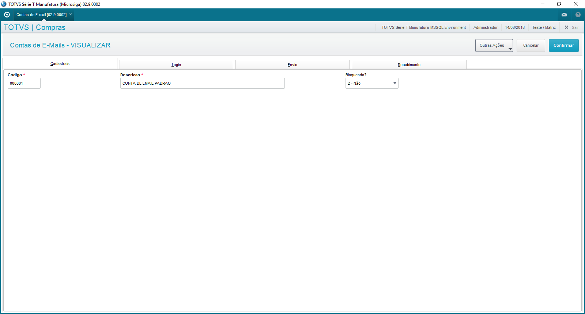{.flow-image}

As definições técnicas a respeito da configuração das contas de e-mail que serão integradas com o addon XML Terceiros para o recebimento de arquivos XML estão organizadas em pastas conforme a sua aplicação\finalidade. 
Abaixo, seguem informações especificas em torno de alguns dos campos presentes junto ao cadastro de contas de e-mail:

* <strong>Bloqueado (Z04_MSBLQL)</strong>: 
    * Determina se a conta de e-mail está bloqueada. 
    * Contas de e-mail definidas como bloqueadas não serão disponibilizadas para integração com a rotina de XML Recebidos.

* <strong>Utiliza SSL (Z04_SSL)</strong>: 
    * Determina se a conta de e-mail utiliza autenticação do tipo SSL.

* <strong>Utiliza TLS (Z04_TLS)</strong>: 
    * Determina se a conta de e-mail utiliza autenticação do tipo TLS.

* <strong>Recebimento (Z04_RECBTO)</strong> 
    * <strong>I – Imap</strong>:  
        * Determina que o protocolo de recebimento de e-mails para a conta é IMAP. 
        * Deve-se considerar os campos abaixo para configuração deste protocolo:
            * <strong>Pop (Z04_IMAP)</strong>
                * Endereço do servidor IMAP.
            * <strong>Porta (Z04_PIMAP)</strong>
                * Porta de comunicação do servidor IMAP.
        * Ao utilizar contas de e-mail com protocolo de recebimento IMAP, certifique-se que foram adicionadas as configurações abaixo junto ao arquivo de configuração do server do ERP Protheus (appserver.ini):  
          <strong>[MAIL]</strong> 
          authLogin=1 
          protocol=IMAP 
          authNTLM=1 
          authPlain=0 
          ExtendSMTP=1 
          SSLVersion=2 
          TLSVersion=3  
          <strong>[SSLConfigure]</strong> 
          SSL2=2 
      * <strong>P – Pop</strong>:  
        * Determina que o protocolo de recebimento de e-mails para a conta é POP.
        * Deve-se considerar os campos abaixo para configuração deste protocolo:
            * <strong>Pop (Z04_POP)</strong>
                * Endereço do servidor POP.
            * <strong>Porta (Z04_PPOP)</strong>
                * Porta de comunicação do servidor POP.
        * Ao utilizar contas de e-mail com protocolo de recebimento POP, certifique-se que foram adicionadas as configurações abaixo junto ao arquivo de configuração do server do ERP Protheus (appserver.ini):  
            <strong>[MAIL]</strong> 
            protocol=POP

* <strong>Importação (Z04_TPIMP)</strong> 
  * <strong>1 – Filial Logada</strong>:  
    * Nesta configuração, somente serão importados os arquivos XML cujo o CNPJ do destinatário seja igual  empresa\filial logada. 
  * <strong>2 – Todas as Filiais</strong>:  
    * A partir desta configuração, serão importados os arquivos XML vinculados  e-mails da conta onde o CNPJ do destinatário seja igual ao CNPJ de qualquer empresa\filial do ERP Protheus.

* <strong>Processados (Z04_EPROC)</strong> 
  * <strong>1 – Excluir</strong>:  
    * Caso tenha sido importado um ou mais XML a partir do e-mail processado, será realizado a exclusão do e-mail junto a conta de e-mail processada. 
  * <strong>2 – Manter</strong>:  
    * Caso tenha sido importado um ou mais XML a partir do e-mail processado, será mantido o e-mail junto a conta de e-mail processada. 
        * Ao utilizar esta opção, vale ressaltar que em nova integração com a conta de e-mail, os e-mails já lidos serão novamente avaliados, logo, este cenário poderá afetar no tempo de processamento da integração com a conta de e-mail.

* <strong>Ignorados (Z04_EIGNOR)</strong> 
  * <strong>1 – Excluir</strong>:  
    * Caso não tenha sido importado nenhum XML a partir do e-mail processado, será realizado a exclusão do e-mail junto a conta de e-mail processada. 
  * <strong>2 – Manter</strong>:  
    * Caso não tenha sido importado nenhum XML a partir do e-mail processado, será mantido o e-mail junto a conta de e-mail processada. 
        * Ao utilizar esta opção, vale ressaltar que em nova integração com a conta de e-mail, os e-mails já lidos serão novamente avaliados, logo, este cenário poderá afetar no tempo de processamento da integração com a conta de e-mail.

#### 2. CADASTRO USUÁRIOS X PERMISSÕES
A rotina de Usuários X Permissões foi desenvolvida com o objetivo de efetuar o controle em torno das permissões que os usuários do ERP Protheus terão em relação aos recursos presentes nas rotinas do ADDON XML de Terceiros.
 
Não será possível aos usuários, utilizar os recursos do ADDON caso não possua registro de definição de permissões.
 
Para cadastrar as permissões, é necessário inicialmente vincular o cadastro do usuário do ERP Protheus o qual foi previamente definido através do ambiente Configurador.

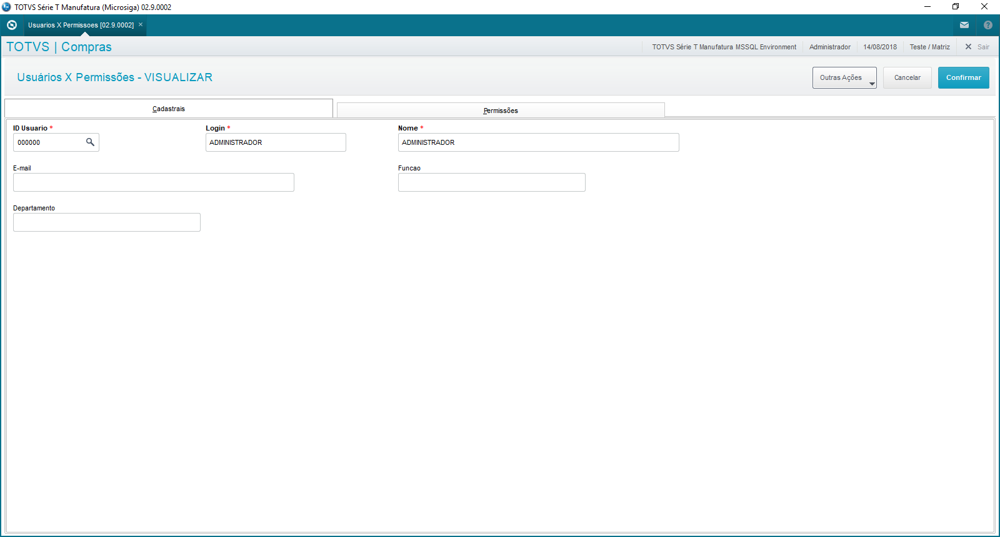{.flow-image}

Posteriormente, definem-se as permissões para o usuário em questão em relação aos recursos existentes no ADDON XML de Terceiros. 
Para cada um dos recursos existentes nas rotinas do ADDON, existem campos específicos no cadastro de Usuários X Permissões conforme exemplo abaixo.

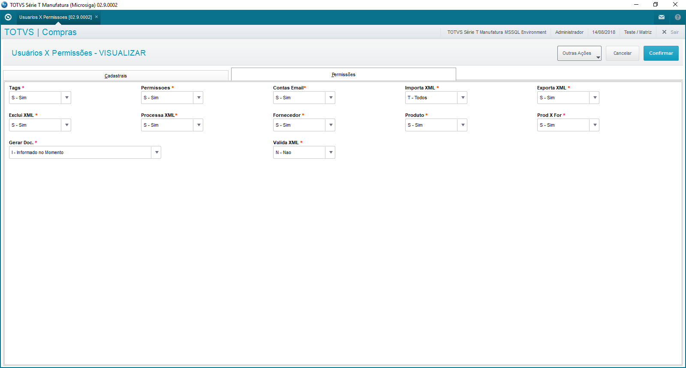{.flow-image}

Ao realizar o cadastramento das permissões, verifique o help dos campos para obter demais informações sobre a permissão em questão. 
<strong>DICA:</strong> não é necessário realizar a inclusão do cadastro de Usuários X Permissões para o usuário ADMINISTRADOR do ERP Protheus, afinal, o mesmo possui acesso total a todos os recursos do ADDON de modo padrão.
 

#### 3. CADASTRO DE TAGS
A rotina de Cadastro de Tags está presente no ADDON XML de Terceiros com o objetivo de flexibilizar a evolução do ADDON em relação a alterações na estrutura dos arquivos XML pertinentes aos documentos fiscais abaixo:
 

* <strong>NF-e</strong> 
* <strong>CT-e</strong> 

Por padrão, o ADDON XML de Terceiros já contempla uma carga de tags pré-definidas as quais são de utilização exclusiva do próprio ADDON. As definições de tags são utilizadas no recurso de processamento dos arquivos XML recebidos, ou seja, na funcionalidade a qual através do XML possibilita um assistente para maior agilidade na inclusão dos documentos fiscais no ambiente.

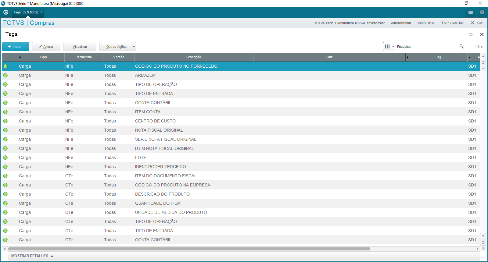{.flow-image}

Junto ao cadastro de tags são definidas as tags presentes no XML que está sendo processado bem como qual a tabela\campo do ERP Protheus no qual o conteúdo será direcionado quando do processamento do XML - inclusão do documento fiscal de entrada \ conhecimento de frete. 

Não é possível alterar as tags padrões do ADDON, porém, caso seja necessário efetuar tratamento de algum campo personalizado existente por exemplo na tabela SD1 (Itens Doc. Entrada) durante o processamento do XML, poderá ser incluído uma tag personalizada, ou seja, especifica da empresa\filial. 

<strong>OBSERVAÇÃO:</strong> Caso seja de interesse, considerar que o valor do ICMS e ICMS ST presentes no XML seja considerado para o Documento de Entrada no processamento do XML, deve-se apendar ao cadastro de tags, tags personalizadas para este processo as quais estão disponíveis junto ao pacote deste Addon. Além disto, é necessário que seja ativado o parâmetro <strong>MV_X004014</strong> (.T.). Com isto, ao processar o XML gerando Documento de Entrada, desde que o TES esteja parametrizado para calcular ICMS, serão replicados os valores do ICMS e ICMS ST presentes nos itens do XML do documento fiscal, para os itens na rotina de Documento de Entrada.

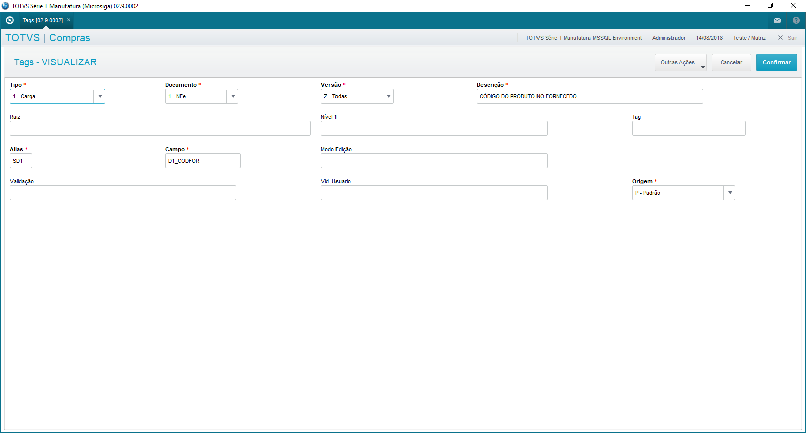{.flow-image}

Ao realizar a inclusão de tags especificas\próprias, observe com atenção o help dos campos. Além disto, poderá estar verificando a partir das próprias tags padrões do ADDON como os campos devem ser preenchidos. 
 

* <strong>Vld. Usuário (Z06_VLDUSR)</strong> 
  * Este campo existente no Cadastro de Tags pode ser utilizado para que sejam vinculadas regras personalizadas do cliente as quais serão executadas quando da edição do referido campo\tag na interface (wizard) de processamento do XML Terceiros. 
  * O seu retorno deve ser do tipo lógico (.T. \ .F.) o qual irá determinar se o conteúdo manipulado será aceito ou não.
 
 
<strong>OBSERVAÇÃO:</strong> as definições de tags padrão do ADDON poderão sofrer alterações em atualizações futuras, desta forma, particularidades da empresa\filial devem ser tratadas através de tags personalizadas\especificas. As tags da NF-e contemplavalidação para notas emitidas por fornecedorsendo CNPJ ou CPF.
 

#### 4. ROTINA XML RECEBIDOS
Através da rotina de XML Recebidos, é realizado toda a gestão em torno do recebimento\processamento do XML de Terceiros emitidos para a empresa\filial. 
Inicialmente, ao acessar a rotina é apresentado o browse com as funcionalidades disponíveis bem como, o browse com as principais informações de cada XML Terceiros previamente importado.

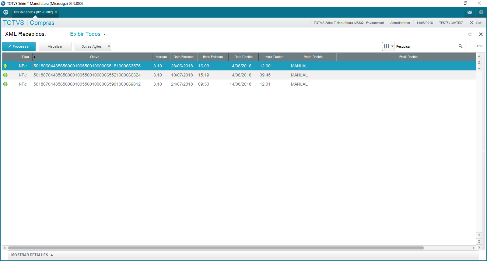{.flow-image}

Na parte superior do browse, são disponibilizados filtros pré-configurados com base nos possíveis status em que os XML Terceiros podem assumir:

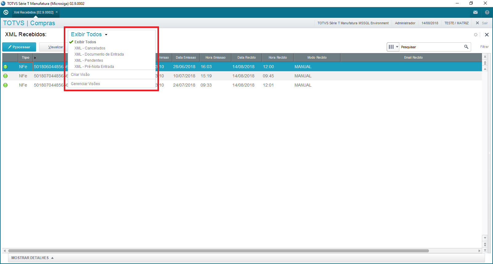{.flow-image}

Na sequência, serão abordados os recursos presentes na rotina de XML Recebidos.

#### 4.1. IMPORTAR
Ações Relacionadas\Importar
    
* <strong>MANUAL</strong>: através desta opção, será apresentado interface para que seja apontado arquivo de XML Terceiros o qual deverá ser importado para o ADDON.

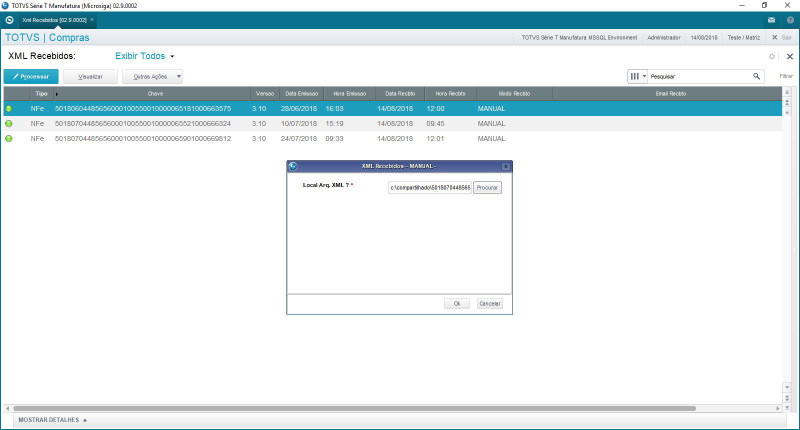{.flow-image}

 Ao confirmar a interface, serão executadas as regras de análise\importação do XML para o ADDON XML de Terceiros. Caso seja importado o XML com sucesso, será apresentado mensagem em torno da importação: 

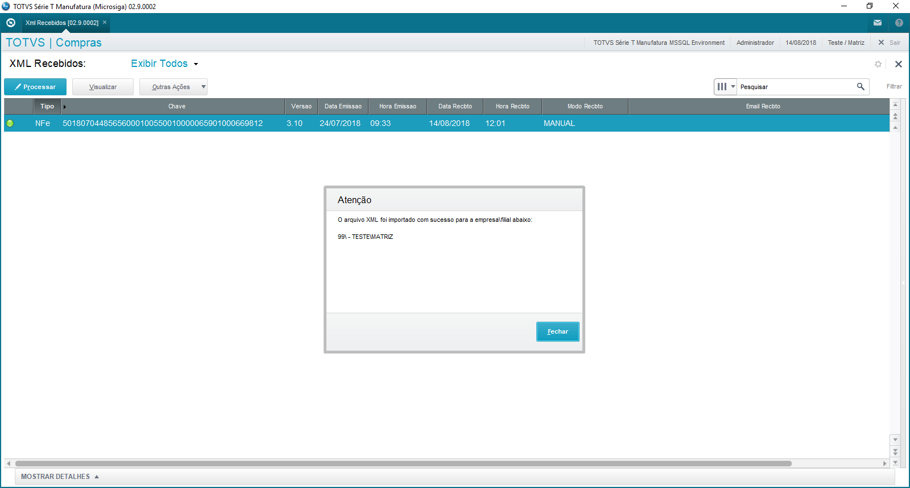{.flow-image}

Consequentemente, será disponibilizado no Browse, registro do XML o qual foi importado.

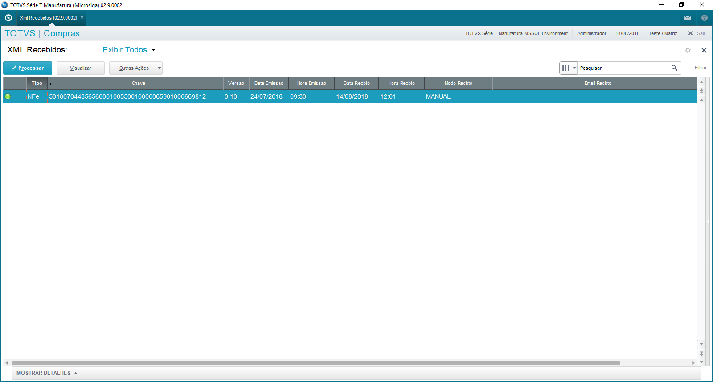{.flow-image}

<strong>E-MAIL:</strong> ao utilizar esta opção, será efetuado verificação em torno da existência de contas de e-mail junto a empresa\filial logada. 
Caso existam contas cadastradas, ocorrerá a comunicação com a conta de e-mail sendo verificado a existência de e-mails com XML de Terceiros.

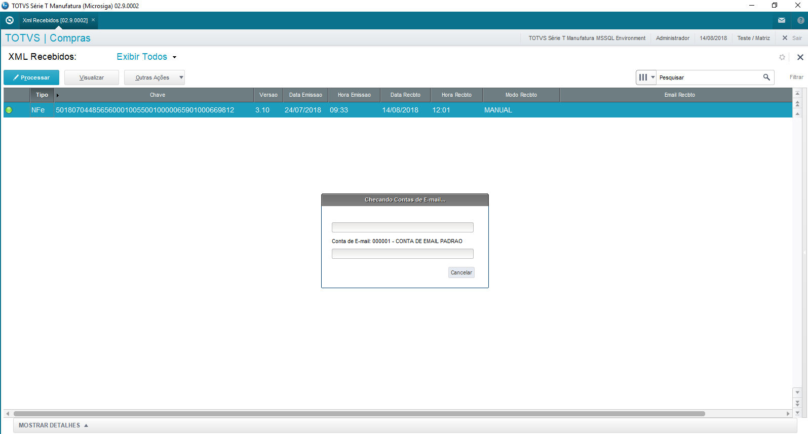{.flow-image}

Havendo e-mails válidos, ou seja, com XML de NFe\CTe, estes serão importados, sendo consequentemente disponibilizados no browse da rotina de XML Recebidos.
 
<strong>DICA:</strong> independentemente de efetuar a importação do XML de forma manual ou automática, quando um XML é importado ao ADDON de XML Terceiros, o arquivo .XML considerado na importação (arquivo original) é copiado para a pasta PROTHEUS_DATA do ambiente do ERP Protheus.
 

Neste processo, é criado uma pasta denominada \XMLS\ junto ao PROTHEUS_DATA. Posteriormente, abaixo desta pasta, são declaradas subpastas com o CNPJ\CPF do emissor do XML que foi importado sendo vinculado a esta pasta os arquivos originais. 
Com este recurso, posteriormente caso seja necessário, é possível consultar os arquivos originais. Basta solicitar ao departamento de TI. 
Além das regras acima elencadas, caso o ambiente do ERP Protheus utilize-se do módulo de Gestão de Frete Embarcador - SIGAGFE, será analisado a configuração do parâmetro MV_XMLDIR. 
Através deste parâmetro, é determinado diretório (dentro do Protheus_Data) no qual o SIGAGFE estará realizando a leitura de arquivos XML pertinentes a CTe (Conhecimento de Transporte Eletrônico). Em resumo, caso o parâmetro <strong>MV_XMLDIR</strong> esteja preenchido e o diretório informado no mesmo exista abaixo do Protheus_Data, ocorrerá a cópia do arquivo XML dos CTe os quais foram importados tanto de forma manual como automática também para esta pasta. 
O sistema pode verificar se as Notas Fiscais de Entrada referenciadas no Cte já foram informadas em outro Cte. Para tanto, é verificada a tabela SF8 - Amarracao NF OrigINAL x NF Importação ou Frete. 
Na hipótese do parâmetro <strong>MV_X004015</strong> configurado como <strong>N</strong>=Não, e alguma das notas referenciadas no .xml já estiver sido referenciada em outro CTe, não será possível efetuar a importação para futuro pocessamento do arquivo.
 
 
<strong>DICA:</strong> Ao realizar a importação de um XML Terceiros, caso já exista documento de entrada\conhecimento de frete com a chave do documento fiscal presente no XML em questão, o mesmo já será automaticamente vinculado ao documento fiscal existente no ERP Protheus, ou seja, o status do registro do XML junto ao ADDON ficará como Documento Entrada.
 

#### 4.2. EXPORTAR
Ações Relacionadas\Exportar 
Utilizando-se deste recurso, é possível realizar a exportação dos XML Terceiros existentes no ADDON de XML para arquivos. 

Para isto, deve-se parametrizar os parâmetros visando que sejam exportados os XML existentes no ADDON conforme as regras de filtro definidas.

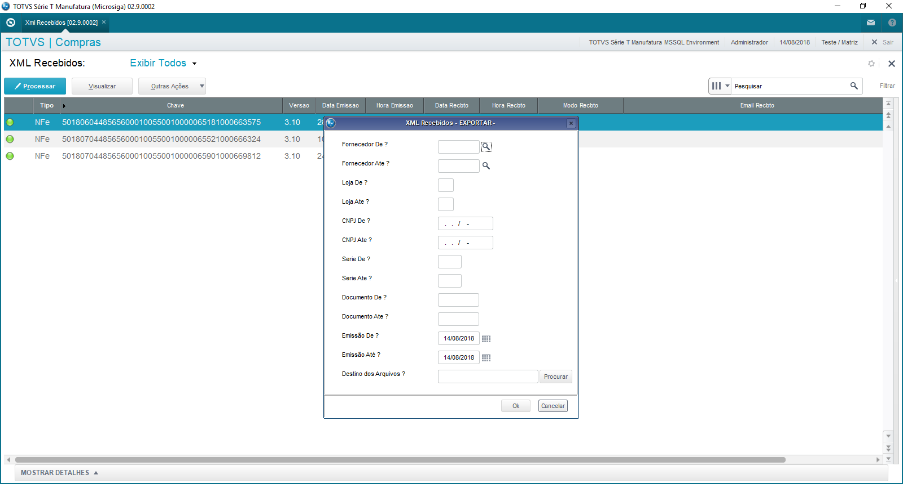{.flow-image}

Ao efetuar a exportação dos XML existentes, estes serão salvos na unidade C:\ do terminal que está sendo utilizado. O nome dos arquivos será composto pela chave do documento fiscal referente ao XML em questão.

Este recurso cria os arquivos\exporta as informações a partir do que está salvo na tabela de XML Recebidos, ou seja, não se trata de cópia dos arquivos originais utilizados quando os arquivos foram importados para o ADDON.

#### 4.3. EXCLUIR

* Ações Relacionadas\Excluir 
Esta funcionalidade tem por objetivo possibilitar a exclusão do registro de um XML de Terceiros o qual foi anteriormente importado. 
Para isto, basta posicionar sobre o registro desejado e acionar a opção de exclusão.

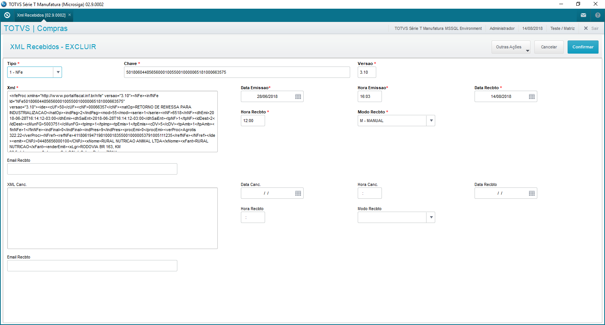{.flow-image}

Ao confirmar a tela, o registro em questão será excluído da base de dados do ADDON XML de Terceiros.

<strong>DICA:</strong> Não é possível efetuar a exclusão de um registro de XML Terceiros o qual já tenha sido processado, ou seja, que possua documento fiscal de entrada ou conhecimento de frete vinculado ao mesmo.

#### 4.4. VISUALIZAR

Através desta funcionalidade, é possível realizar a visualização das informações presentes em um registro de XML Terceiros o qual existe na base de dados do ADDON XML Terceiros.

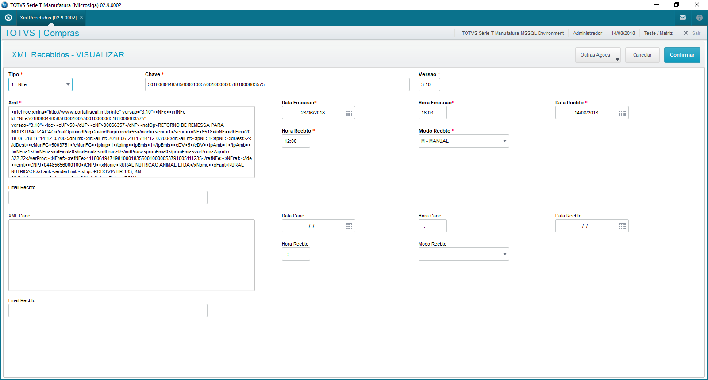{.flow-image}

Ao visualizar um registro de XML terceiros, são apresentados os campos pertinentes as informações do registro de XML em questão. 
Inicialmente, são apresentados campos com as informações pertinentes ao tipo do documento, chave de localização e versão do mesmo. 

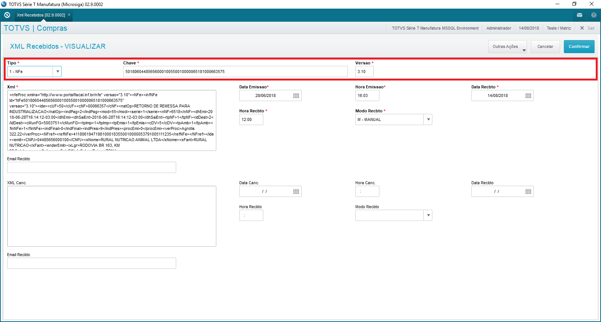{.flow-image}

Posteriormente, são apresentados campos pertinentes as informações do XML de autorização do documento fiscal, data e hora de emissão do mesmo bem como data, hora e modo pelo qual o XML foi recebido.
 
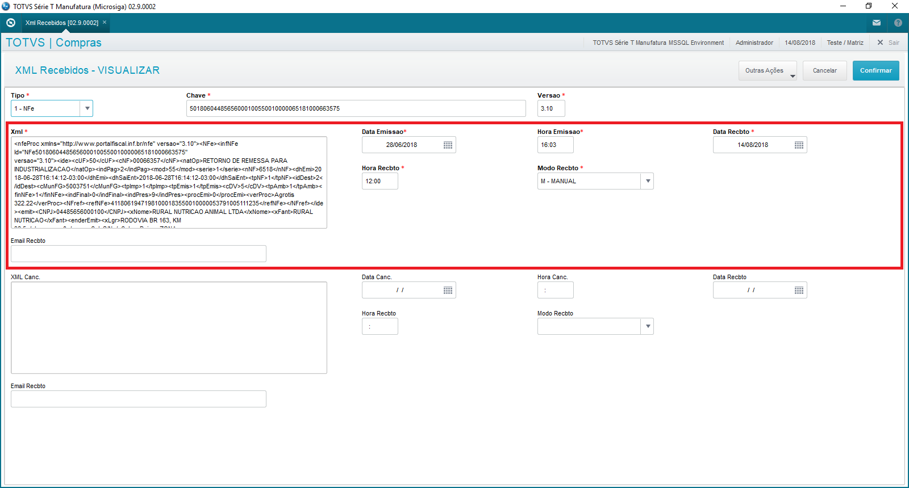{.flow-image}

Finalizando os campos presentes na interface, são apresentados campos iguais aos descritos anteriormente, porém, referente ao XML de cancelamento do documento fiscal - caso o mesmo exista.
 
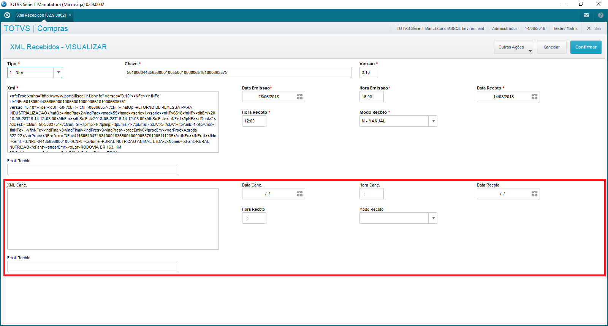{.flow-image}

<strong>DICA:</strong> Conforme descrito acima, quando existe para um determinado documento fiscal (NF-e \ CT-e) tanto o XML de Autorização como também o XML de Cancelamento, ambos os XML ficam gravados no mesmo registro junto a rotina de XML Recebidos.

#### 4.5. PROCESSAR

A funcionalidade "processar" existente na rotina de XML Recebidos se refere a utilização do XML previamente importado ao ADDON para auxiliar\agilizar no lançamento do documento fiscal. 
Ao acionar esta funcionalidade, será disponibilizado interface para que seja informado a chave do documento fiscal o qual deseja-se processar (NF-e \ CT-e).

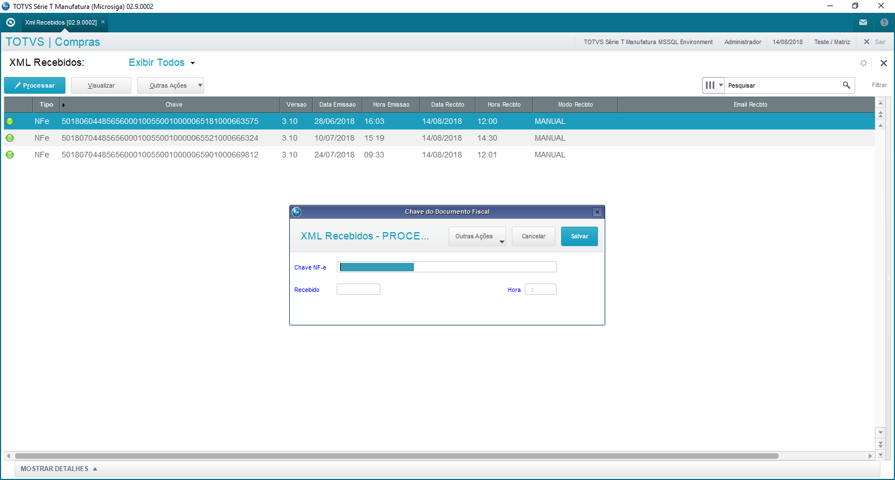{.flow-image}

Ao informar a chave do documento fiscal, será verificado os itens abaixo:  

* Existência de registro de XML Terceiros no ADDON referente a chave em questão. 
* Havendo o registro do XML Terceiros, se o mesmo está pendente, ou seja, sem documento fiscal lançado no ERP Protheus. 
* Caso no cadastro de Usuários X Permissões esteja determinado que deverá ocorrer a validação do XML no Sefaz, será verificado se o documento se encontra autorizado no Sefaz.
    * Nesta validação, é considerado a utilização do Totvs Sped Service (TSS) conforme configuração do ambiente, ou seja, se estiver configurado a NFe para HOMOLOGAÇÃO a validação da chave será realizada no mesmo ambiente.  

Uma vez que os itens acima estejam válidos, será possibilitado o processamento do XML.

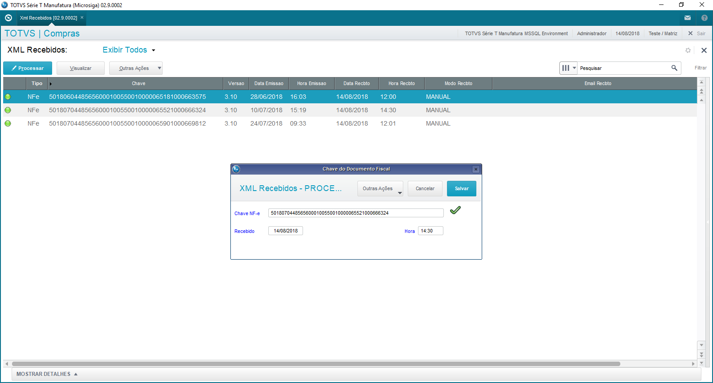{.flow-image}

Em caso de inconsistência, será apresentada mensagem ao operador reportando o fato ocorrido.

Ao confirmar a interface inicial, ocorrerá o carregamento das informações presentes no XML Terceiros para uma interface auxiliar para definição de algumas informações obrigatórias antes da geração do documento fiscal.

Na primeira tela, são apresentados no cabeçalho informações do documento fiscal e na parte inferior, informações sobre o cadastro do cliente\fornecedor vinculado ao documento fiscal.
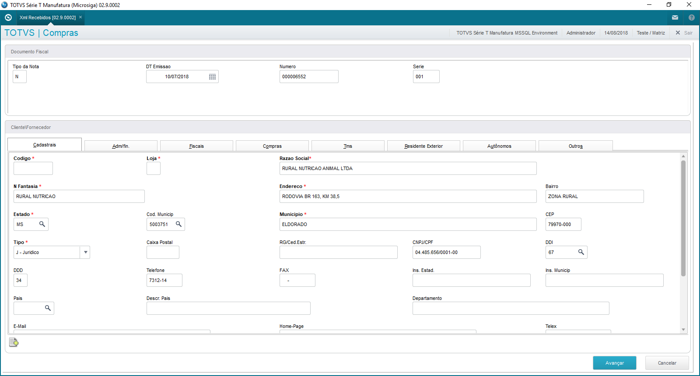{.flow-image}

Caso o cliente\fornecedor presente no documento não tenha seu cadastro localizado na empresa\filial, somente poderá ser possível avançar a tela após o cadastramento do mesmo.

* A busca em torno do cadastro do cliente\fornecedor ocorre através da informação do CNPJ \ CPF existente no XML do documento fiscal o qual está sendo processado. 

Se o usuário logado possuir permissão para inclusão de cliente\fornecedor (Cadastro Usuários X Permissões), será disponibilizado botão para inclusão do cadastro na parte inferior esquerda da interface.

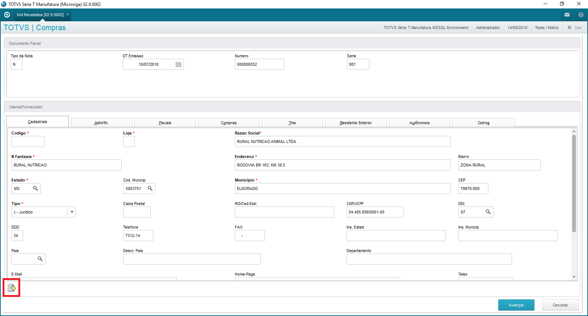{.flow-image}

Ao acionar este botão, será carregado a tela padrão de inclusão do cadastro de cliente\fornecedor.

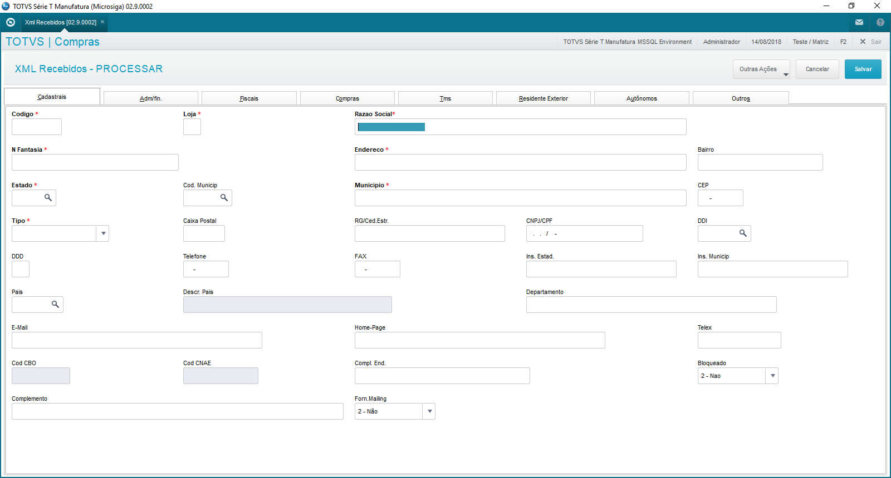{.flow-image}

Para auxiliar no cadastramento do cliente\fornecedor, pode-se utilizar as informações básicas do mesmo cujo as quais estão presentes no arquivo de XML Terceiros que esta sendo processado. 
Para isto, basta pressionar a tecla de atalho F2.

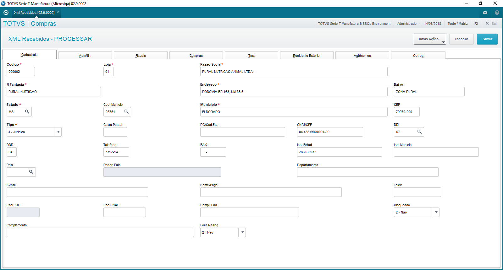{.flow-image}

Ao confirmar o cadastro, o cliente\fornecedor será vinculado a tela de processamento do XML Terceiros conforme exemplo abaixo.

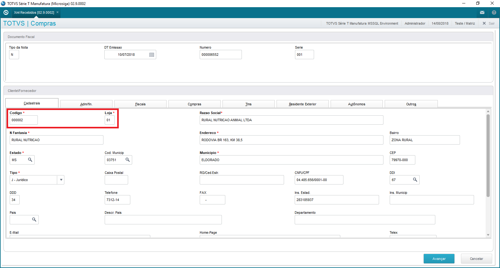{.flow-image}

<strong>DICA:</strong> Através da configuração do parâmetro <strong>MV_X004006</strong>, poderá ser parametrizado a funcionalidade de processamento de XML Terceiros para que o número e\ou série do documento fiscal o qual está sendo processado, tenha zeros adicionados a esquerda.
 

Ao avançar a interface, será apresentada uma nova tela com os itens do documento fiscal.

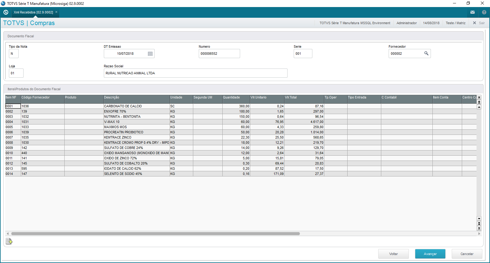{.flow-image}

Por padrão, é necessário que sejam definidos nesta tela o conteúdo dos campos abaixo listados:

*	Produtos
    * Esta relação será necessária ao menos uma vez. Posteriormente, caso esteja definido no cadastro de Usuários X Permissão para o usuário logado que deva ser salvo a definição de Produtos X Fornecedores, em novos processamentos, será automaticamente carregado o PRODUTO (código interno do ERP) a partir desta amarração. Não localizando o produto na amarração de Produtos X Fornecedores, irá buscar o produto pelo código de barras existente no XML.
    * Caso o produto não esteja cadastrado no ambiente e o usuário possua permissão para incluir produtos (Cadastro Usuários X Permissões), poderá efetuar tal processo estando posicionado no item do documento clicando no atalho específico.  

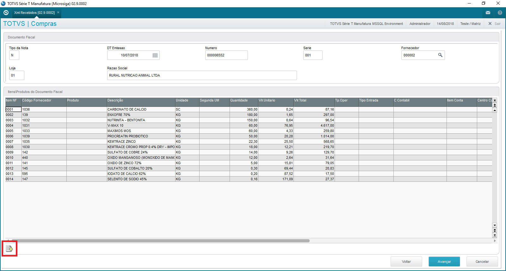{.flow-image}

* Será apresentado a interface de inclusão do produto. Para agilizar no processo, pode-se utilizar a tecla de atalho F2 onde serão atualizados alguns campos a partir de informações presentes no próprio XML que está sendo processado.
* Ao confirmar a inclusão do produto, o mesmo é automaticamente vinculado ao item, caso necessário, poderá ser alterado para outro produto já incluso.

<strong>DICAS:</strong> 

* Através da configuração do parâmetro MV_X004008, poderá ser parametrizado a funcionalidade de processamento de XML Terceiros para que esteja sugerindo a conta contábil e\ou centro de custos vinculado ao cadastro do produto para o respectivo item junto ao grid de itens da interface de processamento do XML.
* No cadastro de Produtos X Fornecedores, se o campo Unidade (A5_UNID) estiver preenchido, no momento do processamento do XML, o sistema verifica qual das unidades do produto Protheus (Primária ou Secundária) é utilizada pelo Fornecedor, efetuando automaticamente o preenchimento no GRID. 
Exemplo:
Produto ABC – Unidade Primária PC, Unidade Secundária CX
Fornecedor efetua o fornecimento sempre em CX. No Cadastro de Produtos x Fornecedor, foi informado campo Unidade = CX. 
No momento do processamento do XML, identificamos que a unidade é CX, o campo a ser preenchido automaticamente pelo sistema será o da unidade Secundária, efetuando os cálculos para a primeira unidade. 

<strong>TES:</strong> 

* O TES é necessário para que seja posteriormente gerado o Documento de Entrada ou Conhecimento de Frete.
* Quando se trata do processamento do XML de NF-e, é possível replicar uma mesma TES a todos os itens do documento fiscal, neste momento será apresentado mensagem ao usuário em torno da execução deste processo ou não.
*	Referente ao processamento de XML de CT-e, sempre será replicado o TES informado\alterado em qualquer item para todos os demais itens do documento. Isto ocorre, pois a rotina padrão de Conhecimento de Frete permite o lançamento do conhecimento com um único Tes.

<strong>PEDIDO DE COMPRA:</strong> 

*	Junto aos itens da interface de processamento, existem campos para vinculo de pedidos de compra.
*	Neste caso, ao dar "enter" sob o campo, será apresentado interface com os pedidos de compra para o fornecedor\produto em questão que possuem saldo.
*	Se necessário, poderá ser selecionado itens de pedidos diferentes para atender a quantidade do item da nota. Neste caso, o item na tela de processamento ficará com o pedido "999999" vinculado. Posteriormente, ao gerar a Pré-Nota\Documento de Entrada, será "quebrado" o item do documento em mais de um item sendo vinculado a cada item os respectivos pedidos de compra conforme a quantidade\valor unitário definidos.
*	Caso a nota fiscal de entrada tenha vindo de uma loja do fornecedor diferente daquela do pedido de compra, será possível fazer o vínculo do pedido normalmente, desde que o parâmetro “Quanto ao PC”, na rotina Documento de Entrada, acessado via tecla F12, seja definido como “Fornecedor”;

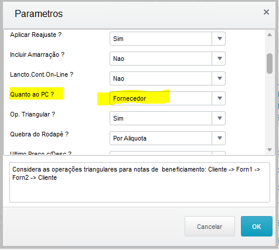{.flow-image}

<strong>DICA:</strong> Através da utilização do parâmetro MV_X004009, poderá ser ativado parametrização onde havendo um único pedido de compra vinculado aos itens do documento fiscal que está sendo processado, será sugerido a condição de pagamento vinculada ao pedido de compra em questão, como sendo a condição de pagamento para a inclusão do documento fiscal em campo específico existente na última sessão da funcionalidade de processamento XML Terceiros presente na aba Duplicatas.

*	Caso o item do pedido de compra selecionado contenha os campos das entidades contábeis preenchidos (Centro de Custo, Conta Contábil, Item Contábil, Classe de Valor), estes campos serão vinculados ao item do documento fiscal em questão.  
<strong>OBS:</strong> Isso somente se houver um único pedido de compra vinculado.

*	 Atentar ao preenchimento do parâmetro MV_X004013 que define se o valor unitário para a Pré-Nota ou Documento de entrada será considerado pelo Pedido de Compras ou pelo XML.
 

<strong>Gestão de Cereais:</strong> 

  *	Quando a empresa\filial utiliza-se também do ADDON de Gestão de Cereais, serão adicionadas novas tags ao ADDON de XML Terceiros de modo que ocorrerá a obrigatoriedade na informação de outros campos específicos do ADDON de gestão de cereais conforme a configuração do produto vinculado aos itens em questão.

Após a definição das informações dos itens conforme observações acima, ao avançar a interface será apresentado a tela final de processamento do XML. Nesta interface, na parte inferior existe a aba "duplicatas" onde deverá ser informado a condição de pagamento e a natureza financeira.
 
<strong>DICA:</strong> Através da parametrização do parâmetro <strong>MV_X004007</strong>, poderá ser parametrizado a funcionalidade de processamento de XML Terceiros para que seja sugerido a natureza financeira vinculada ao cadastro do cliente\fornecedor vinculado ao XML Terceiros que esta sendo processada. 

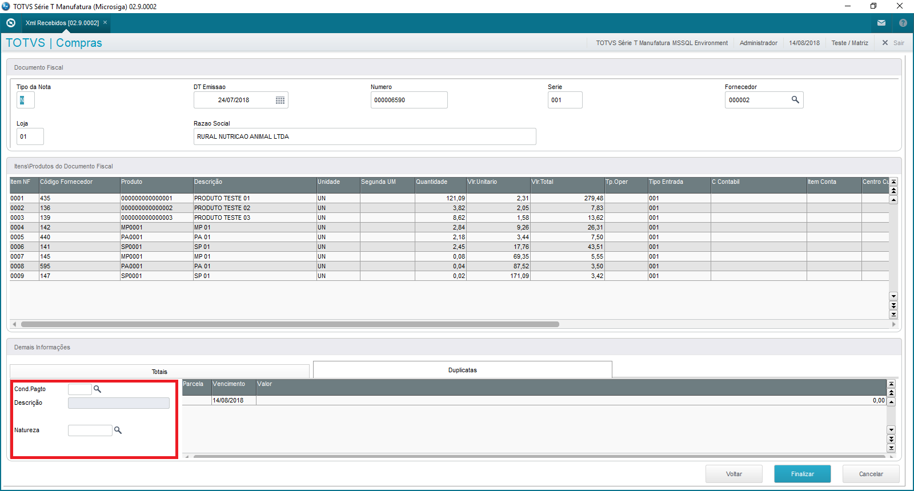{.flow-image}

Caso no cadastro de Usuários X Permissões esteja definido que o usuário gera apenas Pré-Nota (Processamento XML NFe), não será obrigatório informar estes campos, bem como o TES nos itens, pois a Pré-Nota não se utiliza destas informações. Já no caso de geração de documento de entrada ou conhecimento de frete (Processamento XML CTe), é obrigatório a informação destes campos.
 

<strong>DICA:</strong> Caso esteja definido que a informação de natureza é obrigatória no documento de entrada, a mesma também será obrigatória na tela de processamento do XML.
 
Uma vez que todas as informações foram definidas, ao acionar a opção "Finalizar" existente na interface, será aplicado validações finais gerais. Após isto, estando tudo correto, ocorrerá a inclusão do documento fiscal: 

*	Processamento XML NF-e: será gerado (Pré-Nota \ Documento de Entrada) conforme definido no cadastro de Usuários X Permissões para o usuário logado. Caso esteja definido como INFORMADO NO MOMENTO, será questionado ao usuário qual o tipo de documento deseja gerar. Ao confirmar, será apresentado a tela de inclusão com todas as informações onde o usuário poderá checar\complementar antes de confirmar a inclusão.
*	Processamento XML CT-e: independente do Cadastro de Usuários X Permissões, quando se trata de processamento de CTe sob documentos de compra vinculados, será utilizado a inclusão de Conhecimento de Frete, não sendo apresentado a interface ao usuário (Rotina automática não disponibiliza este recurso). Caso seja conhecimento de frete onde as notas fiscais referenciadas não sejam documentos de entrada (frete não entra no custo do produto), será tratado como inclusão de documento de entrada do tipo normal referente a despesa com frete. Neste caso, é apresentado a interface do documento ao usuário antes de confirmar a inclusão.

Após gerar o documento fiscal, o registro do XML tem o seu status atualizado conforme situações apresentadas na legenda.

<strong>OBSERVAÇÃO:</strong> Caso seja de interesse, considerar que o valor do ICMS e ICMS ST presentes no XML seja considerado para o Documento de Entrada no processamento do XML, deve-se apendar ao cadastro de tags, tags personalizadas para este processo as quais estão disponíveis junto ao pacote deste Addon. Além disto, é necessário que seja ativado o parâmetro MV_X004014 (.T.). Com isto, ao processar o XML gerando Documento de Entrada, desde que o TES esteja parametrizado para calcular ICMS, serão replicados os valores do ICMS e ICMS ST presentes nos itens do XML do documento fiscal, para os itens na rotina de Documento de Entrada.

#### 4.6. LEGENDA
Ações Relacionadas\Legenda  
Através da funcionalidade de legenda, é possível identificar os status vinculados aos registros existentes no browse da rotina de XML Terceiros.

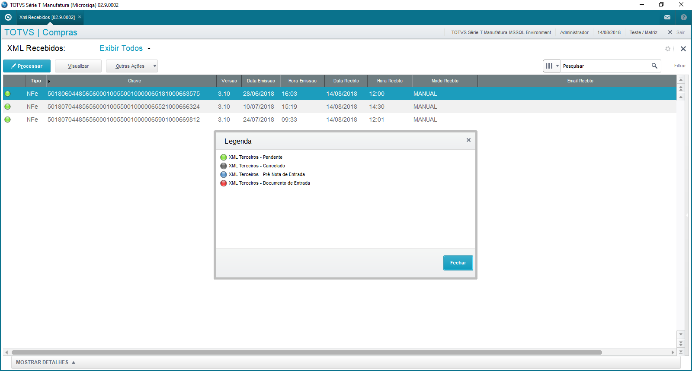{.flow-image}

Os status existentes para os XML existentes na rotina estão condicionados a situação do mesmo perante ao ADDON.

<strong>DICA:</strong> Conforme já descrito no recurso de exclusão dos registros de XML, não é possível excluir um registro de XML Terceiros o qual já possua documento fiscal, ou seja, caso o status seja referente a Pré-Nota ou Documento de Entrada (Documento Entrada \ Conhecimento de Transporte).

#### 5. RELATÓRIO LISTAGEM XML RECEBIDOS

Através deste relatório, é possível emitir a relação de XML Terceiros importados\existentes junto ao ADDON XML Terceiros.

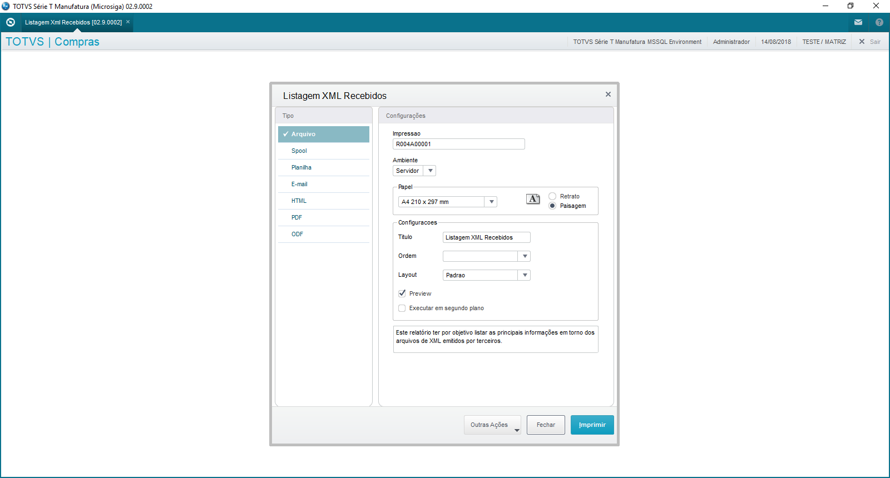{.flow-image}

Este relatório tem por objetivo permitir um controle\relação em torno dos XML a partir do status do mesmo e até para verificar os XML que ainda não possuem documento fiscal vinculado, ou seja, cujo o documento fiscal ainda não foi dado entrada junto ao ERP Protheus.

{.flow-image}

<strong>DICA:</strong> O relatório de Listagem XML Recebidos foi desenvolvimento utilizando o componente TReport, desta forma, é possível efetuar personalizações em torno do layout do mesmo visando atender necessidades especificas.

