# ADDON Controle de Cheques {.home-hero}

<!--############################################### 01 #######################################################-->

  01. Visão Geral

### 1. Visão Geral

#### Tem por objetivo, gerenciar todo o ciclo de cheques recebidos de clientes como forma de pagamento, sendo mais completo que a simples liquidação financeira. Ele possibilita registrar cheques recebidos em lotes vinculados ao cliente, substituindo os títulos originais por títulos específicos de cheque.

<strong>Principais vantagens do produto:</strong>

- Controle completo do ciclo dos cheques;
- Centralização e organização das informações;
- Substituição automática de títulos;
- Flexibilidade no uso dos cheques;
- Operações estruturadas por lotes;
- Interfaces ágeis e práticas;
- Facilidade na conciliação;

<!--############################################### 02 #######################################################-->

  02. Procedimentos para a implementação do Addon

### 2. Procedimentos para a implementação do Addon
!!! warning "Executar o procedimento em base de testes, efetuando a validação antes de aplicar em ambiente de produção. "
<strong>Antes de executar o compatibilizador é imprescindível:</strong> 
<strong>a)</strong> Realizar o backup da base de dados do produto que será executado o compatibilizador(diretório '\PROTHEUS_DATA\DATA' ou Banco de Dados) e dos dicionários de dados 'SXs' (diretório '\PROTHEUS_DATA\SYSTEM'); 
Os diretórios acima mencionados correspondem à instalação padrão do Protheus, portanto, devem ser alterados conforme o produto instalado na empresa. 
<strong>b)</strong> Essa rotina deve ser executada em modo exclusivo, ou seja, nenhum usuário deve estar utilizando o sistema. 
<strong>c)</strong> Se os dicionários de dados possuírem índices personalizados (criados pelo usuário), antes de< executar o compatibilizador, certifique-se que estão identificados pelo nickname. Caso o compatibilizador necessite criar  
índices, irá adicioná-los a partir da ordem original instalada pelo Protheus, o que poderá ocasionar a sobregravação de índices personalizados caso não estejam identificados pelo nickname. 
<strong>d)</strong> O compatibilizador deve ser executado com a Integridade Referencial desativada*. 

#### Importante:
<strong>1.	</strong>Baixar e descompactar o pacote de instalação do Acelerador (FS99999_997C5); 
<strong>2.	</strong>Compatibilizar os rdmakes disponibilizados, com o projeto de personalizações do cliente; 
<strong>3.	</strong>Copiar os arquivos de dicionário de dados para o diretório \SYSTEMLOAD\ do ambiente; 
<strong>3.1.	</strong>3.1.	Através do Totvs SmartClient, executar o compatibilizador UPDDISTR conforme abaixo:

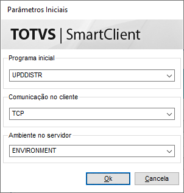{.flow-image}

<strong>3.2.	</strong>Siga as etapas apresentadas no wizard;

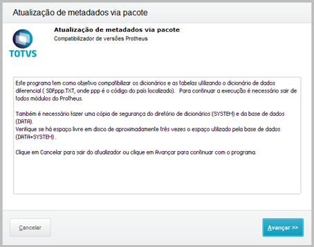{.flow-image}

<strong>3.3.	</strong>Aguardar o processamento do compatibilizador;
<strong>3.4.	</strong>Ao término da execução, é a apresentado mensagem à respeito;

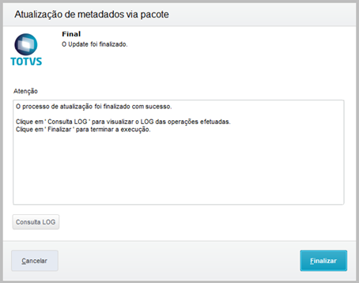{.flow-image}
</tbody>
</table>

<!--############################################### 03 #######################################################-->

  03. Menu

### 3. Menu

No “Configurador (SIGACFG)”, opção “Ambiente/Cadastros/Menus” (CFGX013), inclua a(s)nova(s) opções de menu (módulo financeiro) conforme instruções a seguir:

<table class="banks-table">
  <thead>
    <tr>
      <th>Nome da Rotina</th>
      <th>Programa</th>
      <th>Módulo</th>
      <th>Grupo</th>
      <th>Tipo</th>
    </tr>
  </thead>
  <tbody>
    <tr>
      <td><strong>Lote de Cheques</strong></td>
      <td>M997C501</td>
      <td>Financeiro</td>
      <td>Contas a Receber -> Lote de Cheques</td>
      <td>03</td>
    </tr>
    <tr>
  </tbody>
</table>

<!--############################################### 04 #######################################################-->

  04. Rotinas personalizadas específicas do Pacote

### 4. Rotinas personalizadas específicas do Pacote

#### Funções personalizadas contidas no pacote:

<table class="banks-table">
  <thead>
    <tr>
      <th>Função</th>
      <th>Descrição</th>
    </tr>
  </thead>
  <tbody>
    <tr>
      <td><strong>M997C501</strong></td>
      <td>Rotina de lote de cheques.</td>
    </tr>
    <tr>
      <td><strong>P997C501</strong></td>
      <td>Rdmake com as regras de integração com os pontos de entrada utilizados.</td>
    </tr>
    <tr>
      <td><strong>R997C501</strong></td>
      <td>Rotina de impressão de demonstrativo sob os lotes de cheques.</td>
    </tr>
    <tr>
      <td><strong>U997C501</strong></td>
      <td>Rotina referente ao compatibilizador de aplicação do acelerador.</td>
    </tr>
    <tr>
      <td><strong>X997C501</strong></td>
      <td>Rdmake que concentra funções genéricas e de integração com os pontos de entrada.</td>
     <tr>
      <td><strong>FA050DEL</strong></td>
      <td>Ponto de entrada de validação de exclusão de títulos a pagar.</td>
    </tr>
    <tr>
      <td><strong>FA070CA4</strong></td>
      <td>Ponto de entrada de validação de exclusão de baixas a receber.</td>
    </tr>
    <tr>
      <td><strong>FA080OWN</strong></td>
      <td>Ponto de entrada de validação de exclusão de títulos a receber.</td>
    </tr>
    <tr>
  </tbody>
</table>

<!--############################################### 05 #######################################################-->

  05. Campos (SX3)

### 5. Campos (SX3)

No “Configurador (SIGACFG)”, opção “Ambiente/Base de Dados/Dicionário/Base de Dados” (CFGX031), inclua a(s)nova(s) configurações conforme instruções a seguir:

Campo **E1_X_FILLT**

<table class="banks-table">
  <tbody>
    <tr>
      <th>Tipo</th>
      <td>C</td>
      <th>Ordem</th>
      <td>-</td>
      <th>Tamanho</th>
      <td>2</td>
      <th>Decimal</th>
      <td>0</td>
      <th>Formato</th>
      <td>@!</td>
    </tr>
    <tr>
      <th>Contexto</th>
      <td>Real</td>
      <th>Propriedade</th>
      <td>Visualizar</td>
    </tr>
    <tr>
      <th>Título</th>
      <td colspan="7">Filial Lote</td>
    </tr>
    <tr>
      <th>Descrição</th>
      <td colspan="7">Filial Lote Cheque</td>
    </tr>
  </tbody>
</table>
#### **Help**

Código da filial do lote de cheques vinculado ao título.

</table>

Campo **E1_X_NUMLT**

<table class="banks-table">
  <tbody>
    <tr>
      <th>Tipo</th>
      <td>C</td>
      <th>Ordem</th>
      <td>-</td>
      <th>Tamanho</th>
      <td>9</td>
      <th>Decimal</th>
      <td>0</td>
      <th>Formato</th>
      <td>@!</td>
    </tr>
    <tr>
      <th>Contexto</th>
      <td>Real</td>
      <th>Propriedade</th>
      <td>Visualizar</td>
    </tr>
    <tr>
      <th>Título</th>
      <td colspan="7">Lote</td>
    </tr>
    <tr>
      <th>Descrição</th>
      <td colspan="7">Lote Cheque</td>
    </tr>
  </tbody>
</table>
#### **Help**

Código do lote de cheques vinculado ao título.

 </tr>
  </tbody>
</table>

Campo **E1_X_CHQDV**

<table class="banks-table">
  <tbody>
    <tr>
      <th>Tipo</th>
      <td>C</td>
      <th>Ordem</th>
      <td>-</td>
      <th>Tamanho</th>
      <td>1</td>
      <th>Decimal</th>
      <td>0</td>
      <th>Formato</th>
      <td>@!</td>
    </tr>
    <tr>
      <th>Contexto</th>
      <td>Real</td>
      <th>Propriedade</th>
      <td>Visualizar</td>
    </tr>
    <tr>
      <th>Título</th>
      <td colspan="7">Cheque Dev.</td>
    </tr>
    <tr>
      <th>Descrição</th>
      <td colspan="7">Cheque Devolvido</td>
    </tr>
  </tbody>
</table>
#### **Help**

Sendo título referente a cheque, determina se o cheque foi devolvido.

</table>

Campo **E1_X_DTDEV**

<table class="banks-table">
  <tbody>
    <tr>
      <th>Tipo</th>
      <td>D</td>
      <th>Ordem</th>
      <td>-</td>
      <th>Tamanho</th>
      <td>8</td>
      <th>Decimal</th>
      <td>0</td>
      <th>Formato</th>
      <td>@!</td>
    </tr>
    <tr>
      <th>Contexto</th>
      <td>Real</td>
      <th>Propriedade</th>
      <td>Visualizar</td>
    </tr>
    <tr>
      <th>Título</th>
      <td colspan="7">Data Dev.</td>
    </tr>
    <tr>
      <th>Descrição</th>
      <td colspan="7">Data Devolução</td>
    </tr>
  </tbody>
</table>
#### **Help**

Data na qual ocorreu a devolução do cheque.

 </tr>
  </tbody>
</table>

Campo **E1_X_PREDV**

<table class="banks-table">
  <tbody>
    <tr>
      <th>Tipo</th>
      <td>C</td>
      <th>Ordem</th>
      <td>-</td>
      <th>Tamanho</th>
      <td>3</td>
      <th>Decimal</th>
      <td>0</td>
      <th>Formato</th>
      <td>@!</td>
    </tr>
    <tr>
      <th>Contexto</th>
      <td>Real</td>
      <th>Propriedade</th>
      <td>Visualizar</td>
    </tr>
    <tr>
      <th>Título</th>
      <td colspan="7">Pref. Dev.</td>
    </tr>
    <tr>
      <th>Descrição</th>
      <td colspan="7">Prefixo Devolução</td>
    </tr>
  </tbody>
</table>
#### **Help**

Prefixo do título a pagar gerado devido a devolução do cheque.

</table>

Campo **E1_X_NUMDV**

<table class="banks-table">
  <tbody>
    <tr>
      <th>Tipo</th>
      <td>C</td>
      <th>Ordem</th>
      <td>-</td>
      <th>Tamanho</th>
      <td>9</td>
      <th>Decimal</th>
      <td>0</td>
      <th>Formato</th>
      <td>@!</td>
    </tr>
    <tr>
      <th>Contexto</th>
      <td>Real</td>
      <th>Propriedade</th>
      <td>Visualizar</td>
    </tr>
    <tr>
      <th>Título</th>
      <td colspan="7">Num. Dev.</td>
    </tr>
    <tr>
      <th>Descrição</th>
      <td colspan="7">Número Devolução</td>
    </tr>
  </tbody>
</table>
#### **Help**

Número do título a pagar gerado devido a devolução do cheque.

 </tr>
  </tbody>
</table>

Campo **E1_X_PARDV**

<table class="banks-table">
  <tbody>
    <tr>
      <th>Tipo</th>
      <td>C</td>
      <th>Ordem</th>
      <td>-</td>
      <th>Tamanho</th>
      <td>3</td>
      <th>Decimal</th>
      <td>0</td>
      <th>Formato</th>
      <td>@!</td>
    </tr>
    <tr>
      <th>Contexto</th>
      <td>Real</td>
      <th>Propriedade</th>
      <td>Visualizar</td>
    </tr>
    <tr>
      <th>Título</th>
      <td colspan="7">Parcela Dev.</td>
    </tr>
    <tr>
      <th>Descrição</th>
      <td colspan="7">Parcela Devolução</td>
    </tr>
  </tbody>
</table>
#### **Help**

Número da parcela do título a pagar gerado devido a devolução do cheque.

</table>

Campo **E1_X_TIPDV**

<table class="banks-table">
  <tbody>
    <tr>
      <th>Tipo</th>
      <td>C</td>
      <th>Ordem</th>
      <td>-</td>
      <th>Tamanho</th>
      <td>3</td>
      <th>Decimal</th>
      <td>0</td>
      <th>Formato</th>
      <td>@!</td>
    </tr>
    <tr>
      <th>Contexto</th>
      <td>Real</td>
      <th>Propriedade</th>
      <td>Visualizar</td>
    </tr>
    <tr>
      <th>Título</th>
      <td colspan="7">Tipo Dev.</td>
    </tr>
    <tr>
      <th>Descrição</th>
      <td colspan="7">Tipo Devolução</td>
    </tr>
  </tbody>
</table>
#### **Help**

Tipo do título a pagar gerado devido a devolução do cheque.

 </tr>
  </tbody>
</table>

Campo **E1_X_CODDV**

<table class="banks-table">
  <tbody>
    <tr>
      <th>Tipo</th>
      <td>C</td>
      <th>Ordem</th>
      <td>-</td>
      <th>Tamanho</th>
      <td>6</td>
      <th>Decimal</th>
      <td>0</td>
      <th>Formato</th>
      <td>@!</td>
    </tr>
    <tr>
      <th>Contexto</th>
      <td>Real</td>
      <th>Propriedade</th>
      <td>Visualizar</td>
    </tr>
    <tr>
      <th>Título</th>
      <td colspan="7">Código Dev.</td>
    </tr>
    <tr>
      <th>Descrição</th>
      <td colspan="7">Fornecedor Devolução</td>
    </tr>
  </tbody>
</table>
#### **Help**

Código do fornecedor referente ao título a pagar originado pela devolução do cheque.

</table>

Campo **E1_X_LOJDV**

<table class="banks-table">
  <tbody>
    <tr>
      <th>Tipo</th>
      <td>C</td>
      <th>Ordem</th>
      <td>-</td>
      <th>Tamanho</th>
      <td>2</td>
      <th>Decimal</th>
      <td>0</td>
      <th>Formato</th>
      <td>@!</td>
    </tr>
    <tr>
      <th>Contexto</th>
      <td>Real</td>
      <th>Propriedade</th>
      <td>Visualizar</td>
    </tr>
    <tr>
      <th>Título</th>
      <td colspan="7">Loja Dev.</td>
    </tr>
    <tr>
      <th>Descrição</th>
      <td colspan="7">Loja Devolução</td>
    </tr>
  </tbody>
</table>
#### **Help**

Loja do fornecedor referente ao título a pagar originado pela devolução do cheque.

 </tr>
  </tbody>
</table>

Campo **E2_X_FILLT**

<table class="banks-table">
  <tbody>
    <tr>
      <th>Tipo</th>
      <td>C</td>
      <th>Ordem</th>
      <td>-</td>
      <th>Tamanho</th>
      <td>2</td>
      <th>Decimal</th>
      <td>0</td>
      <th>Formato</th>
      <td>@!</td>
    </tr>
    <tr>
      <th>Contexto</th>
      <td>Real</td>
      <th>Propriedade</th>
      <td>Visualizar</td>
    </tr>
    <tr>
      <th>Título</th>
      <td colspan="7">Filial Lote</td>
    </tr>
    <tr>
      <th>Descrição</th>
      <td colspan="7">Filial Lote Cheque</td>
    </tr>
  </tbody>
</table>
#### **Help**

Código da filial do lote de cheques vinculado ao título.

</table>

Campo **E2_X_NUMLT**

<table class="banks-table">
  <tbody>
    <tr>
      <th>Tipo</th>
      <td>C</td>
      <th>Ordem</th>
      <td>-</td>
      <th>Tamanho</th>
      <td>9</td>
      <th>Decimal</th>
      <td>0</td>
      <th>Formato</th>
      <td>@!</td>
    </tr>
    <tr>
      <th>Contexto</th>
      <td>Real</td>
      <th>Propriedade</th>
      <td>Visualizar</td>
    </tr>
    <tr>
      <th>Título</th>
      <td colspan="7">Lote</td>
    </tr>
    <tr>
      <th>Descrição</th>
      <td colspan="7">Lote Cheque</td>
    </tr>
  </tbody>
</table>
#### **Help**

Código do lote de cheques vinculado ao título.

 </tr>
  </tbody>
</table>

Campo **E5_X_FILLT**

<table class="banks-table">
  <tbody>
    <tr>
      <th>Tipo</th>
      <td>C</td>
      <th>Ordem</th>
      <td>-</td>
      <th>Tamanho</th>
      <td>2</td>
      <th>Decimal</th>
      <td>0</td>
      <th>Formato</th>
      <td>@!</td>
    </tr>
    <tr>
      <th>Contexto</th>
      <td>Real</td>
      <th>Propriedade</th>
      <td>Visualizar</td>
    </tr>
    <tr>
      <th>Título</th>
      <td colspan="7">Filial Lote</td>
    </tr>
    <tr>
      <th>Descrição</th>
      <td colspan="7">Filial Lote Cheque</td>
    </tr>
  </tbody>
</table>
#### **Help**

Código da filial do lote de cheques vinculado a baixa.

</table>

Campo **E5_X_NUMLT**

<table class="banks-table">
  <tbody>
    <tr>
      <th>Tipo</th>
      <td>C</td>
      <th>Ordem</th>
      <td>-</td>
      <th>Tamanho</th>
      <td>9</td>
      <th>Decimal</th>
      <td>0</td>
      <th>Formato</th>
      <td>@!</td>
    </tr>
    <tr>
      <th>Contexto</th>
      <td>Real</td>
      <th>Propriedade</th>
      <td>Visualizar</td>
    </tr>
    <tr>
      <th>Título</th>
      <td colspan="7">Lote</td>
    </tr>
    <tr>
      <th>Descrição</th>
      <td colspan="7">Lote Cheque</td>
    </tr>
  </tbody>
</table>
#### **Help**

Código do lote de cheques vinculado a baixa.

 </tr>
  </tbody>
</table>

Campo **Z13_FILIAL**

<table class="banks-table">
  <tbody>
    <tr>
      <th>Tipo</th>
      <td>C</td>
      <th>Ordem</th>
      <td>-</td>
      <th>Tamanho</th>
      <td>2</td>
      <th>Decimal</th>
      <td>0</td>
      <th>Formato</th>
      <td>@!</td>
    </tr>
    <tr>
      <th>Contexto</th>
      <td>Real</td>
      <th>Propriedade</th>
      <td>Visualizar</td>
    </tr>
    <tr>
      <th>Título</th>
      <td colspan="7">Filial Lote</td>
    </tr>
    <tr>
      <th>Descrição</th>
      <td colspan="7">Filial Lote Cheque</td>
    </tr>
  </tbody>
</table>
#### **Help**

Código da filial do lote de cheques.

</table>

Campo **Z13_LOTE**

<table class="banks-table">
  <tbody>
    <tr>
      <th>Tipo</th>
      <td>C</td>
      <th>Ordem</th>
      <td>-</td>
      <th>Tamanho</th>
      <td>9</td>
      <th>Decimal</th>
      <td>0</td>
      <th>Formato</th>
      <td>@!</td>
    </tr>
    <tr>
      <th>Contexto</th>
      <td>Real</td>
      <th>Propriedade</th>
      <td>Visualizar</td>
    </tr>
    <tr>
      <th>Título</th>
      <td colspan="7">Lote</td>
    </tr>
    <tr>
      <th>Descrição</th>
      <td colspan="7">Lote Cheque</td>
    </tr>
  </tbody>
</table>
#### **Help**

Código do lote de cheques vinculado a baixa.

 </tr>
  </tbody>
</table>

Campo **Z13_TIPO**

<table class="banks-table">
  <tbody>
    <tr>
      <th>Tipo</th>
      <td>C</td>
      <th>Ordem</th>
      <td>-</td>
      <th>Tamanho</th>
      <td>1</td>
      <th>Decimal</th>
      <td>0</td>
      <th>Formato</th>
      <td>@!</td>
    </tr>
    <tr>
      <th>Contexto</th>
      <td>Real</td>
      <th>Propriedade</th>
      <td>Visualizar</td>
    </tr>
    <tr>
      <th>Título</th>
      <td colspan="7">Tipo</td>
    </tr>
    <tr>
      <th>Descrição</th>
      <td colspan="7">Tipo do Lote</td>
    </tr>
    <tr>
      <th>Opções</th>
      <td colspan="7">1=Depósito;2=Pagamento</td>
    </tr>
  </tbody>
</table>
#### **Help**

Tipo do lote de cheques.

</table>

Campo **Z13_DATA**

<table class="banks-table">
  <tbody>
    <tr>
      <th>Tipo</th>
      <td>D</td>
      <th>Ordem</th>
      <td>-</td>
      <th>Tamanho</th>
      <td>8</td>
      <th>Decimal</th>
      <td>0</td>
      <th>Formato</th>
      <td>@!</td>
    </tr>
    <tr>
      <th>Contexto</th>
      <td>Real</td>
      <th>Propriedade</th>
      <td>Visualizar</td>
    </tr>
    <tr>
      <th>Título</th>
      <td colspan="7">Emissão</td>
    </tr>
    <tr>
      <th>Descrição</th>
      <td colspan="7">Data de Emissão</td>
    </tr>
    <tr>
      <th>Inic. Padrão</th>
      <td colspan="7">dDataBase</td>
    </tr>
  </tbody>
</table>
#### **Help**

Data de emissão do lote de cheques.

 </tr>
  </tbody>
</table>

Campo **Z13_BANCO**

<table class="banks-table">
  <tbody>
    <tr>
      <th>Tipo</th>
      <td>C</td>
      <th>Ordem</th>
      <td>-</td>
      <th>Tamanho</th>
      <td>3</td>
      <th>Decimal</th>
      <td>0</td>
      <th>Formato</th>
      <td>@!</td>
    </tr>
    <tr>
      <th>Contexto</th>
      <td>Real</td>
      <th>Propriedade</th>
      <td>Alterar</td>
    </tr>
    <tr>
      <th>Título</th>
      <td colspan="7">Banco</td>
    </tr>
    <tr>
      <th>Descrição</th>
      <td colspan="7">Código do Banco</td>
    </tr>
    <tr>
      <th>Consulta Pad.</th>
      <td colspan="7">SA6</td>
    </tr>
  </tbody>
</table>
#### **Help**

Código do banco vinculado ao lote de cheques.

</table>

Campo **Z13_AGENCIA**

<table class="banks-table">
  <tbody>
    <tr>
      <th>Tipo</th>
      <td>C</td>
      <th>Ordem</th>
      <td>-</td>
      <th>Tamanho</th>
      <td>5</td>
      <th>Decimal</th>
      <td>0</td>
      <th>Formato</th>
      <td>@!</td>
    </tr>
    <tr>
      <th>Contexto</th>
      <td>Real</td>
      <th>Propriedade</th>
      <td>Visualizar</td>
    </tr>
    <tr>
      <th>Título</th>
      <td colspan="7">Agência</td>
    </tr>
    <tr>
      <th>Descrição</th>
      <td colspan="7">Código da Agência</td>
    </tr>
  </tbody>
</table>
#### **Help**

Código da agência bancária vinculada ao lote de cheques.

 </tr>
  </tbody>
</table>

Campo **Z13_CONTA**

<table class="banks-table">
  <tbody>
    <tr>
      <th>Tipo</th>
      <td>C</td>
      <th>Ordem</th>
      <td>-</td>
      <th>Tamanho</th>
      <td>7</td>
      <th>Decimal</th>
      <td>0</td>
      <th>Formato</th>
      <td>@!</td>
    </tr>
    <tr>
      <th>Contexto</th>
      <td>Real</td>
      <th>Propriedade</th>
      <td>Visualizar</td>
    </tr>
    <tr>
      <th>Título</th>
      <td colspan="7">Conta</td>
    </tr>
    <tr>
      <th>Descrição</th>
      <td colspan="7">Código da Conta</td>
    </tr>
  </tbody>
</table>
#### **Help**

Código da conta bancária vinculada ao lote de cheques.

</table>

Campo **Z13_MOTBX**

<table class="banks-table">
  <tbody>
    <tr>
      <th>Tipo</th>
      <td>C</td>
      <th>Ordem</th>
      <td>-</td>
      <th>Tamanho</th>
      <td>3</td>
      <th>Decimal</th>
      <td>0</td>
      <th>Formato</th>
      <td>@!</td>
    </tr>
    <tr>
      <th>Contexto</th>
      <td>Real</td>
      <th>Propriedade</th>
      <td>Visualizar</td>
    </tr>
    <tr>
      <th>Título</th>
      <td colspan="7">Motivo</td>
    </tr>
    <tr>
      <th>Descrição</th>
      <td colspan="7">Motivo de Baixa</td>
    </tr>
  </tbody>
</table>
#### **Help**

Motivo de baixa vinculado ao lote de cheques.

 </tr>
  </tbody>
</table>

Campo **Z13_CODFOR**

<table class="banks-table">
  <tbody>
    <tr>
      <th>Tipo</th>
      <td>C</td>
      <th>Ordem</th>
      <td>-</td>
      <th>Tamanho</th>
      <td>6</td>
      <th>Decimal</th>
      <td>0</td>
      <th>Formato</th>
      <td>@!</td>
    </tr>
    <tr>
      <th>Contexto</th>
      <td>Real</td>
      <th>Propriedade</th>
      <td>Visualizar</td>
    </tr>
    <tr>
      <th>Título</th>
      <td colspan="7">Fornecedor</td>
    </tr>
    <tr>
      <th>Descrição</th>
      <td colspan="7">Código do Fornecedor</td>
    </tr>
  </tbody>
</table>
#### **Help**

Código do fornecedor vinculado ao lote de cheques.

</table>

Campo **Z13_LOJFOR**

<table class="banks-table">
  <tbody>
    <tr>
      <th>Tipo</th>
      <td>C</td>
      <th>Ordem</th>
      <td>-</td>
      <th>Tamanho</th>
      <td>2</td>
      <th>Decimal</th>
      <td>0</td>
      <th>Formato</th>
      <td>@!</td>
    </tr>
    <tr>
      <th>Contexto</th>
      <td>Real</td>
      <th>Propriedade</th>
      <td>Visualizar</td>
    </tr>
    <tr>
      <th>Título</th>
      <td colspan="7">Loja</td>
    </tr>
    <tr>
      <th>Descrição</th>
      <td colspan="7">Loja do Fornecedor</td>
    </tr>
  </tbody>
</table>
#### **Help**

Loja do fornecedor vinculada ao lote de cheques.

 </tr>
  </tbody>
</table>

Campo **Z13_NOMFOR**

<table class="banks-table">
  <tbody>
    <tr>
      <th>Tipo</th>
      <td>C</td>
      <th>Ordem</th>
      <td>-</td>
      <th>Tamanho</th>
      <td>20</td>
      <th>Decimal</th>
      <td>0</td>
      <th>Formato</th>
      <td>@!</td>
    </tr>
    <tr>
      <th>Contexto</th>
      <td>Real</td>
      <th>Propriedade</th>
      <td>Visualizar</td>
    </tr>
    <tr>
      <th>Título</th>
      <td colspan="7">Nome</td>
    </tr>
    <tr>
      <th>Descrição</th>
      <td colspan="7">Nome do Fornecedor</td>
    </tr>
  </tbody>
</table>
#### **Help**

Nome do fornecedor vinculado ao lote de cheques.

</table>

Campo **Z13_TOTTIT**

<table class="banks-table">
  <tbody>
    <tr>
      <th>Tipo</th>
      <td>N</td>
      <th>Ordem</th>
      <td>-</td>
      <th>Tamanho</th>
      <td>12</td>
      <th>Decimal</th>
      <td>2</td>
      <th>Formato</th>
      <td>@E 999,999,999.99</td>
    </tr>
    <tr>
      <th>Contexto</th>
      <td>Real</td>
      <th>Propriedade</th>
      <td>Visualizar</td>
    </tr>
    <tr>
      <th>Título</th>
      <td colspan="7">Vlr Títulos</td>
    </tr>
    <tr>
      <th>Descrição</th>
      <td colspan="7">Valor Total dos Títulos</td>
    </tr>
  </tbody>
</table>
#### **Help**

Valor total dos títulos a pagar selecionado para o lote de cheques.

 </tr>
  </tbody>
</table>

Campo **Z13_MULTIT**

<table class="banks-table">
  <tbody>
    <tr>
      <th>Tipo</th>
      <td>N</td>
      <th>Ordem</th>
      <td>-</td>
      <th>Tamanho</th>
      <td>12</td>
      <th>Decimal</th>
      <td>2</td>
      <th>Formato</th>
      <td>@E 999,999,999.99</td>
    </tr>
    <tr>
      <th>Contexto</th>
      <td>Real</td>
      <th>Propriedade</th>
      <td>Visualizar</td>
    </tr>
    <tr>
      <th>Título</th>
      <td colspan="7">Vlr Multa</td>
    </tr>
    <tr>
      <th>Descrição</th>
      <td colspan="7">Valor de Multa</td>
    </tr>
  </tbody>
</table>
#### **Help**

Valor de multa dos títulos a pagar selecionados para o lote de cheques.

</table>

Campo **Z13_DESTIT**

<table class="banks-table">
  <tbody>
    <tr>
      <th>Tipo</th>
      <td>N</td>
      <th>Ordem</th>
      <td>-</td>
      <th>Tamanho</th>
      <td>12</td>
      <th>Decimal</th>
      <td>2</td>
      <th>Formato</th>
      <td>@E 999,999,999.99</td>
    </tr>
    <tr>
      <th>Contexto</th>
      <td>Real</td>
      <th>Propriedade</th>
      <td>Visualizar</td>
    </tr>
    <tr>
      <th>Título</th>
      <td colspan="7">Vlr Desconto</td>
    </tr>
    <tr>
      <th>Descrição</th>
      <td colspan="7">Valor de Desconto</td>
    </tr>
  </tbody>
</table>
#### **Help**

Valor de desconto dos títulos a pagar selecionados para o lote de cheques.

 </tr>
  </tbody>
</table>

Campo **Z13_VLRPAG**

<table class="banks-table">
  <tbody>
    <tr>
      <th>Tipo</th>
      <td>N</td>
      <th>Ordem</th>
      <td>-</td>
      <th>Tamanho</th>
      <td>12</td>
      <th>Decimal</th>
      <td>2</td>
      <th>Formato</th>
      <td>@E 999,999,999.99</td>
    </tr>
    <tr>
      <th>Contexto</th>
      <td>Real</td>
      <th>Propriedade</th>
      <td>Visualizar</td>
    </tr>
    <tr>
      <th>Título</th>
      <td colspan="7">Vlr Pago</td>
    </tr>
    <tr>
      <th>Descrição</th>
      <td colspan="7">Valor Pago</td>
    </tr>
  </tbody>
</table>
#### **Help**

Valor liquido dos títulos a pagar pagos pelo lote de cheques.

</table>

Campo **Z13_VLRCHQ**

<table class="banks-table">
  <tbody>
    <tr>
      <th>Tipo</th>
      <td>N</td>
      <th>Ordem</th>
      <td>-</td>
      <th>Tamanho</th>
      <td>12</td>
      <th>Decimal</th>
      <td>2</td>
      <th>Formato</th>
      <td>@E 999,999,999.99</td>
    </tr>
    <tr>
      <th>Contexto</th>
      <td>Real</td>
      <th>Propriedade</th>
      <td>Visualizar</td>
    </tr>
    <tr>
      <th>Título</th>
      <td colspan="7">Vlr Cheques</td>
    </tr>
    <tr>
      <th>Descrição</th>
      <td colspan="7">Valor Cheques</td>
    </tr>
  </tbody>
</table>
#### **Help**

Valor total dos cheques vinculados ao lote de cheques.

 </tr>
  </tbody>
</table>

Campo **Z13_VLRDIF**

<table class="banks-table">
  <tbody>
    <tr>
      <th>Tipo</th>
      <td>N</td>
      <th>Ordem</th>
      <td>-</td>
      <th>Tamanho</th>
      <td>12</td>
      <th>Decimal</th>
      <td>2</td>
      <th>Formato</th>
      <td>@E 999,999,999.99</td>
    </tr>
    <tr>
      <th>Contexto</th>
      <td>Real</td>
      <th>Propriedade</th>
      <td>Visualizar</td>
    </tr>
    <tr>
      <th>Título</th>
      <td colspan="7">Vlr Diferen.</td>
    </tr>
    <tr>
      <th>Descrição</th>
      <td colspan="7">Valor Diferença</td>
    </tr>
  </tbody>
</table>
#### **Help**

Valor de diferença entre o valor total dos cheques e o valor dos títulos a pagar vinculados ao lote.

</table>

Campo **Z13_CODUSR**

<table class="banks-table">
  <tbody>
    <tr>
      <th>Tipo</th>
      <td>C</td>
      <th>Ordem</th>
      <td>-</td>
      <th>Tamanho</th>
      <td>6</td>
      <th>Decimal</th>
      <td>0</td>
      <th>Formato</th>
      <td>@!</td>
    </tr>
    <tr>
      <th>Contexto</th>
      <td>Real</td>
      <th>Propriedade</th>
      <td>Visualizar</td>
    </tr>
    <tr>
      <th>Título</th>
      <td colspan="7">Usuário</td>
    </tr>
    <tr>
      <th>Descrição</th>
      <td colspan="7">Código do Usuário</td>
    </tr>
  </tbody>
</table>
#### **Help**

Código do usuário que realizou a inclusão do lote de cheques.

 </tr>
  </tbody>
</table>

Campo **Z13_NOMUSR**

<table class="banks-table">
  <tbody>
    <tr>
      <th>Tipo</th>
      <td>C</td>
      <th>Ordem</th>
      <td>-</td>
      <th>Tamanho</th>
      <td>15</td>
      <th>Decimal</th>
      <td>0</td>
      <th>Formato</th>
      <td>@!</td>
    </tr>
    <tr>
      <th>Contexto</th>
      <td>Real</td>
      <th>Propriedade</th>
      <td>Visualizar</td>
    </tr>
    <tr>
      <th>Título</th>
      <td colspan="7">Nome</td>
    </tr>
    <tr>
      <th>Descrição</th>
      <td colspan="7">Nome do Usuário</td>
    </tr>
  </tbody>
</table>
#### **Help**

Nome do usuário que realizou a inclusão do lote de cheques.

</table>

Campo **Z14_FILIAL**

<table class="banks-table">
  <tbody>
    <tr>
      <th>Tipo</th>
      <td>C</td>
      <th>Ordem</th>
      <td>-</td>
      <th>Tamanho</th>
      <td>2</td>
      <th>Decimal</th>
      <td>0</td>
      <th>Formato</th>
      <td>@!</td>
    </tr>
    <tr>
      <th>Contexto</th>
      <td>Real</td>
      <th>Propriedade</th>
      <td>Visualizar</td>
    </tr>
    <tr>
      <th>Título</th>
      <td colspan="7">Filial Lote</td>
    </tr>
    <tr>
      <th>Descrição</th>
      <td colspan="7">Filial Lote Cheque </td>
    </tr>
  </tbody>
</table>
#### **Help**

Código da filial do lote de cheques.

 </tr>
  </tbody>
</table>

Campo **Z14_LOTE**

<table class="banks-table">
  <tbody>
    <tr>
      <th>Tipo</th>
      <td>C</td>
      <th>Ordem</th>
      <td>-</td>
      <th>Tamanho</th>
      <td>9</td>
      <th>Decimal</th>
      <td>0</td>
      <th>Formato</th>
      <td>@!</td>
    </tr>
    <tr>
      <th>Contexto</th>
      <td>Real</td>
      <th>Propriedade</th>
      <td>Visualizar</td>
    </tr>
    <tr>
      <th>Título</th>
      <td colspan="7">Lote</td>
    </tr>
    <tr>
      <th>Descrição</th>
      <td colspan="7">Lote Cheque</td>
    </tr>
  </tbody>
</table>
#### **Help**

Código do lote de cheques.

</table>

Campo **Z14_TITULO**

<table class="banks-table">
  <tbody>
    <tr>
      <th>Tipo</th>
      <td>C</td>
      <th>Ordem</th>
      <td>-</td>
      <th>Tamanho</th>
      <td>1</td>
      <th>Decimal</th>
      <td>0</td>
      <th>Formato</th>
      <td>@!</td>
    </tr>
    <tr>
      <th>Contexto</th>
      <td>Real</td>
      <th>Propriedade</th>
      <td>Visualizar</td>
    </tr>
    <tr>
      <th>Título</th>
      <td colspan="7">Título</td>
    </tr>
    <tr>
      <th>Descrição</th>
      <td colspan="7">Título do Lote</td>
    </tr>
    <tr>
      <th>Lista Opções</th>
      <td colspan="7">C=Cheque;P=Pagamento</td>
    </tr>
  </tbody>
</table>
#### **Help**

Tipo do título vinculado ao lote de cheques.

 </tr>
  </tbody>
</table>

Campo **Z14_ITEM**

<table class="banks-table">
  <tbody>
    <tr>
      <th>Tipo</th>
      <td>C</td>
      <th>Ordem</th>
      <td>-</td>
      <th>Tamanho</th>
      <td>2</td>
      <th>Decimal</th>
      <td>0</td>
      <th>Formato</th>
      <td>@!</td>
    </tr>
    <tr>
      <th>Contexto</th>
      <td>Real</td>
      <th>Propriedade</th>
      <td>Visualizar</td>
    </tr>
    <tr>
      <th>Título</th>
      <td colspan="7">Item</td>
    </tr>
    <tr>
      <th>Descrição</th>
      <td colspan="7">Item do Título</td>
    </tr>
  </tbody>
</table>
#### **Help**

Item sequencial do título em relação ao lote de cheques.

</table>

Campo **Z14_FILTIT**

<table class="banks-table">
  <tbody>
    <tr>
      <th>Tipo</th>
      <td>C</td>
      <th>Ordem</th>
      <td>-</td>
      <th>Tamanho</th>
      <td>2</td>
      <th>Decimal</th>
      <td>0</td>
      <th>Formato</th>
      <td>@!</td>
    </tr>
    <tr>
      <th>Contexto</th>
      <td>Real</td>
      <th>Propriedade</th>
      <td>Visualizar</td>
    </tr>
    <tr>
      <th>Título</th>
      <td colspan="7">Filial</td>
    </tr>
    <tr>
      <th>Descrição</th>
      <td colspan="7">Filial do Título</td>
    </tr>
  </tbody>
</table>
#### **Help**

Filial do título vinculado ao lote de cheques.

 </tr>
  </tbody>
</table>

Campo **Z14_PRETIT**

<table class="banks-table">
  <tbody>
    <tr>
      <th>Tipo</th>
      <td>C</td>
      <th>Ordem</th>
      <td>-</td>
      <th>Tamanho</th>
      <td>3</td>
      <th>Decimal</th>
      <td>0</td>
      <th>Formato</th>
      <td>@!</td>
    </tr>
    <tr>
      <th>Contexto</th>
      <td>Real</td>
      <th>Propriedade</th>
      <td>Visualizar</td>
    </tr>
    <tr>
      <th>Título</th>
      <td colspan="7">Prefixo</td>
    </tr>
    <tr>
      <th>Descrição</th>
      <td colspan="7">Prefixo do Título</td>
    </tr>
  </tbody>
</table>
#### **Help**

Prefixo do título vinculado ao lote de cheques.

</table>

Campo **Z14_NUMTIT**

<table class="banks-table">
  <tbody>
    <tr>
      <th>Tipo</th>
      <td>C</td>
      <th>Ordem</th>
      <td>-</td>
      <th>Tamanho</th>
      <td>9</td>
      <th>Decimal</th>
      <td>0</td>
      <th>Formato</th>
      <td>@!</td>
    </tr>
    <tr>
      <th>Contexto</th>
      <td>Real</td>
      <th>Propriedade</th>
      <td>Visualizar</td>
    </tr>
    <tr>
      <th>Título</th>
      <td colspan="7">Número</td>
    </tr>
    <tr>
      <th>Descrição</th>
      <td colspan="7">Número do Título</td>
    </tr>
  </tbody>
</table>
#### **Help**

Número do titulo vinculado ao lote de cheques.

 </tr>
  </tbody>
</table>

Campo **Z14_PARTIT**

<table class="banks-table">
  <tbody>
    <tr>
      <th>Tipo</th>
      <td>C</td>
      <th>Ordem</th>
      <td>-</td>
      <th>Tamanho</th>
      <td>3</td>
      <th>Decimal</th>
      <td>0</td>
      <th>Formato</th>
      <td>@!</td>
    </tr>
    <tr>
      <th>Contexto</th>
      <td>Real</td>
      <th>Propriedade</th>
      <td>Visualizar</td>
    </tr>
    <tr>
      <th>Título</th>
      <td colspan="7">Parcela</td>
    </tr>
    <tr>
      <th>Descrição</th>
      <td colspan="7">Parcela do Título</td>
    </tr>
  </tbody>
</table>
#### **Help**

Parcela do título vinculado ao lote de cheques.

</table>

Campo **Z14_TIPTIT**

<table class="banks-table">
  <tbody>
    <tr>
      <th>Tipo</th>
      <td>C</td>
      <th>Ordem</th>
      <td>-</td>
      <th>Tamanho</th>
      <td>3</td>
      <th>Decimal</th>
      <td>0</td>
      <th>Formato</th>
      <td>@!</td>
    </tr>
    <tr>
      <th>Contexto</th>
      <td>Real</td>
      <th>Propriedade</th>
      <td>Visualizar</td>
    </tr>
    <tr>
      <th>Título</th>
      <td colspan="7">Tipo</td>
    </tr>
    <tr>
      <th>Descrição</th>
      <td colspan="7">Tipo do Título</td>
    </tr>
  </tbody>
</table>
#### **Help**

Tipo do título vinculado ao lote de cheques.

 </tr>
  </tbody>
</table>

Campo **Z14_EMITEN**

<table class="banks-table">
  <tbody>
    <tr>
      <th>Tipo</th>
      <td>C</td>
      <th>Ordem</th>
      <td>-</td>
      <th>Tamanho</th>
      <td>30</td>
      <th>Decimal</th>
      <td>0</td>
      <th>Formato</th>
      <td>@!</td>
    </tr>
    <tr>
      <th>Contexto</th>
      <td>Real</td>
      <th>Propriedade</th>
      <td>Visualizar</td>
    </tr>
    <tr>
      <th>Título</th>
      <td colspan="7">Emitente</td>
    </tr>
    <tr>
      <th>Descrição</th>
      <td colspan="7">Nome do Emitente</td>
    </tr>
  </tbody>
</table>
#### **Help**

Nome do emitente vinculado ao lote de cheques.

</table>

Campo **Z14_CLIFOR**

<table class="banks-table">
  <tbody>
    <tr>
      <th>Tipo</th>
      <td>C</td>
      <th>Ordem</th>
      <td>-</td>
      <th>Tamanho</th>
      <td>6</td>
      <th>Decimal</th>
      <td>0</td>
      <th>Formato</th>
      <td>@!</td>
    </tr>
    <tr>
      <th>Contexto</th>
      <td>Real</td>
      <th>Propriedade</th>
      <td>Visualizar</td>
    </tr>
    <tr>
      <th>Título</th>
      <td colspan="7">Código</td>
    </tr>
    <tr>
      <th>Descrição</th>
      <td colspan="7">Cliente\Fornecedor</td>
    </tr>
  </tbody>
</table>
#### **Help**

Cliente\fornecedor do título vinculado ao lote de cheques.

 </tr>
  </tbody>
</table>

Campo **Z14_LOJA**

<table class="banks-table">
  <tbody>
    <tr>
      <th>Tipo</th>
      <td>C</td>
      <th>Ordem</th>
      <td>-</td>
      <th>Tamanho</th>
      <td>2</td>
      <th>Decimal</th>
      <td>0</td>
      <th>Formato</th>
      <td>@!</td>
    </tr>
    <tr>
      <th>Contexto</th>
      <td>Real</td>
      <th>Propriedade</th>
      <td>Visualizar</td>
    </tr>
    <tr>
      <th>Título</th>
      <td colspan="7">Loja</td>
    </tr>
    <tr>
      <th>Descrição</th>
      <td colspan="7">Loja Cliente\Fornecedor</td>
    </tr>
  </tbody>
</table>
#### **Help**

Loja do cliente\fornecedor do título vinculado ao lote de cheques.

</table>

Campo **Z14_NOME**

<table class="banks-table">
  <tbody>
    <tr>
      <th>Tipo</th>
      <td>C</td>
      <th>Ordem</th>
      <td>-</td>
      <th>Tamanho</th>
      <td>30</td>
      <th>Decimal</th>
      <td>0</td>
      <th>Formato</th>
      <td>@!</td>
    </tr>
    <tr>
      <th>Contexto</th>
      <td>Real</td>
      <th>Propriedade</th>
      <td>Visualizar</td>
    </tr>
    <tr>
      <th>Título</th>
      <td colspan="7">Nome</td>
    </tr>
    <tr>
      <th>Descrição</th>
      <td colspan="7">Nome Cliente\Fornecedor</td>
    </tr>
  </tbody>
</table>
#### **Help**

Nome do cliente\fornecedor vinculado ao lote de cheques.

 </tr>
  </tbody>
</table>

Campo **Z14_EMISSA**

<table class="banks-table">
  <tbody>
    <tr>
      <th>Tipo</th>
      <td>D</td>
      <th>Ordem</th>
      <td>-</td>
      <th>Tamanho</th>
      <td>8</td>
      <th>Decimal</th>
      <td>0</td>
      <th>Formato</th>
      <td>@!</td>
    </tr>
    <tr>
      <th>Contexto</th>
      <td>Real</td>
      <th>Propriedade</th>
      <td>Visualizar</td>
    </tr>
    <tr>
      <th>Título</th>
      <td colspan="7">Emissão</td>
    </tr>
    <tr>
      <th>Descrição</th>
      <td colspan="7">Data de Emissão</td>
    </tr>
  </tbody>
</table>
#### **Help**

Data de emissão do título vinculado ao lote de cheques.

</table>

Campo **Z14_VENREA**

<table class="banks-table">
  <tbody>
    <tr>
      <th>Tipo</th>
      <td>D</td>
      <th>Ordem</th>
      <td>-</td>
      <th>Tamanho</th>
      <td>8</td>
      <th>Decimal</th>
      <td>0</td>
      <th>Formato</th>
      <td>@!</td>
    </tr>
    <tr>
      <th>Contexto</th>
      <td>Real</td>
      <th>Propriedade</th>
      <td>Visualizar</td>
    </tr>
    <tr>
      <th>Título</th>
      <td colspan="7">Vencimento</td>
    </tr>
    <tr>
      <th>Descrição</th>
      <td colspan="7">Data de Vencimento</td>
    </tr>
  </tbody>
</table>
#### **Help**

Data de vencimento do titulo vinculado ao lote de cheques.

 </tr>
  </tbody>
</table>

Campo **Z14_BCOCHQ**

<table class="banks-table">
  <tbody>
    <tr>
      <th>Tipo</th>
      <td>C</td>
      <th>Ordem</th>
      <td>-</td>
      <th>Tamanho</th>
      <td>3</td>
      <th>Decimal</th>
      <td>0</td>
      <th>Formato</th>
      <td>@!</td>
    </tr>
    <tr>
      <th>Contexto</th>
      <td>Real</td>
      <th>Propriedade</th>
      <td>Visualizar</td>
    </tr>
    <tr>
      <th>Título</th>
      <td colspan="7">Banco</td>
    </tr>
    <tr>
      <th>Descrição</th>
      <td colspan="7">Código do Banco</td>
    </tr>
  </tbody>
</table>
#### **Help**

Código do banco presente no título vinculado ao lote de cheques.

</table>

Campo **Z14_AGECHQ**

<table class="banks-table">
  <tbody>
    <tr>
      <th>Tipo</th>
      <td>C</td>
      <th>Ordem</th>
      <td>-</td>
      <th>Tamanho</th>
      <td>5</td>
      <th>Decimal</th>
      <td>0</td>
      <th>Formato</th>
      <td>@!</td>
    </tr>
    <tr>
      <th>Contexto</th>
      <td>Real</td>
      <th>Propriedade</th>
      <td>Visualizar</td>
    </tr>
    <tr>
      <th>Título</th>
      <td colspan="7">Agência</td>
    </tr>
    <tr>
      <th>Descrição</th>
      <td colspan="7">Código da Agência</td>
    </tr>
  </tbody>
</table>
#### **Help**

Código da agência presente no título vinculado ao lote de cheques.

 </tr>
  </tbody>
</table>

Campo **Z14_CTACHQ**

<table class="banks-table">
  <tbody>
    <tr>
      <th>Tipo</th>
      <td>C</td>
      <th>Ordem</th>
      <td>-</td>
      <th>Tamanho</th>
      <td>7</td>
      <th>Decimal</th>
      <td>0</td>
      <th>Formato</th>
      <td>@!</td>
    </tr>
    <tr>
      <th>Contexto</th>
      <td>Real</td>
      <th>Propriedade</th>
      <td>Visualizar</td>
    </tr>
    <tr>
      <th>Título</th>
      <td colspan="7">Conta</td>
    </tr>
    <tr>
      <th>Descrição</th>
      <td colspan="7">Código da Conta</td>
    </tr>
  </tbody>
</table>
#### **Help**

Código da conta presente no título vinculado ao lote de cheques.

</table>

Campo **Z14_VLRORI**

<table class="banks-table">
  <tbody>
    <tr>
      <th>Tipo</th>
      <td>N</td>
      <th>Ordem</th>
      <td>-</td>
      <th>Tamanho</th>
      <td>12</td>
      <th>Decimal</th>
      <td>0</td>
      <th>Formato</th>
      <td>@E 9,999,999,999,999.99</td>
    </tr>
    <tr>
      <th>Contexto</th>
      <td>Real</td>
      <th>Propriedade</th>
      <td>Visualizar</td>
    </tr>
    <tr>
      <th>Título</th>
      <td colspan="7">Vlr Título</td>
    </tr>
    <tr>
      <th>Descrição</th>
      <td colspan="7">Valor do Título</td>
    </tr>
  </tbody>
</table>
#### **Help**

Valor total original do título vinculado ao lote de cheques.

 </tr>
  </tbody>
</table>

Campo **Z14_VLRSLD**

<table class="banks-table">
  <tbody>
    <tr>
      <th>Tipo</th>
      <td>N</td>
      <th>Ordem</th>
      <td>-</td>
      <th>Tamanho</th>
      <td>12</td>
      <th>Decimal</th>
      <td>2</td>
      <th>Formato</th>
      <td>@E 9,999,999,999,999.99</td>
    </tr>
    <tr>
      <th>Contexto</th>
      <td>Real</td>
      <th>Propriedade</th>
      <td>Visualizar</td>
    </tr>
    <tr>
      <th>Título</th>
      <td colspan="7">Vlr Saldo</td>
    </tr>
    <tr>
      <th>Descrição</th>
      <td colspan="7">Valor do Saldo</td>
    </tr>
  </tbody>
</table>
#### **Help**

Valor do saldo do título vinculado ao lote de cheques.

</table>

Campo **Z14_VLRSEL**

<table class="banks-table">
  <tbody>
    <tr>
      <th>Tipo</th>
      <td>N</td>
      <th>Ordem</th>
      <td>-</td>
      <th>Tamanho</th>
      <td>12</td>
      <th>Decimal</th>
      <td>2</td>
      <th>Formato</th>
      <td>@E 9,999,999,999,999.99</td>
    </tr>
    <tr>
      <th>Contexto</th>
      <td>Real</td>
      <th>Propriedade</th>
      <td>Visualizar</td>
    </tr>
    <tr>
      <th>Título</th>
      <td colspan="7">Vlr Sel.</td>
    </tr>
    <tr>
      <th>Descrição</th>
      <td colspan="7">Valor Selecionado</td>
    </tr>
  </tbody>
</table>
#### **Help**

Valor selecionado para baixa título vinculado ao lote de cheques.

 </tr>
  </tbody>
</table>

Campo **Z14_VLRMUL**

<table class="banks-table">
  <tbody>
    <tr>
      <th>Tipo</th>
      <td>C</td>
      <th>Ordem</th>
      <td>-</td>
      <th>Tamanho</th>
      <td>12</td>
      <th>Decimal</th>
      <td>2</td>
      <th>Formato</th>
      <td>@E 9,999,999,999,999.99</td>
    </tr>
    <tr>
      <th>Contexto</th>
      <td>Real</td>
      <th>Propriedade</th>
      <td>Visualizar</td>
    </tr>
    <tr>
      <th>Título</th>
      <td colspan="7">Vlr Multa</td>
    </tr>
    <tr>
      <th>Descrição</th>
      <td colspan="7">Valor de Multa</td>
    </tr>
  </tbody>
</table>
#### **Help**

Valor de multa do título vinculado ao lote de cheques.

</table>

Campo **Z14_VLRDES**

<table class="banks-table">
  <tbody>
    <tr>
      <th>Tipo</th>
      <td>N</td>
      <th>Ordem</th>
      <td>-</td>
      <th>Tamanho</th>
      <td>12</td>
      <th>Decimal</th>
      <td>2</td>
      <th>Formato</th>
      <td>@E 9,999,999,999,999.99</td>
    </tr>
    <tr>
      <th>Contexto</th>
      <td>Real</td>
      <th>Propriedade</th>
      <td>Visualizar</td>
    </tr>
    <tr>
      <th>Título</th>
      <td colspan="7">Vlr Desconto</td>
    </tr>
    <tr>
      <th>Descrição</th>
      <td colspan="7">Valor de Desconto</td>
    </tr>
  </tbody>
</table>
#### **Help**

Valor de desconto do título vinculado ao lote de cheques.

 </tr>
  </tbody>
</table>

Campo **Z14_VLRBAI**

<table class="banks-table">
  <tbody>
    <tr>
      <th>Tipo</th>
      <td>N</td>
      <th>Ordem</th>
      <td>-</td>
      <th>Tamanho</th>
      <td>12</td>
      <th>Decimal</th>
      <td>2</td>
      <th>Formato</th>
      <td>@E 9,999,999,999,999.99</td>
    </tr>
    <tr>
      <th>Contexto</th>
      <td>Real</td>
      <th>Propriedade</th>
      <td>Visualizar</td>
    </tr>
    <tr>
      <th>Título</th>
      <td colspan="7">Vlr Baixa</td>
    </tr>
    <tr>
      <th>Descrição</th>
      <td colspan="7">Valor de Baixa</td>
    </tr>
  </tbody>
</table>
#### **Help**

Valor final de baixa do título vinculado ao lote de cheques.

</table>

Campo **Z14_SEQBX**

<table class="banks-table">
  <tbody>
    <tr>
      <th>Tipo</th>
      <td>C</td>
      <th>Ordem</th>
      <td>-</td>
      <th>Tamanho</th>
      <td>2</td>
      <th>Decimal</th>
      <td>0</td>
      <th>Formato</th>
      <td>@!</td>
    </tr>
    <tr>
      <th>Contexto</th>
      <td>Real</td>
      <th>Propriedade</th>
      <td>Visualizar</td>
    </tr>
    <tr>
      <th>Título</th>
      <td colspan="7">Seq. Baixa</td>
    </tr>
    <tr>
      <th>Descrição</th>
      <td colspan="7">Sequência de Baixa</td>
    </tr>
  </tbody>
</table>
#### **Help**

Sequência de baixa do título vinculado ao lote de cheques.

 </tr>
  </tbody>
</table>

Campo **Z14_SEQBX2**

<table class="banks-table">
  <tbody>
    <tr>
      <th>Tipo</th>
      <td>C</td>
      <th>Ordem</th>
      <td>-</td>
      <th>Tamanho</th>
      <td>2</td>
      <th>Decimal</th>
      <td>0</td>
      <th>Formato</th>
      <td>@!</td>
    </tr>
    <tr>
      <th>Contexto</th>
      <td>Real</td>
      <th>Propriedade</th>
      <td>Visualizar</td>
    </tr>
    <tr>
      <th>Título</th>
      <td colspan="7">Seq. Baixa 2</td>
    </tr>
    <tr>
      <th>Descrição</th>
      <td colspan="7">Sequência de Baixa 2</td>
    </tr>
  </tbody>
</table>
#### **Help**

Sequência de baixa do título vinculado ao lote de cheques quando ocorre pagamento em espécie (Reais).

</table>

</tbody>
</table>

<!--############################################### 06 #######################################################-->

  06. Arquivo (SXB)

### 6. Campos (SXB)

No “Configurador (SIGACFG)”, opção “Ambiente/Base de Dados/Dicionário/Base de Dados” (CFGX031), inclua a(s) nova(s) configurações conforme instruções a seguir:

Campo** Arquivo (SXB)**

<table class="banks-table">
  <tbody>
    <tr>
      <th>Tipo</th>
      <td>Consulta Específica</td>
      <th>Nome</th>
      <td><strong>SE1CHQ</strong></td>
      <th>Descrição</th>
      <td>Cheques</td>
      <th>Tabela</th>
      <td>SE1</td>
      <th>Expressão</th>
      <td>U_M997CSE1()</td>
    </tr>
    <tr>
      <th>Retorno</th>
      <td>__cBcoChq</td>
      <th>Retorno</th>
      <td>__cAgeChq</td>
     <th>Retorno</th>
      <td>__cCtaChq</td>
      <th>Retorno</th>
      <td>__cNumChq</td>
    </tr>
  </tbody>
</table>

</tbody>
</table>

<!--############################################### 07 #######################################################-->

  07. Parâmetros (SX6)

### 7. Parâmetros (SX6)

No “Configurador (SIGACFG)”, opção “Ambiente/Cadastros/Parâmetros” (CFGX017), configurar os seguintes parâmetros:

<table class="banks-table">
  <thead>
    <tr>
      <th>Nome</th>
      <th>Tipo</th>
      <th>Descrição</th>
      <th>Conteúdo</th>
    </tr>
  </thead>
  <tbody>
    <tr>
      <td><strong>MV_X997C03</strong></td>
      <td>Caracter</td>
      <td>Tabela referente ao Lote Cheque de Terceiros.</td>
      <td>Z13</td>
    </tr>
    <tr>
      <td><strong>MV_X997C04</strong></td>
      <td>Caracter</td>
      <td>Tabela referente aos títulos vinculados ao Lote Cheque de Terceiros.</td>
      <td>Z14</td>
    </tr>   
    <tr>
      <td><strong>MV_X997C05</strong></td>
      <td>Caracter</td>
      <td>AMotivo de baixa utilizado para baixa dos cheques no Lote de Pagamento.</td>
      <td>DAC</td>
    </tr>   
    <tr>
      <td><strong>MV_X997C06</strong></td>
      <td>Caracter</td>
      <td>Prefixo considerado para a geração de títulos pelo processo de Lote Cheques de Terceiros.</td>
      <td>LOT</td>
    </tr>   
    <tr>
      <td><strong>MV_X997C07</strong></td>
      <td>Caracter</td>
      <td>Natureza considerada para a geração de títulos a pagar referente a NDF na inclusão de Lote Cheques de Terceiros com valor de cheque superior aos títulos a pagar.</td>
      <td>DINHEIRO</td>
    </tr>   
    <tr>
      <td><strong>MV_ X997C08</strong></td>
      <td>Caracter</td>
      <td>Natureza considerada para a geração de títulos a pagar ao fornecedor referente a devolução de cheque vinculado a Lote Cheques de Terceiros de pagamento.</td>
      <td>DINHEIRO</td>
    </tr>   
    <tr>
      <td><strong>MV_X997C09</strong></td>
      <td>Caracter</td>
      <td>Tipo de título considerado para a geração de títulos a pagar ao fornecedor referente a devolução de cheque vinculado a Lote Cheques de Terceiros de pagamento.</td>
      <td>BOL</td>
    </tr>   
  </tbody>
</table>

<!--############################################### 08 #######################################################-->

  08. Pontos de entrada do ADDON

### 8. Pontos de entrada do ADDON

<table class="banks-table">
  <thead>
    <tr>
      <th>Nome</th>
      <th>Descrição</th>
      <th>Sintaxe</th>
    </tr>
  </thead>
  <tbody>
  <tr>
    <td><strong>FA050DEL</strong></td>
    <td>
      Validações de exclusão do título a pagar  
      <strong>Programa Fonte:</strong> FA050DEL  
    </td>
    <td>

  

    Exemplo
    FA050DEL
  

  <pre><code>
UserFunction FA050DEL()

Local lRet := .T.

If ExistBlock("P997C501")
   lRet := U_P997C501 ("FA050DEL ")
EndIf

Return lRet

</code></pre>
</td>
</tr>
  <tr>
    <td><strong>FA080OWN</strong></td>
    <td>
      Validações de exclusão do título a receber  
      <strong>Programa Fonte:</strong> FA080OWN  
    </td>
    <td>

  

    Exemplo
    FA080OWN
  

  <pre><code>
User Function FA080OWN()

Local lRet := .T.

If ExistBlock("P997C501") 	
   lRet := U_P997C501 ("FA080OWN")
EndIf

Return lRet

</code></pre>
</td>
</tr>
  <tr>
    <td><strong>FA070CA4</strong></td>
    <td>
      Validação de cancelamento\exclusão de baixas a receber  
      <strong>Programa Fonte:</strong> FA070CA4  
    </td>
    <td>

  

    Exemplo
    FA070CA4
  

  <pre><code>
User Function FA070CA4 ()

Local lRet := .T.

If ExistBlock("P997C501") 	
   lRet := U_P997C501 ("FA070CA4")
EndIf

Return lRet

</code></pre>
</td>
</tr>

<!--############################################### 09 #######################################################-->

  09.Manual de Operação

### 9. Manual de Operação

Este ADDON tem por objetivo efetuar o controle do ciclo de utilização dos cheques recebidos como forma de pagamento sobre operações de venda. 
 
O processo é uma alternativa mais completa em relação ao processo de liquidação que é apenas uma ferramenta dentro do financeiro, o controle de cheque consegue de forma fácil e ágil, controlar cheques recebidos de clientes e o seu ciclo dentro do financeiro. 
 
O processo se inicia com o registro de um lote de cheques 'recebidos', de posse dos cheques do cliente, é gerado um lote vinculado ao cliente emissor dos cheques, conforme seleção do usuário, os títulos do cliente vinculados ao recebimento dos cheques são substituidos por títulos específicos de cheque. 

Este processo gera um lote de recebimento sobre cheques/títulos. 
 
Dentro do fluxo operacional/estratégico da empresa, o(s) usuário(s) do financeiro podem dar os seguintes destinos a estes cheques recebidos: 
<strong>a)</strong> Pagamento de fornecedores - contas a pagar - (total ou parcial) 
<strong>b)</strong> Depósito em banco - movimentação bancária - (total ou parcial) 
 
Cada uma dessas operações também pode ser controlada pelo ADDON, para isso basta gerar: 
<strong>a)</strong> Lote de pagamento 
<strong>b)</strong> Lote de depósito 
 
Para o lote de pagamento de fornecedores (contas a pagar), disponibiliza uma interface ágil para seleção dos títulos a pagar e dos cheques recebidos para a efetivação das baixas. 
 
Para o lote de depósito (contas a receber), disponibiliza uma interface permite a leitura de cheques para assim permitir a conciliação dos cheques recebidos x valores para depósito. 

#### 1. CONFIGURADOR
A seguir, são apresentadas informações a respeito dos parâmetros presentes no ambiente Configurador, os quais devem ser configurados para que seja possível utilizar as funcionalidades do acelerador.

#### 1.1 MENU
#### 1.2. LOTE DE CHEQUES

Adicione a rotina de Lote de Cheques - M997C501.PRW, junto ao menu do módulo Financeiro em Atualizações\Contas a Receber.

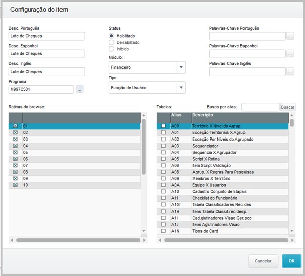{.flow-image}
#### Parâmetros:
<table class="banks-table">
  <thead>
    <tr>
      <th>Parâmetro</th>
      <th>Descrição</th>
    </tr>
  </thead>
  <tbody>
    <tr>
      <td><strong>MV_X997C01</strong></td>
      <td>Utiliza campo A1_X_PRMED (1) ou A1_COND (2) do Cliente para cálculo do Prazo Médio Cliente no Lote de Cheques de Recebimento. Ex: 1</td>
    </tr>
    <tr>
      <td><strong>MV_X997C02</strong></td>
      <td>Utiliza campo E1_EMISSÃO (1) ou E1_VENCREA (2) dos Títulos a Receber para composição da Dt Vencimento no Lote de Cheques de Recebimento: Ex: 1.</td>
    </tr>
    <tr>
      <td><strong>MV_X997C03</strong></td>
      <td>Tabela referente ao Lote Cheque de Terceiros. Ex: Z13.</td>
    </tr>
    <tr>
      <td><strong>MV_X997C04</strong></td>
      <td>Tabela referente aos títulos vinculados ao Lote Cheque de Terceiros. Ex: Z14.</td>
    </tr>
    <tr>
      <td><strong>MV_X997C05</strong></td>
      <td>Motivo de baixa utilizado para baixa dos cheques no Lote de Pagamento. Ex: DAC.</td>
     <tr>
      <td><strong>MV_X997C06</strong></td>
      <td>Prefixo considerado para a geração de títulos pelo processo de Lote Cheques de Terceiros. Ex: LOT.</td>
    </tr>
    <tr>
      <td><strong>MV_X997C07</strong></td>
      <td>Natureza considerada para a geração de títulos a pagar referente a NDF na inclusão de Lote Cheques de Terceiros com valor de cheque superior aos títulos a pagar. Ex: 1001010110.</td>
    </tr>
    <tr>
      <td><strong>MV_X997C08</strong></td>
      <td>Natureza considerada para a geração de títulos a pagar ao fornecedor referente a devolução de cheque vinculado a Lote Cheques de Terceiros de pagamento. Ex: 1001010110.</td>
    </tr>
    <tr>
      <td><strong>MV_X997C09</strong></td>
      <td>Tipo de título considerado para a geração de títulos a pagar ao fornecedor referente a devolução de cheque vinculado a Lote Cheques de Terceiros de pagamento. Ex: BOL.</td>
    </tr>
      <td><strong>MV_X997C10</strong></td>
      <td>Percentual mensal para cálculo de Juros Excedentes. Ex: 1.8.</td>
    </tr>
      <td><strong>MV_X997C11</strong></td>
      <td>Motivo de baixa utilizado para baixa dos títulos a receber com cheque no Lote de Recebimento. Ex: DAC.</td>
    </tr>
      <td><strong>MV_X997C12</strong></td>
      <td>Motivo de baixa utilizado para baixa dos títulos a receber em espécie no Lote de Recebimento. Ex: NOR.</td>
    </tr>
      <td><strong>MV_X997C13</strong></td>
      <td>Natureza considerada para a geração de títulos a receber referente a NCC no Lote de Recebimento. Ex: 1001010110.</td>
    </tr>
      <td><strong>MV_X997C14</strong></td>
      <td>Natureza considerada para a geração de títulos a receber referente a Juros Excedentes no Lote de Recebimento. Ex: 1001010110.</td>
    </tr>
      <td><strong>MV_X997C15</strong></td>
      <td>Natureza considerada para a geração de títulos a receber referente a Cheques recebidos via Lote de Recebimento. Ex: 1001010110.</td>
    </tr>
      <td><strong>MV_X997C16</strong></td>
      <td>Natureza considerada para gerar mov. bancário a receber referente ao valor em espécie recebido a maior via Lote de Recebimento. Ex: 1001010110.</td>
    </tr>
      <td><strong>MV_X997C17</strong></td>
      <td>Motivo de baixa utilizado para baixa dos títulos a receber de cheques no Lote de Depósito. Ex: DAC.</td>
    </tr>
      <td><strong>MV_X997C18</strong></td>
      <td>Natureza considerada para gerar mov. bancário a receber referente a compensação Lote de Depósito. 
Ex: 1001010110.</td>
    </tr>
      <td><strong>MV_X997C19</strong></td>
      <td>Natureza considerada para gerar mov. bancário a pagar referente a Tarifa no Lote de Depósito. 
Ex: 1001010110.</td>
    </tr>
      <td><strong>MV_X997C20</strong></td>
      <td>Natureza considerada para gerar mov. bancário a pagar referente a Taxa no Lote de Depósito. 
Ex: 1001010110.</td>
    </tr>
      <td><strong>MV_X997C21</strong></td>
      <td>Natureza considerada para gerar mov. bancário a pagar referente a IOF no Lote de Depósito. 
Ex: 1001010110.</td>
    </tr>
      <td><strong>MV_X997C22</strong></td>
      <td>Natureza considerada para gerar mov. bancário a pagar referente a IOF Diário no Lote de Depósito. 
Ex: 1001010110.</td>
    </tr>
      <td><strong>MV_X997C23</strong></td>
      <td>Natureza considerada para gerar mov. bancário a pagar referente a devolução de cheque vinculado em Lote de Depósito. 
Ex: 1001010110.</td>
    </tr>
      <td><strong>MV_X997C24</strong></td>
      <td>Habilita compartilhamento dos registros de cheques entre filiais na rotina de Lote de Cheques.
Ex: .F. \ .T.;</td>
    </tr>
    <tr>
  </tbody>
</table>

#### 2. FINANCEIRO
As informações apresentadas a seguir, referem-se a utilização dos recursos referentes ao Acelerador Controle de Cheques junto ao módulo Financeiro.

#### 2.1.	ATUALIZAÇÕES\CADASTROS\CLIENTES
Foram disponibilizados campos junto ao cadastro de Clientes – CRMA980.PRW

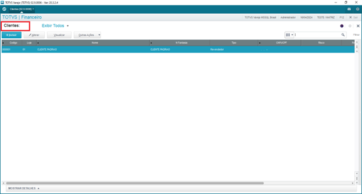{.flow-image}

Os novos campos, encontram-se disponíveis na sessão “Adm/Fin”.

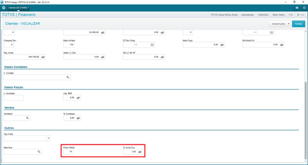{.flow-image}

Abaixo, são apresentados demais detalhes a respeito de ambos os campos disponibilizados na rotina de cadastro de Clientes: 

- <strong>COND. PAGTO</strong>
  - Condição de pagamento padrão aplicada para faturamento\vendas ao cliente.
  - Utilizada para cálculo do prazo médio do cliente (Lote Cheques – Recebimento).
    - Depende da configuração do parâmetro MV_X997C01.

- <strong>PRAZO MÉDIO</strong>
  - Utilizado para cálculo do prazo médio do cliente (Lote Cheques – Recebimento).
    - Depende da configuração do parâmetro MV_X997C01.

- <strong>% JUROS EXC</strong>
  - Percentual mensal de juros excedentes (Lote Cheques – Recebimento).
  - Ao incluir novos Clientes, seu valor é sugerido a partir da configuração do parâmetro MV_X997C510.

#### 2.2.	ATUALIZAÇÕES\CADASTROS\BANCOS

Foram disponibilizados campos junto ao cadastro de Bancos – MATA070.PRW

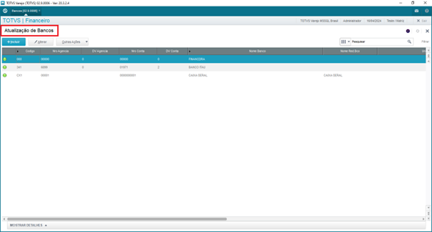{.flow-image}

Trata-se de campos referentes ao vínculo de Cliente (SA1) ao cadastro de bancos. Este vínculo de Cliente é necessário, nos cadastros de bancos que venham a ser utilizados na rotina de Lote de Cheques, para registro de lotes do tipo “Depósito”.

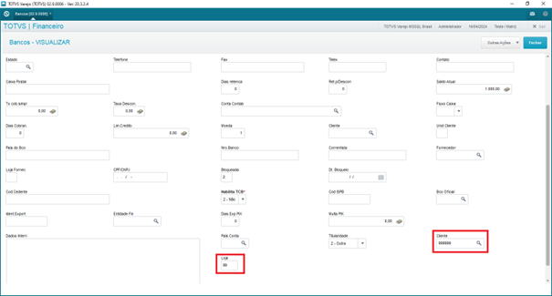{.flow-image}

#### 2.3.	ATUALIZAÇÕES\CONTAS A RECEBER\LIQUIDAÇÃO

A rotina de Liquidação – FINA460.PRW, possibilita que sejam realizadas operações referentes ao recebimento de títulos a receber de clientes, onde o recebimento ocorreu em cheques.

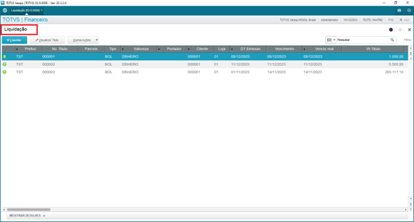{.flow-image}

Ao utilizar a rotina de Liquidação para registro do recebimento em cheques, deve-se atentar ao preenchimento dos campos necessários no grid de “Títulos Gerados”.

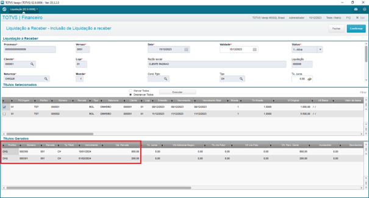{.flow-image}

A direita no grid de “Títulos Gerados”, existem campos específicos para a identificação dos cheques recebidos do cliente.

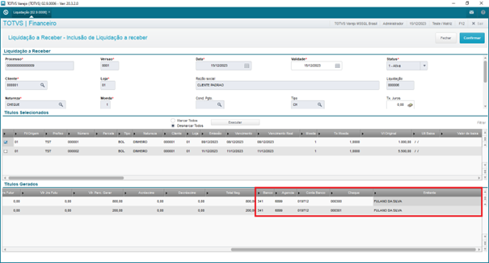{.flow-image}

Após confirmar a inclusão da Liquidação, é possível observar que os títulos recebidos foram “baixados”, sendo gerado novos títulos referentes aos “cheques”.

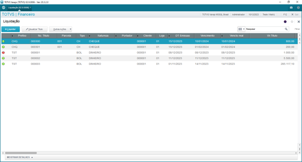{.flow-image}

<strong>ATENÇÃO:</strong> para que os cheques registrados a partir da rotina de Liquidação sejam válidos para a rotina de Lote de Cheques, obrigatoriamente os mesmos devem ser gerados com o Tipo = CH. Assim, poderão ser utilizados para lotes de depósito\pagamento.

#### 2.4.	ATUALIZAÇÕES\CONTAS A RECEBER\LOTE DE CHEQUES

Através do Acelerador de Controle de Cheques, é disponibilizado rotina específica denominada Lote de Cheques – M997C501.PRW.

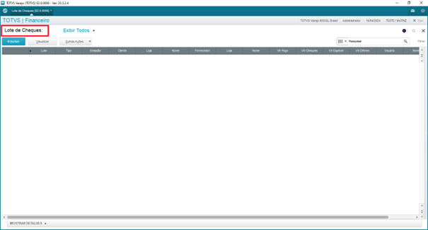{.flow-image}

A seguir, serão apresentadas informações a respeito das funcionalidades presentes no browse da rotina de Lote de Cheques.

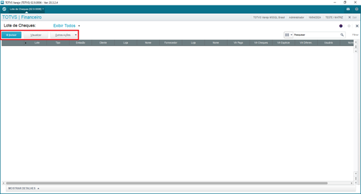{.flow-image}

<strong>INCLUIR</strong>

A funcionalidade “incluir”, disponibiliza regras para que seja realizado a inclusão do lote de cheques. Ao acionar esta funcionalidade, é disponibilizado tela para que o usuário determine qual o “tipo” do lote de cheques que será incluso.

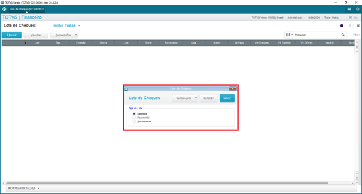{.flow-image}

<strong>RECEBIMENTO</strong>

Além da rotina de Liquidação, também é possível realizar o registro de recebimento financeiro de clientes com cheques, através da inclusão de lote de cheques do tipo “recebimento”.

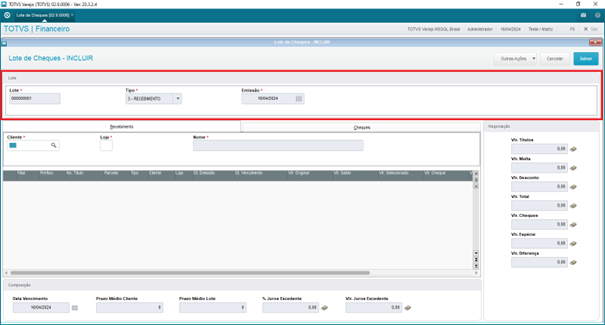{.flow-image}

Junto a sessão “Recebimento”, é necessário que seja informado o código\loja do Cliente do qual está sendo realizado o recebimento financeiro. Neste momento, será disponibilizado tela de parâmetros. Estes parâmetros, serão utilizados para busca dos títulos a receber (em Reais) em aberto existentes para recebimento.

{.flow-image}

Após confirmar os parâmetros, caso sejam localizados títulos a receber, estes serão apresentados no grid presente na sessão “Recebimento”.

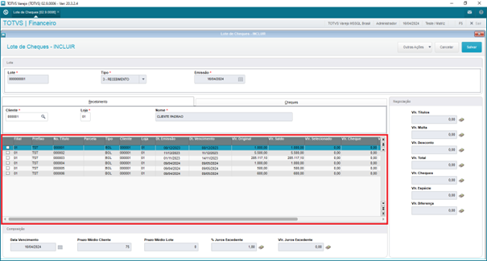{.flow-image}

Junto ao grid de títulos a receber, deve-se selecionar os títulos que serão recebidos através da inclusão do lote de cheques de recebimento. Ao selecionar individualmente cada título, é apresentado tela onde é possível definir o valor que será recebido, bem como, se existe incidência de descontos e\ou multa sob tal recebimento.

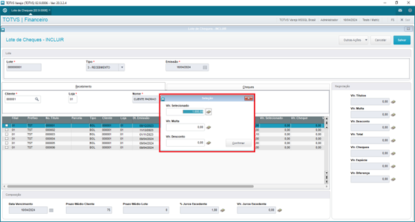{.flow-image}

Caso seja de interesse, selecionar todos os títulos a receber disponíveis no grid, pode-se utilizar recurso específico do grid. Para isto, basta clicar na área em destaque na imagem a seguir. Ao utilizar este recurso, será considerado o saldo a receber total de todos os títulos presentes no grid.

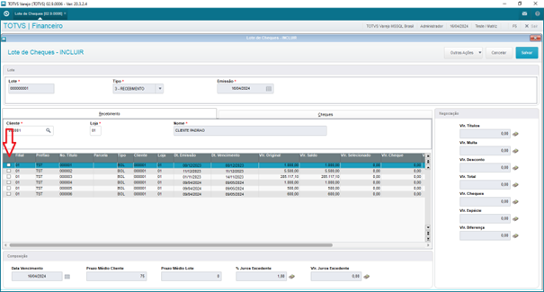{.flow-image}

A partir dos títulos a receber selecionados no grid de “Recebimento”, é possível identificar o valor total recebido referente aos mesmos, junto a campos da sessão “negociação”.

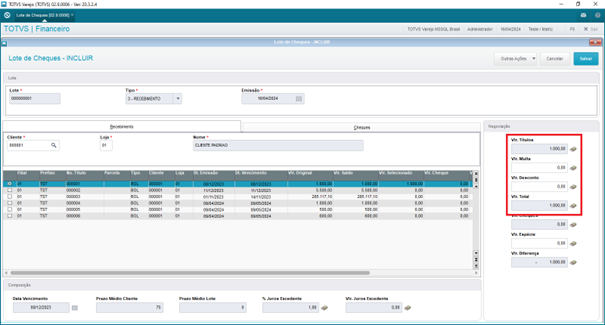{.flow-image}

Após a definição dos títulos a receber, deve-se registrar os cheques utilizados pelo cliente como forma de pagamento. Para isto, deve-se utilizar o botão “Adicionar” presente na sessão “Cheques”.

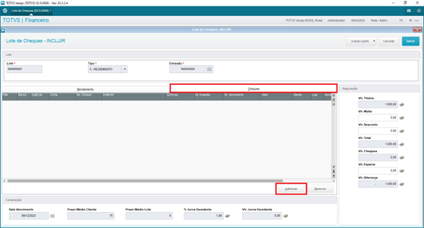{.flow-image}

Será apresentado tela para registro dos cheques repassados pelo cliente para o recebimento dos títulos financeiros selecionados. Caso possua leitora de cheques, é possível utilizar a mesma para obter as principais informações dos cheques, basta utilizar o campo “leitora” presente no cabeçalho da tela.

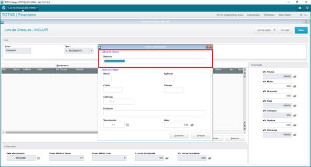{.flow-image}

Após a atualização dos demais campos com as informações obtidas da leitora de cheques, deve-se complementar as demais informações referentes ao cheque recebido.

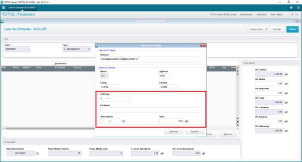{.flow-image}

Caso não tenha disponível leitora de cheques, pode-se informar manualmente todos os campos correspondentes aos dados do cheque recebido.

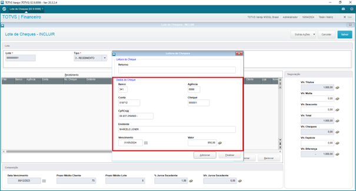{.flow-image}

Após identificar todas as informações do cheque, basta acionar o botão “Adicionar”. Assim, o cheque informado será adicionado ao lote e a tela será reinicializada para registro de um novo cheque.

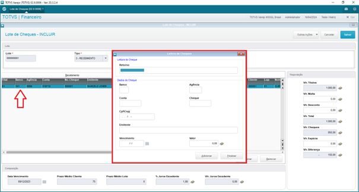{.flow-image}

Após finalizar o registro de todos os cheques, deve-se acionar o botão “Finalizar”, assim, será encerrado a tela de registro dos cheques do lote.

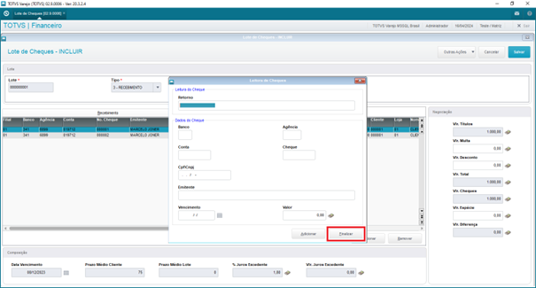{.flow-image}

A partir dos cheques vinculados ao lote de recebimento, serão executadas as regras referentes ao prazo médio de vencimento dos cheques. Caso o resultado seja superior ao prazo médio de vencimento do cliente, haverá cálculo de valor de juros excedentes. Estas informações, estão disponíveis no rodapé do lote de recebimento, junto a sessão denominada “Composição”.

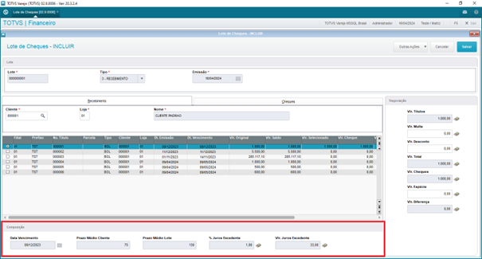{.flow-image}

Após o registro dos cheques, é possível também, visualizar a atualização das informações junto a sessão “Negociação”.

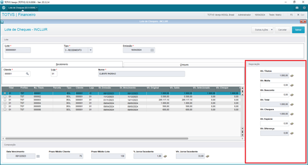{.flow-image}

Além do recebimento em cheques, também é possível ao incluir lote de cheques do tipo recebimento, informar a ocorrência de recebimento em espécie. Para isto, deve-se utilizar campo especifico presente na sessão “Negociação”.

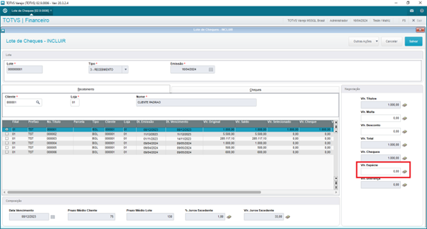{.flow-image}

Ao informar um “Vlr. Espécie”, será apresentado tela para registro dos bancos\caixas\valores recebidos.

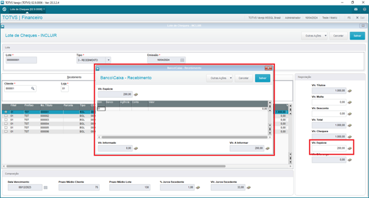{.flow-image}

Após distribuir todo o “Vlr. Espécie” entre um ou mais bancos\caixas, deve-se confirmar a tela.

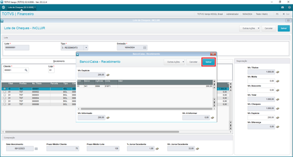{.flow-image}

Finalizado a definição das informações referentes ao lote de recebimento, basta confirmar a inclusão do lote.

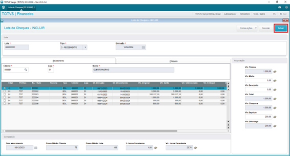{.flow-image}

Caso existam diferenças entre o “Vlr. Total” do lote de cheques, em relação ao “Vlr. Cheques + Vlr. Espécie”, será apresentada mensagem ao usuário, onde:

- VLR. DIFERENÇA > 0

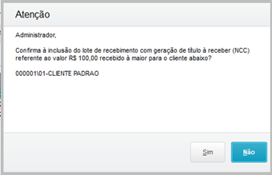{.flow-image}

- VLR. DIFERENÇA < 0

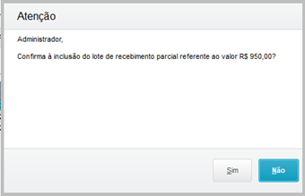{.flow-image}

Após a confirmação da mensagem (caso exista), serão executadas as regras de gravação do lote de cheques de recebimento. Associado a sua inclusão, serão gerados os movimentos financeiros correspondentes ao tipo do lote utilizado.

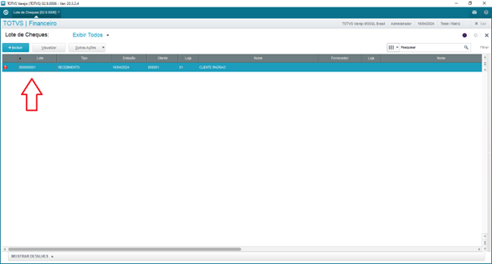{.flow-image}

<strong>PAGAMENTO</strong>

A partir da existência do registro de cheques recebidos de clientes (via Liquidação e\ou Lote Cheques - Recebimento), é possível utilizar estes cheques para realizar o pagamento de Fornecedores. Para isto, deve-se realizar a inclusão de um lote de “Pagamento”.

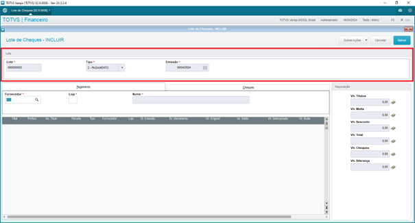{.flow-image}

Junto a sessão “Pagamento”, é necessário que seja informado o código\loja do Fornecedor do qual está sendo realizado o pagamento financeiro. Neste momento, será disponibilizado tela de parâmetros. Estes parâmetros, serão utilizados para busca dos títulos a pagar (em Reais) em aberto existentes para pagamento.

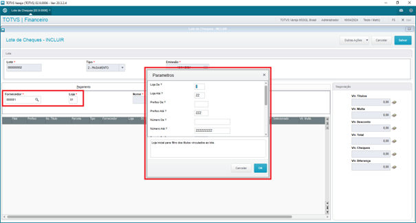{.flow-image}

Após confirmar os parâmetros, caso sejam localizados títulos a pagar, estes serão apresentados no grid presente na sessão “Pagamento”.

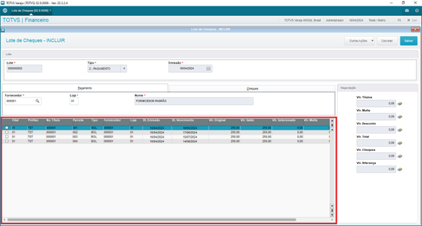{.flow-image}

Junto ao grid de títulos a pagar, deve-se selecionar os títulos que serão pagos através da inclusão do lote de cheques de pagamento. Ao selecionar individualmente cada título, é apresentado tela onde é possível definir o valor que será pago, bem como, se existe incidência de descontos e\ou multa sob tal pagamento.

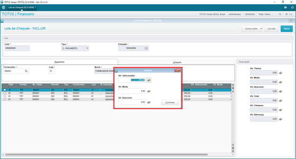{.flow-image}

Caso seja de interesse, selecionar todos os títulos a pagar disponíveis no grid, pode-se utilizar recurso específico do grid. Para isto, basta clicar na área em destaque na imagem a seguir. Ao utilizar este recurso, será considerado o saldo a pagar total de todos os títulos presentes no grid.

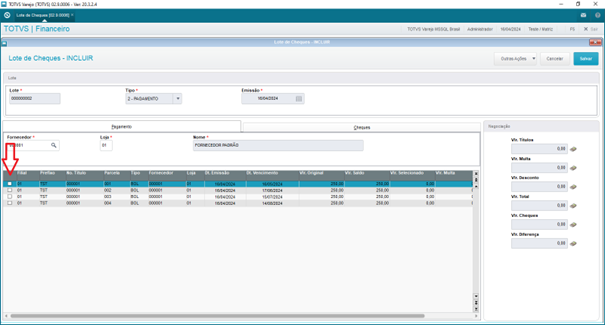{.flow-image}

A partir dos títulos a pagar selecionados no grid de “Pagamento”, é possível identificar o valor total pago referente aos mesmos, junto a campos da sessão “Negociação”.

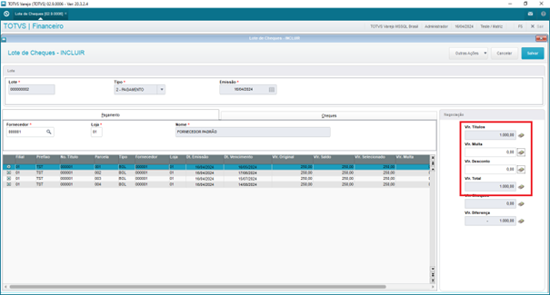{.flow-image}

Após a definição dos títulos a pagar considerados para composição do lote de cheques de pagamento, é necessário que sejam informados os cheques que serão utilizados para a realização do pagamento. Para isto, deve-se utilizar o botão “Adicionar” presente na sessão “Cheques”.

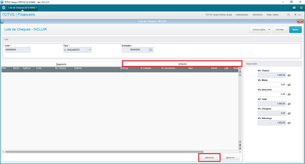{.flow-image}

Será disponibilizado tela, para vínculo dos cheques na composição do lote de pagamento. Caso exista leitora de cheques, poderá ser utilizado através do cabeçalho da tela.

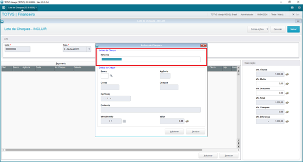{.flow-image}

Não havendo disponibilidade de lote de cheques, é possível realizar a busca do cheque através da consulta padrão (F3), disponível no campo “Banco”.

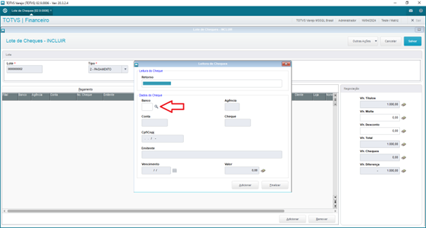{.flow-image}

Os registros disponibilizados com legenda na cor “verde”, referem-se há cheques que se encontram disponíveis para utilização no lote de pagamento.

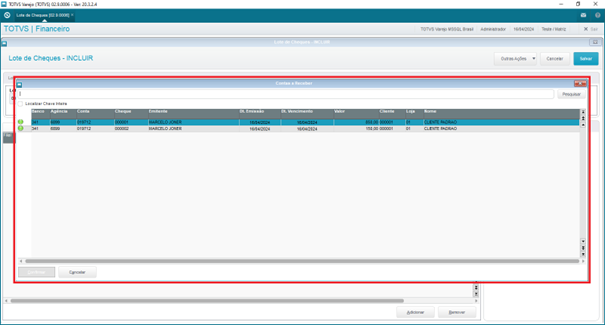{.flow-image}

Abaixo, apresenta-se o significado de cada uma das legendas presentes na consulta padrão de cheques:

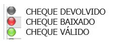{.flow-image}

Ao selecionar e confirmar a tela de consulta do cheque, serão atualizadas as informações do mesmo na tela principal. Desta forma, basta acionar o botão “Adicionar”.

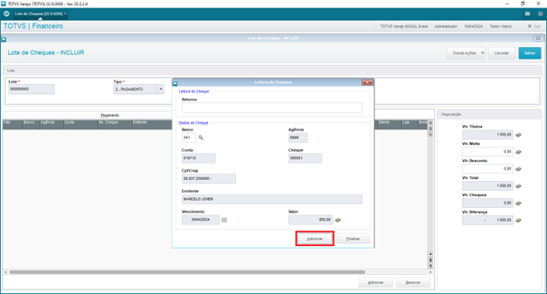{.flow-image}

Com a localização do cheque desejado e validação do mesmo, basta acionar o botão “Adicionar” para que seja vinculado ao lote de cheques. Assim, a tela será reinicializada, para que seja vinculado outro cheque ao lote.

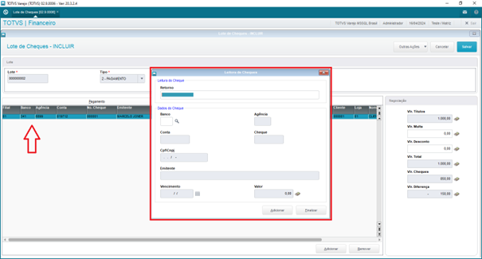{.flow-image}

Após finalizar as definições do lote de cheques de pagamento, basta confirmar a tela para que ocorra a gravação.

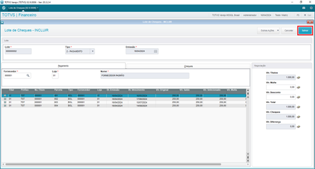{.flow-image}

Havendo diferenças, entre o “Vlr. Pagamento” e o “Vlr. Cheques”, serão executadas regras especificas, onde:

-	VLR. CHEQUES > VLR. PAGAMENTO
    - Será apresentado mensagem ao usuário, alertando a respeito da geração de título a pagar ao fornecedor do tipo NDF (nota débito do fornecedor), correspondente ao valor pago a maior.

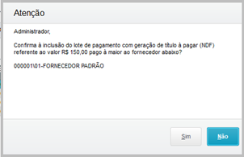{.flow-image}

- VLR. CHEQUES < VLR. PAGAMENTO
    - Será apresentado tela para informação do banco\caixa, a partir do qual, será registrado a saída em espécie do valor faltante para pagamento ao fornecedor.

{.flow-image}

Após a gravação do lote de cheques de pagamento, será retornado ao browse da rotina.

{.flow-image}

<strong>DEPÓSITO</strong>

Além da utilização dos cheques para pagamento de fornecedores, também é possível, utilizar os mesmos para que sejam descontados junto a instituição financeira. Nestes casos, deve-se realizar a inclusão de um lote de cheques do tipo “depósito”.

{.flow-image}

Através do botão “Adicionar” presente no rodapé da tela, será apresentado tela para busca\vinculo dos cheques ao lote de depósito.

{.flow-image}

Junto a interface disponibilizada, deverá ser realizado a leitura\busca de cada um dos cheques disponíveis\válidos para utilização no lote de depósito.

{.flow-image}

Após o vínculo dos cheques ao lote de depósito, é necessário informar na sessão “Depósito”, o banco\caixa em que ocorrerá o depósito dos mesmos.

{.flow-image}

Ao realizar a inclusão do lote de depósito, podem ser vinculadas ao mesmo, informações complementares, referentes há incidência de Impostos, Tarifas e Taxas. Para isto, deve-se utilizar os campos disponíveis no rodapé da interface.

{.flow-image}

A partir dos campos disponíveis, serão executadas as regras de cálculo das Tarifas\Taxas que venham a ter incidência sob o lote de depósito, impactando na composição dos totais do lote em questão.

{.flow-image}

Finalizado a definição do lote de cheques de depósito, basta confirmar a tela para que ocorra a gravação do lote e geração dos movimentos financeiros correspondentes.

{.flow-image}

Após o término da gravação do lote de cheques de depósito, será retornado ao browse da rotina.

{.flow-image}

Diferente da inclusão dos lotes de recebimento e pagamento, ao realizar a inclusão de lote de depósito, é possível identificar que a legenda do mesmo após inclusão é diferente, indicando que se trata de um lote que encontra-se “pendente”.

{.flow-image}

Este comportamento ocorre, devido ao fato em que o registro do lote de depósito ocorre em duas etapas distintas. Após sua inclusão, o mesmo deverá posteriormente ser complementado, através da utilização da funcionalidade “Finalizar”, disponível no browse da rotina em “Outras Ações”.

<strong>RECUSA DE CHEQUES</strong>

Funcionalidade disponível no browse da rotina de Lote de Cheques em “Outras Ações\Recusar\Cheques”.

{.flow-image}

A funcionalidade “Recusar\Cheques”, aplica-se único e exclusivamente, sob lotes de depósito, que estejam “pendentes”. Ou seja, ao tentar utilizar a funcionalidade sob um lote que não atenda a estes requisitos, não será permitido sua utilização.

{.flow-image}

Uma vez que a funcionalidade seja executada sob lote de depósito que esteja “pendente”, será disponibilizado a interface, diretamente na tela de definição dos cheques do lote, que serão recusados.

{.flow-image}

Através do botão “Adicionar”, serão disponibilizados recursos para busca\vínculo dos cheques do lote de depósito manipulado, que serão recusados junto ao lote.

{.flow-image}

Junto a tela apresentada, é possível ler o cheque utilizando leitora de cheques. Caso contrário, pode ser realizado a busca do cheque através da consulta padrão no campo “Banco”. Na consulta, serão apresentados apenas os cheques válidos (não devolvidos \ não recusados) que estão vinculados ao lote.

{.flow-image}

Após vincular os cheques do lote de depósito que serão recusados, é apresentado na parte superior, totalizador referente ao valor dos mesmos.

{.flow-image}

Finalizado a definição dos cheques que serão recusados, basta confirmar a tela.

{.flow-image}

Será apresentado a tela principal do lote de depósito. Na parte direita da tela, serão atualizados os totalizadores, conforme os cheques vinculados para realização da recusa.

{.flow-image}

<strong>ATENÇÃO:</strong> A funcionalidade “Recusar \ Cheques”, pode ser executada quantas vezes for necessário sob um mesmo lote de depósito. Para isto, é necessário que o lote esteja “Pendente” e existam cheques válidos vinculados ao lote.

Para finalizar o processo de recusa dos cheques no lote de depósito, basta confirmar a tela principal.

{.flow-image}

Será então, realizado a execução das regras de processamento da recusa dos cheques. Neste processo, os cheques têm o seu vínculo removido do lote de depósito, estando aptos\disponíveis para utilização em novos lotes de depósito ou pagamento. Portanto, o status do lote de depósito não é modificado, ou seja, permanece “Pendente”.

{.flow-image}

<strong>ATENÇÃO:</strong> Não é possível cancelar a recusa de cheques. Ou seja, uma vez que é executado a funcionalidade “Recusar \ Cheques”, para um ou mais cheques de um lote de depósito, não é possível reverter a ação realizada.

Ao utilizar a funcionalidade “Visualizar” sob um lote de depósito, que teve recusa de um ou mais cheques, encontra-se disponível em “Outras Ações”, a funcionalidade “Cheques Recusados”.

{.flow-image}

Será disponibilizado tela, com informações a respeito dos cheques que faziam parte do lote de depósito e que sofreram o processo de recusa de cheques.

{.flow-image}

Ao utilizar a funcionalidade de “Consulta” do histórico de cheques, disponível no browse da rotina em “Outras Ações”, caso exista histórico de recusa do cheque em um ou mais lotes de depósito, serão apresentadas informações a respeito.

{.flow-image}

<strong>FINALIZAR</strong>

Funcionalidade disponível no browse da rotina de Lote de Cheques em “Outras Ações”.

{.flow-image}

A funcionalidade “Finalizar”, aplica-se único e exclusivamente, sob lotes de depósito, que estejam “pendentes”. Ou seja, ao tentar utilizar a funcionalidade sob um lote que não atenda a estes requisitos, não será permitido sua utilização.

{.flow-image}

Uma vez que a funcionalidade seja executada sob lote de depósito que esteja “pendente”, será disponibilizado a interface com layout referente há lote de depósito.

{.flow-image}

Junto ao rodapé da interface, será disponibilizado a edição dos campos referentes há valor de Impostos, Tarifa e Taxas os quais foram calculados na inclusão do lote de depósito. Desta forma, é possível editar os valores, conforme o que realmente teve de incidência por parte da instituição financeira na operação de depósito em questão.

{.flow-image}

A partir da edição dos valores de Impostos\Tarifas\Taxas, ocorrerá a atualização dos totais do lote de depósito junto a sessão de “Depósito”, impactando, no valor líquido referente ao respectivo lote de depósito.

{.flow-image}

Ainda junto a sessão de “Depósito”, caso tenha sido recebido por parte da instituição financeira envolvida no lote de depósito, cheques referentes a parte\totalidade do valor líquido do lote, o valor total destes cheques deverá ser indicado em campo específico.

{.flow-image}

Ao editar o campo “Vlr. Cheque”, será disponibilizado interface secundária, através da qual, deverá ser realizado a leitur\registro das informações de cada um dos cheques repassados pela instituição financeira, referente ao valor líquido (parcial\total) do respectivo lote de depósito.

{.flow-image}

Para realizar a leitura\registro dos cheques recebidos através do lote de depósito, deve-se acionar o botão “Adicionar”, presente na parte inferior da tela.

{.flow-image}

<strong>ATENÇÃO:</strong> Para que seja possível registrar o recebimento de cheques na finalização do lote de depósito, é necessário, que exista cadastro de Cliente (SA1) referente há instituição financeira utilizada no lote. Este cliente, deve estar vinculado ao cadastro de Bancos (SA6) no cadastro da respectiva instituição financeira.

Para que seja possível confirmar a interface secundária de registro dos cheques recebidos através do lote de depósito, é necessário que o valor total dos cheques registrados, seja igual ao valor informado no campo “Vlr. Cheque”.

{.flow-image}

A diferença entre o “Vlr. Líquido” e o “Vlr. Cheque” presentes na sessão “Depósito”, corresponde ao “Vlr. Espécie”, ou seja, valor que fora repassado em espécie pela instituição financeira vinculada ao lote de depósito que está sendo finalizado.

{.flow-image}

Uma vez que tenha sido realizado o complemento das informações referentes ao lote de depósito manipulado, é possível realizar a confirmação da interface de finalização do mesmo.

{.flow-image}

Ocorrerá então, o registro dos cheques recebidos através do lote de depósito (caso existam), bem como, a geração dos movimentos bancários (receber\pagar) referente ao valor recebido em espécie e, descontos de impostos\tarifa\taxas junto a movimentação da instituição financeira vinculada ao lote. A partir da realização da finalização do lote de depósito, este por sua vez, assume legenda indicando que está finalizado.

{.flow-image}

<strong>ATENÇÃO:</strong> Os movimentos bancários a pagar, referentes aos valores de impostos\tarifas\taxas incidentes sob o lote de depósito, serão gerados conforme as Naturezas Financeiras vinculadas aos parâmetros (SX6) de configuração. Caso uma mesma natureza seja aplicada há mais de um destes itens, o valor dos mesmos será “somado” em um único movimento bancário por cada natureza.

<strong>VISUALIZAR</strong>

Através da funcionalidade “visualizar”, é possível realizar consulta ao lote de cheques posicionado.

<strong>RECEBIMENTO</strong>

Apresenta informações a respeito de lote de cheques do tipo “recebimento”.

{.flow-image}

Em “Outras Ações\Recebimento Financeiro”, será disponibilizado tela para o detalhamento dos bancos\caixas em que foi registrado recebimento em espécie vinculado ao lote.

{.flow-image}

<strong>PAGAMENTO</strong>

Apresenta informações a respeito de lote de cheques do tipo “pagamento”.

{.flow-image}

Em “Outras Ações\Pagamento Financeiro”, será disponibilizado tela de informações do banco\caixa considerado para realização de pagamento em espécie ao fornecedor.

{.flow-image}

<strong>DEPÓSITO</strong>

Apresenta informações a respeito de lote de cheques do tipo “depósito”.

{.flow-image}

Em “Outras Ações\Recebimento Cheques”, será disponibilizado tela de informações dos cheques que foram recebidos através da finalização do lote de depósito.

{.flow-image} 

Em “Outras Ações\Recebimento Financeiro”, será disponibilizado tela para o detalhamento do recebimento em espécie vinculado ao lote de depósito.

{.flow-image}

<strong>EXCLUIR</strong>

A exemplo da funcionalidade “Visualizar”, ao executar a funcionalidade “Excluir”, será apresentado a interface conforme o tipo do lote de cheque posicionado no browse no ato da execução.

{.flow-image}

Ao confirmar a interface da funcionalidade “Excluir”, serão executadas regras de validação conforme o tipo do lote de cheques manipulado (Depósito\Pagamento\Recebimento). Caso uma das regras aplicadas não seja contemplada, será apresentado mensagem ao usuário, não sendo permito realizar a exclusão do respectivo lote, conforme o exemplo apresentado a seguir.

{.flow-image}

<strong>IMPRIMIR</strong>

A funcionalidade “Imprimir”, disponibiliza impressão de um resumo das principais informações vinculadas ao lote de cheque posicionado no browse. O layout de impressão, é alterado conforme o tipo do lote de cheques.

<strong>RECEBIMENTO</strong>

{.flow-image}

<strong>PAGAMENTO</strong>

{.flow-image}

<strong>DEPÓSITO</strong>

{.flow-image}

<strong>CONSULTA</strong>

Para auxiliar a rastrear as informações referentes aos cheques recebidos de clientes, foi disponibilizado a funcionalidade denominada “Consulta”.

{.flow-image}

A partir da identificação do cheque (manual \ via leitora), serão apresentadas as informações correspondentes ao mesmo.

{.flow-image}

Caso exista ocorrência de devolução sob o cheque consultado, serão apresentadas informações a respeito junto a sessão “Histórico” presente no layout da tela.

{.flow-image}

#### 2.5.ATUALIZAÇÕES\CONTAS A RECEBER\BAIXAS A RECEBER

Ao realizar a utilização da rotina de Lote de Cheques registrando lotes dos tipos depósito ou pagamento, serão utilizados títulos a receber referentes a “cheques”. Estes por sua vez, serão baixados conforme o tipo do lote de cheques em que foram utilizados.

{.flow-image}

Caso existam situações de “devolução” de cheques, deverá ser localizado o título a receber correspondente ao cheque no browse da rotina de Baixas a Receber\Funções Contas a Receber e em seguida, realizar a exclusão\cancelamento da baixa.

{.flow-image}

Desta forma, será apresentado mensagem correspondente ao movimento financeiro que será gerado devido a devolução do cheque manipulado. Veja a seguir, o comportamento que ocorrerá conforme o tipo do lote de cheques em que o cheque devolvido foi utilizado.

  -	LOTE PAGAMENTO
    - A mensagem apresentada, refere-se há geração de título a pagar ao fornecedor\loja referente ao lote de pagamento em que o cheque foi utilizado.
    - Assim, através do título a pagar poderá ser restituído o valor financeiro ao fornecedor, correspondente ao cheque que teve incidência de devolução.

{.flow-image}

  - Portanto, os títulos a pagar (SE2) vinculados ao lote de pagamento em que o cheque devolvido, não serão “reabertos”. Desta forma, será gerado um “novo título a pagar” ao fornecedor em questão, para que seja realizado a “restituição” do cheque que foi devolvido.
  - Este novo título a pagar (SE2), será gerado com as informações de identificação do lote de cheques no qual, foi utilizado para pagamento, o cheque devolvido.

{.flow-image}

-	Ao visualizar o novo título a pagar gerado, é possível junto ao campo de “observações”, identificar informações referentes ao cheque que foi utilizado para pagamento ao fornecedor e que foi devolvido, gerando este novo título a pagar para restituição ao fornecedor.

{.flow-image}

O novo título a pagar (SE2) que foi gerado para restituição do fornecedor, do valor do cheque devolvido, poderá ser utilizado em novos lotes de cheque do tipo pagamento.

  - LOTE DEVOLUÇÃO
    - A mensagem apresentada, refere-se há confirmação por parte do usuário, de que ocorrerá a devolução do cheque correspondente ao título a receber, que teve sua baixa, gerada pela inclusão\finalização do lote de depósito.

{.flow-image}

  -	Desta forma, ao confirmar a mensagem apresentada, será realizado a inclusão de Mov. Bancário (a pagar) no Banco\Caixa do lote de depósito o qual gerou a baixa do título a receber do cheque que foi devolvido.
  -	Este movimento bancário, será gerado do valor integral do cheque, utilizando-se da natureza financeira vinculada ao parâmetro MV_X997C23.

{.flow-image}

<strong>ATENÇÃO:</strong> Após o cheque ser “devolvido”, o título a receber do mesmo fica em aberto. Assim, é possível realizar a cobrança do cliente que repassou o cheque, pois é o cliente\loja vinculado ao mesmo. A referida “cobrança”, poderá ocorrer através da inclusão de um novo Lote de Recebimento.

